Martin H. Trauth

## 地球科学Python食谱

第二版

## Springer地球科学、地理与环境学教材系列

Springer教材系列出版了涵盖地球科学、地理与环境科学的广泛教材。Springer教材既提供全面的入门介绍，也为深入研究提供详尽知识。清晰、易读的版式设计，以及章末总结、实例演示、练习题和术语表等特色内容，帮助读者更好地掌握学科知识。Springer教材是学生、研究人员和应用科学家的必备读物。

Martin H. Trauth

## 地球科学Python食谱

第二版

Martin H. Trauth
地球科学研究所
波茨坦大学
波茨坦，勃兰登堡，德国

ISSN 2510-1307
ISSN 2510-1315（电子版）
Springer地球科学、地理与环境学教材系列
ISBN 978-3-031-56905-0
ISBN 978-3-031-56906-7（电子书）
https://doi.org/10.1007/978-3-031-56906-7

© 编者（如适用）与作者，经Springer Nature Switzerland AG独家许可，2024年出版

本作品受版权保护。所有权利均由出版商独家许可，无论涉及材料的全部或部分，特别是翻译权、转载权、插图重用权、朗诵权、广播权、以缩微胶片或任何其他物理方式复制的权利，以及信息存储与检索、电子改编、计算机软件，或以目前已知或未来开发的类似或不同方法进行传输的权利。
本出版物中使用的一般性描述名称、注册名称、商标、服务标志等，即使没有特别声明，也不意味着这些名称不受相关保护性法律法规的约束，因此可以自由使用。
出版商、作者和编辑有理由相信，本书中的建议和信息在出版之日是真实准确的。无论是出版商还是作者或编辑，均不对本书所含材料或可能存在的任何错误或遗漏提供任何明示或暗示的担保。出版商对已出版地图中的管辖权主张和机构隶属关系保持中立。

本Springer印记由注册公司Springer Nature Switzerland AG出版
注册公司地址：Gewerbestrasse 11, 6330 Cham, Switzerland

如需处理本产品，请回收纸张。

## 前言

《地球科学Python食谱》一书旨在帮助本科生、研究生、博士生、博士后研究人员以及专业人士，快速解决地球科学中常见的数据分析问题。本书提供了最少的理论背景，并通过示例演示了所有描述方法的应用。本书基于我多年前编写的广受欢迎的《地球科学MATLAB食谱》一书，该书现已出版第6版（Springer 2024）。这本新书的构想是，以W.H. Press、S.A. Teukolsky、W.T. Vetterling和B.P. Flannery所著经典《数值食谱》（剑桥大学出版社，2007年）的精神，将MATLAB书中的文本翻译成另一种日益流行的编程语言。

本书包含Python脚本，可用于通过简单统计、时间序列分析、地统计学和图像处理来解决地球科学中的典型问题。它还演示了选定的高级数据分析技术的应用，如非线性时间序列分析、自适应滤波、自助法和地形分析。补充电子材料（可通过Springer Link在线获取）包括本书中的示例数据和Python命令。Python代码可以轻松修改，以用于读者自己的数据和项目。

选择使用Python软件——它已有30多年历史——是因为它不仅为大多数数据分析方法提供了大量现成的算法，还允许修改和扩展现有程序，并能开发新软件。然而，在使用任何Python特定函数之前，大多数方法都使用非常简单的代码进行介绍。因此，使用Python替代品的读者也会发现本书的价值。

为了从本书中获得最大收益，读者需要能够访问Python软件，并在阅读时能够执行这些食谱。Python食谱会在屏幕上生成各种图形，这些图形未在印刷版中显示。不过，这本教程式的书包含大量插图，因此即使不实际运行代码，也可以通读全文。

在计算机上运行Python。我使用Python 3.8.8开发了这些食谱，但大多数食谱也适用于早期版本的软件，但不适用于Python 2。虽然参加数据分析课程的本科生可能希望通读全书，但经验更丰富的读者可能只选择参考某一特定方法来解决特定问题。因此，下文概述了本书的概念和各章内容，以便具有不同需求的读者更容易使用。

- 第1章——本章介绍样本和总体的一些基本概念。它还将各种类型的数据以及可以使用这些数据回答的问题与后续章节中描述的方法联系起来。
- 第2章——本章为地球科学家提供了Python的教程式入门。已经熟悉该软件的读者建议直接进入后续章节。
- 第3章和第4章——这两章涵盖单变量和双变量统计的基础知识。它们包含统计学的基本概念，并介绍了高级主题，如重采样方案和交叉验证。已经熟悉基础统计学的读者可能希望跳过这些章节。
- 第5章和第6章——希望处理时间序列的读者建议阅读这两章。时间序列分析和信号处理密切相关。在第二版中，第5章现在以关于傅里叶变换的新章节开始，随后是基于它的方法。后续章节（其中一些是多年前撰写的）已修订以形成教学序列。第5章还包括一个关于Thomson多锥度方法的新章节。
- 第7章和第8章——我建议通读这两章，因为空间数据和图像的处理方法有很多共同之处。此外，在地球科学中，空间数据和图像经常结合使用，例如，将卫星图像投影到数字高程模型上。第7章已更新，例如，考虑了用于数字地形模型的数据集的变化，如分辨率为15弧秒的新ETOPO 2022。关于网格化和等值线的第7.6节和第7.7节已修订和更新。第8章现在包含一个关于从图像中去除周期性噪声的章节，以及一个扩展的关于量化显微图像中木炭的章节。第8.13节在本书Python版本的前一版中不存在，现已添加。
- 第9章——地球科学中的数据集通常具有许多变量和许多数据点。多元方法应用于各种大型数据集，包括卫星图像数据。任何对多元方法特别感兴趣的读者，建议在进入本章之前先阅读第3章和第4章。关于主成分分析的第9.2节和关于对数比变换的第9.7节也已更新和扩展。
- 第10章——分析圆形和球形数据的方法在地球科学中广泛使用。例如，构造地质学家测量和分析断层面上擦痕（或条痕）的方位，以及圆形数据的统计分析在古地磁学中得到应用。微观结构研究包括薄片中颗粒形状和石英c轴取向的分析。

使用本书时，重要的是要记住它基于一本使用MATLAB进行地球科学数据分析的书。我们已尽力尽可能贴近MATELAB原书的教学理念和文本，即使这对某些Python用户来说可能显得不寻常或笨拙。另一方面，对于许多因各种原因从MATLAB转向Python的用户来说，这种教学理念将是熟悉的。这些用户和我一样，熟悉MATLAB，并首先在Python中寻找类似的解决方案，而不是从头开始编写Python代码。这种情况非常常见，并反映在许多Python包中，例如NumPy和Matplotlib，它们与MATLAB工具箱高度相似，甚至函数名称和输入参数都相同。

将两本书并排阅读的读者会注意到，我直接翻译了代码，以使数值和图形输出尽可能相似。然而，由于MATLAB和Python使用不同的随机数生成器，结果并不总是彼此匹配。在这些情况下，生成合成数据后，Python示例中使用了MATLAB生成的样本文件以重现结果。在MATLAB产生零结果而Python产生略微不同于零的结果（例如-3.0552e-17）的情况下，也可能存在一些差异。这些差异可能是由于许多Python包中浮点误差缓解措施不够严格造成的。

细心的读者还会注意到，在某些情况下，Python生成的图形与本书前半部分的插图之间存在细微差异。这也是由于此处使用的随机数生成器提供不同的结果，并且并非所有使用的随机数生成器都可以重置。因此，某些结果（例如，自助法结果）在不同运行之间会有所不同。然而，这些图形至少在定性上反映了统计、时间序列分析和信号处理的结果。对于本书的后半部分，图形是重新创建的，以反映Matplotlib和PyGMT等图形包输出的特性，这无疑带来了一些非常好的结果。

我基于MATLAB脚本编写了Python脚本，尽我所知，并得到了以下提到的同事的支持。但是，我无法提供任何保证，特别是在使用Python和Python包等本身不提供保证的软件时。例如，我发现Python和MATLAB的结果之间存在一些差异，我将其归因于某些Python包的轻微浮点问题，例如在计算中使用非常小的值而不是（正确地）零。我在文本中已标记了这些差异。我建议读者在将代码应用于真实示例之前，始终使用合成示例进行测试（无论是使用Python还是MATLAB），因为用户在使用浮点数时也可能犯自己的错误。

本书受益于许多人的评论，特别是我的撰稿人Robin Gebbers和Norbert Marwan，以及全球许多阅读过本书、指出错误并提出改进建议的同事和朋友。我感谢Ed Manning和Ryan DeLaney的专业校对，这极大地提高了本书的可读性。我也非常感谢*blae*tterwaldDesign的Elisabeth Sillmann的专业知识和耐心，她在平面设计方面给予我支持和建议。我非常感谢Annett Büttner、Marion Schneider、Helen Rachner、Nirmal Iyer、Stefan Kreickenbaum以及他们在*Springer*的团队，他们对我出版书籍持续感兴趣和支持。我非常感谢Nadine Berner、Bodo Bookhagen、Matt Hall、Hauke Krämer、Pawel Lachowicz、Norbert Marwan、Francesco Ottaviani和Maurizio Petrelli回答我的Python问题。我还要感谢Andreas Bohlen、Ingo Orgzall以及他们在*UP Transfer GmbH*的团队，在过去的二十年里，他们在基尔大学、不来梅大学、布拉迪斯拉发大学、根特大学、慕尼黑大学、内罗毕大学、科隆大学、斯德哥尔摩大学、阿姆斯特丹大学、阿伯里斯特威斯大学和波茨坦大学，以及巴塞罗那自治大学、伦敦大学学院、布朗大学普罗维登斯分校、汉诺威联邦地球科学与自然资源研究所、拜罗伊特地球科学研究所、维也纳自然历史博物馆和惠灵顿GNS科学研究所组织了关于本书的短期课程。

我还要感谢*NASA/GSFC/METI/ERSDAC/JAROS*和*美国/日本ASTER科学团队*以及主任Mike Abrams允许我在本书中包含ASTER图像。我还要感谢NASA戈达德太空飞行中心（GSFC）的Stuart W. Frye和他的团队允许我包含EO-1数据，以及我们在处理Hyperion图像部分时富有成效的讨论。

波茨坦
2024年1月

Martin H. Trauth

## 目录

- 1 地球科学中的数据分析

## 目录

- 4 双变量统计

## 目录

7.5 航天飞机雷达地形测绘任务 SRTM

7.5.1 SRTM数据获取与处理

SRTM任务通过航天飞机搭载的雷达干涉测量系统，获取了全球范围内的高精度地形数据。该任务采用C波段和X波段雷达，通过两次通过同一区域时形成的干涉图来计算地面高程。数据处理过程中，需要消除大气延迟、轨道误差等影响，最终生成数字高程模型（DEM）。

7.5.2 SRTM数据产品

SRTM数据产品主要包括以下几种：

- SRTM-1：分辨率约为30米（1角秒），覆盖美国本土。
- SRTM-3：分辨率约为90米（3角秒），覆盖全球陆地表面（北纬60°至南纬56°之间）。
- SRTM-4：经过进一步处理和填补空洞的版本，提高了数据质量。

这些数据产品广泛应用于地形分析、水文建模、灾害评估等领域。

7.5.3 SRTM数据的应用

SRTM数据在多个领域具有重要应用价值：

- 地形制图：生成高精度地形图，支持城市规划、基础设施建设。
- 水文分析：模拟水流路径、划分流域，用于水资源管理和洪水预测。
- 地质研究：分析构造地貌、火山地形等，辅助地质调查。
- 生态建模：结合植被指数，评估生态系统结构和功能。
- 灾害监测：监测地震、滑坡等地质灾害的形变和影响范围。

7.5.4 SRTM数据的局限性

尽管SRTM数据具有广泛的应用，但也存在一些局限性：

- 覆盖范围：未覆盖高纬度地区（北纬60°以北和南纬56°以南）。
- 分辨率限制：对于精细尺度分析，90米分辨率可能不足。
- 数据质量：在陡峭地形或密集植被区域，可能存在高程误差。
- 时间性：数据获取于2000年，可能无法反映最新的地表变化。

因此，在使用SRTM数据时，需要结合其他数据源和实地调查进行验证和补充。

## 地球科学中的数据分析

### 1.1 引言

地球科学家对地球上的自然过程进行观测并收集数据。他们针对作用于特定区域并塑造其结构的力提出并检验假设，同时也对地球的未来变化做出预测。探索地球的这些步骤都涉及获取和分析数值数据。因此，地球科学家需要牢固掌握统计和数值方法，并具备使用相关计算机软件包的能力，以便能够分析所获取的数据。

本书介绍了地球科学中一些最重要的数据分析方法，并通过Python软件包的示例来说明其应用。读者在理解了这些使用合成数据的示例应用后，可以将其作为分析自己数据的范例。本导论章节在第1.2节讨论数据获取，第1.3节讨论数据类型，第1.4节讨论分析地球科学数据的适当方法。因此，我们首先探讨典型数据集的特征，随后研究使用Python分析数据的各种方法。

### 1.2 数据收集

地球科学中的大多数数据集样本量非常有限，并且包含大量不确定性。此类数据集通常用于描述相当大的自然现象，例如一个花岗岩体、一次大型滑坡或一个广泛分布的沉积单元。本书描述的方法旨在寻找一种方法，从一个小得多的*样本*（图1.1）来预测一个更大*总体*的特征。

需要注意的是，根据研究背景中关注的总体，在野外获得的样本（例如一块花岗岩）不一定等同于后来被描述为统计样本的东西。如果研究对象是花岗岩样本的化学成分，那么样本就是对花岗岩子样本进行重复测量的集合。然而，如果研究者更感兴趣的是整个花岗岩体的化学成分，那么样本则由来自该花岗岩体的几个（最好是具有代表性的）岩石样本的化学成分组成。

无论如何，选择合适的采样策略是获得良好数据集的第一步。制定成功的野外采样策略需要就*样本量*和*空间采样方案*做出决定。样本量（再次针对岩石样本）由样本的体积和/或重量决定，或者（对于统计样本）由从花岗岩体采集的岩石样本数量决定。如果总体是异质的，样本需要足够大以代表总体的变异性；然而，样本也应尽可能小，以最小化分析所需的时间和成本。建议在确定合适的样本量之前，先收集较小的试点样本。

空间采样方案的设计取决于露头或其他适合采样的材料的可用性（图1.2）。在采石场采样通常导致聚集数据，而沿着道路切面、海岸悬崖或陡峭峡谷采样则导致一维横断面采样方案。在露头100%出露或没有经济限制的情况下，可以设计更均匀的采样模式。规则采样方案导致样本位置呈网格状分布，而均匀采样策略则包括在网格方块内随机设置采样点。尽管这些采样方案可能被认为是更优的样本收集方法，但等间距的采样位置往往会遗漏该区域的小尺度变化，例如花岗岩体内的薄基性岩脉或某种特定化石在空间上的有限分布。

正确的采样策略取决于调查目标、所需的分析类型以及对结果的期望置信水平。一旦选择了合适的采样策略，样本的质量可能受到多种因素的影响，从而导致样本不能真正代表更大的总体。化学或物理蚀变、其他材料的污染，或自然及人为过程的位移都可能导致错误的结果和解释。因此，建议在调查的每个阶段都测试样本质量、所采用的数据分析方法以及从分析中得出的结论的有效性。

### 1.3 数据类型

大多数地球科学数据集由数值测量组成，尽管一些信息，如化石和矿物，也可以用名称列表来表示（图1.3）。可用的数据分析方法可能需要地球科学中的某些数据类型。这些数据类型包括：

- *名义数据*——地球科学中的信息有时以名称列表的形式呈现，例如从石灰岩层中采集的各种化石物种，或在岩石薄片中鉴定出的矿物。在一些研究中，这些数据被转换为二进制表示，即存在为*1*，不存在为*0*。有特殊的统计方法可用于分析此类数据集。
- *序数数据*——这些是数值数据，代表可以排序的观测值，但其尺度上的间隔是不规则的。德国矿物学家弗里德里希·莫斯（1773-1839）创建的硬度等级就是序数尺度的一个例子。硬度值表示材料抵抗划痕的能力。钻石的硬度为10，而滑石的值为1，但就绝对硬度而言，钻石（硬度10）比刚玉（硬度9）硬四倍，比黄玉（硬度8）硬六倍。试图对地震影响进行分类的修订麦加利地震烈度表是序数尺度的另一个例子，它将地震从烈度I（几乎感觉不到）到烈度XII（完全摧毁）进行排序（Richter 1958）。
- *比率数据*——这些数据的特点是连续区间的长度恒定，因此比序数数据具有很大优势。零点是数据尺度的自然终点。这种类型的数据允许离散或连续的数据采样。此类数据集的例子包括长度和重量数据。
- *区间数据*——这些是有序数据，具有恒定的连续区间长度，但其数据尺度不以零为终点。摄氏度和华氏度的温度代表了这种数据类型的一个例子，尽管两种尺度都存在任意的零点。这种类型的数据可以连续采样或以离散区间采样。

除了这些标准数据类型外，地球科学家经常遇到特殊类型的数据，例如：

- *封闭数据*——这些数据表示为总和为固定总数（如100%）的比例。成分数据（例如岩石样本的元素组成）构成了封闭数据的大部分。
- *空间数据*——这些数据是在二维或三维研究区域中收集的。某种化石物种的空间分布、砂岩层厚度的空间变化以及地下水中示踪剂浓度的分布都是这种数据类型的例子，这可能是地球科学中最重要的数据类型。
- *方向数据*——这些数据以角度表示。例子包括岩层的走向和倾向、细长化石的定向以及熔岩的流动方向。这是地球科学中另一种非常常见的数据类型。

大多数这些不同类型的数据需要专门的分析方法，其中一些将在下一节中概述。

### 1.4 数据分析方法

数据分析利用小样本的精确特征来推断感兴趣的一般现象。确定使用哪种特定方法来分析数据取决于数据类型和项目要求。可用的各种方法包括：

- *单变量方法*——假设每个变量独立于其他变量，并单独进行探索。数据以数字列表的形式呈现，代表标度线上的一系列点。单变量统计方法包括收集有关变量的信息，例如最小值和最大值、平均值以及围绕平均值的离散度。然后利用这些信息来推断导致数据变化的潜在过程。例子包括化学风化对火山玻璃碎片钠含量的影响，以及特定环境因素对沉积层内蜗牛壳大小的影响。
- *双变量方法*——同时研究两个变量以检测它们之间的关系。例如，可以计算相关系数以研究两个变量之间是否存在线性关系。或者，可以使用双变量回归分析来寻找一个描述两个变量之间关系的方程。双变量图的一个例子是*哈克图*，这是最古老的火成岩地球化学数据可视化方法之一，它简单地将化学元素氧化物的浓度与SiO$_2$（Harker 1909）进行作图。

- *时间序列分析*——这些方法将数据序列作为时间的函数进行研究。时间序列被分解为长期趋势、系统性成分（例如，周期性、循环性、节律性）和不规则成分（例如，随机性、随机性）。一种广泛用于描述时间序列循环成分的技术是频谱分析。这些技术的应用实例包括研究沉积岩中的周期性气候变化和分析地震数据。
- *信号处理*——该方法包括用于处理信号的所有技术，旨在最小化噪声的影响，以校正各种不需要的失真或分离各种感兴趣的成分。信号处理包括设计和实现滤波器，以及将这些滤波器应用于数据。这些方法通常与时间序列分析结合使用，例如，用于提高气候时间序列、数字图像或地球物理数据中的信噪比。
- *空间分析*——这是对二维或三维空间中变量的分析，因此所需的两个或三个变量是坐标数。空间分析包括用于研究地理分布数据空间模式的描述性工具。其他技术涉及使用空间回归分析来检测空间趋势。空间分析还包括二维和三维插值技术，这些技术有助于估算代表变量在整个区域内预测连续分布的表面。实例包括分析排水系统、识别古老的地貌形态以及分析构造活跃区域的线性特征。
- *图像处理*——处理和分析图像已成为地球科学中日益重要的活动。这些方法涉及图像的导入与导出、压缩与解压缩以及显示。图像处理还旨在增强图像以提高可理解性，并处理图像以提高信噪比。高级技术用于提取特定特征或分析形状和纹理，例如在显微图像中计数矿物颗粒或化石。图像处理的另一个重要应用是利用卫星遥感来绘制某些类型的岩石、土壤和植被图，并测量其他变量，如土壤湿度、岩石风化和侵蚀。
- *多元分析*——这些方法涉及同时观察和分析多个统计变量。由于图形化表示多维数据集很困难，大多数这些方法都包含降维。多元方法广泛应用于地球化学数据，例如在火山灰年代学中，通过玻璃碎片的地球化学指纹来关联火山灰层。另一个重要用途是比较海洋和湖泊沉积物中的物种组合，以重建古环境。
- *方向数据分析*——分析圆形和球形数据的方法在地球科学中被广泛使用。构造地质学家测量和分析断层面上擦痕（或条痕）的方位。此外，圆形统计方法在古地磁研究中很常见，微观结构研究包括分析岩石薄片中颗粒的形状和石英*c*轴的方位。

其中一些数据分析方法需要应用数值方法，例如插值技术。虽然以下文本主要涉及统计技术，但也介绍了地球科学中常用的几种数值方法。

## 参考文献

Davis JC (2002) Statistics and data analysis in Geology, 3rd edn. John Wiley and Sons, New York
Daya Sagar BS, Cheng Q, McKinley J, Agterberg (2023) Encyclopedia of Mathematical Geosciences. Springer, Berlin
Harker A (1909) The Natural History of Igneous Rocks. Macmillan, New York
Petrelli M (2021) Introduction to Python in earth science data analysis-from descriptive statistics to machine learning. Springer, Berlin
Petrelli M (2023) Machine learning in earth sciences-using Python to solve geological problems. Springer, Berlin
Press WH, Teukolsky SA, Vetterling WT, Flannery BP (2007) Numerical recipes: The art of scientific computing–3rd edition. Cambridge University Press, Cambridge
Richter CF (1958) Elementary Seismology. Freeman, San Francisco
Swan ARH, Sandilands M (1995) Introduction to Geological Data Analysis. Blackwell Sciences, Oxford
Trauth MH, Sillmann E (2018) Collecting, Processing and Presenting Geoscientific Information, MATLAB and Design Recipes for Earth Sciences–Second Edition. Springer, Berlin
Trauth MH (2021) Signal and Noise in Geosciences, MATLAB Recipes for Data Acquisition in Earth Sciences. Springer, Berlin
Trauth MH (2024) MATLAB Recipes for Earth Sciences-Sixth Edition. Springer, Berlin

# Python简介

## 2.1 引言

Python是一种解释型编程语言，由Guido van Rossum在1980年代末开发，并于1991年首次公开发布（http://www.python.org）。它是一种免费的开源语言，由Python软件基金会（PSF）推广、支持和发展，该基金会成立于2001年（http://www.python.org/psf）。根据其网站，PSF是一个非营利性公司，拥有Python编程语言的知识产权。PSF的成员是对该语言发展做出重大贡献的个人，包括原始开发者和PSF主席G. von Rossum。此外，许多公司既是PSF的成员也是赞助商，包括Google、Microsoft、Amazon、Meta/Facebook、Netflix和华为（https://www.python.org/psf/sponsors）。

Python被用于许多应用领域，包括Web开发、执行数学计算、分析和可视化数据，以及促进编写新的软件程序。该软件的优势在于它将全面的数学和图形功能与强大的高级语言相结合。在过去的几十年里，Python用户开发了大量的扩展（包）（https://pypi.org）。虽然一些包存在代码错误和来源可疑的问题，但其他Python包通常质量相对较高，这取决于开发时间、开发者社区的规模和包的分发情况。需要注意的是，Python软件基金会和包的开发者都不提供保修，没有专业支持，也不保证文档的完整性或时效性。PSF以“按原样”为基础向许可方提供Python（https://docs.python.org/3/license.html）；然而，许多公司为Python应用提供商业支持和咨询服务，其中最著名的是Anaconda Inc.，该公司还以提供名为*Anaconda Distribution*的免费Python安装包而闻名（https://www.anaconda.com）。

在过去的三十年里，Python已成为地球科学中流行的工具。它已被用于有限元建模、处理地震数据、分析卫星图像以及从卫星数据生成数字高程模型。该软件持续的流行度在已发表的科学文献中也很明显，许多会议报告也引用了Python。大学和研究机构都认识到需要为员工和学生提供Python培训，因此世界各地的许多地球科学系现在都为本科生开设Python课程。

以下章节包含Python的教程式介绍。计算机设置在第2.2节介绍，Python语法在第2.3和2.4节介绍，数据存储和处理在第2.5和2.6节介绍，编程在第2.7和2.8节介绍，可视化在第2.9节介绍。我们建议读者按顺序阅读整章内容，以便在继续阅读本书后续章节之前获得该软件扎实的基础知识。更详细的介绍可以在Python网站上的Python初学者指南中找到，在那里我们还可以找到文档、大量基于Python的书籍列表以及访问Python社区的途径。解决Python问题的另一个重要资源是Stackoverflow（https://stackoverflow.com），Python和其他编程语言的用户可以在此讨论问题和可能的解决方案。

在接下来的章节中，我们使用*Python 3.9.14 64位*版本，并采用集成开发环境（IDE）*Spyder 5.5.0*作为舒适的开发环境，因为它包含一个图形用户界面，其中有*编辑器*、*控制台*、图形窗口和几个工具，例如用于显示工作区中的变量。从大量可用的包中，我们仅限于使用一些非常流行且经过充分测试的包，这些包对于执行本书中的数据分析应用是必要的。我们的包集合包括*IPython*（https://ipython.org）。根据其网站，*IPython*提供——除其他外——一个交互式shell、Jupyter的内核，以及对交互式数据可视化和图形用户界面（GUI）工具包使用的支持。第二个重要的包是*NumPy*，用于使用多维数组进行科学计算，它包括一系列用于数组快速操作、基本线性代数、基本统计操作、随机模拟等的例程（https://numpy.org）。

另一个流行的数据分析和处理包是*pandas*（https://pandas.pydata.org），我们不使用它，因为许多用户不建议使用。第三个重要的包是*Matplotlib*，这是一个用于在Python中创建静态、动画和交互式可视化的综合库（https://matplotlib.org）。我们还使用*SciPy*，这是一个Python库，包含许多用于科学和技术计算的子包（https://scipy.org）。我们还使用用于Python机器学习的scikit-learn（https://scikit-learn.org）。scikit-image（https://scikit-image.org）、OpenCV（https://pypi.org/project/opencv-python）和pyhdf（https://pypi.org/project/pyhdf）等软件包用于Python中的图像处理。除了这些多学科软件包外，还有多种Python软件包可用于地球科学应用，例如在精心策划的网站Awesome Open Geoscience和Python Resources for Earth Sciences上列出的那些。从这个集合中，我们使用GDAL（https://gdal.org/api/python.html）、Rasterio（https://rasterio.readthedocs.io）和PyGMT（https://www.pygmt.org），后者需要xarray（https://docs.xarray.dev）。为了处理地理空间数据，我们使用Cartopy（https://scitools.org.uk/cartopy）。

## 2.2 入门

Python网站包含——除其他外——广泛的文档、音视频讲座、初学者指南、常见问题解答以及关于Python的书籍列表。由于这些广泛的材料提供了使用该软件所需的所有信息，本介绍将集中于本书后续章节中最相关的软件组件和工具。然而，对于初学者，这里提供了一个非常简短的安装Python、Spyder和软件包的指南，尽管不能保证在所有计算机和操作系统上都能工作。我们首先从网站下载Scientific PYthon Development EnviRonment（Spyder）。

```
https://www.spyder-ide.org/
```

Spyder包含Python和一些流行的软件包，例如NumPy和Matplotlib软件包。在本书中，我们需要更多的软件包（如上所述），其中大部分包含在Miniconda中，该软件可在网站上获取。

```
https://docs.conda.io/projects/miniconda/en/latest/
```

如网站所示，Miniconda是一个免费的Python最小安装程序，包含一些流行的软件包和Conda，后者是一个与语言无关的软件包管理器。安装Miniconda后，我们通过双击Spyder图标启动Spyder，并在设置中将Python解释器从默认值（例如，与Spyder相同）更改为Python 3，方法是在硬盘上的Miniconda目录中选择可执行的Python文件，例如

```
~/miniconda3/bin/python3
```

然后，我们通过使用控制台菜单中的“重启内核”来重启Spyder内核。每当我们遇到软件包不可用的错误消息时，我们可以从Spyder控制台下载并安装软件包。例如，PyGMT软件包未包含在Miniconda中，因此必须从以下位置获取

https://www.pygmt.org/latest/

并通过在控制台中输入

```
conda install pygmt
```

来安装它，然后再次重启内核。我们也可以在基于UNIX的操作系统的计算机上，通过在操作系统提示符下输入

```
python
```

来启动Python，而不使用Spyder桌面。但是，如果我们使用其桌面启动Spyder，它会显示多个窗口面板和选项卡（图2.1）。默认桌面布局包括用于编写Python脚本和查看文本格式数据的*编辑器*，以及列出当前使用目录中文件的*文件*选项卡。*控制台*呈现软件与用户之间的接口，即它接受在提示符`In [1] :`出现后输入的Python命令。*变量资源管理器*列出Python工作区中的变量，在开始新的软件会话时工作区为空。*帮助*选项卡用于获取编辑器或控制台中任何对象的帮助。特定函数的帮助也可以通过在控制台中帮助命令后的括号中输入函数名来找到。图形显示在*绘图*选项卡中。所有这些面板和选项卡默认是Spyder桌面的一部分，但也可以从桌面中取消停靠。

默认情况下，软件将我们所有与Python相关的文件存储在主目录中。或者，我们可以创建一个个人工作目录来存储我们的Python相关文件。然后我们应该在Spyder首选项中将这个新目录设置为工作目录。软件使用搜索路径来查找Python相关文件，这些文件在硬盘上组织成目录。默认搜索路径仅包括安装程序在应用程序文件夹中创建的目录和默认工作目录。要查看搜索路径中有哪些目录或添加新目录，我们使用Spyder桌面工具菜单中的PYTHONPATH管理器。修改后的搜索路径随后保存在硬盘上的软件首选项中，软件指示Python使用我们的自定义搜索路径。

## 2.3 Python语法

尽管Python并非主要为科学数据分析而开发，但由于NumPy等软件包的开发和分发，它在该领域获得了极大的普及。在这方面，从Python中大量可用的数据类型中，我们主要使用n维数组ndarray，也称为NumPy数组，指的是其矩形的二维数字数组，这并不奇怪。一个简单的1x1数组是一个标量。具有一列或一行的数组是向量、时间序列或其他一维数据字段。一个m x n数组可用于数字高程模型或灰度图像。红、绿、蓝（RGB）彩色图像通常存储为三维数组，即三种颜色由一个m x n x 3数组表示。

在开始我们的Python项目之前，我们通过在控制台提示符后输入

```
%reset
```

然后按回车键来清除工作区。在开始新的Python项目之前，始终建议清除工作区，以避免与之前的项目发生名称冲突。我们还可以更进一步，通过单击绘图选项卡中的“删除所有绘图”按钮来关闭所有绘图，以避免将结果的图形表示与之前的结果混淆。然后我们可以使用

```
clear
```

来清除控制台的内容。在Python中，软件包（例如NumPy）——因此也包括其中包含的函数——必须在使用之前导入，例如，通过输入

```
import numpy as np
```

导入*NumPy*软件包时，我们为其包含的函数定义一个缩写（例如`np`），该缩写前缀于所有函数。例如，如果我们要在工作区中创建一个*NumPy*数组，我们使用*NumPy*中的`array()`，然后通过`np.array()`调用它，如下所示：

```
A = np.array([[2,4,3,7],[9,3,-1,2],[1,9,3,7],[6,6,3,-2]])
```

虽然在Python示例中我们必须使用`np`前缀，但在解释性文本中我们省略它，即我们使用`array()`而不是`np.array()`。函数`array()`定义一个变量`A`，然后在方括号中列出数组的元素（用逗号分隔），数组的行再次用方括号括起来，用逗号分隔。按*回车*或*输入*后，变量`A`实际上在工作区中创建，但不会在控制台中显示。要在控制台中显示变量，我们必须使用`print()`命令，

```
print(A)
```

其结果为

```
[[ 2  4  3  7]
 [ 9  3 -1  2]
 [ 1  9  3  7]
 [ 6  6  3 -2]]
```

对于非常大的数组，例如由数千或数百万个元素组成的数字高程模型，使用`print()`显示`A`的元素可能会有问题。数组`A`现在存储在工作区中，我们可以对其进行一些基本操作，例如使用`A`作为*函数*`sum()`的*输入变量*或*输入参数*来计算元素的和，如

```
print(sum(A))
```

其结果显示

```
[18 22  8 14]
```

上面的例子说明了关于Python的一个重要点：软件更喜欢处理数组的列。`sum(A)`的四个结果显然是`A`的四列中每一列元素的和。为了对`A`的所有元素求和并将结果存储在标量`b`中，我们只需输入

```
print(sum(sum(A)))
```

首先对数组的列求和，然后对得到的向量元素求和。由于我们没有指定*输出变量*或*输出参数*（例如上面输入的数组A），Python不会存储计算结果。为了对A的所有元素求和并将结果存储在标量b中，我们只需输入

```
b = sum(sum(A))
print(b)
```

细心的读者可能注意到，在上面的Python代码中，`sum()`前没有`np`前缀。显然，我们调用的不是*NumPy*包中的函数，而是Python标准库中的函数，即所谓的*内置函数*，它包含在Python的*builtins*模块中，如下所示：

```
help(sum)
```

输出为

```
Help on built-in function sum in module builtins:

sum(iterable, /, start=0)
    Return the sum of a 'start' value (default: 0) plus
    an iterable of numbers

    When the iterable is empty, return the start value.
    This function is intended specifically for use with
    numeric values and may reject non-numeric types.
```

然而，*NumPy*包也包含`sum()`，但它返回不同的结果，即在第一次应用中对所有元素求和，如下所示：

```
b = np.sum(A)
print(b)
```

现在工作区中存储了两个变量A和b。我们可以通过输入以下命令轻松测试这一点：

```
%whos
```

该命令列出工作区中所有变量的名称及其类型和大小（或维度）信息：

```
Variable    Type        Data/Info
-----------------------------------
A           ndarray     4x4: 16 elems, type `int64`, 128 bytes
b           int64       62
np          module      <module 'numpy' from '/Us<...>kages/numpy/__init__.py'>
```

对应的*NumPy*命令是

```
np.who()
```

输出为

```
Name        Shape       Bytes       Type
=======================================
A           4 x 4       128         int64

Upper bound on total bytes = 128
```

该命令仅列出*NumPy*数组及其形状（或维度）、字节数和类型（更多细节见第2.5节）。请注意，Python默认区分大小写，因此A和a定义两个不同的变量。在此背景下，长期以来一直建议对二维或更多维的数组（或矩阵）使用大写字母，对一维数组（或向量）和标量使用小写字母。然而，使用大小写混合的变量也很常见。当使用描述性变量名（即名称包含其含义或用途信息的变量，例如变量CatchmentSize）而非单字符变量（例如a）时，这一点尤为重要。现在我们可以通过输入以下命令删除变量b的内容：

```
del b
```

接下来，我们学习如何访问或交换特定的数组元素。在此过程中，重要的是要记住，数组A中的第一个元素索引为(0, 0)，而不是(1, 1)（例如在MATLAB (https://de.mathworks.com) 和Julia (https://julialang.org) 中）。此外，Python中的索引写在方括号中，即元素A[0, 0]对应于MATLAB和Julia中的A(1, 1)。在我们的示例中，为了访问MATLAB中的A(3, 2)，我们需要输入

```
print(A[2,1])
```

在Python中，需要与`print()`一起使用才能实际显示位于第三行第二列的数组元素，即9。因此，数组索引遵循（*行-1*，*列-1*）的规则。Python从0开始而不是从1开始的索引方式多年来一直存在争议，尤其是在使用索引从1开始的其他语言（如MATLAB和Julia）的用户中。两种索引约定各有优缺点，但在本书中将明显看出，Python使用的索引方式带来更大的风险，例如在从高光谱Hyperion传感器选择光谱波段时（第8.6章）。例如，如果用户希望访问Hyperion波段29、23和16以创建伪彩色图像，则不能像MATLAB和Julia中那样使用索引29、23和16，而应在Python中使用索引28、22和15。这一事实可能对Python用户来说很熟悉，但可能会导致从其他语言切换到Python的用户出错。例如，我们输入

```
A[2,1] = 30
print(A)
```

以将元素A[2,1]替换为30并显示整个数组，如下所示：

```
[[ 2  4  3  7]
 [ 9  3 -1  2]
 [ 1 30  3  7]
 [ 6  6  3 -2]]
```

如果我们希望一次替换多个元素，可以使用*冒号运算符*。输入

```
A[2,0:4] = [1 3 3 5]
print(A)
```

或

```
A[2,0:] = np.array([1,3,3,5])
print(A)
```

将替换数组A第三行中的所有元素。这里，Python的另一个特性变得明显，因为区间[0:4]是右开的，即使用数学符号表示为[0, 4)，这就是为什么我们实际上访问的是索引为4的第4列，而不是索引为3的列（如果索引从0开始，预期应该是索引3）。区间[0:]（冒号右侧没有索引）表示访问所有列，即缺失的索引对应于其他编程语言（如MATLAB和Julia）中的end。因此，MATLAB和Julia中的A(3,1:end-1)对应于Python中的A[2, 0:-1]。第三种变体是命令，如果要访问所有列，则完全省略列的指定（类似于MATLAB和Julia），如下所示：

```
A[2,:] = np.array([1,3,3,5])
print(A)
```

NumPy提供了多种在给定区间内创建等间距值的方法，例如作为输入数组元素的快捷方式。第一种选择是使用arange(start,stop,step)，输入

```
c = np.arange(0,10)
print(c)
```

这将创建一个向量或一维数组，其中包含给定区间内的所有整数，但使用半开区间[start, stop)（使用数学符号表示），即区间包含start但不包含stop。因此，我们实际得到的是从0到9的整数，而不是从0到10，如下所示：

```
[0 1 2 3 4 5 6 7 8 9]
```

如果希望包含10，必须选择stop=11。另一种在给定区间内生成等间距值的函数是linspace(start,stop,num)，但对于此函数，我们需要知道值的数量num：例如，0到10之间的11个值：

```
c = np.linspace(0,10,11)
print(c)
```

我们可以使用这两个函数创建增量为0.5而不是1的等间距值，输入

```
c = np.arange(1,10+0.5,0.5)
print(c)
```

或

```
c = np.linspace(1,10,19)
print(c)
```

两者都输出

## 2.3 Python语法

```
[ 1. 1.5 2. 2.5 3. 3.5 4. 4.5 5. 5.5 6. 6.5 7. 7.5 8. 8.5 9. 9.5 10. ]
```

该输出会自动换行超过控制台宽度的行，即在第一行的6.之后引入换行符。可以通过按键盘上的*Ctrl+C*（*Control+C*）来中断变量值的显示。此中断仅影响控制台中的输出，而实际命令在显示结果之前已处理完毕。

Python提供用于加法（+）和减法（-）的标准算术运算符。@符号表示矩阵乘法，涉及行和列之间的内积。例如，要将矩阵A乘以新矩阵B，如下所示

```
B = np.array([[4,2,6,5],[7,8,5,6],[2,1,-8,-9],[3,1,2,3]])
```

我们输入

```
C = A @ np.transpose(B)
print(C)
```

或

```
C = np.matmul(A,np.transpose(B))
print(C)
```

使用*NumPy*函数`matmul()`，其中`transpose()`生成共轭转置，将行转换为列，列转换为行。这将生成输出

```
[[ 69 103 -79 37]
 [ 46 94 11 34]
 [117 304 -55 60]
 [ 44 93 12 24]]
```

在线性代数中，矩阵用于跟踪线性变换的系数。两个矩阵相乘表示两个线性变换组合成一个变换。请注意，矩阵乘法和矩阵除法都不满足交换律。

然而，在地球科学中，矩阵通常仅用作数值数据的二维数组，而不是严格意义上表示线性变换的矩阵。对这些数组的算术运算是逐元素进行的。虽然这在加法或减法中没有区别，但会影响乘法运算。例如，逐元素相乘A和B，通过输入

## 2.4 数组操作

Python 提供了丰富的函数来操作数组。本节将介绍最重要的数组操作函数，这些函数将在本书后续章节中使用。我们首先清空工作区，导入 NumPy 包（别名为 `np`）和用于掩码数组的 NumPy 模块（别名为 `ma`），以便能够处理包含缺失或无效条目的数组，然后通过输入以下代码创建两个数组 A 和 B：

```
%reset -f

import numpy as np
import numpy.ma as ma

A = np.array([[2,4,3],[9,3,-1]])
print(A)

B = np.array([[1,9,3],[6,6,3]])
print(B)
```

输出结果为：

```
[[ 2  4  3]
 [ 9  3 -1]]

[[1 9 3]
 [6 6 3]]
```

在使用数组时，我们有时需要将两个或多个数组连接成一个单一数组。我们可以使用 `concatenate(arrays, axis=0)` 函数，通过设置 `axis=0` 沿第一个维度（即沿行）连接数组 A 和 B。或者，我们也可以使用 `vstack()` 函数垂直连接数组 A 和 B。输入以下任一代码：

```
C = ma.concatenate([A,B], axis=0)
print(C)
```

或

```
C = ma.vstack([A,B])
print(C)
```

两种方式都会得到相同的结果：

```
[[ 2 4  3]
 [ 9 3 -1]
 [ 1 9  3]
 [ 6 6  3]]
```

类似地，我们可以水平连接数组，即沿第二个维度（即沿列）使用 `axis=1`。输入

```
D = ma.concatenate([A,B], axis=1)
print(D)
```

或使用 `hstack()`

```
D = ma.hstack([A,B])
print(D)
```

两种方式都会得到相同的结果：

```
[[ 2 4  3 1 9 3]
 [ 9 3 -1 6 6 3]]
```

在处理卫星图像时，我们经常使用红、绿、蓝（RGB）三种颜色将三个光谱波段连接成三维数组（见第 2.5 节和第 8.4 节）。由于 `concatenate()` 函数允许使用 `axis=2`，我们使用 `dstack()` 函数沿第三个维度连接数组 A 和 B，输入：

```
E = ma.dstack([A,B])
print(E)
```

输出结果为：

```
[[[ 2 1]
  [ 4 9]
  [ 3 3]]

 [[ 9 6]
  [ 3 6]
  [-1 3]]]
```

输入

```
np.whos()
```

输出结果为：

| Name | Shape | Bytes | Type |
|------|-------|-------|------|
| A | 2 x 3 | 48 | int64 |
| B | 2 x 3 | 48 | int64 |
| D | 2 x 6 | 96 | int64 |
| C | 4 x 3 | 96 | int64 |

这表明我们现在已经创建了一个三维数组，其最终尺寸为 2x3x2。或者，我们也可以使用

```
print(E.shape)
```

输出结果为：

```
(2, 3, 2)
```

这告诉我们该数组有 2 行、3 列，以及在第三个维度上有 2 层。使用 `len` 而不是 `shape()`

```
print(len(E))
```

输出结果为：

```
2
```

这仅告诉我们数组的第一个维度。因此，`len()` 通常用于确定一维数组（或向量）的长度，例如在第 2.3 节中创建的均匀间隔的时间轴 `c`。

Python 使用的数组索引方式将左上角的元素索引为 `[0,0]`。导入 Python 的其他类型数据可能遵循不同的索引约定。例如，数字地形模型（在第 7.3 至 7.5 节中介绍）通常采用不同的索引方式，因此需要在垂直方向上翻转，或者换句话说，绕水平轴翻转。或者，我们也可以在水平方向上翻转数组（即绕垂直轴翻转）。我们可以使用 `flipud()` 进行垂直翻转，使用 `fliplr()` 进行水平翻转，如下所示：

```
F = np.flipud(A)
print(F)

F = np.fliplr(A)
print(F)
```

输出结果为：

```
[[ 9 3 -1]
 [ 2 4  3]]

[[ 3 4 2]
 [-1 3 9]]
```

在更复杂的例子中，我们可以使用 `roll(a, shift, axis=1)` 函数，沿 `axis=1` 轴将数组循环移位（即旋转）`shift` 个位置，同时请记住在 Python 中第一个轴是 `axis=0`。例如，我们可以将数组 A 沿第二个维度（即沿列）移动一个位置，输入：

```
G = np.roll(A, 1, axis=1)
print(G)
```

输出结果为：

```
[[ 3 2 4]
 [-1 9 3]]
```

我们还可以使用 `reshape()` 函数完全重塑数组。结果是一个 m 行 n 列的数组 H，其元素按列从 A 中提取。例如，我们可以通过输入以下代码从 A 创建一个 3 行 2 列的数组：

```
H = np.reshape(A, np.array([3,2]), order='F')
print(H)
```

输出结果为：

```
[[ 2  3]
 [ 9  3]
 [ 4 -1]]
```

其中 `order='F'` 是一个指令，用于使用类似 Fortran 的索引顺序读写元素，即第一个索引变化最快，最后一个索引变化最慢。

另一种重要的数组操作方式是对其元素进行排序。例如，我们可以使用 `sort(C, axis=0)` 函数，设置 `axis=0` 沿第一个轴（即沿行）对 C 的元素进行升序排序。输入

```
print(C)
I = np.sort(C, axis=0)
print(I)
```

输出结果为：

```
[[2 4  3]
 [9 3 -1]
 [1 9  3]
 [6 6  3]]

[[1 3 -1]
 [2 4  3]
 [6 6  3]
 [9 9  3]]
```

`argsort()` 函数可用于根据第二列 `C[:,1]` 对 C 的行进行排序。输入

```
print(C)
J = C[C[:,1].argsort()]
print(J)
```

输出结果为：

```
[[2 4  3]
 [9 3 -1]
 [1 9  3]
 [6 6  3]]

[[9 3 -1]
 [2 4 3]
 [6 6 3]
 [1 9 3]]
```

数组操作还包括对数组进行比较，例如，使用 `isin()` 函数测试 A 中的元素是否也存在于 B 中。输入

```
print(A)
print(B)

K = np.isin(A, B)
print(K)
```

输出结果为：

```
[[False False True]
 [True  True  False]]
```

其中 `False` 表示元素 `A[i,j]` 不在 B 中，`True` 表示元素 `A[i,j]` 在 B 中。我们还可以定位 A 中满足特定条件的元素。例如，我们可以定位值小于零的元素并将其替换为 NaN，输入：

```
L = A
L = L.astype(float)
L[np.where(L<0)] = np.NaN
print(L)
```

输出结果为：

```
[[ 2. 4. 3.]
 [ 9. 3. nan]]
```

这在处理数字高程模型时非常有用，因为低于海平面的值通常不相关。或者，我们也可以替换除 NaN 之外的其他数据空值，例如 -32,768，这在数字地形模型（第 7.3 至 7.5 节）中经常被用作空值。然后，我们可以通过输入以下代码确定数组中的哪些元素是 NaN：

```
M = np.isnan(L)
print(M)
```

输出结果为：

```
[[False False False]
 [False False True]]
```

其中 NaN 由 `True` 表示，非 NaN 值由 `False` 表示。可以通过输入以下代码确定数组 A 中哪些元素是唯一的：

```
N = np.unique(A)
print(N)
```

返回结果为：

```
[-1 2 3 4 9]
```

这些值与 A 中的值相同，但没有重复。值 3 在 A 中出现了两次，因此 N 中的元素数量比 A 少一个。

## 2.5 Python 中的数据类型

在计算机上，我们使用有限数量（例如 32 或 64 位）的零和一来描述数字，即所谓的二进制系统。因此，可表示的数字总数是有限的，这与实数的无限总数形成对比。在一个 64 位系统中，有 2^64（或约 1.8447·10^19）个不同的数字。这些浮点数的排列方式使得在零附近的密度最大，并向负无穷和正无穷方向递减，以支持精度和范围之间的权衡。

为了演示实数和浮点数之间的区别，考虑 x=4/3 的值，我们可以将其写为 1.3333333...（即一个无限循环小数 3）。我们可以在 Python 中输入以下代码来表示 4/3：

```
import numpy as np
import matplotlib.pyplot as plt
import matplotlib.image as mpimg
from datetime import date

print(4/3)
```

输出结果为：

```
1.3333333333333333
```

正如我们所看到的，Python 将 4/3 的值四舍五入到下一个浮点数。实数是连续的，而浮点数则不是。因此，我们的计算结果可能落在两个浮点数之间的间隙中；然后它会被四舍五入到下一个浮点数，因此不是精确的。

将十进制数转换为二进制数（反之亦然）并不困难。例如，让我们将 25.1 转换为二进制表示。这个数的整数部分是 25，小数部分是 0.1，它们分别进行转换。首先，我们通过输入以下代码转换整数部分：

```
2^7 2^6 2^5 2^4 2^3 2^2 2^1 2^0
128 64 32 16 8 4 2 1
0 0 0 1 1 0 0 1 二进制数
(2的幂)
16 8 1 = 25 十进制数
(10的幂)
```

正如我们所看到的，我们将数字 25 分解为 2 的幂的和，而不是像十进制系统中那样分解为 10 的幂。或者，我们可以使用以下方法计算二进制表示：

```
25/2 = 12 余数 1
12/2 = 6 余数 0
6/2 = 3 余数 0
3/2 = 1 余数 1
1/2 = 0 余数 1 (结果为零，因此停止)
```

余数就是二进制数，它们按相反的顺序排列，使得第一个余数成为最低有效位（LSD），最后一个余数成为最高有效位（MSD）。在我们的例子中，数字 25.1 的整数部分对应于二进制表示 11,001，或者对应于一个标准化的浮点数 1.1001 · 2^4。

接下来，我们将小数部分 0.1 转换为二进制表示。不幸的是，0.1 是许多具有无限循环二进制表示的例子之一。这是因为 0.1 位于两个浮点数之间。在 10 进制中，它是 1.0 · 10^-1，但在 2 进制中，它是

```
.0001100110011001100110011001100110011...
```

这是通过将 0.1 乘以 2，取整数部分作为数字，取小数部分作为下一步的起点，重复此过程直到我们得到 0 或一个循环数，然后从顶部开始读取二进制数来计算的，如下所示：

```
0.1 * 2 = 0.2 -> 0
0.2 * 2 = 0.4 -> 0
0.4 * 2 = 0.8 -> 0
0.8 * 2 = 1.6 -> 1
```

## 0.6 * 2 = 1.2 -> 1
0.2 * 2 = 0.4 -> 0
0.4 * 2 = 0.8 -> 0
0.8 * 2 = 1.6 -> 1
0.6 * 2 = 1.2 -> 1

结果是0.00011(0011)循环，或者作为规范化浮点数表示为1.10011001... · 2⁻⁴。将整数部分与小数部分合并，得到

```
11001.0001100110011001100110011001100110011...
```

作为25.1的二进制表示。在一台用有限（例如32或64位）零和一来描述数字的计算机上，我们因此使用25.1的近似表示。

在Python中，我们使用`finfo(np.float64).eps`或`np.spacing(1)`来计算*浮点相对精度*，以估算从x到下一个最大双精度数的距离。例如，我们可以通过输入

```
print(np.finfo(np.float64).eps)
```

或

```
print(np.spacing(1))
```

来计算从1到下一个最大双精度浮点数的距离，两者都输出

```
2.220446049250313e-16
```

要计算从5到下一个最大浮点数的距离，我们输入

```
print(np.spacing(5))
```

输出为

```
8.881784197001252e-16
```

这表明随着与零的距离增加，浮点数的密度在减小。计算机中可用的浮点数范围被限制在最小和最大可能的正浮点数之间。使用

```
print(np.finfo(float).tiny)
print(np.finfo(float).max)
```

输出不同的值：

```
2.2250738585072014e-308
1.7976931348623157e+308
```

与浮点数相关的工作存在一些问题。加法的交换律[a+b=b+a]和乘法的交换律[a·b=b·a]仍然成立，而结合律[(a+(b+c)=(a+b)+c]则不成立，正如我们在以下示例中看到的。输入

```
print((0.5 + 0.2) - 0.7)
print(0.5 + (0.2 - 0.7))
```

输出

```
0.0
5.551115123125783e-17
```

然而，对于实数，结果将是相同的（即零）。分配律[a·(b+c)=a·b+a·c]也被违反，如下例所示。输入

```
print(0.2 * (0.5 - 0.7) + 0.04)
print(0.2 * 0.5 - 0.2 * 0.7 + 0.04)
```

输出不同的值，

```
6.938893903907228e-18
2.0816681711721685e-17
```

而正确的值再次是零。下面是一个稍微复杂的例子，其中b在每一步减半。对于实数，这永远不会停止，但对于浮点数，当b变得小于浮点相对精度时，减半就会停止，此时b被视为零。输入

```
i = 1
a = 1
b = 1
while a + b != a:
    b = b/2
    i = i+1

print(b)
print(i)
```

输出

```
1.1102230246251565e-16
54
```

这表明while循环确实在54次循环后终止。

以下示例有助于解释违反结合性——结合溢出（即大于最大可能浮点数的值）或下溢（即小于最小可能浮点数的值）——如何实际影响我们的工作。((1+x)-1)/x的结果应该是1，但输入

```
x = 1e-15
print(((1+x)-1)/x)
```

输出

```
1.1102230246251565
```

这比正确值1大约0.11，或约11%。

现在让我们看一些数组的例子，以便熟悉Python中的不同数据类型。Python中没有默认的数据类型；相反，数据类型由数值输入决定。例如，A=1创建一个数据类型为int（整数）的变量，而A=1.0（或简写为A=1.）创建一个数据类型为float（浮点数）的变量。Python内置的float数据类型是双精度（或简称double），它将数据存储在64位浮点数组中。双精度数组允许存储数字的符号（第63位）、指数（第62到52位）以及大约16位有效十进制数字（第51到0位）。对于第一个示例，我们通过输入

```
np.random.seed(0)
A = np.random.rand(3,4)
print(A)
```

创建一个3x4的双精度随机数NumPy数组。

我们使用random.rand()，它在闭区间[0, 1]内生成均匀分布的伪随机数。为了获得相同的数据值，我们使用random.seed(0)以整数0作为种子来重置随机数生成器（有关随机数生成器和分布类型的更多细节，请参见第3章）。函数random.rand()及其姊妹函数random.randn()（用于生成正态分布的伪随机数）——连同random.seed(0)（用于定义种子）——是为从MATLAB移植代码的用户提供的便捷函数。*NumPy*文档则建议使用`random()`和`standard_normal()`配合`random.default_rng(0)`，我们尽可能遵循这一建议。然而，在以下示例以及本书的其他几个示例中，我们使用了类似MATLAB的函数，并生成以下输出：

```
[[0.5488135  0.71518937 0.60276338 0.54488318]
 [0.4236548  0.64589411 0.43758721 0.891773  ]
 [0.96366276 0.38344152 0.79172504 0.52889492]]
```

默认情况下，输出采用8位数字的缩放定点格式（例如，A的[0, 0]元素为0.5488135），但计算结果的64位精度在四舍五入到8位后保持不变。然而，将数据类型从*double*转换为32位*单精度*会影响精度。输入

```
B = np.single(A)
print(B)
```

输出

```
[[0.5488135  0.71518934 0.60276335 0.5448832 ]
 [0.4236548  0.6458941  0.4375872  0.891773  ]
 [0.96366274 0.3834415  0.79172504 0.5288949]]
```

输入

```
np.who()
```

列出变量A和B，包含其大小（或维度）、字节数和类型信息，如下所示：

| 名称 | 形状 | 字节 | 类型 |
|---|---|---|---|
| A | 3 x 4 | 96 | float64 |
| B | 3 x 4 | 48 | float32 |

数据类型*float64*用于所有计算机物理内存不是限制因素的Python操作，而*float32*用于处理大型数据集。双精度变量A（其大小为3x4个元素）需要3·4·64=768位（或768/8=96字节）的内存，而B仅需要48字节，因此内存需求是A的一半。

向A中引入至少一个复数会使内存需求加倍，因为实部和虚部默认都是双精度。输入

```
A = np.complex128(A)
A[1,3] = 4j + 3
print(A)
```

输出

```
[[0.5488135 +0.j 0.71518937+0.j 0.60276338+0.j 0.54488318+0.j]
 [0.4236548 +0.j 0.64589411+0.j 0.43758721+0.j 3.        +4.j]
 [0.96366276+0.j 0.38344152+0.j 0.79172504+0.j 0.52889492+0.j]]
```

变量列表现在变为

| 名称 | 形状 | 字节 | 类型 |
|---|---|---|---|
| A | 3 x 4 | 192 | complex128 |
| B | 3 x 4 | 48 | float32 |

这表明数据类型为`complex128`。注意，`j`（而不是`i`）是Python的虚数单位（或单位虚数），其定义性质是其平方为-1。

Python也使用更小的数据类型（例如1位、8位和16位数据）以节省内存。这些数据类型用于存储数字高程模型或图像（参见第7章和第8章）。例如，m×n像素的RGB真彩色图像通常存储为三维数组，即三种颜色由一个m×n×3数组表示（有关RGB合成和真彩色图像的更多细节，请参见第8章）。这种多维数组可以通过连接三个表示图像m×n像素的二维数组来生成。首先，我们生成一个100×100的均匀分布随机数数组，范围在[0, 1]。然后我们将随机数乘以255以获得0到255之间的值，如下所示：

```
np.random.seed(0)
I1 = 255 * np.random.rand(100,100)
I2 = 255 * np.random.rand(100,100)
I3 = 255 * np.random.rand(100,100)
```

命令`dstack()`通过输入

```
I = np.dstack([I1,I2,I3])
```

将三个二维数组（每个8位）连接成一个三维数组（3 · 8位 = 24位）。

由于RGB图像的每个颜色通道由0到255之间的整数值表示，我们使用`uint8()`（第8.2节）将64位双精度值转换为无符号8位整数：

```
I = np.uint8(I)
```

函数`uint8()`会将I中的值四舍五入到最接近的整数。任何超出[0, 255]范围的值都会从0到255循环（即`np.uint8(-3)`的结果是253）。这种行为与对应的MATLAB函数`uint8`不同，后者会将超出[0, 255]范围的值赋值为最近的端点值（即0或255）。为避免循环，我们改用`scikit-image`包的`exposure`模块中的`rescale_intensity()`（见第8.4节）。输入

```
np.who()
```

会得到

| 名称 | 形状 | 字节数 | 类型 |
|---|---|---|---|
| I1 | 100 x 100 | 80000 | float64 |
| I2 | 100 x 100 | 80000 | float64 |
| I3 | 100 x 100 | 80000 | float64 |
| I | 100 x 100 x 3 | 30000 | uint8 |

由于8位可以存储256个不同的值，这种数据类型可用于存储0到255之间的整数值，而使用`int8`创建有符号8位整数则会生成-128到+127之间的值。零值需要一位，因此没有剩余空间来存储+128。最后，可以使用`imshow()`将三维数组显示为真彩色图像：

```
plt.figure()
plt.imshow(I)
plt.show()
```

在此过程中，`Matplotlib`函数`figure()`创建一个新图形，`imshow()`初始化图像显示，`show()`实际显示当前图形，而`IPython`返回提示符，表示已准备好接受进一步命令。

在接下来的章节中，我们经常需要将字符串（例如位置名称或样本名称）存储在数组中。Python提供了多种存储文本数据的选项，包括在包含字符串的`NumPy`数组中。例如，我们可以创建一个名为`location_1`的数组，其中包含德国波茨坦北部的行政区名称。因此，无论我们使用单引号

```
locations_1 = np.array([['Bornim'],
                       ['Nedlitz'],
                       ['Bornstedt'],
                       ['Sacrow'],
                       ['Eiche'],
                       ['Grube'],
                       ['Golm']])
```

还是双引号，

```
locations_1 = np.array([["Bornim"],
                       ["Nedlitz"],
                       ["Bornstedt"],
                       ["Sacrow"],
                       ["Eiche"],
                       ["Grube"],
                       ["Golm"]])
```

都没有区别，但在整个Python代码中应保持一致的选择。在本书中，我们倾向于使用单引号。在上面的代码中，字符串无法放在一行内，因此我们在每个逗号后插入换行。输入

```
np.who()
```

会得到

| 名称 | 形状 | 字节数 | 类型 |
|---|---|---|---|
| locations_1 | 7 x 1 | 252 | str288 |
| 总字节数上限 | = | 252 | |

如我们所见，字符数组`location_1`的形状对应于行政区名称的数量乘以一。存储字符串每个字符需要32位，而字符数最多的字符串（例如'Bornstedt'，有9个字符）将`locations_1`中每个字符串的位数定义为32 · 9 = 288，如类型`str288`所示。因此，数组`location_1`需要7 · 9 · 32/8 = 252字节的内存。

接下来，我们看看Python提供的使用*字典*（或简称*dict*）在单个数组中存储混合数据类型的可能性。这些数据容器对于在单个变量中存储关于样本的任何类型信息特别有用。例如，我们可以通过输入以下内容生成一个字典`sample_1`，其中包含图像数组`I`（我们在前面的示例中定义过）：

## 2.5 Python中的数据类型

```
np.random.seed(0)
I = np.uint8(255 * np.random.rand(100,100,3))
```

此外，我们还可以通过输入以下内容生成关于样本的其他类型信息，例如采样地点名称、采样日期或地球化学测量值（存储在10x10数组中）：

```
sample_1 = {
    'location':'Plougasnou',
    'date':date.today(),
    'image':I,
    'geochemistry':np.random.rand(10,10)
}
```

字典sample_1的第一层（即location）包含一个字符串，其中是地点名称Plougasnou。第二层（即date）包含一个由date.today()生成的字符串，该字符串以dd-mm-yyyy格式包含当前日期。例如，我们通过输入以下内容访问sample_1中的这个特定层：

```
print(sample_1['date'])
```

会得到

```
2022-02-02
```

sample_1的第三层包含图像，而第四层包含一个10x10的均匀分布伪随机数数组。可以通过输入以下内容列出sample_1的所有层：

```
print(sample_1)
```

或

```
sample_1
```

字典sample_1包含NumPy数组，这些数组使用who()列出，但不包含字典中的其他内容，例如地点名称和日期。我们可以使用命令list()列出字典中的变量。此外，items()列出字典中的所有变量并显示部分数据：

```
np.who(sample_1)
list(sample_1)
sample_1.items()
```

我们也可以创建一个包含不同类型数据的数组。然而，由于以下行的输出，不建议这样做：

```
C = np.array(['Plougasnou',
              date.today(),
              I,
              np.random.rand(10,10)])
```

相反，我们应该使用*列表*，这是Python中的另一种数据类型，通过输入以下内容：

```
C = ['Plougasnou',
     date.today(),
     I,
     np.random.rand(10,10)]
```

并且我们应该使用以下内容访问内容：

```
print(C)
```

要访问列表中的单个元素，我们使用：

```
print(C[1])
```

会得到

```
2022-02-02
```

重要的是要记住，Python中的索引从零开始。另一种在单个数组中存储混合数据类型的非常方便的方法是连接*NumPy*数组。例如，我们创建一个包含两列的简单表格。第一列再次包含波茨坦北部的行政区名称：

```
Districts = np.array([['Bornim'],
                      ['Nedlitz'],
                      ['Bornstedt'],
                      ['Sacrow'],
                      ['Eiche'],
                      ['Grube'],
                      ['Golm']])
```

第二列包含2018年12月的人口数量（来源：[https://www.potsdam.de](https://www.potsdam.de)）：

```
Inhabitants = np.array([[3429],
                      [192],
                      [13895],
                      [140],
                      [5308],
                      [433],
                      [4310]])
```

然后我们使用以下内容将两个数组连接成一个数组：

```
potsdamnorth = [Districts,Inhabitants]
```

会得到

```
[array([['Bornim'],
        ['Nedlitz'],
        ['Bornstedt'],
        ['Sacrow'],
        ['Eiche'],
        ['Grube'],
        ['Golm']], dtype='<U9'),
array([[ 3429],
       [  192],
       [13895],
       [  140],
       [ 5308],
       [  433],
       [ 4310]])]
```

如我们所见，异构数据被收集在单个数组中并显示为表格。我们可以通过输入以下内容分别访问行政区名称和人口数量：

```
print(potsdamnorth[0])
print(potsdamnorth[1])
```

会得到

```
[['Bornim']
 ['Nedlitz']
 ['Bornstedt']
 ['Sacrow']
 ['Eiche']
 ['Grube']
 ['Golm']]
```

```
[[ 3429]
 [  192]
 [13895]
 [  140]
 [ 5308]
 [  433]
 [ 4310]]
```

这种数据类型在处理实验数据时非常有用，例如包含由字母与整数和浮点数组合而成的样本ID的大型数据数组。

Python中存储混合数据类型的第三种数据结构是*元组*，它使用圆括号而不是字典使用的花括号或列表使用的方括号。元组也用逗号分隔。输入

```
potsdamnorth = (Districts,Inhabitants)
print(potsdamnorth[0])
print(potsdamnorth[1])
```

会得到

```
[['Bornim']
 ['Nedlitz']
 ['Bornstedt']
 ['Sacrow']
 ['Eiche']
 ['Grube']
 ['Golm']]
```

```
[[ 3429]
 [  192]
 [13895]
 [  140]
 [ 5308]
 [  433]
 [ 4310]]
```

与字典和列表相比，元组更快且需要更少的内存，但它们是不可变的，而列表可以扩展和缩减。

## 2.6 数据存储与处理

本节介绍如何使用 Python 存储、导入和导出数据。地球科学中常用的许多数据格式在使用 Python 分析之前必须进行转换。或者，该软件提供了多种导入程序，用于读取地球科学中的许多二进制数据格式，例如用于存储数字高程模型和卫星数据的格式。Python 中较新的函数能够将混合数据类型（例如文本、整数和浮点数）从单个文件导入到工作区中。

计算机通常将数据存储为*二进制数字*，简称*比特*。一个比特类似于一个具有两种状态的双向开关：*开* = 1，*关* = 0。这些比特被组合在一起形成更大的组，例如*字节*（由 8 个比特组成），以便存储更复杂的数据类型。这些比特组随后被用来编码数据，例如数字或字符。不幸的是，不同的计算机系统和软件使用不同的数据编码方案。因此，在不同的计算机平台和软件之间交换二进制数据可能很困难。

近几十年来，已经开发了各种数据交换格式。一个经典的数据格式示例是*美国信息交换标准代码 (ASCII)*，它可用于不同的计算机平台和软件。该代码于 1963 年由美国标准协会 (ASA) 首次发布。作为一种 7 位代码，ASCII 包含 $2^7 = 128$ 个字符（代码 0 到 127）。虽然 ASCII-1963 缺少小写字母，但在 ASCII-1967 更新中，小写字母以及各种控制字符（例如转义和换行）和符号（例如括号和数学运算符）也被包含在内。此后，出现了许多变体，以方便非英语书写的文本交换。这些变体包括扩展 ASCII，它包含 255 个代码，包括 Latin-1 编码。

在特定软件和 Python 之间交换数据的最简单方法是使用 ASCII 格式。尽管一些包（例如 *Pandas*）提供了读取二进制文件（如 Microsoft Excel 文件）的各种函数，但大多数数据以 ASCII 文件的形式到达。考虑一个存储在表格中的简单数据集，例如：

```
SampleID  Percent C  Percent S
101        0.3657     0.0636
102        0.2208     0.1135
103        0.5353     0.5191
104        0.5009     0.5216
105        0.5415     -999
106        0.501      -999
```

第一行包含变量的名称，各列提供了每个样本中碳和硫的百分比。-999 这个荒谬的值表示数据集中的缺失数据。为了将此表转换为 Python 格式，必须更改两点：首先，Python 使用 `NaN` 或 `nan` 作为*非数字*的表示，可用于标记缺失数据或空隙。其次，应在第一行的开头添加井号字符 (#)。此井号字符用于指示程序主体中的不可执行文本。此文本通常用于在代码中包含注释，如以下示例所示：

```
#SampleID  Percent C    Percent S
101        0.3657       0.0636
102        0.2208       0.1135
103        0.5353       0.5191
104        0.5009       0.5216
105        0.5415       NaN
106        0.501        NaN
```

Python 会忽略井号字符之后出现的任何文本，并继续处理下一行。在文本编辑器（例如 *Spyder Editor*）中编辑此表后，可以将其保存为当前工作目录中的 ASCII 文本文件 *geochem.txt*（图 2.2）。Python 现在可以使用 `loadtxt()` 命令从该文件导入数据：

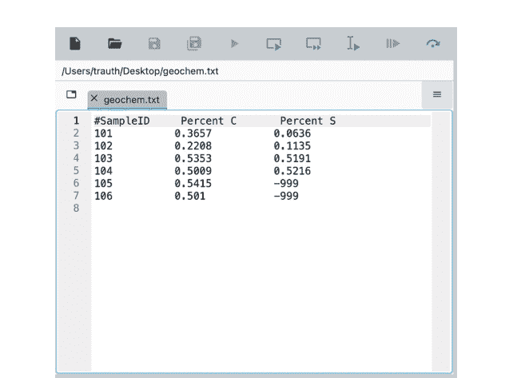

**图 2.2** *Spyder Editor* 的屏幕截图，显示了文件 *geochem.txt* 的内容。第一行文本需要使用行首的井号字符 (#) 注释掉，其后是实际的数据数组。-999 值需要替换为 NaN

```
import numpy as np
import matplotlib.pyplot as plt
from datetime import datetime

geochem = np.loadtxt('geochem.txt')
```

然后 Python 加载文件内容，并将数组分配给由文件名 geochem.txt 指定的变量 geochem。输入

```
np.whos()
```

得到

| Name | Shape | Bytes | Type |
|---|---|---|---|
| geochem | 6 x 3 | 144 | float64 |
| Upper bound on total bytes | = | 144 | |

命令 savetxt() 现在允许将 geochem 存储为文本格式：

```
np.savetxt('geochem_new.txt', geochem)
```

可以使用 Spyder Editor 或任何其他文本编辑器查看和编辑此 ASCII 文件。

此类数据文件（尤其是由电子仪器生成的文件）可能比示例文件 geochem.txt（只有一行标题）复杂得多。在第 7 章和第 8 章中，我们将读取一些这些复杂且广泛的文件，它们可以是二进制或文本文件，通常具有描述其内容的长标题。此时，我们现在来看一个文本文件变体，它不仅包含一行或多行标题，还包含不寻常的数据类型，例如非十进制格式的日期和时间。我们使用 loadtxt() 来执行此任务，如下所示：

```
dtype = np.dtype('i4,f8,f8')
C1,C2,C3 = np.loadtxt('geochem.txt',
    dtype=dtype,
    unpack=True,
    skiprows=1)
```

用作 dtype() 输入的字符串 'i4,f8,f8' 定义了转换说明符，它们被括在单引号中，其中 i4 代表 32 位（或 4 字节）无符号整数，f8 代表 64 位（或 8 字节）双精度浮点数。函数 loadtxt() 使用 dtype 作为输入参数，并使用 unpack=True 来转置返回的数组，它使用 `skiprows=1` 在读取文件时忽略单行标题。该函数从文件中读取文本并将其存储在数组 C1、C2 和 C3 中。然后我们通过输入以下内容将数组重塑为列向量

```
C1 = np.reshape(C1, (6,1))
C2 = np.reshape(C2, (6,1))
C3 = np.reshape(C3, (6,1))
```

并通过输入以下内容将 C1、C2 和 C3 连接成单个数组 C

```
C = np.concatenate((C1,C2,C3),axis=1)
print(C)
```

得到

```
[[1.010e+02 3.657e-01 6.360e-02]
 [1.020e+02 2.208e-01 1.135e-01]
 [1.030e+02 5.353e-01 5.191e-01]
 [1.040e+02 5.009e-01 5.216e-01]
 [1.050e+02 5.415e-01       nan]
 [1.060e+02 5.010e-01       nan]]
```

接下来的示例演示如何读取文件 *geophys.txt*，该文件包含单行标题，但也包含日期（*MM/DD/YY* 格式）和时间（*HH:MM:SS.SS* 格式）。我们再次使用 `loadtext()` 读取文件：

```
dtype = np.dtype('i4,f8,f8,f8,U12,U12')
C1,C2,C3,C4,C5,C6 = \
    np.loadtxt('geophys.txt',
               dtype=dtype,
               unpack=True,
               skiprows=1,
               delimiter='\t')
```

我们跳过标题，将第一列（即样本 ID）读取为 32 位无符号整数 (uint32)，说明符为 i4，将接下来的三列（即 X、Y 和 Z）读取为 64 位双精度浮点数 (double)，说明符为 f8，然后将日期和时间读取为字符字符串，说明符为 U12。在此代码中，我们使用显式换行符 (\) 在等号后创建新行。或者，我们可以通过输入以下内容将代码括在括号中

```
dtype = np.dtype('i4,f8,f8,f8,U12,U12')
C1,C2,C3,C4,C5,C6 = (
    np.loadtxt('geophys.txt',
               dtype=dtype,
               unpack=True,
               skiprows=1,
               delimiter='\t'
               )
)
```

`loadtext()` 中使用的括号也是我们不需要在函数内使用显式换行符来将输入参数写在单独行上的原因。然后我们使用以下内容转换日期

```
for i in range(0,5):
    date_time_obj_1 = datetime.strptime(C5[i],'%m/%d/%y')
    print(date_time_obj_1)
```

得到

```
2013-11-18 00:00:00
2013-11-18 00:00:00
2013-11-18 00:00:00
2013-11-18 00:00:00
2013-11-18 00:00:00
```

其中日期使用 00:00:00 作为默认时间，因为未定义时间，而时间使用

```
for i in range(0,5):
    date_time_obj_2 = datetime.strptime(C6[i],'%H:%M:%S.%f')
    print(date_time_obj_2)
```

得到

```
1900-01-01 10:23:09.100000
1900-01-01 10:23:10.200000
1900-01-01 10:23:50.400000
1900-01-01 10:24:05.100000
1900-01-01 10:24:23.300000
```

其中时间使用 1900-01-01 作为默认日期，因为未定义日期。

我们也可以使用 `savetxt()` 将数据写入格式化的文本文件。例如，我们在向第一行开头添加井号字符 (#) 并将 -999 替换为 NaN 后，再次从 `geochem.txt` 加载数据。除了添加井号字符，我们也可以使用 `skiprows=1` 跳过第一行。

data = np.loadtxt('geochem.txt', skiprows=1)

用于将文本文件的内容加载到双精度数组 `data` 中。我们使用 `savetxt()` 将数据写入新的文本文件 `geochem_formatted.txt`：

np.savetxt('geochem_formatted.txt', data,
    delimiter='\t',
    fmt='%i %6.4f %6.4f')

然后，我们使用格式化操作符 `%i`（用于无符号整数）和 `%6.4f`（用于字段宽度为六个字符、小数点后四位的定点数）将 `data` 写入文件。控制字符 `\t` 表示制表符作为分隔符。我们可以通过输入以下命令查看文件内容：

%edit geochem_formatted.txt

这将在 Spyder 编辑器中打开文件 `geochem_formatted.txt`

101 0.3657 0.0636
102 0.2208 0.1135
103 0.5353 0.5191
104 0.5009 0.5216
105 0.5415    nan
106 0.5010    nan

数据格式符合预期。

## 2.7 控制流

计算机科学中的控制流有助于控制计算机代码的求值顺序。最重要的控制流语句类型是计数控制循环（例如 `for` 循环）和条件语句（例如 `if` 语句）。由于本书不深入探讨 Python 的编程能力，以下对控制流基础知识的介绍相当简略，并省略了高效编程的某些重要方面。本介绍仅限于两种最重要的控制流语句类型：前述的 `for` 循环和 `if` 语句。

Python 的 `for` 循环会执行一系列命令指定的次数。例如，我们可以使用这样的循环将数组 `A` 的元素乘以 10，将结果四舍五入到最接近的整数，并通过输入以下命令将结果存储在 `B` 中：

import numpy as np
from numpy.random import default_rng

np.random.seed(0)
A = np.random.rand(10,1)
B = np.zeros((10,1))
for i in range(0,10):
    B[i] = np.round(10*A[i])
print(A)
print(B)

输出结果为

[[0.5488135 ]
 [0.71518937]
 [0.60276338]
 [0.54488318]
 [0.4236548 ]
 [0.64589411]
 [0.43758721]
 [0.891773  ]
 [0.96366276]
 [0.38344152]]

[[ 5.]
 [ 7.]
 [ 6.]
 [ 5.]
 [ 4.]
 [ 6.]
 [ 4.]
 [ 9.]
 [10.]
 [ 4.]]

重要的是，for 循环内的代码块（在我们的示例中是 `B[i]=np.round(10*A[i])`）必须缩进，以表明它属于该循环。应使用空格而不是制表符（或简称 tabs）进行缩进（例如，使用四个空格进行单级缩进，如我们的示例所示）。请注意，我们在使用 for 循环之前使用 `B=np.zeros((10,1))` 来预分配内存。我们可以使用嵌套 for 循环来扩展实验，以创建一个二维数组 `B`。输入以下命令：

np.random.seed(0)
A = np.random.rand(10,3)
B = np.zeros((10,3))
for i in range(0,10):
    for j in range(0,3):
        B[i,j] = np.round(10*A[i,j])
print(A)
print(B)

输出结果为

[[0.5488135  0.71518937 0.60276338]
 [0.54488318 0.4236548  0.64589411]
 [0.43758721 0.891773   0.96366276]
 [0.38344152 0.79172504 0.52889492]
 [0.56804456 0.92559664 0.07103606]
 [0.0871293  0.0202184  0.83261985]
 [0.77815675 0.87001215 0.97861834]
 [0.79915856 0.46147936 0.78052918]
 [0.11827443 0.63992102 0.14335329]
 [0.94466892 0.52184832 0.41466194]]

[[5. 7. 6.]
 [5. 4. 6.]
 [4. 9. 10.]
 [4. 8. 5.]
 [6. 9. 1.]
 [1. 0. 8.]
 [8. 9. 10.]
 [8. 5. 8.]
 [1. 6. 1.]
 [9. 5. 4.]]

在这个嵌套的 `for` 循环中，第二个循环使用四个空格缩进，其关联的代码块再次缩进，因此需要双级缩进（即八个空格）。

本书旨在使所有方法独立于数据的实际维度。这是通过始终使用 `shape()` 和 `len()` 来确定数组的维度，而不是使用固定数字（如上面示例中的 10 和 3）来实现的（第 2.4 节）：

np.random.seed(0)
A = np.random.rand(10,3)
B = np.zeros(np.shape(A))
for i in range(0,A.shape[0]):
    for j in range(0,A.shape[1]):
        B[i,j] = np.round(10*A[i,j])
print(A)
print(B)

除了 for 循环之外，控制脚本流程的第二个重要语句是 if 语句，它求值一个表达式，然后在表达式为真时执行一组指令。例如，我们通过输入以下命令比较两个标量 A 和 B 的值：

A = 1
B = 2
if A < B:
    print('A is less than B')

输出结果为

A is less than B

与 for 循环类似，if 语句要求缩进属于该语句的代码块，在我们的示例中使用四个空格完成。脚本首先求值 A 是否小于 B，如果是，则在控制台中显示消息 A is less than B。我们可以通过引入 else 来扩展 if 语句，它在表达式不为真时提供替代语句。例如，输入以下命令：

A = 1
B = 2
if A < B:
    print('A is less than B')
else:
    print('A is not less than B')

输出结果为

A is less than B

或者，我们可以将 else 与第二个 if 语句一起使用，以引入第二个要评估的表达式，如下例所示：

A = 1
B = 2
if A < B:
    print('A is less than B')
else:
    if A >= B:
        print('A is not less than B')

这些 for 循环和 if 语句在本书的后续章节中被广泛使用。

## 2.8 脚本和函数

Python 是一种强大的编程语言。所有包含 Python 代码的文件都使用 .py 作为扩展名，因此被称为 .py 文件。这些文件包含 ASCII 文本，可以使用标准文本编辑器进行编辑。但是，内置的 Spyder 编辑器会对各种语法元素进行颜色高亮显示：注释以灰色高亮显示；关键字（如 if、for 和 end）以蓝色高亮显示；字符串以绿色高亮显示。这种语法高亮显示有助于 Python 编码。

Python 使用两种类型的 .py 文件：脚本和函数。脚本是一系列在工作区中对数据进行操作的命令，而函数是具有输入变量（或输入参数）和输出变量（或输出参数）的真正算法。现在通过一个示例说明两种类型 .py 文件的优缺点。我们首先通过按顺序输入一系列命令来生成一个简单的 Python 脚本，以计算数据数组 `x` 元素的平均值，如下所示：

import numpy as np

x = np.array([[3,6,2,-3,8]])
print(x)

m,n = x.shape
if m == 1:
    m = n

print(np.sum(x)/m)

if 语句的第一行使用命令 `shape()` 获取变量 `x` 的形状。在我们的示例中，`x` 应该是一个列向量（即具有单列且维度为 (m, 1) 的数组）或一个行向量（即具有单行且维度为 (1, n) 的数组）。if 语句求值一个逻辑表达式，并在表达式为真时执行一组命令。在示例中，if 语句根据 `m==1` 为假还是为真来选择 `m` 或 `n`。这里，双等号（==）对等号左侧和右侧的变量（或数字）进行逐元素比较，并返回一个大小相同的数组，其中关系为真的元素设置为逻辑 1，不为真的元素设置为逻辑 0。在我们的示例中，如果 `m` 等于 1，则 `m==1` 返回 1；如果 `m` 等于任何其他值，则返回 0。if 语句的最后一行通过将元素总和除以 `m` 或 `n` 来计算平均值。运行脚本输出结果为

3.2

输入以下命令后

%whos

我们看到工作区现在包含

| 变量 | 类型 | 数据/信息 |
|----------|------|-----------|
| m | int | 5 |
| n | int | 5 |
| np | module | <module 'numpy' from '/Us<...>kages/numpy/__init__.py'> |
| x | ndarray | 1x5: 5 elems, type `int64`, 40 bytes |

正如预期的那样，脚本中定义和使用的所有变量都出现在工作区中。在我们的示例中，这些也是变量 `m` 和 `n`。脚本包含应用于工作区中变量的命令序列。然而，Python 函数允许定义输入参数和输出参数。它们不会自动从工作区导入变量。要将上面的脚本转换为函数，我们需要进行以下修改（图 2.3）：

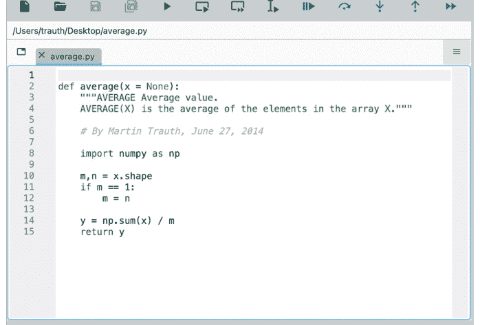

图 2.3 Spyder 编辑器的屏幕截图，显示了函数 `average()`。该函数以包含关键字 `def`、函数名 `average()` 和输入变量 `x` 的行开始。后续行包含 `help(average)` 的输出、版权和版本信息，以及使用此函数计算平均值的实际 Python 代码，包括一个要求定义输出变量 `y` 的 return 语句。

def average(x=None):
    '''AVERAGE 平均值。
    AVERAGE(X) 是数组 X 中元素的平均值。'''

    # 作者：Martin Trauth，2023年5月24日

    import numpy as np

    m, n = x.shape
    if m == 1:
        m = n

    y = np.sum(x) / m
    return y

第一行现在包含关键字 `def`（标记函数头的开始）以及函数名 `average()` 和输入变量（或输入参数）`x`。函数头之后的行包含 `help()` 的输出，如三个 `'` 符号所示。由空行分隔，第5行包含作者姓名和 `.py` 文件的版本。文件的其余部分包含实际操作。最后一行现在定义了 `return` 语句之后输出变量 `y` 的值。我们通过输入以下命令从模块 `average` 中导入 `average()`：

```python
import numpy as np
from average import average
```

并使用 `help()`

```python
help(average)
```

来显示第一个连续的注释块，如下所示：

```
Help on function average in module average:

average(x=None)
    AVERAGE 平均值。
    AVERAGE(X) 是数组 X 中元素的平均值。
```

我们现在可以定义 `x` 并运行 `average()` 来计算 `x` 中元素的平均值，以定义 `result`。输入

```python
data = np.array([[3, 6, 2, -3, 8]])

result = average(data)
print(result)
```

再次显示

```
3.2
```

而输入

```python
%whos
```

结果如下：

| 变量 | 类型 | 数据/信息 |
| --- | --- | --- |
| average | function | `<function average at 0x7fe2a9a02af0>` |
| data | ndarray | 1x5: 5 个元素，类型 `int64`，40 字节 |
| np | module | `<module 'numpy' from '/Us<...>kages/numpy/__init__.py'>` |
| result | float64 | 3.2 |

这表明函数中使用的所有变量都不会出现在工作区中。只有用户定义的输入 `data` 和输出 `result` 存储在工作区中。因此，`.py` 文件可以像真正的函数一样应用于数据，而脚本则包含一系列应用于工作区中变量的命令。

## 2.9 基本可视化工具

*Matplotlib* 包提供了许多用于将数据显示为图形的 Python 例程。本节介绍最重要的图形函数。图形可以修改、打印，并可导出以便使用 Python 以外的图形软件进行编辑。生成变量 `y` 相对于另一个变量 `x` 的图形的最简单函数是 `plot()`。首先，我们定义两个一维数组 `x` 和 `y`，其中 `y` 是 `x` 的正弦值。数组 `x` 包含从 0 到 2π 的 21 个值，增量为 π/10，而 `y` 是 `x` 的逐元素正弦值：

```python
import numpy as np
import matplotlib.pyplot as plt

x = np.linspace(0, 2 * np.pi, 21)
y = np.sin(x)
```

这两个命令生成两个各有 21 个元素的数组。由于两个数组 `x` 和 `y` 长度相同，我们可以使用 `plot()` 生成 `y` 相对于 `x` 的线性二维图形，如下所示：

```python
plt.plot(x, y)
```

然而，最通用的绘图方法是首先使用 `figure()` 创建一个图形窗口，然后使用 `plot()` 启动绘图，最后使用 `show()` 显示实际图形。特别是，如果我们显示子图或多个图形对象，我们需要 `show()` 来查看图形：

```python
plt.figure()
plt.plot(x, y)
plt.show()
```

我们可能希望在单个绘图中绘制两条不同的曲线，例如用不同颜色绘制 `x` 的正弦和余弦。命令

```python
x = np.linspace(0, 2 * np.pi, 21)
y1 = np.sin(x)
y2 = np.cos(x)

plt.figure()
plt.plot(x, y1, '--', x, y2, '-')
plt.show()
```

创建一条显示 `x` 正弦值的蓝色虚线和一条表示该数组余弦值的橙色实线（图 2.4）。如果我们希望在单独的窗口中创建绘图，我们再次使用 `figure()` 创建一个新窗口，在显示 `x` 的正弦值后显示其余弦值：

```python
plt.figure()
plt.plot(x, y1, '--')
plt.show()

plt.figure()
plt.plot(x, y2, '-')
plt.show()
```

我们还可以使用以下命令将 `x` 的正弦值显示为折线图，将 `x` 的余弦值显示为条形图：

```python
plt.figure()
plt.plot(x, y1, 'r--')
plt.bar(x, y2, color='b')
plt.show()
```

此命令使用 `'r--'` 将 `y1` 相对于 `x` 绘制为红色虚线，而 `y2` 相对于 `x` 显示为一组蓝色垂直条。或者，我们可以使用 `subplot()` 在同一个图形窗口中但在不同的绘图中绘制两个图形。语法 `subplot(m, n, p)` 将图形窗口划分为 `m` 行 `n` 列的网格，并在 `p` 指定的位置创建坐标轴。这里，第一个子图（`p=1`）位于网格的第一列和第一行，第二个子图（`p=2`）位于第一行的第二列，依此类推：

```python
plt.figure()
plt.subplot(2, 1, 1)
plt.plot(x, y1, 'r--')
plt.subplot(2, 1, 2)
plt.bar(x, y2, color='b')
plt.show()
```

在我们的示例中，图形窗口被划分为两行一列。二维线性图显示在图形窗口的上半部分，条形图出现在下半部分。或者，我们也可以使用 `subplots()` 而不是 `subplot()` 来创建图形窗口 `fig` 以及两个坐标轴 `ax1` 和 `ax2`。如果我们使用 `subplots()`，则不需要 `figure()` 和 `show()`：

```python
fig, (ax1, ax2) = plt.subplots(2, 1)
ax1.plot(x, y1, 'r--')
ax2.bar(x, y2, color='b')
```

对图形的一个重要修改是通过缩放坐标轴来实现的。默认情况下，Python 使用接近数据最小值和最大值的坐标轴限制。然而，使用 `axis()` 命令允许使用包含值 `[xmin, xmax, ymin, ymax]` 的数组来更改比例设置，例如

```python
plt.figure()
plt.plot(x, y1, 'r--')
plt.axis(np.array([0, np.pi, -1, 1]))
plt.show()
```

函数 `axis()` 接受 `xmin`、`xmax`、`ymin` 和 `ymax` 的值，可以是使用 `array()` 的 `ndarray` 数据类型，也可以是使用以下方式的列表：

```python
plt.figure()
plt.plot(x, y1, 'r--')
plt.axis([0, np.pi, -1, 1])
plt.show()
```

或者使用以下方式的元组（第 2.5 节）：

```python
plt.figure()
plt.plot(x, y1, 'r--')
plt.axis((0, np.pi, -1, 1))
plt.show()
```

这是多种解决方案中可能的一个例子，我们在本书中使用不同的解决方案。无论如何，代码将 x 轴的限制设置为 0 和 π，而 y 轴的限制设置为默认值 -1 和 +1。`axis()` 的重要选项包括

```python
plt.figure()
plt.plot(x, y1, 'r--')
plt.axis('square')
plt.show()
```

这使得 x 轴和 y 轴长度相同，以及

```python
plt.figure()
plt.plot(x, y1, 'r--')
plt.axis('equal')
plt.show()
```

这使得 x 轴和 y 轴上的各个刻度增量长度相同。函数 `grid()` 向当前绘图添加网格，而 `title()`、`xlabel()` 和 `ylabel()` 允许定义标题并将标签应用于 x 轴和 y 轴：

```python
plt.figure()
plt.plot(x, y1, 'r--')
plt.title('My first plot')
plt.xlabel('x-axis')
plt.ylabel('y-axis')
plt.grid()
plt.show()
```

使用 *Matplotlib* 包进行绘图的最复杂方式（类似于 MATLAB 的面向对象语法）是通过输入

```python
fig = plt.figure(
    facecolor=(0.9, 0.9, 0.9))
ax = plt.axes(
    title='My first plot',
    xlabel='x-axis',
    ylabel='y-axis')
ax.plot(x, y1,
    markersize=15,
    marker='s',
    linewidth=2)
ax.grid()
plt.show()
```

这再次使用了 `figure()`、`plot()` 和 `show()` 等函数来创建和显示图形。然而，其中一些函数，如 `plot()`，设置了许多图形属性，如 `markersize`、`marker` 和 `linewidth`，以自定义绘图。此外，这些函数还可以创建对象，如 `fig` 和 `ax`，这些对象稍后可以被其他函数调用以进行进一步修改，例如在我们的示例中的图形窗口和坐标轴。这些是 *Matplotlib* 包中包含的 Python 函数如何用于创建和编辑绘图的一些示例。更多图形函数将在本书的后续章节中介绍。

## 参考文献

Matthes E (2019) Python Crash Course: a Hands-on. No Starch Press, Project-Based Introduction to Programming
McKinney W (2017) Python for Data Analysis–Second Edition. O’Reilly Media, Sebastopol

# 3 单变量统计

### 3.1 引言

单变量分析用于研究单个变量的统计特性。例如，这个变量可以是深海沉积物的有机碳含量、砂岩层中颗粒的大小，或是火山灰中透长石晶体的年龄。我们从一个更大的*总体*中收集的*样本*大小，往往受到资金和后勤条件的限制。单变量统计方法帮助我们从样本中得出适用于整个总体的结论。对于单变量分析，我们使用*NumPy* (https://numpy.org)、*Matplotlib* (https://matplotlib.org)、*SciPy* (https://scipy.org) 和 *scikit-learn* (https://scikit-learn.org) 包，它们包含了所有必要的例程。

我们首先在第3.2和3.3节中使用统计度量来描述样本的特征，并计算*经验分布*（*描述性统计*）。接着简要介绍最重要的统计度量（例如，*集中趋势和离散度度量*），并辅以Python示例。然后，在第3.4和3.5节中，我们选择一个与经验分布具有相似特征的*理论分布*。在介绍一系列理论分布并概述其潜在应用之后，我们将使用Python工具来探索这些分布。随后，在第3.6至3.12节中，我们检验理论分布是否是经验分布的合适模型（*假设检验*），然后从样本中得出可以应用于更大目标总体的结论。第3.13节介绍了将分布拟合到我们自己数据集的方法。最后，第3.14节对误差分析的基础知识进行了非常简要的介绍。

**补充信息** 在线版本包含补充材料，可访问 https://doi.org/10.1007/978-3-031-56906-7_3。

© 作者，经 Springer Nature Switzerland AG 2024 独家许可
M. H. Trauth, *Python Recipes for Earth Sciences*, Springer Textbooks in Earth Sciences, Geography and Environment, https://doi.org/10.1007/978-3-031-56906-7_3

### 3.2 经验分布

假设我们从一个特定对象收集了一系列测量值 $x_i$。作为目标总体子集的数据（或样本）集合可以写成一个向量，或一维数组 $x$，

$$x = (x_1, x_2, \ldots, x_n)$$

其中包含总共 $n$ 个观测值。数组 $x$ 可能包含大量数据点，因此理解其特性可能很困难。因此，描述性统计通常用于总结数据的特征。数据集的统计特性可用于定义经验分布，然后将其与理论分布进行比较。

研究样本特征最直接的方法是以图形形式显示数据。将所有数据点绘制在单个轴上并不能揭示关于数据集的大量信息。然而，点沿刻度的密度确实提供了一些关于数据特征的信息。单变量数据的一种广泛使用的图形显示是*直方图*（图3.1）。直方图是频率分布的条形图，按区间或*类别*组织。此类直方图提供了关于数据特征的有价值信息，例如*集中趋势*、*离散度*和分布的*总体形状*。然而，定量度量提供了比图形形式更精确的数据集描述方式。例如，在纯定量术语中，*均值*和*中位数*定义了数据集的集中趋势，而数据离散度则用*范围*和*标准差*来表示。

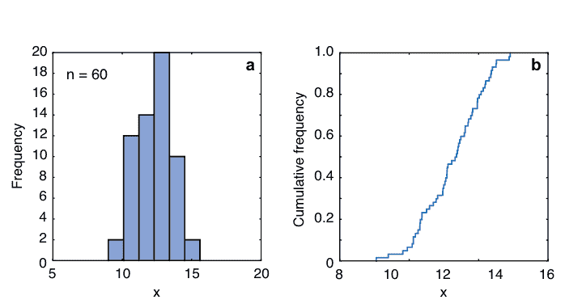

**图 3.1** 经验频率分布的图形表示。**a** 在*直方图*中，频率被组织成 *nbin* 个类别，并绘制为条形图。**b** 频率分布的*累积分布图*显示了所有小于或等于某个值的观测值的总和。该图被归一化为观测值总数为一。

#### 3.2.1 集中趋势度量

集中趋势（或位置）参数是表征经验分布的最重要度量（图3.2）。这些值有助于在线性刻度上定位数据，它们代表了描述数据的典型或最佳值。最流行的集中趋势指标是*算术平均值*，它是所有数据点 $x_i$ 的总和除以观测值数量 $n$：

$$\bar{x} = \frac{1}{n} \sum_{i=1}^{n} x_i$$

单变量数据集的算术平均值也可以称为均值或平均值。如果基础理论分布是高斯（或正态）分布，则样本均值用作总体均值 $\mu$ 的估计。然而，算术平均值对异常值敏感，即对可能与大多数数据差异很大的极端值敏感，因此*中位数*通常被用作集中趋势的替代度量。中位数是位于数据集中间的 $x$ 值，即50%的观测值低于中位数，50%高于中位数。按升序排序的数据集的中位数定义为

$$\tilde{x} = x_{(n+1)/2}$$

如果 $n$ 是奇数，以及

$$\tilde{x} = (x_{(n/2)} + x_{(n/2)+1})/2$$

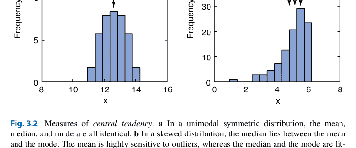

**图 3.2** *集中趋势*度量。**a** 在单峰对称分布中，均值、中位数和众数都相同。**b** 在偏态分布中，中位数位于均值和众数之间。均值对异常值高度敏感，而中位数和众数受极高或极低值的影响很小。

如果 $n$ 是偶数。虽然异常值也会影响中位数，但它们的绝对值不会影响它。*分位数*是将数据样本划分为包含相等数量观测值的组的一种更通用的方法。例如，三个*四分位数*将数据分为四组，四个*五分位数*将观测值分为五组，99个百分位数定义了一百个组。

第三个重要的集中趋势度量是*众数*。众数是最频繁出现的 $x$ 值，或者——如果数据被分组到类别中——则是具有最多观测值的类别的中心。如果没有值比其他任何值出现得更频繁，则数据集没有众数。具有单个众数的频率分布称为*单峰*分布，但也可能有两个众数（*双峰*）、三个众数（*三峰*）或四个或更多众数（*多峰*）（图3.3）。

当几个量相加产生总和时，使用均值、中位数和众数，而当这些量相乘时，通常使用*几何平均值*。假设一个生物种群在第一年增长10%，第二年增长25%，第三年增长60%。平均增长率不是算术平均值，因为原始个体数量在一年后增加了1.1倍（而不是总和），第二年后增加了1.25倍，第三年后增加了1.6倍。因此，种群的平均增长是通过几何平均值计算的：

$$\bar{x}_G = (x_1 \cdot x_2 \cdots x_n)^{1/n}$$

这些值的平均增长为1.3006，表明种群年增长率约为30%。算术平均值将导致错误的值1.3167，或约32%的年增长率。几何平均值也是偏态数据（如对数正态分布数据）的有用集中趋势度量；但是，如果存在零或负值，则不适用。最后，*调和平均值*

$$\bar{x}_H = n / \left( \frac{1}{x_1} + \frac{1}{x_2} + \cdots + \frac{1}{x_n} \right)$$

也用于推导非对称数据（例如，对数正态分布数据）的平均值，就像几何平均值一样，但两者对异常值都不稳健。当数字是相对于特定单位定义时，调和平均值是更好的平均值。常被引用的例子是平均速度。调和平均值也用于计算样本大小的平均值。

#### 3.2.2 离散度度量

分布的另一个重要特性是离散度。图3.3说明了一些可用于量化离散度的度量。描述数据集离散度的最简单方法是使用*范围*，它是数据集中最高值和最低值之间的差值，由下式给出：

$$\Delta x = x_{max} - x_{min}$$

### 3.2 经验分布

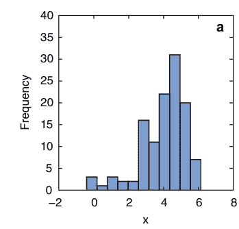

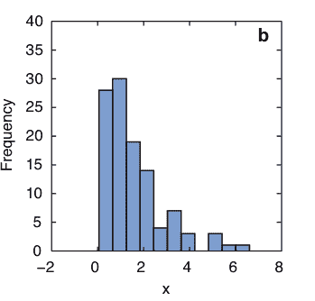

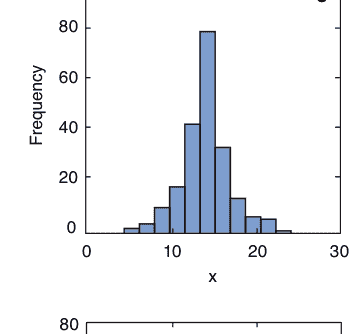

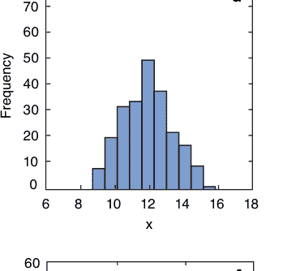

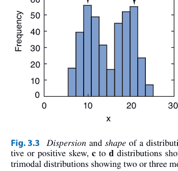

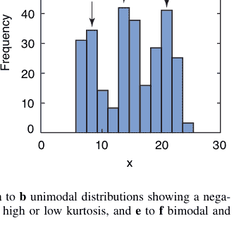

图 3.3 分布的离散度与形状：a 至 b 为单峰分布，显示负偏或正偏；c 至 d 为显示高峰度或低峰度的分布；e 至 f 为双峰和三峰分布，显示两个或三个众数。

由于极差由两个极端数据点定义，它极易受异常值影响，因此在大多数情况下不是可靠的离散度量。数据的四分位距（即中间 50% 的数据）可用于帮助克服此问题。

一个更有用的离散度量是*标准差*：

$$s = \sqrt{\frac{1}{n-1} \sum_{i=1}^{n} (x_i - \bar{x})^2}$$

标准差是每个数据点与均值的平均偏差。如果基础理论分布是高斯（或正态）分布，则样本标准差用作总体标准差 $\sigma$ 的估计值。*方差*是第三个重要的离散度量，它只是标准差的平方：

$$s^2 = \frac{1}{n-1} \sum_{i=1}^{n} (x_i - \bar{x})^2$$

尽管方差的缺点是与原始数据不具有相同的量纲，但它在许多应用中被广泛使用，而非标准差。

此外，*偏度*和*峰度*都可用于描述频率分布的形状（图 3.3）。偏度是分布尾部不对称性的度量。计算分布不对称性的经典方法是使用卡尔·皮尔逊（1857-1936）的众数偏度：

$$\gamma = \frac{\bar{x} - \tilde{x}}{s}$$

其中算术平均值与中位数之差除以标准差。负偏表示分布向均值左侧（假设值沿轴向右增加）扩散得更开。在这种情况下，样本均值小于众数。具有正偏度的分布具有向右延伸的大尾部。对称正态分布的偏度为零。尽管皮尔逊的度量很有用，但通常使用罗纳德·费舍尔爵士（1890-1962）的以下公式（卡尔·皮尔逊和索瓦尔德·尼古拉·蒂勒（1838-1910）早期也使用过）来计算偏度：

$$\gamma = \frac{\sum_{i=1}^{n} (x_i - \bar{x})^3 / n}{s^3}$$

分布形状的第二个重要度量是*峰度*。同样，有许多公式可用于计算峰度，其中最流行的是以下公式：

$$\omega = \frac{\sum_{i=1}^{n} (x_i - \bar{x})^4 / n}{s^4}$$

峰度是尾部权重的度量。正态分布的峰度为三，因此峰度的一些定义从上述项中减去三，以将正态分布的峰度设置为零。低峰度表明分布产生的异常值比正态分布更少且不那么极端。

### 3.3 经验分布示例

例如，我们现在分析文件 *organicmatter_one.txt* 中的数据，该文件包含湖泊沉积物中有机碳含量 $C_{\text{org}}$（以重量百分比 wt% 表示）。为了加载数据，我们输入

```
import numpy as np
import matplotlib.pyplot as plt
from scipy import stats

corg = np.loadtxt('organicmatter_one.txt')
```

数据文件包含 60 个 $C_{\text{org}}$ 测量值，可以通过输入以下命令显示

```
plt.figure()
plt.plot(corg, np.zeros((len(corg))), 'o')
plt.show()
```

此图显示了数据的一些特征。样品的有机碳含量范围从 9 到 15 wt%，大部分数据集中在 12 到 13 wt% 之间。低于 10 wt% 和高于 14 wt% 的值很少见。虽然这种数据表示方式无疑有其优点，但直方图是显示单变量数据（图 3.1）的一种更方便的方式。直方图将数据范围划分为 nbin 个相等的区间（也称为箱或类），计算每个箱中的观测值数量 n，并以条形图显示观测值的频率分布。箱由其边缘 e 或其中心 v 定义。对于正确的箱数没有固定规则，最合适的数量取决于所使用的应用（例如，统计方法）。理想情况下，箱数 n 应介于 5 到 15 之间；它应紧密反映基础分布，并且不应导致任何空箱（即，没有计数的类）。在实践中，通常使用观测值总数 length(corg) 的平方根（使用 round 四舍五入到最接近的整数）作为箱数。在我们的示例中，nbin 可以使用以下命令计算

```
nbin = np.round(np.sqrt(len(corg)))
print(nbin)
```

结果为

```
8.0
```

使用 *Matplotlib* 包中的 `hist()`

```
plt.figure()
plt.hist(corg)
plt.show()
```

显示一个包含六个类的直方图，使用自动分箱算法。该算法返回宽度均匀的箱，其选择既是为了覆盖 `corg` 中的元素范围，也是为了揭示分布的基础形状。或者，我们也可以通过输入以下命令来定义箱数（例如 8）

```
plt.figure()
plt.hist(corg,bins=8)
plt.show()
```

或者，我们可以定义上面定义的箱边缘 `e` 来显示直方图，输入

```
e = np.arange(9,15+1,1)

plt.figure()
ne = plt.hist(corg,bins=e)
plt.show()

print(ne)
```

这将得到元组 `ne`，其中包含频率分布 `n` 和箱边缘 `e`，

```
(array([ 2.,  6., 13., 20., 15.,  4.]),
 array([ 9., 10., 11., 12., 13., 14., 15.]),
 <BarContainer object of 6 artists>)
```

以及直方图，类似于图 3.1 a 中所示的直方图。Python 元组（如字典和列表）用于在单个变量中存储多个项目（参见第 2.5 节）。我们也可以使用 *NumPy* 包中的 `histogram()` 来确定 `n` 和 `e`，而不绘制 `histogram()`。我们还使用边缘 `e` 来计算箱中心 `v`。输入

```
n, e = np.histogram(corg,bins=8)
v = np.diff(e[0:2]) * 0.5 + e[0:-1]
print(n)
print(e)
print(v)
```

结果为

```
[ 2 2 10 7 14 9 12 4]
```

```
[ 9.416751 10.05984113 10.70293125
  11.34602137 11.9891115 12.63220163
  13.27529175 13.91838187 14.561472 ]
```

```
[ 9.73829606 10.38138619 11.02447631
  11.66756644 12.31065656 12.95374669
  13.59683681 14.23992694 ]
```

其中列出了（从上到下）频率 n、箱边缘 e 和箱中心 v。作为绘制数据的另一种方式，可以使用参数 cumulative=True 显示经验累积分布函数（图 3.1 b）：

```
plt.figure()
plt.hist(corg,cumulative=True,histtype='step')
plt.show()
```

描述分布的最重要度量是集中趋势度量和围绕平均值的离散度。最流行的集中趋势度量是算术平均值。输入

```
print(np.mean(corg))
```

结果为

```
12.344804809999998
```

由于此度量极易受异常值影响，我们可以将中位数作为集中趋势的替代度量，

```
print(np.median(corg))
```

结果为

```
12.471171
```

在这个特定示例中差异不大。然而，我们稍后会看到，对于非对称分布，这种差异可能很大。定义小于或等于某个值的数据分数的更通用度量是分位数。一些分位数有特殊名称，例如将分布分为四个相等部分的三个四分位数：0 到 25%、25 到 50%、50 到 75% 和 75 到 100% 的观测值总数。我们使用 `quantile()` 来计算三个四分位数，

```
print(np.quantile(corg,np.array([0.25,0.5,0.75])))
```

结果为

```
[11.43325275 12.471171 13.29648125]
```

因此，少于 25% 的数据值低于 11.43，25% 介于 11.43 和 12.47 之间，另外 25% 介于 12.47 和 13.30 之间，其余 25% 高于 13.30。

此上下文中的第三个度量是众数，即频率最高的区间的中点。使用 `mode()` 来识别样本中最频繁的值不太可能为连续概率分布（如 `corg` 中的分布）的峰值提供良好的估计。此外，`mode()` 不适合在具有多个众数的分布中寻找峰值。在这些情况下，最好计算直方图并计算该直方图的峰值。我们可以使用 `where()` 来定位具有最大观测值数量的类。输入

```
print(v[np.where(n==np.max(n))])
```

结果为

```
[12.31065656]
```

然后使用此元素的索引来显示相应类 `v` 的中点。如果 `n` 中有多个元素具有相似的值，则此语句返回多个解，这表明分布具有多个众数。数据集的中位数、四分位数、最小值和最大值可以总结并显示在*箱线图*中：

```
plt.figure()
plt.boxplot(corg)
plt.show()
```

箱体在下四分位数、中位数和上四分位数值处有线。须线是从箱体两端延伸的线，以显示其余数据的范围或跨度。

### 3.3 经验分布示例

最常用的离差度量是极差、方差和标准差。我们已经使用极差来定义类别的中点。极差是数据集中最高值与最低值之差。输入

```
print(np.max(corg) - np.min(corg))
```

得到

```
5.1447210000000005
```

方差是每个数值与数据集均值之差的平方的平均值。输入

```
print(np.var(corg, ddof=1))
```

得到

```
1.3595162670031486
```

注意，我们必须使用 `ddof=1`，它代表自由度增量。默认情况下，`ddof` 为零，因此如果我们希望计算具有 n-1 自由度的样本方差，必须将其更改为一。标准差是方差的平方根。输入

```
print(np.std(corg, ddof=1))
```

得到

```
1.165982961712198
```

同样使用了 `ddof=1`。当使用 `skew()` 描述分布形状时，我们观察到轻微的负偏态。输入

```
print(stats.skew(corg))
```

得到

```
-0.25291964917461346
```

最后，分布的尾部特征由峰度描述。根据皮尔逊公式（`fisher=False`）和费舍尔公式（`fisher=True`）计算的 `kurtosis()` 结果

```
print(stats.kurtosis(corg, fisher=False))
print(stats.skew(corg, fisher=True))
```

为

```
2.466996016707096
-0.5330039832929039
```

这表明我们的分布产生的异常值比正态分布更少且不那么极端，因为其皮尔逊峰度小于三，费舍尔峰度为负值。

这些函数大多有对应版本用于处理包含缺失值的数据集，例如 `nanmean()` 和 `nanstd()`，它们将 NaN 视为缺失值。为了说明这些函数的使用，我们在数据集中引入一个缺失值，并分别使用 `mean()` 和 `nanmean()` 计算均值以进行比较。输入

```
corg[25] = np.NaN
print(np.mean(corg))
```

得到

```
nan
```

而输入

```
print(np.nanmean(corg))
```

得到

```
12.336529722033896
```

在此示例中，`mean()` 遵循所有涉及 NaN 的运算结果均为 NaN 的规则，而 `nanmean()` 则简单地跳过缺失值并计算剩余数据的均值。

作为第二个示例，我们现在探索一个具有显著偏态的数据集。数据代表从火山灰中手工挑选的玻璃碎片的 120 次微探针分析。火山玻璃在初始阶段受到化学风化的影响，因此碎片在某些区域表现出玻璃水化和钠耗竭。我们可以使用与上述相同的程序来研究 120 次分析中钠（以重量百分比计）的分布。数据存储在文件 *sodiumcontent_one.txt* 中：

```
sodium = np.loadtxt('sodiumcontent_one.txt')
```

第一步，我们建议始终将数据显示为直方图。120 的平方根建议分为 11 类，因此我们通过输入以下命令来显示数据

```
plt.figure()
plt.hist(corg,bins=11)
plt.show()
```

```
n, e = np.histogram(sodium,bins=11)
v = np.diff(e[0:2]) * 0.5 + e[0:-1]
```

由于分布具有负偏态，均值、中位数和众数彼此不同。输入

```
print(np.mean(sodium))
print(np.median(sodium))
print(v[np.where(n==np.max(n))])
```

得到

```
5.662788932499999
5.97410535
[6.54074771]
```

数据的均值低于中位数，而中位数又低于众数。正如我们从数据中预期的那样，我们观察到强烈的负偏态。输入

```
print(stats.skew(sodium))
```

得到

```
-1.1085610752227795
```

我们现在向数据中引入一个异常值，并探讨其对钠含量统计量的影响。为此，我们使用一个比之前的数据集更适合此示例的新数据集。新数据集包含更高的钠值，约为 17 重量百分比，存储在文件 *sodiumcontent_two.txt* 中：

```
sodium = np.loadtxt('sodiumcontent_two.txt')
```

此数据集仅包含 50 次测量，以便更好地说明异常值的影响。我们可以使用与前面示例相同的脚本，将数据显示为具有七个类别的直方图，并计算每个类别 v 中的观测数 n，

```
plt.figure()
plt.hist(sodium,bins=11)
plt.show()
```

```
n, e = np.histogram(sodium,bins=11)
v = np.diff(e[0:2]) * 0.5 + e[0:-1]

print(np.mean(sodium))
print(np.median(sodium))
print(v[np.where(n==np.max(n))])
```

得到

```
16.63794532
16.973911
[17.02385664 17.45143718]
```

数据的均值为 16.64，中位数为 16.94，并且有两个众数（即直方图中两个高度相同的条形），分别为 17.02 和 17.45。现在，除了原始数据集中的 50 次测量外，我们引入一个非常低的值 7.0 重量百分比：

```
sodium = np.append(sodium,7.)

plt.figure()
plt.hist(sodium,bins=11)
plt.show()

n, e = np.histogram(sodium,bins=11)
v = np.diff(e[0:2]) * 0.5 + e[0:-1]
```

此数据集的直方图（使用了更多的类别）通过显示几个空类别，说明了这个单一异常值在频率分布中产生的扭曲。这个异常值对样本统计量的影响也是显著的，如下结果所示

```
print(np.mean(sodium))
print(np.median(sodium))
print(v[np.where(n==np.max(n))])
```

得到

```
16.448966000000002
16.972217
[17.58858945]
```

最显著的观察到的变化是均值降至 16.45，这是由于异常值的存在。这个例子清楚地证明了均值对异常值的敏感性。相比之下，中位数 16.97 受到的影响相对较小。

### 3.4 理论分布

我们现在描述了样本的经验频率分布。直方图是描述变量 $x$ 频率分布的一种便捷方式。如果我们对变量进行足够多次的采样，并且输出范围很窄，我们就会得到一个非常平滑的直方图版本。无限次的测量 $n \rightarrow \infty$ 和无限小的类别宽度会产生随机变量的*概率密度函数*（PDF）。概率分布密度 $f(x)$ 定义了变量取值等于 $x$ 的概率。$f(x)$ 的积分归一化为 1，即观测总数为 1。*累积分布函数*（CDF）是离散 PDF 频率的总和或连续 PDF 的积分。累积分布函数 $F(x)$ 是变量取值小于或等于 $x$ 的概率。

下一步，我们需要找到适合前一节描述的经验分布的适当理论分布。因此，本节介绍最重要的理论分布并描述其应用。

#### 3.4.1 均匀分布

*均匀*或*矩形分布*是一种具有恒定概率的分布（图 3.4）。相应的概率密度函数为

```
$f(x) = 1/n = const.$
```

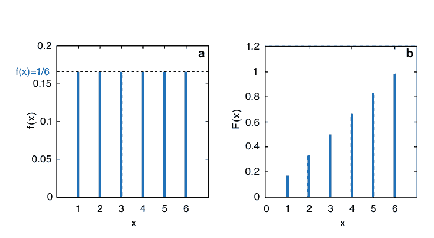

其中随机变量 $x$ 可以取 $n$ 个可能值中的任何一个。累积分布函数为

$F(x) = x \cdot 1/n$

概率密度函数归一化为 1，

$\sum_{-\infty}^{+\infty} f(x)dx = 1$

即所有概率之和为 1。因此，累积分布函数的最大值为 1：

$F(x)_{max} = 1$

一个例子是掷一个有 $n=6$ 个面的骰子。像骰子面这样的离散变量只能取可数个数值 $x$。每个面的概率是 1/6。此分布的概率密度函数为

$f(x) = 1/6$

相应的累积分布函数为

$F(x) = x \cdot 1/6$

其中 $x$ 仅取离散值（即 $x=1, 2, ..., 6$）。

#### 3.4.2 二项分布

*二项分布*给出了在 $n$ 次试验中成功 $x$ 次的离散概率，其中任何给定试验的成功概率为 $p$（图 3.5）。二项分布的概率密度函数为

$f(x) = \binom{n}{x} p^x (1-p)^{n-x}$

累积分布函数为

$F(x) = \sum_{i=1}^{x} \binom{n}{i} p^i (1-p)^{n-i}$

其中

$\binom{n}{i} = \frac{n!}{i!(n-i)!}$

二项分布有两个参数 $n$ 和 $p$。此分布应用的一个例子可以在确定钻探取水的可能结果时找到。让我们假设钻探成功的概率为 0.1，即 10%。在总共 $n=10$ 口井中，有 $x=3$ 口井成功的概率是

#### 3.4.3 泊松分布

当试验次数 $n \to \infty$ 且成功概率 $p \to 0$ 时，二项分布趋近于一个具有单一参数 $\lambda = n \cdot p$ 的*泊松分布*（图 3.6）（Poisson 1837）。当 $n > 100$ 且 $p < 0.05$（或 5%）时，此近似效果良好。因此，我们使用泊松分布来描述发生概率极低的过程，例如地震、火山喷发、风暴和洪水。其概率密度函数为

$$f(x) = \frac{e^{-\lambda} \lambda^x}{x!}$$

累积分布函数为

$$F(x) = \sum_{i=0}^{x} \frac{e^{-\lambda} \lambda^i}{i!}$$

单一参数 $\lambda$ 同时描述了该分布的均值和方差。

#### 3.4.4 正态分布或高斯分布

当 $p = 0.5$（对称，无偏斜）且 $n \to \infty$ 时，二项分布趋近于由均值 $\mu$ 和标准差 $\sigma$ 定义的正态分布或高斯分布（图 3.7）。正态分布的概率密度函数为

$$f(x) = \frac{1}{\sigma \sqrt{2\pi}} \exp\left(-\frac{1}{2}\left(\frac{x - \mu}{\sigma}\right)^2\right)$$

累积分布函数为

$$F(x) = \frac{1}{\sigma \sqrt{2\pi}} \int_{-\infty}^{x} \exp\left(-\frac{1}{2}\left(\frac{x - \mu}{\sigma}\right)^2\right) dy$$

因此，当均值既是出现频率最高也是最可能的值时，使用正态分布。偏离均值的概率在两个方向上相等，并且随着与均值距离的增加而减小。

标准正态分布是正态分布族的一个特殊成员，其均值为零，标准差为一。我们可以通过代入 $z = (x - \mu)/\sigma$ 来变换正态分布的方程。该分布的概率密度函数为

$$f(x) = \frac{1}{\sqrt{2\pi}} \exp\left(-\frac{z^2}{2}\right)$$

这种正态分布的定义通常称为 z 分布。

#### 3.4.5 对数正态分布

当数据具有下限时，例如年平均降水量或地震频率（图 3.8），使用对数正态分布。在这种情况下，分布通常具有显著的偏斜性，最好用对数正态分布来描述。该分布的概率密度函数为

$$f(x) = \frac{1}{\sigma \sqrt{2\pi} x} \exp\left(-\frac{1}{2}\left(\frac{\ln x - \mu}{\sigma}\right)^2\right)$$

累积分布函数为

$$F(x) = \frac{1}{\sigma \sqrt{2\pi}} \int_{-\infty}^{x} \frac{1}{y} \exp\left(-\frac{1}{2}\left(\frac{\ln y - \mu}{\sigma}\right)^2\right) dy$$

其中 $x>0$。该分布可由两个参数描述：均值 $\mu$ 和标准差 $\sigma$。然而，其均值和标准差的计算公式与正态分布所用的不同。在实践中，将 $x$ 值取对数，使用正态分布的公式计算均值和标准差，然后将经验分布与正态分布进行比较。

#### 3.4.6 学生 t 分布

学生 t 分布由威廉·S·戈塞特（1876-1937）首次提出，他需要一种适用于小样本的分布（图 3.9）。戈塞特是爱尔兰吉尼斯啤酒厂的员工，希望匿名发表他的研究成果。因此，他以笔名“Student”（Student 1908）发表了 t 分布。其概率密度函数为

$$f(x) = \frac{\Gamma\left(\frac{\Phi+1}{2}\right)}{\Gamma\left(\frac{\Phi}{2}\right)} \frac{1}{\sqrt{\Phi\pi}} \frac{1}{\left(1+\frac{x^2}{\Phi}\right)^{\frac{\Phi+1}{2}}}$$

其中 $\Gamma$ 是伽马函数，

$$\Gamma(x) = \lim_{n \to \infty} \frac{n! n^{x-1}}{x(x+1)(x+2)\dots(x+n-1)}$$

如果 $x>0$，它可以写成

$$\Gamma(x) = \int_{0}^{\infty} e^{-y} y^{x-1} dy$$

t 分布的单一参数 $\phi$ 是自由度。在单变量数据分析中，该分布具有 $n-1$ 个自由度，其中 $n$ 是样本量。当 $\phi \to \infty$ 时，t 分布趋近于标准正态分布。由于当 $\phi>30$ 时 t 分布接近正态分布，因此很少用于分布拟合。然而，t 分布用于通过 t 检验（第 3.7 节）进行假设检验。

#### 3.4.7 费希尔 F 分布

F 分布以统计学家罗纳德·费希尔爵士（1890-1962）的名字命名。它用于通过 F 检验（第 3.8 节）进行假设检验。F 分布具有相对复杂的概率密度函数（图 3.10），

$$f(x) = \frac{\Gamma\left(\frac{\Phi_1+\Phi_2}{2}\right)\left(\frac{\Phi_1}{\Phi_2}\right)^{\frac{\Phi_1}{2}}}{\Gamma(\Phi_1/2)\Gamma(\Phi_2/2)} x^{\frac{\Phi_1-2}{2}} \left(1 + \frac{\Phi_1}{\Phi_2}x\right)^{-\frac{\Phi_1+\Phi_2}{2}}$$

其中 $x>0$，$\Gamma$ 再次是伽马函数。两个参数 $\Phi_1$ 和 $\Phi_2$ 是自由度。

## 3.4.8 $\chi^2$ 分布（或卡方分布）

$\chi^2$ 分布由弗里德里希·赫尔默特（1876）和卡尔·皮尔逊（1900）引入。该分布在统计假设检验（第 3.9 节）中有重要应用。$\chi^2$ 分布的概率密度函数为

$$f(x) = \frac{1}{2^{\Phi/2}\Gamma(\Phi/2)} x^{\frac{\Phi-2}{2}} e^{-\frac{x}{2}}$$

其中 $x>0$；否则，$f(x)=0$。同样，$\Gamma$ 是伽马函数，$\Phi$ 是自由度（图 3.11）。

### 3.5 理论分布示例

我们使用 `norm.pdf()` 和 `norm.cdf()` 来计算均值为 mu=12.3448、标准差为 sigma=1.1660 的高斯分布的概率密度函数和累积分布函数，针对 x 中的值进行计算，以便将结果与我们的样本数据集的结果进行比较：

```python
import numpy as np
import matplotlib.pyplot as plt
from scipy import stats

mu = 12.3448
sigma = 1.166

x = np.arange(5,20+0.001,0.001)
pdf = stats.norm.pdf(x,mu,sigma)
cdf = stats.norm.cdf(x,mu,sigma)

plt.figure()
plt.plot(x,pdf,x,cdf)
plt.show()
```

我们可以使用这些函数来熟悉分布的特性。这在后续章节进行假设检验时将非常重要。这些章节中使用的检验统计量遵循本章前面介绍的理论频率分布。特别是，理论分布在某个范围 $a \leq x \leq b$ 内的积分（或在离散情况下的求和）非常重要，因为它有助于计算测量值落在该范围内的概率。

例如，我们可以计算测量值落在 $\mu-\sigma \leq x \leq \mu+\sigma$ 范围内的概率，其中 $\mu$ 是高斯分布的均值，$\sigma$ 是标准差。使用 mu=12.3448 和 sigma=1.1660 的高斯分布的 PDF，我们发现：

```python
pdf = pdf / np.sum(pdf)
print(np.sum(pdf[np.where((x>mu-sigma) & (x<mu+sigma))]))
```

结果为

0.6826894910701773

或者在将 PDF 归一化为单位后约为 68%。表达式 `np.where(x>mu-sigma)` 返回 x 中第一个大于 mu-sigma 的索引。类似地，`np.where(x<mu+sigma)` 返回 x 中最后一个小于 mu+sigma 的索引。我们还可以显示 PDF 以及 $\mu-\sigma \leq x \leq \mu+\sigma$ 范围内的阴影区域（图 3.12）：

```python
plt.figure()
plt.plot(x,pdf,color='k')
xint = x[np.where((x>mu-sigma) & (x<mu+sigma))]
```

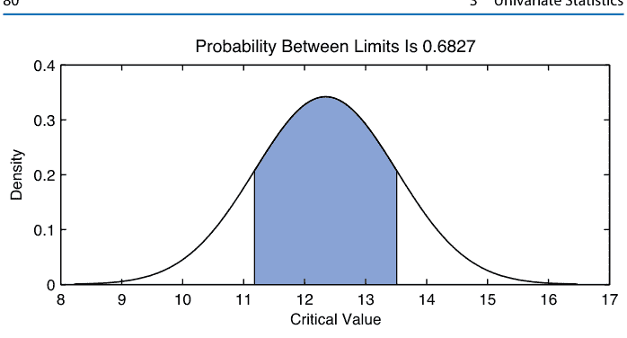

**图 3.12** 在指定区间内绘制的标准正态分布图。作为示例，阴影区域显示了均值 μ = 12.3448、标准差 σ = 1.1660 的高斯分布的 μ±σ 范围。

```python
pdfint = pdf[np.where((x>mu-sigma) & (x<mu+sigma))]
plt.fill_between(xint, pdfint)
plt.show()
```

反之，我们还可以使用累积正态分布函数的逆函数 `norm.ppf()` 来计算我们概率密度函数（PDF）的 μ±σ 范围的 x 值，方法是输入

```python
print(stats.norm.ppf((1-0.6827)/2, mu, sigma))
print(stats.norm.ppf(1-(1-0.6827)/2, mu, sigma))
```

得到

```
11.178774682265383
13.510825317734616
```

这里，p 值是从约 68% 的补数（即约 32%）计算得出的，该值在高斯分布的两侧尾部被平分，即 (1-0.6827)/2 和 1-(1-0.6827)/2。

高斯分布的标准差 σ 在定义置信区间时非常重要。然而，在许多例子中，一个标准差（μ±1σ）（或约 68%）的置信度不足以确保真实值落在 μ±1σ 范围内，因此也使用更高的置信区间，如两个标准差（μ±2σ）和三个标准差（μ±3σ）。我们可以通过输入以下代码来计算真实值落在 μ±2σ 范围和 μ±3σ 范围内的相应概率

```python
print(np.sum(pdf[np.where((x>mu-2*sigma) & (x<mu+2*sigma))]))
print(np.sum(pdf[np.where((x>mu-3*sigma) & (x<mu+3*sigma))]))
```

得到

```
0.9544997357412237
0.9973002040460477
```

分别约为 95% 和 99%。同样，使用 `norm.ppf()`，我们可以计算两个标准差（μ ± 2σ）范围的上下限，

```python
print(stats.norm.ppf(0.05/2,mu,sigma))
print(stats.norm.ppf(1-0.05/2,mu,sigma))
```

得到

```
10.059481994026296
14.630118005973703
```

我们还可以计算三个标准差（μ ± 3σ）范围的上下限，

```python
print(stats.norm.ppf(0.01/2,mu,sigma))
print(stats.norm.ppf(1-0.01/2,mu,sigma))
```

得到

```
9.34138303206198
15.348216967938017
```

### 3.6 假设检验

以下章节讨论用于从统计样本中得出结论的方法。这些方法随后可应用于更广泛的目标总体（假设检验）（第 3.6 至 3.12 节）。所有假设检验都共享相同的概念和术语。原假设是关于总体的陈述，描述不存在统计上显著的特征或效应，而备择假设则是与之相对的陈述。假设检验可以作为单尾（单侧）或双尾（双侧）检验进行（图 3.13）。术语“尾”源于将数据尾部延伸到概率密度函数最左侧或最右侧的概念，例如，在标准正态分布中

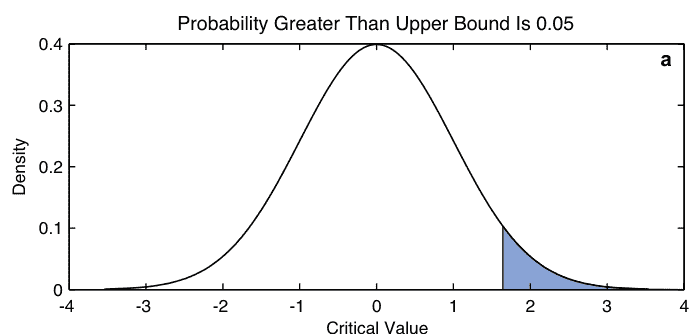

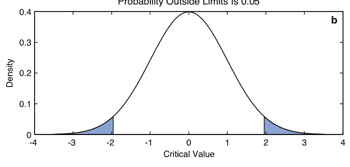

**图 3.13** 标准正态分布图，其中 **a** 为单临界区域，**b** 为双临界区域，显示为阴影区域，总共包含曲线下面积的 5%。

用于曼-惠特尼检验和安萨里-布拉德利检验（第 3.11 和 3.12 节）。例如，曼-惠特尼检验比较两个数据集的中位数。单尾曼-惠特尼检验用于在 5%（或 0.05）的显著性水平下检验备择假设，即第一个样本的中位数小于或大于第二个样本的中位数。当在 5% 显著性水平下中位数不相等时，即无论哪个中位数更大都无关紧要时，使用双尾曼-惠特尼检验。在这种情况下，显著性水平减半，即使用 2.5% 而不是 5%。假设检验的 *p* 值是在原假设下，观察到比从样本计算出的检验统计量值更大的值的概率（图 3.14）。*显著性水平 α* 是控制检验结果的概率阈值。如果 *p* 值小于 α，则可以拒绝原假设。如果 *p*<0.05，则检验结果被认为是 *显著的*，如果 *p*<0.01，则被认为是 *高度显著的*。

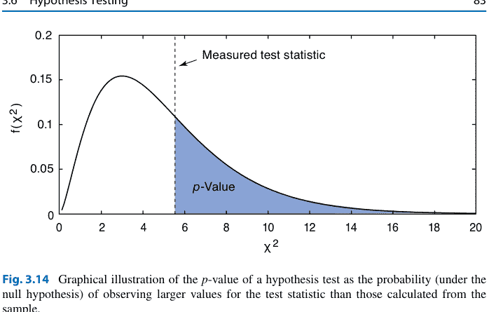

我们可以通过输入以下代码来显示单尾检验的标准正态分布

```python
import numpy as np
import matplotlib.pyplot as plt
from scipy import stats

x = np.arange(-4,4,0.001)
pdf = stats.norm.pdf(x,0.,1.)

plt.figure()
plt.plot(x,pdf,color='k')
xint = x[np.where(x>stats.norm.ppf(0.95,0.,1.))]
pdfint = pdf[np.where(x>stats.norm.ppf(0.95,0.,1.))]
plt.fill_between(xint,pdfint)
plt.show()
```

这将生成一个右侧有一个蓝色尾部的图，其中 5% 的区域被阴影覆盖（图 3.13 a）。类似地，我们可以通过输入以下代码来显示双尾检验的标准正态分布

```python
x = np.arange(-4,4,0.001)
pdf = stats.norm.pdf(x,0.,1.)

plt.figure()
plt.plot(x,pdf,color='k')
xint1 = x[np.where(x<stats.norm.ppf(0.05/2,0.,1.))]
xint2 = x[np.where(x>stats.norm.ppf(1-0.05/2,0.,1.))]
pdfint1 = pdf[np.where(x<stats.norm.ppf(0.05/2,0.,1.))]
pdfint2 = pdf[np.where(x>stats.norm.ppf(1-0.05/2,0.,1.))]
plt.fill_between(xint1,pdfint1,color=(0.3,0.5,0.8))
plt.fill_between(xint2,pdfint2,color=(0.3,0.5,0.8))
plt.show()
```

这将生成一个有两个蓝色尾部（一个在左侧，一个在右侧）的图，其中 2.5% 的区域被阴影覆盖（图 3.13 b）。

请注意，我们无法证明原假设：换句话说，*无罪* 不等于 *清白*。在实践中，我们根据数据设计假设，进行检验，然后继续使用那些我们无法证明为假的假设。因此，假设被证明为假的内在可能性是我们假设的一个重要要求。

接下来的章节介绍了地球科学应用中最重要的假设检验：用于比较两个数据集均值的双样本 *t* 检验，用于比较两个数据集方差的双样本 *F* 检验，以及用于比较分布的 $\chi^2$ 检验和 Kolmogorov-Smirnov 检验（第 3.7 至 3.10 节）。曼-惠特尼检验和安萨里-布拉德利检验分别是 *t* 检验和 *F* 检验的替代方法，用于比较两个数据集的中位数和离散度，而无需假设基础总体服从正态分布（第 3.11 和 3.12 节）。

### 3.7 t 检验

*Student's t 检验* 由 William S. Gosset (Student 1908) 创建，用于比较两个分布的均值。*单样本 t 检验* 用于检验高斯分布总体的均值是否具有原假设中指定的值。*双样本 t 检验* 用于检验两个高斯分布的均值是否相同。在下文中，将介绍双样本 t 检验以演示假设检验。让我们假设对同一对象进行了两组独立的 $n_a$ 和 $n_b$ 次测量——例如，对来自两个不同露头的两组岩石样本进行的测量。t 检验可用于确定两个样本是否来自同一总体，例如同一岩性单元（原假设），或来自两个不同的总体（备择假设）。两个样本分布都必须是高斯分布，并且两组测量的方差应该相似。那么，用于检验两个均值差异的适当检验统计量是

$$t = \frac{|\overline{a} - \overline{b}|}{\sqrt{\frac{n_a+n_b}{n_a n_b} \cdot \frac{(n_a-1)\cdot s_a^2+(n_b-1)\cdot s_b^2}{n_a+n_b-2}}}$$

其中 $n_a$ 和 $n_b$ 是样本量，$s_a^2$ 和 $s_b^2$ 分别是两个样本 $a$ 和 $b$ 的方差。如果测量的 $t$ 值高于临界 $t$ 值，则可以拒绝原假设，临界 $t$ 值取决于自由度 $\Phi = n_a + n_b - 2$ 和显著性水平 $\alpha$。单尾检验用于在 5%（或 0.05）的显著性水平下检验备择假设，即第一个样本的均值小于或大于第二个样本的均值。单尾检验需要修改上述方程，将均值差的绝对值替换为均值的实际差值。当在 5% 显著性水平下均值不相等时，即无论哪个均值更大都无关紧要时，使用双尾 $t$ 检验。在这种情况下，显著性水平减半，即使用 2.5% 来计算临界 $t$ 值。

我们现在可以从两个独立的测量系列中加载两个示例数据集。第一个示例展示了双样本 $t$ 检验在两个均值分别为 25.5 和 25.3、标准差分别为 1.3 和 1.5 的分布上的表现：

```python
import numpy as np
import matplotlib.pyplot as plt
from scipy import stats

corg = np.loadtxt('organicmatter_two.txt')
corg1 = corg[0:,0]
corg2 = corg[0:,1]
```

我们比较两个数据集 corg1 和 corg2。我们首先在单个图中绘制两个直方图：

```python
plt.figure()
plt.hist(corg1)
plt.hist(corg2)
plt.show()
```

然后我们计算样本量、均值和标准差：

```python
na = len(corg1)
nb = len(corg2)
ma = np.mean(corg1)
mb = np.mean(corg2)
sa = np.std(corg1,ddof=1)
sb = np.std(corg2,ddof=1)
```

接下来，我们使用将 $t$ 检验统计量方程转换为 Python 代码来计算 $t$ 值，tcalc = np.abs((ma-mb))/np.sqrt(((na+nb)/(na*nb)) * (((na-1)*sa**2+(nb-1)*sb**2)/(na+nb-2)))
print(tcalc)
```

得到结果

```
0.7279110523246475
```

现在我们可以将计算出的 `tcalc` 值 0.7279 与临界 `tcrit` 值进行比较。这可以通过 `t.ppf()` 实现，该函数在 5% 显著性水平下，返回自由度为 `na-nb-2` 的 *t* 分布函数的逆值。这是一个双样本 *t* 检验，即检验两个均值是否不相等。通过输入 `1-0.05/2` 计算双尾临界 `tcrit` 值，得到上（正）`tcrit` 值，我们将其与均值差的绝对值进行比较。输入

```
tcrit = stats.t.ppf(1-0.05/2,na+nb-2)
```

得到结果

```
1.9802722492407059
```

由于从数据计算出的 `tcalc` 值小于临界 `tcrit` 值，我们无法在没有其他原因的情况下拒绝原假设。因此，我们得出结论：在 5% 显著性水平下，两个均值是相同的。或者，我们可以在 `alpha=0.05`（即 5% 显著性水平）下，对两个独立样本 `corg1` 和 `corg2` 应用 `ttest_ind()`。命令

```
statistic,pvalue = stats.ttest_ind(corg1,corg2)
print(statistic)
print(pvalue)
```

得到结果

```
0.7279110523246475
0.46810997986836755
```

该结果意味着，在 5% 显著性水平下，我们无法在没有其他原因的情况下拒绝原假设。*p* 值为 0.4681（或约 47%，远大于 0.05 或 5% 的显著性水平），表明在类似实验中，观察到比本例中更极端的 *t* 值的概率为万分之 4,681。

第二个合成示例展示了双样本 *t* 检验在均值差异很大（分别为 24.3 和 25.5）且标准差再次分别为 1.3 和 1.5 的情况下的表现：

```
corg = np.loadtxt('organicmatter_three.txt')
corg1 = corg[0:,0]
corg2 = corg[0:,1]
```

与之前一样，我们可以比较两个数据集 `corg1` 和 `corg2`。我们将两个直方图绘制在单个图中：

```
plt.figure()
plt.hist(corg1)
plt.hist(corg2)
plt.figure()
```

然后我们计算样本量、均值和标准差：

```
na = len(corg1)
nb = len(corg2)
ma = np.mean(corg1)
mb = np.mean(corg2)
sa = np.std(corg1,ddof=1)
sb = np.std(corg2,ddof=1)
```

接下来，我们使用 *t* 检验统计量的方程转换为 Python 代码来计算 *t* 值，

```
tcalc = np.abs((ma-mb))/np.sqrt(((na+nb)/(na*nb)) *
    (((na-1)*sa**2+(nb-1)*sb**2)/(na+nb-2)))
print(tcalc)
```

得到结果

4.7364005886749485

现在我们可以将计算出的 `tcalc` 值 4.7364 与临界 `tcrit` 值进行比较。同样，这可以通过在 5% 显著性水平下使用 `t.ppf()` 实现。函数 `t.ppf()` 在 5% 显著性水平下，返回自由度为 `na+nb-2` 的 *t* 分布函数的逆值。这再次是一个双样本 *t* 检验，即检验两个均值是否不相等。通过输入 1-0.05/2 计算双尾临界 `tcrit` 值，得到上（正）`tcrit` 值，我们将其与均值差的绝对值进行比较。输入

```
tcrit = stats.t.ppf(1-0.05/2,na+nb-2)
print(tcrit)
```

得到结果

```
1.9802722492407059
```

由于从数据计算出的 `tcalc` 值现在大于临界 `tcrit` 值，我们可以拒绝原假设，并得出结论：在 5% 显著性水平下，两个均值不相同。或者，我们可以在 alpha=0.05（或 5%）显著性水平下，对两个独立样本 `corg1` 和 `corg2` 应用 `ttest_ind()`。命令

```
statistic,pvalue = stats.ttest_ind(corg1,corg2)
print(statistic)
print(pvalue)
```

得到结果

```
4.7364005886749485
6.113768768578045e-06
```

该结果表明我们可以拒绝原假设。*p* 值极低，非常接近于零。

### 3.8 F 检验

Snedecor 和 Cochran (1989) 讨论的双样本 *F* 检验比较了两个分布的方差 $s_a^2$ 和 $s_b^2$，其中 $s_a^2 > s_b^2$。一个例子是在基于重复测量比较两个样本的自然异质性时。样本量 $n_a$ 和 $n_b$ 应大于 30。样本和总体分布都必须是高斯分布。用于比较方差的适当检验统计量是

$$F = \frac{s_a^2}{s_b^2}$$

如果测量的 *F* 值高于临界 *F* 值，则两个方差显著不同（即我们可以在没有其他原因的情况下拒绝原假设），而临界 *F* 值又取决于自由度 $\Phi_a = n_a - 1$ 和 $\Phi_b = n_b - 1$ 以及显著性水平 $\alpha$。相比之下，单样本 *F* 检验实际上执行的是数据来自具有特定方差的正态分布的假设的 $\chi^2$ 检验（见第 3.9 节）。我们首先将双样本 F 检验应用于两个标准差非常相似（分别为 1.2550 和 1.2097）的分布：

```
import numpy as np
import matplotlib.pyplot as plt
from scipy import stats

corg = np.loadtxt('organicmatter_four.txt')
corg1 = corg[0:,0]
corg2 = corg[0:,1]
```

F 值是较大方差除以较小方差的商。我们现在可以通过输入以下命令计算标准差

```
s1 = np.std(corg1,ddof=1)
s2 = np.std(corg2,ddof=1)
print(s1)
print(s2)
```

得到结果

```
1.254958845144188
1.2096912224649008
```

F 分布有两个参数 df1 和 df2，它们分别代表每个分布中的观测数减一，其中

```
df1 = len(corg1)-1
df2 = len(corg2)-1
print(df1)
print(df2)
```

得到结果

```
59
59
```

然后我们按绝对值对标准差进行排序

```
if s1 > s2:
    slarger = s1
    ssmaller = s2
else:
    slarger = s2
    ssmaller = s1
print(slarger)
print(ssmaller)
```

得到结果

```
1.254958845144188
1.2096912224649008
```

现在我们可以在 0.05（或 5%）显著性水平下，使用 f.ppf() 将计算出的 F 值与临界 F 值进行比较。函数 f.ppf() 在 5% 显著性水平下，返回具有 df1 和 df2 自由度的 F 分布函数的逆值。这是一个双尾检验，因此我们必须将 p 值 0.05 除以二。输入

```
Fcalc = slarger**2/ssmaller**2
Fcrit = stats.f.ppf(1-0.05/2,df1,df2)
print(Fcalc)
print(Fcrit)
```

得到结果

```
1.0762419323639238
1.674131963667053
```

由于从数据计算出的 F 值小于临界 F 值，我们无法在没有其他原因的情况下拒绝原假设。因此，我们得出结论：在 5% 显著性水平下，两个方差是相同的。

或者，我们可以创建一个函数 ftest()，并在 alpha=0.05（或 5%）显著性水平下将其应用于两个独立样本 corg1 和 corg2：

```
def ftest(x,y):
    s1 = np.std(x,ddof=1)
    s2 = np.std(y,ddof=1)
    df1 = len(x)-1
    df2 = len(y)-1
    if s1 > s2:
        sl = s1
        ss = s2
    else:
        sl = s2
        ss = s1
    f = s1**2/ss**2
    p = 2*(1-stats.f.cdf(f,df1,df2))
    return f, p
```

命令

```
statistic,pvalue = ftest(corg1,corg2)
print(statistic)
print(pvalue)
```

得到结果

```
1.0762419323639238
0.7787390940882846
```

该结果意味着，在 5% 显著性水平下，我们无法在没有其他原因的情况下拒绝原假设。*p* 值为 0.7787（或约 78%，远大于显著性水平），意味着在类似实验中，观察到比本例中更极端的 *F* 值的概率为万分之 7,787。

我们现在将此检验应用于两个标准差差异很大（分别为 1.8799 和 1.2939）的分布：

```
corg = np.loadtxt('organicmatter_five.txt')
corg1 = corg[0:,0]
corg2 = corg[0:,1]
```

我们再次在 5% 显著性水平下，使用 f.ppf() 计算 Fcrit，将计算出的 Fcalc 值与临界 Fcrit 值进行比较

```
s1 = np.std(corg1,ddof=1)
s2 = np.std(corg2,ddof=1)

df1 = len(corg1)-1
df2 = len(corg2)-1

if s1 > s2:
    slarger = s1
    ssmaller = s2
else:
    slarger = s2
    ssmaller = s1

Fcalc = slarger**2/ssmaller**2
```

### 3.9 卡方检验

卡尔·皮尔逊的卡方检验涉及比较分布，从而可以检验两个分布是否源自同一总体（Pearson 1900）。该检验与所使用的分布无关，因此可用于检验观测值是否来自特定理论分布的假设。

假设我们有一个包含来自沉积单元的多个化学测量值的数据集。我们可以使用卡方检验来检验零假设：这些测量值可以用一个具有典型中心值和围绕其随机离散度的高斯分布来描述。将n个数据分组为K个类别，其中n应大于30。类别内的频率Oₖ不应低于四，并且肯定不应为零。适当的检验统计量为

$$\hat{\chi}^2 = \sum_{k=1}^{K} \frac{(O_k - E_k)^2}{E_k}$$

其中$E_k$是理论分布预期的频率（图3.15）。如果测量的χ²值高于临界χ²值，则可以拒绝零假设，该临界值取决于自由度$\phi = K-Z$，其中$K$是类别数，$Z$是描述理论分布的参数数量加上变量数量（例如，对于单个变量的数据集，高斯分布的均值和方差对应$Z=2+1$，泊松分布对应$Z=1+1$）。

例如，我们可以检验包含在*organicmatter_one.txt*中的有机碳测量值遵循高斯分布的假设。我们必须首先将数据加载到工作区，并使用八个类别计算数据测量值的频率分布n_obs：

```python
import numpy as np
import matplotlib.pyplot as plt
from scipy import stats

corg = np.loadtxt('organicmatter_one.txt')
```

**图3.15** 卡方检验原理。如果测量的χ²低于临界χ²，则不能拒绝两个分布相同的零假设。χ²取决于$\phi = K-Z$，其中$K$是类别数，$Z$是描述理论分布的参数数量加上变量数量。在示例中，临界χ²(φ=5, α=0.05)为11.0705。由于测量的χ²=5.7602低于临界χ²，我们不能拒绝零假设。在我们的示例中，我们可以得出结论：样本分布与高斯分布没有显著差异。

```python
n_obs,e = np.histogram(corg,bins=8)
v = np.diff(e[0:2])*0.5+e[0:-1]
```

然后我们使用`norm.pdf()`创建预期频率分布`n_exp`，使用`corg`中数据的均值和标准差：

```python
n_exp = stats.norm.pdf(v,np.mean(corg),np.std(corg,ddof=1))
```

数据需要缩放，以便与原始数据集相似：

```python
n_exp = n_exp/np.sum(n_exp)
n_exp = np.sum(n_obs)*n_exp
```

第一条命令将观测频率`n_exp`归一化为总和为一。第二条命令将预期频率`n_exp`缩放为`n_obs`的总和。我们现在可以显示两个直方图进行比较：

```python
plt.figure()
plt.subplot(1,2,1)
plt.bar(v,n_obs,color='r')
plt.subplot(1,2,2)
plt.bar(v,n_exp,color='b')
plt.show()
```

绘制`corg`中数据的另一种方法是使用正态概率图：

```python
stats.probplot(corg,dist='norm',plot=plt)
```

函数`probplot()`绘制`corg`中的数据，蓝色圆圈叠加一条红线，该线代表正态分布。如果`corg`中的数据确实是正态分布的，它们都将落在红线上。在我们的示例中，数据似乎与直线吻合良好，除了正态分布的尾部。

目视检查这些图显示经验分布与理论分布相似。然而，我们建议使用更定量的方法来检验相似性假设。卡方检验探讨观测频率和预期频率之间的平方差。量`chi2calc`是平方差除以预期频率的总和。输入

```python
chi2calc = np.sum((n_obs-n_exp)**2/n_exp)
print(chi2calc)
```

得到

```
7.285412350787187
```

临界`chi2crit`值可以使用`chi2inv`值计算。卡方检验需要自由度$\phi$。在我们的示例中，我们检验数据具有高斯分布的假设，即我们估计两个参数$\mu$和$\sigma$。自由度为$\phi = 8-(2+1)=5$。我们现在可以在5%的显著性水平上检验我们的假设。函数`chi2.ppf()`计算具有$\phi$指定参数的χ² CDF的逆，用于相应的概率。输入

```python
chi2crit = stats.chi2.ppf(1-0.05,5)
print(chi2crit)
```

得到

```
11.070497693516351
```

由于临界`chi2crit`值11.0705远高于测量的`chi2calc`值7.2854，我们不能在没有其他原因的情况下拒绝零假设。因此，我们可以得出结论：我们的数据遵循高态分布。或者，我们可以对样本应用`chisquare()`。命令

```python
chisq,p = stats.chisquare(n_obs,n_exp,ddof=0,axis=0)
print(chisq)
print(p)
```

得到

```
7.285412350787187
0.39978002411496866
```

结果意味着在5%的显著性水平上，我们不能在没有其他原因的情况下拒绝零假设。p值为0.3998（或约40%，远大于显著性水平）意味着在零假设成立的情况下，从类似实验中观察到相同结果或更极端结果的机会为10,000次中有3,998次。

### 3.10 柯尔莫哥洛夫-斯米尔诺夫检验

*柯尔莫哥洛夫-斯米尔诺夫*（或*K-S*）*检验*（由安德烈·N·柯尔莫哥洛夫和尼古拉·W·斯米尔诺夫引入）与卡方检验类似，因为它也涉及比较分布，从而可以检验两个分布是否源自同一总体（Kolmogorov 1933, Smirnov 1939）。该检验与所使用的分布类型无关，因此可用于检验观测值是否来自特定理论分布的假设。

让我们再次假设我们有一个包含来自沉积单元的多个化学测量值的数据集。我们可以使用K-S检验来检验零假设：这些测量值可以用一个具有典型中心值（均值）和围绕均值的随机离散度（标准差）的高态分布来描述。适当的检验统计量为

$KS = max|F_n(x) - F(x)|$

其中$F_n(x)$是$n$个测量值的累积频率分布，$F(x)$是理论分布预期的累积频率分布。如果测量的$KS$值高于临界$KS$值，则可以拒绝零假设。

例如，我们可以再次检验包含在*organicmatter_one.txt*中的有机碳测量值遵循高态分布的假设。我们必须首先加载并标准化数据，使其均值为零，标准差为一：

```python
import numpy as np
import matplotlib.pyplot as plt
from scipy import stats

corg = np.loadtxt('organicmatter_one.txt')
corg = (corg-np.mean(corg))/np.std(corg,ddof=1)
```

然后我们可以计算`corg`的累积频率分布`cn_obs`：

```python
corg = np.sort(corg)
cn_obs = np.arange(1,len(corg)+1)/len(corg)
```

接下来，我们使用`norm.cdf()`创建理论分布预期的累积频率分布`cn_exp`，其均值为零，标准差为一：

```python
cn_exp = stats.norm.cdf(corg)
```

检验统计量是两个累积频率分布`cn_obs`和`cn_exp`之间的最大差异，

```python
kscalc = max(cn_obs-cn_exp)
print(kscalc)
```

得到

我们可以通过输入以下代码在图中比较两个累积频率分布：

```python
plt.plot(corg, cn_obs)
plt.plot(corg, cn_exp)
plt.plot([corg[np.where(cn_obs-cn_exp==max(cn_obs-cn_exp))],
    corg[np.where(cn_obs-cn_exp==max(cn_obs-cn_exp))]],
    [cn_exp[np.where(cn_obs-cn_exp==max(cn_obs-cn_exp))],
    cn_obs[np.where(cn_obs-cn_exp==max(cn_obs-cn_exp))]],
    color='k', linestyle=':')
```

垂直的黑线标记了两个累积频率分布之间最大差异的位置。临界 `kscalc` 值是 n 阶多项式的解，可在表 3.1（O'Connor and Kleyner 2012）中找到。对于样本量大于 40 且显著性水平为 0.05（或 5%）的情况，我们计算

```python
kscrit = 1.36/len(corg)**0.5
print(kscrit)
```

得到

```
0.17557524502806957
```

由于临界 `kscrit` 值 0.1756 远高于测量的 `kscalc` 值 0.0757，我们没有其他理由拒绝原假设。因此，我们可以得出结论：我们的数据服从高斯分布。

或者，我们可以对样本应用 `kstest()`。输入

```python
statistic, pvalue = stats.kstest(corg, 'norm')
print(statistic)
print(pvalue)
```

得到

```
0.07567749152482395
0.8562157307523406
```

该结果意味着，在 5% 的显著性水平下，我们没有其他理由拒绝原假设。p 值为 0.8562（或约 86%，远大于显著性水平），意味着在原假设成立的情况下，从类似实验中观察到相同结果或更极端结果的概率为 10,000 次中有 8,562 次。输出 0.0757 对应于我们实验中未使用 `kstest` 时的 `kscalc`。

### 3.11 曼-惠特尼检验

*曼-惠特尼检验*（也称为*威尔科克森秩和检验*）由 Henry B. Mann 和 Donald R. Whitney（1947）提出，可用于确定两个样本是来自同一总体（例如，同一岩性单元）（原假设）还是来自两个不同的总体（备择假设）。与比较高斯分布数据均值的 *t* 检验不同，曼-惠特尼检验比较中位数，且不要求底层总体满足正态性假设（即它是一种非参数假设检验）。

该检验要求样本具有相似的离散度。我们首先将两组测量值（即样本 1 和样本 2）合并，并按升序排列。然后，我们对样本 1 和样本 2 的秩求和，其中所有秩的总和为 $R = n(n + 1)/2$，$n$ 为测量总数。已发表的文献中充满了计算检验统计量的不同版本。这里，我们使用 Hedderich and Sachs (2012, page 484) 中的版本，

$$U_1 = n_1n_2 + \frac{n_1(n_1 + 1)}{2} - R_1$$

$$U_2 = n_1n_2 + \frac{n_2(n_2 + 1)}{2} - R_2$$

其中 $n_1$ 和 $n_2$ 分别是样本 1 和样本 2 的大小，$R_1$ 和 $R_2$ 分别是样本 1 和样本 2 的秩和。所需的检验统计量 $U$ 是 $U_1$ 和 $U_2$ 中较小的一个，我们将其与一个临界 $U$ 值进行比较，该临界值取决于样本大小 $n_1$ 和 $n_2$ 以及显著性水平 $\alpha$。或者，我们可以使用 $U$ 值计算

$$z = \frac{\left|U - \frac{n_1n_2}{2}\right|}{\sqrt{\frac{n_1n_2(n_1+n_2+1)}{12}}}$$

如果 $n_1 \geq 8$ 且 $n_2 \geq 8$（Mann and Whitney 1947, Hedderich and Sachs 2012, page 486）。如果测量的 $z$ 值的绝对值大于临界 $z$ 值的绝对值（取决于显著性水平 $\alpha$，见第 3.4 节），则可以拒绝原假设。

在实践中，数据集通常包含结值，即样本 1 和/或样本 2 中的一些值是相同的。在这种情况下，使用结值的平均秩代替真实秩。这意味着 $z$ 值的公式必须针对结值进行修正，

$$z = \frac{\left|U - \frac{n_1 n_2}{2}\right|}{\sqrt{\left(\frac{n_1 n_2}{S(S-1)}\right) \cdot \left(\frac{S^3 - S}{12} - \sum_{i=1}^{r} \frac{t_i^3 - t_i}{12}\right)}}$$

其中 $S = n_1 + n_2$，$r$ 是结值的数量，$t_i$ 是第 $i$ 个结值出现的次数。同样，如果测量的 $z$ 值的绝对值大于临界 $z$ 值的绝对值（取决于显著性水平 $\alpha$），则可以拒绝原假设。

*SciPy* 包提供了 `ranksums()` 来执行曼-惠特尼检验，以确定两个样本 `data1` 和 `data2`（每个样本包含八个测量值，其中有一些结值）是来自同一总体（原假设）还是来自两个不同的总体（备择假设）。我们定义两个各包含八个测量值的样本：

```python
import numpy as np
from scipy import stats

data1 = np.array([5,5,8,9,13,13,13,15])
data2 = np.array([3,3,4,5,5,8,10,16])
```

我们使用 `ranksums()` 对相同的样本执行曼-惠特尼检验，

```python
statistic,pvalue = stats.ranksums(data1,data2)
print(statistic)
print(pvalue)
```

得到

```
1.6278255976825613
0.10356187117653398
```

该结果意味着，在 5% 的显著性水平下，我们不能拒绝原假设。p 值为 0.1071（或约 11%，大于显著性水平），意味着在原假设成立的情况下，从类似实验中观察到相同结果或更极端结果的概率为 100 次中有 11 次。

我们也可以使用此脚本来检验 *organicmatter_two.mat* 中的两个样本是来自同一岩性单元（原假设）还是来自两个不同的单元（备择假设），而无需对底层总体进行正态性假设。我们使用以下代码加载数据：

```python
corg = np.loadtxt('organicmatter_two.txt')
corg1 = corg[0:,0]
corg2 = corg[0:,1]
```

我们使用 `ranksums()` 对相同的样本执行曼-惠特尼检验，

```python
statistic,pvalue = stats.ranksums(corg1,corg2)
print(statistic)
print(pvalue)
```

得到

```
0.5406097975139224
0.5887765633694566
```

结果 h=0 意味着，在没有其他原因的情况下，我们不能在 5% 的显著性水平下拒绝原假设。p 值为 0.5888（或约 59%，远大于显著性水平），意味着在原假设成立的情况下，从类似实验中观察到相同结果或更极端结果的概率为 10,000 次中有 5,888 次。

### 3.12 安萨里-布拉德利检验

安萨里-布拉德利检验由 Abdur R. Ansari 和 Ralph A. Bradley (1960) 提出，可用于确定两个样本是来自同一分布（原假设），还是来自具有相同中位数和形状但不同离散度（例如，方差）的分布（备择假设）。与比较正态分布数据离散度的 F 检验不同，安萨里-布拉德利检验比较离散度，且不要求底层总体满足正态性假设，即它是一种非参数假设检验。

该检验要求样本具有相似的中位数，这可以通过从样本中减去中位数来实现。该检验将两组测量值（即样本 1 和样本 2）合并，并按升序排列。计算检验统计量 $A_n$ 有不同的方法。这里，我们使用 Hedderich and Sachs (2012, page 463) 中给出的方法，

$$A_n = \sum_{i=1}^{n} \left( \frac{n+1}{2} - \left| i - \frac{n+1}{2} \right| \right) V_i$$

其中指示函数 $V_i$ 的值对于来自样本 1 的值为 1，对于来自样本 2 的值为 0。因此，检验统计量等于与平均值 $(n+1)/2$ 的偏差绝对值之和（Hedderich and Sachs 2012）。数据首先被连接并排序（如第 3.11 节介绍的曼-惠特尼检验）。随后，最小值和最大值被赋予秩 1，第二小和第二大的值被赋予秩2，依此类推。$A_n$越小，两个样本1和2之间的值离散程度越大。同样，数据的排序也可以针对结值进行校正，正如之前在Mann–Whitney检验中所做的那样。对于$n \leq 0$，我们可以在Ansari和Bradley (1960)的开放获取文章中的表3.1中找到检验统计量$A_n$的临界值。对于较大的$n$值，我们使用标准正态分布，

$$z = \frac{A_n - \mu_{A_n}}{\sqrt{\sigma_{A_n}^2}}$$

其中

$$\mu_{A_n} = \begin{cases} \frac{1}{4}n_1(n+2), & \text{如果 } n \text{ 是偶数} \\ \frac{1}{4}n_1(n+1)^2/n, & \text{如果 } n \text{ 是奇数} \end{cases}$$

$$\sigma_{A_n} = \begin{cases} n_1n_2(n^2-4)/(48(n-1)), & \text{如果 } n \text{ 是偶数} \\ n_1n_2(n+1)(n^2+3)/(48n^2), & \text{如果 } n \text{ 是奇数} \end{cases}$$

这同样引自Hedderich和Sachs (2012, 第463页)。如果测量的z值的绝对值大于临界z值的绝对值（取决于显著性水平$\alpha$），则可以拒绝原假设。

我们的第一个例子使用Ansari–Bradley检验来确定两个样本data1和data2（每个包含八个测量值）是来自同一分布（原假设），还是来自具有相同中位数和形状但不同离散度的分布（备择假设）。我们使用以下代码定义两个样本：

```python
import numpy as np
from numpy.random import default_rng
from scipy import stats

data1 = np.array([7,14,22,36,40,48,49,52])
data2 = np.array([3,5,6,10,17,18,20,39])
```

*SciPy*包提供了`ansari()`函数来执行Ansari–Bradley检验，输入：

```python
statistic,pvalue = stats.ansari(data1,data2)
print(statistic)
print(pvalue)
```

输出结果为：

```
33.0
0.6060606060606061
```

该结果意味着，在5%的显著性水平下，我们没有其他原因拒绝原假设。*p*值为0.6061（或约61%，大于显著性水平）意味着，在原假设成立的情况下，从类似实验中观察到相同结果或更极端结果的概率为10,000次中有6,061次。

第二个例子演示了在大样本量（即>50个测量值）的数据集中处理结值。我们使用随机数生成器创建一个包含100个测量值的数据集：

```python
rng = default_rng(0)
data1 = 3.4 + rng.standard_normal(100)
data2 = 4.3 + rng.standard_normal(100)
```

然后，我们替换`data1`和`data2`中的一些值，以引入重复（或结）值：

```python
data1[49:55] = 2.5
data2[24:28] = 2.5
```

使用

```python
statistic,pvalue = stats.ansari(data1,data2)
print(statistic)
print(pvalue)
```

输出结果为：

```
5115.0
0.7506889002309648
```

该结果意味着，在5%的显著性水平下，我们没有其他原因拒绝原假设。*p*值为0.7507（或约75%，大于显著性水平）意味着，在原假设成立的情况下，从类似实验中观察到相同结果或更极端结果的概率为10,000次中有7,507次。

我们可以使用相同的脚本来检验*organicmatter_four.mat*中的两个样本是来自同一分布（原假设），还是来自具有相同中位数和形状但不同离散度的分布（备择假设）。我们清空工作区并加载数据：

```python
corg = np.loadtxt('organicmatter_four.txt')
corg1 = corg[0:,0]
corg2 = corg[0:,1]
```

我们使用`ansari()`来执行Ansari–Bradley检验，输入：

```python
statistic,pvalue = stats.ansari(corg1,corg2)
print(statistic)
print(pvalue)
```

输出结果为：

```
1861.0
0.7448408885112794
```

该结果意味着，在5%的显著性水平下，我们没有其他原因拒绝原假设。*p*值为0.7448（或约74%，大于显著性水平）意味着，在原假设成立的情况下，从类似实验中观察到相同结果或更极端结果的概率为10,000次中有7,448次。

### 3.13 分布拟合

在第3.9节中，我们计算了样本的均值和标准差，并基于这两个参数设计了一个正态分布。然后，我们使用$X^2$检验来检验我们的数据确实服从高斯（或正态）分布的假设。*scikit-learn*包中包含的分布拟合函数提供了直接从数据估计分布的强大工具。用于将正态分布拟合到数据的函数是`norm.fit()`。为了演示该函数的使用，我们首先生成100个合成的高斯分布值集，其均值为6.4，标准差为1.4：

```python
import numpy as np
import numpy.ma as ma
import matplotlib.pyplot as plt
from numpy.random import default_rng
from scipy import stats
from sklearn.mixture import GaussianMixture

rng = np.random.default_rng(0)
data = 6.4 + 1.4*rng.standard_normal(100)
```

然后，我们可以定义九个直方图区间的中点v，其边界为e，显示结果，并计算频率分布n：

```python
plt.figure()
plt.hist(data)
plt.show()
```

```python
n,e = np.histogram(data,bins=8)
v = np.diff(e[0:2])*0.5+e[0:-1]
```

函数`norm.fit()`给出了`data`中观测值的正态分布的均值`muhat`和标准差`sigmahat`的估计值：

```python
mu,std = stats.norm.fit(data)
print(mu)
print(std)
```

```
6.513535370887004
1.3469826455752003
```

这些均值和标准差的值与我们最初定义的值相似。我们现在可以计算具有均值`muhat`和标准差`sigmahat`的正态分布的频率分布。然后，我们可以将得到的概率密度函数`y`缩放到与`data`中相同的总观测数，并绘制结果：

```python
res = 1/20
x = np.arange(2,12,res)
pdf = stats.norm.pdf(x,mu,std)
pdf = len(data)*(1/res)*pdf/sum(pdf)

plt.figure()
plt.bar(v,n)
plt.plot(x,pdf,color='r')
plt.show()
```

在地球科学中，我们经常遇到混合分布。例子包括多峰粒度分布（第8.10节）、多个优选古流向方向（第10.6节）以及独居石中反映造山带多次变形和变质事件的多峰化学年龄。高斯混合分布被拟合到数据，以确定组合产生混合分布的各个分布的均值和方差。本节描述的方法有助于确定山脉中的变形期次，或分离由海洋盆地中潮汐流引起的不同古流向方向。

作为高斯混合分布的合成示例，我们生成两组各100个随机数`ya`和`yb`，其均值分别为6.4和13.3，标准差分别为1.4和1.8。然后，我们使用`hstack()`垂直连接这些序列，并将200个数据值存储在变量`data`中：

```python
rng = np.random.default_rng(0)
ya = 6.4 + 1.4*rng.standard_normal(100)
yb = 13.3 + 1.8*rng.standard_normal(100)

data = ma.hstack([ya,yb])
```

绘制直方图显示为双峰分布。我们也可以使用`histogram()`确定频率分布n：

```python
e = np.arange(-0.5,30.5+1,1)
n,e = np.histogram(data,e)
v = np.diff(e[0:2])*0.5+e[0:-1]

plt.figure()
plt.bar(v,n)
plt.show()
```

我们使用`GaussianMixture()`将具有k个分量的高斯混合分布拟合到数据。该函数使用*期望最大化（EM）算法*通过最大似然拟合模型。EM算法由Dempster等人（1977）引入，是一种迭代方法，在执行期望步和最大化步之间交替进行。期望步根据分布的当前估计计算对数似然的期望。最大化步计算使期望步中计算的期望对数似然最大化的参数。函数`GaussianMixture()`创建一个*GaussianMixture*类的对象gm。我们现在可以确定一维中的两个分量的高斯混合分布。输入：

```python
gm = GaussianMixture(n_components=2,
    random_state=0).fit(data.reshape(-1, 1))
print(gm.weights_)
print(gm.means_)
```

输出结果为：

```
[0.47194769 0.52805231]
[[13.41685425]
 [ 6.6834305 ]]
```

因此，我们获得了两个分布的均值和相对混合比例。在我们的例子中，均值分别为13.4169和6.6834的两个正态分布对混合分布的贡献各约为50%（即分别约为0.47和0.53）。对象gm包含多层信息，包括

### 3.14 误差分析

前面关于单变量统计的章节为研究和评估测量误差提供了基础。这些误差无法避免，但在得出统计结论时却至关重要。遗憾的是，彻底的误差分析在许多地球科学领域仍然很少出现。这令人惊讶——甚至令人担忧——因为一个不包含相关不确定性的陈述对信息接收者毫无价值。例如，如果岩石中的黄金含量被给出为每吨6克，而没有任何置信限，精明的投资者将不会做出任何承诺。如果提供了置信限，那么只要这些限值不超过每吨±2克，投资者就会乐意投资。±8克/吨的置信区间意味着实际黄金含量可能高出两倍以上，也可能为零，因此将是一项糟糕的投资。

让我们简要了解一下误差计算的原理，而不必过于深入地研究这个主题。更深入的研究并非必要，因为关于这个主题已有优秀的书籍可供参考（尽管没有Python示例），包括约翰·R·泰勒（1997）的《*误差分析导论*》。首先，重要的是要理解测量误差有两种不同的类型（不仅在地球科学中）：*随机误差*和*系统误差*（图3.17）。如果我们试图使用测量设备来确定岩石的黄金含量，我们只能达到有限的测量精度。当连续多次测定同一样品的黄金含量时，这一点就变得很清楚：结果永远不会完全相同，通常由于测量仪器不完善导致的技术不准确而围绕一个值分散。然而，外部影响（例如，温度波动和振动）也可能是一个因素，记录测量值时的错误（例如，读数错误）也是如此。在理想情况下，所有这些干扰都应该是随机的，使得$n$个测量值$x_i$的分布可以表示为

$x_i = (x_1, x_2, \dots, x_n)$

这将遵循高斯分布（第3.4节）。在这种情况下，我们可以使用样本均值来获得岩石中黄金浓度的最佳估计值：

$\bar{x} = \frac{1}{n} \sum_{i=1}^{n} x_i$

样本标准差$s_r$描述了*随机误差*，因此定义了单次测量的可靠性（图3.17）：

$s_r = \sqrt{\frac{1}{n-1} \sum_{i=1}^{n} (x_i - \bar{x})^2}$

标准差是单个测量值$x_i$与样本均值的均方偏差。由于±2克/吨是标准差，我们知道单次测量必须以$\sim 68\%$的概率落在$6 \pm 2$克/吨的区间内（见第3.5节）。标准差与均值一起描述了我们的测量集。然而，我们重复测量的均值和标准差都只具有有限的精度，这取决于测量次数。因此，根据我们的测量值计算并显示为直方图的高斯分布，只是描述实际黄金含量和由于测量误差导致的分散的高斯分布的一个近似。

如果我们知道单次测量的标准差$s_r$，我们可以根据测量次数$n$计算均值的标准误差：

$s_{\bar{x}} = s / \sqrt{n}$

均值的标准误差提供了样本均值相对于总体（*或真实*）均值的误差估计。正如我们所看到的，均值的误差随着样本量$n$的平方根的增加而减小。由于平方根关系，误差最初随着$n$的增加而迅速减小，然后减小得非常缓慢。因此，我们必须大大增加样本量才能看到任何效果。例如，重复测量黄金含量的结果可能给出为$6 \pm 1.2$克/吨作为样本均值和总体（*真实*）均值的最佳估计值，以及$\pm 1.2$克/吨作为$n$次测量的均值的标准误差。假设总体分布为正态分布，那么我们知道真实均值有$\sim 68\%$的概率落在$6 \pm 1.2$克/吨的区间内（见第3.5节）。

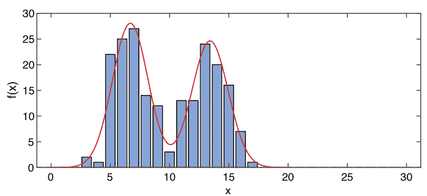

图3.16 拟合高斯混合分布。作为高斯混合分布的合成示例，我们生成两组各100个随机数，均值分别为6.4和13.3，标准差分别为1.4和1.8。使用*期望最大化（EM）算法*将具有两个分量的高斯混合分布（实线）拟合到数据（条形图）。

我们可以看到，高斯混合分布或多或少地与数据的直方图相匹配（图3.16）。

我们现在可以叠加两个缩放后的概率密度函数y1和y2。使用trapz()进行梯形数值积分来确定原始数据的积分：

```
y = y1 + y2
y = np.trapz(n,v)*y/np.trapz(y,x)
```

最后，我们可以将概率密度函数y绘制在原始数据直方图的条形图上：

```
plt.figure()
plt.bar(v,n)
plt.plot(x,y,color='r')
plt.show()
```

对象gm还包含关于层中两个分布的相对混合比例的信息gm.weights_。我们可以使用此信息将y1和y2缩放为彼此正确的比例：

```
y1 = gm.weights_[0]*y1/np.trapz(y1,x)
y2 = gm.weights_[1]*y2/np.trapz(y2,x)
```

均值gm.means_和协方差gm.covariances_，我们使用它们来计算混合分布的概率密度函数y：

```
x = np.arange(0,20+1/30,1/30)
y1 = np.ravel(stats.norm.pdf(x,gm.means_[0],
    (gm.covariances_[0])**0.5))
y2 = np.ravel(stats.norm.pdf(x,gm.means_[1],
    (gm.covariances_[1])**0.5))
```

表3.1 Kolmogorov-Smirnov检验的*KS*临界值（O'Connor and Kleyner 2012）。

| *n* | 显著性水平 *α* | | | |
| :--- | :--- | :--- | :--- | :--- |
| | 0.10 | 0.05 | 0.02 | 0.01 |
| 1 | 0.95000 | 0.97500 | 0.99000 | 0.99500 |
| 2 | 0.77639 | 0.84189 | 0.90000 | 0.92929 |
| 3 | 0.63604 | 0.70760 | 0.78456 | 0.82900 |
| 4 | 0.56522 | 0.62394 | 0.68887 | 0.73424 |
| 5 | 0.50945 | 0.56328 | 0.62718 | 0.66853 |
| 6 | 0.46799 | 0.51926 | 0.57741 | 0.61661 |
| 7 | 0.43607 | 0.48342 | 0.53844 | 0.57581 |
| 8 | 0.40962 | 0.45427 | 0.50654 | 0.54179 |
| 9 | 0.38746 | 0.43001 | 0.47960 | 0.51332 |
| 10 | 0.36866 | 0.40925 | 0.45662 | 0.48893 |
| 11 | 0.35242 | 0.39122 | 0.43670 | 0.46770 |
| 12 | 0.33815 | 0.37543 | 0.41918 | 0.44905 |
| 13 | 0.32549 | 0.36143 | 0.40362 | 0.43247 |
| 14 | 0.31417 | 0.34890 | 0.38970 | 0.41762 |
| 15 | 0.30397 | 0.33760 | 0.37713 | 0.40420 |
| 16 | 0.29472 | 0.32733 | 0.36571 | 0.39201 |
| 17 | 0.28627 | 0.31796 | 0.35528 | 0.38086 |
| 18 | 0.27851 | 0.30936 | 0.34569 | 0.37062 |
| 19 | 0.27136 | 0.30143 | 0.33685 | 0.36117 |
| 20 | 0.26473 | 0.29408 | 0.32866 | 0.35241 |
| 21 | 0.25858 | 0.28724 | 0.32104 | 0.34427 |
| 22 | 0.25283 | 0.28087 | 0.31394 | 0.33666 |
| 23 | 0.24746 | 0.27490 | 0.30728 | 0.32954 |
| 24 | 0.24242 | 0.26931 | 0.30104 | 0.32286 |
| 25 | 0.23768 | 0.26404 | 0.29516 | 0.31657 |
| 26 | 0.23320 | 0.25907 | 0.28962 | 0.31064 |
| 27 | 0.22898 | 0.25438 | 0.28438 | 0.30502 |
| 28 | 0.22497 | 0.24993 | 0.27942 | 0.29971 |
| 29 | 0.22117 | 0.24571 | 0.27471 | 0.29466 |
| 30 | 0.21756 | 0.24170 | 0.27023 | 0.28987 |
| 31 | 0.21412 | 0.23788 | 0.26596 | 0.28530 |
| 32 | 0.21085 | 0.23424 | 0.26189 | 0.28094 |
| 33 | 0.20771 | 0.23076 | 0.25801 | 0.27677 |
| 34 | 0.20472 | 0.22743 | 0.25429 | 0.27279 |
| 35 | 0.20185 | 0.22425 | 0.26073 | 0.26897 |
| 36 | 0.19910 | 0.22119 | 0.24732 | 0.26532 |
| 37 | 0.19646 | 0.21826 | 0.24404 | 0.26180 |
| 38 | 0.19392 | 0.21544 | 0.24089 | 0.25843 |
| 39 | 0.19148 | 0.21273 | 0.23786 | 0.25518 |
| 40 | 0.18913 | 0.21012 | 0.23494 | 0.25205 |
| >40 | 1.22/n^0.5 | 1.36/n^0.5 | 1.51/n^0.5 | 1.63/n^0.5 |

### 3.3 测量误差

与可以通过评估重复测量来确定的随机误差不同，*系统误差*（$s_s$）更难检测和量化。它们通常是由于仪器校准不正确而导致的测量值持续向下或向上的偏差。方程

$$s_s = \mu - \bar{x}$$

将系统误差表示为（通常未知的）总体均值（或*真实值*）$\mu$与测量值的样本均值之间的差值（图 3.17）。

举个例子，当我在一门测绘课程中学习时，一位教授要求我们用他的地质罗盘进行测量。每个学生都尽力了，但教授评论说每个读数都是*错误的*。他显然对初学者课程感到厌倦，因此简单地将罗盘的刻度调整了五度，以挑战学生。我们中没有人敢质疑教授罗盘的准确性，因此我们所有的读数都是不正确的，因为它们包含了五度的系统误差（除了任何随机误差）。由于无法在设备本身上检测到这种误差，使用另一台设备进行重复测量将能够检测并消除系统误差。如果我们知道测量的随机误差和系统误差，我们就可以指出数据的*精密度*和*准确度*。精确的测量值围绕均值一致，但由于限制准确度的系统误差，*真实值*可能与测量值的均值不同。增加样本量 $n$ 会提高精密度，但不会提高准确度。

我们现在可以进行一个简单的 Python 实验，以更好地理解测量不确定性。在清除工作区并重置

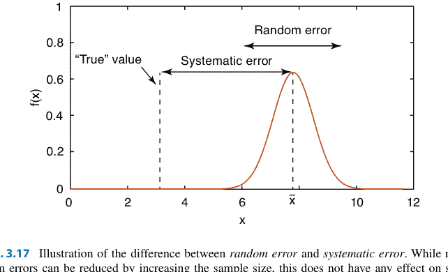

**图 3.17** *随机误差*和*系统误差*之间差异的图示。随机误差可以通过增加样本来减少，但这对系统误差没有任何影响。

随机数生成器之后，我们可以通过从均值为 3.4、标准差为 1.2 的总体中随机抽样来生成测量数据。这可能意味着一块岩石的真实金含量为每吨 3.4 克，但由于测量误差，该值无法比 ±1.2 克/吨更精确地确定。由于时间和预算限制，让我们假设我们只能进行 12 次测量，这些测量存储在 data 中，

```python
import numpy as np
import matplotlib.pyplot as plt
from numpy.random import default_rng
from scipy import stats

samplesize = 12
sqrtsamplesize = np.sqrt(samplesize)
rng = np.random.default_rng(0)
data = 3.4 + 1.5*rng.standard_normal(samplesize)
print(data)
```

其输出为

```
[3.58859533 3.20184271 4.36063398 3.55735018
 2.59649594 3.94239258 5.35600007 4.82062144
 2.34439715 1.50186779 2.46508831 3.46198897]
```

我们可以通过输入以下命令来显示测量值的频率分布直方图，并计算均值和标准差

```python
plt.figure()
plt.hist(data)
plt.show()

print(np.mean(data))
print(np.std(data,ddof=1))
print(np.std(data,ddof=1)/sqrtsamplesize)
```

其输出为

```
3.4331062031703756
1.1032297537289668
```

均值的误差取决于测量次数（在本例中，n=12），通过输入以下命令获得

```python
print(np.std(data,ddof=1)/sqrtsamplesize)
```

其输出为

```
0.3184749976467118
```

当我们指定结果时，关于指定多少位数字，适用一些规则。首先，测量值和测量不确定度必须具有相同的小数位数。其次，舍入后的位数由测量不确定度定义。第三，我们需要从左开始在测量不确定度中搜索第一个非零数字。如果此数字大于 2，则它是舍入位；如果此数字是 1 或 2，则其右侧的下一个数字是舍入位。第四，测量不确定度总是向上舍入。在我们的例子中，测量不确定度的第一位数字是 2，因此我们使用小数点后的第一位数字（即 7）作为舍入位。因此，我们测量的结果是 4.4±2.8 克/吨，这表明真实值以约 68% 的概率落在此区间内。从我们的合成示例中可以很容易地看出，由于样本量小（n=12），该值与我们最初定义的原始值 3.4±1.5 相差很大。然而，真实值 3.4 仍然落在 4.4±2.8 克/吨 的区间内。

然而，增加样本量会显著改善结果，因为均值的误差取决于测量次数，

```python
samplesize = 1000
sqrtsamplesize = np.sqrt(samplesize)
rng = np.random.default_rng(0)
data = 3.4 + 1.5*rng.standard_normal(samplesize)

plt.figure()
plt.hist(data)
plt.show()

print(np.mean(data))
print(np.std(data,ddof=1))
```

其输出为

```
3.327957584855196
1.4658625581392208
```

对于 n=1,000 次测量，均值的误差为

```python
print(np.std(data,ddof=1)/sqrtsamplesize)
```

其输出为

```
0.0463546442048093
```

正如预期的那样，该值远小于 $n = 12$ 的相应值。该结果表明真实值位于区间 $3.35 \pm 0.05$ 克/吨内。同样，*真实*值 3.4 仍然落在 $3.35 \pm 0.05$ 克/吨 的区间内。

接下来，我们研究一个案例，其中我们的值 $y$ 取决于 $j$ 个测量变量 $x_1, x_2, \dots$ 及其 $j$ 个不确定度 $s_1, s_2, \dots$，我们使用它们来计算 $y$ 及其不确定度 $s$。如果不确定度 $s_1, s_2, \dots$ 彼此不独立，我们可以使用高斯误差传播定律来计算 $s$，

$$s = \sqrt{\sum_{j=1}^{m} \left( \frac{\partial y}{\partial x_j} \cdot s_j \right)^2 + 2 \sum_{j=1}^{m-1} \sum_{k=j+1}^{m} \left( \frac{\partial y}{\partial x_j} \right) \left( \frac{\partial y}{\partial x_k} \right) \cdot s(x_j x_k)}$$

其中 $\partial y/\partial x_j$ 是 $y$ 对第 $j$ 个变量 $x_j$ 的偏导数，$s_j$ 是该变量的标准差，$s(x_j x_k)$ 是变量 $x_j$ 和 $x_k$ 不确定度的协方差（例如，Taylor 1997，第 212 页）。如果变量彼此不相关，则协方差项为零，方程简化为

$$s = \sqrt{\sum_{j=1}^{m} \left( \frac{\partial y}{\partial x_j} \cdot s_j \right)^2}$$

Python 是模拟误差传播的绝佳工具。例如，我们可以使用该软件来估计两个量 $x_1$ 和 $x_2$ 的测量值之差 $y$ 的不确定度，基于它们各自的不确定度 $s_1$ 和 $s_2$。该实验揭示了当测量值相互依赖和相互独立时不确定度的差异。我们可以定义一个大的样本量 100,000,000 次测量，以产生非常精确的误差值：

```python
samplesize = 100000000
```

为了计算 $x_1$ 和 $x_2$ 之间的差值 $y$ 以及该差值的误差，我们使用两个高斯分布，其均值分别为 6.3 和 3.4，标准差分别为 1.2 和 1.5。我们基于两个分布相互依赖的假设，计算两个分布均值之间的差值，

$$\bar{y} = \overline{x_1} - \overline{x_2}$$

其结果为

$$\bar{y} = 6.3 - 3.4 = 2.9$$

其中实际变量 $x_1$ 和 $x_2$ 的标准差分别为 $s_1$ 和 $s_2$，协方差为 $s(x_1 x_2)$。如果我们从上面的高斯误差传播定律方程中解出我们关于两个均值之差的例子，我们得到

$$s_f = \sqrt{s_1^2 + s_2^2 - 2 \cdot (x_1 x_2)}$$

其结果为

$$s_f = \sqrt{1.5^2 + 1.2^2 - 2 \cdot 1.5 \cdot 1.2} = 0.3$$

这是两个测量值完全相互依赖时均值之差的误差。在另一个 Python 实验中，我们可以使用相同的随机数集 r 来为数据添加不确定性，

```python
rng = np.random.default_rng(0)
r = rng.standard_normal(samplesize)
age1 = 3.4 + 1.2*r
age2 = 6.3 + 1.5*r
dage = age2-age1

plt.figure()
plt.hist(data,bins=30)
plt.show()

print(np.mean(dage))
print(np.std(dage,ddof=1))
```

其输出为

```
2.9000297901909815
0.30000440854326643
```

分别对应均值之差及其误差。我们现在可以再次运行相同的实验，但让两个测量值相互独立。在

$$s_f = \sqrt{s_1^2 + s_2^2 - 2 \cdot s(x_1x_2)}$$

中的协方差项为零，其结果为

$$s_f = \sqrt{1.5^2 + 1.2^2 - 0} \approx 1.92$$

这是两个完全独立的测量值之差的误差。在另一个 Python 实验中，我们可以使用不同的随机数集来为数据添加不确定性，

```python
rng = np.random.default_rng(0)
age1 = 3.4 + 1.2*rng.standard_normal(samplesize)
age2 = 6.3 + 1.5*rng.standard_normal(samplesize)
dage = age2-age1
```

plt.figure()
plt.hist(data, bins=30)
plt.show()

print(np.mean(dage))
print(np.std(dage, ddof=1))
```

其输出结果为

```
2.899813389856444
1.9209998186394632
```

这分别代表均值的近似差值和差值的标准误差。与用于生成数据的精确值相比，这些结果存在微小偏差，这是由于样本量有限所致。从这个例子中我们可以看到，我们既可以向均值添加相同的高斯随机数，也可以使用不同的、独立的随机数来模拟因测量误差（独立误差和相关误差）而产生的差值 $y$ 中的误差。

## 参考文献

Ansari AR, Bradley RA (1960) 离散度的秩和检验。数理统计年鉴，31:1174–1189。[开放获取]
Dempster AP, Laird NM, Rubin DB (1977) 通过EM算法从不完全数据中进行最大似然估计。皇家统计学会杂志，B辑（方法论）39(1):1–38
Fisher RA (1935) 实验设计。Oliver and Boyd，爱丁堡
Helmert FR (1876) 论观测误差幂和的概率及相关问题。数学与物理杂志 21:192–218
Kolmogorov AN (1933) 论分布函数的经验确定。意大利精算师学会杂志 4:83–91
Mann HB, Whitney DR (1947) 论一个随机变量是否随机大于另一个的检验。数学统计年鉴 18:50–60
Miller LH (1956) 柯尔莫哥洛夫统计量百分位点表。美国统计协会杂志 51:111–121
O’Connor PDT, Kleyner A (2012) 实用可靠性工程-第五版。John Wiley & Sons，纽约
Pearson ES (1990) Student——威廉·西利·高塞特的统计传记。载于：Plackett RL，在Barnard GA协助下，牛津大学出版社，牛津
Pearson K (1900) 论一个准则：在相关变量系统中，给定的与概率值的偏差系统，可以合理地假设其源于随机抽样。哲学杂志 50:157–175
Poisson SD (1837) 论刑事和民事案件中判决概率的研究，附概率计算一般规则。Bachelier，数学印刷商兼书商，巴黎
Popper K (1959) 科学发现的逻辑。Hutchinson & Co.，伦敦
Hedderich J, Sachs L (2012) 应用统计学：R语言方法集，第14版。Springer，柏林海德堡纽约
Smirnov NV (1939) 论两个独立样本经验分布曲线差异的估计。莫斯科通报 2:3–16
Student, (1908) 论均值的可能误差。生物计量学 6:1–25
Taylor JR (1997) 误差分析导论：物理测量中的不确定性研究，第2版。University Science Books，加利福尼亚州索萨利托

# 4 双变量统计

### 4.1 引言

双变量分析用于更好地理解两个变量 $x$ 和 $y$ 之间的关系，例如化石的长度和宽度、火山玻璃的钠和钾含量，或沉积岩芯中的有机质含量。当两个变量在同一对象上测量时，$x$ 通常被确定为*自变量*，$y$ 被确定为*因变量*。如果两个变量都是在实验中产生的，那么实验者操纵的变量被描述为自变量。在某些情况下，两个变量都没有被操纵，因此都不是自变量。

双变量统计用于描述两个变量之间关系的强度，可以使用单一指标，例如用于线性关系的皮尔逊相关系数，也可以使用通过回归分析得到的方程（图4.1）。描述变量 $x$ 和 $y$ 之间关系的方程可用于在用于回归分析的原始数据值范围内，从任意 $x$ 值预测 $y$ 响应。如果其中一个变量难以测量，这一点尤为重要。在这种情况下，首先通过在小型训练数据集上进行回归分析来确定两个变量之间的关系。然后，回归方程可用于计算第二个变量。

本章首先在第4.2节介绍相关系数，然后在第4.3节和第4.9至4.10节解释广泛使用的线性和非线性回归分析方法。第4.4至4.8节还解释了几种用于评估回归分析中不确定性的附加方法。所有方法都通过合成示例进行说明，因为此类示例为评估最终结果提供了极好的手段。对于双变量分析，我们使用 *NumPy* (https://numpy.org) 和 *Matplotlib* 包 (https://matplotlib.org)，以及 *SciPy* 库 (https://scipy.org)，它们包含了所有必要的例程。

**补充信息** 在线版本包含补充材料，可访问 https://doi.org/10.1007/978-3-031-56906-7_4。

© 作者，根据与Springer Nature Switzerland AG 2024的独家许可
M. H. Trauth, *Python Recipes for Earth Sciences*, Springer Textbooks in Earth Sciences, Geography and Environment, https://doi.org/10.1007/978-3-031-56906-7_4

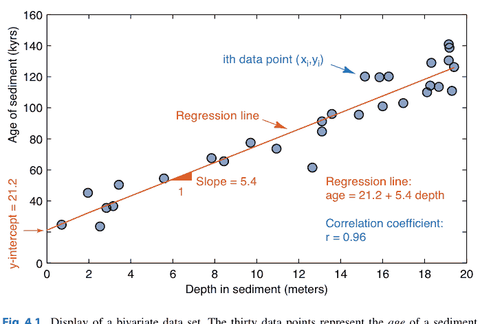

图 4.1 双变量数据集的展示。三十个数据点代表沉积物在沉积物-水界面下某一*深度*（以米为单位）的*年龄*（以距今千年前为单位）。两个变量的联合分布表明*年龄*和*深度*之间存在线性关系，即沉积物年龄的增长速率随深度保持恒定。皮尔逊相关系数（文中解释）*r*=0.96 支持两个变量之间存在强线性相互依赖关系。线性回归得到方程 *age*=21.2+5.4·*depth*，这表明沉积物深度每增加1米，年龄增加5.4千年（回归线的斜率）。

### 4.2 相关系数

*相关系数*通常在双变量分析的早期阶段使用。它们仅提供双变量数据集中直线趋势的非常粗略的估计。不幸的是，文献中充满了高估相关系数重要性的例子，或者数据集中的异常值导致总体相关系数被高估的例子。

最流行的相关系数是*皮尔逊线性积矩相关系数* *ρ* (Pearson 1895)（图4.2）。我们从 *n* 个样本数据中估计总体的相关系数 *ρ*，即计算样本相关系数 *r*，其定义为

$$r_{xy} = \frac{\sum_{i=1}^{n} (x_i - \bar{x})(y_i - \bar{y})}{(n - 1)s_x s_y}$$

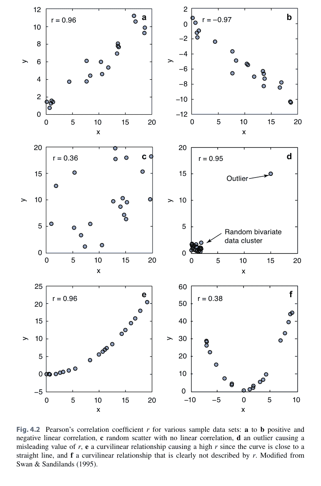

皮尔逊相关系数的分子被称为双变量数据集的*校正积和*。将分子除以 $(n-1)$ 得到*协方差*，

$$cov_{xy} = \frac{1}{(n-1)} \sum_{i=1}^{n} (x_i - \bar{x})(y_i - \bar{y})$$

它是数据 $x_i$ 和 $y_i$ 分别偏离样本均值 $\bar{x}$ 和 $\bar{y}$ 的偏差乘积之和，除以 $(n-1)$。协方差是双变量统计中广泛使用的度量，尽管它有一个缺点，即依赖于数据的维度。将协方差除以单变量标准差 $s_x$ 和 $s_y$ 可以消除这种依赖性，从而得到皮尔逊相关系数。相关系数有效的先决条件是 $x$ 和 $y$ 都服从正态分布。

检验皮尔逊相关系数显著性的一种方法是确定来自总体（其中 $\rho=0$）的随机样本中 $r$ 值的概率。相关系数的显著性可以使用 $t$ 统计量来估计：

$$t = r \sqrt{\frac{n-2}{1-r^2}}$$

如果计算出的 $t$ 大于临界 $t$（$n-2$ 自由度，$\alpha=0.05$），则相关系数显著。此检验也仅在两个变量都服从高斯分布时有效。

皮尔逊相关系数对双变量数据集中的扰动非常敏感。因此，存在几种皮尔逊相关系数的替代方法，例如*斯皮尔曼等级相关系数*，它由英国心理学家查尔斯·斯皮尔曼（1863-1945）提出。斯皮尔曼系数可用于衡量两个变量之间的统计依赖性，而无需假设基础总体服从正态分布（即，它是一种非参数相关性度量）(Spearman 1904, 1910)。此外，由于斯皮尔曼系数使用 $x$ 和 $y$ 中值的等级而不是实际数值，因此可用于发现非线性数据甚至非数值数据（如地层序列中的化石名称或岩石类型）中的相关性。在将 $x$ 和 $y$ 中的数值替换为其等级（其中 $x$ 和 $y$ 中的多个值被替换为各自的平均等级）之后，样本斯皮尔曼等级相关系数定义为

$$r_{xy} = \frac{6 \sum_{i=1}^{n} d_i^2}{n(n^2-1)}$$

其中 $d_i$ 是两个变量等级之间的差值。由于此相关系数基于等级而非数值，因此它比皮尔逊相关系数对异常值的敏感性更低。

### 4.2 相关系数

皮尔逊相关系数的另一个替代方案是*肯德尔τ秩相关系数*，它由英国统计学家莫里斯·肯德尔（1907-1983）提出。该系数也是一种非参数相关性度量，类似于斯皮尔曼秩相关系数（Kendall 1938）。肯德尔τ秩相关系数比较$x$和$y$中数值的秩，这意味着总共有$0.5 n(n-1)$对需要比较。如果观测对$(x_i, y_i)$和$(x_j, y_j)$的秩相同，则称它们为一致对；如果秩不同，则称它们为不一致对。样本肯德尔τ秩相关系数定义为

$$\tau = \frac{(P - Q)}{\frac{1}{2}n(n - 1)}$$

其中$P$是一致对的数量，$Q$是不一致对的数量。肯德尔相关系数的值通常低于斯皮尔曼相关系数。

以下示例说明了相关系数的使用，并强调了使用这些线性趋势度量时可能存在的陷阱。该示例还说明了可用于探索$\rho$估计置信水平的重采样方法。合成数据包含两个变量：沉积物年龄（以距今千年前kyr为单位）和沉积物-水界面以下的深度（以米为单位）。使用合成数据集的一个优势是我们能够完全理解数据背后的线性模型。

数据以两列的形式包含在文件*agedepth_1.txt*中。这些数据是使用沉积物表面以下的三十个随机深度生成的。线性关系$age = 5.6*meters + 20$用于计算变量age的无噪声值。这是一个斜率为5.6、y截距为20的直线方程。向age数据添加了均值为零、标准差为十的高斯噪声：

```python
import numpy as np
import numpy.ma as ma
from scipy import stats
import matplotlib.pyplot as plt
from scipy.stats import bootstrap
from numpy.random import default_rng

np.random.seed(0)
meters=20*np.random.rand(30)
age=5.6*meters+20
rng=default_rng(0)
age=age+10*rng.standard_normal(np.shape(meters))
```

```python
plt.figure()
plt.plot(meters,age,
    marker='o',
    linestyle='none')
plt.show()

agedepth=ma.hstack([meters,age])
```

然而，也可以从文件*agedepth_1.txt*加载合成的双变量数据集：

```python
agedepth=np.loadtxt('agedepth_1.txt')
```

然后我们定义两个新变量`meters`和`age`，并生成数据的散点图：

```python
meters=agedepth[0:,0]
age=agedepth[0:,1]

plt.figure()
plt.plot(meters,age,
    marker='o',
    linestyle='none')
plt.show()
```

我们可以观察到图中存在强烈的线性趋势，这表明两个变量`meters`和`age`之间存在某种相互依赖性。这种趋势可以用皮尔逊相关系数$r$来描述，其中$r=1$表示完全正相关（即age随meters增加而增加），$r=0$表示无相关性，$r=-1$表示完全负相关。我们使用`corrcoef()`计算皮尔逊相关系数，

```python
r=np.corrcoef(meters,age)
print(r)
```

得到以下输出：

```
[[1.         0.956335]
 [0.956335 1.        ]]
```

函数`corrcoef()`计算两个变量`age`和`meters`所有可能组合的皮尔逊相关系数数组（或矩阵）。值$r=0.9563$表明两个变量`age`和`meters`彼此强烈依赖。

然而，皮尔逊相关系数对异常值高度敏感，如下例所示。让我们生成一个包含三十个数据点的正态分布簇，其均值为零，标准差为一。为了获得相同的数据值，我们使用0作为种子重置随机数生成器：

```python
rng=default_rng(0)
x=rng.standard_normal((30))
y=rng.standard_normal((30))

plt.figure()
plt.plot(x,y,
    marker='o',
    linestyle='none')
plt.show()
```

输入

```python
r=np.corrcoef(x,y)
print(r)
```

得到

```
[[ 1.          -0.33210663]
 [-0.33210663   1.        ]]
```

正如预期的那样，这些随机数据的相关系数非常低。我们现在在数据集中引入一个异常值，形式为一个异常高的(x, y)值，其中x = y。包含异常值(x, y) = (5, 5)的双变量数据集的相关系数比之前大得多。输入

```python
x=np.append(x,5)
y=np.append(y,5)

plt.figure()
plt.plot(x,y,
    marker='o',
    linestyle='none')
plt.show()

r=np.corrcoef(x,y)
print(r)
```

得到

```
[[1.         0.3415448]
 [0.3415448 1.        ]]
```

增加该异常值的绝对$(x, y)$值会导致相关系数急剧增加。输入

```python
x[30]=10
y[30]=10

plt.figure()
plt.plot(x,y,
        marker='o',
        linestyle='none')
plt.show()

r=np.corrcoef(x,y)
print(r)
```

得到

```
[[1.         0.74130704]
 [0.74130704 1.        ]]
```

如果异常值为$(x, y) = (20,20)$，则相关系数接近$r=1$。输入

```python
x[30]=20
y[30]=20

plt.figure()
plt.plot(x,y,
        marker='o',
        linestyle='none')
plt.show()

r=np.corrcoef(x,y)
print(r)
```

得到

```
[[1.         0.92488156]
 [0.92488156 1.        ]]
```

我们可以使用`SciPy`包的`stats`模块中的`pearsonr()`、`spearmanr()`和`kendalltau()`来比较皮尔逊相关系数与斯皮尔曼相关系数和肯德尔相关系数的敏感性。与`corrcoef()`不同，这些函数不计算我们以后（例如在第9章中）计算多变量数据集内相关性时可以使用的相关数组（或矩阵）。我们输入。

```python
rp,rppvalue=stats.pearsonr(x,y)
rs,rspvalue=stats.spearmanr(x,y)
rk,rkpvalue=stats.kendalltau(x,y)
print(rp)
print(rs)
print(rk)
```

得到

```
0.9248815580753484
-0.17298387096774195
-0.12258064516129034
```

我们可以观察到，与皮尔逊相关系数的高估值（错误地暗示变量之间存在强相互依赖性）相比，替代的相关性度量给出了合理的值。尽管异常值在双变量散点图中很容易识别，但在大型多变量数据集中（第9章），错误的值很容易被忽略。

计算皮尔逊相关系数显著性的方法有多种。函数`pearsonr()`也提供了评估结果质量的可能性。*p*值是在真实相关性为零的情况下，获得至少与观测值一样大的相关性的概率。如果*p*值很小，则相关系数*r*是显著的。输入

```python
rp,rppvalue=stats.pearsonr(x,y)
print(rp,rppvalue)
```

得到

```
0.9248815580753484 1.0489538147952255e-13
```

在我们的例子中，*p*值`rppvalue`接近零，这表明相关系数是显著的。我们可以从这个实验中得出结论，这个特定的显著性检验未能检测到可归因于异常值的相关性。因此，我们可以接下来尝试使用替代的*t*检验统计量来确定*x*和*y*之间相关性的显著性。根据该检验，如果计算出的*t*大于临界*t*（*n*−2自由度，*α*=0.05），我们可以拒绝零假设，即不存在相关性。输入

```python
tcalc=rp * ((len(x)-2)/(1-rp**2))**0.5
tcrit=stats.t.ppf(1-0.05,len(x)-2)
print(tcalc)
print(tcrit)
```

得到

```
13.09814600608973
1.6991270265334972
```

这个结果确实表明我们可以拒绝零假设，因此不存在相关性。

作为检测异常值的替代方法，*重采样方案*和*替代数据*（例如*自助法*或*刀切法*）是评估结果统计显著性的强大工具。当扫描大型多变量数据集以查找异常值时（见第9章），这些技术特别有用。重采样方案通过选择*n*−1个子样本*n*次（刀切法）或通过*有放回地*选择任意一组包含*n*个数据点的子样本（自助法），对包含*n*个数据点的原始数据集进行重复重采样。这些子样本的统计量比从完整数据集计算出的统计参数（例如均值、标准差、相关系数）提供了关于总体特征的更好信息。此代码允许对我们的双变量数据集（包括异常值(*x*, *y*) = (20, 20)）进行重采样：

```python
ind = np.linspace(0,30,31,
    dtype=int)
rhos1000 = np.zeros((1000,4))
for i in range(1000):
    indices = np.random.choice(ind,
        size=31,
        replace=True)
    r = np.reshape(np.corrcoef(x[indices],
        y[indices]),(1,4))
    rhos1000[i,:] = r
```

此代码首先对数据进行一千次重采样；然后计算每个新子样本的相关系数，并将结果存储在变量rhos1000中。由于corrcoef()返回一个2x2数组（如上所述），rhos1000的维度为1,000x4（即2x2数组的每个元素有1,000个值）。绘制第二个元素（即(*x*, *y*)的相关系数）的1,000个值的直方图，说明了该度量在存在或不存在异常值时的离散程度。由于rhos1000的分布包含许多空类，我们使用大量的分箱：

plt.figure()
plt.hist(rhos1000[:,1],bins=30)
plt.show()

该直方图显示了一个靠近 $r=1$ 的强峰值，以及一组在 $r=0$ 附近、遵循正态分布的相关系数（图 4.3）。对此直方图的解释相对直接。当子样本包含异常值时，相关系数接近 1；而不包含异常值的子样本则产生非常低的相关系数（接近零），这表明两个变量 $x$ 和 $y$ 之间不存在任何强相互依赖性。

因此，自助法提供了一个简单而强大的工具，用于接受或拒绝我们对总体相关系数的初步估计。将上述过程应用于合成沉积数据，得到子样本相关系数的清晰单峰高斯分布。输入

```
agedepth=np.loadtxt('agedepth_1.txt')

meters=agedepth[0:,0]
age=agedepth[0:,1]
```

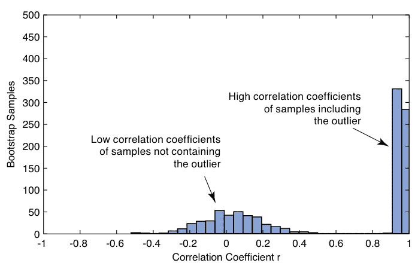

**图 4.3** 基于 1,000 个子样本的皮尔逊相关系数 $r$ 的自助法结果。直方图显示在 $r=0$ 附近有一个大致呈正态分布的相关系数簇，这表明这些子样本不包含异常值。然而，靠近 $r=1$ 的强峰值表明，相应的子样本中存在一个两个变量 $x$ 和 $y$ 值都较高的异常值。

```
rp, rppvalue=stats.pearsonr(meters,age)
print(rp,rppvalue)
```

输出

```
0.9563350017670429 1.7163469052071033e-16
```

然后我们使用以下代码自助法计算相关系数

```
ind = np.linspace(0,19,30,dtype=int)
rhos1000 = np.zeros((1000,4))
for i in range(1000):
    indices = np.random.choice(ind,
        size=30,
        replace=True)
    r = np.reshape(np.corrcoef(meters[indices],
        age[indices]),(1,4))
    rhos1000[i,:] = r

plt.figure()
plt.hist(rhos1000[:,1],bins=30)
plt.show()
```

rhos1000 的大部分值落在区间 [0.92, 0.98] 内。由于重采样数据集（在我们的例子中）的相关系数近似服从正态分布，我们可以使用它们的均值作为真实相关系数的良好估计。输入

```
print(np.mean(rhos1000))
```

输出

```
0.9672350831170088
```

这个值与我们最初的结果 r=0.9563 相似，但现在我们对结果的有效性有了信心。然而，在我们的例子中，年龄-深度数据的自助法相关系数估计值的分布是相当偏斜的，因为其上限固定为 1。尽管如此，自助法是评估双变量分析中皮尔逊相关系数可靠性的宝贵工具。

### 4.3 经典线性回归分析

线性回归提供了描述两个变量 $x$ 和 $y$ 之间关系的另一种方式。虽然皮尔逊相关系数仅提供了线性趋势的粗略度量，但通过回归分析获得的线性模型允许在数据范围内为任何给定的 $x$ 值预测任意的 $y$ 值。对线性模型进行统计显著性检验，可以深入了解这些预测的准确性。

*经典回归*假设 $y$ 对 $x$ 做出响应，并且数据集中的所有离散性都包含在 $y$ 值中（图 4.4）。这意味着 $x$ 是自变量（也称为预测变量或回归变量）。$x$ 的值由实验者定义，通常被视为无误差。一个例子是沉积岩芯中测量变量 $y$ 的位置 $x$。因变量 $y$ 包含误差，因为其大小无法精确确定。线性回归使用最小二乘准则，最小化数据点 $xy$ 与最佳拟合线 $y = b_0 + b_1x$ 预测值 $y$ 之间的偏差 $\Delta y$。一般线性模型的基本方程为

$$y = b_0 + b_1x$$

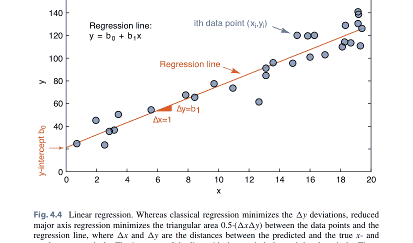

**图 4.4** 线性回归。经典回归最小化 $\Delta y$ 偏差，而约化主轴回归最小化数据点与回归线之间的三角形面积 $0.5 \cdot (\Delta x \Delta y)$，其中 $\Delta x$ 和 $\Delta y$ 分别是预测值与真实 $x$ 和 $y$ 值之间的距离。直线与 $y$ 轴的截距为 $b_0$，斜率为 $b_1$。这两个参数定义了回归线的方程。

其中 $b_0$ 和 $b_1$ 是回归系数。$b_0$ 的值是 y 截距，$b_1$ 是直线的斜率。需要最小化的 $\Delta y$ 偏差的平方和为

$$\sum_{i=1}^{n} (\Delta y_i)^2 = \sum_{i=1}^{n} (y_i - (b_0 + b_1 x_i))^2$$

对方程右边项进行偏微分并令其为零，得到回归系数 $b_1$ 的简单方程：

$$b_1 = \frac{\sum_{i=1}^{n} (x_i - \bar{x})(y_i - \bar{y})}{\sum_{i=1}^{n} (x_i - \bar{x})^2}$$

回归线通过由样本均值定义的数据质心，因此我们可以使用单变量样本均值和先前计算的斜率 $b_1$ 来计算另一个回归系数 $b_0$：

$$b_0 = \bar{y} - b_1 \bar{x}$$

作为示例，让我们再次从文件 *agedepth_1.txt* 加载合成的年龄-深度数据。我们可以定义两个新变量 `meters` 和 `age`，并生成数据的散点图（图 4.5）：

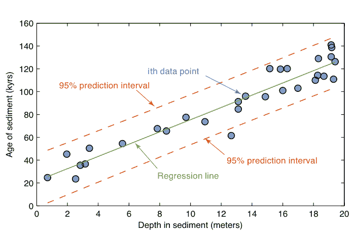

**图 4.5** 线性回归结果。该图显示了原始数据点（圆圈）、回归线（实线）和回归的误差范围（虚线）。请注意，95% 预测区间实际上是弯曲的，尽管在示例中它们几乎看起来像直线。

```
import numpy as np
import matplotlib.pyplot as plt

agedepth=np.loadtxt('agedepth_1.txt')

meters=agedepth[0:,0]
age=agedepth[0:,1]
```

双变量散点图中的线性趋势以及大于 $r=0.9$ 的相关系数表明 `meters` 和 `age` 之间存在强线性依赖关系。用地质学术语来说，这意味着沉积速率随时间保持恒定。我们现在可以尝试将线性模型拟合到数据，这将帮助我们预测没有年龄数据的沉积层的年龄。函数 `polyfit()` 计算一个特定次数的多项式 $p(x)$ 的系数，该多项式以最小二乘意义拟合数据 $y$。在我们的例子中，我们将一个一次（线性）多项式拟合到数据。输入

```
p=np.polyfit(meters,age,1)
print(p)
```

输出

```
[ 5.36669965 21.7607019]
```

其中 `p` 是一个行向量，包含按降幂排列的多项式系数。由于我们使用的是合成数据，我们知道斜率和 $y$ 截距的值。估计的斜率（5.3667）和 $y$ 截距（21.7607）与真实值 5.6 和 20 分别吻合良好。数据和拟合线都可以绘制在同一张图上：

```
plt.figure()
plt.plot(meters,age,
    marker='o',
    linestyle='none')
plt.plot(meters,p[0]*meters+p[1],
    color=(0.8,0.5,0.3))
plt.show()
```

除了使用回归线方程，我们也可以使用 `poly1d()` 来计算 $y$ 值：

```
pval=np.poly1d(p)

plt.figure()
plt.plot(meters,age,
    marker='o',
    linestyle='none')
plt.plot(meters,pval(meters),
    color=(0.8,0.5,0.3))
plt.show()
```

系数 p(x) 和通过线性回归获得的方程现在可用于预测任何给定 x 值的 y 值。然而，我们只能在线性模型拟合的深度区间内进行此操作，即在 0 到 20 米之间。例如，深度 17 米处沉积物的年龄由下式给出

```
print(pval(17))
```

输出

```
112.99459593875632
```

这个结果表明，深度 17 米处的沉积物年龄约为 113 千年。

### 4.4 分析残差

当我们比较预测值与实际或观测值的差异时，我们正在进行残差分析。残差的统计信息为拟合到数据的模型质量提供了有价值的信息。例如，残差中的趋势表明模型未能完全描述数据。在这种情况下，应将更复杂的模型（例如，更高次的多项式）拟合到数据。理想情况下，残差是纯随机的，即它们应服从均值为零的高斯分布。因此，我们通过目视检查直方图并采用第 3 章介绍的 χ² 检验来检验残差服从高斯分布的假设：

```
import numpy as np
import matplotlib.pyplot as plt
from scipy import stats

agedepth=np.loadtxt('agedepth_1.txt')

meters=agedepth[0:,0]
age=agedepth[0:,1]

p=np.polyfit(meters,age,1)
print(p)
```

## 4.4 残差分析

```python
pval = np.poly1d(p)
res = age - pval(meters)
```

由于绘制残差图未显示出任何明显的行为模式，因此不应将比直线更复杂的模型拟合到数据上：

```python
plt.figure()
plt.stem(meters, res)
plt.show()
```

另一种绘制残差图的方法是使用`stem()`函数绘制茎叶图：

```python
plt.figure()
plt.subplot(2, 1, 1)
plt.plot(meters, age,
    marker='o',
    linestyle='none')
plt.plot(meters, pval(meters),
    color='r')
plt.subplot(2, 1, 2)
plt.stem(meters, res)
plt.show()
```

为了探索残差的分布，我们可以选择六个区间并显示相应的频率：

```python
plt.figure()
plt.hist(res, bins=6)
plt.show()
```

$\chi^2$检验可用于检验残差服从高斯分布的假设（第3.9节）。我们使用`chisquare()`函数进行$\chi^2$检验：

```python
nres, e = np.histogram(res, bins=6)
chisq, p = stats.chisquare(nres)
print(chisq)
print(p)
```

结果如下：

```
11.200000000000003
0.04755564396470476
```

该结果意味着在5%的显著性水平下，我们无法拒绝原假设。然而，结果的质量并不理想，因为30个测量值的样本量非常小。

### 4.5 回归系数的Bootstrap估计

在本节中，我们使用*bootstrap*方法来获得回归系数的更好估计。作为示例，我们使用`random.choice()`函数进行1000次抽样（图4.6）：

```python
import numpy as np
import matplotlib.pyplot as plt
from numpy.random import default_rng

agedepth = np.loadtxt('agedepth_1.txt')

meters = agedepth[0:, 0]
age = agedepth[0:, 1]

p = np.polyfit(meters, age, 1)

ind = np.linspace(0, 19, 30, dtype=int)
p1000 = np.zeros((1000, 2))
for i in range(1000):
    indices = np.random.choice(ind,
        size=30,
        replace=True)
    p = np.polyfit(meters[indices],
        age[indices], 1)
    p1000[i, :] = p
```

**图4.6** 通过bootstrap重采样估计的**a** 第一个回归系数（回归线的斜率）和**b** 第二个回归系数（直线的y轴截距）的直方图。第一个系数约束良好，但第二个系数显示出较大的离散性。

第一个系数（即回归线的斜率）的统计量为：

```python
plt.figure()
plt.hist(p1000[:, 0], bins=30)
plt.show()

print(np.median(p1000[:, 0]))
```

结果如下：

```
5.120606217265465
```

我们使用中位数而非均值，因为我们不能期望bootstrap结果服从高斯分布。相比之下，第二个系数的统计量显示出显著的离散性。输入以下代码：

```python
plt.figure()
plt.hist(p1000[:, 1], bins=30)
plt.show()

print(np.median(p1000[:, 1]))
```

得到：

```
24.22153549031753
```

用于模拟我们数据集的真实值是斜率5.6和y轴截距20，而使用polyfit()计算的相应系数分别为5.3667和21.7607（第4.3节）。

### 4.6 回归系数的Jackknife估计

Jackknife方法是一种类似于bootstrap方法的重采样技术。从一个包含n个数据点的样本中，抽取n个包含n−1个数据点的子样本。对每个子样本计算感兴趣的参数（例如回归系数）。然后计算系数的均值和离散度。这种方法的缺点是n个子样本的数量有限：因此，回归系数的jackknife估计不如bootstrap估计精确。

jackknife的相关代码很容易生成：

```python
import numpy as np
import matplotlib.pyplot as plt
from numpy.random import default_rng

agedepth = np.loadtxt('agedepth_1.txt')

meters = agedepth[0:, 0]
age = agedepth[0:, 1]

p = np.polyfit(meters, age, 1)

p30 = np.zeros((30, 2))
for i in range(30):
    j_meters = np.copy(meters)
    j_age = np.copy(age)
    j_meters = np.delete(j_meters, i, 0)
    j_age = np.delete(j_age, i, 0)
    p = np.polyfit(j_meters, j_age, 1)
    p30[i, :] = p
```

对于包含$n-1=29$个数据点的子样本的jackknife估计，可以使用简单的for循环实现。在每次迭代中删除第$i$个数据点，并为剩余数据点计算回归系数。$i$个子样本的均值提供了回归系数的改进估计。与bootstrap结果一样，回归线的斜率（第一个系数）定义良好：

```python
print(np.median(p30[:, 0]))
```

结果如下：

```
5.3663093479597155
```

而bootstrap方法计算的结果为5.1206，相比之下，$y$轴截距（第二个系数）具有较大的不确定性：

```python
print(np.median(p30[:, 1]))
```

得到：

```
21.79637039186352
```

而bootstrap方法计算的结果为24.2215（第4.5节）。如前所述，真实值是5.6和20。来自30个子样本的jackknife结果的直方图（图4.7）：

```python
plt.figure()
plt.subplot(1, 2, 1)
plt.hist(p30[:, 0])
plt.subplot(1, 2, 2)
plt.hist(p30[:, 1])
plt.show()
```

并未显示出像bootstrap估计的直方图那样清晰的系数分布。因此我们已经看到，使用jackknife或bootstrap方法进行重采样是检验回归模型质量的简单而有价值的方法。下一节将介绍一种比重采样方法更常用的质量估计替代方法。

### 4.7 交叉验证

检验回归分析结果质量的第三种方法涉及*交叉验证*。在交叉验证中，使用*n*–1个数据点计算回归线。预测第*n*个数据点，并计算预测值与实际值之间的差异。随后，确定实际值与预测值之间差异的均值。

在此示例中，对$n=30$个数据点进行交叉验证。得到的30条回归线（每条线使用$n-1=29$个数据点计算）在斜率和y轴截距上显示出一定的离散性：

```python
import numpy as np
import matplotlib.pyplot as plt

agedepth = np.loadtxt('agedepth_1.txt')

meters = agedepth[0:, 0]
age = agedepth[0:, 1]

p = np.polyfit(meters, age, 1)
print(p)

p_age = np.zeros((30, 1))
p_error = np.zeros((30, 1))

plt.figure()
plt.plot(meters, age,
    marker='o',
    linestyle='none')
for i in range(0, 30):
    j_meters = meters
    j_age = age
    j_meters = np.delete(j_meters, i)
    j_age = np.delete(j_age, i)
    p = np.polyfit(j_meters, j_age, 1)
    pval = np.poly1d(p)
    plt.plot(meters, pval(meters),
        color=(0.8, 0.5, 0.3),
        linewidth=0.1)
    p_age = pval(meters)
    p_error[i, 0:] = p_age[i] - age[i]
plt.show()
```

在理想情况下，预测误差应服从均值为零的高斯分布：

```python
print(np.mean(p_error))
```

结果如下：

```
-0.048670587295191345
```

标准差是真实数据点与预测直线偏差的均值：

```python
print(np.std(p_error, ddof=1))
```

得到：

```
10.975717618676232
```

交叉验证提供了关于回归结果拟合优度的有价值信息，也可用于其他领域（如时间和空间预测，第5章和第7章）的质量控制。

### 4.8 约化主轴回归

在某些示例中，没有一个变量被操纵，因此两个变量都可以被视为独立变量。在这种情况下，有几种方法可用于计算最小化到x和y距离的最佳拟合线。例如，*约化主轴*（RMA）回归最小化数据点与回归线之间的三角形面积0.5(ΔxΔy)，其中Δx和Δy是预测值与x和y真实值之间的距离（图4.4）。尽管这种优化看起来很复杂，但可以证明第一个回归系数b₁（即斜率）就是y和x标准差的比值：

$$b_1 = s_y/s_x$$

与经典回归一样，回归线通过数据质心，该质心由样本均值定义。因此，我们可以使用单变量样本均值和之前计算的斜率b₁来计算第二个回归系数b₀（即y轴截距）：

$$b_0 = \bar{y} - b_1\bar{x}$$

让我们再次从文件`agedepth_1.txt`加载年龄-深度数据，并定义两个变量`meters`和`age`。假设两个变量都包含误差，并且数据的离散性可以由`meters`和`age`的离散性来解释：

```python
import numpy as np
import matplotlib.pyplot as plt

agedepth = np.loadtxt('agedepth_1.txt')

meters = agedepth[0:, 0]
age = agedepth[0:, 1]
```

上述公式用于计算回归直线的斜率 $b_1$，

```python
p=np.zeros((2,1))
p[0]=np.std(age,ddof=1)/np.std(meters,ddof=1)
print(p)
```

其结果为

```
[[5.6117361]
 [0.         ]]
```

第二个系数 $b_0$（即 y 轴截距）因此可以通过以下方式计算

```python
p[1]=np.mean(age) - p[0]*np.mean(meters)
```

其结果为

```
[[ 5.6117361 ]
 [18.70366978]]
```

回归直线可以通过以下代码绘制

```python
plt.figure()
plt.plot(meters,age,
         marker='o',
         linestyle='none')
plt.plot(meters,p[0]*meters+p[1],
         color=(0.8,0.5,0.3))
plt.show()
```

这条回归直线与经典回归得到的直线略有不同。请注意，RMA 得到的回归直线*不是* $xy$ 和 $yx$ 经典线性回归分析所产生的直线的角平分线，也就是说，该回归直线*不是*以 $x$ 或 $y$ 作为自变量所产生的直线的角平分线。

### 4.9 曲线回归

从我们之前的分析可以明显看出，线性回归模型为描述数据的尺度特性提供了一种很好的方法。然而，我们可能希望检验数据是否同样可以被更高阶的多项式拟合很好地描述，例如二次多项式：

$y = b_0 + b_1x + b_2x^2$

要重新加载原始数据，我们输入

```python
import numpy as np
import numpy.ma as ma
import matplotlib.pyplot as plt
from numpy.random import default_rng

agedepth=np.loadtxt('agedepth_1.txt')

meters=agedepth[0:,0]
age=agedepth[0:,1]
```

然后可以使用 `polyfit()` 拟合二次多项式，

```python
p=np.polyfit(meters,age,2)
print(p)
```

其结果为

```
[0.05890582 4.10867582 26.0381405]
```

第一个系数接近于零，即它对预测的影响很小。第二个和第三个系数与线性回归得到的结果相似。绘制数据会产生一条类似于直线的曲线：

```python
pval = np.poly1d(p)

plt.figure()
plt.plot(meters,age,
    marker='o',
    linestyle='none')
plt.plot(meters,pval(meters),
    color=(0.8,0.5,0.3))
plt.show()
```

我们现在使用另一个合成数据集，该数据集是通过米和年龄之间的二次关系生成的：

```python
np.random.seed(0)
meters=20*np.random.rand(30)
age=1.6*meters**2 -1.1*meters+50
rng=default_rng(0)
age=age+40*rng.standard_normal(np.shape(meters))
```

```python
plt.figure()
plt.plot(meters,age,
    marker='o',
    linestyle='none')
plt.show()

agedepth=ma.hstack([meters,age])
```

也可以从文件 *agedepth_2.txt* 加载合成的双变量数据集：

```python
agedepth=np.loadtxt('agedepth_2.txt')

meters=agedepth[0:,0]
age=agedepth[0:,1]

plt.figure()
plt.plot(meters,age,
    marker='o',
    linestyle='none')
plt.show()
```

拟合二阶多项式会产生令人信服的回归结果，

```python
p=np.polyfit(meters,age,2)
print(p)
```

其结果为

```
[1.83562317 -7.0652954 74.15255975]
```

如上所示，三个系数的真实值分别为 +1.8、-7.1 和 +74.2，这意味着真实值与使用 *polyfit()* 估计的系数之间存在一些差异。让我们绘制结果（图 4.8）：

```python
pval=np.poly1d(p)

plt.figure()
plt.plot(meters,age,
    marker='o',
    linestyle='none')
plt.plot(meters,pval(meters),
    color=(0.8,0.5,0.3))
plt.show()
```

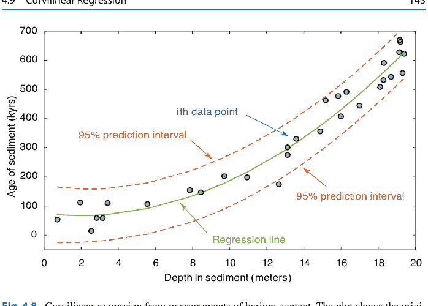

该图表明，对于这些数据，二次模型是一个很好的模型。结果的质量可以通过探索残差、采用重采样方案或使用交叉验证来再次检验。将回归分析与这些方法之一结合使用是双变量数据分析中的强大工具，而皮尔逊相关系数应仅作为线性关系的初步检验。

#### 4.9.1 非线性与加权回归

地球科学中的许多双变量数据集遵循比简单线性或曲线趋势更复杂的趋势。非线性趋势的经典例子包括放射性核素的指数衰减和藻类种群的指数增长。在这种情况下，Python 提供了各种工具来将非线性模型拟合到数据。拟合此类模型的一个易于使用的例程是使用 `curve_fit()` 进行非线性回归。为了演示 `curve_fit()` 的使用，我们生成一个双变量数据集，其中一个变量与第二个变量呈指数相关。我们首先生成 0.5 到 3 之间间隔为 0.1 的均匀分布值，并添加一些标准差为 0.2 的高斯噪声，以使数据分布不均匀。生成的 26 个数据点被排序并存储在 `data1` 中：

```python
import numpy as np
import matplotlib.pyplot as plt
from scipy.optimize import curve_fit
from numpy.random import default_rng

rng=default_rng(0)
data1=np.linspace(0.5,3.,26)
data1=data1+0.2*rng.standard_normal(np.shape(data1))
data1=np.sort(data1,axis=0)
```

然后我们可以计算第二个变量 data2，它是第一个变量 data1 乘以 0.2 再加上 3 的指数。我们再次向数据添加高斯噪声，但这次标准差为 0.5，并显示结果：

```python
data2=3+0.2*np.exp(data1)
data2=data2+0.5*rng.standard_normal(np.shape(data2))

plt.figure()
plt.plot(data1,data2,
    marker='o',
    linestyle='none')
plt.show()
```

非线性回归用于估计指数函数的两个系数，即乘数 0.2 和加数 3。函数 curve_fit() 返回一个向量 popt，其中包含使用 func() 指定的模型对 data2 中的响应变量相对于 data1 中的预测变量进行非线性回归的系数估计值。第二个输出 pcov 是 popt 的估计协方差。pcov 的对角线提供了参数估计值 popt 的方差。要计算参数的一个标准差误差，我们可以使用 perr = np.sqrt(np.diag(pcov))。我们可以设计一个函数句柄模型 func()，它表示一个以输入变量 x 为自变量的指数函数，其中 a 和 b 代表指数函数的两个系数，

```python
def func(x,a,b):
    return a*np.exp(x)+b

popt,pcov=curve_fit(func,data1,data2)
print(popt)
```

其结果为

```
[0.22560247 2.94436195]
```

我们现在可以使用得到的系数 popt[0] 和 popt[1] 在图形中将结果与原始数据进行比较：

```python
plt.figure()
plt.plot(data1,data2,
    marker='o',
    linestyle='none')
plt.plot(data1,popt[0]*np.exp(data1)+popt[1])
plt.show()
```

从 popt 的输出和图形中可以看出，拟合的红色曲线合理地描述了数据。我们现在也可以使用 curve_fit() 进行加权回归。假设我们已知 data3 中值的单西格玛误差：

```python
data3=abs(rng.standard_normal(np.shape(data2)))

plt.figure()
plt.plot(data1,data2,
    marker='o',
    linestyle='none')
plt.errorbar(data1,data2,data3,
    color=[0.3,0.5,0.8],
    linestyle='none')
plt.show()
```

为了进行加权拟合，我们定义模型函数 func()，然后使用带有可选输入 sigma（用于误差）的 curve_fit()，

```python
popt2,pcov2=curve_fit(func,data1,data2,
    sigma=data3)
yfit2=func(data1,*popt2)
print(popt2)
```

其结果为

```
[0.25687643 2.53249989]
```

与之前一样，curve_fit() 计算加权参数估计值 popt。我们再次将结果与原始数据进行比较：

```python
plt.figure()
plt.plot(data1,data2,
    marker='o',
    linestyle='none')
plt.errorbar(data1,data2,data3,
    color=[0.3,0.5,0.8],
    linestyle='none')
plt.plot(data1,
    popt2[0]*np.exp(data1)+popt2[1],
    linestyle='-',
    color=[0.8,0.5,0.3])
plt.legend(['Data',
    'Unweighted',
    'Weighted'])
plt.show()
```

将加权回归的系数 p 和红色曲线与之前未加权回归的结果进行比较，显示出略有不同的结果（图 4.9）：

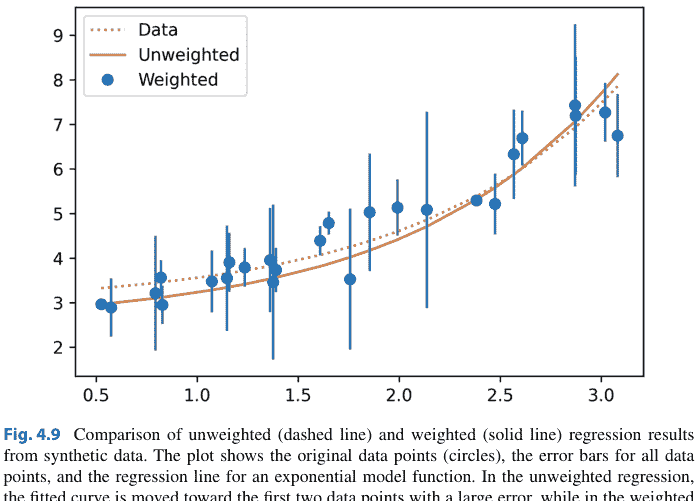

**图 4.9** 合成数据的未加权（虚线）和加权（实线）回归结果比较。该图显示了原始数据点（圆圈）、所有数据点的误差条以及指数模型函数的回归线。在未加权回归中，拟合曲线向具有较大误差的前两个数据点移动，而在加权回归中，它向具有较小误差的第三个数据点移动。

plt.figure()
plt.plot(data1,data2,
    marker='o',
    linestyle='none')
plt.errorbar(data1,data2,data3,
    color=[0.3,0.5,0.8],
    linestyle='none')
plt.plot(data1,
    popt[0]*np.exp(data1)+popt[1],
    linestyle=':',
    color=[0.8,0.5,0.3])
plt.plot(data1,
    popt2[0]*np.exp(data1)+popt2[1],
    linestyle='-',
    color=[0.8,0.5,0.3])
plt.legend(['Data',
    'Unweighted',
    'Weighted'])
plt.show()

例如，在未加权回归中，拟合曲线会向误差较大的前两个数据点移动，而在加权实验中，它会向误差较小的第三个数据点移动。

## References

Davis JC (2002) Statistics and Data Analysis in Geology, 3rd edn. John Wiley and Sons, New York
Efron B (1982) The Jackknife, the Bootstrap, and Other Resampling Plans. Society of Industrial and Applied Mathematics CBMS-NSF Monographs 38
Fisher RA (1922) The Goodness of Fit of Regression Formulae, and the Distribution of Regression Coefficients. J Roy Stat Soc 85:597–612
Kendall M (1938) A New Measure of Rank Correlation. Biometrika 30:81–89
Pearson K (1894–98) Mathematical Contributions to the Theory of Evolution, Part I to IV. Philos Trans Roy Soc 185–191
Pearson K (1895) Notes on regression and inheritance in the case of two parents. Proc Roy Soc Lond 58:240–242
Spearman C (1904) The proof and measurement of association between two things. Am J Psychol 15:72–101
Spearman C (1910) Correlation calculated from faulty data. Br J Psychol 3:271–295

# 时间序列分析 5

## 5.1 引言

*时间序列分析*用于研究变量 $x(t)$ 的时间行为。示例包括对山脉隆升、海平面波动、轨道驱动的日照变化（及其对冰期-间冰期旋回的影响）、大气-海洋系统的千年尺度变化、厄尔尼诺-南方涛动对热带降雨和沉积作用的影响（图 5.1）以及潮汐对钻孔中惰性气体排放的影响的长期记录研究。一系列事件的时间模式可以是随机的、聚集的、周期性的或混沌的。时间序列分析提供了各种工具来检测这些时间模式。理解产生观测数据的底层过程使我们能够预测变量的未来值。对于时间序列分析，我们使用 *NumPy* (https://numpy.org) 和 *Matplotlib* 包 (https://matplotlib.org)，以及 *SciPy* 库 (https://scipy.org)，它们包含了所有必要的例程。

第 5.2 节讨论了一般信号，并包含如何为时间序列分析生成合成信号的技术描述。然后，第 5.3 至 5.10 节演示了谱分析的使用，既用于检测单个时间序列中的周期性（即自谱分析），也用于确定两个时间序列之间随频率变化的关系（即互谱分析）。第 5.11 节概述了非线性技术，特别关注了递归图。最后，第 5.12 和 5.13 节介绍了检测时间序列中集中趋势和离散度的突变和渐变的方法。

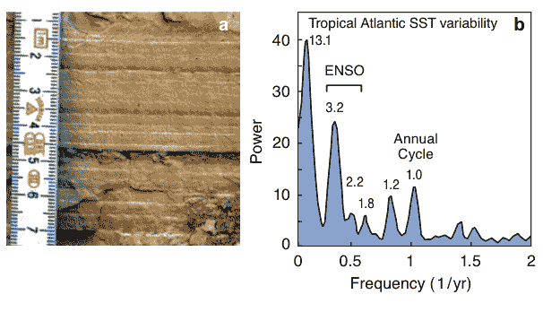

**图 5.1** a 阿根廷西北部安第斯山脉一个湖泊中约 3 万年前的纹层沉积物照片。该地区源岩的分布和年际降水模式表明，红棕色层反映了增强降水的周期性重现，这涉及侵蚀加剧和进入湖泊的沉积物输入增加。b 横跨 70 个纹层的红色强度剖面的功率谱在频率约为 0.076、0.313、0.455 和 1.0 年⁻¹ 处显示出主要峰值。与当今的周期性类似，这些周期性表明 3 万年前发生的热带大西洋海表温度 (SST) 变率、厄尔尼诺-南方涛动 (ENSO) 和年周期具有强烈影响 (Trauth et al. 2003)。

## 5.2 生成信号

时间序列是变量 $x(t)$ 在特定时间 $t_k$ 的 $n$ 个值的有序序列（并非数学严格意义上的级数）：

$$x(t_k) = x(t_1), x(t_2), \ldots, x(t_n)$$

如果任何两个连续观测值 $x(t_k)$ 和 $x(t_{k+1})$ 之间的时间间隔是恒定的，则称该时间序列为等间距的，采样间隔为

$$\Delta t = t_{k+1} - t_k$$

采样频率 $f_s$ 是采样间隔 $\Delta t$ 的倒数。我们通常尝试以规则的时间间隔或恒定的采样频率进行采样，但在许多地球科学实例中，这是不可能的。例如，想象一下沿着沉积岩芯以五厘米间隔采样的深海沉积物。沉积岩芯中某些层位的放射性年龄测定揭示了沉积速率的显著波动。尽管样品沿沉积岩芯的间距均匀，但这些样品在时间轴上并非等间距。因此，量

$$\Delta t = T/n$$

（其中 $T$ 是时间序列的总长度，$n$ 是数据点的数量）仅表示平均采样间隔。通常，时间序列 $x(t_k)$ 可以表示为周期分量 $x_p(t_k)$、趋势 $x_{tr}(t_k)$ 和随机噪声 $x_{ns}(t_k)$ 的线性总和：

$$x(t_k) = x_p(t_k) + x_{tr}(t_k) + x_{ns}(t_k)$$

将气候信号分解为周期、趋势和噪声分量（如上所示）对应于十九世纪末发展的气候定义，即趋势和变率 (Brückner 1890; Hann 1901; Köppen 1931)。Mudelsee (2014) 增加了一个极端分量 $x_e(t_k)$，既是为了便于分析，也是为了认识到气候极端事件日益增长的重要性，例如 IPCC 第四次评估报告 (Solomon et al. 2007) 中所记录的。长期分量 $x_{tr}(t_k)$ 是线性或更高阶的趋势，可以通过拟合某个阶数的多项式并从数据中减去该多项式的值来移除（见第 4 章）。移除噪声 $x_{ns}(t_k)$ 的方法在第 6 章中描述。周期性（或在数学上不那么严格的意义上，循环性）分量 $x_p(t_k)$ 可以用具有不同振幅 $A_i$、频率 $f_i$ 和相位角 $\psi_i$ 的正弦（或余弦）波的线性组合来近似：

$$x_p(t_k) = \sum_i A_i \cdot \sin(2\pi f_i t_k - \psi_i)$$

相位角 $\psi$ 有助于检测相同频率信号之间的时间偏移。两个具有相同周期的信号 $x$ 和 $y$ 是不同相的，除非 $\psi_x$ 和 $\psi_y$ 之间的差等于零（图 5.2）。

周期信号的频率 $f$ 是周期 $\tau$ 的倒数。*奈奎斯特频率* $f_{nyq}$ 是采样频率 $f_s$ 的一半，代表数据能够产生的最大频率。这个频率——由美国数学家克劳德·埃尔伍德·香农定义，并以瑞典裔美国电气工程师哈里·奈奎斯特命名——防止了时间离散系统中的*混叠*现象。混叠意味着如果采样频率太低，数字信号中会出现歧义。例如，音频光盘 (CD) 以 44,100 Hz (Hz，其中 1 Hz = 每秒 1 个周期) 的频率采样，但相应的奈奎斯特频率是 22,050 Hz，这是 CD 播放器理论上能够产生的最高频率。CD 播放器使用的抗混叠滤波器的性能限制进一步降低了频带，导致截止频率约为 20,050 Hz，这是 CD 播放器真正的上限频率。

我们现在可以生成合成信号，以说明时间序列分析工具的使用。使用合成数据时，我们预先知道时间序列包含哪些特征（例如，周期性或随机分量），并且我们可以向时间序列中引入线性趋势和/或间隙。用户将遇到许多关于改变参数设置可能产生的影响以及应用谱分析工具可能导致的潜在伪影和错误的示例。我们从简单的数据开始，然后将这些方法应用于更复杂的时间序列。第一个示例说明了如何生成具有地球科学数据特征的基本合成数据系列。首先，我们创建一个时间轴 $\tau$，该轴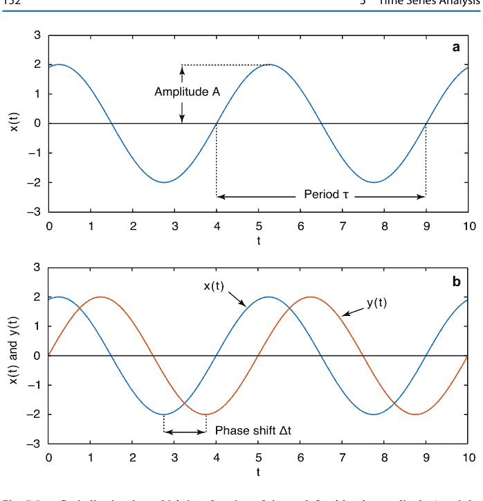

图 5.2 a 周期信号 $x$，它是时间 $t$ 的函数，由振幅 $A$ 和周期 $\tau$ 定义，周期是频率 $f$ 的倒数。b 两个周期相同的信号 $x$ 和 $y$，如果 $\psi_x$ 和 $\psi_y$ 之间的差值不等于零，则它们是相位不同的。

从 0.1 到 200，步长为 0.1（即采样频率为 10），并将其转置，使 $t$ 的元素按列而不是行排列。然后我们生成一个简单的周期信号 $y$，它由一个周期为 5、振幅为 2 的正弦波组成（图 5.2 a）：

```python
import numpy as np
import matplotlib.pyplot as plt

t=np.linspace(0.1,200,2000)
t=np.transpose(t)
x=2*np.sin(2*np.pi*t/5)

plt.figure()
plt.plot(t,x)
plt.axis(np.array([0,10,-3,3]))
plt.show()
```

周期 τ=5 对应于频率 f=1/5=0.2。在某些应用中，经常比较彼此偏移一定量的周期信号。我们可以通过输入以下内容来生成这样一对信号，其中第二个信号比第一个信号提前一个量，这对应于周期的五分之一（即 2π/5）（图 5.2 b）：

```python
x1=2*np.sin(2*np.pi*t/5)
x2=2*np.sin(2*np.pi*t/5+2*np.pi/5)

plt.figure()
plt.plot(t, x1,t, x2)
plt.axis(np.array([0,10,-3,3]))
plt.show()
```

自然数据序列比简单的周期信号更复杂。稍微复杂一点的信号可以通过叠加几个具有不同周期的周期分量来生成。作为一个例子，我们可以通过添加三个周期分别为 τ₁=50 (f₁=0.02)、τ₂=15 (f₂ ≈ 0.07) 和 τ₃=5 (f₃=0.2) 的正弦波来计算这样一个信号。相应的振幅为 A₁=2、A₂=1 和 A₃=0.5（图 5.3 a）：

```python
t=np.linspace(0.1,200,2000)
t=np.transpose(t)

x=2*np.sin(2*np.pi*t/50)+\
    np.sin(2*np.pi*t/15)+\
    0.5*np.sin(2*np.pi*t/5)

plt.figure()
plt.plot(t,x)
plt.axis(np.array([0,200,-4,4]))
plt.show()
```

与我们的合成时间序列相比，真实数据还包含各种干扰，例如随机噪声和一阶或高阶趋势。为了重现噪声的影响，可以使用随机数生成器来计算均值为零、标准差为一的高斯噪声。应使用 `random.seed(0)` 将算法的种子设置为零。然后使用 `random.randn()` 生成两千个随机数：

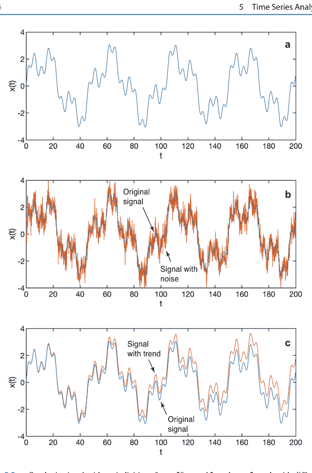

**图 5.3** **a** 具有周期性 $\tau_1=50$、$\tau_2=15$ 和 $\tau_3=5$ 的合成信号，每个周期具有不同的振幅，以及 **b** 叠加了高斯噪声的相同信号。**c** 时间序列显示出显著的线性趋势。

```python
np.random.seed(0)
ns = 0.5 * np.random.randn(np.size(x))
```

然后我们将此噪声添加到原始数据中，即我们生成一个包含加性噪声的信号（图 5.3 b）。显示数据说明了噪声对周期信号的影响。由于现实中没有记录是完全无噪声的，因此熟悉噪声对功率谱的影响非常重要：

```python
xns = x + ns

plt.figure()
plt.plot(t, x, t, xns)
plt.axis(np.array([0, 200, -4, 4]))
plt.show()
```

信号处理方法通常用于去除大部分噪声，尽管许多滤波方法对信噪比做出了任意假设（第 6 章）。此外，滤波会在数据中引入伪影和统计依赖性，这可能对最终的功率谱产生深远影响。

最后，我们通过添加一条斜率为 0.005、y 截距为零的直线，在数据中引入一个线性长期趋势（图 5.3 c）。这种趋势在地球科学中很常见。例如，考虑在海洋氧同位素记录中观察到的冰期-间冰期旋回，它们叠加在过去六百万年的长期冷却趋势上：

```python
xt = x + 0.005 * t

plt.figure()
plt.plot(t, x, t, xt)
plt.axis(np.array([0, 200, -4, 4]))
plt.show()
```

实际上，存在更复杂的趋势，例如高阶趋势和以梯度变化为特征的趋势。在实践中，建议通过将多项式拟合到数据并减去相应的值来消除此类趋势。我们的合成时间序列现在包含了典型地球科学数据集的许多特征，可以与频谱分析工具一起使用，这些工具将在以下章节中介绍。

## 5.3 傅里叶变换 FT、DFT 和 FFT

*傅里叶级数* (FS) 有助于将周期函数分解为正弦函数之和 (Fourier 1807, 1822)。*傅里叶变换* (FT) 是傅里叶级数的扩展，用于将非周期函数分解为正弦函数。FT 使用*欧拉公式*，该公式以瑞士数学家莱昂哈德·欧拉的名字命名，它提供了三角函数（即正弦和余弦函数）与复指数函数之间的关系

$$e^{i\omega} = \cos(\omega) + i \cdot \sin(\omega)$$

其中 $\omega$ 是以弧度为单位的频率，$\omega=2\pi f$（图 5.4）。如果 $x(t)$ 表示时间的连续函数，例如地球上某地周期性变化的太阳辐射，那么作为频率 $f$ 函数的复值傅里叶变换 $X$ 为

$$X(f) = \int_{-\infty}^{\infty} x(t)e^{i2\pi ft} dt$$

这种表示法优于三角表示法，仅仅因为它更紧凑，并且可以使用欧拉表示法轻松计算 (Muller and MacDonald 2000)。谱功率 $P$ 被定义为傅里叶振幅 $X(f)$ 的平方：

$$P(f) = |X(f)|^2$$

真实数据 $x$ 在时间上从来不是连续的；相反，它们是在特定时间 $t_k$ 采样的。此外，数据 $x(t_k)$ 仅在有限区间内可用，即在 $t_0$ 和 $t_{M-1}$ 之间。*离散傅里叶变换* (DFT) ——与连续傅里叶变换 (FT) 相对——将这样的时间序列 $x(t_k)$ 转换为离散傅里叶（或频率）级数 $X(f_k)$：

$$X(f_k) = \sum_{k=0}^{n-1} x(t_k)e^{2\pi i f_k / f_s}$$

*快速傅里叶变换* (FFT) 由 Cooley 和 Tukey (1965) 引入。它是一种数值算法，通过将具有 $2n$ 个数据点的时间序列 $x(t)$ 分割成两个仅具有 $n$ 个数据点的时间序列，将计算 DFT 所需的操作数（本质上是 $n$ 次复数乘法和 $n-1$ 次加法）从 $n^2$ 减少到 $n \log(n)$，其中 $n$ 必须是 2 的幂。这种分割和 DFT 的计算可以重复多次，从而进一步减少操作数，进而减少 FFT 的计算时间。

采样最常见的效应之一是混叠（图 5.5）。这个术语指的是将频率 $f$ 高于采样频率 $f_s$ 的正弦波误解为频率 $f_a$ 低于采样频率的混叠频率正弦波。我们可以使用以下公式计算 $f_a$

$$f_a = |f - f_s \cdot \text{round}(f/f_s)|$$

其中 round 表示四舍五入到最接近的整数。可以通过应用奈奎斯特-香农采样定理来避免混叠效应，根据该定理，采样频率 $f_s$ 必须至少是感兴趣频率的两倍 (Whittaker 1915; Shannon 1948)。因此，信号的频谱表示显示在采样频率的一半处（$f_s/2$）（即奈奎斯特频率 $f_{Nyq}$）(Whittaker 1915; Shannon 1948)。

以下 Python 示例说明了欧拉函数与三角函数之间的类比，以及使用快速傅里叶变换计算有噪声和无噪声周期信号的傅里叶频谱。请注意，以下脚本使用 $\mathbf{j}$ 作为虚数单位。因此，我们不应在 for 循环中将其用作循环计数器。此外，为了稳健性，建议使用 $1\mathbf{j}$ 而不仅仅是 $\mathbf{j}$。我们首先定义噪声水平 Ns（即高斯噪声的标准差）和采样频率 Fs，然后通过输入以下内容创建时间轴 t

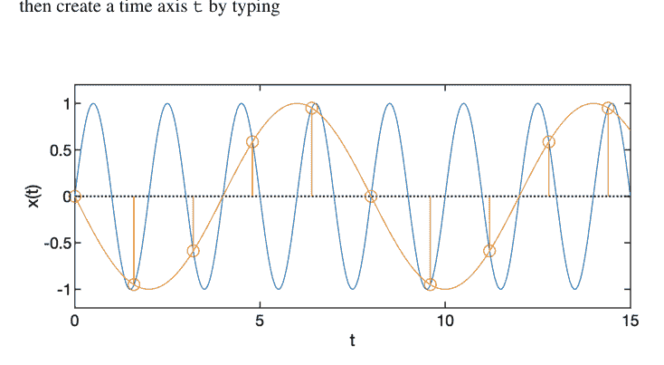

**图 5.5** 混叠效应的图示说明。如果频率 $f$ 为 0.5 的信号（蓝线）以较低的采样频率 $f_s=0.3125$（红色茎线和圆圈）进行采样，则会产生频率 $f_a$ 为 0.125 的较低混叠频率信号（黄线）（修改自 Trauth 2021b）。

import numpy as np
import matplotlib.pyplot as plt
from scipy import interpolate

Ns=2
Fs=2
t=np.linspace(1/Fs,500,500*Fs)
t=np.transpose(t)

根据欧拉公式，y=exp(1j*t) 等于 y=cos(t) + 1j*sin(t)。cos(t) 和 sin(t) 的周期均为 2*pi。因此，cos(2*pi*t/T) 和 sin(2*pi*t/T) 的周期均为 T。对应的频率为 f=1/T。我们使用欧拉公式生成一个周期为五的信号，代码如下：

```
x=np.exp(1j*2*np.pi*t/5)
x=np.real(x)

plt.figure()
plt.plot(t,x)
plt.axis(np.array([0,200,-2,2]))
plt.show()
```

接下来，我们使用欧拉公式创建一个由多个具有不同周期 T 和不同振幅 A 的正弦波组成的复合信号，且不含噪声：

```
T=np.array([50,15,5])
A=np.array([2,1,0.5])

xj=1j*np.zeros((t.size,T.size))

for i in range(0,T.size):
    xj[:,i]=A[i]*np.exp(1j*2*np.pi*t/T[i])

x=np.real(np.sum(xj,1))

plt.figure()
plt.plot(t,x)
plt.axis(np.array([0,200,-4,4]))
plt.show()
```

然后，我们使用三角函数创建一个由多个具有不同周期 T 和不同振幅 A 的正弦波组成的复合信号，且不含噪声：

```
Ns=2
Fs=2
t=np.linspace(1/Fs,500,500*Fs)
t=np.transpose(t)

x= 2*np.sin(2*np.pi*t/50)+\n   np.sin(2*np.pi*t/15)+\n   0.5*np.sin(2*np.pi*t/5)

plt.figure()
plt.plot(t,x)
plt.axis(np.array([0,200,-4,4]))
plt.show()
```

我们可以使用快速傅里叶变换（FFT）计算信号的傅里叶频谱，该频谱显示为功率谱密度与频率 f 和周期 T 的关系图（图 5.6）。函数 fft() 计算 nfft 个频率的傅里叶变换，其中 nfft 是最接近序列 x 长度的下一个 2 的幂次，并通过补零使数据点数等于 nfft 的值。由于我们示例中数据序列的长度为 n=1000，因此傅里叶变换是针对 nfft=1024 个频率计算的，同时信号被补了 nfft-n=24 个零：

```
nfft=2**np.ceil(np.log2(t.size))
Xxx=np.fft.rfft(x,int(nfft))
```

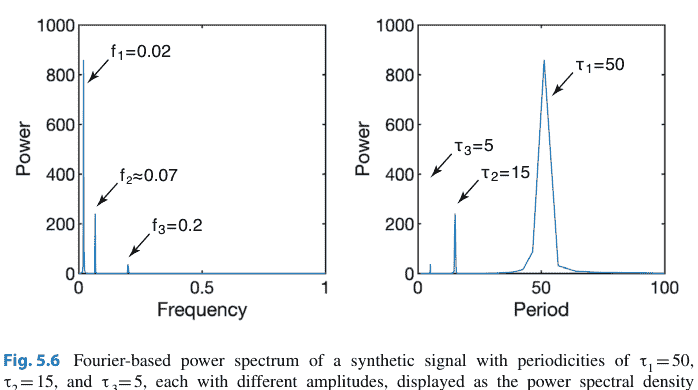

图 5.6 一个合成信号的基于傅里叶的功率谱，该信号具有 τ₁=50、τ₂=15 和 τ₃=5 的周期性，每个周期具有不同的振幅，显示为功率谱密度与 a 频率 f 和 b 周期 τ 的关系图。

如果 x 是实数（如我们的示例），则 Xxx 是对称的，其中 Xxx 的前 (1+nfft/2) 个值是唯一的，所有其他值都是对称冗余的。功率谱密度定义为 Pxx2 = (abs(Xxx)**2)/Fs/len(x)，其中 Fs 是采样频率：

```
Pxx2=np.abs(Xxx)**2/Fs/len(x)
```

我们现在丢弃功率谱的冗余部分，仅使用前 (1+nfft/2) 个点。我们还将功率谱密度 Pxx2 乘以二，以保持与对称频谱相同的能量，但第一个数据点除外：

```
Pxx=np.hstack((Pxx2[0],2*Pxx2[1:int(nfft/2)]))
```

对应的频率轴从 0 到 Fs/2，步长为 Fs/(nfft-1)，其中 Fs/2 是奈奎斯特频率：

```
f=np.arange(0,Fs/2,Fs/(nfft-1))
```

然后，我们在奈奎斯特频率范围 0 到 Fs/2 内绘制功率谱密度 Pxx，在我们的示例中，该范围从 0 到 2/2=1。奈奎斯特频率范围对应于前 512（或 nfft/2）个数据点。我们可以通过输入以下代码绘制功率谱密度随频率的变化图：

```
plt.figure()
plt.plot(f,Pxx)
plt.grid
plt.axis(np.array([0,Fs/2,0,np.amax(Pxx)]))
plt.show()
```

图形输出显示，在三个正弦波的原始频率位置（即 1/50、1/15 和 1/5）有三个主要峰值。或者，我们也可以通过输入以下代码绘制功率谱密度随周期的变化图：

```
plt.figure()
plt.plot(1/f,Pxx)
plt.grid
plt.axis(np.array([0,70,0,np.amax(Pxx)]))
plt.show()
```

我们观察到预期的三个周期：50、15 和 5。由于此图 x 轴上的值不是均匀间隔的（与频率轴上的值相反），我们发现长周期的分辨率较差，并且在周期为 50 处出现了一个宽峰。

以下示例说明了由采样频率过低采样信号引起的混叠效应，以及奈奎斯特频率在避免误解此类信号方面的重要性。例如，我们计算一个频率为 f=0.5 的周期信号 x1，对应周期为二（图 5.5）。原始采样频率为 fs=100，对应采样间隔为 0.01：

```
t=np.linspace(0,15,1501)
t=np.transpose(t)

x1=np.sin(2*np.pi*t/2)
```

我们可以通过输入以下代码预测混叠频率 fa，该频率似乎是在我们以过低的采样频率 fs=0.6250 采样原始信号时产生的：

```
fa=np.abs(0.5 - 0.6250*np.round(0.5/0.6250))
print(fa)
```

结果为

0.125

对应周期为 1/0.1250=8。我们可以使用第 5.6 节中的 interp1d() 沿新的时间轴 ts 以采样间隔 1.6（对应采样频率 fs=1/1.6=0.6250）对信号进行采样，以计算信号 x2，代码如下：

```
fun=interpolate.interp1d(t, x1, kind='linear')
x2=fun(ts)
```

我们可以通过输入以下代码可视化信号 x3（黄线），该信号是由低采样频率 fs=0.6250（红色茎线和圆圈）采样频率为 f=0.5（蓝线）的信号 x1 产生的，具有较低的混叠频率 fa=0.1250：

```
x3=np.sin(2*np.pi*t*fa+2*np.pi*3.5)

plt.figure()
plt.plot(t, x1)
plt.stem(ts, x2)
plt.plot(t, x3)
plt.xlabel('t')
plt.ylabel('x(t)')
plt.show()
```

奈奎斯特频率是采样频率的一半，即 $Fs/2 = 0.6250/2 = 0.3125$。原始信号的频率为 0.5，高于奈奎斯特频率 $Fs/2 = 0.3125$，因此不应使用。如果我们的信号是模拟信号，我们可以在采样前应用抗混叠滤波器，以消除高于奈奎斯特频率 $Fs/2$ 的频率。下文功率谱的 $x$ 轴限制在 0 到奈奎斯特频率 $Fs/2$ 之间的频率范围内。

## 5.4 舒斯特周期图法

周期图是第一种数值频谱分析方法。它由 Arthur Schuster（1851 至 1934）发明，用于研究磁暴、气候和其他现象（Schuster 1898）。尽管存在更好的方法，它在气候时间序列分析应用中仍然非常流行，部分原因是其统计特性得到了很好的理解（Whittle 1952, MacDonald 1989, Muller and MacDonald 2000, Trauth 2021b）。自 Schuster 发表以来，周期图受到了许多统计学家的批评——大部分是错误的——不幸的是，这种批评也进入了古气候学领域。周期图的问题在于，虽然频率分辨率提高了，但频谱的信噪比并未随着样本量的增加而提高（Muller and MacDonald 2000）。

因此，已经开发了其他方法，例如布莱克曼-图基法（第 5.5 节）和汤姆森多锥法（第 5.8 节），这些方法的信噪比随着样本量的增加而提高，但缺点是频率分辨率较低。然而，正如 Muller and MacDonald (2000) 非常恰当地描述的那样，如果要分析的时间序列由少数几个简单的周期现象主导，正如轨道控制全球气候的线性模型所建议的那样，该方法是最有用的方法。

周期图就是时间序列 $x(t_k)$ 的绝对傅里叶变换的平方

$$P(f_k) = \frac{1}{n} \left| \sum_{k=0}^{n-1} x(t_k) e^{i 2 \pi f_k t_k / f_s} \right|^2$$

适用于奈奎斯特范围 $-1/2\Delta t < f < +1/2\Delta t$，采样频率 $f_s$，以及时间序列长度 $n$。

作为示例，我们再次使用第 5.2 节中生成的合成时间序列 x、xns 和 xt 作为输入数据：

```
import numpy as np
import matplotlib.pyplot as plt
from scipy import signal
```

Ns=2.5;
Fs=2;

t=np.linspace(1,500,500*Fs)
t=np.transpose(t)

x=    2*np.sin(2*np.pi*t/50)+\
     np.sin(2*np.pi*t/15)+\
     0.5*np.sin(2*np.pi*t/5)

np.random.seed(0)
xns=x+Ns*np.random.randn(x.size)

xt=x+0.005*t;

由于周期图仅仅是时间序列的傅里叶变换的绝对值的平方，我们可以使用第5.3节的脚本来计算x的周期图，同样也可以计算xns和xt的周期图，方法是输入

nfft=2**np.ceil(np.log2(t.size))
Xxx=np.fft.rfft(x,int(nfft))
Pxx2=np.abs(Xxx)**2/Fs/len(x)
Pxx=np.hstack((Pxx2[0],2*Pxx2[1:int(nfft/2)]))
f=np.arange(0,Fs/2,Fs/(nfft-1))

我们可以通过输入以下命令来绘制功率谱密度Pxx随频率的变化图

plt.figure()
plt.plot(f,Pxx)
plt.xlabel('Frequency')
plt.ylabel('Power')
plt.show()

使用xlabel()和ylabel()为x轴和y轴添加标签。图形输出显示，在三个正弦波的原始频率（即1/50、1/15和1/5）的位置有三个主要的峰值。我们现在可以将结果与使用periodogram()函数获得的结果进行比较：

f,Pxx=signal.periodogram(x,fs=Fs,nfft=nfft)

该函数允许使用各种窗函数对信号进行加窗，以克服频谱泄漏问题。然而，我们使用默认的矩形窗，以便将结果与上述实验进行比较。功率谱Pxx是使用长度为nfft=1024的FFT计算的，这是最接近序列x长度的下一个2的幂次，并通过补零使数据点数等于nfft的值。函数内使用采样频率fs来获得f轴的正确频率缩放。在我们的例子中，我们使用存储在变量Fs中的值2。我们通过输入以下命令来显示结果

plt.figure()
plt.plot(f, Pxx)
plt.xlabel('Frequency')
plt.ylabel('Power')
plt.show()

图形输出与第一个图几乎相同，再次显示在三个正弦波的原始频率（或周期）的位置有三个主要的峰值（图5.7 a）。同样的过程也可以应用于含噪数据：

f, Pxxn=signal.periodogram(xns, fs=Fs, nfft=nfft)

plt.figure()
plt.plot(f, Pxxn)
plt.xlabel('Frequency')
plt.ylabel('Power')
plt.show()

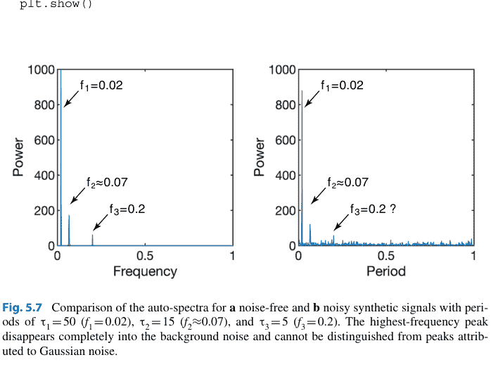

这个频谱现在类似于地球科学中的真实数据频谱，谱峰叠加在显著的背景噪声水平之上（图5.7 b）。最高频率的峰值甚至消失在噪声中，无法与归因于噪声的极大值区分开来。

接下来，我们探讨线性趋势对频谱的影响。长期趋势是地球科学数据中的常见特征。我们可以看到，FFT将这种趋势误解为一个非常长的周期，即FFT产生了一个频率接近零的大峰值（图5.8 a）：

f, Pxx = signal.periodogram(xt, fs=Fs, nfft=nfft)

plt.figure()
plt.plot(f, Pxx)
plt.xlabel('Frequency')
plt.ylabel('Power')
plt.show()

如果将频率轴限制在[0 0.25]范围内，可以更好地看到f = 0附近的趋势：

plt.figure()
plt.plot(f, Pxx)
plt.axis(np.array([0, 0.25, 0, 1000]))
plt.xlabel('Frequency')
plt.ylabel('Power')
plt.show()

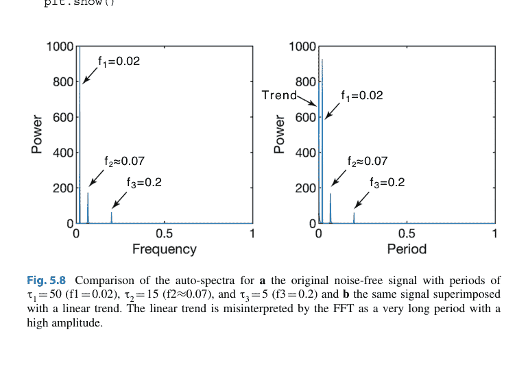

为了消除长期趋势，我们使用`detrend()`。该函数移除线性趋势，这些趋势可以定义为从序列x拟合的单一直线，也可以定义为从x拟合的连续分段线性趋势，其中包含一个或多个由用户定义的断点：

xdt = signal.detrend(xt)

plt.figure()
plt.plot(t, xt, t, xdt)
plt.show()

得到的频谱不再显示低频峰值（图5.8 b）：

f, Pxxdt = signal.periodogram(xdt, fs=Fs, nfft=nfft)

plt.figure()
plt.plot(f, Pxxdt)
plt.xlabel('Frequency')
plt.ylabel('Power')
plt.show()

一些数据集包含高阶趋势，可以通过对数据拟合高阶多项式并减去相应的x(t)值来移除。

## 5.5 Blackman–Tukey方法和Welch方法

自谱分析旨在描述单个信号x(t)中包含的方差随频率或波长的分布。描述信号在时间滞后k上的方差的一个简单方法是通过自协方差。信号x(t)在n个数据点、以恒定时间间隔Δt采样下的自协方差cov_xx为

$$cov_{xx}(k) = \frac{1}{n-k-1} \sum_{t=1}^{n-k} (x_i - \bar{x})(x_{i+k} - \bar{x})$$

自协方差序列显然取决于x(t)的幅度。将协方差除以x(t)的方差s²进行归一化，得到自相关序列。自相关涉及将数据序列与自身在时间滞后k上的相关性：

$$corr_{xx}(k) = \frac{cov_{xx}(k)}{cov_{xx}(0)} = \frac{cov_{xx}(k)}{s_x^2}$$

地球科学中用于计算功率谱的一种流行方法是由Blackman和Tukey（1958）引入的。*Blackman–Tukey方法*使用自相关序列$corr_{xx}(k)$的复数傅里叶变换$X_{xx}(f)$，

$$X_{xx}(f) = \sum_{k=0}^{m} corr_{xx}(k) e^{i2\pi fk/f_s}$$

其中$m$是最大滞后，$f_s$是采样频率。Blackman–Tukey自谱是自相关序列的傅里叶变换的绝对值。在1958年引入时，通过自相关序列间接计算功率谱比直接计算完整数据序列$x(t)$的傅里叶变换更快。在Cooley和Tukey（1965）引入*快速傅里叶变换*（FFT）以及随后更快的计算机硬件之后，Blackman–Tukey方法相对于周期图法的更快计算速度变得相对不那么重要。

在某些领域，*功率谱密度*被用作描述自谱的另一种方式。Blackman–Tukey功率谱密度*PSD*计算如下

$$PSD = \frac{X_{xx}^*(f)X_{xx}(f)}{f_s} = \frac{|X_{xx}(f)|^2}{f_s}$$

其中$X_{xx}^*(f)$是自相关序列的傅里叶变换$X_{xx}(f)$的共轭复数，$f_s$是采样频率。连续傅里叶变换假设信号是无限的，但离散的真实数据在两端是有限的，即信号幅度在时间序列的两端之外为零。在时域中，有限信号对应于无限信号乘以一个矩形窗，该窗在信号范围内值为1，在其他地方值为0。在频域中，将时间序列乘以该窗相当于信号的功率谱与矩形窗的频谱进行卷积（卷积的定义见第6.4节）。然而，窗的频谱是一个$\sin(x)/x$函数，它有一个主瓣和主峰两侧的许多旁瓣。结果，功率谱中的所有极大值都会*泄漏*，即它们在峰值两侧损失功率（图5.9 a）。

克服*频谱泄漏*问题的一种流行方法是*加窗*，即简单地将数据序列乘以一个平滑的钟形曲线，该曲线具有正值。有几种窗形可用，例如*Bartlett*（三角形）、*Hamming*（余弦形）和*Hanning*（略有不同的余弦形）（图5.9 b）。使用这些窗会稍微修改Blackman–Tukey自谱的方程为

$$X_{xx}(f) = \sum_{k=0}^{m} corr_{xx}(k)w(k)e^{i2\pi fk/f_s}$$

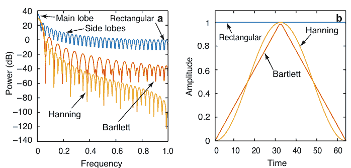

其中$w(k)$是加窗函数。因此，Blackman–Tukey方法通过三个步骤执行自谱分析：（1）计算自相关序列$corr_{xx}(k)$，（2）对$corr_{xx}(k)$加窗，最后（3）计算离散傅里叶变换。Python允许使用上述方法的多种修改来进行功率谱分析。一个有用的修改是*Welch方法*（Welch 1967）（图5.10），它涉及将时间序列分成重叠的段，计算每段的功率谱，然后对功率谱进行平均。平均频谱的优点是显而易见的：它简单地提高了频谱的信噪比。缺点是频谱分辨率的损失。

互谱分析在频域中关联两个时间序列。互协方差是两个信号在时间滞后$k$上的方差的度量。两个信号$x(t)$和$y(t)$在n个数据点、以恒定时间间隔$\Delta t$采样下的互协方差$cov_{xy}(k)$为

$$cov_{xy}(k) = \frac{1}{n-k-1} \sum_{t=1}^{n-k} (x_i - \bar{x})(y_{i+k} - \bar{y})$$

互协方差序列再次取决于$x(t)$和$y(t)$的幅度。将协方差除以$x(t)$和$y(t)$的标准差进行归一化，得到互相关序列：

$$corr_{xy}(k) = \frac{cov_{xy}(k)}{cov_{xy}(0)} = \frac{cov_{xy}(k)}{s_x s_y}$$

## 5.10 Welch功率谱分析原理

时间序列首先被分割成重叠的段；然后计算每个段的功率谱，并对所有谱进行平均，以提高功率谱的信噪比。

Blackman-Tukey方法使用互相关序列 $corr_{xy}(k)$ 的复数傅里叶变换 $X_{xy}(f)$，

$$X_{xy}(f) = \sum_{k=0}^{m} corr_{xy}(k) e^{i2\pi fk/f_s}$$

其中 $m$ 是最大滞后，$f_s$ 是采样频率。复数傅里叶变换 $X_{xy}(f)$ 的绝对值是互谱，而 $X_{xy}(f)$ 的角度代表相位谱。相位差在计算两个信号之间的超前和滞后时非常重要，这是一种常用于提出两个由信号记录的过程之间因果关系的度量。两个谱之间的相关性可以通过相干性来计算：

$$C_{xy} = \frac{|X_{xy}(f)|^2}{X_{xx}(f)X_{yy}(f)}$$

相干性是一个介于0和1之间的实数，其中0表示在频率 $f$ 处 $x(t)$ 和 $y(t)$ 之间没有相关性，1表示最大相关性。一定程度的相干性是计算两个信号之间相位偏移的重要前提。

下一个示例演示了使用Python计算Blackman-Tukey谱。首先，我们创建一个时间轴 $t$，从 $1/F_s=1$ 到1000，步长为 $1/F_s=1$（即采样频率为 $F_s=1$），然后将其转置，使 $t$ 的元素以列而不是行的形式出现。接下来，我们通过添加三个正弦波来计算合成信号 $x$，周期分别为 $\tau_1=50$ ($f_1=0.02$)、$\tau_2=15$ ($f_2 \approx 0.07$) 和 $\tau_3=5$ ($f_3=0.2$)。相应的振幅分别为 $A_1=2$、$A_2=1$ 和 $A_3=0.5$：

```python
import numpy as np
import matplotlib.pyplot as plt
from scipy import signal

Fs=1
t=np.linspace(1/Fs,1000,1000*Fs)

x= 2*np.sin(2*np.pi*t/50)+\
    np.sin(2*np.pi*t/15)+\
    0.5*np.sin(2*np.pi*t/5)
```

我们再次生成一个包含加性噪声的信号xns和一个叠加了斜率为0.005的线性趋势的信号xt：

```python
np.random.seed(0)
xns=x+2.5*np.random.randn(np.size(x))
xt=x+0.005*t

plt.plot(t,xns)
```

Blackman-Tukey自谱是自相关序列的傅里叶变换的绝对值（图5.11）。因此，我们首先使用 `correlate()` 计算x的自相关序列，滞后数为xm.size-1：

```python
xm=x - np.mean(x)
corrxx=np.correlate(xm,xm,'full')[xm.size-1:]
corrxx=corrxx/np.var(xm)/xm.size

plt.figure()
plt.plot(corrxx)
plt.xlabel('Lag')
plt.ylabel('Autocorrelation')
plt.show()
```

然后，我们使用 `rfft()` 计算完整自相关序列corrxx的离散傅里叶变换（DFT）、功率谱密度Pxx以及相应的频率轴f，使用第5.3节的代码：

```python
nfft=2**np.ceil(np.log2(corrxx.size))

Xxx=np.fft.rfft(corrxx,int(nfft))

Pxx2=np.abs(Xxx)**2/Fs/len(corrxx)
Pxx=np.hstack((Pxx2[0],2*Pxx2[1:int(nfft/2)]))
f=np.arange(0,Fs/2,Fs/(nfft-1))
```

自相关序列傅里叶变换的图形显示

```python
plt.figure()
plt.plot(f,Pxx)
plt.show()
```

显示出约150个数据点的显著周期性。根据Blackman-Tukey方法的原始思想，我们可以减少自相关序列中的数据点数量，以减少后续傅里叶变换的计算时间。这在计算机速度慢且FFT引入之前很常见。如果我们将数据点数量减少到自相关序列corrxx的约150个数据点周期，即x长度的15%，我们可以使用rfft()获得一个尚可的谱，但质量稍低：

```python
corrxx=corrxx[0:150]

nfft=2**np.ceil(np.log2(corrxx.size))

Xxx=np.fft.rfft(corrxx,int(nfft))

Pxx2=np.abs(Xxx)**2/Fs/len(corrxx)
Pxx=np.hstack((Pxx2[0],2*Pxx2[1:int(nfft/2)]))
f=np.arange(0,Fs/2,Fs/(nfft-1))

plt.figure()
plt.plot(f,Pxx)
plt.show()
```

除了在频率0.2和~0.67处的预期最大值外，现在出现了显著的次级最大值，这可能是由于频谱泄漏效应和自相关序列截断导致信息丢失的不确定性共同造成的。

在下一个示例中，我们通过使用重叠的加窗时间序列来减少这种干扰，这是Welch方法背后的原理，并在Python函数welch()中实现。为了演示重叠窗口（在本例中为汉明窗）的效果，我们首先通过键入以下代码计算时间序列x在整个长度n上的Welch谱，无重叠：

```python
n=len(x)
nfft=2**np.ceil(np.log2(n))
f,Pxx=signal.welch(x,fs=Fs,window='hamming',
                   nperseg=n,noverlap=0,nfft=nfft)
```

```python
plt.figure()
plt.plot(f, Pxx)
plt.show()
```

我们可以看到，使用汉明窗比未加窗的Blackman-Tukey算法有了显著改进。此外，频率为0.2的高频周期清晰可见。但是，如果我们将代码应用于带噪声的时间序列xns，该周期会消失，并且可以看到明显的噪声底限，这使得难以区分真实周期和噪声：

```python
n = len(xns)
nfft = 2**np.ceil(np.log2(n))
f, Pxx = signal.welch(xns, fs=Fs, window='hamming',
                     nperseg=n, noverlap=0, nfft=nfft)

plt.figure()
plt.plot(f, Pxx)
plt.show()
```

如果我们不计算时间序列xns的整个长度n的谱，而是计算三个长度为n/3（向下取整）的段，每段有50%的重叠noverlap，信噪比会提高，至少在低频范围内是这样：

```python
w = np.floor(n/3)
noverlap = np.floor(w/2)
nfft = max(256, 2**np.ceil(np.log2(n)))

f, Pxx = signal.welch(xns, fs=Fs, window='hamming',
                     nperseg=w, noverlap=noverlap, nfft=nfft)

plt.figure()
plt.plot(f, Pxx)
plt.show()
```

现在我们已经使用Welch方法计算了自谱，我们也可以使用该方法通过Python函数csd()计算互谱。我们使用两个具有相同周期性 τ = 5（相当于 f = 0.2）且振幅等于2的正弦波来计算两个时间序列的互谱。这两个正弦波显示相对相位偏移为1。在第二个正弦波的参数中，这对应于2π/5，即 τ = 5 的完整波长的五分之一：

```python
Fs=1;
t=np.linspace(1/Fs,1000,1000*Fs)

x=2*np.sin(2*np.pi*t/5)
y=2*np.sin(2*np.pi*t/5+\
    2*np.pi/5)

plt.figure()
plt.plot(t,x,t,y)
plt.axis(np.array([0,50,-2,2]))
plt.show()
```

互谱使用 `csd()` 计算，该函数使用Welch方法计算功率谱（图5.12）。Pxy是复数，包含振幅和相位信息：

```python
f,Pxy=signal.csd(x,y,fs=Fs)

plt.figure()
plt.plot(f,Pxy)
plt.grid
plt.xlabel('Frequency')
plt.ylabel('Power')
plt.show()
```

**图5.12** 两个具有相同周期性 τ=5（相当于 f=0.2）且振幅为2的正弦波的互谱。这两个正弦波显示相对相位偏移为 t=1。在第二个正弦波的参数中，这对应于2π/5，即 τ=5 的完整波长的五分之一。**a** 幅度在 f=0.2 处显示预期的峰值。**b** 该频率处的相应相位差（以弧度为单位）为1.2566，等于 (1.2558·5)/(2·π) ≈ 1.0000，这是两个合成正弦波之间的相对相位偏移1。

函数 `csd()` 指定了用于计算互功率谱密度的FFT点数 `nfft`，在我们的示例中为1024。采样频率 `fs` 在本例中为1。由于我们使用的是无噪声数据，两个信号的相干性在所有频率上均为1：

```python
f, Cxy = signal.coherence(x, y, fs=Fs)

plt.figure()
plt.plot(f, Cxy)
plt.grid
plt.xlabel('Frequency')
plt.ylabel('Coherence')
plt.show()
```

我们使用 `coherence()`，它指定了FFT点数 `nfft=1024`。`Pxy` 的复数部分是使用 `angle()` 计算两个信号之间相位偏移所必需的：

```python
plt.figure()
plt.plot(f, np.angle(Pxy))
plt.grid
plt.xlabel('Frequency')
plt.ylabel('Phase Angle')
plt.show()
```

频率 $f=0.2$（周期 $\tau=5$）处的相位偏移可以从相位谱中插值得到

```python
ph = np.interp(0.2, f, np.angle(Pxy))
print(ph)
```

输出为

```
1.256637054944535
```

相位谱被归一化为一个完整周期 $\tau=2\pi$，因此与周期 $2\pi$ 相关的相位偏移 $-1.2566$ 变为 $(-1.2566 \cdot 5)/(2 \cdot \pi) = -1.0000$，这与真实周期 $\tau=5$ 相关，即两个合成正弦波之间的相对相位偏移为1。

我们现在使用两个具有不同周期性的正弦波来说明互谱分析。两个信号 $x$ 和 $y$ 的周期性均为5，但相位偏移为1：

x = np.sin(2 * np.pi * t / 15) + \
    0.5 * np.sin(2 * np.pi * t / 5)
y = 2 * np.sin(2 * np.pi * t / 50) + \
    0.5 * np.sin(2 * np.pi * t / 5 + 2 * np.pi / 5)

plt.figure()
plt.plot(t, x, t, y)
plt.axis(np.array([0, 100, -3, 3]))
plt.show()

接下来，我们可以计算互谱 Pxy，它清晰地显示了共同的周期 τ=5（或频率 f=0.2）：

f, Pxy = signal.csd(x, y, fs=Fs)

plt.figure()
plt.plot(f, Pxy)
plt.grid
plt.xlabel('Frequency')
plt.ylabel('Power')
plt.show()

相干性在 f=0.2 处显示出接近于一的高值：

f, Cxy = signal.coherence(x, y, fs=Fs)

plt.figure()
plt.plot(f, Cxy)
plt.grid
plt.xlabel('Frequency')
plt.ylabel('Coherence')
plt.show()

互谱 Pxy 的复数部分用于计算两个正弦波之间的相移：

plt.figure()
plt.plot(f, np.angle(Pxy))
plt.grid
plt.xlabel('Frequency')
plt.ylabel('Phase Angle')
plt.show()

在频率 f=0.2（周期 τ=5）处的相移为

ph = np.interp(0.2, f, np.angle(Pxy))
print(ph)

其输出为

1.256637054944535

相位谱被归一化到一个完整周期 τ=2π，而与周期 2π 相关的相移 −1.2572 因此等于 (−1.2572·5)/(2·π)=−1.0004，这与周期 5 相关，这再次是两个合成正弦波之间 1 的相对相移。

## 5.6 插值与分析非均匀间隔数据

我们现在可以利用分析均匀间隔数据的经验，对非均匀间隔数据进行频谱分析。此类数据在地球科学中非常常见，例如在古海洋学领域，深海岩芯通常以恒定的深度间隔进行采样。在长度-时间比变化的环境中，将均匀间隔的长度变量数据转换为时间变量数据会导致非均匀间隔的时间序列。然而，大多数时间序列分析方法要求均匀间隔的时间轴，这就是为什么我们必须使用*插值*将非均匀间隔的时间序列转换为具有均匀间隔时间轴的时间序列。对 *x(t)* 数据进行插值的目的是从非均匀间隔的 *x(t)* 测量值中，计算出均匀间隔 *t* 向量的 *x* 值。

存在许多用于插值非均匀间隔数据序列或时间序列的方法（图 5.13 a）。*线性插值*通过在两个相邻测量值之间绘制一条直线，并计算该直线上相应点的 *x* 值来预测 *x* 值。然而，这种方法有其局限性，因为它假设数据中存在线性过渡，这会引入一些伪影（包括信号高频成分的丢失），并将数据范围限制在原始测量值的范围内。或者，*最近邻插值*简单地选择最近测量值的值，而不将其他测量值的值纳入任何计算。该方法非常简单，因为不需要计算新值。因此，它比所有其他方法都快得多，特别是对于非常大的数据集（例如，长时间序列、大型空间数据集和图像），但它会产生非常棱角分明的结果。

*三次样条插值*是另一种插值非均匀间隔数据的方法。三次样条是分段连续可微的曲线，每一步至少需要四个数据点。该方法的一个优点是它保留了数据中包含的高频信息。然而，数据序列中的陡峭梯度——通常出现在极小值和极大值附近——可能导致插值时间序列中出现虚假振幅（图 5.13 b）。解决此问题的一个变体是*分段三次埃尔米特插值多项式 (PCHIP)*，它以法国数学家夏尔·埃尔米特（1822-1901）的名字命名（Fritsch and Carlson 1980）。插值通过保形分段三次插值确定，这避免了插值时间序列中的虚假振幅。这是通过放弃分段连续可微性来实现的；换句话说，接受方向的突变（例如，在图 5.13 b 中靠近 -1.215 和 -1.3 的相邻测量值处），使得测量值之间的曲线始终是单调的（即递增或递减）（例如，在图 5.13 b 中 -1.3 和 -1.4688 之间）。由于所有这些（以及其他）插值技术都可能在数据中引入伪影，因此始终建议：1) 在插值前后保持数据点总数不变，2) 报告用于估计均匀间隔数据序列的方法，以及 3) 探索插值对数据方差的影响。

经过这个简短的介绍，我们可以用一个简单的例子来演示这些方法（图 5.13）。我们通过输入以下代码，从一个五次多项式的值生成一个合成时间序列 x1，该多项式的零点为 +5、-4、+3、-2 和 +1：

import numpy as np
from scipy import signal
from scipy import interpolate
import matplotlib.pyplot as plt

t1 = np.linspace(-20, 20, 401)
x1 = 0.01 * (t1 - 5) * (t1 + 4) * (t1 - 3) * (t1 + 2) * (t1 - 1)

时间序列 x1 具有相当高的分辨率，即在从 -20 到 +20 的时间轴 t1 上，间隔为 0.01，每个点都有一个值。然而，这种高分辨率主要用于图形表示。我们实际的测量值 x2 遵循五次多项式，取自随机、非均匀间隔的时间值 t2 序列：

t2 = np.array([
    -4.3254,
    -3.0246,
    -1.3000,
    -1.2150,
     1.4688,
     2.3236,
     4.1472,
     5.1338])
fun = interpolate.interp1d(t1, x1)
x2 = fun(t2)

让我们假设我们不知道底层函数（即五次多项式），并尝试使用线性、最近邻和样条插值来估计它。为此，我们首先创建（用于绘图）一个介于 -6 和 +6 之间、间隔为 0.05 的时间轴 t3。然后我们使用 interp1d() 和三种方法 linear、nearest 和 cubic，输入如下：

t3 = np.linspace(-6, 6, 241)
fun = interpolate.interp1d(t2, x2, kind='linear',
                        fill_value='extrapolate')
x3L = fun(t3)
fun = interpolate.interp1d(t2, x2, kind='nearest',
                        fill_value='extrapolate')
x3N = fun(t3)
fun = interpolate.interp1d(t2, x2, kind='cubic',
                        fill_value='extrapolate')
x3S = fun(t3)

默认情况下，interp1d() 不进行外推，并在我们不使用 fill_value='extrapolate' 时产生错误消息

A value (-6.0) in x_new is below the interpolation
range's minimum value (-4.3254)

我们可以使用以下代码在图中比较插值结果：

plt.figure()
plt.plot(t1, x1,
         color='k',
         linestyle=':')
plt.plot(t2, x2,
         color='k',
         linestyle='none',
         marker='o')
plt.plot(t3, x3L,
         color=(0.8500, 0.3250, 0.0980))
plt.plot(t3, x3N,
         color=(0.9290, 0.6940, 0.1250))
plt.plot(t3, x3S,
         color=(0, 0.4470, 0.7410))
plt.axis(np.array([-6, 6, -5, 3]))
plt.show()

通过将插值结果与原始多项式进行比较，我们看到线性插值通过最短路径连接测量值，而最近邻插值取下一个测量值的值（图 5.13 a）。样条插值用一条非常平滑的曲线很好地描述了多项式。然而，如果我们改变两个非常接近的测量值 -1.2150 和 -1.300 中第二个的 x 值 +0.5，即如果我们添加一个小的测量误差，我们观察到上述三次方法的不良影响：数据序列中的陡峭梯度导致插值时间序列中出现虚假振幅（图 5.13 b）。或者，我们可以使用 PchipInterpolator() 方法，它执行保形分段三次插值。输入x2[3] = x2[3] + 0.5

fun=interpolate.interp1d(t2, x2, kind='cubic',
                        fill_value='extrapolate')
x3S=fun(t3)
fun=interpolate.PchipInterpolator(t2, x2,
                                extrapolate='True')
x3C=fun(t3)

plt.figure()
plt.plot(t1, x1,
        color='k',
        linestyle=':')
plt.plot(t2, x2,
        color='k',
        linestyle='none',
        marker='o')
plt.plot(t3, x3S,
        color=(0, 0.4470, 0.7410))
plt.plot(t3, x3C,
        color=(0.4940, 0.1840, 0.5560))
plt.axis(np.array([-6, 6, -5, 3]))
plt.show()

修改了x2[3]，使用`interp1d()`进行三次插值和`PchipInterpolator()`插值对数据进行插值，并在图中显示结果。

遵循此示例，我们可以将线性和三次样条插值技术应用于与古气候时间序列非常相似的不均匀间隔数据。一旦我们对数据进行了插值，就可以使用之前应用于均匀间隔数据的频谱工具（第5.3至5.5节）。我们必须首先加载两个时间序列：

import numpy as np
from scipy import signal
from scipy import interpolate
import matplotlib.pyplot as plt

series1=np.loadtxt('series1.txt')
series2=np.loadtxt('series2.txt')

两个合成数据集都包含一个具有339行的两列矩阵。第一列包含以千年（kyr）为单位的年龄，这些年龄间隔不均匀。第二列包含在钙质微化石（有孔虫）上测量的氧同位素值。数据集分别包含100 kyr、40 kyr和20 kyr的周期性，并且叠加了高斯噪声。在100 kyr频带中，第二个数据系列相对于第一个数据系列移动了5 kyr。要绘制数据，我们输入

plt.figure()
plt.plot(series1[0:,0],series1[0:,1])
plt.plot(series2[0:,0],series2[0:,1])
plt.show()

第一个数据系列的间隔可以使用以下代码可视化

intv1=np.diff(series1[0:,0])

plt.figure()
plt.plot(intv1)
plt.show()

该图显示间隔在平均间隔3 kyr左右变化，标准差约为1 kyr。时间轴的最小值和最大值

print(np.amin(series1[0:,0]))
print(np.amax(series1[0:,0]))

$t_{min}=0$ 和 $t_{max}=997$ kyr 提供了关于数据时间范围的一些信息。第二个数据系列

intv2=np.diff(series2[0:,0])

plt.figure()
plt.plot(intv2)
plt.show()

print(np.amin(series2[0:,0]))
print(np.amax(series2[0:,0]))

具有相似的范围（即从0到997 kyr）。我们可以看到两个系列的平均间隔均为3 kyr，范围从0到约1,000 kyr。我们现在可以将数据插值到均匀间隔的时间轴上。为此，我们遵循数据点数量不应增加的规则。新的时间轴从0到996 kyr，间隔为3 kyr：

t=np.arange(0.,996.+3.,3.)

我们现在可以使用`interp1d()`将两个时间序列用*线性*和*样条*插值方法插值到此轴上：

fun=interpolate.interp1d(series1[0:,0],
    series1[0:,1],kind='linear')
series1L=fun(t)
fun=interpolate.interp1d(series1[0:,0],
    series1[0:,1],kind='cubic')
series1S=fun(t)

fun=interpolate.interp1d(series2[0:,0],
    series2[0:,1],kind='linear')
series2L=fun(t)
fun=interpolate.interp1d(series2[0:,0],
    series2[0:,1],kind='cubic')
series2S=fun(t)

在`线性`插值方法中，插值函数是相邻数据点之间的直线，而在样条插值方法中，插值函数是这些数据点之间的分段多项式。`interp1d()`中的`cubic`方法使用分段三次样条插值，即插值函数是三次多项式。通过绘制插值前后的第一个系列来比较结果：

plt.figure()
plt.plot(series1[0:,0],series1[0:,1],
    color=(0,0,0),
    marker='o',
    markerfacecolor='none')
plt.plot(t,series1L,
    color=(0.8500,0.3250,0.0980),
    linewidth=0.5)
plt.plot(t,series1S,
    color=(0,0.4470,0.7410),
    linewidth=0.5)
plt.show()

我们已经可以在约370 kyr处观察到一些主要的伪影。虽然线性插值点始终在原始数据范围内，但样条插值方法产生的值不切实际地高或低（图5.14）。通过绘制第二个数据系列来比较结果：

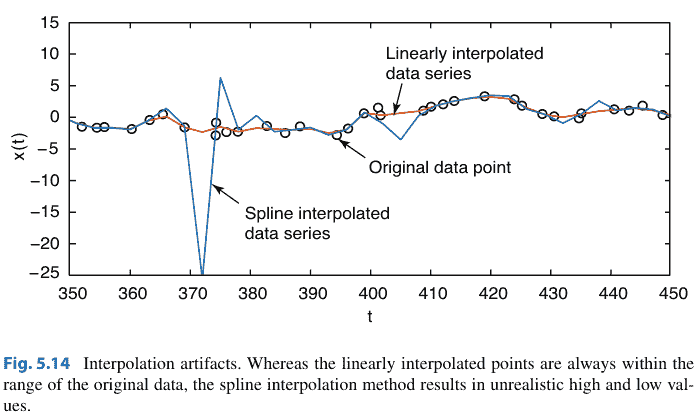

**图5.14** 插值伪影。虽然线性插值点始终在原始数据范围内，但样条插值方法导致不切实际的高值和低值。

plt.figure()
plt.plot(series2[0:,0],series2[0:,1],
    color=(0,0,0),
    marker='o',
    markerfacecolor='none')
plt.plot(t,series2L,
    color=(0.8500,0.3250,0.0980),
    linewidth=0.5)
plt.plot(t,series2S,
    color=(0,0.4470,0.7410),
    linewidth=0.5)
plt.show()

在这个系列中，只能观察到少数伪影。*SciPy*包还包含`PchipInterpolator()`，它使用*分段三次Hermite插值多项式*来执行保形分段三次插值。该函数避免了样条的典型伪影，因为它保留了数据系列的原始形状。

我们可以应用上面使用的函数，通过计算256个数据点的FFT（采样频率为1/3 kyr⁻¹）来计算功率谱：

f,Pxx=signal.periodogram(series1L,fs=1/3,nfft=256)

plt.figure()
plt.plot(f,Pxx)
plt.grid
plt.xlabel('Frequency')
plt.ylabel('Power')
plt.show()

主要峰值出现在频率约为0.01、0.025和0.05 kyr⁻¹处，分别对应于大约100、40和20 kyr的周期。分析第二个时间序列

f,Pxx=signal.periodogram(series2L,fs=1/3,nfft=256)

plt.figure()
plt.plot(f,Pxx)
plt.grid
plt.xlabel('Frequency')
plt.ylabel('Power')
plt.show()

也在频率0.01、0.025和0.05 kyr⁻¹处产生主要峰值（图5.10）。我们现在可以计算两个数据系列的互谱：

f,Pxy=signal.csd(series1L,series2L,fs=1/3,
    nperseg=128,nfft=256)

plt.figure()
plt.plot(f,np.abs(Pxy))
plt.grid
plt.xlabel('Frequency')
plt.ylabel('Power')
plt.show()

相关性（由高相干性值表示）相当令人信服：

f,Cxy=signal.coherence(series1L,series2L,fs=1/3,
    nperseg=128,nfft=256)

plt.figure()
plt.plot(f,Cxy)
plt.grid
plt.xlabel('Frequency')
plt.ylabel('Coherence')
plt.show()

我们可以在频率0.01、0.025和0.05 kyr⁻¹处观察到相当高的相干性。Pxy的复数部分用于计算每个频率的相位差：

phase=np.angle(Pxy)

plt.figure()
plt.plot(f,phase)
plt.grid
plt.xlabel('Frequency')
plt.ylabel('Phase angle')
plt.show()

频率f=0.01 kyr⁻¹处的相移使用以下代码计算

ph=np.interp(0.01,f,phase)
print(ph)

输出结果为

0.2777602833050877

相位谱归一化为完整周期τ=2π，因此-0.2796的相移等于(-0.2796·100 kyr)/(2·π) = -4.45 kyr，这大致对应于第二个数据系列相对于第一个系列引入的5 kyr相移。

## 5.7 频谱图（声谱图，声谱仪）方法

频谱峰的幅度通常随时间变化。这对于古气候时间序列尤其如此。古气候记录通常不仅显示均值和方差的趋势，还显示节奏性成分（如海洋δ¹⁸O记录中的米兰科维奇旋回）相对贡献的趋势。演化功率谱——也称为*声谱图*、*声谱仪*或*频谱图*——由Kay Electric Co.于1951年引入，可以在频域中映射此类变化。频谱图方法是基于傅里叶方法的一种修改，它计算时间序列重叠段的频谱。这些重叠段与Welch方法使用的加窗段相比相对较短，Welch方法用于提高功率谱的信噪比（Welch, 1967）。因此，演化功率谱方法使用*短时傅里叶变换*（STFT）而不是*快速傅里叶变换*（FFT）。演化功率谱的输出是短-项，信号的时频局部化频率内容。可以使用多种方法来显示结果。例如，时间与频率可以分别绘制在x轴和y轴上，反之亦然，而图的颜色则取决于频谱峰值的高度。

作为一个例子，我们使用一个类似于第5.3至5.5节中使用的数据集。该数据系列包含100、40和20 kyr三个主要周期以及叠加的高斯噪声。然而，振幅随时间变化，因此这个例子可以用来说明演化功率谱方法的优势。在我们的例子中，40 kyr周期仅在约450 kyr后出现，而100和20 kyr周期则贯穿整个时间序列。我们首先从文件series3.txt中加载并显示数据（图5.15）：

```python
import numpy as np
from scipy import signal
from scipy import interpolate
import matplotlib.pyplot as plt
```

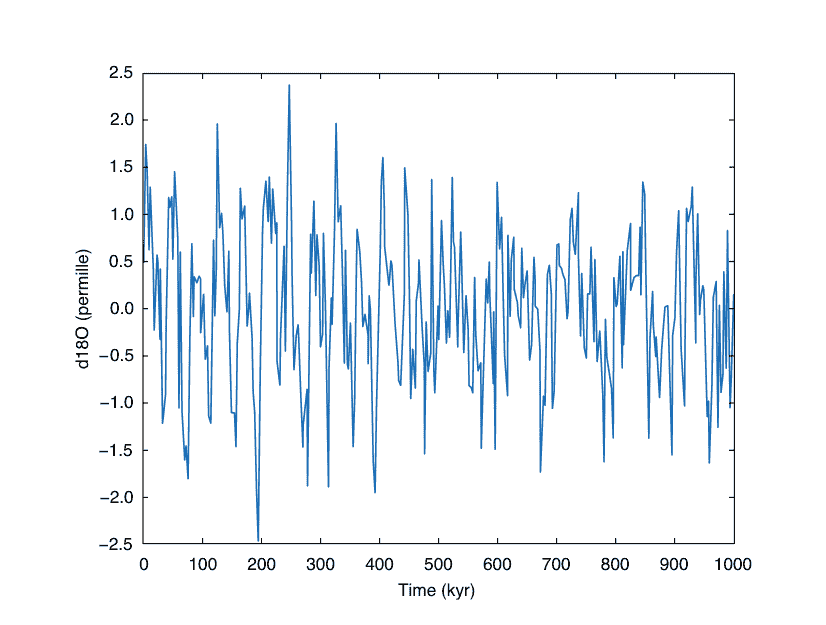

```python
series3=np.loadtxt('series3.txt')

plt.figure()
plt.plot(series3[0:,0],series3[0:,1])
plt.xlabel('Time (kyr)')
plt.ylabel('d180 (per mille)')
plt.show()
```

由于标准功率谱方法和演化功率谱方法都需要等间距数据，我们按照第5.6节所示，将数据插值到等间距的时间向量t上：

```python
t=np.arange(0.,1000.+3.,3.)
fun=interpolate.interp1d(series3[0:,0],
    series3[0:,1],kind='linear',
    fill_value='extrapolate')
series3L=fun(t)
```

然后，我们计算整个时间序列的非演化功率谱（图5.16）。此练习有助于我们比较标准功率谱方法和演化功率谱方法结果之间的差异：

```python
f,Pxx=signal.periodogram(series3L,fs=1/3,nfft=256)

plt.figure()
plt.plot(f,Pxx)
plt.grid
plt.xlabel('Frequency')
plt.ylabel('Power')
plt.show()
```

自谱显示在100、40和20 kyr周期处有主要峰值，以及一些噪声。然而，功率谱并未提供关于这些峰值振幅波动的任何信息。非演化功率谱仅仅代表了数据中所包含频谱信息的平均值。

我们现在使用`spectrogram()`来绘制功率谱随时间的变化。默认情况下，时间序列被分成八个段，每段有50%的重叠。每个段都使用汉明窗进行加窗，以抑制频谱泄漏（第5.5节）。函数`spectrogram()`使用的输入参数与第5.4节中`periodogram()`使用的类似。然后，我们计算一个窗口大小为64个数据点、重叠为50个数据点的演化功率谱。短时傅里叶变换（STFT）使用`nfft=256`计算。由于插值时间向量的间距为3 kyr，采样频率为1/3 kyr⁻¹：

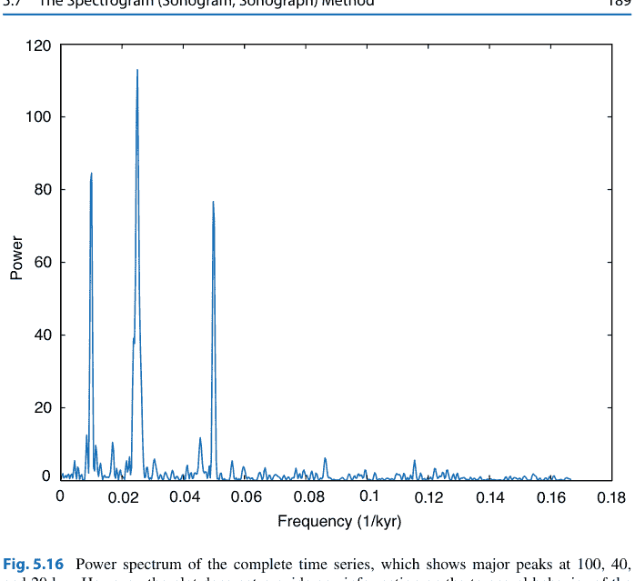

```python
f,t,s=signal.spectrogram(series3L,
    fs=1/3,nperseg=64,
    noverlap=50,nfft=256)

plt.pcolormesh(t,f,s,shading='gouraud')
plt.xlabel('Time (kyr)')
plt.ylabel('Frequency (1/kyr)')
plt.show()
```

我们使用`pcolormesh()`以彩色图（图5.17）显示`spectrogram()`的输出，图中显示了黄绿色的水平条纹，代表在频率0.01和0.05 kyr⁻¹（即每100和20 kyr）处的主要极大值。还有一个40 kyr周期（对应于0.025 kyr⁻¹的频率），但它仅在约450 kyr之后出现，如图左半部分的黄绿色条纹所示。


## 5.8 汤姆森多锥法

*汤姆森多锥法*通过平均多个加锥周期图（Thomson 1982, Percival and Walden 1993）（第5.4节）来计算具有n个数据点的时间序列$x(t)$的功率谱。锥是一种窗函数$w(k)$，类似于用于抑制频谱泄漏的窗函数（第5.5节），它与时间序列$x(t)$逐元素相乘。平均大量这样的加锥周期图有助于提高频谱的信噪比并抑制频谱泄漏。由于汤姆森多锥法使用的窗函数$w(k)$是两两正交的，因此加锥频谱估计在统计上是独立的，因此平均周期图代表了真实频谱的无偏估计。在其原始出版物中，David J. Thomson使用离散长球序列作为窗函数$w(k)$，以处理David S. Slepian先前发现的偏差和平滑问题（Slepian 1978）。因此，该方法与第5.5节介绍的Welch方法具有相似的目标，即提供真实频谱的无偏估计并提高信噪比（SNR）。在Welch方法中，通过计算时间序列（可能重叠的）段的频谱来实现平均频谱的统计独立性。而汤姆森多锥法则平均整个时间序列变体的频谱，这些变体先前已与两两正交的*Slepian*锥相乘。

下面的第一个例子比较了使用汤姆森多锥法计算无噪声正弦信号频谱与使用舒斯特周期图法计算频谱（第5.4节）。首先，我们创建一个时间轴t，从1/Fs=2到500，步长为1/Fs=2（即采样频率Fs=2），并将其转置，使t的元素按列而不是行出现。然后，我们通过添加三个正弦波来计算合成信号x，周期分别为τ₁=50 (f₁=0.02)、τ₂=15 (f₂≈0.07)和τ₃=5 (f₃=0.2)。相应的振幅为A₁=2、A₂=1和A₃=0.5：

```python
import numpy as np
import matplotlib.pyplot as plt
from scipy import signal

Fs = 2
Ns = 3
t = np.linspace(1/Fs,500,500*Fs)
t = np.transpose(t)

np.random.seed(0)
x = 2*np.sin(2*np.pi*t/50) + \
    np.sin(2*np.pi*t/15) + \
    0.5*np.sin(2*np.pi*t/5)

plt.figure()
plt.plot(t,x)
plt.axis([0,100,-4,4])
plt.show()
```

我们可以使用`periodogram()`通过舒斯特周期图法计算功率谱：

```python
f,Pxx = signal.periodogram(x,fs = Fs,nfft = t.size)

plt.figure()
plt.plot(f,Pxx)
plt.axis([0,1,0,np.max(Pxx)])
plt.show()
```

在我们的例子中，周期图是针对t.size个频率计算的，但由于奈奎斯特准则而减半（图5.7）。接下来，我们使用时间-半带宽积nw=4来计算汤姆森多锥功率谱密度（PSD）估计，以控制使用nseq=np.floor(2*nw-1)=7个slepian锥作为窗函数计算PSD估计时的频率分辨率。增加nw会降低频率分辨率但提高信噪比，如下一个例子所示，其中时间序列叠加了噪声。我们首先使用`dpss()`计算nseq=7个Slepian锥，该函数的名称代表离散长球序列。接下来，我们简单地使用第5.3节的脚本计算nseq=7个周期图，然后对其进行平均以计算汤姆森多锥PSD估计Pxxmt：

```python
nw = 4
n = int(np.floor(2*nw-1))
dps_seq = signal.windows.dpss(t.size,nw,n)

fmt = np.zeros((n,int(t.size/2 + 1)))
Pxxmt = np.zeros((n,int(t.size/2+1)))
for i in range(0,n):
    fmt[i,:],Pxxmt[i,:]=signal.periodogram(x,fs=Fs,
        window=dps_seq[i,:],nfft=t.size)

fmt=np.mean(fmt,axis=0)
Pxxmt=np.mean(Pxxmt,axis=0)

plt.figure()
plt.plot(fmt,Pxxmt)
plt.axis([0,1,0,np.max(Pxxmt)])
plt.show()
```

如我们所见，汤姆森多锥PSD估计明显更平滑，这使得在f₂≈0.07处的极大值更加可见。

下面的第二个例子比较了使用汤姆森多锥法计算带噪声正弦信号频谱与使用舒斯特周期图法计算频谱（第5.4节）。首先，我们创建一个时间轴t，从1/Fs=2到500，步长为1/Fs=2（即采样频率Fs=2），并将其转置，使t的元素按列而不是行出现。然后，我们通过添加三个正弦波（周期分别为τ₁=50 (f₁=0.02)、τ₂=15 (f₂≈0.07)和τ₃=5 (f₃=0.2)）以及标准差为Ns的叠加高斯噪声来计算合成信号x。相应的振幅分别为A₁=2、A₂=1和A₃=0.5：

## 5.8 汤姆森多窗谱法

```python
Ns = 3
np.random.seed(0)
xns = 2*np.sin(2*np.pi*t/50) + \
      np.sin(2*np.pi*t/15) + \
      0.5*np.sin(2*np.pi*t/5) + \
      Ns*np.random.randn(t.size)

plt.figure()
plt.plot(t, xns)
plt.axis([0, 100, -10, 10])
plt.show()
```

我们可以使用 `periodogram()` 函数通过舒斯特周期图法计算功率谱（图 5.18 a）：

```python
f, Pxx = signal.periodogram(xns, fs=Fs, nfft=t.size)

plt.figure()
plt.plot(f, Pxx)
plt.axis(np.array([0, 1, 0, np.max(Pxx)]))
plt.show()
```

在我们的示例中，周期图是针对 `t.size` 个频率计算的，但由于奈奎斯特准则，其数量减半。接下来，我们使用时间-半带宽积 `nw=2` 来计算汤姆森多窗功率谱密度（PSD）估计，以控制使用 `nseq=7` 个 Slepian 窗函数计算 PSD 估计时的频率分辨率。增大 `nw` 会降低频率分辨率，但会提高信噪比。现在的频谱类似于地球科学中的真实数据频谱，谱峰叠加在显著的背景噪声水平之上。最高频率的峰值甚至消失在噪声中，无法与归因于噪声的最大值区分开来。我们首先使用 `dpss()` 计算 `nseq=7` 个 Slepian 窗，该函数名称代表离散扁球序列。接下来，我们简单地使用第 5.3 节的脚本来计算 `nseq=4` 个基于 FFT 的功率谱估计，然后对其进行平均，以计算汤姆森多窗 PSD 估计 `Pxxmt`（图 5.18 b）：

```python
nw = 4
n = int(np.floor(2*nw-1))
dps_seq = signal.windows.dpss(t.size, nw, n)

fmt = np.zeros((n, int(t.size/2+1)))
Pxxmt = np.zeros((n, int(t.size/2+1)))
```

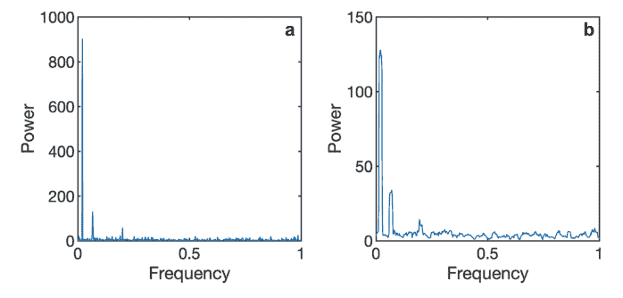

**图 5.18** 使用 **a** 舒斯特周期图法和 **b** 汤姆森多窗谱法计算的频谱比较。两种方法中，最高频率的峰值都消失在噪声中。然而，使用多窗谱法计算的频谱信噪比显著提高，与使用周期图法计算的频谱相比，仅损失了少量细节。

```python
for i in range(0,n):
    fmt[i,:],Pxxmt[i,:]=signal.periodogram(xns,fs=Fs,
        window=dps_seq[i,:],nfft=t.size)

fmt=np.mean(fmt,axis=0)
Pxxmt=np.mean(Pxxmt,axis=0)

plt.figure()
plt.plot(fmt,Pxxmt)
plt.axis([0,1,0,np.max(Pxxmt)])
plt.show()
```

如我们所见，汤姆森多窗 PSD 估计明显更平滑，这使得 $f_2 \approx 0.07$ 处的最大值更加清晰可见。然而，无论是周期图法还是汤姆森多窗谱法，都无法将 $f_3 = 0.02$ 处的高频峰值与噪声区分开来。同样，最高频率的峰值消失在噪声中，无法与归因于噪声的最大值区分开来。然而，我们注意到频谱的信噪比显著提高，与使用周期图法计算的频谱相比，仅损失了少量细节。

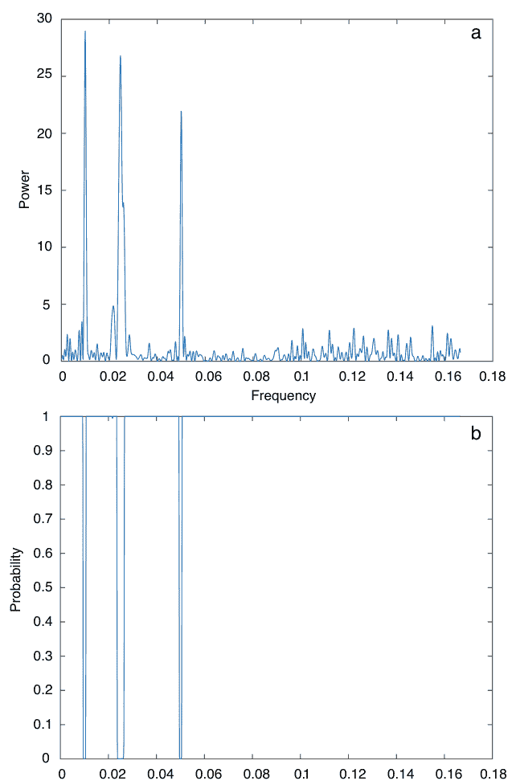

**图 5.19** a Lomb–Scargle 功率谱和 b 零假设的虚警概率。该图表明 100、40 和 20 千年的周期具有高度显著性。

## 5.9 Lomb–Scargle 功率谱

前面章节介绍的功率谱方法要求数据是均匀间隔的。然而，在地球科学中，时间序列通常是不均匀间隔的。虽然将不均匀间隔的数据插值到均匀间隔的时间网格上是克服此问题的一种方法（第 5.6 节），但插值会在时间和频率域中引入大量人为假象。因此，一种替代的时间序列分析方法在地球科学中日益流行：*Lomb–Scargle 算法*（例如，Scargle 1981, 1982, 1989, 1990; Schulz and Stattegger 1998, Press et al. 2007）。

Lomb–Scargle 算法仅在实际测量的时间点 $t_i$ 处评估时间序列的数据。假设一个包含 $n$ 个数据点的序列 $x(t)$，作为角频率 $\omega = 2\pi f > 0$ 函数的 Lomb–Scargle 归一化周期图 $P_x$ 由下式给出

$$P_x(\omega) = \frac{1}{s^2} \left\{ \frac{\left(\sum_j (x_i - \bar{x})\cos(\omega(t_j - \tau))\right)^2}{\sum_j \cos^2(\omega(t_j - \tau))} + \frac{\left(\sum_j (x_i - \bar{x})\sin(\omega(t_j - \tau))\right)^2}{\sum_j \sin^2(\omega(t_j - \tau))} \right\}$$

其中

$$\bar{x} = \frac{1}{n} \sum_{i=1}^n x_i$$

和

$$s^2 = \frac{1}{n-1} \sum_{i=1}^n (x_i - \bar{x})^2$$

分别是数据的算术平均值和方差（例如，Scargle 1981, 1982, 1989, 1990; Press et al. 2007）（第 3.2 节）。常数 $\tau$ 由以下关系定义

$$\tan(2\omega\tau) = \frac{\sum_j \sin(2\omega t_j)}{\sum_j \cos(2\omega t_j)}$$

是一个偏移量，它使得 $P_x(\omega)$ 独立于将 $t_i$ 值平移任何常数量。Scargle (1982) 表明，这种特定的偏移量 $\tau$ 选择导致 $P_x(\omega)$ 的解与对数据序列 $x(t)$ 进行正弦和余弦函数的最小二乘拟合相同：

$$x(t) = A\cos(\omega t) + B\sin(\omega t)$$

Lomb (1976) 此前研究了谐波函数对数据序列的最小二乘拟合与谱分析的结合，因此该方法被称为归一化 Lomb–Scargle 傅里叶变换。术语 *归一化* 指的是周期图方程分母中的因子 $s^2$。

Scargle (1982) 表明，假设噪声服从高斯分布，Lomb–Scargle 周期图具有指数概率分布，其均值等于 1。$P_s(\omega)$ 位于某个正数 $z$ 和 $z+dz$ 之间的概率是 $\exp(-z)dz$。如果我们扫描 $m$ 个独立频率，其中没有一个值大于 $z$ 的概率是 $(1-\exp(-z))^m$。因此，我们可以计算零假设的虚警概率（即周期图中给定峰值不显著的概率）（Press et al. 2007）：

$$P(> z) \equiv 1 - (1 - e^{-z})^m$$

Press et al. (2007) 还建议使用奈奎斯特准则（第 5.2 节）来确定独立频率的数量 $m$，假设数据是均匀间隔的。在这种情况下，独立频率数量的适当值是 $m=2n$，其中 $n$ 是时间序列的长度。

以下 Python 代码基于上述 Lomb–Scargle 归一化周期图的方程。我们首先加载在第 5.7 节中为说明演化（或加窗）功率谱方法的使用而生成的合成数据。数据包含 100、40 和 20 千年的周期性以及加性高斯噪声，并且在时间轴上是不均匀间隔的。我们可以定义两个新向量 $t$ 和 $x$，它们包含原始时间向量和在时间 $t$ 采样的合成氧同位素数据：

```python
import math
import numpy as np
import scipy.signal as signal
import matplotlib.pyplot as plt

t=np.loadtxt('series3.txt',usecols=0)
x=np.loadtxt('series3.txt',usecols=1)
```

然后我们生成一个频率轴 $f$。由于 Lomb–Scargle 方法无法处理零频率（即无限周期），我们从一个等效于频率向量间距的频率值开始。参数 `ofac` 是过采样因子，它影响频率轴在 $N(\text{frequencies})=N(\text{datapoints})$ 情况下的分辨率。我们还需要 Lomb–Scargle 算法可以分析的最高频率 `fhi`，这通常是如果数据点在相同时间间隔内均匀间隔时将获得的奈奎斯特频率 `fnyq`。以下代码使用输入参数 `hifac`，Press et al. (2007) 将其定义为 `hifac=fhi/fnyq`。

```python
intv=np.mean(np.diff(t))
ofac=4
```

hifac=1
f=np.arange(((2*intv)**(-1))/(len(x)*ofac),hifac*
    (2*intv)**(-1)+((2*intv)**(-1))/
    (len(x)*ofac), ((2*intv)**(-1))/
    (len(x)*ofac))

其中 int 是平均采样间隔。我们现在可以通过将上述 τ 和 P_x 的方程转换为 Python 代码，来计算归一化的 Lomb–Scargle 周期图 px 作为角频率 wrun 的函数：

px=np.zeros(np.shape(f))
for k in range(1,len(f)):
    wrun=2*np.pi*f[k]
    tau=(1/2*wrun)*math.atan2(sum(np.sin(2*wrun*t)),
        sum(np.cos(2*wrun*t)))
    px[k]=1/(2*np.var(x,ddof=1))* \
        ((sum(np.multiply((x-np.mean(x)),
        np.cos(wrun*(t-tau)))))**2 /
        sum((np.cos(wrun*(t-tau)))**2) +
        (sum(np.multiply((x-np.mean(x)),
        np.sin(wrun*(t-tau)))))**2 /
        sum((np.sin(wrun*(t-tau)))**2))

现在可以计算功率谱 px 中任何峰值的显著性水平。变量 prob 表示零假设的虚警概率。因此，较低的 prob 值表示功率谱中存在高度显著的峰值：

prob=1-(1-np.exp(-px))**(2*len(x))

我们现在绘制功率谱和概率图（图 5.19）：

plt.figure()
plt.plot(f,px)
plt.xlabel('Frequency')
plt.ylabel('Power')
plt.show()

plt.figure()
plt.plot(f,prob)
plt.xlabel('Frequency')
plt.ylabel('Probability')
plt.show()

这两幅图表明，所有三个峰值都高度显著，因为在 100、40 和 20 kyr 的周期处，虚警概率极低。

Press 等人（2007）提出了一种显示显著性水平的替代方法。该方法通过反转零假设的虚警概率方程来计算相应的置信水平。例如，我们选择 95% 的置信水平。然而，这个数字也可以替换为多个置信水平的向量，例如 confid= [0.90 0.95 0.99]。我们现在可以输入

m=int(np.floor(0.5*ofac*hifac*len(x)))
effm=2.*m/ofac
confid=np.array([0.9,0.95,0.99])
levels=np.log((1.-confid**(1./effm))**(-1))

其中 m 是独立频率的真实数量，effm 是使用过采样因子 ofac 的有效频率数量。第二幅图显示了频谱峰值和相应的置信水平：

plt.figure()
plt.plot(f,px)
for k in range(0,3):
    print(confid[k])
    print(levels[k])
    plt.plot(f,levels[k]*np.ones(len(f)),
             linestyle='-',
             color=[0.1,0.5,0.8])
plt.xlabel('Frequency')
plt.ylabel('Power')
plt.show()

频率为 0.01、0.025 和 0.05 kyr⁻¹ 的所有三个频谱峰值都超过了 95% 的置信水平，这表明它们代表了重要的周期性。因此，我们获得了与使用 Schuster 周期图法相似的结果。然而，Lomb–Scargle 方法的一个优点是它不需要对不均匀间隔的数据进行任何插值，并且允许进行定量的显著性检验。

SciPy 包包含 `lombscargle()` 函数，用于使用以弧度为单位的频率 wf 计算 Lomb–Scargle 周期图。输入

wf=2*np.pi*f
px=signal.lombscargle(t,x,wf,normalize=True)

plt.figure()
plt.plot(f,px)
plt.xlabel('Frequency')
plt.ylabel('Power')
plt.show()

会得到完全相同的结果。我们使用 `normalized=True` 作为频谱类型，以获得 Lomb–Scargle 归一化周期图，该图通过将 `px` 除以 `2*var(x)` 进行归一化，就像我们上面的 Python 代码一样。

上述示例中使用的合成时间序列不仅间隔不均匀，而且还分别显示出 100、40 和 20 kyr 的周期性，其振幅随时间变化。在第 5.7 节中，我们使用了频谱图方法来绘制功率谱随时间的变化。然而，该方法使用短时傅里叶变换（STFT），这需要均匀间隔的数据，这些数据通常通过对不均匀间隔的数据进行插值生成（所有缺点在第 5.6 节中描述）。相反，我们可以使用 Lomb–Scargle 方法代码的修改版本，以便能够从不均匀间隔的数据计算演化谱。定义窗口大小后，我们为 `lombscargle()` 的输出预分配内存，然后使用以下代码计算滑动窗口的 Lomb–Scargle 谱：

w=50

pxevol=np.empty((len(f),len(x)))
pxevol[:]=np.nan

for i in range(int(w/2+1),len(x)-int(w/2)):
    pxevol[:,i]=signal.lombscargle(t[i-int(w/2):i+int(w/2)],
                                  x[i-int(w/2):i+int(w/2)],
                                  wf,normalize=True)

随后，我们使用 `pcolormesh()`（图 5.20）将结果显示在伪彩色图中，输入

plt.pcolormesh(t,f,pxevol,shading='gouraud')
plt.xlabel('Time (kyr)')
plt.ylabel('Frequency (1/kyr)')
plt.colorbar()
plt.show()

该频谱显示出黄绿色的水平条纹，代表频率为 0.01 和 0.05 kyr⁻¹（即分别每 100 和 20 kyr）的主要极大值。该图显示了 40 kyr 周期在大约 450 kyr 时开始出现。由于 Lomb–Scargle 方法不需要插值，因此得到的演化谱在时间和频率轴上都显示出比使用频谱图方法（第 5.7 节）或小波方法（第 5.10 节）计算的频谱显著更多的细节。

## 5.10 小波功率谱

第 5.7 节演示了如何修改功率谱方法来绘制周期性随时间的变化。对 Lomb–Scargle 方法也应用了类似的修改，其优点是能够应用于不均匀间隔的数据（第 5.9 节）。然而，这两种方法都假设数据是正弦和余弦波的复合体，这些波在时间上全局均匀且具有无限的时间跨度。演化功率谱方法将时间序列分成重叠的段，并计算这些段的傅里叶变换。为了避免频谱泄漏，数据乘以平滑的钟形曲线窗口，这些曲线具有正值（第 5.5 节）。演化功率谱的时间分辨率越高，结果的准确性就越低。此外，短时间窗口包含大量高频周期，而低频周期则代表性不足。

与傅里叶变换相比，*小波变换*使用本身具有平滑端点的基函数（*小波*）（Lau and Weng 1995; Mackenzie et al. 2001）。小波是小的波包，由特定频率定义，并向两端衰减。由于小波可以在频率和时间上以灵活的分辨率进行拉伸和平移，因此它们可以轻松地映射时频域中的变化。

小波变换在数学上将信号 $x(t)$ 分解为从*母小波* $\psi(t)$ 通过伸缩和平移导出的基本函数 $\psi_{a,b}(t)$，

$$\psi_{a,b} = \frac{1}{a^{1/2}} \psi \left( \frac{t - b}{a} \right)$$

其中 $b$ 表示小波的位置（平移），$a$ (>0) 表示尺度（伸缩）（Lau and Weng 1995）。信号 $x(t)$ 关于母小波 $\psi(t)$ 的小波变换定义为卷积积分，

$$W(b, a) = \frac{1}{a^{1/2}} \int \psi^* \left( \frac{t - b}{a} \right) x(t) \mathrm{d}t$$

其中 $\psi^*$ 是 $\psi$ 的复共轭。文献中有许多可用的母小波，例如经典的 *Haar* 小波、*Morlet* 小波和 *Daubechies* 小波。地球科学中最流行的小波是 Morlet 小波，它由法国地球物理学家 Jean Morlet（1931-2007）引入，定义为

$$\psi_0(\eta) = \pi^{-1/4} exp(i\omega_0\eta) exp(-\eta^2/2)$$

其中 $\eta$ 是时间，$\omega_0$ 是波数（Torrence and Compo 1998）。波数是小波本身的振荡次数。我们可以通过将上述方程转换为 Python 代码来轻松计算 Morlet 小波波的离散版本，其中 `eta` 是无量纲时间，`w0` 是波数。更改 `w0` 会产生具有不同波数的小波。请注意，不要在 `for` 循环中使用 `i` 作为索引，因为它在这里用于虚数单位（图 5.21）：

import numpy as np
import scipy.signal as signal
from scipy import interpolate
import matplotlib.pyplot as plt

eta=np.arange(-10,10+0.1,0.1)
w0=6
wave=np.multiply(np.multiply(np.pi**(-1/4),
    np.exp(1j*w0*eta)),np.exp(-eta**2/2))

plt.figure()
plt.plot(eta,wave)
plt.xlabel('Position')

## 5.11 非线性时间序列分析（作者：N. Marwan）

前面章节描述的方法用于检测数据中的线性关系。然而，地球上的自然过程往往是复杂且混沌的，因此基于线性技术的方法可能无法得出令人满意的结果。近几十年来，源自混沌理论的非线性数据分析新技术日益流行。此类方法已被用于描述非线性行为，例如，通过定义自然过程的标度律和分形维数（Turbotte 1997; Kantz and Schreiber 1997）。然而，大多数非线性数据分析方法需要较长或平稳的数据序列，而这些要求在地球科学中很少得到满足。虽然大多数非线性技术在合成数据上表现良好，但这些方法无法描述真实数据的非线性行为。

近几十年来，递归图作为一种新的非线性数据分析方法，在科学和工程领域变得非常流行（Eckmann et al. 1987, Marwan 2007）。递归是耗散动力系统的一个基本属性。尽管此类系统中的微小扰动可能导致系统状态呈指数级发散，但经过一段时间后，系统会返回到接近之前的状态，然后再次经历类似的演化过程。递归图允许将动力系统的这种递归行为可视化。该方法现在被广泛接受为分析短时和非平稳数据集的非线性分析的有用工具。

### 5.11.1 相空间图

一个复杂动力系统（例如，湖泊中的沉积过程）的行为由许多变量决定，例如水体和湖底沉积物的性质、生活在湖泊及其周围的生物、降水（高降雨量会导致流域内风化和侵蚀加剧）、蒸发（例如，较高的蒸发会导致沉积物中钾浓度升高）以及风速（风速可以将更多固体颗粒输送到湖中）。分析这样一个动力系统的性质以及系统各组成部分之间随时间变化的相互作用，需要记录这些状态变量随时间的变化。由于通常没有古代系统状态变量（例如，降水、蒸发或风速）的记录可用，我们必须依赖于保存在自然档案中的间接指标（代用指标）。代用记录是通过采样多维动力系统的单个变量获得的，这相当于将复杂系统的动力学投影到单个轴上。以古湖泊沉积物为例，采样的变量可以是沿湖泊沉积岩芯的钾浓度时间序列 $x(t)$，它代表了湖泊系统过去状态的自然档案。

从一维时间序列 $x(t)$ 展开多维系统动力学的一种方法是通过时间延迟*嵌入*，它保留了系统的动态特性（Packard et al. 1980）。这种基于单个变量的一维时间序列包含了关于系统及其状态变量的信息，从中可以完整地重建整个系统。换句话说，由于钾浓度是未知环境变量（例如，降水、蒸发和风速）之间复杂相互作用的结果，分析这一环境代用指标的时间变化有助于我们了解古湖泊的性质及其各组成部分之间随时间变化的相互作用。例如，将时间序列 $x(t)$ 嵌入到三维（$m = 3$）*相空间*中，意味着三个连续值 $x(t)$、$x(t + \tau)$ 和 $x(t + 2\tau)$（时间间隔为 $\tau$）被表示为三维坐标系（即相空间）中的一个点（Packard et al. 1980）。*相空间图*将嵌入的观测时间序列表示为相空间中的轨迹 $\vec{y}(t) = [x(t), x(t + \tau), x(t + 2\tau)]^T$。相空间轨迹代表了系统演化的路径。

为了熟悉小波功率谱，我们可以计算第 5.6 节中使用的合成数据的连续小波变换（CWT）。我们首先加载文件 *series3.txt* 中包含的合成数据，同时记住数据包含 100、40 和 20 kyr 的周期性以及加性高斯噪声，并且它们在时间轴上分布不均匀：

```python
series3=np.loadtxt('series3.txt')
```

与傅里叶变换（第 5.3 至 5.7 节）类似，而与 Lomb-Scargle 算法（第 5.9 节）不同，小波变换要求数据均匀分布，因此我们使用 `interp1d()` 对数据进行插值：

```python
t=np.arange(0.,996.+3.,3.)
fun=interpolate.interp1d(series3[:,0],
    series3[:,1],kind='linear')
series3L=fun(t)
```

如果我们的时间序列存在趋势，我们需要在运行小波分析之前去除该趋势（参见第 5.4 节）：

```python
series3L=signal.detrend(series3L)
```

然后我们使用 cwt()，输入数据序列 series3L 和采样间隔的倒数作为采样频率。在我们的例子中，采样间隔是 3，因此采样频率是 1/3。使用 Morlet 小波的 cwt() 输出是小波变换 cwtmatr：

```python
fs=1/3
freqs=np.linspace(0.001,fs/2,1000)
w0=6
widths=w0*fs/(2.*np.pi*freqs)
cwtmatr=signal.cwt(series3L,
    signal.morlet2,widths,w=w0)
```

我们现在显示小波功率谱。我们可以更改坐标轴的限制、颜色映射以及许多其他内容。我们可以看到频率为 0.01/kyr（对应于 100 kyr 的周期）、0.025/kyr（40 kyr）和 0.05/kyr（20 kyr）的周期。小波功率谱的优点在于它们显示的是演化谱，即它们显示了周期随时间的出现和消失：

```python
plt.contourf(t,freqs,np.abs(cwtmatr),
    cmap='viridis')
plt.colorbar()
plt.xlabel('Time (kyr)')
plt.ylabel('Frequency (1/kyr)')
plt.xlim([0,1000])
plt.ylim([0.,0.07])
plt.show()
```

我们现在显示相同的图，但 y 轴使用周期而不是频率。我们可以看到周期为 100 kyr、40 kyr 和 20 kyr 的周期（图 5.22）：

```python
periods=1/freqs
plt.contourf(t,periods,np.abs(cwtmatr),
    cmap='viridis')
plt.colorbar()
plt.xlabel('Time (kyr)')
plt.ylabel('Frequency (1/kyr)')
plt.xlim([0,1000])
plt.ylim([0.,200])
plt.show()
```

我们也可以使用 `pcolormesh()` 代替 `contourf()` 来显示相同的图（图 5.23）：

```python
plt.pcolormesh(t, periods, np.abs(cwtmatr),
               cmap='viridis')
plt.colorbar()
plt.xlabel('Time (kyr)')
plt.ylabel('Period (kyr)')
plt.xlim([0, 1000])
plt.ylim([0., 200])
plt.show()
```

与窗口化功率谱方法相比，小波功率谱在时间和频率轴上都显示出明显更高的分辨率。小波变换不是将时间序列分成重叠的段并计算每段的功率谱，而是使用短波包，能更好地映射周期性随时间的变化。然而，窗口化功率谱和小波功率谱的缺点是它们都需要均匀分布的数据。Lomb-Scargle 方法克服了这个问题，但在映射频域内随时间变化的能力方面存在局限性（功率谱方法也是如此）。

系统的状态随时间演化。通过嵌入重构的相空间（即通过嵌入重构）与原始相空间（即描述湖泊的真实变量）并不完全相同，但只要*嵌入维度*足够大，其拓扑性质就能得以保持（Packard等人，1980；Takens，1981）。

例如，我们现在来探索一个周期过程的相空间图。我们首先创建位置向量x1和速度向量x2：

```python
import numpy as np
from scipy import interpolate
import matplotlib.pyplot as plt
import scipy.spatial.distance as distance

t=np.arange(0,3*np.pi+np.pi/10,np.pi/10)
x1=np.sin(t)
x2=np.cos(t)
```

相空间图

```python
plt.figure()
plt.plot(x1, x2)
plt.xlabel('x_1')
plt.ylabel('x_2')
plt.show()
```

是一个圆，这表明每个状态在一个完整周期后精确地重复出现（图5.24）。通过时间延迟嵌入，我们可以仅使用单个观测值（例如，一个速度向量）和一个时间延迟（对应于摆周期的四分之一）来重构这个相空间图：

```python
tau=5
plt.figure()
plt.plot(x2[:-tau], x2[tau:])
plt.xlabel('x_1')
plt.ylabel('x_2')
```

如我们所见，重构的相空间与原始相空间几乎相同。接下来，我们将这个相空间图与一个典型非线性系统——*洛伦兹系统*（Lorenz，1963）的相空间图进行比较。天气模式通常不会以可预测的方式变化。1963年，爱德华·洛伦兹提出了一个简单的三维模型，用于描述大气湍流所表现出的混沌行为。定义洛伦兹系统的变量是大气对流的强度、上升气流和下降气流之间的温差，以及垂直温度剖面偏离线性的程度。初始条件的微小变化可能导致天气模式的巨大分歧——这种行为通常被称为*蝴蝶效应*。洛伦兹系统的动力学由三个耦合的非线性微分方程描述：

$$\frac{dx}{dt} = s(y(t) - x(t))$$

$$\frac{dy}{dt} = -x(t)z(t) + rx(t) - y(t)$$

$$\frac{dz}{dt} = x(t)y(t) - bz(t)$$

对微分方程进行积分，可以得到一个简单的Python代码来计算洛伦兹系统的*xyz*三元组。我们使用*s* = 10，*r* = 28，和*b* = 8/3作为控制混沌行为的系统参数，时间延迟为*dt* = 0.01。位置向量的初始值为*x1* = 8，*x2* = 9，和*x3* = 25。然而，这些值可以更改为任何其他值，当然这也会改变系统的行为：

```python
dt=0.01
s=10
r=28
b=8/3
x1, x2, x3=8, 9, 25
n=5000
x=np.zeros((n, 3))
```

```python
for i in range(0, n):
    x1 = x1 + (-s * x1 * dt) + (s * x2 * dt)
    x2 = x2 + (r * x1 * dt) - (x2 * dt) - (x3 * x1 * dt)
    x3 = x3 + (-b * x3 * dt) + (x1 * x2 * dt)
    x[i, :] = [x1, x2, x3]
```

通过绘制x[:, 0]随时间的变化，可以查看一个变量（例如，第一个变量）的典型轨迹（图5.25）：

```python
t = np.linspace(0.01, 50, n)

plt.figure()
plt.plot(t, x[:, 0])
plt.xlabel('Time')
plt.ylabel('Temperature')
plt.show()
```

接下来，我们绘制洛伦兹系统的相空间图（图5.26）：

```python
plt.figure()
ax = plt.axes(projection='3d')
ax.plot(x[:, 0], x[:, 1], x[:, 2])
ax.view_init(30, 70-90)
ax.set_xlabel('x_1')
ax.set_ylabel('x_2')
ax.set_zlabel('x_3')
plt.show()
```

**图5.25** 洛伦兹系统。我们使用s = 10，r = 28，和b = 8/3作为系统参数。时间延迟为dt = 0.01。

**图5.26** a 洛伦兹系统的相空间图。与简单的周期系统相比，洛伦兹系统的轨迹显然没有精确地遵循之前的路径，但它们非常接近。b 仅使用第一个状态和时间延迟为6重构的相空间图，揭示了一个拓扑相似的相图，具有两个典型的“耳朵”。

与上述简单的周期系统相比，洛伦兹系统的轨迹显然没有精确地遵循之前的路径，但它们非常接近。此外，如果我们跟踪轨迹的两个非常接近的片段，我们会看到它们随着时间的推移进入相空间的不同区域。轨迹显然围绕相空间中的一个不动点盘旋，然后在随机的时间段后围绕另一个不动点盘旋。相状态围绕不动点的这种奇特轨道被称为*洛伦兹吸引子*。

这些观察到的特性是混沌系统的典型特征。虽然此类系统中的微小扰动会导致其状态呈指数级发散，但系统会通过相似的路径近似地返回到先前的状态。仅使用第一个状态和时间延迟为6重构相空间图。

```python
tau=6
plt.figure()
ax=plt.axes(projection='3d')
ax.plot(x[0:-2*tau-1,0],
        x[0+tau:-tau-1,0],
        x[0+2*tau:-1,0])
ax.view_init(60,100-90)
ax.set_xlabel('x_1')
ax.set_ylabel('x_2')
ax.set_zlabel('x_3')
plt.show()
```

揭示了一个相似的相图，具有两个典型的*耳朵*（图5.26）。混沌系统的特征性质也可以在这种重构中观察到。

时间延迟和嵌入维度需要根据对数据的先前分析来选择。延迟可以借助自协方差（或自相关）序列来计算。对于我们周期性振荡的例子，

```python
t=np.arange(0,3*np.pi+np.pi/10,np.pi/10)
x=np.sin(t)
```

我们计算并绘制自相关序列

```python
C=np.ones(len(x)-2)
for i in range(1,len(x)-2):
    r=np.corrcoef(x[0:-i],x[i:])
    C[i]=r[0,1]

plt.figure()
plt.plot(range(0,len(x)-2),C)
plt.xlabel('Delay')
plt.ylabel('Autocorrelation')
plt.grid()
```

我们现在选择一个延迟，使得第一个周期的自相关序列等于零。在我们的例子中，这个值是五，也就是我们在相空间重构示例中使用的值。合适的嵌入维度可以使用假近邻法或（更简单地）使用递归图来计算，递归图将在下一小节中介绍。嵌入维度逐渐增加，直到大多数对角线与恒等线平行。

相空间轨迹或其重构是许多非线性数据分析中定义的度量的基础，例如*李雅普诺夫指数*、*Rényi熵*和*Rényi维数*。推荐Kantz和Schreiber（1997）关于非线性数据分析的著作，以获取关于这些方法的更详细信息。相空间轨迹或其重构也是构建递归图（图5.27）所必需的。

### 5.11.2 递归图

动力系统的一个共同特征是*递归*性。系统递归状态中的模式反映了典型的系统特征，对这些特征的描述有助于我们理解系统的动力学。在我们的例子中，降水、蒸发和风速等状态变量变化的递归可能导致湖泊中相似（尽管不完全相同）的条件（例如，湖泊的深度和大小、湖水的碱度和盐度、水体中的物种组合或沉积物中的成岩作用）。递归图（RP）是系统这种递归状态的图形显示，它是根据所有相空间向量对$\vec{y}(t)$之间的距离（例如，欧几里得距离）在阈值$\varepsilon$内计算得出的（Marwan等人，2007）：

$$R_{i,j} = \begin{cases} 0, & \| x_i - x_j \| > \varepsilon \\ 1, & \| x_i - x_j \| \leq \varepsilon \end{cases}$$

如果时间$i$和$j$处的两个状态之间的距离小于给定的阈值$\varepsilon$，则递归矩阵$R$的值为1；否则为0。因此，这种分析是对所有状态的成对测试。对于$n$个状态，我们计算$n^2$次测试。递归图是$n \times n$矩阵的二维显示，其中黑色像素代表$R_{i,j}=1$，白色像素表示$R_{i,j}=0$，并且坐标系表示两个时间轴。这样的递归图有助于创建

### 5.11.3 递归量化分析

递归图的结构也可以通过一套定量指标在*递归量化分析*（RQA）中进行描述。其中一些指标基于对角线或垂直线长度的分布，以及*局部邻近构型*。这些指标可用于追踪动态过程中隐藏的转变。作为示例，我们接下来考虑两个指标：递归率和传递性系数。*递归率*是递归图中点的密度，对应于系统的递归概率。*传递性系数*源于图论，用于表征系统的规则性（或复杂性）。

对于我们的示例，我们可以考虑一个正态分布（高斯）噪声的时间序列，该序列在时间点1,000处均值发生转变，并且在此转变之前（从时间点800开始）自相关性发生变化。重要的是，在前兆区域中，均值和方差均未发生变化，传统方法也无法发现此类变化：

```python
np.random.seed(20)
n=1000
x=np.random.uniform(0,1,n)

x=np.concatenate((np.zeros(n),np.ones(n)))
x=x+np.random.normal(0,0.3,len(x))
for i in range(n-round(n/5),n):
    x[i]=0.9*x[i-1]+0.5*x[i]+0.02
x=x/np.std(x,ddof=1)

t=np.arange(0,len(x))

plt.figure()
plt.plot(t, x)
plt.xlabel('Time')
```

我们首先对时间序列进行嵌入，然后计算递归图：

```python
n=len(x)
tau=2
m=2
n2=n - tau*(m-1)

s=np.zeros((n2,m))
for mi in range(0,m):
    s[:,mi]=x[np.arange(0,n2)+tau*mi]
```

```python
D=distance.pdist(s)
S=distance.squareform(D)
R=S<0.5

plt.imshow(R,
    extent=[0,n2,0,n2],
    cmap='gray_r',
    origin='lower')
plt.xlabel('Time')
plt.ylabel('Time')
plt.show()
```

该递归图显示了两个随机分布点的块，每个块都标记了系统随机返回到相似状态的时间。在随机噪声中，相似状态频繁递归，但除了主对角线（即恒等线）外，没有任何规律性。递归图的两个块标记了在时间点1,000处的转变。变化点之前的状态与变化点之后的状态差异显著，这体现在递归图右下角和左上角几乎为空的象限中。然而，时间点800到1,000之间自相关性的先前增加在递归图中并不明显，尽管它看起来略显密集。在这种情况下，量化递归图中的结构可能被证明是有益的。

为了计算递归率，我们可以简单地计算矩阵R的平均值，

```python
RR=np.mean(R)
print(RR)
```

其结果为

```
0.10654648642636631
```

因此，系统返回到随机选择的先前状态的概率约为10%。

传递性系数是一个图论指标，用于衡量三个相连的网络节点（即三元组）完全互连（即形成一个封闭三角形）的概率：

$$\tau = \frac{\sum_{i,j,k}^N A_{ij}A_{jk}A_{ik}}{\sum_{i,j,k=1}^N A_{ij}A_{ik}(1-\delta_{ik})}$$

这个指标可以直观地理解为相空间中的递归。我们可以通过网络链接来识别状态的递归：相空间轨迹上接近的点通过链接连接。三个相连的点形成一个三元组，但只有当这三个点彼此接近地递归时，它们才构成一个三元组，因此

## 5.12 时间序列中突变的检测

在时域中，有多种方法可用于检测时间序列的突变。其中一种适用于气候时间序列的方法是*斜率拟合法*（Mudelsee and Stattegger 1997, Mudelsee 2000），而适用于频域的方法则包括*演化功率谱*和*小波功率谱*（例如，Lau and Weng 1995, Mackenzie et al. 2001）。在大多数情况下，时域和频域中的趋势与事件是通过计算包含在长度（或宽度）为*L*的*滑动窗口*内的数据的统计参数（例如，集中趋势和离散度的度量）来检测的。这些参数的精度取决于窗口的长度。换句话说，如果L较大，则可以获得均值和方差的准确值。然而，较大的窗口会降低对这些参数变化估计的精度。这个问题通常被称为*格伦南德统计不确定性原理*（Grenander 1958）。不过，如果只需要确定统计参数发生急剧变化的位置，那么通过执行统计检验来评估两个不同滑动窗口在集中趋势和离散度上的差异，可以在一定程度上克服这个问题。

经典的*t*检验和*F*检验统计量常用于比较两组测量值的均值和方差，因此可用于检测两个滑动窗口在位置和离散度上的变化。然而，这两个检验都基于样本来自高斯分布总体的基本假设（第3.7节和第3.8节）。非参数的曼-惠特尼检验和安萨里-布拉德利检验为这个问题提供了一种与分布无关的解决方案（第3.11节和第3.12节）。曼-惠特尼检验（Mann and Whitney 1947, Lepage 1971）执行双侧秩和检验，其原假设是两个样本来自具有相同中位数的连续分布，备择假设是它们不具有相同的中位数。另一方面，安萨里-布拉德利检验执行双侧检验，其原假设是两个独立样本来自同一分布，备择假设是它们来自具有相同中位数和形状但离散度不同的分布（Ansari and Bradley 1960, Lepage 1971）。后一种方法已成功应用于保存在西非亚热带近海、东地中海和阿拉伯海的海洋沉积物中的陆源粉尘通量记录，以检测非洲上新世-更新世气候中的趋势、周期和事件（Trauth et al. 2009）。

形成一个三角形。如果动力学高度规则（即，重复状态在长时间内保持重复），则这种三角形配置会沿着相空间轨迹保持。然而，如果动力学是混沌的，那么最初接近的相空间轨迹部分随后会发散，即使相应的三节点可能在一段时间内保持连接，三角形配置也会瓦解。因此，对于规则动力学，找到三角形的概率更高，而对于混沌动力学则更低。当然，这个解释相当简化，但可以在Donner et al. (2011)中找到理论上充分的解释。

为了计算三元组也形成三角形的概率，我们需要计算连接的三元组数量和三角形数量，这可以通过排除主对角线直接从递归图中实现：

```
A=R - np.eye(len(R))
```

三角形和三元组的数量则为

```
numTripl=np.sum(np.matmul(A,A))
numTria=np.trace(np.matmul(A,np.matmul(A,A)))
```

最后，传递性系数是比值

```
Trans=numTria/numTripl
print(Trans)
```

其结果为

```
0.6459486011860506
```

这个数字意味着系统不具有规则动力学（规则动力学的传递性系数会接近1）。

为了检测动力学的变化，可以对移动窗口计算递归定量分析。移动窗口的递归定量分析可以通过两种方式计算：1）对沿着单个全局递归图移动的窗口计算递归定量分析度量，或2）对沿着原始时间序列移动的窗口计算各自的递归图。如果非平稳性或趋势不是分析的主要关注点，方法（2）有助于找到忽略这些非平稳性的转变。然而，如果检测整体（全局、大尺度）变化是关注点（例如，检验非平稳性），则应保持递归条件随时间不变（从而允许考虑整个时间序列的全局递归图），并应选择方法（1）（Marwan 2011）。所选窗口大小需要足够小以确保良好的时间分辨率，但又要足够大以覆盖典型的变异（例如，几个周期），以便找到递归。

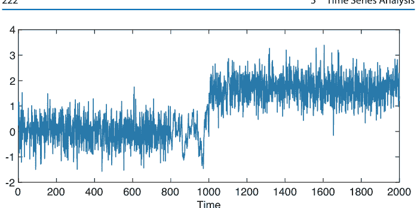

图 5.32 用于递归图定量度量示例的合成数据时间序列。

在我们的示例中，我们选择移动窗口长度为150个数据点，重叠率为20%（图 5.32）：

```
w=150
```

然后我们计算这些移动窗口内的递归率RR和传递性系数Trans（图 5.33 和 5.34）：

```
Trans=np.zeros(len(R)-w)
RR=np.zeros(len(R)-w)
for i in range(0,len(R)-w,int(w/5)):
    subR=R[i:i+w,i:i+w]
    RR[i]=np.mean(subR)
    subA=A[i:i+w,i:i+w]
    numTripl=np.sum(np.matmul(subA,subA))
    numClosTria=np.trace(np.matmul(subA,
        np.matmul(subA,subA)))
    Trans[i]=numClosTria/numTripl

plt.figure()
plt.plot(t[int(w/2):int(w/2)+len(RR):int(w/5)],
    RR[0:-1:int(w/5)],
    label='Recurrence rate')
plt.plot(t[int(w/2):int(w/2)+len(RR):int(w/5)],
    Trans[0:-1:int(w/5)],
    label='Transitivity coefficient')
```

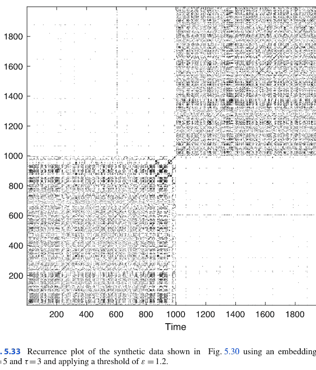

图 5.33 图 5.30 所示合成数据的递归图，使用嵌入维度 $m=5$ 和延迟 $\tau=3$，并应用阈值 $\varepsilon=1.2$。

```
python
plt.xlabel('Time')
plt.legend()
```

递归定量分析度量显示在高自相关部分内存在一个明显的转变。在这一点上，度量值较高，这反映了黑点密度更高、由于自相关导致的邻域配置变化以及系统动力学的变化。这些较高值的存在可用于检测此类自相关变化（例如，作为*临界点*的前兆），并最终预测临界点本身。两个空象限在时间1,000处发生的转变点直接干扰了移动窗口，从而导致*RR*度量突然下降。

为了可靠地解释递归度量的变化，应应用统计检验（Marwan 2011）。其他更复杂的度量，用于量化动力学的额外方面（例如，可预测性或层流相），包含在MATLAB的交叉递归图工具箱中，该工具箱可在以下地址获取。

```
http://tocsy.pik-potsdam.de/CRPtoolbox/
```

递归图的双变量和多变量扩展允许进行非线性相关检验和同步分析。关于基于递归图的方法的详细介绍可在以下网站找到：

```
http://www.recurrence-plot.tk
```

递归图已被用于分析地球科学中的许多问题。将现代降水数据与从阿根廷西北部安第斯山脉的年层湖泊沉积物中推断出的古降水数据进行动力学比较，是此类分析的一个很好的例子（Marwan et al. 2003）。在这个例子中，递归图方法被应用于大约3万年前的纹层状湖泊沉积物的红色强度剖面（第8.7节）。将沉积物的递归图与现代降水数据的递归图进行比较，揭示了红色层记录了拉尼娜年份发生的更强烈的雨季。线性技术无法将红色粘土通量的增加与厄尔尼诺-南方涛动的厄尔尼诺或拉尼娜阶段联系起来。此外，递归图有助于支持以下假设：更长的雨季、增加的降水以及厄尔尼诺-南方涛动更强的影响导致了3万年前滑坡数量的增加（Marwan et al. 2003, Trauth et al. 2003）。

第二个地球科学例子——包括对递归图和递归定量分析的全面描述——使用该技术对湖泊沉积岩芯记录中的不同类型的变异性和转变进行分类，以增进对生物圈对气候变化的响应，特别是对埃塞俄比亚南部裂谷地区人类对这种变化的响应的理解（Trauth et al. 2019）。

## 5.12 检测时间序列中的突变

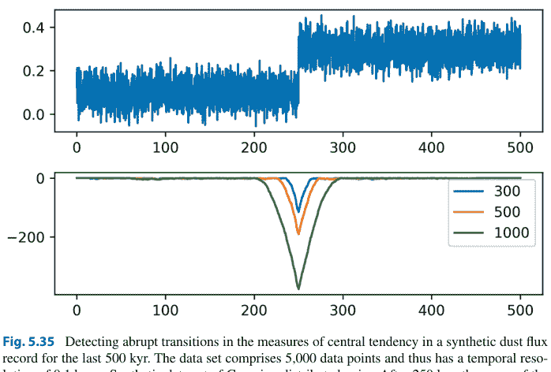

图 5.35 检测过去50万年合成粉尘通量记录中集中趋势度量的突变。该数据集包含5000个数据点，因此时间分辨率为0.1千年。a 高斯分布噪声的合成数据集。250千年后，数据的均值向不同值偏移。b 对于三种不同长度的配对滑动窗口（即300、500和1000个数据点，分别相当于30、50和100千年）的Mann-Whitney检验结果。窗口长度明显影响检验统计量最大值的幅度和宽度，而均值突变的位置则定义明确。

下面的示例演示了如何使用这些方法来检测合成记录中的变化点，这些记录在时间序列中部（图5.35和5.36）包含集中趋势（例如，均值、中位数或众数）和离散度（例如，极差、方差或分位数）的变化。时间轴从0.1到500千年，采样间隔为0.1千年。在250千年处，正态分布数据的均值从1.0突然变为3.0，而标准差保持不变（图5.35 a）：

```python
import numpy as np
import matplotlib.pyplot as plt
from scipy import stats

np.random.seed(0)
t=np.linspace(0.1,500,5000)

y1=0.1*np.random.normal(1,0.5,t.size)
y2=0.1*np.random.normal(3,0.5,t.size)

y=y1
y[int(np.size(t)/2):int(np.size(t))]=y2[int(np.size(t)/2):int(np.size(t))]
```

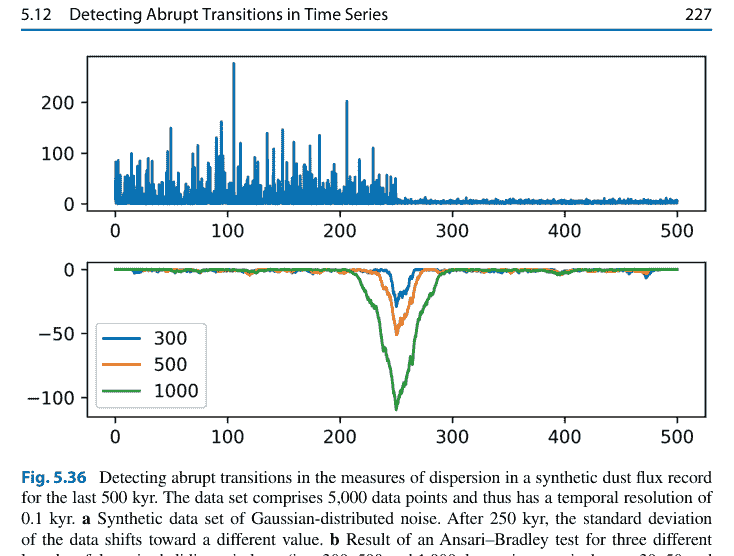

图 5.36 检测过去50万年合成粉尘通量记录中离散度度量的突变。该数据集包含5000个数据点，因此时间分辨率为0.1千年。a 高斯分布噪声的合成数据集。250千年后，数据的标准差向不同值偏移。b 对于三种不同长度的配对滑动窗口（即300、500和1000个数据点，分别相当于30、50和100千年）的Ansari-Bradley检验结果。窗口长度明显影响检验统计量最大值的幅度和宽度，而标准差突变的位置则定义明确。

我们首先使用具有三种不同长度配对滑动窗口的Mann-Whitney检验来检测中位数的任何突变。我们选择滑动窗口长度为300、500和1000个数据点。换句话说，在每一步中，我们将Mann-Whitney检验应用于两个各包含150个数据点的样本、两个各包含250个数据点的样本以及两个各包含500个数据点的样本。请注意，在对不同数据集运行Mann-Whitney检验时，窗口长度需要根据时间序列的长度以及识别均值突变所需的精度进行调整：

```python
w=np.array([300,500,1000])
```

我们使用第3.11节介绍的`ranksum`函数来执行Mann-Whitney检验（图5.35 a）：

```python
mwreal=np.ones((np.size(w),np.size(t)))

for j in range(0,int(np.size(w))):
    for i in range(int(w[j]/2),int(np.size(y)-w[j]/2)):
        h,p=stats.ranksums(y[int(i-w[j]/2):int(i)],
                           y[int(i+1):int(i+w[j]/2+1)])
        mwreal[j,i]=p

mwreal=np.transpose(mwreal)
```

我们可以在单个图形窗口中比较结果（图5.35）：

```python
plt.figure()
plt.axes(position=[0.1,0.5,0.8,0.3])
plt.plot(t,y)
plt.axes(position=[0.1,0.1,0.8,0.3])
plt.plot(t,np.log(mwreal))
plt.legend(['300','500','1000'])
plt.show()
```

Mann-Whitney检验的结果表明，窗口长度影响检验统计量最大值的幅度和宽度，而均值突变的位置则定义明确（图5.35 b）。

接下来，我们对同样三种不同长度的配对滑动窗口（即300、500和1000个数据点）使用Ansari-Bradley检验来检测标准差的任何突变。我们使用第3.12节介绍的`ansaribradley`函数来执行Ansari-Bradley检验。时间轴从0.1到500千年，采样间隔为0.1千年。在250千年处，对数正态分布数据的标准差从0.5突然变为1.3，而均值从1变为1.5（图5.36 a）：

```python
np.random.seed(0)
t=np.linspace(0.1,500,5000)

y1=np.random.lognormal(1.5,1.3,t.size)
y2=np.random.lognormal(1,0.5,t.size)

y=y1
y[int(np.size(t)/2):int(np.size(t))]=y2[int(np.size(t)/2):int(np.size(t))]
```

我们现在使用Ansari-Bradley检验（图5.36 b）：

```python
w=np.array([300,500,1000])

abreal=np.ones((np.size(w),np.size(t)))

for j in range(0,int(np.size(w))):
    for i in range(int(w[j]/2),int(np.size(y)-w[j]/2)):
        h,p=stats.ansari(y[int(i-w[j]/2):int(i)],
                         y[int(i+1):int(i+w[j]/2+1)])
        abreal[j,i]=p
abreal=np.transpose(abreal)
```

我们可以在单个图形窗口中使用以下代码比较结果（图5.36）：

```python
plt.figure()
plt.axes(position=[0.1,0.5,0.8,0.3])
plt.plot(t,y)
plt.axes(position=[0.1,0.1,0.8,0.3])
plt.plot(t,np.log(abreal))
plt.legend(['300','500','1000'])
plt.show()
```

Ansari-Bradley检验的结果表明，窗口长度影响检验统计量最大值的幅度和宽度，而标准差突变的位置则定义明确（图5.36 b）。

## 5.13 描述时间序列中的渐变

检测、测量和分类气候时间序列中的突变是现代时间序列分析中最重要的任务之一（Mudelsee 2000, Trauth et al. 2018, 2021b）。我们可以使用不同的方法对气候记录的振幅、持续时间和中点进行统计分析。首先，我们使用非线性最小二乘拟合，将具有m=4个参数a、b、c和d的sigmoid函数

$$x_{fit}(t) = a + \frac{b}{1 + e^{-d(t-c)}}, \text{ for } -\infty < t < +\infty$$

拟合到具有n个数据点的记录$x_i$（$1<i<n$）。sigmoid函数（在其归一化表示中）是一条单调的S形曲线，通常被称为阶跃函数的平滑版本。sigmoid函数以两条水平渐近线为界，当$t \rightarrow -\infty$和$+\infty$时，$x_{fit}(t) \rightarrow 0$和1。它具有钟形的一阶导数曲线和恰好一个拐点（参数c），该拐点可解释为突变的中点。其次，我们对这些记录进行统计重新分析，并再次拟合具有m=4个参数$x_1$、$x_2$、$t_1$和$t_2$的斜坡函数

$$x_{fit}(t) = \begin{cases} x_1, & \text{for } t \le t_1 \\ x_1 + (t - t_1)(x_2 - x_1)/(t_2 - t_1), & \text{for } t_1 < t \le t_2 \\ x_2, & \text{for } t > t_2 \end{cases}$$

到n个数据点。单调的斜坡形曲线有两个水平段和一个倾斜段，它们通过两个方向的突然变化连接，并且具有不连续的一阶导数。

我们的示例数据集包含100个数据点y，时间范围从t=0到t=100，其中y从0线性过渡到1，中点在t=50。合成时间序列中的线性过渡从t=46开始，到t=55结束，斜率为1/10，y截距为-4.5。合成数据集的y值还叠加了均值为0、标准差为0.1的加性独立高斯噪声。这样的数据集可以使用以下脚本生成：

```python
import numpy as np
import matplotlib.pyplot as plt
from scipy.optimize import curve_fit
from numpy.random import default_rng

np.random.seed(0)
data1=np.linspace(1,100,100)
data2=np.zeros(len(data1))
data2[45:54]=1/10*data1[45:54] - 4.5
data2[55:100]=1
data2=data2+0.1*np.random.normal(0,1,len(data2))
```

然后使用`curve_fit`函数分析合成数据集。我们首先拟合一个具有四个参数a、b、c和d的sigmoid函数

```python
def func1(x,a,b,c,d):
    return a+b*((1+np.exp(-d*(x-c)))**(-1))
```

然后我们使用`curve_fit`在最小二乘意义上找到a、b、c和d的最佳值，

```python
popt1,pcov1=curve_fit(func1,data1,data2)
print(popt1)
```

得到

```
[1.0061 -0.9890 51.5734 -0.3652]
```

接下来，我们使用相同的函数将斜坡函数拟合到数据。由于没有现成的斜坡函数可用，我们输入

```python
def func2(x,t1,t2,x1,x2):
    y=np.zeros(len(x))
    for i in range(0,len(x)):
        if x[i]<t1:
            y[i]=x1
```

# 信号处理

### 6.1 引言

信号处理涉及一系列技术，用于操纵信号以最小化噪声影响、校正各种不需要的失真，并分离出各种感兴趣的成分。大多数信号处理算法都包括滤波器的设计与实现。*滤波器*可以被描述为一个转换信号的系统。*系统理论*为滤波器的设计与实现提供了数学基础。滤波器有输入和输出，其中*输出信号 y(t)*是相对于*输入信号 x(t)*（图6.1）进行修改的。*信号转换*可以通过称为*卷积*的数学过程进行，或者——如果涉及滤波器——则称为*滤波*。

本章将借助计算机探讨*数字滤波器*的设计与实现。然而，许多自然过程类似于*模拟滤波器*，它们记录了地质档案中的自然事件。单次降雨事件不会在湖泊沉积物中留下记录，因为该事件在沉积物中产生的短时、低振幅信号（例如，沉积物化学成分的短期变化）在被封存到沉积物中之前，会在充分混合的水体中被强烈衰减。生物扰动也会引入严重的信号失真（例如，信号振幅和相位的变化），例如在深海沉积物中，它会导致单个有孔虫物种氧同位素信号出现明显的相位偏移（例如，Trauth 2013）。除了这些自然滤波器外，地质数据的野外采集和取样也会改变并平滑数据的原始形式。例如，一个有限大小的沉积物样品是在一定时间段内积分的，这会平滑自然信号。

**补充信息** 在线版本包含补充材料，可访问 https://doi.org/10.1007/978-3-031-56906-7_6。

© 作者，根据 Springer Nature Switzerland AG 2024 的独家许可
M. H. Trauth, *Python Recipes for Earth Sciences*, Springer Textbooks in Earth Sciences, Geography and Environment, https://doi.org/10.1007/978-3-031-56906-7_6

```python
elif x[i] >= t1 and x[i] < t2:
    y[i] = x1 + (x[i] - t1) * (x2 - x1) / (t2 - t1)
elif x[i] >= t2:
    y[i] = x2
return y
```

再次使用 `curve_fit`

```python
popt2, pcov2 = curve_fit(func2, data1, data2,
    bounds=([0, 0, -1, -1], [100, 100, 2, 2]))
print(popt2)
```

得到

```
[4.4999e+01 5.8249e+01 2.2671e-02 1.0014e+00]
```

我们再次获得了四个参数 t1、t2、x1 和 x2 的最佳估计值。或者，我们可以使用 Mudelsee (2000) 的 RAMPFIT 函数。我们可以使用以下代码来显示数据以及我们的计算结果（图 5.37）：

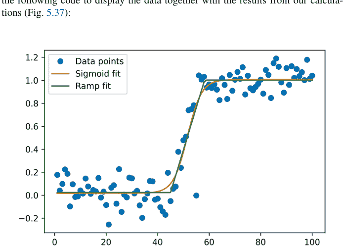

**图 5.37** 使用非线性最小二乘法将过渡模型拟合到合成数据（蓝点），该方法使用 `curve_fit` 拟合一个 sigmoid 函数（虚线）和一个斜坡函数（实线）。

```python
plt.figure()
plt.plot(data1,data2,
    marker='o',
    linestyle='none')
plt.plot(data1,func1(data1,
    popt1[0],popt1[1],popt1[2],popt1[3]))
plt.plot(data1,func2(data1,
    popt2[0],popt2[1],popt2[2],popt2[3]))
plt.legend(['Data points',
    'Sigmoid fit',
    'Ramp fit'])
plt.show()
```

如我们所见，sigmoid 拟合和斜坡拟合都能很好地描述该过渡过程。

## 参考文献

- Ansari AR, Bradley RA (1960) Rank-Sum Tests for Dispersion. Annals of Mathematical Statistics, 31:1174–1189. [Open access]
- Blackman RB, Tukey JW (1958) The Measurement of Power Spectra. Dover NY
- Brückner E (1890) Klimaschwankungen seit 1700 nebst Bemerkungen über die Klimaschwankungen der Diluvialzeit. Geographische Abhandlungen 4:153–484
- Cooley JW, Tukey JW (1965) An Algorithm for the Machine Calculation of Complex Fourier Series. Math Comput 19(90):297–301
- Donner RV, Heitzig J, Donges JF, Zou Y, Marwan N, Kurths J (2011) The Geometry of Chaotic Dynamics–A Complex Network Perspective. European Physical Journal B 84:653–672
- Eckmann JP, Kamphorst SO, Ruelle D (1987) Recurrence Plots of Dynamical Systems. Europhys Lett 5:973–977
- Grenander U (1958) Bandwidth and variance in estimation of the spectrum. J Roy Stat Soc B 20:152–157
- Hann J (1901) Lehrbuch der Meteorologie. Tauchnitz, Leipzig
- Iwanski J, Bradley E (1998) Recurrence plot analysis: To embed or not to embed? Chaos 8:861–871
- Kantz H, Schreiber T (1997) Nonlinear Time Series Analysis. Cambridge University Press, Cambridge
- Köppen W (1931) Grundriss der Klimakunde–2nd Edition. de Gruyter, Berlin
- Lau KM, Weng H (1995) Climate Signal Detection Using Wavelet Transform: How to make a Time Series Sing. Bull Am Meteor Soc 76:2391–2402
- Lepage Y (1971) A combination of Wilcoxon’s and Ansari–Bradley’s statistics. Biometrika 58:213–217
- Lomb NR (1977) Least-Squared Frequency Analysis of Unequally Spaced Data. Astrophysics and Space Sciences 39:447–462
- Lorenz EN (1963) Deterministic Nonperiodic Flow. Journal of Atmospheric Sciences 20:130–141
- Mackenzie D, Daubechies I, Kleppner D, Mallat S, Meyer Y, Ruska MB, Weiss G (2001) Wavelets: Seeing the Forest and the Trees. Beyond Discovery, National Academy of Sciences, December 2001. http://www.beyonddiscovery.org
- Mann HB, Whitney DR (1947) On a Test of Whether one of Two Random Variables is Stochastically Larger than the Other. Ann Math Stat 18:50–60
- Marwan N, Thiel M, Nowaczyk NR (2002) Cross Recurrence Plot Based Synchronization of Time Series. Nonlinear Process Geophys 9(3/4):325–331
- Marwan N, Trauth MH, Vuille M, Kurths J (2003) Nonlinear Time-Series Analysis on Present-Day and Pleistocene Precipitation Data from the NW Argentine Andes. Clim Dyn 21:317–332
- Marwan N, Romano MC, Thiel M, Kurths J (2007) Recurrence Plots for the Analysis of Complex Systems. Phys Rep 438:237–329
- Marwan N (2011) How to avoid potential pitfalls in recurrence plot based data analysis. International Journal of Bifurcation and Chaos 21:1003–1017
- Mudelsee M, Stattegger M (1997) Exploring the structure of the mid-Pleistocene revolution with advanced methods of time-series analysis. Int J Earth Sci 86:499–511
- Mudelsee M (2000) Ramp function regression: A tool for quantifying climate transitions. Comput Geosci 26:293–307
- Mudelsee M (2014) Climate Time Series Analysis: Classical Statistical and Bootstrap Methods, 2nd edn. Springer Verlag, Berlin
- Muller RA, MacDonald GJ (2000) Ice Ages and Astronomical Causes-Data. Spectral Analysis and Mechanisms. Springer Verlag, Berlin
- Packard NH, Crutchfield JP, Farmer JD, Shaw RS (1980) Geometry from a time series. Phys Rev Lett 45:712–716
- Press WH, Teukolsky SA, Vetterling WT, Flannery BP (2007) Numerical Recipes: The Art of Scientific Computing-Third Edition. Cambridge University Press, Cambridge
- Scargle JD (1981) Studies in Astronomical Time Series Analysis. I. Modeling Random Processes in the Time Domain. Astrophys J Suppl Ser 45:1–71
- Scargle JD (1982) Studies in Astronomical Time Series Analysis. II. Statistical Aspects of Spectral Analysis of Unevenly Spaced Data. Astrophys J 263:835–853
- Scargle JD (1990) Studies in Astronomical Time Series Analysis. IV. Modeling Chaotic and Random Processes with Linear Filters. Astrophys J 359:469–482
- Scargle JD (1989) Studies in Astronomical Time Series Analysis. III. Fourier Transforms, Auto-correlation Functions, and Cross-Correlation Functions of Unevenly Spaced Data. Astrophys J 343:874–887
- Schulz M, Stattegger K (1998) SPECTRUM: Spectral Analysis of Unevenly Spaced Paleoclimatic Time Series. Comput Geosci 23:929–945
- Schuster A (1898) On the investigation of hidden periodicities with application to a supposed 26 day period of meteorological phenomena. Terr Magn Atmos Electr 3:13–41
- Solomon S, Qin D, Manning M, Chen Z, Marquis M, Averyt KBM. (2007) Tignor. In: Miller, H.L. (Ed.), Contribution of Working Group I to the Fourth Assessment Report of the Intergovernmental Panel on Climate Change. Cambridge University Press, Cambridge
- Takens F (1981) Detecting Strange Attractors in Turbulence. Lect Notes Math 898:366–381
- Torrence C, Compo GP (1998) A Practical Guide to Wavelet Analysis. Bull Am Meteor Soc 79:61–78
- Turcotte DL (1997) Fractals and Chaos in Geology and Geophysics. Cambridge University Press, Cambridge
- Trauth MH (2021) Spectral Analysis in Quaternary Sciences. Quatern Sci Rev 270:107157
- Trauth MH (2024) MATLAB Recipes for Earth Sciences-Sixth Edition. Springer Verlag, Berlin Heidelberg New York
- Trauth MH, Bookhagen B, Marwan N, Strecker MR (2003) Multiple Landslide Clusters Record Quaternary Climate Changes in the NW Argentine Andes. Palaeogeogr Palaeoclimatol Palaeoecol 194:109–121
- Trauth MH, Larrasoaña JC, Mudelsee M (2009) Trends, rhythms and events in Plio-Pleistocene African climate. Quatern Sci Rev 28:399–411
- Trauth MH, Foerster V, Junginger A, Asrat A, Lamb H, Schae bitz F (2018) Abrupt or Gradual? Change Point Analysis of the Late Pleistocene-Holocene Climate Record from Chew Bahir, Southern Ethiopia. Quatern Res 90:321–330
- Trauth MH, Asrat A, Duesing W, Foerster V, Kraemer KH, Marwan N, Maslin MA, Schae bitz F (2019) Classifying past climate change in the Chew Bahir basin, southern Ethiopia, using recurrence quantification analysis. Climate Dynamics, 53:2557–2572, code ClimDyn_RP_RQA.zip or https://tinyurl.com/yyqjyoq4
- Trauth MH, Asrat A, Cohen A, Duesing W, Foerster V, Kaboth-Bahr S, Kraemer KH, Lamb H, Marwan N, Maslin MA, Schae bitz F (2021) Recurring types of variability and transitions in the ~620 kyr record of climate change from the Chew Bahir basin, southern Ethiopia. Quaternary Science Reviews, code QSR_RP_RQA or https://tinyurl.com/s6abkknz
- Webber CL, Zbilut JP (2005) Recurrence Quantification Analysis of Nonlinear Dynamical Systems, in: Riley MA, Van Orden GC, Tutorials in contemporary nonlinear methods for the behavioral sciences.
- Welch PD (1967) The Use of Fast Fourier Transform for the Estimation of Power Spectra: A Method Based on Time Averaging over Short, Modified Periodograms. IEEE Trans. Audio Electroacoustics AU-15:70–73

同样，在环形传感器的帮助下测量沉积岩芯的磁化率会引入显著的平滑效应，因为环形传感器的响应是在岩芯的某一段上进行积分的。

这些自然滤波器的特性通常难以确定，而数字滤波器则具有明确设计的特性。此外，人工滤波器在大多数情况下是时不变的，而自然滤波器（例如，湖泊水体内的混合或水-沉积物界面的生物扰动）可能会随时间变化。描述或预测滤波器效果的一种简便方法是通过考察一个简单输入信号（如正弦波、方波、锯齿函数、斜坡函数或阶跃函数）的输出信号。尽管此类输入信号种类繁多，但大多数系统或滤波器是通过其脉冲响应来描述的，即以单位脉冲作为输入信号时产生的输出信号。

本章接下来是第6.2节，关于生成周期信号、趋势和噪声，其内容承接自上一章的第5.2节。然后，第6.3节讨论线性时不变系统，并为滤波器提供数学背景。随后的第6.4至6.9节涉及线性时不变滤波器的设计、实现和应用。第6.10节讨论自适应滤波器的使用，这种滤波器最初是为电信行业开发的。这些自适应滤波器可以从同一对象的重复测量中自动提取无噪声信号。此类滤波器可用于大量应用，例如从重复的古海洋时间序列中去除噪声，以及提高穿过纹层状湖泊沉积物的平行颜色强度剖面的信噪比（参见第5章，图5.1）。自适应滤波器也广泛应用于地球物理学中的噪声消除。对于信号处理，我们使用NumPy (https://numpy.org) 和 Matplotlib (https://matplotlib.org) 包，以及 SciPy (https://scipy.org) 库，它们包含了所有必要的例程。

## 6.2 生成信号

Python提供了许多生成基本信号的工具，这些信号可用于说明滤波器的效果。在第5章中，我们通过将三个不同振幅和周期的正弦波相加生成了一个信号：

```python
import numpy as np
import matplotlib.pyplot as plt

t = np.linspace(1, 100, 100)
x = 2 * np.sin(2 * np.pi * t / 50) + \
    np.sin(2 * np.pi * t / 10) + \
    0.5 * np.sin(2 * np.pi * t / 5)

plt.figure()
plt.plot(t, x)
plt.axis(np.array([0, 100, -4, 4]))
plt.show()
```

频率选择性滤波器用于从数据中移除特定的频带。例如，我们可以设计一个滤波器，抑制周期为τ=10的信号部分，同时保持其他两个周期不受影响。此类滤波器对简单周期信号的影响也可用于预测自然滤波器引起的信号失真。

*阶跃函数*是另一种可用于探索滤波器特性的基本输入信号。阶跃函数描述了在特定时间从一个值向另一个值（例如从1向0）的过渡。函数`step()`绘制元素x的阶梯图。

```python
t = np.linspace(1, 100, 100)
x = np.ones(100)
x[50:100] = np.zeros(50)

plt.figure()
plt.step(t, x)
plt.axis(np.array([0, 100, -2, 2]))
plt.show()
```

该信号可用于研究滤波器对突然过渡的影响。突然的气候变化可以视为一个例子。大多数自然滤波器倾向于平滑这种过渡，并将其分布在更长的时间段内。

*单位脉冲*是我们在以下示例中使用的第三种重要信号类型。该信号在所有时间点都等于零，除了在单个数据点处等于一。函数`stem()`使用从t轴出发的茎线和表示数据值的圆圈来绘制数据序列x：

```python
t = np.linspace(1, 100, 100)
x = np.zeros(100)
x[49] = 1

plt.figure()
plt.stem(t, x)
plt.axis(np.array([0, 100, -4, 4]))
plt.show()
```

单位脉冲是研究滤波器性能最常用的合成信号。滤波器的输出信号（即脉冲响应）能很好地描述滤波器的特性。此外，线性时不变滤波器的输出信号可以通过脉冲响应的叠加来描述，这些脉冲响应通过将滤波器的输出信号乘以输入信号的振幅进行缩放。

## 6.3 线性时不变系统

滤波器可以被描述为具有输入$x(t)$和输出$y(t)$的系统。因此，我们首先描述系统的一般特性，然后再考虑滤波器。系统的重要特性包括：

- *连续性* – 具有连续输入$x(t)$和输出$y(t)$的系统是连续系统。大多数自然系统是连续的。然而，在对自然信号进行采样后，我们得到离散数据序列，并将这些自然系统建模为具有离散输入信号和输出信号的离散系统。
- *线性* – 对于线性系统，多个输入信号$x_i(t)$的线性组合的输出信号$y(t)$，其中

$$x(t) = k_1x_1(t) + k_2x_2(t)$$

与输出信号$y_i(t)$的线性组合相同：

$$y(t) = k_1y_1(t) + k_2y_2(t)$$

线性的重要性质是缩放性和可加性（*叠加性*），这允许输入信号和输出信号在变换之前或之后乘以常数$k_i$。叠加性允许输入信号的可加分量被单独提取和变换。幸运的是，许多自然系统遵循线性行为模式。复杂的线性信号（例如，加性谐波分量）可以被分离出来并独立变换。米兰科维奇旋回是古气候记录中线性叠加的一个例子，尽管关于该理论的有效性仍存在争议。自然界中也存在许多不具备缩放性和可加性性质的非线性系统。线性系统的一个例子是

```python
import numpy as np
import matplotlib.pyplot as plt
x = np.linspace(1, 100, 100)
y = 2 * x

plt.figure()
plt.plot(x, y)
plt.show()
```

其中x是输入信号，y是输出信号。非线性系统的一个例子是

```python
x = np.linspace(1, 100, 100)
y = x**2

plt.figure()
plt.plot(x, y)
plt.show()
```

- *时不变性* – 输出信号y(t)不会因输入信号x(t+i)的延迟而改变；相反，系统特性随时间保持不变。不幸的是，自然系统的特性常常随时间变化。例如，底栖混合（或生物扰动）取决于各种环境变量（例如，营养供应），因此系统的特性会随时间变化。在这种情况下，很难使用输出信号来确定系统的实际输入信号（例如，当从生物扰动的沉积记录中提取实际气候信号时）。
- *可逆性* – 可逆系统是指可以从系统的输出y(t)重现原始输入x(t)的系统。如果要校正不需要的信号失真，这是一个重要的特性，在这种情况下，已知系统被反转，然后使用输出信号来重建未受干扰的输入信号。例如，使用环形传感器测量磁化率的岩芯测井仪会在特定的岩芯区间上对信号进行积分；灵敏度在环形传感器的位置最高，并向岩芯下方和上方递减。这个系统是可逆的，也就是说，我们可以通过反转系统从输出信号y(t)计算输入信号x(t)。上述线性系统的逆是

```python
x = np.linspace(1, 100, 100)
y = 0.5 * x

plt.figure()
plt.plot(x, y)
plt.show()
```

其中 x 是输入信号，y 是输出信号。一个非线性系统

```python
x=np.linspace(-100,100,201)
y=x**2

plt.figure()
plt.plot(x,y)
plt.show()
```

是不可逆的。由于该系统对不同的输入信号产生相同的响应，例如当输入 x=-2 和 x=+2 时，输出均为 y=4，因此无法从输出 y 重建输入 x。类似的情况也可能发生在线性系统中，例如

```python
x=np.linspace(1,100,100)
y=np.zeros(x.shape)

plt.figure()
plt.plot(x,y)
plt.show()
```

对于所有输入信号 x 的值，输出信号 y 均为零，因此输出信号不包含任何关于输入信号的信息。

-   因果性 – 系统响应仅取决于输入信号 x(0), x(-1), ... 的当前值和过去值，而输入信号的未来值 x(+1), x(+2), ... 对输出信号 y(0) 没有影响。所有实时系统（例如电信系统）都必须是因果的，因为它们无法获得输入信号的未来值。Python 中的所有系统和滤波器都按因果方式索引。然而，在地球科学中，使用了许多非因果滤波器。对从沉积岩心中提取的图像和信号进行滤波就是一个例子，在这种情况下，滤波时可以获得输入信号的未来值。为了补偿因果和非因果索引之间的差异，输出信号在滤波后必须进行延迟。
-   稳定性 – 如果有限输入信号 x(t) 的输出信号 y(t) 也是有限的，则该系统是稳定的。稳定性在滤波器设计中至关重要，因为滤波器常常具有引发输出信号发散的缺点。在这种情况下，必须修改和改进滤波器设计。

线性时不变（LTI）系统作为一种特殊类型的滤波器非常受欢迎。此类系统具有上述所有优点，并且易于设计和在许多应用中使用。下面的第 6.4 至 6.9 节描述了 LTI 型滤波器的设计、实现和应用，用于从信号中提取特定的频率分量。这些滤波器主要用于降低信号中的噪声水平。然而，不幸的是，许多自然系统的行为不像 LTI 系统，因为信噪比通常随时间变化。第 6.10 节描述了自适应滤波器的应用，这些滤波器在时变环境中自动调整其特性。

## 6.4 卷积、反卷积和滤波

卷积是系统变换的数学描述。滤波是卷积过程的一个应用。长度为五的滑动平均提供了一个此类简单滤波器的例子。任意输入信号的输出信号为

$$y(t) = \frac{1}{5} \sum_{k=-2}^{2} x(t-k)$$

输出信号 $y(t)$ 就是五个输入值 $x(t-2)$, $x(t-1)$, $x(t)$, $x(t+1)$ 和 $x(t+2)$ 的平均值。换句话说，输入信号的所有五个连续值都乘以因子 1/5 并求和以形成 $y(t)$。在此示例中，输入信号的所有值都乘以相同的因子，即它们被等权重加权。因此，上述操作中使用的五个因子被称为滤波器权重 $b_k$。该滤波器可以由数组表示

```python
import numpy as np
import scipy.signal as signal
import matplotlib.pyplot as plt
from numpy.random import default_rng

b=np.array([0.2,0.2,0.2,0.2,0.2])
print(b)
```

该数组由五个相同的滤波器权重 0.2 组成。由于此滤波器是对称的，它不会在时间轴上移动信号；相反，此滤波器的唯一功能是平滑信号。给定长度的滑动平均通常用于平滑信号，主要是出于美观原因。现代电子表格软件通常包含滑动平均作为平滑数据系列的功能。平滑滤波器的有效性随着滤波器长度的增加而增加。

任意长度的滤波器使用的权重可以变化。例如，让我们考虑一个具有五个滤波器权重的非对称滤波器：

```python
b=np.array([0.05,0.08,0.14,0.26,0.47])
print(b)
```

所有滤波器权重的总和为一，因此滤波器不会向信号引入任何额外的方差。然而，由于滤波器高度不对称，它会沿时间轴移动信号，即引入相位偏移。

滤波过程的一般数学表示是卷积

$$y(t) = \sum_{k=-N_1}^{N_2} b_k \cdot x(t-k)$$

其中 $b_k$ 是 *滤波器权重* 数组，$N_1+N_2$ 是 *滤波器阶数*，即滤波器长度减一。具有五个权重的滤波器（如我们的示例）的阶数为四。与此格式相反，Python 使用工程标准来索引滤波器，即滤波器始终定义为因果的。因此，Python 使用的卷积是

$$y(t) = \sum_{k=0}^{N} b_k \cdot x(t-k)$$

其中 $N$ 是滤波器的阶数。Python 提供的几个频域工具不能简单地应用于为地球科学应用设计的非因果滤波器。因此，通常进行相位校正以模拟非因果性。例如，频率选择性滤波器——在第 6.9 节中介绍——可以使用 `filtfilt()` 应用，该函数提供零相位正向和反向滤波。

Python 中提供数字滤波的函数 `convolve()` 和 `lfilter()` 最好通过一个简单的滑动平均来说明。数组 $x(t_1), x(t_2), x(t_3), ..., x(t_n)$ 的 $n$ 个元素被输入信号子集的算术平均值替换。例如，对三个元素进行滑动平均计算输入信号 $x(t_{n-1}), x(t_n), x(t_{n+1})$ 的值的平均值，以获得输出信号 $y(t_n)$。我们可以通过生成一个随机信号来简单地说明这一点，

```python
t = np.linspace(1, 100, 100)
rng = default_rng(0)
x1 = rng.standard_normal((100))
```

设计一个对输入信号的三个数据点取平均的滤波器，

```python
b1 = np.array([1, 1, 1]) / 3
print(b1)
```

并将输入信号与滤波器进行卷积

```python
y1 = np.convolve(x1, b1)
```

b1 的元素是滤波器的权重。在我们的示例中，所有滤波器权重都相同，等于 1/3。请注意，convolve() 生成一个长度为 n+m-1 的数组，其中 m 是滤波器的长度：

```python
m1 = len(b1)
```

我们可以探索工作区的内容以测试 convolve() 的输入信号和输出信号的长度。输入

```python
np.who()
```

得到

| 名称 | 形状 | 字节 | 类型 |
|------|-------|-------|------|
| b | 5 | 40 | float64 |
| t | 100 | 800 | float64 |
| x1 | 100 | 800 | float64 |
| b1 | 3 | 24 | float64 |
| y1 | 102 | 816 | float64 |
| 总字节上限 = | 2480 | | |

如我们所见，实际输入信号 x1 的长度为 100 个数据点，而输出信号 y1 有两个额外的元素。卷积通常在数据系列的每一端引入 (m-1)/2 个数据点。为了比较输入信号和输出信号，因此我们在两端裁剪输出信号：

```python
y1 = y1[1:101]
```

校正 convolve() 相位偏移的一种更通用的方法是输入

```python
y1 = y1[np.arange(int((m1-1)/2), len(y1)-int((m1-1)/2))]
print(y1)
```

这当然只适用于奇数个滤波器权重。校正相位偏移的另一种方法是在 convolve() 的输入参数 shape 中使用 same，以返回卷积中最中心的 100 个数据点。结果，y1 与输入信号 x1 具有相同的大小：

```python
y1 = np.convolve(x1, b1, 'same')
```

然后我们可以绘制输入信号和输出信号进行比较，并使用 legend() 显示图表的图例：

```python
plt.figure()
line1, =plt.plot(t, x1, color='b', label='x1(t)')
line2, =plt.plot(t, y1, color='r', label='y1(t)')
plt.legend(handles=[line1, line2])
plt.show()
```

此图说明了滑动平均对原始输入信号的影响。输出信号 y1 比输入信号 x1 平滑得多。如果我们增加滤波器的长度，我们会得到更平滑的输出信号 y2：

```python
b2=np.array([1,1,1,1,1])/5
m2=len(b2)

y2=np.convolve(x1, b2, 'same')
```

```python
plt.figure()
line1, =plt.plot(t, x1, color='b', label='x1(t)')
line2, =plt.plot(t, y1, color='r', label='y1(t)')
line3, =plt.plot(t, y2, color='g', label='y2(t)')
plt.legend(handles=[line1, line2, line3])
plt.show()
```

卷积的逆过程是反卷积，通常在信号处理中用于逆转滤波器的效果。我们可以使用第一个随机信号 x1 的示例，设计一个对输入信号的三个数据点取平均的滤波器，并将输入信号与滤波器进行卷积，得到输出信号 y1：

```python
t=np.linspace(1,100,100)
rng=default_rng(0)
x1=rng.standard_normal((100))

b1=np.array([1,1,1])/3
print(b1)

y1=np.convolve(x1, b1)
```

我们使用 deconvolve() 来逆转卷积，并将反卷积结果 x1d 与原始信号 x1 进行比较：

```python
x1d, rem=signal.deconvolve(y1, b1)

plt.figure()
line1, =plt.plot(t, x1, color='b', label='x1(t)')
```

## 6.5 比较用于滤波数据序列的函数

上一节描述的滤波器是*非递归滤波器*的非常简单的例子，其中滤波器输出信号 $y(t)$ 仅取决于输入信号 $x(t)$ 和滤波器权重 $b_k$。在更广泛地介绍线性时不变滤波器之前，我们将 `conv` 替换为 `filter`，后者也可用于*递归滤波器*。在这种情况下，输出信号 $y(t_n)$ 不仅取决于输入信号 $x(t_n)$，还取决于输出信号的先前元素 $y(t_{n-1})$、$y(t_{n-2})$、$y(t_{n-3})$ 等（第 6.6 节）。我们首先对非递归滤波器使用 `convolve()`，以便比较 `convolve()` 和 `lfilter()` 的结果：

```python
import numpy as np
import scipy.signal as signal
import matplotlib.pyplot as plt
from numpy.random import default_rng

t=np.linspace(1,100,100)
rng=default_rng(0)
x3=rng.standard_normal((100))
```

然后我们设计一个对输入信号的五个数据点进行平均的滤波器：

```python
b3 = np.array([1,1,1,1,1])/5
m3 = len(b3)
```

可以使用 `convolve()` 对输入信号进行卷积：

```python
y3 = np.convolve(x3, b3, 'same')
```

接下来，我们使用 `lfilter()` 执行类似的过程，并将结果与使用 `convolve()` 获得的结果进行比较。与不使用 same 的 `convolve()` 相比，`lfilter()` 产生的输出信号与输入信号长度相同。不幸的是，`lfilter()` 假设滤波器是因果的。这在电气工程中非常重要，因为滤波器通常是实时应用的。然而，在地球科学中，大多数应用在处理数据时整个信号都是可用的。数据序列通过以下方式滤波：

```python
y4 = signal.lfilter(b3, 1, x3)
```

然后使用以下方式进行相位校正：

```python
y4[0:len(y4)-m3+1] = y4[np.arange(int((m3-1)/2),
    len(y4)-int((m3-1)/2))]
y4[len(y4)-m3+1:len(y4)] = np.zeros((1,m3-1))
```

这仅适用于奇数个滤波器权重。此命令只是将输出信号向 t 轴的低端移动 (m-1)/2，然后用零填充数据到末尾。比较两个输出信号的末端可以说明此校正的效果，其中：

```python
print(y3[0:5])
print(y4[0:5])
```

输出：

```
[0.1268 0.14778 0.04065 0.08782 0.3750]
[0.1268 0.14778 0.04065 0.08782 0.3750]
```

这是输出信号的低端。我们可以看到数组 y3 和 y4 包含相同的元素。我们现在探索数据数组的高端，其中：

```python
print(y3[94:])
print(y4[94:])
```

输出信号：

```
[0.05479 0.02424 -0.0969 -0.42716 -0.63345 -0.66565]
[0.05479 0.02424 0. 0. 0. 0.]
```

数组在元素 y(end-m3+1) 之前是相同的，但第二个数组 (y4) 包含零而不是真实的数据值。使用以下代码绘制结果：

```python
plt.figure()
fig, (ax1,ax2)=plt.subplots(2)
ax1.plot(t, x3,color='b')
ax1.plot(t,y3,color='r')
ax2.plot(t, x3,color='b')
ax2.plot(t,y4,color='r')
plt.show()
```

或在单个图中：

```python
plt.figure()
plt.plot(t, x3,color='b')
plt.plot(t,y3,color='g')
plt.plot(t,y4,color='r',
    linestyle=':')
plt.show()
```

揭示了使用 convolve() 的结果与使用 lfilter() 的结果相同，除了在数据数组的高端。这些观察结果对于我们信号处理的下一步非常重要，特别是如果我们对信号各分量之间的超前和滞后感兴趣。

## 6.6 递归和非递归滤波器

我们现在通过添加递归分量来扩展非递归滤波器，使得输出信号 y(t_n) 不仅取决于输入信号 x(t_n)，还取决于输出信号的先前值 y(t_{n-1})、y(t_{n-2})、y(t_{n-3}) 等。此滤波器不仅需要非递归滤波器权重 b_i，还需要递归滤波器权重 a_i（图 6.2），它可以用差分方程描述：

$$y(t) = \sum_{k=-N_1}^{N_2} b_k \cdot x(t-k) - \sum_{k=1}^{M} a_k \cdot y(t-k)$$

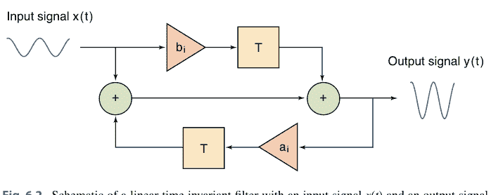

这是差分方程的非因果版本，但 Python 再次使用因果索引：

$$y(t) = \sum_{k=0}^{N} b_k \cdot x(t-k) - \sum_{k=1}^{M} a_k \cdot y(t-k)$$

在零相位滤波器设计中存在已知问题。M 和 N_1 + N_2 或 N 中较大的那个是滤波器的阶数。

我们使用与上一个示例相同的合成输入信号 x5 来说明递归滤波器的性能：

```python
import numpy as np
import scipy.signal as signal
import matplotlib.pyplot as plt
from numpy.random import default_rng

t=np.linspace(1,100,100)
rng=default_rng(0)
x5=rng.standard_normal((100))
```

然后使用一组权重 a5 和 b5 的递归滤波器对此输入信号进行滤波：

```python
b5=np.array([0.0048,0.0193,0.0289,0.0193,0.0048])
a5=np.array([1.0000,-2.3695,2.3140,-1.0547,0.1874])

m5=len(b5)

y5=signal.lfilter(b5,a5,x5)
```

并对输出信号 y5 进行相位校正：

```python
y5[0:len(y5)-m5+1] = y5[np.arange(int((m5-1)/2),
    len(y5)-int((m5-1)/2))]
y5[len(y5)-m5+1:len(y5)] = np.zeros((1,m5-1))
```

我们现在可以绘制结果：

```python
plt.figure()
plt.plot(t, x5, color='b')
plt.plot(t, y5, color='r')
plt.show()
```

此滤波器明显改变了信号。输出信号仅包含低频分量，所有较高的频率都已被消除。比较输入信号和输出信号的周期图显示，所有高于 f=0.1（对应于周期 τ=10）的频率都已被抑制：

```python
f, Pxx = signal.periodogram(x5, fs=1, nfft=128)
f, Pyy = signal.periodogram(y5, fs=1, nfft=128)

plt.figure()
plt.plot(f, Pxx, color='b')
plt.plot(f, Pyy, color='r')
plt.grid
plt.xlabel('Frequency')
plt.ylabel('Power')
plt.show()
```

我们现在设计了一个频率选择性滤波器，即一个消除某些频率而使其他频率相对不受影响的滤波器。下一节介绍了用于在时域和频域中表征滤波器以及预测频率选择性滤波器对任意信号影响的工具。

## 6.7 脉冲响应

脉冲响应是描述滤波器特性的非常方便的方法（图 6.3）。脉冲响应 h 在 LTI 系统中很有用，其中输入信号 x(t) 与 h 的卷积用于获得输出信号 y(t)：

$$y(t) = \sum_{k=-N_1}^{N_2} h_k \cdot x(t-k)$$

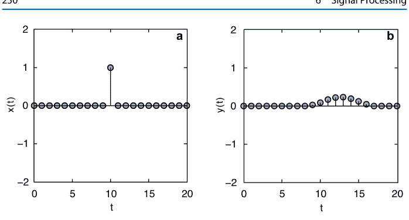

可以证明脉冲响应 $h$ 的值在非递归滤波器中与滤波器权重相同，但在递归滤波器中则不同。上面的卷积方程通常写成简短形式：

$$y(t) = h(t) * x(t)$$

在许多示例中，时域中的卷积被频域中傅里叶变换 $H(f)$ 和 $X(f)$ 的简单乘法所取代：

$$Y(f) = H(f) \cdot X(f)$$

然后通过 $Y(f)$ 的逆傅里叶变换获得时域中的输出信号 $y(t)$。信号通常在频域中而不是在时域中进行卷积，因为乘法相对简单。然而，傅里叶变换本身会引入许多伪影和失真，因此频域中的卷积并非没有问题。在以下示例中，我们仅在时域中应用卷积。

首先，我们生成一个单位脉冲：

```python
import numpy as np
import scipy.signal as signal
import matplotlib.pyplot as plt

t = np.linspace(0, 20, 21)
x6 = np.zeros(21)
x6[10] = 1

plt.figure()
plt.stem(t, x6, basefmt='k-')
```

plt.axis(np.array([0,20,-2,2]))
plt.show()

函数 `stem()` 将数据序列 x6 绘制为从 x 轴出发、以圆圈标记数据值的茎状图。与使用 `plot()` 生成的连续线相比，这可能是绘制数字数据的一种更好方式。我们现在将 x6 输入滤波器并探索输出 y6。脉冲响应与非递归滤波器的权重相同：

```
b6=np.array([1,1,1,1,1])/5
m6=len(b6)

y6=signal.lfilter(b6,1,x6)
```

我们再次对 y6 进行相位校正，以补偿函数 `lfilter()` 引入的相移，尽管在当前示例中这可能并不重要：

```
y6[0:len(y6)-m6+1]=y6[np.arange(int((m6-1)/2),
    len(y6)-int((m6-1)/2))]
y6[len(y6)-m6+1:len(y6)]=np.zeros((1,m6-1))
```

我们得到了一个与输入信号 x6 长度和相位都相同的输出信号 y6。现在我们可以绘制结果进行比较：

```
plt.figure()
plt.stem(t,x6)
plt.stem(t,y6,
    linefmt='r-',
    markerfmt='ro',
    basefmt='k-')
plt.axis(np.array([0,20,-2,2]))
plt.show()
```

与 `plot()` 不同，`stem()` 只接受一个数据序列，因此第二个序列 y6 是通过再次调用 `stem()` 叠加在同一张图上的。滤波器的效果在图中清晰可见：它将单位脉冲在五个元素的长度上进行了平均。此外，输出信号 y6 的值等于滤波器 a6 的权重。在我们的示例中，a6 和 y6 的所有元素值均为 0.2。然而，对于递归滤波器，输出信号 y6 与滤波器权重并不匹配。我们再次首先生成一个脉冲：

```
t=np.linspace(0,20,21)
x7=np.zeros(21)
x7[10]=1
```

然后设计一个具有权重 a7 和 b7 的任意递归滤波器：

```
b7=np.array([0.0048,0.0193,0.0289,0.0193,0.0048])
a7=np.array([1.0000,-2.3695,2.3140,-1.0547,0.1874])

m7=len(b7)

y7=signal.lfilter(b7,a7, x7)

y7[0:len(y7)-m7+1]=y7[np.arange(int((m7-1)/2),
    len(y7)-int((m7-1)/2))]
y7[len(y7)-m7+1:len(y7)]=np.zeros((1,m7-1))
```

输入信号 x2 和输出信号 y2 的茎状图显示了一个有趣的脉冲响应：

```
plt.figure()
plt.stem(t, x7)
plt.stem(t,y7,linefmt='r-',markerfmt='ro',basefmt='k-')
plt.axis(np.array([0,20,-2,2]))
plt.show()
```

信号被扩散到更宽的区域，并且向右移动。因此，该滤波器不仅影响信号的幅度，还会将信号向更低或更高的值移动。这种相移通常是滤波器不希望出现的特性，尽管在某些应用中，沿时间轴的移动可能特别有意义。

## 6.8 频率响应

接下来我们研究滤波器的频率响应，即滤波器对信号幅度和相位的影响（图 6.4）。滤波器的频率响应 $H(f)$ 是脉冲响应 $h(t)$ 的傅里叶变换。复频率响应 $H(f)$ 的绝对值是滤波器的幅度响应 $A(f)$：

$A(f) = |H(f)|$

复频率响应 $H(f)$ 的辐角是滤波器的相位响应：

$\Phi(f) = arg(H(f))$

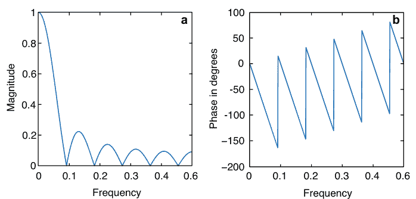

图 6.4 十一个元素的滑动平均的 a 幅度响应和 b 相位响应。

由于 Python 滤波器都是因果的，因此很难探索信号的相位。克服这个问题的一种方法是在时域中将输出信号延迟固定的采样点数，正如我们在前面的示例中所做的那样。作为另一个示例，使用一个周期为 20、幅度为 2 的正弦波作为输入信号：

```
import numpy as np
import scipy.signal as signal
from scipy import interpolate
import matplotlib.pyplot as plt

t=np.linspace(1,100,100)
x8=2 * np.sin(2*np.pi*t/20)
```

设计一个十一个元素的滑动平均滤波器，并将其应用于输入信号 x8：

```
b8=np.ones(11)/11;
m8=len(b8)

y8=signal.lfilter(b8,1,x8)
```

接下来，对输出信号 y8 的相位进行因果索引校正：

```
y8[0:len(y8)-m8+1]=y8[np.arange(int((m8-1)/2),
    len(y8)-int((m8-1)/2))]
y8[len(y8)-m8+1:len(y8)]=np.zeros((1,m8-1))
```

然后，绘制滤波器的输入信号和输出信号：

```
plt.figure()
plt.plot(t, x8, color='b')
plt.plot(t, y8, color='r')
plt.show()
```

滤波器明显降低了正弦波的幅度。输入信号 x8 的幅度为 2，而输出信号 y8 的幅度为

```
print(np.max(y8))
```

结果为

```
1.1479548208500083
```

滤波器将周期为 20 的正弦波幅度降低了

```
print(1-np.max(y8[40:60])/2)
```

结果为

```
0.42602258957499606
```

即，幅度降低了约 43%。使用第 40 到 60 个元素来计算 y8 的最大值，以避免边缘效应。尽管如此，滤波器并不影响正弦波的相位；换句话说，输入信号和输出信号是同相的。

然而，相同的滤波器对不同的输入信号有不同的影响。让我们设计另一个幅度相似但周期为 15 的正弦波 x9：

```
t=np.linspace(1,100,100)
x9=2 * np.sin(2*np.pi*t/15)
```

应用类似的滤波器并校正输出信号 y9 以补偿 lfilter() 的相移，得到：

```
t=np.linspace(1,100,100)
x9=2 * np.sin(2*np.pi*t/15)

b9=np.ones(11)/11;
m9=len(b9)

y9=signal.lfilter(b9,1,x9)
```

```
y9[0:len(y9)-m9+1] = y9[np.arange(int((m9-1)/2),
    len(y9)-int((m9-1)/2))]
y9[len(y9)-m9+1:len(y9)] = np.zeros((1,m9-1))
```

输出信号 y9 再次与输入信号 x9 同相，但与输入信号相比，幅度显著降低，

```
plt.figure()
plt.plot(t, x9, color='b')
plt.plot(t, y9, color='r')
plt.show()
```

```
print(1-np.max(y9[40:60])/2)
```

结果为

```
0.6768410326431586
```

十一个元素的滑动平均将该信号的幅度降低了约 68%。更一般地说，滤波器的响应显然取决于输入信号的频率。包含多个周期性的更复杂信号的频率分量会受到不同的影响。滤波器

```
b10 = np.ones(11)/11;
```

的频率响应可以使用 `freqz()` 计算。该函数使用滤波器权重 a 和 b 以及计算频率响应的频率点数 `worN`：

```
f, h = signal.freqz(b10, a=1, worN=512, fs=1)
```

函数 `freqz()` 返回数字滤波器 b10 的复频率响应 h 以及频率 f。接下来，我们计算并显示幅度响应：

```
magnitude = np.abs(h)

plt.figure()
plt.plot(f, magnitude)
plt.xlabel('Frequency')
plt.ylabel('Magnitude')
plt.show()
```

此图可用于预测滤波器对输入信号任何频率的影响。我们可以对幅度响应进行插值，以计算特定频率下信号幅度的增加或减少。例如，对频率为 1/20 的幅度进行插值，

```
fun=interpolate.interp1d(f,magnitude)
print(1-fun(1/20))
```

结果为

```
0.4260303441186485
```

这得到了预期的周期为 20 的正弦波幅度约 43% 的降低。周期为 15 的正弦波经历的幅度降低为

```
fun=interpolate.interp1d(f,magnitude)
print(1-fun(1/15))
```

结果为

```
0.675055631124985
```

即，幅度降低约 68%，这与之前观察到的值相似。非常重要的是，这样的滑动平均会消除某些频率，例如幅度响应为零的频率。例如，将滤波器应用于周期约为 1/0.09082 的信号会完全消除该信号。此外，由于幅度响应是复频率响应 h 的绝对值，因此幅度响应实际上是负的，位于约 0.09082 和约 0.1816 之间、约 0.2725 和约 0.3633 之间，以及约 0.4546 和奈奎斯特频率之间。所有频率位于这些区间内的信号分量都会在 t 轴上镜像。例如，我们可以尝试一个周期为 7（例如，频率约为 0.1429）的正弦波，它位于第一个具有负幅度响应的区间内：

```
t=np.linspace(1,100,100)
x10=2 * np.sin(2*np.pi*t/7)

b10=np.ones(11)/11;
m10=len(b10)

y10=signal.lfilter(b10,1, x10)

y10[0:len(y10)-m10+1]=y10[np.arange(int((m10-1)/2),
    len(y10)-int((m10-1)/2))]
y10[len(y10)-m10+1:len(y10)]=np.zeros((1,m10-1))
```

plt.figure()
plt.plot(t, x10, color='b')
plt.plot(t, y10, color='r')
plt.show()

周期为7的正弦波，其振幅衰减为

fun = interpolate.interp1d(f, magnitude)
print(1 - fun(1/7))

计算结果为

0.7957488527349983

即衰减了约80%，但正如我们从图中看到的，其符号也发生了改变。在地球科学中解释因果关系时，消除某些频率分量和翻转信号会产生重要影响。因此，即使电子表格程序将此类滤波器作为标准选项提供，也应完全避免使用。作为替代，应使用具有特定幅度响应的滤波器，例如巴特沃斯低通滤波器（第6.9节）。

所有类型的滤波器都可以计算其幅度响应。实际上，它是预测滤波器对信号一般影响的宝贵工具。相位响应也可以从滤波器的复频率响应h（图6.4）计算得出：

phase = 180 * np.angle(h) / np.pi

plt.figure()
plt.plot(f, phase)
plt.xlabel('Frequency')
plt.ylabel('Phase in degrees')
plt.show()

相位角phase以度为单位绘制。我们可以观察到此图中频繁的跳变，这是angle()函数内部arctan2()函数产生的伪影。我们可以使用unwrap()函数来展开相位响应，以消除大于或等于180°的跳变：

plt.figure()
plt.plot(f, np.unwrap(phase))
plt.xlabel('Frequency')
plt.ylabel('Phase in degrees')
plt.show()

在我们的示例中，此操作没有效果，因为没有发生大于或等于180°的跳变。由于滤波器具有线性相位响应phase，信号的频率分量之间不会发生相对偏移。因此，我们不会期望信号在频域中发生任何失真。滤波器对特定周期的相移可以通过以下方式计算：

fun=interpolate.interp1d(f,180*np.angle(h)/np.pi)
print(fun(1/20)*20/360)

计算结果为

-5.0

以及使用

fun=interpolate.interp1d(f,180*np.angle(h)/np.pi)
print(fun(1/15)*15/360)

计算结果为

-5.0

分别对应周期为20和15的正弦波。由于Python对滤波器使用因果索引，相位需要以类似于滤波器延迟输出信号的方式进行校正。在我们的示例中，我们使用了长度为十一的滤波器。因此，我们必须将相位校正(11-1)/2=5，这表明滤波器对两个频率的相移均为零。
这也适用于递归滤波器。让我们考虑一个周期为8的简单正弦波和之前使用的递归滤波器：

t=np.linspace(1,100,100)
x11=2*np.sin(2*np.pi*t/8)

b11=np.array([0.0048,0.0193,0.0289,0.0193,0.0048])
a11=np.array([1.0000,-2.3695,2.3140,-1.0547,0.1874])

m11=len(b11)

y11=signal.lfilter(b11,a11, x11)

我们对由因果索引引入的相移校正输出信号，并绘制输入信号和输出信号：

y11[0:len(y11)-m11+1]=y11[np.arange(int((m11-1)/2),
    len(y11)-int((m11-1)/2))]
y11[len(y11)-m11+1:len(y11)]=np.zeros((1,m11-1))

plt.figure()
plt.plot(t, x11,color='b')
plt.plot(t,y11,color='r')
plt.show()

振幅衰减为

print(1-np.max(y11[40:60])/2)

计算结果为

0.6464745957914514

这也得到了幅度响应的支持：

f,h=signal.freqz(b11,a11,worN=512,fs=1)

magnitude=np.abs(h)

plt.figure()
plt.plot(f,magnitude)
plt.xlabel('Frequency')
plt.ylabel('Magnitude')
plt.show()

fun=interpolate.interp1d(f,magnitude)
print(1-fun(1/8))

计算结果为

0.6461584154466922

相位响应

phase=180*np.angle(h)/np.pi

plt.figure()
plt.plot(f,np.unwrap(phase))
plt.xlabel('Frequency')
plt.ylabel('Phase in degrees')
plt.show()

fun=interpolate.interp1d(f,180*np.angle(h)/np.pi)
print(fun(1/8)*8/360)

计算结果为

2.9442611936390373

同样必须对因果索引进行校正。由于采样间隔为1且滤波器长度为5，我们必须在2.9443的相移上加上(5-1)/2=2。这表明校正后的相移为4.9442，这正是图中观察到的延迟：

plot(t,x11,t,y11), axis([30 40 -2 2])

下一节将介绍如何设计具有所需幅度响应的滤波器。这些滤波器可用于放大或抑制任意信号的不同分量。

## 6.9 滤波器设计

我们现在旨在设计具有特定幅度响应的滤波器。我们首先生成一个具有两个周期（50和5）的合成信号x12。信号的功率谱在频率0.02和0.20处显示出预期的峰值：

import numpy as np
import scipy.signal as signal
import matplotlib.pyplot as plt

t=np.linspace(1,1000,1000)
x12=2*np.sin(2*np.pi*t/50)+\n    0.5*np.sin(2*np.pi*t/5)

plt.figure()
plt.plot(t,x12)
plt.axis(np.array([0,200,-4,4]))
plt.show()

f,Pxx=signal.periodogram(x12,fs=1,nfft=1024)

plt.figure()
plt.plot(f,Pxx)
plt.grid
plt.xlabel('Frequency')
plt.ylabel('Power')
plt.show()

巴特沃斯滤波器设计技术被广泛用于创建任意阶数的低通、高通、带通和带阻配置滤波器（图6.5）。在我们的示例中，我们希望设计一个截止频率为0.10的五阶低通滤波器。`butter()`函数的输入参数是滤波器的阶数、截止频率、滤波器类型`btype`和采样频率`fs`。`butter()`函数的输出参数是滤波器权重a12和b12：

b12,a12=signal.butter(5,0.1,btype='lowpass',fs=1)

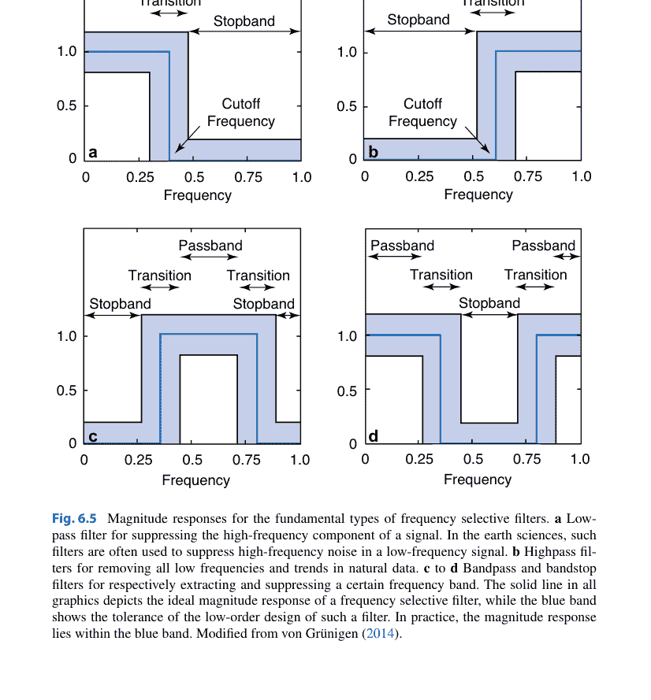

滤波器的频率特性显示从通带到阻带的过渡相对平滑，但该滤波器的优点是其低阶数：

f,h=signal.freqz(b12,a12,worN=1024,fs=1)

plt.figure()
plt.plot(f,np.abs(h))
plt.xlabel('Frequency')
plt.ylabel('Magnitude')
plt.show()

我们可以再次使用`lfilter()`将滤波器应用于信号。频率选择性滤波器，如低通、高通、带通和带阻滤波器，旨在抑制某些频带，但应避免相移。`filtfilt()`函数提供零相移的正向和反向数字滤波。在正向滤波后，滤波后的序列被反转并再次通过滤波器。信号的幅度不受此操作影响，因为它根据频率是初始幅度的0%或100%。滤波器引入的任何相移都会被同一滤波器的正向和反向应用所抵消。该函数还有助于克服Python中滤波器因果索引的问题，因为它消除了同一滤波器的因果版本和非因果版本之间的相位差。滤波然后绘制结果清楚地说明了滤波器的效果：

xf12=signal.filtfilt(b12,a12,x12)

plt.figure()
plt.plot(t,x12,color='b')
plt.plot(t,xf12,color='r')
plt.axis(np.array([0,200,-4,4]))
plt.show()

我们现在可能希望设计一个具有从通带到阻带更快过渡的新滤波器。这样的滤波器需要更高的阶数，即需要更多的滤波器权重a12和b12。我们现在可以创建一个15阶巴特沃斯滤波器作为上述滤波器的替代：

b13,a13=signal.butter(15,0.1,btype='lowpass',fs=1)

f,h=signal.freqz(b13,a13,worN=1024,fs=1)

plt.figure()
plt.plot(f,np.abs(h))
plt.xlabel('Frequency')
plt.ylabel('Magnitude')
plt.show()

幅度响应明显改善。整个通带在1.0的值处相对平坦，而阻带在各处近似为零。接下来，我们通过引入第三个周期为10来修改输入信号。然后使用该信号来说明巴特沃斯带阻滤波器的操作：

t=np.linspace(1,1000,1000)
x14=2*np.sin(2*np.pi*t/50)+\n    np.sin(2*np.pi*t/10)+\n    0.5*np.sin(2*np.pi*t/5)

plt.figure()
plt.plot(t, x14)
plt.axis(np.array([0,200,-4,4]))
plt.show()

f,Pxx=signal.periodogram(x14,fs=1,nfft=1024)

plt.figure()
plt.plot(f,Pxx)
plt.show()

新的巴特沃斯滤波器是一个带阻滤波器。滤波器的阻带位于频率0.05和0.15之间。因此，它可以用于抑制周期为10（对应频率为0.1）的分量：

b14,a14=signal.butter(5, (0.05,0.15),
    btype='bandstop',fs=1)
xf14=signal.filtfilt(b14,a14, x12)

f,Pxx=signal.periodogram(xf14,fs=1,nfft=1024)

plt.figure()
plt.plot(f,Pxx)
plt.show()

plt.figure()
plt.plot(t, x14,color='b')
plt.plot(t,xf14,color='r')
plt.axis(np.array([0,200,-4,4]))
plt.show()

这些图显示了该滤波器的效果。频率在0.05到0.15之间的频带——因此也包括频率0.1——已成功从信号中移除。

## 6.10 自适应滤波

前几节中使用的固定滤波器基于一个基本假设：信号衰减是已知的且不随时间变化。然而，在大多数应用中，通常无法获得信号和噪声统计特性的*先验*知识。此外，噪声水平和真实信号的方差都可能随时间高度非平稳，例如在冰期-间冰期过渡期间的稳定同位素记录。因此，在不知道信噪比的非平稳环境中，无法使用固定滤波器。

自适应滤波器——在电信行业被广泛使用——可能有助于克服这些问题。自适应滤波器是一种逆建模过程，它能自动迭代调整自身的权重，而无需任何关于信号或噪声的*先验*知识。操作自适应滤波器涉及（1）一个滤波过程，其目的是根据数据序列产生输出信号，以及（2）一个自适应过程，它提供了一种机制来自适应地控制滤波器权重（Haykin 2014）。

在大多数实际应用中，自适应过程旨在最小化估计误差。时刻 $i$ 的估计误差信号 $e$ 定义为期望响应信号 $d_i$ 与实际输出信号 $y_i$ 之差，后者是输入信号 $x_i$ 的滤波版本，如公式所示：

$$e_i = d_i - y_i$$

其中 $i = 1, 2, \dots, n$，$n$ 是输入信号的长度。对于一个由包含 $f$ 个元素的滤波器权重数组 $W$ 表征的非递归滤波器，输出信号 $y_i$ 由转置数组 $W$ 和输入信号 $X_i$ 的内积给出：

$$y_i = W^T \cdot X_i$$

自适应过程中使用的期望响应信号 $d$ 的选择取决于具体应用。传统上，$d$ 是由信号 $s$ 和随机噪声 $n_0$ 组成的信号。信号 $x$ 包含与信号 $s$ 不相关但与噪声 $n_0$ 以某种未知方式相关的噪声 $n_1$。在噪声消除系统中，实际目标是产生一个输出信号 $y$，使其在最小二乘意义上最接近期望响应信号 $d$。

已经开发了不同的方法来解决这个多元最小误差优化问题（例如，Widrow and Hoff 1960; Widrow et al. 1975; Haykin 2014）。选择一种算法而非另一种会受到多种因素的影响，包括收敛速度（即算法收敛到足够接近最优解所需的自适应步数）、失调（即最终均方误差值偏离最优滤波器最小方差的程度的度量；例如，Wiener 1949; Kalman and Bucy 1961）以及跟踪能力（即滤波器在非平稳环境中工作并跟踪输入信号统计特性变化的能力）（Haykin 2014）。

最小均方（LMS）算法——最初由 Widrow 和 Hoff（1960）开发——因其简单性已成为测试其他自适应滤波算法的基准。对于地球科学的应用，我们使用该滤波器的一个变体来从两个信号 $S$ 和 $X$ 中提取噪声，这两个信号都包含相同的信号 $s$，但带有不相关的噪声 $n_1$ 和 $n_2$（Hattingh 1988）。例如，我们可以考虑对同一材料进行的简单重复测量，比如来自同一有孔虫物种的两个平行稳定同位素记录。我们期望得到两个时间序列，每个序列包含 $n$ 个元素，并且包含叠加了不同、不相关噪声的相同期望信号。第一条记录用作主要输入信号 $S$，

$$S = (s_1, s_2, \dots, s_n)$$

第二条记录用作参考输入信号 $X$：

$$X = (x_1, x_2, \dots, x_n)$$

正如 Hattingh（1988）所证明的，可以通过使用主要输入信号 $S$ 作为期望响应信号 $d$ 来滤波参考输入信号 $X$，从而提取出期望的无噪声信号。最小误差优化问题通过最小均方范数来解决。均方误差 $e_i^2$ 是非递归滤波器中权重的二阶函数。$e_i^2$ 对未知权重 $W$ 的依赖性可以看作是一个具有唯一定义的最小点的多维抛物面。对应于该误差曲面上最小点的权重定义了最优维纳解（Wiener 1949）。使用 LMS 算法为权重数组 $W$ 计算出的值代表一个估计器，当迭代次数趋于无穷时，其期望值趋近于维纳解（Haykin 2014）。梯度方法用于到达误差曲面上的最小点。为了简化优化问题，Widrow 和 Hoff（1960）开发了一种可以直接从数据计算所需梯度函数的近似方法。这导致了一个用于更新滤波器权重数组 $W$ 的简单关系式：

$$W_{i+1} = W_i + 2 \cdot u \cdot e_i \cdot X_i$$

新的滤波器权重集 $W_{i+1}$ 基于前一个权重集 $W_i$ 加上一项，该项是有界步长（或收敛因子）$u$、输入信号 $X_i$ 的函数和误差信号 $e_i$ 的函数的乘积。换句话说，从前一步计算出的误差 $e_i$ 被反馈到系统中，以便为下一步更新滤波器权重（图 6.6）。固定的收敛因子 $u$ 调节自适应的速度和稳定性。较低的 $u$ 值确保更高的精度，但需要更多数据才能使滤波器达到最优解。在 Hattingh（1988）修改的 LMS 算法版本中，通过循环处理数据来克服这个问题，使滤波器有机会再次改进其权重并适应数据的变化。

在下面介绍 `canc` 的示例中，每次循环运行称为一次迭代，如果要达到最佳结果，需要进行多次循环运行。该算法从两个数组 $\mathbf{x}$ 和 $\mathbf{s}$ 中提取无噪声信号，

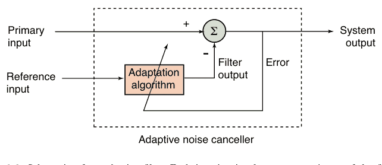

图 6.6 自适应滤波器示意图。每次迭代都涉及基于前一组滤波器权重 $W_i$ 加上一项（该项是有界步长 $u$、输入信号 $X_i$ 的函数和误差信号 $e_i$ 的函数的乘积）对滤波器权重 $W_{i+1}$ 的新估计。换句话说，前一步计算出的误差 $e_i$ 被反馈到系统中，以便为下一步更新滤波器权重（修改自 Trauth 1998）。

这两个数组包含相关信号和不相关噪声。例如，我们生成两个信号 yn1 和 yn2，它们包含相同的正弦波但不同的高斯噪声：

```python
import numpy as np
from numpy import linalg as linalg
from canc import canc
from matplotlib import cm
import scipy.signal as signal
import matplotlib.pyplot as plt
from numpy.random import default_rng

x=np.linspace(0,100,1001)
y=np.sin(x)
rng=default_rng(0)
yn1=y+0.5*rng.standard_normal(y.shape)
yn2=y+0.5*rng.standard_normal(y.shape)

plt.figure()
plt.plot(x,yn1,x,yn2)
plt.show()
```

算法 `canc()` 格式化两个信号，将它们输入滤波器循环，校正信号的相位偏移，并格式化信号以用于输出参数。所需的输入参数是信号 `x` 和 `s`、步长 `u`、滤波器长度 `l` 和迭代次数 `iter`。在我们的示例中，两个带噪声的信号是 yn1 和 yn2。我们任意选择一个具有 l = 5 个滤波器权重的滤波器。在 0<u<1/λ_max（其中 λ_max 是参考输入信号自相关矩阵的最大特征值）范围内的 u 值会导致合理的结果（Haykin 2014）（图 6.7）。u 的值使用以下代码计算：

```python
k=np.kron(yn1,np.transpose(yn1[None]))
w,v=linalg.eig(k)
u=1/np.max(w)
print(u)
```

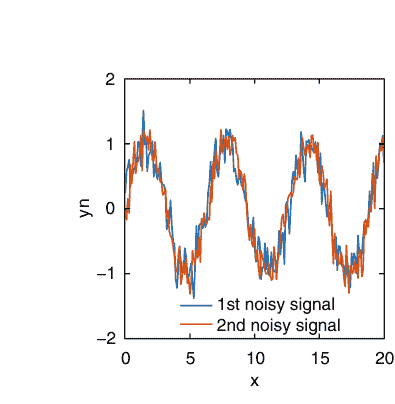

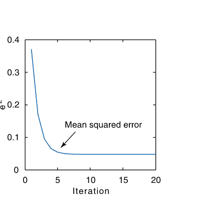

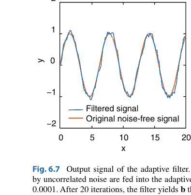

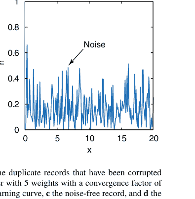

图 6.7 自适应滤波器的输出信号。a 被不相关噪声破坏的重复记录被输入到具有 5 个权重、收敛因子为 0.0001 的自适应滤波器中。经过 20 次迭代后，滤波器产生 b 学习曲线，c 无噪声记录，以及 d 从重复记录中提取的噪声。

# 7 空间数据

### 7.1 引言

地球科学中的大多数数据在空间上分布，要么是*矢量数据*（即点、线、多边形；例如，河网、海岸线），要么是*栅格数据*（即方形网格、三角形网格；例如，网格化地形）。矢量数据是通过数字化地图对象（如水系网络或岩性单元轮廓）生成的。栅格数据可以直接从卫星传感器输出获取，但网格化数据也可以从不规则分布的野外采样中插值得到（网格化）。

第7.2节以海岸线数据为例介绍矢量数据。然后，第7.3至7.5节使用数字地形数据说明栅格数据的获取和处理。自20世纪90年代初以来，数字高程数据的可用性和使用量已显著增加。分辨率为5弧分（即约9公里）的ETOPO5是最早可用的地形和水深数据集之一。2001年10月，它被分辨率为2弧分（即约4公里）的ETOPO2取代，2009年3月，分辨率为1弧分（即约2公里）的ETOPO1开始可用。ETOPO系列的最新成员是ETOPO 2022数据集，其分辨率为15弧秒。还有一个名为GTOPO30的地形数据集，于1996年完成，水平网格间距为30弧秒（即约1公里）。最近，航天飞机雷达地形任务（SRTM）的30米和90米分辨率数据已在大多数科学研究中取代了较旧的数据集。

本章的第二部分涉及从不均匀间隔数据计算连续表面以及空间数据的统计。在地球科学中，大多数数据是以不规则模式收集的。岩石样本的获取

**补充信息** 在线版本包含补充材料，可访问 https://doi.org/10.1007/978-3-031-56906-7_7。

其中 `kron()` 返回 `yn1` 和 `yn1'` 的克罗内克张量积（这是一个通过取 `yn1` 和 `yn1'` 元素之间所有可能乘积形成的矩阵），`eig()` 返回 `k` 的特征向量。这得出

```
0.0013492697467229055
```

我们现在运行自适应滤波器 `canc()` 20次迭代，并使用上面的 `u` 值：

```
z,e,mer,w=canc(yn1,yn2,0.0013,5,20)
```

`canc()` 的输出参数是滤波后的主信号 `z`、提取的噪声 `e`、以其执行的迭代次数和步长 `u` 计算的均方误差 `mer`，以及 `yn1` 和 `yn2` 中每个数据点的滤波器权重 `w`。均方误差 `mer` 的图

```
plt.figure()
plt.plot(mer)
plt.show()
```

说明了自适应滤波器的性能，尽管所选步长（`u=0.0013`）显然导致了相对较快的收敛。在大多数示例中，较小的步长会降低收敛速度，但会提高最终结果的质量。因此，我们减小 `u` 并使用更多迭代再次运行滤波器：

```
z,e,mer,w=canc(yn1,yn2,0.0001,5,20)
```

均方误差 `mer` 与迭代次数的关系图

```
plt.figure()
plt.plot(mer)
plt.show()
```

现在在大约六次迭代后收敛。在实践中，用户应改变输入参数 `u` 和 `l` 以获得最佳结果。我们现在可以将输出信号与原始无噪声信号进行比较：

```
plt.figure()
plt.plot(x,y,'b',x,z,'r')
plt.show()
```

该图表明，滤波器已显著降低了信号的噪声水平。接下来，图

```
plt.figure()
plt.plot(x,e,'r')
plt.show()
```

显示从信号中提取的噪声。使用 `canc()` 的最后一个输出参数，我们可以计算并显示最后一次迭代中来自 `w` 的平均滤波器权重：

```
wmean=np.mean(w,axis=0)

plt.figure()
plt.plot(wmean)
plt.show()
```

滤波器的频率特性提供了滤波器效果的更直观表示，

```
f,h=signal.freqz(wmean,1,worN=1024,fs=10)

plt.figure()
plt.plot(f,np.abs(h))
plt.show()
```

这表明它是一个具有相对平滑过渡带的低通滤波器。这意味着它不具备例如使用巴特沃斯方法设计的递归滤波器的质量。然而，滤波器权重是在优化过程中计算的，而不是任意选择的。

自适应滤波器的优势在于其能够过滤沿时间轴具有可变信噪比的时间序列。由于滤波器权重数组 W 是为每个单独的数据点更新的，因此这些滤波器甚至用于实时应用，例如电信系统。我们可以通过一个示例来检查这种行为，其中时间序列中间（x=500）的信噪比从大约10%降低到零：

```
x=np.linspace(0,100,1001)
y=np.sin(x)
rng=default_rng(0)
yn1=y+0.5*rng.standard_normal(y.shape)
yn2=y+0.5*rng.standard_normal(y.shape)
yn1[501:]=y[501:]
yn2[501:]=y[501:]

plt.figure()
plt.plot(x,yn1,x,yn2)
plt.show()
```

`u` 的值再次通过以下方式计算

```
k=np.kron(yn1,np.transpose(yn1[None]))
w,v=lanalg.eig(k)
u=1 / np.max(w)
print(u)
```

这得出

```
0.0016086744408774288
```

我们现在运行自适应滤波器 `canc()` 20次迭代，并使用上面的 `u` 值：

```
z,e,mer,w=canc(yn1,yn2,0.0013,5,20)
```

均方误差 `mer` 与以步长 `u` 执行的迭代次数的关系图

```
plt.figure()
plt.plot(mer)
plt.show()
```

说明了自适应滤波器的性能，尽管所选步长 `u=0.0016` 显然导致了相对较快的收敛。同样，我们现在可以将输出信号与原始无噪声信号进行比较：

```
plt.figure()
plt.plot(x,y,'b',x,z,'r')
plt.show()
```

该图显示滤波器输出 `y` 几乎与无噪声信号 `x` 相同。图

```
plt.figure()
plt.plot(x,e,'r')
plt.show()
```

显示从信号中提取的噪声。在这里，我们可以观察到一些信号分量，在信号信噪比变化点之后的无噪声时间段中，被滤波器错误地移除了。使用 `canc()` 的最后一个输出参数，我们可以计算并显示最后一次迭代的滤波器权重 `w`，

```
X=np.linspace(1,5,5)
Y=np.linspace(2,999,997)
X, Y=np.meshgrid(X, Y)
W=w[2:999,0:]

plt.figure()
fig,ax=plt.subplots(subplot_kw={"projection":"3d"})
surf=ax.plot_surface(X,Y,W,cmap=cm.coolwarm)
ax.view_init(60,100-90)
plt.show()
```

这很好地显示了滤波器权重在信噪比变化前后的适应性。我们只绘制 `w` 的中间部分，因为由于滤波器长度为 `l`，边缘 `1 : (l-1) / 2` 和 `end- (l-1) / 2 : end` 都是零。我们也可以使用这个示例来演示 `u` 和 `l` 的值对自适应滤波器性能的影响。理论上，较小的 `u` 会导致更准确的结果，但对变化信噪比的快速适应效果不佳。较大的 `l` 值也会产生更好的结果，但通过滤波过程丢失的数据点数量会增加 `(l-1) / 2`。

该算法的应用已在海洋沉积物的重复氧同位素记录中得到证明（Trauth 1998）。Trauth（1998）的工作不仅说明了改进的LMS算法的使用，还说明了另一种自适应滤波器——即递归最小二乘（RLS）算法——在各种不同环境中的使用（Trauth 1998; Haykin 2014）。

## 参考文献

- DH Grünigen von (2014) Digitale Signalverarbeitung mit einer Einführung in die kontinuierlichen Signale und Systeme, Fünfte, neu bearbeitete Fachbuchverlag. Leipzig im Carl Hanser Verlag, Leipzig
- Hattingh M (1988) A New Data Adaptive Filtering Program to Remove Noise from Geophysical Time- or Space Series Data. Computers & Geosciences 14(4):467–480
- Haykin S (2014) Adaptive Filter Theory–Fifth Edition. Prentice Hall, Englewood Cliffs, New Jersey
- Kalman R, Bucy R (1961) New Results in Linear Filtering and Prediction Theory. ASME Tans. Ser. D Jour. Basic Eng. 83:95–107
- Trauth MH (1998) Noise Removal from Duplicate Paleoceanographic Time-Series: The Use of Adaptive Filtering Techniques. Mathematical Geology 30(5):557–574
- Trauth MH (2013) TURBO2: A MATLAB Simulation to Study the Effects of Bioturbation on Paleoceanographic Time Series. Computers and Geosciences, 61:1–10
- Widrow B, Hoff Jr. M (1960) Adaptive Switching Circuits. IRE WESCON Conv. Rev. 4:96–104
- Widrow B, Glover JR, McCool JM, Kaunitz J, Williams CS, Hearn RH, Zeidler JR, Dong E, Goodlin RC (1975) Adaptive Noise Cancelling: Principles and Applications. Proc. IEEE 63(12):1692–1716
- Wiener N (1949) Extrapolation, Interpolation and Smoothing of Stationary Time Series, with Engineering Applications. MIT Press, Cambridge, Mass (reprint of an article originally issued as a classified National Defense Research Report, February, 1942)

通常仅限于天然露头（如海岸悬崖或峡谷崖壁）或人工露头（如道路切面、采石场或钻孔岩心）。第7.6和7.7节关于插值此类不均匀分布数据的内容，展示了最重要的网格化程序的使用方法，并概述了使用这些方法时可能出现的潜在陷阱。第7.8至7.10节介绍了统计分析空间数据的各种方法，包括第7.8节中对点分布应用统计检验，第7.9节中分析数字高程模型，以及第7.10节中对地统计学和克里金法的概述。

本章需要*NumPy* (https://numpy.org)、*Matplotlib* (https://matplotlib.org)、*Rasterio* (https://rasterio.readthedocs.io)、*GDAL* (https://gdal.org/api/python.html)、*scikit-image* (https://scikit-image.org)、*PyGMT* (https://www.pygmt.org)（该库需要*xarray*来处理带标签的多维数组；https://docs.xarray.dev）以及*Cartopy*包 (https://scitools.org.uk/cartopy)，还有*SciPy*库 (https://scipy.org)。

## 7.2 全球地理数据库 GSHHG

*全球自洽、分层、高分辨率地理* (GSHHG) 数据库是两个公共领域数据库的合并，由Paul Wessel（美国夏威夷檀香山夏威夷大学SOEST）和Walter Smith（美国马里兰州银泉NOAA卫星测高实验室）创建 (Wessel and Smith 1996)。GSHHG数据库包含较旧的GSHHS海岸线数据库 (Soluri and Woodson 1990; Wessel and Smith 1996)，其中质量较差的南极洲数据已被Bohlander和Scambos (2007) 提供的更精确数据所取代，河流和边界数据则取自CIA世界数据库II (WDBII) (Gorny 1977)。GSHHG数据可以从SOEST服务器下载：

http://www.soest.hawaii.edu/pwessel/gshhg/index.html

提供三种不同格式（即通用制图工具 (GMT) 文件、ESRI shapefiles或原生二进制文件）和多种空间分辨率。例如，我们可以使用以下代码从数据集中提取的ASCII文件导入经度/纬度坐标：

```
import numpy as np
import cartopy.crs as ccrs
import matplotlib.pyplot as plt
import matplotlib.ticker as mticker
from cartopy.mpl.ticker import (LongitudeFormatter,
                                LatitudeFormatter,
                                LongitudeLocator,
                                LatitudeLocator)

data = np.loadtxt('coastline_data.txt')
```

有多种方式可以显示数据。例如，我们可以先定义`figure()`和`axes()`属性，然后使用*Matplotlib*的`plot()`命令创建折线图，如下所示：

```
plt.figure()
plt.axes(xlabel='Longitude',
         ylabel='Latitude',
         aspect='equal')
plt.plot(data[0:,0],data[0:,1],
         color='k',
         linewidth=0.3)
plt.show()
```

更高级的绘图功能包含在*CartoPy*包中，它允许生成此图的替代版本（图7.1）：

```
ax = plt.axes(projection=ccrs.PlateCarree())
plt.plot(data[0:,0],data[0:,1],
         color='k',
         linewidth=0.3)
ax.set_extent([-20,61,-40,40],
              ccrs.PlateCarree())
gl = ax.gridlines(crs=ccrs.PlateCarree(),
```

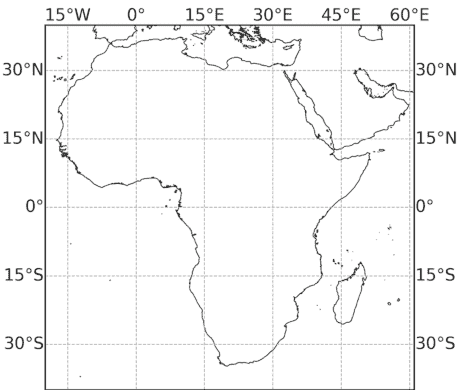

**图 7.1** 来自GSHHS数据集的海岸线显示。地图显示了北纬0°至15°、东经40°至50°之间的区域。这张简单的地图是使用`plot()`并设置相等的坐标轴纵横比制作的。（数据来自Wessel and Smith 1996）。

```
draw_labels=True,
linewidth=0.5,
linestyle='--')
gl.xlocator = mticker.FixedLocator([-15,0,15,30,45,60])
gl.ylocator = mticker.FixedLocator([-30,-15,0,15,30])
plt.show()
```

这里，我们使用*Plate Carrée*投影，这是一种等距圆柱投影，将经线映射为等距的垂直直线，将纬线映射为等距的水平直线。我们使用函数*FixedLocator()*来定义刻度线的位置。GSHHS数据集实际上已通过*coastlines()*包含在*CartoPy*中：

```
ax = plt.axes(projection=ccrs.PlateCarree())
ax.coastlines(resolution='10m',
    linewidth=0.5)
ax.set_extent([-20,61,-40,40],
    ccrs.PlateCarree())
gl = ax.gridlines(crs=ccrs.PlateCarree(),
    draw_labels=True,
    linewidth=0.5)
gl.xlocator = mticker.FixedLocator([-15,0,15,30,45,60])
gl.ylocator = mticker.FixedLocator([-30,-15,0,15,30])
plt.show()
```

我们可以看到，*coastline_data.txt*中的数据集仅包含非洲大陆的轮廓，因为原始GSHHS数据集中的数据是按大陆排序的。*CartoPy*中提供的数据集也显示了非洲周边地区的海岸线。

## 7.3 15弧秒全球地形模型 ETOPO 2022

*15弧秒全球地形模型* (ETOPO 2022) 是一个全球地形和水深数据数据库，位于规则的15弧秒网格上（即约0.5公里）(NOAA-NCEI 2022)。ETOPO 2022数据库取代了较旧的ETOPO1、ETOPO2和ETOPO5全球地形网格，但这些旧版本仍然可用。ETOPO 2022汇编了来自多种来源的数据。可以从NOAA国家环境信息中心 (NCEI) 网站下载：

https://www.ncei.noaa.gov/products/etopo-global-relief-model

较旧的数据集仅提供全球网格。例如，当前数据集的上一个前身——ETOPO1数据集 (Amante and Eakins 2009)——可以作为312 MB的地理参考图像下载。我们使用此数据集的一个摘录作为示例，该示例是使用类似于下面用于当前ETOPO 2022数据集的网络工具生成的 (NOAA-NCEI 2022)。数据存储在文件*etopo1_bedrock.asc*中，包含以下数据：

```
ncols         1801
nrows         2401
xllcorner     29.991666666667
yllcorner     -20.008333333333
cellsize      0.016666666667
294 299 293 288 285 282 ...
237 241 245 266 264 274 ...
259 263 267 262 263 266 ...
310 306 300 294 296 291 ...
348 346 352 356 353 353 ...
381 383 381 381 382 381 ...
(续)
```

文件头记录了数据数组的大小（例如，我们的示例中有1,801列和2,401行）、左下角的坐标（例如，约x=20，y=–20）以及单元格大小（例如，~0.0167 = 1/60度纬度和经度，或1弧分）。较旧版本的ETOPO1数据集以及其他类似数据集也可能包含表示数据空白的–32,768标志。我们通过在前五行开头输入#来注释掉文件头：

```
#ncols         1801
#nrows         2401
#xllcorner     29.991666666667
#yllcorner     -20.008333333333
#cellsize      0.016666666667
294 299 293 288 285 282 ...
237 241 245 266 264 274 ...
259 263 267 262 263 266 ...
310 306 300 294 296 291 ...
348 346 352 356 353 353 ...
381 383 381 381 382 381 ...
(续)
```

我们将文件保存为*etopo1_data_python.txt*，然后将数据加载到工作区：

```
import numpy as np
import pygmt as pygmt
import xarray as xr
from matplotlib import cm
import matplotlib.pyplot as plt
from matplotlib.colors import LightSource
import rasterio as rasterio
import rasterio.plot

ETOPO1 = np.loadtxt('etopo1_data_python.txt')
```

接下来，我们使用`flipud()`上下翻转数组，以根据Python约定更改数据数组的索引：

```
ETOPO1 = np.flipud(ETOPO1)
```

最后，我们通过打印该区域的最小和最大高程来测试数据是否已正确存储在工作区中：

```
print(np.max(ETOPO1))
print(np.min(ETOPO1))
```

在此示例中，该区域的最大高程为5,677米，最小高程为-5,859米。参考面是海平面（即0米）。我们现在使用`meshgrid()`定义一个坐标系，利用左下角位于南纬20°、东经30°的信息。分辨率为1弧分，对应于1/60度：

```
lon = np.linspace(30,60,1801)
lat = np.linspace(-20,20,2401)
LON,LAT = np.meshgrid(lon,lat)
```

现在，我们使用`pcolormesh()`从高程数据生成彩色表面：

```
plt.figure()
ax1 = plt.axes(aspect='equal')
plt.pcolormesh(LON,LAT,ETOPO1,
    cmap='jet',
    shading='gouraud')
plt.colorbar()
plt.show()
```

此脚本打开一个新的图形窗口，使用颜色映射`jet`生成彩色表面，并使用`gouraud`生成*Gouraud*着色。表面通过一组色阶突出显示，并以俯视图显示。一种绘制数字地形的壮观方式是使用*Matplotlib*包`colors`模块中的`LightSource()`创建带有角度光照的表面图（图7.2）：

## 7.4 30弧秒高程模型 GTOPO30

*全球30弧秒高程数据*（GTOPO30）是一个30弧秒（即约1公里）的全球数字高程数据集，仅包含高程数据，不含水深数据。该数据集由地球资源观测系统数据中心开发，可从美国地质调查局（USGS）的EarthExplorer网站获取：

https://earthexplorer.usgs.gov

EarthExplorer网站可用于搜索、预览和下载美国地质调查局（USGS）的卫星图像、航空照片和制图产品。GTOPO30数据集位于*数字高程*类别下。在该网站上，我们首先在*搜索标准*中选择所需的地图区域，可以通过输入地图四角的坐标，或通过放大到感兴趣区域并选择*使用地图*来完成。例如，我们可以输入肯尼亚北部裂谷苏古塔谷的坐标（2°37.58"N 36°33'47.06"E）。然后，我们从*数字高程*集合中选择*GTOPO30*作为*数据集*，并点击*结果*，这将生成一个记录列表以及用于预览和下载数据的工具栏。在我们的示例中，我们找到一个名为*GT30E020N40*的数据集，它于1996年12月1日获取，中心点位于15°N 40°E。我们需要在美国地质调查局网站上注册、登录，然后将该数据集下载为55.0 MB的GeoTIFF文件和24.9 MB的DEM文件，后者以26.1 MB的压缩zip文件形式提供。解压文件*gt30e020n40_dem.zip*后，我们得到八个文件，其中包含各种格式的原始数据和头文件。该文件还提供了一个数据的阴影浮雕显示GIF图像。

将GTOPO30数据导入工作区很简单。我们通过从解压集合中的文件名中移除*gt30*来重命名文件，并使用

```python
import numpy as np
from matplotlib import cm
from matplotlib.colors import LightSource
import matplotlib.pyplot as plt
from matplotlib.colors import ListedColormap

with open('e020n40.dem') as fid:
    rectype = np.dtype('>i2')
    GTOPO30 = np.fromfile(fid, dtype=rectype)
GTOPO30 = np.reshape(GTOPO30, (6000, 4800))
GTOPO30 = np.flipud(GTOPO30)
GTOPO30[GTOPO30<0] = 0
```

来导入数据。此脚本以全分辨率（即比例因子 = 1）从图块*e020n40*（无文件扩展名）读取数据到数组GTOPO30中，该数组的维度为1,200 x 1,200个单元格。坐标系使用上面列出的*经度/纬度*范围定义。分辨率为30弧秒，相当于1/120度：

```python
lon = np.linspace(20,60,4800)
lat = np.linspace(-10,40,6000)
LON,LAT = np.meshgrid(lon,lat)
```

我们需要将上限减少1/120，以获得与GTOPO30数组维度相似的数组。可以使用*pcolormesh()*从高程数据生成灰度图像。使用*gray_r*颜色映射表的四次方来使地图变暗，然后垂直翻转颜色映射表，以获得高海拔为深色、低海拔为浅色的效果（而不是相反）：

```python
gray_r = plt.colormaps['gray_r']
newcolors = gray_r(np.linspace(0,1,256))
newcolors = newcolors**4
newcmp = ListedColormap(newcolors)

plt.figure()
plt.axes(aspect='equal',
    xlim=(30,40),
    ylim=(-5,5))
plt.pcolormesh(LON,LAT,GTOPO30,
    cmap=newcmp,
    shading='auto')
plt.colorbar()
plt.show()
```

此脚本打开一个新的图形窗口并生成一个灰色表面，以俯视图显示。我们再次使用类似于第7.4节中使用的代码，将数字地形绘制为带有角度光照的曲面图：

```python
plt.figure()
fig,ax2 = plt.subplots(subplot_kw={"projection":"3d"})
ax2.set_box_aspect((1,1,0.2))
ls = LightSource(270,45)
rgb = ls.shade(GTOPO30,
    cmap=cm.hsv,
    vert_exag=1,
    blend_mode='hsv')
ax2.plot_surface(LON[600:1800,1200:2400],
    LAT[600:1800,1200:2400],
```

图 7.2 基于ETOPO 2022高程数据的显示。ETOPO 2022是一个具有15弧秒分辨率的全球地形模型，无缝集成了地形和水深数据。（数据来自NOAA-NCEI 2022）。

```python
plt.figure()
fig,ax2 = plt.subplots(subplot_kw={"projection":"3d"})
ve = 500
ax2.set_box_aspect((1,1,ve/1850))
ls = LightSource(270,45)
rgb = ls.shade(ETOPO1,
    cmap=cm.jet,
    vert_exag=ve/1850,
    blend_mode='hsv')
ax2.plot_surface(LON,LAT,ETOPO1,
    rstride=1,
    cstride=1,
    linewidth=0,
    facecolors=rgb,
    antialiased=False,
    shade=True)
ax2.tick_params(axis='both',
    labelsize=6)
ax2.view_init(30,15-90)
ax2.grid(False)
fig.savefig('etopo1.png',dpi=300)
plt.show()
```

函数`LightSource()`用于从特定的方位角和仰角创建光源。我们使用`vert_exag`进行垂直夸张，以强调曲面图的垂直特征，并使用`blend_mode='hsv'`将颜色映射的数据值与光照强度相结合。然后使用`surface()`创建实际的曲面图，使用`shade()`创建的`rgb`对象作为`facecolors`。需要注意的是，`rstride`和`cstride`定义了用于渲染图形的ETOPO1的行数和列数。如果我们选择1（即全分辨率），渲染将非常耗时，因此我们应该使用更大的值（例如，如上所述的5）来对数据集进行垂直和水平重采样，以减少渲染时间。

我们还可以使用*PyGMT*包中的`makecpt()`、`Figure()`和`grdview()`，该包利用了*xarray*包：

```python
ds = xr.DataArray(data=ETOPO1,
    dims=['lat','lon'],
    coords={'lat':lat,'lon':lon})
frame = ['xa1f0.25','ya1f0.25','wSEnZ']
pygmt.makecpt(
    cmap='geo',
    series=f'-6000/4000/10',
    continuous=True)

fig = pygmt.Figure()
fig.grdview(grid=ds,
    perspective=[150,30],
    frame=frame,
    projection='M15c',
    zsize='4c',
    surftype='i',
    plane='-6000+gazure',
    shading=0)
fig.basemap(
    perspective=True,
    rose='jTL+w3c+l+o-2c/-1c')
fig.colorbar(perspective=True,
    position='JMR+o2c/0c+w10c',
    frame=['a2000'])
fig.show()
```

此脚本首先使用`makecpt()`从*PyGMT*中选择适合高程数据的geo颜色映射表，因为此函数将陆地和海洋颜色分别与高程测量和水深测量相关联。然后，该函数使用`grdview()`显示实际的曲面图，并定义透视、框架和投影。我们使用`basemap()`添加一个指向地理北方的指北针，并使用`colorbar()`添加一个色标。

接下来，我们看一个ETOPO 2022地形模型（NOAA-NCEI 2022）的示例，其分辨率是上面使用的ETOPO1数据集（即1弧分，相当于60弧秒）的四倍（即15弧秒）（Amanete and Eakins 2009）。与其前身一样，该数据集提供冰面和基岩两种版本，分别描绘覆盖格陵兰岛和南极洲的冰盖顶层及其下方的基岩。在上述网站上，我们点击*启动网格提取*以创建并下载来自ETOPO 2022冰面和基岩版本的数据空间子集。在那里，我们点击*选择数据集...*下拉菜单以选择*ETOPO_2022（基岩；15弧秒）*。然后，我们点击*感兴趣区域*按钮以指定一个感兴趣区域，例如纬度*北：22*（即22°N）和*南：1*（即1°N），经度在*西：33*（即33°E）和*东：58*（即58°E）之间，覆盖了非洲东海岸。负纬度和负经度值分别分配给南半球和西半球。点击*下载数据*会打开一个新的浏览器窗口，我们可以从中将文件*exportImage.tiff*保存到硬盘。文件*exportImage.tiff*是一个GeoTIFF文件，其中包含嵌入在TIFF文件中的地理参考信息。我们可以通过输入以下命令检索此信息：

```python
ginfo = rasterio.open('exportImage.tiff')
```

这将生成数组*ginfo*，其中包含宽度、高度和边界等众多信息。输入

```python
print(ginfo.width)
print(ginfo.height)
print(ginfo.bounds)
```

将得到

```
6000
5040
BoundingBox(left=33.0, bottom=1.0, right=58.0, top=22.0)
```

我们可以使用以下命令读取数字高程模型：

```python
A = ginfo.read()
```

我们可以通过输入以下命令使用*show()*显示数据：

```python
fig = plt.figure()
rasterio.plot.show(A,
                  cmap=cm.terrain,
                  vmin=0,vmax=4000)
fig.savefig('etopo2.png',dpi=300)
plt.show()
```

## 7.5 航天飞机雷达地形测绘任务（SRTM）

*航天飞机雷达地形测绘任务*（SRTM）是2000年2月航天飞机*奋进号*执行的一项为期11天的任务，该任务利用雷达系统绘制地球表面地图（Farr and Kobrick 2000; Farr et al. 2007）。SRTM是一个由国家地理空间情报局（NGA）和国家航空航天局（NASA）牵头的国际项目。关于SRTM项目的详细信息（包括图片库和数据用户论坛）可在NASA网站上获取：

```
https://www2.jpl.nasa.gov/srtm/
```

数据在喷气推进实验室处理。它们通过美国地质调查局（USGS）的国家地图查看器和下载平台分发：

```
https://www.usgs.gov/core-science-systems/ngp/tnm-delivery/
```

曾经，原始数据可以从USGS服务器下载为*int16*数据，但该服务器现已不可用：

```
http://dds.cr.usgs.gov/srtm/
```

该目录包含来自世界不同地区的SRTM DEM压缩文件，这些文件由SRTM全球处理器处理，并以1弧秒（SRTM-1，30米网格）和3弧秒（SRTM-3，90米网格）的分辨率进行采样。例如，我们从以下地址下载了1.7 MB的文件*s01e036.hgt.zip*：

```
http://dds.cr.usgs.gov/srtm/version2_1/SRTM3/Africa/
```

其中包含来自东非肯尼亚裂谷的SRTM-3数据。所有高程均以米为单位，并参考WGS84 EGM96大地水准面，相关文档位于：

```
http://earth-info.nga.mil/GandG/wgs84/index.html
```

该文件的名称指的是图幅左下（西南）像素的经度和纬度，即南纬1度、东经36度。SRTM-3数据包含1,201行和1,201列，以及相似数量的重叠行和列。下载*S01E036.hgt.zip*后，我们首先解压文件，并将*S01E036.hgt*保存在我们的工作目录中。数字高程模型以16位有符号整数数据的形式提供在一个简单的二进制栅格中。字节顺序是*大端序*（Motorola标准），这意味着最高有效位在前。使用以下代码将数据导入工作区：

```python
import numpy as np
import numpy.ma as ma
from scipy import signal
from matplotlib import cm
from matplotlib.colors import LightSource
import matplotlib.pyplot as plt
from matplotlib.colors import ListedColormap
import rasterio as rasterio
import rasterio.plot

with open('S01E036.hgt') as fid:
    rectype = np.dtype('>i2')
    SRTM = np.fromfile(fid,dtype=rectype)

SRTM = np.reshape(SRTM, (1201,1201))
SRTM = np.flipud(SRTM)
```

此脚本使用`open()`打开文件`s01e036.hgt`并定义文件标识符`fid`，然后使用数据类型`>i2`（表示大端序2字节或16位整数）从文件中读取二进制数据，并使用`fromfile()`将其写入数组`SRTM`。首先需要使用`reshape()`将数组重塑为(1201, 1201)，然后使用`flipud()`垂直翻转。接下来，我们使用`astype()`将数据类型更改为64位浮点数，并使用`mean()`将表示数据空缺的-32,768标志替换为全局平均高程：

```python
SRTM = SRTM.astype(float)
SRTM[SRTM==-32768] = np.mean(SRTM)
```

最后，我们通过打印该区域的最小和最大高程来测试数据是否已正确存储在工作区中：

```python
np.max(SRTM)
np.min(SRTM)
```

在我们的示例中，该区域的最大海拔为海平面以上3,992米，最小海拔为1,504米。可以使用左下角为`s01e036`的信息来定义坐标系。分辨率为3弧秒，对应于1/1,200度：

```python
lon = np.linspace(36,37,1201)
lat = np.linspace(-1,0,1201)
LON,LAT = np.meshgrid(lon,lat)
```

可以使用`pcolormesh()`从高程数据生成阴影灰度地图，该函数显示带有模拟光照的阴影表面：

```python
gray_r = plt.colormaps['gray_r']
newcolors = gray_r(np.linspace(0,1,256))
newcolors = newcolors**1
newcmp = ListedColormap(newcolors)

plt.figure()
plt.axes(aspect='equal')
plt.pcolormesh(LON,LAT,SRTM,
    cmap=newcmp,
    shading='auto')
plt.colorbar()
plt.show()
```

此脚本打开一个新的图形窗口，并生成阴影地形图（使用插值着色）和灰色颜色图（以俯视图显示）。由于SRTM数据包含大量噪声，我们首先通过任意的9x9像素移动平均滤波器使用convolve2d()平滑数据。与第6.8节中关于运行平均值的讨论相反，此时运行平均值的副作用并不重要。然后将新数组存储在SRTM_FILTERED中：

```python
B = 1/81 * np.ones((9,9))
SRTM_FILTERED = signal.convolve2d(SRTM,B,mode='same')
```

使用以下代码生成相应的阴影地形图：

```python
plt.figure()
plt.axes(aspect='equal')
plt.pcolormesh(LON,LAT,SRTM_FILTERED,
    cmap=newcmp,
    shading='auto')
plt.colorbar()
plt.show()
```

相邻的SRTM图幅重叠一行或一列，在合并SRTM数据集时必须删除这些重叠部分。我们以肯尼亚的巴林戈盆地为例，该盆地由两个SRTM图幅覆盖。我们首先按照前面描述的方法从文件*N00E036.hgt*和*N00E035.hgt*加载两个SRTM数据集：

```python
with open('N00E035.hgt') as fid:
    rectype = np.dtype('>i2')
    SRTM1 = np.fromfile(fid,dtype=rectype)

with open('N00E036.hgt') as fid:
    rectype = np.dtype('>i2')
    SRTM2 = np.fromfile(fid,dtype=rectype)
```

接下来，我们重塑数据集并上下翻转：

```python
SRTM1 = np.reshape(SRTM1,(1201,1201))
SRTM1 = np.flipud(SRTM1)
SRTM2 = np.reshape(SRTM2,(1201,1201))
SRTM2 = np.flipud(SRTM2)
```

我们删除第一个图幅SRTM1中重叠（相同）的列，并使用concatenate()将其与第二个图幅SRTM2水平拼接。然后，我们用全局平均高程替换空缺值：

```python
SRTM = ma.concatenate([SRTM1[:,:1200],SRTM2],axis=1)

SRTM = SRTM.astype(float)
SRTM[SRTM==-32768] = np.mean(SRTM)
```

然后我们使用运行平均值平滑数据：

```python
B = 1/25 * np.ones((5,5))
SRTM_FILTERED = signal.convolve2d(SRTM,B,mode='same')
```

随后，我们定义坐标网格和等高线级别（参见第7.7节）：

```python
lon = np.linspace(35,37,2401)
lat = np.linspace(-1,0,1201)
LON,LAT = np.meshgrid(lon,lat)
v = np.array([700,800,900,1000,1100,1200,
              1300,1500,2500,3000])
```

下面的脚本使用与第7.3和7.4节中类似的代码，生成了数据的出色显示效果。注意使用set_box_aspect()来缩短z轴的长度：

```python
plt.figure()
fig,ax2 = plt.subplots(subplot_kw={"projection":"3d"})
ax2.set_box_aspect((2,1,0.1))
ax2.set_xlim((35,37))
ax2.set_ylim((-1,0))
ax2.set_zlim((1500,3500))
ls = LightSource(270,45)
rgb = ls.shade(SRTM,
               cmap=cm.hsv,
               vert_exag=1,
               blend_mode='soft',
               vmin=0,
               vmax=np.max(SRTM_FILTERED))
ax2.plot_surface(LON,LAT,SRTM_FILTERED,
                 rstride=1,
                 cstride=1,
                 linewidth=0,
                 facecolors=rgb,
                 antialiased=False,
                 shade=True,
```

与第7.3节一样，我们可以使用*PyGMT*包中的函数创建更具吸引力的图形（图7.3）：

```python
GTOPO30 = np.float64(GTOPO30)

ds = xr.DataArray(data=GTOPO30,
    dims=['lat','lon'],
    coords={'lat':lat,'lon':lon})
frame = ['xal1f0.25','yal1f0.25','wSEnZ']
pygmt.makecpt(
    cmap='geo',
    series=f'-6000/4000/10',
    continuous=True)

fig = pygmt.Figure()
fig.grdview(grid=ds,
    perspective=[150,30],
    frame=frame,
    projection='M15c',
    zsize='4c',
    surftype='i',
    plane='-6000+gazure',
    shading=0)
fig.basemap(
    perspective=True,
    rose='jTL+w3c+l+o10c/12c')
fig.colorbar(perspective=True,
    position='JMR+o2c/0c+w10c',
    frame=['a2000'])
fig.savefig('gtopo30_python.png',dpi=300)
fig.show()
```

此脚本首先使用`makecpt()`从*PyGMT*中选择适合高程数据的geo颜色图。然后，脚本使用`grdview()`显示实际的表面图，并定义图形的透视、框架和投影。我们使用`basemap()`添加一个指向地理北方的指北针，并使用`colorbar()`添加一个颜色条。我们再次将图形导出为分辨率为300 dpi的PNG文件，文件名为*gtopo30_python.png*。

## 7.6 网格化与等值线绘制

之前的数据集都存储在均匀间隔的二维数组中。然而，地球科学中的大多数数据来自不规则的采样模式。因此，数据是不均匀分布的，需要进行插值，以便能够从我们野外测量数据中计算出平滑且连续的表面。*表面估计*通常分两个主要步骤进行（图7.5）：首先，需要选择*控制点*的数量；其次，需要为*网格点*估算目标变量的值。

控制点是不均匀分布的野外测量值，例如不同露头处砂岩单元的厚度或水井中化学示踪剂的浓度。数据通常表示为*xyz*三元组，其中*x*和*y*是空间坐标，*z*是目标变量。在这种情况下，大多数网格化方法要求数据是连续且唯一的。然而，地球科学中的空间变量往往是不连续且非空间唯一的：例如，砂岩单元可能被断层切割或发生褶皱。此外，网格化要求空间自相关，即相邻数据点应通过特定关系相互关联。如果*z*变量是随机的且没有自相关性，那么进行表面估计就没有意义。

存在多种技术用于选择计算网格点所用的控制点。大多数方法对*z*变量的自相关性做出任意假设。例如，第5.6节介绍的线性插值和样条插值方法的二维变体，使用固定数量的控制点通过多项式计算区域块。*最近邻准则*包括网格点圆形邻域内的所有控制点，圆的半径由用户指定（图7.5 a）。由于空间自相关程度可能随着与网格点距离的增加而降低，因此在计算这些网格点的值时，同时考虑过多的远距离控制点很可能导致错误的结果。另一方面，使用过小的半径可能会将计算网格点值所用的总控制点数量限制在非常少的范围内，从而导致对建模表面的估计误差很大。

在另一种技术中，所有控制点通过三角网络连接（图7.5 b）。每个网格点都位于由三个控制点形成的三角形区域内。网格点的*z*值由三角形顶点处控制点的*z*值计算得出。这种网格化形式的一种改进也使用相邻三个三角形的顶点处的三个点。*克里金法*（在第7.10节介绍）是一种选择控制点的替代方法，通常被视为网格化的终极方法。一些用户甚至将*地质统计学*作为其同义词。克里金法是一种量化空间自相关性的方法，因此也量化了用于选择控制点的圆的维度。更复杂的克里金法版本使用椭圆形区域代替圆形。

如上所述，表面估计的第二步是实际计算网格点的*z*值。控制点处测量*z*值的*算术平均值*

$$\bar{z} = \frac{1}{n} \sum_{i=1}^{n} z_i$$

提供了计算网格点值的最简单方法。如果控制点数量有限，这是一种特别有用的方法。如果研究区域被控制点良好覆盖，并且这些点之间的距离变化很大，则应使用*加权平均值*计算网格点的*z*值。这涉及根据网格点到控制点的距离$d_i$的倒数对控制点处的*z*值进行加权：

$$\vec{z} = \frac{\sum_{i=1}^{n} (z_i/d_i)}{\sum_{i=1}^{n} (1/d_i)}$$

根据变量*z*的空间尺度关系，可以使用距离的平方根的倒数（而不仅仅是距离的倒数）来对*z*值进行加权。将二维*样条*拟合到控制点提供了计算网格点值的另一种方法，在地球科学中常用。表面估计中使用的大多数程序涉及*双三次多项式样条*，即至少将一个三次二维多项式拟合到六个相邻的控制点。最终表面是由这些样条的不同部分组成的复合体。

方形网格的一个优点也是其缺点：由于这些网格之间的等距性，每个区域的内存需求都是相同的（因此在控制点密度低且目标变量变化小的区域也是如此）。克服这个问题的一种方法是使用三角形网格代替方形网格。这些三角形网格是通过对不规则分布的控制点进行*三角剖分*计算得出的。计算这种*不规则三角网*（TINs）有几种不同的方法，其中之一是*Delaunay三角剖分*。在这种方法中，点被连接成三角形，使得三角形三个顶点所在的圆内不包含其他点。

*SciPy*包包含多种插值方法。我们首先使用双三次样条，它使用样条对数据进行二维插值，即至少将一个三次三维多项式拟合到六个相邻的控制点，从而产生一个连续的表面（及其一阶导数）。这种网格化方法特别适合从具有不均匀分布控制点的噪声数据集中生成平滑表面。作为一个例子，我们使用合成的*xyz*数据，这些数据表示一个假想地层界面的表面（该界面一方面被正断层位移，另一方面与参考面）之间的垂直距离。断层的下盘显示大致水平的地层，而上盘则以两个大型沉积盆地为特征。*xyz*数据是不规则分布的，因此需要插值到规则网格上。这些*xyz*数据以三列表格的形式存储在名为*normalfault.txt*的文件中：

我们还可以创建并分配颜色映射`gist_earth`，使其适合高程数据，因为它将陆地和海洋颜色分别与高程测量和水深测量相关联（图7.4）：

```python
plt.figure()
fig,ax2 = plt.subplots(subplot_kw={"projection":"3d"})
ax2.set_box_aspect((2,1,0.1))
ax2.set_xlim((35,37))
ax2.set_ylim((-1,0))
ax2.set_zlim((1500,3500))
ls = LightSource(270,45)
rgb = ls.shade(SRTM,
    cmap=cm.gist_earth,
    vert_exag=1,
    blend_mode='soft',
    vmin=0,
    vmax=np.max(SRTM_FILTERED))
ax2.contour(LON,LAT,SRTM_FILTERED+1,
    levels=v,
    linewidths=0.3,
    colors='w',
    linestyles='solid')
ax2.plot_surface(LON,LAT,SRTM_FILTERED,
    rstride=5,
    cstride=5,
    linewidth=0,
    facecolors=rgb,
    antialiased=False,
    shade=True,
    vmin=1500,
    vmax=4000)
ax2.tick_params(axis='both',
    labelsize=6)
ax2.grid(False)
plt.savefig('srtm_python.png',dpi=300)
plt.show()
```

**图7.4** 来自滤波后SRTM高程数据集的显示。该图使用了阴影效果，这在3D计算机图形学中非常流行，并在表面上创建了漫反射和镜面反射的组合。（数据来自Farr和Kobrick (2000)，Farr等人 (2007)）。

SRTM数据集最近再次进行了修订，如美国地质调查局网站所述

```
https://www.usgs.gov/centers/eros/science/usgs-eros-archive-digital-elevation-shuttle-radar-topography-mission-srtm-1
```

根据该网站的信息，最新版本的SRTM数据集提供三个版本：(1) SRTM Non-Void Filled，(2) SRTM Void Filled，和(3) SRTM 1 Arc-Second Global。数据可从以下地址下载

```
https://earthexplorer.usgs.gov
```

EarthExplorer网站可用于通过美国地质调查局（USGS）搜索、预览和下载卫星图像、航空照片和制图产品。SRTM数据集位于*Digital Elevation*类别中。在此网站上，我们首先在*Search Criteria*中选择所需的地图区域，可以通过输入地图四个角的坐标，或通过放大到感兴趣的区域并选择*Use Map*来完成。例如，我们可以输入肯尼亚北部裂谷苏古塔谷的坐标（2°8′37.58″N 36°33′47.06″E）。然后，我们从*Digital Elevation*集合中选择*SRTM*作为*Data Set*，并点击*Results*，这将生成一个记录列表以及用于预览和下载数据的工具栏。在我们的示例中，我们找到一个数据集*SRTM1S01E036V3*，它于2000年2月11日获取，中心位于0.5°N 36.5°E。我们需要在美国地质调查局网站上注册、登录，然后将数据集下载为24.76 MB的GeoTIFF文件。GeoTIFF文件包含嵌入在TIFF文件中的地理参考信息。我们可以通过输入以下命令检索此信息

```python
ginfo = rasterio.open('s01_e036_1arc_v3.tif')
```

这将生成数组`ginfo`，其中包含宽度、高度和边界等大量信息。我们可以使用以下命令读取数字高程模型

```python
A = ginfo.read()
```

我们可以通过输入以下命令使用`show()`显示数据

```python
fig = plt.figure()
rasterio.plot.show(A,
                  cmap=cm.terrain,
                  vmin=0,vmax=4000)
fig.savefig('srtmimage.png',dpi=300)
plt.show()
```

新文件`srtmimage.png`的大小为1.3 MB，现在可以导入到另一个软件包中，例如Adobe Photoshop。

4.3229698e+02 7.4641694e+01 9.7283620e-01
4.4610209e+02 7.2198697e+01 6.0655065e-01
4.5190255e+02 7.8713355e+01 1.4741054e+00
4.6617169e+02 8.7182410e+01 2.2842172e+00
4.6524362e+02 9.7361564e+01 1.1295175e-01
4.5526682e+02 1.1454397e+02 1.9007110e+00
4.2930233e+02 7.3175896e+01 3.3647807e+00
（续）

第一列和第二列分别包含坐标 $x$（在任意空间坐标系中介于420和470之间）和 $y$（介于70和120之间），而第三列包含垂直方向的 $z$ 值。数据通过以下方式加载：

```
import numpy as np
from scipy import interpolate
from math import log10, floor
from matplotlib import cm
import matplotlib.pyplot as plt
from matplotlib.colors import LightSource

data = np.loadtxt('normalfault.txt')
```

最初，我们希望创建一个控制点空间分布的概览图。为了在图中标记这些点，第三列的数值 $z$ 值被转换为最多两位数字的字符串表示：

```
labels = np.zeros(len(data))
for i in range(0,78):
    labels[i] = round(data[i,2],
        -int(floor(log10(abs(0.1*data[i,2])))))
```

我们数据的二维图分两步生成：首先，使用 `plot()` 将数据显示为空心圆。其次，使用 `text()` 为数据添加标签，该函数将 `labels` 中包含的文本添加到 $xy$ 位置。所有 $x$ 坐标都加上1，以在圆圈和文本之间产生一个小偏移：

```
plt.figure()
for i in range(0,78):
    plt.plot(data[i,0],data[i,1],
        marker='o',
        markeredgecolor=(0.3,0.5,0.8),
        markerfacecolor='none',)
    plt.text(data[i,0]+1,data[i,1],labels[i],
         fontsize=8)
plt.show()
```

此图有助于我们定义网格化和等值线绘制的轴限。函数 `meshgrid()` 将由 x 和 y 指定的域转换为数组 XI 和 YI。输出数组 XI 的行是 x 的副本，输出数组 YI 的列是 y 的副本。我们选择1.0作为网格间隔，因此在 x 和 y 方向上各获得51个数据点：

```
x = np.linspace(420,470,51)
y = np.linspace(70,120,51)
XI,YI = np.meshgrid(x,y)
```

使用双三次样条插值在 XI 和 YI 指定的网格点上对不均匀间隔的数据进行插值：

```
ZI = interpolate.griddata(data[:,0:2],data[:,2], (XI,YI),
                         method='cubic')
```

显示网格化结果最简单的方法是使用 `contour()` 绘制等值线图。默认情况下，等值线的数量和值是自动选择的。等值线的选择取决于 z 的最小值和最大值：

```
plt.figure()
plt.contour(XI,YI,ZI)
plt.show()
```

或者，可以手动选择等值线的数量（例如，十个等值线级别）：

```
plt.figure()
plt.contour(XI,YI,ZI,10)
plt.show()
```

也可以在 v 中指定的值处进行等值线绘制。由于 z 的最大值和最小值为

```
print(np.min(data[:,2]))
print(np.max(data[:,2]))
```

结果为

-27.435687
21.301825

我们选择

```
v = np.linspace(-50,30,7)
```

命令

```
plt.figure()
fig,ax = plt.subplots()
c = ax.contour(XI,YI,ZI,v)
ax.clabel(c,inline=1,fontsize=8)
plt.show()
```

生成 QuadContourSet 对象 c，该对象可用作 `clabel()` 的输入，`clabel()` 会自动标记等值线。填充等值线是上述使用的空等值线的替代方案。此函数与 `colorbar()` 一起使用，后者显示图的图例。此外，我们可以绘制真实数据点的位置（小圆圈）和 z 值（等值线标签）（图 7.6）：

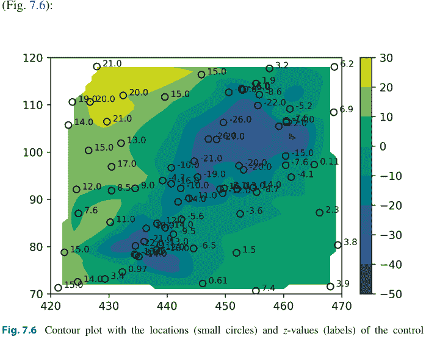

图 7.6 带有控制点位置（小圆圈）和 z 值（标签）的等值线图。

```
plt.figure()
plt.contourf(XI,YI,ZI)
for i in range(0,78):
    plt.plot(data[i,0],data[i,1],
        marker='o',
        markeredgecolor=(0,0,0),
        markerfacecolor='none',)
    plt.text(data[i,0]+1,data[i,1],labels[i],
        fontsize=8)
plt.colorbar()
plt.show()
```

使用 `pcolor()` 生成伪彩色图。同时，在与上述示例相同的级别处添加黑色等值线：

```
plt.figure()
plt.pcolor(XI,YI,ZI)
for i in range(0,78):
    plt.plot(data[i,0],data[i,1],
        marker='o',
        markeredgecolor=(0,0,0),
        markerfacecolor='none',)
    plt.text(data[i,0]+1,data[i,1],labels[i],
        fontsize=8)
plt.contour(XI,YI,ZI,v,colors='k')
plt.colorbar()
plt.show()
```

使用 `plot_surface()` 将第三维度添加到图中。我们也可以使用此示例介绍 `view_init(el, az)`，以指定观察方向，其中 `el` 是仰角，`az` 是方位角（或水平旋转）（均为度）。值 `el=30` 和 `az=-127.5` 定义了图的斜视图，

```
plt.figure()
fig,ax2 = plt.subplots(subplot_kw={"projection":"3d"})
surf = ax2.plot_surface(XI,YI,ZI,
    rstride=1,
    cstride=1,
    linewidth=0,
    cmap=cm.jet,
    antialiased=False,
    shade=True)
ax2.view_init(30,-127.5)
```

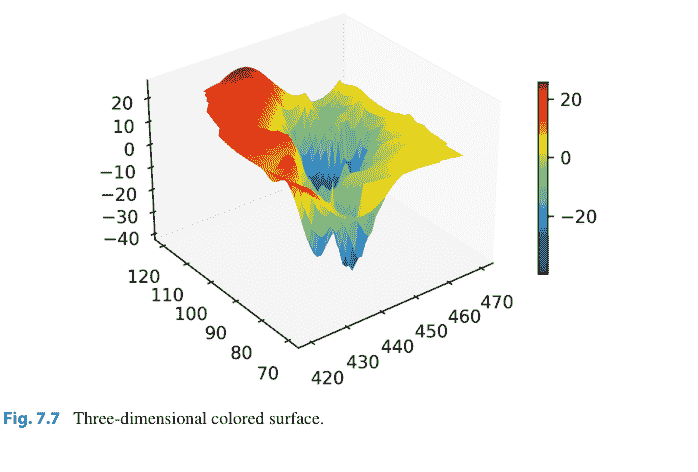

图 7.7 三维彩色曲面。

```
ax2.grid(False)
fig.colorbar(surf, shrink=0.5)
plt.show()
```

而 az=90 和 el=-90 是正上方视图，也是默认的二维视图（图 7.7）。

本节描述的双三次样条插值为大多数网格化问题提供了解决方案。然而，地球科学中的不同应用需要不同的插值方法，每种应用都有其自身的问题。下一节将双三次样条插值与其他网格化方法进行比较，并总结它们的优缺点。

## 7.7 方法比较与潜在伪影

我们想要仔细研究的第一种方法是用于对不均匀间隔数据进行网格化的*双线性插值*。双线性插值是第5.6节介绍的一维线性插值技术的扩展。在二维情况下，首先在一个方向上进行线性插值，然后在另一个方向上进行。尽管双线性方法似乎是最简单的插值技术之一，因此可能不会预期在数据中产生严重的伪影或失真，但事实恰恰相反，因为该方法有许多缺点。因此，在许多应用中更倾向于使用其他方法。

可以再次加载上面使用的样本数据，以研究双线性插值的影响：

```
import numpy as np
from scipy import interpolate
from math import log10, floor
import matplotlib.pyplot as plt

data = np.loadtxt('normalfault.txt')
labels = np.zeros(len(data))
for i in range(0,len(data)):
    labels[i] = round(data[i,2],
        -int(floor(log10(abs(0.1*data[i,2])))))
```

我们现在在使用 `griddata()` 插值数据时选择线性方法：

```
x = np.linspace(420,470,201)
y = np.linspace(70,120,201)
XI,YI = np.meshgrid(x,y)

ZI = interpolate.griddata(data[:,0:2],data[:,2],
    (XI,YI),method='linear')
```

结果绘制为等值线。该图还包括控制点的位置：

```
v = np.linspace(-50,30,7)

plt.figure()
plt.contourf(XI,YI,ZI,v)
for i in range(0,len(data)):
    plt.plot(data[i,0],data[i,1],
        marker='o',
        markeredgecolor=(0,0,0),
        markerfacecolor='none',)
    plt.text(data[i,0]+1,data[i,1],labels[i],
        fontsize=8)
plt.colorbar()
plt.show()
```

新曲面被限制在包含控制点的区域内：默认情况下，双线性插值不会外推到该区域之外。此外，与双三次样条插值的平滑等值线形状相比，等值线相当有棱角。然而，通过将数据投影到垂直平面上，可以说明双线性网格化技术最重要的特性：

plt.figure()
plt.plot(XI,ZI,
    linewidth=0.3,
    color='k')
for i in range(0,len(data)):
    plt.plot(data[i,0],data[i,2],
        marker='o',
        markeredgecolor=(0,0,0),
        markerfacecolor='none',)
    plt.text(data[i,0]+1,data[i,2],labels[i],
        fontsize=8)

此图展示了估计曲面（垂直线）和标记控制点的投影。网格点处的z值从未超过控制点的z值。与时间序列的线性插值（第5.6节）类似，双线性插值会导致数据的显著平滑以及高频变化的减少。

三次样条插值在许多方面代表了另一个极端，通常用于极不均匀分布的数据和有噪声的数据：

```
x = np.linspace(420,470,201)
y = np.linspace(70,120,201)
XI,YI = np.meshgrid(x,y)

ZI = interpolate.griddata(data[:,0:2],data[:,2],
    (XI,YI),method='cubic')

v = np.linspace(-50,30,7)

plt.figure()
plt.contourf(XI,YI,ZI)
for i in range(0,len(data)):
    plt.plot(data[i,0],data[i,1],
        marker='o',
        markeredgecolor=(0,0,0),
        markerfacecolor='none',)
    plt.text(data[i,0]+1,data[i,1],labels[i],
        fontsize=8)
plt.colorbar()
plt.show()
```

等高线图显示出一个极其平滑的曲面。这种解决方案在许多应用中已被证明非常有用，但该方法也会产生一些伪影。从下一张图中我们可以看到，网格点处的估计值常常超出测量z值的范围：

```
plt.figure()
plt.plot(XI,ZI,
    linewidth=0.3,
    color='k')
for i in range(0,len(data)):
    plt.plot(data[i,0],data[i,2],
        marker='o',
        markeredgecolor=(0,0,0),
        markerfacecolor='none',)
    plt.text(data[i,0]+1,data[i,2],labels[i],
        fontsize=8)
```

这有时可能是合适的，并且不会像双线性网格化那样平滑数据。然而，引入具有不同z值的非常接近的控制点可能会导致严重的伪影。例如，我们在一个z值约为-26的参考点附近引入一个z值为+5的参考点：

```
data = np.loadtxt('normalfault.txt')
data = np.append(data,[[450,105,5]],axis=0)

labels = np.zeros(len(data))
for i in range(0,len(data)):
    labels[i] = round(data[i,2],
        -int(floor(log10(abs(0.1*data[i,2])))))

ZI = interpolate.griddata(data[:,0:2],data[:,2],
    (XI,YI),method='cubic')

v = np.linspace(-50,30,7)

plt.figure()
plt.contourf(XI,YI,ZI)
for i in range(0,len(data)):
    plt.plot(data[i,0],data[i,1],
        marker='o',
        markeredgecolor=(0,0,0),
        markerfacecolor='none',)
    plt.text(data[i,0]+1,data[i,1],labels[i],
        fontsize=8)
plt.colorbar()
plt.show()
```

在位置(450, 105)处的极端梯度导致了一对*低*值和*高*值（图7.8）。在这种情况下，建议删除其中一个控制点，并将剩余控制点的z值替换为两个z值的算术平均值。

`griddata()`提供的第三种方法——除了*双线性*（线性）和*双三次*（三次）插值外——涉及使用*最近邻*（nearest）插值方法。我们将在下一个示例中比较所有这些方法。我们首先清除工作区，从`normalfault.txt`重新加载数据，并再次添加异常值：

```
python
data = np.loadtxt('normalfault.txt')
data = np.append(data,[[450,105,5]],axis=0)

labels = np.zeros(len(data))
for i in range(0,len(data)):
    labels[i] = round(data[i,2],
        -int(floor(log10(abs(0.1*data[i,2])))))
```

然后我们为不同插值方法的结果创建标题：

```
python
titles = ['Linear interpolation',
          'Cubic spline interpolation',
          'Nearest neighbor interpolation']
```

我们再次定义网格化和等高线图的轴限为xlim= [420 470] 和 ylim= [70 120]。函数`meshgrid()`将由x和y指定的域转换为数组XI和YI。输出数组XI的行是x的副本，输出数组YI的列是y的副本。我们选择1.0作为网格间隔：

```
x = np.linspace(420,470,51)
y = np.linspace(70,120,51)
XI,YI = np.meshgrid(x,y)
```

接下来，我们使用所有可用选项的`griddata()`，并将结果存储在三维数组ZI中：

```
ZILIN = interpolate.griddata(data[:,0:2],data[:,2],
    (XI,YI),method='linear')
ZICUB = interpolate.griddata(data[:,0:2],data[:,2],
    (XI,YI),method='cubic')
ZINEA = interpolate.griddata(data[:,0:2],data[:,2],
    (XI,YI),method='nearest')

ZI = np.dstack((ZILIN,ZICUB,ZINEA))
```

我们可以使用`figure()`在五个不同的图形窗口（在计算机显示器上略有偏移）中比较结果。数据以v中指定的值显示为填充等高线：

```
v = np.linspace(-50,30,7)

for j in range(0,3):
    plt.figure()
    plt.contourf(XI,YI,ZI[:,:,j],v)
    for i in range(0,len(data)):
        plt.plot(data[i,0],data[i,1],
            marker='o',
            markeredgecolor=(0,0,0),
            markerfacecolor='none',)
        plt.text(data[i,0]+1,data[i,1],labels[i],
            fontsize=8)
    plt.title(titles[j])
    plt.colorbar()
    plt.show()
```

## 7.8 点分布的统计

本节讨论区域内对象的统计分布，这可能有助于解释这些对象与区域属性之间的关系（图7.9）。例如，考古遗址中手斧的空间集中可能表明曾有更多的人类群体生活在那里。另一个例子是，化石的聚集分布可能记录了有利于特定生物的环境条件，这些生物后来被保存为化石。此外，火山的排列可能有助于绘制地球表面下隐藏的构造结构图。

下面介绍各种统计分析点分布的方法。我们首先考虑对象空间均匀分布的检验，然后是空间随机分布的检验，最后是对象聚集分布的简单检验。

### 7.8.1 均匀分布检验

为了说明均匀分布检验，我们首先需要计算一些合成数据（图7.10）。函数`random.rand()`计算从区间[0,1]内的均匀分布中抽取的均匀分布伪随机数。我们使用`random.rand()`计算xy数据，并将数据乘以十，以获得区间[0,10]内的数据：

```
import numpy as np
from scipy import stats
import matplotlib.pyplot as plt
from scipy.special import factorial
import scipy.spatial.distance as distance

np.random.seed(0)
data = 10 * np.random.rand(100,2)
```

我们可以使用第3.9节介绍的χ²检验来检验数据具有均匀分布的原假设。xy数据现在被组织成25个类别，这些类别是尺寸为2x2的方形子区域。这种类别定义忽略了类别数量应接近观测值数量的平方根的经验法则（见第3.3节）。然而，我们的类别选择不会导致任何空类别，这在应用$\chi^2$检验时应该避免。此外，25个类别为期望观测值产生整数值，这些值更容易处理。我们在$y$对$x$的图中将数据显示为蓝色圆圈。矩形区域用红线勾勒（图7.10）：

```
x = np.linspace(0,10,11)
y = np.ones(np.shape(x))

plt.figure()
plt.plot(data[:,0],data[:,1],'o')
for i in range(1,5):
    plt.plot(x,2*i*y,
             color='r',
             linewidth=0.5)
for i in range(1,5):
    plt.plot(2*i*y,x,
             color='r',
             linewidth=0.5)
plt.axis(np.array([0,10,0,10]))
plt.show()
```

直方图的三维版本用于显示空间数据，这些数据被组织成类别（图7.11）：

```
e = np.linspace(0,10,6)
H,xedges,yedges = np.histogram2d(data[:,0],
                                  data[:,1],bins=(e,e))
```

### 7.8.2 随机分布检验

以下示例说明了对区域内物体随机分布的检验（图 7.9 c）。我们使用上一个示例中生成的均匀分布数据，并显示点分布：

```python
np.random.seed(0)
data = 10 * np.random.rand(100, 2)

x = np.linspace(0, 10, 11)
y = np.ones(np.shape(x))

plt.figure()
plt.plot(data[:, 0], data[:, 1], 'o')
for i in range(1, 10):
    plt.plot(x, i*y,
             color='r',
             linewidth=0.5)
for i in range(1, 10):
    plt.plot(i*y, x,
             color='r',
             linewidth=0.5)
plt.axis(np.array([0, 10, 0, 10]))
plt.show()
```

然后我们生成一个三维直方图，并使用 `histogram2D()` 来统计每个类别中的物体数量。与之前的检验不同，我们现在统计包含特定数量观测值的子区域。子区域的数量比之前检验通常情况下的要多。在我们的示例中，我们使用 49 个子区域（或类别）：

```python
e = np.linspace(0,10,8)
H,xedges,yedges = np.histogram2d(data[:,0],data[:,1],
    bins=(e,e))

x = np.linspace(1,9,7)
y = np.linspace(1,9,7)
z = 0

X,Y = np.meshgrid(x,y)
Z = np.ones((7,7))

X = X.ravel()
Y = Y.ravel()
Z = 0

dx = 2
dy = 2
dz = H
dz = H.ravel()

fig = plt.figure()
ax1 = fig.add_subplot(121,projection='3d')
ax1.bar3d(X,Y,Z,dx,dy,dz)
plt.show()

counts = H.ravel()
```

如果物体是随机分布的，那么包含特定数量物体的子区域的频率分布将遵循泊松分布（第 3.4 节）。首先，我们计算包含 N 个物体的子区域的频率分布。在我们的示例中，我们统计包含 0, ..., 5 个物体的子区域。我们还使用 `histogram()` 以二维方式显示频率分布的直方图，首先根据箱中心 N（第 3.3 节）计算箱边界 E（图 7.12 和 7.13）：

```python
N = np.linspace(0,5,6)
E = np.linspace(-0.5,5.5,7)

plt.hist(counts,bins=7)
```

```python
n,e = np.histogram(counts,bins=7)
v = np.diff(e[0:2]) * 0.5 + e[0:-1]

n_obs = n
```

直方图区间的中点 v 对应于子区域内包含的 N=0, ..., 5 个物体。包含特定数量物体 j 的子区域的期望数量 $E_j$ 可以使用以下公式计算：

$$E_j = Te^{-n/T} \frac{(n/T)^j}{j!}$$

其中 $n$ 是物体的总数，$T$ 是子区域的数量。对于 $j=0$，$j!$ 取为 1。我们使用上述方程计算期望的子区域数量（即理论频率分布 n_exp）：

```python
n_exp = np.ones(7)
for i in range(0,6):
    n_exp[i] = 49*np.exp(-100/49)*(100/49) \
        **N[i]/factorial(N[i])

n_exp = np.sum(n_obs)*n_exp/np.sum(n_exp)
```

并在单个图中显示经验频率分布和理论频率分布：

```python
plt.figure()
plt.bar(v,n_obs,
    edgecolor='b',
    color='none')
plt.bar(v,n_exp,
    edgecolor='r',
    color='none')
plt.show()
```

再次使用 $\chi^2$ 检验来比较经验分布和理论分布，即检验包含特定数量物体的子区域的频率分布遵循泊松分布的原假设。检验在 $p=5\%$ 的显著性水平下进行。由于泊松分布仅由一个参数定义，因此自由度为 $\Phi=6-(1+1)=4$。测量的 $\chi^2$ 值为：

```python
chi2_data = np.sum((n_obs-n_exp)**2/n_exp)
print(chi2_data)
```

结果为：

3.546695554153232

这远低于临界 $\chi^2$ 值，即：

```python
chi2_theo = stats.chi2.ppf(1-0.05,6-1-1)
print(chi2_theo)
```

结果为：

9.487729036781154

因此，我们不能拒绝原假设，必须得出结论：我们的数据遵循泊松分布，并且点分布是随机的。

### 7.8.3 聚类检验

地球科学中的点分布通常是聚类的（图 7.9 d）。我们使用*最近邻准则*来检验空间分布是否存在聚类。Davis (2002) 发表了一篇关于最近邻分析的优秀著作，总结了许多其他作者的工作。此外，Swan 和 Sandilands (1996) 对该分析进行了简化的描述。聚类检验计算了场中所有可能的最近点对之间的距离 $d_i$。*观测到的平均最近邻距离*为：

$$\bar{d} = \frac{1}{n} \sum_{i=1}^{n} d_i$$

其中 $n$ 是场中点（或物体）的总数。所有可能点对之间距离的算术平均值与地图所覆盖的面积有关。这种关系由*期望的平均最近邻距离*表示，即：

$$\bar{\delta} = \frac{1}{2} \sqrt{A/n}$$

其中 $A$ 是地图所覆盖的面积。该比值的小值表明存在聚类，而大值则表示规则性（或均匀性）。该检验使用 Z 统计量（第 3.4 节），即：

$$Z = \frac{\bar{d} - \bar{\delta}}{s_e}$$

其中 $s_e$ 是平均最近邻距离的标准误差，定义为：

$$s_e = \frac{0.26136}{\sqrt{n^2/A}}$$

*随机性*的原假设与两个备择假设进行检验：一方面是*聚类*，另一方面是*均匀性*或*规则性*（图 7.9）。在 5% 的显著性水平下，Z 统计量的临界值为 1.96 和 -1.96。如果 -1.96 < Z < +1.96，我们不能拒绝数据随机分布的原假设。如果 Z < -1.96，我们可以拒绝原假设并接受第一个备择假设，即聚类。如果 Z > +1.96，我们也可以拒绝原假设，但接受第二个备择假设，即均匀性或规则性。

作为示例，我们再次使用前面示例中分析的合成数据：

```python
np.random.seed(0)
data = 10 * np.random.rand(100, 2)
```

plt.figure()
plt.plot(data[:,0],data[:,1],'o')
plt.show()

我们首先使用 `pdist()`（第9.5节）计算所有观测点对之间的成对欧几里得距离。然后，使用 `squareform()` 将得到的距离数组 `distances` 转换为对称的方阵格式 `distarray`：

```
distances = distance.pdist(data)
distarray = distance.squareform(distances)
```

以下 `for` 循环用于查找最近邻，存储最近邻距离，并计算平均距离：

```
nearest = np.zeros((100,1))
for i in range(0,100):
    distarray[i,i] = np.Inf
    k = np.where(distarray[i,:]==np.min(distarray[i,:]))
    nearest[i,:]=distarray[i,k]

observednearest = np.mean(nearest)
print(observednearest)
```

其输出结果为：

```
0.5284579351787346
```

在我们的示例中，观测到的平均最近邻距离 `observednearest` 等于 0.5285。接下来我们计算地图的面积。预期的平均最近邻距离是地图面积除以观测点数量后，再取平方根的一半：

```
maparea = (np.max(data[:,0])-np.min(data[:,0])) * \
    (np.max(data[:,1])-np.min(data[:,1]))
expectednearest = 0.5 * np.sqrt(maparea/len(data))
print(expectednearest)
```

其输出结果为：

```
0.49268341482387124
```

在我们的示例中，预期的平均最近邻距离 `expectednearest` 为 0.4927。最后，我们计算平均最近邻距离的标准误差 `se`：

```
se = 0.26136/np.sqrt(len(data)**2/maparea)
print(se)
```

其输出结果为：

```
0.025753547459673395
```

同时，我们还计算检验统计量 Z：

```
Z = (observednearest - expectednearest)/se
print(Z)
```

其输出结果为：

```
1.3891103899717698
```

由于 −1.96 < Z < +1.96，我们无法拒绝原假设，必须得出结论：数据是随机分布的，而非聚集分布。

## 7.9 数字高程模型分析（作者：R. Gebbers）

数字高程模型（DEM）及其衍生产品（例如坡度和坡向）可以指示地表过程，如地表水流、太阳辐射或侵蚀。DEM 最简单的衍生产品是坡度和坡向。*坡度*（或*梯度*）是衡量地表陡峭程度、倾斜度或坡度的指标，可用百分比或度数表示。*坡向*（或*朝向*）指的是坡面所面对的方向。

我们使用第7.5节介绍的 SRTM 数据集来演示数字高程模型的坡度、坡向及其他衍生产品的分析。通过输入以下代码加载数据：

```
import numpy as np
from scipy import signal
from matplotlib import cm
import matplotlib.pyplot as plt
from skimage.segmentation import watershed

with open('S01E036.hgt') as fid:
    rectype = np.dtype('>i2')
    SRTM = np.fromfile(fid,dtype=rectype)

SRTM = np.reshape(SRTM, (1201,1201))
SRTM = np.flipud(SRTM)

SRTM = SRTM.astype(float)
SRTM[SRTM==-32768] = np.mean(SRTM)
```

这些数据是海拔高度值（单位：米），采样自一个3角秒（或90米）的网格。SRTM 数据包含小尺度的空间扰动和噪声，这在计算排水模式时可能会引起问题。因此，我们使用 `convolve2d()` 函数，通过一个二维移动平均滤波器对数据进行滤波。该滤波器计算一个3x3元素的空间滑动平均值。为了减少计算时间，我们仅使用原始数据集的 SRTM(750:850, 700:800) 子集。同时，我们移除 DEM 边缘的数据，以消除滤波器伪影：

```
F = 1/9 * np.ones((3,3))
SRTM = signal.convolve2d(SRTM[749:850,699:800],
    F,mode='same')
SRTM = SRTM[1:99,1:99]
```

使用 `pcolor()` 函数和 `cm.terrain` 色图将 DEM 显示为伪彩色图。该色图适用于海拔数据，因为它将陆地和海洋颜色分别与高程测量和水深测量相关联：

```
plt.figure()
plt.axes(aspect='equal')
plt.pcolor(SRTM,
    cmap=cm.terrain)
plt.colorbar()
plt.title('Elevation [m]')
plt.show()
```

该 DEM 显示了一个马蹄形山脉，环绕着一个向东南方向倾斜的山谷（图7.15 a）。
现在对 SRTM 子集进行坡度和坡向分析。在规则网格上处理 DEM 时，可以使用局部3x3邻域内的中心有限差分法来估算坡度和坡向。图7.13 展示了使用 Python 索引约定的局部邻域。为了计算坡度和坡向，我们需要在 x 和 y 方向上对 DEM 元素 $z$ 进行两次有限差分，即

$$z_x = \frac{z_{r,c-1} - z_{r,c+1}}{2h}$$

和

$$z_y = \frac{z_{r-1,c} - z_{r+1,c}}{2h}$$

其中 $h$ 是单元格大小，与海拔单位相同。使用有限差分，坡度计算如下：

$$slp_{DF} = \sqrt{z_x^2 + z_y^2}$$

其他主要的地形属性（例如*坡向*、*平面曲率*、*剖面曲率*和*切向曲率*）可以使用有限差分法以类似方式推导（Wilson and Gallant 2000）。函数 `gradient()` 计算数据网格 `z` 的坡度和坡向，坡度单位为水平面以上的度数，坡向单位为从正北方向顺时针旋转的度数。由于 SRTM 数字高程模型采样自3角秒网格，因此 DEM 的 60 · 60/3 = 1,200 个元素对应于一度经度或纬度。为简化起见，在本示例中我们忽略 SRTM 子集的实际坐标，而是使用 DEM 元素的索引：

```
x,y = np.gradient(SRTM)

slp = np.sqrt(x**2+y**2)/90
slp = np.arctan(slp)*180./np.pi
asp = np.arctan2(x,y)
asp = asp*180./np.pi
asp[asp<0] = asp[asp<0]+360
```

然后，我们显示 DEM 坡度（单位：度）的伪彩色图（图7.15 b）：

```
plt.figure()
plt.axes(aspect='equal')
plt.pcolor(slp,
    cmap=cm.jet)
plt.colorbar()
plt.title('Slope')
plt.show()
```

平坦区域常见于山顶和谷底。东南和南-西南区域也相对平坦。最陡的坡度集中在区域中心和西南区域。接下来，生成坡向的伪彩色图（图7.15 c）：

```
plt.figure()
plt.axes(aspect='equal')
plt.pcolor(asp,
    cmap=cm.jet)
plt.colorbar()
plt.title('Aspect')
plt.show()
```

此图显示了从正北方向顺时针旋转的坡向度数。例如，朝北的山坡显示为红色，朝东的山坡显示为绿色。

坡向在山脉的山脊处发生突变，相邻的流域被*分水岭*分隔。*scikit-image* 包包含 `watershed()` 函数，用于检测这些分水岭，并为每个集水区分配从1开始的数值标签：

```
watersh = watershed(SRTM,
    markers=None,
    watershed_line=True)
```

集水区以伪彩色图显示，其中每个区域根据其数值标签从 hsv 色图中分配一种颜色（图7.15 d）：

```
plt.figure()
plt.axes(aspect='equal')
plt.pcolor(watersh,
    cmap=cm.hsv)
plt.colorbar()
plt.title('Watershed')
plt.show()
```

分水岭由一系列红色像素表示。正如本例所示，`watershed()` 通常会产生不切实际的结果，因为分水岭算法对局部极小值敏感，这些极小值充当了虚假的汇点，并且是潜在的虚假内流区位置。因此，在后续从 DEM 计算水文特征时，应牢记这些极小值。

*流量累积*（也称为*特定集水区面积*或*上坡贡献面积*）定义为向特定单元格贡献径流的单元格数量（这些单元格定义了一个上坡区域）（图7.15）。与坡度和坡向等局部变量不同，流量累积只能从全局邻域确定。主要操作是从指定单元格开始，向地势更高的相邻单元格添加单元格流入量，直至分水岭。在将每个单元格的流出量相加之前，我们需要确定每个单元格相对于每个相邻单元格（由 N 索引）的梯度。数组 N 根据 Python 约定包含八个相邻单元格的索引，如图7.14所示。我们利用 `roll()` 函数来访问相邻单元格。对于二维数组 Z，`roll()` 函数将数组 Z 中的值循环移动 r 行和 c 列。各个梯度计算如下：

$$grad = \frac{z_{r+y, c+x} - z_{r,c}}{h}$$

### 高程模型

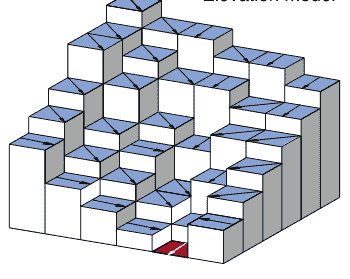

### 流向

### 流量累积

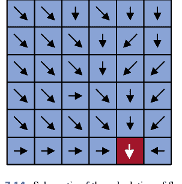

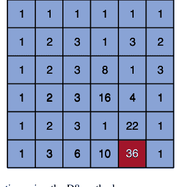

图 7.14 使用 D8 方法计算流量累积的示意图。

对于东、南、西、北方向的邻域（称为*车行情况*），以及

> $$grad = \frac{z_{r+y,c+x} - z_{r,c}}{\sqrt{2}h}$$

对于对角线方向的邻域（称为*象行情况*）。在这些公式中，$h$ 是单元格大小，$z_{r,c}$ 是中心单元格的高程，$z_{r+y,c+x}$ 是邻域单元格的高程。单元格索引 $x$ 和 $y$ 从数组 N 中获取。梯度存储在一个三维数组 grads 中，其中 grads [:, :, 0] 包含朝向东侧邻域单元格的梯度，grads [:, :, 1] 包含朝向东南侧邻域单元格的梯度，依此类推。负梯度表示从中心单元格流向相关邻域单元格。

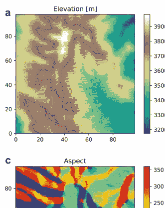

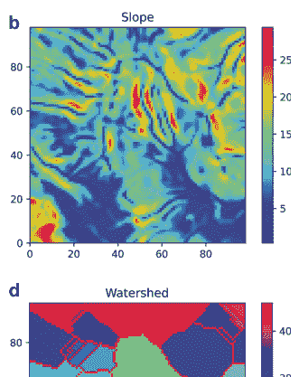

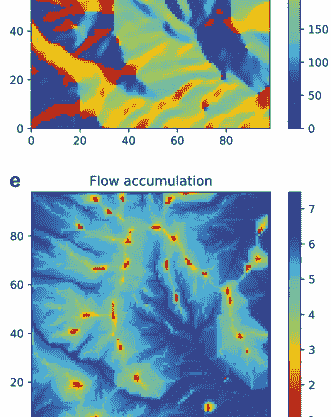

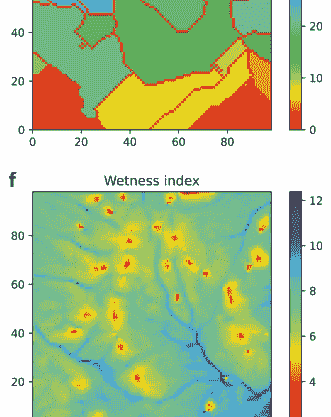

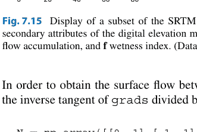


**图 7.15** 展示了第 7.5 节中使用的 SRTM 数据集子集以及数字高程模型的一级和二级属性：**a** 高程，**b** 坡度，**c** 坡向，**d** 流域，**e** 流量累积，以及 **f** 湿度指数。（数据来自 Farr 和 Kobrick (2000)；Farr 等人 (2007)）。

为了获得单元格之间的地表径流，梯度通过 grads 的反正切除以 π 再乘以 180° 进行转换：

```
N = np.array([[0, -1], [-1, -1], [-1, 0],
              [+1, -1], [0, +1], [+1, +1], [+1, 0], [-1, +1]])
```

```
a,b = np.shape(SRTM)
grads = np.zeros((a,b,8))

for c in range(1,9,2):
    grads[:,:,c] = np.roll(SRTM,N[c,0],axis=0)
    grads[:,:,c] = np.roll(grads[:,:,c],N[c,1],axis=1)
    grads[:,:,c] = (grads[:,:,c]-SRTM)/np.sqrt(2*90**2)

for c in range(0,8,2):
    grads[:,:,c] = np.roll(SRTM,N[c,0],axis=0)
    grads[:,:,c] = np.roll(grads[:,:,c],N[c,1],axis=1)
    grads[:,:,c] = (grads[:,:,c]-SRTM)/90

grads = np.arctan(grads)/np.pi*180.
```

由于一个中心单元格可能有多个下坡邻域，水流可以向多个方向流动。这种现象称为*发散流*。早期的流量累积算法基于单流向法（称为 D8 方法；图 7.14），该方法只允许水流流向单元格八个邻域单元格中的一个。然而，这种方法无法模拟山脊区域的发散，并且在某些情况下容易产生平行的流线。在我们的示例中，我们演示了多流向法的使用，该方法允许水流从一个中心单元格流向多个邻域单元格。分配给某个邻域单元格的总出流量比例取决于中心单元格与该特定邻域单元格之间的梯度。尽管多流向法在大多数情况下能产生更真实的结果，但它们往往在山谷中导致水流分散，而实际上水流应该更加集中。因此，引入了一个权重因子 $w$，用于控制出流之间的关系：

> $$flow_i = \frac{grad_i^w}{\sum_{i=1}^8 grad_i^w} \text{for} \quad grad_i^w < 0$$

$w$ 的推荐值为 1.1，因为更高的值会使水流集中在最陡坡度的方向，而 $w=0$ 则会导致极端的分散。在下面的命令序列中，我们首先选择小于零的梯度，然后将这些梯度乘以权重。

```
w = 1.1
flow = (grads*(-1*grads<0.))**w
```

然后我们沿着 flow 数组的第三维度对上坡梯度求和。将所有值为 0 的上坡梯度替换为 1，可以避免因除以零而产生的问题：

```
upssum = np.sum(flow,axis=2)
upssum[upssum==0] = 1
```

我们将流量除以 upssum，以获得总和为 1 的分数权重。这是通过 for 循环对 3D flow 数组的每一层分别实现的：

```
for i in range(0,8):
    flow[:,:,i] = flow[:,:,i]*(flow[:,:,i]>0)/upssum
```

二维数组 inflowsum 存储每次迭代的中间流入总量。然后对这些中间总量求和，以在每次迭代结束时得到总累积流量 flowac。inflowsum 和 flowac 的初始值通过 upssum 获得：

```
inflowsum = upssum
flowac = upssum
```

现在需要另一个三维数组 inflow 来存储来自所有邻域的总中间流入量：

```
inflow = grads*0
```

当没有流入时，流量累积终止。将此信息转换为 Python 代码时，我们使用一个条件 while 循环，当 sum(inflowsum) == 0 时终止。inflowsum 中非零条目的数量在每次循环中减少。这是通过交替更新 inflow 和 inflowsum 来实现的。这里，inflowsum 使用邻域单元格的中间流入量进行更新，这些流入量在满足所有邻域单元格都是贡献单元格（即 grads 为正）的条件下，由 flow 加权。当并非所有邻域单元格都是贡献单元格时，中间 inflowsum 会减少，inflow 也是如此。流量累积 flowac 通过连续对中间 inflowsum 求和而增加：

```
while np.sum(inflowsum)>0:
    for i in range(0,8):
        inflow[:,:,i] = np.roll(inflowsum,N[i,0],axis=0)
        inflow[:,:,i] = np.roll(inflow[:,:,i],N[i,1],axis=1)
    inflowsum = np.sum(inflow*flow*grads>0,2)
    flowac = flowac + inflowsum
```

我们使用对数刻度的伪彩色图来显示结果（图 7.15 e）：

```
plt.figure()
plt.axes(aspect='equal')
plt.pcolor(np.log(1+flowac),
           cmap=cm.jet_r)
plt.colorbar()
```

```
plt.title('流量累积')
plt.show()
```

该图用蓝色阴影表示流量累积高的区域，用红色阴影表示流量累积低的区域（通常对应山脊）。我们使用对数刻度来映射流量累积，以便更好地表示结果。这里介绍的用于计算流量累积的简化算法可用于分析 DEM 中的倾斜地形。在坡度接近零的平坦地形中，我们的算法无法生成流向，因此流量累积会停止。这种情况需要更高级的算法，这些算法能够对完全平坦的地形进行分析。这些更高级的算法还包括洼地填充程序，以避免中断流量累积的虚假洼地。小的洼地可以通过平滑来填充，正如我们在本节开头所做的那样。

本节的第一部分讨论了地形的一级属性。DEM 的二级属性是两个或多个一级属性的函数。这些二级属性的例子包括湿度指数和水流功率指数。单元格的*湿度指数*是该特定单元格的集水区面积与其坡度正切值之比的对数：

$$weti = log\left(\frac{1+flowac}{tan(slp)}\right)$$

项 $1+flowac$ 避免了当 $flowac=0$ 时计算零的对数所引发的问题。湿度指数用于预测由侧向水流运动引起的土壤含水量（*饱和度*）。积水潜力通常在集水区的下部最高，那里的坡度较缓。与集水区小的陡峭区域相比，具有大面积上坡区域的平坦区域具有较高的湿度指数。通过输入以下命令计算并显示湿度指数 $weti$：

```
weti = np.log((1+flowac)/np.tan(np.pi*slp/180))

plt.figure()
plt.axes(aspect='equal')
plt.pcolor(weti,
           cmap=cm.jet_r)
plt.colorbar()
plt.title('湿度指数')
plt.show()
```

在此图中，蓝色代表湿度指数的高值，而红色代表低值（图 7.15 f）。在我们的示例中，东南部的土壤最有可能具有高含水量，这既是因为来自中央大山谷的径流，也是因为地形平坦。

*流能指数*是另一个重要的次级地形属性，常用于山坡水文学、地貌学、土壤科学及相关学科。作为水流能量的度量，它指示了水流搬运沉积物和侵蚀的潜力。流能指数定义为特定栅格的汇水面积与该栅格坡度正切值的乘积：

$$spi = flowac \cdot tan(slp)$$

当大量水流（通过汇流累积计算）因陡坡而快速流动时，侵蚀潜力较高。以下命令序列用于计算并显示流能指数：

```
spi = flowac*np.tan(np.pi*slp/180)

plt.figure()
plt.axes(aspect='equal')
plt.pcolor(np.log(1+spi),
    cmap=cm.jet)
plt.colorbar()
plt.title('Stream power index')
plt.show()
```

湿度指数和流能指数在高分辨率地形分析中特别有用，即在采样间隔小于30米的数字高程模型中。在我们的地形分析示例中，我们从中等分辨率DEM计算了湿度指数和流能指数，因此必须考虑这些属性存在一定程度的尺度依赖性。

本节说明了用于分析数字高程模型的基本工具的使用。关于数字地形建模的更详细介绍，请参阅Wilson和Gallant（2000）的著作。此外，Freeman（1991）的文章对数字地形分析进行了全面总结，包括介绍用于汇流累积的高级算法。

## 7.10 地统计学与克里金法（作者：R. Gebbers）

*地统计学*描述了一个或多个变量在1D、2D或3D空间，甚至在4D时空中的自相关性，以便对未观测位置进行预测、获取这些预测的精度信息，或重现空间变异性与不确定性。空间自相关的形状、范围和方向由*变异函数*描述，这是线性地统计学中使用的主要工具。地统计学以其当前形式的起源可以追溯到20世纪50年代初，当时南非矿业工程师Daniel G. Krige首次发表了一种基于样本空间依赖性的插值方法。在20世纪60年代和70年代，法国数学家Georges Matheron发展了区域化变量理论，为Krige更实用的方法提供了理论基础。该理论构成了分析和估计空间依赖变量的若干程序的基础，Matheron将其称为地统计学。Matheron还创造了“克里金法”一词，指通过地统计方法进行空间插值。

### 7.10.1 理论背景

地统计学的一个基本假设是，时空过程由确定性成分和随机性成分组成（图7.16）。确定性成分可以是全局或局部趋势（有时称为漂移）。随机性成分包括纯随机成分和自相关成分。自相关成分表明，平均而言，距离较近的观测值彼此更相似，而距离较远的观测值则差异更大。这种行为由变异函数描述，其中观测值之间的平方差与观测值之间的分离距离作图。Krige的基本思想是利用变异函数进行插值，以此确定相邻观测值在预测未观测位置值时的影响程度。基本线性地统计学包括两个主要程序：用于建模变异函数的变异函数分析，以及用于插值的克里金法。

### 7.10.2 前置分析

由于本书中介绍的线性地统计学是一种参数方法，因此需要通过前置分析来检验其基本假设。与其他参数方法一样，线性地统计学对异常值和偏离正态分布的情况敏感。我们首先打开数据文件geost_dat.txt，其中包含xyz数据三元组，然后绘制采样位置图。这使我们能够检验点分布并检测数据坐标x和y中的任何重大错误：

```
import numpy as np
from numpy import linalg
from scipy import stats
import matplotlib.pyplot as plt

data = np.loadtxt('geost_dat.txt')
x = data[:,0]
y = data[:,1]
z = data[:,2]

plt.figure()
plt.plot(data[:,0],data[:,1],
    marker='o',
    markeredgcolor=(0.3,0.5,0.8),
    markerfacecolor='none',
    linestyle='none')
plt.show()
```

可以通过输入以下命令来检验观测值$z$的范围：

```
print(np.min(z))
print(np.max(z))
```

输出结果为：

```
3.7198573
7.8459703
```

对于线性地统计学，观测值$z$应服从高斯分布。通常仅通过目视检查直方图来检验，因为当样本数量超过约100时，统计检验往往过于敏感。也可以通过输入以下命令计算数据的偏度和峰度：

```
plt.hist(z)
print(stats.skew(z))
print(stats.kurtosis(z,fisher=True))
```

输出结果为：

```
0.2568129442682396
-0.4780014841875708
```

平顶或多峰分布表明数据集中存在多个总体。如果这些总体与特定区域相关，则应分别处理。多峰存在的另一个原因可能是对高值和/或低值区域的优先采样。这通常是由于某些先验知识造成的，称为聚类效应。处理聚类效应的方法在Deutsch和Journel（1998）以及Isaaks和Srivastava（1990）中有描述。

大多数问题源于正偏态，即分布具有向右的长尾。根据Webster和Oliver（2007），如果偏度在0.5到1之间，应考虑平方根变换；如果偏度超过1，应考虑对数变换。通用变换公式为：

> $$z^* = \begin{cases} ((z+m)^k - 1)/k, & \text{for } k \neq 0 \\ \log(z+m), & \text{for } k = 0 \end{cases}$$

其中$\min(z)+m>0$。这被称为Box–Cox变换，其特例是当$k=0$时使用对数变换。在对数变换中，如果$z$为零或负数，则应加上$m$。幂变换值的插值结果可以在克里金法后直接进行反变换。对数变换值的反变换稍微复杂一些，将在后面解释。该过程称为*对数正态克里金法*，可能很重要，因为对数正态分布在地质学中并不少见。地统计学中的其他变换在Deutsch和Journel（1998）以及Remy等人（2006）中有讨论。成分数据的变换在第9.7节讨论。

### 7.10.3 使用经典变异函数进行变异函数分析

变异函数描述了在单维或多维空间中参考观测值的空间依赖性。由于空间过程的真实变异函数通常未知，必须从观测值中估计。此过程称为变异函数分析，首先从原始数据计算*实验变异函数*。下一步，通过*变异函数估计量*对实验变异函数进行概括。然后，通过将变异函数模型拟合到变异函数估计量来完成变异函数分析。实验变异函数计算为观测值对之间的差异，并依赖于*分离向量*$h$（图7.17）。经典实验变异函数由*半方差*定义：

$$\gamma(h) = 0.5 \cdot (z_x - z_{x+h})^2$$

其中$z_x$是位置$x$处的观测值，$z_{x+h}$是距离$x$为$h$的另一点处的观测值。分离向量$h$的长度称为*滞后距离*（或简称*滞后*）。$\gamma(h)$的正确术语是*半变异函数*（或*半方差*），其中*半*指的是$\gamma(h)$是$z_x$和$z_{x+h}$之间差异方差的一半。尽管如此，$\gamma(h)$是每点的方差，点被视为成对考虑（Webster和Oliver 2007）。然而，按照惯例，$\gamma(h)$被称为*变异函数*而不是半变异函数，我们在本节的其余部分遵循这一惯例。为了计算实验变异函数，我们首先需要对观测值对进行分组。这可以通过输入以下命令实现：

```
X1,X2 = np.meshgrid(x,x)
```

#### 7.3.2 变异函数估计量

变异函数估计量由实验变异函数推导而来，用于概括其集中趋势（类似于从单变量观测中推导的描述性统计量，见第3.2节）。经典的变异函数估计量是

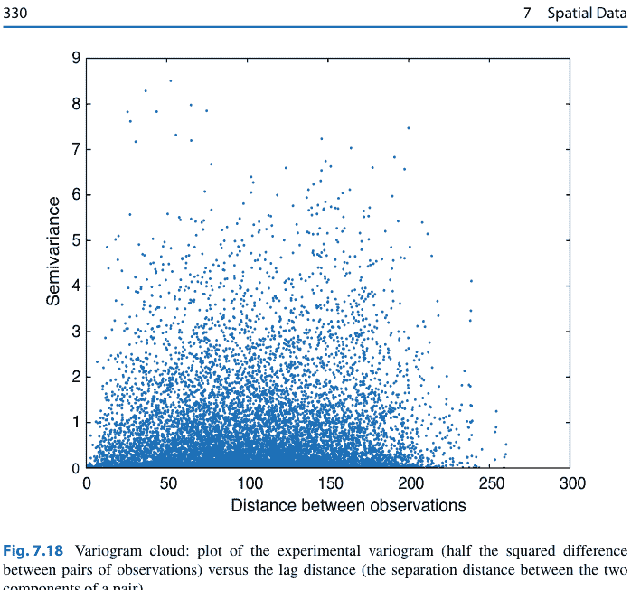

在特定距离类别（或区间）内平均的经验变异函数，这些类别由滞后间隔的倍数定义。分离距离的分类如图7.19所示。变异函数估计量通过以下公式计算：

$$\gamma_E(h) = \frac{1}{2 * N(h)} \cdot \sum_{i=1}^{N(h)} (z_{x_i} - z_{x_{i+h}})^2$$

其中 $N(h)$ 是滞后间隔 $h$ 内的点对数量。

我们首先需要确定一个合适的滞后间隔 $h$。如果采样是在规则网格上进行的，则可以使用网格单元的长度。如果样本间距不均匀（如本例），则点对的平均最小分离距离是滞后间隔的一个良好起点（Webster and Oliver 2007）。为了计算点对之间的平均最小分离距离，我们需要将滞后数组 D 对角线上的零替换为 NaN；否则，平均最小分离距离将为零。输入

```python
D2 = D*(np.diag(x*np.nan)+1)
D2m = np.zeros(len(D2))
```

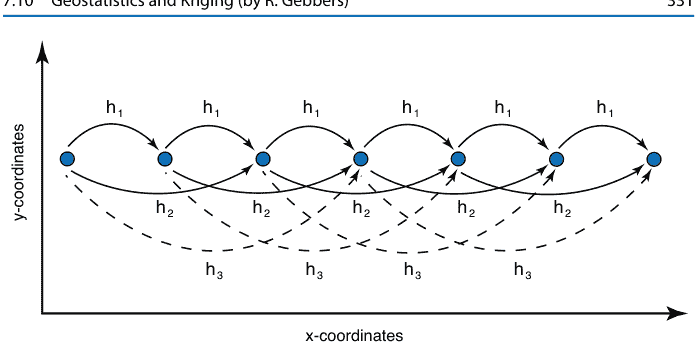

图7.19 等间距观测的分离距离分类。滞后间隔为 $h_1$，而 $h_2, h_3$ 等是滞后间隔的倍数。

```python
for i in range(0,len(D2)):
    D2m[i] = np.nanmin(D2[i])
lag = np.mean(D2m)
print(lag)
```

得到

```
8.010698943460342
```

由于估计的变异函数值随着分离距离的增加而变得更加不稳定，因此在计算中设置最大分离距离限制非常重要。根据经验法则，最大分离距离的一半是变异分析的合适限制。我们通过输入以下代码获得半最大距离和最大滞后数：

```python
hmd = np.max(D)/2
max_lags = int(np.floor(hmd/lag))
print(hmd)
print(max_lags)
```

得到

```
130.19008189950569
16
```

然后，通过输入以下代码对分离距离进行分类并计算经典变异函数估计量：

```python
LAGS = np.ceil(D2/lag)

DE = np.zeros(max_lags)
PN = np.zeros(max_lags)
GE = np.zeros(max_lags)

for i in range(1,max_lags+1):
    SEL = (LAGS == i)
    DE[i-1] = np.mean(D[SEL])
    PN[i-1] = np.sum(SEL)/2
    GE[i-1] = np.mean(G[SEL])
```

其中 SEL 是由 LAG 中的滞后类别定义的选择数组，DE 是平均滞后距离，PN 是点对数量，GE 是变异函数估计量。我们现在可以通过输入以下代码绘制经典变异函数估计量（即变异函数与平均分离距离的关系图）以及总体方差：

```python
plt.figure()
plt.plot(DE,GE,
    marker='o',
    markerfacecolor = [0.6,0.6,0.6],
    linestyle='none')

var_z = np.var(z,ddof=1)
xl = np.max(DE)*1.1
yl = 1.1*max(GE)
b = np.array([0,xl])
c = np.array([var_z,var_z])

plt.plot(b,c,'r--')
plt.axis(np.array([0,xl,0,yl]))
plt.xlabel('Averaged distance between observations')
plt.ylabel('Averaged semivariance')
plt.show()
```

图7.20中的变异函数表现出典型的模式。在小分离距离（靠近原点）处值较低，然后随着距离增加而增加，直到达到一个接近总体方差的平台（*基台值*）。这些结果表明，空间过程在短距离上相关，但在长距离上不相关。空间依赖性的范围称为*变程*，定义为变异函数达到基台值时的分离距离。

*变异函数模型*是拟合到变异函数估计量的参数曲线。这类似于频率分布拟合（见第3.13节），其中频率分布由分布类型及其参数（例如，具有均值和方差的正态分布）建模。出于理论原因，只有

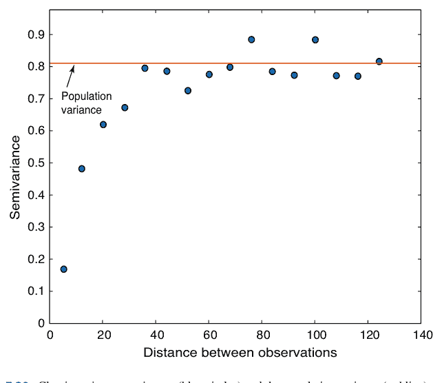

具有特定性质的函数才应被用作变异函数模型。常见的*授权模型*有球状模型，

$$\gamma_{sph}(h) = \begin{cases} c \cdot \left(1.5 \cdot \frac{h}{a} - 0.5 \left(\frac{h}{a}\right)^3\right), & \text{for } 0 \leq h \leq a \\ c, & \text{for } h > a \end{cases}$$

指数模型，

$$\gamma_{exp}(h) = c \cdot \left(1 - \exp\left(-3 \cdot \frac{h}{a}\right)\right)$$

以及线性模型，

$$\gamma_{lin}(h) = b \cdot h$$

其中 $c$ 是基台值，$a$ 是变程，$b$ 是斜率（对于线性模型）。更多模型可以在相关已发表的文献中找到。如果将变异函数模型拟合到变异函数估计量，则必须调整参数 $c$ 以及 $a$ 或 $b$。

*块金效应*是一种特殊的变异函数模型。在实践中，当将变异函数外推到零分离距离时，我们经常在y轴上观察到一个正截距。这被称为块金效应，是由测量误差以及由于采样间隔过大而未被捕获的小尺度波动（*块金*）引起的。我们有时会根据实验室重复测量的方差或其他先验知识对最小块金效应有所预期。关于块金效应的更多细节可以在 Cressie (1990, 1993) 和 Kitanidis (1997) 中找到。如果存在块金效应，可以将其添加到变异函数模型中。带有块金效应的指数模型如下所示：

$$\gamma_{exp+nug}(h) = c_0 + c \cdot \left( 1 - \exp\left(-3 \cdot \frac{h}{a}\right) \right)$$

其中 $c_0$ 是块金效应。

我们甚至可以组合变异函数模型（例如，两个具有不同变程和基台值的球状模型）。这些组合称为*嵌套模型*。在变异函数建模过程中，嵌套模型的组成部分被视为空间结构，应解释为地质过程的结果。在讨论变异函数建模的进一步方面之前，我们首先将一些模型拟合到我们的数据。我们从一个没有块金效应的球状模型开始，然后添加一个指数模型和一个线性模型，两者都带有块金方差：

```python
plt.figure()
plt.plot(DE,GE,
    marker='o',
    markerfacecolor = [0.6,0.6,0.6],
    linestyle='none')
var_z = np.var(z,ddof=1)
xl = np.max(DE)*1.1
yl = 1.1*max(GE)
b = np.array([0, xl])
c = np.array([var_z,var_z])
plt.plot(b,c,'r--')
plt.axis(np.array([0,xl,0,yl]))
plt.xlabel('Averaged distance between observations')
plt.ylabel('Averaged semivariance')

nugget = 0
sill = 0.803
rang = 45.9
lags = np.arange(0,max(DE),1)
Gsph = nugget + (sill*(1.5*lags/rang - \
    0.5*(lags/rang)**3)*(lags<=rang) + \
    sill*(lags>rang))
```

plt.plot(lags, Gsph, 'g:')

nugget = 0.0239
sill = 0.78
rang = 45
Gexp = nugget + sill * (1 - np.exp(-3 * lags / rang))
plt.plot(lags, Gexp, 'b:')

nugget = 0.153
slope = 0.0203
Glin = nugget + slope * lags

plt.plot(lags, Glin, 'm:')
plt.xlabel('观测点之间的距离')
plt.ylabel('半变异函数值')
plt.legend(['变异函数估计值', '总体方差',
            '球状模型', '指数模型', '线性模型'])
plt.show()

变异函数建模技术目前仍存在很大争议。一些研究者主张通过加权最小二乘法、最大似然法或最大熵法进行自动曲线拟合，从而实现*客观的*变异函数建模。相反，也有人认为地质知识应被纳入建模过程，这种情况下则推荐使用目视拟合。在许多情况下，变异函数建模的问题与其说是是否使用了合适的方法，不如说是实验变异函数的质量问题。如果实验变异函数质量良好，两种方法都会得出相似的结果。

变异函数建模的另一个重要问题是模型的预期用途。在我们的案例中，线性模型乍看之下似乎并不合适（图7.21）。然而，仔细观察可以发现，线性模型在前三个滞后距内拟合得相当好。如果我们仅将变异函数模型用于克里金插值，这可能就足够了，因为在克里金法中，邻近点对于估计值最为重要（见下文关于克里金的讨论）。因此，如果采样点分布规则，具有相似原点附近拟合度的不同变异函数模型会产生相似的克里金结果。然而，如果目标是描述空间结构，情况就大不相同了。此时，找到一个在所有滞后距上都适用的模型，并准确确定基台值和变程就变得至关重要。Rendu 和 Readdy (1982) 收集的一系列地质案例研究展示了过程知识与变异函数分析如何相互关联。Gringarten 和 Deutsch (2001) 以及 Webster 和 Oliver (2007) 为变异函数建模提供了良好的指导原则。

接下来我们简要讨论变异函数分析的其他几个方面：

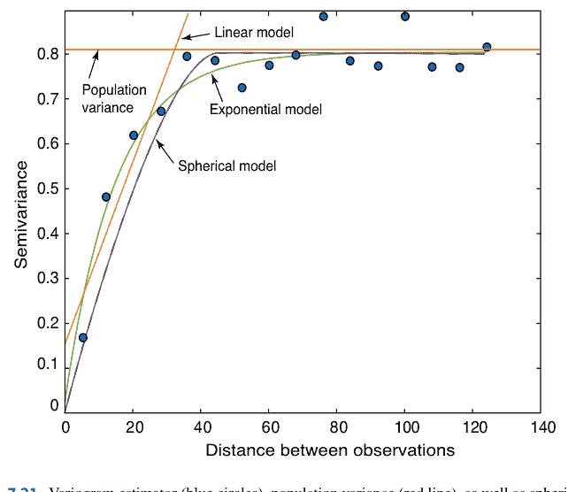

- *样本量* – 与任何统计程序一样，为了获得可靠的估计，需要尽可能大的样本量。对于变异函数分析，样本数量应大于100（理想情况下大于150）(Webster and Oliver 2007)。对于较小的样本量，应计算最大似然变异函数 (Pardo-Igúzquiza and Dowd 1997)。
- *采样设计* – 为了在变异函数原点附近获得良好的估计，采样设计应包含小距离的观测。这可以通过嵌套设计来实现 (Webster and Oliver 2007)。Olea (1984) 评估了其他可能的设计方案。
- *各向异性* – 到目前为止，我们假设空间相关结构与方向无关。我们计算了*全向变异函数*，忽略了分离向量 *h* 的方向。在更深入的分析中，变异函数不仅应在距离上离散化，还应在方向上离散化（方向区间）。通过绘制*方向变异函数*（通常在四个方向上），我们有时能观察到不同的变程（*几何各向异性*）、不同的尺度（*区域各向异性*）和不同的形状（表明存在趋势）。处理各向异性需要高度交互式的图形用户界面，这超出了本书的范围（参见 Pannatier 1996 的 VarioWin 软件）。
- *点对数量和滞后距间隔* – 计算经典变异函数估计量时，由于估计量对异常值敏感，每个滞后距间隔应使用超过30对点（理想情况下超过50对）(Webster and Oliver 2007)。如果点对较少，则应增大滞后距间隔。滞后距间距不一定是均匀的，可以为每个距离类别单独选择。也可以使用重叠类别，此时必须定义*滞后距宽度*（*滞后距容差*）。然而，增加滞后距宽度可能导致不必要的平滑，从而损失细节。因此，必须谨慎选择分离距离和滞后距宽度。另一个选择是使用更稳健的变异函数估计量 (Cressie 1990, 1993; Deutsch and Journal 1998)。
- *计算分离距离* – 如果观测覆盖大面积区域（例如，超过1,000平方公里），应从平面笛卡尔坐标系计算球面距离，而不是勾股距离。

### 7.10.4 克里金法

我们现在使用*普通点克里金法*将观测值插值到规则网格上，这是最流行的克里金方法。普通点克里金法使用邻近点的加权平均值来估计未观测点的值，

$$\widehat{z}_{x_0} = \sum_{i}^{n} \lambda_i \cdot z_{x_i}$$

其中 $\lambda_i$ 是需要估计的权重。权重之和应等于一，以保证估计是无偏的：

$$\sum_{i}^{n} \lambda_i = 1$$

估计的期望（平均）误差必须为零，即，

$$E\left(\widehat{z}_{x_0} - z_{x_0}\right) = 0$$

其中 $z_{x_0}$ 是真实（但未知）的值。我们可以使用上述方程，通过代数方法用变异函数表示均方误差，

$$E\left(\left(\widehat{z}_{x_0} - z_{x_0}\right)^2\right) = 2 \sum_{i=1}^{n} \lambda_i \gamma(x_i, x_0) - \sum_{i=1}^{n} \sum_{j=1}^{n} \lambda_i \lambda_j \gamma(x_i, x_j)$$

其中 $E$ 是估计值，或*克里金方差*（必须最小化）；$\gamma(x_i, x_0)$ 是数据点与未观测点之间的变异函数（半方差）；$\gamma(x_i, x_j)$ 是数据点 $x_i$ 和 $x_j$ 之间的变异函数；$\lambda_i$ 和 $\lambda_j$ 分别是第 $i$ 个和第 $j$ 个数据点的权重。

对于克里金法，我们必须最小化这个方程（一个二次目标函数），以满足权重之和等于一（线性约束）的条件。这个优化问题可以使用拉格朗日乘子 $\nu$ 来解决，从而得到一个包含 $n+1$ 个方程和 $n+1$ 个未知数的*线性克里金系统*：

$$\sum_{i=1}^{n} \lambda_i \gamma(x_i, x_j) + \nu = \gamma(x_i, x_0)$$

获得权重 $\lambda_i$ 后，克里金方差由下式给出

$$\sigma^2(x_0) = \sum_{i=1}^{n} \lambda_i \gamma(x_i, x_0) + \nu(x_0)$$

克里金系统也可以用数组表示法表示，

$$G\_mod \cdot E = G\_R$$

其中

$$G\_mod = \begin{bmatrix} 0 & \gamma(x_1, x_2) & \dots & \gamma(x_1, x_n) & 1 \\ \gamma(x_2, x_1) & 0 & \dots & \gamma(x_2, x_n) & 1 \\ \vdots & \vdots & \vdots & \vdots & \vdots \\ \gamma(x_n, x_1) & \gamma(x_n, x_2) & \dots & 0 & 1 \\ 1 & 1 & \dots & 1 & 0 \end{bmatrix}$$

是系数数组（即这些是观测对的模型变异函数值）。注意在数组的对角线上（分离距离为零处），$\gamma$ 的值消失。

$$E = \begin{bmatrix} \lambda_1 \\ \lambda_2 \\ \vdots \\ \lambda_n \\ \nu \end{bmatrix}$$

是未知权重和拉格朗日乘子的向量。

$$G\_R = \begin{bmatrix} \gamma(x_1, x_0) \\ \gamma(x_2, x_0) \\ \vdots \\ \gamma(x_n, x_0) \\ 1 \end{bmatrix}$$

是右侧向量。为了获得权重和拉格朗日乘子，需要对数组 $G\_mod$ 求逆：

$$E = G\_mod^{-1} \cdot G\_R$$

克里金方差由下式给出

$$\sigma^2 = G\_R^{-1} \cdot E$$

对于我们的 Python 计算，我们需要从距离数组 $D$ 和变异函数模型导出的系数数组。距离数组 $D$ 在上面的变异函数分析部分已经计算过，我们使用上一节中带有块金值、基台值和变程的指数变异函数模型：

```
G_mod = (nugget + sill * (1 - np.exp(-3 * D / rang))) * (D > 0)
```

然后，我们获取观测数量，并在数组 G_mod 中添加一列和一行全为1的向量，并在左下角添加一个零：

```
n = len(x)
o1 = np.ones((n, 1))
o2 = np.ones((1, n + 1))
G_mod = np.append(G_mod, o1, axis=1)
G_mod = np.append(G_mod, o2, axis=0)
G_mod[len(x):, len(x):] = 0.
```

现在需要对数组 G_mod 求逆：

```
G_inv = linalg.inv(G_mod)
```

需要一个包含未知值位置的网格。这里，我们在一个 $x$ 和 $y$ 方向范围从0到200的正方形区域内，使用网格单元大小为5。坐标以数组形式创建：

```
R = np.arange(0, 200 + 5, 5)
Xg1, Xg2 = np.meshgrid(R, R)
```

并转换为向量：

```
Xg = np.reshape(Xg1, (len(Xg1)**2, 1))
Yg = np.reshape(Xg2, (len(Xg2)**2, 1))
```

接下来，我们为克里金估计值 Zg 和克里金方差 s2_k 分配内存，输入：

```
Zg = Xg * np.NaN
s2_k = Xg * np.NaN
```

我们现在可以对每个网格点的未知值进行克里金插值：

for k in range(1, len(Xg)):
    DOR = ((x - Xg[k])**2 + (y - Yg[k])**2)**0.5
    G_R = (nugget + sill * (1 - np.exp(-3 * DOR / rang))) * (DOR > 0)
    G_R = np.append(G_R, 1)
    E = np.matmul(G_inv, G_R)
    Zg[k] = np.sum(E[0:n] * z)
    s2_k[k] = np.sum(E[0:n] * G_R[0:n]) + E[n]

第一条命令计算网格点 (Xg, Yg) 与观测点 (x, y) 之间的距离。然后，我们使用变异函数模型 G_R 创建克里金系统的右侧向量，并在最后一行添加一个1。接下来，我们获得包含权重和拉格朗日乘数的数组 E。每个点 k 处的估计值 Zg 是观测值 z 的加权和。最后，计算网格点的克里金方差 s2_k，然后我们可以绘制结果。我们首先创建克里金估计值和克里金方差的网格：

r = len(R)
Z = np.reshape(Zg, (r, r))
SK = np.reshape(s2_k, (r, r))

左侧的图展示了克里金插值结果：

plt.figure()
fig, axs = plt.subplots(nrows=1, ncols=2,
    constrained_layout=True)
ax = axs[0]
im = axs[0].pcolor(Xg1, Xg2, Z,
    cmap='jet',
    shading='auto')
ax.set_aspect('equal', 'box')
plt.colorbar(im, ax=ax, orientation='horizontal')
ax.set_xlabel('x-coordinates')
ax.set_ylabel('y-coordinates')

右侧的图展示了克里金方差，

ax = axs[1]
axs[1].pcolor(Xg1, Xg2, SK,
    cmap='jet',
    shading='auto')

并叠加了采样位置：

plt.plot(x, y,
    marker='o',
    markerfacecolor='none',
    markeredgecolor='k',
    linestyle='none')
ax.set_aspect('equal', 'box')
plt.colorbar(im, ax=ax, orientation='horizontal')
ax.set_xlabel('x-coordinates')
ax.set_ylabel('y-coordinates')
plt.show()

克里金插值结果如图 7.22 a 所示。克里金方差仅取决于与观测点的距离，而不取决于观测值（图 7.22 b）。当观测点位于变异函数的变程之外时，克里金插值会重现总体均值，但克里金方差也会增加（图 7.22 地图的右下角）。克里金方差可用作改进采样设计的标准，并且在对数正态克里金中，反变换需要它，其计算公式为：

$$y(x_0) = \exp\left(z(x_0) + 0.5 \cdot \sigma^2(x_0) - \nu\right)$$

### 7.10.5 克里金讨论

此处介绍的*点克里金*是一种精确插值器。即使使用了带有块金效应的变异函数，它也能在观测点处重现精确值。通过包含测量误差的方差（参见 Kitanidis 1997）以及通过*块段克里金*（对特定邻域或块段内的观测值进行平均）可以实现平滑。虽然克里金方差仅取决于观测位置与未观测位置之间的距离，但它主要是信息密度的度量（Wackernagel 2003）。克里金的精度最好通过使用重采样方法或替代测试（第 4.5 至 4.7 节）的交叉验证来评估。相邻观测值对估计的影响取决于它们的配置，正如 Webster 和 Oliver (2007) 所总结的：“近点比远点权重更大；当邻域中的点数增加时，一个点的相对权重会减小；在相同距离下，聚集的点比孤立的点各自权重更小；数据点可以被位于它们与目标点之间的点屏蔽。”克里金的采样设计不同于可能对变异函数分析最优的设计。规则网格（无论是三角形还是方形）可被视为最优的。

此处提供的 Python 代码是对上述公式的直接实现。在专业程序中，通过使用协方差而非变异函数（Kitanidis 1997; Webster and Oliver 2007），可以限制进入数组 *G_mod* 的数据点数量，并避免 *G_mod* 的求逆。对于那些对编程或深入理解算法感兴趣的人来说，Deutsch 和 Journel (1998) 的出版物是必读材料。最好的互联网资源是 AI-GEOSTATISTICS 的主页：

https://wiki.52north.org/AI_GEOSTATS/WebHome

## 参考文献

Amante C, Eakins BW (2009) ETOPO1 1 弧分全球地形模型：程序、数据源和分析。NOAA 技术备忘录 NESDIS NGDC-24
Bohlander J, Scambos T (2007) 由 MODIS 南极马赛克 (MOA) 衍生的南极海岸线和接地线。美国国家冰雪数据中心，科罗拉多州博尔德
Cressie N (1990) 克里金的起源。数学地质学 22:239–252
Cressie N (1993) 空间数据统计。Wiley，纽约
Davis JC (2002) 地质学中的统计与数据分析-第三版。Wiley，纽约
Deutsch CV, Journel AG (1998) GSLIB-地统计软件库与用户指南，第二版。牛津大学出版社，牛津
Farr TG, Kobrick M (2000) 航天飞机雷达地形任务产生大量数据。美国地球物理联盟 Eos 81:583–585
Farr TG, Rosen P, Caro E, Crippen R, Duren R, Hensley S, Kobrick M, Paller M, Rodriguez E, Roth L, Seal D, Shaffer S, Shimada J, Umland J, Werner M, Oskin M, Burbank D, Alsdorf D (2007) 航天飞机雷达地形任务。地球物理学评论 45:RG2004
Freeman TG (1991) 基于规则网格的计算发散流集水区面积。计算机与地球科学 17:413–422
Gorny AJ (1977) 世界数据库 II 通用用户指南报告 PB 271869。中央情报局，华盛顿特区
Gringarten E, Deutsch CV (2001) 教师辅助变异函数解释与建模。数学地质学 33:507–534
Isaaks E, Srivastava M (1990) 应用地统计学导论。牛津大学出版社，牛津
Kitanidis P (1997) 地统计学导论-水文地质应用。剑桥大学出版社，剑桥
NOAA 国家环境信息中心 (2022) ETOPO 2022 15 弧秒全球地形模型。可在线访问 NOAA–NCEI (链接)
Olea RA (1984) 空间函数的系统抽样。堪萨斯空间分析系列 7，堪萨斯地质调查局，堪萨斯州劳伦斯
Pannatier Y (1996) VARIO WIN - 二维空间数据分析软件。Springer，柏林海德堡纽约
Pardo-Igúzquiza E, Dowd PA (1997) AMLE3D：通过近似最大似然估计推断空间协方差参数的计算机程序。计算机与地球科学 23:793–805
Remy N, Boucher A, Wu J (2006) 使用 SGeMS 的应用地统计学：用户指南。剑桥大学出版社，剑桥
Rendu JM, Readdy L (1982) 地质学与半变异函数——关键关系。见：Johnson TB, Barns RJ (编) 计算机与运筹学在矿业中的应用。第17届国际研讨会。美国采矿、冶金和石油工程师学会，纽约，第 771–783 页
Soluri EA, Woodson VA (1990) 世界矢量海岸线。国际水文评论 LXVI I(1):27–35
Swan ARH, Sandilands M (1995) 地质数据分析导论。Blackwell Sciences，牛津
Wackernagel H (2003) 多元地统计学：导论与应用。第三版，完全修订版。Springer，柏林海德堡纽约
Webster R, Oliver MA (2007) 环境科学家的地统计学-第二版。Wiley，纽约
Wessel P, Bercovici D (1998) 使用张力样条进行网格化：格林函数方法。数学地质学 30:77–93
Wessel P, Smith WHF (1996) 一个全球自洽、分层、高分辨率的海岸线数据库。地球物理研究杂志 101(B4):8741–8743
Wilson JP, Gallant JC (2000) 地形分析。原理与应用。Wiley，纽约

# 图像处理

## 8

### 8.1 引言

计算机图形以矢量或栅格数据的形式存储和处理。上一章遇到的大部分数据是矢量数据，例如点、线和多边形。矢量数据的例子包括水系网络、地质单元轮廓、采样位置和地形等高线。在第7章中，海岸线以矢量格式存储，而水深和地形数据则以栅格格式保存。矢量和栅格数据经常在单个数据集中结合使用，例如，在卫星图像上显示河流的流向时。栅格数据通常通过数字化点、线或多边形转换为矢量数据。反之，矢量数据有时也会转换为栅格数据。

图像通常表示为栅格数据，即颜色强度的二维或三维数组。图像在地球科学中无处不在。野外地质学家使用航空照片和卫星图像来识别研究区域内的岩性单元、构造、滑坡和其他特征。地貌学家使用此类图像来分析水系网络、河流流域以及植被或土壤类型。此外，还使用各种图像处理方法来分析薄片图像、自动识别物体以及测量纹泥厚度。

本章涉及图像数据的分析和显示。首先在第 8.2 节解释了栅格数据在计算机上存储的各种方式。然后在第 8.3 节介绍了导入、操作和导出图像数据的主要工具。接下来，在第 8.4 至 8.6 节中，利用这些知识处理和地理配准卫星图像。第 8.7 节演示了如何从手持相机和卫星图像计算归一化差异植被指数 (NDVI)。第 8.8 和 8.9 节涉及导入、增强、

**补充信息** 在线版本包含补充材料，可访问 https://doi.org/10.1007/978-3-031-56906-7_8。

© 作者，根据 Springer Nature Switzerland AG 2024 的独家许可
M. H. Trauth, *Python Recipes for Earth Sciences*, Springer Textbooks in Earth Sciences, Geography and Environment, https://doi.org/10.1007/978-3-031-56906-7_8

## 8.2 数据存储

矢量图形和栅格图形是存储图片的两种基本格式。上一章介绍了存储*矢量数据*的典型格式。在下面的示例中，文件*coastline.txt*中的两列分别代表多边形各点的经度和纬度：

```
NaN                     NaN
42.892067               0.000000
42.893692               0.001760
NaN                     0.0073
42.891052               0.001467
42.898093               0.007921
42.904546               0.013201
42.907480               0.016721
42.910414               0.020828
42.913054               0.024642
（续）
```

NaN值有助于识别数据中的断点（第7.2节）。*栅格数据*以2D或3D数组的形式存储。这些数组的元素代表诸如网格点海拔高度、年降雨量或（在图像情况下）颜色强度值等变量：

```
174 177 180 182 182 182
165 169 170 168 168 170
171 174 173 168 167 170
184 186 183 177 174 176
191 192 190 185 181 181
189 190 190 188 186 183
```

栅格数据可以可视化为3D图。*x*和*y*值是2D数组或任何其他参考框架的索引，而*z*是数组元素的数值（另见第7章）。2D数组中包含的数值可以显示为伪彩色图，这是一个由单元格组成的矩形数组，其颜色由*颜色映射表*决定。颜色映射表是一个*m*行3列的实数数组，数值在0.0到1.0之间。每一行定义一种红、绿或蓝（RGB）颜色。一个例子是上面的数组，它可以被解释为从0（黑色）到255（白色）的灰度强度。

如果我们需要不止一种颜色或灰度，我们使用3D数组的第三维，例如，存储红、绿、蓝三种颜色。更复杂的例子包括从电磁波谱不同波段获取的卫星图像，例如*可见光和近红外*波段（即VNIR；400至1400纳米）、*短波红外*波段（即SWIR；1400至3000纳米）和*热*（或*长波*）*红外*波段（即TIR；3000至15,000纳米）。然后将这些图像存储在3D数组中，其第三维对应于光谱波段的数量，有时多达数百个（第8.4至8.7节）。

如前所述，计算机以比特（bit）存储数据，这些比特具有两种状态之一，用一或零表示（第2章）。如果2D数组的元素代表图像*像素*（*picture elements*的缩写）的颜色强度值，那么1比特数组只包含一和零：

```
0 0 1 1 1 1
1 1 0 0 1 1
1 1 1 1 0 0
1 1 1 1 0 1
0 0 0 0 0 0
0 0 0 0 0 0
```

这个由一和零组成的2D数组可以简单地解释为一幅黑白图像，其中值一对应白色，值零对应黑色。或者，1比特数组也可以用来存储由任意两种不同颜色组成的图像，例如红色和蓝色。

为了存储更复杂类型的数据，比特被组合在一起形成更大的组，例如由八个比特组成的字节（byte）。由于最早的计算机一次只能处理八个比特，早期的计算机代码以八个比特为一组编写，这组比特后来被称为字节。因此，2D数组的每个元素（即每个像素）包含一个由八个一和零组成的向量：

```
1 0 1 0 0 0 0 1
```

这8个比特（或1字节）允许八个一和零有2^8 = 256种可能的组合，因此能够表示256种不同的强度，例如灰度。这8个比特可以按以下方式读取（从右到左）：一个比特代表两个数字，两个比特代表四个数字，三个比特代表八个数字，依此类推，直到一个字节（或八个比特），代表256个数字。每增加一个比特，数字数量就翻倍。下面是数字161的二进制和十进制表示的比较：

```
128 64 32 16 8 4 2 1 (比特的值)
1 0 1 0 0 0 0 1 (二进制)

128 + 0 + 32 + 0 + 0 + 0 + 0 + 1 = 161 (十进制)
```

灰度二进制表示的端值是

```
0 0 0 0 0 0 0 0
```

即纯黑色，和

```
1 1 1 1 1 1 1 1
```

即纯白色。与上面的1比特数组相比，1字节数组允许存储具有256个不同级别的灰度图像。或者，这256个数字可以被解释为256种离散颜色。无论哪种情况，显示这样的图像都需要额外的信息源，说明如何将256个强度值转换为颜色。存在许多用于解释8位彩色图像的全局颜色映射表，允许栅格图像跨平台交换，而局部颜色映射表通常嵌入在图形文件中。

8位彩色图像的缺点是，256个离散的颜色步长不足以模拟人眼平滑的过渡。因此，许多应用使用24位系统，每个RGB通道8位数据，总共产生256³ = 16,777,216种颜色。这样的24位图像存储在三个2D数组（或一个3D数组）中，强度值在0到255之间：

```
195 189 203 217 217 221
218 209 187 192 204 206
207 219 212 198 188 190
203 205 202 202 191 201
190 192 193 191 184 190
186 179 178 182 180 169

209 203 217 232 232 236
234 225 203 208 220 220
224 235 229 214 204 205
223 222 222 219 208 216
209 212 213 211 203 206
206 199 199 203 201 187

174 168 182 199 199 203
198 189 167 172 184 185
188 199 193 178 168 172
186 186 185 183 174 185
177 177 178 176 171 177
179 171 168 170 170 163
```

与栅格数据的1位和8位表示相比，24位存储当然需要更多的计算机内存。对于非常大的数据集，如卫星图像和数字高程模型，用户应仔细考虑最合适的存储方式。Python中的默认浮点数据类型是64位数组，它允许存储数字的符号（第63位）、指数（第62至52位）以及大约16位有效十进制数字，范围大约在10^-308到10^+308之间（第51至0位）。然而，Python也使用其他数据类型（例如，1位、8位和24位栅格数据）以节省内存空间。

存储栅格图像所需的内存量取决于数据类型和图像尺寸。这些图像尺寸可以用像素数量来描述，即2D数组的行数乘以列数。让我们假设一幅729乘713像素的图像，例如我们在下一节中使用的图像。如果每个像素需要8位来存储灰度值，那么数据所需的内存是729·713·8=4,158,216位（或519,777字节）。这个数字正是我们在命令窗口中输入whos得到的结果。字节的常用前缀包括千（kilo）、兆（mega）、吉（giga）等：

```
bit = 1 或 0 (b)
8 bits = 1 byte (B)
1024 bytes = 1 kilobyte (kB)
1024 kilobytes = 1 megabyte (MB)
1024 megabytes = 1 gigabyte (GB)
1024 gigabytes = 1 terabyte (TB)
```

请注意，在数据通信中，1千比特=1000比特，而在数据存储中，1千字节=1024字节。一幅24位图像（称为真彩色图像）所需的内存是存储8位图像所需内存的三倍，即1,559,331字节=1,559,331/1,024千字节（kB）≈1523 kB≈1,559,331/1024²=1.487兆字节（MB）。

然而，图像的尺寸通常不是由总像素数给出的，而是由图像的长度和高度以及其分辨率给出的。图像的分辨率是其包含的每英寸像素数（ppi）或每英寸点数（dpi）。计算机显示器的标准分辨率长期以来一直是72 dpi，但现代显示器具有更高的分辨率，例如96 dpi甚至更高。事实上，5K显示器（正在撰写这句话的显示器）具有约218 dpi。因此，一台17英寸、72 dpi分辨率的显示器显示1024乘768像素。如果显示器用于不同（更低或更高）分辨率的图像，则会对图像进行重采样以匹配显示器的分辨率。对于扫描和打印，300或600 dpi的分辨率在大多数应用中就足够了。然而，扫描的图像通常会为大幅打印而缩放，因此通常具有更高的分辨率，例如2400 dpi。下一节中使用的图像宽度为25.2厘米（或9.92英寸），高度为25.7厘米（或10.12英寸）。图像的分辨率为72 dpi。因此，总像素数为

保存矢量和栅格数据的文件格式多种多样，每种格式都有其特定的优缺点。在应用程序中选择哪种格式，既取决于图像在项目中的使用方式，也取决于是否需要对其进行定量分析。存储矢量和栅格数据最流行的格式包括：

- *CompuServe 图形交换格式* (GIF) – 该格式于1987年开发，用于使用固定8位、256色调色板的栅格图像。GIF采用无损压缩。它最初是为在互联网上快速传输而设计的。有限的颜色数量意味着它不适合用于航拍照片或卫星图像中平滑的颜色过渡。然而，该格式常用于线条图、地图、卡通和徽标 (http://www.compuserve.com)。
- *便携式网络图形* (PNG) – 该图像格式于1994年开发，用作GIF的替代方案。它与GIF类似，也使用固定的8位、256色调色板。此外，它可以存储1到16位的灰度图像，以及24位和48位的彩色图像。PNG格式使用无损压缩，且所采用的方法优于GIF图像。
- *标签图像文件格式* (TIFF) – 该格式由Aldus公司和微软于1986年联合设计，目标是成为交换图像文件的行业标准。TIFF文件包含图像文件头、目录以及所有可用图形和图像文件格式的数据。一些TIFF文件甚至包含同一图像的矢量和栅格版本，以及不同分辨率和不同调色板的图像。TIFF文件的主要优势最初在于其可移植性。TIFF应该能在所有计算机平台上运行；然而不幸的是，随后几年中TIFF经历了大量修改，导致了不兼容性。因此，TIFF现在常被戏称为*成千上万种不兼容的文件格式*。
- *PostScript* (PS) 和 *封装 PostScript* (EPS) – PS格式由施乐研究院PARC的John Warnock开发。Warnock也是Adobe Systems的联合创始人，EPS格式正是在那里创建的。如果没有苹果电脑，PostScript矢量格式永远不会成为行业标准。1985年，苹果公司需要为其新的Apple LaserWriter打印机和Macintosh操作系统配备一个排版质量控制器，因此采用了PostScript格式。PostScript历史上的第三个合作伙伴是Aldus，该公司开发了PageMaker软件，现在是Adobe Systems的一部分。Aldus PageMaker软件、PS格式和Apple LaserWriter打印机的结合催生了桌面出版。随后，Adobe Systems开发了EPS格式，作为导入和导出PS文件的标准文件格式。PS文件通常是单页格式，包含插图或文本，而EPS文件的目的则是允许包含其他页面（例如，一个可以包含文本、图形和图像任意组合的文件）(http://www.adobe.com)。
- 1986年，*联合图像专家小组* (JPEG) 成立，旨在制定各种图像压缩标准。虽然JPEG代表该委员会，但现在它被广泛用作一种图像压缩格式和文件格式的名称。这种压缩涉及将像素值分组为8x8的块，并对每个块进行离散余弦变换。结果，所有不必要的高频信息被删除，这使得这种压缩方法不可逆。JPEG格式的优势在于提供了三通道24位真彩色版本，允许存储具有平滑颜色过渡的图像。新的JPEG 2000格式使用小波变换代替余弦变换（第5.10节）(http://www.jpeg.org)。
- *便携式文档格式* (PDF) – PDF同样由Adobe Systems设计，现在是一个真正的独立跨平台文档。PDF文件包含不同类型的内容，包括文本以及矢量和栅格图形。较新版本的PDF还可以包含交互式内容，如超链接、动画对象、音频和视频。这些文件高度压缩，从而允许快速的互联网下载。Adobe Systems为所有计算机平台免费提供Acrobat Reader，以便可以阅读PDF文件 (http://www.adobe.com)。

## 8.3 图像的导入、处理与导出

我们首先需要学习如何从图形文件中读取图像到工作区。以一个卫星图像为例，它显示了智利北部一个10.5公里×11公里的子区域：

https://asterweb.jpl.nasa.gov/gallery/images/unconform.jpg

文件 *unconform.jpg* 是一张经过处理的Terra ASTER卫星图像，可以从NASA网站免费下载。我们首先将此图像保存在工作目录中。命令

```
import numpy as np
from matplotlib import cm
import matplotlib.pyplot as plt
from skimage import color
from skimage import exposure
from skimage import io
from matplotlib.colors import ListedColormap

I1 = io.imread('unconform.jpg')
```

读取并解压JPEG文件，将数据作为24位RGB图像数组导入，并存储在变量I1中。命令

```
np.who()
```

显示RGB数组在工作区中的存储方式：

```
Name                Shape              Bytes        Type
=================================================================
I1                  729 x 713 x 3      1559331      uint8

Upper bound on total bytes  =      1559331
```

详细信息表明图像存储为729×713×3的数组，代表红、绿、蓝三种颜色各一个729×713的数组。工作区中当前变量的列表还包括信息 *uint8*，即每个数组元素代表一个像素，包含8位整数。这些整数表示0（即最小强度）到255（即最大强度）之间的强度值。例如，以下是红色数据数组左上角的一个区域：

```
print(I1[49:55,49:55,0])
```

输出为

```
[[174 177 180 182 182 182]
 [165 169 170 168 168 170]
 [171 174 173 168 167 170]
 [184 186 183 177 174 176]
 [191 192 190 185 181 181]
 [189 190 190 188 186 183]]
```

我们现在可以使用 `imshow()` 查看图像。

```
plt.figure()
io.imshow(I1)
plt.axis('off')
io.show()
```

来自 *scikit-image* 包，它会打开一个新的图形窗口，显示图像的RGB合成图（图8.1）。与RGB图像相比，灰度图像只需要一个二维数组来存储所有必要信息。因此，我们使用命令 `rgb2gray()`（即RGB转灰度）将RGB图像转换为灰度图像：

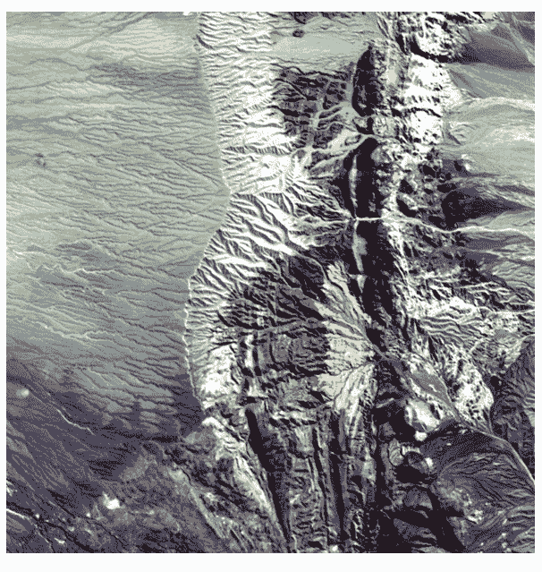

**图 8.1** 文件 *unconform.jpg* 中包含的RGB真彩色图像。在将JPEG文件解压并读取为729×713×3的数组后，Python使用 *imshow()* 解释并显示RGB合成图。原始图像由NASA/GSFC/METI/ERSDAC/JAROS和美国/日本ASTER科学团队提供。

```
I2 = color.rgb2gray(I1)
```

新的工作区列表现在显示为

```
Name                Shape              Bytes        Type
=================================================================
I1                  729 x 713 x 3      1559331      uint8
I2                  729 x 713          4158216      float64

Upper bound on total bytes = 5717547
```

可以观察到24位RGB和8位灰度数组之间的差异。命令

```
plt.figure()
io.imshow(I2)
plt.axis('off')
io.show()
```

显示结果。很容易在单独的图形窗口中看到两幅图像之间的差异。接下来，我们处理灰度图像。首先，我们计算强度值分布的直方图：

```
n,v = exposure.histogram(I2,nbins=256)
```

```
plt.figure()
plt.plot(v,n)
plt.show()
```

增强此类图像对比度的一种简单技术是变换直方图以获得灰度的均匀分布：

```
I3 = exposure.equalize_hist(I2)
```

```
n,v = exposure.histogram(I3,nbins=256)
```

```
plt.figure()
plt.plot(v,n)
plt.show()
```

我们可以再次使用以下命令查看差异

```
plt.figure()
io.imshow(I3)
plt.axis('off')
io.show()
```

并将结果保存到新文件中：

```
plt.imsave('unconform_gray.jpg',I3,cmap=plt.cm.gray)
```

我们也可以通过在控制台中输入以下命令来列出内置的调色板

```
plt.colormaps()
```

输出为

```
['magma',
 'inferno',
```

## 8.4 导入、处理与导出Landsat影像

Landsat项目是由美国国家航空航天局（NASA）和美国地质调查局（USGS）联合管理的卫星遥感计划。该项目始于1972年7月23日Landsat 1卫星（最初称为地球资源技术卫星1号）的发射。根据项目网站信息，该系列卫星的最新成员是2021年9月27日发射的Landsat 9卫星。该卫星搭载两个传感器：业务陆地成像仪（OLI）和热红外传感器（TIRS）。这两个传感器以30米（可见光、近红外、短波红外）、100米（热红外）和15米（全色）的空间分辨率提供全球陆地覆盖数据（Ochs等，2009；Irons等，2011）。有关Landsat项目的总体信息可从以下网站获取：

```
http://landsat.gsfc.nasa.gov/
```

Landsat数据——连同其他NASA卫星的数据——可从以下网站获取：

```
https://earthexplorer.usgs.gov
```

在后一个网站上，我们首先在*搜索条件*中选择所需的地图区域，可以通过输入地图四角的坐标，或通过放大到感兴趣区域并选择*使用地图*来实现。例如，我们可以输入坐标4°42′40.72″N 36°51′10.47″E，该坐标定位了埃塞俄比亚南部裂谷楚巴希尔盆地的中心。然后，我们从*Landsat存档*中选择*L8 OLI/TIRS*作为*数据集*，并点击*结果*，这将生成一个记录列表以及一个用于预览和下载数据的工具栏。通过点击*显示浏览叠加层*按钮，我们可以检查影像的云覆盖情况。然后我们找到无云影像

```
实体ID：LC81690572013358LGN00
坐标：4.33915,36.76225
获取日期：2013年12月24日
路径：169
行：57
```

该影像拍摄于2013年12月24日。我们需要在USGS网站上注册、登录，然后下载1级GeoTIFF数据产品（897.5 MB），该产品随后存储在文件`LC81690572013358LGN00.tar.gz`中。`.tar.gz`存档包含每个波段的单独文件以及一个包含数据信息的元数据文件。我们使用波段4（红光；640至670纳米）、波段3（绿光；530至590纳米）和波段2（蓝光；450至510纳米），每个波段的分辨率均为30米。我们可以使用以下代码导入118.4 MB的TIFF文件：

```
import numpy as np
import matplotlib.pyplot as plt
from skimage import exposure
from skimage import io
from skimage import filters

I1 = io.imread('LC81690572013358LGN00_B2.TIF')
I2 = io.imread('LC81690572013358LGN00_B3.TIF')
I3 = io.imread('LC81690572013358LGN00_B4.TIF')
```

输入

```
np.who()
```

显示数据为无符号16位`uint16`格式，即数据值的最大范围在0到2^16-1=65,535之间：

```
名称          形状             字节数         类型
=====================================================
I1            7771 x 7611       118290162     uint16
I2            7771 x 7611       118290162     uint16
I3            7771 x 7611       118290162     uint16

总字节数上限  =     354870486
```

对于定量分析，这些数字值（DN）需要转换为辐亮度和反射率值，这超出了本书的范围。辐亮度是从地球向特定方向散射的功率密度，以瓦特每平方米每球面度（即Wm⁻² sr⁻¹）为单位表示（Richards 2013）。辐亮度值需要进行大气和地形效应校正，以获得地表反射率百分比。Landsat 8手册提供了关于这些转换的必要信息：

https://www.usgs.gov/media/files/landsat-8-data-users-handbook

然而，我们使用Landsat 8数据创建波段4、3和2的RGB合成图，用于野外工作。由于影像对比度相对较低，我们使用`equalize_adapthist()`执行*对比度受限自适应直方图均衡化（CLAHE）*（Zuiderveld 1994）。与我们之前使用的`equalize_hist()`不同，`equalize_adapthist()`在影像的小区域（或图块）上工作，而不是在整个影像上工作。然后使用双线性插值合并相邻图块，以消除边缘效应：

```
I1 = exposure.equalize_adapthist(I1,
    clip_limit=0.1,nbins=256)
I2 = exposure.equalize_adapthist(I2,
    clip_limit=0.1,nbins=256)
I3 = exposure.equalize_adapthist(I3,
    clip_limit=0.1,nbins=256)
```

使用介于0和1之间的实数标量`clip_limit`可以限制对比度增强。数值越高，对比度增强越明显，默认值为0.01。使用0.1的`clip_limit`可获得良好效果。使用`dstack()`将三个波段合并为24位RGB图像：

```
I = np.dstack([I1,I2,I3])
```

我们仅显示包含楚巴希尔盆地的影像部分（使用坐标轴限制），并隐藏坐标轴：

```
I8 = exposure.rescale_intensity(I,
    out_range='uint8')

plt.figure()
plt.imshow(I8)
plt.xlim([3000,5000])
plt.ylim([1000,4000])
plt.show()
```

*scikit-image*包的*exposure*模块中的函数`rescale_intensity()`为我们做了两件事：首先，它通过拉伸或压缩影像的强度级别来返回影像，以改善对比度。其次，它将数据从任何类型转换为`uint8`，而不会像使用*NumPy*包中的`uint8()`时那样在值范围[0, 255]周围循环值（参见第2.5章）。要导出处理后的影像，我们使用命令

```
io.imsave('chewbahirbasin.tif',
    I8[999:4000,2999:5000])
```

此命令将RGB合成图保存为工作目录中的TIFF文件*chewbahirbasin.tif*（约18 MB），然后可以使用其他软件（如Adobe Photoshop）进行处理。

根据USGS Landsat网站，Landsat数据是可用的几何和辐射校正最完善的数据之一。然而，数据异常确实偶尔发生，最常见的类型列在USGS网站上：

https://www.usgs.gov/land-resources/nli/landsat/landsat-known-issues

我们以其中一种异常类型为例进行探讨：即称为*单粒子翻转*（SEU）的伪影，它会导致影像中出现异常高值，类似于同一网站上描述的*脉冲噪声*（IN）。这些异常出现在部分——但不是全部——Landsat影像中，类似的异常高值或低值也可能出现在其他卫星影像中。因此，我们使用覆盖埃塞俄比亚南部裂谷某区域的Landsat 7影像的一部分，该影像由卫星的增强型主题绘图仪（ETM+）仪器获取。我们可以使用以下代码加载并显示影像：

```
I1 = io.imread('ethiopianrift_blue.tif')
I1 = exposure.rescale_intensity(I1)

plt.figure()
io.imshow(I1, cmap='gray')
plt.title('原始影像')
plt.axis('off')
io.show()
```

影像I1显示了许多随机分布的异常高值或低值，以及右半部分的一对平行轨迹异常。我们首先对影像应用10×10像素的中值滤波器（参见第8.8节）：

```
I2 = filters.median(I1,
    np.ones((9,9)), mode='reflect')

plt.figure()
io.imshow(I2, cmap='gray')
plt.title('中值滤波后的影像')
plt.axis('off')
io.show()
```

当然，与原始影像I1相比，中值滤波后的影像I2非常平滑；但是，如果我们使用这个版本的影像，我们将丢失很多细节。接下来，我们将中值滤波后的影像I2从原始影像I1中减去，得到影像I3：

作为颜色映射表的示例，我们可以通过输入以下代码使用上面列表中的`hot`

```
print(cm.hot(range(16)))
newhot = cm.get_cmap(cm.hot,16)
newhot = cm.hot(np.linspace(0,1,16))
newhot = ListedColormap(newhot)

plt.figure()
plt.imshow(I3,cmap=newhot)
plt.axis('off')
plt.show()
```

以使用黑-红-黄-白色图显示影像。输入

```
edit(cm.hot)
```

显示`hot()`是一个创建包含0到1之间浮点值的*m*×4数组的函数。我们还可以通过手动创建*m*×3数组或创建另一个类似于`hot()`的函数来设计自己的颜色映射表。例如，我们也可以使用随机数

```
np.random.seed(0)
newrnd = np.random.rand(16,3)
o1 = np.ones((len(newrnd),1))
newrnd = np.append(newrnd,o1,axis=1)
newrnd = ListedColormap(newrnd)

plt.figure()
plt.imshow(I3,cmap=newrnd)
plt.axis('off')
plt.show()
```

以随机颜色显示影像I3。最后，我们可以创建一个包含三种不同颜色的索引彩色图像，使用全强度红、绿、蓝的简单颜色映射表显示：

```
newrgb = np.array([[1,0,0,1],[0,1,0,1],[0,0,1,1]])
newrgb = ListedColormap(newrgb)

plt.figure()
plt.imshow(I3,cmap=newrgb)
plt.axis('off')
plt.show()
```

I3 = np.float64(I2)-np.float64(I1)
I3 = np.clip(I3,0,255)
I3 = np.uint8(I3)

plt.figure()
io.imshow(I3,cmap='gray')
plt.title('I2-I1')
plt.axis('off')
io.show()

然后，我们从经过中值滤波的图像 I2 中减去原始图像 I1，得到图像 I4：

I4 = np.float64(I1)-np.float64(I2)
I4 = np.clip(I4,0,255)
I4 = np.uint8(I4)

plt.figure()
io.imshow(I4,cmap='gray')
plt.title('I1-I2')
plt.axis('off')
io.show()

随后，如果中值滤波图像 I2 与原始图像 I1 之间的差异在两个方向上都大于 10（如本例所示），我们就用中值滤波后的像素替换原始像素：

I5 = np.copy(I1)
I5[(I3>10) | (I4>10)] = I2[(I3>10) | (I4>10)];

plt.figure()
io.imshow(I5,cmap='gray')
plt.title('Despeckled image')
plt.axis('off')
io.show()

通过这种方法获得的图像 I5 是图像 I1 的*去斑*版本。我们还可以使用以下代码，在 3D 曲面图中探索图像两个版本（即 I1 和 I5）的像素值：

b,a = np.shape(I1)
X,Y = np.meshgrid(np.linspace(0,a+1,a),
    np.linspace(0,b+1,b))

plt.figure()
fig,ax1 = plt.subplots(subplot_kw={"projection":"3d"})
ax1.plot_surface(X,Y,I1,
    rstride=1,
    cstride=1,
    linewidth=0,
    antialiased=False,
    shade=True)
ax1.view_init(33,120-90)
ax1.set_zlim(np.min(I1),np.max(I1))
ax1.axis('off')
plt.show()

plt.figure()
fig,ax2 = plt.subplots(subplot_kw={"projection":"3d"})
ax2.plot_surface(X,Y,I5,
    rstride=1,
    cstride=1,
    linewidth=0,
    antialiased=False,
    shade=True)
ax2.view_init(33, 120-90)
ax2.set_zlim(np.min(I1),np.max(I1))
ax2.axis('off')
plt.show()

我们需要使用 `im2double` 将图像数据转换为 `double` 类，以便能够使用 `surface` 显示数据。最后，我们可以在同一个图形窗口中显示两幅图像：

plt.figure()
plt.subplot(1,2,1)
io.imshow(I1,cmap='gray')
plt.title('Original image')
plt.axis('off')
plt.subplot(1,2,2)
io.imshow(I5,cmap='gray')
plt.title('Despeckled image')
plt.axis('off')
io.show()

以便查看图像 I1 *去斑*处理的结果（图 8.2）。

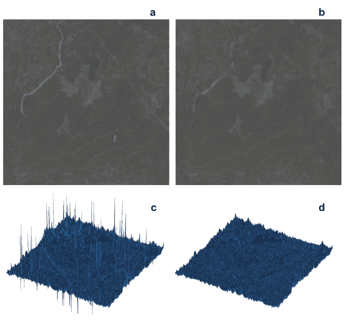

**图 8.2** 覆盖埃塞俄比亚南部 Chew Bahir 流域的 Landsat 图像蓝波段的去斑部分：**a** 原始图像，**b** 去斑图像，**c** 原始图像的曲面图，以及 **d** 去斑后图像的曲面图。原始图像由美国国家航空航天局（NASA）和美国地质调查局（USGS）的 Landsat 计划提供。

## 8.5 导入和地理配准 Terra ASTER 图像

在第 8.3 节中，我们使用了从 ASTER 网站下载的已处理 ASTER 图像。在本节中，我们使用来自传感器的原始数据。ASTER 传感器安装在 Terra 卫星上，该卫星于 1999 年作为美国国家航空航天局（NASA）多国地球观测系统（EOS）系列卫星的一部分发射升空（Abrams and Hook 2002）。ASTER 是 *先进星载热发射和反射辐射计* 的缩写，提供 14 个波段的高分辨率（15 至 90 米）地球图像，包括三个可见光至近红外波段（VNIR 波段 1 至 3）、六个短波红外波段（SWIR 波段 4 至 9）和五个热（或长波）红外波段（TIR 波段 10 至 14）。ASTER 图像用于绘制地球表面的温度、发射率和反射率。第 3 个 VNIR 波段被记录两次：一次是传感器垂直向下指向（波段 3N，其中 *N* 代表 *天底点*，源自阿拉伯语 *opposite*），就像所有其他通道一样；第二次是传感器向后倾斜 27.6°（波段 3B，其中 *B* 代表 *后视*）。这两个波段用于生成 ASTER 数字高程模型（DEM）。

ASTER 仪器产生两种类型的数据：1A 级（L1A）数据和 1B 级（L1B）数据（Abrams and Hook 2002）。L1A 数据是重建的、未经处理的仪器数据，而 L1B 数据则经过了辐射和几何校正。ASTER 已获取的任何数据都是可用的，可以从以下网站获取：

```
https://earthexplorer.usgs.gov
```

作为示例，我们现在处理一幅显示肯尼亚纳瓦沙湖（0°46′31.38″S 36°22′17.31″E）区域的图像。1A 级数据存储在两个文件中：

```
AST_L1A_003_03082003080706_03242003202838.hdf
AST_L1A_003_03082003080706_03242003202838.hdf.met
```

第一个文件（116 MB）包含实际的原始数据，而第二个文件（102 kB）包含头文件以及关于数据的各种信息。我们将两个文件都保存在工作目录中。由于文件名很长，我们首先将其保存在 `filename` 中，然后使用 `filename` 代替长文件名。这样，如果我们想导入和处理其他卫星图像，只需修改这一行 Python 代码：

```
import numpy as np
from osgeo import gdal
from pyhdf.SD import SD
import matplotlib.pyplot as plt
from skimage import io, exposure
from skimage import transform as tf

filename = 'AST_L1A_003_03082003080706_03242003202838.hdf'
```

`pyhdf` 包包含用于导入和处理以 *分层数据格式*（HDF）存储的文件的各种工具。可以使用 `info()` 获取有关文件的信息：

```
file = SD(filename)
file.info()
```

输出结果为：

```
(194, 10)
```

这表明 HDF 文件中有 194 个科学数据集（SDS）。要从 Python *字典* 中获取 SDS 名称，我们使用：

```
datasets_dic = file.datasets()
print(datasets_dic)
datasets_dic
```

要打印 SDS 名称（即 ID 和数据字段），我们使用：

```
for idx,sds in enumerate(datasets_dic.keys()):
    print(idx)
    print(sds)
```

要获取所有 194 个数据集的列表，我们使用下面所示的命令。同样，名称的前半部分是子数据集名称，例如 HDF4......:9，后面是描述符，例如 [13x3] SatellitePosition VNIR_Band1（64 位浮点数）：

```
asterfile = gdal.Open(filename)
aster_sds = asterfile.GetSubDatasets()
print(aster_sds)
```

然后，我们从上面的列表中选择编号 9、20 和 31 作为示例数据集，它们包含 *vnir_Band3n*、*vnir_Band2* 和 *vnir_Band1* 的 ImageData，每个波段通常包含大量关于地球表面岩性（包括土壤）、植被和水体的信息。因此，这些波段通常组合成 24 位 RGB 图像。我们首先读取数据：

```
aster = gdal.Open('HDF4_SDS:UNKNOWN:"AST_L1A_003_\n    '03082003080706_03242003202838.hdf":31')
I1 = aster.ReadAsArray()
aster = gdal.Open('HDF4_SDS:UNKNOWN:"AST_L1A_003_\n    '03082003080706_03242003202838.hdf":20')
I2 = aster.ReadAsArray()
aster = gdal.Open('HDF4_SDS:UNKNOWN:"AST_L1A_003_\n    '03082003080706_03242003202838.hdf":9')
I3 = aster.ReadAsArray()
```

这些命令生成三个 8 位图像数组，每个数组代表 4200×4100 像素图像中某个红外（IR）频段的强度。我们不使用数据进行定量分析，因此不需要将数字值（DN）转换为辐亮度和反射率值。*ASTER 用户手册* 提供了这些转换的必要信息（Abrams and Hook 2002）。相反，我们处理 ASTER 图像是为了创建波段 3N、2 和 1 的地理配准 RGB 合成图，这些波段用于野外工作。我们首先通过输入以下命令使用对比度受限的自适应直方图均衡化方法来增强图像的对比度：

```
I1 = exposure.equalize_adapthist(I1)
I2 = exposure.equalize_adapthist(I2)
I3 = exposure.equalize_adapthist(I3)
```

然后使用 `dstack()` 将结果连接成 24 位 RGB 图像：

```
naivasha_rgb = np.dstack([I1,I2,I3])
```

与之前的示例一样，现在可以使用以下命令显示 4200×4100×3 的数组：

```
naivasha_rgb = exposure.rescale_intensity(naivasha_rgb,
    out_range='uint8')
plt.figure()
io.imshow(naivasha_rgb)
io.imsave('naivasha.tif',naivasha_rgb)
plt.axis('off')
```

此命令将 RGB 合成图保存为工作目录中的 TIFF 文件 *naivasha.tif*（约 52 MB），然后可以使用其他软件（如 Adobe Photoshop）处理该文件。处理后的 ASTER 图像尚未具有坐标系，因此需要将其绑定到地理参考框架（*地理配准*）。HDF 文件的头文件可用于提取 *scenefourcorners* 中包含的图像四个角的大地坐标：

```
UL = [-0.319922,36.214332]
LL = [-0.878267,36.096003]
UR = [-0.400443,36.770406]
LR = [-0.958743,36.652213]
```

根据这些坐标，我们可以通过输入以下命令计算相对于原始图像的 `movingpoints`：

```
movingpoints = np.array([
    [0.,4100.*(UL[1]-LL[1])/(UR[1]-LL[1])],
    [4200.*(UL[0]-LL[0])/(UL[0]-LR[0]),0.],
    [4200.*(UL[0]-UR[0])/(UL[0]-LR[0]),4100.],
    [4200.,4100.*(LR[1]-LL[1])/(UR[1]-LL[1])]])
```

图像的四个角对应于原始图像四个角的像素，我们将其存储在一个名为`fixedpoints`的变量中：

```
fixedpoints = np.array([
    [0.,0.],
    [4200.,0.],
    [0.,4100.],
    [4200.,4100.]])

fixedpoints = np.fliplr(fixedpoints)
movingpoints = np.fliplr(movingpoints)
```

函数`estimate_transform()`现在接收控制点对（即`movingpoints`和`fixedpoints`），并用它们来推断一个空间变换矩阵`tform`。我们使用`affine`进行仿射变换，这种变换能保持点、直线和平面不变，并且在变换图像后仍能保持平行线平行：

```
tform = tf.estimate_transform('affine',movingpoints,fixedpoints)
```

最后，可以使用`warp()`将仿射变换应用于原始RGB合成图像`naivasha_rgb`，从而获得一个地理配准版本的卫星图像`newnaivasha_rgb`，其大小与`naivasha_rgb`相同，并使用了`tform`：

```
newnaivasha_rgb = tf.warp(naivasha_rgb,tform)
```

地理配准后的图像在坐标轴上显示了坐标，并叠加了网格（图8.3）。默认情况下，`imshow()`在显示图像时会反转纬度轴。要将纬度轴方向反转回正常状态，我们需要使用`invert_yaxis()`。

```
plt.figure()
io.imshow(np.flipud(newnaivasha_rgb),
    extent=[36.096003,36.770406,-0.319922,-0.958743])
ax=plt.gca()
ax.invert_yaxis()
plt.xlabel('Longitude')
plt.ylabel('Latitude')
plt.savefig('newnaivasha_rgb.png')
io.show()
```

此代码还将图像导出为JPEG文件`naivasha_georef.jpg`。

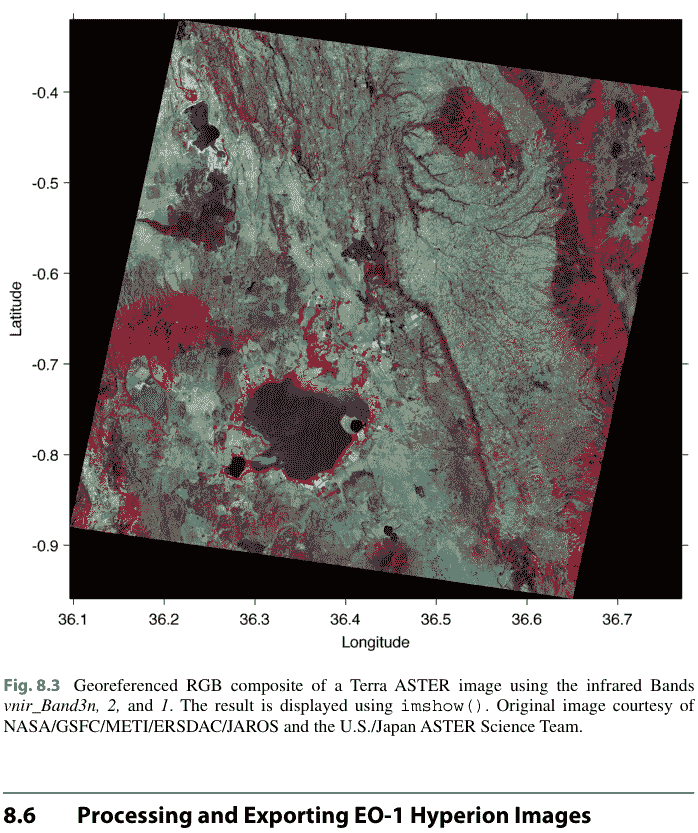

图8.3 使用红外波段*vnir_Band3n*、*2*和*1*对Terra ASTER图像进行地理配准后的RGB合成图。结果使用`imshow()`显示。原始图像由NASA/GSFC/METI/ERSDAC/JAROS和美国/日本ASTER科学团队提供。

## 8.6 处理和导出EO-1 Hyperion图像

*地球观测-1*（EO-1）任务卫星是美国国家航空航天局（NASA）和美国地质调查局（USGS）新千年计划的一部分。该任务始于2000年11月21日卫星发射，并于2017年3月30日停止运行。EO-1有两个传感器：先进陆地成像仪（ALI）（具有九个多光谱波段，空间分辨率为30米，以及一个全色波段，分辨率为10米）和高光谱传感器（Hyperion）（具有220个波段，波长范围在430至2400纳米之间）（Mandl等人，2002年；Line，2012年）。关于EO-1计划的一般信息可以从以下网站获取：

https://nssdc.gsfc.nasa.gov/nmc/spacecraft/display.action?id=2000-075A

Hyperion数据（以及其他NASA卫星的数据）可从以下网站免费获取：

https://earthexplorer.usgs.gov

在后一个网站上，我们首先在*搜索条件*中选择所需的地图区域，可以通过输入地图四个角的坐标，或者通过放大到感兴趣的区域并选择*使用地图*来完成。例如，我们输入坐标2°8'37.58"N 36°33'47.06"E，到达肯尼亚北部裂谷的苏古塔谷中心。然后，我们从*EO-1*集合中选择*Hyperion*作为*数据集*，并点击*结果*，这将生成一个记录列表以及一个用于预览和下载数据的工具栏。点击*显示浏览叠加*按钮允许我们检查图像的云量。在叠加层中，我们可以找到无云的图像

```
Entity ID: EO1H1690582013197110KF_PF2_01
Acquisition Date: 16-JUL-13
Target Path: 169
Target Row: 58
```

该图像拍摄于2013年7月16日。与之前一样，我们需要在USGS网站上注册、登录，然后下载经过辐射校正（但未进行几何校正）的1级R（L1R）产品（215.3 MB），然后将其存储在文件*EO1H1690582013197110KF_1R.ZIP*中。.ZIP存档包含一个元数据文件（.MET）、一个联邦地理数据委员会（FGDC）元数据文件（.fgdc）、一个HDF数据集文件（.L1R）和多个辅助文件。EO-1用户指南提供了一些关于这些文件数据格式的有用信息（Barry，2001年；Beck，2003年）。我们可以使用以下代码从文件*EO1H1690582013197110KF.L1R*导入数据：

```
import numpy as np
import matplotlib.pyplot as plt
from skimage import io, exposure
from pyhdf.SD import SD

headerfile = 'EO1H1690582013197110KF.hdr'
imagefile = 'EO1H1690582013197110KF.L1R'

finfo = SD(imagefile)
file = finfo.select(0)
HYP = file.get()
```

输入

```
np.who()
```

可以显示高光谱图像在工作区中的存储方式：

| 名称 | 形状 | 字节数 | 类型 |
|---|---|---|---|
| HYP | 3189 x 242 x 256 | 395129856 | int16 |
| 总字节数上限 = | | 395129856 | |

这些细节表明图像存储为一个3,189 x 242 x 256的数组，代表242个光谱波段中每个波段的3,189 x 256数组。工作区中当前变量的列表还包括信息*int16*（即每个数组元素代表一个像素，并包含有符号的16位整数）。我们需要对数组进行置换，以便将波段移动到第三维，输入

```
HYP = HYP.transpose(0,2,1)
```

接下来，我们需要根据HYP中的数字值（DN）确定辐亮度值。辐亮度是从地球特定方向散射的功率密度，使用瓦特每平方米每球面度（Wm⁻² sr⁻¹）为单位（Richards，2013年）。EO-1用户指南（v. 2.3）在其*常见问题解答*（FAQ）部分提供了关于这些转换的必要信息（Beck，2003年）。根据该文档，可见光和近红外（VNIR）波段（即波段1至70）的辐亮度HYPR是通过将HYP中的数字值除以40来计算的。短波红外（SWIR）波段（即波段71至242）的辐亮度是通过将HYP除以80来计算的：

```
HYPR = np.copy(HYP)
HYPR[:,:,0:70] = HYPR[:,:,0:70]/40
HYPR[:,:,70:242] = HYPR[:,:,70:242]/80
```

对于定量分析，辐亮度值HYPR需要进行大气和地形效应校正。这种校正——产生地表反射率值（以百分比表示）——超出了本书的范围。EO-1用户指南（v. 2.3）再次解释了几种将辐亮度值转换为反射率值的方法（Beck，2003年）。

我们转而处理Hyperion图像，以创建波段29、23和16的地理配准RGB合成图，用于野外工作。头文件*EO1H1690582013197110KF.HDR*包含——除其他外——第258至288行中与242个光谱波段对应的波长。我们可以将这些行复制并粘贴到一个新文件*EO1H1690582013197110KFWVL*中，用NaN填充最后一行至八列（与前面的行一样），并将其加载到工作区：

```
wavelengths = np.loadtxt(wavefile)
wavelengths = np.reshape(wavelengths, (np.size(wavelengths)))
```

现在，我们可以在一个图中绘制VNIR波段（蓝色）和SWIR波段（红色）的辐亮度HYPR：

```
plt.figure()
plt.plot(wavelengths[0:70],HYPR[535,135,0:70],
    color=(0.3,0.5,0.8))
plt.plot(wavelengths[70:242],HYPR[535,135,70:242],
    color=(0.8,0.5,0.3))
plt.show()
```

根据EO-1用户指南v. 2.3（Beck，2003年），Hyperion记录220个独特的光谱通道，覆盖357至2576纳米。L1R产品有242个波段，但只有198个波段经过校准。由于VNIR和SWIR焦平面之间存在重叠，只有196个独特的通道。校准的通道是VNIR的8至57和SWIR的77至224。在这些通道中，未校准的波段被设置为零。

为了创建波段29、23和16的RGB合成图，我们可以通过输入以下代码从HYPR的辐亮度值数据中提取波段：

```
HYP1 = HYPR[:,:,28]
HYP2 = HYPR[:,:,22]
HYP3 = HYPR[:,:,15]
```

重要的是要记住，Python索引从零开始，因此我们必须使用*波段-1*作为索引。要使用*imshow*显示数据，我们需要将有符号的16位整数（*int16*）数据转换为无符号的8位整数数据（*uint8*）。为此，我们首先使用具有100个类别的直方图图来获取数据范围的概览：

```
n1,v1 = exposure.histogram(HYP1,nbins=100)
n2,v2 = exposure.histogram(HYP2,nbins=100)
n3,v3 = exposure.histogram(HYP3,nbins=100)

plt.figure()
plt.subplot(1,3,1)
plt.plot(v1,n1)
plt.title('Band 29')
plt.subplot(1,3,2)
```

plt.plot(v1,n1)
plt.title('波段 23')
plt.subplot(1,3,3)
plt.plot(v1,n1)
plt.title('波段 16')
plt.show()

如我们所见，光谱波段 29、23 和 16 的大部分像素的辐射亮度值介于 0 到 200 Wm⁻² sr⁻¹ 之间。由于我们的大部分辐射亮度值都在 [0,255] 范围内，我们使用 `rescale_intensity()` 将数据转换为 `uint8` 数据类型，而不会丢失太多信息：

```
HYP1 = exposure.rescale_intensity(HYP1,
    out_range='uint8')
HYP2 = exposure.rescale_intensity(HYP2,
    out_range='uint8')
HYP3 = exposure.rescale_intensity(HYP3,
    out_range='uint8')
```

再次使用以下代码以直方图形式显示三个波段的辐射亮度值：

```
n1,v1 = exposure.histogram(HYP1,nbins=30)
n2,v2 = exposure.histogram(HYP2,nbins=30)
n3,v3 = exposure.histogram(HYP3,nbins=30)

plt.figure()
plt.subplot(1,3,1)
plt.plot(v1,n1)
plt.title('波段 29')
plt.subplot(1,3,2)
plt.plot(v1,n1)
plt.title('波段 23')
plt.subplot(1,3,3)
plt.plot(v1,n1)
plt.title('波段 16')
plt.show()
```

揭示了大部分辐射亮度值实际上在 [20,80] 范围内。接下来，我们使用 `equalize_hist()` 来增强图像的对比度，然后将三个波段连接成一个 3189×242×3 的数组：

```
HYP1 = exposure.equalize_hist(HYP1)
HYP2 = exposure.equalize_hist(HYP2)
HYP3 = exposure.equalize_hist(HYP3)
```

```
n1,v1 = exposure.histogram(HYP1,nbins=30)
n2,v2 = exposure.histogram(HYP2,nbins=30)
n3,v3 = exposure.histogram(HYP3,nbins=30)

plt.figure()
plt.subplot(1,3,1)
plt.plot(v1,n1)
plt.title('波段 29')
plt.subplot(1,3,2)
plt.plot(v1,n1)
plt.title('波段 23')
plt.subplot(1,3,3)
plt.plot(v1,n1)
plt.title('波段 16')
plt.show()

HYPC = np.dstack([HYP1,HYP2,HYP3])
HYPC = exposure.rescale_intensity(HYPC,
    out_range='uint8')
```

最后，我们可以使用以下代码显示整幅图像：

```
plt.figure()
io.imshow(HYPC)
plt.axis('off')
io.show()
```

或者（作为替代方案）仅显示包含苏古塔谷北部屏障火山复合体的那部分图像（图 8.4）：

```
plt.figure()
io.imshow(HYPC[899:1099,:,:])
plt.axis('off')
io.imsave('barrier_python.png',
    HYPC[899:1099,:,:])
io.show()
```

此代码还将图像导出为分辨率 600 dpi 的 TIFF 文件 *barrier.tif*。

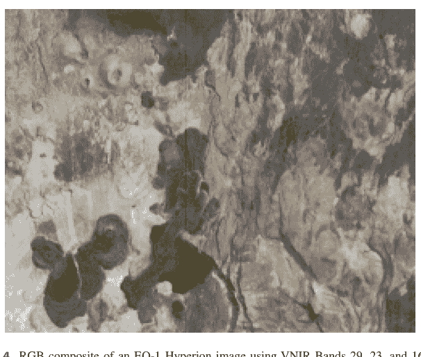

**图 8.4** 使用 VNIR 波段 29、23 和 16 的 EO-1 Hyperion 图像 RGB 合成图。该图像显示了肯尼亚北部裂谷苏古塔谷的屏障火山复合体，获取于 2013 年 7 月 16 日。原始图像由 NASA EO-1 任务提供。

## 8.7 归一化植被指数 NDVI

植物色素反射近红外光（即 700 至 1100 nm），同时强烈吸收可见光（即 400 至 700 nm）用于光合作用。*归一化植被指数*（NDVI）是一种用于绘制活体绿色植被分布的指数，其计算公式为

$$NDVI = \frac{(NIR - R)}{(NIR + R)}$$

使用在近红外（*NIR*）和红光（R）光谱波段获取的光谱反射率测量值。该指数可以通过地面光谱相机以及无人机、飞机或卫星进行测量。所使用的相机通常非常昂贵，但现在也有一些相当便宜的替代品，包括 AgroCam (https://www.agrocam.eu) 和 MAPIR Survey Camera (https://www.mapir.camera)。这些相机用于专业应用，但由于其价格低廉，也适合学生练习。

由于 MAPIR 相机（由位于美国加利福尼亚州圣地亚哥的 Peau Productions, Inc. 制造）与流行的 GoPro 相机系统尺寸和形状相同，因此可以使用所有 GoPro 配件，例如存储卡、相机支架和外壳。我们构建了一个由四台相机组成的廉价多光谱阵列，这些相机在其产品名称中包含了所记录的波长：NDVI Red+NIR（650 和 850 nm）、Blue（450 nm）、Green（550 nm）和 Visible Light RGB（约 370 至 650 nm）。

以下示例说明了如何使用 MAPIR 相机获取图像，如何使用 Python 导入和处理图像，以及如何计算 NDVI 以检测图像中的植被。在编辑来自 MAPIR Survey2 NDVI 相机的图像时，我们学到了很多关于相机如何实际捕获和存储图像的知识。这对于能够将图像正确导入 Python、处理它们并计算相应的 NDVI 图像非常重要。未能正确完成这三个步骤中的任何一个都会产生一个可以立即看出不令人满意的图像。

以下脚本使用了制造商网站 (https://www.mapir.camera) 上提供的相机信息。该示例不包括任何相机校准，并使用自动白平衡而不是带有白色参考的真实白平衡。根据 MAPIR 网站上关于 *在 QGIS 中使用 MAPIR 插件校准图像* 的信息，Survey2 相机拍摄 16 位 RAW 照片，这意味着有 16 位像素，强度值范围从 0 到 65,535。当相机保存 JPEG 文件时，它会压缩图像，从而只留下 0 到 255 的范围。我们首先定义文件名和图像大小：

```
import cv2
import numpy as np
import rasterio as rasterio
import matplotlib.pyplot as plt
from matplotlib.colors import ListedColormap
from skimage import color
from skimage import exposure
from skimage import io
from skimage import feature
from skimage import transform
from skimage import draw

filename = '2017_0328_110031_007.RAW';
row = 3456;
col = 4608;
```

根据 MAPIR 关于 Survey2 NDVI 相机的规格页面，该设备使用 Sony Exmor IMX206 16MP（Bayer RGB），这是在 Python 中正确加载图像所需的重要信息。然而，Sony, Inc. 的传感器规格页面表明该传感器实际上采集 12 位图像，这与 2017 年 3 月从 Peau Productions, Inc. 的软件工程师通过电子邮件收到的信息一致，但与公司网站上的声明不符。在该软件工程师的支持、我们自己的研究以及 Stack Overflow (http://stackoverflow.com) 读者的帮助下，我们设法解决了这个问题：如果我们在 Python 中以 uint16 数组读取数据，将其重塑为 (row, col)，并显示图像，我们会发现我们找到了正确的解决方案：

```
with open(filename) as fid:
    I1 = np.fromfile(fid,dtype='<u2')

I1 = np.reshape(I1, (row,col))
```

在此代码中，数据类型 `<u2` 代表小端序 2 字节（或 16 位）无符号整数。MAPIR Survey2 NDVI 相机测量红光（660 nm）和近红外（850 nm）辐射亮度以进行 NDVI 计算。然而，我们的红光和红外数据在灰度图像中无处可寻。Sony 传感器是单芯片传感器，将三种颜色（即红、绿、蓝）存储在单个数组 I1 中，该数组使用 Python 的默认灰色颜色映射显示为灰度图像。大多数相机都有单芯片传感器，即使是单镜头反光相机（SLR）也是如此，它们可以通过使用有损压缩将图像存储为 RAW 格式（除了 JPEG 格式）。也存在更昂贵的三传感器相机，它们使用单独的传感器来处理滤光后的红、绿、蓝颜色范围。

单芯片相机使用拜耳马赛克在其单芯片上存储 RGB 图像，该马赛克以 Bryce Bayer（1929 至 2012）命名，他是伊士曼柯达的研究科学家（有关拜耳马赛克的更多信息，请参见 http://en.wikipedia.org）（图 8.5）。Bayer 的想法是使用滤光片并将红、绿、蓝的各个颜色引导到各个传感器像素上，这些像素通常采用 RGGB 排列，因为人眼对绿色比对红色或蓝色更敏感。由于拜耳马赛克，具有 16 MP 分辨率（例如我们的 Sony 芯片）的 SLR 并不真正拍摄 16 MP；相反，它们只为红色和蓝色各拍摄 4 MP（各占 25%），为绿色拍摄 8 MP（占 50%），然后将每种颜色插值到 16 MP。

因此，SLR 提供的 RAW 格式并不意味着颜色以全分辨率存储，而是意味着图像未被压缩（例如，使用 JPEG 算法）。相反，使用 Python，我们可以以原始分辨率（即红色和蓝色各 4 MP，绿色 8 MP）导入和处理图像。或者，我们可以像 SLR 一样对图像进行去马赛克处理，例如，使用 Python 函数 `cvtColor()`。对图像进行去马赛克处理会将拜耳模式编码的图像转换为真彩色（RGB）图像，使用梯度校正线性插值。根据 MAPIR 网站，红光（660 nm）辐射亮度存储在红色图像通道中，近红外（850 nm）辐射亮度存储在蓝色图像通道中，绿色通道中不存储任何信息。

当使用 `imshow()` 将 I2 显示为真彩色 RGB 图像时，我们发现在近红外光谱波段反射率高的区域（因此也是更密集的活体绿色植被）呈现蓝色色调，而所有其他近红外值低的区域则更偏红色：

```
I2 = cv2.cvtColor(I1, cv2.COLOR_BAYER_BG2RGB)
I2 = exposure.rescale_intensity(I2,
    out_range='uint8')

plt.figure()
io.imshow(I2)
plt.axis('off')
plt.show()
```

为了提高图像的对比度，我们可以应用自适应直方图均衡化：

```
I3 = np.zeros(np.shape(I2))
I3[:,:,0] = exposure.equalize_adapthist(I2[:,:,0],
    clip_limit=0.01, nbins=256)
I3[:,:,1] = exposure.equalize_adapthist(I2[:,:,1],
    clip_limit=0.01, nbins=256)
I3[:,:,2] = exposure.equalize_adapthist(I2[:,:,2],
    clip_limit=0.01, nbins=256)

plt.figure()
io.imshow(I3)
plt.axis('off')
io.show()
```

我们现在可以显示红光和近红外波段：

```python
plt.figure()
plt.subplot(1,2,1)
io.imshow(I3[:,:,0])
plt.axis('off')
plt.title('Red')
plt.subplot(1,2,2)
io.imshow(I3[:,:,2])
plt.axis('off')
plt.title('NIR')
io.show()
```

然后我们进行白平衡，以校正任何不真实的色偏。为此，我们需要一个参考卡（通常是灰色），将其放置在图像中作为白平衡的参考。或者，我们可以执行完全自动化的白平衡（如此处所示），方法是将每个单独通道的值除以各颜色（meanR、meanG 和 meanB）的平均值，然后将每个通道的值乘以所有通道值的平均值（meanGray）：

```python
I3G = color.rgb2gray(I3)
meanR = np.mean(I3[:,:,0])
meanG = np.mean(I3[:,:,1])
meanB = np.mean(I3[:,:,2])
meanGray = np.mean(I3G)
I3W = np.zeros(np.shape(I3))
I3W[:,:,0] = I3[:,:,0]*meanGray/meanR
I3W[:,:,1] = I3[:,:,1]*meanGray/meanG
I3W[:,:,2] = I3[:,:,2]*meanGray/meanB
```

接下来，我们使用以下公式计算 NDVI：

```python
I4 = np.copy(I3W)
ndvi = (I4[:,:,2]-I4[:,:,0])/(I4[:,:,2]+I4[:,:,0])

ndvi = exposure.rescale_intensity(ndvi,
    out_range='uint8')

plt.figure()
io.imshow(ndvi,
    cmap='gray')
plt.axis('off')
io.show()
```

或者，我们可以使用 `jet` 颜色映射将 NDVI 显示为伪彩色图：

```python
ndvi = exposure.rescale_intensity(ndvi,
    out_range='uint8')

plt.figure()
io.imshow(ndvi,
    cmap='jet')
plt.axis('off')
io.show()
```

最后，我们可以定义一个任意阈值 `th`（例如 0.4），用于将植被（显示为白色像素）与其他材料（显示为灰色像素）分开。然后我们将 NDVI > 0.4 的部分显示为绿色，较低值显示为白色（图 8.6）：

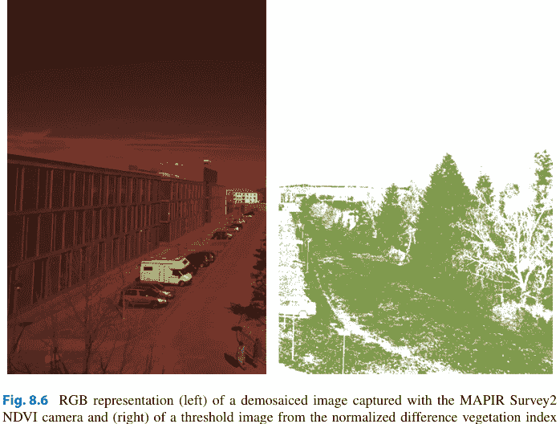

```python
th = 0.4
ndvit = np.copy(ndvi)
for i in range(0,row):
    for j in range(0,col):
        if ndvit[i,j] < th:
            ndvit[i,j] = 0

ndvicmap = np.array([[1,1,1,1],
    [0.5,0.6,0.3,1]])
newrgb = ListedColormap(ndvicmap)

thresh, ndvitth = cv2.threshold(ndvit,
    150,255,cv2.THRESH_BINARY)
plt.figure()
io.imshow(ndvitth,cmap=newrgb)
plt.axis('off')
io.show()
```

我们也可以从包含红光和近红外光谱波段的卫星数据计算 NDVI。*Sentinel-2* 是由四颗卫星组成的系统，旨在执行多种任务的陆地观测，包括森林监测以及绘制地表变化和自然灾害影响的地图。数据可从 USGS EarthExplorer (https://earthexplorer.usgs.gov) 网站免费下载。我们使用两张图像（分别于 2018 年 5 月 22 日和 29 日获取），从中加载计算 NDVI 所需的 650 nm (B04) 和 850 nm (B08) 光谱波段：

```python
filename1 = 'T32UQD_20180522T102031_B04_10m.jp2'
filename2 = 'T32UQD_20180522T102031_B08_10m.jp2'
filename3 = 'T32UQD_20180529T101031_B04_10m.jp2'
filename4 = 'T32UQD_20180529T101031_B08_10m.jp2'
img1 = rasterio.open(filename1)
img2 = rasterio.open(filename2)
img3 = rasterio.open(filename3)
img4 = rasterio.open(filename4)
B04_22 = img1.read(1)
B08_22 = img2.read(1)
B04_29 = img3.read(1)
B08_29 = img4.read(1)
```

我们通过输入以下命令，将柏林-勃兰登堡地区的图像裁剪到德国波茨坦市的区域：

```python
B04_22 = B04_22[8500:9500,6500:7500]
B08_22 = B08_22[8500:9500,6500:7500]
B04_29 = B04_29[8500:9500,6500:7500]
B08_29 = B08_29[8500:9500,6500:7500]
```

接下来，我们将 uint16 数据转换为 float64 以进行计算：

```python
B04_22 = np.float64(B04_22)
B08_22 = np.float64(B08_22)
B04_29 = np.float64(B04_29)
B08_29 = np.float64(B08_29)
```

为了显示图像，我们首先计算 5% 和 95% 分位数：

```python
B04_22_05 = np.quantile(B04_22,0.05)
B04_22_95 = np.quantile(B04_22,0.95)
B08_22_05 = np.quantile(B08_22,0.05)
B08_22_95 = np.quantile(B08_22,0.95)
B04_29_05 = np.quantile(B04_29,0.05)
B04_29_95 = np.quantile(B04_29,0.95)
B08_29_05 = np.quantile(B08_29,0.05)
B08_29_95 = np.quantile(B08_29,0.95)
```

然后通过输入以下命令计算两张图像的 NDVI 值：

```python
NDVI_22 = (B08_22-B04_22)/(B08_22+B04_22)
NDVI_29 = (B08_29-B04_29)/(B08_29+B04_29)
```

作为示例，我们将 2018 年 5 月 22 日获取的图像的 650 nm 和 850 nm 光谱波段显示为灰度图像，并将 NDVI 图显示为彩色图像，两者均使用 `jet` 颜色映射：

```python
plt.figure()
B04_22_X = exposure.rescale_intensity(B04_22,
    in_range=(B04_22_05,B04_22_95),
    out_range='uint16')
plt.imshow(B04_22_X,
    cmap='gray')
plt.colorbar()
plt.axis('off')
plt.title('650 nm')
plt.show()
```

```python
plt.figure()
B08_22_X = exposure.rescale_intensity(B08_22,
    in_range=(B08_22_05,B08_22_95),
    out_range='uint16')
plt.imshow(B08_22_X,
    cmap='gray')
plt.colorbar()
plt.axis('off')
plt.title('850 nm')
plt.show()
```

```python
plt.figure()
NDVI_22_X = exposure.rescale_intensity(NDVI_22,
    out_range=(0,1))
plt.imshow(NDVI_22_X,
    cmap='jet')
plt.colorbar()
plt.axis('off')
plt.title('NDVI 22 May 2018')
plt.show()
```

我们将图像保存为 PNG 文件：

```python
plt.savefig('sentinel_ndiv_1_vs1.png',dpi=300)
```

然后，我们计算两张图像（分别于 2018 年 5 月 22 日和 29 日获取）的 NDVI 图之间的差异，并将图像保存为 PNG 文件：

```python
DNDVI = NDVI_22 - NDVI_29
```

```python
plt.figure()
B04_22_X = exposure.rescale_intensity(B04_22,
    in_range=(B04_22_05,B04_22_95),
    out_range='uint16')
plt.imshow(B04_22_X,
    cmap='gray')
plt.colorbar()
plt.axis('off')
plt.title('650 nm')
plt.show()
```

```python
plt.figure()
B08_22_X = exposure.rescale_intensity(B08_22,
    in_range=(B08_22_05,B08_22_95),
    out_range='uint16')
plt.imshow(B08_22_X,
           cmap='gray')
plt.colorbar()
plt.axis('off')
plt.title('850 nm')
plt.show()

plt.figure()
DNDVI_X = exposure.rescale_intensity(DNDVI,
    in_range=(-0.2,0.2),
    out_range=(0,1))
plt.imshow(DNDVI_X,
    cmap='jet')
plt.colorbar()
plt.axis('off')
plt.title('Difference NDVI 22 to 29 May 2018')
plt.show()
```

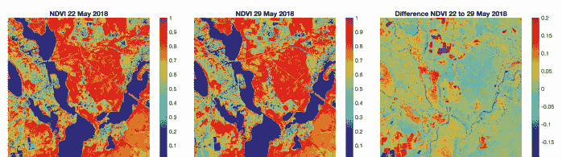

**图 8.7** Sentinel-2 图像的 NDVI 图，显示柏林-勃兰登堡地区裁剪至德国波茨坦市区域，分别拍摄于 a) 2018 年 5 月 22 日和 b) 2018 年 5 月 29 日，以及 c) 两张 NDVI 图像之间的差异，展示了季节性绿化的进程。

生成的图像非常清晰地展示了季节性绿化的进程（图 8.7）。

## 8.8 图像增强、校正与配准

本节介绍图像增强、校正和配准的一些基本工具。作为示例，我们使用一张约 33,000 年前在阿根廷卡法亚特峡谷（25°58.900'S 65°45.676'W）滑坡堰塞湖中沉积的纹层沉积物图像（Trauth 等人，1999, 2003）。该正片于 1996 年 10 月 1 日使用基于胶片的单镜头反光（SLR）相机拍摄。从幻灯片制作了一张 30x20 厘米的打印件，该打印件使用平板扫描仪扫描并保存为 394 kB 的 JPEG 文件。我们使用此图像作为示例，因为它展示了一些我们可以通过图像增强来解决的问题（图 8.8）。

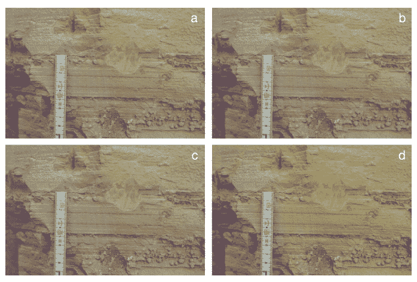

**图 8.8** 图像增强的结果：**a** 原始图像，**b** 使用 `rescale_intensity()` 调整强度值后的图像，**c** 使用 `equalize_adapthist()` 增强对比度后的图像，以及 **d** 使用 `gaussian()` 进行滤波后的图像，滤波器为 20x20 像素、均值为零、标准差为 10 的高斯概率密度函数形状。

我们可以通过输入以下命令读取并解压缩文件 `varves_original.jpg`：

```python
import numpy as np
import skimage as ski
import matplotlib.pyplot as plt
from skimage import io, exposure, filters

I1 = io.imread('varves_original.jpg')
```

这将在 Python 工作区中生成一个 24 位 RGB 图像数组 `I1`。输入

```python
np.who()
```

将输出

| 名称 | 形状 | 字节数 | 类型 |
|---|---|---|---|
| I1 | 1096 x 1674 x 3 | 5504112 | uint8 |
| 总字节数上限 | = | 5504112 | |

这表明图像以一个大小为 1096 x 1674 x 3 的 `uint8` 数组形式存储（即，红色、绿色和蓝色各有一个 1096 x 1674 的数组）。我们可以使用以下命令显示图像：

```
plt.figure()
io.imshow(I1)
plt.axis('off')
io.show()
```

该命令会打开一个新的图形窗口，显示图像的 RGB 合成图。如我们所见，图像对比度较低，颜色非常浅，并且沉积层并非完全水平。这些是我们希望在后续步骤中改进的图像特征。

首先，我们调整图像的强度值。函数 `rescale_intensity()` 将图像 `I1` 的值映射到 `I2` 中的新值：

```
I2 = exposure.rescale_intensity(I1)
```

该函数将值域调整到 [0,1] 的完整范围，然后显示结果：

```
io.imshow(I2)
plt.axis('off')
io.show()
```

我们可以清楚地看到非常浅的图像 `I1` 和更饱和的图像 `I2` 之间的差异。

函数 `equalize_hist()` 变换图像 `I1` 的强度，并返回一个具有 `n` 个离散级别的强度图像 `I5`。在 `I5` 中，大约有相同数量的像素被分配到每个 `n` 级别，使得 `I5` 的直方图近似平坦。由于 `equalize_hist()` 仅适用于二维图像，因此必须对每种颜色分别进行直方图均衡化。我们在练习中使用 `n=256`：

```
I5 = np.zeros(np.shape(I1))
I5[:,:,0] = exposure.equalize_hist(I1[:,:,0], nbins=256)
I5[:,:,1] = exposure.equalize_hist(I1[:,:,1], nbins=256)
I5[:,:,2] = exposure.equalize_hist(I1[:,:,2], nbins=256)

plt.figure()
plt.subplot(2,2,1)
io.imshow(I1)
plt.axis('off')
plt.title('Original image')
plt.subplot(2,2,2)
n,v = exposure.histogram(I1, nbins=256)
plt.plot(v,n)
plt.title('Original image')
plt.subplot(2,2,3)
io.imshow(I5)
plt.axis('off')
plt.title('Enhanced image')
plt.subplot(2,2,4)
n,v = exposure.histogram(I5, nbins=256)
plt.plot(v,n)
plt.title('Enhanced image')
io.show()
```

得到的图像看起来相当令人失望，因此我们使用改进的 `equalize_adapthist()` 代替 `equalize_hist()`。函数 `equalize_adapthist()` 使用 *对比度受限自适应直方图均衡化 (CLAHE)*，该方法由 Zuiderveld (1994) 提出。与 `equalize_hist()` 和 `rescale_intensity()` 不同，算法 `equalize_adapthist()` 作用于图像的小区域（或图块），而不是整个图像。然后使用双线性插值组合相邻的图块，以消除边缘效应：

```
I6 = np.zeros(np.shape(I1))
I6[:,:,0] = exposure.equalize_adapthist(I1[:,:,0], clip_limit=0.01, nbins=256)
I6[:,:,1] = exposure.equalize_adapthist(I1[:,:,1], clip_limit=0.01, nbins=256)
I6[:,:,2] = exposure.equalize_adapthist(I1[:,:,2], clip_limit=0.01, nbins=256)

plt.figure()
plt.subplot(2,2,1)
io.imshow(I1)
plt.axis('off')
plt.title('Original image')
plt.subplot(2,2,2)
n,v = exposure.histogram(I1, nbins=256)
plt.plot(v,n)
plt.title('Original image')
plt.subplot(2,2,3)
io.imshow(I6)
plt.axis('off')
plt.title('Enhanced image')
plt.subplot(2,2,4)
n,v = exposure.histogram(I6, nbins=256)
plt.plot(v,n)
plt.title('Enhanced image')
io.show()
```

结果看起来比使用 `equalize_hist()` 得到的结果稍好一些。然而，所有三种图像增强函数都提供了多种操纵最终结果的方式。Gonzalez 和 Woods (2018) 的优秀著作更详细地介绍了如何使用各种可用的参数以及图像增强函数的相应值。

`scikit-image` 包还包含许多用于二维图像滤波的函数。我们在第 6 章中研究的许多一维数据方法也适用于二维数据，正如我们在第 7 章中过滤数字地形模型时所看到的。图像最流行的二维滤波器是高斯滤波器和中值滤波器，以及用于图像锐化的滤波器。高斯和中值滤波器都用于平滑图像，主要目的是减少噪声量。在大多数示例中，信噪比是未知的，因此使用自适应滤波器（类似于第 6.10 节中介绍的滤波器）进行降噪。可以使用以下命令设计高斯滤波器：

```
I7 = filters.gaussian(I1)
```

该滤波器使用遵循高斯概率密度函数形状的滤波器权重。接下来，我们计算 `I8`，它是 `I1` 的中值滤波版本：

```
I8 = filters.median(I1)
```

滤波器输出像素是输入图像中相应像素邻域的中值。第三个滤波器示例演示了如何使用 `unsharp_mask()` 锐化图像：

```
I9 = filters.unsharp_mask(I1)
```

此函数计算图像的高斯低通滤波版本，该版本用作非锐化掩模（即，通过从原始图像中减去模糊的滤波版本来计算图像的锐化版本）。将三个滤波练习的结果与原始图像进行比较：

```
plt.figure()
plt.subplot(2,2,1)
io.imshow(I1)
plt.axis('off')
plt.title('Original image')
plt.subplot(2,2,2)
io.imshow(I7)
plt.axis('off')
plt.title('Gaussian filter')
plt.subplot(2,2,3)
io.imshow(I8)
plt.axis('off')
plt.title('Median filter')
plt.subplot(2,2,4)
io.imshow(I9)
plt.axis('off')
plt.title('Sharpening filter')
io.show()
```

清楚地展示了二维滤波器的效果。作为这些空域滤波器的替代方案，我们也可以设计具有特定频率响应的二维滤波器，例如第 6.9 节中描述的一维滤波器。同样，Gonzalez 和 Woods (2018) 的著作概述了图像的二维频率选择性滤波，包括用于生成此类滤波器的函数。作者还演示了二维巴特沃斯低通滤波器在图像处理应用中的使用。

## 8.9 从图像中去除周期性噪声

图像可能被各种噪声覆盖，这通常是由图像采集过程中的问题引起的。在大多数示例中，这是由低光照条件下传感器问题引起的随机噪声。另一种类型的噪声——在图像上叠加周期性而非随机干扰——例如，当电磁场干扰数码相机的记录系统时就会发生。这种干扰很普遍，尤其是在研究机构的实验室中，那里有大量的电子设备在运行。寻找噪声源通常既乏味又耗时且成本高昂。因此，数码相机系统的用户可能倾向于校正图像中的干扰。

有多种方法可以从图像中去除噪声，例如使用在时域中运行的二维带通滤波器，类似于第 6.9 节中介绍的一维滤波器。该滤波器移除包含周期性噪声频率的频带，但它也可能移除实际的图像信息。该滤波器使用通常的方法设计，这些方法在第 6.9 节中另有介绍，但它具有那里讨论的缺点。相反，我们也可以对图像进行二维傅里叶变换，在频谱中定位周期性噪声，并将功率谱密度的相应值替换为，例如，零值。在研究解决方案时，可以找到多种或多或少优雅且无瑕疵的变体，Ray Phan 在 Stackoverflow 上一个问题的 *Answer 1* 中提供了一个非常好的解决方案。

作为示例，我们使用一张显微图像，该图像是使用第 8.13 节中介绍的方法对湖泊沉积物中的木炭进行量化时拍摄的。沉积物取自埃塞俄比亚南部裂谷 Chew Bahir 盆地收集的长沉积岩芯 (Foerster et al. 2022)（图 8.9）。不幸的是，由于我们研究所大楼内一个尚未定位的强电场，图像显示出周期性噪声。我们现在在频域中去除周期性噪声。首先，我们定义图像的文件名并将其加载到工作空间中。我们还使用以下命令更改图形轴标签字体大小的默认设置：

```
import numpy as np
from numpy import fft
import matplotlib.pyplot as plt
from scipy import fft
from skimage import io
from skimage import exposure

plt.rcParams['font.size'] = 6
```

samplename = 'CHB-14-2B-8H-1-B10'
filename = samplename + '.tif'
I = io.imread(filename)

我们现在可以使用以下代码查看图像：

plt.figure()
io.imshow(I)
plt.axis('off')
io.show()

这将打开一个新的图形窗口，显示RGB图像（图8.9）。然后，我们使用`fftn()`计算图像的二维傅里叶变换Y1，并使用`fftshift()`将零频率分量移动到频谱中心：

Y1 = fft.fftn(I)
Y1 = fft.fftshift(Y1)

接下来，我们通过输入以下代码来显示图像傅里叶变换Y1的绝对值的对数：

plt.figure()
plt.axes(position=[0.125,0.3,0.2,0.3],
         xlim=(980,1070),
         ylim=(740,800))
plt.pcolormesh(np.log(np.abs(Y1[:,:,0])),
               clim=[5,20],
               cmap='jet')
plt.axes(position=[0.4,0.3,0.2,0.3],
         xlim=(980,1070),
         ylim=(740,800))
plt.pcolormesh(np.log(np.abs(Y1[:,:,1])),
               clim=[5,20],
               cmap='jet')
plt.axes(position=[0.675,0.3,0.2,0.3],
         xlim=(980,1070),
         ylim=(740,800))
plt.pcolormesh(np.log(np.abs(Y1[:,:,2])),
               clim=[5,20],
               cmap='jet')
plt.show()

使用`jet`颜色图，并将颜色图限制设置为[5 20]。这种颜色图最近受到了一些批评，因此建议使用其他颜色图。然而，在本例中，`jet`效果很好，但可以替换为任何其他颜色图。我们的频谱Y1首先在居中频谱的中间零频率附近显示出一个明显的最大值。此外，我们在对称频谱中看到另外两个宽的最大值——一个在零频率下方，一个在零频率上方——大约位于[781:787,1024, :]和[749:755,1024, :]，这对应于图像I的周期性干扰。我们通过输入以下代码创建频谱Y1的副本Y2，并将周期性噪声的频谱峰值置零：

Y2 = np.copy(Y1)
Y2[781:787,1024,:] = 0
Y2[749:755,1024,:] = 0

然后，我们通过输入以下代码显示处理后的频谱Y2（图8.10）。

plt.figure()
plt.axes(position=[0.125,0.3,0.2,0.3],
         xlim=(980,1070),
         ylim=(740,800))
plt.pcolormesh(np.log(np.abs(Y2[:,:,0])),
               clim=[5,20],
               cmap='jet')
plt.axes(position=[0.4,0.3,0.2,0.3],
         xlim=(980,1070),
         ylim=(740,800))
plt.pcolormesh(np.log(np.abs(Y2[:,:,1])),
               clim=[5,20],
               cmap='jet')

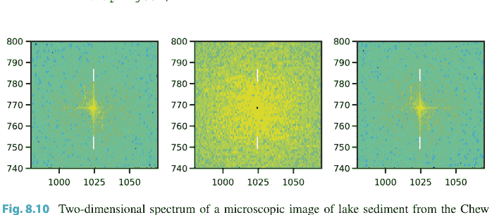

图8.10 使用`fftn()`计算的埃塞俄比亚南部裂谷Chew Bahir盆地湖泊沉积物显微图像的二维频谱。在通过将周期性噪声的频谱峰值置零（标记为白色像素）来消除周期性干扰之前，图像已居中。

plt.axes(position=[0.675,0.3,0.2,0.3],
          xlim=(980,1070),
          ylim=(740,800))
plt.pcolormesh(np.log(np.abs(Y2[:,:,2])),
               clim=[5,20],
               cmap='jet')
plt.show()

如果我们使用颜色图`jet`和颜色图限制[5 20]，我们可以将频谱Y2中对应于周期性噪声的消除区域识别为白色条纹。我们通过输入以下代码撤销居中以创建Y3，将图像反变换以创建J，取其实部并将其转换为`uint8`数组：

Y3 = fft.ifftshift(Y2)
J = fft.ifftn(Y3)
J = np.real(J)
J = exposure.rescale_intensity(J,
    out_range='uint8')

然后，我们使用以下代码并排显示原始图像I和去噪图像J（图8.9）

plt.figure()
plt.subplot(1,2,1)
io.imshow(I)
plt.axis('off')
plt.subplot(1,2,2)
io.imshow(J)
plt.axis('off')
io.show()

并使用以下代码保存去噪图像J：

filename = samplename + '_corrected.tif'
io.save(filename,J)

我们可以调整像素索引以匹配周期性噪声的实际波长，并通过仔细改变置零区域的宽度，在消除噪声和保留图像中有用信息之间找到平衡。

## 8.10 基于显微图像的粒度分析

识别、测量和计数图像中的颗粒是图像分析的经典应用。地球科学中的例子包括粒度分析、花粉计数以及根据岩石薄片确定矿物组成。对于粒度分析，任务是识别单个颗粒，测量其大小，然后统计每个粒级的颗粒数量。使用图像分析的原因在于其能够在短时间内以相对较低的成本对大量样本进行自动化分析。通常使用三种不同的方法来识别和计数图像中的对象：1）使用分水岭分割算法的基于区域的分割，2）使用霍夫变换的目标检测，以及3）使用颜色差异进行阈值处理以分离对象。Gonzalez和Woods（2018）在其优秀著作的第三版中详细描述了这些方法。我们利用两个示例来演示如何使用图像处理来识别、测量和计数颗粒。在本节中，我们演示了分水岭分割在粒度分析中的应用，在第8.9节中，我们介绍了阈值处理作为量化显微图像中木炭的方法。

以下示例涵盖了使用分水岭分割算法对对象进行分割、测量和计数（图8.11）。我们首先读取一张不同大小的粗岩屑颗粒图像，并将其存储在变量I1中。图像大小为284×367像素，由于宽度为3厘米，因此高度为3厘米×284/367＝2.32厘米。我们输入

import cv2
import numpy as np
import matplotlib.pyplot as plt
from scipy import ndimage as ndi
from skimage import color
from skimage import exposure
from skimage import io
from skimage import feature
from skimage import measure
from skimage import segmentation

I1 = io.imread('grainsize.tif')
ix = 3.
iy = 284*3/367

plt.figure()
io.imshow(I1,
    extent=[0,ix,0,iy])
plt.title('Original image')
plt.axis('off')
plt.show()

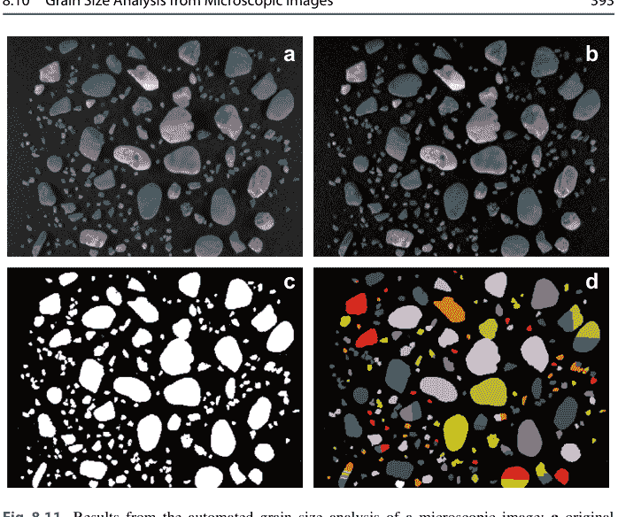

**图8.11** 显微图像自动粒度分析的结果：**a** 原始灰度图像，**b** 调整强度值后的图像，**c** 转换为二值图像后的图像，以及**d** 使用分水岭分割算法检测到对象的图像。

其中`ix`和`iy`表示用于将图像I1校准到厘米尺度的坐标轴。当包括与图像边界重叠的三个颗粒时，此图像中计数的真实对象数为236，因此在以下练习中忽略此数字。我们可以使用`rgb2gray()`拒绝图像的颜色信息，并将图像I1转换为灰度：

I2 = color.rgb2gray(I1)

plt.figure()
io.imshow(I2,
    extent=[0,ix,0,iy])
plt.title('Grayscale image')
plt.axis('off')
plt.show()

此灰度图像I2的对比度相对较低。因此，我们使用`rescale_intensity()`调整图像强度值，这增加了新图像I3的对比度：

I3 = exposure.rescale_intensity(I2,
    out_range='uint8')

plt.figure()
io.imshow(I3,
    extent=[0,ix,0,iy])
plt.title('Adjusted intensity values')
plt.axis('off')
plt.show()

函数`threshold()`通过阈值处理将无背景图像I3转换为二值图像I4。如果阈值为0，则图像全白；如果阈值为255，则图像全黑。我们手动更改阈值值，直到获得合理的结果。我们发现50是一个合适的阈值：

thresh,I4 = cv2.threshold(I3,
    50,255,cv2.THRESH_BINARY)

plt.figure()
io.imshow(I4,
    extent=[0,ix,0,iy])
plt.title('Binary image')
plt.axis('off')
plt.show()

接下来，我们使用分水岭分割算法来分离图像中的颗粒。地貌学中的分水岭是分隔对相邻流域水文预算有贡献区域的山脊（参见第7.10节）。分水岭分割将相同的方法应用于灰度图像，这些方法用于在数字高程模型中分离流域。在此应用中，灰度值被解释为数字高程模型中的高程，其中分水岭随后分离两个感兴趣的对象。

通常用于识别属于特定对象的像素的标准是最近邻距离。我们使用`distance_transform_edt()`执行的距离变换，该变换为每个像素分配一个数字，该数字是该像素与I4中最近非零像素之间的距离：

distance = ndi.distance_transform_edt(I4)

该函数使用*欧几里得距离*来计算最近邻距离。距离矩阵现在在对象像素中包含正的非零值，在其他地方包含零。我们使用此信息创建一个掩码：

## 8.11 在显微图像中量化木炭

在地球科学中，量化物质的组成（例如，岩石薄片中的矿物组成或筛分沉积物样品中的木炭含量）可以通过使用图像处理方法来实现。*阈值分割*为解决图像中具有不同颜色或灰度值的对象分割问题提供了一种简单的方案。在阈值分割过程中，强度值大于阈值的像素被标记为对象像素（例如，图像中代表木炭的像素），其余像素被标记为背景像素（例如，所有其他物质）。阈值通常通过目视检查图像直方图来手动定义，但也存在许多自动化算法。

例如，我们接下来分析一张来自肯尼亚纳库鲁湖的筛分湖泊沉积物样品图像（图 8.12）。图像显示了大量浅灰色的椭圆形介形虫壳、一些矿物颗粒，以及灰色的植物残体和黑色的木炭碎片。我们使用阈值分割来分离深色的木炭颗粒，并在分割后计算这些颗粒的像素数。在确定了所有可以通过阈值分割与背景区分开的对象的像素数之后，我们使用一个较低的阈值来确定代表木炭的像素数与代表样品中所有颗粒的像素数之比（即，为了确定样品中木炭的百分比）。

我们读取一张尺寸为 1500 x 1500 像素的图像，并假设这个方形图像的宽度和高度均为一厘米：

```python
import cv2
import numpy as np
import matplotlib.pyplot as plt
from skimage import color
from skimage import exposure
from skimage import io

I1 = io.imread('lakesediment.jpg')
ix = 1
iy = 1

plt.figure()
io.imshow(I1,
    extent=[0,ix,0,iy])
plt.xlabel('Centimeter')
plt.ylabel('Centimeter')
plt.title('Original image')
io.show()
```

然后使用 `rgb2gray` 将 RGB 彩色图像转换为灰度图像：

```python
I2 = color.rgb2gray(I1)

plt.figure()
io.imshow(I2,
    extent=[0,ix,0,iy])
plt.xlabel('Centimeter')
plt.ylabel('Centimeter')
plt.title('Grayscale')
io.show()
```

由于图像对比度相对较低，我们使用 `rescale_intensity()` 来调整图像的强度值。这增加了新图像 I3 的对比度：

```python
I3 = exposure.rescale_intensity(I2,
    out_range='uint8')

plt.figure()
io.imshow(I3,
    extent=[0,ix,0,iy])
plt.xlabel('Centimeter')
plt.ylabel('Centimeter')
plt.title('Better contrast')
io.show()
```

函数 `threshold()` 通过阈值分割将图像 I4 转换为二值图像 I6。如果阈值为 0，则图像全白；如果阈值为 255，则图像全黑。我们手动更改阈值，直到获得合理的结果。在我们的示例中，阈值为 43 时，识别木炭碎片的效果很好：

```python
thresh, I4 = cv2.threshold(I3,
    43,255,cv2.THRESH_BINARY)
I4 = exposure.rescale_intensity(I6,
    out_range='uint8')

plt.figure()
io.imshow(I4,
    extent=[0,ix,0,iy],
    cmap='gray')
plt.xlabel('Centimeter')
plt.ylabel('Centimeter')
plt.title('Only charcoal')
io.show()
```

由于我们知道一个像素的大小，我们现在只需计算像素数即可估算图像中木炭的总量。最后，我们计算所有对象的面积，包括木炭：

```python
thresh, I5 = cv2.threshold(I3,
    150,255,cv2.THRESH_BINARY)

plt.figure()
io.imshow(I5,
    extent=[0,ix,0,iy])
plt.xlabel('Centimeter')
plt.ylabel('Centimeter')
plt.title('All objects')
io.show()
```

我们感兴趣的不是图像中木炭的绝对面积，而是样品中木炭的百分比。输入

```python
print(100*np.sum(np.sum(I4==0))/np.sum(np.sum(I5==0)))
```

因此得到

```
13.672022985345837
```

这个结果表明，大约 13% 的筛分样品是木炭。作为下一步，我们可以通过选择不同的阈值来量化样品中的其他成分（例如，介形虫或矿物颗粒）。

## 8.12 基于形状的图像对象检测

根据形状对图像中的对象进行计数是一项非常耗时的任务。这有时是针对圆形对象进行的，例如，为了推断过去的海面温度而计数浮游有孔虫壳，为了推断过去湖水的化学成分而计数硅藻壳，或者为了确定物种组合而计数花粉粒，这些组合可用于重建区域气温和降水。确定的线性对象包括航空照片和卫星图像中的断层（以推导一个区域的现今应力场）以及薄片中的年层（例如，纹泥）（以建立年分辨率的地层学）。

*霍夫变换*——以 Paul VC Hough 1962 年的相关专利命名——是一种流行的技术，用于根据形状检测图像中的对象。霍夫变换最初用于检测线性特征，但在获得专利后不久，它就被推广用于识别任何形状的对象（Duda and Hart 1972; Ballard 1981）。Gonzalez 和 Woods (2018) 的著作包含了对霍夫变换及其在检测图像中对象方面应用的全面介绍。根据作者对该方法的介绍，霍夫变换分两步进行：第一步，使用边缘检测器从图像中提取边缘特征（例如，明显的沉积层或花粉粒的轮廓）。第二步，识别出追踪这些边缘特征的直线（或任何其他形状的对象）。*scikit-image* 包包含使用霍夫变换来检测直线或圆形对象的函数。

经典的霍夫变换用于检测图像中的直线。在应用任何类型的边缘检测器之后，我们得到一个二值图像，其中边缘是黑色像素，之间是白色像素。接下来，我们使用直线到原点的欧几里得距离 $\rho$ 以及从原点到直线上最近点的向量的角度 $\theta$ 来描述通过给定黑色像素的直线（图 8.13 a）：

$$
\rho = x \cos \theta + y \sin \theta
$$

通过边缘特征的特定像素 $(x_i, y_i)$ 的所有直线族在 $(\theta, \rho)$ 参数空间中显示为一条正弦曲线（图 8.13 b）。两条这样的正弦曲线的交点 $(\theta', \rho')$ 对应于通过边缘特征的两个不同像素 $(x_1, y_1)$ 和 $(x_2, y_2)$ 的直线。接下来，我们在霍夫变换中搜索 $n$ 个点 $(x_i, y_i)$，其中许多直线相交，因为这些点定义了追踪边缘特征的直线。检测圆而不是直线的工作原理类似，使用圆心的坐标和半径代替 $\rho$ 和 $\theta$。

## 8.12 基于形状的图像目标检测

我们的第一个示例使用这些函数来检测阿根廷卡法亚特峡谷（Quebrada de Cafayate）暴露的纹层沉积物中薄层的纯白色硅藻土，因为这些沉积物在之前的章节中也被用作示例（Trauth 等人，1999，2003）（图 8.8）。图像质量并不完美，因此我们无法期望获得最佳结果。我们首先读取第 8.8 节中层状沉积物的裁剪版本，并将其存储在变量 I1 中。图像大小为 1047 x 1691 像素，由三种颜色（即红色、绿色和蓝色）组成：

```python
import cv2
import numpy as np
import matplotlib.pyplot as plt
from skimage import color
from skimage import exposure
from skimage import io
from skimage import feature
from skimage import transform
from skimage import draw

I1 = io.imread('varves_cropped.tif')

plt.figure()
io.imshow(I1)
plt.axis('off')
io.show()
```

我们可以使用 `rgb2gray()` 函数舍弃图像的颜色信息，并将 I1 转换为灰度图：

```python
I2 = color.rgb2gray(I1)

plt.figure()
io.imshow(I2)
plt.axis('off')
io.show()
```

然后，我们使用 `equalize_adapthist()` 函数执行*对比度受限自适应直方图均衡化*（CLAHE），以增强图像的对比度（Zuiderveld 1994）：

```python
I3 = exposure.equalize_adapthist(I2,
    clip_limit=0.1, nbins=256)

plt.figure()
io.imshow(I3)
plt.axis('off')
io.show()
```

在此情况下，`clip_limit` 使用一个 0 到 1 之间的实数标量来限制对比度增强，数值越大，对比度越高（默认值为 0.01）。使用 `clip_limit` 为 0.1 可以获得良好的效果。然后使用 `threshold()` 函数通过阈值处理将图像 I3 转换为二值图像 I4。我们手动更改阈值，直到获得合理的结果，并发现 0.55 是一个合适的阈值：

```python
thresh, I4 = cv2.threshold(I3,
    0.55, 1., cv2.THRESH_BINARY)
I4 = exposure.rescale_intensity(I4,
    out_range='uint8')

plt.figure()
io.imshow(I4)
plt.axis('off')
io.show()
```

`hough_line()` 函数实现了霍夫变换，以返回霍夫变换累加器 H、变换计算的角度 `theta`（以弧度为单位）以及距离值 `dists`：

```python
H, theta, dists = transform.hough_line(I4)
```

然后我们使用以下代码显示霍夫变换累加器 H：

```python
plt.figure()
io.imshow(exposure.equalize_adapthist(H),
    cmap='hot', aspect='auto')
plt.xlabel('Theta')
plt.ylabel('Rho')
plt.title('Hough transform')
io.show()
```

我们可以确定霍夫变换的 15 个极大值，它们对应于图像中最显著的 15 条线。然后我们计算这些线在图像中的 y 轴截距 yintcs 和斜率 slopes：

```python
io.imshow(exposure.equalize_adapthist(np.uint16(H)),
    theta, dists, num_peaks=15, min_distance=20)

yintcs = dists * np.array([np.cos(theta),
    np.sin(theta)])
yintcs = np.transpose(yintcs)
slopes = np.tan(theta + np.pi / 2)
```

现在可以使用这些信息在图像上显示这些线：

```python
s = np.shape(I1)

plt.figure()
ax = plt.axes()
io.imshow(I1)
plt.axis('off')
for i in range(0, len(dists)):
    ax.axline((yintcs[i, 0], yintcs[i, 1]),
        slope=slopes[i])
plt.axis(np.array([0, s[1], s[0], 0]))
io.show()
```

结果显示，清晰可辨的白色层被很好地检测到，而不太明显的层则未被识别。由于图像质量较低，该方法还错误地标记了图像中不存在的线。使用更高质量的图像并仔细调整霍夫变换的参数将产生更好的结果。

**图 8.14** 使用 `hough_line()` 自动检测阿根廷卡法亚特峡谷暴露的纹层沉积物中薄层的纯白色硅藻土（Trauth 等人，1999，2003）：**a** 灰度图像，**b** 增强后的图像，**c** 二值图像，**d** 用红线标记硅藻土层的图像，以及 **e** 图像的霍夫变换。

在第二个示例中，霍夫变换用于自动计算阿根廷蜂蜜显微图像中的花粉粒数量（图 8.15）。图像质量同样不完美，因此我们无法期望获得最佳结果。特别是，三维物体的图像放大倍数非常高，因此略显模糊。我们首先读取花粉图像并将其存储在变量 I1 中。图像大小为 968 x 1060 像素，由三种颜色（即红色、绿色和蓝色）组成。由于图像相对较大，我们将图像尺寸缩小一半：

图 8.15 使用 `hough_circle()` 自动检测阿根廷蜂蜜显微图像中的花粉粒（主要是*菊科*花粉，较少见的*云实科*和*唇形科*花粉）（原始图像由 K. Schitteke 和 F. Flores 提供）：**a** 原始 RGB 图像和 **b** 使用霍夫变换检测到的花粉粒。

```python
I1 = io.imread('pollen.jpg')
I1 = I1[::2, ::2, :]

plt.figure()
io.imshow(I1)
plt.axis('off')
io.show()
```

然后我们可以舍弃图像的颜色信息，仅使用红色通道：

```python
I2 = I1[:, :, 1]

plt.figure()
io.imshow(I2)
plt.axis('off')
io.show()
```

接下来，我们使用 `equalize_adapthist()` 函数执行对比度受限自适应直方图均衡化（CLAHE），以增强图像的对比度（Zuiderveld 1994）：

```python
I3 = np.zeros(np.shape(I1))
I3 = exposure.equalize_adapthist(I2)

plt.figure()
io.imshow(I3)
plt.axis('off')
io.show()
```

`hough_circle()` 函数实现了霍夫变换，并从原始图像中提取圆形：

```python
I4 = feature.canny(I3,
    low_threshold=0.2, high_threshold=0.92)

hough_radii = np.arange(12, 20)
hough_res = transform.hough_circle(I4, hough_radii)
H, cx, cy, radii = transform.hough_circle_peaks(
    hough_res, hough_radii,
    min_xdistance=20, min_ydistance=20,
    total_num_peaks=1000)
nstr = 'Number of pollen grains: ' + str(len(radii))
```

然后我们在灰度图像 I2 上显示这些圆：

```python
m, n, p = np.shape(I1)
plt.figure()
plt.axis('off')
I2 = color.gray2rgb(I2)
for i in range(0, len(H)):
    circy, circx = draw.circle_perimeter(cy[i],
        cx[i], radii[i])
    circyn = np.delete(circy, (circy >= m) | (circx >= n))
    circxn = np.delete(circx, (circy >= m) | (circx >= n))
    I2[circyn, circxn] = (255, 0, 0)
    io.imshow(I2)
io.imshow(I2, cmap='gray')
plt.title(nstr)
io.show()
```

图形中圆的边缘颜色设置为 b（蓝色）。结果表明，我们使用此方法计数了 910 个花粉粒。该算法识别了大多数对象，但有些未被识别，一些较大的对象被错误地识别为两个或更多个花粉粒。使用更高质量的图像并仔细调整霍夫变换的参数将产生更好的结果。使用 `hist()` 绘制花粉半径的直方图。

```python
plt.figure()
plt.hist(radii)
plt.show()
```

显示大多数花粉粒的半径约为 15 像素。

## 8.13 从屏幕数字化

屏幕数字化是一种广泛使用的图像处理技术。虽然市面上有各种格式和尺寸的实用数字化仪，但大多数人更喜欢从屏幕上数字化矢量数据。此类应用的例子包括在地形图上数字化河网和流域、在地质图上数字化岩性单元的轮廓、在卫星图像上数字化滑坡分布以及在显微图像中数字化矿物颗粒分布。数字化过程包括以下步骤：首先将图像导入工作区。然后定义坐标系，从而允许通过将光标或十字线移动到图像上并单击鼠标按钮来输入感兴趣的对象。结果是一个二维的 xy 数据数组，例如多边形角点的经纬度或特定区域中感兴趣对象的坐标。

`matplotlib` 包中的 `ginput()` 函数允许使用鼠标从屏幕进行图形输入。它通常用于从任意图形函数（如 `plot`）创建的图形中选择点，例如特定的数据点。`ginput()` 函数通常用于交互式绘图，即数字化点在被选中后会出现在屏幕上。该函数的缺点是它不提供图像上的坐标参考。因此，我们使用该函数的一个修改版本，该版本允许将图像参考到任意的矩形坐标系。我们将以下代码保存在文本文件 `minput.py` 中，作为 `ginput()` 函数的修改版本：

```python
def minput(x = None):

    import numpy as np
    import matplotlib.pyplot as plt
    from skimage import io

    xmin = input('Specify xmin! ')
    xmax = input('Specify xmax! ')
    ymin = input('Specify ymin! ')
    ymax = input('Specify ymax! ')

    xmin = float(xmin)
    xmax = float(xmax)
    ymin = float(ymin)
    ymax = float(ymax)

    B = io.imread(x)
    a, b, c = B.shape
```

plt.figure()
io.imshow(B)
plt.axis('off')

print('点击左下角和右上角，然后按<回车>')
cr = plt.ginput(-1, show_clicks=True)
cr = np.asarray(cr)

XMIN = xmin - ((xmax - xmin) * cr[0, 0] / (cr[1, 0] - cr[0, 0]))
XMAX = xmax + ((xmax - xmin) * (a - cr[1, 0]) / (cr[1, 0] - cr[0, 0]))
YMIN = ymin - ((ymax - ymin) * cr[0, 1] / (cr[1, 1] - cr[0, 1]))
YMAX = ymax + ((ymax - ymin) * (b - cr[1, 1]) / (cr[1, 1] - cr[0, 1]))

print('点击要数字化的点，然后按<回车>')
y = plt.ginput(-1, show_clicks=True)
y = np.asarray(y)

y[:, 0] = XMIN + (XMAX - XMIN) * y[:, 0] / a
y[:, 1] = YMIN + (YMAX - YMIN) * y[:, 1] / b
return y

函数 `minput()` 包含四个阶段。第一阶段，用户输入坐标轴的极限值作为图像的参考点。然后，图像被导入工作区并显示在屏幕上。第三阶段使用 `ginput` 定义图像的左上角和右下角。第四阶段，利用图形窗口中两个角点的坐标与参考坐标系之间的关系，计算所有数字化点的变换。

例如，我们使用存储在文件 *naivasha_georef.jpg* 中的图像，并数字化图像中心纳瓦沙湖的轮廓。我们通过以下命令从命令窗口激活新函数 `minput()`：

```python
import matplotlib
matplotlib.use('TkAgg')
from minput import minput

data = minput('naivasha_georef.jpg')
```

该函数首先要求输入 *x* 轴和 *y* 轴的极限坐标以及参考框架。我们输入相应的数字，并在每次输入后按 *回车*（不是 *Enter*）：

```
Specify xmin! 36.1
Specify xmax! 36.77
Specify ymin! -0.88
Specify ymax! -0.4
```

然后函数读取文件 *naivasha_georef.jpg* 并显示图像，我们等待下一步响应：

```
Click on ll and ur corner, then <return>
```

图像窗口可以根据用户偏好进行缩放。点击旋转后卫星图像的左下角（ll）和右上角（ur）（而不是底层黑色背景的角点）来定义图像的尺寸。通过按 *回车*（不是 *Enter*）来确认这些更改。然后，该程序将图像与坐标系关联起来，并等待我们输入希望从图像中数字化的点：

```
Click on data points to digitize, then <return>
```

我们现在可以数字化，例如，湖泊的轮廓、构造断层或凝灰岩锥。我们再次按 *回车* 结束输入。然后，我们数字化点的 *xy* 坐标存储在变量 *data* 中。我们现在可以将这些矢量数据用于其他应用。

## 参考文献

Abrams M, Hook S (2002) ASTER 用户手册 – 版本 2. 喷气推进实验室和 EROS 数据中心，苏福尔斯
Ballard DH (1981) 广义霍夫变换检测任意形状. 模式识别 13:111–122
Barry P (2001) EO-1/Hyperion 科学数据用户指南. TRW 空间、国防与信息系统，雷东多海滩，加利福尼亚州
Beck R (2003) EO-1 用户指南. 美国地质调查局地球资源观测系统数据中心 (EDC)，苏福尔斯，南达科他州
Beck RO, Hart PE (1972) 使用霍夫变换检测图像中的线和曲线. ACM 通讯 15:1–15
Davies ER (2005) 机器视觉：理论、算法、实践，第 3 版. 摩根考夫曼出版社，伯灵顿
Duda RO, Hart PE (1972) 使用霍夫变换检测图像中的线和曲线. ACM 通讯 15:1–15
Esmaili RB (2021) 使用 Python 进行地球观测——实用编程指南. 约翰·威利父子出版社，纽约
Foerster V, Asrat A, Bronk Ramsey C, Brown ET, Chapot MS, Deino A, Duesing W, Grove M, Hahn A, Junginger A, Kaboth-Bahr S, Lane CS, Opitz S, Noren A, Roberts HM, Stockhecke M, Tiedemann R, Vidal CM, Vogelsang R, Cohen AS, Lamb HF, Schaebitz F, Trauth MH (2022) 更新世非洲东部的气候变率影响了人类进化. 自然地球科学 15:805–811
Gonzalez RC, Woods RE (2018) 数字图像处理，全球版. 皮尔逊，伦敦
Hough PVC (1962) 识别复杂图案的方法和装置. 美国专利号 3069654
Irons J, Riebeek H, Loveland T (2011) 陆地卫星数据连续性任务——持续观测你的世界. NASA 和 USGS（可在线获取）
Lein JK (2012) 环境感知——地球观测分析技术. 施普林格，柏林
Mandl D, Cruz P, Frye S, Howard J (2002) NASA/USGS 合作将地球观测-1号转变为商业可行的任务以最大化技术融合. SpaceOps 2002，休斯顿，德克萨斯州，2002年10月9–12日
Ochs B., Hair D, Irons J, Loveland T (2009) 陆地卫星数据连续性任务，NASA 和 USGS（可在线获取）
Richards JA (2013) 遥感数字图像分析，第 4 版. 施普林格，柏林
Trauth MH, Strecker MR (1999) 阿根廷西北部在 40,000 至 25,000 年前湿润期间形成的滑坡堰塞湖. 古地理学、古气候学、古生态学 153:277–287
Trauth MH, Bookhagen B, Marwan N, Strecker MR (2003) 多个滑坡集群记录了阿根廷西北部安第斯山脉的第四纪气候变化. 古地理学、古气候学、古生态学 194:109–121
Trauth MH (2024) 地球科学 MATLAB 食谱——第六版. 施普林格，柏林
Yuen HK, Princen J, Illingworth J, Kittler J (1990) 圆形检测的霍夫变换方法比较研究. 图像与视觉计算 8:71–77
Zuiderveld K (1994) 对比度受限的自适应直方图均衡化. 图形宝石 IV. 学术出版社专业，圣地亚哥，第 474–485 页

# 多元统计

### 9.1 引言

多元分析用于理解和描述任意数量变量之间的关系。地球科学家经常处理多元数据集，例如微体化石组合、火山灰层的地球化学指纹或沉积序列的粘土矿物含量。此类多元数据集由对 $n$ 个对象测量的 $p$ 个变量组成，通常存储在 $n$ 行 $p$ 列的数组中：

$$X = \begin{pmatrix} x_{11} & x_{12} & \dots & x_{1p} \\ x_{21} & x_{22} & \dots & x_{2p} \\ \vdots & \vdots & & \vdots \\ x_{n1} & x_{n2} & \dots & x_{np} \end{pmatrix}$$

数组的行代表 $n$ 个对象，列代表 $p$ 个变量。样本集中第 2 个对象的特征由数据数组第二行中的向量描述：

$$X_2 = (x_{21} \ x_{22} \ \dots \ x_{2p})$$

例如，让我们考虑一个火山灰层玻璃碎片的微探针分析数据集。变量是 $p$ 种化学元素，对象是 $n$ 个灰样。研究的目的是通过它们的地球化学指纹来关联灰层。

大多数多元方法试图克服与此类数据集相关的主要困难，即数据可视化问题。虽然单变量或双变量数据集的特征可以通过直观检查二维直方图或 *xy* 图（第 3 章）来轻松探索，但三变量数据集的图形显示需要将数据点的三维分布投影到二维显示上。想象或显示更多变量是不可能的。解决高维数据集可视化问题的一个方法是减少维度。有几种方法可以将数据集中高度相关的变量分组在一起，并探索减少后的组数。

减少维度的经典方法是 *主成分分析*（PCA）和 *因子分析*（FA）。这些方法寻求数据集中最大方差的方向，并将这些方向用作新的坐标轴。用新的变量组替换现有变量的优势在于这些组是不相关的。因此，这些方法用于分离（或分离）混合变量。此外，新变量通常有助于解释多元数据集，因为它们经常包含有关导致数据点分布的过程的有价值信息。在岩浆岩的地球化学分析中，该方法定义的组通常包含在某些矿物晶格中具有相似大小离子和相似位置的化学元素。例如硅酸盐中的 Si$^{4+}$ 和 Al$^{3+}$，以及 Fe$^{2+}$ 和 Mg$^{2+}$。

第二类重要的多元方法旨在根据相似性对对象进行分组。例如，*聚类分析*（CA）通常用于关联火山灰层，如上例所示。火山灰年代学试图通过其地球化学指纹来关联火山灰。当与来自关键灰层的几个放射性年龄测定相结合时，该方法允许在包含这些灰层的不同沉积序列之间进行关联（例如，Westgate 等人，1998；Hermanns 等人，2000）。聚类分析也用于微体古生物学领域，例如，用于比较不同的微体化石组合（例如，Birks 和 Gordon，1985）。

第三类方法涉及对观测进行分类。人类倾向于对周围的事物进行分类，尽管自然界很少划分为离散的类别。分类（或归类）是有用的，因为它可以帮助决策者在钻探油井或将化石归入特定属或种时采取必要的预防措施以降低风险。大多数分类方法基于具有两个选项的布尔逻辑做出决策，即真或假，就像在显微镜图像中使用阈值识别木炭一样（第 8.11 节）。或者，模糊逻辑（本书未解释）是二元布尔逻辑的推广，适用于许多现实世界中渐进过渡是合理的决策问题（Zadeh 1965，MathWorks 2023a）。

以下章节介绍多元统计最重要的技术。首先，*主成分分析*（PCA）和 *聚类分析*（CA）分别在第 9.2 节和第 9.5 节中介绍，*独立成分分析*（ICA）（PCA 的非线性扩展）在第 9.3 节中概述。第 9.4 节介绍 *判别分析*（DA），这是一种流行的方法地球科学中的分类。第9.6节介绍了*多元线性回归*，第9.7节演示了如何使用约翰·艾奇逊的*对数变换*来解决闭合和问题——这是一个在多元数据集中非常常见的问题（Aitchison 1984, 1986, 1999, 2003）。这些章节首先介绍了各种技术背后的理论，然后演示了如何使用Python函数将这些技术应用于分析地球科学数据。对于多元分析，我们使用[NumPy](https://numpy.org)、[Matplotlib](https://matplotlib.org)和[scikit-learn](https://scikit-learn.org)包，以及[SciPy](https://scipy.org)库，它们包含了所有必要的例程。

## 9.2 主成分分析

*主成分分析*（PCA）检测*p*个变量之间的线性依赖关系，并将线性相关的变量组替换为*p*个不相关的变量，这些变量被称为*主成分*（PCs）（图9.1）。PCA——最初由卡尔·皮尔逊（1901）提出，后由哈罗德·霍特林（1931）进一步发展——是用于线性解混（或分离）混合变量的标准方法。PCA等价于将一个$p$维椭球拟合到一个包含$p$个变量的数据集，其中数据集中$p \times p$协方差矩阵的$p$个特征向量就是椭球的轴。因此，PCA是特征向量方法之一。$p$个特征值代表了每个特征向量之间的方差分布。

PCA的性能最好通过一个包含两个变量$x_1$和$x_2$的双变量数据集来说明，这两个变量表现出强线性相关性。通过将一个二维椭圆拟合到数据上，该椭圆由数据集的$2 \times 2$协方差矩阵的两个特征向量$PC_1$和$PC_2$定义（图9.1）。由于第一主成分$PC_1$穿过数据散点的长轴，且新原点是双变量均值，因此$PC_1$可以用来描述大部分方差，而$PC_2$只贡献少量的额外信息。在此变换之前，需要两个轴$x_1$和$x_2$来描述数据集，但现在可以通过舍弃第二轴$PC_2$来降低数据维度，而不会丢失太多信息，如图9.1所示。

由于该方法产生的信号$PC_1$和$PC_2$是线性不相关的，因此该方法也被称为*白化*，因为这一特性是白噪声的特征。成功应用此方法的一个重要前提是数据服从高斯分布。尽管分离出的信号是不相关的，但它们仍然可能是相互依赖的（即，它们可能保留非线性相关性）。例如，如果数据不服从高斯分布，PCA因此无法产生有用的结果，就会出现这种现象。独立成分分析（ICA）就是为这类任务开发的，它将$p$个独立变量（随后是非线性不相关的）从$p$个相关变量中分离出来（第9.3节）。

这个过程现在可以扩展到任意数量的变量和样本。让我们假设一个数据集，它包含对$n$个样本的$p$个变量的测量值，存储在一个$n \times p$的数组$X$中：

$$X = \begin{pmatrix} x_{11} & x_{12} & \dots & x_{1p} \\ x_{21} & x_{22} & \dots & x_{2p} \\ \vdots & \vdots & & \vdots \\ x_{n1} & x_{n2} & \dots & x_{np} \end{pmatrix}$$

数组$X$的列表示$p$个变量，行表示$n$个样本。在旋转轴并移动原点后，新的坐标$Y_j$可以通过以下公式计算：

$$Y_1 = a_{11}X_1 + a_{12}X_2 + \dots + a_{1p}X_p$$
$$Y_2 = a_{21}X_1 + a_{22}X_2 + \dots + a_{2p}X_p$$
$$\vdots$$
$$Y_p = a_{p1}X_1 + a_{p2}X_2 + \dots + a_{pp}X_p$$

第一主成分$PC_1$（用$Y_1$表示）包含最高的方差，而$PC_2$包含第二高的方差，依此类推。所有的$PCs$一起包含了数据集的全部方差。然而，这种方差主要集中在前几个$PCs$中，它们包含了数据集的大部分信息内容。因此，为了降低数据维度，通常会忽略最后的$PCs$。上述方程中的因子$a_{ij}$是*主成分载荷*，它们的值代表了原始变量对新$PCs$的相对贡献。如果变量$X_j$在$PC_1$中的载荷$a_{ij}$接近于零，则该变量的影响很小，而较高的正或负$a_{ij}$值则表明有很强的影响。通过原始变量$X_j$的线性组合（由载荷加权）计算出的新变量值$Y_j$被称为*主成分得分*。

PCA通常用于解混（或分离）变量$X$，这些变量是独立源变量$S$的线性组合，

$$X = A^T \cdot S$$

其中$A$是混合矩阵。PCA的目标是确定（尽管不是定量地）源变量$S$（由主成分得分$Y_j$表示）和混合矩阵$A$（由主成分载荷$a_{ij}$表示）。如果原始变量$X$的概率分布是高斯分布，那么解混此类变量的效果最好，并且只有在这种情况下，主成分才是完全线性去相关的。然而，地球科学中的数据通常不服从高斯分布，因此应使用替代方法——如独立成分分析（ICA）（第9.3节）。例如，高光谱数据中的辐射亮度和反射率值通常不服从高斯分布，因此在遥感应用中，ICA而非PCA被广泛用于对光谱波段进行去相关。使用PCA的例子包括评估沉积物来源（如下例所述）、解混玄武岩的地幔橄榄岩源区，以及对卫星图像进行多光谱分类。

第一个示例说明了不使用`PCA()`而是使用`cov()`来计算$p=2$维数据集的$p \times p$协方差矩阵，然后使用`eig()`来计算该矩阵的$p$个特征向量和$p$个特征值的PCA。接下来我们假设一个数据集，它包含对$n$个样本的$p$个变量的测量值，存储在一个名为`data`的$n \times p$数组中。作为一个例子，我们可以创建一个具有强线性相关性的双变量数据集，包含2×30个数据点，并叠加了正态分布的噪声：

```python
import numpy as np
import numpy.linalg as linalg
from matplotlib import cm
import matplotlib.pyplot as plt
from numpy.random import default_rng
from sklearn.decomposition import PCA
```

```python
rng = default_rng(0)
data = rng.standard_normal((30,2))
data[:,1] = 3.4 + 1.2*data[:,0]
data[:,1] = data[:,1] + 0.2*rng.standard_normal(np.shape(data[:,1]))

plt.figure()
plt.plot(data[:,0],data[:,1],
    marker='o',
    linestyle='none')
ax = plt.gca()
ax.spines['top'].set_color('none')
ax.spines['right'].set_color('none')
ax.spines['left'].set_position('zero')
ax.spines['bottom'].set_position('zero')
plt.axis(np.array([-3,2,0,6]))
plt.xlabel('x-value')
plt.ylabel('y-value')
plt.show()
```

我们可以在一个坐标轴相交于原点的坐标系中显示数据。这是通过使用`set_position('zero')`实现的（图9.2 a）：

```python
plt.figure()
plt.plot(data[:,0],data[:,1],
    marker='o',
    linestyle='none')
ax = plt.gca()
ax.spines['top'].set_color('none')
ax.spines['right'].set_color('none')
ax.spines['left'].set_position('zero')
ax.spines['bottom'].set_position('zero')
plt.axis(np.array([-3,2,0,6]))
plt.xlabel('x-value')
plt.ylabel('y-value')
plt.show()
```

目标是找到一个单位向量，该向量指向双变量数据集中方差最大的方向。这个问题的解决方案是计算协方差矩阵$C$的最大特征值$D$和相应的特征向量$V$，

$$C \cdot V = \lambda \cdot V$$其中

$C = data' \cdot data$

这等价于

$(C - D \cdot E) \cdot V = 0$

其中 $E$ 是单位矩阵，这是一个经典的特征值问题：它是一个线性方程组，特征向量 $V$ 是其解。我们必须首先对数据进行均值中心化，这涉及从两列（即数据的两个变量）中减去单变量均值。因此，在后续步骤中，我们仅研究与均值的偏差：

```
data[:,0] = data[:,0]-np.mean(data[:,0]);
data[:,1] = data[:,1]-np.mean(data[:,1]);
```

接下来，我们计算数据的协方差矩阵 C。协方差矩阵包含了旋转坐标系所需的所有信息，

```
C = np.cov(data[:,0],data[:,1])
print(C)
```

输出结果为

```
[[0.92061706 1.00801248]
 [1.00801248 1.14192816]]
```

旋转有助于创建不相关的新变量（即，所有新变量对之间的协方差为零）。去相关是通过对协方差矩阵 C 进行对角化来实现的。属于对角化协方差矩阵的特征向量 V 是旧基向量的线性组合，因此表达了旧数据序列与新数据序列之间的相关性。我们通过求解方程来找到协方差矩阵 C 的特征值

$\det(C - D \cdot E) = 0$

协方差矩阵的特征值 D（即 C 的对角化版本）给出了新坐标轴（即主成分）内的方差。我们现在计算协方差矩阵 C 的特征向量 V 和特征值 D，

```
D,V = linalg.eig(C)
print(V)
print(D)
```

输出结果为

```
[[-0.744688 -0.66741275]
 [ 0.66741275 -0.744688 ]]

[0.01720466 2.04534057]
```

如我们所见，第二个特征值 2.0453 大于第一个特征值 0.0172。因此，我们需要在变换后改变新变量的顺序。然后，我们显示数据以及代表新坐标系的特征向量（图 9.2 b）：

```
plt.figure()
plt.plot(data[:,0],data[:,1],
    marker='o',
    linestyle='none')
plt.plot((0,V[0,0]),(0,V[1,0]),
    color=(0.8,0.5,0.3),
    linewidth=0.75)
plt.text(V[0,0],V[1,0],'PC2',
    color=(0.8,0.5,0.3))
plt.plot((0,V[0,1]),(0,V[1,1]),
    color=(0.8,0.5,0.3),
    linewidth=0.75)
plt.text(V[0,1],V[1,1],'PC1',
    color=(0.8,0.5,0.3))
ax = plt.gca()
ax.spines['top'].set_color('none')
ax.spines['right'].set_color('none')
ax.spines['left'].set_position('zero')
ax.spines['bottom'].set_position('zero')
plt.axis(np.array([-6,6,-4,4]))
plt.xlabel('x-value')
plt.ylabel('y-value')
plt.show()
```

特征向量是单位向量且正交；因此，其范数为一，内积（标量积、点积）为零，

```
print(linalg.norm(V[:,0]))
print(linalg.norm(V[:,1]))
print(np.dot(V[:,0],V[:,1]))
```

输出结果为

```
0.9999999999999999
0.9999999999999999
0.0
```

我们现在计算新坐标系中的数据集 `newdata`。我们需要左右翻转 `newdata`，因为第二列是具有最大特征值的那一列（如前所述），

```
newdata = np.matmul(data,V)
newdata = np.fliplr(newdata)
print(newdata)
```

输出结果为

```
[[-0.28687857 -0.06796136]
 [-0.98110732 -0.13692354]
 [ 0.42153266  0.18529491]
 [-2.11734482 -0.00967294]
 [ 0.89395125 -0.01241517]
 [ 0.85585602 -0.08631932]
 [ 3.23801307  0.06391048]
 [ 1.59265288  0.08944404]]
```

协方差矩阵的特征值表示该（新）坐标方向上的方差。我们可以利用此信息，通过将根据特征向量得到的方差除以方差总和，来计算每个新变量的相对方差。在我们的例子中，第一和第二主成分分别包含数据总方差的 99.57% 和 0.43%，

```
print(np.var(newdata[:,0],ddof=1))
print(np.var(newdata[:,1],ddof=1))

print(np.var(newdata[:,0],ddof=1)/
      (np.var(newdata[:,0],ddof=1)+ \
       np.var(newdata[:,1],ddof=1)))
print(np.var(newdata[:,1],ddof=1)/
      (np.var(newdata[:,0],ddof=1)+ \
       np.var(newdata[:,1],ddof=1)))
```

输出结果为

```
2.045340567485195
0.017204658450711223
0.9916585303273026
0.008341469672697424
```

或者，我们可以通过归一化特征值来获得方差，

```
variance = D / np.sum(D)
print(variance)
```

输出结果为

```
[0.00834147 0.99165853]
```

这再次表明两个主成分的方差分别占 99.17% 和 0.83%。我们现在在新坐标系中显示 `newdata` 中的数据（图 9.2 c）：

```
plt.figure()
plt.plot(newdata[:,0],newdata[:,1],
    marker='o',
    linestyle='none')
ax = plt.gca()
ax.spines['top'].set_color('none')
ax.spines['right'].set_color('none')
ax.spines['left'].set_position('zero')
ax.spines['bottom'].set_position('zero')
plt.axis(np.array([-6,6,-4,4]))
plt.xlabel('PC1',loc='right')
plt.ylabel('PC2',loc='top')
plt.show()
```

我们也可以使用 PCA() 进行相同的实验。此函数的输入是 data，函数返回一个 pca 对象，其中包含 PCA 成分（或载荷）、解释方差以及计算 newdata 所需的变换：

```
pca = PCA(n_components=2)
pca.fit(data)
print(pca.components_)
print(pca.explained_variance_ratio_)
newdata = pca.transform(data)
print(newdata)
```

如我们所见，我们得到了与之前相同的值：

```
[[-0.66741275 -0.744688 ]
 [-0.744688 0.66741275]]

[0.99165853 0.00834147]

[[-0.28687857 -0.06796136]
 [-0.98110732 -0.13692354]
 [ 0.42153266 0.18529491]
 [-2.11734482 -0.00967294]
 [ 0.89395125 -0.01241517]
 [ 0.85585602 -0.08631932]
 [ 3.23801307 0.06391048]
 [ 1.59265288 0.08944404]]
```

正如预期的那样，数据已成功去相关，我们可以通过 `corrcoef()` 来验证，

```
r = np.corrcoef(newdata[:,0],newdata[:,1])
print(r[0,1])
```

得到一个接近零的值：

```
-5.385152103520556e-16
```

第二个合成示例演示了对沉积物样本数据集进行线性解混。从沉积序列的三十个不同层位各取一个样本，这些层位包含存储在数组 x 列中的三种不同矿物的不同比例。沉积物源自三种不同的岩石类型（矿物组成未知），它们对三十个沉积物样本的相对贡献分别由 s1、s2 和 s3 表示。这些相对贡献的变化（由 s1、s2 和 s3 中的三十个值表示）可能反映沉积盆地集水区内的气候变率。因此，可能可以利用数组 x 中的沉积物组成（我们使用 PCA 从中计算 s1、s2 和 s3）来推导过去气候变化的信息。

我们需要创建一个合成数据集，包含三个测量值，代表三十个沉积物样本中每种三种矿物的比例。我们首先清空工作区，并使用 `default_rng(0)` 重置随机数生成器。然后，我们使用 `standard_normal()` 创建 s1、s2 和 s3，该函数生成均值为零、标准差分别为 10、7 和 12 的高斯分布随机数：

```
rng = default_rng(0)
s1 = 10*rng.standard_normal(30)
s2 = 7*rng.standard_normal(30)
s3 = 12*rng.standard_normal(30)
```

然后，我们通过首先将 s1、s2 和 s3 的值乘以一个权重因子，然后求和，来计算三十个沉积物样本中每种三种矿物的不同比例：

```
x = np.zeros((30,3))
x[:,0] = 15.4+ 7.2*s1+10.5*s2+2.5*s3
x[:,1] = 124.0-8.73*s1+ 0.1*s2+2.6*s3
x[:,2] = 100.0+5.25*s1- 6.5*s2+3.5*s3
```

权重因子（在我们的练习中共同代表混合矩阵）不仅反映了源岩矿物组成的差异，也反映了沉积盆地内矿物的风化、迁移和沉积。因此，如果两种矿物的权重因子符号不同，其中一种可能是另一种的风化产物，这解释了为什么它们在三十个沉积物样本中的比例是负相关的。或者，不同的符号可能表示稀释效应：如果沉积物样本中一种矿物的比例保持不变，但所有其他矿物的比例以类似方式变化，它们将与第一种矿物的比例呈负相关。为了完成数据集的生成，我们向矿物比例添加一些标准差为 3.8 的高斯噪声：

```
x = x + 3.8*rng.standard_normal(np.shape(x))
```

既然我们已经了解了沉积记录是如何创建的，并检查了数据集中存在的依赖关系，接下来我们假设我们不知道三种源岩对三十个沉积物样本的相对贡献。PCA 的目标现在是解读三种源岩对沉积物组成的统计独立贡献。我们可以显示数据的直方图，看到它们并非完美的高斯分布，这意味着我们不能期望得到完美的解混结果：

```
plt.figure()
plt.subplot(1,3,1)
plt.hist(x[:,0])
plt.subplot(1,3,2)
plt.hist(x[:,1])
plt.subplot(1,3,3)
plt.hist(x[:,2])
plt.show()
```

我们展示了三十个样品沿沉积剖面的三种矿物比例。在此图中，我们可以看到三种矿物比例之间存在弱相关性和反相关性：

```python
plt.figure()
plt.plot(x)
plt.legend(['Min1','Min2','Min3'])
plt.show()
```

在运行PCA之前，我们为练习中创建的各种图形定义标签。我们将样品编号为1到30，矿物分别用四个字符的缩写Min1、Min2和Min3标识：

```python
labels = []
for i in range(0,30):
    labels.append(str(i))
minerals = (['Min1','Min2','Min3'])
```

现在我们可以通过成对双变量散点图来探索矿物之间的相关性，我们观察到矿物1和2之间存在中等负相关，矿物1和3之间存在弱正相关，矿物2和3之间存在强负相关：

```python
plt.figure()
plt.subplot(1,3,1)
plt.plot(x[:,0],x[:,1],
    marker='o',
    linestyle='none')
#plt.xlabel('Mineral 1')
#plt.ylabel('Mineral 2')
plt.subplot(1,3,2)
plt.plot(x[:,0],x[:,2],
    marker='o',
    linestyle='none')
#plt.xlabel('Mineral 1')
#plt.ylabel('Mineral 3')
plt.subplot(1,3,3)
plt.plot(x[:,1],x[:,2],
    marker='o',
    linestyle='none')
#plt.xlabel('Mineral 2')
#plt.ylabel('Mineral 3')
plt.show()
```

*相关矩阵*提供了一种技术，用于探索数据集中变量（即我们示例中的三种矿物）之间的这种依赖关系。相关矩阵的元素是每对变量的皮尔逊相关系数（第4章），如图9.3所示，

```python
corrmatrix = np.corrcoef((x[:,0],x[:,1],x[:,2]))
corrmatrix = np.flipud(corrmatrix)
print(corrmatrix)
```

其输出为

```
[[ 0.21445086 -0.47505897  1.        ]
 [-0.17095653  1.         -0.47505897]
 [ 1.         -0.17095653  0.21445086]]
```

现在我们可以使用热图来显示相关矩阵：

```python
fig, ax = plt.subplots()
c = ax.imshow(corrmatrix,cmap=cm.Blues,clim = (-1,1))
ax.set_xticks(np.linspace(0,2,3))
```

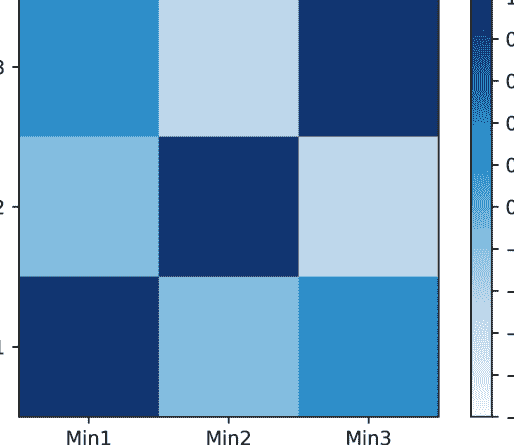

图9.3 包含每对变量（例如沉积物样品中的矿物）皮尔逊相关系数的相关矩阵。深色代表强正线性相关，而浅色代表负相关。中间色表示无相关性。

```python
ax.set_yticks(np.linspace(0,2,3))
ax.set_xticklabels(minerals)
ax.set_yticklabels(np.flipud(minerals))
plt.colorbar(c,ticks=np.linspace(-1,1,11))
plt.show()
```

这个相关系数热图证实了在成对双变量散点图中揭示的矿物之间的相关性，这些相关性再次显示矿物2和3之间存在强负相关（$r=-0.4750$），矿物1和3之间存在弱正相关（$r=0.2144$），矿物1和2之间存在中等负相关（$r=-0.1710$）。这些观察到的依赖关系将使我们期望应用PCA会得到有趣的结果。

在应用PCA之前，有多种方法可以缩放原始数据。这些方法包括*均值中心化*（使用等于零的均值）和*标准化*（使用等于零的均值和等于一的标准差）。然而，我们使用原始数据$x$进行PCA。此函数的输出是一个`pca`对象，其中包含PCA载荷、解释方差以及从原始数据$x$计算PCA得分`newx`所需的变换。载荷`pcs`是权重（或加权因子），表示旧变量（即矿物）对新变量（即主成分或PCs）的贡献程度。主成分得分`newx`是三十个样品在新坐标系中的坐标，该坐标系由三个主成分$PC_1$、$PC_2$和$PC_3$（存储在`pcs`的三列中）定义，我们将其解释为三种源岩：

```python
pca = PCA(n_components=3)
pca.fit(x)

pcs = pca.components_
newx = pca.transform(x)
variances = pca.explained_variance_ratio_
```

三个主成分的载荷可以通过输入以下命令显示

```python
print(pcs)
```

其输出为

```
[[-0.52866793  0.54508868 -0.65068314]
 [ 0.84799878  0.3730506  -0.37647219]
 [-0.03752701  0.75080728  0.65945443]]
```

我们观察到$PC_1$（第一列）在变量1上有高负载荷，在变量2上有高正载荷，而在变量3上的载荷接近零。$PC_2$（第二列）在所有三个变量1到3上都有正载荷。$PC_3$（第三列）在变量1和2上有高负载荷，而在变量2上的载荷为正。我们现在创建一些图来可视化$PCs$：

```python
a = np.array([0,2])
b = np.array([0,0])
plt.figure()
plt.subplot(1,3,1)
plt.plot(pcs[:,0],
         marker='o',
         linestyle='none')
plt.plot(a,b,
         color=(0.8,0.3,0.1),
         linewidth=0.75)
for i in range (0,3):
    plt.text(i+0.2,pcs[i,0],
             minerals[i])
plt.subplot(1,3,2)
plt.plot(pcs[:,1],
         marker='o',
         linestyle='none')
plt.plot(a,b,
         color=(0.8,0.3,0.1),
         linewidth=0.75)
for i in range (0,3):
    plt.text(i+0.2,pcs[i,1],
             minerals[i])
plt.subplot(1,3,3)
plt.plot(pcs[:,2],
         marker='o',
         linestyle='none')
plt.plot(a,b,
         color=(0.8,0.3,0.1),
         linewidth=0.75)
for i in range (0,3):
    plt.text(i+0.2,pcs[i,2],
             minerals[i])
plt.show()
```

矿物的载荷及其与$PCs$的关系可用于解释不同源岩的相对（而非绝对）影响。第一主成分$PC_1$主要受矿物1和2支配，但符号相反，而矿物3的影响相对较小。第二主成分$PC_2$受所有三种矿物影响，符号相同。$PC_3$的特点是矿物1和2有强负贡献，这反映了第一种岩石类型作为沉积物来源的相对较强影响。矿物3对沉积物贡献的相反符号可能表明该矿物在流域中的活化过程与矿物1和2不同；换句话说，某种气候可能有利于矿物1和2的风化，但会减少矿物3的风化。或者，相反的符号也可能表示稀释效应，即不存在矿物差异的过程，负号是统计假象。另一种绘制载荷的方法是作为两个主成分的双变量图。我们在此忽略$PC_3$，专注于$PC_1$和$PC_2$。重要的是要记住，在绘制载荷之前关闭图形窗口，或使用`clf`清除图形窗口，以避免将新图作为第四个子图集成到之前的图形窗口中：

```python
a = np.array([0,0])
b = np.array([-1,1])
plt.figure()
plt.plot(pcs[:,0],pcs[:,1],
    marker='o',
    linestyle='none')
plt.plot(a,b,
    color=(0.8,0.3,0.1),
    linewidth=0.75,
    linestyle='--')
plt.plot(b,a,
    color=(0.8,0.3,0.1),
    linewidth=0.75,
    linestyle='--')
for i in range (0,3):
    plt.text(pcs[i,0]+0.05,pcs[i,1]+0.05,
        minerals[i])
plt.axis(np.array([-1,1,-1,1]))
plt.xlabel('First principal component loadings')
plt.ylabel('Second principal component loadings')
plt.show()
```

现在我们可以在单个图中观察到之前在多个图形中显示的相同关系（图9.4）。也可以将数据集绘制为新变量（即源岩）的函数。这需要PCA()的第二个输出，其中包含主成分得分`newx`：

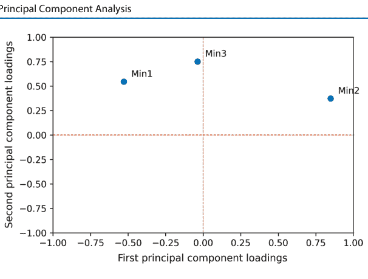

图9.4 主成分载荷，表明PCs受不同矿物的影响。有关PCs的详细解释，请参阅正文。

```python
a = np.array([0,0])
b = np.array([-150,200])
c = np.array([-300,300])
plt.figure()
plt.plot(newx[:,0],newx[:,1],
    marker='o',
    linestyle='none')
plt.plot(a,b,
    color=(0.8,0.3,0.1),
    linewidth=0.75,
    linestyle='--')
plt.plot(c,a,
    color=(0.8,0.3,0.1),
    linewidth=0.75,
    linestyle='--')
for i in range (1,30):
    plt.text(newx[i,0]+5,newx[i,1]+5,
        labels[i])
plt.xlabel('First principal component scores')
plt.ylabel('Second principal component scores')
plt.show()
```

此图清晰地定义了具有相似影响的样品组，例如样品11、17和18，可能还包括样品19。接下来，我们使用PCA()的第三个输出参数来计算PCs的方差，

percent_explained = 100*variances/np.sum(variances)
print(percent_explained)
```

其输出结果为

```
[52.33164763 31.3430876 16.32526476]
```

我们可以看到，超过52%的总方差包含在$PC_1$中，约31%包含在$PC_2$中，而$PC_3$对数据集总方差的贡献很小（约16%）。这意味着数据集中的大部分变异性可以仅用两个新变量来描述。正如预期的那样，这两个新变量彼此不相关。这可以通过`newx[:, 0]`和`newx[:, 1]`之间的相关系数来说明。

```
r = np.corrcoef(newx[:,0],newx[:,1])
print(r[0,1])
```

该系数接近于零

```
4.548900834464437e-16
```

因此，我们可以将三十个样本的时间序列绘制为两个独立变量$PC_1$和$PC_2$的单张图：

```
plt.figure()
plt.plot(newx[:,0])
plt.plot(newx[:,1])
plt.legend(['PC1','PC2'])
plt.show()
```

此图显示了多变量数据集中约83%（52%+21%）的方差。根据我们对$PC_1$和$PC_2$的解释，此图显示了两个来源对所研究沉积柱的相对贡献的变异性。由于我们使用的是合成数据集，并且已知三种源岩对沉积物的实际贡献，我们可以通过比较s1、s2和s3的初始变化与存储在`newx`三列中的（大致）独立变量$PC_1$、$PC_2$和$PC_3$来评估结果的质量：

```
plt.figure()
ax1 = plt.subplot(5,1,1)
ax2 = ax1.twinx()
ax1.plot(-newx[:,0])
ax2.plot(s1,
    color=(0.8,0.3,0.1))
ax1 = plt.subplot(5,1,3)
ax2 = ax1.twinx()
ax1.plot(newx[:,1])
ax2.plot(s2,
    color=(0.8,0.3,0.1))
ax1 = plt.subplot(5,1,5)
ax2 = ax1.twinx()
ax1.plot(newx[:,2])
ax2.plot(s3,
    color=(0.8,0.3,0.1))
plt.show()
```

符号和振幅无法定量确定；因此，在这种情况下，我们改变了第一个*PC*的符号，并使用`twinx()`在不同的坐标轴上显示数据以便比较结果。如我们所见，我们已经成功地分离了源岩s1、s2和s3对沉积序列矿物成分的不同贡献。

上述方法已被用于研究前一章（第8.9节）描述的纹层状湖泊沉积物的物源，这些沉积物大约在33千年前沉积于Cafayate峡谷（Quebrada de Cafayate）的一个滑坡堰塞湖中（Trauth等人，2003）。纹层中沉积物的物源可以使用流域内各种可能源区的特征标型矿物来追踪。将沉积物中的矿物组合与流域内潜在源岩的矿物组合进行比较表明，圣玛丽亚盆地（Santa Maria Basin）出露的富铁第三纪沉积岩是纹层红色基底部分的来源。相比之下，流域山区部分的变质岩最可能是纹层相对暗淡的上部的来源。

## 9.3 独立成分分析（作者：N. Marwan）

主成分分析（PCA）是分离（或分离）混合变量的标准方法（第9.2节）。此类分析产生线性不相关的信号，因此该方法也称为*白化*，因为这一特性是*白噪声*的特征。尽管分离的信号是不相关的，但它们仍然可能是相互依赖的（即，它们可能保留非线性相关性）。例如，当数据不是高斯分布且PCA因此不能产生良好结果时，就会出现这种现象。*独立成分分析*（ICA）就是为此类任务开发的；它将变量*X*分离为独立变量*S*，这些变量在非线性上是不相关的。为了执行ICA（根据中心极限定理），标准化随机数的混合必须是高斯分布的。因此，ICA算法使用一个标准来估计独立成分的联合分布有多接近高斯分布（Hyvärinen，1999）。该分布越不接近高斯分布，各个成分就越独立。

根据线性混合模型，$p$个独立变量$X = (x_1, x_2, \dots, x_p)$在$n$次测量中线性混合：

$$X = A^T \cdot S$$

我们感兴趣的是源变量$S$和混合矩阵$A$（参见第9.2节）。这个任务或许类似于在一个派对上，许多人正在进行独立的对话：我们可以听到对话的混合声，但无法单独区分它们。我们或许可以安装一些麦克风，用它们来分离出各个对话。因此，这个困境有时被称为*鸡尾酒会问题*。然而，正式名称是*盲源分离*，其定义为

$$S = W^T X$$

其中$W^T$是反转混合并获得原始信号所需的分离矩阵。在地球科学中，我们也会遇到类似的问题，例如，如果我们想确定不同源岩对盆地沉积物的相对贡献（就像我们为PCA所做的那样），但这次数据中可能存在非线性依赖关系，并且数据不是高斯分布的（第9.2节）。

我们再次创建一个合成数据集，由三十个沉积物样本的三十次总测量（即三种矿物中每种的比例）组成。然而，与PCA示例不同的是，源岩的时间变化不是高斯分布的；相反，它是均匀分布的，因为我们使用`rng.uniform()`而不是`standard_normal()`来创建伪随机数：

```
import scipy
import numpy as np
import matplotlib.pyplot as plt
from sklearn.decomposition import PCA

rng = np.random.default_rng(0)
s1 = rng.uniform(0,10,30)
s2 = rng.uniform(0,7,30)
s3 = rng.uniform(0,12,30)
```

我们使用与PCA示例相同的混合方程，通过线性混合源岩s1、s2和s3来创建$x$的三列（对应于三种矿物）（图9.5）：

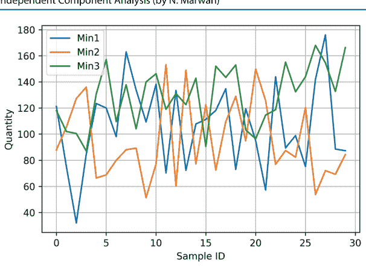

图9.5 独立成分分析的样本输入。30个沉积物样本中三种矿物的相对比例反映了沉积盆地流域内三种源岩贡献的时间变化。

```
x = np.zeros((30,3))
x[:,0] = 15.4+ 7.2*s1+10.5*s2+2.5*s3
x[:,1] = 124.0-8.73*s1+ 0.1*s2+2.6*s3
x[:,2] = 100.0+5.25*s1- 6.5*s2+3.5*s3
x = x + 3.8*rng.standard_normal(np.shape(x))
```

通过显示数据的直方图，我们看到数据不是高斯分布的：

```
fig, ax = plt.subplots(3)
ax[0].hist(x[:,0])
ax[1].hist(x[:,1])
ax[2].hist(x[:,2])
plt.show()
```

然后我们将三十个样本中矿物的比例显示为时间序列：

```
plt.figure()
plt.plot(x)
plt.grid(True)
plt.legend(('Min1','Min2','Min3'))
plt.xlabel('Sample ID')
plt.ylabel('Quantity')
plt.show()
```

我们首先使用PCA分离变量。我们使用以下代码计算主成分`pcs`、混合矩阵`a_pca`和白化矩阵`w_pca`：

```
pca = PCA(n_components=3)
pca.fit(x)

newx = pca.transform(x)
newx = newx/np.std(newx, 0, ddof=1)

pcs = pca.components_
variances = pca.explained_variance_

a_pca = np.dot(pcs, np.sqrt(np.diag(variances)))
w_pca = np.dot(np.linalg.inv(np.sqrt(np.diag(variances))), pcs)
```

预白化将分离变量为独立成分（$S$）的过程简化为寻找一个合适的旋转矩阵$B$的问题，该矩阵可以应用于变量$X_{PC}$：

$$S = B^T X_{PC}$$

我们需要找到一个旋转矩阵$B$，使得变量$S$具有完全非高斯的分布。实现这种非高斯标准有几种可能性，例如最小化或最大化超额峰度

$$\gamma = E(x^4) - 3(E(x^2))^2$$

因为对于正态分布的数据，这个超额峰度$\gamma$为零。$E$代表$x$的期望值（即均值）。请注意，超额峰度与峰度不同：超额峰度是峰度减去三，因为高斯分布数据的峰度是三（第3.2节），但这种分布的超额峰度为零。为了找到一个确保最小或最大超额峰度的$B$，可以使用一个学习算法来找到学习规则的不动点：

$$E(x(B^T x)^3) - 3||B||^2 B + f(||B||^2)B = 0$$

Hyvärinen（1999）的FastICA算法——基于不动点迭代方案——是解决此问题的有效算法。在此示例中，学习规则简化为以下形式

$$B(k) = E(x(B(k-1)^T x)^3) - 3B(k-1)$$

我们从一个仅由随机数构成的初始旋转矩阵 $B$ 开始：

```python
B = scipy.linalg.orth(rng.uniform(-.5,.5,(3,3)))
BOld = np.zeros(np.shape(B))
```

迭代持续进行，直到达到发散准则 $\text{div}$。我们从该准则值为零开始：

```python
div = 0
```

*不动点迭代方案*包含两个步骤：对称正交化和应用学习规则。发散准则 $\text{div}$ 在每个迭代步骤中更新，并进行测试，以便在达到发散准则时立即停止迭代过程。由于 Python 使用浮点数，$\text{div}$ 实际上不会达到零，因此我们允许 $(1-\text{div})$ 低于浮点相对精度 $\text{eps}(1)$（或不带输入参数 1 的 $\text{eps}$，因为 `eps` 的默认输入是 1），该值约为 $2.2204\text{e-}16$，因此接近于零（参见第 2.5 节）：

```python
while (1-div) > np.spacing(1):
    B = np.dot(B,np.real(scipy.linalg.sqrtm(
        np.linalg.inv(np.dot(B.T, B)))))

    div = np.min(np.abs(np.diag(np.dot(B.T,BOld))))
    BOld = B

    B = np.dot(newx.T, np.dot(newx,B)**3)/len(newx)-3*B
    sica = np.dot(newx,B)
```

最后，我们将合成源岩 $s1$、$s2$ 和 $s3$ 与未混合变量 $IC1$、$IC2$ 和 $IC3$ 进行比较（图 9.6）：

```python
fig, ax = plt.subplots(3)
ax[0].plot(sica[:,0])
ax[0].set_title('IC1')
ax0 = ax[0].twinx()
ax0.plot(s3, 'C1')
ax[1].plot(-sica[:,1])
ax[1].set_title('IC2')
ax1 = ax[1].twinx()
ax1.plot(-s1, 'C1')
ax[2].plot(-sica[:,2])
```

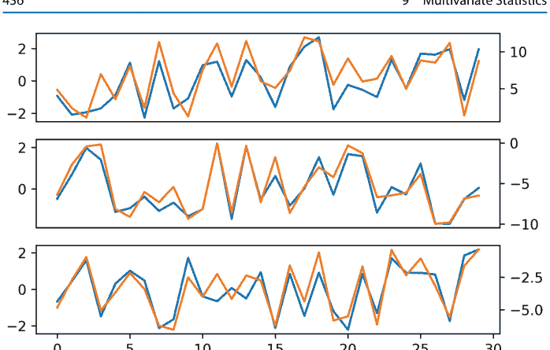

图 9.6 独立成分分析输出。ICA 几乎完美地识别了源信号，正如原始输入参数（橙色）和独立成分（蓝色）之间的成对相似性所表明的那样。

```python
ax[2].set_title('IC3')
ax2 = ax[2].twinx()
ax2.plot(-s2, 'C1')
plt.show()
```

ICA 几乎完美地识别了源信号。我们还可以注意到，由于加法的交换性，IC 的降序与 s1、s2 和 s3 的初始顺序不同。当然，在现实世界的例子中，IC 的顺序并不重要。此外，确切的符号和幅度与原始值并不匹配，因此 ICA 只能产生半定量结果，PCA 也是如此。最后，我们实际上可以使用以下代码计算混合矩阵 a_ica 和分离矩阵 w_ica：

```python
a_ica = np.dot(a_pca, B)
w_ica = np.dot(B.T, w_pca)
```

混合矩阵 a_ica 可用于估计分离变量在测量值中的比例。混合矩阵 a_ica 的分量 $a_{ij}$ 对应于第 9.2 节介绍的主成分载荷。

## 9.4 判别分析

判别分析有助于将对象分配到已建立的类别或组中。例子包括将化石标本分配到已建立的属或种，根据矿物学（或化学）分析识别岩石类型，以及使用卫星图像绘制植被类型图。判别分析不同于简单的分类，后者在分析之前不定义组或类别的数量。

岩石学中判别分析的经典例子是 QAPF（或 Streckeisen）图（Streckeisen 1974, 1976）。该图根据石英（Q）、碱性长石（包括钠长石）（A）、斜长石（P）和似长石（F）的百分比对火成岩（尤其是深成岩）进行分类，所有这些百分比均归一化为总计 100%。QAPF 图在双三元图中显示四种矿物的百分比，其中 QAP 百分比位于图形的上半部分，FAP 百分比位于下半部分。QAPF 图通常被国际地质科学联合会（IUGS）用于分类深成岩。例如，含有 50% 石英、30% 碱性长石、20% 斜长石和 0% 似长石的深成岩被称为花岗岩。虽然 Albert Streckeisen 对深成岩的定义代表了世界不同地区既定用法之间的妥协（Streckeisen 1974, 1976），但判别分析仅基于分类对象的数学约束。此外，判别分析假设类内测量值服从正态分布，这对于 Streckeisen 分类可能不是一个有效的假设。由于正态性对于该方法的成功至关重要，用户必须小心确保满足此条件，尤其是在分析成分（封闭）数据时（另见第 9.5 节）。

判别分析最初由 Sir Ronald A. Fisher（1936）引入，用于区分两个或多个开花植物种群。第一步涉及确定判别函数 $Y_i$，该函数最好地分离由正态分布变量 $X_i$ 描述的两组对象：

$$Y = a_0 + a_1X_1 + a_2X_2 + \dots + a_pX_p$$

参数 $a_i$ 的确定方式是使各组多变量均值之间的距离最大化。换句话说，我们确定 $a_i$，使得组间均值距离与组内成员距离的比值较高。第二步，一旦从对象的训练集中确定了判别函数，就可以将新对象分配到一个组或另一个组。使用 Streckeisen 图，岩石样本根据 Q、A、P 和 F 的百分比被分配到已建立的岩石类型（例如花岗岩）。

例如，我们首先创建一个由两个变量 $x_1$ 和 $x_2$ 描述的花岗岩样本合成数据集。这两个变量可以代表两种化学元素的百分比，以氧化物形式表示（重量百分比）。让我们假设从初步研究中我们知道这些岩石样本来自三种不同的花岗岩，它们是在三次独立的岩浆事件期间的不同时间形成的。除了花岗岩侵入体内的自然不均匀性外，我们可以假设花岗岩样本的测量值服从正态分布。在这个例子中，我们首先确定分离三组（或三种花岗岩类型）的判别函数。然后，我们使用判别函数将岩石样本（在后续的野外工作中收集）分配到三种花岗岩类型之一。

我们首先重置随机数生成器：

```python
import numpy as np
import numpy.ma as ma
import matplotlib.pyplot as plt
from numpy.random import default_rng
from sklearn.discriminant_analysis import LinearDiscriminantAnalysis

rng = default_rng(100)
```

接下来，我们根据三种花岗岩类型的化学成分生成一个数据集。从每种岩石类型中采集了六十个花岗岩样本并进行了化学分析。两种化学元素 x1 和 x2 的百分比存储在三个变量 data1、data2 和 data3 中：

```python
data1 = rng.standard_normal((60,2))
data1[:,0] = 8.5 + 1.8*data1[:,0]
data1[:,1] = 3.9 + 0.6*data1[:,1]

data2 = rng.standard_normal((60,2))
data2[:,0] = 6.4 + 1.2*data2[:,0]
data2[:,1] = 2.7 + 0.4*data2[:,1]

data3 = rng.standard_normal((60,2))
data3[:,0] = 5.5 + 1.8*data3[:,0]
data3[:,1] = 1.3 + 0.8*data3[:,1]
```

为了定义已建立的类别（或类），我们创建一个数组，其中包含每对测量值的标签 1、2 和 3，并将它们存储在 tar 中：

```python
tar = np.ones(60)
tar = np.append(tar,2*np.ones(60))
tar = np.append(tar,3*np.ones(60))
```

然后，我们将三个变量 data1、data2 和 data3 垂直连接成一个变量 data：

```python
data = ma.concatenate([data1,data2,data3])
```

这样，我们就从三组正态分布数据生成了一个合成数据集。然后，我们使用 LinearDiscriminantAnalysis() 创建一个线性判别分析分类器：

```python
cls = LinearDiscriminantAnalysis()
cls.fit(data,tar)
```

该函数返回一个针对预测变量 data 和类标签 tar 的判别分析模型。可以通过输入以下命令列出 cls 的层：

```python
coeffs = cls.coef_
means = cls.means_
interc = cls.intercept_
print(coeffs)
print(means)
print(interc)
```

输出结果为：

```
[[ 0.80294382 3.66238131]
 [-0.133724 0.22444128]
 [-0.66921982 -3.88682258]]

[[8.97020713 3.84392049]
 [6.61472503 2.66054978]
 [5.22893157 1.25608319]]

[-19.26126129 -0.78131967 10.44095035]
```

最后，我们使用以下代码在图形中显示结果：

```python
plt.figure()
plt.plot(data[0:60,0],data[0:60,1],
    marker='o',
    color=(0.8,0.3,0.1),
    linestyle='none')
plt.plot(data[60:120,0],data[60:120,1],
    marker='o',
    color=(0.3,0.8,0.1),
    linestyle='none')
plt.plot(data[120:180,0],data[120:180,1],
    marker='o',
```

## 9.5 聚类分析

*聚类分析*旨在创建一组组彼此非常相似的对象，这些对象与其他单个对象或对象组相比具有显著差异。该方法首先计算所有对象对之间的*相似性*或（另一种方式）*相异性*（或*距离*）。然后，它根据对象组之间的相似性（或距离）对其进行排序，最终创建一个层次树，并将其可视化为*树状图*。对象的分组在地球科学中非常有用，例如，在火山灰层内建立相关性（Hermanns et al. 2000）或比较不同的微化石组合（Birks and Gordon 1985）。

计算两个数据向量之间的相似性或（另一种方式）相异性（或距离）的方法有很多。让我们定义两个数据集，它们由来自同一对象的多次测量组成。这些数据可以用向量描述：

$X_1 = (x_{11}, x_{12}, \dots, x_{1p})$

$X_2 = (x_{21}, x_{22}, \dots, x_{2p})$

任何两个样本向量之间最常用的相异性（或距离）度量是

- *欧几里得距离*——这仅仅是描述多变量空间中两个测量值的两点之间的最短距离：

$$\Delta_{12} = \sqrt{(x_{11} - x_{21})^2 + (x_{12} - x_{22})^2 + \dots + (x_{1p} - x_{2p})^2}$$

欧几里得距离无疑是最直观的相异性度量。然而，在由多种不同类型变量组成的异质数据集中，一个更好的替代方案是

- *曼哈顿（或城市街区）距离*——在曼哈顿市，必须沿着垂直的街道行走，而不能斜穿街区。因此，曼哈顿距离是所有差值的总和：

$$\Delta_{12} = |x_{11} - x_{21}| + |x_{12} - x_{22}| + \dots + |x_{1p} - x_{2p}|$$

相似性度量包括

- *相关相似性系数*——该度量使用皮尔逊线性积矩相关系数来计算两个对象之间的相似性：

$$r_{X_1X_2} = \frac{\sum_{i=1}^{n} (x_{1i} - \bar{x}_1)(x_{2i} - \bar{x}_2)}{(n - 1)s_{X_1}s_{X_2}}$$

如果研究者对测量对象的变量之间的比率感兴趣，则使用此度量。然而，皮尔逊相关系数对异常值高度敏感，应谨慎使用（另见第4.2节）。

- *内积相似性指数*——将数据向量的长度归一化为1，并计算它们的*内积*，可以得到另一个重要的相似性指数，该指数常用于转换函数应用。在此示例中，将一组具有已知环境偏好的现代植物或动物组合与化石样本进行比较，以重建过去的环境条件：

$$s_{12} = \frac{1}{|X_1|} \frac{1}{|X_2|} (x_{11}x_{12} \dots x_{1p}) \begin{pmatrix} x_{21} \\ x_{22} \\ \vdots \\ x_{2p} \end{pmatrix}$$

内积相似性在0到1之间变化。零值表示没有相似性，值为1表示最大相似性。

执行聚类分析的第二步是根据相似性对组进行排序，并构建一个层次树，该树被可视化为树状图。大多数聚类算法只是将相似性或相异性（或距离）最高的两个对象连接起来。在后续步骤中，最相似的对象对或簇被迭代地连接。簇（每个簇由对象组组成）之间的差异描述方式不同，具体取决于数据类型和应用：

- *K*-均值聚类使用多个*K*簇的多变量均值之间的欧几里得距离作为对象组之间差异的度量。如果数据表明存在一个被随机噪声包围的真实均值，则使用此距离。或者，
- *k*-最近邻聚类使用最近邻的欧几里得距离作为此差异的度量。如果数据集中存在无法归因于随机噪声的自然异质性，则使用此度量。

在应用聚类算法之前，评估数据属性非常重要。首先应考虑变量的绝对值。例如，来自火山灰的地球化学样品可能显示SiO₂含量约为77%，而Na₂O含量仅为3.5%，但Na₂O含量可能被认为更重要。在这种情况下，需要对数据进行转换，使其均值等于零（*均值中心化*）。通过*标准化*（即，将数据标准化为均值等于零，方差等于一）来校正方差和均值的差异。通过使用*Aitchison对数比变换*（Aitchison 1984, 1986）（见第9.7节）可以避免由封闭数据产生的伪影（例如，虚假的负相关）。这种变换确保了数据独立性，并避免了常数和归一化约束。对数比变换为

$$x_{tr} = \log(x_i/x_d)$$

其中$x_{tr}$表示某个原始数据$x_i$的变换得分（$i = 1, 2, 3, \dots, d-1$）。该过程在变量的置换群下是不变的，任何变量都可以用作除数$x_d$。

作为执行聚类分析的练习，加载存储在*sediment_3.txt*中的沉积物数据。该数据集包含沉积物样品中各种矿物的百分比。沉积物来源于三种岩石类型：(1) 含有角闪石、辉石和斜长石的岩浆岩；(2) 以萤石、闪锌矿和方铅矿的存在为特征的热液脉，以及一些长石（即斜长石和钾长石）和石英；(3) 含有长石、石英和粘土矿物的砂岩单元。从该沉积序列的不同层位采集了十个样品，每个样品包含这些矿物的不同比例。首先，可以计算样品对之间的距离。函数`pdist()`提供了许多不同的距离度量，例如欧几里得距离或曼哈顿（或城市街区）距离。我们使用默认设置，即欧几里得距离：

```python
import numpy as np
from matplotlib import cm
import matplotlib.pyplot as plt
import scipy.spatial.distance as distance
from scipy.cluster.hierarchy import dendrogram, linkage
from scipy.cluster.hierarchy import single, cophenet

data = np.loadtxt('sediments_3.txt')

Y = distance.pdist(data, 'euclidean')
```

函数`pdist()`返回一个向量Y，其中包含原始数据矩阵中每对观测值之间的距离。我们可以在热图中可视化这些距离：

```python
S = distance.squareform(Y)

labels = []
for i in range(1,11):
    labels.append(str(i))
fig, ax = plt.subplots()
c = ax.imshow(S, cmap=cm.Blues)
ax.set_xticks(np.linspace(0,9,10))
ax.set_yticks(np.linspace(0,9,10))
ax.set_xticklabels(labels,
    fontsize=8)
ax.set_yticklabels(labels,
    fontsize=8)
plt.title('Euclidean Distance Between Pairs of Samples',
    fontsize=8)
plt.xlabel('First sample no.',
    fontsize=8)
plt.ylabel('Second sample no.',
    fontsize=8)
cbar = plt.colorbar(c)
for cax in cbar.ax.get_yticklabels():
    cax.set_fontsize(8)
plt.show()
```

函数 `squareform()` 将 Y 转换为对称的方阵格式，使得矩阵的元素 (i, j) 表示原始数据中第 i 个和第 j 个对象之间的距离。接下来，我们使用 `linkage()` 根据样本间的分离距离进行排序和链接：

```
Z = linkage(Y, 'single')
print(Z)
```

输出结果为：

```
[[ 1.          8.          0.05639246  2.        ]
 [ 7.          9.          0.07304444  2.        ]
 [ 0.         11.          0.09233992  3.        ]
 [ 5.          6.          0.10218992  2.        ]
 [10.         12.          0.11291417  5.        ]
 [ 2.          3.          0.16042391  2.        ]
 [14.         15.          0.17373155  7.        ]
 [ 4.         16.          0.17635918  8.        ]
 [13.         17.          0.21460694 10.        ]]
```

在这个三列数组 Z 中，每一行标识一个链接。前两列标识被链接的对象（或样本），第三列包含这两个对象之间的分离距离。在我们的示例中，样本 1 和 8 具有最小的分离距离（即 0.0564），因此它们被分组在一起，并被赋予标签 10（即高于最高样本索引 9 的下一个可用索引）。接下来，样本 7 和 9 被分组为 11，因为它们具有第二小的分离距离（即 0.0730）。下一行显示新的组 11 随后与样本 0 分组（即这两个项目的分离距离为 0.0923），依此类推。最后，我们将层次聚类可视化为树状图（如图 9.8 所示）：

```
plt.figure()
dendrogram(Z)
plt.xlabel('Sample no. - 1')
plt.ylabel('Distance')

plt.show()
```

聚类分析找到了与主成分分析相同的分组。请注意，由于 Python 的索引方式，样本编号减少了 1，因此从零开始（即第一个样本表示为样本 0）。我们观察到清晰的分组，包括：(a) 样本 0、1、7、8 和 9（即岩浆源岩）；(b) 样本 2、3 和 4（即热液脉）；以及 (c) 样本 5 和 6（即砂岩单元）。

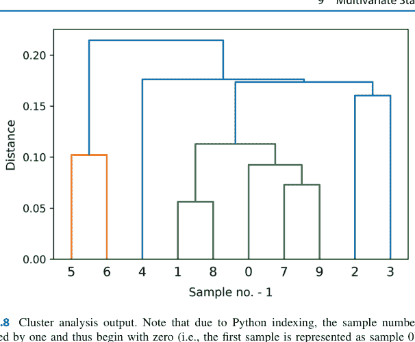

检验聚类结果有效性的一种方法是使用 *共表型相关系数*：

```
cophenet(Z, Y)
```

输出结果为：

```
0.7579381416951301
```

这个结果是令人信服的，因为该系数越接近 1，聚类解决方案就越好。

## 9.6 多元线性回归

在第 4 章中，线性回归模型被引入作为一种描述因变量 *y* 和自变量 *x* 之间关系的方法。因变量也称为 *响应变量*，自变量也称为 *预测变量*。多元线性回归模型描述了因变量（或响应变量）*y* 与 *n* 个自变量（或预测变量）*x_i* 之间的关系：

```
$$y = b_0 + b_1x_1 + b_2x_2 + \dots + b_px_p$$
```

其中 $b_i$ 是线性模型的 $n+1$ 个回归系数。术语“多元线性回归”中的“线性”指的是响应变量是预测变量的线性函数。回归系数通过最小化响应变量 $y$ 的预测值与真实值之间的均方差来估计。地球科学中常用的一个例子是原油质量，它被假定为与沉积物的年龄、埋藏深度和温度呈线性关系。在实践中，必须首先检验线性假设的合理性。如果这个假设可能成立，则可以使用多种多元线性回归方法。

作为第一个例子，我们创建一个包含三个变量 Var1、Var2 和 Var3 的无噪声合成数据集。我们希望揭示变量 Var1 和 Var2 对变量 Var3 的影响。因此，变量 Var1 和 Var2 是预测变量，变量 Var3 是响应变量。响应变量与预测变量之间的线性关系为 Var3 = 0.2 - 52.0*Var1 + 276.0*Var2。三个变量 Var1、Var2 和 Var3 分别存储在单个数组 data 的第 1、2 和 3 列中：

```
import numpy as np
from numpy.random import default_rng
import matplotlib.pyplot as plt
from sklearn import linear_model
from sklearn.metrics import mean_squared_error, r2_score

rng = default_rng(0)
data = np.zeros((50,3))
data[:,0] = 0.3 + 0.03*rng.standard_normal(50)
data[:,1] = 0.2 + 0.01*rng.standard_normal(50)
data[:,2] = 0.2 - 52.0*data[:,0] + 276.0*data[:,1]
```

我们为样本名称和变量名称创建标签（如我们在第 9.2 节中所做的那样）：

```
labels = []
for i in range(1,len(data)+1):
    labels.append(str(i))

variables = (['Var1','Var2','Var3'])
```

然后，我们使用 LinearRegression.fit() 计算多元线性回归模型的系数 beta。输入以下代码：

```
beta = linear_model.LinearRegression().fit(data[:,0:2],data[:,2])
beta.score(data[:,0:2],data[:,2])
coeffs = beta.coef_
interc = beta.intercept_
```

输出结果为：

```
[-52. 276.]
0.20000000000001705
```

函数 `LinearRegression.fit()` 使用最小均方准则计算 beta，其中包含系数 `coeffs=coef_` 和 `interc=intercept_`。由于我们没有噪声，这两个系数当然与合成数据的原始系数（几乎）完全匹配。由于我们只有三个变量，我们可以在三维图中显示结果。我们首先使用 `meshgrid()` 为前两个变量 `var1` 和 `var2` 创建一个矩形网格，然后使用 `coeffs` 和 `interc` 计算第三个变量 `var3` 的预测值。接着，我们使用 `plot_surface()` 显示模型的线性回归平面，并使用 `plot()` 将测量值绘制为红色点，标记大小为 30 点：

```
var1 = np.linspace(0.20,0.45,26)
var2 = np.linspace(0.17,0.23,7)
Var1,Var2 = np.meshgrid(var1,var2)
Var3 = interc + coeffs[0]*Var1 + coeffs[1]*Var2

fig, ax = plt.subplots(subplot_kw={"projection": "3d"})
ax.plot_surface(Var1,Var2,Var3,
    rstride=1, cstride=1,
    linewidth=0,
    alpha=0.3,
    antialiased=True,
    shade=True)
for i in range(0,len(data)):
    plt.plot(data[i,0],data[i,1],data[i,2],
        marker='o',
        color=(0.1,0.3,0.8))
ax.view_init(30,70-90)
plt.show()
```

由于数据集是无噪声的，所有数据点都位于线性回归平面上。如果我们引入标准差为 2.4 的正态分布噪声，情况就会改变：

```
rng = default_rng(0)
data = np.zeros((50,3))
data[:,0] = 0.3 + 0.03*rng.standard_normal(50)
data[:,1] = 0.2 + 0.01*rng.standard_normal(50)
data[:,2] = 0.2 - 52.0*data[:,0] + 276.0*data[:,1] + 2.2*rng.standard_normal(50)

labels = []
for i in range(1,len(data)+1):
    labels.append(str(i))

variables = (['Var1','Var2','Var3'])
```

输入以下代码：

```
beta = linear_model.LinearRegression().fit(data[:,0:2],data[:,2])
beta.score(data[:,0:2],data[:,2])
coeffs = beta.coef_
interc = beta.intercept_
print(coeffs)
print(interc)
```

输出结果为：

```
[-50.21197011 303.02828779]
-5.6988484229812
```

这表明回归系数的估计值（即 -5.6988、-50.2120 和 303.0283）与用于创建合成数据的原始系数（即 0.2、-52.0 和 276.0）并不完全匹配。我们可以在三维图中再次显示结果（图 9.9）。

```
var1 = np.linspace(0.20,0.45,26)
var2 = np.linspace(0.17,0.23,7)
Var1,Var2 = np.meshgrid(var1,var2)
Var3 = interc + coeffs[0]*Var1 + coeffs[1]*Var2

fig, ax = plt.subplots(subplot_kw={"projection":"3d"})
ax.plot_surface(Var1,Var2,Var3,
    rstride=1,cstride=1,
    linewidth=0,
```

## 9.7 艾奇逊对数比变换

任何处理过成分数据统计分析的人，都必定会接触到约翰·艾奇逊（1926-2016）的对数比变换。这位苏格兰统计学家毕生致力于此类数据的统计研究。事实上，他撰写了著名的《成分数据分析》一书，并发表了多篇相关论文（Aitchison 1984, 1986, 1999, 2003）。该论文与MATLAB 5软件包CODA相关联，该软件包可从作者处获取，更新版本现已可在CoDAWeb下载：

```
http://www.compositionaldata.com
```

艾奇逊对数比变换克服了封闭数据（即表示为比例并加总到固定总量的数据，例如100%）的封闭和问题。封闭和问题会导致多元数据集中变量对之间出现虚假的负相关，而通过对这些变量的比值取对数可以避免这一问题。例如，古气候研究中的多指标数据通常是封闭数据（即它们受稀释效应影响很大）。在最简单的例子中，这可能是由三个组分构成的沉积物混合物，三者总和为100%。假设其中一个组分的量是恒定的（即单位时间内输送的该组分量始终相同）。由于三个组分的总量始终为100%，另外两个组分必然呈负相关：如果一个增加，另外两个必须以相同的总量减少。

使用比值有助于克服成分数据的量级实际上是比值的问题，其分母是所有组分浓度的总和（关于艾奇逊对数比变换的简要概述，请参见Davis 2003）。然而，比值的乘积-矩协方差难以处理，并导致复杂的乘积和商。因此，约翰·艾奇逊建议对这些比值取对数，从而利用对数函数的简单性质，例如，log(x/y)=log(x)–log(y)，因此也有log(x/y)=–log(y/x)。这一过程减少了描述数据集所需的协方差数量（Aitchison 2003, 第65至66页）。

下面是一个简单的例子，说明了一个具有三个变量的系统的封闭和问题，以及使用比值和对数比来克服变量对之间虚假相关问题的方法。首先，我们清除工作区并为绘图选择颜色：

```python
import numpy as np
from scipy import stats
from scipy import signal
import matplotlib.pyplot as plt

colors = np.array([
    [0,114,189],
    [217,83,25],
    [237,177,32],
    [126,47,142],
])/255
```

图9.9 一个包含三个变量和随机噪声的合成数据集的线性回归模型。

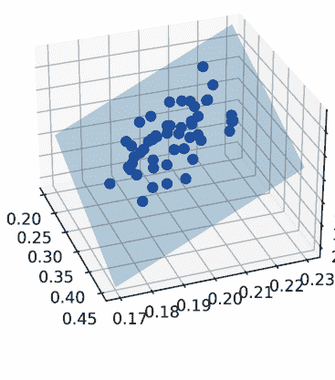

```python
alpha=0.3,
antialiased=True,
shade=True)
for i in range(0,len(data)):
    plt.plot(data[i,0],data[i,1],data[i,2],
             marker='o',
             color=(0.1,0.3,0.8))
ax.view_init(30,70-90)
plt.show()
```

并使用图形窗口工具栏上的*旋转3D*工具在三维空间中旋转图形，观察数据与回归平面之间的一些差异。

作为第二个例子，我们使用来自英格兰舍伍德砂岩组的实验室数据，这些数据表明粒间渗透率（作为响应变量）主要受孔隙度和基质电导率（作为预测变量）的影响，而其他变量的影响较小。这个例子在Olorunfemi（1985）的一篇文章中进行了详细讨论，并被用作Swan和Sandilands（1995）教科书中的一个例子。来自舍伍德砂岩组的40个岩石样品的数据取自M.O. Olorunfemi的出版物，并存储在文件*sherwoodsandstone.txt*中。我们通过输入以下命令从文件加载数据：

```python
data = np.loadtxt('sherwoodsandstone.txt')
```

数组`data`的五列包含岩石物理测量值的数值：渗透率（单位：m/s）、孔隙度（无物理单位）、基质电导率（单位：S/m）、真实地层因子（无物理单位）和感应极化率（单位：%）。我们还使用`readlines()`从文件*sherwoodsandstone_samples.txt*加载样品ID（来自Olorunfemi 1985），并将其保存在列表`samples`中：

```python
with open('sherwoodsandstone_samples.txt') as f:
    samples = f.readlines()[8:]
```

接下来，我们创建另一个包含变量名的列表：Perm代表渗透率，Porosity代表孔隙度，MaCo代表基质电导率，TrFF代表真实地层因子，InPo代表感应极化率：

```python
variables = (['Perm',
    'Porosity',
    'MaCo',
    'TrFF',
    'InPo'])
```

然后，我们在一个包含图例的图中显示这些变量。由于变量的值非常小，我们绘制的是值的对数而不是真实值：

```python
depth = np.linspace(1,40,40)
plt.figure()
for i in range(5):
    plt.plot(np.log(data[:,i]),depth,
        linestyle = 'none',
        marker = 's')
plt.legend(variables)
plt.show()
```

随后，我们使用LinearRegression.fit()计算多元线性回归模型的系数beta，

```python
beta = linear_model.LinearRegression(). \
    fit(data[:,1:6],data[:,0])
beta.score(data[:,1:6],data[:,0])
coeffs = beta.coef_
interc = beta.intercept_
print(coeffs)
print(interc)
```

得到结果：

```
[ 5.06357746e+01 -3.30900095e+02
 -1.78566908e-01 -4.52634500e-01]
0.1586815190858486
```

这表明只有孔隙度和基质电导率影响舍伍德砂岩组的渗透率，因为两个较大的系数（即50.6358和-330.9000）表明了这一点。

有多种方法可以检查结果的质量。例如，我们可以使用以下代码检查模型的残差：

```python
res = data[:,0] - beta.predict(data[:,1:6])

plt.figure()
plt.plot(res,depth,
    linestyle='none',
    marker='s')
plt.show()
```

这表明测量值大于9的是异常值，残差直方图也显示了这一点：

```python
e = np.linspace(-6,12,7)

fig,ax = plt.subplots()
plt.hist(res,bins=e)
plt.axis(np.array([-6,12,0,25]))
ax.set_xticks(np.linspace(-6,12,7))
plt.show()
```

现在，线性回归模型可用于根据其他岩石物理变量的值预测新样品的渗透率。每个预测变量对模型的影响可以通过多种不同的方式进行检验。例如，让我们仅使用前34个值计算线性回归模型：

```python
beta = linear_model.LinearRegression(). \
    fit(data[0:35,1:6],data[0:35,0])
beta.score(data[:,1:6],data[:,0])
coeffs = beta.coef_
interc = beta.intercept_
print(coeffs)
print(interc)
```

同时记住半开区间[0,35)（或[0:35]）。然后我们可以使用以下代码预测剩余的五个值：

```python
data_pred = beta.predict(data[35:,1:6])
print(data_pred)
```

得到结果：

```
[5.27453296 4.88171822 2.33299313 4.88200648 5.79731973]
```

现在，该模型使我们能够使用以下代码计算均方误差和决定系数：

```python
print("Mean squared error: %.2f" \
      % mean_squared_error(data[35:,0],data_pred))

print("Coefficient of determination: %.2f" \
      % r2_score(data[35:,0],data_pred))
```

得到结果：

```
Mean squared error: 4.92
Coefficient of determination: 0.18
```

最后，我们可以使用以下代码绘制所有数据点的预测值与真实值：

```python
plt.figure()
for i in range(5):
    plt.plot(data[35:,0],data_pred,
             linestyle='none',
             marker='s',
             color=(0.8,0.3,0.1))
plt.plot([0,7],[0,7],
         linestyle=':',
         color='k')
plt.axis(np.array([0,7,0,7]))
plt.xlabel('Real Value')
plt.ylabel('Predicted Value')
plt.axis('square')
plt.show()
```

## 9.10 演示艾奇逊对数比变换如何用于克服封闭数据的封闭和问题：**a** 元素1a、元素1b和元素1c的绝对值；**b** 元素1a、元素1b和元素1c的相对含量，显示了封闭和问题；**c** 元素1a/元素1b和元素1b/元素1a的比值，两者均独立于元素1c；以及**d** 根据艾奇逊（1986, 2003）的对数比，它们除符号外完全相同，从而克服了封闭和问题。

我们关注的是元素1a和元素1b，它们对沉积物有贡献，并被元素1c稀释。我们简单地创建三个变量，每个变量具有一个特征但不同的周期，周期分别为2、5和20。正弦变量元素1a和元素1b（以毫克为单位）的振幅为1，而稀释变量元素1c的振幅为2。这些变量以0.1的间隔在0.1到20的周期内采样，产生一个包含200个值的时间序列。我们为元素1a、元素1b和元素1c各添加5毫克，确保所有绝对值都大于0，这在成分数据中不会出现（图9.10 a）：

```python
t = np.linspace(0.1,20,200)
t = np.transpose(t)

element1a = np.sin(2*np.pi*t/2) + 5
element1b = np.sin(2*np.pi*t/5) + 5
element1c = 2*np.sin(2*np.pi*t/20) + 5

plt.figure()
plt.plot(t,element1a,
    color=colors[0,:])
plt.plot(t,element1b,
    color=colors[1,:])
plt.plot(t,element1c,
    color=colors[3,:])
plt.legend(['1a','1b','1c'])
plt.title('Absolute Amount of 1a-c (mg)')
plt.show()
```

我们计算元素1a、元素1b和元素1c的百分比（即，我们创建单个元素浓度与所有元素浓度总和的比值）。这个过程创建了封闭数据（即，数据现在表示为比例，并加到固定的100%总和）：element1a+element1b+element1c=100%。元素1a和元素1b现在都受到元素1c引起的稀释的影响。这些元素显示出一个主要的正弦长期趋势，但这并非真实情况（如第一幅图所示）（图9.10 b）：

```python
element1a_perc = element1a/(element1a+element1b+element1c)
element1b_perc = element1b/(element1a+element1b+element1c)
element1c_perc = element1c/(element1a+element1b+element1c)
```

```python
plt.figure()
plt.plot(t,element1a_perc,
    color=colors[0,:])
plt.plot(t,element1b_perc,
    color=colors[1,:])
plt.plot(t,element1c_perc,
    color=colors[3,:])
plt.legend(['1a','1b','1c'])
plt.title('Relative Concentration of 1a-c (%)')
plt.show()
```

我们现在建立了元素1a/元素1b和元素1b/元素1a之间的比值，两者都独立于元素1c。注意符号的变化和振幅的差异。元素1a/元素1b和元素1b/元素1a的比值没有显示出任何由元素1c稀释效应引起的趋势证据。然而，这两条曲线并不相同（即，元素1a/元素1b和元素1b/元素1a不对称）（参见Weltje和Tjallingii 2008，第426页）（图9.10 c）：

```python
ratio12 = element1a_perc/element1b_perc
ratio21 = element1b_perc/element1a_perc

plt.figure()
ax1 = plt.subplot()
ax2 = ax1.twinx()
line1, = ax1.plot(t,ratio12,
    color=colors[0,:],
    label='1a/1b')
line2, = ax2.plot(t,ratio21,
    color=colors[1,:],
    label='1b/1a')
ax2.invert_yaxis()
plt.legend(handles=[line1,line2])
plt.title('Ratio of Elements 1a/1b and 1b/1a')
plt.show()
```

我们现在根据艾奇逊（1986, 2003）展示对数比。对数比log(element1a/element1b)和log(element1b/element1a)除符号外完全相同。因此，例如，在对数据进行进一步统计分析时，使用log(element1a/element1b)还是log(element1b/element1a)没有区别（图9.10 d）：

```python
ratio12log = np.log10(ratio12)
ratio21log = np.log10(ratio21)
```

```python
plt.figure()
ax1 = plt.subplot()
ax2 = ax1.twinx()
line1, = ax1.plot(t,ratio12log,
    color=colors[0,:],
    label='log(1a/1b)')
line2, = ax2.plot(t,ratio21log,
    color=colors[1,:],
    linestyle='--',
    label='log(1b/1a)')
ax2.invert_yaxis()
plt.legend(handles=[line1,line2])
plt.title('Log-Ratio of Elements log(1a/1b) and log(1b/1a)')
plt.show()
```

在第二个例子中，我们研究了稀释在频域中的影响以及艾奇逊对数比变换对谱分析结果的影响。这个例子非常相关，因为谱分析经常在具有明显稀释效应和虚假相关性的数据集上进行，目的是建立轨道驱动与环境变化之间的联系。可能会声称环境参数与轨道驱动的日照变化之间存在因果关系，但环境参数时间序列中观察到的轨道周期纯粹是封闭和效应的产物。我们使用与上面类似的例子，但时间序列稍长，以便在谱分析中获得良好的结果。

首先，我们再次创建三个变量（以毫克为单位），分别具有2、5和20三个不同的周期。这些变量再次以0.1的间隔采样，但这次是在0.1到100的周期内，产生一个包含1000个值的时间序列：

```python
t = np.linspace(0.1,100,1000)
t = np.transpose(t)

element1a = np.sin(2*np.pi*t/2) + 5
element1b = np.sin(2*np.pi*t/5) + 5
element1c = 2*np.sin(2*np.pi*t/20) + 5
```

然后，我们通过输入以下命令计算元素的百分比

```python
element1a_perc = element1a/(element1a+element1b+element1c)
element1b_perc = element1b/(element1a+element1b+element1c)
element1c_perc = element1c/(element1a+element1b+element1c)
```

同样，元素`element1a_perc`和`element1b_perc`显示出显著的正弦长期趋势，这并非真实情况，而是稀释元素`element1c_perc`影响的结果。因此，我们再次构建比值`ratio12`和`ratio21`，现在两者都独立于`element1c_perc`，输入以下命令

```python
ratio12 = element1a_perc/element1b_perc
ratio21 = element1b_perc/element1a_perc
```

由于`ratio12`和`ratio21`不对称，我们根据艾奇逊（1986, 2003）的原理计算对数比而不是比值：

```python
ratio12log = np.log10(ratio12)
ratio21log = np.log10(ratio21)
```

我们首先使用`detrend()`去除可能的长期趋势（但无论如何，平均值为5），然后再计算周期图（参见第5.4节）。正如预期的那样，周期图显示每个变量有一个周期，正如我们最初定义的那样（图9.11 a）：

```python
element1a = signal.detrend(element1a)
element1b = signal.detrend(element1b)
element1c = signal.detrend(element1c)

f,Pxx1a = signal.periodogram(element1a,10,nfft=t.size)
f,Pxx1b = signal.periodogram(element1b,10,nfft=t.size)
f,Pxx1c = signal.periodogram(element1c,10,nfft=t.size)

plt.figure()
plt.axes(xlim=(0,1))
plt.plot(f,abs(Pxx1a))
plt.plot(f,abs(Pxx1b))
plt.plot(f,abs(Pxx1c))
plt.legend(('1a','1b','1c'))
plt.xlabel('Frequency')
plt.ylabel('Power')
plt.show()
```

然而，在将变量的绝对值（以毫克为单位）转换为百分比后，我们观察到强烈的封闭和效应。由于`element1c`对`element1a_perc`和`element1b_perc`的稀释效应，后两个元素现在显示出一个明显的周期20，而这实际上应该只出现在变量`element1c`中（图9.11 b）：

**图9.11** 稀释效应和艾奇逊对数比变换在频域中的影响：**a** 原始数据的周期图，已去趋势以去除均值；**b** 百分比的周期图，在频域中具有强烈的封闭和效应；以及**c** 应用艾奇逊对数比变换以去除封闭和效应后的周期图。

element1a_perc = signal.detrend(element1a_perc)
element1b_perc = signal.detrend(element1b_perc)
f,Pxxp1a = signal.periodogram(element1a_perc,10,
                                nfft=ratio12.size)
f,Pxxp1b = signal.periodogram(element1b_perc,10,
                                nfft=ratio21.size)

plt.figure()
plt.axes(xlim=(0,1))
plt.plot(f,abs(Pxxp1a))
plt.plot(f,abs(Pxxp1b))
plt.legend(('1a/(1a+1b+1c)',
            '1b/(1a+1b+1c)'))
plt.xlabel('Frequency')
plt.ylabel('Power')
plt.show()

因此，我们再次使用element1a_perc和element1b_perc的比率ratio12和ratio21来消除element1c的稀释效应。如我们所见，周期为20的周期在ratio12和ratio21的周期图中不再出现：

ratio12 = signal.detrend(ratio12)
ratio21 = signal.detrend(ratio21)
f,Pxxpr12 = signal.periodogram(ratio12,10,
                                nfft=ratio12.size)
f,Pxxpr21 = signal.periodogram(ratio21,10,
                                nfft=ratio21.size)

plt.figure()
plt.axes(xlim=(0,1))
plt.plot(f,abs(Pxxpr12))
plt.plot(f,abs(Pxxpr21))
plt.legend(('1a/1b',
            '1b/1a'))
plt.xlabel('Frequency')
plt.ylabel('Power')
plt.show()

同样，基于上述原因，建议使用对数比率而非比率，尽管由于周期图的定性性质，其对周期图的影响很小（图9.11 c）：

ratio12log = signal.detrend(ratio12log)
ratio21log = signal.detrend(ratio21log)
f,Pxxlr12 = signal.periodogram(ratio12log,10,
                                nfft=ratio12.size)
f,Pxxlr21 = signal.periodogram(ratio21log,10,
                                nfft=ratio21.size)

plt.figure()
plt.axes(xlim=(0,1))
plt.plot(f,abs(Pxxlr12))
plt.plot(f,abs(Pxxlr21))
plt.legend(('log(1a/1b)',
            'log(1b/1a)'))
plt.xlabel('Frequency')
plt.ylabel('Power')
plt.show()

根据作者所述，样本位于数组的行中，列在科学家A的数据集中是*Sand*、*Lehm*、*Ton*和*Wasser*，但在科学家B的数据集中只有*Sand*、*Lehm*和*Ton*。科学家A和科学家B对*Sand*、*Lehm*和*Ton*获得相同的值，但在将它们归一化为1后，在科学家A的分析中*Sand*和*Lehm*呈正相关，而在科学家B的分析中呈负相关。然而，根据我的解释，这是由于在科学家A的分析中，样本1到3中*Wasser*含量的减少产生了稀释效应，使得*Sand*和*Lehm*共同呈现正趋势，即在科学家B的分析中移除*Wasser*含量后，它们略微向负趋势旋转。换句话说，在干燥后，将科学家A和科学家B的值都归一化为1，无论是否包含*Wasser*，都会产生不同的效果：

A = np.array([
    [0.1,0.2,0.1,0.6],
    [0.2,0.1,0.2,0.5],
    [0.3,0.3,0.1,0.3]
    ]);

B = np.array([
    [0.25,0.50,0.25],
    [0.40,0.20,0.40],
    [0.43,0.43,0.14]
    ]);

我们可以通过输入以下代码来计算相关系数

r,pvalue = stats.pearsonr(A[:,0],A[:,1])
print(r)
r,pvalue = stats.pearsonr(B[:,0],B[:,1])
print(r)

得到

0.4999999999999997
-0.5582820220872051

这显示了科学家A和科学家B数据集中相关系数的不同符号。我们可以通过输入以下代码来显示数据（图9.12 a）。

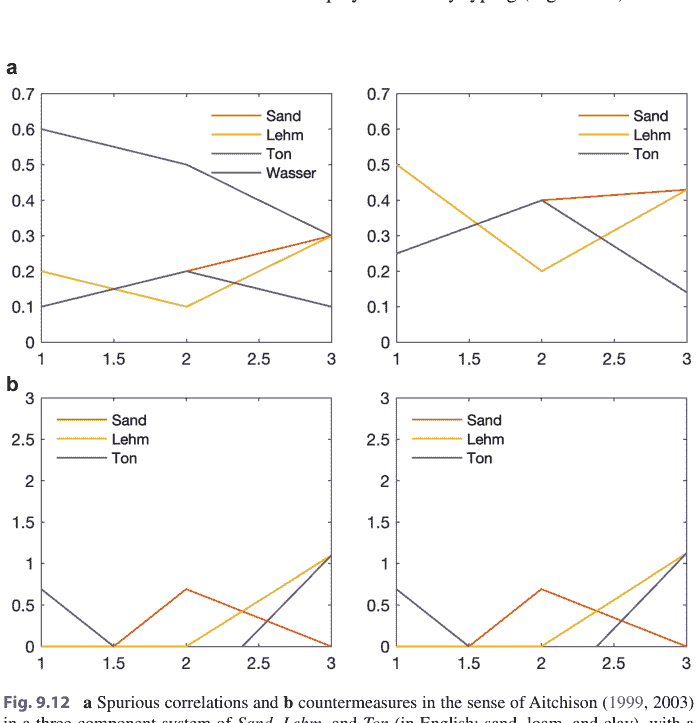

图9.12 a 在Sand、Lehm和Ton（英文：sand、loam和clay）的三组分系统中，根据Aitchison（1999，2003）的观点，由Wasser（英文：water）产生的稀释效应导致的伪相关，以及b相应的对策（数据来自Pawlowsky-Glahn和Egozcue 2013）。详细描述见正文。

plt.figure()
plt.axes(position=[0.1,0.15,0.35,0.75])
plt.plot([1,2,3],A)
plt.legend(['Sand','Lehm','Ton','Wasser'])
plt.axes(position=[0.55,0.15,0.35,0.75])
plt.plot([1,2,3],B)
plt.legend(['Sand','Lehm','Ton'])
plt.show()

我们可以通过计算相关矩阵来观察这种效应（注意，表2中科学家B的相关矩阵的值在论文中略有不同），输入以下代码

corr_A = np.corrcoef(np.transpose(A))
print(corr_A)
corr_B = np.corrcoef(np.transpose(B))
print(corr_B)

得到

[[ 1.000e+00 5.000e-01 7.661e-17 -9.820e-01]
 [ 5.000e-01 1.000e+00 -8.660e-01 -6.547e-01]
 [ 7.662e-17 -8.660e-01 1.000e+00 1.890e-01]
 [-9.820e-01 -6.547e-01 1.890e-01 1.000e+00]]
[[ 1.         -0.5583      -0.0675    ]
 [-0.5583      1.         -0.7901    ]
 [-0.0675     -0.7901      1.        ]]]

如上所述，在科学家A的分析中*Sand*和*Lehm*的共同正趋势，在科学家B通过干燥样本移除*Wasser*含量的负趋势后被消除了。我们根据John Aitchison的原理，通过计算对数比率来校正稀释效应：

lrA = np.zeros(A.shape)
lrA[:,0] = np.log(A[:,0]/A[:,1]);
lrA[:,1] = np.log(A[:,0]/A[:,2]);
lrA[:,2] = np.log(A[:,1]/A[:,2]);

lrB = np.zeros(B.shape)
lrB[:,0] = np.log(B[:,0]/B[:,1]);
lrB[:,1] = np.log(B[:,0]/B[:,2]);
lrB[:,2] = np.log(B[:,1]/B[:,2]);

并通过输入以下代码来显示数据（图9.12 b）

plt.figure()
plt.axes(position=[0.1,0.15,0.35,0.75])
plt.plot([1,2,3],lrA[:,0:3])
plt.legend(['Sand','Lehm','Ton'])
plt.axes(position=[0.55,0.15,0.35,0.75])
plt.plot([1,2,3],lrB[:,0:3])
plt.legend(['Sand','Lehm','Ton','Wasser'])
plt.show()

如我们所见，数据集现在是相同的，相关性没有差异。我们也可以通过计算几乎相同的对数比率相关矩阵来验证这一结果：

corr_lrA = np.corrcoef(np.transpose(lrA[:,0:3]))
print(corr_lrA)
corr_lrB = np.corrcoef(np.transpose(lrB[:,0:3]))
print(corr_lrB)

得到

[[ 1.00000000e+00 1.89453103e-17 -7.37737470e-01]
 [ 1.89453103e-17 1.00000000e+00 6.75087717e-01]
 [-7.37737470e-01 6.75087717e-01 1.00000000e+00]]
[[ 1.00000000e+00 4.24369142e-18 -7.30565053e-01]
 [ 4.24369142e-18 1.00000000e+00 6.82843103e-01]
 [-7.30565053e-01 6.82843103e-01 1.00000000e+00]]

这个过程产生了近似相同、真实且符合预期的相关性。
这三个例子清楚地表明了闭合和效应对闭合数据的重要性。必须仔细研究单个变量可能的稀释效应，特别是在对成分数据进行因果研究时，因为此类研究经常在古气候学等领域进行。因此，Aitchison的对数比率变换是在对成分数据进行多元统计分析（例如，第9.2至9.6节）之前，对数据集进行预处理的一种可能方法。

## 参考文献

Aitchison J (1984) 地球化学成分的统计分析。Math Geol 16(6):531–564
Aitchison J (1986, 2003年重印) 成分数据的统计分析。The Blackburn Press, Caldwell
Aitchison J (1999) 成分数据分析中的对数比率与自然定律。Math Geol 31(5):563–580
Birks HJB, Gordon AD (1985) 第四纪花粉分析中的数值方法。Academic Press, London
Croudace IW, Rothwell RG (2015) XRF岩芯扫描海洋沉积物二十年：地球化学代用指标告诉了我们什么？见：Croudace IW, Rothwell RG (编) 沉积物岩芯的微区XRF研究。Springer, Berlin
Davis JC (2002) 地质学中的统计与数据分析，第3版。John Wiley & Sons, New York
Fisher RA (1936) 多重测量在分类学问题中的应用。Ann Eugen 7:179–188
Hermanns R, Trauth MH, McWilliams M, Strecker M (2000) 阿根廷西北部大型滑坡时间分布的火山年代学约束。J Geol 108:35–52
Hotelling H (1931) 用主成分分析复杂统计变量。J Educ Psychol 24(6):417–441
Hyvärinen A (1999) 用于独立成分分析的快速且稳健的定点算法。IEEE Trans Neural Networks 10(3):626–634
Martín-Fernández JA, Thió-Henestrosa S (编) (2016) 成分数据分析，CoDaWork，西班牙L'Escala，2015年6月，Springer数学与统计学进展187。Springer, Berlin
Olorunfemi MO (1985) 英国Sherwood砂岩某些地层参数的统计关系。Math Geol 17:845–852
Pawlowsky-Glahn V, Egozcue JJ, Tolosana-Delgado R (2007) 成分数据分析讲义（链接）
Pawlowsky-Glahn V, Egozcue JJ (2013) 成分数据的统计分析。58. Berg- und Hüttenmännischer Tag, GIS – 地球科学应用与发展。摘要集58:253–360。（链接）
Pearson K (1897) 对进化论的数学贡献。论当使用指数测量器官时可能出现的一种伪相关形式。伦敦皇家学会会刊LX: 489–502
Pearson K (1901) 论空间中点集的最佳拟合线与面。哲学杂志与科学杂志6(2):559–572
Streckeisen A (1974) 深成岩的分类与命名。Geol Rundsch 63:773–786
Streckeisen A (1976) 为每种深成岩赋予其恰当的名称。Earth Sci Rev 12:1–33
Swan ARH, Sandilands M (1995) 地质数据分析导论。Blackwell Sciences, Oxford
Trauth MH, Bookhagen B, Mueller A, Strecker MR (2003) 阿根廷西北部圣玛丽亚盆地过去4万年的侵蚀与气候变化。J Sediment Res 73(1):82–90
Weltje GJ, Tjallingii R (2008) 用于沉积岩芯定量地球化学测井的XRF岩芯扫描仪校准：理论与应用。Earth Planet Sci Lett 274:423–438
Westgate JA, Shane PAR, Pearce NJG, Perkins WT, Korisettar R, Chesner CA, Williams MAJ, Acharyya SK (1998) 印度半岛所有Toba火山灰层位均属于7.5万年前的喷发。Quatern Res 50:107–112
Zadeh L (1965) 模糊集。Information. Control 8:338–353

# 10.1 引言

分析*圆形和球形数据*的方法在地球科学中应用广泛。例如，构造地质学家会测量和分析断层面上条痕擦痕的走向。圆形统计学也常用于古地磁研究。微观结构研究包括分析薄片中的颗粒形状和石英*c*轴取向，而古环境学家则通过拉长的化石壳体的排列方向来重建古水流方向（图10.1）。地球科学中的方向数据有两种类型：狭义的方向数据和定向数据。方向数据（例如，由槽模记录的河流古流向，或由冰川擦痕指示的冰川流动方向）具有真实的极性，而定向数据描述的是没有方向感的轴向数据和线（例如，节理的走向）。

关于方向数据的统计分析，已有许多有用的出版物可供参考，例如Fisher（1993）以及Mardia和Jupp（1999）的著作，以及Swan和Sandilands（1995）和Davis（2002）著作中关于该主题的章节。Python并非分析方向数据的首选工具，因为它不提供相关功能，例如可用于计算*冯·米塞斯分布*概率密度函数或运行雷利检验以确定平均方向显著性的算法。因此，地球科学家开发了众多独立程序来分析此类数据，包括由康奈尔大学荣休教授、构造地质学家Richard W. Allmendinger开发的优秀桌面和智能手机软件（Allmendinger等，2017；Allmendinger，2019），

**补充信息** 在线版本包含补充材料，可访问 https://doi.org/10.1007/978-3-031-56906-7_10。

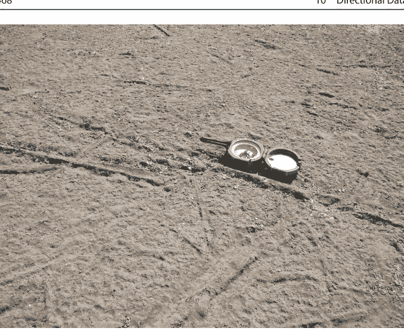

**图 10.1** 来自瑞典厄兰岛Byxelkrok附近Neptuni Acrar露头的*直角石*化石。*直角石*是一种生活在约4.5亿年前奥陶纪的、具有直壳的头足类动物。这种细长、不对称的物体倾向于以最稳定的水动力位置定向，因此可以指示古水流方向。对Neptuni Acrar头足类动物取向的统计分析揭示了一个显著的向南古水流方向，这与古地理重建结果一致。

http://www.geo.cornell.edu/geology/faculty/RWA/programs.html

以及Néstor Cardozo，他曾与Allmendinger合作攻读博士学位，现任职于斯塔万格大学：

http://www.ux.uis.no/~nestor/work/programs.html

在Cardozo的网站上，我们还可以找到Allmendinger、Cardozo与Donald M. Fisher合著的《构造地质学算法》一书中的众多MATLAB函数（Allmendinger等，2012）。另一个关于方向数据的有趣MATLAB函数集合可以在Philipp Berens的圆形统计工具箱中找到，可从MATLAB文件交换中心下载（Berens，2009）。

以下关于方向数据的分析教程独立于这些工具。它提供了用于显示方向数据、计算冯·米塞斯分布以及运行简单统计检验的简单Python代码。第10.2节介绍了作为最广泛使用的方向数据显示方法的玫瑰图。随后，第10.3和10.4节与第3章（关于单变量统计）的概念类似，涵盖了使用经验分布和理论分布来描述方向数据。然后，第10.5至10.7节描述了方向数据的三个最重要的检验：即圆形数据的随机性检验、平均方向的显著性检验以及两组圆形数据之间的差异检验。最后，第10.8和10.9节描述了球形数据的图形表示和统计。对于方向数据的分析，我们使用*NumPy*（https://numpy.org）和*Matplotlib*包（https://matplotlib.org），以及*SciPy*库（https://scipy.org），它们包含了所有必要的例程。

## 10.2 圆形数据的图形表示

显示方向数据的经典方式是玫瑰图，它是角度测量的直方图。与条形直方图（其中条形的高度与频率成正比）不同，玫瑰图由圆的扇形组成，每个扇形的半径与频率成正比。我们使用合成数据来说明用于显示方向数据的两种类型的玫瑰图。我们首先从文件*directional_1.txt*加载一组方向数据：

```python
import numpy as np
import matplotlib.pyplot as plt

data_degrees_1=np.loadtxt('directional_1.txt')
```

该数据集包含两百个角度测量值（以度为单位，简称°）。在绘制数据之前，我们需要将所有测量值转换为弧度。然后，我们使用`histogram()`对数据进行分箱，并在玫瑰图中显示计数。这是通过首先在`subplot()`中选择极坐标投影，然后在极坐标系中绘制条形图来实现的：

```python
data_radians_1=np.pi*data_degrees_1/180

e=np.linspace(0,2*np.pi,13)
v=np.linspace(2*np.pi/24,2*np.pi-2*np.pi/24,12)
n,e=np.histogram(data_radians_1,bins=e)
```

```python
plt.figure()
ax=plt.subplot(projection='polar')
ax.bar(v,n,width=2*np.pi/12)
ax.set_xticks(e[0:12])
plt.show()
```

这个玫瑰图按逆时针方向计数，零度位于坐标图的x轴上。在地球科学中，角度按顺时针方向增加，0°表示正北，90°表示正东，依此类推。我们使用set_theta_offset(np.pi/2)将玫瑰图旋转90°（或π/2），并使用set_theta_direction(-1)反转玫瑰图的方向。我们还使用set_xticks()选择类边界值e（即0°、30°、60°、...）处的刻度（图10.2）：

```python
plt.figure()
ax=plt.subplot(projection='polar')
ax.bar(v,n,width=2*np.pi/12)
ax.set_xticks(e[0:12])
ax.set_theta_offset(np.pi/2)
ax.set_theta_direction(-1)
plt.show()
```

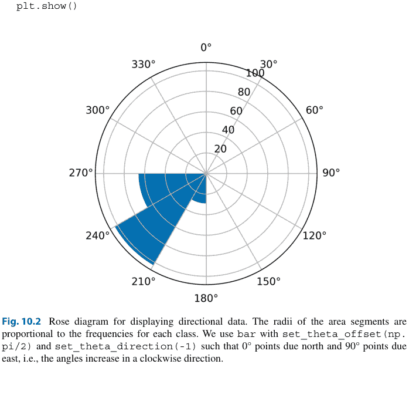


图 10.3 按类频率的平方根缩放的玫瑰图的修改。这种修改避免了弧形段的面积随频率的平方增加而增加，从而也避免了使频率是其他方向两倍的方向看起来是其他方向的四倍。

弧形段的面积随频率的平方增加而增加，因此频率是其他方向两倍的方向看起来比其他方向突出四倍。因此，在一种修改中，玫瑰图按类频率的平方根缩放（图10.3）：

```python
plt.figure()
ax=plt.subplot(projection='polar')
ax.bar(v,np.sqrt(n),width=2*np.pi/12)
ax.set_xticks(e[0:12])
ax.set_theta_offset(np.pi/2)
ax.set_theta_direction(-1)
plt.show()
```

此图满足地球科学中的所有惯例。

## 10.3 圆形数据的经验分布

本节介绍用于描述方向数据经验分布的统计度量。方向数据的特征由集中趋势和离散度的度量来描述，这与单变量数据集的统计表征（第3章）类似。假设我们收集了一些角度测量值，例如化石排列方向。数据集合可以写成

$$\theta_1, \theta_2, \theta_3, \ldots, \theta_n$$

其中包含$n$个观测值$\theta_i$。为每个方向$\theta_i$计算正弦和余弦值，然后用于计算角度数据集的*合向量（或平均）方向*（Fisher，1993；Mardia和Jupp，1999）：

$$x_r = \sum \sin \theta_i$$

$$y_r = \sum \cos \theta_i$$

数据集的合向量方向为

$$\overline{\theta} = \tan (x_r / y_r)$$

合向量长度为

$$R = \sqrt{(x_r^2 + y_r^2)}$$

合向量长度显然取决于数据的离散度。将合向量长度除以观测数进行归一化，得到平均合向量长度：

$$\overline{R} = R/n$$

平均合向量长度的值随离散度的增加而减小（图10.4）。*圆形方差*是1与平均合向量长度之差，因此常被用作方向数据的离散度度量：

$$\sigma_0 = 1 - \overline{R}$$

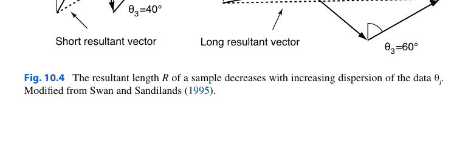

**图 10.4** 样本的合向量长度$R$随数据$\theta_i$离散度的增加而减小。修改自Swan和Sandilands（1995）。

以下示例展示了如何使用这些参数处理合成的方向数据。我们首先从文件 *directional_1.txt* 加载数据，并将所有测量值转换为弧度：

```python
import numpy as np
import matplotlib.pyplot as plt

data_degrees_1 = np.loadtxt('directional_1.txt')
data_radians_1 = np.pi * data_degrees_1 / 180
```

然后我们计算合成向量 R。首先，我们计算合成向量的 x 和 y 分量，

```python
x_1 = np.sum(np.sin(data_radians_1))
y_1 = np.sum(np.cos(data_radians_1))
print(x_1)
print(y_1)
```

得到结果：

```
-146.54800998477873
-120.34536799675672
```

平均方向是 x 和 y 比值的反正切 `arctan()`，

```python
mean_radians_1 = np.arctan(x_1 / y_1)
mean_degrees_1 = 180 * mean_radians_1 / np.pi
print(mean_radians_1)
print(mean_degrees_1)
```

得到结果：

```
0.883260987889874
50.6071268146455
```

该结果表明合成向量 R 大约为 0.88 弧度，或约 51°。然而，由于 x 和 y 均为负值，`mean_degrees` 的真实值位于第三象限，因此我们加上 180°，

```python
mean_degrees_1 = mean_degrees_1 + 180
print(mean_degrees_1)
```

得到结果：

```
230.60712681464548
```

这导致平均方向约为 231°。该向量的长度是向量的绝对值，

```python
R_1 = np.sqrt(x_1**2 + y_1**2)
print(R_1)
```

得到结果：

```
189.6294461015314
```

合成长度取决于方向数据的离散程度。将合成长度归一化到样本大小，得到平均合成长度 Rm。

```python
Rm_1 = R_1 / len(data_radians_1)
print(Rm_1)
```

得到结果：

```
0.948147230507657
```

较高的 Rm 值表明方差较小。然后我们计算圆方差 sigma，

```python
sigma_1 = 1 - Rm_1
print(sigma_1)
```

得到结果：

```
0.051852769492342965
```

## 10.4 圆形数据的理论分布

与第 3 章一样，统计分析的下一步是找到一个合适的理论分布，以拟合我们在前一节中可视化和描述的经验分布。描述方向数据的经典理论分布是冯·米塞斯分布，它以奥地利数学家理查德·埃德勒·冯·米塞斯（1883-1953）的名字命名。冯·米塞斯分布的概率密度函数为

$$f(\theta) = \frac{1}{2\pi I_0(\kappa)} e^{\kappa \cos(\theta - \mu)}$$

其中 μ 是平均方向，κ 是集中参数（Mardia 和 Jupp 1999）（图 10.5）。项 $I_0(\kappa)$ 是零阶修正的第一类贝塞尔函数。贝塞尔函数是二阶微分方程（即贝塞尔微分方程）的解，在许多涉及圆柱波导中波传播或圆柱物体中热传导的问题中都很重要。冯·米塞斯分布也被称为圆形正态分布，因为它具有与正态分布（第 3.4 节）相似的特征。当平均方向是最频繁的方向时，使用此分布。偏离的概率在平均方向的两侧相等，并随着与平均方向距离的增加而减小。

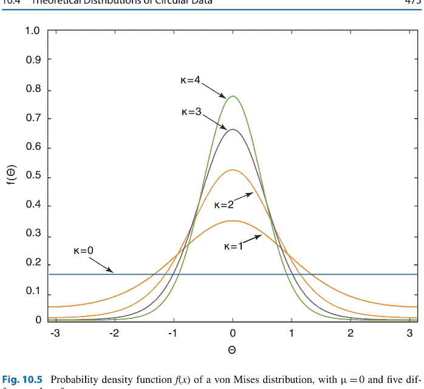

例如，我们假设平均方向为 $\mu = 0$，集中参数 $\kappa$ 有五个不同的值：

```python
import numpy as np
from scipy import special
import matplotlib.pyplot as plt
from numpy.random import default_rng

mu = 0
kappa = np.array([0, 1, 2, 3, 4])
```

我们首先为绘图定义一个角度范围，从 $-180^{\circ}$ 到 $180^{\circ}$，间隔为 $1^{\circ}$：

```python
theta = np.linspace(-180, 180, 361)
```

所有角度从度转换为弧度：

```python
mu_radians = np.pi * mu / 180
theta_radians = np.pi * theta / 180
```

然后我们计算这些值的冯·米塞斯分布。该公式使用零阶修正的第一类贝塞尔函数，可以使用 `special.iv()` 计算。接下来我们计算五个 kappa 值的概率密度函数：

```python
mises = np.zeros((len(theta), 5))
theta_radians_array = np.zeros((len(theta), 5))
for i in range(0, 5):
    mises[:, i] = (1 / (2 * np.pi * special.iv(0, kappa[i]))) * \
        np.exp(kappa[i] * np.cos(theta_radians - mu_radians))
    theta_radians_array[:, i] = theta_radians
```

结果通过以下代码绘制：

```python
plt.figure()
for i in range(0, 5):
    plt.plot(theta_radians_array[:, i], mises[:, i])
plt.legend(['$\kappa $=0',
    '$\kappa $=1',
    '$\kappa $=2',
    '$\kappa $=3',
    '$\kappa $=4'])
plt.show()
```

此类理论分布的平均方向和集中参数可以轻松修改，以便与经验分布进行比较。
我们可以创建一个 Python 代码，根据 Best 和 Fisher (1979) 第 155 页描述的算法，生成冯·米塞斯分布数据的伪随机数生成器。我们首先定义样本大小 n、平均方向 mu（转换为弧度）和集中参数 kappa：

```python
n = 200
mu = 230
mu = np.pi * mu / 180
kappa = 5
```

然后我们使用 `random.seed(0)` 重置随机数生成器，并使用 Best 和 Fisher (1979) 创建的算法计算 n 个伪随机数（以度为单位）：

```python
np.random.seed(0)
tau = 1 + (1 + 4 * kappa**2)**0.5
rho = (tau - (2 * tau)**0.5) / (2 * kappa)
r = (1 + rho**2) / (2 * rho)
i = 1

theta = np.zeros((n, 1))
while i < n:
    u1 = np.random.rand(1)
    u2 = np.random.rand(1)
    u3 = np.random.rand(1)
    z = np.cos(np.pi * u1)
    f = (1 + r * z) / (r + z)
    c = kappa * (r - f)
    if c * (2 - c) - u2 > 0:
        theta[i] = (np.sign(u3 - 0.5) * np.arccos(f))
        i = i + 1
    elif np.log(c / u2) + 1 - c >= 0:
        i = i
    # 无操作，返回
    # while 循环的开始

data_radians_2 = theta + mu
data_degrees_2 = 180 * data_radians_2 / np.pi
```

请注意，`elif` 条件不包含任何条件表达式。在 Best 和 Fisher (1979) 的算法中，该条件只是说 *返回步骤 1*（即 `while` 循环的开始），而不执行任何代码行。我们也可以使用 `vmises()`，它包含在本书的电子补充材料中：

```python
from vmises import vmises
help(vmises)

data_radians_3 = vmises(n, mu, kappa)
data_degrees_3 = 180 * data_radians_3 / np.pi
```

我们可以使用上一节的代码在玫瑰图中显示数据：

```python
ee = np.linspace(0, 2 * np.pi, 13)
vv = np.linspace(2 * np.pi / 24, 2 * np.pi - 2 * np.pi / 24, 12)
nn, ee = np.histogram(data_radians_3, bins=ee)

plt.figure()
ax = plt.subplot(projection='polar')
ax.bar(vv, nn, width=2 * np.pi / 12)
ax.set_xticks(ee[0:12])
ax.set_theta_offset(np.pi / 2)
ax.set_theta_direction(-1)
plt.show()
```

## 10.5 圆形数据的随机性检验

方向数据的第一个检验是将数据集与均匀分布进行比较。遵循均匀分布的方向数据是纯随机的（即没有偏好任何特定方向）。我们使用 $\chi^2$ 检验（第 3.8 节）将经验频率分布与理论均匀分布进行比较。我们首先加载样本数据：

```python
import numpy as np
from scipy import stats
import matplotlib.pyplot as plt

data_degrees_1 = np.loadtxt('directional_1.txt')
```

然后我们使用 `histogram()` 统计 12 个类别内的观测数量，每个类别的宽度为 30°：

```python
e = np.linspace(0, 360, 13)
counts, e = np.histogram(data_degrees_1, bins=e)
```

预期观测数量为 200/12，其中 200 是总观测数，12 是类别数：

```python
expect = 200 / 12 * np.ones(12)
```

$\chi^2$ 检验探讨观测频率与预期频率之间的平方差。量 $\chi^2$ 定义为这些平方差除以预期频率的总和，

```python
chi2cal = np.sum((counts - expect)**2 / expect)
print(chi2cal)
```

其结果为

```
748.5999999999998
```

临界$\chi^2$值可以使用`chi2.ppf()`计算。$\chi^2$检验需要自由度$\Phi$。在我们的例子中，我们检验数据是否均匀分布的假设（即，我们估计一个参数）。由于类别数为12，自由度为$\Phi = 12-1-1 = 10$。我们在$p=5\%$的显著性水平下检验我们的假设。函数`chi2.ppf()`计算$\chi^2$分布的累积分布函数（CDF）的逆，其中参数数量由$\Phi$指定，对应于$p$中的概率，

```
chi2crit = stats.chi2.ppf(1-0.05,12-1-1)
print(chi2crit)
```

其结果为

```
18.307038053275146
```

由于临界$\chi^2$值18.3070远低于测量的$\chi^2$值748.6000，我们可以拒绝原假设，并得出结论：我们的数据不服从均匀分布（即，它们不是随机分布的）。

## 10.6 平均方向显著性检验

一旦我们在野外测量了一组方向数据，我们可能想知道这些数据是否记录了一个主导方向。我们可以使用Rayleigh平均方向显著性检验来找出答案（Mardia 1972; Mardia and Jupp 1999）。该检验使用第10.3节引入的平均合成向量长度，该长度随着优选方向的增加而增加：

$$\bar{R} = \frac{1}{n} \sqrt{\left(\sum \sin \theta_i\right)^2 + \left(\sum \cos \theta_i\right)^2}$$

如果计算出的平均合成向量长度低于临界值，则数据表现出优选方向（Mardia 1972）（表10.1）。例如，我们再次加载文件*directional_1.txt*中的数据：

```
import numpy as np
import matplotlib.pyplot as plt

data_degrees_1=np.loadtxt('directional_1.txt')
data_radians_1=np.pi*data_degrees_1/180;
```

表10.1 Rayleigh平均方向显著性检验中n次测量的平均合成向量长度的临界值（Mardia 1972）。

| n | 0.100 | 0.050 | 0.025 | 0.010 | 0.001 |
|---|---|---|---|---|---|
| 5 | 0.677 | 0.754 | 0.816 | 0.879 | 0.991 |
| 6 | 0.618 | 0.690 | 0.753 | 0.825 | 0.940 |
| 7 | 0.572 | 0.642 | 0.702 | 0.771 | 0.891 |
| 8 | 0.535 | 0.602 | 0.660 | 0.725 | 0.847 |
| 9 | 0.504 | 0.569 | 0.624 | 0.687 | 0.808 |
| 10 | 0.478 | 0.540 | 0.594 | 0.655 | 0.775 |
| 11 | 0.456 | 0.516 | 0.567 | 0.627 | 0.743 |
| 12 | 0.437 | 0.494 | 0.544 | 0.602 | 0.716 |
| 13 | 0.420 | 0.475 | 0.524 | 0.580 | 0.692 |
| 14 | 0.405 | 0.458 | 0.505 | 0.560 | 0.669 |
| 15 | 0.391 | 0.443 | 0.489 | 0.542 | 0.649 |
| 16 | 0.379 | 0.429 | 0.474 | 0.525 | 0.630 |
| 17 | 0.367 | 0.417 | 0.460 | 0.510 | 0.613 |
| 18 | 0.357 | 0.405 | 0.447 | 0.496 | 0.597 |
| 19 | 0.348 | 0.394 | 0.436 | 0.484 | 0.583 |
| 20 | 0.339 | 0.385 | 0.425 | 0.472 | 0.569 |
| 21 | 0.331 | 0.375 | 0.415 | 0.461 | 0.556 |
| 22 | 0.323 | 0.367 | 0.405 | 0.451 | 0.544 |
| 23 | 0.316 | 0.359 | 0.397 | 0.441 | 0.533 |
| 24 | 0.309 | 0.351 | 0.389 | 0.432 | 0.522 |
| 25 | 0.303 | 0.344 | 0.381 | 0.423 | 0.512 |
| 30 | 0.277 | 0.315 | 0.348 | 0.387 | 0.470 |
| 35 | 0.256 | 0.292 | 0.323 | 0.359 | 0.436 |
| 40 | 0.240 | 0.273 | 0.302 | 0.336 | 0.409 |
| 45 | 0.226 | 0.257 | 0.285 | 0.318 | 0.386 |
| 50 | 0.214 | 0.244 | 0.270 | 0.301 | 0.367 |
| 100 | 0.150 | 0.170 | 0.190 | 0.210 | 0.260 |

然后我们通过输入以下命令计算平均合成向量Rm_1_calc。

```
x_1=np.sum(np.sin(data_radians_1))
y_1=np.sum(np.cos(data_radians_1))

mean_radians_1=np.arctan(x_1/y_1)
mean_degrees_1=180*mean_radians_1/np.pi
mean_degrees_1=mean_degrees_1+180
```

```
Rm_1_calc=1/len(data_degrees_1) * (x_1**2+y_1**2)**0.5
print(Rm_1_calc)
```

其结果为

```
0.948147230507657
```

我们例子中的平均合成向量长度Rm_1_calc为0.9481。计算临界Rm_1_crit涉及多种近似方法，例如Wilkie近似（Wilkie 1983），根据该方法，可以通过输入以下命令计算Rm_1_crit

```
n=len(data_degrees_1)

alpha=0.050

Rm_1_crit=np.sqrt((-np.log(alpha)-(2*np.log(alpha)+\n    (np.log(alpha))**2)/(4*n))/n)
print(Rm_1_crit)
```

其结果为

```
0.12231115217794654
```

对于α=0.05和n=200，临界Rm为0.1223。由于该值低于数据的Rm_1_calc，我们可以拒绝原假设，并得出结论存在一个优选的单一方向，

```
theta_1=180 * np.arctan(x_1/y_1) / np.pi
print(theta_1)
```

其结果为

```
50.6071
```

然而，正弦和余弦的负号意味着真实结果位于第三象限（即180°到270°），因此正确结果是180+50.6071=230.6071，

```
theta_1=180+theta_1
print(theta_1)
```

其结果为

```
230.60712681464548
```

## 10.7 两组方向数据差异检验

让我们考虑文件*directional_1.txt*和*directional_2.txt*中的两组测量数据。我们希望比较这两组方向数据，并检验它们没有显著差异的原假设。我们使用Watson-Williams检验来检验两个平均方向的相似性，

$$F = \left(1 + \frac{3}{8\kappa}\right) \frac{(n-2)(R_A + R_B - R_T)}{n - R_A - R_B}$$

其中$\kappa$是集中参数，$R_A$和$R_B$分别是样本A和B的合成向量长度，$R_T$是合并样本的合成向量长度（Watson and Williams 1956; Mardia and Jupp 1999）。集中参数可以通过$R_T$从表中获得（Batschelet 1981; Gumbel et al. 1953; 表10.2）。计算出的$F$值与标准$F$表（第3.8节）中的临界值进行比较。如果计算出的$F$值小于临界$F$值（该值取决于自由度$\Phi_a = 1$和$\Phi_b = n-2$以及显著性水平$\alpha$），则两个平均方向没有显著差异。两个样本都必须服从von Mises分布（第10.4节）。

我们使用两个合成的方向数据集来说明如何应用此检验。我们首先加载数据并将度数转换为弧度：

```
import numpy as np
from scipy import stats
import matplotlib.pyplot as plt

data_degrees_1=np.loadtxt('directional_1.txt')
data_degrees_2=np.loadtxt('directional_2.txt')

data_radians_1=np.pi*data_degrees_1/180;
data_radians_2=np.pi*data_degrees_2/180;
```

然后我们计算合成向量的长度，

```
x_1=np.sum(np.sin(data_radians_1))
y_1=np.sum(np.cos(data_radians_1))
x_2=np.sum(np.sin(data_radians_2))
y_2=np.sum(np.cos(data_radians_2))

mean_radians_1=np.arctan(x_1/y_1)
mean_degrees_1=180*mean_radians_1/np.pi
mean_radians_2=np.arctan(x_2/y_2)
mean_degrees_2=180*mean_radians_2/np.pi
```

表10.2 根据计算出的平均合成向量长度得到的集中参数κ的最大似然估计。改编自Batschelet (1981) 和 Gumbel et al. (1953)。

| R | κ | R | κ | R | κ | R | κ |
|---|---|---|---|---|---|---|---|
| 0.000 | 0.000 | 0.260 | 0.539 | 0.520 | 1.224 | 0.780 | 2.646 |
| 0.010 | 0.020 | 0.270 | 0.561 | 0.530 | 1.257 | 0.790 | 2.754 |
| 0.020 | 0.040 | 0.280 | 0.584 | 0.540 | 1.291 | 0.800 | 2.871 |
| 0.030 | 0.060 | 0.290 | 0.606 | 0.550 | 1.326 | 0.810 | 3.000 |
| 0.040 | 0.080 | 0.300 | 0.629 | 0.560 | 1.362 | 0.820 | 3.143 |
| 0.050 | 0.100 | 0.310 | 0.652 | 0.570 | 1.398 | 0.830 | 3.301 |
| 0.060 | 0.120 | 0.320 | 0.676 | 0.580 | 1.436 | 0.840 | 3.479 |
| 0.070 | 0.140 | 0.330 | 0.700 | 0.590 | 1.475 | 0.850 | 3.680 |
| 0.080 | 0.161 | 0.340 | 0.724 | 0.600 | 1.516 | 0.860 | 3.911 |
| 0.090 | 0.181 | 0.350 | 0.748 | 0.610 | 1.557 | 0.870 | 4.177 |
| 0.100 | 0.201 | 0.360 | 0.772 | 0.620 | 1.600 | 0.880 | 4.489 |
| 0.110 | 0.221 | 0.370 | 0.797 | 0.630 | 1.645 | 0.890 | 4.859 |
| 0.120 | 0.242 | 0.380 | 0.823 | 0.640 | 1.691 | 0.900 | 5.305 |
| 0.130 | 0.262 | 0.390 | 0.848 | 0.650 | 1.740 | 0.910 | 5.852 |
| 0.140 | 0.283 | 0.400 | 0.874 | 0.660 | 1.790 | 0.920 | 6.539 |
| 0.150 | 0.303 | 0.410 | 0.900 | 0.670 | 1.842 | 0.930 | 7.426 |
| 0.160 | 0.324 | 0.420 | 0.927 | 0.680 | 1.896 | 0.940 | 8.610 |
| 0.170 | 0.345 | 0.430 | 0.954 | 0.690 | 1.954 | 0.950 | 10.272 |
| 0.180 | 0.366 | 0.440 | 0.982 | 0.700 | 2.014 | 0.960 | 12.766 |
| 0.190 | 0.387 | 0.450 | 1.010 | 0.710 | 2.077 | 0.970 | 16.927 |
| 0.200 | 0.408 | 0.460 | 1.039 | 0.720 | 2.144 | 0.980 | 25.252 |
| 0.210 | 0.430 | 0.470 | 1.068 | 0.730 | 2.214 | 0.990 | 50.242 |
| 0.220 | 0.451 | 0.480 | 1.098 | 0.740 | 2.289 | 0.995 | 100.000 |
| 0.230 | 0.473 | 0.490 | 1.128 | 0.750 | 2.369 | 0.999 | 500.000 |
| 0.240 | 0.495 | 0.500 | 1.159 | 0.760 | 2.455 | 1.000 | 5000.000 |
| 0.250 | 0.516 | 0.510 | 1.191 | 0.770 | 2.547 | | |

```
mean_degrees_1 = mean_degrees_1 + 180
mean_degrees_2 = mean_degrees_2 + 180
print(mean_degrees_1)
print(mean_degrees_2)

R_1 = np.sqrt(x_1**2 + y_1**2)
R_2 = np.sqrt(x_2**2 + y_2**2)
```

其计算结果为

```
230.60712681464548
212.18856343005913
```

合成向量的方向分别约为223°和201°。我们还需要计算两个样本合并后的合成长度；因此，我们合并两个数据集并再次计算合成长度，

```python
data_radians_T=np.concatenate([data_radians_1, data_radians_2])

x_T=np.sum(np.sin(data_radians_T))
y_T=np.sum(np.cos(data_radians_T))

mean_radians_T=np.arctan(x_T/y_T)
mean_degrees_T=180*mean_radians_T/np.pi

mean_degrees_T=mean_degrees_T+180

R_T=np.sqrt(x_T**2+y_T**2)
print(R_T)
Rm_T=R_T / (len(data_radians_T))
print(Rm_T)
```

其计算结果为

```
372.4449200527211
0.9311123001318028
```

接下来，我们对数据应用F统计量，其中kappa=7.426，Rm_T=0.9311（表10.2）。计算得到的F值为

```python
n=len(data_radians_T)

Fcalc=(1+3/(8*7.426)) * (((n-2)*(R_1+R_2-R_T))/(n-R_1-R_2))
print(Fcalc)
```

其计算结果为

```
89.60541051467561
```

使用F统计量，我们发现对于1和400-2=398个自由度以及α=0.05，临界值为

```python
Fcrit=stats.f.ppf(1-0.05,1,n-2)
print(Fcrit)
```

其计算结果为

```
3.8649292212017365
```

该值远低于观测到的F=89.6054（第3.8节）。因此，我们可以拒绝原假设，并得出结论：这两个样本不可能来自具有相同平均方向的总体。

## 10.8 球面数据的图形表示

展示球面数据的方法有很多。然而，由于我们总是以二维形式呈现数据（即在纸张或计算机屏幕上），我们需要将其转换为众多可用投影方式中的一种。Python并未提供太多用于显示或处理球面数据的函数，尤其是在地球科学中常用的形式。唯一的例外是那些用于在地球仪上显示地理数据的函数，我们在此使用其中一些。

我们首先使用经度`lon`和纬度`lat`的合成数据，这些数据是通过`vmises()`计算的。我们首先使用`random.seed(0)`重置随机数生成器，并定义样本大小`n`。然后，我们定义以度为单位的`lon`和`lat`值的均值，将这两个值转换为弧度，定义集中参数`kappa`，并使用`vmises()`（包含在本书的电子补充材料中）计算n=100个`lon`和`lat`值。最后，我们将`lon`和`lat`值转换为度：

```python
import numpy as np
from vmises import vmises
import scipy.stats as stats
import matplotlib.pyplot as plt
from numpy.random import default_rng

n=100;
np.random.seed(0)
mu_lon_degrees=10
mu_lat_degrees=35
mu_lon_radians=np.pi*mu_lon_degrees/180
mu_lat_radians=np.pi*mu_lat_degrees/180
kappa_lon=10
kappa_lat=10
lon_radians=vmises(n,mu_lon_radians,kappa_lon)
lat_radians=vmises(n,mu_lat_radians,kappa_lat)
```

```python
lon=180*lon_radians/np.pi
lat=180*lat_radians/np.pi
```

接下来，我们使用`gaussian_kde()`计算数据密度c：

```python
c=stats.gaussian_kde([lon,lat])
```

然后，我们根据核密度c计算网格坐标`grid_coords`和每个数据点（lon, lat）的颜色值`zc`：

```python
grid_coords=np.append(lon.reshape(-1,1), lat.reshape(-1,1),axis=1)
zc=256*c(grid_coords.T) / np.max(c(grid_coords.T))
```

随后，我们在使用兰伯特投影的坐标轴上以地理密度图的形式显示数据点（图10.6）：

```python
plt.figure()
ax=plt.subplot(projection='lambert')
ax.scatter(lon_radians,lat_radians,c=zc)
ax.grid()
plt.show()
```

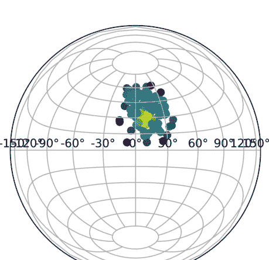

或者，我们也可以使用*莫尔威德*投影（图10.7）：

```python
plt.figure()
ax=plt.subplot(projection='mollweide')
ax.scatter(lon_radians,lat_radians,c=zc)
ax.grid()
plt.show()
```

最后，我们在直角坐标系中显示数据：

```python
plt.figure()
plt.scatter(lon,lat,c=zc)
plt.show()
```

这种简单的展示方法在某些应用中可能是首选。

## 10.9 球面数据的统计分析

球面数据的统计分析是一个庞大的课题。由于Python对分析此类数据的支持非常有限，我们在此仅作简要介绍。关于此主题的更详细文章可以在Mardia和Jupp（1999）的著作中找到。以下部分演示了如何计算地理点的均值、标准差和标准距离。它还介绍了一个用于使用等距矩形分箱计算地理点频率分布的Python函数。

首先，我们再次使用`vmises()`创建合成数据，该函数包含在本书的电子补充材料中：

```python
import numpy as np
from vmises import vmises
import scipy.stats as stats
import matplotlib.pyplot as plt
from numpy.random import default_rng

n=500;
np.random.seed(0)
mu_lon_degrees=10
mu_lat_degrees=35
mu_lon_radians=np.pi*mu_lon_degrees/180
mu_lat_radians=np.pi*mu_lat_degrees/180
kappa_lon=10
kappa_lat=10
lon_radians=vmises(n,mu_lon_radians,kappa_lon)
lat_radians=vmises(n,mu_lat_radians,kappa_lat)
lon=180*lon_radians/np.pi
lat=180*lat_radians/np.pi
```

接下来，我们使用`gaussian_kde()`计算数据密度c：

```python
c=stats.gaussian_kde([lon,lat])
```

然后，我们根据核密度c计算网格坐标`grid_coords`和每个数据点（lon, lat）的颜色值`zc`：

```python
grid_coords=np.append(lon.reshape(-1,1), lat.reshape(-1,1),axis=1)
zc=256*c(grid_coords.T) / np.max(c(grid_coords.T))
```

随后，我们使用地球的算术平均半径r = 6,371 km，通过输入以下命令计算（lon, lat）坐标的中位数：

```python
r=6371
x=r*np.cos(lat_radians)*np.cos(lon_radians)
y=r*np.cos(lat_radians)*np.sin(lon_radians)
z=r*np.sin(lat_radians)

x_median=np.median(x)
y_median=np.median(y)
z_median=np.median(z)
```

```python
lon_radians_median=np.arctan2(y_median,x_median)
lat_radians_median=np.arcsin(z_median/r)

lon_degrees_median=180*lon_radians_median/np.pi
lat_degrees_median=180*lat_radians_median/np.pi

print(lon_degrees_median)
print(lat_degrees_median)
```

其计算结果为

```
9.448245726147533
33.297480017287604
```

我们发现，经度（10°）和纬度（30°）的平均值与我们使用`vmises()`创建合成数据时所用的值非常相似：

```python
plt.figure()
plt.scatter(lon,lat,c=zc)
plt.plot(lon_degrees_median,lat_degrees_median,
         marker='o',
         markersize=10,
         markeredgecolor=(0.9,0.3,0.1),
         markerfacecolor=(0.9,0.3,0.1))
plt.show()
```

然后，我们计算直方图，并使用与计数相对应的颜色在3D条形图中显示计数，并在条形图上方用一个实心红色圆圈标记中位数（图10.8）：

```python
h,xedges,yedges=np.histogram2d(lon,lat)
vx=(xedges[:-1]+xedges[1:]) / 2
vy=(yedges[:-1]+yedges[1:]) / 2
vxx,vyy=np.meshgrid(vx,vy)
VX=vxx.flatten()
VY=vyy.flatten()
H=h.flatten()
bottom=np.zeros_like(H)
width=depth=5

zc=plt.cm.coolwarm(H/float(np.max(H)))

fig=plt.figure()
ax=fig.add_subplot(projection='3d')
```


```python
ax.bar3d(VX, VY, bottom, width, depth, H, color=zc)
plt.plot(lon_degrees_median, lat_degrees_median, 25,
         marker='o',
         markersize=10,
         markeredgecolor=(0.9, 0.3, 0.1),
         markerfacecolor=(0.9, 0.3, 0.1))
plt.show()
```

## 参考文献

- Allmendinger RW, Cardozo N, Fisher DM (2012) Structural Geology Algorithms: Vectors and Tensors. Cambridge University Press, New York
- Allmendinger RW, Siron CR, Scott CP (2017) Structural data collection with mobile devices: Accuracy, redundancy, and best practices. J Struct Geol 102:98–112
- Allmendinger RW (2019) Modern Structural Practice, A structural geology laboratory manual for the 21st Century. Available online at [http://www.geo.cornell.edu/geology/faculty/RWA/structure-lab-manual/downloads.html](http://www.geo.cornell.edu/geology/faculty/RWA/structure-lab-manual/downloads.html)
- Batschelet E (1981) Circular Statistics in Biology. Academic Press, Cambridge, Massachusetts
- Best DJ, Fisher NI (1979) Efficient Simulation of the von Mises Distribution. Appl Stat 28:152–157
- Davis JC (2002) Statistics and Data Analysis in Geology, 3rd edn. John Wiley and Sons, New York
- Fisher NI (1993) Statistical Analysis of Circular Data. Cambridge University Press, New York
- Gumbel EJ, Greenwood JA, Durand D (1953) The Circular Normal Distribution: Tables and Theory. J Am Stat Assoc 48:131–152
- Mardia KV (1972) Statistics of Directional Data. Academic Press, London

## 参考文献

Mardia KV (1975) 方向数据统计学。英国皇家统计学会杂志。B辑（方法论）37:349–393

Mardia KV, Jupp PE (1999) 方向统计学。Wiley出版社，奇切斯特

Swan ARH, Sandilands M (1995) 地质数据分析导论。Blackwell Sciences出版社，牛津

Watson GS, Williams EJ (1956) 关于圆和球面上显著性检验的构建。生物计量学 43:344–352

Wilkie D (1983) 圆形数据随机性的瑞利检验。应用统计 32:311–312