# 地球科学Python实战手册

Martin H. Trauth

## 施普林格地球科学、地理与环境学教材系列

施普林格教材系列出版了涵盖地球科学、地理学和环境科学的广泛教材。施普林格教材既提供全面的入门介绍，也为深入研究提供专业知识。清晰易读的版式设计，以及章末总结、实例演示、练习题和术语表等特色内容，帮助读者更好地掌握学科知识。施普林格教材是学生、研究人员和应用科学家的必备读物。

Martin H. Trauth

# 地球科学Python实战手册

Martin H. Trauth
地球科学研究所
波茨坦大学
波茨坦，勃兰登堡，德国

ISSN 2510-1307
ISSN 2510-1315（电子版）
施普林格地球科学、地理与环境学教材系列
ISBN 978-3-031-07718-0
ISBN 978-3-031-07719-7（电子书）
https://doi.org/10.1007/978-3-031-07719-7

© 编者（如适用）和作者，经Springer Nature Switzerland AG独家许可，2022年出版
本作品受版权保护。所有权利均由出版商独家许可，无论涉及材料的全部或部分，特别是翻译、转载、插图重用、朗诵、广播、以缩微胶片或任何其他物理方式复制，以及信息存储和检索、电子改编、计算机软件，或以目前已知或未来开发的类似或不同方法进行传输的权利。
在本出版物中使用通用描述性名称、注册名称、商标、服务标志等，即使没有具体声明，也不意味着这些名称不受相关保护性法律法规的约束，因此可以自由使用。
出版商、作者和编辑有理由相信，本书中的建议和信息在出版之日是真实准确的。无论是出版商还是作者或编辑，均不对本文所含材料或可能存在的任何错误或遗漏提供任何明示或暗示的保证。出版商对已出版地图中的管辖权主张和机构隶属关系保持中立。

责任编辑：Annett Büttner 博士
本施普林格印记由注册公司Springer Nature Switzerland AG出版
注册公司地址：Gewerbestrasse 11, 6330 Cham, Switzerland

# 前言

《地球科学Python实战手册》旨在帮助本科生、研究生、博士生、博士后研究人员以及专业人士快速解决地球科学中常见的数据分析问题。本书提供最少量的理论背景，并通过示例演示所有描述方法的应用。本书基于我多年前编写的广受欢迎的《地球科学MATLAB实战手册》，该书现已出版第5版（Springer 2021）。这本新书的构思是将MATLAB书中的文本翻译成另一种日益流行的编程语言，秉承W.H. Press、S.A. Teukolsky、W.T. Vetterling和B.P. Flannery所著经典《数值算法》（Cambridge University Press 2007）的精神。

本书包含可用于通过简单统计、时间序列分析、地统计学和图像处理解决地球科学典型问题的Python脚本。它还演示了选定的高级数据分析技术的应用，例如非线性时间序列分析、自适应滤波、自助法和地形分析。本书的补充电子材料（可通过Springer Link在线获取）包含所有示例数据和书中所有Python命令的示例。Python代码可以轻松修改，以用于读者自己的数据和项目。Python软件已存在超过30年，之所以被使用，是因为它不仅为大多数数据分析方法提供了大量现成的算法，还允许修改和扩展现有程序，并能够开发新软件。然而，在使用任何Python特定函数之前，大多数方法都使用非常简单的代码进行介绍。因此，使用Python替代品的读者也会发现本书的价值。

为了从本书中获得最大收益，读者需要能够访问Python软件，并在阅读本书时能够执行这些示例。Python示例会在屏幕上生成各种图形，这些图形未在印刷版中显示。然而，这本教程式的书籍包含大量插图，因此即使不实际运行代码，也可以通读全文。

在计算机上运行Python。我使用Python 3.8.8开发了这些示例，但大多数示例也适用于早期的软件版本，但不适用于Python 2。虽然参加数据分析课程的本科生可能希望通读全书，但经验更丰富的读者可能只选择参考某一特定方法来解决特定问题。因此，下面概述了本书的概念和各章内容，以便更容易满足具有不同需求的读者。

- 第1章——本章介绍样本和总体的一些基本概念。它还将各种类型的数据和可以使用数据回答的问题与后续章节中描述的方法联系起来。
- 第2章——本章为地球科学家提供了Python的教程式入门。已经熟悉该软件的读者建议直接进入后续章节。
- 第3章和第4章——这两章涵盖单变量和双变量统计的基础知识。它们包含统计学的基本概念，并介绍了高级主题，例如重采样方案和交叉验证。已经熟悉基础统计学的读者可能希望跳过这些章节。
- 第5章和第6章——希望处理时间序列的读者建议阅读这两章。时间序列分析和信号处理密切相关。成功使用这些方法需要良好的统计学知识。
- 第7章和第8章——我建议通读这两章，因为空间数据和图像的处理方法有很多共同之处。此外，在地球科学中，空间数据和图像经常结合使用，例如，将卫星图像投影到数字高程模型上。
- 第9章——地球科学中的数据集通常具有许多变量和许多数据点。多元方法应用于各种大型数据集，包括卫星图像数据。任何对多元方法特别感兴趣的读者，建议在进入本章之前先阅读第3章和第4章。
- 第10章——分析圆形和球形数据的方法在地球科学中广泛使用。例如，构造地质学家测量和分析断层面上擦痕（或条痕）的方向，圆形数据的统计分析用于古地磁应用。显微构造研究包括薄片中颗粒形状和石英c轴取向的分析。

使用本书时，重要的是要记住它基于一本使用MATLAB进行地球科学数据分析的书。尽管对某些Python用户来说可能显得不寻常或笨拙，但已尽力尽可能接近MATLAB书的原始教学概念和文本。另一方面，对于许多用户来说，这个教学概念将是熟悉的，出于各种原因，许多用户已从MATLAB转向Python。这些用户（包括我本人）熟悉MATLAB，通常首先在Python中寻找类似解决方案，而非从头开始编写Python代码。这种情况非常普遍，并体现在许多Python包中，例如*NumPy*和*Matplotlib*，它们与MATLAB工具箱高度相似，甚至函数名称和输入参数都完全相同。

将两本书并排阅读的读者会注意到，我直接翻译了代码，以使数值和图形输出尽可能相似。然而，由于MATLAB和Python使用不同的随机数生成器，结果并不总是一致。在这些情况下，生成合成数据后，Python示例中会使用MATLAB生成的样本文件来复现结果。在某些情况下也可能存在差异，例如MATLAB产生零结果，而Python产生略微非零的结果（如-3.0552e-17）。这种差异可能是由于许多Python包中浮点误差缓解措施不够严格所致。

细心的读者还会注意到，在某些情况下，Python生成的图形与本书前半部分的插图存在细微差异。这也是因为此处使用的随机数生成器提供不同的结果，并且并非所有使用的随机数生成器都可以重置。因此，某些结果（例如自助法结果）在不同运行中会有所不同。然而，这些图形至少在定性上反映了统计学、时间序列分析和信号处理的结果。对于本书的后半部分，图形是重新创建的，以反映*Matplotlib*和*PyGMT*等图形包输出的特性，这无疑带来了一些非常出色的结果。

我基于MATLAB脚本编写了Python脚本，尽我所能并得到了以下同事的支持。但是，我无法提供任何保证，特别是在使用Python及其Python包等本身不提供保证的软件时。例如，我发现Python和MATLAB的结果之间存在一些差异，我将其归因于某些Python包中的轻微浮点问题，例如在计算中使用非常小的值而非（正确的）零。我在文中已标记了这些差异。我建议读者在将代码应用于实际示例之前，始终使用合成示例进行测试（无论是Python还是MATLAB），因为用户在使用浮点数时也可能犯自己的错误。

本书得益于许多人的评论，特别是我的撰稿人Robin Gebbers和Norbert Marwan，以及全球许多阅读过本书、指出错误并提出改进建议的同事和朋友。我要感谢Ed Manning和Ryan DeLaney的专业校对，这极大地提高了本书的可读性。我也非常感谢*blaetterwaldDesign*的Elisabeth Sillmann的专业知识和耐心，她在图形设计方面给予我支持和建议。我非常感谢Annett Büttner、Marion Schneider、Helen Rachner、Nirmal Iyer、Stefan Kreickenbaum及其在*Springer*的团队，他们对我出版书籍持续感兴趣和支持。我非常感谢Nadine Berner、Bodo Bookhagen、Matt Hall、Hauke Krämer、Pawel Lachowicz、Norbert Marwan和Maurizio Petrelli回答我的Python问题。我还要感谢Brunhilde Schulz、Andreas Bohlen、Ingo Orgzall及其在*UP Transfer GmbH*的团队，在过去二十年中，他们在基尔大学、不来梅大学、布拉迪斯拉发大学、根特大学、慕尼黑大学、内罗毕大学、科隆大学、斯德哥尔摩大学、阿姆斯特丹大学、阿伯里斯特威斯大学和波茨坦大学，以及巴塞罗那自治大学、伦敦大学学院、布朗大学普罗维登斯分校、汉诺威联邦地球科学与自然资源研究所、拜罗伊特地球科学中心、维也纳自然历史博物馆和惠灵顿GNS科学研究所组织了关于本书的短期课程。

我还要特别感谢*NASA/GSFC/METI/ERSDAC/JAROS*和*美国/日本ASTER科学团队*以及主任Mike Abrams允许我在本书中包含ASTER图像。我感谢NASA戈达德太空飞行中心（GSFC）的Stuart W. Frye及其团队允许我在本书中包含EO-1数据，以及我们在撰写关于Hyperion图像部分时的富有成效的讨论。

波茨坦
2022年4月

Martin H. Trauth

## 目录

- 1 地球科学中的数据分析

## 目录

- 3.10 柯尔莫哥洛夫-斯米尔诺夫检验

## 目录

# 7 空间数据

- 7.1 引言
- 7.2 全球地理数据库 GSHHG
- 7.3 1 弧分网格全球地形数据 ETOPO1
- 7.4 30 弧秒高程模型 GTOPO30
- 7.5 航天飞机雷达地形测绘任务 SRTM
- 7.6 导出三维图形以创建交互式文档
- 7.7 网格化与等值线绘制
- 7.8 方法比较与潜在伪影
- 7.9 点分布统计
- 7.10 数字高程模型分析（作者：R. Gebbers）
- 7.11 地统计学与克里金插值（作者：R. Gebbers）

推荐阅读

# 8 图像处理

- 8.1 引言
- 8.2 数据存储
- 8.3 图像的导入、处理与导出
- 8.4 Landsat 图像的导入、处理与导出
- 8.5 Terra ASTER 图像的导入与地理配准
- 8.6 EO-1 Hyperion 图像的处理与导出
- 8.7 屏幕数字化
- 8.8 图像增强、校正与纠正
- 8.9 纹层沉积物的色彩强度剖面
- 8.10 基于显微图像的粒度分析
- 8.11 显微图像中木炭的量化
- 8.12 基于形状的图像目标检测
- 8.13 归一化差异植被指数 NDVI

推荐阅读

# 9 多变量统计

- 9.1 引言
- 9.2 主成分分析
- 9.3 独立成分分析（作者：N. Marwan）
- 9.4 判别分析
- 9.5 聚类分析
- 9.6 多元线性回归
- 9.7 Aitchison 对数比变换

推荐阅读

# 10 方向数据

- 10.1 引言
- 10.2 圆形数据的图形表示
- 10.3 圆形数据的经验分布
- 10.4 圆形数据的理论分布
- 10.5 圆形数据的随机性检验
- 10.6 平均方向显著性检验

# 地球科学中的数据分析

## 1.1 引言

地球科学家对地球上的自然过程进行观测并收集数据。他们针对作用于特定区域并塑造其结构的力提出并检验假设，同时也对地球未来的变化做出预测。探索地球的这些步骤都涉及获取和分析数值数据。因此，地球科学家需要牢固掌握统计和数值方法，并具备使用相关计算机软件包的能力，以便能够分析所获取的数据。

本书介绍了地球科学中使用的一些最重要的数据分析方法，并通过Python软件包的示例来说明其应用。读者在理解了这些使用合成数据的示例应用后，可以将其作为分析自己数据的范本。本导论章节在第1.2节讨论数据获取，第1.3节讨论数据类型，第1.4节讨论分析地球科学数据的适当方法。因此，我们首先探讨典型数据集的特征，随后研究使用Python分析数据的各种方法。

## 1.2 数据收集

地球科学中的大多数数据集样本量非常有限，并且包含大量不确定性。此类数据集通常用于描述相当大的自然现象，例如一个花岗岩体、一次大型滑坡或一个广泛分布的沉积单元。本书描述的方法旨在寻找一种方法，从一个小得多的*样本*预测一个更大*总体*的特征（图1.1）。

需要注意的是，根据研究背景中关注的总体，在野外获得的样本（例如一块花岗岩）不一定等同于后来被描述为统计样本的东西。如果研究对象是花岗岩样本的化学成分，那么样本就是对花岗岩子样本进行重复测量的集合。然而，如果研究者更感兴趣的是整个花岗岩体的化学成分，那么样本则由来自该花岗岩体的几个（最好是具有代表性的）岩石样本的化学成分组成。

无论如何，适当的采样策略是获得良好数据集的第一步。制定成功的野外采样策略需要就*样本量*和*空间采样方案*做出决定。样本量（再次针对岩石样本）由样本的体积和/或重量决定，或者（对于统计样本）由从花岗岩体采集的岩石样本数量决定。如果总体是异质的，样本需要足够大以代表总体的变异性；然而，样本也应尽可能小，以最小化分析所需的时间和成本。建议在确定合适的样本量之前，先收集较小的试点样本。

空间采样方案的设计取决于露头或其他适合采样的材料的可用性（图1.2）。在采石场采样通常导致数据聚集，而沿着道路切面、海岸悬崖或陡峭峡谷采样则导致一维横断面采样方案。在露头100%出露或没有经济限制的情况下，可以设计更均匀的采样模式。规则采样方案导致样本位置呈网格状分布，而均匀采样策略则包括在网格方块内随机设置采样点。尽管这些采样方案可能被认为是更优的采样收集方法，但等间距的采样位置往往会遗漏区域内的小尺度变化，例如花岗岩体内的薄基性岩脉或特定类型化石的空间局限性存在。

正确的采样策略取决于调查目标、所需的分析类型以及对结果的期望置信水平。一旦选择了合适的采样策略，样本的质量可能受到多种因素的影响，从而导致样本不能真正代表更大的总体。化学或物理蚀变、其他物质的污染，或自然或人为过程的位移都可能导致错误的结果和解释。因此，建议在调查的每个阶段检查样本质量、所采用的数据分析方法以及从分析中得出的结论的有效性。

## 1.3 数据类型

大多数地球科学数据集由数值测量组成，尽管一些信息，如化石和矿物，也可以用名称列表表示（图1.3）。可用的数据分析方法可能需要地球科学中的某些数据类型。这些数据类型包括：

- *名义数据*——地球科学中的信息有时以名称列表的形式呈现，例如从石灰岩层采集的各种化石物种或在岩石薄片中鉴定出的矿物。在某些研究中，这些数据被转换为二进制表示，即存在为*一*，不存在为*零*。有特殊的统计方法可用于分析此类数据集。
- *顺序数据*——这些是数值数据，代表可以排序的观测值，但其量表上的间隔是不规则的。德国矿物学家弗里德里希·莫斯（1773-1839）创建的硬度标度就是顺序标度的一个例子。硬度值表示材料抵抗划痕的能力。钻石的硬度为10，而滑石的值为1，但就绝对硬度而言，钻石（硬度10）比刚玉（硬度9）硬四倍，比黄玉（硬度8）硬六倍。试图对地震影响进行分类的修订麦加利地震烈度表是顺序标度的另一个例子，它将地震从烈度I（几乎感觉不到）到烈度XII（完全毁灭）进行分级（Richter 1958）。
- *比率数据*——这些数据的特点是连续区间的长度恒定，因此比顺序数据具有很大的优势。零点是数据标度的自然终点。这种类型的数据允许离散或连续的数据采样。此类数据集的例子包括长度和重量数据。
- *区间数据*——这些是有序数据，具有恒定的连续区间长度，但其数据标度不以零为终点。摄氏度和华氏度的温度代表了这种数据类型的一个例子，尽管两个标度都存在任意的零点。这种类型的数据可以连续采样或以离散区间采样。

除了这些标准数据类型外，地球科学家经常遇到特殊类型的数据，例如：

- *封闭数据*——这些数据表示为比例，并且总和为一个固定总数，例如100%。组成数据（例如岩石样本的元素组成）代表了大多数封闭数据。
- *空间数据*——这些数据在二维或三维研究区域中收集。某种化石物种的空间分布、砂岩层厚度的空间变化以及地下水中示踪剂浓度的分布都是这种数据类型的例子，这可能是地球科学中最重要的数据类型。
- *方向数据*——这些数据以角度表示。例子包括地层的走向和倾向、细长化石的定向以及熔岩的流动方向。这是地球科学中另一种非常常见的数据类型。

大多数这些不同类型的数据需要专门的分析方法，其中一些将在下一节中概述。

## 1.4 数据分析方法

数据分析利用小样本的精确特征来推断感兴趣的一般现象。确定使用哪种特定方法来分析数据取决于数据类型和项目要求。可用的各种方法包括：

- *单变量方法*——假设每个变量独立于其他变量，并单独进行探索。数据以数字列表的形式呈现，代表标度线上的一系列点。单变量统计方法包括收集有关变量的信息，例如最小值和最大值、平均值以及围绕平均值的离散度。然后利用这些信息尝试推断导致数据变化的潜在过程。例子包括化学风化对火山玻璃碎片钠含量的影响，以及特定环境因素对沉积层内蜗牛壳大小的影响。
- *双变量方法*——同时研究两个变量以检测它们之间的关系。例如，可以计算相关系数。

为了研究两个变量之间是否存在线性关系。或者，可以使用双变量回归分析来找到描述两个变量之间关系的方程。双变量图的一个例子是*哈克图*，这是最古老的火成岩地球化学数据可视化方法之一，它简单地将化学元素氧化物的浓度与SiO$_2$（Harker 1909）进行绘图。

- *时间序列分析*——这些方法将数据序列作为时间的函数进行研究。时间序列被分解为长期趋势、系统性（周期性、循环性、节律性）分量和不规则（随机、随机性）分量。一种广泛用于描述时间序列循环分量的技术是频谱分析。这些技术的应用实例包括研究沉积岩中的周期性气候变化和分析地震数据。
- *信号处理*——这包括用于处理信号的所有技术，旨在最小化噪声的影响，以纠正各种不需要的失真或分离各种感兴趣的分量。信号处理包括设计和实现滤波器及其在数据上的应用。这些方法通常与时间序列分析结合使用，例如，用于提高气候时间序列、数字图像或地球物理数据中的信噪比。
- *空间分析*——这是对二维或三维空间中变量的分析，因此所需的两个或三个变量是坐标数。空间分析包括用于研究地理分布数据空间模式的描述性工具。其他技术涉及使用空间回归分析来检测空间趋势。空间分析还包括二维和三维插值技术，这些技术有助于估算代表变量在整个区域内预测连续分布的表面。实例包括分析排水系统、识别古老的地貌形态以及分析构造活跃区域的线性特征。
- *图像处理*——处理和分析图像在地球科学中变得越来越重要。这些方法涉及图像的导入与导出、压缩与解压缩以及显示。图像处理还旨在增强图像以提高可理解性，并处理图像以提高信噪比。高级技术用于提取特定特征或分析形状和纹理，例如在显微图像中计数矿物颗粒或化石。图像处理的另一个重要应用是利用卫星遥感来绘制某些类型的岩石、土壤和植被图，以及测量其他变量，如土壤湿度、岩石风化和侵蚀。
- *多元分析*——这些方法涉及同时观察和分析多个统计变量。由于图形化表示多维数据集很困难，因此大多数这些方法都包含降维。多元方法广泛应用于地球化学数据，例如在火山灰年代学中，通过玻璃碎片的地球化学指纹来关联火山灰层。另一个重要用途是比较海洋和湖泊沉积物中的物种组合，以重建古环境。
- *方向数据分析*——分析圆形和球形数据的方法在地球科学中被广泛使用。构造地质学家测量和分析断层面上擦痕（或条痕）的方位。此外，圆形统计方法在古地磁研究中很常见，微观结构研究包括分析岩石薄片中颗粒的形状和石英*c*轴的方位。

其中一些数据分析方法需要应用数值方法，例如插值技术。虽然以下文本主要涉及统计技术，但也介绍了地球科学中常用的几种数值方法。

## 推荐阅读

Harker A (1909) The natural history of igneous rocks. Macmillan, New York
Richter CF (1958) Elementary seismology. W.H. Freeman, San Francisco
Swan ARH, Sandilands M (1995) Introduction to geological data analysis. Blackwell Sciences, Oxford

## 延伸阅读

Davis JC (2002) Statistics and data analysis in geology, 3rd edn. John Wiley and Sons, New York
Petrelli M (2021) Introduction to python in earth science data analysis—from descriptive statistics to machine learning. Springer, Berlin Heidelberg New York
Press WH, Teukolsky SA, Vetterling WT, Flannery BP (2007) Numerical recipes: the art of scientific computing, 3rd edn. Cambridge University Press, Cambridge
Trauth MH (2021a) MATLAB Recipes for Earth Sciences, 5th edn. Springer, Berlin Heidelberg New York
Trauth MH (2021b) Signal and noise in geosciences, MATLAB Recipes for Data Acquisition in Earth Sciences. Springer, Berlin Heidelberg New York
Trauth MH, Sillmann E (2018) Collecting, processing and presenting geoscientific information, MATLAB and design recipes for earth sciences, 2nd edn. Springer, Berlin Heidelberg New York

# Python简介

### 2.1 引言

Python是一种解释型编程语言，由Guido van Rossum在1980年代末开发，并于1991年首次公开发布（http://www.python.org）。Python是一种免费且开源的语言，由成立于2001年的Python软件基金会（PSF）（http://www.python.org/psf）推广、规划和推进。根据其网站，PSF是一家非营利性公司，拥有Python编程语言的知识产权。PSF的成员是对该语言发展做出重大贡献的个人，包括原始开发者和PSF主席G. von Rossum。此外，许多公司既是PSF的成员也是赞助商，包括Google、Microsoft、Amazon、Meta/Facebook、Netflix和华为（https://www.python.org/psf/sponsors）。

Python被用于许多应用领域，包括Web开发、执行数学计算、分析和可视化数据以及促进编写新的软件程序。该软件的优势在于它将全面的数学和图形功能与强大的高级语言相结合。在过去的几十年里，Python用户开发了大量的扩展（包）（https://pypi.org）。虽然其他一些包存在代码错误和作者身份可疑的问题，但这些Python包的质量通常相对较高，这取决于开发时间、开发人员社区的规模和包的分发情况。需要注意的是，Python软件基金会和包的开发者均不提供保修，没有专业支持，也不保证文档的完整性或时效性。PSF在*按原样*的基础上向被许可方提供Python（[https://docs.python.org/3/license.html](https://docs.python.org/3/license.html)）；然而，许多公司为Python应用提供商业支持和咨询服务，其中最著名的是Anaconda Inc.，该公司也因提供名为*Anaconda Distribution*的免费Python安装包而闻名（[https://www.anaconda.com](https://www.anaconda.com)）。

在过去的几年里，Python在地球科学中已成为一个日益流行的工具。它已被用于有限元建模、处理地震数据、分析卫星图像以及从卫星数据生成数字高程模型。该软件持续的流行度在已发表的科学文献中也很明显，许多会议报告也引用了Python。大学和研究机构都认识到需要为其员工和学生提供Python培训，因此世界各地的许多地球科学系现在都为本科生开设了Python课程。

以下章节包含Python的教程式介绍，涵盖第2.2节的计算机设置、第2.3和2.4节的Python语法、第2.5和2.6节的数据输入与输出、第2.7和2.8节的编程以及第2.9节的可视化。我们建议读者通读整章，以便在继续本书后续章节之前获得该软件扎实的基础知识。更详细的介绍可以在Python网站上的Python初学者指南中找到，在那里我们还可以找到文档、大量基于Python的书籍列表以及访问Python社区的途径。解决Python问题的另一个重要资源是Stackoverflow（[https://stackoverflow.com](https://stackoverflow.com)），Python和其他编程语言的用户在那里讨论问题和可能的解决方案。

在本书中，我们使用来自免费的*Anaconda Individual Edition*的*Python 3.8.12*，该版本包含Python安装程序和最流行包的管理器。我们还使用集成开发环境（IDE）*Spyder 5.1.5*、基于Web的*JupyterLab 3.2.1*和基于Web的交互式计算笔记本环境*Jupyter Notebook 6.4.6*。在接下来的章节中，我们使用Spyder作为舒适的开发环境，因为它包含一个带有*编辑器*、*控制台*、图形窗口和几个工具（例如，用于显示工作区中的变量）的图形用户界面。从大量的可用包中，我们仅限于使用一些非常流行且经过充分测试的包，这些包是执行本书中数据分析应用所必需的。

我们的包集合包括*IPython*（[https://ipython.org](https://ipython.org)）。根据其网站，*IPython*提供，除其他外，一个交互式shell、Jupyter的内核，以及对交互式数据可视化和图形用户界面（GUI）工具包使用的支持。第二个重要的包是*NumPy*，用于使用多维数组进行科学计算，它包含一系列用于数组快速操作、基本线性代数、基本统计操作、随机模拟等的例程（[https://numpy.org](https://numpy.org)）。另一个流行的包是数据分析与处理的核心是 *pandas* (https://pandas.pydata.org)，但我们并未使用它，因为许多用户建议避免使用。第三个重要的包是 *Matplotlib*，这是一个用于在Python中创建静态、动画和交互式可视化的综合库 (https://matplotlib.org)。我们还使用 *SciPy*，这是一个用于数学、科学和工程的包 (https://scipy.org)，此外我们使用 *scikit-learn* 进行Python中的机器学习 (https://scikit-learn.org)。*scikit-image* (https://scikit-image.org)、*OpenCV* (https://pypi.org/project/opencv-python) 和 *pyhdf* (https://pypi.org/project/pyhdf) 这些包用于Python中的图像处理。

除了这些多学科包之外，还有各种Python包可用于地球科学应用，例如在精心策划的网站 Awesome Open Geoscience 和 Python Resources for Earth Sciences 上列出的那些。从这个集合中，我们使用 *GDAL* (https://gdal.org/api/python.html)、*Rasterio* (https://rasterio.readthedocs.io) 和 *PyGMT* (https://www.pygmt.org)，后者需要 *xarray* (https://docs.xarray.dev)，而对于处理地理空间数据，我们使用 *Cartopy* (https://scitools.org.uk/cartopy)。

## 2.2 入门

Python网站包含，*除其他外*，广泛的文档、音视频讲座、初学者指南、常见问题解答以及关于Python的书籍列表。由于这些广泛的材料提供了使用该软件所需的所有信息，本介绍集中于本书后续章节中最相关的软件组件和工具。

安装Anaconda Individual Edition后，通过点击应用程序的快捷方式图标启动Anaconda Navigator。在导航器的图形用户界面中，我们通过双击Spyder图标来启动科学Python开发环境（Spyder）。我们也可以在基于UNIX操作系统的计算机上，不使用Spyder桌面，通过在操作系统提示符下输入

```
python
```

来启动软件。如果我们使用其桌面启动Spyder，它会显示多个窗口面板和选项卡（图2.1）。默认桌面布局包括用于编写Python脚本和查看文本格式数据的 *编辑器*，以及列出当前使用目录中文件的 *文件* 选项卡。*控制台* 呈现软件与用户之间的接口，即它接受在提示符 In [1]: 出现后输入的Python命令。*变量资源管理器* 列出Python工作区中的变量，在启动新软件会话时工作区为空。*帮助* 选项卡用于获取编辑器或控制台中任何对象的帮助。特定函数的帮助也可以通过在控制台中Help命令后输入带括号的函数名来找到。图形显示在 *绘图* 选项卡中。所有这些面板和选项卡默认是Spyder桌面的一部分，但也可以从桌面取消停靠。

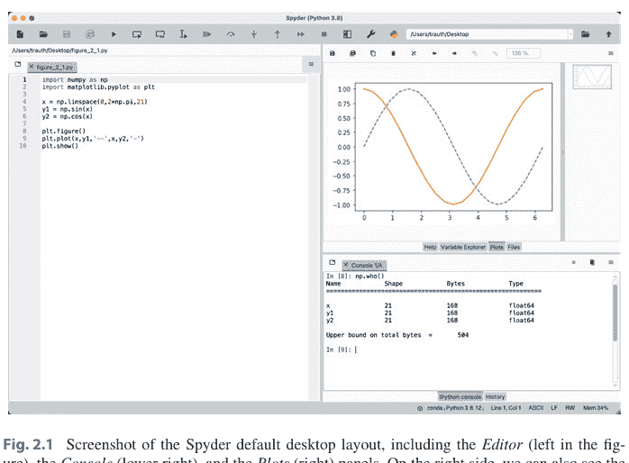

图 2.1 Spyder默认桌面布局的截图，包括 *编辑器*（图中左侧）、*控制台*（右下）和 *绘图*（右侧）面板。在右侧，我们还可以看到绘图面板后面的 *帮助*、*变量资源管理器* 和 *文件* 选项卡，以及控制台选项卡后面的 *历史记录* 选项卡。

默认情况下，软件将所有与Python相关的文件存储在我们的主目录中。或者，我们可以创建一个个人工作目录来存储我们的Python相关文件。然后我们应该在Spyder首选项中将这个新目录设为工作目录。软件使用 *搜索路径* 来查找Python相关文件，这些文件在硬盘上组织成目录。默认搜索路径仅包括安装程序在应用程序文件夹中创建的目录和默认工作目录。要查看搜索路径中有哪些目录或添加新目录，我们使用Spyder桌面 *工具* 菜单中的 *PYTHONPATH管理器*。修改后的搜索路径随后保存在硬盘上的软件首选项中，然后软件指示Python使用我们自定义的搜索路径。

## 2.3 Python语法

尽管Python并非主要为科学数据分析而开发，但由于 *NumPy* 等包的开发和分发，它在该领域获得了极大的普及。在这方面，从Python大量可用的数据类型中，我们主要使用 *n* 维数组 *ndarray*，也称为 *NumPy* 数组，指的是其矩形的二维数字 *数组*，这并不奇怪。一个简单的1x1数组是一个 *标量*。具有一列或一行的数组是 *向量*、时间序列或其他一维数据字段。一个 *m* x *n* 数组可用于数字高程模型或灰度图像。红、绿、蓝（RGB）彩色图像通常存储为三维数组，即三种颜色由一个 *m* x *n* x 3 数组表示。

在我们开始Python项目之前，我们通过在控制台提示符后输入

```
%reset -f
```

然后按 *回车* 或 *Enter* 键来清除工作区，这会重置 *IPython* 内核而不重启它。在开始新的Python项目之前，清除工作区总是推荐的，以避免与之前的项目发生名称冲突。我们还可以更进一步，通过点击 *绘图* 选项卡中的 *Remove all plots* 按钮来关闭所有绘图，以避免将结果的图形表示与之前的结果混淆。然后我们可以使用

```
clear
```

来清除控制台的内容。在Python中，包（例如 *NumPy*）以及其中包含的函数必须在使用前导入，例如，通过输入

```
import numpy as np
```

导入 *NumPy* 包时，我们为其包含的函数定义一个缩写（例如 *np*），这个缩写前缀到所有函数上。例如，如果我们要在工作区中创建一个 *NumPy* 数组，我们使用 *NumPy* 中的 *array()*，然后通过 *np.array()* 调用，如下所示：

```
A = np.array([[2,4,3,7],[9,3,-1,2],[1,9,3,7],[6,6,3,-2]])
```

虽然在Python示例中我们必须使用 *np* 前缀，但在解释性文本中我们省略它，即我们使用 *array()* 而不是 *np.array()*。函数 *array()* 定义一个变量 *A*，然后在方括号中列出数组的元素（用逗号分隔），数组的行再次用方括号括起来，用逗号分隔。按 *回车* 或 *Enter* 后，变量 *A* 实际上在工作区中创建，但不会在控制台中显示。要在控制台中显示变量，我们必须使用 *print()* 命令，

```
print(A)
```

其输出为

```
[[ 2  4  3  7]
 [ 9  3 -1  2]
 [ 1  9  3  7]
 [ 6  6  3 -2]]
```

对于非常大的数组，例如由数千或数百万个元素组成的数字高程模型，使用print()显示A的元素可能会有问题。数组A现在存储在工作区中，我们可以对其进行一些基本操作，例如使用A作为函数sum()的输入变量或输入参数来计算元素的和，如

```
print(sum(A))
```

其结果显示

```
[18 22 8 14]
```

上面的例子说明了Python的一个重要点：软件倾向于处理数组的列。sum(A)的四个结果显然是A的四列中每列元素的和。为了对A的所有元素求和并将结果存储在标量b中，我们只需输入

```
print(sum(sum(A)))
```

它首先对数组的列求和，然后对结果向量的元素求和。由于我们没有指定输出变量或输出参数，例如上面输入的数组A，Python不会存储计算结果。为了对A的所有元素求和并将结果存储在标量b中，我们只需输入

```
b = sum(sum(A))
print(b)
```

细心的读者可能已经注意到，在上面的Python代码中sum()没有np前缀。我们显然调用的不是NumPy包中的函数，而是Python标准集合中的函数，即所谓的内置函数，它包含在Python的模块builtins中，作为

```
help(sum)
```

的输出，其提示为

```
Help on built-in function sum in module builtins:

sum(iterable, /, start=0)
    Return the sum of a 'start' value (default: 0) plus
    an iterable of numbers

    When the iterable is empty, return the start value.
    This function is intended specifically for use with
    numeric values and may reject non-numeric types.
```

然而，*NumPy* 包也包含 `sum()` 函数，但它返回的结果不同，即第一次应用时返回所有元素的和，如下所示：

```
b = np.sum(A)
print(b)
```

我们现在工作区中存储了两个变量 A 和 b。我们可以通过输入以下命令轻松检查这一点：

```
%whos
```

该命令会列出工作区中所有变量的名称，以及它们的类型和大小（或维度）信息：

| 变量 | 类型 | 数据/信息 |
| :--- | :--- | :--- |
| A | ndarray | 4x4: 16 个元素，类型 `int64`，128 字节 |
| b | int64 | 62 |
| np | module | <module 'numpy' from '/Us<...>kages/numpy/__init__.py'> |

对应的 *NumPy* 命令是

```
np.who()
```

其输出为

| 名称 | 形状 | 字节数 | 类型 |
| :--- | :--- | :--- | :--- |
| A | 4 x 4 | 128 | int64 |
| 总字节数上限 | = | 128 | |

该命令仅列出 *NumPy* 数组及其形状（或维度）、字节数和类型（更多细节请参见第 2.5 节）。请注意，Python 默认区分大小写，因此 A 和 a 定义的是两个不同的变量。在此背景下，长期以来一直建议对二维或更多维度的数组（或矩阵）使用大写字母，对一维数组（或向量）和标量使用小写字母。然而，使用大小写混合的变量名也很常见。当使用描述性变量名（即名称包含其含义或用途信息的变量，例如变量 CatchmentSize）而非单字符变量（例如 a）时，这一点尤为重要。我们现在可以通过输入以下命令删除变量 b 的内容：

```
del b
```

接下来，我们将学习如何访问或交换特定的数组元素。在此过程中，重要的是要记住，数组 A 中的第一个元素的索引是 (0,0)，而不是像 MATLAB (https://de.mathworks.com) 和 Julia (https://julialang.org) 中的 (1,1)。此外，Python 中的索引使用方括号书写，即元素 A[0,0] 对应于 MATLAB 和 Julia 中的 A(1,1)。在我们的示例中，为了访问 MATLAB 中的 A(3,2)，我们需要在 Python 中输入

```
print(A[2,1])
```

并结合 print() 函数来实际显示位于第三行第二列的数组元素，即 9。因此，数组索引遵循 (行-1, 列-1) 的规则。Python 从 0 而非 1 开始的索引方式多年来一直存在争议，尤其是在使用索引从 1 开始的 MATLAB 和 Julia 等其他语言的用户中。两种索引约定各有优缺点，但在本书中将变得明显的是，Python 使用的索引方式会带来更大的风险，例如，当从高光谱 Hyperion 传感器（第 8.6 节）中选择光谱波段时。例如，如果用户想要访问 Hyperion 波段 29、23 和 16 以创建伪彩色图像，这不能像在 MATLAB 和 Julia 中那样使用索引 29、23 和 16，而需要在 Python 中使用索引 28、22 和 15。这个事实可能对 Python 用户来说很熟悉，但对于从其他语言切换到 Python 的用户来说可能会导致错误。例如，我们输入

```
A[2,1] = 30
print(A)
```

以将元素 A[2,1] 替换为 30 并显示整个数组，如下所示：

```
[[ 2  4  3  7]
 [ 9  3 -1  2]
 [ 1 30  3  7]
 [ 6  6  3 -2]]
```

如果我们希望一次替换多个元素，可以使用冒号运算符。输入

```
A[2,0:4] = [1 3 3 5]
print(A)
```

或

```
A[2,0:] = np.array([1,3,3,5])
print(A)
```

将替换数组 A 第三行中的所有元素。这里，Python 的另一个特性变得明显，因为区间 [0:4] 是右开的，即使用数学符号表示为 [0, 4)，这就是为什么我们实际上访问的是索引为 4 的第 4 列，而不是像从 0 开始索引时预期的索引 3。区间 [0:] 中冒号右侧没有索引意味着访问所有列，即缺失的索引对应于其他编程语言（如 MATLAB 和 Julia）中的 end。因此，MATLAB 和 Julia 中的 A(3,1:end-1) 对应于 Python 中的 A[2,0:-1]。第三种变体是命令，如果要访问所有列，它（类似于 MATLAB 和 Julia）完全省略列的索引指定，如下所示：

```
A[2,:] = np.array([1,3,3,5])
print(A)
```

NumPy 提供了多种在给定区间内创建等间距值的方法，例如，作为输入数组元素的快捷方式。第一种选择是使用 arange(start,stop,step)，输入

```
c = np.arange(0,10)
print(c)
```

这将创建一个向量或一维数组，其中包含给定区间内的所有整数，但使用的是半开区间 (start, stop)（使用数学符号），即区间包含 start 但不包含 stop。因此，我们实际得到的是从 0 到 9 的整数，而不是从 0 到 10，如下所示：

```
[0 1 2 3 4 5 6 7 8 9]
```

如果希望包含 10，我们必须选择 stop=11。另一种在给定区间内生成等间距值的函数是 linspace(start,stop,num)，但对于此函数，我们需要知道值的数量 num：例如，0 到 10 之间的 11 个值：

```
c = np.linspace(0,10,11)
print(c)
```

我们可以使用这两个函数来创建增量为 0.5 而非 1 的等间距值，输入

```
c = np.arange(1,10+0.5,0.5)
print(c)
```

或

```
c = np.linspace(1,10,19)
print(c)
```

两者都产生

```
[ 1.  1.5 2.  2.5 3.  3.5 4.  4.5 5.  5.5 6.
 6.5 7.  7.5 8.  8.5 9.  9.5 10. ]
```

它会自动换行超过控制台宽度的行，即在第一行的 6. 之后引入换行符。可以通过按键盘上的 Ctrl+C (Control+C) 来中断变量值的显示。此中断仅影响控制台中的输出，而实际命令在显示结果之前已被处理。

Python 提供了用于加法 (+) 和减法 (-) 的标准算术运算符。@ 符号表示矩阵乘法，涉及行和列之间的内积。例如，要将矩阵 A 乘以一个新矩阵 B，如下所示

```
B = np.array([[4,2,6,5],[7,8,5,6],[2,1,-8,-9],[3,1,2,3]])
```

我们输入

```
C = A @ np.transpose(B)
print(C)
```

或

```
C = np.matmul(A,np.transpose(B))
print(C)
```

使用 NumPy 函数 matmul()，其中 transpose() 产生复共轭转置，将行转换为列，列转换为行。这将生成输出

```
[[ 69 103 -79  37]
 [ 46  94  11  34]
 [117 304 -55  60]
 [ 44  93  12  24]]
```

在线性代数中，矩阵用于跟踪线性变换的系数。两个矩阵相乘表示将两个线性变换组合成一个变换。请注意，矩阵乘法和矩阵除法都不满足交换律。

然而，在地球科学中，矩阵通常仅用作数值数据的二维数组，而不是严格意义上表示线性变换的矩阵。对这些数组的算术运算是逐元素进行的。虽然这在加法或减法中没有任何区别，但它会影响乘法运算。例如，逐元素相乘 A 和 B 是通过输入

```
C = A * B
print(C)
```

或

```
C = np.multiply(A,B)
print(C)
```

来执行的，这将生成输出

```
[[  8   8  18  35]
 [ 63  24  -5  12]
 [  2  30 -24 -63]
 [ 18   6   6  -6]]
```

## 2.4 数组操作

Python 提供了广泛的函数来操作数组。本节介绍了数组操作最重要的函数，这些函数将在本书后面使用。我们首先清空工作区，将 *NumPy* 包导入为 *np*，将用于掩码数组的 *NumPy* 模块导入为 *ma*，以便能够处理具有缺失或无效条目的数组，并通过输入以下命令创建两个数组 A 和 B：

```
%reset -f

import numpy as np
import numpy.ma as ma

A = np.array([[2,4,3],[9,3,-1]])
print(A)

B = np.array([[1,9,3],[6,6,3]])
print(B)
```

其结果为

```
[[ 2  4  3]
 [ 9  3 -1]]

[[1 9 3]
 [6 6 3]]
```

处理数组时，我们有时需要将两个或多个数组连接成一个单一的数组。我们可以使用 `concatenate(arrays, axis=0)` 通过设置 `axis=0` 沿第一维（即沿行）连接数组 A 和 B。或者，我们可以使用 `vstack()` 将数组 A 和 B 垂直堆叠。输入以下任一代码

```
C = ma.concatenate([A, B], axis=0)
print(C)
```

或

```
C = ma.vstack([A, B])
print(C)
```

我们都会得到（两种情况结果相同）

```
[[ 2  4  3]
 [ 9  3 -1]
 [ 1  9  3]
 [ 6  6  3]]
```

类似地，我们可以水平连接数组，即沿第二维（即沿列）使用 `axis=1`。输入

```
D = ma.concatenate([A, B], axis=1)
print(D)
```

或改用 `hstack()`

```
D = ma.hstack([A, B])
print(D)
```

都会得到（两种情况结果相同）

```
[[ 2  4  3  1  9  3]
 [ 9  3 -1  6  6  3]]
```

处理卫星图像时，我们经常使用红、绿、蓝（RGB）三种颜色（第 2.5 节和第 8.4 节）将三个光谱波段连接成三维数组。由于 `concatenate()` 允许使用 `axis=2`，我们使用 `dstack()` 通过输入以下代码将数组 A 和 B 沿第三维连接

```
E = ma.dstack([A, B])
print(E)
```

其结果为

```
[[[2 1]
  [4 9]
  [3 3]]]

[[[9 6]
  [3 6]
  [-1 3]]]
```

输入

```
np.whos()
```

得到

| 名称 | 形状 | 字节数 | 类型 |
|------|-------|-------|------|
| A | 2 x 3 | 48 | int64 |
| B | 2 x 3 | 48 | int64 |
| D | 2 x 6 | 96 | int64 |
| C | 4 x 3 | 96 | int64 |
| E | 2 x 3 x 2 | 96 | int64 |

这表明我们现在创建了一个三维数组，其最终尺寸为 2x3x2。或者，我们可以使用

```
print(E.shape)
```

得到

```
(2, 3, 2)
```

这告诉我们该数组有 2 行、3 列，以及第三维的 2 层。使用 `len` 而不是 `shape()`。

```
print(len(E))
```

得到

2

这仅告诉我们数组的第一维长度。因此，`len()` 通常用于确定一维数组（或向量）的长度，例如在第 2.3 节中创建的均匀间隔的时间轴 `c`。

Python 使用的数组索引将左上角的 `[0,0]` 元素包含在内。导入 Python 的其他类型数据可能遵循不同的索引约定。例如，数字地形模型（在第 7.3 至 7.5 节介绍）通常索引方式不同，因此需要在上下方向翻转，或者换句话说，绕水平轴翻转。或者，我们可以在左右方向（即绕垂直轴）翻转数组。我们可以使用 `flipud()` 进行上下翻转，使用 `fliplr()` 进行左右翻转，如下所示

```
F = np.flipud(A)
print(F)

F = np.fliplr(A)
print(F)
```

其结果为

```
[[ 9  3 -1]
 [ 2  4  3]]

[[ 3  4  2]
 [-1  3  9]]
```

在更复杂的例子中，我们可以使用 `roll(a, shift, axis=1)` 沿维度 `axis=1` 循环移位（即旋转）数组 `shift` 个位置。例如，我们可以通过输入以下代码将数组 A 沿第二维（即沿行）移位一个位置

```
G = np.roll(A, 1, axis=1)
print(G)
```

其结果为

```
[[ 3  2  4]
 [-1  9  3]]
```

我们还可以使用 `reshape()` 完全重塑数组。结果是一个 m x n 的数组 H，其元素按列从 A 中提取。例如，我们可以通过输入以下代码从 A 创建一个 3x2 的数组

```
H = np.reshape(A, np.array([3, 2]), order='F')
print(H)
```

其结果为

```
[[ 2  3]
 [ 9  3]
 [ 4 -1]]
```

其中 `order='F'` 是一个指令，用于使用类似 Fortran 的索引顺序读写元素，第一个索引变化最快，最后一个索引变化最慢。

操作数组的另一个重要方法是对其元素进行排序。例如，我们可以使用 `sort(C, axis=0)` 并设置 `axis=0` 沿第一数组维度（即行）对 C 的元素进行升序排序。输入

```
print(C)
I = np.sort(C, axis=0)
print(I)
```

得到

```
[[2 4 3]
 [9 3 -1]
 [1 9 3]
 [6 6 3]]

[[1 3 -1]
 [2 4 3]
 [6 6 3]
 [9 9 3]]
```

函数 `argsort()` 可用于根据第二列 `C[:,1]` 对 C 的行进行排序。输入

```
print(C)
J = C[C[:,1].argsort()]
print(J)
```

得到

```
[[2 4 3]
 [9 3 -1]
 [1 9 3]
 [6 6 3]]

[[9 3 -1]
 [2 4 3]
 [6 6 3]
 [1 9 3]]
```

数组操作还包括对数组进行比较，例如，通过使用 `isin()` 检查 A 中的元素是否也存在于 B 中。输入

```
print(A)
print(B)

K = np.isin(A, B)
print(K)
```

得到

```
[[False False  True]
 [ True  True False]]
```

其中 `False` 表示元素 `A[i,j]` 不在 B 中，`True` 表示元素 `A[i,j]` 在 B 中。我们还可以定位 A 中满足某个条件的元素。例如，我们可以通过输入以下代码定位值小于零的元素并将其替换为 NaN

```
L = A
L = L.astype(float)
L[np.where(L < 0)] = np.NaN
print(L)
```

其结果为（两种情况结果相同）

```
[[ 2.  4.  3.]
 [ 9.  3. nan]]
```

这在处理数字高程模型时非常有用，因为低于海平面的值通常不相关。或者，我们可以替换除 NaN 之外的其他数据空值，例如 -32,768，这在数字地形模型（第 7.3 至 7.5 节）中经常用作空值。然后，我们可以通过输入以下代码确定数组中的哪些元素是 NaN

```
M = np.isnan(L)
print(M)
```

得到

```
[[False False False]
 [False False  True]]
```

其中 NaN 由 `True` 表示，非 NaN 值由 `False` 表示。可以通过输入以下代码确定数组 A 中哪些元素是唯一的

```
N = np.unique(A)
print(N)
```

返回

```
[-1  2  3  4  9]
```

这些值与 A 中的值相同，但没有重复。值 3 在 A 中出现了两次，因此 N 中的元素数量比 A 少一个。

## 2.5 Python 中的数据类型

在计算机上，我们使用有限的（例如 32 或 64 位）零和一的总数来描述数字，即所谓的二进制系统。因此，可表示的数字总数是有限的，这与实数的总数形成对比。在 64 位系统中，有 2^64（或约 1.8447 · 10^19）个不同的数字。这些浮点数的排列方式使得密度在零附近最大，并在负无穷和正无穷方向递减，以支持精度和范围之间的权衡。

为了演示实数和浮点数之间的区别，考虑 x=4/3 的值，我们可以将其写为 1.3333333...（即带有无限循环的 3）。我们可以通过输入以下代码在 Python 中写 4/3

```
%reset -f

import numpy as np
import matplotlib.pyplot as plt
import matplotlib.image as mpimg
from datetime import date

print(4/3)
```

得到

1.3333333333333333

如我们所见，Python 将 4/3 的值四舍五入到下一个浮点数。实数是连续的，而浮点数不是。因此，我们的计算结果可能落在两个浮点数之间的间隙中；然后它被四舍五入到下一个浮点数，因此不是精确的。

将十进制数转换为二进制数（反之亦然）并不困难。例如，让我们将 25.1 转换为二进制表示。这个数有一个整数部分 25 和一个小数部分 0.1，它们分别转换。首先，让我们通过输入以下代码转换整数部分

```
2^7 2^6 2^5 2^4 2^3 2^2 2^1 2^0
128 64 32 16 8 4 2 1
0 0 0 1 1 0 0 1 二进制数
(2的幂)
16 8 1 = 25 十进制数
(10的幂)
```

如我们所见，我们将数字 25 分解为 2 的幂之和，而不是像十进制系统中那样分解为 10 的幂。或者，我们可以使用以下方法计算二进制表示

```
25/2 = 12 余数 1
12/2 = 6 余数 0
6/2 = 3 余数 0
3/2 = 1 余数 1
1/2 = 0 余数 1 (结果为零因此停止)
```

余数就是二进制数，它们按相反的顺序排列，使得第一个余数成为最低有效位（LSD），最后一个余数成为最高有效位（MSD）。在我们的例子中，数字 25.1 的整数部分对应于二进制表示 11001，或者对应于归一化浮点数 1.1001 · 2^4。

现在让我们将 0.1 转换为二进制表示。不幸的是，0.1 是许多具有无限循环二进制表示的例子之一。这是因为 0.1 位于两个浮点数之间。在基数 10 中，它是 1.0 · 10^-1，但在基数 2 中，它是

```
.00011001100110011001100110011001100110011...
```

这是通过将 0.1 乘以 2，取整数部分作为数字，取小数部分作为下一步的起点，重复该过程直到我们得到 0 或一个周期数，然后从顶部开始读取二进制数来计算的，如下所示：0.1 * 2 = 0.2 -> 0
0.2 * 2 = 0.4 -> 0
0.4 * 2 = 0.8 -> 0
0.8 * 2 = 1.6 -> 1
0.6 * 2 = 1.2 -> 1
0.2 * 2 = 0.4 -> 0
0.4 * 2 = 0.8 -> 0
0.8 * 2 = 1.6 -> 1
0.6 * 2 = 1.2 -> 1

结果是周期性的 000011(0011)，或者作为规格化浮点数表示为 1.10011001... * 2^-4。将整数部分与小数部分合并，得到

11001.0001100110011001100110011001100110011...

作为 25.1 的二进制表示。在使用有限（例如 32 或 64 位）零和一来描述数字的计算机上，我们因此使用 25.1 的近似表示。

在 Python 中，我们使用 `finfo(np.float64).eps` 或 `np.spacing(1)` 来计算浮点相对精度，以估算从 x 到下一个最大双精度数的距离。例如，我们可以通过输入以下命令来计算从 1 到下一个最大双精度浮点数的距离

print(np.finfo(np.float64).eps)

或

print(np.spacing(1))

两者都输出

2.220446049250313e-16

要计算从 5 到下一个最大浮点数的距离，我们输入

print(np.spacing(5))

输出为

8.881784197001252e-16

这表明随着与零的距离增加，浮点数的密度在减小。计算机中可用的浮点数范围限制在最小和最大可能的浮点数之间。使用

print(np.finfo(float).tiny)
print(np.finfo(float).max)

输出为

2.2250738585072014e-308
1.7976931348623157e+308

与浮点数运算相关的问题。加法 $[a + b = b + a]$ 和乘法 $[a \cdot b = b \cdot a]$ 的交换律仍然成立，而结合律 $[(a+(b+c)=(a+b)+c]$ 则不成立，正如我们在以下示例中看到的。输入

print((0.5 + 0.2) - 0.7)
print(0.5 + (0.2 - 0.7))

输出为

0.0
5.551115123125783e-17

然而，对于实数，结果将是相同的（即零）。分配律 $[a \cdot (b + c) = a \cdot b + a \cdot c]$ 也被违反，如下例所示。输入

print(0.2 * (0.5 - 0.7) + 0.04)
print(0.2 * 0.5 - 0.2 * 0.7 + 0.04)

输出不同的值，

6.938893903907228e-18
2.0816681711721685e-17

而正确的值再次是零。下面是一个稍微复杂的例子，其中 b 在每一步减半。对于实数，这永远不会停止，但对于浮点数，当 b 变得小于浮点相对精度时，减半停止，此时 b 被视为零。输入

i = 1
a = 1
b = 1
while a + b != a:
    b = b/2
    i = i+1

print(b)
print(i)

输出为

1.1102230246251565e-16
54

这表明 while 循环确实在 54 次循环后终止。

以下示例有助于解释违反结合律——结合溢出（大于最大可能的浮点数）或下溢（小于最小可能的浮点数）——如何实际影响我们的工作。((1+x)-1)/x 的结果应该是 1，但输入

x = 1e-15
print(((1+x)-1)/x)

输出为

1.1102230246251565

这比正确值 1 大约 0.11，或约 11%。

现在让我们看一些数组示例，以熟悉 Python 中不同的数据类型。Python 中没有默认数据类型；相反，数据类型由数值输入决定。例如，`A=1` 创建一个数据类型为 int（整数）的变量，而 `A=1.0`（或简写为 `A=1.`）创建一个数据类型为 float（浮点数）的变量。Python 的内置 float 数据类型是双精度（或简称 double），它将数据存储在 64 位浮点数数组中。双精度数组允许存储数字的符号（第 63 位）、指数（第 62 到 52 位）以及大约 16 位有效十进制数字（第 51 到 0 位）。对于第一个示例，我们通过输入以下命令创建一个 3x4 的双精度随机数 NumPy 数组

np.random.seed(0)
A = np.random.rand(3,4)
print(A)

我们使用 `random.rand()`，它在闭区间 [0, 1] 内生成均匀分布的伪随机数。为了获得相同的数据值，我们使用 `random.seed(0)` 以整数 0 作为 *种子* 来重置随机数生成器（有关随机数生成器和分布类型的更多细节，请参见第 3 章）。函数 `random.rand()` 及其姊妹函数 `random.randn()`（用于生成正态分布的伪随机数）与 `random.seed(0)`（用于定义种子）一起，是为从 MATLAB 移植代码的用户提供的便捷函数。*NumPy* 文档则建议使用 `random()` 和 `standard_normal()` 与 `random.default_rng(0)` 一起使用，我们尽可能遵循这一建议。然而，在以下示例以及本书的其他几个示例中，我们使用了类似 MATLAB 的函数，并生成以下输出：

[[0.5488135  0.71518937 0.60276338 0.54488318]
 [0.4236548  0.64589411 0.43758721 0.891773  ]
 [0.96366276 0.38344152 0.79172504 0.52889492]]

默认情况下，输出采用带有 8 位数字的缩放定点格式（例如，A 的 [0,0] 元素为 0.5488135），但计算结果的 64 位精度在四舍五入到 8 位后保持不变。然而，将数据类型从 *double* 转换为 32 位 *单精度* 会影响精度。输入

B = np.single(A)
print(B)

输出为

[[0.5488135  0.71518934 0.60276335 0.5448832 ]
 [0.4236548  0.6458941  0.4375872  0.891773  ]
 [0.96366274 0.3834415  0.79172504 0.5288949 ]]

输入

np.who()

列出变量 A 和 B，包含其大小（或维度）、字节数和类型信息，如下所示：

| 名称 | 形状 | 字节 | 类型 |
|---|---|---|---|
| A | 3 x 4 | 96 | float64 |
| B | 3 x 4 | 48 | float32 |
| 总字节数上限 | = | 144 | |

数据类型 `float64` 用于所有计算机物理内存不是限制因素的 Python 运算，而 `float32` 用于处理大型数据集。双精度变量 A（其大小为 3x4 个元素）需要 3 · 4 · 64 = 768 位（或 768/8=96 字节）内存，而 B 仅需要 48 字节，因此内存需求是 A 的一半。向 A 中引入至少一个复数会使内存需求加倍，因为实部和虚部默认都是双精度。输入

A = np.complex128(A)
A[1,3] = 4j + 3
print(A)

输出为

[[0.5488135 +0.j 0.71518937+0.j 0.60276338+0.j 0.54488318+0.j]
 [0.4236548 +0.j 0.64589411+0.j 0.43758721+0.j 3.        +4.j]
 [0.96366276+0.j 0.38344152+0.j 0.79172504+0.j 0.52889492+0.j]]

变量列表现在为

| 名称 | 形状 | 字节 | 类型 |
|------|-------|-------|------|
| A | 3 x 4 | 192 | complex128 |
| B | 3 x 4 | 48 | float32 |

这表明数据类型为 complex128。请注意，j（而不是 i）是 Python 虚数单位（或单位虚数），其定义属性是其平方为 -1。

Python 也使用更小的数据类型（例如 1 位、8 位和 16 位数据）以节省内存。这些数据类型用于存储数字高程模型或图像（参见第 7 章和第 8 章）。例如，m-by-n 像素的 RGB 真彩色图像通常存储为三维数组，即三种颜色由一个 m-by-n-by-3 数组表示（有关 RGB 合成和真彩色图像的更多细节，请参见第 8 章）。这样的多维数组可以通过连接三个表示图像 m-by-n 像素的二维数组来生成。首先，我们生成一个 100x100 的均匀分布随机数数组，范围在 [0, 1]。然后我们将随机数乘以 255，得到 0 到 255 之间的值，如下所示：

np.random.seed(0)
I1 = 255 * np.random.rand(100,100)
I2 = 255 * np.random.rand(100,100)
I3 = 255 * np.random.rand(100,100)

命令 `dstack()` 通过输入以下命令将三个二维数组（每个 8 位）连接成一个三维数组（3 · 8 位 = 24 位）

I = np.dstack([I1,I2,I3])

由于RGB图像的每个颜色通道由0到255之间的整数值表示，我们使用`uint8()`（第8.2节）将64位双精度值转换为无符号8位整数：

```python
I = np.uint8(I)
```

函数`uint8()`将`I`中的值四舍五入到最接近的整数。任何超出[0, 255]范围的值都会从0到255循环（即`np.uint8(-3)`的结果是253）。这种行为与对应的MATLAB函数`uint8`不同，后者会将超出[0, 255]范围的值赋值为最近的端点值（即0或255）。为避免循环，我们改用scikit-image包的`exposure`模块中的`rescale_intensity()`（见第8.4节）。输入

```python
np.who()
```

会得到

| 名称 | 形状 | 字节数 | 类型 |
|---|---|---|---|
| I1 | 100 x 100 | 80000 | float64 |
| I2 | 100 x 100 | 80000 | float64 |
| I3 | 100 x 100 | 80000 | float64 |
| I | 100 x 100 x 3 | 30000 | uint8 |

由于8位可以存储256个不同的值，这种数据类型可用于存储0到255之间的整数值，而使用`int8`创建有符号8位整数则会生成-128到+127之间的值。零值需要一位，因此没有剩余空间来存储+128。最后，可以使用`imshow()`将三维数组显示为真彩色图像：

```python
plt.figure()
plt.imshow(I)
plt.show()
```

在此过程中，Matplotlib函数`figure()`创建一个新图形，`imshow()`初始化图像显示，`show()`实际显示当前图形，而IPython返回提示符，表示已准备好接受进一步命令。

在后续章节中，我们经常需要将字符串（例如位置名称或样本名称）存储在数组中。Python提供了多种存储文本数据的选项，包括在包含字符串的NumPy数组中。例如，我们可以创建一个名为`locations_1`的数组，其中包含波茨坦北部的区名。因此，无论我们使用单引号

```python
locations_1 = np.array([['Bornim'],
                       ['Nedlitz'],
                       ['Bornstedt'],
                       ['Sacrow'],
                       ['Eiche'],
                       ['Grube'],
                       ['Golm']])
```

还是双引号，

```python
locations_1 = np.array([["Bornim"],
                       ["Nedlitz"],
                       ["Bornstedt"],
                       ["Sacrow"],
                       ["Eiche"],
                       ["Grube"],
                       ["Golm"]])
```

都没有区别，但在整个Python代码中应保持一致的选择。在本书中，我们倾向于使用单引号。在上面的代码中，字符串无法放在一行内，因此我们在每个逗号后插入换行。输入

```python
np.who()
```

会得到

| 名称 | 形状 | 字节数 | 类型 |
|---|---|---|---|
| locations_1 | 7 x 1 | 252 | str288 |
| 总字节数上限 | = | 252 | |

如我们所见，字符数组`locations_1`的形状对应于区名数量乘以一。存储字符串每个字符需要32位，而字符数最多的字符串（例如‘Bornstedt’，有9个字符）定义了`locations_1`中每个字符串的位数为32 · 9 = 288，如类型`str288`所示。因此，数组`locations_1`需要7 · 9 · 32/8 = 252字节的内存。

接下来，我们看看Python如何使用*字典*（或简称*dict*）在单个数组中存储混合数据类型的可能性。这些数据容器对于在单个变量中存储关于样本的任何信息特别有用。例如，我们可以通过输入以下命令生成一个结构数组`sample_1`，其中包含图像数组`I`（我们在前面的示例中定义过）：

```python
np.random.seed(0)
I = np.uint8(255 * np.random.rand(100,100,3))
```

此外，我们还可以通过输入以下命令生成关于样本的其他类型信息，例如采样地点名称、采样日期或地球化学测量值（存储在10x10数组中）：

```python
sample_1 = {
    'location':'Plougasnou',
    'date':date.today(),
    'image':I,
    'geochemistry':np.random.rand(10,10)
}
```

字典`sample_1`的第一层（`location`）包含一个字符串，其中是地点名称Plougasnou。第二层（`date`）包含一个由`date.today()`生成的字符串，该字符串包含当前日期，格式为dd-mm-yyyy。我们通过输入以下命令访问`sample_1`中的这一特定层：

```python
print(sample_1['date'])
```

例如，会得到

```
2022-02-02
```

`sample_1`的第三层包含图像，而第四层包含一个10x10的均匀分布伪随机数数组。可以通过输入以下命令列出`sample_1`的所有层：

```python
print(sample_1)
```

或

```python
sample_1
```

字典`sample_1`包含NumPy数组，这些数组使用`who()`列出，但不包含字典中的其他内容，例如地点名称和日期。我们可以使用命令`list()`列出字典中的变量。此外，`items()`列出字典中的所有变量并显示部分数据：

```python
np.who(sample_1)
list(sample_1)
sample_1.items()
```

我们也可以创建一个包含不同类型数据的数组。然而，由于以下行的输出，不建议这样做：

```python
C = np.array(['Plougasnou',
              date.today(),
              I,
              np.random.rand(10,10)])
```

相反，我们应该使用列表，这是Python中的另一种数据类型，通过输入以下命令：

```python
C = ['Plougasnou',
     date.today(),
     I,
     np.random.rand(10,10)]
```

我们应该使用以下命令访问内容：

```python
print(C)
```

要访问列表中的单个元素，我们使用

```python
print(C[1])
```

会得到

```
2022-02-02
```

重要的是要记住，Python中的索引从零开始。另一种在单个数组中存储混合数据类型的非常方便的方法是连接*NumPy*数组。例如，我们创建一个包含两列的简单表格。第一列再次包含波茨坦北部的区名：

```python
Districts = np.array([['Bornim'],
                      ['Nedlitz'],
                      ['Bornstedt'],
                      ['Sacrow'],
                      ['Eiche'],
                      ['Grube'],
                      ['Golm']])
```

第二列包含2018年12月的人口数量（来源 https://www.potsdam.de）：

```python
Inhabitants = np.array([[3429],
                       [192],
                       [13895],
                       [140],
                       [5308],
                       [433],
                       [4310]])
```

然后我们使用以下命令将两个数组连接成一个数组：

```python
potsdamnorth = [Districts,Inhabitants]
```

会得到

```
[array([['Bornim'],
        ['Nedlitz'],
        ['Bornstedt'],
        ['Sacrow'],
        ['Eiche'],
        ['Grube'],
        ['Golm']], dtype='<U9'),
array([[ 3429],
       [  192],
       [13895],
       [  140],
       [ 5308],
       [  433],
       [ 4310]])]
```

如我们所见，异构数据被收集在一个数组中并显示为表格。我们可以通过输入以下命令分别访问区名和人口数量：

```python
print(potsdamnorth[0])
print(potsdamnorth[1])
```

会得到

```
[['Bornim']
 ['Nedlitz']
 ['Bornstedt']
 ['Sacrow']
 ['Eiche']
 ['Grube']
 ['Golm']]
```

```
[[ 3429]
 [  192]
 [13895]
 [  140]
 [ 5308]
 [  433]
 [ 4310]]
```

这种数据类型在处理实验数据时非常有用，例如包含由字母、整数和浮点数组合而成的样本ID的大型数据数组。

Python中存储混合数据类型的第三种数据结构是*元组*，它使用圆括号，而不是字典使用的花括号或列表使用的方括号。元组也用逗号分隔。输入

```python
potsdamnorth = (Districts,Inhabitants)
print(potsdamnorth[0])
print(potsdamnorth[1])
```

会得到

```
[['Bornim']
 ['Nedlitz']
 ['Bornstedt']
 ['Sacrow']
 ['Eiche']
 ['Grube']
 ['Golm']]

[[ 3429]
 [  192]
 [13895]
 [  140]
 [ 5308]
 [  433]
 [ 4310]]
```

与字典和列表相比，元组更快且需要更少的内存，但它们是不可变的，而列表可以扩展和缩减。

## 2.6 数据存储与处理

本节讨论如何使用Python存储、导入和导出数据。许多地球科学中常用的数据格式在使用Python分析之前必须进行转换。或者，该软件提供了多种导入例程，用于读取地球科学中的许多二进制数据格式，例如用于存储数字高程模型和卫星数据。Python中较新的功能能够从单个文件中导入混合数据类型（例如文本、整数和浮点数）到工作区中。

计算机通常将数据存储为*二进制数字*，简称*比特*。一个比特类似于一个具有两种状态的双向开关：*开* = 1 和 *关* = 0。这些比特被组合在一起形成更大的组，例如*字节*（由8个比特组成），以便存储更复杂的数据类型。这些比特组随后被用来编码数据，例如数字或字符。不幸的是，不同的计算机系统和软件使用不同的数据编码方案。因此，在不同的计算机平台和软件之间交换二进制数据可能很困难。

近几十年来，已经开发了各种数据交换格式。一个可以用于不同计算机平台和软件的数据格式的经典例子是美国信息交换标准代码（ASCII），它于1963年由美国标准协会（ASA）首次发布。作为一个7位代码，ASCII由2^7 = 128个字符（代码0到127）组成。虽然ASCII-1963缺少小写字母，但在ASCII-1967的更新中，小写字母以及各种控制字符（例如转义符和换行符）和符号（例如括号和数学运算符）也被包含在内。此后，为了方便交换非英语语言的文本，出现了许多变体。这些变体包括扩展ASCII，它包含255个代码，包括Latin-1编码。

在特定软件和Python之间交换数据的最简单方法是使用ASCII格式。尽管一些包（例如*Pandas*）提供了读取二进制文件（如Microsoft Excel文件）的各种函数，但大多数数据是以ASCII文件的形式到达的。考虑一个存储在表格中的简单数据集，例如

```
SampleID  Percent C  Percent S
101        0.3657     0.0636
102        0.2208     0.1135
103        0.5353     0.5191
104        0.5009     0.5216
105        0.5415     -999
106        0.501      -999
```

第一行包含变量的名称，各列提供了每个样本中碳和硫的百分比。-999这个荒谬的值表示数据集中的缺失数据。为了将此表转换为Python格式，必须更改两件事。首先，Python使用*NaN*或*nan*作为*非数字*的表示，可用于标记缺失数据或空隙。其次，应在第一行的开头添加井号（#）。这个井号用于指示程序主体中的不可执行文本。此文本通常用于在代码中包含注释，如以下示例所示：

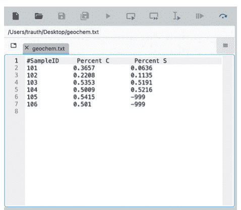

图2.2 Spyder编辑器的屏幕截图，显示了文件geochem.txt的内容。第一行文本需要使用行首的井号（#）注释掉，其后是实际的数据数组。-999值需要替换为NaN。

```
#SampleID  Percent C    Percent S
101        0.3657       0.0636
102        0.2208       0.1135
103        0.5353       0.5191
104        0.5009       0.5216
105        0.5415       NaN
106        0.501        NaN
```

Python会忽略井号后出现的任何文本，并继续处理下一行。在文本编辑器（如Spyder编辑器）中编辑此表后，可以将其保存为当前工作目录中的ASCII文本文件geochem.txt（图2.2）。我们首先在控制台的提示符后输入

```
%reset -f
```

Python现在可以使用loadtxt()命令从该文件导入数据：

```
import numpy as np
import matplotlib.pyplot as plt
from datetime import datetime

geochem = np.loadtxt('geochem.txt')
```

然后Python加载文件的内容，并将数组分配给由文件名*geochem.txt*指定的变量geochem。输入

```
np.whos()
```

得到

| Name | Shape | Bytes | Type |
|---|---|---|---|
| geochem | 6 x 3 | 144 | float64 |
| Upper bound on total bytes = | | 144 | |

现在，savetxt()命令允许将geochem存储为文本格式：

```
np.savetxt('geochem_new.txt', geochem)
```

这个ASCII文件可以使用Spyder编辑器或任何其他文本编辑器查看和编辑。

这样的数据文件（特别是那些由电子仪器生成的文件）可能比示例文件*geochem.txt*（只有一行标题）复杂得多。在第7章和第8章中，我们将读取一些这些复杂且广泛的文件，它们要么是二进制文件，要么是文本文件，通常具有描述其内容的长标题。此时，我们现在来看一个文本文件变体，它不仅包含一行或多行标题，还包含不寻常的数据类型，例如非十进制格式的日期和时间。我们使用loadtxt()来执行此任务，如下所示：

```
dtype = np.dtype('i4,f8,f8')
C1,C2,C3 = np.loadtxt('geochem.txt',
    dtype=dtype,
    unpack=True,
    skiprows=1)
```

用作dtype()输入的字符串'i4,f8,f8'定义了包含在单引号中的转换说明符，其中i4代表32位（或4字节）无符号整数，f8代表64位（或8字节）双精度浮点数。函数loadtxt()使用dtype作为输入参数，并配合unpack=True来转置返回的数组，并使用skiprows=1在读取文件时忽略单行标题。该函数从文件中读取文本并将其存储在数组C1、C2和C3中。然后我们通过输入以下命令将数组重塑为列向量

```
C1 = np.reshape(C1,(6,1))
C2 = np.reshape(C2,(6,1))
C3 = np.reshape(C3,(6,1))
```

并通过输入以下命令将C1、C2和C3连接成一个单一数组C

```
C = np.concatenate((C1,C2,C3),axis=1)
print(C)
```

得到

```
array([[1.010e+02, 3.657e-01, 6.360e-02],
       [1.020e+02, 2.208e-01, 1.135e-01],
       [1.030e+02, 5.353e-01, 5.191e-01],
       [1.040e+02, 5.009e-01, 5.216e-01],
       [1.050e+02, 5.415e-01,        nan],
       [1.060e+02, 5.010e-01,        nan]])
```

接下来的示例演示了如何读取文件*geophys.txt*，该文件包含单行标题，但也包含日期（*MM/DD/YY*格式）和时间（*HH:MM:SS.SS*格式）。我们再次使用loadtxt()读取文件：

```
dtype = np.dtype('i4,f8,f8,f8,U12,U12')
C1,C2,C3,C4,C5,C6 = np.loadtxt('geophys.txt',
               dtype=dtype,
               unpack=True,
               skiprows=1,
               delimiter='\t')
```

我们跳过标题，将第一列（样本ID）读取为32位无符号整数（uint32），使用说明符i4，将接下来的三列（X、Y和Z）读取为64位双精度浮点数（double），使用说明符f8，然后将日期和时间读取为字符串，使用说明符U12。在此代码中，我们使用显式换行符（\）在等号后创建新行。或者，我们可以通过输入以下命令将代码包装在括号中

```
dtype = np.dtype('i4,f8,f8,f8,U12,U12')
C1,C2,C3,C4,C5,C6 = (
    np.loadtxt('geophys.txt',
               dtype=dtype,
               unpack=True,
               skiprows=1,
               delimiter='\t')
    )
```

loadtxt()中使用的括号也是我们不需要在函数内部使用显式换行符来将输入参数写在单独行上的原因。然后我们使用以下命令转换日期

```
for i in range(0,5):
    date_time_obj_1 = datetime.strptime(C5[i], '%m/%d/%y')
    print(date_time_obj_1)
```

得到

```
2013-11-18 00:00:00
2013-11-18 00:00:00
2013-11-18 00:00:00
2013-11-18 00:00:00
2013-11-18 00:00:00
```

其中日期使用00:00:00作为默认时间，因为未定义时间，而时间使用

```
for i in range(0,5):
    date_time_obj_2 = datetime.strptime(C6[i], '%H:%M:%S.%f')
    print(date_time_obj_2)
```

得到

```
1900-01-01 10:23:09.100000
1900-01-01 10:23:10.200000
1900-01-01 10:23:50.400000
1900-01-01 10:24:05.100000
1900-01-01 10:24:23.300000
```

其中时间使用1900-01-01作为默认日期，因为未定义日期。

我们也可以使用savetxt()将数据写入格式化的文本文件。例如，我们在第一行开头添加井号（#）并将-999替换为NaN后，再次从geochem.txt加载数据。除了添加井号，我们也可以使用skiprows=1跳过第一行

```
data = np.loadtxt('geochem.txt', skiprows=1)
```

将文本文件的内容加载到双精度数组data中。我们使用savetxt()将数据写入新的文本文件geochem_formatted.txt：然后，我们使用格式化操作符将数据写入文件：`%i` 用于无符号整数，`%6.4f` 用于定点数，其中字段宽度为六个字符，小数点后保留四位数字。控制字符 `\t` 表示制表符作为分隔符。我们可以通过输入以下命令来查看文件内容：

```
%edit geochem_formatted.txt
```

这将在 Spyder 编辑器中打开文件 *geochem_formatted.txt*：

```
101 0.3657 0.0636
102 0.2208 0.1135
103 0.5353 0.5191
104 0.5009 0.5216
105 0.5415    nan
106 0.5010    nan
```

数据格式符合预期。

## 2.7 控制流

计算机科学中的控制流用于控制计算机代码的求值顺序。最重要的控制流语句类型是计数控制循环（例如，*for* 循环）和条件语句（例如，*if* 语句）。由于本书不深入探讨 Python 的编程能力，以下对控制流基础的介绍相当简略，并省略了高效编程的某些重要方面。本介绍仅限于两种最重要的控制流语句类型：前述的 *for* 循环和 *if* 语句。

Python 的 *for* 循环会执行一系列命令指定的次数。例如，我们可以使用这样的循环将数组 A 的元素乘以 10，将结果四舍五入到最接近的整数，并通过输入以下命令将结果存储在 B 中：

```
%reset -f

import numpy as np
from numpy.random import default_rng

np.random.seed(0)
A = np.random.rand(10,1)
B = np.zeros((10,1))
```

```
for i in range(0,10):
    B[i] = np.round(10*A[i])
print(A)
print(B)
```

输出结果为：

```
[[0.5488135 ]
 [0.71518937]
 [0.60276338]
 [0.54488318]
 [0.4236548 ]
 [0.64589411]
 [0.43758721]
 [0.891773  ]
 [0.96366276]
 [0.38344152]]

[[ 5.]
 [ 7.]
 [ 6.]
 [ 5.]
 [ 4.]
 [ 6.]
 [ 4.]
 [ 9.]
 [10.]
 [ 4.]]
```

重要的是，for 循环内的代码块（在我们的示例中是 `B[i] =np. round(10*A[i])`）必须缩进，以表明它属于该循环。应使用 *空格* 而不是 *制表符*（或简称 *tabs*）进行缩进（例如，单缩进使用四个空格，如我们的示例所示）。请注意，我们在使用 for 循环之前使用 `B=np.zeros((10,1))` 来预分配内存。我们可以通过使用嵌套 for 循环来创建二维数组 B，从而扩展实验。

输入以下命令：

```
np.random.seed(0)
A = np.random.rand(10,3)
B = np.zeros((10,3))
for i in range(0,10):
    for j in range(0,3):
        B[i,j] = np.round(10*A[i,j])
print(A)
print(B)
```

输出结果为：

```
[[0.5488135  0.71518937 0.60276338]
 [0.54488318 0.4236548  0.64589411]
 [0.43758721 0.891773   0.96366276]
 [0.38344152 0.79172504 0.52889492]
 [0.56804456 0.92559664 0.07103606]
 [0.0871293  0.0202184  0.83261985]
 [0.77815675 0.87001215 0.97861834]
 [0.79915856 0.46147936 0.78052918]
 [0.11827443 0.63992102 0.14335329]
 [0.94466892 0.52184832 0.41466194]]
```

```
[[ 5.  7.  6.]
 [ 5.  4.  6.]
 [ 4.  9. 10.]
 [ 4.  8.  5.]
 [ 6.  9.  1.]
 [ 1.  0.  8.]
 [ 8.  9. 10.]
 [ 8.  5.  8.]
 [ 1.  6.  1.]
 [ 9.  5.  4.]]
```

在这个嵌套 for 循环中，第二个循环使用四个空格缩进，其关联的代码块再次缩进，因此需要双缩进（即八个空格）。

本书旨在使所有方法独立于数据的实际维度。这是通过始终使用 `shape()` 和 `len()` 来确定数组的维度，而不是使用固定数字（如上面示例中的 10 和 3）来实现的（第 2.4 节）：

```
np.random.seed(0)
A = np.random.rand(10,3)
B = np.zeros(np.shape(A))
for i in range(0,A.shape[0]):
    for j in range(0,A.shape[1]):
        B[i,j] = np.round(10*A[i,j])
print(A)
print(B)
```

除了 for 循环之外，控制脚本流程的第二个重要语句是 if 语句，它求值一个表达式，如果表达式为真，则执行一组指令。例如，我们通过输入以下命令比较两个标量 A 和 B 的值：

```
A = 1
B = 2
if A < B:
    print('A is less than B')
```

输出结果为：

A is less than B

与 for 循环类似，if 语句要求缩进属于该语句的代码块，在我们的示例中使用四个空格完成。脚本首先求值 A 是否小于 B，如果是，则在控制台中显示消息 A is less than B。我们可以通过引入 else 来扩展 if 语句，它在表达式不为真时提供替代语句。例如，输入以下命令：

```
A = 1
B = 2
if A < B:
    print('A is less than B')
else:
    print('A is not less than B')
```

输出结果为：

A is less than B

或者，我们可以将 else 与第二个 if 语句一起使用，以引入第二个要评估的表达式，如下例所示：

```
A = 1
B = 2
if A < B:
    print('A is less than B')
else:
    if A >= B:
        print('A is not less than B')
```

这些 for 循环和 if 语句在本书的后续章节中被广泛使用。

## 2.8 脚本和函数

Python 是一种强大的编程语言。所有包含 Python 代码的文件都使用 `.py` 作为扩展名，因此被称为 `.py` 文件。这些文件包含 ASCII 文本，可以使用标准文本编辑器进行编辑。但是，内置的 Spyder 编辑器会对各种语法元素进行颜色高亮显示：注释以灰色高亮显示，关键字（如 `if`、`for` 和 `end`）以蓝色高亮显示，字符串以绿色高亮显示。这种语法高亮有助于 Python 编码。

Python 使用两种类型的 `.py` 文件：脚本和函数。脚本是一系列操作工作区中数据的命令，而函数是具有输入变量（或输入参数）和输出变量（或输出参数）的真正算法。现在通过一个示例来说明这两种 `.py` 文件的优缺点。我们首先通过输入一系列命令来生成一个简单的 Python 脚本，以计算数据数组 `x` 的元素的平均值，如下所示：

```
%reset -f

import numpy as np

x = np.array([[3,6,2,-3,8]])
print(x)

m,n = x.shape
if m == 1:
    m = n

print(np.sum(x)/m)
```

if 语句的第一行使用 `shape()` 命令获取变量 `x` 的形状。在我们的示例中，`x` 应该是一个列向量——即一个具有单列且维度为 `(m,1)` 的数组——或者是一个行向量——即一个具有单行且维度为 `(1,n)` 的数组。if 语句求值一个逻辑表达式，如果表达式为真，则执行一组命令。在示例中，if 语句根据 `m==1` 为假还是为真来选择 `m` 或 `n`。这里，双等号 (`==`) 对等号左侧和右侧的变量（或数字）进行逐元素比较，并返回一个相同大小的数组，其中关系为真的元素设置为逻辑 1，不为真的元素设置为逻辑 0。在我们的示例中，如果 `m` 等于 1，则 `m==1` 返回 1，如果 `m` 等于任何其他值，则返回 0。if 语句的最后一行通过将元素之和除以 `m` 或 `n` 来计算平均值。运行脚本输出结果为：

3.2

输入以下命令后：

```
%whos
```

我们看到工作区现在包含：

| 变量 | 类型 | 数据/信息 |
|----------|------|-----------|
| m | int | 5 |
| n | int | 5 |
| np | module | <module 'numpy' from '/Us<...>kages/numpy/__init__.py'> |
| x | ndarray | 1x5: 5 elems, type `int64`, 40 bytes |

正如预期的那样，脚本中定义和使用的所有变量都出现在工作区中。在我们的示例中，这些也是变量 `m` 和 `n`。脚本包含应用于工作区中变量的命令序列。然而，Python 函数允许定义输入和输出。它们不会自动从工作区导入变量。要将上面的脚本转换为函数，我们需要进行以下修改（图 2.3）：

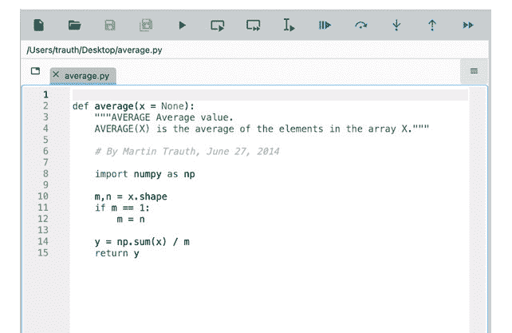

图 2.3 Spyder 编辑器显示函数 `average()` 的截图。该函数以包含关键字 `def`、函数名 `average()` 和输入变量 `x` 的行开始。后续行包含 `help(average)` 的输出、版权和版本信息，以及使用此函数计算平均值的实际 Python 代码，包括要求定义输出变量 `y` 的 `return` 语句。

def average(x=None):
    '''AVERAGE 平均值。
    AVERAGE(X) 是数组 X 中元素的平均值。'''

    # 作者：Martin Trauth，2014年6月27日

    import numpy as np

    m, n = x.shape
    if m == 1:
        m = n

    y = np.sum(x) / m
    return y

第一行现在包含关键字 `def`（标记函数头的开始）以及函数名 `average()` 和输入变量（或输入参数）`x`。函数头之后的行包含 `help()` 的输出，如三重反引号所示。由空行分隔，第5行包含作者姓名和 `.py` 文件的版本。文件的其余部分包含实际操作。最后一行现在定义了 `return` 语句之后输出变量 `y` 的值。现在可以在从模块 *average* 导入 `average()` 之前清空工作区，方法是输入

```python
%reset -f

import numpy as np
from average import average
```

并使用 `help()`

```python
help(average)
```

来显示第一个连续的注释块，如下所示：

```
Help on function average in module average:

average(x=None)
    AVERAGE 平均值。
    AVERAGE(X) 是数组 X 中元素的平均值。
```

我们现在可以定义 `x` 并运行 `average()` 来计算 `x` 中元素的平均值，以定义 `result`。输入

```python
data = np.array([[3, 6, 2, -3, 8]])

result = average(data)
print(result)
```

再次显示

```
3.2
```

而输入

```python
%whos
```

结果为

| 变量 | 类型 | 数据/信息 |
| :--- | :--- | :--- |
| average | function | `<function average at 0x7fe2a9a02af0>` |
| data | ndarray | 1x5: 5 个元素，类型 `int64`，40 字节 |
| np | module | `<module 'numpy' from '/Us<...>kages/numpy/__init__.py'>` |
| result | float64 | 3.2 |

这表明函数中使用的所有变量都不会出现在工作区中。只有用户定义的输入 `data` 和输出 `result` 存储在工作区中。因此，`.py` 文件可以像真正的函数一样应用于数据，而脚本则包含一系列应用于工作区中变量的命令。

## 2.9 基本可视化工具

*Matplotlib* 包提供了许多用于将数据显示为图形的 Python 例程。本节介绍最重要的图形函数。图形可以被修改、打印和导出，以便使用 Python 以外的图形软件进行编辑。生成变量 `y` 相对于另一个变量 `x` 的图形的最简单函数是 `plot()`。首先，我们定义两个一维数组 `x` 和 `y`，其中 `y` 是 `x` 的正弦值。数组 `x` 包含从 0 到 2π 的 21 个值，增量为 π/10，而 `y` 是 `x` 的逐元素正弦值：

```python
%reset -f

import numpy as np
import matplotlib.pyplot as plt
```

```python
x = np.linspace(0, 2*np.pi, 21)
y = np.sin(x)
```

这两个命令生成两个各有 21 个元素的数组。由于两个数组 `x` 和 `y` 长度相同，我们可以使用 `plot()` 生成 `y` 相对于 `x` 的线性二维图形，如下所示：

```python
plt.plot(x, y)
```

然而，最通用的绘图方法是首先使用 `figure()` 创建一个图形窗口，然后使用 `plot()` 启动绘图，最后使用 `show()` 显示实际图形。特别是，如果我们显示子图或多个图形对象，我们需要 `show()` 来查看图形：

```python
plt.figure()
plt.plot(x, y)
plt.show()
```

我们可能希望在单个绘图中绘制两条不同的曲线，例如用不同颜色绘制 `x` 的正弦和余弦。命令

```python
x = np.linspace(0, 2*np.pi, 21)
y1 = np.sin(x)
y2 = np.cos(x)

plt.figure()
plt.plot(x, y1, '--', x, y2, '-')
plt.show()
```

创建一条蓝色虚线显示 `x` 的正弦值，以及一条橙色实线表示该数组的余弦值（图 2.4）。如果我们希望在单独的窗口中创建绘图，我们再次使用 `figure()` 创建一个新窗口，在显示 `x` 的正弦值后显示其余弦值：

```python
plt.figure()
plt.plot(x, y1, '--')
plt.show()

plt.figure()
plt.plot(x, y2, '-')
plt.show()
```

我们还可以使用以下方式将 `x` 的正弦值显示为折线图，将 `x` 的余弦值显示为条形图

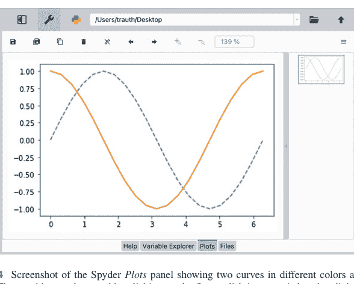

图 2.4 Spyder *Plots* 面板的截图，显示了两种不同颜色和线型的曲线。可以通过点击软盘图标保存图形，通过点击复制到剪贴板图标复制到剪贴板，以及通过点击垃圾桶图标删除图形。

```python
plt.figure()
plt.plot(x, y1, 'r--')
plt.bar(x, y2, color='b')
plt.show()
```

此命令使用 `'r--'` 将 `y1` 相对于 `x` 绘制为红色虚线，而 `y2` 相对于 `x` 显示为一组蓝色垂直条。或者，我们可以使用 `subplot()` 在同一个图形窗口中但在不同的绘图中绘制两个图形。语法 `subplot(m, n, p)` 将图形窗口划分为 `m` 行 `n` 列的网格，并在 `p` 指定的位置创建坐标轴。这里，第一个子图（`p=1`）位于网格的第一列和第一行，第二个子图（`p=2`）位于第一行的第二列，依此类推：

```python
plt.figure()
plt.subplot(2, 1, 1)
plt.plot(x, y1, 'r--')
plt.subplot(2, 1, 2)
plt.bar(x, y2, color='b')
plt.show()
```

在我们的示例中，图形窗口被划分为两行一列。二维线性图显示在图形窗口的上半部分，条形图出现在下半部分。或者，我们也可以使用 `subplots()` 而不是 `subplot()` 来创建图形窗口 `fig` 以及两个坐标轴 `ax1` 和 `ax2`。如果我们使用 `subplots()`，则不需要 `figure()` 和 `show()`：

```python
fig, (ax1, ax2) = plt.subplots(2, 1)
ax1.plot(x, y1, 'r--')
ax2.bar(x, y2, color='b')
```

对图形的一个重要修改是通过缩放坐标轴来完成的。默认情况下，Python 使用接近数据最小值和最大值的坐标轴限制。然而，使用 `axis()` 命令允许使用包含值 `[xmin, xmax, ymin, ymax]` 的数组来更改比例设置，例如

```python
plt.figure()
plt.plot(x, y1, 'r--')
plt.axis(np.array([0, np.pi, -1, 1]))
plt.show()
```

此代码将 x 轴的限制设置为 0 和 π，而 y 轴的限制设置为默认值 -1 和 +1。`axis()` 的重要选项有

```python
plt.figure()
plt.plot(x, y1, 'r--')
plt.axis('square')
plt.show()
```

这使得 x 轴和 y 轴长度相同，以及

```python
plt.figure()
plt.plot(x, y1, 'r--')
plt.axis('equal')
plt.show()
```

这使得 x 轴和 y 轴上的各个刻度增量长度相同。函数 `grid()` 向当前绘图添加网格，而 `title()`、`xlabel()` 和 `ylabel()` 允许定义标题并将标签应用于 x 轴和 y 轴：

```python
plt.figure()
plt.plot(x, y1, 'r--')
plt.title('My first plot')
plt.xlabel('x-axis')
plt.ylabel('y-axis')
plt.grid()
plt.show()
```

使用 *Matplotlib* 包进行绘图的最复杂方法（类似于 MATLAB 的面向对象语法）是输入

```python
fig = plt.figure(
    facecolor=(0.9, 0.9, 0.9))
ax = plt.axes(
    title='My first plot',
    xlabel='x-axis',
    ylabel='y-axis')
ax.plot(x, y1,
    markersize=15,
    marker='s',
    linewidth=2)
ax.grid()
plt.show()
```

这再次使用了 `figure()`、`plot()` 和 `show()` 等函数来创建和显示图形。然而，其中一些函数，如 `plot()`，设置了许多图形属性，如 `markersize`、`marker` 和 `linewidth`，以自定义绘图。此外，这些函数还可以创建对象，如 `fig` 和 `ax`，这些对象稍后可以被其他函数调用以进行进一步修改，例如在我们的示例中的图形窗口和坐标轴。这些是 *Matplotlib* 包中包含的 Python 函数如何用于创建和编辑绘图的一些示例。更多图形函数将在本书的后续章节中介绍。

## 2.10 生成代码以重新创建图形

本节来自基于 MATLAB 的书籍《MATLAB Recipes for Earth Sciences》(Trauth 2021a, b)，无法翻译成 Python。

## 2.11 发布和共享 MATLAB 代码

本节来自基于 MATLAB 的书籍《MATLAB Recipes for Earth Sciences》(Trauth 2021a, b)，无法翻译成 Python。

## 2.12 创建图形用户界面

本节来自基于 MATLAB 的书籍《MATLAB Recipes for Earth Sciences》(Trauth 2021a, b)，无法翻译成 Python（图 2.5）。

## 推荐阅读

- Matthes E (2019) Python速成课程：基于实践的编程入门。No Starch Press。
- McKinney W (2017) Python数据分析，第2版。O’Reilly Media，Sebastopol。
- Petrelli M (2021) 地球科学数据分析中的Python入门——从描述性统计到机器学习。Springer，Berlin。
- Trauth MH, Sillmann E (2018) 地球科学信息的收集、处理与呈现，MATLAB与地球科学设计指南，第2版。Springer，Berlin。
- Tenkanen H, Heikinheimo V, Whipp D (2020) 地理分析Python入门。https://pythongis.org
- Trauth MH (2021a) 地球科学MATLAB指南，第5版。Springer，Berlin。
- Trauth MH (2021b) 地球科学中的信号与噪声，地球科学数据采集MATLAB指南。Springer，Berlin。

# 3 单变量统计

### 3.1 引言

单变量分析用于研究单个变量的统计特性。例如，该变量可以是深海沉积物的有机碳含量、砂岩层中颗粒的大小，或是火山灰中透长石晶体的年龄。我们从一个更大的*总体*中收集的*样本*大小，往往受到资金和后勤条件的限制。单变量统计方法帮助我们从样本中得出适用于整个总体的结论。对于单变量分析，我们使用*NumPy* (https://numpy.org)、*Matplotlib* (https://matplotlib.org)、*SciPy* (https://scipy.org) 和 *scikit-learn* (https://scikit-learn.org) 包，它们包含了所有必要的例程。

我们首先需要在第3.2和3.3节中，使用统计参数描述样本的特征，并计算*经验分布*（描述性统计）。本节将简要介绍最重要的统计参数（例如，*集中趋势和离散程度的度量*），并辅以Python示例。然后，我们在第3.4和3.5节中选择一个与经验分布具有相似特征的*理论分布*。在介绍一系列理论分布及其潜在应用之后，我们将使用Python工具来探索这些分布。接着，在第3.6至3.12节中，我们将检验理论分布是否是经验分布的合适模型（*假设检验*），然后再从样本中得出可以应用于更大目标总体的结论。第3.13节介绍了将分布拟合到我们自己数据集的方法。最后，第3.14节对误差分析的基础知识进行了非常简要的介绍。

**补充信息** 在线版本包含补充材料，可访问 https://doi.org/10.1007/978-3-031-07719-7_3。

### 3.2 经验分布

假设我们从一个特定对象收集了一系列测量值 $x_i$。作为目标总体子集的数据（或样本）集合可以写成一个向量或一维数组 $x$

$$x = (x_1, x_2, \dots, x_n)$$

其中包含总共 $n$ 个观测值。数组 $x$ 可能包含大量数据点，因此理解其特性可能很困难。因此，描述性统计通常用于总结数据的特征。数据集的统计特性可用于定义经验分布，然后可以将其与理论分布进行比较。

研究样本特征最直接的方法是以图形形式显示数据。将所有数据点绘制在单个轴上并不能揭示关于数据集的大量信息。然而，点沿刻度的密度确实提供了一些关于数据特征的信息。单变量数据的一种广泛使用的图形显示是*直方图*（图3.1）。直方图是频率分布的条形图，按区间或*类别*组织。此类直方图提供了关于数据特征的有价值信息，例如*集中趋势*、*离散程度*和分布的*总体形状*。然而，定量度量提供了比图形形式更精确的数据集描述方式。例如，从纯定量的角度来看，*均值*和*中位数*定义了数据集的集中趋势，而数据的离散程度则用*范围*和*标准差*来表示。

**图3.1** 经验频率分布的图形表示。**a** 在*直方图*中，频率被组织成 *nbin* 个类别，并绘制为条形图。**b** 频率分布的*累积分布图*显示了所有小于或等于某个值的观测值的总和。该图被归一化为观测值总数为一。

#### 集中趋势的度量

集中趋势（或位置）参数是表征经验分布的最重要度量（图3.2）。这些值有助于在线性刻度上定位数据，它们代表了描述数据的典型或最佳值。最流行的集中趋势指标是*算术平均值*，它是所有数据点 $x_i$ 的总和除以观测值数量 $n$：

$$\bar{x} = \frac{1}{n} \sum_{i=1}^{n} x_i$$

单变量数据集的算术平均值也可以称为均值或平均值。如果基础理论分布是高斯（或正态）分布，则样本均值用作总体均值 $\mu$ 的估计。然而，算术平均值对异常值敏感，即可能与大多数数据差异很大的极端值，因此*中位数*通常被用作集中趋势的替代度量。中位数是位于数据集中间的 $x$ 值，即50%的观测值低于中位数，50%高于中位数。按升序排序的数据集的中位数定义为

$$\tilde{x} = x_{(n+1)/2}$$

如果 $n$ 为奇数，以及

$$\tilde{x} = (x_{(n/2)} + x_{(n/2)+1})/2$$

如果 $n$ 为偶数。虽然异常值也会影响中位数，但它们的绝对值不会影响它。*分位数*是将数据样本划分为包含相等数量观测值的组的一种更通用的方法。例如，三个*四分位数*将数据分为四组，四个*五分位数*将观测值分为五组，而99个百分位数定义了一百个组。

**图3.2** *集中趋势*的度量。**a** 在单峰对称分布中，均值、中位数和众数都相同。**b** 在偏态分布中，中位数位于均值和众数之间。均值对异常值高度敏感，而中位数和众数受极高或极低值的影响很小。中位数通常位于偏态分布中。

集中趋势的第三个重要度量是*众数*。众数是最频繁出现的 $x$ 值，或者——如果数据被分组到类别中——则是具有最多观测值的类别的中心。如果没有值比其他任何值出现得更频繁，则数据集没有众数。具有单个众数的频率分布称为*单峰*分布，但也可能存在两个众数（*双峰*）、三个众数（*三峰*）或四个或更多众数（*多峰*）（图3.3）。

当几个量相加产生总和时，使用均值、中位数和众数，而当这些量相乘时，通常使用*几何平均值*。假设一个生物种群在第一年增长10%，第二年增长25%，第三年增长60%。平均增长率不是算术平均值，因为原始个体数量在一年后增加了1.1倍（而不是相加），第二年后增加了1.25倍，第三年后增加了1.6倍。因此，种群的平均增长是通过几何平均值计算的：

$$\bar{x}_G = (x_1 \cdot x_2 \cdot \ldots \cdot x_n)^{1/n}$$

这些值的平均增长为1.3006，表明种群的年增长率约为30%。算术平均值会得出错误的值1.3167，或约32%的年增长率。几何平均值也是偏态数据（如对数正态分布数据）的有用集中趋势度量；但是，如果存在零或负值，则不适用。最后，*调和平均值*

$$\bar{x}_H = n / \left( \frac{1}{x_1} + \frac{1}{x_2} + \cdots + \frac{1}{x_n} \right)$$

也用于推导非对称数据（例如，对数正态分布数据）的平均值，就像几何平均值一样，但两者对异常值都不稳健。当数字是相对于特定单位定义时，调和平均值是更好的平均值。常被引用的例子是用于平均速度。调和平均值也用于计算样本大小的平均值。

#### 离散程度的度量

分布的另一个重要特性是离散程度。图3.3说明了一些可用于量化离散程度的参数。描述数据集离散程度最简单的方法是使用*范围*，它是数据集中最高值和最低值之间的差值，由下式给出

$$\Delta x = x_{max} - x_{min}$$

## 3.3 经验分布示例

作为示例，我们现在分析文件 *organicmatter_one.txt* 中的数据，该文件包含湖泊沉积物有机碳含量 $C_{\text{org}}$ 的重量百分比（wt%）。为了加载数据，我们输入

```python
%reset -f

import numpy as np
import matplotlib.pyplot as plt
from scipy import stats

corg = np.loadtxt('organicmatter_one.txt')
```

该数据文件包含60个 $C_{\text{org}}$ 的测量值，可以通过输入以下命令来显示

```python
plt.figure()
plt.plot(corg,np.zeros((len(corg))),'o')
plt.show()
```

此图显示了数据的一些特征。样品的有机碳含量范围从9到15 wt%，大部分数据集中在12到13 wt%之间。低于10 wt%和高于14 wt%的值很少见。虽然这种数据表示方式无疑有其优点，但直方图是显示单变量数据（图3.1）的一种更方便的方式。直方图将数据范围划分为 nbin 个相等的区间（也称为箱或类），计算每个箱中的观测值数量 n，并以条形图的形式显示观测值的频率分布。箱可以由其边界 e 或其中心 v 来定义。对于正确的箱数没有固定规则，最合适的数量取决于所使用的应用（例如，统计方法）。理想情况下，箱数 n 应介于5到15之间；它应能紧密反映底层分布，并且不应导致任何空箱（即，没有计数的类别）。在实践中，通常使用观测值总数 length(corg) 的平方根（使用 round 四舍五入到最接近的整数）作为箱数。在我们的示例中，nbin 可以通过以下方式计算

```python
nbin = np.round(np.sqrt(len(corg)))
print(nbin)
```

得到

```
8.0
```

使用 *Matplotlib* 包中的 hist()

```python
plt.figure()
plt.hist(corg)
plt.show()
```

显示了一个使用自动分箱算法的六类直方图。该算法返回宽度均匀的箱，其选择是为了覆盖 corg 中元素的范围并揭示分布的底层形状。或者，我们也可以通过输入以下命令来定义箱数（例如，8）

```python
plt.figure()
plt.hist(corg,bins=8)
plt.show()
```

或者，我们可以定义上面定义的箱边界 e 来显示直方图，输入

```python
e = np.arange(9,15+1,1)

plt.figure()
ne = plt.hist(corg,bins=e)
plt.show()

print(ne)
```

得到元组 ne，其中包含频率分布 n 和箱边界 e

```
(array([ 2.,  6., 13., 20., 15.,  4.]),
array([ 9, 10, 11, 12, 13, 14, 15]),
<BarContainer object of 6 artists>)
```

以及直方图，与图3.1a中显示的相似。Python元组（如字典和列表）用于在单个变量中存储多个项目（参见第2.5节）。我们也可以使用 NumPy 包中的 histogram() 来确定 n 和 e，而不绘制直方图。我们还使用边界 e 来计算箱中心 v。输入

```python
n, e = np.histogram(corg,bins=8)
v = np.diff(e[0:2]) * 0.5 + e[0:-1]
print(n)
print(e)
print(v)
```

得到

```
[ 2  2 10  7 14  9 12  4]

[ 9.416751  10.05984113 10.70293125
 11.34602137 11.9891115  12.63220163
 13.27529175 13.91838187 14.561472  ]

[ 9.73829606 10.38138619 11.02447631
 11.66756644 12.31065656 12.95374669
 13.59683681 14.23992694]
```

列出了（从上到下）频率 n、箱边界 e 和箱中心 v。作为绘制数据的另一种方式，可以使用参数 cumulative=True 显示经验累积分布函数（图3.1b）：

```python
plt.figure()
plt.hist(corg,cumulative=True,histtype='step')
plt.show()
```

描述分布的最重要参数是集中趋势度量和围绕平均值的离散度。最流行的集中趋势度量是算术平均值。输入

```python
print(np.mean(corg))
```

得到

```
12.344804809999998
```

由于此度量对异常值高度敏感，我们可以采用中位数作为集中趋势的替代度量，

```python
print(np.median(corg))
```

得到

```
12.471171
```

在这个特定例子中差异不大。然而，我们稍后会看到，对于非对称分布，这种差异可能相当大。一个更通用的参数是分位数，用于定义小于或等于某个值的数据比例。一些分位数有特殊名称，例如将分布分为四个相等部分的三个四分位数：0到25%、25到50%、50到75%和75到100%的总观测数。我们使用 quantile() 来计算三个四分位数

```python
print(np.quantile(corg,np.array([0.25,0.5,0.75])))
```

得到

```
[11.43325275  12.471171  13.29648125]
```

因此，少于25%的数据值低于11.43，25%介于11.43和12.47之间，另外25%介于12.47和13.30之间，其余25%高于13.30。

此上下文中的第三个参数是众数，即频率最高的区间的中点。使用 mode() 来识别样本中最频繁的值不太可能对连续概率分布（如 corg 中的分布）的峰值给出良好的估计。此外，mode() 不适合在具有多个众数的分布中寻找峰值。在这些情况下，最好计算直方图并计算该直方图的峰值。我们可以使用 where() 来定位具有最大观测值数量的类别。输入

```python
print(v[np.where(n==np.max(n))])
```

得到

```
[12.31065656]
```

然后使用此元素的索引来显示相应类别 v 的中点。如果 n 中有多个元素具有相似的值，此语句将返回多个解，这表明分布具有多个众数。数据集的中位数、四分位数、最小值和最大值可以总结并显示在箱线图中：

```python
plt.figure()
plt.boxplot(corg)
plt.show()
```

由于范围由两个极端数据点定义，它对异常值高度敏感，因此在大多数情况下不是可靠的离散度度量。数据的四分位距（即中间50%的数据）可用于帮助克服此问题。

一个更有用的离散度度量是*标准差*：

$$s = \sqrt{\frac{1}{n-1} \sum_{i=1}^{n} (x_i - \bar{x})^2}$$

标准差是每个数据点与平均值的平均偏差。如果底层理论分布是高斯（或正态）分布，则使用样本标准差作为总体标准差 $\sigma$ 的估计。*方差*是第三个重要的离散度度量，它只是标准差的平方：

$$s^2 = \frac{1}{n-1} \sum_{i=1}^{n} (x_i - \bar{x})^2$$

尽管方差具有与原始数据维度不同的缺点，但它在许多应用中被广泛使用，而不是标准差。

此外，*偏度*和*峰度*都可用于描述频率分布的形状（图3.3）。偏度是分布尾部不对称性的度量。计算分布不对称性的经典方法是使用卡尔·皮尔逊（1857至1936）的众数偏度，

$$\gamma = \frac{\bar{x} - \tilde{x}}{s}$$

其中算术平均值和中位数之间的差值除以标准差。负偏度表示分布向均值左侧扩散更多，假设值沿轴向右增加。在这种情况下，样本均值小于众数。具有正偏度的分布具有向右延伸的大尾部。对称正态分布的偏度为零。尽管皮尔逊的度量很有用，但通常使用罗纳德·费舍尔爵士（1890至1962）的以下公式来计算偏度：

$$\gamma = \frac{\sum_{i=1}^{n} (x_i - \bar{x})^3 / n}{s^3}$$

分布形状的第二个重要度量是*峰度*。同样，有许多公式可用于计算峰度，其中最流行的是以下公式：

$$\omega = \frac{\sum_{i=1}^{n} (x_i - \bar{x})^4 / n}{s^4}$$

峰度是尾部权重的度量。正态分布的峰度为三，因此峰度的一些定义从上述项中减去三，以将正态分布的峰度设置为零。低峰度表明分布产生的异常值比正态分布更少且不那么极端。

图3.3 分布的离散度和形状。a–b 单峰分布，显示负偏或正偏。c–d 显示高峰度或低峰度的分布。e–f 双峰和三峰分布，显示两个或三个众数。

箱线图的箱体标示了下四分位数、中位数和上四分位数的数值。须线从箱体两端延伸，用以展示其余数据的范围或离散程度。

最常用的离散度量包括极差、方差和标准差。我们之前已用极差来定义组中值。极差是数据集中最大值与最小值之差。输入

```
print(np.max(corg)-np.min(corg))
```

得到

```
5.1447210000000005
```

方差是每个数值与数据集均值之差的平方的平均值。输入

```
print(np.var(corg,ddof=1))
```

得到

```
1.3595162670031486
```

请注意必须使用`ddof=1`，它代表*自由度增量*。默认情况下`ddof`为零，因此若要计算具有n–1自由度的样本方差，必须将其改为1。标准差是方差的平方根。输入

```
print(np.std(corg,ddof=1))
```

得到

```
1.165982961712198
```

同样使用了`ddof=1`。使用`skew()`描述分布形态时，我们观察到轻微的负偏态。输入

```
print(stats.skew(corg))
```

得到

```
-0.25291964917461346
```

最后，分布的尾部特征由峰度描述。根据皮尔逊公式（`fisher=False`）和费舍尔公式（`fisher=True`）计算的峰度结果

```
print(stats.kurtosis(corg,fisher=False))
print(stats.skew(corg,fisher=True))
```

为

```
2.466996016707096
-0.5330039832929039
```

这表明我们的分布比正态分布产生的异常值更少且极端程度更低，因为其皮尔逊峰度小于3，费舍尔峰度为负值。

这些函数大多有对应版本可处理含缺失值的数据集，例如`nanmean()`和`nanstd()`，它们将NaN视为缺失值。为说明这些函数的用法，我们在数据集中引入一个缺失值，并分别使用`mean()`和`nanmean()`计算均值进行比较。输入

```
corg[25] = np.NaN

print(np.mean(corg))
```

得到

```
nan
```

而输入

```
print(np.nanmean(corg))
```

得到

```
12.336529722033896
```

在此示例中，`mean()`遵循所有与NaN的运算结果均为NaN的规则，而`nanmean()`则直接跳过缺失值，计算剩余数据的均值。

作为第二个示例，我们现在探索一个具有显著偏态的数据集。数据代表从火山灰中手工挑选的玻璃碎片的120次微探针分析。火山玻璃在初期受到化学风化影响，因此部分区域的碎片表现出玻璃水化和钠流失现象。我们可以使用与上述相同的流程研究120次分析中钠含量（以重量百分比计）的分布。数据存储在文件*sodiumcontent_one.txt*中：

```
sodium = np.loadtxt('sodiumcontent_one.txt')
```

第一步，我们建议始终以直方图形式展示数据。120的平方根约为11，因此我们通过输入以下代码展示数据：

```
plt.figure()
plt.hist(corg,bins=11)
plt.show()
```

```
n, e = np.histogram(sodium,bins=11)
v = np.diff(e[0:2]) * 0.5 + e[0:-1]
```

由于分布呈负偏态，均值、中位数和众数彼此不同。输入

```
print(np.mean(sodium))
print(np.median(sodium))
print(v[np.where(n==np.max(n))])
```

得到

```
5.662788932499999
5.97410535
[6.54074771]
```

数据的均值低于中位数，中位数又低于众数。正如预期，我们观察到强烈的负偏态。输入

```
print(stats.skew(sodium))
```

得到

```
-1.1085610752227795
```

现在我们向数据中引入一个异常值，探索其对钠含量统计量的影响。为此，我们使用一个比之前数据集更适合此示例的新数据集。新数据集包含约17 wt%的较高钠值，存储在文件*sodiumcontent_two.txt*中：

```
clear, close all, clc
```

```
sodium = np.loadtxt('sodiumcontent_two.txt')
```

该数据集仅包含50次测量值，以便更好地说明异常值的影响。我们可以使用与前一个示例相同的脚本，将数据以7个组距的直方图形式展示，并计算每个组距v中的观测数n：

```
plt.figure()
plt.hist(sodium,bins=11)
plt.show()
```

```
n, e = np.histogram(sodium,bins=11)
v = np.diff(e[0:2]) * 0.5 + e[0:-1]
```

```
print(np.mean(sodium))
print(np.median(sodium))
print(v[np.where(n==np.max(n))])
```

得到

```
16.63794532
16.973911
[17.02385664 17.45143718]
```

数据的均值为16.64，中位数为16.94，存在两个众数（即直方图中两个等高的条形），分别为17.02和17.45。现在我们在原始数据集的50次测量值基础上，额外引入一个极低值7.0 wt%：

```
sodium = np.append(sodium,7.)
```

```
plt.figure()
plt.hist(sodium,bins=11)
plt.show()
```

```
n, e = np.histogram(sodium,bins=11)
v = np.diff(e[0:2]) * 0.5 + e[0:-1]
```

该数据集的直方图（使用更多组距）通过显示多个空组距，说明了这个单一异常值对频率分布造成的扭曲。该异常值对样本统计量的影响也相当显著，这从以下结果可以看出：

```
print(np.mean(sodium))
print(np.median(sodium))
print(v[np.where(n==np.max(n))])
```

得到

```
16.448966000000002
16.972217
[17.02385664 17.45143718]
```

最显著的变化是均值降至16.45，由于异常值的存在而大幅降低。此示例清晰地展示了均值对异常值的敏感性。相比之下，中位数16.97相对不受影响。

## 3.4 理论分布

我们已描述了样本的经验频率分布。直方图是描绘变量$x$频率分布的便捷方式。若我们对变量进行足够多次的采样，且输出范围足够窄，就能获得非常平滑的直方图版本。无限次的测量$n \rightarrow \infty$和无限小的组距将产生随机变量的*概率密度函数*（PDF）。概率分布密度$f(x)$定义了变量取值等于$x$的概率。$f(x)$的积分归一化为1，即总观测数为1。*累积分布函数*（CDF）是离散PDF频率的总和或连续PDF的积分。累积分布函数$F(x)$是变量取值小于或等于$x$的概率。

下一步，我们需要找到适合前文所述经验分布的理论分布。因此本节将介绍最重要的理论分布并描述其应用。

### 均匀分布

*均匀分布*或*矩形分布*是一种具有恒定概率的分布（图3.4）。相应的概率密度函数为

$$f(x) = 1/N = const.$$

其中随机变量$x$可取$N$个可能值中的任何一个。累积分布函数为

$$f(x) = x \cdot 1/N$$

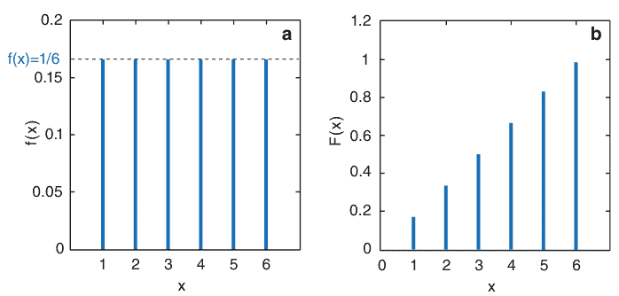

图3.4 a 概率密度函数$f(x)$和b 累积分布函数$F(x)$，展示$N=6$的均匀分布。变量$x$的6个离散值具有相同的概率1/6。

概率密度函数归一化为1，

$$\sum_{-\infty}^{+\infty} f(x)dx = 1$$

即所有概率之和为1。因此累积分布函数的最大值为1：

$$F(x)_{max} = 1$$

一个例子是掷一个有$N=6$个面的骰子。像骰子面这样的离散变量只能取有限个可数值$x$。每个面的概率为1/6。该分布的概率密度函数为

$$f(x) = 1/6$$

相应的累积分布函数为

$$F(x) = x \cdot 1/6$$

其中$x$仅取离散值（即$x=1, 2, ..., 6$）。

### 二项分布

*二项分布*给出了在$N$次试验中成功$x$次的离散概率，其中每次试验成功的概率为$p$（图3.5）。二项分布的概率密度函数为

$$f(x) = \binom{N}{x} p^x (1-p)^{N-x}$$

## 3.4 理论分布

累积分布函数为

$$F(x) = \sum_{i=1}^{x} \binom{N}{i} p^i (1-p)^{N-i}$$

其中

$$\binom{n}{r} = \frac{n!}{r!(n-r)!}$$

二项分布有两个参数 N 和 p。该分布的一个应用实例可以在确定钻探石油的可能结果时找到。假设钻探成功的概率为 0.1，即 10%。在总共 N=10 口井中，有 x=3 口井成功的概率为

$$f(3) = \binom{10}{3} 0.1^3 (1-0.1)^{10-3} = 0.057 \approx 6\%$$

因此，在这个例子中，10 次试验中恰好有 3 口井成功的概率约为 6%。

### 泊松分布

当试验次数 n → ∞ 且成功概率 p → 0 时，二项分布趋近于具有单一参数 λ = n·p 的泊松分布（图 3.6）（Poisson 1837）。当 n > 100 且 p < 0.05（或 5%）时，此近似效果良好。

因此，我们使用泊松分布来描述发生概率极低的过程，例如地震、火山喷发、风暴和洪水。其概率密度函数为

$$f(x) = \frac{e^{-\lambda}\lambda^x}{x!}$$

累积分布函数为

$$F(x) = \sum_{i=0}^{x} \frac{e^{-\lambda}\lambda^i}{i!}$$

单一参数 λ 描述了该分布的均值和方差。

### 正态分布或高斯分布

当 p = 0.5（对称，无偏斜）且 n → ∞ 时，二项分布趋近于由均值 μ 和标准差 σ 定义的正态分布或高斯分布（图 3.7）。正态分布的概率密度函数为

$$f(x) = \frac{1}{\sigma\sqrt{2\pi}} exp\left(-\frac{1}{2}\left(\frac{x-\mu}{\sigma}\right)^2\right)$$

累积分布函数为

$$F(x) = \frac{1}{\sigma\sqrt{2\pi}} \int_{-\infty}^{x} exp\left(-\frac{1}{2}\left(\frac{x-\mu}{\sigma}\right)^2\right) dy$$

因此，当均值既是出现频率最高也是最可能的值时，使用正态分布。偏离均值的概率在两个方向上相等，并且随着与均值距离的增加而减小。

*标准正态分布*是正态分布族的一个特殊成员，其均值为*零*，标准差为*一*。我们可以通过代入 *z* = (*x*−*μ*)/*σ* 来变换正态分布的方程。该分布的概率密度函数为

$$f(x) = \frac{1}{\sqrt{2\pi}} exp\left(-\frac{z^2}{2}\right)$$

这种正态分布的定义通常被称为 *z 分布*。

### 对数正态分布

当数据具有下限时，例如年平均降水量或地震频率（图 3.8），使用*对数正态分布*。在这种情况下，分布通常具有显著的偏斜性，最好用对数正态分布来描述。该分布的概率密度函数为

$$f(x) = \frac{1}{\sigma\sqrt{2\pi}x} exp\left(-\frac{1}{2}\left(\frac{lnx - \mu}{\sigma}\right)^2\right)$$

图 3.8 **a** 均值为 $\mu = 0$ 且 $\Phi$ 取不同值的对数正态分布的概率密度函数 $f(x)$ 和 **b** 累积分布函数 $F(x)$。

累积分布函数为

$$F(x) = \frac{1}{\sigma\sqrt{2\pi}} \int_{-\infty}^{x} \frac{1}{y} exp\left(-\frac{1}{2}\left(\frac{lny - \mu}{\sigma}\right)^2\right) dy$$

其中 $x>0$。该分布可以由两个参数描述：均值 $\mu$ 和标准差 $\sigma$。然而，其均值和标准差的计算公式与正态分布所用的不同。在实践中，对 $x$ 值取对数，使用正态分布的公式计算均值和标准差，然后将经验分布与正态分布进行比较。

### 学生 t 分布

*学生 t 分布*最初由 William S. Gosset（1876 至 1937）引入，他需要一种适用于小样本的分布（图 3.9）。Gosset 是爱尔兰吉尼斯啤酒厂的一名员工，希望匿名发表他的研究成果。因此，他以笔名 *Student*（Student 1908）发表了他的 t 分布。其概率密度函数为

$$f(x) = \frac{\Gamma\left(\frac{\Phi+1}{2}\right)}{\Gamma\left(\frac{\Phi}{2}\right)} \frac{1}{\sqrt{\Phi\pi}} \frac{1}{\left(1+\frac{x^2}{\Phi}\right)^{\frac{\Phi+1}{2}}}$$

其中 $\Gamma$ 是 Gamma 函数

$$\Gamma(x) = \lim_{n \to \infty} \frac{n!n^{x-1}}{x(x+1)(x+2)\dots(x+n-1)}$$

图 3.9 a 学生 $t$ 分布在 $\Phi$ 取两个不同值时的概率密度函数 $f(x)$ 和 b 累积分布函数 $F(x)$。

如果 $x>0$，它可以写成

$$\Gamma(x) = \int_{0}^{\infty} e^{-y} y^{x-1} dy$$

$t$ 分布的单一参数 $\Phi$ 是自由度。在单变量数据分析中，该分布具有 $n-1$ 个自由度，其中 $n$ 是样本量。当 $\Phi \to \infty$ 时，$t$ 分布收敛于标准正态分布。由于当 $\Phi > 30$ 时 $t$ 分布接近正态分布，因此很少用于分布拟合。然而，$t$ 分布用于通过 $t$ 检验（第 3.7 节）进行假设检验。

### 费希尔 $F$ 分布

$F$ 分布以统计学家 Sir Ronald Fisher（1890 至 1962）的名字命名。它用于通过 $F$ 检验（第 3.8 节）进行假设检验。$F$ 分布具有相对复杂的概率密度函数（图 3.10），

$$f(x) = \frac{\Gamma\left(\frac{\Phi_1+\Phi_2}{2}\right)\left(\frac{\Phi_1}{\Phi_2}\right)^{\frac{\Phi_1}{2}}}{\Gamma(\Phi_1/2)\Gamma(\Phi_2/2)} x^{\frac{\Phi_1-2}{2}} \left(1 + \frac{\Phi_1}{\Phi_2}x\right)^{-\frac{\Phi_1+\Phi_2}{2}}$$

其中 $x>0$，$\Gamma$ 再次是 Gamma 函数。两个参数 $\Phi_1$ 和 $\Phi_2$ 是自由度。

图 3.10 a 费希尔 $F$ 分布在 $\Phi_1$ 和 $\Phi_2$ 取不同值时的概率密度函数 $f(x)$ 和 b 累积分布函数 $F(x)$。

## $\chi^2$ 分布（或卡方分布）

$\chi^2$ 分布由 Friedrich Helmert（1876）和 Karl Pearson（1900）引入。该分布在统计假设检验（第 3.9 节）中有重要应用。$\chi^2$ 分布的概率密度函数为

$$f(x) = \frac{1}{2^{\Phi/2}\Gamma(\Phi/2)}x^{\frac{\Phi}{2}-1}e^{-\frac{x}{2}}$$

其中 $x>0$；否则，$f(x)=0$。同样，$\Gamma$ 是 Gamma 函数，$\Phi$ 是自由度（图 3.11）。

图 3.11 a $\chi^2$ 分布在 $\Phi$ 取不同值时的概率密度函数 $f(x)$ 和 b 累积分布函数 $F(x)$。

## 3.5 理论分布示例

我们使用 norm.pdf() 和 norm.cdf() 来计算均值为 mu=12.3448、标准差为 sigma=1.1660 的高斯分布的概率密度函数和累积分布函数（针对 x 中的值进行计算），并将结果与我们的样本数据集的结果进行比较：

```
%reset -f

import numpy as np
import matplotlib.pyplot as plt
from scipy import stats

mu = 12.3448
sigma = 1.166

x = np.arange(5,20+0.001,0.001)
pdf = stats.norm.pdf(x,mu,sigma)
cdf = stats.norm.cdf(x,mu,sigma)

plt.figure()
plt.plot(x,pdf,x,cdf)
plt.show()
```

我们可以使用这些函数来熟悉分布的特性。这在后续章节进行假设检验时将非常重要。这些章节中使用的检验统计量遵循本章前面介绍的理论频率分布。特别是，理论分布在某个范围 $a \le x \le b$ 内的积分（或在离散情况下为求和）非常重要，因为它有助于计算测量值落在该范围内的概率。

例如，我们可以计算测量值落在 $\mu-\sigma \le x \le \mu+\sigma$ 范围内的概率，其中 $\mu$ 是高斯分布的均值，$\sigma$ 是标准差。使用 mu=12.3448 和 sigma=1.1660 的高斯分布的 PDF，我们发现

```
pdf = pdf / np.sum(pdf)
print(np.sum(pdf[np.where((x>mu-sigma) & (x<mu+sigma))]))
```

结果为

0.6826894910701773

或者在将 PDF 归一化为单位后约为 68%。表达式 np.where(x>mu-sigma) 返回 x 中第一个大于 mu-sigma 的索引。类似地，np.where(x<mu+sigma) 返回 x 中第一个小于 mu+sigma 的索引。

## 3.6 假设检验

以下章节将讨论从统计样本中得出结论并将其应用于更广泛目标总体的方法（*假设检验*）（第3.6至3.12节）。所有假设检验都遵循相同的概念和术语。*原假设*是关于总体的陈述，描述的是不存在统计显著特征或效应的情况，而*备择假设*则是与之对立的陈述。假设检验的*p值*是在原假设成立的前提下，观测到比样本计算值更大的检验统计量值的概率。*显著性水平* $\alpha$ 是控制检验结果的概率阈值。如果*p*值小于 $\alpha$，则可以拒绝原假设；如果 $p<0.05$，检验结果被视为*显著*；如果 $p<0.01$，则被视为*高度显著*。

假设检验可以作为*单尾*（单侧）或*双尾*（双侧）检验进行。术语“尾”源于将数据尾部延伸至概率密度函数最左端或最右端的概念，例如在Mann-Whitney和Ansari-Bradley检验（第3.11和3.12节）中使用的标准正态分布。以Mann-Whitney检验为例，它比较两个数据集的中位数。单尾Mann-Whitney检验用于检验备择假设，即在5%（或0.05）的显著性水平下，第一个样本的中位数小于或大于第二个样本的中位数。双尾Mann-Whitney检验则用于在5%显著性水平下检验中位数不相等的情况，即无论哪个中位数更大都无关紧要。在这种情况下，显著性水平减半，即使用2.5%而非5%。

我们可以通过输入以下代码来显示单尾检验的标准正态分布：

```python
%reset -f

import numpy as np
import matplotlib.pyplot as plt
from scipy import stats

x = np.arange(-4,4,0.001)
pdf = stats.norm.pdf(x,0.,1.)

plt.figure()
plt.plot(x,pdf,color='k')
xint = x[np.where(x>stats.norm.ppf(0.95,0.,1.))]
pdfint = pdf[np.where(x>stats.norm.ppf(0.95,0.,1.))]
plt.fill_between(xint,pdfint)
plt.show()
```

这将生成一个右侧有一个蓝色尾部的图，其中5%的区域被阴影覆盖（图3.13a）。类似地，我们可以通过输入以下代码来显示双尾检验的标准正态分布：

```python
x = np.arange(-4,4,0.001)
pdf = stats.norm.pdf(x,0.,1.)

plt.figure()
plt.plot(x,pdf,color='k')
xint1 = x[np.where(x<stats.norm.ppf(0.05/2,0.,1.))]
xint2 = x[np.where(x>stats.norm.ppf(1-0.05/2,0.,1.))]
pdfint1 = pdf[np.where(x<stats.norm.ppf(0.05/2,0.,1.))]
pdfint2 = pdf[np.where(x>stats.norm.ppf(1-0.05/2,0.,1.))]
plt.fill_between(xint1,pdfint1,color=(0.3,0.5,0.8))
plt.fill_between(xint2,pdfint2,color=(0.3,0.5,0.8))
plt.show()
```

这将生成一个有两个蓝色尾部（一个在左，一个在右）的图，其中2.5%的区域被阴影覆盖（图3.13b）。

请注意，我们无法证明原假设：换句话说，*无罪*并不等同于*清白*。在实践中，我们基于数据设计假设，进行检验，然后继续使用那些我们未能证明为假的假设。因此，假设被证明为假的内在可能性是我们假设的一个重要要求。

接下来的章节将介绍地球科学应用中最重要的假设检验：用于比较两个数据集均值的双样本*t*检验、用于比较两个数据集方差的双样本*F*检验，以及用于比较分布的 $\chi^2$ 检验和Kolmogorov-Smirnov检验（第3.7至3.10节）。Mann-Whitney和Ansari-Bradley检验分别是*t*检验和*F*检验的替代方案，用于比较两个数据集的中位数和离散度，且不要求底层总体满足正态性假设（第3.11和3.12节）。

## 3.7 t检验

*Student's t检验*由William S. Gosset（Student 1908）创建，用于比较两个分布的均值。*单样本t检验*用于检验一个高斯分布总体的均值是否具有原假设中指定的值。*双样本t检验*用于检验两个高斯分布的均值是否相同。下文将介绍双样本*t*检验以演示假设检验。假设我们对同一对象进行了两组独立的 $n_a$ 和 $n_b$ 次测量——例如，对来自两个不同露头的两组岩石样本进行测量。*t*检验可用于确定两个样本是否来自同一总体——例如，同一岩性单元（原假设）——还是来自两个不同的总体（备择假设）。两个样本分布都必须是高斯分布，并且两组测量的方差应相似。那么，用于检验两个均值差异的适当检验统计量为：

$$\widehat{t} = \frac{|\overline{a} - \overline{b}|}{\sqrt{\frac{n_a+n_b}{n_a n_b} \cdot \frac{(n_a-1) \cdot s_a^2 + (n_b-1) \cdot s_b^2}{n_a+n_b-2}}}$$

其中 $n_a$ 和 $n_b$ 是样本量，$s_a^2$ 和 $s_b^2$ 分别是两个样本 $a$ 和 $b$ 的方差。如果测量的*t*值高于临界*t*值，则可以拒绝原假设，临界*t*值取决于自由度 $\Phi = n_a + n_b - 2$ 和显著性水平 $\alpha$。单尾检验用于检验备择假设，即在5%（或0.05）的显著性水平下，第一个样本的均值小于或大于第二个样本的均值。单尾检验需要修改上述方程，将均值差的绝对值替换为均值的实际差值。双尾*t*检验用于在5%显著性水平下检验均值不相等的情况，即无论哪个均值更大都无关紧要。在这种情况下，显著性水平减半，即使用2.5%来计算临界*t*值。

我们现在可以从两个独立的测量系列中加载两个示例数据集。第一个示例展示了在两个均值分别为25.5和25.3、标准差分别为1.3和1.5的分布上，双样本t检验的表现：

```python
%reset -f

import numpy as np
import matplotlib.pyplot as plt
from scipy import stats

corg = np.loadtxt('organicmatter_two.txt')
corg1 = corg[0:,0]
corg2 = corg[0:,1]
```

我们比较两个数据集corg1和corg2。首先，我们在一个图中绘制两个直方图：

```python
plt.figure()
plt.hist(corg1)
plt.hist(corg2)
plt.show()
```

然后，我们计算样本量、均值和标准差：

```python
na = len(corg1)
nb = len(corg2)
ma = np.mean(corg1)
mb = np.mean(corg2)
sa = np.std(corg1,ddof=1)
sb = np.std(corg2,ddof=1)
```

接下来，我们使用t检验统计量的公式转换为Python代码来计算t值：

```python
tcalc = np.abs((ma-mb))/np.sqrt(((na+nb)/(na*nb)) *
    (((na-1)*sa**2+(nb-1)*sb**2)/(na+nb-2)))
print(tcalc)
```

得到

```
0.7279110523246475
```

现在，我们可以将计算出的tcalc值0.7279与临界tcrit值进行比较。这可以使用`t.ppf()`来实现，它返回在5%显著性水平下，自由度为na+nb-2的t分布函数的反函数值。这是一个双样本t检验，即检验均值是否不相等。通过输入1-0.05/2计算双尾临界tcrit值，得到上（正）tcrit值，我们将其与均值差的绝对值进行比较。输入

```python
tcrit = stats.t.ppf(1-0.05/2,na+nb-2)
```

得到

```
1.9802722492407059
```

由于从数据计算出的tcalc值小于临界tcrit值，我们没有其他理由拒绝原假设。因此，我们得出结论：在5%显著性水平下，两个均值是相同的。或者，我们可以在alpha=0.05（即5%显著性水平）下，对两个独立样本corg1和corg2应用`ttest_ind()`。命令

```python
statistic,pvalue = stats.ttest_ind(corg1,corg2)
print(statistic)
print(pvalue)
```

得到

```
0.7279110523246475
0.46810997986836755
```

结果意味着，在5%显著性水平下，我们没有其他理由拒绝原假设。p值为0.4681（或约47%，远大于0.05或5%的显著性水平）表明，在类似实验中观察到比本例中更极端的t值的概率是万分之4,681。

第二个合成示例展示了在均值差异很大（分别为24.3和25.5）、标准差仍为1.3和1.5的情况下，双样本t检验的表现：

```python
corg = np.loadtxt('organicmatter_three.txt')
corg1 = corg[0:,0]
corg2 = corg[0:,1]
```

与之前一样，我们比较两个数据集corg1和corg2。我们在一个图中绘制两个直方图：

```python
plt.figure()
plt.hist(corg1)
plt.hist(corg2)
plt.figure()
```

然后，我们计算样本量、均值和标准差：

```python
na = len(corg1)
nb = len(corg2)
ma = np.mean(corg1)
mb = np.mean(corg2)
sa = np.std(corg1,ddof=1)
sb = np.std(corg2,ddof=1)
```

接下来，我们使用t检验统计量的公式转换为Python代码来计算t值：

```python
tcalc = np.abs((ma-mb))/np.sqrt(((na+nb)/(na*nb)) *
    (((na-1)*sa**2+(nb-1)*sb**2)/(na+nb-2)))
print(tcalc)
```

得到

```
4.7364005886749485
```

现在，我们可以将计算出的tcalc值4.7364与临界tcrit值进行比较。同样，这可以使用`t.ppf()`在5%显著性水平下实现。函数`t.ppf()`返回在5%显著性水平下，自由度为na+nb-2的t分布函数的反函数值。这再次是一个双样本t检验，即检验均值是否不相等。通过输入1-0.05/2计算双尾临界tcrit值，得到上（正）tcrit值，我们将其与均值差的绝对值进行比较。输入

```python
tcrit = stats.t.ppf(1-0.05/2,na+nb-2)
print(tcrit)
```

得到

```
1.9802722492407059
```

由于从数据计算出的tcalc值现在大于临界tcrit值，我们可以拒绝原假设，并得出结论：在5%显著性水平下，均值不相同。或者，我们可以在alpha=0.05（或5%）显著性水平下，对两个独立样本corg1和corg2应用`ttest_ind()`。命令

```python
statistic,pvalue = stats.ttest_ind(corg1,corg2)
print(statistic)
print(pvalue)
```

得到

```
4.7364005886749485
6.113768768578045e-06
```

结果表明我们可以拒绝原假设。$p$值极低，非常接近于零。

## 3.8 F检验

Snedecor和Cochran（1989）讨论的双样本$F$检验比较了两个分布的方差$s_a^2$和$s_b^2$，其中$s_a^2 > s_b^2$。一个例子是在基于重复测量比较两个样本的自然异质性时。样本量$n_a$和$n_b$应大于30。样本和总体分布都必须是高斯分布。用于比较方差的适当检验统计量是

$\widehat{F} = \frac{s_a^2}{s_b^2}$

如果测量的$F$值高于临界$F$值，则两个方差显著不同（即，我们没有其他理由拒绝原假设），而临界$F$值又取决于自由度$\Phi_a = n_a - 1$和$\Phi_b = n_b - 1$以及显著性水平$\alpha$。相比之下，单样本$F$检验实际上执行的是数据来自具有特定方差的正态分布的假设的$\chi^2$检验（见第3.9节）。我们首先将双样本$F$检验应用于两个标准差非常接近（分别为1.2550和1.2097）的分布：

```python
%reset -f

import numpy as np
import matplotlib.pyplot as plt
from scipy import stats

corg = np.loadtxt('organicmatter_four.txt')
corg1 = corg[0:,0]
corg2 = corg[0:,1]
```

*F*值是较大方差除以较小方差的商。我们现在可以通过输入以下命令计算标准差：

```python
s1 = np.std(corg1,ddof=1)
s2 = np.std(corg2,ddof=1)
print(s1)
print(s2)
```

得到

```
1.254958845144188
1.2096912224649008
```

*F*分布有两个参数df1和df2，它们分别代表每个分布中的观测数减一，其中

```python
df1 = len(corg1)-1
df2 = len(corg2)-1
print(df1)
print(df2)
```

得到

```
59
59
```

然后，我们按绝对值对标准差进行排序

```python
if s1 > s2:
    slarger = s1
    ssmaller = s2
else:
    slarger = s2
    ssmaller = s1
print(slarger)
print(ssmaller)
```

得到

```
1.254958845144188
1.2096912224649008
```

现在，我们可以使用`f.ppf()`在0.05（或5%）显著性水平下，将计算出的*F*值与临界*F*值进行比较。函数`f.ppf()`返回在5%显著性水平下，自由度为df1和df2的*F*分布函数的反函数值。这是一个双尾检验，因此我们必须将p值0.05除以二。输入

```python
Fcalc = slarger**2/ssmaller**2
Fcrit = stats.f.ppf(1-0.05/2,df1,df2)
print(Fcalc)
print(Fcrit)
```

得到

```
1.0762419323639238
1.674131963667053
```

由于从数据计算出的F值小于临界F值，我们没有其他理由拒绝原假设。因此，我们得出结论：在5%显著性水平下，方差是相同的。或者，我们可以创建一个函数`ftest()`，并在alpha=0.05（或5%）显著性水平下，将其应用于两个独立样本corg1和corg2：

```python
def ftest(x,y):
    s1 = np.std(x,ddof=1)
    s2 = np.std(y,ddof=1)
    df1 = len(x)-1
    df2 = len(y)-1
    if s1 > s2:
        sl = s1
        ss = s2
    else:
        sl = s2
        ss = s1
    f = sl**2/ss**2
    p = 2*(1-stats.f.cdf(f,df1,df2))
    return f, p
```

命令

```python
statistic,pvalue = ftest(corg1,corg2)
print(statistic)
print(pvalue)
```

得到

```
1.0762419323639238
0.7787390940882846
```

该结果意味着，在5%的显著性水平下，我们无法拒绝原假设。p值为0.7787（或约78%，远大于显著性水平），这表明在类似实验中，观察到比本例中F值更极端的值的概率为10,000次中有7,787次。

我们现在将此检验应用于两个标准差差异很大的分布，分别为1.8799和1.2939：

```python
corg = np.loadtxt('organicmatter_five.txt')
corg1 = corg[0:,0]
corg2 = corg[0:,1]
```

我们再次使用`f.ppf()`函数计算临界Fcrit值，并在5%的显著性水平下，将计算得到的Fcalc值与临界Fcrit值进行比较：

```python
s1 = np.std(corg1,ddof=1)
s2 = np.std(corg2,ddof=1)

df1 = len(corg1)-1
df2 = len(corg2)-1

if s1 > s2:
    slarger = s1
    ssmaller = s2
else:
    slarger = s2
    ssmaller = s1

Fcalc = slarger**2/ssmaller**2
Fcrit = stats.f.ppf(1-0.05/2,df1,df2)
print(Fcalc)
print(Fcrit)
```

得到结果：

```
3.496686940871093
1.674131963667053
```

由于从数据计算出的Fcalc值现在大于临界Fcrit值，我们可以拒绝原假设。因此，在5%的显著性水平下，方差是不同的。

或者，我们可以通过在显著性水平alpha=0.05（或5%）下对两个独立样本corg1和corg2进行双样本F检验来应用`ftest()`函数。输入：

```python
statistic,pvalue = ftest(corg1,corg2)
print(statistic)
print(pvalue)
```

得到：

```
3.496686940871093
3.415254814731483e-06
```

结果表明我们可以拒绝原假设。$p$值极低且非常接近于零，这表明原假设极不可能成立。

## 3.9 $\chi^2$检验

卡尔·皮尔逊的$\chi^2$检验涉及比较分布，从而允许检验两个分布是否源自同一总体（Pearson 1900）。该检验与所使用的分布类型无关，因此可用于检验观测值是否来自特定理论分布的假设。

假设我们有一个数据集，包含来自一个沉积单元的多次化学测量。我们可以使用$\chi^2$检验来检验原假设：这些测量值可以用一个具有典型中心值和围绕其随机离散度的高斯分布来描述。$n$个数据被分成$K$个类别，其中$n$应大于30。类别内的频率$O_k$不应低于四，并且绝对不应为零。适当的检验统计量为：

$$\widehat{\chi}^2 = \sum_{k=1}^{K} \frac{(O_k - E_k)^2}{E_k}$$

其中$E_k$是从理论分布预期的频率（图3.14）。如果测量的$\chi^2$值高于临界$\chi^2$值，则可以拒绝原假设，该临界值取决于自由度$\Phi = K-Z$，其中$K$是类别数，$Z$是描述理论分布的参数数量加上变量数量（例如，对于单变量数据集的高斯分布，均值和方差对应$Z=2+1$；对于单变量的泊松分布，$Z=1+1$）。

例如，我们可以检验包含在*organicmatter_one.txt*中的有机碳测量值是否服从高斯分布的假设。我们必须首先将数据加载到工作区，并使用八个类别计算数据测量值的频率分布n_obs：

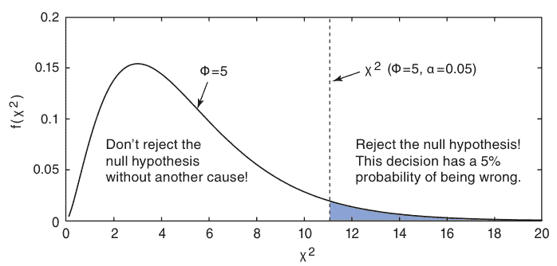

图3.14 χ²检验原理。如果测量的χ²低于临界χ²，则可以拒绝两个分布不同的备择假设。χ²取决于Φ = K – Z，其中K是类别数，Z是描述理论分布的参数数量加上变量数量。在本例中，临界χ²(Φ = 5, α = 0.05)为11.0705。由于测量的χ² = 5.7602低于临界χ²，我们无法拒绝原假设。在我们的例子中，我们可以得出结论，样本分布与高斯分布没有显著差异。

```python
%reset -f

import numpy as np
import matplotlib.pyplot as plt
from scipy import stats

corg = np.loadtxt('organicmatter_one.txt')

n_obs,e = np.histogram(corg,bins=8)
v = np.diff(e[0:2])*0.5+e[0:-1]
```

然后，我们使用`norm.pdf()`函数，根据corg中数据的均值和标准差创建预期频率分布n_exp：

```python
n_exp = stats.norm.pdf(v,np.mean(corg),np.std(corg,ddof=1))
```

数据需要进行缩放，以便与原始数据集相似：

```python
n_exp = n_exp/np.sum(n_exp)
n_exp = np.sum(n_obs)*n_exp
```

第一条命令将观测频率n_exp归一化为总和为1。第二条命令将预期频率n_exp缩放为n_obs的总和。我们现在可以显示两个直方图进行比较：

```python
plt.figure()
plt.subplot(1,2,1)
plt.bar(v,n_obs,color='r')
plt.subplot(1,2,2)
plt.bar(v,n_exp,color='b')
plt.show()
```

绘制corg中数据的另一种方法是使用正态概率图：

```python
stats.probplot(corg,dist='norm',plot=plt)
```

`probplot()`函数用蓝色圆圈绘制corg中的数据，并叠加一条代表正态分布的红线。如果corg中的数据确实服从正态分布，它们将全部落在红线上。在我们的例子中，数据似乎与直线吻合良好，除了正态分布的尾部。

目视检查这些图表揭示经验分布与理论分布相似。然而，我们建议使用更定量的方法来检验相似性假设。χ²检验探讨观测频率和预期频率之间的平方差。量chi2calc是平方差除以预期频率的总和。输入：

```python
chi2calc = np.sum((n_obs-n_exp)**2/n_exp)
print(chi2calc)
```

得到：

```
7.285412350787187
```

临界chi2crit值可以使用chi2inv值计算。χ²检验需要自由度Φ。在我们的例子中，我们检验数据服从高斯分布的假设，即我们估计两个参数μ和σ。自由度为Φ=8−(2+1)=5。我们现在可以在5%的显著性水平下检验我们的假设。函数`chi2.ppf()`计算具有Φ指定参数的χ² CDF的逆，用于相应的概率。输入：

```python
chi2crit = stats.chi2.ppf(1-0.05,5)
print(chi2crit)
```

得到：

```
11.070497693516351
```

由于临界chi2crit值11.0705远高于测量的chi2calc值7.2854，在没有其他原因的情况下，我们无法拒绝原假设。因此，我们可以得出结论，我们的数据服从高斯分布。或者，我们可以对样本应用`chisqaure()`函数。命令：

```python
chisq,p = stats.chisquare(n_obs,n_exp,ddof=0,axis=0)
print(chisq)
print(p)
```

得到：

```
7.285412350787187
0.39978002411496866
```

该结果意味着，在5%的显著性水平下，我们无法拒绝原假设。p值为0.3998（或约40%，远大于显著性水平），这表明在原假设成立的情况下，从类似实验中观察到相同结果或更极端结果的概率为10,000次中有3,998次。

## 3.10 柯尔莫哥洛夫-斯米尔诺夫检验

*柯尔莫哥洛夫-斯米尔诺夫*（或*K–S*）*检验*（由安德烈·N·柯尔莫哥洛夫和尼古拉·W·斯米尔诺夫提出）与χ²检验类似，因为它也涉及比较分布，从而允许检验两个分布是否源自同一总体（Kolmogorov 1933; Smirnov 1939）。该检验与所使用的分布类型无关，因此可用于检验观测值是否来自特定理论分布的假设。

让我们再次假设我们有一个数据集，包含来自一个沉积单元的多次化学测量。我们可以使用K–S检验来检验原假设：这些测量值可以用一个具有典型中心值（均值）和围绕均值的随机离散度（标准差）的高斯分布来描述。适当的检验统计量为：

$KS = max|F_n(x) - F(x)|$

其中$F_n(x)$是$n$个测量值的累积频率分布，$F(x)$是从理论分布预期的累积频率分布。如果测量的$KS$值高于临界$KS$值，则可以拒绝原假设。

例如，我们可以再次检验包含在*organicmatter_one.txt*中的有机碳测量值是否服从高斯分布的假设。我们必须首先加载并标准化数据，使其均值为零，标准差为一：

## 3.11 曼-惠特尼检验

*曼-惠特尼检验*（也称为*威尔科克森秩和检验*）由亨利·B·曼和唐纳德·R·惠特尼（1947年）提出，可用于判断两个样本是来自同一总体（例如，同一岩性单元）（原假设）还是来自两个不同的总体（备择假设）。与比较高斯分布数据均值的*t*检验不同，曼-惠特尼检验比较的是中位数，且不要求底层总体满足正态性假设（即它是一种非参数假设检验）。

该检验要求样本具有相似的离散度。我们首先将两组测量值（样本1和样本2）合并，并按升序排列。然后，我们分别计算样本1和样本2的秩和，其中所有秩的总和为 $R = n(n+1)/2$，$n$ 为测量总数。已发表的文献中充满了计算检验统计量的不同版本。这里，我们使用Hedderich和Sachs（2012年，第484页）中可以找到的版本：

$U_1 = n_1n_2 + \frac{n_1(n_1 + 1)}{2} - R_1$

$U_2 = n_1n_2 + \frac{n_2(n_2 + 1)}{2} - R_2$

其中 $n_1$ 和 $n_2$ 分别是样本1和样本2的大小，$R_1$ 和 $R_2$ 分别是样本1和样本2的秩和。所需的检验统计量 $U$ 是 $U_1$ 和 $U_2$ 中较小的那个，我们将其与一个取决于样本大小 $n_1$ 和 $n_2$ 以及显著性水平 $\alpha$ 的临界 $U$ 值进行比较。或者，我们可以使用 $U$ 值来计算

$\widehat{Z} = \frac{\left|U - \frac{n_1n_1}{2}\right|}{\sqrt{\frac{n_1n_2(n_1+n_2+1)}{12}}}$

如果 $n_1 \geq 8$ 且 $n_2 \geq 8$（Mann and Whitney 1947; Hedderich and Sachs 2012, page 486）。如果测量的 $z$ 值的绝对值大于取决于显著性水平 $\alpha$ 的临界 $z$ 值的绝对值（第3.4节），则可以拒绝原假设。

在实践中，数据集通常包含结值，即样本1和/或样本2中的某些值是相同的。在这种情况下，使用结值的平均秩来代替真实秩。这意味着 $z$ 值的公式必须针对结值进行修正：

$\widehat{Z} = \frac{\left|U - \frac{n_1n_1}{2}\right|}{\sqrt{\left(\frac{n_1n_2}{S(S-1)}\right) \cdot \left(\frac{S^3-S}{12} - \sum_{i=1}^{r} \frac{t_i^3-t_i}{12}\right)}}$

其中 $S=n_1+n_2$，$r$ 是结值的数量，$t_i$ 是第 $i$ 个结值出现的次数。同样，如果测量的 $z$ 值的绝对值大于取决于显著性水平 $\alpha$ 的临界 $z$ 值的绝对值，则可以拒绝原假设。

*SciPy* 包提供了 `ranksums()` 函数，用于执行曼-惠特尼检验，以判断两个样本 `data1` 和 `data2`（每个样本包含八个测量值，其中有一些结值）是来自同一总体（原假设）还是来自两个不同的总体（备择假设）。我们定义两个各包含八个测量值的样本：

```python
%reset -f

import numpy as np
from scipy import stats

data1 = np.array([5,5,8,9,13,13,13,15])
data2 = np.array([3,3,4,5,5,8,10,16])
```

我们使用 `ranksums()` 对相同的样本执行曼-惠特尼检验：

```python
statistic,pvalue = stats.ranksums(data1,data2)
print(statistic)
print(pvalue)
```

结果如下：

```
1.6278255976825613
0.10356187117653398
```

该结果意味着在5%的显著性水平下，我们无法拒绝原假设。*p* 值为0.1071（或约11%，大于显著性水平）意味着，在原假设为真的情况下，从类似实验中观察到相同结果或更极端结果的概率是11%。

我们也可以使用此脚本来测试 *organicmatter_two.mat* 中的两个样本是来自同一岩性单元（原假设）还是来自两个不同的单元（备择假设），而无需对底层总体进行正态性假设。我们使用以下代码加载数据：

```python
corg = np.loadtxt('organicmatter_two.txt')
corg1 = corg[:,0]
corg2 = corg[:,1]
```

我们使用 `ranksums()` 对相同的样本执行曼-惠特尼检验：

```python
statistic,pvalue = stats.ranksums(corg1,corg2)
print(statistic)
print(pvalue)
```

结果如下：

```
0.5406097975139224
0.5887765633694566
```

结果 h==0 意味着在没有其他原因的情况下，在5%的显著性水平下，我们无法拒绝原假设。*p* 值为0.5888（或约59%，远大于显著性水平）意味着，在原假设为真的情况下，从类似实验中观察到相同结果或更极端结果的概率是5,888/10,000。

```python
%reset -f
import numpy as np
import matplotlib.pyplot as plt
from scipy import stats

corg = np.loadtxt('organicmatter_one.txt')
corg = (corg-np.mean(corg))/np.std(corg,ddof=1)
```

然后我们计算 corg 的累积频率分布 cn_obs：

```python
corg = np.sort(corg)
cn_obs = np.arange(1,len(corg)+1)/len(corg)
```

接下来，我们使用 norm.cdf() 创建理论分布（均值为零，标准差为一）的预期累积频率分布 cn_exp：

```python
cn_exp = stats.norm.cdf(corg)
```

检验统计量是两个累积频率分布 cn_obs 和 cn_exp 之间的最大差值：

```python
kscalc = max(cn_obs-cn_exp)
print(kscalc)
```

结果如下：

```
0.07567749152482395
```

我们可以通过输入以下代码在图中比较这两个累积频率分布：

```python
plt.plot(corg,cn_obs)
plt.plot(corg,cn_exp)
plt.plot([corg[np.where(cn_obs-cn_exp==max(cn_obs-cn_exp))],
    corg[np.where(cn_obs-cn_exp==max(cn_obs-cn_exp))]],
    [cn_exp[np.where(cn_obs-cn_exp==max(cn_obs-cn_exp))],
    cn_obs[np.where(cn_obs-cn_exp==max(cn_obs-cn_exp))]],
    color='k',linestyle=':')
```

垂直的黑线标记了两个累积频率分布之间最大差值的位置。临界 kscalc 值是 n 阶多项式的解，可在表 3.1（O'Connor and Kleyner 2012）中找到。对于样本量大于40且显著性水平为0.05（或5%）的情况，我们计算：

表 3.1 柯尔莫哥洛夫-斯米尔诺夫检验的 *KS* 临界值（O’Connor and Kleyner 2012）。

| *n* | 显著性水平 *α* | | | |
|---|---|---|---|---|
| | 0.10 | 0.05 | 0.02 | 0.01 |
| 1 | 0.95000 | 0.97500 | 0.99000 | 0.99500 |
| 2 | 0.77639 | 0.84189 | 0.90000 | 0.92929 |
| 3 | 0.63604 | 0.70760 | 0.78456 | 0.82900 |
| 4 | 0.56522 | 0.62394 | 0.68887 | 0.73424 |
| 5 | 0.50945 | 0.56328 | 0.62718 | 0.66853 |
| 6 | 0.46799 | 0.51926 | 0.57741 | 0.61661 |
| 7 | 0.43607 | 0.48342 | 0.53844 | 0.57581 |
| 8 | 0.40962 | 0.45427 | 0.50654 | 0.54179 |
| 9 | 0.38746 | 0.43001 | 0.47960 | 0.51332 |
| 10 | 0.36866 | 0.40925 | 0.45662 | 0.48893 |
| 11 | 0.35242 | 0.39122 | 0.43670 | 0.46770 |
| 12 | 0.33815 | 0.37543 | 0.41918 | 0.44905 |
| 13 | 0.32549 | 0.36143 | 0.40362 | 0.43247 |
| 14 | 0.31417 | 0.34890 | 0.38970 | 0.41762 |
| 15 | 0.30397 | 0.33760 | 0.37713 | 0.40420 |
| 16 | 0.29472 | 0.32733 | 0.36571 | 0.39201 |
| 17 | 0.28627 | 0.31796 | 0.35528 | 0.38086 |
| 18 | 0.27851 | 0.30936 | 0.34569 | 0.37062 |
| 19 | 0.27136 | 0.30143 | 0.33685 | 0.36117 |
| 20 | 0.26473 | 0.29408 | 0.32866 | 0.35241 |
| 21 | 0.25858 | 0.28724 | 0.32104 | 0.34427 |
| 22 | 0.25283 | 0.28087 | 0.31394 | 0.33666 |
| 23 | 0.24746 | 0.27490 | 0.30728 | 0.32954 |
| 24 | 0.24242 | 0.26931 | 0.30104 | 0.32286 |
| 25 | 0.23768 | 0.26404 | 0.29516 | 0.31657 |
| 26 | 0.23320 | 0.25907 | 0.28962 | 0.31064 |
| 27 | 0.22898 | 0.25438 | 0.28438 | 0.30502 |
| 28 | 0.22497 | 0.24993 | 0.27942 | 0.29971 |
| 29 | 0.22117 | 0.24571 | 0.27471 | 0.29466 |
| 30 | 0.21756 | 0.24170 | 0.27023 | 0.28987 |
| 31 | 0.21412 | 0.23788 | 0.26596 | 0.28530 |
| 32 | 0.21085 | 0.23424 | 0.26189 | 0.28094 |
| 33 | 0.20771 | 0.23076 | 0.25801 | 0.27677 |
| 34 | 0.20472 | 0.22743 | 0.25429 | 0.27279 |
| 35 | 0.20185 | 0.22425 | 0.26073 | 0.26897 |
| 36 | 0.19910 | 0.22119 | 0.24732 | 0.26532 |
| 37 | 0.19646 | 0.21826 | 0.24404 | 0.26180 |
| 38 | 0.19392 | 0.21544 | 0.24089 | 0.25843 |
| 39 | 0.19148 | 0.21273 | 0.23786 | 0.25518 |
| 40 | 0.18913 | 0.21012 | 0.23494 | 0.25205 |
| >40 | 1.22/n^0.5 | 1.36/n^0.5 | 1.51/n^0.5 | 1.63/n^0.5 |

```python
kscrit = 1.36/len(corg)**0.5
print(kscrit)
```

结果如下：

```
0.17557524502806957
```

由于临界 kscrit 值 0.1756 远高于测量的 kscalc 值 0.0757，在没有其他原因的情况下，我们无法拒绝原假设。因此，我们可以得出结论，我们的数据服从高斯分布。

或者，我们可以对样本应用 `kstest()`。输入

```python
statistic,pvalue = stats.kstest(corg,'norm')
print(statistic)
print(pvalue)
```

结果如下：

```
0.07567749152482395
0.8562157307523406
```

该结果意味着在5%的显著性水平下，在没有其他原因的情况下，我们无法拒绝原假设。*p* 值为0.8562（或约86%，远大于显著性水平）意味着，在原假设为真的情况下，从类似实验中观察到相同结果或更极端结果的概率是8,562/10,000。输出 0.0757 对应于我们实验中未使用 kstest 时的 kscalc。

## 3.12 安萨里-布拉德利检验

*安萨里-布拉德利检验*由阿卜杜勒·R·安萨里和拉尔夫·A·布拉德利（1960年）提出，可用于判断两个样本是来自同一分布（原假设），还是来自具有相同中位数和形状但离散度（例如方差）不同的分布（备择假设）。与比较正态分布数据离散度的*F*检验不同，安萨里-布拉德利检验在比较离散度时不要求底层总体满足正态性假设，即它是一种非参数假设检验。

该检验要求样本具有相似的中位数，这可以通过从样本中减去中位数来实现。检验将两组测量值（样本1和样本2）合并，并按升序排列。计算检验统计量$A_n$有多种方法。此处，我们使用Hedderich和Sachs（2012年，第463页）给出的方法：

$$A_n = \sum_{i=1}^{n} \left( \frac{n+1}{2} - \left| i - \frac{n+1}{2} \right| \right) V_i$$

其中，指示函数$V_i$的值对于来自样本1的值为1，对于来自样本2的值为0。因此，检验统计量等于与均值$(n+1)/2$的偏差绝对值之和（Hedderich and Sachs 2012）。数据首先被连接并排序（如第3.11节介绍的曼-惠特尼检验）。随后，最小值和最大值被赋予秩1，第二小值和第二大值被赋予秩2，依此类推。$A_n$越小，表示样本1和样本2之间的值离散度越大。同样，数据的秩也可以针对结值进行校正，正如之前在曼-惠特尼检验中所做的那样。对于$n \leq 20$，我们可以在安萨里和布拉德利（1960年）的开放获取文章中的表3.1中找到检验统计量$A_n$的临界值。对于较大的$n$值，我们使用标准正态分布：

$$Z = \frac{A_n - \mu_{A_n}}{\sqrt{\sigma_{A_n}^2}}$$

其中

$$\mu_{A_n} = \begin{cases} \frac{1}{4} n_1(n+2), & \text{如果 } n \text{ 是偶数} \\ \frac{1}{4} n_1(n+1)^2/n, & \text{如果 } n \text{ 是奇数} \end{cases}$$

$$\sigma_{A_n} = \begin{cases} n_1 n_2(n^2-4)/(48(n-1)), & \text{如果 } n \text{ 是偶数} \\ n_1 n_2(n+1)(n^2+3)/(48n^2), & \text{如果 } n \text{ 是奇数} \end{cases}$$

这同样来自Hedderich和Sachs（2012年，第463页）。如果测量的z值的绝对值大于临界z值的绝对值（取决于显著性水平α），则可以拒绝原假设。

我们的第一个例子使用安萨里-布拉德利检验来判断两个样本data1和data2（各包含八个测量值）是来自同一分布（原假设），还是来自具有相同中位数和形状但离散度不同的分布（备择假设）。我们使用以下代码定义两个样本：

```
%reset -f

import numpy as np
from numpy.random import default_rng
from scipy import stats

data1 = np.array([7,14,22,36,40,48,49,52])
data2 = np.array([3,5,6,10,17,18,20,39])
```

*SciPy*包提供了ansari()函数来执行安萨里-布拉德利检验，输入：

```
statistic,pvalue = stats.ansari(data1,data2)
print(statistic)
print(pvalue)
```

输出结果为：

```
33.0
0.6060606060606061
```

该结果意味着，在5%的显著性水平下，没有其他原因时我们不能拒绝原假设。p值为0.6061（或约61%，大于显著性水平）意味着，在原假设成立的情况下，从类似实验中观察到相同结果或更极端结果的概率为10,000次中有6,061次。

第二个例子演示了在大样本量（>50个测量值）数据集中处理结值的方法。我们使用随机数生成器创建一个包含100个测量值的数据集：

```
rng = default_rng()
data1 = 3.4 + rng.standard_normal(100)
data2 = 4.3 + rng.standard_normal(100)
```

然后，我们替换data1和data2中的一些值，以引入重复（或结）值：

```
data1[49:55] = 2.5
data2[24:28] = 2.5
```

使用

```
statistic,pvalue = stats.ansari(data1,data2)
print(statistic)
print(pvalue)
```

输出结果为：

```
4918.0
0.5187725818910889
```

该结果意味着，在5%的显著性水平下，没有其他原因时我们不能拒绝原假设。p值为0.5188（或约52%，大于显著性水平）意味着，在原假设成立的情况下，从类似实验中观察到相同结果或更极端结果的概率为10,000次中有5,188次。

我们可以使用相同的脚本来检验organicmatter_four.mat中的两个样本是来自同一分布（原假设），还是来自具有相同中位数和形状但离散度不同的分布（备择假设）。我们清空工作区并加载数据：

```
corg = np.loadtxt('organicmatter_four.txt')
corg1 = corg[0:,0]
corg2 = corg[0:,1]
```

我们使用ansari()来执行安萨里-布拉德利检验，输入：

```
statistic,pvalue = stats.ansari(corg1,corg2)
print(statistic)
print(pvalue)
```

输出结果为：

```
1861.0
0.7448408885112794
```

该结果意味着，在5%的显著性水平下，没有其他原因时我们不能拒绝原假设。p值为0.7448（或约74%，大于显著性水平）意味着，在原假设成立的情况下，从类似实验中观察到相同结果或更极端结果的概率为10,000次中有7,448次。

## 3.13 分布拟合

在第3.9节中，我们计算了样本的均值和标准差，并基于这两个参数设计了一个正态分布。然后，我们使用χ²检验来检验我们的数据确实服从高斯（或正态）分布的假设。scikit-learn包中包含的分布拟合函数提供了直接从数据估计分布的强大工具。

用于将正态分布拟合到数据的函数是norm.fit()。为了演示此函数的使用，我们首先生成100个合成的高斯分布值集，其均值为6.4，标准差为1.4：

```
%reset -f

import numpy as np
import numpy.ma as ma
import matplotlib.pyplot as plt
from numpy.random import default_rng
from scipy import stats
from sklearn.mixture import GaussianMixture

rng = np.random.default_rng(0)
data = 6.4 + 1.4*rng.standard_normal(100)
```

然后，我们定义九个直方图区间的中点v，其边界为e，显示结果，并计算频率分布n：

```
plt.figure()
plt.hist(data)
plt.show()

n,e = np.histogram(data,bins=8)
v = np.diff(e[0:2])*0.5+e[0:-1]
```

函数norm.fit()给出了data中观测值的正态分布的均值muhat和标准差sigmahat的估计值：

```
mu,std = stats.norm.fit(data)
print(mu)
print(std)
```

输出结果为：

```
6.513535370887004
1.3469826455752003
```

这些均值和标准差的值与我们最初定义的值相似。我们现在可以计算具有均值muhat和标准差sigmahat的正态分布的频率分布。然后，我们可以将得到的概率密度函数y缩放到与data中相同的总观测数，并绘制结果：

```
res = 1/20
x = np.arange(2,12,res)
pdf = stats.norm.pdf(x,mu,std)
pdf = len(data)*(1/res)*pdf/sum(pdf)

plt.figure()
plt.bar(v,n)
plt.plot(x,pdf,color='r')
plt.show()
```

在地球科学中，我们经常遇到混合分布。例子包括多峰粒度分布（第8.10节）、多个优选古流向方向（第10.6节）以及独居石中反映造山带多次变形和变质事件的多峰化学年龄。将高斯混合分布拟合到数据是为了确定构成混合分布的各个分布的均值和方差。本节描述的方法有助于确定山脉中的变形期次，或分离由海洋盆地中潮汐流引起的不同古流向方向。

作为高斯混合分布的合成示例，我们生成两组各100个随机数ya和yb，其均值分别为6.4和13.3，标准差分别为1.4和1.8。然后，我们使用hstack()垂直连接这些序列，并将200个数据值存储在变量data中：

```
rng = np.random.default_rng(0)
ya = 6.4 + 1.4*rng.standard_normal(100)
yb = 13.3 + 1.8*rng.standard_normal(100)

data = ma.hstack([ya,yb])
```

绘制直方图会显示出双峰分布。我们也可以使用 `histogram()` 来确定频率分布 n：

```
e = np.arange(-0.5,30.5+1,1)
n,e = np.histogram(data,e)
v = np.diff(e[0:2])*0.5+e[0:-1]

plt.figure()
plt.bar(v,n)
plt.show()
```

我们使用 `GaussianMixture()` 将具有 k 个分量的高斯混合分布拟合到数据上。该函数通过期望最大化（EM）算法进行最大似然拟合。EM 算法由 Arthur Dempster、Nan Laird 和 Donald Rubin（1977）提出，是一种迭代方法，在执行期望步和最大化步之间交替进行。期望步根据当前分布估计计算对数似然的期望。最大化步计算使期望步中计算的期望对数似然最大化的参数。函数 `GaussianMixture()` 创建一个 `GaussianMixture` 类的对象 `gm`。我们现在可以确定一个单维度的双分量高斯混合分布。输入

```
gm = GaussianMixture(n_components=2,
    random_state=0).fit(data.reshape(-1, 1))
print(gm.weights_)
print(gm.means_)
```

得到

```
[0.47194769 0.52805231]
[[13.41685425]
 [ 6.6834305 ]]
```

因此，我们获得了两个分布的均值和相对混合比例。在我们的例子中，均值分别为 13.4169 和 6.6834 的两个正态分布，分别对混合分布贡献了约 50%（分别约为 0.47 和 0.53）。对象 `gm` 包含多层信息，包括均值 `gm.means_` 和协方差 `gm.covariances_`，我们用它们来计算混合分布的概率密度函数 y：

```
x = np.arange(0,20+1/30,1/30)
y1 = np.ravel(stats.norm.pdf(x,gm.means_[0],
    (gm.covariances_[0])**0.5))
y2 = np.ravel(stats.norm.pdf(x,gm.means_[1],
    (gm.covariances_[1])**0.5))
```

对象 `gm` 还在 `gm.weights_` 层中包含两个分布的相对混合比例信息。我们可以利用此信息将 y1 和 y2 缩放到彼此正确的比例：

```
y1 = gm.weights_[0]*y1/np.trapz(y1,x)
y2 = gm.weights_[1]*y2/np.trapz(y2,x)
```

我们现在可以将两个缩放后的概率密度函数 y1 和 y2 叠加。原始数据的积分通过使用 `trapz()` 进行梯形数值积分来确定：

```
y = y1 + y2
y = np.trapz(n,v)*y/np.trapz(y,x)
```

最后，我们可以将概率密度函数 y 绘制在原始数据直方图的条形图上：

```
plt.figure()
plt.bar(v,n)
plt.plot(x,y,color='r')
plt.show()
```

然后我们可以看到，高斯混合分布或多或少地与数据的直方图相匹配（图 3.15）。

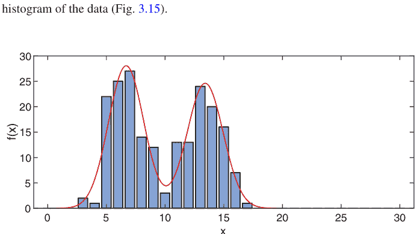

**图 3.15** 拟合高斯混合分布。作为高斯混合分布的合成示例，我们生成了两组各 100 个随机数，均值分别为 6.4 和 13.3，标准差分别为 1.4 和 1.8。使用期望最大化（EM）算法将具有两个分量的高斯混合分布（实线）拟合到数据（条形图）上。

## 3.14 误差分析

前面关于单变量统计的章节为研究和评估测量误差提供了基础。这些误差无法避免，但在得出统计结论时却至关重要。不幸的是，彻底的误差分析在许多地球科学领域仍然很少发生。这令人惊讶——如果不是令人担忧的话——因为一个不包含相关不确定性的陈述对信息接收者来说毫无价值。例如，如果岩石中的黄金含量被给出为每吨 6 克而没有任何置信限，精明的投资者将不会做出任何承诺。如果提供了置信限，那么只要这些限值不超过每吨 ±2 克，投资者就会乐意投资。每吨 ±8 克的置信区间意味着实际黄金含量可能高出两倍以上，也可能为零，因此将是一项糟糕的投资。

让我们简要地看一下误差计算的原则，而不必过于深入地研究这个主题。更深入的研究是不必要的，因为已经有关于该主题的优秀书籍（尽管没有 Python 示例），包括 John R. Taylor 的《误差分析导论》（1997）。首先，重要的是要理解有两种不同类型的测量误差（不仅在地球科学中）：*随机误差*和*系统误差*（图 3.16）。如果我们试图使用测量设备来确定岩石的黄金含量，我们将只能达到有限的测量精度。当连续多次测定同一样品的黄金含量时，这一点就变得很清楚：结果永远不会完全相同，通常由于测量仪器不完善导致的技术不准确而围绕一个值分散。然而，外部影响（例如，温度波动和振动）也可能是一个因素，记录测量值时的错误（例如，读数错误）也是如此。在理想情况下，所有这些干扰都是随机的，因此 n 个测量值 x_i 的分布可以表示为

$$x_i = (x_1, x_2, \dots, x_n)$$

它遵循高斯分布（第 3.4 节）。在这种情况下，我们可以使用样本均值来获得岩石中黄金浓度的最佳估计值：

$$\bar{x} = \frac{1}{n} \sum_{i=1}^{n} x_i$$

样本标准差 s_r 描述了*随机误差*，因此定义了单次测量的可靠性（图 3.16）：

$$s_r = \sqrt{\frac{1}{n-1} \sum_{i=1}^{n} (x_i - \bar{x})^2}$$

标准差是单个测量值 x_i 偏离样本均值的均方根偏差。由于 ±2 克/吨是标准差，我们知道单次测量必须以约 68% 的概率落在 6 ± 2 克/吨区间内（见第 3.5 节）。与均值一起，标准差描述了我们的测量集。然而，我们重复测量的均值和标准差都只具有取决于测量次数的有限精度。因此，根据我们的测量值计算并显示为直方图的高斯分布，只是描述实际黄金含量和由于测量误差导致的分散的高斯分布的近似。

如果我们知道单次测量的标准差 s_r，我们可以根据测量次数 N 计算均值的标准误差：

$$s_{\bar{y}} = s / \sqrt{n}$$

均值的标准误差提供了样本均值相对于总体（或*真实*）均值的误差估计。正如我们所看到的，均值的误差随着样本大小 n 的平方根而减小。由于平方根关系，误差最初随着 n 的增加而迅速减小，然后减小得非常缓慢。因此，我们必须大大增加样本大小才能看到任何效果。例如，重复测量黄金含量的结果可能给出为 6 ± 1.2 克/吨作为样本均值和总体（*真实*）均值的最佳估计值，以及 ±1.2 克/吨作为 n 次测量的均值标准误差。假设正态总体分布，那么我们知道真实均值有约 68% 的概率落在 6 ± 1.2 克/吨区间内（见第 3.5 节）。

与可以通过评估重复测量来确定的随机误差相比，*系统误差*（s_s）更难检测和量化。它们通常是由校准不正确的仪器引起的测量值的一致性向下或向上偏差。方程

$$s_s = \mu - \bar{x}$$

将系统误差表示为（通常未知的）总体均值（或*真实*值）μ 与测量值的样本均值之间的差值（图 3.16）。

举个例子，当我在一个填图课程中学习时，一位教授要求我们用他的地质罗盘进行测量。每个学生都尽力而为，但教授评论说每个读数都是*错误的*。他显然对初级课程感到厌倦，因此简单地将罗盘上的刻度调整了五度，以挑战学生。我们中没有人敢质疑教授罗盘的准确性，因此我们所有的读数都是错误的，因为它们包含了 5 度的系统误差（除了任何随机误差）。由于无法在设备本身上检测到该误差，使用另一台设备进行重复测量将允许检测和消除系统误差。如果我们知道测量的随机误差和系统误差，我们就可以指出数据的*精密度*和*准确度*。精确的测量围绕均值一致，但由于限制准确度的系统误差，*真实*值可能与测量均值不同。增加样本大小 n 会提高精密度，但不会提高准确度。

我们现在转向一个简单的 Python 实验，以便更好地理解测量不确定性。在清除工作区并重置随机数生成器后，我们通过从均值为 3.4、标准差为 1.2 的总体中随机抽样来生成测量数据。这可能意味着岩石的真实黄金含量为 3.4 克/吨，但由于测量误差，该值无法比 ±1.2 克/吨更精确地确定。由于时间和预算限制，让我们假设我们只能进行 12 次测量，这些测量存储在 data 中，

```
%reset -f

import numpy as np
import matplotlib.pyplot as plt
from numpy.random import default_rng
from scipy import stats

samplesize = 12
sqrtsamplesize = np.sqrt(samplesize)
rng = np.random.default_rng(0)
data = 3.4 + 1.5*rng.standard_normal(samplesize)
print(data)
```

由此得到

```
[3.58859533 3.20184271 4.36063398 3.55735018
 2.59649594 3.94239258 5.35600007 4.82062144
 2.34439715 1.50186779 2.46508831 3.46198897]
```

我们通过绘制直方图来显示测量值的频率分布，并通过输入以下代码计算均值和标准差：

```
plt.figure()
plt.hist(data)
plt.show()

print(np.mean(data))
print(np.std(data,ddof=1))
print(np.std(data,ddof=1)/sqrtsamplesize)
```

由此得到

```
3.4331062031703756
1.1032297537289668
```

均值的误差取决于测量次数（本例中为 $n=12$），可通过以下方式获得：

```
print(np.std(data,ddof=1)/sqrtsamplesize)
```

由此得到

```
0.3184749976467118
```

在给出结果时，关于保留多少位数字，需要遵循若干规则。首先，测量值和测量不确定度必须具有相同的小数位数。其次，舍入后的位数由测量不确定度决定。第三，我们需要从左向右查找测量不确定度中第一个非零数字。如果该数字大于2，则该数字即为舍入位；如果该数字是1或2，则其右侧的下一个数字为舍入位。第四，测量不确定度总是向上舍入。在我们的例子中，测量不确定度的第一位数字确实是2，因此我们使用小数点后的第一位数字（即7）作为舍入位。因此，我们的测量结果为 $4.4 \pm 2.8$ 克/吨，这表明真实值以 $\sim 68\%$ 的概率落在此区间内。从我们的合成示例中可以很容易地看出，由于样本量较小（$n = 12$），该值与最初定义的原始值 $3.4 \pm 1.5$ 偏差相当大。然而，*真实*值3.4仍然落在 $4.4 \pm 2.8$ 克/吨的区间内。

然而，增加样本量可以显著改善结果，因为均值的误差取决于测量次数：

```
samplesize = 1000
sqrtsamplesize = np.sqrt(samplesize)
rng = np.random.default_rng(0)
data = 3.4 + 1.5*rng.standard_normal(samplesize)

plt.figure()
plt.hist(data)
plt.show()

print(np.mean(data))
print(np.std(data,ddof=1))
```

由此得到

```
3.3279575848555196
1.4658625581392208
```

对于 $n = 1,000$ 次测量，均值的误差为：

```
print(np.std(data,ddof=1)/sqrtsamplesize)
```

由此得到

```
0.0463546442048093
```

正如预期，该值远小于 $n = 12$ 时的对应值。该结果表明真实值位于 $3.35 \pm 0.05$ 克/吨的区间内。同样，*真实*值3.4仍然落在 $3.35 \pm 0.05$ 克/吨的区间内。

接下来，我们考察一个案例，其中我们的值 $y$ 取决于 $j$ 个测量变量 $x_1, x_2, \dots$ 及其 $j$ 个不确定度 $s_1, s_2, \dots$，我们用它们来计算 $y$ 及其不确定度 $s$。如果不确定度 $s_1, s_2, \dots$ 彼此不独立，我们可以使用高斯误差传播定律来计算 $s$：

$$s = \sqrt{\sum_{j=1}^{m} \left( \frac{\partial y}{\partial x_j} \cdot s_j \right)^2 + 2 \sum_{j=1}^{m-1} \sum_{k=i+1}^{m} \left( \frac{\partial y}{\partial x_j} \right) \left( \frac{\partial y}{\partial x_k} \right) \cdot s(x_j x_k)}$$

其中 $\partial y/\partial x_j$ 是 $y$ 对第 $j$ 个变量 $x_j$ 的偏导数，$s_j$ 是该变量的标准差，$s(x_j x_k)$ 是变量 $x_j$ 和 $x_k$ 不确定度的协方差（例如，Taylor 1997，第212页）。如果变量彼此不相关，协方差项为零，方程简化为：

$$s = \sqrt{\sum_{j=1}^{m} \left( \frac{\partial y}{\partial x_j} \cdot s_j \right)^2}$$

Python 是模拟误差传播的绝佳工具。例如，我们可以使用该软件来估计两个量 $x_1$ 和 $x_2$ 的测量值之差 $y$ 的不确定度，基于它们各自的不确定度 $s_1$ 和 $s_2$。该实验揭示了当测量值相互依赖与相互独立时不确定度的差异。我们定义一个很大的样本量100,000,000次测量，以获得非常精确的误差值：

```
samplesize = 100000000
```

为了计算 $x_1$ 和 $x_2$ 之间的差值 $y$ 以及该差值的误差，我们使用两个高斯分布，其均值分别为6.3和3.4，标准差分别为1.2和1.5。我们基于两个分布相互依赖的假设，计算两个分布均值之差：

$$\overline{y} = \overline{x_1} - \overline{x_2}$$

由此得到

$$\overline{y} = 6.3 - 3.4 = 2.9$$

其中实际变量 $x_1$ 和 $x_2$ 的标准差分别为 $s_1$ 和 $s_2$，协方差为 $s(x_1 x_2)$。如果我们针对两个均值之差的例子，求解上述高斯误差传播定律方程，则得到：

$$s_f = \sqrt{s_1^2 + s_2^2 - 2 \cdot s(x_1 x_2)}$$

由此得到

$$s_f = \sqrt{1.5^2 + 1.2^2 - 2 \cdot 1.5 \cdot 1.2} = 0.3$$

这是两个测量值完全相互依赖时，均值之差的误差。在另一个Python实验中，我们使用相同的随机数集 $r$ 为数据添加不确定性：

```
rng = np.random.default_rng(0)
r = rng.standard_normal(samplesize)
age1 = 3.4 + 1.2*r
age2 = 6.3 + 1.5*r
dage = age2-age1

plt.figure()
plt.hist(data,bins=30)
plt.show()

print(np.mean(dage))
print(np.std(dage,ddof=1))
```

由此得到均值之差及其误差：

```
2.9000297901909815
0.30000440854326643
```

我们现在再次运行相同的实验，但让两个测量值相互独立。此时

$$s_f = \sqrt{s_1^2 + s_2^2 - 2 \cdot s(x_1 x_2)}$$

中的协方差项为零，由此得到：

$$s_f = \sqrt{1.5^2 + 1.2^2 - 0} \approx 1.92$$

这是两个完全独立的测量值之差的误差。在另一个Python实验中，我们使用不同的随机数集为数据添加不确定性：

```
rng = np.random.default_rng(0)
age1 = 3.4 + 1.2*rng.standard_normal(samplesize)
age2 = 6.3 + 1.5*rng.standard_normal(samplesize)
dage = age2-age1

plt.figure()
plt.hist(data,bins=30)
plt.show()

print(np.mean(dage))
print(np.std(dage,ddof=1))
```

由此得到均值之差的近似值及其误差：

```
2.899813389856444
1.9209998186394632
```

与用于生成数据的精确值相比，存在微小偏差，这是由于样本量有限造成的。从示例中可以看出，要么我们向均值添加相同的高斯随机数，要么我们使用不同的、独立的随机数来模拟依赖和独立测量误差下差值 $y$ 的误差。

## 推荐阅读

- Ansari AR, Bradley RA (1960) Rank-Sum Tests for Dispersion. Annals of Mathematical Statistics, 31:1174–1189. [Open access]
- Dempster AP, Laird NM, Rubin DB (1977) Maximum Likelihood from Incomplete Data via the EM Algorithm. Journal of the Royal Statistical Society, Series B (Methodological) 39(1):1–38
- Fisher RA (1935) The Design of Experiments. Oliver and Boyd, Edinburgh
- Grabe M (2010) Generalized Gaussian Error Calculus. Springer, Berlin Heidelberg New York
- Helmert FR (1876) Über die Wahrscheinlichkeit der Potenzsummen der Beobachtungsfehler und über einige damit im Zusammenhang stehende Fragen. Zeitschrift Für Mathematik Und Physik 21:192–218
- Kolmogorov AN (1933) On the Empirical Determination of a Distribution Function. Italian Giornale Dell'istituto Italiano Degli Attuari 4:83–91
- Mann HB, Whitney DR (1947) On a Test of Whether one of Two Random Variables is Stochastically Larger than the Other. Ann Math Stat 18:50–60
- Miller LH (1956) Table of Percentage Points of Kolmogorov Statistics. J Am Stat Assoc 51:111–121
- O’Connor PDT, Kleyner A (2012) Practical Reliability Engineering, 5th ed. John Wiley & Sons, New York
- Pearson ES (1990) Student—A Statistical Biography of William Sealy Gosset. In: Plackett RL, with the assistance of Barnard GA, Oxford University Press, Oxford
- Pearson K (1900) On the criterion that a given system of deviations from the probable in the case of a correlated system of variables is such that it can be reasonably supposed to have arisen from random sampling. Phil Mag 50:157–175
- Poisson SD (1837) Recherches sur la Probabilité des Jugements en Matière Criminelle et en Matière Civile, Précédées des Règles Générales du Calcul des Probabilités. Bachelier, Imprimeur-Libraire pour les Mathematiques, Paris
- Popper K (1959) The Logic of Scientific Discovery. Hutchinson & Co., London
- Hedderich J, Sachs L (2012) Angewandte Statistik: Methodensammlung mit R, 14th edn. Springer, Berlin Heidelberg New York
- Smirnov NV (1939) On the Estimation of the Discrepancy between Empirical Curves of Distribution for Two Independent Samples. Bulletin of Moscow 2:3–16
- Spiegel MR (2011) Schaum's Outline of Statistics, 4th Ed. Schaum's Outlines, McGraw-Hill Professional, New York
- Student, (1908) On the Probable Error of the Mean. Biometrika 6:1–25
- Taylor JR (1997) An Introduction to Error Analysis: The Study of Uncertainties in Physical Measurements, 2nd edn. University Science Books, Sausalito, California
- Wilcoxon F (1945) Individual Comparisons by Ranking Methods. Biometrics Bulletin 1:80–83

# 4.1 引言

双变量分析用于更好地理解两个变量 $x$ 和 $y$ 之间的关系，例如化石的长度和宽度、火山玻璃的钠和钾含量，或沉积岩芯沿深度的有机质含量。当两个变量在同一对象上测量时，$x$ 通常被视为*自变量*，$y$ 被视为*因变量*。如果两个变量都是在实验中产生的，那么实验者操纵的变量被描述为自变量。在某些情况下，两个变量都没有被操纵，因此都不是自变量。

双变量统计用于描述两个变量之间关系的强度，可以使用单一指标——例如用于线性关系的皮尔逊相关系数——或者使用通过回归分析得到的方程（图 4.1）。描述变量 $x$ 和 $y$ 之间关系的方程可用于根据用于回归分析的原始数据值范围内的任意 $x$ 来预测 $y$ 的响应。如果其中一个变量难以测量，这一点尤为重要。在这种情况下，首先通过在小型训练数据集上进行回归分析来确定两个变量之间的关系。然后，回归方程可用于计算第二个变量。

本章首先在第 4.2 节介绍相关系数，然后在第 4.3 节和第 4.9 至 4.11 节解释广泛使用的线性和非线性回归分析方法。第 4.4 至 4.8 节还解释了一些用于评估回归分析中不确定性的额外方法。所有方法都通过合成示例进行说明，因为此类示例为评估最终结果提供了极好的手段。对于双变量分析，我们使用 *NumPy* (https://numpy.org)、*Matplotlib* (https://matplotlib.org) 和 *SciPy* 包 (https://scipy.org)，它们包含了所有必要的例程。

**补充信息** 在线版本包含补充材料，可访问 https://doi.org/10.1007/978-3-031-07719-7_4。

© 作者，经 Springer Nature Switzerland AG 2022 独家许可
M. H. Trauth, *Python Recipes for Earth Sciences*, Springer Textbooks in Earth Sciences, Geography and Environment, https://doi.org/10.1007/978-3-031-07719-7_4

**图 4.1** 双变量数据集的展示。三十个数据点代表沉积物在沉积物-水界面以下特定*深度*（以米为单位）的*年龄*（以距今千年前为单位）。两个变量的联合分布表明*年龄*和*深度*之间存在线性关系，即沉积物年龄的增长速率随深度保持恒定。皮尔逊相关系数（文中解释）*r* = 0.96 支持两个变量之间存在强线性相互依赖关系。线性回归得出方程 *age* = 21.2 + 5.4 · *depth*，这表明沉积物深度每增加一米，沉积物年龄增加 5.4 千年（回归线的斜率）。

## 4.2 相关系数

*相关系数*通常在双变量分析的早期阶段使用。它们仅提供双变量数据集中直线趋势的非常粗略的估计。不幸的是，文献中充满了高估相关系数重要性或数据集中的异常值导致高估总体相关系数的例子。

最流行的相关系数是*皮尔逊线性积矩相关系数* *ρ* (Pearson 1895)（图 4.2）。我们从 *n* 个样本数据中估计总体的相关系数 *ρ*，即我们计算样本相关系数 *r*，其定义为

$$r_{xy} = \frac{\sum_{i=1}^{n} (x_i - \bar{x})(y_i - \bar{y})}{(n-1)s_x s_y}$$

皮尔逊相关系数的分子被称为双变量数据集的*校正乘积和*。将分子除以 $(n-1)$ 得到*协方差*，

$$cov_{xy} = \frac{1}{(n-1)} \sum_{i=1}^{n} (x_i - \bar{x})(y_i - \bar{y})$$

它是数据 $x_i$ 和 $y_i$ 偏离样本均值 $\bar{x}$ 和 $\bar{y}$ 的偏差乘积之和除以 $(n-1)$。协方差是双变量统计中广泛使用的度量，尽管它有一个缺点，即依赖于数据的维度。将协方差除以单变量标准差 $s_x$ 和 $s_y$ 消除了这种依赖性，从而得到皮尔逊相关系数。相关系数有效的先决条件是 $x$ 和 $y$ 都服从正态分布。

检验皮尔逊相关系数显著性的一种方法是确定来自总体（其中 $\rho = 0$）的随机样本的 $r$ 值的概率。相关系数的显著性可以使用 $t$ 统计量来估计：

$$t = r \sqrt{\frac{n-2}{1-r^2}}$$

如果计算出的 $t$ 大于临界 $t$（$n-2$ 自由度，$\alpha = 0.05$），则相关系数显著。此测试也仅在两个变量都服从高斯分布时有效。

皮尔逊相关系数对双变量数据集中的扰动非常敏感。因此，存在几种皮尔逊相关系数的替代方法，例如由英国心理学家查尔斯·斯皮尔曼（Charles Spearman，1863–1945）提出的*斯皮尔曼等级相关系数*。斯皮尔曼系数可用于测量两个变量之间的统计依赖性，而无需假设底层总体服从正态分布（即，它是一种非参数相关性度量）(Spearman 1904, 1910)。此外，由于斯皮尔曼系数使用 $x$ 和 $y$ 中值的等级而不是实际数值，因此可用于发现非线性数据甚至非数值数据（例如地层序列中的化石名称或岩石类型）中的相关性。在将 $x$ 和 $y$ 中的数值替换为其等级（其中 $x$ 和 $y$ 中的多个值被替换为其各自的平均等级）之后，样本斯皮尔曼等级相关系数定义为

$$r_{xy} = \frac{6 \sum_{i=1}^{n} d_i^2}{n(n^2 - 1)}$$

其中 $d_i$ 是两个变量等级之间的差异。由于此相关系数基于等级而非数值，因此它比皮尔逊相关系数对异常值的敏感性更低。

皮尔逊相关系数的另一个替代方案是*肯德尔 tau 等级相关系数*，由英国统计学家莫里斯·肯德尔（Maurice Kendall，1907–1983）提出。该系数也是一种非参数相关性度量，类似于斯皮尔曼等级相关系数 (Kendall 1938)。肯德尔 tau 等级相关系数比较 $x$ 和 $y$ 中数值的等级，这意味着总共有 $0.5 n(n-1)$ 对需要比较。如果两个观测值的等级相同，则观测对 $(x_i, y_i)$ 和 $(x_j, y_j)$ 被称为一致；如果不同，则被称为不一致。样本肯德尔 tau 等级相关系数定义为

$$\tau = \frac{(P - Q)}{\frac{1}{2}n(n - 1)}$$

其中 $P$ 是一致对的数量，$Q$ 是不一致对的数量。肯德尔相关系数的值通常低于斯皮尔曼相关系数。

以下示例说明了相关系数的使用，并强调了使用这些线性趋势度量时的潜在陷阱。该示例还说明了可用于探索 $\rho$ 估计置信水平的重采样方法。合成数据由两个变量组成：沉积物的年龄（以距今千年前 kyrs 为单位）和沉积物-水界面以下的深度（以米为单位）。使用合成数据集的一个优势是我们能够完全理解数据背后的线性模型。

数据表示为包含在文件 *agedepth_1.txt* 中的两列。这些数据是使用沉积物表面以下的一系列三十个随机深度生成的。线性关系 $age=5.6*meters+20$ 用于计算变量年龄的无噪声值。这是一条斜率为 5.6、与 y 轴截距为 20 的直线方程。年龄数据中添加了一些均值为零、标准差为十的高斯噪声：

```
%reset -f

import numpy as np
import numpy.ma as ma
from scipy import stats
import matplotlib.pyplot as plt
```

from scipy.stats import bootstrap
from numpy.random import default_rng

rng(0)
np.random.seed(0)
meters = 20*np.random.rand(30)
age = 5.6*meters + 20
rng = default_rng(0)
age = age + 10*rng.standard_normal(np.shape(meters))

plt.figure()
plt.plot(meters,age,
    marker='o',
    linestyle='none')
plt.show()

agedepth = ma.hstack([meters,age])

或者，也可以从文件 *agedepth_1.txt* 加载一个合成的双变量数据集：

```
agedepth = np.loadtxt('agedepth_1.txt')
```

然后我们定义两个新变量 meters 和 age，并生成数据的散点图：

```
meters = agedepth[0:,0]
age = agedepth[0:,1]

plt.figure()
plt.plot(meters,age,
    marker='o',
    linestyle='none')
plt.show()
```

我们观察到图中存在强烈的线性趋势，这表明两个变量 meters 和 age 之间存在某种相互依赖关系。这种趋势可以用皮尔逊相关系数 *r* 来描述，其中 *r*=1 表示完全正相关（即 age 随 meters 增加而增加），*r*=0 表示无相关性，*r*=-1 表示完全负相关。我们使用 `corrcoef()` 来计算皮尔逊相关系数，

```
r = np.corrcoef(meters,age)
print(r)
```

得到以下输出：

```
[[1.         0.956335]
 [0.956335 1.        ]]
```

函数 `corrcoef()` 计算两个变量 age 和 meters 所有可能组合的皮尔逊相关系数数组（或矩阵）。r=0.9563 这个值表明两个变量 age 和 meters 之间存在很强的依赖性。

然而，皮尔逊相关系数对异常值高度敏感，如下例所示。让我们生成一个包含三十个数据点的正态分布簇，其均值为零，标准差为一。为了获得相同的数据值，我们使用 0 作为种子重置随机数生成器：

```
rng = default_rng(0)
x = rng.standard_normal((30))
y = rng.standard_normal((30))

plt.figure()
plt.plot(x,y,
         marker='o',
         linestyle='none')
plt.show()
```

正如预期的那样，这些随机数据的相关系数非常低。输入

```
r = np.corrcoef(x,y)
print(r)
```

得到

```
[[ 1.         -0.33210663]
 [-0.33210663  1.        ]]
```

我们现在向数据集中引入一个异常值，其形式为一个特别高的 (x,y) 值，其中 x=y。包含异常值 (x,y)=(5,5) 的双变量数据集的相关系数比之前大得多。输入

```
x = np.append(x,5)
y = np.append(y,5)

plt.figure()
plt.plot(x,y,
         marker='o',
         linestyle='none')
plt.show()

r = np.corrcoef(x,y)
print(r)
```

得到

```
[[1.         0.3415448]
 [0.3415448 1.        ]]
```

增加这个异常值的绝对 (x,y) 值会导致相关系数急剧增加。输入

```
x[30] = 10
y[30] = 10

plt.figure()
plt.plot(x,y,
    marker='o',
    linestyle='none')
plt.show()

r = np.corrcoef(x,y)
print(r)
```

得到

```
[[1.         0.74130704]
 [0.74130704 1.        ]]
```

如果异常值为 (x,y)=(20,20)，相关系数将达到接近 r=1 的值。输入

```
x[30] = 20
y[30] = 20

plt.figure()
plt.plot(x,y,
    marker='o',
    linestyle='none')
plt.show()

r = np.corrcoef(x,y)
print(r)
```

得到

```
[[1.         0.92488156]
 [0.92488156 1.        ]]
```

我们可以使用 SciPy 包 stats 模块中的 `pearsonr()`、`spearmanr()` 和 `kendalltau()` 函数，将皮尔逊相关系数的敏感性与斯皮尔曼相关系数和肯德尔相关系数进行比较。与 `corrcoef()` 不同，这些函数不计算相关矩阵，而我们可以在后续（例如在第 9 章）计算多变量数据集内的相关性时使用这些矩阵。我们输入

```
rp,rppvalue = stats.pearsonr(x,y)
rs,rspvalue = stats.spearmanr(x,y)
rk,rkpvalue = stats.kendalltau(x,y)
print(rp)
print(rs)
print(rk)
```

得到

0.9248815580753484
-0.17298387096774195
-0.12258064516129034

我们观察到，与皮尔逊相关系数被高估的值（错误地暗示变量之间存在强相互依赖性）相比，其他相关性度量给出了合理的值。尽管在双变量散点图中异常值很容易识别，但在大型多变量数据集中（第 9 章），错误的值很容易被忽略。

计算皮尔逊相关系数显著性的方法有多种。函数 `pearsonr()` 也提供了评估结果质量的可能性。p 值是在真实相关性为零的情况下，获得至少与观测值一样大的相关性的概率。如果 p 值很小，则相关系数 r 是显著的。输入

```
rp,rppvalue = stats.pearsonr(x,y)
print(rp,rppvalue)
```

得到

0.9248815580753484 1.0489538147952255e-13

在我们的例子中，p 值 rppvalue 接近于零，这表明相关系数是显著的。我们可以从这个实验中得出结论，这种特定的显著性检验未能检测到可归因于异常值的相关性。因此，我们接下来尝试使用另一种 *t* 检验统计量来确定 *x* 和 *y* 之间相关性的显著性。根据此检验，如果计算出的 *t* 大于临界 *t*（*n*−2 自由度，*α* = 0.05），我们就可以拒绝零假设，即不存在相关性。输入

```
tcalc = rp * ((len(x)-2)/(1-rp**2))**0.5
tcrit = stats.t.ppf(1-0.05,len(x)-2)
print(tcalc)
print(tcrit)
```

得到

```
13.09814600608973
1.6991270265334972
```

这个结果确实表明我们可以拒绝零假设，因此不存在相关性。

作为检测异常值的替代方法，*重采样方案* 和 *替代数据*（例如 *自助法* 或 *刀切法*）是评估结果统计显著性的强大工具。当扫描大型多变量数据集以查找异常值时（见第 9 章），这些技术特别有用。重采样方案通过选择 *n*−1 个子样本 *n* 次（刀切法）或通过 *有放回地* 选择任意一组包含 *n* 个数据点的子样本（自助法），来重复重采样包含 *n* 个数据点的原始数据集。这些子样本的统计量比从完整数据集计算出的统计参数（均值、标准差、相关系数）能提供关于总体特征的更好信息。以下代码允许对我们的双变量数据集（包括异常值 (*x*,*y*)=(20,20)）进行重采样：

```
ind = np.linspace(0,30,31,
    dtype=int)
rhos1000 = np.zeros((1000,4))
for i in range(1000):
    indices = np.random.choice(ind,
        size=31,
        replace=True)
    r = np.reshape(np.corrcoef(x[indices],
        y[indices]),(1,4))
    rhos1000[i,:] = r
```

此代码首先对数据进行一千次重采样；然后计算每个新子样本的相关系数，并将结果存储在变量 rhos1000 中。由于 `corrcoef()` 返回一个 2x2 矩阵（如上所述），rhos1000 的维度为 1,000x4（即 2x2 矩阵的每个元素有 1,000 个值）。绘制第二个元素（即 (x,y) 的相关系数）的 1,000 个值的直方图，可以说明该度量在存在或不存在异常值时的离散程度。由于 rhos1000 的分布包含许多空类，我们使用大量的分箱：

```
plt.figure()
plt.hist(rhos1000[:,1],bins=30)
plt.show()
```

直方图显示在 r=1 附近有一个强峰，在 r=0 附近有一簇遵循正态分布的相关系数（图 4.3）。这个直方图的解释相对简单。当子样本包含异常值时，相关系数接近 1，但不包含异常值的子样本产生非常低的相关系数（接近零），这表明两个变量 x 和 y 之间不存在任何强相互依赖性。

因此，自助法提供了一个简单而强大的工具，用于接受或拒绝我们对总体相关系数的初步估计。将上述程序应用于合成的沉积物数据，会得到子样本相关系数的清晰单峰高斯分布。输入

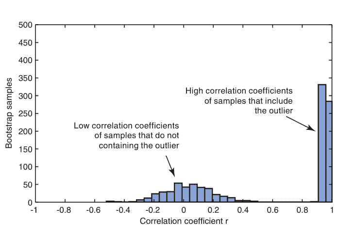

**图 4.3** 来自 1,000 个子样本的皮尔逊相关系数 r 的自助法结果。直方图显示在 r=0 附近有一个大致呈正态分布的相关系数簇，这表明这些子样本不包含异常值。然而，在 r=1 附近的强峰表明，相应的子样本中存在一个两个变量 x 和 y 值都很高的异常值。

agedepth = np.loadtxt('agedepth_1.txt')

meters = agedepth[0:,0]
age = agedepth[0:,1]

rp, rppvalue = stats.pearsonr(meters,age)
print(rp,rppvalue)

输出结果为

0.9563350017670429 1.7163469052071033e-16

在我们使用以下代码对相关系数进行自助法（bootstrap）之前：

ind = np.linspace(0,19,30,dtype=int)
rhos1000 = np.zeros((1000,4))
for i in range(1000):
    indices = np.random.choice(ind,
        size=30,
        replace=True)
    r = np.reshape(np.corrcoef(meters[indices],
        age[indices]),(1,4))
    rhos1000[i,:] = r

plt.figure()
plt.hist(rhos1000[:,1],bins=30)
plt.show()

rhos1000的大部分值落在区间[0.92, 0.98]内。由于重采样数据集（在我们的例子中）的相关系数近似服从正态分布，我们可以使用它们的均值作为真实相关系数的良好估计。输入

print(np.mean(rhos1000))

输出结果为

0.9672350831170088

这个值与我们最初的结果r=0.9563相似，但现在我们对这个结果的有效性有了信心。然而，在我们的例子中，由于上限固定为1，来自年龄-深度数据的自助法相关性估计的分布是相当偏斜的。尽管如此，自助法是评估双变量分析中皮尔逊相关系数可靠性的宝贵工具。

## 4.3 经典线性回归分析

线性回归提供了描述两个变量$x$和$y$之间关系的另一种方式。虽然皮尔逊相关系数仅提供了线性趋势的粗略度量，但通过回归分析获得的线性模型允许在数据范围内为任何给定的$x$值预测任意的$y$值。对线性模型进行统计显著性检验，可以深入了解这些预测的准确性。

*经典回归*假设$y$对$x$做出响应，并且数据集中的所有离散性都包含在$y$值中（图4.4和4.5）。这意味着$x$是自变量（也称为预测变量或回归变量）。$x$的值由实验者定义，通常被认为是无误差的。一个例子是沉积岩芯中变量$y$被测量的位置$x$。因变量$y$包含误差，因为其大小无法精确确定。线性回归使用最小二乘准则，最小化数据点$xy$与最佳拟合线$y = b_0 + b_1x$预测值$y$之间的偏差$\Delta y$。一般线性模型的基本方程为

$$y = b_0 + b_1x$$

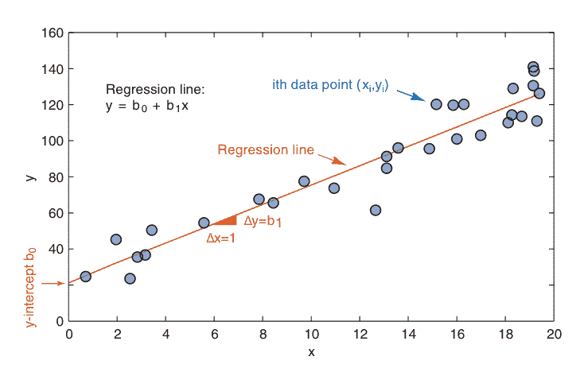

**图 4.4** 线性回归。经典回归最小化$\Delta y$偏差，而简约主轴回归最小化数据点与回归线之间的三角形面积$0.5 \cdot (\Delta x \Delta y)$，其中$\Delta x$和$\Delta y$分别是预测值与真实$x$和$y$值之间的距离。直线与$y$轴的截距为$b_0$，斜率为$b_1$。这两个参数定义了回归线的方程。

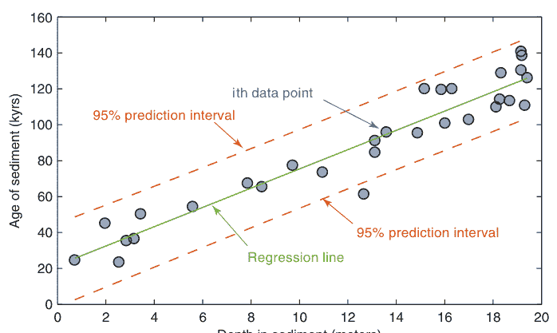

**图 4.5** 线性回归的结果。该图显示了原始数据点（圆圈）、回归线（实线）和回归的误差范围（虚线）。请注意，95%的预测区间实际上是弯曲的，尽管在示例中它们几乎看起来像直线。

其中$b_0$和$b_1$是回归系数。$b_0$的值是与$y$轴的截距，$b_1$是直线的斜率。需要最小化的$\Delta y$偏差的平方和为

$$\sum_{i=1}^n (\Delta y_i)^2 = \sum_{i=1}^n (y_i - (b_0 + b_1 x_i))^2$$

对方程右边项进行偏微分并设为零，可以得到回归系数$b_1$的简单方程：

$$b_1 = \frac{\sum_{i=1}^n (x_i - \bar{x})(y_i - \bar{y})}{\sum_{i=1}^n (x_i - \bar{x})^2}$$

回归线通过由样本均值定义的数据质心，因此我们可以计算另一个回归系数$b_0$

$$b_0 = \bar{y} - b_1 \bar{x}$$

使用单变量样本均值和之前计算的斜率$b_1$。

例如，让我们再次从文件*agedepth_1.txt*加载合成的年龄-深度数据。我们可以定义两个新变量*meters*和*age*，并生成数据的散点图：

%reset -f

import numpy as np
import matplotlib.pyplot as plt

agedepth = np.loadtxt('agedepth_1.txt')

meters = agedepth[0:,0]
age = agedepth[0:,1]

二元散点图中的线性趋势以及大于r=0.9的相关系数表明米数和年龄之间存在强烈的线性依赖关系。用地质学术语来说，这意味着沉积速率随时间保持恒定。我们现在尝试将线性模型拟合到数据，这将帮助我们预测没有年龄数据的沉积层的年龄。函数polyfit()计算一个特定次数的多项式p(x)的系数，该多项式以最小二乘意义拟合数据y。在我们的例子中，我们将一个一次（线性）多项式拟合到数据。输入

p = np.polyfit(meters,age,1)
print(p)

输出结果为

[ 5.36669965 21.7607019 ]

其中p是一个行向量，包含按降幂排列的多项式系数。由于我们使用的是合成数据，我们知道斜率和与y轴截距的值。估计的斜率（5.3667）和与y轴的截距（21.7607）与真实值5.6和20分别吻合良好。数据和拟合线都可以绘制在同一张图上：

plt.figure()
plt.plot(meters,age,
    marker='o',
    linestyle='none')
plt.plot(meters,p[0]*meters+p[1],
    color=(0.8,0.5,0.3))
plt.show()

除了使用回归线的方程，我们也可以使用poly1d()来计算y值：

pval = np.poly1d(p)

plt.figure()
plt.plot(meters,age,
    marker='o',
    linestyle='none')
plt.plot(meters,pval(meters),
    color=(0.8,0.5,0.3))
plt.show()

系数p(x)和通过线性回归获得的方程现在可以用来预测任何给定x值的y值。然而，我们只能在线性模型拟合的深度区间内进行，即在0到20米之间。例如，深度17米处沉积物的年龄由下式给出

print(pval(17))

输出结果为

112.99459593875632

这个结果表明，深度17米处的沉积物年龄约为113千年。

## 4.4 分析残差

当我们比较预测值与实际或观测值的差异时，我们正在进行残差分析。残差的统计信息为拟合到数据的模型质量提供了有价值的信息。例如，残差中的趋势表明模型没有完全描述数据。在这种情况下，应该将更复杂的模型（例如，更高次的多项式）拟合到数据。理想情况下，残差是纯随机的，即它们服从均值为零的高斯分布。因此，我们通过目视检查直方图并采用第3章介绍的χ²检验来检验残差服从高斯分布的假设：

%reset -f

import numpy as np
import matplotlib.pyplot as plt
from scipy import stats

agedepth = np.loadtxt('agedepth_1.txt')

meters = agedepth[0:,0]
age = agedepth[0,1]

p = np.polyfit(meters,age,1)
print(p)

pval = np.poly1d(p)
res = age - pval(meters)

由于绘制残差没有显示出任何明显的行为模式，因此不应将比直线更复杂的模型拟合到数据：

plt.figure()
plt.stem(meters,res)
plt.show()

绘制残差的另一种方法是使用stem()绘制茎叶图：

plt.figure()
plt.subplot(2,1,1)
plt.plot(meters,age,
    marker='o',
    linestyle='none')
plt.plot(meters,pval(meters),
    color='r')
plt.subplot(2,1,2)
plt.stem(meters,res)
plt.show()

为了探索残差的分布，我们可以选择六个类别并显示相应的频率：

plt.figure()
plt.hist(res,bins=6)
plt.show()

$\chi^2$检验可用于检验残差服从高斯分布的假设（第3.9节）。我们使用chisquare()进行$\chi^2$检验，

nres,e = np.histogram(res,bins=6)
chisq,p = stats.chisquare(nres)
print(chisq)
print(p)

输出结果为

## 4.5 回归系数的自助法估计

在本节中，我们使用*自助法*来获得回归系数的更好估计。作为示例，我们使用`random.choice()`函数，取1,000个样本（图4.6）：

```
%reset -f

import numpy as np
import matplotlib.pyplot as plt
from numpy.random import default_rng

agedepth = np.loadtxt('agedepth_1.txt')

meters = agedepth[0:,0]
age = agedepth[0:,1]

p = np.polyfit(meters,age,1)
```

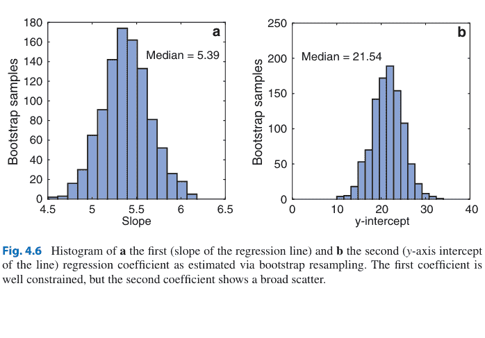

```
ind = np.linspace(0,19,30,dtype=int)
p1000 = np.zeros((1000,2))
for i in range(1000):
    indices = np.random.choice(ind,
        size=30,
        replace=True)
    p = np.polyfit(meters[indices],
        age[indices],1)
    p1000[i,:] = p
```

第一个系数（即回归线的斜率）的统计量为：

```
plt.figure()
plt.hist(p1000[:,0],bins=30)
plt.show()

print(np.median(p1000[:,0]))
```

其结果为：

```
5.120606217265465
```

我们使用中位数而非均值，因为我们不能期望自助法结果服从高斯分布。相比之下，第二个系数的统计量显示出显著的离散性。输入：

```
plt.figure()
plt.hist(p1000[:,1],bins=30)
plt.show()

print(np.median(p1000[:,1]))
```

得到：

```
24.22153549031753
```

用于模拟我们数据集的真实值是斜率5.6和与y轴的截距20，而使用`polyfit()`计算的相应系数分别为5.3667和21.7607（第4.3节）。

## 4.6 回归系数的刀切法估计

*刀切法*是一种与自助法类似的重采样技术。从一个包含$n$个数据点的样本中，取出$n$个各包含$n-1$个数据点的子样本。对每个子样本计算感兴趣的参数（例如回归系数）。然后计算系数的均值和离散度。这种方法的缺点是子样本数量$n$有限：因此，回归系数的刀切法估计不如自助法估计精确。

刀切法的相关代码很容易生成：

```
%reset -f

import numpy as np
import matplotlib.pyplot as plt
from numpy.random import default_rng

agedepth = np.loadtxt('agedepth_1.txt')

meters = agedepth[0:,0]
age = agedepth[0:,1]

p = np.polyfit(meters,age,1)

p30 = np.zeros((30,2))
for i in range(30):
    j_meters = np.copy(meters)
    j_age = np.copy(age)
    j_meters = np.delete(j_meters,i,0)
    j_age = np.delete(j_age,i,0)
    p = np.polyfit(j_meters,j_age,1)
    p30[i,:] = p
```

对于包含$n-1=29$个数据点的子样本的刀切法，可以使用一个简单的*for*循环来实现。在每次迭代中，删除第$i$个数据点，并为剩余的数据点计算回归系数。$i$个子样本的均值提供了回归系数的改进估计。与自助法结果一样，回归线的斜率（第一个系数）定义良好，而与$y$轴的截距（第二个系数）具有很大的不确定性，

```
print(np.median(p30[:,0]))
```

得到：

5.3663093479597155

与自助法计算的5.1206相比，以及

```
print(np.median(p30[:,1]))
```

得到：

21.79637039186352

与自助法得到的24.2215相比（第4.5节）。如前所述，真实值是5.6和20。来自30个子样本的刀切法结果的直方图（图4.7）。

```
plt.figure()
plt.subplot(1,2,1)
plt.hist(p30[:,0])
plt.subplot(1,2,2)
plt.hist(p30[:,1])
plt.show()
```

并未像自助法估计的直方图那样显示出系数如此清晰的分布。因此我们已经看到，使用刀切法或自助法进行重采样是检验回归模型质量的简单而有价值的方法。下一节将介绍一种比这些重采样方法更常用的替代质量评估方法。

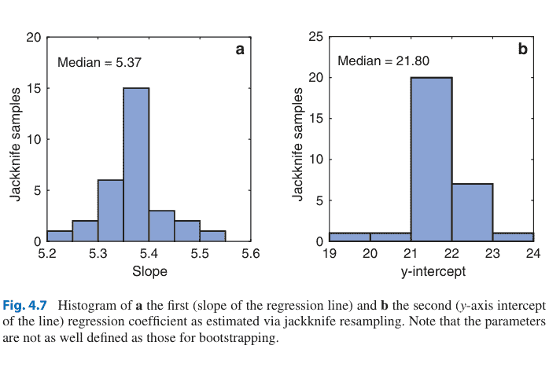

## 4.7 交叉验证

检验回归分析结果质量的第三种方法涉及*交叉验证*。在交叉验证中，使用*n*−1个数据点计算回归线。预测第*n*个数据点，并计算预测值与实际值之间的差异。随后，确定实际值与预测值之间差异的均值。

在此示例中，对*n* = 30个数据点进行交叉验证。得到的30条回归线（每条线使用*n*−1 = 29个数据点计算）在斜率和*y*轴截距上显示出一定的离散性：

```
%reset -f

import numpy as np
import matplotlib.pyplot as plt

agedepth = np.loadtxt('agedepth_1.txt')

meters = agedepth[0:,0]
age = agedepth[0:,1]

p = np.polyfit(meters,age,1)
print(p)

p_age = np.zeros((30,1))
p_error = np.zeros((30,1))

plt.figure()
plt.plot(meters,age,
    marker='o',
    linestyle='none')
for i in range(0,30):
    j_meters = meters;
    j_age = age;
    j_meters = np.delete(j_meters,i)
    j_age = np.delete(j_age,i)
    p = np.polyfit(j_meters,j_age,1)
    pval = np.poly1d(p)
    plt.plot(meters,pval(meters),
        color=(0.8,0.5,0.3),
        linewidth=0.1)
    p_age =pval(meters)
    p_error[i,0:] = p_age[i] - age[i]
plt.show()
```

在理想情况下，预测误差应服从均值为零的高斯分布，

```
print(np.mean(p_error))
```

得到：

```
-0.048670587295191345
```

标准差是真实数据点偏离预测直线的偏差的均值，

```
print(np.std(p_error,ddof=1))
```

得到：

```
10.975717618676232
```

交叉验证提供了关于回归结果拟合优度的有价值信息，也可用于其他领域的质量控制，例如时间和空间预测（第5章和第7章）。

## 4.8 约化主轴回归

在某些示例中，没有一个变量是被操纵的，因此两者都可以被视为独立变量。在这种情况下，有几种方法可用于计算最佳拟合线，以最小化与x和y的距离。例如，约化主轴法最小化数据点与回归线之间的三角形面积0.5·(ΔxΔy)，其中Δx和Δy是预测值与x和y的真实值之间的距离（图4.4）。尽管这种优化看起来很复杂，但可以证明第一个回归系数b₁（斜率）就是y和x的标准差之比：

$$b_1 = s_y/s_x$$

与经典回归一样，回归线通过数据质心，该质心由样本均值定义。因此，我们可以使用单变量样本均值和先前计算的斜率b₁来计算第二个回归系数b₀（即y轴截距）

$$b_0 = \bar{y} - b_1\bar{x}$$

让我们再次从文件agedepth_1.txt加载年龄-深度数据，并定义两个变量meters和age。假设这两个变量都包含误差，并且数据的离散性可以由meters和age的离散性来解释：

```
%reset -f

import numpy as np
import matplotlib.pyplot as plt

agedepth = np.loadtxt('agedepth_1.txt')

meters = agedepth[0:,0]
age = agedepth[0:,1]
```

使用上述公式计算回归线的斜率$b_1$，

```
p = np.zeros((2,1))
p[0] = np.std(age,ddof=1)/np.std(meters,ddof=1)
print(p)
```

得到：

```
[[5.6117361]
 [0.        ]]
```

因此，第二个系数$b_0$（即y轴截距）可以通过以下方式计算：

```
p[1] = np.mean(age) - p[0]*np.mean(meters)
```

得到：

```
[[ 5.6117361 ]
 [18.70366978]]
```

可以通过以下方式绘制回归线：

```
plt.figure()
plt.plot(meters,age,
         marker='o',
         linestyle='none')
plt.plot(meters,p[0]*meters+p[1],
         color=(0.8,0.5,0.3))
plt.show()
```

这条回归线与经典回归得到的线略有不同。请注意，来自RMA的回归线*不是*由*xy*和*yx*经典线性回归分析产生的直线的角平分线，即分别使用*x*或*y*作为独立变量计算回归线时产生的直线。

## 4.9 曲线回归

从我们之前的分析可以明显看出，线性回归模型为描述数据的标度特性提供了一种很好的方法。然而，我们可能希望检查数据是否同样能被更高阶的多项式拟合很好地描述，例如二次多项式：

$$y = b_0 + b_1x + b_2x^2$$

为了清空工作区并重新加载原始数据，我们输入

```
%reset -f

import numpy as np
import numpy.ma as ma
import matplotlib.pyplot as plt
from numpy.random import default_rng

agedepth = np.loadtxt('agedepth_1.txt')

meters = agedepth[0:,0]
age = agedepth[0:,1]
```

然后可以使用 polyfit() 拟合二次多项式，

```
p = np.polyfit(meters,age,2)
print(p)
```

得到

```
[ 0.05890582  4.10867582 26.0381405 ]
```

第一个系数接近于零，即它对预测的影响很小。第二和第三个系数与线性回归得到的结果相似。绘制数据得到一条类似于直线的曲线：

```
pval = np.poly1d(p)

plt.figure()
plt.plot(meters,age,
    marker='o',
    linestyle='none')
plt.plot(meters,pval(meters),
    color=(0.8,0.5,0.3))
plt.show()
```

我们现在使用另一个合成数据集，该数据集是通过米数和年龄之间的二次关系生成的：

```
np.random.seed(0)
meters = 20*np.random.rand(30)
age = 1.6*meters**2 -1.1*meters + 50
rng = default_rng(0)
age = age + 40*rng.standard_normal(np.shape(meters))

plt.figure()
plt.plot(meters,age,
    marker='o',
    linestyle='none')
plt.show()

agedepth = ma.hstack([meters,age])
```

也可以从文件 *agedepth_2.txt* 加载合成的双变量数据集：

```
agedepth = np.loadtxt('agedepth_2.txt')

meters = agedepth[0:,0]
age = agedepth[0:,1]

plt.figure()
plt.plot(meters,age,
    marker='o',
    linestyle='none')
plt.show()
```

拟合二阶多项式产生了一个令人信服的回归结果，

```
p = np.polyfit(meters,age,2)
print(p)
```

得到

```
[ 1.83562317 -7.0652954  74.15255975]
```

如上所示，三个系数的真实值分别为 +1.8、-7.1 和 +74.2，这意味着真实值与使用 polyfit() 估计的系数之间存在一些差异。让我们绘制结果（图 4.8）：

```
pval = np.poly1d(p)

plt.figure()
plt.plot(meters,age,
    marker='o',
    linestyle='none')
plt.plot(meters,pval(meters),
    color=(0.8,0.5,0.3))
plt.show()
```

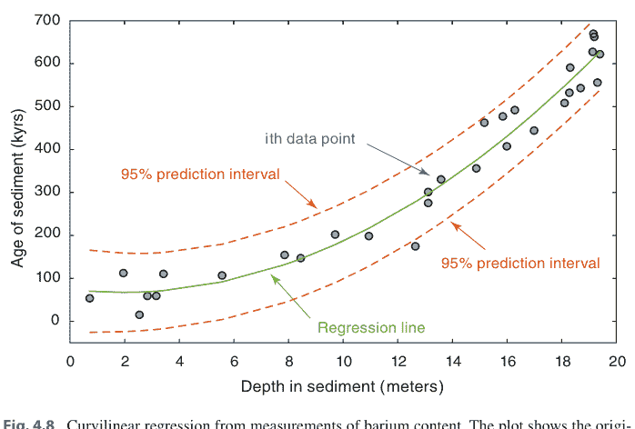

**图 4.8** 基于钡含量测量的曲线回归。该图显示了原始数据点（圆圈）、n = 2 次多项式的回归线（实线）以及回归的预测误差（虚线）。

该图表明，对于这些数据，二次模型是一个很好的模型。结果的质量可以通过探索残差、采用重采样方案或使用交叉验证来再次检验。将回归分析与这些方法之一结合使用是双变量数据分析中的一个强大工具，而皮尔逊相关系数应仅用作线性关系的初步检验。

## 4.10 非线性与加权回归

地球科学中的许多双变量数据集遵循比简单线性或曲线趋势更复杂的趋势。非线性趋势的经典例子包括放射性核素的指数衰减和藻类种群的指数增长。在这种情况下，Python 提供了各种工具来将非线性模型拟合到数据。一个易于使用的拟合此类模型的程序是使用 curve_fit() 进行非线性回归。为了演示 curve_fit() 的使用，我们生成一个双变量数据集，其中一个变量与第二个变量呈指数相关。我们首先生成 0.5 到 3 之间间隔为 0.1 的均匀分布值，并添加一些标准差为 0.2 的高斯噪声，以使数据分布不均匀。生成的 26 个数据点被排序并存储在 data1 中：

```
%reset -f

import numpy as np
import matplotlib.pyplot as plt
from scipy.optimize import curve_fit
from numpy.random import default_rng

rng = default_rng(0)
data1 = np.linspace(0.5,3.,26)
data1 = data1 + 0.2*rng.standard_normal(np.shape(data1))
data1 = np.sort(data1,axis=0)
```

然后我们可以计算第二个变量 data2，它是第一个变量 data1 乘以 0.2 再加上 3 的指数。我们再次向数据添加高斯噪声——这次标准差为 0.5——并显示结果：

```
data2 = 3 + 0.2*np.exp(data1)
data2 = data2 + 0.5*rng.standard_normal(np.shape(data2))

plt.figure()
plt.plot(data1,data2,
         marker='o',
         linestyle='none')
plt.show()
```

非线性回归用于估计指数函数的两个系数，即乘数 0.2 和加数 3。函数 curve_fit() 返回一个向量 popt，它是使用 func() 指定的模型，对 data2 中的响应变量相对于 data1 中的预测变量进行非线性回归得到的系数估计值。第二个输出 pcov 是 popt 的估计协方差。pcov 的对角线提供了参数估计 popt 的方差。为了计算参数的一个标准差误差，我们可以使用 perr = np.sqrt(np.diag(pcov))。我们可以设计一个函数句柄模型 func()，它表示一个以输入变量 x 为自变量的指数函数，其中 a 和 b 代表指数函数的两个系数，

```
def func(x,a,b):
    return a*np.exp(x)+b

popt,pcov = curve_fit(func,data1,data2)
print(popt)
```

得到

```
[0.22560247 2.94436195]
```

我们现在可以使用得到的系数 popt[0] 和 popt[1] 在图形中将结果与原始数据进行比较：

```
plt.figure()
plt.plot(data1,data2,
    marker='o',
    linestyle='none')
plt.plot(data1,popt[0]*np.exp(data1)+popt[1])
plt.show()
```

从 popt 的输出和图形中可以看出，拟合的红色曲线合理地描述了数据。我们现在也可以使用 curve_fit() 执行加权回归。假设我们知道 data3 中值的单西格玛误差：

```
data3 = abs(rng.standard_normal(np.shape(data2)))

plt.figure()
plt.plot(data1,data2,
    marker='o',
    linestyle='none')
plt.errorbar(data1,data2,data3,
    color= [0.3,0.5,0.8],
    linestyle='none')
plt.show()
```

为了进行加权拟合，我们定义模型函数 func()，然后使用带有可选输入 sigma（用于误差）的 curve_fit()，

```
popt2,pcov2 = curve_fit(func,data1,data2,
    sigma=data3)
yfit2 = func(data1,*popt2)
print(popt2)
```

得到

```
[0.25687643 2.53249989]
```

与之前一样，curve_fit() 计算加权参数估计值 popt。我们再次将结果与原始数据进行比较：

```
plt.figure()
plt.plot(data1,data2,
    marker='o',
    linestyle='none')
plt.errorbar(data1,data2,data3,
    color=[0.3,0.5,0.8],
    linestyle='none')
plt.plot(data1,
    popt2[0]*np.exp(data1)+popt2[1],
    linestyle='-',
    color=[0.8,0.5,0.3])
plt.legend(['Data',
    'Unweighted',
    'Weighted'])
plt.show()
```

将加权回归的系数 p 和红色曲线与之前未加权回归的结果进行比较，显示出略有不同的结果（图 4.9）：

```
plt.figure()
plt.plot(data1,data2,
    marker='o',
    linestyle='none')
plt.errorbar(data1,data2,data3,
    color=[0.3,0.5,0.8],
    linestyle='none')
plt.plot(data1,
    popt[0]*np.exp(data1)+popt[1],
    linestyle=':',
    color=[0.8,0.5,0.3])
plt.plot(data1,
    popt2[0]*np.exp(data1)+popt2[1],
    linestyle='-',
    color=[0.8,0.5,0.3])
plt.legend(['Data',
    'Unweighted',
    'Weighted'])
plt.show()
```

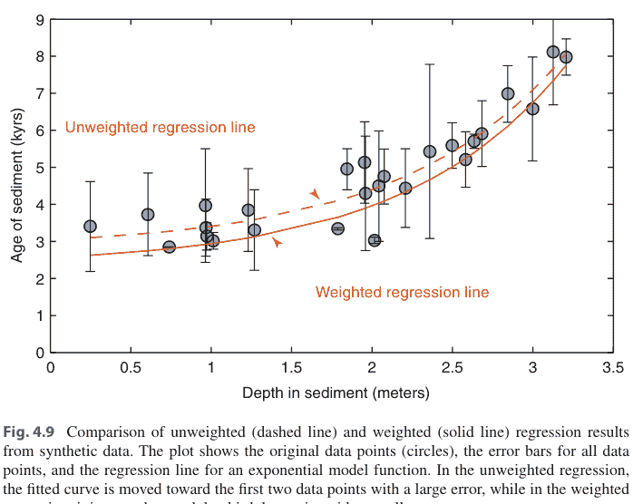

**图 4.9** 合成数据的未加权（虚线）和加权（实线）回归结果比较。该图显示了原始数据点（圆圈）、所有数据点的误差条以及指数模型函数的回归线。在未加权回归中，拟合曲线向具有较大误差的前两个数据点移动，而在加权回归中，它向具有较小误差的第三个数据点移动。

例如，在未加权回归中，拟合曲线向具有较大误差的前两个数据点移动，而在加权实验中，它向具有较小误差的第三个数据点移动。

## 4.11 对数变换数据的经典线性回归

回归分析中的一个常见错误是，当具有指数关系的双变量数据被对数变换后，然后使用最小二乘线性回归计算最佳拟合线，最后再将结果变换回来。下面是一个简单的 Python 示例，演示了如何更好地将曲线拟合到具有指数关系的双变量数据。

对 $y$ 值进行对数变换有两个重要后果，可能会影响结果：首先，如果数据之间的关系是 $y = a_0 + a_1 \cdot e^x$ 类型，那么以 $\log(y)$ 形式对 $y$ 值取对数并不能完全线性化数据，因为参数 $a_0$ 和 $a_1$ 未被考虑在内。其次，经典回归假设 $y$ 对 $x$ 做出响应，并且数据集中的所有离散度都包含在 $y$ 值中（见第 4.3 节）。

这意味着 $x$ 是由实验者定义的自变量，可视为无误差。线性回归通过最小二乘准则，最小化数据点 $xy$ 与最佳拟合直线 $y=b_0+b_1x$ 预测值 $y$ 之间的偏差 $\Delta y$。经典线性回归方法对数据有两个假设：(1) $x$ 和 $y$ 之间存在线性关系；(2) 均值周围的未知误差服从正态（高斯）分布，且所有数据点的方差相似。对 $y$ 值取对数会违反这一假设，因为误差随后会呈现对数正态分布，因此回归会赋予较大的 $y$ 值较小的权重。

为了观察结果的差异，我们首先创建一个合成数据集。存储在 data2 中的 $y$ 值与存储在 data1 中的 $x$ 值呈指数关系。计算出 $x$ 和 $y$ 值后，我们向 data2 中的 $y$ 值添加高斯噪声：

```
%reset -f

import numpy as np
import matplotlib.pyplot as plt
from scipy.optimize import curve_fit
from numpy.random import default_rng

rng = default_rng(10)
data1 = np.linspace(0.5,3.,26)
data1 = data1 + 0.2*rng.standard_normal(np.shape(data1))
data1 = np.sort(data1,axis=0)
data2 = 3 + 0.2*np.exp(data1)
data2 = data2 + 0.5*rng.standard_normal(np.shape(data2))
```

以下是使用 polyfit() 对取对数后的数据进行线性拟合的结果：

```
p = np.polyfit(data1,np.log(data2),1)
```

然后我们使用 curve_fit() 在不转换数据的情况下计算非线性拟合（参见第 4.10 节）：

```
def func(x,a,b):
    return a*np.exp(x)+b

popt,pcov = curve_fit(func,data1,data2)
print(popt)
```

我们还可以使用添加噪声之前的上述指数方程计算真实（无噪声）曲线：

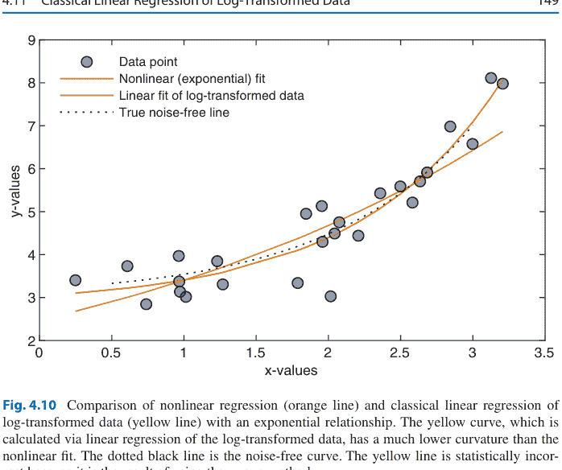

**图 4.10** 非线性回归（橙色线）与经典线性回归（对数变换数据，黄色线）在指数关系下的比较。通过对数变换数据进行线性回归计算出的黄色曲线，其曲率远低于非线性拟合。黑色虚线是无噪声曲线。黄色线在统计上是不正确的，因为它是使用错误方法得出的结果。

```
trueline = np.zeros((251,2))
trueline[:,0] = np.linspace(0.5,3.,251)
trueline[:,1] = 3 + 0.2*np.exp(trueline[:,0])
```

清晰地显示数据可以展示差异：

```
plt.figure()
plt.plot(data1,data2,
    marker='o',
    linestyle='none')
plt.plot(data1,
    popt[0]*np.exp(data1)+popt[1],
    color=(0.8477,0.3242,0.0977))
plt.plot(data1,
    np.exp(data1*p[0]+p[1]),
    color=(0.9258,0.6914,0.1250))
plt.plot(trueline[:,0],trueline[:,1],
    linestyle=':',
    color='k')
plt.show()
```

通过对数变换数据进行线性回归计算出的黄色曲线，其曲率远低于非线性拟合（图 4.10）。黑色虚线是无噪声曲线。当然，由于用于 curve_fit() 的数据中存在噪声，非线性回归的结果与真实曲线并非完美匹配。然而，黄色线在统计上是不正确的，因为它是使用错误方法得出的结果。

## 推荐阅读

- Kendall M (1938) A new measure of rank correlation. Biometrika 30:81–89
- Pearson K (1895) Notes on regression and inheritance in the case of two parents. Proc R Soc Lond 58:240–242
- Spearman C (1904) The proof and measurement of association between two things. Am J Psychol 15:72–101
- Spearman C (1910) Correlation calculated from faulty data. Br J Psychol 3:271–295

## 延伸阅读

- Albarède F (2002) Introduction to geochemical modeling. Cambridge University Press, Cambridge
- Davis JC (2002) Statistics and data analysis in geology, 3rd edn. Wiley, New York
- Draper NR, Smith, H (1998) Applied regression analysis. Wiley series in probability and statistics. Wiley, New York
- Efron B (1982) the jackknife, the bootstrap, and other resampling plans. Society of Industrial and Applied Mathematics CBMS-NSF Monographs 38
- Fisher RA (1922) The goodness of fit of regression formulae, and the distribution of regression coefficients. J Roy Stat Soc 85:597–612
- MacTavish JN, Malone PG, Wells TL (1968) RMAR; a reduced major axis regression program designed for paleontologic data. J Paleontol 42(4):1076–1078
- Pearson K (1894–1898) mathematical contributions to the theory of evolution, Part I to IV. Philosophical Transactions of the Royal Society 185–191

# 时间序列分析

### 5.1 引言

*时间序列分析*用于研究变量 *x(t)* 的时间行为。示例包括对山脉隆升、海平面波动、轨道驱动的日照量变化（及其对冰期旋回的影响）、大气-海洋系统的千年尺度变化、厄尔尼诺/南方涛动对热带降雨和沉积作用的影响（图 5.1）以及潮汐对钻孔中惰性气体排放的影响的长期记录研究。一系列事件的时间模式可以是随机的、聚集的、周期性的或混沌的。时间序列分析提供了各种工具来检测这些时间模式。理解产生观测数据的底层过程使我们能够预测变量的未来值。对于时间序列分析，我们使用 *NumPy* (https://numpy.org)、*Matplotlib* (https://matplotlib.org) 和 *SciPy* (https://scipy.org) 包，它们包含了所有必要的例程。

第 5.2 节讨论了一般信号，并包含如何为时间序列分析生成合成信号的技术描述。然后在第 5.3 和 5.4 节中演示了使用频谱分析来检测单个时间序列中的周期性（自谱分析）以及确定两个时间序列之间随频率变化的关系（互谱分析）。由于大多数

**补充信息** 在线版本包含补充材料，可访问 https://doi.org/10.1007/978-3-031-07719-7_5。

第 5.9–5.10 节可在本书的 MATLAB 版本中找到，但无法翻译为 Python。然而，为了在本书的两个版本之间创建相同的章节编号（从而也创建相同的图形编号和计算机脚本），此处仍列出它们及对应的章节编号。因此，读者可以并行使用这两本书来追踪脚本从 MATLAB 到 Python（以及反向）的翻译。

© 作者，经 Springer Nature Switzerland AG 2022 独家许可
M. H. Trauth, *Python Recipes for Earth Sciences*, Springer Textbooks in Earth Sciences, Geography and Environment, https://doi.org/10.1007/978-3-031-07719-7_5

151

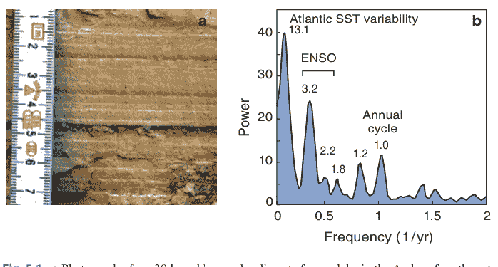

**图 5.1** a 阿根廷西北部安第斯山脉一个湖泊中约 3 万年前的纹层沉积物照片。该地区源岩的分布和年际降水模式表明，红棕色层反映了增强降水的周期性重现，这涉及侵蚀加剧和沉积物输入湖泊。b 横跨 70 个纹层的红色强度剖面的功率谱在频率约为 0.076、0.313、0.455 和 1.0 yrs⁻¹ 处出现主要峰值。与当今的周期性类似，这些周期性表明 3 万年前热带大西洋海表温度（SST）变率、厄尔尼诺/南方涛动（ENSO）和年周期具有强烈影响（Trauth 等，2003）。

地球科学中的时间序列具有不均匀的时间间隔，因此需要各种插值技术和后续的频谱分析方法，这些将在第 5.5 节中介绍。第 5.6 节演示了使用演化功率谱来绘制周期性随时间的变化。第 5.7 节解释了一种分析不等间距数据的替代技术。第 5.8 节介绍了非常流行的连续小波功率谱，它能够以类似于第 5.6 节所示方法的方式绘制频谱的时间变化。然后，第 5.9 节介绍了检测和移除时间序列中集中趋势和离散度突变的方法。第 5.10 节介绍了用于对齐地层序列的方法。本章最后在第 5.11 节概述了非线性技术，特别关注了递归图。

### 5.2 生成信号

时间序列是变量 $x(t)$ 在特定时间 $t_k$ 的 $n$ 个值的有序序列（并非数学严格意义上的级数）：

$$x(t_k) = x(t_1), x(t_2), \ldots, x(t_n)$$

如果任意两个连续观测值 $x(t_k)$ 和 $x(t_{k+1})$ 之间的时间间隔是恒定的，则称该时间序列为等间距的，采样间隔为

$$\Delta t = t_{k+1} - t_k$$

采样频率 $f_s$ 是采样间隔 $\Delta t$ 的倒数。我们通常尝试以规则的时间间隔或恒定的采样频率进行采样，但在许多地球科学实例中，这并不可行。例如，想象一下沿着沉积岩芯以五厘米间隔采集的深海沉积物。沉积岩芯中某些层位的放射性测年揭示了沉积速率的显著波动。尽管样品沿沉积岩芯的间距均匀，但这些样品在时间轴上并非等距分布。因此，量

$$\Delta t = T/n$$

（其中 $T$ 是时间序列的总长度，$n$ 是数据点的数量）仅代表平均采样间隔。通常，时间序列 $x(t_k)$ 可以表示为周期分量 $x_p(t_k)$、趋势 $x_{tr}(t_k)$ 和随机噪声 $x_{ns}(t_k)$ 的线性叠加：

$$x(t_k) = x_p(t_k) + x_{tr}(t_k) + x_{ns}(t_k)$$

将气候信号分解为周期、趋势和噪声分量（如上所示）对应于19世纪末提出的气候定义，即基于趋势和变率（Brückner 1890; Hann 1901; Köppen 1931）。Mudelsee (2014) 增加了一个极值分量 $x_e(t_k)$，既是为了便于分析，也是为了认识到气候极端事件日益增长的重要性，例如IPCC第四次评估报告（Solomon et al. 2007）中所记录的。长期分量 $x_{tr}(t_k)$ 是一个线性或更高阶的趋势，可以通过拟合特定阶数的多项式并从数据中减去该多项式的值来移除（见第4章）。移除噪声 $x_{ns}(t_k)$ 的方法在第6章中描述。周期性（或在数学上不那么严格的意义上，循环性）分量 $x_p(t_k)$ 可以用具有不同振幅 $A_i$、频率 $f_i$ 和相位角 $\psi_i$ 的正弦（或余弦）波的线性组合来近似：

$$x_p(t_k) = \sum_i A_i \cdot \sin(2\pi f_i t_k - \psi_i)$$

相位角 $\psi$ 有助于检测相同频率信号之间的时间偏移。两个具有相同周期的信号 $x$ 和 $y$ 是不同相的，除非 $\psi_x$ 和 $\psi_y$ 之间的差值等于零（图5.2）。

周期信号的频率 $f$ 是周期 $\tau$ 的倒数。*奈奎斯特频率* $f_{nyq}$ 是采样频率 $f_s$ 的一半，代表数据能够产生的最大频率。这个频率由美国数学家克劳德·埃尔伍德·香农定义，并以瑞典裔美国电气工程师哈里·奈奎斯特的名字命名，它防止了时间离散系统中的*混叠*现象。混叠意味着如果采样频率过低，数字信号中会出现歧义。例如，音频光盘（CD）以44,100赫兹（Hz，其中1 Hz = 每秒1个周期）的频率采样，但相应的奈奎斯特频率是22,050 Hz，这是CD播放器理论上能够产生的最高频率。CD播放器使用的抗混叠滤波器的性能限制进一步缩小了频率范围，导致截止频率约为20,050 Hz，这才是CD播放器真正的上限频率。

我们现在可以生成合成信号，以说明时间序列分析工具的使用。使用合成数据时，我们预先知道时间序列包含哪些特征（例如，周期性或随机分量），并且我们可以在时间序列中引入线性趋势和/或数据缺失。用户将遇到许多关于改变参数设置可能产生的效果以及应用频谱分析工具可能导致的潜在伪影和错误的示例。我们从简单的数据开始，然后将这些方法应用于更复杂的时间序列。第一个示例说明了如何生成一个具有地球科学数据特征的基本合成数据系列。首先，我们创建一个时间轴 $\tau$，从1到1,000，步长为1个单位（即采样频率也为1）。然后我们生成一个简单的周期信号 $y$，它由一个周期为5、振幅为2的正弦波组成：

```python
%reset -f

import numpy as np
import matplotlib.pyplot as plt

t = np.linspace(1,1000,1000)
x = 2*np.sin(2*np.pi*t/5)

plt.figure()
plt.plot(t,x)
plt.axis(np.array([0,200,-4,4]))
plt.show()
```

周期 τ=5 对应于频率 f=1/5=0.2。然而，自然数据系列比简单的周期信号更复杂。稍微复杂一点的信号可以通过叠加几个具有不同周期的周期分量来生成。例如，我们通过添加三个正弦波来计算这样一个信号，它们的周期分别为 τ₁=50 (f₁=0.02), τ₂=15 (f₂≈0.07), 和 τ₃=5 (f₃=0.2)。相应的振幅为 A₁=2, A₂=1, 和 A₃=0.5：

```python
t = np.linspace(1,1000,1000)
x = 2*np.sin(2*np.pi*t/50) + \
    np.sin(2*np.pi*t/15) + \
    0.5*np.sin(2*np.pi*t/5)

plt.figure()
plt.plot(t,x)
plt.axis(np.array([0,200,-4,4]))
plt.show()
```

通过将t轴限制在区间[0, 200]，只显示了原始数据系列的五分之一（图5.3a）。然而，我们建议生成较长的数据系列（如示例中所示），以避免在首次应用频谱分析工具时产生边缘效应。

与我们的合成时间序列相比，真实数据还包含各种干扰，例如随机噪声和一阶或更高阶的趋势。为了重现噪声的影响，可以使用随机数生成器来计算均值为零、标准差为一的高斯噪声。应使用 random.seed(0) 将算法的种子设置为零。然后使用 random.randn() 生成一千个随机数：

```python
np.random.seed(0)
ns = np.random.randn(1000)
```

**图5.3** **a** 具有周期 τ₁ = 50, τ₂ = 15, 和 τ₃ = 5 的合成信号，每个周期具有不同的振幅，以及 **b** 叠加了高斯噪声的相同信号。**c** 时间序列显示出显著的线性趋势。

我们将此噪声添加到原始数据中，即我们生成一个包含加性噪声的信号（图5.3b）。显示数据说明了噪声对周期信号的影响。由于现实中没有任何记录是完全无噪声的，因此熟悉噪声对功率谱的影响非常重要：

```python
xns = x + ns

plt.figure()
plt.plot(t,x,'b-',t,xns,'r-')
plt.axis(np.array([0,200,-4,4]))
plt.show()
```

信号处理方法通常用于去除大部分噪声，尽管许多滤波方法对信噪比做出了任意假设（第6章）。此外，滤波会引入伪影和统计依赖性，这可能对最终的功率谱产生深远影响。

最后，我们通过添加一条斜率为0.005、与y轴截距为零的直线，向数据中引入一个线性长期趋势（图5.3c）。这种趋势在地球科学中很常见。例如，考虑在海洋氧同位素记录中观察到的冰期-间冰期旋回，它们叠加在过去六百万年的长期冷却趋势之上：

```python
xt = x + 0.005 * t

plt.figure()
plt.plot(t,x,'b-',t,xt,'r-')
plt.axis(np.array([0,200,-4,4]))
plt.show()
```

实际上，存在更复杂的趋势，例如高阶趋势和以梯度变化为特征的趋势。在实践中，建议通过拟合多项式到数据并减去相应的值来消除此类趋势。我们的合成时间序列现在包含了典型地球科学数据集的许多特征，并可以说明下一节介绍的频谱分析工具的使用。

## 5.3 自谱与互谱分析

自谱分析旨在描述单个信号 x(t) 中包含的方差随频率或波长的分布。描述信号在时间滞后 k 上的方差的一种简单方法是通过自协方差。信号 x(t) 的自协方差 cov_xx，其中 n 个数据点以恒定时间间隔 Δt 采样，是

## 5.4 自谱与互谱分析示例

自协方差序列显然取决于 $x(t)$ 的振幅。通过 $x(t)$ 的方差 $s^2$ 对协方差进行归一化，可得到自相关序列。自相关涉及将一个数据序列与其自身在时间滞后 $k$ 下的相关性：

$$cov_{xx}(k) = \frac{1}{n-k-1} \sum_{t=1}^{n-k} (x_i - \bar{x})(x_{i+k} - \bar{x})$$

$$corr_{xx}(k) = \frac{cov_{xx}(k)}{cov_{xx}(0)} = \frac{cov_{xx}(k)}{s_x^2}$$

地球科学中计算功率谱的一种流行方法是由 Blackman 和 Tukey (1958) 提出的。*Blackman–Tukey 方法*使用自相关序列 $corr_{xx}(k)$ 的复数傅里叶变换 $X_{xx}(f)$，

$$X_{xx}(f) = \sum_{k=0}^{m} corr_{xx}(k)e^{i2\pi fk/f_s}$$

其中 $m$ 是最大滞后，$f_s$ 是采样频率。Blackman–Tukey 自谱是自相关序列傅里叶变换的绝对值。在某些领域，*功率谱密度*被用作描述自谱的另一种方式。Blackman–Tukey 功率谱密度 $PSD$ 通过以下公式计算：

$$PSD = \frac{X_{xx}^*(f)X_{xx}(f)}{f_s} = \frac{|X_{xx}(f)|^2}{f_s}$$

其中 $X_{xx}^*(f)$ 是自相关序列傅里叶变换 $X_{xx}(f)$ 的共轭复数，$f_s$ 是采样频率。功率谱的实际计算只能通过使用*快速傅里叶变换 (FFT)*在有限数量的不同频率上进行。FFT 是一种计算离散傅里叶变换的方法，可减少执行时间。大多数 FFT 算法在变换的每一步都将变换分成两个大小为 $n/2$ 的部分。因此，变换被限制在维度等于 2 的幂的块上。实际上，谱的计算使用接近原始信号 $x(t)$ 中数据点数量的频率数量。

离散傅里叶变换是连续傅里叶变换的近似。连续傅里叶变换假设信号是无限的，但离散的实际数据在两端都是有限的，即信号振幅在时间序列的任一端之外为零。在时域中，有限信号对应于一个无限信号乘以一个矩形窗，该窗在信号范围内值为 1，在其他位置值为 0。在频域中，将时间序列乘以该窗相当于信号的功率谱与矩形窗的谱进行卷积（卷积的定义见第 6.4 节）。然而，窗的谱是一个 $\sin(x)/x$ 函数，它有一个主瓣和主峰两侧的许多旁瓣。因此，功率谱中的所有最大值都会*泄漏*，即它们在峰值两侧损失功率（图 5.4）。

克服*频谱泄漏*问题的一种流行方法是*加窗*，即简单地将数据序列乘以一个具有正值的平滑钟形曲线。有几种窗形状可供选择，例如 *Bartlett*（三角形）、*Hamming*（余弦形）和 *Hanning*（略有不同的余弦形）（图 5.4）。使用这些窗会稍微修改 Blackman–Tukey 自谱的方程为：

$$X_{xx}(f) = \sum_{k=0}^{m} corr_{xx}(k)w(k)e^{i2\pi fk/f_s}$$

其中 $w(k)$ 是加窗函数。因此，Blackman–Tukey 方法分三步进行自谱分析：1) 计算自相关序列 $corr_{xx}(k)$，2) 加窗，最后 3) 计算离散傅里叶变换。Python 允许对上述方法进行多项修改以执行功率谱分析。一个有用的修改是 *Welch 方法* (Welch 1967)（图 5.5），它涉及将时间序列分成重叠的段，计算每段的功率谱，然后对功率谱进行平均。平均谱的优点是显而易见的：它简单地提高了谱的信噪比。缺点是谱的分辨率降低。

互谱分析在频域中关联两个时间序列。互协方差是两个信号在时间滞后 $k$ 下的方差的度量。两个信号 $x(t)$ 和 $y(t)$ 的互协方差 $cov_{xy}$，它们有 $n$ 个数据点，以恒定时间间隔 $\Delta t$ 采样，为：

$$cov_{xy}(k) = \frac{1}{n-k-1} \sum_{t=1}^{n-k} (x_i - \bar{x})(y_{i+k} - \bar{y})$$

互协方差序列再次取决于 $x(t)$ 和 $y(t)$ 的振幅。通过 $x(t)$ 和 $y(t)$ 的标准差对协方差进行归一化，得到互相关序列：

$$corr_{xy}(k) = \frac{cov_{xy}(k)}{cov_{xy}(0)} = \frac{cov_{xy}(k)}{s_x s_y}$$

Blackman–Tukey 方法使用互相关序列 $corr_{xy}(k)$ 的复数傅里叶变换 $X_{xy}(f)$，

$$X_{xy}(f) = \sum_{k=0}^{m} corr_{xy}(k)e^{i2\pi fk/f_s}$$

其中 $m$ 是最大滞后，$f_s$ 是采样频率。复数傅里叶变换 $X_{xy}(f)$ 的绝对值是互谱，而 $X_{xy}(f)$ 的角度代表相位谱。相位差在计算两个信号之间的超前和滞后时很重要，这是一种常用于提出由信号记录的两个过程之间因果关系的度量。两个谱之间的相关性可以通过相干性来计算：

$$C_{xy} = \frac{|X_{xy}(f)|^2}{X_{xx}(f)X_{yy}(f)}$$

相干性是一个介于 0 和 1 之间的实数，其中 0 表示在频率 $f$ 下 $x(t)$ 和 $y(t)$ 之间没有相关性，1 表示最大相关性。一定程度的相干性是计算两个信号之间相位偏移的重要前提。

*SciPy* 包提供了许多用于时间序列谱分析的方法。例如，`periodogram()` 使用周期图法计算时间序列 x(t) 的功率谱密度 Pxx。该方法由 Arthur Schuster 于 1898 年发明，通过直接对序列进行傅里叶变换来计算功率谱，而无需事先计算自相关序列。在 1958 年提出时，通过自相关序列间接计算功率谱比直接计算完整数据序列 x(t) 的傅里叶变换更快。在 Cooley 和 Tukey (1965) 引入快速傅里叶变换 (FFT) 以及随后更快的计算机硬件之后，Blackman–Tukey 方法与周期图法相比的更高计算速度变得相对不那么重要。

对于下一个示例，我们再次使用第 5.2 节中生成的合成时间序列 x、xns 和 xt 作为输入数据：

```python
%reset -f

import numpy as np
import matplotlib.pyplot as plt
from scipy import signal
```

```python
t = np.linspace(1,1000,1000)
t = np.transpose(t)
x = 2*np.sin(2*np.pi*t/50) + \
    np.sin(2*np.pi*t/15) + \
    0.5*np.sin(2*np.pi*t/5)

np.random.seed(0)
ns = np.random.randn(1000)
xns = x + ns

xt = x + 0.005*t
```

然后我们通过计算序列 x 的傅里叶变换来计算周期图。使用 `fft.rfft()` 的最快可能的傅里叶变换计算 nfft 个频率的傅里叶变换，其中 nfft 是最接近原始信号 x 中数据点数量 n 的下一个 2 的幂。由于数据序列的长度为 n=1000，因此傅里叶变换计算 nfft=1024 个频率，同时信号用 nfft-n=24 个零填充：

```python
Xxx = np.fft.rfft(x,1024)
```

如果 x 是实数（如我们的示例），则 Xxx 是对称的，Xxx 中的前 (1+nfft/2) 个值是唯一的，所有其他值都是对称冗余的。功率谱密度定义为 Pxx2=np.abs(Xxx)**2/Fs，其中 Fs 是采样频率。函数 `periodogram()` 还按数据序列的长度缩放功率谱密度，即除以 Fs=1 和 len(x)=1000。

```python
Pxx2 = np.abs(Xxx)**2/1000
```

我们现在丢弃功率谱的冗余部分，仅使用前 (1+nfft/2) 个点。我们还将功率谱密度乘以二，以保持与对称谱相同的能量，但第一个数据点除外：

```python
Pxx = np.hstack((Pxx2[0],2*Pxx2[1:512]))
```

相应的频率轴从 0 到 Fs/2，步长为 Fs/(nfft-1)，其中 Fs/2 是奈奎斯特频率。由于在我们的示例中 Fs=1，因此频率轴为：

```python
f = np.arange(0,1/2,1/1024)
```

然后我们在奈奎斯特频率范围内绘制功率谱密度 Pxx，该范围在我们的示例中从 0 到 1/2。奈奎斯特频率范围对应于前 512（或 nfft/2）个数据点。我们可以通过输入以下命令绘制功率谱密度随频率的变化：

## 5.4 自谱与互谱分析示例

```python
plt.figure()
plt.plot(f,Pxx)
plt.grid
plt.show()
```

图形输出显示，在三个正弦波的原始频率位置（即 1/50、1/15 和 1/5）处有三个主要峰值。或者，我们也可以通过输入以下命令绘制功率谱密度随周期的变化：

```python
plt.figure()
plt.plot(1.0/f,Pxx)
plt.axis(np.array([0,100,0,1000]))
plt.grid
plt.show()
```

我们观察到预期的三个周期：50、15 和 5。由于此图中 x 轴上的值不是均匀分布的（与频率轴上的值相反），我们发现长周期的分辨率较差，并且在图形中周期为 50 处出现了一个宽峰。功率谱密度的代码可以重写，使其独立于采样频率：

```python
Fs = 1
t = np.arange(1/Fs,1000/Fs+1/Fs,1/Fs)
t = np.transpose(t)
x = 2*np.sin(2*np.pi*t/50) + \
    np.sin(2*np.pi*t/15) + \
    0.5*np.sin(2*np.pi*t/5)

nfft = 2**np.ceil(np.log2(t.size))
Xxx = np.fft.rfft(x,int(nfft))

Pxx2 = np.abs(Xxx)**2/Fs/len(x)
Pxx = np.hstack((Pxx2[0],2*Pxx2[1:512]))
f = np.arange(0,Fs/2,Fs/(nfft-1))

plt.figure()
plt.plot(f,Pxx)
plt.grid
plt.axis(np.array([0,0.5,0,np.amax(Pxx)]))
plt.show()
```

其中 `nfft=2**np.ceil(np.log2(t.size))` 计算最接近时间序列 x(t) 长度的下一个 2 的幂次方。此代码允许修改采样频率并探索结果的差异。我们现在可以将结果与使用 `periodogram()` 获得的结果进行比较：

```python
f,Pxx = signal.periodogram(x,fs=1,nfft=1024)
```

此函数允许使用各种窗函数对信号进行加窗，以克服频谱泄漏。然而，我们使用默认的矩形窗，以便将结果与上述实验进行比较。功率谱 Pxx 使用长度为 nfft=1024 的 FFT 计算，这是最接近序列 x 长度的下一个 2 的幂次方，并通过补零使数据点数等于 nfft 的值。函数内使用采样频率 fs 为 1，以便为 f 轴获得正确的频率缩放。我们通过输入以下命令显示结果：

```python
plt.figure()
plt.plot(f,Pxx)
plt.grid
plt.xlabel('Frequency')
plt.ylabel('Power')
plt.show()
```

或者，

```python
plt.figure()
plt.plot(1.0/f,Pxx)
plt.axis(np.array([0,100,0,1000]))
plt.grid
plt.xlabel('Period')
plt.ylabel('Power')
plt.show()
```

图形输出与第一个图几乎相同，再次显示在三个正弦波的原始频率（或周期）位置处有三个主要峰值。相同的程序也可以应用于含噪数据：

```python
f,Pxx = signal.periodogram(xns,fs=1,nfft=1024)

plt.figure()
plt.plot(f,Pxx)
plt.grid
plt.xlabel('Frequency')
plt.ylabel('Power')
plt.show()
```

现在，我们通过引入均值为零、标准差为五的高斯噪声来增加噪声水平：

```python
np.random.seed(0)
nx = int(x.shape[0])
n = 5*np.random.randn(nx)
xns = x + n

f,Pxx = signal.periodogram(xns,fs=1,nfft=1024)

plt.figure()
plt.plot(f,Pxx)
plt.grid
plt.xlabel('Frequency')
plt.ylabel('Power')
plt.show()
```

这个频谱现在类似于地球科学中的真实数据频谱，谱峰叠加在显著的背景噪声水平之上。最高频率的峰值甚至消失在噪声中，无法与归因于噪声的极大值区分开来。两个频谱可以在同一图中进行比较（图 5.6）：

```python
f,Pxx = signal.periodogram(x,fs=1,nfft=1024)
f,Pxxns = signal.periodogram(xns,fs=1,nfft=1024)

plt.figure()
plt.subplot(1,2,1)
plt.plot(f,Pxx)
plt.grid
plt.xlabel('Frequency')
plt.ylabel('Power')
plt.subplot(1,2,2)
plt.plot(f,Pxxns)
plt.grid
plt.xlabel('Frequency')
plt.ylabel('Power')
plt.show()
```

接下来，我们探讨线性趋势对频谱的影响。长期趋势是地球科学数据中的常见特征。我们可以看到，FFT 将此趋势误解为一个非常长的周期，产生了一个频率接近零的大峰值（图 5.7）：

```python
f,Pxx = signal.periodogram(x,fs=1,nfft=1024)
f,Pxxt = signal.periodogram(xt,fs=1,nfft=1024)

plt.figure()
plt.subplot(1,2,1)
plt.plot(f,Pxx)
plt.grid
plt.xlabel('Frequency')
plt.ylabel('Power')
plt.subplot(1,2,2)
plt.plot(f,Pxxt)
plt.grid
plt.xlabel('Frequency')
plt.ylabel('Power')
plt.show()
```

图 5.6 **a** 无噪声和 **b** 含噪合成信号的自谱比较，周期为 τ₁ = 50 (f₁ = 0.02), τ₂ = 15 (f₂ = 0.07), 和 τ₃ = 5 (f₃ = 0.2)。最高频率的峰值完全消失在背景噪声中，无法与归因于高斯噪声的峰值区分开来。

图 5.7 **a** 原始无噪声信号（周期为 τ₁ = 50 (f₁ = 0.02), τ₂ = 15 (f₂ = 0.07), 和 τ₃ = 5 (f₃ = 0.2)）和 **b** 叠加了线性趋势的同一信号的自谱比较。线性趋势被 FFT 误解为一个具有高振幅的非常长的周期。

为了消除长期趋势，我们使用 `detrend()`。此函数移除线性趋势，这些趋势被定义为从序列 x 拟合的单一直线，或者从 x 定义的连续分段线性趋势，具有一个或多个由用户定义的断点：

```python
xdt = signal.detrend(xt)

plt.figure()
plt.subplot(2,1,1)
plt.plot(t,x,'b-',t,xt,'r-')
plt.grid
plt.axis(np.array([0,200,-4,4]))
plt.subplot(2,1,2)
plt.plot(t,x,'b-',t,xdt,'r-')
plt.grid
plt.axis(np.array([0,200,-4,4]))
plt.show()
```

得到的频谱不再显示低频峰值：

```python
f,Pxx = signal.periodogram(x,fs=1,nfft=1024)
f,Pxxdt = signal.periodogram(xdt,fs=1,nfft=1024)

plt.figure()
plt.subplot(1,2,1)
plt.plot(f,Pxx)
plt.grid
plt.xlabel('Frequency')
plt.ylabel('Power')
plt.subplot(1,2,2)
plt.plot(f,Pxxdt)
plt.grid
plt.xlabel('Frequency')
plt.ylabel('Power')
plt.show()
```

一些数据集包含高阶趋势，可以通过对数据拟合高阶多项式并减去相应的 x(t) 值来移除。

我们现在使用两个具有相同周期 τ=5（相当于 f=0.2）且振幅等于 2 的正弦波来计算两个时间序列的互谱。这两个正弦波显示出 1 的相对相移。在第二个正弦波的参数中，这对应于 $2\pi/5$，即 $\tau=5$ 的完整波长的五分之一：

```python
t = np.linspace(1,1000,1000)
x = 2*np.sin(2*np.pi*t/5)
y = 2*np.sin(2*np.pi*t/5+2*np.pi/5)

plt.figure()
plt.plot(t,x,'b-',t,y,'r-')
plt.axis(np.array([0,50,-2,2]))
plt.grid
plt.show()
```

互谱使用 `csd()` 计算，该函数使用 Welch 方法计算功率谱（图 5.8）。Pxy 是复数，包含振幅和相位信息：

```python
f,Pxy = signal.csd(x,y,fs=1,nfft=1024)

plt.figure()
plt.plot(f,np.abs(Pxy))
plt.grid
plt.xlabel('Frequency')
plt.ylabel('Power')
plt.show()
```

函数 `csd()` 指定了用于计算互功率谱密度的 FFT 点数 nfft，在我们的示例中为 1024。在此示例中，采样频率 fs 为 1。由于我们处理的是无噪声数据，两个信号在所有频率上的相干性均为 1：

```python
f,Cxy = signal.coherence(x,y,fs=1,nfft=1024)

plt.figure()
plt.plot(f,Cxy)
plt.grid
plt.xlabel('Frequency')
plt.ylabel('Coherence')
plt.show()
```

我们使用 `coherence()`，它指定了 FFT 点数 nfft=1024。Pxy 的复数部分用于使用 `angle()` 计算两个信号之间的相移：

```python
phase = np.angle(Pxy)

plt.figure()
plt.plot(f,phase)
plt.grid
plt.xlabel('Frequency')
plt.ylabel('Phase angle')
plt.show()
```

频率 f=0.2（周期 τ=5）处的相移可以从相位谱中插值得到。

```python
ph = np.interp(0.2,f,phase)
print(ph)
```

输出结果为

```
1.256632874776265
```

相位谱被归一化到一个完整周期 τ=2π，因此与周期 2π 相关的相移 -1.2566 变为与真实周期 τ=5 相关的 ((-1.2566·5)/(2·π) = -1.0000)，这就是两个合成正弦波之间的相对相移 1。

我们现在使用两个具有不同周期的正弦波来说明交叉谱分析。信号 x 和 y 的周期均为 5，但存在 1 的相位偏移：

```python
t = np.linspace(1,1000,1000)
x = np.sin(2*np.pi*t/15) + \
    0.5*np.sin(2*np.pi*t/5)
y = 2*np.sin(2*np.pi*t/50) + \
    0.5*np.sin(2*np.pi*t/5 + \
    2*np.pi/5)

plt.figure()
plt.plot(t,x,'b-',t,y,'r-')
plt.axis(np.array([0,100,-3,3]))
plt.grid
plt.show()
```

我们现在可以计算交叉谱 Pxy，它清晰地显示了共同的周期 τ=5（或频率 f=0.2）：

```python
f,Pxy = signal.csd(x,y,fs=1,nfft=1024)

plt.figure()
plt.plot(f,np.abs(Pxy))
plt.grid
plt.xlabel('Frequency')
plt.ylabel('Power')
plt.show()
```

相干性在 f=0.2 处显示出接近 1 的高值：

```python
f,Cxy = signal.coherence(x,y,fs=1,nfft=1024)

plt.figure()
plt.plot(f,Cxy)
plt.grid
plt.xlabel('Frequency')
plt.ylabel('Coherence')
plt.show()
```

交叉谱 Pxy 的复数部分用于计算两个正弦波之间的相位偏移：

```python
f,Pxy = signal.csd(x,y,fs=1,nfft=1024)
phase = np.angle(Pxy)

plt.figure()
plt.plot(f,phase)
plt.grid
plt.show()
```

在频率 $f=0.2$（周期 $\tau=5$）处的相位偏移为

```python
ph = np.interp(0.2,f,phase)
print(ph)
```

其输出为

```
1.256632874776265
```

相位谱被归一化到一个完整周期 $\tau=2\pi$，因此与周期 $2\pi$ 相关的相位偏移 $-1.2572$ 等于与周期 5 相关的 $(-1.2572 \cdot 5)/(2 \cdot \pi) = -1.0004$，这再次是两个合成正弦波之间的相对相位偏移。

## 5.5 插值与分析非均匀间隔数据

我们现在可以利用分析均匀间隔数据的经验，对非均匀间隔数据进行频谱分析。此类数据在地球科学中非常常见，例如在古海洋学领域，深海岩芯通常以恒定的深度间隔进行采样。在长度-时间比变化的环境中，将均匀间隔的长度可变数据转换为时间可变数据，会导致时间序列的非均匀间隔。存在许多方法用于插值非均匀间隔的数据序列或时间序列。这些针对 $x(t)$ 数据的*插值技术*旨在从非均匀间隔的 $x(t)$ 测量值中，计算出等间隔 $t$ 向量的 $x$ 值。*线性插值*通过在两个相邻测量值之间绘制一条直线，并计算直线上相应点的 $x$ 值来预测 $x$ 值。然而，这种方法有其局限性，因为它假设数据中存在线性过渡，这会引入一些伪影（包括信号高频成分的丢失），并将数据范围限制在原始测量值的范围内。

*三次样条插值*是另一种用于插值非均匀间隔数据的方法。三次样条是分段连续可微的曲线，每一步至少需要四个数据点。该方法的一个优点是它保留了数据中包含的高频信息。然而，数据序列中的陡峭梯度——通常出现在极小值和极大值附近——可能会在插值时间序列中产生虚假的振幅。由于所有这些（以及其他）插值技术都可能向数据中引入伪影，因此始终建议：1）在插值前后保持数据点总数不变；2）报告用于估计等间隔数据序列的方法；3）探究插值对数据方差的影响。

在简要介绍了插值技术之后，我们可以将最流行的线性插值和三次样条插值技术应用于非均匀间隔数据。一旦我们插值了数据，就可以使用之前应用于均匀间隔数据的频谱工具（第 5.3 和 5.4 节）。我们必须首先加载两个时间序列：

```python
%reset -f

import numpy as np
from scipy import signal
from scipy import interpolate
import matplotlib.pyplot as plt

series1 = np.loadtxt('series1.txt')
series2 = np.loadtxt('series2.txt')
```

两个合成数据集都包含一个具有 339 行的两列矩阵。第一列包含以*千年*（kyrs）为单位的年龄，这些年龄是非均匀间隔的。第二列包含在钙质微化石（有孔虫）上测量的氧同位素值。数据集分别包含 100 kyr、40 kyr 和 20 kyr 的周期性，并且叠加了高斯噪声。在 100 kyr 频带中，第二个数据系列相对于第一个数据系列偏移了 5 kyrs。要绘制数据，我们输入

```python
plt.figure()
plt.plot(series1[0:,0],series1[0:,1])
plt.plot(series2[0:,0],series2[0:,1])
plt.show()
```

第一个数据系列的间隔可以使用以下代码可视化

```python
intv1 = np.diff(series1[0:,0])

plt.figure()
plt.plot(intv1)
plt.show()
```

该图显示间隔在平均间隔 3 kyrs 左右变化，标准差约为 1 kyr。时间轴的最小值和最大值

```python
print(np.amin(series1[0:,0]))
print(np.amax(series1[0:,0]))
```

$t_{min}=0$ 和 $t_{max}=997$ kyrs 提供了关于数据时间范围的一些信息。第二个数据系列

```python
intv2 = np.diff(series2[0:,0])

plt.figure()
plt.plot(intv2)
plt.show()

print(np.amin(series2[0:,0]))
print(np.amax(series2[0:,0]))
```

具有相似的范围（从 0 到 997 kyrs）。我们看到两个系列的平均间隔均为 3 kyrs，范围从 0 到约 1,000 kyrs。我们现在将数据插值到等间隔的时间轴上。在此过程中，我们遵循数据点数量不应增加的原则。新的时间轴从 0 到 996 kyrs，间隔为 3 kyr：

```python
t = np.arange(0.,996.+3.,3.)
```

我们现在可以使用 `interp1d()` 将两个时间序列通过*线性*和*样条*插值方法插值到此轴上：

```python
fun = interpolate.interp1d(series1[0:,0],
    series1[0:,1],kind='linear')
series1L = fun(t)
fun = interpolate.interp1d(series1[0:,0],
    series1[0:,1],kind='cubic')
series1S = fun(t)

fun = interpolate.interp1d(series2[0:,0],
    series2[0:,1],kind='linear')
series2L = fun(t)
fun = interpolate.interp1d(series2[0:,0],
    series2[0:,1],kind='cubic')
series2S = fun(t)
```

在线性插值方法中，插值函数是相邻数据点之间的直线，而在样条插值方法中，插值函数是这些数据点之间的分段多项式。`interp1d()` 中的 cubic 方法使用分段三次样条插值，即插值函数是三次多项式。通过绘制插值前后的第一个系列来比较结果：

```python
plt.figure()
plt.plot(series1[0::,0],series1[0::,1],
    'ko',markersize=1)
plt.plot(t,series1L,'b-',linewidth=0.5)
plt.plot(t,series1S,'r-',linewidth=0.5)
plt.show()
```

我们已经可以在约 370 kyrs 处观察到一些主要的伪影。线性插值点始终在原始数据范围内，而样条插值方法产生的值则不切实际地高或低（图 5.9）。通过绘制第二个数据系列来比较结果：

```python
plt.figure()
plt.plot(series2[0::,0],series2[0::,1],
    'ko',markersize=1)
plt.plot(t,series2L,'b-',linewidth=0.5)
plt.plot(t,series2S,'r-',linewidth=0.5)
plt.show()
```

在这个系列中，只能观察到少数伪影。*SciPy* 包还包含 PchipInterpolator()，它使用*分段三次 Hermite 插值多项式*来执行保形的分段三次插值。该函数避免了样条的典型伪影，因为它保留了数据系列的原始形状。

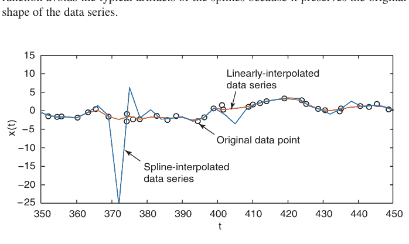

**图 5.9** 插值伪影。线性插值点始终在原始数据范围内，而样条插值方法则导致不切实际的高值和低值。

我们可以应用上述函数，通过计算采样频率为1/3 kyr⁻¹的256个数据点的FFT来计算功率谱：

```python
f,Pxx = signal.periodogram(series1L,fs=1/3,nfft=256)

plt.figure()
plt.plot(f,Pxx)
plt.grid
plt.xlabel('Frequency')
plt.ylabel('Power')
plt.show()
```

主要峰值出现在大约0.01、0.025和0.05 kyr⁻¹的频率处，分别对应大约100、40和20 kyr的周期。分析第二个时间序列

```python
f,Pxx = signal.periodogram(series2L,fs=1/3,nfft=256)

plt.figure()
plt.plot(f,Pxx)
plt.grid
plt.xlabel('Frequency')
plt.ylabel('Power')
plt.show()
```

也在0.01、0.025和0.05 kyr⁻¹的频率处产生了主要峰值（图5.10）。我们现在计算两个数据序列的互谱：

```python
f,Pxy = signal.csd(series1L,series2L,fs=1/3,
    nperseg=128,nfft=256)

plt.figure()
plt.plot(f,np.abs(Pxy))
plt.grid
plt.xlabel('Frequency')
plt.ylabel('Power')
plt.show()
```

相关性（如相干性的高值所示）相当显著：

```python
f,Cxy = signal.coherence(series1L,series2L,fs=1/3,
    nperseg=128,nfft=256)
```

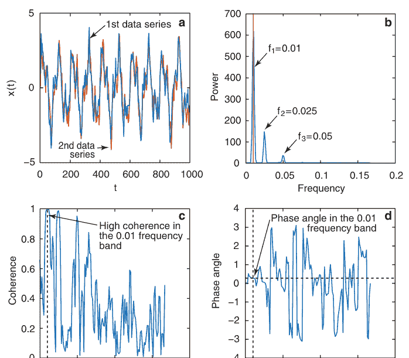

```python
plt.figure()
plt.plot(f,Cxy)
plt.grid
plt.xlabel('Frequency')
plt.ylabel('Coherence')
plt.show()
```

我们可以观察到在0.01、0.025和0.05 kyr⁻¹的频率处有相当高的相干性。计算每个频率的相位差需要Pxy的复数部分：

```python
phase = np.angle(Pxy)
```

```python
plt.figure()
plt.plot(f,phase)
plt.grid
plt.xlabel('Frequency')
plt.ylabel('Phase angle')
plt.show()
```

频率为$f=0.01$ kyr$^{-1}$处的相移使用以下代码计算：

```python
ph = np.interp(0.01,f,phase)
print(ph)
```

其输出为

```
0.2777602833050877
```

相位谱被归一化到一个完整周期$\tau=2\pi$，因此$-0.2796$的相移等于$-0.2796 \cdot 100\text{kyrs})/(2 \cdot \pi) = -4.45\text{kyrs}$，这大致对应于第二个数据序列相对于第一个序列引入的5 kyrs的相移。

## 5.6 演化功率谱

谱峰的振幅通常随时间变化。这对于古气候时间序列尤其如此。古气候记录通常不仅显示均值和方差的趋势，还显示周期性成分（如海洋氧同位素记录中的米兰科维奇旋回）相对贡献的趋势。演化功率谱能够在频域中映射这种变化。*演化*或*加窗功率谱*是第5.3节介绍方法的一种改进，它计算时间序列重叠段的谱。这些重叠段与Welch方法（第5.3节）使用的加窗段相比相对较短，后者用于提高功率谱的信噪比。因此，演化功率谱方法使用*短时傅里叶变换*（STFT）而不是快速傅里叶变换（FFT）。演化功率谱的输出是信号的短期、时间局部化的频率内容。可以使用各种方法来显示结果。例如，时间和频率可以分别绘制在$x$轴和$y$轴上，或者反之，绘图的颜色取决于谱峰的高度。

作为一个例子，我们使用一个类似于第5.5节中使用的数据集。该数据序列包含三个主要周期，分别为100、40和20 kyrs，以及加性高斯噪声。然而，振幅随时间变化，因此这个例子可以用来说明演化功率谱方法的优势。在我们的例子中，40 kyr的旋回仅在大约450 kyrs之后出现，而100和20 kyr的旋回在整个时间序列中都存在。我们首先从文件*series3.txt*加载并显示数据（图5.11）：

```python
%reset -f

import numpy as np
from scipy import signal
from scipy import interpolate
import matplotlib.pyplot as plt

series3 = np.loadtxt('series3.txt')

plt.figure()
plt.plot(series3[0:,0],series3[0:,1])
plt.xlabel('Time (kyr)')
plt.ylabel('d180 (per mille)')
plt.show()
```

由于标准和演化功率谱方法都需要等间距数据，我们按照第5.5节的演示，将数据插值到等间距的时间向量t上：

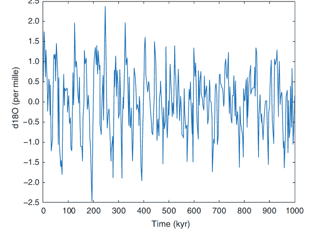

```python
t = np.arange(0.,1000.+3.,3.)
fun = interpolate.interp1d(series3[0:,0],
    series3[0:,1],kind='linear',
    fill_value='extrapolate')
series3L = fun(t)
```

然后，我们计算整个时间序列长度的非演化功率谱（图5.12）。此练习有助于我们比较标准和演化功率谱方法结果之间的差异：

```python
f,Pxx = signal.periodogram(series3L,fs=1/3,nfft=256)

plt.figure()
plt.plot(f,Pxx)
plt.grid
plt.xlabel('Frequency')
plt.ylabel('Power')
plt.show()
```

自谱显示在100、40和20 kyr周期处有主要峰值，以及一些噪声。然而，功率谱没有提供关于这些峰值振幅波动的任何信息。非演化功率谱仅仅代表了数据中包含的谱信息的平均值。

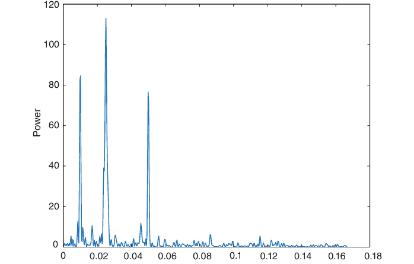

我们现在使用`spectrogram()`来映射功率谱随时间的变化。默认情况下，时间序列被分成八个段，每个段有50%的重叠。每个段都使用汉明窗进行加窗，以抑制频谱泄漏（第5.3节）。函数`spectrogram()`使用的输入参数与第5.3节中`periodogram()`使用的类似。然后，我们计算窗口为64个数据点、重叠为50个数据点的演化功率谱。STFT使用`nfft=256`计算。由于插值时间向量的间距为3 kyrs，采样频率为1/3 kyr⁻¹：

```python
f,t,s = signal.spectrogram(series3L,
    fs=1/3,nperseg=64,
    noverlap=50,nfft=256)

plt.pcolormesh(t,f,s,shading='gouraud')
plt.xlabel('Time (kyr)')
plt.ylabel('Frequency (1/kyr)')
plt.show()
```

我们使用`pcolormesh()`以彩色图（图5.13）显示`spectrogram()`的输出，图中显示了代表0.01和0.05 kyr⁻¹频率处主要极大值的黄色水平条纹（即每100和20 kyrs）。还有一个40 kyr的周期（对应于0.025 kyr⁻¹的频率），但这仅在大约450 kyrs之后出现，如图下半部分的垂直红色条纹所示。


## 5.7 Lomb–Scargle功率谱

前面章节介绍的功率谱方法需要等间距数据。然而，在地球科学中，时间序列通常是不等间距的。虽然将不等间距数据插值到等间距时间网格上是克服此问题的一种方法（第5.5节），但插值会在时域和频域中引入许多人为假象。因此，一种替代的时间序列分析方法在地球科学中日益流行：*Lomb–Scargle算法*（例如，Scargle 1981, 1982, 1989, 1990; Schulz and Stattegger 1998; Press et al. 2007）。

Lomb–Scargle算法仅在实际测量的时间点$t_i$处评估时间序列的数据。假设一个包含$n$个数据点的序列$x(t)$，作为角频率$\omega = 2\pi f > 0$函数的Lomb–Scargle归一化周期图$P_x$由下式给出

$$P_x(\omega) = \frac{1}{s^2} \left\{ \frac{\left(\sum_j (x_i - \bar{x})\cos(\omega(t_j - \tau))\right)^2}{\sum_j \cos^2(\omega(t_j - \tau))} + \frac{\left(\sum_j (x_i - \bar{x})\sin(\omega(t_j - \tau))\right)^2}{\sum_j \sin^2(\omega(t_j - \tau))} \right\}$$

其中

$$\bar{x} = \frac{1}{n} \sum_{i=1}^n x_i$$

和

$$s^2 = \frac{1}{n-1} \sum_{i=1}^n (x_i - \bar{x})^2$$

分别是数据的算术平均值和方差（例如，Scargle 1981, 1982, 1989, 1990, Press et al. 2007）（第3.2节）。常数$\tau$由以下关系定义

$$\tan(2\omega\tau) = \frac{\sum_j \sin(2\omega t_j)}{\sum_j \cos(2\omega t_j)}$$

是一个偏移量，它使得$P_x(\omega)$独立于将$t_i$值平移任何常数量。Scargle (1982) 表明，这种特定的偏移量$\tau$的选择导致一个与对数据序列 $x(t)$ 进行正弦和余弦函数最小二乘拟合完全相同的 $P_x(\omega)$ 解：

$$x(t) = A \cos(\omega t) + B \sin(\omega t)$$

Lomb (1976) 此前已研究了将谐波函数对数据序列进行最小二乘拟合与频谱分析相结合的方法，因此该方法被称为归一化 Lomb–Scargle 傅里叶变换。术语 *归一化* 指的是周期图方程分母中的因子 $s^2$。

Scargle (1982) 表明，假设噪声服从高斯分布，Lomb–Scargle 周期图具有指数概率分布，其均值等于一。$P_x(\omega)$ 位于某个正数 $z$ 和 $z+dz$ 之间的概率为 $\exp(-z)dz$。如果我们扫描 $m$ 个独立频率，其中没有任何一个值大于 $z$ 的概率是 $(1-\exp(-z))^m$。因此，我们可以计算零假设的虚警概率（即周期图中给定峰值不显著的概率）(Press et al. 2007)：

$$P(> z) \equiv 1 - (1 - e^{-z})^m$$

Press et al. (2007) 还建议使用奈奎斯特准则（第 5.2 节）来确定独立频率的数量 $m$，假设数据是均匀间隔的。在这种情况下，独立频率数量的适当值为 $m=2n$，其中 $n$ 是时间序列的长度。

以下 Python 代码基于上述 Lomb–Scargle 归一化周期图的方程。我们首先加载为说明第 5.6 节中演化（或加窗）功率谱方法的使用而生成的合成数据。数据包含 100、40 和 20 kyr 的周期性，以及加性高斯噪声，并且在时间轴上分布不均匀。我们定义两个新向量 t 和 x，它们包含原始时间向量和在时间 t 采样的合成氧同位素数据：

```
%reset -f

import math
import numpy as np
import scipy.signal as signal
import matplotlib.pyplot as plt

t = np.loadtxt('series3.txt',usecols=0)
x = np.loadtxt('series3.txt',usecols=1)
```

然后我们生成一个频率轴 f。由于 Lomb–Scargle 方法无法处理零频率（即无限周期），我们从一个等效于频率向量间距的频率值开始。参数 ofac 是过采样因子，它影响频率轴在 N(频率)=N(数据点) 情况下的分辨率。我们还需要 Lomb–Scargle 算法可以分析的最高频率 fhi，这通常是如果数据点在相同时间间隔内均匀分布时会得到的奈奎斯特频率 fnyq。以下代码使用输入参数 hifac，它由 Press et al. (2007) 定义为 hifac=fhi/fnyq，

```
intv = np.mean(np.diff(t))
ofac = 4
hifac = 1
f = np.arange(((2*intv)**(-1))/(len(x)*ofac),hifac*
    (2*intv)**(-1)+((2*intv)**(-1))/
    (len(x)*ofac),((2*intv)**(-1))/
    (len(x)*ofac))
```

其中 intv 是平均采样间隔。我们现在可以通过将上述 τ 和 P_x 的方程转换为 Python 代码来计算归一化 Lomb–Scargle 周期图 px 作为角频率 wrun 的函数：

```
px = np.zeros(np.shape(f))
for k in range(1,len(f)):
    wrun = 2*np.pi*f[k]
    tau = (1/2*wrun)*math.atan2(sum(np.sin(2*wrun*t)),
        sum(np.cos(2*wrun*t)))
    px[k] = 1/(2*np.var(x,ddof=1))* \
        ((sum(np.multiply((x-np.mean(x)),
        np.cos(wrun*(t-tau))))**2 /
        sum((np.cos(wrun*(t-tau)))**2) +
        (sum(np.multiply((x-np.mean(x)),
        np.sin(wrun*(t-tau))))**2 /
        sum((np.sin(wrun*(t-tau)))**2))
```

现在可以计算功率谱 px 中任何峰值的显著性水平。变量 prob 表示零假设的虚警概率。因此，低的 prob 表示功率谱中存在高度显著的峰值：

```
prob = 1-(1-np.exp(-px))**(2*len(x))
```

我们现在绘制功率谱和概率（图 5.14）：

```
plt.figure()
plt.plot(f,px)
plt.xlabel('Frequency')
plt.ylabel('Power')
plt.show()
```

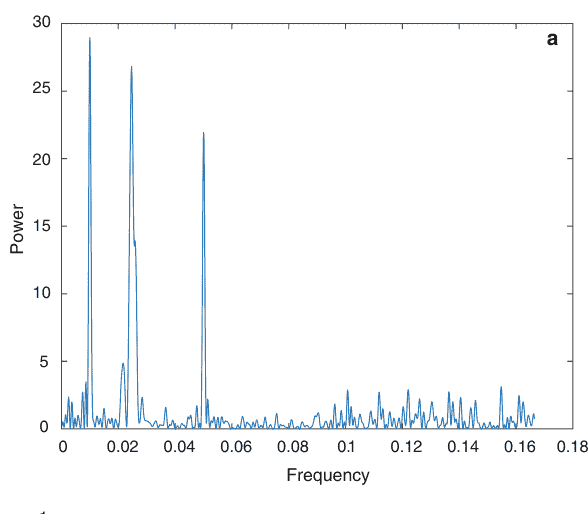

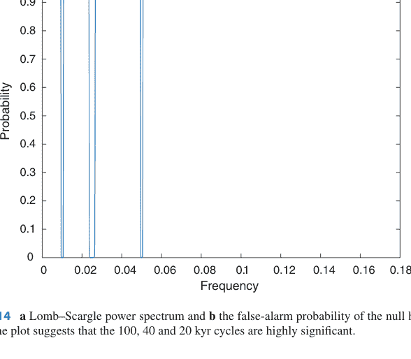

**图 5.14** **a** Lomb–Scargle 功率谱和 **b** 零假设的虚警概率。该图表明 100、40 和 20 kyr 的周期高度显著。

```
plt.figure()
plt.plot(f,prob)
plt.xlabel('Frequency')
plt.ylabel('Probability')
plt.show()
```

这两个图表明所有三个峰值都高度显著，因为在 100、40 和 20 kyrs 的周期性处，虚警概率极低。

Press et al. (2007) 提出了一种显示显著性水平的替代方法。在此方法中，对零假设的虚警概率方程进行反演，以计算相应的置信水平。例如，我们选择 95% 的置信水平。然而，这个数字也可以替换为多个置信水平的向量，例如 confid=[0.90 0.95 0.99]。我们现在可以输入

```
m = int(np.floor(0.5*ofac*hifac*len(x)))
effm = 2.*m/ofac
confid = np.array([0.9,0.95,0.99])
levels = np.log((1.-confid**(1./effm))**(-1))
```

其中 m 是独立频率的真实数量，effm 是使用过采样因子 ofac 的有效频率数量。第二个图显示了频谱峰值和相应的置信水平：

```
plt.figure()
plt.plot(f,px)
for k in range(0,3):
    print(confid[k])
    print(levels[k])
    plt.plot(f,levels[k]*np.ones(len(f)),
             linestyle='--',
             color=[0.1,0.5,0.8])
plt.xlabel('Frequency')
plt.ylabel('Power')
plt.show()
```

频率为 0.01、0.025 和 0.05 kyr⁻¹ 的所有三个频谱峰值都超过了 95% 的置信水平，这表明它们代表了重要的周期性。因此，我们获得了与使用周期图方法获得的结果相似的结果。然而，Lomb–Scargle 方法的一个优点是它不需要对不均匀间隔的数据进行任何插值，并且允许进行定量的显著性检验。

*SciPy* 包包含 `lombscargle()`，用于使用以弧度为单位的频率 w 计算 Lomb–Scargle 周期图。输入

```
w = 2*np.pi*f
px = signal.lombscargle(t,x,w,normalize=True)

plt.figure()
plt.plot(f,px)
plt.xlabel('Frequency')
plt.ylabel('Power')
plt.show()
```

会产生完全相同的结果。我们使用 normalized=True 作为频谱类型，以获得 Lomb–Scargle 归一化周期图，该周期图通过将 px 除以 2*var(x) 进行归一化，如我们上面的 Python 代码所示。

## 5.8 小波功率谱

第 5.6 节演示了对功率谱方法的修改，用于绘制周期性随时间的变化。理论上，类似的修改也可以应用于 Lomb–Scargle 方法，其优点是可以应用于不均匀间隔的数据。然而，这两种方法都假设数据是正弦和余弦波的复合体，这些波在时间上全局均匀且具有无限的时间跨度。演化功率谱方法将时间序列划分为重叠的段，并计算这些段的傅里叶变换。为了避免频谱泄漏，数据乘以平滑的钟形曲线窗口，这些曲线具有正值（第 5.3 节）。演化功率谱的时间分辨率越高，结果的准确性就越低。此外，短时间窗口包含大量高频周期，而低频周期则代表性不足。

与傅里叶变换相比，*小波变换* 使用本身具有平滑端点的基函数（*小波*）(Lau and Weng 1995; Mackenzie et al. 2001)。小波是小的波包，由特定频率定义，并向两端衰减。由于小波可以在频率和时间上以灵活的分辨率进行拉伸和平移，因此它们可以轻松地映射时频域中的变化。

小波变换在数学上将信号 $x(t)$ 分解为从 *母小波* $\psi(t)$ 通过伸缩和平移导出的基本函数 $\psi_{a,b}(t)$，

$$\psi_{a,b} = \frac{1}{a^{1/2}} \psi \left( \frac{t-b}{a} \right)$$

其中 $b$ 表示小波的位置（平移），$a$ (>0) 表示小波的尺度（伸缩）(Lau and Weng 1995)。信号 $x(t)$ 关于母小波 $\psi(t)$ 的小波变换定义为卷积积分$$W(b, a) = \frac{1}{a^{1/2}} \int \psi^* \left( \frac{t - b}{a} \right) x(t) \, \mathrm{d}t$$

其中 $\psi^*$ 是 $\psi$ 的复共轭。文献中有许多可用的母小波，例如经典的 *Haar* 小波、*Morlet* 小波和 *Daubechies* 小波。地球科学领域最流行的小波是 Morlet 小波，它由法国地球物理学家 Jean Morlet (1931–2007) 引入，其定义为

$$\psi_0(\eta) = \pi^{-1/4} \exp(i\omega_0\eta) \exp\left(-\eta^2/2\right)$$

其中 $\eta$ 是时间，$\omega_0$ 是波数 (Torrence and Compo 1998)。波数是小波本身的振荡次数。我们可以通过将上述方程转换为 Python 代码来轻松计算 Morlet 小波波的离散版本，其中 eta 是无量纲时间，w0 是波数。改变 w0 会产生具有不同波数的小波。请注意，不要在 for 循环中使用 i 作为索引，因为它在这里用于表示虚数单位（图 5.15）：

```
%reset -f

import numpy as np
import scipy.signal as signal
from scipy import interpolate
import matplotlib.pyplot as plt

eta = np.arange(-10,10+0.1,0.1)
w0 = 6
wave = np.multiply(np.multiply(np.pi**(-1/4),
    np.exp(1j*w0*eta)),np.exp(-eta**2/2))

plt.figure()
plt.plot(eta,wave)
plt.xlabel('Position')
plt.ylabel('Scale')
plt.show()
```

为了熟悉小波功率谱，我们计算第 5.6 节中使用的合成数据的连续小波变换 (CWT)。我们首先加载包含在文件 *series3.txt* 中的合成数据，同时记住数据包含 100、40 和 20 kyrs 的周期性以及加性高斯噪声，并且它们在时间轴上分布不均匀：

```
series3 = np.loadtxt('series3.txt')
```

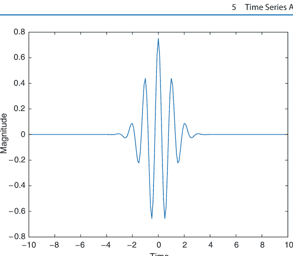

图 5.15 波数为 6 的 Morlet 母小波。

与傅里叶变换（第 5.3 至 5.6 节）类似，而与 Lomb–Scargle 算法（第 5.7 节）相反，小波变换要求数据均匀分布，因此我们使用 interp1d() 对数据进行插值：

```
t = np.arange(0.,996.+3.,3.)
fun = interpolate.interp1d(series3[0:,0],
    series3[0:,1],kind='linear')
series3L = fun(t)
```

如果我们的时间序列存在趋势，我们需要在运行小波分析之前去除该趋势（参见第 5.4 节）：

```
series3L = signal.detrend(series3L)
```

然后我们使用 cwt()，输入数据序列 series3L 和采样间隔的倒数作为采样频率。在我们的示例中，采样间隔为 3，因此采样频率为 1/3。使用 Morlet 小波的 cwt() 输出是小波变换 cwtmatr：

```
fs = 1/3
freqs = np.linspace(0.001,fs/2,1000)
w0 = 6.
widths = w0*fs/(2.*np.pi*freqs)
cwtmatr = signal.cwt(series3L,
    signal.morlet2,widths,w=w0)
```

我们现在显示小波功率谱。我们可以更改坐标轴的限制、颜色映射表以及许多其他内容。我们可以看到频率为 0.01/kyr（对应于 100 kyrs 的周期）、0.025/kyr（40 kyrs）和 0.05/kyr（20 kyrs）的周期。小波功率谱的优点在于它们显示的是演化谱，即周期随时间的出现和消失：

```
plt.contourf(t,freqs,np.abs(cwtmatr),
    cmap='viridis',
    shading='gouraud')
plt.colorbar()
plt.xlabel('Time (kyr)')
plt.ylabel('Frequency (1/kyr)')
plt.xlim([0,1000])
plt.ylim([0.,.07])
plt.show()
```

我们现在显示相同的图，但 y 轴使用周期而不是频率。我们可以看到周期为 100 kyrs、40 kyrs 和 20 kyrs 的周期（图 5.16）：

```
periods = 1/freqs
plt.contourf(t,periods,np.abs(cwtmatr),
    cmap='viridis',
    shading='gouraud')
plt.colorbar()
plt.xlabel('Time (kyr)')
plt.ylabel('Frequency (1/kyr)')
plt.xlim([0,1000])
plt.ylim([0.,200])
plt.show()
```

我们也可以使用 pcolormesh() 代替 contourf() 来显示相同的图（图 5.17）：

```
plt.pcolormesh(t,periods,np.abs(cwtmatr),
    cmap='viridis',
    shading='gouraud')
plt.colorbar()
plt.xlabel('Time (kyr)')
plt.ylabel('Period (kyr)')
plt.xlim([0,1000])
plt.ylim([0.,200])
plt.show()
```

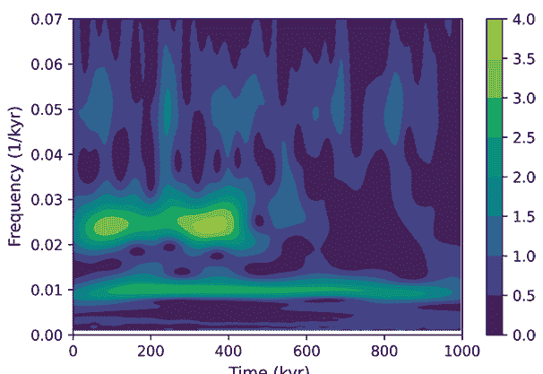

**图 5.16** 包含在 *series_3.txt* 中的合成数据序列的小波功率谱。该图清楚地显示了频率为 0.01、0.025 和 0.05 kyr⁻¹ 的主要周期性，分别对应于 100、40 和 20 kyr 的周期。100 kyr 的周期在整个时间序列中都存在，而 40 kyr 的周期仅在约 450 kyrs 时出现。20 kyr 的周期相对较弱，但可能在整个时间序列中都存在。小波功率谱是使用连续一维小波变换 cwt 计算的。

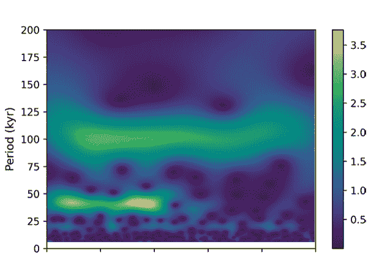

**图 5.17** 包含在 *series_3.txt* 中的合成数据序列的小波功率谱。结果与图 5.16 类似，只是这里使用了 pcolormesh() 来可视化小波功率谱。

与窗口化功率谱方法相比，小波功率谱在时间和频率轴上都显示出明显更高的分辨率。小波变换不是将时间序列分成重叠的段并计算每段的功率谱，而是使用短波包，这些波包能更好地映射周期性随时间的变化。然而，窗口化功率谱和小波功率谱的缺点是它们都需要均匀分布的数据。Lomb–Scargle 方法克服了这个问题，但在映射频域随时间变化的能力方面存在局限性（功率谱方法也是如此）。

## 5.9 检测时间序列中的突变

本节来自基于 MATLAB 的书籍《MATLAB Recipes for Earth Sciences》(Trauth et al. 2021)，无法翻译为 Python（图 5.18 和 5.19）。


**图 5.18** 此图来自基于 MATLAB 的书籍《MATLAB Recipes for Earth Sciences》(Trauth 2021)，无法翻译为 Python。


**图 5.19** 此图来自基于 MATLAB 的书籍《MATLAB Recipes for Earth Sciences》(Trauth 2021)，无法翻译为 Python。

## 5.10 对齐地层序列

本节来自基于 MATLAB 的书籍《MATLAB Recipes for Earth Sciences》(Trauth et al. 2021)，无法翻译为 Python（图 5.20 和 5.21）。


图 5.20 此图来自基于 MATLAB 的书籍《MATLAB Recipes for Earth Sciences》(Trauth 2021)，无法翻译为 Python。


图 5.21 此图来自基于 MATLAB 的书籍《MATLAB Recipes for Earth Sciences》(Trauth 2021)，无法翻译为 Python。

## 5.11 非线性时间序列分析（作者：N. Marwan）

前面章节描述的方法用于检测数据中的线性关系。然而，地球上的自然过程通常是复杂和混沌的，因此基于线性技术的方法可能产生不令人满意的结果。近几十年来，源自混沌理论的非线性数据分析新技术越来越受欢迎。此类方法已被用于描述非线性行为，例如，通过定义自然过程的标度律和分形维数 (Turcotte 1997; Kantz and Schreiber 1997)。然而，大多数非线性数据分析方法需要长或平稳的数据序列，而这些要求在地球科学中很少得到满足。虽然大多数非线性技术在合成数据上表现良好，但这些方法无法描述真实数据的非线性行为。

近几十年来，*递归图*作为一种新的非线性数据分析方法，在科学和工程领域变得非常流行 (Eckmann 1987; Marwan et al. 2007)。递归是耗散动力系统的一个基本属性。尽管此类系统中的微小扰动可能导致系统状态呈指数发散，但经过一段时间后，系统会返回到接近先前状态的状态，然后再次经历类似的演化。递归图允许将动力系统的这种递归行为可视化。该方法现在被广泛接受为分析短而非平稳数据集的非线性分析的有用工具。

### 相空间图

复杂动力系统（例如，湖泊中的沉积过程）的行为由许多变量决定，例如水体和湖底沉积物的性质、生活在湖泊及其周围环境中的生物、降水（高降雨量导致流域内风化和侵蚀加剧）、蒸发（例如，较高的蒸发导致沉积物中钾浓度升高）和风速（风速可以将更多固体颗粒输送到湖中）。分析这样一个动力系统的性质以及系统各组成部分之间随时间变化的相互作用，需要记录这些状态变量随时间的变化。由于通常没有系统状态变量（例如，降水、蒸发、风速）的古代记录可用，我们必须依赖于保存在自然档案中的间接指标（代用指标）。代用记录是通过对多维动力系统的单个变量进行采样获得的，这相当于将复杂系统的动力学投影到单个轴上。以古湖沉积物为例，采样的变量可以是沿湖沉积岩芯的钾浓度时间序列 $x(t)$，它代表了湖泊系统过去状态的自然档案。

从一维时间序列 $x(t$) 展开多维系统动力学的一种方法是通过时间延迟 *嵌入*，它保留了系统的动态特性 (Packard et al. 1980)。这种基于单个变量的一维时间序列包含了关于系统及其状态变量的信息，从中可以完全重建整个系统。换句话说，由于钾浓度是未知环境变量（例如，降水、蒸发、风速）复杂相互作用的结果，分析这种环境代用指标的时间变化有助于我们了解古湖的性质及其各组成部分之间随时间变化的相互作用。例如，将时间序列 $x(t)$ 嵌入到三维 ($m = 3$) *相空间* 中，意味着三个连续的具有时间间隔 $\tau$ 的值 $x(t)$、$x(t + \tau)$ 和 $x(t + 2\tau)$ 被表示为三维坐标系（即相空间）中的一个点（Packard 等人，1980）。*相空间图*将嵌入的观测时间序列显示为相空间内的一条轨迹 $\vec{y}(t) = [x(t), x(t + \tau), x(t + 2\tau)]^T$。相空间轨迹代表了系统状态随时间演化的路径。重构的相空间（通过嵌入重构）与原始相空间（描述湖泊的真实变量）并不完全相同，但只要*嵌入维数*足够大，其拓扑性质就能得以保留（Packard 等人，1980；Takens，1981）。

例如，我们现在来探索一个周期过程的相空间图。我们首先创建位置向量 x1 和速度向量 x2：

```python
%reset -f

import numpy as np
from scipy import interpolate
import matplotlib.pyplot as plt
import scipy.spatial.distance as distance

t = np.arange(0,3*np.pi+np.pi/10,np.pi/10)
x1 = np.sin(t)
x2 = np.cos(t)
```

相空间图

```python
plt.figure()
plt.plot(x1,x2)
plt.xlabel('x_1')
plt.ylabel('x_2')
plt.show()
```

是一个圆，这表明每个状态在一个完整周期后精确地重复出现（图 5.22）。通过时间延迟嵌入，我们可以仅使用单个观测值（例如，一个速度向量）和一个等于摆周期四分之一的时间延迟（五）来重构这个相空间图：

```python
tau = 5
plt.figure()
plt.plot(x2[:-tau],x2[tau:])
plt.xlabel('x_1')
plt.ylabel('x_2')
```

如我们所见，重构的相空间与原始相空间几乎相同。接下来，我们将这个相空间图与一个典型非线性系统的相空间图进行比较：*洛伦兹系统*（Lorenz，1963）。天气模式通常不会以可预测的方式变化。1963 年，爱德华·洛伦兹提出了一个简单的三维模型，用于描述大气湍流所表现出的混沌行为。定义洛伦兹系统的变量是大气对流的强度、上升气流和下降气流之间的温差，以及垂直温度剖面偏离线性的程度。初始条件的微小变化可能导致天气模式的巨大差异——这种行为通常被称为*蝴蝶效应*。洛伦兹系统的动力学由三个耦合的非线性微分方程描述：

$$
\frac{dx}{dt} = s(y(t) - x(t))
$$

$$
\frac{dy}{dt} = -x(t)z(t) + rx(t) - y(t)
$$

$$
\frac{dz}{dt} = x(t)y(t) - bz(t)
$$

对微分方程进行积分，可以得到一个简单的 Python 代码来计算洛伦兹系统的 *xyz* 三元组。我们使用 s=10、r=28 和 b=8/3 作为控制混沌行为的系统参数，时间延迟为 dt=0.01。位置向量的初始值为 x1=8、x2=9 和 x3=25。然而，这些值可以更改为任何其他值，当然这也会改变系统的行为：

```python
dt = .01
s = 10
r = 28
b = 8/3
x1, x2, x3 = 8, 9, 25
n = 5000
x = np.zeros((n,3))
for i in range(0, n):
    x1 = x1 + (-s*x1*dt) + (s*x2*dt)
    x2 = x2 + (r*x1*dt) - (x2*dt) - (x3*x1*dt)
    x3 = x3 + (-b*x3*dt) + (x1*x2*dt)
    x[i,:] = [x1, x2, x3]
```

可以通过绘制 x[:,0] 随时间的变化来查看变量（例如，第一个变量）的典型轨迹（图 5.23）：

```python
t = np.linspace(0.01,50,n)

plt.figure()
plt.plot(t,x[:,0])
plt.xlabel('Time')
plt.ylabel('Temperature')
plt.show()
```

接下来，我们绘制洛伦兹系统的相空间图（图 5.24）：

```python
plt.figure()
ax = plt.axes(projection='3d')
ax.plot(x[:,0],x[:,1],x[:,2])
ax.view_init(30,70-90)
ax.set_xlabel('x_1')
ax.set_ylabel('x_2')
ax.set_zlabel('x_3')
plt.show()
```

**图 5.23** 洛伦兹系统。我们使用 s=10、r=28 和 b=8/3 作为系统参数。时间延迟为 dt=0.01。

**图 5.24** a 洛伦兹系统的相空间图。与简单的周期系统相比，洛伦兹系统的轨迹显然不会精确地遵循之前的路径，但它们非常接近。b 仅使用第一个状态和时间延迟为 6 重构的相空间图，揭示了与 a 相似的拓扑相图，具有两个典型的“耳朵”。

与上述简单的周期系统相比，洛伦兹系统的轨迹显然不会精确地遵循之前的路径，但它们非常接近。此外，如果我们跟踪轨迹的两个非常接近的片段，我们会看到它们随着时间的推移进入相空间的不同区域。轨迹显然围绕相空间中的一个不动点盘旋，然后在随机的时间段后围绕另一个不动点盘旋。相状态围绕不动点的这种奇特轨道被称为*洛伦兹吸引子*。这些观察到的特性是混沌系统的典型特征。虽然此类系统中的微小扰动会导致其状态呈指数级发散，但系统会通过相似的路径近似地返回到先前的状态。仅使用第一个状态和时间延迟为六来重构相空间图

```python
tau = 6
plt.figure()
ax = plt.axes(projection='3d')
ax.plot(x[0:-2*tau-1,0],
        x[0+tau:-tau-1,0],
        x[0+2*tau:-1,0])
ax.view_init(60,100-90)
ax.set_xlabel('x_1')
ax.set_ylabel('x_2')
ax.set_zlabel('x_3')
plt.show()
```

揭示了一个具有两个典型*耳朵*的相似相图（图 5.24）。混沌系统的特征性质也可以在这种重构中观察到。

时间延迟和嵌入维数需要根据对数据的先前分析来选择。延迟可以借助自协方差（或自相关）序列来计算。对于我们这个周期性振荡的例子，

```python
t = np.arange(0,3*np.pi+np.pi/10,np.pi/10)
x = np.sin(t)
```

我们计算并绘制自相关序列

```python
C = np.ones(len(x)-2)
for i in range(1,len(x)-2):
    r = np.corrcoef(x[0:-i],x[i:])
    C[i] = r[0,1]

plt.figure()
plt.plot(range(0,len(x)-2),C)
plt.xlabel('Delay')
plt.ylabel('Autocorrelation')
plt.grid()
```

我们现在选择一个延迟，使得第一个周期的自相关序列等于零。在我们的例子中，这个值是五，也就是我们在相空间重构示例中使用的值。合适的嵌入维数可以通过使用假近邻法或（更简单地）使用递归图来计算，递归图将在下一小节中介绍。嵌入维数逐渐增加，直到大多数对角线与恒等线平行。

相空间轨迹或其重构是非线性数据分析中定义的几种度量的基础，例如 *Lyapunov 指数*、*Rényi 熵* 和 *Rényi 维数*。推荐 Kantz 和 Schreiber (1997) 关于非线性数据分析的著作，以获取有关这些方法的更详细信息。相空间轨迹或其重构也是构建递归图（图 5.25）所必需的。

### 递归图

动力系统的一个共同特征是*递归*性。系统递归状态中的模式反映了典型的系统特征，对这些特征的描述有助于我们理解系统的动力学。在我们的例子中，降水、蒸发和风速等状态变量变化的递归可能导致湖泊中相似（尽管不完全相同）的条件（例如，湖泊的深度和大小、湖水的碱度和盐度、水体中的物种组合或沉积物中的成岩作用）。递归图（RP）是系统这种递归状态的图形显示，它是根据所有相空间向量 y(t) 对之间的距离（例如，欧几里得距离）在阈值 ε 内计算得出的（Marwan 等人，2007）：

$$
R_{i,j} = \begin{cases} 0, & \| x_i - x_j \| > \varepsilon \\ 1, & \| x_i - x_j \| \leq \varepsilon \end{cases}
$$

如果时间 i 和 j 的两个状态之间的距离小于给定的阈值 ε，则递归矩阵 R 的值为一；否则为零。因此，这种分析是对所有状态的成对测试。对于 n 个状态，我们计算 n² 次测试。递归图是 n×n 矩阵的二维显示，其中黑色像素代表 R_{i,j}=1，白色像素表示 R_{i,j}=0，并且坐标系表示两个时间轴。这样的递归图可以帮助创建系统动力学的初步特征描述，或发现系统内的转变和相互关系（参见图 5.26）。

### 递归定量分析

递归图的结构也可以通过一套定量指标在*递归定量分析*（RQA）中进行描述。其中几个指标基于对角线或垂直线长度的分布，以及*局部邻近构型*。这些指标可用于追踪动态过程中隐藏的转变。作为示例，我们接下来考虑两个指标：递归率和传递性系数。*递归率*是递归图中点的密度，对应于系统的递归概率。*传递性系数*源于图论，用于表征系统的规则性（或复杂性）。

对于我们的示例，我们考虑一个正态分布（高斯）噪声的时间序列，该序列在时间点1,000处均值发生转变，并且在此转变之前（从时间点800开始）自相关性发生变化。重要的是，在前兆区域，均值和方差均未改变，因此使用常规方法也无法发现这种变化：

```
np.random.seed(20)
n = 1000
x = np.random.uniform(0,1,n)

x = np.concatenate((np.zeros(n),np.ones(n)))
x = x + np.random.normal(0,.3,len(x))
for i in range(n-round(n/5),n):
    x[i] = .9*x[i-1]+.5*x[i]+.02
x = x/np.std(x,ddof=1)

t = np.arange(0,len(x))

plt.figure()
plt.plot(t, x)
plt.xlabel('Time')
```

我们首先对时间序列进行嵌入，然后计算递归图：

```
n = len(x)
tau = 2
m=2
n2 = n - tau*(m-1)

s = np.zeros((n2,m))
for mi in range(0,m):
    s[:,mi] = x[np.arange(0,n2) + tau*mi]

D = distance.pdist(s)
S = distance.squareform(D)
R = S<.5

plt.imshow(R,
    extent=[0,n2,0,n2],
    cmap='gray_r',
    origin='lower')
plt.xlabel('Time')
plt.ylabel('Time')
plt.show()
```

该递归图显示了两个随机分布点的块，每个块都标记了系统随机返回到相似状态的时间。在随机噪声中，相似状态频繁递归，但除了主对角线（即恒等线）外，没有任何规律性。递归图的两个块标记了时间点1,000处的转变。变化点之前的状态与变化点之后的状态差异很大，这体现在递归图几乎空白的右下和左上象限中。然而，时间点800到1,000之间自相关性的先前增加在递归图中并不明显，尽管它看起来稍微密集一些。在这种情况下，量化递归图中的结构可能被证明是有益的。

为了计算递归率，我们可以简单地计算矩阵R的均值，

```
RR = np.mean(R)
print(RR)
```

得到

```
0.10654648642636631
```

因此，系统返回到随机选择的先前状态的概率约为10%。

传递性系数是一个图论指标，用于衡量三个相连的网络节点（三元组）完全互连（即形成一个封闭三角形）的概率：

$$\tau = \frac{\sum_{i,j,k}^N A_{ij}A_{ij}A_{ik}}{\sum_{i,j,k=1}^N A_{ij}A_{ik}(1 - \delta_{ik})}$$

这个指标可以直观地理解为相空间中的递归。我们通过网络链接来识别状态的递归：相空间轨迹上接近的点通过链接连接。三个相连的点形成一个三元组，但只有当所有三个点彼此接近地递归，从而形成一个三角形时，才构成三角形。如果动态高度规则（即递归状态在长时间内保持递归），这种三角形构型会沿着相空间轨迹保持。然而，如果动态是混沌的，那么相空间轨迹中最初接近的部分随后会发散，即使相应的三元组节点可能在一段时间内保持互连，三角形构型也会崩溃。因此，对于规则动态，找到三角形的概率更高，而对于混沌动态则更低。当然，这个解释相当简化，但可以在Donner等人（2011）中找到理论上证实的解释。

为了计算三元组也形成三角形的概率，我们需要计算相连三元组的数量和三角形的数量，这可以通过排除主对角线直接从递归图中实现：

```
A = R - np.eye(len(R))
```

三角形和三元组的数量为

```
numTripl = np.sum(np.matmul(A,A))
numTria = np.trace(np.matmul(A,np.matmul(A,A)))
```

最终，传递性系数是比值

```
Trans = numTria/numTripl
print(Trans)
```

其结果为

```
0.6459486011860506
```

这个数字意味着该系统没有规则的动力学（规则动力学会产生接近1的传递性系数）。
为了检测动力学的变化，可以对移动窗口计算递归量化分析。移动窗口的递归量化分析可以通过两种方式计算：（1）对沿单个全局递归图移动的窗口计算递归量化分析度量，或（2）对沿原始时间序列移动的窗口计算各自的递归图。如果非平稳性或趋势不是分析的主要关注点，方法（2）有助于找到忽略这些非平稳性的转变。然而，如果检测整体（全局、大尺度）变化是关注点（例如，测试非平稳性），则应保持递归条件随时间不变（从而允许考虑整个时间序列的全局递归图），并应选择方法（1）（Marwan 2011）。所选窗口大小需要足够小以确保良好的时间分辨率，但又要足够大以覆盖典型的变异（例如，几个周期），以便找到递归。

在我们的示例中，我们选择移动窗口长度为150个数据点，重叠率为20%（图5.30）：

```
w = 150
```

然后我们计算这些移动窗口内的递归率RR和传递性系数Trans（图5.31和5.32）：

```
Trans = np.zeros(len(R)-w)
RR = np.zeros(len(R)-w)
for i in range(0,len(R)-w,int(w/5)):
    subR = R[i:i+w,i:i+w]
    RR[i] = np.mean(subR)
    subA = A[i:i+w,i:i+w]
    numTripl = np.sum(np.matmul(subA,subA))
    numClosTria = np.trace(np.matmul(subA,
        np.matmul(subA,subA)))
    Trans[i] = numClosTria/numTripl
```

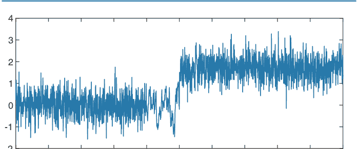

图5.30 用于递归图定量度量示例的合成数据时间序列。

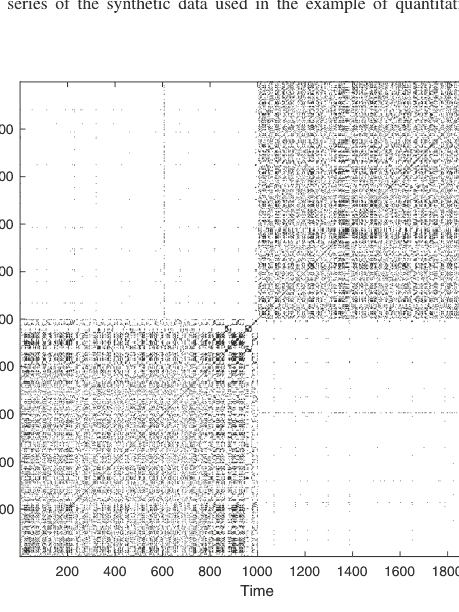

图5.31 图5.30所示合成数据的递归图，使用嵌入维度m = 5和延迟τ = 3，并应用阈值ε = 1.2。

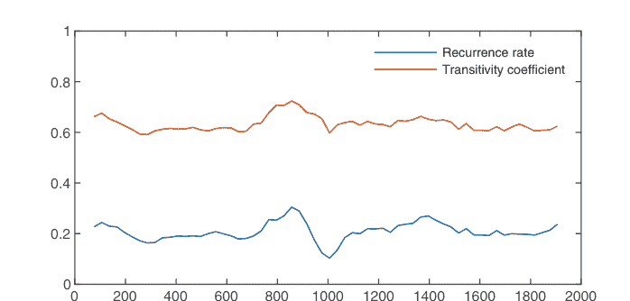

**图5.32** 图5.30中合成数据的递归率和传递性系数，使用150个数据点的移动窗口和20%的重叠率。

```
plt.figure()
plt.plot(t[int(w/2):int(w/2)+len(RR):int(w/5)],
    RR[0:-1:int(w/5)],
    label='Recurrence rate')
plt.plot(t[int(w/2):int(w/2)+len(RR):int(w/5)],
    Trans[0:-1:int(w/5)],
    label='Transitivity coefficient')
plt.xlabel('Time')
plt.legend()
```

递归量化分析度量显示在高自相关部分内有一个明显的转变。在这一点上，度量值较高，这反映了黑点密度较高、由于自相关导致的邻域配置变化以及系统动力学的变化。这些较高值的存在可用于检测自相关性的这种变化（例如，作为*临界点*的前兆），并最终预测临界点本身。两个空象限在时间1,000处发生的转变点直接干扰移动窗口，从而导致*RR*度量突然下降。

为了可靠地解释递归度量的变化，应应用统计检验（Marwan 2011）。其他更复杂的度量，用于量化动力学的额外方面（例如，可预测性或层流相），包含在MATLAB的交叉递归图工具箱中，该工具箱可在以下地址获取：

http://tocsy.pik-potsdam.de/CRPtoolbox/

递归图的双变量和多变量扩展允许进行非线性相关性检验和同步分析。关于基于递归图的方法的详细介绍可在以下网站找到：

http://www.recurrence-plot.tk

递归图已被用于分析地球科学中的许多问题。将现代降水数据与阿根廷西北部安第斯山脉年层湖泊沉积物推断的古降雨数据进行比较，是此类分析的一个很好的例子（Marwan等人，2003）。在这个例子中，递归图方法应用于大约3万年前的纹层湖泊沉积物的红色强度剖面（第8.7节）。将沉积物的递归图与现代降水数据的递归图进行比较，揭示了红色层记录了拉尼娜年份发生的更强烈的雨季。线性技术无法将红色粘土通量的增加与厄尔尼诺/南方涛动的厄尔尼诺或拉尼娜阶段联系起来。此外，递归图有助于支持以下假设：更长的雨季、增加的降水以及厄尔尼诺/南方涛动的更强影响导致了3万年前滑坡数量的增加（Marwan等人，2003；Trauth等人，2003）。第二个地球科学例子——包括对递归图和递归量化分析的全面描述——使用该技术对湖泊沉积岩芯记录中的不同类型的变异性和转变进行分类，以便更好地理解生物圈对气候变化的响应，特别是埃塞俄比亚南部裂谷地区人类的响应（Trauth等人，2019）。

## 推荐阅读

- Blackman, RB, Tukey, JW (1958) 功率谱的测量。Dover NY
- Brückner E (1890) 1700年以来的气候波动及关于冰川期气候波动的评论。Geographische Abhandlungen 4:153–484
- Cooley JW, Tukey JW (1965) 复数傅里叶级数的机器计算算法。Math Comput 19(90):297–301
- Donner RV, Heitzig J, Donges JF, Zou Y, Marwan N, Kurths J (2011) 混沌动力学的几何——复杂网络视角。European Physical Journal B 84:653–672
- Eckmann JP, Kamphorst SO, Ruelle D (1987) 动力系统的递归图。Europhys Lett 5:973–977
- Hann J (1901) 气象学教科书。Tauchnitz, Leipzig
- Iwanski J, Bradley E (1998) 递归图分析：嵌入还是不嵌入？Chaos 8:861–871
- Kantz H, Schreiber T (1997) 非线性时间序列分析。Cambridge University Press, Cambridge
- Köppen W (1931) 气候学纲要——，第2版。de Gruyter, Berlin
- Lau KM, Weng H (1995) 使用小波变换检测气候信号：如何让时间序列歌唱。Bull Am Meteor Soc 76:2391–2402
- Lorenz EN (1963) 确定性非周期流。Journal of Atmospheric Sciences 20:130–141
- Mackenzie D, Daubechies I, Kleppner D, Mallat S, Meyer Y, Ruskai MB, Weiss G (2001) 小波：见树又见林。Beyond Discovery, National Academy of Sciences, 2001年12月，可在线获取 http://www.beyonddiscovery.org
- Marwan N (2011) 如何避免基于递归图数据分析中的潜在陷阱。International Journal of Bifurcation and Chaos 21:1003–1017
- Marwan N, Trauth MH, Vuille M, Kurths J (2003) 阿根廷西北部安第斯山脉现代和更新世降水数据的非线性时间序列分析。Clim Dyn 21:317–332
- Marwan N, Romano MC, Thiel M, Kurths J (2007) 用于复杂系统分析的递归图。Phys Rep 438:237–329
- Mudelsee M (2014) 气候时间序列分析：经典统计和自助法，第2版。Springer Verlag, Berlin Heidelberg New York
- Packard NH, Crutchfield JP, Farmer JD, Shaw RS (1980) 来自时间序列的几何。Phys Rev Lett 45:712–716
- Press WH, Teukolsky SA, Vetterling WT, Flannery BP (2007) 数值食谱：科学计算的艺术，第3版。Cambridge University Press, Cambridge
- Scargle JD (1981) 天文时间序列分析研究。I. 时间域随机过程建模。Astrophys J Suppl Ser 45:1–71
- Scargle JD (1982) 天文时间序列分析研究。II. 非均匀间隔数据谱分析的统计方面。Astrophys J 263:835–853
- Scargle JD (1989) 天文时间序列分析研究。III. 非均匀间隔数据的傅里叶变换、自相关函数和互相关函数。Astrophys J 343:874–887
- Scargle JD (1990) 天文时间序列分析研究。IV. 使用线性滤波器建模混沌和随机过程。Astrophys J 359:469–482
- Schulz M, Stattegger K (1998) SPECTRUM：非均匀间隔古气候时间序列的谱分析。Comput Geosci 23:929–945
- Solomon S, Qin D, Manning M, Chen Z, Marquis M, Averyt KBM. (2007) Tignor. In: Miller, H.L. (Ed.), 政府间气候变化专门委员会第四次评估报告第一工作组的贡献。Cambridge University Press, Cambridge, United Kingdom and New York, NY, USA
- Takens F (1981) 湍流中奇异吸引子的检测。Lect Notes Math 898:366–381
- Torrence C, Compo GP (1998) 小波分析实用指南。Bull Am Meteor Soc 79:61–78
- Trauth MH, Bookhagen B, Marwan N, Strecker MR (2003) 多个滑坡集群记录阿根廷西北部安第斯山脉的第四纪气候变化。Palaeogeogr Palaeoclimatol Palaeoecol 194:109–121
- Trauth MH, Asrat A, Duesing W, Foerster V, Kraemer KH, Marwan N, Maslin MA, Schaebitz F (2019) 使用递归量化分析对埃塞俄比亚南部Chew Bahir盆地的过去气候变化进行分类。Climate Dynamics, 53:2557–2572, 代码 ClimDyn_RP_RQA.zip 或 https://tinyurl.com/yyqjyoq4
- Trauth MH, Asrat A, Cohen A, Duesing W, Foerster V, Kaboth-Bahr S, Kraemer KH, Lamb H, Marwan N, Maslin MA, Schaebitz F (2021) 埃塞俄比亚南部Chew Bahir盆地约62万年气候变迁记录中反复出现的变异性和转变类型。Quaternary Science Reviews, 代码 QSR_RP_RQA 或 https://tinyurl.com/s6abkknz
- Turcotte DL (1997) 地质学和地球物理学中的分形与混沌。Cambridge University Press, Cambridge
- Webber CL, Zbilut JP (2005) 非线性动力系统的递归量化分析。In: Riley MA, Van Orden GC, 行为科学当代非线性方法教程。
- Welch PD (1967) 使用快速傅里叶变换估计功率谱：一种基于短修正周期图时间平均的方法。IEEE Trans. Audio Electroacoustics AU-15:70–73

## 延伸阅读

Ansari AR, Bradley RA (1960) Rank-Sum Tests for Dispersion. Annals of Mathematical Statistics, 31:1174–1189. [开放获取]
Campisano CJ et al (2017) The Hominin Sites and Paleolakes Drilling Project: High-Resolution Paleoclimate Records from the East African Rift System and Their Implications for Understanding the Environmental Context of Hominin Evolution. PaleoAnthropology 2017:1–43
Grenander U (1958) Bandwidth and variance in estimation of the spectrum. J Roy Stat Soc B 20:152–157
Holschneider M (1995) Wavelets, an analysis tool. Oxford University Press, Oxford
Killick R, Fearnhead P, Eckley IA (2012) Optimal detection of changepoints with a linear computational cost. J Am Stat Assoc 107:1590–1598
Lavielle M (2005) Using penalized contrasts for the change-point problem. Signal Process 85:1501–1510
Lepage Y (1971) A combination of Wilcoxon’s and Ansari-Bradley’s statistics. Biometrika 58:213–217
Lomb NR (1977) Least-Squared frequency analysis of unequally spaced data. Astrophysics and Space Sciences 39:447–462
Mann HB, Whitney DR (1947) On a test of whether one of two random variables is stochastically larger than the other. Ann Math Stat 18:50–60
Marwan N, Thiel M, Nowaczyk NR (2002) Cross recurrence plot based synchronization of time series. Nonlinear Process Geophys 9(3/4):325–331
Mudelsee M (2000) Ramp function regression: A tool for quantifying climate transitions. Comput Geosci 26:293–307
Mudelsee M, Stattegger M (1997) Exploring the structure of the mid-Pleistocene revolution with advanced methods of time-series analysis. Int J Earth Sci 86:499–511
Muller RA, MacDonald GJ (2000) Ice ages and astronomical causes—data. Springer Verlag, Berlin Heidelberg New York, Spectral Analysis and Mechanisms
Paliwal KK, Agarwal A, Sinha SS (1982) A modification over Sakoe and Chiba’s dynamic time warping algorithm for isolated word recognition. Signal Process 4:329–333
Romano M, Thiel M, Kurths J, von Bloh W (2004) Multivariate recurrence plots. Phys Lett A 330(3–4):214–223
Sakoe H, Chiba S (1978) Dynamic programming algorithm optimization for spoken word recognition. IEEE Transactions on Acoustics, Speech, and Signal Processing ASSP-26:43–49
Schuster A (1898) On the investigation of hidden periodicities with application to a supposed 26 day period of meteorological phenomena. Terr Magn Atmos Electr 3:13–41
Trauth MH (2015) MATLAB Recipes for Earth Sciences –, 4th edn. Springer Verlag, Berlin Heidelberg New York
Trauth MH, Larrasoaña JC, Mudelsee M (2009) Trends, rhythms and events in Plio-Pleistocene African climate. Quatern Sci Rev 28:399–411
Trauth MH, Foerster V, Junginger A, Asrat A, Lamb H, Schaeabitz F (2018) Abrupt or gradual? Change point analysis of the late pleistocene-Holocene climate record from chew Bahir, Southern Ethiopia. Quatern Res 90:321–330
Trulla LL, Giuliani A, Zbilut JP, Webber CL Jr (1996) Recurrence quantification analysis of the logistic equation with transients. Phys Lett A 223(4):255–260
Weedon G (2003) Time-series analysis and cyclostratigraphy—examining stratigraphic records of environmental change. Cambridge University Press, Cambridge

# 信号处理

### 6.1 引言

信号处理涉及一系列技术，用于操纵信号以最小化噪声影响、校正各种不必要的失真，并分离出各种感兴趣的成分。大多数信号处理算法都包括滤波器的设计与实现。*滤波器*可以描述为一个转换信号的系统。*系统理论*为滤波器的设计与实现提供了数学基础。滤波器有输入和输出，其中*输出信号 y(t)*是相对于*输入信号 x(t)*进行修改的（图6.1）。*信号转换*可以通过称为*卷积*的数学过程进行，或者如果涉及滤波器，则称为*滤波*。

本章讨论借助计算机进行*数字滤波器*的设计与实现。然而，许多自然过程类似于*模拟滤波器*，它们记录地质档案中的自然事件。单次降雨事件不会在湖泊沉积物中留下记录，因为该事件在沉积物中产生的短时、低振幅信号（例如沉积物化学成分的短期变化）在进入沉积物之前，在充分混合的水体中已被强烈衰减。生物扰动也会引入严重的信号失真（例如信号幅度和相位的变化），例如在深海沉积物中，它导致单个有孔虫物种的氧同位素信号出现明显的相位偏移（例如Trauth 2013）。除了这些自然滤波器外，地质数据的野外采集和取样也会改变和平滑数据的原始形式。例如，一个有限大小的沉积物样品是在一定时间段内积分的，这平滑了自然信号。同样，使用环形传感器测量沉积岩芯的磁化率会引入显著的平滑，因为环形响应是在岩芯的某一段上积分的。

这些自然滤波器的特性通常难以确定，而数值滤波器则具有明确的特性。此外，人工滤波器在大多数情况下是时不变的，而自然滤波器（例如湖泊水体内的混合或水-沉积物界面的生物扰动）可能会随时间变化。描述或预测滤波器效果的一种简单方法是通过探索简单输入信号（如正弦波、方波、锯齿函数、斜坡函数或阶跃函数）的滤波器输出。尽管存在无穷多种此类输入信号，但大多数系统或滤波器是通过其脉冲响应来描述的，即单位脉冲输入所产生的输出。

本章接下来是第6.2节，关于生成周期信号、趋势和噪声，这承接了上一章第5.2节的内容。然后第6.3节考虑线性时不变系统，并为滤波器提供数学背景。随后的第6.4至6.9节讨论线性时不变滤波器的设计、实现和应用。第6.10节考虑自适应滤波器的使用，这些滤波器最初是为电信行业开发的。这些自适应滤波器可以从同一对象的重复测量中自动提取无噪声信号。此类滤波器可用于大量应用，例如从重复的古海洋时间序列中去除噪声，以及提高穿过纹层状湖泊沉积物的平行颜色强度剖面的信噪比（见第5章，图5.1）。自适应滤波器也广泛应用于地球物理学中的噪声消除。对于信号处理，我们使用NumPy (https://numpy.org)、Matplotlib (https://matplotlib.org) 和 SciPy (https://scipy.org) 包，它们包含了所有必要的例程。

### 6.2 生成信号

Python提供了许多生成基本信号的工具，这些信号可用于说明滤波器的效果。在第5章中，我们通过将三个不同振幅和周期的正弦波相加来生成信号。在下面的示例中，时间数组被转置以生成列数组：

```python
%reset -f

import numpy as np
import matplotlib.pyplot as plt

t = np.linspace(1,100,100)
x = 2 *np.sin(2*np.pi*t/50) + \
    np.sin(2*np.pi*t/10) + \
    0.5*np.sin(2*np.pi*t/5)

plt.figure()
plt.plot(t,x)
plt.axis(np.array([0,100,-4,4]))
plt.show()
```

频率选择性滤波器用于从数据中移除特定频带。例如，我们可以设计一个滤波器，抑制周期为 τ = 10 的信号部分，同时保持其他两个周期不受影响。此类滤波器对简单周期信号的影响也可用于预测自然滤波器的信号失真。

*阶跃函数*是另一种可用于探索滤波器特性的基本输入信号。阶跃函数描述了在特定时间从一个值向另一个值的过渡。函数 `stairs()` 绘制元素 x 的阶梯图。该函数需要边缘 e，我们从 t 计算得出：

```python
t = np.linspace(1,100,100)
x = np.ones(100)
x[51:100] = np.zeros(49)

e = np.zeros(101)
e[0] = np.diff(t[0:2])/2
e[1:101] = t+np.diff(t[0:2])/2

plt.figure()
plt.stairs(x,e)
plt.axis(np.array([0,100,-4,4]))
plt.show()
```

该信号可用于研究滤波器对突然过渡的影响。突然的气候变化可以作为一个例子。大多数自然滤波器倾向于平滑这种过渡，并将其分布在更长的时间段内。

*单位脉冲*是我们在以下示例中使用的第三种重要信号类型。该信号在所有时间点都等于零，除了在单个数据点处等于一。函数 `stem()` 使用圆圈表示数据值，将数据序列 x 绘制为从 *t* 轴发出的茎图：

## 6.3 线性时不变系统

滤波器可以被描述为具有输入 $x(t)$ 和输出 $y(t)$ 的系统。因此，我们首先描述系统的一般特性，然后再考虑滤波器。系统的重要特性包括：

-   *连续性*——具有连续输入 $x(t)$ 和输出 $y(t)$ 的系统是连续系统。大多数自然系统是连续的。然而，在对自然信号进行采样后，我们得到离散数据序列，并将这些自然系统建模为具有离散输入和输出的离散系统。
-   *线性*——对于线性系统，几个输入信号 $x_i(t)$ 的线性组合的输出 $y(t)$，其中
    $$x(t) = k_1x_1(t) + k_2x_2(t)$$
    与输出 $y_i(t)$ 的线性组合相同：
    $$y(t) = k_1y_1(t) + k_2y_2(t)$$

    线性的重要性质是缩放性和可加性（*叠加性*），这允许输入和输出在变换之前或之后乘以常数 $k_i$。叠加性允许输入的可加分量被单独提取和变换。幸运的是，许多自然系统遵循线性行为模式。复杂的线性信号（例如，加性谐波分量）可以被分离出来并独立变换。米兰科维奇旋回提供了古气候记录中线性叠加的一个例子，尽管关于该理论的有效性仍存在争议。自然界中也存在许多不具备缩放性和可加性性质的非线性系统。一个线性系统的例子是

```python
%reset -f

import numpy as np
import matplotlib.pyplot as plt

x = np.linspace(1,100,100)
y = 2*x

plt.figure()
plt.plot(x,y)
plt.show()
```

其中 x 是输入信号，y 是输出信号。一个非线性系统的例子是

```python
x = np.linspace(1,100,100)
y = x**2

plt.figure()
plt.plot(x,y)
plt.show()
```

-   *时不变性*——系统输出 $y(t)$ 不会因输入 $x(t+i)$ 的延迟而改变；相反，系统特性随时间保持不变。不幸的是，自然系统的特性通常会随时间变化。例如，底栖混合（或生物扰动）取决于各种环境变量（例如，营养供应），因此系统的特性会随时间变化。在这种情况下，很难使用输出来确定系统的实际输入（例如，当从生物扰动的沉积记录中提取实际气候信号时）。
-   *可逆性*——可逆系统是指可以从系统输出 $y(t)$ 重现原始输入信号 $x(t)$ 的系统。如果要校正不需要的信号失真，这是一个重要的特性，在这种情况下，已知系统被反转，然后使用输出来重建未受扰动的输入。例如，使用环形传感器测量磁化率的岩芯测井仪会将信号积分在特定的岩芯区间上；灵敏度在环形传感器位置最高，并沿岩芯向下和向上递减。该系统是可逆的，也就是说，我们可以通过反转系统从输出信号 $y(t)$ 计算输入信号 $x(t)$。上述线性系统的逆是

```python
x = np.linspace(1,100,100)
y = 0.5*x

plt.figure()
plt.plot(x,y)
plt.show()
```

其中 x 是输入信号，y 是输出信号。一个非线性系统

```python
x = np.linspace(-100,100,201)
y = x**2

plt.figure()
plt.plot(x,y)
plt.show()
```

是不可逆的。由于该系统对不同的输入产生相同的响应，例如对于输入 x=-2 和 x=+2，输出 y=4，因此无法从输出 y 重建输入 x。类似的情况也可能发生在线性系统中，例如

```python
x = np.linspace(1,100,100)
y = np.zeros(x.shape)

plt.figure()
plt.plot(x,y)
plt.show()
```

对于所有输入 x，输出 y 都为零，因此输出不包含任何关于输入的信息。

-   *因果性*——系统响应仅取决于当前和过去的输入 $x(0)$, $x(-1)$, ...，而未来的输入 $x(+1)$, $x(+2)$, ... 对输出 $y(0)$ 没有影响。所有实时系统（例如，电信系统）都必须是因果的，因为它们无法获得未来的输入。Python 中的所有系统和滤波器都按因果方式索引。然而，在地球科学中，使用了许多非因果滤波器。对从沉积岩芯中提取的图像和信号进行滤波就是一个例子，在这种情况下，滤波时可以获得未来的输入。滤波后必须延迟输出信号，以补偿因果和非因果索引之间的差异。
-   *稳定性*——如果有限输入 $x(t)$ 的输出 $y(t)$ 也是有限的，则系统是稳定的。稳定性在滤波器设计中至关重要，滤波器通常具有引发发散输出的缺点。在这种情况下，必须修改和改进滤波器设计。

*线性时不变（LTI）系统*作为一种特殊类型的滤波器非常受欢迎。此类系统具有上述所有优点，并且在许多应用中易于设计和使用。下面的第 6.4 至 6.9 节描述了 LTI 型滤波器的设计、实现和应用，用于从信号中提取特定的频率分量。这些滤波器主要用于降低信号中的噪声水平。然而，不幸的是，许多自然系统的行为不像 LTI 系统，因为信噪比通常随时间变化。第 6.10 节描述了自适应滤波器的应用，这些滤波器在时变环境中自动调整其特性。

## 6.4 卷积、反卷积和滤波

卷积是系统变换的数学描述。滤波是卷积过程的一个应用。长度为五的移动平均提供了一个此类简单滤波器的例子。任意输入信号的输出是

$$y(t) = \frac{1}{5} \sum_{k=-2}^{2} x(t-k)$$

输出 $y(t)$ 只是五个输入值 $x(t-2)$, $x(t-1)$, $x(t)$, $x(t+1)$ 和 $x(t+2)$ 的平均值。换句话说，所有五个连续的输入值都乘以因子 1/5 并求和形成 $y(t)$。在这个例子中，所有输入值都乘以相同的因子，即它们被等权重加权。因此，上述操作中使用的五个因子被称为滤波器权重 $b_k$。该滤波器可以由数组表示

```python
%reset -f

import numpy as np
import scipy.signal as signal
import matplotlib.pyplot as plt
from numpy.random import default_rng

b = np.array([0.2,0.2,0.2,0.2,0.2])
print(b)
```

它由五个相同的滤波器权重 0.2 组成。由于该滤波器是对称的，它不会在时间轴上移动信号；相反，该滤波器的唯一功能是平滑信号。给定长度的移动平均通常用于平滑信号，主要是出于美观原因。现代电子表格软件通常包含移动平均作为平滑数据系列的功能。平滑滤波器的有效性随着滤波器长度的增加而增加。

任意长度的滤波器使用的权重可以变化。例如，让我们考虑一个具有五个滤波器权重的非对称滤波器：

```python
b = np.array([0.05,0.08,0.14,0.26,0.47])
print(b)
```

所有滤波器权重的总和为一，因此滤波器不会向信号引入任何额外的方差。然而，由于滤波器高度非对称滤波器会沿时间轴移动信号，即引入相位偏移。

滤波过程的一般数学表示是卷积

$$y(t) = \sum_{k=-N_1}^{N_2} b_k \cdot x(t-k)$$

其中 $b_k$ 是*滤波器权重*数组，$N_1+N_2$ 是*滤波器阶数*，即滤波器长度减一。具有五个权重的滤波器（如我们的示例）阶数为四。与此格式不同，Python 使用工程标准对滤波器进行索引，即滤波器始终定义为因果的。因此 Python 使用的卷积是

$$y(t) = \sum_{k=0}^{N} b_k \cdot x(t-k)$$

其中 $N$ 是滤波器阶数。Python 提供的多个频域工具不能简单地应用于为地球科学应用设计的非因果滤波器。因此，通常进行相位校正以模拟非因果性。例如，频率选择性滤波器（在第 6.9 节介绍）可以使用 `filtfilt()` 应用，该函数提供零相位正向和反向滤波。

Python 中提供数字滤波的函数 `convolve()` 和 `lfilter()` 最好通过简单的滑动平均来说明。数组 $x(t_1), x(t_2), x(t_3), \dots, x(t_n)$ 的 $n$ 个元素被输入数组子集的算术平均值替换。例如，三个元素的滑动平均计算输入 $x(t_{n-1}), x(t_n), x(t_{n+1})$ 的平均值以获得输出 $y(t_n)$。我们可以通过生成随机信号来简单说明这一点，

```
t = np.linspace(1,100,100)
rng = default_rng(0)
x1 = rng.standard_normal((100))
```

设计一个对输入信号三个数据点取平均的滤波器，

```
b1 = np.array([1,1,1])/3
print(b1)
```

并将输入数组与滤波器进行卷积

```
y1 = np.convolve(x1,b1)
```

`b1` 的元素是滤波器的权重。在我们的示例中，所有滤波器权重相同，都等于 1/3。注意 `convolve()` 生成的数组长度为 $n+m-1$，其中 $m$ 是滤波器长度：

```
m1 = len(b1)
```

我们可以探索工作区的内容以检查卷积的输入和输出长度。输入

```
np.who()
```

得到

| 名称 | 形状 | 字节 | 类型 |
|------|-------|-------|------|
| b | 5 | 40 | float64 |
| t | 100 | 800 | float64 |
| x1 | 100 | 800 | float64 |
| b1 | 3 | 24 | float64 |
| y1 | 102 | 816 | float64 |
| 总字节上限 = | 2480 | | |

这里我们看到实际输入序列 x1 长度为 100 个数据点，而输出序列 y1 有两个额外元素。卷积通常在数据序列的每端引入 (m-1)/2 个数据点。为了比较输入和输出信号，我们因此裁剪输出信号的两端：

```
y1 = y1[1:101]
```

校正 `convolve()` 相位偏移的更通用方法是输入

```
y1 = y1[np.arange(int((m1-1)/2),len(y1)-int((m1-1)/2))]
print(y1)
```

这当然只适用于奇数个滤波器权重。校正相位偏移的另一种方法是在 `convolve()` 的输入参数 shape 中使用 same，以返回卷积最中心的 100 个数据点。结果，y1 与输入信号 x1 大小相同：

```
y1 = np.convolve(x1,b1,'same')
```

然后我们可以绘制输入和输出信号进行比较，使用 legend() 显示图例：

```
plt.figure()
line1, = plt.plot(t,x1,color='b',label='x1(t)')
line2, = plt.plot(t,y1,color='r',label='y1(t)')
plt.legend(handles=[line1,line2])
plt.show()
```

此图说明了滑动平均对原始输入序列的影响。输出 y1 比输入信号 x1 平滑得多。如果我们增加滤波器长度，会得到更平滑的信号输出 y2：

```
b2 = np.array([1,1,1,1,1])/5
m2 = len(b2)

y2 = np.convolve(x1,b2,'same')

plt.figure()
line1, = plt.plot(t,x1,color='b',label='x1(t)')
line2, = plt.plot(t,y1,color='r',label='y1(t)')
line3, = plt.plot(t,y2,color='g',label='y2(t)')
plt.legend(handles=[line1,line2,line3])
plt.show()
```

卷积的逆运算是反卷积，常用于信号处理以逆转滤波器的效果。我们使用第一个随机信号 x1 的示例，设计一个对输入信号三个数据点取平均的滤波器，并将输入数组与滤波器卷积，得到输出 y1：

```
t = np.linspace(1,100,100)
rng = default_rng(0)
x1 = rng.standard_normal((100))

b1 = np.array([1,1,1])/3
print(b1)

y1 = np.convolve(x1,b1)
```

我们使用 `deconvolve()` 逆转卷积，并将反卷积结果 x1d 与原始信号 x1 进行比较：

```
x1d,rem = signal.deconvolve(y1,b1)

plt.figure()
line1, = plt.plot(t,x1,color='b',label='x1(t)')
line2, = plt.plot(t,x1d,color='r',linestyle=':',label='x1d(t)')
plt.legend(handles=[line1,line2])
plt.show()
```

如我们所见，x1d 和 x1 之间没有差异。然而，如果我们向信号添加噪声并输入以下命令对结果进行反卷积，则存在差异

```
y1n = y1 + 0.05*rng.standard_normal(len(y1))
x1nd,rem = signal.deconvolve(y1n,b1)

plt.figure()
line1, = plt.plot(t,x1,
    color='b',
    label='x1(t)')
line2, = plt.plot(t,x1nd,
    color='r',
    linestyle=':',
    label='x1nd(t)')
plt.legend(handles=[line1,line2])
plt.show()
```

下一节提供了滤波器的更广泛定义。

## 6.5 比较数据序列滤波函数

上一节描述的滤波器是*非递归滤波器*的非常简单的例子，其中滤波器输出 $y(t)$ 仅取决于滤波器输入 $x(t)$ 和滤波器权重 $b_k$。在介绍线性时不变滤波器的更广泛描述之前，我们将 `convolve()` 替换为 `lfilter()`，后者也可用于*递归滤波器*。在这种情况下，输出 $y(t_n)$ 不仅取决于滤波器输入 $x(t_n)$，还取决于输出的先前元素 $y(t_{n-1})$、$y(t_{n-2})$、$y(t_{n-3})$ 等（第 6.6 节）。我们首先对非递归滤波器使用 `convolve()`，以比较 `convolve()` 和 `lfilter()` 的结果：

```
%reset -f

import numpy as np
import scipy.signal as signal
import matplotlib.pyplot as plt
from numpy.random import default_rng

t = np.linspace(1,100,100)
rng = default_rng(0)
x3 = rng.standard_normal((100))
```

然后我们设计一个对输入信号五个数据点取平均的滤波器：

```
b3 = np.array([1,1,1,1,1])/5
m3 = len(b3)
```

输入信号可以使用 `convolve()` 进行卷积：

```
y3 = np.convolve(x3,b3,'same')
```

接下来我们使用 lfilter() 执行类似过程，并将结果与使用 convolve() 获得的结果进行比较。与不使用 same 的 convolve() 不同，lfilter() 生成与输入数组长度相同的输出数组。不幸的是，lfilter() 假设滤波器是因果的。这在电子工程中非常重要，因为滤波器通常实时应用。然而，在地球科学中，大多数应用在处理数据时整个信号都是可用的。数据序列通过以下方式滤波

```
y4 = signal.lfilter(b3,1,x3)
```

然后使用以下命令进行相位校正

```
y4[0:len(y4)-m3+1] = y4[np.arange(int((m3-1)/2),
    len(y4)-int((m3-1)/2))]
y4[len(y4)-m3+1:len(y4)] = np.zeros((1,m3-1))
```

这仅适用于奇数个滤波器权重。此命令简单地将输出向 t 轴低端移动 (m−1)/2，然后用零填充数据到末尾。比较两个输出的末端说明了此校正的效果，其中

```
print(y3[0:5])
print(y4[0:5])
```

得到

```
[0.1268096  0.14778963 0.04065575
 0.08782872 0.3750497 ]
[0.1268096  0.14778963 0.04065575
 0.08782872 0.3750497 ]
```

这是输出的低端。我们可以看到数组 y3 和 y4 包含相同的元素。我们现在探索数据数组的高端，其中

```
print(y3[94:])
print(y4[94:])
```

得到输出

```
[ 0.05479578  0.02424718 -0.0969001
 -0.42716122 -0.63345184 -0.66565375]
[ 0.05479578  0.02424718  0.
  0.          0.          0.        ]
```

数组在元素 y(end−m3+1) 之前是相同的，但之后第二个数组 (y4) 包含的是零值而非真实数据。使用以下代码绘制结果：

```python
plt.figure()
fig,(ax1,ax2) = plt.subplots(2)
ax1.plot(t,x3,color='b')
ax1.plot(t,y3,color='r')
ax2.plot(t,x3,color='b')
ax2.plot(t,y4,color='r')
plt.show()
```

或在单个图中绘制：

```python
plt.figure()
plt.plot(t,x3,color='b')
plt.plot(t,y3,color='g')
plt.plot(t,y4,color='r',
    linestyle=':')
plt.show()
```

结果表明，使用 `convolve()` 得到的结果与使用 `lfilter()` 得到的结果在数据数组的上端之外是完全相同的。这些观察结果对我们后续的信号处理步骤非常重要，特别是当我们关注信号各分量之间的超前和滞后关系时。

## 6.6 递归与非递归滤波器

我们现在通过添加递归分量来扩展非递归滤波器，使得输出 y(t_n) 不仅取决于滤波器输入 x(t_n)，还取决于之前的输出值 y(t_{n-1})、y(t_{n-2})、y(t_{n-3}) 等。这种滤波器不仅需要非递归滤波器权重 b_i，还需要递归滤波器权重 a_i（图 6.2），其可以用差分方程描述：

$$y(t) = \sum_{k=-N_1}^{N_2} b_k \cdot x(t-k) - \sum_{k=1}^{M} a_k \cdot y(t-k)$$

这是差分方程的非因果版本，但 Python 再次使用了因果索引：

$$y(t) = \sum_{k=0}^{N} b_k \cdot x(t-k) - \sum_{k=1}^{M} a_k \cdot y(t-k)$$

这带来了设计零相位滤波器时已知的问题。M 与 N_1+N_2 或 N 中较大的那个值就是滤波器的阶数。

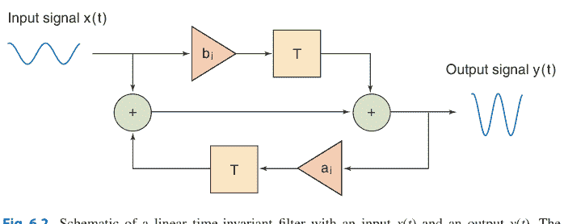

我们使用与前面示例相同的合成输入信号 x5 来说明递归滤波器的性能：

```python
%reset -f

import numpy as np
import scipy.signal as signal
import matplotlib.pyplot as plt
from numpy.random import default_rng

t = np.linspace(1,100,100)
rng = default_rng(0)
x5 = rng.standard_normal((100))
```

然后使用一组权重 a5 和 b5 的递归滤波器对该输入进行滤波：

```python
b5 = np.array([0.0048,0.0193,0.0289,0.0193,0.0048])
a5 = np.array([1.0000,-2.3695,2.3140,-1.0547,0.1874])

m5 = len(b5)

y5 = signal.lfilter(b5,a5,x5)
```

并对输出 y5 进行相位校正：

```python
y5[0:len(y5)-m5+1] = y5[np.arange(int((m5-1)/2),
    len(y5)-int((m5-1)/2))]
y5[len(y5)-m5+1:len(y5)] = np.zeros((1,m5-1))
```

我们现在可以绘制结果：

```python
plt.figure()
plt.plot(t,x5,color='b')
plt.plot(t,y5,color='r')
plt.show()
```

这个滤波器明显改变了信号。输出仅包含低频分量，所有更高的频率都已被消除。比较输入和输出的周期图可以发现，所有高于 f=0.1（对应周期 τ=10）的频率都已被抑制：

```python
f,Pxx = signal.periodogram(x5,fs=1,nfft=128)
f,Pyy = signal.periodogram(y5,fs=1,nfft=128)

plt.figure()
plt.plot(f,Pxx,color='b')
plt.plot(f,Pyy,color='r')
plt.grid
plt.xlabel('Frequency')
plt.ylabel('Power')
plt.show()
```

我们现在设计了一个频率选择性滤波器，即一个能消除某些频率而让其他频率相对不受影响的滤波器。下一节将介绍用于表征滤波器在时域和频域特性，以及预测频率选择性滤波器对任意信号影响的工具。

## 6.7 脉冲响应

脉冲响应是描述滤波器特性的一种非常便捷的方式（图 6.3）。脉冲响应 h 在 LTI 系统中非常有用，其中输入信号 x(t) 与 h 的卷积用于获得输出信号 y(t)：

$$y(t) = \sum_{k=-N_1}^{N_2} h_k \cdot x(t-k)$$

可以证明，脉冲响应 h 的值在非递归滤波器中与滤波器权重相同，但在递归滤波器中则不同。上面的卷积方程通常写成简短形式：

$$y(t) = h(t) * x(t)$$

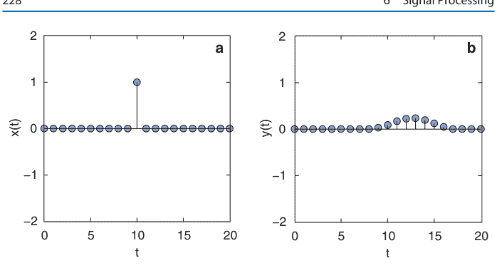

图 6.3 用于计算系统脉冲响应的单位脉冲变换。脉冲响应通常用于描述和预测滤波器的性能。

在许多示例中，时域卷积被替换为频域中傅里叶变换 $H(f)$ 和 $X(f)$ 的简单乘法：
$$Y(f) = H(f) \cdot X(f)$$
然后通过 $Y(f)$ 的逆傅里叶变换获得时域中的输出信号 $y(t)$。信号通常在频域而非时域进行卷积，因为乘法相对简单。然而，傅里叶变换本身会引入一些伪影和失真，因此频域卷积并非没有问题。在接下来的示例中，我们仅在时域应用卷积。
首先，我们生成一个单位脉冲：

```python
%reset -f

import numpy as np
import scipy.signal as signal
import matplotlib.pyplot as plt

t = np.linspace(0,20,21)
x6 = np.zeros(21)
x6[10] = 1

plt.figure()
plt.stem(t,x6,basefmt='k-')
plt.axis(np.array([0,20,-2,2]))
plt.show()
```

函数 `stem()` 将数据序列 x6 绘制为从 x 轴出发、末端带有表示数据值的圆圈的茎状图。这比使用 `plot()` 生成的连续线更适合绘制数字数据。我们现在将 x6 输入滤波器并探索输出 y6。脉冲响应与非递归滤波器的权重相同：

```python
b6 = np.array([1,1,1,1,1])/5
m6 = len(b6)

y6 = signal.lfilter(b6,1,x6)
```

我们再次校正 y6 以补偿 `lfilter()` 的相移，尽管在当前示例中这可能并不重要：

```python
y6[0:len(y6)-m6+1] = y6[np.arange(int((m6-1)/2),
    len(y6)-int((m6-1)/2))]
y6[len(y6)-m6+1:len(y6)] = np.zeros((1,m6-1))
```

我们获得了一个与输入数组 x6 长度和相位相同的输出数组 y6。我们现在绘制结果进行比较：

```python
plt.figure()
plt.stem(t,x6)
plt.stem(t,y6,
    linefmt='r-',
    markerfmt='ro',
    basefmt='k-')
plt.axis(np.array([0,20,-2,2]))
plt.show()
```

与 `plot()` 不同，`stem()` 只接受一个数据系列，因此第二个系列 y6 通过再次使用 `stem()` 叠加在同一图上。滤波器的效果在图中清晰可见：它将单位脉冲在五个元素的长度上进行了平均。此外，输出 y6 的值等于 b6 的滤波器权重。在我们的示例中，b6 和 y6 的所有元素的值均为 0.2。

然而，对于递归滤波器，输出 y6 与滤波器权重不匹配。我们再次首先生成一个脉冲：

```python
t = np.linspace(0,20,21)
x7 = np.zeros(21)
x7[10] = 1
```

然后设计一个具有权重 a7 和 b7 的任意递归滤波器：

```python
b7 = np.array([0.0048,0.0193,0.0289,0.0193,0.0048])
a7 = np.array([1.0000,-2.3695,2.3140,-1.0547,0.1874])

m7 = len(b7)

y7 = signal.lfilter(b7,a7,x7)

y7[0:len(y7)-m7+1] = y7[np.arange(int((m7-1)/2),
    len(y7)-int((m7-1)/2))]
y7[len(y7)-m7+1:len(y7)] = np.zeros((1,m7-1))
```

输入 x7 和输出 y7 的茎状图显示了一个有趣的脉冲响应：

```python
plt.figure()
plt.stem(t,x7)
plt.stem(t,y7,linefmt='r-',markerfmt='ro',basefmt='k-')
plt.axis(np.array([0,20,-2,2]))
plt.show()
```

信号被扩散到更宽的区域，并且也向右移动了。因此，这种滤波器不仅影响信号的幅度，还会将信号向较低或较高的值移动。这种相移通常是滤波器不希望具有的特性，尽管在某些应用中，沿时间轴的移动可能特别有意义。

## 6.8 频率响应

接下来我们研究滤波器的频率响应，即滤波器对信号幅度和相位的影响（图 6.4）。滤波器的频率响应 $H(f)$ 是脉冲响应 $h(t)$ 的傅里叶变换。复数频率响应 $H(f)$ 的绝对值是滤波器的幅度响应 $A(f)$：

$A(f) = |H(f)|$

复数频率响应 $H(f)$ 的辐角是滤波器的相位响应：

$\Phi(f) = \arg(H(f))$

由于 Python 滤波器都是因果的，因此很难使用信号处理工具箱中包含的相应函数来探索信号的相位。该工具箱的用户指南简单地建议将滤波器输出在时域中延迟固定的采样数，正如我们在前面的示例中所做的那样。作为另一个示例，使用周期为 20、幅度为 2 的正弦波作为输入信号：

## 6.4 滤波器的频率响应

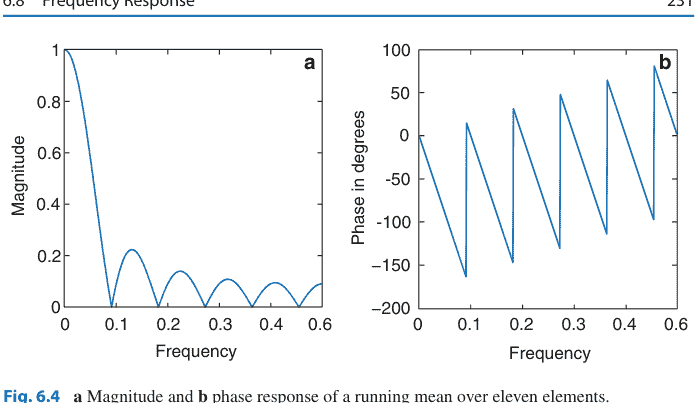

图 6.4 a 幅度响应和 b 相位响应，针对一个在11个元素上计算的滑动平均。

```python
%reset -f

import numpy as np
import scipy.signal as signal
from scipy import interpolate
import matplotlib.pyplot as plt

t = np.linspace(1,100,100)
x8 = 2 * np.sin(2*np.pi*t/20)
```

设计一个在11个元素上计算的滑动平均滤波器，并将其应用于输入信号 x8：

```python
b8 = np.ones(11)/11;
m8 = len(b8)

y8 = signal.lfilter(b8,1,x8)
```

对输出 y8 的相位进行因果索引校正：

```python
y8[0:len(y8)-m8+1] = y8[np.arange(int((m8-1)/2),
    len(y8)-int((m8-1)/2))]
y8[len(y8)-m8+1:len(y8)] = np.zeros((1,m8-1))
```

绘制滤波器的输入和输出：

```python
plt.figure()
plt.plot(t,x8,color='b')
plt.plot(t,y8,color='r')
plt.show()
```

该滤波器明显降低了正弦波的振幅。输入信号 x8 的振幅为2，而输出 y8 的振幅为

```python
print(np.max(y8))
```

结果为

```
1.1479548208500083
```

该滤波器将周期为20的正弦波振幅降低了

```python
print(1-np.max(y8[40:60])/2)
```

结果为

```
0.42602258957499606
```

即振幅降低了约43%。使用第40到60个元素来计算 y8 的最大值，是为了避免边缘效应。尽管如此，该滤波器并不影响正弦波的相位，即输入和输出是同相的。

然而，相同的滤波器对不同的输入信号有不同的影响。让我们设计另一个振幅相似但周期为15的正弦波 x9：

```python
t = np.linspace(1,100,100)
x9 = 2 * np.sin(2*np.pi*t/15)
```

应用类似的滤波器并校正输出 y9 由 `lfilter()` 引起的相移，得到：

```python
t = np.linspace(1,100,100)
x9 = 2 * np.sin(2*np.pi*t/15)

b9 = np.ones(11)/11;
m9 = len(b9)

y9 = signal.lfilter(b9,1,x9)

y9[0:len(y9)-m9+1] = y9[np.arange(int((m9-1)/2),
    len(y9)-int((m9-1)/2))]
y9[len(y9)-m9+1:len(y9)] = np.zeros((1,m9-1))
```

输出 y9 再次与输入 x9 同相，但与输入相比，其振幅显著降低：

```python
plt.figure()
plt.plot(t,x9,color='b')
plt.plot(t,y9,color='r')
plt.show()
```

```python
print(1-np.max(y9[40:60])/2)
```

结果为

```
0.6768410326431586
```

这个在11个元素上计算的滑动平均将该信号的振幅降低了约68%。更一般地说，滤波器的响应显然取决于输入的频率。包含多个周期性的更复杂信号的频率分量会受到不同的影响。滤波器

```python
b10 = np.ones(11)/11;
```

的频率响应可以使用 `freqz()` 计算。该函数使用滤波器权重 `a` 和 `b`，以及计算频率响应的频率点数 `worN`：

```python
f,h = signal.freqz(b10,a=1,worN=512,fs=1)
```

函数 `freqz()` 返回数字滤波器 `b10` 的复频率响应 `h` 以及频率 `f`。接下来，我们计算并显示频率响应的幅度：

```python
magnitude = np.abs(h)

plt.figure()
plt.plot(f,magnitude)
plt.xlabel('Frequency')
plt.ylabel('Magnitude')
plt.show()
```

此图可用于预测滤波器对任何输入信号频率的影响。我们可以对频率响应的幅度进行插值，以计算特定频率下信号振幅的增加或减少。例如，对频率为1/20的幅度进行插值：

```python
fun = interpolate.interp1d(f,magnitude)
print(1-fun(1/20))
```

结果为

```
0.4260303441186485
```

这得到了预期的周期为20的正弦波振幅约43%的降低。周期为15的正弦波经历的振幅降低为：

```python
fun = interpolate.interp1d(f,magnitude)
print(1-fun(1/15))
```

结果为

```
0.675055631124985
```

即振幅降低约68%，这与之前观察到的值相似。非常重要的一点是，这样的滑动平均会消除某些频率，例如幅度为0的那些频率。例如，将滤波器应用于周期约为1/0.09082的信号会完全消除该信号。此外，由于频率响应的幅度是复频率响应 `h` 的绝对值，因此幅度响应实际上在约0.09082到约0.1816之间、约0.2725到约0.3633之间以及约0.4546到奈奎斯特频率之间为负值。所有频率位于这些区间内的信号分量都会在时间轴上镜像翻转。例如，我们尝试一个周期为7（即频率约为0.1429）的正弦波，它位于第一个具有负幅度响应的区间内：

```python
t = np.linspace(1,100,100)
x10 = 2 * np.sin(2*np.pi*t/7)

b10 = np.ones(11)/11;
m10 = len(b10)

y10 = signal.lfilter(b10,1,x10)

y10[0:len(y10)-m10+1] = y10[np.arange(int((m10-1)/2),
    len(y10)-int((m10-1)/2))]
y10[len(y10)-m10+1:len(y10)] = np.zeros((1,m10-1))

plt.figure()
plt.plot(t,x10,color='b')
plt.plot(t,y10,color='r')
plt.show()
```

周期为7的正弦波经历的振幅降低为：

```python
fun = interpolate.interp1d(f,magnitude)
print(1-fun(1/7))
```

结果为

```
0.7957488527349983
```

即降低约80%，但正如我们从图中看到的，它也改变了符号。在解释地球科学中的因果关系时，消除某些频率和翻转信号具有重要影响。因此，即使这些滤波器作为电子表格程序中的标准选项提供，也应完全避免使用。作为替代，应使用具有特定频率响应的滤波器，例如巴特沃斯低通滤波器（第6.9节）。

频率响应可以为各种滤波器计算。实际上，它是预测滤波器对信号影响的宝贵工具。相位响应也可以从滤波器的复频率响应 `h` 计算得出（图6.4）：

```python
phase = 180*np.angle(h)/np.pi

plt.figure()
plt.plot(f,phase)
plt.xlabel('Frequency')
plt.ylabel('Phase in degrees')
plt.show()
```

相位角 `phase` 以度为单位绘制。我们观察到此图中频繁的跳变，这是 `angle()` 内部 `arctan2()` 函数的伪影。我们可以使用 `unwrap()` 对相位响应进行*解包*，以消除大于或等于180°的跳变：

```python
plt.figure()
plt.plot(f,np.unwrap(phase))
plt.xlabel('Frequency')
plt.ylabel('Phase in degrees')
plt.show()
```

在我们的示例中，这没有效果，因为没有发生大于或等于180°的跳变。由于滤波器具有线性相位响应 `phase`，信号的频率分量之间不会发生相对偏移。因此，我们不会期望信号在频域中发生任何失真。滤波器对特定周期的相移可以使用以下代码计算：

```python
fun = interpolate.interp1d(f,180*np.angle(h)/np.pi)
print(fun(1/20)*20/360)
```

结果为

```
-5.0
```

以及使用：

```python
fun = interpolate.interp1d(f,180*np.angle(h)/np.pi)
print(fun(1/15)*15/360)
```

结果为

```
-5.0
```

分别对应周期为20和15的正弦波。由于Python对滤波器使用因果索引，因此需要以类似于校正滤波器延迟输出的方式来校正相位。在我们的示例中，我们使用了长度为11的滤波器。因此，我们必须校正相位 (11-1)/2=5，这表明滤波器对这两个频率的相移均为零。

这也适用于递归滤波器。考虑一个周期为8的简单正弦波和之前使用的递归滤波器：

```python
t = np.linspace(1,100,100)
x11 = 2*np.sin(2*np.pi*t/8)

b11 = np.array([0.0048,0.0193,0.0289,0.0193,0.0048])
a11 = np.array([1.0000,-2.3695,2.3140,-1.0547,0.1874])

m11 = len(b11)

y11 = signal.lfilter(b11,a11,x11)
```

我们校正由因果索引引起的相移，并绘制输入和输出信号：

```python
y11[0:len(y11)-m11+1] = y11[np.arange(int((m11-1)/2),
    len(y11)-int((m11-1)/2))]
y11[len(y11)-m11+1:len(y11)] = np.zeros((1,m11-1))

plt.figure()
plt.plot(t,x11,color='b')
plt.plot(t,y11,color='r')
plt.show()
```

幅度通过以下方式降低

```python
print(1-np.max(y11[40:60])/2)
```

得到

```
0.6464745957914514
```

这也得到了幅度响应的支持：

```python
f,h = signal.freqz(b11,a11,worN=512,fs=1)

magnitude = np.abs(h)

plt.figure()
plt.plot(f,magnitude)
plt.xlabel('Frequency')
plt.ylabel('Magnitude')
plt.show()

fun = interpolate.interp1d(f,magnitude)
print(1-fun(1/8))
```

```
0.6461584154466922
```

相位响应

```python
phase = 180*angle(h)/pi;

plt.figure()
plt.plot(f,np.unwrap(phase))
plt.xlabel('Frequency')
plt.ylabel('Phase in degrees')
plt.show()

fun = interpolate.interp1d(f,180*np.angle(h)/np.pi)
print(fun(1/8)*8/360)
```

```
2.9442611936390373
```

必须再次针对因果索引进行校正。由于采样间隔为1且滤波器长度为5，我们必须在2.9443的相移上加上(5-1)/2=2。这表明校正后的相移为4.9442，这正是图中观察到的延迟：

```python
plot(t,x11,t,y11), axis([30 40 -2 2])
```

下一节将介绍具有所需频率响应的滤波器设计。这些滤波器可用于放大或抑制任意信号的不同分量。

## 6.9 滤波器设计

我们现在旨在设计具有特定频率响应的滤波器。我们首先生成一个具有两个周期（50和5）的合成信号x12。该信号的功率谱在频率0.02和0.20处显示出预期的峰值：

```python
%reset -f

import numpy as np
import scipy.signal as signal
import matplotlib.pyplot as plt

t = np.linspace(1,1000,1000)
x12 = 2*np.sin(2*np.pi*t/50) + \
    0.5*np.sin(2*np.pi*t/5)

plt.figure()
plt.plot(t,x12)
plt.axis(np.array([0,100,-4,4]))
plt.show()

f,Pxx = signal.periodogram(x12,fs=1,nfft=128)

plt.figure()
plt.plot(f,Pxx)
plt.grid
plt.xlabel('Frequency')
plt.ylabel('Power')
plt.show()
```

巴特沃斯滤波器设计技术被广泛用于创建具有低通、高通、带通和带阻配置的任意阶滤波器（图6.5）。在我们的示例中，我们希望设计一个截止频率为0.10的五阶低通滤波器。`butter()`的输入是滤波器的阶数、截止频率、滤波器类型`btype`和采样频率`fs`。`butter()`的输出是滤波器权重`a12`和`b12`：

```python
b12,a12 = signal.butter(5,0.1,btype='lowpass',fs=1)
```

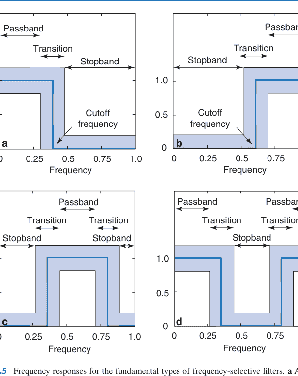

滤波器的频率特性显示从通带到阻带的过渡相对平滑，但该滤波器的优点在于其低阶：

```python
f,h = signal.freqz(b12,a12,worN=1024,fs=1)

plt.figure()
plt.plot(f,np.abs(h))
plt.xlabel('Frequency')
plt.ylabel('Magnitude')
plt.show()
```

我们可以再次使用`lfilter()`将滤波器应用于信号。频率选择性滤波器（如低通、高通、带通和带阻滤波器）旨在抑制某些频带，但应避免相移。函数`filtfilt()`提供零相移的正向和反向数字滤波。在正向滤波后，滤波后的序列被反转并再次通过滤波器。信号的幅度不受此操作影响，因为它根据频率是初始幅度的0%或100%。滤波器引入的任何相移都会被同一滤波器的正向和反向应用所抵消。该函数还有助于通过消除同一滤波器的因果和非因果版本之间的相位差，来克服Python中滤波器因果索引的问题。滤波然后绘制结果清楚地说明了滤波器的效果：

```python
xf12 = signal.filtfilt(b12,a12,x12)

plt.figure()
plt.plot(t,x12,color='b')
plt.plot(t,xf12,color='r')
plt.axis(np.array([0,100,-4,4]))
plt.show()
```

我们现在可能希望设计一个具有从通带到阻带更快过渡的新滤波器。这样的滤波器需要更高的阶数，即需要更多的滤波器权重`a12`和`b12`。我们现在创建一个15阶巴特沃斯滤波器作为上述滤波器的替代：

```python
b13,a13 = signal.butter(15,0.1,btype='lowpass',fs=1)

f,h = signal.freqz(b13,a13,worN=1024,fs=1)

plt.figure()
plt.plot(f,np.abs(h))
plt.xlabel('Frequency')
plt.ylabel('Magnitude')
plt.show()
```

频率响应明显改善。整个通带在1.0的值处相对平坦，而阻带在各处近似为零。接下来，我们通过引入第三个周期为5来修改输入信号。然后使用该信号来说明巴特沃斯带阻滤波器的操作：

```python
t = np.linspace(1,1000,1000)
x14 = 2*np.sin(2*np.pi*t/50) + \
      np.sin(2*np.pi*t/10) + \
      0.5*np.sin(2*np.pi*t/5)

f,Pxx = signal.periodogram(x14,fs=1,nfft=128)

plt.figure()
plt.plot(f,Pxx)
plt.show()
```

新的巴特沃斯滤波器是一个带阻滤波器。滤波器的阻带位于频率0.05和0.15之间。因此，它可以用于抑制周期为10（对应于频率0.1）的分量：

```python
b14,a14 = signal.butter(5,(0.05,0.15),
    btype='bandstop',fs=1)
xf14 = signal.filtfilt(b14,a14,x12)

f,Pxx = signal.periodogram(x14,fs=1,nfft=128)

plt.figure()
plt.plot(f,Pxx)
plt.show()

plt.figure()
plt.plot(t,x14,color='b')
plt.plot(t,xf14,color='r')
plt.axis(np.array([0,100,-4,4]))
plt.show()
```

图表显示了该滤波器的效果。0.05到0.15之间的频带——因此也包括频率0.1——已成功从信号中移除。

## 6.10 自适应滤波

前面章节中使用的固定滤波器基于一个基本假设，即信号退化是已知的且不随时间变化。然而，在大多数应用中，通常无法获得关于信号和噪声统计特性的*先验*知识。此外，噪声水平和真实信号的方差都可能随时间高度非平稳，例如在冰期-间冰期过渡期间的稳定同位素记录。因此，在不知道信噪比的非平稳环境中，不能使用固定滤波器。

自适应滤波器在电信行业被广泛使用，可能有助于克服这些问题。自适应滤波器是一种逆建模过程，它自动迭代调整自身的系数，而不需要任何关于信号或噪声的*先验*知识。操作自适应滤波器涉及1）一个滤波过程，其目的是根据数据序列产生输出，以及2）一个自适应过程，它提供了一种自适应控制滤波器权重的机制（Haykin 2003）。

在大多数实际应用中，自适应过程旨在最小化估计误差。时刻$i$的估计误差$e$定义为期望响应$d_i$与实际滤波器输出$y_i$之间的差值，后者是信号$x_i$的滤波版本，如公式所示

$$e_i = d_i - y_i$$

其中$i = 1, 2, ..., n$，$n$是输入数据数组的长度。对于具有$f$个元素的滤波器权重数组$W$的非递归滤波器，滤波器输出$y_i$由转置数组$W$和输入数组$X_i$的内积给出：

$$y_i = W^T \cdot X_i$$

自适应过程中使用的期望响应$d$的选择取决于应用。传统上，$d$是一个组合信号，由信号$s$和随机噪声$n_0$组成。信号$x$包含与信号$s$不相关但以某种未知方式与噪声$n_0$相关的噪声$n_1$。在噪声消除系统中，实际目标是产生一个系统输出$y$，该输出在最小二乘意义上最符合期望响应$d$。

已经开发了不同的方法来解决这个多元最小误差优化问题（例如，Widrow and Hoff 1960；Widrow et al. 1975；Haykin 1991）。选择一种算法而非另一种算法受到多种因素的影响，包括收敛速率（即算法收敛到足够接近最优解所需的自适应步数）、失调（即均方误差的最终值偏离最优滤波器最小方差的程度的度量；例如，Wiener 1949；Kalman and Bucy 1961）和跟踪能力（即滤波器在非平稳环境中工作并跟踪输入信号变化统计特性的能力）（Haykin 1991）。

最小均方（LMS）算法的简单性——最初由Widrow和Hoff（1960）开发——使其成为测试其他自适应滤波算法的基准。对于地球科学的应用，我们使用该滤波器的一个变体来从两个信号$S$和$X$中提取噪声，这两个信号包含相同的信号$s$，但具有不相关的噪声$n_1$和$n_2$（Hattingh 1988）。例如，考虑同一材料的简单重复测量集，例如来自同一有孔虫物种的两个平行稳定同位素记录。我们期望得到两个时间序列，每个序列包含$n$个元素，并且包含相同的期望信号叠加在不同的、不相关的噪声上。第一条记录用作主要输入$S$，$S = (s_1, s_2, \dots, s_n)$

而第二条记录用作参考输入 $X$：

$X = (x_1, x_2, \dots, x_n)$

正如 Hattingh (1988) 所示，可以通过使用主输入 $S$ 作为期望响应 $d$ 来滤波参考输入 $X$，从而提取出所需的无噪声信号。最小误差优化问题通过最小均方范数求解。均方误差 $e_i^2$ 是非递归滤波器中权重的二阶函数。$e_i^2$ 对未知权重 $W$ 的依赖性可以看作是一个具有唯一确定最小点的多维抛物面。对应于该误差曲面上最小点的权重定义了最优维纳解 (Wiener 1949)。使用 LMS 算法为权重数组 $W$ 计算出的值代表一个估计器，其期望值随着迭代次数趋近于无穷大而逼近维纳解 (Haykin 1991)。梯度方法用于到达误差曲面上的最小点。为了简化优化问题，Widrow 和 Hoff (1960) 开发了一种可以直接从数据计算所需梯度函数的近似方法。这导致了一个用于更新滤波器权重数组 $W$ 的简单关系：

$W_{i+1} = W_i + 2 \cdot u \cdot e_i \cdot X_i$

新的滤波器权重集 $W_{i+1}$ 基于前一个权重集 $W_i$ 加上一项，该项是有界步长（或收敛因子）$u$、输入状态 $X_i$ 的函数以及误差 $e_i$ 的函数的乘积。换句话说，从前一步计算出的误差 $e_i$ 被反馈到系统中，以便为下一步更新滤波器系数（图 6.6）。固定的收敛因子 $u$ 调节着自适应的速度和稳定性。较低的 $u$ 值确保更高的精度，但需要更多数据才能使滤波器达到最优解。在 Hattingh (1988) 的 LMS 算法改进版本中，通过循环处理数据克服了这个问题，使得滤波器有机会再次改进其系数并适应数据的变化。

在下面介绍 `canc()` 的示例中，每次循环运行称为一次迭代，要达到最佳结果需要多次循环运行。该算法从两个数组 `x` 和 `s` 中提取无噪声信号，这两个数组包含相关信号和不相关噪声。例如，我们生成两个信号 `yn1` 和 `yn2`，它们包含相同的正弦波但不同的高斯噪声：

```
%reset -f

import numpy as np
from numpy import linalg as linalg
from canc import canc
from matplotlib import cm
import scipy.signal as signal
```

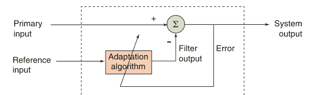

图 6.6 自适应滤波器示意图。每次迭代都涉及基于前一组滤波器权重 $W_i$ 加上一项（该项是有界步长 $u$、滤波器输入 $X_i$ 的函数以及误差 $e_i$ 的函数的乘积）对滤波器权重 $W_{i+1}$ 的新估计。换句话说，前一步计算出的误差 $e_i$ 被反馈到系统中，以便为下一步更新滤波器系数（修改自 Trauth 1998）。

```python
import matplotlib.pyplot as plt
from numpy.random import default_rng

x = np.linspace(0,100,1001)
y = np.sin(x)
rng = default_rng(0)
yn1 = y + 0.5*rng.standard_normal(y.shape)
yn2 = y + 0.5*rng.standard_normal(y.shape)

plt.figure()
plt.plot(x,yn1,x,yn2)
plt.show()
```

算法 `canc()` 格式化两个信号，将它们馈入滤波器循环，校正信号的相位偏移，并格式化信号以供输出。所需的输入是信号 `x` 和 `s`、步长 `u`、滤波器长度 `l` 和迭代次数 `iter`。在我们的示例中，两个带噪信号是 `yn1` 和 `yn2`。我们任意选择一个具有 `l=5` 个滤波器权重的滤波器。$0<u<1/\lambda_{max}$（其中 $\lambda_{max}$ 是参考输入自相关矩阵的最大特征值）范围内的 `u` 值会产生合理的结果 (Haykin 1991)（图 6.7）。`u` 的值使用以下代码计算：

```python
k = np.kron(yn1,np.transpose(yn1[None]))
w,v = linalg.eig(k)
u = 1/np.max(w)
print(u)
```

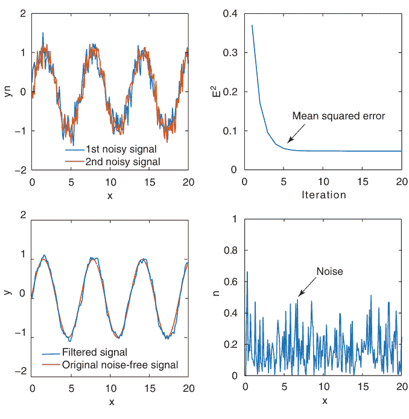

图 6.7 自适应滤波器的输出。a 被不相关噪声污染的重复记录被馈入具有 5 个权重和收敛因子 0.0019 的自适应滤波器。经过 20 次迭代后，滤波器产生 b 学习曲线，c 无噪声记录，以及 d 从重复记录中提取的噪声。

其中 `kron()` 返回 `yn1` 和 `yn1'` 的克罗内克张量积（这是一个通过取 `yn1` 和 `yn1'` 元素之间所有可能乘积形成的矩阵），`eig()` 返回 `k` 的特征向量。这得出

```
0.0013492697467229055
```

我们现在使用上面的 `u` 值，对自适应滤波器 `canc()` 运行 20 次迭代：

```python
z,e,mer,w = canc(yn1,yn2,0.0013,5,20)
```

`canc()` 的输出变量是滤波后的主信号 `z`、提取的噪声 `e`、以步长 `u` 执行的迭代次数的均方误差 `mer`，以及 `yn1` 和 `yn2` 中每个数据点的滤波器权重 `w`。均方误差 `mer` 的图

```python
plt.figure()
plt.plot(mer)
plt.show()
```

说明了自适应滤波器的性能，尽管选择的步长（`u=0.0013`）显然导致了相对较快的收敛。在大多数示例中，较小的步长会降低收敛速度，但会提高最终结果的质量。因此，我们减小 `u` 并使用更多迭代次数再次运行滤波器：

```python
z,e,mer,w = canc(yn1,yn2,0.0001,5,20)
```

均方误差 `mer` 对迭代次数的图

```python
plt.figure()
plt.plot(mer)
plt.show()
```

现在在大约六次迭代后收敛。在实践中，用户应改变输入参数 `u` 和 `l` 以获得最佳结果。我们现在可以将滤波器输出与原始无噪声信号进行比较：

```python
plt.figure()
plt.plot(x,y,'b',x,z,'r')
plt.show()
```

该图表明信号的噪声水平已被滤波器显著降低。接下来，图

```python
plt.figure()
plt.plot(x,e,'r')
plt.show()
```

显示从信号中提取的噪声。使用 `canc()` 的最后一个输出，我们可以计算并显示来自 `w` 的最终迭代的平均滤波器权重：

```python
wmean = np.mean(w,axis=0)

plt.figure()
plt.plot(wmean)
plt.show()
```

滤波器的频率特性提供了滤波器效果的更直观表示，

```python
f,h = signal.freqz(wmean,1,worN=1024,fs=1)

plt.figure()
plt.plot(f,np.abs(h))
plt.show()
```

这表明滤波器是一个具有相对平滑过渡带的低通滤波器。这意味着它不具备例如使用巴特沃斯方法设计的递归滤波器的品质。然而，滤波器权重是在优化过程中计算的，而不是任意选择的。

自适应滤波器的优势在于其能够滤波沿时间轴具有可变信噪比的时间序列。由于滤波器权重数组 $W$ 针对每个单独的数据点进行更新，这些滤波器甚至用于实时应用，例如电信系统。我们通过一个示例来研究这种行为，其中时间序列中间（`x=500`）的信噪比从大约 10% 降低到零：

```python
x = np.linspace(0,100,1001)
y = np.sin(x)
rng = default_rng(0)
yn1 = y + 0.5*rng.standard_normal(y.shape)
yn2 = y + 0.5*rng.standard_normal(y.shape)
yn1[501:] = y[501:]
yn2[501:] = y[501:]

plt.figure()
plt.plot(x,yn1,x,yn2)
plt.show()
```

`u` 的值再次通过以下代码计算：

```python
k = np.kron(yn1,np.transpose(yn1[None]))
w,v = linalg.eig(k)
u = 1 / np.max(w)
print(u)
```

得出

```
0.0016086744408774288
```

我们现在运行自适应滤波器`canc()` 20次迭代，并使用上文得到的`u`值：

```
z,e,mer,w = canc(yn1,yn2,0.0013,5,20)
```

均方误差`mer`与已执行迭代次数`it`（步长为`u`）的关系图：

```
plt.figure()
plt.plot(mer)
plt.show()
```

展示了自适应滤波器的性能，尽管所选步长`u=0.0016`显然导致了相对较快的收敛。同样，我们现在可以将滤波器输出与原始无噪声信号进行比较：

```
plot(x,y,'b',x,z,'r')
```

该图显示滤波器输出`y`与无噪声信号`x`几乎相同。图

```
plot(x,e,'r')
```

显示了从信号中提取的噪声。这里，我们可以观察到，在信噪比变化点之后的时间序列无噪声段中，滤波器误差中移除了一些信号分量。使用`canc()`的最后一次输出，我们可以计算并显示最终迭代的滤波器权重`w`：

```
X = np.linspace(1,5,5)
Y = np.linspace(2,999,997)
X, Y = np.meshgrid(X, Y)
W = w[2:999,0:]

plt.figure()
fig,ax = plt.subplots(subplot_kw={"projection":"3d"})
surf = ax.plot_surface(X,Y,W,cmap=cm.coolwarm)
ax.view_init(60,100-90)
plt.show()
```

这很好地展示了滤波器权重在信噪比变化前后的自适应过程。我们只绘制`w`的中间部分，因为由于滤波器长度为`l`，边缘部分`1:(l-1)/2`和`end-(l-1)/2:end`均为零。我们也可以用这个例子来演示`u`和`l`的值对自适应滤波器性能的影响。理论上，较小的`u`会导致更精确的结果，但对变化信噪比的快速自适应效果不佳。较大的`l`值也能产生更好的结果，但通过滤波过程丢失的数据点数量会增加`(l-1)/2`。

该算法的应用已在海洋沉积物的重复氧同位素记录中得到演示（Trauth 1998）。Trauth（1998）的这项工作不仅展示了改进的LMS算法的使用，还展示了另一种自适应滤波器——递归最小二乘（RLS）算法——在各种不同环境中的应用（Haykin 1991; Trauth 1998）。

## 推荐阅读

von Grünigen DH (2014) Digitale Signalverarbeitung mit einer Einführung in die kontinuierlichen Signale und Systeme, Fünfte, neu, bearbeitete. Fachbuchverlag Leipzig im Carl Hanser Verlag, Leipzig
Hatthing M (1988) A new data adaptive filtering program to remove noise from geophysical time- or space series data. Comput Geosci 14(4):467–480
Kalman R, Bucy R (1961) New results in linear filtering and prediction theory. ASME Tans Ser D Jour Basic Eng 83:95–107
Trauth MH (1998) Noise removal from duplicate paleoceanographic time-series: the use of adaptive filtering techniques. Math Geol 30(5):557–574
Trauth MH (2013) TURBO2: a MATLAB simulation to study the effects of bioturbation on paleoceanographic time series. Comput Geosci 61:1–10
Widrow B, Hoff M Jr (1960) Adaptive switching circuits. IRE WESCON Conv Rev 4:96–104
Widrow B, Glover JR, McCool JM, Kaunitz J, Williams CS, Hearn RH, Zeidler JR, Dong E, Goodlin RC (1975) Adaptive noise cancelling: principles and applications. Proc IEEE 63(12):1692–1716
Wiener N (1949) Extrapolation, interpolation and smoothing of stationary time series, with engineering applications. MIT Press, Cambridge, Mass (reprint of an article originally issued as a classified National Defense Research Report, February, 1942)

## 延伸阅读

Alexander ST (1986) Adaptive signal processing: theory and applications. Springer, Berlin Heidelberg New York
Buttkus B (2000) Spectral analysis and filter theory in applied geophysics. Springer, Berlin Heidelberg New York
Cowan CFN, Grant PM (1985) Adaptive filters. Prentice Hall, Englewood Cliffs, New Jersey
Haykin S (2003) Adaptive filter theory. Prentice Hall, Englewood Cliffs, New Jersey
Sibul LH (1987) Adaptive signal processing. IEEE Press
Weeks M (2007) Digital signal processing using MATLAB and wavelets. Infinity Science Press, Jones and Bartlett Publishers, Boston Toronto London Singapore

# 空间数据

## 7.1 引言

地球科学中的大多数数据在空间上分布，要么是*矢量数据*（点、线、多边形；例如，河网、海岸线），要么是*栅格数据*（方形网格、三角形网格；例如，网格化地形）。矢量数据是通过数字化地图对象（如水系网络或岩性单元轮廓）生成的。栅格数据可以直接从卫星传感器输出获得，但网格化数据也可以从不规则分布的野外采样中插值得到（*网格化*）。

第7.2节以海岸线数据为例介绍矢量数据。然后，第7.3至7.5节使用数字地形数据说明栅格数据的获取和处理。自20世纪90年代初以来，数字高程数据的可用性和使用已显著增加。分辨率为5弧分（约9公里）的ETOPO5是最早可用的地形和水深数据集之一。2001年10月，它被分辨率为2弧分（约4公里）的ETOPO2取代，2009年3月，分辨率为1弧分（约2公里）的ETOPO1投入使用。还有一个名为GTOPO30的地形数据集，于1996年完成，水平网格间距为30弧秒（约1公里）。最近，航天飞机雷达地形任务（SRTM）的30米和90米分辨率数据已在大多数科学研究中取代了较旧的数据集。

**补充信息** 在线版本包含补充材料，可访问 https://doi.org/10.1007/978-3-031-07719-7_7。

第7.6节可在本书的MATLAB版本中找到，但无法翻译为Python。然而，它们在此处列出并带有相应的章节编号，以便在本书的两个版本之间创建相同的章节编号（从而也创建相同的图形编号和计算机脚本）。因此，读者可以并行使用这两本书来追踪脚本从MATLAB到Python（以及反向）的翻译。

© 作者，经Springer Nature Switzerland AG 2022独家许可
M. H. Trauth, *Python Recipes for Earth Sciences*, Springer Textbooks in Earth Sciences, Geography and Environment, https://doi.org/10.1007/978-3-031-07719-7_7

251

本章的第二部分涉及从不均匀间隔数据计算连续表面以及空间数据的统计（第7.7和7.8节）。在地球科学中，大多数数据是以不规则模式收集的。岩石样本的获取通常仅限于天然露头（例如，海岸悬崖和峡谷壁）或人工露头（例如，道路切口、采石场或钻孔岩心）。关于插值此类不均匀间隔数据的章节说明了最重要网格化程序的使用，并概述了使用这些方法时的潜在陷阱。第7.9至7.11节介绍了统计分析空间数据的各种方法，包括第7.9节对点分布应用统计检验，第7.10节分析数字高程模型，以及第7.11节概述地质统计学和克里金法。本章需要NumPy (https://numpy.org)、Matplotlib (https://matplotlib.org)、SciPy (https://scipy.org)、Rasterio (https://rasterio.readthedocs.io)、GDAL (https://gdal.org/api/python.html)、scikit-image (https://scikit-image.org)、PyGMT (https://www.pygmt.org)（需要xarray来处理带标签的多维数组；https://docs.xarray.dev）和Cartopy (https://scitools.org.uk/cartopy)包。

## 7.2 全球地理数据库GSHHG

全球自洽、分层、高分辨率地理（GSHHG）数据库是两个公共领域数据库的合并，由Paul Wessel（夏威夷大学SOEST，檀香山，夏威夷州）和Walter Smith（NOAA卫星测高实验室，银泉，马里兰州）创建（Wessel and Smith 1996）。GSHHG数据库包含较旧的GSHHS海岸线数据库（Soluri and Woodson 1990; Wessel and Smith 1996），其中质量较差的南极洲数据已被Bohlander和Scambos（2007）更准确的数据取代，河流和边界数据则取自CIA世界数据库II（WDBII）（Gorny 1977）。GSHHG数据可以从SOEST服务器下载

http://www.soest.hawaii.edu/pwessel/gshhg/index.html

提供三种不同格式（通用制图工具（GMT）文件、ESRI shapefile或原生二进制文件）和多种空间分辨率。例如，我们可以使用以下代码从数据集中提取的ASCII文件导入经度/纬度坐标：

```
%reset -f

import numpy as np
import cartopy.crs as ccrs
import matplotlib.pyplot as plt
import matplotlib.ticker as mticker
from cartopy.mpl.ticker import (LongitudeFormatter,
                                LatitudeFormatter,
                                LongitudeLocator,
```

## 7.3 1角分网格全球地形数据 ETOPO1

*1角分全球地表地形模型*（ETOPO1）是一个在规则1角分网格（约2公里）上提供地形和水深数据的全球数据库（Amante and Eakins 2009）。ETOPO1数据库取代了较旧的ETOPO2和ETOPO5全球地形网格，但后者仍然可用。ETOPO1是多种来源数据的汇编。可以从美国国家海洋和大气管理局（NOAA）国家环境信息中心（NCEI）网站下载：

https://www.ngdc.noaa.gov/mgg/global/global.html

我们可以下载全球网格，也可以下载冰面或基岩的自定义网格。我们使用NCEI的WCS客户端在线创建并提取ETOPO1的自定义网格：

```
http://maps.ngdc.noaa.gov/viewers/wcs-client/
```

我们首先选择*ETOPO1*（基岩）图层。然后，通过点击地图左上角的*xy*图标，选择*按坐标选择*，并指定一个感兴趣的区域，例如纬度*北：20*（20°N）和*南：-20*（20°S），经度在*东：30*（30°E）和*东：60*（60°E）之间，这覆盖了东非海岸。负的纬度和经度值分别分配给南半球和西半球。点击*确定*后，感兴趣的区域在地图上标记为一个透明的黄色矩形。接下来，我们选择*ArcGIS ASCII Grid*作为*输出格式*，并下载文件*etopo1_bedrock.asc*，其中包含以下数据：

```
ncols      1801
nrows      2401
xllcorner  29.991666666667
yllcorner  -20.008333333333
cellsize   0.016666666667
294 299 293 288 285 282 ...
237 241 245 266 264 274 ...
259 263 267 262 263 266 ...
310 306 300 294 296 291 ...
348 346 352 356 353 353 ...
381 383 381 381 382 381 ...
(续)
```

文件头记录了数据数组的大小（例如，在我们的示例中为1,801列和2,401行）、左下角的坐标（例如，约*x=20*和*y=-20*）以及单元格大小（例如，~0.0167 = 1/60度纬度和经度，或1角分）。较旧版本的ETOPO1数据集以及其他类似数据集也可能包含表示数据空缺的-32,768标志。我们通过在前五行开头输入#来注释掉文件头：

```
#ncols      1801
#nrows      2401
#xllcorner  29.991666666667
#yllcorner  -20.008333333333
#cellsize   0.016666666667
294 299 293 288 285 282 ...
237 241 245 266 264 274 ...
259 263 267 262 263 266 ...
310 306 300 294 296 291 ...
348 346 352 356 353 353 ...
381 383 381 381 382 381 ...
(续)
```

我们将文件保存为*etopo1_data.txt*，然后将数据加载到工作区：

```
%reset -f

import numpy as np
import pygmt as pygmt
import xarray as xr
from matplotlib import cm
import matplotlib.pyplot as plt
from matplotlib.colors import LightSource

ETOPO1 = np.loadtxt('etopo1_data_python.txt')
```

接下来，我们使用`flipud()`上下翻转数组，以根据Python约定更改数据数组的索引：

```
ETOPO1 = np.flipud(ETOPO1)
```

最后，我们通过打印该区域的最小和最大高程来检查数据是否已正确存储在工作区中：

```
print(np.max(ETOPO1))
print(np.min(ETOPO1))
```

在此示例中，该区域的最大高程为5677米，最小高程为-5859米。参考面是海平面（即0米）。我们现在使用`meshgrid()`定义一个坐标系，利用左下角位于南纬20°、东经30°的信息。分辨率为1角分，对应于1/60度：

```
lon = np.linspace(30,60,1801)
lat = np.linspace(-20,20,2401)
LON,LAT = np.meshgrid(lon,lat)
```

现在，我们使用`pcolormesh()`从高程数据生成彩色表面：

```
plt.figure()
ax1 = plt.axes(aspect='equal')
plt.pcolormesh(LON,LAT,ETOPO1,
    cmap='jet',
    shading='gouraud')
plt.colorbar()
plt.show()
```

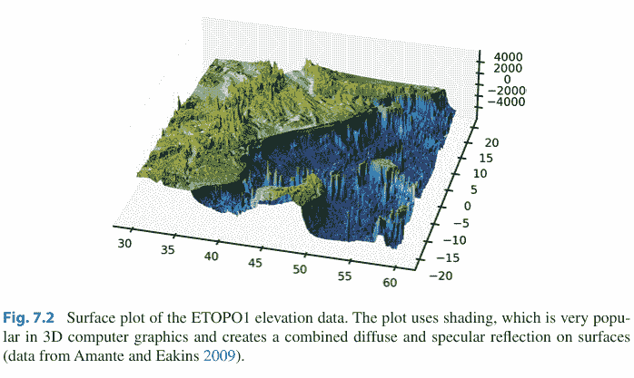

**图 7.2** ETOPO1高程数据的表面图。该图使用了着色，这在3D计算机图形学中非常流行，它在表面上创建了漫反射和镜面反射的组合（数据来自Amante and Eakins 2009）。

此脚本打开一个新的图形窗口，使用jet颜色映射生成彩色表面，并使用gouraud生成高洛德着色。表面通过一组颜色阴影突出显示，并以俯视图显示。绘制数字地形的一种壮观方式是使用Matplotlib包colors模块中的`LightSource()`创建带有角度光照的表面图（图7.2）：

```
plt.figure()
fig,ax2 = plt.subplots(subplot_kw={"projection":"3d"})
ve = 500
ax2.set_box_aspect((1,1,ve/1850))
ls = LightSource(270,45)
rgb = ls.shade(ETOPO1,
    cmap=cm.jet,
    vert_exag=ve/1850,
    blend_mode='hsv')
ax2.plot_surface(LON,LAT,ETOPO1,
    rstride=1,
    cstride=1,
    linewidth=0,
    facecolors=rgb,
    antialiased=False,
    shade=True)
ax2.tick_params(axis='both',
    labelsize=6)
ax2.view_init(30,15-90)
ax2.grid(False)
fig.savefig('etopo1_python.png',dpi=300)
plt.show()
```

函数`LightSource()`用于从特定的方位角和仰角创建光源。我们使用`vert_exag`进行垂直夸张，以强调表面图的垂直特征，并使用`blend_mode='hsv'`将颜色映射的数据值与光照强度相结合。然后，使用`surface()`创建实际的表面图，将`shade()`创建的rgb对象作为`facecolors`。需要注意的是，`rstride`和`cstride`定义了将用于渲染图形的ETOPO1的行数和列数。如果我们选择1（即全分辨率），渲染将花费很长时间，因此我们应该使用更大的值（例如，如上所述的5）来对数据集进行垂直和水平重采样，以减少渲染时间。我们以300 dpi的分辨率将图形导出为PNG格式，文件名为`etopo1_python.png`。

我们也可以使用*PyGMT*包中的`makecpt()`、`Figure()`和`grdview()`，该包利用了*xarray*包：

```
ds = xr.DataArray(data=ETOPO1,
    dims=['lat', 'lon'],
    coords={'lat':lat, 'lon':lon})
frame = ['xa1f0.25', 'ya1f0.25', 'wSEnZ']
pygmt.makecpt(
    cmap='geo',
    series=f'-6000/4000/10',
    continuous=True)

fig = pygmt.Figure()
fig.grdview(grid=ds,
    perspective=[150,30],
    frame=frame,
    projection='M15c',
    zsize='4c',
    surftype='i',
    plane='-6000+gazure',
    shading=0)
fig.basemap(
    perspective=True,
    rose='jTL+w3c+l+o-2c/-1c')
fig.colorbar(perspective=True,
    position='JMR+o2c/0c+w10c',
    frame=['a2000'])
fig.show()
```

这些脚本首先使用`makecpt()`从*PyGMT*中选择适合高程数据的geo颜色映射，因为该函数将陆地和海洋颜色分别与高程测量和水深测量相关联。然后，该函数使用`grdview()`来显示实际的表面图，并定义透视、框架和投影。我们使用`basemap()`添加一个指向地理北方的指北针，并使用`colorbar()`添加色标。

## 7.4 30弧秒高程模型 GTOPO30

全球30弧秒高程数据（GTOPO30）是一个30弧秒（约1公里）的全球数字高程数据集，仅包含高程数据，不含水深数据。该数据集由地球资源观测系统数据中心开发，可从美国地质调查局（USGS）的EarthExplorer网站获取：

https://earthexplorer.usgs.gov

EarthExplorer网站可用于搜索、预览和下载通过美国地质调查局（USGS）提供的卫星图像、航空照片和制图产品。GTOPO30数据集位于数字高程类别中。在该网站上，我们首先在搜索条件中选择所需的地图区域，可以通过输入地图四角的坐标，或通过放大到感兴趣区域并选择“使用地图”来完成。例如，我们输入肯尼亚北部裂谷苏古塔谷的坐标（2°8'37.58"N 36°33'47.06"E）。然后，我们从数字高程集合中选择GTOPO30作为数据集，并点击“结果”，这将生成一个记录列表以及用于预览和下载数据的工具栏。在我们的示例中，我们找到一个数据集GT30E020N40，该数据于1996年12月1日获取，中心位于15°N 40°E。我们需要在美国地质调查局网站上注册、登录，然后将数据集下载为55.0 MB的GeoTIFF和24.9 MB的DEM，后者以26.1 MB的压缩zip文件形式提供。解压文件gt30e020n40_dem.zip后，我们获得八个文件，其中包含各种格式的原始数据和头文件。该文件还提供了一个数据阴影浮雕显示的GIF图像。

将GTOPO30数据导入工作区很简单。我们通过从解压集合中的文件名中移除`gt30`来重命名文件，并使用

```
%reset -f

import numpy as np
from matplotlib import cm
from matplotlib.colors import LightSource
import matplotlib.pyplot as plt
from matplotlib.colors import ListedColormap
```

```
with open('e020n40.dem') as fid:
    rectype = np.dtype('>i2')
    GTOPO30 = np.fromfile(fid, dtype=rectype)
GTOPO30 = np.reshape(GTOPO30,(6000,4800))
GTOPO30 = np.flipud(GTOPO30)
GTOPO30[GTOPO30<0] = 0
```

来导入数据。此脚本以全分辨率（比例因子=1）从图块*e020n40*（无文件扩展名）读取数据到数组GTOPO30中，该数组的维度为1,200乘1,200个单元格。坐标系使用上面列出的*经度/纬度*范围定义。分辨率为30弧秒，对应于1/120度：

```
lon = np.linspace(20,60,4800)
lat = np.linspace(-10,40,6000)
LON,LAT = np.meshgrid(lon,lat)
```

我们需要将上限减少1/120，以获得与GTOPO30数组维度相似的数组。可以使用`pcolormesh()`从高程数据生成灰度图像。使用*gray_r*颜色映射的四次方来加深地图，然后垂直翻转颜色映射，以获得高海拔为深色、低海拔为浅色（而不是相反）：

```
gray_r = cm.get_cmap('gray_r',256)
newcolors = gray_r(np.linspace(0,1,256))
newcolors = newcolors**4
newcmp = ListedColormap(newcolors)

plt.figure()
plt.axes(aspect='equal',
    xlim=(30,40),
    ylim=(-5,5))
plt.pcolormesh(LON,LAT,GTOPO30,
    cmap=newcmp,
    shading='auto')
plt.colorbar()
plt.show()
```

此脚本打开一个新的图形窗口并生成灰色表面，该表面以俯视图显示。我们再次使用类似于第7.4节中使用的代码，将数字地形绘制为带有角度光照的表面图：

```
plt.figure()
fig,ax2 = plt.subplots(subplot_kw={"projection":"3d"})
```

```
ax2.set_box_aspect((1,1,0.2))
ls = LightSource(270,45)
rgb = ls.shade(GTOPO30,
    cmap=cm.hsv,
    vert_exag=1,
    blend_mode='hsv')
ax2.plot_surface(LON[600:1800,1200:2400],
    LAT[600:1800,1200:2400],
    GTOPO30[600:1800,1200:2400],
    rstride=1,
    cstride=1,
    linewidth=0,
    facecolors=rgb,
    antialiased=False,
    shade=True)
ax2.tick_params(axis='both',labelsize=6)
ax2.grid(False)
plt.savefig('gtopo30_python.png',dpi=300)
plt.show()
```

与第7.3节一样，我们可以使用*PyGMT*包中的函数创建更具吸引力的图形（图7.3）：

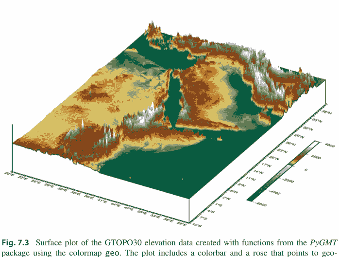

**图7.3** 使用*PyGMT*包中的函数和geo颜色映射创建的GTOPO30高程数据表面图。该图包括一个色标和一个指向地理北方的指北针（数据来自美国地质调查局）。

```
GTOPO30 = np.float64(GTOPO30)

ds = xr.DataArray(data=GTOPO30,
    dims=['lat', 'lon'],
    coords={'lat':lat, 'lon':lon})
frame = ['xa1f0.25', 'ya1f0.25', 'wSEnZ']
pygmt.makecpt(
    cmap='geo',
    series=f'-6000/4000/10',
    continuous=True)

fig = pygmt.Figure()
fig.grdview(grid=ds,
    perspective=[150,30],
    frame=frame,
    projection='M15c',
    zsize='4c',
    surftype='i',
    plane='-6000+gazure',
    shading=0)
fig.basemap(
    perspective=True,
    rose='jTL+w3c+l+o10c/12c')
fig.colorbar(perspective=True,
    position='JMR+o2c/0c+w10c',
    frame=['a2000'])
fig.savefig('gtopo30_python.png', dpi=300)
fig.show()
```

此脚本首先使用`makecpt()`从*PyGMT*中选择适合高程数据的geo颜色映射。然后，脚本使用`grdview()`显示实际的表面图，并定义图形的透视、框架和投影。我们使用`basemap()`添加一个指向地理北方的指北针，并使用`colorbar()`添加色标。我们再次将图形导出为分辨率为300 dpi的PNG文件，文件名为*gtopo30_python.png*。

## 7.5 航天飞机雷达地形任务 SRTM

*航天飞机雷达地形任务*（SRTM）是2000年2月航天飞机*奋进号*执行的一项为期11天的任务，使用雷达系统绘制地球表面地图（Farr and Kobrick 2000, Farr et al. 2007）。SRTM是一个由国家地理空间情报局（NGA）和国家航空航天局（NASA）牵头的国际项目。有关SRTM项目的详细信息（包括图像库和用户论坛）可在NASA的网站上访问：

```
http://www2.jpl.nasa.gov/srtm/
```

数据在喷气推进实验室处理。它们通过美国地质调查局（USGS）的国家地图查看器和下载平台分发：

```
https://www.usgs.gov/core-science-systems/ngp/tnm-delivery/
```

或者，原始数据文件可以从以下地址下载：

```
http://dds.cr.usgs.gov/srtm/
```

此目录包含来自世界不同地区的SRTM DEM压缩文件，这些文件由SRTM全球处理器处理，并以1弧秒（SRTM-1，30米网格）和3弧秒（SRTM-3，90米网格）的分辨率采样。例如，我们从以下地址下载1.7 MB的文件*s01e036.hgt.zip*：

```
http://dds.cr.usgs.gov/srtm/version2_1/SRTM3/Africa/
```

其中包含东非肯尼亚裂谷的SRTM-3数据。所有高程均以米为单位，并参考WGS84 EGM96大地水准面，相关文档位于：

```
http://earth-info.nga.mil/GandG/wgs84/index.html
```

此文件的名称指的是图块左下（西南）像素的经度和纬度，即纬度向南一度，经度向东36°。SRTM-3数据包含1201行和1201列，重叠的行和列数量相似。下载*S01E036.hgt.zip*后，我们首先解压此文件，并将*S01E036.hgt*保存在我们的工作目录中。数字高程模型以16位有符号整数数据的形式在简单的二进制栅格中提供。位顺序是*大端序*（Motorola的标准），这意味着最高有效位在前。数据使用以下代码导入工作区：

```
%reset -f

import numpy as np
import numpy.ma as ma
from scipy import signal
from matplotlib import cm
from matplotlib.colors import LightSource
```

import matplotlib.pyplot as plt
from matplotlib.colors import ListedColormap

with open('S01E036.hgt') as fid:
    rectype = np.dtype('>i2')
    SRTM = np.fromfile(fid,dtype=rectype)

SRTM = np.reshape(SRTM,(1201,1201))
SRTM = np.flipud(SRTM)

此脚本使用 `open()` 打开文件 *s01e036.hgt* 并定义文件标识符 `fid`，然后使用数据类型 `>i2`（大端序2字节或16位整数）从文件中读取二进制数据，并使用 `fromfile()` 将其写入数组 `SRTM`。首先需要使用 `reshape()` 将数组重塑为 (1201, 1201)，然后使用 `flipud()` 进行垂直翻转。接下来，我们使用 `astype()` 将数据类型更改为64位浮点数，并使用 `mean()` 将表示数据空缺的 -32,768 标志替换为全局平均高程：

```
SRTM = SRTM.astype(float)
SRTM[SRTM==-32768] = np.mean(SRTM)
```

最后，我们通过打印该区域的最小和最大高程来检查数据是否已正确存储在工作区中：

```
np.max(SRTM)
np.min(SRTM)
```

在我们的示例中，该区域的最大海拔为海平面以上3992米，最小海拔为1504米。可以利用左下角为 *s01e036* 的信息来定义坐标系。分辨率为3角秒，对应于1/1200度：

```
lon = np.linspace(36,37,1201)
lat = np.linspace(-1,0,1201)
LON,LAT = np.meshgrid(lon,lat)
```

可以使用 `pcolormesh()` 从高程数据生成灰度阴影地图，该函数显示带有模拟光照的阴影表面：

```
gray_r = cm.get_cmap('gray_r',256)
newcolors = gray_r(np.linspace(0,1,256))
newcolors = newcolors**1
newcmp = ListedColormap(newcolors)
```

```
plt.figure()
plt.axes(aspect='equal')
plt.pcolormesh(LON,LAT,SRTM,
    cmap=newcmp,
    shading='auto')
plt.colorbar()
plt.show()
```

此脚本打开一个新的图形窗口，并生成阴影地形图（使用插值着色）和灰度颜色图（以俯视图显示）。由于SRTM数据包含大量噪声，我们首先通过一个任意的9x9像素移动平均滤波器使用 convolve2d() 对数据进行平滑处理。与第6.8节中关于运行均值的讨论相反，此时运行均值的副作用并不重要。然后将新数组存储在 SRTM_FILTERED 中：

```
B = 1/81 * np.ones((9,9))
SRTM_FILTERED = signal.convolve2d(SRTM,B,mode='same')
```

相应的阴影地形图使用以下代码生成：

```
plt.figure()
plt.axes(aspect='equal')
plt.pcolormesh(LON,LAT,SRTM_FILTERED,
    cmap=newcmp,
    shading='auto')
plt.colorbar()
plt.show()
```

相邻的SRTM图块重叠一行或一列，在合并SRTM数据集时必须删除这些重叠部分。我们以肯尼亚的巴林戈盆地为例，该区域由两个SRTM图块覆盖。我们首先按照前面描述的方法，从文件 N00E036.hgt 和 N00E035.hgt 加载两个SRTM数据集：

```
with open('N00E035.hgt') as fid:
    rectype = np.dtype('>i2')
    SRTM1 = np.fromfile(fid,dtype=rectype)

with open('N00E036.hgt') as fid:
    rectype = np.dtype('>i2')
    SRTM2 = np.fromfile(fid,dtype=rectype)
```

接下来，我们重塑数据集并将其上下翻转：

```
SRTM1 = np.reshape(SRTM1,(1201,1201))
SRTM1 = np.flipud(SRTM1)
SRTM2 = np.reshape(SRTM2,(1201,1201))
SRTM2 = np.flipud(SRTM2)
```

我们删除第一个图块 SRTM1 中重叠（相同）的列，并使用 concatenate() 将其与第二个图块 SRTM2 水平拼接。然后，我们用全局平均高程替换空缺值：

```
SRTM = ma.concatenate([SRTM1[:,:1200],SRTM2],axis=1)

SRTM = SRTM.astype(float)
SRTM[SRTM==-32768] = np.mean(SRTM)
```

接下来，我们使用运行均值对数据进行平滑处理：

```
B = 1/25 * np.ones((5,5))
SRTM_FILTERED = signal.convolve2d(SRTM,B,mode='same')
```

然后，我们定义坐标网格和等高线级别（参见第7.7节）：

```
lon = np.linspace(35,37,2401)
lat = np.linspace(-1,0,1201)
LON,LAT = np.meshgrid(lon,lat)
v = np.array([700,800,900,1000,1100,1200,
    1300,1500,2500,3000])
```

下面的脚本使用与第7.3和7.4节中类似的代码，生成了数据的出色显示效果。请注意使用 set_box_aspect() 来缩短z轴的长度：

```
plt.figure()
fig,ax2 = plt.subplots(subplot_kw={"projection":"3d"})
ax2.set_box_aspect((2,1,0.1))
ax2.set_xlim((35,37))
ax2.set_ylim((-1,0))
ax2.set_zlim((1500,3500))
ls = LightSource(270,45)
rgb = ls.shade(SRTM,
    cmap=cm.hsv,
    vert_exag=1,
    blend_mode='soft',
    vmin=0,
    vmax=np.max(SRTM_FILTERED))
ax2.plot_surface(LON,LAT,SRTM_FILTERED,
    rstride=1,
    cstride=1,
    linewidth=0,
    facecolors=rgb,
    antialiased=False,
    shade=True,
    vmin=1500,
    vmax=4000)
ax2.tick_params(axis='both',
    labelsize=6)
ax2.grid(False)
plt.show()
```

我们还可以创建并分配颜色图 gist_earth，使其适用于高程数据，因为它将陆地和海洋颜色分别与高程测量和水深测量相关联（图7.4）：

```
plt.figure()
fig,ax2 = plt.subplots(subplot_kw={"projection":"3d"})
ax2.set_box_aspect((2,1,0.1))
ax2.set_xlim((35,37))
ax2.set_ylim((-1,0))
ax2.set_zlim((1500,3500))
ls = LightSource(270,45)
rgb = ls.shade(SRTM,
    cmap=cm.gist_earth,
    vert_exag=1,
    blend_mode='soft',
    vmin=0,
    vmax=np.max(SRTM_FILTERED))
ax2.contour(LON,LAT,SRTM_FILTERED+1,
    levels=v,
    linewidths=0.3,
    colors='w',
    linestyles='solid')
ax2.plot_surface(LON,LAT,SRTM_FILTERED,
    rstride=5,
    cstride=5,
    linewidth=0,
    facecolors=rgb,
    antialiased=False,
    shade=True,
    vmin=1500,
    vmax=4000)
ax2.tick_params(axis='both',
    labelsize=6)
ax2.grid(False)
plt.savefig('srtm_python.png',dpi=300)
plt.show()
```

此代码还将图形导出为300 dpi分辨率的PNG格式：

```
print -dpng -r300 srtmimage.png
```

新文件 *srtmimage.png* 的大小为3.1 MB，现在可以导入到其他软件包中，例如 Adobe Photoshop。

## 7.6 将3D图形导出为交互式文档

本节内容基于MATLAB的书籍《MATLAB Recipes for Earth Sciences》(Trauth 2021)，无法翻译为Python。

## 7.7 网格化与等高线绘制

之前的数据集都存储在均匀间隔的二维数组中。然而，地球科学中的大多数数据是从不规则采样模式中获得的。因此，数据是不均匀间隔的，需要进行插值，以便能够从我们野外的测量数据中计算出平滑连续的表面。*表面估计*通常分两个主要步骤进行（图7.5）：首先，需要选择*控制点*的数量；其次，需要为*网格点*估计感兴趣变量的值。

控制点是不均匀间隔的野外测量值，例如不同露头处砂岩单元的厚度或水井中化学示踪剂的浓度。数据通常表示为 *xyz* 三元组，其中 *x* 和 *y* 是空间坐标，*z* 是感兴趣变量。在这种情况下，大多数网格化方法要求数据是连续且唯一的。然而，地球科学中的空间变量通常是不连续且非空间唯一的：例如，砂岩单元可能被断层切割或发生褶皱。此外，网格化要求空间自相关，即相邻数据点应通过特定关系相互关联。如果 *z* 变量是随机的且没有自相关性，那么进行表面估计就没有意义。选择控制点后，有多种不同的方法可用于计算均匀间隔网格点上的 *z* 值。

存在多种选择控制点的技术。大多数方法对 *z* 变量的自相关性做出任意假设。*最近邻准则*包括网格点圆形邻域内的所有控制点，圆的半径由用户指定（图7.5a）。由于空间自相关程度可能随着与网格点距离的增加而降低，因此在计算这些网格点的值时，同时考虑太多遥远的控制点可能会导致错误的结果。另一方面，使用过小的半径可能会将用于计算网格点值的总控制点数量限制在非常小的范围内，从而导致对建模表面的估计误差很大。

在另一种技术中，所有控制点通过三角网络连接（图7.5b）。每个网格点都位于由三个控制点构成的三角形区域内。网格点的z值由三角形顶点处控制点的z值计算得出。这种网格化形式的改进版本还会使用三个相邻三角形的顶点处的三个点。*克里金法*（在第7.11节介绍）是选择控制点的另一种方法，通常被视为网格化的终极方法。有些用户甚至将*地统计学*作为其同义词。克里金法是一种量化空间自相关的方法，因此也用于量化选择控制点所用圆形的维度。更复杂的克里金法版本使用椭圆形区域代替圆形。

如上所述，表面估计的第二步是实际计算网格点的z值。控制点处测量z值的*算术平均值*

$$\bar{z} = \frac{1}{n} \sum_{i=1}^{n} z_i$$

提供了计算网格点值的最简便方法。如果控制点数量有限，这是一种特别有用的方法。如果研究区域被控制点良好覆盖，且这些点之间的距离变化很大，则应使用*加权平均值*计算网格点的z值。这涉及通过网格点到控制点的距离$d_i$的倒数对控制点处的z值进行加权：

$$\bar{z} = \frac{\sum_{i=1}^{n} (z_i/d_i)}{\sum_{i=1}^{n} (1/d_i)}$$

根据变量$z$的空间尺度关系，可能使用距离平方根的倒数（而不仅仅是距离的倒数）来对z值进行加权。将三维*样条*拟合到控制点提供了计算网格点值的另一种方法，在地球科学中常用。表面估计中使用的大多数程序涉及*双三次多项式样条*，即将一个三次三维多项式拟合到至少六个相邻的控制点。最终表面是一个由这些样条的不同部分组成的复合体。

方形网格的一个优点也是其缺点：由于这些网格之间的等距性，每个区域的内存需求都是相同的（因此在控制点密度低且感兴趣变量变化小的区域也是如此）。克服这个问题的一种方法是使用三角形网格代替方形网格。这些三角形网格是通过*三角剖分*从不规则分布的控制点计算得出的。计算这种*不规则三角网*（TINs）有几种不同的方法，其中一种是*德劳内三角剖分*，在第7.6节中使用。在这种方法中，点被连接成三角形，使得没有其他点包含在三角形三个顶点所在的圆内。

*SciPy*包包含几种插值方法。我们首先使用双三次样条，它使用样条对二维数据进行插值，即将一个三次三维多项式拟合到至少六个相邻的控制点，从而产生一个连续的表面（及其一阶导数）。这种网格化方法特别适合从具有不均匀分布控制点的噪声数据集中生成平滑表面。作为一个例子，我们使用合成的*xyz*数据，这些数据表示一个假想地层界面的表面与参考表面之间的垂直距离，该界面一方面被正断层位移。断层的下盘显示大致水平的地层，而上盘则以两个大型沉积盆地为特征。*xyz*数据不规则分布，因此需要插值到规则网格。这些*xyz*数据以三列表格的形式存储在文件*normalfault.txt*中：

```
4.3229698e+02  7.4641694e+01  9.7283620e-01
4.4610209e+02  7.2198697e+01  6.0655065e-01
4.5190255e+02  7.8713355e+01  1.4741054e+00
4.6617169e+02  8.7182410e+01  2.2842172e+00
4.6524362e+02  9.7361564e+01  1.1295175e-01
4.5526682e+02  1.1454397e+02  1.9007110e+00
4.2930233e+02  7.3175896e+01  3.3647807e+00
(续)
```

第一列和第二列包含坐标*x*（在任意空间坐标系中介于420和470之间）和*y*（介于70和120之间），而第三列包含垂直*z*值。数据使用以下代码加载：

```
%reset -f

import numpy as np
from scipy import interpolate
from math import log10, floor
from matplotlib import cm
import matplotlib.pyplot as plt
from matplotlib.colors import LightSource
data = np.loadtxt('normalfault.txt')
```

最初，我们希望创建一个控制点空间分布的概览图。为了在图中标记点，第三列的数值*z*值被转换为最多两位数字的字符串表示：

```
labels = np.zeros(len(data))
for i in range(0,78):
    labels[i] = round(data[i,2],
        -int(floor(log10(abs(0.1*data[i,2])))))
```

我们数据的二维图分两步生成：首先，使用plot()将数据作为空心圆显示。其次，使用text()为数据添加标签，将labels中的文本添加到xy位置。所有x坐标都加上1，以便在圆和文本之间产生一个小偏移：

```
plt.figure()
for i in range(0,78):
    plt.plot(data[i,0],data[i,1],
        marker='o',
        markeredgecolor=(0.3,0.5,0.8),
        markerfacecolor='none',)
    plt.text(data[i,0]+1,data[i,1],labels[i],
        fontsize=8)
plt.show()
```

此图有助于我们定义网格化和等值线的轴限。函数meshgrid()将向量x和y指定的域转换为数组XI和YI。输出数组XI的行是向量x的副本，输出数组YI的列是向量y的副本。我们选择1.0作为网格间隔，因此在x和y方向上各获得51个数据点：

```
x = np.linspace(420,470,51)
y = np.linspace(70,120,51)
XI,YI = np.meshgrid(x,y)
```

使用*双三次*样条插值对XI和YI指定的网格点处的不均匀间隔数据进行插值：

```
ZI = interpolate.griddata(data[:,0:2],data[:,2],(XI,YI),
    method='bicubic')
```

显示网格化结果的最简单方法是使用contour()绘制等值线图。默认情况下，等值线的数量和值是自动选择的。等值线的选择取决于z的最小值和最大值：

```
plt.figure()
plt.contour(XI,YI,ZI)
plt.show()
```

或者，可以手动选择等值线的数量（例如，十个等值线级别）：

```
plt.figure()
plt.contour(XI,YI,ZI,10)
plt.show()
```

也可以在向量v中指定的值处执行等值线绘制。由于z的最大值和最小值为

```
print(np.min(data[:,2]))
print(np.max(data[:,2]))
```

结果为

```
-27.435687
21.301825
```

我们选择

```
v = np.linspace(-40,20,7)
```

命令

```
plt.figure()
fig,ax = plt.subplots()
c = ax.contour(XI,YI,ZI,v)
ax.clabel(c,inline=1,fontsize=8)
plt.show()
```

生成QuadContourSet对象c，该对象可用作clabel()的输入，clabel()会自动标记等值线。填充等值线是上述空心等值线的替代方案。此函数与colorbar()一起使用，colorbar()显示图的图例。此外，我们可以绘制真实数据点的位置（小圆圈）和z值（等值线标签）（图7.6）：

```
plt.figure()
plt.contourf(XI,YI,ZI)
for i in range(0,78):
    plt.plot(data[i,0],data[i,1],
             marker='o',
             markeredgecolor=(0,0,0),
             markerfacecolor='none',)
    plt.text(data[i,0]+1,data[i,1],labels[i],
```

## 7.8 方法比较与潜在伪影

本节的第一个示例展示了使用*双线性插值*技术对不均匀间距数据进行网格化（图 7.8–7.9）。双线性插值是第 5.5 节介绍的一维线性插值技术的扩展。在二维情况下，首先在一个方向上进行线性插值，然后在另一个方向上进行。尽管双线性方法似乎是最简单的插值技术之一，因此可能不会预期在数据中产生严重的伪影或失真，但事实恰恰相反，因为该方法存在许多缺点。因此，在许多应用中更倾向于使用其他方法。

上一节使用的样本数据可以再次加载以研究双线性插值的效果：

```python
%reset -f

import numpy as np
from scipy import interpolate
from math import log10, floor
import matplotlib.pyplot as plt

data = np.loadtxt('normalfault.txt')
labels = np.zeros(len(data))
for i in range(0,len(data)):
    labels[i] = round(data[i,2],
        -int(floor(log10(abs(0.1*data[i,2])))))
```

我们现在在使用 `griddata()` 插值数据时选择线性方法：

```python
x = np.linspace(420,470,201)
y = np.linspace(70,120,201)
XI,YI = np.meshgrid(x,y)

ZI = interpolate.griddata(data[:,0:2],data[:,2],
    (XI,YI),method='linear')
```

结果绘制为等值线图。该图还包括控制点的位置：

```python
v = np.linspace(-40,20,7)

plt.figure()
plt.contourf(XI,YI,ZI,v)
for i in range(0,len(data)):
    plt.plot(data[i,0],data[i,1],
        marker='o',
        markeredgecolor=(0,0,0),
        markerfacecolor='none',)
    plt.text(data[i,0]+1,data[i,1],labels[i],
        fontsize=8)
plt.colorbar()
plt.show()
```

新表面被限制在包含控制点的区域内：默认情况下，双线性插值不会外推到该区域之外。此外，与双三次样条插值的平滑等值线形状相比，等值线相当有棱角。然而，双线性网格化技术最重要的特性通过将数据投影到垂直平面上来说明：

```python
plt.figure()
plt.plot(XI,ZI,
    linewidth=0.3,
    color='k')
for i in range(0,len(data)):
    plt.plot(data[i,0],data[i,2],
        marker='o',
        markeredgecolor=(0,0,0),
        markerfacecolor='none',)
    plt.text(data[i,0]+1,data[i,2],labels[i],
        fontsize=8)
```

该图显示了估计表面（垂直线）和带标签的控制点的投影。网格点处的 z 值永远不会超过控制点的 z 值。与时间序列的线性插值（第 5.5 节）一样，双线性插值会导致数据的显著平滑以及高频变化的减少。

三次样条插值在许多方面代表了另一个极端，通常用于极不均匀间距的数据和有噪声的数据：

```python
x = np.linspace(420,470,201)
y = np.linspace(70,120,201)
XI,YI = np.meshgrid(x,y)

ZI = interpolate.griddata(data[:,0:2],data[:,2],
    (XI,YI),method='cubic')

v = np.linspace(-40,20,7)

plt.figure()
plt.contourf(XI,YI,ZI)
for i in range(0,len(data)):
    plt.plot(data[i,0],data[i,1],
        marker='o',
        markeredgecolor=(0,0,0),
        markerfacecolor='none',)
    plt.text(data[i,0]+1,data[i,1],labels[i],
        fontsize=8)
plt.colorbar()
plt.show()
```

等值线表明表面极其平滑。这种解决方案在许多应用中已被证明非常有用，但该方法也会产生一些伪影。从下一个图中我们可以看到，网格点处的估计值通常超出测量 z 值的范围：

```python
plt.figure()
plt.plot(XI,ZI,
    linewidth=0.3,
    color='k')
for i in range(0,len(data)):
    plt.plot(data[i,0],data[i,2],
        marker='o',
        markeredgecolor=(0,0,0),
        markerfacecolor='none',)
    plt.text(data[i,0]+1,data[i,2],labels[i],
        fontsize=8)
```

这有时可能是合适的，并且不会像双线性网格化那样平滑数据。然而，引入具有不同 z 值的非常接近的控制点可能会导致严重的伪影。例如，我们在一个 z 值约为 -26 的负 z 值参考点附近引入一个 z 值为 +5 的参考点：

```python
data = np.loadtxt('normalfault.txt')
data = np.append(data,[[450,105,5]],axis=0)

labels = np.zeros(len(data))
for i in range(0,len(data)):
    labels[i] = round(data[i,2],
        -int(floor(log10(abs(0.1*data[i,2])))))

ZI = interpolate.griddata(data[:,0:2],data[:,2],
    (XI,YI),method='cubic')

v = np.linspace(-40,20,7)

plt.figure()
plt.contourf(XI,YI,ZI)
for i in range(0,len(data)):
    plt.plot(data[i,0],data[i,1],
        marker='o',
        markeredgecolor=(0,0,0),
        markerfacecolor='none',)
    plt.text(data[i,0]+1,data[i,1],labels[i],
         fontsize=8)
plt.colorbar()
plt.show()
```

位置 (450, 105) 处的极端梯度导致出现成对的*低*值和*高*值（图 7.8）。在这种情况下，建议删除两个控制点中的一个，并将剩余控制点的 z 值替换为两个 z 值的算术平均值。

`griddata()` 提供的第三种方法——除了*双线性*（线性）和*双三次*（三次）插值之外——涉及使用*最近邻*（nearest）插值方法。我们在下一个示例中比较所有这些方法。我们首先清除工作区，从 *normalfault.txt* 重新加载数据，并再次添加异常值：

```python
data = np.loadtxt('normalfault.txt')
data = np.append(data,[[450,105,5]],axis=0)

labels = np.zeros(len(data))
for i in range(0,len(data)):
    labels[i] = round(data[i,2],
        -int(floor(log10(abs(0.1*data[i,2])))))
```

图 7.9 这张来自基于 MATLAB 的书籍《MATLAB Recipes for Earth Sciences》（Trauth 2021）的图片无法翻译为 Python。

然后我们为不同插值方法的结果创建标题：

```python
titles = ['Linear interpolation',
          'Cubic Spline interpolation',
          'Nearest neighbor interpolation']
```

我们再次定义网格化和等值线绘制的轴限制为 xlim=[420 470] 和 ylim=[70 120]。函数 `meshgrid()` 将向量 x 和 y 指定的域转换为数组 XI 和 YI。输出数组 XI 的行是向量 x 的副本，输出数组 YI 的列是向量 y 的副本。我们选择 1.0 作为网格间隔：

```python
x = np.linspace(420,470,51)
y = np.linspace(70,120,51)
XI,YI = np.meshgrid(x,y)
```

然后我们使用所有可用选项的 `griddata()` 并将结果存储在三维数组 ZI 中：

```python
ZILIN = interpolate.griddata(data[:,0:2],data[:,2],
                            (XI,YI),method='linear')
ZICUB = interpolate.griddata(data[:,0:2],data[:,2],
                            (XI,YI),method='cubic')
ZINEA = interpolate.griddata(data[:,0:2],data[:,2],
                            (XI,YI),method='nearest')

ZI = np.dstack((ZILIN,ZICUB,ZINEA))
```

我们使用 `figure()` 在单独的图形窗口（在计算机显示器上略有偏移）中以五种不同的图形比较结果。数据以向量 v 中指定的值显示为填充等值线：

v = np.linspace(-40,20,7)

for j in range(0,3):
    plt.figure()
    plt.contourf(XI,YI,ZI[:,:,j],v)
    for i in range(0,len(data)):
        plt.plot(data[i,0],data[i,1],
                 marker='o',
                 markeredgecolor=(0,0,0),
                 markerfacecolor='none',)
        plt.text(data[i,0]+1,data[i,1],labels[i],
                 fontsize=8)
    plt.title(titles[j])
    plt.colorbar()
    plt.show()

## 7.9 点分布的统计

本节讨论区域内对象的统计分布，这可能有助于解释这些对象与区域属性之间的关系（图 7.10）。例如，考古遗址中手斧的空间集中可能表明曾有大量古人类居住在该区域。另一个例子是，化石的聚集分布可能记录了有利于特定生物保存为化石的环境条件。此外，火山的排列可能有助于绘制地球表面之下隐藏的构造结构图。

下面介绍各种统计分析点分布的方法。我们首先考虑对象空间均匀分布的检验，然后是空间随机分布的检验，最后是对象聚集分布的简单检验。

### 均匀分布检验

为了说明均匀分布检验，我们首先需要计算一些合成数据（图 7.10b）。函数 `random.rand()` 计算从区间 [0,1] 内的均匀分布中抽取的均匀分布伪随机数。我们使用 `random.rand()` 计算 xy 数据，并将数据乘以十，以获得区间 [0,10] 内的数据：

```
%reset -f

import numpy as np
from scipy import stats
import matplotlib.pyplot as plt
```

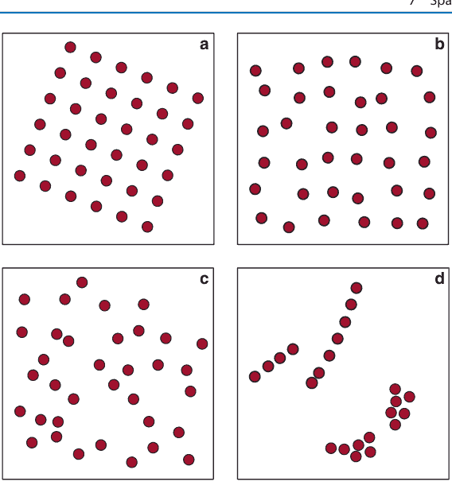

图 7.10 对象的空间分布。**a** 规则点分布，**b** 均匀点分布，**c** 随机点分布，以及 **d** 各向异性和聚集点分布。

```
from scipy.special import factorial
import scipy.spatial.distance as distance

np.random.seed(0)
data = 10 * np.random.rand(100,2)
```

我们可以使用第 3.8 节介绍的 $\chi^2$ 检验来检验数据具有均匀分布的原假设。$xy$ 数据现在被组织成 25 个类别，这些类别是尺寸为 2x2 的方形子区域。这种类别定义忽略了类别数量应接近观测值数量平方根的经验法则（见第 3.3 节）。然而，我们的类别选择不会产生任何空类别，这在应用 $\chi^2$ 检验时应避免。此外，25 个类别产生的期望观测值为整数，这些值更容易处理。我们在 y 对 x 的图中将数据显示为蓝色圆圈。矩形区域用红线勾勒（图 7.11）：

```
x = np.linspace(0,10,11)
y = np.ones(np.shape(x))

plt.figure()
plt.plot(data[:,0],data[:,1],'o')
for i in range(1,5):
    plt.plot(x,2*i*y,
        color='r',
        linewidth=0.5)
for i in range(1,5):
    plt.plot(2*i*y,x,
        color='r',
        linewidth=0.5)
plt.axis(np.array([0,10,0,10]))
plt.show()
```

直方图的三维版本用于显示空间数据，这些数据被组织成类别（图 7.12）：

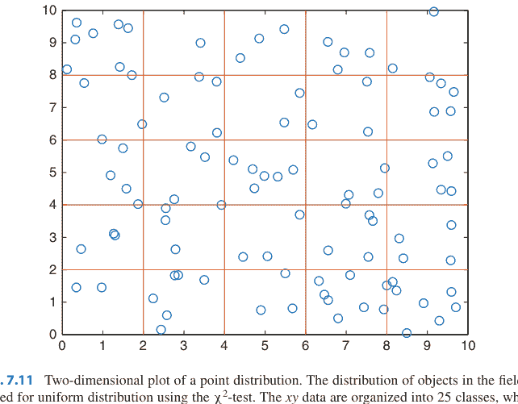

图 7.11 点分布的二维图。使用 χ² 检验测试野外对象的分布是否均匀。xy 数据被组织成 25 个类别，这些类别是尺寸为 2x2 的子区域。

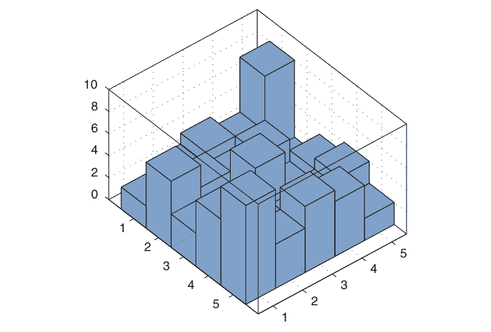

图 7.12 显示每个子区域对象数量的三维直方图。该直方图是使用 histogram2d() 创建的。

```
e = np.linspace(0,10,6)
H,xedges,yedges = np.histogram2d(data[:,0],
    data[:,1],bins=(e,e))

x = np.linspace(1,9,5)
y = np.linspace(1,9,5)
z = 0

X,Y = np.meshgrid(x,y)
Z = np.ones((5,5))

X = X.ravel()
Y = Y.ravel()
Z = 0

dx = 2
dy = 2
dz = H
dz = H.ravel()

fig = plt.figure()
ax1 = fig.add_subplot(121,projection='3d')
ax1.bar3d(X,Y,Z,dx,dy,dz)
plt.show()
```

与等效的二维函数一样，histogram2D() 的输出对象 H 可用于计算数据的频率分布 n_obs，

```
n_obs = H.ravel()
```

其中 ravel() 返回 5x5 数组 H 的连续扁平化版本。在均匀分布中，不同类别的理论频率都是相同的。每个方形区域的期望对象数量是总面积大小（10·10=100）除以 25 个子区域（或类别），等于四。为了将理论频率分布与对象的实际空间分布进行比较，我们生成一个具有相同对象数量的数组：

```
n_exp = 4*np.ones(len(n_obs))
```

χ² 检验探讨观测频率和期望频率之间的平方差（第 3.9 节）。量 χ² 定义为平方差之和除以期望频率，

```
chi2_data = np.sum((n_obs-n_exp)**2/n_exp)
print(chi2_data)
```

结果为

18.5

临界 χ² 可以使用 chi2.ppf() 计算。χ² 检验需要自由度 Φ。在我们的例子中，我们检验数据均匀分布的假设，即我们只估计一个参数（第 3.5 节）。因此，自由度为 Φ=25−(1+1)=23。我们在 p=5% 的显著性水平下检验假设。函数 chi2.ppf() 使用 Φ 指定的参数计算 χ² CDF 的逆，对应于 p 中的概率，

```
chi2_theo = stats.chi2.ppf(1-0.05,25-1-1)
print(chi2_theo)
```

结果为

35.17246162690806

由于临界 χ² 35.1725 远高于测量的 χ² 22.5000，我们不能拒绝原假设，因此必须得出结论：我们的数据遵循均匀分布。

### 随机分布检验

以下示例说明了区域内对象随机分布的检验（图 7.10c）。我们使用上一个示例中生成的均匀分布数据，并显示点分布：

```
np.random.seed(0)
data = 10 * np.random.rand(100,2)

x = np.linspace(0,10,11)
y = np.ones(np.shape(x))

plt.figure()
plt.plot(data[:,0],data[:,1],'o')
for i in range(1,10):
    plt.plot(x,i*y,
             color='r',
             linewidth=0.5)
for i in range(1,10):
    plt.plot(i*y,x,
             color='r',
             linewidth=0.5)
plt.axis(np.array([0,10,0,10]))
plt.show()
```

然后我们生成一个三维直方图，并使用 histogram2D() 统计每个类别的对象数量。与之前的检验相比，我们现在统计包含特定数量观测值的子区域数量。子区域的数量大于通常用于之前检验的数量。在我们的例子中，我们使用 49 个子区域（或类别）：

```
e = np.linspace(0,10,8)
H,xedges,yedges = np.histogram2d(data[:,0],data[:,1],
                                 bins=(e,e))

x = np.linspace(1,9,7)
y = np.linspace(1,9,7)
z = 0

X,Y = np.meshgrid(x,y)
Z = np.ones((7,7))

X = X.ravel()
Y = Y.ravel()
Z = 0

dx = 2
dy = 2
dz = H
dz = H.ravel()

fig = plt.figure()
ax1 = fig.add_subplot(121,projection='3d')
ax1.bar3d(X,Y,Z,dx,dy,dz)
plt.show()

counts = H.ravel()
```

如果对象是随机分布的，包含特定数量对象的子区域的频率分布遵循泊松分布（第 3.5 节）。首先，我们计算包含 N 个对象的子区域的频率分布。在我们的例子中，我们统计包含 0, ..., 5 个对象的子区域。我们还使用 histogram() 以二维方式显示频率分布的直方图，首先从箱中心 N 计算箱边缘 E（第 3.3 节）（图 7.13）：

```
N = np.linspace(0,5,6)
E = np.linspace(-0.5,5.5,7)

plt.hist(counts,bins=7)
n,e = np.histogram(counts,bins=7)
v = np.diff(e[0:2]) * 0.5 + e[0:-1]

n_obs = n
```

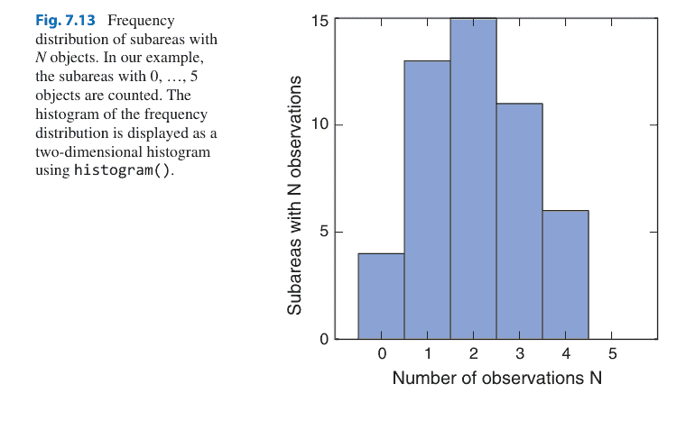

直方图区间 v 的中点对应于子区域内包含的 N=0, ..., 5 个对象。包含特定数量对象 j 的子区域的期望数量 $E_j$ 可以使用以下公式计算：

$$E_j = Te^{-n/T} \frac{(n/T)^j}{j!}$$

其中 n 是对象总数，T 是子区域数量。对于 j=0，j! 取值为 1。我们使用上述方程计算期望的子区域数量（即理论频率分布 n_exp）：

```python
n_exp = np.ones(7)
for i in range(0,6):
    n_exp[i] = 49*np.exp(-100/49)*(100/49) ** N[i]/factorial(N[i])

n_exp = np.sum(n_obs)*n_exp/np.sum(n_exp)
```

并在单个图中显示经验频率分布和理论频率分布：

```python
plt.figure()
plt.bar(v,n_obs,
    edgecolor='b',
    color='none')
plt.bar(v,n_exp,
    edgecolor='r',
    color='none')
plt.show()
```

再次使用 $\chi^2$ 检验来比较经验分布和理论分布，即检验包含特定数量对象的子区域的频率分布服从泊松分布的原假设。检验在 $p=5\%$ 的显著性水平下进行。由于泊松分布仅由一个参数定义（第 3.4 节），自由度为 $\Phi=6-(1+1)=4$。测量的 $\chi^2$ 值为：

```python
chi2_data = np.sum((n_obs-n_exp)**2/n_exp)
print(chi2_data)
```

结果为：

```
3.546695554153232
```

该值远低于临界 $\chi^2$ 值，即：

```python
chi2_theo = stats.chi2.ppf(1-0.05,6-1-1)
print(chi2_theo)
```

结果为：

```
9.487729036781154
```

因此，我们不能拒绝原假设，必须得出结论：我们的数据服从泊松分布，且点分布是随机的。

### 聚类检验

地球科学中的点分布通常是聚类的（图 7.10d）。我们使用*最近邻准则*来检验空间分布是否存在聚类。Davis (2002) 发表了一篇关于最近邻分析的优秀综述，总结了许多其他作者的工作。此外，Swan 和 Sandilands (1996) 对该分析进行了简化描述。聚类检验计算了场中所有可能的最近点对之间的距离 $d_i$。*观测到的平均最近邻距离*为：

$$\bar{d} = \frac{1}{n} \sum_{i=1}^{n} d_i$$

其中 n 是场中点（或对象）的总数。所有可能点对之间距离的算术平均值与地图所覆盖的面积有关。这种关系由*期望的平均最近邻距离*表示，即：

$$\bar{\delta} = \frac{1}{2} \sqrt{A/n}$$

其中 A 是地图所覆盖的面积。该比值较小则表明存在聚类，而较大则表示规则性（或均匀性）。该检验使用 Z 统计量（第 3.5 节），即：

$$Z = \frac{\bar{d} - \bar{\delta}}{s_e}$$

其中 $s_e$ 是平均最近邻距离的标准误差，定义为：

$$s_e = \frac{0.26136}{\sqrt{n^2/A}}$$

*随机性*的原假设与两个备择假设进行检验：一方面是*聚类*，另一方面是*均匀性*或*规则性*（图 7.10）。Z 统计量在 5% 显著性水平下的临界值为 1.96 和 -1.96。如果 -1.96 < Z < +1.96，我们不能拒绝数据随机分布的原假设。如果 Z < -1.96，我们可以拒绝原假设并接受第一个备择假设，即聚类。如果 Z > +1.96，我们也可以拒绝原假设，但接受第二个备择假设，即均匀性或规则性。

作为示例，我们再次使用前面示例中分析的合成数据：

```python
np.random.seed(0)
data = 10 * np.random.rand(100,2)

plt.figure()
plt.plot(data[:,0],data[:,1],'o')
plt.show()
```

我们首先使用 pdist()（第 9.5 节）计算所有观测值对之间的成对欧几里得距离。然后使用 squareform() 将生成的距离数组 distances 转换为对称的方形格式 distarray：

```python
distances = distance.pdist(data)
distarray = distance.squareform(distances)
```

以下 for 循环查找最近邻，存储最近邻距离，并计算平均距离：

```python
nearest = np.zeros(100)
for i in range(0,100):
    distarray[i,i] = np.Inf
    k = np.where(distarray[i,:]==np.min(distarray[i,:]))
    nearest[i]=distarray[i,k]

observednearest = np.mean(nearest)
print(observednearest)
```

结果为：

```
0.5284579351787346
```

在我们的示例中，观测到的平均最近距离 observednearest 等于 0.5285。接下来我们计算地图面积。期望的平均最近邻距离是地图面积除以观测值数量的平方根的一半：

```python
maparea = (np.max(data[:,0])-np.min(data[:,0])) * \
    (np.max(data[:,1])-np.min(data[:,1]))
expectednearest = 0.5 * np.sqrt(maparea/len(data))
print(expectednearest)
```

结果为：

```
0.49268341482387124
```

在我们的示例中，期望的平均最近邻距离 expectednearest 为 0.4927。最后，我们计算平均最近邻距离的标准误差 se：

```python
se = 0.26136/sqrt(length(data).^2/maparea)
```

结果为：

```
0.025753547459673395
```

我们还计算检验统计量 Z：

```python
Z = (observednearest - expectednearest)/se
```

结果为：

```
1.3891103899717698
```

由于 -1.96 < Z < +1.96，我们不能拒绝原假设，必须得出结论：数据是随机分布的，而非聚类的。

## 7.10 数字高程模型分析（作者：R. Gebbers）

数字高程模型（DEM）及其衍生产品（例如坡度和坡向）可以指示地表过程，例如横向水流、太阳辐射或侵蚀。DEM 最简单的衍生产品是坡度和坡向。*坡度*（或*梯度*）是衡量表面陡峭程度、倾斜度或坡度的指标，可以用百分比或度数表示。*坡向*（或*朝向*）是指坡面所面对的方向。

我们使用第 7.5 节介绍的 SRTM 数据集来说明数字高程模型在坡度、坡向和其他衍生产品方面的分析。通过输入以下命令加载数据：

```python
%reset -f
```

```python
import numpy as np
from scipy import signal
from matplotlib import cm
import matplotlib.pyplot as plt
from skimage.segmentation import watershed
```

```python
with open('S01E036.hgt') as fid:
    rectype = np.dtype('>i2')
    SRTM = np.fromfile(fid,dtype=rectype)
```

```python
SRTM = np.reshape(SRTM,(1201,1201))
SRTM = np.flipud(SRTM)
```

```python
SRTM = SRTM.astype(float)
SRTM[SRTM==-32768] = np.mean(SRTM)
```

这些数据是以米为单位的海拔值，采样在 3 弧秒（或 90 米网格）上。SRTM 数据包含小尺度的空间扰动和噪声，这在计算排水模式时可能会引起问题。因此，我们使用 convolve2d() 对数据进行二维移动平均滤波。该滤波器计算 3x3 元素的空间运行平均值。为了减少计算时间，我们仅使用原始数据集的 SRTM(750:850,700:800) 子集。我们还移除了 DEM 边缘的数据以消除滤波伪影：

```python
F = 1/9 * np.ones((3,3))
SRTM = signal.convolve2d(SRTM[749:850,699:800],
    F,mode='same')
SRTM = SRTM[1:99,1:99]
```

DEM 使用 pcolor() 和颜色映射 cm.terrain 显示为伪彩色图，该颜色映射分配了适合海拔数据的颜色映射，因为它将陆地和海洋颜色分别与高程测量和水深测量相关联：

```python
plt.figure()
plt.axes(aspect='equal')
plt.pcolor(SRTM,
    cmap=cm.terrain)
plt.colorbar()
plt.title('Elevation [m]')
plt.show()
```

DEM 显示了一个马蹄形山脉，环绕着一个向东南方向倾斜的山谷（图 7.16a）。

图 7.14 显示了 Python 索引约定的局部邻域。

| Z(1) | Z(4) | Z(7) |
| Z(2) | Z(5) | Z(8) |
| Z(3) | Z(6) | Z(9) |

现在分析 SRTM 子集的坡度和坡向。在规则网格上处理 DEM 时，可以使用局部 3x3 邻域中的中心有限差分来估计坡度和坡向。图 7.14 显示了使用 Python 索引约定的局部邻域。为了计算坡度和坡向，我们需要 DEM 元素 z 在 x 和 y 方向上的两个有限差分：

$$z_x = \frac{z_{r,c-1} - z_{r,c+1}}{2h}$$

和

$$z_y = \frac{z_{r-1,c} - z_{r+1,c}}{2h}$$

其中 h 是单元格大小，与海拔具有相同的单位。使用有限差分，坡度计算如下：

$$slp_{DF} = \sqrt{z_x^2 + z_y^2}$$

其他主要地形属性（例如坡向、平面曲率、剖面曲率和切向曲率）可以使用有限差分类似地推导出来（Wilson 和 Gallant 2000）。函数 gradient() 计算数据网格 z 的坡度和坡向，单位为水平以上的度数和从北顺时针方向的度数。由于 SRTM 数字高程模型是在 3 弧秒网格上采样的，因此 DEM 的 60·60/3=1,200 个元素对应于一度经度或纬度。为简单起见，在此示例中我们忽略 SRTM 子集的实际坐标，而是使用 DEM 元素的索引：

```python
x,y = np.gradient(SRTM)

slp = np.sqrt(x**2+y**2)/90
slp = np.arctan(slp)*180./np.pi
asp = np.arctan2(x,y)
asp = asp*180./np.pi
asp[asp<0] = asp[asp<0]+360
```

## 7.5 DEM 分析

接下来，我们以伪彩色图的形式显示以度为单位的 DEM 坡度（图 7.16b）：

```python
h = pcolor(slp);
colormap(jet), colorbar
plt.figure()
plt.axes(aspect='equal')
plt.pcolor(slp,
    cmap=cm.jet)
plt.colorbar()
plt.title('Slope')
plt.show()
```

平坦区域常见于山顶和谷底。东南部和南-西南部区域也相对平坦。最陡的坡度集中在区域中心和西南部区域。接下来，生成坡向的伪彩色图（图 7.16c）：

```python
plt.figure()
plt.axes(aspect='equal')
plt.pcolor(asp,
           cmap=cm.jet)
plt.colorbar()
plt.title('Aspect')
plt.show()
```

此图显示了从正北方向顺时针计算的坡向角度。例如，朝北的山坡显示为红色，朝东的山坡显示为绿色。

坡向在山脉的山脊处发生突变，相邻的流域被*分水岭*隔开。*scikit-image* 包包含 `watershed()` 函数，用于检测这些分水岭，并为每个集水区分配从 1 开始的数字标签：

```python
watersh = watershed(SRTM,
    markers=None,
    watershed_line=True)
```

集水区以伪彩色图显示，其中每个区域根据其数字标签从 hsv 色图中分配一种颜色（图 7.16d）：

```python
plt.figure()
plt.axes(aspect='equal')
plt.pcolor(watersh,
    cmap=cm.hsv)
plt.colorbar()
plt.title('Watershed')
plt.show()
```

分水岭由一系列红色像素表示。正如本例所示，`watershed()` 通常会产生不切实际的结果，因为分水岭算法对局部极小值敏感，这些极小值充当了虚假的汇点，并且是潜在的虚假内流区域位置。因此，在后续任何基于 DEM 的水文特征计算中，都应牢记这些极小值。

*流量累积*（也称为*特定集水区面积*或*上坡贡献面积*）定义为向特定单元格（图 7.15）贡献径流的单元格（定义了一个上坡区域）的数量。与坡度和坡向等局部变量不同，流量累积只能从全局邻域确定。主要操作是从指定单元格开始，向地势更高的相邻单元格添加流入量，直至分水岭。在将每个单元格的流出量相加之前，我们需要确定每个单元格相对于每个相邻单元格（由 N 索引）的梯度。数组 N 根据 Python 约定包含八个相邻单元格的索引，如图 7.14 所示。我们利用 `roll()` 来访问相邻单元格。对于二维数组 Z，`roll()` 将数组 Z 中的值循环移动 r 行和 c 列。单个梯度计算如下：

$$grad = \frac{z_{r+y,c+x} - z_{r,c}}{h}$$

适用于东、南、西、北方向的邻居（称为*车行情况*），以及

$$grad = \frac{z_{r+y,c+x} - z_{r,c}}{\sqrt{2}h}$$

适用于对角线方向的邻居（称为*象行情况*）。在这些公式中，$h$ 是单元格大小，$z_{r,c}$ 是中心单元格的高程，$z_{r+y,c+x}$ 是相邻单元格的高程。单元格索引 $x$ 和 $y$ 从数组 N 获取。梯度存储在三维数组 grads 中，其中 grads[:,:,0] 包含向东相邻单元格的梯度，grads[:,:,1] 包含向东南相邻单元格的梯度，依此类推。负梯度表示从中心单元格向相关相邻单元格的流出。为了获得单元格之间的地表水流，梯度使用 grads 的反正切除以 $\pi$ 再乘以 $180^\circ$ 进行转换：

```python
N = np.array([[0,-1],[-1,-1],[-1,0],
    [+1,-1],[0,+1],[+1,+1],[+1,0],[-1,+1]])
a,b = np.shape(SRTM)
grads = np.zeros((a,b,8))

for c in range(1,9,2):
    grads[:,:,c] = np.roll(SRTM,N[c,0],axis=0)
    grads[:,:,c] = np.roll(grads[:,:,c],N[c,1],axis=1)
    grads[:,:,c] = (grads[:,:,c]-SRTM)/np.sqrt(2*90**2)

for c in range(0,8,2):
    grads[:,:,c] = np.roll(SRTM,N[c,0],axis=0)
    grads[:,:,c] = np.roll(grads[:,:,c],N[c,1],axis=1)
    grads[:,:,c] = (grads[:,:,c]-SRTM)/90

grads = np.arctan(grads)/np.pi*180.
```

由于一个中心单元格可能有多个下坡邻居，水流可以向多个方向流动。这种现象称为*发散流*。早期的流量累积算法基于单流向方法（称为 D8 方法；图 7.15），该方法只允许水流流向单元格八个相邻单元格中的一个。然而，这种方法无法模拟山脊区域的发散，并且在某些情况下倾向于产生平行的流线。在我们的示例中，我们演示了多流向方法的使用，该方法允许水流从一个中心单元格流向多个相邻单元格。分配给相邻单元格的总流出量比例取决于中心单元格与该特定相邻单元格之间的梯度。尽管多流向方法在大多数情况下产生更真实的结果，但它们往往在山谷中导致分散，而那里的水流应该更集中。因此，引入了一个权重因子 $w$，它控制流出量之间的关系：

$$flow_i = \frac{grad_i^w}{\sum_{i=1}^{8} grad_i^w} \quad \text{for} \quad grad_i^w < 0$$

$w$ 的推荐值为 1.1，因为更高的值会使水流集中在最陡坡度的方向，而 $w=0$ 会导致极端的分散。在以下命令序列中，我们首先选择小于零的梯度，然后将这些梯度乘以权重：

```python
w = 1.1
flow = (grads*(-1*grads<0.))**w
```

然后，我们沿 flow 数组的第三维对上坡梯度求和。将所有值为 0 的上坡梯度替换为 1，可以避免因除以零而产生的问题：

```python
upssum = np.sum(flow,axis=2)
upssum[upssum==0] = 1
```

我们将流量除以 upssum，以获得总和为 1 的分数权重。这通过 for 循环对 3D flow 数组的每一层分别实现：

```python
for i in range(0,8):
    flow[:,:,i] = flow[:,:,i]*(flow[:,:,i]>0)/upssum
```

二维数组 inflowsum 存储每次迭代的中间流入总量。然后将这些中间总量相加，以在每次迭代结束时得到总累积流量 flowac。inflowsum 和 flowac 的初始值通过 upssum 获得：

```python
inflowsum = upssum
flowac = upssum
```

现在需要另一个三维数组 inflow 来存储来自所有邻居的总中间流入量：

```python
inflow = grads*0
```

当没有流入时，流量累积终止。将此信息转换为 Python 代码时，我们使用一个条件 while 循环，当 sum(inflowsum) == 0 时终止。inflowsum 中非零条目的数量在每次循环中减少。这是通过交替更新 inflow 和 inflowsum 来实现的。这里，inflowsum 使用相邻单元格的中间流入量进行更新，这些流入量在所有相邻单元格都是贡献单元格（即 grads 为正）的条件下由 flow 加权。当并非所有相邻单元格都是贡献单元格时，中间 inflowsum 会减少，inflow 也是如此。流量累积 flowac 通过连续对中间 inflowsum 求和而增加：

```python
while np.sum(inflowsum)>0:
    for i in range(0,8):
        inflow[:,:,i] = np.roll(inflowsum,N[i,0],axis=0)
        inflow[:,:,i] = np.roll(inflow[:,:,i],N[i,1],axis=1)
    inflowsum = np.sum(inflow*flow*grads>0,2)
    flowac = flowac + inflowsum
```

我们以对数刻度值的伪彩色图形式显示结果（图 7.16e）：

```python
plt.figure()
plt.axes(aspect='equal')
plt.pcolor(np.log(1+flowac),
    cmap=cm.jet_r)
plt.colorbar()
plt.title('Flow accumulation')
plt.show()
```

该图以蓝色阴影显示高流量累积区域，以红色阴影显示低流量累积区域（通常对应于山脊）。我们使用对数刻度来映射流量累积，以获得更好的结果表示。此处介绍的用于计算流量累积的简化算法可用于分析 DEM 中的倾斜地形。在坡度接近零的平坦地形中，我们的算法无法生成流向，因此流量累积会停止。这种情况需要更先进的算法，这些算法可以在完全平坦的地形上进行分析。这些更先进的算法还包括填充汇点的程序，以避免中断流量累积的虚假汇点。小的洼地可以通过平滑来填充，正如我们在本节开头所做的那样。

本节的第一部分讨论了主要地形属性。DEM 的次要属性是两个或多个主要属性的函数。这些次要属性的例子包括湿度指数和水流功率指数。单元格的*湿度指数*是该特定单元格的集水区面积与其坡度正切值之比的对数：

$$weti = \log\left(\frac{1+flowac}{\tan(slp)}\right)$$

术语 1+flowac 避免了当 flowac=0 时计算零的对数所引发的问题。湿度指数用于预测由侧向水流运动导致的土壤含水量（饱和度）。积水潜力通常在集水区地势较低、坡度较缓的区域最高。与坡度陡峭、集水区面积小的区域相比，具有较大上游面积的平坦区域拥有较高的湿度指数。湿度指数 weti 通过输入以下命令计算并显示：

```
weti = np.log((1+flowac)/np.tan(np.pi*slp/180))

plt.axes(aspect='equal')
plt.pcolor(weti,
    cmap=cm.jet_r)
plt.colorbar()
plt.title('Wetness index')
plt.show()
```

在此图中，蓝色代表湿度指数的高值，而红色代表低值（图 7.16f）。在我们的示例中，东南部的土壤最有可能具有高含水量，这既源于来自中部大山谷的径流，也源于地形的平坦性。

水流功率指数是另一个重要的次级地形属性，常用于山坡水文学、地貌学、土壤科学及相关学科。作为水流功率的度量，它指示了水流进行泥沙输送和侵蚀的潜力。水流功率指数定义为特定单元的集水区面积与该单元坡度正切值的乘积：

spi = flowac · tan(slp)

当大量水流（通过流量累积计算）因极端坡度而快速流动时，侵蚀潜力很高。以下一系列命令计算并显示水流功率指数：

```
spi = flowac*np.tan(np.pi*slp/180)

plt.figure()
plt.axes(aspect='equal')
plt.pcolor(np.log(1+spi),
    cmap=cm.jet)
plt.colorbar()
plt.title('Stream power index')
plt.show()
axis([1 c 1 r])
set(gca,'TickDir','out');
```

湿度指数和水流功率指数在高分辨率地形分析中特别有用，即在采样间隔小于 30 米的数字高程模型中。在我们的地形分析示例中，我们从中等分辨率的 DEM 计算了 weti 和 spi，我们必须预期这些属性存在一定程度的尺度依赖性。

本节说明了用于分析数字高程模型的基本工具的使用。Wilson 和 Gallant (2000) 的著作对数字地形建模进行了更详细的介绍。此外，Freeman (1991) 的文章对数字地形分析进行了全面总结，包括介绍用于流量累积的高级算法的使用。

## 7.11 地统计学与克里金法（作者：R. Gebbers）

地统计学描述了一个或多个变量在 1D、2D 或 3D 空间——甚至在 4D 时空——中的自相关性，以便对未观测位置进行预测、获取这些预测的精度信息，或重现空间变异性与不确定性。空间自相关的形状、范围和方向由变异函数描述，这是线性地统计学中使用的主要工具。地统计学以其当前形式的起源可以追溯到 20 世纪 50 年代初，当时南非矿业工程师 Daniel G. Krige 首次发表了一种基于样本空间依赖性的插值方法。在 20 世纪 60 年代和 70 年代，法国数学家 Georges Matheron 发展了区域化变量理论，为 Krige 更实用的方法提供了理论基础。该理论构成了分析和估计空间依赖变量的若干程序的基础，Matheron 将其称为地统计学。Matheron 还创造了“克里金法”一词，指通过地统计学方法进行空间插值。

### 理论背景

地统计学的一个基本假设是，时空过程由确定性成分和随机性成分组成（图 7.17）。确定性成分可以是全局或局部趋势（有时称为漂移）。随机性成分包括一个纯随机成分和一个自相关成分。自相关成分表明，平均而言，距离较近的观测值彼此之间比距离较远的观测值更为相似。这种行为由变异函数描述，其中观测值之间的平方差被绘制为观测值分离距离的函数。Krige 的基本思想是使用变异函数进行插值，以此确定在预测未观测位置的值时，邻近观测值的影响程度。基本线性地统计学包括两个主要程序：用于建模变异函数的变异函数分析，以及用于插值的克里金法。

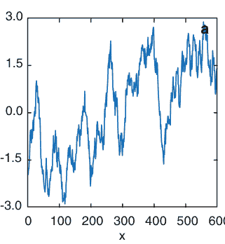

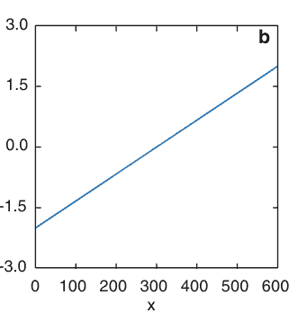

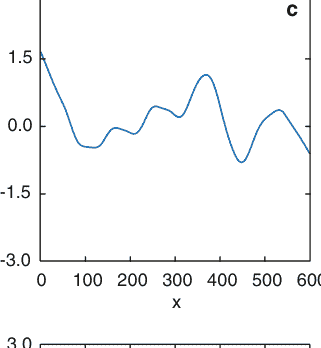

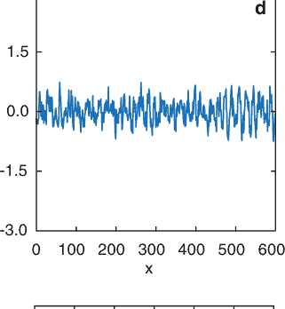

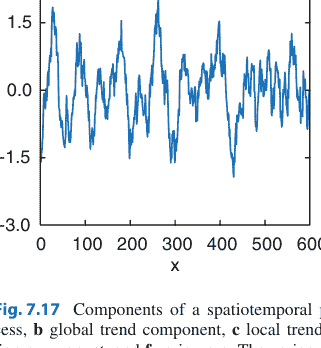

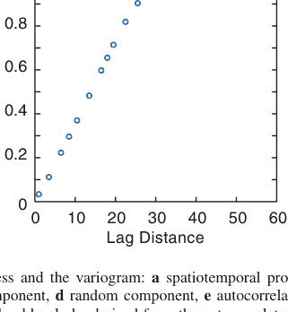

**图 7.17** 时空过程的组成部分与变异函数：**a** 时空过程，**b** 全局趋势成分，**c** 局部趋势成分，**d** 随机成分，**e** 自相关成分，以及 **f** 变异函数。变异函数应仅从自相关成分导出。

### 前置分析

由于本书中介绍的线性地统计学是一种参数方法，因此需要通过前置分析来检查其基本假设。与其他参数方法一样，线性地统计学对异常值和偏离正态分布的情况敏感。我们首先打开数据文件 *geost_dat.mat*，其中包含 *xyz* 数据三元组，然后绘制采样位置。这使我们能够检查点分布并检测数据坐标 *x* 和 *y* 中的任何重大错误：

```
%reset -f

import numpy as np
from numpy import linalg
from scipy import stats
import matplotlib.pyplot as plt

data = np.loadtxt('geost_dat.txt')
x = data[:,0]
y = data[:,1]
z = data[:,2]

plt.figure()
plt.plot(data[:,0],data[:,1],
    marker='o',
    markeredgecolor=(0.3,0.5,0.8),
    markerfacecolor='none',
    linestyle='none')
plt.show()
```

可以通过输入以下命令检查观测值 *z* 的范围：

```
print(np.min(z))
print(np.max(z))
```

输出结果为：

```
3.7198573
7.8459703
```

对于线性地统计学，观测值 *z* 应服从高斯分布。这通常仅通过目视检查直方图来测试，因为如果样本数量超过约 100，统计检验通常过于敏感。也可以通过输入以下命令计算数据的偏度和峰度：

```
plt.hist(z)
print(stats.skew(z))
print(stats.kurtosis(z,fisher=True))
```

输出结果为：

```
0.2568129442682396
-0.4780014841875708
```

平坦顶部或多峰分布表明数据集中存在多个总体。如果这些总体可以与特定区域相关联，则应分别处理。存在多个峰的另一个原因可能是对高值和/或低值区域的优先采样。这通常是由于某些先验知识造成的，被称为聚类效应。处理聚类效应的方法在 Deutsch 和 Journel (1998) 以及 Isaaks 和 Srivastava (1990) 中有描述。

大多数问题源于正偏度，即分布具有向右的长尾。根据 Webster 和 Oliver (2007)，如果偏度在 0.5 到 1 之间，应考虑进行平方根变换；如果偏度超过 1，应考虑进行对数变换。一个通用的变换公式是：

$$z^* = \begin{cases} ((z+m)^k - 1)/k, & \text{for } k \neq 0 \\ \log(z+m), & \text{for } k = 0 \end{cases}$$

其中 $\min(z)+m>0$。这被称为 Box–Cox 变换，当使用对数变换时，其特例为 $k=0$。在对数变换中，如果 $z$ 为零或负数，则应加上 $m$。幂变换值的插值结果可以在克里金法之后直接进行反变换。对数变换值的反变换稍微复杂一些，将在后面解释。该过程被称为 *对数正态克里金法*，可能很重要，因为在地质学中对数正态分布并不少见。地统计学中的其他变换在 Deutsch 和 Journel (1998) 以及 Remy 等人 (2006) 中有讨论。组成数据的变换在第 9.7 章中讨论。

### 使用经典变异函数进行变异函数分析

变异函数描述了在单维或多维空间中参考观测值的空间依赖性。由于空间过程的真实变异函数通常是未知的，因此必须从观测值中估计。这个过程被称为变异函数分析，首先从原始数据计算 *实验变异函数*。下一步，实验变异函数通过 *变异函数估计量* 进行总结。然后，变异函数分析通过将变异函数模型拟合到变异函数估计量来完成。实验变异函数计算为成对观测值之间的差异，并且依赖于 *分离*

## 7.3.2 变异函数

图 7.18 两点之间的分离向量 h。

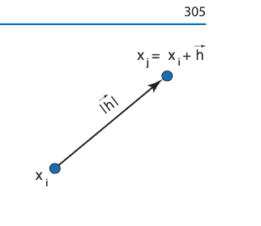

向量 h（图 7.18）。经典的实验变异函数由半方差定义：

$$\gamma(h) = 0.5 \cdot (z_x - z_{x+h})^2$$

其中 $z_x$ 是位置 $x$ 处的观测值，$z_{x+h}$ 是距离 $x$ 为 $h$ 的另一点处的观测值。分离向量 $h$ 的长度称为步长距离（或简称步长）。$\gamma(h)$ 的正确术语是半变异函数（或半方差），其中“半”指的是 $\gamma(h)$ 是 $z_x$ 和 $z_{x+h}$ 之间差值方差的一半。然而，当点成对考虑时，$\gamma(h)$ 是每点的方差（Webster and Oliver 2007）。但是，按照惯例，$\gamma(h)$ 被称为变异函数而不是半变异函数——我们在本节的剩余部分遵循这一惯例。为了计算实验变异函数，我们首先需要将观测对分组。这可以通过输入以下代码实现：

```
X1,X2 = np.meshgrid(x,x)
Y1,Y2 = np.meshgrid(y,y)
Z1,Z2 = np.meshgrid(z,z)
```

观测点之间的分离距离数组 D 为：

```
D = np.sqrt((X1-X2)**2+(Y1-Y2)**2)
```

然后，我们通过观测值之间差值的平方的一半得到实验变异函数 G：

```
G = 0.5*(Z1-Z2)**2
```

为了加快处理速度，我们利用 Python 的向量化命令能力，而不是使用 for 循环。然而，即使只需要 $n(n-1)/2$ 对，我们仍然计算了 $n^2$ 对观测。对于大型数据集（例如，超过 3000 个数据点），计算机的软件和物理内存可能成为限制因素。在这种情况下，应使用循环，并将聚合结果存储在变异函数网格中，而不是像 SURFER 软件（Golden Software, Inc.）那样生成包含单个对的数组。实验变异函数的图称为*变异函数云*（图 7.19），我们通过提取 D 和 G 数组的下三角部分获得：

```
indx = np.linspace(1,len(z),len(z))
C,R = np.meshgrid(indx,indx)
I = R>C

plt.figure()
plt.plot(D[I],G[I],
    marker='.',
    linestyle='none')
plt.xlabel('lag distance')
plt.ylabel('variogram')
plt.show()
```

变异函数云提供了不同步长处值分散情况的视觉印象。它可用于检测异常值或异常情况，但仅凭此图很难判断是否存在空间相关性，如果存在，其形式可能是什么，或者我们如何对其进行建模（Webster and Oliver 2007）。

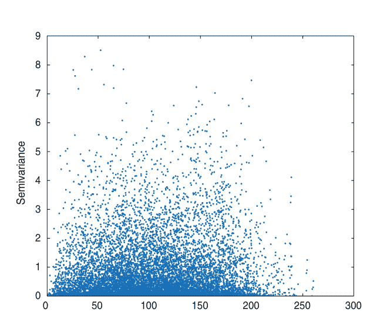

**图 7.19** 变异函数云：实验变异函数（观测对之间差值的平方的一半）与步长距离（一对中两个组成部分之间的分离距离）的关系图。

为了获得更清晰的视图并准备变异函数模型，现在用变异函数估计量替代实验变异函数。

变异函数估计量源自实验变异函数，旨在总结其中心趋势（类似于第 3.2 节中从单变量观测得出的描述性统计量）。经典的变异函数估计量是在特定距离类别（或区间）内的平均经验变异函数，这些类别由步长间隔的倍数定义。分离距离的分类如图 7.20 所示。变异函数估计量通过以下公式计算：

$$\gamma_E(h) = \frac{1}{2 * N(h)} \cdot \sum_{i=1}^{N(h)} (z_{x_i} - z_{x_{i+h}})^2$$

其中 $N(h)$ 是步长间隔 $h$ 内的对数。

我们首先需要确定一个合适的步长间隔 $h$。如果采样是在规则网格上进行的，则可以使用网格单元的长度。如果样本间距不均匀（如本例），则对的平均最小分离距离是步长间隔的一个良好起点（Webster and Oliver 2007）。为了计算对之间的平均最小分离距离，我们需要将步长数组 D 对角线上的零替换为 NaN；否则，平均最小分离距离将为零。输入以下代码：

```
D2 = D*(np.diag(x*np.nan)+1)
D2m = np.zeros(len(D2))
for i in range(0,len(D2)):
    D2m[i] = np.nanmin(D2[i])
lag = np.mean(D2m)
print(lag)
```

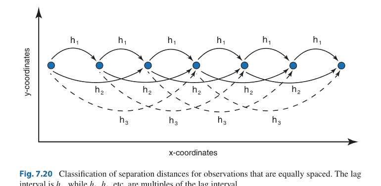

**图 7.20** 等间距观测的分离距离分类。步长间隔为 $h_1$，而 $h_2$、$h_3$ 等是步长间隔的倍数。

得到结果：

```
8.010698943460342
```

由于随着分离距离的增加，估计的变异函数值往往变得更加不稳定，因此在计算中设置最大分离距离限制非常重要。根据经验法则，最大分离距离的一半是变异函数分析的合适限制。我们通过输入以下代码获得半最大距离和最大步长数：

```
hmd = np.max(D)/2
max_lags = int(np.floor(hmd/lag))
print(hmd)
print(max_lags)
```

得到结果：

```
130.19008189950569
16
```

然后，通过输入以下代码对分离距离进行分类——并计算经典变异函数估计量：

```
LAGS = np.ceil(D2/lag)

DE = np.zeros(max_lags)
PN = np.zeros(max_lags)
GE = np.zeros(max_lags)

for i in range(1,max_lags+1):
    SEL = (LAGS == i)
    DE[i-1] = np.mean(D[SEL])
    PN[i-1] = np.sum(SEL)/2
    GE[i-1] = np.mean(G[SEL])
```

其中 SEL 是由 LAG 中的步长类别定义的选择数组，DE 是平均步长，PN 是对数，GE 是变异函数估计量。我们现在可以通过输入以下代码绘制经典变异函数估计量（变异函数与平均分离距离的关系图）以及总体方差：

```
plt.figure()
plt.plot(DE,GE,
    marker='o',
    markerfacecolor = [0.6,0.6,0.6],
    linestyle='none')
var_z = np.var(z,ddof=1)
xl = np.max(DE)*1.1
yl = 1.1*max(GE)
b = np.array([0,xl])
c = np.array([var_z,var_z])

plt.plot(b,c,'r--')
plt.axis(np.array([0,xl,0,yl]))
plt.xlabel('Averaged distance between observations')
plt.ylabel('Averaged semivariance')
plt.show()
```

图 7.21 中的变异函数呈现出典型的模式。在小的分离距离（靠近原点）处值较低，然后随着距离的增加而增加，直到达到一个接近总体方差的平台（*基台值*）。这表明空间过程在短距离内是相关的，但在较长距离内则不相关。空间依赖性的范围称为*变程*，定义为变异函数达到基台值时的分离距离。

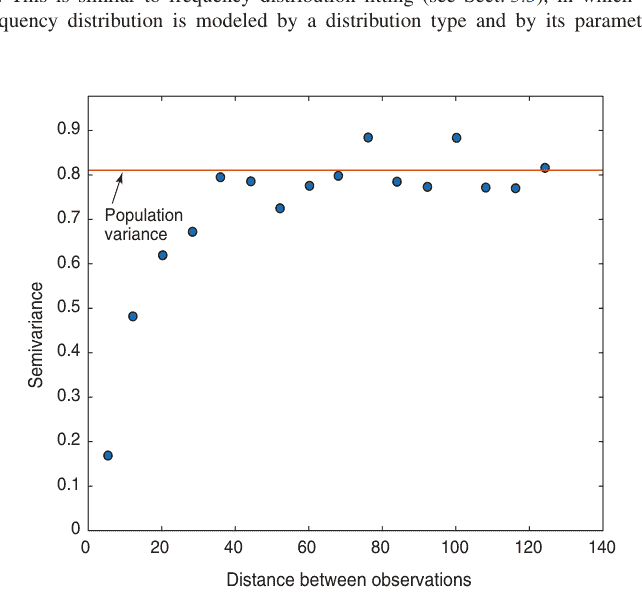

**图 7.21** 经典变异函数估计量（蓝色）和总体方差（红线）。

*变异函数模型*是拟合到变异函数估计量的参数曲线。这类似于频率分布拟合（见第 3.5 节），其中频率分布由分布类型及其参数（例如，具有均值和方差的正态分布）建模。出于理论原因，只有具有某些特性的函数才应被用作变异函数模型。常见的*授权模型*有球状模型、指数模型和线性模型（更多模型可在相关已发表文献中找到）。

球状模型：

$$\gamma_{sph}(h) = \begin{cases} c \cdot \left(1.5 \cdot \frac{h}{a} - 0.5 \left(\frac{h}{a}\right)^3\right), & \text{for } 0 \le h \le a \\ c, & \text{for } h > a \end{cases}$$

指数模型：

$$\gamma_{exp}(h) = c \cdot \left(1 - \exp\left(-3 \cdot \frac{h}{a}\right)\right)$$

线性模型：

$$\gamma_{lin}(h) = b \cdot h$$

其中 $c$ 是基台值，$a$ 是变程，$b$ 是斜率（对于线性模型）。如果将变异函数模型拟合到变异函数估计量，则必须调整参数 $c$ 以及 $a$ 或 $b$。

*块金效应*是一种特殊类型的变异函数模型。在实践中，当将变异函数外推到分离距离为零时，我们经常在 $y$ 轴上观察到一个正截距。这被称为块金效应，由测量误差以及由于采样间隔过大而未被捕获的小尺度波动（*块金*）来解释。我们有时根据实验室重复测量的方差或其他先验知识对最小块金效应有所预期。有关块金效应的更多细节可在 Cressie (1990, 1993) 和 Kitanidis (1997) 中找到。如果存在块金效应，可以将其添加到变异函数模型中。带有块金效应的指数模型如下所示：

$$\gamma_{exp+nug}(h) = c_0 + c \cdot \left(1 - \exp\left(-3 \cdot \frac{h}{a}\right)\right)$$

其中 $c_0$ 是块金效应。

我们甚至可以组合变异函数模型（例如，两个具有不同变程和基台值的球状模型）。这些组合称为*嵌套模型*。在变异函数建模过程中，嵌套模型的组成部分被视为应解释为地质过程结果的空间结构。在我们进一步讨论变异函数建模的各个方面之前，我们首先将一些模型拟合到我们的数据。我们从一个没有块金效应的球状模型开始，然后添加一个指数模型和一个线性模型，两者都带有块金方差：

plt.figure()
plt.plot(DE,GE,
    marker='o',
    markerfacecolor = [0.6,0.6,0.6],
    linestyle='none')
var_z = np.var(z,ddof=1)
xl = np.max(DE)*1.1
yl = 1.1*max(GE)
b = np.array([0, xl])
c = np.array([var_z,var_z])
plt.plot(b,c,'r--')
plt.axis(np.array([0,xl,0,yl]))
plt.xlabel('观测点之间的平均距离')
plt.ylabel('平均半方差')

nugget = 0
sill = 0.803
rang = 45.9
lags = np.arange(0,max(DE),1)
Gsph = nugget + (sill*(1.5*lags/rang - 0.5*(lags/rang)**3)*(lags<=rang) + sill*(lags>rang))

plt.plot(lags,Gsph,'g:')

nugget = 0.0239
sill = 0.78
rang = 45
Gexp = nugget+sill*(1-np.exp(-3*lags/rang))
plt.plot(lags,Gexp,'b:')

nugget = 0.153
slope = 0.0203
Glin = nugget + slope*lags

plt.plot(lags,Glin,'m:')
plt.xlabel('观测点之间的距离')
plt.ylabel('半方差')
plt.legend(['变异函数估计量','总体方差',
    '球状模型','指数模型','线性模型'])
plt.show()

变异函数建模技术目前仍在广泛讨论中。一些研究者主张通过加权最小二乘法、最大似然法或最大熵法进行自动曲线拟合，从而实现**客观的**变异函数建模。相反，也有人认为地质知识应被纳入建模过程，因此推荐采用视觉拟合。在许多情况下，变异函数建模的问题与其说是是否使用了合适的方法，不如说是实验变异函数的质量问题。如果实验变异函数质量良好，两种方法都会得出相似的结果。

变异函数建模的另一个重要问题是模型的预期用途。在我们的案例中，线性模型乍看之下似乎并不合适（图7.22）。然而，仔细观察可以发现，线性模型在前三个滞后距离上拟合得相当好。如果我们仅将变异函数模型用于克里金插值，这可能就足够了，因为在克里金法中，邻近点对于估计值最为重要（见下文关于克里金的讨论）。因此，如果采样点分布规则，具有相似原点附近拟合度的不同变异函数模型会产生相似的克里金结果。然而，如果目标是描述空间结构，情况就大不相同了。此时，找到一个在所有滞后距离上都适用的模型，并准确确定基台值和变程就变得至关重要。Rendu 和 Readdy (1982) 的一系列地质案例研究展示了过程知识与变异函数分析如何相互关联。Gringarten 和 Deutsch (2001) 以及 Webster 和 Oliver (2007) 为变异函数建模提供了良好的指导原则。

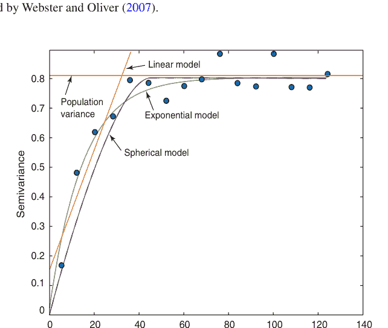

**图 7.22** 变异函数估计量（蓝色圆圈）、总体方差（红线），以及球状、指数和线性模型（分别为黄色、紫色和绿色线）。

我们现在简要讨论变异函数分析的其他几个方面：

- *样本量* – 与任何统计程序一样，为了获得可靠的估计，需要尽可能大的样本量。对于变异函数分析，样本数量应大于100（理想情况下大于150）（Webster and Oliver 2007）。对于较小的样本量，应计算最大似然变异函数（Pardo-Igúzquiza and Dowd 1997）。
- *采样设计* – 为了在变异函数原点附近获得良好的估计，采样设计应包括小距离上的观测。这可以通过嵌套设计来实现（Webster and Oliver 2007）。Olea (1984) 评估了其他可能的设计。
- *各向异性* – 到目前为止，我们假设空间相关结构与方向无关。我们计算了*全向变异函数*，同时忽略了分离向量 *h* 的方向。在更深入的分析中，变异函数不仅应在距离上离散化，还应在方向上离散化（方向区间）。通过绘制*方向变异函数*（通常在四个方向上），我们有时能观察到不同的变程（*几何各向异性*）、不同的尺度（*区域各向异性*）和不同的形状（表明存在趋势）。处理各向异性需要高度交互的图形用户界面，这超出了本书的范围（参见 Panatier 1996 的 VarioWin 软件）。
- *点对数量和滞后间隔* – 计算经典变异函数估计量时，由于估计量对异常值敏感，每个滞后间隔应使用超过30对点（理想情况下超过50对）（Webster and Oliver 2007）。如果点对较少，则应增加滞后间隔。滞后间距不一定是均匀的，可以为每个距离类别单独选择。也可以使用重叠类别，此时必须定义*滞后宽度*（*滞后容差*）。然而，增加滞后宽度可能导致不必要的平滑化，从而损失细节。因此，必须谨慎选择分离距离和滞后宽度。另一个选择是使用更稳健的变异函数估计量（Cressie 1990, 1993; Deutsch and Journel 1998）。
- *计算分离距离* – 如果观测覆盖大面积区域（例如，大于1000平方公里），应从平面笛卡尔坐标系计算球面距离，而不是勾股距离。

### 克里金法

我们现在使用*普通点克里金法*将观测值插值到规则网格上，这是最流行的克里金方法。普通点克里金法使用邻近点的加权平均值来估计未观测点的值，

$$\hat{z}_{x_0} = \sum_{i}^{n} \lambda_i \cdot z_{x_i}$$

其中 $\lambda_i$ 是需要估计的权重。权重之和应等于一，以保证估计是无偏的：

$$\sum_{i}^{n} \lambda_i = 1$$

估计的期望（平均）误差必须为零，即，
$$E(\hat{z}_{x_0} - z_{x_0}) = 0$$

其中 $z_{x_0}$ 是真实（但未知）的值。我们可以使用上述方程，通过代数方法用变异函数表示均方误差，

$$E\left(\left(\hat{z}_{x_0} - z_{x_0}\right)^2\right) = 2\sum_{i=1}^{n} \lambda_i \gamma(x_i, x_0) - \sum_{i=1}^{n} \sum_{j=1}^{n} \lambda_i \lambda_j \gamma(x_i, x_j)$$

其中 $E$ 是估计误差或*克里金方差*（必须最小化），$\gamma(x_i, x_0)$ 是数据点与未观测点之间的变异函数（半方差），$\gamma(x_i, x_j)$ 是数据点 $x_i$ 和 $x_j$ 之间的变异函数，$\lambda_i$ 和 $\lambda_j$ 是第 $i$ 个和第 $j$ 个数据点的权重。

对于克里金法，我们必须最小化这个方程（一个二次目标函数），以满足权重之和必须等于一（线性约束）的条件。这个优化问题可以使用拉格朗日乘子 $\nu$ 来解决，从而得到一个包含 $n+1$ 个方程和 $n+1$ 个未知数的*线性克里金系统*：

$$\sum_{i=1}^{n} \lambda_i \gamma(x_i, x_j) + \nu = \gamma(x_i, x_0)$$

获得权重 $\lambda_i$ 后，克里金方差由下式给出
$$\sigma^2(x_0) = \sum_{i=1}^{n} \lambda_i \gamma(x_i, x_0) + \nu(x_0)$$

克里金系统也可以用数组符号表示，
$$G\_mod \cdot E = G\_R$$

其中
$$G\_mod = \begin{bmatrix} 0 & \gamma(x_1, x_2) & \dots & \gamma(x_1, x_n) & 1 \\ \gamma(x_2, x_1) & 0 & \dots & \gamma(x_2, x_n) & 1 \\ \nu & \nu & \dots & \nu & \nu \\ \gamma(x_n, x_1) & \gamma(x_n, x_2) & \dots & 0 & 1 \\ 1 & 1 & \dots & 1 & 0 \end{bmatrix}$$

是系数数组（即这些是观测对的建模变异函数值）。注意在数组的对角线上（分离距离为零处），γ 的值消失

$$E = \begin{bmatrix} \lambda_1 \\ \lambda_2 \\ \nu \\ \lambda_n \\ \nu \end{bmatrix}$$

是未知权重和拉格朗日乘子的向量

$$G\_R = \begin{bmatrix} \gamma(x_1, x_0) \\ \gamma(x_2, x_0) \\ \nu \\ \gamma(x_n, x_0) \\ 1 \end{bmatrix}$$

是右侧向量。为了获得权重和拉格朗日乘子，需要对数组 $G\_mod$ 求逆：

$$E = G\_mod^{-1} \cdot G\_R$$

克里金方差由下式给出

$$\sigma^2 = G\_R^{-1} \cdot E$$

对于我们的 Python 计算，我们需要从距离数组 $D$ 和变异函数模型导出的系数数组。距离数组 $D$ 在上面的变异函数分析部分已经计算过，我们使用上一节中带有块金值、基台值和变程的指数变异函数模型：

```
G_mod=(nugget+sill*(1-np.exp(-3*D/rang)))*(D>0)
```

然后，我们获取观测数量，并在数组 $G\_mod$ 中添加一列和一行全为1的向量，并在左下角添加一个零：

```
n = len(x)
o1 = np.ones((n,1))
o2 = np.ones((1,n+1))
G_mod = np.append(G_mod,o1,axis=1)
G_mod = np.append(G_mod,o2,axis=0)
G_mod[len(x):,len(x):] = 0.
```

现在必须对数组 $G\_mod$ 求逆：

```
G_inv = linalg.inv(G_mod)
```

需要一个包含未知值位置的网格。这里，我们在一个x和y方向范围均为0到200的二次区域内，使用网格单元大小为5。坐标以数组形式创建，通过以下代码：

```
R = np.arange(0,200+5,5)
Xg1,Xg2 = np.meshgrid(R,R)
```

并通过以下代码转换为向量：

```
Xg = np.reshape(Xg1,(len(Xg1)**2,1))
Yg = np.reshape(Xg2,(len(Xg2)**2,1))
```

然后，我们通过输入以下代码为克里金估计值Zg和克里金方差s2_k分配内存：

```
Zg = Xg * np.NaN
s2_k = Xg * np.NaN
```

现在，我们对每个网格点进行未知值的克里金插值：

```
for k in range(1,len(Xg)):
    DOR = ((x-Xg[k])**2+(y-Yg[k])**2)**0.5
    G_R = (nugget+sill*(1-np.exp(-3*DOR/rang)))*(DOR>0)
    G_R = np.append(G_R,1)
    E = np.matmul(G_inv,G_R)
    Zg[k] = np.sum(E[0:n]*z)
    s2_k[k] = np.sum(E[0:n]*G_R[0:n])+E[n]
```

第一条命令计算网格点(Xg,Yg)与观测点(x,y)之间的距离。然后，我们使用变异函数模型G_R创建克里金系统的右侧向量，并在最后一行添加一个1。接下来，我们获得包含权重和拉格朗日乘子的数组E。每个点k的估计值Zg是观测值z的加权和。最后，计算网格点的克里金方差s2_k，然后我们可以绘制结果。我们首先创建克里金估计值和克里金方差的网格：

```
r = len(R)
Z = np.reshape(Zg,(r,r))
SK = np.reshape(s2_k,(r,r))
```

左侧的子图展示克里金插值结果：

```
plt.figure()
fig,axs = plt.subplots(nrows=1,ncols=2,
    constrained_layout=True)
ax = axs[0]
im = axs[0].pcolor(Xg1,Xg2,Z,
    cmap='jet',
    shading='auto')
ax.set_aspect('equal','box')
plt.colorbar(im,ax=ax,orientation='horizontal')
ax.set_xlabel('x-coordinates')
ax.set_ylabel('y-coordinates')
```

右侧的子图展示克里金方差，

```
ax = axs[1]
axs[1].pcolor(Xg1,Xg2,SK,
    cmap='jet',
    shading='auto')
```

并叠加采样位置：

```
plt.plot(x,y,
    marker='o',
    markerfacecolor='none',
    markeredgecolor='k',
    linestyle='none')
ax.set_aspect('equal','box')
plt.colorbar(im,ax=ax,orientation='horizontal')
ax.set_xlabel('x-coordinates')
ax.set_ylabel('y-coordinates')
plt.show()
```

克里金插值结果如图7.23a所示。克里金方差仅取决于与观测点的距离，而不取决于观测值（图7.23b）。当观测点位于变异函数范围之外时，克里金插值会重现总体均值，但克里金方差也会增加（图7.23地图的右下角）。克里金方差可用作改进采样设计的标准，并且在对数正态克里金中，反向变换也需要它，其实现方式为：

$$y(x_0) = \exp\left(z(x_0) + 0.5 \cdot \sigma^2(x_0) - \nu\right)$$

### 克里金讨论

此处介绍的*点克里金*是一种精确插值器。即使使用了带有块金效应的变异函数，它也能在观测点重现精确值。通过包含测量误差的方差（参见Kitanidis 1997）以及通过*块段克里金*（对特定邻域或块段内的观测值进行平均）可以实现平滑。虽然克里金方差仅取决于观测点和未观测点之间的距离，但它主要是信息密度的度量（Wackernagel 2003）。克里金的准确性最好通过使用重采样方法或替代测试的交叉验证来评估（第4.5节和第4.6节）。邻近观测值对估计的影响取决于它们的配置，正如Webster和Oliver（2007）所总结的：“近点比远点权重更大；当邻域中的点数增加时，一个点的相对权重会减小；在相同距离下，聚集的点比孤立的点各自权重更小；数据点可以被位于它们和目标点之间的点屏蔽。”克里金的采样设计不同于可能对变异函数分析最优的设计。规则网格（无论是三角形还是方形）可被视为最优。

此处介绍的Python代码是对上述公式的直接实现。在专业程序中，通过使用协方差而非变异函数（Kitanidis 1997; Webster and Oliver 2007），可以限制进入数组*G_mod*的数据点数量，并避免*G_mod*的求逆。对于那些对编程或更深入理解算法感兴趣的人来说，Deutsch和Journel（1998）的出版物是必读材料。最好的互联网资源是AI-GEOSTATISTICS的主页：

https://wiki.52north.org/AI_GEOSTATS/WebHome

## 推荐阅读

- Amante C, Eakins BW (2009) ETOPO1 1 Arc-Minute Global Relief Model: Procedures, Data Sources and Analysis. NOAA Technical Memorandum NESDIS NGDC-24
- Bohlander J, Scambos T (2007) Antarctic coastlines and grounding line derived from MODIS Mosaic of Antarctica (MOA). National Snow and Ice Data Center, Boulder, Colorado
- Cressie N (1990) The origins of kriging. Math Geol 22:239–252
- Cressie N (1993) Statistics for spatial data, Revised. John Wiley & Sons, New York
- Davis JC (2002) Statistics and data analysis in geology, 3rd edn. John Wiley & Sons, New York
- Deutsch CV, Journel AG (1998) GSLIB – Geostatistical software library and user’s guide, 2nd edn. Oxford University Press, Oxford
- Farr TG, Rosen P, Caro E, Crippen R, Duren R, Hensley S, Kobrick M, Paller M, Rodriguez E, Roth L, Seal D, Shaffer S, Shimada J, Umland J, Werner M, Oskin M, Burbank D, Alsdorf D (2007) The Shuttle Radar Topography Mission. Rev Geophys 45:RG2004
- Farr TG, Kobrick M (2000) Shuttle radar topography mission produces a wealth of data. Am Geophys Union Eos 81:583–585
- Freeman TG (1991) Calculating catchment area with divergent flow based on a regular grid. Comput Geosci 17:413–422
- Gorny AJ (1977) World data bank II general user guide Rep. PB 271869. Central Intelligence Agency, Washington DC
- Gringarten E, Deutsch CV (2001) Teacher’s aide variogram interpretation and modeling. Math Geol 33:507–534
- Isaaks E, Srivastava M (1990) An introduction to applied geostatistics. Oxford University Press, Oxford
- Kitanidis P (1997) Introduction to geostatistics – applications in hydrogeology. Cambridge University Press, Cambridge
- Olea RA (1984) Systematic sampling of spatial functions. Kansas series on spatial analysis 7, Kansas Geological Survey, Lawrence, KS
- Pannatier Y (1996) VarioWin – software for spatial data analysis in 2D. Springer, Berlin Heidelberg New York
- Pardo-Igúzquiza E, Dowd PA (1997) AMLE3D: a computer program for the inference of spatial covariance parameters by approximate maximum likelihood estimation. Comput Geosci 23:793–805
- Remy N, Boucher A, Wu J (2006) Applied geostatistics with SGeMS: a user’s guide. Cambridge University Press, Cambridge
- Rendu JM, Readdy L (1982) Geology and semivariogram – a critical relationship. In: Johnson TB, Barns RJ (eds) Application of computer & operation research in the mineral industry. 17th Intern. Symp. American Institute of Mining. Metallurgical and Petroleum Engineers, New York, pp. 771–783
- Schwanghart W, Scherler D (2014) TopoToolbox 2 – MATLAB-based software for topographic analysis and modeling in Earth surface sciences. Earth Surf Dyn 2:1–7
- Schwanghart W, Kuhn NJ (2010) TopoToolbox: a set of Matlab functions for topographic analysis. Environ Model Softw 25:770–781
- Soluri EA, Woodson VA (1990) World vector shoreline. Int Hydrogr Rev LXVI I(1):27–35
- Swan ARH, Sandilands M (1995) Introduction to geological data analysis. Blackwell Sciences, Oxford
- Trauth MH (2021) MATLAB Recipes for Earth Sciences – Fifth Edition. Springer, Berlin Heidelberg New York
- Wackernagel H (2003) Multivariate geostatistics: an introduction with applications. Third, completely revised edition. Springer, Berlin Heidelberg New York
- Webster R, Oliver MA (2007) Geostatistics for environmental scientists, 2nd edn. John Wiley & Sons, New York

# 图像处理

## 8.1 引言

计算机图形以矢量或栅格数据的形式存储和处理。上一章遇到的大多数数据都是矢量数据，包括点、线和多边形。矢量数据的例子包括排水网络、地质单元轮廓、采样点位置和地形等高线。在第7章中，海岸线以矢量格式存储，而水深和地形数据则以栅格格式保存。矢量和栅格数据经常在单一数据集中结合使用，例如，在卫星图像上显示河流的流向时。栅格数据通常通过数字化点、线或多边形转换为矢量数据。反之，矢量数据有时也会转换为栅格数据。

图像通常表示为栅格数据，即颜色强度的二维或三维数组。图像在地球科学中无处不在。野外地质学家使用航空照片和卫星图像来识别研究区域内的岩性单元、构造、滑坡和其他特征。地貌学家使用此类图像来分析排水网络、河流流域以及植被或土壤类型。此外，还使用各种图像处理方法来分析薄片图像、自动识别物体以及测量纹泥厚度。

**补充信息** 在线版本包含补充材料，可访问 https://doi.org/10.1007/978-3-031-07719-7_8。

第8.7–8.8节可在本书的MATLAB版本中找到，但无法翻译为Python。然而，它们在此处列出并带有相应的章节编号，以便在本书的两个版本之间创建相同的章节编号（从而也创建相同的图形编号和计算机脚本）。因此，读者可以同时使用这两本书来追踪脚本从MATLAB到Python（以及反向）的翻译过程。

© 作者，经Springer Nature Switzerland AG 2022独家许可
M. H. Trauth, *Python Recipes for Earth Sciences*, Springer Textbooks in Earth Sciences, Geography and Environment, https://doi.org/10.1007/978-3-031-07719-7_8

本章涉及分析和显示图像数据。首先在第8.2节解释了栅格数据在计算机上存储的各种方式。然后在第8.3节介绍了导入、操作和导出图像数据的主要工具。接下来，这些知识被用于第8.4至8.6节中处理和地理配准卫星图像。第8.7节讨论了屏幕数字化技术，而第8.8和8.9节则涉及导入、增强和分析来自湖泊层状沉积物的图像，包括使用横跨纹层的剖面上的颜色强度测量。第8.10至8.12节涉及自动粒度分析、显微图像中的木炭定量以及基于形状检测显微图像中的物体。第8.13节演示了如何从手持相机和卫星图像计算归一化差异植被指数（NDVI）。本章需要*NumPy* (https://numpy.org)、*Matplotlib* (https://matplotlib.org)、*scikit-image* (https://scikit-image.org)、*OpenCV* (https://pypi.org/project/opencv-python)、*pyhdf* (https://pypi.org/project/pyhdf) 和 *SciPy* (https://scipy.org) 包。

## 8.2 数据存储

矢量图形和栅格图形是存储图像的两种基本格式。存储*矢量数据*的典型格式在上一章已介绍。在下面的示例中，文件 *coastline.txt* 中的两列分别代表多边形点的经度和纬度：

```
NaN          NaN
42.892067    0.000000
42.893692    0.001760
NaN          NaN
42.891052    0.001467
42.898093    0.007921
42.904546    0.013201
42.907480    0.016721
42.910414    0.020828
42.913054    0.024642
(续)
```

NaN值有助于识别数据中的断点（第7.2节）。*栅格数据*存储为二维或三维数组。这些数组的元素代表变量，例如网格点高于海平面的海拔、年降雨量或（在图像情况下）颜色强度值：

```
174 177 180 182 182 182
165 169 170 168 168 170
171 174 173 168 167 170
184 186 183 177 174 176
191 192 190 185 181 181
189 190 190 188 186 183
```

栅格数据可以可视化为三维图。x值和y值是二维数组或任何其他参考框架的索引，z是数组元素的数值（另见第7章）。二维数组中包含的数值可以显示为伪彩色图，这是一个由单元格组成的矩形数组，其颜色由颜色映射表决定。颜色映射表是一个m行3列的实数数组，数值在0.0到1.0之间。每一行定义一种红、绿、蓝（RGB）颜色。上面的数组就是一个例子，可以解释为从0（黑色）到255（白色）的灰度强度。

如果我们需要不止一种颜色或灰度，我们使用三维数组的第三维，例如，存储红、绿、蓝三种颜色。更复杂的例子包括从电磁波谱的不同波段获取的卫星图像，例如可见光和近红外波段（VNIR；400至1400纳米）、短波红外波段（SWIR；1400至3000纳米）和热（或长波）红外波段（TIR；3000至15000纳米）。然后将图像存储在三维数组中，其第三维对应于光谱波段的数量，有时多达数百个（第8.4至8.6节）。

如前所述，计算机以比特（bits）存储数据，这些比特具有两种状态之一，用一或零表示（第2章）。如果二维数组的元素代表图像像素（picture elements的缩写）的颜色强度值，那么1比特数组只包含一和零：

```
0 0 1 1 1 1
1 1 0 0 1 1
1 1 1 1 0 0
1 1 1 1 0 1
0 0 0 0 0 0
0 0 0 0 0 0
```

这个由一和零组成的二维数组可以简单地解释为一幅黑白图像，其中值一对应白色，零对应黑色。或者，1比特数组可用于存储由任何两种不同颜色组成的图像，例如红色和蓝色。

为了存储更复杂的数据类型，比特被组合在一起形成更大的组，例如由八个比特组成的字节。由于最早的计算机一次只能处理八个比特，早期的计算机代码以八个比特为一组编写，这被称为字节。因此，二维数组的每个元素（即每个像素）包含一个由八个一和零组成的向量：

```
1 0 1 0 0 0 0 1
```

这8个比特（或1字节）允许2^8 = 256种可能的八个一和零的组合，因此能够表示256种不同的强度，例如灰度。这8个比特可以按以下方式读取（从右到左）：一个比特代表两个数字，两个比特代表四个数字，三个比特代表八个数字，依此类推，直到一个字节（或八个比特），代表256个数字。每增加一个比特，数字数量就翻倍。下面是数字161的二进制和十进制表示的比较：

```
128 64 32 16 8 4 2 1 (比特的值)
1 0 1 0 0 0 0 1 (二进制)

128 + 0 + 32 + 0 + 0 + 0 + 0 + 1 = 161 (十进制)
```

灰度二进制表示的端值是

```
0 0 0 0 0 0 0 0
```

即纯黑色，和

```
1 1 1 1 1 1 1 1
```

即纯白色。与上面的1比特数组相比，1字节数组允许存储具有256个不同级别的灰度图像。或者，这256个数字可以解释为256种离散颜色。无论哪种情况，显示这样的图像都需要额外的信息源，说明如何将256个强度值转换为颜色。存在许多用于解释8位彩色图像的全局颜色映射表，允许栅格图像跨平台交换，而局部颜色映射表通常嵌入在图形文件中。

8位彩色图像的缺点是256个离散颜色步长不足以模拟人眼的平滑过渡。因此，许多应用使用24位系统，每个RGB通道8位数据，总共产生256^3 = 16,777,216种颜色。这样的24位图像存储在三个二维数组（或一个三维数组）中，强度值在0到255之间：

```
195 189 203 217 217 221
218 209 187 192 204 206
207 219 212 198 188 190
203 205 202 202 191 201
190 192 193 191 184 190
186 179 178 182 180 169

209 203 217 232 232 236
234 225 203 208 220 220
224 235 229 214 204 205
223 222 222 219 208 216
209 212 213 211 203 206
206 199 199 203 201 187

174 168 182 199 199 203
198 189 167 172 184 185
188 199 193 178 168 172
186 186 185 183 174 185
177 177 178 176 171 177
179 171 168 170 170 163
```

与栅格数据的1位和8位表示相比，24位存储当然需要更多的计算机内存。对于非常大的数据集，如卫星图像和数字高程模型，用户因此应该考虑仔细考虑存储数据的最合适方式。Python中的默认浮点数据类型是64位数组，它允许存储数字的符号（第63位）、指数（第62至52位），以及大约16位有效十进制数字，范围在约10⁻³⁰⁸到10⁺³⁰⁸之间（第51至0位）。然而，Python也使用其他数据类型（例如1位、8位和24位栅格数据）以节省内存空间。

存储栅格图像所需的内存量取决于数据类型和图像尺寸。这些图像尺寸可以用像素数来描述，即二维数组的行数乘以列数。让我们假设一个729×713像素的图像，例如我们在下一节中使用的图像。如果每个像素需要8位来存储灰度值，则数据所需的内存为729 · 713 · 8 = 4,158,216位（或519,777字节）。这个数字正是我们在命令窗口中输入`whos`所得到的结果。字节的常用前缀包括千、兆、吉等：

```
bit = 1 or 0 (b)
8 bits = 1 byte (B)
1024 bytes = 1 kilobyte (kB)
1024 kilobytes = 1 megabyte (MB)
1024 megabytes = 1 gigabyte (GB)
1024 gigabytes = 1 terabyte (TB)
```

请注意，在数据通信中，1千位=1,000位，而在数据存储中，1千字节=1,024字节。一个24位图像（称为*真彩色图像*）所需的内存是存储8位图像所需内存的三倍，即1,559,331字节 = 1,559,331/1,024千字节 (kB) = 1,523 kB ≈ 1,559,331/1,024² = 1.487兆字节 (MB)。

然而，图像的尺寸通常不是由总像素数给出，而是由图像的长度、高度及其分辨率给出。图像的分辨率是其包含的*每英寸像素数* (ppi) 或 *每英寸点数* (dpi)。计算机显示器的标准分辨率长期以来一直保持在72 dpi，但现代显示器具有更高的分辨率，例如96 dpi甚至更高。事实上，5K显示器（本句正是在其上书写的）具有约218 dpi。因此，一个17英寸、72 dpi分辨率的显示器显示1,024×768像素。如果显示器用于不同（更低或更高）分辨率的图像，则会对图像进行重采样以匹配显示器的分辨率。对于扫描和打印，300或600 dpi的分辨率在大多数应用中就足够了。然而，扫描的图像通常会为大幅打印而缩放，因此通常具有更高的分辨率，例如2,400 dpi。下一节中使用的图像宽度为25.2厘米（或9.92英寸），高度为25.7厘米（10.12英寸）。图像的分辨率为72 dpi。因此，水平方向的总像素数为72 · 9.92 ≈ 713，垂直方向为72 · 10.12 ≈ 729。

有多种格式可用于将矢量和栅格数据保存到文件中，每种格式都有其特定的优缺点。在应用中选择一种格式而非另一种，取决于图像在项目中的使用方式以及图像是否需要进行定量分析。存储矢量和栅格数据最流行的格式包括：

- *CompuServe图形交换格式* (GIF) – 此格式于1987年开发，用于使用固定8位256色调色板的栅格图像。GIF使用无损压缩。它旨在通过互联网快速传输。有限的颜色数量意味着它不适合用于航拍照片或卫星图像中平滑的颜色过渡。然而，该格式常用于线条图、地图、卡通和徽标 (http://www.compuserve.com)。
- *便携式网络图形* (PNG) – 于1994年开发，此图像格式用作GIF的替代品。它与GIF类似，也使用固定8位256色调色板。或者，可以存储1到16位的灰度图像，以及24位和48位彩色图像。PNG格式使用无损压缩，并且所采用的方法优于GIF图像所使用的方法。
- *标签图像文件格式* (TIFF) – 此格式由Aldus公司和微软于1986年联合设计，目标是成为交换图像文件的行业标准。TIFF文件包括图像文件头、目录以及所有可用图形和图像文件格式中的数据。一些TIFF文件甚至包含同一图片的矢量和栅格版本，以及不同分辨率和不同调色板的图像。TIFF文件的主要优势最初是其可移植性。TIFF应该能够在所有计算机平台上运行；然而不幸的是，随后几年中对TIFF进行了大量修改，导致了不兼容性。因此，TIFF现在常被称为*数千种不兼容的文件格式*。
- *PostScript* (PS) 和 *封装PostScript* (EPS) – PS格式由施乐研究所PARC的John Warnock开发。Warnock也是Adobe Systems的联合创始人，EPS格式正是在那里创建的。如果没有苹果电脑，PostScript矢量格式永远不会成为行业标准。1985年，苹果公司需要为其新的Apple LaserWriter打印机和Macintosh操作系统提供一个排版质量的控制器，因此该公司采用了PostScript格式。PostScript历史上的第三个合作伙伴是Aldus，该公司开发了PageMaker软件，现在是Adobe Systems的一部分。Aldus PageMaker软件、PS格式和Apple LaserWriter打印机的结合催生了桌面出版。随后，Adobe Systems开发了EPS格式，作为导入和导出PS文件的标准文件格式。虽然PS文件通常是包含插图或文本的单页格式，但EPS文件的目的还在于允许包含其他页面（即一个可以包含文本、图形和图像任意组合的文件）(http://www.adobe.com)。
- *联合图像专家小组* (JPEG) – 1986年，JPEG成立，旨在开发各种图像压缩标准。尽管JPEG代表该委员会，但现在它被广泛用作图像压缩格式和文件格式的名称。这种压缩涉及将像素值分组为8×8的块，并对每个块进行离散余弦变换。结果，所有不必要的高频信息被删除，这使得这种压缩方法不可逆。JPEG格式的优势在于提供了三通道24位真彩色版本，允许存储具有平滑颜色过渡的图像。新的JPEG 2000格式使用小波变换代替余弦变换（第5.8节）(http://www.jpeg.org)。
- *便携式文档格式* (PDF) – PDF也是由Adobe Systems设计的，现在是一个真正的独立跨平台文档。PDF文件包含不同类型的内容，包括文本以及矢量和栅格图形。较新版本的PDF还可以包含交互式内容，例如超链接、动画对象、音频和视频。这些文件高度压缩，从而允许快速的互联网下载。Adobe Systems为所有计算机平台免费提供Acrobat Reader，以便可以读取PDF文件 (http://www.adobe.com)。

## 8.3 图像的导入、处理和导出

我们首先需要学习如何从图形文件中读取图像到工作区。例如，我们使用一张显示智利北部10.5公里×11公里子区域的卫星图像：

```
https://asterweb.jpl.nasa.gov/gallery/images/unconform.jpg
```

文件*unconform.jpg*是一张经过处理的Terra ASTER卫星图像，可以从NASA网站免费下载。我们首先将此图像保存在工作目录中。命令

```
%reset -f

import numpy as np
from matplotlib import cm
import matplotlib.pyplot as plt
from skimage import color
from skimage import exposure
from skimage import io
from matplotlib.colors import ListedColormap

I1 = io.imread('unconform.jpg')
```

读取并解压JPEG文件，将数据作为24位RGB图像数组导入，并存储在变量I1中。命令

```
np.who()
```

显示了RGB数组在工作区中的存储方式：

| 名称 | 形状 | 字节数 | 类型 |
|------|-------|-------|------|
| I1 | 729 x 713 x 3 | 1559331 | uint8 |
| 总字节数上限 | | 1559331 | |

详细信息表明，图像存储为一个729×713×3的数组，分别代表红、绿、蓝三种颜色的729×713数组。工作区中当前变量的列表还包括信息数组uint8，即每个数组元素代表一个像素，包含8位整数。这些整数表示0（最小强度）到255（最大强度）之间的强度值。例如，以下是红色数据数组左上角的一个区域：

```
print(I1[49:55,49:55,0])
```

其输出为

```
[[174 177 180 182 182 182]
 [165 169 170 168 168 170]
 [171 174 173 168 167 170]
 [184 186 183 177 174 176]
 [191 192 190 185 181 181]
 [189 190 190 188 186 183]]
```

我们现在可以使用imshow()查看图像

```
plt.figure()
io.imshow(I1)
plt.axis('off')
io.show()
```

该命令来自scikit-image包，它会打开一个新的图形窗口，显示图像的RGB合成图（图8.1）。与RGB图像相比，灰度图像只需要一个二维数组来存储所有必要信息。因此，我们使用命令rgb2gray()（RGB转灰度）将RGB图像转换为灰度图像：

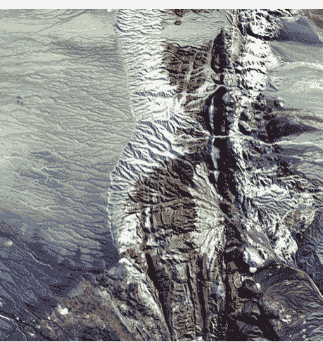

图8.1 文件*unconform.jpg*中包含的RGB真彩色图像。在将JPEG文件解压并读取为729×713×3数组后，Python使用`imshow()`解释并显示RGB合成图。原始图像由NASA/GSFC/METI/ERSDAC/JAROS和美国/日本ASTER科学团队提供。

```
I2 = color.rgb2gray(I1)
```

新的工作区列表现在显示为

| 名称 | 形状 | 字节数 | 类型 |
| :--- | :--- | :--- | :--- |
| I1 | 729 x 713 x 3 | 1559331 | uint8 |
| I2 | 729 x 713 | 4158216 | float64 |
| 总字节数上限 | = | 5717547 | |

可以观察到24位RGB数组和8位灰度数组之间的差异。命令

```
plt.figure()
io.imshow(I2)
plt.axis('off')
io.show()
```

显示结果。很容易在单独的图形窗口中看到两幅图像之间的差异。接下来，我们处理灰度图像。首先，我们计算强度值分布的直方图：

```
n,v = exposure.histogram(I2,nbins=256)

plt.figure()
plt.plot(v,n)
plt.show()
```

增强此类图像对比度的一种简单技术是变换此直方图，以获得灰度的均匀分布：

```
I3 = exposure.equalize_hist(I2)

n,v = exposure.histogram(I3,nbins=256)

plt.figure()
plt.plot(v,n)
plt.show()
```

我们可以再次使用以下命令查看差异

```
plt.figure()
io.imshow(I3)
plt.axis('off')
io.show()
```

并将结果保存到新文件中：

```
io.imsave('unconform_gray.jpg',I3)
```

我们也可以通过在控制台中输入以下命令来列出内置的颜色映射表

```
plt.colormaps()
```

其输出为

```
['magma',
 'inferno',
 'plasma',
 'viridis',
 'cividis',
 'twilight',
 'twilight_shifted',
 'turbo',
 'Blues',
 'BrBG',
 (续)
```

作为颜色映射表的示例，我们可以通过输入以下命令使用上面列表中的hot

```
print(cm.hot(range(16)))
newhot = cm.get_cmap(cm.hot,16)
newhot = cm.hot(np.linspace(0,1,16))
newhot = ListedColormap(newhot)

plt.figure()
plt.imshow(I3,cmap=newhot)
plt.axis('off')
plt.show()
```

以便使用黑-红-黄-白色图显示图像。输入

```
edit(cm.hot)
```

会显示hot()是一个创建m×4数组的函数，该数组包含0到1之间的浮点值。我们也可以通过手动创建m×3数组或创建另一个类似于hot()的函数来设计自己的颜色映射表。例如，我们可以使用随机数

```
np.random.seed(0)
newrnd = np.random.rand(16,3)
o1 = np.ones((len(newrnd),1))
newrnd = np.append(newrnd,o1,axis=1)
newrnd = ListedColormap(newrnd)

plt.figure()
plt.imshow(I3,cmap=newrnd)
plt.axis('off')
plt.show()
```

以随机颜色显示图像I3。最后，我们可以创建一个包含三种不同颜色的索引颜色图像，这些颜色使用全强度红、绿、蓝的简单颜色映射表显示：

```
newrgb = np.array([[1,0,0,1],[0,1,0,1],[0,0,1,1]])
newrgb = ListedColormap(newrgb)

plt.figure()
plt.imshow(I3,cmap=newrgb)
plt.axis('off')
plt.show()
```

## 8.4 导入、处理和导出Landsat图像

Landsat项目是一个卫星遥感计划，由美国国家航空航天局（NASA）和美国地质调查局（USGS）共同管理。该项目始于1972年7月23日Landsat 1卫星（最初称为地球资源技术卫星1号）的发射。根据该计划的网站，该系列卫星的最新成员是Landsat 9卫星，于2021年9月27日发射。该卫星有两个传感器：业务陆地成像仪（OLI）和热红外传感器（TIRS）。这两个传感器提供全球陆地的覆盖，空间分辨率为30米（可见光、近红外、短波红外）、100米（热红外）和15米（全色）（Ochs等人，2009；Irons等人，2011）。有关Landsat计划的一般信息可从以下网站获取：

http://landsat.gsfc.nasa.gov/

Landsat数据——连同其他NASA卫星的数据——可从以下网站获取：

https://earthexplorer.usgs.gov

在该网站上，我们首先在*搜索条件*中选择所需的地图区域，可以通过输入地图四个角的坐标，或者放大到感兴趣的区域并选择*使用地图*。例如，我们输入坐标4°42′40.72″N 36°51′10.47″E，该坐标位于埃塞俄比亚南部裂谷的Chew Bahir盆地中心。然后，我们从*Landsat存档*中选择*L8 OLI/TIRS*作为*数据集*，并点击*结果*，这将生成一个记录列表以及用于预览和下载数据的工具栏。通过点击*显示浏览叠加层*按钮，我们可以检查图像的云量。然后我们找到无云图像

实体ID：LC81690572013358LGN00
坐标：4.33915,36.76225
获取日期：2013年12月24日
路径：169
行：57

该图像拍摄于2013年12月24日。我们需要在美国地质调查局网站上注册、登录，并下载1级GeoTIFF数据产品（897.5 MB），然后将其存储在文件*LC81690572013358LGN00.tar.gz*中。*.tar.gz*存档包含每个波段的单独文件以及一个包含数据信息的元数据文件。我们使用波段4（红色；640至670纳米）、波段3（绿色；530至590纳米）和波段2（蓝色；450至510纳米），每个波段的分辨率为30米。我们可以使用以下命令导入118.4 MB的TIFF文件

```
%reset -f

import numpy as np
import matplotlib.pyplot as plt
from skimage import exposure
from skimage import io
from skimage import filters

I1 = io.imread('LC81690572013358LGN00_B2.TIF')
I2 = io.imread('LC81690572013358LGN00_B3.TIF')
I3 = io.imread('LC81690572013358LGN00_B4.TIF')
```

输入

```
np.who()
```

显示数据为无符号16位uint16格式，即数据值的最大范围在0到2^16-1 = 65,535之间：

| 名称 | 形状 | 字节数 | 类型 |
| :--- | :--- | :--- | :--- |
| I1 | 7771 x 7611 | 118290162 | uint16 |
| I2 | 7771 x 7611 | 118290162 | uint16 |
| I3 | 7771 x 7611 | 118290162 | uint16 |
| 总字节数上限 | = | 354870486 | |

对于定量分析，这些数字值（DN）需要转换为辐亮度和反射率值，这超出了本书的范围。辐亮度是从地球特定方向散射的功率密度，以瓦特每平方米每球面度（Wm^-2 sr^-1）为单位表示（Richards，2013）。辐亮度值需要进行大气和地形效应校正，以获得地球表面反射率百分比。Landsat 8手册提供了有关这些转换的必要信息：

https://www.usgs.gov/media/files/landsat-8-data-users-handbook

然而，我们使用 Landsat 8 数据创建波段 4、3 和 2 的 RGB 合成图像，用于野外工作。由于该图像的对比度相对较低，我们使用 `equalize_adapthist()` 来执行对比度受限的自适应直方图均衡化（CLAHE）（Zuiderveld 1994）。与我们之前使用的 `equalize_hist()` 不同，`equalize_adapthist()` 作用于图像的小区域（或图块），而不是整个图像。然后使用双线性插值将相邻的图块组合起来，以消除边缘效应：

```python
I1 = exposure.equalize_adapthist(I1,
    clip_limit=0.1, nbins=256)
I2 = exposure.equalize_adapthist(I2,
    clip_limit=0.1, nbins=256)
I3 = exposure.equalize_adapthist(I3,
    clip_limit=0.1, nbins=256)
```

使用介于 0 和 1 之间的实数标量 `clip_limit` 可以限制对比度增强。数值越高，对比度增强越明显，默认值为 0.01。使用 `clip_limit` 为 0.1 可以获得良好的效果。使用 `dstack()` 将三个波段合并为 24 位 RGB 图像：

```python
I = np.dstack([I1, I2, I3])
```

我们只显示包含 Chew Bahir 盆地的图像部分（使用坐标轴限制），并隐藏坐标轴：

```python
I8 = exposure.rescale_intensity(I,
    out_range='uint8')

plt.figure()
plt.imshow(I8)
plt.xlim([3000, 5000])
plt.ylim([1000, 4000])
plt.show()
```

scikit-image 包的 `exposure` 模块中的函数 `rescale_intensity()` 为我们做了两件事：首先，它通过拉伸或压缩图像的强度级别来返回图像，以改善对比度。其次，它将数据从任何类型转换为 `uint8`，而不会像使用 NumPy 包的 `uint8()` 时那样，使值在值范围 [0, 255] 内循环（参见第 2.5 节）。要导出处理后的图像，我们使用命令

```python
io.imsave('chewbahirbasin.tif',
    I8[999:4000, 2999:5000])
```

此命令将 RGB 合成图像保存为 TIFF 文件 *chewbahirbasin.tif*（约 18 MB）到工作目录中，然后可以使用其他软件（如 Adobe Photoshop）进行处理。

根据美国地质调查局（USGS）Landsat 网站的信息，Landsat 数据是可用的几何和辐射校正最完善的数据之一。然而，数据异常偶尔会发生，最常见的类型列在 USGS 网站上：

https://www.usgs.gov/land-resources/nli/landsat/landsat-known-issues

我们以其中一种异常类型为例进行探讨：即称为 *单粒子翻转*（SEU）的伪影，它会导致图像中出现异常高值，类似于同一网站上描述的 *脉冲噪声*（IN）。这些异常出现在部分（但不是全部）Landsat 图像中，类似的异常高值或低值也可能出现在其他卫星图像中。因此，我们使用覆盖埃塞俄比亚南部裂谷地区的一部分 Landsat 7 图像，该图像由卫星的增强型主题绘图仪（ETM+）仪器获取。我们可以使用以下代码加载和显示图像：

```python
I1 = io.imread('ethiopianrift_blue.tif')
I1 = exposure.rescale_intensity(I1)

plt.figure()
io.imshow(I1, cmap='gray')
plt.title('Original image')
plt.axis('off')
io.show()
```

图像 `I1` 显示了大量随机分布的异常高值或低值，以及右半部分的一对异常平行轨迹。我们首先对图像应用 10x10 像素的中值滤波器（参见第 8.8 节）：

```python
I2 = filters.median(I1,
    np.ones((9, 9)), mode='reflect')

plt.figure()
io.imshow(I2, cmap='gray')
plt.title('Median filtered image')
plt.axis('off')
io.show()
```

当然，与原始图像 `I1` 相比，中值滤波后的图像 `I2` 非常平滑；但是，如果我们使用这个版本的图像，我们将丢失很多细节。接下来，我们将中值滤波后的图像 `I2` 从原始图像 `I1` 中减去，得到图像 `I3`：

```python
I3 = np.float64(I2) - np.float64(I1)
I3 = np.clip(I3, 0, 255)
I3 = np.uint8(I3)

plt.figure()
io.imshow(I3, cmap='gray')
plt.title('I2-I1')
plt.axis('off')
io.show()
```

然后，我们将原始图像 `I1` 从中值滤波后的图像 `I2` 中减去，得到图像 `I4`：

```python
I4 = np.float64(I1) - np.float64(I2)
I4 = np.clip(I4, 0, 255)
I4 = np.uint8(I4)

plt.figure()
io.imshow(I4, cmap='gray')
plt.title('I1-I2')
plt.axis('off')
io.show()
```

接下来，如果中值滤波后的图像 `I2` 与原始图像 `I1` 之间的差异在两个方向上都大于 10（如我们的示例所示），则用其中值滤波后的版本替换原始像素：

```python
I5 = np.copy(I1)
I5[(I3 > 10) | (I4 > 10)] = I2[(I3 > 10) | (I4 > 10)]

plt.figure()
io.imshow(I5, cmap='gray')
plt.title('Despeckled image')
plt.axis('off')
io.show()
```

使用此方法获得的图像 `I5` 是图像 `I1` 的 *去斑* 版本。我们还可以使用以下代码在 3D 表面图中探索两个版本图像（即 `I1` 和 `I5`）的像素值：

```python
b, a = np.shape(I1)
X, Y = np.meshgrid(np.linspace(0, a+1, a),
    np.linspace(0, b+1, b))
```

```python
plt.figure()
fig, ax1 = plt.subplots(subplot_kw={"projection": "3d"})
ax1.plot_surface(X, Y, I1,
    rstride=1,
    cstride=1,
    linewidth=0,
    antialiased=False,
    shade=True)
ax1.view_init(33, 120-90)
ax1.set_zlim(np.min(I1), np.max(I1))
ax1.axis('off')
plt.show()
```

```python
plt.figure()
fig, ax2 = plt.subplots(subplot_kw={"projection": "3d"})
ax2.plot_surface(X, Y, I5,
    rstride=1,
    cstride=1,
    linewidth=0,
    antialiased=False,
    shade=True)
ax2.view_init(33, 120-90)
ax2.set_zlim(np.min(I1), np.max(I1))
ax2.axis('off')
plt.show()
```

我们需要使用 `im2double` 将图像数据转换为 `double` 类，以便能够使用 `surface` 显示数据。最后，我们可以在同一个图形窗口中显示两张图像

```python
plt.figure()
plt.subplot(1, 2, 1)
io.imshow(I1, cmap='gray')
plt.title('Original image')
plt.axis('off')
plt.subplot(1, 2, 2)
io.imshow(I5, cmap='gray')
plt.title('Despeckled image')
plt.axis('off')
plt.show()
```

以便查看对图像 `I1` 进行 *去斑* 处理的结果（图 8.2）。

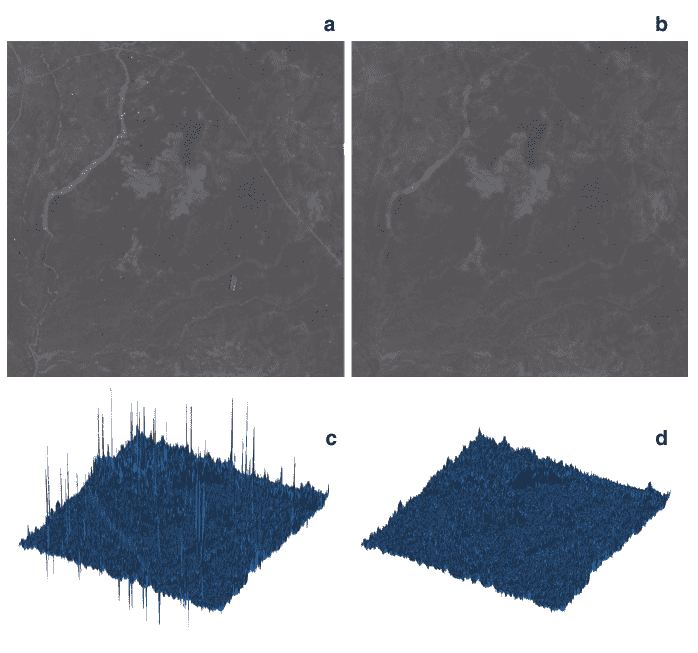

**图 8.2** 覆盖埃塞俄比亚南部 Chew Bahir 流域的 Landsat 图像蓝波段的去斑部分：**a** 原始图像，**b** 去斑图像，**c** 原始图像的表面图，**d** 去斑后图像的表面图。原始图像由美国国家航空航天局（NASA）和美国地质调查局（USGS）的 Landsat 计划提供。

## 8.5 导入和地理配准 Terra ASTER 图像

在第 8.3 节中，我们使用了从 ASTER 网站下载的已处理 ASTER 图像。在本节中，我们使用来自该传感器的原始数据。ASTER 传感器安装在 Terra 卫星上，该卫星于 1999 年作为美国国家航空航天局（NASA）多国地球观测系统（EOS）系列卫星的一部分发射升空（Abrams und Hook 2002）。ASTER 代表 *先进星载热辐射和反射辐射计*，提供 14 个波段的高分辨率（15 至 90 米）地球图像，包括三个可见光至近红外波段（VNIR 波段 1 至 3）、六个短波红外波段（SWIR 波段 4 至 9）和五个热（或长波）红外波段（TIR 波段 10 至 14）。ASTER 图像用于绘制地球表面的温度、发射率和反射率。第 3 个 VNIR 波段被记录两次：一次是传感器垂直向下指向（波段 3N，其中 *N* 代表 *天底点*，源自阿拉伯语 *opposite*），就像所有其他通道一样；第二次是传感器向后倾斜 27.6°（波段 3B，其中 *B* 代表 *后视*）。这两个波段用于生成 ASTER 数字高程模型（DEM）。

ASTER 仪器产生两种类型的数据：1A 级（L1A）数据和 1B 级（L1B）数据（Abrams und Hook 2002）。L1A 数据是重建的、未经处理的仪器数据，而 L1B 数据经过了辐射和几何校正。ASTER 已经获取的任何数据都是可用的，可以从以下网站获取：

https://earthexplorer.usgs.gov

作为示例，我们现在处理一张显示肯尼亚纳瓦沙湖（0°46'31.38"S, 36°22'17.31"E）区域的图像。1A 级数据存储在两个文件中：

```
AST_L1A_003_03082003080706_03242003202838.hdf
AST_L1A_003_03082003080706_03242003202838.hdf.met
```

第一个文件（116 MB）包含实际的原始数据，而第二个文件（102 kB）包含头文件以及关于数据的各种信息。我们将两个文件都保存在我们的工作目录中。由于文件名很长，我们首先将其保存在 `filename` 中，然后使用 `filename` 代替长文件名。然后，如果我们想导入和处理其他卫星图像，我们只需要修改这一行 Python 代码：

```python
%reset -f

import numpy as np
import gdal as gdal
from pyhdf.SD import SD
import matplotlib.pyplot as plt
from skimage import io, exposure
from skimage import transform as tf

filename = 'AST_L1A_003_03082003080706_03242003202838.hdf'
```

`pyhdf` 包包含用于导入和处理以 *分层数据格式*（HDF）存储的文件的各种工具。可以使用 `info()` 获取有关文件的信息。

```python
file = SD(filename)
file.info()
```

## 8.5 导入和地理配准 Terra ASTER 图像

这将得到

(194, 10)

这表明 HDF 文件中有 194 个科学数据集（SDS）。要从 Python 字典中获取 SDS 名称，我们使用

```
datasets_dic = file.datasets()
print(datasets_dic)
datasets_dic
```

要打印 SDS 名称（即 ID 和数据字段），我们使用

```
for idx,sds in enumerate(datasets_dic.keys()):
    print(idx)
    print(sds)
```

要获取所有 194 个数据集的列表，我们使用下面所示的命令。同样，名称的前半部分是子数据集名称，例如 HDF4....:9，后面是描述符，例如 [13x3] SatellitePosition VNIR_Band1（64 位浮点数）：

```
asterfile = gdal.Open(filename)
aster_sds = asterfile.GetSubDatasets()
print(aster_sds)
```

然后我们从上面的列表中选择编号 9、20 和 31 作为示例数据集，它们包含 vnir_Band3n、vnir_Band2 和 vnir_Band1 的 ImageData，每个波段通常包含大量关于地球表面岩性（包括土壤）、植被和水体的信息。因此，这些波段通常组合成 24 位 RGB 图像。我们首先读取数据：

```
aster = gdal.Open('HDF4_SDS:UNKNOWN:"AST_L1A_003_\n    '03082003080706_03242003202838.hdf":31')
I1 = aster.ReadAsArray()
aster = gdal.Open('HDF4_SDS:UNKNOWN:"AST_L1A_003_\n    '03082003080706_03242003202838.hdf":20')
I2 = aster.ReadAsArray()
aster = gdal.Open('HDF4_SDS:UNKNOWN:"AST_L1T_003_\n    '03082003080706_03242003202838.hdf":9')
I3 = aster.ReadAsArray()
```

这些命令生成三个 8 位图像数组，每个数组代表一个 4,200 x 4,100 像素图像中某个红外（IR）频段的强度。我们不使用数据进行定量分析，因此不需要将数字值（DN）转换为辐亮度和反射率值。*ASTER 用户手册*提供了关于这些转换的必要信息（Abrams und Hook 2002）。相反，我们处理 ASTER 图像是为了创建波段 3N、2 和 1 的地理配准 RGB 合成图，这些波段用于野外工作。我们首先通过输入以下命令使用对比度受限的自适应直方图均衡化方法来增强图像对比度

```
I1 = exposure.equalize_adapthist(I1)
I2 = exposure.equalize_adapthist(I2)
I3 = exposure.equalize_adapthist(I3)
```

然后使用 dstack() 将结果连接成一个 24 位 RGB 图像：

```
naivasha_rgb = np.dstack([I1,I2,I3])
```

与前面的示例一样，现在可以使用以下命令显示 4,200 x 4,100 x 3 的数组

```
naivasha_rgb = exposure.rescale_intensity(naivasha_rgb,
    out_range='uint8')
plt.figure()
io.imshow(naivasha_rgb)
io.imsave('naivasha.tif',naivasha_rgb)
plt.axis('off')
```

此命令还将 RGB 合成图保存为工作目录中的 TIFF 文件 *naivasha.tif*（约 52 MB），然后可以使用其他软件（如 Adobe Photoshop）处理该文件。处理后的 ASTER 图像尚未具有坐标系，因此需要将其绑定到地理参考框架（*地理配准*）。HDF 文件的头部可用于提取 *scenefourcorners* 中包含的图像四个角的大地坐标：

```
UL = [-0.319922,36.214332]
LL = [-0.878267,36.096003]
UR = [-0.400443,36.770406]
LR = [-0.958743,36.652213]
```

根据这些坐标，我们可以通过输入以下命令计算相对于原始图像的移动点

```
movingpoints = np.array([
    [0.,4100.*(UL[1]-LL[1])/(UR[1]-LL[1])],
    [4200.*(UL[0]-LL[0])/(UL[0]-LR[0]),0.],
    [4200.*(UL[0]-UR[0])/(UL[0]-LR[0]),4100.],
    [4200.,4100.*(LR[1]-LL[1])/(UR[1]-LL[1])]])
```

图像的四个角对应于原始图像四个角的像素，我们将其存储在名为 fixedpoints 的变量中：

```
fixedpoints = np.array([
    [0.,0.],
    [4200.,0.],
    [0.,4100.],
    [4200.,4100.]])

fixedpoints = np.fliplr(fixedpoints)
movingpoints = np.fliplr(movingpoints)
```

函数 estimate_transform() 现在获取控制点对（即 movingpoints 和 fixedpoints），并使用它们推断空间变换矩阵 tform。我们使用仿射变换（affine），它保留点、直线和平面，并在变换图像后保持平行线平行：

```
tform = tf.estimate_transform('affine',movingpoints,fixedpoints)
```

最后，可以使用 warp() 将仿射变换应用于原始 RGB 合成图 naivasha_rgb，以使用 tform 获得与 naivasha_rgb 大小相同的地理配准版本的卫星图像 newnaivasha_rgb：

```
newnaivasha_rgb = tf.warp(naivasha_rgb,tform)
```

地理配准后的图像在坐标轴上显示坐标，并叠加了网格（图 8.3 和 8.4）。默认情况下，imshow() 在显示图像时会反转纬度轴。要将纬度轴方向反转回正常状态，我们需要通过输入以下命令使用 invert_yaxis()

```
plt.figure()
io.imshow(np.flipud(newnaivasha_rgb),
    extent=[36.096003,36.770406,-0.319922,-0.958743])
ax=plt.gca()
ax.invert_yaxis()
```

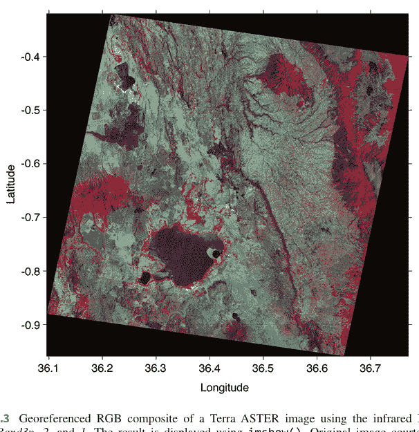

**图 8.3** 使用红外波段 *vnir_Band3n*、*2* 和 *1* 的 Terra ASTER 图像的地理配准 RGB 合成图。结果使用 `imshow()` 显示。原始图像由 NASA/GSFC/METI/ERSDAC/JAROS 和美国/日本 ASTER 科学团队提供。


**图 8.4** 此图来自基于 MATLAB 的书籍 *MATLAB Recipes for Earth Sciences*（Trauth 2021），无法转换为 Python。

```
python
plt.xlabel('Longitude')
plt.ylabel('Latitude')
plt.savefig('newnaivasha_rgb.png')
io.show()
```

此代码还将图像导出为 JPEG 文件 *naivasha_georef.jpg*。

## 8.6 处理和导出 EO-1 Hyperion 图像

*地球观测-1*（EO-1）任务卫星是美国国家航空航天局（NASA）和美国地质调查局（USGS）新千年计划的一部分。该任务始于 2000 年 11 月 21 日卫星发射，并于 2017 年 3 月 30 日停用。EO-1 有两个传感器：高级陆地成像仪（ALI）（具有九个多光谱波段，空间分辨率为 30 米，以及一个全色波段，分辨率为 10 米）和高光谱传感器（Hyperion）（具有 220 个波段，波长范围在 430 至 2,400 纳米之间）（Mandl 等人，2002；Line，2012）。有关 EO-1 计划的一般信息可从以下网站获取：

http://eo1.gsfc.nasa.gov

Hyperion 数据（以及其他 NASA 卫星的数据）可从以下网站免费获取：

https://earthexplorer.usgs.gov

在后一个网站上，我们首先在 *Search Criteria* 中选择所需的地图区域，可以通过输入地图四个角的坐标，或者放大到感兴趣的区域并选择 *Use Map*。例如，我们输入坐标 2°8'37.58"N 36°33'47.06"E，到达肯尼亚北部裂谷的苏古塔谷中心。然后我们从 *EO-1* 集合中选择 *Hyperion* 作为 *Data Set*，并点击 *Results*，这将生成一个记录列表以及用于预览和下载数据的工具栏。点击 *Show Browse Overlay* 按钮允许我们检查图像的云量。在叠加层中，我们可以找到无云图像

Entity ID: EO1H1690582013197110KF_PF2_01
Acquisition Date: 16-JUL-13
Target Path: 169
Target Row: 58

拍摄于 2013 年 7 月 16 日。与之前一样，我们需要在 USGS 网站上注册、登录，然后下载经过辐射校正（但未进行几何校正）的 1R 级（L1R）产品（215.3 MB），然后将其存储在文件 *LEO1H1690582013197110KF_1R.ZIP* 中。.ZIP 存档包含一个元数据文件（.MET）、一个联邦地理数据委员会（FGDC）元数据文件（.fgdc）、一个 HDF 数据集文件（.L1R）和多个辅助文件。EO-1 用户指南提供了一些关于这些文件数据格式的有用信息（Barry，2001；Beck，2003）。我们可以使用以下命令从文件 *EO1H1690582013197110KF.L1R* 导入数据

```
%reset -f
```

import numpy as np
import matplotlib.pyplot as plt
from skimage import io, exposure
from pyhdf.SD import SD

headerfile = 'EO1H1690582013197110KF.hdr'
imagefile = 'EO1H1690582013197110KF.L1R'

finfo = SD(imagefile)
file = finfo.select(0)
HYP = file.get()

输入

```
np.who()
```

可以查看高光谱图像在工作区中的存储方式：

| 名称 | 形状 | 字节数 | 类型 |
|------|-------|-------|------|
| HYP | 3189 x 242 x 256 | 395129856 | int16 |
| 总字节数上限 = | | 395129856 | |

这些细节表明，该图像存储为一个 3,189 x 242 x 256 的数组，代表 242 个光谱波段中每个波段的 3,189 x 256 数组。工作区中当前变量的列表还包括 *int16* 信息（即每个数组元素代表一个像素，包含有符号的 16 位整数）。我们需要对数组进行转置，将波段移到第三维，输入

```
HYP = HYP.transpose(0,2,1)
```

接下来，我们需要根据 HYP 中的数字值（DN）确定辐亮度值。辐亮度是从地球特定方向散射的功率密度，单位为瓦特每平方米每球面度（Wm$^{-2}$ sr$^{-1}$）（Richards 2013）。EO-1 用户指南（v. 2.3）在其 *常见问题解答（FAQ）* 部分提供了这些转换所需的信息（Beck 2003）。根据该文档，可见光和近红外（VNIR）波段（波段 1 至 70）的辐亮度 HYPR 通过将 HYP 中的数字值除以 40 来计算。短波红外（SWIR）波段（波段 71 至 242）的辐亮度通过将 HYP 除以 80 来计算：

```
HYPR = np.copy(HYP)
HYPR[:,:,0:70] = HYPR[:,:,0:70]/40
HYPR[:,:,70:242] = HYPR[:,:,70:242]/80
```

对于定量分析，辐亮度值 HYPR 需要进行大气和地形效应校正。这种校正——产生地表反射率值（以百分比表示）——超出了本书的范围。EO-1 用户指南（v. 2.3）再次解释了将辐亮度值转换为反射率值的几种方法（Beck 2003）。

我们转而处理 Hyperion 图像，以创建波段 29、23 和 16 的地理参考 RGB 合成图，用于野外工作。头文件 *O1H1690582013197110KF.HDR* 包含（除其他外）与 242 个光谱波段对应的波长。我们可以使用 `loadtxt()` 从文件中读取波长：

```
dtype = np.dtype("f8,f8,f8,f8,f8,f8,f8,f8")
C11 = np.loadtxt(headerfile,
    dtype = dtype,unpack=True,
    skiprows=257,max_rows=8,delimiter=",")
C11 = np.ravel(C11)
C11 = np.reshape(C11,(64,1))
dtype = np.dtype("f8,f8,f8,f8,f8,f8")
C12 = np.loadtxt(headerfile,
    dtype = dtype,unpack=True,skiprows=265,
    max_rows=1,delimiter=",",comments="}")
C12 = np.ravel(C12)
C12 = np.reshape(C12,(6,1))
C1 = np.vstack((C11,C12))
C1 = C1[C1[:,0].argsort()]
dtype = np.dtype("f8,f8,f8,f8,f8,f8,f8,f8")
C21 = np.loadtxt(headerfile,
    dtype = dtype,unpack=True,skiprows=265,
    max_rows=1,delimiter=",",comments="}")
C21 = np.ravel(C21)
C21 = np.reshape(C21,(8,1))
dtype = np.dtype("f8,f8,f8,f8,f8,f8,f8,f8")
C22 = np.loadtxt(headerfile,
    dtype = dtype,unpack=True,skiprows=266,
    max_rows=21,delimiter=",",comments="}")
C22 = np.ravel(C22)
C22 = np.reshape(C22,(168,1))
dtype = np.dtype("f8,f8")
C23 = np.loadtxt(headerfile,
    dtype = dtype,unpack=True,skiprows=287,
    max_rows=1,delimiter=",",comments="}")
C23 = np.ravel(C23)
C23 = np.reshape(C23,(2,1))
C2 = np.vstack((C21[6:8],C22,C23))
C2 = C2[C2[:,0].argsort()]
```

单引号括起来的字符串 f8,f8,f8,f8,f8,f8,f8,f8 定义了转换说明符，其中 f8 代表双精度浮点 64 位输出类。我们可以轻松地从 c 获取波长：

```
wavelengths = np.vstack((C1,C2))
```

现在，我们可以在一个图中绘制 VNIR 波段（蓝色）和 SWIR 波段（红色）的辐亮度 HYPR：

```
plt.figure()
plt.plot(wavelengths[0:70],HYPR[535,135,0:70],
    color=(0.3,0.5,0.8))
plt.plot(wavelengths[70:242],HYPR[535,135,70:242],
    color=(0.8,0.5,0.3))
plt.show()
```

根据 EO-1 用户指南 v. 2.3（Beck 2003），Hyperion 记录 220 个独特的光谱通道，覆盖 357 至 2,576 nm。L1R 产品有 242 个波段，但只有 198 个波段经过校准。由于 VNIR 和 SWIR 焦平面之间存在重叠，只有 196 个独特通道。校准的通道是 VNIR 的 8 到 57 和 SWIR 的 77 到 224。未校准的波段在这些通道中设置为零。

为了创建波段 29、23 和 16 的 RGB 合成图，我们可以通过输入以下命令从辐亮度值数据 HYPR 中提取波段：

```
HYP1 = HYPR[:,:,28]
HYP2 = HYPR[:,:,22]
HYP3 = HYPR[:,:,15]
```

重要的是要记住，Python 索引从零开始，因此我们必须使用波段号减一作为索引。要使用 imshow 显示数据，我们需要将有符号整数 16 位（int16）数据转换为无符号整数 8 位数据（uint8）。为此，我们首先使用具有 100 个类别的直方图图来获取数据范围的概览：

```
n1,v1 = exposure.histogram(HYP1,nbins=100)
n2,v2 = exposure.histogram(HYP2,nbins=100)
n3,v3 = exposure.histogram(HYP3,nbins=100)

plt.figure()
plt.subplot(1,3,1)
plt.plot(v1,n1)
plt.title('Band 29')
plt.subplot(1,3,2)
plt.plot(v1,n1)
plt.title('Band 23')
plt.subplot(1,3,3)
plt.plot(v1,n1)
plt.title('Band 16')
plt.show()
```

如我们所见，光谱波段 29、23 和 16 的大多数像素的辐亮度值介于 0 和 200 Wm$^{-2}$ sr$^{-1}$ 之间。由于我们的大多数辐亮度值都在 [0,255] 范围内，我们使用 rescale_intensity() 将数据转换为 uint8 数据类型，而不会丢失太多信息：

```
HYP1 = exposure.rescale_intensity(HYP1,
    out_range='uint8')
HYP2 = exposure.rescale_intensity(HYP2,
    out_range='uint8')
HYP3 = exposure.rescale_intensity(HYP3,
    out_range='uint8')
```

再次使用以下命令在直方图中显示三个波段的辐亮度值：

```
n1,v1 = exposure.histogram(HYP1,nbins=30)
n2,v2 = exposure.histogram(HYP2,nbins=30)
n3,v3 = exposure.histogram(HYP3,nbins=30)

plt.figure()
plt.subplot(1,3,1)
plt.plot(v1,n1)
plt.title('Band 29')
plt.subplot(1,3,2)
plt.plot(v1,n1)
plt.title('Band 23')
plt.subplot(1,3,3)
plt.plot(v1,n1)
plt.title('Band 16')
plt.show()
```

揭示大多数辐亮度值实际上在 [20,80] 范围内。接下来，我们使用 equalize_hist() 来增强图像的对比度，然后将三个波段连接成一个 3,189 x 242 x 3 的数组：

```
HYP1 = exposure.equalize_hist(HYP1)
HYP2 = exposure.equalize_hist(HYP2)
HYP3 = exposure.equalize_hist(HYP3)

n1,v1 = exposure.histogram(HYP1,nbins=30)
n2,v2 = exposure.histogram(HYP2,nbins=30)
n3,v3 = exposure.histogram(HYP3,nbins=30)

plt.figure()
plt.subplot(1,3,1)
plt.plot(v1,n1)
plt.title('Band 29')
plt.subplot(1,3,2)
plt.plot(v1,n1)
plt.title('Band 23')
plt.subplot(1,3,3)
plt.plot(v1,n1)
plt.title('Band 16')
plt.show()

HYPC = np.dstack([HYP1,HYP2,HYP3])
HYPC = exposure.rescale_intensity(HYPC,
    out_range='uint8')
```

最后，我们可以使用以下命令显示整个图像：

```
plt.figure()
io.imshow(HYPC)
plt.axis('off')
io.show()
```

或者（或者）仅使用包含苏古塔谷北部屏障火山复合体的图像部分（图 8.5）：

```
plt.figure()
io.imshow(HYPC[899:1099,:,:])
plt.axis('off')
io.imsave('barrier_python.png',
    HYPC[899:1099,:,:])
io.show()
```

此代码还将图像导出为分辨率为 600 dpi 的 TIFF 文件 *barrier.tif*。

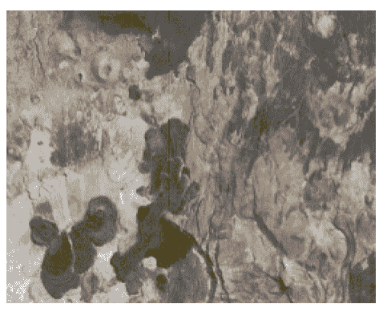

**图 8.5** 使用 VNIR 波段 29、23 和 16 的 EO-1 Hyperion 图像 RGB 合成图。该图像显示了肯尼亚裂谷北部苏古塔谷的屏障火山复合体，获取于 2013 年 7 月 16 日。原始图像由 NASA EO-1 任务提供。

## 8.7 从屏幕数字化

本节来自基于 MATLAB 的书籍《MATLAB Recipes for Earth Sciences》（Trauth 2021），无法翻译为 Python。

## 8.8 图像增强、校正和纠正

本节介绍图像增强、校正和纠正的一些基本工具。作为一个例子，我们使用一张约 33,000 年前在阿根廷卡法亚特峡谷（25°58.900'S, 65°45.676'W）滑坡堰塞湖中沉积的纹层沉积物图像（Trauth 等人，1999, 2003）。该正片于 1996 年 10 月 1 日使用基于胶片的单镜头反光（SLR）相机拍摄。从幻灯片制作了一张 30 x 20 厘米的打印件，该打印件使用平板扫描仪扫描并保存为 394 kB 的 JPEG 文件。我们使用此图像作为示例，因为它展示了一些我们可以通过图像增强解决的问题（图 8.6）。然后我们使用该图像演示如何测量颜色强度剖面，用于时间序列分析（第 8.9 节）。

我们可以通过输入以下命令读取并解压缩文件 *varves_original.jpg*：

```
python
%reset -f

import numpy as np
import skimage as ski
```

## 8.8 图像增强与滤波

**图 8.6** 图像增强结果：**a** 原始图像，**b** 使用 `rescale_intensity()` 调整强度值后的图像，**c** 使用 `equalize_adapthist()` 增强对比度后的图像，以及 **d** 使用 `gaussian()` 进行滤波后的图像，滤波器为20×20像素，形状为均值为零、标准差为10的高斯概率密度函数。

```python
import matplotlib.pyplot as plt
from skimage import io, exposure, filters

I1 = io.imread('varves_original.jpg')
```

这将在Python工作区中生成一个24位RGB图像数组I1。输入

```python
np.who()
```

得到

| Name | Shape | Bytes | Type |
| :--- | :--- | :--- | :--- |
| I1 | 1096 x 1674 x 3 | 5504112 | uint8 |
| Upper bound on total bytes = | | 5504112 | |

这表明图像以大小为1,096×1,674×3的uint8数组形式存储（即红、绿、蓝三种颜色各有一个1,096×1,674的数组）。我们可以使用以下命令显示图像

```python
plt.figure()
io.imshow(I1)
plt.axis('off')
io.show()
```

这将打开一个新的图形窗口，显示图像的RGB合成图。如我们所见，该图像对比度较低，颜色非常浅，且沉积层并非完全水平。这些是我们希望在后续步骤中改进的图像特征。

首先，我们调整图像的强度值。函数 `rescale_intensity()` 将图像I1的值映射到I2中的新值，

```python
I2 = exposure.rescale_intensity(I1)
```

这会将范围调整到[0,1]的完整范围，然后显示结果：

```python
io.imshow(I2)
plt.axis('off')
io.show()
```

我们可以清楚地看到非常浅的图像I1和更饱和的图像I2之间的差异。

函数 `equalize_hist()` 变换图像I1的强度，并返回一个具有n个离散级别的强度图像I5。I5中每个级别被赋予大致相等数量的像素，使得I5的直方图近似平坦。由于 `equalize_hist()` 仅适用于二维图像，因此必须对每种颜色分别进行直方图均衡化。我们在练习中使用n=256：

```python
I5 = np.zeros(np.shape(I1))
I5[:,:,0] = exposure.equalize_hist(I1[:,:,0],
    nbins=256)
I5[:,:,1] = exposure.equalize_hist(I1[:,:,1],
    nbins=256)
I5[:,:,2] = exposure.equalize_hist(I1[:,:,2],
    nbins=256)
```

```python
plt.figure()
plt.subplot(2,2,1)
io.imshow(I1)
plt.axis('off')
plt.title('Original image')
plt.subplot(2,2,2)
n,v = exposure.histogram(I1,
    nbins=256)
plt.plot(v,n)
plt.title('Original image')
plt.subplot(2,2,3)
io.imshow(I5)
plt.axis('off')
plt.title('Enhanced image')
plt.subplot(2,2,4)
n,v = exposure.histogram(I5,
    nbins=256)
plt.plot(v,n)
plt.title('Enhanced image')
io.show()
```

得到的图像看起来相当令人失望，因此我们使用改进的 `equalize_adapthist()` 代替 `equalize_hist()`。函数 `equalize_adapthist()` 使用对比度受限自适应直方图均衡化（CLAHE），该方法由Zuiderveld（1994）提出。与 `equalize_hist()` 和 `rescale_intensity()` 不同，`equalize_adapthist()` 算法作用于图像的小区域（或图块），而不是整个图像。然后使用双线性插值组合相邻图块以消除边缘效应：

```python
I6 = np.zeros(np.shape(I1))
I6[:,:,0] = exposure.equalize_adapthist(I1[:,:,0],
    clip_limit=0.01,nbins=256)
I6[:,:,1] = exposure.equalize_adapthist(I1[:,:,1],
    clip_limit=0.01,nbins=256)
I6[:,:,2] = exposure.equalize_adapthist(I1[:,:,2],
    clip_limit=0.01,nbins=256)
```

```python
plt.figure()
plt.subplot(2,2,1)
io.imshow(I1)
plt.axis('off')
plt.title('Original image')
plt.subplot(2,2,2)
n,v = exposure.histogram(I1,
    nbins=256)
plt.plot(v,n)
plt.title('Original image')
plt.subplot(2,2,3)
io.imshow(I6)
plt.axis('off')
plt.title('Enhanced image')
plt.subplot(2,2,4)
n,v = exposure.histogram(I6,
    nbins=256)
plt.plot(v,n)
plt.title('Enhanced image')
io.show()
```

结果看起来比使用 `equalize_hist()` 得到的结果稍好一些。然而，所有三种图像增强函数都提供了多种操纵最终结果的方式。Gonzalez和Woods（2018）的优秀著作更详细地介绍了如何使用各种可用的参数以及图像增强函数的相应值。

scikit-image包还包含许多用于二维图像滤波的函数。我们在第6章中研究的许多一维数据方法也适用于二维数据，正如我们在第7章中处理数字地形模型时所看到的。图像最常用的二维滤波器是高斯滤波器和中值滤波器，以及用于图像锐化的滤波器。高斯和中值滤波器都用于平滑图像，主要目的是减少噪声量。在大多数例子中，信噪比是未知的，因此使用自适应滤波器（类似于第6.10节介绍的滤波器）进行降噪。可以使用以下代码设计高斯滤波器

```python
I7 = filters.gaussian(I1)
```

它使用遵循高斯概率密度函数形状的滤波器权重。接下来，我们计算I8，它是I1的中值滤波版本：

```python
I8 = filters.median(I1)
```

滤波器输出像素是输入图像中相应像素邻域的中值。第三个滤波器示例演示了如何使用 `unsharp_mask()` 锐化图像：

```python
I9 = filters.unsharp_mask(I1)
```

此函数计算图像的高斯低通滤波版本，该版本用作非锐化掩模（即，通过从原始图像中减去模糊的滤波版本来计算锐化版本）。将三个滤波练习的结果与原始图像进行比较

```python
plt.figure()
plt.subplot(2,2,1)
io.imshow(I1)
plt.axis('off')
plt.title('Original image')
plt.subplot(2,2,2)
io.imshow(I7)
plt.axis('off')
plt.title('Gaussian filter')
plt.subplot(2,2,3)
io.imshow(I8)
plt.axis('off')
plt.title('Median filter')
plt.subplot(2,2,4)
io.imshow(I9)
plt.axis('off')
plt.title('Sharpening filter')
io.show()
```

清楚地展示了二维滤波器的效果。作为这些空域滤波器的替代方案，我们也可以设计具有特定频率响应的二维滤波器，例如第6.9节描述的一维滤波器。同样，Gonzalez和Woods（2018）的著作概述了图像的二维频率选择性滤波，包括用于生成此类滤波器的函数。作者还演示了二维巴特沃斯低通滤波器在图像处理应用中的使用。

## 8.9 纹层沉积物的横截面颜色强度

本节来自基于MATLAB的书籍《MATLAB Recipes for Earth Sciences》（Trauth 2021），无法翻译为Python（图8.7和图8.8）。

图8.7 此图来自基于MATLAB的书籍《MATLAB Recipes for Earth Sciences》（Trauth 2021），无法翻译为Python。

图8.8 此图来自基于MATLAB的书籍《MATLAB Recipes for Earth Sciences》（Trauth 2021），无法翻译为Python。

## 8.10 基于显微图像的粒度分析

识别、测量和计数图像中的颗粒是图像分析的经典应用。地球科学领域的例子包括粒度分析、花粉计数以及根据岩石薄片确定矿物组成。对于粒度分析，任务是识别单个颗粒，测量它们的大小，然后统计每个尺寸类别的颗粒数量。使用图像分析的原因在于其能够在短时间内以相对较低的成本对大量样本进行自动分析。通常使用三种不同的方法来识别和计数图像中的对象：（1）使用分水岭分割算法的基于区域的分割，（2）使用霍夫变换的目标检测，以及（3）使用颜色差异进行阈值处理以分离对象。Gonzalez和Woods（2018）在其优秀著作的第3版中非常详细地描述了这些方法。我们利用两个示例来演示如何使用图像处理来识别、测量和计数颗粒。在本节中，我们演示了分水岭分割在粒度分析中的应用，在第8.9节中，我们介绍了阈值处理作为量化显微图像中木炭的方法。

以下示例涵盖了使用分水岭分割算法对对象进行分割、测量和计数（图8.9）。我们首先读取一张不同尺寸的粗岩屑颗粒图像，并将其存储在变量I1中。图像大小为284×367像素，由于宽度为3厘米，因此高度为3厘米×284/367=2.32厘米。我们输入

```python
%reset -f

import cv2
import numpy as np
import matplotlib.pyplot as plt
from scipy import ndimage as ndi
from skimage import color
from skimage import exposure
from skimage import io
from skimage import feature
from skimage import measure
from skimage import segmentation
```

## 8.10 在显微图像中量化晶粒尺寸

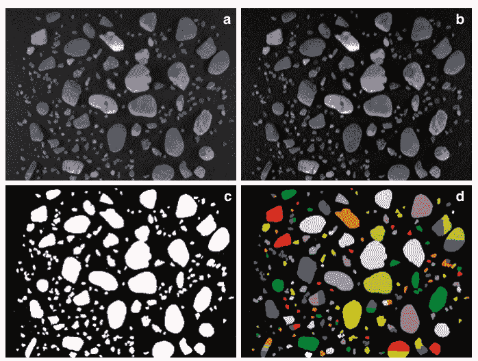

图 8.9 显微图像自动晶粒尺寸分析的结果：**a** 原始灰度图像，**b** 调整强度值后的图像，**c** 转换为二值图像后的图像，以及 **d** 使用分水岭分割算法检测到对象的图像。

```python
I1 = io.imread('grainsize.tif')
ix = 3.
iy = 284*3/367

plt.figure()
io.imshow(I1,
    extent=[0,ix,0,iy])
plt.title('Original image')
plt.axis('off')
plt.show()
```

其中 ix 和 iy 表示用于将图像 I1 校准到厘米尺度的坐标轴。当包括与图像边界重叠的三个晶粒时，此图像中计数的真实对象数量为 236，因此在以下练习中忽略此数量。我们可以舍弃图像的颜色信息，并使用 rgb2gray() 将图像 I1 转换为灰度图：

```python
I2 = color.rgb2gray(I1)
```

```python
plt.figure()
io.imshow(I2,
    extent=[0,ix,0,iy])
plt.title('Grayscale image')
plt.axis('off')
plt.show()
```

此灰度图像 I2 的对比度相对较低。因此，我们使用 rescale_intensity() 来调整图像强度值，这增加了新图像 I3 的对比度：

```python
I3 = exposure.rescale_intensity(I2,
    out_range='uint8')

plt.figure()
io.imshow(I3,
    extent=[0,ix,0,iy])
plt.title('Adjusted intensity values')
plt.axis('off')
plt.show()
```

函数 threshold() 通过阈值处理将无背景图像 I3 转换为二值图像 I4。如果阈值为 0，则图像全白；如果阈值为 255，则图像全黑。我们手动更改阈值，直到获得合理的结果。我们发现 50 是一个合适的阈值：

```python
thresh,I4 = cv2.threshold(I3,
    50,255,cv2.THRESH_BINARY)

plt.figure()
io.imshow(I4,
    extent=[0,ix,0,iy])
plt.title('Binary image')
plt.axis('off')
plt.show()
```

接下来，我们使用分水岭分割算法来分离图像中的晶粒。地貌学中的分水岭是划分对相邻流域水文预算有贡献区域的山脊（参见第 7.10 节）。分水岭分割将用于在数字高程模型中分离流域的相同方法应用于灰度图像。在此应用中，灰度值被解释为数字高程模型中的高程，其中分水岭随后分离两个感兴趣的对象。

用于识别属于特定对象的像素的常用标准是最近邻距离。我们使用 distance_transform_edt() 执行的距离变换，它为每个像素分配一个数字，该数字是该像素与 I4 中最近的非零像素之间的距离：

```python
distance = ndi.distance_transform_edt(I4)
```

该函数使用欧几里得距离来计算最近邻距离。距离矩阵现在在对象像素中包含正的非零值，在其他地方包含零。我们使用此信息创建一个掩码：

```python
coords = feature.peak_local_max(distance,
    footprint=np.ones((15,15)),labels=I4)
mask = np.zeros(distance.shape,dtype=bool)
mask[tuple(coords.T)] = True
markers,_ = ndi.label(mask)
```

然后，我们计算距离矩阵的分水岭变换并显示生成的标签矩阵：

```python
L = segmentation.watershed(-distance,
    markers,mask=I4)

plt.figure()
io.imshow(color.label2rgb(L,bg_label=0),
    extent=[0,ix,0,iy])
plt.title('Watershed segmentation')
plt.axis('off')
plt.show()
```

在显示分水岭分割的结果后，我们使用上述方法确定每个对象的像素数，但索引 i 从 2 运行到 max(objects)，因为值 1 表示背景，0 表示对象的边界。因此，第一个真正的对象由值 2 标记。输入

```python
print(np.max(L))

graindata = measure.regionprops(L)
grainareas = np.zeros(np.max(L))
for i in range(0,np.max(L)):
    grainareas[i] = graindata[i].area
```

得到

```
209
```

这表明我们现在已识别出 209 个对象。然而，目视检查结果发现一些过度分割（由于图像中的噪声或其他不规则性），其中较大的晶粒被分成较小的部分。然后我们缩放对象大小，使得一个像素的面积为 (3 cm/367)²：

```python
objectareas = 3**2*grainareas*367**(-2)
```

我们现在可以确定每个晶粒的面积，并再次找到图像中所有晶粒的最大、最小和平均面积（单位为 cm²），

```python
max_area = np.max(objectareas)
min_area = np.min(objectareas)
mean_area = np.mean(objectareas)
print(max_area)
print(min_area)
print(mean_area)
```

得到

```
0.10156731433153413
6.682060153390403e-05
0.009231793632973584
```

图像中心最大的晶粒尺寸约为 0.10 cm²，这代表了图像中所有晶粒的最大尺寸。最后，我们绘制所有晶粒面积的直方图：

```python
e = np.arange(0,0.15+0.0005,0.0005)

plt.figure()
plt.hist(objectareas,bins=e)
plt.xlabel('Grain Size in Millimeters^2')
plt.ylabel('Number of Grains')
plt.axis(np.array([0,0.1,0,30]))
```

为了检查最终结果，我们数字化其中一个较大晶粒的轮廓，并将多边形存储在变量 data 中：

```python
e = np.arange(0,0.15+0.0005,0.0005)

plt.figure()
plt.hist(objectareas,bins=e)
plt.xlabel('Grain Size in Millimeters^2')
plt.ylabel('Number of Grains')
plt.axis(np.array([0,0.1,0,30]))
```

如果过度分割是使用分割来计算图像中对象时的一个主要问题，那么参考 Gonzalez 和 Woods (2018) 的书是明智的，该书描述了标记控制的分水岭分割作为一种可用于避免过度分割的替代方法。

## 8.11 在显微图像中量化木炭

在地球科学中量化物质的组成（例如，岩石薄片中的矿物组成或筛分沉积物样品中的木炭量）可以通过使用图像处理方法来简化。*阈值处理*为与分割图像中具有不同颜色或灰度值的对象相关的问题提供了一个简单的解决方案。在阈值处理过程中，强度值大于阈值的像素被标记为对象像素（例如，代表图像中木炭的像素），其余像素被标记为背景像素（例如，所有其他物质）。阈值通常通过目视检查图像直方图来手动定义，但也有许多自动算法可用。

作为一个例子，我们接下来分析来自肯尼亚纳库鲁湖的筛分湖泊沉积物样品的图像（图 8.10）。该图像显示了丰富的浅灰色椭圆形介形虫壳和一些矿物颗粒，以及灰色植物残体和黑色木炭碎片。我们使用阈值处理来分离深色木炭颗粒，并在分割后计算这些颗粒的像素数。在确定所有可以通过阈值处理与背景区分开的对象的像素数后，我们使用较低的阈值来确定代表木炭的像素数与代表样品中所有颗粒的像素数的比率（即，确定样品中木炭的百分比）。

我们读取大小为 1,500 x 1,500 像素的图像，并假设正方形图像的宽度和高度均为一厘米：

```python
%reset -f

import cv2
import numpy as np
import matplotlib.pyplot as plt
from skimage import color
from skimage import exposure
from skimage import io

I1 = io.imread('lakesediment.jpg')
ix = 1
iy = 1

plt.figure()
io.imshow(I1,
    extent=[0,ix,0,iy])
plt.xlabel('Centimeter')
plt.ylabel('Centimeter')
plt.title('Original image')
io.show()
```

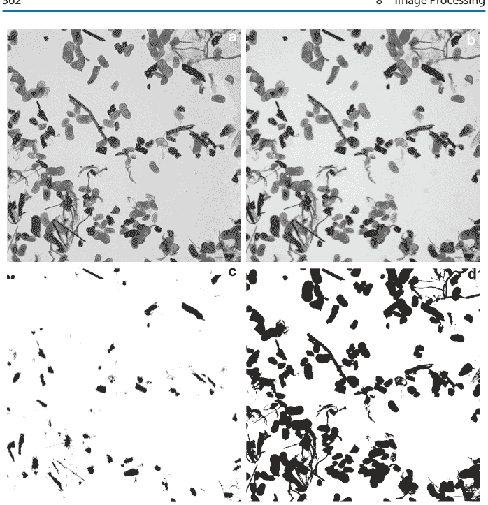

**图 8.10** 自动量化显微图像中木炭的结果显示：**a** 原始灰度图像，**b** 对比度增强后的图像，**c** 为分离木炭颗粒而进行阈值处理后的图像，以及 **d** 为分离所有对象而进行阈值处理后的图像。

然后使用 rgb2gray 将 RGB 彩色图像转换为灰度图像：

```python
I2 = color.rgb2gray(I1)

plt.figure()
io.imshow(I2,
    extent=[0,ix,0,iy])
```

plt.xlabel('厘米')
plt.ylabel('厘米')
plt.title('灰度图')
io.show()

由于图像对比度相对较低，我们使用 `rescale_intensity()` 来调整图像的强度值。这增加了新图像 I2 的对比度：

```
I3 = exposure.rescale_intensity(I2,
    out_range='uint8')
```

```
plt.figure()
io.imshow(I3,
    extent=[0,ix,0,iy])
plt.xlabel('厘米')
plt.ylabel('厘米')
plt.title('更好的对比度')
io.show()
```

函数 `threshold()` 通过阈值处理将图像 I4 转换为二值图像 I6。如果阈值为 0，则图像全白；如果阈值为 255，则图像全黑。我们手动更改阈值，直到获得合理的结果。在我们的示例中，阈值为 43 时，能很好地识别木炭碎片：

```
thresh, I4 = cv2.threshold(I3,
    43,255,cv2.THRESH_BINARY)
I4 = exposure.rescale_intensity(I6,
    out_range='uint8')
```

```
plt.figure()
io.imshow(I4,
    extent=[0,ix,0,iy],
    cmap='gray')
plt.xlabel('厘米')
plt.ylabel('厘米')
plt.title('仅木炭')
io.show()
```

由于我们知道一个像素的大小，现在只需计算像素数量，即可估算图像中木炭的总量。最后，我们计算所有物体的面积，包括木炭：

```
thresh, I5 = cv2.threshold(I3,
    150,255,cv2.THRESH_BINARY)
```

```
plt.figure()
io.imshow(I5,
    extent=[0,ix,0,iy])
plt.xlabel('厘米')
plt.ylabel('厘米')
plt.title('所有物体')
io.show()
```

我们感兴趣的不是图像中木炭的绝对面积，而是样品中木炭的百分比。输入

```
print(100*np.sum(np.sum(I4==0))/np.sum(np.sum(I5==0)))
```

因此得到

```
13.672022985345837
```

这个结果表明，筛分样品中大约有 13% 是木炭。作为下一步，我们可以通过选择不同的阈值来量化样品中的其他成分（例如，介形虫或矿物颗粒）。

## 8.12 基于形状的图像物体检测

根据形状对图像中的物体进行计数是一项非常耗时的任务。这有时用于圆形物体，例如，通过计数浮游有孔虫壳来推断过去的海面温度，通过计数硅藻壳来推断过去湖水的化学成分，或者通过计数花粉粒来确定物种组合，这些组合可用于重建区域气温和降水。确定的线性物体包括航空照片和卫星图像中的断层（以推导该区域的现今应力场）以及薄片中的年纹层（以建立年分辨率地层学）。

*霍夫变换*——以 Paul VC Hough 1962 年的相关专利命名——是一种流行的技术，用于根据形状检测图像中的物体。霍夫变换最初用于检测线性特征，但在获得专利后不久，它就被推广用于识别任何形状的物体（Duda and Hart 1972; Ballard 1981）。Gonzalez 和 Woods (2018) 的著作包含了对霍夫变换及其在检测图像中物体方面应用的全面介绍。根据作者对该方法的介绍，霍夫变换分两步进行：第一步，使用边缘检测器从图像中提取边缘特征（例如，明显的沉积层或花粉粒的轮廓）。第二步，识别追踪这些边缘特征的直线（或任何其他形状的物体）。*scikit-image* 包包含使用霍夫变换检测直线或圆形物体的函数。

经典的霍夫变换用于检测图像中的直线。在应用任何类型的边缘检测器后，我们得到一个二值图像，其中边缘是黑色像素，之间是白色像素。接下来，我们通过使用直线与原点之间的欧几里得距离 ρ 以及从原点到直线上最近点的向量的角度 θ 来描述通过给定黑色像素的直线（图 8.11a）：

ρ = x cos θ + y sin θ

通过边缘特征的特定像素 (xᵢ, yᵢ) 的所有直线族在 (θ, ρ) 参数空间中显示为正弦曲线（图 8.11b）。两条这样的正弦曲线的交点 (θ', ρ') 对应于通过边缘特征的两个不同像素 (x₁, y₁) 和 (x₂, y₂) 的直线。接下来，我们在霍夫变换中搜索 n 个点 (xᵢ, yᵢ)，其中许多直线相交，因为这些点定义了追踪边缘特征的直线。检测圆而不是直线的工作原理类似，使用圆心的坐标和半径代替 ρ 和 θ。

对于我们的第一个示例，我们使用这些函数来检测阿根廷 Quebrada de Cafayate 出露的纹层状沉积物中纯白色硅藻土的薄层，因为这些沉积物在前面的章节中也作为示例使用过（Trauth et al. 1999, 2003）（图 8.12）。图像质量并不完美，这就是为什么我们不能期望获得最佳结果。我们首先读取第 8.8 节中裁剪的纹层状沉积物版本，并将其存储在变量 I1 中。图像大小为 1,047 x 1,691 像素，由三种颜色（红色、绿色和蓝色）组成：

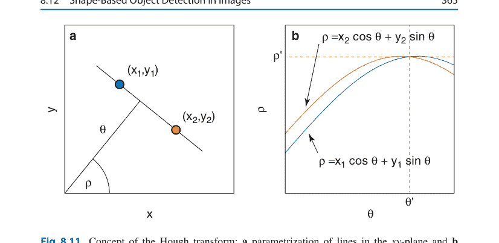

**图 8.11** 霍夫变换的概念：a xy 平面中直线的参数化，b (θ, ρ) 参数空间中的正弦曲线，交点对应于通过边缘特征两个不同像素的直线。修改自 Gonzalez and Woods (2018)。

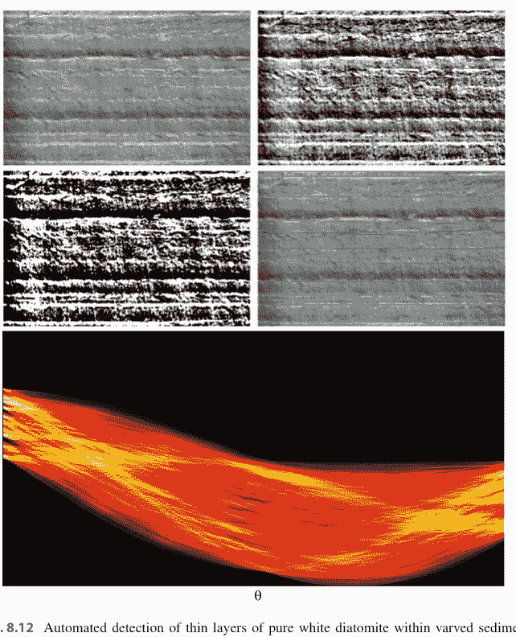

**图 8.12** 使用 `hough_line()` 自动检测阿根廷 Quebrada de Cafayate 出露的纹层状沉积物中的纯白色硅藻土薄层（Trauth et al. 1999, 2003）：**a** 灰度图像，**b** 增强后的图像，**c** 二值图像，**d** 用红线标记硅藻土层的图像，以及 **e** 图像的霍夫变换。

```
%reset -f

import cv2
import numpy as np
import matplotlib.pyplot as plt
from skimage import color
from skimage import exposure
from skimage import io
from skimage import feature
from skimage import transform
from skimage import draw
```

```
I1 = io.imread('varves_cropped.tif')

plt.figure()
io.imshow(I1)
plt.axis('off')
io.show()
```

我们可以使用 `rgb2gray()` 拒绝图像的颜色信息，并将 I1 转换为灰度图：

```
I2 = color.rgb2gray(I1)

plt.figure()
io.imshow(I2)
plt.axis('off')
io.show()
```

然后我们使用 `equalize_adapthist()` 执行对比度受限的自适应直方图均衡化（CLAHE），以增强图像的对比度（Zuiderveld 1994）：

```
I3 = np.zeros(np.shape(I1))
I3 = exposure.equalize_adapthist(I2,
    clip_limit=0.1,nbins=256)

plt.figure()
io.imshow(I3)
plt.axis('off')
io.show()
```

在这种情况下，`clip_limit` 使用 0 到 1 之间的实数标量来限制对比度增强，数值越大，对比度越高（默认值为 0.01）。使用 `clip_limit` 为 0.1 可以获得良好的结果。然后使用 `threshold()` 通过阈值处理将图像 I3 转换为二值图像 I4。我们手动更改阈值，直到获得合理的结果，并发现 0.55 是一个合适的阈值：

```
thresh,I4 = cv2.threshold(I3,
    0.55,1.,cv2.THRESH_BINARY)
I4 = exposure.rescale_intensity(I4,
    out_range='uint8')

plt.figure()
io.imshow(I4)
plt.axis('off')
io.show()
```

函数 `hough_line()` 实现霍夫变换，以返回霍夫变换累加器 H、计算变换的角度 theta（以弧度为单位）以及距离值 dists：

```
H,theta,dists = transform.hough_line(I4)
```

然后我们使用以下代码显示霍夫变换累加器 H：

```
plt.figure()
io.imshow(exposure.equalize_adapthist(H),
    cmap='hot',aspect='auto')
plt.xlabel('Theta')
plt.ylabel('Rho')
plt.title('霍夫变换')
io.show()
```

我们可以确定霍夫变换的 15 个最大值，它们对应于图像中最显著的 15 条直线。然后我们计算这些直线在图像中的 y 截距 yintcs 和斜率 slopes：

```
H,theta,dists = transform.hough_line_peaks(H,
    theta,dists,num_peaks=15,min_distance=20)

yintcs = dists*np.array([np.cos(theta),
    np.sin(theta)])
yintcs = np.transpose(yintcs)
slopes = np.tan(theta+np.pi/2)
```

现在可以使用这些信息在图像上显示直线：

```
s = np.shape(I1)

plt.figure()
ax = plt.axes()
io.imshow(I1)
plt.axis('off')
for i in range(0,len(dists)):
    ax.axline((yintcs[i,0],yintcs[i,1]),
        slope=slopes[i])
plt.axis(np.array([0,s[1],s[0],0]))
io.show()
```

结果表明，清晰可辨的白色层被很好地检测到，而不太明显的层则未被识别。由于图像质量较低，该方法还错误地在图像上标记了不存在的直线。

## 8.13 归一化差值植被指数 NDVI

植物色素反射近红外光（700至1100纳米），同时强烈吸收可见光（400至700纳米）用于光合作用。*归一化差值植被指数*（NDVI）是一种用于绘制活体绿色植被分布图的指数，其计算公式为

$$NDVI = \frac{(NIR - R)}{(NIR + R)}$$

其中使用了在近红外（NIR）和红光（R）光谱波段获取的光谱反射率测量值。该指数可通过地面光谱相机以及无人机、飞机或卫星进行测量。所使用的相机通常非常昂贵，但现在也有一些相当便宜的替代品，包括AgroCam（https://www.agrocam.eu）和MAPIR Survey Camera（https://www.mapir.camera）。这些相机用于专业应用，但由于其价格低廉，也适合学生练习使用。

由于MAPIR相机（由位于加州圣地亚哥的Peau Productions, Inc.制造）与流行的GoPro相机系统尺寸和形状相同，因此可以利用所有流行的GoPro运动摄像机配件，例如存储卡、相机支架和外壳。我们构建了一个由四台相机组成的廉价多光谱阵列，用于记录NDVI红光+近红外（650和850纳米）、蓝光（450纳米）、绿光（550纳米）和可见光RGB（约370至650纳米）。

以下示例说明了如何使用MAPIR相机获取图像，如何使用Python导入和处理图像，以及如何计算NDVI以检测图像中的植被。在编辑来自MAPIR Survey2 NDVI相机的图像时，我们深入了解了相机实际如何捕获和存储图像。这对于能够正确地将图像导入Python、处理它们并计算相应的NDVI图像非常重要。未能正确完成这三个步骤中的任何一个，都会立即产生不令人满意的图像。

以下脚本使用了制造商网站（https://www.mapir.camera）上提供的相机信息。该示例不包括任何相机校准，并使用自动白平衡而非带有白色参考的真实白平衡。根据MAPIR网站上关于*在QGIS中使用MAPIR插件校准图像*的信息，Survey2相机拍摄16位RAW照片，这意味着像素为16位，强度值范围从0到65,535。当相机保存JPEG文件时，它会压缩图像，从而仅留下0到255的范围。我们首先定义文件名和图像大小：

```
%reset -f

import cv2
import numpy as np
import rasterio as rasterio
import matplotlib.pyplot as plt
from matplotlib.colors import ListedColormap
from skimage import color
from skimage import exposure
from skimage import io
from skimage import feature
from skimage import transform
from skimage import draw

filename = '2017_0328_110031_007.RAW';
row = 3456;
col = 4608;
```

根据MAPIR关于Survey2 NDVI相机的规格页面，该设备使用Sony Exmor IMX206 16MP（Bayer RGB），这是在Python中正确加载图像所需的重要信息。然而，Sony, Inc.的传感器规格页面显示，该传感器实际上获取的是12位图像，这与2017年3月从Peau Productions, Inc.的软件工程师通过电子邮件收到的信息一致，但与公司网站上的声明不符。在该软件工程师的支持、我们自己的研究以及Stack Overflow（http://stackoverflow.com）一些读者的帮助下，我们设法解决了这个问题：如果我们在Python中以uint16数组读取数据，将其重塑为（行，列）并显示图像，我们会发现我们找到了正确的解决方案：

```
with open(filename) as fid:
    I1 = np.fromfile(fid,dtype='<u2')

I1 = np.reshape(I1,(row,col))
```

在此代码中，数据类型<u2代表小端序2字节（或16位）无符号整数。MAPIR Survey2 NDVI相机测量红光（660纳米）和近红外（850纳米）辐射度以进行NDVI计算。然而，我们的红光和红外数据在灰度图像中无处可寻。Sony传感器是单芯片传感器，将三种颜色（红、绿、蓝）存储在单个数组I1中，该数组使用Python中的默认灰色颜色映射显示为灰度图像。大多数相机都有单芯片传感器，即使是单镜头反光相机（SLR）也是如此，它们可以通过使用有损压缩将图像存储为RAW格式（除了JPEG格式）。也存在更昂贵的三传感器相机，它们使用单独的传感器来处理滤波后的红、绿、蓝颜色范围。

单芯片相机使用Bayer马赛克在其单芯片上存储RGB图像，该马赛克以Bryce Bayer（1929–2012）命名，他是伊士曼柯达公司的研究科学家（有关Bayer马赛克的更多信息，请参见http://en.wikipedia.org）（图8.14）。Bayer的想法是使用滤光片并将红、绿、蓝的各个颜色引导到各个传感器像素上，这些像素通常采用RGGB排列，因为人眼对绿色的反应比对红色或蓝色更敏感。由于Bayer马赛克，具有1600万像素分辨率（例如我们的Sony芯片）的SLR实际上并非真正拍摄1600万像素，而是红光和蓝光各400万像素（各占25%），绿光800万像素（占50%），然后将每种颜色插值到1600万像素。

因此，SLR提供的RAW格式并不意味着颜色以全分辨率存储，而是图像未被压缩（例如使用JPEG算法）。相反，使用Python，我们可以以原始分辨率（即红光和蓝光各400万像素，绿光800万像素）导入和处理图像。或者，我们可以像SLR一样对图像进行去马赛克处理，例如使用Python函数cvtColor()。对图像进行去马赛克处理会将Bayer模式编码的图像转换为真彩色（RGB）图像，使用梯度校正线性插值。根据MAPIR网站，红光（660纳米）辐射度存储在红色图像通道中，近红外（850纳米）辐射度存储在蓝色图像通道中，绿色通道中不存储任何信息。

当使用imshow()将I2显示为真彩色RGB图像时，我们发现在近红外光谱波段反射率高的区域（因此也是更密集的活体绿色植被）呈现蓝色色调，而所有其他近红外值低的区域则更偏红色：

图8.14 Bayer RGGB模式有助于在单芯片相机的传感器上存储RGB图像。该模式包含的绿色像素是红色和蓝色像素的两倍，因为人眼对绿色的反应比对其他两种颜色更敏感。

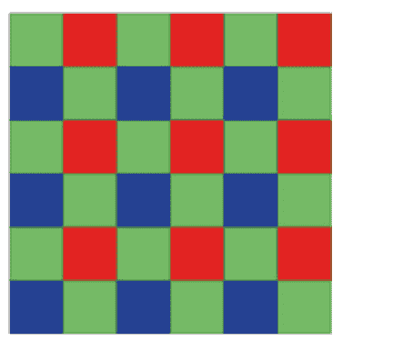

图8.13 使用`hough_circle()`在阿根廷蜂蜜的显微图像中自动检测花粉粒（主要是*菊科*，较少见的*云实科*和*唇形科*花粉）（原始图像由K. Schitteke和F. Flores提供）：**a** 原始RGB图像和**b** 使用霍夫变换检测到的花粉粒。

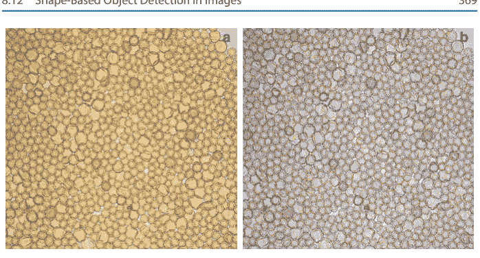

使用更高质量的图像并仔细调整霍夫变换的参数将产生更好的结果。

在第二个示例中，霍夫变换用于自动计算阿根廷蜂蜜显微图像中的花粉粒数量（图8.13）。图像质量再次不完美，这就是为什么我们不能期望获得最佳结果。特别是，三维物体的图像是在非常高的放大倍率下拍摄的，因此略显模糊。我们首先读取花粉图像并将其存储在变量I1中。图像大小为968×1060像素，包含三种颜色（红、绿、蓝）。由于图像相对较大，我们将图像大小减半：

```
I1 = io.imread('pollen.jpg')
I1 = I1[::2,::2,:]

plt.figure()
io.imshow(I1)
plt.axis('off')
io.show()
```

然后我们可以丢弃图像的颜色信息，仅使用红色：

```
I2 = I1[:,:,1]

plt.figure()
io.imshow(I2)
plt.axis('off')
io.show()
```

接下来，我们使用equalize_adapthist()执行对比度受限自适应直方图均衡化（CLAHE），以增强图像中的对比度（Zuiderveld 1994）：

```
I3 = np.zeros(np.shape(I1))
I3 = exposure.equalize_adapthist(I2)

plt.figure()
io.imshow(I3)
plt.axis('off')
io.show()
```

函数hough_circle()实现了霍夫变换并从原始图像中提取圆：

```
I4 = feature.canny(I3,
    low_threshold=0.2,high_threshold=0.92)

hough_radii = np.arange(12,20)
hough_res = transform.hough_circle(I4,hough_radii)
H,cx,cy,radii = transform.hough_circle_peaks(
    hough_res,hough_radii,
    min_xdistance=20,min_ydistance=20,
    total_num_peaks=1000)
nstr = 'Number of pollen grains: '+str(len(radii))
```

然后我们在灰度图像I2上显示圆：

```
m,n,p = np.shape(I1)
plt.figure()
plt.axis('off')
I2 = color.gray2rgb(I2)
for i in range(0,len(H)):
    circy,circx = draw.circle_perimeter(cy[i],
        cx[i],radii[i])
    circyn = np.delete(circy,(circy>=m)|(circx>=n))
    circxn = np.delete(circx,(circy>=m)|(circx>=n))
    I2[circyn,circxn] = (255,0,0)
    io.imshow(I2)
io.imshow(I2,cmap='gray')
plt.title(nstr)
io.show()
```

图形中圆的边缘颜色设置为b（蓝色）。结果表明，我们使用此方法计数了910个花粉粒。该算法识别了大多数对象，但有些未被识别，一些较大的对象被错误地识别为两个或更多个花粉粒。使用更高质量的图像并仔细调整霍夫变换的参数将产生更好的结果。使用hist()绘制花粉半径的直方图

```
plt.figure()
plt.hist(radii)
plt.show()
```

显示大多数花粉粒的半径约为15像素。

为了提高图像的对比度，我们可以应用自适应直方图均衡化：

```python
I3 = np.zeros(np.shape(I2))
I3[:,:,0] = exposure.equalize_adapthist(I2[:,:,0],
    clip_limit=0.01, nbins=256)
I3[:,:,1] = exposure.equalize_adapthist(I2[:,:,1],
    clip_limit=0.01, nbins=256)
I3[:,:,2] = exposure.equalize_adapthist(I2[:,:,2],
    clip_limit=0.01, nbins=256)

plt.figure()
io.imshow(I3)
plt.axis('off')
io.show()
```

我们现在可以显示红色和近红外波段：

```python
plt.figure()
plt.subplot(1,2,1)
io.imshow(I3[:,:,0])
plt.axis('off')
plt.title('Red')
plt.subplot(1,2,2)
io.imshow(I3[:,:,2])
plt.axis('off')
plt.title('NIR')
io.show()
```

然后，我们进行白平衡以校正任何不真实的色偏。为此，我们需要一个参考卡（通常是灰色），将其放置在图像中，然后用作白平衡的参考。或者，我们可以执行完全自动化的白平衡（如此处所示），方法是将每个单独通道的值除以各颜色（meanR、meanG 和 meanB）的平均值，然后将每个通道的值乘以所有通道平均值（meanGray）的平均值：

```python
I3G = color.rgb2gray(I3)
meanR = np.mean(I3[:,:,0])
meanG = np.mean(I3[:,:,1])
meanB = np.mean(I3[:,:,2])
meanGray = np.mean(I3G)
I3W = np.zeros(np.shape(I3))
I3W[:,:,0] = I3[:,:,0]*meanGray/meanR
I3W[:,:,1] = I3[:,:,1]*meanGray/meanG
I3W[:,:,2] = I3[:,:,2]*meanGray/meanB
```

接下来，我们使用以下公式计算归一化植被指数（NDVI）：

```python
I4 = np.copy(I3W)
ndvi = (I4[:,:,2]-I4[:,:,0])/(I4[:,:,2]+I4[:,:,0])

ndvi = exposure.rescale_intensity(ndvi,
    out_range='uint8')

plt.figure()
io.imshow(ndvi,
    cmap='gray')
plt.axis('off')
io.show()
```

或者，我们可以使用 `jet` 色图将 NDVI 显示为伪彩色图：

```python
ndvi = exposure.rescale_intensity(ndvi,
    out_range='uint8')

plt.figure()
io.imshow(ndvi,
    cmap='jet')
plt.axis('off')
io.show()
```

最后，我们可以定义一个任意阈值 `th`（例如 0.4），用于将植被（显示为白色像素）与其他材料（显示为灰色像素）分开。然后，我们将 NDVI > 0.4 的区域显示为绿色，将较低值的区域显示为白色（图 8.15）：

```python
th = 0.4
ndvit = np.copy(ndvi)
for i in range(0,row):
    if ndvit[i,j] < th:
        ndvit[i,j] = 0
```

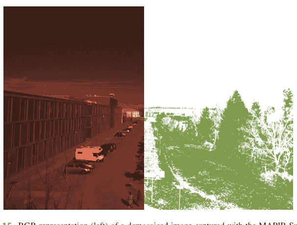

**图 8.15** 使用 MAPIR Survey2 NDVI 相机拍摄的去马赛克图像的 RGB 表示（左）和归一化差值植被指数（NDVI）的阈值图像（右），其中绿色像素表示在近红外波段具有高反射率值的区域。红色（660 nm）图像存储在红色图像通道中，近红外（850 nm）图像存储在蓝色图像通道中。由于植被丰富的区域对近红外的反射更强，因此它们呈现蓝色，而植被稀少的区域则呈现红色。

```python
ndvicmap = np.array([[1,1,1,1],
    [0.5,0.6,0.3,1]])
newrgb = ListedColormap(ndvicmap)

thresh, ndvitth = cv2.threshold(ndvit,
    150,255,cv2.THRESH_BINARY)
plt.figure()
io.imshow(ndvitth,cmap=newrgb)
plt.axis('off')
io.show()
```

我们也可以从包含红色和近红外光谱波段的卫星数据计算 NDVI。*Sentinel-2* 是由四颗卫星组成的系统，旨在执行多种任务的陆地观测，包括森林监测以及绘制地表变化和自然灾害影响的地图。数据可以从 USGS EarthExplorer ([https://earthexplorer.usgs.gov](https://earthexplorer.usgs.gov)) 网站免费下载。我们使用两张图像（分别于 2018 年 5 月 22 日和 29 日获取），从中加载计算 NDVI 所需的 650 nm (B04) 和 850 nm (B08) 光谱波段：

```python
filename1 = 'T32UQD_20180522T102031_B04_10m.jp2'
filename2 = 'T32UQD_20180522T102031_B08_10m.jp2'
filename3 = 'T32UQD_20180529T101031_B04_10m.jp2'
filename4 = 'T32UQD_20180529T101031_B08_10m.jp2'
img1 = rasterio.open(filename1)
img2 = rasterio.open(filename2)
img3 = rasterio.open(filename3)
img4 = rasterio.open(filename4)
B04_22 = img1.read(1)
B08_22 = img2.read(1)
B04_29 = img3.read(1)
B08_29 = img4.read(1)
```

我们通过输入以下命令将柏林-勃兰登堡地区的图像裁剪到波茨坦市区域：

```python
B04_22 = B04_22[8500:9500,6500:7500]
B08_22 = B08_22[8500:9500,6500:7500]
B04_29 = B04_29[8500:9500,6500:7500]
B08_29 = B08_29[8500:9500,6500:7500]
```

接下来，我们将 uint16 数据转换为 float64 以进行计算：

```python
B04_22 = np.float64(B04_22)
B08_22 = np.float64(B08_22)
B04_29 = np.float64(B04_29)
B08_29 = np.float64(B08_29)
```

为了显示图像，我们首先计算 5% 和 95% 分位数：

```python
B04_22_05 = np.quantile(B04_22,0.05)
B04_22_95 = np.quantile(B04_22,0.95)
B08_22_05 = np.quantile(B08_22,0.05)
B08_22_95 = np.quantile(B08_22,0.95)
B04_29_05 = np.quantile(B04_29,0.05)
B04_29_95 = np.quantile(B04_29,0.95)
B08_29_05 = np.quantile(B08_29,0.05)
B08_29_95 = np.quantile(B08_29,0.95)
```

然后通过输入以下命令计算两张图像的 NDVI 值：

```python
NDVI_22 = (B08_22-B04_22)/(B08_22+B04_22)
NDVI_29 = (B08_29-B04_29)/(B08_29+B04_29)
```

作为示例，我们将 2018 年 5 月 22 日获取的图像的 650 nm 和 850 nm 光谱波段显示为灰度图像，并将 NDVI 图显示为彩色图像，两者均使用 `jet` 色图：

```python
plt.figure()
B04_22_X = exposure.rescale_intensity(B04_22,
    in_range=(B04_22_05,B04_22_95),
    out_range='uint16')
plt.imshow(B04_22_X,
    cmap='gray')
plt.colorbar()
plt.axis('off')
plt.title('650 nm')
plt.show()

plt.figure()
B08_22_X = exposure.rescale_intensity(B08_22,
    in_range=(B08_22_05,B08_22_95),
    out_range='uint16')
plt.imshow(B08_22_X,
    cmap='gray')
plt.colorbar()
plt.axis('off')
plt.title('850 nm')
plt.show()

plt.figure()
NDVI_22_X = exposure.rescale_intensity(NDVI_22,
    out_range=(0,1))
plt.imshow(NDVI_22_X,
    cmap='jet')
plt.colorbar()
plt.axis('off')
plt.title('NDVI 22 May 2018')
plt.show()
```

然后，我们将图像保存为 PNG 文件：

```python
print -dpng -r300 sentinel_ndiv_1_vs1.png
```

接着，我们计算两张图像（分别于 2018 年 5 月 22 日和 29 日获取）的 NDVI 图之间的差异，并再次将图像保存为 PNG 文件：

```python
DNDVI = NDVI_22 - NDVI_29

plt.figure()
B04_22_X = exposure.rescale_intensity(B04_22,
    in_range=(B04_22_05,B04_22_95),
    out_range='uint16')
plt.imshow(B04_22_X,
    cmap='gray')
plt.colorbar()
plt.axis('off')
plt.title('650 nm')
plt.show()

plt.figure()
B08_22_X = exposure.rescale_intensity(B08_22,
    in_range=(B08_22_05,B08_22_95),
    out_range='uint16')
plt.imshow(B08_22_X,
    cmap='gray')
plt.colorbar()
plt.axis('off')
plt.title('850 nm')
plt.show()

plt.figure()
DNDVI_X = exposure.rescale_intensity(DNDVI,
    in_range=(-0.2,0.2),
    out_range=(0,1))
plt.imshow(DNDVI_X,
    cmap='jet')
plt.colorbar()
plt.axis('off')
plt.title('Difference NDVI 22 - 29 May 2018')
plt.show()
```

生成的图像非常清晰地展示了季节性绿化进展。

## 推荐阅读

- Abrams M, Hook S (2002) ASTER 用户手册——第 2 版。喷气推进实验室和 EROS 数据中心，苏福尔斯
- Ballard DH (1981) 广义霍夫变换检测任意形状。模式识别 13:111–122
- Barry P (2001) EO-1/Hyperion 科学数据用户指南。TRW 太空、国防与信息系统，雷东多海滩，加利福尼亚州
- Beck R (2003) EO-1 用户指南。美国地质调查局地球资源观测系统数据中心 (EDC)，苏福尔斯，南达科他州
- Duda RO, Hart PE (1972) 使用霍夫变换检测图像中的直线和曲线。ACM 通信 15:1–15
- Gonzalez RC, Woods RE (2018) 数字图像处理，全球版。Pearson，伦敦
- Irons J, Riebeek H, Loveland T (2011) Landsat 数据连续性任务——持续观测你的世界。NASA 和 USGS（可在线获取）
- Jensen JR (2013) 环境遥感：Pearson 新版，国际版。Pearson，伦敦
- Lein JK (2012) 环境感知——地球观测分析技术。Springer，柏林海德堡纽约
- Mandl D, Cruz P, Frye S, Howard J (2002) NASA/USGS 合作将地球观测-1 转变为商业可行的任务以最大化技术融合。SpaceOps 2002，休斯顿，德克萨斯州，2002 年 10 月 9-12 日
- Ochs B., Hair D, Irons J, Loveland T (2009) Landsat 数据连续性任务，NASA 和 USGS（可在线获取）
- Richards JA (2013) 遥感数字图像分析——第 4 版。Springer，柏林海德堡纽约
- Trauth MH, Strecker MR (1999) 阿根廷西北部 40,000 至 25,000 年前湿润期期间滑坡堰塞湖的形成。古地理学、古气候学、古生态学 153:277–287
- Trauth MH, Bookhagen B, Marwan N, Strecker MR (2003) 多个滑坡集群记录阿根廷西北部安第斯山脉的第四纪气候变化。古地理学、古气候学、古生态学 194:109–121
- Zuiderveld K (1994) 对比度受限的自适应直方图均衡化。学术出版社专业，图形宝石 IV。圣地亚哥，第 474–485 页

## 延伸阅读

- Campbell JB (2002) 遥感导论。Taylor & Francis，伦敦
- Davies ER (2005) 机器视觉：理论、算法、实践——第 3 版。Morgan Kaufman 出版社，伯灵顿，马萨诸塞州
- Francus P (2005) 图像分析、沉积物和古环境——古环境研究进展。Springer，柏林海德堡纽约
- Hough PVC (1962) 识别复杂模式的方法和装置。美国专利号 3069654
- Marwan N, Trauth MH, Vuille M, Kurths J (2003) 阿根廷西北部安第斯山脉现代和更新世降水数据的非线性时间序列分析。气候动力学 21:317–326
- Seelos K, Sirocko F (2005) RADIUS - 通过超薄切片超高分辨率扫描进行数字图像的快速颗粒分析。沉积学 52:669–681
- Trauth MH, Alonso RA, Haselton KR, Hermanns RL, Strecker MR (2000) 阿根廷西北部安第斯山脉的气候变化与质量运动。地球与行星科学快报 179:243–256
- Trauth MH (2021) 地球科学 MATLAB 食谱——第五版。Springer，柏林海德堡纽约
- Yuen HK, Princen J, Illingworth J, Kittler J (1990) 圆形检测的霍夫变换方法比较研究。图像与视觉计算 8:71–77

# 9.1 引言

多元分析用于理解和描述任意数量变量之间的关系。地球科学家经常处理多元数据集，例如微体化石组合、火山灰层的地球化学指纹，或沉积序列的粘土矿物含量。这类多元数据集由对 $n$ 个对象测量 $p$ 个变量组成，通常存储在 $n$ 行 $p$ 列的数组中：

$$X = \begin{pmatrix} x_{11} & x_{12} & \cdots & x_{1p} \\ x_{21} & x_{22} & \cdots & x_{2p} \\ \vdots & \vdots & & \vdots \\ x_{n1} & x_{n2} & \cdots & x_{np} \end{pmatrix}$$

数组的行代表 $n$ 个对象，列代表 $p$ 个变量。样本集中第2个对象的特征由数据数组第二行的向量描述：

$$X_2 = (x_{21} \ x_{22} \ \cdots \ x_{2p})$$

举个例子，考虑一个火山灰年代学项目中对火山灰层玻璃碎片的电子探针分析数据集。变量是 $p$ 种化学元素，对象是 $n$ 个灰样。研究的目的是通过它们的地球化学指纹来关联灰层。

**补充信息** 在线版本包含补充材料，可访问 https://doi.org/10.1007/978-3-031-07719-7_9。

© 作者，经 Springer Nature Switzerland AG 2022 独家许可
M. H. Trauth, *Python Recipes for Earth Sciences*, Springer Textbooks in Earth Sciences, Geography and Environment, https://doi.org/10.1007/978-3-031-07719-7_9

大多数多元方法试图克服与此类数据集相关的主要困难，即数据可视化问题。单变量或双变量数据集的特征可以通过直观检查二维直方图或 *xy* 图（第3章）轻松探索，而三变量数据集的图形显示则需要将数据点的三维分布投影到二维显示上。想象或显示更多变量是不可能的。解决高维数据集可视化问题的一个方法是减少维度。有几种方法可以将数据集中高度相关的变量分组在一起，并探索减少后的组数。

经典的降维方法是 *主成分分析*（PCA）和 *因子分析*（FA）。这些方法寻找数据集中方差最大的方向，并将这些方向用作新的坐标轴。用新的变量组替换现有变量的优势在于这些组是不相关的。因此，这些方法用于分离（或分离）混合变量。此外，新变量通常有助于解释多元数据集，因为它们经常包含关于导致数据点分布过程的有价值信息。在岩浆岩的地球化学分析中，该方法定义的组通常包含在某些矿物晶格中具有相似大小离子和相似位置的化学元素。例如硅酸盐中的 Si$^{4+}$ 和 Al$^{3+}$，以及 Fe$^{2+}$ 和 Mg$^{2+}$。

第二类重要的多元方法旨在根据相似性对对象进行分组。例如，*聚类分析*（CA）通常用于关联火山灰层，如上述示例中的灰层。火山灰年代学试图通过其地球化学指纹来关联火山灰。当与来自关键灰层的几个放射性年龄测定相结合时，该方法允许对包含这些灰层的不同沉积序列进行关联（例如，Westgate 1998；Hermanns 等人 2000）。聚类分析也用于微体古生物学领域，例如，用于比较不同的微体化石组合（例如，Birks 和 Gordon 1985）。

第三类方法涉及对观测进行分类。人类倾向于对周围的事物进行分类，尽管自然界很少能划分为离散的类别。分类（或归类）是有用的，因为它可以帮助决策者在钻探油井或将化石归入特定属或种时采取必要的预防措施以降低风险。大多数分类方法基于布尔逻辑做出决策，只有真或假两种选择，就像在显微镜图像中使用阈值识别木炭一样（第8.11节）。或者，模糊逻辑（本书未解释）是二元布尔逻辑在许多现实世界决策问题中的推广，在这些问题中，渐进的过渡是合理的（Zadeh 1965）。

以下章节介绍了多元统计学中最重要的技术。首先，*主成分分析*（PCA）和 *聚类分析*（CA）分别在第9.2节和第9.5节介绍，*独立成分分析*（ICA）（PCA的非线性扩展）在第9.3节概述。第9.4节介绍判别分析（DA），这是地球科学中一种流行的分类方法。第9.6节介绍多元线性回归，第9.7节演示了使用 John Aitchison 的对数变换来克服闭合和问题——这是多元数据集中非常常见的问题（Aitchison 1984, 1986, 1999, 2003）。对于多元分析，我们使用 NumPy (https://numpy.org)、Matplotlib (https://matplotlib.org)、scikit-learn (https://scikit-learn.org) 和 SciPy (https://scipy.org) 包，它们包含了所有必要的例程。

## 9.2 主成分分析

主成分分析（PCA）检测 $p$ 个变量之间的线性依赖关系，并用 $p$ 个不相关的变量（称为主成分，PCs）替换线性相关的变量组（图9.1）。PCA——最初由 Karl Pearson（1901）提出，后由 Harold Hotelling（1931）进一步发展——是用于线性分离（或分离）混合变量的标准方法。PCA 等同于将一个 $p$ 维椭球体拟合到一个包含 $p$ 个变量的数据集，其中数据集 $p$ 乘 $p$ 协方差矩阵的 $p$ 个特征向量就是椭球体的轴。因此，PCA 是特征向量方法之一。$p$ 个特征值代表了每个特征向量之间的方差分布。

PCA 的性能最好用一个包含两个变量 $x_1$ 和 $x_2$ 且表现出强线性相关的双变量数据集来说明，通过将数据集的 2 乘 2 协方差矩阵的两个特征向量 $PC_1$ 和 $PC_2$ 拟合到数据上形成一个二维椭圆（图9.1）。由于第一主成分 $PC_1$ 穿过数据散点的长轴，且新原点是双变量均值，因此 $PC_1$ 可以用来描述大部分方差，而 $PC_2$ 只贡献少量额外信息。在此变换之前，需要两个轴 $x_1$ 和 $x_2$ 来描述数据集，但现在可以通过舍弃第二个轴 $PC_2$ 来降低数据维度，而不会丢失太多信息，如图9.1所示。

由于该方法产生的信号 $PC_1$ 和 $PC_2$ 是线性不相关的，因此该方法也称为 *白化*，因为这种特性是白噪声的特征。成功应用此方法的一个重要前提是数据必须服从高斯分布。尽管分离后的信号是不相关的，但它们仍然可能是相互依赖的（即，它们可能保留非线性相关性）。例如，如果数据不服从高斯分布，PCA 因此无法产生有用的结果，就会出现这种现象。独立成分分析（ICA）就是为这类任务开发的，它从 $p$ 个相关变量中分离出 $p$ 个独立变量（这些变量随后是非线性不相关的）（第9.3节）。

这个过程现在可以扩展到任意数量的变量和样本。让我们假设一个数据集，它由存储在 $n$ 行 $p$ 列数组 $X$ 中的 $n$ 个样本的 $p$ 个变量测量值组成：

$$X = \begin{pmatrix} x_{11} & x_{12} & \dots & x_{1p} \\ x_{21} & x_{22} & \dots & x_{2p} \\ \vdots & \vdots & & \vdots \\ x_{n1} & x_{n2} & \dots & x_{np} \end{pmatrix}$$

数组 $X$ 的列代表 $p$ 个变量，行代表 $n$ 个样本。在旋转轴并移动原点后，新的坐标 $Y_j$ 可以通过以下公式计算：

$$Y_1 = a_{11}X_1 + a_{12}X_2 + \dots + a_{1p}X_p$$
$$Y_2 = a_{21}X_1 + a_{22}X_2 + \dots + a_{2p}X_p$$
$$\vdots$$
$$Y_p = a_{p1}X_1 + a_{p2}X_2 + \dots + a_{pp}X_p$$

第一个主成分 $PC_1$（记为 $Y_1$）包含最高的方差，而 $PC_2$ 包含第二高的方差，依此类推。所有 $PCs$ 共同包含了数据集的全部方差。然而，这种方差主要集中在前几个 $PCs$ 中，它们包含了数据集的大部分信息内容。因此，为了降低数据维度，通常会忽略最后的 $PCs$。上述方程中的因子 $a_{ij}$ 是*主成分载荷*，其值代表了原始变量对新 $PCs$ 的相对贡献。如果变量 $X_j$ 在 $PC_1$ 中的载荷 $a_{ij}$ 接近于零，则该变量的影响较小；而较高的正或负 $a_{ij}$ 值则表明其影响较强。通过原始变量 $X_j$ 的线性组合（由载荷加权）计算出的新变量值 $Y_j$ 被称为*主成分得分*。

PCA 通常用于分离（或分离）变量 $X$，这些变量是独立源变量 $S$ 的线性组合，

$$X = A^T \cdot S$$

其中 $A$ 是混合矩阵。PCA 的目标是确定（尽管不是定量地）源变量 $S$（由主成分得分 $Y_i$ 表示）和混合矩阵 $A$（由主成分载荷 $a_{ij}$ 表示）。如果原始变量 $X$ 的概率分布是高斯分布，则分离此类变量的效果最佳，并且只有在这种情况下，主成分才是完全线性不相关的。然而，地球科学中的数据通常不是高斯分布的，因此应使用替代方法——例如独立成分分析（ICA）（第 9.3 节）。例如，高光谱数据中的辐射率和反射率值通常不是高斯分布的，因此在遥感应用中，ICA 而非 PCA 被广泛用于去相关光谱波段。PCA 的应用实例包括评估沉积物来源（如下例所述）、分离玄武岩的地幔橄榄岩源区以及卫星图像的多光谱分类。

第一个示例展示了不使用 `PCA()` 而使用 `cov()` 计算 $p=2$ 维数据集的 $p$ 乘 $p$ 协方差矩阵，然后使用 `eig()` 计算该矩阵的 $p$ 个特征向量和 $p$ 个特征值的 PCA 方法。我们接下来假设一个数据集，它由 $n$ 个样本的 $p$ 个变量测量值组成，存储在一个名为 `data` 的 $n$ 乘 $p$ 数组中。例如，我们可以创建一个包含 2 乘 30 个数据点的双变量数据集，该数据集具有强线性相关性，并叠加了正态分布的噪声：

```python
%reset -f

import numpy as np
import numpy.linalg as linalg
from matplotlib import cm
import matplotlib.pyplot as plt
from numpy.random import default_rng
from sklearn.decomposition import PCA

rng = default_rng(0)
data = rng.standard_normal((30,2))
data[:,1] = 3.4 + 1.2*data[:,0]
data[:,1] = data[:,1] + 0.2*rng.standard_normal(np.shape(data[:,1]))

plt.figure()
plt.plot(data[:,0],data[:,1],
    marker='o',
    linestyle='none')
ax = plt.gca()
ax.spines['top'].set_color('none')
ax.spines['right'].set_color('none')
ax.spines['left'].set_position('zero')
ax.spines['bottom'].set_position('zero')
plt.axis(np.array([-3,2,0,6]))
plt.xlabel('x-value')
plt.ylabel('y-value')
plt.show()
```

我们可以在一个坐标轴相交于原点的坐标系中显示数据。这通过使用 `set_position('zero')` 实现（图 9.2 a）：

```python
plt.figure()
plt.plot(data[:,0],data[:,1],
    marker='o',
    linestyle='none')
ax = plt.gca()
ax.spines['top'].set_color('none')
ax.spines['right'].set_color('none')
ax.spines['left'].set_position('zero')
ax.spines['bottom'].set_position('zero')
plt.axis(np.array([-3,2,0,6]))
plt.xlabel('x-value')
plt.ylabel('y-value')
plt.show()
```

目标是找到一个单位向量，该向量指向双变量数据集中方差最大的方向。这个问题的解决方案是计算协方差矩阵 $C$ 的最大特征值 $D$ 和相应的特征向量 $V$，

$C \cdot V = \lambda \cdot V$

其中

$C = data' \cdot data$

这等价于

$(C - D \cdot E) \cdot V = 0$

其中 $E$ 是单位矩阵，这是一个经典的特征值问题：它是一个线性方程组，特征向量 $V$ 是其解。我们必须首先对数据进行均值中心化，即从两列（即 data 的两个变量）中减去单变量均值。因此，在以下步骤中，我们仅研究偏离均值的情况：

```python
data[:,0] = data[:,0]-np.mean(data[:,0]);
data[:,1] = data[:,1]-np.mean(data[:,1]);
```

接下来，我们计算 data 的协方差矩阵 $C$。协方差矩阵包含了旋转坐标系所需的所有信息，

```python
C = np.cov(data[:,0],data[:,1])
print(C)
```

输出结果为

```
[[0.92061706 1.00801248]
 [1.00801248 1.14192816]]
```

旋转有助于创建新的不相关变量（即所有新变量对之间的协方差为零）。去相关是通过对协方差矩阵 $C$ 进行对角化实现的。属于对角化协方差矩阵的特征向量 $V$ 是旧基向量的线性组合，因此表达了旧时间序列和新时间序列之间的相关性。我们通过求解方程来找到协方差矩阵 $C$ 的特征值

$det(C - D \cdot E) = 0$

协方差矩阵的特征值 $D$（即 $C$ 的对角化版本）给出了新坐标轴（即主成分）内的方差。我们现在计算协方差矩阵 $C$ 的特征向量 $V$ 和特征值 $D$，

```python
D,V = linalg.eig(C)
print(V)
print(D)
```

输出结果为

```
[[-0.744688  -0.66741275]
 [ 0.66741275 -0.744688  ]]

[0.01720466 2.04534057]
```

如我们所见，第二个特征值 2.0453 大于第一个特征值 0.0172。因此，我们需要在变换后改变新变量的顺序。然后，我们显示数据以及代表新坐标系的特征向量（图 9.2b）：

```python
plt.figure()
plt.plot(data[:,0],data[:,1],
    marker='o',
    linestyle='none')
plt.plot((0,V[0,0]),(0,V[1,0]),
    color=(0.8,0.5,0.3),
    linewidth=0.75)
plt.text(V[0,0],V[1,0],'PC2',
    color=(0.8,0.5,0.3))
plt.plot((0,V[0,1]),(0,V[1,1]),
    color=(0.8,0.5,0.3),
    linewidth=0.75)
plt.text(V[0,1],V[1,1],'PC1',
    color=(0.8,0.5,0.3))
ax = plt.gca()
ax.spines['top'].set_color('none')
ax.spines['right'].set_color('none')
ax.spines['left'].set_position('zero')
ax.spines['bottom'].set_position('zero')
plt.axis(np.array([-6,6,-4,4]))
plt.xlabel('x-value')
plt.ylabel('y-value')
plt.show()
```

特征向量是单位向量且正交；因此，范数为一，内积（标量积、点积）为零，

```python
print(linalg.norm(V[:,0]))
print(linalg.norm(V[:,1]))
print(np.dot(V[:,0],V[:,1]))
```

输出结果为

```
0.9999999999999999
0.9999999999999999
0.0
```

我们现在计算新坐标系中的数据集 newdata。我们需要左右翻转 newdata，因为第二列是具有最大特征值的那一列（如前所述），

```python
newdata = np.matmul(data,V)
newdata = np.fliplr(newdata)
print(newdata)
```

输出结果为

```
newdata =

[[-0.28687857 -0.06796136]
 [-0.98110732 -0.13692354]
 [ 0.42153266  0.18529491]
 [-2.11734482 -0.00967294]
 [ 0.89395125 -0.01241517]
 [ 0.85585602 -0.08631932]
 [ 3.23801307  0.06391048]
 [ 1.59265288  0.08944404]]
(续)
```

协方差矩阵的特征值表示该（新）坐标方向上的方差。我们可以利用此信息，通过将根据特征向量得到的方差除以方差总和，来计算每个新变量的相对方差。在我们的示例中，第一和第二主成分分别包含数据总方差的 99.57% 和 0.43%，

```python
print(np.var(newdata[:,0],ddof=1))
print(np.var(newdata[:,1],ddof=1))

print(np.var(newdata[:,0],ddof=1)/
      (np.var(newdata[:,0],ddof=1)+ 
       np.var(newdata[:,1],ddof=1)))
print(np.var(newdata[:,1],ddof=1)/
      (np.var(newdata[:,0],ddof=1)+ 
       np.var(newdata[:,1],ddof=1)))
```

输出结果为

```
2.045340567485195
0.017204658450711223
0.9916585303273026
0.008341469672697424
```

或者，我们可以通过归一化特征值来获得方差，

```
variance = D / np.sum(D)
print(variance)
```

得到

```
[0.00834147 0.99165853]
```

这再次表明，两个主成分分别解释了99.17%和0.83%的方差。我们现在在新的坐标系中显示`newdata`中的数据（图9.2c）：

```
plt.figure()
plt.plot(newdata[:,0],newdata[:,1],
    marker='o',
    linestyle='none')
ax = plt.gca()
ax.spines['top'].set_color('none')
ax.spines['right'].set_color('none')
ax.spines['left'].set_position('zero')
ax.spines['bottom'].set_position('zero')
plt.axis(np.array([-6,6,-4,4]))
plt.xlabel('PC1',loc='right')
plt.ylabel('PC2',loc='top')
plt.show()
```

然后，我们可以使用`PCA()`函数进行相同的实验。该函数的输入是`data`，它返回一个`pca`对象，其中包含PCA成分（或载荷）、解释方差以及计算`newdata`所需的变换：

```
pca = PCA(n_components=2)
pca.fit(data)
print(pca.components_)
print(pca.explained_variance_ratio_)
newdata = pca.transform(data)
print(newdata)
```

如我们所见，我们得到了与之前相同的值：

```
[[-0.66741275 -0.744688  ]
 [-0.744688    0.66741275]]
```

```
[0.99165853 0.00834147]

[[-0.28687857 -0.06796136]
 [-0.98110732 -0.13692354]
 [ 0.42153266  0.18529491]
 [-2.11734482 -0.00967294]
 [ 0.89395125 -0.01241517]
 [ 0.85585602 -0.08631932]
 [ 3.23801307  0.06391048]
 [ 1.59265288  0.08944404]]
```

正如预期的那样，数据已成功去相关，我们可以通过`corrcoef()`来验证，

```
r = np.corrcoef(newdata[:,0],newdata[:,1])
print(r[0,1])
```

得到一个接近零的值

```
-5.385152103520556e-16
```

第二个合成示例演示了对沉积物样本数据集进行线性解混。从沉积序列的三十个不同层位各取一个样本，这些层位包含存储在数组`x`列中的三种不同矿物的不同比例。沉积物来源于三种不同的岩石类型（矿物组成未知），它们对三十个沉积物样本的相对贡献分别由`s1`、`s2`和`s3`表示。这些相对贡献的变化（由`s1`、`s2`和`s3`中的三十个值表示）可能反映了沉积盆地集水区内的气候变率。因此，可能可以利用数组`x`中的沉积物组成（我们使用PCA从中计算`s1`、`s2`和`s3`）来推导过去气候变化的信息。

我们需要创建一个合成数据集，包含三个测量值，代表三十个沉积物样本中每种三种矿物的比例。我们首先清空工作区，并使用`default_rng(0)`重置随机数生成器。然后，我们使用`standard_normal()`创建`s1`、`s2`和`s3`，该函数生成均值为零、标准差分别为10、7和12的高斯分布随机数：

```
rng = default_rng(0)
s1 = 10*rng.standard_normal(30)
s2 = 7*rng.standard_normal(30)
s3 = 12*rng.standard_normal(30)
```

然后，我们通过将`s1`、`s2`和`s3`的值乘以一个权重因子后求和，来计算三十个沉积物样本中每种三种矿物的比例：

```
x = np.zeros((30,3))
x[:,0] = 15.4+ 7.2*s1+10.5*s2+2.5*s3
x[:,1] = 124.0-8.73*s1+ 0.1*s2+2.6*s3
x[:,2] = 100.0+5.25*s1- 6.5*s2+3.5*s3
```

权重因子（共同代表我们练习中的混合矩阵）不仅反映了源岩矿物组成的差异，也反映了沉积盆地内矿物的风化、迁移和沉积。因此，如果两种矿物的权重因子符号相反，其中一种可能是另一种的风化产物，这解释了为什么它们在三十个沉积物样本中的比例呈负相关。或者，不同的符号可能表示稀释效应：如果沉积物样本中一种矿物的比例保持不变，但所有其他矿物的比例以类似方式变化，它们将与第一种矿物的比例呈负相关。为了完成数据集的生成，我们向矿物比例中添加一些标准差为3.8的高斯噪声：

```
x = x + 3.8*rng.standard_normal(np.shape(x))
```

既然我们已经了解了沉积记录是如何创建的，并检查了数据集中存在的依赖关系，接下来我们假装不知道三种源岩对三十个沉积物样本的相对贡献。PCA的目标现在是解读三种源岩对沉积物组成的统计独立贡献。我们可以显示数据的直方图，看到它们并非完美的高斯分布，这意味着我们不能期望得到完美的解混结果：

```
plt.figure()
plt.subplot(1,3,1)
plt.hist(x[:,0])
plt.subplot(1,3,2)
plt.hist(x[:,1])
plt.subplot(1,3,3)
plt.hist(x[:,2])
plt.show()
```

我们沿着沉积剖面显示三十个样本中三种矿物的比例。在此图中，我们可以看到三种矿物比例之间存在弱相关和负相关：

```
plt.figure()
plt.plot(x)
plt.legend(['Min1','Min2','Min3'])
plt.show()
```

在运行PCA之前，我们为练习中创建的各种图形定义标签。我们将样本编号为1到30，矿物分别用四个字符的缩写Min1、Min2和Min3标识：

```
labels = []
for i in range(0,30):
    labels.append(str(i))
minerals = (['Min1','Min2','Min3'])
```

现在，我们可以通过成对双变量散点图探索矿物之间的相关性，并观察到矿物1和2之间存在强负相关，矿物1和3之间存在弱正相关，矿物2和3之间存在中等负相关：

```
plt.figure()
plt.subplot(1,5,1)
plt.plot(x[:,0],x[:,1],
    marker='o',
    linestyle='none')
plt.xlabel('Mineral 1')
plt.ylabel('Mineral 2')
plt.subplot(1,5,3)
plt.plot(x[:,0],x[:,2],
    marker='o',
    linestyle='none')
plt.xlabel('Mineral 1')
plt.ylabel('Mineral 3')
plt.subplot(1,5,5)
plt.plot(x[:,1],x[:,2],
    marker='o',
    linestyle='none')
plt.xlabel('Mineral 2')
plt.ylabel('Mineral 3')
plt.show()
```

*相关矩阵*提供了一种技术，用于探索数据集中变量之间的依赖关系（即我们示例中的三种矿物）。相关矩阵的元素是每对变量的皮尔逊相关系数（第4章），如图9.3所示，

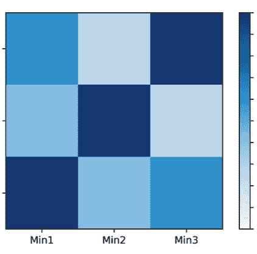

图9.3 包含每对变量（例如沉积物样本中的矿物）皮尔逊相关系数的相关矩阵。深色代表强正线性相关，而浅色代表负相关。中间色表示无相关性。

```
python
corrmatrix = np.corrcoef((x[:,0],x[:,1],x[:,2]))
corrmatrix = np.flipud(corrmatrix)
print(corrmatrix)
```

得到

```
[[ 0.34831277 -0.5556862  1.       ]
 [-0.81838779  1.         -0.5556862 ]
 [ 1.         -0.81838779  0.34831277]]
```

现在，我们可以使用热图显示相关矩阵：

```
python
fig, ax = plt.subplots()
c = ax.imshow(corrmatrix,cmap=cm.Blues,clim = (-1,1))
ax.set_xticks(np.linspace(0,2,3))
ax.set_yticks(np.linspace(0,2,3))
ax.set_xticklabels(minerals)
ax.set_yticklabels(np.flipud(minerals))
plt.colorbar(c,ticks=np.linspace(-1,1,11))
plt.show()
```

这个相关系数热图证实了在成对双变量散点图中揭示的矿物之间的相关性，这些相关性再次显示矿物1和2之间存在强负相关（r=-0.8184），矿物1和3之间存在弱正相关（r=0.3483），矿物2和3之间存在中等负相关（r=-0.5557）。这些观察到的依赖关系将使我们期望应用PCA会得到有趣的结果。

在应用PCA之前，存在多种方法对原始数据进行缩放。这些方法包括*均值中心化*（使用均值为零）和*标准化*（使用均值为零且标准差为一）。然而，我们使用原始数据`x`进行PCA。该函数的输出是一个`pca`对象，其中包含PCA成分（或载荷）、解释方差以及从原始数据`x`计算PCA得分`newx`所需的变换。载荷`pcs`是权重（或权重因子），表示旧变量（即矿物）对新变量（即主成分或PCs）的贡献程度。主成分得分`newx`是三十个样本在新坐标系中的坐标，该坐标系由三个主成分$PC_1$、$PC_2$和$PC_3$（存储在`pcs`的三列中）定义，我们将其解释为三种源岩：

```
pca = PCA(n_components=3)
pca.fit(x)

pcs = pca.components_
newx = pca.transform(x)
variances = pca.explained_variance_ratio_
```

三个主成分的载荷可以通过输入以下命令显示

```
print(pcs)
```

得到

```
[[ 0.63417264 -0.62146955  0.46000072]
 [-0.50849     0.11295575  0.85362692]
 [ 0.58246286  0.7752526   0.24437761]]
```

我们观察到$PC_1$（第一列）在变量1和3（第一行和第三行）上有高的正载荷，在变量2（第二行）上有高的负载荷。$PC_2$（第二列）在变量1上有高的负载荷，在变量3上有高的正载荷，而在变量2上的载荷接近零。$PC_3$（第三列）在变量1和2上有高的载荷，在变量3上的载荷相对较低但也是正的。我们现在创建一些图来可视化PCs：

```
a = np.array([0,2])
b = np.array([0,0])
plt.figure()
```

plt.subplot(1,3,1)
plt.plot(pcs[:,0],
    marker='o',
    linestyle='none')
plt.plot(a,b,
    color=(0.8,0.3,0.1),
    linewidth=0.75)
for i in range (0,3):
    plt.text(i+0.2,pcs[i,0],
        minerals[i])
plt.subplot(1,3,2)
plt.plot(pcs[:,1],
    marker='o',
    linestyle='none')
plt.plot(a,b,
    color=(0.8,0.3,0.1),
    linewidth=0.75)
for i in range (0,3):
    plt.text(i+0.2,pcs[i,1],
        minerals[i])
plt.subplot(1,3,3)
plt.plot(pcs[:,2],
    marker='o',
    linestyle='none')
plt.plot(a,b,
    color=(0.8,0.3,0.1),
    linewidth=0.75)
for i in range (0,3):
    plt.text(i+0.2,pcs[i,2],
        minerals[i])
plt.show()

矿物的载荷及其与$PCs$的关系可用于解释不同源岩的相对（而非绝对）影响。$PC_1$的特征是矿物1和3有强烈的正贡献，这反映了第一种岩石类型作为沉积物来源具有相对较强的影响。矿物2对沉积物贡献的相反符号可能表明，该矿物在流域内的活化过程与矿物1和3不同；换句话说，某种气候可能有利于矿物1和3的风化，但会减弱矿物2的风化。或者，负号也可能表示一种稀释效应，即不存在矿物之间存在差异的过程，负号只是统计上的假象。第二主成分$PC_2$也主要由矿物1和3主导，但符号相反，而矿物2的影响相对较小。第三主成分$PC_3$受所有三种矿物影响，且符号相同。绘制载荷的另一种方式是作为两个主成分的双变量图。此时我们忽略$PC_3$，专注于$PC_1$和$PC_2$。重要的是要记住，在绘制载荷之前，要么关闭图形窗口，要么使用`clf`清除图形窗口，以避免将新图作为第四个子图整合到之前的图形窗口中：

```
a = np.array([0,0])
b = np.array([-1,1])
plt.figure()
plt.plot(pcs[:,0],pcs[:,1],
    marker='o',
    linestyle='none')
plt.plot(a,b,
    color=(0.8,0.3,0.1),
    linewidth=0.75,
    linestyle='--')
plt.plot(b,a,
    color=(0.8,0.3,0.1),
    linewidth=0.75,
    linestyle='--')
for i in range (0,3):
    plt.text(pcs[i,0]+0.05,pcs[i,1]+0.05,
        minerals[i])
plt.axis(np.array([-1,1,-1,1]))
plt.xlabel('First Principal Component Loadings')
plt.ylabel('Second Principal Component Loadings')
plt.show()
```

我们现在可以在单个图中观察到之前在多个图形中显示的相同关系（图9.4）。也可以将数据集绘制为新变量（即源岩）的函数。这需要PCA()的第二个输出，其中包含主成分得分newx：

```
a = np.array([0,0])
b = np.array([-150,200])
c = np.array([-300,300])
plt.figure()
plt.plot(newx[:,0],newx[:,1],
    marker='o',
    linestyle='none')
plt.plot(a,b,
    color=(0.8,0.3,0.1),
    linewidth=0.75,
    linestyle='--')
```

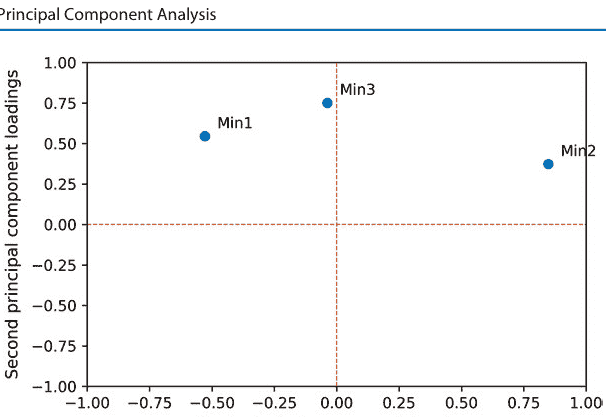

```
plt.plot(c,a,
    color=(0.8,0.3,0.1),
    linewidth=0.75,
    linestyle='--')
for i in range (1,30):
    plt.text(newx[i,0]+5,newx[i,1]+5,
        labels[i])
plt.xlabel('First Principal Component Scores')
plt.ylabel('Second Principal Component Scores')
plt.show()
```

该图清晰地定义了具有相似影响的样本组，例如样本19、20和26，可能还包括样本18。接下来，我们使用PCA()的第三个输出来计算PCs的方差，

```
percent_explained = 100*variances/np.sum(variances)
print(percent_explained)
```

结果为

```
[72.43620937  22.71744468   4.84634596]
```

我们可以看到，超过72%的总方差包含在PC₁中，约23%包含在PC₂中，而PC₃对数据集总方差的贡献非常小（约5%）。这意味着数据集中的大部分变异性仅由两个新变量即可描述。正如预期的那样，这两个新变量彼此不相关。这通过newx[:,0]和newx[:,1]之间的相关系数来说明

```
r = np.corrcoef(newx[:,0],newx[:,1])
print(r[0,1])
```

该系数接近于零

```
-3.05521182351808e-17
```

因此，我们可以将三十个样本的时间序列绘制为单个图中的两个独立变量$PC_1$和$PC_2$：

```
plt.figure()
plt.plot(newx[:,0])
plt.plot(newx[:,1])
plt.legend(['PC1','PC2'])
plt.show()
```

该图显示了多变量数据集中约94%（72%+22%）的方差。根据我们对$PC_1$和$PC_2$的解释，该图显示了两个源对所研究沉积柱的相对贡献的变异性。由于我们使用的是合成数据集，并且已知三种源岩对沉积物的实际贡献，我们可以通过比较s1、s2和s3的初始变化与$PC_1$、$PC_2$和$PC_3$（存储在newx的三列中）的（或多或少）独立变量来评估结果的质量：

```
plt.figure()
ax1 = plt.subplot(5,1,1)
ax2 = ax1.twinx()
ax1.plot(-newx[:,0])
ax2.plot(s1,
    color=(0.8,0.3,0.1))
ax1 = plt.subplot(5,1,3)
ax2 = ax1.twinx()
ax1.plot(newx[:,1])
ax2.plot(s2,
    color=(0.8,0.3,0.1))
ax1 = plt.subplot(5,1,5)
ax2 = ax1.twinx()
ax1.plot(newx[:,2])
ax2.plot(s3,
    color=(0.8,0.3,0.1))
plt.show()
```

符号和幅度无法定量确定；因此，在这种情况下，我们改变第二个*PC*的符号，并使用`twiny()`在不同的轴上显示数据以比较结果。如我们所见，我们已成功分离了源岩s1、s2和s3对沉积序列矿物组成的不同贡献。

上述方法已用于研究前一章（第8.9节）描述的纹层状湖泊沉积物的物源，这些沉积物约33千年前沉积在Quebrada de Cafayate的一个滑坡堰塞湖中（Trauth等人，2003）。纹层中沉积物的物源可以使用流域内各种可能源区的特征标型矿物来追踪。沉积物中的矿物组合与流域内潜在源岩的比较表明，圣玛丽亚盆地出露的富铁第三纪沉积岩是纹层红色基底部分的来源。相比之下，流域山区部分的变质岩最可能是纹层相对暗淡上部的来源。

## 9.3 独立成分分析（作者：N. Marwan）

主成分分析（PCA）是分离（或分离）混合变量的标准方法（第9.2节）。此类分析产生线性不相关的信号，因此该方法也称为*白化*，因为这一特性是*白噪声*的特征。尽管分离的信号不相关，但它们仍然可能相互依赖（即，它们可能保留非线性相关性）。例如，当数据不是高斯分布且PCA因此不能产生良好结果时，就会出现这种现象。*独立成分分析*（ICA）就是为此类任务开发的；它将变量$X$分离为独立变量$S$，这些变量随后是非线性不相关的。为了执行ICA（根据中心极限定理），标准化随机数的混合必须是高斯分布的。因此，ICA算法使用一个标准来估计独立成分的组合分布有多接近高斯分布（Hyvärinen 1999）。该分布越不接近高斯分布，各个成分就越独立。

根据线性混合模型，$p$个独立变量$X = (x_1, x_2, \dots, x_p)$在$n$次测量中线性混合：

$$X = A^T \cdot S$$

我们感兴趣的是源变量$S$和混合矩阵$A$（见第9.2节）。这个任务也许类似于在一个派对上，许多人在进行独立的对话：我们可以听到对话的混合，但无法单独区分它们。我们或许可以安装一些

## 9.3 独立成分分析

麦克风并用它们分离出各个对话。因此，这种困境有时被称为*鸡尾酒会问题*。然而，官方称之为*盲源分离*，其定义为

$$S = W^T X$$

其中 $W^T$ 是用于逆转混合并获得原始信号所需的分离矩阵。在地球科学中，我们会遇到类似的问题，例如，如果我们想确定不同源岩对盆地沉积物的相对贡献（就像我们为PCA所做的那样），但这次数据中可能存在非线性依赖关系，并且数据不是高斯分布的（第9.2节）。

我们再次创建一个合成数据集，包含来自三十个沉积物样品的总共三十次测量（三种矿物中每种的比例）。然而，与PCA示例相比，源岩的时间变化不是高斯分布的；相反，它是均匀分布的，因为我们使用 `rng.uniform()` 而不是 `standard_normal()` 来创建伪随机数：

```
%reset -f

import scipy
import numpy as np
import matplotlib.pyplot as plt
from sklearn.decomposition import PCA

rng = np.random.default_rng(0)
s1 = rng.uniform(0,10,30)
s2 = rng.uniform(0,7,30)
s3 = rng.uniform(0,12,30)
```

我们使用与PCA示例中相同的混合方程，通过线性混合源岩 s1、s2 和 s3 来创建 x 的三列（对应于三种矿物）（图9.5）：

```
x = np.zeros((30,3))
x[:,0] = 15.4+ 7.2*s1+10.5*s2+2.5*s3
x[:,1] = 124.0-8.73*s1+ 0.1*s2+2.6*s3
x[:,2] = 100.0+5.25*s1- 6.5*s2+3.5*s3
x = x + 3.8*rng.standard_normal(np.shape(x))
```

通过显示数据的直方图，我们看到数据不是高斯分布的：

```
fig, ax = plt.subplots(3)
ax[0].hist(x[:,0])
```

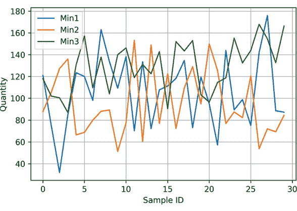

图9.5 独立成分分析的样本输入。30个沉积物样品中三种矿物的相对比例反映了沉积盆地流域内三种源岩贡献的时间变化。

```
ax[1].hist(x[:,1])
ax[2].hist(x[:,2])
plt.show()
```

然后我们将三十个样品中矿物的比例显示为时间序列：

```
plt.figure()
plt.plot(x)
plt.grid(True)
plt.legend(('Min1','Min2','Min3'))
plt.xlabel('Sample ID')
plt.ylabel('Quantity')
plt.show()
```

我们首先使用PCA对变量进行解混。我们使用以下代码计算主成分 `pcs`、混合矩阵 `a_pca` 和白化矩阵 `w_pca`。

```
pca = PCA(n_components=3)
pca.fit(x)

newx = pca.transform(x)
newx = newx/np.std(newx, 0, ddof=1)
```

```
pcs = pca.components_
variances = pca.explained_variance_

a_pca = np.dot(pcs, np.sqrt(np.diag(variances)))
w_pca = np.dot(np.linalg.inv(np.sqrt(np.diag(variances))), pcs)
```

预白化将解混为独立成分（$S$）的过程简化为寻找一个合适的旋转矩阵 $B$，该矩阵可以应用于变量 $X_{PC}$：

$$S = B^T X_{PC}$$

我们需要找到一个旋转矩阵 $B$，使得变量 $S$ 具有完全非高斯的分布。实现这种非高斯准则有几种可能性，例如最小化或最大化超额峰度

$$\gamma = E\left(x^4\right) - 3\left(E\left(x^2\right)\right)^2$$

因为对于正态分布的数据，这个超额峰度 $\gamma$ 为零。$E$ 代表 $x$ 的期望值（即平均值）。请注意，超额峰度与峰度不同：超额峰度是峰度减去三，因为高斯分布数据的峰度是三（第3.2节），但这种分布的超额峰度为零。为了找到确保最小或最大超额峰度的 $B$，可以使用一种学习算法来寻找学习规则的不动点：

$$E\left(x\left(B^T x\right)^3\right) - 3\|B\|^2 B + f\left(\|B\|^2\right) B = 0$$

Hyvärinen (1999) 的 FastICA 算法——基于不动点迭代方案——是解决此问题的有效算法。在此示例中，学习规则简化为以下形式

$$B(k) = E\left(x\left(B(k-1)^T x\right)^3\right) - 3B(k-1)$$

我们从一个仅由随机数组成的初始旋转矩阵 $B$ 开始：

```
B = scipy.linalg.orth(rng.uniform(-.5,.5,(3,3)))
BOld = np.zeros(np.shape(B))
```

迭代持续进行，直到达到发散准则 `div`。我们从该准则的值为零开始：

```
div = 0
```

*不动点迭代方案*包括两个步骤：对称正交化和应用学习规则。发散准则 `div` 在每次迭代步骤中更新，并进行检查，以便在达到发散准则时立即停止迭代过程。由于Python使用浮点数，`div` 实际上不会达到零，因此我们允许 `(1-div)` 低于浮点相对精度 `eps(1)`（或不带输入参数1的 `eps`，因为 `eps` 的默认输入是1），该值约为 2.2204e-16，因此接近于零（参见第2.5节）：

```
while (1-div) > np.spacing(1):
    B = np.dot(B,np.real(scipy.linalg.sqrtm(
        np.linalg.inv(np.dot(B.T, B)))))

    div = np.min(np.abs(np.diag(np.dot(B.T,BOld))))
    BOld = B

    B = np.dot(newx.T, np.dot(newx,B)**3)/len(newx)-3*B
    sica = np.dot(newx,B)
```

最后，我们将合成的源岩 s1、s2 和 s3 与解混后的变量 IC1、IC2 和 IC3 进行比较（图9.6）：

```
fig, ax = plt.subplots(3)
ax[0].plot(sica[:,0])
ax[0].set_title('IC1')
ax0 = ax[0].twinx()
ax0.plot(s3,'C1')
ax[1].plot(-sica[:,1])
ax[1].set_title('IC2')
ax1 = ax[1].twinx()
ax1.plot(-s1,'C1')
ax[2].plot(-sica[:,2])
ax[2].set_title('IC3')
ax2 = ax[2].twinx()
ax2.plot(-s2,'C1')
plt.show()
```

ICA 几乎完美地识别了源信号。我们还可以注意到，由于加法的交换律，IC的降序与s1、s2和s3的初始顺序不同。当然，在实际例子中，IC的顺序并不重要。此外，确切的符号和幅度与原始值不匹配，因此ICA只产生半定量结果，PCA也是如此。

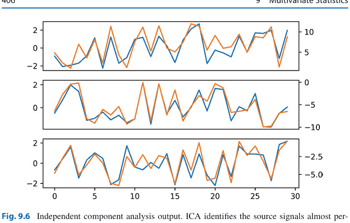

最后，我们实际上可以使用以下代码计算混合矩阵 `a_ica` 和分离矩阵 `w_ica`

```
a_ica = np.dot(a_pca,B)
w_ica = np.dot(B.T,w_pca)
```

混合矩阵 `a_ica` 可用于估计我们测量中分离变量的比例。混合矩阵 `a_ica` 的分量 $a_{ij}$ 对应于第9.2节中介绍的主成分载荷。

## 9.4 判别分析

*判别分析*有助于将对象分配到已建立的类别或组中。例子包括将化石标本分配到已建立的属或种，在矿物学（或化学）分析后识别岩石类型，以及使用卫星图像绘制植被类型图。判别分析不同于简单的分类，后者在分析之前不定义组或类别的数量。

岩石学中判别分析的经典例子是QAPF（或Streckeisen）图（Streckeisen 1974, 1976）。该图根据石英（Q）、碱性长石（包括钠长石）（A）、斜长石（P）和似长石（F）的百分比对火成岩（特别是深成岩）进行分类，所有这些都归一化为总计100%。QAPF图在双三元图中显示四种矿物的百分比，图形上半部分为QAP百分比，下半部分为FAP百分比。QAPF图通常被国际地质科学联合会（IUGS）用于分类深成岩。例如，含有50%石英、30%碱性长石、20%斜长石和0%似长石的深成岩被称为花岗岩。虽然Albert Streckeisen对深成岩的定义代表了世界不同地区既定用法之间的妥协（Streckeisen 1974, 1976），但判别分析仅基于分类对象的数学约束。此外，判别分析假设类内测量值服从正态分布，这对于Streckeisen分类可能不是一个有效的假设。由于正态性对方法的成功至关重要，用户必须小心确保满足此条件，特别是在分析成分（封闭）数据时（另见第9.5节）。

判别分析最初由Sir Ronald A. Fisher (1936) 引入，用于区分两个或多个开花植物种群。第一步涉及确定判别函数 $Y_i$，该函数最好地分离由正态分布变量 $X_i$ 描述的两组对象：

$$Y = a_0 + a_1X_1 + a_2X_2 + \dots + a_pX_p$$

参数 $a_i$ 的确定使得它们最大化各组多变量均值之间的距离。换句话说，我们确定 $a_i$ 使得组间均值距离与组内成员距离的比值较高。第二步，一旦从对象的训练集中确定了判别函数，就可以将新对象分配到一个组或另一个组。使用Streckeisen图，岩石样品根据Q、A、P和F的百分比被分配到已建立的岩石类型（例如花岗岩）。

例如，我们首先创建一个花岗岩岩石样品的合成数据集，该数据集可以用两个变量 $x_1$ 和 $x_2$ 来描述。这两个变量可以代表两种化学元素的百分比，以氧化物表示（重量百分比）。让我们假设从初步研究中我们知道这些岩石样品来自三种不同的花岗岩，它们是在三次独立的岩浆事件期间不同时间形成的。除了花岗岩侵入体内的自然不均匀性外，我们可以假设花岗岩样品的测量值服从正态分布。在此示例中，我们首先确定分离三组（或三种花岗岩类型）的判别函数。然后我们使用判别函数将岩石样品（在后续野外工作中收集）分配到三种花岗岩类型之一。

我们首先清除工作区

```
%reset -f

import numpy as np
import numpy.ma as ma
```

import matplotlib.pyplot as plt
from numpy.random import default_rng
from sklearn.discriminant_analysis import LinearDiscriminantAnalysis

然后重置随机数生成器：

```
rng = default_rng(100)
```

接下来，我们根据三种花岗岩的化学成分生成一个数据集。从每种岩石类型中采集了六十个花岗岩样本并进行了化学分析。两种化学元素 x1 和 x2 的百分比存储在三个变量 data1、data2 和 data3 中：

```
data1 = rng.standard_normal((60,2))
data1[:,0] = 8.5 + 1.8*data1[:,0]
data1[:,1] = 3.9 + 0.6*data1[:,1]

data2 = rng.standard_normal((60,2))
data2[:,0] = 6.4 + 1.2*data2[:,0]
data2[:,1] = 2.7 + 0.4*data2[:,1]

data3 = rng.standard_normal((60,2))
data3[:,0] = 5.5 + 1.8*data3[:,0]
data3[:,1] = 1.3 + 0.8*data3[:,1]
```

为了定义已建立的类别（或类），我们创建一个数组，为每对测量值包含标签 1、2 和 3，并将它们存储在 tar 中：

```
tar = np.ones(60)
tar = np.append(tar,2*np.ones(60))
tar = np.append(tar,3*np.ones(60))
```

然后我们将三个变量 data1、data2 和 data3 垂直连接成一个单一变量 data：

```
data = ma.concatenate([data1,data2,data3])
```

这样我们就从三组正态分布数据中生成了一个合成数据集。然后我们使用 LinearDiscriminantAnalysis() 创建一个线性判别分析分类器：

```
cls = LinearDiscriminantAnalysis()
cls.fit(data,tar)
```

该函数返回一个针对预测变量 data 和类别标签 tar 的判别分析模型。可以通过输入以下命令列出 cls 的层级：

```
coeffs = cls.coef_
means = cls.means_
interc = cls.intercept_
print(coeffs)
print(means)
print(interc)
```

输出结果为：

```
[[ 0.80294382  3.66238131]
 [-0.133724    0.22444128]
 [-0.66921982 -3.88682258]]

[[8.97020713 3.84392049]
 [6.61472503 2.66054978]
 [5.22893157 1.25608319]]

[-19.26126129  -0.78131967  10.44095035]
```

最后，我们使用以下代码在图形中显示结果：

```
plt.figure()
plt.plot(data[0:60,0],data[0:60,1],
         marker='o',
         color=(0.8,0.3,0.1),
         linestyle='none')
plt.plot(data[60:120,0],data[60:120,1],
         marker='o',
         color=(0.3,0.8,0.1),
         linestyle='none')
plt.plot(data[120:180,0],data[120:180,1],
         marker='o',
         color=(0.1,0.3,0.8),
         linestyle='none')
plt.plot(means[:,0],means[:,1],
         marker='o',
         color='k',
         linestyle='none')
x = np.linspace(0,12,10)
y = -(interc[0] + coeffs[0,0]*x)/coeffs[0,1]
plt.plot(x,y,'k:')
y = -(interc[2] + coeffs[2,0]*x)/coeffs[2,1]
plt.plot(x,y,'k:')
plt.title('Discriminant Analysis')
plt.legend(('Granite 1','Granite 2','Granite 3'),
    loc='upper left')
plt.show()
```

该图以三种不同的颜色显示了三个类别（或花岗岩类型）的成员，分隔这三个类别的两条直线，以及类别的双变量均值（标记为黑色实心圆）（图 9.7）。一个成分为 x1=5.2 和 x2=2.9 的新样本可以很容易地被分配到 Granite 2 类别：

```
print(cls.predict([[5.2,3.5]]))

plt.figure()
plt.plot(5.2,3.5,
    marker='o',
    color='k',
    linestyle='none')
x = np.linspace(0,12,10)
y = -(interc[0] + coeffs[0,0]*x)/coeffs[0,1]
plt.plot(x,y,'k:')
y = -(interc[2] + coeffs[2,0]*x)/coeffs[2,1]
plt.plot(x,y,'k:')
plt.text(6.0,4.5,'Granite 1',color=(0.8,0.3,0.1))
plt.text(4.0,3,'Granite 2',color=(0.3,0.8,0.1))
plt.text(2.5,1.2,'Granite 3',color=(0.1,0.3,0.8))
plt.title('Discriminant Analysis')
plt.show()
```

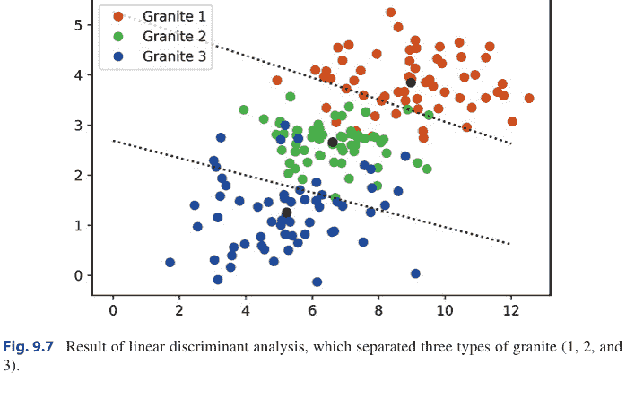

图 9.7 线性判别分析的结果，它将三种花岗岩（1、2 和 3）分离开来。

输出结果为

[2.]

这表明新样本是第二种花岗岩的成员。

## 9.5 聚类分析

聚类分析创建对象组，这些组内的对象彼此之间非常相似，而与其他单个对象或对象组相比则差异较大。该方法首先计算所有对象对之间的相似性或（另一种选择）不相似性（或距离）。然后根据它们的相似性（或彼此之间的距离）对组进行排序，最后创建一个层次树，该树以树状图的形式可视化。对象的分组在地球科学中很有用，例如，在火山灰层内进行相关性分析（Hermanns 等人，2000 年）或比较不同的微化石组合（Birks 和 Gordon，1985 年）。

存在多种计算两个数据向量之间相似性或（另一种选择）不相似性（或距离）的方法。让我们定义两个数据集，它们由来自同一对象的多次测量组成。这些数据可以用向量描述：

$X_1 = (x_{11}, x_{12}, \dots, x_{1p})$

$X_2 = (x_{21}, x_{22}, \dots, x_{2p})$

任何两个样本向量之间最常用的不相似性（或距离）度量是

- 欧几里得距离——这仅仅是描述多变量空间中两个测量值的两个点之间的最短距离：

$$\Delta_{12} = \sqrt{(x_{11} - x_{21})^2 + (x_{12} - x_{22})^2 + \dots + (x_{1p} - x_{2p})^2}$$

欧几里得距离无疑是最直观的相似性度量。然而，在由多种不同类型变量组成的异构数据集中，一个更好的替代方案是

- 曼哈顿（或城市街区）距离——在曼哈顿市，必须沿着垂直的街道行走，而不是斜穿街区。因此，曼哈顿距离是所有差值的总和：

$$\Delta_{12} = |x_{11} - x_{21}| + |x_{12} - x_{22}| + \dots + |x_{1p} - x_{2p}|$$

相似性度量包括

- *相关相似性系数*——该度量使用皮尔逊线性积矩相关系数来计算两个对象之间的相似性：

$$r_{X_1X_2} = \frac{\sum_{i=1}^{n} (x_{1i} - \bar{x}_1)(x_{2i} - \bar{x}_2)}{(n - 1)s_{X_1}s_{X_2}}$$

如果研究者对测量对象的变量之间的比率感兴趣，则使用该度量。然而，皮尔逊相关系数对异常值高度敏感，应谨慎使用（另见第 4.2 节）。

- *内积相似性指数*——将数据向量的长度归一化为 1 并计算它们的*内积*，可以得到另一个重要的相似性指数，该指数在转换函数应用中经常使用。在此示例中，将一组具有已知环境偏好的现代植物群或动物群组合与化石样本进行比较，以重建过去的环境条件：

$$s_{12} = \frac{1}{|X_1|} \frac{1}{|X_2|} (x_{11}x_{12} \dots x_{1p}) \begin{pmatrix} x_{21} \\ x_{22} \\ \vdots \\ x_{2p} \end{pmatrix}$$

内积相似性在 0 到 1 之间变化。零值表示没有相似性，值为 1 表示最大相似性。

执行聚类分析的第二步是根据相似性对组进行排序，并构建一个层次树，该树以树状图的形式可视化。大多数聚类算法只是将具有最高相似性或不相似性（或距离）的两个对象链接起来。在后续步骤中，迭代地链接最相似的对象对或簇。簇（每个簇由对象组组成）之间的差异根据数据类型和应用以不同的方式描述：

- *K-均值聚类*使用多个 *K* 簇的多变量均值之间的欧几里得距离作为对象组之间差异的度量。如果数据表明存在一个被随机噪声包围的真实均值，则使用此距离。或者，

- *K-近邻聚类*使用最近邻的欧几里得距离作为此差异的度量。如果数据集中存在无法归因于随机噪声的自然异质性，则使用此度量。

在应用聚类算法之前，评估数据属性非常重要。首先应考虑变量的绝对值。例如，来自火山灰的地球化学样本可能显示 SiO₂ 含量为大约77%且Na₂O含量仅为3.5%，但Na₂O含量可能被认为更为重要。在这种情况下，需要对数据进行转换，使其均值等于零（*均值中心化*）。方差和均值的差异通过*标准化*（即数据被标准化为均值等于零、方差等于一）来校正。使用*Aitchison对数比变换*（Aitchison 1984, 1986）（见第9.7节）可以避免由封闭数据产生的伪影（例如，虚假的负相关）。这种变换确保了数据独立性，并避免了总和恒定的归一化约束。对数比变换为

$$x_{tr} = \log(x_i/x_d)$$

其中$x_{tr}$表示某个原始数据$x_i$的变换得分（$i = 1, 2, 3, ..., d-1$）。该过程在变量的置换群下是不变的，并且任何变量都可以用作除数$x_d$。

作为执行聚类分析的练习，加载存储在*sediment_3.txt*中的沉积物数据。该数据集包含沉积物样品中各种矿物的百分比。沉积物来源于三种岩石类型：1）一种含有角闪石、辉石和斜长石的岩浆岩；2）一种以萤石、闪锌矿和方铅矿为特征的热液脉，以及一些长石（斜长石和钾长石）和石英；3）一种含有长石、石英和粘土矿物的砂岩单元。从该沉积序列的不同层位采集了十个样品，每个样品包含这些矿物的不同比例。首先，可以计算样品对之间的距离。函数pdist()提供了许多不同的距离度量，例如欧几里得距离或曼哈顿（或城市街区）距离。我们使用默认设置，即欧几里得距离：

```
%reset -f

import numpy as np
from matplotlib import cm
import matplotlib.pyplot as plt
import scipy.spatial.distance as distance
from scipy.cluster.hierarchy import dendrogram, linkage
from scipy.cluster.hierarchy import single, cophenet

data = np.loadtxt('sediments_3.txt')

Y = distance.pdist(data, 'euclidean')
```

函数pdist()返回一个向量Y，其中包含原始数据矩阵中每对观测值之间的距离。我们可以在热图中可视化这些距离：

```
S = distance.squareform(Y)

labels = []
for i in range(1,11):
    labels.append(str(i))

fig, ax = plt.subplots()
c = ax.imshow(S,cmap=cm.Blues)
ax.set_xticks(np.linspace(0,9,10))
ax.set_yticks(np.linspace(0,9,10))
ax.set_xticklabels(labels,
    fontsize=8)
ax.set_yticklabels(labels,
    fontsize=8)
plt.title('Euclidean distance between pairs of samples',
    fontsize=8)
plt.xlabel('First Sample No.',
    fontsize=8)
plt.ylabel('Second Sample No.',
    fontsize=8)
cbar = plt.colorbar(c)
for cax in cbar.ax.get_yticklabels():
    cax.set_fontsize(8)
plt.show()
```

函数squareform()将Y转换为对称的方阵格式，使得矩阵的元素(i,j)表示原始数据中第i个和第j个对象之间的距离。接下来，我们使用linkage()根据分离距离的倒数对样品进行排序和链接。

```
Z = linkage(Y,'single')
print(Z)
```

输出结果为

```
[[ 1.          8.          0.05639246  2.        ]
 [ 7.          9.          0.07304444  2.        ]
 [ 0.         11.          0.09233992  3.        ]
 [ 5.          6.          0.10218992  2.        ]
 [10.         12.          0.11291417  5.        ]
 [ 2.          3.          0.16042391  2.        ]
 [14.         15.          0.17373155  7.        ]
 [ 4.         16.          0.17635918  8.        ]
 [13.         17.          0.21460694 10.        ]]
```

在这个三列数组Z中，每一行标识一个链接。前两列标识已链接的对象（或样品），而第三列包含这两个对象之间的分离距离。对象（或样品）1和2之间的第一行（链接）具有最小的距离，这对应于最大的相似性。在我们的例子中，样品2和9具有最小的分离距离（即0.0564），因此它们被分组在一起并被赋予标签11（即高于最高样品索引10的下一个可用索引）。接下来，样品8和10被分组到12中，因为它们具有第二小的分离距离（即0.0730）。下一行显示新组12随后与样品1分组（这两个项目的分离距离为0.0923），依此类推。最后，我们将层次聚类可视化为树状图（如图9.8所示）：

```
plt.figure()
dendrogram(Z)
plt.xlabel('Sample ID - 1')
plt.ylabel('Distance')
plt.show()
```

聚类分析找到了与主成分分析相同的分组。请注意，由于Python索引从零开始，样品编号减少了1，因此从零开始（即样品1表示为样品0）。我们观察到明显的分组，包括（a）样品1、2、8、9和10（岩浆源岩）；（b）样品3、4和5（热液脉）；以及（c）样品6和7（砂岩）。检验聚类结果有效性的一种方法是使用*共表征相关系数*，

```
cophenet(Z,Y)
```

输出结果为

```
0.7579381416951301
```

该结果令人信服，因为该系数越接近1，聚类解决方案越好。

## 9.6 多元线性回归

在第4章中，线性回归模型被引入作为描述因变量*y*和自变量*x*之间关系的一种方式。因变量也称为*响应变量*，自变量也称为*预测变量*。多元线性回归模型描述了因变量（或响应变量）*y*与*n*个自变量（或预测变量）*x<sub>i</sub>*之间的关系，

$$y = b_0 + b_1x_1 + b_2x_2 + \dots + b_px_p$$

其中*b<sub>i</sub>*是线性模型的*n*+1个回归系数。多元线性回归中的线性指的是响应变量是预测变量的线性函数。回归系数通过最小化响应变量*y*的预测值与真实值之间的均方差来估计。地球科学中常用的一个例子是原油质量，它被假定与沉积物的年龄、埋深和温度呈线性关系。在实践中，必须首先检验线性假设的合理性。如果该假设可能成立，则可以使用几种多元线性回归方法。

作为第一个例子，我们创建一个包含三个变量Var1、Var2和Var3的无噪声合成数据集。我们希望揭示变量Var1和Var2对变量Var3的影响。因此，变量Var1和Var2是预测变量，变量Var3是响应变量。响应变量与预测变量之间的线性关系为Var3 = 0.2 - 52.0 * Var1 + 276.0 * Var2。三个变量Var1、Var2和Var3分别存储在单个数组data的第1、2和3列中：

```
%reset -f

import numpy as np
from numpy.random import default_rng
import matplotlib.pyplot as plt
from sklearn import linear_model
from sklearn.metrics import mean_squared_error, r2_score

rng = default_rng(0)
data = np.zeros((50,3))
data[:,0] = 0.3 + 0.03*rng.standard_normal(50)
data[:,1] = 0.2 + 0.01*rng.standard_normal(50)
data[:,2] = 0.2 - 52.0*data[:,0] + 276.0*data[:,1]
```

我们为样品名称和变量名称创建标签（如第9.2节所示）：

```
labels = []
for i in range(1,len(data)+1):
    labels.append(str(i))

variables = (['Var1','Var2','Var3'])
```

然后，我们使用LinearRegression.fit()计算多元线性回归模型的系数beta。输入

```
beta = linear_model.LinearRegression().fit(data[:,0:2],data[:,2])
beta.score(data[:,0:2],data[:,2])
coeffs = beta.coef_
interc = beta.intercept_
```

输出结果为

```
[-52. 276.]
0.20000000000001705
```

函数LinearRegression.fit()使用最小均方误差准则计算beta，其中包含系数coeffs=coef_和interc=intercept_。由于我们没有噪声，这两个系数当然与合成数据的原始系数（几乎）完全匹配。因为我们只有三个变量，所以可以在三维图中显示结果。我们首先使用meshgrid()为前两个变量var1和var2创建一个矩形网格，然后计算第二个变量var3的预测值。使用系数和截距。然后我们使用 `plot_surface()` 来显示模型的线性回归平面，并使用 `plot()` 将测量值绘制为红色点，标记大小为30点：

```python
var1 = np.linspace(0.20, 0.45, 26)
var2 = np.linspace(0.17, 0.23, 7)
Var1, Var2 = np.meshgrid(var1, var2)
Var3 = interc + coeffs[0] * Var1 + coeffs[1] * Var2

fig, ax = plt.subplots(subplot_kw={"projection": "3d"})
ax.plot_surface(Var1, Var2, Var3,
    rstride=1, cstride=1,
    linewidth=0,
    alpha=0.3,
    antialiased=True,
    shade=True)
for i in range(0, len(data)):
    plt.plot(data[i, 0], data[i, 1], data[i, 2],
        marker='o',
        color=(0.1, 0.3, 0.8))
ax.view_init(30, 70 - 90)
plt.show()
```

由于数据集是无噪声的，所有数据点都位于线性回归平面上。如果我们引入标准差为第2.4节所述的正态分布噪声，情况就会改变：

```python
rng = default_rng(0)
data = np.zeros((50, 3))
data[:, 0] = 0.3 + 0.03 * rng.standard_normal(50)
data[:, 1] = 0.2 + 0.01 * rng.standard_normal(50)
data[:, 2] = 0.2 \
            - 52.0 * data[:, 0] \
            + 276.0 * data[:, 1] \
            + 2.2 * rng.standard_normal(50)

labels = []
for i in range(1, len(data) + 1):
    labels.append(str(i))

variables = (['Var1', 'Var2', 'Var3'])
```

输入

```python
beta = linear_model.LinearRegression(). \
    fit(data[:, 0:2], data[:, 2])
```

```python
beta.score(data[:, 0:2], data[:, 2])
coeffs = beta.coef_
interc = beta.intercept_
print(coeffs)
print(interc)
```

得到

```
[-50.21197011 303.02828779]
-5.6988484229812
```

这表明回归系数的估计值（-5.69888, -50.2120 和 303.0283）与用于创建合成数据的值（0.2, -52.0 和 276.0）并不完全匹配。我们可以在三维图中再次显示结果（图9.9）。

```python
var1 = np.linspace(0.20, 0.45, 26)
var2 = np.linspace(0.17, 0.23, 7)
Var1, Var2 = np.meshgrid(var1, var2)
Var3 = interc + coeffs[0] * Var1 + coeffs[1] * Var2

fig, ax = plt.subplots(subplot_kw={"projection": "3d"})
ax.plot_surface(Var1, Var2, Var3,
    rstride=1, cstride=1,
    linewidth=0,
    alpha=0.3,
    antialiased=True,
    shade=True)
```

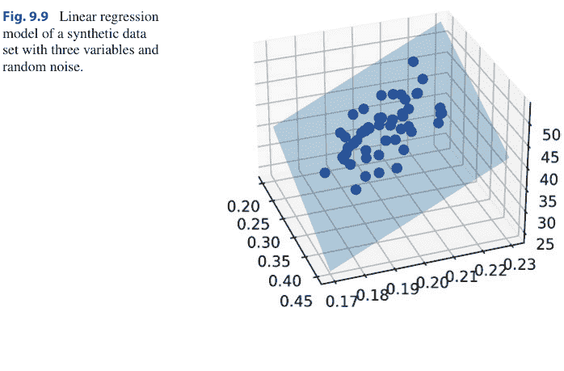

```python
for i in range(0, len(data)):
    plt.plot(data[i, 0], data[i, 1], data[i, 2],
             marker='o',
             color=(0.1, 0.3, 0.8))
ax.view_init(30, 70 - 90)
plt.show()
```

如果使用图形窗口工具栏上的 *Rotate 3D* 工具在三维空间中旋转图形，我们可以观察到数据与回归平面之间的一些差异。

作为第二个例子，我们使用来自英格兰Sherwood砂岩组的实验室数据，这些数据表明粒间渗透率（作为响应变量）主要受孔隙度和基质电导率（作为预测变量）的影响，而其他变量的影响较小。这个例子在Olorunfemi（1985）的一篇文章中进行了详细讨论，并被用作Swan和Sandilands（1995）教科书中的一个例子。来自Sherwood砂岩组的40个岩石样本的数据取自M.O. Olorunfemi的出版物，并存储在文件 *sherwoodsandstone.txt* 中。我们通过输入以下命令从文件加载数据：

```python
data = np.loadtxt('sherwoodsandstone.txt')
```

数组 `data` 的五列包含渗透率（单位：m/s）、孔隙度（无物理单位）、基质电导率（单位：S/m）、真实地层因子（无物理单位）和激发极化（单位：%）的岩石物理测量值。我们还使用 `readlines()` 从文件 *sherwoodsandstone_samples.txt* 加载样本ID（来自Olorunfemi 1985），并将它们保存在列表 `samples` 中：

```python
with open('sherwoodsandstone_samples.txt') as f:
    samples = f.readlines()[8:]
```

接下来，我们创建另一个包含变量名的列表：Perm代表渗透率，Poro代表孔隙度，MaCo代表基质电导率，TrFF代表真实地层因子，InPo代表激发极化：

```python
variables = (['Perm',
             'Poro',
             'MaCo',
             'TrFF',
             'InPo'])
```

然后，我们在一个包含图例的图中显示这些变量。由于变量的值非常小，我们绘制的是值的对数而不是真实值：

```python
depth = np.linspace(1, 40, 40)
plt.figure()
for i in range(5):
    plt.plot(np.log(data[:, i]), depth,
             linestyle='none',
             marker='s')
plt.legend(variables)
plt.show()
```

然后，我们使用 `LinearRegression().fit()` 计算多元线性回归模型的系数 `beta`，

```python
beta = linear_model.LinearRegression(). \
    fit(data[:, 1:6], data[:, 0])
beta.score(data[:, 1:6], data[:, 0])
coeffs = beta.coef_
interc = beta.intercept_
print(coeffs)
print(interc)
```

得到

```
[ 5.06357746e+01 -3.30900095e+02
 -1.78566908e-01 -4.52634500e-01]
0.1586815190858486
```

这表明只有孔隙度和基质电导率影响Sherwood砂岩组的渗透率，因为两个较大的系数（50.6358 和 −330.9000）表明了这一点。

有多种方法可以检查结果的质量。例如，我们可以使用以下代码检查模型的残差：

```python
res = data[:, 0] - beta.predict(data[:, 1:6])
```

```python
plt.figure()
plt.plot(res, depth,
         linestyle='none',
         marker='s')
plt.show()
```

这表明9以上的测量值是异常值，残差直方图也显示了这一点：

```python
e = np.linspace(-6, 12, 7)

fig, ax = plt.subplots()
plt.hist(res, bins=e)
plt.axis(np.array([-6, 12, 0, 25]))
ax.set_xticks(np.linspace(-6, 12, 7))
plt.show()
```

现在，线性回归模型可用于根据其他岩石物理变量的值预测新样本的渗透率。每个预测变量对模型的影响可以通过多种不同的方式进行检查。例如，让我们仅使用前34个值计算线性回归模型：

```python
beta = linear_model.LinearRegression(). \
    fit(data[0:35, 1:6], data[0:35, 0])
beta.score(data[:, 1:6], data[:, 0])
coeffs = beta.coef_
interc = beta.intercept_
print(coeffs)
print(interc)
```

并记住半开区间 [0, 35)（或 [0:35]）。然后我们可以使用以下代码预测剩余的五个值：

```python
data_pred = beta.predict(data[35:, 1:6])
print(data_pred)
```

得到

```
[5.27453296 4.88171822 2.33299313 4.88200648 5.79731973]
```

现在，该模型使我们能够使用以下代码计算均方误差和决定系数：

```python
print("Mean squared error: %.2f" \
    % mean_squared_error(data[35:, 0], data_pred))

print("Coefficient of determination: %.2f" \
    % r2_score(data[35:, 0], data_pred))
```

得到

```
Mean squared error: 4.92
Coefficient of determination: 0.18
```

最后，我们可以使用以下代码绘制所有数据点的预测值与真实值：

```python
plt.figure()
for i in range(5):
    plt.plot(data[35:, 0], data_pred,
             linestyle='none',
             marker='s',
             color=(0.8, 0.3, 0.1))
plt.plot([0, 7], [0, 7],
         linestyle=':',
         color='k')
plt.axis(np.array([0, 7, 0, 7]))
plt.xlabel('Real Value')
plt.ylabel('Predicted Value')
plt.axis('square')
plt.show()
```

## 9.7 艾奇逊对数比变换

任何处理过成分数据统计分析的人，都一定遇到过约翰·艾奇逊（John Aitchison，1926–2016）的对数比变换。这位苏格兰统计学家将他职业生涯的大部分时间都用于处理此类数据的统计问题。事实上，他撰写了著名的著作《成分数据分析》（*The Statistical Analysis of Compositional Data*）（Aitchison 1984, 1986, 1999, 2003），并发表了多篇关于该主题的论文。艾奇逊的对数比变换克服了封闭数据（即表示为比例并加到固定总数（如100%）的数据）的封闭和问题。封闭和问题导致多元数据集中变量对之间出现虚假的负相关，而通过对这些变量的比值取对数可以避免这种问题。例如，古气候研究中的多指标数据通常是封闭数据（即它们受稀释效应的影响很大）。在最简单的例子中，这可能是三种成分的混合物，它们共同构成了沉积物的100%。想象一下，其中一种成分现在是恒定的（即单位时间内输送的该成分量总是相同的）。由于三种成分的总和始终是100%，因此另外两种成分必然是负相关的：如果一个增加，另外两个必须减少相同的总量。

使用比值有助于克服成分数据的大小实际上是比值的问题，其分母是所有成分浓度的总和（关于艾奇逊对数比变换的简要总结，请参见Davis 2003）。然而，比值的乘积矩协方差难以处理，并导致复杂的乘积和商。因此，约翰·艾奇逊建议对这些比值取对数，从而同样，利用对数函数的简单性质，例如，log(x/y)=log(x)–log(y)，因此也有log(x/y)=–log(y/x)。这一过程允许减少描述数据集所需的协方差数量（Aitchison 2003，第65至66页）。

下面是一个简单的例子，它说明了一个具有三个变量的系统的闭和问题，以及如何使用比率和对数比率来克服变量对之间虚假相关的问题。首先，我们清除工作区并为绘图选择颜色：

```
%reset -f

import numpy as np
import matplotlib.pyplot as plt

colors = np.array([
    [0,114,189],
    [217,83,25],
    [237,177,32],
    [126,47,142],
    ])/255
```

我们关注的是element1a和element1b，它们对沉积物有贡献，并被element1c稀释。我们简单地创建三个变量，其大小以毫克为单位测量，并在200个样本的岩芯深度上呈现正弦变化，同时确保所有绝对值都>0：

```
t = np.linspace(0.1,20,200)
t = np.transpose(t)

element1a = np.sin(2*np.pi*t/2) + 5
element1b = np.sin(2*np.pi*t/5) + 5
element1c = 2*np.sin(2*np.pi*t/20) + 5

plt.figure()
plt.plot(t,element1a,
    color=colors[0,:])
plt.plot(t,element1b,
    color=colors[1,:])
plt.plot(t,element1c,
    color=colors[3,:])
plt.legend(['1a','1b','1c'])
plt.title('Absolute amount of 1a-c (mg)')
plt.show()
```

我们计算element1a、element1b和element1c的百分比（即，我们创建单个元素浓度与所有元素浓度总和的比率）。这个过程创建了闭合数据（即，数据现在表示为比例，并加到固定的100%总量）：element1a+element1b+element1c=100%。element1a和element1b现在都受到element1c稀释的影响。这些元素显示出一个主要的正弦长期趋势，但这并非真实情况（如第一幅图所示）：

```
element1a_perc = element1a/(element1a+element1b+element1c)
element1b_perc = element1b/(element1a+element1b+element1c)
element1c_perc = element1c/(element1a+element1b+element1c)

plt.figure()
plt.plot(t,element1a_perc,
    color=colors[0,:])
plt.plot(t,element1b_perc,
    color=colors[1,:])
plt.plot(t,element1c_perc,
    color=colors[3,:])
plt.legend(['1a','1b','1c'])
plt.title('Relative concentration 1a-c (%)')
plt.show()
```

我们现在建立了element1a/element1b和element1b/element1a的比率，两者都独立于element1c。注意符号的变化和振幅的差异。element1a/element1b和element1b/element1a的比率没有显示出任何由element1c稀释效应引起的趋势证据。然而，这两条曲线并不相同（即，element1a/element1b和element1b/element1a不对称）（见Weltje and Tjallingii 2008，第426页）：

```
ratio12 = element1a_perc/element1b_perc
ratio21 = element1b_perc/element1a_perc

plt.figure()
ax1 = plt.subplot()
ax2 = ax1.twinx()
line1, = ax1.plot(t,ratio12,
    color=colors[0,:],
    label='1a/1b')
line2, = ax2.plot(t,ratio21,
    color=colors[1,:],
    label='1b/1a')
ax2.invert_yaxis()
plt.legend(handles=[line1,line2])
plt.title('Ratios elements 1a/1b and 1b/1a')
plt.show()
```

我们现在根据Aitchison (1986, 2003)显示对数比率。对数比率log(element1a/element1b)和log(element1b/element1a)除了符号外是相同的。因此，例如，在对数据进行进一步统计分析时，使用log(element1a/element1b)还是log(element1b/element1a)没有区别：

```
ratio12log = np.log10(ratio12)
ratio21log = np.log10(ratio21)

plt.figure()
ax1 = plt.subplot()
ax2 = ax1.twinx()
line1, = ax1.plot(t,ratio12log,
    color=colors[0,:],
    label='log(1a/1b)')
line2, = ax2.plot(t,ratio21log,
    color=colors[1,:],
    linestyle='--',
    label='log(1b/1a)')
ax2.invert_yaxis()
plt.legend(handles=[line1,line2])
plt.title('Log-ratio elements log(1a/1b) and log(1b/1a)')
plt.show()
```

在所有分析闭合数据的多元统计方法中（例如，第9.2至9.6节），都必须使用Aitchison的对数比率变换（图9.10）。

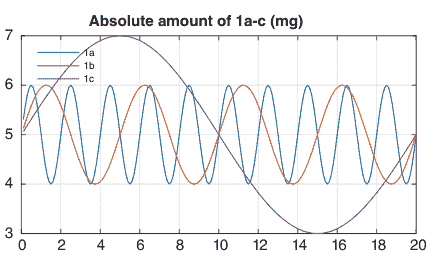

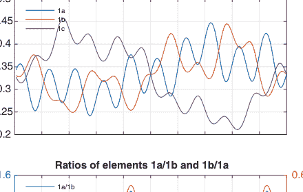

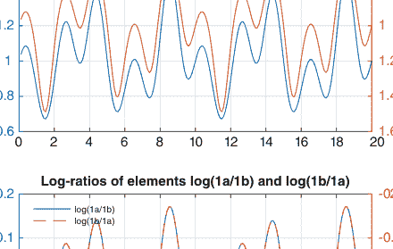

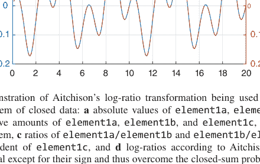

**图 9.10** 演示了Aitchison的对数比率变换如何用于克服闭合数据的闭和问题：**a** element1a、element1b和element1c的绝对值，**b** element1a、element1b和element1c的相对量，显示了闭和问题，**c** element1a/element1b和element1b/element1a的比率，两者都独立于element1c，以及**d** 根据Aitchison (1986, 2003)的对数比率，除了符号外相同，从而克服了闭和问题。

## 推荐阅读

- Aitchison J (1984) 地球化学组成的统计分析。Math Geol 16(6):531–564
- Aitchison J (1986 reprinted 2003) 成分数据的统计分析。The Blackburn Press, Caldwell
- Aitchison J (1999) 成分数据分析中的对数比率与自然定律。Math Geol 31(5):563–580
- Birks HJB, Gordon AD (1985) 第四纪花粉分析中的数值方法。Academic Press, London
- Brown CE (1998) 地球水文学及相关科学中的应用多元统计。Springer, Berlin Heidelberg New York
- Davis JC (2002) 地质学中的统计与数据分析，第3版。John Wiley & Sons, New York
- Fisher RA (1936) 分类学问题中多重测量的使用。Ann Eugen 7:179–188
- Härdle WK, Simar L (2012) 应用多元统计分析。Springer, Berlin Heidelberg New York
- Hermanns R, Trauth MH, McWilliams M, Strecker M (2000) 阿根廷西北部大型滑坡时间分布的火山灰年代学约束。J Geol 108:35–52
- Hotelling H (1931) 具有主成分的统计变量复合体分析。J Educ Psychol 24(6):417–441
- Hyvärinen A (1999) 独立成分分析的快速且稳健的定点算法。IEEE Trans Neural Networks 10(3):626–634
- Olorunfemi MO (1985) 英格兰Sherwood砂岩一些地层参数的统计关系。Math Geol 17:845–852
- Pawlowsky-Glahn V (2004) 成分数据的地统计分析——数学地质研究。Oxford University Press, Oxford
- Pearson K (1901) 关于空间点系的最佳拟合线和平面。Philosophical Magazine and Journal of Science 6(2):559–572
- Reyment RA, Savazzi E (1999) 地质学中多元统计分析的各个方面。Elsevier Science, Amsterdam
- Streckeisen A (1974) 深成岩的分类与命名。Geologische Rundschau 63:773–786
- Streckeisen A (1976) 为每种深成岩赋予其恰当的名称。Earth Sci Rev 12:1–33
- Swan ARH, Sandilands M (1995) 地质数据分析导论。Blackwell Sciences, Oxford
- Trauth MH, Bookhagen B, Mueller A, Strecker MR (2003) 阿根廷西北部圣玛丽亚盆地过去40,000年的侵蚀与气候变化。J Sediment Res 73(1):82–90
- Weltje GJ, Tjallingii R (2008) XRF岩芯扫描仪用于沉积岩芯定量地球化学测井的校准：理论与应用。Earth Planet Sci Lett 274:423–438
- Westgate JA, Shane PAR, Pearce NJG, Perkins WT, Korisettar R, Chesner CA, Williams MAJ, Acharyya SK (1998) 印度半岛所有Toba火山灰层位均属于75,000年前的喷发。Quatern Res 50:107–112
- Zadeh L (1965) 模糊集。information. Control 8:338–353

# 10 方向数据

### 10.1 引言

分析*圆形和球形数据*的方法在地球科学中被广泛使用。例如，构造地质学家测量和分析断层面上条纹擦痕的方位。圆形统计在古地磁应用中也很常见。微观结构研究包括分析薄片中的颗粒形状和石英*c*轴方位，古环境学家则根据细长化石壳的排列重建古水流方向（图10.1）。地球科学中有两种类型的方向数据：狭义的方向数据和定向数据。方向数据（例如，由槽模记录的河流古水流方向，或由冰川擦痕指示的冰川流动方向）具有真实的极性，而定向数据描述的是没有方向感的轴向数据和线（例如，节理的方位）。

关于方向数据的统计分析，有许多有用的出版物可供参考，例如Fisher (1993)和Mardia and Jupp (1999)的著作，以及Swan and Sandilands (1995)、Davis (2002)和Borradaile (2003)著作中关于该主题的章节。此外，Middleton (2000)著作中的一章、Jones (2006a, b)的两篇期刊文章以及Marques de Sá (2007)著作中的第10章讨论了使用Python进行方向数据的统计分析。Python并非分析方向数据的首选，因为它不提供相关函数，例如可用于计算*冯·米塞斯分布*概率密度函数或运行雷利检验以确定平均方向显著性的算法。地球科学家

**补充信息** 在线版本包含补充材料，可访问 https://doi.org/10.1007/978-3-031-07719-7_10。

© 作者，根据Springer Nature Switzerland AG 2022的独家许可
M. H. Trauth, *Python Recipes for Earth Sciences*, Springer Textbooks in Earth Sciences, Geography and Environment, https://doi.org/10.1007/978-3-031-07719-7_10

## 10.1 方向数据简介


**图 10.1** 来自瑞典厄兰岛比谢尔克罗克附近海王星海角露头的*直角石*化石。*直角石*是一种生活在约4.5亿年前奥陶纪的、具有直壳的头足类动物。这种细长、不对称的物体倾向于将自身定向在流体动力学最稳定的位置，因此可以指示古水流方向。对海王星海角头足类动物定向的统计分析揭示了一个显著的向南古水流方向，这与古地理重建结果一致。

因此，人们开发了许多独立的程序来分析此类数据，包括由康奈尔大学结构地质学教授、荣休教授理查德·W·阿尔门丁格开发的优秀的桌面和智能手机软件（Allmendinger et al. 2017; Allmendinger 2019）：

```
http://www.geo.cornell.edu/geology/faculty/RWA/programs.html
```

以下关于方向数据分析的教程独立于这些工具。它提供了用于显示方向数据、计算冯·米塞斯分布以及运行简单统计检验的简单Python代码。第10.2节介绍了作为显示方向数据最广泛使用方法的玫瑰图。随后，第10.3节和第10.4节与第3章（关于单变量统计）的概念类似，涵盖了使用经验分布和理论分布来描述方向数据。然后，第10.5节至第10.7节描述了方向数据的三个最重要的检验：即圆形数据的随机性检验、平均方向的显著性检验以及两组圆形数据之间的差异检验。最后，第10.8节和第10.9节描述了球面数据的图形表示和统计分析。对于方向数据分析，我们使用*NumPy* (https://numpy.org)、*Matplotlib* (https://matplotlib.org)和*SciPy*包 (https://scipy.org)，它们包含了所有必要的例程。

## 10.2 圆形数据的图形表示

显示方向数据的经典方式是玫瑰图，它是角度测量的直方图。与条形直方图（其中条形的高度与频率成正比）不同，玫瑰图由圆的扇形组成，其中每个扇形的半径与频率成正比。我们使用合成数据来说明用于显示方向数据的两种类型的玫瑰图。我们首先从文件`directional_1.txt`加载一组方向数据：

```
%reset -f

import numpy as np
import matplotlib.pyplot as plt

data_degrees_1 = np.loadtxt('directional_1.txt')
```

该数据集包含两百个角度测量值（以度为单位，简称°）。在绘制数据之前，我们需要将所有测量值转换为弧度。然后，我们使用`histogram()`对数据进行分箱，并在玫瑰图中显示计数。这是通过首先在`subplot()`中选择极坐标投影，然后在极坐标系中绘制条形图来实现的：

```
data_radians_1 = np.pi*data_degrees_1/180

e = np.linspace(0,2*np.pi,13)
v = np.linspace(2*np.pi/24,2*np.pi-2*np.pi/24,12)
n,e = np.histogram(data_radians_1,bins=e)

plt.figure()
ax = plt.subplot(projection='polar')
ax.bar(v,n,width=2*np.pi/12)
ax.set_xticks(e[0:12])
plt.show()
```

这个玫瑰图按逆时针方向计数，零度位于坐标图的x轴上。在地球科学中，角度按顺时针方向增加，0°表示正北，90°表示正东，依此类推。我们使用`set_theta_offset(np.pi/2)`将玫瑰图旋转90°（或π/2），并使用`set_theta_direction(-1)`反转玫瑰图的方向。我们还使用`set_xticks()`选择类边界值`e`（即0°、30°、60°、...）处的刻度（图10.2）：

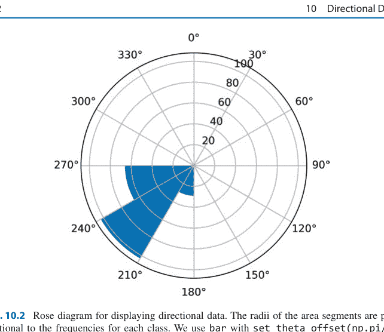

图 10.2 用于显示方向数据的玫瑰图。区域扇形的半径与每个类别的频率成正比。我们使用`bar`配合`set_theta_offset(np.pi/2)`和`set_theta_direction(-1)`，使得0°指向正北，90°指向正东，即角度按顺时针方向增加。

```
plt.figure()
ax = plt.subplot(projection='polar')
ax.bar(v,n,width=2*np.pi/12)
ax.set_xticks(e[0:12])
ax.set_theta_offset(np.pi/2)
ax.set_theta_direction(-1)
plt.show()
```

弧形区域的面积随着频率的平方增加而增加，因此频率是其他方向两倍的方向看起来会比其他方向突出四倍。作为一种改进，玫瑰图因此按类别频率的平方根进行缩放（图10.3）：

```
plt.figure()
ax = plt.subplot(projection='polar')
ax.bar(v,np.sqrt(n),width=2*np.pi/12)
ax.set_xticks(e[0:12])
ax.set_theta_offset(np.pi/2)
ax.set_theta_direction(-1)
plt.show()
```

此图满足地球科学中的所有惯例。

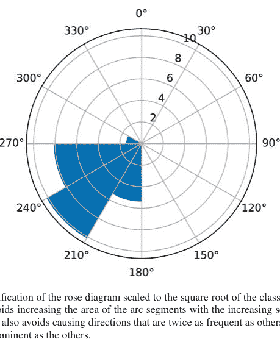

图 10.3 按类别频率平方根缩放的玫瑰图改进版。这种改进避免了弧形区域的面积随频率的平方增加而增加，从而也避免了使频率是其他方向两倍的方向看起来比其他方向突出四倍。

## 10.3 圆形数据的经验分布

本节介绍用于描述方向数据经验分布的统计度量。方向数据的特征由集中趋势和离散度的度量来描述，这与单变量数据集的统计表征（第3章）类似。假设我们收集了一些角度测量值，例如化石排列方向。数据集合可以写为

$\theta_1, \theta_2, \theta_3, \ldots, \theta_n$

其中包含$n$个观测值$\theta_i$。为每个方向$\theta_i$计算正弦和余弦值，然后用于计算角度数据集的*合向量*（或*平均*）方向（Fisher 1993; Mardia and Jupp 1999）：

$x_r = \sum \sin \theta_i$

$y_r = \sum \cos \theta_i$

数据集的合方向为

$$\bar{\theta} = \tan (x_r / y_r)$$

合向量长度为

$$R = \sqrt{(x_r^2 + y_r^2)}$$

合向量长度显然取决于数据的离散度。将合向量长度归一化到观测值数量，得到平均合向量长度：

$$\bar{R} = R/n$$

平均合向量长度的值随着离散度的增加而减小（图10.4）。*圆形方差*是1减去平均合向量长度，因此常被用作方向数据的离散度度量：

$$\sigma_0 = 1 - \bar{R}$$

以下示例通过合成方向数据说明这些参数的使用。我们首先从文件*directional_1.txt*加载数据，并将所有测量值转换为弧度：

```
%reset -f

import numpy as np
import matplotlib.pyplot as plt

data_degrees_1 = np.loadtxt('directional_1.txt')
data_radians_1 = np.pi*data_degrees_1/180
```

我们现在计算合向量R。首先，我们计算合向量的x和y分量，

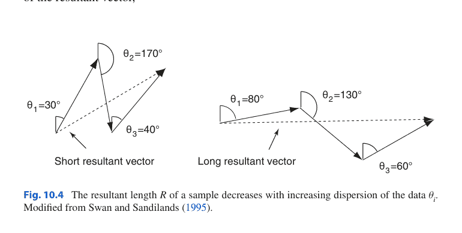

```
x_1 = np.sum(np.sin(data_radians_1))
y_1 = np.sum(np.cos(data_radians_1))
print(x_1)
print(y_1)
```

得到

```
-146.54800998477873
-120.34536799675672
```

平均方向是x和y比值的反正切`arctan()`，

```
mean_radians_1 = np.arctan(x_1/y_1)
mean_degrees_1 = 180*mean_radians_1/np.pi
print(mean_radians_1)
print(mean_degrees_1)
```

得到

```
0.883260987889874
50.6071268146455
```

这个结果表明合向量R大约在0.88弧度，或约51°。然而，由于x和y都是负数，`mean_degrees`的真实值位于第三象限，因此我们加上180°，

```
mean_degrees_1 = mean_degrees_1 + 180
print(mean_degrees_1)
```

得到

```
230.60712681464548
```

这导致平均方向约为231°。该向量的长度是向量的绝对值，即

```
R_1=np.sqrt(x_1**2+y_1**2)
print(R_1)
```

得到

```
189.6294461015314
```

合成向量的长度取决于方向数据的离散程度。将合成向量长度归一化到样本大小，可得到平均合成向量长度 Rm：

```
Rm_1 = R_1 / len(data_radians_1)
print(Rm_1)
```

其结果为：

```
0.948147230507657
```

较高的 Rm 值表明方差较小。接下来我们计算圆方差 sigma，其公式为：

```
sigma_1 = 1 - Rm_1
print(sigma_1)
```

其结果为：

```
0.051852769492342965
```

## 10.4 圆形数据的理论分布

与第 3 章类似，统计分析的下一步是找到一个合适的理论分布，然后将其拟合到上一节可视化和描述的经验分布。描述方向数据的经典理论分布是冯·米塞斯分布，该分布以奥地利数学家理查德·埃德勒·冯·米塞斯（1883–1953）的名字命名。冯·米塞斯分布的概率密度函数为：

$$f(\theta) = \frac{1}{2\pi I_0(\kappa)} e^{\kappa \cos(\theta - \mu)}$$

其中 μ 是平均方向，κ 是集中参数（Mardia 和 Jupp 1999）（图 10.5）。项 $I_0(\kappa)$ 是零阶修正的第一类贝塞尔函数。贝塞尔函数是二阶微分方程（贝塞尔微分方程）的解，在许多涉及圆柱波导中波传播或圆柱物体中热传导的问题中都很重要。冯·米塞斯分布也被称为圆正态分布，因为它具有与正态分布（第 3.4 节）相似的特征。当平均方向是最频繁的方向时，会使用此分布。偏离平均方向两侧的概率相等，并且随着与平均方向距离的增加而减小。

例如，我们假设平均方向 mu=0，集中参数 kappa 有五个不同的值：

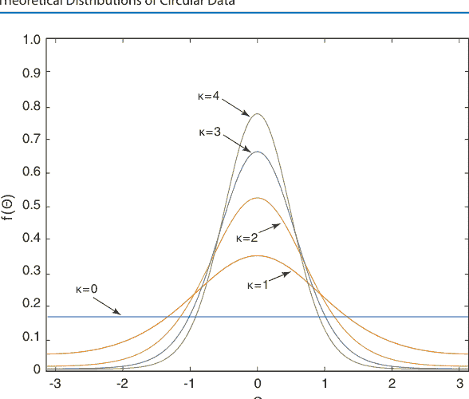

图 10.5 冯·米塞斯分布的概率密度函数 $f(x)$，其中 $\mu = 0$，$\kappa$ 有五个不同的值。

```python
%reset -f

import numpy as np
from scipy import special
import matplotlib.pyplot as plt
from numpy.random import default_rng

mu = 0
kappa = np.array([0,1,2,3,4])
```

我们首先定义一个用于绘图的角度刻度，范围从 $-180^\circ$ 到 $180^\circ$，间隔为 $1^\circ$：

```python
theta = np.linspace(-180,180,361)
```

所有角度都从度转换为弧度：

```python
mu_radians = np.pi*mu/180
theta_radians = np.pi*theta/180
```

然后我们计算这些值的冯·米塞斯分布。该公式使用零阶修正的第一类贝塞尔函数，可以使用 special.iv() 计算。接下来我们计算五个 kappa 值的概率密度函数：

```python
mises = np.zeros((len(theta),5))
theta_radians_array = np.zeros((len(theta),5))
for i in range(0,5):
    mises[:,i] = (1/(2*np.pi*special.iv(0,kappa[i]))) * \
    np.exp(kappa[i]*np.cos(theta_radians-mu_radians))
    theta_radians_array[:,i] = theta_radians
```

结果通过以下代码绘制：

```python
plt.figure()
for i in range(0,5):
    plt.plot(theta_radians_array[:,i],mises[:,i])
plt.legend(['$\kappa $=0',
    '$\kappa $=1',
    '$\kappa $=2',
    '$\kappa $=3',
    '$\kappa $=4'])
plt.show()
```

此类理论分布的平均方向和集中参数可以轻松修改，以便与经验分布进行比较。
我们可以创建一个 Python 代码，根据 Best 和 Fisher (1979) 第 155 页描述的算法，生成冯·米塞斯分布数据的伪随机数生成器。我们首先定义样本大小 n、平均方向 mu（转换为弧度）和集中参数 kappa：

```python
n = 200
mu = 230
mu = np.pi*mu/180
kappa = 5
```

然后我们使用 random.seed(0) 重置随机数生成器，并使用 Best 和 Fisher (1979) 创建的算法计算 n 个伪随机数（以 ° 为单位）：

```python
np.random.seed(0)
tau = 1 + (1 + 4*kappa**2)**0.5
rho = (tau - (2*tau)**0.5)/(2*kappa)
r = (1 + rho**2)/(2*rho)
i = 1
```

```python
theta = np.zeros(n)
while i < n:
    u1 = np.random.rand(1)
    u2 = np.random.rand(1)
    u3 = np.random.rand(1)
    z = np.cos(np.pi*u1)
    f = (1+r*z)/(r+z)
    c = kappa*(r-f)
    if c*(2-c)-u2 > 0:
        theta[i]=(np.sign(u3-0.5)*np.arccos(f))
        i = i+1
    elif np.log(c/u2)+1-c >= 0:
        i = i
    # 无操作，返回
    # while 循环的开始

data_radians_2 = theta + mu
data_degrees_2 = 180*data_radians_2/np.pi
```

请注意，elif 条件不包含任何条件表达式。在 Best 和 Fisher (1979) 的算法中，该条件只是说*返回步骤 1*（即 while 循环的开始），而不执行任何代码行。除了使用此代码，我们也可以使用 vmises()，它包含在本书的电子补充材料中：

```python
from vmises import vmises
help(vmises)

data_radians_3 = vmises(n,mu,kappa)
data_degrees_3 = 180*data_radians_3/np.pi
```

我们可以使用上一节的代码在玫瑰图中显示数据：

```python
ee = np.linspace(0,2*np.pi,13)
vv = np.linspace(2*np.pi/24,2*np.pi-2*np.pi/24,12)
nn,ee = np.histogram(data_radians_3,bins=ee)

plt.figure()
ax = plt.subplot(projection='polar')
ax.bar(vv,nn,width=2*np.pi/12)
ax.set_xticks(ee[0:12])
ax.set_theta_offset(np.pi/2)
ax.set_theta_direction(-1)
plt.show()
```

## 10.5 圆形数据的随机性检验

方向数据的第一个检验是将数据集与均匀分布进行比较。遵循均匀分布的方向数据是纯随机的（即没有偏好任何特定方向）。我们使用 $\chi^2$ 检验（第 3.8 节）将经验频率分布与理论均匀分布进行比较。我们首先加载样本数据：

```python
%reset -f

import numpy as np
from scipy import stats
import matplotlib.pyplot as plt

data_degrees_1 = np.loadtxt('directional_1.txt')
```

然后我们使用 `histogram()` 统计 12 个类别内的观测数量，每个类别的宽度为 30°：

```python
e = np.linspace(0,360,13)
counts, e = np.histogram(data_degrees_1,bins=e)
```

预期观测数量为 200/12，其中 200 是观测总数，12 是类别数：

```python
expect = 200/12*np.ones(12)
```

$\chi^2$ 检验考察观测频率与期望频率之间的平方差。量 $\chi^2$ 定义为这些平方差除以期望频率的总和，

```python
chi2cal = np.sum((counts-expect)**2/expect)
print(chi2cal)
```

其结果为：

```
748.5999999999998
```

临界 $\chi^2$ 值可以使用 `chi2.ppf()` 计算。$\chi^2$ 检验需要自由度 $\Phi$。在我们的例子中，我们检验数据是否均匀分布的假设（即我们估计一个参数）。由于类别数为 12，自由度为 $\Phi = 12-1-1 = 10$。我们在 $p=5\%$ 的显著性水平上检验我们的假设。函数 `chi2.ppf()` 计算 $\chi^2$ 分布的累积分布函数（CDF）的逆，其中参数数量由 $\Phi$ 指定，对应于 $p$ 中的概率，

```python
chi2crit = stats.chi2.ppf(1-0.05,12-1-1)
print(chi2crit)
```

其结果为：

```
18.307038053275146
```

由于临界 $\chi^2$ 值 18.3070 远低于测量到的 $\chi^2$ 值 748.6000，我们可以拒绝原假设，并得出结论：我们的数据不遵循均匀分布（即它们不是随机分布的）。

## 10.6 平均方向显著性检验

一旦我们在野外测量了一组方向数据，我们可能想知道这些数据是否记录了一个主导方向。我们可以使用雷利检验来检验平均方向的显著性（Mardia 1972; Mardia 和 Jupp 1999）。该检验使用第 10.3 节引入的平均合成向量长度，该长度随着优选方向的增加而增加：

$$\bar{R} = \frac{1}{n} \sqrt{\left(\sum \sin \theta_i\right)^2 + \left(\sum \cos \theta_i\right)^2}$$

如果计算出的平均合成向量长度低于临界值，则数据表现出优选方向（Mardia 1972）（表 10.1）。例如，我们再次加载文件 *directional_1.txt* 中包含的数据：

```python
%reset -f

import numpy as np
import matplotlib.pyplot as plt

data_degrees_1 = np.loadtxt('directional_1.txt')
data_radians_1 = np.pi*data_degrees_1/180;
```

然后我们通过输入以下命令计算平均合成向量 Rm_1_calc：

```python
x_1 = np.sum(np.sin(data_radians_1))
y_1 = np.sum(np.cos(data_radians_1))
```

表 10.1 Rayleigh 检验中 $n$ 次测量平均方向显著性的平均合成长度临界值（Mardia 1972）。

| 显著性水平 $\alpha$ | | | | | |
| :--- | :--- | :--- | :--- | :--- | :--- |
| $n$ | 0.100 | 0.050 | 0.025 | 0.010 | 0.001 |
| 5 | 0.677 | 0.754 | 0.816 | 0.879 | 0.991 |
| 6 | 0.618 | 0.690 | 0.753 | 0.825 | 0.940 |
| 7 | 0.572 | 0.642 | 0.702 | 0.771 | 0.891 |
| 8 | 0.535 | 0.602 | 0.660 | 0.725 | 0.847 |
| 9 | 0.504 | 0.569 | 0.624 | 0.687 | 0.808 |
| 10 | 0.478 | 0.540 | 0.594 | 0.655 | 0.775 |
| 11 | 0.456 | 0.516 | 0.567 | 0.627 | 0.743 |
| 12 | 0.437 | 0.494 | 0.544 | 0.602 | 0.716 |
| 13 | 0.420 | 0.475 | 0.524 | 0.580 | 0.692 |
| 14 | 0.405 | 0.458 | 0.505 | 0.560 | 0.669 |
| 15 | 0.391 | 0.443 | 0.489 | 0.542 | 0.649 |
| 16 | 0.379 | 0.429 | 0.474 | 0.525 | 0.630 |
| 17 | 0.367 | 0.417 | 0.460 | 0.510 | 0.613 |
| 18 | 0.357 | 0.405 | 0.447 | 0.496 | 0.597 |
| 19 | 0.348 | 0.394 | 0.436 | 0.484 | 0.583 |
| 20 | 0.339 | 0.385 | 0.425 | 0.472 | 0.569 |
| 21 | 0.331 | 0.375 | 0.415 | 0.461 | 0.556 |
| 22 | 0.323 | 0.367 | 0.405 | 0.451 | 0.544 |
| 23 | 0.316 | 0.359 | 0.397 | 0.441 | 0.533 |
| 24 | 0.309 | 0.351 | 0.389 | 0.432 | 0.522 |
| 25 | 0.303 | 0.344 | 0.381 | 0.423 | 0.512 |
| 30 | 0.277 | 0.315 | 0.348 | 0.387 | 0.470 |
| 35 | 0.256 | 0.292 | 0.323 | 0.359 | 0.436 |
| 40 | 0.240 | 0.273 | 0.302 | 0.336 | 0.409 |
| 45 | 0.226 | 0.257 | 0.285 | 0.318 | 0.386 |
| 50 | 0.214 | 0.244 | 0.270 | 0.301 | 0.367 |
| 100 | 0.150 | 0.170 | 0.190 | 0.210 | 0.260 |

```
mean_radians_1 = np.arctan(x_1/y_1)
mean_degrees_1 = 180*mean_radians_1/np.pi
mean_degrees_1 = mean_degrees_1 + 180

Rm_1_calc = 1/len(data_degrees_1) * (x_1**2+y_1**2)**0.5
print(Rm_1_calc)
```

输出结果为

```
0.948147230507657
```

我们示例中的平均合成长度 Rm_1_calc 为 0.9481。计算临界值 Rm_1_crit 涉及多种近似方法，例如 Wilkie 近似法（Wilkie 1983），根据该方法，可以通过输入以下代码计算 Rm_1_crit

```
n = len(data_degrees_1)

alpha = 0.050

Rm_1_crit = np.sqrt((-np.log(alpha)-(2*np.log(alpha)+ \
    (np.log(alpha))**2)/(4*n))/n)
print(Rm_1_crit)
```

输出结果为

```
0.12231115217794654
```

当 α=0.05 且 n=200 时，临界值 Rm 为 0.1223。由于该值低于从数据计算得到的 Rm_1_calc，我们可以拒绝原假设，并得出存在一个优选单一方向的结论，该方向为

```
theta_1 = 180 * np.arctan(x_1/y_1) / np.pi
print(theta_1)
```

输出结果为

```
50.6071
```

然而，正弦和余弦的负号表明真实结果位于第三象限（180° 到 270°），因此正确结果应为 180+50.6071=230.6071，

```
theta_1 = 180 + theta_1
print(theta_1)
```

输出结果为

```
230.60712681464548
```

## 10.7 两组方向之间差异的检验

让我们考虑两个文件中的两组测量数据，*directional_1.txt* 和 *directional_2.txt*。我们希望比较这两组方向，并检验它们无显著差异的原假设。我们使用 Watson–Williams 检验来检验两个平均方向的相似性，

$$F = \left(1 + \frac{3}{8\kappa}\right) \frac{(n - 2)(R_A + R_B - R_T)}{n - R_A - R_B}$$

其中 $\kappa$ 是集中参数，$R_A$ 和 $R_B$ 分别是样本 $A$ 和 $B$ 的合成长度，$R_T$ 是合并样本的合成长度（Watson and Williams 1956; Mardia and Jupp 1999）。集中参数可以通过 $R_T$ 从表格中获得（Batschelet 1981, Gumbel et al. 1953, 表 10.2）。计算得到的 $F$ 值与标准 $F$ 分布表（第 3.8 节）中的临界值进行比较。如果计算得到的 $F$ 值小于临界 $F$ 值，则两个平均方向无显著差异，该临界值取决于自由度 $\Phi_a = 1$ 和 $\Phi_b = n-2$ 以及显著性水平 $\alpha$。两个样本都必须服从 von Mises 分布（第 10.4 节）。

我们使用两个合成的方向数据集来说明如何应用此检验。我们首先加载数据并将度数转换为弧度：

```
%reset -f

import numpy as np
from scipy import stats
import matplotlib.pyplot as plt

data_degrees_1 = np.loadtxt('directional_1.txt')
data_degrees_2 = np.loadtxt('directional_2.txt')

data_radians_1 = np.pi*data_degrees_1/180;
data_radians_2 = np.pi*data_degrees_2/180;
```

然后我们计算合成向量的长度，

```
x_1 = np.sum(np.sin(data_radians_1))
y_1 = np.sum(np.cos(data_radians_1))
x_2 = np.sum(np.sin(data_radians_2))
y_2 = np.sum(np.cos(data_radians_2))

mean_radians_1 = np.arctan(x_1/y_1)
mean_degrees_1 = 180*mean_radians_1/np.pi
```

表 10.2 根据计算的平均合成长度得到的集中参数 κ 的最大似然估计。改编自 Batschelet (1981) 和 Gumbel et al. (1953)。

| R | κ | R | κ | R | κ | R | κ |
|---|---|---|---|---|---|---|---|
| 0.000 | 0.000 | 0.260 | 0.539 | 0.520 | 1.224 | 0.780 | 2.646 |
| 0.010 | 0.020 | 0.270 | 0.561 | 0.530 | 1.257 | 0.790 | 2.754 |
| 0.020 | 0.040 | 0.280 | 0.584 | 0.540 | 1.291 | 0.800 | 2.871 |
| 0.030 | 0.060 | 0.290 | 0.606 | 0.550 | 1.326 | 0.810 | 3.000 |
| 0.040 | 0.080 | 0.300 | 0.629 | 0.560 | 1.362 | 0.820 | 3.143 |
| 0.050 | 0.100 | 0.310 | 0.652 | 0.570 | 1.398 | 0.830 | 3.301 |
| 0.060 | 0.120 | 0.320 | 0.676 | 0.580 | 1.436 | 0.840 | 3.479 |
| 0.070 | 0.140 | 0.330 | 0.700 | 0.590 | 1.475 | 0.850 | 3.680 |
| 0.080 | 0.161 | 0.340 | 0.724 | 0.600 | 1.516 | 0.860 | 3.911 |
| 0.090 | 0.181 | 0.350 | 0.748 | 0.610 | 1.557 | 0.870 | 4.177 |
| 0.100 | 0.201 | 0.360 | 0.772 | 0.620 | 1.600 | 0.880 | 4.489 |
| 0.110 | 0.221 | 0.370 | 0.797 | 0.630 | 1.645 | 0.890 | 4.859 |
| 0.120 | 0.242 | 0.380 | 0.823 | 0.640 | 1.691 | 0.900 | 5.305 |
| 0.130 | 0.262 | 0.390 | 0.848 | 0.650 | 1.740 | 0.910 | 5.852 |
| 0.140 | 0.283 | 0.400 | 0.874 | 0.660 | 1.790 | 0.920 | 6.539 |
| 0.150 | 0.303 | 0.410 | 0.900 | 0.670 | 1.842 | 0.930 | 7.426 |
| 0.160 | 0.324 | 0.420 | 0.927 | 0.680 | 1.896 | 0.940 | 8.610 |
| 0.170 | 0.345 | 0.430 | 0.954 | 0.690 | 1.954 | 0.950 | 10.272 |
| 0.180 | 0.366 | 0.440 | 0.982 | 0.700 | 2.014 | 0.960 | 12.766 |
| 0.190 | 0.387 | 0.450 | 1.010 | 0.710 | 2.077 | 0.970 | 16.927 |
| 0.200 | 0.408 | 0.460 | 1.039 | 0.720 | 2.144 | 0.980 | 25.252 |
| 0.210 | 0.430 | 0.470 | 1.068 | 0.730 | 2.214 | 0.990 | 50.242 |
| 0.220 | 0.451 | 0.480 | 1.098 | 0.740 | 2.289 | 0.995 | 100.000 |
| 0.230 | 0.473 | 0.490 | 1.128 | 0.750 | 2.369 | 0.999 | 500.000 |
| 0.240 | 0.495 | 0.500 | 1.159 | 0.760 | 2.455 | 1.000 | 5000.000 |
| 0.250 | 0.516 | 0.510 | 1.191 | 0.770 | 2.547 | | |

```
mean_radians_2 = np.arctan(x_2/y_2)
mean_degrees_2 = 180*mean_radians_2/np.pi

mean_degrees_1 = mean_degrees_1 + 180
mean_degrees_2 = mean_degrees_2 + 180
print(mean_degrees_1)
print(mean_degrees_2)
```

```
R_1 = np.sqrt(x_1**2+y_1**2)
R_2 = np.sqrt(x_2**2+y_2**2)
```

输出结果为

```
230.60712681464548
212.18856343005913
```

合成向量的方向分别约为 223° 和 201°。我们还需要两个样本合并后的合成长度；因此，我们合并两个数据集并再次计算合成长度，

```
data_radians_T = np.concatenate([data_radians_1, \
            data_radians_2])

x_T = np.sum(np.sin(data_radians_T))
y_T = np.sum(np.cos(data_radians_T))

mean_radians_T = np.arctan(x_T/y_T)
mean_degrees_T = 180*mean_radians_T/np.pi

mean_degrees_T = mean_degrees_T + 180

R_T = np.sqrt(x_T**2 + y_T**2)
print(R_T)
Rm_T = R_T / (len(data_radians_T))
print(Rm_T)
```

输出结果为

```
372.4449200527211
0.9311123001318028
```

然后我们对数据应用 F 统计量，其中 kappa=7.426 且 Rm_T=0.9311（表 10.2）。计算得到的 F 值为

```
n = len(data_radians_T)

Fcalc = (1+3/(8*7.426)) * (((n-2)*(R_1+R_2-R_T))/(n-R_1-R_2))
print(Fcalc)
```

输出结果为

```
89.60541051467561
```

使用F统计量，我们发现对于1和400–2=398个自由度以及α=0.05，临界值为

```
Fcrit = stats.f.ppf(1-0.05,1,n-2)
print(Fcrit)
```

其结果为

```
3.8649292212017365
```

该值远低于观测到的F=89.6054（第3.8节）。因此，我们可以拒绝原假设，并得出结论：这两个样本不可能来自具有相同平均方向的总体。

## 10.8 球面数据的图形表示

展示球面数据的方法有很多。然而，由于我们总是以二维形式呈现数据（即在纸张或计算机屏幕上），因此需要将其转换为众多可用投影方式中的一种。Python并未提供太多用于显示或处理球面数据的函数，尤其是在地球科学中常用的形式。唯一的例外是那些用于在地球仪上显示地理数据的函数，我们在此使用其中一些。

我们首先使用经度`lon`和纬度`lat`的合成数据，这些数据通过`vmises()`计算得出。我们首先使用`random.seed(0)`重置随机数生成器，并定义样本大小`n`。然后，我们定义以度为单位的`lon`和`lat`值的均值，将两个值转换为弧度，定义集中参数`kappa`，并使用`vmises()`（包含在本书的电子补充材料中）计算`n=100`个`lon`和`lat`值。最后，我们将`lon`和`lat`值转换为度：

```
%reset -f

import numpy as np
from vmises import vmises
import scipy.stats as stats
import matplotlib.pyplot as plt
from numpy.random import default_rng

n = 100;
np.random.seed(0)
mu_lon_degrees = 10
mu_lat_degrees = 35
mu_lon_radians = np.pi*mu_lon_degrees/180
mu_lat_radians = np.pi*mu_lat_degrees/180
kappa_lon = 10
kappa_lat = 10
lon_radians = vmises(n,mu_lon_radians,kappa_lon)
lat_radians = vmises(n,mu_lat_radians,kappa_lat)
lon = 180*lon_radians/np.pi
lat = 180*lat_radians/np.pi
```

接下来，我们使用`gaussian_kde()`计算数据密度`c`：

```
c = stats.gaussian_kde([lon,lat])
```

然后，我们根据核密度`c`计算网格坐标`grid_coords`和每个数据点`(lon, lat)`的颜色值`zc`：

```
grid_coords = np.append(lon.reshape(-1,1), lat.reshape(-1,1),axis=1)
zc = 256*c(grid_coords.T) / np.max(c(grid_coords.T))
```

随后，我们在使用兰伯特投影的轴上以地理密度图显示数据点（图10.6）：

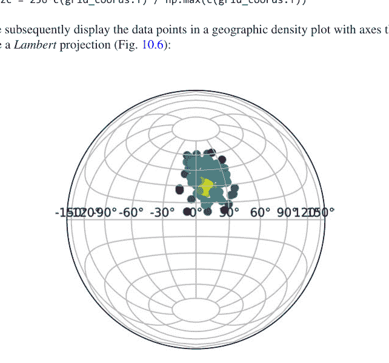

图10.6 使用兰伯特地图投影和`subplot()`显示球面数据。

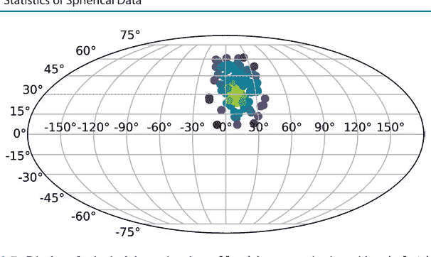

图10.7 使用摩尔威德地图投影和`subplot()`显示球面数据。

```
plt.figure()
ax = plt.subplot(projection='lambert')
ax.scatter(lon_radians,lat_radians,c=zc)
ax.grid()
plt.show()
```

或者，我们也可以使用*摩尔威德*投影（图10.7）：

```
plt.figure()
ax = plt.subplot(projection='mollweide')
ax.scatter(lon_radians,lat_radians,c=zc)
ax.grid()
plt.show()
```

最后，我们在直角坐标系中显示数据（图10.8）：

```
plt.figure()
plt.scatter(lon,lat,c=zc)
plt.show()
```

这种简单的展示方法在某些应用中可能是首选。

## 10.9 球面数据的统计

球面数据的统计分析是一个庞大的课题。由于Python对分析此类数据的支持非常有限，我们在此保持简洁。关于此主题的更详细文章可以在Mardia和Jupp（1999）以及Borradaile（2003）的著作中找到。以下部分演示了如何计算地理点的均值、标准差和标准距离。它还介绍了一个Python函数，用于使用等距矩形分箱计算地理点的频率分布。

图10.8 使用`bar3d()`的三维直方图，通过与计数相对应的颜色显示地理数据的频率分布。中位数在条形图上方标记为实心红色圆圈。

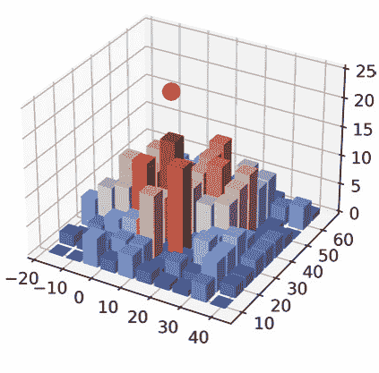

首先，我们再次使用`vmises()`创建合成数据，该函数包含在本书的电子补充材料中：

```
%reset -f

import numpy as np
from vmises import vmises
import scipy.stats as stats
import matplotlib.pyplot as plt
from numpy.random import default_rng

n = 500;
np.random.seed(0)
mu_lon_degrees = 10
mu_lat_degrees = 35
mu_lon_radians = np.pi*mu_lon_degrees/180
mu_lat_radians = np.pi*mu_lat_degrees/180
kappa_lon = 10
kappa_lat = 10
lon_radians = vmises(n,mu_lon_radians,kappa_lon)
lat_radians = vmises(n,mu_lat_radians,kappa_lat)
lon = 180*lon_radians/np.pi
lat = 180*lat_radians/np.pi
```

接下来，我们使用`gaussian_kde()`计算数据密度`c`：

```
c = stats.gaussian_kde([lon,lat])
```

然后，我们根据核密度`c`计算网格坐标`grid_coords`和每个数据点`(lon, lat)`的颜色值`zc`：

```
grid_coords = np.append(lon.reshape(-1,1), lat.reshape(-1,1),axis=1)
zc = 256*c(grid_coords.T) / np.max(c(grid_coords.T))
```

随后，我们使用地球的算术平均半径`r`（6371公里）计算`(lon, lat)`坐标的中位数，方法如下：

```
r = 6371
x = r*np.cos(lat_radians)*np.cos(lon_radians)
y = r*np.cos(lat_radians)*np.sin(lon_radians)
z = r*np.sin(lat_radians)

x_median = np.median(x)
y_median = np.median(y)
z_median = np.median(z)

lon_radians_median = np.arctan2(y_median,x_median)
lat_radians_median = np.arcsin(z_median/r)

lon_degrees_median = 180*lon_radians_median/np.pi
lat_degrees_median = 180*lat_radians_median/np.pi

print(lon_degrees_median)
print(lat_degrees_median)
```

其结果为

```
9.448245726147533
33.297480017287604
```

我们发现经度（10°）和纬度（30°）的平均值与我们使用`vmises()`创建合成数据时使用的值非常相似：

```
plt.figure()
plt.scatter(lon,lat,c=zc)
plt.plot(lon_degrees_median,lat_degrees_median,
    marker='o',
    markersize = 10,
    markeredgecolor=(0.9,0.3,0.1),
    markerfacecolor=(0.9,0.3,0.1))
plt.show()
```

然后，我们计算直方图，并在三维条形图中显示计数，使用与计数相对应的颜色，并将中位数标记为条形图上方的实心红色圆圈（图10.8）：

```
h,xedges,yedges = np.histogram2d(lon,lat)
vx = (xedges[:-1] + xedges[1:]) / 2
vy = (yedges[:-1] + yedges[1:]) / 2
vxx,vyy = np.meshgrid(vx,vy)
VX = vxx.flatten()
VY = vyy.flatten()
H = h.flatten()
bottom = np.zeros_like(H)
width = depth = 5

zc = plt.cm.coolwarm(H/float(np.max(H)))

fig = plt.figure()
ax = fig.add_subplot(projection='3d')
ax.bar3d(VX,VY,bottom,width,depth,H,color=zc)
plt.plot(lon_degrees_median,lat_degrees_median,25,
    marker='o',
    markersize = 10,
    markeredgecolor=(0.9,0.3,0.1),
    markerfacecolor=(0.9,0.3,0.1))
plt.show()
```

## 推荐阅读

- Allmendinger RW, Cardozo N, Fisher DM (2012) Structural geology algorithms: vectors and tensors. Cambridge University Press, New York
- Allmendinger RW, Siron CR, Scott CP (2017) Structural data collection with mobile devices: accuracy, redundancy, and best practices. J Struct Geol 102:98–112
- Allmendinger RW (2019) Modern structural practice, a structural geology laboratory manual for the 21st century. http://www.geo.cornell.edu/geology/faculty/RWA/structure-lab-manual/downloads.html
- Batschelet E (1981) Circular statistics in biology. Academic, Cambridge, Massachusetts
- Best DJ, Fisher NI (1979) Efficient simulation of the von mises distribution. Appl Stat 28:152–157
- Borradaile G (2003) Statistics of earth science data – their distribution in time, space and orientation. Springer, Berlin
- Davis JC (2002) Statistics and data analysis in geology, 3rd edn. Wiley, New York
- Fisher NI (1993) Statistical analysis of circular data. Cambridge University Press, New York
- Gumbel EJ, Greenwood JA, Durand D (1953) The circular normal distribution: tables and theory. J Am Stat Assoc 48:131–152
- Jones TA (2006a) Python functions to analyze directional (azimuthal) data–I: single sample inference. Comput Geosci 32:166–175
- Jones TA (2006b) Python functions to analyze directional (azimuthal) data–II: correlation. Comput Geosci 32:176–183
- Mardia KV (1972) Statistics of directional data. Academic, London
- Mardia KV (1975) Statistics of directional data. J Roy Stat Soc B (Methodological) 37:349–393
- Mardia KV, Jupp PE (1999) Directional statistics. Wiley, Chichester
- Marques de Sá JP (2007) Applied statistics using SPSS, STATISTICA, Python and R. Springer, Berlin
- Middleton GV (2000) Data analysis in the earth sciences using python. Prentice Hall, Upper Saddle River, New Jersey
- Swan ARH, Sandilands M (1995) Introduction to geological data analysis. Blackwell Sciences, Oxford
- Watson GS, Williams EJ (1956) On the construction of significance tests on a circle and the sphere. Biometrika 43:344–352
- Wilkie D (1983) Rayleigh test for randomness of circular data. Appl Stat 32:311–312