本书受版权保护

# 法律信息

© 2022
作者与编辑：约翰内斯·维尔德 工程硕士
A94689H39927F
电子邮件：3dtech@gmx.de
网站：www.3dtech-3dprinting.com
完整的版权页信息请见本书最后几页！

# 本作品受版权保护

本作品及其组成部分受版权保护。未经作者同意，严禁在版权法规定的狭窄范围之外使用本作品。这尤其适用于电子或其他形式的复制、翻译、分发和公开传播。未经作者书面许可，不得复制、处理或分发本作品的任何部分！保留所有权利。

本书中包含的所有信息均根据我们所知的最佳情况编制，并经过仔细核对。然而，本书仅供教育目的，不构成行动建议。特别是，对于使用或不使用本书中的任何信息，作者和出版商不提供任何保证或责任。本书中引用的商标和其他权利仍为其各自作者或权利持有人的专有财产。

非常感谢您选择本书！

# 前言

非常感谢您选择本书！

如果您正在寻找一本关于易于学习且功能强大的编程语言 Python 的实用指南，那么您来对地方了，选择本书是明智之举！我是一名工程师（工程硕士），希望用简单易懂的方式向您介绍 Python 编程世界。在本书中，您将学习 Python 编程的理论基础，以及通过大量示例和 DIY 项目进行的实践应用。本书为您提供了一个易于理解、结构直观且实用的 Python 编程入门指南！无论您使用的是 Python 2 还是 Python 3！

这本基础书籍专为那些对编程和 Python 没有或只有非常初级知识的人设计，同时也适合任何想将 Python 作为另一门编程语言来学习的人。无论您年龄多大、从事什么职业，是学生、大学生还是退休人员，本书都适合任何想要（或需要）学习编程这门迷人学科的人。

本书的目标是逐步教您 Python 的基础知识，以及如何成功地将它们应用于编写自己的脚本。因此，在这个 Python 基础课程中，您将学习作为初学者需要知道的一切！最好的方式是翻阅本书，并获取电子书或平装本！

本书的结构尽可能直观。这意味着，特别是在最初的示例中，可能会有一些您尚不理解的代码片段，因为这些内容将在后面详细解释。如果出现这种情况，请不要因此感到困扰，只需继续阅读，并始终只关注刚刚解释过或已经解释过的示例代码部分。随着阅读的深入，您将在学习过程中逐渐理解更多示例的程序代码。请务必坚持下去，即使内容变得稍微复杂一些！Python 是值得的！

# 目录

- 前言 ........................................................................................................2
- 目录................................................................................................3
- 1 为什么选择 Python？...................................................................................................6
- 2 在 Windows 上设置 Python 环境.............................................8
- 3 Python 入门....................................................................................13
- 4 Python 语法 ................................................................................................17
  - 4.1 隐式行延续 ............................................................................18
  - 4.2 显式行延续............................................................................19
  - 4.3 Python 中的注释..................................................................................19
  - 4.4 Python 中的空格 .......................................................................................21
- 5 变量、数组、字符串和元组 ...............................................................23
  - 5.1 变量.....................................................................................................23
  - 5.2 数组 ........................................................................................................27
    - 5.2.1 创建 Python 数组 ............................................................................28
    - 5.2.2 向数组添加元素..................................................................30
    - 5.2.3 访问数组元素..............................................................32
    - 5.2.4 从数组中删除元素 ........................................................32
    - 5.2.5 数组的分割 ...............................................................................32
    - 5.2.6 在数组中搜索元素 ....................................................................34
    - 5.2.7 更新数组中的元素...............................................................34
  - 5.3 字符串（字符字符串或字符序列）........................................35
    - 5.3.1 创建字符串 ...............................................................................36
    - 5.3.2 访问字符串中的字符 ...........................................................38
    - 5.3.3 字符串切片（字符字符串）......................................................39
    - 5.3.4 删除 / 更新字符串 ...................................................................40
    - 5.3.5 字符串中的转义字符..................................................................42
    - 5.3.6 特殊字符串运算符 ........................................................................43
    - 5.3.7 用于格式化字符串的特殊运算符...................................................44
    - 5.3.8 算术运算符 ........................................................................................................ 45
  - 5.4 元组 .....................................................................................................................................46
    - 5.4.1 元组的连接 ........................................................................................................ 47
    - 5.4.2 元组的嵌套 ................................................................................................................... 48
    - 5.4.3 元组中的重复 .............................................................................................................. 48
    - 5.4.4 元组的不可变性 ............................................................................................................. 49
    - 5.4.5 元组的分割 ................................................................................................................... 49
    - 5.4.6 删除元组中的元素 .................................................................................................. 50
    - 5.4.7 元组的预定义函数 ............................................................................................. 51
- 6 函数 ............................................................................................................................. 53
  - 6.1 定义函数 .................................................................................................................53
  - 6.2 文档字符串 ...............................................................................................................................54
  - 6.3 return 语句 ...............................................................................................................55
  - 6.4 调用函数 ....................................................................................................................56
  - 6.5 函数的参数 .........................................................................................................56
  - 6.6 按引用传递 ....................................................................................................................61
- 7 循环和条件 ............................................................................................................ 63
  - 7.1 循环 .....................................................................................................................................63
    - 7.1.1 While 循环 .............................................................................................................................63
    - 7.1.2 For 循环 .................................................................................................................................64
  - 7.2 条件 ..............................................................................................................................64
    - 7.2.1 If 语句 ............................................................................................................................64
    - 7.2.2 else 语句 .........................................................................................................................65
    - 7.2.3 elif 语句 .........................................................................................................................66
    - 7.2.4 嵌套 if 语句 .................................................................................................................67
    - 7.2.5 if 和 else 的简写语句 ..............................................................................68
    - 7.2.6 逻辑运算符 ....................................................................................................................69
- 8 Python 中的其他重要基础 ........................................................................................... 71
  - 8.1 用户输入文本的可能性 ...........................................................................................71
  - 8.2 在 Python 中插入当前日期和时间 .......................................................................................71

# 8.3 try-except语句及其用法

# 9 面向对象编程（OOP）基础

9.1 类

9.2 类的定义

9.3 类的对象

9.4 声明/实例化对象

9.5 `__init__`方法

# 10 使用Python进行GUI开发

10.1 Tkinter GUI开发包/库

10.2 Tkinter控件

10.2.1 按钮

10.2.2 画布（图形区域）

10.2.3 复选按钮控件（选择按钮）

10.2.4 输入框控件（entry-widget）

10.2.5 框架控件（Frame widget）

10.2.6 标签控件

# 11 DIY项目

11.1 项目1：带用户输入的简单计算器

11.2 项目2：显示区间内所有质数

11.3 项目3：带图形用户界面（GUI）的计算器

# 12 故障排除 - 初学者常见错误

# 结语

# 1 为什么选择Python？

在开始学习编程基础之前，在本章的第一部分，我们将探讨为什么我们选择Python是正确的，以及学习一门编程语言是否值得。Python是我们这个时代最受欢迎的编程语言之一。为什么？一方面，因为Python非常用户友好且易于学习；另一方面，因为Python编程语言功能广泛，不仅可用于简单用例，也可用于复杂用例。让我们再看看Python的一些方面和优势，以确保Python能为我们提供最好的编程入门。

## 开源

Python是一种开源编程语言，它在社区支持和贡献下蓬勃发展和壮大。开源一词通常具有以下特点：软件可免费获取，鼓励用户积极参与，且使用不受限制。你可以从Python官网免费下载官方Python软件IDLE（“交互式开发环境”）。我们稍后将详细查看其工作原理。

## 库的可用性

Python拥有数量庞大的附加库。什么是库？库代表一种扩展，允许我们快速轻松地实现额外的功能或代码。它基本上就是社区开发者已经编写好的代码。大多数库可以在GitHub（github.com）或Stackoverflow（stackoverflow.com）等平台上找到。这些网站是软件开发的一种管理平台/开发者社区。拥有大量可供选择的库有一个巨大的优势，即初学者甚至高级用户不必从头开始开发每一个功能。由于一些（例如基础）功能被反复需要，而且通常也被其他用户需要，所以通常已经有人负责开发了某个功能的代码并将其提供出来。通过已开发的包和模块，我们可以直接使用和/或实现该功能。因此，我们可以专注于程序的实际代码和/或实际功能。打个比方，这就像开车旅行。你可以直接坐进车里，使用方向盘、油门踏板或空调等组件进行实际旅程，而无需为此构造汽车或创建各个功能。

## 可读性

Python的可读性非常好——即使是初学者也能读懂。这种编程语言不像其他一些语言那样抽象，初学者尝试阅读时一开始可能完全看不懂。这意味着即使是初学者也能在一定程度上轻松理解Python程序的功能。Python使用简单的缩进而不是分号（例如在C等其他编程语言中是这样）来进行分隔，这也使得Python程序代码看起来比其他编程语言更有结构感。

## 面向对象和函数式编程

Python支持面向对象编程。我们将在后面的章节中详细探讨什么是面向对象编程。现在，我们只需说明面向对象编程降低了大型程序的复杂性，使其更易于处理。

然而，Python不仅支持面向对象编程，还可以使用函数式编程，它建立在函数的使用之上。我们也会在后面的章节中探讨函数。

## 平台无关性

支持学习Python的最后一个论点是，它是一种平台无关的编程语言，这意味着开发者可以在任何交互式开发环境中编写Python程序，并在不同的操作系统（如Microsoft Windows、Mac或Linux）上运行。

在下一章，我们将首先设置Python环境，然后在再下一章开始编程。开始吧！

# 2 在Windows上设置Python环境

在Windows中，默认不包含Python开发环境。因此，我们必须先安装这个所谓的**IDLE**。对于Mac或Linux，Python从某些版本开始就已预装，可以立即使用。例如，在Linux中，只需在Linux终端中输入命令Python3即可打开它。不过，在Windows上设置Python编程环境也非常简单，下面将逐步说明。建议使用官方Python开发环境IDLE（交互式开发环境）。

**步骤1：下载Python可执行安装程序**

从Python官方网站下载所需版本（最好是最新版本）的Python安装程序：

[https://www.python.org/downloads/windows](https://www.python.org/downloads/windows)

在“稳定版本”部分选择正确的“Windows安装程序”文件。

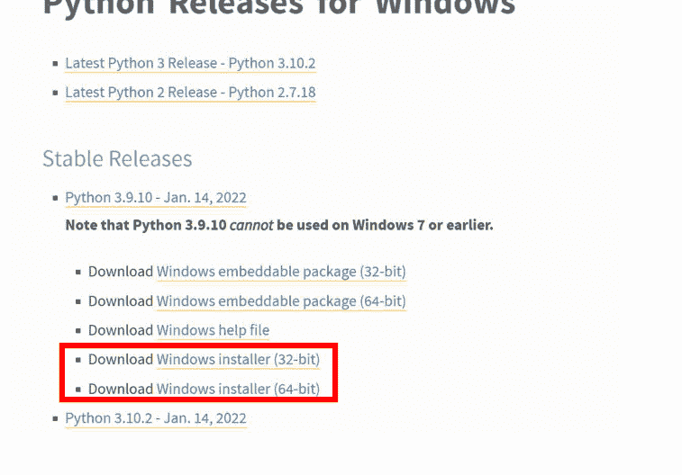

这里你需要区分你的PC上安装的是32位版本的Windows还是64位版本的Windows。如果你不知道，可以在PC上的“此电脑”文件夹中右键单击，然后点击“属性”。系统类型将会显示。如果不确定，直接从64位版本开始。如果因为你的Windows是32位版本而无法正确安装，无论如何都会显示错误消息。

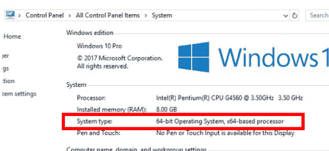

## 步骤2：启动安装程序

下载过程完成后，启动Python安装程序。

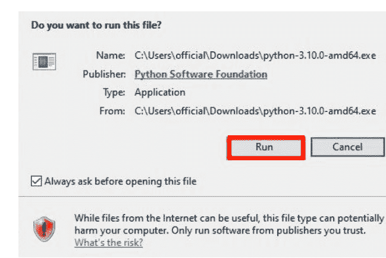

然后在安装窗口底部检查以下选项：

## Python | 分步指南

1) 为所有用户安装启动器（推荐）
2) 将 Python ... 添加到 PATH

对于所有较新版本的 Python，推荐的 **PIP** 和 **IDLE** 安装选项已包含在内。旧版本可能不包含这些附加功能。

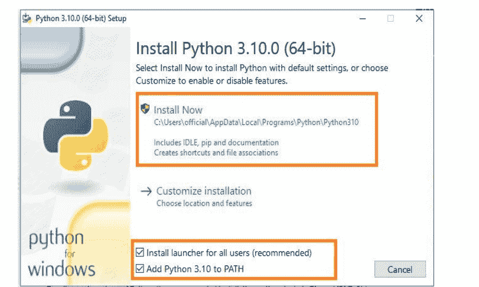

然后选择 **立即安装** 进行安装。

在下一个安装窗口中，我们 **禁用** 路径长度限制：**禁用路径长度限制**。我们这样做是为了让 Python 能够绕过 **MAX_PATH** 的 260 个字符限制。这意味着 Python 可以使用长路径名。我们需要选择此选项以避免后续出现名称长度问题。因此请选择此选项。

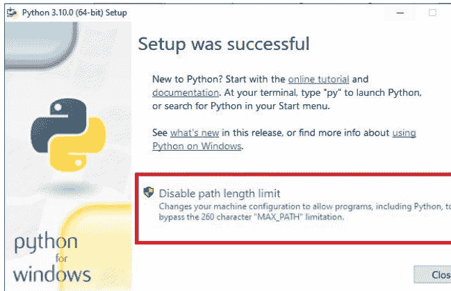

步骤 3：检查安装是否成功以及 PIP 是否可用

要检查安装是否成功，我们在 Windows 中打开 **命令** 提示符。你可以直接在 Windows 任务栏搜索功能中使用 **cmd** 一词进行搜索并打开它。我们在命令提示符中输入命令 **python -V** 并按回车键。

如果安装成功，此处应显示你安装的 Python 版本。在我们的例子中是 **Python 3.10.0**。

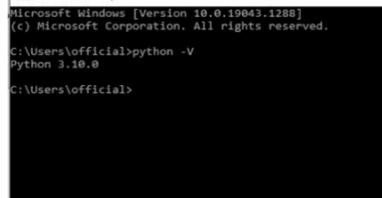

然后我们检查 **PIP** 是否可用。**PIP** 代表 **pip installs packages**，是一个用于 Python 库和 Python 包的实用管理系统。通过在命令提示符下输入 **pip -V** 命令并按回车键，我们可以验证它是否已成功安装。你应该会看到类似以下的内容：

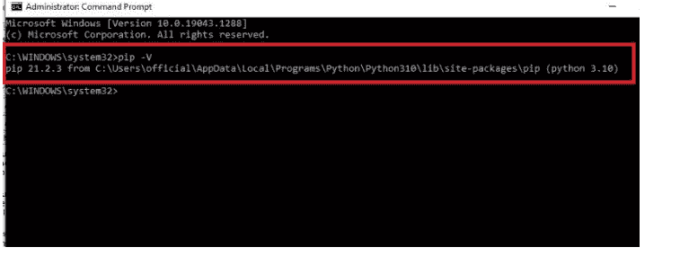

在下一课中，我们将概览 Python IDLE，即开发环境。之后，我们将学习 Python 语法和初步的编程尝试。

# 3 Python 简介

现在我们已经安装了所有必要的东西，终于来到了 Python IDLE（交互式开发环境），即软件环境。在接下来的课程中，我们将学习 Python 语法和第一个编程示例。语法是指编程语言中字符使用规则和代码结构设计的术语。

> 顺便提一下：上一课包含一个故障排除指南，如果脚本无法运行，它可以帮助你进行调试。一旦出现第一个错误，请立即查看本课。

**Python IDLE 概览：**

Python IDLE 是一个相对精简的程序，实际上只由一个输入窗口（文本编辑器）和一个位于顶部区域的菜单栏组成。要打开 Python-IDLE，只需在任务栏的搜索功能中搜索 IDLE 一词。然后应该会打开以下窗口：

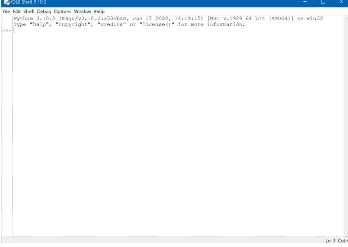

我们将在下面简要讨论菜单栏的一些重要功能，然后转向 Python 语法。在菜单栏的 **文件** 选项卡中，你可以找到基本功能，如创建新文件或打开以及当然保存文件。首先，点击此处的 **新建文件**，然后将新打开的窗口保存为你想要的名称。

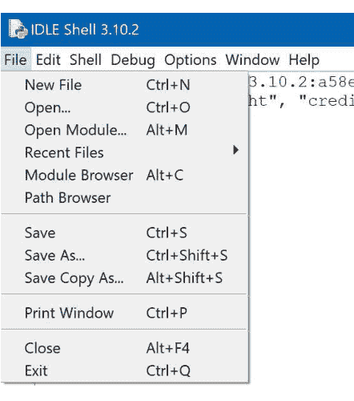

在 **编辑** 菜单选项卡中，你可以找到诸如撤销、重做或粘贴或剪切等功能。不过，这些功能不言自明。

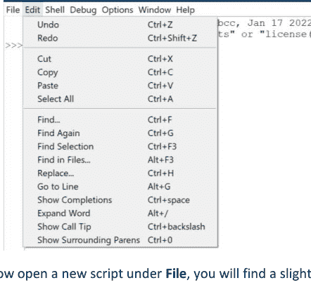

如果你现在在 **文件** 下打开一个新脚本，你会发现一个略有修改的菜单栏，其中也包含了重要的 **格式** 和 **运行** 选项卡。在 **格式** 中，你可以指定缩进和注释等，但我们稍后会学习这些是什么以及如何操作。

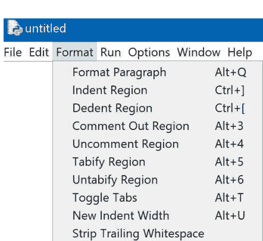

当你完成直接在输入窗口中编写的程序代码后，你可以在 **运行** 选项卡中启动脚本的执行（务必事先保存），甚至可以先检查模块。

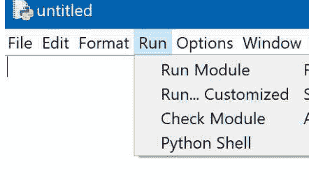

最后，你可以使用 **选项** 选项卡根据你的个人偏好配置 IDLE。例如，在这里你可以设置不同的字体或颜色。另外两个选项卡（**窗口** 和 **帮助**）相对不那么重要且不言自明。

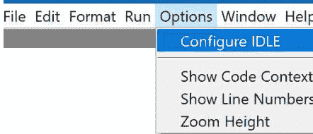

文件 编辑 格式 运行 选项 窗口 帮助

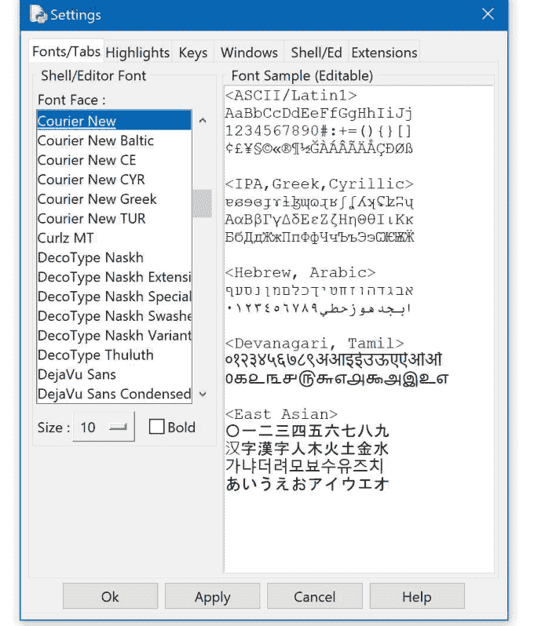

# 4 Python 语法

Python 中的程序代码编写方式是每条指令占一行。这是因为，通常情况下，Python 逐行读取语句然后执行它们（顺序执行）。然而，在某些情况下，执行流程可能会偏离这种逐行读取和执行。因此，通常 Python 语句的编写方式是每行只有一条语句。

但是，也可以在单行中编写多条语句。这时使用分号来分隔这些指令。然而，为了结构的有序性以及代码的良好可读性，建议每行只写一条语句，特别是当语句不是很简单或较长时。顺便提一下，以下示例中的术语 **print(...)** 是一个函数，顾名思义，它只是打印其后括号中的内容（文本必须用引号括起来）。但函数是什么、如何使用它们以及如何创建自己的函数，我们稍后将详细学习。另外，从现在开始，最好自己动手编写所有示例，这样你将最有效地学习！

示例 a):

```
print("Welcome to Python")
```

输出 a):

```
Welcome to Python
```

示例 b):

```
a = 50; b = 100; c = a + b
print(a); print(b); print(c)
```

输出 b):

```
50
100
150
```

如果一行中的语句太长，以至于屏幕上放不下，你就必须来回滚动。为了避免这种情况，你可以使用行续接。这允许你将单条语句写在多行中以提高可读性。根据实现方式的不同，行续接可以分为两种类型：a) 隐式行续接和 b) 显式行续接。

## 4.1 隐式行续接

这种类型可以看作是行续接的简单形式。隐式续接意味着任何包含未闭合圆括号（即 (）、未闭合方括号 [ 或未闭合花括号 { 的语句，在设置相应的闭合括号之前都保持未完成状态。通过这种方式，同一条语句可以跨多行甚至更长地续接，而不会发生错误。

示例 a):

```
a = [
    [1, 2, 3],
    [4, 5, 6],
    [7, 8, 9]
]
print(a)
```

输出 a):

```
[[1, 2, 3], [4, 5, 6], [7, 8, 9]]
```

示例 b):

```
subject_1 = int(input("Enter subject_1 marks: "))
subject_2 = int(input("Enter subject_2 marks: "))
subject_3 = int(input("Enter subject_3 marks: "))
subject_4 = int(input("Enter subject_4 marks: "))

if (
    subject_1 >= 45 and
    subject_2 >= 50 and
    subject_3 >= 48 and
    subject_4 >= 50
):
    print("This student successfully completed the semester.")
else:
    print("The required marks have not been obtained to pass the semester.")
```

输出 b):

```
Enter subject_1 marks: 68
Enter subject_2 marks: 74
Enter subject_3 marks: 81
Enter subject_4 marks: 78
This student successfully completed the semester.
```

## 4.2 显式行续接

这种行续接类型用于先前学习的隐式续接不适用的情况。在这种方法中，使用反斜杠让 Python 解释器理解该行也在下一行继续。反斜杠必须是要续接行的最后一个字符。

示例 a):

```
a = \
    5 + 8 \
    + 10 + 7 \
    + 20

print(a)
```

输出 a):

```
50
```

## 4.3 Python 中的注释

为了让你自己和另一个程序员更好地理解更复杂的代码，并更好地跟踪代码的流程，你可以在 Python 中设置注释。这些只是提示，不影响代码，Python 解释器会简单地忽略它们。因此，注释仅供人类理解。注释增加了脚本的可读性和可理解性，并有助于调试。为了让 Python 解释器理解文本是注释，你可以采用两种方式：a) 编写逐行注释或 b) 编写分段注释。

## Python | 逐步讲解

### 逐行注释：

在Python脚本中，逐行注释使用井号 `#` 标记，该符号必须放在文本或注释的开头。如果井号出现在一行或一段文本的中间，则不会成为注释。

示例 a)：

```
#This is a single line comment
```

示例 b)：

```
a = 'This is # not a comment #'
print(a) # Prints the string stored in variable a
```

### 分段注释：

段落注释是跨多行编写的注释。在Python中，它们由三个连续的引号 `"""` 开始或结束。也就是说，在要作为注释的段落开头放置三个引号，然后是作为文本的注释内容，最后在文本末尾再放置三个引号。

示例 a)：

```
""" This is a
multiple line
comment
"""
```

示例 b)：

```
""" The following statement prints the string stored
    in the variable "a" """

a = 'This is # not a comment #'
print(a) # Prints the string stored in variable a
```

## 4.4 Python中的空格

在Python中，空格通常会被忽略（特殊情况如下），Python解释器不会考虑它们，但从一开始就避免不必要的空格仍然是有利的。

*第一个例外：* 例如，如果需要将一个元素与变量或其他关键字分开，则甚至需要空格。

示例 a)：

```
x = [3, 10, 5]
y = 10

""" Following statement is incorrect, and it will generate syntax error
a = yin x
"""
a = y in x # This is the correct version of the above statement
print(a)
```

*第二个例外：* 空格也可以用作缩进。

缩进仅仅意味着文本稍微向右开始。这用于构建程序代码的结构。因此，你不应该在脚本的中间或开头插入不必要的空格，以免它们被视为缩进。这可能会改变脚本的功能或导致错误。

示例 b)：

```
print('Hello') # This is Correct

    print('Hello') # This will generate an error
```

那么，为什么你需要这些缩进呢？你创建缩进来确定语句的分组，例如循环或控制结构。如前所述，这些缩进是通过在语句前插入空格来创建的。或者，你可以使用菜单栏或Tab键。

示例 c)：

```
File Edit Format Run Options Window Help
a = 10

while(a != 0):
    if(a > 5):   # Line 1
        print('a > 5')  # Line 2
    else:        # Line 3
        print('a < 5') # Line 4
    a -= 2       # Line 5

"""
Lines 1, 3, 5 are on same level
Line 2 will only be executed if if condition becomes true.
Line 4 will only be executed if if condition becomes false.
"""
```

# 5 变量、数组、字符串和元组

## 5.1 变量

简单来说，变量可用于定义和存储一个值。这样的值可以是，例如，一个数字或一个字符。因此，变量是一个将名称或字母与赋定值关联起来的数据元素。定义变量在编程语言中被称为声明变量。

在Python中，变量不必用数据类型显式声明，也就是说，你不必在声明中提及变量的类型（**整数**、**字符串**，...）就能使用它。然而，在其他编程语言中，你确实必须这样做。

**Python变量命名规则：**

以下是在Python中使用变量名时应遵循的一些经验法则，以避免复杂情况：

- 1) 变量可以以字母（大写或小写）或下划线开头。变量的其余部分可以包含大写或小写字母、下划线以及数字。变量的值使用等号 `=` 赋值。

示例 a)：

```
python
ThisIsaValidVariable_07 = 10
print(ThisIsaValidVariable_07)
```

输出 a)：

```
10
>>>
```

- 2) Python变量区分大小写，因为Python语言本身区分大小写。因此，请务必在Python脚本中遵守这一点。

示例 b)：

```
name = 'Python'
print(Name)
```

输出 b)：

```
NameError: name 'Name' is not defined
>>>
```

- 3) 有些词已经被Python解释器保留。这样的词不能用作变量名，否则会产生冲突。例如，以下这些：

| and | def | False | import | not | True |
| --- | --- | --- | --- | --- | --- |
| as | del | finally | in | or | try |
| assert | elif | for | is | pass | while |
| break | else | from | lambda | print | with |
| class | except | global | None | raise | yield |
| continue | exec | if | nonlocal | return | |

示例 c)：

```
True = accept
```

输出 c)：

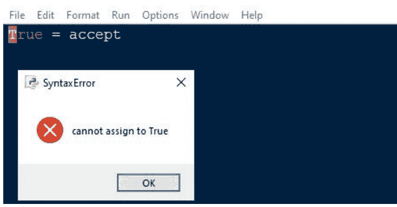

- 4) 如前所述，等号 `=` 用于给变量赋值。变量名应在等号左侧，变量值应在等号右侧。

示例 d)：

```
python
a = 5          # An integer assignment
b = 3.5        # A floating point
c = "total"    # A string
```

另一方面，如果名称和值颠倒，如以下示例所示，则会发生错误。

示例 e)：

```
python
5 = a
```

输出 (e)：

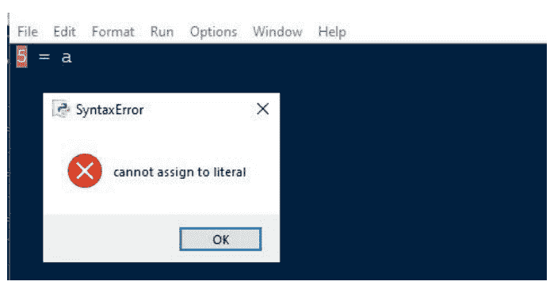

- 6) 你可以同时为多个变量赋不同的值（但不能为单个变量赋不同的值）。为此，使用逗号分隔变量或值。

示例 f)：

```
name, age = 'john', 25
print(name, age)
```

输出 f)：

```
john 25
>>> |
```

- 7) 你可以同时为多个变量赋相同的值。为此，在变量和值之间使用 `=` 字符。

示例 g)：

```
category=grade='A'
print(category, grade)
```

输出 g)：

```
A A
>>> |
```

- 8) 你可以使用 **del** 一词在Python中删除变量。之后，该变量将不再被识别。

示例 h)：

```
name = 'mark'
print(name)
del name
```

输出 h)：

```
Traceback (most recent call last):
  File "C:\Users\official\Documents\Python\4.py", line 4, in <module>
    print(name)
NameError: name 'name' is not defined
>>> |
```

## 5.2 数组

借助数组，可以将多个值一个接一个地存储在一个元素中。类似于变量，但数量更多。然后可以通过各自的索引来寻址特定的存储值。可以形象地想象如下：假设一辆公交车的每位乘客都被分配了一个带编号的座位（10位乘客和10个座位）。我们可以借助例如10个单独的变量来实现这一点。但我们也可以使用数组一步完成。在这种情况下，单个乘客的座位号将是一个值，公交车将是数组。所有乘客都坐在公交车上他们被分配的座位号上（谁坐在哪里由索引描述）。

更抽象地说，我们可以先在以下示例中简化地看一下，然后是Python特定的示例。

**变量：** *x = 10*

```
y = 20
z = 30
...
```

**数组：**

```
array_bus = (10,20,30,40,50,60,70,80,90,100)
```

> 注意：在Python中，表示法会有些不同，这将在另一个示例中稍后介绍。此表示法仅用于简化说明。

这里的元素将是我们的乘客座位，座位数量将由数组（在我们的例子中是公交车）的大小（Size）决定。

根据你想要寻址的值（或公交车的哪位乘客），你使用数组中该值的相应索引。

array_bus 的索引 0：赋定值 = 10（因为它是数组中的第一个值）

array_bus 的索引 1：赋定值 = 20（因为它是数组中的第二个值）

等等...

在Python中使用数组可以通过这种简单的索引更轻松地访问各个元素。

### 5.2.1 创建Python数组

首先，你需要使用 **import...as** 将数组模块导入脚本：

```
# Creation of Python Array

# importing "array" module for array creations
import array as arr
```

然后可以使用函数 **array(参数1, 参数2)** 创建数组，其中 *参数1* 和 *参数2* 分别指定数据类型和值。例如，在下面的例子中，我们创建一个数据类型为 **整数 (i)**（= 第一个参数）的数组，其值为：10, 20, 30, 40, 50（= 第二个参数）。

### 5.2.2 向数组中添加元素

也可以使用 **insert(参数1, 参数2)** 函数向现有数组添加新值，其中 *参数1* 和 *参数2* 必须分别是新元素的索引（即数组中的位置）和新元素的值。当需要向数组添加一个或多个新值并需要确定位置时，主要使用此函数。

```python
# 使用 insert() 函数插入数组
a.insert(6, 60)
print ("Array after insertion : ", end =" ")
for i in (a):
    print (i, end =" ")
print()
```

你也可以使用 **append(参数1)** 函数向现有数组添加新值。但是，这里无法指定位置，即新值的索引。新元素只是简单地附加到数组的末尾。

```python
# 使用 append() 添加元素
b.append(8.4)
print ("Array after insertion : ", end =" ")
for i in (b):
    print (i, end =" ")
print()
```

综合示例：

```python
# 向数组中添加元素

# 导入 "array" 模块以创建数组
import array as arr

# 整型数组
a = arr.array('i', [10, 20, 30, 40, 50])
print ("Array before insertion : ", end =" ")
for i in range (0, 5):
    print (a[i], end =" ")
print()

# 使用 insert() 函数插入数组
a.insert(6, 60)
print ("Array after insertion : ", end =" ")
for i in (a):
    print (i, end =" ")
print()

# 浮点型数组
b = arr.array('d', [1.5, 2, 4, 3.6, 4.6, 5.4])
print ("Array before insertion : ", end =" ")
for i in range (0, 5):
    print (b[i], end =" ")
print()

# 使用 append() 添加元素
b.append(8.4)
print ("Array after insertion : ", end =" ")
for i in (b):
    print (i, end =" ")
print()
```

输出：

```
Array before insertion :  10 20 30 40 50
Array after insertion :  10 20 30 40 50 60
Array before insertion :  1.5 2.0 4.0 3.6 4.6
Array after insertion :  1.5 2.0 4.0 3.6 4.6 5.4 8.4
>>> |
```

### 5.2.3 访问数组元素

如前所述，你可以使用索引来访问数组的特定值。将索引号与索引运算符一起使用，如下例所示：

示例：

```python
# 从列表中访问元素

import array as arr
a = arr.array('i', [10, 20, 30, 40, 50, 60])

# 访问数组元素
print("First Element: ", a[0])

# 访问数组元素
print("Third Element: ", a[2])
```

输出：

```
First Element:  10
Third Element:  30
>>> |
```

### 5.2.4 从数组中移除元素

可以使用 **remove(参数1)** 函数从数组中移除特定值，其中 *参数1* 是要移除的元素。这里不需要指定位置，因为元素是通过其值来标识的。但是，如果指定的值不存在，则会返回错误。

### 5.2.5 数组的分割

借助切片操作（在 Python 中严格来说不是一个函数），你可以定义数组的某个范围，例如用于显示。这可以通过冒号来实现：

1) 使用 *array_name[:index_value]* 选择从开头到指定索引值 (*index_value*) 的元素。
2) 使用 `array_name[index_value:]` 仅选择从某个索引值 (`index_value`) 到数组末尾的元素。
3) 使用 `array_name[startindex : endindex]` 选择定义索引范围内的元素。

示例：

```python
# 数组中元素的切片

# 导入 array 模块
import array as arr

# 创建一个列表
l = [10, 20, 30, 40, 50, 60, 70, 80, 90, 100]

a = arr.array('i', l)
print("Initial Array: ")
for i in (a):
    print(i, end =" ")

# 使用切片操作打印指定范围的元素
Sliced_array = a[4:9]
print("\nSlicing elements in a range 4-9: ")
print(Sliced_array)

# 从预定义点打印元素到末尾
Sliced_array = a[5:]
print("\nElements sliced from 5th "
      "element till the end: ")
print(Sliced_array)

# 打印从开头到末尾的所有元素
Sliced_array = a[:]
print("\nPrinting all elements using slice operation: ")
print(Sliced_array)
```

输出：

```
Initial Array:
10 20 30 40 50 60 70 80 90 100
Slicing elements in a range 4-9:
array('i', [50, 60, 70, 80, 90])

Elements sliced from 5th element till the end:
array('i', [60, 70, 80, 90, 100])

Printing all elements using slice operation:
array('i', [10, 20, 30, 40, 50, 60, 70, 80, 90, 100])
>>> |
```

### 5.2.6 在数组中搜索元素

**index(参数)** 函数用于在数组中搜索特定元素。作为输出，你将获得与输入的“参数”相同的第一个值的索引。

示例：

```python
# 在数组中搜索元素

# 导入 array 模块
import array

# 用有符号整数初始化数组
arr = array.array('i', [10, 20, 30, 40, 50, 60])

# 打印原始数组
print ("The new created integer array is : ", end ="")
for i in range (0, 6):
    print (arr[i], end =" ")

print ("\r")

# 使用 index() 打印 20 第一次出现的索引
print ("The index of 1st occurrence of 20 is : ", end ="")
print (arr.index(20))

# 使用 index() 打印 60 第一次出现的索引
print ("The index of 1st occurrence of 60 is : ", end ="")
print (arr.index(60))
```

输出：

```
The new created integer array is : 10 20 30 40 50 60
The index of 1st occurrence of 20 is : 1
The index of 1st occurrence of 60 is : 5
>>> |
```

### 5.2.7 更新数组中的元素

更新数组元素可以通过简单地将新值重新赋给数组的所需索引值来完成。

例如，通过 `array_name[1] = 30`。这意味着索引为“1”的值（注意：这是第二个值，因为计数从 0 开始）获得了新值“30”。

示例：

```python
# 更新数组中的元素

# 创建一个数组
import array
arr = array.array('i', [10, 20, 30, 40, 50, 60])

# 打印原始数组
print ("Array before updation : ", end ="")
for i in range (0, 6):
    print (arr[i], end =" ")

print ("\r")

# 更新数组中的一个元素
arr[2] = 100
print("Array after updation : ", end ="")
for i in range (0, 6):
    print (arr[i], end =" ")
print()
```

输出：

```
Array before updation : 10 20 30 40 50 60
Array after updation : 10 20 100 40 50 60
>>> |
```

关于数组以及如何处理它们就介绍到这里。

我们在本章学到了什么？详细来说，可以简要总结如下：借助数组，可以将多个值一个接一个地存储在一个元素中。类似于变量，但数量更多，并且只在一个数组元素中。然后通过各自的索引可以访问某个存储的值。你可以使用不同的函数来编辑数组，例如添加值、移除值或选择数组的一部分进行输出。

在下一章中，我们将简要介绍字符串，然后再继续介绍元组、函数、运算符等更多基础知识。

## 5.3 字符串（字符字符串或字符序列）

字符串可以很简单地定义为字符的特定序列，其中字符最终也可以称为符号。计算机本身无法真正对这些字符做任何事情。为什么？因为个人电脑的基本原理是

### 5.3.1 字符串的创建

在 Python 中，可以通过将特定字符串赋值给变量来创建字符串。字符串可以用单引号、双引号甚至三引号括起来。

例如，这意味着 `string_01 = "Welcome"`。
*（双引号）*

但同样可以使用，例如 `string_02 = 'Welcome'`。
*（单引号）*

同样，例如 `string_02 = """Welcome"""` 也是等效的。
*（三引号）*

简单示例 a)：

```python
# 创建 Python 字符串

# 使用单引号创建字符串
String_01 = 'Welcome to the python World'
print("使用单引号的字符串：")
print(String_01)
```

a) 的输出：

```
使用单引号的字符串：
Welcome to the python World
```

## 扩展示例 b)：

```python
# 创建 Python 字符串

# 使用单引号创建字符串
String_01 = 'Welcome to the python World'
print("使用单引号的字符串：")
print(String_01)

# 使用双引号创建字符串
String_01 = "Hello Python"
print("\n使用双引号的字符串：")
print(String_01)

# 使用三引号创建字符串
String_01 = '''The top 1 popular programming language of 2021. '''
print("\n使用三引号的字符串：")
print(String_01)

# 使用三引号创建字符串允许多行
String_01 = '''Hello
        Python
        World'''
print("\n创建多行字符串：")
print(String_01)
```

b) 的输出：

```
使用单引号的字符串：
Welcome to the python World

使用双引号的字符串：
Hello Python

使用三引号的字符串：
The top 1 popular programming language of 2021.

创建多行字符串：
Hello
        Python
        World
```

### 5.3.2 访问字符串中的字符

字符串的每个字符都可以通过索引方法来访问，这与数组的访问方式非常相似。负索引方法在此上下文中也非常实用，当访问单个字符时可能相当有用，因为索引是从后往前开始的。

如何理解这一点？

索引 -1 指的是字符串的最后一个字符。在正索引方法中，这相当于索引 10。

如果我们尝试访问一个不存在的索引（例如这里的 -12），我们将得到错误消息："Index Error"。此外，索引应该是整数，否则将显示消息："Type error"。

示例：

```python
# 访问字符串字符的 Python 程序

String_01 = "HelloPython"
print("初始字符串：")
print(String_01)

# 打印第一个字符
print("\n字符串的第一个字符是：")
print(String_01[0])

# 打印最后一个字符
print("\n字符串的最后一个字符是：")
print(String_01[-1])
```

输出：

```
初始字符串：
HelloPython

字符串的第一个字符是：
H

字符串的最后一个字符是：
n
```

### 5.3.3 字符串切片（字符字符串）

类似于数组中使用的切片操作，你可以对字符串使用这样的操作来访问字符串中的特定字符范围（如果你记得不太清楚，请再看看之前的课程）或查看示例：

示例：

```python
# 演示字符串切片

# 创建一个字符串
String_01 = "PythonWorld"
print("初始字符串：")
print(String_01)

# 打印第 6 到第 11 个字符
print("\n切片第 6-11 个字符：")
print(String_01[6:11])

# 打印第 3 个和倒数第 2 个字符之间的字符
print("\n切片第 3 个和倒数第 2 个字符之间的字符：")
print(String_01[3:-2])
```

输出：

```
初始字符串：
PythonWorld

切片第 6-11 个字符：
World

切片第 3 个和倒数第 2 个字符之间的字符：
honWor
```

### 5.3.4 删除/更新字符串

如开头所述，更新字符串或删除字符串的一个或多个特定字符是不允许的，因为在 Python 中创建的字符串的单个字符不能单独更改。实际上，只有覆盖整个字符串，或者删除整个字符串并重新创建，才能解决这个问题。我们使用 **del**（delete 的缩写）这个术语来执行删除操作。

示例 a)：尝试更新字符串

```python
# 更新字符串字符的 Python 程序

String_01 = "HelloPython"
print("初始字符串：")
print(String_01)

# 更新字符串的一个字符
String_01[2] = 'p'
print("\n更新第 2 个索引处的字符：")
print(String_01)
```

输出 a)：错误，因为不可能

```
初始字符串：
HelloPython
Traceback (most recent call last):
  File "C:/Users/official/Documents/Python/10.py", line 8, in <module>
    String_01[2] = 'p'
TypeError: 'str' object does not support item assignment
```

示例 b)：更新整个字符串

```python
# 更新整个字符串的 Python 程序
String_01 = "WelcomeToPython"
print("初始字符串：")
print(String_01)

# 更新字符串
String_01 = "HelloPython"
print("\n更新后的字符串：")
print(String_01)
```

输出 b)：字符串被覆盖

```
初始字符串：
WelcomeToPython

更新后的字符串：
HelloPython
```

示例 c)：尝试删除字符串的单个字符

```python
# 从字符串中删除字符的 Python 程序
String_01 = "HelloPython"
print("初始字符串：")
print(String_01)

# 删除字符串的一个字符
del String_01[2]
print("\n删除第 2 个索引处的字符：")
print(String_01)
```

输出 c)：错误，因为不可能

```
初始字符串：
HelloPython
Traceback (most recent call last):
  File "C:/Users/official/Documents/Python/10.py", line 8, in <module>
    del String_01[2]
TypeError: 'str' object doesn't support item deletion
```

示例 d)：删除整个字符串

```python
# 删除整个字符串的 Python 程序

String_01 = "HelloPython"
print("初始字符串：")
print(String_01)

# 使用 del 删除字符串
del String_01
print("\n删除整个字符串：")
print(String_01)
```

输出 d)：字符串被成功删除，因此不再找到 → 错误消息 → 可以重新创建字符串

```
初始字符串：
HelloPython

删除整个字符串：
Traceback (most recent call last):
  File "C:/Users/official/Documents/Python/10.py", line 10, in <module>
    print(String_01)
NameError: name 'String_01' is not defined
```

### 5.3.5 字符串中的转义字符

在 Python 中，不可打印字符称为转义字符。这些字符可以，例如，影响句子结构，即表示换行。此类字符用反斜杠表示法表示，即这些字符前面有一个反斜杠。反斜杠和字符必须在引号内（双引号，即 "..." 或单引号，即 '...'）。

例如，在这个表达式中，`\n` 在紧随其后的文本之前表示换行：

```python
print("\n删除第 2 个索引处的字符：")
```

这里列出了一些最重要的转义字符：

| 反斜杠表示法 | 描述 |
|---|---|
| \a | 响铃或警报 |
| \b | 退格键 |
| \cx 或 \C-x | 控制-x (CTRL-x) |
| \e | 转义键 (ESC) |
| \f | 换页 |
| \n | 换行 |
| \r | 回车 |
| \s | 空格 |
| \t | 制表键 |
| \x | 字符 x |

### 5.3.6 特殊字符串运算符

运算符是可以用来执行操作的关键字，就像在数学中一样。假设字符串变量 'a' 和 'b' 分别包含字符串 'Hey' 和 'You'。

| 运算符 | 描述 | 示例 |
|---|---|---|
| + | 加法运算符 | a + b，结果为 HeyYou |
| * | 乘法运算符 | a*2，结果为 HeyHey |
| [] | 从指定索引提取字符 | a[1]，得到 e |

### 5.3.7 用于格式化字符串的特殊运算符

特殊运算符 `%` 赋予了 Python 一个非常酷且独特的特性。这个特殊运算符在 Python 中用作字符串的格式化运算符。字符串格式化运算符的用法如下：

示例：

```
print("My name is %s and weight is %d kg!" % ('mark', 50))
```

输出：

```
My name is mark and weight is 50 kg!
```

正如我们在示例中看到的，`%` 运算符后跟一个字母或字符——我们稍后会看到有哪些字符——是文本或字符串中的一种占位符，它也具有格式化功能（取决于我们在 `%` 后面写的字母）。通过以下表达式：`% ("mark", 50)`，我们定义了想要使用的文本或值。

下表概述了可以与格式化运算符一起使用的字符。

| 格式符号 | 转换 |
|---|---|
| %c | 字符 |
| %s | 格式化前转换字符串 |
| %i 或 %d | 有符号十进制整数 |
| %u | 无符号十进制整数 |
| %o | 八进制整数 |
| %x | 十六进制整数 |
| %X | 十六进制整数 |
| %e 或 %E | 指数表示法 |
| %f | 浮点数 |

### 5.3.8 算术运算符

算术运算符在几乎所有编程语言中都会用到。顺便说一句，这个名字听起来比实际的东西更复杂，因为它们就是简单数学中已知的符号（即 "+" 表示两个数的和，"*" 表示两个数的乘积等）。在 Python 中，有以下算术运算符可用于执行数学运算：

1.  加法 +，例如 x+y
2.  减法 -，例如 x-y
3.  乘法 *，例如 x*y
4.  除法 /，例如 x/y
5.  取余（模运算） %，例如 x%y
6.  幂运算 **，例如 x**y
7.  整除（地板除） //，例如 x//y
8.  负号 -，例如 -y
9.  相等比较 ==，例如 x == y（x 和 y 将具有相同的值）。

在本节中，我们学习了什么是字符串以及如何处理它。此外，我们还探讨了转义字符和运算符。在下一章中，我们将首先讨论所谓的“元组”，然后我们将介绍函数。

## 5.4 元组

元组就是值的集合。各个值之间用逗号分隔。与存储一个内容的变量不同，元组可以不可变地存储多个内容。在其他编程语言中，这被称为常量。你不仅可以将一个内容存储在元组中，甚至可以存储多个内容，它们之间用逗号分隔。你可以在其中存储唯一且不可变的值，例如一个人的姓名和出生年份。

示例 a)：

```
tuple1 = ('mark', 'John', 2005, 2000);
tuple2 = (1, 2, 3, 4, 5 );
tuple3 = "a", "b", "c", "d";
```

输出 a)：

```
('mark', 'John', 2005, 2000)
(1, 2, 3, 4, 5)
('a', 'b', 'c', 'd')
```

你也可以只给元组分配一个内容，在这种情况下，你必须在标量值后添加一个逗号，如下所示。如果你忘记了逗号，Python 会将该值视为字符串。

示例 b)：

```
tuple1 = (10,);
print(tuple1)
```

输出 b)：

```
(10,)
```

此外，也可以创建一个空元组。这可以通过在括号之间不指定内容来实现。

示例 c)：

```
# An empty tuple
empty_tuple = ()
print (empty_tuple)
```

输出 c)：

```
()
```

### 5.4.1 元组的连接

可以使用 "+" 运算符连接或连接两个元组，如下例所示（类似于数学加法）。

示例：

```
# Code for concatenating 2 tuples
tuple1 = (0, 1, 2, 3)
tuple2 = ('python', 'World')

# Concatenating above two
print(tuple1 + tuple2)
```

输出：

```
(0, 1, 2, 3, 'python', 'World')
```

### 5.4.2 元组的嵌套

在 Python 中，元组也可以嵌套，如下例所示。

示例：

```
# Code for creating nested tuples
tuple1 = (0, 1, 2, 3)
tuple2 = ('python', 'World')
tuple3 = (tuple1, tuple2)
print(tuple3)
```

输出：

```
((0, 1, 2, 3), ('python', 'World'))
```

### 5.4.3 元组的重复

可以使用 "*" 运算符将元组乘以或重复所需的值数量，如下例所示（类似于数学乘法）。

示例：

```
# Code to create a tuple with repetition
tuple3 = ('python',)*3
print(tuple3)
```

输出：

```
('python', 'python', 'python')
```

### 5.4.4 元组的不可变性

如开头所定义，Python 中的元组是不可变的（类似于字符串）。因此，如果你尝试通过使用索引将单个元素分配给元组，Python 解释器将给出错误消息。

示例：尝试更新元组：

```
#code to test that tuples are immutable

tuple1 = (0, 1, 2, 3)
tuple1[0] = 4
print(tuple1)
```

输出：错误消息，因为不可能：

```
Traceback (most recent call last):
  File "C:/Users/official/Documents/Python/11.py", line 4, in <module>
    tuple1[0] = 4
TypeError: 'tuple' object does not support item assignment
```

### 5.4.5 元组的切片

与数组一样，元组也可以进行切片操作（分割）。切片的方式与数组类似，使用 ":" 并指定索引或范围。

示例：

```
# code to test slicing
tuple1 = (0 ,1, 2, 3, 4, 5)
print(tuple1[1:])
print(tuple1[::-1])
print(tuple1[2:4])
```

输出：

```
(1, 2, 3, 4, 5)
(5, 4, 3, 2, 1, 0)
(2, 3)
```

### 5.4.6 删除元组中的元素

元组与字符串一样具有不可变性，因此不能删除给定元组的单个元素。在这里，与字符串一样，必须删除整个元组，并在必要时用新的或正确的值重新创建。

可以使用 **del** 命令以类似的方式删除元组。

示例：

```
# Code for deleting a tuple
tuple1 = ('Mark', 'John', 2005, 2000)
print (tuple1)
del tuple1
print("After deleting tuple : ")
print(tuple1);
```

输出：错误消息，因为元组不再定义：

```
('Mark', 'John', 2005, 2000)
After deleting tuple :
Traceback (most recent call last):
  File "C:/Users/official/Documents/Python/11.py", line 7, in <module>
    print(tuple1);
NameError: name 'tuple1' is not defined
```

### 5.4.7 元组的预定义函数

在 Python 中，你可以使用以下预定义函数来处理元组。我们稍后将以 **len(tuple)** 为例，更仔细地了解这意味着什么。

| 函数 | 描述 |
|---|---|
| **cmp(tuple1, tuple2)** | 比较两个元组的元素 |
| **len(tuple)** | 指定元组的长度 |
| **max(tuple)** | 返回元组的最大元素（最大值） |
| **min(tuple)** | 返回元组的最小元素（最小值） |
| **Tuple(seq)** | 将列表转换为元组 |

让我们以 **len(tuple)** 为例详细查看该过程。命令 **len**（长度的缩写）可用于确定元组的长度，如表中所示。结果是一个数字，表示元组中包含的值的数量，在编程语言中称为长度。

# 6 函数

在本节中，我们来讨论一下可以在 Python 中使用的函数。在编程中，函数通常可以被定义为一个脚本或一组指令，其目标是执行一个预定义的过程。作为开发者，你可以将多条指令放入一个函数中，并通过一个定义好的命令按需调用相应的函数。这意味着你不必每次都从头编写指令脚本，因为这些指令已存储在函数中，可以随时调用。

在 Python 中，你可以区分三种类型的函数：

- 1) 预定义函数，例如 **print(...)**、**help(...)**
- 2) 用户自定义函数，即你自己创建的函数。
- 3) 匿名函数（也称为 lambda 函数），即没有定义名称的函数。

在接下来的章节中，我们将重点介绍**用户自定义函数**，即创建自己的函数的过程。

## 6.1 定义函数

根据你希望用函数执行的指令或目标，你需要相应地构建该函数的内容。以下是定义函数的基本步骤和规则。当然，我们稍后会通过示例来学习如何使用函数。

- 1) 要创建一个函数，你需要关键字 **def**，后跟函数名、一对括号和一个冒号，例如 **def function_01():**
- 2) 如果函数中需要变量，你可以在括号内编写变量。如果有多个变量，应该用逗号分隔，例如 **def function_02(name):** 或 **def function_03(name, age):**（"name" 和 "age" 是我们代码中已定义的变量）。
- 3) 函数的第一条语句称为 **docstring**，它描述了函数的功能。这是可选的，我们稍后会再讨论。
- 4) 函数的实际代码从冒号之后开始。在函数定义开始的行（def）和代码之间必须有缩进。
- 5) 在函数末尾应放置命令 **return**，然后 Python 解释器会退出函数。你也可以选择返回一个值。这个期望的值（例如一个变量）必须放在 **return** 之后。我们稍后也会再讨论这一点。

示例：

```python
# 一个简单的 Python 函数

def functionName():
    print("Welcome to Python")
```

示例：

```python
def function_name(parameters):
    """docstring"""
    statement(s)
    return expression
```

## 6.2 文档字符串

如前所述，函数名之后的第一个字符串（或文本）称为 **docstring**。文档字符串可以简单地看作是给用户的一种说明，用于表示某个函数的功能。这提高了代码的可读性。

示例：

```python
# 一个简单的 Python 函数，用于检查 x 是偶数还是奇数

def evenOdd(x):
    """检查数字是偶数还是奇数的函数"""

    if (x % 2 == 0):
        print("even")
    else:
        print("odd")

# 调用函数的驱动代码
print(evenOdd.__doc__)
```

输出：

```
Function to check if the number is even or odd
>>> |
```

## 6.3 return 语句

如前所述，return 语句用于退出函数。此外，return 语句可用于返回一个特定的值。这些值可以是函数内语句执行产生的结果，也可以是为了确保某个函数已成功执行而返回的值。return 语句可以是一个变量、一个表达式或一个常量。

示例：

```python
def square_value(value):
    """此函数返回输入数字的平方值"""
    return value**2

print(square_value(2))
print(square_value(-4))
```

输出：

```
4
16
>>> |
```

## 6.4 调用函数

一旦定义了函数，就可以通过使用函数名后跟一对括号来调用它，例如 **function_01()**

**示例：**

```python
# 一个简单的 Python 函数

def functionName():
    print("Welcome to Python")

# 调用函数
functionName()
```

**输出：**

```
Welcome to Python
>>> |
```

## 6.5 函数的参数

函数参数是在定义函数时括号中包含的“值”，例如，**def function_03(name, age):** 中的 **"name"** 和 **"age"**。这些参数主要分为以下四类：

### 1. 必需参数

如果你想调用一个先前定义的、包含参数的函数，你必须确保在调用函数时参数以正确的顺序和数量出现，即与函数定义中完全一致。

以下示例展示了在调用 **printme()** 函数时未指定参数（str）会发生什么：

示例 a)，调用时忘记参数：

```python
# 函数定义如下
def printme( str ):
    "This prints a passed string into this function"
    print(str)
    return;

# 现在你可以调用 printme 函数
printme()
```

输出 a)，因缺少参数而产生的错误消息：

```
Traceback (most recent call last):
  File "C:/Users/official/Documents/Python/11.py", line 8, in <module>
    printme()
TypeError: printme() missing 1 required positional argument: 'str'
>>> |
```

### 2. 关键字参数

关键字参数在 Python 中用于在调用函数时以非顺序的方式放置参数。Python 解释器可以选择使用函数调用中指定的关键字，并将相应的参数与函数定义中的参数匹配。

示例 b)：

```python
# 函数定义如下
def printme( str ):
    "This prints a passed string into this function"
    print(str)
    return;

# 现在你可以调用 printme 函数
printme( str = "My string")
```

输出 b)：

```
My string
>>>
```

示例 c)：

```python
# 函数定义如下
def printinfo( name, age ):
    "This prints a passed info into this function"
    print("Name: ", name)
    print("Age ", age)
    return;

# 现在你可以调用 printinfo 函数
printinfo( age=30, name="John" )
```

输出 c)：

```
Name:   John
Age   30
>>> |
```

### 3. 默认参数

默认参数在 Python 函数中用于为参数分配默认值。因此，你可以使用它们使参数等于一个预定义的默认值。

示例 d)：

```python
# 函数定义如下

def printinfo( name, age = 50 ):
    "This prints a passed info into this function"
    print("Name: ", name)
    print("Age ", age)
    return;

# 现在你可以调用 printinfo 函数
printinfo( age=60, name="mark" )
printinfo( name="john" )
```

输出 d)：

```
Name:  mark
Age  60
Name:  john
Age  50
>>> |
```

### 4. 可变长度参数

当需要执行的函数参数数量超过函数定义中定义的数量时，可以使用以下方法。这些额外的参数称为可变长度参数，不需要在函数定义中定义。为此，需要在包含可变长度参数值的变量名前放置一个星号 "*"。如果在函数调用期间没有指定额外的参数，则此可变长度参数保持为空。

示例 e)：

```python
# 函数定义如下

def printinfo( arg1, *vartuple ):
    "This prints a variable passed arguments"
    print("Output is: ")
    print(arg1)
    for var in vartuple:
        print(var)
    return;

# 现在你可以调用 printinfo 函数
printinfo( 1 )
printinfo( 5, 6, 7 )
```

输出 (e)：

```
Output is:
1
Output is:
5
6
7
>>> |
```

## 6.6 按引用传递

需要强调的是，在 Python 中，几乎所有变量名都会自动成为引用（“按引用传递”）。这意味着每当一个变量被传递给函数时，都会创建一个指向该对象的新引用。这个过程与 Java 编程中的按引用传递非常相似。

示例 a)：

```
# 这里 x 是指向同一个列表 lst 的新引用
def myFunction(x):
    x[0] = 20

# 驱动代码（注意 lst 在函数调用后被修改了。
lst = [1, 2, 3, 4, 5, 6]
myFunction(lst)
print(lst)
```

输出 a)：

```
[20, 2, 3, 4, 5, 6]
>>>
```

此外，重要的是要知道，如果一个变量被传递给某个特定函数，并且整个引用被更改为另一个对象，那么引用与传递的变量之间的连接就会断开。

示例 b)：

```
def myFunction(x):
    # 在下面这行代码之后，x 与之前对象的
    # 连接就断开了。一个新的对象被赋值给 x。
    x = [20, 30, 40]

# 驱动代码（注意 lst 在函数调用后
# 没有被修改。
lst = [1, 2, 3, 4, 5, 6]
myFunction(lst)
print(lst)
```

输出 b)：

```
[1, 2, 3, 4, 5, 6]
>>> 
```

# 7 循环与条件

在前面的例子中，我们已经多次使用或接受了循环和条件，例如 **for**（循环）或 **if**（条件）表达式，但并不完全清楚这里实际发生了什么。由于循环和条件是任何编程语言和代码非常基础的操作，我们将在下面详细探讨它们。

## 7.1 循环

### 7.1.1 While 循环

在所有编程语言中，while 循环可用于重复执行一系列语句，即一遍又一遍地执行，直到某个条件不再满足。一旦特定条件不再满足（**False**），循环的执行就会停止，然后执行下一行代码的语句。例如，我们可以向变量 "i"（初始值 = 0）添加 "1"，直到 "i" 的值变得大于 3。因此，当 "i" 达到值 "3" 时，这个循环或这个循环的累加就应该停止。这看起来会是这样：

示例：

```
i=0

while i<4:
    print("Iteration Number: %d"%i)
    i=i+1

print("\nThe while loop ended")
```

输出：

```
Iteration Number: 0
Iteration Number: 1
Iteration Number: 2
Iteration Number: 3

The while loop ended
```

务必注意冒号和缩进！

### 7.1.2 For 循环

就像 while 循环一样，for 循环也可以用于重复执行语句。与 while 循环的区别在于，for 循环会运行直到定义的范围结束，并且 for 循环不会检查条件是否仍然为真或假。简单来说，你可以使用 for 循环在一系列值上重复执行一系列语句，例如：

示例：

```
for i in range(0,5):
    print("Iteration Number: %d"%i)

print("\nThe for loop ended")
```

输出：

```
Iteration Number: 0
Iteration Number: 1
Iteration Number: 2
Iteration Number: 3
Iteration Number: 4

The while loop ended
```

正如你在示例中看到的，一旦迭代超出指定的值范围（0 - 5），for 循环的执行就会停止。然后，与 while 循环一样，执行下一行代码的命令。

## 7.2 条件

在几乎所有编程语言中——当然在日常生活中也是如此——决策制定都扮演着重要角色。在编程中，决策通常可以通过给定的条件由程序逻辑地、自动地做出。条件语句检查某些预定义的条件是否满足。Python 中有几种类型的条件语句：

### 7.2.1 If 语句

If 语句是 Python 中最基本的条件语句。If 语句只是检查给定的条件是真还是假，如果条件为**真**，则根据条件执行某些命令。例如，可以定义一个成熟的苹果必须是红色的。然后可以使用 if 语句来检查这个条件对于树上的某个特定苹果是否成立。如果条件为真，那么必须确定应该发生什么（例如，包含启动采摘过程的命令）。

以下示例再次说明了 if 语句在程序代码中的功能。

示例：

```
i=2

if i==2:
    print("condition met")
```

输出：

```
condition met
>>> |
```

如你所见，"i" 的值等于 "2"，因此条件语句变为真，脚本执行与条件对应的给定语句。

### 7.2.2 else 语句

**else 语句**用于需要同时考虑条件检查的真和假结果的所有情况。也就是说，在这种情况下，可以确定在真情况（条件 = **true**）和假情况（条件 = **false**）下应该执行哪些语句。

示例：

```
i=2

if i==1:
    print("condition is true")
else:
    print("condition is false")
```

输出：

```
condition is false
>>>
```

### 7.2.3 elif 语句

elif **语句**在其他编程语言中也称为 elseif 语句。elif 语句跟在 if 语句之后，else 语句之前，即正好在它们之间。在这种情况下，首先检查正常的（第一个）if 条件，看它是真还是假。如果为真，则执行与 if 条件相关的语句，并且不再检查剩余的 elif 和 else 条件。但是，如果第一个 if 条件为**假**，则检查 elif 条件。如果这个条件也不为真（**假**），则执行 else 条件的语句，否则（如果条件为真）执行 elif 的语句。所以，在某种程度上，elif 语句是第一个 if 检查之后的第二个 if 检查（但仅在第一个 if 检查不为真，即假时才进行检查）。

示例：

```
i=2

if i==1:
    print("condition is true")
elif i==2:
    print("the elif condition became true")
else:
    print("condition is false")
```

输出：

```
the elif condition became true
>>>
```

### 7.2.4 嵌套 if 语句

为了使其更复杂一些，现在可以在编程中将 if 语句相互嵌套。但是，嵌套 if 语句只是位于另一个 if 语句内部的 if 语句。嵌套 if 语句用于需要在主条件内测试一个或多个附加条件的所有情况。也就是说，两个条件（第一个条件和第二个条件）都必须为真，整个条件才为真。

示例 a)：

```
i=2
j=1

if i==2:
    print("main condition met")
    if j==1:
        print("nested condition met")

else:
    print("main condition not met")
```

输出 a)：

```
main condition met
nested condition met
>>>
```

在这个例子中，我们看到主条件为真。因此，在第二步中，嵌套的 if 条件也被检查并发现也为真。也就是说，两个条件都满足，因此执行其中指定的语句。

相反，在下面的例子中，主条件不满足，因此第二个条件（它是嵌套条件并且实际上为真）甚至没有被检查。

示例 b)：

```
i=1
j=1

if i==2:
    print("main condition met")
    if j==1:
        print("nested condition met")
else:
    print("main condition not met")
```

输出 b)：

```
main condition not met
>>>
```

### 7.2.5 if 和 else 的简写语句

所谓的简写 if 语句用作一种缩写的 if 语句。它可以用于快速指定一个语句，如果条件为**真**则执行该语句。

示例 a)：

```
i=1

if i==1: print ("condition met")
```

输出 a)：

```
condition met
>>> |
```

类似地，这也适用于简写 else 语句：

示例 b)：

```
i=1

if i==1: print ("condition met")
else: print("condition not met")
```

输出 b)：

```
condition met
>>>
```

### 7.2.6 逻辑运算符

逻辑运算符用于在操作之间执行操作。在 Python 中，逻辑运算符主要与条件语句一起使用，这些条件语句需要根据两个或多个变量值来确定特定条件是真还是假。这为前面某一节中的嵌套 if 语句提供了一种替代方案。

Python 中有三个逻辑运算符：

| 运算符 | 描述 | 语法 |
| :--- | :--- | :--- |
| **and** | 如果两个操作数都为真，则为真 | x **and** y |
| **or** | 如果两个操作数中有一个为真，则为真 | x **or** y |
| **not** | 如果操作数为假，则为真 | **not** x |

## Python | 逐步讲解

示例：

```
i=1
j=2

if i==1 and j==2:
    print("the condition is true")

if i==1 or j==5:
    print("either one condition is true or both conditions are true")

if not j==1:
    print("j is not equal to 1")
```

输出：

```
the condition is true
either one condition is true or both conditions are true
j is not equal to 1
>>>
```

# 8 Python 中其他重要的基础知识

## 8.1 用户输入文本的可能性

Python 环境也支持获取用户输入。也就是说，用户可以以字母和数字的形式进行输入。程序可以设计成根据用户输入做出决策，或根据输入以特定方式运行。你可以直接在 Python 中提示输入（如果你是用户的话），或者创建一个图形界面用于输入，后者稍微复杂一些，我们稍后会介绍。输入提示是通过 **input()** 函数实现的。

示例：

```
username = input("Enter Your Name! ")
print("Hello "+username)
```

输出：

```
Enter Your Name! Andersen
Hello Andersen
>>>
```

## 8.2 在 Python 中插入当前日期和时间

Python 还有一个名为 **datetime** 的预装库。这个库允许你实现系统时间戳或日期戳。

示例：

```
import datetime

current_date_time=datetime.datetime.now()
print(current_date_time)
```

输出：

```
2021-12-20 22:04:15.792415
>>>
```

## 8.3 try-except 语句及其用法

**try-except 语句**，简单来说，是一个用于处理错误或异常的内置机制。**try 语句**在内部检查其后的代码是否有错误。当发生错误时，会执行 **except 语句**中预定义的代码来处理或修复错误，而不是打印一条令人讨厌的错误信息。因此，对于需要在发生错误时持续执行而不中断或显示错误信息的程序，应该实现 try-except 语句。

不过，让我们通过一个可能更容易理解的例子来看看这个。在下面的例子中，try-except 语句的异常（except）发生了，因为在开始时没有给 x 赋值。通常情况下，会出现一条错误信息。然而，在这种情况下，异常子句（except）中定义的代码被执行了。

示例：

```
try:
    print(x)
except:
    print("An exception occured in printing the value of x")
```

输出：

```
An exception occured in printing the value of x
```

# 9 面向对象编程（OOP）基础

在接下来的章节中了解 OOP 的实际工作原理之前，我们将在本节中首先简要熟悉面向对象编程（OOP）的理论背景，以便更好地理解具体的工作原理。

面向对象编程的核心元素是类。除了类之外，还有对象、属性（特性）和函数（方法）。每个类都有属性和函数。接下来，为了更好地理解，让我们以一个人为例。定义“人类”或“人”代表我们的类。一个具体的人就是我们的对象（例如，这个人：吉姆）。每个人都有属性或特性，例如年龄、性别、姓名等。这些特性本身（年龄、性别、姓名）就是一个类的属性（在我们的例子中是“人类”类）。每个人都有这些属性，但不同的人的具体表现是不同的。例如，吉姆 30 岁（属性：年龄），男性（属性：性别），名叫吉姆（属性：姓名）。然而，吉姆不仅有属性，他还能做一些事情。例如，吉姆可以“吃饭”，也可以“走路”，或者更复杂的事情，比如“打网球”。这些能力在 OOP 中被称为方法。

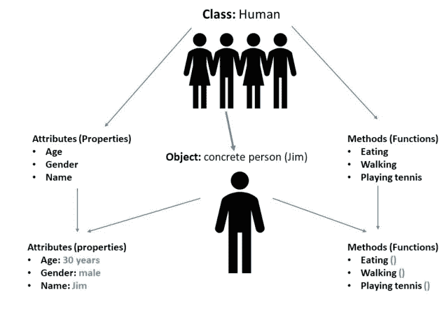

在面向对象编程中，这样的类（例如，我们的吉姆）被用来开发更大、更复杂的软件程序，因为类在 OOP 中是可重用的。

为了清晰起见，我们在上一段讨论的内容可以再次总结如下：

## 类

可以说，是我们对象的通用术语。例如，一辆汽车可以称为一个类。而具有自己底盘号和品牌特定配置的具体汽车型号，则是一个对象。

## 对象

使用专门定义的数据创建的类的实例。例如，具有特定底盘号（或个人配置）的某个品牌的具体汽车型号。

## 方法（= 函数）

在类（汽车）内定义的函数，描述对象（具体汽车型号）的行为或功能。例如，“驾驶”、“闪烁”、“鸣笛”。

## 属性（= 特性）

属性反映对象的状态或特性。属性的总和（汽车的颜色或车门数量）使得一个对象（具体汽车型号）在属于一个共同类（汽车）的前提下变得独一无二。

在下一节中，我们希望从实际工作方式的角度来探讨面向对象编程。

## 9.1 类

正如我们在上一章讨论的，Python 类可以被定义为一个总称，从中创建对象。最重要的是，类允许你将数据和功能捆绑在一起。

定义一个类会创建一个特定类类型的新对象，该对象可用于创建继承相同类属性的实例。一个类创建一个用户定义的数据结构，其中包含自己的数据元素和成员函数。可以通过创建该类的实例来访问这些数据和函数。

与 Python 中类相关的重要规则是：

- 1) 类使用 **class** 关键字创建。
- 2) 属于类的变量称为 **属性**。
- 3) 属性是全局的，即可以使用点运算符 "." 进行访问。

例如，对于 *Myclass.Myattribute*，“Myclass”是类的名称，“Myattribute”是属性的名称。

## 9.2 类的定义

类的定义非常简单，其运行方式与函数类似但又不同。这里不使用 **def**，而是使用 **class**，后跟类名和一个冒号。例如，这里定义了类对象“cars”：

```
# demonstrate defining a class

class cars:
    pass
```

## 9.3 类的对象

正如我们已经知道的，对象可以被定义为特定类的子实例。这意味着对象是一个具有该类唯一属性集（特性）的实体。

对象的**状态**由其属性（对象特性：“红色”、“大型”）表示。

对象的**行为**由其方法（如“闪烁”、“鸣笛”等函数）表示。它也反映了对象对其他对象的反应。

对象的**标识**由一个唯一的名称（例如“吉姆”）决定，并允许对象与其他对象交互。

## 9.4 声明/实例化对象

当创建一个类（例如“人类”）的特定对象（例如“吉姆”）时，这称为实例化。某个类的所有实例都具有相同的属性（“颜色：”、“大小：”）和类的行为。然而，属性的各自独立值（“颜色：**红色**”、“大小：**大型**”）使每个对象独一无二。

一个单独的类可以拥有任意数量的实例（单个对象）。

在 Python 中，对象可以简单地如下定义或更确切地说是实例化。

示例：

```
class cars:
    print("An object has been created from class called 'cars'")

object1=cars()
```

输出：

```
An object has been created from class called 'cars'
>>> |
```

## 关键字 "self"

类方法在方法定义中有一个额外的第一个参数，称为“self”。调用方法时，不需要指定参数或值。为了更好地理解这一点，让我们看以下场景：

假设一个类 **myclass** 有一个名为 **myobject** 的对象，以及一个名为 **mymethod** 的方法，该方法在定义时有两个参数 **arg1** 和 **arg2**。如果我们如下调用特定对象的 mymethod 方法，

**myobject.mymethod (arg1, arg2)**

Python 解释器会自动将给定对象的方法调用转换为以下形式：

**myclass.mymethod(myobject, arg1, arg2)**

## 9.5 "__init__" 方法

如果你曾经使用过 C++ 或 Java，或者具备相关基础知识，你可能会认为 __init__ 方法类似于 C++ 或 Java 中的构造函数。但别担心，如果你在其他编程语言方面没有任何先前知识，我们也会通过以下解释对 __init__ 方法形成清晰的理解。

这个方法或构造函数（__init__）只是用于初始化对象的状态。这意味着 __init__ 方法的主要目的是为对象创建初始状态（初始化）。与其他方法类似，构造函数由一组在创建对象时执行的语句组成。也就是说，一旦对象被类声明，__init__ 方法就会被执行。

# 10 使用Python进行GUI开发

缩写 **GUI** 代表“图形用户界面”。在Python中，我们可以为程序开发一个外观专业的命令提示符（GUI）。例如，这可以是一个用于选择特定选项的窗口：

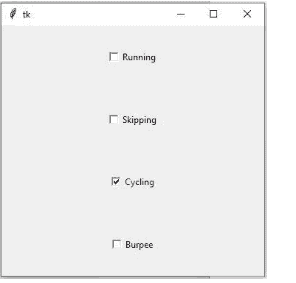

甚至是一个可点击的按钮：

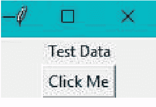

本章我们将探讨如何创建这样的GUI。Python环境中提供了多种用于创建GUI的选项或模块/包：

- 1) Tkinter
- 2) wxPython
- 3) JPython

然而，本章我们将专门讨论用于GUI开发的Python Tkinter库模块。

## 10.1 Tkinter GUI开发包/库

Tkinter是Python环境默认的内置GUI库包。使用这个模块，创建具有出色外观和感觉的用户友好型GUI相当容易，因为Python和Tkinter的结合使我们能够轻松实现，我们稍后就会看到。同时，了解用Tkinter开发的GUI可以在Windows操作系统以及macOS、Linux等系统上运行，这非常有趣。Tkinter GUI应用程序看起来就像是操作系统平台本身的一部分，因为它们是原生渲染的。

### 创建GUI应用程序

要能够使用Tkinter创建GUI应用程序，你需要经过几个（相对简单的）步骤，如下所列：

- 1) 导入Tkinter模块（使用 **import ... as**）。
- 2) 为GUI应用程序创建一个主窗口。
- 3) 向GUI应用程序添加控件（按钮、选择框等）——这取决于可能的用户输入。
- 4) 创建一个事件循环，以执行用户触发的每个事件对应的操作。

前两个步骤的实现如下：

```
import tkinter as tk # 导入Tkinter模块
window = tk.Tk() # 创建主窗口
```

然后你将得到以下（仍然为空的）主窗口作为输出：

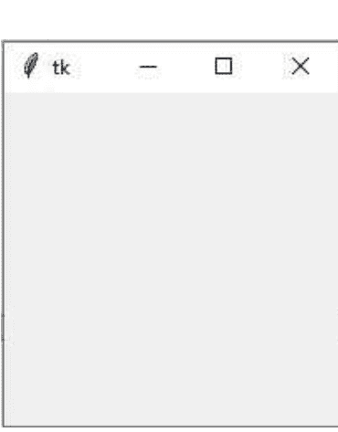

## 10.2 Tkinter控件

为了用有意义的元素填充仍然为空的主窗口，并以此创建一个漂亮的GUI，Tkinter提供了多种控件。这些控件可以分为控制元素和信息元素。Tkinter提供了各种控制元素，如按钮、文本框、单选按钮、下拉菜单等。还有一些信息元素，如标签、颜色指示器等。我们将在下面介绍最重要的控件。

### 10.2.1 按钮

按钮控件用于在GUI应用程序窗口中插入一个可点击的按钮。也可以在按钮上显示文本，以便清晰地传达按钮的用途。当按下此按钮时要执行或调用的函数，既可以在声明按钮时分配，也可以在之后分配。

你可以使用以下语句和语法创建这样的按钮：

```
w = Button ( master, option=value, ... )
```

参数的理解如下：

*Master* 用于引用GUI主窗口（在我们的例子中是仍然为空的GUI窗口）。这里输入定义中使用的名称（例如前面使用了window）。这样Python就知道按钮应该放置在哪个GUI窗口中。

通过 *Option* 你可以确定按钮的属性，例如背景颜色或按钮的高度。如果有多个属性，每个属性及其期望值用逗号分隔——从 *master* 之后的第二个参数开始。

按钮最常用的选项/属性可能是：

| 选项 | 描述 |
| :--- | :--- |
| **command** | 点击按钮时调用的函数 |
| **font** | 按钮字体 |
| **bg** | 背景颜色 |
| **height** | 按钮的高度，以文本行或像素为单位 |
| **bd** | 按钮边框的宽度，以像素为单位（默认为2）。 |
| **activebackground** | 鼠标光标在按钮上时的背景颜色 |
| **activeforeground** | 鼠标光标在按钮上时的前景颜色 |

### 按钮的方法或函数：

为了确保用户点击按钮时发生某些事情，你需要方法。对于按钮元素，有两个常用的方法：

1) flash()

在此方法中，按钮在活动状态和正常状态颜色之间快速闪烁多次，以吸引用户的注意。

2) invoke()

此方法调用按钮的回调函数，并返回函数应执行的操作。如果按钮没有回调，则不执行任何操作。但我们现在就通过一个例子来看看这个。

在此之前，我们需要知道 **pack()** 方法的作用。简单来说，使用此方法可以将控件组织成块。

示例：

```
from tkinter import* #从Tkinter导入所有包
import tkinter as tk

def show_text():
    message1.config(text='Test Data') #更改文本标签

root = tk.Tk() # 创建主窗口

#声明标签
message1=Label(root, text = 'Display Data')
message1.pack()

#声明按钮
button1=Button(root, text = 'Click Me', command = show_text)
button1.pack()

mainloop()
```

输出：点击按钮前

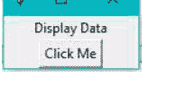

输出：点击按钮后

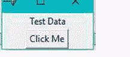

### 10.2.2 画布（图形区域）

画布就是一个矩形的图形区域，可以放置在GUI窗口中，用于显示布局、图像、图形、文本或任何其他内容。

参数与按钮类似，如下：

*Master* 同样用于引用GUI主窗口（参见按钮）。

通过 *Option* 你再次确定图形区域的属性，例如尺寸或背景颜色。如果有多个属性，每个属性及其期望值（=value）也在这里插入，用逗号分隔——从 *master* 之后的第二个参数开始。

按钮最常用的选项/属性可能是：

| 选项 | 描述 |
|---|---|
| **height** | 图形区域的高度（y方向） |
| **width** | 图形区域的宽度（x方向） |
| **bd** | 边框的宽度，以像素为单位（默认为2） |
| **bg** | 背景颜色 |
| **cursor** | 区域内使用的光标（例如箭头、圆形等） |
| **confine** | 设置为 *true* 时，无法滚动到滚动区域之外 |

默认情况下，Canvas控件支持以下用于绘图或绘制的元素：

**arc（弧形）：**

创建一个弧形表示。

```
coord = 10, 50, 240, 210
arc = canvas.create_arc(coord, start=0, extent=150, fill="blue")
```

**image（图像）：**

创建一个图像元素（BitmapImage或PhotoImage类的实例）。

```
filename = PhotoImage(file = "test.gif")
image = canvas.create_image(50, 50, anchor=NE, image=filename)
```

**line（线）：**

创建一个线形元素。

```
line = canvas.create_line(x0, y0, x1, y1, ..., xn, yn, options)
```

**oval（椭圆）：**

在指定坐标处创建一个圆形或椭圆形。定义需要两对坐标，即左上角和右下角。

```
oval = canvas.create_oval(x0, y0, x1, y1, options)
```

**polygon（多边形）：**

创建一个由三个顶点定义的多边形。

```
polygon= canvas.create_polygon(x0,y0,x1,y1,...xN, yN, options)
```

让我们通过一个例子来看看这个。

示例：

```
import tkinter

top = tkinter.Tk()

C = tkinter.Canvas(top, bg="blue", height=300, width=250)

coord = 10, 50, 240, 210
arc = C.create_arc(coord, start=0, extent=230, fill="yellow")

C.pack()
top.mainloop()
```

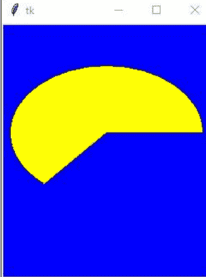

### 10.2.3 复选按钮控件（选择按钮）

借助复选按钮控件，程序用户可以从给定的选项中选择一个或多个选项。

你可以使用以下语句和语法创建这样的选择按钮：

```
w = Checkbutton ( master, option, ... )
```

参数 *master* 和 *option* 的含义与前面章节相同。在这种情况下，按钮最常用的选项/属性可能是：

| 选项 | 描述 |
| :--- | :--- |
| **command** | 当用户选中或取消选中复选按钮时调用的函数 |
| **bd** | 边框宽度，以像素为单位（默认为2） |
| **bg** | 背景颜色 |
| **activebackground** | 鼠标光标在按钮上时的背景颜色 |

### 选择按钮的方法或函数：

处理选择按钮元素时，有以下常用方法：

- 1) **select()**
此方法可用于检查按钮是否被选中或勾选。

- 2) **deselect()**
此方法会使按钮在被选中时取消选中状态。

- 3) **flash()**
在此方法中，按钮会在活动状态和正常状态颜色之间快速闪烁几次，以吸引用户的注意。

- 4) **invoke()**
此方法调用按钮的回调函数，并返回该函数应执行的操作。如果按钮没有回调函数，则不执行任何操作。

- 5) **toggle()**
此方法可用于切换选择按钮的状态。（例如：如果已选中则取消选中，如果未选中则选中）。

让我们通过一个例子来看看这个：

### 示例：

```
from tkinter import *
import tkinter.messagebox
import tkinter

top = tkinter.Tk()
CheckVar1 = IntVar()
CheckVar2 = IntVar()
CheckVar3 = IntVar()
CheckVar4 = IntVar()

C1 = Checkbutton(top, text = "Running", variable = CheckVar1, \
                onvalue = 1, offvalue = 0, height=5, \
                width = 20)

C2 = Checkbutton(top, text = "Skipping", variable = CheckVar2, \
                onvalue = 1, offvalue = 0, height=5, \
                width = 20)

C3 = Checkbutton(top, text = "Cycling", variable = CheckVar3, \
                onvalue = 1, offvalue = 0, height=5, \
                width = 20)

C4 = Checkbutton(top, text = "Burpee", variable = CheckVar4, \
                onvalue = 1, offvalue = 0, height=5, \
                width = 20)

C1.pack()
C2.pack()
C3.pack()
C4.pack()
top.mainloop()
```

### 输出：

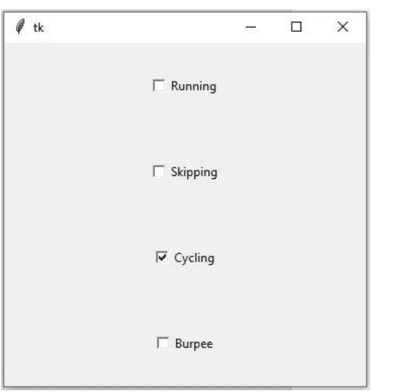

### 10.2.4 输入框控件（entry-widget）

输入框控件可用于向用户请求或接受单行文本（字符串）。但是，如果你想显示多行文本，最好使用文本控件。

这样的输入框使用以下语句和语法创建：

```
w = Entry( master, option, ... )
```

参数 *master* 和 *option* 的含义再次与前面章节相同。在这种情况下，按钮最常用的选项/属性可能是：

| 选项 | 描述 |
|---|---|
| **bd** | 边框宽度，以像素为单位（默认为2） |
| **bg** | 背景颜色 |
| **font** | 文本字体 |

### 输入框的方法或函数：

处理输入框元素时，有以下两个常用方法：

- 1) **get()**
此方法返回输入框的当前内容。

- 2) **delete (first, last=none)**
此方法允许从控件中删除字符，从第一个索引号（first）开始到最后一个字符（last）。如果未指定第二个参数，则只删除第一个索引处的单个字符。

让我们通过一个例子再来看看这个：

### 示例：

```
from tkinter import *

top = Tk()
L1 = Label(top, text="UserName")
L1.pack( side = LEFT)
E1 = Entry(top, bd =5)
E1.pack(side = RIGHT)

top.mainloop()
```

### 输出：

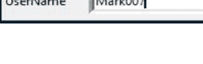

### 10.2.5 框架控件（Frame widget）

框架控件对于以有意义的方式分组和组织其他控件非常重要。框架控件充当一种容器，容纳其他控件并将它们全部放置在主GUI窗口中的所需位置。

你可以使用以下语句和语法创建这样的框架：

```
w = Frame ( master, option, ... )
```

参数 *master* 和 *option* 的含义再次与前面章节相同。在这种情况下，按钮最常用的选项/属性可能是：

| 选项 | 描述 |
|---|---|
| **bd** | 边框宽度，以像素为单位（默认为2） |
| **bg** | 正常背景颜色 |

### 示例：

```
from tkinter import *

root = Tk()
frame = Frame(root)
frame.pack()

bottomframe = Frame(root)
bottomframe.pack( side = BOTTOM )

redbutton = Button(frame, text="Red", fg="red")
redbutton.pack( side = LEFT)

greenbutton = Button(frame, text="Brown", fg="brown")
greenbutton.pack( side = LEFT )

bluebutton = Button(frame, text="Blue", fg="blue")
bluebutton.pack( side = LEFT )

blackbutton = Button(bottomframe, text="Black", fg="black")
blackbutton.pack( side = BOTTOM)

root.mainloop()
```

### 输出：

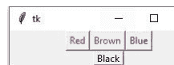

### 10.2.6 标签控件

此控件渲染一个显示区域，你可以在其中插入图像或文本。图像或文本可以随时更新。此控件允许对其包含的文本进行额外操作，例如下划线、加粗等。

你可以使用以下语句和语法创建这样的标签：

```
w = Label ( master, option, ... )
```

正如你已经可以想象的那样，*master* 和 *option* 的含义再次与前面章节相同。在这种情况下，按钮最常用的选项/属性可能是：

| 选项 | 描述 |
| :--- | :--- |
| anchor | 控制标签在控件内的位置（如果有额外空间可用）。 |
| text | 显示一行或多行文本 |
| bg | 背景颜色 |

### 示例：

```
from tkinter import *

root = Tk()
var = StringVar()
label = Label( root, textvariable=var, relief=RAISED )

var.set("Hey!? How are you doing?")
label.pack()
root.mainloop()
```

### 输出：


# 11 DIY项目

现在让我们进入DIY项目，应用我们所学的知识并深化理论。

## 11.1 项目1：一个带用户输入的简单计算器

在这个项目中，我们将一起逐步编写一个用于简单计算器的Python脚本，该计算器具有加、减、除、乘等基本算术运算。

### 步骤1：打开并保存新的空Python脚本

首先，我们需要打开一个新的Python脚本文件并为其命名保存。在Python IDLE中，你可以点击 **File** 菜单并选择 **New File**。现在你有了一个新的Python脚本文件，你可以通过点击 **File** 菜单然后点击 **Save** 选项，用你选择的名称保存它。


### 步骤2：接收用户输入

如前面章节所讨论的，可以给用户一个输入选项，以便用户输入两个数字和运算符（例如，+ 或 -）来计算结果。

```
python
value1=int(input("Enter the 1st value: "))
value2=int(input("Enter the 2nd value: "))
operator=input("Enter the arithmetic operator: ")
```

用户输入的两个值和算术运算符随后存储在名为 *value1*、*value2* 和 *operator* 的变量中。此外，加法 *int* 将输入的数字转换为整数（这是必要的，因为通过Python中的输入提示输入的是字符串形式）。

### 步骤3：实现条件语句

为了定义所需的四种算术运算，我们可以使用如下条件语句：

```
python
if operator == "+":
    final_val = value1+value2

elif operator == "-":
    final_val = value1-value2

elif operator == "/":
    final_val = value1/value2

elif operator == "*":
    final_val = value1*value2
```

### 步骤4：程序的持续执行

应该实现一种机制来持续运行程序，否则程序只会运行一次然后停止。我们在代码末尾用一个简单的while语句来实现这一点，以便程序持续运行。

```
python
while(1):
    calculator()
```

下面我们再次看到所描述项目的完整Python脚本。在脚本中，定义了 **calculator** 函数，所有指令都放在函数内部，以便通过在持续运行的无限while循环中调用该函数来连续执行该函数。

## Python | 逐步讲解

```python
def calculator():
    value1=int(input("Enter the 1st value: "))
    value2=int(input("Enter the 2nd value: "))
    operator=input("Enter the arithmetic operator: ")

    if operator == "+":
        final_val = value1+value2

    elif operator == "-":
        final_val = value1-value2

    elif operator == "/":
        final_val = value1/value2

    elif operator == "*":
        final_val = value1*value2

    print(final_val)

while(1):
    calculator()
```

以下是完整的代码，可以直接复制到 Python IDLE 中运行：

```python
def calculator():
    value1=int(input("Enter the 1st value: "))
    value2=int(input("Enter the 2nd value: "))
    operator=input("Enter the arithmetic operator: ")

    if operator == "+":
        final_val = value1+value2

    elif operator == "-":
        final_val = value1-value2

    elif operator == "/":
        final_val = value1/value2

    elif operator == "*":
        final_val = value1*value2

    print(final_val)

while(1):
    calculator()
```

如果你执行算术运算，它看起来会像这样，例如：

```
Enter the 1st value: 5
Enter the 2nd value: 5
Enter the arithmetic operator: *
25
Enter the 1st value: 10
Enter the 2nd value: 15
Enter the arithmetic operator: +
25
Enter the 1st value: 10
Enter the 2nd value: 2
Enter the arithmetic operator: /
5.0
Enter the 1st value: 18
Enter the 2nd value: 7
Enter the arithmetic operator: -
11
Enter the 1st value: |
```

## 11.2 项目 2：显示区间内的所有质数

在这个项目中，我们希望逐步编写一个脚本，显示特定范围内的所有质数。也就是说，我们希望能够在输入中定义，例如，范围 1 - 100，然后输出该范围内存在的所有质数。

顺便说一下，质数是只能被自身和 1 整除（没有余数），但大于 1 的数字。

### 步骤 1：将范围定义为用户输入

程序要检查质数的数值范围必须能够通过提示作为用户输入指定。为此，我们使用两个变量 *lower* 和 *upper* 定义范围的上下限，并将输入（字符串）依次转换为整数（int）。

```python
lower=int(input("Enter the lower limit: "))
upper=int(input("Enter the upper limit: "))
```

### 步骤 2：检查质数

在此步骤中，要检查给定范围内的每个数字是否为质数。为此，我们使用 for、if 和 else 语句。

```python
for value in range (lower, upper):
    if value>1:
        for i in range (2, value):
            if(value%i)==0:
                break
        else:
            print(value, "\n")
```

在指令中，*value* 是在 lower 和 upper 值之间定义的范围内始终递增（每次递增 1）的变量。在每个步骤（迭代）中，第一个条件语句 *if* 首先检查为变量 *value* 选择的数值是否大于 1，因为所有质数都大于 1。只有当为变量 *value* 选择的数值大于 1 时，才会执行其余语句（嵌套语句）。下一个缩进级别的下一个 if 语句然后检查所选值是否可以被范围内的任何其他值整除而没有余数。如果存在任何值可以整除为变量 *value* 选择的数值而没有余数，则循环终止并移动到下一次迭代。另一方面，如果条件语句为**假**，则变量 *value* 的特定值将作为质数在提示中输出。此过程持续进行，直到检查完整个指定范围。

### 步骤 3：持续运行程序

同样，应该实现一种机制来使程序持续运行，否则程序只会运行一次然后停止。我们再次在代码末尾使用一个简单的 while 语句来实现这一点，以便程序持续执行。

下面我们看到所描述项目的完整 Python 脚本：

```python
def check_primes():
    lower=int(input("Enter the lower limit: "))
    upper=int(input("Enter the upper limit: "))

    print("Prime numbers between ",lower, "and ",upper, "are: ")
    for value in range (lower, upper):
        if value>1:
            for i in range (2, value):
                if(value%i)==0:
                    break
            else:
                print(value,"\n")

while(1):
    check_primes()
```

定义了一个名为 **check_primes()** 的函数，所有上述语句都放在函数内部，以便可以持续执行该函数。

以下是完整的代码，可以直接复制到 Python IDLE 中运行：

```python
def check_primes():
    lower=int(input("Enter the lower limit: "))
    upper=int(input("Enter the upper limit: "))

    print("Prime numbers between ",lower, "and ",upper, "are: ")

    for value in range (lower,upper):
        if value>1:
            for i in range (2, value):
                if(value%i)==0:
                    break
            else:
                print(value,"\n")

while(1):
    check_primes()
```

如果你对特定范围执行质数检查，它看起来会像这样，例如：

```
Enter the lower limit: 5
Enter the upper limit: 25
Prime numbers between  5 and  25 are:
5
7
11
13
17
19
23
Enter the lower limit: 1
Enter the upper limit: 68
Prime numbers between  1 and  68 are:
```

## 11.3 项目 3：带图形用户界面（GUI）的计算器

该项目逐步说明了使用我们在上一节已经学过的 Tkinter 模块开发一个具有交互式图形用户界面（GUI）的稍微复杂的计算器。与第一个项目类似，计算器也应该能够执行基本的算术运算，但此外，它应该清晰地展示如何开发交互式 GUI 应用程序，看起来像这样：

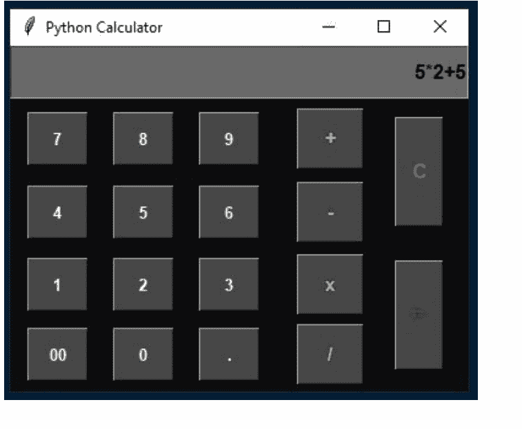

### 步骤 1：导入 Tkinter 包/声明全局变量

```python
#Import tkinter library
from tkinter import *

# globally declare the expression variable
expression = ""
```

### 步骤 2：创建 GUI 以显示字段和按钮

```python
if __name__ == "__main__":
    gui = Tk() #Creating a basic window
    gui.configure(background="gray5") #color for the window
    gui.title("Python Calculator") #title of the window
    gui.geometry("374x282") #Size for the created window
    equation = StringVar() #create an instance using stringVar variable class
```

### 步骤 3：设置 GUI 功能

在此步骤中，使用 Tkinter 小部件，我们定义当用户单击计算器上的按钮时会发生什么。

当单击其中一个按钮时，应调用 **enter()** 方法。此方法根据单击的按钮传递数字或算术运算符。一旦传递了值，数字或运算符就存储在表达式变量中。在存储表达式变量的值或激活器之前，我们仍然需要使用 **str()** 方法将其转换为字符串。

```python
#Function that updates the expression
def Enter(number):
    global expression

    # concatenation of string
    expression = expression + str(number)

    #Update the expression using the SET method
    equation.set(expression)
```

= 按钮计算存储在表达式变量中的整个字符串。**eval()** 函数有助于执行变量的算术运算并返回总值。

```python
#Function to evaluate the final output
def pressequal():
    try:
        global expression

        #eval function to evaluate the expression
        total = str(eval(expression))
        equation.set(total)

        #initialize the expression variable by empty string
        expression = ""

    #If an error occurs this except block will handle it
    except:
        equation.set(" error ")
        expression = ""
```

我们计算器的 "C" 按钮清除显示的内容，即先前输入的值。因此，当我们单击计算器的 "C"（清除）按钮时，我们希望调用 `clear()` 方法。变量 `expression` 被创建为空字符串。

```python
#This function is used to clear the Display field
def clear():
    global expression
    expression = ""
    equation.set("")
```

Python 提供了广泛的小部件，有助于开发用户友好的 GUI。在本项目中，我们将使用我们已经学过的按钮和文本字段。

```python
#create a Display field inside the window
Display_field = Entry(gui, font=('arial', 12, 'bold'), bg='dimgray',
                     textvariable=equation, justify= RIGHT)

Display_field.grid(columnspan=6, ipadx=95, row=0, column=0, ipady = 10)
```

## Python | 逐步实现

```python
# 导入 tkinter 库
from tkinter import *

# 全局声明表达式变量
expression = ""

# 更新表达式的函数
def Enter(number):
    global expression

    # 字符串拼接
    expression = expression + str(number)

    # 使用 SET 方法更新表达式
    equation.set(expression)

# 计算最终输出的函数
def pressequal():
    try:
        global expression

        # 使用 eval 函数计算表达式
        total = str(eval(expression))
        equation.set(total)

        # 将表达式变量初始化为空字符串
        expression = ""

    # 如果发生错误，此 except 块将处理它
    except:
        equation.set(" error ")
        expression = ""

# 此函数用于清除显示字段
def clear():
    global expression
    expression = ""
    equation.set("")

if __name__ == "__main__":
    gui = Tk()  # 创建一个基本窗口
    gui.configure(background="gray5")  # 窗口背景色
    gui.title("Python Calculator")  # 窗口标题
    gui.geometry("374x282")  # 创建窗口的尺寸
    equation = StringVar()  # 使用 stringVar 变量类创建一个实例
    # 在窗口内创建一个显示字段
    Display_field = Entry(gui, font=('arial', 12, 'bold'), bg='dimgrey',
                          textvariable=equation, justify=RIGHT)
    Display_field.grid(columnspan=6, ipadx=95, row=0, column=0, ipady=10)
    # 创建按钮并将其放置在特定位置
    button7 = Button(gui, text=' 7 ', fg='white', bg='gray28',
                     command=lambda: Enter(7), height=2, width=5,
                     font=('arial', 10, 'bold'))
    button7.grid(row=2, column=0, padx=10, pady=10)

    button8 = Button(gui, text=' 8 ', fg='white', bg='gray28',
                     command=lambda: Enter(8), height=2, width=5,
                     font=('arial', 10, 'bold'))
    button8.grid(row=2, column=1)

    button9 = Button(gui, text=' 9 ', fg='white', bg='gray28',
                     command=lambda: Enter(9), height=2, width=5,
                     font=('arial', 10, 'bold'))
    button9.grid(row=2, column=2)

    button4 = Button(gui, text=' 4 ', fg='white', bg='gray28',
                     command=lambda: Enter(4), height=2, width=5,
                     font=('arial', 10, 'bold'))
    button4.grid(row=3, column=0)

    button5 = Button(gui, text=' 5 ', fg='white', bg='gray28',
                     command=lambda: Enter(5), height=2, width=5,
                     font=('arial', 10, 'bold'))
    button5.grid(row=3, column=1)

    button6 = Button(gui, text=' 6 ', fg='white', bg='gray28',
                     command=lambda: Enter(6), height=2, width=5,
                     font=('arial', 10, 'bold'))
    button6.grid(row=3, column=2)

    button1 = Button(gui, text=' 1 ', fg='white', bg='gray28',
                     command=lambda: Enter(1), height=2, width=5,
                     font=('arial', 10, 'bold'))
    button1.grid(row=4, column=0)

    button2 = Button(gui, text=' 2 ', fg='white', bg='gray28',
                     command=lambda: Enter(2), height=2, width=5,
                     font=('arial', 10, 'bold'))
    button2.grid(row=4, column=1)

    button3 = Button(gui, text=' 3 ', fg='white', bg='gray28',
                     command=lambda: Enter(3), height=2, width=5,
                     font=('arial', 10, 'bold'))
    button3.grid(row=4, column=2, padx=10, pady=10)

    button0 = Button(gui, text=' 0 ', fg='white', bg='gray28',
                     command=lambda: Enter(0), height=2, width=5,
                     font=('arial', 10, 'bold'))
    button0.grid(row=5, column=1)

    buttonPara = Button(gui, text=' 00 ', fg='white', bg='gray28',
                     command=lambda: Enter('00'), height=2, width=5,
                     font=('arial', 10, 'bold'))
    buttonPara.grid(row=5, column=0)

    buttonDecimal = Button(gui, text=' . ', fg='white', bg='gray28',
                     command=lambda: Enter('.'), height=2, width=5,
                     font=('arial', 10, 'bold'))
    buttonDecimal.grid(row=5, column=2)

    Addition_btn = Button(gui, text=' + ', fg='olivedrab2', bg='gray28',
                      command=lambda: Enter('+'), height=2, width=5,
                      font=('arial', 11, 'bold'))
    Addition_btn.grid(row=2, column=4)

    Subtraction_btn = Button(gui, text=' - ', fg='olivedrab2', bg='gray28',
                         command=lambda: Enter('-'), height=2, width=5,
                         font=('arial', 11, 'bold'))
    Subtraction_btn.grid(row=3, column=4)

    Multiplication_Btn = Button(gui, text=' x ', fg='olivedrab2', bg='gray28',
                            command=lambda: Enter('*'), height=2, width=5,
                            font=('arial', 11, 'bold'))
    Multiplication_Btn.grid(row=4, column=4)

    Division_Btn = Button(gui, text=' / ', fg='olivedrab2', bg='gray28',
                      command=lambda: Enter('/'), height=2, width=5,
                      font=('arial', 11, 'bold'))
    Division_Btn.grid(row=5, column=4)

    clear_Btn = Button(gui, text='C', fg='firebrick2', bg='gray28',
                   command=clear, height=4, width=3,
                   font=('arial', 12, 'bold'))
    clear_Btn.grid(row=2, rowspan=2, column=5, padx=15, pady=15)

    Equal_Btn = Button(gui, text='=', fg='Green4', bg='gray28',
                    command=pressequal, height=4, width=3,
                    font=('arial', 12, 'bold'))
    Equal_Btn.grid(row=4, rowspan=2, column=5)

    # 运行应用程序
    gui.mainloop()
```

**mainloop()** 方法在一个无限循环中运行计算器窗口。这个袖珍计算器会一直执行，直到用户手动关闭窗口。

我们完成的带有图形用户界面的计算器将如下所示：

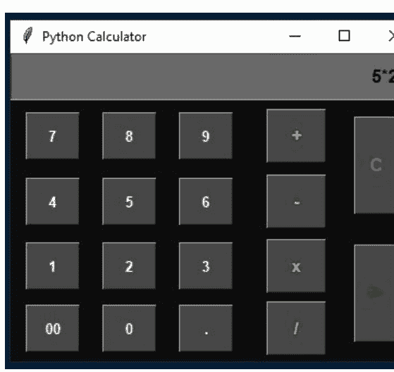

以下是完整的代码，可以直接复制到 Python IDLE 中运行：

```python
# 导入 tkinter 库
from tkinter import *

# 全局声明表达式变量
expression = ""

# 更新表达式的函数
def Enter(number):
    global expression

    # 字符串拼接
    expression = expression + str(number)

    # 使用 SET 方法更新表达式
    equation.set(expression)

# 计算最终输出的函数
def pressequal():
    try:
        global expression

        # 使用 eval 函数计算表达式
        total = str(eval(expression))
        equation.set(total)

        # 将表达式变量初始化为空字符串
        expression = ""

    # 如果发生错误，此 except 块将处理它
    except:
        equation.set(" error ")
        expression = ""

# 此函数用于清除显示字段
def clear():
    global expression
    expression = ""
    equation.set("")

if __name__ == "__main__":
    gui = Tk()  # 创建一个基本窗口
    gui.configure(background="gray5")  # 窗口背景色
    gui.title("Python Calculator")  # 窗口标题
    gui.geometry("374x282")  # 创建窗口的尺寸
    equation = StringVar()  # 使用 stringVar 变量类创建一个实例
    # 在窗口内创建一个显示字段
    Display_field = Entry(gui, font=('arial', 12, 'bold'), bg='dimgrey',
                          textvariable=equation, justify=RIGHT)
    Display_field.grid(columnspan=6, ipadx=95, row=0, column=0, ipady=10)
    # 创建按钮并将其放置在特定位置
    button7 = Button(gui, text=' 7 ', fg='white', bg='gray28',
                     command=lambda: Enter(7), height=2, width=5,
                     font=('arial', 10, 'bold'))
    button7.grid(row=2, column=0, padx=10, pady=10)

    button8 = Button(gui, text=' 8 ', fg='white', bg='gray28',
                     command=lambda: Enter(8), height=2, width=5,
                     font=('arial', 10, 'bold'))
    button8.grid(row=2, column=1)

    button9 = Button(gui, text=' 9 ', fg='white', bg='gray28',
                     command=lambda: Enter(9), height=2, width=5,
                     font=('arial', 10, 'bold'))
    button9.grid(row=2, column=2)

    button4 = Button(gui, text=' 4 ', fg='white', bg='gray28',
                     command=lambda: Enter(4), height=2, width=5,
                     font=('arial', 10, 'bold'))
    button4.grid(row=3, column=0)

    button5 = Button(gui, text=' 5 ', fg='white', bg='gray28',
                     command=lambda: Enter(5), height=2, width=5,
                     font=('arial', 10, 'bold'))
    button5.grid(row=3, column=1)

    button6 = Button(gui, text=' 6 ', fg='white', bg='gray28',
                     command=lambda: Enter(6), height=2, width=5,
                     font=('arial', 10, 'bold'))
    button6.grid(row=3, column=2)

    button1 = Button(gui, text=' 1 ', fg='white', bg='gray28',
                     command=lambda: Enter(1), height=2, width=5,
                     font=('arial', 10, 'bold'))
    button1.grid(row=4, column=0)

    button2 = Button(gui, text=' 2 ', fg='white', bg='gray28',
                     command=lambda: Enter(2), height=2, width=5,
                     font=('arial', 10, 'bold'))
    button2.grid(row=4, column=1)

    button3 = Button(gui, text=' 3 ', fg='white', bg='gray28',
                     command=lambda: Enter(3), height=2, width=5,
                     font=('arial', 10, 'bold'))
    button3.grid(row=4, column=2, padx=10, pady=10)

    button0 = Button(gui, text=' 0 ', fg='white', bg='gray28',
                     command=lambda: Enter(0), height=2, width=5,
                     font=('arial', 10, 'bold'))
    button0.grid(row=5, column=1)

    buttonPara = Button(gui, text=' 00 ', fg='white', bg='gray28',
                     command=lambda: Enter('00'), height=2, width=5,
                     font=('arial', 10, 'bold'))
    buttonPara.grid(row=5, column=0)

    buttonDecimal = Button(gui, text=' . ', fg='white', bg='gray28',
                     command=lambda: Enter('.'), height=2, width=5,
                     font=('arial', 10, 'bold'))
    buttonDecimal.grid(row=5, column=2)

    Addition_btn = Button(gui, text=' + ', fg='olivedrab2', bg='gray28',
                      command=lambda: Enter('+'), height=2, width=5,
                      font=('arial', 11, 'bold'))
    Addition_btn.grid(row=2, column=4)

    Subtraction_btn = Button(gui, text=' - ', fg='olivedrab2', bg='gray28',
                         command=lambda: Enter('-'), height=2, width=5,
                         font=('arial', 11, 'bold'))
    Subtraction_btn.grid(row=3, column=4)

    Multiplication_Btn = Button(gui, text=' x ', fg='olivedrab2', bg='gray28',
                            command=lambda: Enter('*'), height=2, width=5,
                            font=('arial', 11, 'bold'))
    Multiplication_Btn.grid(row=4, column=4)

    Division_Btn = Button(gui, text=' / ', fg='olivedrab2', bg='gray28',
                      command=lambda: Enter('/'), height=2, width=5,
                      font=('arial', 11, 'bold'))
    Division_Btn.grid(row=5, column=4)

    clear_Btn = Button(gui, text='C', fg='firebrick2', bg='gray28',
                   command=clear, height=4, width=3,
                   font=('arial', 12, 'bold'))
    clear_Btn.grid(row=2, rowspan=2, column=5, padx=15, pady=15)

    Equal_Btn = Button(gui, text='=', fg='Green4', bg='gray28',
                    command=pressequal, height=4, width=3,
                    font=('arial', 12, 'bold'))
    Equal_Btn.grid(row=4, rowspan=2, column=5)

    # 运行应用程序
    gui.mainloop()
```

gui = Tk() #创建一个基本窗口
gui.configure(background="gray5") #设置窗口背景颜色
gui.title("Python 计算器") #设置窗口标题
gui.geometry("374x282") #设置创建的窗口尺寸

equation = StringVar() #使用StringVar变量类创建一个实例

#在窗口内创建一个显示字段
Display_field = Entry(gui, font=('arial', 12, 'bold'), bg='dimgray',
                    textvariable=equation, justify= RIGHT)

Display_field.grid(columnspan=6, ipadx=95, row=0, column=0, ipady = 10)

#创建按钮并将其放置在特定位置
button7 = Button(gui, text=' 7 ', fg='white', bg='gray28',
                command=lambda: Enter(7), height=2, width=5,
                font=('arial', 10, 'bold'))
button7.grid(row=2, column=0,  padx=10, pady=10)

button8 = Button(gui, text=' 8 ', fg='white', bg='gray28',
                command=lambda: Enter(8), height=2, width=5,
                font=('arial', 10, 'bold'))
button8.grid(row=2, column=1)

button9 = Button(gui, text=' 9 ', fg='white', bg='gray28',
                command=lambda: Enter(9), height=2, width=5,
                font=('arial', 10, 'bold'))
button9.grid(row=2, column=2)

button4 = Button(gui, text=' 4 ', fg='white', bg='gray28',
              command=lambda: Enter(4), height=2, width=5,
              font=('arial', 10, 'bold'))
button4.grid(row=3, column=0)

button5 = Button(gui, text=' 5 ', fg='white', bg='gray28',
              command=lambda: Enter(5), height=2, width=5,
              font=('arial', 10, 'bold'))
button5.grid(row=3, column=1)

button6 = Button(gui, text=' 6 ', fg='white', bg='gray28',
              command=lambda: Enter(6), height=2, width=5,
              font=('arial', 10, 'bold'))
button6.grid(row=3, column=2)

button1 = Button(gui, text=' 1 ', fg='white', bg='gray28',
              command=lambda: Enter(1), height=2, width=5,
              font=('arial', 10, 'bold'))
button1.grid(row=4, column=0)

button2 = Button(gui, text=' 2 ', fg='white', bg='gray28',
              command=lambda: Enter(2), height=2, width=5,
              font=('arial', 10, 'bold'))
button2.grid(row=4, column=1)

button3 = Button(gui, text=' 3 ', fg='white', bg='gray28',
              command=lambda: Enter(3), height=2, width=5,
              font=('arial', 10, 'bold'))

button3.grid(row=4, column=2, padx=10, pady=10)

button0 = Button(gui, text=' 0 ', fg='white', bg='gray28',
                 command=lambda: Enter(0), height=2, width=5,
                 font=('arial', 10, 'bold'))
button0.grid(row=5, column=1)

buttonPara = Button(gui, text=' 00 ', fg='white', bg='gray28',
                    command=lambda: Enter('00'), height=2, width=5,
                    font=('arial', 10, 'bold'))
buttonPara.grid(row=5, column=0)

buttonDecimal = Button(gui, text=' . ', fg='white', bg='gray28',
                       command=lambda: Enter('.'), height=2, width=5,
                       font=('arial', 10, 'bold'))
buttonDecimal.grid(row=5, column=2)

Addition_btn = Button(gui, text=' + ', fg='olivedrab2', bg='gray28',
                      command=lambda: Enter("+"), height=2, width=5,
                      font=('arial', 11, 'bold'))
Addition_btn.grid(row=2, column=4)

Subtraction_btn = Button(gui, text=' - ', fg='olivedrab2', bg='gray28',
                         command=lambda: Enter("-"), height=2, width=5,
                         font=('arial', 11, 'bold'))
Subtraction_btn.grid(row=3, column=4)

Multiplication_Btn = Button(gui, text=' x ', fg='olivedrab2', bg='gray28',
    command=lambda: Enter("*"), height=2, width=5,
    font=('arial', 11, 'bold'))
Multiplication_Btn.grid(row=4, column=4)

Division_Btn = Button(gui, text=' / ', fg='olivedrab2', bg='gray28',
    command=lambda: Enter("/"), height=2, width=5,
    font=('arial', 11, 'bold'))
Division_Btn.grid(row=5, column=4)

clear_Btn = Button(gui, text='C', fg='firebrick2', bg='gray28',
    command=clear, height=4, width=3,
    font=('arial', 12, 'bold'))
clear_Btn.grid(row=2, rowspan=2, column=5, padx=15, pady=15)

Equal_Btn = Button(gui, text='=', fg='Green4', bg='gray28',
    command=pressequal, height=4, width=3,
    font=('arial', 12, 'bold'))
Equal_Btn.grid(row=4, rowspan=2, column=5)

#运行应用程序
gui.mainloop()

# 12 故障排除 - 常见初学者错误

总的来说，如果你遵循本课程中教授的一些基本规则，用Python编程并不是非常困难。但是，如果遇到问题，这简短的一课应该会有所帮助。或者，你也可以在线查找故障排除指南，或者访问论坛，向有经验的用户寻求建议。

## Python版本之间的冲突

重要的是要知道，有时会同时存在几个主要的Python版本：例如，目前就有Python 2和Python 3。可能会发生这样的情况：同一个脚本在不同的Python版本中无法运行——与开发它的版本不同——因为版本之间存在细微的差异。因此，如果之前运行良好的脚本突然出现错误信息，建议注意Python环境的版本。

## 语法错误：缩进、制表符和空格

缩进在Python编程语言中非常重要，因为该语言本身要求非常精确的缩进级别。否则，将会产生错误。另一方面，在没有产生错误但脚本的功能与预期结果不同的情况下，不正确的缩进更为严重。建议使用四个空格作为一个缩进，而不是制表符。同时，请确保使用正确数量和正确用法的语法元素，如";"或"("或")"。

## 变量名错误

作为程序员，在使用变量名时应非常小心，因为在编译或执行阶段，变量名中的一个细微差别甚至一个拼写错误都会导致错误或缺陷。更重要的是，Python是一种区分大小写的编程语言，因此必须注意正确使用大写和小写字母。此外，你应该合理地使用变量名。也就是说，当你自己在以后查看程序脚本时，或者当其他程序员查看它时，变量名本身应该已经暗示或在一定程度上预示了该变量的含义或预期用途。通过这种方式，你可以极大地促进脚本的可理解性，甚至调试过程。

# 结束语

太棒了！

你做到了，你已经完成了初学者课程。恭喜你！

在这本书中，我试图用简单易懂的方式向你介绍Python编程的基础知识。我希望我在某种程度上取得了成功，并且这本书为你提供了一个易于理解且实用的编程世界入门，特别是Python世界的入门，现在你渴望去发现你可以编程什么！

这本书的目标是向你介绍编程（使用Python）的基本原则是什么。它应该是一本既能帮助理解理论背景知识，又能训练实际应用技能的书。

通过这个基础课程，你现在应该知道了作为初学者进行第一次Python编程所需的一切！当然，不要停留在这一点上，而是去阅读一本进阶书籍，以了解更多关于Python甚至其他编程语言的知识，这是有意义的。

在这门课程中，我们一起完成了相当多的内容！如果你坚持到了最后，你完全有理由为自己感到骄傲！**如果你喜欢这本书，如果你能给我留下评分和简短的反馈，并推荐这本书，我将非常高兴！非常感谢。**

最后一个提示：
如果你遇到困难，请查看以下网站，你可以在那里找到大量优秀的材料以及Python社区：[www.python.org/doc](http://www.python.org/doc) 和 [www.python.org/community](http://www.python.org/community)。

**如果你也对我其他关于类似主题的书籍感兴趣，请务必翻阅接下来的几页。**

**非常感谢！**

# 您可能感兴趣的其他主题书籍

所有书籍均可在常规销售平台上在线获取。最好直接搜索书名，或随时访问我的作者页面。部分书籍可能尚未出版，即将发布或即将上架。请浏览您选择的书籍，并获取电子书或平装本！

## 3D打印：

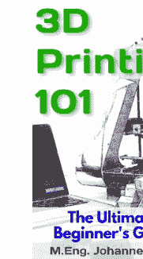

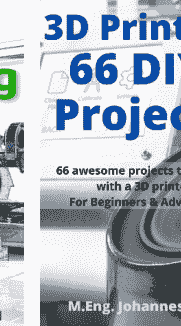

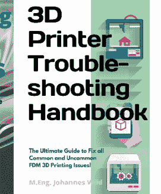

## CAD、FEM、CAM（3D对象创建、设计、仿真）：


Python | 循序渐进

## Fusion 360 CAD设计项目 第一部分

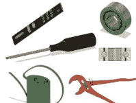

为高级用户讲解的10个从简单到中等难度的CAD项目
Johannes Wild

## 电气工程：

### 电气工程 循序渐进

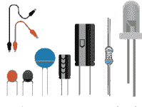

为初学者讲解的基础知识、元件与电路
工学硕士 Johannes Wild

### ARDUINO 循序渐进

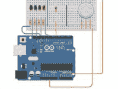

终极初学者指南：涵盖硬件、软件、编程与DIY项目基础知识
工学硕士 Johannes Wild

## 编程与其他软件：

### Excel 101

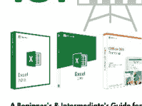

面向初学者与中级用户的指南：助您快速掌握Microsoft Excel (2010-2019 & 365) 精髓！
Johannes Wild

### PYTHON 循序渐进学编程


终极初学者指南：轻松、即时地开启Python编程之旅
工学硕士 Johannes Wild

其中一些书籍还有配套的视频课程：

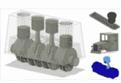

**Fusion 360 循序渐进 | 面向初学者的CAD、FEM与CAM**
AUTODESK FUSION 360终极实践指南！跟随工程师学习设计、仿真、制造等更多内容！
工学硕士 Johannes Wild
4.7 ★★★★★ (10)
总时长3.5小时 • 24节课 • 初学者
最高评分


**CAD设计101 | 面向初学者的3D建模（由工程师讲授）**
终极初学者指南：如何使用免费CAD软件创建用于3D打印等的3D对象！
工学硕士 Johannes Wild
4.4 ★★★★★ (10)
总时长1.5小时 • 15节课 • 所有级别


**3D打印101 | 终极初学者指南**
由工程师打造的软硬件一体化指南。专为即时开启3D打印世界而设计！
工学硕士 Johannes Wild
4.2 ★★★★★ (17)
总时长1.5小时 • 20节课 • 所有级别

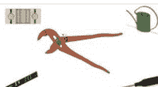

**Fusion 360 | CAD设计项目 – 第1部分**
面向中级到高级用户的10个简单至中等难度CAD设计项目（逐步讲解）
工学硕士 Johannes Wild
总时长2小时 • 12节课 • 中级
新课

...

购买课程，您可以在 [www.udemy.com](https://www.udemy.com) 搜索我的名字：

M.Eng. Johannes Wild，或使用以下链接：

[www.udemy.com/courses/search/?src=ukw&q=m.eng.+johannes+wild](https://www.udemy.com/courses/search/?src=ukw&q=m.eng.+johannes+wild)

**立即报名，深化您的知识！**

# 作者/出版商信息

© 2022

Johannes Wild
c/o RA Matutis
Berliner Straße 57
14467 Potsdam
Germany

电话：+49 15257887206
邮箱：3dtech@gmx.de
网站：[www.3dtech-3dprinting.com](http://www.3dtech-3dprinting.com)

# 本作品受版权保护

本作品及其组成部分受版权保护。未经作者同意，禁止在版权法允许的狭窄范围之外进行任何使用。这尤其适用于电子或其他形式的复制、翻译、分发和公开传播。未经作者书面许可，不得复制、处理或分发本作品的任何部分！保留所有权利。

本书中包含的所有信息均根据我们所知的最佳知识汇编，并经过仔细核对。然而，本书仅供教育目的，不构成行动建议。特别是，作者和出版商对本书中任何信息的使用或不使用不提供任何保证或责任。本书中引用的商标和其他权利仍为其各自作者或权利持有人的专有财产。

**非常感谢您选择本书！**