## Python

### 完全手册

Python 用户的必备手册

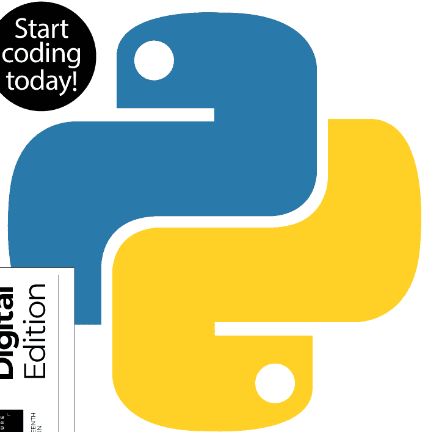

今天就开始编程吧！

数字版

# 欢迎使用 Python

### 完全手册

Python 是一种用途广泛的语言，其日益普及并不令人意外。它与日常语言的相似性使其成为树莓派的完美搭档，而树莓派通常是迈向实践编程的第一步。但不要被其对初学者友好的表象所迷惑——Python 拥有大量更高级的功能。在这个新版本中，你将学习如何用 Python 编程，发现能提升你理解力的精彩项目，并找到使用 Python 增强计算体验的方法。你还将创建有趣的项目，包括编程一个*太空侵略者*克隆游戏，并教会你的树莓派进行多任务处理。

让我们开始编程吧！

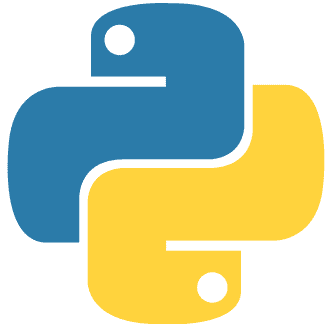

FUTURE

## Python

### 完全手册

Future PLC Quay House, The Ambury, Bath, BA1 1UA

### 编辑部

由 **Katharine Marsh & Perry Wardell-Wicks** 编纂
高级美术编辑 **Andy Downes**
艺术与设计主管 **Greg Whitaker**
编辑总监 **Jon White**

### 摄影

所有版权和商标均得到承认和尊重

### 广告

媒体资料包可应要求提供
商务总监 **Clare Dove**

### 许可

印刷许可主管 **Rachel Shaw**
licensing@futurenet.com
www.futurecontenthub.com

### 发行

报刊发行主管 **Tim Mathers**

### 制作

制作主管 **Mark Constance**
制作项目经理 **Matthew Eglinton**
广告制作经理 **Joanne Crosby**
数字版控制器 **Jason Hudson**
制作经理 **Keely Miller, Nola Cokely, Vivienne Calvert, Fran Twentyman**

**印刷** William Gibbons, 26 Planetary Road,
Willenhall, West Midlands, WV13 3XT

**发行** Marketforce, 5 Churchill Place, Canary Wharf, London, E14 5HU
www.marketforce.co.uk Tel: 0203 787 9001

**Python 完全手册 第十三版 (CMB4316)**
© 2022 Future Publishing Limited

我们承诺仅使用源自负责任管理、经认证的森林且采用无氯制造工艺的杂志纸。本书中的纸张均采购和生产自可持续来源，符合环境认证计划的标准：森林管理委员会 (FSC) 或森林认证认可计划 (PEFC)。该纸张持有完整的 FSC 或 PEFC 认证和认可。

所有内容 © 2022 Future Publishing Limited 或根据许可发布。保留所有权利。未经出版商事先书面许可，不得以任何方式使用、存储、传输或复制本杂志的任何部分。Future Publishing Limited（公司编号 2008885）在英格兰和威尔士注册。注册地址：Quay House, The Ambury, Bath BA1 1UA。本出版物中包含的所有信息仅供参考，据我们所知，在付印时是正确的。Future 无法对此类信息中的任何错误或不准确之处承担任何责任。建议您就本出版物中提及的产品/服务价格直接联系制造商和零售商。本出版物中提及的应用程序和网站不受我们控制。我们对其内容或任何其他更改或更新不承担责任。本杂志完全独立，与本文中提及的任何公司均无关联。


Future plc 是一家在
伦敦证券交易所上市的
公共公司（股票代码：FTR）。
www.futureplc.com

首席执行官 **Zillah Byng-Thorne**
非执行主席 **Richard Huntingford**
首席财务官 **Penny Ladkin-Brand**

电话 +44 (0)1225 442 244


# 目录

你可以在本书中找到的内容


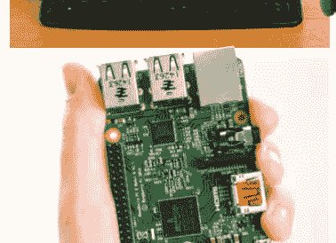


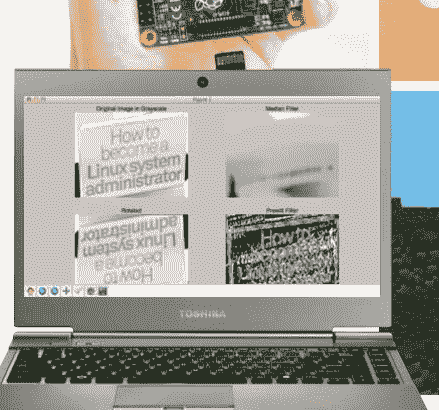

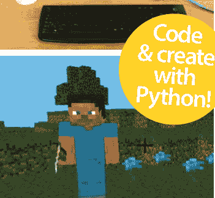

> 用 Python 编码与创造！

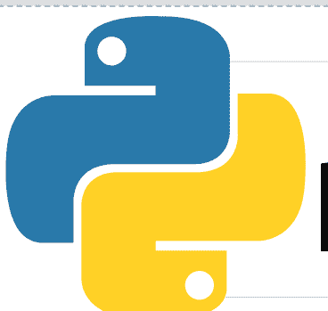

## Python 入门

8 大师班
探索 Python 基础知识

## Python 简介

# 用 Python 创造

## 在树莓派上使用 Python

- 26 **制作 Web 应用**
掌握这个入门项目

- 80 **用 Kivy 编写井字棋**
编程一个简单游戏

- 100 **在树莓派上使用 Python**
优化你的代码


- 86 **制作 Pong 克隆游戏**
提升你的游戏技能

- 106 **在 Minecraft 中使用 Python**
创造精彩作品

- 32 **为 Android 构建应用**
让你的应用随身携带


- 110 **处理多任务**
学习让你的树莓派进行多任务处理

- 40 **50 个 Python 技巧**
精选实用技巧

### 使用 Python

- 88 **编程一个太空侵略者克隆游戏**
用 Pivaders 享受乐趣

- 114 **创建树莓派驱动的虚拟现实设置**
使用 Python-VRZero

- 50 **替换你的 Shell**
告别 Bash

- 94 **太空侵略者克隆游戏 2**
继续制作 Pivaders

- 120 **查找并检查你的手机**
发现并记录蓝牙设备

- 58 **科学计算**
探索 NumPy 的强大功能

- 64 **Python 用于系统管理员**
如何调整你的设置

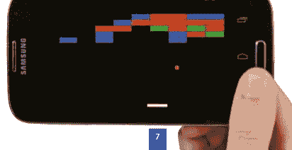

- 72 **抓取维基百科**
开始使用 Beautiful Soup

## Python 入门

一直想尝试编程？别再找借口了，因为 Python 是入门的完美方式！

Python 是一门非常适合初学者和专家的编程语言。它在设计时就考虑了代码的可读性，使其成为仍在适应各种编程概念的初学者的绝佳选择。

这门语言很受欢迎，并且有大量可用的库，允许程序员用相对较少的代码完成很多工作。

你可以用 Python 制作各种应用程序：你可以使用 Pygame 框架编写简单的 2D 游戏，可以使用 GTK 库创建窗口应用程序，或者可以尝试一些更有野心的东西，比如创建一个使用 Python 的蓝牙和输入库来捕获 USB 键盘输入并将输入事件中继到 Android 手机的应用程序。

在本教程中，我们将使用 Python 2.x，因为这是你的 Linux 发行版上最可能安装的版本。

在接下来的教程中，你将学习如何使用 Python 编程创建流行的游戏。我们还将向你展示如何为这些游戏添加声音和人工智能。

## Python 入门

## 入门

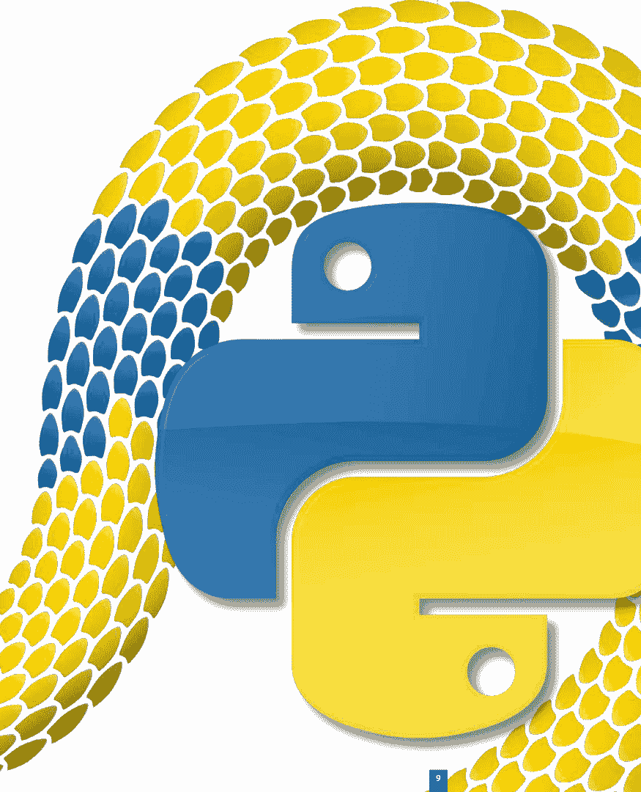

# Hello World

让我们开始吧，还有什么比程序员的好朋友——'Hello World' 应用程序更好的方式呢！首先打开一个终端。它当前的工作目录将是你的主目录。最好为我们在本教程中将要创建的文件创建一个目录，而不是让它们散落在你的主目录中。你可以使用命令 mkdir Python 创建一个名为 Python 的目录。然后你需要使用命令 cd Python 切换到该目录。

下一步是使用命令 'touch' 后跟文件名来创建一个空文件。我们的专家使用了命令 touch hello_world.py。设置文件的最后也是最重要的部分是使其可执行。这允许我们运行 hello_world.py 文件中的代码。我们通过命令 chmod +x hello_world.py 来实现这一点。现在我们已经设置好了文件，可以继续在 nano 中打开它，或者选择任何你喜欢的文本编辑器。Gedit 是一个很棒的编辑器，具有语法高亮支持，应该在任何发行版上都可用。如果你还没有安装，可以使用你的包管理器安装它。

```
[liam@liam-laptop ~]$ mkdir Python
[liam@liam-laptop ~]$ cd Python/
[liam@liam-laptop Python]$ touch hello_world.py
[liam@liam-laptop Python]$ chmod +x hello_world.py
[liam@liam-laptop Python]$ nano hello_world.py
```

我们的 Hello World 程序非常简单，只需要两行。第一行以 'shebang'（符号 #! – 也称为

## Python 入门指南

## 开始学习

（作为哈希bang）后跟 Python 解释器的路径。程序加载器使用此行来确定后续各行应使用什么进行解释。如果你在 IDLE 等 IDE 中运行此程序，则不一定需要这样做。

Python 解释器实际读取的代码只有一行。我们通过将值 Hello World 放在调用 print 函数后的括号内，将其传递给 print 函数。Hello World 用引号括起来，表示它是一个字面值，不应被解释为源代码。正如我们所料，Python 中的 print 函数会将传递给它的任何值打印到控制台。

你可以使用组合键 Ctrl+O，然后按 Enter，将刚才在 nano 中对文件所做的更改保存。使用 Ctrl+X 退出 nano。

```
#!/usr/bin/env python2
print("Hello World")
```

你可以通过在文件名前加上 ./ 来运行 Hello World 程序——在这种情况下，你需要输入：./hello_world.py。

```
[liam@liam-laptop Python]$ ./hello_world.py
Hello World
```

## 变量和数据类型

变量是源代码中的一个名称，它与内存中的一个区域相关联，你可以用该区域存储数据，然后在整个代码中调用这些数据。数据可以是多种类型之一，包括：

| 类型 | 描述 |
|---|---|
| 整数 | 存储整数 |
| 浮点数 | 存储小数 |
| 布尔值 | 可以是 True 或 False |
| 字符串 | 存储字符集合。"Hello World" 就是一个字符串 |

> "变量与内存中的一个区域相关联，你可以用该区域存储数据"


> **提示**

此时，值得解释的是，Python 文件中任何跟在 # 字符后面的文本都会被解释器忽略。这样你就可以在代码中编写注释。

除了这些主要数据类型外，还有序列类型（从技术上讲，字符串是一种序列类型，但由于其非常常用，我们将其归类为主要数据类型）：

| 类型 | 描述 |
|---|---|
| 列表 | 包含按特定顺序排列的数据集合 |
| 元组 | 包含按特定顺序排列的不可变数据集合 |

元组可用于存储坐标之类的数据，其中包含作为单个变量存储的 x 和 y 值，而列表通常用于存储较大的集合。元组中存储的数据是不可变的，因为你无法更改元组中单个元素的值。但是，你可以在列表中这样做。

了解 Python 的字典类型也很有用。字典是一种映射数据类型。它以键值对的形式存储数据。这意味着你可以使用值对应的键来访问存储在字典中的值，这与使用列表的方式不同。在列表中，你会使用元素的索引（一个表示元素在列表中位置的数字）来访问列表的元素。

让我们编写一个程序来演示如何使用变量和不同的数据类型。此时值得注意的是，在 Python 中你并不总是必须指定数据类型。请随意在你喜欢的任何编辑器中创建此文件。只要你记得将文件设为可执行，一切都会正常工作。我们将我们的文件命名为 variables.py。

## 解释型语言与编译型语言

像 Python 这样的解释型语言，其源代码在每次程序运行时都会被转换为机器代码并执行。这与 C 等编译型语言不同，后者源代码只转换一次机器代码——生成的机器代码随后在每次程序运行时执行。

## 完整代码清单

以下行创建了一个名为 hello_int 的整数变量，其值为 21。注意它不需要放在引号中

```
#!/usr/bin/env python2

# 我们通过编写想要的变量名，后跟等号，再后跟要存储在变量中的值来创建变量。例如，以下行创建了一个名为 hello_str 的变量，包含字符串 Hello World。
hello_str = "Hello World"

hello_int = 21

hello_bool = True

hello_tuple = (21, 32)

hello_list = ["Hello,", "this", "is", "a", "list"]
```

布尔值的原理相同。

我们以如下方式创建元组。

以及以这种方式创建列表。

# 此列表现在包含 5 个字符串。注意这些字符串之间没有空格，因此如果要将它们连接成一个句子，你需要在每个元素之间添加一个空格。

你也可以以如下方式创建相同的列表。

```
hello_list = list()
hello_list.append("Hello,")
hello_list.append("this")
hello_list.append("is")
hello_list.append("a")
hello_list.append("list")
```

# 第一行创建一个空列表，后续行使用列表类型的 append 函数向列表中添加元素。当你处理预先知道的字符串时，这种使用列表的方式并不十分有用，但当你处理动态数据（如用户输入）时，它可能很有用。此列表将覆盖第一个列表，且不会有任何警告。


我们不妨顺便创建一个字典。注意我们如何对齐下面的冒号以使代码整洁。

```
hello_dict = { "first_name" : "Liam",
    "last_name" : "Fraser",
    "eye_colour" : "Blue" }
```

# 让我们访问集合中的一些元素。我们将从更改 hello_list 中最后一个字符串的值开始，并在末尾添加一个感叹号。"list" 字符串是列表中的第 5 个元素。然而，Python 中的索引是从零开始的，这意味着第一个元素的索引为 0。

注意，当我们打印该元素时，现在会有两个感叹号。

```
print(hello_list[4])
hello_list[4] += "!"
# 上面这行等同于
hello_list[4] = hello_list[4] + "!"
print(hello_list[4])
```

请记住，元组是不可变的，尽管我们可以像这样访问它们的元素。

```
print(str(hello_tuple[0]))
# 我们不能像刚才对列表那样更改这些元素的值
# 注意上面使用了 str 函数，在打印之前显式地将元组内的整数值转换为字符串。
```

让我们使用 hello_dict 中的数据创建一个句子。

```
print(hello_dict["first_name"] + " " + hello_dict["last_name"] + " has " + hello_dict["eye_colour"] + " eyes.")
```

更整洁的方法是使用 Python 的字符串格式化器。

```
print("{0} {1} has {2} eyes.".format(hello_dict["first_name"],
    hello_dict["last_name"],
    hello_dict["eye_colour"]))
```

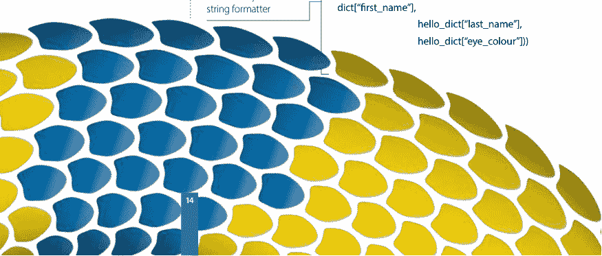

### 缩进详解

如前所述，缩进级别决定了代码块属于哪个语句。在 Python 中缩进是强制性的，而在其他语言中，则使用花括号来组织代码块。因此，使用一致的缩进风格至关重要。在 Python 中，通常使用四个空格表示一个缩进级别。你可以使用制表符，但制表符定义不明确，尤其是在多个编辑器中打开文件时。

## 控制结构

在编程中，控制结构是任何可以改变代码执行路径的语句。例如，一个控制结构如果决定在数字小于 5 时结束程序，它可能看起来像这样：

```
#!/usr/bin/env python2
import sys # 用于 sys.exit 函数
int_condition = 5
if int_condition < 6:
    sys.exit("int_condition must be >= 6")
else:
    print("int_condition was >= 6 - continuing")
```

代码执行的路径将取决于整数 int_condition 的值。只有当条件为真时，'if' 块中的代码才会执行。import 语句用于加载 Python 系统库；后者提供了 exit 函数，允许你退出程序并打印错误消息。注意缩进（在这种情况下每个缩进级别为四个空格）用于指示代码块属于哪个语句。'If' 语句可能是最常用的控制结构。其他控制结构包括 'for' 循环和 'while' 循环。

> "代码执行的路径将取决于整数 int_condition 的值"

## 入门指南

## Python 入门

结构包括：以下是你在使用 Python 时应该了解的项目：

-   `for` 语句，允许你遍历集合中的项目，或将一段代码重复执行特定次数；
-   `while` 语句，一种在条件为真时持续执行的循环。

我们将编写一个程序，通过接受用户输入来演示控制结构的工作原理。我们将其命名为 `construct.py`。`for` 循环使用的是当前值的本地副本，这意味着循环内的任何更改都不会影响列表。然而，另一方面，`while` 循环是直接访问列表中的元素，因此如果你愿意，可以在那里更改列表。我们将在本文后面更详细地讨论变量作用域。上述程序的输出如下：

```
[liam@liam-laptop Python]$ ./construct.py
How many integers? acd
You must enter an integer

[liam@liam-laptop Python]$ ./construct.py
How many integers? 3
Please enter integer 1: t
You must enter an integer
Please enter integer 1: 5
Please enter integer 2: 2
Please enter integer 3: 6
Using a for loop
5
2
6
Using a while loop
5
2
6
```

> “`for` 循环使用本地副本，因此循环中的更改不会影响列表”

## 完整代码清单

我们希望在列表中包含的整数数量

```
#!/usr/bin/env python2

# 我们将编写一个程序，要求用户输入任意数量的整数，将它们存储在一个集合中，然后演示如何使用各种控制结构来操作该集合。

import sys # 用于 sys.exit 函数

target_int = raw_input("How many integers? ")

# 到目前为止，变量 target_int 包含用户输入内容的字符串表示。我们需要尝试将其转换为整数，但要准备好处理如果转换失败时的错误。否则程序会崩溃。
try:
    target_int = int(target_int)
except ValueError:
    sys.exit("You must enter an integer")

ints = list()

count = 0
```

用于存储整数的列表

这些用于跟踪我们当前拥有的整数数量

如果上面的操作成功，那么 isint 将被设置为 true：isint = True

```
# 持续请求输入整数，直到我们拥有所需数量
while count < target_int:
    new_int = raw_input("Please enter integer {0}: ".format(count + 1))
    isint = False
    try:
        new_int = int(new_int)
    except:
        print("You must enter an integer")
```

# 只有当我们得到一个整数时才继续。否则，我们将再次循环。
# 注意下面我使用 ==，这与 = 不同。单等号是赋值运算符，而双等号是比较运算符。

```
if isint == True:
    # 将整数添加到集合中
    ints.append(new_int)
    # 计数加 1
    count += 1
```

到目前为止，用户已经放弃或者我们已经拥有一个填满整数的列表。我们可以通过几种方式遍历这些整数。第一种是使用 `for` 循环

```
print("Using a for loop")
for value in ints:
    print(str(value))
```

# 或者使用 while 循环：
print("Using a while loop")
# 我们上面已经有了总数，但知道 len 函数非常有用。
total = len(ints)
count = 0
while count < total:
    print(str(ints[count]))
    count += 1

## 关于 Python 列表的更多信息

Python 列表类似于其他语言中的数组。Python 中的列表（或元组）可以包含多种类型的数据，这在其他语言的数组中通常不是这种情况。因此，我们建议你只在列表中存储相同类型的数据。由于列表中数据的处理方式，这几乎总是应该如此。

## 函数和变量作用域

函数在编程中用于将过程分解为更小的部分。这通常使代码更易于阅读。如果设计得当，函数也可以是可重用的。函数可以接收传递给它们的变量。Python 中的变量总是按值传递，这意味着传递给函数的是变量的一个副本，该副本仅在函数的作用域内有效。在函数内部对原始变量所做的任何更改都将被丢弃。然而，函数也可以返回值，所以这不是问题。函数使用关键字 `def` 定义，后跟函数名称。任何可以传递的变量都放在函数名称后面的括号中。多个变量用逗号分隔。在这些括号中赋予变量的名称是它们在函数作用域中将具有的名称，无论传递给函数的变量叫什么名字。
让我们看看实际效果。右侧程序的输出如下：

> “函数使用关键字 `def` 定义，然后是函数名称”

```
#!/usr/bin/env python2 # 下面是一个名为 modify_string 的函数，它接受一个变量，该变量在函数作用域中将被称为 original。函数定义下缩进 4 个空格的任何内容都在作用域内。
def modify_string(original):
    original += " that has been modified."
    # 目前，只有这个字符串的本地副本被修改了
```

```
def modify_string_return(original):
    original += " that has been modified."
    # 然而，我们可以将我们的本地副本返回给调用者。一旦使用 return 语句，函数就会结束，无论它在函数中的什么位置。
    return original
```

我们现在位于 modify_string 函数的作用域之外，因为我们减少了缩进级别

在此代码中，测试字符串不会被更改

```
test_string = "This is a test string"
modify_string(test_string)
print(test_string)
```

```
test_string = modify_string_return(test_string)
print(test_string)
```

然而，我们可以这样调用函数

# 函数的返回值存储在变量 test_string 中，覆盖了原始值，因此更改了打印的值。

```
[liam@liam-laptop Python]$ ./functions_and_scope.py
This is a test string
This is a test string that has been modified.
```

作用域是需要掌握的重要内容，否则它可能会让你养成一些坏习惯。让我们编写一个快速程序来演示这一点。它将有一个名为 `cont` 的布尔变量，该变量将决定是否在 `if` 语句中将数字赋值给一个变量。然而，除了在 `if` 语句的作用域内，该变量在其他任何地方都没有定义。我们将通过尝试打印该变量来结束。

```
#!/usr/bin/env python2
cont = False
if cont:
    var = 1234
print(var)
```

在上面的代码段中，Python 会在打印之前将整数转换为字符串。然而，显式地将内容转换为字符串总是一个好主意——尤其是在将字符串连接在一起时。如果你尝试对字符串和整数使用 `+` 运算符，将会出错，因为不清楚需要发生什么。`+` 运算符通常会将两个整数相加。话虽如此，我们之前演示的 Python 字符串格式化器是更简洁的方法。你能看出问题所在吗？`var` 仅在 `if` 语句的作用域内定义。这意味着当我们尝试访问 `var` 时，会得到一个非常严重的错误。

```
[liam@liam-laptop Python]$ ./scope.py
Traceback (most recent call last):
  File "/scope.py", line 8, in <module>
    print var
NameError: name 'var' is not defined
```

如果 `cont` 设置为 `True`，那么变量将被创建，我们可以正常访问它。然而，这是一种不好的做法。正确的方法是在 `if` 语句的作用域之外初始化变量。

```
#!/usr/bin/env python2

cont = False

var = 0
if cont:
    var = 1234

if var != 0:
    print(var)
```

## 入门

## Python 入门

变量 `var` 的定义范围比 `if` 语句更广，因此 `if` 语句仍然可以访问它。在 `if` 语句内部对 `var` 所做的任何更改，实际上是在修改更大作用域中定义的变量。这个示例除了说明潜在问题外，并没有真正做任何有用的事情，但最坏的情况已经从程序崩溃变成了打印一个零。甚至这种情况也不会发生，因为我们添加了一个额外的构造来在打印之前测试 `var` 的值。

> “如果你遇到任何困难，或者遇到无法解决的错误信息，谷歌或任何其他搜索引擎都会非常有帮助。”

### 比较运算符

Python 中常见的比较运算符包括：

| 运算符 | 描述 |
| :--- | :--- |
| < | 严格小于 |
| <= | 小于或等于 |
| > | 严格大于 |
| >= | 大于或等于 |
| == | 等于 |
| != | 不等于 |


## Python 入门

## 入门

## 编码风格

值得花点时间谈谈编码风格。编写整洁的代码很简单。关键在于一致性。例如，你应该始终以相同的方式命名变量。无论你想使用驼峰命名法还是像我们这样使用下划线，都没关系。一个关键点是使用自解释的标识符作为变量名。你不应该去猜测一个变量是做什么的。与此相关的另一件事是始终为你的代码添加注释。这将帮助任何其他阅读你代码的人，以及未来的你自己。在代码文件顶部放置一个简要摘要，描述应用程序的功能，或者如果它由多个文件组成，则描述应用程序的某个部分，这也是很有用的。

## 总结

本文应该已经向你介绍了 Python 编程的基础知识。希望你已经习惯了 Python 程序的语法、缩进和整体外观。下一步是学习如何提出你想解决的问题，并将其分解成小的步骤，以便你可以用编程语言来实现。谷歌或任何其他搜索引擎都非常有帮助。如果你遇到任何困难，或者遇到无法解决的错误信息，把它输入谷歌，你应该会离解决问题更近一步。例如，如果我们谷歌搜索“用 python 播放 mp3 文件”，第一个链接会带我们到一个 Stack Overflow 帖子，里面有一堆有用的回复。不要害怕深入其中——编程的真正乐趣在于一次解决一个可管理的问题块。


## Python 简介

打好基础，构建你的知识

既然你已经迈出了 Python 的第一步，现在是时候开始运用这些知识来编写代码了。在本节中，你将了解如何开始为 Android 操作系统（第32页）和万维网（第26页）编写应用程序。这些易于遵循的教程将帮助你巩固所学的 Python 语言，同时培养在当前技术市场中非常有用的技能。最后，我们将为你提供 50 个实用的 Python 技巧（第40页），让你在短时间内提升知识和能力。

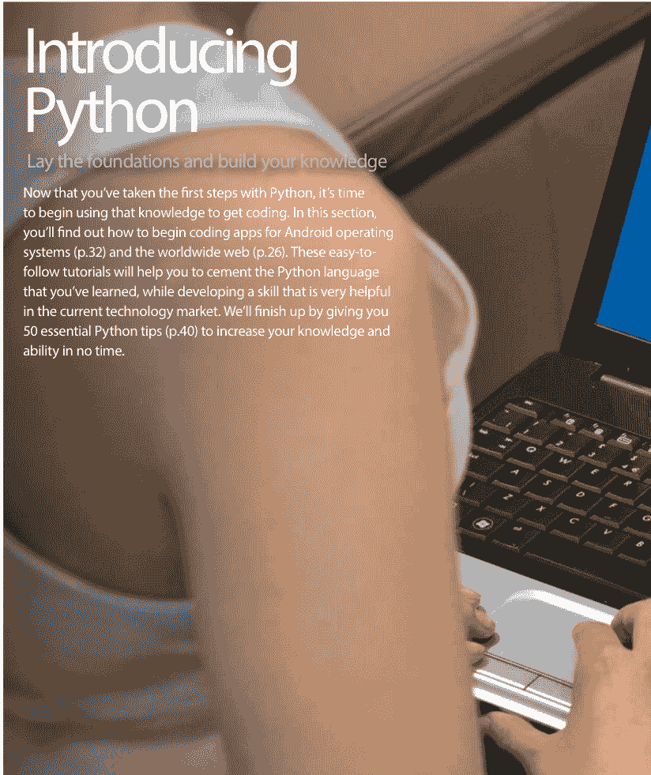

## Python 基础

## Python 简介


## Python 简介

## 使用 Python 制作 Web 应用

### 你需要什么...

Python 2.7:
https://www.python.org/download/releases/2.7/

Django 版本 1.4:
https://www.djangoproject.com/

## 使用 Python 制作 Web 应用

Python 提供了一种快速简便的方式来构建应用程序，包括 Web 应用。了解如何使用它来构建一个功能完整的 Web 应用。

Python 以其简洁性和强大功能而闻名。目前它已经非常先进，几乎没有什么是 Python 做不到的，征服网络就是其中一种可能性。当你使用 Python 进行 Web 开发时，你可以访问大量的模块和社区支持——充分利用它们。

Python 的 Web 开发可以通过多种不同的方式完成，从使用传统的 CGI 模块到利用成熟的 Web 框架。使用后者是使用 Python 构建 Web 应用程序最流行的方法，因为它允许你在不担心所有底层实现细节的情况下构建应用程序。Python 有许多可用的 Web 框架，例如 Django、TurboGears 和 Web2Py。在本教程中，我们将使用我们当前首选的选项——Django。

## Django 项目杂志问题跟踪器

01 `django-admin.py` 文件用于创建新的 Django 项目。让我们在这里为我们的问题跟踪器项目创建一个...

在 Django 中，一个项目代表网站及其设置。另一方面，一个应用代表网站的一个特定功能，比如博客或标签。这种方法的好处是你的 Django 应用变得可移植，并且可以非常轻松地与其他 Django 网站集成。

```
$ django-admin.py startproject
1udIssueTracker
```

将创建一个项目目录。这也将作为 Django 自带的开发 Web 服务器的根目录。在项目目录下，你将找到以下项目...

`manage.py`：用于处理项目的 Python 脚本。

`1udIssueTracker`：一个用于你项目的 Python 包（一个包含 `__init__.py` 文件的目录）。这个包包含你的项目的设置和配置数据。

**`ludissueTracker/settings.py`：** 此文件包含项目的所有配置选项。

**`ludissueTracker/urls.py`：** 此文件包含各种 URL 映射。

**`wsgi.py`：** 用于 WSGI 兼容 Web 服务器来服务你的项目的入口点。仅在部署项目时有用。在本教程中我们不需要它。

```
dirname(__file__)), *x)
```

现在更新路径选项：

```
@code
TEMPLATE_DIRS = (
    getabspath('templates'),
)
MEDIA_ROOT = getabspath('media')
MEDIA_URL = '/media/'
```

**`ludissues`**

我们还需要在配置文件中启用此应用：

```
INSTALLED_APPS = (
    ............
    'django.contrib.admin',
    'ludissues',
)
```

## 配置 Django 项目

现在我们需要为我们的 Django 网站启用管理界面。这是 Django 的一个巧妙功能，它允许根据数据模型自动创建网站的管理界面。管理界面可用于为 Django 网站添加和管理内容。取消注释以下行：

## 创建数据模型

**04** 这是我们为应用定义数据模型的部分。请参阅内联注释以了解此处发生的情况。

**02** 在我们开始处理应用之前，让我们根据需求配置 Django 项目。

```
INSTALLED_APPS = (
    'django.contrib.auth',
    'django.contrib.contenttypes',
    'django.contrib.sessions',
    'django.contrib.sites',
    'django.contrib.messages',
    'django.contrib.staticfiles',
    'django.contrib.admin',
    # 'django.contrib.admindocs',
)
```

`from django.db import models`：

```
# 我们导入用户认证模块，以便在此应用中使用内置的认证模型
from django.contrib.auth.models import User
# 我们还将为我们的应用创建一个管理界面
from django.contrib import admin
```

编辑 `ludissueTracker/settings.py`，如下所示（仅显示需要修改的部分）：

**数据库设置：** 我们将在此处使用 SQLite3 作为数据库系统。

**注意：** 红色文本表示新代码或更新的代码。

```
'default': {
    'ENGINE': 'django.db.backends.sqlite3',
    'NAME': 'ludsite.db3',
```

```
# 一个用于保存多选字符字段的元组。
# 第一个代表字段名，第二个代表显示名称
ISSUE_STATUS_CHOICES = (
    ('new', 'New'),
    ('accepted','Accepted'),
    ('reviewed','Reviewed'),
    ('started','Started'),
    ('closed','Closed'),
)
```

## 创建 ludissues 应用

**03** 在这一步中，我们将为我们的网站创建一个名为 `ludissues` 的主要应用。为此，我们将使用 `manage.py` 脚本：

```
$ python manage.py startapp
```

## 路径设置

Django 要求目录设置使用绝对路径。但我们希望能够传入相对目录引用。为了做到这一点，我们将添加一个辅助 Python 函数。在 `settings.py` 文件顶部插入以下代码：

```
import os
def getabspath(*x):
    return os.path.join(os.path.abspath(os.path.
```

> “当你使用 Python 进行 Web 开发时，你可以访问大量的模块和支持。”

## 介绍 Python

## 使用 Python 构建 Web 应用

```python
class Issue(models.Model):
    # owner 将是一个指向 Django 内置 User 模型的外键
    owner = models.ForeignKey(User, null=True, blank=True)
    # 多选字段，默认值为 "new"
    status = models.CharField(max_length=25, choices=ISSUE_STATUS_CHOICES, default='new')
    summary = models.TextField()
    # 日期时间字段，将在记录创建时自动设置为创建时间
    opened_on = models.DateTimeField('date opened', auto_now_add=True)
    modified_on = models.DateTimeField('date modified', auto_now=True)

    def name(self):
        return self.summary.split('\n', 1)[0]
```

```python
admin.site.register(Issue, IssueAdmin)
```

要使创建的数据模型在数据库中生效，请运行以下命令：

```
$ python manage.py syncdb
```

系统还会要求你为此创建一个超级用户：

```
You just installed Django's auth system, which means you don't have any superusers defined.
Would you like to create one now? (yes/no): yes
```

这是你在同步数据库时创建的。

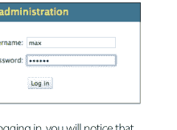

登录后，你会注意到项目中安装的所有应用都可在此处访问。我们只对 Auth 和 LudIssues 应用感兴趣。
你可以点击 +Add 来添加一条记录。点击 Users 旁边的 Add 按钮，为站点添加一些用户。
一旦系统中有了用户，你现在就可以向系统添加一些问题了。

```python
# 应用的管理后台前端。我们还在配置管理界面的一些内置属性，例如如何显示列表、如何排序、搜索字段是什么等。
class IssueAdmin(admin.ModelAdmin):
    date_hierarchy = 'opened_on'
    list_filter = ('status', 'owner')
    list_display = ('id', 'name', 'status', 'owner', 'modified_on')
    search_fields = ['description', 'status']

# 将我们的站点注册到 Django 管理界面
admin.site.register(Issue, IssueAdmin)
```

## 启用管理站点

管理站点已经启用，但我们需要在 urls.py 文件中启用它——该文件包含从模型到视图的基于正则表达式的 URL 映射。按如下方式更新 urls.py 文件：

```python
from django.conf.urls import patterns, include, url
from django.contrib import admin
admin.autodiscover()

urlpatterns = patterns('',
    url(r'^admin/', include(admin.site.urls)),
)
```


## 启动 Django Web 服务器

Django 包含一个内置的 Web 服务器，对于调试和测试 Django 应用程序非常方便。让我们启动它，看看我们的管理界面是如何工作的...
要启动 Web 服务器：

```
$ python manage.py runserver
```

如果你的代码没有错误，服务器应该在 8000 端口上可用。要启动管理界面，请将浏览器导航到 http://localhost:8000/admin。
系统会要求你在此处登录。输入用户名和密码。

点击 Issues 旁边的 Add 按钮。在这里你会注意到可以输入问题的所有者、状态和摘要。但是我们在建模应用时定义的 opened_on 和 modified_on 字段呢？它们不在这里，因为它们不应该由用户输入。opened_on 将自动设置为创建时的日期时间，modified_on 将自动设置为问题被修改时的日期时间。

> "所有者字段自动填充了站点内用户的详细信息，这真是太棒了"

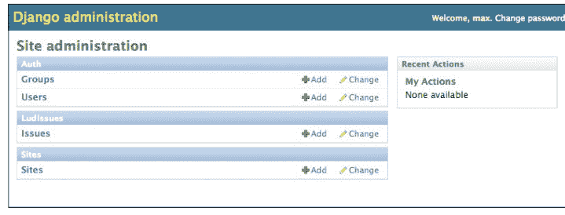

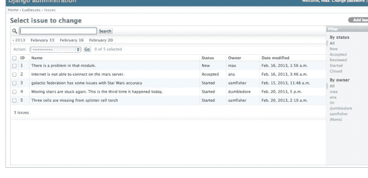

## 为 ludissues 创建公共用户界面

此时，管理界面已经可以工作了。但我们需要一种方式来显示我们通过管理界面添加的数据。然而目前没有公共界面。让我们现在创建它。

## 创建 ludissues.url

另一个很酷的事情是，所有者字段会自动填充站点内的所有用户。

我们必须从编辑主 urls.py (ludissuetracker/urls.py) 开始。

在应用目录 (ludissues/urls.py) 中创建一个 urls.py 文件，内容如下：

```python
from django.conf.urls import patterns, include, url
# 使用 ludissues 模型
from models import ludissues
```

```python
urlpatterns = patterns('',
    (r'^', include('ludissues.urls')),
    (r'^admin/', include(admin.site.urls)),
)
```

这确保了所有请求都会首先由 ludissues.urls 处理。

我们已经在模型中定义了列表视图，以显示 ID、名称、状态、所有者和“修改时间”。你可以通过导航到 http://localhost:8000/admin/ludissues/issue/ 来访问此视图。

```python
# 包含 ludissues 中所有对象的字典
info = {
    'queryset': ludissues.objects.all(),
}

# 为了节省我们编写大量 Python 代码
# 我们使用 list_detail 通用视图

# list detail 是我们使用的视图名称
urlpatterns = patterns('django.views.generic.list_detail',
    # issue-list 和 issue-detail 是模板名称
    # 它们将在默认模板目录中查找
    url(r'^$', 'object_list', info, name='issue-list'),
    url(r'^(?P<object_id>\d+)/$', 'object_detail', info, name='issue-detail'),
)
```

为了显示问题列表和详情，我们使用了 Django 的一个特性，称为通用视图。在这种情况下，我们使用名为 list 和 details 的视图。这允许我们创建一个问题列表视图和一个问题详情视图。然后这些视图通过 issue_list.html 和 issue_detail.html 模板来应用。在接下来的步骤中，我们将创建这些模板文件。

## 设置模板和媒体目录

在这一步中，我们将创建模板和媒体目录。我们已经提到了模板目录为：

```python
TEMPLATE_DIRS = (
    getabspath('templates')
)
```

这对应于 ludissueTracker/ludissueTracker/templates/。由于我们将从 ludissues 应用访问模板，完整的目录路径将是 ludissueTracker/ludissueTracker/templates/ludissues。在你的项目文件夹中创建这些文件夹。

同时，创建目录 ludissueTracker/ludissueTracker/media/ 用于存放 CSS 文件。将 style.css 文件从代码文件夹的 resources 目录复制过来。要从此文件夹提供文件，请使其公开可用。打开 settings.py 并在 ludissueTracker/ludissueTracker/urls.py 中添加以下几行：

```python
from django.conf.urls import patterns, include, url
from django.conf import settings
# 取消注释以下两行以启用管理界面：
from django.contrib import admin
admin.autodiscover()

urlpatterns = patterns('',
    (r'^', include('ludissues.urls')),
    (r'^admin/', include(admin.site.urls)),
    (r'^media/(?P<path>.*)$', 'django.views.static.serve',
        {'document_root': settings.MEDIA_ROOT})
)
```

## 创建模板文件

模板将从 ludissueTracker/ludissueTracker/templates 目录加载。

在 Django 中，我们从 ludissueTracker/ludissueTracker/templates/base.html 模板开始。可以把它想象成一个主模板，可以被子模板继承。ludissueTracker/ludissueTracker/templates/base.html

```html
<!DOCTYPE html PUBLIC "-//W3C//DTD XHTML 1.0 Strict//EN"
 "http://www.w3.org/TR/xhtml1/DTD/xhtml1-strict.dtd">
<html>
    <head>
        <title>LUD Issues</title>
        <link rel="stylesheet" href="{{ MEDIA_URL }}style.css" type="text/css" media="screen" />
    </head>
    <body>
        <div id="hd">
            <h1>LUD Issue Tracker</h1>
        </div>
        <div id="mn">
            <ul>
                <li><a href="" class="sel">View Issues</a></li>
                <li><a href="/admin/">Admin Site</a></li>
            </ul>
        </div>
        <div id="bd">
            
        </div>
    </body>
</html>
```

> "为了在这里显示问题列表和详情，我们使用了 Django 的一个特性，称为通用视图"


| 问题 | 描述 | 状态 | 所有者 |
|---|---|---|---|
| 1 | 那个模块有问题。 | new | max |
| 2 | 无法连接到火星服务器的互联网。 | accepted | ana |
| 3 | 银河联邦对《星球大战》的准确性有一些问题 | started | samfisher |
| 4 | 移动楼梯又卡住了。这是今天第三次发生这种情况了。 | started | dumbledore |
| 5 | 分裂细胞手电筒缺少三个电池 | started | samfisher |

`{{ variablename }}` 代表一个 Django 变量。`` 代表块。块的内容由 Django 求值并显示。这些块可以被子模板替换。

现在我们需要创建 issue_list.html 模板。此模板负责显示系统中所有可用的问题。

```html
ludissueTracker/ludissueTracker/templates/ludissues/issue_list.html

View Issues - 

<table cellspacing="0" class="column-options">
    <tr>
        <th>Issue</th>
        <th>Description</th>
        <th>Status</th>
        <th>Owner</th>
    </tr>
    
    <tr>
        <td><a href="">{{ issue.id }}</a></td>
        <td><a href="">{{ issue.name }}</a></td>
        <td>{{ issue.status }}</td>
        <td>{{ issue.owner }}</td>
    </tr>
    
</table>

```

这里我们继承了之前创建的 base.html 文件。`` 在 urls.py 发送的对象上运行。然后我们遍历 object_list 以获取 issue.id 和 issue.name。

现在我们将创建 issue_detail.html。此模板负责显示一个案例的详情视图。

```html
ludissueTracker/ludissueTracker/templates/ludissues/issue_detail.html

Issue #{{ object.id }} - 

<h2>Issue #{{ object.id }} <span>{{ object.status }}</span></h2>
<div class="issue">
    <h2>Information</h2>
    <div class="date">
        <p class="cr">Opened {{ object.opened_on }} ago</p>
        <p class="up">Last modified {{ object.modified_on }} ago</p>
    </div>
    <div class="clear">&nbsp;</div>
    <div class="block w49 right">
        <p class="ass title">Owner</p>
        <p class="ass">{{ object.owner }}</p>
    </div>
    <div class="clear">&nbsp;</div>
    <div class="block">
        <p class="des title">Summary</p>
        <p class="des">{{ object.summary }}</p>
    </div>
</div>

```

就是这样！问题跟踪器应用现在已完成并可以使用了。你现在可以将浏览器指向 localhost:8000 来开始使用该应用。

## 使用Python构建Android应用

掌握Kivy——这个出色的跨平台应用框架，打造你的第一个Android应用……

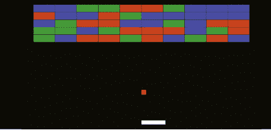

Kivy的妙处在于，我们可以通过多种方向用它来实现相当炫酷的功能。但我们将直奔Kivy最酷的特性之一——它能让你轻松地在Android设备上运行你的程序。

我们将首先展示如何创建一个新应用，这次是一个动态的打砖块风格游戏。然后，我们将能够直接将其编译成一个Android APK文件，你可以像使用任何其他应用一样使用它。

当然，一旦你掌握了基本技术，你就不会局限于使用任何特定类型的应用，因为即使在Android上，你也可以利用所有你喜欢的Python库来制作任何你想要的程序。

一旦你掌握了Kivy，想象力就是你唯一的限制。如果你对Kivy还很陌生，别担心，我们不会假设你有任何预先存在的知识。只要你掌握了本书到目前为止的一些Python知识，并且对这门语言有相当好的理解，你就不应该在学习过程中遇到任何问题。

首先，让我们快速搭建一个基础的Kivy应用（图01）。我们已经预先导入了将要使用的控件类型，这次只有三种：没有特殊行为的基础`Widget`、具有弹出行为的`ModalView`（如上次所用），以及我们稍后将解释的`FloatLayout`。Kivy还有许多其他预构建的控件用于创建图形用户界面，但这次我们将专注于使用Kivy的图形指令从头开始绘制整个GUI。这些指令包括用于创建形状（包括矩形、线条、网格等）的顶点指令，或上下文图形变换（如平移、旋转、缩放等），并且可以在屏幕上的任何位置以及任何控件类型上绘制。

在我们进行任何操作之前，我们需要为每种游戏对象创建一个类，我们将预先填充一些稍后需要用来控制它们的属性。还记得上次吗，Kivy属性是在类级别声明的特殊属性，它们（除其他功能外）可以通过kv语言修改，并在修改时触发事件。`Game`类将是一个包含整个游戏的大控件。我们特意将其设为`FloatLayout`的子类，因为这种特殊的布局能够根据其自身的位置和尺寸来按比例定位和调整其子控件的大小——因此，无论我们在哪里运行它或如何调整窗口大小，它都会适当地放置所有游戏对象。

接下来，我们可以使用Kivy的图形指令在我们的控件上绘制各种形状。我们将只演示简单的矩形来展示它们的位置，尽管还有许多更高级的选项你可能想要研究。在Python文件中，我们可以通过在任何控件的画布上声明指令来应用任何指令，图03展示了一个示例。

```
from kivy.graphics.context_instructions import Color
from kivy.graphics.vertex_instructions import Rectangle
```

```
class Player(Widget):
    def __init__(self, **kwargs):
        super(Player, self).__init__(**kwargs)
        with self.canvas:
            Color(1, 0, 0, 1)  # r, g, b, a -> 红色
            Rectangle(pos=self.pos, size=self.size)
            # 或者不使用with语法，使用self.canvas.add(...)
```

这将绘制一个与玩家控件在实例化时刻具有相同位置和大小的红色矩形——但不幸的是，这带来了一个问题，因为绘制是静态的。当我们稍后移动玩家控件时，红色矩形将保持在同一位置，而控件在其实际位置时将不可见。

我们可以通过保持对画布指令的引用并反复更新它们的属性以跟踪玩家来解决这个问题，但实际上有一个更简单的方法来完成所有这些——我们可以使用上次介绍的Kivy语言。它有一种特殊的语法用于在控件画布上绘制，我们可以在这里使用它来绘制每个控件的形状：

```
<Player>:
    canvas:
        Color:
            rgba: 1, 1, 1, 1
        Rectangle:
            pos: self.pos
            size: self.size
```

```
<Ball>:
    canvas:
        Color:
            rgb: 1, 0.55, 0
        Rectangle:
            pos: self.pos
            size: self.size
```

```
<Block>:
    canvas:
        Color:
            rgb: self.colour
            # 我们在上面预定义的一个属性
        Rectangle:
            pos: self.pos
            size: self.size
        Color:
            rgb: 0.1, 0.1, 0.1
        Line:
            rectangle: [self.x, self.y, self.width, self.height]
```

`canvas`声明是特殊的，在其下我们可以编写任何我们喜欢的画布指令。不要混淆，`canvas`不是一个控件，像`Line`这样的图形指令也不是。这只是画布特有的特殊语法。指令都有不同的属性可以设置，比如矩形的`pos`和`size`，你可以在线查看Kivy文档以了解所有不同的可能性。最大的优势是，尽管我们仍然声明简单的画布指令，但kv语言能够检测到我们引用了哪些Kivy属性并自动跟踪它们，因此当它们更新时（控件移动或调整大小），画布指令会随之移动！

现在我们的每个控件都有了图形表示，让我们告诉`Game`在哪里放置它们，这样我们就可以启动应用并实际看到一些东西。

```
from kivy.properties import (ListProperty, NumericProperty, ObjectProperty, StringProperty)
```

```
class Game(FloatLayout):
    # 将包含所有内容
    blocks = ListProperty([])
    player = ObjectProperty()
    # 游戏的Player实例
    ball = ObjectProperty()  # 游戏的Ball实例
```

```
class Player(Widget):  # 一个移动的挡板
    position = NumericProperty(0.5)
    direction = StringProperty('none')
```

```
class Ball(Widget):  # 一个弹跳的球
    # pos_hints用于比例定位，见下文
    pos_hint_x = NumericProperty(0.5)
    pos_hint_y = NumericProperty(0.3)
    proper_size = NumericProperty(0.)
    velocity = ListProperty([0.1, 0.5])
```

```
class Block(Widget):  # 每个要销毁的彩色方块
    colour = ListProperty([1, 0, 0])
```

你可能注意到，我们让`Block`的一个`'Colour'`指令引用了它的`colour`属性。这意味着我们可以随时更改该属性以更新方块的颜色，或者在这种情况下，为每个方块赋予随机颜色（图04）。

在这里，我们创建了想要的控件，然后使用`add_widget`将它们添加到图形树中。我们屏幕上的根控件是`Game`的一个实例，每个方块都被添加到其中以进行显示。

其中唯一的新内容是每个`Block`都被赋予了一个`pos_hint`。所有控件都有这个特殊属性，它被像我们的`Game`这样的`FloatLayout`用来按比例设置它们的位置。

这个字典可以处理各种参数，但在这种情况下，`'x'`和`'y'`给出了方块相对于父控件宽度和高度的x和y位置比例。

```
class Game(FloatLayout):
    def setup_blocks(self):
        for y_jump in range(5):
            for x_jump in range(10):
                block = Block(pos_hint={
                    'x': 0.05 + 0.09*x_jump,
                    'y': 0.05 + 0.09*y_jump})
                self.blocks.append(block)
                self.add_widget(block)
```

```
class BreakoutApp(App):
    def build(self):
        g = Game()
        g.setup_blocks()
        return g
```

你现在可以运行应用了，这次它会在屏幕上显示之前向`Game`添加50个方块。每个方块应该具有三种可能随机颜色中的一种，并以网格形式定位，但你现在会注意到它们的大小没有手动设置，所以它们都重叠了。我们可以通过设置它们的`size_hint`属性来解决这个问题——让我们也轻松地修复一下。

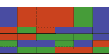

上图：运行应用显示了我们屏幕上的彩色方块……但它们都重叠了！我们可以轻松修复。

# 图 01

```
from kivy.app import App
from kivy.uix.widget import Widget
from kivy.uix.floatlayout import FloatLayout
from kivy.uix.modalview import ModalView

__version__ = '0.1' # 稍后在Android编译时使用

class BreakoutApp(App):
    pass

BreakoutApp().run()
```

# 图 02

```
from kivy.properties import (ListProperty, NumericProperty, ObjectProperty, StringProperty)
```

# 图 03

## 使用Python为Android构建应用

## Python简介

借此机会，我们同样为其他部件完成此操作（图05）。
这确保了我们所有的游戏部件都能按比例定位和缩放，相对于包含它们的Game部件。请注意，Player和Ball部件引用了我们之前设置的属性，因此我们只需设置这些属性，就能移动它们，让kv语言自动更新它们的位置。
Ball部件还使用了一个额外的属性来保持正方形而非矩形，因为否则看起来可能会有点奇怪。
现在，我们几乎完成了应用的基本图形！剩下的就是向Game中添加一个Ball和一个Player部件。

```
<Game>:
    ball: the_ball
    player: the_player
Ball:
    id: the_ball
Player:
    id: the_player
```

你现在可以再次运行游戏，应该能看到所有图形都正常工作了。目前还没有任何东西移动，但得益于FloatLayout，即使你调整游戏/窗口的大小，所有内容都应该保持比例。
现在我们只需要添加游戏机制。对于这样的游戏，你通常希望每秒运行多次更新函数，更新部件位置并执行游戏逻辑——在本例中是与球的碰撞（图06）。
Clock可以在任何时间调度任何函数，可以是一次性的，也可以是重复的。以间隔调度的函数会自动接收自上次调用以来的时间（这里是dt），我们已经通过在kv语言中创建的引用将其传递给了ball和player。一个好习惯是用这个dt来缩放更新量（例如球移动的距离），这样即使某些东西中断了时钟，更新没有达到你想要的规律的1/60秒，事物也能保持稳定。
此时，我们还通过绑定到kv Window，为处理键盘输入迈出了第一步，每次按键时都调用Player的一个方法。然后我们可以通过添加这个按键处理器以及触摸/鼠标输入来完成Player类。

```
class Player(Widget):
    def on_touch_down(self, touch):
        self.direction = (
            'right' if touch.x >
            self.parent.center_x else
            'left')

    def on_touch_up(self, touch):
        self.direction = 'none'

    def on_key_down(self, keypress, scancode, *args):
        if scancode == 275:
            self.direction = 'right'
        elif scancode == 276:
            self.direction = 'left'
        else:
            self.direction = 'none'

    def on_key_up(self, *args):
        self.direction = 'none'

    def update(self, dt):
        dir_dict = {'right': 1,
        'left': -1, 'none': 0}
        self.position += (0.5
        * dt * dir_dict[self.direction])
```

这些on_touch_函数是Kivy用于与触摸或鼠标输入交互的通用方法，当检测到输入时它们会自动调用，你可以对接收到的触摸做任何你想做的事情。在本例中，我们根据键盘和触摸/鼠标输入设置Player的direction属性，并在调用其update方法时使用这个方向来移动Player。我们还可以为球添加正确的行为（图07）。
这通过强制其速度指向Game内部，使球从每一面墙反弹，同时也从玩家挡板反弹——但额外增加了一次踢击，以便让球的速度发生变化。它目前还不处理与方块的任何交互或任何输赢条件，但如果球击中玩家屏幕底部，它确实会尝试调用Game.lose()，所以现在让我们添加一些游戏结束代码来处理所有这些（图08）。然后将图09中的代码添加到你的'breakout.kv'文件中。

你的Android设备。你甚至可以访问普通的Android API来访问硬件或操作系统功能，如振动、传感器或原生通知。

```
size_hint: None, None
proper_size:
    min(0.03*self.parent.height, 0.03*self.parent.width)
size: self.proper_size, self.proper_size
# ... canvas part
```

这应该能完全处理输赢情况，打开一个带有适当消息的弹出窗口，并提供一个重试按钮。最后，我们必须处理当球击中方块时销毁它们的问题（图10）。

我们将使用Buildozer工具为Android构建，这是一个Kivy的姊妹项目，它封装了其他构建工具，用于在不同系统上创建包。这负责下载和运行Android构建工具（SDK、NDK等）以及Kivy的Python-for-Android工具来创建APK。

### 图06

```
from kivy.clock import Clock
from kivy.core.window import Window
from kivy.utils import platform
```

这完全涵盖了最后这些条件，通过Kivy内置的collide_widget方法检查碰撞，该方法比较它们的边界框（pos和size）。反弹方向将取决于球穿透的程度，因为这将告诉我们它最初是如何与Block碰撞的。

### 图04

```
import random

class Block(Widget):
    def __init__(self, **kwargs):
        super(Block, self).__init__(**kwargs)
        self.colour = random.choice([
            (0.78, 0.28, 0), (0.28, 0.63, 0.28), (0.25, 0.28, 0.78)])
```

```
class Game(FloatLayout):
    def update(self, dt):
        self.ball.update(dt)  # 尚未定义
        self.player.update(dt)  # 尚未定义

    def start(self, *args):
        Clock.schedule_interval(self.update, 1/60.)

    def stop(self):
        Clock.unschedule(self.update)

    def reset(self):
        for block in self.blocks:
            self.remove_widget(block)
        self.blocks = []
        self.setup_blocks()
        self.ball.velocity = [random.random(), 0.5]
        self.player.position = 0.5
```

就是这样，你可以运行代码来玩你的简单Breakout游戏了。显然，它现在非常简单，但希望你能看到很多不同的方法来添加任何你喜欢的额外行为——你可以添加不同类型的方块和道具、生命系统、更复杂的挡板/球交互，甚至构建一个带有菜单和设置屏幕的完整游戏界面。

### 图05

```
<Block>:
    size_hint: 0.09, 0.05
    # ... canvas part

<Player>:
    size_hint: 0.1, 0.025
    pos_hint: {'x': self.position, 'y': 0.1}
    # ... canvas part

<Ball>:
    pos_hint: {'x': self.pos_hint_x, 'y': self.pos_hint_y}
```

我们只是要最后展示一件你现在就能做的很酷的事情——为Android编译你的游戏！一般来说，你可以将任何Kivy应用直接转换成一个Android APK，它可以在任何

```
class BreakoutApp(App):
    def build(self):
        g = Game()
        if platform() != 'android':
            Window.bind(on_key_down=g.player.on_key_down)
            Window.bind(on_key_up=g.player.on_key_up)
        g.reset()
        Clock.schedule_once(g.start, 0)
        return g
```

```
def bounce_from_player(self, player):
    if self.collide_widget(player):
        self.velocity[1] = abs(self.velocity[1])
        self.velocity[0] += (0.1 * ((self.center_x - player.center_x) / player.width))
```

```
<GameEndPopup>:
    size_hint: 0.8, 0.8
    auto_dismiss: False
    # 如果玩家点击外部则不关闭
    BoxLayout:
        orientation: 'vertical'
        Label:
            text: root.message
            font_size: 60
            markup: True
            halign: 'center'
        Button:
            size_hint_y: None
            height: sp(80)
            text: '再玩一次？'
            font_size: 60
            on_release: root.game.start(); root.dismiss()
```

```
class Ball(Widget):
    def update(self, dt):
        self.pos_hint_x += self.velocity[0] * dt
        self.pos_hint_y += self.velocity[1] * dt
        if self.right > self.parent.right:  # 从右侧反弹
            self.velocity[0] = -1 * abs(self.velocity[0])
        if self.x < self.parent.x:  # 从左侧反弹
            self.velocity[0] = abs(self.velocity[0])
        if self.top > self.parent.top:  # 从顶部反弹
            self.velocity[1] = -1 * abs(self.velocity[1])
        if self.y < self.parent.y:  # 在底部失败
            self.parent.lose()  # 尚未实现
            self.bounce_from_player(self.parent.player)
```

```
class GameEndPopup(ModalView):
    message = StringProperty()
    game = ObjectProperty()

class Game(Widget):
    def lose(self):
        self.stop()
        GameEndPopup(message='[color=#ff0000]你输了！[/color]', game=self).open()
    def win(self):  # 尚未调用，但稍后会需要
        self.stop()
        GameEndPopup(message='[color=#00ff00]你赢了！[/color]', game=self).open()
```

在这里，你将需要一些基本的依赖项，这些依赖项可以轻松地通过使用你发行版的常规软件仓库来安装。主要需要的是OpenJDK7、zlib、最新的Cython和Git。如果你使用的是64位发行版，你还需要zlib、libstdc++以及libgcc的32位兼容库。然后你可以继续下载并安装Buildozer：

## Python 简介

## 使用 Python 构建 Android 应用

## 将你的 APK 放上 Play 商店

了解如何对发布版 APK 进行数字签名，并将其上传到你选择的应用商店

## 1 构建并签名发布版 APK

首先创建一个个人数字密钥，然后用它来签署一个特殊的发布版 APK。运行以下命令，并按照说明操作。

> “通读整个文件以了解可用选项，但大多数默认设置都没问题”

```
## 创建你的个人数字密钥
## 你可以选择自己的密钥库名称、别名和密码。
$ keytool -genkey -v -keystore test-release-key.keystore -alias test-alias -keyalg RSA -keysize 2048 -validity 10000

## 以发布模式编译你的应用
$ buildozer android release

## 使用你的新密钥签署 APK
$ jarsigner -verbose -sigalg SHA1withRSA -digestalg SHA1 -keystore ./test-release-key.keystore ./bin/KivyBreakout-0.1-release-unsigned.apk test-alias

## 对齐 APK zip 文件
$ ~/.buildozer/android/platform/android-sdk-21/tools/zipalign -v 4 ./bin/KivyBreakout-0.1-release-unsigned.apk ./bin/KivyBreakout-0.1-release.apk
```

```
git clone git://github.com/kivy/buildozer
cd buildozer
sudo python2.7 setup.py install
```

完成这部分后，你可以继续导航到你的 Kivy 应用，并且必须将主代码文件命名为 `main.py`，这是 Android APK 所期望的入口点。然后：

**buildozer init**

这将创建一个 `buildozer.spec` 文件，这是一个设置文件，包含了 Buildozer 创建你的 APK 所需的所有信息，从名称和版本到特定的 Android 构建选项。我们建议你通读整个文件以了解可用选项，但大多数默认设置都没问题，我们唯一建议更改的是（图 11）。

还有其他各种你经常需要设置的选项，但目前都不是特别关键，所以你可以立即告诉 Buildozer 构建你的 APK 并开始！

**buildozer android debug**

这需要一些时间，请耐心等待，它会顺利进行的。

首次运行时，它将下载 Android SDK 和 NDK，它们很大（至少几百兆字节），但对构建至关重要。构建这些以及编译你的 APK 的 Python 组件也需要时间。其中大部分只需要做一次，因为如果你更改了 `buildozer.spec`，未来的构建将需要几分钟，或者如果你只更改了代码，则只需几秒钟。

生成的 APK 是一个调试版 APK，你可以安装并使用它。如果你想对它进行数字签名以便发布到 Play 商店，则需要额外的步骤。这并不难，Buildozer 可以完成部分工作，但请查看在线文档以获取完整详情。

假设一切顺利（应该会！），你的 Android APK 将位于新创建的 `bin` 目录中，名为 `KivyBreakout-0.1-debug.apk`。你可以通过任何你喜欢的方式将其发送到你的手机（例如电子邮件），但在安装之前，你可能需要在设置中启用从未知来源安装应用。

## 使用 Python 构建 Android 应用

## Python 简介

```python
if len(self.blocks) == 0:
    self.win()
    return  # 每帧最多移除一个方块
```

```python
self.parent.do_layout()
self.parent.destroy_blocks(self)
```

```python
class Game(FloatLayout):
    def destroy_blocks(self, ball):
        for i, block in enumerate(self.blocks):
            if ball.collide_widget(block):
                y_overlap = (
                    ball.top - block.y if ball.velocity[1] > 0
                    else block.top - ball.y) / block.size_hint_y
                x_overlap = (
                    ball.right - block.x if ball.velocity[0] > 0
                    else block.right - ball.x) / block.size_hint_x
                if x_overlap < y_overlap:
                    ball.velocity[0] *= -1
                else:
                    ball.velocity[1] *= -1
                self.remove_widget(block)
                self.blocks.pop(i)
```

```python
title = Kivy Breakout  # 在你的应用抽屉中显示
package.name = breakout  # 只是一个唯一的标识字符串，
                         # 与 package.domain 一起使用
fullscreen = 0  # 这意味着导航栏不会被覆盖
log_level = 2  # 不是关键，但这会打印更多调试信息，
               # 如果出现问题可能有用
```

2. **注册成为 Google Play 开发者**
访问 https://play.google.com/apps/publish/signup，并按照说明操作。你需要支付一次性 25 美元的费用，但之后你可以上传任意数量的应用。

3. **将你的应用上传到商店**
点击“添加新应用”将你的应用提交到商店，包括上传你的 APK 和添加描述文本。一切准备就绪后，只需点击发布，你的应用应该只需几个小时就会上线！


## Python 简介

## 50 个 Python 技巧

Python 是一种编程语言，可以让你工作得更快，并更有效地集成你的系统。如今，Python 是开源领域最受欢迎的编程语言之一。环顾四周，你会发现它无处不在，从各种配置工具到 XML 解析。这里是 50 个技巧的集合，让你的 Python 体验物有所值...

## 基础

## 运行 Python 脚本

01 在大多数 UNIX 系统上，你可以从命令行运行 Python 脚本。

```
$ python mypyprog.py
```

## 从 Python 解释器运行 Python 程序

02 Python 交互式解释器使你能够轻松尝试编程的第一步并使用所有 Python 命令。你只需在命令提示符（>>>）处逐个发出每个命令，答案会立即给出。

**可以使用以下命令启动 Python 解释器：**

```
$ python
kunal@ubuntu:~$ python
Python 2.6.2 (release26-maint, Apr 19 2009, 01:56:41)
[GCC 4.3.3] on linux2
Type "help", "copyright", "credits" or "license" for more information.
>>> <在此输入命令>
```

**在本文中，所有以 >>> 符号开头的代码都应在 Python 提示符处输入。**

同样重要的是要记住，Python 非常重视制表符——所以如果你收到任何提到制表符的错误，请更正制表符间距。

## 动态类型

03 在 Java、C++ 和其他静态类型语言中，你必须指定函数返回值和每个函数参数的数据类型。另一方面，Python 是一种动态类型语言。在 Python 中，你永远不需要显式指定你使用的任何东西的数据类型。根据你分配的值，Python 会在内部自动跟踪数据类型。

## Python 语句

04 Python 使用回车符分隔语句，使用冒号和缩进分隔代码块。大多数编译型编程语言，如 C 和 C++，使用分号分隔语句，使用花括号分隔代码块。

## == 和 = 运算符

05 Python 使用 '==' 进行比较，使用 '=' 进行赋值。Python 不支持内联赋值，因此当你实际想要比较时，不会意外赋值。

## 连接字符串

06 你可以使用 '+' 来连接字符串。

```
>>> print 'kun'+'al'
kunal
```

## __init__ 方法

07 当类的一个对象被实例化时，`__init__` 方法会立即运行。该方法对于你想对对象进行的任何初始化都很有用。`__init__` 方法类似于 C++、C# 或 Java 中的构造函数。

**示例：**

```
class Person:
    def __init__(self, name):
        self.name = name
    def sayHi(self):
        print 'Hello, my name is', self.name
p = Person('Kunal')
p.sayHi()
```

**输出：**

```
[~/src/python $:] python initmethod.py
Hello, my name is Kunal
```

## 50个Python技巧

## Python简介

## 模块

08 为了让你的程序在规模增长时易于管理，你可能希望将它们分成多个文件。Python允许你将多个函数定义放入一个文件中，并将其作为可导入的模块使用。不过，这些文件必须具有`.py`扩展名。

此示例返回自进程开始或自第一次调用`clock()`以来的CPU时间或实际时间。其精度与系统记录的精度相同。

```
>>> mylist = ['spam', 'ham', 'eggs']
>>> print ', '.join(mylist)
spam, ham, eggs
2nd method:
>>> print '\n'.join(mylist)
spam
ham
eggs
```

```
# file my_function.py
def minmax(a,b):
    if a <= b:
        min, max = a, b
    else:
        min, max = b, a
    return min, max
```

模块用法

```
import my_function
```

## 向Python脚本传递参数

11 Python允许你在调用脚本时访问传递给它的任何内容。'命令行'内容存储在`sys.argv`列表中。

```
import sys
print sys.argv
```

## Python解释器中的Tab补全

15 你可以通过将以下几行添加到你的`.pythonrc`文件（或Python启动时读取的文件）中，在Python解释器内实现自动补全：

```
import rlcompleter, readline
readline.parse_and_bind('tab: complete')
```

这将使Python在你按下Tab键时，自动补全部分输入的函数、方法和变量名。

## 模块定义的名称

09 示例：
内置函数`dir()`可用于找出模块定义了哪些名称。它返回一个排序后的字符串列表。

```
>>> import time
>>> dir(time)
    ['__doc__', '__file__',
     '__name__', '__package__',
     'accept2dyear', 'altzone',
     'asctime', 'clock', 'ctime',
     'daylight', 'gmtime', 'localtime',
     'mktime', 'sleep', 'strftime',
     'strptime', 'struct_time',
     'time', 'timezone', 'tzname',
     'tzset']
```

## 在启动时加载模块或命令

12 你可以通过使用环境变量`$PYTHONSTARTUP`，在任何Python脚本启动时加载预定义的模块或命令。你可以将环境变量`$PYTHONSTARTUP`设置为一个包含加载必要模块或命令指令的文件。

## Python文档工具

16 你可以使用以下命令弹出一个图形界面来搜索Python文档：

```
$ pydoc -g
You will need python-tk package for this to work.
```

## 将字符串转换为日期对象

13 你可以使用函数`DateTime`将字符串转换为日期对象。

```
Example:
from DateTime import DateTime
dateobj = DateTime(string)
```

## 模块内部文档

10 你可以通过查看`__doc__`来查看模块名称的内部文档（如果可用）。

```
Example:
>>> import time
>>> print time.clock.__doc__
clock() -> floating point number
```

> “如今，Python无疑是开源领域中最受欢迎的编程语言之一”

14 你可以通过以下方式将列表转换为字符串。
第一种方法：
```
>>> mylist = ['spam', 'ham', 'eggs']
>>> print ', '.join(mylist)
spam, ham, eggs
```
第二种方法：
```
>>> print '\n'.join(mylist)
spam
ham
eggs
```

## 访问Python文档服务器

17 你可以在本地机器的指定端口上启动一个HTTP服务器。这将为你提供一个美观的界面来访问所有Python文档，包括第三方模块文档。

```
$ pydoc -p <portNumber>
```

## 从整数转换为二进制等格式

20 Python提供了易于使用的函数——`bin()`、`hex()`和`oct()`——分别用于将整数转换为二进制、十六进制和八进制格式。

```
Example:
>>> bin(24)
'0b11000'
>>> hex(24)
'0x18'
>>> oct(24)
'030'
```

## 检测系统平台

24 要执行特定于平台的函数，能够检测Python解释器运行所在的平台非常有用。你可以使用`sys.platform`来找出当前平台。

```
Example:
On Ubuntu Linux
>>> import sys
>>> sys.platform
'linux2'
On Mac OS X Snow Leopard
>>> import sys
>>> sys.platform
'darwin'
```

## Python开发软件

18 有许多工具可以帮助进行Python开发。以下是一些重要的工具：
- **IDLE**：Python内置的IDE，具有自动补全、函数签名弹出帮助和文件编辑功能。
- **IPython**：另一个增强的Python shell，具有Tab补全和其他功能。
- **Eric3**：一个GUI Python IDE，具有自动补全、类浏览器、内置shell和调试器。
- **WingIDE**：商业Python IDE，为全球开源开发者提供免费许可证。

## 将任何字符集转换为UTF-8

21 你可以使用以下函数将任何字符集转换为UTF-8。

```
data.decode("input_charset_here").encode("utf-8")
```

## 禁用和启用垃圾回收

25 有时你可能希望在运行时启用或禁用垃圾回收器功能。你可以使用`gc`模块来启用或禁用垃圾回收。

```
Example:
>>> import gc
>>> gc.enable
<built-in function enable>
>>> gc.disable
<built-in function disable>
```

## 内置模块

## 在Python解释器终止时执行

19 你可以使用`atexit`模块在Python解释器终止时执行函数。

```
Example:
def sum():
    print(4+5)
def message():
    print("Executing Now")
import atexit
atexit.register(sum)
atexit.register(message)
Output:
Executing Now
```

## 从列表中移除重复项

22 如果你想从列表中移除重复项，只需将每个元素作为键放入一个字典中（例如使用`none`作为值），然后检查`dict.keys()`。

```
from operator import setitem
def distinct(l):
    d = {}
    map(setitem, (d,)*len(l), l, [])
    return d.keys()
```

## 使用基于C的模块以获得更好的性能

26 许多Python模块都附带了对应的C模块。使用这些C模块将为你的复杂应用程序带来显著的性能提升。

```
Example:
cPickle instead of Pickle, cStringIO instead of StringIO .
```

## Do-while循环

23 由于Python（目前）没有do-while或do-until循环结构，你可以使用以下方法实现类似的效果：

```
while True:
    do_something()
    if condition():
        break
```

## 计算最大值、最小值和总和

27 你可以使用以下内置函数。
- **max**：返回列表中的最大元素。
- **min**：返回列表中的最小元素。
- **sum**：此函数返回列表中所有元素的总和。它接受一个可选的第二个参数：求和时的起始值（默认为0）。

## 表示分数

28 在Python中可以使用以下构造函数创建分数实例：
Fraction([numerator [, denominator]])

## 执行数学运算

29 `math`模块提供了大量的数学函数。这些函数适用于整数和浮点数，但不适用于复数。对于复数，使用一个单独的模块，称为`cmath`。
**例如：**
- math.acos(x)：返回x的反余弦值。
- math.cos(x)：返回x的余弦值。
- math.factorial(x)：返回x的阶乘。

## 使用数组

30 `array`模块提供了一种在程序中高效使用数组的方法。`array`模块定义了以下类型：
array(typecode [, initializer])
一旦你创建了一个数组对象，比如`myarray`，你就可以对它应用一系列方法。以下是一些重要的方法：
- myarray.count(x)：返回x在数组中出现的次数。
- myarray.extend(x)：将x追加到数组末尾。
- myarray.reverse()：反转数组的顺序。

## 排序项目

31 `bisect`模块使得保持列表处于任何可能的顺序变得非常容易。你可以使用以下函数对列表进行排序。
- bisect.insort(list, item [, low [, high]])
将item按排序顺序插入列表。如果item已在列表中，则将新条目插入到任何现有条目的右侧。
- bisect.insort_left(list, item [, low [, high]])
将item按排序顺序插入列表。如果item已在列表中，则将新条目插入到任何现有条目的左侧。

## 使用基于正则表达式的搜索

32 `re`模块使得使用基于正则表达式的搜索变得非常容易。你可以使用函数`re.search()`配合基于正则表达式的表达式。请查看下面包含的示例。
**示例：**
```
>>> import re
>>> s = "Kunal is a bad boy"
>>> if re.search("K", s):
print "Match!" # char literal
...
Match!
>>> if re.search("[A-Z]", s):
print "Match!" # char class
... # match either at-sign or capital letter
Match!
>>> if re.search("\d", s):
print "Match!" # digits class
...
```

## 使用bzip2 (.bz2) 压缩格式

33 你可以使用`bz2`模块来读写使用bzip2压缩算法的数据。
- bz2.compress()：用于bz2压缩
- bz2.decompress()：用于bz2解压缩
**示例：**
```
# File: bz2-example.py
import bz2
MESSAGE = "Kunal is a bad boy"
compressed_message = bz2.compress(MESSAGE)
decompressed_message = bz2.decompress(compressed_message)
print "original:", repr(MESSAGE)
print "compressed message:", repr(compressed_message)
print "decompressed message:", repr(decompressed_message)
```
**输出：**
```
[~/src/python $] python bz2-example.py
original: 'Kunal is a bad boy'
compressed message: 'BZh91AY&SY\xc4\xf6\x98\x00\x02\x15\x80\x80\x00\x04\%\x8a\x00\x00\x0c\x84\r\x0C\xa2\xb0\xd6s\xa5\xb3\x19\x00\xf8\xbb\x92\)\xc2\x84\x86 \x0c\x0'
decompressed message: 'Kunal is a bad boy'
```

> “有工具可以帮助进行Python开发”

## Python 简介

## 50 个 Python 技巧

### 在 Python 中使用 SQLite 数据库

34 SQLite 正迅速成为一种非常流行的嵌入式数据库，因为它所需的零配置以及其卓越的性能水平。你可以使用 `sqlite3` 模块来操作这些 SQLite 数据库。

```
示例：
>>> import sqlite3
>>> connection = sqlite.connect('test.db')
>>> curs = connection.cursor()
>>> curs.execute('''create table item
... (id integer primary key,
... itemno text unique,
... scancode text, descr text,
... price real)''')
<sqlite3.Cursor object at 0x1004a2b30>
```

### 使用通配符搜索文件名

36 你可以使用 `glob` 模块，根据 UNIX shell 使用的规则，查找所有匹配模式的路径名。`*`、`?` 以及用 `[]` 表示的字符范围将被匹配。

```
示例：
>>> import glob
>>> glob.glob('./[0-9].*')
['./1.gif', './2.txt']
>>> glob.glob('*.gif')
['1.gif', 'card.gif']
>>> glob.glob('??.gif')
['1.gif']
```

### 从 Python 执行 UNIX 命令

38 你可以使用 `commands` 模块来执行 UNIX 命令。这在 Python 3 中不可用——相反，在 Python 3 中，你需要使用 `subprocess` 模块。

```
示例：
>>> import commands
>>> commands.getoutput('ls')
'bz2-example.py\ntest.py'
```

### 处理 zip 文件

35 你可以使用 `zipfile` 模块来处理 zip 文件。

```
zipfile.ZipFile(filename [, mode [, compression
[,allowZip64]]])
打开一个 zip 文件，其中文件可以是文件路径（字符串）或类文件对象。
zipfile.close()
关闭归档文件。在退出程序前必须调用 'close()'，否则关键记录将不会被写入。
zipfile.extract(member [, path [, pwd]])
将归档中的一个成员提取到当前工作目录；'member' 必须是其完整名称（或 zipinfo 对象）。其文件信息将尽可能准确地提取。'path' 指定提取到的不同目录。'member' 可以是文件名或 zipinfo 对象。'pwd' 是用于加密文件的密码。
```

### 执行基本文件操作

37 你可以使用 `shutil` 模块来执行高级别的基本文件操作。此模块适用于常规文件，因此不适用于命名管道、块设备等特殊文件。

```
shutil.copy(src,dst)
将文件 src 复制到文件或目录 dst。
shutil.copymode(src,dst)
将文件权限从 src 复制到 dst。
shutil.move(src,dst)
将文件或目录移动到 dst。
shutil.copytree(src, dst, symlinks [,ignore])
递归复制 src 处的整个目录。
shutil.rmtree(path [, ignore_errors [, onerror]])
删除整个目录。
```

### 读取环境变量

39 你可以使用 `os` 模块来收集一些操作系统特定的信息：

```
示例：
>>> import os
>>> os.path <module 'posixpath'
from '/usr/lib/python2.6/posixpath.pyc'>
>>> os.environ
{'LANG': 'en_IN', 'TERM': 'xterm-color', 'SHELL':
'/bin/bash', 'LESSCLOSE':
'/usr/bin/lesspipe %s %s',
'XDG_SESSION_COOKIE':
'925c4644597c791c04656354adf56d6-1257673132.347986-1177792325',
'SHLVL': '1', 'SSH_TTY': '/dev/pts/2', 'PWD': '/home/kunal',
'LESSOPEN': '| /usr/bin/lesspipe '}
......
>>> os.name
'posix'
>>> os.linesep
'\n'
```

> "环顾四周，你会发现 Python 无处不在，从各种配置工具到 XML 解析"

### 发送电子邮件

40 你可以使用 `smtplib` 模块，通过 SMTP（简单邮件传输协议）客户端接口发送电子邮件。

```
smtplib.SMTP([host [, port]])
```

示例（使用 Google Mail SMTP 服务器发送电子邮件）：

```
import smtplib
# 使用你自己的发件人和收件人电子邮件地址
fromaddr = 'kunaldeo@gmail.com'
toaddrs = 'toemail@gmail.com'
msg = 'I am a Python geek. Here is the proof!'
# 凭据
# 运行程序时使用你自己的 Google Mail 凭据
username = 'kunaldeo@gmail.com'
password = 'xxxxxxxx'
# 实际发送邮件
server = smtplib.SMTP('smtp.gmail.com:587')
# Google Mail 使用安全连接进行 SMTP 连接
server.starttls()
server.login(username,password)
server.sendmail(fromaddr, toaddrs, msg)
server.quit()
```

### 访问 FTP 服务器

41 `ftplib` 是一个功能齐全的 Python FTP 客户端模块。要建立 FTP 连接，你可以使用以下函数：

```
ftplib.FTP([host [, user [, passwd [, acct [, timeout]]]])
```

示例：

```
host = "ftp.redhat.com"
username = "anonymous"
password = "kunaldeo@gmail.com"
import ftplib
import urllib2
ftp_serv = ftplib.FTP(host,username,password)
# 下载文件
u = urllib2.urlopen ("ftp://ftp.redhat.com/pub/redhat/linux/README")
# 打印文件内容
print (u.read())
```

输出：

```
[-/src/python $] python ftpclient.py
Older versions of Red Hat Linux have been moved to the following location: ftp://archive.download.redhat.com/pub/redhat/linux/
```

### 使用网页浏览器启动网页

42 `webbrowser` 模块提供了一种使用默认网页浏览器启动网页的便捷方式。

示例（使用系统默认网页浏览器启动 google.co.uk）：

```
>>> import webbrowser
>>> webbrowser.open('http://google.co.uk')
True
```

### 创建安全哈希

43 `hashlib` 模块支持多种安全哈希算法，包括 SHA1、SHA224、SHA256、SHA384、SHA512 和 MD5。

示例（创建给定文本的十六进制摘要）：

```
>>> import hashlib
# sha1 摘要
>>> hashlib.sha1("M16 Classified Information 007").hexdigest()
'e224b1543f229cc0cb035a1eb959318ba1b20c85'
# sha224 摘要
>>> hashlib.sha224("M16 Classified Information 007").hexdigest()
'3d01e2f741000b0224084482f905e9b7b977a59b48990ea8355e2c0'
# sha256 摘要
>>> hashlib.sha256("M16 Classified Information 007").hexdigest()
'2fdde5733f54b7672fcb39725991c89b2590707cbf4c6408efdb33b1c19825e'
# sha384 摘要
>>> hashlib.sha384("M16 Classified Information 007").hexdigest()
'5c4914160f03dfbd19e14d3ec1e74bd8b99192edc138aaf768280982488daaf540be9e0e50fc3d3a65c866353572d'
# sha512 摘要
>>> hashlib.sha512("M16 Classified Information 007").hexdigest()
'a704ac3dbef6e8234578482a31d5ad29d252c822d1f4973f49b850222edcc0a29bb890778aea807a0a48ee4ff8bb1856140667bfaf73a1dc1ff192febc713d2'
# MD5 摘要
>>> hashlib.md5("M16 Classified Information 007").hexdigest()
'8e2f1c52ac146f1a999a670c826f7126'
```

### 为随机数设置种子

44 你可以使用 `random` 模块来生成各种各样的随机数。最常用的是 `random.seed([x])`。它初始化基本随机数生成器。如果省略 x 或 x 为 None，则使用当前系统时间；当模块首次导入时，也使用当前系统时间来初始化生成器。

> "使用 Python 编程可以让你工作得更快，并更有效地集成你的系统"

### 处理 CSV 文件

45 CSV 文件在网络数据交换中非常流行。使用 `csv` 模块，你可以读写 CSV 文件。

```
示例：
import csv
# 将股票数据写入为逗号分隔值
writer = csv.writer(open('stocks.csv', 'wb', buffering=0))
writer.writerows([
    ('GOOG', 'Google, Inc.', 505.24, 0.47, 0.09),
    ('YHOO', 'Yahoo! Inc.', 27.38, 0.33, 1.22),
    ('CNET', 'CNET Networks, Inc.', 8.62, -0.13, -1.49)
])
# 读取股票数据，打印状态消息
stocks = csv.reader(open('stocks.csv', 'rb'))
status_labels = {-1: 'down', 0: 'unchanged', 1: 'up'}
for ticker, name, price, change, pct in stocks:
    status = status_labels[cmp(float(change), 0.0)]
    print '%s is %s (%s%%)' % (name, status, pct)
```

### 使用 setuptools 安装第三方模块

46 `setuptools` 是一个 Python 包，可以让你非常轻松地下载、构建、安装、升级和卸载包。要使用 `setuptools` 包，你需要从你的发行版的包管理器安装它们。安装后，你可以使用 `easy_install` 命令来执行当时所需的任何 Python 包管理任务。

```
示例（使用 setuptools 安装 simplejson）：
kunal@ubuntu:~$ sudo easy_install simplejson
Searching for simplejson
Reading http://pypi.python.org/simple/simplejson/
Reading http://undefined.org/python/#simplejson
Best match: simplejson 2.0.9
Downloading http://pypi.python.org/packages/source/s/simplejson/simplejson-2.0.9.tar.gz#md5=af5e67a39ca3408563411d357e6d5e47
Processing simplejson-2.0.9.tar.gz
Running simplejson-2.0.9/setup.py -q bdist_egg --dist-dir /tmp/easy_install-fiyfNL/simplejson-2.0.9/egg-dist-tmp-3wvsGV
Adding simplejson 2.0.9 to easy-install.pth file
Installed /usr/local/lib/python2.6/dist-packages/simplejson-2.0.9-py2.6-linux-i686.egg
Processing dependencies for simplejson
Finished processing dependencies for simplejson
```

### 记录到系统日志

47 你可以使用 `syslog` 模块写入系统日志。`syslog` 充当 UNIX syslog 库例程的接口。

```
示例：
import syslog
syslog.syslog('mygeekapp: started logging')
for a in ['a', 'b', 'c']:
    b = 'mygeekapp: I found letter '+a
    syslog.syslog(b)
syslog.syslog('mygeekapp: the script goes to sleep now, bye,bye!')
输出：
$ python mylog.py
$ tail -f /var/log/messages
Nov  8 17:14:34 ubuntu -- MARK --
Nov  8 17:22:34 ubuntu python: mygeekapp: started logging
Nov  8 17:22:34 ubuntu python: mygeekapp: I found letter a
Nov  8 17:22:34 ubuntu python: mygeekapp: I found letter b
Nov  8 17:22:34 ubuntu python: mygeekapp: I found letter c
Nov  8 17:22:34 ubuntu python: mygeekapp: the script goes to sleep now, bye,bye!
```

> "你可以使用 `random` 模块，通过基本生成器生成各种各样的随机数"

### 生成 PDF 文档

48 `ReportLab` 是一个非常流行的用于从 Python 生成 PDF 的模块。执行以下步骤来安装 ReportLab

```
$ wget http://www.reportlab.org/ftp/
```

## 50个Python技巧

## Python简介

ReportLab_2_3.tar.gz

```
$ tar xvfz ReportLab_2_3.tar.gz
$ cd ReportLab_2_3
$ sudo python setup.py install
```

要成功安装，你应该看到类似以下的信息：

```
##############SUMMARY INFO##############
########################################
#Attempting install of _rl_accel, sgmlop & pyHnj
#extensions from '/home/kunal/python/ ReportLab_2_3/src/rl_addons/rl_accel'
########################################
#Attempting install of _renderPM
#extensions from '/home/kunal/python/ ReportLab_2_3/src/rl_addons/renderPM'
# installing with freetype version 21
########################################
##########
```

示例：

```
>>> from reportlab.pdfgen.canvas import Canvas
# 选择信纸尺寸的画布
>>> from reportlab.lib.pagesizes import letter
>>> pdf = Canvas("bond.pdf", pagesize = letter)
# 导入单位
>>> from reportlab.lib.units import cm, mm, inch, pica
>>> pdf.setFont("Courier", 60)
>>> pdf.setFillColorRGB(1, 0, 0)
>>> pdf.drawCentredString(letter[0] / 2, inch * 6, "MI6 CLASSIFIED")
>>> pdf.setFont("Courier", 40)
>>> pdf.drawCentredString(letter[0] / 2, inch * 5, "For 007's Eyes Only")
# 关闭当前页面的绘制
>>> pdf.showPage()
# 保存PDF页面
>>> pdf.save()
```

输出：


@title: PDF输出

## 使用Twitter API

49 你可以使用 'Python-Twitter' 模块轻松连接到Twitter。

执行以下步骤来安装Python-Twitter：

```
$ wget http://python-twitter.googlecode.com/files/python-twitter-0.6.tar.gz
$ tar xvfz python-twitter*
$ cd python-twitter*
$ sudo python setup.py install
```

示例（获取关注者列表）：

```
>>> import twitter
# 在这里使用你自己的Twitter账户
>>> mytwi = twitter.Api(username='kunaldeo',password='xxxxxx')
>>> friends = mytwi.GetFriends()
>>> print [u.name for u in friends]
```

- [u'Matt Legend Gemmell', u'jono wells', u'The MDN Big Blog', u'Manish Mandal', u'iH8sn0w', u'IndianVideoGamer.com', u'FakeAaron Hillgass', u'ChaosCode', u'nileshp', u'Frank Jennings',...]

## 进行Yahoo!新闻搜索

50 你可以使用Yahoo!搜索SDK从Python访问Yahoo!搜索API。

执行以下步骤来安装它：

```
$ wget http://developer.yahoo.com/download/files/yws-2.12.zip
$ unzip yws*
$ cd yws*/Python/pSearch*/
$ sudo python setup.py install
```

示例：

```
# 导入新闻搜索API
>>> from yahoo.search.news import NewsSearch
>>> srch = NewsSearch('YahooDemo', query='London')
# 获取结果
>>> info = srch.parse_results()
>>> info.total_results_available
41640
>>> info.total_results_returned
10
>>> for result in info.results:
... print "'%s', from %s" % (result['Title'], result['NewsSource'])
...
'Afghan Handover to Be Planned at London Conference, Brown Says', from Bloomberg
...
```

> "有许多服务，如IPython和IDLE，可供用户使用以帮助他们进行Python开发"

## 使用Python

实用的Python技巧和项目


## 使用Python

让强大的编程语言发挥作用

随着对Python更扎实的理解，你真的可以开始让它为你所用。它是一种功能强大且用途广泛的语言，在本节中，我们将向你展示如何在自己的项目中利用这种多功能性。首先，我们将向你展示如何摆脱主要的shell并使用Python替换它（第50页），然后看看NumPy如何帮助进行科学计算（第58页）。我们还将探讨Python如何帮助系统管理（第64页），以及如何使用它与Beautiful Soup离线阅读维基百科（第72页）。准备好充分发挥Python的潜力吧。

## 实用的Python技巧和项目

## 使用Python


## 使用Python

## 用Python替换你的shell

你需要什么...

Python
www.python.org/doc

## 用Python替换你的shell

Python是一门很棒的编程语言，但你知道它甚至可以替换你的主要shell吗？

我们每天都使用shell。对我们大多数人来说，shell是进入我们Linux系统的门户。多年来，甚至直到今天，Bash一直是Linux的默认shell。但它有点过时了。

别生气：我们仍然相信Bash是目前最好的shell，与一些其他UNIX shell如Korn Shell (KSH)、C Shell (CSH)甚至TCSH相比。

本教程不是关于Bash无能，而是关于如何为shell注入全新的生命，以便方便地完成旧任务，并完成以前根本不可能完成的新任务。那么，事不宜迟，让我们开始吧。

虽然Python编程语言可能需要你编写更长的命令来完成一项任务（由于Python模块的组织方式），但这并不是特别需要担心的事情。你可以轻松地为你打算替换的Bash命令编写等效的别名。大多数时候，做一件事会有不止一种方法，但你需要决定哪种方法最适合你。

Python提供了直接执行系统命令的支持（通过os或subprocess模块），但只要可能，我们将在这里专注于Python原生实现，因为这允许我们开发可移植的代码。

### 第1节：在Python中完成基本的shell任务

### 1. 文件管理

Python模块shutil提供了对文件和目录操作的支持。它支持文件属性、目录复制、归档等。让我们看看它的一些重要函数。

```
shutil模块
```

## 用Python替换你的shell

## 使用Python

**copy (src,dst)**：将src文件复制到目标目录。在此模式下，权限位会被复制，但元数据不会被复制。

**copy2 (src,dst)**：与copy()相同，但也复制元数据。

**copytree(src, dst[, symlinks=False[, ignore=None]])**：这类似于'cp -r'，它允许你复制整个目录。

**ignore_patterns (*patterns)**：ignore_patterns是一个有趣的函数，可以用作copytree()的可调用对象，它允许你忽略由glob风格模式指定的文件和目录。

**rmtree(path[, ignore_errors[, onerror]])**：rmtree()用于删除整个目录。

**move(src,dst)**：类似于mv命令，它允许你递归地将文件或目录移动到新位置。

示例：

```
from shutil import copytree, ignore_patterns
copytree(source, destination, ignore=ignore_patterns('*.pyc', 'tmp*'))
```

**make_archive(base_name, format[, root_dir[, base_dir[, verbose[, dry_run[, owner[, group[, logger]]]]]]])**：可以将其视为tar、zip、bzip等的替代品。make_archive()创建指定格式（如zip、bztar、tar、gztar）的归档文件。归档支持可以通过Python模块扩展。

示例：

```
from shutil import make_archive
import os
archive_name = os.path.expanduser(os.path.join('~', 'ludarchive'))
root_dir = os.path.expanduser(os.path.join('~', '.ssh'))
make_archive(archive_name, 'gztar', root_dir)
```

'/Users/kunal/ludarchive.tar.gz'

### 2. 与操作系统和子进程交互

Python提供了两个模块来与操作系统交互和管理进程，称为os和subprocess。这些模块让你可以与核心操作系统shell交互，并处理环境、进程、用户和文件描述符。引入subprocess模块是为了更好地管理子进程（Python中的并行），旨在取代os.system、os.spawn*、os.popen、popen2.*和commands.*模块。

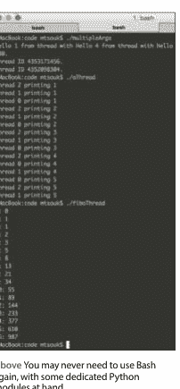

上图：手头有一些专用的Python模块，你可能永远不需要再使用Bash了

## 使用Python

## 用Python替换你的shell

os模块
environ：环境变量以字符串对象表示操作系统环境变量。

示例：

```
import os
os.environ
```

```
{'VERSIONER_PYTHON_PREFER_32_BIT': 'no', 'LC_CTYPE': 'UTF-8', 'TERM_PROGRAM_VERSION': '297', 'LOGNAME': 'kunaldeo', 'USER': 'kunaldeo', 'PATH': '/System/Library/Frameworks/Python.framework/Versions/2.7/bin:/Users/kunaldeo/narwhal/bin:/opt/local/sbin:/usr/local/bin:/usr/bin:/bin:/usr/sbin:/sbin:/usr/local/bin:/usr/X11/bin:/opt/local/bin:/Applications/MOTODEV_Studio_For_Android_2.0.0_x86/android_sdk/tools:/Applications/MOTODEV_Studio_For_Android_2.0.0_x86/android_sdk/platform-tools:/Volumes/CyanogenModWorkspace/bin', 'HOME': '/Users/kunaldeo', 'PS1': '\[\e[0;32m\]\u\[\e[m\] \[\e[1;34m\]\w\[\e[m\] \[\e[1;32m\]\$\[\e[m\] ', 'NARWHAL_ENGINE': 'jsc', 'DISPLAY': '/tmp/launch-s2LUfa/org.x:0', 'TERM_PROGRAM': 'Apple_Terminal', 'TERM': 'xterm-color', 'Apple_PubSub_Socket_Render': '/tmp/launch-kDu15P/Render', 'VERSIONER_PYTHON_VERSION': '2.7', 'SHLVL': '1', 'SECURITYSESSIONID': '186a5', 'ANDROID_SDK': '/Applications/MOTODEV_Studio_For_Android_2.0.0_x86/android_sdk', '_': '/System/Library/Frameworks/Python.framework/Versions/2.7/bin/python', 'TERM_SESSION_ID': 'ACFE2492-BB5C-418E-8D4F-84E9CF63B506', 'SSH_AUTH_SOCK': '/tmp/launch-dj6Mk4/Listeners', 'SHELL': '/bin/bash', 'TMPDIR': '/var/folders/6s/pgknm8b118737mb8psz8x4z80000gn/T/', 'LS_COLORS': 'ExFxCxDxbxegedabagacad', 'CLICOLOR': '1', '__CF_USER_TEXT_ENCODING': '0x1F5:0:0', 'PWD': '/Users/kunaldeo', 'COMMAND_MODE': 'unix2003'}
```

你也可以找到环境变量的值：

```
os.environ['HOME']
'/Users/kunaldeo'
```

## 用 Python 替换你的 Shell

### 使用 Python

`putenv(varname, value)`：添加或设置具有给定变量名和值的环境变量。
`getuid()`：返回当前进程的用户 ID。
`getlogin()`：返回当前登录用户的用户名。
`getpid(pid)`：返回给定 PID 的进程组 ID。不带任何参数使用时，它简单地返回当前进程 ID。
`getcwd()`：返回当前工作目录的路径。
`chdir(path)`：将当前工作目录更改为给定路径。
`listdir(path)`：类似于 `ls`，返回一个包含给定路径上目录和文件内容的列表。

示例：

```
os.listdir("/home/homer")
```

```
['.gnome2', '.pulse', '.gconf', '.gconfd', '.beagle',
'.gnome2_private', '.gksu.lock', 'Public', '.ICEauthority',
'.bash_history', '.compiz', '.gvfs', '.update-notifier',
'.cache', 'Desktop', 'Videos', '.profile', '.config', '.esd_auth', '.viminfo', '.sudo_as_admin_successful', 'mbox',
'.xsession-errors', '.bashrc', 'Music', '.dbus', '.local',
'.gstreamer-0.10', 'Documents', '.gtk-bookmarks', 'Downloads',
'Pictures', '.pulse-cookie', '.nautilus', 'examples.desktop',
'Templates', '.bash_logout']
```

`mkdir(path[, mode])`：使用给定路径和数字代码模式创建一个目录。默认模式是 0777。
`makedirs(path[, mode])`：递归创建给定路径（包括其所有目录）。默认模式是 0777。

示例：

```
import os
path = "/home/kunal/greatdir"
os.makedirs( path, 0755 );
```

`rename(old, new)`：将文件或目录 "old" 重命名为 "new"。如果 "new" 是一个目录，将引发错误。在 Unix 和 Linux 上，如果 "new" 存在且是一个文件，并且用户有权限，它将被静默替换。

`renames(old, new)`：类似于 `rename`，但也会在必要时递归创建任何目录。

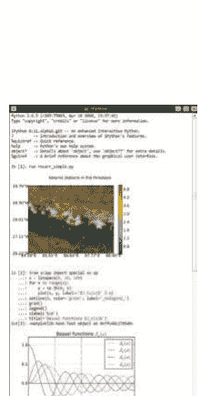

`rmdir(path)`：从提到的路径中删除目录。如果路径中已有文件，你需要使用 `shutil.rmtree()`。

`subprocess`：

`call(*popenargs, **kwargs)`：运行带有参数的命令。进程完成后，它返回 returncode 属性。

示例：

```
import subprocess
print subprocess.call(["ls","-l"])
```

```
total 3684688
drwx------+  5 kunaldeo  staff     170 Aug 19 01:37 Desktop
drwx------+ 10 kunaldeo  staff     340 Jul 26 08:30 Documents
drwx------+ 50 kunaldeo  staff    1700 Aug 19 12:50 Downloads
drwx------@ 127 kunaldeo  staff    4318 Aug 19 01:43 Dropbox
drwx------@ 42 kunaldeo  staff    1428 Aug 12 15:17 Library
drwx------@  3 kunaldeo  staff     102 Jul  3 23:23 Movies
drwx------+  4 kunaldeo  staff     136 Jul  6 08:32 Music
drwx------+  5 kunaldeo  staff     170 Aug 12 11:26 Pictures
drwxr-xr-x+  5 kunaldeo  staff     170 Jul  3 23:23 Public
-rwxr-xr-x  1 kunaldeo  staff 188655648 Aug 16 21:02 androidsdk.tar
drwxr-xr-x  5 kunaldeo  staff     170 Aug 16 21:05 sdk
drwxr-xr-x 19 kunaldeo  staff     646 Aug 19 01:47 src
-rw-r--r--  1 root       staff     367 Aug 16 20:36 umbrella0.log
```

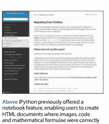

`STD_INPUT_HANDLE`：标准输入设备。最初，这是控制台输入缓冲区。
`STD_OUTPUT_HANDLE`：标准输出设备。最初，这是活动的控制台屏幕缓冲区。
`STD_ERROR_HANDLE`：标准错误设备。最初，这是活动的控制台屏幕缓冲区。

## 第 2 节：IPython：一个现成的 Python 系统 Shell 替代品

在第 1 节中，我们向你介绍了 Python 模块，这些模块允许你使用原生 Python 非常轻松地完成与系统 shell 相关的任务。使用相同的功能，你可以构建一个功能齐全的 shell，并在此过程中移除大量 Python 样板代码。然而，如果你是那种想要一切现成的人，你很幸运。IPython 提供了一个强大且交互式的 Python shell，你可以将其用作你的主要 shell。IPython 支持 Python 2.6 到 2.7 以及 3.1 到 3.2。它支持两种类型的 Python shell：基于终端的和基于 Qt 的。

重申一下，IPython 完全用 Python 实现，并提供 100% 符合 Python 的 shell 接口，因此你在第 1 节中学到的所有内容都可以在 IPython 中毫无问题地运行。

IPython 已经在大多数 Linux 发行版中可用。搜索你的发行版的软件库来查找它。如果你找不到它，你也可以使用 easy_install 或 PyPI 来安装它。

IPython 提供了许多有趣的功能，使其成为一个很棒的 shell 替代品...

**Tab 补全：** Tab 补全提供了一种极好的方式来探索你正在使用的任何 Python 对象。它还可以帮助你避免拼写错误。

**示例：**

```
In [3]: import o {hit tab}
objc    opcode    operator    optparse    os    os2emxpath

In [3]: import os

In [4]: os.p {hit tab}
os.pardir    os.pathconf_names    os.popen    os.popen4
os.path    os.pathsep    os.popen2    os.putenv
os.pathconf    os.pipe    os.popen3
```

**内置对象浏览器：** 你可以在任何 Python 对象后添加 '?' 来查看其详细信息，例如类型、基类、字符串形式、命名空间、文件和文档字符串。

示例：

```
In [28]: os.path?
Type:        module
Base Class: <type 'module'>
String Form:<module 'posixpath' from '/System/Library/Frameworks/Python.framework/Versions/2.7/lib/python2.7/posixpath.pyc'>
Namespace:  Interactive
File:        /System/Library/Frameworks/Python.framework/Versions/2.7/lib/python2.7/posixpath.py
Docstring:
Common operations on POSIX pathnames.
```

不要直接导入此模块，而是导入 os 并将此模块引用为 os.path。'os.path' 名称是此模块在 POSIX 系统上的别名；在其他系统（例如 Mac、Windows）上，os.path 以特定于该平台的方式提供相同的操作，并且是另一个模块（例如 macpath、ntpath）的别名。
其中一些在非 POSIX 系统上实际上也很有用，例如用于操作 URL 的路径名组件。你也可以使用双问号 (??) 来查看相关对象的源代码。

**魔术函数：** IPython 附带一组预定义的“魔术函数”，你可以使用命令行风格的语法调用它们。IPython 'magic' 命令通常以 % 为前缀，但如果标志 %automagic 设置为 on，那么你可以不带 % 调用魔术命令。要查看可用魔术函数的列表，请使用 'magic function %lsmagic'。它们包括处理代码的函数，如 %run、%edit、%macro、%recall 等；影响 shell 的函数，如 %colors、%xmode、%autoindent 等；以及其他函数，如 %reset、%timeit、%paste 等。IPython 的大多数酷炫功能都是由魔术函数驱动的。

示例：

```
In [45]: %lsmagic
Available magic functions:
%alias  %autocall  %autoindent  %automagic  %bookmark  %cd
%colors  %cpaste  %debug  %dhist  %dirs  %doctest_mode  %ed
%edit  %env  %gui  %hist  %history  %install_default_config
%install_profiles  %load_ext  %loadpy  %logoff  %logon
%logstart  %logstate  %logstop  %lsmagic  %macro  %magic
%page %paste %pastebin %pdb %pdef %pdoc %pfile
%pinfo %pinfo2 %popd %pprint %precision %profile %prun
%psearch %psource %pushd %pwd %pycat %pylab %quickref
%recall %rehashx %reload_ext %rep %rerun %reset
%reset_selective %run %save %sc %sx %tb %time %timeit
%unalias %unload_ext %who %who_ls %whos %xdel %xmode
```

Automagic 已关闭，魔术函数需要 % 前缀。要查看任何魔术函数的帮助，请调用 '%somemagic?' 来阅读其文档字符串。

**Python 脚本执行和运行时代码编辑：** 你可以使用 %run 来运行任何 Python 脚本。你也可以使用 -d 通过 pdb 调试器控制运行 Python 脚本，或使用 -p 通过 pdn 分析器运行。你也可以使用 %edit 命令编辑 Python 脚本，该命令会在 $EDITOR 环境变量定义的编辑器中打开给定的 Python 脚本。

**Shell 命令支持：** 要运行 shell 命令，请在命令前加上 !。

示例：

```
In [5]: !ps
PID TTY TIME CMD
4508 ttys000 0:00.07 -bash
84275 ttys001 0:00.03 -bash
17958 ttys002 0:00.18 -bash
```

```
In [8]: !clang prog.c -o prog
prog.c:2:1: warning: type specifier missing, defaults to 'int' [-Wimplicit-int]
main()
^~~~
1 warning generated.
```

**Qt 控制台：** IPython 附带一个基于 Qt 的控制台。这提供了仅在 GUI 中可用的功能，如内联图形、带语法高亮的多行编辑和图形化调用提示。使用以下命令启动 Qt 控制台：

```
$ ipython qtconsole
```

如果你遇到缺少模块的错误，请确保你已安装依赖包 – PyQt、pygments、pyexpect 和 ZeroMQ。

**结论**

正如你所看到的，很容易定制 Python 以满足你所有的 shell 环境需求。像 os、subprocess 和 shutil 这样的 Python 模块可供你使用，几乎可以完成你需要用 Python 做的任何事情。IPython 将这整个体验变成了一个更完整的包。你可以完成标准 Python shell 所做的一切，并且具有更方便的功能。IPython 的魔术函数确实提供了神奇的 Python shell 体验。所以下次你打开一个 Bash 会话时，再想想：既然铂金就在一步之遥，为什么还要满足于黄金呢？

### 使用 Python

## 使用 NumPy 进行科学计算

### 你需要准备...

- NumPy
  www.numpy.org
- SciPy
  www.scipy.org
- Matplotlib
  www.matplotlib.org

使用 NumPy、SciPy 和 Matplotlib 进行强大的计算。

NumPy 是进行科学计算的主要 Python 包。它拥有强大的 N 维数组对象、用于集成 C/C++ 和 Fortran 代码的工具、线性代数、傅里叶变换和随机数生成等功能。NumPy 还支持广播，这是通用函数处理不完全相同形式输入的一种巧妙方式。

除了其功能之外，NumPy 的另一个优势是它可以集成到 Python 程序中。换句话说，你可以从数据库、另一个程序的输出、外部文件或 HTML 页面获取数据，然后使用 NumPy 进行处理。

本文将向你展示如何安装 NumPy、进行计算、绘制数据图表、读写外部文件，并介绍一些与 NumPy 配合良好的 Matplotlib 和 SciPy 包。

NumPy 也可以与 Pygame（一个用于创建游戏的 Python 包）配合使用，但遗憾的是，解释其用法超出了本文的范围。

在将各种 NumPy 命令放入 Python 程序之前，先在 Python shell 中尝试它们被认为是一种好习惯。本文中的示例使用 Python shell 或 iPython。

> “除了其功能之外，NumPy 的另一个优势是它可以集成到 Python 程序中”

一个用于多项式拟合的简单 Python 程序

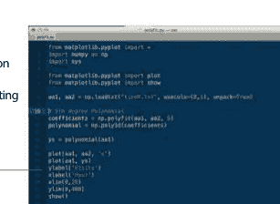

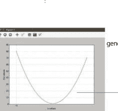

Matplotlib 生成的输出

一个使用 SciPy 处理图像的 Python 脚本

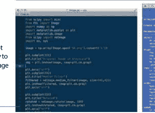

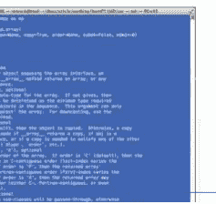

查找帮助很容易

## 安装 NumPy

01 大多数 Linux 发行版都有现成的安装包可供使用。安装后，你可以通过执行以下命令来查看你正在使用的 NumPy 版本：

```
$ python
Python 2.7.3 (default, Mar 13 2014, 11:03:55)
[GCC 4.7.2] on linux2
Type "help", "copyright", "credits" or "license" for more information.
>>> numpy.version.version
Traceback (most recent call last):
  File "<stdin>", line 1, in <module>
NameError: name 'numpy' is not defined
>>> import numpy
>>> numpy.version.version
'1.6.2'
```

你不仅找到了 NumPy 版本，还知道 NumPy 已正确安装。

## 关于 NumPy

02 尽管名字简单，NumPy 是一个强大的 Python 包，主要用于处理数组和矩阵。创建数组的方法有很多，但最简单的方法是使用 array() 函数：

```
>>> oneD = array([1,2,3,4])
```

上述命令创建了一个一维数组。如果你想创建一个二维数组，可以按如下方式使用 array() 函数：

```
>>> twoD = array([ [1,2,3],
... [3,3,3],
... [-1,-0.5,4],
... [0,1,0]] )
```

你也可以创建更多维度的数组。

## 使用 NumPy 进行简单计算

03 给定一个名为 myArray 的数组，你可以通过执行以下命令来查找其中的最小值和最大值：

```
>>> myArray.min()
>>> myArray.max()
```

如果你希望找到所有数组元素的平均值，可以运行以下命令：

```
>>> myArray.mean()
```

类似地，你可以通过运行以下 Python 命令来找到数组的中位数：

```
>>> median(myArray)
```

一组数据的中位数是一个元素，它将数据集分成两个具有相同元素数量的子集（左子集和右子集）。如果数据集有奇数个元素，那么中位数是数据集的一部分。另一方面，如果数据集有偶数个元素，那么中位数是排序后数据集中两个中心元素的平均值。

> “当你对一个数组应用一个函数时，该函数会自动应用于所有数组元素”

## 在 NumPy 中使用数组

04 NumPy 不仅支持 Python 中用于字符串和列表的典型索引方法，还对其进行了扩展。如果你想从数组中选择一个给定的元素，可以使用以下表示法：

```
>>> twoD[1,2]
```

你也可以使用以下表示法选择数组的一部分（切片）：

```
>>> twoD[1,1:3]
```

最后，你可以使用 tolist() 函数将数组转换为 Python 列表。

## 读取文件

05 假设你刚刚使用 AWK 从 Apache 日志文件中提取了信息，现在你想使用 NumPy 处理这个文本文件。以下 AWK 代码用于找出每小时的总请求数：

```
$ cat access.log | cut -d[ -f2 | cut -d] -f1 | awk -F: '{print $2}' | sort -n | uniq -c | awk '{print $2, $1}' > timeN.txt
```

包含数据的文本文件 (timeN.txt) 的格式如下：

- 00 191
- 01 225
- 02 121
- 03 104

读取 timeN.txt 文件并将其分配给一个新的数组变量，可以按如下方式完成：

```
aa = np.loadtxt("timeN.txt")
```

## 写入文件

06 将变量写入文件与读取文件非常相似。如果你有一个名为 aa1 的数组变量，你可以使用以下命令轻松地将其内容保存到名为 aa1.txt 的文件中：

```
In [17]: np.savetxt("aa1.txt", aa1)
```

正如你很容易想象的那样，你可以稍后使用 loadtxt() 函数读取 aa1.txt 的内容。

## 常用函数

07 NumPy 支持许多数值和统计函数。当你对一个数组应用一个函数时，该函数会自动应用于所有数组元素。在处理矩阵时，你可以通过输入 "AA.I" 来找到矩阵 AA 的逆矩阵。你也可以通过输入 "np.linalg.eigvals(AA)" 来找到其特征值，通过输入 "np.linalg.eig(BB)" 来找到其特征向量。

## 使用矩阵

08 二维 NumPy 数组的一个特殊子类型是矩阵。矩阵类似于数组，但矩阵乘法取代了逐元素乘法。矩阵使用 matrix（或 mat）函数生成，如下所示：

```
In [2]: AA = np.mat('0 1 1; 1 1 1; 1 1 1')
```

你可以通过输入 AA + BB 来将名为 AA 和 BB 的矩阵相加。类似地，你可以通过输入 AA * BB 来将它们相乘。

## 使用 Matplotlib 绘图

09 你应该做的第一步是安装 Matplotlib。如你所见，Matplotlib 有许多依赖项，你也应该安装它们。你将学到的第一件事是如何绘制多项式函数。绘制 3x^2-x+1 多项式所需的命令如下：

```
import numpy as np
import matplotlib.pyplot as plt
myPoly = np.poly1d(np.array([3, -1, 1]).astype(float))
x = np.linspace(-5, 5, 100)
y = myPoly(x)
plt.xlabel('x values')
plt.ylabel('f(x) values')
xticks = np.arange(-5, 5, 10)
yticks = np.arange(0, 100, 10)
plt.xticks(xticks)
plt.yticks(yticks)
plt.grid(True)
plt.plot(x,y)
```

保存多项式的变量是 myPoly。将为 x 绘制的值范围使用 "x = np.linspace(-5, 5, 100)" 定义。另一个重要的变量是 y，它计算并保存每个 x 值对应的 f(x) 值。

重要的是，你需要使用 "ipython --pylab=qt" 参数启动 ipython，以便在屏幕上看到输出。如果你对绘制多项式函数感兴趣，你应该多做实验，因为 NumPy 还可以计算函数的导数并在同一输出中绘制多个函数。

> “在 Python shell 中尝试各种 NumPy 命令”

## 使用 SciPy 进行图像处理

## 关于 SciPy

10 SciPy 构建在 NumPy 之上，比 NumPy 高级得多。它支持数值积分、优化、信号处理、图像和音频处理以及统计。作为参考，下面的示例仅使用了 scipy.stats 包中关于统计的一小部分。

> “对于绘制多项式函数，多做实验”

```
In [36]: from scipy.stats import poisson, lognorm
In [37]: mySh = 10;
In [38]: myMu = 10;
In [39]: ln = lognorm(mySh)
In [40]: p = poisson(myMu)
In [41]: ln.rvs((10,))
Out[41]: array([  9.29393114e-02,   1.15957068e+01,   9.78411983e+01,
         8.26370734e-07,   5.64451441e-03,   4.61744055e-09,
         4.98471222e-06,   1.45947948e+02,   9.25502852e-06,
         5.87353720e-02])
In [42]: p.rvs((10,))
Out[42]: array([12, 11,  9,  9,  9, 10,  9,  4, 13,  8])
In [43]: ln.pdf(3)
Out[43]: 0.013218067177522842
```

该示例使用了两种统计分布，可能难以理解，但呈现它是为了让你更好地体验 SciPy 命令。

11 现在我们将向你展示如何使用 SciPy 处理和转换 PNG 图像。代码中最重要的部分是以下行：

```
image = np.array(Image.open('SA.png').convert('L'))
```

这一行允许你读取一个普通的 PNG 文件并将其转换为 NumPy 数组以进行进一步处理。该程序还将输出分成四个部分，并为这四个部分中的每一个显示不同的图像。

## 其他有用函数

12 能够找出数组中元素的数据类型非常有用；可以使用 dtype() 函数完成。类似地，ndim() 函数返回数组的维度数量。

从外部文件读取数据时，你可以使用以下方法将它们的数据列保存到单独的变量中：

```
In [10]: aa1,aa2 =
```


## 使用 NumPy 进行科学计算

### 使用 Python

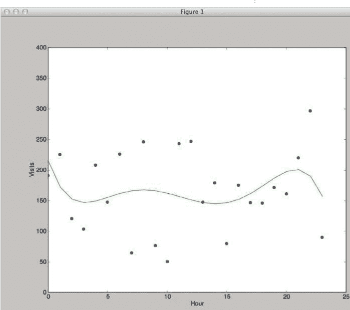

`np.loadtxt("timeN.txt", usecols=(0,1), unpack=True)`

上述命令将第 1 列保存到变量 `aa1`，第 2 列保存到变量 `aa2`。`unpack=True` 允许将数据分配给两个不同的变量。请注意，列的编号从 0 开始。

## 拟合多项式

13 NumPy 的 `polyfit()` 函数尝试将一组数据点拟合到一个多项式。数据来自之前创建的 `timeN.txt` 文件。

该 Python 脚本使用五次多项式，但如果你想使用不同的次数，只需更改以下行：

```
coefficients = np.polyfit(aa1, aa2, 5)
```

## NumPy 中的数组广播

14 最后，我们将进一步讨论数组广播，因为它是一个非常有用的特性。首先，你应该知道数组广播有一条规则：为了使两个数组能够进行数组广播，“两个数组在操作中尾随轴的大小必须相同，或者其中一个必须为 1。”

简单来说，数组广播允许 NumPy 通过填充数据来“改变”数组的维度，以便能够与另一个数组进行计算。然而，你不能同时拉伸数组的两个维度来完成你的工作。

以上是拟合多项式部分

### 使用 Python

## 面向系统管理员的 Python

### 你需要什么...

**Python-devel**
Python 开发库，编译第三方 Python 模块所必需。

**setuptools**
setuptools 允许你轻松地下载、构建、安装、升级和卸载 Python 包。

## 面向系统管理员的 Python

了解 Python 如何通过大胆取代通常的 shell 脚本来提供帮助...

> **注意**
> 本文针对 Python 2.X 系列编写，因为它仍然是所有平台（包括所有 Linux 发行版、BSD 和 Mac OS X）上最流行和默认的 Python 发行版。

系统管理是我们计算环境的重要组成部分。无论你是在工作还是在家中管理系统，这都无关紧要。Linux 作为一个基于 UNIX 的操作系统，已经拥有系统管理员所需的一切，例如世界一流的 shell（不止一个，而是很多，包括 Bash、csh、zsh 等）、便捷的工具以及许多其他使 Linux 系统成为管理员梦想的特性。那么，既然 Linux 已经内置了一切，为什么我们还需要 Python 呢？作为一种动态脚本语言，Python 非常易于阅读和学习。这不仅仅是我们的说法，许多 Linux 发行版实际上在核心管理部分使用 Python。例如，Red Hat（和 Fedora）的系统设置工具 Anaconda 就是用 Python 编写的（再读一遍这句话，明白那个蛇的联系了吗？）。此外，像 GNU Mailman、CompizConfig 设置管理器（CCSM）以及数百个小型 GUI 和非 GUI 配置工具都是使用 Python 编写的。Python 不限制你对用户界面的选择——你可以使用 Python 构建命令行、GUI 和 Web 应用程序。这样，它几乎涵盖了所有可能的界面。在这里，我们将探讨使用 Python 执行与系统管理相关的任务。

## 解析配置文件

配置文件为应用程序提供了一种存储各种设置的方式。为了编写一个允许你修改特定应用程序设置的脚本，你应该能够解析该应用程序的配置文件。在本节中，我们将学习如何解析 INI 风格的配置文件。尽管 INI 文件格式很古老，但它在许多现代开源软件中非常流行，例如 PHP 和 MySQL。

php.ini 配置文件摘录：

```
[PHP]
engine = On
zend.ze1_compatibility_mode = Off
short_open_tag = On
asp_tags = Off
precision = 14
y2k_compliance = On
output_buffering = 4096
;output_handler =
zlib.output_compression = Off
```

```
config.set('MySQL','mysql.default_host','localhost')
config.set('MySQL','mysql.default_port','3306')
config.set('MySQL','mysql.allow_persistent','On')
config.set('MySQL','mysql.max_persistent','20')
```

```
[MySQL]
; Allow or prevent persistent links.
mysql.allow_persistent = On
mysql.max_persistent = 20
mysql.max_links = -1
mysql.default_port = 3306
mysql.default_socket =
mysql.default_host = localhost
mysql.connect_timeout = 60
mysql.trace_mode = Off
```

```
with open('php.ini', 'ap') as configfile:
    config.write(configfile)
```

```
Output:php.ini
[MySQL]
mysql.max_persistent = 20
mysql.allow_persistent = On
mysql.default_port = 3306
mysql.default_host = localhost
mysql.trace_mode = Off
mysql.connect_timeout = 60
```

Python 提供了一个名为 `ConfigParser`（在 Python 3.0 中称为 `configparser`）的内置模块。你可以使用此模块来解析和创建配置文件。

@code: writeconfig.py
@description: 以下演示了向 php.ini 文件添加 MySQL 部分。
@warning: 不要将此脚本用于实际的 php.ini 文件，因为它并非设计用于处理完整 php.ini 文件的所有方面。

```
@code: parseconfig.py
@description: 解析和更新配置文件
import ConfigParser
config = ConfigParser.ConfigParser()
config.read('php.ini')
# Print config values
print config.get('MySQL','mysql.default_host')
print config.get('MySQL','mysql.default_port')
config.remove_option('MySQL','mysql.trace_mode')
with open('php.ini', 'wb') as configfile:
    config.write(configfile)
```

```
import ConfigParser
config = ConfigParser.RawConfigParser()

config.add_section('MySQL')
config.set('MySQL','mysql.trace_mode','Off')
config.set('MySQL','mysql.connect_timeout','60')
config.set('MySQL','mysql.default_')
```

## 解析 JSON 数据

JSON（也称为 JavaScript 对象表示法）是一种轻量级的现代数据交换格式。JSON 是 ECMA-262 下的一个开放标准。它是一种文本格式，完全独立于语言。JSON 也被用作现代应用程序（如 Mozilla Firefox 和 Google Chrome）的配置文件格式。JSON 在现代 Web 服务（如 Facebook、Twitter、Amazon EC2 等）中也非常流行。在本节中，我们将使用 Python 模块 'simplejson' 来访问 Yahoo Search（使用 Yahoo Web Services API），它输出 JSON 数据。

在本节中，我们将使用 `simplejson.load` 函数，该函数允许我们将 JSON 对象反序列化为 Python 对象。

要使用本节，你应该具备以下条件：

1. Python 模块：simplejson。
   注意：你可以使用命令 'easy_install <module name>' 安装 Python 模块。此命令假设你拥有可用的互联网连接。
2. Yahoo App ID：
   Yahoo App ID 可以从 https://developerapps.yahoo.com/dashboard/createKey.html 创建。Yahoo App ID 将在下一页生成。详情请参见下面的屏幕截图。

simplejson 非常易于使用。在下面的示例中，我们将使用将 JSON 数据结构直接映射到 Python 数据类型的能力。这使我们无需开发任何 XML 解析代码即可直接访问 JSON 数据。

JSON 与 Python 数据映射

| JSON | Python |
|---|---|
| object | dict |
| array | list |
| string | unicode |
| number (int) | int, long |
| number (real) | float |
| TRUE | TRUE |
| FALSE | FALSE |
| null | None |

```
@code: LUDSearch.py
import simplejson, urllib
APP_ID = 'xxxxxxxx' # Change this to your APP ID
SEARCH_BASE = 'http://search.yahooapis.com/WebSearchService/V1/webSearch'

class YahooSearchError(Exception):
    pass

def search(query, results=20, start=1, **kwargs):
    kwargs.update({
        'appid': APP_ID,
        'query': query,
        'results': results,
        'start': start,
        'output': 'json'
    })
    url = SEARCH_BASE + '?' + urllib.urlencode(kwargs)
    result = simplejson.load(urllib.urlopen(url))
    if 'Error' in result:
        # An error occurred; raise an exception
        raise YahooSearchError, result['Error']
    return result['ResultSet']
```

让我们使用上面列出的代码在 Python shell 中查看它的工作原理。切换到你保存 `LUDSearch.py` 的目录并打开一个 Python shell。

```
@code: Python Shell Output. Lines
```

## 面向系统管理员的 Python

### 使用 Python

## 那么，你想使用一些雅虎 API...

我们需要你提供一些信息... 要使用雅虎 Web 服务，我们需要一些关于你和你正在构建的应用程序的信息。我们收集这些信息是为了更好地了解雅虎 Web 服务的使用情况，并保护雅虎用户的安全和隐私。所有问题均为必填项。


## 关于你的应用程序

应用程序名称：LUDPySearch
应用程序类型：客户端/桌面
描述：一个演示使用 Python 进行 JSON 解析的应用程序。
网站图标 URL：http://www.yoursite.com/thisApp/favicon.gif

## 安全与隐私

雅虎 API 使用 OAuth 协议进行 API 使用的安全验证和最终用户身份验证（如果需要）。
访问范围：
- 此应用将仅访问公共 API、Web 服务或 RSS 订阅源。
- 此应用需要访问私有用户数据。

## 联系信息

以防万一出现问题，我们需要联系你 :-)
应用程序所有者：Kunal Dec
联系邮箱：kunaldeo2001@yahoo.com
使用条款：我已阅读并同意雅虎开发者网络使用条款。

以上是生成雅虎应用 ID

```
>>> execfile("LUDYSearch.py")
>>> results = search('Linux User and Developer')
>>> results['totalResultsAvailable']
123000000
>>> results['totalResultsReturned']
20
>>> items = results['Result']
>>> for Result in items:
...     print Result['Title'],Result['Url']
...
```

encyclopedia http://en.wikipedia.org/wiki/Linux_User_and_Developer
Linux User &amp; Developer | Linux User http://www.linuxuser.co.uk/tag/linux-user-developer/

## 收集系统信息

系统管理员的一项重要工作是收集系统信息。这里我们将使用 SIGAR（系统信息收集器和报告器）API 来演示如何使用 Python 收集系统信息。SIGAR 是一个非常完整的 API，可以提供大量信息，包括：

1. 系统内存、交换空间、CPU、负载平均值、运行时间、登录信息。
2. 每个进程的内存、CPU、凭证信息、状态、参数、环境、打开的文件。
3. 文件系统检测和指标。
4. 网络接口检测、配置信息和指标。
5. TCP 和 UDP 连接表。
6. 网络路由表。

Linux User http://www.linuxuser.co.uk/
Linux User and Developer - Wikipedia, the free

## 安装 SIGAR

第一步是构建并安装 SIGAR。SIGAR 托管在 GitHub 上，因此请确保你的系统中已安装 Git。然后执行以下步骤来安装 SIGAR 及其 Python 绑定：

```
$ git clone git://github.com/hyperic/sigar.git sigar.git
$ cd sigar.git/bindings/python
$ sudo python setup.py install
```

最后，你应该看到类似以下的输出：
Writing /usr/local/lib/python2.6/dist-packages/pysigar-0.1.egg-info
SIGAR 是一个非常易于使用的库，可用于获取系统几乎所有方面的信息。下一个示例将向你展示如何操作。以下代码显示了内存和文件系统信息。

```
@code: PySysInfo.py
import os
import sigar
sg = sigar.open()
mem = sg.mem()
swap = sg.swap()
fslist = sg.file_system_list()
print "================Memory Information================"
print "\tTotal\tUsed\tFree"
print "Mem:\t", \n    (mem.total() / 1024), \n    (mem.used() / 1024), \n    (mem.free() / 1024)
print "Swap:\t", \n    (swap.total() / 1024), \n    (swap.used() / 1024), \n    (swap.free() / 1024)
print "RAM:\t", mem.ram(), "MB"
print "================File System Information================"
def format_size(size):
    return sigar.format_size(size * 1024)
print 'Filesystem\tSize\tUsed\tAvail\tUse%\tMounted on\tType\n'
for fs in fslist:
    dir_name = fs.dir_name()
    usage = sg.file_system_usage(dir_name)
    total = usage.total()
    used = total - usage.free()
    avail = usage.avail()
    pct = usage.use_percent() * 100
    if pct == 0.0:
        pct = '-'
    print fs.dev_name(), format_size(total), format_size(used), format_size(avail),\n        pct, dir_name, fs.sys_type_name(), '/', fs.type_name()
```

```
@Output
================Memory Information================
	Total	Used	Free
Mem:	 8388608 6061884 2326724
Swap: 131072 16048 115024
RAM:  8192 MB
================File System Information================
Filesystem  Size  Used  Avail Use%  Mounted on  Type
/dev/disk0s2 300G 175G 124G 59.0 / hfs / local
devfs 191K 191K 0 - /dev devfs / none
```

```
import base64, getpass, os, socket, sys, socket, traceback
import paramiko
import interactive
# setup logging
paramiko.util.log_to_file('demo_simple.log')
# get hostname
username = ''
if len(sys.argv) > 1:
    hostname = sys.argv[1]
    if hostname.find('@') >= 0:
        username, hostname = hostname.split('@')
else:
    hostname = raw_input('Hostname: ')
if len(hostname) == 0:
    print '*** Hostname required.'
    sys.exit(1)
port = 22
if hostname.find(':') >= 0:
    hostname, portstr = hostname.split(':')
    port = int(portstr)
# get username
if username == '':
    default_username = getpass.getuser()
    username = raw_input('Username [%s]: ' % default_username)
    if len(username) == 0:
        username = default_username
password = getpass.getpass('Password for %s@%s: ' % (username, hostname))
# now, connect and use paramiko Client
to negotiate SSH2 across the connection
try:
    client = paramiko.SSHClient()
    client.load_system_host_keys()
    client.set_missing_host_key_policy(paramiko.WarningPolicy)
```

## 访问安全 Shell (SSH) 服务

SSH（安全 Shell）是旧的远程 Shell 系统 Telnet 的现代替代品。它允许在两个联网设备之间使用安全通道交换数据。系统管理员经常使用 SSH 来管理联网系统。除了提供远程 Shell，SSH 还用于安全文件传输（使用 SSH 文件传输协议，或 SFTP）和远程 X 服务器转发（允许你将 SSH 客户端用作 X 服务器）。在本节中，我们将学习如何使用一个名为 paramiko 的 Python 模块从 Python 中使用 SSH 协议，该模块为 Python 实现了 SSH2 协议。paramiko 可以通过以下步骤安装：

```
$ git clone https://github.com/robey/paramiko.git
$ cd paramiko
$ sudo python setup.py install
```

paramiko 的核心是 SSHClient 类。该类封装了 L{Transport}、L{Channel} 和 L{SFTPClient}，以处理 SSH 的大部分方面。你可以这样使用 SSHClient：

```
client = SSHClient()
client.load_system_host_keys()
client.connect('some.host.com')
stdin, stdout, stderr = client.exec_command('dir')
```

以下示例演示了一个使用 paramiko 模块编写的完整 SSH 客户端。

```
@code: PySSHClient.py
print '*** Connecting...'
client.connect(hostname, port,
username, password)
chan = client.invoke_shell()
print repr(client.get_transport())
print '*** SSH Server Connected! ***'
print
interactive.interactive_shell(chan)
chan.close()
client.close()
except Exception, e:
    print '*** Caught exception: %s: %s' % (e.__class__, e)
    traceback.print_exc()
    try:
        client.close()
    except:
        pass
    sys.exit(1)
```

如果 SSH 服务器的主机密钥未添加到你的 $HOME/.ssh/known_hosts 文件中，客户端将抛出以下错误：

```
[~ $:]
*** Caught exception: <type 'exceptions.TypeError'>: unbound method missing_host_key() must be called with WarningPolicy instance as first argument (got SSHClient instance instead)
```

这意味着客户端无法验证你所连接服务器的真实性。要将主机密钥添加到 known_hosts，你可以使用 ssh 命令。重要的是要记住，这不是添加主机密钥的理想方式；相反，你应该使用 ssh-keygen。但为了简单起见，我们使用 ssh 客户端。

要运行此代码，你还需要一个自定义的 Python 类 interactive.py，它为 SSH 会话实现了交互式 Shell。在 FileSilo 上查找此文件，并将其复制到你创建 PySSHClient.py 的同一文件夹中。

```
@code_Output
kunal@ubuntu-vm-kdeo:~/src/paramiko/demos$ python demo_simple.py
Hostname: 192.168.1.2
Username [kunal]: luduser
Password for luduser@192.168.1.2:
*** Connecting...
<paramiko.Transport at 0xb76201acL
(cipher aes128-ctr, 128 bits) (active; 1 open channel(s))>
*** SSH Server Connected! ***
Last login: Thu Jan 13 02:01:06 2011 from 192.168.1.9
```

```
kunal@ubuntu-vm-kdeo:~/.ssh$ ssh luduser@192.168.1.2
The authenticity of host '192.168.1.2 (192.168.1.2)' can't be established.
RSA key fingerprint is be:01:76:6a:b9:bb:69:64:e3:dc:37:00:a4:36:33:d1.
Are you sure you want to continue connecting (yes/no)? yes
Warning: Permanently added '192.168.1.2' (RSA) to the list of known hosts.
```

所以现在你已经看到，使用 Python 这种多功能语言执行复杂的系统管理任务是多么容易。
与所有 Python 编码一样，这里展示的代码可以相当容易地集成到你的 GUI 应用程序（使用 PyGTK 或 PyQt 等软件）或 Web 应用程序（使用 Django 或 Grok 等框架）中。

## 使用 Python 编写用户界面

管理员习惯于手动运行原始脚本，但最终用户并非如此。因此，如果你编写的脚本打算供普通用户使用，那么在脚本之上创建一个用户友好的界面是个好主意。这样，最终用户就可以像运行任何其他应用程序一样运行脚本。为了演示这一点，我们将创建一个简单的 GRUB 配置工具，允许用户选择默认启动项和超时时间。我们将创建一个 TUI（文本用户界面）应用程序，并使用 Python 模块 'snack' 来实现（不要与 Python 音频库 tksnack 混淆）。

此应用程序由两个文件组成...

**grub.py**：GRUB 配置文件 (grub.conf) 解析器（可在 FileSilo 获取）。它实现了两个主要函数 `readBootDB()` 和 `writeBootFile()`，负责读取和写入 GRUB 配置文件。

**grub_tui.py**：用于操作 GRUB 配置文件的文本用户界面文件，使用了 `grub.py` 中提供的函数。

```python
@code:grub_tui.py
import sys
from snack import *

from grub import (readBootDB, writeBootFile)

def main(entry_value='1', kernels=[]):
    try:
        (default_value, entry_value,
         kernels)=readBootDB()
    except:
        print >> sys.stderr, ("Error reading /boot/grub/grub.conf")
        sys.exit(10)

    screen=SnackScreen()

    while True:
        g=GridForm(screen, ("Boot configuration"),1,5)
        if len(kernels)>0 :
            li=Listbox(height=len(kernels), width=20,
                       returnExit=1)
            for i, x in enumerate(kernels):
                li.append(x,i)
            g.add(li, 0, 0)
            li.setCurrent(default_value)

        bb = ButtonBar(screen, (("Ok", "ok"),
                               ("Cancel", "cancel")))

        e=Entry(3, str(entry_value))
        l=Label(("Timeout (in seconds):"))
        gg=Grid(2,1)
        gg.setField(l,0,0)
        gg.setField(e,1,0)

        g.add(Label(''),0,1)
        g.add(gg,0,2)
        g.add(Label(''),0,3)
        g.add(bb,0,4,growx=1)
        result = g.runOnce()
        if bb.buttonPressed(result) == 'cancel':
            screen.finish()
            sys.exit(0)
        else:
            entry_value = e.value()
            try :
                c = int(entry_value)
                break
            except ValueError:
                continue

    writeBootFile(c, li.current())
    screen.finish()

if __name__ == '__main__':
    main()
```

使用 sudo 命令启动该工具（因为它需要读取 grub.conf 文件）

```
$ sudo grub_tui.py
```


### 使用 Python

### 使用 Beautiful Soup 抓取维基百科

### 你需要什么...

**Beautiful Soup**
www.crummy.com/software/BeautifulSoup/

**HTML5Lib**
https://github.com/html5lib/html5lib-python

**Python 2.6+ & WikiParser. zip Six**
https://pypi.python.org/pypi/six/

### 使用 Beautiful Soup 抓取维基百科

使用 Beautiful Soup Python 库解析维基百科的 HTML 并将其存储以供离线阅读

在本教程中，我们将使用流行的 Python 库 Beautiful Soup 来抓取维基百科的文章链接，然后保存这些页面以供离线阅读。这对于旅行或网络连接不佳的地点来说非常理想。

计划很简单：使用 Beautiful Soup 和 HTML5Lib 解析器，我们将加载一个维基百科页面，删除所有图形用户界面和无关内容，在内容中搜索指向其他维基百科文章的链接，然后经过少量修改后，将它们写入文件。

尽管维基百科现在是事实上的世界知识库，但在 DOM 一致性方面并不出色——也就是说，ID 和类的使用有时相当松散。因此，我们还将介绍如何处理维基百科图形用户界面中所有我们不需要的多余部分，以及各种对我们没有太大用处的错误链接。你可以在 http://bit.ly/19MlbBv 找到与本教程相关的 CSS 样式表和 Python 脚本。

### 无限链接

维基百科有很多链接，当你开始跟踪链接到链接再到链接时，你需要解析的页面数量可能会呈指数级增长，具体取决于主题。通过传递 levels 值，我们可以限制可以抓取的页面数量——尽管存储的文件数量仍然可能有很大差异。请明智地使用它。

### 安装 Beautiful Soup 和 HTML5Lib

**01** 在我们开始编写代码之前，我们需要安装程序将使用的库（Beautiful Soup、HTML5Lib、Six）。安装过程相当标准：从各自的链接获取库，然后解压它们。在终端中，进入解压后的目录，并为每个库运行 `python setup.py install`。它们现在就可以使用了。

> “维基百科在 DOM 一致性方面并不出色”

### 使用 Beautiful Soup 抓取维基百科

### 使用 Python

## 完整代码清单

1 导入库
这些是我们将在此程序中使用的库

```python
import os, sys, urllib2, argparse, datetime, atexit
from bs4 import BeautifulSoup
```

```python
addresses = []
deepestAddresses = []

maxLevel = 1
storeFolder = "Wikistore " + str(datetime.datetime.now().strftime("%Y-%m-%d %H:%M"))

undesirables = [ {"element" : "table", "attr" : {"class" : "infobox"} }, {"element" : "table", "attr" : {"class" : "vertical-navbox"}}, {"element" : "span", "attr" : {"class" : "mw-editsection"}}, {"element" : "div", "attr" : {"class" : "thumb"}}, {"element" : "sup", "attr" : {"class" : "reference"}}, {"element" : "div", "attr" : {"class" : "reflist"}}, {"element" : "table", "attr" : {"class" : "nowraplinks"}}, {"element" : "table", "attr" : {"class" : "ambox-Refimprove"}}, {"element" : "img", "attr" : None}, {"element" : "script", "attr" : None}, {"element" : "table", "attr" : {"class" : "mbox-small"}} , {"element" : "span", "attr" : {"id" : "coordinates"}}, {"element" : "table", "attr" : {"class" : "ambox-Orphan"}}, {"element" : "div", "attr" : {"class" : "mainarticle"}}, {"element" : None, "attr" : {"id" : "References"}} ]
```

2 设置变量
这些是我们将用来跟踪脚本进度的一些变量

```python
def init():
    parser = argparse.ArgumentParser(description='Handle the starting page and number of levels we\'re going to scrape')
    parser.add_argument('-URL', dest='link', action='store', help='The Wikipedia page from which we will start scraping')
    parser.add_argument('-levels', dest='levels', action='store', help='How many levels deep should the scraping go')
    args = parser.parse_args()

    if(args.levels != None):
        global maxLevel
        maxLevel = int(args.levels)

    if(args.link == None):
        print("You need to pass a link with the -URL flag")
        sys.exit(0)
    else:
        if not os.path.exists(storeFolder):
            os.makedirs(storeFolder)

        grabPage(args.link, 0, args.link.split("/wiki/")[1].strip().replace("_", " "))

    atexit.register(cleanUp)
```

3 初始化
这是我们将用于处理来自用户输入的初始化函数

```python
def isValidLink(link):
    if "/wiki/" in link and ":" not in link and "http://" not in link and "wikibooks" not in link and "#" not in link and "wikiquote" not in link and "wiktionary" not in link and "wikiversity" not in link and "wikivoyage" not in link and "wikisource" not in link and "wikinews" not in link and "wikiversity" not in link and "wikidata" not in link:
        return True
    else:
        return False
```

```python
def grabPage(URL, level, name):
    opener = urllib2.build_opener()
    opener.addheaders = [('User-agent', 'Mozilla/5.0')]
    req = opener.open(URL)
```

### 使用 Python

### 使用 Beautiful Soup 抓取维基百科

维基百科大全

维基百科有如此多相互链接的不同服务；然而，我们不想抓取那些页面，所以我们有一个相当长的条件语句来阻止这种情况。它在确保我们只获取来自维基百科的链接方面做得很好。

### 创建一些有用的变量

02 这些变量将跟踪脚本运行期间我们访问过的链接；`addresses` 是一个包含我们访问过的每个链接的列表；`deepestAddresses` 是距离我们起点最远的链接树中的页面链接；`storeFolder` 是我们将保存创建的 HTML 文件的位置，`maxLevel` 是我们可以从起始页面跟踪链接的最大深度。

### 处理用户输入

03 在此函数的前几行中，我们只是创建了一个辅助语句。之后，我们解析程序执行时传递的任何参数，并查找 `-URL` 标志和 `-levels` 标志。`-levels` 标志是可选的，因为我们已经有一个预设的深度来跟踪链接，但我们需要一个起始链接，因此如果缺少 `-URL` 标志，我们将提示用户并退出。如果我们有一个链接，那么我们快速检查是否有用于存储文件的目录——如果没有则创建——然后我们将启动获取该页面的函数。最后，我们为脚本尝试退出时注册一个处理程序。我们稍后会讲到那部分。

### 从 URL 检索页面

04 在这里，我们使用 URLlib2 请求用户请求的页面，然后，一旦我们收到该页面，我们将通过 `soup` 变量将内容传递给 Beautiful Soup。这使我们能够在解析文档时调用我们要调用的方法。

### 精简内容

05 维基百科有很多我们不想解析的节点。`content` 变量允许我们立即忽略大部分维基百科的图形用户界面，但仍然有很多我们不想解析的元素。我们通过遍历文档前面创建的列表 `undesirables` 来解决这个问题。对于每个我们不想要的不同 div/部分/节点，我们调用 Beautiful Soup 的 `find_all()` 方法，并使用 `extract()` 方法从文档中删除该节点。在 `undesirables` 循环结束时，我们不再需要的大部分内容将会消失。我们还在维基百科页面中查找 'also' 元素。通常，此 div 之后的所有内容对我们都没有用。通过在 `also` 节点上调用 `find_all_next()` 方法，我们可以获得一个列表，列出从该点开始我们可以删除的所有其他元素。

> “HTML 页面在渲染页面时使用内置浏览器样式”

## 使用Beautiful Soup抓取维基百科

## 使用Python

> “维基百科拥有众多相互关联的不同服务；我们不希望抓取那些页面”

4 获取页面
在此步骤中，我们抓取需要存储的页面，并移除文档中不需要的部分。

```python
page = req.read()
req.close()
soup = BeautifulSoup(page, "html5lib", from_encoding="UTF-8")
content = soup.find(id="mw-content-text")
if hasattr(content, 'find_all'):
    global undesirables
    for notWanted in undesirables:
        removal = content.find_all(notWanted['element'], notWanted['attr'])
        if len(removal) > 0:
            for el in removal:
                el.extract()
    also = content.find(id="See_also")
    if(also != None):
        also.extract()
        tail = also.find_all_next()
        if(len(tail) > 0):
            for element in tail:
                element.extract()
    for link in content.find_all('a'):
        href = link["href"]
        if isValidLink(href):
            if level < maxLevel:
                stored = False;
                for addr in addresses:
                    if addr == link.get("href"):
                        stored = True
                if(stored == False):
                    title = link.get('href').replace("/wiki/", "")
                    addresses.append(str(title + ".html"))
                    grabPage("http://en.wikipedia.org" + link.get('href'), level + 1, title)
                    print title
                link["href"] = link["href"].replace("/wiki/", "") + ".html"
    fileName = str(name)
    if level == maxLevel:
        deepestAddresses.append(fileName.replace('/', '_') + ".html")
```

5 检查链接
然后我们遍历所有 `<a>` 标签，检查是否存在指向我们可以抓取的其他页面的有效链接，并对其进行调整以供我们自己使用。

样式
目前，HTML页面在渲染时将使用浏览器内置样式。如果您愿意，可以包含教程资源中提供的样式表，使其看起来更美观。要使用它，您可以压缩脚本并将其包含在第102行的head字符串中的 `<style>` 标签内，或者您可以将head字符串重写为类似以下内容：
`head = "<head><meta charset="UTF-8" /><title>" + fileName + "</title><style>" + str(open("/PATH/TO/STYLES", 'r').read()) + "</style></head>"`

## 使用Python

## 使用Beautiful Soup抓取维基百科

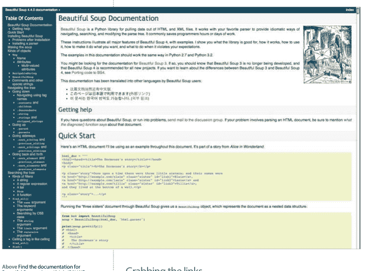

上图：在 http://bit.ly/O2H8ID 查找Beautiful Soup的文档。

## 抓取链接

06 通过调用 `content.find_all('a')`，我们获取文档中每个 `<a>` 标签的列表。我们可以遍历此列表，并检查 `<a>` 标签的href中是否存在有效的维基百科链接。如果链接有效，我们会快速检查该链接距离原始页面的链接树深度。如果已达到最大深度，我们将存储此页面并停止；否则，我们将开始在其中寻找可以抓取的链接。对于每个请求的页面，我们将其URL附加到地址列表中；为确保我们不会为找到的每个链接重复调用同一页面，我们会检查是否已存储该页面。如果已存储，我们将跳过循环的其余部分；如果未存储，我们将将其添加到已请求的URL列表中并发出请求。完成检查后，我们对该链接进行快速字符串替换，使其指向本地目录，而不是它正在查找的子文件夹 `/wiki/`。

## 写入文件

07 现在我们创建一个文件来存储新解析的文档以供后续读取。我们将文件名中的任何 '/' 更改为 '_'，以防止脚本尝试写入随机文件夹。我们还会快速检查自第一页以来我们跟踪了多少个链接。如果达到最大级别，我们将将其添加到deepestAddresses列表中。我们稍后会用到这个列表。

## 使用Beautiful Soup抓取维基百科

## 使用Python

## 收尾工作

08 在我们的脚本遍历每个页面上的每个链接以达到最大深度后，它将尝试退出。在代码（磁盘和在线版本）的第34行的init函数中，我们注册了cleanUp函数，以便在程序尝试退出时执行；cleanUp的任务是遍历我们下载的文档，并检查我们留在页面中的每个链接是否确实指向我们可用的文件。如果无法将href中的链接与地址列表中的文件匹配，它将删除该链接。完成后，我们将拥有一个完全可移植的维基百科片段，可以随身携带。

6 复制到文件
之后，我们将解析的内容放入一个全新的HTML文件中。

```python
doctype = "<!DOCTYPE html>"

head = "<head><meta charset="UTF-8" /><title>" + fileName + "</title></head>"

f = open(storeFolder + "/" + fileName.replace('/', '_') + ".html", 'w')
f.write(doctype + "<html lang="en">" + head + "<body><h1>" + fileName + "</h1>" + str(content) + "</body></html>")
f.close()
```

7 清理
一旦所有页面都被解析并存储，我们将继续尝试移除任何失效链接。

```python
def cleanUp():

    print("\nRemoving links to pages that have not been saved\n")

    for deepPage in deepestAddresses:

        rF = open(storeFolder + "/" + deepPage, 'r')

        deepSoup = BeautifulSoup(rF.read(), "html5lib", from_encoding="UTF-8")

        for deepLinks in deepSoup.find_all('a'):
            link = deepLinks.get("href")

            pageStored = False

            for addr in addresses:
                if addr == link:
                    pageStored = True

            if pageStored == False:

                if link is not None:

                    if '#' not in link:
                        del deepLinks['href']
                    elif '#' in link and len(link.split('#')) > 1 or ':' in link:
                        del deepLinks['href']

        wF = open(storeFolder + "/" + deepPage, 'w')
        wF.write(str(deepSoup))
        wF.close()

    print("Complete")
```

8 初始化
这是我们初始化脚本的方式。

```python
if __name__ == "__main__":
    init()
```

## 使用Python创造

享受编程的乐趣

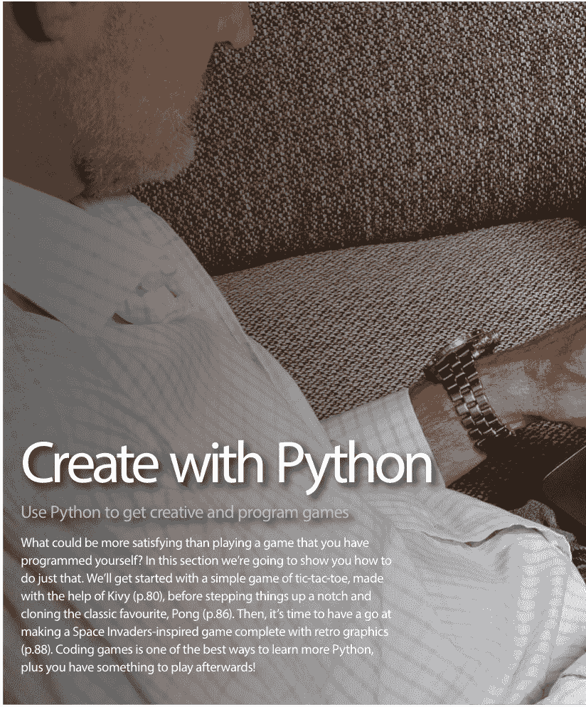

## 使用Python创造

使用Python发挥创意，编写游戏

还有什么比玩自己编写的游戏更令人满足的呢？在本节中，我们将向您展示如何做到这一点。我们将从一个简单的井字棋游戏开始，借助Kivy（第80页）的帮助，然后更进一步，克隆经典游戏Pong（第86页）。接着，是时候尝试制作一款受《太空侵略者》启发的游戏，并配备复古图形（第88页）。编写游戏是学习更多Python的最佳方式之一，而且之后您还有东西可玩！

享受编程的乐趣

使用Python创造


> “制作一个可玩的游戏并不像您想象的那么困难”

## 使用Python创造

## 使用Kivy构建井字棋

## 您将需要...

- Python
- www.python.org/doc

## 使用Kivy构建井字棋

通过仅用100多行Python代码创建经典的纸笔游戏，轻松了解Kivy的工作原理...

Kivy是一个高度跨平台的Python图形框架，专为创建创新用户界面（如多点触控应用）而设计。其应用程序不仅可以在Linux、OS X和Windows等传统桌面平台上运行，还可以在Android、iOS以及Raspberry Pi等设备上运行。

这意味着您可以使用Requests、SQLAlchemy甚至NumPy等Python库开发跨平台应用程序。您甚至可以使用Kivy的一些姊妹项目直接从Python访问原生移动API。另一个很棒的特性是Cython优化的OpenGL图形管道，即使基本的Python API非常简单，也能实现高级GPU效果。

Kivy是一组Python/Cython模块，可以通过pip轻松安装，但您需要一些依赖项。它使用Pygame作为渲染后端（尽管其API未公开），使用Cython编译快速的图形编译器内部组件，并使用GStreamer处理多媒体。这些依赖项应该都可以通过您的发行版的存储库获得，或者在适用的情况下通过pip获得。

满足这些依赖项后，您应该能够使用正常的pip命令安装Kivy。当前版本是1.8.0，相同的代码库支持python2和python3。本教程中的代码也是版本无关的，可以在python2.7和python3.3中运行。

```bash
pip install kivy
```

如果pip有任何问题，您可以通过 `easy_install kivy` 使用easy_install。

一些流行的发行版也有可用的软件包或存储库。您可以在Kivy的网站上找到更多信息。Kivy应用程序通过实例化并运行一个'App'类来启动。这将初始化我们的应用程序窗口，与操作系统交互，并提供

## 使用 Kivy 构建井字棋

## 使用 Python 创建

这是我们创建图形用户界面的入口点。我们可以从创建一个最简单的 Kivy 应用开始：

```python
from kivy.app import App

class TicTacToeApp(App):
    pass

if __name__ == "__main__":
    TicTacToeApp().run()
```

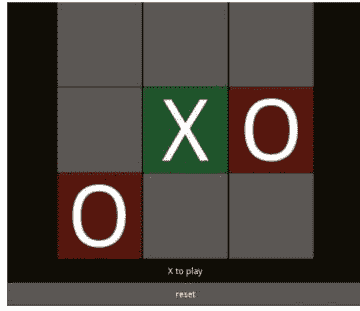

你已经可以运行它了，你的应用会启动并显示一个纯黑色的窗口。令人兴奋！

我们可以用 Kivy 的部件来构建自己的图形用户界面。每个部件都是一个简单的图形元素，具有其特定的行为，范围从标准的图形用户界面功能（例如按钮、标签或文本输入框），到那些对其子部件施加定位规则的部件（例如BoxLayout、FloatLayout或GridLayout），再到那些抽象更复杂任务（如与硬件交互）的部件（例如FileChooser、Camera或VideoPlayer）。最重要的是，Kivy 的部件设计得易于组合——并非为每种想象得到的需求都包含一个部件，而是保持部件简单但易于连接以发明新的界面。我们将在本教程中看到一些这样的例子。

既然“Hello World!”基本上是任何编程教程的必修内容，让我们用一个简单的“Label”部件来显示文本，完成这个任务：

```python
from kivy.uix.label import Label
```

我们将通过将“Label”作为应用的根部件返回来显示它。每个应用都有一个根部件，即其部件树的顶层，它会自动调整大小以填满窗口。我们稍后将看到如何通过为此根部件添加更多部件来构建完整的图形用户界面，但现在，通过向“App”添加一个新方法来设置根部件就足够了：

**上图** 最终添加了使网格方正并扩展界面的游戏

```python
def build(self):
    return Label(text='Hello World!',
                 font_size=100,
                 color=(0, 1, 0, 1))  # (r, g, b, a)
```

当“App”运行时，“build”方法会被调用，返回的任何部件都会自动成为该“App”的根部件。在我们的例子中，这是一个Label，我们设置了几个属性——“text”、“font_size”和“color”。所有部件都有不同的属性来控制其行为的各个方面，这些属性可以动态更新以在之后改变其外观，尽管这里我们只在实例化时设置了一次。

请注意，这些属性不仅仅是Python属性，而是Kivy属性。它们的访问方式与普通属性相同，但通过接入Kivy的事件系统提供了额外的功能。我们很快就会看到创建属性的例子，如果你想将你的变量与Kivy的事件或绑定功能一起使用，你也应该这样做。

这就是显示一些简单文本所需的全部内容，所以再次运行程序以检查这是否有效。如果不清楚任何参数的作用，你可以尝试调整它们。

## 我们自己的部件：井字棋

由于Kivy没有井字棋部件，我们必须自己创建一个！创建一个新的部件类来包含这种行为是很自然的：

```python
from kivy.uix.gridlayout import GridLayout
class TicTacToeGrid(GridLayout):
    pass
```

现在这显然还没有做任何事情，除了它继承了Kivy GridLayout部件的所有行为——也就是说，我们需要告诉它有多少列，然后它会自动排列任何子部件，以尽可能多的行数整齐地适配。井字棋需要三列和九个子部件。

这里我们引入了Kivy语言（kv），一种用于描述Kivy部件树规则的特殊领域特定语言。它非常简单，但消除了用Python代码操作图形用户界面所需的大量样板代码——作为一个不太严谨的类比，你可以把它想象成Python的JavaScript对应的HTML/CSS。Python赋予我们做任何事情的动态能力，但如果我们只想声明图形用户界面的基本结构，所有这些能力反而会碍事。请注意，你永远不需要kv语言，你总是可以只用Python做同样的事情，但本教程的其余部分可能会展示为什么Kivy程序员通常喜欢使用kv。

Kivy自带了使用kv语言所需的所有工具；最简单的方法是将其写在一个基于我们的App类命名的文件中。也就是说，我们应该将以下内容放在一个名为“tictactoe.kv”的文件中：

```
<TicTacToeGrid>:
    cols: 3
```

这是kv语言的基本语法；对于每种部件类型，我们可以编写一条规则来定义其行为，包括设置其属性和添加子部件。这个例子演示了前者，通过声明每个实例化的“TicTacToeGrid”都应将其“cols”属性设置为3，为“TicTacToeGrid”部件创建了一条规则。

我们稍后会使用更多的kv语言特性，但现在让我们回到Python，创建将作为我们井字棋网格条目的按钮。

```python
from kivy.uix.button import Button
from kivy.properties import ListProperty
```

```python
class GridEntry(Button):
    coords = ListProperty([0, 0])
```

这继承自Kivy的“Button”部件，它与鼠标或触摸输入交互，在交互切换其状态时分发事件。我们可以接入这些事件，在用户按下按钮时调用我们自己的函数，并可以设置按钮的“text”属性来显示“X”或“O”。我们还为我们的部件创建了一个新的Kivy属性“coords”——我们稍后会展示这为什么有用。这几乎与在“GridEntry.__init__”中通过编写“self.coords = [0, 0]”来创建一个普通的Python属性相同。

与“TicTacToeGrid”一样，我们将使用kv语言来设置我们新类的样式，但这次我们将看到一个更有趣的特性。

```
<GridEntry>:
    font_size: self.height
```

与之前一样，此语法定义了“GridEntry”部件应如何构建的规则，这次设置了控制按钮标签中文本大小的“font_size”属性。额外的魔法在于，kv语言自动检测到我们引用了Button自身的高度，并将创建一个绑定来更新这种关系——当“GridEntry”部件的高度改变时，其“font_size”也会改变，以使文本完美适配。我们本可以直接从Python创建这些绑定（这是稍后使用的“bind”方法的另一种用法），但这很少像引用我们想要绑定的属性那样方便。

现在让我们用“GridEntry”部件填充我们的“TicTacToeGrid”。

```python
class TicTacToeGrid(GridLayout):
    def __init__(self, *args, **kwargs):
        super(TicTacToeGrid, self).__init__(*args, **kwargs)
        for row in range(3):
            for column in range(3):
                grid_entry = GridEntry(
                    coords=(row, column))
                grid_entry.bind(on_release=self.button_pressed)
                self.add_widget(grid_entry)

    def button_pressed(self, instance):
        print('{} button clicked!'.format(instance.coords))
```

```python
def build(self):
    return TicTacToeGrid()
```

完成后，你可以再次运行你的主Python文件并享受你的新程序。如果一切顺利，单个Label将被一个九个按钮组成的网格所取代，每个按钮你都可以点击（它会自动改变颜色）并释放（你会看到来自我们绑定的打印输出信息）。

我们可以通过修改Button的其他属性来自定义外观，但现在我们将保持它们原样。

这引入了几个新概念：当我们实例化“GridEntry”部件时，我们能够通过简单地将其作为关键字参数传递来设置它们的“coords”属性。这是Kivy属性自动处理的一个小特性。

我们使用了“bind”方法，每当“GridEntry”部件分发“on_release”事件时，就调用网格的“button_pressed”方法。这是由其“Button”父类自动处理的，每当用户按下然后释放一个“GridEntry”按钮时就会发生。我们也可以绑定到“on_press”，它在按钮首次被点击时分发，或者绑定到按钮的任何Kivy属性，当属性被修改时动态分发。

我们通过“add_widget”方法将每个“GridEntry”部件添加到我们的“Grid”中。这意味着每个部件都是“TicTacToeGrid”的子部件，因此它会显示它们，并知道它应该自动将它们排列成我们之前设置的列数的网格。

现在我们要做的就是将我们的根部件（从“App.build”返回）替换为“TicTacToeGrid”，我们就可以看到我们的应用是什么样子了。

## 有人赢了吗？

我们希望跟踪棋盘的状态以检查是否有人获胜，我们可以用更多的Kivy属性来实现：

```python
from kivy.properties import (ListProperty, NumericProperty)

class TicTacToeGrid(GridLayout):
    status = ListProperty([0, 0, 0, 0, 0, 0, 0, 0, 0])
    current_player = NumericProperty(1)
```

这添加了一个内部状态列表，表示谁在何处下了棋，以及一个数字表示当前玩家（1代表“O”，-1代表“X”）。

通过将这些数字放入我们的状态列表，我们将知道是否有人获胜，因为一行、一列或一条对角线的总和将是+3。现在我们可以在走一步棋时更新我们的图形网格。

## 使用 Python 进行创作

## 使用 Kivy 构建井字棋游戏

```python
def button_pressed(self, button):
    player = {1: 'O', -1: 'X'}
    colours = {1: (1, 0, 0, 1), -1: (0, 1, 0, 1)}  # (r, g, b, a)
    row, column = button.coords
    status_index = 3*row + column
    already_played = self.status[status_index]
    if not already_played:
        self.status[status_index] = self.current_player
        button.text = {1: 'O', -1: 'X'}[self.current_player]
        button.background_color = colours[self.current_player]
        self.current_player *= -1
```

```python
def on_status(self, instance, new_value):
    status = new_value
    sums = [sum(status[0:3]),  # 行
            sum(status[3:6]),
            sum(status[6:9]),
            sum(status[0::3]),  # 列
            sum(status[1::3]),
            sum(status[2::3]),
            sum(status[::4]),  # 对角线
            sum(status[2:-2:2])]
    if 3 in sums:
        print('O 获胜！')
    elif -3 in sums:
        print('X 获胜！')
    elif 0 not in self.status:  # 棋盘已满
        print('平局！')
```

你可以再次运行你的应用程序，看看这具体实现了什么。你会发现，现在点击每个按钮不仅会放置一个 'O' 或 'X'，还会根据轮到谁下棋而显示相应的背景颜色。不仅如此，由于我们的状态数组会跟踪已有的走法，你只能在每个按钮上走一步。

这涵盖了对获胜或平局棋盘的基本检测，但它只是将结果打印到标准输出。在这个阶段，我们可能希望重置棋盘，以便玩家可以再次尝试，同时显示一个图形化的结果指示器。

这足以进行游戏，但缺少一个至关重要的元素……一个告诉你何时获胜的大弹出窗口！在我们实现这个之前，我们需要添加一些代码来检查游戏是否结束。

```python
def reset(self, *args):
    self.status = [0 for _ in range(9)]
    for child in self.children:
        child.text = ''
        child.background_color = (1, 1, 1, 1)
    self.current_player = 1
```

Kivy 属性在这里还有一个有用的功能：每当它们改变时，如果存在 `on_propertyname` 方法，它们会自动调用该方法，并在 Kivy 的事件系统中分发相应的事件。这使得编写在属性更改时运行的代码变得非常容易，无论是在 Python 中还是在 kv 语言中。在我们的例子中，我们可以利用这一点在每次更新状态列表时检查它，如果某个玩家填满了一列、一行或一条对角线，就执行一些特殊操作。

最后，我们可以修改 `on_status` 方法，使其既能重置棋盘，又能在 'ModalView' 小部件中显示获胜者。

```python
from kivy.uix.modalview import ModalView
```

这是一个弹出小部件，它绘制在所有其他内容之上，而不是作为正常小部件树的一部分。当用户在其外部点击或轻触时，它也会自动关闭。


```python
winner = None
if -3 in sums:
    winner = 'X 获胜！'
elif 3 in sums:
    winner = 'O 获胜！'
elif 0 not in self.status:
    winner = '平局...无人获胜！'

if winner:
    popup = ModalView(size_hint=(0.75, 0.5))
    victory_label = Label(text=winner,
                          font_size=50)
    popup.add_widget(victory_label)
    popup.bind(on_dismiss=self.reset)
    popup.open()
```

上图：一个现在接受输入的井字棋网格，交替添加 O 或 X，每次一步

这主要使用了我们已经介绍过的相同概念，将 'Label' 小部件添加到 'ModalView' 中，然后让 'ModalView' 负责将其自身及其子部件绘制在所有其他内容之上。我们还使用了另一个绑定；这次是绑定到 'on_dismiss'，这是 'ModalView' 关闭时分发的一个事件。最后，我们利用了所有小部件共有的 'size_hint' 属性，在这里用于设置 'ModalView' 的大小与窗口成比例——当 'ModalView' 打开时，你可以调整窗口大小，看到它动态调整大小，始终保持这些比例。这是通过与 'size_hint' Kivy 属性的绑定实现的另一个技巧，这次由 Kivy 内部管理。

就这样，一个完成的程序！我们现在不仅可以玩井字棋，而且我们的程序会自动告诉我们何时有人获胜，并重置棋盘以便我们可以再次游玩。只需运行你的程序，享受数小时的乐趣吧！

## 实验时间

这是对 Kivy 部分功能的快速浏览，但希望它展示了如何思考构建一个 Kivy 应用程序。我们的程序由单个 Kivy 小部件构建而成，通过当它们的属性改变时（例如我们的 'on_status' 方法）或当它们分发事件时（例如 'Button' 的 'on_release'）运行 Python 代码来进行交互。我们还简要了解了 kv 语言，并体验了它如何自动创建属性之间的绑定。

你可以在 FileSilo 上找到完整程序的副本，参考它来检查你是否正确地遵循了所有步骤。我们还添加了一个额外的小部件 'Interface'，其结构完全用 kv 语言编码，演示了如何添加子小部件。通过取消注释 'TicTacToeGrid.build()' 中的 'return Interface()' 行来测试它。它并没有做任何与我们已经介绍过的根本不同的事情，但它广泛使用了 kv 语言的绑定能力来自动更新显示当前玩家的标签，并调整 TicTacToeGrid 的大小使其始终保持正方形以适应其父容器。你可以调整设置以查看它如何组合在一起，或者尝试替换不同的小部件类型以查看其他小部件的行为。

## 使用 Python 进行创作

## 使用 Python 制作一个 Pong 克隆游戏

### 你需要什么...

- **最新 Raspbian 镜像**
  www.raspberrypi.org/downloads
- **Pillow**
  https://github.com/python-imaging/Pillow
- **SimpleGUITk**
  https://github.com/dholm/simpleguitk/

## 使用 Python 制作一个 Pong 克隆游戏

我们使用一个名为 SimpleGUITk 的新库，为 Linux 世代更新了复古经典游戏 Pong。

树莓派是开始学习编码的绝佳方式。对于业余编码者来说，一个非常有成就感的领域是游戏编程，它能带来更具交互性的结果和更大的成就感。游戏编程还能教授即兴发挥和高级数学技能。我们将使用 Python 中出色的 SimpleGUITk 模块，这是一种基于 Tkinter 创建图形界面的非常直接的方法。

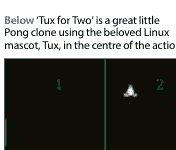

## Python 模块准备

## SimpleGUI 代码

**01** 前往我们在“你需要什么”中列出的网站，从 GitHub 页面下载源文件的 zip 包。更新你的 Raspbian 软件包，然后安装以下内容：
`$ sudo apt-get install python-dev python-setuptools tk8.5-dev tcl8.5-dev`

**05** draw 函数中的重要部分是 draw_line、draw_image 和 draw_text 函数。这些是 SimpleGUI 特有的，允许你轻松地将这些对象放置在屏幕上，指定位置、大小和颜色。你需要将它们绑定到一个对象上——在这个例子中是 canvas。这告诉软件我们希望将这些项目显示在屏幕上供人们观看。

## 安装模块

## 编写你的代码

**02** 打开终端，使用 cd 移动到解压后的 Pillow 文件夹。到达后，输入：
`$ sudo python setup.py install`
完成后，移动到 simpleguitk 文件夹并使用相同的命令安装它。

**03** 启动 IDLE 2（而不是 IDLE 3），并打开一个新窗口。使用代码清单创建我们的游戏“Tux for Two”。请仔细按照代码操作，确保你知道自己在做什么。这样，如果你愿意，就可以自己修改游戏规则。

## 设置游戏

## SimpleGUI 设置代码

**04** 代码开始部分没有什么太突破性的内容：设置了 Tux 和挡板的初始位置，以及 Tux 的初始速度和方向。这些也在赢得一分并重置游戏区域时使用。每次生成时，方向和速度都设置为随机。

**06** 最后部分纯粹是用于界面。我们告诉代码当按键按下然后释放时该做什么，并给它一个工作框架。然后告诉框架什么函数处理图形、按键功能等。最后，我们给它 frame.start() 以便它开始运行。

## 使用Python制作一个Pong游戏克隆版

### 使用Python创建

## 完整代码清单

```python
import simplegui as simplegui
import random

w, h = 600, 400
tux_r = 20
pad_w = 8
pad_h = 80

def tux_spawn(right):
    global tux_pos, tux_vel
    tux_pos = [0,0]
    tux_vel = [0,0]
    tux_pos[0] = w/2
    tux_pos[1] = h/2
    if right:
        tux_vel[0] = random.randrange(2, 4)
    else:
        tux_vel[0] = -random.randrange(2, 4)
    tux_vel[1] = -random.randrange(1, 3)

def start():
    global paddle1_pos, paddle2_pos, paddle1_vel, paddle2_vel
    global score1, score2
    tux_spawn(random.choice([True, False]))
    score1, score2 = 0,0
    paddle1_vel, paddle2_vel = 0,0
    paddle1_pos, paddle2_pos = h/2, h/2

def draw(canvas):
    global score1, score2, paddle1_pos, paddle2_pos, tux_pos, tux_vel
    if paddle1_pos > (h - (pad_h/2)):
        paddle1_pos = (h - (pad_h/2))
    elif paddle1_pos < (pad_h/2):
        paddle1_pos = (pad_h/2)
    else:
        paddle1_pos += paddle1_vel
    if paddle2_pos > (h - (pad_h/2)):
        paddle2_pos = (h - (pad_h/2))
    elif paddle2_pos < (pad_h/2):
        paddle2_pos = (pad_h/2)
    else:
        paddle2_pos += paddle2_vel
    canvas.draw_line([w / 2, 0],[w / 2, h], 4, "Green")
    canvas.draw_line([(pad_w/2), paddle1_pos + (pad_h/2)], [(pad_w/2), paddle1_pos - (pad_h/2)], pad_w, "Green")
    canvas.draw_line([w - (pad_w/2), paddle2_pos + (pad_h/2)], [w - (pad_w/2), paddle2_pos - (pad_h/2)], pad_w, "Green")
    tux_pos[0] += tux_vel[0]
    tux_pos[1] += tux_vel[1]
    if tux_pos[1] <= tux_r or tux_pos[1] >= h - tux_r:
        tux_vel[1] = -tux_vel[1]*1.1
    if tux_pos[0] <= pad_w + tux_r:
        if (paddle1_pos+(pad_h/2)) >= tux_pos[1] >= (paddle1_pos-(pad_h/2)):
            tux_vel[0] = -tux_vel[0]*1.1
            tux_vel[1] *= 1.1
        else:
            score2 += 1
            tux_spawn(True)
    elif tux_pos[0] >= w - pad_w - tux_r:
        if (paddle2_pos+(pad_h/2)) >= tux_pos[1] >= (paddle2_pos-(pad_h/2)):
            tux_vel[0] = -tux_vel[0]*1.1
            tux_vel[1] *= 1.1
        else:
            score1 += 1
            tux_spawn(False)
    canvas.draw_image(tux, (265 / 2, 314 / 2), (265, 314), tux_pos, (45, 45))
    canvas.draw_text(str(score1), [150, 100], 30, "Green")
    canvas.draw_text(str(score2), [450, 100], 30, "Green")

def keydown(key):
    global paddle1_vel, paddle2_vel
    acc = 3
    if key == simplegui.KEY_MAP["w"]:
        paddle1_vel -= acc
    elif key == simplegui.KEY_MAP["s"]:
        paddle1_vel += acc
    elif key==simplegui.KEY_MAP["down"]:
        paddle2_vel += acc
    elif key==simplegui.KEY_MAP["up"]:
        paddle2_vel -= acc

def keyup(key):
    global paddle1_vel, paddle2_vel
    acc = 0
    if key == simplegui.KEY_MAP["w"]:
        paddle1_vel = acc
    elif key == simplegui.KEY_MAP["s"]:
        paddle1_vel = acc
    elif key==simplegui.KEY_MAP["down"]:
        paddle2_vel = acc
    elif key==simplegui.KEY_MAP["up"]:
        paddle2_vel = acc

frame = simplegui.create_frame("Tux for Two", w, h)
frame.set_draw_handler(draw)
frame.set_keydown_handler(keydown)
frame.set_keyup_handler(keyup)
tux = simplegui.load_image('http://upload.wikimedia.org/wikipedia/commons/a/af/Tux.png')

start()
frame.start()
```

### 使用Python创建

## 编写一个太空侵略者克隆游戏

### 你需要准备...

- **Raspbian**
  www.raspberrypi.org/downloads
- **Python**
  www.python.org/doc
- **Pygame**
  www.pygame.org/docs

## 编写一个太空侵略者克隆游戏

用300行Python代码编写你自己的树莓派射击游戏

当你学习一门新的编程语言或试图掌握一个新模块时，尝试一个熟悉且相对简单的项目是扩展你对所用工具理解的非常有用的练习。我们的太空侵略者克隆版就是这样一个例子，它非常适合Python和Pygame模块——这是一个规则和逻辑几乎人人都懂的简单游戏。

我们尝试使用了Pygame的许多特性，它旨在使游戏和交互式应用程序的创建更加容易。我们广泛使用了Sprite类，它节省了数十行额外代码，使碰撞检测变得简单，并将更新屏幕及其众多角色简化为单行命令。

享受这个项目，并确保你进行调整和修改，使其成为你自己的作品！

> **你知道吗...**
> 太空侵略者是世界上最大的街机游戏之一。它是一个很棒的入门游戏，因为每个人都知道怎么玩！


Right Pivaders是我们专门为树莓派制作的太空侵略者克隆版

## 编写一个太空侵略者克隆游戏

### 使用Python创建

## 完整代码清单

```python
#!/usr/bin/env python2
import pygame, random

BLACK = (0, 0, 0)
BLUE = (0, 0, 255)
WHITE = (255, 255, 255)
RED = (255, 0, 0)
ALIEN_SIZE = (30, 40)
ALIEN_SPACER = 20
BARRIER_ROW = 10
BARRIER_COLUMN = 4
BULLET_SIZE = (5, 10)
MISSILE_SIZE = (5, 5)
BLOCK_SIZE = (10, 10)
RES = (800, 600)

class Player(pygame.sprite.Sprite):
    def __init__(self):
        pygame.sprite.Sprite.__init__(self)
        self.size = (60, 55)
        self.rect = self.image.get_rect()
        self.rect.x = (RES[0] / 2) - (self.size[0] / 2)
        self.rect.y = 520
        self.travel = 7
        self.speed = 350
        self.time = pygame.time.get_ticks()

    def update(self):
        self.rect.x += GameState.vector * self.travel
        if self.rect.x < 0:
            self.rect.x = 0
        elif self.rect.x > RES[0] - self.size[0]:
            self.rect.x = RES[0] - self.size[0]

class Alien(pygame.sprite.Sprite):
    def __init__(self):
        pygame.sprite.Sprite.__init__(self)
        self.size = (ALIEN_SIZE)
        self.rect = self.image.get_rect()
        self.has_moved = [0, 0]
        self.vector = [1, 1]
        self.travel = [(ALIEN_SIZE[0] - 7), ALIEN_SPACER]
        self.speed = 700
        self.time = pygame.time.get_ticks()

    def update(self):
        if GameState.alien_time - self.time > self.speed:
            if self.has_moved[0] < 12:
                self.rect.x += self.vector[0] * self.travel[0]
                self.has_moved[0] += 1
            else:
                if not self.has_moved[1]:
                    self.rect.y += self.vector[1] * self.travel[1]
                    self.vector[0] *= -1
                    self.has_moved = [0, 0]
                    self.speed -= 20
                    if self.speed <= 100:
                        self.speed = 100
                    self.time = GameState.alien_time

class Ammo(pygame.sprite.Sprite):
    def __init__(self, color, (width, height)):
        pygame.sprite.Sprite.__init__(self)
        self.image = pygame.Surface([width, height])
        self.image.fill(color)
        self.rect = self.image.get_rect()
        self.speed = 0
        self.vector = 0

    def update(self):
        self.rect.y += self.vector * self.speed
        if self.rect.y < 0 or self.rect.y > RES[1]:
            self.kill()

class Block(pygame.sprite.Sprite):
    def __init__(self, color, (width, height)):
        pygame.sprite.Sprite.__init__(self)
        self.image = pygame.Surface([width, height])
        self.image.fill(color)
        self.rect = self.image.get_rect()

class GameState:
    pass

class Game(object):
    def __init__(self):
        pygame.init()
        pygame.font.init()
        self.clock = pygame.time.Clock()
        self.game_font = pygame.font.Font('data/Orbitracer.ttf', 28)
        self.intro_font = pygame.font.Font('data/Orbitracer.ttf', 72)
        self.screen = pygame.display.set_mode([RES[0], RES[1]])
        self.time = pygame.time.get_ticks()
        self.refresh_rate = 20
        self.rounds_won = 0
        self.level_up = 50
        self.score = 0
        self.lives = 2
        self.player_group = pygame.sprite.Group()
        self.alien_group = pygame.sprite.Group()
        self.bullet_group = pygame.sprite.Group()
        self.missile_group = pygame.sprite.Group()
        self.barrier_group = pygame.sprite.Group()
```

## 使用 Python 程序创建太空侵略者克隆版

## 设置依赖项

## 全局变量与元组

01 如果你想更好地理解如何使用 Python 和 Pygame 编写游戏，我们强烈建议你将本教程中的 Pivaders 代码复制到你自己的程序中。这是很好的实践，也让你有机会调整游戏元素以适应你的需求，无论是更换飞船图像、改变难度，还是调整外星飞船的行为方式。当然，如果你只想玩游戏，那也很容易实现。无论哪种方式，游戏唯一的依赖项是 Pygame，如果尚未安装，可以通过在终端输入以下命令来安装：
sudo apt-get install python-pygame

05 一旦我们导入了项目所需的模块，就会看到一长串大写字母的变量。大写字母表示这些变量是常量（或全局变量）。这些是永远不会改变的重要数字——它们代表代码中经常引用的东西，比如颜色、方块大小和分辨率。你还会注意到颜色和大小在花括号中包含多个数字——这些是元组。你可以使用方括号（将它们变成列表），但我们在这里使用元组，因为它们是不可变的，这意味着你不能重新赋值其中的单个项目。这非常适合常量，因为它们本来就不打算改变。

## 安装

02 对于 Pivaders，我们使用了 Git，这是一种出色的版本控制形式，用于安全地存储游戏文件并保留代码的历史版本。Git 应该已经安装在你的树莓派上；如果没有，你可以通过输入以下命令来获取：
sudo apt-get install git
除了作为代码的守护者，Git 还使你能够克隆其他项目的副本，以便你可以处理它们，或者只是使用它们。要克隆 Pivaders，请在终端中转到你的主文件夹（cd ~），为项目创建一个目录（mkdir pivaders），进入该目录（cd pivaders）并输入：
git pull https://github.com/russb78/pivaders.git

## 测试 Pivaders

03 安装 Pygame 并将项目克隆到你的机器上后（你也可以在本期封面 DVD 上找到 .zip 文件——只需解压并将其复制到你的主目录即可使用），你可以快速测试一下，以确保一切设置正确。你只需在终端中进入 pivaders 目录，输入 python pivaders.py 即可开始。你可以用空格键开始游戏，用同一个按钮射击，只需使用键盘上的左右箭头键来左右移动你的飞船。

## 类 – 第一部分

06 类本质上是你想要创建的对象的蓝图。就我们的玩家而言，它包含了所有必需的信息，你可以从中创建多个副本（我们在项目中途的 make_player() 方法中创建了一个玩家实例）。Pivaders 中类的伟大之处在于，它们从 Pygame 的 Sprite 类继承了许多功能和快捷方式，正如类第一行花括号中的 pygame.sprite.Sprite 所表示的那样。你可以通过 www.pygame.org/docs/ref/sprite.html 阅读文档以了解更多关于 Sprite 类的信息。

## 创建你自己的克隆版

04 一旦你获得了不错的高分（超过 2000 分就算不错）并熟悉了我们简单的实现，你将从跟随和探索代码以及我们对正在发生的事情的简要解释中获得更多收获。对于那些想要创建自己项目的人，请创建一个新的项目文件夹，并使用 IDLE 或 Leafpad（或者安装 Geany）来创建并保存你自己的 .py 文件。


> "我们尝试使用 Pygame 的许多特性，它旨在使游戏和交互式应用程序的创建变得更容易"

## 编程实现太空侵略者克隆版

## 使用 Python 创建

接续第 89 页

```python
self.all_sprite_list = pygame.sprite.Group()
self.intro_screen = pygame.image.load('data/start_screen.jpg').convert()
self.background = pygame.image.load('data/Space-Background.jpg').convert()
pygame.display.set_caption('PIVaders - ESC to exit')
pygame.mouse.set_visible(False)
Player.image = pygame.image.load('data/ship.png').convert()
Player.image.set_colorkey(BLACK)
Alien.image = pygame.image.load('data/Spaceship16.png').convert()
Alien.image.set_colorkey(WHITE)
GameState.end_game = False
GameState.start_screen = True
GameState.vector = 0
GameState.shoot_bullet = False
```

```python
self.screen.blit(self.game_font.render("PRESS SPACE TO PLAY", 1, WHITE), (274, 191))
pygame.display.flip()
self.control()
```

```python
def make_player(self):
    self.player = Player()
    self.player_group.add(self.player)
    self.all_sprite_list.add(self.player)
```

```python
def refresh_screen(self):
    self.all_sprite_list.draw(self.screen)
    self.refresh_scores()
    pygame.display.flip()
    self.screen.blit(self.background, [0, 0])
    self.clock.tick(self.refresh_rate)
```

```python
def refresh_scores(self):
    self.screen.blit(self.game_font.render("SCORE " + str(self.score), 1, WHITE), (10, 8))
    self.screen.blit(self.game_font.render("LIVES " + str(self.lives + 1), 1, RED), (355, 575))
```

```python
def control(self):
    for event in pygame.event.get():
        if event.type == pygame.QUIT:
            GameState.start_screen = False
            GameState.end_game = True
        if event.type == pygame.KEYDOWN \
                and event.key == pygame.K_ESCAPE:
            if GameState.start_screen:
                GameState.start_screen = False
                GameState.end_game = True
                self.kill_all()
            else:
                GameState.start_screen = True
    self.keys = pygame.key.get_pressed()
    if self.keys[pygame.K_LEFT]:
        GameState.vector = -1
    elif self.keys[pygame.K_RIGHT]:
        GameState.vector = 1
    else:
        GameState.vector = 0
    if self.keys[pygame.K_SPACE]:
        if GameState.start_screen:
            GameState.start_screen = False
            self.lives = 2
            self.score = 0
            self.make_player()
            self.make_defenses()
            self.alien_wave(0)
        else:
            GameState.shoot_bullet = True
```

```python
def alien_wave(self, speed):
    for column in range(BARRIER_COLUMN):
        for row in range(BARRIER_ROW):
            alien = Alien()
            alien.rect.y = 65 + (column * (ALIEN_SIZE[1] + ALIEN_SPACER))
            alien.rect.x = ALIEN_SPACER + (row * (ALIEN_SIZE[0] + ALIEN_SPACER))
            self.alien_group.add(alien)
            self.all_sprite_list.add(alien)
            alien.speed = speed
```

```python
def make_bullet(self):
    if GameState.game_time - self.player.time > self.player.speed:
        bullet = Ammo(BLUE, BULLET_SIZE)
        bullet.vector = -1
        bullet.speed = 26
        bullet.rect.x = self.player.rect.x + 28
        bullet.rect.y = self.player.rect.y
        self.bullet_group.add(bullet)
        self.all_sprite_list.add(bullet)
        self.player.time = GameState.game_time
        GameState.shoot_bullet = False
```

```python
def splash_screen(self):
    while GameState.start_screen:
        self.kill_all()
        self.screen.blit(self.intro_screen, [0, 0])
        self.screen.blit(self.intro_font.render("PIVADERS", 1, WHITE), (265, 120))
```

```python
def make_missile(self):
    if len(self.alien_group):
        shoot = random.random()
        if shoot <= 0.05:
            shooter = random.choice([alien for alien in self.alien_group])
            missile = Ammo(RED, MISSILE_SIZE)
```

接续第 93 页

## 使用 Python 创建

## 编程实现太空侵略者克隆版

## 类 – 第二部分

## 主循环关键逻辑 – 第一部分

07 在 Pivader 的类中，除了为对象创建所需的属性外，你还会注意到除了 Block 类之外，所有类都有一个 update() 方法（方法是类中的一个函数）。update() 方法在主游戏的每次循环中被调用，它只是要求我们创建的类的实例进行移动。对于 Ammo 类中的子弹，我们要求它在屏幕上向下移动。如果它移出任一端，我们就销毁它。

11 首先，游戏检查 end_game 属性是否为 false——如果为 true，则跳过 main_loop() 中的整个循环，我们直接进入 pygame.quit()，退出游戏。只有当玩家关闭游戏窗口或在 start_screen 上按下 Esc 键时，此标志才会被设置为 true。假设 end_game 和 start_screen 都为 false，主循环就可以正式开始了，首先是 control() 方法，它检查玩家的位置是否需要改变。接下来我们尝试制造一个敌方导弹，并使用 random 模块来限制可以创建的导弹数量。然后我们使用一个简单的 for 循环调用屏幕上每个角色的 update() 方法。这确保了每个人在我们检查 calc_collisions() 中的碰撞之前都已经更新并移动了。


## 弹药

08 然而，类最有趣的地方在于，你可以使用一个类来创建许多不同的东西。例如，你可以有一个宠物类。从这个类中，你可以创建一只猫（会喵喵叫）和一只狗（会汪汪叫）。它们在许多方面不同，但它们都是毛茸茸的，有四条腿，所以可以从同一个父类创建。我们正是用我们的 Ammo 类做了这件事，用它来创建玩家子弹和外星导弹。它们颜色不同，射击方向相反，但本质上是同一种东西。

## 主循环关键逻辑 – 第二部分

12 一旦计算了碰撞，我们需要看看游戏是否仍然应该继续。我们通过 is_dead() 和 defenses_breached() 来做这件事——如果这些方法中的任何一个返回 true，我们就知道需要返回到开始屏幕。另一方面，我们还需要检查是否已经杀死了所有的外星人，这在 win_round() 中进行。假设我们没有死，但外星人死了，我们知道可以调用 next_round() 方法，该方法会创建一批新的外星人并增加它们在屏幕上移动的速度。最后，我们刷新屏幕，以便所有移动、射击或被杀死的东西都可以被更新或从屏幕上移除。记住，主循环每秒发生 20 次——所以我们在循环结束时没有要求屏幕更新这一事实并无影响。

## 游戏

09 我们最后一个类叫做 Game。这是游戏本身所有主要功能所在的地方，但请记住，到目前为止，这仍然只是一份配料清单——在创建“Game”对象（就在代码的最底部）之前，什么都不会真正发生。Game 类是游戏核心所在，因此我们初始化 Pygame，为主角和外星对手设置图像，并创建一些 GameState 属性，我们用它们来控制外部类的关键方面，比如改变玩家的向量（方向）。

## 主循环

10 Game 类中有很多方法（类函数），每个方法都旨在控制游戏设置或游戏玩法本身的特定方面。决定游戏中任何一轮发生什么的逻辑包含在 pivaders.py 脚本最底部的 main_loop() 方法中，这是解锁你的游戏所需的确切变量和函数的关键。

## 编程实现太空侵略者克隆版

## 使用 Python 创建

接续第91页内容

```python
    missile.vector = 1
    missile.rect.x = shooter.rect.x + 15
    missile.rect.y = shooter.rect.y + 40
    missile.speed = 10
    self.missile_group.add(missile)
    self.all_sprite_list.add(missile)

def make_barrier(self, columns, rows, spacer):
    for column in range(columns):
        for row in range(rows):
            barrier = Block(WHITE, (BLOCK_SIZE))
            barrier.rect.x = 55 + (200 * spacer) + (row * 10)
            barrier.rect.y = 450 + (column * 10)
            self.barrier_group.add(barrier)
            self.all_sprite_list.add(barrier)

def make_defenses(self):
    for spacing, spacing in enumerate(xrange(4)):
        self.make_barrier(3, 9, spacing)

def kill_all(self):
    for items in [self.bullet_group, self.player_group,
    self.alien_group, self.missile_group,
    self.barrier_group]:
        for i in items:
            i.kill()

def is_dead(self):
    if self.lives < 0:
        self.screen.blit(self.game_font.render(
        "The war is lost! You scored: " + str(
        self.score), 1, RED), (250, 15))
        self.rounds_won = 0
        self.refresh_screen()
        pygame.time.delay(3000)
        return True

def win_round(self):
    if len(self.alien_group) < 1:
        self.rounds_won += 1
        self.screen.blit(self.game_font.render(
        "You won round " + str(self.rounds_won) +
        " but the battle rages on", 1, RED),
        (200, 15))
        self.refresh_screen()
        pygame.time.delay(3000)
        return True

def defenses_breached(self):
    for alien in self.alien_group:
        if alien.rect.y > 410:
            self.screen.blit(self.game_font.render(
            "The aliens have breached Earth defenses!",
            1, RED), (180, 15))
```

```python
    self.refresh_screen()
    pygame.time.delay(3000)
    return True

def calc_collisions(self):
    pygame.sprite.groupcollide(
    self.missile_group, self.barrier_group,
    True, True)
    pygame.sprite.groupcollide(
    self.bullet_group, self.barrier_group,
    True, True)
    if pygame.sprite.groupcollide(
    self.bullet_group, self.alien_group,
    True, True):
        self.score += 10
    if pygame.sprite.groupcollide(
    self.player_group, self.missile_group,
    False, True):
        self.lives -= 1

def next_round(self):
    for actor in [self.missile_group,
    self.barrier_group, self.bullet_group]:
        for i in actor:
            i.kill()
    self.alien_wave(self.level_up)
    self.make_defenses()
    self.level_up += 50

def main_loop(self):
    while not GameState.end_game:
        while not GameState.start_screen:
            GameState.game_time = pygame.time.get_ticks()
            GameState.alien_time = pygame.time.get_ticks()
            self.control()
            self.make_missile()
            for actor in [self.player_group,
            self.bullet_group,
            self.alien_group, self.missile_group]:
                for i in actor:
                    i.update()
            if GameState.shoot_bullet:
                self.make_bullet()
            self.calc_collisions()
            if self.is_dead() or self.defenses_breached():
                GameState.start_screen = True
            if self.win_round():
                self.next_round()
            self.refresh_screen()
        self.splash_screen()
    pygame.quit()

if __name__ == '__main__':
    pv = Game()
    pv.main_loop()
```

## 使用 Python 创建

## Pivaders 第二部分：图形与音效

## Pivaders 第二部分：图形与音效

这一次，我们将扩展我们的太空侵略者克隆版，加入沉浸式的动画和音效。

在上一篇指南中，我们创建基础的太空侵略者克隆版 Pivaders 时玩得很开心。得益于 Sprite 类，Pygame 在分组、管理和检测碰撞方面的能力确实为我们的项目带来了巨大的改变，不仅体现在代码长度上，也体现在简洁性上。如果你错过了项目的第一部分，可以通过 git.io/cBVTBg 在 GitHub 上找到 v0.1 版本的代码清单，而包含我们使用的所有图像、音乐和音效的 v0.2 版本代码则可以在 git.io/8QsK-w 找到。

为了帮助保持我们项目代码的可管理性和简洁性（随着项目规模的增长，保持代码易于理解变得越来越困难），我们在 Game 类中集成了几个动画方法，并选择使用精灵表。这不仅使得绘制到屏幕变得非常容易，还能控制资源数量并保持性能水平，这对树莓派尤为重要。我们希望你能享受使用我们的技术为你的项目添加动画和音效的乐趣！

你需要准备什么...

- Raspbian：www.raspberrypi.org/downloads
- Python：www.python.org/doc
- Pygame：www.pygame.org/docs
- 美术资源：opengameart.org

> 你知道吗...
> 太空侵略者是世界上被克隆最多的游戏之一！它对于游戏程序员来说是一个很棒的入门项目。

## 设置依赖项

01 如果你下载代码（git.io/8QsK-w）并在创建自己的动画和音效时将其作为参考，你将从这个练习中获得更多。无论你是想简单地预览和游玩，还是想逐步研究代码以更好地理解基本的游戏创建，你仍然需要满足一些基本的依赖项。这里的两个关键要求是 Pygame 和 Git，它们在最新的 Raspbian 安装中都是默认安装的。这很简单！

## 下载 pivaders

02 Git 是一个出色的版本控制解决方案，它帮助程序员安全地存储他们的代码和相关文件。它不仅帮助你保留完整的更改历史，还意味着你可以从 github.com 等地方“克隆”整个项目来使用和工作。要克隆我们为本教程创建的项目版本，请从命令行进入你的主文件夹（cd ~）并输入：

```
git pull https://github.com/russ78/pivaders.git
```

这将创建一个名为 pivaders 的文件夹。

## 浏览项目

03 pivaders 文件夹内包含一个许可证、一个自述文件和第二个 pivaders 文件夹。后者包含主游戏文件 pivaders.py，它启动应用程序。在 data 文件夹中，你会找到图形和音效资源的子文件夹，以及我们用于标题屏幕和分数的字体。要试驾一下 pivaders，只需进入 pivaders 子目录（cd pivaders/pivaders）并输入：

```
python pivaders.py
```

使用方向键左右移动，空格键射击。你可以按 Escape 键退出。

## Pivaders 第二部分：图形与音效

## 使用 Python 创建

## 代码清单（从第87行开始）

## 动画与音效

与上个月教程中的游戏相比，你会看到它现在是一个更加动态的项目。飞船现在在你改变方向时会倾斜转弯，在静止时会自我修正。当你击中一艘外星飞船时，它会爆炸并伴有几帧动画，如果你被击中，你的飞船上会发生较小的爆炸。音乐、激光和爆炸音效也会在动画发生时伴随出现。

```python
class Game(object):
    def __init__(self):
        pygame.init()
        pygame.font.init()
        self.clock = pygame.time.Clock()
        self.game_font = pygame.font.Font(
            'data/Orbitracer.ttf', 28)
        self.intro_font = pygame.font.Font(
            'data/Orbitracer.ttf', 72)
        self.screen = pygame.display.set_mode([RES[0], RES[1]])
        self.time = pygame.time.get_ticks()
        self.refresh_rate = 20; self.rounds_won = 0
        self.level_up = 50; self.score = 0
        self.lives = 2
        self.player_group = pygame.sprite.Group()
        self.alien_group = pygame.sprite.Group()
        self.bullet_group = pygame.sprite.Group()
        self.missile_group = pygame.sprite.Group()
        self.barrier_group = pygame.sprite.Group()
        self.all_sprite_list = pygame.sprite.Group()
        self.intro_screen = pygame.image.load(
            'data/graphics/start_screen.jpg').convert()
        self.background = pygame.image.load(
            'data/graphics/Space-Background.jpg').convert()
        pygame.display.set_caption('Pivaders - ESC to exit')
        pygame.mouse.set_visible(False)
        Alien.image = pygame.image.load(
            'data/graphics/Spaceship16.png').convert()
        Alien.image.set_colorkey(WHITE)
        self.ani_pos = 5 # 11 images of ship
        self.ship_sheet = pygame.image.load(
            'data/graphics/ship_sheet_final.png').convert_alpha()
        Player.image = self.ship_sheet.subsurface(
            self.ani_pos*64, 0, 64, 61)
        self.animate_right = False
        self.animate_left = False
        self.explosion_sheet = pygame.image.load(
            'data/graphics/explosion_new1.png').convert_alpha()
        self.explosion_image = self.explosion_sheet.subsurface(
            0, 0, 79, 96)
        self.alien_explosion_sheet = pygame.image.load(
            'data/graphics/alien_explosion.png')
        self.alien_explode_graphics = self.alien_explosion_sheet.subsurface(0, 0, 94, 96)
        self.explode = False
        self.explode_pos = 0; self.alien_explode = False
        self.alien_explode_pos = 0
        pygame.mixer.music.load('data/sound/10_Arpanauts.ogg')
        pygame.mixer.music.play(-1)
        pygame.mixer.music.set_volume(0.7)
        self.bullet_fx = pygame.mixer.Sound(
            'data/sound/medetix__pc-bitcrushed-lazer-beam.ogg')
        self.explosion_fx = pygame.mixer.Sound(
            'data/sound/timgormly__8-bit-explosion.ogg')
        self.explosion_fx.set_volume(0.5)
        self.explodey_alien = []
```

## 寻找用于动画的图像

在我们编程任何东西之前，明智的做法是正确设置资源。我们选择使用精灵表；这些可以在网上找到，或者通过一点练习用 GIMP 创建。它们是由代表每一帧的、大小和间距相等的单个“帧”组成的马赛克。我们在 opengameart.org 找到了我们的资源。

## 调整资源

虽然你在网上找到的许多资源可以直接使用，但你可能想将它们导入像 GIMP 这样的图像编辑应用程序中，以根据你的需求进行配置。我们从中心飞船精灵开始，将其居中放入一个新窗口。我们设置了帧的大小和宽度，然后将其他帧复制粘贴到它的两侧。最终，我们在一个文档中得到了11个大小和宽度完全相同的帧。像素级精确的大小和宽度是关键，这样我们只需乘以它就能找到下一帧。


## 使用 Python 进行创作

## Pivaders 第二部分：图形与音效

### 加载精灵图

07 由于我们通过继承 Sprite 类来创建 Player 类，因此只需更改 Player.image 就能轻松改变玩家在屏幕上的外观。首先，我们需要使用 pygame.image.load() 加载飞船精灵图。由于我们制作的精灵图背景是透明的，因此可以在代码行末尾添加 .convert_alpha()，以确保飞船帧正确渲染（不带任何背景）。接着，我们使用 subsurface 将初始 Player.image 设置为精灵图中间的飞船图像。这由 self.ani_pos 控制，其初始值为 5。更改此值将改变绘制到屏幕上的飞船图像：'0' 表示飞船完全向左倾斜，'11' 表示完全向右倾斜。

### 动画标志

08 在 Game 类初始化代码的下方，我们还为玩家动画设置了两个标志：self.animate_left 和 self.animate_right。正如你将在 Game 类的 Control 方法中看到的，我们使用这些标志来“标记”何时需要播放动画（True 表示播放，False 表示停止）。这还允许我们“自动”将玩家精灵动画恢复到其自然静止状态（否则飞船在停止后看起来仍会像在向左飞行）。

### 动画方法

09 我们在玩家代码 animate_player() 中再次使用了标志。这里我们使用嵌套的 if 语句来控制动画并实际设置玩家图像。代码逻辑是：如果 animate_right 标志为 True，并且当前动画位置与目标位置不同，则递增 ani_pos 变量并设置玩家图像。Else 语句则将飞船精灵动画恢复到静止状态，相反方向的逻辑也类似。

```
GameState.end_game = False
GameState.start_screen = True
GameState.vector = 0
GameState.shoot_bullet = False

def control(self):
    for event in pygame.event.get():
        if event.type == pygame.QUIT:
            GameState.start_screen = False
            GameState.end_game = True
        if event.type == pygame.KEYDOWN \
        and event.key == pygame.K_ESCAPE:
            if GameState.start_screen:
                GameState.start_screen = False
                GameState.end_game = True
                self.kill_all()
            else:
                GameState.start_screen = True
    self.keys = pygame.key.get_pressed()
    if self.keys[pygame.K_LEFT]:
        GameState.vector = -1
        self.animate_left = True
        self.animate_right = False
    elif self.keys[pygame.K_RIGHT]:
        GameState.vector = 1
        self.animate_right = True
        self.animate_left = False
    else:
        GameState.vector = 0
        self.animate_right = False
        self.animate_left = False

    if self.keys[pygame.K_SPACE]:
        if GameState.start_screen:
            GameState.start_screen = False
            self.lives = 2
            self.score = 0
            self.make_player()
            self.make_defenses()
            self.alien_wave(0)
        else:
            GameState.shoot_bullet = True
            self.bullet_fx.play()

def animate_player(self):
    if self.animate_right:
        if self.ani_pos < 10:
            Player.image = self.ship_sheet.subsurface(
                self.ani_pos*64, 0, 64, 61)
            self.ani_pos += 1
    else:
        if self.ani_pos > 5:
            self.ani_pos -= 1
            Player.image = self.ship_sheet.subsurface(
                self.ani_pos*64, 0, 64, 61)

    if self.animate_left:
        if self.ani_pos > 0:
            self.ani_pos -= 1
            Player.image = self.ship_sheet.subsurface(
                self.ani_pos*64, 0, 64, 61)
    else:
        if self.ani_pos < 5:
            Player.image = self.ship_sheet.subsurface(
                self.ani_pos*64, 0, 64, 61)
            self.ani_pos += 1
```

### 爆炸动画

10 紧随玩家动画代码块之后的 player_explosion() 和 alien_explosion() 方法，其执行逻辑相似但更简单。由于我们只需要遍历同一组预定义的帧（这次是垂直方向），因此只需检查 self.explode 和 self.alien_explode 标志是否为 True，然后递增用于更改图像的变量即可。

```
def player_explosion(self):
    if self.explode:
        if self.explode_pos < 8:
            self.explosion_image = self.explosion_sheet.subsurface(0, self.explode_pos*96, 79, 96)
            self.explode_pos += 1
            self.screen.blit(self.explosion_image, [self.player.rect.x -10, self.player.rect.y - 30])
        else:
            self.explode = False
            self.explode_pos = 0
```

### 添加音乐

11 Pygame 使得为项目添加配乐变得非常简单。只需获取一段合适格式的音乐（我们通过 freemusicarchive.org 找到了合适的），然后使用 Mixer Pygame 类加载它。由于它已经通过 pygame.init() 初始化，我们可以直接加载音乐。music.play(-1) 表示音乐应随应用启动并持续循环播放直至退出。如果将 -1 替换为 5，音乐将循环播放五次后结束。了解更多关于 Mixer 类的信息，请访问 www.pygame.org/docs/ref/mixer.html。

```
def alien_explosion(self):
    if self.alien_explode:
        if self.alien_explode_pos < 9:
            self.alien_explode_graphics = self.alien_explosion_sheet.subsurface(0, self.alien_explode_pos*96, 94, 96)
            self.alien_explode_pos += 1
            self.screen.blit(self.alien_explode_graphics, [int(self.explodey_alien[0]) - 50 , int(self.explodey_alien[1]) - 60])
        else:
            self.alien_explode = False
            self.alien_explode_pos = 0
            self.explodey_alien = []
```

### 使用音效

12 在 Pygame 中加载和使用音效与处理图像的方式类似。首先，我们通过简单的赋值来加载音效。对于激光束，初始化代码如下所示：

```
self.bullet_fx = pygame.mixer.Sound('location/of/file')
```

然后，我们只需在适当的时间触发音效。对于激光，我们希望在按下空格键射击时播放它，因此将其放在 Game 类的 Control 方法中，紧接在设置 shoot_bullet 标志之后。你可以从 www.freesound.org 获取不同的音效。

```
def splash_screen(self):
    while GameState.start_screen:
        self.kill_all()
        self.screen.blit(self.intro_screen, [0, 0])
        self.screen.blit(self.intro_font.render("PIVADERS", 1, WHITE), (265, 120))
        self.screen.blit(self.game_font.render("PRESS SPACE TO PLAY", 1, WHITE), (274, 191))
        pygame.display.flip()
        self.control()
        self.clock.tick(self.refresh_rate / 2)
```

```
def make_player(self):
    self.player = Player()
```

完整代码请访问 github.com/russb78/pivaders

> “精灵图使得在屏幕上绘制图像变得容易，同时它还能减少资源数量并保持高性能”

## 使用 Python 与树莓派

创建令人惊叹的项目


## 使用 Python 与树莓派

使用 Python 代码和树莓派进行惊人创作

通过之前的教程，你已经打下了坚实的 Python 基础。现在，我们将加入树莓派计算机。首先，你将学习如何在树莓派上开始使用 Python，然后你将探索令人兴奋的项目，例如学习使用树莓派进行多任务处理（第110页）、创建由树莓派驱动的虚拟现实设置（第114页）以及利用它来更好地体验 Minecraft（第106页）。

创建令人惊叹的项目

使用 Python 与树莓派


## 使用 Python 与树莓派

## 在树莓派上使用 Python

### 你需要准备什么...

## 在树莓派上使用 Python

一台配备所有必要外设的树莓派

装有最新 Debian 镜像的 SD 卡，用于树莓派 www.raspberrypi.org/downloads

使用树莓派进行 Python 编程，并为所有未来的项目打下基础

在开始本教程之前，请确保你已为树莓派的 SD 卡安装了最新版本的 Raspbian 操作系统。使用 SD 卡镜像的好处在于，操作系统已准备就绪，并且为我们配置好了开发环境。

我们将使用一个名为 Geany 的轻量级集成开发环境（IDE）进行 Python 开发。与 nano 等基于文本的编辑器相比，Geany 提供了更友好的界面，让你更容易上手。本教程将涵盖以下主题：

- 基本算术
- 比较运算符，例如“等于”和“不等于”
- 控制结构，例如循环和 if 语句

最后，我们将完成一个高级版的“hello world”应用。让我们直接开始吧...

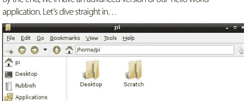

### 保持条理

01 我们不希望在新树莓派上文件夹杂乱无章，所以让我们打开文件管理器来整理一下。通过点击屏幕左下角菜单图标旁边的图标来打开文件管理器。右键单击并选择“新建”>“文件夹”来创建一个新文件夹，然后输入名称并点击“确定”。我们创建了一个名为 Python 的文件夹，并在其中创建了一个名为 Hello World v2 的文件夹。

## 在树莓派上使用 Python

## 在 Pi 上使用 Python

在文件顶部描述程序的目的是一种良好的实践。这将在处理包含多个文件的较大项目时对你有所帮助。

```python
#!/usr/bin/env python

# An advanced Hello World program that will demonstrate the basics of
# programming in Python via a series of examples. Created by Liam Fraser
# for Linux User and Developer :: 22/04/2012.

# Import the sys library for the sys.exit function
import sys
# Import everything from the Decimal library
from decimal import *

# Get the user's first name and output a welcome message
firstName = raw_input("Please enter your first name: ")
print("Welcome " + firstName + "\n")

# Ask the user for a number and square it, double it and halve it
number = raw_input("Please enter a number: ")
number = Decimal(number)
numberHalved = number / 2
numberDoubled = number * 2
numberSquared = number * number

# Print out the values we just worked out, converting each float value
# to a string
print("The result of halving that number: " + str(numberHalved))
print("The result of doubling that number: " + str(numberDoubled))
print("The result of squaring that number: " + str(numberSquared))
print("")

# The stopping condition for a while loop
yesOrNo = False

# A while loop that will run until a user enters either "yes" or "no"
while yesOrNo == False:
    result = raw_input("Do you want to continue? (yes/no) ")

    if result == "yes" or result == "no":
        yesOrNo = True
    else:
        print("Error, please type yes or no" + "\n")

# Deal with the result
if result == "yes":
    print("\nContinuing")
else:
    print("\nExiting")
    sys.exit()

# Create the count which will be a stopping condition for a while loop
count = 1

# Use a while loop to add 5 to the number and output the value each time
print("Incrementing the number by 5\n")
while count <= 5:
    number += 1
    print("number + " + str(count) + " = " + str(number))

    # Increment the count:
    count += 1

# Finish off by printing that we are exiting
print("\nExiting")
```

思考数据类型很重要。我们将数字转换为十进制，以确保在算术运算中不会丢失任何小数部分。

while 循环的停止条件必须在代码中的某个时刻得到满足；否则循环将永远不会结束！

print 函数只能接受字符串数据类型，因此在将任何数字数据类型的变量打印到屏幕之前，我们需要先将它们转换为字符串。

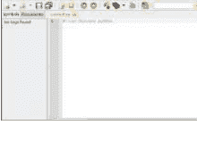

## 启动 Geany

02 通过进入 LXDE 菜单并选择程序来启动 Geany。在这里，选择 Geany。进入 Geany 界面后，通过选择“新建（带模板）>main.py”从模板创建一个新的 Python 文件。删除此模板中的所有内容，只保留第一行：`#!/usr/bin/env python`。这一行很重要，因为它意味着你可以从命令行运行代码，并且 Bash shell 会知道使用 Python 解释器来打开它。

## 在 Pi 上使用 Python

## 在树莓派上进行 Python 编程

## 保存你的工作

03 在编程时，养成使用 Ctrl+S 不断保存工作的习惯总是好的，因为丢失你一直在处理的任何内容都会很可惜。要第一次保存文件，可以按 Ctrl+S 或转到文件菜单并选择保存。给文件一个合理的名称，并将其保存在你之前创建的整洁文件夹结构中。在编程时保持良好的组织性是一个好习惯，因为当你的项目变得更大更复杂时，这会让事情变得容易得多。

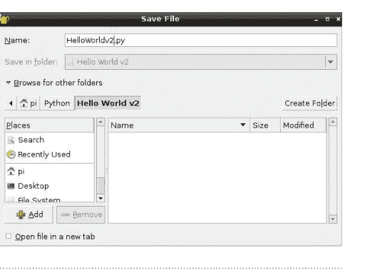

## 设置

04 在代码中包含详细的注释很重要，因为它允许你记录下你觉得困惑的事情，并记录复杂的流程。如果将来有其他程序员需要处理你的代码，他们会非常感激。首先添加一个注释，描述程序将做什么以及你的名字。所有注释行都以井号（#）开头，不会被 Python 解释器解释为代码。我们导入 sys 库，以便稍后可以使用 sys.exit 函数来关闭程序。我们还从 decimal 库导入所有内容，因为我们想利用 decimal 类型。

> “在编程时保持良好的组织性是一个好习惯”

## 变量

05 变量是存储在内存中并可通过名称访问的数据。我们的程序将首先询问你的名字，将其存储在一个变量中，然后打印出欢迎消息。我们将添加一个注释来解释这一点，并创建一个名为 firstName 的变量。注意我们如何将第二个单词的首字母大写以使其更易于阅读。

我们希望 firstName 变量保存由名为 raw_input 的函数返回的值，该函数将询问用户输入。问题通过括号传递给 print 函数，并且由于这是一个字符串，因此用引号括起来。字符串类型基本上是字符的集合。注意我们在冒号后添加了额外的空格，因为用户会在此问题后直接输入他们的输入。

```python
#!/usr/bin/env python

# An advanced Hello World
# programming in Python v
# for Linux User and Deve

# Import the sys library f
import sys
# Import everything from
decimal import *
```

## 打印消息

06 现在我们在 firstName 中有了一个值，我们需要向屏幕输出一条欢迎消息。我们在 Python 中使用 print 函数打印到屏幕。print 函数后跟一对括号，括号内包含要打印的值。当对字符串使用加法运算符时，它们会被连接在一起。注意 firstName 不需要用引号括起来，因为它是变量的名称。如果它被引号括起来，输出的将是文本 firstName。我们通过在输出中添加一个 '\n' 字符（换行符）来结束，以便在开始下一个示例之前留出一个空行。

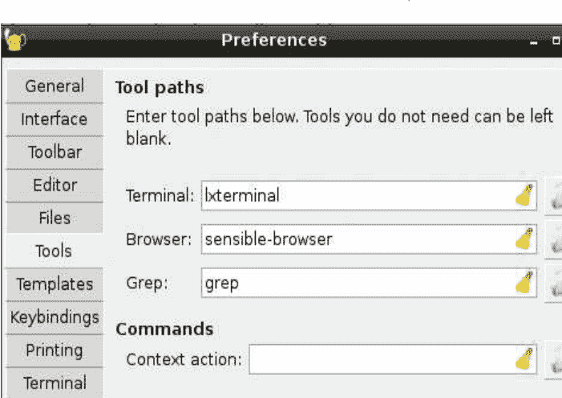

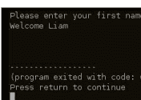

## 测试我们的程序

08 现在我们已经完成了那部分，为什么不测试一下呢？值得注意的是，你必须在运行程序之前保存，否则自上次保存以来你所做的任何操作都不会被 Python 解释。通过按 F5 键运行程序。通过输入你的名字然后按 Enter 键来输入。完成此操作后，你将看到一条欢迎消息。如果程序以代码 0 退出，则表示一切运行成功。按 Enter 关闭终端。

## 修复一个小问题

07 我们当前使用的 Debian 镜像在 Geany 中存在一个小的配置错误问题。如果你遇到此问题，可以通过按 F5 键或转到构建菜单并选择执行来尝试运行你的程序来知道。如果问题存在，则不会发生任何事情，你会看到一条消息说“找不到终端：xterm”。别担心，这很容易修复。转到编辑菜单，然后选择首选项。转到工具选项卡，将终端的值从 xterm 更改为 lxterminal。

## 处理数字

09 我们将通过基本上重复我们之前做的前几行来询问用户一个数字。一旦用户给我们一个数字，我们将对其进行减半、平方和加倍。raw_input 函数将用户输入的值作为字符串返回。字符串是基于文本的值，因此我们不能对其进行算术运算。Python 中的整数类型只能存储整数，而 decimal 类型可以存储带小数的数字。我们将进行一种称为类型转换的操作，这基本上是将一种类型的值转换为另一种类型。我们将把我们的数字字符串转换为 decimal 值，因为如果我们要对数字进行减半，很可能会涉及小数。如果数字是整数类型，任何小数值都将直接被截断，而不会进行任何舍入。这称为截断。

## 在树莓派上使用 Python

## 在树莓派上进行 Python 编程

### 执行算术运算

10 Python 中主要的算术运算符是 + - / *，后两个分别是除法和乘法。我们创建了三个新变量，分别名为 numberHalved、numberDoubled 和 numberSquared。注意，我们不需要指定它们应该是小数类型，因为 Python 会根据变量初始值的类型来赋予其类型。number 变量是小数类型，因此对该数字进行算术运算后返回的所有值也将是小数类型。

```python
# 打印我们刚刚计算出的值，将每个浮点数值
# 转换为字符串
print("The result of halving that number: " + str(numberHalved))
print("The result of doubling that number: " + str(numberDoubled))
print("The result of squaring that number: " + str(numberSquared))
print("")
```

### 打印我们的数字

11 既然我们已经执行了算术运算，就需要使用 print 函数来打印结果。print 函数只接受传递给它的字符串值。这意味着我们需要在打印之前使用 str() 函数将每个小数值转换为字符串。我们使用一个引号之间没有任何内容的 print 语句来打印一个空行。这之所以有效，是因为 print 函数总是在其输出末尾添加一个换行符，除非另有指示，因此打印一个空字符串只会打印一个换行符。

下图：树莓派的名字中的 'Pi' 部分源于其与 Python 编程语言的兼容性

### 使用 While 循环和 If 语句进行输入验证

12 为了演示 while 循环和 if 语句，我们将向用户输出一个需要是或否回答的问题。我们将询问他们是否想继续——为此，我们需要小写的 'yes' 或小写的 'no'。while 循环是一个运行直到满足条件的循环。在这种情况下，我们将创建一个名为 yesOrNo 的变量，while 循环将在 yesOrNo 为 false 时运行。yesOrNo 变量将是一个布尔类型，可以是 True 或 False。该变量将被初始化为 False，否则 while 循环将不会运行。

while 循环的格式是 'while [条件]:' —— 任何属于 while 循环的代码都需要在冒号下面的行中缩进。任何未缩进的代码都不属于 while 循环。if 语句也是如此。条件使用比较运算符 '==' 进行检查。单个 '=' 是赋值运算符，而双等号是比较运算符。另一个常见的比较运算符是 '!=' —— 意思是 '不等于'。

我们创建一个名为 'result' 的变量，它保存问题的结果：你想继续吗？然后我们用 if 语句检查这个结果是否有效。注意 'or' 运算符，它允许测试两个条件。如果用户输入了正确的值，那么我们将 yesOrNo 设置为 True，这将在下一次运行时停止 while 循环。否则，我们将输出一条错误消息，while 循环将再次运行。用户可以随时在终端使用 Ctrl+C 命令退出程序。

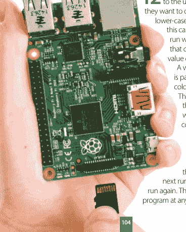

```python
# 处理结果
if result == "yes":
    print("\nContinuing")
else:
    print("\nExiting")
    sys.exit()
```

> "print 函数总是在其输出末尾添加一个换行符"

### 继续还是退出？

13 接下来，我们将使用 if 语句处理在 while 循环期间存储的结果。如果用户输入了 'yes'，那么我们将打印 'Continuing'。否则，我们将打印 'Exiting'，然后调用 sys.exit 函数。你不需要做任何其他事情来让程序继续，因为如果没有调用 sys.exit 函数，它将简单地继续执行。这段代码还显示了换行符 \n 可以在字符串中的任何位置使用，而不仅仅像上面那样在单独的引号中。

```python
# 使用 while 循环将数字加 5 并每次输出该值
print("Incrementing the number by 5\n")

while count <= 5:
    number += 1
    print("number + " + str(count) + " = " + str(number))

    # 增加计数
    count += 1
```

### 使用数字的循环

14 我们将使用一个 while 循环，它使用一个数字和一个 <=（小于或等于）运算符作为其停止条件。while 循环将用于将数字增加 1，在每次循环时打印变化，直到满足停止条件。count 变量让我们确切地知道我们已经执行了多少次 while 循环。

### 完成

16 最后一步是打印程序正在退出。这是最后一行，我们不需要做任何其他事情，因为当没有更多行需要解释时，Python 就会简单地结束。

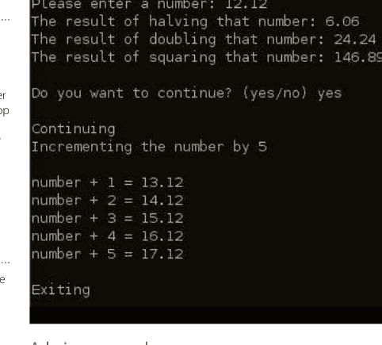

### 使用循环递增数字

15 while 循环将运行直到 count 为 6，这意味着它将总共运行 5 次，因为 count 从 1 开始。在每次运行中，while 循环递增 number 变量，然后打印正在添加到原始数字的内容，后跟结果。最后，count 被递增。

### 欣赏你的作品

17 现在我们已经完成了编码，保存你所做的任何更改，并使用 F5 键运行你的程序。

## 在树莓派上使用 Python

## 使用 Python 在 Minecraft 中编码新的创作

### 你需要什么...

- Minecraft http://www.mojang.com/games
- Python https://www.python.org
- McPiFoMo http://rogerthat.co.uk/McPiFoMo.rar

## 使用 Python 在 Minecraft 中编码新的创作

直接使用 Python 连接 Minecraft，并使用 Forge mod 制作出奇妙的创作


有时，Minecraft 似乎远不止是一款游戏。它是一个极具创造性的工具，通过使用红石和命令方块，你可以创造出一些令人惊叹的世界。我们正在更进一步，让你能够将 Python 代码直接插入 Minecraft。你用它做什么完全取决于你的想象力！MCPIPy 由 https://mcpipy.wordpress.com 的 'fleap' 和 'bluepillRabbit' 开发，用于将 Minecraft Pi 版与树莓派上的 Python 连接起来，使用开放的 API。

然而，通过使用 Forge，我们已经整理了一个软件包，使得在零售版 Minecraft 中使用 Python 成为可能。我们使用的是 Alexander Pruss 开发的 Raspberry Jam，这是一个 Minecraft 的 Forge mod，它实现了大部分的 Raspberry Juice/Pi API。

## 使用 Python 在 Minecraft 中编码新的创作

## 在树莓派上使用 Python

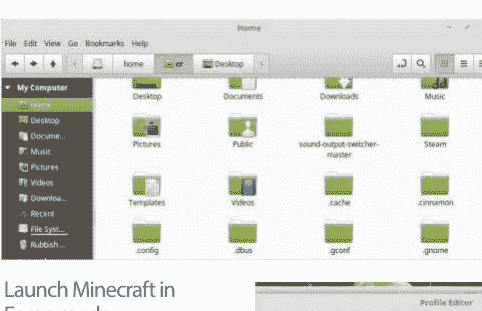

### 替换你的 .minecraft 目录

**01** 备份你主目录中的 .minecraft。如果你使用的是图形界面，你可能需要按 CTRL+H 来查看隐藏目录。在终端中，`mv ~/.minecraft ~/.minecraft-backup` 应该就足够了。

右图：备份你原始的 .minecraft 目录，并从 McPiFoMo 复制修改后的安装文件
下图：你需要使用预装的 Forge 配置文件运行 Minecraft 1.8

### 以 Forge 模式启动 Minecraft

**02** 像往常一样启动 Minecraft，但在登录后，选择 Forge 配置文件。这应该会加载带有 Forge 11.14 的 Minecraft 1.8。你可以尝试最新版本的 Minecraft，并根据需要下载和安装更新的 Forge，但我们发现这些版本与 Raspberry Jam 最兼容。当你在窗口左下角看到版本号时，你就知道你正在运行正确的配置文件。在单人游戏创造模式中创建一个新的超平坦世界，你就可以开始编码了。

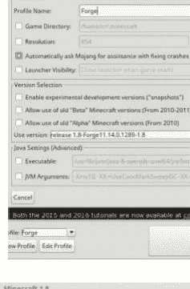

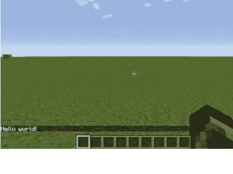

### Hello World – 实现聊天命令

**03** 使用你最喜欢的文本编辑器，你需要创建一个新的 `helloworld.py` 文件，并将其保存在 `~/.minecraft/mcpipy` 目录中：

```python
from mc import *
mc = Minecraft()
mc.postToChat("Hello world!")
```

返回 Minecraft 并输入 `/python helloworld`
Minecraft 现在将运行你的 Python 脚本，这应该会导致聊天命令显示 Hello world!

## 在树莓派上使用 Python

## 使用 Python 在 Minecraft 中编码创作新内容

## 打印找到的设备总数

**04** 现在，通过使用 **setBlock()** 和 **getPos()** 命令，我们可以相对于玩家的位置在世界中放置方块。尝试将以下两行添加到你的 **helloworld** 脚本中：

```
playerPos = mc.player.getPos()
mc.setBlock(playerPos.x,playerPos.y-1,playerPos.z,DIAMOND_ORE)
```

然后在 Minecraft 中再次运行 /python helloworld。你会再次看到聊天消息，但这次如果你向下看玩家角色下方的地面，你会看到一个钻石方块也被放置在你的脚下。你可以尝试将 **DIAMOND_ORE** 替换为任何其他 Minecraft 方块 ID（例如 DIRT/GRASS）。

> “如果你向下看玩家角色下方的地面，你会看到一个钻石方块被放置在你的脚下”

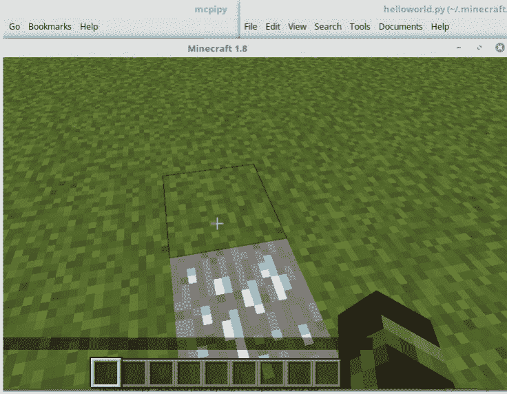

## 使用 Python 在 Minecraft 中编码创作新内容

## 在树莓派上使用 Python


## 常见错误

**06** 如果你收到“找不到脚本”的错误，这可能意味着你的 Minecraft 目录中没有安装 mod 脚本。检查你是否已用 McPiFoMo 中的文件替换了 **.minecraft**。

如果你收到“无法运行程序 'python'”的错误，你的游戏无法定位 Python。确保你已安装最新版本的 Python，并且它已安装在 Path 中。在 Bash shell 中输入 export PATH="$PATH:/usr/local/bin/python" 来检查。

如果你遇到内存泄漏或无限循环的问题，只需输入 **/python** 即可停止正在运行的脚本。

## 嗯，甜甜圈

**05** 你将在 MCPiPy 集合中找到的预制脚本之一是甜甜圈：

```
python
from mc import *

def draw_donut(mcx,mcy,mcz,R,r,mcblock):
    for x in range(-R-r,R+r):
        for y in range(-R-r,R+r):
            xy_dist = sqrt(x**2 + y**2)
            if (xy_dist > 0):
                ringx = x / xy_dist * R # nearest point on major ring
                ringy = y / xy_dist * R
                ring_dist_sq = (x-ringx)**2 + (y-ringy)**2

    for z in range(-R-r,R+r):
        if (ring_dist_sq + z**2 <= r**2):
            mc.setBlock(mcx+x, mcy+z, mcz+y, mcblock)

mc = Minecraft()

playerPos = mc.player.getPos()

draw_donut(playerPos.x, playerPos.y + 9, playerPos.z, 18, 9, GLASS)
mc.postToChat("Glass donut done")
draw_donut(playerPos.x, playerPos.y + 9, playerPos.z, 18, 6, WATER_STATIONARY)
mc.postToChat("Water donut done")
```

通过更改 WATER_STATIONARY 的方块 ID，你可以用任何对象类型填充甜甜圈。尝试用岩浆填充玻璃。然后尝试将外壳从玻璃改为 TNT。

> **找不到脚本**

如果你看到红色文本显示“找不到脚本”，请检查你的 PY 文件的名称和位置。你所有的 Python 脚本都应位于 ~/.minecraft/mcpi.py，以便 Python 和 Minecraft 能够找到它们。你不需要在运行命令末尾附加“py”，只需确保使用 Python 脚本文件的确切名称。/python doughnut.py 和 /python doughnut.py 一样有效，只要 doughnut.py 存储在 ~/.minecraft/mcpi.py 中。如果你看不到此目录，请记住取消隐藏文件（CTRL+H）。

## 处理多个任务

你的树莓派项目可能需要同时处理多件事情。学习如何处理多个任务

在本教程中，我们将探讨如何使用 Python 中的多任务功能来管理多个任务。在标准库中，有三个主要模块可用。它们是 threading、multiprocessing 和 concurrent。每个都有其自身的优点和缺点。由于这些都是标准库的一部分，因此你不需要安装任何额外的东西。

首先，我们将看看 threading 模块。你可以使用此模块的两种方式。第一种是使用它来创建新的线程对象，这些对象可以被告知在你的程序中运行某个目标函数。以下是一个简单的例子：

```
import threading
def my_func():
    print("Hello World")
my_thread = threading.Thread(target=my_func)
my_thread.start()
```

假设你的任务可以划分为单独的函数，你可以为每个函数创建一个线程。需要注意的一点是，这些新线程在你调用 start 方法之前不会开始执行函数代码。在那时，目标函数将开始在后台异步运行。你可以使用如下代码来检查给定线程是否完成：

```
if my_thread.is_alive():
    print('This thread is still running')
```

在你的程序主体中的某个时刻，你将希望使用在这些线程中运行的函数的结果。当这种情况发生时，你可以使用线程对象的 join() 方法。这会暂停你的程序核心并强制它等待直到线程退出。线程在运行函数退出时默认退出。

但是，如何编写使用线程的好代码呢？首先要考虑的是你将使用全局可用的数据，还是使用仅应在当前线程内可见的数据。如果你确实需要仅本地数据，你可以创建一个可以存储这些值的本地对象。以下代码存储一个包含作者姓名的字符串：

```
mydata = threading.local()
mydata.myname = 'Joey Bernard'
```

这将是在线程运行的函数内使用的代码。如果你需要使用全局数据，你需要考虑不同的线程可能如何尝试使用此全局数据。如果每个人都从给定变量读取，你不会遇到任何问题。问题出现在你有多个线程可能尝试写入给定变量时。在这种情况下，你最终会遇到一种称为竞态条件的情况，其中一个线程可能会覆盖另一个线程的数据。在这些情况下，你需要使用锁对象来管理对这些全局变量的访问。一个基本示例如下所示：

```
mylock = threading.Lock()
counter = 0
def func1():
    mylock.acquire()
    counter = counter + 1
    mylock.release()
```

如你所见，你在程序主体中创建锁对象。然后，在函数代码中，你尝试获取锁。如果锁是空闲的，你获得访问权并将其锁定。如果锁对象已被另一个线程锁定，那么对 acquire 的调用将阻塞并等待直到锁被释放。这就是为什么你需要非常小心，始终为每个 acquire 语句都有一个 release 语句。否则，你将有一个几乎不可能在事后找到的错误。这也为你的程序引入了一个瓶颈，因此你要确保 acquire 和 lock 之间的任何代码都是完成必要工作所需的最低限度。这是 Python 中可用的最简单的锁定机制形式。如果你的需求更大，你可以查看其他选项，看看它们是否可能提供更好的访问控制。除了控制对全局数据的访问外，你可能还需要在线程之间直接通信。这可以通过事件对象来处理，该对象可用于将标志设置为 true 或 false，并使其对其他线程可见。例如，下面的代码展示了如何设置和使用这样的标志：

```
event1 = threading.Event()
def func1():
    ....
    event1.set()
    ....
def func2():
    ....
    if event1.set():
        print('I got a flag from func1')
    ....
```

有时，你唯一需要的通信是知道所有线程何时完成了它们工作的某个阶段。假设你有多个线程加载数据文件，你需要等待每个人都完成才能进入下一阶段。在这种情况下，你可以使用屏障对象来实现。下面，你可以看到如何为两个线程（上面）添加屏障：

```
barrier1 = threading.Barrier(2)
def func1():
    ....
    barrier1.wait()
    ....
def func2():
    ....
    barrier1.wait()
    ....
```

在上面的代码中，你需要在创建屏障对象时设置有多少线程将参与其中。然后，当线程使用它并调用 wait 方法时，它们将阻塞直到所有线程都调用 wait 方法。threading 模块是一种轻量、快速且简单的方法，可以为你的代码添加划分处理的能力，但它确实存在一个主要问题。在 Python 核心引擎内部，有一个结构

## 处理多任务

### 在树莓派上使用Python

这被称为GIL（全局解释器锁）。GIL用于控制对Python解释器中某些核心函数和数据的访问。这意味着在某些时刻，你的线程一次只能运行一个。这在某些情况下会引入严重的瓶颈。如果你遇到这种情况，那么你可能需要使用multiprocessing模块。该模块使用子进程来完全绕过GIL，以实现真正的并行操作。在其最基本的用例中，你可以使用类似下面的代码来获得与使用线程类似的行为：

进程对象以多种方式之一启动一个新的Python引擎。在UNIX系统（如树莓派）上的默认方式是fork一个新进程。fork方法本质上是创建当前Python引擎的完整副本并执行给定的函数。另一种方法是spawn一个新的Python引擎。在spawn方法中，只有当前Python引擎中需要的部分会被复制到新的Python引擎中。如果你确实需要更改它，可以使用以下代码：

```python
import multiprocessing
def f(name):
    print('hello', name)

p = multiprocessing.Process(target=f,
    args=('bob',))
p.start()
p.join()
```

```python
multiprocessing.set_start_method('spawn')
```

如果你需要启动许多子进程，这可能有助于加速你的代码。set_start_method应该在给定的程序中只调用一次。希望本教程能给你一些关于如何包含并行管理多任务能力的想法。这可以成为一个强大的工具，使你项目的软件设计更灵活、功能更强大。请注意，在如此简短的教程中，我们只能涵盖最基本的主题。

这表面上看起来相同，但后端发生的事情却截然不同。这

## 其他并行化方法

我们已经研究了如何在Python程序内部严格处理并行任务。但有时你需要异步运行其他代码片段。在这些情况下，你可以使用subprocess模块来执行外部代码并与之交互。作为一个例子，我们将看看如何运行ls程序并使用其输出。

外部程序的输出被发送回调用的Python代码。有时，你可能想通过shell运行这个外部程序。为此，你需要使用参数shell=True。run方法是运行外部程序的简化接口。当你需要对外部程序的执行方式有更多控制时，可以使用Popen方法。

communicate()
如果你想同时向外部进程发送输入，可以包含一个名为input的参数并附带数据。这会阻塞直到外部进程完成并退出。如果你需要在不等待外部程序完成的情况下从这些流中读取，你可以获取stdout和stderr流的管道。例如，以下代码从标准输出流读取：

```python
import subprocess
subprocess.run(["ls", "-l"],
    stdout=subprocess.PIPE)
```

```python
proc1 = subprocess.Popen(['/bin/
ls', '-l'])
```

```python
proc2 = subprocess.Popen(['ls',
    '-l'], stdout=subprocess.PIPE)
proc2_output = proc2.stdout
print(proc2_output.read())
```

run方法接受要运行的外部程序作为输入，以及任何参数。默认情况下，run不会将外部程序的输出发送回主Python代码。在这个例子中，我们将输入参数stdout设置为PIPE值，因此

要与此外部进程通信，你可以使用communicate方法。你可以使用以下代码获取stdout和stderr流：

如果需要，你总是可以使用terminate()或kill()方法显式地停止外部进程。

```python
outstream, errstream = proc1.
```

### 在树莓派上使用Python

## 创建树莓派驱动的虚拟现实设置

### 你需要什么...

- 树莓派3
- 8GB SD卡
- Xbox 360手柄
- Oculus Rift开发者套件（可选）

## 创建树莓派驱动的虚拟现实设置

结合树莓派、Python-VRZero和3D图形模块Pi3D来编辑或制作虚拟现实环境


虚拟现实现在非常火爆，自斯蒂芬·金的《*割草机人*》中的概念和CGI视觉效果以来已经取得了长足的进步。它是技术领域增长最快的领域之一，你现在可以在虚拟环境中设计模型、探索新地方和玩游戏。专业的VR硬件套件价格昂贵，会让你花费数百英镑。然而，使用树莓派、Python-VRZero和3D图形模块Pi3D来模拟VR设置是可能的。现在，这纯粹是为了乐趣和学习，所以不要期望有大型游戏PC的帧率，尽管一些演示在树莓派3上确实能达到25-30 FPS的峰值。本教程将向你展示如何使用树莓派3、Xbox 360手柄和一些Python代码创建VR设置。我们的第一步将引导你完成如何安装所需的软件和模块。然后我们将介绍配置硬件和驱动程序，使你能够在VR环境中控制移动。最后一步将介绍程序代码结构，你可以在其中开发自己的VR演示版本或设计和构建自己的虚拟世界。


## 创建树莓派驱动的虚拟现实设置

### 在树莓派上使用Python

## Python-VRZero

01 使用Python-VRZero是在树莓派上使用Python创建自己的虚拟现实世界并结合Oculus Rift的一种无缝方式。该程序在Pi3D的基础上添加了许多功能，并解决了为Python VR开发配置树莓派3的难题。它包括用于键盘、鼠标、手柄和Rift的默认输入事件处理，用于移动和改变玩家的视角。它还支持Xbox 360手柄配置，并使用OpenHMD读取Rift的旋转传感器读数。

## 安装Xbox 360手柄驱动程序

04 现在安装Xbox 360手柄的软件包依赖项。你可以在第一行末尾添加代码--upgrade来保持库的更新。然后安装将渲染图像的Pi3D软件。按如下所示输入两行并按回车键。

## 全新SD卡安装

02 开始之前，建议你使用一张全新的SD卡，上面安装了树莓派官方操作系统Raspbian的全新镜像。你可以直接从树莓派网站 https://www.raspberrypi.org/downloads 下载操作系统。使用你通常喜欢的方法进行安装。此项目设置使用Pixel OS镜像进行了测试。

## 更新树莓派

03 启动你的树莓派。在此阶段，你不需要连接Xbox 360手柄或Oculus Rift。加载后，打开LXTerminal，通过输入下面两行来更新和升级操作系统。这可能需要一些时间。

```bash
sudo apt-get update
sudo apt-get upgrade
```

```bash
sudo apt-get install -y libhidapi-libusb0 xboxdrv
sudo pip3 install pi3d==2.14
```

> 保持更新
Python-VRzero是一个持续开发的项目，更新和改进一直在添加中。请参考GitHub仓库获取最新更新：https://github.com/WayneKeenan/python-vrzero

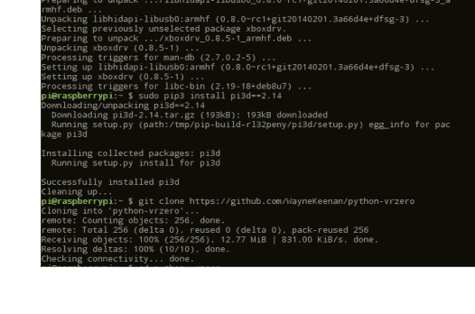

### 在树莓派上使用Python

## 创建树莓派驱动的虚拟现实设置

## 安装软件 - 第1部分

## 复制配置文件 - 第1部分

05 Python-VRzero可从GitHub网站获取，使用git clone命令（第一行）可以轻松下载。将其输入到你的LXTerminal中。然后进入python-vrzero文件夹（第二行）并安装程序（第三行）。

07 要与Oculus Rift的旋转传感器和Xbox 360手柄交互，你需要复制配置文件。这使你能够定向并在环境中环顾四周。当你向左转头时，VR环境会调整，就像你正在向左看一样。将下面两行都输入到LXTerminal中，并在每行后按回车键：

```bash
sudo git clone https://github.com/WayneKeenan/python-vrzero
cd python-vrzero
sudo python3 setup.py install
```

```bash
sudo cp config/83-hmd.rules /etc/udev/rules.d/
sudo cp config/xboxdrv.init /etc/init.d/xboxdrv
```

## 安装软件 - 第2部分

## 复制配置文件 - 第2部分

06 安装完成后，选择并安装OpenHMD（第一行），它使来自Oculus Rift传感器的数据能够被读取和处理。将第一行输入到LXTerminal并按回车键，然后输入第二行安装所需的模块。输入第三行并按回车键以链接所有所需的库：

08 Xbox 360手柄设置需要一个额外的命令行，将默认配置文件复制到包含Xbox驱动程序的文件夹中。此文件包含所有按钮、拨片和操纵杆的映射。按如下所示输入该行并按回车键：

```bash
sudo dpkg -i install/openhmd_0.8.1-1_armhf.deb
sudo apt-get install -f
sudo ldconfig
```

```bash
sudo cp config/83-hmd.rules /etc/udev/rules.d/
sudo cp config/xboxdrv.init /etc/init.d/xboxdrv
```

## Rift开发者套件1

09 如果你没有Oculus Rift套件，你仍然可以使用HDMI显示器来显示输出。转到步骤11。如果你拥有或可以访问Oculus Rift开发者套件，你需要将配置文件复制到config.txt文件中。此文件包含操作系统配置设置，在树莓派启动时加载。将下面一行输入到LXTerminal并按回车键。

```bash
sudo cp config/config_DK1.txt /boot/config.txt
```

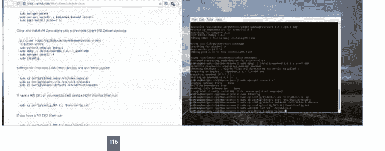

### 创建基于树莓派的虚拟现实设置

### 在树莓派上使用Python

### Rift开发套件2

10 如果你拥有Oculus Rift开发套件第2版，那么你将需要再次复制一个配置文件。不过这次选择`config_DK2.txt`文件，并将其内容复制到`boot/config`文件中。在LXTerminal中输入下面的行并按回车键。确保为你所拥有的套件版本选择正确的配置。

```
sudo cp config/config_DK2.txt /boot/config.txt
```

### 完成设置

11 最后运行两个命令。第一个命令（第一行）启用在步骤7中设置的无根USB udev配置。第二个命令（第二行）禁用BluetoothLE。这是必需的，因为它可以防止OpenGL ES挂起。确保每一行都按原样输入，并在每行后按回车键以启用命令运行：

```
sudo udevadm control --reload-rules
sudo systemctl disable hciuart
```

### 重启并插入设备

12 这就完成了安装和项目设置。从LXTerminal中，关闭树莓派（第一行）。连接Xbox 360控制器，如果你有的话，还有Oculus Rift。在启动树莓派之前先打开Rift，以确保树莓派启动时能识别硬件：

```
sudo shutdown
```

### 硬件控制与设置

13 Python-VRzero为处理来自连接设备的输入事件设置了合理的默认值。键盘控制移动，默认映射为：WASD，空格键用于跳跃，回车键用于动作。鼠标控制视角（以及移动时的行进方向）。鼠标按钮1用于动作，鼠标按钮2用于跳跃。Xbox 360控制器分别使用左摇杆和右摇杆控制移动和视角。'A'按钮是'动作'，'B'按钮是跳跃。OpenHMD库用于读取HMD传感器数据。VR Pi3D立体相机根据HMD读数进行响应。

### 运行演示

14 现在进入有趣的部分，即运行演示程序并沉浸在VR世界中。有多个演示可供选择，每个都展示了Python-VRzero程序的功能。演示需要使用Python 3运行，并作为脚本从demos文件夹执行。（如果你使用的是Oculus Rift，你需要通过Rift头显内的显示器导航到该文件夹。）打开LXTerminal，并移动到`python-vrzero/demos`文件夹（第一行）。要列出可用的演示，输入`ls`，这将列出所有演示的文件名。要运行演示，输入`./`后跟演示的名称，例如要运行abbey演示，输入`./abbey.py`（第二行）。你将看到巴克法斯特修道院的VR渲染，要结束环境，只需按键盘上的Escape键。

```
cd python-vrzero/demos
./abbey.py
```

### 在树莓派上使用Python

创建基于树莓派的虚拟现实设置

```python
import pi3d
from vrzero import engine

# VR Zero init, must be done *before* Pi3D setup.
engine.init()

# Pi3D scene setup...

shader = pi3d.Shader("uv_light")
shinesh = pi3d.Shader("uv_reflect")
flatsh = pi3d.Shader("uv_flat")
matsh = pi3d.Shader("mat_reflect")
##########################################
# Load textures
patimg = pi3d.Texture("textures/PATRN.PNG")
coffimg = pi3d.Texture("textures/COFFEE.PNG")
shapebump = pi3d.Texture("textures/floor_nm.jpg")
shapeshine = pi3d.Texture("textures/stars.jpg")
light = pi3d.Light(lightpos=(-1.0, 0.0, 10.0), lightcol=(3.0, 3.0, 3.0))
```

### 编辑纹理

### Rift开发套件2

15 如果你以前使用过Pi3D，你可以访问程序模板来设置你自己的模型。如果没有，那么请更改Shape演示程序中的纹理。首先打开LXTerminal并输入`sudo idle 3`以加载Python 3。选择File并打开，导航到以下文件夹`/home/pi/python-vrzero/demos`并选择`shapes.py`程序。找到第14行，该行以`patimg = pi3d`开头（如图所示，页面顶部）。这是告诉程序为每个形状加载哪些纹理的第一行代码。其后还有几行也可以编辑。

16 使用文件夹浏览器，单击文件图标导航到纹理文件夹`/home/pi/python-vrzero/demos/textures`中的纹理。你将看到用于shapes演示的文件。将图像文件替换为你自己的文件，然后在程序的第14行将文件名更改为与你选择的图像文件匹配。如果你不想使用自己的纹理文件，你可以将文件名更改为文件夹中列出的其他图像文件之一。按F5保存并运行演示。你会注意到形状纹理已经改变。

> 尝试其他演示
你可能有兴趣尝试一些其他可用的演示，地址是https://github.com/pi3d/pi3d_demos。尝试乘坐过山车或驾驶坦克！该资源还提供了如何使用Pi3D python库和代码创建自己的模型的指南。

### 创建基于树莓派的虚拟现实设置

在树莓派上使用Python

### 更改消息

17 返回你的Python编辑器并找到第71行。这行包含在shapes VR演示中显示的消息。将文本更改为你自己选择的句子。保存并运行程序。恭喜，你现在已经开始修改自己的VR演示了。尝试编辑每个演示的程序文件，例如，如何创建一个由巧克力制成的教堂？如果你想尝试其他演示，请在https://github.com/pi3d/pi3d_demos查找更多详细信息。

### 在树莓派上使用Python

使用你的树莓派查找和跟踪你的手机

### 使用你的树莓派查找和跟踪你的手机

### 你需要什么...

- 树莓派3
- 蓝牙USB加密狗（如果使用较旧的树莓派型号）

创建一个定位蓝牙设备并对其做出响应的程序

树莓派3型引入了嵌入式Wi-Fi和蓝牙功能。这使得与支持蓝牙的设备（如手机、平板电脑和扬声器）进行交互变得更加容易。Python编程语言支持一系列库，使你能够与蓝牙设备的各种元素进行交互、监控和控制。本教程将树莓派的蓝牙硬件与Python代码相结合，创建三个简单但有用的程序。首先，构建一个简短的程序来搜索支持蓝牙的设备并返回每个设备的12位地址。一旦你获得了地址，你就可以扫描并查找该特定设备上可用的蓝牙服务。最后，使用蓝牙地址和一些条件来检查建筑物中存在哪些设备，进而检查哪些人存在或不在建筑物中，并以所需的操作作为响应——这是一种自动化的蓝牙签到系统。

### 使用你的树莓派查找和跟踪你的手机

### 在树莓派上使用Python

### 使用蓝牙

01 蓝牙是一种无线标准，用于在设备之间通过一到十米的短距离交换数据。当前版本Bluetooth v5于2016年6月发布，范围增加到200多米。它于2017年发布，很可能成为许多物联网设备和应用的主流。蓝牙使用标准IEEE 802.11，与Wi-Fi相同。它们有相似之处，例如建立连接、传输和接收文件以及流式传输音频和媒体内容。如果你使用的是Pi 2或更低版本，你仍然可以通过使用蓝牙USB加密狗来创建和使用这些程序。

> 你的加密狗工作正常吗？
如果你使用的是USB蓝牙加密狗，你可以通过插入它，然后输入命令`sudo reboot`重启树莓派来检查它是否工作。重新加载后，检查加密狗是否已被识别，加载LX Terminal窗口并输入`lsusb`。这将列出所有连接的USB设备。你也可以输入`hcitool dev`来识别加密狗并返回其USB地址。

### 安装所需的库

02 尽管树莓派操作系统镜像附带了用于与设备接口的蓝牙库，但在本教程中，你将希望使用Python代码控制接口。启动你的树莓派并打开LX Terminal窗口。检查并更新/升级操作系统，输入第1行和第2行。然后安装Python开发工具（第3行）。最后安装另外两个蓝牙开发库。完成后，输入`sudo halt`重启你的树莓派。

```
sudo apt-get update
sudo apt-get upgrade
sudo apt-get install python-pip python-dev ipython
sudo apt-get install bluetooth libbluetooth-dev
sudo pip install pybluez
```

### 加载Python

03 加载LX Terminal并输入`sudo idle`，这将打开具有超级用户权限的Python编辑器，使你能够通过Python代码访问USB硬件。开始一个新窗口并导入第一个蓝牙模块（第1行）。然后添加一条简短的消息，告知用户程序正在搜索附近的设备。

```python
import bluetooth
print("Searching for device...")
```

### 搜索设备名称

04 你程序的下一行搜索支持蓝牙的设备的名称。每个设备必须启用蓝牙并可被发现才能被找到。在下一行，创建一个名为`nearby_devices`的变量来存储名称，并使用代码`bluetooth.discover_devices`来查找设备的名称。

```python
nearby_devices = bluetooth.discover_devices(lookup_names=True)
```

## 在树莓派上使用 Python

## 使用你的树莓派查找并追踪你的手机

> 你的蓝牙适配器兼容吗？

如果你使用的是较旧的树莓派型号 1、2 或 Pi Zero，那么它本身不包含蓝牙功能。不过，你可以购买一个 USB 蓝牙适配器，并通过其中一个 USB 端口连接它来添加此功能。并非所有蓝牙适配器都兼容，因此有一个不断更新的、经过测试的兼容列表。购买前请在此处查看：http://elinux.org/RPi_USB_Bluetooth_adapters

## 打印发现的设备总数

05 现在，任何可发现设备的名称都已存储在一个变量中。使用代码 `len(nearby_devices)` 来返回该变量中存储的项目数量，这就是程序发现的蓝牙设备数量。然后打印出设备总数。在程序的前一行之后添加以下代码。

```
print("found %d devices" % len(nearby_devices))
```

## 蓝牙地址 (BD_ADDR)

06 每个支持蓝牙的设备都有一个蓝牙地址，它由 12 个字母数字字符组合而成；例如，69:58:78:3A:CB:7F。这些地址是十六进制的，这意味着它们可以包含 0 到 9 的数字和 A 到 F 的字母。大多数设备制造商会在硬件上贴的标签或用户手册中包含该地址。

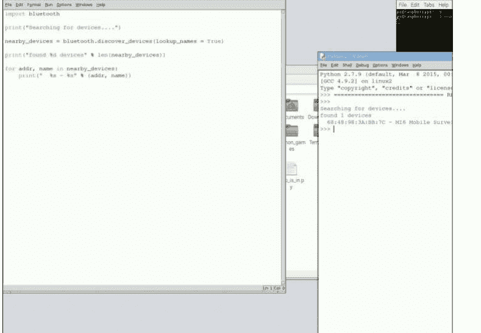

## 使用你的树莓派查找并追踪你的手机

## 在树莓派上使用 Python

## 完整代码清单

```
import bluetooth

print("Searching for devices....")

nearby_devices = bluetooth.discover_devices(lookup_names = True)

print("found %d devices" % len(nearby_devices))

for addr, name in nearby_devices:
    print("  %s - %s" % (addr, name))
```

### [查找服务列表].py

```
#!/usr/bin/env python
import bluetooth
from bluetooth import *

device_address = "98:44:98:3A:BB:7C"

#find services on the phone
services = find_service(address=device_address)
#print services

for i in services:
    print i, '\n'
```

### [检查谁在].py

```
#!/usr/bin/python
### add a def and then a while statement
import bluetooth
import time

print "Blue-Who Finder"

#find the devices and the name of the device
devices = bluetooth.discover_devices(lookup_names = True)

#print how many devices are found
print("Found %d devices" % len(devices))

#print the devices and the names
for addr, name in devices:
    print("  %s - %s" % (addr, name))

time.sleep(2)
print "Check to see who is in the building"
print "Checking " + time.strftime("%a, %d %b %Y %H:%M:%S", time.gmtime())
time.sleep(1)
if len(devices) == 0:
    print "No one is currently in the building"

#check the addresses against list to see who is near
for person in devices:

    device = bluetooth.lookup_name("68:88:98:3R:BB:7C", timeout=5)
    if (device != None):
        print "TeCoEd is in"
    else:
        print "Tecoeed is out"

    time.sleep(1)

    device2 = bluetooth.lookup_name('CC:3B:4F:CA:5B:1A', timeout=5)
    if (device2 != None):
        print "The Boss is in the building, back to work"
    else:
        print "The Boss is still out, Facebook time!"

    time.sleep(1)

    device3 = bluetooth.lookup_name("00:26:DF:6F:D2:C8", timeout=5)
    if (device3 != None):
        print "Wow Sherlock is here O wise one!"
    else:
        print "Sherlock is still out on a case"

    time.sleep(1)

    device4 = bluetooth.lookup_name("28:18:78:47:0C:56", timeout=5)
    if (device4 != None):
        print "Babbage is present in the building"
    else:
        print "Babbage is not here"

    device5 = bluetooth.lookup_name("E0:W8:47:77:6F:41", timeout=5)
    if (device5 != None):
        print "We have a Bogie in the area!"
    else:
        print "Airspace is clear"
```

> “Python 编程语言支持一系列库，使你能够与蓝牙设备的各种元素进行交互、监控和控制”

## 在树莓派上使用 Python

## 使用你的树莓派查找并追踪你的手机

变量
变量是计算机内存中的一个位置，你可以在其中存储数据。为了再次找到数据，你需要给变量一个合适的名称或标签。例如，`days = 5`。这意味着 `days` 变量当前存储着数字五。

## 打印设备的名称和地址

07 对于程序定位到的每个设备（列表中的每个项目），打印出设备的地址和名称。这些信息将在后续部分中用于查明设备有哪些可用服务，以及在发现设备时添加操作。保存程序然后运行它，确保要发现的设备处于发现模式。你将看到一个设备列表，其中包含每个设备的名称和地址。

```
for addr, name in nearby_devices:
    print(" %s - %s" % (addr, name))
```

## 查找蓝牙设备上的可用服务

08 运行前面的程序并记下设备的蓝牙地址。启动一个新的 Python 程序并保存它。接下来，打开一个新的 Python 窗口并开始一个新程序。输入所需的两个库，第 1 行和第 2 行。

```
#!/usr/bin/env python
import bluetooth
from bluetooth import *
```

## 设置要查找的地址

09 在下一行，输入你想要查找服务的设备地址。使用前面的程序或查看标签来获取地址。接下来，创建一个名为 `device_address` 的变量来存储地址。使用以下代码，并将示例地址替换为你的设备的蓝牙地址。

```
device_address = "69:58:78:3A:CB:7F" # enter address of device
```

## 查找服务

10 在下一行，添加代码以查找你的设备支持的服务。创建一个名为 `services` 的新变量，它将存储服务列表。使用代码 `find_service`，后跟你的支持蓝牙设备的地址，以搜索可用服务列表，并将每个服务存储在 `services` 变量中。

```
services = find_service(address=device_address)
```

> “每个支持蓝牙的设备都有一个蓝牙地址，它由 12 个字母数字字符组合而成”

## 使用你的树莓派查找并追踪你的手机

## 在树莓派上使用 Python

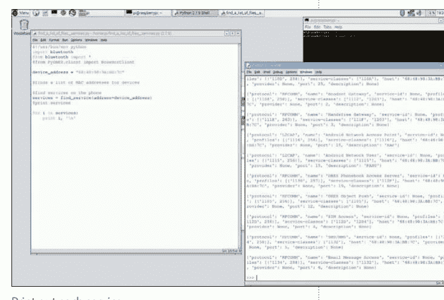

## 打印每个服务

11 程序的最后一步是打印出每个服务。这些服务存储在一个列表中，因此需要逐行打印。使用代码 `for i in services` 创建一个循环，第 1 行。这个循环将检查列表中的每个单独项目。然后它将打印列表中的每个项目，即每个蓝牙服务，第 2 行。使用代码 `'\n'` 将每个服务打印到新行。

```
for i in services:
    print i, '\n'
```

## 这些服务是什么？

12 保存并运行你的程序，你将看到一个很长的服务列表，特别是如果你使用的是现代设备。在 Python 中使用这些服务更为复杂，需要几行额外的代码。然而，你可能可以传输和接收文件、流式传输音乐，甚至关闭设备。更多细节和评论可以在 Blueman 的 Github 页面上找到，https://github.com/blueman-project/blueman。但请记住，这些工具仅供个人使用。

> “你可以传输和接收文件、流式传输音乐，甚至关闭设备”

## 在树莓派上使用 Python

## 使用你的树莓派查找并追踪你的手机

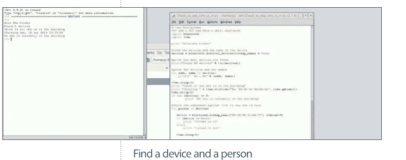

## 查找设备和人

13 在步骤 7 中，你使用了一个简短的程序来发现支持蓝牙的设备，并检查和返回设备的地址。现在使用 `bluetooth.lookup_name` 代码行来搜索特定设备并返回是否找到它。如果找到，则设备存在；如果未找到，我们可以假设设备不在。但是，请记住蓝牙可能已关闭。在你的 Python 程序中添加定位设备的行，将示例地址替换为你想要定位的设备的地址。

```
device = bluetooth.lookup_name("33:38:33:6A:BQ:7C", timeout=5)
```

## 如果找到设备则响应

14 一旦搜索了设备，检查它是否存在并响应，第 1 行。使用 IF 语句查看设备是否未找到。这使用了符号 `!=`，意思是“不等于”。然而，代码检查的是它是否不为 `None`——换句话说，设备被找到了。如果找到指定的设备，则打印一条消息，第 2 行。如果未找到设备，第 3 行，则打印一条消息通知用户，第 4 行。在前一行下面添加这些代码行。确保你的蓝牙已启用，保存并运行程序以查找你的设备。

```
if (device != None):
    print "TeCoEd is in"
else:
    print "Tecoed is out"
```

## 查找不同的设备

15 要查找其他设备并响应操作，只需使用相同的代码序列，但首先创建一个不同的变量来存储响应。在下一行添加代码，并记得取消缩进。重命名变量，例如将其命名为 `device_one`，并编辑地址以匹配第二个设备的地址。

```
device_one = bluetooth.lookup_name("44:67:73:6T:BR:7A", timeout=5)
```

## 使用你的树莓派来查找和追踪你的手机

## 使用树莓派配合Python

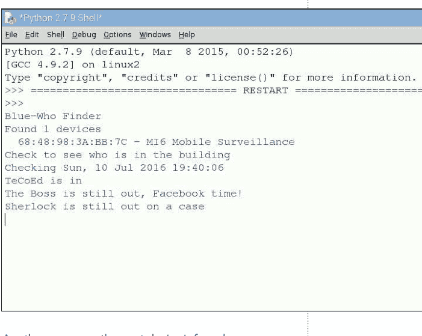

## 另一个响应，找到下一个设备

16 与之前一样，检查并响应，第1行，使用IF语句查看设备是否未找到。请记住使用新的变量名，在本例中为`device_one`。如果找到指定设备，则打印一条消息，第2行。如果未找到设备，第3行，则打印一条消息通知用户，第4行。将这些代码行添加到上一行的下方。保存并运行程序，以在你的位置范围内找到这两个特定设备。

```
if (device_one != None):
    print "Linux Laptop is in"
else:
    print "Linux Laptop is out"
```

## 添加替代操作

17 为了进一步自定义项目，你可以为设备被发现时添加自己的操作。例如，使用一条LED灯带，在每次有设备进入位置并被检测到时闪烁。或者为每个单独的设备使用独立的LED灯，以指示设备是否存在。何不将程序与LCD屏幕结合，作为一个留言板，显示谁在场、谁不在？更多灵感，请查看：https://www.youtube.com/watch?v=qUZQv87GVdQ


> 来自数字艺术家和插画家的专业技巧和分步教程


> 通过绘画和涂色活动学习并发挥创意


> 掌握新技能，为你的家庭和家人创造精美的物品


直接从我们这里购买可享受超值优惠

数千种精选书刊，许多在其他地方无法找到

全球配送，超安全订购


## 探索我们精彩的书刊

从钩针编织和绗缝到绘画和Photoshop，挑选一本能将你的爱好提升到新水平的书


> 通过专家建议和顶级技巧，将你的爱好提升到新水平

在Instagram上关注我们 @futurebookazines

www.magazinesdirect.com

杂志、过刊和书刊。

## 如何使用FileSilo

关于访问你的新数字资源库所需了解的一切

要访问FileSilo，请访问 www.filesilo.co.uk/1710-2

- 01 按照屏幕上的说明，在我们安全的FileSilo系统中创建一个账户，登录并通过回答一个关于该书刊的简单问题来解锁它。然后，你可以随时免费访问内容，并将其下载到你的桌面。
- 02 登录后，你可以自由探索FileSilo上丰富的可用内容，从精彩的视频教程和独家在线指南到超棒的可下载资源。你购买的书刊越多，你即时可访问的数字内容收藏就会增长得越多。
- 03 你可以使用任何流行的浏览器（如Safari、Firefox或Google Chrome）在任何桌面、平板电脑或智能手机设备上访问FileSilo。但是，我们建议你使用桌面来下载内容，因为你可能无法将文件下载到手机或平板电脑上。
- 04 如果你在访问FileSilo上的内容或注册过程中遇到任何问题，请查看在线常见问题解答或发送电子邮件至 filesilohelp@futurenet.com。


制作PyGame – 游戏开发入门
学习如何使用树莓派制作游戏...

使用GTK的图形用户界面
在这些视频中，Liam向我们展示如何使用...制作图形用户界面

Pygame小说
通过创建互动小说，弥合书籍和电子游戏之间的鸿沟...

## Python

### 完全手册

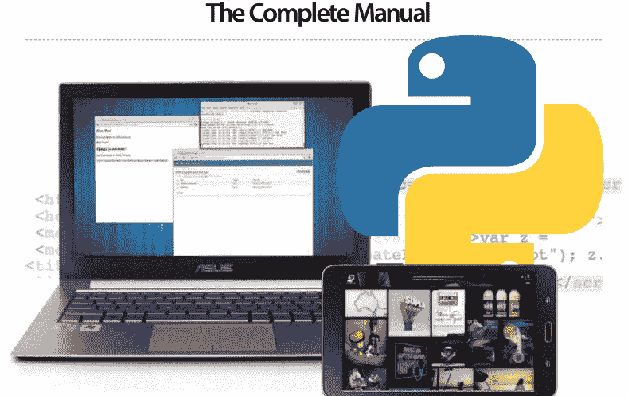

- **学习使用Python**
  掌握基础知识，并在学习如何使用这门最通用的语言之一时编写简单项目
- **编程游戏**
  运用你所学的知识创建可玩的游戏，看看Python有多么强大
- **实用技巧**
  发现你需要了解的关于编写整洁代码、充分利用Python功能等所有内容
- **精彩项目**
  发挥创意，完成包括编程游戏、使用树莓派搭建VR装置、读取情绪和追踪手机在内的项目
- **使用树莓派创作**
  使用Python（其官方认可的编程语言）释放你的树莓派计算机的真正潜力
- **掌握应用开发**
  通过分步教程制作你自己的网页和Android应用
- **让Python发挥作用**
  将Python用于功能性项目，如科学计算，并使离线阅读网站变得更轻松、更愉快
- **免费在线资源**
  下载完成书中步骤所需的所有教程文件，并通过你的免费FileSilo资源观看视频等更多内容