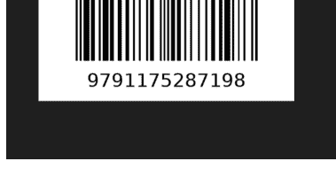
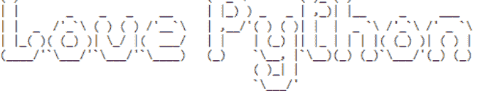
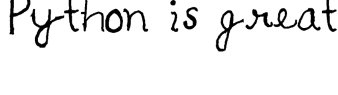
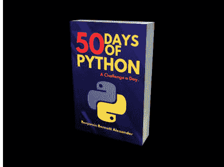
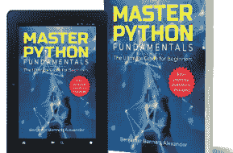

# PYTHON 技巧与窍门

100个基础与中级技巧与窍门的合集

本杰明·贝内特·亚历山大

版权所有 © 2022 本杰明·贝内特·亚历山大

保留所有权利。未经出版商事先许可，不得以任何形式或任何方式（电子、机械、影印、录制或其他方式）复制、存储在检索系统中或传播本出版物的任何部分。

在编写本书时，我们已尽一切努力确保所提供信息的准确性。但是，我们不保证或声明其完整性或准确性。

## 反馈与评论

我欢迎并感谢您的反馈和评论。反馈有助于独立作家触及更多人群。因此，请考虑在您获取本书的平台上留下反馈。查询请发送至：[benjaminbennettalexander@gmail.com](mailto:benjaminbennettalexander@gmail.com)。

## 目录

- 反馈与评论 ........................................................................ 3
- 关于本书 .................................................................................... 9
- 1 水平打印 ........................................................................ 10
- 2 合并字典 ........................................................................ 11
- 3 使用Python生成日历 ........................................................................ 12
- 4 获取当前时间和日期 .............................................................. 13
- 5 降序排列列表 ....................................................... 14
- 6 交换变量 .......................................................................... 15
- 7 统计项目出现次数 .............................................................. 16
- 8 展平嵌套列表 .......................................................................... 17
- 9 最大数的索引 ............................................................ 18
- 10 数字的绝对值 ........................................................... 19
- 11 添加千位分隔符 ......................................................... 20
- 12 Startswith 和 Endswith 方法 .................................................. 21
- 13 Nlargest 和 Nsmallest ................................................................... 22
- 14 检查是否为变位词 ...................................................................... 23
- 15 检查网速 .................................................................. 24
- 16 Python 保留关键字 .............................................................. 25
- 17 属性和方法 ................................................................... 26
- 18 使用Python打开网站 ......................................................... 27
- 19 字符串中最常见的字符 ............................................................... 28
- 20 内存大小检查 ........................................................................ 29
- 21 访问字典键 ................................................................. 30
- 22 是否可迭代 .................................................................................... 31
- 23 排序元组列表 ...................................................................... 32
- 24 使用 Sorted 和 Lambda 排序列表 ......................................................... 33
- 25 使用Python获取新闻 ................................................................ 34
- 26 使用 Enumerate 生成元组列表 ......................................................... 35
- 27 断言 ............................................................................................. 36
- 28 打印彩色文本 ............................................................................ 38
- 29 使用 Enumerate 查找索引 .............................................................. 39
- 30 使用 Type 函数创建类 ...................................................... 40
- 31 检查字符串是否为空 .............................................................. 41
- 32 展平嵌套列表 .............................................................................. 42
- 33 检查文件是否存在 ..................................................................... 43
- 34 集合推导式 ............................................................................ 44
- 35 Python *args 和 **kwargs ................................................................. 45
- 36 Filter 函数 ............................................................................. 46
- 37 字典推导式 .................................................................. 48
- 38 从两个列表创建 DataFrame .................................................................. 49
- 39 向 DataFrame 添加列 ....................................................... 50
- 40 计时器装饰器 ................................................................................. 51
- 41 列表推导式 vs 生成器 ..................................................... 52
- 42 写入文件 ..................................................................................... 53
- 43 合并 PDF 文件 ................................................................................. 55
- 44 Return vs Yield ................................................................................... 56
- 45 高阶函数 ......................................................................... 57
- 46 语法错误 ......................................................................... 58
- 47 Python 之禅 ..................................................................................... 59
- 48 使用 Pprint 排序 ................................................................................. 60
- 49 将图片转换为灰度图 ........................................................... 61
- 50 使用 timeit 计时 .............................................................................. 62
- 51 使用Python缩短URL .............................................................. 63
- 52 Round 函数 ........................................................................... 64
- 53 将 PDF 文件转换为 Doc ............................................................. 65
- 54 从 PDF 文件提取文本 ..................................................................... 66
- 55 库的位置 ............................................................................. 68
- 56 创建条形码 ............................................................................... 69
- 57 使用 Len 和 Range 函数获取索引 ................................................. 70
- 58 将表情符号转换为文本 ........................................................................ 71
- 59 货币转换器 ........................................................................... 72
- 60 生成自定义字体 ........................................................................ 73
- 61 语言检测器 ............................................................................. 74
- 62 使用 Selenium 刷新 URL ............................................................... 75
- 63 字符串的子串 .......................................................................... 76
- 64 两个列表的差集 ............................................................ 77
- 65 排序字典列表 ............................................................ 78
- 66 字节转换为字符串 ................................................................................... 79
- 67 从用户获取多个输入 ................................................................... 80
- 68 _iter_() 函数 ......................................................................... 81
- 69 将两个列表转换为字典 .......................................................................... 82
- 70 查找字符串的排列组合 ....................................................... 83
- 71 解包列表 ................................................................................ 84
- 72 类型提示 ......................................................................................... 85
- 73 文件位置 ...................................................................................... 86
- 74 Python Deque .................................................................................... 87
- 75 Python ChainMap .............................................................................. 88
- 76 使用Python创建进度条 .................................................................. 89
- 77 将文本转换为手写体 ............................................................. 90
- 78 截屏 .......................................................................... 91
- 79 返回多个函数值 ....................................................... 92
- 80 下载YouTube视频 ................................................................ 93
- 81 将字符串转换为列表 ................................................................. 94
- 82 循环遍历多个序列 ......................................................... 95
- 83 Extend vs. Append ............................................................................ 96
- 84 内存和 _slots_ ........................................................................... 97
- 85 使用Python为图片添加水印 ......................................................... 98
- 86 解压 Zip 文件 ........................................................................... 100
- 87 生成模拟数据 ...................................................................... 101
- 88 使用 more_itertools 展平列表 ..................................................... 103

## 关于本书

本书是Python技巧与窍门的合集。我整理了100个Python技巧与窍门，如果你正在学习Python，它们可能会对你有所帮助。这些技巧主要涵盖Python的基础和中级水平。

在本书中，你将找到关于以下内容的技巧与窍门：

- 如何使用print函数水平打印
- 如何使用列表推导式使代码更简洁
- 如何使用字典推导式更新字典
- 如何合并字典
- 交换变量
- 合并PDF文件
- 使用pandas创建DataFrame
- 使用Python纠正拼写错误
- 使用Python屏蔽脏话
- 如何重置递归限制
- 使用Python解压zip文件
- 将文本转换为手写体
- 使用Python截屏
- 使用Python生成虚拟数据
- 查找字符串的排列组合
- 使用sort方法和sorted函数对可迭代对象进行排序
- 写入CSV文件以及更多内容

为了充分受益，请尽力将代码写下来并运行。重要的是，你要尝试理解代码是如何工作的。修改并改进代码。不要害怕尝试。

最终，我希望这些技巧与窍门能帮助你提升Python技能和知识。

让我们开始吧。

## 1 水平打印

当遍历一个可迭代对象时，print函数会将每个项目打印在新行上。这是因为print函数有一个名为end的参数。默认情况下，end参数有一个换行符（end = "\n"）。现在，要水平打印，我们需要移除换行符并用空字符串替换它（end = ""）。在下面的代码中，请注意逗号之间的空格（" "）；这是为了确保数字之间用空格打印。如果我们移除空格（""），数字将这样打印：1367。以下是演示此功能的代码：

```python
list1 = [1, 3, 6, 7]

for number in list1:
    print(number, end=" ")
```

输出：
1 3 6 7

print函数还有另一个名为**sep**的参数。我们使用*sep*来指定输出的分隔方式。以下是一个示例：

```python
print('12','12','1990', sep='/')
```

输出：
12/12/1990

## 2 合并字典

如果你有两个想要合并的字典，可以使用两种简单的方法。你可以使用合并（ | ）运算符或（**）运算符。下面，我们有两个字典a和b。我们将使用这两种方法来合并字典。以下是代码：

### 方法1

使用合并（ | ）运算符。

```python
name1 = {"kelly": 23,
        "Derick": 14, "John": 7}
name2 = {"Ravi": 45, "Mpho": 67}

names = name1 | name2
print(names)
```

输出：
{'kelly': 23, 'Derick': 14, 'John': 7, 'Ravi': 45, 'Mpho': 67}

### 方法2

使用合并（ ** ）运算符。使用此运算符时，你需要将字典放在花括号内。

```python
name1 = {"kelly": 23,
        "Derick": 14, "John": 7}
name2 = {"Ravi": 45, "Mpho": 67}

names = {**name1, **name2}
print(names)
```

输出：
{'kelly': 23, 'Derick': 14, 'John': 7, 'Ravi': 45, 'Mpho': 67}

## 3 使用Python生成日历

你知道你可以使用Python获取日历吗？

Python有一个名为**calendar**的内置模块。我们可以导入这个模块来打印日历。我们可以用日历做很多事情。

假设我们想查看2022年4月；我们将使用calendar模块的*month*类，并将年份和月份作为参数传递。见下文：

```python
import calendar

month = calendar.month(2022, 4)
print(month)
```

输出：
April 2022
Mo Tu We Th Fr Sa Su
       1  2  3
 4  5  6  7  8  9 10
11 12 13 14 15 16 17
18 19 20 21 22 23 24
25 26 27 28 29 30

你还可以用日历做很多其他事情。例如，你可以用它来检查给定的年份是否是闰年。让我们检查一下2022年是否是闰年。

```python
import calendar

month = calendar.isleap(2022)
print(month)
```

输出：
False

## 4 获取当前时间和日期

以下代码演示了如何使用*datetime()*模块获取当前时间。*strftime()*方法用于格式化时间以获得所需的输出。此代码分解了如何将datetime模块与*strftime()*方法结合使用，以获取小时、分钟和秒格式的格式化时间字符串。

```python
from datetime import datetime

time_now = datetime.now().strftime('%H:%M:%S')
print(f'The time now is {time_now}')
```

输出：
The time now is 17:53:19

如果我们想返回今天的日期呢？我们可以使用datetime模块中的date类。我们使用*today()*方法。见下文：

```python
from datetime import date

today_date = date.today()
print(today_date)
```

输出：
2022-07-21

## 5 按降序排列列表

*sort()*方法将按升序（默认）对列表进行排序。要使sort方法正常工作，列表中的对象应具有相同的类型。你不能对混合了不同数据类型（如整数和字符串）的列表进行排序。*sort()*方法有一个名为reverse的参数；要按降序对列表进行排序，请将reverse设置为True。

```python
list1 = [2, 5, 6, 8, 1, 8, 9, 11]
list1.sort(reverse=True)
print(list1)
```

输出：
[11, 9, 8, 8, 6, 5, 2, 1]

请记住，*sort()*严格来说是一个列表方法。你不能用它来对**集合**、**元组**、**字符串**或**字典**进行排序。

*sort()*方法不返回新列表；它对现有列表进行排序。如果你尝试使用*sort()*方法创建一个新对象，它将返回None。见下文：

```python
list1 = [2, 5, 6, 8, 1, 8, 9, 11]
list2 = list1.sort(reverse=True)
print(list2)
```

输出：
None

## 6 交换变量

在Python中，一旦变量被赋值给对象，你就可以交换它们。下面，我们最初将20赋给x，将30赋给y，但随后我们交换了它们：x变成30，y变成20。

```python
x, y = 20, 30
x, y = y, x

print('x is', x)
print('y is', y)
```

输出：
x is 30
y is 20

在Python中，我们也可以使用XOR（异或）运算符来交换变量。这是一个三步方法。在下面的例子中，我们正在交换x和y的值。

```python
x = 20
y = 30

### 第一步
x ^= y
### 第二步
y ^= x
### 第三步
x ^= y

print(f'x is: {x}')
print(f'y is: {y}')
```

输出：
x is: 30
y is: 20

## 7 统计项目出现次数

如果你想知道一个项目在可迭代对象中出现了多少次，可以使用collection模块中的*counter()*类。*counter()*类将返回一个字典，显示每个项目在可迭代对象中出现的次数。假设我们想知道名字Peter在以下列表中出现了多少次；以下是我们如何使用collections模块的*counter()*类的方法。

```python
from collections import Counter

list1 = ['John','Kelly', 'Peter', 'Moses', 'Peter']

count_peter = Counter(list1).get("Peter")

print(f'The name Peter appears in the list '
      f'{count_peter} times.')
```

输出：
The name Peter appears in the list 2 times.

另一种方法是使用普通的for循环。这是最直接的方法。见下文：

```python
list1 = ['John','Kelly', 'Peter', 'Moses', 'Peter']

### 创建一个计数变量
count = 0
for name in list1:
    if name == 'Peter':
        count +=1
print(f'The name Peter appears in the list'
      f' {count} times.')
```

输出：
The name Peter appears in the list 2 times.

## 8 | 展平嵌套列表

我将与你分享三种展平列表的方法。第一种方法使用 *for* 循环，第二种使用 *itertools* 模块，第三种使用 *列表推导式*。

```python
list1 = [[1, 2, 3],[4, 5, 6]]

newlist = []
for list2 in list1:
    for j in list2:
        newlist.append(j)
print(newlist)
Output:
[1, 2, 3, 4, 5, 6]
```

### 使用 itertools

```python
import itertools

list1 = [[1, 2, 3],[4, 5, 6]]

flat_list = list(itertools.chain.from_iterable(list1))
print(flat_list)
Output:
[1, 2, 3, 4, 5, 6]
```

### 使用列表推导式

如果你不想导入 *itertools* 或使用普通的 for 循环，你可以直接使用列表推导式。

```python
list1 = [[1, 2, 3], [4, 5, 6]]

flat_list= [i for j in list1 for i in j]
print(flat_list)
Output:
[1, 2, 3, 4, 5, 6]
```

## 9 | 最大数的索引

使用 *enumerate()*、*max()* 和 *min()* 函数，我们可以找到列表中最大和最小数的索引。max 函数是一个高阶函数；它接受另一个函数作为参数。

在下面的代码中，*max()* 函数接受列表和 lambda 函数作为参数。我们将 *enumerate()* 函数添加到列表中，以便它能返回列表中的数字及其索引（一个元组）。我们将 enumerate 函数中的计数设置为从位置零 (0) 开始。lambda 函数告诉函数返回一个包含最大数及其索引的元组对。

### 查找最大数的索引

```python
x = [12, 45, 67, 89, 34, 67, 13]

max_num = max(enumerate(x, start=0),
              key = lambda x: x[1])
print('The index of the largest number is',
      max_num[0])
```

Output:
The index of the biggest number is 3

### 查找最小数的索引

这与 *max()* 函数类似，只是我们现在使用的是 *min()* 函数。

```python
x = [12, 45, 67, 89, 34, 67, 13]

min_num = min(enumerate(x, start=0),
              key = lambda x : x[1])
print('The index of the smallest number is',
      min_num[0])
```

Output:
The index of the smallest number is 0

## 10 | 数字的绝对值

假设你有一个负数，你想返回该数的绝对值；你可以使用 *abs()* 函数。Python 的 *abs()* 函数用于返回任何数字（正数、负数和复数）的绝对值。下面，我们演示如何从一个包含正数和负数的列表中返回一个绝对值列表。我们使用列表推导式。

```python
list1 = [-12, -45, -67, -89, -34, 67, -13]
print([abs(num) for num in list1])
Output:
[12, 45, 67, 89, 34, 67, 13]
```

你也可以对浮点数使用 *abs()* 函数，它将返回绝对值。见下文：

```python
a = -23.12
print(abs(a))
Output:
23.12
```

当你对复数使用它时，它返回该数的模。见下文：

```python
complex_num = 6 + 3j
print(abs(complex_num))
Output:
6.708203932499369
```

## 11 | 添加千位分隔符

如果你正在处理大数字，并且想添加分隔符使其更具可读性，你可以使用 *format()* 函数。见下面的示例：

```python
a = [10989767, 9876780, 9908763]

new_list =['{:,}'.format(num) for num in a]
print(new_list)
Output:
['10,989,767', '9,876,780', '9,908,763']
```

我们也可以使用 f-string 来添加千位分隔符。注意下面，我们没有使用逗号 (,) 作为分隔符，而是使用了下划线 (_)。

```python
a = [10989767, 9876780, 9908763]

new_list =[f"{num:_}" for num in a]
print(new_list)
Output:
['10_989_767', '9_876_780', '9_908_763']
```

你注意到我们在两种情况下都使用了列表推导式来添加分隔符吗？很酷，对吧？😊。

稍后，我们将探讨另一种添加千位分隔符的方法。

## 12 | Startswith 和 Endswith 方法

*startswith()* 和 *endswith()* 是字符串方法，如果指定的字符串以指定的值开头或结尾，则返回 True。
假设你想返回列表中所有以 "a." 开头的名字；以下是你如何使用 *startswith()* 来实现这一点。

### 使用 startswith()

```python
list1 = ['lemon', 'Orange',
         'apple', 'apricot']

new_list = [i for i in list1 if i.startswith('a')]
print(new_list)
Output:
['apple', 'apricot']
```

### 使用 endswith()

```python
list1 = ['lemon', 'Orange',
         'apple', 'apricot']

new_list = [i for i in list1 if i.endswith('e')]
print(new_list)
Output:
['Orange', 'apple']
```

注意，在上面的两个示例中，我们都使用了列表推导式。

## 13 | Nlargest 和 Nsmallest

假设你有一个数字列表，你想从该列表中返回五个最大的数字或五个最小的数字。通常，你可以使用 *sorted()* 函数和列表切片，但它们只返回单个数字。

```python
def sort_list(arr: list):
    a = sorted(arr, reverse=True)
    return a[:5]

results = [12, 34, 67, 98, 90, 68, 55, 54, 64, 35]

print(sort_list(results))
Output:
[98, 90, 68, 67, 64]
```

这很酷，但切片并不能使代码可读。有一个 Python 内置模块可以使用，它会让你的生活更轻松。它叫做 *heapq*。使用这个模块，我们可以轻松地使用 *nlargest* 方法返回 5 个最大的数字。该方法接受两个参数：可迭代对象和我们想要返回的数字个数。下面，我们传递 5，因为我们想从列表中返回五个最大的数字。

### 使用 nlargest

```python
import heapq

results = [12, 34, 67, 98, 90, 68, 55, 54, 64, 35]
print(heapq.nlargest(5, results))
Output:
[98, 90, 68, 67, 64]
```

### 使用 nsmallest

```python
import heapq

results = [12, 34, 67, 98, 90, 68, 55, 54, 64, 35]
print(heapq.nsmallest(5, results))
Output:
[12, 34, 35, 54, 55]
```

## 14 | 检查变位词

你有两个字符串；你将如何检查它们是否是变位词？

如果你想检查两个字符串是否是变位词，你可以使用 *collections* 模块中的 *counter()*。*counter()* 支持相等性测试。我们基本上可以用它来检查给定的对象是否相等。在下面的代码中，我们正在检查 *a* 和 *b* 是否是变位词。

```python
from collections import Counter

a = 'lost'
b = 'stol'
print(Counter(a)==Counter(b))
Output:
True
```

我们也可以使用 *sorted()* 函数来检查两个字符串是否是变位词。默认情况下，*sorted()* 函数会按升序对给定的字符串进行排序。因此，当我们向 sorted 函数传递字符串作为相等性测试的参数时，首先对字符串进行排序，然后进行比较。见下面的代码：

```python
a = 'lost'
b = 'stol'

if sorted(a)== sorted(b):
    print('Anagrams')
else:
    print("Not anagrams")
Output:
Anagrams
```

## 15 | 检查网速

你知道你可以用 Python 检查网速吗？
有一个叫做 *speedtest* 的模块，你可以用它来检查你的网速。你需要用 pip 安装它。

```
pip install speedtest-cli
```

由于 speedtest 的输出单位是比特，我们将其除以 8000000 以获得以 mb 为单位的结果。来吧，用 Python 测试你的网速。

### 检查下载速度

```python
import speedtest

d_speed = speedtest.Speedtest()
print(f'{d_speed.download()/8000000:.2f}mb')
Output:
213.78mb
```

### 检查上传速度

```python
import speedtest

up_speed = speedtest.Speedtest()
print(f'{up_speed.upload()/8000000:.2f}mb')
Output:
85.31mb
```

## 16 | Python 保留关键字

如果你想了解 Python 中的保留关键字，你可以使用 *help()* 函数。**记住，你不能将这些词中的任何一个用作变量名。** 你的代码将产生错误。

```python
print(help('keywords'))
```

```
Output:
Here is a list of the Python keywords.  Enter any
keyword to get more help.

False                    class                    from
    or               continue                  global
None                     def                       if
    pass                del                    import
True                     elif                      in
    raise               else                       is
and                      except                  lambda
    return              finally                 nonlocal
as                       for                       not
    try
assert                   yield
    while
async
    with
await
break
None
```

## 17 | 属性和方法

如果你想了解一个对象或模块的属性和方法，可以使用 *dir()* 函数。下面，我们正在检查一个字符串对象的属性和方法。你也可以使用 *dir()* 来检查模块的属性和方法。例如，如果你想了解 *collections* 模块的属性和方法，你可以导入它并将其作为参数传递给函数 `print(dir(collections))`。

```
a = 'I love Python'
print(dir(a))
Output:
['__add__', '__class__', '__contains__', '__delattr__',
'__dir__', '__doc__', '__eq__', '__format__', '__ge__',
'__getattribute__', '__getitem__', '__getnewargs__',
'__gt__', '__hash__', '__init__', '__init_subclass__',
'__iter__', '__le__', '__len__', '__lt__', '__mod__',
'__mul__', '__ne__', '__new__', '__reduce__',
'__reduce_ex__', '__repr__', '__rmod__', '__rmul__',
'__setattr__', '__sizeof__', '__str__',
'__subclasshook__', 'capitalize', 'casefold', 'center',
'count', 'encode', 'endswith', 'expandtabs', 'find',
'format', 'format_map', 'index', 'isalnum', 'isalpha',
'isascii', 'isdecimal', 'isdigit', 'isidentifier',
'islower', 'isnumeric', 'isprintable', 'isspace',
'istitle', 'isupper', 'join', 'ljust', 'lower',
'lstrip', 'maketrans', 'partition', 'removeprefix',
'removesuffix', 'replace', 'rfind', 'rindex', 'rjust',
'rpartition', 'rsplit', 'rstrip', 'split', 'splitlines',
'startswith', 'strip', 'swapcase', 'title', 'translate',
'upper', 'zfill']
```

## 18 | 使用 Python 打开网站

你知道吗，你可以使用 Python 脚本打开一个网站？

要使用 Python 打开网站，请导入 *webbrowser* 模块。这是一个内置模块，所以你不需要安装任何东西。下面，我们尝试使用模块的 *open()* 方法打开 google.com。如果你知道任何网站的 URL，都可以这样做。

```
import webbrowser

url = "https://www.google.com/"
open_web = webbrowser.open(url)
print(open_web)
```

你还可以指定是在浏览器中打开新标签页还是新浏览器窗口。请参阅下面的代码：

```
import webbrowser

url = "https://www.google.com/"

### 这会在你的浏览器中打开一个新标签页
webbrowser.open_new_tab(url)

### 这会打开一个新的浏览器窗口
webbrowser.open_new(url)
```

## 19 | 字符串中出现频率最高的元素

假设你有一个字符串，并且想找出字符串中出现频率最高的元素；你可以使用 *max()* 函数。*max()* 函数会统计字符串中的项目，并返回出现次数最多的项目。你只需将字符串的 *count* 方法传递给 key 参数即可。让我们使用下面的字符串来演示这一点。

```
a = 'fecklessness'

most_frequent = max(a, key = a.count)
print(f'The most frequent letter is, '
      f'{most_frequent}')
Output:
The most frequent letter is, s
```

现在，如果字符串中有多个出现频率最高的项目，max() 函数将返回按字母顺序排在最前面的元素。例如，如果上面的字符串有 4 个 F 和 4 个 S，max 函数将返回 "f" 而不是 "s" 作为出现频率最高的元素，因为 "f" 在字母顺序上排在前面。

我们也可以使用 collections 模块中的 **Counter** 类。这个类的 *most_common()* 方法会统计列表中每个元素出现的次数，并返回所有元素及其计数，以元组列表的形式返回。下面，我们传递参数 (1)，因为我们希望它返回列表中出现次数最多的第一个元素。如果我们传递 (2)，它将返回出现次数最多的两个元素。

```
import collections

a = 'fecklessness'

print(collections.Counter(a).most_common(1))
Output:
[('s', 4)]
```

## 20 | 内存大小检查

你想知道 Python 中一个对象占用了多少内存吗？

*sys* 模块有一个方法可以用于此类任务。这里有一段代码来演示这一点。给定相同的项目，集合、元组和列表中哪一个更节省内存？让我们使用 sys 模块来找出答案。

```
import sys

a = ['Love', 'Cold', 'Hot', 'Python']
b = {'Love', 'Cold', 'Hot', 'Python'}
c = ('Love', 'Cold', 'Hot', 'Python')

print(f'The memory size of a list is '
      f'{sys.getsizeof(a)} ')

print(f'The memory size of a set is '
      f'{sys.getsizeof(b)} ')

print(f'The memory size of a tuple is '
      f'{sys.getsizeof(c)} ')

Output:
The memory size of a list is 88
The memory size of a set is 216
The memory size of a tuple is 72
```

如你所见，列表和元组比集合更节省空间。

## 21 | 访问字典的键

如何访问字典中的键？以下是三种不同的访问字典键的方法。

- 1. 使用集合推导式

集合推导式类似于列表推导式。区别在于它返回一个集合。

```
dict1 = {'name': 'Mary', 'age': 22, 'student':True, 'Country': 'UAE'}
print({key for key in dict1.keys()})
Output:
{'age', 'student', 'Country', 'name'}
```

- 2. 使用 set() 函数

```
dict1 = {'name': 'Mary', 'age': 22, 'student':True, 'Country': 'UAE'}
print(set(dict1))
Output:
{'name', 'Country', 'student', 'age'}
```

- 3. 使用 sorted() 函数

```
dict1 = {'name': 'Mary', 'age': 22, 'student':True, 'Country': 'UAE'}
print(sorted(dict1))
Output:
['Country', 'age', 'name', 'student']
```

## 22 | 是否可迭代

问题：如何使用代码确认一个对象是否可迭代？

这就是你可以使用代码检查一个项目是否 *可迭代* 的方法。我们使用 *iter()* 函数。当你将一个不可迭代的项目作为参数传递给 *iter()* 函数时，它会返回一个 TypeError。下面，我们编写一个简短的脚本来检查给定的对象是否可迭代。

```
arr = ['i', 'love', 'working', 'with', 'Python']

try:
    iter_check = iter(arr)
except TypeError:
    print('Object a not iterable')
else:
    print('Object a is iterable')

### 检查第二个对象
b = 45.7

try:
    iter_check = iter(b)
except TypeError:
    print('Object b is not iterable')
else:
    print('Object b is iterable')
```

Output:
Object a is iterable
Object b is not iterable

## 23 | 对元组列表进行排序

你可以使用 operator 模块的 *itemgetter()* 类对元组列表进行排序。*itemgetter()* 函数作为 key 传递给 *sorted()* 函数。如果你想按名字排序，就将索引 (0) 传递给 *itemgetter()* 函数。下面是可以使用 *itemgetter()* 对元组列表进行排序的不同方式。

```
from operator import itemgetter

names = [('Ben','Jones'),('Peter','Parker'),
         ('Kelly','Isa')]

### 按名字排序
sorted_names = sorted(names,key=itemgetter(0))
print('Sorted by first name',sorted_names)

### 按姓氏排序
sorted_names = sorted(names,key=itemgetter(1))
print('Sorted by last name',sorted_names)

### 先按姓氏排序，再按名字排序
sorted_names = sorted(names,key=itemgetter(0,1))
print('Sorted by last name & first name',sorted_names)
Output:
Sorted by first name [('Ben', 'Jones'), ('Kelly',
    'Isa'), ('Peter', 'Parker')]

Sorted by last name [('Kelly', 'Isa'), ('Ben', 'Jones'),
    ('Peter', 'Parker')]

Sorted by last name & first name [('Ben', 'Jones'),
    ('Kelly', 'Isa'), ('Peter', 'Parker')]
```

## 24 | 使用 Sorted 和 Lambda 对列表进行排序

*sorted()* 函数是一个高阶函数，因为它接受另一个函数作为参数。这里，我们创建一个 *lambda* 函数，然后将其作为参数传递给 *sorted()* 函数的 key 参数。通过使用负索引 [-1]，我们告诉 *sorted()* 函数按降序对列表进行排序。

```
list1 = ['Mary', 'Peter', 'Kelly']

a = lambda x: x[-1]
y = sorted(list1, key=a)
print(y)
Output:
['Peter', 'Mary', 'Kelly']
```

要按升序对列表进行排序，我们只需将索引改为 [:1]。请参阅下面：

```
list1 = ['Mary', 'Peter', 'Kelly']

a = lambda x: x[:1]
y = sorted(list1, key=a)
print(y)
Output:
['Kelly', 'Mary', 'Peter']
```

另一种按升序对列表进行排序的简单方法是直接使用 *sorted()* 函数。默认情况下，它按升序对可迭代对象进行排序。由于 key 参数是可选的，我们只需省略它即可。

```
list1 = ['Mary', 'Peter', 'Kelly']

list2 = sorted(list1)
print(list2)
Output:
['Kelly', 'Mary', 'Peter']
```

## 25 | 使用 Python 获取新闻

你可以用 Python 做很多事情，甚至阅读新闻。你可以使用 Python 的 `newspapers` 模块来获取新闻。你可以使用这个模块来抓取新闻文章。首先，安装该模块。

```
pip install newspaper3k
```

下面我们获取文章的标题。我们只需要文章的 URL。

```
from newspaper import Article

news = Article("https://indianexpress.com/article/"
              "technology/gadgets/"
              "apple-discontinues-its-last-ipod-model-7910720/")

news.download()
news.parse()
print(news.title)
Output
End of an Era: Apple discontinues its last iPod model
```

我们也可以使用 `text` 方法获取文章正文。

```
news = Article("https://indianexpress.com/article/"
              "technology/gadgets/"
              "apple-discontinues-its-last-ipod-model-7910720/")

news.download()
news.parse()
print(news.text)
Output:
Apple Inc.'s iPod, a groundbreaking device that upended the
music and electronics industries more than two decades ago...
```

我们还可以获取文章的发布日期。

```
news = Article("https://indianexpress.com/article/"
              "technology/gadgets/"
              "apple-discontinues-its-last-ipod-model-7910720/")

news.download()
news.parse()
print(news.publish_date)
Output:
2022-05-11 09:29:17+05:30
```

## 26 | 使用 Enumerate 创建元组列表

由于 `enumerate` 会对其遍历的项目进行计数（添加一个计数器），你可以用它来创建一个元组列表。下面，我们从一个天数列表创建一个包含一周各天的元组列表。`enumerate` 有一个名为 `start` 的参数。`start` 是你希望计数开始的索引。默认情况下，`start` 为零（0）。

下面，我们将 `start` 参数设置为一（1）。你可以从任何你想要的数字开始。

```
days = ["Sunday", "Monday", "Tuesday", "wednesday",
        "Thursday", "Friday", "Saturday"]

days_tuples = list(enumerate(days, start=1))
print(days_tuples)
Output:
[(1, 'Sunday'), (2, 'Monday'), (3, 'Tuesday'), (4, 'wednesday'), (5, 'Thursday'), (6, 'Friday'), (7, 'Saturday')]
```

也可以使用 *for* 循环创建相同的输出。让我们创建一个函数来演示这一点。

```
def enumerate(days, start= 1):
    n = start
    for day in days:
        yield n, day
        n += 1

days = ["Sunday", "Monday", "Tuesday", "wednesday",
        "Thursday", "Friday", "Saturday"]

print(list(enumerate(days)))
Output:
[(1, 'Sunday'), (2, 'Monday'), (3, 'Tuesday'), (4, 'wednesday'), (5, 'Thursday'), (6, 'Friday'), (7, 'Saturday')]
```

## 27 | 断言

我们可以使用 `assert` 语句来检查或调试你的代码。`assert` 语句会尽早捕获代码中的错误。`assert` 语句接受两个参数：一个条件和一个可选的错误消息。语法如下：

```
assert <condition>, [error message]
```

条件返回一个布尔值，为 `True` 或 `False`。错误消息是当条件为 `False` 时我们希望显示的消息。

下面，我们在代码中插入一个 `assert` 语句。这段代码接收一个名称列表，并返回所有小写字母的名称。我们期望列表中的所有项目都是字符串，因此我们使用 `insert` 语句来调试非字符串条目。`insert` 语句将检查列表中的所有项目是否都是 *str* 类型。如果其中一个项目不是字符串，它将评估为 `False`。它将停止程序并抛出一个 *AssertionError*。它将显示错误消息 "**non-string items are in the list.**"。如果所有项目都是字符串，它将评估为 `True` 并运行其余代码。代码返回错误是因为名称列表中的第四个名称不是字符串。

```
name = ["Jon","kelly", "kess", "PETR", 4]

lower_names = []
for item in name:
    assert type(item) == str, 'non-string items in the list'
    if item.islower():
        lower_names.append(item)

print(lower_names)
Output:
AssertionError: non-string items in the list
```

如果我们从列表中移除非字符串项目，其余代码将运行。

```
name = ["Jon","kelly", "kess", "PETR"]

lower_names = []
for item in name:
    assert type(item) == str, 'non-string items in the list'
    if item.islower():
        lower_names.append(item)

print(lower_names)
Output:
['kelly', 'kess']
```

## 28 | 打印彩色文本

你知道吗，你可以使用 Python 和 ANSI 转义码为你的代码添加颜色？下面，我创建了一个代码类，并将其应用到我打印的代码中。

```
class colors():
    Black = '\033[30m'
    Green = '\033[32m'
    Blue = '\033[34m'
    Magenta = '\033[35m'
    Red = '\033[31m'
    Cyan = '\033[36m'
    White = '\033[37m'
    Yellow = '\033[33m'

print(f'{Colors.Red} warning: {Colors.Green} '
      f'Love Don\'t live here anymore')
```

Output:

warning: Love Don't live here anymore

## 29 | 使用 Enumerate 查找索引

访问可迭代对象中项目索引的最简单方法是使用 `enumerate()` 函数。默认情况下，`enumerate` 函数返回元素及其索引。我们基本上可以用它来遍历一个可迭代对象，它将返回可迭代对象中所有元素的计数器。

假设我们想在下面的 `str1` 中找到字母 "n" 的索引。以下是我们如何使用 `enumerate` 函数来实现这一点：

```
str1 = 'string'

for index, value in enumerate(str1):
    if value == 'n':
        print(f"The index of n is {index}")

Output
The index of 'n' is 4
```

如果我们想打印字符串中的所有元素及其索引，以下是我们如何使用 `enumerate`。

```
str1 = 'string'
for i, j in enumerate(str1):
    print(f"Index: {i}, Value: {j}")

Output:
Index: 0, value: s
Index: 1, value: t
Index: 2, value: r
Index: 3, value: i
Index: 4, value: n
Index: 5, value: g
```

如果你不想使用 `for` 循环，可以将 `enumerate` 与 `list` 函数一起使用，它将返回一个元组列表。每个元组将包含一个值及其索引。

```
str1 = 'string'
str_counta = list(enumerate(str1))
print(str_counta)

Output:
[(0, 's'), (1, 't'), (2, 'r'), (3, 'i'), (4, 'n'), (5, 'g')]
```

## 30 | 使用 Type 函数创建类

`type()` 函数通常用于检查对象的类型。然而，它也可以用于在 Python 中动态创建类。

下面我创建了两个类，第一个使用 `class` 关键字，第二个使用 `type()` 函数。你可以看到两种方法都达到了相同的结果。

```
### Creating dynamic class using the class keyword
class Car:
    def __init__(self, name, color):
        self.name = name
        self.color = color

    def print_car(self):
        return f'The car is {self.name} ' \
               f'and its {self.color} in color'

car1 = Car('BMW', 'Green')
print(car1.print_car())

### Creating dynamic class using the type keyword
def cars_init(self, name ,color):
    self.name = name
    self.color = color

Cars = type("Car",(),
            {'__init__': cars_init,
             'print_car':lambda self:
             f'The car is {self.name} '
             f'and its {self.color} in color'})

car1 = Cars("BMW", "Green")
print(car1.print_car())
Output:
The car is BMW and its Green in color
The car is BMW and its Green in color
```

## 31 | 检查字符串是否为空

检查给定字符串是否为空的简单方法是使用 *if 语句* 和 **not** 运算符，它将返回一个布尔值。Python 中的空字符串评估为 `False`，非空字符串评估为 `True`。**not** 运算符在某些东西为 `False` 时返回 `True`，在某些东西为 `True` 时返回 `False`。由于空字符串评估为 `False`，**not** 运算符将返回 `True`。下面，如果字符串为空，*if 语句* 将评估为 `True`，因此该部分代码将运行。如果字符串不为空，*else* 语句将运行。

```
### Empty string
str1 = ''

if not str1:
    print('This string is empty')
else:
    print('This string is NOT empty')
Output:
This string is empty
```

### 示例 2

现在让我们尝试在字符串中插入一些内容。

```
### Not empty string
str2 = 'string'

if not str1:
    print('This string is empty')
else:
    print('This string is NOT empty')
Output:
This string is NOT empty
```

## 32 | 展平嵌套列表

什么是嵌套列表？嵌套列表是指一个列表中包含另一个列表作为元素（即列表中的列表）。你可以使用 *sum()* 函数来展平嵌套列表。请注意，此方法适用于二维嵌套列表。

```python
nested_list = [[2, 4, 6],[8, 10, 12]]

new_list = sum(nested_list,[])
print(new_list)
Output:
[2, 4, 6, 8, 10, 12]
```

请注意，这不是展平列表最高效的方法，可读性也不强。但了解这个技巧仍然很酷，对吧？😉

### 使用 reduce 函数

这里还有另一个很酷的技巧，可以用来展平二维列表。这次我们使用来自 functools 模块的 *reduce* 函数。这是 Python 中的另一个高阶函数。

```python
from functools import reduce

nested_list = [[2, 4, 6], [8, 10, 12]]

new_list = reduce(lambda x, y: x+y, nested_list)
print(new_list)
Output:
[2, 4, 6, 8, 10, 12]
```

## 33 | 检查文件是否存在

使用 OS 模块，你可以检查文件是否存在。os 模块有一个来自 path() 类的 *exists()* 函数，它返回一个布尔值。如果文件存在，它将返回 True；如果不存在，则返回 False。在处理文件时，在尝试运行文件之前检查其是否存在非常重要，以避免产生错误。假设你想用 Python 删除或移除一个文件；如果文件不存在，你的代码将产生错误。请看以下示例：

```python
import os

os.remove("thisfile.txt")
Output:
FileNotFoundError: [WinError 2] The system cannot find the file specified: 'thisfile.txt'
```

为了避免这个错误，我们必须在移除文件之前检查它是否存在。我们将文件路径或文件名作为参数传递给 os.path.exists()。如果文件与你的 Python 文件在同一文件夹中，我们可以将文件名作为参数传递。

在下面的代码中，我们使用文件名作为参数，因为我们假设文件与 Python 文件在同一文件夹中。从输出中可以看到，即使文件不存在，我们的代码也不会产生错误。

```python
import os.path

file = os.path.exists('thisfile.txt')

if file:
    os.remove("thisfile.txt")
else:
    print('This file does Not exist')
Output:
This file does Not exist
```

## 34 | 集合推导式

集合推导式与列表推导式类似；唯一的区别是它返回的是一个集合而不是一个列表。集合推导式使用花括号而不是方括号。这是因为集合是用花括号括起来的。你可以在可迭代对象（列表、元组、集合等）上使用集合推导式。

假设我们有一个大写字符串的列表，我们想将它们转换为小写字符串并移除重复项；我们可以使用集合推导式。由于集合是无序的，可迭代对象中项目的顺序将会改变。集合不允许重复，因此输出集合中只会有一个 "PEACE"。

```python
list1 = ['LOVE', 'HATE', 'WAR', 'PEACE', 'PEACE']
set1 = {word.lower()for word in list1}
print(set1)
Output:
{'love', 'peace', 'war', 'hate'}
```

这是我们可以使用集合推导式的另一种方式。假设我们有一个数字列表，我们想返回列表中所有能被 2 整除的数字，同时移除重复项。下面是代码：记住，集合不允许重复，所以它会移除所有出现超过一次的数字。

```python
arr = [10, 23, 30, 30, 40, 45, 50]
new_set = {num for num in arr if num % 2 == 0}
print(new_set)
Output:
{40, 10, 50, 30}
```

## 35 | Python *args 和 **Kwargs

当你不确定函数需要多少个参数时，你可以将 *args（非关键字参数）作为参数传递。* 符号告诉 Python 你不确定需要多少个参数，Python 允许你传入任意数量的参数。下面，我们用不同数量的参数来计算平均值。首先，我们传递三个（3）个数字作为参数。然后我们传递六个数字作为参数。*args 使函数在参数方面更加灵活。

```python
def avg(*args):
    avg1 = sum(args)/len(args)
    return f'The average is {avg1:.2f}'

print(avg(12, 34, 56))
print(avg(23,45,36,41,25,25))
Output:
The average is 34.00
The average is 32.50
```

当你看到 **kwargs（关键字参数）作为参数时，这意味着函数可以接受任意数量的参数作为字典（参数必须是键值对）。请看下面的示例：

```python
def myFunc(**kwargs):
    for key, value in kwargs.items():
        print(f'{key} = {value}')
    print('\n')

myFunc(Name = 'Ben',Age = 80, Occupation ='Engineer')
Output:
Name = Ben
Age = 80
Occupation = Engineer
```

## 36 | Filter 函数

我们可以使用 *filter()* 函数作为 *for 循环* 的替代方案。如果你想从可迭代对象中返回符合特定条件的项目，你可以使用 Python 的 *filter()* 函数。

假设我们有一个名字列表，我们想返回一个小写名字的列表；下面是如何使用 *filter()* 函数来实现。

第一个示例使用 for 循环进行比较。

### 示例 1：使用 for 循环

```python
names = ['Derick', 'John', 'moses', 'linda']

for name in names:
    if name.islower():
        lower_case.append(name)
print(lower_case)
Output:
['moses', 'linda']
```

### 示例 2：使用 filter 函数与 lambda 函数

*filter()* 函数是一个高阶函数。filter 函数接受两个参数：一个函数和一个序列。它使用该函数来过滤序列。在下面的代码中，filter 函数使用 lambda 函数来检查列表中哪些名字是小写的。

```python
names = ['Derick', 'John', 'moses', 'linda']

lower_case = list(filter(lambda x:x.islower(), names))
print(lower_case)
Output:
['moses', 'linda']
```

### 示例 3：使用 filter 函数与普通函数

如果我们不想使用 *lambda* 函数，我们可以编写一个函数并将其作为参数传递给 filter 函数。请看下面的代码：

```python
names = ['Derick', 'John', 'moses', 'linda']

#### 创建一个函数
def lower_names(n:str):
    return n.islower()

#### 将函数作为 filter 函数的参数传递
lower_case = list(filter(lower_names, names))
print(lower_case)
Output:
['moses', 'linda']
```

## 37 | 字典推导式

字典推导式是一行代码，它将一个字典转换为另一个具有修改后值的字典。它使你的代码直观且简洁。它与列表推导式类似。

假设你想将字典的值从整数更新为浮点数；你可以使用字典推导式。下面，*k* 访问字典的键，*v* 访问字典的值。

```python
dict1 = {'Grade': 70, 'weight': 45, 'width': 89}

### 将字典值转换为浮点数
dict2 = {k: float(v) for (k, v) in dict1.items()}
print(dict2)
Output:
{'Grade': 70.0, 'weight': 45.0, 'width': 89.0}
```

假设我们想将字典中的所有值除以 2；下面是实现方法。

```python
dict1 = {'Grade': 70, 'weight': 45, 'width': 89}

### 将字典值除以 2
dict2 = {k: v/2 for (k, v) in dict1.items()}
print(dict2)
Output:
{'Grade': 35.0, 'weight': 22.5, 'width': 44.5}
```

## 38 | 从两个列表创建 DataFrame

从两个列表创建 DataFrame 最简单的方法是使用 *pandas* 模块。首先使用 pip 安装 pandas：

**pip install pandas**

导入 pandas，并将列表传递给 DataFrame 构造函数。由于我们有两个列表，我们必须使用 `zip()` 函数来组合列表。

下面，我们有一个汽车品牌列表和一个汽车型号列表。我们将创建一个 DataFrame。该 DataFrame 将有一个名为 **Brands** 的列，另一个名为 **Models** 的列，**索引** 将是升序排列的数字。

```python
import pandas as pd

list1 = ['Tesla', 'Ford', 'Fiat']
models = ['X', 'Focus', 'Doblo']

df = pd.DataFrame(list(zip(list1,models)),
                  index =[1, 2, 3],
                  columns=['Brands','Models'])

print(df)
```

Output:

| Brands | Models |
|---|---|
| Tesla | X |
| Ford | Focus |
| Fiat | Doblo |

## 39 | 向 DataFrame 添加列

让我们继续上一个技巧（38）的内容。pandas DataFrame 最重要的特性之一是其极高的灵活性。我们可以添加和删除列。现在，让我们向 DataFrame 添加一个名为 Age 的列，该列将包含汽车的年龄。

```python
import pandas as pd

list1 = ['Tesla', 'Ford', 'Fiat']
models = ['X', 'Focus', 'Doblo']

df = pd.DataFrame(list(zip(list1, models)),
                  index=[1, 2, 3],
                  columns=['Brands', 'Models'])
### 向 DataFrame 添加一列
df['Age'] = [2, 4, 3]
print(df)
```

输出：
```
  Brands  Models  Age
1  Tesla       X    2
2   Ford   Focus    4
3   Fiat   Doblo    3
```

### 删除或移除列

Pandas 有一个 *drop()* 方法，可用于从 DataFrame 中删除列和行。假设我们想从上面的 DataFrame 中删除 "Models" 列。从输出中可以看到，"Models" 列已被移除。*inplace=True* 表示我们希望更改直接作用于原始 DataFrame。在 DataFrame 中，axis 1 代表列。因此，当我们将 1 传递给 axis 参数时，我们正在删除一列。

```python
df.drop('Models', inplace=True, axis=1)
print(df)
```

输出：
```
  Brands  Age
1  Tesla    2
2   Ford    4
3   Fiat    3
```

## 40 | 计时器装饰器

下面，我创建了一个计时器函数，它使用了 time 模块的 *perf_counter* 类。注意，*inner()* 函数位于 *timer()* 函数内部；这是因为我们正在创建一个装饰器。*inner()* 函数内部是“被装饰”函数运行的地方。基本上，“被装饰”函数作为参数传递给装饰器。然后装饰器在 *inner()* 函数内部运行这个函数。

*range_tracker* 函数前的 @*timer* 表示该函数正被另一个函数装饰。**“装饰”一个函数意味着在不改变该函数本身的情况下，为其改进或添加额外功能。** 通过使用装饰器，我们能够为 *range_tracker* 函数添加一个计时器。我们使用这个计时器来检查从 range 创建列表需要多长时间。

```python
import time

def timer(func):
    def inner():
        start = time.perf_counter()
        func()
        end = time.perf_counter()
        print(f'运行时间是 {end-start:.2f} 秒')
    return inner

@timer
def range_tracker():
    lst = []
    for i in range(10000000):
        lst.append(i**2)

range_tracker()
```

输出：
```
运行时间是 10.25 秒
```

## 41 | 列表推导式 vs 生成器

生成器类似于列表推导式，但使用的是圆括号而不是方括号。生成器一次生成一个项目，而列表推导式则一次性释放所有项目。下面，我从两个方面比较列表推导式和生成器：

- 1. 执行速度。
- 2. 内存分配。

### 结论

列表推导式执行速度快得多，但占用更多内存。生成器执行稍慢，但由于它们一次只生成一个项目，因此占用的内存更少。

```python
import timeit
import sys

#### 检查执行时间的函数
def timer(_, code):
    exc_time = timeit.timeit(code, number=1000)
    return f'{_}: 执行时间是 {exc_time:.2f}'

#### 检查内存分配的函数
def memory_size(_, code):
    size = sys.getsizeof(code)
    return f'{_}: 分配的内存是 {size}'

one = '生成器'
two = '列表推导式'

print(timer(one, 'sum((num**2 for num in range(10000)))'))
print(timer(two, 'sum([num**2 for num in range(10000)])'))
print(memory_size(one, (num**2 for num in range(10000))))
print(memory_size(two, [num**2 for num in range(10000)]))
```

输出：
```
生成器: 执行时间是 5.06
列表推导式: 执行时间是 4.60
生成器: 分配的内存是 112
列表推导式: 分配的内存是 85176
```

## 42 | 写入文件

假设你有一个名字列表，想将它们写入一个文件，并且希望所有名字都垂直书写。下面是一个示例代码，演示了如何实现。以下代码创建了一个 CSV 文件。我们通过使用转义字符（'\n'）告诉代码将每个名字写在新行上。另一种创建 CSV 文件的方法是使用 CSV 模块。

```python
names = ['John Kelly', 'Moses Nkosi', 'Joseph Marley']

with open('names.csv', 'w') as file:
    for name in names:
        file.write(name)
        file.write('\n')

### 读取 csv 文件
with open('names.csv', 'r') as file:
    print(file.read())
```

输出：
```
John Kelly
Moses Nkosi
Joseph Marley
```

#### 使用 CSV 模块

如果你不想使用这种方法，可以导入 CSV 模块。CSV 是 Python 的内置模块，因此无需安装。以下是如何使用 CSV 模块完成相同任务的方法。示例代码在下一页：

```python
import csv

names = ['John Kelly', 'Moses Nkosi', 'Joseph Marley']

with open('names.csv', 'w') as file:
    for name in names:
        writer = csv.writer(file, lineterminator='\n')
        writer.writerow([name])

##### 读取文件
with open('names.csv', 'r') as file:
    print(file.read())
```

输出：
```
John Kelly
Moses Nkosi
Joseph Marley
```

## 43 | 合并 PDF 文件

如果我们想合并 PDF 文件，可以使用 Python 来完成。我们可以使用 PyPDF2 模块。使用此模块，你可以合并任意数量的文件。首先，使用 pip 安装该模块。

```
pip install pyPDF2
```

```python
import PyPDF2
from PyPDF2 import PdfFileMerger, PdfFileReader

### 创建要合并的文件列表
list1 = ['file1.pdf', 'file2.pdf']

merge = PyPDF2.PdfFileMerger(strict=True)
for file in list1:
    merge.append(PdfFileReader(file, 'rb+'))

### 合并文件并命名合并后的文件
merge.write('mergedfile.pdf')
merge.close()
### 读取创建的文件
created_file = PdfFileReader('mergedfile.pdf')
created_file
```

输出：
```
<PyPDF2.pdf.PdfFileReader at 0x257d1c8ba90>
```

要使此代码成功运行，请确保要合并的文件与你的 Python 文件保存在同一位置。创建一个包含所有要合并文件的列表。输出仅确认合并文件已创建。文件名为 *mergedfile.pdf*。

## 44 | Return vs Yield

你理解函数中 return 语句和 yield 语句的区别吗？return 语句返回一个元素并结束函数。yield 语句返回一个称为生成器的元素“包”。你必须“解包”这个包才能获取元素。你可以使用 for 循环或 *next()* 函数来解包生成器。

**示例 1：使用 return 语句**

```python
def num(n: int) -> int:
    for i in range(n):
        return i

print(num(5))
```

输出：
```
0
```

从输出中可以看到，一旦函数返回 **0**，它就停止了。它没有返回范围内的所有数字。

**示例 2：使用 yield**

```python
def num(n: int):
    for i in range(n):
        yield i

### 创建一个生成器
gen = num(5)

### 解包生成器
for i in gen:
    print(i, end='')
```

输出：
```
0 1 2 3 4
```

yield 函数返回一个包含范围内所有数字的“包”。我们使用 *for 循环* 来访问范围内的项目。

## 45 | 高阶函数

高阶函数是接受另一个函数作为参数或返回另一个函数的函数。下面的代码演示了我们如何创建一个函数并在高阶函数内部使用它。我们创建了一个名为 *sort_names* 的函数，并将其用作 *sorted()* 函数的键。通过使用 index[0]，我们基本上是告诉 sorted 函数按名字排序。如果我们使用 [1]，那么名字将按姓氏排序。

```python
def sort_names(x):
    return x[0]

names = [('John', 'Kelly'), ('Chris', 'Rock'),
         ('will', 'Smith')]

sorted_names = sorted(names, key=sort_names)
print(sorted_names)
```

输出：
```
[('Chris', 'Rock'), ('John', 'Kelly'), ('will', 'Smith')]
```

如果我们不想编写如上所示的函数，也可以使用 *lambda* 函数。见下文：

```python
names = [('John', 'Kelly'), ('Chris', 'Rock'),
         ('will', 'Smith')]

sorted_names = sorted(names, key=lambda x: x[0])
print(sorted_names)
```

输出：
```
[('Chris', 'Rock'), ('John', 'Kelly'), ('will', 'Smith')]
```

## 46 | 语法错误

你知道吗？你可以使用 Python 来纠正文本中的语法错误。你可以使用一个名为 Gramformer 的开源框架。Gramformer（由 Prithviraj Damodaran 创建）是一个用于高亮显示和纠正自然语言文本中语法错误的框架。下面是一个简单的代码示例，演示如何使用 Gramformer 来纠正文本中的错误。

首先，你需要安装它。运行以下命令：

```
!pip3 install torch==1.8.2+cu111 torchvision==0.9.2+cu111 torchaudio==0.8.2 -f https://download.pytorch.org/whl/lts/1.8/torch_lts.html

!pip3 install -U git+https://github.com/PrithvirajDamodaran/Gramformer.git
```

```
from gramformer import Gramformer

### 实例化模型
gf = Gramformer(models=1, use_gpu=False)

sentences = [
    'I hates walking night',
    'The city is were I work',
    'I has two children'
]

for sentence in sentences:
    correct_sentences = gf.correct(sentence)
    print('[Original Sentence]', sentence)
    for correct_sentence in correct_sentences:
        print('[Corrected sentence]', correct_sentence)
```

输出：
[Original Sentence] I hates walking night
[Corrected sentence] I hate walking at night.
[Original Sentence] The city is were I work
[Corrected sentence] The city where I work.
[Original Sentence] I has two children
[Corrected sentence] I have two children.

## 47 | Python 之禅

Python 之禅是一份包含 19 条指导原则的列表，旨在帮助编写优美的代码。Python 之禅由 Tim Peters 撰写，后来被添加到 Python 中。

你可以通过以下方式访问 Python 之禅。

```
import this
print(this)
```

输出：

```
The Zen of Python, by Tim Peters

Beautiful is better than ugly.
Explicit is better than implicit.
Simple is better than complex.
Complex is better than complicated.
Flat is better than nested.
Sparse is better than dense.
Readability counts.
Special cases aren't special enough to break the rules.
Although practicality beats purity.
Errors should never pass silently.
Unless explicitly silenced.
In the face of ambiguity, refuse the temptation to guess.
There should be one-- and preferably only one --obvious way to do it.
Although that way may not be obvious at first unless you're Dutch.
Now is better than never.
Although never is often better than *right* now.
If the implementation is hard to explain, it's a bad idea.
If the implementation is easy to explain, it may be a good idea.
Namespaces are one honking great idea -- let's do more of those!
```

## 48 | 使用 Pprint 排序

你知道吗？你可以使用 pprint 模块来打印排序后的字典。下面，我们使用该模块按升序打印一个字典。字典按键排序。

```
import pprint

a = {'c': 2, 'b': 3, 'y': 5, 'x': 10}

pp = pprint.PrettyPrinter(sort_dicts=True)
pp.pprint(a)
输出：
{'b': 3, 'c': 2, 'x': 10, 'y': 5}
```

请注意，pprint 并不会改变实际字典的顺序；它只是改变了打印输出的顺序。

### 插入下划线

Pprint 也可以用来在数字中插入千位分隔符。Pprint 会插入一个下划线作为千位分隔符。它有一个名为 `underscore_numbers` 的参数。我们只需将其设置为 `True`。参见下面的代码：

```
import pprint

arr = [1034567, 1234567, 1246789, 12345679, 987654367]

pp = pprint.PrettyPrinter(underscore_numbers=True)
pp.pprint(arr)
输出：
[1_034_567, 1_234_567, 1_246_789, 12_345_679, 987_654_367]
```

## 49 | 将图片转换为灰度图

你想将彩色图像转换为灰度图吗？使用 Python 的 cv2 模块。

首先使用 `> **pip install opencv-python** <` 安装 cv2。

下面我们将一张彩色书籍图片转换为灰度图。你可以将其替换为你自己的图片。你必须知道图片存储的位置。

当你想使用 CV2 查看图像时，会打开一个窗口。*waitkey* 表示我们期望显示窗口保持打开的时间。如果在显示时间结束之前按下了某个键，窗口将被销毁或关闭。

```
import cv2 as cv

img = cv.imread('book.jpg')

### 显示原始图像
img1 = cv.imshow('Original', img)
cv.waitKey(5)

### 将图像转换为灰度图
grayed_img = cv.cvtColor(img, cv.COLOR_BGR2GRAY)

### 显示灰度图像
img2 = cv.imshow('grayed_image', grayed_img)
cv.waitKey(5000)

### 保存图像
cv.imwrite('grayed.jpg', grayed_img)
```

## 50 | 使用 timeit 计时

如果你想了解给定代码的执行时间，可以使用 *timeit()* 模块。下面，我们创建一个名为 `timer` 的函数，它使用 *timeit* 模块中的 *timeit()*。我们基本上是使用 **timeit** 来确定运行 **sum(num**2 for num in range(10000))** 需要多长时间。下面代码中 timeit 函数的第一个参数是 *stmt*。这是我们传递要测量的 Python 代码的地方。此参数只接受字符串作为参数，因此我们必须确保将代码转换为字符串格式。*number* 参数基本上是我们希望在此代码上运行的执行次数。

```
import timeit

def timer(code):
    tm = timeit.timeit(code,number=1000)
    return f'Execution time is {tm:.2f} secs.'

if __name__ == "__main__":
    print(timer('sum(num**2 for num in range(10000))'))
输出：
Execution time is 5.05 secs.
```

不一定需要像上面那样创建一个函数。你也可以在不创建函数的情况下使用 *timeit*。让我们通过不使用函数来简化上面的代码。请记住，*stmt* 参数只接受字符串作为参数；这就是为什么下面传递给 *timeit()* 函数的 `test` 变量是一个字符串。

```
import timeit

test = "sum(num ** 2 for num in range(10000))"
tm = timeit.timeit(stmt=test,number=1000)
print(f'{tm:.2f} secs')
输出
2.20 secs
```

## 51 | 使用 Python 缩短 URL

我们大多数人都使用过生成短链接的程序。Python 有一个名为 **pyshorteners** 的库，用于缩短 URL。首先使用 pip 安装它：

```
pip install pyshorteners
```

安装后，你可以将其导入到你的脚本中。下面的函数演示了如何使用 pyshorteners。我们向函数传递一个非常长的 URL，它返回一个短链接。

```
import pyshorteners

def shorter_url(s: str):
    # 初始化缩短器
    pys = pyshorteners.Shortener()
    # 使用 tinyurl 进行缩短
    short_url = pys.tinyurl.short(s)
    return 'Short url is', short_url

print(shorter_url(
"https://www.google.com/search?q=python+documentation&newwindow=1&sxsrf=ALiCzsYze-"

"G2AARmZtCrJfvfvcqq6z8Rwg%3A1662044120968&ei=2McQY4PaOp68xc8Pyp-qIA&oq=python+do&gs_lcp="

"Cgdnd3Mtd2l6EAEYATIFCAAQgAQyBQgAEIAEMgUIABCABDIFCAAQgAQyBQgAEIAEMgUIABCABDIFCAAQg"

"AQyBQgAEIAEMgUIABCABDIFCAAQgAQ6BwgAEEcQsAM6DQguEMcBENEDELADEEM6BwgAELADEEM6BAgj"

"ECc6BAgAEEM6BAguECdkBAhBGABKBAhGGABQ1xBY70JgxlVoAXABeACAAYgBiAGWCJIBAzAuOZgBA"
"KABAcgBCsABAQ&sclient=gws-wiz"))
输出
('Short url is', 'https://tinyurl.com/2n2zpl8d')
```

## 52 | Round 函数

如何在 Python 中轻松地对数字进行四舍五入？Python 有一个内置的 round 函数来处理此类任务。语法是：

**round (number, number of digits)**

第一个参数是要四舍五入的数字，第二个参数是给定数字将被四舍五入到的小数位数。第二个参数是可选的。下面是一个例子：

```
num = 23.4567
print(round(num, 2))
输出：
23.46
```

你可以看到我们保留了小数点后两位。如果我们没有传递第二个参数（2），数字将被四舍五入为 23。
要向上或向下取整数字，请使用 math 模块中的 *ceil* 和 *floor* 方法。*ceil* 将数字向上取整到大于给定数字的最近整数。*floor* 方法将数字向下取整到小于给定数字的最近整数。

```
import math

a = 23.4567
### 向上取整
print(math.ceil(a))
### 向下取整
print(math.floor(a))
输出：
24
23
```

## 53 | 将 PDF 文件转换为 Doc

你知道吗？你可以使用 Python 将 PDF 文件转换为 Word 文档。

Python 有一个名为 pdf2docx 的库。使用这个库，你只需几行代码就可以将 **pdf 文件** 转换为 **word** 文档。使用 pip 安装该库：

**pip install pdf2docx**

我们将从这个模块导入 Converter 类。如果文件与你的 Python 脚本在同一目录中，那么你可以只提供文件名而不是链接。新的 doc 文件将保存在同一目录中。

```
from pdf2docx import Converter

### 你的 pdf 文件路径
pdf = 'file.pdf'

### doc 文件将保存的路径
word_file = 'file.docx'

### 实例化转换器
cv = Converter(pdf)
cv.convert(word_file)

### 关闭文件
cv.close()
```

## 54 | 从 PDF 文件中提取文本

我们可以使用 Python 库 **PyPDF2** 从 PDF 文件中提取文本。首先，使用 pip 安装该库：

**pip install PyPDF2**

我们使用该模块中的 **PdfFileReader** 类。这个类会返回 PDF 文档中的文件数量，并且它有一个 `getPage` 方法，我们可以用它来指定要提取信息的页面。下面，我们从书籍 [50 Days of Python](https://www.google.com) 中提取文本。

```python
import PyPDF2

### Open a pdf file
pdf_file = open('50_Days_of_Python.pdf', 'rb')

### Read pdf reader
read_file = PyPDF2.PdfFileReader(pdf_file)

### Read from a specified page
page = read_file.getPage(10)

### extracting text from page
print(page.extractText())
### closing pdf file
pdf_file.close()
```

输出：
第 2 天：字符串转整数
编写一个名为 `convert_add` 的函数，它接受一个字符串列表作为参数，将其转换为整数并求和。例如，`['1', '3', '5']` 应该被转换为 `[1, 3, 5]` 并求和为 9。

额外挑战：重复名称
编写一个名为 `check_duplicates` 的函数，它接受一个字符串列表作为参数。该函数应检查列表中是否有重复项。如果有重复项，函数应返回重复项。如果没有重复项，函数应返回 "No duplicates"。例如，下面的水果列表应返回 apple 作为重复项，而名字列表应返回 "no duplicates"。

```python
fruits = ['apple', 'orange', 'banana', 'apple']
names = ['Yoda', 'Moses', 'Joshua', 'Mark']
```

## 55 | 库的位置

你是否曾想知道你安装的库在你的机器上的位置？Python 有一个非常简单的语法来获取已安装库的位置。如果你安装了 pandas，以下是如何找到它的位置。这是我在我的电脑上运行它时得到的结果：

```python
import pandas
print(pandas)
```

输出：

```
<module 'pandas' from 'C:\Users\Benjamin\AppData\Local\Programs\Python\Python310\lib\site-packages\pandas\__init__.py'>
```

如果一个模块是内置的（内置模块是随 Python 预装的），你将不会得到关于它安装位置的信息。让我们尝试打印 sys 模块。

```python
print(sys)
```

输出：

```
<module 'sys' (built-in)>
```

## 56 | 创建条形码

使用 Python 创建条形码怎么样？你可以使用 python-barcode 来生成不同类型的对象。首先，安装条形码库：**pip install python-barcode**

下面，我们将创建一个 ISBN13 条形码。请注意，该模块支持许多其他类型的条形码。我们将生成条形码的 PNG 图像。我们将使用 pillow 模块来查看图像。你可以通过运行以下命令安装 pillow：**pip install pillow**

传递一个 12 位的数字字符串。

```python
from barcode import ISBN13
from barcode.writer import ImageWriter
from PIL import Image

num = '979117528719'
### saving image as png
bar_code = ISBN13(num, writer=ImageWriter())
### save image
bar_code.save('bar_code')
### read the image using pillow
img = Image.open("bar_code.png")
img.show()
```

输出



## 57 | 使用 Len 和 Range 函数获取索引

如果你想获取序列（如列表）中项目的索引，如果你不想使用 `enumerate()` 函数，我们可以使用 `len()` 和 `range()` 函数。假设我们有一个名字列表，我们想返回列表中所有名字的索引。以下是我们如何使用 `len()` 和 `range()` 函数：

```python
names = ['John', 'Art', 'Messi']

for i in range(len(names)):
    print(i, names[i])
```

输出：
0 John
1 Art
2 Messi

如果我们只想返回列表中某个名字的索引，我们可以将 `len()` 和 `range()` 函数与条件语句结合使用。假设我们想要名字 "Messi" 的索引；以下是我们可以如何做到：

```python
names = ['John', 'Art', 'Messi']

for i in range(len(names)):
    if names[i] == 'Messi':
        print(f'The index of the name {names[i]} is {i}')
        break
```

输出：
The index of the name Messi is 2

## 58 | 将表情符号转换为文本

你知道你可以从表情符号中提取文本吗？假设你有一个带有表情符号的文本，但你不知道这些表情符号是什么意思。你可以使用一个 Python 库将表情符号转换为文本。

首先安装该库。

**pip install demoji**

**demoji** 库返回一个包含文本中所有表情符号的字典。表情符号是*键*，值是转换为文本的表情符号。

```python
import demoji

txt = "I spent the day at 🏋️. Today its very 🔥🥵. I cant wait for winter 🥶"
demoji.findall(txt)
```

输出

```
{'🔥': 'fire',
 '🥶': 'cold face',
 '🏋️': 'person lifting weights',
 '🥵': 'hot face'}
```

## 59 | 货币转换器

在 Python 中，只需几行代码，你就可以编写一个程序，使用最新的汇率将一种货币转换为另一种货币。首先，使用以下命令安装 forex 库：**pip install forex-python**

下面的代码将转换任何货币。你只需要知道你要处理的货币的货币代码。试试看。

```python
from forex_python.converter import CurrencyRates

### Instantiate the converter
converter = CurrencyRates()

def currency_converter():
    # Enter the amount to convert
    amount = int(input("Please enter amount to convert: "))
    # currency code of the amount to convert
    from_currency = input("Enter the currency code of "
                          "amount you are converting : ").upper()
    # currency code of the amount to convert to
    to_currency = input("Enter the currency code you "
                       "are converting to: ").upper()
    # convert the amount
    converted_amount = converter.convert(from_currency,
                                        to_currency, amount)
    return f' The amount is {converted_amount:.2f} and ' \
           f'the currency is {to_currency}'

print(currency_converter())
```

## 60 | 生成自定义字体

Python 有一个很酷的库，你可以用它来生成自定义字体。这个库旨在为我们的程序创建花哨的文本。例如，我们可以使用生成的字体来创建一个很酷的文章标题。下面，我们将演示如何使用该模块创建一个花哨的标题。使用 pip 安装：

**pip install pyfiglet**

`figlet_format()` 方法接受两个参数：我们要格式化的文本和字体。字体参数是可选的。如果我们不传递字体参数，将使用默认字体应用于我们的文本。

```python
import pyfiglet

text = pyfiglet.figlet_format("Love Python",
font="puffy")
print(text)
```

输出：



你还可以生成一个可用于你的文本的字体列表。运行下面的代码，你将获得一个可用字体的列表。

```python
import pyfiglet

print(pyfiglet.FigletFont.getFonts())
```

## 61 | 语言检测器

你可以使用一个名为 **langdetect** 的 Python 库来检测文本中的语言。目前，这个检测器支持大约 55 种语言。以下是支持的语言：

af, ar, bg, bn, ca, cs, cy, da, de, el, en, es, et, fa, fi, fr, gu, he,
hi, hr, hu, id, it, ja, kn, ko, lt, lv, mk, ml, mr, ne, nl, no, pa, pl,
pt, ro, ru, sk, sl, so, sq, sv, sw, ta, te, th, tl, tr, uk, ur, vi, zh-cn, zh-tw

要使用该库，请使用 pip 安装：

**pip install langdetect**

它接受一个单词字符串并检测语言。下面，可以检测到该语言是日语。

```python
from langdetect import detect

### Language to detect
lang = detect("    ")

print(lang)
```

输出：
ja

## 62 | 使用 Selenium 刷新 URL

你知道你可以使用 Python 刷新 URL 吗？通常，要刷新页面，我们必须手动操作。然而，我们只需几行代码就可以自动化这个过程。我们将为此使用 **selenium** 模块。安装以下内容：

**pip install selenium**
**pip install webdriver-manager**

现在，让我们编写代码。我使用的是 Chrome 网页浏览器，所以我需要 Chrome 依赖项。如果你使用的是其他浏览器，你需要为该浏览器安装驱动程序。因此，我们需要我们想要打开的网站的 URL 链接。时间是我们希望在刷新页面之前等待的秒数。一旦等待时间结束，代码将自动刷新页面。

```python
import time
from selenium import webdriver
from selenium.webdriver.chrome.service import Service
from webdriver_manager.chrome import ChromeDriverManager

### Url to open and refresh
url = "url to open and refresh"

### installs web driver for chrome
driver = webdriver.Chrome(service=Service(ChromeDriverManager()
                                        .install()))

driver.get(url)
### waiting time before refresh
time.sleep(10)
driver.refresh()
```

## 63 | 字符串的子串

如果你想检查一个字符串是否是另一个字符串的子串，可以使用 **in** 和 **not in** 运算符。假设我们想测试 "like" 是否是字符串 **s** 的子串。以下是使用 **in** 运算符的方法：如果 "like" 是 s 的子串，**in** 运算符将返回 **True**，否则返回 **False**。

```
s = 'Please find something you like'

if 'like' in s:
    print('Like is a substring of s')
else:
    print('Like is not a substring of s')
output:
Like is a substring of s
```

我们也可以使用 **"not in"** 运算符。**"not in"** 运算符与 in 运算符相反。

```
s = 'Please find something you like'

if 'like' not in s:
    print('Like is not a substring of s')
else:
    print('Like is a substring of s')
output:
Like is a substring of s
```

Python 建议仅使用 **find()** 方法来获取子串的位置。如果我们想找到 "something" 在字符串中的位置，可以使用 **find()** 方法：find 方法返回子串开始的索引。

```
s = 'Please find something you like'

print(s.find('something'))
Output:
12
```

## 64 | 两个列表的差集

如果你有两个列表，并且想找到它们的差集，即存在于 **列表 a** 中但不在 **列表 b** 中的元素，可以使用 `set().difference(set())` 方法。

```
a = [9, 3, 6, 7, 8, 4]
b = [9, 3, 7, 5, 2, 1]

difference = set(a).difference(set(b))
print(list(difference))
Output:
[8, 4, 6]
```

另一种简单的方法是使用 *for 循环*。见下文：

```
a = [9, 3, 6, 7, 8, 4]
b = [9, 3, 7, 5, 2, 1]

difference = []
for number in a:
    if number not in b:
        difference.append(number)
print(difference)
Output:
[6, 8, 4]
```

你也可以将上述代码转换为列表推导式。

```
a = [9, 3, 6, 7, 8, 4]
b = [9, 3, 7, 5, 2, 1]

dif = [number for number in a if number not in b]
print(dif)
Output:
[6, 8, 4]
```

## 65 | 对字典列表进行排序

如果你有一个字典列表，并想根据它们的值进行排序，可以使用 operator 模块中的 *itemgetter* 类和 sorted 函数。下面是一个示例。

```
from operator import itemgetter

d = [{"school":"yale", "city": "Beijing"},
     {"school":"cat", "city": "Cairo"}]

sorted_list = sorted(d, key=itemgetter('school'))
print(sorted_list)
Output:
[{'school': 'cat', 'city': 'Cairo'}, {'school': 'yale', 'city': 'Beijing'}]
```

上面的示例按**升序**对列表进行排序。如果你想按**降序**排序，则需要将 sorted 函数中的 reverse 参数设置为 True。你可以看到下面的列表已按降序排序。

```
from operator import itemgetter

d = [{"school":"yale", "city": "Beijing"},
     {"school":"Cat", "city": "Cairo"}]

sorted_list = sorted(d, key=itemgetter('school'),reverse=True)
print(sorted_list)
Output:
[{'school': 'yale', 'city': 'Beijing'}, {'school': 'Cat', 'city': 'Cairo'}]
```

## 66 | 字节转换为字符串

有两种方法可以将字节转换为字符串。第一种方法是使用 `str()` 函数。第二种方法是使用 decode 方法。首先，这是一个字节数据类型：

```
s = b'Love for life'
print(type(s))
Output:
<class 'bytes'>
```

现在让我们将其转换为字符串。

### 方法 1：使用 str 函数

```
s = b'Love for life'
str1 = str(s, "UTF-8")
print(type(str1))
print(str1)
Output:
<class 'str'>
Love for life
```

### 方法 2：使用 decode 方法

```
s = b'Love for life'

str1 = s.decode()
print(type(str1))
print(str1)
Output:
<class 'str'>
Love for life
```

## 67 | 从用户获取多个输入

如果你想从用户那里获取多个输入，该怎么做？在 Python 中如何实现？Python 使用 *input()* 函数从用户那里获取输入。*input()* 函数一次只接受一个输入；这是默认设置。我们如何修改 input 函数使其一次接受多个输入呢？我们可以将 *input()* 函数与字符串方法 *split()* 一起使用。语法如下：

```
input().split()
```

借助 *split()* 函数，*input()* 函数可以同时接受多个输入。*split()* 方法将输入分开。默认情况下，split 方法在空白处分隔输入。但是，你也可以指定分隔符。下面，我们要求用户输入三个（3）个数字。我们使用 *split()* 方法指定分隔符。在这种情况下，我们用逗号（,）分隔输入。然后我们计算这三个数字的平均值。如果输入是 12、13 和 14，我们将得到以下输出：

```
a, b, c = input("Please input 3 numbers: ").split(sep=',')
average = (int(a) + int(b) + int(c))/3
print(average)
Output:
13
```

我们也可以从用户那里获取多个值。下面，我们要求用户使用列表推导式输入多个名字。如果用户输入 Kelly、John、Trey 和 Steven，输出将是：

```
### 使用列表推导式获取多个值
n = [nam for nam in input("Enter multiple names: ").split(sep=',')]

print(n)
Output:
['Kelly', ' John', ' Trey', ' Steven']
```

## 68 | _iter_() 函数

如果你想为一个对象创建迭代器，请使用 *iter()* 函数。一旦迭代器对象被创建，就可以逐个访问元素。要访问迭代器中的元素，你需要使用 *next()* 函数。下面是一个示例：

```
names = ['jake', "Mpho", 'Peter']
### 创建迭代器
iter_object = iter(names)
### 使用 next 函数访问项目
name1 = next(iter_object)
print('First name is', name1)
name2 = next(iter_object)
print('Second name is', name2)
name3 = next(iter_object)
print('Third name is', name3)
```

Output:
First name is jake
Second name is Mpho
Third name is Peter

因为列表只有三个元素，尝试打印可迭代对象中的第四个元素将导致 *StopIteration* 错误。

我们也可以优雅地将 *next()* 函数放在循环中。见下文：

```
names = ['Jake', "Mpho", 'Peter']
iter_object = iter(names)
while True:
    # 使用 next 函数访问对象中的项目
    try:
        print(next(iter_object))
    except:
        break
```

Output:
Jake
Mpho
Peter

为什么使用迭代器？迭代器具有更好的内存效率。

## 69 | 将两个列表转换为字典

有时，在处理列表时，你可能想将数据类型更改为字典。也就是说，你可能想将列表组合成一个字典。为此，你可能需要使用 `zip()` 函数和 `dict()` 函数。`zip()` 函数接受两个可迭代对象并将元素配对。可迭代对象一中的第一个元素与可迭代对象二中的第一个元素配对，第二个元素与另一个第二个元素配对，依此类推。`zip()` 函数返回一个元组的迭代器。`dict()` 函数将配对的元素转换为键值组合，从而创建一个字典。

```
list1 = ['name', 'age', 'country']
list2 = ['Yoko', 60, 'Angola']

dict1 = dict(zip(list1,list2))
print(dict1)
Output:
{'name': 'Yoko', 'age': 60, 'country': 'Angola'}
```

如果列表中的一个元素无法与另一个元素配对，那么它将被忽略。假设 **list1** 有四个元素，**list2** 有五个；list2 中的第五个项目将被忽略。你可以看到下面的 "Luanda" 已被忽略。

```
list1 = ['name', 'age', 'country']
list2 = ['Yoko', 60, 'Angola', "Luanda"]

dict1 = dict(zip(list1,list2))
print(dict1)
Output:
{'name': 'Yoko', 'age': 60, 'country': 'Angola'}
```

## 70 | 查找字符串的排列

字符串的排列是我们可以排列字符串元素的不同顺序。例如，给定一个 "ABC" 字符串，我们可以将其重新排列为 ["ABC," "ACB," "BAC," "BCA," "CAB," "CBA."]。在 Python 中，查找字符串排列最简单的方法是使用 *itertools*。Itertools 有一个 permutation 类。以下是我们如何使用 itertools 来实现。

```
from itertools import permutations

def get_permutations(s: str):
    arr = []
    for i in permutations(s):
        arr.append(''.join(i))
    return arr

print(get_permutations('ABC'))
```

Output:
['ABC', 'ACB', 'BAC', 'BCA', 'CAB', 'CBA']

另一种方法。

```
def find_permute(string, j ):
    if len(string) == 0:
        print(j, end=" ")

    for i in range(len(string)):
        char = string[i]
        s = string[0:i] + string[i + 1:]
        find_permute(s, j + char)
    return j

print(find_permute('ABC', ''))
```

Output:
ABC ACB BAC BCA CAB CBA

## 71 | 解包列表

有时你想解包一个列表，并将元素赋值给不同的变量。Python 提供了一种方法，可以让你的生活更轻松。我们可以使用 Python 的解包运算符，即星号（*）。下面是一个名字列表。我们想获取男孩的名字并将其赋值给变量 "boy_name"。其余的名字将被赋值给变量 "girls_name"。因此，我们将列表中的第一个项目赋值（从列表中解包）给 boy 变量。然后我们在 **girls_name** 变量前加上 "*"。通过在女孩名字前加上 *，我们基本上是在告诉 Python，一旦它解包了男性名字，所有其他剩余的名字都必须赋值给 **girls_name** 变量。请看下面的输出：

```
names = [ 'John', 'Mary', 'Lisa', 'Rose']

boy_name, *girls_name = names
print(boy_name)
print(girls_name)
Output:
John
['Mary', 'Lisa', 'Rose']
```

如果名字 "John" 在列表的末尾，我们会将带星号的名字放在开头。请看下面：

```
names = [ 'Rose', 'Mary', 'Lisa', 'John']

*girls, boy = names
print(boy)
print(girls)
Output:
John
['Rose', 'Mary', 'Lisa']
```

## 72 | 类型提示

Python 提供了一种方式，可以对函数中期望的参数类型或函数应返回的数据类型给出提示。这些被称为“类型提示”。以下是类型提示使用的一个示例。

```
def translate(s: str) -> bool:
    if s:
        return True
```

这里我们有一个简单的函数。注意该函数有一个参数 **s**。参数 s 后面的 "str" 是一个类型提示。它简单地表示该函数期望（或提示）传递给参数 "s" 的参数必须是一个字符串。注意到末尾的 "-> bool" 了吗？这是另一个类型提示。它提示该函数期望的返回值是一个布尔值。现在，Python 在运行时并不强制执行提示；这意味着如果传递了一个非字符串参数，并且函数返回了一个非布尔值，代码仍然可以正常运行。

为什么需要类型提示？类型提示只是有助于使代码更具可读性和描述性。仅通过查看提示注释，开发人员就能知道函数的期望是什么。

## 73 | 文件位置

你想知道你的 Python 文件所在的目录吗？使用 **os** 模块。**os** 模块有一个 **getcwd()** 方法，可以返回目录的位置。只需输入：

```
import os
directory_path = os.getcwd()
print(directory_path)
```

此代码将返回当前工作目录的位置。

## 74 | Python 双端队列

如果你想从列表的两端添加和弹出元素，可以使用 deque（双端队列）。与只允许从一端添加和删除元素的普通列表不同，deque 允许你从列表的左右两端添加和删除元素。如果有一个大的栈，这会非常方便。Deque 位于 *collections* 模块中。在下面的示例中，看看我们如何能够在列表的两端添加元素。

```
from collections import deque

arr = deque([1, 3])
### 在列表的左端添加元素
arr.appendleft(5)
### 在列表的右端添加元素
arr.append(7)
print(arr)
Output:
deque([5, 1, 3, 7])
```

Deque 也使得从列表的两端弹出（删除）元素变得容易。请看下面的示例：

```
from collections import deque

arr = deque([1, 3, 9, 6])
### 弹出列表左端的元素
arr.popleft() # 弹出 1
### 弹出列表右端的元素
arr.pop() # 弹出 6
print(arr)
Output:
deque([3, 9])
```

从输出中你可以看到，我们已经从列表的两端弹出了元素。

## 75 | Python 链映射

如果你有多个字典，并想将它们包装成一个单元，该怎么办？你使用什么？Python 有一个名为 ChainMap 的类，可以将不同的字典包装成一个单元。它将多个字典分组在一起，创建一个单元。ChainMap 来自 *collections* 模块。以下是它的工作原理：

```
from collections import ChainMap

x = {'name': 'Jon', 'sex': 'male'}
y = {'name': 'sasha', 'sex': 'female'}

dict1 = ChainMap(x, y)

print(dict1)
Output:
ChainMap({'name': 'Jon', 'sex': 'male'}, {'name': 'sasha', 'sex': 'female'})
```

我们也可以访问包装在 ChainMap 中的字典的键和值。下面，我们打印出字典的键和值。

```
from collections import ChainMap

x = {'name': 'Jon', 'sex': 'male'}
y = {'car': 'bmw', 'make': 'x6'}

dict1 = ChainMap(x, y)

print(list(dict1.keys()))
print(list(dict1.values()))
Output:
['car', 'make', 'name', 'sex']
['bmw', 'x6', 'Jon', 'male']
```

## 76 | 使用 Python 实现进度条

当你执行循环（特别是非常大的循环）时，可以显示一个智能的进度条。一个名为 **tqdm** 的库可以创建一个进度计，用于跟踪循环的进度。要安装该库，请运行：

```
pip install tqdm
```

假设你有一个 100000 的范围，你希望你的循环遍历它，并且在每次循环后，你希望你的代码休眠 0.001 秒。以下是使用 **tqdm** 实现的方法，以便你可以监控循环的进度。当你运行此代码时，你将获得下面的进度计作为输出。

```
from tqdm import tqdm
import time

for i in tqdm(range(100000)):
    pass
    time.sleep(0.001)
Output:
9%|         | 8503/100000 [02:12<27:29, 55.48it/s]
```

你也可以在函数中添加描述，使进度计更直观。

```
for i in tqdm(range(100000), desc='progress'):
    pass
    time.sleep(0.001)
Output:
progress:  4%|         | 4197/100000 [01:05<24:41, 64.69it/s]
```

你现在可以在进度计中看到 "progress" 这个词。你可以放入任何你想要的描述。进一步探索该模块。

## 77 | 将文本转换为手写体

你可以使用 Python 将文本转换为手写体。Python 有一个名为 **pywhatkit** 的模块。使用 pip 安装 pywhatkit。

```
pip install pywhatkit
```

下面，我们使用 **pywhatkit** 将文本转换为手写体并将其保存为图像。然后我们使用 cv2 库查看图像。运行下面的代码：

```
import pywhatkit
import cv2 as cv

### 要转换为手写体的文本
text = 'Python is great'
### 将文本转换为手写体并保存为图像
pywhatkit.text_to_handwriting(text,
save_to='new_text.png')

### 使用 cv 读取图像
hand_text = cv.imread("new_text.png")
cv.imshow("hand_text", hand_text)
cv.waitKey(0)
cv.destroyAllWindows()
```

输出：



## 78 | 截屏

你可以使用 Python 截屏。Python 有一个名为 **pyautogui** 的库，它是一个自动化工具。使用 pip 安装该库：

```
pip install pyautogui
```

下面，我们使用 pyautogui 截屏。然后我们保存图像，并使用 cv2 和 numpy 将其从 RGB 转换为 BGR。我们转换图像以便 cv2 库可以读取它。运行下面的代码看看效果。你可以使用以下命令安装其他库：

```
pip install numpy
pip install opencv-python
```

```
import pyautogui
import numpy as np
import cv2 as cv

### 截屏
image = pyautogui.screenshot()

image.save('my_screenshot.png')
### 将 RGB 转换为 BGR
image = cv.cvtColor(np.array(image),
                   cv.COLOR_RGB2BGR)

cv.imshow("image", image)
cv.waitKey(0)
cv.destroyAllWindows()
```

## 79 | 返回多个函数值

默认情况下，函数返回一个值，然后停止。下面，我们在 *return* 语句中有 3 个值。当我们调用函数时，它返回一个包含所有三个项目的元组。

```
def values():
    return 1, 2, 3

print(values())
Output:
(1, 2, 3)
```

如果我们想返回三个单独的值呢？在 Python 中如何实现？我们为每个要返回的值创建一个变量。这使得可以单独访问每个值。请看下面的代码：

```
def values():
    return 1, 2, 3

x, y, z = values()

print(x)
print(y)
print(z)
Output:
1
2
3
```

## 80 | 下载 YouTube 视频

Python 使得下载 YouTube 视频变得超级简单。只需几行代码，你就可以将你最喜欢的视频保存在你的计算机上。你需要用来下载视频的 Python 库是 **pytube**。使用以下命令安装：

```
pip install pytube
```

首先，我们将模块导入到我们的脚本中。然后我们获取我们试图下载的视频的链接。

```
from pytube import YouTube
yt_video = YouTube("<video link>")
```

接下来，我们设置我们想要下载的文件类型或扩展名以及视频的分辨率。

```
v_file = yt_video.streams.filter(file_extension="mp4")\
    .get_by_resolution("360p")
```

然后我们下载文件。你也可以输入你想要保存文件的路径。

```
v_file.download("path to save file.")
```

## 81 | 将字符串转换为列表

在 Python 中，我们可以轻松地将字符串转换为字符串列表。我们可以将 *list()* 函数与 *map()* 函数结合使用。map 函数返回一个 map 对象，它是一个迭代器。*map()* 函数接受两个参数：一个函数和一个可迭代对象。下面的例子中，列表是一个可迭代对象，而 *str()* 是函数。然后我们使用 *list()* 函数来返回一个列表。*split()* 方法在空白字符处分割或拆分字符串。

```
s = "I love Python"
str1 = list(map(str,s.split()))
print(str1)
Output:
['I', 'love', 'Python']
```

你可以使用 *map()* 函数结合 *join()* 方法将字符串列表转换回字符串。让我们使用 *map()* 和 *join()* 方法将上面代码的输出转换回字符串。

```
list1 = ['I','love','Python']
str1 = ' '.join(map(str, list1))
print(str1)
Output:
I love Python
```

## 82 | 同时遍历多个序列

如果你有两个序列，并且想同时遍历它们，该怎么办？在 Python 中如何实现？这时 `zip()` 函数就派上用场了。`zip()` 函数将序列中的元素配对。序列一中索引为一的元素与序列二中索引为一的元素配对。这个过程会重复用于所有其他索引。让我们演示如何同时遍历两个序列。

```
### list one
first_names = ['George','Keith', 'Art']
### list two
last_names = ['Luke', 'Sweat','Funnel']

for first, last in zip(first_names,last_names):
    print(first, last)
Output:
George Luke
Keith Sweat
Art Funnel
```

从输出中你可以看到，我们使用 `zip()` 函数组合了两个列表。我们将名字和姓氏进行了配对。

## 83 | Extend 与 Append

Extend 和 append 都是列表方法。它们都向现有列表添加元素。*append()* 方法在列表末尾添加一个（1）项目，而 *extend()* 方法在列表末尾添加多个项目。下面，我们使用 *append()* 方法将 *numbers2* 追加到 *numbers1*。你可以看到整个 *numbers2* 列表作为一个（1）项目被追加到了 numbers1。

```
numbers1 = [1, 2, 3]
numbers2 = [4, 5, 6]

### using append method
numbers1.append(numbers2)
print(numbers1)
Output:
[1, 2, 3, [4, 5, 6]]
```

当我们使用 *extend()* 方法时，请注意与上面 *append()* 方法的区别。*extend()* 方法获取 *numbers2* 中的元素，并将它们逐个追加到 *numbers1*，而不是作为一个整体列表。见下文：

```
numbers1 = [1, 2, 3]
numbers2 = [4, 5, 6]

### using extend method
numbers1.extend(numbers2)
print(numbers1)
Output:
[1, 2, 3, 4, 5, 6]
```

## 84 | 内存与 __slots__

__slots__ 是什么？Slots 用于类中。它们基本上是实例对象将具有的属性。以下是 slots 的一个使用示例：

```
class Cars:
    __slots__ = ["make", 'brand']
```

我们期望 Cars 类中的每个对象都具有这些属性——make 和 brand。

那么为什么要使用 slots 呢？我们使用 slots 是因为它们有助于节省内存空间。当我们使用 slots 时，类对象占用的空间更少。请看以下示例中对象大小的差异：

```
import sys

class Cars:
    def __init__(self, make, brand):
        self.make = make
        self.brand = brand

print(f'The memory size is {sys.getsizeof(Cars)}')
Output:
The memory size is 1072
```

### 示例 2

```
class Cars:
    __slots__ = ["make", 'brand']

    def __init__(self, make, brand):
        self.make = make
        self.brand = brand

print(f'The memory size is {sys.getsizeof(Cars)}')
Output:
The memory size is 904
```

从上面的输出中你可以看到，使用 slots 节省了内存空间。

## 85 | 使用 Python 为图片添加水印

只需几行代码，我们就可以使用 Python 为图片添加水印。我们将使用 pillow 库来完成此任务。使用以下命令安装 pillow 模块：

**Pip install pillow**

从这个库中，我们将导入 **ImageDraw**、**ImageFont** 和 **Image**。

下面是我们将用于演示的图片，来自 https://www.worldwildlife.org/


现在让我们从 pillow 模块导入类，并编写为这张图片添加水印所需的代码。

```
from PIL import ImageDraw
from PIL import Image
from PIL import ImageFont

### Pass link to your image location
pic = Image.open('lion.jpeg')
### make a copy of the pic
drawing = ImageDraw.Draw(pic)
### fill color for the font
fill_color =(255,250,250)
### watermark font
font = ImageFont.truetype("arial.ttf", 60)
### watermark position
position = (0, 0)
### Writing text to picture
drawing.text(position, text='Lion is King',
fill=fill_color, font=font)
pic.show()
### saving image
pic.save('watermarkedimg.jpg')
```

运行此代码后，我们得到下面这张带水印的图片：


## 86 | 解压 Zip 文件

Python 有一个模块可以用来解压 zip 文件。这是一个内置模块，所以我们不需要安装它。如果文件与 Python 脚本在同一目录中，我们只需将文件名传递给代码。我们使用 *with* 语句打开文件。这将确保文件在操作结束时自动关闭。我们以读模式打开文件，因为我们只想读取文件的内容。*printdir()* 方法返回我们正在解压的文件的所有内容。*extractall()* 方法解压 zip 文件中的所有文件。

```
from zipfile import ZipFile

### open file in read mode
with ZipFile('file.zip', 'r') as zipFile:  #
    print('printing the contents of the zip file')
    zipFile.printdir()
    # Extracting zip files
    zipFile.extractall()
```

使用这段简单的代码来解压你的 zip 文件。

## 87 | 生成模拟数据

你可以使用 Python 生成假数据。Python 有一个名为 Faker 的库，可以生成不同类型的数据。通过以下命令安装 Faker：

**pip install Faker**

假设我们想生成一个包含十个国家的随机列表，以下是操作方法：

```
from faker import Faker

fake = Faker()

for i in range(20):
    print(fake.country())
```

```
output:
Cameroon
Tajikistan
Ethiopia
Liechtenstein
Netherlands
Grenada
Switzerland
Singapore
Estonia
San Marino
Malaysia
New Zealand
Azerbaijan
Monaco
British Indian Ocean Territory (Chagos Archipelago)
Brazil
Austria
Saint Barthelemy
Zimbabwe
Korea
```

由于这是随机的，每次运行它都会生成不同的国家列表。

你还可以使用此模型生成个人资料数据。下面，我们生成个人资料数据并将其传递给 pandas 以生成 Pandas DataFrame。

```
from faker import Faker
import pandas as pd

fake = Faker()

profiles = [fake.simple_profile() for i in range(10)]
#Generate a dataframe using pandas
df = pd.DataFrame(profiles)
print(df)
```

output

| | username | name | sex | address | mail | birthdate |
|---|---|---|---|---|---|---|
| 0 | jhanson | Steven Kennedy | M | 8563 Jackson Crest Suite 324\nLawrenceland, CA... | ctumer@hotmail.com | 1964-08-17 |
| 1 | akane | Dana Martin | F | 025 Love Manor\nMeganstad, CA 83700 | longbianca@hotmail.com | 1961-11-07 |
| 2 | vmcbride | Ariel Greene | F | 3939 Cynthia Rapids Suite 794\nWest Devinberg... | youngjoel@hotmail.com | 1912-03-28 |
| 3 | stephanienguyen | Rebecca Young | F | 71951 Zimmerman Overpass\nWest Sonya, FL 82366 | benjaminwillis@gmail.com | 1945-11-09 |
| 4 | frostrichard | Suzanne Walker | F | 073 Lopez Neck Suite 940\nPort Sarahshire, NY ... | joseboyer@hotmail.com | 1975-07-14 |
| 5 | robert25 | Anthony James | M | 2801 Roth Motorway\nNew Debra, OH 05797 | gbell@yahoo.com | 1907-09-04 |
| 6 | dennis64 | Crystal Stevenson | F | 344 Gray Loop Apt. 303\nLake Lindsay, IN 22071 | douglasbarbara@yahoo.com | 1959-11-29 |
| 7 | chentimothy | Vicki Hanson | F | 6751 Rios Ways Apt. 016\nBrownville, NH 66161 | hendersonjames@gmail.com | 1932-03-16 |
| 8 | lrodriguez | Eric Rodriguez | M | 3267 John Loop Suite 346\nLake Sandraport, AL ... | jacob48@yahoo.com | 1964-06-11 |
| 9 | amandakim | Paul Tanner | M | 337 Le Ferry Suite 142\nLake Carlhaven, MT 46444 | frenchmanuel@yahoo.com | 1996-08-28 |

使用此模块还可以生成许多其他类型的数据。请进一步探索该模块。

## 88 | 使用 more_itertools 展平列表

展平列表的方法有很多。我们已经介绍过其他方法。还有一种方法可以展平嵌套列表，那就是使用一个名为 **more_itertools** 的模块。我们将使用该模块中的 *collapse()* 类。这是一个单行解决方案。首先，使用以下命令安装该模块：

**pip install more_itertools**

让我们用它来展平一个列表。

```python
import more_itertools
nested_list = [[12, 14, 34, 56], [23, 56, 78]]
print(list(more_itertools.collapse(nested_list)))
```

输出：
```
[12, 14, 34, 56, 23, 56, 78]
```

### 展平元组列表

*collapse()* 方法的强大之处在于它可以展平任何列表，甚至是一个元组列表。请看下面：

```python
import more_itertools
list_tuples = [(12, 14, 34, 56),(23, 56, 78),(12, 23, 56)]
print(list(more_itertools.collapse(list_tuples)))
```

输出：
```
[12, 14, 34, 56, 23, 56, 78, 12, 23, 56]
```

## 89 | 数字的阶乘

下面，我们编写一个代码来计算给定数字的阶乘。一个数字的阶乘是从 1 到该数字所有整数的乘积。3 的阶乘计算为 (1 * 2 * 3)，结果是 6。下面函数中的 *for 循环* 执行此计算。下面，我们计算整数 8 的阶乘。

```python
def factorial_number(n: int):
    f = 1
    if n < 0:
        return 'Negatives numbers have no factorial'
    else:
        for k in range(1, n + 1):
            f = f * k
        return f'The factorial of number is {f}'
```

```python
print(factorial_number(8))
```

输出：
```
The factorial of number is 40320
```

## 90 | 质数列表

给定一个数字，你能编写一个代码返回其范围内所有质数的列表吗？例如，6 应该返回 [2, 3, 5]。下面的代码返回给定数字范围内所有质数的列表。质数有两个因数：1 和它本身。质数从 2 开始。以下是代码：

```python
def prime_numbers() -> list:
    # Empty list to append prime numbers
    prime_num = []

    n = int(input('Please enter a number (integer): '))
    for i in range(0, n + 1):
        # prime numbers start from 2
        if i > 1:
            # A number divisible by any num
            # in the range then not prime number
            for j in range(2, i):
                if i % j == 0:
                    break
            else:
                prime_num.append(i)

    return prime_num

print(prime_numbers())
```

## 91 | 内存与 CPU 使用率

你想知道你的机器正在使用哪些资源吗？Python 有一个名为 **psutil** 的库，可以计算计算机的资源使用情况。只需几行代码，你就可以了解计算机正在使用多少内存和 CPU。使用 pip 安装该库：

```
pip install psutil
```

下面是一个计算机器内存使用情况的脚本。这是我在当前使用的机器上运行此脚本得到的结果。由于 **psutil** 以字节为单位给出结果，我们使用 (1024**3) 将其转换为千兆字节。

```python
import psutil

memory = psutil.virtual_memory()

def ram_usage():
    print(f'Total available memory in gigabytes '
          f'{memory.total/(1024**3):.3f}')
    print(f'Total used memory in gigabytes '
          f'{memory.used/(1024**3):.3f}')
    print(f'Percentage of memory under use:'
          f' {memory.percent}%')

ram_usage()
```

输出：
```
Total available memory in gigabytes 7.889
Total used memory in gigabytes 6.960
Percentage of memory under use: 88.2%
```

如果我们想知道机器的 CPU 使用率，可以使用 **psutil.cpu_percent**。这将返回机器上每个 CPU 的使用百分比。如果我在当前使用的机器上运行此代码，结果如下：

```python
import psutil

cpu_core = psutil.cpu_percent(percpu=True)

for cpu, usage in enumerate(cpu_core):
    print(f"# {cpu+1} CPU: {usage}%")
```

输出：
```
### 1 CPU: 8.8%
### 2 CPU: 6.2%
### 3 CPU: 7.4%
### 4 CPU: 6.2%
```

在你的机器上运行此代码，看看你会得到什么结果。

## 92 | 拼接 vs. Join

在 Python 中，有两种连接字符串的方法。第一种是使用拼接（基本上是使用 + 运算符连接字符串）。第二种是使用字符串方法 join()。让我们看看哪种方法更快。我们将使用 time 模块中的 perf_counter 来计时代码的运行时间。

```python
a = 'Hello'
b = 'Python'
c = 'world'
f = 'People'
### Using concatenation
start = time.perf_counter()
for _ in range(10000):
    d = a + b + c + f
end = time.perf_counter()
print(f'concatenation time is {end - start:.5f}')
```

输出：
```
concatenation time is 0.00311
```

### 使用 Join 方法

```python
a = 'Hello'
b = 'Python'
c = 'world'
f = 'People'
#### using the join method
start = time.perf_counter()
for _ in range(10000):
    d = ''.join([a, b, c, f])
end = time.perf_counter()
print(f'joining time is {end - start:.5f}')
```

输出：
```
joining time is 0.00290
```

从输出中你可以看到，join() 方法比拼接更快。如果你想要更快的代码，请使用 join() 方法。但是，你应该注意，当你需要连接更多字符串（至少超过 3 个字符串）时，join() 方法执行得更快。拼接方法执行较慢，因为每次拼接时，Python 都必须创建一个字符串并分配内存。这会减慢进程。但通过使用 `join()` 方法，Python 只创建一个字符串。这使得进程快得多。尝试运行代码并记录你的发现。请注意，你的执行时间将与我的输出不同。

## 93 | 递归限制

你想知道 Python 中的递归限制吗？你可以使用 **sys** 模块。以下是代码：

```python
import sys
print(sys.getrecursionlimit())
```

输出：
```
1000
```

1000 是 Python 中的默认递归限制。Python 设置此限制是为了防止栈溢出。然而，Python 也提供了一种方法来更改递归限制以适应你的需求。以下是如何调整限制。

```python
import sys
sys.setrecursionlimit(1200)
print(sys.getrecursionlimit())
```

输出：
```
1200
```

你可以看到限制已从 1000 更改为 1200。所以，如果你遇到最大递归深度错误，只需进行调整即可。

## 94 | 使用 Python 获取国家信息

你可以使用 Python 获取有关一个国家的信息。Python 有一个名为 **countryinfo** 的模块，可以返回有关国家的数据。你所要做的就是将国家名称传递给该模块。假设我们想了解赞比亚的省份。我们输入国家 "Zambia" 作为参数，然后使用 provinces 方法返回赞比亚的所有省份。

```python
from countryinfo import CountryInfo

country = CountryInfo("Zambia")
print(country.provinces())
```

输出：
```
['Central', 'Copperbelt', 'Eastern', 'Luapula',
    'Lusaka', 'North-Western', 'Northern', 'Southern',
    'Western']
```

假设我们想获取有关给定国家使用的货币信息；我们只需使用 currency 方法。下面使用 **currencies()** 方法来确定中国的货币。

```python
from countryinfo import CountryInfo

country = CountryInfo("China")
print(country.currencies())
```

输出：
```
['CNY']
```

## 95 | 单行计算阶乘

我们之前看到了如何使用函数计算数字的阶乘。你知道你可以编写一个单行函数来计算数字的阶乘吗？为了实现这一点，我们需要 *itertools* 中的 reduce 函数和 *lambda* 函数。

```python
from functools import reduce

num = 7

f = reduce(lambda a, b: a * b, range(1, num+1))
print(f)
```

输出：
```
5040
```

你可以将 *num* 变量更改为任何整数，它仍然会输出该数字的阶乘。只有一行代码——这有多酷？让我们试试 10。

```python
from functools import reduce

num = 10

f = reduce(lambda a, b: a * b, range(1, num+1))
print(f)
```

输出：
```
3628800
```

## 96 | 拼写错误

你知道你可以使用 Python 来纠正文本中的拼写错误吗？Python 有一个名为 *textblob* 的库可以纠正拼写错误。使用 pip 安装该库：

```
pip install -U textblob
```

下面，我们向 *textblob* 传递一个包含拼写错误的字符串。你可以看到错误已被更正为正确的拼写。Textblob 会为拼写错误的单词选择最可能的正确单词。

```python
from textblob import TextBlob

def correct_text(n : str):
    textblob = TextBlob(n)
    corrected_text = textblob.correct()
    return corrected_text

print(correct_text("I make manys speling mistakess."))
```

输出：
```
I make many spelling mistakes.
```

这个库的另一个有趣之处是你可以用它来将单词复数化。请看下面：

```python
from textblob import word

word = word('Buy potatoe').pluralize()
print(word)
```

输出：
```
Buy potatoes
```

## 97 | 列表元素是否相同？

给定一个列表，如何检查列表中的所有元素是否相同。我们可以使用 Python 的 *all()* 函数。该函数接受一个可迭代对象作为参数，如果所有元素都为真，则返回 True。我们可以用它来检查列表中的所有元素是否相同。如果相同，它将返回 True。

```python
def check_list(arr: list):
    return all(arr[0] == arr[i] for i in arr)

print(check_list([1,1,1]))
Output:
True
```

因此，上面的代码返回 True，因为列表 [1, 1, 1] 中的所有元素都是相同的。如果元素不相同呢？让我们看看会发生什么。

```python
def check_list(arr: list):
    return all(arr[0] == arr[i] for i in arr)

print(check_list([1,1,2,3]))
Output:
False
```

该函数返回 False，因为 [1, 1, 2, 3] 中的元素不相同。

## 98 | 使用 Python 屏蔽脏话

如果你的文本中有想要屏蔽的脏话，可以使用 Python 的 profanity 模块。使用 pip 安装：

```
pip install better_profanity
```

首先，从 *better_profanity* 导入 profanity。下面，我们有一个包含脏话的字符串；我们将把这个字符串传递给模块，以屏蔽脏话。

```python
from better_profanity import profanity

text = ' I hate this shit'
censored_text = profanity.censor(text)
print(censored_text)
Output:
I hate this ****
```

默认情况下，它使用星号 (*) 来屏蔽脏话。但是，你也可以设置自己的屏蔽字符。请看下面的示例。我们将 $ 设置为屏蔽字符。

```python
text = 'I hate this shit so much'

### 设置屏蔽字符。
censored_text = profanity.censor(text, censor_char='$')
print(censored_text)
Output:
I hate this $$$$ so much
```

如果你只想检查一个字符串是否包含脏话，可以使用 *contains_profanity()* 方法，如果包含脏话，它将返回布尔值 True，如果不包含，则返回 False。

```python
text = 'I hate this shit so much'

### 检查文本是否包含脏话
print(profanity.contains_profanity(text))
Output:
True
```

你还可以创建一个自定义的要屏蔽的词语列表。如果文本包含你列表中的词语，那么它将被屏蔽。

```python
bad_words = [ 'Hate', 'war', 'evil']

### 创建自定义的要屏蔽的词语列表
profanity.load_censor_words(bad_words)

text = 'People that love war are evil'

censored_text = profanity.censor(text)
print(censored_text)
Output:
People that love **** are ****
```

## 99 | 是否单调？

如何检查一个数组是否单调？如果数组的元素按降序或升序排列，则该数组是单调的。例如，[4, 5, 5, 7] 是单调的。[4, 10, 2, 5] 不是单调的。我们使用 all() 函数来检查数组中的数字是升序还是降序。如果是升序或降序，它将返回 True。如果不是，它将返回 False。

```python
def check_monotonic(arr: list):
    if all(arr[i] >= arr[i + 1] for i in range(len(arr)-1)):
        return True
    elif all(arr[i] <= arr[i + 1] for i in range(len(arr)-1)):
        return True
    else:
        return False
```

```python
list1 = [4, 5, 5, 7]
print(check_monotonic(list1))
Output:
True
```

代码返回 True，因为 [4, 5, 5, 7] 是单调的。如果我们尝试 [4, 10, 2, 5]，结果如下：

```python
def check_monotonic(arr: list):
    if all(arr[i] >= arr[i + 1] for i in range(len(arr)-1)):
        return True
    elif all(arr[i] <= arr[i + 1] for i in range(len(arr)-1)):
        return True
    else:
        return False
```

```python
list1 = [4, 10, 2, 5]
print(check_monotonic(list1))
Output:
False
```

## 100 | 查找数字的因数

一个数字的因数是所有可以整除该给定数字且没有余数的数字。我们将使用 range 函数来获取所有用于除以给定数字的数字。如果其中任何一个数字没有余数，我们就想打印出这些数字。以下是完整代码，使用了 for 循环和 if 语句。

```python
def number_factors(n: int):
    for i in range(1, n + 1):
        if n % i == 0:
            print(i)

print(number_factors(8))
```

Output:
1
2
4
8

我们也可以使用列表推导式。如果用户输入 8，输出将是：

```python
n = int(input('Please enter number: '))
factors = [i for i in range(1, n + 1) if n % i == 0]
print(factors)
```

Output:
[1, 2, 4, 8]

## 作者的其他书籍

1. 50 Days of Python: A Challenge a Day



Gumroad 链接：[https://benjaminb.gumroad.com/l/zybjn](https://benjaminb.gumroad.com/l/zybjn)
Amazon 链接：[https://www.amazon.com/dp/B09TQ83JQB](https://www.amazon.com/dp/B09TQ83JQB)

2. Master Python Fundamentals: The Ultimate Guide for Beginners



Amazon 链接：[https://www.amazon.com/dp/B0BKVM6DR](https://www.amazon.com/dp/B0BKVM6DR)

[封面图片](Cover image)

[图片由 Freepik 的 liuzishan 提供](Image by liuzishan of Freepik)

## 结束