# 面向数据科学家的Python工具

## 口袋入门指南

OSWALD CAMPESATO

# 许可、责任声明与有限保证

购买或使用本书及随附文件（即“作品”），即表示您同意本许可授予使用其中包含内容（包括光盘）的权限，但不赋予您对书籍/光盘中任何文本内容的所有权，或对其中包含的任何信息或产品的所有权。*未经出版商书面同意，本许可不允许将作品上传到互联网或任何类型的网络上。* 对其中包含的任何文本、代码、模拟、图像等的复制或传播，均受各自产品许可条款的限制，且必须获得出版商或内容所有者等的许可，才能以任何媒体形式复制或网络传播作品中包含的任何部分文本材料。

MERCURY LEARNING AND INFORMATION（“MLI”或“出版商”）以及任何参与随附光盘、附带算法、代码或计算机程序（“软件”）以及作品的任何附带网站或软件的创建、编写或制作的人，均无法且不保证使用作品内容可能获得的性能或结果。作者、开发者和出版商已尽最大努力确保本包中包含的文本材料和/或程序的准确性和功能性；但是，我们不对这些内容或程序的性能做出任何明示或暗示的保证。作品按“原样”出售，不附带任何保证（制造书籍时使用的材料缺陷或工艺问题除外）。

任何随附内容的作者、开发者和出版商，以及任何参与本作品的编写、制作和制造的人，均不对因使用（或无法使用）本出版物中包含的算法、源代码、计算机程序或文本材料而引起的任何类型的损害承担责任。这包括但不限于因使用本作品而产生的收入或利润损失，或其他附带的、物理的或后果性的损害。

在发生任何类型索赔的情况下，唯一的补救措施明确限于更换书籍和/或光盘，且仅由出版商自行决定。“暗示保证”和某些“排除条款”因州而异，可能不适用于本产品的购买者。

*本书的随附文件可通过写信至 info@merclearning.com 联系出版商获取。*

# 面向数据科学家的Python工具

口袋入门指南

Oswald Campesato

MERCURY LEARNING AND INFORMATION
弗吉尼亚州杜勒斯
马萨诸塞州波士顿
新德里

版权所有 ©2023 MERCURY LEARNING AND INFORMATION LLC。保留所有权利。

未经出版商事先书面许可，不得以任何方式复制本出版物、其部分内容或任何附带软件，不得将其存储在任何类型的检索系统中，也不得以任何方式、媒体、电子显示或机械显示进行传输，包括但不限于影印、录音、互联网发布或扫描。

出版商：David Pallai
MERCURY LEARNING AND INFORMATION
22841 Quicksilver Drive
Dulles, VA 20166
info@merclearning.com
www.merclearning.com
800-232-0223

O. Campesato. *Python Tools for Data Scientists Pocket Primer.*
ISBN: 978-1-68392-823-2

出版商承认并尊重公司、制造商和开发者使用的所有标识，作为区分其产品的一种方式。本书中提到的所有品牌名称和产品名称均为其各自公司的商标或服务标志。任何遗漏或误用（任何形式的）服务标志或商标等，均非试图侵犯他人财产。

美国国会图书馆控制号：2022943452
222324321 本书在美国印刷于无酸纸上。

我们的书名可供机构、公司等采用、许可或批量购买。如需更多信息，请联系客户服务部，电话：800-232-0223（免费）。

我们所有的书名均可在 academiccourseware.com 和其他数字供应商处以数字格式获取。本书的随附文件（图表和代码清单）可通过联系 info@merclearning.com 获取。MERCURY LEARNING AND INFORMATION 对购买者的唯一义务是更换光盘，基于材料缺陷或工艺问题，而非基于产品的操作或功能。

我谨将本书献给我的父母——
愿此书为他们的生活带来欢乐与幸福。

# 目录

前言

xix

# 第1章：Python简介

1

- Python工具

1

- easy_install 和 pip

1

- virtualenv

2

- Python安装

2

- 设置PATH环境变量（仅限Windows）

3

- 在您的机器上启动Python

3

- Python交互式解释器

3

- Python标识符

4

- 行、缩进和多行

5

- Python中的引号和注释

5

- 将代码保存到模块中

7

- Python中的一些标准模块

8

- help() 和 dir() 函数

8

- 编译时和运行时代码检查

9

- Python中的简单数据类型

10

- 使用数字

10

- 使用其他进制

12

- chr() 函数

12

- Python中的 round() 函数

13

- Python中的数字格式化

13

- Unicode 和 UTF-8

14

- 使用Unicode

14

- 清单 1.1: Unicode1.py

15

- 使用字符串

15

- 比较字符串

16

- 清单 1.2: Compare.py

17

- Python中的字符串格式化

17

- 未初始化变量和Python中的None值

17

- 字符串的切片和拼接

18

- 测试数字和字母字符

18

- 清单 1.3: CharTypes.py

18

- 在其他字符串中搜索和替换字符串

19

- 清单 1.4: FindPos1.py

19

- 清单 1.5: Replace1.py

20

- 移除前导和尾随字符

20

- 清单 1.6: Remove1.py

20

- 打印不带换行符的文本

21

- 文本对齐

22

- 使用日期

23

- 清单 1.7: Datetime2.py

23

- 清单 1.8: datetime2.out

23

- 将字符串转换为日期

24

- 清单 1.9: String2Date.py

24

- Python中的异常处理

24

- 清单 1.10: Exception1.py

25

- 处理用户输入

26

- 清单 1.11: UserInput1.py

26

- 清单 1.12: UserInput2.py

27

- 清单 1.13: UserInput3.py

27

- 命令行参数

28

- 清单 1.14: Hello.py

29

- 总结

29

# 第2章：NumPy简介

- 什么是NumPy？

32

- 有用的NumPy特性

32

- 什么是NumPy数组？

32

- 清单 2.1: nparray1.py

33

- 使用循环

33

- 清单 2.2: loop1.py

33

- 向数组追加元素 (1)

34

- 清单 2.3: append1.py

34

- 向数组追加元素 (2)

35

- 清单 2.4: append2.py

35

- 列表和数组的乘法

35

- 清单 2.5: multiply1.py

36

- 列表元素的加倍

36

- 清单 2.6: double_list1.py

36

- 列表和指数

37

- 清单 2.7: exponent_list1.py

37

- 数组和指数

37

- 清单 2.8: exponent_array1.py

37

- 数学运算和数组

38

- 清单 2.9: mathops_array1.py

38

- 使用向量的“–1”子范围

38

- 清单 2.10: npsubarray2.py

38

- 使用数组的“–1”子范围

39

- 清单 2.11: np2darray2.py

39

- 其他有用的NumPy方法

39

- 数组和向量运算

40

- 清单 2.12: array_vector.py

40

- NumPy和点积 (1)

41

- 清单 2.13: dotproduct1.py

41

- NumPy和点积 (2)

42

- 清单 2.14: dotproduct2.py

42

- NumPy和向量的长度

42

- 清单 2.15: array_norm.py

43

- NumPy和其他运算

43

- 清单 2.16: otherops.py

44

- NumPy和reshape()方法

44

- 清单 2.17: numpy_reshape.py

44

- 计算均值和标准差

45

- 清单 2.18: sample_mean_std.py

46

- 包含均值和标准差的代码示例

46

- 清单 2.19: stat_values.py

47

- 截尾均值和加权均值

47

- 使用平面中的直线（可选）

48

- 使用NumPy和Matplotlib绘制随机点

50

- 清单 2.20: np_plot.py

51

- 使用NumPy和Matplotlib绘制二次曲线

51

- 清单 2.21: np_plot_quadratic.py

51

- 什么是线性回归？

52

- 什么是多元分析？

53

- 非线性数据集怎么办？

53

- MSE（均方误差）公式

54

- 其他误差类型

55

- 非线性最小二乘法

56

- 手动计算MSE

56

- 在NumPy中寻找最佳拟合线

57

- 清单 2.22: find_best_fit.py

58

# 目录

通过逐次逼近法计算均方误差 (1) 58

代码清单 2.23：plain_linreg1.py 59

通过逐次逼近法计算均方误差 (2) 61

代码清单 2.24：plain_linreg2.py 61

Google Colaboratory 63

在 Google Colaboratory 中上传 CSV 文件 65

代码清单 2.25：upload_csv_file.ipynb 65

总结 66

## 第 3 章：Pandas 入门 67

什么是 Pandas？ 67

Pandas 选项与设置 68

Pandas 数据框 68

数据框与数据清洗任务 69

Pandas 的替代方案 69

一个包含 NumPy 示例的 Pandas 数据框 70

代码清单 3.1：pandas_df.py 70

描述 Pandas 数据框 72

代码清单 3.2：pandas_df_describe.py 72

Pandas 布尔数据框 74

代码清单 3.3：pandas_boolean_df.py 74

转置 Pandas 数据框 75

Pandas 数据框与随机数 76

代码清单 3.4：pandas_random_df.py 76

代码清单 3.5：pandas_combine_df.py 76

在 Pandas 中读取 CSV 文件 77

代码清单 3.6：sometext.txt 77

代码清单 3.7：read_csv_file.py 78

Pandas 中的 loc() 和 iloc() 方法 78

将分类数据转换为数值数据 79

代码清单 3.8：cat2numeric.py 79

代码清单 3.9：shirts.csv 80

代码清单 3.10：shirts.py 80

在 Pandas 中匹配和分割字符串 82

代码清单 3.11：shirts_str.py 82

在 Pandas 中将字符串转换为日期 85

代码清单 3.12：string2date.py 85

在 Pandas 中合并和拆分列 86

代码清单 3.13：employees.csv 86

代码清单 3.14：emp_merge_split.py 86

合并 Pandas 数据框 88

代码清单 3.15：concat_frames.py 88

使用 Pandas 数据框进行数据操作 (1) 88

代码清单 3.16：pandas_quarterly_df1.py 89

使用 Pandas 数据框进行数据操作 (2) 90

代码清单 3.17：pandas_quarterly_df2.py 90

使用 Pandas 数据框进行数据操作 (3) 91

代码清单 3.18：pandas_quarterly_df3.py 91

Pandas 数据框与 CSV 文件 92

代码清单 3.19：weather_data.py 92

代码清单 3.20：people.csv 93

代码清单 3.21：people_pandas.py 93

管理数据框中的列 94

交换列 95

追加列 95

删除列 96

插入列 96

缩放数值列 97

代码清单 3.22：numbers.csv 97

代码清单 3.23：scale_columns.py 98

在 Pandas 中管理行 99

在 Pandas 中选择行范围 99

代码清单 3.24：duplicates.csv 99

代码清单 3.25：row_range.py 100

在 Pandas 中查找重复行 101

代码清单 3.26：duplicates.py 101

代码清单 3.27：drop_duplicates.py 102

在 Pandas 中插入新行 104

代码清单 3.28：emp_ages.csv 104

代码清单 3.29：insert_row.py 104

在 Pandas 中处理缺失数据 104

代码清单 3.30：employees2.csv 105

代码清单 3.31：missing_values.py 105

多种类型的缺失值 107

代码清单 3.32：employees3.csv 107

代码清单 3.33：missing_multiple_types.py 107

测试列中的数值 107

代码清单 3.34：test_for_numeric.py 108

在 Pandas 中替换 NaN 值 108

代码清单 3.35：missing_fill_drop.py 108

在 Pandas 中排序数据框 110

代码清单 3.36：sort_df.py 110

在 Pandas 中使用 groupby() 112

代码清单 3.37：groupby1.py 112

在 Pandas 中使用 apply() 和 mapapply() 113

代码清单 3.38：apply1.py 114

代码清单 3.39：apply2.py 115

代码清单 3.40：mapapply1.py 115

代码清单 3.41：mapapply2.py 116

在 Pandas 中处理异常值 117

代码清单 3.42：outliers_zscores.py 117

Pandas 数据框与散点图 119

代码清单 3.43：pandas_scatter_df.py 119

Pandas 数据框与简单统计 120

代码清单 3.44：housing.csv 120

代码清单 3.45：housing_stats.py 120

Pandas 数据框中的聚合操作 121

代码清单 3.46：aggregate1.py 122

使用 titanic.csv 数据集的聚合操作 123

代码清单 3.47：aggregate2.py 123

将数据框保存为 CSV 文件和 Zip 文件 125

代码清单 3.48：save2csv.py 125

Pandas 数据框与 Excel 电子表格 126

代码清单 3.49：write_people_xlsx.py 126

代码清单 3.50：read_people_xlsx.py 126

处理基于 JSON 的数据 127

Python 字典与 JSON 127

代码清单 3.51：dict2json.py 127

Python、Pandas 与 JSON 128

代码清单 3.52：pd_python_json.py 128

Pandas 中的实用单行命令 129

什么是方法链？ 130

Pandas 与方法链 131

Pandas 分析 131

代码清单 3.53：titanic.csv 131

代码清单 3.54：profile_titanic.py 132

总结 132

## 第 4 章：使用 Sklearn 和 Scipy 133

什么是 Sklearn？ 133

Sklearn 特性 134

Sklearn 中的数字数据集 135

代码清单 4.1：load_digits1.py 135

代码清单 4.2：load_digits2.py 136

代码清单 4.3：sklearn_digits.py 137

Sklearn 中的 train_test_split() 类 138

为 X 和 y 选择列 139

什么是特征工程？ 139

Sklearn 中的鸢尾花数据集 (1) 140

代码清单 4.4：sklearn_iris1.py 140

Sklearn、Pandas 与鸢尾花数据集 142

代码清单 4.5：pandas_iris.py 142

Sklearn 中的鸢尾花数据集 (2) 144

代码清单 4.6：sklearn_iris2.py 144

Sklearn 中的人脸数据集（可选） 146

代码清单 4.7：sklearn_faces.py 146

什么是 SciPy？ 148

安装 SciPy 148

SciPy 中的排列与组合 149

代码清单 4.8：scipy_perms.py 149

代码清单 4.9：scipy_combinatorics.py 149

计算对数和 150

代码清单 4.10：scipy_matrix_inv.py 150

计算多项式值 150

代码清单 4.11：scipy_poly.py 150

计算方阵的行列式 151

代码清单 4.12：scipy_determinant.py 151

计算矩阵的逆 152

代码清单 4.13：scipy_matrix_inv.py 152

计算特征值和特征向量 152

代码清单 4.14：scipy_eigen.py 152

计算积分（微积分） 153

代码清单 4.15：scipy_integrate.py 153

计算傅里叶变换 154

代码清单 4.16：scipy_fourier.py 154

在 SciPy 中翻转图像 155

代码清单 4.17：scipy_flip_image.py 155

在 SciPy 中旋转图像 156

代码清单 4.18：scipy_rotate_image.py 156

Google Colaboratory 157

在 Google Colaboratory 中上传 CSV 文件 158

代码清单 4.19：upload_csv_file.ipynb 158

总结 159

## 第 5 章：数据清洗任务 161

什么是数据清洗？ 162

个人称谓的数据清洗 163

SQL 中的数据清洗 164

将 NULL 替换为 0 165

用平均值替换 NULL 值 165

代码清单 5.1：replace_null_values.sql 165

用单个值替换多个值 167

代码清单 5.2：reduce_values.sql 167

处理不匹配的属性值 168

代码清单 5.3：type_mismatch.sql 169

将字符串转换为日期值 170

代码清单 5.4：str_to_date.sql 170

从命令行进行数据清洗（可选） 172

使用 sed 工具 172

代码清单 5.5：delimiter1.txt 172

代码清单 5.6：delimiter1.sh 172

处理可变列数 174

代码清单 5.7：variable_columns.csv 174

代码清单 5.8：variable_columns.sh 174

代码清单 5.9：variable_columns2.sh 175

截断 CSV 文件中的行 176

代码清单 5.10：variable_columns3.sh 176

使用 awk 工具生成固定列数的行 177

代码清单 5.11：FixedFieldCount1.sh 177

代码清单 5.12：employees.txt 178

代码清单 5.13：FixedFieldCount2.sh 178

转换电话号码 179

代码清单 5.14：phone_numbers.txt 179

代码清单 5.15：phone_numbers.sh 180

转换数字日期格式 181

代码清单 5.16：dates.txt 182

代码清单 5.17：dates.sh 182

代码清单 5.18：dates2.sh 184

转换字母日期格式 186

代码清单 5.19：dates2.txt 186

代码清单 5.20：dates3.sh 186

处理日期和时间格式 188

代码清单 5.21：date-times.txt 189

代码清单 5.22：date-times-padded.sh 189

处理代码、国家和城市 195

代码清单 5.23：country_codes.csv 195

代码清单 5.24：add_country_codes.sh 195

代码清单 5.25：countries_cities.csv 196

代码清单 5.26：split_countries_codes.sh 197

代码清单 5.27：countries_cities2.csv 198

代码清单 5.28：split_countries_codes2.sh 198

在 Kaggle 数据集上进行数据清洗 201

代码清单 5.29：convert_marketing.sh 201

总结 204

## 第 6 章：数据可视化 205

什么是数据可视化？ 205

数据可视化的类型 206

什么是 Matplotlib？ 207

Matplotlib 中的对角线 207

代码清单 6.1：diagonallines.py 207

Matplotlib 中的彩色网格 208

代码清单 6.2：plotgrid2.py 208

Matplotlib 中的随机数据点 209

代码清单 6.3：lin_plot_reg.py 209

Matplotlib 中的直方图 210

代码清单 6.4：histogram1.py 210

Matplotlib 中的一组线段 211

代码清单 6.5：line_segments.py 211

在 Matplotlib 中绘制多条线 212

代码清单 6.6：plt_array2.py 212

Matplotlib 中的三角函数 213

代码清单 6.7：sincos.py 213

在 Matplotlib 中显示智商分数 214

代码清单 6.8：iq_scores.py 214

在 Matplotlib 中绘制最佳拟合线 215

代码清单 6.9：plot_best_fit.py 215

SkLearn 中的鸢尾花数据集 216

代码清单 6.10：sklearn_iris1.py 216

SkLearn、Pandas 与鸢尾花数据集 218

代码清单 6.11：pandas_iris.py 218

使用 Seaborn 220

Seaborn 的特性 221

Seaborn 内置数据集 221

代码清单 6.12：seaborn_tips.py 221

Seaborn 中的鸢尾花数据集 222

代码清单 6.13：seaborn_iris.py 222

Seaborn 中的泰坦尼克号数据集 223

代码清单 6.14：seaborn_titanic_plot.py 223

从 Seaborn 中的泰坦尼克号数据集提取数据 (1) 224

代码清单 6.15：seaborn_titanic.py 224

从 Seaborn 中的泰坦尼克号数据集提取数据 (2) 226

代码清单 6.16：seaborn_titanic2.py 226

在 Seaborn 中可视化 Pandas 数据集 227

代码清单 6.17：pandas_seaborn.py 227

Pandas 中的数据可视化 230

代码清单 6.18：pandas_viz1.py 230

## 附录 A：处理数据

什么是数据集？ 235

数据预处理 236

数据类型 237

准备数据集 238

离散数据与连续数据 238

“分箱”连续数据 239

通过归一化缩放数值数据 240

通过标准化缩放数值数据 241

分类数据中需要关注什么 242

将分类数据映射为数值 243

处理日期 245

处理货币 245

缺失数据、异常值和离群点 246

缺失数据 246

异常值和离群点 246

离群点检测 247

什么是数据漂移？ 248

什么是不平衡分类？ 249

什么是 SMOTE？ 250

SMOTE 扩展 250

分析分类器（可选） 251

什么是 LIME？ 251

什么是 ANOVA？ 252

偏差-方差权衡 252

数据中的偏差类型 254

总结 255

## 附录 B：使用 awk

awk 命令 258

控制 awk 的内置变量 258

awk 命令如何工作？ 259

使用 printf 语句对齐文本 260

清单 B.1：columns2.txt 260

清单 B.2：AlignColumns1.sh 260

条件逻辑与控制语句 261

while 语句 261

awk 中的 for 循环 262

清单 B.3：Loop.sh 262

带 break 语句的 for 循环 263

next 和 continue 语句 263

删除数据集中的交替行 264

清单 B.4：linepairs.csv 264

清单 B.5：deletelines.sh 264

合并数据集中的行 264

清单 B.6：columns.txt 264

清单 B.7：ColumnCount1.sh 265

将文件内容打印为单行 265

连接文本文件中的行组 266

清单 B.8：digits.txt 266

清单 B.9：digits.sh 266

连接文本文件中的交替行 266

清单 B.10：columns2.txt 267

清单 B.11：JoinLines.sh 267

清单 B.12：JoinLines2.sh 267

清单 B.13：JoinLines2.sh 267

使用元字符和字符集进行匹配 268

清单 B.14：Patterns1.sh 268

清单 B.15：columns3.txt 268

清单 B.16：MatchAlpha1.sh 268

使用条件逻辑打印行 269

清单 B.17：products.txt 269

使用 awk 拆分文件名 270

清单 B.18：SplitFilename2.sh 270

使用后缀算术运算符 270

清单 B.19：mixednumbers.txt 270

清单 B.20：AddSubtract1.sh 270

awk 中的数值函数 271

单行 awk 命令 274

实用的简短 awk 脚本 275

清单 B.21：data.txt 275

在 awk 中打印文本字符串中的单词 276

清单 B.22：Fields2.sh 276

统计特定行中字符串的出现次数 276

清单 B.23：data1.csv 277

清单 B.24：data2.csv 277

清单 B.25：checkrows.sh 277

在固定列数中打印字符串 278

清单 B.26：FixedFieldCount1.sh 278

在固定列数中打印数据集 278

清单 B.27：VariableColumns.txt 278

清单 B.28：Fields3.sh 278

对齐数据集中的列 279

清单 B.29：mixed-data.csv 279

清单 B.30：mixed-data.sh 279

对齐数据集中的列和多行 280

清单 B.31：mixed-data2.csv 280

清单 B.32：aligned-data2.csv 281

清单 B.33：mixed-data2.sh 281

从文本文件中删除列 281

清单 B.34：VariableColumns.txt 282

清单 B.35：RemoveColumn.sh 282

数据集中列对齐行的子集 282

清单 B.36：sub-rows-cols.txt 282

清单 B.37：sub-rows-cols.sh 282

统计数据集中的词频 283

清单 B.38：WordCounts1.sh 284

清单 B.39：WordCounts2.sh 284

清单 B.40：columns4.txt 285

仅显示数据集中的“纯”单词 285

清单 B.41：onlywords.sh 285

处理 awk 中的多行记录 287

清单 B.42：employees.txt 287

清单 B.43：employees.sh 287

一个简单用例 288

清单 B.44：quotes3.csv 288

清单 B.45：delim1.sh 288

另一个用例 290

清单 B.46：dates2.csv 290

清单 B.47：string2date2.sh 290

总结 291

索引 293

## 前言

### 本书的主要价值主张是什么？

本书包含对数据科学家可用的 Python 工具相关知识的快速介绍，这些内容是在本书篇幅内可以合理涵盖的尽可能多的信息。如果你是初学者，本书将为你提供一个起点，让你可以决定想要更深入探索哪些 Python 技术。

你将接触到 NumPy 和 Pandas 的特性、如何编写正则表达式以及如何执行数据清洗任务。有些主题的介绍比较简略，这主要有两个原因。首先，让你接触这些概念很重要。在某些情况下，你会发现一些可能引起你兴趣的主题，从而激励你通过自学了解更多；在其他情况下，你可能对简要介绍就感到满意。换句话说，由你决定是否深入探讨本书中的每个主题。

其次，对本书涵盖的所有主题进行全面论述将显著增加其篇幅，而很少有人愿意阅读超过 500 页的技术巨著。

*然而，重要的是你要判断这种方法是否适合你的需求和学习风格。如果不适合，你可以从大量可用的数据分析书籍中选择一本或多本。*

### 目标读者

本书主要面向那些使用过 Python 并有兴趣了解几个重要 Python 库的读者。

此外，本书也旨在面向具有高度多样化背景和不同年龄段的国际读者群体。因此，本书使用标准英语，而非可能让这些读者感到困惑的口语化表达。如你所知，许多人通过不同类型的模仿来学习，包括阅读、写作或听新材料。本书考虑了这些因素，为预期读者提供舒适且有意义的学习体验。

### 我将从本书中学到什么？

第一章包含 Python 基础知识的快速概览，随后一章介绍 Python 数据结构。接下来，第 3 章介绍 NumPy，然后是关于 Pandas 的一章。第 5 章提供了 Sklearn 的高级视图，这是一个极其强大的 Python 库，是许多机器学习任务的核心。

第 6 章包含一系列通过 Python 以及 awk 编程语言解决的数据清洗任务。第 6 章深入探讨了使用 Matplotlib、Seaborn 和 Bokeh 进行数据可视化。接下来，一个附录探讨了数据可能出现的问题，随后是关于 awk 的附录。

### 为什么本书包含一个关于 awk 的附录？

虽然许多数据清洗任务可以通过 Python 完成，但有时使用 awk 执行数据清洗要容易得多。如果你没有使用过 awk，它是一个历史悠久的 Unix 工具，由 Aho、Weinberger 和 Kernighan（后者是著名的 K&R C 语言书籍的合著者）在近 50 年前开发。

顺便提一下，大多数 Python 代码示例都很短（通常不超过一页，有时甚至不到半页），如果需要，你可以轻松快速地将代码复制/粘贴到新的 Jupyter notebook 中。对于引用 CSV 文件的 Python 代码示例，你不需要在相应的 Jupyter notebook 中添加任何额外代码来访问 CSV 文件。此外，代码示例执行速度快，因此你无需使用 Google Colaboratory 提供的免费 GPU。

如果你确实决定使用 Google Colaboratory，你可以轻松地将 Python 代码复制/粘贴到 notebook 中，也可以使用上传功能上传现有的 Jupyter notebook。请记住以下一点：如果 Python 代码引用了 CSV 文件，请确保在 Google Colaboratory 中相应的 Jupyter notebook 中包含适当的代码片段（如第 1 章所述）来访问该 CSV 文件。

### 我需要学习本书的理论部分吗？

同样，答案取决于你计划参与数据分析的程度。例如，如果你计划学习机器学习，那么你可能需要学习如何创建和训练模型，这是在数据清洗任务之后执行的任务。通常，如果你计划成为一名机器学习工程师，你可能需要学习本书中遇到的所有内容。

### 为什么本书包含 Sklearn 材料？

本书中的 Sklearn 材料很少，因为本书不是关于机器学习的。Sklearn 材料位于第 6 章，你将了解一些 Sklearn 内置数据集。如果你决定深入学习机器学习，你将已经接触过 Sklearn 的某些方面。

### 充分利用本书

有些程序员从散文中学习效果好，有些则从示例代码（以及大量代码）中学习效果好，这意味着没有一种单一的风格可以适用于所有人。

此外，有些程序员想先运行代码，看看它的作用，然后再回到代码深入研究细节（而另一些人则使用相反的方法）。

因此，本书中有各种类型的代码示例：有些很短，有些很长，还有一些代码示例是在早期代码示例的基础上“构建”的。

### 学习本书需要知道什么？

当前掌握 Python 3.x 知识是最有帮助的技能。了解其他编程语言（如 Java）也可能有帮助，因为可以接触到编程概念和结构。技术性较弱

你已有的知识越多，理解书中涵盖的各种主题所需的勤奋程度就越高。

> 如果你想确保自己能掌握本书的内容，可以浏览一些代码示例，以了解其中有多少是你熟悉的，有多少是对你而言全新的。

## 配套文件是否消除了对本书的需求？

配套文件包含所有代码示例，旨在节省你手动将代码输入文本文件这一易错过程所需的时间和精力。此外，有时你可能无法方便地获取配套文件。再者，书中的代码示例提供了配套文件中没有的解释说明。

## 本书是否包含生产级代码示例？

本书中代码示例的主要目的是向你展示用于解决各种数据相关任务的基于Python的库，同时帮助你获得对统计概念的基本理解。清晰性优先于编写更紧凑但更难理解（且可能更容易出错）的代码。如果你决定在生产网站中使用本书中的任何代码，你应该像对待代码库的其他部分一样，对该代码进行同样严格的分析。

## 本书有哪些非技术性前提条件？

虽然这个问题的答案更难量化，但拥有学习数据分析的强烈愿望，以及阅读和理解代码示例的动力和自律性，是非常重要的。

## 如何设置命令Shell？

如果你是Mac用户，有三种方法可以做到。第一种方法是使用Finder导航到`Applications > Utilities`，然后双击`Utilities`应用程序。接下来，如果你已经有一个可用的命令Shell，可以通过输入以下命令来启动一个新的命令Shell：

```
open /Applications/Utilities/Terminal.app
```

Mac用户的第二种方法是，从已经可见的命令Shell中，只需在该命令Shell中点击command+n，你的MacBook就会启动另一个命令Shell。

如果你是PC用户，你可以安装模拟bash命令的Cygwin（开源 https://cygwin.com/），或者使用其他工具包，如MKS（商业产品）。请阅读描述下载和安装过程的在线文档。请注意，如果自定义别名定义在主启动文件（如.bash_login）之外的文件中，则不会自动设置。

## 配套文件

本书中的所有代码示例和图表，可以通过写信至info@merclearning.com向出版商索取。

## 读完本书后的“下一步”是什么？

这个问题的答案差异很大，主要因为答案在很大程度上取决于你的目标。如果你主要对自然语言处理感兴趣，那么你可以从学习自然语言处理的基础知识开始，然后深入更高级的概念，如注意力机制、Transformer和BERT相关模型。

如果你主要对机器学习感兴趣，机器学习有一些子领域，如深度学习和强化学习（以及深度强化学习），可能会吸引你。幸运的是，有许多可用的资源，你可以通过互联网搜索这些资源。另外一点：你需要学习的机器学习方面取决于你是谁。机器学习工程师、数据科学家、经理、学生或软件开发人员的需求都是不同的。

# 第1章

## Python简介

本章包含Python的简介，以及有关安装其模块、使用其基本构造和管理某些数据类型的有用工具信息。

本章第一部分涵盖Python安装、一些环境变量和解释器的使用。我们包括代码示例以及如何将代码保存在可以从命令行启动的文本文件中。本章第二部分向你展示如何使用简单数据类型，如数字、分数和字符串。本章第三部分讨论异常以及如何在脚本中使用它们。

> 注意：本书中的脚本适用于Python 3.x。

## Python工具

Anaconda Python发行版适用于Windows、Linux和Mac，可下载：http://continuum.io/downloads。

Anaconda非常适合NumPy和scipy等模块，如果你是Windows用户，Anaconda似乎是一个更好的选择。

## easy_install和pip

当你需要安装Python模块时，`easy_install`和`pip`都易于使用。每当你需要安装Python模块时，使用`easy_install`或`pip`，语法如下：

```
easy_install <module-name>
pip install <module-name>
```

> 基于Python的模块易于安装。用C编写的模块通常更快，但在安装方面更困难。

## virtualenv

virtualenv工具使你能够创建隔离的Python环境：
http://www.virtualenv.org/en/latest/virtualenv.html
virtualenv解决了为不同应用程序保留正确的依赖关系和版本（以及间接的权限）的问题。（如果你是Python新手，你可能现在还不需要virtualenv）。下一节将向你展示如何检查你的机器上是否安装了Python，以及在哪里可以下载Python。

## Python安装

在下载任何内容之前，请通过在命令Shell中输入以下命令来检查你的机器上是否已安装Python（如果你使用Macbook或Linux机器，这很可能是）：
python -V
本书中使用的Macbook的输出为
Python 3.9.1

> 在你的机器上安装Python 3.9.1（或尽可能接近此版本），以便你拥有与测试本书脚本时使用的相同版本的Python。

如果你需要在你的机器上安装Python，请导航到Python主页并选择下载链接，或直接导航到此网站：
http://www.python.org/download/
此外，PythonWin可用于Windows，其主页在线：
http://www.cgl.ucsf.edu/Outreach/pc204/pythonwin.html
使用任何可以创建、编辑和保存Python脚本的文本编辑器，并将它们保存为纯文本文件（不要使用Microsoft Word）。
在你的机器上安装并配置好Python后，你就可以开始使用本书中的Python脚本了。

## 设置PATH环境变量（仅限Windows）

`PATH`环境变量指定一个目录列表，当你在命令行中指定可执行程序时，会搜索这些目录。设置环境以便在每个命令Shell中始终可用可执行文件的一个非常好的指南是遵循在线找到的说明：

http://www.blog.pythonlibrary.org/2011/11/24/python-101-setting-up-python-on-windows/

## 在你的机器上启动Python

有三种不同的方式启动Python：

- 使用Python交互式解释器。
- 从命令行启动Python脚本。
- 使用IDE。

下一节将向你展示如何从命令行启动解释器。在本章后面，我们将展示如何从命令行启动脚本并讨论IDE。

> 注意：本书的重点是从命令行启动脚本或在解释器中输入代码。

## Python交互式解释器

通过打开命令Shell并输入以下命令，从命令行启动交互式解释器：

```
python
```

你将看到以下提示符（或类似的内容）：

```
Python 3.9.1 (v3.9.1:1e5d33e9b9, Dec  7 2020, 12:44:01)
[Clang 12.0.0 (clang-1200.0.32.27)] on darwin
Type "help", "copyright", "credits" or "license" for more information.
>>>
```

现在在提示符处输入表达式`2 + 7`：

```
>>> 2 + 7
```

Python 显示以下结果：
9
>>>

按 Ctrl-D 退出 Python shell。

你可以通过在命令行中输入“python”一词来启动任何 Python 脚本。例如，如果你有一个包含 Python 语句的脚本 `myscript.py`，可以按如下方式启动该脚本：

```
python myscript.py
```

作为一个简单的示例，假设脚本 `myscript.py` 包含以下代码：

```
print('Hello World from Python')
print('2 + 7 = ', 2+7)
```

当你启动上述脚本时，将看到以下输出：

```
Hello World from Python
2 + 7 = 9
```

## Python 标识符

Python 标识符是变量、函数、类、模块或其他对象的名称，有效的标识符符合以下规则：

- 以字母 A 到 Z、a 到 z 或下划线 (_) 开头
- 后跟零个或多个字母、下划线和数字 (0 到 9)

> 注意：Python 标识符不能包含 @、$ 和 % 等字符。

Python 是一种区分大小写的语言，因此“Abc”和“abc”是不同的标识符。

此外，Python 具有以下命名约定：

- 类名以大写字母开头，所有其他标识符以小写字母开头。
- 前导下划线用于私有标识符。
- 双前导下划线用于强私有标识符。

具有双前导下划线和双尾随下划线的标识符表示语言定义的特殊名称。

## 行、缩进和多行语句

与其他编程语言（如 Java 或 Objective-C）不同，Python 使用缩进而不是花括号来表示代码块。代码块中的缩进必须保持一致，如下所示：

```
if True:
    print("ABC")
    print("DEF")
else:
    print("ABC")
    print("DEF")
```

多行语句可以以换行符或反斜杠 (\) 字符结束，如下所示：

```
total = x1 + \
        x2 + \
        x3
```

你可以将 x1、x2 和 x3 放在同一行，因此没有理由使用三行分开写；但是，如果你需要添加一组无法放在单行中的变量，此功能可用。

你可以通过使用分号 (;) 分隔每个语句来在一行中指定多个语句，如下所示：

```
a=10; b=5; print(a); print(a+b)
```

上述代码片段的输出如下：

```
10
15
```

> 在 Python 中，不鼓励使用分号和续行符。

## Python 中的引号和注释

Python 允许使用单引号 (')、双引号 (") 和三引号 (''' 或 """) 表示字符串字面量，前提是它们在字符串的开头和结尾匹配。你可以使用三引号表示跨多行的字符串。以下是合法的 Python 字符串示例：

```
word = 'word'
line = "This is a sentence."
para = """This is a paragraph. This paragraph contains more than one sentence."""
```

以字母“r”（表示“原始”）开头的字符串字面量将所有内容视为字面字符，并“转义”元字符的含义：

```
a1 = r'\n'
a2 = r'\r'
a3 = r'\t'
print('a1:',a1,'a2:',a2,'a3:',a3)
```

上述代码块的输出如下：

```
a1: \n a2: \r a3: \t
```

你可以在一对双引号中嵌入单引号（反之亦然）以显示单引号或双引号。另一种实现相同结果的方法是在单引号或双引号前加上反斜杠 (\) 字符。以下代码块说明了这些技巧：

```
b1 = '"'
b2 = "'"
b3 = '\''
b4 = """
print('b1:',b1,'b2:',b2)
print('b3:',b3,'b4:',b4)
```

上述代码块的输出如下：

```
b1: ' b2: "
b3: ' b4: "
```

不在字符串字面量内的井号 (#) 是表示注释开始的字符。此外，# 之后直到物理行尾的所有字符都是注释的一部分（并被解释器忽略）。考虑以下代码块：

```
#!/usr/bin/python
# First comment
print("Hello, Python!")  # second comment
```

此代码产生以下结果：

```
Hello, Python!
```

注释可以位于语句或表达式之后的同一行：

```
name = "Tom Jones" # This is also a comment
```

你可以按如下方式注释多行：

```
# This is comment one
# This is comment two
# This is comment three
```

Python 中的空行是仅包含空白字符、注释或两者的行。

## 将代码保存在模块中

之前，你了解了如何从命令行启动解释器，然后输入命令。但是，你输入解释器的所有内容仅对当前会话有效。如果你退出解释器，然后再次启动解释器，你之前的定义将不再有效。幸运的是，Python 允许你将代码存储在文本文件中。

*模块*是包含 Python 语句的文本文件。在上一节中，你了解了解释器如何让你测试代码片段，这些片段的定义仅对当前会话有效。如果你想保留代码片段和其他定义，请将它们放在文本文件中，以便你可以在解释器之外执行该代码。

当模块首次被导入时，最外层的语句从上到下执行，这将设置其变量和函数。

模块可以直接从命令行运行，如下所示：

```
python First.py
```

作为示例，将以下两条语句放入名为 `First.py` 的文本文件中：

```
x = 3
print(x)
```

输入以下命令：

```
python First.py
```

上述命令的输出为 3，这与从解释器执行上述代码相同。

当模块直接运行时，特殊变量 `__name__` 被设置为 `__main__`。你经常会看到模块中以下类型的代码：

```
if __name__ == '__main__':
    # do something here
    print('Running directly')
```

上述代码片段使 Python 能够确定模块是从命令行启动的还是导入到另一个模块中的。

## Python 中的一些标准模块

Python 标准库提供了许多可以简化你自己脚本的模块。标准库模块列表可在线获取：
http://www.python.org/doc/

一些最重要的模块包括 `cgi`、`math`、`os`、`pickle`、`random`、`re`、`socket`、`sys`、`time` 和 `urllib`。

本书中的代码示例使用了 `math`、`os`、`random` 和 `re` 模块。你需要导入这些模块才能在代码中使用它们。例如，以下代码块向你展示了如何导入标准模块：

```
import re
import sys
import time
```

本书中的代码示例导入了上述一个或多个模块，以及其他 Python 模块。

## help() 和 dir() 函数

在互联网上搜索与 Python 相关的主题通常会返回许多包含有用信息的链接。或者，你可以查看官方文档网站：`docs.python.org`。

此外，`help()` 和 `dir()` 函数可以从解释器中访问。`help()` 函数显示文档字符串，而 `dir()` 函数显示已定义的符号。例如，如果你输入 `help(sys,)`，你会看到 `sys` 模块的文档，而 `dir(sys)` 显示已定义符号的列表。

在解释器中输入以下命令以显示与字符串相关的方法：

```
>>> dir(str)
```

上述命令生成以下输出：

```
['__add__', '__class__', '__contains__', '__delattr__', '__doc__', '__eq__', '__format__', '__ge__', '__getattribute__', '__getitem__', '__getnewargs__', '__getslice__', '__gt__', '__hash__', '__init__', '__le__', '__len__', '__lt__', '__mod__', '__mul__', '__ne__', '__new__', '__reduce__', '__reduce_ex__', '__repr__', '__rmod__', '__rmul__', '__setattr__',
'__sizeof__', '__str__', '__subclasshook__', '_formatter_field_name_split', '_formatter_parser', 'capitalize', 'center', 'count', 'decode', 'encode', 'endswith', 'expandtabs', 'find', 'format', 'index', 'isalnum', 'isalpha', 'isdigit', 'islower', 'isspace', 'istitle', 'isupper', 'join', 'ljust', 'lower', 'lstrip', 'partition', 'replace', 'rfind', 'rindex', 'rjust', 'rpartition', 'rsplit', 'rstrip', 'split', 'splitlines', 'startswith', 'strip', 'swapcase', 'title', 'translate', 'upper', 'zfill']
```

上述列表为你提供了内置函数的汇总列表。虽然很明显 `max()` 函数返回其参数的最大值，但其他函数（如 `filter()` 或 `map()`）的目的并不立即明显（除非你在其他编程语言中使用过它们）。上述列表为你提供了一个起点，以便查找本章未讨论的各种内置函数的更多信息。

请注意，虽然 `dir()` 不列出内置函数和变量的名称，但你可以从自动以 `__builtins__` 名称导入的标准模块 `__builtin__` 中获取此信息：

```
>>> dir(__builtins__)
```

以下命令向你展示了如何获取有关函数的更多信息：

```
help(str.lower)
```

上述命令的输出是

```
Help on method_descriptor:

lower(...)
    S.lower() -> string

    Return a copy of the string S converted to lowercase.

(END)
```

当你需要有关特定函数或模块的更多信息时，请查看在线文档并尝试使用 `help()` 和 `dir()`。

## 编译时和运行时代码检查

Python 执行一些编译时检查，但大多数检查（包括类型和名称）被推迟到代码执行时。因此，如果你的代码引用了一个不存在的用户定义函数，代码将成功编译。实际上，只有当代码执行路径引用了不存在的函数时，代码才会因异常而失败。

举个简单的例子，考虑以下函数 `myFunc`，它引用了一个名为 `DoesNotExist` 的不存在函数：

```python
def myFunc(x):
    if x == 3:
        print(DoesNotExist(x))
    else:
        print('x: ',x)
```

上述代码仅在向 `myFunc` 函数传递值 3 时才会失败，之后 Python 会引发错误。稍后，我们将讨论如何定义和调用用户自定义函数，并解释局部变量与全局变量之间的区别。

既然你已经理解了一些基本概念以及如何启动自定义模块，下一节将讨论原始数据类型。

## Python 中的简单数据类型

Python 支持原始数据类型，例如数字（整数、浮点数和指数）、字符串和日期。它还支持更复杂的数据类型，例如列表（或数组）、元组和字典，所有这些都将在本章后面讨论。接下来的几节将讨论一些原始数据类型，以及展示如何对这些数据类型执行操作的代码片段。

## 处理数字

Python 提供了算术运算来操作数字，其方式与其他编程语言类似。以下示例涉及整数的算术运算：

```python
>>> 2+2
4
>>> 4/3
1
>>> 3*8
24
```

以下示例将数字赋给两个变量并计算它们的乘积：

```python
>>> x = 4
>>> y = 7
>>> x * y
28
```

以下示例演示了涉及整数的算术运算：

```python
>>> 2+2
4
>>> 4/3
1
>>> 3*8
24
```

请注意，两个整数的除法（/）实际上是截断，只保留整数结果。以下示例将浮点数转换为指数形式：

```python
>>> fnum = 0.00012345689000007
>>> "%.14e"%fnum
'1.23456890000070e-04'
```

你可以使用 `int()` 函数和 `float()` 函数将字符串转换为数字：

```python
word1 = "123"
word2 = "456.78"
var1 = int(word1)
var2 = float(word2)
print("var1: ",var1," var2: ",var2)
```

上述代码块的输出如下：

```
var1:  123  var2:  456.78
```

或者，你可以使用 `eval()` 函数：

```python
word1 = "123"
word2 = "456.78"
var1 = eval(word1)
var2 = eval(word2)
print("var1: ",var1," var2: ",var2)
```

尝试转换不是有效整数或浮点数的字符串会引发异常，因此建议将代码放在 `try/except` 块中。

## 处理其他进制

Python 中的数字默认是十进制（基数为 10），但你可以轻松地将数字转换为其他进制。例如，以下代码块将变量 x 初始化为值 1234，然后以二进制、八进制和十六进制显示该数字：

```python
>>> x = 1234
>>> bin(x)
'0b10011010010'
>>> oct(x)
'0o2322'
>>> hex(x)
'0x4d2'
```

使用 `format()` 函数可以省略 `0b`、`0o` 或 `0x` 前缀：

```python
>>> format(x, 'b')
'10011010010'
>>> format(x, 'o')
'2322'
>>> format(x, 'x')
'4d2'
```

负整数会显示负号：

```python
>>> x = -1234
>>> format(x, 'b')
'-10011010010'
>>> format(x, 'x')
'-4d2'
```

## chr() 函数

`chr()` 函数接受一个正整数作为参数，并将其转换为对应的字母值（如果存在）。字母 A 到 Z 的十进制表示为 65 到 91（对应十六进制 41 到 5b），小写字母 a 到 z 的十进制表示为 97 到 122（十六进制 61 到 7b）。

以下是使用 `chr()` 函数打印大写字母 A 的示例：

```python
>>> x=chr(65)
>>> x
'A'
```

以下代码块打印一系列整数的 ASCII 值：

```python
result = ""
for x in range(65,91):
    print(x, chr(x))
    result = result+chr(x)+' '
print("result: ",result)
```

> 注意 Python 2 使用 ASCII 字符串，而 Python 3 使用 UTF-8。

你可以用以下行表示一系列字符：

```python
for x in range(65,90):
```

然而，以下等效的代码片段更直观：

```python
for x in range(ord('A'), ord('Z')):
```

如果你想显示小写字母的结果，请将前面的范围从 (65,90) 更改为以下任一语句：

```python
for x in range(65,90):
for x in range(ord('a'), ord('z')):
```

## Python 中的 round() 函数

`round()` 函数使你能够对小数值进行四舍五入：

```python
>>> round(1.23, 1)
1.2
>>> round(-3.42,1)
-3.4
```

## Python 中的数字格式化

你可以指定打印小数时使用的小数位数精度：

```python
>>> x = 1.23456
>>> format(x, '0.2f')
'1.23'
>>> format(x, '0.3f')
'1.235'
>>> 'value is {:0.3f}'.format(x)
'value is 1.235'
>>> from decimal import Decimal
>>> a = Decimal('4.2')
>>> b = Decimal('2.1')
>>> a + b
Decimal('6.3')
>>> print(a + b)
6.3
>>> (a + b) == Decimal('6.3')
True
>>> x = 1234.56789
>>> # 两位小数精度
>>> format(x, '0.2f')
'1234.57'
>>> # 右对齐，宽度10，一位小数精度
>>> format(x, '>10.1f')
'    1234.6'
>>> # 左对齐
>>> format(x, '<10.1f')
'1234.6 '
>>> # 居中对齐
>>> format(x, '^10.1f')
' 1234.6 '
```

```python
>>> # 包含千位分隔符
>>> format(x, ',')
'1,234.56789'
>>> format(x, '0,.1f')
'1,234.6'
```

在深入探讨处理字符串的代码示例之前，下一节将简要讨论 Unicode 和 UTF-8，它们都是字符编码。

## Unicode 和 UTF-8

Unicode 字符串由介于 0 和 0x10ffff 之间的一系列数字组成，每个数字代表一组字节。*编码*是将 Unicode 字符串转换为字节序列的方式。在各种编码中，UTF-8（Unicode 转换格式）可能是最常见的，它也是许多系统的默认编码。UTF-8 中的数字 8 表示编码使用 8 位数字，而 UTF-16 使用 16 位数字（但这种编码不太常见）。

ASCII 字符集是 UTF-8 的子集，因此有效的 ASCII 字符串可以作为 UTF-8 字符串读取，无需任何重新编码。此外，Unicode 字符串可以转换为 UTF-8 字符串。

## 处理 Unicode

Python 支持 Unicode，这意味着你可以渲染不同语言的字符。Unicode 数据可以像字符串一样存储和操作。通过在前面加上字母“u”来创建 Unicode 字符串，如下所示：

```python
>>> u'Hello from Python!'
u'Hello from Python!'
```

可以通过指定 Unicode 值将特殊字符包含在字符串中。例如，以下 Unicode 字符串在字符串中嵌入了一个空格（其 Unicode 值为 0x0020）：

```python
>>> u'Hello\u0020from Python!'
u'Hello from Python!'
```

清单 1.1 显示了 *Unicode1.py* 的内容，它说明了如何显示一串日文字符和另一串中文（普通话）字符。

### 清单 1.1: Unicode1.py

```python
chinese1 = u'\u5c07\u63a2\u8a0e HTML5 \u53ca\u5176\u4ed6'
hiragana = u'D3 \u306F \u304B\u3063\u3053\u3044\u3043 \u3067\u3059!'

print('Chinese:',chinese1)
print('Hiragana:',hiragana)
```

清单 1.2 的输出是

```
Chinese: 將探討 HTML5 及其他
Hiragana: D3 は かっこいい です!
```

本章的下一部分将向你展示如何使用内置函数“切分”文本字符串。

## 处理字符串

Python 3 中的字面字符串默认是 Unicode。你可以使用 + 运算符连接两个字符串。以下示例打印一个字符串，然后连接两个单字母字符串：

```python
>>> 'abc'
'abc'
>>> 'a' + 'b'
'ab'
```

你可以使用 + 或 * 来连接相同的字符串，如下所示：

```python
>>> 'a' + 'a' + 'a'
'aaa'
>>> 'a' * 3
'aaa'
```

你可以将字符串赋给变量，并使用 print 命令打印它们：

```python
>>> print('abc')
abc
>>> x = 'abc'
>>> print(x)
abc
>>> y = 'def'
>>> print(x + y)
Abcdef
```

你可以“解包”字符串的字母并将它们赋给变量，如下所示：

## 比较字符串

你可以使用 `lower()` 和 `upper()` 方法分别将字符串转换为小写和大写：

```
>>> 'Python'.lower()
'python'
>>> 'Python'.upper()
'PYTHON'
>>>
```

`lower()` 和 `upper()` 方法对于执行两个 ASCII 字符串的不区分大小写的比较非常有用。清单 1.2 展示了 Compare.py 的内容，该文件使用 lower() 函数来比较两个 ASCII 字符串。

### 清单 1.2：Compare.py

```
x = 'Abc'
y = 'abc'

if(x == y):
    print('x and y: identical')
elif (x.lower() == y.lower()):
    print('x and y: case insensitive match')
else:
    print('x and y: different')
```

由于 x 包含混合大小写字母，而 y 包含小写字母，清单 1.2 产生以下输出：

```
x and y: different
```

## Python 中的字符串格式化

Python 提供了 `string.lstring()`、`string.rstring()` 和 `string.center()` 函数，用于将文本字符串分别定位为左对齐、右对齐和居中。正如你在前面章节所看到的，`format()` 方法用于实现高级插值功能。

在解释器中输入以下命令：

```
import string

str1 = 'this is a string'
print(string.ljust(str1, 10))
print(string.rjust(str1, 40))
print(string.center(str1,40))
```

输出如下：

```
this is a string
                    this is a string
            this is a string
```

## Python 中的未初始化变量和 None 值

Python 区分未初始化变量和 None 值。前者是尚未被赋值的变量，而 None 值表示“无值”。集合和方法经常返回 None 值，你可以在条件逻辑中测试 None 值。

本章的下一部分将向你展示如何使用内置函数操作文本字符串。

## 字符串的切片与拼接

Python 允许你使用数组表示法提取字符串的子字符串（称为*切片*）。切片表示法是 `start:stop:step`，其中 start、stop 和 step 值是分别指定起始值、结束值和增量值的整数。切片有趣的部分在于你可以使用值 -1，它从字符串的右侧而不是左侧开始操作。以下是一些字符串切片的示例：

```
text1 = "this is a string"
print('First 7 characters:',text1[0:7])
print('Characters 2-4:',text1[2:4])
print('Right-most character:',text1[-1])
print('Right-most 2 characters:',text1[-3:-1])
```

前面代码块的输出如下：

```
First 7 characters: this is
Characters 2-4: is
Right-most character: g
Right-most 2 characters: in
```

本章后面将展示如何将一个字符串插入到另一个字符串的中间。

## 测试数字和字母字符

Python 允许你检查字符串中的每个字符，然后测试该字符是数字还是字母字符。

清单 1.3 展示了 `CharTypes.py` 的内容，该文件说明了如何确定字符串包含数字还是字符。如果你不熟悉清单 1.3 中的条件“if”语句，本章后面有更详细的信息。

### 清单 1.3：CharTypes.py

```
str1 = "4"
str2 = "4234"
str3 = "b"
str4 = "abc"
str5 = "a1b2c3"

if(str1.isdigit()):
    print("this is a digit:",str1)

if(str2.isdigit()):
    print("this is a digit:",str2)

if(str3.isalpha()):
    print("this is alphabetic:",str3)

if(str4.isalpha()):
    print("this is alphabetic:",str4)

if(not str5.isalpha()):
    print("this is not pure alphabetic:",str5)

print("capitalized first letter:",str5.title())
```

清单 1.3 初始化了一些变量，接着是两个条件测试，使用 isdigit() 函数检查 str1 和 str2 是否为数字。清单 1.3 的下一部分使用 isalpha() 函数检查 str3、str4 和 str5 是否为字母字符串。清单 1.3 的输出如下：

```
this is a digit: 4
this is a digit: 4234
this is alphabetic: b
this is alphabetic: abc
this is not pure alphabetic: a1b2c3
capitalized first letter: A1B2C3
```

## 在其他字符串中搜索和替换字符串

Python 提供了在第二个文本字符串中搜索和替换字符串的方法。清单 1.4 展示了 FindPos1.py 的内容，该文件展示了如何使用 find() 函数在一个字符串中搜索另一个字符串的出现。

### 清单 1.4：FindPos1.py

```
item1 = 'abc'
item2 = 'Abc'
text = 'This is a text string with abc'

pos1 = text.find(item1)
pos2 = text.find(item2)

print('pos1=',pos1)
print('pos2=',pos2)
```

清单 1.4 初始化了变量 `item1`、`item2` 和 `text`，然后在字符串 text 中搜索 `item1` 和 `item2` 内容的索引。`find()` 函数返回第一个成功匹配发生的列号；否则，如果匹配不成功，`find()` 函数返回 -1。启动清单 1.4 的输出如下：

```
pos1= 27
pos2= -1
```

除了 `find()` 方法，当你想测试元素是否存在时，可以使用 `in` 运算符：

```
>>> lst = [1,2,3]
>>> 1 in lst
True
```

清单 1.5 展示了 `Replace1.py` 的内容，该文件展示了如何用另一个字符串替换一个字符串。

### 清单 1.5：Replace1.py

```
text = 'This is a text string with abc'
print('text:',text)
text = text.replace('is a', 'was a')
print('text:',text)
```

清单 1.5 首先初始化变量 text，然后打印其内容。清单 1.5 的下一部分将字符串 text 中的“is a”替换为“was a”，然后打印修改后的字符串。启动清单 1.5 的输出如下：

```
text: This is a text string with abc
text: This was a text string with abc
```

## 移除前导和尾随字符

Python 提供了 `strip()`、`lstrip()` 和 `rstrip()` 函数来移除文本字符串中的字符。清单 1.6 展示了 `Remove1.py` 的内容，该文件给出了如何搜索字符串的代码。

### 清单 1.6：Remove1.py

```
text = '    leading and trailing white space    '
print('text1:','x',text,'y')

text = text.lstrip()
print('text2:','x',text,'y')

text = text.rstrip()
print('text3:','x',text,'y')
```

清单 1.6 首先将字母 x 和变量 `text` 的内容连接起来，然后打印结果。清单 1.6 的第二部分移除字符串 `text` 中的前导空格，然后将结果附加到字母 x。清单 1.6 的第三部分移除字符串 `text` 中的尾随空格（注意前导空格已被移除），然后将结果附加到字母 x。

启动清单 1.6 的输出如下：

```
text1: x     leading and trailing white space     y
text2: x leading and trailing white space     y
text3: x leading and trailing white space y
```

如果你想移除文本字符串内部的多余空格，请使用前面章节讨论的 `replace()` 函数。以下示例说明了如何实现这一点：

```
import re
text = 'a     b'
a = text.replace(' ', '')
b = re.sub('\s+', ' ', text)

print(a)
print(b)
```

结果是

```
ab
a b
```

稍后你将看到如何使用 `join()` 函数来移除文本字符串中的多余空格。

## 打印不带换行符的文本

如果你需要抑制多个 print 语句输出对象之间的空格和换行符，可以使用连接或 `write()` 函数。

第一种技术是在打印结果之前，使用 `str()` 函数连接每个对象的字符串表示。例如，运行以下语句：

```
x = str(9)+str(0xff)+str(-3.1)
print('x: ',x)
```

输出如下所示：

```
x:  9255-3.1
```

前一行包含了数字9和255（即十六进制数0xff的十进制值）以及-3.1的连接。顺便提一下，你可以将`str()`函数用于模块和用户定义的类。一个涉及内置模块`sys`的示例如下：

```
>>> import sys
>>> print(str(sys))
<module 'sys' (built-in)>
```

以下代码片段展示了如何使用`write()`函数来显示字符串：

```
import sys
write = sys.stdout.write
write('123')
write('123456789')
```

输出如下：

```
1233
1234567899
```

## 文本对齐

Python提供了`ljust()`、`rjust()`和`center()`方法用于对齐文本。`ljust()`和`rjust()`函数分别对文本字符串进行左对齐和右对齐，而`center()`函数则将字符串居中。以下代码块中的示例展示了这一点：

```
text = 'Hello World'
text.ljust(20)
'Hello World         '
>>> text.rjust(20)
'         Hello World'
>>> text.center(20)
'    Hello World     '
```

你可以使用`format()`函数来对齐文本。使用`<`、`>`或`^`字符，配合所需的宽度，可以分别实现右对齐、左对齐和居中对齐。以下示例说明了如何指定文本对齐方式：

```
>>> format(text, '>20')
'         Hello World'
>>>
>>> format(text, '<20')
'Hello World         '
>>>
>>> format(text, '^20')
'    Hello World     '
>>>
```

## 处理日期

Python提供了一套丰富的日期相关函数，本节将提供其中一个示例。清单1.7展示了脚本`Datetime2.py`的内容，该脚本显示了各种与日期相关的值，例如当前日期和时间；星期几、月份和年份；以及自纪元开始以来的秒数。

**清单1.7：Datetime2.py**

```
import time
import datetime

print("Time in seconds since the epoch: %s" %time.time())
print("Current date and time: " , datetime.datetime.now())
print("Or like this: " ,datetime.datetime.now().strftime("%y-%m-%d-%H-%M"))

print("Current year: ", datetime.date.today().strftime("%Y"))
print("Month of year: ", datetime.date.today().strftime("%B"))
print("Week number of the year: ", datetime.date.today().strftime("%W"))
print("Weekday of the week: ", datetime.date.today().strftime("%w"))
print("Day of year: ", datetime.date.today().strftime("%j"))
print("Day of the month : ", datetime.date.today().strftime("%d"))
print("Day of week: ", datetime.date.today().strftime("%A"))
```

清单1.8展示了运行清单1.7中代码所产生的输出。

**清单1.8：datetime2.out**

```
Time in seconds since the epoch: 1375144195.66
Current date and time:  2013-07-29 17:29:55.664164
Or like this:  13-07-29-17-29
Current year:  2013
Month of year:  July
Week number of the year:  30
Weekday of the week:  1
Day of year:  210
Day of the month :  29
Day of week:  Monday
```

Python还允许你对日期相关的值执行算术计算，如下代码块所示：

```
>>> from datetime import timedelta
>>> a = timedelta(days=2, hours=6)
>>> b = timedelta(hours=4.5)
>>> c = a + b
>>> c.days
2
>>> c.seconds
37800
>>> c.seconds / 3600
10.5
>>> c.total_seconds() / 3600
58.5
```

## 将字符串转换为日期

清单1.9展示了`String2Date.py`的内容，它说明了如何将字符串转换为日期以及如何计算两个日期之间的差值。

### 清单1.9：String2Date.py

```
from datetime import datetime

text = '2014-08-13'
y = datetime.strptime(text, '%Y-%m-%d')
z = datetime.now()
diff = z - y
print('Date difference:',diff)
```

清单1.9的输出如下：

```
Date difference: -210 days, 18:58:40.197130
```

## Python中的异常处理

与JavaScript不同，在Python中你不能将一个数字和一个字符串相加。但是，你可以使用`try/except`结构来检测非法操作，这类似于JavaScript和Java等语言中的`try/catch`结构。

一个`try/except`块的示例如下：

```
try:
    x = 4
    y = 'abc'
    z = x + y
except:
    print 'cannot add incompatible types:', x, y
```

当你在Python中运行前面的代码时，`except`代码块中的`print`语句会被执行，因为变量`x`和`y`的类型不兼容。

在本章前面，你也看到减去两个字符串会抛出异常：

```
>>> 'a' - 'b'
Traceback (most recent call last):
  File "<stdin>", line 1, in <module>
TypeError: unsupported operand type(s) for -: 'str' and 'str'
```

处理这种情况的一个简单方法是使用`try/except`块：

```
>>> try:
...     print('a' - 'b')
... except TypeError:
...     print('TypeError exception while trying to subtract two strings')
... except:
...     print('Exception while trying to subtract two strings')
...
```

前面代码块的输出如下：

```
TypeError exception while trying to subtract two strings
```

前面的代码块指定了更细粒度的异常`TypeError`，随后是一个“通用的”`except`代码块，用于处理在Python代码执行过程中可能发生的其他所有异常。这种风格类似于Java代码中的异常处理。

清单1.10展示了`Exception1.py`的内容，它说明了如何处理各种类型的异常。

### 清单1.10：Exception1.py

```
import sys

try:
    f = open('myfile.txt')
    s = f.readline()
    i = int(s.strip())
except IOError as err:
    print("I/O error: {0}".format(err))
except ValueError:
    print("Could not convert data to an integer.")
except:
    print("Unexpected error:", sys.exc_info()[0])
    raise
```

清单1.10包含一个`try`块，后面跟着三个`except`语句。如果`try`块中发生错误，第一个`except`语句会与发生的异常类型进行比较。如果匹配，则执行后续的`print`语句，然后程序终止。

如果不匹配，则对第二个`except`语句执行类似的测试。如果两个`except`语句都不匹配该异常，则第三个`except`语句处理该异常，这包括打印一条消息，然后“引发”一个异常。

请注意，你也可以在单个语句中指定多个异常类型，如下所示：

```
except (NameError, RuntimeError, TypeError):
    print('One of three error types occurred')
```

前面的代码块更紧凑，但你不知道发生了三种错误类型中的哪一种。Python允许你定义自定义异常，但这个主题超出了本书的范围。

## 处理用户输入

Python允许你通过`input()`函数或`raw_input()`函数从命令行读取用户输入。通常，你将用户输入赋值给一个变量，该变量包含用户从键盘输入的所有字符。当用户按下`<return>`键（该键包含在输入字符中）时，用户输入结束。清单1.11展示了`UserInput1.py`的内容，该脚本提示用户输入他们的名字，然后使用插值显示响应。

**清单1.11：UserInput1.py**

```
userInput = input("Enter your name: ")
print ("Hello %s, my name is Python" % userInput)
```

清单1.11的输出如下（假设用户输入了单词`Dave`）：

```
Hello Dave, my name is Python
```

清单1.11中的`print()`语句使用了通过`%s`进行的字符串插值，它将`%`符号后面的变量的值替换进去。当你想要指定在运行时确定的内容时，这个功能显然很有用。用户输入可能导致异常（取决于你的代码执行的操作），因此包含异常处理代码非常重要。

清单1.12展示了`UserInput2.py`的内容，该脚本提示用户输入一个字符串，并在`try/except`块中尝试将该字符串转换为数字。

## 代码清单 1.12：UserInput2.py

```python
userInput = input("Enter something: ")

try:
    x = 0 + eval(userInput)
    print('you entered the number:', userInput)
except:
    print(userInput, 'is a string')
```

代码清单 1.12 将数字 0 与用户输入转换为数字后的结果相加。如果转换成功，则显示包含用户输入的消息。如果转换失败，`except` 代码块包含一个 `print` 语句，用于显示消息。

> 注意：此代码示例使用了 `eval()` 函数，应避免使用，以确保你的代码不会执行任意（且可能具有破坏性的）命令。

代码清单 1.13 展示了 `UserInput3.py` 的内容，它提示用户输入两个数字，并尝试在一对 `try/except` 代码块中计算它们的和。

## 代码清单 1.13：UserInput3.py

```python
sum = 0

msg = 'Enter a number:'
val1 = input(msg)

try:
    sum = sum + eval(val1)
except:
    print(val1, 'is a string')

msg = 'Enter a number:'
val2 = input(msg)

try:
    sum = sum + eval(val2)
except:
    print(val2, 'is a string')

print('The sum of', val1, 'and', val2, 'is', sum)
```

代码清单 1.13 包含两个 `try` 代码块，每个代码块后都跟着一个 `except` 语句。第一个 `try` 代码块尝试将用户提供的第一个数字加到变量 `sum` 上，第二个 `try` 代码块尝试将用户提供的第二个数字加到先前输入的数字上。如果任一输入字符串不是有效数字，则会出现错误消息；如果两者都是有效数字，则会显示一条包含输入数字及其和的消息。请务必阅读本章前面提到的关于 `eval()` 函数的注意事项。

## 命令行参数

Python 提供了 `getopt` 模块来解析命令行选项和参数，而 `sys` 模块通过 `sys.argv` 提供对任何命令行参数的访问。这有两个目的：

- `sys.argv` 是命令行参数的列表
- `len(sys.argv)` 是命令行参数的数量

这里，`sys.argv[0]` 是程序名称，因此如果程序名为 `test.py`，它与 `sys.argv[0]` 的值匹配。

现在你可以在命令行上为程序提供输入值，而不是通过提示用户输入来提供输入值。例如，考虑此处显示的脚本 `test.py`：

```python
#!/usr/bin/python
import sys
print('Number of arguments:', len(sys.argv), 'arguments')
print('Argument List:', str(sys.argv))
```

按如下方式运行上述脚本：

```
python test.py arg1 arg2 arg3
```

这将产生以下结果：

```
Number of arguments: 4 arguments.
Argument List: ['test.py', 'arg1', 'arg2', 'arg3']
```

从命令行指定输入值的能力提供了有用的功能。例如，假设你有一个自定义类，其中包含 `add` 和 `subtract` 方法，用于对一对数字进行加法和减法运算。

你可以使用命令行参数来指定在一对数字上执行哪个方法：

```
python MyClass add 3 5
python MyClass subtract 3 5
```

此功能非常有用，因为你可以以编程方式执行类中的不同方法，这意味着你也可以为代码编写单元测试。

## 代码清单 1.14：Hello.py

```python
import sys

def main():
    if len(sys.argv) >= 2:
        name = sys.argv[1]
    else:
        name = 'World'
    print('Hello', name)

# Standard boilerplate to invoke the main() function
if __name__ == '__main__':
    main()
```

代码清单 1.14 定义了 `main()` 函数，该函数检查命令行参数的数量。如果该值至少为 2，则变量 `name` 被赋值为第二个参数的值（第一个参数是 `Hello.py`）；否则，`name` 被赋值为 `Hello`。然后 `print()` 语句打印变量 `name` 的值。

代码清单 1.14 的最后部分使用条件逻辑来确定是否执行 `main()` 函数。

## 总结

本章向你展示了如何处理数字并对数字执行算术运算，然后你学习了如何处理字符串和使用字符串操作。下一章将向你展示如何使用条件语句、循环和用户定义函数。

接下来，你学习了条件逻辑，例如 `if/elif` 语句。你还学习了如何使用循环，包括 `for` 循环和 `while` 循环。此外，你看到了如何计算各种值，例如正整数的阶乘值和一组斐波那契值。

本章从 Python 安装、一些环境变量和解释器的使用开始。然后你学习了如何处理简单数据类型，例如数字、分数和字符串。此外，你还学习了异常以及如何在脚本中使用它们。你学习了如何处理用户输入（这需要处理异常）以及如何处理 Python 文件的命令行参数。

# 第 2 章

## NUMPY 简介

本章快速介绍了 Python NumPy 库，它不仅为“常规”Python 脚本提供了有用的功能，也为基于 Python 的 TensorFlow 脚本提供了有用的功能。例如，本章包含包含循环、数组和列表的 NumPy 代码示例。我们还讨论了点积、`reshape()` 方法、如何使用 Matplotlib 绘图（在第 6 章中详细讨论）以及线性回归示例。

本章的第一部分简要讨论了 NumPy 及其一些有用的功能。第二部分包含在 NumPy 中处理数组的示例，并对比了列表的一些 API 与数组的相同 API。此外，我们还展示了如何计算数组中元素的指数相关值（例如平方或立方）。

本章的第二部分介绍了子范围，这在机器学习任务中提取数据集部分时非常有用（且经常使用）。一些代码示例处理向量和数组的负（-1）子范围，因为它们对向量的解释方式与对数组的解释方式不同。

本章的第三部分深入探讨了其他 NumPy 方法，包括 `reshape()` 方法，该方法在处理图像文件时非常有用：一些 TensorFlow API 需要将 (R,G,B) 颜色值的二维数组转换为相应的一维向量。

本章的第四部分涵盖了线性回归、均方误差（MSE）以及如何使用 `linspace()` API 计算 MSE。

## 什么是 NumPy？

NumPy 是一个 Python 库，包含许多便捷方法并有助于提高程序性能。NumPy 为 Python 中的科学计算提供了核心库，具有高性能的多维数组和向量化数学函数，以及对线性代数和随机数的支持。

NumPy 以 MATLAB 为模型，支持列表、数组等。NumPy 比 MATLAB 更易于使用，并且在 TensorFlow 代码以及 Python 代码中非常常见。

## 有用的 NumPy 功能

NumPy 包提供了 `ndarray` 对象，该对象封装了同构数据类型的多维数组。许多 `ndarray` 操作在编译代码中执行以提高性能。

NumPy 数组和标准 Python 序列之间存在重要差异。首先，NumPy 数组具有固定大小，而 Python 列表可以动态扩展。其次，NumPy 数组是同构的，这意味着 NumPy 数组中的元素必须具有相同的数据类型。第三，NumPy 数组支持对大量数据执行各种类型操作的更高效执行（并且需要更少的代码）。

## 什么是 NumPy 数组？

*数组*是一组连续的内存位置，用于存储数据。数组中的每个项目称为一个*元素*。数组中的元素数量称为数组的*维度*。典型的数组声明如下：

```python
arr1 = np.array([1, 2, 3, 4, 5])
```

前面的代码片段将 `arr1` 声明为一个包含五个元素的数组，你可以通过 `arr1[0]` 到 `arr1[4]` 来访问它们。请注意，第一个元素的索引值为 0，第二个元素的索引值为 1。因此，如果你声明一个包含 100 个元素的数组，那么第 100 个元素的索引值为 99。

> **注意** *NumPy 数组中的第一个位置的索引值为 0。*

NumPy 将数组视为向量。数学运算是逐元素执行的。请记住以下区别：“加倍”一个数组会将每个元素乘以 2，而“加倍”一个列表会将列表附加到自身。

清单 2.1 展示了 `nparray1.py` 的内容，该文件演示了对 NumPy 数组的一些操作。

## 清单 2.1: nparray1.py

```python
import numpy as np

list1 = [1,2,3,4,5]
print(list1)

arr1 = np.array([1,2,3,4,5])
print(arr1)

list2 = [(1,2,3),(4,5,6)]
print(list2)

arr2 = np.array([(1,2,3),(4,5,6)])
print(arr2)
```

清单 2.1 定义了变量 `list1` 和 `list2`（它们是 Python 列表），以及变量 `arr1` 和 `arr2`（它们是数组），并打印它们的值。运行清单 2.1 的输出如下所示：

```
[1, 2, 3, 4, 5]
[1 2 3 4 5]
[(1, 2, 3), (4, 5, 6)]
[[1 2 3]
 [4 5 6]]
```

## 使用循环

清单 2.2 展示了 `loop1.py` 的内容，该文件演示了如何遍历 NumPy 数组和 Python 列表的元素。

### 清单 2.2: loop1.py

```python
import numpy as np

list = [1,2,3]
arr1 = np.array([1,2,3])

for e in list:
    print(e)

for e in arr1:
    print(e)

list1 = [1,2,3,4,5]
```

清单 2.2 初始化了变量 `list`（一个列表）和变量 `arr1`（一个数组）。清单 2.2 的下一部分包含两个循环，每个循环都遍历 `list` 和 `arr1` 中的元素。两个循环的语法是相同的。运行清单 2.2 的输出如下：

```
1
2
3
1
2
3
```

## 向数组追加元素 (1)

清单 2.3 展示了 `append1.py` 的内容，该文件演示了如何向 NumPy 数组和 Python 列表追加元素。

### 清单 2.3: append1.py

```python
import numpy as np

arr1 = np.array([1,2,3])

# these do not work:
#arr1.append(4)
#arr1 = arr1 + [5]

arr1 = np.append(arr1,4)
arr1 = np.append(arr1,[5])

for e in arr1:
    print(e)

arr2 = arr1 + arr1

for e in arr2:
    print(e)
```

清单 2.3 初始化了变量 `list`（一个 Python 列表）和变量 `arr1`（一个 NumPy 数组）。运行清单 2.3 的输出如下：

```
1
2
3
4
5
2
4
6
8
10
```

## 向数组追加元素 (2)

清单 2.4 展示了 `append2.py` 的内容，该文件演示了如何向 NumPy 数组和 Python 列表追加元素。

### 清单 2.4: append2.py

```python
import numpy as np

arr1 = np.array([1,2,3])
arr1 = np.append(arr1,4)

for e in arr1:
    print(e)

arr1 = np.array([1,2,3])
arr1 = np.append(arr1,4)

arr2 = arr1 + arr1

for e in arr2:
    print(e)
```

清单 2.4 初始化了变量 `arr1`（一个 NumPy 数组）。请注意，NumPy 数组没有“append”方法：此方法是通过 NumPy 本身提供的。Python 列表和 NumPy 数组之间的另一个重要区别是，“+”运算符用于连接 Python 列表，而此运算符用于加倍 NumPy 数组中的元素。运行清单 2.4 的输出如下：

```
1
2
3
4
2
4
6
8
```

## 乘法列表和数组

清单 2.5 展示了 `multiply1.py` 的内容，该文件演示了如何乘以 Python 列表和 NumPy 数组中的元素。

### 清单 2.5: multiply1.py

```python
import numpy as np

list1 = [1,2,3]
arr1  = np.array([1,2,3])
print('list:  ',list1)
print('arr1:  ',arr1)
print('2*list:',2*list1)
print('2*arr1:',2*arr1)
```

清单 2.5 包含一个名为 `list1` 的 Python 列表和一个名为 `arr1` 的 NumPy 数组。`print()` 语句显示 `list1` 和 `arr1` 的内容，以及将 `list1` 和 `arr1` 加倍的结果。回想一下，将 Python 列表“加倍”与将 Python 数组加倍是不同的，这可以从运行清单 2.5 的输出中看出：

```
('list:  ', [1, 2, 3])
('arr1:  ', array([1, 2, 3]))
('2*list:', [1, 2, 3, 1, 2, 3])
('2*arr1:', array([2, 4, 6]))
```

## 加倍列表中的元素

清单 2.6 展示了 `double_list1.py` 的内容，该文件演示了如何加倍 Python 列表中的元素。

### 清单 2.6: double_list1.py

```python
import numpy as np

list1 = [1,2,3]
list2 = []

for e in list1:
    list2.append(2*e)

print('list1:',list1)
print('list2:',list2)
```

清单 2.6 包含一个名为 `list1` 的 Python 列表和一个名为 `list2` 的空 NumPy 列表。接下来的代码片段遍历 `list1` 的元素，并将它们追加到变量 `list2`。一对 `print()` 语句显示 `list1` 和 `list2` 的内容，以向您展示它们是相同的。运行清单 2.6 的输出如下：

```
('list1:', [1, 2, 3])
('list2:', [2, 4, 6])
```

## 列表和指数

清单 2.7 展示了 `exponent_list1.py` 的内容，该文件演示了如何计算 Python 列表中元素的指数。

### 清单 2.7: exponent_list1.py

```python
import numpy as np

list1 = [1,2,3]
list2 = []

for e in list1:
    list2.append(e*e) # e*e = squared

print('list1:',list1)
print('list2:',list2)
```

清单 2.7 包含一个名为 `list1` 的 Python 列表和一个名为 `list2` 的空 NumPy 列表。接下来的代码片段遍历 `list1` 的元素，并将每个元素的平方追加到变量 `list2`。一对 `print()` 语句显示 `list1` 和 `list2` 的内容。运行清单 2.7 的输出如下：

```
('list1:', [1, 2, 3])
('list2:', [1, 4, 9])
```

## 数组和指数

清单 2.8 展示了 `exponent_array1.py` 的内容，该文件演示了如何计算 NumPy 数组中元素的指数。

### 清单 2.8: exponent_array1.py

```python
import numpy as np

arr1 = np.array([1,2,3])
arr2 = arr1**2
arr3 = arr1**3

print('arr1:',arr1)
print('arr2:',arr2)
print('arr3:',arr3)
```

清单 2.8 包含一个名为 `arr1` 的 NumPy 数组，后面是两个名为 `arr2` 和 `arr3` 的 NumPy 数组。请注意 `arr2` 初始化的紧凑方式，它使用 `arr1` 中元素的平方，然后是 `arr3` 的初始化，它使用 `arr1` 中元素的立方。三个 `print()` 语句显示 `arr1`、`arr2` 和 `arr3` 的内容。运行清单 2.8 的输出如下所示：

```
('arr1:', array([1, 2, 3]))
('arr2:', array([1, 4, 9]))
('arr3:', array([ 1, 8, 27]))
```

## 数学运算和数组

清单 2.9 展示了 `mathops_array1.py` 的内容，该文件演示了如何计算 NumPy 数组中元素的指数。

### 清单 2.9: mathops_array1.py

```python
import numpy as np

arr1 = np.array([1,2,3])
sqrt = np.sqrt(arr1)
log1 = np.log(arr1)
exp1 = np.exp(arr1)

print('sqrt:',sqrt)
print('log1:',log1)
print('exp1:',exp1)
```

清单 2.9 包含一个名为 `arr1` 的 NumPy 数组，后面是三个数组 `sqrt`、`log1` 和 `exp1`，它们分别使用 `arr1` 中元素的平方根、对数和指数值进行初始化。三个 `print()` 语句显示 `sqrt`、`log1` 和 `exp1` 的内容。运行清单 2.9 的输出如下：

```
('sqrt:', array([1.        , 1.41421356, 1.73205081]))
('log1:', array([0.        , 0.69314718, 1.09861229]))
('exp1:', array([2.71828183, 7.3890561,  20.08553692]))
```

## 使用向量中的“-1”子范围

清单 2.10 展示了 `npsubarray2.py` 的内容，该文件演示了如何计算 NumPy 数组中元素的指数。

### 清单 2.10: npsubarray2.py

```python
import numpy as np

# -1 => "all except the last element in ..." (row or col)

arr1  = np.array([1,2,3,4,5])
print('arr1:',arr1)
print('arr1[0:-1]:',arr1[0:-1])
print('arr1[1:-1]:',arr1[1:-1])
print('arr1[::-1]:', arr1[::-1]) # reverse!
```

清单 2.10 包含一个名为 `arr1` 的 NumPy 数组，后面是四个 `print` 语句，每个语句显示 `arr1` 中不同的子范围值。运行清单 2.10 的输出如下：

```
('arr1:', array([1, 2, 3, 4, 5]))
('arr1[0:-1]:', array([1, 2, 3, 4]))
('arr1[1:-1]:', array([2, 3, 4]))
('arr1[::-1]:', array([5, 4, 3, 2, 1]))
```

## 使用数组中的“-1”子范围

清单 2.11 展示了 `np2darray2.py` 的内容，该文件演示了如何计算 NumPy 数组中元素的指数。

### 清单 2.11: np2darray2.py

```python
import numpy as np

# -1 => "the last element in ..." (row or col)

arr1 = np.array([(1,2,3),(4,5,6),(7,8,9),(10,11,12)])
print('arr1:', arr1)
print('arr1[-1,:]:', arr1[-1,:])
print('arr1[:,-1]:', arr1[:,-1])
print('arr1[-1:,-1]:',arr1[-1:,-1])
```

清单 2.11 包含一个名为 `arr1` 的 NumPy 数组，后面是四个 `print` 语句，每个语句显示 `arr1` 中不同的子范围值。运行清单 2.11 的输出如下所示：

```
('arr1:', array([[1, 2, 3],
                [4, 5, 6],
                [7, 8, 9],
                [10, 11, 12]]))
('arr1[-1,:]:', array([10, 11, 12]))
('arr1[:,-1]:', array([3, 6, 9, 12]))
('arr1[-1:,-1]:', array([12]))
```

## 其他有用的 NumPy 方法

以下方法很有用。

- 方法 `np.zeros()` 用 0 值初始化一个数组。
- 方法 `np.ones()` 用 1 值初始化一个数组。

- 方法 `np.empty()` 用0值初始化一个数组。
- 方法 `np.arange()` 提供一个数字范围。
- 方法 `np.shape()` 显示对象的形状。
- 方法 `np.reshape()`
- 方法 `np.linspace()`（在回归分析中很有用！）
- 方法 `np.mean()` 计算一组数字的平均值。
- 方法 `np.std()` 计算一组数字的标准差。

虽然 `np.zeros()` 和 `np.empty()` 都用0初始化一个二维数组，但 `np.zeros()` 所需的执行时间更少。你也可以使用 `np.full(size, 0)`，但这种方法是三者中最慢的。

`reshape()` 方法和 `linspace()` 方法分别用于改变数组的维度和生成数值列表。`reshape()` 方法经常出现在TensorFlow代码中，而 `linspace()` 方法对于在线性回归（第4章讨论）中生成一组数字很有用。`mean()` 和 `std()` 方法对于计算一组数字的平均值和标准差很有用。例如，你可以使用这两个方法来调整高斯分布中的值，使其平均值为0，标准差为1。这个过程被称为*标准化*高斯分布。

## 数组与向量运算

清单2.12展示了 `array_vector.py` 的内容，它演示了如何对NumPy数组中的元素执行向量运算。

**清单2.12: array_vector.py**

```
import numpy as np

a = np.array([[1,2], [3, 4]])
b = np.array([[5,6], [7,8]])

print('a:        ', a)
print('b:        ', b)
print('a + b:    ', a+b)
print('a - b:    ', a-b)
print('a * b:    ', a*b)
print('a / b:    ', a/b)
print('b / a:    ', b/a)
print('a.dot(b):',a.dot(b))
```

清单2.12包含两个名为a和b的NumPy数组，后面跟着八个打印语句，每个语句都显示对数组a和b应用不同算术运算的结果。启动清单2.12的输出如下：

```
('a : ', array([[1, 2], [3, 4]]))
('b : ', array([[5, 6], [7, 8]]))
('a + b: ', array([[ 6, 8], [10, 12]]))
('a - b: ', array([[-4, -4], [-4, -4]]))
('a * b: ', array([[ 5, 12], [21, 32]]))
('a / b: ', array([[0, 0], [0, 0]]))
('b / a: ', array([[5, 3], [2, 2]]))
('a.dot(b):', array([[19, 22], [43, 50]]))
```

## NumPy与点积（1）

清单2.13展示了 `dotproduct1.py` 的内容，它演示了如何对NumPy数组中的元素执行点积运算。

**清单2.13: dotproduct1.py**

```
import numpy as np

a = np.array([1,2])
b = np.array([2,3])

dot2 = 0
for e,f in zip(a,b):
    dot2 += e*f

print('a: ',a)
print('b: ',b)
print('a*b: ',a*b)
print('dot1:',a.dot(b))
print('dot2:',dot2)
```

清单2.13包含两个名为a和b的NumPy数组，后面跟着一个简单的循环，用于计算a和b的点积。下一部分包含五个打印语句，显示a和b的内容，以及以三种不同方式计算的内积。启动清单2.13的输出如下：

```
('a: ', array([1, 2]))
('b: ', array([2, 3]))
('a*b: ', array([2, 6]))
('dot1:', 8)
('dot2:', 8)
```

## NumPy与点积（2）

NumPy数组支持一个“dot”方法，用于计算数字数组的内积，它使用与计算一对向量内积相同的公式。清单2.14展示了 `dotproduct2.py` 的内容，它演示了如何计算两个NumPy数组的点积。

**清单2.14: dotproduct2.py**

```
import numpy as np

a = np.array([1,2])
b = np.array([2,3])

print('a:          ',a)
print('b:          ',b)
print('a.dot(b):   ',a.dot(b))
print('b.dot(a):   ',b.dot(a))
print('np.dot(a,b):',np.dot(a,b))
print('np.dot(b,a):',np.dot(b,a))
```

清单2.14包含两个名为 `a` 和 `b` 的NumPy数组，后面跟着六个 `print` 语句，显示 `a` 和 `b` 的内容，以及以三种不同方式计算的内积。启动清单2.14的输出如下：

```
('a:          ', array([1, 2]))
('b:          ', array([2, 3]))
('a.dot(b):   ', 8)
('b.dot(a):   ', 8)
('np.dot(a,b):', 8)
('np.dot(b,a):', 8)
```

## NumPy与向量长度

向量（或数字数组）的*范数*是向量的长度，即向量与其自身的点积的平方根。NumPy还提供了sum和square函数，你可以用它们来计算向量的范数。

清单2.15展示了 `array_norm.py` 的内容，它演示了如何计算NumPy数字数组的大小（“范数”）。

**清单2.15: array_norm.py**

```
import numpy as np

a = np.array([2,3])
asquare = np.square(a)
asqsum = np.sum(np.square(a))
anorm1 = np.sqrt(np.sum(a*a))
anorm2 = np.sqrt(np.sum(np.square(a)))
anorm3 = np.linalg.norm(a)

print('a:       ',a)
print('asquare:',asquare)
print('asqsum: ',asqsum)
print('anorm1: ',anorm1)
print('anorm2: ',anorm2)
print('anorm3: ',anorm3)
```

清单2.15包含一个初始NumPy数组a，后面是数组asquare和数值asqsum、anorm1、anorm2和anorm3。数组asquare包含数组a中元素的平方，数值asqsum包含数组asquare中元素的和。接下来，数值anorm1等于a中元素平方和的平方根。数值anorm2与anorm1相同，但计算方式略有不同。最后，数值anorm3等于anorm2，但如你所见，anorm3是通过单个方法计算的，而anorm2需要一系列方法。

清单2.15的最后一部分由六个打印语句组成，每个语句都显示计算出的值。启动清单2.15的输出如下：

```
('a:       ', array([2, 3]))
('asquare:', array([4, 9]))
('asqsum: ', 13)
('anorm1: ', 3.605551275463989)
('anorm2: ', 3.605551275463989)
('anorm3: ', 3.605551275463989)
```

## NumPy与其他运算

NumPy提供 `*` 运算符来乘以两个向量的分量，以产生第三个向量，其分量是初始一对向量对应分量的乘积。这个操作被称为哈达玛积，以一位著名数学家的名字命名。如果你然后将第三个向量的分量相加，其和等于初始一对向量的内积。

清单2.16展示了 `otherops.py` 的内容，它演示了如何对NumPy数组执行其他运算。

**清单2.16: otherops.py**

```
import numpy as np

a = np.array([1,2])
b = np.array([3,4])

print('a:            ',a)
print('b:            ',b)
print('a*b:          ',a*b)
print('np.sum(a*b):  ',np.sum(a*b))
print('(a*b.sum()):  ',(a*b).sum())
```

清单2.16包含两个名为 `a` 和 `b` 的NumPy数组，后面跟着五个 `print` 语句，显示 `a` 和 `b` 的内容、它们的哈达玛积，以及以两种不同方式计算的内积。启动清单2.16的输出如下：

```
('a:            ', array([1, 2]))
('b:            ', array([3, 4]))
('a*b:          ', array([3, 8]))
('np.sum(a*b):  ', 11)
('(a*b.sum()):  ', 11)
```

## NumPy与reshape()方法

NumPy数组支持 `reshape` 方法，它使你能够重构数字数组的维度。通常，如果一个数组包含 `m` 个元素，其中 `m` 是一个正整数，那么该数组可以被重构为一个 `m1 x m2` 数组，其中 `m1` 和 `m2` 是正整数，且 `m1*m2 = m`。

清单2.17展示了 `numpy_reshape.py` 的内容，它演示了如何在NumPy数组上使用 `reshape()` 方法。

**清单2.17: numpy_reshape.py**

```
import numpy as np

x = np.array([[2, 3], [4, 5], [6, 7]])
print(x.shape) # (3, 2)

x = x.reshape((2, 3))
print(x.shape) # (2, 3)
print('x1:',x)

x = x.reshape((-1))
print(x.shape) # (6,)
print('x2:',x)

x = x.reshape((6, -1))
print(x.shape) # (6, 1)
print('x3:',x)

x = x.reshape((-1, 6))
print(x.shape) # (1, 6)
print('x4:',x)
```

清单2.17包含一个名为x的NumPy数组，其维度为3x2，后面是一系列reshape()方法的调用，用于重构x的内容。第一次调用reshape()方法将x的形状从3x2更改为2x3。第二次调用将x的形状从2x3更改为6x1。第三次调用将x的形状从1x6更改为6x1。最后一次调用再次将x的形状从6x1更改为1x6。

每次调用reshape()方法后都跟着一个print()语句，以便你可以看到调用的效果。启动清单2.17的输出如下：

```
(3, 2)
(2, 3)
('x1:', array([[2, 3, 4],
       [5, 6, 7]]))
(6,)
('x2:', array([2, 3, 4, 5, 6, 7]))
(6, 1)
('x3:', array([[2],
       [3],
       [4],
       [5],
       [6],
       [7]]))
(1, 6)
```

## 计算平均值和标准差

如果你需要复习这些统计概念（可能还包括平均值、中位数和众数），请阅读相应的在线教程。

NumPy 提供了多种内置函数来执行统计计算，例如以下函数：

- np.linspace() <= 适用于回归分析
- np.mean()
- np.std()

`np.linspace()` 方法在下限和上限之间生成一组等间距的数字。`np.mean()` 和 `np.std()` 方法分别计算一组数字的平均值和标准差。清单 2.18 展示了 `sample_mean_std.py` 的内容，该文件说明了如何从 NumPy 数组计算统计值。

## 清单 2.18: sample_mean_std.py

```python
import numpy as np

x2 = np.arange(8)
print('mean = ',x2.mean())
print('std  = ',x2.std())

x3 = (x2 - x2.mean())/x2.std()
print('x3 mean = ',x3.mean())
print('x3 std  = ',x3.std())
```

清单 2.18 包含一个由前八个整数组成的 NumPy 数组 `x2`。接下来，调用与 `x2` 关联的 `mean()` 和 `std()` 方法，分别计算 `x2` 元素的平均值和标准差。启动清单 2.18 的输出如下：

```
('a:        ', array([1, 2]))
('b:        ', array([3, 4]))
```

## 包含平均值和标准差的代码示例

本节中的代码示例在上一节的基础上扩展了额外的统计值，清单 2.19 中的代码可用于任何数据分布。该代码示例使用随机数仅用于说明目的。启动代码示例后，请将这些数字替换为来自 CSV 文件或其他包含有意义值的数据集中的值。

本节不提供关于四分位数含义的详细信息，但你可以在网上了解四分位数：

https://en.wikipedia.org/wiki/Quartile

清单 2.19 展示了 `stat_values.py` 的内容，该文件说明了如何显示来自随机数 NumPy 数组的各种统计值。

## 清单 2.19: stat_values.py

```python
import numpy as np

from numpy import percentile
from numpy.random import rand

# generate data sample
data = np.random.rand(1000)

# calculate quartiles, min, and max
quartiles = percentile(data, [25, 50, 75])
data_min, data_max = data.min(), data.max()

# print summary information
print('Minimum:  %.3f' % data_min)
print('Q1 value: %.3f' % quartiles[0])
print('Median:   %.3f' % quartiles[1])
print('Mean Val: %.3f' % data.mean())
print('Std Dev:  %.3f' % data.std())
print('Q3 value: %.3f' % quartiles[2])
print('Maximum:  %.3f' % data_max)
```

清单 2.19 中的数据样本（以粗体显示）来自 0 到 1 之间的均匀分布。`percentile()` 函数在观测值之间计算线性插值（平均值），这对于计算具有偶数个值的样本的中位数是必需的。`min()` 和 `max()` 函数计算数据样本中的最小值和最大值。启动清单 2.19 的输出如下：

```
Minimum:  0.000
Q1 value: 0.237
Median:   0.500
Mean Val: 0.495
Std Dev:  0.295
Q3 value: 0.747
Maximum:  0.999
```

## 截尾均值和加权均值

除了算术平均值外，还有称为加权均值和截尾均值（也称为截断均值）的变体。

*截尾均值*是一种稳健的估计量（即对异常值不敏感的度量）。作为截尾均值的一个简单示例，假设你有五个用于评估产品的分数。排除最高分和最低分，然后计算剩余三个分数的平均值。如果你有多组五个分数，重复上述过程，然后计算截尾均值集合的平均值。

*加权均值*在样本数据不能代表数据集中不同组时非常有用。为代表性不足的组分配更大的权重，可以得到更能准确代表数据集中各个组的加权均值。然而，异常值会影响平均值以及加权均值。

加权均值与期望值相同。如果你不熟悉期望值的概念，假设集合 P = {p1, p2, ..., pn} 是一个概率分布，这意味着集合 P 中的数值必须是非负的，并且总和等于 1。此外，假设 V = {v1, v2, ..., vn} 是分配给产品 M 的 n 个特征的一组数值分数。集合 V 中的值可能是某个范围内的正整数（例如，在 1 到 10 之间）。

那么该产品的*期望值* E 计算如下：
E = p1*v1 + p2*v2 + ... + pn*vn

最后一章包含更多关于 Matplotlib 的信息，以便绘制各种图表和图形。然而，接下来几节中的代码示例包含一些来自 Matplotlib 的基本 API。代码示例从简单的线段示例开始，然后介绍线性回归。

## 在平面中处理直线（可选）

本节包含对欧几里得平面中直线的简要回顾，因此如果你熟悉这个主题，可以跳过本节。一个经常被忽视的小细节是，欧几里得平面中的直线具有无限长度。如果你选择一条直线上的两个不同点，那么这两个选定点之间的所有点构成一条*线段*。*射线*是一条“半无限”直线：当你选择一个点作为端点时，直线一侧的所有点构成一条射线。

例如，平面中 y 坐标为 0 的点构成一条直线，即 x 轴，而 x 轴上 (0,0) 和 (1,0) 之间的点构成一条线段。此外，x 轴上 (0,0) 右侧的点构成一条射线，x 轴上 (0,0) 左侧的点也构成一条射线。

为了简单和方便，在本书中我们将互换使用“直线”和“线段”这两个术语，现在让我们深入了解欧几里得平面中直线的细节。以下是欧几里得平面中（非垂直）直线的方程：

```
y = m*x + b
```

m 的值是直线的斜率，b 的值是 y 截距（即非垂直直线与 y 轴相交的位置）。平面中直线的以下形式是包含垂直线的更通用方程：

```
a*x + b*y + c = 0
```

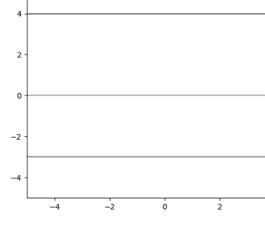

**图 2.1** 三条水平线的图形，其方程（从上到下）分别为 y = 3、y = 0 和 y = -3。

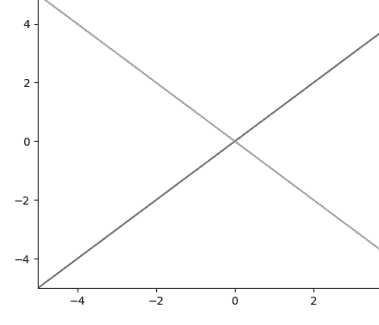

**图 2.2** 两条倾斜线的图形，其方程分别为 y = x 和 y = -x。

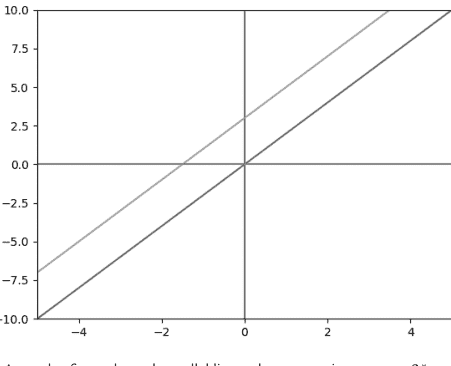

**图 2.3** 两条倾斜平行线的图形，其方程分别为 y = 2*x 和 y = 2*x+3。

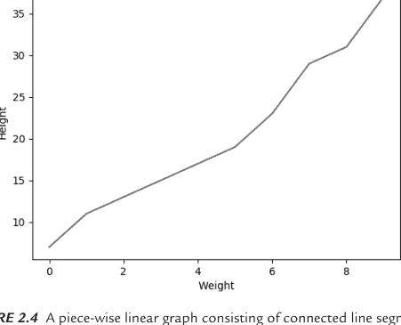

**图 2.4** 由连接线段组成的分段线性图形。

## 使用 NumPy 和 Matplotlib 绘制随机点

上一节包含线段的简单示例，但代码推迟到第 7 章。本节和下一节包含使用 Matplotlib API 的代码示例，这些 API 未被讨论；然而，代码很直接，因此你可以推断其目的。此外，你可以在第 7 章（专注于数据可视化）中了解更多关于 Matplotlib 的信息，或阅读简短的在线教程以获取更多细节。

清单 2.20 展示了 `np_plot.py` 的内容，该文件说明了如何在平面中的直线上绘制多个点。

### 清单 2.20: `np_plot.py`

```python
import numpy as np
import matplotlib.pyplot as plt

x = np.random.randn(15,1)
y = 2.5*x + 5 + 0.2*np.random.randn(15,1)

plt.scatter(x,y)
plt.show()
```

清单 2.20 以两个 `import` 语句开始，然后通过 NumPy `randn()` API 将 `x` 初始化为一组随机值。接下来，`y` 被赋予一系列值，这些值由两部分组成：一个使用 `x` 值作为输入的线性方程，与一个随机化因子相结合。

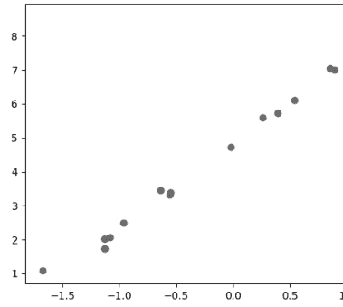

**图 2.5** 清单 2.20 中代码生成的输出。

## 使用 NumPy 和 Matplotlib 绘制二次函数

清单 2.21 展示了 `np_plot_quadratic.py` 的内容，该文件说明了如何在平面中绘制二次函数。

### 清单 2.21: `np_plot_quadratic.py`

```python
import numpy as np
import matplotlib.pyplot as plt
```

x = np.linspace(-5,5,num=100)[:,None]
y = -0.5 + 2.2*x +0.3*x**3+ 2*np.random.randn(100,1)

plt.plot(x,y)
plt.show()

代码清单 2.21 以两个 `import` 语句开始，接着通过 NumPy 的 `linspace()` API 将 `x` 初始化为一个值范围。然后，`y` 被赋予一组符合二次方程的值，这些值基于变量 `x` 的值。

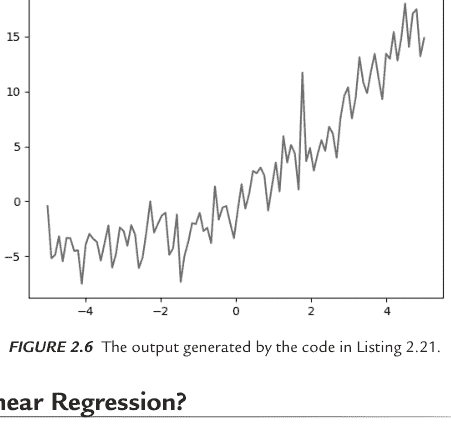

**图 2.6** 由代码清单 2.21 中的代码生成的输出。

## 什么是线性回归？

线性回归创建于 1805 年（两百多年前），是统计分析和机器学习中的一个重要算法。任何像样的统计软件包都支持线性回归，并且无一例外地支持多项式回归。线性回归涉及直线，即一次多项式，而多项式回归则涉及将次数大于一的多项式拟合到数据集。

广义上讲，线性回归寻找最佳拟合超平面的方程来近似一个数据集，其中超平面的次数比数据集的维度少一。具体来说，如果数据集在欧几里得平面上，超平面就是一条直线；如果数据集在三维空间中，超平面就是一个“常规”平面。

当数据集中的点分布得可以合理地用超平面近似时，线性回归是适用的。如果不行，你可以尝试将其他类型的多元多项式曲面拟合到数据集中的点。

请记住另外两个细节。首先，最佳拟合超平面不一定与数据集中的所有（甚至大多数）点相交。事实上，最佳拟合超平面可能与数据集中的任何点都不相交。最佳拟合超平面的目的是尽可能紧密地近似数据集中的点。其次，线性回归与曲线拟合不同，后者试图找到一条通过一组点的多项式。

以下是关于曲线拟合的一些细节。给定平面上的 n 个点（其中任意两点的 x 值不同），存在一个次数小于或等于 n-1 的多项式通过这些点。因此，一条直线（次数为一）通过平面上任意一对非垂直的点。对于平面上的任意三个点，存在一个二次方程或一条直线通过这些点。

在某些情况下，存在次数更低的多项式。例如，考虑一组 100 个点，其中 x 值等于 y 值。直线 y = x（一个一次多项式）通过所有这些点。

然而，一条直线在多大程度上“代表”平面上的一组点，取决于这些点能被直线近似的紧密程度。

## 什么是多元分析？

*多元分析*推广了欧几里得平面上直线的方程，其形式如下：

y = w1*x1 + w2*x2 + . . . + wn*xn + b

如你所见，上述方程包含变量 x1, x2, . . ., xn 的线性组合。在本书中，我们通常处理涉及欧几里得平面中直线的数据集。

## 那么非线性数据集呢？

简单线性回归寻找最适合数据集的直线，但如果数据集不适合平面上的直线怎么办？这是一个很好的问题！在这种情况下，我们寻找其他曲线来近似数据集，例如二次、三次或更高次多项式。然而，这些替代方案涉及权衡，我们稍后会讨论。

另一种可能性是使用连续分段线性函数，它由一组线段组成，其中相邻的线段是连接的。如果一对或多对相邻线段不连接，那么它就是一个分段线性函数（即函数是不连续的）。无论哪种情况，线段都是一次的，这比高阶多项式具有更低的计算复杂度。

因此，给定平面上的一组点，在解决以下问题后，尝试找到最适合这些点的直线：

- 1) 我们如何知道一条直线适合数据？
- 2) 如果不同类型的曲线更适合怎么办？
- 3) “最佳拟合”是什么意思？

检查一条直线是否适合数据的一种方法是通过简单的视觉检查：在图表中显示数据，如果数据合理地符合直线的形状，那么直线可能是一个好的拟合。然而，这是一个主观决定，图 2.7 显示了一个不适合直线的样本数据集。

图 2.7 显示了一个包含四个不适合直线的点的数据集。

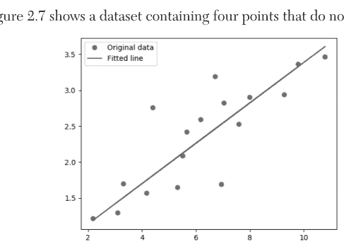

如果一条直线似乎不适合数据，那么二次或三次（甚至更高次）多项式可能更适合。让我们先搁置非线性场景，并假设直线适合数据。有一种众所周知的技术可以为这样的数据集找到最佳拟合直线，它被称为均方误差（MSE）。

## MSE（均方误差）公式

图 2.8 显示了 MSE（均方误差）的公式。MSE 是 *实际* y 值与 *预测* y 值之间差值的平方和除以点数。请注意，预测的 y 值是如果每个数据点实际上在最佳拟合直线上时该数据点将具有的 y 值。

一般来说，目标是最小化误差，这在确定线性回归的最佳拟合直线时起决定性作用。然而，当任何进一步减少误差的时间和/或成本被认为过高时，你可能会满足于一个“足够好”的值，这意味着这个决定不是一个纯粹的程序性决定。

图 2.8 显示了用于计算平面上一组点的最佳拟合直线的 MSE 公式。

$$\text{MSE} = \frac{1}{n} \sum_{i=1}^{n} (Y_i - \hat{Y}_i)^2$$

**图 2.8** MSE 公式。

## 其他误差类型

尽管本书中我们只讨论了线性回归的 MSE，但还有其他类型的误差公式可用于线性回归，其中一些列举如下：

- MSE
- RMSE
- RMSPROP
- MAE

MSE 是上述误差类型的基础。例如，RMSE 是均方根误差，即 MSE 的平方根。

MAE 是 *平均绝对误差*，它是 y 项差值的绝对值之和（而不是 y 项差值的平方和）。

RMSProp 优化器利用近期梯度的大小来规范化梯度。维护 *均方根*（RMS，即 MSE 的平方根）梯度的移动平均值，然后将该项除以当前梯度。

虽然计算 MSE 的导数更容易（因为它是一个可微函数），但 MSE 比 MAE 更容易受到异常值的影响，这也是事实。原因很简单。平方项可能比加上一项的绝对值大得多。例如，如果一个差值项是 10，那么平方项 100 被加到 MSE 中，而只有 10 被加到 MAE 中。同样，如果一个差值项是 −20，那么平方项 400 被加到 MSE 中，而只有 20（即 −20 的绝对值）被加到 MAE 中。

## 非线性最小二乘法

在预测房价时，数据集包含广泛的值，线性回归或随机森林等技术可能会导致模型对最高值的样本过拟合，以减少诸如平均绝对误差之类的量。

在这种情况下，你可能希望使用一种误差度量，例如相对误差，它降低了拟合最大值样本的重要性。这种技术称为 *非线性最小二乘法*，它可能使用基于对数的标签和预测值的转换。

## 手动计算 MSE

让我们看两个简单的图表，每个图表都包含一条近似散点图中一组点的直线。请注意，线段对于两组点是相同的，但数据集略有不同。我们手动计算两个数据集的 MSE，并确定哪个 MSE 值更小。

图 2.9 显示了一组点和一条作为数据最佳拟合直线潜在候选者的直线。

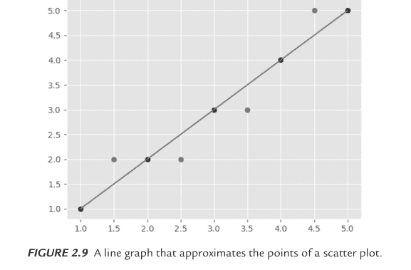

**图 2.9** 近似散点图点的折线图。

图2.9中直线的均方误差计算如下：
MSE = [1*1 + (-1)*(-1) + (-1)*(-1) + 1*1]/7 = 4/7

图2.10也展示了一组点和一条可能作为数据最佳拟合线的直线。

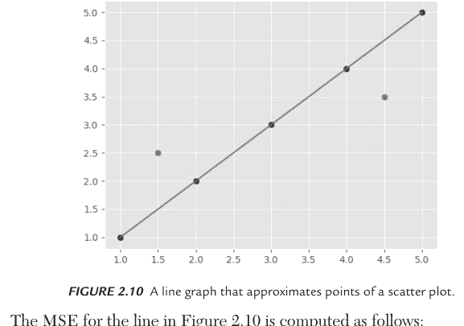

**图2.10** 一条近似散点图中各点的折线图。

图2.10中直线的均方误差计算如下：
MSE = [(-2)*(-2) + 2*2]/7 = 8/7

因此，图2.10中的直线比图2.9中的直线具有更小的均方误差。

在这两幅图中，我们轻松快速地计算了均方误差，但通常情况下，这要困难得多。例如，如果我们在欧几里得平面上绘制10个不紧密拟合于一条直线的点，且各项涉及非整数值，我们可能需要一个计算器。一个更好的解决方案涉及使用NumPy函数，这将在下一节讨论。

## 在NumPy中寻找最佳拟合线

本章前面，你看到了平面中直线的例子，包括水平线、斜线和平行线。这些直线大多具有正斜率和非零的y截距。尽管在平面中存在最佳拟合线具有负斜率的数据点散点图，但本书中的例子涉及的散点图其最佳拟合线都具有正斜率。

清单2.22展示了`find_best_fit.py`的内容，该文件说明了如何确定欧几里得平面中一组点的最佳拟合线。该解决方案基于（来自统计学的）闭式公式。

### 清单2.22：find_best_fit.py

```python
import numpy as np

xs = np.array([1,2,3,4,5], dtype=np.float64)
ys = np.array([1,2,3,4,5], dtype=np.float64)

def best_fit_slope(xs,ys):
    m = (((np.mean(xs)*np.mean(ys))-np.mean(xs*ys)) /
         ((np.mean(xs)**2) - np.mean(xs**2)))
    b = np.mean(ys) - m * np.mean(xs)

    return m, b

m,b = best_fit_slope(xs,ys)
print('m:',m,'b:',b)
```

清单2.22以两个数组`xs`和`ys`开始，它们用前五个正整数初始化。Python函数`best_fit_slope()`计算一组数字的`m`（斜率）和`b`（y截距）的最优值。清单2.22的输出如下：

```
m: 1.0 b: 0.0
```

注意数组`xs`和`ys`是相同的，这意味着这些点位于斜率为1的恒等函数上。通过简单的外推，点(0,0)也在同一条直线上。因此，这条直线的y截距必须等于0。

如果你感兴趣，可以在线搜索找到`m`和`b`值的推导过程。在本章中，我们将跳过推导，继续进行计算均方误差的示例。第一个示例涉及手动计算均方误差，随后是一个使用NumPy公式执行计算的示例。

## 通过逐次逼近计算均方误差（1）

本节包含一个代码示例，该示例使用一种简单技术来逐次确定最佳拟合线的斜率和y截距的更好近似值。回想一下，导数的近似值是“delta y”除以“delta x”的比率。“delta”值分别计算函数上两个相邻点(x1, y1)和(x2, y2)的y值差和x值差。因此，基于delta的近似比率为(y2-y1) / (x2-x1)。

本节中的技术涉及对delta值的简化近似：我们假设分母等于1。因此，我们只需要计算delta值的分子：在本代码示例中，这些分子是变量dw和db。

清单2.23展示了`plain_linreg1.py`的内容，该文件说明了如何使用模拟数据计算均方误差。

### 清单2.23：plain_linreg1.py

```python
import numpy as np
import matplotlib.pyplot as plt

X = [0,0.12,0.25,0.27,0.38,0.42,0.44,0.55,0.92,1.0]
Y = [0,0.15,0.54,0.51,0.34,0.1, 0.19,0.53,1.0,0.58]

losses = []
#步骤1：参数初始化
W = 0.45 # 初始斜率
b = 0.75 # 初始y截距

for i in range(1, 100):
    #步骤2：计算损失
    Y_pred = np.multiply(W, X) + b
    loss_error = 0.5 * (Y_pred - Y)**2
    loss = np.sum(loss_error)/10

    #步骤3：计算dw和db
    db = np.sum((Y_pred - Y))
    dw = np.dot((Y_pred - Y), X)
    losses.append(loss)

    #步骤4：更新参数：
    W = W - 0.01*dw
    b = b - 0.01*db

    if i%10 == 0:
        print("Loss at", i,"iteration = ", loss)

#步骤5：通过一个执行1000次的for循环重复

#绘制损失与迭代次数的关系图
print("W = ", W,"% b = ",  b)

plt.plot(losses)
plt.ylabel('loss')
plt.xlabel('iterations (per tens)')
plt.show()
```

清单2.23定义了变量X和Y，它们是简单的数字数组（这是我们的数据集）。接下来，`losses`数组被初始化为空数组，我们将连续的`loss`近似值附加到此数组中。变量`w`和`b`对应于斜率和y截距，它们分别用值0.45和0.75初始化（你可以随意尝试这些值）。

清单2.23的下一部分是一个执行100次的`for`循环。在每次迭代期间，计算变量`Y_pred`、`loss_error`和`cost`，它们分别对应于预测值、误差和损失（记住我们正在执行线性回归）。然后将`loss`的值（即当前迭代的误差）附加到`losses`数组中。

接下来，计算变量`dw`和`db`。这些对应于我们将用于分别更新`w`和`b`值的“delta w”和“delta b”。代码在此处重现：

```python
#步骤4：更新参数：
w = w - 0.01*dw
b = b - 0.01*db
```

注意`dw`和`db`都乘以了值0.01，这是我们的“学习率”（也请尝试这个值）。

下一个代码片段显示当前损失，这在循环的每第十次迭代时执行。当循环完成执行时，显示`w`和`b`的值，并显示一个图表，其中垂直轴显示损失值，水平轴显示循环迭代次数。清单2.23的输出如下：

```
Loss at 10 iteration =  0.04114630674619491
Loss at 20 iteration =  0.026706242729839395
Loss at 30 iteration =  0.024738889446900423
Loss at 40 iteration =  0.023850565034634254
Loss at 50 iteration =  0.0231499048706651
Loss at 60 iteration =  0.02255361434242207
Loss at 70 iteration =  0.0220425055291673
Loss at 80 iteration =  0.021604128492245713
Loss at 90 iteration =  0.021228111750568435
w =  0.47256473531193927 & b =  0.19578262688662174
```

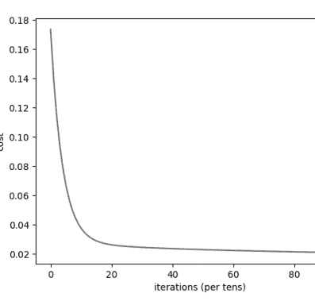

**图2.11** 清单2.23的损失与迭代次数关系图。

## 通过逐次逼近计算均方误差（2）

在上一节中，你看到了如何计算delta近似值来确定二维平面中一组点的最佳拟合线方程。本节中的示例通过添加一个表示epoch数量的外部循环来泛化上一节的代码。epoch数量指定了内部循环执行的次数。

清单2.24展示了`plain_linreg2.py`的内容，该文件说明了如何使用模拟数据计算均方误差。

### 清单2.24：plain_linreg2.py

```python
import numpy as np
import matplotlib.pyplot as plt

# %matplotlib inline
X = [0,0.12,0.25,0.27,0.38,0.42,0.44,0.55,0.92,1.0]
Y = [0,0.15,0.54,0.51, 0.34,0.1,0.19,0.53,1.0,0.58]

#取消注释以查看X与Y值的关系图
#plt.plot(X,Y)
#plt.show()

losses = []
#步骤1：参数初始化
W = 0.45
b = 0.75

epochs = 100
lr = 0.001

for j in range(1, epochs):
    for i in range(1, 100):
        #步骤2：计算损失
        Y_pred = np.multiply(W, X) + b
        loss_error = 0.5 * (Y_pred - Y)**2
        Loss = np.sum(loss_error)/10

        #步骤3：计算dW和db
        db = np.sum((Y_pred - Y))
        dw = np.dot((Y_pred - Y), X)
        costs.append(cost)

        #步骤4：更新参数：
        W = W - lr*dw
        b = b - lr*db

        if i%50 == 0:
            print("Loss at epoch", j, "= ", loss)

#绘制损失与迭代次数的关系图
print("W = ", W, "& b = ", b)
plt.plot(losses)
plt.ylabel('loss')
plt.xlabel('iterations (per tens)')
plt.show()
```

将清单2.24的新内容（以粗体显示）与清单2.23的内容进行比较。更改很小，主要区别在于外部循环的每次迭代都执行内部循环100次，而外部循环也执行100次。清单2.24的输出如下：

```
('Loss at epoch', 1, '= ', 0.07161762489862147)
('Loss at epoch', 2, '= ', 0.030073922512586938)
('Loss at epoch', 3, '= ', 0.025415528992988472)
('Loss at epoch', 4, '= ', 0.024227826373677794)
('Loss at epoch', 5, '= ', 0.02346241967071181)
('Loss at epoch', 6, '= ', 0.022827707922883803)
('Loss at epoch', 7, '= ', 0.022284262669854064)
('Loss at epoch', 8, '= ', 0.02181735173716673)
('Loss at epoch', 9, '= ', 0.021416050179776294)
('Loss at epoch', 10, '= ', 0.02107112540934384)
// 为简洁起见省略了详细信息
('Loss at epoch', 90, '= ', 0.018960749188638278)
('Loss at epoch', 91, '= ', 0.01896074755776306)
('Loss at epoch', 92, '= ', 0.018960746155994725)
('Loss at epoch', 93, '= ', 0.018960744951148113)
```

('第94轮损失', 94, '= ', 0.018960743915559485)
('第95轮损失', 95, '= ', 0.018960743025451313)
('第96轮损失', 96, '= ', 0.018960742260386375)
('第97轮损失', 97, '= ', 0.018960741602798474)
('第98轮损失', 98, '= ', 0.018960741037589136)
('第99轮损失', 99, '= ', 0.018960740551780944)
('W = ', 0.6764145874436108, '& b = ', 0.09976839618922698)

图2.12展示了代码清单2.12输出的损失与迭代次数关系图。

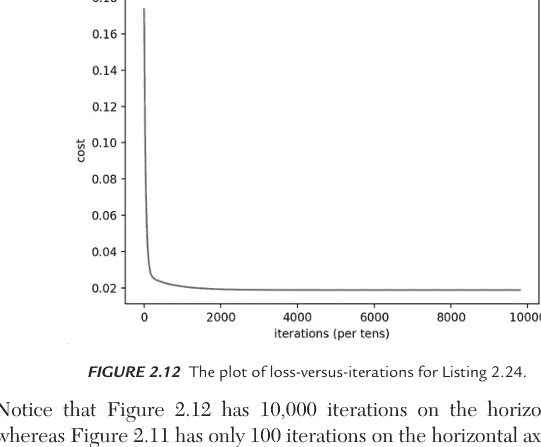

**图2.12** 代码清单2.24的损失与迭代次数关系图。

请注意，图2.12的横轴显示10,000次迭代，而图2.11的横轴仅显示100次迭代。

## Google Colaboratory

根据硬件配置，基于GPU的TF 2代码通常比基于CPU的TF 2代码快至少15倍。然而，优质GPU的成本可能是一个重要因素。虽然NVIDIA提供GPU，但这些消费级GPU并未针对多GPU支持进行优化（而TF 2*支持*多GPU）。

幸运的是，Google Colaboratory提供了一个经济实惠的替代方案，它提供免费的GPU支持，并且作为Jupyter notebook环境运行。此外，Google Colaboratory在云端执行您的代码，无需任何配置，并且可以在线访问：

https://colab.research.google.com/notebooks/welcome.ipynb

Jupyter notebook适用于快速训练简单模型和测试想法。Google Colaboratory使得上传本地文件、在Jupyter notebook中安装软件，甚至将Google Colaboratory连接到您本地机器的Jupyter运行时变得轻而易举。

Colaboratory支持的一些功能包括使用GPU执行TF 2、使用Matplotlib进行可视化，以及通过以下步骤将您的Google Colaboratory notebook副本保存到Github：

```
File > Save a copy to GitHub.
```

此外，您只需将路径添加到URL colab.research.google.com/github/，即可加载GitHub上的任何.ipynb文件（详情请参阅Colaboratory网站）。

Google Colaboratory支持其他技术，如HTML和SVG，使您能够在Google Colaboratory的notebook中渲染基于SVG的图形。有一点需要注意：您在Google Colaboratory notebook中安装的任何软件仅在当前会话期间可用。如果您注销后重新登录，需要执行与之前Google Colaboratory会话期间相同的安装步骤。

如前所述，Google Colaboratory还有一个很棒的功能。您每天可以免费在GPU或TPU上执行代码长达十二小时。这种免费支持对于本地机器上没有合适GPU的用户（可能是大多数用户）来说极其有用。您可以在不到20或30分钟内启动TF 2代码来训练神经网络，否则这可能需要数小时的基于CPU的执行时间。

您还可以使用以下命令在Google Colaboratory notebook中启动Tensorboard（将指定目录替换为您自己的位置）：

```
%tensorboard --logdir /logs/images
```

请记住关于Google Colaboratory的以下细节。首先，每当您连接到Google Colaboratory中的服务器时，您就开始了一个所谓的会话。您可以在会话中使用CPU（默认）、GPU或TPU（免费提供）执行代码，并且可以在会话中无时间限制地执行代码。但是，如果您为会话选择GPU或TPU选项，*只有前12小时的GPU执行时间是免费的*。

您在给定会话期间在Jupyter notebook中安装的任何软件在退出该会话时*不会*被保存。例如，以下代码片段在Jupyter notebook中安装TFLearn：

```
!pip install tflearn
```

当您退出当前会话并稍后启动新会话时，您需要重新安装所有库（即通过!pip install），例如Github仓库，这些库您也在之前的任何会话中安装过。

顺便提一下，您也可以在Google Colaboratory中运行TF 2代码和TensorBoard。请访问此链接获取更多信息：

https://www.tensorflow.org/tensorboard/r2/tensorboard_in_notebooks

## 在Google Colaboratory中上传CSV文件

代码清单2.25展示了`upload_csv_file.ipynb`的内容，说明了如何在Google Colaboratory notebook中上传CSV文件。

**代码清单2.25：upload_csv_file.ipynb**

```
import pandas as pd

from google.colab import files
uploaded = files.upload()

df = pd.read_csv("weather_data.csv")
print("dataframe df:")
df
```

代码清单2.25上传了CSV文件`weather_data.csv`，其内容未显示，因为对于本示例来说并不重要。以粗体显示的代码是上传CSV文件所需的Colaboratory特定代码。当您运行此代码时，您将看到一个标有“Browse”的小按钮，您必须单击它，然后选择代码片段中列出的CSV文件。执行此操作后，其余代码将执行，您将在浏览器会话中看到CSV文件的内容。

> **注意** 如果您想在Google Colaboratory中成功运行此Jupyter notebook，必须提供CSV文件`weather_data.csv`。

## 总结

本章向您介绍了Python的NumPy库。您学习了如何编写包含循环、数组和列表的Python脚本。您还了解了如何处理点积、`reshape()`方法、使用Matplotlib绘图以及线性回归示例。

然后您学习了如何处理数组的子范围，以及向量和数组的负子范围，这两者对于在机器学习任务中提取数据集的部分内容都很有用。您还看到了其他NumPy操作，例如`reshape()`方法，这在处理图像文件时非常有用（且非常常见）。

接下来，您学习了如何使用NumPy进行线性回归、均方误差（MSE），以及如何使用`linspace()`方法计算MSE。最后，您对Google Colaboratory有了初步了解，在那里您可以在运行Jupyter notebook时利用免费的GPU时间。

# 第3章

# PANDAS简介

本章向您介绍Pandas，并提供一些代码示例来说明其一些有用的功能。如果您熟悉这些主题，请浏览材料并查看代码示例，以防它们包含一些新信息。

本章的第一部分包含Pandas的简要介绍。本节包含一些代码示例，说明数据框的一些功能，并简要讨论了序列，这是Pandas的两个主要功能。

本章的第二部分讨论了您可以创建的各种类型的数据框，例如数值型和布尔型数据框。此外，我们讨论了使用NumPy函数和随机数创建数据框的示例。我们还研究了Python字典和基于JSON的数据之间转换的示例，以及如何从基于JSON的数据创建Pandas数据框。

## 什么是Pandas？

Pandas是一个Python库，与其他Python包（如NumPy和Matplotlib）兼容。通过打开命令shell并调用以下命令来安装Pandas（适用于Python 3.x）：

```
pip3 install pandas
```

在许多方面，Pandas库中API的语义类似于电子表格，并支持XSL、XML、HTML和CSV文件类型。Pandas提供了一种称为数据框的数据类型（类似于Python字典），具有极其强大的功能。

Pandas数据框支持多种输入类型，如`ndarray`、`list`、`dict`或`Series`。

数据类型`Series`是管理数据的另一种机制。除了在线搜索有关`series`的更多细节外，以下文章包含一个很好的介绍：

https://towardsdatascience.com/20-examples-to-master-pandas-series-bc4c68200324

## Pandas选项和设置

您可以更改环境变量的默认值：

```
import pandas as pd

display_settings = {
    'max_columns': 8,
    'expand_frame_repr': True,  # Wrap to multiple pages
    'max_rows': 20,
    'precision': 3,
    'show_dimensions': True
}

for op, value in display_settings.items():
    pd.set_option("display.{}".format(op), value)
```

如果您希望Pandas最多显示20行和8列，并且浮点数显示3位小数，请在您自己的代码中包含前面的代码块。如果您希望输出“换行”到多个页面，请将`expand_frame_repr`设置为`True`。前面的`for`循环遍历`display_settings`并将选项设置为它们对应的值。

此外，以下代码片段显示了您代码中所有Pandas选项及其当前值：

```
print(pd.describe_option())
```

您可以对选项及其值执行各种其他操作（例如用于重置值的`pd.reset()`方法），如Pandas用户指南中所述：

https://pandas.pydata.org/pandas-docs/stable/user_guide/options.html

## Pandas数据框

简而言之，Pandas数据框是一个二维数据结构，从行和列的角度来思考数据结构很方便。数据框可以有标签（行和列），并且列可以包含不同的数据类型。Pandas 数据框的数据集来源可以是数据文件、数据库表或 Web 服务。数据框的功能包括：

- 数据框方法
- 数据框统计
- 分组、透视和重塑
- 处理缺失数据
- 连接数据框

本章中的代码示例将向你展示上述列表中几乎所有的功能。

## 数据框与数据清理任务

你需要执行的具体任务取决于数据集的结构和内容。通常，你会执行一个包含以下步骤的工作流程，这些步骤不一定总是按此顺序进行（有些可能是可选的）。以下所有步骤都可以使用 Pandas 数据框来完成：

- 将数据读入数据框
- 显示数据框的顶部
- 显示列数据类型
- 显示非缺失值
- 用某个值替换 NA
- 遍历各列
- 计算每列的统计信息
- 查找缺失值
- 缺失值总数
- 缺失值百分比
- 对表格值进行排序
- 打印摘要信息
- 缺失值超过 50% 的列
- 重命名列

本章包含若干小节，说明如何执行上述列表中的许多步骤。

## Pandas 的替代方案

在深入探讨代码示例之前，有一些 Pandas 的替代方案提供了有用的功能，其中一些列在下面的列表中：

- PySpark（用于大型数据集）
- Dask（用于分布式处理）
- Modin（更快的性能）
- Datatable（Python 版的 R data.table）

包含这些替代方案并非意在贬低 Pandas。实际上，你可能不需要上述列表中的任何功能。然而，你将来可能需要这样的功能，因此现在了解这些替代方案是值得的（而且未来可能会有更强大的替代方案）。

## 使用 NumPy 示例的 Pandas 数据框

清单 3.1 展示了 `pandas_df.py` 的内容，说明了如何定义几个数据框并显示它们的内容。

**清单 3.1：pandas_df.py**

```python
import pandas as pd
import numpy as np

myvector1 = np.array([1,2,3,4,5])
print("myvector1:")
print(myvector1)
print()

mydf1 = pd.DataFrame(myvector1)
print("mydf1:")
print(mydf1)
print()

myvector2 = np.array([i for i in range(1,6)])
print("myvector2:")
print(myvector2)
print()

mydf2 = pd.DataFrame(myvector2)
print("mydf2:")
print(mydf2)
print()

myarray = np.array([[10,30,20], [50,40,60],[1000,2000,3000]])
print("myarray:")
print(myarray)
print()

mydf3 = pd.DataFrame(myarray)
print("mydf3:")
print(mydf3)
print()
```

清单 3.1 以 Pandas 和 NumPy 的标准 `import` 语句开始，接着定义了两个一维 NumPy 数组和一个二维 NumPy 数组。每个 NumPy 变量后面都跟着一个相应的 Pandas 数据框（`mydf1`、`mydf2` 和 `mydf3`）。现在运行清单 3.1 中的代码，你将看到以下输出，你可以比较 NumPy 数组和 Pandas 数据框。

```
myvector1:
[1 2 3 4 5]

mydf1:
   0
0  1
1  2
2  3
3  4
4  5

myvector2:
[1 2 3 4 5]

mydf2:
   0
0  1
1  2
2  3
3  4
4  5

myarray:
[[   10    30    20]
 [   50    40    60]
 [ 1000  2000  3000]]

mydf3:
       0     1     2
0     10    30    20
1     50    40    60
2   1000  2000  3000
```

相比之下，以下代码块说明了如何定义一个 Pandas Series：

```python
names = pd.Series(['SF', 'San Jose', 'Sacramento'])
sizes = pd.Series([852469, 1015785, 485199])
df = pd.DataFrame({ 'Cities': names, 'Size': sizes })
print(df)
```

创建一个包含上述代码（以及所需的 `import` 语句）的 Python 文件，当你运行该代码时，你将看到以下输出：

```
City name    sizes
0          SF  852469
1    San Jose  1015785
2  Sacramento   485199
```

## 描述 Pandas 数据框

清单 3.2 展示了 `pandas_df_describe.py` 的内容，说明了如何定义一个包含 3x3 整数 NumPy 数组的 Pandas 数据框，其中数据框的行和列都有标签。数据框的其他方面也会被显示。

**清单 3.2：pandas_df_describe.py**

```python
import numpy as np
import pandas as pd

myarray = np.array([[10,30,20], [50,40,60],[1000,2000,3000]])

rownames = ['apples', 'oranges', 'beer']
colnames = ['January', 'February', 'March']

mydf = pd.DataFrame(myarray, index=rownames, columns=colnames)
print("contents of df:")
print(mydf)
print()

print("contents of January:")
print(mydf['January'])
print()

print("Number of Rows:")
print(mydf.shape[0])
print()

print("Number of Columns:")
print(mydf.shape[1])
print()

print("Number of Rows and Columns:")
print(mydf.shape)
print()

print("Column Names:")
print(mydf.columns)
print()

print("Column types:")
print(mydf.dtypes)
print()

print("Description:")
print(mydf.describe())
print()
```

清单 3.2 以两个标准的 `import` 语句开始，然后是变量 `myarray`，这是一个 3x3 的数字 NumPy 数组。变量 `rownames` 和 `colnames` 分别为 Pandas 数据框 `mydf` 的行和列提供名称，`mydf` 使用指定的数据源（即 `myarray`）初始化为一个 Pandas 数据框。

下面输出的第一部分需要一个 `print` 语句（它只是显示 `mydf` 的内容）。输出的第二部分是通过调用任何 Pandas 数据框都可用的 `describe()` 方法生成的。`describe()` 方法很有用：你会看到各种统计量，如均值、标准差、最小值和最大值，这些是按 `columns`（而不是行）计算的，以及第 25、50 和 75 百分位数的值。清单 3.2 的输出如下：

```
contents of df:
          January  February  March
apples         10        30     20
oranges        50        40     60
beer         1000      2000   3000

contents of January:
apples       10
oranges      50
beer       1000
Name: January, dtype: int64

Number of Rows:
3

Number of Columns:
3

Number of Rows and Columns:
(3, 3)

Column Names:
Index(['January', 'February', 'March'], dtype='object')

Column types:
January    int64
February   int64
March      int64
dtype: object

Description:
          January   February      March
count  3.000000  3.000000  3.000000
mean 353.333333 690.000000 1026.666667
std  560.386771 1134.504297 1709.073823
min   10.000000  30.000000  20.000000
25%   30.000000  35.000000  40.000000
50%   50.000000  40.000000  60.000000
75%  525.000000 1020.000000 1530.000000
max 1000.000000 2000.000000 3000.000000
```

## Pandas 布尔数据框

Pandas 支持数据框上的布尔运算，例如逻辑或、逻辑与以及一对数据框的逻辑非。清单 3.3 展示了 `pandas_boolean_df.py` 的内容，说明了如何定义一个行和列都是布尔值的 Pandas 数据框。

**清单 3.3：pandas_boolean_df.py**

```python
import pandas as pd

df1 = pd.DataFrame({'a': [1, 0, 1], 'b': [0, 1, 1] }, dtype=bool)
df2 = pd.DataFrame({'a': [0, 1, 1], 'b': [1, 1, 0] }, dtype=bool)

print("df1 & df2:")
print(df1 & df2)

print("df1 | df2:")
print(df1 | df2)

print("df1 ^ df2:")
print(df1 ^ df2)
```

清单 3.3 初始化了数据框 `df1` 和 `df2`，然后计算 `df1 & df2`、`df1 | df2` 和 `df1 ^ df2`，它们分别表示 `df1` 和 `df2` 的逻辑与、逻辑或和逻辑非。运行清单 3.3 中代码的输出如下：

```
df1 & df2:
      a     b
0  False  False
1  False   True
2   True  False
df1 | df2:
      a     b
0   True   True
1   True   True
2   True   True
df1 ^ df2:
      a     b
0   True   True
1   True  False
2  False   True
```

## 转置 Pandas 数据框

T 属性（以及 transpose 函数）使你能够生成 Pandas 数据框的转置，类似于 NumPy ndarray。转置操作将行转换为列，将列转换为行。例如，以下代码片段定义了一个 Pandas 数据框 df1，然后显示 df1 的转置：

```python
df1 = pd.DataFrame({'a': [1, 0, 1], 'b': [0, 1, 1] }, dtype=int)

print("df1.T:")
print(df1.T)
```

输出如下：

```
df1.T:
   0  1  2
a  1  0  1
b  0  1  1
```

以下代码片段定义了 Pandas 数据框 df1 和 df2，然后显示它们的和：

```python
df1 = pd.DataFrame({'a' : [1, 0, 1], 'b' : [0, 1, 1] }, dtype=int)
df2 = pd.DataFrame({'a' : [3, 3, 3], 'b' : [5, 5, 5] }, dtype=int)

print("df1 + df2:")
print(df1 + df2)
```

输出如下：

```
df1 + df2:
   a  b
0  4  5
1  3  6
2  4  6
```

## Pandas 数据框与随机数

清单 3.4 展示了 `pandas_random_df.py` 的内容，该示例演示了如何创建一个包含随机数的 Pandas 数据框。

**清单 3.4：pandas_random_df.py**

```python
import pandas as pd
import numpy as np

df = pd.DataFrame(np.random.randint(1, 5, size=(5, 2)),
                  columns=['a','b'])
df = df.append(df.agg(['sum', 'mean']))

print("Contents of data frame:")
print(df)
```

清单 3.4 定义了一个名为 `df` 的 Pandas 数据框，它包含 5 行 2 列，数据是 1 到 5 之间的随机整数。请注意，`df` 的列被标记为 “a” 和 “b”。此外，接下来的代码片段追加了两行，分别包含两列数字的总和与平均值。清单 3.4 的输出如下：

```
a    b
0    1.0  2.0
1    1.0  1.0
2    4.0  3.0
3    3.0  1.0
4    1.0  2.0
sum  10.0  9.0
mean  2.0  1.8
```

清单 3.5 展示了 `pandas_combine_df.py` 的内容，该示例演示了如何组合 Pandas 数据框。

**清单 3.5：pandas_combine_df.py**

```python
import pandas as pd
import numpy as np

df = pd.DataFrame({'foo1' : np.random.randn(5),
                   'foo2' : np.random.randn(5)})

print("contents of df:")
print(df)

print("contents of foo1:")
print(df.foo1)

print("contents of foo2:")
print(df.foo2)
```

清单 3.5 定义了一个名为 `df` 的 Pandas 数据框，它包含 5 行 2 列（标记为 `foo1` 和 `foo2`），数据是 0 到 5 之间的随机实数。清单 3.5 的下一部分展示了 `df` 和 `foo1` 的内容。清单 3.5 的输出如下：

```
contents of df:
         foo1      foo2
0  0.274680 -0.848669
1 -0.399771 -0.814679
2  0.454443 -0.363392
3  0.473753  0.550849
4 -0.211783 -0.015014
contents of foo1:
0    0.256773
1    1.204322
2    1.040515
3   -0.518414
4    0.634141
Name: foo1, dtype: float64
contents of foo2:
0   -2.506550
1   -0.896516
2   -0.222923
3    0.934574
4    0.527033
Name: foo2, dtype: float64
```

## 在 Pandas 中读取 CSV 文件

Pandas 提供了 `read_csv()` 方法来读取 CSV 文件的内容。例如，清单 3.6 展示了 `sometext.txt` 的内容，其中包含带标签的数据（`spam` 或 `ham`），清单 3.7 展示了 `read_csv_file.py` 的内容，该示例演示了如何读取 CSV 文件的内容。

**清单 3.6：sometext.txt**

```
type    text
ham     I'm telling the truth
spam    What a deal such a deal!
spam    Free vacation for your family
ham     Thank you for your help
spam    Spring break next week!
ham     I received the documents
spam    One million dollars for you
ham     My wife got covid19
spam    You might have won the prize
ham     Everyone is in good health
```

**清单 3.7：read_csv_file.py**

```python
import pandas as pd
import numpy as np

df = pd.read_csv('sometext.csv', delimiter='\t')

print("=> First five rows:")
print(df.head(5))
```

清单 3.7 读取 `sometext.csv` 的内容，其列由制表符（`\t`）分隔符分隔。运行清单 3.7 中的代码，将看到以下输出：

```
=> First five rows:
   type                          text
0  ham          I'm telling the truth
1  spam    What a deal such a deal!
2  spam  Free vacation for your family
3  ham        Thank you for your help
4  spam      Spring break next week!
```

`head()` 方法的默认值是 5，但你可以使用代码片段 `df.head(n)` 来显示数据框 `df` 的前 n 行。

你也可以使用 `sep` 参数指定不同的分隔符，以及使用 `names` 参数指定要读取的数据中的列名，示例如下：

```python
df2 = pd.read_csv("data.csv",sep="|",
                  names=["Name","Surname","Height","Weight"])
```

Pandas 还提供了 `read_table()` 方法来读取 CSV 文件的内容，其语法与 `read_csv()` 方法相同。

## Pandas 中的 loc() 和 iloc() 方法

如果你想显示数据框中某条记录的内容，请在 `loc()` 方法中指定行的索引。例如，以下代码片段按特征名显示数据框 `df` 中的数据：

```python
df.loc[feature_name]
```

选择数据框中 “height” 列的第一行：

```python
df.loc([0], ['height'])
```

以下代码片段使用 `iloc()` 函数显示 name 列的前 8 条记录：

```python
df.iloc[0:8]['name']
```

## 将分类数据转换为数值数据

机器学习中的一个常见任务是将包含字符数据的特征转换为包含数值数据的特征。清单 3.8 展示了 `cat2numeric.py` 的内容，该示例演示了如何用相应的数值字段替换文本字段。

**清单 3.8：cat2numeric.py**

```python
import pandas as pd
import numpy as np

df = pd.read_csv('sometext.csv', delimiter='\t')

print("=> First five rows (before):")
print(df.head(5))
print("-----------------------------")
print()

# map ham/spam to 0/1 values:
df['type'] = df['type'].map( {'ham':0 , 'spam':1} )

print("=> First five rows (after):")
print(df.head(5))
print("-----------------------------")
```

清单 3.8 使用 CSV 文件 `sometext.csv` 的内容初始化数据框 `df`，然后通过调用 `df.head(5)` 显示前五行的内容，这也是默认显示的行数。

清单 3.8 中的下一个代码片段调用 `map()` 方法，将标记为 `type` 的列中所有出现的 `ham` 替换为 0，将所有出现的 `spam` 替换为 1，如下所示：

```python
df['type'] = df['type'].map( {'ham':0 , 'spam':1} )
```

清单 3.8 的最后一部分再次调用 `head()` 方法，以显示重命名列内容后数据集的前五行。运行清单 3.8 中的代码，将看到以下输出：

```
=> First five rows (before):
   type                    text
0   ham      I'm telling the truth
1  spam  What a deal such a deal!
2  spam  Free vacation for your family
3   ham      Thank you for your help
4  spam      Spring break next week!
-------------------------
=> First five rows (after):
   type                          text
0    0       I'm telling the truth
1    1  What a deal such a deal!
2    1  Free vacation for your family
3    0      Thank you for your help
4    1      Spring break next week!
-------------------------
```

作为另一个示例，清单 3.9 展示了 `shirts.csv` 的内容，清单 3.10 展示了 `shirts.py` 的内容；这些示例演示了四种将分类数据转换为数值数据的技术。

**清单 3.9：shirts.csv**

```
type,ssize
shirt,xxlarge
shirt,xxlarge
shirt,xlarge
shirt,xlarge
shirt,xlarge
shirt,large
shirt,medium
shirt,small
shirt,small
shirt,xsmall
shirt,xsmall
shirt,xsmall
```

**清单 3.10：shirts.py**

```python
import pandas as pd

shirts = pd.read_csv("shirts.csv")
print("shirts before:")
print(shirts)
print()

# TECHNIQUE #1:
#shirts.loc[shirts['ssize']=='xxlarge','size'] = 4
#shirts.loc[shirts['ssize']=='xlarge', 'size'] = 4
#shirts.loc[shirts['ssize']=='large',  'size'] = 3
#shirts.loc[shirts['ssize']=='medium', 'size'] = 2
#shirts.loc[shirts['ssize']=='small',  'size'] = 1
#shirts.loc[shirts['ssize']=='xsmall', 'size'] = 1

# TECHNIQUE #2:
#shirts['ssize'].replace('xxlarge', 4, inplace=True)
#shirts['ssize'].replace('xlarge',  4, inplace=True)
#shirts['ssize'].replace('large',   3, inplace=True)
#shirts['ssize'].replace('medium',  2, inplace=True)
#shirts['ssize'].replace('small', 1, inplace=True)
#shirts['ssize'].replace('xsmall', 1, inplace=True)

# TECHNIQUE #3:
#shirts['ssize'] = shirts['ssize'].apply({'xxlarge':4,
# 'xlarge':4, 'large':3, 'medium':2, 'small':1, 'xsmall':1}.get)

# TECHNIQUE #4:
shirts['ssize'] = shirts['ssize'].replace(regex='xlarge', value=4)
shirts['ssize'] = shirts['ssize'].replace(regex='large', value=3)
shirts['ssize'] = shirts['ssize'].replace(regex='medium', value=2)
shirts['ssize'] = shirts['ssize'].replace(regex='small', value=1)

print("shirts after:")
print(shirts)
```

清单 3.10 以一个包含六条语句的代码块开始，该代码块使用与字符串的直接比较来进行数值替换。例如，以下代码片段将所有出现的字符串 `xxlarge` 替换为值 4：

```python
shirts.loc[shirts['ssize']=='xxlarge','size'] = 4
```

第二个代码块由六条语句组成，使用 `replace()` 方法执行相同的更新，示例如下：

```python
shirts['ssize'].replace('xxlarge', 4, inplace=True)
```

第三个代码块由一条语句组成，使用 `apply()` 方法执行相同的更新，如下所示：

```python
shirts['ssize'] = shirts['ssize'].apply({'xxlarge':4,
'xlarge':4, 'large':3, 'medium':2, 'small':1, 'xsmall':1}.get)
```

第四个代码块由四条语句组成，使用正则表达式执行相同的更新，示例如下：

```python
shirts['ssize'] = shirts['ssize'].replace(regex='xlarge', value=4)
```

由于前面的代码片段同时匹配 `xxlarge` 和 `xlarge`，因此我们只需要四条语句而不是六条。（如果你不熟悉正则表达式，可以阅读相关附录。）现在运行清单 3.10 中的代码，将看到以下输出：

```
shirts before
   type     size
0  shirt  xxlarge
1  shirt  xxlarge
2  shirt   xlarge
3  shirt   xlarge
4  shirt   xlarge
5  shirt    large
6  shirt   medium
```

## 在 Pandas 中匹配和分割字符串

清单 3.11 展示了 `shirts_str.py` 的内容，该示例演示了如何将列值与初始字符串进行匹配，以及如何根据字母分割列值。

**清单 3.11：shirts_str.py**

```python
import pandas as pd

shirts = pd.read_csv("shirts.csv")
print("shirts:")
print(shirts)
print()

print("shirts starting with xl:")
print(shirts[shirts.ssize.str.startswith('xl')])
print()

print("Exclude 'xlarge' shirts:")
print(shirts[shirts['ssize'] != 'xlarge'])
print()

print("first three letters:")
shirts['sub1'] = shirts['ssize'].str[:3]
print(shirts)
print()

print("split ssize on letter 'a':")
shirts['sub2'] = shirts['ssize'].str.split('a')
print(shirts)
print()

print("Rows 3 through 5 and column 2:")
print(shirts.iloc[2:5, 2])
print()
```

清单 3.11 使用 CSV 文件 `shirts.csv` 的内容初始化数据框 `df`，然后显示 `df` 的内容。清单 3.11 中的下一个代码片段使用 `startswith()` 方法匹配以字母 `xl` 开头的衬衫类型，随后是一个显示尺寸不等于字符串 `xlarge` 的衬衫的代码片段。

下一个代码片段使用构造 `str[:3]` 来显示衬衫类型的前三个字母，随后是一个使用 `split()` 方法根据字母 "a" 分割衬衫类型的代码片段。

最后一个代码片段调用 `iloc[2:5,2]` 来显示第 3 到第 5 行（包含）以及仅第二列的内容。清单 3.11 的输出如下：

```
shirts:
    type    ssize
0   shirt   xxlarge
1   shirt   xxlarge
2   shirt   xlarge
3   shirt   xlarge
4   shirt   xlarge
5   shirt   large
6   shirt   medium
7   shirt   small
8   shirt   small
9   shirt   xsmall
10  shirt   xsmall
11  shirt   xsmall

shirts starting with xl:
    type    ssize
2   shirt   xlarge
3   shirt   xlarge
4   shirt   xlarge

Exclude 'xlarge' shirts:
    type    ssize
0   shirt   xxlarge
1   shirt   xxlarge
5   shirt   large
6   shirt   medium
7   shirt   small
8   shirt   small
9   shirt   xsmall
10  shirt   xsmall
11  shirt   xsmall

first three letters:
    type  ssize sub1
0  shirt xxlarge xxl
1  shirt xxlarge xxl
2  shirt  xlarge xla
3  shirt  xlarge xla
4  shirt  xlarge xla
5  shirt   large lar
6  shirt  medium med
7  shirt   small sma
8  shirt   small sma
9  shirt  xsmall xsm
10 shirt  xsmall xsm
11 shirt  xsmall xsm

split ssize on letter 'a':
    type  ssize sub1      sub2
0  shirt xxlarge xxl  [xxl, rge]
1  shirt xxlarge xxl  [xxl, rge]
2  shirt  xlarge xla  [xl, rge]
3  shirt  xlarge xla  [xl, rge]
4  shirt  xlarge xla  [xl, rge]
5  shirt   large lar  [l, rge]
6  shirt   medium med  [medium]
7  shirt   small sma  [sm, ll]
8  shirt   small sma  [sm, ll]
9  shirt  xsmall xsm  [xsm, ll]
10 shirt  xsmall xsm  [xsm, ll]
11 shirt  xsmall xsm  [xsm, ll]

Rows 3 through 5 and column 2:
2  xlarge
3  xlarge
4  xlarge
Name: ssize, dtype: object
```

## 在 Pandas 中将字符串转换为日期

清单 3.12 展示了 `string2date.py` 的内容，该示例演示了如何将字符串转换为日期格式。

**清单 3.12：string2date.py**

```python
import pandas as pd

bdates1 = {'strdates': ['20210413','20210813','20211225'],
           'people': ['Sally','Steve','Sarah']
          }

df1 = pd.DataFrame(bdates1, columns = ['strdates','people'])
df1['dates'] = pd.to_datetime(df1['strdates'],
format='%Y%m%d')
print("=> Contents of data frame df1:")
print(df1)
print()
print(df1.dtypes)
print()

bdates2 = {'strdates': ['13Apr2021','08Aug2021','25Dec2021'],
           'people': ['Sally','Steve','Sarah']
          }

df2 = pd.DataFrame(bdates2, columns = ['strdates','people'])
df2['dates'] = pd.to_datetime(df2['strdates'],
format='%d%b%Y')
print("=> Contents of data frame df2:")
print(df2)
print()

print(df2.dtypes)
print()
```

清单 3.12 使用 `bdates1` 的内容初始化数据框 `df1`，然后使用 `%Y%m%d` 格式将 `strdates` 列转换为日期。清单 3.12 的下一部分使用 `bdates2` 的内容初始化数据框 `df2`，然后使用 `%d%b%Y` 格式将 `strdates` 列转换为日期。现在运行清单 3.12 中的代码，将看到以下输出：

```
=> Contents of data frame df1:
  strdates people       dates
0  20210413  Sally  2021-04-13
1  20210813  Steve  2021-08-13
2  20211225  Sarah  2021-12-25

strdates            object
people              object
dates        datetime64[ns]
dtype: object

=> Contents of data frame df2:
   strdates people       dates
0  13Apr2021  Sally  2021-04-13
1  08Aug2021  Steve  2021-08-08
2  25Dec2021  Sarah  2021-12-25

strdates            object
people              object
dates        datetime64[ns]
dtype: object
```

## 在 Pandas 中合并和分割列

清单 3.13 展示了 `employees.csv` 的内容，清单 3.14 展示了 `emp_merge_split.py` 的内容；这些示例演示了如何合并和分割 CSV 文件的列。

**清单 3.13：employees.csv**

```
name,year,month
Jane-Smith,2015,Aug
Dave-Smith,2020,Jan
Jane-Jones,2018,Dec
Jane-Stone,2017,Feb
Dave-Stone,2014,Apr
Mark-Aster,,Oct
Jane-Jones,NaN,Jun
```

**清单 3.14：emp_merge_split.py**

```python
import pandas as pd

emps = pd.read_csv("employees.csv")
print("emps:")
print(emps)
print()

emps['year']  = emps['year'].astype(str)
emps['month'] = emps['month'].astype(str)

# separate column for first name and for last name:
emps['fname'],emps['lname'] = emps['name'].str.split("-",1).str

# concatenate year and month with a "#" symbol:
emps['hdate1'] = emps['year'].astype(str)+"#"+emps['month'].astype(str)

# concatenate year and month with a "-" symbol:
emps['hdate2'] = emps[['year','month']].agg('-'.join, axis=1)

print(emps)
print()
```

清单 3.14 使用 CSV 文件 `employees.csv` 的内容初始化数据框 `df`，然后显示 `df` 的内容。接下来的两对代码片段调用 `astype()` 方法将 `year` 和 `month` 列的内容转换为字符串。

清单 3.14 中的下一个代码片段使用 `split()` 方法将 name 列分割为 `fname` 和 `lname` 列，分别包含每个员工名字的名和姓：

```python
emps['fname'],emps['lname'] = emps['name'].str.split("-",1).str
```

下一个代码片段将 `year` 和 `month` 字符串的内容与 "#" 字符连接起来，创建一个名为 `hdate1` 的新列：

```python
emps['hdate1'] = emps['year'].astype(str)+"#"+emps['month'].astype(str)
```

最后一个代码片段将 `year` 和 `month` 字符串的内容与 "-" 连接起来，创建一个名为 `hdate2` 的新列，如下所示：

```python
emps['hdate2'] = emps[['year','month']].agg('-'.join, axis=1)
```

运行清单 3.14 中的代码，将看到以下输出：

```
emps:
          name    year month
0  Jane-Smith  2015.0   Aug
1  Dave-Smith  2020.0   Jan
2  Jane-Jones  2018.0   Dec
3  Jane-Stone  2017.0   Feb
4  Dave-Stone  2014.0   Apr
5  Mark-Aster     NaN   Oct
6  Jane-Jones     NaN   Jun

          name    year month fname  lname      hdate1      hdate2
0  Jane-Smith  2015.0   Aug  Jane  Smith  2015.0#Aug  2015.0-Aug
1  Dave-Smith  2020.0   Jan  Dave  Smith  2020.0#Jan  2020.0-Jan
2  Jane-Jones  2018.0   Dec  Jane  Jones  2018.0#Dec  2018.0-Dec
3  Jane-Stone  2017.0   Feb  Jane  Stone  2017.0#Feb  2017.0-Feb
4  Dave-Stone  2014.0   Apr  Dave  Stone  2014.0#Apr  2014.0-Apr
5  Mark-Aster     nan   Oct  Mark  Aster     nan#Oct     nan-Oct
6  Jane-Jones     nan   Jun  Jane  Jones     nan#Jun     nan-Jun
```

关于以下被注释掉的代码片段，还有一个细节：

```python
#emps['fname'],emps['lname'] = emps['name'].str.split("-",1).str
```

如果取消注释前面的代码片段，将显示以下弃用警告信息：

```
#FutureWarning: Columnar iteration over characters
#will be deprecated in future releases.
```

## 合并 Pandas 数据框

Pandas 支持使用 `concat()` 方法来连接数据框。清单 3.15 展示了 `concat_frames.py` 的内容，该示例演示了如何组合两个数据框。

**清单 3.15：concat_frames.py**

```python
import pandas as pd

can_weather = pd.DataFrame({
    "city": ["Vancouver","Toronto","Montreal"],
    "temperature": [72,65,50],
    "humidity": [40, 20, 25]
})

us_weather = pd.DataFrame({
    "city": ["SF","Chicago","LA"],
    "temperature": [60,40,85],
    "humidity": [30, 15, 55]
})

df = pd.concat([can_weather, us_weather])
print(df)
```

清单 3.15 的第一行是一个 `import` 语句，随后定义了数据框 `can_weather` 和 `us_weather`，它们分别包含加拿大和美国城市的天气相关信息。数据框 `df` 是 `can_weather` 和 `us_weather` 的垂直连接。清单 3.15 的输出如下：

```
0  Vancouver  40  72
1  Toronto     20  65
2  Montreal    25  50
0  SF          30  60
1  Chicago     15  40
2  LA          55  85
```

## 使用 Pandas 数据框进行数据操作 (1)

举个例子，假设我们有一家两人公司，按季度跟踪收入和支出，我们想要计算每个季度的利润/亏损，以及整体的利润/亏损。

清单 3.16 展示了 `pandas_quarterly_df1.py` 的内容，该示例演示了如何定义一个包含收入相关值的 Pandas 数据框。

**清单 3.16：pandas_quarterly_df1.py**

```python
import pandas as pd

summary = {
    'Quarter': ['Q1', 'Q2', 'Q3', 'Q4'],
    'Cost':    [23500, 34000, 57000, 32000],
    'Revenue': [40000, 40000, 40000, 40000]
}

df = pd.DataFrame(summary)

print("Entire Dataset:\n",df)
print("Quarter:\n",df.Quarter)
print("Cost:\n",df.Cost)
print("Revenue:\n",df.Revenue)
```

清单 3.16 定义了变量 `summary`，其中包含我们两人公司关于成本和收入的硬编码季度信息。通常，这些硬编码值会被来自其他来源（如 CSV 文件）的数据所替代，因此请将此代码示例视为一种简单的方式来说明 Pandas 数据框中可用的一些功能。

变量 `df` 是一个基于 `summary` 变量中数据的 `数据框`。三个 `print` 语句分别显示了季度、每季度的成本和每季度的收入。清单 3.16 的输出如下：

```
Entire Dataset:
   Cost Quarter  Revenue
0  23500      Q1    40000
1  34000      Q2    60000
2  57000      Q3    50000
3  32000      Q4    30000

Quarter:
0    Q1
1    Q2
2    Q3
3    Q4
Name: Quarter, dtype: object

Cost:
0    23500
1    34000
2    57000
3    32000
Name: Cost, dtype: int64

Revenue:
0    40000
1    60000
2    50000
3    30000
Name: Revenue, dtype: int64
```

## 使用 Pandas 数据框进行数据操作 (2)

假设我们有一家两人公司，按季度跟踪收入和支出，我们想要计算每个季度的利润/亏损，以及整体的利润/亏损。

清单 3.17 展示了 `pandas_quarterly_df2.py` 的内容，该示例演示了如何定义一个包含收入相关值的 Pandas 数据框。

**清单 3.17：pandas_quarterly_df2.py**

```python
import pandas as pd

summary = {
    'Quarter': ['Q1', 'Q2', 'Q3', 'Q4'],
    'Cost':    [-23500, -34000, -57000, -32000],
    'Revenue': [40000, 40000, 40000, 40000]
}

df = pd.DataFrame(summary)
print("First Dataset:\n",df)

df['Total'] = df.sum(axis=1)
print("Second Dataset:\n",df)
```

清单 3.17 定义了变量 `summary`，其中包含我们两人公司关于成本和收入的季度信息。变量 `df` 是一个基于 `summary` 变量中数据的数据框。三个 `print()` 语句分别显示了季度、每季度的成本和每季度的收入。清单 3.17 的输出如下：

```
First Dataset:
   Cost Quarter  Revenue
0 -23500      Q1    40000
1 -34000      Q2    60000
2 -57000      Q3    50000
3 -32000      Q4    30000
Second Dataset:
   Cost Quarter  Revenue  Total
0 -23500      Q1    40000  16500
1 -34000      Q2    60000  26000
2 -57000      Q3    50000  -7000
3 -32000      Q4    30000  -2000
```

## 使用 Pandas 数据框进行数据操作 (3)

让我们从与上一节相同的假设开始。我们有一家两人公司，按季度跟踪收入和支出，我们想要计算每个季度的利润/亏损，以及整体的利润/亏损。此外，我们还想计算列总计和行总计。

清单 3.18 展示了 `pandas_quarterly_df3.py` 的内容，该示例演示了如何定义一个包含收入相关值的 Pandas 数据框。

**清单 3.18：pandas_quarterly_df3.py**

```python
import pandas as pd

summary = {
    'Quarter': ['Q1', 'Q2', 'Q3', 'Q4'],
    'Cost':    [-23500, -34000, -57000, -32000],
    'Revenue': [40000, 40000, 40000, 40000]
}

df = pd.DataFrame(summary)
print("First Dataset:\n",df)

df['Total'] = df.sum(axis=1)
df.loc['Sum'] = df.sum()
print("Second Dataset:\n",df)

# or df.loc['avg'] / 3
#df.loc['avg'] = df[:3].mean()
#print("Third Dataset:\n",df)
```

清单 3.18 定义了变量 `summary`，其中包含我们两人公司关于成本和收入的季度信息。变量 `df` 是一个基于 `summary` 变量中数据的数据框。三个 `print()` 语句分别显示了季度、每季度的成本和每季度的收入。清单 3.18 的输出如下：

```
First Dataset:
   Cost Quarter  Revenue
0 -23500      Q1    40000
1 -34000      Q2    60000
2 -57000      Q3    50000
3 -32000      Q4    30000
```

Second Dataset:

| Cost | Quarter | Revenue | Total |
|---|---|---|---|
| -23500 | Q1 | 40000 | 16500 |
| -34000 | Q2 | 60000 | 26000 |
| -57000 | Q3 | 50000 | -7000 |
| -32000 | Q4 | 30000 | -2000 |
| -146500 | Q1Q2Q3Q4 | 180000 | 33500 |

## Pandas 数据框与 CSV 文件

前面几个章节的代码示例在 Python 脚本中包含了硬编码的数据。然而，从 CSV 文件中读取数据也很常见。你可以使用 Python 的 `csv.reader()` 函数、NumPy 的 `loadtxt()` 函数，或 Pandas 的 `read_csv()` 函数（本节所示）来读取 CSV 文件的内容。

清单 3.19 展示了 `weather_data.py` 的内容，该示例演示了如何读取 CSV 文件，用该 CSV 文件的内容初始化一个 Pandas 数据框，并显示数据框中数据的各种子集。

**清单 3.19：weather_data.py**

```python
import pandas as pd

df = pd.read_csv("weather_data.csv")

print(df)
print(df.shape)  # rows, columns
print(df.head()) # df.head(3)
print(df.tail())
print(df[1:3])
print(df.columns)
print(type(df['day']))
print(df[['day','temperature']])
print(df['temperature'].max())
```

清单 3.19 调用 `read_csv()` 函数来读取 CSV 文件 `weather_data.csv` 的内容，随后是一系列 `print()` 语句，显示 CSV 文件的各个部分。清单 3.19 的输出如下：

```
day,temperature,windspeed,event
7/1/2018,42,16,Rain
7/2/2018,45,3,Sunny
7/3/2018,78,12,Snow
7/4/2018,74,9,Snow
7/5/2018,42,24,Rain
7/6/2018,51,32,Sunny
```

在某些情况下，你可能需要应用布尔条件逻辑，根据应用于列值的条件来过滤掉一些数据行。清单 3.20 展示了 CSV 文件 `people.csv` 的内容，清单 3.21 展示了 `people_pandas.py` 的内容；这些代码片段演示了如何定义一个读取 CSV 文件并操作数据的 Pandas 数据框。

**清单 3.20：people.csv**

```
fname,lname,age,gender,country
john,smith,30,m,usa
jane,smith,31,f,france
jack,jones,32,m,france
dave,stone,33,m,italy
sara,stein,34,f,germany
eddy,bower,35,m,spain
```

**清单 3.21：people_pandas.py**

```python
import pandas as pd

df = pd.read_csv('people.csv')
df.info()
print('fname:')
print(df['fname'])
print('_____________')
print('age over 33:')
print(df['age'] > 33)
print('_____________')
print('age over 33:')
myfilter = df['age'] > 33
print(df[myfilter])
```

清单 3.21 用 CSV 文件 `people.csv` 的内容填充了数据框 `df`。清单 3.21 的下一部分显示了 `df` 的结构，然后是所有人的名字。

接下来，清单 3.21 显示了一个包含六行的表格列表，其中包含 True 或 False，具体取决于一个人是超过 33 岁还是最多 33 岁。清单 3.21 的最后部分显示了一个包含两行的表格列表，其中包含所有超过 33 岁的人的详细信息。清单 3.21 的输出如下：

```
myfilter = df['age'] > 33
<class 'pandas.core.frame.Data frame'>
RangeIndex: 6 entries, 0 to 5
Data columns (total 5 columns):
fname        6 non_null object
lname        6 non_null object
age          6 non_null int64
```

## 管理数据框中的列

本节包含多个小节，其中包含简短的代码块，用于演示如何在数据框上执行基于列的操作，这些操作类似于 Python 字典中的操作。

例如，以下代码片段演示了如何定义一个 Pandas 数据框，其数据值来自一个 Python 字典：

```python
df = pd.DataFrame.from_dict(dict([('A',[1,2,3]), ('B',[4,5,6])]),
           orient='index', columns=['one', 'two', 'three'])
print(df)
```

上述代码片段的输出如下：

```
    one  two  three
A    1    2      3
B    4    5      6
```

## 交换列

以下代码片段定义了一个 Pandas 数据框，然后交换了列的顺序：

```python
df = pd.DataFrame.from_dict(dict([('A',[1,2,3]),('B',[4,5,6])]),
           orient='index', columns=['one', 'two', 'three'])

print("initial data frame:")
print(df)
print()

switched = ['three','one','two']
df=df.reindex(columns=switched)
print("switched columns:")
print(df)
print()
```

上述代码块的输出如下：

```
initial data frame:
    one  two  three
A    1    2      3
B    4    5      6

switched columns:
   three  one  two
A      3    1    2
B      6    4    5
```

## 追加列

以下代码片段计算两列的乘积，并将结果作为新列追加到数据框 `df` 的内容中：

```python
df['four'] = df['one'] * df['two']
print(df)
```

上述代码块的输出如下：

```
   one  two  three  four
A    1    2      3     2
B    4    5      6    20
```

以下操作将数据框 `df` 中一列的内容进行平方：

```python
df['three'] = df['two'] * df['two']
print(df)
```

上述代码块的输出如下（请注意加粗显示的数字）：

```
    one  two  three  four
A    1    2      4     2
B    4    5     25    20
```

以下操作追加一个名为 `flag` 的新列，该列包含 `True` 或 `False`，其值取决于“one”列中的数值是否大于 2：

```python
import numpy as np
rand = np.random.randn(2)
df.insert(1, 'random', rand)
print(df)
```

上述代码块的输出如下：

```
    one    random  two  three  four  flag
A    1  -1.703111    2      4     2  False
B    4   1.139189    5     25    20   True
```

## 删除列

可以删除列，如以下删除“two”列的代码片段所示：

```python
del df['two']
print(df)
```

上述代码块的输出如下：

```
    one    random  three  four  flag
A    1  -0.460401      4     2  False
B    4   1.211468     25    20   True
```

可以移除列，如以下删除“three”列的代码片段所示：

```python
three = df.pop('three')
print(df)
```

```
    one    random  four  flag
A    1  -0.544829     2  False
B    4   0.581476    20   True
```

## 插入列

当插入一个标量值时，它将被传播以填充整列：

```python
df['foo'] = 'bar'
print(df)
```

上述代码片段的输出如下：

```
    one    random  four  flag  foo
A    1 -0.187331      2  False  bar
B    4 -0.169672     20   True  bar
```

当插入一个与数据框索引不同的 `series` 时，它将被“调整”以匹配数据框的索引：

```python
df['one_trunc'] = df['one'][:1]
print(df)
```

上述代码片段的输出如下：

```
    one    random  four  flag  foo  one_trunc
A    1  0.616572      2  False  bar        1.0
B    4 -0.802656     20   True  bar        NaN
```

你可以插入原始的 `ndarray`，但它们的长度必须与数据框索引的长度匹配。

以下操作在数据框 `df` 的索引位置 1（即第二列）插入一列随机数：

```python
import numpy as np
rand = np.random.randn(2)
df.insert(1, 'random', rand)
print(df)
```

上述代码块的输出如下：

```
    one    random  two  three  four
A    1 -1.703111      2      4     2
B    4  1.139189      5     25    20
```

## 缩放数值列

Pandas 使得缩放数值列中的值变得容易。第一行中每个数值列的值被赋值为 1，其余列的值则相应地进行缩放。请注意，值是逐列进行缩放的，也就是说，各列是相互独立处理的。

清单 3.22 显示了 `numbers.csv` 的内容，清单 3.23 显示了 `scale_columns.py` 的内容；这些示例说明了如何缩放数值列中的值。

**清单 3.22: numbers.csv**

```
qtr1,qtr2,qtr3,qtr4
100,330,445,8000
200,530,145,3000
2000,1530,4145,5200
900,100,280,2000
```

**清单 3.23: scale_columns.py**

```python
import pandas as pd

filename="numbers.csv"

# read CSV file and display its contents:
df = pd.read_table(filename,delimiter=',')
print("=> contents of df:")
print(df)
print()

print("=> df.iloc[0]:")
print(df.iloc[0])
print()

df2 = df # save the data frame

# df/df.iloc[0] scales the columns:
df = df/df.iloc[0]
print("=> contents of df:")
print(df)
print()

# df2/df2['qtr1'].iloc[0] scales column qtr1:
df2['qtr1'] = df2['qtr1']/(df2['qtr1']).iloc[0]
print("=> contents of df2:")
print(df2)
print()
```

清单 3.23 将变量 `df` 初始化为一个数据框，其内容来自 CSV 文件 `numbers.csv`。接下来，一个 `print()` 语句显示 `df` 的内容，然后是索引为 0 的列的内容。

接下来，数据框 `df2` 被初始化为 `df` 的副本，随后在 `df` 中执行除法操作，其中每一行的元素除以其在 `df.iloc[0]` 中的对应元素。清单 3.23 中的最后一个代码块通过一个实际上涉及除以 100 的操作来更新 `df2` 的第一列（它是 `df` 原始内容的副本）。运行清单 3.23 中的代码以查看以下输出：

```
=> contents of df:
   qtr1  qtr2  qtr3  qtr4
0   100   330   445  8000
1   200   530   145  3000
2  2000  1530  4145  5200
3   900   100   280  2000

=> df.iloc[0]:
qtr1    100
qtr2    330
qtr3    445
qtr4    8000
Name: 0, dtype: int64

=> contents of df:
   qtr1      qtr2      qtr3      qtr4
0   1.0  1.000000  1.000000  1.000
1   2.0  1.606061  0.325843  0.375
2  20.0  4.636364  9.314607  0.650
3   9.0  0.303030  0.629213  0.250

=> contents of df2:
   qtr1  qtr2  qtr3  qtr4
0   1.0   330   445  8000
1   2.0   530   145  3000
2  20.0  1530  4145  5200
3   9.0   100   280  2000
```

如果 CSV 文件包含任何非数值列，前面的代码将导致错误。然而，在后一种情况下，你可以指定要缩放其值的数值列的列表，清单 3.23 中的最后一个代码块就展示了这样一个例子。

## 管理 Pandas 中的行

Pandas 支持各种与行相关的操作，例如查找重复行、选择行范围、删除行和插入新行。以下小节包含代码示例，说明如何执行这些操作。

### 在 Pandas 中选择行范围

清单 3.24 显示了 `duplicates.csv` 的内容，清单 3.25 显示了 `row_range.py` 的内容；这些示例说明了如何在 Pandas 数据框中选择行范围。

**清单 3.24: duplicates.csv**

```
fname,lname,level,dept,state
Jane,Smith,Senior,Sales,California
Dave,Smith,Senior,Devel,California
Jane,Jones,Year1,Mrktg,Illinois
Jane,Jones,Year1,Mrktg,Illinois
```

Jane, Stone, 高级, 市场营销, 亚利桑那州
Dave, Stone, 第二年, 开发, 亚利桑那州
Mark, Aster, 第三年, 商务拓展, 佛罗里达州
Jane, Jones, 第一年, 市场营销, 伊利诺伊州

## 清单 3.25: row_range.py

```python
import pandas as pd

df = pd.read_csv("duplicates.csv")

print("=> CSV 文件内容:")
print(df)
print()

print("=> 第 4 到 7 行 (loc):")
print(df.loc[4:7,:])
print()

print("=> 第 4 到 6 行 (iloc):")
print(df.iloc[4:7,:])
print()
```

清单 3.25 使用 CSV 文件 `duplicates.csv` 的内容初始化数据框 `df`，然后显示 `df` 的内容。清单 3.25 的下一部分显示第 4 到 7 行的内容，接着显示第 4 到 6 行的内容。运行清单 3.25 中的代码，将看到以下输出：

```
=> CSV 文件内容:
  fname  lname  level  dept  state
0  Jane  Smith  Senior  Sales  California
1  Dave  Smith  Senior  Devel  California
2  Jane  Jones  Year1  Mrktg  Illinois
3  Jane  Jones  Year1  Mrktg  Illinois
4  Jane  Stone  Senior  Mrktg  Arizona
5  Dave  Stone  Year2  Devel  Arizona
6  Mark  Aster  Year3  BizDev  Florida
7  Jane  Jones  Year1  Mrktg  Illinois

=> 第 4 到 7 行 (loc):
  fname  lname  level  dept  state
4  Jane  Stone  Senior  Mrktg  Arizona
5  Dave  Stone  Year2  Devel  Arizona
6  Mark  Aster  Year3  BizDev  Florida
7  Jane  Jones  Year1  Mrktg  Illinois

=> 第 4 到 6 行 (iloc):
  fname  lname  level  dept  state
4  Jane  Stone  Senior  Mrktg  Arizona
5  Dave  Stone  Year2  Devel  Arizona
6  Mark  Aster  Year3  BizDev  Florida
```

## 在 Pandas 中查找重复行

清单 3.26 展示了 `duplicates.py` 的内容，该示例说明了如何在 Pandas 数据框中查找重复行。

### 清单 3.26: duplicates.py

```python
import pandas as pd

df = pd.read_csv("duplicates.csv")
print("数据框内容:")
print(df)
print()

print("重复行:")
#df2 = df.duplicated(subset=None)
df2 = df.duplicated(subset=None, keep='first')
print(df2)
print()

print("重复的名字:")
df3 = df[df.duplicated(['fname'])]
print(df3)
print()

print("重复的名字和级别:")
df3 = df[df.duplicated(['fname','level'])]
print(df3)
print()
```

清单 3.26 使用 CSV 文件 `duplicates.csv` 的内容初始化数据框 `df`，然后显示 `df` 的内容。清单 3.26 的下一部分通过调用 `duplicated()` 方法显示重复行，而清单 3.26 的再下一部分仅显示重复行的名字 `fname`。

清单 3.26 的最后部分显示重复行的名字 `fname` 以及级别。运行清单 3.26 中的代码，将看到以下输出：

```
数据框内容:
  fname  lname  level  dept  state
0  Jane  Smith  Senior  Sales  California
1  Dave  Smith  Senior  Devel  California
2  Jane  Jones  Year1  Mrktg  Illinois
3  Jane  Jones  Year1  Mrktg  Illinois
4  Jane  Stone  Senior  Mrktg  Arizona
5  Dave  Stone  Year2  Devel  Arizona
6  Mark  Aster  Year3  BizDev  Florida
7  Jane  Jones  Year1  Mrktg  Illinois

重复行:
0 False
1 False
2 False
3 True
4 False
5 False
6 False
7 True
dtype: bool

重复的名字:
  fname  lname  level  dept  state
2  Jane  Jones  Year1  Mrktg  Illinois
3  Jane  Jones  Year1  Mrktg  Illinois
4  Jane  Stone  Senior  Mrktg  Arizona
5  Dave  Stone  Year2  Devel  Arizona
7  Jane  Jones  Year1  Mrktg  Illinois

重复的名字和级别:
  fname  lname  level  dept  state
3  Jane  Jones  Year1  Mrktg  Illinois
4  Jane  Stone  Senior  Mrktg  Arizona
7  Jane  Jones  Year1  Mrktg  Illinois
```

清单 3.27 展示了 `drop_duplicates.py` 的内容，该示例说明了如何在 Pandas 数据框中删除重复行。

## 清单 3.27: drop_duplicates.py

```python
import pandas as pd

df = pd.read_csv("duplicates.csv")
print("数据框内容:")
print(df)
print()

print("=> 重复行数量:", df.duplicated().sum())
print()

print("=> 重复行的行号:")
print(np.where(df.duplicated() == True)[0])
print()

fname_filtered = df.drop_duplicates(['fname'])
print("删除重复的名字:")
print(fname_filtered)
print()

fname_lname_filtered = df.drop_duplicates(['fname','lname'])
print("删除重复的名字和姓氏:")
print(fname_lname_filtered)
print()
```

清单 3.27 使用 CSV 文件 `duplicates.csv` 的内容初始化数据框 `df`，然后显示 `df` 的内容。清单 3.27 的下一部分删除具有重复 `fname` 值的行，接着是一个代码块，该代码块消除具有重复 `fname` 和 `lname` 值的行。运行清单 3.27 中的代码，将看到以下输出：

```
数据框内容:
  fname  lname  level  dept  state
0  Jane  Smith  Senior  Sales  California
1  Dave  Smith  Senior  Devel  California
2  Jane  Jones  Year1  Mrktg  Illinois
3  Jane  Jones  Year1  Mrktg  Illinois
4  Jane  Stone  Senior  Mrktg  Arizona
5  Dave  Stone  Year2  Devel  Arizona
6  Mark  Aster  Year3  BizDev  Florida
7  Jane  Jones  Year1  Mrktg  Illinois

=> 重复行数量: 2

=> 重复行的行号:
[3 7]

删除重复的名字:
  fname  lname  level  dept  state
0  Jane  Smith  Senior  Sales  California
1  Dave  Smith  Senior  Devel  California
6  Mark  Aster  Year3  BizDev  Florida

删除重复的名字和姓氏:
  fname  lname  level  dept  state
0  Jane  Smith  Senior  Sales  California
1  Dave  Smith  Senior  Devel  California
2  Jane  Jones  Year1  Mrktg  Illinois
4  Jane  Stone  Senior  Mrktg  Arizona
5  Dave  Stone  Year2  Devel  Arizona
6  Mark  Aster  Year3  BizDev  Florida
```

## 在 Pandas 中插入新行

清单 3.28 展示了 `emp_ages.csv` 的内容，清单 3.29 展示了 `insert_row.py` 的内容，该示例说明了如何在 Pandas 数据框中插入新行。

### 清单 3.28: emp_ages.csv

```
fname,lname,age
Jane,Smith,32
Dave,Smith,10
Jane,Jones,65
Jane,Jones,65
Jane,Stone,25
Dave,Stone,45
Mark,Aster,53
Jane,Jones,58
```

### 清单 3.29: insert_row.py

```python
import pandas as pd

filename="emp_ages.csv"
df = pd.read_table(filename,delimiter=',')

new_row = pd.DataFrame({'fname':'New','lname':'Person','age':777},
index=[0])
df = pd.concat([new_row, df]).reset_index(drop = True)

print("在 df 中插入新的第一行:")
print(df.head(3))
print()
```

清单 3.29 包含一个 `import` 语句，然后使用 CSV 文件 `emp_ages.csv` 的内容初始化变量 `df`。下一个代码片段定义了变量 `new_row`，其内容与 `df` 的结构兼容，然后将 `new_row` 的内容附加到数据框 `df`。运行清单 3.29 中的代码，将看到以下输出：

```
  fname  lname  age
0  New  Person  777
1  Jane  Smith  32
2  Dave  Smith  10
```

## 在 Pandas 中处理缺失数据

清单 3.30 展示了 `employees2.csv` 的内容，清单 3.31 展示了 `dup_missing.py` 的内容；这些代码示例说明了如何在 Pandas 数据框中查找重复行和缺失值。

### 清单 3.30: employees2.csv

```
name,year,month
Jane-Smith,2015,Aug
Jane-Smith,2015,Aug
Dave-Smith,2020,
Dave-Stone,,Apr
Jane-Jones,2018,Dec
Jane-Stone,2017,Feb
Jane-Stone,2017,Feb
Mark-Aster,,Oct
Jane-Jones,NaN,Jun
```

### 清单 3.31: missing_values.py

```python
import pandas as pd
import matplotlib.pyplot as plt
import numpy as np
import seaborn as sns

# 两个字符串的含义：
#NA:  Not Available (Pandas)
#NaN: Not a Number (Pandas)
#NB:  NumPy 使用 np.nan() 来检查 NaN 值

df = pd.read_csv("employees2.csv")

print("=> CSV 文件内容:")
print(df)
print()

print("=> 每列是否有 NULL 值？")
print(df.isnull().any())
print()

print("=> 每列的 NAN/MISSING 值计数:")
print(df.isnull().sum())
print()

print("=> 每列的 NAN/MISSING 值计数:")
print(pd.isna(df).sum())
print()

print("=> 每列的 NAN/MISSING 值计数（已排序）:")
print(df.isnull().sum().sort_values(ascending=False))
print()

nan_null = df.isnull().sum().sum()
miss_values = df.isnull().any().sum()

print("=> NaN/MISSING 值计数:",nan_null)
print("=> MISSING 值计数:",miss_values)
print("=> NaN 值计数:",nan_null-miss_values)
```

清单 3.31 使用 CSV 文件 `employees2.csv` 的内容初始化数据框 `df`，然后显示 `df` 的内容。清单 3.31 的下一部分显示了任何行或列中出现的空值数量。清单 3.31 的再下一部分显示了具有空值的字段及其名称，即 CSV 文件的 `year` 和 `month` 列。

清单 3.31 的接下来的两个代码块分别使用方法 `df.isnull().sum()` 和 `pd.isna(df).sum()` 显示数据框中的 NaN 值数量（结果相同）。

清单 3.31 的最后部分将变量 `nan_null` 和 `miss_values` 分别初始化为 4 和 2，然后显示它们的值以及它们值的差。运行清单 3.31 中的代码以查看以下输出：

```
=> contents of CSV file:
          name    year month
0  Jane-Smith  2015.0   Aug
1  Jane-Smith  2015.0   Aug
2  Dave-Smith  2020.0   NaN
3  Dave-Stone      NaN   Apr
4  Jane-Jones  2018.0   Dec
5  Jane-Stone  2017.0   Feb
6  Jane-Stone  2017.0   Feb
7  Mark-Aster      NaN   Oct
8  Jane-Jones      NaN   Jun
```

```
=> any NULL values per column?
name    False
year     True
month    True
dtype: bool
```

```
=> count of NAN/MISSING values in each column:
name    0
year    3
month   1
dtype: int64
```

```
=> count of NAN/MISSING values in each column:
name    0
year    3
month   1
dtype: int64
```

```
=> count of NAN/MISSING values in each column (sorted):
year    3
month   1
name      0
dtype: int64

=> count of NaN/MISSING values: 4
=> count of MISSING values: 2
=> count of NaN values: 2
```

## 多种类型的缺失值

清单 3.32 显示了 `employees3.csv` 的内容，其中包含多种类型的缺失值。清单 3.33 显示了 Python 文件 `missing_multiple_types.py` 的内容，该文件说明了在将 `employees3.csv` 读入 Pandas 数据框时如何指定多种缺失值类型。

```
清单 3.32: employees3.csv

name,year,month
Jane-Smith,2015,Aug
Dave-Smith,2020,NaN
Dave-Stone,?,Apr
Jane-Jones,2018,Dec
Jane-Stone,2017,Feb
Jane-Stone,2017,Feb
Mark-Aster,na,Oct
Jane-Jones,!,Jun
```

```
清单 3.33: missing_multiple_types.py

import pandas as pd

missing_values = ["na", "?", "!", "NaN"]
df = pd.read_csv("employees3.csv", na_values = missing_values)

print("=> contents of CSV file:")
print(df)
print()
```

清单 3.33 与之前的示例几乎相同。唯一的区别体现在一对代码片段（**加粗显示**）中，该片段说明了如何指定多种缺失值类型。

## 检查列中的数值

清单 3.34 显示了 `test_for_numeric.py` 的内容，该文件说明了如何检查行中的值是否为数值。

### 清单 3.34: test_for_numeric.py

```
import pandas as pd
import numpy as np

missing_values = ["na", "?", "!", "NaN"]
df = pd.read_csv("employees3.csv", na_values = missing_values)

print("=> contents of CSV file:")
print(df)
print()

count = 0
for row in df['year']:
    try:
        int(row)
        df.loc[count," "] = np.nan
    except ValueError:
        count += 1

print("non-numeric count:",count)
```

运行清单 3.34 中的代码以查看以下输出：

```
=> contents of CSV file:
          name  year month
0  Jane-Smith  2015.0   Aug
1  Jane-Smith  2015.0   Aug
2  Dave-Smith  2020.0   NaN
3  Dave-Stone     NaN   Apr
4  Jane-Jones  2018.0   Dec
5  Jane-Stone  2017.0   Feb
6  Jane-Stone  2017.0   Feb
7  Mark-Aster     NaN   Oct
8  Jane-Jones     NaN   Jun

non-numeric count: 3
```

## 在 Pandas 中替换 NaN 值

清单 3.35 显示了 `missing_fill_drop.py` 的内容，该文件说明了如何替换 Pandas 数据框中的缺失值。

### 清单 3.35: missing_fill_drop.py

```
import pandas as pd

df = pd.read_csv("employees2.csv")

print("=> contents of CSV file:")
print(df)
print()

print("Check for NANs:")
print(pd.isna(df))
print()

print("Drop missing data:")
df2 = df.dropna(axis=0, how='any')
print(df2)
print()

print("Replace missing data:")
print(df.fillna(7777))
print()
```

清单 3.35 使用 CSV 文件 `employees2.csv` 的内容初始化数据框 `df`，然后显示 `df` 的内容。清单 3.35 的下一部分检查 `NaN` 值并显示一个表格结果，其中每个单元格为 `False` 或 `True`，具体取决于相应条目是 `NaN` 还是非 `NaN`。

下一个代码片段使用 `df` 的内容初始化数据框 `df2`，然后删除 `df2` 中所有包含 `NaN` 值的行。清单 3.35 中的最后一个代码片段将所有出现的 `NaN` 替换为值 `7777`（这个值没有什么特殊含义，仅为演示目的）。运行清单 3.35 中的代码以查看以下输出：

```
=> contents of CSV file:
        name  year month
0  Jane-Smith  2015.0   Aug
1  Jane-Smith  2015.0   Aug
2  Dave-Smith  2020.0   NaN
3  Dave-Stone     NaN   Apr
4  Jane-Jones  2018.0   Dec
5  Jane-Stone  2017.0   Feb
6  Jane-Stone  2017.0   Feb
7   Mark-Aster     NaN   Oct
8  Jane-Jones     NaN   Jun
```

```
=> Check for NANs:
    name  year  month
0  False  False  False
1  False  False  False
2  False  False   True
3  False   True  False
4  False  False  False
5  False  False  False
6  False  False  False
7  False   True  False
8  False   True  False
```

```
=> Drop missing data:
    name    year month
0  Jane-Smith  2015.0   Aug
1  Jane-Smith  2015.0   Aug
4  Jane-Jones  2018.0   Dec
5  Jane-Stone  2017.0   Feb
6  Jane-Stone  2017.0   Feb

=> Replace missing data:
    name    year month
0  Jane-Smith  2015.0   Aug
1  Jane-Smith  2015.0   Aug
2  Dave-Smith  2020.0  7777
3  Dave-Stone  7777.0   Apr
4  Jane-Jones  2018.0   Dec
5  Jane-Stone  2017.0   Feb
6  Jane-Stone  2017.0   Feb
7  Mark-Aster  7777.0   Oct
8  Jane-Jones  7777.0   Jun
```

## 在 Pandas 中排序数据框

清单 3.36 显示了 `sort_df.py` 的内容，该文件说明了如何对 Pandas 数据框中的行进行排序。

### 清单 3.36: sort_df.py

```
import pandas as pd

df = pd.read_csv("duplicates.csv")
print("Contents of data frame:")
print(df)
print()

df.sort_values(by=['fname'], inplace=True)
print("Sorted (ascending) by first name:")
print(df)
print()

df.sort_values(by=['fname'], inplace=True,ascending=False)
print("Sorted (descending) by first name:")
print(df)
print()

df.sort_values(by=['fname','lname'], inplace=True)
print("Sorted (ascending) by first name and last name:")
print(df)
print()
```

清单 3.36 使用 CSV 文件 `duplicates.csv` 的内容初始化数据框 `df`，然后显示 `df` 的内容。清单 3.36 的下一部分按名字升序显示行，下一个代码块按名字降序显示行。

清单 3.36 中的最后一个代码块按名字和姓氏升序显示行。运行清单 3.36 中的代码以查看以下输出：

```
Contents of data frame:
  fname  lname    level      dept       state
0  Jane   Smith   Senior     Sales    California
1  Dave   Smith   Senior     Devel    California
2  Jane   Jones   Year1      Mrktg    Illinois
3  Jane   Jones   Year1      Mrktg    Illinois
4  Jane   Stone   Senior     Mrktg    Arizona
5  Dave   Stone   Year2      Devel    Arizona
6  Mark   Aster   Year3      BizDev   Florida
7  Jane   Jones   Year1      Mrktg    Illinois
```

```
Sorted (ascending) by first name:
  fname  lname    level      dept       state
1  Dave   Smith   Senior     Devel    California
5  Dave   Stone   Year2      Devel    Arizona
0  Jane   Smith   Senior     Sales    California
2  Jane   Jones   Year1      Mrktg    Illinois
3  Jane   Jones   Year1      Mrktg    Illinois
4  Jane   Stone   Senior     Mrktg    Arizona
7  Jane   Jones   Year1      Mrktg    Illinois
6  Mark   Aster   Year3      BizDev   Florida
```

```
Sorted (descending) by first name:
  fname  lname    level      dept       state
6  Mark   Aster   Year3      BizDev   Florida
0  Jane   Smith   Senior     Sales    California
2  Jane   Jones   Year1      Mrktg    Illinois
3  Jane   Jones   Year1      Mrktg    Illinois
4  Jane   Stone   Senior     Mrktg    Arizona
7  Jane   Jones   Year1      Mrktg    Illinois
1  Dave   Smith   Senior     Devel    California
5  Dave   Stone   Year2      Devel    Arizona
```

```
Sorted (ascending) by first name and last name:
  fname  lname    level      dept       state
1  Dave   Smith   Senior     Devel    California
5  Dave   Stone   Year2      Devel    Arizona
2  Jane   Jones   Year1      Mrktg    Illinois
3  Jane   Jones   Year1      Mrktg    Illinois
7  Jane   Jones   Year1      Mrktg    Illinois
```

## 在 Pandas 中使用 groupby()

清单 3.37 展示了 `groupby1.py` 的内容，该示例说明了如何调用 `groupby()` 方法来计算特征值的分项小计。

清单 3.37: groupby1.py

```python
import pandas as pd

# colors and weights of balls:
data = {'color':['red','blue','blue','red','blue'],
        'weight':[40,50,20,30,90]}
df1 = pd.DataFrame(data)
print("df1:")
print(df1)
print()
print(df1.groupby('color').mean())
print()

red_filter = df1['color']=='red'
print(df1[red_filter])
print()
blue_filter = df1['color']=='blue'
print(df1[blue_filter])
print()

red_avg = df1[red_filter]['weight'].mean()
blue_avg = df1[blue_filter]['weight'].mean()
print("red_avg,blue_avg:")
print(red_avg,blue_avg)
print()

df2 = pd.DataFrame({'color':['blue','red'],'weight':[red_avg,blue_avg]})
print("df2:")
print(df2)
print()
```

清单 3.37 定义了包含颜色和重量值的变量 `data`，然后使用变量 `data` 的内容初始化数据框 `df`。接下来的两个代码块定义了 `red_filter` 和 `blue_filter`，分别匹配颜色为红色和蓝色的行，然后打印匹配的行。

清单 3.37 的下一部分定义了两个过滤器 `red_avg` 和 `blue_avg`，分别计算红色值和蓝色值的平均重量。清单 3.37 中的最后一个代码块定义了数据框 `df2`，其中包含一个 `color` 列和一个重量列，后者包含红色值和蓝色值的平均重量。运行清单 3.37 中的代码，将看到以下输出：

```
initial data frame:
df1:
  color  weight
0  red      40
1  blue     50
2  blue     20
3  red      30
4  blue     90

          weight
color          
blue  53.333333
red   35.000000

  color  weight
0  red      40
3  red      30

  color  weight
1  blue     50
2  blue     20
4  blue     90

red_avg,blue_avg:
35.0 53.333333333333336

df2:
  color      weight
0  blue  35.000000
1   red  53.333333
```

## 在 Pandas 中使用 apply() 和 mapapply()

本章前面，你看到了一个使用 `apply()` 方法修改 CSV 文件 `shirts.csv` 中特征分类值的示例。本节包含更多关于 `apply()` 方法的示例。

清单 3.38 展示了 `apply1.py` 的内容，该示例说明了如何调用 Pandas 的 `apply()` 方法来计算一列数字的立方。

清单 3.38: apply1.py

```python
import pandas as pd

df = pd.DataFrame({'X1': [1,2,3], 'X2': [10,20,30]})

def cube(x):
    return x * x * x

df1 = df.apply(cube)
# same result:
# df1 = df.apply(lambda x: x * x * x)

print("initial data frame:")
print(df)
print("cubed values:")
print(df1)
```

清单 3.38 初始化了包含 X1 和 X2 列的数据框 df，其中 X2 的值是 X1 对应值的 10 倍。接下来，Python 函数 cube() 返回其参数的立方。清单 3.38 然后通过调用 apply() 函数定义了变量 df1，该函数指定了用户定义的 Python 函数 cube()，然后打印 df 和 df1 的值。运行清单 3.38 中的代码，将看到以下输出：

```
initial data frame:
   X1  X2
0   1  10
1   2  20
2   3  30
cubed values:
   X1     X2
0   1   1000
1   8   8000
2  27  27000
```

将一个函数应用于数据框，该函数将数据框中“height”列的所有值乘以 3：

```python
df["height"].apply(lambda height: 3 * height)

OR

def multiply(x):
    return x * 3
df["height"].apply(multiply)
```

清单 3.39 展示了 apply2.py 的内容，该示例说明了如何调用 apply() 方法来计算一组值的总和。

清单 3.39: apply2.py

```python
import pandas as pd
import numpy as np

df = pd.DataFrame({'X1': [10,20,30], 'X2': [50,60,70]})

df1 = df.apply(np.sum, axis=0)
df2 = df.apply(np.sum, axis=1)

print("initial data frame:")
print(df)
print("add values (axis=0):")
print(df1)
print("add values (axis=1):")
print(df2)
```

清单 3.39 是清单 3.38 的一个变体。变量 `df1` 和 `df2` 分别包含数据框 `df` 的列向总和和行向总和。运行清单 3.39 中的代码，将看到以下输出：

```
   X1  X2
0  10  50
1  20  60
2  30  70

add values (axis=0):
X1     60
X2    180
dtype: int64

add values (axis=1):
0     60
1     80
2    100
dtype: int64
```

清单 3.40 展示了 `mapapply1.py` 的内容，该示例说明了如何调用 `mapapply()` 方法来计算一列数字的平方。

清单 3.40: mapapply1.py

```python
import pandas as pd
import math

df = pd.DataFrame({'X1': [1,2,3], 'X2': [10,20,30]})
df1 = df.applymap(math.sqrt)

print("initial data frame:")
print(df)
print("square root values:")
print(df1)
```

清单 3.40 是清单 3.38 的另一个变体。在这种情况下，变量 df1 是通过调用变量 df 上的 mapapply() 函数来定义的，该函数又引用（但不执行）math.sqrt() 函数。

接下来，一个 print() 语句显示 df 的内容，随后是一个 print() 语句显示 df1 的内容。此时，内置的 math.sqrt() 函数被调用以计算 df 中数值的平方根。运行清单 3.40 中的代码，将看到以下输出：

```
initial data frame:
   X1  X2
0   1  10
1   2  20
2   3  30

square root values:
         X1        X2
0  1.000000  3.162278
1  1.414214  4.472136
2  1.732051  5.477226
```

清单 3.41 展示了 mapapply2.py 的内容，该示例说明了如何调用 mapapply2() 方法将字符串转换为小写和大写。

清单 3.41: mapapply2.py

```python
import pandas as pd

df = pd.DataFrame({'fname': ['Jane'], 'lname': ['Smith']},
                  {'fname': ['Dave'], 'lname': ['Jones']})

df1 = df.applymap(str.lower)
df2 = df.applymap(str.upper)

print("initial data frame:")
print(df)
print()
print("lowercase:")
print(df1)
print()
print("uppercase:")
print(df2)
print()
```

清单 3.41 使用两对名字和姓氏初始化变量 df，然后通过调用 applymap() 方法应用于数据框 `df` 中的字符串来定义变量 df1 和 df2。数据框 `df1` 将其输入值转换为小写，而数据框 `df2` 将其输入值转换为大写。运行清单 3.41 中的代码，将看到以下输出：

```
initial data frame:
    fname  lname
fname  Jane  Smith
lname  Jane  Smith

lowercase:
    fname  lname
fname  jane  smith
lname  jane  smith

uppercase:
    fname  lname
fname  JANE  SMITH
lname  JANE  SMITH
```

## 在 Pandas 中处理异常值

关键思想是找到数据集中值的“z 分数”，这涉及计算均值 `sigma` 和标准差 `std`，然后将数据集中的每个值 `x` 映射到值 `(x-sigma)/std`。

接下来，指定一个 `z` 值（例如 3），并找到 `z 分数` 大于 3 的行。这些行包含被认为是异常值的值。*请注意，z 分数的合适值由你决定（而不是其他外部因素）。*

清单 3.42 展示了 `outliers_zscores.py` 的内容，该示例说明了如何找到数据集中 z 分数大于（或小于）指定值的行。

**清单 3.42: outliers_zscores.py**

```python
import numpy as np
import pandas as pd
from scipy import stats
from sklearn import datasets

df = datasets.load_iris()
columns = df.feature_names
iris_df = pd.DataFrame(df.data)
iris_df.columns = columns

print("=> iris_df.shape:",iris_df.shape)
print(iris_df.head())
print()

z = np.abs(stats.zscore(iris_df))
print("z scores for iris:")
print("z.shape:",z.shape)

upper = 2.5
lower = 0.01
print("=> upper outliers:")
print(z[np.where(z > upper)])
print()

outliers = iris_df[z < lower]
print("=> lower outliers:")
print(outliers)
print()
```

清单 3.42 使用内置 Iris 数据集的内容初始化变量 `df`（有关 Sklearn 的介绍，请参见第 6 章）。接下来，变量 `columns` 用列名初始化，数据框 `iris_df` 从包含 Iris 数据集实际数据的 `df.data` 内容初始化。此外，`iris_df.columns` 用变量 `columns` 的内容初始化。

清单 3.42 的下一部分显示数据框 `iris_df` 的形状，然后是 `iris_df` 数据框的 `zscore`，这是通过减去均值然后除以标准差（对每一行执行）计算得出的。

清单 3.42 的最后两部分显示 `zscore` 在区间 [0.01, 2.5] 之外的异常值（如果有）。运行清单 3.42 中的代码，将看到以下输出：

```
=> iris_df.shape: (150, 4)
   sepal length (cm)  sepal width (cm)  petal length (cm)  petal width (cm)
0                5.1               3.5                1.4               0.2
1                4.9               3.0                1.4               0.2
2                4.7               3.2                1.3               0.2
3                4.6               3.1                1.5               0.2
4                5.0               3.6                1.4               0.2

z scores for iris:
z.shape: (150, 4)

=> upper outliers:
[3.09077525 2.63038172]
```

=> 下限异常值：
花萼长度 (cm) 花萼宽度 (cm) 花瓣长度 (cm) 花瓣宽度 (cm)
73 6.1 2.8 4.7 1.2
82 5.8 2.7 3.9 1.2
90 5.5 2.6 4.4 1.2
92 5.8 2.6 4.0 1.2
95 5.7 3.0 4.2 1.2

## Pandas 数据框与散点图

清单 3.43 展示了 `pandas_scatter_df.py` 的内容，该文件演示了如何从数据框生成散点图。

**清单 3.43：pandas_scatter_df.py**

```
import numpy as np
import pandas as pd
import matplotlib.pyplot as plt
from pandas import read_csv
from pandas.plotting import scatter_matrix

myarray = np.array([[10,30,20], [50,40,60],[1000,2000,3000]])

rownames = ['apples', 'oranges', 'beer']
colnames = ['January', 'February', 'March']

mydf = pd.DataFrame(myarray, index=rownames, columns=colnames)

print(mydf)
print(mydf.describe())

scatter_matrix(mydf)
plt.show()
```

清单 3.43 以各种 `import` 语句开头，接着定义了 NumPy 数组 `myarray`。然后，变量 `myarray` 和 `colnames` 分别用行和列的值进行初始化。清单 3.43 的下一部分初始化了数据框 `mydf`，以便在输出中为行和列添加标签，如下所示：

```
January February March
apples 10 30 20
oranges 50 40 60
beer 1000 2000 3000
```

```
January February March
count 3.000000 3.000000 3.000000
mean 353.333333 690.000000 1026.666667
std     560.386771  1134.504297  1709.073823
min      10.000000    30.000000    20.000000
25%      30.000000    35.000000    40.000000
50%      50.000000    40.000000    60.000000
75%     525.000000  1020.000000  1530.000000
max    1000.000000  2000.000000  3000.000000
```

## Pandas 数据框与简单统计

清单 3.44 展示了 CSV 文件 `housing.csv` 的部分内容，清单 3.45 展示了 `housing_stats.py` 的内容；这些示例说明了如何从 Pandas 数据框中的 `housing.csv` 收集基本统计数据。

```
清单 3.44：housing.csv
price,bedrooms,bathrooms,sqft_living
221900,3,1,1180
538000,3,2.25,2570
180000,2,1,770
604000,4,3,1960
510000,3,2,1680
// 为简洁起见，省略了详细信息
785000,4,2.5,2290
450000,3,1.75,1250
228000,3,1,1190
345000,5,2.5,3150
600000,3,1.75,1410
```

```
清单 3.45：housing_stats.py
import pandas as pd

df = pd.read_csv("housing.csv")

minimum_bdrms = df["bedrooms"].min()
median_bdrms  = df["bedrooms"].median()
maximum_bdrms = df["bedrooms"].max()

print("minimum # of bedrooms:",minimum_bdrms)
print("median  # of bedrooms:",median_bdrms)
print("maximum # of bedrooms:",maximum_bdrms)
print("")

print("median values:",df.median().values)
print("")

prices = df["price"]
print("first 5 prices:")
print(prices.head())
print("")

median_price = df["price"].median()
print("median price:",median_price)
print("")

corr_matrix = df.corr()
print("correlation matrix:")
print(corr_matrix["price"].sort_values(ascending=False))
```

清单 3.45 使用 CSV 文件 `housing.csv` 的内容初始化数据框 `df`。接下来的三个变量分别用卧室数量的最小值、中位数和最大值进行初始化，然后显示这些值。

清单 3.45 的下一部分用数据框 `df` 的 `prices` 列的内容初始化变量 `prices`。然后，通过 `prices.head()` 语句打印前五行，接着是价格的中位数。

清单 3.45 的最后一部分用数据框 `df` 的相关矩阵的内容初始化变量 `corr_matrix`，然后显示其内容。清单 3.45 的输出如下所示：

```
minimum # of bedrooms: 2
median  # of bedrooms: 3.0
maximum # of bedrooms: 5
```

```
median values: [4.5900e+05 3.0000e+00 1.7500e+00 1.7125e+03]
```

```
first 5 prices:
0    221900
1    538000
2    180000
3    604000
4    510000
Name: price, dtype: int64
```

```
median price: 459000.0
```

```
correlation matrix:
price          1.000000
sqft_living    0.620634
bathrooms      0.440047
bedrooms       0.379300
Name: price, dtype: float64
```

## Pandas 数据框中的聚合操作

`agg()` 函数是 `aggregate` 的别名，用于对列执行聚合（多重）操作。

清单 3.46 展示了 `aggregate1.py` 的内容，该文件演示了如何使用数据框中的数据执行聚合操作。

### 清单 3.46：aggregate1.py

```
import pandas as pd

df = pd.DataFrame([[4, 2, 3, 1],
                   [8, 1, 5, -4],
                   [6, 9, 8, -8]],
                  columns=['X1', 'X2', 'X3', 'X4'])

print("=> data frame:")
print(df)
print()

print("=> Aggregate sum and min over the rows:")
print(df.agg(['sum', 'min', 'max']))
print()

print("=> Aggregate mean over the columns:")
print(df.agg("mean", axis="columns"))
print()
```

清单 3.46 使用一个 3x4 的数值数组的内容初始化数据框 `df`，然后显示 `df` 的内容。下一个代码片段调用 `agg()` 方法，将 `sum()`、`min()` 和 `max()` 方法附加到 `df`。结果是一个新的 3x4 数组，其中的行包含 `df` 每列值的总和、最小值和最大值。最后一个代码片段显示一行数据，其中包含 `df` 每列的平均值。运行清单 3.46 中的代码，将看到以下输出：

```
=> data frame:
   X1  X2  X3  X4
0   4   2   3   1
1   8   1   5  -4
2   6   9   8  -8

=> Aggregate sum and min over the rows:
     X1  X2  X3  X4
sum  18  12  16 -11
min   4   1   3  -8
max   8   9   8   1

=> Aggregate mean over the columns:
0    2.50
1    2.50
2    3.75
dtype: float64
```

## 使用 titanic.csv 数据集的聚合操作

清单 3.47 展示了 `aggregate2.py` 的内容，该文件演示了如何对 CSV 文件 `titanic.csv` 中的列执行聚合操作。

**清单 3.47：aggregate2.py**

```
import pandas as pd

#在 Seaborn 中加载 titanic.csv：
#df = sns.load_dataset('titanic')
df = pd.read_csv("titanic.csv")

# 将浮点值转换为整数：
df['survived'] = df['survived'].astype(int)

# 指定列和聚合函数：
aggregates1 = {'embark_town': ['count', 'nunique', 'size']}

# 按 'deck' 值分组并应用聚合函数：
result = df.groupby(['deck']).agg(aggregates1)
print("=> Grouped by deck:")
print(result)
print()

# 关于 count() 和 nunique() 的一些细节：
# count() 排除 NaN 值，而 size() 包含它们
# nunique() 在唯一计数中排除 NaN 值

# 按 'age' 值分组并应用聚合函数：
result2 = df.groupby(['age']).agg(aggregates1)
print("=> Grouped by age (before):")
print(result2)
print()

# 一些 "age" 值缺失（因此删除它们）：
df = df.dropna()

# 将浮点值转换为整数：
df['age'] = df['age'].astype(int)

# 按 'age' 值分组并应用聚合函数：
result3 = df.groupby(['age']).agg(aggregates1)
print("=> Grouped by age (after):")
print(result3)
print()
```

清单 3.47 使用 CSV 文件 `titanic.csv` 的内容初始化数据框 `df`。下一个代码片段将浮点值转换为整数，然后定义变量 `aggregates1`，该变量指定了将在 `embark_town` 字段上调用的 `count()`、`nunique()` 和 `size()` 函数。

下一个代码片段在 `deck` 字段上调用 `groupby()` 方法后初始化变量 `result`，然后调用 `agg()` 方法。

下一个代码块执行相同的计算来初始化变量 `result2`，不同之处在于 `groupby()` 函数是在 `age` 字段而不是 `embark_town` 字段上调用的。注意关于 `count()` 和 `nunique()` 函数的注释部分。让我们通过 `df.dropna()` 消除包含缺失值的行，并研究这如何影响计算。

删除包含缺失值的行后，最后一个代码块以与初始化 `result2` 完全相同的方式初始化变量 `result3`。运行清单 3.47 中的代码，将看到以下输出：

```
=> Grouped by deck:
    embark_town
        count nunique size
deck
A           15       2   15
B           45       2   47
C           59       3   59
D           33       2   33
E           32       3   32
F           13       3   13
G            4       1    4
```

```
=> Grouped by age (before):
    age
    count nunique size
age
0.42      1       1    1
0.67      1       1    1
0.75      2       1    2
0.83      2       1    2
0.92      1       1    1
...      ...     ...  ...
70.00     2       1    2
70.50     1       1    1
71.00     2       1    2
74.00     1       1    1
80.00     1       1    1

[88 rows x 3 columns]
```

## 按年龄分组（之后）：

| 年龄 | 计数 | 唯一值数量 | 大小 |
|-----|-------|---------|------|
| 0   | 1     | 1       | 1    |
| 1   | 1     | 1       | 1    |
| 2   | 3     | 1       | 3    |
| 3   | 1     | 1       | 1    |
| 4   | 3     | 1       | 3    |
| 6   | 1     | 1       | 1    |
| 11  | 1     | 1       | 1    |
| 14  | 1     | 1       | 1    |
| 15  | 1     | 1       | 1    |
| ... | ...   | ...     | ...  |
| 60  | 2     | 1       | 2    |
| 61  | 2     | 1       | 2    |
| 62  | 1     | 1       | 1    |
| 63  | 1     | 1       | 1    |
| 64  | 1     | 1       | 1    |
| 65  | 2     | 1       | 2    |
| 70  | 1     | 1       | 1    |
| 71  | 1     | 1       | 1    |
| 80  | 1     | 1       | 1    |

## 将数据框保存为 CSV 文件和 Zip 文件

清单 3.48 展示了 `save2csv.py` 的内容，该脚本演示了如何将 Pandas 数据框保存为 CSV 文件，以及保存为包含 CSV 文件和数据框内容的 zip 文件。

**清单 3.48：`save2csv.py`**

```python
import pandas as pd

df = pd.DataFrame([{'fname':'Jane','lname':'Smith','age':25},
                   {'fname':'Dave','lname':'Jones','age':35},
                   {'fname':'Sara','lname':'Stone','age':45}])

# save data frame to CSV file:
print("Saving data to save.csv:")
print(df.to_csv("save.csv",index=False))

# save data frame as CSV file in a zip file:
compression_opts = dict(method='zip',archive_name='save2.csv')
df.to_csv('save2.zip', index=False,
          compression=compression_opts)
```

清单 3.48 定义了数据框 `df`，其中包含三行数据，分别对应三个人的名字、姓氏和年龄。接下来的代码片段调用 `to_csv()` 方法，将 `df` 的内容保存到 CSV 文件 `save2.csv` 中。最后的代码片段同样调用了 `to_csv()` 方法，但这次是将 `save2.csv` 的内容保存到 zip 文件 `save2.zip` 中。运行清单 3.48 中的代码，执行完毕后，你将在启动此 Python 脚本的目录中看到两个新文件：

- `save.csv`
- `save2.zip`

## Pandas 数据框与 Excel 电子表格

清单 3.49 展示了 `write_people_xlsx.py` 的内容，该脚本演示了如何从 CSV 文件读取数据，然后使用该数据创建 Excel 电子表格。

**清单 3.49：`write_people_xlsx.py`**

```python
import pandas as pd

df1 = pd.read_csv("people.csv")
df1.to_excel("people.xlsx")

#optionally specify the sheet name:
#df1.to_excel("people.xlsx", sheet_name='Sheet_name_1')
```

清单 3.49 包含了常规的 `import` 语句，之后变量 `df1` 被初始化为 CSV 文件 `people.csv` 的内容。最后的代码片段使用数据框 `df1`（其中包含 `people.csv` 的内容）创建了 Excel 电子表格 `people.xlsx`。

从命令行运行 `write_people_xlsx.py`，然后打开新创建的 Excel 电子表格 `people.xlsx` 以确认其内容。

清单 3.50 展示了 `read_people_xslx.py` 的内容，该脚本演示了如何从 Excel 电子表格读取数据并使用该数据创建 Pandas 数据框。

**清单 3.50：`read_people_xslx.py`**

```python
import pandas as pd

df = pd.read_excel("people.xlsx")
print("Contents of Excel spreadsheet:")
print(df)
```

清单 3.50 显示，Pandas 数据框 `df` 通过 `read_excel()` 函数从电子表格 `people.xlsx`（其内容与 `people.csv` 相同）初始化。清单 3.50 的输出如下所示：

```
df1:
    Unnamed: 0 fname  lname  age gender  country
0            0  john  smith   30      m      usa
1            1  jane  smith   31      f   france
2            2  jack  jones   32      m   france
3            3  dave  stone   33      m    italy
4            4  sara  stein   34      f  germany
5            5  eddy  bower   35      m    spain
```

## 处理基于 JSON 的数据

JSON 对象由以冒号分隔的名称/值对表示的数据组成，数据对象之间用逗号分隔。对象在花括号 `{}` 内指定，对象数组则由方括号 `[]` 表示。请注意，字符值的数据元素在引号 `""` 内（数值数据则不需要引号）。

这是一个简单的 JSON 对象示例：
`{ "fname":"Jane", "lname":"Smith", "age":33, "city":"SF" }`

这是一个简单的 JSON 对象数组示例：
```json
[
{ "fname":"Jane", "lname":"Smith", "age":33, "city":"SF" },
{ "fname":"John", "lname":"Jones", "age":34, "city":"LA" },
{ "fname":"Dave", "lname":"Stone", "age":35, "city":"NY" }
]
```

## Python 字典与 JSON

Python 的 JSON 库使你能够在 Python 中处理基于 JSON 的数据。

清单 3.51 展示了 `dict2json.py` 的内容，该脚本演示了如何将 Python 字典转换为 JSON 字符串。

**清单 3.51：`dict2json.py`**

```python
import json

dict1 = {}
dict1["fname"] = "Jane"
dict1["lname"] = "Smith"
dict1["age"]   = 33
dict1["city"]  = "SF"

print("Python dictionary to JSON data:")
print("dict1:",dict1)
json1 = json.dumps(dict1, ensure_ascii=False)
print("json1:",json1)
print("")

# convert JSON string to Python dictionary:
json2 = '{"fname":"Dave", "lname":"Stone", "age":35, "city":"NY"}'
dict2 = json.loads(json2)
print("JSON data to Python dictionary:")
print("json2:",json2)
print("dict2:",dict2)
```

清单 3.51 调用 `json.dumps()` 函数来执行从 Python 字典到 JSON 字符串的转换。运行清单 3.51 中的代码，将看到以下输出：

```
Python dictionary to JSON data:
dict1: {'fname': 'Jane', 'lname': 'Smith', 'age': 33, 'city': 'SF'}
json1: {"fname": "Jane", "lname": "Smith", "age": 33, "city": "SF"}

JSON data to Python dictionary:
json2: {"fname":"Dave", "lname":"Stone", "age":35, "city":"NY"}
dict2: {'fname': 'Dave', 'lname': 'Stone', 'age': 35, 'city': 'NY'}
```

## Python、Pandas 与 JSON

清单 3.52 展示了 `pd_python_json.py` 的内容，该脚本演示了如何将 Python 字典转换为 Pandas 数据框，然后将数据框转换为 JSON 字符串。

**清单 3.52：`pd_python_json.py`**

```python
import json
import pandas as pd

dict1 = {}
dict1["fname"] = "Jane"
dict1["lname"] = "Smith"
dict1["age"]    = 33
dict1["city"]   = "SF"

df1 = pd.DataFrame.from_dict(dict1, orient='index')
print("Pandas df1:")
print(df1)
print()

json1 = json.dumps(dict1, ensure_ascii=False)
print("Serialized to JSON1:")
print(json1)
print()

print("Data frame to JSON2:")
json2 = df1.to_json(orient='split')
print(json2)
```

清单 3.52 初始化了一个 Python 字典 `dict1`，其中包含用户的多个属性（名字、姓氏等）。接下来，从 Python 字典 `dict2json.py` 创建了数据框 `df1`，并显示了其内容。

清单 3.52 的下一部分通过序列化 `dict2json.py` 的内容来初始化变量 `json1`，并显示了其内容。清单 3.52 中的最后一个代码块将变量 `json2` 初始化为将数据框 `df1` 转换为 JSON 字符串的结果。运行清单 3.52 中的代码，将看到以下输出：

```
dict1: {'fname': 'Jane', 'lname': 'Smith', 'age': 33, 'city': 'SF'}
Pandas df1:
         0
fname  Jane
lname  Smith
age      33
city     SF

Serialized to JSON1:
{"fname": "Jane", "lname": "Smith", "age": 33, "city": "SF"}

Data frame to JSON2:
{"columns":[0],"index":["fname","lname","age","city"],"data":[["Jane"],["Smith"],[33],["SF"]]}
json1: {"fname": "Jane", "lname": "Smith", "age": 33, "city": "SF"}
```

## Pandas 中有用的单行命令

本节包含一系列有用的 Pandas 单行命令（其中一些你已经在本章中见过），了解它们会很有帮助：

- 删除数据框中的一个特征：
  `df.drop('feature_variable_name', axis=1)`

- 将数据框中的对象类型转换为浮点数：
  `pd.to_numeric(df["feature_name"], errors='coerce')`

- 将 Pandas 数据框中的数据转换为 NumPy 数组：
  `df.as_matrix()`

- 将数据框的第四列重命名为“height”：
  `df.rename(columns = {df.columns[3]:'height'}, inplace=True)`

- 获取数据框中“first”列的唯一条目：
  `df["first"].unique()`

- 显示第一列中不同值的数量：
  `df["first"].nunique()`

- 从现有数据框创建包含“first”和“last”列的新数据框：
  `new_df = df[["name", "size"]]`

- 对数据框中的数据进行排序：
  `df.sort_values(ascending = False)`

- 过滤名为“size”的数据列，仅显示等于 7 的值：
  `df[df["size"] == 7]`

- 在每个单元格中最多显示 1000 个字符：
  `pd.set_option('max_colwidth', 1000)`

- 最多显示 20 行数据框：
  `pd.set_option('max_rows', 20)`

- 最多显示 1000 列：
  `pd.set_option('max_columns', 1000)`

- 显示 n 行的随机样本：
  `df.sample(n)`

## 什么是方法链？

方法链指的是在没有中间代码的情况下组合方法调用。方法链在许多语言中都可用，包括 Java、Scala 和 JavaScript。使用方法链的代码往往比其他类型的代码更紧凑、性能更好且更易于理解。然而，调试此类代码可能很困难，尤其是在长方法链中。

作为一般规则，首先调用一系列方法，在确保代码正确之后，再构建最多包含五个或六个方法。然而，如果方法链中的某个方法还调用了其他函数，那么最好将链拆分成两部分以提高可读性。由于没有“最佳”的方法来确定方法链中的方法数量，建议尝试不同大小（和不同复杂度）的方法链，直到找到最适合你的风格。

## Pandas 与方法链

最近，Pandas 改进了对方法链的支持，其中包括 `assign()`、`pivot_table()` 和 `query()` 方法。此外，`pipe()` 方法支持包含用户自定义方法的方法链。以下代码片段展示了如何使用方法链来调用多个 Pandas 方法：

```python
import pandas as pd
(pd.read_csv('data.csv')
    .fillna(...)
    .query('...')
    .assign(...)
    .pivot_table(...)
    .rename(...)
)
```

有关 Pandas 中方法链的更多详细信息，请查阅在线文档。

## Pandas Profiling

*Pandas profiling* 是一个有用的 Python 库，它对数据集进行分析，分析结果可以导出为基于 JSON 的文件或 HTML 页面。在命令行中启动以下命令来安装 Pandas profiling：

```bash
pip3 install pandas_profiling
```

清单 3.53 展示了在清单 3.54 中分析的 CSV 文件 `titanic.csv` 的一小部分内容。

### 清单 3.53: titanic.csv

```
PassengerId,Survived,Pclass,Name,Sex,Age,SibSp,Parch,Ticket,
Fare,Cabin,Embarked
1,0,3,"Braund, Mr. Owen Harris",male,22,1,0,A/5 21171,7.25,,S
2,1,1,"Cumings, Mrs. John Bradley (Florence Briggs Thayer)",
female,38,1,0,PC 17599,71.2833,C85,C
3,1,3,"Heikkinen, Miss. Laina",female,26,0,0,STON/O2.
3101282,7.925,,S
4,1,1,"Futrelle, Mrs. Jacques Heath (Lily May Peel)",female,
35,1,0,113803,53.1,C123,S
[为简洁起见，省略了详细信息]
```

清单 3.54 展示了 `profile_titanic.py` 的内容，该文件说明了如何调用 Pandas profiling 来生成一个包含 `titanic.csv` 数据集分析结果的 HTML 网页。

### 清单 3.54: profile_titanic.py

```python
import pandas as pd
import numpy as np
from pandas_profiling import ProfileReport

df = pd.read_csv("titanic.csv")

#生成报告：
profile = ProfileReport(df, title='Pandas Profiling Report',
explorative=True)
profile.to_file("profile_titanic.html")
```

清单 3.54 包含几个 `import` 语句，随后将变量 `df` 初始化为一个包含 CSV 文件 `titanic.csv` 内容的 Pandas 数据框。接下来的代码片段将变量 `profile` 初始化为 `ProfileReport` 类的一个实例，然后调用 `to_file()` 方法生成一个包含 CSV 文件 `titanic.csv` 内容的 HTML 文件。

运行清单 3.54 中的代码后，你将看到 HTML 页面 `profile_titanic.html`，你可以在浏览器中查看其内容。

## 总结

本章向你介绍了 Pandas，用于创建带标签的数据框并显示数据框的元数据。然后你学习了如何从各种数据源（如随机数和硬编码的数据值）创建数据框。此外，你还了解了如何在 Pandas 数据框中执行基于列和基于行的操作。

你还学习了如何读取 Excel 电子表格并对这些电子表格中的数据执行数值计算，例如数值列中的最小值、平均值和最大值。然后，你看到了如何从存储在 CSV 文件中的数据创建 Pandas 数据框。

我们简要介绍了 JSON，以及一个将 Python 字典转换为基于 JSON 的数据（反之亦然）的示例。

# 第 4 章

## 使用 SKLEARN 和 SCIPY

本章向你介绍 Python 库 Sklearn，它为大量机器学习算法提供支持。后续部分包含结合了 Pandas、Matplotlib 和 Sklearn 内置数据集的 Python 代码示例。

本章的第一部分介绍了 Sklearn，它是用于机器学习的顶级 Python 库之一。Sklearn 包含许多著名的分类算法，如逻辑回归、朴素贝叶斯、决策树、随机森林和支持向量机。Sklearn 还支持线性回归和聚类算法（如 kMeans 和 meanShift）。

本章的第二部分简要介绍了 Python SciPy 包，它非常适合科学计算任务。

## 什么是 Sklearn？

Scikit-learn（安装为 `sklearn`）是 Python 首屈一指的通用机器学习库：
https://scikit-learn.org/stable/

Sklearn 是一个非常有用的 Python 库，支持多种机器学习算法。特别是，Sklearn 支持许多分类算法，如逻辑回归、朴素贝叶斯、决策树、随机森林和支持向量机。尽管有专门介绍 Sklearn 的书籍，但本章仅包含几页关于 Sklearn 的内容。如果你有关于 Sklearn 的“如何做”问题，几乎总能在 Stack Overflow (https://stackoverflow.com/) 上找到合适的答案。

Sklearn 非常适合机器学习中的分类任务以及回归和聚类任务。Sklearn 支持大量的机器学习算法，包括线性回归、逻辑回归、kNN（k 近邻）、kMeans、决策树、随机森林、MLP（多层感知机）和支持向量机。

此外，Sklearn 支持降维技术（如 PCA）、“超参数”调优和数据缩放方法；它适用于数据预处理和交叉验证。

## Sklearn 特性

Sklearn 是一个基于 Python 的开源库，支持许多机器学习算法，其中一些列举如下：

- 线性回归
- 决策树
- 逻辑回归
- 随机森林
- 支持向量机
- kMeans 和 DBScan（用于聚类）

此外，Sklearn 还支持 bagging、boosting、XGBoost 和 PCA（用于降维）。你还可以生成混淆矩阵来计算准确率、精确率、召回率和 F1 分数。有关这些算法以及 Sklearn 中可用的其他功能，请查阅在线文档。

机器学习代码示例通常包含 Sklearn、NumPy、Pandas 和 Matplotlib 的组合。此外，Sklearn 提供了各种内置数据集，我们可以对其进行可视化展示。其中一个数据集是 `Digits` 数据集，这是下一节的主题。

本章的下一节提供了几个 Python 代码示例，这些示例结合了 Pandas、Matplotlib 和 Sklearn 内置的 `Digits` 数据集。

## Sklearn 中的 Digits 数据集

Sklearn 中的 `Digits` 数据集包含 1,797 张 8x8 的小图像。每张图像都是一个手写数字，MNIST 数据集也是如此。清单 4.1 展示了 `load_digits1.py` 的内容，该文件说明了如何绘制 Digits 数据集。

### 清单 4.1: `load_digits1.py`

```python
from sklearn import datasets

# 加载 'digits' 数据
digits = datasets.load_digits()

# 打印 'digits' 数据
print(digits)
```

在清单 4.1 中，导入 `datasets` 模块后，变量 `digits` 被初始化为 Digits 数据集的内容。`print()` 语句显示 `digits` 变量的内容，显示如下：

```
{'images': array(
    [[[0.,  0.,  5., ...,  1.,  0.,  0.],
      [0.,  0., 13., ..., 15.,  5.,  0.],
      [0.,  3., 15., ..., 11.,  8.,  0.],
      ...,
      [0.,  4., 11., ..., 12.,  7.,  0.],
      [0.,  2., 14., ..., 12.,  0.,  0.],
      [0.,  0.,  6., ...,  0.,  0.,  0.]]]),
 'target': array([0, 1, 2, ..., 8, 9, 8]), 'frame': None,
 'feature_names': ['pixel_0_0', 'pixel_0_1', 'pixel_0_2',
 'pixel_0_3', 'pixel_0_4', 'pixel_0_5', 'pixel_0_6',
 'pixel_0_7', 'pixel_1_0', 'pixel_1_1', 'pixel_1_2',
 'pixel_1_3', 'pixel_1_4', 'pixel_1_5', 'pixel_1_6',
 'pixel_1_7', 'pixel_2_0', 'pixel_2_1', 'pixel_2_2',
 'pixel_2_3', 'pixel_2_4', 'pixel_2_5', 'pixel_2_6',
 'pixel_2_7', 'pixel_3_0', 'pixel_3_1', 'pixel_3_2',
 'pixel_3_3', 'pixel_3_4', 'pixel_3_5', 'pixel_3_6',
 'pixel_3_7', 'pixel_4_0', 'pixel_4_1', 'pixel_4_2',
 'pixel_4_3', 'pixel_4_4', 'pixel_4_5', 'pixel_4_6',
 'pixel_4_7', 'pixel_5_0', 'pixel_5_1', 'pixel_5_2',
 'pixel_5_3', 'pixel_5_4', 'pixel_5_5', 'pixel_5_6',
 'pixel_5_7', 'pixel_6_0', 'pixel_6_1', 'pixel_6_2',
 'pixel_6_3', 'pixel_6_4', 'pixel_6_5', 'pixel_6_6',
 'pixel_6_7', 'pixel_7_0', 'pixel_7_1', 'pixel_7_2',
 'pixel_7_3', 'pixel_7_4', 'pixel_7_5', 'pixel_7_6',
 'pixel_7_7'], 'target_names': array([0, 1, 2, 3, 4, 5, 6, 7,
 8, 9]), 'images': array([[[ 0.,  0.,  5., ...,  1.,  0.,  0.],
```

清单 4.2 展示了 `load_digits2.py` 的内容，该文件演示了如何绘制 `Digits` 数据集中的一个数字（你可以更改为显示不同的数字）。

## 清单 4.2: load_digits2.py

```python
from sklearn.datasets import load_digits
from matplotlib import pyplot as plt

digits = load_digits()
#set interpolation='none'

fig = plt.figure(figsize=(3, 3))
plt.imshow(digits['images'][66], cmap="gray",
interpolation='none')
plt.show()
```

清单 4.2 从 Sklearn 导入 `load_digits` 类，用 `Digits` 数据集的内容初始化变量 `digits`。清单 4.2 的下一部分初始化变量 `fig`，并调用 `plt` 类的 `imshow()` 方法来显示 `Digits` 数据集中的一个数字。图 4.1 显示了 `Digits` 数据集中一个数字（其值你可以更改）的绘图。

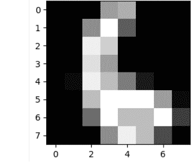

**图 4.1** 基于清单 4.1 中的代码绘制的 `Digits` 数据集中一个数字的图像。

清单 4.3 展示了 `sklearn_digits.py` 的内容，该文件演示了如何在 Sklearn 中访问 `Digits` 数据集。

## 清单 4.3: sklearn_digits.py

```python
from sklearn import datasets

digits = datasets.load_digits()
print("digits shape:",digits.images.shape)
print("data   shape:",digits.data.shape)

n_samples, n_features = digits.data.shape
print("(samples,features):", (n_samples, n_features))

import matplotlib.pyplot as plt
#plt.imshow(digits.images[-1], cmap=plt.cm.gray_r)
#plt.show()

plt.imshow(digits.images[0], cmap=plt.cm.binary,
          interpolation='nearest')
plt.show()
```

清单 4.3 以一个 `import` 语句开始，然后是包含 `Digits` 数据集的变量 `digits`。清单 4.3 的输出如下：

```
digits shape: (1797, 8, 8)
data   shape: (1797, 64)
(samples,features): (1797, 64)
```

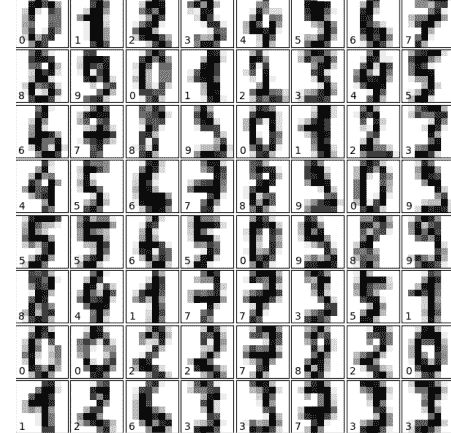

**图 4.2** 基于清单 4.3 中的代码显示的 `Digits` 数据集中的图像。

前面的代码示例向你展示了显示 Sklearn 内置数据集的内容是多么容易。此外，Sklearn 提供了一种直接的方法，可以将数据集拆分为用于机器学习中训练模型的子集，你将在下一节中看到。

## Sklearn 中的 train_test_split() 类

这个 Sklearn 类对于机器学习来说是一个极其有用的类，因为你可以用一行代码创建一个数据集的四路拆分。数据集的四个子集通常命名为以下变量：

- X_train
- y_train
- X_test
- y_test

图 4.3 显示了当你需要为线性回归或分类任务拆分数据集时，上述四个数据子集之间的关系。

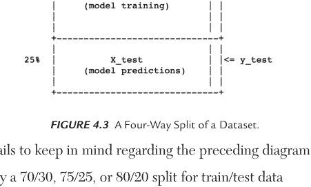

关于上图，有几个细节需要记住：

1.  通常训练/测试数据的拆分比例为 70/30、75/25 或 80/20。
2.  x：通常是数据集中列的一个子集。
3.  y：列可以位于任何位置。
4.  标记为 x 和 y（有时是 X 和 Y）。
5.  X = X_train + X_test
6.  y = y_train + y_test

代码示例 sklearn_iris_train.py（本章稍后）包含创建所需四个数据子集的两行代码：

```python
from sklearn.model_selection import train_test_split
X_train, X_test, y_train, y_test = train_test_split(X, y,
test_size=0.3, random_state=1)
```

## 为 X 和 y 选择列

对于包含许多列的数据集，为 X 和 y 选择正确的列集可能很困难。

你必须决定数据集的哪些列子集属于 X，以及哪一列被指定为 y 列（即目标或标签列）。

如果你的数据集只有四列或五列，确定哪些列将分配给 X 以及哪一列被指定为 y 可能很简单。但是，如果你从一个包含大量列的数据集中选择一组列，你如何确定：

-   重要的分类列是否已包含在内
-   所有包含的列是否都是必需的
-   所选的列是否是最佳列

第一个要点的答案在第 3 章中讨论过，你在其中学习了如何使用 Pandas 的 `map()` 函数将分类列转换为数值列，如下所示：

```python
# map ham/spam to 0/1 values:
df['type'] = df['type'].map( {'ham':0 , 'spam':1} )
```

如果你有一个包含 M 和 F 值的性别列，你可以修改前面的代码片段，如下所示：

```python
# map male/female to 0/1 values:
df['gender'] = df['gender'].map( {'male':0, 'female':1} )
```

第二个和第三个要点在下一节中部分涉及，该节讨论了特征选择和特征提取，它们是特征工程的两个方面。

## 什么是特征工程？

特征工程是一个总称，包括几种用于确定填充集合 X 的列的技术。

特征选择涉及从数据集中选择列的子集，这是本章前面讨论过的技术。

特征提取涉及找到数据集中列的线性组合。例如，PCA（主成分分析）就是这样一种技术：PCA 计算特征值和特征向量（线性代数的一部分），其中后者是数据集中现有列的线性组合。

PCA 是 SVD（奇异值分解）的一个子集，它指的是确定数据集最重要列（或其线性组合）子集的技术。虽然 PCA 和 SVD 超出了本书的范围，但你可以找到许多在线文章和代码示例，说明如何执行 PCA，以及属于 SVD 的算法。

## Sklearn 中的鸢尾花数据集 (1)

除了支持机器学习算法外，Sklearn 还提供了各种内置数据集，你可以用一行代码访问它们。清单 4.4 展示了 `sklearn_iris1.py` 的内容，该文件说明了如何轻松加载鸢尾花数据集并显示其内容。

### 清单 4.4: sklearn_iris1.py

```python
import numpy as np
from sklearn.datasets import load_iris

iris = load_iris()

print("=> iris keys:")
for key in iris.keys():
    print(key)
print()

#print("iris dimensions:")
#print(iris.shape)
#print()

print("=> iris feature names:")
for feature in iris.feature_names:
    print(feature)
print()

X = iris.data[:, [2, 3]]
y = iris.target
print('=> Class labels:', np.unique(y))
print()

print("=> target:")
print(iris.target)
print()

print("=> all data:")
print(iris.data)
```

清单 4.4 包含几个 import 语句，然后用 `Iris` 数据集初始化变量 `iris`。接下来，一个循环显示数据集中的键，然后是另一个 `for` 循环显示特征名称。

清单 4.4 的下一部分用第 2 列和第 3 列的特征值初始化变量 `x`，然后用目标列的值初始化变量 `y`。运行清单 4.4 中的代码以查看以下输出（为简洁起见已截断）：

```
=> iris keys:
data
target
target_names
DESCR
feature_names
filename
```

```
=> iris feature names:
sepal length (cm)
sepal width (cm)
petal length (cm)
petal width (cm)
```

```
=> Class labels: [0 1 2]
```

```
=> x_min: 0.5 x_max: 7.4
=> y_min: -0.4 y_max: 3.0
```

```
=> target:
[0 0 0 0 0 0 0 0 0 0 0 0 0 0 0 0 0 0 0 0 0 0 0 0 0 0 0 0 0 0 0 0 0 0 0 0 0 0 0 0 0 0 0 0 0 0 0 0 0 0
 0 0 0 0 0 0 0 0 0 0 0 0 0 0 0 0 0 0 0 0 0 0 0 0 0 0 0 0 0 0 0 0 0 0 0 0 0 0 0 0 0 0 0 0 0 0 0 0 0 0
 0 0 0 0 0 0 0 0 0 0 0 0 0 0 0 0 0 0 0 0 0 0 0 0 0 0 0 0 0 0 0 0 0 0 0 0 0 0 0 0 0 0 0 0 0 0 0 0 0 0
 0 0 0 0 0 0 0 0 0 0 0 0 0 0 0 0 0 0 0 0 0 0 0 0 0 0 0 0 0 0 0 0 0 0 0 0 0 0 0 0 0 0 0 0 0 0 0 0 0 0
 0 0 0 0 0 0 0 0 0 0 0 0 0 0 0 0 0 0 0 0 0 0 0 0 0 0 0 0 0 0 0 0 0 0 0 0 0 0 0 0 0 0 0 0 0 0 0 0 0 0
 0 0 0 0 0 0 0 0 0 0 0 0 0 0 0 0 0 0 0 0 0 0 0 0 0 0 0 0 0 0 0 0 0 0 0 0 0 0 0 0 0 0 0 0 0 0 0 0 0 0
 0 0 0 0 0 0 0 0 0 0 0 0 0 0 0 0 0 0 0 0 0 0 0 0 0 0 0 0 0 0 0 0 0 0 0 0 0 0 0 0 0 0 0 0 0 0 0 0 0 0
 0 0 0 0 0 0 0 0 0 0 0 0 0 0 0 0 0 0 0 0 0 0 0 0 0 0 0 0 0 0 0 0 0 0 0 0 0 0 0 0 0 0 0 0 0 0 0 0 0 0
 0 0 0 0 0 0 0 0 0 0 0 0 0 0 0 0 0 0 0 0 0 0 0 0 0 0 0 0 0 0 0 0 0 0 0 0 0 0 0 0 0 0 0 0 0 0 0 0 0 0
 0 0 0 0 0 0 0 0 0 0 0 0 0 0 0 0 0 0 0 0 0 0 0 0 0 0 0 0 0 0 0 0 0 0 0 0 0 0 0 0 0 0 0 0 0 0 0 0 0 0
 0 0 0 0 0 0 0 0 0 0 0 0 0 0 0 0 0 0 0 0 0 0 0 0 0 0 0 0 0 0 0 0 0 0 0 0 0 0 0 0 0 0 0 0 0 0 0 0 0 0
 0 0 0 0 0 0 0 0 0 0 0 0 0 0 0 0 0 0 0 0 0 0 0 0 0 0 0 0 0 0 0 0 0 0 0 0 0 0 0 0 0 0 0 0 0 0 0 0 0 0
 0 0 0 0 0 0 0 0 0 0 0 0 0 0 0 0 0 0 0 0 0 0 0 0 0 0 0 0 0 0 0 0 0 0 0 0 0 0 0 0 0 0 0 0 0 0 0 0 0 0
 0 0 0 0 0 0 0 0 0 0 0 0 0 0 0 0 0 0 0 0 0 0 0 0 0 0 0 0 0 0 0 0 0 0 0 0 0 0 0 0 0 0 0 0 0 0 0 0 0 0
 0 0 0 0 0 0 0 0 0 0 0 0 0 0 0 0 0 0 0 0 0 0 0 0 0 0 0 0 0 0 0 0 0 0 0 0 0 0 0 0 0 0 0 0 0 0 0 0 0 0
 0 0 0 0 0 0 0 0 0 0 0 0 0 0 0 0 0 0 0 0 0 0 0 0 0 0 0 0 0 0 0 0 0 0 0 0 0 0 0 0 0 0 0 0 0 0 0 0 0 0
 0 0 0 0 0 0 0 0 0 0 0 0 0 0 0 0 0 0 0 0 0 0 0 0 0 0 0 0 0 0 0 0 0 0 0 0 0 0 0 0 0 0 0 0 0 0 0 0 0 0
 0 0 0 0 0 0 0 0 0 0 0 0 0 0 0 0 0 0 0 0 0 0 0 0 0 0 0 0 0 0 0 0 0 0 0 0 0 0 0 0 0 0 0 0 0 0 0 0 0 0
 0 0 0 0 0 0 0 0 0 0 0 0 0 0 0 0 0 0 0 0 0 0 0 0 0 0 0 0 0 0 0 0 0 0 0 0 0 0 0 0 0 0 0 0 0 0 0 0 0 0
 0 0 0 0 0 0 0 0 0 0 0 0 0 0 0 0 0 0 0 0 0 0 0 0 0 0 0 0 0 0 0 0 0 0 0 0 0 0 0 0 0 0 0 0 0 0 0 0 0 0
 0 0 0 0 0 0 0 0 0 0 0 0 0 0 0 0 0 0 0 0 0 0 0 0 0 0 0 0 0 0 0 0 0 0 0 0 0 0 0 0 0 0 0 0 0 0 0 0 0 0
 0 0 0 0 0 0 0 0 0 0 0 0 0 0 0 0 0 0 0 0 0 0 0 0 0 0 0 0 0 0 0 0 0 0 0 0 0 0 0 0 0 0 0 0 0 0 0 0 0 0
 0 0 0 0 0 0 0 0 0 0 0 0 0 0 0 0 0 0 0 0 0 0 0 0 0 0 0 0 0 0 0 0 0 0 0 0 0 0 0 0 0 0 0 0 0 0 0 0 0 0
 0 0 0 0 0 0 0 0 0 0 0 0 0 0 0 0 0 0 0 0 0 0 0 0 0 0 0 0 0 0 0 0 0 0 0 0 0 0 0 0 0 0 0 0 0 0 0 0 0 0
 0 0 0 0 0 0 0 0 0 0 0 0 0 0 0 0 0 0 0 0 0 0 0 0 0 0 0 0 0 0 0 0 0 0 0 0 0 0 0 0 0 0 0 0 0 0 0 0 0 0
 0 0 0 0 0 0 0 0 0 0 0 0 0 0 0 0 0 0 0 0 0 0 0 0 0 0 0 0 0 0 0 0 0 0 0 0 0 0 0 0 0 0 0 0 0 0 0 0 0 0
 0 0 0 0 0 0 0 0 0 0 0 0 0 0 0 0 0 0 0 0 0 0 0 0 0 0 0 0 0 0 0 0 0 0 0 0 0 0 0 0 0 0 0 0 0 0 0 0 0 0
 0 0 0 0 0 0 0 0 0 0 0 0 0 0 0 0 0 0 0 0 0 0 0 0 0 0 0 0 0 0 0 0 0 0 0 0 0 0 0 0 0 0 0 0 0 0 0 0 0 0
 0 0 0 0 0 0 0 0 0 0 0 0 0 0 0 0 0 0 0 0 0 0 0 0 0 0 0 0 0 0 0 0 0 0 0 0 0 0 0 0 0 0 0 0 0 0 0 0 0 0
 0 0 0 0 0 0 0 0 0 0 0 0 0 0 0 0 0 0 0 0 0 0 0 0 0 0 0 0 0 0 0 0 0 0 0 0 0 0 0 0 0 0 0 0 0 0 0 0 0 0
 0 0 0 0 0 0 0 0 0 0 0 0 0 0 0 0 0 0 0 0 0 0 0 0 0 0 0 0 0 0 0 0 0 0 0 0 0 0 0 0 0 0 0 0 0 0 0 0 0 0
 0 0 0 0 0 0 0 0 0 0 0 0 0 0 0 0 0 0 0 0 0 0 0 0 0 0 0 0 0 0 0 0 0 0 0 0 0 0 0 0 0 0 0 0 0 0 0 0 0 0
 0 0 0 0 0 0 0 0 0 0 0 0 0 0 0 0 0 0 0 0 0 0 0 0 0 0 0 0 0 0 0 0 0 0 0 0 0 0 0 0 0 0 0 0 0 0 0 0 0 0
 0 0 0 0 0 0 0 0 0 0 0 0 0 0 0 0 0 0 0 0 0 0 0 0 0 0 0 0 0 0 0 0 0 0 0 0 0 0 0 0 0 0 0 0 0 0 0 0 0 0
 0 0 0 0 0 0 0 0 0 0 0 0 0 0 0 0 0 0 0 0 0 0 0 0 0 0 0 0 0 0 0 0 0 0 0 0 0 0 0 0 0 0 0 0 0 0 0 0 0 0
 0 0 0 0 0 0 0 0 0 0 0 0 0 0 0 0 0 0 0 0 0 0 0 0 0 0 0 0 0 0 0 0 0 0 0 0 0 0 0 0 0 0 0 0 0 0 0 0 0 0
 0 0 0 0 0 0 0 0 0 0 0 0 0 0 0 0 0 0 0 0 0 0 0 0 0 0 0 0 0 0 0 0 0 0 0 0 0 0 0 0 0 0 0 0 0 0 0 0 0 0
 0 0 0 0 0 0 0 0 0 0 0 0 0 0 0 0 0 0 0 0 0 0 0 0 0 0 0 0 0 0 0 0 0 0 0 0 0 0 0 0 0 0 0 0 0 0 0 0 0 0
 0 0 0 0 0 0 0 0 0 0 0 0 0 0 0 0 0 0 0 0 0 0 0 0 0 0 0 0 0 0 0 0 0 0 0 0 0 0 0 0 0 0 0 0 0 0 0 0 0 0
 0 0 0 0 0 0 0 0 0 0 0 0 0 0 0 0 0 0 0 0 0 0 0 0 0 0 0 0 0 0 0 0 0 0 0 0 0 0 0 0 0 0 0 0 0 0 0 0 0 0
 0 0 0 0 0 0 0 0 0 0 0 0 0 0 0 0 0 0 0 0 0 0 0 0 0 0 0 0 0 0 0 0 0 0 0 0 0 0 0 0 0 0 0 0 0 0 0 0 0 0
 0 0 0 0 0 0 0 0 0 0 0 0 0 0 0 0 0 0 0 0 0 0 0 0 0 0 0 0 0 0 0 0 0 0 0 0 0 0 0 0 0 0 0 0 0 0 0 0 0 0
 0 0 0 0 0 0 0 0 0 0 0 0 0 0 0 0 0 0 0 0 0 0 0 0 0 0 0 0 0 0 0 0 0 0 0 0 0 0 0 0 0 0 0 0 0 0 0 0 0 0
 0 0 0 0 0 0 0 0 0 0 0 0 0 0 0 0 0 0 0 0 0 0 0 0 0 0 0 0 0 0 0 0 0 0 0 0 0 0 0 0 0 0 0 0 0 0 0 0 0 0
 0 0 0 0 0 0 0 0 0 0 0 0 0 0 0 0 0 0 0 0 0 0 0 0 0 0 0 0 0 0 0 0 0 0 0 0 0 0 0 0 0 0 0 0 0 0 0 0 0 0
 0 0 0 0 0 0 0 0 0 0 0 0 0 0 0 0 0 0 0 0 0 0 0 0 0 0 0 0 0 0 0 0 0 0 0 0 0 0 0 0 0 0 0 0 0 0 0 0 0 0
 0 0 0 0 0 0 0 0 0 0 0 0 0 0 0 0 0 0 0 0 0 0 0 0 0 0 0 0 0 0 0 0 0 0 0 0 0 0 0 0 0 0 0 0 0 0 0 0 0 0
 0 0 0 0 0 0 0 0 0 0 0 0 0 0 0 0 0 0 0 0 0 0 0 0 0 0 0 0 0 0 0 0 0 0 0 0 0 0 0 0 0 0 0 0 0 0 0 0 0 0
 0 0 0 0 0 0 0 0 0 0 0 0 0 0 0 0 0 0 0 0 0 0 0 0 0 0 0 0 0 0 0 0 0 0 0 0 0 0 0 0 0 0 0 0 0 0 0 0 0 0
 0 0 0 0 0 0 0 0 0 0 0 0 0 0 0 0 0 0 0 0 0 0 0 0 0 0 0 0 0 0 0 0 0 0 0 0 0 0 0 0 0 0 0 0 0 0 0 0 0 0
 0 0 0 0 0 0 0 0 0 0 0 0 0 0 0 0 0 0 0 0 0 0 0 0 0 0 0 0 0 0 0 0 0 0 0 0 0 0 0 0 0 0 0 0 0 0 0 0 0 0
 0 0 0 0 0 0 0 0 0 0 0 0 0 0 0 0 0 0 0 0 0 0 0 0 0 0 0 0 0 0 0 0 0 0 0 0 0 0 0 0 0 0 0 0 0 0 0 0 0 0
 0 0 0 0 0 0 0 0 0 0 0 0 0 0 0 0 0 0 0 0 0 0 0 0 0 0 0 0 0 0 0 0 0 0 0 0 0 0 0 0 0 0 0 0 0 0 0 0 0 0
 0 0 0 0 0 0 0 0 0 0 0 0 0 0 0 0 0 0 0 0 0 0 0 0 0 0 0 0 0 0 0 0 0 0 0 0 0 0 0 0 0 0 0 0 0 0 0 0 0 0
 0 0 0 0 0 0 0 0 0 0 0 0 0 0 0 0 0 0 0 0 0 0 0 0 0 0 0 0 0 0 0 0 0 0 0 0 0 0 0 0 0 0 0 0 0 0 0 0 0 0
 0 0 0 0 0 0 0 0 0 0 0 0 0 0 0 0 0 0 0 0 0 0 0 0 0 0 0 0 0 0 0 0 0 0 0 0 0 0 0 0 0 0 0 0 0 0 0 0 0 0
 0 0 0 0 0 0 0 0 0 0 0 0 0 0 0 0 0 0 0 0 0 0 0 0 0 0 0 0 0 0 0 0 0 0 0 0 0 0 0 0 0 0 0 0 0 0 0 0 0 0
 0 0 0 0 0 0 0 0 0 0 0 0 0 0 0 0 0 0 0 0 0 0 0 0 0 0 0 0 0 0 0 0 0 0 0 0 0 0 0 0 0 0 0 0 0 0 0 0 0 0
 0 0 0 0 0 0 0 0 0 0 0 0 0 0 0 0 0 0 0 0 0 0 0 0 0 0 0 0 0 0 0 0 0 0 0 0 0 0 0 0 0 0 0 0 0 0 0 0 0 0
 0 0 0 0 0 0 0 0 0 0 0 0 0 0 0 0 0 0 0 0 0 0 0 0 0 0 0 0 0 0 0 0 0 0 0 0 0 0 0 0 0 0 0 0 0 0 0 0 0 0
 0 0 0 0 0 0 0 0 0 0 0 0 0 0 0 0 0 0 0 0 0 0 0 0 0 0 0 0 0 0 0 0 0 0 0 0 0 0 0 0 0 0 0 0 0 0 0 0 0 0
 0 0 0 0 0 0 0 0 0 0 0 0 0 0 0 0 0 0 0 0 0 0 0 0 0 0 0 0 0 0 0 0 0 0 0 0 0 0 0 0 0 0 0 0 0 0 0 0 0 0
 0 0 0 0 0 0 0 0 0 0 0 0 0 0 0 0 0 0 0 0 0 0 0 0 0 0 0 0 0 0 0 0 0 0 0 0 0 0 0 0 0 0 0 0 0 0 0 0 0 0
 0 0 0 0 0 0 0 0 0 0 0 0 0 0 0 0 0 0 0 0 0 0 0 0 0 0 0 0 0 0 0 0 0 0 0 0 0 0 0 0 0 0 0 0 0 0 0 0 0 0
 0 0 0 0 0 0 0 0 0 0 0 0 0 0 0 0 0 0 0 0 0 0 0 0 0 0 0 0 0 0 0 0 0 0 0 0 0 0 0 0 0 0 0 0 0 0 0 0 0 0
 0 0 0 0 0 0 0 0 0 0 0 0 0 0 0 0 0 0 0 0 0 0 0 0 0 0 0 0 0 0 0 0 0 0 0 0 0 0 0 0 0 0 0 0 0 0 0 0 0 0
 0 0 0 0 0 0 0 0 0 0 0 0 0 0 0 0 0 0 0 0 0 0 0 0 0 0 0 0 0 0 0 0 0 0 0 0 0 0 0 0 0 0 0 0 0 0 0 0 0 0
 0 0 0 0 0 0 0 0 0 0 0 0 0 0 0 0 0 0 0 0 0 0 0 0 0 0 0 0 0 0 0 0 0 0 0 0 0 0 0 0 0 0 0 0 0 0 0 0 0 0
 0 0 0 0 0 0 0 0 0 0 0 0 0 0 0 0 0 0 0 0 0 0 0 0 0 0 0 0 0 0 0 0 0 0 0 0 0 0 0 0 0 0 0 0 0 0 0 0 0 0
 0 0 0 0 0 0 0 0 0 0 0 0 0 0 0 0 0 0 0 0 0 0 0 0 0 0 0 0 0 0 0 0 0 0 0 0 0 0 0 0 0 0 0 0 0 0 0 0 0 0
 0 0 0 0 0 0 0 0 0 0 0 0 0 0 0 0 0 0 0 0 0 0 0 0 0 0 0 0 0 0 0 0 0 0 0 0 0 0 0 0 0 0 0 0 0 0 0 0 0 0
 0 0 0 0 0 0 0 0 0 0 0 0 0 0 0 0 0 0 0 0 0 0 0 0 0 0 0 0 0 0 0 0 0 0 0 0 0 0 0 0 0 0 0 0 0 0 0 0 0 0
 0 0 0 0 0 0 0 0 0 0 0 0 0 0 0 0 0 0 0 0 0 0 0 0 0 0 0 0 0 0 0 0 0 0 0 0 0 0 0 0 0 0 0 0 0 0 0 0 0 0
 0 0 0 0 0 0 0 0 0 0 0 0 0 0 0 0 0 0 0 0 0 0 0 0 0 0 0 0 0 0 0 0 0 0 0 0 0 0 0 0 0 0 0 0 0 0 0 0 0 0
 0 0 0 0 0 0 0 0 0 0 0 0 0 0 0 0 0 0 0 0 0 0 0 0 0 0 0 0 0 0 0 0 0 0 0 0 0 0 0 0 0 0 0 0 0 0 0 0 0 0
 0 0 0 0 0 0 0 0 0 0 0 0 0 0 0 0 0 0 0 0 0 0 0 0 0 0 0 0 0 0 0 0 0 0 0 0 0 0 0 0 0 0 0 0 0 0 0 0 0 0
 0 0 0 0 0 0 0 0 0 0 0 0 0 0 0 0 0 0 0 0 0 0 0 0 0 0 0 0 0 0 0 0 0 0 0 0 0 0 0 0 0 0 0 0 0 0 0 0 0 0
 0 0 0 0 0 0 0 0 0 0 0 0 0 0 0 0 0 0 0 0 0 0 0 0 0 0 0 0 0 0 0 0 0 0 0 0 0 0 0 0 0 0 0 0 0 0 0 0 0 0
 0 0 0 0 0 0 0 0 0 0 0 0 0 0 0 0 0 0 0 0 0 0 0 0 0 0 0 0 0 0 0 0 0 0 0 0 0 0 0 0 0 0 0 0 0 0 0 0 0 0
 0 0 0 0 0 0 0 0 0 0 0 0 0 0 0 0 0 0 0 0 0 0 0 0 0 0 0 0 0 0 0 0 0 0 0 0 0 0 0 0 0 0 0 0 0 0 0 0 0 0
 0 0 0 0 0 0 0 0 0 0 0 0 0 0 0 0 0 0 0 0 0 0 0 0 0 0 0 0 0 0 0 0 0 0 0 0 0 0 0 0 0 0 0 0 0 0 0 0 0 0
 0 0 0 0 0 0 0 0 0 0 0 0 0 0 0 0 0 0 0 0 0 0 0 0 0 0 0 0 0 0 0 0 0 0 0 0 0 0 0 0 0 0 0 0 0 0 0 0 0 0
 0 0 0 0 0 0 0 0 0 0 0 0 0 0 0 0 0 0 0 0 0 0 0 0 0 0 0 0 0 0 0 0 0 0 0 0 0 0 0 0 0 0 0 0 0 0 0 0 0 0
 0 0 0 0 0 0 0 0 0 0 0 0 0 0 0 0 0 0 0 0 0 0 0 0 0 0 0 0 0 0 0 0 0 0 0 0 0 0 0 0 0 0 0 0 0 0 0 0 0 0
 0 0 0 0 0 0 0 0 0 0 0 0 0 0 0 0 0 0 0 0 0 0 0 0 0 0 0 0 0 0 0 0 0 0 0 0 0 0 0 0 0 0 0 0 0 0 0 0 0 0
 0 0 0 0 0 0 0 0 0 0 0 0 0 0 0 0 0 0 0 0 0 0 0 0 0 0 0 0 0 0 0 0 0 0 0 0 0 0 0 0 0 0 0 0 0 0 0 0 0 0
 0 0 0 0 0 0 0 0 0 0 0 0 0 0 0 0 0 0 0 0 0 0 0 0 0 0 0 0 0 0 0 0 0 0 0 0 0 0 0 0 0 0 0 0 0 0 0 0 0 0
 0 0 0 0 0 0 0 0 0 0 0 0 0 0 0 0 0 0 0 0 0 0 0 0 0 0 0 0 0 0 0 0 0 0 0 0 0 0 0 0 0 0 0 0 0 0 0 0 0 0
 0 0 0 0 0 0 0 0 0 0 0 0 0 0 0 0 0 0 0 0 0 0 0 0 0 0 0 0 0 0 0 0 0 0 0 0 0 0 0 0 0 0 0 0 0 0 0 0 0 0
 0 0 0 0 0 0 0 0 0 0 0 0 0 0 0 0 0 0 0 0 0 0 0 0 0 0 0 0 0 0 0 0 0 0 0 0 0 0 0 0 0 0 0 0 0 0 0 0 0 0
 0 0 0 0 0 0 0 0 0 0 0 0 0 0 0 0 0 0 0 0 0 0 0 0 0 0 0 0 0 0 0 0 0 0 0 0 0 0 0 0 0 0 0 0 0 0 0 0 0 0
 0 0 0 0 0 0 0 0 0 0 0 0 0 0 0 0 0 0 0 0 0 0 0 0 0 0 0 0 0 0 0 0 0 0 0 0 0 0 0 0 0 0 0 0 0 0 0 0 0 0
 0 0 0 0 0 0 0 0 0 0 0 0 0 0 0 0 0 0 0 0 0 0 0 0 0 0 0 0 0 0 0 0 0 0 0 0 0 0 0 0 0 0 0 0 0 0 0 0 0 0
 0 0 0 0 0 0 0 0 0 0 0 0 0 0 0 0 0 0 0 0 0 0 0 0 0 0 0 0 0 0 0 0 0 0 0 0 0 0 0 0 0 0 0 0 0 0 0 0 0 0
 0 0 0 0 0 0 0 0 0 0 0 0 0 0 0 0 0 0 0 0 0 0 0 0 0 0 0 0 0 0 0 0 0 0 0 0 0 0 0 0 0 0 0 0 0 0 0 0 0 0
 0 0 0 0 0 0 0 0 0 0 0 0 0 0 0 0 0 0 0 0 0 0 0 0 0 0 0 0 0 0 0 0 0 0 0 0 0 0 0 0 0 0 0 0 0 0 0 0 0 0
 0 0 0 0 0 0 0 0 0 0 0 0 0 0 0 0 0 0 0 0 0 0 0 0 0 0 0 0 0 0 0 0 0 0 0 0 0 0 0 0 0 0 0 0 0 0 0 0 0 0
 0 0 0 0 0 0 0 0 0 0 0 0 0 0 0 0 0 0 0 0 0 0 0 0 0 0 0 0 0 0 0 0 0 0 0 0 0 0 0 0 0 0 0 0 0 0 0 0 0 0
 0 0 0 0 0 0 0 0 0 0 0 0 0 0 0 0 0 0 0 0 0 0 0 0 0 0 0 0 0 0 0 0 0 0 0 0 0 0 0 0 0 0 0 0 0 0 0 0 0 0
 0 0 0 0 0 0 0 0 0 0 0 0 0 0 0 0 0 0 0 0 0 0 0 0 0 0 0 0 0 0 0 0 0 0 0 0 0 0 0 0 0 0 0 0 0 0 0 0 0 0
 0 0 0 0 0 0 0 0 0 0 0 0 0 0 0 0 0 0 0 0 0 0 0 0 0 0 0 0 0 0 0 0 0 0 0 0 0 0 0 0 0 0 0 0 0 0 0 0 0 0
 0 0 0 0 0 0 0 0 0 0 0 0 0 0 0 0 0 0 0 0 0 0 0 0 0 0 0 0 0 0 0 0 0 0 0 0 0 0 0 0 0 0 0 0 0 0 0 0 0 0
 0 0 0 0 0 0 0 0 0 0 0 0 0 0 0 0 0 0 0 0 0 0 0 0 0 0 0 0 0 0 0 0 0 0 0 0 0 0 0 0 0 0 0 0 0 0 0 0 0 0
 0 0 0 0 0 0 0 0 0 0 0 0 0 0 0 0 0 0 0 0 0 0 0 0 0 0 0 0 0 0 0 0 0 0 0 0 0 0 0 0 0 0 0 0 0 0 0 0 0 0
 0 0 0 0 0 0 0 0 0 0 0 0 0 0 0 0 0 0 0 0 0 0 0 0 0 0 0 0 0 0 0 0 0 0 0 0 0 0 0 0 0 0 0 0 0 0 0 0 0 0
 0 0 0 0 0 0 0 0 0 0 0 0 0 0 0 0 0 0 0 0 0 0 0 0 0 0 0 0 0 0 0 0 0 0 0 0 0 0 0 0 0 0 0 0 0 0 0 0 0 0
 0 0 0 0 0 0 0 0 0 0 0 0 0 0 0 0 0 0 0 0 0 0 0 0 0 0 0 0 0 0 0 0 0 0 0 0 0 0 0 0 0 0 0 0 0 0 0 0 0 0
 0 0 0 0 0 0 0 0 0 0 0 0 0 0 0 0 0 0 0 0 0 0 0 0 0 0 0 0 0 0 0 0 0 0 0 0 0 0 0 0 0 0 0 0 0 0 0 0 0 0
 0 0 0 0 0 0 0 0 0 0 0 0 0 0 0 0 0 0 0 0 0 0 0 0 0 0 0 0 0 0 0 0 0 0 0 0 0 0 0 0 0 0 0 0 0 0 0 0 0 0
 0 0 0 0 0 0 0 0 0 0 0 0 0 0 0 0 0 0 0 0 0 0 0 0 0 0 0 0 0 0 0 0 0 0 0 0 0 0 0 0 0 0 0 0 0 0 0 0 0 0
 0 0 0 0 0 0 0 0 0 0 0 0 0 0 0 0 0 0 0 0 0 0 0 0 0 0 0 0 0 0 0 0 0 0 0 0 0 0 0 0 0 0 0 0 0 0 0 0 0 0
 0 0 0 0 0 0 0 0 0 0 0 0 0 0 0 0 0 0 0 0 0 0 0 0 0 0 0 0 0 0 0 0 0 0 0 0 0 0 0 0 0 0 0 0 0 0 0 0 0 0
 0 0 0 0 0 0 0 0 0 0 0 0 0 0 0 0 0 0 0 0 0 0 0 0 0 0 0 0 0 0 0 0 0 0 0 0 0 0 0 0 0 0 0 0 0 0 0 0 0 0
 0 0 0 0 0 0 0 0 0 0 0 0 0 0 0 0 0 0 0 0 0 0 0 0 0 0 0 0 0 0 0 0 0 0 0 0 0 0 0 0 0 0 0 0 0 0 0 0 0 0
 0 0 0 0 0 0 0 0 0 0 0 0 0 0 0 0 0 0 0 0 0 0 0 0 0 0 0 0 0 0 0 0 0 0 0 0 0 0 0 0 0 0 0 0 0 0 0 0 0 0
 0 0 0 0 0 0 0 0 0 0 0 0 0 0 0 0 0 0 0 0 0 0 0 0 0 0 0 0 0 0 0 0 0 0 0 0 0 0 0 0 0 0 0 0 0 0 0 0 0 0
 0 0 0 0 0 0 0 0 0 0 0 0 0 0 0 0 0 0 0 0 0 0 0 0 0 0 0 0 0 0 0 0 0 0 0 0 0 0 0 0 0 0 0 0 0 0 0 0 0 0
 0 0 0 0 0 0 0 0 0 0 0 0 0 0 0 0 0 0 0 0 0 0 0 0 0 0 0 0 0 0 0 0 0 0 0 0 0 0 0 0 0 0 0 0 0 0 0 0 0 0
 0 0 0 0 0 0 0 0 0 0 0 0 0 0 0 0 0 0 0 0 0 0 0 0 0 0 0 0 0 0 0 0 0 0 0 0 0 0 0 0 0 0 0 0 0 0 0 0 0 0
 0 0 0 0 0 0 0 0 0 0 0 0 0 0 0 0 0 0 0 0 0 0 0 0 0 0 0 0 0 0 0 0 0 0 0 0 0 0 0 0 0 0 0 0 0 0 0 0 0 0
 0 0 0 0 0 0 0 0 0 0 0 0 0 0 0 0 0 0 0 0 0 0 0 0 0 0 0 0 0 0 0 0 0 0 0 0 0 0 0 0 0 0 0 0 0 0 0 0 0 0
 0 0 0 0 0 0 0 0 0 0 0 0 0 0 0 0 0 0 0 0 0 0 0 0 0 0 0 0 0 0 0 0 0 0 0 0 0 0 0 0 0 0 0 0 0 0 0 0 0 0
 0 0 0 0 0 0 0 0 0 0 0 0 0 0 0 0 0 0 0 0 0 0 0 0 0 0 0 0 0 0 0 0 0 0 0 0 0 0 0 0 0 0 0 0 0 0 0 0 0 0
 0 0 0 0 0 0 0 0 0 0 0 0 0 0 0 0 0 0 0 0 0 0 0 0 0 0 0 0 0 0 0 0 0 0 0 0 0 0 0 0 0 0 0 0 0 0 0 0 0 0
 0 0 0 0 0 0 0 0 0 0 0 0 0 0 0 0 0 0 0 0 0 0 0 0 0 0 0 0 0 0 0 0 0 0 0 0 0 0 0 0 0 0 0 0 0 0 0 0 0 0
 0 0 0 0 0 0 0 0 0 0 0 0 0 0 0 0 0 0 0 0 0 0 0 0 0 0 0 0 0 0 0 0 0 0 0 0 0 0 0 0 0 0 0 0 0 0 0 0 0 0
 0 0 0 0 0 0 0 0 0 0 0 0 0 0 0 0 0 0 0 0 0 0 0 0 0 0 0 0 0 0 0 0 0 0 0 0 0 0 0 0 0 0 0 0 0 0 0 0 0 0
 0 0 0 0 0 0 0 0 0 0 0 0 0 0 0 0 0 0 0 0 0 0 0 0 0 0 0 0 0 0 0 0 0 0 0 0 0 0 0 0 0 0 0 0 0 0 0 0 0 0
 0 0 0 0 0 0 0 0 0 0 0 0 0 0 0 0 0 0 0 0 0 0 0 0 0 0 0 0 0 0 0 0 0 0 0 0 0 0 0 0 0 0 0 0 0 0 0 0 0 0
 0 0 0 0 0 0 0 0 0 0 0 0 0 0 0 0 0 0 0 0 0 0 0 0 0 0 0 0 0 0 0 0 0 0 0 0 0 0 0 0 0 0 0 0 0 0 0 0 0 0
 0 0 0 0 0 0 0 0 0 0 0 0 0 0 0 0 0 0 0 0 0 0 0 0 0 0 0 0 0 0 0 0 0 0 0 0 0 0 0 0 0 0 0 0 0 0 0 0 0 0
 0 0 0 0 0 0 0 0 0 0 0 0 0 0 0 0 0 0 0 0 0 0 0 0 0 0 0 0 0 0 0 0 0 0 0 0 0 0 0 0 0 0 0 0 0 0 0 0 0 0
 0 0 0 0 0 0 0 0 0 0 0 0 0 0 0 0 0 0 0 0 0 0 0 0 0 0 0 0 0 0 0 0 0 0 0 0 0 0 0 0 0 0 0 0 0 0 0 0 0 0
 0 0 0 0 0 0 0 0 0 0 0 0 0 0 0 0 0 0 0 0 0 0 0 0 0 0 0 0 0 0 0 0 0 0 0 0 0 0 0 0 0 0 0 0 0 0 0 0 0 0
 0 0 0 0 0 0 0 0 0 0 0 0 0 0 0 0 0 0 0 0 0 0 0 0 0 0 0 0 0 0 0 0 0 0 0 0 0 0 0 0 0 0 0 0 0 0 0 0 0 0
 0 0 0 0 0 0 0 0 0 0 0 0 0 0 0 0 0 0 0 0 0 0 0 0 0 0 0 0 0 0 0 0 0 0 0 0 0 0 0 0 0 0 0 0 0 0 0 0 0 0
 0 0 0 0 0 0 0 0 0 0 0 0 0 0 0 0 0 0 0 0 0 0 0 0 0 0 0 0 0 0 0 0 0 0 0 0 0 0 0 0 0 0 0 0 0 0 0 0 0 0
 0 0 0 0 0 0 0 0 0 0 0 0 0 0 0 0 0 0 0 0 0 0 0 0 0 0 0 0 0 0 0 0 0 0 0 0 0 0 0 0 0 0 0 0 0 0 0 0 0 0
 0 0 0 0 0 0 0 0 0 0 0 0 0 0 0 0 0 0 0 0 0 0 0 0 0 0 0 0 0 0 0 0 0 0 0 0 0 0 0 0 0 0 0 0 0 0 0 0 0 0
 0 0 0 0 0 0 0 0 0 0 0 0 0 0 0 0 0 0 0 0 0 0 0 0 0 0 0 0 0 0 0 0 0 0 0 0 0 0 0 0 0 0 0 0 0 0 0 0 0 0
 0 0 0 0 0 0 0 0 0 0 0 0 0 0 0 0 0 0 0 0 0 0 0 0 0 0 0 0 0 0 0 0 0 0 0 0 0 0 0 0 0 0 0 0 0 0 0 0 0 0
 0 0 0 0 0 0 0 0 0 0 0 0 0 0 0 0 0 0 0 0 0 0 0 0 0 0 0 0 0 0 0 0 0 0 0 0 0 0 0 0 0 0 0 0 0 0 0 0 0 0
 0 0 0 0 0 0 0 0 0 0 0 0 0 0 0 0 0 0 0 0 0 0 0 0 0 0 0 0 0 0 0 0 0 0 0 0 0 0 0 0 0 0 0 0 0 0 0 0 0 0
 0 0 0 0 0 0 0 0 0 0 0 0 0 0 0 0 0 0 0 0 0 0 0 0 0 0 0 0 0 0 0 0 0 0 0 0 0 0 0 0 0 0 0 0 0 0 0 0 0 0
 0 0 0 0 0 0 0 0 0 0 0 0 0 0 0 0 0 0 0 0 0 0 0 0 0 0 0 0 0 0 0 0 0 0 0 0 0 0 0 0 0 0 0 0 0 0 0 0 0 0
 0 0 0 0 0 0 0 0 0 0 0 0 0 0 0 0 0 0 0 0 0 0 0 0 0 0 0 0 0 0 0 0 0 0 0 0 0 0 0 0 0 0 0 0 0 0 0 0 0 0
 0 0 0 0 0 0 0 0 0 0 0 0 0 0 0 0 0 0 0 0 0 0 0 0 0 0 0 0 0 0 0 0 0 0 0 0 0 0 0 0 0 0 0 0 0 0 0 0 0 0
 0 0 0 0 0 0 0 0 0 0 0 0 0 0 0 0 0 0 0 0 0 0 0 0 0 0 0 0 0 0 0 0 0 0 0 0 0 0 0 0 0 0 0 0 0 0 0 0 0 0
 0 0 0 0 0 0 0 0 0 0 0 0 0 0 0 0 0 0 0 0 0 0 0 0 0 0 0 0 0 0 0 0 0 0 0 0 0 0 0 0 0 0 0 0 0 0 0 0 0 0
 0 0 0 0 0 0 0 0 0 0 0 0 0 0 0 0 0 0 0 0 0 0 0 0 0 0 0 0 0 0 0 0 0 0 0 0 0 0 0 0 0 0 0 0 0 0 0 0 0 0
 0 0 0 0 0 0 0 0 0 0 0 0 0 0 0 0 0 0 0 0 0 0 0 0 0 0 0 0 0 0 0 0 0 0 0 0 0 0 0 0 0 0 0 0 0 0 0 0 0 0
 0 0 0 0 0 0 0 0 0 0 0 0 0 0 0 0 0 0 0 0 0 0 0 0 0 0 0 0 0 0 0 0 0 0 0 0 0 0 0 0 0 0 0 0 0 0 0 0 0 0
 0 0 0 0 0 0 0 0 0 0 0 0 0 0 0 0 0 0 0 0 0 0 0 0 0 0 0 0 0 0 0 0 0 0 0 0 0 0 0 0 0 0 0 0 0 0 0 0 0 0
 0 0 0 0 0 0 0 0 0 0 0 0 0 0 0 0 0 0 0 0 0 0 0 0 0 0 0 0 0 0 0 0 0 0 0 0 0 0 0 0 0 0 0 0 0 0 0 0 0 0
 0 0 0 0 0 0 0 0 0 0 0 0 0 0 0 0 0 0 0 0 0 0 0 0 0 0 0 0 0 0 0 0 0 0 0 0 0 0 0 0 0 0 0 0 0 0 0 0 0 0
 0 0 0 0 0 0 0 0 0 0 0 0 0 0 0 0 0 0 0 0 0 0 0 0 0 0 0 0 0 0 0 0 0 0 0 0 0 0 0 0 0 0 0 0 0 0 0 0 0 0
 0 0 0 0 0 0 0 0 0 0 0 0 0 0 0 0 0 0 0 0 0 0 0 0 0 0 0 0 0 0 0 0 0 0 0 0 0 0 0 0 0 0 0 0 0 0 0 0 0 0
 0 0 0 0 0 0 0 0 0 0 0 0 0 0 0 0 0 0 0 0 0 0 0 0 0 0 0 0 0 0 0 0 0 0 0 0 0 0 0 0 0 0 0 0 0 0 0 0 0 0
 0 0 0 0 0 0 0 0 0 0 0 0 0 0 0 0 0 0 0 0 0 0 0 0 0 0 0 0 0 0 0 0 0 0 0 0 0 0 0 0 0 0 0 0 0 0 0 0 0 0
 0 0 0 0 0 0 0 0 0 0 0 0 0 0 0 0 0 0 0 0 0 0 0 0 0 0 0 0 0 0 0 0 0 0 0 0 0 0 0 0 0 0 0 0 0 0 0 0 0 0
 0 0 0 0 0 0 0 0 0 0 0 0 0 0 0 0 0 0 0 0 0 0 0 0 0 0 0 0 0 0 0 0 0 0 0 0 0 0 0 0 0 0 0 0 0 0 0 0 0 0
 0 0 0 0 0 0 0 0 0 0 0 0 0 0 0 0 0 0 0 0 0 0 0 0 0 0 0 0 0 0 0 0 0 0 0 0 0 0 0 0 0 0 0 0 0 0 0 0 0 0
 0 0 0 0 0 0 0 0 0 0 0 0 0 0 0 0 0 0 0 0 0 0 0 0 0 0 0 0 0 0 0 0 0 0 0 0 0 0 0 0 0 0 0 0 0 0 0 0 0 0
 0 0 0 0 0 0 0 0 0 0 0 0 0 0 0 0 0 0 0 0 0 0 0 0 0 0 0 0 0 0 0 0 0 0 0 0 0 0 0 0 0 0 0 0 0 0 0 0 0 0
 0 0 0 0 0 0 0 0 0 0 0 0 0 0 0 0 0 0 0 0 0 0 0 0 0 0 0 0 0 0 0 0 0 0 0 0 0 0 0 0 0 0 0 0 0 0 0 0 0 0
 0 0 0 0 0 0 0 0 0 0 0 0 0 0 0 0 0 0 0 0 0 0 0 0 0 0 0 0 0 0 0 0 0 0 0 0 0 0 0 0 0 0 0 0 0 0 0 0 0 0
 0 0 0 0 0 0 0 0 0 0 0 0 0 0 0 0 0 0 0 0 0 0 0 0 0 0 0 0 0 0 0 0 0 0 0 0 0 0 0 0 0 0 0 0 0 0 0 0 0 0
 0 0 0 0 0 0 0 0 0 0 0 0 0 0 0 0 0 0 0 0 0 0 0 0 0 0 0 0 0 0 0 0 0 0 0 0 0 0 0 0 0 0 0 0 0 0 0 0 0 0
 0 0 0 0 0 0 0 0 0 0 0 0 0 0 0 0 0 0 0 0 0 0 0 0 0 0 0 0 0 0 0 0 0 0 0 0 0 0 0 0 0 0 0 0 0 0 0 0 0 0
 0 0 0 0 0 0 0 0 0 0 0 0 0 0 0 0 0 0 0 0 0 0 0 0 0 0 0 0 0 0 0 0 0 0 0 0 0 0 0 0 0 0 0 0 0 0 0 0 0 0
 0 0 0 0 0 0 0 0 0 0 0 0 0 0 0 0 0 0 0 0 0 0 0 0 0 0 0 0 0 0 0 0 0 0 0 0 0 0 0 0 0 0 0 0 0 0 0 0 0 0
 0 0 0 0 0 0 0 0 0 0 0 0 0 0 0 0 0 0 0 0 0 0 0 0 0 0 0 0 0 0 0 0 0 0 0 0 0 0 0 0 0 0 0 0 0 0 0 0 0 0
 0 0 0 0 0 0 0 0 0 0 0 0 0 0 0 0 0 0 0 0 0 0 0 0 0 0 0 0 0 0 0 0 0 0 0 0 0 0 0 0 0 0 0 0 0 0 0 0 0 0
 0 0 0 0 0 0 0 0 0 0 0 0 0 0 0 0 0 0 0 0 0 0 0 0 0 0 0 0 0 0 0 0 0 0 0 0 0 0 0 0 0 0 0 0 0 0 0 0 0 0
 0 0 0 0 0 0 0 0 0 0 0 0 0 0 0 0 0 0 0 0 0 0 0 0 0 0 0 0 0 0 0 0 0 0 0 0 0 0 0 0 0 0 0 0 0 0 0 0 0 0
 0 0 0 0 0 0 0 0 0 0 0 0 0 0 0 0 0 0 0 0 0 0 0 0 0 0 0 0 0 0 0 0 0 0 0 0 0 0 0 0 0 0 0 0 0 0 0 0 0 0
 0 0 0 0 0 0 0 0 0 0 0 0 0 0 0 0 0 0 0 0 0 0 0 0 0 0 0 0 0 0 0 0 0 0 0 0 0 0 0 0 0 0 0 0 0 0 0 0 0 0
 0 0 0 0 0 0 0 0 0 0 0 0 0 0 0 0 0 0 0 0 0 0 0 0 0 0 0 0 0 0 0 0 0 0 0 0 0 0 0 0 0 0 0 0 0 0 0 0 0 0
 0 0 0 0 0 0 0 0 0 0 0 0 0 0 0 0 0 0 0 0 0 0 0 0 0 0 0 0 0 0 0 0 0 0 0 0 0 0 0 0 0 0 0 0 0 0 0 0 0 0
 0 0 0 0 0 0 0 0 0 0 0 0 0 0 0 0 0 0 0 0 0 0 0 0 0 0 0 0 0 0 0 0 0 0 0 0 0 0 0 0 0 0 0 0 0 0 0 0 0 0
 0 0 0 0 0 0 0 0 0 0 0 0 0 0 0 0 0 0 0 0 0 0 0 0 0 0 0 0 0 0 0 0 0 0 0 0 0 0 0 0 0 0 0 0 0 0 0 0 0 0
 0 0 0 0 0 0 0 0 0 0 0 0 0 0 0 0 0 0 0 0 0 0 0 0 0 0 0 0 0 0 0 0 0 0 0 0 0 0 0 0 0 0 0 0 0 0 0 0 0 0
 0 0 0 0 0 0 0 0 0 0 0 0 0 0 0 0 0 0 0 0 0 0 0 0 0 0 0 0 0 0 0 0 0 0 0 0 0 0 0 0 0 0 0 0 0 0 0 0 0 0
 0 0 0 0 0 0 0 0 0 0 0 0 0 0 0 0 0 0 0 0 0 0 0 0 0 0 0 0 0 0 0 0 0 0 0 0 0 0 0 0 0 0 0 0 0 0 0 0 0 0
 0 0 0 0 0 0 0 0 0 0 0 0 0 0 0 0 0 0 0 0 0 0 0 0 0 0 0 0 0 0 0 0 0 0 0 0 0 0 0 0 0 0 0 0 0 0 0 0 0 0
 0 0 0 0 0 0 0 0 0 0 0 0 0 0 0 0 0 0 0 0 0 0 0 0 0 0 0 0 0 0 0 0 0 0 0 0 0 0 0 0 0 0 0 0 0 0 0 0 0 0
 0 0 0 0 0 0 0 0 0 0 0 0 0 0 0 0 0 0 0 0 0 0 0 0 0 0 0 0 0 0 0 0 0 0 0 0 0 0 0 0 0 0 0 0 0 0 0 0 0 0
 0 0 0 0 0 0 0 0 0 0 0 0 0 0 0 0 0 0 0 0 0 0 0 0 0 0 0 0 0 0 0 0 0 0 0 0 0 0 0 0 0 0 0 0 0 0 0 0 0 0
 0 0 0 0 0 0 0 0 0 0 0 0 0 0 0 0 0 0 0 0 0 0 0 0 0 0 0 0 0 0 0 0 0 0 0 0 0 0 0 0 0 0 0 0 0 0 0 0 0 0
 0 0 0 0 0 0 0 0 0 0 0 0 0 0 0 0 0 0 0 0 0 0 0 0 0 0 0 0 0 0 0 0 0 0 0 0 0 0 0 0 0 0 0 0 0 0 0 0 0 0
 0 0 0 0 0 0 0 0 0 0 0 0 0 0 0 0 0 0 0 0 0 0 0 0 0 0 0 0 0 0 0 0 0 0 0 0 0 0 0 0 0 0 0 0 0 0 0 0 0 0
 0 0 0 0 0 0 0 0 0 0 0 0 0 0 0 0 0 0 0 0 0 0 0 0 0 0 0 0 0 0 0 0 0 0 0 0 0 0 0 0 0 0 0 0 0 0 0 0 0 0
 0 0 0 0 0 0 0 0 0 0 0 0 0 0 0 0 0 0 0 0 0 0 0 0 0 0 0 0 0 0 0 0 0 0 0 0 0 0 0 0 0 0 0 0 0 0 0 0 0 0
 0 0 0 0 0 0 0 0 0 0 0 0 0 0 0 0 0 0 0 0 0 0 0 0 0 0 0 0 0 0 0 0 0 0 0 0 0 0 0 0 0 0 0 0 0 0 0 0 0 0
 0 0 0 0 0 0 0 0 0 0 0 0 0 0 0 0 0 0 0 0 0 0 0 0 0 0 0 0 0 0 0 0 0 0 0 0 0 0 0 0 0 0 0 0 0 0 0 0 0 0
 0 0 0 0 0 0 0 0 0 0 0 0 0 0 0 0 0 0 0 0 0 0 0 0 0 0 0 0 0 0 0 0 0 0 0 0 0 0 0 0 0 0 0 0 0 0 0 0 0 0
 0 0 0 0 0 0 0 0 0 0 0 0 0 0 0 0 0 0 0 0 0 0 0 0 0 0 0 0 0 0 0 0 0 0 0 0 0 0 0 0 0 0 0 0 0 0 0 0 0 0
 0 0 0 0 0 0 0 0 0 0 0 0 0 0 0 0 0 0 0 0 0 0 0 0 0 0 0 0 0 0 0 0 0 0 0 0 0 0 0 0 0 0 0 0 0 0 0 0 0 0
 0 0 0 0 0 0 0 0 0 0 0 0 0 0 0 0 0 0 0 0 0 0 0 0 0 0 0 0 0 0 0 0 0 0 0 0 0 0 0 0 0 0 0 0 0 0 0 0 0 0
 0 0 0 0 0 0 0 0 0 0 0 0 0 0 0 0 0 0 0 0 0 0 0 0 0 0 0 0 0 0 0 0 0 0 0 0 0 0 0 0 0 0 0 0 0 0 0 0 0 0
 0 0 0 0 0 0 0 0 0 0 0 0 0 0 0 0 0 0 0 0 0 0 0 0 0 0 0 0 0 0 0 0 0 0 0 0 0 0 0 0 0 0 0 0 0 0 0 0 0 0
 0 0 0 0 0 0 0 0 0 0 0 0 0 0 0 0 0 0 0 0 0 0 0 0 0 0 0 0 0 0 0 0 0 0 0 0 0 0 0 0 0 0 0 0 0 0 0 0 0 0
 0 0 0 0 0 0 0 0 0 0 0 0 0 0 0 0 0 0 0 0 0 0 0 0 0 0 0 0 0 0 0 0 0 0 0 0 0 0 0 0 0 0 0 0 0 0 0 0 0 0
 0 0 0 0 0 0 0 0 0 0 0 0 0 0 0 0 0 0 0 0 0 0 0 0 0 0 0 0 0 0 0 0 0 0 0 0 0 0 0 0 0 0 0 0 0 0 0 0 0 0
 0 0 0 0 0 0 0 0 0 0 0 0 0 0 0 0 0 0 0 0 0 0 0 0 0 0 0 0 0 0 0 0 0 0 0 0 0 0 0 0 0 0 0 0 0 0 0 0 0 0
 0 0 0 0 0 0 0 0 0 0 0 0 0 0 0 0 0 0 0 0 0 0 0 0 0 0 0 0 0 0 0 0 0 0 0 0 0 0 0 0 0 0 0 0 0 0 0 0 0 0
 0 0 0 0 0 0 0 0 0 0 0 0 0 0 0 0 0 0 0 0 0 0 0 0 0 0 0 0 0 0 0 0 0 0 0 0 0 0 0 0 0 0 0 0 0 0 0 0 0 0
 0 0 0 0 0 0 0 0 0 0 0 0 0 0 0 0 0 0 0 0 0 0 0 0 0 0 0 0 0 0 0 0 0 0 0 0 0 0 0 0 0 0 0 0 0 0 0 0 0 0
 0 0 0 0 0 0 0 0 0 0 0 0 0 0 0 0 0 0 0 0 0 0 0 0 0 0 0 0 0 0 0 0 0 0 0 0 0 0 0 0 0 0 0 0 0 0 0 0 0 0
 0 0 0 0 0 0 0 0 0 0 0 0 0 0 0 0 0 0 0 0 0 0 0 0 0 0 0 0 0 0 0 0 0 0 0 0 0 0 0 0 0 0 0 0 0 0 0 0 0 0
 0 0 0 0 0 0 0 0 0 0 0 0 0 0 0 0 0 0 0 0 0 0 0 0 0 0 0 0 0 0 0 0 0 0 0 0 0 0 0 0 0 0 0 0 0 0 0 0 0 0
 0 0 0 0 0 0 0 0 0 0 0 0 0 0 0 0 0 0 0 0 0 0 0 0 0 0 0 0 0 0 0 0 0 0 0 0 0 0 0 0 0 0 0 0 0 0 0 0 0 0
 0 0 0 0 0 0 0 0 0 0 0 0 0 0 0 0 0 0 0 0 0 0 0 0 0 0 0 0 0 0 0 0 0 0 0 0 0 0 0 0 0 0 0 0 0 0 0 0 0 0
 0 0 0 0 0 0 0 0 0 0 0 0 0 0 0 0 0 0 0 0 0 0 0 0 0 0 0 0 0 0 0 0 0 0 0 0 0 0 0 0 0 0 0 0 0 0 0 0 0 0
 0 0 0 0 0 0 0 0 0 0 0 0 0 0 0 0 0 0 0 0 0 0 0 0 0 0 0 0 0 0 0 0 0 0 0 0 0 0 0 0 0 0 0 0 0 0 0 0 0 0
 0 0 0 0 0 0 0 0 0 0 0 0 0 0 0 0 0 0 0 0 0 0 0 0 0 0 0 0 0 0 0 0 0 0 0 0 0 0 0 0 0 0 0 0 0 0 0 0 0 0
 0 0 0 0 0 0 0 0 0 0 0 0 0 0 0 0 0 0 0 0 0 0 0 0 0 0 0 0 0 0 0 0 0 0 0 0 0 0 0 0 0 0 0 0 0 0 0 0 0 0
 0 0 0 0 0 0 0 0 0 0 0 0 0 0 0 0 0 0 0 0 0 0 0 0 0 0 0 0 0 0 0 0 0 0 0 0 0 0 0 0 0 0 0 0 0 0 0 0 0 0
 0 0 0 0 0 0 0 0 0 0 0 0 0 0 0 0 0 0 0 0 0 0 0 0 0 0 0 0 0 0 0 0 0 0 0 0 0 0 0 0 0 0 0 0 0 0 0 0 0 0
 0 0 0 0 0 0 0 0 0 0 0 0 0 0 0 0 0 0 0 0 0 0 0 0 0 0 0 0 0 0 0 0 0 0 0 0 0 0 0 0 0 0 0 0 0 0 0 0 0 0
 0 0 0 0 0 0 0 0 0 0 0 0 0 0 0 0 0 0 0 0 0 0 0 0 0 0 0 0 0 0 0 0 0 0 0 0 0 0 0 0 0 0 0 0 0 0 0 0 0 0
 0 0 0 0 0 0 0 0 0 0 0 0 0 0 0 0 0 0 0 0 0 0 0 0 0 0 0 0 0 0 0 0 0 0 0 0 0 0 0 0 0 0 0 0 0 0 0 0 0 0
 0 0 0 0 0 0 0 0 0 0 0 0 0 0 0 0 0 0 0 0 0 0 0 0 0 0 0 0 0 0 0 0 0 0 0 0 0 0 0 0 0 0 0 0 0 0 0 0 0 0
 0 0 0 0 0 0 0 0 0 0 0 0 0 0 0 0 0 0 0 0 0 0 0 0 0 0 0 0 0 0 0 0 0 0 0 0 0 0 0 0 0 0 0 0 0 0 0 0 0 0
 0 0 0 0 0 0 0 0 0 0 0 0 0 0 0 0 0 0 0 0 0 0 0 0 0 0 0 0 0 0 0 0 0 0 0 0 0 0 0 0 0 0 0 0 0 0 0 0 0 0
 0 0 0 0 0 0 0 0 0 0 0 0 0 0 0 0 0 0 0 0 0 0 0 0 0 0 0 0 0 0 0 0 0 0 0 0 0 0 0 0 0 0 0 0 0 0 0 0 0 0
 0 0 0 0 0 0 0 0 0 0 0 0 0 0 0 0 0 0 0 0 0 0 0 0 0 0 0 0 0 0 0 0 0 0 0 0 0 0 0 0 0 0 0 0 0 0 0 0 0 0
 0 0 0 0 0 0 0 0 0 0 0 0 0 0 0 0 0 0 0 0 0 0 0 0 0 0 0 0 0 0 0 0 0 0 0 0 0 0 0 0 0 0 0 0 0 0 0 0 0 0
 0 0 0 0 0 0 0 0 0 0 0 0 0 0 0 0 0 0 0 0 0 0 0 0 0 0 0 0 0 0 0 0 0 0 0 0 0 0 0 0 0 0 0 0 0 0 0 0 0 0
 0 0 0 0 0 0 0 0 0 0 0 0 0 0 0 0 0 0 0 0 0 0 0 0 0 0 0 0 0 0 0 0 0 0 0 0 0 0 0 0 0 0 0 0 0 0 0 0 0 0
 0 0 0 0 0 0 0 0 0 0 0 0 0 0 0 0 0 0 0 0 0 0 0 0 0 0 0 0 0 0 0 0 0 0 0 0 0 0 0 0 0 0 0 0 0 0 0 0 0 0
 0 0 0 0 0 0 0 0 0 0 0 0 0 0 0 0 0 0 0 0 0 0 0 0 0 0 0 0 0 0 0 0 0 0 0 0 0 0 0 0 0 0 0 0 0 0 0 0 0 0
 0 0 0 0 0 0 0 0 0 0 0 0 0 0 0 0 0 0 0 0 0 0 0 0 0 0 0 0 0 0 0 0 0 0 0 0 0 0 0 0 0 0 0 0 0 0 0 0 0 0
 0 0 0 0 0 0 0 0 0 0 0 0 0 0 0 0 0 0 0 0 0 0 0 0 0 0 0 0 0 0 0 0 0 0 0 0 0 0 0 0 0 0 0 0 0 0 0 0 0 0
 0 0 0 0 0 0 0 0 0 0 0 0 0 0 0 0 0 0 0 0 0 0 0 0 0 0 0 0 0 0 0 0 0 0 0 0 0 0 0 0 0 0 0 0 0 0 0 0 0 0
 0 0 0 0 0 0 0 0 0 0 0 0 0 0 0 0 0 0 0 0 0 0 0 0 0 0 0 0 0 0 0 0 0 0 0 0 0 0 0 0 0 0 0 0 0 0 0 0 0 0
 0 0 0 0 0 0 0 0 0 0 0 0 0 0 0 0 0 0 0 0 0 0 0 0 0 0 0 0 0 0 0 0 0 0 0 0 0 0 0 0 0 0 0 0 0 0 0 0 0 0
 0 0 0 0 0 0 0 0 0 0 0 0 0 0 0 0 0 0 0 0 0 0 0 0 0 0 0 0 0 0 0 0 0 0 0 0 0 0 0 0 0 0 0 0 0 0 0 0 0 0
 0 0 0 0 0 0 0 0 0 0 0 0 0 0 0 0 0 0 0 0 0 0 0 0 0 0 0 0 0 0 0 0 0 0 0 0 0 0 0 0 0 0 0 0 0 0 0 0 0 0
 0 0 0 0 0 0 0 0 0 0 0 0 0 0 0 0 0 0 0 0 0 0 0 0 0 0 0 0 0 0 0 0 0 0 0 0 0 0 0 0 0 0 0 0 0 0 0 0 0 0
 0 0 0 0 0 0 0 0 0 0 0 0 0 0 0 0 0 0 0 0 0 0 0 0 0 0 0 0 0 0 0 0 0 0 0 0 0 0 0 0 0 0 0 0 0 0 0 0 0 0
 0 0 0 0 0 0 0 0 0 0 0 0 0 0 0 0 0 0 0 0 0 0 0 0 0 0 0 0 0 0 0 0 0 0 0 0 0 0 0 0 0 0 0 0 0 0 0 0 0 0
 0 0 0 0 0 0 0 0 0 0 0 0 0 0 0 0 0 0 0 0 0 0 0 0 0 0 0 0 0 0 0 0 0 0 0 0 0 0 0 0 0 0 0 0 0 0 0 0 0 0
 0 0 0 0 0 0 0 0 0 0 0 0 0 0 0 0 0 0 0 0 0 0 0 0 0 0 0 0 0 0 0 0 0 0 0 0 0 0 0 0 0 0 0 0 0 0 0 0 0 0
 0 0 0 0 0 0 0 0 0 0 0 0 0 0 0 0 0 0 0 0 0 0 0 0 0 0 0 0 0 0 0 0 0 0 0 0 0 0 0 0 0 0 0 0 0 0 0 0 0 0
 0 0 0 0 0 0 0 0 0 0 0 0 0 0 0 0 0 0 0 0 0 0 0 0 0 0 0 0 0 0 0 0 0 0 0 0 0 0 0 0 0 0 0 0 0 0 0 0 0 0
 0 0 0 0 0 0 0 0 0 0 0 0 0 0 0 0 0 0 0 0 0 0 0 0 0 0 0 0 0 0 0 0 0 0 0 0 0 0 0 0 0 0 0 0 0 0 0 0 0 0
 0 0 0 0 0 0 0 0 0 0 0 0 0 0 0 0 0 0 0 0 0 0 0 0 0 0 0 0 0 0 0 0 0 0 0 0 0 0 0 0 0 0 0 0 0 0 0 0 0 0
 0 0 0 0 0 0 0 0 0 0 0 0 0 0 0 0 0 0 0 0 0 0 0 0 0 0 0 0 0 0 0 0 0 0 0 0 0 0 0 0 0 0 0 0 0 0 0 0 0 0
 0 0 0 0 0 0 0 0 0 0 0 0 0 0 0 0 0 0 0 0 0 0 0 0 0 0 0 0 0 0 0 0 0 0 0 0 0 0 0 0 0 0 0 0 0 0 0 0 0 0
 0 0 0 0 0 0 0 0 0 0 0 0 0 0 0 0 0 0 0 0 0 0 0 0 0 0 0 0 0 0 0 0 0 0 0 0 0 0 0 0 0 0 0 0 0 0 0 0 0 0
 0 0 0 0 0 0 0 0 0 0 0 0 0 0 0 0 0 0 0 0 0 0 0 0 0 0 0 0 0 0 0 0 0 0 0 0 0 0 0 0 0 0 0 0 0 0 0 0 0 0
 0 0 0 0 0 0 0 0 0 0 0 0 0 0 0 0 0 0 0 0 0 0 0 0 0 0 0 0 0 0 0 0 0 0 0 0 0 0 0 0 0 0 0 0 0 0 0 0 0 0
 0 0 0 0 0 0 0 0 0 0 0 0 0 0 0 0 0 0 0 0 0 0 0 0 0 0 0 0 0 0 0 0 0 0 0 0 0 0 0 0 0 0 0 0 0 0 0 0 0 0
 0 0 0 0 0 0 0 0 0 0 0 0 0 0 0 0 0 0 0 0 0 0 0 0 0 0 0 0 0 0 0 0 0 0 0 0 0 0 0 0 0 0 0 0 0 0 0 0 0 0
 0 0 0 0 0 0 0 0 0 0 0 0 0 0 0 0 0 0 0 0 0 0 0 0 0 0 0 0 0 0 0 0 0 0 0 0 0 0 0 0 0 0 0 0 0 0 0 0 0 0
 0 0 0 0 0 0 0 0 0 0 0 0 0 0 0 0 0 0 0 0 0 0 0 0 0 0 0 0 0 0 0 0 0 0 0 0 0 0 0 0 0 0 0 0 0 0 0 0 0 0
 0 0 0 0 0 0 0 0 0 0 0 0 0 0 0 0 0 0 0 0 0 0 0 0 0 0 0 0 0 0 0 0 0 0 0 0 0 0 0 0 0 0 0 0 0 0 0 0 0 0
 0 0 0 0 0 0 0 0 0 0 0 0 0 0 0 0 0 0 0 0 0 0 0 0 0 0 0 0 0 0 0 0 0 0 0 0 0 0 0 0 0 0 0 0 0 0 0 0 0 0
 0 0 0 0 0 0 0 0 0 0 0 0 0 0 0 0 0 0 0 0 0 0 0 0 0 0 0 0 0 0 0 0 0 0 0 0 0 0 0 0 0 0 0 0 0 0 0 0 0 0
 0 0 0 0 0 0 0 0 0 0 0 0 0 0 0 0 0 0 0 0 0 0 0 0 0 0 0 0 0 0 0 0 0 0 0 0 0 0 0 0 0 0 0 0 0 0 0 0 0 0
 0 0 0 0 0 0 0 0 0 0 0 0 0 0 0 0 0 0 0 0 0 0 0 0 0 0 0 0 0 0 0 0 0 0 0 0 0 0 0 0 0 0 0 0 0 0 0 0 0 0
 0 0 0 0 0 0 0 0 0 0 0 0 0 0 0 0 0 0 0 0 0 0 0 0 0 0 0 0 0 0 0 0 0 0 0 0 0 0 0 0 0 0 0 0 0 0 0 0 0 0
 0 0 0 0 0 0 0 0 0 0 0 0 0 0 0 0 0 0 0 0 0 0 0 0 0 0 0 0 0 0 0 0 0 0 0 0 0 0 0 0 0 0 0 0 0 0 0 0 0 0
 0 0 0 0 0 0 0 0 0 0 0 0 0 0 0 0 0 0 0 0 0 0 0 0 0 0 0 0 0 0 0 0 0 0 0 0 0 0 0 0 0 0 0 0 0 0 0 0 0 0
 0 0 0 0 0 0 0 0 0 0 0 0 0 0 0 0 0 0 0 0 0 0 0 0 0 0 0 0 0 0 0 0 0 0 0 0 0 0 0 0 0 0 0 0 0 0 0 0 0 0
 0 0 0 0 0 0 0 0 0 0 0 0 0 0 0 0 0 0 0 0 0 0 0 0 0 0 0 0 0 0 0 0 0 0 0 0 0 0 0 0 0 0 0 0 0 0 0 0 0 0
 0 0 0 0 0 0 0 0 0 0 0 0 0 0 0 0 0 0 0 0 0 0 0 0 0 0 0 0 0 0 0 0 0 0 0 0 0 0 0 0 0 0 0 0 0 0 0 0 0 0
 0 0 0 0 0 0 0 0 0 0 0 0 0 0 0 0 0 0 0 0 0 0 0 0 0 0 0 0 0 0 0 0 0 0 0 0 0 0 0 0 0 0 0 0 0 0 0 0 0 0
 0 0 0 0 0 0 0 0 0 0 0 0 0 0 0 0 0 0 0 0 0 0 0 0 0 0 0 0 0 0 0 0 0 0 0 0 0 0 0 0 0 0 0 0 0 0 0 0 0 0
 0 0 0 0 0 0 0 0 0 0 0 0 0 0 0 0 0 0 0 0 0 0 0 0 0 0 0 0 0 0 0 0 0 0 0 0 0 0 0 0 0 0 0 0 0 0 0 0 0 0
 0 0 0 0 0 0 0 0 0 0 0 0 0 0 0 0 0 0 0 0 0 0 0 0 0 0 0 0 0 0 0 0 0 0 0 0 0 0 0 0 0 0 0 0 0 0 0 0 0 0
 0 0 0 0 0 0 0 0 0 0 0 0 0 0 0 0 0 0 0 0 0 0 0 0 0 0 0 0 0 0 0 0 0 0 0 0 0 0 0 0 0 0 0 0 0 0 0 0 0 0
 0 0 0 0 0 0 0 0 0 0 0 0 0 0 0 0 0 0 0 0 0 0 0 0 0 0 0 0 0 0 0 0 0 0 0 0 0 0 0 0 0 0 0 0 0 0 0 0 0 0
 0 0 0 0 0 0 0 0 0 0 0 0 0 0 0 0 0 0 0 0 0 0 0 0 0 0 0 0 0 0 0 0 0 0 0 0 0 0 0 0 0 0 0 0 0 0 0 0 0 0
 0 0 0 0 0 0 0 0 0 0 0 0 0 0 0 0 0 0 0 0 0 0 0 0 0 0 0 0 0 0 0 0 0 0 0 0 0 0 0 0 0 0 0 0 0 0 0 0 0 0
 0 0 0 0 0 0 0 0 0 0 0 0 0 0 0 0 0 0 0 0 0 0 0 0 0 0 0 0 0 0 0 0 0 0 0 0 0 0 0 0 0 0 0 0 0 0 0 0 0 0
 0 0 0 0 0 0 0 0 0 0 0 0 0 0 0 0 0 0 0 0 0 0 0 0 0 0 0 0 0 0 0 0 0 0 0 0 0 0 0 0 0 0 0 0 0 0 0 0 0 0
 0 0 0 0 0 0 0 0 0 0 0 0 0 0 0 0 0 0 0 0 0 0 0 0 0 0 0 0 0 0 0 0 0 0 0 0 0 0 0 0 0 0 0 0 0 0 0 0 0 0
 0 0 0 0 0 0 0 0 0 0 0 0 0 0 0 0 0 0 0 0 0 0 0 0 0 0 0 0 0 0 0 0 0 0 0 0 0 0 0 0 0 0 0 0 0 0 0 0 0 0
 0 0 0 0 0 0 0 0 0 0 0 0 0 0 0 0 0 0 0 0 0 0 0 0 0 0 0 0 0 0 0 0 0 0 0 0 0 0 0 0 0 0 0 0 0 0 0 0 0 0
 0 0 0 0 0 0 0 0 0 0 0 0 0 0 0 0 0 0 0 0 0 0 0 0 0 0 0 0 0 0 0 0 0 0 0 0 0 0 0 0 0 0 0 0 0 0 0 0 0 0
 0 0 0 0 0 0 0 0 0 0 0 0 0 0 0 0 0 0 0 0 0 0 0 0 0 0 0 0 0 0 0 0 0 0 0 0 0 0 0 0 0 0 0 0 0 0 0 0 0 0
 0 0 0 0 0 0 0 0 0 0 0 0 0 0 0 0 0 0 0 0 0 0 0 0 0 0 0 0 0 0 0 0 0 0 0 0 0 0 0 0 0 0 0 0 0 0 0 0 0 0
 0 0 0 0 0 0 0 0 0 0 0 0 0 0 0 0 0 0 0 0 0 0 0 0 0 0 0 0 0 0 0 0 0 0 0 0 0 0 0 0 0 0 0 0 0 0 0 0 0 0
 0 0 0 0 0 0 0 0 0 0 0 0 0 0 0 0 0 0 0 0 0 0 0 0 0 0 0 0 0 0 0 0 0 0 0 0 0 0 0 0 0 0 0 0 0 0 0 0 0 0
 0 0 0 0 0 0 0 0 0 0 0 0 0 0 0 0 0 0 0 0 0 0 0 0 0 0 0 0 0 0 0 0 0 0 0 0 0 0 0 0 0 0 0 0 0 0 0 0 0 0
 0 0 0 0 0 0 0 0 0 0 0 0 0 0 0 0 0 0 0 0 0 0 0 0 0 0 0 0 0 0 0 0 0 0 0 0 0 0 0 0 0 0 0 0 0 0 0 0 0 0
 0 0 0 0 0 0 0 0 0 0 0 0 0 0 0 0 0 0 0 0 0 0 0 0 0 0 0 0 0 0 0 0 0 0 0 0 0 0 0 0 0 0 0 0 0 0 0 0 0 0
 0 0 0 0 0 0 0 0 0 0 0 0 0 0 0 0 0 0 0 0 0 0 0 0 0 0 0 0 0 0 0 0 0 0 0 0 0 0 0 0 0 0 0 0 0 0 0 0 0 0
 0 0 0 0 0 0 0 0 0 0 0 0 0 0 0 0 0 0 0 0 0 0 0 0 0 0 0 0 0 0 0 0 0 0 0 0 0 0 0 0 0 0 0 0 0 0 0 0 0 0
 0 0 0 0 0 0 0 0 0 0 0 0 0 0 0 0 0 0 0 0 0 0 0 0 0 0 0 0 0 0 0 0 0 0 0 0 0 0 0 0 0 0 0 0 0 0 0 0 0 0
 0 0 0 0 0 0 0 0 0 0 0 0 0 0 0 0 0 0 0 0 0 0 0 0 0 0 0 0 0 0 0 0 0 0 0 0 0 0 0 0 0 0 0 0 0 0 0 0 0 0
 0 0 0 0 0 0 0 0 0 0 0 0 0 0 0 0 0 0 0 0 0 0 0 0 0 0 0 0 0 0 0 0 0 0 0 0 0 0 0 0 0 0 0 0 0 0 0 0 0 0
 0 0 0 0 0 0 0 0 0 0 0 0 0 0 0 0 0 0 0 0 0 0 0 0 0 0 0 0 0 0 0 0 0 0 0 0 0 0 0 0 0 0 0 0 0 0 0 0 0 0
 0 0 0 0 0 0 0 0 0 0 0 0 0 0 0 0 0 0 0 0 0 0 0 0 0 0 0 0 0 0 0 0 0 0 0 0 0 0 0 0 0 0 0 0 0 0 0 0 0 0
 0 0 0 0 0 0 0 0 0 0 0 0 0 0 0 0 0 0 0 0 0 0 0 0 0 0 0 0 0 0 0 0 0 0 0 0 0 0 0 0 0 0 0 0 0 0 0 0 0 0
 0 0 0 0 0 0 0 0 0 0 0 0 0 0 0 0 0 0 0 0 0 0 0 0 0 0 0 0 0 0 0 0 0 0 0 0 0 0 0 0 0 0 0 0 0 0 0 0 0 0
 0 0 0 0 0 0 0 0 0 0 0 0 0 0 0 0 0 0 0 0 0 0 0 0 0 0 0 0 0 0 0 0 0 0 0 0 0 0 0 0 0 0 0 0 0 0 0 0 0 0
 0 0 0 0 0 0 0 0 0 0 0 0 0 0 0 0 0 0 0 0 0 0 0 0 0 0 0 0 0 0 0 0 0 0 0 0 0 0 0 0 0 0 0 0 0 0 0 0 0 0
 0 0 0 0 0 0 0 0 0 0 0 0 0 0 0 0 0 0 0 0 0 0 0 0 0 0 0 0 0 0 0 0 0 0 0 0 0 0 0 0 0 0 0 0 0 0 0 0 0 0
 0 0 0 0 0 0 0 0 0 0 0 0 0 0 0 0 0 0 0 0 0 0 0 0 0 0 0 0 0 0 0 0 0 0 0 0 0 0 0 0 0 0 0 0 0 0 0 0 0 0
 0 0 0 0 0 0 0 0 0 0 0 0 0 0 0 0 0 0 0 0 0 0 0 0 0 0 0 0 0 0 0 0 0 0 0 0 0 0 0 0 0 0 0 0 0 0 0 0 0 0
 0 0 0 0 0 0 0 0 0 0 0 0 0 0 0 0 0 0 0 0 0 0 0 0 0 0 0 0 0 0 0 0 0 0 0 0 0 0 0 0 0 0 0 0 0 0 0 0 0 0
 0 0 0 0 0 0 0 0 0 0 0 0 0 0 0 0 0 0 0 0 0 0 0 0 0 0 0 0 0 0 0 0 0 0 0 0 0 0 0 0 0 0 0 0 0 0 0 0 0 0
 0 0 0 0 0 0 0 0 0 0 0 0 0 0 0 0 0 0 0 0 0 0 0 0 0 0 0 0 0 0 0 0 0 0 0 0 0 0 0 0 0 0 0 0 0 0 0 0 0 0
 0 0 0 0 0 0 0 0 0 0 0 0 0 0 0 0 0 0 0 0 0 0 0 0 0 0 0 0 0 0 0 0 0 0 0 0 0 0 0 0 0 0 0 0 0 0 0 0 0 0
 0 0 0 0 0 0 0 0 0 0 0 0 0 0 0 0 0 0 0 0 0 0 0 0 0 0 0 0 0 0 0 0 0 0 0 0 0 0 0 0 0 0 0 0 0 0 0 0 0 0
 0 0 0 0 0 0 0 0 0 0 0 0 0 0 0 0 0 0 0 0 0 0 0 0 0 0 0 0 0 0 0 0 0 0 0 0 0 0 0 0 0 0 0 0 0 0 0 0 0 0
 0 0 0 0 0 0 0 0 0 0 0 0 0 0 0 0 0 0 0 0 0 0 0 0 0 0 0 0 0 0 0 0 0 0 0 0 0 0 0 0 0 0 0 0 0 0 0 0 0 0
 0 0 0 0 0 0 0 0 0 0 0 0 0 0 0 0 0 0 0 0 0 0 0 0 0 0 0 0 0 0 0 0 0 0 0 0 0 0 0 0 0 0 0 0 0 0 0 0 0 0
 0 0 0 0 0 0 0 0 0 0 0 0 0 0 0 0 0 0 0 0 0 0 0 0 0 0 0 0 0 0 0 0 0 0 0 0 0 0 0 0 0 0 0 0 0 0 0 0 0 0
 0 0 0 0 0 0 0 0 0 0 0 0 0 0 0 0 0 0 0 0 0 0 0 0 0 0 0 0 0 0 0 0 0 0 0 0 0 0 0 0 0 0 0 0 0 0 0 0 0 0
 0 0 0 0 0 0 0 0 0 0 0 0 0 0 0 0 0 0 0 0 0 0 0 0 0 0 0 0 0 0 0 0 0 0 0 0 0 0 0 0 0 0 0 0 0 0 0 0 0 0
 0 0 0 0 0 0 0 0 0 0 0 0 0 0 0 0 0 0 0 0 0 0 0 0 0 0 0 0 0 0 0 0 0 0 0 0 0 0 0 0 0 0 0 0 0 0 0 0 0 0
 0 0 0 0 0 0 0 0 0 0 0 0 0 0 0 0 0 0 0 0 0 0 0 0 0 0 0 0 0 0 0 0 0 0 0 0 0 0 0 0 0 0 0 0 0 0 0 0 0 0
 0 0 0 0 0 0 0 0 0 0 0 0 0 0 0 0 0 0 0 0 0 0 0 0 0 0 0 0 0 0 0 0 0 0 0 0 0 0 0 0 0 0 0 0 0 0 0 0 0 0
 0 0 0 0 0 0 0 0 0 0 0 0 0 0 0 0 0 0 0 0 0 0 0 0 0 0 0 0 0 0 0 0 0 0 0 0 0 0 0 0 0 0 0 0 0 0 0 0 0 0
 0 0 0 0 0 0 0 0 0 0 0 0 0 0 0 0 0 0 0 0 0 0 0 0 0 0 0 0 0 0 0 0 0 0 0 0 0 0 0 0 0 0 0 0 0 0 0 0 0 0
 0 0 0 0 0 0 0 0 0 0 0 0 0 0 0 0 0 0 0 0 0 0 0 0 0 0 0 0 0 0 0 0 0 0 0 0 0 0 0 0 0 0 0 0 0 0 0 0 0 0
 0 0 0 0 0 0 0 0 0 0 0 0 0 0 0 0 0 0 0 0 0 0 0 0 0 0 0 0 0 0 0 0 0 0 0 0 0 0 0 0 0 0 0 0 0 0 0 0 0 0
 0 0 0 0 0 0 0 0 0 0 0 0 0 0 0 0 0 0 0 0 0 0 0 0 0 0 0 0 0 0 0 0 0 0 0 0 0 0 0 0 0 0 0 0 0 0 0 0 0 0
 0 0 0 0 0 0 0 0 0 0 0 0 0 0 0 0 0 0 0 0 0 0 0 0 0 0 0 0 0 0 0 0 0 0 0 0 0 0 0 0 0 0 0 0 0 0 0 0 0 0
 0 0 0 0 0 0 0 0 0 0 0 0 0 0 0 0 0 0 0 0 0 0 0 0 0 0 0 0 0 0 0 0 0 0 0 0 0 0 0 0 0 0 0 0 0 0 0 0 0 0
 0 0 0 0 0 0 0 0 0 0 0 0 0 0 0 0 0 0 0 0 0 0 0 0 0 0 0 0 0 0 0 0 0 0 0 0 0 0 0 0 0 0 0 0 0 0 0 0 0 0
 0 0 0 0 0 0 0 0 0 0 0 0 0 0 0 0 0 0 0 0 0 0 0 0 0 0 0 0 0 0 0 0 0 0 0 0 0 0 0 0 0 0 0 0 0 0 0 0 0 0
 0 0 0 0 0 0 0 0 0 0 0 0 0 0 0 0 0 0 0 0 0 0 0 0 0 0 0 0 0 0 0 0 0 0 0 0 0 0 0 0 0 0 0 0 0 0 0 0 0 0
 0 0 0 0 0 0 0 0 0 0 0 0 0 0 0 0 0 0 0 0 0 0 0 0 0 0 0 0 0 0 0 0 0 0 0 0 0 0 0 0 0 0 0 0 0 0 0 0 0 0
 0

## Sklearn、Pandas 与鸢尾花数据集

清单 4.5 展示了 `pandas_iris.py` 的内容，该文件演示了如何将鸢尾花数据集（来自 Sklearn）的内容加载到 Pandas 数据框中。

**清单 4.5：pandas_iris.py**

```python
import numpy as np
import pandas as pd
from sklearn.datasets import load_iris

iris = load_iris()

print("=> IRIS feature names:")
for feature in iris.feature_names:
    print(feature)
print()

# Create a dataframe with the feature variables
df = pd.DataFrame(iris.data, columns=iris.feature_names)

print("=> number of rows:")
print(len(df))
print()

print("=> number of columns:")
print(len(df.columns))
print()

print("=> number of rows and columns:")
print(df.shape)
print()

print("=> number of elements:")
print(df.size)
print()

print("=> IRIS details:")
print(df.info())
print()

print("=> top five rows:")
print(df.head())
print()

X = iris.data[:, [2, 3]]
y = iris.target
print('=> Class labels:', np.unique(y))
```

清单 4.5 包含几个 `import` 语句，然后用 `Iris` 数据集初始化变量 `iris`。接着，一个循环显示特征名称。下一个代码片段将变量 `df` 初始化为一个包含 `Iris` 数据集数据的 Pandas 数据框。

接下来的代码块调用 Pandas `dataframe` 的一些属性和方法，以显示数据框中的行数、列数和元素数量，以及 `Iris` 数据集的详细信息、前五行数据和 `Iris` 数据集中的唯一标签。运行清单 4.5 中的代码，将看到以下输出：

```
=> IRIS feature names:
sepal length (cm)
sepal width (cm)
petal length (cm)
petal width (cm)

=> number of rows:
150

=> number of columns:
4

=> number of rows and columns:
(150, 4)

=> number of elements:
600

=> IRIS details:
<class 'pandas.core.frame.DataFrame'>
RangeIndex: 150 entries, 0 to 149
Data columns (total 4 columns):
 #   Column              Non-Null Count  Dtype  
---  ------              --------------  -----  
 0   sepal length (cm)   150 non-null    float64
 1   sepal width (cm)    150 non-null    float64
 2   petal length (cm)   150 non-null    float64
 3   petal width (cm)    150 non-null    float64
dtypes: float64(4)
memory usage: 4.8 KB
None

=> top five rows:
   sepal length (cm)  sepal width (cm)  petal length (cm)  petal width (cm)
0                5.1               3.5                1.4               0.2
1                4.9               3.0                1.4               0.2
2                4.7               3.2                1.3               0.2
3                4.6               3.1                1.5               0.2
4                5.0               3.6                1.4               0.2

=> Class labels: [0 1 2]
```

## Sklearn 中的鸢尾花数据集（2）

Sklearn 中的鸢尾花数据集包含三种不同类型鸢尾花的花瓣和花萼长度：山鸢尾、变色鸢尾和维吉尼亚鸢尾。这些数值存储在一个 150x4 的 NumPy.ndarray 中。

请注意，鸢尾花数据集中的行是样本图像，列则由每张图像的花萼长度、花萼宽度、花瓣长度和花瓣宽度的值组成。清单 4.6 展示了 `sklearn_iris2.py` 的内容，该文件演示了如何显示鸢尾花数据集的详细信息以及一个展示四个特征分布的图表。

**清单 4.6：sklearn_iris2.py**

```python
from sklearn import datasets
from sklearn.model_selection import train_test_split

iris = datasets.load_iris()
data = iris.data

print("iris data shape:  ", data.shape)
print("iris target shape:", iris.target.shape)
print("first 5 rows iris:")
print(data[0:5])
print("keys:", iris.keys())
print("")

n_samples, n_features = iris.data.shape
print('Number of samples: ', n_samples)
print('Number of features:', n_features)
print("")

print("sepal length/width and petal length/width:")
print(iris.data[0])

import numpy as np
np.bincount(iris.target)

print("target names:", iris.target_names)

print("mean: %s " % data.mean(axis=0))
print("std:  %s " % data.std(axis=0))

# load the data into train and test datasets:
X_train, X_test, y_train, y_test = train_test_split(iris.data,
    iris.target, random_state=0)

from sklearn.preprocessing import StandardScaler
scaler = StandardScaler()
scaler.fit(X_train)

# rescale the train datasets:
X_train_scaled = scaler.transform(X_train)
print("X_train_scaled shape:", X_train_scaled.shape)

print("mean : %s " % X_train_scaled.mean(axis=0))
print("standard deviation : %s " % X_train_scaled.std(axis=0))

import matplotlib.pyplot as plt

x_index = 3
colors = ['blue', 'red', 'green']

for label, color in zip(range(len(iris.target_names)),
                        colors):
    plt.hist(iris.data[iris.target==label, x_index],
             label=iris.target_names[label],
             color=color)

plt.xlabel(iris.feature_names[x_index])
plt.legend(loc='upper right')
plt.show()
```

清单 4.6 以一个 `import` 语句开始，随后是变量 `iris` 和 `data`，其中后者包含鸢尾花数据集。清单 4.6 的前半部分由不言自明的代码组成，例如显示鸢尾花数据集中的图像数量和特征数量。

清单 4.6 的第二部分导入了 Sklearn 中的 `StandardScaler` 类，该类通过减去均值然后除以标准差来重新缩放 `X_train` 中的每个值。清单 4.6 中的最后一个代码块生成一个直方图，显示鸢尾花数据集中的部分图像。清单 4.6 的输出如下：

```
iris data shape:   (150, 4)
iris target shape: (150,)
first 5 rows iris:
[[5.1 3.5 1.4 0.2]
 [4.9 3.0 1.4 0.2]
 [4.7 3.2 1.3 0.2]
 [4.6 3.1 1.5 0.2]
 [5.0 3.6 1.4 0.2]]
keys: dict_keys(['target', 'target_names', 'data', 'feature_names', 'DESCR'])

Number of samples:  150
Number of features: 4

sepal length/width and petal length/width:
[5.1 3.5 1.4 0.2]
target names: ['setosa' 'versicolor' 'virginica']
mean: [5.84333333 3.054       3.75866667 1.19866667]
std:  [0.82530129 0.43214658 1.75852918 0.76061262]
X_train_scaled shape: (112, 4)
mean : [ 1.21331516e-15 -4.41115398e-17  7.13714802e-17
 2.57730345e-17]
standard deviation : [1. 1. 1. 1.]
```

图 4.4 展示了由清单 4.6 中的代码生成的图像。

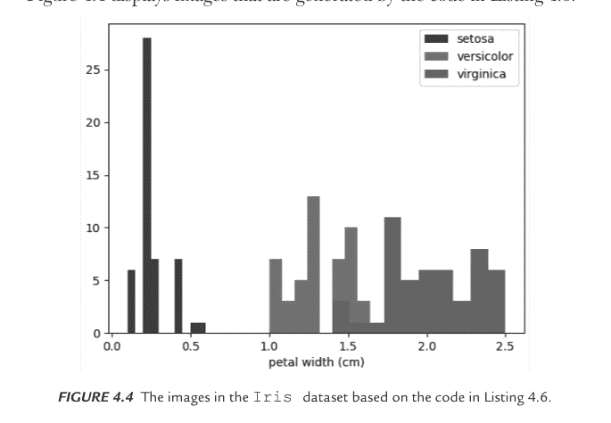

**图 4.4** 基于清单 4.6 中的代码生成的鸢尾花数据集图像。

## Sklearn 中的人脸数据集（可选）

Olivetti 人脸数据集包含一组在 1992 年 4 月至 1994 年 4 月期间于 AT&T 实验室剑桥拍摄的人脸图像。正如你将在清单 4.7 中看到的，`Sklearn.datasets.fetch_olivetti_faces` 函数是用于从 AT&T 下载数据存档的数据获取和缓存函数。

清单 4.7 展示了 `sklearn_faces.py` 中的代码，该代码显示了 Sklearn 中人脸数据集的内容。

**清单 4.7：sklearn_faces.py**

```python
import Sklearn
from sklearn.datasets import fetch_olivetti_faces

faces = fetch_olivetti_faces()

import matplotlib.pyplot as plt

# display figures in inches
fig = plt.figure(figsize=(6, 6))
fig.subplots_adjust(left=0, right=1, bottom=0, top=1,
                    hspace=0.05, wspace=0.05)

# plot the faces:
for i in range(64):
    ax = fig.add_subplot(8, 8, i + 1, xticks=[], yticks=[])
    ax.imshow(faces.images[i], cmap=plt.cm.bone,
              interpolation='nearest')

plt.show()
```

清单 4.7 以 `import` 语句开始，然后用 `Faces` 数据集的内容初始化变量 `faces`。清单 4.7 的下一部分包含一些绘图相关代码，随后是一个 `for` 循环，以 8x8 的网格模式显示 64 张图像（类似于之前的代码示例）。运行清单 4.7 以查看图 4.5 中的图像。


**图 4.5** 使用清单 4.7 中的代码绘制的 Olivetti 人脸数据集图像。

至此，我们对 Sklearn 的简要介绍就结束了。请记住，Sklearn 支持大量的机器学习算法。

任务，包括线性回归、分类和聚类的代码。

本章的下一部分将介绍 SciPy，这是一个基于 Python 的库，非常适合科学计算任务。

## 什么是 SciPy？

SciPy 是一个面向科学的 Python 库，提供了许多执行操作和计算的 API，其中一些列举如下：

- 组合值
- 排列值
- 矩阵求逆
- 图像变换
- 积分（微积分）
- 傅里叶变换
- 特征值和特征向量

以下列表展示了 SciPy 的一些组成部分及其所在位置：

- 文件输入/输出 (`scipy.io`)
- 特殊函数 (`scipy.special`)
- 线性代数 (`scipy.linalg`)
- 插值 (`scipy.interpolate`)
- 统计/随机数 (`scipy.stats`)
- 数值积分 (`scipy.integrate`)
- 快速傅里叶变换 (`scipy.fftpack`)
- 信号处理 (`scipy.signal`)
- 图像处理 (`scipy.ndimage`)

请记住，SciPy 被设计为一个子模块的集合，其中大部分依赖于 NumPy。

## 安装 SciPy

确保你的笔记本电脑上安装了 Python 3.x，然后执行以下步骤来安装 SciPy：

```
pip3 install scipy
``

让我们深入探讨 SciPy 的一些功能，从下一节讨论的一些组合计算开始。

## SciPy 中的排列与组合

提醒一下，术语 n! 表示非负整数的阶乘值，计算如下：

n! = n*(n-1)*(n-2)* . . . 3*2*1 (且 0! = 1)

接下来，让我们使用术语 P(n) 来表示从 n 个对象的集合中选择 n 个对象的方式数量，其中 n 是非负整数。P(n) 的公式如下：

P(n) = n!

术语 C(n, k) 表示从 n 个对象的集合中选择 k 个对象的方式数量，其中 n 和 k 是非负整数且 k<=n。C(n, k) 的公式如下：

C(n, k) = n! / [(n-k)! * k!]

清单 4.8 展示了 `scipy_perms.py` 的内容，说明了如何在 SciPy 中计算 C(n, k) 的值。

**清单 4.8: scipy_perms.py**

```
from scipy.special import perm

#find permutation of 5, 2 using perm (N, k) function
per = perm(5, 2, exact = True)
print("Perm(5,2):",per)
```

清单 4.8 以一个导入语句开始，然后通过 SciPy 函数 `comb()` 初始化变量 `per`，该函数计算指定 n 和 k 值的排列值 P(n, k)。清单 4.8 的下一部分显示了 P(5, 2) 的值，如下所示：

Perm(5,2): 20

清单 4.9 展示了 `scipy_combinatorics.py` 的内容，说明了如何在 SciPy 中计算 P(n) 的值。

**清单 4.9: scipy_combinatorics.py**

```
from scipy.special import comb

#find combinations of 5, 2 values using comb(N, k)
com = comb(5, 2, exact = False, repetition=True)
print("C(5,2):",com)
```

清单 4.9 以一个导入语句开始，然后通过 SciPy 函数 `comb()` 初始化变量 `com`，该函数计算指定 n 和 k 值的组合值 C(n,k)。清单 4.9 的下一部分显示了 C(5,2) 的值，如下所示：

C(5,2): 15.0

## 计算对数和

清单 4.10 展示了 `scipy_matrix_inv.py` 的内容，说明了如何计算可逆 n x n 矩阵的逆矩阵。

**清单 4.10: scipy_matrix_inv.py**

```
import numpy as np
import matplotlib.pyplot as plt

x = np.random.randn(15,1)
y = 2.5*x + 5 + 0.2*np.random.randn(15,1)

plt.scatter(x,y)
plt.show()
```

清单 4.10 以两个 `import` 语句开始，然后通过 NumPy 的 `randn()` API 将 `x` 初始化为一组随机值。接下来，`y` 被赋值为 `x` 的倍数加上一个随机值。

## 计算多项式值

清单 4.11 展示了 `scipy_poly.py` 的内容，说明了如何在 SciPy 中执行各种多项式操作。

**清单 4.11: scipy_poly.py**

```
import numpy as np
import scipy

p = np.poly1d([3,4,5])
print("p:",p)
print("p*p:",p*p)

print("p.integ(k=6):")
print(p.integ(k=6))

print("p.deriv():")
print(p.deriv())

print("p([4,5]):")
print(p([4,5]))
```

清单 4.11 以两个 `import` 语句开始，然后通过 NumPy 的 `randn()` API 将 `x` 初始化为一组随机值。接下来，`y` 被赋值为一系列值，这些值由两部分组成：一个使用 `x` 值作为输入的线性方程，与一个随机化因子相结合。运行清单 4.11 中的代码，你将看到以下输出：

```
p:       2
3 x + 4 x + 5
p*p:     4       3       2
9 x + 24 x + 46 x + 40 x + 25
p.integ(k=6):
      3       2
1 x + 2 x + 5 x + 6
p.deriv():

6 x + 4
p([4,5]):
[ 69 100]
```

接下来的几个部分包含使用 SciPy API 执行线性代数操作的示例。

## 计算方阵的行列式

清单 4.12 展示了 `scipy_determinant.py` 的内容，说明了如何计算可逆 n x n 矩阵的逆矩阵。

**清单 4.12: scipy_determinant.py**

```
from scipy import linalg
import numpy as np

#define square matrix
two_d_array = np.array([ [4,5], [3,2] ])

result = linalg.det( two_d_array )
print("determinant:",result)
```

清单 4.12 以两个 `import` 语句开始，然后将变量 `two_d_array` 初始化为一个二维整数 Numpy 数组。清单 4.12 的下一部分调用 `linalg.det()` 方法来计算并打印 `two_d_array` 的行列式值。运行清单 4.12 中的代码，你将看到以下输出：

```
determinant: -7.0
```

## 计算矩阵的逆

清单 4.13 展示了 `scipy_matrix_inv.py` 的内容，说明了如何计算可逆 n x n 矩阵的逆矩阵。

**清单 4.13: scipy_matrix_inv.py**

```
from scipy import linalg
import numpy as np

# define square matrix
two_d_array = np.array([ [4,5], [3,2] ])
print("matrix: ")
print(two_d_array)

print("inverse:")
print( linalg.inv(two_d_array))
```

清单 4.13 以两个 `import` 语句开始，然后将变量 `two_d_array` 初始化为一个二维整数 Numpy 数组。清单 4.13 的下一部分调用 `linalg.inv()` 方法来计算并打印 `two_d_array` 的逆矩阵。运行清单 4.13 中的代码，你将看到以下输出：

```
matrix:
[[4 5]
 [3 2]]
inverse:
[[-0.28571429  0.71428571]
 [ 0.42857143 -0.57142857]]
```

## 计算特征值和特征向量

清单 4.14 展示了 `scipy_eigen.py` 的内容，说明了如何在 SciPy 中计算特征值和特征向量。

**清单 4.14: scipy_eigen.py**

```
from scipy import linalg
import numpy as np

#define two dimensional array
arr = np.array([[5,4],[6,3]])

#pass value into function
eg_val, eg_vect = linalg.eig(arr)

#get eigenvalues
print("eigenvalues:")
print(eg_val)

#get eigenvectors
print("eigenvectors:")
print(eg_vect)
```

清单 4.14 以两个 `import` 语句开始，然后将变量 `arr` 初始化为一个二维整数 Numpy 数组。清单 4.14 的下一部分初始化变量 `eg_val` 和 `eg_vect`，它们是通过调用 `linalg.eig()` 方法返回的。

清单 4.14 的最后部分打印变量 `eg_val` 和 `eg_vect` 的值。运行清单 4.14 中的代码，你将看到以下输出：

```
eigenvalues:
[ 9.+0.j -1.+0.j]
eigenvectors:
[[ 0.70710678 -0.5547002 ]
 [ 0.70710678  0.83205029]]
```

## 计算积分（微积分）

清单 4.15 展示了 `scipy_integrate.py` 的内容，说明了如何计算可微函数的积分。

**清单 4.15: scipy_integrate.py**

```
from scipy import integrate

# take f(x) function as f
f = lambda x : x**2

#single integration with a = 0 & b = 1
integration = integrate.quad(f, 0 , 1)
print(integration)
```

清单 4.15 以两个 `import` 语句开始，然后将 `f` 初始化为一个 lambda 函数，该函数返回其输入值的平方。接下来，变量 `integration` 通过调用 `integrate.quad()` 方法的结果进行初始化，之后显示其值。运行清单 4.15 中的代码，你将看到以下输出：

```
(0.33333333333333337, 3.700743415417189e-15)
```

## 计算傅里叶变换

清单 4.16 展示了 `scipy_fourier.py` 的内容，该文件演示了如何计算一个可逆 nxn 矩阵的逆矩阵。

**清单 4.16：scipy_fourier.py**

```
import numpy as np
import matplotlib.pyplot as plt

x = np.random.randn(15,1)
y = 2.5*x + 5 + 0.2*np.random.randn(15,1)

plt.scatter(x,y)
plt.show()
```

清单 4.16 以两条 `import` 语句开头，随后通过 NumPy 的 `randn()` API 将 `x` 初始化为一组随机值。接着，`y` 被赋予一组基于 `x` 值和随机计算数字组合的值，如下所示（你可以尝试修改这些硬编码的值）：

```
y = 2.5*x + 5 + 0.2*np.random.randn(15,1)
```

清单 4.16 的最后部分根据 `x` 和 `y` 的值生成并显示散点图。运行清单 4.16 中的代码，你将看到图 4.6 中显示的图像。

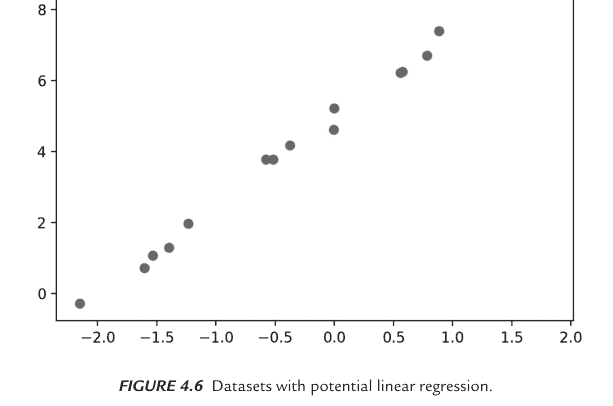

**图 4.6** 具有潜在线性回归的数据集。

接下来的几节包含使用 SciPy API 进行图像变换的示例。

## 在 SciPy 中翻转图像

清单 4.17 展示了 `scipy_flip_image.py` 的内容，该文件演示了如何计算一个可逆 nxn 矩阵的逆矩阵。

**清单 4.17：scipy_flip_image.py**

```
import numpy as np
import matplotlib.pyplot as plt
from scipy import ndimage, misc

#Flip Down using scipy misc.face image
flip_down = np.flipud(misc.face())
plt.imshow(flip_down)
plt.show()
```

清单 4.17 以两条 `import` 语句开头，随后通过 NumPy 的 `randn()` API 将 x 初始化为一组随机值。接着，y 被赋予一系列值，这些值由两部分组成：一个基于 x 值的线性方程，与一个随机化因子相结合。图 4.7 显示了清单 4.17 中代码生成的输出。

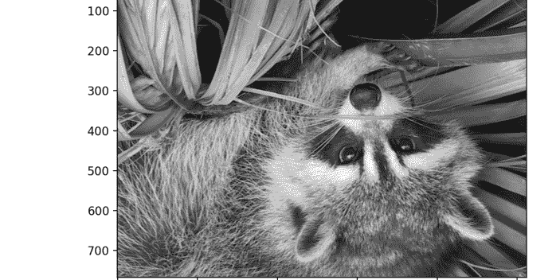

**图 4.7** 具有潜在线性回归的数据集。

## 在 SciPy 中旋转图像

清单 4.18 展示了 `scipy_rotate_image.py` 的内容，该文件演示了如何在 SciPy 中旋转图像。

**清单 4.18：scipy_rotate_image.py**

```
from scipy import ndimage, misc
from matplotlib import pyplot as plt
panda = misc.face()

#rotatation function of scipy for image - image rotated 135 degree
panda_rotate = ndimage.rotate(panda, 135)
plt.imshow(panda_rotate)
plt.show()
```

清单 4.18 以两条 `import` 语句开头，随后通过 NumPy 的 `randn()` API 将 `x` 初始化为一组随机值。接着，`y` 被赋予一系列值，这些值由两部分组成：一个基于 `x` 值的线性方程，与一个随机化因子相结合。图 4.8 显示了清单 4.18 中代码生成的输出。


**图 4.8** SciPy 中旋转后的图像。

## Google Colaboratory

根据硬件不同，基于 GPU 的 TF 2 代码可能比基于 CPU 的 TF 2 代码快多达 15 倍。然而，一块好的 GPU 成本可能是一个重要因素。虽然 NVIDIA 提供 GPU，但这些消费级 GPU 并未针对多 GPU 支持（TF 2 支持此功能）进行优化。

幸运的是，Google Colaboratory 是一个经济实惠的替代方案，它提供免费的 GPU 支持，并且作为 Jupyter notebook 环境运行。此外，Google Colaboratory 在云端执行你的代码，无需任何配置，并且可以在线访问：

https://colab.research.google.com/notebooks/welcome.ipynb

Jupyter notebook 适合快速训练简单模型和测试想法。Google Colaboratory 使得上传本地文件、在 Jupyter notebook 中安装软件，甚至将 Google Colaboratory 连接到你本地机器上的 Jupyter 运行时变得轻而易举。

Colaboratory 支持的一些功能包括使用 GPU 执行 TF 2、使用 Matplotlib 进行可视化，以及通过以下主菜单步骤将你的 Google Colaboratory notebook 副本保存到 Github：文件 > 保存副本到 GitHub。

此外，你只需将路径添加到 URL colab.research.google.com/github/，即可加载 GitHub 上的任何 .ipynb 文件（详情请参阅 Colaboratory 网站）。

Google Colaboratory 支持其他技术，如 HTML 和 SVG，使你能够在 Google Colaboratory 的 notebook 中渲染基于 SVG 的图形。有一点需要注意：你在 Google Colaboratory notebook 中安装的任何软件仅在当前会话期间可用。如果你注销后重新登录，你需要执行与之前 Google Colaboratory 会话期间相同的安装步骤。

如前所述，Google Colaboratory 还有一个*非常*好的功能：你可以每天免费在 GPU 上执行代码长达十二小时。这种免费的 GPU 支持对于本地机器上没有合适 GPU 的人（这可能是大多数用户）来说极其有用，现在他们可以在不到 20 或 30 分钟内启动 TF 2 代码来训练神经网络，否则这将需要数小时的基于 CPU 的执行时间。

你也可以在 Google Colaboratory notebook 中使用以下命令启动 Tensorboard（将指定目录替换为你自己的位置）：

```
%tensorboard --logdir /logs/images
```

请记住关于 Google Colaboratory 的以下细节。首先，每当你连接到 Google Colaboratory 中的服务器时，你就会启动一个所谓的*会话*。你可以在会话中使用 CPU（默认）、GPU 或 TPU（免费提供）执行代码，并且可以在会话中无时间限制地执行代码。但是，如果你为会话选择了 GPU 选项，*只有前 12 小时的 GPU 执行时间是免费的*。在同一会话期间的任何额外 GPU 时间都会产生少量费用（详情请参阅网站）。你在给定会话期间在 Jupyter notebook 中安装的任何软件在退出该会话时*不会*被保存。顺便说一句，你也可以在 Google Colaboratory 中运行 TF 2 代码和 Tensorboard。请访问此站点获取更多信息：

https://www.tensorflow.org/tensorboard/r2/tensorboard_in_notebooks

## 在 Google Colaboratory 中上传 CSV 文件

清单 4.19 展示了 `upload_csv_file.ipynb` 的内容，该文件演示了如何将 CSV 文件上传到 Google Colaboratory notebook。

**清单 4.19：upload_csv_file.ipynb**

```
import pandas as pd

from google.colab import files
uploaded = files.upload()

df = pd.read_csv("weather_data.csv")
print("dataframe df:")
df
```

清单 4.19 上传了 CSV 文件 `weather_data.csv`，其内容未显示，因为对于本示例来说并不重要。以粗体显示的代码是上传 CSV 文件所需的 Colaboratory 特定代码。当你运行此代码时，你会看到一个标有“浏览”的小按钮，你必须点击它，然后选择代码片段中列出的 CSV 文件。完成此操作后，其余代码将执行，你将在浏览器会话中看到 CSV 文件的内容。

> **注意** 如果你想在 Google Colaboratory 中成功运行此 Jupyter notebook，必须提供 CSV 文件 `weather_data.csv`。

## 总结

本章首先介绍了 Sklearn，这是一个用于机器学习任务的极其通用的 Python 库。

接下来你了解了 SciPy，这是一个非常适合科学计算任务的 Python 库。你看到了简单的代码示例，展示了如何在 SciPy 中翻转和旋转图像。

最后，你了解了 Google Colaboratory（也称为“Colab”），这是一个免费提供的在线工具，用于创建和启动 Jupyter notebook。Colab 支持许多有用的功能，例如以各种格式下载 notebook、直接将 Github 仓库导入 notebook，以及在 Google Colaboratory 中执行 notebook 时免费支持 GPU 和 TPU。

## 第五章

## 数据清洗任务

本章讨论涉及包含多种数据类型的数据集的数据清洗任务，例如日期格式、电话号码和货币，这些数据都可能具有不同的格式。此外，本章中的许多代码示例引用了本书前面章节讨论的技术。

本章第一部分简要介绍了数据清洗，随后是针对 MySQL 数据库表中数据的数据清洗任务示例。具体来说，你将看到如何将 NULL 值替换为 0，如何将 NULL 值替换为平均值，如何将多个值替换为单个值，如何处理不匹配的属性值，以及如何将字符串转换为日期值。

本章第二部分向你展示如何使用 `sed` 命令行实用程序将 CSV 文件中的多个分隔符替换为单个分隔符。你还将看到如何使用 `awk` 命令行实用程序重构 CSV 文件，以创建一个行具有相同字段数的文件。

本章第三部分向你展示如何使用 `awk` 命令行实用程序处理具有可变列数的 CSV 文件。`awk` 命令是一种独立的编程语言，具有处理文本文件的真正令人印象深刻的能力。如果你不熟悉 `awk` 命令，请阅读包含使用 `awk` 实用程序的各种代码示例的附录。

本章第四部分包含基于 `awk` 的 shell 脚本，向你展示如何转换电话号码列表，使电话号码具有相同的格式，以及如何将日期格式列表转换为不同的格式。

本章假设你已经阅读了前面章节中的数据清洗示例。此外，第七章包含一个涉及数据清洗任务的附加代码示例部分。

## 什么是数据清洗？

数据清洗，也称为数据清理，是确保数据集内容完整、正确且通常没有重复项的任务。因此，数据清洗的重点是单个文件，而不是组合或转换来自两个或多个文件的数据。数据清洗通常在执行任何数据转换之前进行。在某些情况下，数据转换后也必须执行数据清洗。

例如，假设一个 CSV 文件包含与员工相关的数据，一个 MySQL 表也包含与员工相关的数据，两者都已清理了不一致性并删除了重复项。但是，将表数据导出到与第一个 CSV 文件合并的 CSV 文件后，可能存在必须删除的重复项。

顺便说一句，有几种技术可以确定替换空字段的值，技术的选择范围从明显的选择到更微妙的因素。有时你可以为缺失值指定平均值或中位数，但在其他情况下，你需要更复杂的技术。例如，假设一个包含 1,000 行的数据集由两类患者组成：健康患者（占大多数）和癌症患者。显然，你希望患病患者的数量尽可能少（理想情况下为零）；实际上，会有一些患者患病，可能大多数患者是健康的，这意味着数据集从根本上是不平衡的。

不幸的是，机器学习算法在不平衡的数据集上可能会产生不准确的结果。此外，生成特征值基于平均值或中位数的合成数据可能是有风险的。一种更好的技术称为 SMOTE，它生成的数据值接近原始数据集中出现的值。

另一个例子是，日期、货币和小数的格式在不同国家之间有所不同。日期格式的示例包括 YYYY/MM/DD、MM/DD/YYYY 和 DD/MM/YYYY（以及其他可能的日期格式）。顺便说一句，YYYY/MM/DD 是数字日期的 ISO 标准。

数字格式在美国涉及千位分隔符“,”和小数点“.”（例如：$1,234.56），而欧洲使用相反的顺序（例如：1.234,56）。根据所讨论的数据集，数据清洗还可能涉及处理各种日期、货币和小数，以确保所有值具有相同的格式。

如果两个 CSV 文件包含不同的日期格式，并且你需要创建一个基于日期列的单个 CSV 文件，那么将存在某种类型的转换过程，可能是以下之一：

- 将第一种日期格式转换为第二种日期格式
- 将第二种日期格式转换为第一种日期格式
- 将两种日期格式都转换为第三种日期格式

在金融数据的情况下，你可能还会遇到不同的货币，这涉及一对货币之间的汇率。由于货币汇率波动，你需要决定用于数据的汇率，可以是

- CSV 文件生成时的汇率
- 当前货币汇率
- 某种其他机制

## 个人称谓的数据清洗

有时“暴力”解决方案也是最简单的解决方案，特别是当涉及字符串时。例如，一个人的称谓可能以无数种方式拼写错误，涉及许多烦人的小变体，因此最好知道如何以简单、直观且易于扩展附加案例的方式执行此任务。在查看以下解决方案之前，请考虑如何将以下列表中的每个字符串替换为“Mr”、“Ms”或“Mrs”：

```
titles = ['mr.','MR','MR.','mister','Mister','Ms','Ms.', 'Mr',
'Mr.','mr','MS','MS.','ms','ms.','Mis','miss','miss.','Mrs',
'Mrs.','mrs','mrs.','Madam','madam','ma"am']
```

虽然可以使用 if/else 代码块的条件逻辑来解决此任务，但这种方法涉及一个冗长的代码块。一个更简单、更容易的解决方案涉及 `in` 关键字，如下所示：

```
mr_dict={}
ms_dict={}
mrs_dict={}
titles = ['mr.','MR','MR.','mister','Mister','Ms','Ms.', 'Mr',
'Mr.','mr','MS','MS.','ms','ms.','Mis','miss','miss.','Mrs',
'Mrs.','mrs','mrs.','Madam','madam','ma"am']

for title in ['Mr','Mr.','mr','mr.','MR','MR.','mister','Mister']:
    mr_dict[title] = "Mr"

for title in ['Ms','Ms.','MS','MS.','ms','ms.','Mis','miss','miss.']:
    ms_dict[title] = "Ms"

for title in ['Mrs','Mrs.','mrs','mrs.','Madam','madam','ma"am']:
    mrs_dict[title] = "Mrs"

print("Mr dictionary: ",mr_dict)
print()
print("Ms dictionary: ",ms_dict)
print()
print("Mrs dictionary:",mrs_dict)
```

运行前面的代码块，你将看到以下输出：

```
Mr dictionary:  {'Mr': 'Mr', 'Mr.': 'Mr', 'mr': 'Mr', 'mr.':
'Mr', 'MR': 'Mr', 'MR.': 'Mr', 'mister': 'Mr', 'Mister': 'Mr'}

Ms dictionary:  {'Ms': 'Ms', 'Ms.': 'Ms', 'MS': 'Ms', 'MS.': 'Ms',
'ms': 'Ms', 'ms.': 'Ms', 'Mis': 'Ms', 'miss': 'Ms', 'miss.': 'Ms'}

Mrs dictionary: {'Mrs': 'Mrs', 'Mrs.': 'Mrs', 'mrs': 'Mrs', 'mrs.':
'Mrs', 'Madam': 'Mrs', 'madam': 'Mrs', 'ma"am': 'Mrs'}
```

上面给出的解决方案使其非常易于维护、调试和扩展，因为唯一需要的更改是在适当的位置添加一个新字符串。此外，给定的解决方案不需要任何额外的循环或正则表达式。如果你需要一个新的类别，例如“Sir”，请定义 Python 字典 `sir_dict`，然后添加一个新的代码片段，如下所示：

```
if title in ['Sir','sir','Sire','sire','Yessir','yessir']:
    sir_dict[title] = "Sir"
```

## SQL 中的数据清洗

本节包含几个在 SQL 中执行数据清洗任务的小节。请注意，在 SQL 中执行这些任务不是强制性的。另一种选择是将数据库表的内容读入 Pandas 数据帧，然后使用 Pandas 方法实现相同的结果。

但是，本节说明了如何执行以下影响数据库表属性的数据清洗任务：- 将 NULL 替换为 0
- 将 NULL 替换为平均值
- 将多个值合并为单个值
- 处理数据类型不匹配
- 将字符串日期转换为日期格式

## 将 NULL 替换为 0

此任务很简单，你可以使用以下任一 MySQL 数据库 SQL 语句来执行：

```sql
SELECT ISNULL(column_name, 0 ) FROM table_name

OR

SELECT COALESCE(column_name, 0 ) FROM table_name
```

## 将 NULL 值替换为平均值

此任务涉及两个步骤：首先计算数据库表中某列非 NULL 值的平均值，然后用第一步中找到的值更新该列中的 NULL 值。

清单 5.1 展示了执行这两个步骤的 `replace_null_values.sql` 文件内容。

### 清单 5.1：replace_null_values.sql

```sql
USE mytools;
DROP TABLE IF EXISTS temperatures;
CREATE TABLE temperatures (temper INT, city CHAR(20));

INSERT INTO temperatures VALUES(78,'sf');
INSERT INTO temperatures VALUES(NULL,'sf');
INSERT INTO temperatures VALUES(42,NULL);
INSERT INTO temperatures VALUES(NULL,'ny');
SELECT * FROM temperatures;

SELECT @avg1 := AVG(temper) FROM temperatures;
update temperatures
set temper = @avg1
where ISNULL(temper);
SELECT * FROM temperatures;

-- initialize city1 with the most frequent city value:
SELECT @city1 := (SELECT city FROM temperatures GROUP BY city
ORDER BY COUNT(*) DESC LIMIT 1);
-- update NULL city values with the value of city1:
update temperatures
set city = @city1
where ISNULL(city);
SELECT * FROM temperatures;
```

清单 5.1 创建并填充了包含多行数据的 `temperatures` 表，然后用 `temperatures` 表中 `temper` 属性的平均温度初始化变量 `avg1`。运行清单 5.1 中的代码，你将看到以下输出：

```
+--------+-------+
| temper | city  |
+--------+-------+
|     78 | sf    |
|   NULL | sf    |
|     42 | NULL  |
|   NULL | ny    |
+--------+-------+
4 rows in set (0.000 sec)
```

```
+---------------------+
| @avg1 := AVG(temper) |
+---------------------+
|       60.000000000  |
+---------------------+
1 row in set, 1 warning (0.000 sec)
```

```
Query OK, 2 rows affected (0.001 sec)
Rows matched: 2  Changed: 2  Warnings: 0
```

```
+--------+-------+
| temper | city  |
+--------+-------+
|     78 | sf    |
|     60 | sf    |
|     42 | NULL  |
|     60 | ny    |
+--------+-------+
4 rows in set (0.000 sec)
```

```
+-------------------------------------------------------------------+
| @city1 := (SELECT city FROM temperatures GROUP BY city ORDER BY COUNT(*) DESC LIMIT 1) |
+-------------------------------------------------------------------+
| sf                                                                |
+-------------------------------------------------------------------+
1 row in set, 1 warning (0.000 sec)
```

```
Query OK, 1 row affected (0.000 sec)
Rows matched: 1  Changed: 1  Warnings: 0
```

```
+---------+-------+
| temper  | city  |
+---------+-------+
|      78 | sf    |
|      60 | sf    |
|      42 | sf    |
|      60 | ny    |
+---------+-------+
4 rows in set (0.000 sec)
```

## 将多个值合并为单个值

合并属性中多个值的一个例子是将纽约州的多个字符串（如 `new_york`、`NewYork`、`NY` 和 `New_York`）替换为 `NY`。清单 5.2 展示了执行这两个步骤的 `reduce_values.sql` 文件内容。

### 清单 5.2：`reduce_values.sql`

```sql
use mytools;
DROP TABLE IF EXISTS mytable;
CREATE TABLE mytable (str_date CHAR(15), state CHAR(20), reply CHAR(10));

INSERT INTO mytable VALUES('20210915','New York','Yes');
INSERT INTO mytable VALUES('20211016','New York','no');
INSERT INTO mytable VALUES('20220117','Illinois','yes');
INSERT INTO mytable VALUES('20220218','New York','No');
SELECT * FROM mytable;

-- replace yes, Yes, y, Ys with Y:
update mytable
set reply = 'Y'
where upper(substr(reply,1,1)) = 'Y';
SELECT * FROM mytable;

-- replace all other values with
update mytable
set reply = 'N' where substr(reply,1,1) != 'Y';
SELECT * FROM mytable;
```

清单 5.2 创建并填充了 `mytable` 表，然后将 reply 属性中 yes 的各种变体替换为字母 Y。清单 5.2 的最后部分将任何*不*以字母 Y 开头的字符串替换为字母 N。运行清单 5.2 中的代码，你将看到以下输出：

```
+------------+-----------+--------+
| str_date   | state     | reply  |
+------------+-----------+--------+
| 20210915   | New York  | Yes    |
| 20211016   | New York  | no     |
| 20220117   | Illinois  | yes    |
| 20220218   | New York  | No     |
+------------+-----------+--------+
4 rows in set (0.000 sec)

Query OK, 2 rows affected (0.001 sec)
Rows matched: 2  Changed: 2  Warnings: 0

+------------+-----------+--------+
| str_date   | state     | reply  |
+------------+-----------+--------+
| 20210915   | New York  | Y      |
| 20211016   | New York  | no     |
| 20220117   | Illinois  | Y      |
| 20220218   | New York  | No     |
+------------+-----------+--------+
4 rows in set (0.000 sec)

Query OK, 2 rows affected (0.001 sec)
Rows matched: 2  Changed: 2  Warnings: 0

+------------+-----------+--------+
| str_date   | state     | reply  |
+------------+-----------+--------+
| 20210915   | New York  | Y      |
| 20211016   | New York  | N      |
| 20220117   | Illinois  | Y      |
| 20220218   | New York  | N      |
+------------+-----------+--------+
4 rows in set (0.001 sec)
```

## 处理不匹配的属性值

此任务涉及两个步骤：首先计算数据库表中某列非 NULL 值的平均值，然后用第一步中找到的值更新该列中的 NULL 值。

清单 5.3 展示了执行这两个步骤的 `type_mismatch.sql` 文件内容。

### 清单 5.3：`type_mismatch.sql`

```sql
USE mytools;
DROP TABLE IF EXISTS emp_details;
CREATE TABLE emp_details (emp_id CHAR(15), city CHAR(20),
state CHAR(20));

INSERT INTO emp_details VALUES('1000','Chicago','Illinois');
INSERT INTO emp_details VALUES('2000','Seattle','Washington');
INSERT INTO emp_details VALUES('3000','Santa
Cruz','California');
INSERT INTO emp_details
VALUES('4000','Boston','Massachusetts');
SELECT * FROM emp_details;

select emp.emp_id, emp.title, det.city, det.state
from employees emp join emp_details det
WHERE emp.emp_id = det.emp_id;

--required for earlier versions of MySQL:
--WHERE emp.emp_id = cast(det.emp_id as INT);
```

清单 5.3 创建并填充了 `emp_details` 表，随后是一个涉及 `emp` 和 `emp_details` 表的 SQL JOIN 语句。尽管 `emp_id` 列在 `emp` 和 `emp_details` 表中分别被定义为 `INT` 类型和 `CHAR` 类型，但代码仍能按预期工作。然而，在早期版本的 MySQL 中，你需要使用内置的 `CAST()` 函数将 `CHAR` 值转换为 `INT` 值（或反之），如注释掉的代码片段所示：

```sql
--WHERE emp.emp_id = cast(det.emp_id as INT);
```

运行清单 5.3 中的代码，你将看到以下输出：

```
+---------+------------+--------------+
| emp_id  | city       | state        |
+---------+------------+--------------+
| 1000    | Chicago    | Illinois     |
| 2000    | Seattle    | Washington   |
| 3000    | Santa Cruz | California   |
| 4000    | Boston     | Massachusetts|
+---------+------------+--------------+
4 rows in set (0.000 sec)
+---------+------------------+------------+--------------+
| emp_id  | title            | city       | state        |
+---------+------------------+------------+--------------+
| 1000    | Developer        | Chicago    | Illinois     |
| 2000    | Project Lead     | Seattle    | Washington   |
| 3000    | Dev Manager      | Santa Cruz | California   |
| 4000    | Senior Dev Manager| Boston    | Massachusetts|
+---------+------------------+------------+--------------+
4 rows in set (0.002 sec)
```

## 将字符串转换为日期值

清单 5.4 展示了 `str_to_date.sql` 的内容，该示例说明了如何使用另一个包含日期字符串的字符串属性中的值来填充日期属性。

**清单 5.4：str_to_date.sql**

```sql
use mytools;
DROP TABLE IF EXISTS mytable;
CREATE TABLE mytable (str_date CHAR(15), state CHAR(20), reply CHAR(10));

INSERT INTO mytable VALUES('20210915','New York','Yes');
INSERT INTO mytable VALUES('20211016','New York','no');
INSERT INTO mytable VALUES('20220117','Illinois','yes');
INSERT INTO mytable VALUES('20220218','New York','No');

SELECT * FROM mytable;

-- 1) insert date-based feature:
ALTER TABLE mytable
ADD COLUMN (real_date DATE);
SELECT * FROM mytable;

-- 2) populate real_date from str_date:
UPDATE mytable t1
    INNER JOIN mytable t2
        ON t1.str_date = t2.str_date
SET t1.real_date = DATE(t2.str_date);
SELECT * FROM mytable;

-- 3) Remove unwanted features:
ALTER TABLE mytable
DROP COLUMN str_date;
SELECT * FROM mytable;
```

清单 5.4 创建并填充了表 `mytable`，并显示了该表的内容。清单 5.4 的其余部分由三个 SQL 语句组成，每个语句都以一个注释语句开头，解释其用途。

第一个 SQL 语句插入了一个新的 `DATE` 类型的列 `real_date`。第二个 SQL 语句使用 `DATE()` 函数将 `str_date` 列中的值转换为日期值，并填充到 `real_date` 列中。第三个 SQL 语句是可选的：如果你希望这样做，它会删除 `str_date` 列。运行清单 5.4 中的代码，你将看到以下输出：

```
+------------+----------+-------+
| str_date   | state    | reply |
+------------+----------+-------+
| 20210915   | New York | Yes   |
| 20211016   | New York | no    |
| 20220117   | Illinois | yes   |
| 20220218   | New York | No    |
+------------+----------+-------+
4 rows in set (0.000 sec)
```

```
Query OK, 0 rows affected (0.007 sec)
Records: 0  Duplicates: 0  Warnings: 0
```

```
+------------+----------+-------+------------+
| str_date   | state    | reply | real_date  |
+------------+----------+-------+------------+
| 20210915   | New York | Yes   | NULL       |
| 20211016   | New York | no    | NULL       |
| 20220117   | Illinois | yes   | NULL       |
| 20220218   | New York | No    | NULL       |
+------------+----------+-------+------------+
4 rows in set (0.002 sec)
```

```
Query OK, 4 rows affected (0.002 sec)
Rows matched: 4  Changed: 4  Warnings: 0
```

```
+------------+----------+-------+------------+
| str_date   | state    | reply | real_date  |
+------------+----------+-------+------------+
| 20210915   | New York | Yes   | 2021-09-15 |
| 20211016   | New York | no    | 2021-10-16 |
| 20220117   | Illinois | yes   | 2022-01-17 |
| 20220218   | New York | No    | 2022-02-18 |
+------------+----------+-------+------------+
4 rows in set (0.000 sec)
```

```
Query OK, 0 rows affected (0.018 sec)
Records: 0  Duplicates: 0  Warnings: 0
```

```
+----------+-------+------------+
| state    | reply | real_date  |
+----------+-------+------------+
| New York | Yes   | 2021-09-15 |
| New York | no    | 2021-10-16 |
| Illinois | yes   | 2022-01-17 |
| New York | No    | 2022-02-18 |
+----------+-------+------------+
4 rows in set (0.000 sec)
```

## 从命令行进行数据清洗（可选）

本节标记为“可选”，因为任务的解决方案需要理解一些基于 Unix 的工具。虽然本书不包含这些工具的详细信息，但你可以找到包含这些工具示例的在线教程。

本节包含几个小节，执行涉及 `sed` 和 `awk` 工具的数据清洗任务：

-   用单个分隔符替换多个分隔符（sed）
-   重构数据集，使所有行具有相同的列数（awk）

请记住关于这些示例的一点：它们必须在命令行中执行，然后才能在 Pandas 数据框中进行处理。

## 使用 sed 工具

本节包含一个示例，说明如何使用 `sed` 命令行工具将文本文件中字段的不同分隔符替换为单个分隔符。你可以将相同的代码用于其他文件格式，例如 CSV 文件和 TSV 文件。

本节除了代码示例外，不提供关于 `sed` 的任何详细信息。但是，在你阅读代码（只有一行）之后，你将了解如何调整该代码片段以满足你自己的要求（即，如何指定不同的分隔符）。

清单 5.5 显示了 `delimiter1.txt` 的内容，清单 5.6 显示了 `delimiter1.sh` 的内容，该脚本将所有分隔符替换为逗号（“,”）。

**清单 5.5：delimiter1.txt**

```
1000|Jane:Edwards^Sales
2000|Tom:Smith^Development
3000|Dave:Del Ray^Marketing
```

**清单 5.6：delimiter1.sh**

```bash
cat delimiter1.txt | sed -e 's/:/,/' -e 's/|/,/' -e 's/\^/,/'
```

清单 5.6 以 `cat` 命令行工具开头，该工具将文件 `delimiter1.txt` 的内容发送到“标准输出”。但是，在此示例中，由于管道（“|”）符号，此命令的输出成为 sed 命令的输入。

`sed` 命令由三部分组成，所有部分都通过 `-e` 开关连接。你可以将 `-e` 视为表示 `sed` 命令“还有更多处理要做”。在此示例中，有三个 `-e` 出现，这意味着 `sed` 命令将执行三个代码片段。

第一个代码片段是 `'s/:/,/'`，它翻译为“将每个分号替换为逗号”。此操作的结果传递给下一个代码片段，即 `'s/|/,/'`。此代码片段翻译为“将每个管道符号替换为逗号”。此操作的结果传递给下一个代码片段，即 `'s/\^/,/'`。此代码片段翻译为“将每个脱字符号（^）替换为逗号”。此操作的结果发送到标准输出，可以重定向到另一个文本文件。运行清单 5.6 中的代码，你将看到以下输出：

```
1000,Jane,Edwards,Sales
2000,Tom,Smith,Development
3000,Dave,Del Ray,Marketing
```

有三点需要注意。首先，该代码片段包含一个反斜杠，因为脱字符号（^）是一个元字符，所以我们需要“转义”这个字符。其他元字符（如“$”和“.”）也是如此。

其次，你可以轻松地扩展 `sed` 命令，以处理你在文本文件中遇到的每个新分隔符作为字段分隔符：只需遵循清单 5.6 中看到的模式，为每个新分隔符添加即可。

第三，通过运行以下命令，将 `delimiter1.sh` 的输出重定向到文本文件 `delimiter2.txt`：

```bash
./delimiter1.sh > delimiter2.txt
```

如果前面的代码片段中发生错误，请确保 `delimiter1.sh` 是可执行的，方法是调用以下命令：

```bash
chmod 755 delimiter1.sh
```

这结束了涉及 `sed` 命令行工具的示例，该工具是处理文本文件的强大工具。如果你想了解更多关于 `sed` 工具的信息，请在线查看文章和博客文章。

## 处理可变列数

本节向你展示如何使用 `awk` 命令行工具，以便用 `NaN` 值“填充” CSV 文件中的行，使所有记录具有相同的列数。

清单 5.7 显示了 `variable_columns.csv` 的内容，清单 5.8 显示了 `variable_columns.sh` 的内容，该脚本使用 `awk` 工具来填充 CSV 文件中的列数。

**清单 5.7：variable_columns.csv**

```
10,20,30
10,20,30,40
10,20,30,40,50,60
```

**清单 5.8：variable_columns.sh**

```bash
filename="variable_columns.csv"

cat $filename | awk -F"," '
BEGIN { colCount = 6 }
{
    printf("%s", $0)
    for(i=NF; i<colCount; i++) {
        printf(",NaN")
    }
    print ""
}
'
```

清单 5.8 将变量 `filename` 初始化为此代码示例的 CSV 文件名。下一个代码片段是一个 `awk` 脚本，它在 `BEGIN` 块中将 `colCount` 初始化为值 6：此值是 CSV 文件任何行中的最大列数。

下一块代码显示当前行的内容，后跟一个循环，该循环打印一个以逗号分隔的 `NaN` 值列表，以确保输出行包含 6 列。例如，如果一行有 4 列，则将打印两次 `NaN`。循环后的 `print` 语句确保输入文件的下一行从新行开始，而不是当前输出行。运行清单 5.8 中的代码，你将看到以下输出：

```
10,20,30,NaN,NaN,NaN
10,20,30,40,NaN,NaN
10,20,30,40,50,60
10,20,NaN,NaN,NaN,NaN
10,20,30,40,NaN,NaN
```

清单5.8的一个局限性在于，必须在`BEGIN`块中指定最大列数。清单5.9通过扫描整个文件来确定CSV文件中的最大列数，从而消除了这一限制。

## 清单5.9: variable_columns2.sh

```
filename="variable_columns.csv"

cat $filename | awk -F"," '
BEGIN {
    maxColCount = 0;

    ###########################################
    # maxColCount = 最长行中的字段数
    ###########################################
    while(getline line < ARGV[1]) {
        colCount = split(line,data)
        if(maxColCount < length(data)) {
            maxColCount = length(data)
        }
    }
}
{
    # 打印当前输入行：
    printf("%s", $0)

    # 用NaN填充（如果需要）：
    for(j=NF; j<maxColCount; j++) {
        printf(",NaN")
    }
    print ""
}
' $filename
```

清单5.9将变量`filename`初始化为此代码示例的CSV文件名。清单5.9的下一部分是一个`awk`脚本，其中包含一个`while`循环，用于处理来自CSV文件的输入行。变量`maxColCount`在`BEGIN`块中初始化为0，当此循环完成时，其值将是输入文件中行的最大列数。

清单5.9的下一部分与清单5.8中的循环相同，该循环打印文本行，并在必要时用`NaN`填充它们。

运行清单5.9中的代码，你将看到以下输出：

```
10,20,30,NaN,NaN,NaN
10,20,30,40,NaN,NaN
10,20,30,40,50,60
10,20,NaN,NaN,NaN,NaN
10,20,30,40,NaN,NaN
```

## 截断CSV文件中的行

上一节向你展示了如何使用`awk`命令行实用程序，用字符串`NaN`“填充”CSV文件中的行，使所有记录具有相同的列数，而本节则向你展示如何截断CSV文件中的行，仅显示最短行中的列数。

清单5.10显示了`variable_columns3.sh`的内容，该脚本使用`awk`实用程序显示CSV文件中的列子集。

### 清单5.10: variable_columns3.sh

```
filename="variable_columns.csv"

cat $filename | awk -F"," '
BEGIN {
    colCount = 0; minColCount = 9999

    ###########################################
    # minColCount = 最短行中的字段数
    ###########################################

    while(getline line < ARGV[1]) {
        colCount = split(line,data)
        if(minColCount > length(data)) {
            minColCount = length(data)
        }
    }
}
{
    # 对每个输入行执行：
    for(j=1; j<=minColCount; j++) {
        printf("%s,",$j)
    }
    print ""
}
' $filename
```

清单5.10与清单5.9非常相似：在将变量`filename`初始化为此代码示例的CSV文件名之后，`awk`脚本会从CSV文件中找到列数最少的行的列数。

变量`minColCount`在`BEGIN`块中初始化为9999，当此循环完成时，其值将是输入文件中行的最小列数。

清单5.10的下一部分是一个循环，它打印输入文件中每一行的前`minColCount`列。运行清单5.10中的代码，你将看到以下输出：

```
10,20,
10,20,
10,20,
10,20,
10,20,
```

## 使用awk实用程序生成具有固定列数的行

本节中的代码示例包含一个`awk`脚本，该脚本处理以空格分隔的输入字符串CSV文件，并生成所有行都具有相同列数的输出（最后一行输出可能除外）。清单5.11显示了`FixedFieldCount1.sh`的内容，该脚本说明了如何使用`awk`实用程序将字符串拆分为包含三个字符串的行。

### 清单5.11: FixedFieldCount1.sh

```
echo "=> 字母对："
echo "aa bb cc dd ee ff gg hh"
echo

echo "=> 拆分为多行："
echo "aa bb cc dd ee ff gg hh"| awk '
BEGIN { colCount = 3 }
{
    for(i=1; i<=NF; i++) {
        printf("%s ", $i)
        if(i % colCount == 0) { print "" }
    }
    print ""
}
'
```

清单5.11显示了一个字符串的内容，然后将此字符串作为输入提供给`awk`命令。清单5.11的主体是一个从1迭代到`NF`的循环，其中`NF`是输入行中的字段数，在此示例中等于8。每个字段的值由`$i`表示：`$1`是第一个字段，`$2`是第二个字段，依此类推。请注意，`$0`是*整个*输入行的内容（在下一个代码示例中使用）。

接下来，如果i的值（这是字段的*位置*，而不是字段的内容）是3的倍数，则代码打印一个换行符。运行清单5.11中的代码，你将看到以下输出：

```
=> 字母对：
aa bb cc dd ee ff gg hh

=> 拆分为多行：
aa bb cc
dd ee ff
gg hh
```

清单5.12显示了`employees.txt`的内容，清单5.13显示了`FixedFieldCount2.sh`的内容，该脚本说明了如何使用`awk`实用程序确保所有行具有相同的列数。

### 清单5.12: employees.txt

```
jane:jones:SF:
john:smith:LA:
dave:smith:NY:
sara:white:CHI:
>>>none:none:none<<<:
jane:jones:SF:john:
smith:LA:
dave:smith:NY:sara:white:
CHI:
```

### 清单5.13: FixedFieldCount2.sh

```
cat employees.txt | awk -F":" '{printf("%s", $0)}' | awk -F':'
BEGIN { colCount = 3 }
{
    for(i=1; i<=NF; i++) {
        printf("%s#", $i)
        if(i % colCount == 0) { print "" }
    }
}
'
```

请注意，清单5.13中的代码与清单5.11中的代码几乎完全相同：以粗体显示的代码片段从其输入（即`employees.txt`的内容）中移除了“\n”字符。

如果你需要确认，可以从命令行运行以下代码片段：

```
cat employees.txt | awk -F":" '{printf("%s", $0)}'
```

上述代码片段的输出如下所示：

```
jane:jones:SF:john:smith:LA:dave:smith:NY:sara:white:CHI:>>>
none:none:none<<<:jane:jones:SF:john:smith:LA:dave:smith:
NY:sara:white:CHI:
```

上述输出中“\n”被移除的原因是由于此代码片段：

```
printf("%s", $0)
```

如果你想在每个输入行后保留“\n”换行符，请将上述代码片段替换为以下片段：

```
printf("%s\n", $0)
```

我们现在已将清单5.13中的任务简化为与清单5.11相同的任务，这就是为什么我们有相同的基于awk的代码块。

运行清单5.13中的代码，你将看到以下输出：

```
1000,Jane,Edwards,Sales
jane#jones#SF#
john#smith#LA#
dave#smith#NY#
sara#white#CHI#
>>>none#none#none<<<#
jane#jones#SF#
john#smith#LA#
dave#smith#NY#
Sara#white#CHI#
```

## 转换电话号码

清单5.14显示了`phone_numbers.txt`的内容，其中包含（大部分是虚构的）不同格式的电话号码。

### 清单5.14: phone_numbers.txt

```
1234567890
234 4560987
234 456 0987
212 555-1212
212-555-1212
(123)5551212
(456)555-1212
(789)555 1212
1-1234567890
1 234 4560987
1-234 456 0987
1 212 555-1212
1-212-555-1212
1 (123)5551212
1-(456)555-1212
1 (789)555 1212
011-1234567890
033 234 4560987
039-234 456 0987
034 212 555-1212
081-212-555-1212
044 (123)5551212
049-(456)555-1212
052 (789)555 1212
```

清单5.15显示了`phone_numbers.sh`的内容，该脚本说明了如何从清单5.14的电话号码中移除非数字字符，使其具有相同的格式。

### 清单5.15: phone_numbers.sh

```
FILE="country_codes.csv"

#cat phone_numbers.txt |tr -d '()' | sed -e 's/ //g' -e 's/-//g' | awk -F" " '
cat phone_numbers.txt |sed -e 's/[()]//g' -e 's/ //g' -e 's/-//g'| awk -F" " '
{
    line_len = length($0)

    if(line_len == 10) {
        inter = ""
        area  = substr($0,0,3)
        xchng = substr($0,3,3)
        subsc = substr($0,7,4)
        printf("%s,%s,%s\n",area,xchng,subsc)
    } else if(line_len == 11) {
        inter = substr($0,0,1)
        area  = substr($0,1,3)
        xchng = substr($0,4,3)
        subsc = substr($0,8,4)
        printf("%s,%s,%s,%s\n",inter, area,xchng,subsc)
    } else if(line_len == 13) {
        inter = substr($0,0,3)
        area  = substr($0,3,3)
        xchng = substr($0,6,3)
        subsc = substr($0,10,4)
        printf("%s,%s,%s,%s\n",inter, area,xchng,subsc)
    } else {
        print "invalid format: ",$0
    }
}'
```

清单5.15将变量`FILE`初始化为包含一组国家三位国际代码的CSV文件名。接下来的代码片段是一个由管道分隔的命令序列，它首先将文件`phone_numbers.txt`的内容重定向到`sed`命令，该命令会移除所有左括号、右括号、连字符（-）以及多个连续的空格。

`sed`命令的输出被重定向到一个`awk`脚本，该脚本处理长度为10、11和13的输入行，这些行分别包含缺少国际代码、包含单个数字国际代码和包含三位国际代码的电话号码。任何长度不同的输入行都被视为无效。运行清单5.15中的代码，你将看到以下输出：

```
123,345,7890
234,445,0987
234,445,0987
212,255,1212
212,255,1212
123,355,1212
456,655,1212
789,955,1212
1,112,345,7890
1,123,445,0987
1,123,445,0987
1,121,255,1212
1,121,255,1212
1,112,355,1212
1,145,655,1212
1,178,955,1212
011,112,345,7890
033,323,445,0987
039,923,445,0987
034,421,255,1212
081,121,255,1212
044,412,355,1212
049,945,655,1212
052,278,955,1212
```

## 转换数字日期格式

本节向你展示如何将日期格式转换为`MM-DD-YYYY`的通用格式。在深入代码之前，以下列表包含日期中月份、日期和年份的示例格式：

- `yy`：两位数年份（例如：22）
- `yyyy`：四位数年份（例如：2022）
- `m`：一位数月份（例如：4）
- `mm`：两位数月份（例如：04）
- `mmm`：月份的三个字母缩写（例如：Apr）
- `mmmm`：月份的全拼（例如：April）
- `d`：一位数日期（例如：2）
- `dd`：两位数日期（例如：02）
- `ddd`：星期的三个字母缩写（例如：Sat）
- `dddd`：星期的全拼（例如：Saturday）

清单5.16显示了`dates.txt`的内容，其中包含各种格式的虚构日期，**粗体**字符串具有无效格式。

### 清单5.16：dates.txt

```
03/15/2021
3/15/2021
3/15/21
03/5/2021
3/5/2021
3/5/21
**3/5/212**
**3/5/21Z**
```

清单5.17显示了`dates.sh`的内容，展示了如何从清单5.16的日期中移除非数字字符，使它们具有相同的格式。

### 清单5.17：dates.sh

```
cat dates.txt | awk -F"/" '
{
    DATE_FORMAT="valid"
    # 步骤1：提取月份
    if($0 ~ /^[0-9]{2}/) {
        month = substr($0,1,2)
        #print "normal month: ",month
    } else if($0 ~ /^[0-9]\//) {
        month = "0" substr($0,1,1)
        #print "short month: ",month
    } else {
        DATE_FORMAT="invalid"
    }

    if(DATE_FORMAT=="valid") {
        # 步骤2：提取日期
        if( $0 ~ /^[0-9][0-9]\/[0-9][0-9]/ ) {
            day = substr($0,4,2)
            #print "normal day: ",day
        } else if ( $0 ~ /^[0-9][0-9]\/[0-9]\// ) {
            day = "0" substr($0,4,1)
            #print "short day: ",day
        } else {
            DATE_FORMAT="invalid"
        }
    }

    if(DATE_FORMAT=="valid") {
        # 步骤3：提取年份
        if( $0 ~ /^[0-9][0-9]\/[0-9][0-9]\/[0-9][0-9][0-9][0-9]$/ ) {
            year = substr($0,7,4)
            #print "normal year: ",year
        } else if ( $0 ~ /^[0-9][0-9]\/[0-9]\/[0-9][0-9]\/$/ ) {
            year = "20" substr($0,7,2)
            #print "short year: ",year
        }
    } else {
        DATE_FORMAT="invalid"
    }

    if(DATE_FORMAT=="valid") {
        printf("=> $0: %s MM/DD/YYYY: %s-%s-%s\n",$0,month,day,year)
    } else {
        print "invalid format: ",$0
    }
}
'
```

清单5.17包含的代码，如果你不熟悉正则表达式，可能会觉得有些令人生畏。让我们尝试通过从正则表达式`[0-9]`开始来揭开代码的神秘面纱，它代表任何单个数字。`^[0-9]\/`中的初始脱字符号`^`表示一个数字必须出现在最左边（即第一个）位置。最后，正则表达式`^[0-9]\/`表示一个`"/"`必须跟在单个数字后面。因此，字符串`3/`匹配该正则表达式，但字符串`03/`、`B3/`和`AB/`不匹配。

现在让我们检查正则表达式`^[0-9][0-9]\/`，它代表任何以两个数字开头，然后是一个`"/"`字符的字符串。因此，字符串`03/`匹配该正则表达式，但字符串`3/`、`B3/`和`AB/`不匹配。

接下来，正则表达式`^[0-9][0-9]\/[0-9][0-9]`代表任何以两个数字开头，后跟一个`"/"`字符，然后再跟两个数字的字符串。因此，字符串`03/15`匹配该正则表达式，但字符串`3/5`、`03/5`和`3/15`不匹配。

最后，正则表达式`^[0-9][0-9]\/[0-9][0-9]\/[0-9][0-9][0-9][0-9]$`匹配一个字符串，该字符串：

- 以两个数字开头
- 后跟一个`"/"`
- 有两个数字
- 后跟`"/"`
- 有另外四个数字
- 没有额外的字符

清单5.17包含匹配包含“短”月份、日期和年份的字符串的正则表达式。运行清单5.17中的代码，你将看到以下输出：

```
=> $0: 03/15/2021 MM/DD/YYYY: 03-15-2021
=> $0: 3/15/2021 MM/DD/YYYY: 03-15-2021
=> $0: 3/15/21 MM/DD/YYYY: 03-15-2021
=> $0: 03/5/2021 MM/DD/YYYY: 03-05-2021
=> $0: 3/5/2021 MM/DD/YYYY: 03-05-2021
=> $0: 3/5/21 MM/DD/YYYY: 03-05-2021
=> $0: 3/5/212 MM/DD/YYYY: 03-05-2021
=> $0: 3/5/21Z MM/DD/YYYY: 03-05-2021
```

为什么前面的两行（以粗体显示）被显示为有效日期，即使锚定元字符`$`出现在提取年份的两个正则表达式中？不幸的是，后两个正则表达式出现在提取日期值的初始正则表达式之后，而那两个正则表达式*不*检查无效的年份格式。

清单5.18显示了`dates2.sh`的内容，它检测无效日期，使用多位数字的简写表示法，并移除了多余的打印相关语句。

### 清单5.18：dates2.sh

```
cat dates.txt | awk -F"/" '
{
    DATE_FORMAT="valid"

    # 步骤1：检查无效格式
    if($0 ~ /[A-Za-z]/) {
        print "invalid characters: ",$0
        DATE_FORMAT="invalid"
    } else if($0 ~ /\/[0-9]{3}$/) {
        print "invalid format: ",$0
        DATE_FORMAT="invalid"
    }

    if(DATE_FORMAT=="valid") {
        # 步骤2：提取月份
        if($0 ~ /^[0-9][0-9]/) {
            month = substr($0,1,2)
        } else if($0 ~ /^[0-9]\//) {
            month = "0" substr($0,1,1)
        } else {
            DATE_FORMAT="invalid"
        }
    }

    if(DATE_FORMAT=="valid") {
        # 步骤3：提取日期
        if( $0 ~ /^[0-9]{2}\/[0-9]{2}/ ) {
            day = substr($0,4,2)
        } else if ( $0 ~ /^[0-9]{2}\/[0-9]{2}\// ) {
            day = "0" substr($0,4,1)
        } else {
            DATE_FORMAT="invalid"
        }
    }

    if(DATE_FORMAT=="valid") {
        # 步骤4：提取年份
        if( $0 ~ /^[0-9]{2}\/[0-9]{2}\/[0-9]{4}$/ ) {
            year = substr($0,7,4)
        } else if ( $0 ~ /^[0-9]{2}\/[0-9]\/[0-9]{2}\/$/ ) {
            year = "20" substr($0,7,2)
        }
    }

    if(DATE_FORMAT=="valid") {
        printf("$0: %10s => %s-%s-%s\n",$0,month,day,year)
    } else {
        print "Date format invalid:",$0
    }
}
'
```

尽管清单5.18与清单5.17非常相似，但存在一些差异。第一个差异是清单5.18检查包含字母字符的电话号码，并报告其格式无效。第二个差异是识别任何在最右边位置有三个数字的电话号码的条件代码块。

第三个差异是指定多个连续数字的简写方式：`[0-9]{2}`匹配任何一对连续数字，`[0-9]{3}`匹配任何三个连续数字的出现，依此类推。运行清单5.18中的代码，你将看到以下输出：

```
$0: 03/15/2021 => 03-15-2021
$0:  3/15/2021 => 03-15-2021
$0:    3/15/21 => 03-15-2021
$0:  03/5/2021 => 03-15-2021
$0:    3/5/2021 => 03-15-2021
$0:    3/5/21 => 03-15-2021
invalid format:  3/5/212
$0:    3/5/212 => 03-15-2021
invalid characters:  3/5/21Z
$0:    3/5/21Z => 03-15-2021
```

## 转换字母日期格式

本节向你展示如何将日期格式转换为`DD-MON-YYYY`的通用格式。清单5.19显示了`dates2.txt`的内容，其中包含各种格式的日期，**粗体**字符串具有无效格式。

### 清单5.19：dates2.txt

```
03/15/2021
04-SEP-2022
04-sep- 2022
04-sep- 22
05-OCT 2022
05-oct 2022
05-oct 22
06 JAN 2022
06 jan 2022
06 jnn 22
```

清单5.20显示了`dates3.sh`的内容，说明了如何从清单5.19的日期中移除非数字字符，使它们具有相同的格式。

### 清单5.20：dates3.sh

```
cat dates2.txt | tr -s ' ' |sed -e 's/ - /-/g' -e 's/ /-/g' |awk -F"-" '
BEGIN {
    months["JAN"] = "JAN"
    months["FEB"] = "FEB"
    months["MAR"] = "MAR"
    months["APR"] = "APR"
    months["MAY"] = "MAY"
    months["JUN"] = "JUN"
    months["JUL"] = "JUL"
    months["AUG"] = "AUG"
    months["SEP"] = "SEP"
    months["OCT"] = "OCT"
    months["NOV"] = "NOV"
    months["DEC"] = "DEC"
}'
```

# 有效的日期格式（Oracle）：
# DD-MON-YY：   04-SEP-2022
# DD-MON-YYYY： 05-OCT-22

$0 = toupper($0)
DATE_FORMAT="valid"

# 步骤 1：提取日期：
if($0 ~ /^[0-9]\-/) {
    day = "0" substr($0,1,1)
} else if($0 ~ /^[0-9][0-9]\-/) {
    day = substr($0,1,2)
} else {
    DATE_FORMAT="invalid"
}

if(DATE_FORMAT=="valid") {
    # 步骤 2：提取月份：
    if( $0 ~ /^[0-9]{2}\-[A-Z]{3}/ ) {
        month = substr($0,4,3)
    } else {
        DATE_FORMAT="invalid"
    }
}

if(DATE_FORMAT=="valid") {
    # 步骤 3：提取年份：
    if( $0 ~ /^[0-9]{2}\-[A-Z]{3}\-[0-9]{2}/ ) {
        year = "20" substr($0,8,2)
    } else if( $0 ~ /^[0-9]{2}\-[A-Z]{3}\-[0-9]{4}/ ) {
        year = substr($0,8,4)
    } else {
        DATE_FORMAT="invalid"
    }
}

if(DATE_FORMAT=="valid") {
    if(months[month] == month) {
        printf("%12s => %s-%s-%s\n",$0,month,day,year)
    } else {
        printf("Invalid month:  %s-%s-%s\n",month,day,year)
    }
} else {
    print "Date format invalid:",$0
}'

清单 5.20 以一个由管道符分隔的命令序列开始，该序列将文件 `dates2.txt` 的内容重定向到 `tr` 命令，该命令用于删除多个连续出现的空格。

接下来，`tr` 命令的输出被重定向到 `sed` 命令，该命令删除连字符（-）后的任何空格，然后将剩余的任何空格替换为连字符（-）。

`sed` 命令的输出被重定向到一个 `awk` 脚本，该脚本用一年中各月份的三字母缩写初始化一个数组。此数组在代码后面被引用，用于检测任何无效的月份格式。

`awk` 脚本的主要部分与清单 5.18 中用于检测各种日期格式以初始化每天、月份（作为三字母值）和年份的内容相似。启动清单 5.20 中的代码，你将看到以下输出：

```
04-SEP-2022 => SEP-04-2020
04-SEP-2022 => SEP-04-2020
04-SEP-22 => SEP-04-2022
05-OCT-2022 => OCT-05-2020
05-OCT-2022 => OCT-05-2020
05-OCT-22 => OCT-05-2022
06-JAN-2022 => JAN-06-2020
06-JAN-2022 => JAN-06-2020
Invalid month: JNN-06-2022
```

## 处理日期和时间格式

既然你已经看到了 `MM:DD:YYYY` 格式的日期代码示例，本节将处理 `YYYY:MM:DD:HH:MM:SS` 格式的日期。尽管本节中基于 `awk` 的代码示例比本书中所有其他代码示例都要长得多，但它基于你在前面与日期相关的代码示例中已经见过的技术。如果你现在不需要深入研究此代码示例的细节，可以随意跳过本节，不会影响内容的连贯性。

所有字段（年份除外）的单位数字值都被视为有效，处理所有可能的组合变得相当繁琐。然而，本节中的代码示例向你展示了一种捷径，它涉及动态修改输入行，以便在从左到右处理输入字符串时逐步填充。

为确保这一点清晰，字符串 `3/15/22 5:5:44` 是一个有效的日期，当代码检查各个日期相关字段的有效性时，前面的字符串会依次修改如下：

```
3/15/22 5:5:44
03/15/22 5:5:44
03/15/2022 5:5:44
03/15/2022 5:5:44
03/15/2022 05:5:44
03/15/2022 05:05:44
```

前面日期列表中的最后一行是“完全填充”的日期。这种方法显著减少了需要检查的模式数量，以确定日期是否具有有效格式。

清单 5.21 显示了包含日期的 `dates-times.txt` 的内容，清单 5.22 显示了 `date-times-padded.sh` 的内容，这是一个基于 `awk` 的 shell 脚本，用于处理清单 5.21 中的日期。

### 清单 5.21：date-times.txt

```
2/30/2020 15:05:44
3/15/22 15:5:44
4/29/23 15:5:4
5/16/24 5:05:44
6/17/25 5:5:44
7/18/26 5:5:4
8/19/24 115:05:44
```

请注意，清单 5.21 中的第一行和最后一行是无效的：第一行包含二月份的值 30，这对于任何年份都是无效的，最后一行包含无效的小时值。

清单 5.22 显示了 `date-times-padded.sh` 的内容，该脚本确定清单 5.21 中哪些日期具有 `YYYY:MM:DD:HH:MM:SS` 格式。

### 清单 5.22：date-times-padded.sh

```
cat date-times.txt | awk -F"/" '
function check_leap_year(year) {
    #####################################
    # 一个年份是闰年，如果满足以下条件：
    # 1) 它能被 4 整除，并且
    # 2) 世纪年必须能被 400 整除
    # => 2000 年是闰年，但 1900 年不是。
    #####################################

    result = 0 # 0：非闰年 1：闰年
    if((year % 4) == 0) {
        if((year % 100) == 0) {
            if((year % 400) == 0) {
                return 1 # 闰年
            } else {
                return 0 # 非闰年
            }
        } else {
            return 1 # 闰年
        }
    } else {
        return 0 # 非闰年
    }
}
```

```
BEGIN {
    count = 1
    for(i=0;i<12;i++) {
        months[i] = 31
    }

    # 30 天：四月、六月、九月、十一月
    months[1]  = 28;
    months[3]  = 30;
    months[5]  = 30;
    months[8]  = 30;
    months[10] = 30;

    #for(i=0;i<12;i++) {
    #    print "months[",i,"]:",months[i]
    #}
}
```

```
{
    ###################################
    # 有效的月份格式：
    # [0-9], [1][0-2]
    #
    # 有效的日期格式：
    # [0-9], [1][0-9], [3][0-1]
    #
    # 有效的年份格式：
    # [0-9]{2}, [2][0-9][0-9][0-9]
    #
    # 附加说明：
    # 1) 一个月 30 天还是 31 天
    # 2) 检查二月：28 天还是 29 天
    ###################################

    # 示例格式：
    # MM/DD/YYYY HH:MM:SS
    print "=> #" count " PROCESSING:",$0

    VALID_DATE="true"
    split($0,day_time," ")

    date_part = day_time[1]
    time_part = day_time[2]

    # 步骤 1：提取月份
    if(date_part ~ /^[0-9]\//) {
        month = "0" substr(date_part,1,1)
        #print "short month: ",month
        # 在日期部分插入一个 "0"：
        date_part = "0" substr(date_part,1,1) substr(date_part,2)
        #print "*** new date_part:",date_part
    } else if(date_part ~ /^[0-9]{2}/) {
        month = substr(date_part,1,2)
        #print "normal month: ",month
    } else {
        print "Cannot find month"
        VALID_DATE="false"
    }
}
```

```
if(VALID_DATE == "true") {
    # 步骤 2：提取日期：#03/15/2021 15:05:44
    #print "checking for day:",date_part
    if( date_part ~ /^[0-9]{2}\/[0-9]{2}/ ) {
        day = substr(date_part,4,2)
        #print "1normal day: ",day
    } else if ( date_part ~ /^[0-9]{2}\/[0-9]/ ) {
        day = "0" substr(date_part,4,1)
        #print "1short day: ",day
        date_part = substr(date_part,1,3) "0"
        substr(date_part,4)
        #print "**** 2new date_part:",date_part
    } else if ( date_part ~ /^[0-9]{1}\/[0-9]{2}/ ) {
        day = substr(date_part,3,2)
        #print "2normal day: ",day
    } else if ( date_part ~ /^[0-9]{1}\/[0-9]/ ) {
        day = "0" substr(date_part,2,1)
        #print "2short day: ",day
    } else {
        print "Cannot find day"
        VALID_DATE="false"
    }
}
```

```
if(VALID_DATE == "true") {
    # 步骤 3：提取年份：#03/15/2021 15:05:44
    #print "date part:",date_part  # 03/15/2021
    #print "time part:",time_part  # 15:05:44

    if( date_part ~ /^[0-9]{2}\/[0-9]{2}\/[0-9]{4}/ ) {
        year = substr(date_part,7,4)
        #print "normal year: ",year
    } else if ( date_part ~ /^[0-9]{2}\/[0-9]{2}\/[0-9]{2}/ ) {
        year = "20" substr(date_part,7,2)
        #print "1short year: ",year
        date_part = substr(date_part,1,6) "20"
        substr(date_part,7)
        #print "*** 3new date_part:",date_part
    } else {
        print "Cannot find year"
        VALID_DATE="false"
    }
}
```

```
if(VALID_DATE == "true") {
    #print "step 4 time_part:",time_part
    # 步骤 4：提取小时：#15:05:44
    if(time_part ~ /^[0-9]{2}:/) {
        hours = substr(time_part,1,2)
        #print "normal hours: ",hours
    } else if(time_part ~ /^[0-9]:/) {
        hours = "0" substr(time_part,1,1)
        #print "short hours: ",hours
        time_part = "0" substr(time_part,1)
        #print "*** 3new time_part:",time_part
    } else {
        print "no matching hours"
        VALID_DATE = "false"
    }
}
```

```
if(VALID_DATE == "true") {
    # 步骤 5：提取分钟：#15:5:44
    if( time_part ~ /^[0-9]{2}:[0-9]{2}/ ) {
        minutes = substr(time_part,4,2)
        #print "normal minutes: ",minutes
    } else if ( time_part ~ /^[0-9]{2}:[0-9]:/ ) {
        minutes = "0" substr(time_part,4,1)
        #print "short minutes: ",minutes
        time_part = substr(time_part,1,3) "0"
        substr(time_part,4)
        #print "*** 4new time_part:",time_part
    } else {
        print "no matching minutes"
        VALID_DATE = "false"
    }
}
```

```
if(VALID_DATE == "true") {
    # 步骤 6：提取秒：#15:05:44
    if( time_part ~ /^[0-9]{2}:[0-9]{2}:[0-9]{2}/ ) {
        seconds = substr(time_part,7,2)
        #print "normal seconds: ",seconds
    } else if( time_part ~ /^[0-9]{2}:[0-9]{2}:[0-9]{1}/ ) {
        seconds = "0" substr($0,7,1)
```

## 处理代码、国家和城市

本节将向你展示如何使用 `awk` 工具来管理包含国家、城市和电话代码信息的 CSV 文件。国际电话代码可在线查询：

https://www.internationalcitizens.com/international-calling-codes/

清单 5.23 展示了 `country_codes.csv` 的内容，其中包含多个国家的国际区号。为简化起见，三位数的区号已用 0 左填充，因为有些国家的区号是两位数，而另一些是三位数。

**清单 5.23：country_codes.csv**

```
001,usa
033,france
034,spain
039,italy
044,uk
049,germany
052,mexico
081,Japan
```

清单 5.24 展示了 `add_country_codes.sh` 的内容，它演示了如何为一组国家增加其三位数的国际区号。请注意，在本节之后你将不再需要此代码示例：这里包含它只是为了向你展示使用 `awk` 工具可以多么轻松地操作 CSV 文件中的数值。如有需要，你可以轻松地将此代码调整为适用于其他 CSV 文件。

**清单 5.24：add_country_codes.sh**

```
FILE="country_codes.csv"

echo "=> display code and country:"
awk -F"," '
BEGIN { code = 10000; incr = 10000 }
{
    printf("%s,%s,%d\n", $1, $2, code)
    code += incr
}
' < $FILE
echo "-------------------"
echo

echo "=> increment country code:"
awk -F"," '
BEGIN { code = 1000; incr = 1000 }
{
    printf("%d,%s\n", $1 + code, $2)
    code += incr
}
' < $FILE
```

清单 5.24 将变量 `FILE` 初始化为包含多个国家代码和缩写的 CSV 文件名。接下来，一个 `awk` 脚本包含一个 `BEGIN` 部分，其中有一个循环，为每个国家代码增加 10000。例如，以下两个代码片段显示了输入行的“之前”和“之后”内容：

```
001,usa,10000
1001,usa
```

运行清单 5.24 中的代码，你将看到以下输出：

```
=> display code and country:
001,usa,10000
033,france,20000
034,spain,30000
039,italy,40000
044,uk,50000
049,germany,60000
052,mexico,70000
081,japan,80000
------------------

=> increment country code:
1001,usa
2033,france
3034,spain
4039,italy
5044,uk
6049,germany
7052,mexico
8081,Japan
```

清单 5.25 展示了 `countries_cities.csv` 的内容，其中每一行由一个国家和该国家的城市列表组成。

**清单 5.25：countries_cities.csv**

```
italy,firenze,milano,roma,venezia
france,antibe,nice,paris,st_jeannet
germany,berlin,frankfurt
spain,barcelona,madrid
england,liverpool,london,manchester
mexico,mexico_city,tijuana
```

清单 5.26 展示了 `split_countries_cities.sh` 的内容，它演示了如何显示 `countries_cities.csv` 中每个国家所属的城市列表。

**清单 5.26：split_countries_cities.sh**

```
FILE="countries_cities.csv"

awk -F"," '
{
    printf("=> CITIES in %s:\n",$1)
    for(i=2; i<=NF; i++) {
        printf("%s\n", $i)
    }
}
' < $FILE
```

清单 5.26 将变量 `FILE` 初始化为包含多个国家代码和缩写的 CSV 文件名。接下来，一个 `awk` 脚本包含一个循环，显示 CSV 文件 `countries_cities.csv` 中列出的每个城市的缩写。运行清单 5.26 中的代码，你将看到以下输出：

```
=> CITIES in italy:
firenze
milano
roma
venezia
=> CITIES in france:
antibe
nice
paris
st_jeannet
=> CITIES in germany:
berlin
frankfurt
=> CITIES in spain:
barcelona
madrid
=> CITIES in england:
liverpool
london
manchester
=> CITIES in mexico:
mexico_city
tijuana
```

清单 5.27 展示了 `countries_cities2.csv` 的内容，其中每一行由一个国家和该国家的城市列表组成。

**清单 5.27：countries_cities2.csv**

```
italy,firenze,milano,roma,venezia
france,antibe,nice,paris,st_jeannet
germany,berlin,frankfurt
spain,barcelona,madrid
england,liverpool,london,manchester
mexico,mexico_city,tijuana
usa,chicago,illinois,denver,colorado,seattle,washington,
    vancouver,washington
can,vancouver,bc,edmonton,calgary,hamilton,Ontario
```

清单 5.28 展示了 `split_countries_cities2.sh` 的内容，它演示了如何显示 `countries_cities2.csv` 中每个国家所属的城市列表。

**清单 5.28：split_countries_cities2.sh**

```
FILE="countries_cities2.csv"

awk -F"," '
BEGIN { incr = 1000 }
{
    if( $1 !~ /#/ ) {
        printf("=> CITIES in %s:\n",$1)
        for(i=2; i<=NF; i++) {
            printf("%s\n", $i)
        }
        print("-------------\n")
    } else {
        #printf("=> CITIES in %s:\n",$1)
        printf("=> CITIES in %s:\n",substr($1,2))
        for(i=2; i<=NF; i+=2) {
            printf("%s,%s\n", $i,$(i+1))
        }
        print("-------------\n")
    }
}
' < $FILE
```

清单 5.28 将变量 `FILE` 初始化为包含多个国家代码和缩写的 CSV 文件名。请注意，此 CSV 文件与另一个包含国家和国家代码的类似 CSV 文件不同。具体来说，此 CSV 文件包含的行要么是城市/省份对（加拿大），要么是城市/州对（美国）。

接下来，一个 `awk` 脚本包含一个 `BEGIN` 部分，其中有条件逻辑和两个代码块。第一个代码块用于以“#”符号开头的行，这表示该行包含城市/省份对（加拿大）或城市/州对（美国）。这样一个行的示例如下：

```
#usa,chicago,illinois,denver,colorado,seattle,washington,
vancouver,washington
```

请注意，使用“#”符号只是区分这些行与第二个代码块中行的一种便捷方式。另一种选择是为在此代码块中处理的行指定一个 CSV 文件，为在第二个代码块中处理的行指定另一个 CSV 文件。

清单 5.28 显示，此类行的第一个字段 $1 包含国家的缩写，后续的对包含相关国家中城市的位置。例如，$2 和 $3 构成一个城市/省份对或城市/州对，$4 和 $5、$6 和 $7 等也是如此。

第二个代码块处理那些国家没有为每个城市指定省份或州的行。这样一个行的示例如下：

```
italy,firenze,milano,roma,Venezia
```

此代码块中的代码按顺序处理每一列，并将它们全部显示在单独的输出行上。运行清单 5.28 中的代码，你将看到以下输出：

```
=> CITIES in italy:
firenze
milano
roma
venezia
--------------

=> CITIES in france:
antibe
nice
paris
st_jeannet
--------------

=> CITIES in germany:
berlin
frankfurt
--------------

=> CITIES in spain:
barcelona
madrid
--------------

=> CITIES in england:
liverpool
london
manchester
--------------

=> CITIES in mexico:
mexico_city
tijuana
--------------

=> CITIES in usa:
chicago,illinois
denver,colorado
seattle,washington
vancouver,washington
--------------

=> CITIES in can:
vancouver,bc
edmonton,calgary
hamilton,Ontario
--------------
```

配套文件包含 `date-times-padded2.sh`，它增强了 `date-times-padded.sh` 以提供附加信息，如下所示：

```
INVALID DATES:
8/19/24 115:05:44
2/30/2020 15:05:44
4/29/23 15:5:4
------------------
VALID DATES:
6/17/25 5:5:44
5/16/24 5:05:44
7/18/26 5:5:4
3/15/22 15:5:44

YEARS IN VALID DATES:
2022
2024
2025
2026
MONTHS IN VALID DATES:
03
05
06
07
DAYS IN VALID DATES:
15
16
17
18
```

运行清单 5.22 中的代码，你将看到以下输出：

```
=> #1 PROCESSING: 2/30/2020 15:05:44
*** Leap year day out of bounds: 2/30/2020 15:05:44
-------------------

=> #2 PROCESSING: 3/15/22 15:5:44
=> VALID DAY/TIME FORMAT:  3/15/22 15:5:44
-------------------

=> #3 PROCESSING: 4/29/23 15:5:4
*** Non-leap year day out of bounds: 4/29/23 15:5:4
-------------------

=> #4 PROCESSING: 5/16/24 5:05:44
=> VALID DAY/TIME FORMAT:  5/16/24 5:05:44
------------------

=> #5 PROCESSING: 6/17/25 5:5:44
=> VALID DAY/TIME FORMAT:  6/17/25 5:5:44
------------------

=> #6 PROCESSING: 7/18/26 5:5:4
=> VALID DAY/TIME FORMAT:  7/18/26 5:5:4
------------------

=> #7 PROCESSING: 8/19/24 115:05:44
no matching hours
invalid day/time format:  8/19/24 115:05:44
------------------
```

```
#print "short seconds: ",seconds
time_part = substr(time_part,1,6) "0"
substr(time_part,7)
#print "*** 5new time_part:",time_part
} else {
    print "no matching seconds"
    VALID_DATE = "false"
}
}

if(VALID_DATE == "true") {
    result = check_leap_year(year)
    if(result == 1) {
        #print "found leap year:",year
        # is day <= 29?
        if( day <= 29) {
            print "=> VALID DAY/TIME FORMAT: ",$0
        } else {
            print "*** Leap year day out of bounds:",$0
        }
    } else {
        #print "found non-leap year:",year
        # is day <= 28?
        if( day <= 28) {
            print "=> VALID DAY/TIME FORMAT: ",$0
        } else {
            print "*** Non-leap year day out of bounds:",$0
        }
    }
} else {
    print "invalid day/time format: ",$0
}

print "-------------------\n"
count += 1
}
```

## 在 Kaggle 数据集上进行数据清洗

在本节中，我们将使用一个 awk 脚本对以下“真实”数据集执行数据清洗：
https://www.kaggle.com/fehmifratpolat/marketing-report

该 awk 脚本遵循了在以下在线文章中讨论的、在 R 语言中执行的大多数数据清洗步骤：
https://towardsdatascience.com/cleaning-and-preparing-marketing-data-in-r-prior-to-machine-learning-or-analysis-ec1a12079f1

清单 5.29 展示了 `convert_marketing.sh` 的内容，它向你展示了如何执行各种数据清洗步骤，如代码中的注释所示。

清单 5.29: convert_marketing.sh

```
# Kaggle dataset: https://www.kaggle.com/fehmifratpolat/marketing-report
# step 1: extract the 1st, 3rd, 4th, and 7th fields:
cat mark1.csv |awk -F";" '{print $1 ":" $3 ":" $4 ":" $7}' >mark2.csv
# step 2: replace "Not tracked" with "direct":
# peri-Co-od;salesChannel;platformcode;marketingInvestment
# date;channel;platformcode;;spend
cat mark2.csv |awk -F":"
{
    $3 = tolower($3)

    if( $3 ~ /Not tracked/ ) {
        $3 = "direct"
    } else if( $3 ~ /unpaid/ ) {
        $3 = "organic"
    } else if( $3 ~ /Silverpop/ ) {
        $3 = "email"
    }

    if( $4 ~ /,/ ) {
        split($4,arr1,",")
        $4 = arr1[1] "." arr1[2]
    }
    print $1 ":" $2 ":" $3 ":" $4
}
' >mark3.csv
```

```
# step 3: replace YYYYDDMM with YYYY-MM-YY format:
cat mark3.csv |awk -F":"
{
    year  = substr($1,1,4)
    day   = substr($1,5,2)
    month = substr($1,7,2)

    printf("%s-%s-%s:%s:%s:%s\n",year,month,day,$2,$3,$4)
}
' >mark4.csv

# step 4: calculate subtotals based on $1+$2+$3:
cat mark4.csv |awk -F":"
{
    fields=$1FS$2FS$3;subtotals[fields] += $4
}
# step 5: display values of subtotals:
END{
    total = 0
    for (i in subtotals) {
        printf("Subtotal for %44s => %-8d\n", i, subtotals[i])
        total += subtotals[i]
    }
    printf("TOTAL REVENUE: => %44d\n",total)
}
' >mark5.csv
```

虽然没有必要将代码拆分成五个 `awk` 脚本，但这样做更容易理解代码，并且你可以访问中间文件来检查其内容。

清单 5.29 以 `step 1` 开始，它从 CSV 文件 `mark1.csv` 中提取第 1、3、4 和 7 个字段，并将输出重定向到 CSV 文件 `mark2.csv`，如下所示：

```
cat mark1.csv |awk -F";" '{print $1 ":" $3 ":" $4 ":" $7}'
>mark2.csv
```

清单 5.29 中的步骤 2 将字符串 “Not tracked” 替换为 “direct”，将字符串 “unpaid” 替换为 “organic”，并将字符串 “Silverpop” 替换为 $3 中的 email。此外，$4 中出现的 “,” 被替换为 “.”，然后打印出包含对 $3 和 $4 修改的新字符串。每一行输出都被重定向到 CSV 文件 `mark3.csv`。

清单 5.27 中的步骤 3 将 `YYYYDDMM` 格式的日期替换为 `YYYY-MM-YY` 格式，如下所示，之后输出被重定向到 CSV 文件 `mark4.csv`：

```
year  = substr($1,1,4)
day   = substr($1,5,2)
month = substr($1,7,2)
printf("%s-%s-%s:%s:%s:%s\n",year,month,day,$2,$3,$4)
```

清单 5.29 中的步骤 4 可能是这个代码示例中最有趣的代码片段。前三个字段的连接（由默认字段分隔符分隔）构成了数组 `subtotals` 的索引。每次这个组合出现在 `mark4.csv` 中时，`subtotals` 数组中对应的条目就会增加 `$4` 中的值，如下所示：

```
fields=$1FS$2FS$3;subtotals[fields] += $4
```

当这个 awk 脚本的主体执行完毕后，一个 END 块（标记为步骤 5）会显示 `subtotals` 数组中的值以及总计，如下所示：

```
total = 0
for (i in subtotals) {
    printf("Subtotal for %44s => %-8d\n", i, subtotals[i])
    total += subtotals[i]
}
```

在前面的代码执行完毕后，输出被重定向到 CSV 文件 `mark5.csv`。

运行清单 5.27 中的代码，它会生成一组中间 CSV 文件和一个名为 `mark5.csv` 的最终 CSV 文件。如果你想查看清单 5.27 中生成的每个中间文件 `mark1.csv` 到 `mark5.csv` 的前五行，请执行一个包含以下代码的 shell 脚本：

```
for f in `ls mark*csv`
do
    echo "file: $f"
    head -5 $f
done
```

前面代码块的输出如下所示：

```
file: mark1.csv
periodCode;reportGranularity;salesChannel;platformCode;channelCode;
tagCodes;marketingInvestment;impressions;clicks;visits;conversions;
deliveries;currencyCode;appliedAttributionModel;periodStartDate
20200102;Daily;online;Not tracked;
notset;;0;0;0;0;16;14;CZK;lastTouch;2020-01-02T00:00:00.0000000
20200103;Daily;online;Not tracked;
notset;;0;0;0;0;13;13;CZK;lastTouch;2020-01-03T00:00:00.0000000
20200104;Daily;online;Not tracked;
notset;;0;0;0;0;6;6;CZK;lastTouch;2020-01-04T00:00:00.0000000
20200105;Daily;online;Not tracked;
notset;;0;0;0;0;1;1;CZK;lastTouch;2020-01-05T00:00:00.0000000

file: mark2.csv
periodCode:salesChannel:platformCode:marketingInvestment
20200102:online:Not tracked:0
20200103:online:Not tracked:0
20200104:online:Not tracked:0
20200105:online:Not tracked:0

file: mark3.csv
periodCode:salesChannel:platformcode:marketingInvestment
20200102:online:not tracked:0
20200103:online:not tracked:0
20200104:online:not tracked:0
20200105:online:not tracked:0

file: mark4.csv
peri-Co-od:salesChannel:platformcode:marketingInvestment
2020-02-01:online:not tracked:0
2020-03-01:online:not tracked:0
2020-04-01:online:not tracked:0
2020-05-01:online:not tracked:0

file: mark5.csv
Subtotal for 2020-12-02:online:organic => 0
Subtotal for 2020-31-01:online:not tracked => 0
Subtotal for 2020-10-01:online:facebookbusinessadsmanager => 130
Subtotal for 2020-06-01:online:sklik => 914
Subtotal for 2020-24-03:online:rtbhouse => 0
TOTAL REVENUE: => 1227857
```

## 总结

本章首先简要介绍了数据清洗，然后给出了将 NULL 值替换为数值、将多个值替换为单个值以及将字符串转换为日期值的示例。

接下来，你看到了如何使用 `sed` 命令行工具将 CSV 文件中的多个分隔符替换为单个分隔符。你还将看到如何使用 `awk` 命令行工具来重构 CSV 文件，以创建一个行具有相同字段数的文件。

此外，你还看到了如何在 SQL 中执行各种任务，以及如何在 Pandas 数据框中执行这些任务。

# 第 6 章

# 数据可视化

本章介绍数据可视化，以及一系列广泛的基于 Python 的代码示例，这些示例使用各种可视化工具（包括 Matplotlib 和 Seaborn）来渲染图表和图形。此外，本章还包含结合了 Pandas、Matplotlib 和内置数据集的 Python 代码示例。

本章的第一部分简要讨论了数据可视化，列出了一些数据可视化工具，以及各种类型的可视化（如条形图和饼图）。

本章的第二部分向你介绍了 Matplotlib，这是一个模仿 MatLab 的开源 Python 库。本节还提供了你在前面章节中看到的欧几里得平面上的线图（水平、垂直和对角线）的 Python 代码示例。

本章的第三部分向你介绍了用于数据可视化的 Seaborn，它是 Matplotlib 之上的一层。虽然 Seaborn 没有 Matplotlib 中的所有功能，但它提供了一套更简单的 API 来渲染图表和图形。

本章的最后一部分包含对 Bokeh 的简短介绍，以及一个代码示例，展示了如何在 Bokeh 中相对轻松地创建更具艺术感的图形效果。

## 什么是数据可视化？

数据可视化是指以图形方式呈现数据，例如条形图、线图、热图以及许多其他专门的表示形式。正如你可能知道的，大数据包含海量数据，它利用数据可视化工具来帮助做出更好的决策。

良好数据可视化的一个关键作用是讲述一个有意义的故事，这反过来又聚焦于存在于可能包含许多数据点（即数十亿行数据）的数据集中的有用信息。数据可视化的另一个方面是其有效性：它在多大程度上传达了数据集中可能存在的趋势？

有许多开源数据可视化工具可用，其中一些列在这里（还有许多其他工具可用）：

- Matplotlib
- Seaborn
- Bokeh
- YellowBrick
- Tableau
- D3.js (JavaScript and SVG)

顺便说一句，如果你还没有这样做，建议在你的计算机上安装以下 Python 库（使用 `pip3`），以便你可以运行本章中的代码示例：

```
pip3 install matplotlib
pip3 install seaborn
pip3 install bokeh
```

## 数据可视化的类型

条形图、折线图和饼图是呈现数据的常见方式，但还有许多其他类型，其中一些列在这里：

- 2D/3D 面积图
- 条形图
- 甘特图
- 热力图
- 直方图
- 极坐标面积图
- 散点图（2D 或 3D）
- 时间线

接下来的几节中的 Python 代码示例说明了如何通过 Matplotlib 的基本 API 进行可视化。

## 什么是 Matplotlib？

Matplotlib 是一个绘图库，支持 NumPy、SciPy 以及 wxPython 等工具包（以及其他）。Matplotlib 仅支持 Python 3 版本：对 Python 2 版本的支持仅持续到 2020 年。Matplotlib 是一个基于 NumPy 数组构建的多平台库。

本章中与绘图相关的代码示例使用 pyplot，它是 Matplotlib 的一个模块，提供类似 MATLAB 的接口。本章中用于可视化的 Python 代码示例主要使用 Matplotlib，以及一些使用 Seaborn 的代码示例。绘制线段的代码示例假设你熟悉平面中（非垂直）直线的方程：y = m*x + b，其中 m 是斜率，b 是 y 轴截距。

此外，一些代码示例使用 NumPy API，例如 `np.linspace()`、`np.array()`、`np.random.rand()` 和 `np.ones()`，这些在第 3 章中讨论过，因此你可以回顾一下这些 API。

## Matplotlib 中的对角线

清单 6.1 显示了 `diagonallines.py` 的内容，该示例说明了如何在网格中绘制线条。

**清单 6.1: diagonallines.py**

```
import matplotlib.pyplot as plt
import numpy as np

x1 = np.linspace(-5,5,num=200)
y1 = x1

x2 = np.linspace(-5,5,num=200)
y2 = -x2

plt.axis([-5, 5, -5, 5])
plt.plot(x1,y1)
plt.plot(x2,y2)
plt.show()
```

清单 6.1 包含一些 `import` 语句，然后将变量 x1 和 y1 初始化为包含 200 个等间距点的数组，其中 y1 中的点等于 x1 中的值。

类似地，定义了变量 `x2` 和 `y2`，只是 `y2` 中的值是 `x2` 中值的相反数。`Pyplot` API `plot()` 使用 `points` 变量来显示一对对角线段。

图 6.1 显示了一组“虚线”线段，其方程包含在清单 6.1 中。

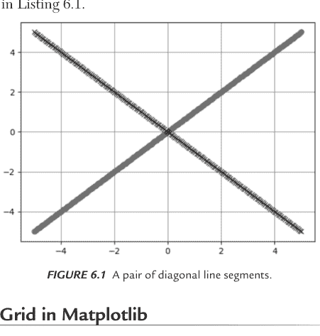

**图 6.1** 一对对角线段。

## Matplotlib 中的彩色网格

清单 6.2 显示了 `plotgrid2.py` 的内容，该示例说明了如何显示彩色网格。

**清单 6.2: plotgrid2.py**

```
import matplotlib.pyplot as plt
from matplotlib import colors
import numpy as np

data = np.random.rand(10, 10) * 20

# create discrete colormap
cmap = colors.ListedColormap(['red', 'blue'])
bounds = [0,10,20]
norm = colors.BoundaryNorm(bounds, cmap.N)

fig, ax = plt.subplots()
ax.imshow(data, cmap=cmap, norm=norm)

# draw gridlines
ax.grid(which='major', axis='both', linestyle='-', color='k',
        linewidth=2)
ax.set_xticks(np.arange(-.5, 10, 1));
ax.set_yticks(np.arange(-.5, 10, 1));

plt.show()
```

清单 6.2 定义了 NumPy 变量 `data`，该变量定义了一个包含十行十列的二维点集。`Pyplot` API `plot()` 使用 `data` 变量来显示彩色网格状图案。

图 6.2 显示了一个彩色网格，其方程包含在清单 6.2 中。

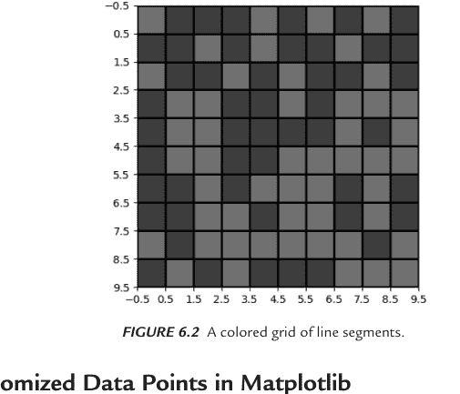

**图 6.2** 线段的彩色网格。

## Matplotlib 中的随机数据点

清单 6.3 显示了 `lin_reg_plot.py` 的内容，该示例说明了如何绘制随机点的图形。

**清单 6.3: lin_reg_plot.py**

```
import numpy as np
import matplotlib.pyplot as plt

trX = np.linspace(-1, 1, 101) # Linear space of 101 and [-1,1]

#Create the y function based on the x axis
trY = 2*trX + np.random.randn(*trX.shape)*0.4+0.2

#create figure and scatter plot of the random points
plt.figure()
plt.scatter(trX,trY)
# Draw one line with the line function
plt.plot(trX, .2 + 2 * trX)
plt.show()
```

清单 6.3 定义了 NumPy 变量 `trX`，其中包含 101 个介于 -1 和 1 之间（包含端点）的等间距数字。变量 `trY` 分两部分定义：第一部分是 `2*trX`，第二部分是一个随机值，该值部分基于一维数组 `trX` 的长度。变量 `trY` 是这两个“部分”的和，这创建了一个“模糊”的线段。清单 6.3 的下一部分基于 `trX` 和 `trY` 中的值创建散点图，然后是 `Pyplot` API `plot()`，它渲染一条线段。

图 6.3 显示了基于清单 6.3 中代码的一组随机点。

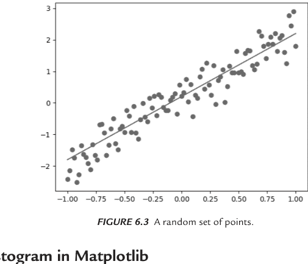

**图 6.3** 一组随机点。

## Matplotlib 中的直方图

清单 6.4 显示了 `histogram1.py` 的内容，该示例说明了如何使用 Matplotlib 绘制直方图。

**清单 6.4: histogram1.py**

```
import numpy as np
import matplotlib.pyplot as plt

max1 = 500
max2 = 500

appl_count = 28 + 4 * np.random.randn(max1)
bana_count = 24 + 4 * np.random.randn(max2)
plt.hist([appl_count,
    bana_count], stacked=True, color=['r','b'])
plt.show()
```

清单 6.4 很直接：NumPy 变量 `appl_count` 和 `bana_count` 包含一组随机值，其上限分别为 `max1` 和 `max2`。Pyplot API `hist()` 使用点 `appl_count` 和 `bana_count` 来显示直方图。图 6.4 显示了一个直方图，其形状基于清单 6.4 中的代码。

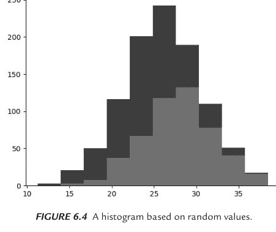

**图 6.4** 基于随机值的直方图。

## Matplotlib 中的一组线段

清单 6.5 显示了 `line_segments.py` 的内容，该示例说明了如何在 Matplotlib 中绘制一组连接的线段。

**清单 6.5: line_segments.py**

```
import numpy as np
import matplotlib.pyplot as plt

x = [7,11,13,15,17,19,23,29,31,37]

plt.plot(x) # OR: plt.plot(x, 'ro-') or bo
plt.ylabel('Height')
plt.xlabel('Weight')
plt.show()
```

清单 6.5 定义了数组 `x`，其中包含一组硬编码的值。Pyplot API `plot()` 使用变量 `x` 来显示一组连接的线段。图 6.5 显示了运行清单 6.5 中代码的结果。

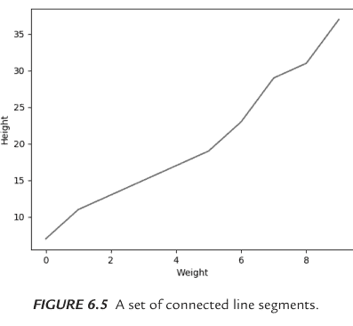

**图 6.5** 一组连接的线段。

## 在 Matplotlib 中绘制多条线

清单 6.6 显示了 `plt_array2.py` 的内容，该示例说明了在 Matplotlib 中绘制多条线是多么容易。

**清单 6.6: plt_array2.py**

```
import matplotlib.pyplot as plt

x = [7,11,13,15,17,19,23,29,31,37]
data = [[8, 4, 1], [5, 3, 3], [6, 0, 2], [1, 7, 9]]
plt.plot(data, 'd-')
plt.show()
```

清单 6.6 定义了数组 `data`，其中包含一组硬编码的值。Pyplot API `plot()` 使用变量 `data` 来显示线段。图 6.6 显示了基于清单 6.6 中代码的多条线。

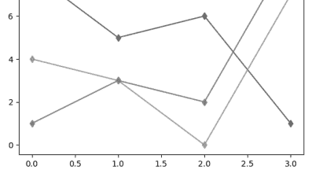

**图 6.6** Matplotlib 中的多条线。

## Matplotlib 中的三角函数

你可以像使用 Matplotlib 绘制“常规”图形一样轻松地显示三角函数的图形。清单 6.7 展示了 `sincos.py` 的内容，该示例说明了如何在 Matplotlib 中绘制正弦函数和余弦函数。

**清单 6.7：sincos.py**

```python
import numpy as np
import math

x = np.linspace(0, 2*math.pi, 101)
s = np.sin(x)
c = np.cos(x)

import matplotlib.pyplot as plt
plt.plot(s)
plt.plot(c)
plt.show()
```

清单 6.7 使用 NumPy API `linspace()`、`sin()` 和 `cos()` 分别定义了 NumPy 变量 `x`、`s` 和 `c`。接下来，Pyplot API `plot()` 使用这些变量来显示正弦函数和余弦函数。

图 6.7 展示了基于清单 6.7 代码绘制的两个三角函数的图形。

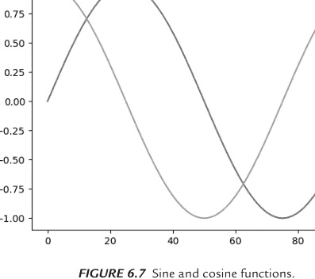

**图 6.7** 正弦和余弦函数。

现在让我们来看一个由离散数据点组成的简单数据集，这是下一节的主题。

## 在 Matplotlib 中显示 IQ 分数

清单 6.8 展示了 `iq_scores.py` 的内容，该示例说明了如何绘制一个显示 IQ 分数（基于正态分布）的直方图。

**清单 6.8：iq_scores.py**

```python
import numpy as np
import matplotlib.pyplot as plt

mu, sigma = 100, 15
x = mu + sigma * np.random.randn(10000)

# the histogram of the data
n, bins, patches = plt.hist(x, 50, normed=1, facecolor='g',
                            alpha=0.75)

plt.xlabel('Intelligence')
plt.ylabel('Probability')
plt.title('Histogram of IQ')
plt.text(60, .025, r'$\mu=100,\ \sigma=15$')
plt.axis([40, 160, 0, 0.03])
plt.grid(True)
plt.show()
```

清单 6.8 定义了标量变量 `mu` 和 `sigma`，然后定义了包含一组随机点的 NumPy 变量 `x`。接下来，变量 `n`、`bins` 和 `patches` 通过 NumPy `hist()` API 的返回值进行初始化。最后，这些点通过常规的 `plot()` API 进行绘制，以显示直方图。

图 6.8 展示了一个基于清单 6.8 代码的直方图。

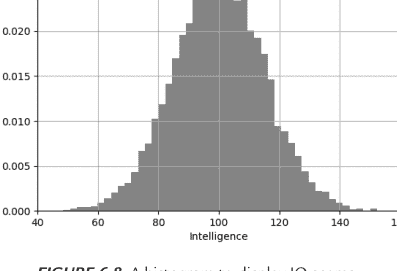

**图 6.8** 显示 IQ 分数的直方图。

## 在 Matplotlib 中绘制最佳拟合线

清单 6.9 展示了 `plot_best_fit.py` 的内容，该示例说明了如何在 Matplotlib 中绘制最佳拟合线。

**清单 6.9：plot_best_fit.py**

```python
import numpy as np

xs = np.array([1,2,3,4,5], dtype=np.float64)
ys = np.array([1,2,3,4,5], dtype=np.float64)

def best_fit_slope(xs,ys):
    m = (((np.mean(xs)*np.mean(ys))-np.mean(xs*ys)) /
         ((np.mean(xs)**2) - np.mean(xs**2)))
    b = np.mean(ys) - m * np.mean(xs)

    return m, b

m,b = best_fit_slope(xs,ys)
print('m:',m,'b:',b)

regression_line = [(m*x)+b for x in xs]

import matplotlib.pyplot as plt
from matplotlib import style
style.use('ggplot')

plt.scatter(xs,ys,color='#0000FF')
plt.plot(xs, regression_line)
plt.show()
```

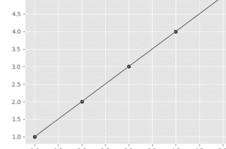

**图 6.9** 二维数据集的最佳拟合线。

清单 6.9 定义了 NumPy 数组变量 `xs` 和 `ys`，它们被“输入”到 Python 函数 `best_fit_slope()` 中，该函数计算最佳拟合线的斜率 `m` 和 y 轴截距 `b`。Pyplot API `scatter()` 显示了点 `xs` 和 `ys` 的散点图，随后 `plot()` API 显示了最佳拟合线。图 6.9 展示了基于清单 6.9 代码的简单线条。

本章关于 NumPy 和 Matplotlib 的部分到此结束。下一节将向你介绍 Sklearn，这是一个强大的基于 Python 的库，支持许多机器学习算法。在你阅读了简短的介绍之后，后续章节将包含结合 Pandas、Matplotlib 和 Sklearn 内置数据集的 Python 代码示例。

## SkLearn 中的鸢尾花数据集

清单 6.10 展示了 `sklearn_iris.py` 的内容，该示例说明了如何在 Sklearn 中访问鸢尾花数据集。

除了支持机器学习算法外，Sklearn 还提供了各种内置数据集，你只需一行代码即可访问。实际上，清单 6.10 展示了 `sklearn_iris1.py` 的内容，该示例说明了如何轻松地将鸢尾花数据集加载到 Pandas 数据框中。

**清单 6.10：sklearn_iris1.py**

```python
import numpy as np
import pandas as pd
from sklearn.datasets import load_iris

iris = load_iris()

print("=> iris keys:")
for key in iris.keys():
    print(key)
print()

#print("iris dimensions:")
#print(iris.shape)
#print()

print("=> iris feature names:")
for feature in iris.feature_names:
    print(feature)
print()

X = iris.data[:, [2, 3]]
y = iris.target

print('=> Class labels:', np.unique(y))
print()

x_min, x_max = X[:, 0].min() - .5, X[:, 0].max() + .5
y_min, y_max = X[:, 1].min() - .5, X[:, 1].max() + .5

print("=> target:")
print(iris.target)
print()

print("=> all data:")
print(iris.data)
```

清单 6.10 包含几个 `import` 语句，然后用鸢尾花数据集初始化变量 `iris`。接下来，一个循环显示数据集中的键，随后另一个循环显示特征名称。

清单 6.10 的下一部分用第 2 和第 3 列的特征值初始化变量 `X`，然后用目标列的值初始化变量 `y`。

变量 `x_min` 初始化为第 0 列的最小值，然后从 `x_min` 中减去额外的 0.5。类似地，变量 `x_max` 初始化为第 0 列的最大值，然后向 `x_max` 添加额外的 0.5。变量 `y_min` 和 `y_max` 是 `x_min` 和 `x_max` 的对应物，它们应用于第 1 列而不是第 0 列。

运行清单 6.10 中的代码，你将看到以下输出（为简洁起见已截断）：

```
Pandas df1:

=> iris keys:
data
target
target_names
DESCR
feature_names
filename

=> iris feature names:
sepal length (cm)
sepal width (cm)
petal length (cm)
petal width (cm)

=> Class labels: [0 1 2]

=> x_min: 0.5 x_max: 7.4
=> y_min: -0.4 y_max: 3.0

=> target:
[0 0 0 0 0 0 0 0 0 0 0 0 0 0 0 0 0 0 0 0 0 0 0 0 0 0 0 0 0 0 0 0 0 0 0 0 0 0 0 0 0 0 0 0 0 0 0 0 0 0
 0 0 0 0 0 0
 0 0 0 0 0 0 0 0 0 0 0 0 0 0 0 1 1 1 1 1 1 1 1 1 1 1 1 1 1 1 1 1 1 1 1 1 1 1 1 1 1 1 1 1 1 1 1 1 1 1
 1 1 1 1 1 1
 1 1 1 1 1 1 1 1 1 1 1 1 1 1 1 1 1 1 1 1 1 1 1 1 1 1 1 1 1 1 1 1 1 1 1 1 1 1 1 1 1 1 1 1 1 1 1 1 1 1
 2 2 2 2 2 2 2
 2 2 2 2 2 2 2 2 2 2 2 2 2 2 2 2 2 2 2 2 2 2 2 2 2 2 2 2 2 2 2 2 2 2 2 2 2 2 2 2 2 2 2 2 2 2 2 2 2 2
 2 2 2 2 2 2 2
 2 2]

=> all data:
[[5.1 3.5 1.4 0.2]
 [4.9 3.  1.4 0.2]
 [4.7 3.2 1.3 0.2]
 // details omitted for brevity
 [6.5 3.  5.2 2. ]
 [6.2 3.4 5.4 2.3]
 [5.9 3.  5.1 1.8]]
```

## SkLearn、Pandas 和鸢尾花数据集

清单 6.11 展示了 `pandas_iris.py` 的内容，该示例说明了如何将鸢尾花数据集（来自 Sklearn）的内容加载到 Pandas 数据框中。

**清单 6.11：pandas_iris.py**

```python
import numpy as np
import pandas as pd
from sklearn.datasets import load_iris

iris = load_iris()

print("=> IRIS feature names:")
for feature in iris.feature_names:
    print(feature)
print()

# Create a data frame with the feature variables
df = pd.DataFrame(iris.data, columns=iris.feature_names)

print("=> number of rows:")
print(len(df))
print()

print("=> number of columns:")
print(len(df.columns))
print()

print("=> number of rows and columns:")
print(df.shape)
print()

print("=> number of elements:")
print(df.size)
print()

print("=> IRIS details:")
print(df.info())
print()

print("=> top five rows:")
print(df.head())
print()

X = iris.data[:, [2, 3]]
y = iris.target
print('=> Class labels:', np.unique(y))
```

清单 6.11 包含几个 `import` 语句，然后用鸢尾花数据集初始化变量 `iris`。接下来，一个 `for` 循环显示特征名称。下一段代码片段将变量 `df` 初始化为一个包含鸢尾花数据集数据的 Pandas 数据框。

下一块代码调用 Pandas 数据框的一些属性和方法，以显示数据框中的行数、列数和元素数，以及鸢尾花数据集的详细信息、前五行和鸢尾花数据集中的唯一标签。运行清单 6.11 中的代码，你将看到以下输出：

```
=> IRIS feature names:
sepal length (cm)
sepal width (cm)
petal length (cm)
petal width (cm)

=> number of rows:
150

=> number of columns:
4

=> number of rows and columns:
(150, 4)

=> number of elements:
600
```

=> IRIS 数据集详情：
<class 'pandas.core.frame.DataFrame'>
RangeIndex: 150 entries, 0 to 149
Data columns (total 4 columns):
sepal length (cm)    150 non-null float64
sepal width (cm)     150 non-null float64
petal length (cm)    150 non-null float64
petal width (cm)     150 non-null float64
dtypes: float64(4)
memory usage: 4.8 KB
None

=> 前五行数据：
   sepal length (cm)  sepal width (cm)  petal length (cm)  petal width (cm)
0                5.1               3.5                1.4               0.2
1                4.9               3.0                1.4               0.2
2                4.7               3.2                1.3               0.2
3                4.6               3.1                1.5               0.2
4                5.0               3.6                1.4               0.2

=> 类别标签：[0 1 2]

现在，让我们将注意力转向 Seaborn，这是一个非常出色的 Python 数据可视化包。

## 使用 Seaborn

Seaborn 是一个用于数据可视化的 Python 库，它也提供了对 Matplotlib 的高级接口。Seaborn 比 Matplotlib 更易于使用，并且实际上扩展了 Matplotlib，但 Seaborn 的功能不如 Matplotlib 强大。

Seaborn 解决了 Matplotlib 的两个挑战。第一个涉及 Matplotlib 的默认参数。Seaborn 使用不同的参数，这比 Matplotlib 图表的默认渲染提供了更大的灵活性。Seaborn 解决了 Matplotlib 默认值在颜色、上下轴刻度线和样式（以及其他方面）等特征上的局限性。

此外，Seaborn 使得绘制整个数据框（有点像 pandas）比在 Matplotlib 中更容易。然而，由于 Seaborn 扩展了 Matplotlib，了解后者是有益的，并且会简化你的学习曲线。

## Seaborn 的特性

Seaborn 的一些特性包括：

- 缩放 seaborn 图表
- 设置绘图样式
- 设置图形大小
- 旋转标签文本
- 设置 xlim 或 ylim
- 设置对数刻度
- 添加标题

一些有用的方法：

- `plt.xlabel()`
- `plt.ylabel()`
- `plt.annotate()`
- `plt.legend()`
- `plt.ylim()`
- `plt.savefig()`

Seaborn 支持各种内置数据集，就像 NumPy 和 Pandas 一样，包括 Iris 数据集和 Titanic 数据集，你都将在后续章节中看到它们。作为起点，下一节中的三行代码示例向你展示了如何显示内置 "tips" 数据集中的行。

## Seaborn 内置数据集

清单 6.12 显示了 `seaborn_tips.py` 的内容，该示例说明了如何将 `tips` 数据集读入数据框并显示该数据集的前五行。

**清单 6.12：seaborn_tips.py**

```python
import seaborn as sns
df = sns.load_dataset("tips")
print(df.head())
```

清单 6.12 非常简单：导入 `seaborn` 后，变量 `df` 用内置数据集 `tips` 中的数据初始化，`print()` 语句显示 `df` 的前五行。请注意，`load_dataset()` API 会搜索在线或内置数据集。清单 6.12 的输出如下：

| total_bill | tip | sex | smoker | day | time | size |
|---|---|---|---|---|---|---|
| 0 | 16.99 | 1.01 | Female | No | Sun | Dinner | 2 |
| 1 | 10.34 | 1.66 | Male | No | Sun | Dinner | 3 |
| 2 | 21.01 | 3.50 | Male | No | Sun | Dinner | 3 |
| 3 | 23.68 | 3.31 | Male | No | Sun | Dinner | 2 |
| 4 | 24.59 | 3.61 | Female | No | Sun | Dinner | 4 |

## Seaborn 中的 Iris 数据集

清单 6.13 显示了 `seaborn_iris.py` 的内容，该示例说明了如何绘制 Iris 数据集。

**清单 6.13：seaborn_iris.py**

```python
import seaborn as sns
import matplotlib.pyplot as plt

# Load iris data
iris = sns.load_dataset("iris")

# Construct iris plot
sns.swarmplot(x="species", y="petal_length", data=iris)

# Show plot
plt.show()
```

清单 6.13 导入了 `seaborn` 和 `matplotlib.pyplot`，然后用内置 Iris 数据集的内容初始化变量 `iris`。接下来，`swarmplot()` API 显示一个图表，其水平轴标记为 `species`，垂直轴标记为 `petal_length`，显示的点来自 Iris 数据集。图 6.10 根据清单 6.13 中的代码显示了 Iris 数据集中的图像。

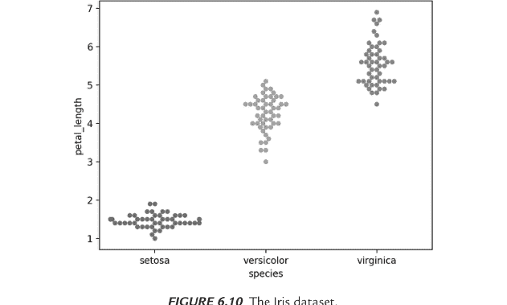

**图 6.10** Iris 数据集。

## Seaborn 中的 Titanic 数据集

清单 6.14 显示了 `seaborn_titanic_plot.py` 的内容，该示例说明了如何绘制 Titanic 数据集。

**清单 6.14：seaborn_titanic_plot.py**

```python
import matplotlib.pyplot as plt
import seaborn as sns

titanic = sns.load_dataset("titanic")
g = sns.factorplot("class", "survived", "sex", data=titanic,
                   kind="bar", palette="muted", legend=False)

plt.show()
```

清单 6.14 包含与清单 6.13 相同的 `import` 语句，然后用内置 Titanic 数据集的内容初始化变量 `titanic`。接下来，`factorplot()` API 显示一个图表，其数据集属性在 API 调用中列出。图 6.11 根据清单 6.14 中的代码显示了 Titanic 数据集中数据的图表。

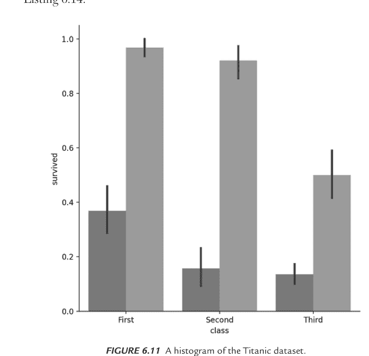

**图 6.11** Titanic 数据集的直方图。

## 从 Seaborn 中的 Titanic 数据集提取数据 (1)

清单 6.15 显示了 `seaborn_titanic.py` 的内容，该示例说明了如何从 Titanic 数据集中提取数据子集。

**清单 6.15：seaborn_titanic.py**

```python
import matplotlib.pyplot as plt
import seaborn as sns

titanic = sns.load_dataset("titanic")
print("titanic info:")
titanic.info()

print("first five rows of titanic:")
print(titanic.head())

print("first four ages:")
print(titanic.loc[0:3, 'age'])

print("fifth passenger:")
print(titanic.iloc[4])

#print("first five ages:")
#print(titanic['age'].head())

#print("first five ages and gender:")
#print(titanic[['age', 'sex']].head())

#print("descending ages:")
#print(titanic.sort_values('age', ascending = False).head())

#print("older than 50:")
#print(titanic[titanic['age'] > 50])

#print("embarked (unique):")
#print(titanic['embarked'].unique())

#print("survivor counts:")
#print(titanic['survived'].value_counts())

#print("counts per class:")
#print(titanic['pclass'].value_counts())

#print("max/min/mean/median ages:")
#print(titanic['age'].max())
#print(titanic['age'].min())
#print(titanic['age'].mean())
#print(titanic['age'].median())
```

清单 6.15 包含与清单 6.13 相同的 `import` 语句，然后用内置 Titanic 数据集的内容初始化变量 `titanic`。清单 6.15 的下一部分显示了 Titanic 数据集的各个方面，例如其结构、前五行、前四个年龄以及第五位乘客的详细信息。

如你所见，有一大块“注释掉”的代码，你可以取消注释以查看相关的输出，例如年龄、性别、50 岁以上的人以及唯一行。清单 6.15 的输出如下：

```
titanic info:
<class 'pandas.core.frame.DataFrame'>
RangeIndex: 891 entries, 0 to 890
Data columns (total 15 columns):
 #   Column            Non-Null Count  Dtype  
---  ------            --------------  -----  
 0   survived          891 non-null    int64  
 1   pclass            891 non-null    int64  
 2   sex               891 non-null    object 
 3   age               714 non-null    float64
 4   sibsp             891 non-null    int64  
 5   parch             891 non-null    int64  
 6   fare              891 non-null    float64
 7   embarked          889 non-null    object 
 8   class             891 non-null    category
 9   who               891 non-null    object 
 10  adult_male        891 non-null    bool   
 11  deck              203 non-null    category
 12  embark_town       889 non-null    object 
 13  alive             891 non-null    object 
 14  alone             891 non-null    bool   
dtypes: bool(2), category(2), float64(2), int64(4), object(5)
memory usage: 80.6+ KB
first five rows of titanic:
   survived  pclass     sex   age  sibsp  parch     fare embarked  class  who  adult_male deck  embark_town alive  alone
0         0       3    male  22.0      1      0   7.2500        S  Third  man        True  NaN  Southampton    no  False
1         1       1  female  38.0      1      0  71.2833        C  First  woman       False    C    Cherbourg   yes  False
2         1       3  female  26.0      0      0   7.9250        S  Third  woman       False  NaN  Southampton   yes   True
3         1       1  female  35.0      1      0  53.1000        S  First  woman       False    C  Southampton   yes  False
4         0       3    male  35.0      0      0   8.0500        S  Third  man        True  NaN  Southampton    no   True
```

## 在 Seaborn 中从泰坦尼克号数据集提取数据（2）

清单 6.16 展示了 `seaborn_titanic2.py` 的内容，该文件演示了如何从泰坦尼克号数据集中提取数据子集。

**清单 6.16：seaborn_titanic2.py**

```python
import matplotlib.pyplot as plt
import seaborn as sns

titanic = sns.load_dataset("titanic")

# Returns a scalar
# titanic.ix[4, 'age']
print("age:", titanic.at[4, 'age'])

# Returns a Series of name 'age', and the age values associated
# to the index labels 4 and 5
# titanic.ix[[4, 5], 'age']
print("series:", titanic.loc[[4, 5], 'age'])

# Returns a Series of name '4', and the age and fare values
# associated to that row.
# titanic.ix[4, ['age', 'fare']]
print("series:", titanic.loc[4, ['age', 'fare']])

# Returns a Data frame with rows 4 and 5, and columns 'age'
# and 'fare'
# titanic.ix[[4, 5], ['age', 'fare']]
print("data frame:", titanic.loc[[4, 5], ['age', 'fare']])

query = titanic[
    (titanic.sex == 'female')
    & (titanic['class'].isin(['First', 'Third']))
    & (titanic.age > 30)
    & (titanic.survived == 0)
]
print("query:", query)
```

清单 6.16 包含与清单 6.15 相同的 `import` 语句，然后使用内置泰坦尼克号数据集的内容初始化变量 `titanic`。接下来的代码片段显示了数据集中索引为 4 的乘客的年龄（等于 35）。

以下代码片段显示了数据集中索引值为 4 和 5 的乘客的年龄：

```python
print("series:", titanic.loc[[4, 5], 'age'])
```

下一个片段显示了数据集中索引为 4 的乘客的年龄和票价，随后另一个代码片段显示了数据集中索引为 4 和 5 的乘客的年龄和票价。

清单 6.16 的最后一部分是最有趣的部分：它定义了一个变量 `query`，如下所示：

```python
query = titanic[
    (titanic.sex == 'female')
    & (titanic['class'].isin(['First', 'Third']))
    & (titanic.age > 30)
    & (titanic.survived == 0)
]
```

前面的代码块将检索那些在头等舱或三等舱、年龄超过 30 岁且在事故中未能幸存的女性乘客。清单 6.16 的完整输出如下：

```
age: 35.0
series: 4    35.0
5    NaN
Name: age, dtype: float64
series: age    35
fare    8.05
Name: 4, dtype: object
data frame:    age    fare
4    35.0    8.0500
5    NaN    8.4583
```

```
query:     survived  pclass     sex   age  sibsp  parch     fare embarked   class
18         0       3  female  31.0      1      0  18.0000        S   Third
40         0       3  female  40.0      1      0   9.4750        S   Third
132        0       3  female  47.0      1      0  14.5000        S   Third
167        0       3  female  45.0      1      4  27.9000        S   Third
177        0       1  female  50.0      0      0  28.7125        C   First
254        0       3  female  41.0      0      2  20.2125        S   Third
276        0       3  female  45.0      0      0   7.7500        S   Third
362        0       3  female  45.0      0      1  14.4542        C   Third
396        0       3  female  31.0      0      0   7.8542        S   Third
503        0       3  female  37.0      0      0   9.5875        S   Third
610        0       3  female  39.0      1      5  31.2750        S   Third
638        0       3  female  41.0      0      5  39.6875        S   Third
657        0       3  female  32.0      1      1  15.5000        Q   Third
678        0       3  female  43.0      1      6  46.9000        S   Third
736        0       3  female  48.0      1      3  34.3750        S   Third
767        0       3  female  30.5      0      0   7.7500        Q   Third
885        0       3  female  39.0      0      5  29.1250        Q   Third
```

## 在 Seaborn 中可视化 Pandas 数据集

清单 6.17 展示了 `pandas_seaborn.py` 的内容，该文件演示了如何在 Seaborn 中显示 Pandas 数据集。

**清单 6.17：pandas_seaborn.py**

```python
import pandas as pd
import random
import matplotlib.pyplot as plt
import seaborn as sns

df = pd.DataFrame()

df['x'] = random.sample(range(1, 100), 25)
df['y'] = random.sample(range(1, 100), 25)

print("top five elements:")
print(df.head())

# display a density plot
#sns.kdeplot(df.y)

# display a density plot
#sns.kdeplot(df.y, df.x)

#sns.distplot(df.x)

# display a histogram
#plt.hist(df.x, alpha=.3)
#sns.rugplot(df.x)

# display a boxplot
#sns.boxplot([df.y, df.x])

# display a violin plot
#sns.violinplot([df.y, df.x])

# display a heatmap
#sns.heatmap([df.y, df.x], annot=True, fmt="d")

# display a cluster map
#sns.clustermap(df)

# display a scatterplot of the data points
sns.lmplot('x', 'y', data=df, fit_reg=False)
plt.show()
```

清单 6.17 包含几个熟悉的 `import` 语句，随后将 Pandas 变量 `df` 初始化为一个 Pandas 数据框。接下来的两个代码片段初始化数据框的列和行，`print()` 语句显示前五行。

为方便起见，清单 6.17 包含了一系列“注释掉的”代码片段，这些片段使用 Seaborn 来渲染密度图、直方图、箱线图、小提琴图、热力图和聚类图。取消注释您感兴趣的部分以查看相关的图表。清单 6.17 的输出如下：

```
top five elements:
   x   y
0  52  34
1  31  47
2  23  18
3  34  70
4  71   1
```

图 6.12 显示了基于清单 6.17 中代码的泰坦尼克号数据集中数据的图表。

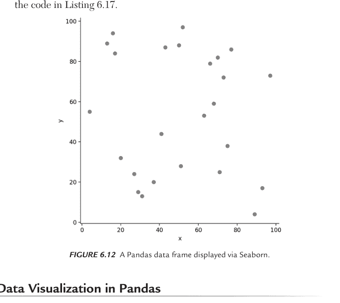

## 在 Pandas 中进行数据可视化

尽管 Matplotlib 和 Seaborn 通常是数据可视化的“首选”Python 库，但您也可以使用 Pandas 来完成此类任务。

清单 6.18 展示了 `pandas_viz1.py` 的内容，该文件演示了如何使用 Pandas 和 Matplotlib 渲染各种类型的图表和图形。

**清单 6.18：pandas_viz1.py**

```python
import pandas as pd
import numpy as np
import matplotlib.pyplot as plt

df = pd.DataFrame(np.random.rand(16, 3),
columns=['X1', 'X2', 'X3'])
print("First 5 rows:")
print(df.head())
print()

print("Diff of first 5 rows:")
print(df.diff().head())
print()

# bar chart:
#ax = df.plot.bar()

# horizontal stacked bar chart:
#ax = df.plot.barh(stacked=True)

# vertical stacked bar chart:
ax = df.plot.bar(stacked=True)

# stacked area graph:
#ax = df.plot.area()

# non-stacked area graph:
#ax = df.plot.area(stacked=False)

#plt.show(ax)
```

清单 6.18 使用一个 16x3 的随机数矩阵初始化数据框 df，然后显示 df 的内容。清单 6.18 的大部分内容包含用于生成条形图、水平堆叠条形图、垂直堆叠条形图、堆叠面积图和非堆叠面积图的代码片段。您可以取消注释单个代码片段，以显示您选择的图表及其对应的 df 内容。运行清单 6.18 中的代码，您将看到以下输出：

```
First 5 rows:
          X1        X2        X3
0  0.051089  0.357183  0.344414
1  0.800890  0.468372  0.800668
2  0.492981  0.505133  0.228399
3  0.461996  0.977895  0.471315
4  0.033209  0.411852  0.347165

Diff of first 5 rows:
          X1        X2        X3
0        NaN       NaN       NaN
1  0.749801  0.111189  0.456255
2 -0.307909  0.036760 -0.572269
3 -0.030984  0.472762  0.242916
4 -0.428787 -0.566043 -0.124150
```

## 什么是 Bokeh？

Bokeh 是一个依赖于 Matplotlib 和 Sklearn 的开源项目。正如您将在后续代码示例中看到的，Bokeh 生成一个基于 Python 代码的 HTML 网页，然后在浏览器中启动该网页。Bokeh 和 D3.js（它是 SVG 之上的一个 JavaScript 抽象层）都提供了优雅的可视化效果，支持动画效果和用户交互。

Bokeh 能够快速创建统计可视化，并且可以与 Python Flask 和 Django 等其他工具配合使用。除了 Python，Bokeh 还支持 Julia、Lua 和 R（生成的是 JSON 文件而不是 HTML 网页）。

清单 6.19 展示了 `bokeh_trig.py` 的内容，该文件演示了如何使用各种 Bokeh API 创建图形效果。

**清单 6.19：bokeh_trig.py**

```python
# pip3 install bokeh
from bokeh.plotting import figure, output_file, show
from bokeh.layouts import column
import bokeh.colors as colors
import numpy as np
import math

deltaY = 0.01
maxCount = 150
width  = 800
height = 400
band_width = maxCount/3

x = np.arange(0, math.pi*3, 0.05)
y1 = np.sin(x)
y2 = np.cos(x)

white = colors.RGB(255,255,255)

fig1 = figure(plot_width = width, plot_height = height)

for i in range(0,maxCount):
    rgb1 = colors.RGB(i*255/maxCount, 0, 0)
    rgb2 = colors.RGB(i*255/maxCount, i*255/maxCount, 0)
    fig1.line(x, y1-i*deltaY,line_width = 2, line_color = rgb1)
    fig1.line(x, y2-i*deltaY,line_width = 2, line_color = rgb2)

for i in range(0,maxCount):
    rgb1 = colors.RGB(0, 0, i*255/maxCount)
    rgb2 = colors.RGB(0, i*255/maxCount, 0)
```

## 总结

本章首先简要介绍了一些数据可视化工具，以及各种类型的可视化图表（如条形图和饼图）。

接着，你学习了 Matplotlib，这是一个模仿 MatLab 的开源 Python 库。你看到了绘制直方图和简单三角函数的一些示例。

此外，你还接触了 Seaborn，它是 Matplotlib 的扩展，并看到了绘制折线图和直方图的示例。你也学习了如何使用 Seaborn 绘制 Pandas 数据框。

最后，你对 Bokeh 有了一个非常简短的介绍，并附有一个代码示例，展示了如何在 Bokeh 中相对轻松地创建更具艺术感的图形效果。

## 附录 A

## 处理数据

本附录向你介绍数据类型、如何缩放数据值，以及处理缺失数据值的各种技巧。如果本附录中的大部分内容对你来说都是新的，请放心，你并不需要理解这里的所有内容。阅读你能吸收的内容，并在完成本书的其他一些章节后，或许可以再次回到本附录。

本附录的第一部分概述了不同类型的数据，并解释了如何通过计算一组数字的均值和标准差来对一组数值进行归一化和标准化。你将看到如何将分类数据映射到一组整数，以及如何执行独热编码。

本附录的第二部分讨论了缺失数据、异常值和异常情况，以及处理这些情况的一些技巧。第三部分讨论了不平衡数据以及使用 SMOTE（合成少数类过采样技术）来处理数据集中的不平衡类别。

第四部分讨论了评估分类器的方法，如 LIME 和 ANOVA。本节还详细介绍了偏差-方差权衡以及各种类型的统计偏差。

## 什么是数据集？

简单来说，*数据集*是一个数据源（例如文本文件），其中包含行和列的数据。每一行通常称为一个*数据点*，每一列称为一个*特征*。数据集可以有多种格式：CSV（逗号分隔值）、TSV（制表符分隔值）、Excel 电子表格、RDBMS（关系数据库管理系统）中的表、NoSQL 数据库中的文档，或 Web 服务的输出。需要有人分析数据集，以确定哪些特征最重要，哪些特征可以安全地忽略，以便使用给定的数据集训练模型。

数据集的规模可以从非常小（几个特征和 100 行）到非常大（超过 1,000 个特征和超过一百万行）。如果你不熟悉问题领域，那么你可能难以确定大型数据集中最重要的特征。在这种情况下，你可能需要一位领域专家，他了解特征的重要性、它们之间的相互依赖关系（如果有的话），以及特征的数据值是否有效。此外，还有一些算法（称为降维算法）可以帮助你确定最重要的特征。例如，PCA（主成分分析）就是这样一种算法，本附录后面会更详细地讨论。

## 数据预处理

数据预处理是初始步骤，涉及验证数据集的内容，这包括对缺失和不正确的数据值做出决策：

- 处理缺失的数据值
- 清理“有噪声”的基于文本的数据
- 移除 HTML 标签
- 移除表情符号
- 处理表情符号/颜文字
- 过滤数据
- 分组数据
- 处理货币和日期格式（i18n）

清理数据是数据整理的一个子集，涉及移除不需要的数据以及处理缺失数据。对于基于文本的数据，你可能需要移除 HTML 标签和标点符号。对于数值数据，字母字符与数值数据混合在一起的可能性较小（尽管仍然可能）。然而，具有数值特征的数据集可能有不正确的值或缺失值（稍后讨论）。此外，计算特征值的最小值、最大值、均值、中位数和标准差显然仅适用于数值。

预处理步骤完成后，会进行*数据整理*，这指的是将数据转换为新的格式。你可能需要将来自多个来源的数据组合成一个数据集。例如，你可能需要在不同的测量单位之间进行转换（例如日期格式或货币值），以便数据值可以在数据集中以一致的方式表示。

货币和日期值是 *i18n*（国际化）的一部分，而 *l10n*（本地化）则针对特定的国籍、语言或地区。硬编码的值（例如文本字符串）可以存储在称为*资源包*的文件中作为资源字符串，每个字符串通过一个代码引用。每种语言都有自己的资源包。

## 数据类型

显式数据类型存在于许多编程语言中，如 C、C++、Java 和 TypeScript。一些编程语言，如 JavaScript 和 awk，不需要用显式类型初始化变量：变量的类型是通过隐式类型系统（即不直接暴露给开发者的类型系统）动态推断的。

在机器学习中，数据集可以包含具有不同类型数据的特征，例如以下一种或多种的组合：

- 数值数据（整数/浮点数和离散/连续）
- 字符/分类数据（不同的语言）
- 日期相关数据（不同的格式）
- 货币数据（不同的格式）
- 二进制数据（是/否，0/1 等）
- 名义数据（多个不相关的值）
- 有序数据（多个相关的值）

考虑一个包含房地产数据的数据集，它可能有多达三十列（甚至更多），通常具有以下特征：

- 房屋的卧室数量：一个数值，一个离散值
- 平方英尺数：一个数值，（可能）是一个连续值
- 城市名称：字符数据
- 建造日期：日期值
- 售价：货币值，可能是一个连续值
- “待售”状态：二进制数据（“是”或“否”）

名义数据的一个例子是一年中的季节。虽然许多（大多数？）国家有四个明显的季节，但有些国家只有两个明显的季节。然而，请记住，季节可能与不同的温度范围相关（夏季与冬季）。序数数据的一个例子是员工的薪资等级：1=入门级，2=一年经验，依此类推。名义数据的另一个例子是一组颜色，如{红色，绿色，蓝色}。

二元数据的一个例子是{男性，女性}这一对，一些数据集包含具有这两个值的特征。如果训练模型需要这样的特征，首先将{男性，女性}转换为数值对应项，例如{0,1}。同样，如果你需要包含一个值为前述颜色集合的特征，你可以用{0,1,2}替换{红色，绿色，蓝色}。本附录后面将更详细地讨论分类数据。

## 准备数据集

如果你有幸继承了一个处于原始状态的数据集，那么数据清理任务（稍后讨论）将大大简化：事实上，可能不需要对该数据集执行*任何*数据清理。然而，如果你需要创建一个结合了来自多个数据集的数据的数据集，而这些数据集包含不同格式的日期和货币，那么你需要执行转换以统一格式。

如果你需要训练一个包含具有分类数据特征的模型，那么你需要将该分类数据转换为数值数据。例如，泰坦尼克号数据集包含一个名为“性别”的特征，该特征为男性或女性。正如你将在本附录后面看到的，Pandas使得将男性映射为0、女性映射为1变得极其简单。

## 离散数据与连续数据

*离散数据*是一组可以计数的值，而*连续数据*必须通过测量获得。离散数据可以“合理地”放入一个下拉值列表中，但没有确切的值来做出这样的判断。一个人可能认为包含500个值的列表是离散的，而另一个人可能认为它是连续的。

例如，加拿大各省的列表和美国各州的列表是离散数据值，但世界上的国家数量（大约200个）或世界上的语言数量（超过7000种）是否也是如此呢？

温度、湿度和气压的值被认为是连续的。货币也被视为连续的，即使两个连续值之间存在可测量的差异。美国货币的最小单位是一美分，即1/100美元（基于会计的测量使用“密尔”，即1/1000美元）。

连续数据类型可能存在细微差别。例如，身高200厘米的人是身高100厘米的人的两倍高；100公斤与50公斤之间也存在同样的关系。然而，温度则不同：80华氏度并不比40华氏度热两倍。

此外，“连续”一词在数学中的含义不一定与机器学习中的“连续”相同。使用数学定义，一个连续变量（假设在二维欧几里得平面上）可以具有不可数无穷多个值。然而，数据集中一个可以具有比“合理”显示在下拉列表中更多值的特征，会被*视为*连续变量。

例如，股票价格的值是离散的：它们必须至少相差一美分（或其他最小货币单位），也就是说，断言股票价格变化百万分之一美分是没有意义的。然而，由于可能的股票值如此之多，它被视为连续变量。同样的评论适用于汽车里程、环境温度和气压。

## “分箱”连续数据

*分箱*的概念是指将一组值细分为多个区间，然后将同一区间内的所有数字视为具有相同的值。

举一个简单的例子，假设数据集中的一个特征包含数据集中人员的年龄。值的范围大约在0到120之间，我们可以将它们分成12个相等的区间，每个区间包含10个值：0到9，10到19，20到29，依此类推。

然而，如前所述对人员年龄值进行分区可能会有问题。假设A、B、C三人的年龄分别为29岁、30岁和39岁。那么A和B可能比B和C更相似，但由于年龄分区的方式，B被归类为更接近C而不是A。事实上，分箱可能会增加第一类错误（假阳性）和第二类错误（假阴性），正如以下博客文章（以及一些分箱的替代方案）中所讨论的：

https://medium.com/@peterflom/why-binning-continuous-data-is-almost-always-a-mistake-ad0b3a1d141f.

再举一个例子，使用四分位数比前面的年龄分箱例子更加粗略。分箱的问题在于，即使人们彼此接近，但将他们归入不同箱体所带来的后果。例如，一些人因为收入微薄而经济拮据，但因为他们的工资高于获得任何援助的截止点，而被取消了获得经济援助的资格。

## 通过归一化缩放数值数据

值的范围可能差异很大，重要的是要注意它们通常需要缩放到一个更小的范围，例如[-1,1]或[0,1]范围内的值，你可以分别通过`tanh()`函数或`sigmoid()`函数来实现。

例如，以米为单位测量一个人的身高涉及的值范围在0.50米到2.5米之间（在绝大多数情况下），而以厘米为单位测量身高则范围在50厘米到250厘米之间：这两个单位相差100倍。一个人的体重以公斤为单位通常在5公斤到200公斤之间变化，而以克为单位测量体重则相差1000倍。物体之间的距离可以用米或公里来测量，这也相差1000倍。

通常，使用测量单位，使多个特征中的数据值属于相似的值范围。事实上，一些机器学习算法要求缩放后的数据通常在[0,1]或[-1,1]范围内。除了`tanh()`和`sigmoid()`函数外，还有其他缩放数据的技术，例如标准化数据（如高斯分布）和归一化数据（线性缩放，使新的值范围在[0,1]内）。

以下示例涉及一个具有不同值范围的浮点变量x，将对其进行缩放，使新值位于区间[0,1]内。

- 示例1：如果x的值在[0,2]范围内，则x/2在[0,1]范围内。
- 示例2：如果x的值在[3,6]范围内，则x-3在[0,3]范围内，(x-3)/3在[0,1]范围内。
- 示例3：如果x的值在[-10,20]范围内，则x+10在[0,30]范围内，(x+10)/30在[0,1]范围内。

通常，假设x是一个随机变量，其值在[a,b]范围内，其中a < b。你可以通过执行两个步骤来缩放数据值：

```
步骤1：X-a 在 [0,b-a] 范围内
步骤2：(X-a)/(b-a) 在 [0,1] 范围内
```

如果X是一个具有值{x1, x2, x3, . . . , xn}的随机变量，那么归一化的公式涉及将每个xi值映射到(xi - min)/(max - min)，其中min是x的最小值，max是X的最大值。

举一个简单的例子，假设随机变量x具有值{-1, 0, 1}。那么min和max分别是1和-1，而{-1, 0, 1}的归一化是值集{ (-1-(-1))/2, (0-(-1))/2, (1-(-1))/2}，等于{0, 1/2, 1}。

## 通过标准化缩放数值数据

标准化技术涉及找到均值mu和标准差sigma，然后将每个xi值映射到(xi - mu)/sigma。回顾以下公式：

```
mu = [SUM (x) ]/n
variance(x) = [SUM (x - xbar)*(x-xbar)]/n
sigma = sqrt(variance)
```

作为标准化的简单说明，假设随机变量x可以具有集合{-1, 0, 1}中的值。那么mu和sigma计算如下：

```
mu = (SUM xi)/n = (-1 + 0 + 1)/3 = 0

variance = [SUM (xi- mu)^2]/n
= [(-1-0)^2 + (0-0)^2 + (1-0)^2]/3
= 2/3

sigma = sqrt(2/3) = 0.816 (近似值)
```

因此，{-1, 0, 1} 的标准化结果为 {-1/0.816, 0/0.816, 1/0.816}，其值等于集合 {-1.2254, 0, 1.2254}。

再举一例，假设随机变量 x 的取值为 {-6, 0, 6}。则 mu 和 sigma 的计算如下：

```
mu = (SUM xi)/n = (-6 + 0 + 6)/3 = 0

variance = [SUM (xi- mu)^2]/n
= [(-6-0)^2 + (0-0)^2 + (6-0)^2]/3
= 72/3
= 24

sigma = sqrt(24) = 4.899 (approximate value)
```

因此，{-6, 0, 6} 的标准化结果为 {-6/4.899, 0/4.899, 6/4.899}，其值等于集合 {-1.2247, 0, 1.2247}。

在上述两个例子中，均值都等于 0，但方差和标准差却有显著差异。一组数值的*归一化*总是会产生介于 0 和 1 之间的数字集合。

然而，一组数值的标准化可能生成小于 -1 或大于 1 的数字：当 sigma 小于每个项 |mu - xi| 的最小值时，就会发生这种情况，其中后者是 mu 与每个 xi 值之差的绝对值。在前面的例子中，最小差值等于 1，而 sigma 为 0.816，因此最大的标准化值大于 1。

## 分类数据中应关注的要点

本节包含处理不一致数据值的建议，您可以根据与特定任务相关的任何其他因素来决定采用哪些建议。例如，考虑不使用基数非常低（等于或接近 1）的列，以及方差为零或非常低的数值列。

接下来，检查分类列的内容是否存在拼写不一致或错误。一个很好的例子涉及性别类别，它可能由以下值的组合构成：

- male
- Male
- female
- Female
- m
- f
- M
- F

上述性别的分类值可以替换为两个分类值（除非您有充分的理由保留其他值中的某些值）。此外，如果您正在训练一个分析涉及单一性别的模型，那么您需要确定数据集的哪些行（如果有）必须被排除。同时检查分类数据列是否存在多余或缺失的空格。

检查是否存在具有多种数据类型的数据值，例如一个数值列中，有些数字是数字形式，有些数字是字符串或对象形式。确保数据格式一致：数字应为整数或浮点数。确保日期具有相同的格式（例如，不要将 mm/dd/yyyy 日期格式与其他日期格式（如 dd/mm/yyyy）混合使用）。

## 将分类数据映射为数值

字符数据通常称为*分类数据*，其示例包括人名、家庭或工作地址以及电子邮件地址。许多类型的分类数据涉及短值列表。例如，一周中的天数和一年中的月份分别涉及七个和十二个不同的值。请注意，一周中的天数之间存在关系：每一天都有前一天和后一天，一年中的月份也是如此。

然而，汽车的颜色是相互独立的。红色并不比蓝色“更好”或“更差”。某种颜色的汽车可能在统计上具有更高的事故率，但此处我们不讨论这个问题。

有几种众所周知的技术可以将分类值映射到一组数值。一个需要执行此转换的简单示例涉及泰坦尼克号数据集中的性别特征。此特征是训练机器学习模型的相关特征之一。性别特征的可能值集合为 {M, F}。正如您将在本附录后面看到的，Pandas 使得将值集合 {M,F} 转换为值集合 {0,1} 变得非常容易。

另一种映射技术涉及将一组分类值映射到一组连续的整数值。例如，集合 {Red, Green, Blue} 可以映射到整数集合 {0,1,2}。集合 {Male, Female} 可以映射到整数集合 {0,1}。一周中的天数可以映射到 {0,1,2,3,4,5,6}。请注意，一周的第一天取决于国家（在某些情况下是星期日，在其他情况下是星期一）。

另一种技术称为*独热编码*，它将每个值转换为一个*向量*。因此，{Male, Female} 可以用向量 [1, 0] 和 [0, 1] 表示，颜色 {Red, Green, Blue} 可以用向量 [1, 0, 0]、[0, 1, 0] 和 [0, 0, 1] 表示。如果您将性别的两个向量垂直“排列”，它们会形成一个 2x2 的单位矩阵，对颜色做同样的操作会形成一个 3x3 的单位矩阵，如下所示：

```
[1, 0, 0]
[0, 1, 0]
[0, 0, 1]
```

如果您熟悉矩阵，您可能已经注意到前面的向量集看起来像 3x3 的单位矩阵。事实上，这种技术可以以一种直接的方式推广。具体来说，如果您有 n 个不同的分类值，您可以将这些值中的每一个映射到 nxn 单位矩阵中的一个向量。

再举一例，头衔集合 {"Intern," "Junior," "Mid-Range," "Senior," "Project Leader," "Dev Manager"} 在薪资方面具有层级关系（薪资也可能重叠，但我们现在不讨论这个）。

另一组分类数据涉及一年中的季节：{"Spring," "Summer," "Autumn," "Winter"}，虽然这些值通常是相互独立的，但在某些情况下季节很重要。例如，月降雨量、平均温度、犯罪率或止赎率的值可能取决于季节、月份、周或一年中的某一天。

如果一个特征具有大量的分类值，那么独热编码将为每个数据点生成许多额外的列。由于新列中的大多数值等于 0，这会增加数据集的稀疏性，进而可能导致更多的过拟合，从而对训练过程中采用的机器学习算法的准确性产生不利影响。

一种解决方案是使用基于序列的解决方案，其中 N 个类别被映射到整数 1, 2, . . . , N。另一种解决方案涉及检查每个分类值的行频率。例如，假设 N 等于 20，并且有三个分类值出现在给定特征的 95% 的值中。您可以尝试以下方法：

- 1) 将值 1、2 和 3 分配给这三个分类值。
- 2) 分配反映这些分类值相对频率的数值。
- 3) 将类别“OTHER”分配给其余的分类值。
- 4) 删除其分类值属于 5% 的行。

## 处理日期

日历日期的格式因国家而异，这属于所谓的数据*本地化*（不要与 i18n（数据国际化）混淆）。一些日期格式示例如下（前四种可能是最常见的）：

```
MM/DD/YY
MM/DD/YYYY
DD/MM/YY
DD/MM/YYYY
YY/MM/DD
M/D/YY
D/M/YY
YY/M/D
MMDDYY
DDMMYY
YYMMDD
```

如果您需要合并包含不同日期格式的数据集中的数据，那么将不同的日期格式转换为单一的通用日期格式将确保一致性。

## 处理货币

货币的格式取决于国家，这包括对货币（以及一般的小数值）中“,”和“.”的不同解释。例如，1,124.78 在美国等于“一千一百二十四点七八”，而在欧洲，1.124,78 具有相同的含义（即“.”符号和“,”符号互换）。

如果您需要合并包含不同货币格式的数据集中的数据，那么您可能需要将所有不同的货币格式转换为单一的通用货币格式。还有一个细节需要考虑：货币汇率可能每天波动，这

## 缺失数据、异常值与离群点

尽管缺失数据与检查异常值和离群点没有直接关系，但通常你会同时执行这三项任务。每项任务都涉及一系列技术，用于帮助你分析数据集中的数据，以下小节将描述其中一些技术。

## 缺失数据

如何处理缺失数据取决于具体的数据集。以下是一些处理缺失数据的方法（前三种是手动技术，其余是算法）：

1.  用均值/中位数/众数替换缺失数据。
2.  推断（“插补”）缺失数据的值。
3.  删除包含缺失数据的行。
4.  使用孤立森林算法（一种基于树的算法）。
5.  使用最小协方差行列式。
6.  使用局部离群因子。
7.  使用单类SVM（支持向量机）。

通常，将缺失的数值替换为零是一个有风险的选择：如果某个特征的值在1,000到5,000之间，那么这个值显然是不正确的。对于具有数值的特征，将缺失值替换为平均值比替换为零更好（除非平均值等于零）；也可以考虑使用中位数。对于分类数据，考虑使用众数来替换缺失值。

如果你不确定能否插补出一个“合理”的值，可以考虑排除包含缺失值的行，然后使用插补值和删除的行来训练模型。

删除包含缺失值的行后可能出现的一个问题是，生成的数据集太小。在这种情况下，可以考虑使用SMOTE（本附录稍后讨论）来生成合成数据。

## 异常值与离群点

简而言之，离群点是超出“正常”值范围的异常数据值。例如，一个人的身高（以厘米为单位）通常在30厘米到250厘米之间。因此，一个身高为5厘米或500厘米的数据点（例如电子表格中的一行数据）就是一个离群点。这些离群点值不太可能导致重大的财务或人身损失（尽管它们可能会影响训练模型的准确性）。

异常值也超出了“正常”值范围（就像离群点一样），但它们通常比离群点问题更大：异常值可能比离群点具有更“严重”的后果。例如，考虑这样一种情况：一个住在加利福尼亚州的人突然在纽约进行了一笔信用卡消费。如果这个人正在度假（或出差），那么这笔消费就是一个离群点（它“超出”了典型的消费模式），但这不是问题。然而，如果这个人在进行信用卡消费时仍在加利福尼亚州，那么这很可能是信用卡欺诈，也就是一个异常值。

不幸的是，没有简单的方法来决定如何处理数据集中的异常值和离群点。虽然你可以排除包含离群点的行，但这样做可能会剥夺数据集——以及训练模型——的有价值的信息。你可以尝试修改数据值（如下所述），但这同样可能导致训练模型出现错误的推断。另一种可能性是使用包含异常值和离群点的数据集训练一个模型，然后使用移除了异常值和离群点的数据集再训练一个模型。比较这两个结果，看看是否能推断出关于异常值和离群点的任何有意义的信息。

## 离群点检测

尽管保留或删除离群点的决定权在你，但有一些技术可以帮助你检测数据集中的离群点。本节简要列出了一些技术，附带非常简要的描述和更多信息的链接。

也许*修剪*是最简单的技术（除了删除离群点），它涉及删除特征值在上5%范围或下5%范围内的行。对数据进行*Winsorizing*处理是修剪的改进。将上5%范围内的值设置为第95百分位数的最大值，将下5%范围内的值设置为第5百分位数的最小值。

*最小协方差行列式*是一种基于协方差的技术，可以在网上找到使用该技术的Python代码示例：https://scikit-learn.org/stable/modules/outlier_detection.html。

*局部离群因子*（LOF）技术是一种无监督技术，它通过kNN（k近邻）算法计算局部异常分数。可以在网上找到使用LOF的文档和简短代码示例：https://scikit-learn.org/stable/modules/generated/sklearn.neighbors.LocalOutlierFactor.html。

另外两种技术涉及Huber和Ridge类，两者都是Sklearn的一部分。Huber误差对离群点不太敏感，因为它是通过线性损失计算的，类似于MAE（平均绝对误差）。可以在网上找到比较Huber和Ridge的代码示例：https://scikit-learn.org/stable/auto_examples/linear_model/plot_huber_vs_ridge.html。

你还可以探索Theil-Sen估计器和RANSAC，它们对离群点具有“鲁棒性”，更多信息可以在网上找到：https://scikit-learn.org/stable/auto_examples/linear_model/plot_theilsen.html 和 https://en.wikipedia.org/wiki/Random_sample_consensus。

以下网站讨论了四种离群点检测算法：https://www.kdnuggets.com/2018/12/four-techniques-outlier-detection.html。

另一种情况涉及“局部”离群点。例如，假设你使用kMeans（或其他聚类算法）并确定某个值相对于某个聚类是离群点。虽然这个值不一定是“绝对”离群点，但检测这样的值可能对你的用例很重要。

## 什么是数据漂移？

数据的价值基于其准确性、相关性和时效性。数据漂移指的是数据随时间推移变得不那么相关。例如，由于各种因素（例如不同类型客户的概况），2010年的在线购买模式可能不如2020年的数据相关。在特定数据集中，可能有多种因素会影响数据漂移。

两种技术是领域分类器和黑盒偏移检测器，两者都可以在网上找到：https://blog.dataiku.com/towards-reliable-mlops-with-drift-detectors。

## 什么是不平衡分类？

不平衡分类涉及类别不平衡的数据集。例如，假设类别A占数据的99%，类别B占1%。你会使用哪种分类算法？不幸的是，分类算法在这种不平衡的数据集上效果不佳。以下是处理不平衡数据集的几种知名技术列表：

-   随机重采样重新平衡类别分布。
-   随机过采样复制少数类中的数据。
-   随机欠采样删除多数类中的样本。
-   SMOTE

*随机重采样*将训练数据集转换为新数据集，这对于不平衡分类问题很有效。

*随机欠采样*技术从数据集中移除样本，涉及以下步骤：

-   随机移除多数类中的样本
-   可以有放回或无放回地进行
-   缓解数据集中的不平衡
-   可能增加分类器的方差
-   可能丢弃有用或重要的样本

然而，随机欠采样对于99%/1%分割的两个类别的数据集效果不佳。此外，欠采样可能导致丢失对模型有用的信息。

除了随机欠采样，另一种方法涉及从少数类生成新样本。第一种技术涉及对少数类中的样本进行过采样并复制少数类中的样本。

还有一种技术比前面的技术更好，它涉及以下步骤：

-   从少数类合成新样本
-   一种针对表格数据的数据增强类型
-   从少数类生成新样本

## 什么是SMOTE？

SMOTE是一种为数据集合成新样本的技术。该技术基于线性插值：

- 步骤1：在特征空间中选择相近的样本。
- 步骤2：在特征空间中为这些样本绘制一条连线。
- 步骤3：在该连线上的某个点绘制一个新样本。

SMOTE算法的更详细解释如下：

- 从少数类中随机选择一个样本“a”。
- 为该样本找到k个最近邻。
- 从最近邻中随机选择一个邻居“b”。
- 创建一条连接“a”和“b”的线L。
- 在线L上随机选择一个或多个点“c”。

如有需要，你可以对其他（k-1）个最近邻重复此过程，以使合成值在最近邻之间分布得更均匀。

## SMOTE扩展

最初的SMOTE算法基于kNN分类算法，该算法已通过多种方式扩展，例如用SVM替换kNN。SMOTE扩展列表如下：

- 选择性合成样本生成
- 边界线-SMOTE (kNN)
- 边界线-SMOTE (SVM)
- 自适应合成采样 (ADASYN)

更多信息可在线找到：
https://en.wikipedia.org/wiki/Oversampling_and_undersampling_in_data_analysis。

## 分析分类器（可选）

本节标记为可选，因为其内容涉及机器学习分类器，而这并非本书的重点。然而，浏览一下材料仍然值得，或者在你对机器学习分类器有了基本了解后，再回到本节。

有几种著名的技术可用于分析机器学习分类器的质量。其中两种技术是LIME和ANOVA，两者都将在以下小节中讨论。

## 什么是LIME？

LIME是“局部可解释模型无关解释”的缩写。LIME是一种模型无关的技术，可用于机器学习模型。该技术的方法论很简单：对数据样本进行微小的随机更改，然后观察预测如何变化（或不变化）。该方法涉及（轻微）更改输出，然后观察输出发生了什么变化。

打个比方，考虑一下食品检查员检测成批易腐食品中的细菌。显然，检测卡车（或火车车厢）中的每一件食品是不可行的，因此检查员执行“抽查”，即检测随机选择的物品。类似地，LIME在随机位置对输入数据进行微小更改，然后分析相关输出值的变化。

然而，当你将LIME与给定模型的输入数据一起使用时，有两个注意事项需要记住：

1. 对输入值的实际更改是特定于模型的。
2. 该技术适用于可解释的输入。

可解释输入的例子包括机器学习分类器（如决策树和随机森林）以及NLP技术，如BoW（词袋模型）。不可解释的输入涉及“密集”数据，例如词嵌入（它是一个浮点数向量）。

你也可以用另一个涉及可解释数据的模型来替代你的模型，但随后你需要评估该近似值与原始模型的准确程度。

## 什么是ANOVA？

ANOVA是“方差分析”的缩写，它试图分析从总体中抽取的样本的均值之间的差异。ANOVA使你能够检验多个均值是否相等。更重要的是，ANOVA有助于减少第一类（假阳性）错误和第二类（假阴性）错误。例如，假设A被诊断患有癌症，B被诊断为健康，而这两个诊断都是错误的。那么A的结果是假阳性，而B的结果是假阴性。通常，假阳性的测试结果比假阴性的测试结果*好得多*。

ANOVA涉及实验设计和假设检验，可以在各种情况下产生有意义的结果。例如，假设一个数据集包含一个特征，该特征可以划分为几个“合理”同质的组。接下来，分析每组中的方差并进行比较，目标是确定给定特征值的不同方差来源。关于ANOVA的更多信息可在线找到：

https://en.wikipedia.org/wiki/Analysis_of_variance。

## 偏差-方差权衡

本节从机器学习的角度进行阐述，但偏差和方差的概念在机器学习之外也高度相关，因此阅读本节以及前一节可能仍然值得。

机器学习中的*偏差*可能源于学习算法中的错误假设。高偏差可能导致算法错过特征与目标输出之间的相关关系（欠拟合）。预测偏差可能由于“噪声”数据、不完整的特征集或有偏的训练样本而发生。

由偏差引起的误差是模型的预期（或平均）预测值与你想要预测的正确值之间的差异。多次重复模型构建过程，每次收集新数据，并进行分析以产生新模型。由此产生的模型具有一系列预测值，因为底层数据集具有一定程度的随机性。偏差衡量这些模型的预测值偏离正确值的程度。

机器学习中的*方差*是与均值偏差的平方的期望值。高方差可能导致算法对训练数据中的随机噪声进行建模，而不是对预期输出进行建模（称为*过拟合*）。此外，向模型添加参数会增加其复杂性，增加方差，并降低偏差。

> *需要记住的是，处理偏差和方差涉及处理欠拟合和过拟合。*

由方差引起的误差是模型对给定数据点预测的可变性。与之前一样，重复整个模型构建过程，方差就是给定点的预测值在不同“模型实例”之间的变化程度。

如果你处理过数据集并执行过数据分析，你已经知道找到平衡良好的样本可能很困难或非常不切实际。此外，对数据集中的数据进行分析至关重要，但无法保证你能生成一个100%“干净”的数据集。

*有偏统计量*是与总体中被估计实体系统性不同的统计量。用更通俗的术语来说，如果一个数据样本“偏向”或“倾向于”总体的某个方面，那么该样本就有偏差。例如，如果你喜欢喜剧电影的程度超过其他任何类型的电影，那么你显然更有可能选择喜剧片而不是剧情片或科幻片。因此，在你选择的电影样本中，电影类型的频率图将更紧密地聚集在喜剧片周围。

然而，如果你对电影有广泛的偏好，那么相应的频率图将更加多样化，因此具有更大的值分布范围。

举一个简单的例子，假设你被分配了一项任务，涉及撰写一篇关于一个有争议主题的学期论文，该主题有许多对立的观点。由于你希望你的参考文献能支持你考虑了多种观点的、平衡良好的学期论文，因此你的参考文献将包含各种各样的来源。换句话说，你的参考文献将具有更大的方差和更小的偏差。如果你的参考文献中大多数（或全部）文献都支持相同的观点，那么你将拥有更小的方差和更大的偏差（这只是一个类比，因此它与偏差与方差的对应关系并不完美）。

偏差-方差权衡可以用简单的术语来表述。通常，减少样本中的偏差会增加方差，而减少方差往往会增加偏差。

## 数据中的偏差类型

除了上一节讨论的偏差-方差权衡外，还有几种类型的偏差，其中一些列举如下：

-   可得性偏差
-   确认偏差
-   虚假因果
-   沉没成本谬误
-   幸存者偏差

*可得性偏差*类似于基于一个例外制定“规则”。例如，吸烟与癌症之间存在已知的联系，但也有例外。如果你发现有人每天抽三包烟，持续了四十年，仍然很健康，你能断言吸烟不会导致癌症吗？

*确认偏差*指的是倾向于关注证实自己信念的数据，同时忽略与信念相矛盾的数据。

*虚假因果*发生在你错误地断言某个特定事件的发生导致了另一个事件也发生时。一个最著名的例子涉及夏季纽约的冰淇淋消费和暴力犯罪。由于夏天吃冰淇淋的人更多，这“导致”了更多的暴力犯罪，这是一种虚假因果。其他因素，如气温升高，可能与犯罪率上升有关。然而，区分相关性和因果性很重要。后者比前者是强得多的联系，而且建立因果性也比建立相关性更困难。

*沉没成本*指的是已经支出或发生且无法收回的东西（通常是钱）。一个常见的例子涉及在赌场赌博。人们陷入了一种模式，即花更多的钱去挽回已经损失的大笔资金。虽然有些情况下人们确实能收回他们的钱，但在许多（大多数？）情况下，人们只是因为继续花钱而遭受了更大的损失。这个想法与“是时候止损并离开”这句表达有关。

*幸存者偏差*指的是分析特定的“正面”数据子集，而忽略“负面”数据。这种偏差出现在各种情况下，例如，受到那些讲述自己白手起家成功故事（“正面”数据）的人的影响，而忽略了那些在类似追求中未能成功（“负面”数据）的人的命运（通常占很高比例）。因此，虽然一个人确实有可能克服许多困难障碍而成功，但成功率是千分之一（甚至更低）吗？

## 总结

本附录首先解释了数据集，描述了数据整理，并详细介绍了各种类型的数据。然后你学习了缩放数值数据的技术，如归一化和标准化。你看到了如何将分类数据转换为数值，以及如何处理日期和货币。

接着你学习了缺失数据、异常值和离群值的一些细微差别，以及处理这些情况的技术。你还学习了不平衡数据，并评估了使用SMOTE来处理数据集中不平衡类别的方法。此外，你学习了使用两种技术LIME和ANOVA的分类器。最后，你学习了偏差-方差权衡和各种类型的统计偏差。

# 附录 B

## 使用 AWK

本章向你介绍`awk`命令，这是一个非常通用的工具，用于操作数据和重构数据集。事实上，这个工具非常通用，以至于有整本书都是关于`awk`工具的。Awk本质上是一个完整的编程语言，包含在一个命令中，它接受标准输入，给出标准输出，并以与其他Unix命令相同的方式使用正则表达式和元字符。这让你可以将其插入其他表达式中，并几乎做任何事情，代价是可能已经相当复杂的命令字符串会增加复杂性。使用awk时几乎总是值得添加注释，因为它非常通用，一眼看去无法清楚你使用了众多功能中的哪一个。

本章的第一部分提供了`awk`命令的非常简要的介绍。你将学习`awk`的一些内置变量，以及如何使用`awk`操作字符串变量。请注意，其中一些与字符串相关的示例也可以使用其他`bash`命令来处理。

本章的第二部分向你展示了`awk`中的条件逻辑、`while`循环和`for`循环，用于操作数据集中的行和列。本节向你展示了如何删除数据集中的行和合并行，以及如何将文件内容打印为单行文本。你将看到如何“连接”数据集中的行和行组。

第三部分包含涉及元字符（在第1章中介绍）和`awk`命令中字符集的代码示例。你还将看到如何在`awk`命令中使用条件逻辑来决定是否打印一行文本。

第四部分说明了如何“分割”包含多个“.”字符作为分隔符的文本字符串，然后是`awk`的示例，用于在包含数值数据的文件中执行数值计算（如加法、减法、乘法和除法）。本节还向你展示了`awk`中可用的各种数值函数，以及如何在固定列集中打印文本。

第五部分解释了如何对齐数据集中的列，以及如何对齐和合并数据集中的列。你将看到如何删除列，如何从数据集中选择列的子集，以及如何处理数据集中的多行记录。本节包含一些单行`awk`命令，这些命令对于操作数据集内容可能很有用。

本章的最后一部分包含两个用例，涉及结构化数据集中的嵌套引号和日期格式。

## awk 命令

`awk`（Aho, Weinberger, and Kernighan）命令具有类似C的语法，你可以使用此工具对数字和文本字符串执行非常复杂的操作。

顺便提一下，还有`gawk`命令，即GNU `awk`，以及`nawk`命令，即“新”`awk`（本书不讨论这两个命令）。`nawk`的一个优点是它允许你从外部设置内部变量的值。

## 控制 awk 的内置变量

`awk`命令提供了变量，你可以更改它们的默认值来控制`awk`执行操作的方式。这些变量（及其默认值）的示例包括`FS`（" "）、`RS`（"\n"）、`OFS`（" "）、`ORS`（"\n"）、`SUBSEP`和`IGNORECASE`。变量`FS`和`RS`分别指定字段分隔符和记录分隔符，而变量`OFS`和`ORS`分别指定输出字段分隔符和输出记录分隔符。

字段分隔符的作用与CSV或TSV文件中的分隔符相同。记录分隔符的行为方式类似于`sed`处理单行的方式；例如，`sed`可以匹配或删除一系列行，而不是匹配或删除与正则表达式匹配的内容。（默认的`awk`记录分隔符是换行符，因此默认情况下，`awk`和`sed`具有类似的操作和引用文本文件中行的能力。）

作为一个简单的例子，你可以通过将`ORS`从默认的一个换行符更改为两个换行符，在文件的每一行后打印一个空行，如下所示：

```
cat columns.txt | awk 'BEGIN { ORS ="\n\n" } ; { print $0 }'
```

其他内置变量包括`FILENAME`（`awk`当前正在读取的文件名）、`FNR`（当前文件中的当前记录号）、`NF`（当前输入记录中的字段数）和`NR`（自程序开始执行以来`awk`已处理的输入记录数）。

有关`awk`命令的这些（以及其他）参数的更多信息，请查阅在线文档。

## awk 命令是如何工作的？

`awk`命令一次读取一个记录的输入文件（默认情况下，一个记录是一行）。如果记录匹配一个模式，则执行一个操作（否则，不执行操作）。如果未给出搜索模式，则`awk`对输入的每个记录执行给定的操作。如果未给出操作，默认行为是打印所有匹配给定模式的记录。最后，没有任何操作的空花括号什么都不做；即，它不会执行默认的打印操作。请注意，操作中的每个语句应以分号分隔。

为了使上一段更容易理解，这里有一些涉及文本字符串和`awk`命令的简单示例（结果显示在每个代码片段之后）。`-F`开关将字段分隔符设置为其后的内容（在本例中为一个空格）。开关通常提供一种快捷方式，用于通常需要在`BEGIN{}`块内执行的操作（稍后显示）：

```
x="a b c d e"
echo $x |awk -F" " '{print $1}'
a
echo $x |awk -F" " '{print NF}'
5
echo $x |awk -F" " '{print $0}'
a b c d e
echo $x |awk -F" " '{print $3, $1}'
c a
```

现在，让我们将 FS（记录分隔符）改为空字符串，以计算字符串的长度，并在 BEGIN{} 块中执行此操作：

```
echo "abc" | awk 'BEGIN { FS = "" } ; { print NF }'
3
```

以下代码片段展示了几种等效的方法，将 test.txt 指定为 awk 命令的输入文件：

```
awk < test.txt '{ print $1 }'
awk '{ print $1 }' < test.txt
awk '{ print $1 }' test.txt
```

这里展示了另一种方法（但正如我们之前讨论过的，这可能效率低下，因此仅在 cat 以某种方式增加价值时才使用）：

```
cat test.txt | awk '{ print $1 }'
```

这个简单的例子展示了四种完成相同任务的方式，它说明了为什么为任何复杂度的 awk 调用添加注释几乎总是一个好主意。下一个查看你代码的人可能不知道/不记得你使用的语法。

## 使用 printf 语句对齐文本

由于 awk 是一个包含在单个命令中的编程语言，它也有自己的方式通过 printf 命令产生格式化输出。

清单 B.1 显示了 columns2.txt 的内容，清单 B.2 显示了 shell 脚本 AlignColumns1.sh 的内容，该脚本向你展示了如何对齐文本文件中的列。

**清单 B.1: columns2.txt**

```
one two
three four
one two three four
five six
one two three
four five
```

**清单 B.2: AlignColumns1.sh**

```
awk '
{
    # left-align  $1 on a 10-char column
    # right-align $2 on a 10-char column
    # right-align $3 on a 10-char column
    # right-align $4 on a 10-char column
    printf("%-10s*%10s*%10s*%10s*\n", $1, $2, $3, $4)
}
' columns2.txt
```

清单 B.2 包含一个 `printf()` 语句，该语句显示文件 `columns2.txt` 中每一行的前四个字段，每个字段宽度为 10 个字符。

启动清单 B.2 中代码的输出如下：

```
one        *          two*         *          *
three      *          four*        *          *
one        *          two*         three*     four*
five       *          six*         *          *
one        *          two*         three*     *
four       *          five*        *          *
```

`printf` 命令功能相当强大，因此它有自己的语法，这超出了本章的范围。在线搜索可以找到关于“如何使用 `printf()` 做 X”的手册页和讨论。

## 条件逻辑和控制语句

与其他编程语言一样，`awk` 支持条件逻辑（if/else）和控制语句（for/while 循环）。`awk` 是在管道命令流中放入条件逻辑的唯一方法，无需创建、安装自定义可执行 shell 脚本并将其添加到路径中。以下代码块向你展示了如何使用 if/else 逻辑：

```
echo "" | awk '
BEGIN { x = 10 }
{
    if (x % 2 == 0) {
        print "x is even"
    }
    else {
        print "x is odd"
    }
}
'
```

前面的代码块将变量 `x` 初始化为值 10，如果 x 能被 2 整除，则打印“x is even”；否则，打印“x is odd”。

## while 语句

以下代码块说明了如何在 `awk` 中使用 `while` 循环：

```
echo "" | awk '
{
    x = 0
    while(x < 4) {
        print "x:",x
        x = x + 1
    }
}
'
```

前面的代码块生成以下输出：

```
x:0
x:1
x:2
x:3
```

以下代码块说明了如何在 awk 中使用 do while 循环：

```
echo "" | awk '
{
  x = 0

  do {
    print "x:",x
    x = x + 1
  } while(x < 4)
}
'
```

前面的代码块生成以下输出：

```
x:0
x:1
x:2
x:3
```

## awk 中的 for 循环

清单 B.3 显示了 Loop.sh 的内容，该脚本说明了如何在循环中打印数字列表。请注意，i++ 是在 awk（以及大多数 C 派生语言）中编写 i=i+1 的另一种方式。

**清单 B.3: Loop.sh**

```
awk '
BEGIN {} 
{
  for(i=0; i<5; i++) {
    printf("%3d", i)
  }
}
END { print "\n" }
'
```

清单 B.3 包含一个 `for` 循环，该循环通过 `printf()` 语句在同一行打印数字。请注意，换行符仅在代码的 `END` 块中打印。清单 B.3 的输出如下：

`0 1 2 3 4`

## 带有 break 语句的 for 循环

以下代码块说明了如何在 `awk` 的 `for` 循环中使用 `break` 语句：

```
echo "" | awk '
{
    for(x=1; x<4; x++) {
        print "x:",x
        if(x == 2) {
            break;
        }
    }
}
'
```

前面的代码块仅打印输出，直到变量 `x` 的值为 2，之后循环退出（因为条件逻辑中的 `break`）。显示以下输出：

`x:1`

## next 和 continue 语句

以下代码片段说明了如何在 `awk` 的 `for` 循环中使用 `next` 和 `continue`：

```
awk '
{
    /expression1/ { var1 = 5; next }
    /expression2/ { var2 = 7; next }
    /expression3/ { continue }
    // some other code block here
}' somefile
```

当当前行匹配 `expression1` 时，则 `var1` 被赋值为 5，并且 `awk` 读取下一个输入行：因此，`expression2` 和 `expression3` 将不会被测试。如果 `expression1` 不匹配而 `expression2` 匹配，则 `var2` 被赋值为 7，然后 `awk` 将读取下一个输入行。如果只有 `expression3` 产生正匹配，则 `awk` 跳过剩余的代码块并处理下一个输入行。

## 删除数据集中的交替行

清单 B.4 显示了 `linepairs.csv` 的内容，清单 B.5 显示了 `deletelines.sh` 的内容，该脚本说明了如何从数据集 `linepairs.csv` 中打印恰好有两列的交替行。

**清单 B.4: linepairs.csv**

```
a,b,c,d
e,f,g,h
1,2,3,4
5,6,7,8
```

**清单 B.5: deletelines.sh**

```
inputfile="linepairs.csv"
outputfile="linepairsdeleted.csv"
awk ' NR%2 {printf "%s", $0; print ""; next}' < $inputfile > $outputfile
```

清单 B.5 检查当前记录号 `NR` 是否能被 2 整除，如果是，则打印当前行并跳过数据集中的下一行。输出被重定向到指定的输出文件，其内容如下：

```
a,b,c,d
1,2,3,4
```

一个稍微更常见的任务涉及合并连续的行，这是下一节的主题。

## 合并数据集中的行

清单 B.6 显示了 `columns.txt` 的内容，清单 B.7 显示了 `ColumnCount1.sh` 的内容，该脚本说明了如何从文本文件 `columns.txt` 中打印恰好有两列的行。

**清单 B.6: columns.txt**

```
one two three
one two
one two three four
one
one three
one four
```

**清单 B.7: ColumnCount1.sh**

```
awk '
{
    if( NF == 2 ) { print $0 }
}
' columns.txt
```

清单 B.7 很直接：如果当前记录号是偶数，则打印当前行（即跳过奇数行）。启动清单 B.7 中代码的输出如下：

```
one two
one three
one four
```

如果你想显示*不*包含 2 列的行，请使用以下代码片段：

```
if( NF != 2 ) { print $0 }
```

## 将文件内容打印为单行

`test4.txt` 的内容如下（注意空行）：

```
abc

def

abc

abc
```

以下代码片段说明了如何将 `test4.txt` 的内容打印为单行：

```
awk '{printf("%s", $0)}' test4.txt
```

前面代码片段的输出如下。在阅读下一段的解释之前，看看你是否能确定发生了什么：

```
abcdefabcabc
```

解释：这里的 `%s` 是 `printf` 的记录分隔符语法；在其后的结束引号之后，它意味着记录分隔符是空字段 ""。我们 `awk` 的默认记录分隔符是 `/n`（换行符），`printf` 语句所做的就是去除所有换行符。空行将完全消失，因为它们只有换行符，所以结果是任何实际文本都将合并在一起，中间没有任何内容。如果我们在 `%s` 和结束引号之间添加一个空格，那么每个字符块之间都会有一个空格，并且每个换行符都会增加一个额外的空格。

## 合并文本文件中的多行

请注意以下注释如何帮助理解代码片段：

```
# 通过删除换行符将所有文本合并为一行
awk '{printf("%s", $0)}' test4.txt
```

清单 B.8 显示了 `digits.txt` 的内容，清单 B.9 显示了 `digits.sh` 的内容，该脚本将文件 `digits.txt` 中连续的三行文本“合并”在一起。

**清单 B.8: digits.txt**

```
1
2
3
4
5
6
7
8
9
```

**清单 B.9: digits.sh**

```
awk -F" " '{
    printf("%d",$0)
    if(NR % 3 == 0) { printf("\n") }
}' digits.txt
```

清单 B.9 将连续的三行文本打印在同一行，之后再打印一个换行符。这实现了将每三行连续文本“合并”的效果。运行 `digits.sh` 的输出如下：

```
123
456
789
```

## 合并文本文件中的交替行

清单 B.10 显示了 `columns2.txt` 的内容，清单 B.11 显示了 `JoinLines.sh` 的内容，该脚本将文件 `columns2.txt` 中连续的两行文本“合并”在一起。

**清单 B.10: columns2.txt**

```
one two
three four
one two three four
five six
one two three
four five
```

**清单 B.11: JoinLines.sh**

```
awk '
{
    printf("%s", $0)
    if( $1 !~ /one/) { print " " }
}
' columns2.txt
```

运行清单 B.11 的输出如下：

```
one two three four
one two three four five six
one two three four five
```

请注意，清单 B.11 中的代码依赖于交替行文本的第一个字段中存在字符串“one”；我们是基于匹配一个简单的模式进行合并，而不是将其与记录组合绑定。

要合并每一对行，而不是基于模式合并，请使用清单 B.12 中的修改代码。

**清单 B.12: JoinLines2.sh**

```
awk '
BEGIN { count = 0 }
{
    printf("%s", $0)
    if( ++count % 2 == 0) { print " " }
} columns2.txt
```

清单 B.13 展示了另一种“合并”连续行的方法，其中输入文件和输出文件指的是你可以用数据填充的文件。这是另一个 awk 命令的例子，如果在程序中遇到而没有注释，可能会让人困惑。它与清单 B.12 执行完全相同的操作，但由于语法更紧凑，其目的不那么明显。

**清单 B.13: JoinLines2.sh**

```
inputfile="linepairs.csv"
outputfile="linepairsjoined.csv"
awk ' NR%2 {printf "%s,", $0; next;}1' < $inputfile >
$outputfile
```

## 使用元字符和字符集进行匹配

如果我们能匹配一个简单的模式，你可能期望也能匹配一个正则表达式，就像我们在 `grep` 和 `sed` 中所做的那样。清单 B.14 显示了 `Patterns1.sh` 的内容，它使用元字符来匹配文件 `columns2.txt` 中文本行的开头和结尾。

**清单 B.14: Patterns1.sh**

```
awk '
/^f/    { print $1 }
/two $/ { print $1 }
' columns2.txt
```

运行清单 B.14 的输出如下：

```
one
five
four
```

清单 B.15 显示了 `RemoveColumns.txt` 的内容，其中包含不同列数的行。

**清单 B.15: columns3.txt**

```
123 one two
456 three four
one two three four
five 123 six
one two three
four five
```

清单 B.16 显示了 `MatchAlpha1.sh` 的内容，它匹配以字母字符开头的文本行，以及第二列包含数字字符串的行。

**清单 B.16: MatchAlpha1.sh**

```
awk '
{
    if( $0 ~ /^[0-9]/) { print $0 }
    if( $0 ~ /^[a-z]+ [0-9]/) { print $0 }
}
' columns3.txt
```

清单 B.16 的输出如下：

```
123 one two
456 three four
five 123 six
```

## 使用条件逻辑打印行

清单 B.17 显示了 `products.txt` 的内容，其中包含三列信息。

**清单 B.17: products.txt**

```
MobilePhone 400  new
Tablet      300  new
Tablet      300  used
MobilePhone 200  used
MobilePhone 100  used
```

以下代码片段打印 `products.txt` 中第二列大于 300 的文本行：

```
awk '$2 > 300' products.txt
```

上述代码片段的输出如下：

```
MobilePhone 400  new
```

以下代码片段打印 `products.txt` 中产品为新的文本行：

```
awk '($3 == "new")' products.txt
```

上述代码片段的输出如下：

```
MobilePhone 400  new
Tablet      300  new
```

以下代码片段打印 `products.txt` 中成本等于 300 的文本行的第一列和第三列：

```
awk ' $2 == 300 { print $1, $3 }' products.txt
```

上述代码片段的输出如下：

```
Tablet new
Tablet used
```

以下代码片段打印 `products.txt` 中以字符串 Tablet 开头的文本行的第一列和第三列：

```
awk '/^Tablet/ { print $1, $3 }' products.txt
```

上述代码片段的输出如下：

```
Tablet new
Tablet used
```

## 使用 awk 拆分文件名

清单 B.18 显示了 `SplitFilename2.sh` 的内容，它演示了如何拆分包含“.”字符的文件名，以增加文件名其中一个组件的数值。请注意，此代码仅适用于具有完全预期语法的文件名。可以编写更复杂的代码来计算段数，或者简单地说“更改 .zip 之前的字段”，这只需要文件名格式与最后两部分匹配（<任意结构>.数字.zip）。

**清单 B.18: SplitFilename2.sh**

```
echo "05.20.144q.az.1.zip" | awk -F"." '
{
    f5=$5 + 1
    printf("%s.%s.%s.%s.%s.%s",$1,$2,$3,$4,f5,$6)
}'
```

清单 B.18 的输出如下：
`05.20.144q.az.2.zip`

## 使用后缀算术运算符

清单 B.19 显示了 `mixednumbers.txt` 的内容，其中包含后缀运算符，这意味着负号（和/或正号）出现在列值的末尾而不是数字的开头。

**清单 B.19: mixednumbers.txt**

```
324.000-|10|983.000-
453.000-|30|298.000-
783.000-|20|347.000-
```

清单 B.20 显示了 `AddSubtract1.sh` 的内容，它演示了如何对清单 B.19 中的数字行求和。

**清单 B.20: AddSubtract1.sh**

```
myFile="mixednumbers.txt"

awk -F"|" '
BEGIN { line = 0; total = 0 }
{
    split($1, arr, "-")
    f1 = arr[1]
    if($1 ~ /-/) { f1 = -f1 }
    line += f1

    split($2, arr, "-")
    f2 = arr[1]
    if($2 ~ /-/) { f2 = -f2 }
    line += f2

    split($3, arr, "-")
    f3 = arr[1]
    if($3 ~ /-/) { f3 = -f3 }
    line += f3

    printf("f1: %d f2: %d f3: %d line: %d\n",f1,f2,f3, line)
    total += line
    line = 0
}
END { print "Total: ",total }
' $myfile
```

清单 B.20 的输出如下。在阅读下面的解释之前，看看你是否能确定代码在做什么：

```
f1: -324 f2: 10 f3: -983 line: -1297
f1: -453 f2: 30 f3: -298 line: -721
f1: -783 f2: 20 f3: -347 line: -1110
Total:  -3128
```

该代码假设我们知道文件的格式。`split` 函数将每个字段记录转换为长度为二的向量（第一个位置 = 数字，第二个位置要么是空值，要么是破折号），然后将第一个位置的数字捕获到一个变量中。`if` 语句只是检查原始字段中是否有破折号。如果字段有破折号，则将数字变量设为负数，否则保持不变。然后，它将行中的值相加。

## awk 中的数值函数

`int(x)` 函数返回一个数字的整数部分。如果该数字本身不是整数，它介于两个整数之间。在两个可能的整数中，该函数将返回最接近零的那个。这与舍入函数不同，舍入函数会选择更接近的整数。

例如，`int(3)` 是 3，`int(3.9)` 是 3，`int(-3.9)` 是 -3，`int(-3)` 也是 -3。`awk` 命令中 `int(x)` 函数的一个示例如下：

```
awk 'BEGIN {
    print int(3.534);
    print int(4);
    print int(-5.223);
    print int(-5);
}'
```

输出如下：

```
3
4
-5
-5
```

`exp(x)` 函数给出 x 的指数，如果 x 超出范围则报告错误。x 可以取的值范围取决于你机器的浮点表示。

```
awk 'BEGIN{
    print exp(123434346);
    print exp(0);
    print exp(-12);
}'
```

输出如下：

```
inf
1
6.14421e-06
```

`log(x)` 函数给出 x 的自然对数，如果 x 为正数；否则，它报告错误（输出中的 `inf` 表示“无穷大”，`nan` 表示“非数字”）。

```
awk 'BEGIN{
    print log(12);
    print log(0);
    print log(1);
    print log(-1);
}'
```

输出如下：

```
2.48491
-inf
0
nan
```

`sin(x)` 函数返回 x 的正弦值，`cos(x)` 返回 x 的余弦值，其中 x 以弧度为单位：

```
awk 'BEGIN {
    print cos(90);
    print cos(45);
}'
```

输出如下：

```
-0.448074
0.525322
```

`rand()` 函数返回一个随机数。`rand()` 的值在 0 和 1 之间均匀分布：该值永远不会是 0，也永远不会是 1。

通常，我们更希望得到随机整数。以下是一个用户自定义函数，可用于获取一个小于 n 的随机非负整数：

```
function randint(n) {
    return int(n * rand())
}
```

该乘积产生一个大于 0 且小于 n 的随机实数。然后我们使用 `int` 将其转换为 0 到 n – 1 之间的整数。

下面是一个示例，其中使用了类似的函数来生成 1 到 n 之间的随机整数：

```
awk '
# Function to roll a simulated die.
function roll(n) { return 1 + int(rand() * n) }
# Roll 3 six-sided dice and print total number of points.
{
    printf("%d points\n", roll(6)+roll(6)+roll(6))
}'
```

请注意，每次调用 `awk` 时，`rand` 都从同一点（或“种子”）开始生成数字。因此，每次启动程序时都会产生相同的结果。如果你希望程序每次使用时执行不同的操作，必须将种子更改为每次运行时都不同的值。

使用 `srand(x)` 函数将生成随机数的起始点或种子设置为值 x。每个种子值都会导致一个特定的“随机”数序列。因此，如果你第二次将种子设置为相同的值，你将再次得到相同的“随机”数序列。如果你省略参数 x，如 `srand()`，则使用当前日期和时间作为种子。这是获取真正不可预测的随机数的方法。`srand()` 的返回值是之前的种子。这使得跟踪种子变得容易，以便一致地重现随机数序列。

`time()` 函数（并非所有版本的 `awk` 都有）返回自 1970 年 1 月 1 日以来的当前时间（以秒为单位）。`ctime` 函数（并非所有版本的 `awk` 都有）接受一个以秒为单位的数值参数，并返回一个表示相应日期的字符串，适合打印或进一步处理。

`sqrt(x)` 函数返回 x 的正平方根。如果 x 为负数，则报告错误。因此，`sqrt(4)` 是 2。

```
awk 'BEGIN{
    print sqrt(16);
    print sqrt(0);
    print sqrt(-12);
}'
```

输出如下：

```
4
0
nan
```

## 单行 awk 命令

本节中的代码片段引用了文本文件 `short1.txt`，你可以用任何你选择的数据填充它。

以下代码片段在每行前面打印该行的字段数：

```
awk '{print NF ":" $0}' short1.txt
```

打印每行的最右字段：

```
awk '{print $NF}' short1.txt
```

打印包含超过 2 个字段的行：

```
awk '{if(NF > 2) print }' short1.txt
```

如果当前行包含超过 2 个字段，则打印最右字段的值：

```
awk '{if(NF > 2) print $NF }' short1.txt
```

删除前导和尾随空格：

```
echo " a b c " | awk '{gsub(/^[ \t]+|[ \t]+$/,'"'"');print}'
```

对于包含至少 3 个字段的行，按相反顺序打印第一个和第三个字段：

```
awk '{if(NF > 2) print $3, $1}' short1.txt
```

打印包含字符串 one 的行：

```
awk '{if(/one/) print }' *txt
```

从前面的代码片段可以看出，使用 awk 命令中的简单条件逻辑和内置变量，可以轻松地从文本文件中提取信息或行和列的子集。

## 有用的短 awk 脚本

本节包含一组基于 awk 的短脚本，用于执行各种操作。其中一些脚本也可以在其他 shell 脚本中使用，以执行更复杂的操作。清单 B.21 显示了本节各种代码示例中使用的文件 `data.txt` 的内容。

### 清单 B.21: data.txt

```
this is line one that contains more than 40 characters
this is line two
this is line three that also contains more than 40 characters
four

this is line six and the preceding line is empty

line eight and the preceding line is also empty
```

以下代码片段打印每行长度超过 40 个字符的行：

```
awk 'length($0) > 40' data.txt
```

现在打印 data.txt 中最长行的长度：

```
awk '{ if (x < length()) x = length() }
END { print "maximum line length is " x }' < data.txt
```

输入通过 expand 工具处理，将制表符转换为空格，因此比较的宽度实际上是右边距列。

打印至少有一个字段的每一行：

```
awk 'NF > 0' data.txt
```

前面的代码片段展示了一种从文件中删除空行的简单方法（或者更确切地说，创建一个与旧文件类似但已删除空行的新文件）。

打印 0 到 100 之间的七个随机数（包含 0 和 100）：

```
awk 'BEGIN { for (i = 1; i <= 7; i++)
print int(101 * rand()) }'
```

计算文件中的行数：

```
awk 'END { print NR }' < data.txt
```

打印数据文件中的偶数行：

```
awk 'NR % 2 == 0' data.txt
```

如果你在前面的代码片段中使用表达式 'NR % 2 == 1'，程序将打印奇数行。

在文本文件中插入每一行的副本：

```
awk '{print $0, "\n", $0}' < data.txt
```

在文本文件中插入每一行的副本并删除空行：

```
awk '{print $0, "\n", $0}' < data.txt | awk 'NF > 0'
```

在文本文件中的每一行后插入一个空行：

```
awk '{print $0, "\n"}' < data.txt
```

## 在 awk 中打印文本字符串中的单词

清单 B.22 显示了 `Fields2.sh` 的内容，该示例说明了如何使用 `awk` 命令打印文本字符串中的单词。

### 清单 B.22: Fields2.sh

```
echo "a b c d e"| awk '
{
    for(i=1; i<=NF; i++) {
        print "Field ",i,":",$i
    }
}
'
```

清单 B.22 的输出如下：

```
Field  1 : a
Field  2 : b
Field  3 : c
Field  4 : d
Field  5 : e
```

## 计算特定行中字符串的出现次数

清单 B.23 和清单 B.24 分别显示了 `data1.csv` 和 `data2.csv` 的内容，清单 B.25 显示了 `checkrows.sh` 的内容，该示例说明了如何计算字符串“past”在第 2、5 和 7 行的第 3 列中出现的次数。

### 清单 B.23: data1.csv

```
in,the,past,or,the,present
for,the,past,or,the,present
in,the,past,or,the,present
for,the,paste,or,the,future
in,the,past,or,the,present
completely,unrelated,line1
in,the,past,or,the,present
completely,unrelated,line2
```

### 清单 B.24: data2.csv

```
in,the,past,or,the,present
completely,unrelated,line1
for,the,past,or,the,present
completely,unrelated,line2
for,the,paste,or,the,future
in,the,past,or,the,present
in,the,past,or,the,present
completely,unrelated,line3
```

### 清单 B.25: checkrows.sh

```
files="`ls data*.csv| tr '\n' ' `"
echo "List of files: $files"

awk -F"," '
( FNR==2 || FNR==5 || FNR==7 ) {
    if ( $3 ~ "past" ) { count++ }
}
END {
    printf "past: matched %d times (INEXACT) ", count
    printf "in field 3 in lines 2/5/7\n"
}' data*.csv
```

清单 B.25 在第 2、5 和 7 行的第 3 列中查找字符串 `past` 的出现，原因如下代码片段：

```
( FNR==2 || FNR==5 || FNR==7 ) {
    if ( $3 ~ "past" ) { count++ }
}
```

如果发生匹配，则 count 的值递增。`END` 块报告在第 2、5 和 7 行的第 3 列中找到字符串 `past` 的次数。请注意，像 `paste` 和 `pasted` 这样的字符串将与字符串 `past` 匹配。清单 B.25 的输出如下：

```
List of files: data1.csv data2.csv
past: matched 5 times (INEXACT) in field 3 in lines 2/5/7
```

shell 脚本 `checkrows2.sh` 将 `checkrows.sh` 中的术语 `$3 ~ "past"` 替换为 `$3 == "past"` 以检查精确匹配，这将产生以下输出：

## 在固定列数中打印字符串

清单 B.26 展示了 `FixedFieldCount1.sh` 的内容，该脚本演示了如何使用 `awk` 命令在文本字符串中打印单词。

```
清单 B.26: FixedFieldCount1.sh

echo "aa bb cc dd ee ff gg hh"| awk '
BEGIN { colCount = 3 }
{
    for(i=1; i<=NF; i++) {
        printf("%s ", $i)
        if(i % colCount == 0) {
            print " "
        }
    }
}
'
```

清单 B.26 的输出如下：

```
aa bb cc
dd ee ff
gg hh
```

## 在固定列数中打印数据集

清单 B.27 展示了 `VariableColumns.txt` 的内容，其中包含不同列数的文本行。

```
清单 B.27: VariableColumns.txt

this is line one
this is line number one
this is the third and final line
```

清单 B.28 展示了 `Fields3.sh` 的内容，该脚本演示了如何使用 `awk` 命令在文本字符串中打印单词。

```
清单 B.28: Fields3.sh

awk '{printf("%s ", $0)}' | awk '
BEGIN { columnCount = 3 }
{
    for(i=1; i<=NF; i++) {
        printf("%s ", $i)
        if( i % columnCount == 0 )
            print " "
    }
}' VariableColumns.txt
```

清单 B.28 的输出如下：

```
this is line
one this is
line number one
this is the
third and final
line
```

## 对齐数据集中的列

如果你已经阅读了前面的两个示例，那么本节中的代码示例就很容易理解了。你将看到如何重新对齐那些内容正确但被放置在不同行（因此未对齐）的数据列。清单 B.29 展示了 `mixed-data.csv` 的内容，其中包含未对齐的数据值。此外，清单 B.28 中的第一行和最后一行是空行，本节中的 shell 脚本将移除它们。

**清单 B.29: mixed-data.csv**

```
Sara, Jones, 1000, CA, Sally, Smith, 2000, IL,
Dave, Jones, 3000, FL, John, Jones,
4000, CA,
Dave, Jones, 5000, NY, Mike,
Jones, 6000, NY, Tony, Jones, 7000, WA
```

清单 B.30 展示了 `mixed-data.sh` 的内容，该脚本演示了如何重新对齐清单 B.29 中的数据集。

**清单 B.30: mixed-data.sh**

```
#-----------------------------------------------
# 1) 移除空行
# 2) 移除换行符
# 3) 每四个字段后打印一个换行符
# 4) 移除每行末尾的逗号
#-----------------------------------------------

inputfile="mixed-data.csv"

grep -v "^$" $inputfile |awk -F"," '{printf("%s",$0)}' | awk '
BEGIN { columnCount = 4 }
{
    for(i=1; i<=NF; i++) {
        printf("%s ", $i)
        if( i % columnCount  == 0) { print "" }
    }
}' > temp-columns

# 4) 移除输出中的末尾逗号：
cat temp-columns | sed 's/, $//' | sed 's/ $//' > $outputfile
```

清单 B.30 以一个 `grep` 命令开始，该命令移除空行，随后是一个 `awk` 命令，该命令将数据集的行打印为单行文本。第二个 `awk` 命令在 `BEGIN` 块中将 `columnCount` 变量初始化为 4，然后是一个 `for` 循环，遍历输入字段。在四个字段被打印到同一输出行后，会打印一个换行符，其效果是将输入数据集重新对齐为一个由包含四个字段的行组成的输出数据集。清单 B.30 的输出如下：

```
Sara, Jones, 1000, CA
Sally, Smith, 2000, IL
Dave, Jones, 3000, FL
John, Jones, 4000, CA
Dave, Jones, 5000, NY
Mike, Jones, 6000, NY
Tony, Jones, 7000, WA
```

## 对齐数据集中的列和多行

上一节向你展示了如何重新对齐数据集，使每行包含相同数量的列，并且每行代表一条单独的数据记录。本节中的代码示例演示了如何重新对齐那些内容正确的数据列，并在新数据集的每一行中放置两条记录。清单 B.31 展示了 `mixed-data2.csv` 的内容，其中包含未对齐的数据值，随后是清单 B.32，展示了格式正确的数据集 `aligned-data2.csv` 的内容。

**清单 B.31: mixed-data2.csv**

```
Sara, Jones, 1000, CA, Sally, Smith, 2000, IL,
Dave, Jones, 3000, FL, John, Jones,
4000, CA,
Dave, Jones, 5000, NY, Mike,
Jones, 6000, NY, Tony, Jones, 7000, WA
```

**清单 B.32: aligned-data2.csv**

```
Sara, Jones, 1000, CA, Sally, Smith, 2000, IL
Dave, Jones, 3000, FL, John, Jones, 4000, CA
Dave, Jones, 5000, NY, Mike, Jones, 6000, NY
Tony, Jones, 7000, WA
```

清单 B.33 展示了 `mixed-data2.sh` 的内容，该脚本演示了如何重新对齐清单 B.31 中的数据集。

**清单 B.33: mixed-data2.sh**

```
#-----------------------------------------------
# 1) 移除空行
# 2) 移除换行符
# 3) 每 8 个字段后打印一个换行符
# 4) 移除每行末尾的逗号
#-----------------------------------------------
inputfile="mixed-data2.txt"
outputfile="aligned-data2.txt"

grep -v "^$" $inputfile |awk -F"," '{printf("%s",$0)}' | awk '
BEGIN { columnCount = 4; rowCount = 2; currRow = 0 }
{
    for(i=1; i<=NF; i++) {
        printf("%s ", $i)
        if( i % columnCount == 0) { ++currRow }
        if(currRow > 0 && currRow % rowCount == 0) {currRow = 0;
            print ""}
    }
}' > temp-columns

# 4) 移除输出中的末尾逗号：
cat temp-columns | sed 's/, $//' | sed 's/ $//' > $outputfile
```

清单 B.33 与清单 B.30 非常相似。关键思想是在处理了一对“常规”记录后打印一个换行符，这通过清单 B.33 中以粗体显示的代码实现。

现在，你可以通过将 `rowCount` 变量的初始值更改为任何其他正整数，非常容易地推广清单 B.33，代码无需任何进一步修改即可正确工作。例如，如果你将 `rowCount` 初始化为 5，那么新数据集中的每一行（最后一行输出可能除外）都将包含 5 条“常规”数据记录。

## 从文本文件中移除一列

清单 B.34 展示了 `VariableColumns.txt` 的内容，其中包含不同列数的文本行。

**清单 B.34: VariableColumns.txt**

```
this is line one
this is line number one
this is the third and final line
```

清单 B.35 展示了 `RemoveColumn.sh` 的内容，该脚本从输出中抑制了第一列。

**清单 B.35: RemoveColumn.sh**

```
awk '{ for (i=2; i<=NF; i++) printf "%s ", $i; printf "\n"; }' products.txt
```

循环范围是从 2 到 NF，遍历除第一个字段外的所有字段。此外，`printf` 显式添加了换行符。上述代码片段的输出如下：

```
400 new
300 new
300 used
200 used
100 used
```

## 数据集中列对齐行的子集

清单 B.35 向你展示了如何对齐数据集的行，而本节中的代码示例演示了如何提取现有列和行的子集。清单 B.36 展示了 `sub-rows-cols.txt` 的内容，这是所需的数据集，包含文件 `aligned-data.txt` 中每个偶数行的两列。

**清单 B.36: sub-rows-cols.txt**

```
Sara, 1000
Dave, 3000
Dave, 5000
Tony, 7000
```

清单 B.37 展示了 `sub-rows-cols.sh` 的内容，该脚本演示了如何生成清单 B.36 中的数据集。大部分代码与清单 B.33 相同，新代码以粗体显示。

**清单 B.37: sub-rows-cols.sh**

```
#----------------------------------------
# 1) 移除空行
# 2) 移除换行符
# 3) 每四个字段后打印一个换行符
# 4) 移除每行末尾的逗号
#----------------------------------------
inputfile="mixed-data.txt"

grep -v "^$" $inputfile |awk -F"," '{printf("%s",$0)}' | awk '
BEGIN { columnCount = 4 }
{
    for(i=1; i<=NF; i++) {
        printf("%s ", $i)
        if( i % columnCount  == 0) { print "" }
    }
}' > temp-columns

# 4) 移除输出中的末尾逗号：
cat temp-columns | sed 's/, $//' | sed 's/$//' > temp-columns2

cat temp-columns2 | awk '
BEGIN { rowCount = 2; currRow = 0 }
{
    if(currRow % rowCount == 0) { print $1, $3 }
    ++currRow
}' > temp-columns3

cat temp-columns3 | sed 's/,$//' | sed 's/ $//' > $outputfile
```

清单 B.37 包含一个新的代码块，该代码块将步骤 #4 的输出重定向到一个临时文件 `temp-columns2`，其内容由清单 B.37 最后部分的另一个 `awk` 命令处理。请注意，该 `awk` 命令包含一个 `BEGIN` 块，该块将变量 `rowCount` 和 `currRow` 分别初始化为 2 和 0。

主块在当前行号为偶数时打印当前行的第 1 列和第 3 列，然后 `currRow` 的值递增。该 `awk` 命令的输出被重定向到另一个临时文件，该文件是最终代码片段的输入，该片段使用 `cat` 命令和两次 `sed` 命令来移除末尾的逗号和空格，如下所示：

```
cat temp-columns3 | sed 's/,$//' | sed 's/ $//' > $outputfile
```

还有其他方法可以实现清单 B.37 中的功能，主要目的是向你展示组合各种 bash 命令的不同技术。

## 统计数据集中的词频

清单 B.38 展示了 `WordCounts1.sh` 的内容，该脚本演示了如何统计文件中单词的频率。

## 清单 B.38: WordCounts1.sh

```
awk '
# 打印词频列表
{
    for (i = 1; i <= NF; i++)
        freq[$i]++
}
END {
    for (word in freq)
        printf "%s\t%d\n", word, freq[word]
}
' columns2.txt
```

清单 B.38 包含一段处理 `columns2.txt` 中各行的代码。每当遇到一个单词（来自某一行），代码就会在哈希表 `freq` 中增加该单词的出现次数。`END` 块包含一个 `for` 循环，用于显示 `columns2.txt` 中每个单词的出现次数。

清单 B.38 的输出如下：

```
two     3
one     3
three   3
six     1
four    3
five    2
```

清单 B.39 展示了 `WordCounts2.sh` 的内容，它执行不区分大小写的单词计数。

## 清单 B.39: WordCounts2.sh

```
awk '
{
    # 将所有内容转换为小写
    $0 = tolower($0)

    # 移除标点符号
    #gsub(/[^[:alnum:]_[:blank:]]/, "", $0)

    for(i=1; i<=NF; i++) {
        freq[$i]++
    }
}
END {
    for(word in freq) {
        printf "%s\t%d\n", word, freq[word]
    }
}
' columns4.txt
```

清单 B.39 的内容与清单 B.38 几乎相同，只是增加了以下代码片段，用于将每个输入行中的文本转换为小写字母，如下所示：

```
$0 = tolower($0)
```

清单 B.40 展示了 `columns4.txt` 的内容。

## 清单 B.40: columns4.txt

```
123 ONE TWO
456 three four
ONE TWO THREE FOUR
five 123 six
one two three
four five
```

使用 `columns4.txt` 启动清单 B.39 的输出如下：

```
456    1
two    3
one    3
three  3
six    1
123    2
four   3
five   2
```

## 在数据集中仅显示“纯”单词

为简单起见，我们使用一个文本字符串，这样我们就可以在寻找解决方案的过程中看到中间结果。这个例子在之前的章节中已经很熟悉了，但现在我们看看 `awk` 是如何实现的。

清单 B.41 展示了 `onlywords.sh` 的内容，其中包含三个 `awk` 命令，用于显示文本字符串中的单词、整数和字母数字字符串。

## 清单 B.41: onlywords.sh

```
x="ghi abc Ghi 123 #def5 123z"

echo "Only words:"
echo $x |tr -s ' ' '\n' | awk -F" " '{
    if($0 ~ /^[a-zA-Z]+$/) { print $0 }
}' | sort | uniq
echo

echo "Only integers:"
echo $x |tr -s ' ' '\n' | awk -F" " '{
  if($0 ~ /^[0-9]+$/) { print $0 }
}' | sort | uniq
echo

echo "Only alphanumeric words:"
echo $x |tr -s ' ' '\n' | awk -F" " '{
  if($0 ~ /^[0-9a-zA-Z]+$/) { print $0 }
}' | sort | uniq
echo
```

清单 B.41 首先初始化变量 `x`：

```
x="ghi abc Ghi 123 #def5 123z"
```

下一步是将 `x` 拆分为单词：

```
echo $x |tr -s ' ' '\n'
```

输出如下：

```
ghi
abc
Ghi
123
#def5
123z
```

第三步是调用 `awk` 并检查与正则表达式 `^[a-zA-Z]+` 匹配的单词，该表达式匹配由一个或多个大写和/或小写字母（且不含其他字符）组成的任何字符串：

```
if($0 ~ /^[a-zA-Z]+$/) { print $0 }
```

输出如下：

```
ghi
abc
Ghi
```

最后，如果你还想对输出进行排序并仅打印唯一的单词，请将 `awk` 命令的输出重定向到 `sort` 命令和 `uniq` 命令。

第二个 `awk` 命令使用正则表达式 `^[0-9]+` 来检查整数，第三个 `awk` 命令使用正则表达式 `^[0-9a-zA-Z]+` 来检查字母数字字符串。启动清单 B.41 的输出如下：

```
Only words:
Ghi
abc
ghi

Only integers:
123

Only alphanumeric words:
123
123z
Ghi
abc
ghi
```

你可以将变量 `x` 替换为一个数据集，以便仅从该数据集中检索字母字符串。

## 在 awk 中处理多行记录

清单 B.42 展示了 `employee.txt` 的内容，清单 B.43 展示了 `Employees.sh` 的内容，它演示了如何连接文件中的文本行。

## 清单 B.42: employees.txt

```
Name: Jane Edwards
EmpId: 12345
Address: 123 Main Street Chicago Illinois

Name: John Smith
EmpId: 23456
Address: 432 Lombard Avenue SF California
```

## 清单 B.43: employees.sh

```
inputfile="employees.txt"
outputfile="employees2.txt"

awk '
{
    if($0 ~ /^Name:/) {
        x = substr($0,8) ","
        next
    }

    if( $0 ~ /^Empid:/) {
        #跳过 Empid 数据行
        #x = x substr($0,7) ","
        next
    }

    if($0 ~ /^Address:/) {
        x = x substr($0,9)
        print x
    }
}
' < $inputfile > $outputfile
```

启动清单 B.43 中代码的输出如下：

```
Jane Edwards, 123 Main Street Chicago Illinois
John Smith, 432 Lombard Avenue SF California
```

既然你已经看到了大量的 `awk` 代码片段和包含 `awk` 命令的 shell 脚本，它们展示了你可以对文件和数据集执行的各种任务，那么你已经准备好了解一些用例了。下一节（第一个用例）将向你展示如何用单个分隔符替换多个字段分隔符，第二个用例将向你展示如何操作日期字符串。

## 一个简单的用例

本节中的代码示例向你展示如何使用 `awk` 命令拆分数据集行中的逗号分隔字段，其中字段可以包含任意深度的嵌套引号。

清单 B.44 展示了文件 `quotes3.csv` 的内容，该文件包含一个 `,` 分隔符和多个带引号的字段。

## 清单 B.44: quotes3.csv

```
field5,field4,field3,"field2,foo,bar",field1,field6,field7,"fieldZ"
fname1,"fname2,other,stuff",fname3,"fname4,foo,bar",fname5
"lname1,a,b","lname2,c,d","lname3,e,f","lname4,foo,bar",lname5
```

清单 B.45 展示了文件 `delim1.sh` 的内容，它演示了如何将 `delim1.csv` 中的分隔符替换为 `,` 字符。

## 清单 B.45: delim1.sh

```
#inputfile="quotes1.csv"
#inputfile="quotes2.csv"
inputfile="quotes3.csv"

grep -v "^$" $inputfile | awk '
{
    print "LINE #" NR ": " $0
    printf ("-----------------------------\n")
    for (i = 0; ++i <= NF;)
        printf "field #%d : %s\n", i, $i
    printf ("\n")
}' FPAT='([,]+)|("[^"]+")' < $inputfile
```

启动清单 B.45 中 shell 脚本的输出如下：

```
LINE #1:
field5,field4,field3,"field2,foo,bar",field1,field6,field7,"fieldZ"
-----------------------------
field #1 : field5
field #2 : field4
field #3 : field3
field #4 : "field2,foo,bar"
field #5 : field1
field #6 : field6
field #7 : field7
field #8 : "fieldZ"

LINE #2:
fname1,"fname2,other,stuff",fname3,"fname4,foo,bar",fname5
-----------------------------
field #1 : fname1
field #2 : "fname2,other,stuff"
field #3 : fname3
field #4 : "fname4,foo,bar"
field #5 : fname5

LINE #3:
"lname1,a,b","lname2,c,d","lname3,e,f","lname4,foo,bar",lname5
-----------------------------
field #1 : "lname1,a,b"
field #2 : "lname2,c,d"
field #3 : "lname3,e,f"
field #4 : "lname4,foo,bar"
field #5 : lname5

LINE #4: "Outer1 "Inner "Inner "Inner C" B" A"
Outer1","XYZ1,c,d","XYZ2lname3,e,f"
-----------------------------
field #1 : "Outer1 "Inner "Inner "Inner C" B" A" Outer1"
field #2 : "XYZ1,c,d"
field #3 : "XYZ2lname3,e,f"

LINE #5:
-----------------------------
```

如你所见，本节中的任务通过 `awk` 命令非常容易解决。

## 另一个用例

本节中的代码示例向你展示如何使用 `awk` 命令重新格式化数据集中的日期字段，并更改新数据集中字段的顺序。例如，假设我们在原始数据集中得到以下输入行：

```
Jane,Smith,20140805234658
```

输出数据集中重新格式化的行具有以下格式：

```
2014-08-05 23:46:58,Jane,Smith
```

清单 B.46 展示了文件 `dates2.csv` 的内容，该文件包含一个 `,` 分隔符和三个字段。

## 清单 B.46: dates2.csv

```
Jane,Smith,20140805234658
Jack,Jones,20170805234652
Dave,Stone,20160805234655
John,Smith,20130805234646
Jean,Davis,20140805234649
Thad,Smith,20150805234637
Jack,Pruit,20160805234638
```

清单 B.47 展示了 `string2date2.sh` 的内容，它将日期字段转换为新格式，并将新日期移到第一个字段。

## 清单 B.47: string2date2.sh

```
inputfile="dates2.csv"
outputfile="formatteddates2.csv"

rm -f $outputfile; touch $outputfile

for line in `cat $inputfile`
do
  fname=`echo $line |cut -d"," -f1`
  lname=`echo $line |cut -d"," -f2`
  date1=`echo $line |cut -d"," -f3`

  # 转换为新的日期格式
  newdate=`echo $date1 | awk '{ print
substr($0,1,4)"-"substr($0,5,2)"-"substr($0,7,2)"
"substr($0,9,2)":"substr($0,11,2)":"substr($0,13,2)}'`

  # 将新格式化的行追加到输出文件
  echo "${newdate},${fname},${lname}" >> $outputfile
done
```

新数据集的内容如下：

```
2014-08-05 23:46:58,Jane,Smith
2017-08-05 23:46:52,Jack,Jones
2016-08-05 23:46:55,Dave,Stone
2013-08-05 23:46:46,John,Smith
2014-08-05 23:46:49,Jean,Davis
2015-08-05 23:46:37,Thad,Smith
2016-08-05 23:46:38,Jack,Fruit
```

## 总结

本章介绍了`awk`命令，它本质上是一个打包成单个Unix命令的完整编程语言。

我们探索了它的一些内置变量，以及`awk`中的条件逻辑、`while`循环和`for`循环，以便操作数据集中的行和列。然后，你看到了如何删除数据集中的行、合并行，以及如何将文件内容打印为单行文本。接下来，你学习了如何在`awk`命令中使用元字符和字符集。你学会了如何在包含数值数据的文件中执行数值计算（如加、减、乘、除），以及如何使用`awk`中提供的一些数值函数。

此外，你还看到了如何对齐列、删除列、选择列的子集，以及处理数据集中的多行记录。最后，你看到了一些涉及结构化数据集中嵌套引号和日期格式的简单用例。

至此，你已经掌握了进行复杂数据清洗和处理所需的所有工具，强烈建议你尝试将它们应用于一些感兴趣的任务或问题。学习过程的最后一步是实践。

“我曾经见过类似的东西，我想知道是否有办法……”或者更常见的“如何在语言YYY中做XXX”将有助于你的学习过程。如果你不知道什么是可能的，你就无法考虑这些问题。

至此，还有一件事要说：恭喜！你已经完成了一本节奏快但内容密集的书，如果你是新手，这些材料可能会让你忙碌很多小时。各章中的示例提供了坚实的基础，附录包含额外的示例和用例，以进一步说明Unix命令如何协同工作。综合效果表明，可能性的宇宙比本书中的示例要大得多，最终，它们将激发你自己的想法。祝你好运！

## 索引

**A**

Aho, Weinberger, 和 Kernighan (awk) 命令
- 内置变量，258–259
- 条件逻辑和控制语句，261–263
- 统计字符串出现次数，276–278
- 数据清洗任务，174–176
- 国家、城市和电话代码，195–200
- 生成固定列数的行，177–179
- 数据集
  - 对齐列，279–280
  - 对齐列和多行，280–281
  - 列对齐的行，子集，282–283
  - 删除交替行，264
  - 显示纯单词，285–287
  - 固定列数，278–279
  - 合并行，264–267
  - 单词计数，283–285
- 元字符和字符集，268
- 多行记录，287–288
- 数值函数，271–274
- 单行命令，274–275
- 后缀运算符，270–271
- printf 命令，对齐文本，260–261
- 使用条件逻辑打印行，269
- 打印文本字符串中的单词，276, 278
- 从文本文件中删除列，281–282
- 简短的 awk 脚本，275–276
- 分割文件名，270
- 用例，288–291
- 工作原理，259–260

方差分析 (ANOVA)，252
可用性偏差，254

**B**

黑盒偏移检测器，249
Bokeh，232–234

**C**

确认偏差，254
连续数据类型，239–240

**D**

数据清洗任务，162–163
- awk 命令行工具，174–176
- 国家、城市和电话代码，195–200
- 生成固定列数的行，177–179
- 转换日期格式
  - 字母格式，186–188
  - 数字格式，181–186
- 转换电话号码，179–181
- 日期和时间格式，188–194
- 在 Kaggle 数据集上，201–204
- 用于个人头衔，163–164
- sed 命令行工具，172–173
- 在 SQL 中
  - 将字符串转换为日期值，170–171
  - 处理不匹配的属性值，168–169
  - 用单个值替换多个值，167–168
  - 用 0 替换 NULL，165
  - 用平均值替换 NULL，165–167
  - 截断 CSV 文件中的行，176–177

数据集
- 异常值和离群值，246–247
- 方差分析 (ANOVA)，252
- awk 命令
  - 对齐列，279–280
  - 对齐列和多行，280–281
  - 列对齐的行，子集，282–283
  - 删除交替行，264
  - 显示纯单词，285–287
  - 固定列数，278–279
  - 合并行，264–267
  - 单词计数，283–285
- 偏差-方差权衡，252–255
- 分类数据
  - 处理不一致的拼写，242–243
  - 映射技术，243
  - 独热编码，244
- 数据漂移，248–249
- 数据预处理，236–237
- 数据类型，237–238
  - 连续数据类型，239–240
  - 离散数据类型，238
- 日期和货币，245–246
- 描述，235–236
- Huber 和 Ridge 类，248
- 不平衡分类，249–250
- LIME，251–252
- LOF 技术，248
- 最小协方差行列式，247
- 缺失数据，246
- 数值数据缩放
  - 通过归一化，240–241
  - 通过标准化技术，241–242
- SMOTE，250–251
- 修剪技术，247

数据可视化
- Bokeh，232–234
- 描述，205–206
- Sklearn 中的鸢尾花数据集，216–220
- Matplotlib
  - 彩色网格，208–209
  - 对角线，207–208
  - 显示 IQ 分数，214
  - 直方图，210–211
  - 线段，211–212
  - 绘制最佳拟合线，215–216
  - 绘制多条线，212
  - 随机数据点，209–210
  - 三角函数，213
- 在 Pandas 中，230–231
- Seaborn
  - 内置数据集，221–222
  - 特性，221
  - 鸢尾花数据集，222
  - Pandas 数据集，228–230
  - 泰坦尼克号数据集，223–228
- 工具，206
- 类型，206

数据整理，237
离散数据类型，238
领域分类器，249

**F**

虚假因果关系，254
特征工程，139–140

**G**

gawk 命令，258
Google Colaboratory，63–66, 157–159

**H**

哈达玛积，43–44

**I**

不平衡分类，249–250

**L**

局部可解释模型无关解释 (LIME)，251–252
本地化，245
局部离群因子 (LOF) 技术，248

**M**

Matplotlib
- 数据可视化
  - 彩色网格，208–209
  - 对角线，207–208
  - 显示 IQ 分数，214
  - 直方图，210–211
  - 线段，211–212
  - 绘制最佳拟合线，215–216
  - 绘制多条线，212
  - 随机数据点，209–210
  - 三角函数，213
- NumPy
  - 绘制二次函数，51–52
  - 绘制多个点，50–51

方法链，130–131
最小协方差行列式，247

**N**

nawk 命令，258
非线性最小二乘，56
归一化，240–241

NumPy
- 数组
  - 追加元素，34–35
  - 声明，32
  - 点积，41–42
  - 和指数，37–38
  - 数学运算，38
  - 乘法元素，35–36
  - reshape () 方法，44–45
  - 向量运算，40–41
- 描述，32
- 特性，32
- Google Colaboratory，63–66
- 哈达玛积，43–44
- 向量长度，42–43
- 线性回归
  - 最佳拟合超平面，53
  - 曲线拟合，53
  - 历史，52
  - 多变量分析，53
  - 非线性数据集，53–54
- 欧几里得平面中的直线，48–50
- 循环，33–34
- Matplotlib API
  - 绘制二次函数，51–52
  - 绘制多个点，50–51
- 均值和标准差
  - 代码示例，46–47
  - 统计计算，45–46
  - 截尾均值和加权均值，47–48
- 均方误差 (MSE) 公式
  - 最佳拟合线，57–58
  - 目标，55
  - 手动计算，56–57
  - 非线性最小二乘，56
  - 通过逐次逼近，58–63
  - 类型，55–56
- 方法，39–40
- Python 列表
  - 元素加倍，36–37
  - 元素的指数，37
  - “-1” 子范围
    - 与数组，39
    - 与向量，38–39

**O**

独热编码技术，244

**P**

Pandas
- 替代方案，69–70
- apply() 和 mapapply() 方法，113–117
- 分类数据转数值数据，79–82
- 将字符串转换为日期格式，85–86
- 数据帧
  - 聚合操作，121–125
  - 布尔操作，74–75
  - 基于列的操作，94–99
  - concat() 方法，88
  - 和 CSV 文件，92–94
  - 数据清洗任务，69
  - 数据操作，88–92
  - describe() 方法，72–74
  - 和 Excel 电子表格，126–127
  - 特性，69
  - 处理缺失值，104–110
  - NumPy 数组，70–72
  - 使用随机数，76–77
  - 保存为 CSV 和 Zip 文件，125–126
  - 散点图，119–120
  - 排序，110–112
  - 来自 housing.csv 的统计信息，120–121
  - 转置操作，75
- groupby() 方法，112–113
- 处理离群值，117–119
- 安装，67
- 基于 JSON 的数据，127–129
- loc() 和 iloc() 方法，78
- 匹配和分割字符串，82–84
- 合并和分割列，86–88
- 方法链，130–131
- 单行命令，129–130
- 选项和设置，68
- Pandas 分析报告，131–132
- read_csv() 方法，77–78
- 基于行的操作，99–104

Pandas 分析报告，131–132

**Python**
- 基数，12
- chr() 函数，12–13
- 命令行参数，28–29
- 编译时检查，9–10
- 数据类型，10
- 日期相关函数，23–24
- easy_install 和 pip，1–2
- 异常处理，24–26
- 格式化数字，13–14
- 处理用户输入，26–28
- help() 和 dir() 函数，8–9
- 标识符，4
- 缩进，5
- 安装，2
- 启动，3–4
- 单行和多行，5
- 命名约定，4
- 数字，10–11
- PATH 环境变量，3
- 引号和注释，5–7
- round() 函数，13
- 运行时代码检查，9–10
- 标准库模块，8
- 将代码存储在文本文件中，7
- 字符串
  - 连接，15
  - format() 方法，17
  - ljust(), rjust(), 和 center()，22
  - lower() 和 upper() 方法，16–17
  - 搜索和替换，19–20
  - 切片和拼接，18–19
  - strip(), lstrip(), 和 rstrip()，20–21
  - write() 函数，21–22
- Unicode 和 UTF-8，14–15
- 未初始化变量和值 None，17–18
- virtualenv 工具，2

**R**

资源包，237

**S**

SciPy
- 组件，148
- 方阵的行列式，151

特征值与特征向量，152–153

图像翻转，155

傅里叶变换，154–155

安装，148

积分计算，153

矩阵求逆，152

对数求和计算，150

排列组合，149–150

多项式运算，150–151

图像旋转，156

## Seaborn

内置数据集，221–222

功能特性，221

鸢尾花数据集，222

Pandas数据集，228–230

泰坦尼克号数据集，223–228

## Sklearn

描述，133

手写数字数据集，135–138

人脸数据集，146–148

特征工程，139–140

功能特性，134

鸢尾花数据集，140–146

train_test_split() 类，138–139

SMOTE，162

标准化技术，241–242

沉没成本，254

幸存者偏差，255