## 技巧与窍门

## Python编程进阶指南

助你将编程技能提升至新境界所需的一切

- Python与Linux编程的进阶指南与教程

### 超过452个秘诀与技巧

- 进阶修复与秘诀直击Python语言核心

- 我们分享关于Python编程及其他方面的绝佳技巧与捷径

### 想要精通你的代码？

那就不要错过我们**全新**的编程杂志，现已登陆Readly！

www.bdmpublications.com

## Python编程进阶指南

欢迎进入理解与拓展用户体验的新境界！

对某些人来说，掌握新设备、软件或爱好的基础知识就已足够。然而，对许多人（包括你）而言，这仅仅是个开始！提升技能集是所有消费技术用户的目标，而我们由资深行业专家组成的团队将助你实现这一目标。在这套内容丰富的系列丛书中，我们将更深入地探讨如何充分利用最新的消费电子产品、软件、爱好和潮流！我们将一步步引导你使用那些你可能曾犹豫尝试的技术的高级功能。让我们的专家指南帮助你构建对技术的理解，并获得从自信用户成长为经验丰富的专家的技能。

> 翻页之后，我们的旅程将继续，我们将在每个阶段陪伴你，提供建议、信息，并最终激励你走得更远。

## 目录

## 使用模块

- 8 日历模块
- 10 操作系统模块
- 12 使用数学模块
- 14 随机模块
- 16 Tkinter模块
- 18 Pygame模块
- 22 基础动画
- 24 创建你自己的模块
- 26 Python聚焦：人工智能

#### 代码库

- 30 Python文件管理器
- 32 猜数字游戏
- 34 随机数生成器
- 35 随机密码生成器
- 36 文本转二进制转换器
- 38 基础图形界面文件浏览器
- 40 鼠标控制的海龟
- 41 Python闹钟
- 42 垂直滚动文本
- 44 Python数字时钟
- 46 使用Winsound模块播放音乐
- 48 文字冒险脚本
- 50 Python滚动字幕脚本
- 51 简易Python计算器
- 52 猜词游戏脚本

## 理解Linux

- 56 什么是Linux？
- 58 使用文件系统
- 60 列出和移动文件
- 62 创建和删除文件
- 64 创建和移除目录
- 66 复制、移动和重命名文件
- 68 实用的系统和磁盘命令
- 70 使用手册页
- 72 编辑文本文件
- 74 Linux技巧与窍门
- 76 Linux命令A-Z
- 78 Python术语表

借助我们出色的代码门户掌握Python，其中包含游戏、工具等代码。

> “Python能做的事情太多了，在这些页面中，你将找到成为Python程序员所需的一切知识，为下一阶段的高级编码做好准备。”

@bdmpubs BDM Publications www.bdmpublications.com

## 使用模块

Python模块是一个由Python创建的源文件，包含类、函数和全局变量所需的代码。你可以绑定和引用模块以扩展功能，甚至创建更精彩的Python程序。

你是否好奇如何改进对这些模块的使用，为你的代码增添一些额外的东西？那么请继续阅读，学习如何利用它们来打造包含图形、动画和操作系统特定命令的精彩代码。

### 日历模块

除了时间模块，日历模块在代码中执行时可以产生一些有趣的结果。它远不止像时间模块那样简单地显示日期，你实际上可以调用一个挂历类型的显示。

#### 处理日期

日历模块内置于Python 3中。然而，如果由于某种原因它未安装，你可以使用`pip install calendar`（以Windows管理员身份）或`sudo pip install calendar`（适用于Linux和macOS）来添加它。

**步骤1** 启动Python 3并输入：`import calendar`以调用该模块及其固有函数。一旦加载到内存中，首先输入：

`sep=calendar.TextCalendar(calendar.SUNDAY)`
`sep.prmonth(2019, 9)`

**步骤3** 日历模块中有许多函数可能在你编写自己的代码时会感兴趣。例如，你可以显示两个特定年份之间的闰年数量：

`leaps=calendar.leapdays(1900, 2019)`
`print(leaps)`

结果是29，从1904年开始计算。

```
Python 3.5.3 Shell
File Edit Shell Debug Options Window Help
Python 3.5.3 (default, Sep 27 2018, 17:25:39)
[GCC 6.3.0 20170516] on linux
Type "copyright", "credits" or "license()" for more information.
>>> import calendar
>>> sep=calendar.TextCalendar(calendar.SUNDAY)
>>> sep.prmonth(2019, 9)
   September 2019
Su Mo Tu We Th Fr Sa
 1  2  3  4  5  6  7
 8  9 10 11 12 13 14
15 16 17 18 19 20 21
22 23 24 25 26 27 28
29 30
>>>
```

```
Python 3.5.3 Shell
File Edit Shell Debug Options Window Help
Python 3.5.3 (default, Sep 27 2018, 17:25:39)
[GCC 6.3.0 20170516] on linux
Type "copyright", "credits" or "license()" for more information.
>>> import calendar
>>> leaps=calendar.leapdays(1900, 2019)
>>> print(leaps)
29
>>>
```

**步骤2** 你可以看到2019年9月的日期以挂历形式显示。当然，你可以将第二行的2019, 9部分更改为任何你想要的年份和月份，例如生日（1973, 6）。第一行将TextCalendar配置为从周日开始一周；如果你愿意，也可以选择周一。

**步骤4** 你甚至可以将这个特定示例塑造成一段可运行的、用户交互式的Python代码：

`import calendar`
`print(">>>>>>>>>>闰年计算器<<<<<<<<<<<<\n")`
`y1=int(input("请输入起始年份: "))`
`y2=int(input("请输入结束年份: "))`
`leaps=calendar.leapdays(y1, y2)`
`print("在", y1, "年和", y2, "年之间有", leaps, "个闰年")`

```
Python 3.5.3 Shell
File Edit Shell Debug Options Window Help
Python 3.5.3 (default, Sep 27 2018, 17:25:39)
[GCC 6.3.0 20170516] on linux
Type "copyright", "credits" or "license()" for more information.
>>> import calendar
>>> sep=calendar.TextCalendar(calendar.SUNDAY)
>>> sep.prmonth(2019, 9)
   September 2019
Su Mo Tu We Th Fr Sa
 1  2  3  4  5  6  7
 8  9 10 11 12 13 14
15 16 17 18 19 20 21
22 23 24 25 26 27 28
29 30
>>> birthday=calendar.TextCalendar(calendar.MONDAY)
>>> birthday.prmonth(1973, 6)
     June 1973
Mo Tu We Th Fr Sa Su
             1  2  3
 4  5  6  7  8  9 10
11 12 13 14 15 16 17
18 19 20 21 22 23 24
25 26 27 28 29 30
>>>
```

```
Python 3.5.3 Shell
File Edit Shell Debug Options Window Help
Python 3.5.3 (default, Sep 27 2018, 17:25:39)
[GCC 6.3.0 20170516] on linux
Type "copyright", "credits" or "license()" for more information.
>>> import calendar
>>> print(">>>>>>>>>>闰年计算器<<<<<<<<<<<<\n")
>>>>>>>>>>闰年计算器<<<<<<<<<<<<
>>> y1=int(input("请输入起始年份: "))
请输入起始年份: 1756
>>> y2=int(input("请输入结束年份: "))
请输入结束年份: 2022
>>> leaps=calendar.leapdays(y1, y2)
>>> print("在", y1, "年和", y2, "年之间有", leaps, "个闰年")
在 1756 年和 2022 年之间有 65 个闰年
>>>
```

步骤5 你还可以创建一个程序来显示给定年份中的所有日期、星期和月份：

```
import calendar
year=int(input("请输入要显示的年份: "))
print(calendar.prcal(year))
```

我们相信你会同意，这是一段非常方便的代码，值得掌握。

步骤8 你还可以打印单独的月份或星期几：

```
import calendar
for name in calendar.month_name:
    print(name)

import calendar
for name in calendar.day_name:
    print(name)
```

步骤6 有趣的是，我们还可以通过使用简单的`for`循环来列出一个月中的天数：

```
import calendar
cal=calendar.TextCalendar(calendar.SUNDAY)
for i in cal.itermonthdays(2019, 6):
    print(i)
```

步骤9 日历模块还允许我们将函数写成HTML格式，以便你可以在网站上显示它。让我们从创建一个新文件开始：

```
import calendar
cal=open("/home/pi/Documents/cal.html", "w")
c=calendar.HTMLCalendar(calendar.SUNDAY)
cal.write(c.formatmonth(2019, 1))
cal.close()
```

这段代码将创建一个名为cal的HTML文件，用浏览器打开它，它将显示2019年1月的日历。

步骤7 你可以看到，一开始代码产生了一些零。这是由于一周的起始日（本例中为星期日）以及上个月重叠的日期造成的。这意味着日期的计数将从2019年6月1日星期六开始，总计30天，正如输出正确显示的那样。

步骤10 当然，你可以修改它以将给定年份显示为网页日历：

```
import calendar
year=int(input("请输入要显示为网页的年份: "))
cal=open("/home/pi/Documents/cal.html", "w")
cal.write(calendar.HTMLCalendar(calendar.MONDAY).formatyear(year))
cal.close()
```

这段代码会询问用户一个年份，然后创建必要的网页。记得更改你的文件目标路径。

### OS 模块

OS 模块允许你直接与操作系统中的内置命令进行交互。命令因你运行的操作系统而异，因为有些命令适用于 Windows，而另一些则适用于 Linux 和 macOS。

#### 深入系统

OS 模块的主要功能之一是能够列出、移动、创建、删除以及以其他方式与系统上存储的文件进行交互，这使其成为备份代码的理想模块。

步骤 1 你可以使用一些简单的函数来启动 OS 模块，看看它如何与 Python 运行的操作系统环境进行交互。如果你使用的是 Linux 或树莓派，请尝试以下操作：

```
import os
home=os.getcwd()
print (home)
```

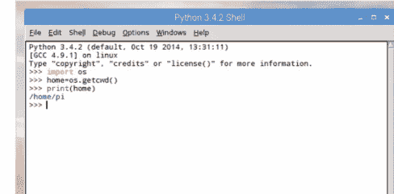

步骤 2 打印变量 `home` 返回的结果是系统上当前用户的主文件夹。在我们的示例中，它是 `/home/pi`；它会因你登录的用户名和使用的操作系统而异。例如，Windows 10 将输出：`C:\Program Files (x86)\Python36-32`。

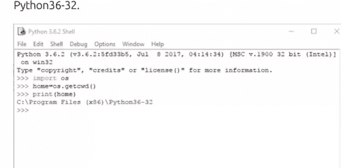

步骤 3 Windows 的输出不同，因为那是由系统确定的 Python 当前工作目录；正如你可能猜测的那样，`os.getcwd()` 函数是要求 Python 检索当前工作目录。Linux 用户将看到与树莓派类似的内容，macOS 用户也是如此。

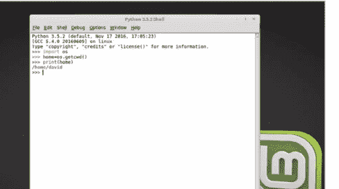

步骤 4 OS 模块的另一个有趣之处在于它能够启动安装在主机系统中的程序。例如，如果你想从 Python 程序中启动 Chromium 浏览器，可以使用以下命令：

```
import os
browser=os.system("/usr/bin/chromium-browser")
```

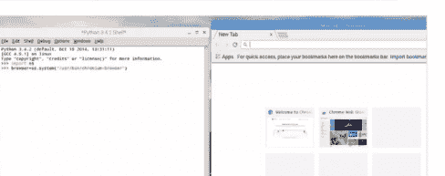

步骤 5 `os.system()` 函数允许与外部程序进行交互；你甚至可以使用此方法调用之前的 Python 程序。显然，你需要知道完整的路径和程序文件名才能成功运行。但是，你可以使用以下方法：

```
import os
os.system('start chrome "https://www.youtube.com/feed/music"')
```

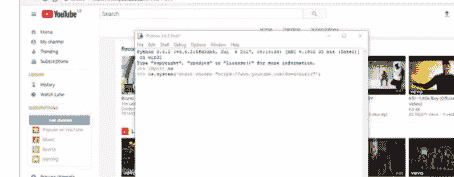

步骤 6 对于步骤 5 的示例，我们使用了 Windows，以展示 OS 模块在所有平台上大致相同。在这种情况下，我们打开了 YouTube 的音乐订阅页面，因此可以打开特定页面：

```
import os
os.system('chromium-browser "http://bdmpublications.com/"')
```


步骤 7 请注意上一步示例中单引号和双引号的使用。单引号包裹整个命令并启动 Chromium，而双引号则打开指定的页面。你甚至可以使用变量在同一浏览器中调用多个标签页：

```
import os
a=('chromium-browser "http://bdmpublications.com/"')
b=('chromium-browser "http://www.google.co.uk"')
os.system(a + b)
```


步骤 8 操作目录（或者如果你愿意，称为文件夹）的能力是 OS 模块的最佳功能之一。例如，要创建一个新目录，你可以使用：

```
import os
os.mkdir("NEW")
```

这将在当前工作目录中创建一个新目录，其名称根据 `mkdir` 函数中的对象命名。

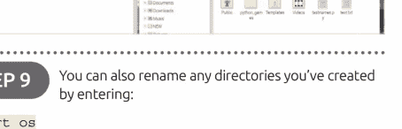

步骤 9 你也可以通过输入以下命令来重命名你创建的任何目录：

```
import os
os.rename("NEW", "OLD")
```

要删除它们：

```
import os
os.rmdir("OLD")
```

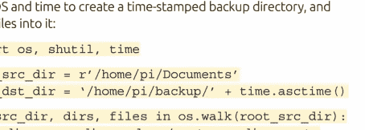

步骤 10 与 OS 配合使用的另一个模块是 shutil。你可以将 Shutil 模块与 OS 和 time 一起使用，创建一个带时间戳的备份目录，并将文件复制到其中：

```
import os, shutil, time

root_src_dir = r'/home/pi/Documents'
root_dst_dir = '/home/pi/backup/' + time.asctime()

for src_dir, dirs, files in os.walk(root_src_dir):
    dst_dir = src_dir.replace(root_src_dir, root_dst_dir, 1)
    if not os.path.exists(dst_dir):
        os.makedirs(dst_dir)
    for file_ in files:
        src_file = os.path.join(src_dir, file_)
        dst_file = os.path.join(dst_dir, file_)
        if os.path.exists(dst_file):
            os.remove(dst_file)
        shutil.copy(src_file, dst_dir)

print(">>>>>>>>>>备份完成<<<<<<<<<<")
```

### 使用数学模块

你会遇到的最常用模块之一是数学模块。正如我们之前在本书中提到的，数学是编程的支柱，数学模块在你的代码中可以有难以置信的多种用途。

#### E = MC²

数学模块提供了大量数学函数的访问权限，从简单地显示 PI 的值，到帮助你创建复杂的 3D 形状。

**步骤 1** 数学模块内置于 Python 3 中；因此无需通过 PIP 安装它。与其他模块一样，你可以通过在 Shell 中输入 `import math` 或在编辑器中作为代码的一部分来导入模块的函数。

**步骤 2** 导入数学模块将使你能够访问模块的代码。从那里，你可以通过使用 `math` 后跟相关函数的名称来调用 Math 中任何可用的函数。例如，输入：

`math.sin(2)`

这将显示 2 的正弦值。

**步骤 3** 你现在已经毫无疑问地知道，如果你知道模块中各个函数的名称，你可以专门导入它们。例如，Floor 和 Ceil 函数将浮点数向下和向上取整：

```
from math import floor, ceil
floor(1.2) # 返回 1
ceil(1.2) # 返回 2
```

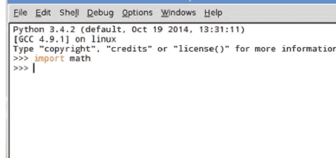

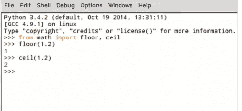

**步骤 4** 数学模块也可以在导入时重命名，就像 Python 中提供的其他模块一样。这通常可以节省时间，但不要忘记添加注释，以向查看你代码的其他人展示你做了什么：

```
import math as m
m.trunc(123.45) # Truncate 移除小数部分
```

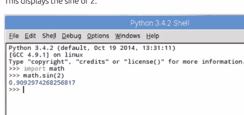

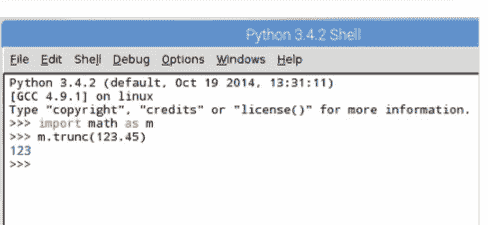

步骤 5 虽然这不是常见的做法，但可以从模块中导入函数并重命名它们。在这个例子中，我们从 Math 导入 Floor 并将其重命名为 f。尽管在使用冗长代码时，此过程很快会变得混乱：

```
from math import floor as f
f(1.2)
```

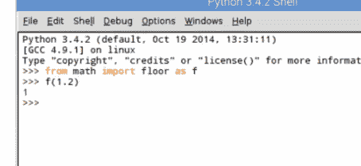

步骤 6 导入数学模块的所有函数可以通过输入以下命令完成：

```
from math import *
```

虽然这确实很方便，但开发人员社区通常不赞成这样做，因为它会占用不必要的资源，并且不是一种高效的编码方式。但是，如果它对你有用，那就继续吧。

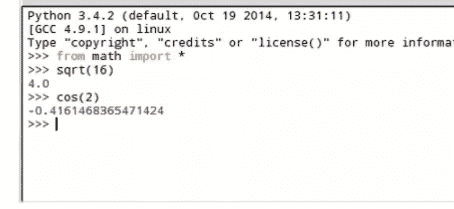

步骤 7 有趣的是，数学模块中的某些函数比其他函数更准确，或者更准确地说，它们被设计为返回更准确的值。例如：

```
sum([.1, .1, .1, .1, .1, .1, .1, .1, .1, .1])
```

将返回值 0.9999999999。而：

```
fsum([.1, .1, .1, .1, .1, .1, .1, .1, .1, .1])
```

返回值 1.0。

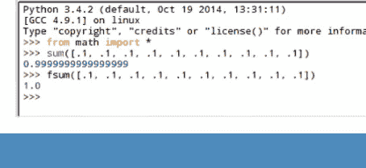

步骤 8 为了进一步提高精度，对于数字，可以使用 `exp` 和 `expm1` 函数来计算精确值：

```
from math import exp, expm1
exp(1e-5) - 1 # 值精确到 11 位
expm1(1e-5) # 结果精确到完整精度
```

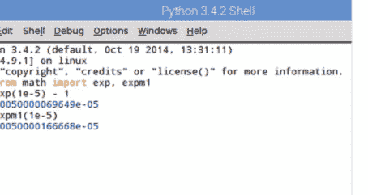

步骤 9 这种精度水平确实令人印象深刻，但在大多数情况下相当小众。可能最常用的两个函数是 `e` 和 `Pi`，其中 `e` 是等于 2.71828 的数值常数（圆的周长除以其直径）：

```
import math
print(math.e)
print(math.pi)
```

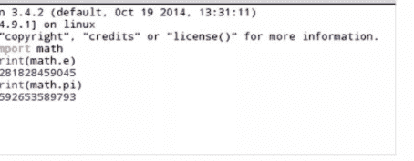

步骤 10 通过数学模块可用的丰富数学函数涵盖了从因数到无穷大、幂到三角函数、角度转换到常数的所有内容。请查看 https://docs.python.org/3/library/math.html# 获取可用数学模块函数的列表。

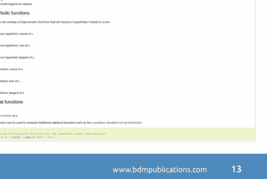

### 随机模块

随机模块是你在 Python 编程生涯中很可能会多次遇到的模块；顾名思义，它用于生成随机数或随机字母。不过，它并非完全随机，但足以满足大多数需求。

#### 随机数

随机模块包含众多函数，应用这些函数可以创建一些有趣且非常实用的 Python 程序。

步骤 1 与其他模块一样，你需要先导入 random 模块，才能使用本教程中将要介绍的任何函数。让我们从简单地打印一个 1 到 5 之间的随机数开始：

```
import random
print(random.randint(0,5))
```

步骤 2 在我们的示例中，返回了数字四。然而，多次输入 print 函数，它将显示从给定数字集合（零到五）中得出的不同整数值。总体效果虽然是伪随机的，但对于普通程序员在代码中使用来说已经足够了。

步骤 3 对于更大的数字集合，包括浮点数值，你可以使用乘法符号来扩展范围：

```
import random
print(random.random() *100)
```

这将显示一个介于 0 和 100 之间的浮点数，大约有十五位小数。

步骤 4 然而，随机模块并非仅用于数字。你可以用它从列表中随机选择一个条目，而列表可以包含任何内容：

```
import random
random.choice(["Conan", "Valeria", "Belit"])
```

这将随机显示我们冒险者中的一个名字，这对于文字冒险游戏来说是一个很棒的补充。

步骤 5 你可以通过让 random.choice() 从一个包含混合变量的列表中选择，来扩展前面的示例。例如：

```
import random
lst=["David", 44, "BDM Publications", 3245.23,
"Pi", True, 3.14, "Python"]
rnd=random.choice(lst)
print(rnd)
```

步骤 6 有趣的是，你还可以使用随机模块中的一个函数来打乱列表中的项目，从而为等式增添更多随机性：

```
random.shuffle(lst)
print(lst)
```

这样，你可以在显示列表中的随机项目之前不断打乱列表。

步骤 7 使用 shuffle，你可以创建一个完全随机的数字列表。例如，在给定范围内：

```
import random
lst=[[i] for i in range(20)]
random.shuffle(lst)
print(lst)
```

不断打乱列表，你每次都可以从 0 到 20 中获得不同的项目选择。

步骤 8 你也可以使用 start、stop、step 循环，从给定范围内按步长选择一个随机数：

```
import random
for i in range(10):
    print(random.randrange(0, 200, 7))
```

结果会有所不同，但你能大致了解它的工作原理。

步骤 9 让我们使用一段示例代码，它模拟抛硬币一万次，并统计正面或反面朝上的次数：

```
import random
output={"Heads":0, "Tails":0}
coin=list(output.keys())

for i in range(10000):
    output[random.choice(coin)]+=1

print("Heads:", output["Heads"])
print("Tails:", output["Tails"])
```

步骤 10 这是一段有趣的代码。使用一个包含 466,000 个单词的文本文件，你可以从中随机提取用户指定数量的单词（文本文件位于：www.github.com/dwyl/english-words）：

```
import random

print(">>>>>>>>>随机单词查找器<<<<<<<<<<")
print("\n使用一个 466K 的英文单词文本文件，我可以随机挑选任何单词。\n")

wds=int(input("\n我应该选择多少个单词？ "))

with open("/home/pi/Downloads/words.txt", "rt") as f:
    words = f.readlines()
words = [w.rstrip() for w in words]

print("-----------------------")

for w in random.sample(words, wds):
    print(w)

print("-----------------------")
```

### Tkinter 模块

虽然从命令行甚至 Shell 运行代码完全没问题，但 Python 的能力远不止于此。Tkinter 模块使程序员能够设置图形用户界面与用户交互，而且它功能强大得令人惊讶。

#### 获取 GUI

Tkinter 易于使用，但你可以用它做更多事情。让我们从了解它的工作原理并编写一些代码开始。不久你就会发现这个模块究竟有多强大。

步骤 1 Tkinter 通常内置于 Python 3 中。但是，如果输入 `import tkinter` 时它不可用，那么你需要从命令提示符执行 `pip install tkinter`。我们可以开始以不同于以前的方式导入模块，以节省输入时间，并导入它们的所有内容：

```
import tkinter as tk
from tkinter import *
```

步骤 2 不建议使用星号从模块导入所有内容，但通常不会造成任何危害。让我们从创建一个基本的 GUI 窗口开始，输入：

```
wind=Tk()
```

这将创建一个小型、基本的窗口。此时除了点击角落的 X 关闭窗口外，没有太多其他可做的。

步骤 3 理想的方法是在代码中添加 mainloop() 来控制 Tkinter 事件循环，但我们很快会讲到这一点。你刚刚创建了一个 Tkinter 小部件，还有更多我们可以尝试的：

```
btn=Button()
btn.pack()
btn["text"]="Hello everyone!"
```

第一行专注于新创建的窗口。点击回 Shell 并继续输入其他行。

步骤 4 你可以将上述内容组合到一个新文件中：

```
import tkinter as tk
from tkinter import *
btn=Button()
btn.pack()
btn["text"]="Hello everyone!"
```

然后添加一些按钮交互：

```
def click():
    print("You just clicked me!")
btn["command"]=click
```

步骤 5 保存并执行步骤 5 的代码，一个包含 'Hello everyone!' 的窗口将出现。如果你点击 Hello everyone! 按钮，Shell 将输出文本 'You just clicked me!'。这很简单，但展示了用几行代码可以实现什么。

步骤 6 你还可以在 Tkinter 窗口中同时显示文本和图像。但是，仅支持 GIF、PGM 或 PPM 格式。因此，在使用代码之前，请找到一张图像并进行转换。这是一个使用 BDM Publishing 标志的示例：

```
from tkinter import *

root = Tk()
logo = PhotoImage(file="/home/pi/Downloads/BDM_logo.gif")
w1 = Label(root, root.title("BDM Publications"), image=logo).pack(side="right")
content = """ 从 2004 年的 humble beginnings 开始，BDM 品牌迅速从一个仅由两人团队制作的单一出版物，成长为全球 bookazine 出版领域最知名的品牌之一，原因很简单。我们对每一期都提供最好产品的热情和承诺。虽然公司已经发展到拥有由我们国际员工交付的超过 250 种出版物的组合，但其建立的基础保持不变，这就是为什么我们相信 BDM 不仅仅是首选，对于精明的消费者来说，它是唯一的选择。 """
w2 = Label(root,
    justify=LEFT,
    padx = 10,
    text=content).pack(side="left")
root.mainloop()
```

步骤 7 前面的代码相当冗长，主要是因为 content 变量包含了公司网站上 BDM 关于页面的一部分内容。你显然可以根据需要更改内容、root.title 和图像。

步骤 8 你也可以创建单选按钮。试试：

```
from tkinter import *

root = Tk()

v = IntVar()

Label(root, root.title("Options"), text="""Choose a preferred language:""",
    justify = LEFT, padx = 20).pack()
Radiobutton(root,
    text="Python",
    padx = 20,
    variable=v,
    value=1).pack(anchor=W)
Radiobutton(root,
    text="C++",
    padx = 20,
    variable=v,
    value=2).pack(anchor=W)

mainloop()
```

步骤 9 你还可以创建复选框，带有按钮并输出到 Shell：

```
from tkinter import *
root = Tk()

def var_states():
    print("Warrior: %d,\nMage: %d" % (var1.get(), var2.get()))

Label(root, root.title("Adventure Game"),
    text=">>>>>>>>>你的冒险角色<<<<<<<<<<").grid(row=0, sticky=N)
var1 = IntVar()
Checkbutton(root, text="Warrior", variable=var1).grid(row=1, sticky=W)
var2 = IntVar()
Checkbutton(root, text="Mage", variable=var2).grid(row=2, sticky=W)
Button(root, text='Quit', command=root.destroy).grid(row=3, sticky=W, pady=4)
Button(root, text='Show', command=var_states).grid(row=3, sticky=E, pady=4)

mainloop()
```

步骤 10 步骤 9 的代码在 Tkinter 中引入了一些新的几何元素。注意 sticky=N、E 和 W 参数。这些描述了复选框和按钮的位置（北、东、南和西）。row 参数将它们放置在不同的行上。尝试一下，看看你能得到什么。

### Pygame 模块

我们已经简要了解过 Pygame 模块，但它还有更多内容需要探索。Pygame 的开发旨在帮助 Python 程序员创建图形化或基于文本的游戏。

#### PYGAMING

Pygame 并非 Python 的内置模块，但使用树莓派的用户已经安装了它。其他用户则需要使用命令提示符执行：`pip install pygame`。

**步骤 1** 自然，你需要先将 Pygame 模块加载到内存中，然后才能使用它们。完成后，Pygame 要求用户在使用任何函数之前对其进行初始化：

```
import pygame
pygame.init()
```

**步骤 3** 遗憾的是，你无法在不关闭 Python IDLE Shell 的情况下关闭新创建的 Pygame 窗口，这不太实用。因此，你需要在编辑器（新建 > 文件）中工作，并创建一个 True/False 的 while 循环：

```
import pygame
from pygame.locals import *
pygame.init()

gamewindow=pygame.display.set_mode((800,600))
pygame.display.set_caption("Adventure Game")

running=True

while running:
    for event in pygame.event.get():
        if event.type==QUIT:
            running=False
            pygame.quit()
```

**步骤 2** 让我们创建一个简单的游戏就绪窗口，并为其设置标题：

```
gamewindow=pygame.display.set_mode((800,600))
pygame.display.set_caption("Adventure Game")
```

你可以看到，在输入第一行代码后，你需要点击回到 IDLE Shell 继续输入代码；此外，你可以将窗口标题更改为任何你喜欢的内容。

### Pygame 模块

步骤 4 如果 Pygame 窗口仍然无法关闭，请不要担心，这只是 IDLE（使用 Tkinter 编写）和 Pygame 模块之间的差异。如果你通过命令行运行代码，它会正常关闭。

步骤 5 现在你将稍微调整一下代码，在 while 循环中运行主要的 Pygame 代码；这使其更整洁且易于理解。我们下载了一个图形来使用，并且需要为 pygame 设置一些参数：

```
python
import pygame
pygame.init()

running=True

while running:
    gamewindow=pygame.display.set_mode((800,600))
    pygame.display.set_caption("Adventure Game")
    black=(0,0,0)
    white=(255,255,255)
    img=pygame.image.load("/home/pi/Downloads/sprite1.png")
    def sprite(x,y):
        gamewindow.blit(img, (x,y))
    x=(800*0.45)
    y=(600*0.8)
    gamewindow.fill(white)
    sprite(x,y)
    pygame.display.update()
    for event in pygame.event.get():
        if event.type==pygame.QUIT:
            running=False
```

步骤 6 让我们快速浏览一下代码的更改。我们定义了两种颜色，黑色和白色，以及它们各自的 RGB 颜色值。接下来，我们加载了名为 sprite1.png 的下载图像，并将其分配给变量 img；同时定义了一个 sprite 函数，Blit 函数将允许我们最终移动图像。

```
python
import pygame
from pygame.locals import *
pygame.init()

running=True

while running:
    gamewindow=pygame.display.set_mode((800,600))
    pygame.display.set_caption("Adventure Game")
    black=(0,0,0)
    white=(255,255,255)
    img=pygame.image.load("/home/pi/Downloads/sprite1.png")
    def sprite(x,y):
        gamewindow.blit(img, (x,y))
    x=(800*0.45)
    y=(600*0.8)
    gamewindow.fill(white)
    sprite(x,y)
    pygame.display.update()
    for event in pygame.event.get():
        if event.type==QUIT:
            running=False
            pygame.quit()
```

## 使用模块

步骤 7 现在我们可以再次调整代码，这次在 while 循环中包含一个移动选项，并添加在屏幕上移动精灵所需的变量：

```
import pygame
from pygame.locals import *
pygame.init()

running=True

gamewindow=pygame.display.set_mode((800,600))
pygame.display.set_caption("Adventure Game")
black=(0,0,0)
white=(255,255,255)
img=pygame.image.load("/home/pi/Downloads/sprite1.png")

def sprite(x,y):
    gamewindow.blit(img, (x,y))

x=(800*0.45)
y=(600*0.8)

xchange=0
imgspeed=0

while running:
    for event in pygame.event.get():
        if event.type==QUIT:
            running=False

    if event.type == pygame.KEYDOWN:
        if event.key==pygame.K_LEFT:
            xchange=-5
        elif event.key==pygame.K_RIGHT:
            xchange=5
    if event.type==pygame.KEYUP:
        if event.key==pygame.K_LEFT or event.key==pygame.K_RIGHT:
            xchange=0

    x += xchange

    gamewindow.fill(white)
    sprite(x,y)
    pygame.display.update()

pygame.quit()
```

步骤 8 复制代码，使用键盘上的左右箭头键，你可以将你的精灵在屏幕底部移动。现在，看起来你正在制作一个经典的街机 2D 卷轴游戏。

```
import pygame
from pygame.locals import *
pygame.init()

running=True

gamewindow=pygame.display.set_mode((800,600))
pygame.display.set_caption("Adventure Game")
black=(0,0,0)
white=(255,255,255)
img=pygame.image.load("/home/pi/Downloads/sprite1.png")

def sprite(x,y):
    gamewindow.blit(img, (x,y))

x=(800*0.45)
y=(600*0.8)

xchange=0
imgspeed=0

while running:
    for event in pygame.event.get():
        if event.type==QUIT:
            running=False

    if event.type == pygame.KEYDOWN:
        if event.key==pygame.K_LEFT:
            xchange=-5
        elif event.key==pygame.K_RIGHT:
            xchange=5
    if event.type==pygame.KEYUP:
        if event.key==pygame.K_LEFT or event.key==pygame.K_RIGHT:
            xchange=0

    x += xchange

    gamewindow.fill(white)
    sprite(x,y)
    pygame.display.update()

pygame.quit()
```

### Pygame 模块

步骤 9 你现在可以实现一些新增功能，并利用一些之前的教程代码。新元素是 Subprocess 模块，其中一个函数允许我们从另一个脚本中启动第二个 Python 脚本；我们将创建一个名为 pygametxt.py 的新文件：

```
import pygame
import time
import subprocess
pygame.init()
screen = pygame.display.set_mode((800, 250))
clock = pygame.time.Clock()

font = pygame.font.Font(None, 25)

pygame.time.set_timer(pygame.USEREVENT, 200)

def text_generator(text):
    tmp = ''
    for letter in text:
        tmp += letter
        if letter != ' ':
            yield tmp

class DynamicText(object):
    def __init__(self, font, text, pos, autoreset=False):
        self.done = False
        self.font = font
        self.text = text
        self._gen = text_generator(self.text)
        self.pos = pos
        self.autoreset = autoreset
        self.update()

    def reset(self):
        self._gen = text_generator(self.text)
        self.done = False
        self.update()

    def update(self):
        if not self.done:
            try: self.rendered = self.font.render(next(self._gen), True, (0, 128, 0))
            except StopIteration:
                self.done = True
                time.sleep(10)
                subprocess.Popen("python3 /home/pi/Documents/Python\ Code/pygame1.py 1", shell=True)

    def draw(self, screen):
        screen.blit(self.rendered, self.pos)

text=("A long time ago, a barbarian strode from the frozen north. Sword in hand...")

message = DynamicText(font, text, (65, 120), autoreset=True)

while True:
    for event in pygame.event.get():
        if event.type == pygame.QUIT: break
        if event.type == pygame.USEREVENT: message.update()
    else:
        screen.fill(pygame.color.Color('black'))
        message.draw(screen)
        pygame.display.flip()
        clock.tick(60)
        continue
    break

pygame.quit()
```

步骤 10 当你运行这段代码时，它会显示一个又长又窄的 Pygame 窗口，介绍文字向右滚动。暂停十秒后，它会启动主游戏 Python 脚本，你可以在其中移动战士精灵。总体效果相当不错，但总有改进的空间。

#### 基础动画

Python 的模块使得创建图形、显示图形并相应地制作动画变得相对容易。然而，动画在代码中可能是一个棘手的元素。实现相同最终结果的方法有很多种，我们将在此向你展示其中一种示例。

#### 灯光、摄像机、开拍

Tkinter 模块是学习 Python 动画的理想起点。当然，市面上有更好的自定义模块，但 Tkinter 足以胜任，让你掌握所需知识。

步骤 1 让我们制作一个弹跳球动画。首先，我们需要创建一个画布（窗口）和要制作动画的球：

```
from tkinter import *
import time

gui = Tk()
gui.geometry("800x600")
gui.title("Pi Animation")
canvas = Canvas(gui,
width=800,height=600,bg='white')
canvas.pack()

ball1 = canvas.create_oval(5,5,60,60, fill='red')

gui.mainloop()
```

步骤 2 保存并运行代码。你将看到一个空白窗口出现，窗口左上角有一个红球。虽然这很棒，但动画效果不强。让我们添加以下代码：

```
a = 5
b = 5

for x in range(0,100):
    canvas.move(ball1,a,b)
    gui.update()
    time.sleep(.01)
```

步骤 3 将新代码插入到 `ball1 = canvas.create_oval(5,5,60,60, fill='red')` 行和 `gui.mainloop()` 行之间。保存并运行。现在你将看到球从动画窗口的左上角移动到右下角。你可以通过修改 `time.sleep(.01)` 行来改变球穿越窗口的速度。试试 (.05)。

步骤 4 `canvas.move(ball1,a,b)` 这行代码负责将球从一个角落移动到另一个角落；显然 a 和 b 都等于 5。我们已经可以稍微改变一些东西，比如球的大小和颜色，使用这行代码：`ball1 = canvas.create_oval(5,5,60,60, fill='red')`，我们还可以将 a 和 b 的值改为其他值。

```
ball1 = canvas.create_oval(7,7,60,60, fill='red')

a = 8
b = 3

for x in range(0,100):
    canvas.move(ball1,a,b)
    gui.update()
    time.sleep(.05)
```

步骤 5 让我们看看是否能让球在窗口中弹跳，直到你关闭程序。

```
xa = 5
ya = 10

while True:
    canvas.move(ball1,xa,ya)
    pos=canvas.coords(ball1)
    if pos[3] >=600 or pos[1] <=0:
        ya = -ya
    if pos[2] >=800 or pos[0] <=0:
        xa = -xa
    gui.update()
    time.sleep(.025)
```

步骤 6 删除你在步骤 2 中输入的代码，并将步骤 5 的代码插入到其位置；同样，位于 `ball1 = canvas.create_oval(5,5,60,60, fill='red')` 和 `gui.mainloop()` 行之间。保存代码并正常运行。如果你正确输入了代码，那么你将看到红球在窗口边缘弹跳，直到你关闭程序。

步骤 7 弹跳动画发生在 While True 循环中。首先，我们在循环前设置了 xa 和 ya 的值，分别为 5 和 10。`pos=canvas.coords(ball1)` 这行代码获取球在窗口中的位置值。当它达到窗口的极限，即 800 或 600 时，它会使值变为负数；从而让球在屏幕上移动。

步骤 8 然而，Pygame 是一个更好的模块，用于制作更高级的动画。首先创建一个新文件并输入：

```
import pygame
from random import randrange

MAX_STARS = 250
STAR_SPEED = 2

def init_stars(screen):
    """ Create the starfield """
    global stars
    stars = []
    for i in range(MAX_STARS):
        # A star is represented as a list with this
format: [X,Y]
        star = [randrange(0,screen.get_width() - 1),
                randrange(0,screen.get_height() - 1)]
        stars.append(star)

def move_and_draw_stars(screen):
    """ Move and draw the stars """
    global stars
    for star in stars:
        star[1] += STAR_SPEED
        if star[1] >= screen.get_height():
            star[1] = 0
            star[0] = randrange(0,639)

        screen.set_at(star, (255,255,255))
```

步骤 9 现在添加以下内容：

```
def main():
    pygame.init()
    screen = pygame.display.set_mode((640,480))
    pygame.display.set_caption("Starfield Simulation")
    clock = pygame.time.Clock()

    init_stars(screen)

    while True:
        # Lock the framerate at 50 FPS
        clock.tick(50)

        # Handle events
        for event in pygame.event.get():
            if event.type == pygame.QUIT:
                return

        screen.fill((0,0,0))
        move_and_draw_stars(screen)
        pygame.display.flip()

if __name__ == "__main__":
    main()
```

步骤 10 保存并运行代码。你会同意模拟星空的代码看起来相当令人印象深刻。想象一下，这是某个游戏代码的开始，甚至是演示文稿的开头？结合使用 Pygame 和 Tkinter，你的 Python 动画将会非常出色。

### 创建你自己的模块

如果将大型程序分解成更小的部分，并将需要的部分作为模块导入，那么管理起来会容易得多。学习构建自己的模块也有助于理解它们的工作原理。

#### 构建模块

模块是包含代码的 Python 文件，使用 .py 扩展名保存。然后使用我们熟悉的 import 命令将它们导入到 Python 中。

**步骤 1** 让我们从创建一组基本的数学函数开始。将一个数字乘以二、三，求平方或将数字提升到一个指数（幂）。在 IDLE 中创建一个新文件并输入：

```
def timestwo(x) :
    return x * 2

def timesthree(x) :
    return x * 3

def square(x) :
    return x * x

def power(x,y) :
    return x ** y
```

**步骤 2** 在上述代码下方，输入调用代码的函数：

```
print (timestwo(2))
print (timesthree(3))
print (square(4))
print (power(5,3))
```

将程序保存为 basic_math.py 并执行以获取结果。

**步骤 3** 现在你要将函数定义从程序中取出，放入一个单独的文件中。高亮显示函数定义并选择 Edit > Cut。选择 File > New File 并在新窗口中使用 Edit > Paste。你现在有两个独立的文件，一个包含函数定义，另一个包含函数调用。

**步骤 4** 如果你现在尝试再次执行 basic_math.py 代码，将显示错误 **'NameError: name 'timestwo' is not defined'**。这是由于代码不再有权访问函数定义。

```
Traceback (most recent call last):
  File "/home/pi/Documents/Python Code/basic_math.py", line 3, in <module>
    print (timestwo(2))
NameError: name 'timestwo' is not defined
>>> |
```

**步骤 5** 返回到包含函数定义的新创建窗口，然后单击 File > Save As。将其命名为 **minimath.py** 并将其保存在与原始 **basic_math.py** 程序相同的位置。现在关闭 minimath.py 窗口，以便 basic_math.py 窗口保持打开状态。

步骤 6 返回到 basic_math.py 窗口：在代码顶部输入：

```
from minimath import *
```

这将把函数定义作为模块导入。按 F5 保存并执行程序以查看其运行效果。

步骤 7 你现在可以进一步使用代码，使程序更高级一些，充分利用新创建的模块。包含一些用户交互。首先创建一个用户可以选择的基本菜单：

```
print("Select operation.\n")
print("1.Times by two")
print("2.Times by Three")
print("3.Square")
print("4.Power of")

choice = input("\nEnter choice (1/2/3/4) :")
```

步骤 8 现在我们可以添加用户输入，以获取代码将要处理的数字：

```
num1 = int(input("\nEnter number: "))
```

这将把用户输入的数字保存为变量 num1。

步骤 9 最后，你现在可以创建一系列 if 语句来确定如何处理该数字，并利用新创建的函数定义：

```
if choice == '1':
    print(timestwo(num1))

elif choice == '2':
    print(timesthree(num1))

elif choice == '3':
    print(square(num1))

elif choice == '4':
    num2 = int(input("Enter second number: "))
    print(power(num1, num2))
else:
    print("Invalid input")
```

步骤 10 请注意，对于最后一个可用选项，即 Power of 选择，我们添加了第二个变量 num2。这将第二个数字传递给名为 power 的函数定义。保存并执行程序以查看其运行效果。

# 聚焦Python：人工智能

人工智能（AI）和机器学习（ML）是IT行业的新热点。人工智能正迅速成为过去科幻作品中所描绘的、正在运作的科学，而其背后正是Python。

尽管人工智能和机器学习关系密切，但两者之间存在明显差异。人工智能指的是研究如何训练计算机去完成人类能做得更好、更快的事情。而机器学习则是计算机从经验中学习的能力，从而使结果和性能最终变得更准确、更完善。

虽然有所不同，但它们本质上都在讨论同一个要素：训练一个系统自主学习和做事。据说人工智能通向智慧，而机器学习则通向知识，得益于Python，两者之间的差距正日益缩小。


```python
import keras
from keras.datasets import mnist
from keras.models import Sequential
from keras.layers import Dense, Dropout, Flatten
from keras.layers import Conv2D, MaxPooling2D

batch_size = 128
num_classes = 10
epochs = 12

## input image dimensions
img_rows, img_cols = 28, 28

(x_train, y_train), (x_test, y_test) = mnist.load_data()
```

## 应用

人工智能和机器学习在当今技术中无处不在。就在几年前，我们大多数人还将人工智能与超级智能杀手机器人的崛起联系在一起，而如今，你会惊讶于家中甚至随身携带的物品中人工智能的众多应用实例。

让我们从人工智能和机器学习最明显的应用——智能手机说起。这些设备已渗透到我们现代世界的大部分角落，2019年全球覆盖率已达55亿，预计到2020年底将超过60亿。因此，人工智能和机器学习正在突飞猛进也就不足为奇了。

由于几乎全人类都在智能手机的覆盖范围内，这些设备背后的编码已发展到能考虑到个体用户。这些设备旨在学习用户的需求或使用习惯。常用号码被推到列表顶部，应用内和游戏内的广告会根据我们的浏览器和搜索偏好以及其他过去安装的应用进行定制。甚至我们的声音、指纹和面部信息也被人工智能和机器学习存储和分析，以识别我们的身份。

### 数字助手

数字助手的兴起是人工智能和机器学习编程的推动力之一。Siri、Cortana、Alexa和Google Assistant都是使用Python编写的，旨在倾听、学习并回应我们的要求。借助Python，得益于其众多的库和语言的可定制性，实现这种水平的人工智能出奇地简单。这些框架使智能编码人员能够轻松创建人工智能和机器学习，减少了使用其他语言的开发时间，并且由于Python代码易于阅读且算法复杂，这些开发者可以投入大量时间来提升人工智能的性能和准确性。

每当我们向这些数字助手下达指令时，由Python驱动的人工智能代码正在读取我们的声音，通过提取关键词来确定我们要求的内容并执行相应操作。如果我们要求三十秒倒计时，它会启动设备的秒表功能；如果我们寻求晚餐建议，它会打开一组特定的网页；如果我们要求播放音乐，它会查询可用的音乐应用来选择我们想要的内容。在此过程中，人工智能代码被训练得更加专注地倾听，而机器学习则从人工智能的结果中学习，从而提高未来问题和请求的准确性。

### 超越智能手机

想想谷歌、社交媒体以及你查找的内容。有多少次你在谷歌中输入搜索字符串，比如“Mk1福特护卫者汽车零件”，然后当你打开Facebook时，突然发现了一个福特护卫者车主群组的推荐？这就是人工智能和机器学习融入你日常计算任务的例子。

人工智能和机器学习协同工作的另一个例子是Gmail最近添加的句子建议补全功能。如果你经常以“再见”或“祝好”结尾，那么输入“再”或“祝”就会提示机器学习部分自动为你填充剩余的词语。在此过程中，机器学习在不断学习，而人工智能则告诉它需要改进什么。

面部识别是人工智能和机器学习的另一个元素，一段时间以来一直是大众媒体关注的焦点。在整个2019年，智能手机和闭路电视录像中的面部识别系统都取得了显著进步。控制这一级别人工智能的机构现在有能力从拥挤的街道上识别出个人，虽然这对法律和秩序很有利，但它确实对我们的隐私构成了潜在威胁。毕竟，谁来监视监视者呢？

特斯拉在自动驾驶汽车方面的工作意味着它们正日益成为常态，而正是Python及其控制的人工智能和机器学习在推动其前进（请原谅这个双关语）。在这种情况下，Python承担了大量繁重的工作，提供了旨在实现人工智能和机器学习的连接组织和库。在后台，你通常会发现C++或其他语言，它们在支持人工智能和机器学习运行的整体程序性能。

虽然很容易描绘一个黯淡的人工智能未来，但我们不要忘记目前我们所享受的许多优秀的人工智能实例：光学字符识别、手写识别、图像处理、帮助视觉和听觉障碍人士、太空探索的进步、工程改进、环境保护、医药和药物改进，以及为行动受限者提供更大的出行自由。并非都是关于两个人工智能机器人争论消灭人类。

### 人工智能的未来

我们最终是否会创造出真正的人工智能、杀手机器人和具有自我意识的仿生人，尚有争议。关于人工智能的进化存在大量支持和反对的论点，许多人认为人工智能将是人类可能创造的最糟糕的未来——甚至比核战争更糟。然而，目前我们仍处于人工智能发展的早期阶段，但随着Python的持续进步和库的改进，我们拥有一个每小时都在变得更好的人工智能系统可能不会太久。


## 代码仓库


### 分享你的代码！

本节列出的代码可以作为Python文件下载，因此你无需手动输入。只需访问 [www.bdmpublications.com/code-portal](http://www.bdmpublications.com/code-portal)，注册获取门户访问权限，代码即可作为压缩文件供你下载和执行。

也许你写了一些很棒的代码并想展示出来；如果是这样，为什么不发送给我们呢？我们可以将其添加到代码门户，并通过我们的社交媒体账户提及。

告诉我们代码的功能、工作原理（别忘了在代码中包含注释）以及运行它的平台。

发送至：[enquiries@bdmpublications.com](mailto:enquiries@bdmpublications.com)。我们期待看到你的成果。

## 代码仓库

我们为你提供了一个庞大的Python代码仓库，供你在自己的程序中自由使用。这里有大量资源可以帮助你创建出色的程序，或扩展你的项目创意。

我们提供了用于备份文件和文件夹、猜数字游戏、随机数生成器、谷歌搜索代码、游戏代码、动画代码、图形代码、文字冒险代码，甚至播放计算机存储音乐的代码。我们分解了一些较新的、扩展的代码概念，以帮助你更好地理解其工作原理。这样你就可以轻松地将其调整为自己的用途。

这是一个你在任何其他Python书籍中都找不到的绝佳资源。所以请使用它，拆解它，将其调整为自己的程序，看看你能创造出什么。

## Python 文件管理器

这个文件管理器程序会显示一系列选项，允许你读取文件、写入文件、追加内容到文件、删除文件、列出目录内容等等。它非常容易编辑并插入到你自己的代码中，或者进行扩展。

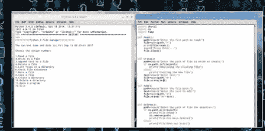

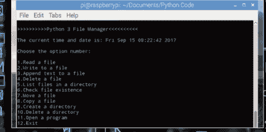

1.  代码的这一部分导入了必要的模块。`OS` 和 `Subprocess` 模块处理程序与操作系统相关的部分。
2.  每个 `def XXX()` 函数存储了菜单中每个选项的代码。一旦函数内的代码执行完毕，程序会返回主菜单以供选择其他选项。
3.  这是代码中用于检查用户正在运行哪个操作系统的部分。在 Windows 中，`CLS` 命令用于清屏，而在 Linux 和 macOS 中，`Clear` 命令用于清屏。如果代码在 Linux 或 macOS 中尝试运行 `CLS`，会发生错误，这会提示它转而运行 `Clear` 命令。
4.  这些是选项，从 1 到 12。当输入相应数字时，每个选项都会执行相应的函数。

### FILEMAN.PY

将下面的代码复制到一个 新建 > 文件 中，并将其保存为 `FileMan.py`。一旦执行，它将显示程序标题，以及当前时间和日期和可用选项。

```python
import shutil
import os
import time
import subprocess

def Read():
    path=input("Enter the file path to read:")
    file=open(path,"r")
    print(file.read())
    input('Press Enter...')
    file.close()

def Write():
    path=input("Enter the path of file to write or create:")
    if os.path.isfile(path):
        print('Rebuilding the existing file')
    else:
        print('Creating the new file')
    text=input("Enter text:")
    file=open(path,"w")
    file.write(text)

def Add():
    path=input("Enter the file path:")
    text=input("Enter the text to add:")
    file=open(path,"a")
    file.write('\n'+text)

def Delete():
    path=input("Enter the path of file for deletion:")
    if os.path.exists(path):
        print('File Found')
        os.remove(path)
        print('File has been deleted')
    else:
        print('File Does not exist')

def Dirlist():
    path=input("Enter the Directory path to display:")
    sortlist=sorted(os.listdir(path))
    i=0
    while(i<len(sortlist)):
        print(sortlist[i]+'\n')
        i+=1

def Check():
    fp=int(input('Check existence of \n1.File \n2. Directory\n'))
    if fp==1:
        path=input("Enter the file path:")
        os.path.isfile(path)
        if os.path.isfile(path)==True:
            print('File Found')
        else:
            print('File not found')
    if fp==2:
        path=input("Enter the directory path:")
        os.path.isdir(path)
        if os.path.isdir(path)==False:
            print('Directory Found')
        else:
            print('Directory Not Found')

def Move():
    path1=input('Enter the source path of file to move:')
    mr=int(input('1.Rename \n2.Move \n'))
    if mr==1:
        path2=input('Enter the destination path and file name:')
        shutil.move(path1,path2)
        print('File renamed')
    if mr==2:
        path2=input('Enter the path to move:')
        shutil.move(path1,path2)
        print('File moved')

def Copy():
    path1=input('Enter the path of the file to copy or rename:')
    path2=input('Enter the path to copy to:')
    shutil.copy(path1,path2)
    print('File copied')

def Makedir():
    path=input("Enter the directory name with path to make \neg. C:\Hello\Newdir \nWhere Newdir is new directory:")
    os.makedirs(path)
    print('Directory Created')

def Removedir():
    path=input('Enter the path of Directory:')
    treedir=int(input('1.Deleted Directory \n2.Delete Directory Tree \n3.Exit \n'))
    if treedir==1:
        os.rmdir(path)
    if treedir==2:
        shutil.rmtree(path)
        print('Directory Deleted')
    if treedir==3:
        exit()

def Openfile():
    path=input('Enter the path of program:')
    try:
        os.startfile(path)
    except:
        print('File not found')

run=1
while(run==1):
    try:
        os.system('clear')
    except OSError:
        os.system('cls')
    print('\n>>>>>>>>>Python 3 File Manager<<<<<<<<<<\n')
    print('The current time and date is:',time.asctime())
    print('\nChoose the option number: \n')
    dec=int(input('''1.Read a file
2.Write to a file
3.Append text to a file
4.Delete a file
5.List files in a directory
6.Check file existence
7.Move a file
8.Copy a file
9.Create a directory
10.Delete a directory
11.Open a program
12.Exit'''))
    if dec==1:
        Read()
    if dec==2:
        Write()
    if dec==3:
        Add()
    if dec==4:
        Delete()
    if dec==5:
        Dirlist()
    if dec==6:
        Check()
    if dec==7:
        Move()
    if dec==8:
        Copy()
    if dec==9:
        Makedir()
    if dec==10:
        Removedir()
    if dec==11:
        Openfile()
    if dec==12:
        exit()
    run=int(input("1.Return to menu\n2.Exit \n"))
    if run==2:
        exit()
```

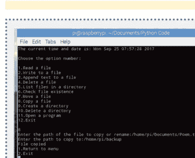

### 导入

这里需要导入三个模块：`Shutil`、`OS` 和 `Time`。前两个模块处理操作系统和文件管理与操作，而 `Time` 模块则简单地显示当前时间和日期。

注意我们如何包含了一个 `try` 和 `except` 块来检查用户是在 Linux 系统还是 Windows 系统上运行代码。Windows 使用 `CLS` 来清屏，而 Linux 使用 `clear`。`try` 块应该能很好地工作，但根据你自己的系统，这是一个可能改进的地方。

### 猜数字游戏

这是一段简单的小代码，但它很好地利用了 `Random` 模块、`print` 和 `input`，以及一个 `while` 循环。猜测次数可以从 5 次增加，随机数范围也可以轻松更改。

### NUMBERGUESS.PY

复制代码，看看你能否在五次猜测内击败计算机。这是一段有趣的代码，当你需要结合使用 `Random` 模块和 `while` 循环时，它会非常方便。

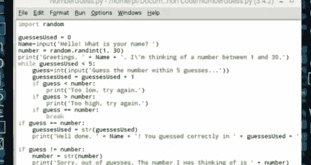

```python
import random

guessesUsed = 0
Name=input('Hello! What is your name? ')
number = random.randint(1, 30)
print('Greetings, ' + Name + ', I\'m thinking of a number between 1 and 30.')
while guessesUsed < 5:
    guess=int(input('Guess the number within 5 guesses...'))
    guessesUsed = guessesUsed + 1
    if guess < number:
        print('Too low, try again.')
    if guess > number:
        print('Too high, try again.')
    if guess == number:
        break

if guess == number:
    guessesUsed = str(guessesUsed)
    print('Well done, ' + Name + '! You guessed correctly in ' + guessesUsed + ' guesses.')

if guess != number:
    number = str(number)
    print('Sorry, out of guesses. The number I was thinking of is ' + number)
```

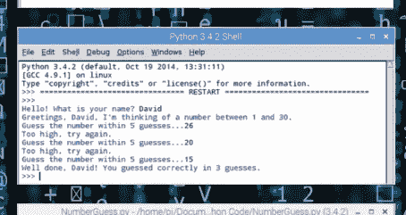

1.  尽管这是一个相当容易理解的程序，但代码中有一些元素值得指出。首先，你需要导入 `Random` 模块，因为你在代码中使用了随机数。

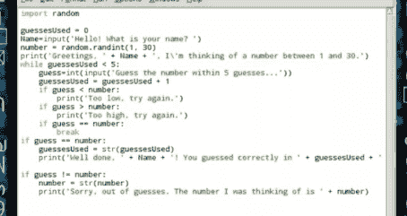

2.  代码的这一部分创建了用于存储已使用猜测次数的变量，以及玩家的名字，并设置了 1 到 30 之间的随机数。如果你想扩大随机数选择范围，可以增加 **`number=random.randint(1, 30)`** 的结束值 30；但不要设置得太高，否则玩家将永远无法猜到。如果玩家猜得太低或太高，他们会得到相应的输出并被要求重试，同时猜测次数少于五次。你也可以通过更改 **`while guessesUsed < 5:`** 的值来将猜测次数从 5 次增加。
3.  如果玩家猜对了数字，他们会得到一个“干得好”的输出，以及他们用了多少次猜测。如果玩家用完了所有猜测次数，则会显示游戏结束的输出，并揭示计算机正在思考的数字。记住，如果你确实更改了计算机选择的随机数值或玩家可以进行的猜测次数，那么除了变量值之外，你还需要修改代码开头 `print` 语句中给出的说明。

### 猜数字游戏

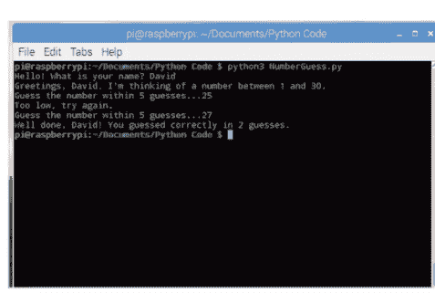

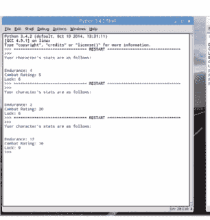

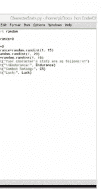

## 代码改进

既然这是一个可以应用于各种场景的简单脚本，那么它有很大的空间可以进行调整，使其变得更有趣。也许你可以加入一个计分选项，比如三局两胜制。或者设计一种精巧的方式来祝贺玩家在第一次尝试时就“一杆进洞”般地猜对了数字。

此外，猜数字游戏的代码确实为以不同方式集成到你的代码中提供了一些空间。我们的意思是，这段代码可以用来获取一个范围内的随机数，而这反过来可以为你提供一个冒险游戏中角色创建函数的起点。

想象一下用Python编写的文字冒险游戏的开头，玩家为他们的角色命名。下一步是掷虚拟的随机骰子来决定该角色的战斗评级、力量、耐力和运气值。然后，这些值可以作为一组变量带入游戏中，根据玩家角色所处的情况进行增减。

例如，根据提供的截图，你可以使用类似这样的代码：

```
Endurance=0
CR=0
Luck=0
Endurance = random.randint(1, 15)
CR = random.randint(1, 20)
Luck = random.randint(1, 10)
Print("Your character's stats are as follows:\n")
Print("Endurance:", Endurance)
Print("Combat Rating:", CR)
Print("Luck:", Luck)
```

然后，玩家可以决定是保留他们的掷骰结果，还是为了希望获得更好的数值而再试一次。将这段代码集成到一个基础冒险游戏中有很多方法。

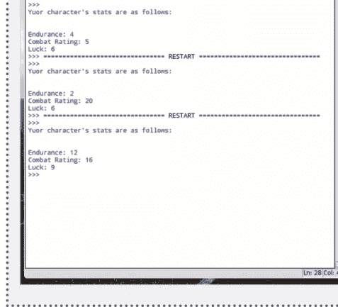

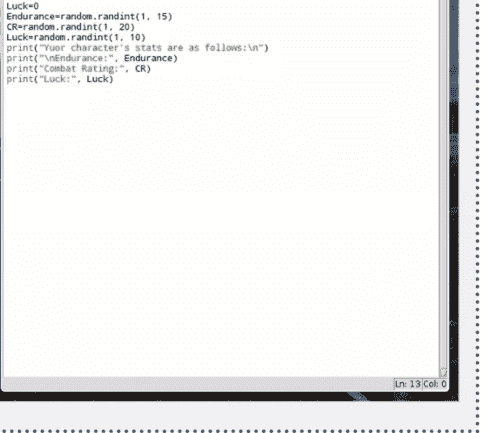

### 随机数生成器

用户输入以及操作该输入的能力是任何编程语言的重要元素。它将一个好程序与一个伟大的程序区分开来，后者允许用户进行交互并看到交互的结果。

### RNDNUMGEN.PY

它可能很简单，但这段小代码会向用户询问两组数字：一个起始数和一个结束数。然后，代码会从这两个数字之间随机抽取一个数字并显示出来。

```
from random import *

print("\n>>>>>>>>Random Number Generator<<<<<<<<\n")
nmb1=int(input("Enter the start number: "))
nmb2=int(input("Enter the last number: "))

x = randint(nmb1, nmb2)
print("\nThe random number between",nmb1,"and",nmb2,"is:\n")
print(x)
```

### 更多输入

虽然这段代码易于理解，但如果你提示用户提供更多输入，它可能会变得更有趣。也许你可以为他们的数字提供加法、减法、乘法运算。如果你觉得自己很聪明，可以尝试将代码通过一个Tkinter窗口，甚至是第128页提供的Ticker窗口来运行。

此外，这段代码的核心可以用于文字冒险游戏，其中角色与某物战斗，他们的生命值以及敌人的生命值会减少一个随机数。这可以与第90页猜数字游戏中的先前代码相结合，我们在那里定义了冒险游戏角色的属性。

你还可以在代码中引入Turtle模块，并可能根据用户输入的随机值设置一些绘制形状、物体或其他东西的规则。这需要一点计算，但效果肯定非常有趣。

例如，代码可以编辑成这样：

```
from random import *
import turtle

print("\n>>>>>>>>Random Turtle Image<<<<<<<<\n")
nmb1=int(input("Enter the start number: "))
nmb2=int(input("Enter the second number: "))
nmb3=int(input("Enter the third number: "))
nmb4=int(input("Enter the fourth number: "))

turtle.forward(nmb1)
turtle.left(90)
turtle.forward(nmb2)
turtle.left(90)
turtle.forward(nmb3)
turtle.left(90)
turtle.forward(nmb4)
turtle.left(90)
```

虽然它有点粗糙，但你可以很容易地使其更完善。

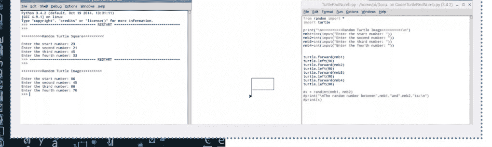

### 随机密码生成器

我们总是被告知我们的密码不够安全；那么，这里有一个解决方案，可以集成到你未来的程序中。下面的随机密码生成器代码每次执行时都会创建一个由12个字母（大小写）和数字组成的字符串。

### RNDPASSWORD.PY

复制代码并运行它；每次你都会得到一个随机的字符字符串，可以轻松用作安全密码，密码破解程序将很难破解。

```
import string
import random

def randompassword():
    chars=string.ascii_uppercase + string.ascii_lowercase + string.digits
    size= 8
    return ''.join(random.choice(chars) for x in range(size,20))

print(randompassword())
```

### 安全密码

你可以做很多事情来修改这段代码并进一步改进它。首先，你可以增加生成密码显示的字符数，也许还可以包含特殊字符，如符号和标志。然后，你可以将选定的密码输出到一个文件，然后使用之前的随机数生成器作为文件密码安全地压缩它，并将其发送给用户作为他们的新密码。

这段代码的一个有趣之处在于能够引入循环并打印任意数量的随机密码。假设你有一个包含50名用户的公司列表，你负责每月为他们生成一个随机密码。

添加一个循环来打印五十次密码非常容易，例如：

```
import string
import random

def randompassword():
    chars=string.ascii_uppercase + string.ascii_lowercase + string.digits
    size= 4
    return ''.join(random.choice(chars) for x in range(size,20))

n=0
while n<50:
    print(randompassword())
    n=n+1
```

这将基于之前随机选择的字符输出五十个随机密码。

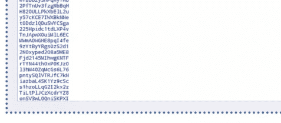

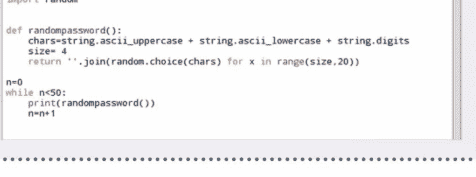

### 文本转二进制转换器

虽然它看起来可能不太令人兴奋，但这个文本转二进制转换器实际上相当有趣。它只使用两行代码，因此非常容易插入到你自己的脚本中。

### TXT2BIN.PY

我们自然使用format函数将用户输入的文本字符串转换为其二进制等效值。如果你想检查其准确性，可以将二进制数输入到在线转换器中。

```
text=input("Enter text to convert to Binary: ")
print(' '.join(format(ord(x), 'b') for x in text))
```

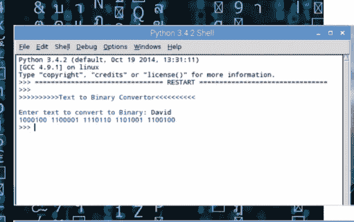

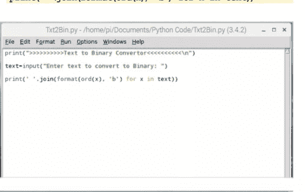

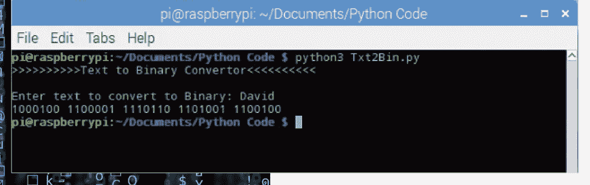

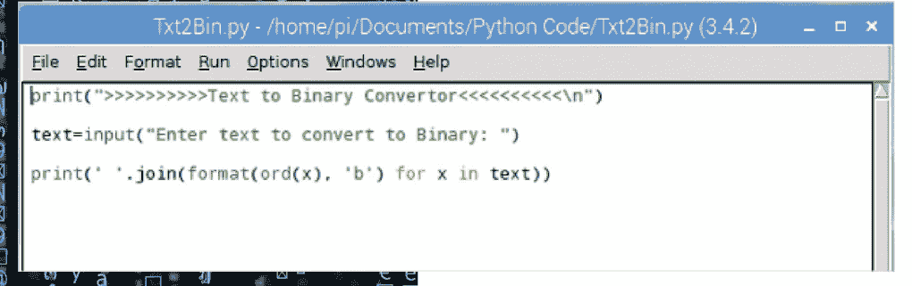

### 文本转二进制转换器

1000010 1101001 1101110 1100001 1110010 1111001

文本转二进制转换器确实提供了一些改进和增强的空间。它有许多用途：可以用于密码或秘密词脚本，作为冒险游戏的一部分，或者仅仅是一种展示某人名字的新颖方式。

关于改进，你可以使用第100页的动画文本选项，在Pygame窗口中显示二进制转换。你也可以询问用户是否想再试一次，甚至询问他们是否想将二进制输出保存到文件中。

关于将输出的二进制转换渲染到带有旋转文本的Pygame窗口，你可以使用：

```
import pygame
pygame.init()

BLACK = (0, 0, 0)
WHITE = (255, 255, 255)
BLUE = (0, 0, 255)
GREEN = (0, 255, 0)
RED = (255, 0, 0)

print(">>>>>>>>>>Text to Binary Convertor<<<<<<<<<<\n")

conversion=input("Enter text to convert to Binary: ")

size = (600, 400)
screen = pygame.display.set_mode(size)
```

```
pygame.display.set_caption("Binary Conversion")

done = False
clock = pygame.time.Clock()

text_rotate_degrees = 0

Binary=(' '.join(format(ord(x), 'b') for x in conversion))

while not done:

    for event in pygame.event.get():
        if event.type == pygame.QUIT:
            done = True

    screen.fill(WHITE)
    font = pygame.font.SysFont('Calibri', 25, True, False)

    text = font.render(Binary, True, BLACK)
    text = pygame.transform.rotate(text, text_rotate_degrees)
    text_rotate_degrees += 1
    screen.blit(text, [100, 50])
    pygame.display.flip()

    clock.tick(60)

pygame.quit()

print(' '.join(format(ord(x), 'b') for x in conversion))
```

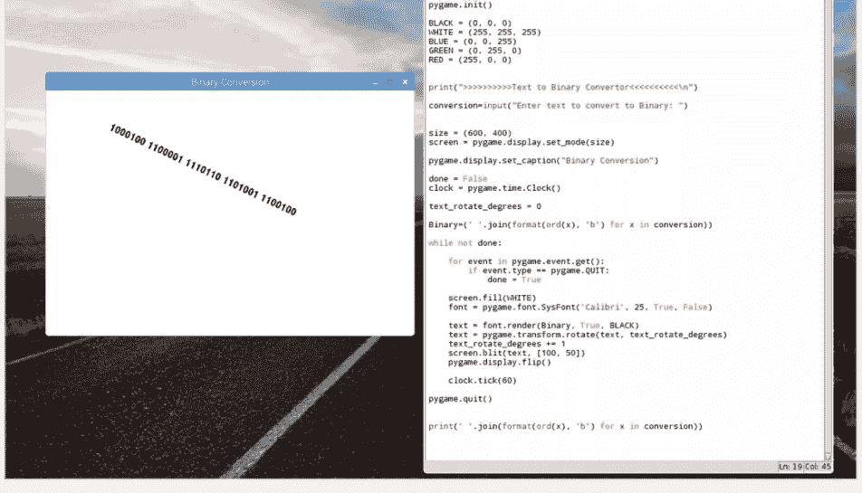

## 基础图形界面文件浏览器

这里有一段实用且有趣的代码。它是一个极其基础的文件浏览器，使用 Tkinter 模块以图形用户界面呈现。你可以从这段代码中学到很多东西，并将其应用到自己的程序中。

### FILEBROWSER.PY

这里主要使用的模块是 Tkinter，但我们也用到了 idlelib，因此如果执行代码时依赖项失败，你可能需要通过 pip 安装任何额外的包。

```python
from tkinter import Tk
from idlelib.TreeWidget import ScrolledCanvas, FileTreeItem, TreeNode
import os

root = Tk()
root.title("File Browser")

sc = ScrolledCanvas(root, bg="white",
                    highlightthickness=0, takefocus=1)
sc.frame.pack(expand=1, fill="both", side="left")

item = FileTreeItem(os.getcwd())
node = TreeNode(sc.canvas, None, item)
node.expand()

root.mainloop()
```

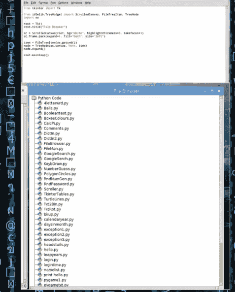

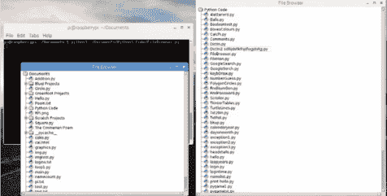

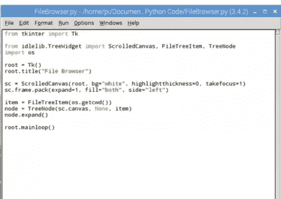

### 进阶文件操作

执行后，代码将显示当前目录的内容。如果你想查看另一个目录的内容，可以在所选目录内通过命令行运行代码；只需记住从代码在系统中的位置调用它，如第二张截图所示。你还可以双击目录树中显示的任何文件名并重命名它们。

这是一段有趣的代码，你可以将其插入到自己的程序中。你可以扩展代码，使其包含用户指定的浏览目录，或许还可以添加你独特的文件图标。如果你使用 Linux，可以创建一个别名来执行代码，这样你就可以在系统中的任何位置运行它。

Windows 用户在使用上述代码时可能会遇到一些问题，可以使用以下替代方案：

```python
from tkinter import *
from tkinter import ttk
from tkinter.filedialog import askopenfilename

root = Tk()

def OpenFile():
    name = askopenfilename(initialdir="C:/",
                           filetypes=(("Text File", "*.txt"), ("All Files", "*.*")),
                           title="Choose a file.")
    print(name)

try:
    with open(name, 'r') as UseFile:
        print(UseFile.read())
except:
    print("No files opened")

Title = root.title("File Opener")
label = ttk.Label(root, text="File Open", foreground="red", font=("Helvetica", 16))
label.pack()

menu = Menu(root)
root.config(menu=menu)

file = Menu(menu)

file.add_command(label='Open', command=OpenFile)
file.add_command(label='Exit', command=lambda: exit())

menu.add_cascade(label='File', menu=file)

root.mainloop()
```

它不完全相同，但这段代码允许你通过熟悉的 Windows 资源管理器打开系统中的文件。值得尝试一下，看看你能用它做什么。

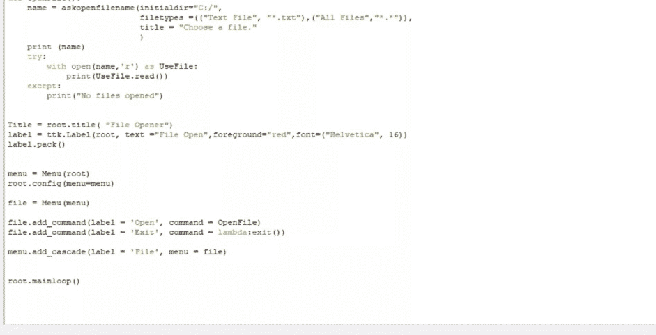

### 鼠标控制的海龟

我们已经见过用户通过键盘控制 Turtle 模块，但现在我们想看看用户如何在 Python 中使用鼠标作为绘图工具。这里有两个可能的代码示例，选择最适合你的那个。

### MOUSETURTLE.PY

第一段代码展示了标准的 Turtle 窗口。按下空格键，然后在屏幕任意位置点击，海龟就会画向鼠标指针。第二段代码允许你点击海龟并将其拖动到屏幕周围；但要注意，它可能会导致 Python 崩溃。

第一个代码示例：

```python
from turtle import Screen, Turtle

screen = Screen()
yertle = Turtle()

def k101():
    screen.onscreenclick(click_handler)

def click_handler(x, y):
    screen.onscreenclick(None)  # disable event inside event handler
    yertle.setheading(yertle.towards(x, y))
    yertle.goto(x, y)
    screen.onscreenclick(click_handler)  # reenable event on event handler exit

screen.onkey(k101, " ")  # space turns on mouse drawing

screen.listen()

screen.mainloop()
```

第二个代码示例：

```python
from turtle import *
shape("circle")
pencolor("blue")
width(2)
ondrag(goto)
listen()
```

> 忍者海龟鼠标

这段代码运用了一些有趣的技巧。显然，它会拓展你的 Python Turtle 技能，让你想出任何改进方法，这很棒，但它也可以成为一段不错的代码，插入到小孩子会使用的东西中。因此，它可以成为一个年轻人深入钻研的绝佳项目；或者甚至作为游戏的一部分，主角的任务是绘制骷髅和交叉骨或类似的东西。

### Python 闹钟

有没有在电脑前短暂休息一下，然后突然意识到已经过了好几分钟，而你一直在刷 Facebook？介绍 Python 闹钟代码，你可以进入命令提示符，告诉代码多少分钟后闹钟响起。

```python
try:
    if minutes > 0:
        print("Sleeping for " + str(minutes) + unit_word)
        sleep(seconds)
    print("Wake up")
    for i in range(5):
        print(chr(7)),
        sleep(1)
except KeyboardInterrupt:
    print("Interrupted by user")
    sys.exit(1)
```

### ALARMCLOCK.PY

这段代码设计用于命令提示符，无论是 Windows、Linux 还是 macOS。在主要的打印部分有一些使用说明，但本质上是：python3 AlarmClock.py 10（十分钟后响起）。

```python
import sys
import string
from time import sleep

sa = sys.argv
lsa = len(sys.argv)
if lsa != 2:
    print("Usage: [ python3 ] AlarmClock.py duration _ in _ minutes")
    print("Example: [ python3 ] AlarmClock.py 10")
    print("Use a value of 0 minutes for testing the alarm immediately.")
    print("Beeps a few times after the duration is over.")
    print("Press Ctrl-C to terminate the alarm clock early.")
    sys.exit(1)

try:
    minutes = int(sa[1])
except ValueError:
    print("Invalid numeric value (%s) for minutes" % sa[1])
    print("Should be an integer >= 0")
    sys.exit(1)

if minutes < 0:
    print("Invalid value for minutes, should be >= 0")
    sys.exit(1)

seconds = minutes * 60

if minutes == 1:
    unit_word = " minute"
else:
    unit_word = " minutes"
```

### 醒醒吧

这里很好地使用了 try 和 except 块，以及其他一些有用的循环，可以帮助你更牢固地理解它们在 Python 中的工作原理。代码本身可以用于多种方式：在游戏设定时间后发生某事，或者简单地作为茶歇时的便捷桌面闹钟。

Linux 用户，尝试将闹钟代码设为别名，这样你就可以运行一个简单的命令来执行它。那么，为什么不集成一个用户输入，在开始时询问用户想要闹钟响起的时间长度，而不是必须在命令行中包含它。

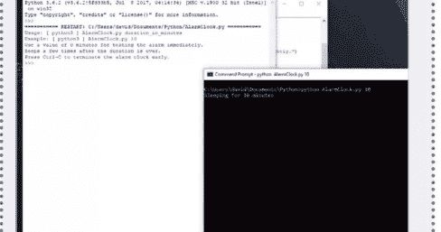

Windows 用户，如果 Python 3 是系统上安装的唯一版本，那么你需要在不添加 3 的情况下执行代码。例如：

```
python AlarmClock.py 10
```

同样，你可以轻松地将其整合到 Windows 批处理文件中，甚至可以设置计划任务在一天中的特定时间激活闹钟。

### 垂直滚动文本

垂直滚动文本有什么不好呢？它的用途很多：游戏的开始或史诗般事物的介绍，比如每部《星球大战》电影的开头；某些内容结束时的演职员表，比如 Python 演示文稿。例子不胜枚举。

### EPICSCROLL.PY

我们使用了罗伯特·E·霍华德的诗《西米里亚》作为代码的滚动文本，配上戏剧性的黑色背景和红色文字。我们认为你会同意，这相当史诗。

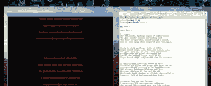

```python
import pygame as pg
from pygame.locals import *

pg.init()

text_list = '''
I remember
The dark woods, masking slopes of sombre hills;
The grey clouds' leaden everlasting arch;
The dusky streams that flowed without a sound,
And the lone winds that whispered down the passes.

Vista on vista marching, hills on hills,
Slope beyond slope, each dark with sullen trees,
Our gaunt land lay. So when a man climbed up
A rugged peak and gazed, his shaded eye
Saw but the endless vista - hill on hill,
Slope beyond slope, each hooded like its brothers.

It was a gloomy land that seemed to hold
All winds and clouds and dreams that shun the sun,
With bare boughs rattling in the lonesome winds,
And the dark woodlands brooding over all,
Not even lightened by the rare dim sun
Which made squat shadows out of men; they called it
Cimmeria, land of Darkness and deep Night.

It was so long ago and far away
I have forgot the very name men called me.
The axe and flint-tipped spear are like a dream,
And hunts and wars are shadows. I recall
Only the stillness of that sombre land;
The clouds that piled forever on the hills,
The dimness of the everlasting woods.
Cimmeria, land of Darkness and the Night.

Oh, soul of mine, born out of shadowed hills,
To clouds and winds and ghosts that shun the sun,
How many deaths shall serve to break at last
This heritage which wraps me in the grey
Apparel of ghosts? I search my heart and find
Cimmeria, land of Darkness and the Night!
'''.split('\n')
```

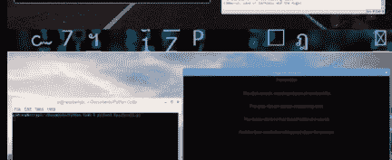

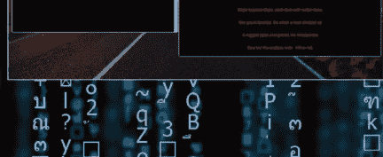

### 垂直滚动文本

```python
class Credits:
    def __init__(self, screen_rect, lst):
        self.srect = screen_rect
        self.lst = lst
        self.size = 16
        self.color = (255,0,0)
        self.buff_centery = self.srect.height/2 + 5
        self.buff_lines = 50
        self.timer = 0.0
        self.delay = 0
        self.make_surfaces()

    def make_text(self,message):
        font = pg.font.SysFont('Arial', self.size)
        text = font.render(message,True,self.color)
        rect = text.get_rect(center = (self.srect.centerx, self.srect.centery + self.buff_centery) )
        return text,rect

    def make_surfaces(self):
        self.text = []
        for i, line in enumerate(self.lst):
            l = self.make_text(line)
            l[1].y += i*self.buff_lines
            self.text.append(l)

    def update(self):
        if pg.time.get_ticks()-self.timer > self.delay:
            self.timer = pg.time.get_ticks()
            for text, rect in self.text:
                rect.y -= 1

    def render(self, surf):
        for text, rect in self.text:
            surf.blit(text, rect)

screen = pg.display.set_mode((800,600))
screen_rect = screen.get_rect()
clock = pg.time.Clock()
running=True
cred = Credits(screen_rect, text_list)

while running:
    for event in pg.event.get():
        if event.type == QUIT:
            running = False
    screen.fill((0,0,0))
    cred.update()
    cred.render(screen)
    pg.display.update()
    clock.tick(60)
```

### 很久以前...

最明显的改进点在于实际的文本内容本身。将其替换为演职员名单，或者为你的Python游戏编写同样史诗般的开场故事线，这无疑会打动每一位玩家。如果需要，别忘了更改屏幕分辨率；我们目前运行的分辨率是800 x 600。

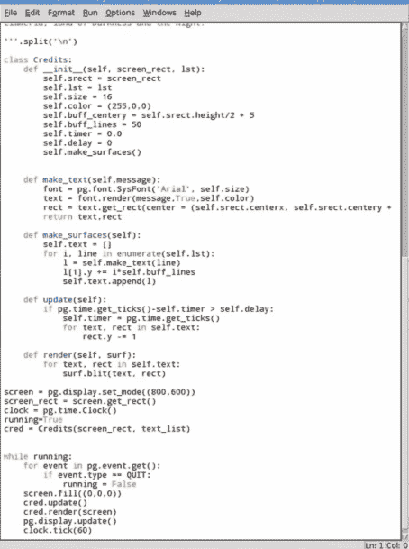

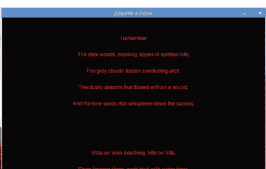

### Python 数字时钟

大多数操作系统的桌面上已经显示了一个时钟，但在当前打开的窗口顶部再放一个时钟总是很方便的。为此，何不创建一个Python数字时钟，让它成为你桌面上的伴侣小部件呢。

### DIGCLOCK.PY

这是一个非常方便的小脚本，我们过去曾多次使用它，而不是依赖手表甚至操作系统任务栏中的时钟。

```python
import time
import tkinter as tk

def tick(time1=''):
    # get the current time from the PC
    time2 = time.strftime('%H:%M:%S')
    if time2 != time1:
        time1 = time2
        clock.config(text=time2)

    clock.after(200, tick)

root = tk.Tk()
clock = tk.Label(root, font=('arial', 20, 'bold'),
bg='green')
clock.pack(fill='both', expand=1)
tick()
root.mainloop()
```

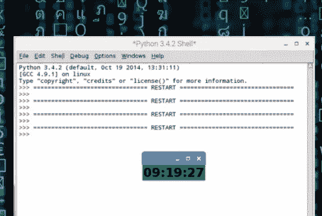

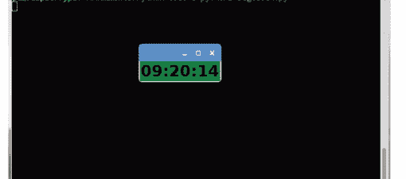

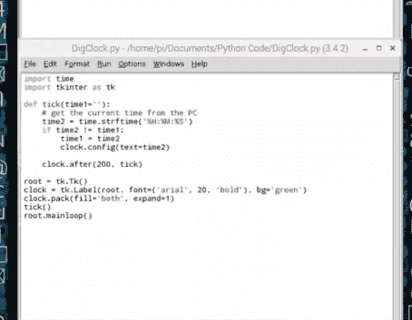

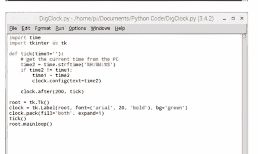

### 滴答滴答

这是我们过去多次使用的一段代码，用于在多显示器工作时跟踪时间，只需瞥一眼屏幕上放置的位置即可。

Tkinter窗口可以随意移动而不影响时间显示，用户也可以随意最大化或关闭它。我们没有给Tkinter时钟窗口设置标题，因此你可以很容易地从本书其他示例中剪切代码来添加标题。

另一个改进方向是将此代码包含在Windows或Linux启动时，使其自动在桌面上弹出。另外，如果你能通过包含不同时区（如罗马、巴黎、伦敦、纽约、莫斯科等）来改进其功能，也请参考。


另一个扩展原始代码的例子可以是数字秒表。为此，你可以使用以下代码：

```python
import tkinter
import time

class StopWatch(tkinter.Frame):

    @classmethod
    def main(cls):
        tkinter.NoDefaultRoot()
        root = tkinter.Tk()
        root.title('Stop Watch')
        root.resizable(True, False)
        root.grid_columnconfigure(0, weight=1)
        padding = dict(padx=5, pady=5)
        widget = StopWatch(root, **padding)
        widget.grid(sticky=tkinter.NSEW, **padding)
        root.mainloop()

    def __init__(self, master=None, cnf={}, **kw):
        padding = dict(padx=kw.pop('padx', 5), pady=kw.pop('pady', 5))
        super().__init__(master, cnf, **kw)
        self.grid_columnconfigure(1, weight=1)
        self.grid_rowconfigure(1, weight=1)
        self.__total = 0
        self.__label = tkinter.Label(self, text='Total Time:')
        self.__time = tkinter.StringVar(self, '0.000000')
        self.__display = tkinter.Label(self, textvariable=self.__time)
        self.__button = tkinter.Button(self, text='Start', command=self.__click)
        self.__label.grid(row=0, column=0, sticky=tkinter.E, **padding)
        self.__display.grid(row=0, column=1, sticky=tkinter.EW, **padding)
        self.__button.grid(row=1, column=0, columnspan=2, sticky=tkinter.NSEW, **padding)

    def __click(self):
        if self.__button['text'] == 'Start':
            self.__button['text'] = 'Stop'
            self.__start = time.clock()
            self.__counter = self.after_idle(self.__update)
        else:
            self.__button['text'] = 'Start'
            self.after_cancel(self.__counter)

    def __update(self):
        now = time.clock()
        diff = now - self.__start
        self.__start = now
        self.__total += diff
        self.__time.set('{:.6f}'.format(self.__total))
        self.__counter = self.after_idle(self.__update)

if __name__ == '__main__':
    StopWatch.main()
```

### 使用 Winsound 模块播放音乐

当然，你不必播放现有的MP3文件，你总是可以创作自己的音乐。下面的代码将播放帕赫贝尔的《D大调卡农》，毫不逊色。

### MUSIC.PY

该代码利用了Time和Winsound模块，定义了音调和音高，并插入了0.5秒的短暂停顿。

```python
import winsound
import time

t = 250
p = .50

l1C = 65

lC = 131
lDb = 139
lD = 147
lEb = 156
lE = 165
lF = 175
lGb = 185
lG = 196
lAb = 208
lA = 220
lBb = 233
lB = 247

C = 262
Db = 277
D = 294
Eb = 311
E = 330
F = 349
Gb = 370
G = 392
Ab = 415
A = 440
Bb = 466
B = 494

hC = 523
hDb = 554
hD = 587
hEb = 622
hE = 659
hF = 698
hGb = 740
hG = 784
hAb = 831
hA = 880
hBb = 932
hB = 988

time.sleep(0.001)
```


### 使用 Winsound 模块播放音乐

```python
for i in range (5):

    winsound.Beep( lC, 2*t)
    winsound.Beep( hC, t)
    winsound.Beep( hE, t)
    winsound.Beep( hG, t)
    time.sleep(p)

    winsound.Beep( lG, 2*t)
    winsound.Beep( G, t)
    winsound.Beep( B, t)
    winsound.Beep( hD, t)
    time.sleep(p)

    winsound.Beep( lA, 2*t)
    winsound.Beep( A, t)
    winsound.Beep( hC, t)
    winsound.Beep( hE, t)
    time.sleep(p)

    winsound.Beep( lE, 2*t)
    winsound.Beep( E, t)
    winsound.Beep( G, t)
    winsound.Beep( B, t)
    time.sleep(p)

    winsound.Beep( lF, 2*t)
    winsound.Beep( F, t)
    winsound.Beep( A, t)
    winsound.Beep( hC, t)
    time.sleep(p)

    winsound.Beep( llC, 2*t)
    winsound.Beep( C, t)
    winsound.Beep( E, t)
    winsound.Beep( G, t)
    time.sleep(p)

    winsound.Beep( lF, 2*t)
    winsound.Beep( F, t)
    winsound.Beep( A, t)
    winsound.Beep( hC, t)
    time.sleep(p)

    winsound.Beep( lG, 2*t)
    winsound.Beep( G, t)
    winsound.Beep( B, t)
    winsound.Beep( hD, t)
    time.sleep(p)
```

### 甜美的音乐

显然，Winsound模块是Python仅限Windows的一组函数。在Windows中打开你的IDLE并复制代码。按F5保存并执行，然后按照代码中的指示按Enter键开始播放音乐。

当然，你可以根据自己的特定音乐调整winsound.Beep的频率和持续时间；或者你也可以保持原样并享受其中。也许可以尝试各种方法来创作其他音乐。

例如，任天堂经典游戏《塞尔达传说：时之笛》的玩家可以通过输入以下代码来欣赏游戏标题音乐的开场：

```python
import winsound
beep = winsound.Beep

c = [
    (880, 700),
    (587, 1000),
    (698, 500),
    (880, 500),
    (587, 1000),
    (698, 500),
    (880, 250),
    (1046, 250),
    (988, 500),
    (784, 500),
    (699, 230),
    (784, 250),
    (880, 500),
    (587, 500),
    (523, 250),
    (659, 250),
    (587, 750)
]

s = c + c

for f, d in s:
    beep(f, d)
```


1.  代码开头导入了Winsound和Time模块；请记住，这是一个仅限Windows的Python脚本。变量`t`设置持续时间，而`p`等于0.5，可用于`time.sleep`函数。
2.  这些变量设置了频率，对应的数字可以在代码的下一部分中使用。
3.  `Winsound.beep`需要括号内的频率和持续时间。频率来自代码第二部分调用的大量变量，持续时间则通过代码开头设置的`t`变量。在`winsound.beep`语句块之间有一个使用变量`p`的半秒停顿。

### 文本冒险脚本

文本冒险是提升Python编程技能并同时获得乐趣的绝佳方式。我们创建的这个示例将引导你踏上制作经典文本冒险游戏的旅程；最终的结局则由你决定。

### ADVENTURE.PY

冒险游戏首先只使用了Time模块，在打印函数之间创建停顿。其中有一个帮助系统可供扩展，故事本身也可以扩展。

```python
import time

print("\n" * 200)
print(">>>>>>>>>Awesome Adventure<<<<<<<<<<")
print("\n" * 3)
time.sleep(3)
print("\nA long time ago, a warrior strode forth from the frozen north.")
time.sleep(1)
print("Does this warrior have a name?")
name=input("> ")
print(name, "the barbarian, sword in hand and looking for adventure!")
time.sleep(1)
print("However, evil is lurking nearby....")
time.sleep(1)
print("A pair of bulbous eyes regards the hero...")
time.sleep(1)
print("Will", name, "prevail, and win great fortune...")
time.sleep(1)
print("Or die by the hands of great evil...?")
time.sleep(1)
print("\n" *3)
print("Only time will tell....")
time.sleep(1)
print('...')
time.sleep(1)
print('...')
time.sleep(1)
print('...')
time.sleep(1)
print('...')
time.sleep(5)
print("\n" *200)

print('''      You find yourself at a small inn. There's little gold in your purse but your sword is sharp, and you're ready for adventure.
      With you are three other customers.
      A ragged looking man, and a pair of dangerous looking guards.''')

def start():
    print("\n -----------")
    print("Do you approach the...")
    print("\n")
    print("1. Ragged looking man")
    print("2. Dangerous looking guards")

    cmdlist=["1", "2"]
    cmd=getcmd(cmdlist)
```

```python
if cmd == "1":
    ragged()
elif cmd == "2":
    guards()

def ragged():
    print("\n" * 200)
    print('''You walk up to the ragged looking man and greet him.
        He smiles a toothless grin and, with a strange accent, says,
        "Buy me a cup of wine, and I'll tell you of great treasure...''')
    time.sleep(2)

def guards():
    print("\n" *200)
    print('''You walk up to the dangerous looking guards and greet them.
        The guards look up from their drinks and snarl at you.
        "What do you want, barbarian?" One guard reaches for the hilt of his sword...''')
    time.sleep(2)
```

```python
def getcmd(cmdlist):
    cmd = input(name+">")
    if cmd in cmdlist:
        return cmd
    elif cmd == "help":
        print("\nEnter your choices as detailed in the game.")
        print("or enter 'quit' to leave the game")
        return getcmd(cmdlist)
    elif cmd == "quit":
        print("\n----------------")
        time.sleep(1)
        print("Sadly you return to your homeland without fame or fortune...")
        time.sleep(5)
        exit()

if __name__=="__main__":
    start()
```

### 冒险时光

如你所见，这只是冒险的开始，已经占用了相当多的代码行。当你扩展它并编织故事时，你会发现你可以重复某些场景，比如与敌人的偶遇等。

我们将两次遭遇都定义为一组函数，同时在cmdlist列表和cmd变量下提供了一系列可能的选择，而cmd本身也是一个定义好的函数。扩展这个结构非常简单，只需规划好每次遭遇和选择，并围绕它创建一个定义好的函数。只要用户不在冒险中输入quit，他们就可以一直玩下去。

冒险中还有空间设置一组变量，用于战斗、运气、生命值、耐力，甚至是一个物品栏或获得的金币数量。每次成功的战斗情况都可能减少主角的生命值，但增加他们的战斗技能或耐力。此外，他们可以搜刮尸体获得金币，或通过任务赚取金币。

最后，引入Random模块怎么样？这将使你能够在游戏中加入随机元素。例如，在战斗中，当你攻击敌人时，你会造成随机伤害，敌人也是如此。你甚至可以根据你或对手的战斗技能、当前生命值、力量和耐力，计算出提高更好命中率的数学原理。你可以在旅馆里创建一个骰子游戏，看看你是赢还是输金币（同样，通过将你的运气因素纳入计算来提高获胜几率）。

不用说，你的文本冒险游戏可以呈指数级增长，并证明是一件奇妙的作品。祝你好运，享受你的冒险吧。

### Python滚动字幕脚本

你可能会惊讶地发现，我们经常被要求提供的代码片段之一就是某种形式的滚动字幕。虽然我们之前已经介绍过各种形式的滚动文本，但字幕似乎一直不断出现。所以，这就是了。

### 字幕时光

对字幕代码的明显改进在于文本的速度和文本将显示的内容。否则，你可以更改字幕窗口的背景颜色、字体和字体颜色，以及Tkinter窗口的几何形状（如果你愿意的话）。

另一个可以引入的有趣元素是Python 3可用的众多文本转语音模块之一。你可以pip安装一个，导入它，然后当字幕显示文本时，文本转语音函数会同时读出变量，因为整个文本都存储在标记为's'的变量中。

字幕示例可用于系统警告，例如显示在你的工作或家庭网络上，详细说明周末为维护而关闭服务器；或者只是通知每个人正在发生什么。我们相信你会想出一些好的用途。

### TICKER.PY

我们在这里使用Tkinter和Time模块来确定文本在窗口中显示的速度。

```python
import time
import tkinter as tk

root = tk.Tk()
canvas = tk.Canvas(root, root.title("Ticker Code"),
    height=80, width=600, bg="yellow")
canvas.pack()
font = ('courier', 48, 'bold')
text_width = 15

#Text blocks insert here....

s1 = "This is a scrolling ticker example. As you
    can see, it's quite long but can be a lot longer if
    necessary... "
s2 = "We can even extend the length of the ticker
    message by including more variables... "
s3 = "The variables are within the s-values in
    the code. "
s4 = "Don't forget to concatenate them all before the
    For loop, and rename the 'spacer' s-variable too."

# pad front and end of text with spaces
s5 = ' ' * text_width
# concatenate it all
s = s5 + s1 + s2 + s3 + s4 + s5
x = 1
y = 2
text = canvas.create_text(x, y, anchor='nw', text=s,
    font=font)
dx = 1
dy = 0  # use horizontal movement only

# the pixel value depends on dx, font and length of text
pixels = 9000

for p in range(pixels):
    # move text object by increments dx, dy
    # -dx --> right to left
    canvas.move(text, -dx, dy)
    canvas.update()
    # shorter delay --> faster movement
    time.sleep(0.005)
    #print(k)  # test, helps with pixel value

root.mainloop()
```

## 简易Python计算器

有时最简单的代码可能是最有效的。以这个简易Python计算器脚本为例。它基于之前看到的“创建你自己的模块”部分，但没有使用任何外部模块。

### CALCULATOR.PY

我们首先创建了一些函数定义，然后引向用户菜单和输入。这是一段易于理解的代码，因此也可以很好地扩展。

```python
print("-----------Simple Python Calculator-----------\n")

def add(x, y):
    return x + y

def subtract(x, y):
    return x - y

def multiply(x, y):
    return x * y

def divide(x, y):
    return x / y

print("Select operation.\n")
print("1.Add")
print("2.Subtract")
print("3.Multiply")
print("4.Divide")

choice = input("\nEnter choice (1/2/3/4):")

num1 = int(input("\nEnter first number: "))
num2 = int(input("Enter second number: "))

if choice == '1':
    print(num1,"+",num2,"=", add(num1,num2))

elif choice == '2':
    print(num1,"-",num2,"=", subtract(num1,num2))

elif choice == '3':
    print(num1,"*",num2,"=", multiply(num1,num2))

elif choice == '4':
    print(num1,"/",num2,"=", divide(num1,num2))
else:
    print("Invalid input")
```

### 改进计算

这里明显的改进候选方案是使用“创建你自己的模块”路径，将函数定义提取为一个模块。然后你可以调用该模块并专注于代码主体。

另一个改进领域是代码本身。目前只有一次计算机会，你可以将其封装在一个while循环中，这样一旦给出一个值，用户就会被送回主菜单。也许，改进“无效输入”部分也值得研究。

### 猜词游戏脚本

猜词游戏非常适合用Python来编写。它可以极其复杂，包含图形界面、剩余猜测次数显示、庞大的随机词库以及无数其他元素。它也可以相当简单。这里我们提供的是一个介于两者之间的版本。

### HANGMAN.PY

我们使用可以在IDLE Shell中显示的字符制作了一个猜词游戏板（绞刑架），并配备了一个庞大的词库供随机选择。


```python
import random

board = ['''

>>>>>>>>>Hangman<<<<<<<<<<

+---+
|   |
|
|
|
|
=========''', '''

+---+
|   |
|   O
|
|
|
=========''', '''

+---+
|   |
|   O
|   |
|
|
=========''', '''

+---+
|   |
|   O
|  /|
|
|
=========''', '''

+---+
|   |
|   O
|  /|\n|
|
=========''', '''

+---+
|   |
|   O
|  /|\n|  /
|
=========''', '''

+---+
|   |
|   O
|  /|\n|  / \n|
========='''
]
```


```python
=======", ""

+---+
|   |
 o   |
/|\  |
/ \  |
======="]
```

```python
luggage responsible ambassador circumstance
congratulate frequent'.split()
return bank[random.randint(0,len(bank))]
```

```python
def main():
    game = Hangman(rand_word())
    while not game.hangman_over():
        game.print_game_status()
        user_input = input('\nEnter a letter: ')
        game.guess(user_input)

    game.print_game_status()
    if game.hangman_won():
        print ('\nCongratulations! You have won!!')
    else:
        print ('\nSorry, you have lost.')
        print ('The word was ' + game.word)

    print ('\nGoodbye!\n')

if __name__ == "__main__":
    main()
```

```python
class Hangman:
    def __init__(self,word):
        self.word = word
        self.missed_letters = []
        self.guessed_letters = []

    def guess(self,letter):
        if letter in self.word and letter not in self.guessed_letters:
            self.guessed_letters.append(letter)
        elif letter not in self.word and letter not in self.missed_letters:
            self.missed_letters.append(letter)
        else:
            return False
        return True

    def hangman_over(self):
        return self.hangman_won() or (len(self.missed_letters) == 6)

    def hangman_won(self):
        if '_' not in self.hide_word():
            return True
        return False

    def hide_word(self):
        rtn = ''
        for letter in self.word:
            if letter not in self.guessed_letters:
                rtn += '_'
            else:
                rtn += letter
        return rtn

    def print_game_status(self):
        print (board[len(self.missed_letters)])
        print ('Word: ' + self.hide_word())
        print ('Letters Missed: ',)
        for letter in self.missed_letters:
            print (letter,)
        print ()
        print ('Letters Guessed: ',)
        for letter in self.guessed_letters:
            print (letter,)
        print ()
```

### QUIT()

由于这是我们Python代码库中的最后一个示例，我们决定以一个精彩的方式收尾，展示每次猜错单词时都会绘制出猜词游戏的绞刑架。如果这里的文本看起来有些错位，请不要担心，这仅仅是因为使用Python IDLE编辑器与将代码粘贴到文字处理器（其格式化方式不同）之间的差异造成的。

你可以做很多事情来改进、增强和扩展我们在这里展示的内容。你可以添加一个程序，当用户输入数字或字符时返回错误。你可以为一次性猜出整个单词而不是逐个字母猜测的人增加额外分数，也许还可以在游戏失败时添加肖邦的《葬礼进行曲》；或者在获胜时添加一些庆祝性的内容。


考虑替换词库。它们位于`bank`列表下，可以很容易地替换为更难的词汇。如果你下载www.github.com/dwyl/english-words，你可以找到一个包含超过466,000个单词的文本文档。也许你可以将词库中的单词替换为读取该文本文件的内容：

```python
def rand_word():
    with open("/home/pi/Downloads/words.txt", "rt") as f:
        bank=f.readlines()
    return bank[random.randint(0,len(bank))]
```

```python
def rand_word():
    bank = 'ability about above absolute accessible accommodation accounting beautiful bookstore calculator clever engaged engineer enough handsome refrigerator opposite socks interested strawberry backgammon anniversary confused dangerous entertainment exhausted impossible overweight temperature vacation scissors accommodation appointment decrease development earthquake environment brand environment necessary luggage responsible ambassador circumstance congratulate frequent'.split()
    return bank[random.randint(0,len(bank))]
```

## 理解Linux


## 理解Linux

Linux是一个功能极其强大且用途广泛的操作系统。它被广泛应用于编程和工程领域、科学、太空探索、教育、游戏以及其他所有领域。它是高性能服务器的首选操作系统，是互联网的骨干，并驱动着世界上最快的超级计算机。

了解如何使用Linux及其结构，是能够创建更好的Python内容的关键。例如，树莓派使用基于Linux的操作系统，因此是一个极佳的编程平台。无论你是像我们一样使用树莓派，还是使用Linux Mint或Ubuntu，这些页面都将对你的Python学习证明是无价的。掌握Linux，掌握Python，开始规划你的编程未来。

### 什么是Linux？

树莓派的操作系统是Raspbian，这是一个Linux操作系统；但Linux到底是什么？它从何而来，又有什么作用？在Windows和macOS主导桌面的世界里，它很容易被忽视，但Linux的内涵远比你想象的要丰富。

Linux是一个功能强大、速度快、安全且能力出众的操作系统。它被用作树莓派的首选操作系统（以Raspbian OS的形式），也出现在一些最意想不到的地方。

尽管根据netmarketshare.com的数据，Linux在桌面操作系统市场仅占1.96%的份额，但它拥有忠实的爱好者、用户和贡献者群体。它由赫尔辛基大学学生Linus Torvalds于1991年创建，当时他对流行的教育系统Minix（Unix操作系统的微型版本）的限制和许可感到不满。

Torvalds需要一个能够镜像Unix性能和功能，而无需支付许可费用的系统。于是Linux诞生了，这是一个类Unix操作系统，使用了GNU项目中自由可用的代码。这使得世界各地的用户能够完全免费地利用类Unix系统的强大功能，这一理念至今仍然适用：Linux可以免费下载、安装和使用。

Unix本身于70年代初发布，是一个多任务、模块化设计的操作系统，最初是为需要稳定平台进行编码的程序员开发的。然而，其性能、功能和可移植性意味着它很快成为需要高端计算任务的公司和大学的首选系统。

Linux与其他任何操作系统（如Windows或macOS）非常相似，因为它管理计算机硬件，为用户提供访问该硬件的接口，并附带用于生产力、通信、游戏、科学、教育等方面的程序。Linux可以分解为几个重要的组成部分：

### 引导加载程序

引导加载程序是初始化和启动计算机的软件。它加载操作系统用于开始访问系统硬件的各种模块。你可以修改引导加载程序以加载系统上安装的多个操作系统。

### 图形服务器

这是Linux中一个向显示器提供图形输出的模块。它被称为X服务器或简称X。X是一个管理一个或多个图形显示以及连接到计算机的一个或多个输入设备（键盘、鼠标等）的应用程序。

### 守护进程

守护进程是在操作系统启动时启动的后台服务。它们可以实现打印、声音、网络等功能。它们在后台静默运行，而不是在用户的直接控制下，通常等待被事件或条件激活。

### 内核

内核是系统的核心，也是唯一真正被称为Linux的组件。Linux内核管理计算机处理器、内存、存储以及连接到计算机的任何外围设备。它为操作系统的所有其他部分提供基本服务。

### 桌面环境

桌面环境（DE）是用户与之交互的主要图形用户界面（GUI）。它就是桌面，包括互联网浏览器、生产力工具、游戏以及你正在使用的任何程序或应用程序。有无数的桌面环境可供选择。Raspbian使用的是PIXEL。

### 程序/应用程序

由于Linux是一个开源、免费的操作系统，它也利用了数以万计的自由可用应用程序。LibreOffice、GIMP和Python等只是冰山一角。

### SHELL

Linux Shell 是一个命令行界面环境，Linux 用户可以通过它向操作系统输入直接产生影响的命令。在 Shell 中，你可以添加新用户、重启系统、创建和删除文件与文件夹等等。BASH（Bourne Again Shell）是 Linux 中最流行的 Shell，尽管还有其他可用的 Shell。Shell 也被称为终端（Terminal），在本书的这一部分，你将主要在这里进行操作。

Linux 在全球范围内被广泛使用，应用于许多基础且相当独特的场景。虽然不同环境下的 Linux 看起来可能大相径庭，但实际的 Linux 内核却无处不在，从现代智能电视、车载娱乐系统和 GPS，到超级计算机、物联网设备和树莓派。美国宇航局（NASA）在指挥中心和国际空间站（ISS）上都使用 Linux。Linux 服务器支撑着互联网的骨干网络，以及你日常访问的大多数网站。Android 利用了 Linux 内核的组件，机顶盒、游戏机，甚至你的冰箱、冰柜、烤箱和洗衣机也是如此。

Linux 不仅仅是一个免费使用的操作系统。它稳定、强大、快速，易于定制，并且几乎不需要维护。然而，它的价值远不止于性能数据；Linux 意味着摆脱其他操作系统那种“围墙花园”式的束缚。它是一个充满活力的社区，由志同道合的人组成，他们希望从自己的计算机中获得更多，而不受价格或一致性的束缚。Linux 意味着选择。

树莓派上的 Raspbian 是首选的 Linux 发行版。

### 使用文件系统

要精通 Linux，理解文件系统的工作原理至关重要。此外，熟悉终端或 Shell 也很重要。这个命令行环境起初可能看起来令人生畏，但通过练习，它很快就会变得易于使用。

#### 导航

要进入终端，请点击树莓派桌面顶部从左数第四个图标，即那个带有向右箭头和下划线的图标。这就是 Shell 或终端。

**步骤 1** 首先，你将了解目录和目录路径。目录与文件夹是同一回事，但在 Linux 中它总是被称为目录。它们使用“/”字符相互嵌套。因此，当你看到 `/home/pi` 时，意味着 `pi` 目录位于 `home` 目录内。输入：`clear` 并按回车键以清屏。现在输入：`pwd`。这代表“打印工作目录”（Print Working Directory），会显示 `/home/pi`。

**步骤 2** 当你登录树莓派时，你并非从硬盘驱动器的根部（称为“root”，也称为最顶层目录）开始。相反，你从用户目录内开始，默认情况下该目录名为“pi”，而它本身又位于名为“home”的目录中。目录由“/”符号表示。因此，“/home/pi”告诉你根目录下有一个名为 home 的目录，下一个“/”表示在“home”内部有一个名为“pi”的目录。这就是你的起点。

**步骤 3** 输入：`ls` 以查看当前目录的内容。你应该会看到蓝色的 Desktop、Documents、Downloads 和 Scratch。根据你使用树莓派的程度，可能还会看到其他项目。颜色代码值得了解：目录是蓝色的，而大多数文件是白色的。随着学习的深入，你会看到其他颜色：可执行文件（程序）是亮绿色的，归档文件是红色的，等等。蓝色和白色是你入门时需要了解的两种颜色。

**步骤 4** 现在你将从 `pi` 目录移动到 `Documents` 目录。输入：`cd Documents`。注意大写的“D”。Linux 区分大小写，这意味着你必须输入完全正确的名称，包括正确的大小写。`cd` 命令代表“更改目录”（change directory）。现在再次输入：`pwd` 以查看目录路径。它将显示 `/home/pi/Documents`。输入：`ls` 以查看 `Documents` 目录内的文件。

**步骤 5** 如何返回到 `pi` 目录？使用命令 `cd ..`。在 Linux 中，两个点表示上一级目录，也称为父目录。顺便提一下，单个点“.”用于表示当前目录。你永远不会使用 `cd .` 来切换到当前目录，但了解这一点很有价值，因为有些命令需要你指定当前目录。

**步骤 6** `ls` 和 `cd` 命令也可以与更复杂的路径一起使用。输入：`ls Documents/Pictures` 以查看 `Documents` 目录内 `Pictures` 目录的内容。你可以使用 `cd Documents/Pictures` 切换到此目录；使用 `cd ../..` 可以向上移动两级父目录。

```
pi@raspberrypi ~/Documents $ pwd
/home/pi/Documents
pi@raspberrypi ~/Documents $ cd ..
pi@raspberrypi ~ $ pwd
/home/pi
pi@raspberrypi ~ $
```

```
pi@raspberrypi ~ $ ls Documents/Pictures
BDM-Web-logo-dark1.jpg  David Hayward.jpg  raspberry_pi_Z_photographs
pi@raspberrypi ~ $ cd Documents/Pictures
pi@raspberrypi ~/Documents/Pictures $ pwd
/home/pi/Documents/Pictures
pi@raspberrypi ~/Documents/Pictures $ cd ../..
pi@raspberrypi ~ $ pwd
/home/pi
pi@raspberrypi ~ $
```

#### 绝对路径与相对路径

了解工作目录、根目录和主目录之间的区别非常重要。路径也有两种类型：绝对路径和相对路径。它们比听起来更容易理解。让我们来看看...

**步骤 1** 默认情况下，像 `ls` 这样的命令使用工作目录。这是你当前正在查看的目录，默认设置为你的主目录（`/users/pi`）。使用 `pwd`（打印工作目录）可以让你知道当前的工作目录是什么，而使用 `cd` 可以更改工作目录。

**步骤 2** 根目录始终是“/”。输入 `ls /` 会列出根目录的内容，输入 `cd /` 会切换到根目录。这很重要，因为 `ls Documents/Pictures` 和 `ls /Documents/Pictures` 之间存在区别。第一个命令列出工作目录内 `Documents` 中 `Pictures` 目录的内容（如果你在主目录中，这将有效）。

**步骤 3** 第二个命令（`ls /Documents/Pictures`）尝试列出根目录内名为 `Documents` 的目录中的 `Pictures` 内容（因为路径以“/”开头，即根目录）。根目录中通常没有 `Documents` 目录，因此你会收到“没有该文件或目录”（No such file or directory）错误。以“/”开头的路径称为“绝对路径”，而不以“/”开头的路径称为“相对路径”，因为它相对于你的工作目录。

```
pi@raspberrypi ~ $ pwd
/home/pi
pi@raspberrypi ~ $
```

```
pi@raspberrypi ~ $ ls /
bin  boot  dev  etc  home  lib  lost+found  media  mnt  opt  proc  ...
pi@raspberrypi ~ $ ls /Documents/Pictures
ls: cannot access /Documents/Pictures: No such file or directory
pi@raspberrypi ~ $
```

**步骤 4** 还有一个指向用户目录的绝对路径快捷方式，那就是波浪号“~”字符。输入：`ls ~` 总是列出你的主目录的内容，而 `cd ~` 无论你的工作目录是什么，都会直接移动到你的主目录。你也可以在任何地方使用这个快捷方式：输入：`ls ~/Documents/Pictures` 以显示 `Pictures` 的内容。

```
pi@raspberrypi:~ $ pwd
/home/pi
pi@raspberrypi:~ $ ls Documents/Pictures
BDM-Web-logo-dark1.jpg  David Hayward.jpg  RPi.png
pi@raspberrypi:~ $
```

```
pi@raspberrypi:~ $ cd ~
pi@raspberrypi:~ $ pwd
/home/pi
pi@raspberrypi:~ $ ls ~/Documents/Pictures
BDM-Web-logo-dark1.jpg  David Hayward.jpg  RPi.png
pi@raspberrypi:~ $
```

### 列出和移动文件

诚然，使用桌面图形用户界面（GUI）来列出和移动文件比使用终端和键盘要容易得多。然而，这是一项重要的技能，随着你在树莓派和 Linux 上的深入学习，你会感激这项技能。

#### 查看文件

操作系统建立在文件和文件夹（或者如果你愿意，也可以称为目录）之上。虽然你习惯于查看自己的文件，但大多数操作系统会将其他文件隐藏起来。在 Raspbian 中，你可以访问系统中的每个文件。

**步骤 1** 我们已经看过了 `ls`，它列出工作目录中的文件，但你更可能使用像 `ls -l` 这样的命令。命令后面的部分（`-lah`）被称为参数。这是一个修改命令行为的选项。

**步骤 2** `-l` 参数以长格式列出文件和目录。每个文件和目录现在各占一行，并且在每个文件之前都有很多文本。首先你会看到很多字母和破折号，比如 `drwxr-xr-x`。现在不用担心这些；它们被称为“权限”，我们稍后会讲到。

**步骤 3** 权限字母之后是一个数字。这是该项中的文件数量。如果它是一个文件，那么数字是 1，但如果它是一个目录，那么数字至少是 2。这是因为每个目录包含两个隐藏文件；一个带有一个点（.），另一个带有两个点（..）。包含文件或其他目录的目录会有更高的数字。

**步骤 4** 接下来你会看到每行都列出了两次“pi”。这指的是用户，而不是你的计算机名称（你的默认用户名是“pi”）。第一个是文件的所有者，第二个是所属组。通常这两者是相同的，你会看到“pi”或“root”。你可以输入：`ls -l /` 以查看根目录中属于 root 帐户的文件和目录。

```
pi@raspberrypi ~ $ ls -l
total 24
-rw-r--r-- 1 pi pi    0 May 11 20:56 articles.txt
drwxr-xr-x 2 pi pi 4096 Apr 21 17:55 Desktop
drwxr-xr-x 5 pi pi 4096 Apr 21 14:50 Documents
drwx------ 2 pi pi 4096 Apr 21 15:23 Downloads
drwxr-xr-x 3 pi pi 4096 Apr 17 18:48 Indexes
-rw-r--r-- 1 pi pi    0 May 11 20:56 names.txt
drwxrwxr-x 2 pi pi 4096 Jan  1  1970 python_games
drwxr-xr-x 2 pi pi 4096 Apr 17 12:53 Scratch
pi@raspberrypi ~ $
```

```
pi@raspberrypi ~ $ ls -l
total 28
-rw-r--r-- 1 pi pi    0 May 11 20:56 articles.txt
drwxr-xr-x 2 pi pi 4096 Apr 21 17:55 Desktop
drwxr-xr-x 5 pi pi 4096 Apr 21 14:50 Documents
drwx------ 2 pi pi 4096 Apr 21 15:23 Downloads
drwxr-xr-x 3 pi pi 4096 Apr 17 18:48 Indexes
-rw-r--r-- 1 pi pi    0 May 11 20:56 names.txt
drwxrwxr-x 2 pi pi 4096 Jan  1  1970 python_games
drwxr-xr-x 2 pi pi 4096 Apr 17 12:53 Scratch
drwxr-xr-x 2 pi pi 4096 May 11 21:15 test
pi@raspberrypi ~ $ ls -l /
total 74
drwxr-xr-x  2 root root  4096 Jan  1  1970 bin
drwxr-xr-x  3 root root  2048 Jan  1  1970 boot
drwxr-xr-x 12 root root  3208 May 11 09:03 dev
drwxr-xr-x 109 root root  4096 May 11 09:03 etc
drwxr-xr-x  3 root root  4096 Jan  1  1970 home
drwxr-xr-x 12 root root  4096 Jan  1  1970 lib
drwx------  2 root root 16384 Feb 15 11:21 lost+found
drwxr-xr-x  3 root root  4096 May 11 09:03 media
drwxr-xr-x  2 root root  4096 May 11 00:02 mnt
drwxr-xr-x  6 root root  4096 Jan  1  1970 opt
```

### 列出和移动文件

步骤 5 下一个数字与文件的大小有关，单位是字节。在 Linux 中，每个文本文件由字母组成，每个字母占用一个字节，因此我们的 names.txt 文件有 37 个字节，文档中有 37 个字符。文件和目录可能非常大且难以确定，所以请使用 "ls –lh"。参数 "h" 使数字更人性化，更易于阅读。

步骤 6 最后，你应该知道 Linux 中有许多隐藏文件。这些文件使用 "-a" 参数列出。隐藏文件和目录以点 (.) 开头，因此除非你想隐藏它，否则永远不要以点开头命名文件或目录。通常，你可以将所有三个参数组合成命令 "ls –lah"。

```
pi@raspberrypi ~ $ ls -l
total 40K
drwxr-xr-x 2 pi pi 4096 Apr 21 17:55 Desktop
drwxr-xr-x 5 pi pi 4096 Apr 21 14:59 Documents
drwxr-xr-x 2 pi pi 4096 Apr 21 15:23 Downloads
drwxr-xr-x 2 pi pi 4096 Apr 17 18:48 indicity
-rw-r--r-- 1 pi pi   37 May 11 21:27 names.txt
drwxrwxr-x 2 pi pi 4096 Apr 17 12:53 python_games
drwxr-xr-x 2 pi pi 4096 Apr 21 15:23 tech
drwxr-xr-x 3 pi pi 4096 May 11 21:15 test
pi@raspberrypi ~ $ ls -lh
total 40K
drwxr-xr-x 2 pi pi 4.0K Apr 21 17:55 Desktop
drwxr-xr-x 5 pi pi 4.0K Apr 21 14:59 Documents
drwxr-xr-x 2 pi pi 4.0K Apr 21 15:23 Downloads
drwxr-xr-x 2 pi pi 4.0K Apr 17 18:48 indicity
```

```
pi@raspberrypi ~ $ ls -lah
total 520K
drwxr-xr-x 33 pi pi 4.0K May 11 21:14 .
drwxr-xr-x  3 root root 4.0K Jan  1  1970 ..
drwxr-xr-x  2 pi pi 4.0K Apr 20 14:59 .aptitude
-rw-r--r--  1 pi pi  8.7K May 11 20:56 articles.txt
-rw-------  1 pi pi  220 Feb 15 14:05 .bash_history
-rw-r--r--  1 pi pi 3.5K Jan  1  1970 .bashrc
drwxr-xr-x 10 pi pi 4.0K Apr 21 17:08 .cache
drwxr-xr-x 20 pi pi 4.0K Apr 21 13:33 .config
drwxr-xr-x  3 pi pi 4.0K Feb 21 14:05 .dbus
drwxr-xr-x  2 pi pi 4.0K Apr 21 17:55 .dmrc
drwxr-xr-x  1 pi pi   35 Apr 17 12:17 .dmrc
drwxr-xr-x  5 pi pi 4.0K Apr 21 14:59 Documents
drwxr-xr-x  2 pi pi 4.0K Apr 21 15:23 Downloads
drwxr-xr-x  2 pi pi 4.0K Apr 20 13:45 .dreamchess
drwxr-xr-x  2 pi pi 4.0K Apr 21 18:15 .fontconfig
```

### 一些常见目录

既然你知道了如何查看硬盘驱动器的内容，你就会开始注意到许多名为 bin、sbin、var 和 dev 的目录。这些是你在 Mac 上无法接触、在 Windows PC 上也不会遇到的文件和目录。

步骤 1 输入：ls -lah / 以查看硬盘驱动器根目录中的所有文件和目录，包括隐藏项目。在这里，你将看到构成你的 Raspbian 操作系统（Linux 的一个版本）的所有项目。值得花时间了解其中一些。

步骤 3 输入：ls /home 显示你的主目录的内容，其中包含 pi；你开始时所在的目录。因此，输入：ls /home/pi 与从默认主目录直接输入 "ls" 相同。你应该将大多数创建的文档放在这里。不要将 home 与 "usr" 混淆；/usr 目录是你找到程序工具和库的地方。

```
pi@raspberrypi ~ $ ls -lah /
total 82K
drwxr-xr-x 22 root root 4.0K May 11 21:23 .
drwxr-xr-x 22 root root 4.0K May 11 21:23 ..
drwxr-xr-x  2 root root 4.0K Jan  1  1970 bin
drwxr-xr-x  3 root root 2.0K Jan  1  1970 boot
drwxr-xr-x 12 root root 4.0K Jan  1  1970 dev
drwxr-xr-x 13 root root 4.0K May 11 09:03 etc
drwxr-xr-x  3 root root 4.0K Jan  1  1970 home
drwxr-xr-x 12 root root 4.0K Jan  1  1970 lib
drwxr-xr-x  2 root root  16K Feb 15 11:21 lost+found
drwxr-xr-x  2 root root 4.0K Jan  1  1970 media
drwxr-xr-x  3 root root 4.0K May 11 07:42 mnt
drwxr-xr-x  2 root root 4.0K Jan  1  1970 opt
dr-xr-xr-x 85 root root    0 Jan  1  1970 proc
drwx------  9 root root 4.0K May 11 07:36 root
drwxr-xr-x 10 root root 4.0K May 11 07:42 run
drwxr-xr-x  2 root root 4.0K Jan  1  1970 sbin
drwxr-xr-x  2 root root 4.0K Jun 20  2012 selinux
```

```
pi@raspberrypi ~ $ ls
articles.txt  Desktop  Documents  Downloads  indicity  names.txt  python_games
pi@raspberrypi ~ $ ls /home/pi
articles.txt  Desktop  Documents  Downloads  indicity  names.txt  python_games
pi@raspberrypi ~ $
```

步骤 2 Bin 是一个存储二进制文件的目录。这是 Linux 中对程序或应用程序的称呼。Sbin 用于系统二进制文件，这些是构成你系统的程序。Dev 包含对你的设备的引用：硬盘驱动器、键盘、鼠标等。Etc 包含你的系统配置文件。

步骤 4 Lib 是一个包含其他程序引用的代码库的目录（不同的程序共享 Lib 中的文件）。"Var" 是 various 的缩写，主要是系统使用的文件，但你可能需要处理这里的项目。最后，有一个名为 "tmp" 的目录，用于临时文件；放在这里的文件在你的系统上是短期的，可以从系统中删除。

```
pi@raspberrypi ~ $ ls /bin
bash       bzip2      chgrp      date       dumpkeys   fgconsole  gz
```

### 创建和删除文件

能够创建和删除文件是一项日常计算技能。然而，使用 Linux 终端时需要格外小心，主要是因为任何被删除的文件都不会进入系统回收站。

#### 创建文件

一旦你学会了识别构成 Raspbian 操作系统的文件和目录，就该学习如何创建自己的文件了。如果你想制作自己的项目，了解如何创建、编辑和删除文件和目录至关重要。

**步骤 1** 我们将使用一个名为 Touch 的命令来创建文件。Touch 是一个有趣的命令，它会访问一个文件或目录并更新它（这会改变系统时间，就像你刚刚打开了该文件一样）。你可以通过使用 `ls -l` 并检查目录（例如 Scratch）旁边的时间来查看 Touch 的访问情况。

**步骤 2** 现在输入：`touch Scratch` 然后再次输入 `ls -l`，注意时间已经改变。它现在与当前时间一致。你可能想知道这与创建文件或目录有什么关系。Touch 还有第二个更常见的用途，那就是创建文件。

**步骤 3** 如果你尝试 touch 一个不存在的文件，你会创建一个同名的空白文件。现在试试看。输入 `touch testfile` 然后 `ls -l` 来查看文件。你现在会在主目录中看到一个名为 "testfile" 的新文件。注意文件的大小是 0，因为它里面没有任何内容。

```
pi@raspberrypi ~ $ ls -l
total 24
drwxr-xr-x 2 pi pi 4096 Apr 21 17:55 Desktop
drwxr-xr-x 5 pi pi 4096 May 13 10:57 Documents
drwx------ 2 pi pi 4096 May 13 11:01 Downloads
drwxr-xr-x 3 pi pi 4096 Apr 17 18:48 indiocity
drwxrwxr-x 2 pi pi 4096 Jan  1  1970 python_games
drwxr-xr-x 2 pi pi 4096 Apr 17 12:53 Scratch
pi@raspberrypi ~ $ _
```

```
pi@raspberrypi ~ $ touch testfile
pi@raspberrypi ~ $ ls -l
total 24
drwxr-xr-x 2 pi pi 4096 Apr 21 17:55 Desktop
drwxr-xr-x 5 pi pi 4096 May 13 10:57 Documents
drwx------ 2 pi pi 4096 May 13 11:01 Downloads
drwxr-xr-x 3 pi pi 4096 Apr 17 18:48 indiocity
drwxrwxr-x 2 pi pi 4096 Jan  1  1970 python_games
drwxr-xr-x 2 pi pi 4096 May 13 11:05 Scratch
-rw-r--r-- 1 pi pi     0 May 13 11:10 testfile
pi@raspberrypi ~ $ _
```

**步骤 4** 关于文件名的简要说明：请记住 Linux 区分大小写，所以如果你现在输入：`touch Testfile`（大写 T），它不会更新 'testfile'；相反，它会创建第二个名为 'Testfile' 的文件。输入：`ls -l` 来查看两个文件。这很容易混淆，所以大多数人坚持始终使用小写字母。

```
pi@raspberrypi ~ $ ls -l
total 24
drwxr-xr-x 2 pi pi 4096 Apr 21 17:55 Desktop
drwxr-xr-x 5 pi pi 4096 May 13 10:57 Documents
drwx------ 2 pi pi 4096 May 13 11:01 Downloads
drwxr-xr-x 3 pi pi 4096 Apr 17 18:48 indiocity
drwxrwxr-x 2 pi pi 4096 Jan  1  1970 python_games
drwxr-xr-x 2 pi pi 4096 Apr 17 12:53 Scratch
pi@raspberrypi ~ $ touch Scratch
pi@raspberrypi ~ $ ls -l
total 24
drwxr-xr-x 2 pi pi 4096 Apr 21 17:55 Desktop
drwxr-xr-x 5 pi pi 4096 May 13 10:57 Documents
drwx------ 2 pi pi 4096 May 13 11:01 Downloads
drwxr-xr-x 3 pi pi 4096 Apr 17 18:48 indiocity
drwxrwxr-x 2 pi pi 4096 Jan  1  1970 python_games
drwxr-xr-x 2 pi pi 4096 May 13 11:05 Scratch
pi@raspberrypi ~ $ _
```

```
pi@raspberrypi ~ $ touch testfile
pi@raspberrypi ~ $ ls -l
total 24
drwxr-xr-x 2 pi pi 4096 Apr 21 17:55 Desktop
drwxr-xr-x 5 pi pi 4096 May 13 10:57 Documents
drwx------ 2 pi pi 4096 May 13 11:01 Downloads
drwxr-xr-x 3 pi pi 4096 Apr 17 18:48 indiocity
drwxrwxr-x 2 pi pi 4096 Jan  1  1970 python_games
drwxr-xr-x 2 pi pi 4096 May 13 11:05 Scratch
-rw-r--r-- 1 pi pi     0 May 13 11:10 testfile
pi@raspberrypi ~ $ touch Testfile
pi@raspberrypi ~ $ ls -l
total 24
drwxr-xr-x 2 pi pi 4096 Apr 21 17:55 Desktop
drwxr-xr-x 5 pi pi 4096 May 13 10:57 Documents
drwx------ 2 pi pi 4096 May 13 11:01 Downloads
drwxr-xr-x 3 pi pi 4096 Apr 17 18:48 indiocity
drwxrwxr-x 2 pi pi 4096 Jan  1  1970 python_games
drwxr-xr-x 2 pi pi 4096 May 13 11:05 Scratch
-rw-r--r-- 1 pi pi     0 May 13 11:08 Testfile
-rw-r--r-- 1 pi pi     0 May 13 11:10 testfile
pi@raspberrypi ~ $ _
```

**步骤 5** 另一个需要了解的重要事项是，永远不要在文件名中使用空格。如果你尝试输入：`touch test file`，你会创建一个名为 "test" 的文档和另一个名为 "file" 的文档。从技术上讲，有办法创建包含空格的文件，但你应该始终使用下划线字符（"_"）代替空格，例如 "touch test_file"。

**步骤 6** 以下是一些应避免使用的文件名字符：`#%&\|<>*?/$!":@'+|=.`。句点（.）用于创建文件扩展名；通常用于指示文件类型，例如 textfile.txt 或 compressedfile.zip，并且以句点开头的文件会使其不可见。但不要用句点代替空格；坚持使用下划线。

```
pi@raspberrypi ~ $ touch test file
pi@raspberrypi ~ $ ls -l
total 24
drwxr-xr-x 2 pi pi 4096 Apr 21 17:55 Desktop
drwxr-xr-x 5 pi pi 4096 May 13 10:57 Documents
drwx------ 2 pi pi 4096 May 13 11:01 Downloads
-rw-r--r-- 1 pi pi    0 May 13 11:01 file
drwxr-xr-x 3 pi pi 4096 Apr 17 18:48 indiocity
drwxrwxr-x 2 pi pi 4096 Jan  1  1970 python_games
drwxr-xr-x 2 pi pi 4096 May 13 11:05 Scratch
-rw-r--r-- 1 pi pi    0 May 13 11:15 test
-rw-r--r-- 1 pi pi    0 May 13 11:10 testfile
-rw-r--r-- 1 pi pi    0 May 13 11:12 Testfile
pi@raspberrypi ~ $ _
```

```
pi@raspberrypi ~ $ touch don't.use(oddsymbols&in<filenames>or-you'll"confu
```

#### 删除文件

我们创建了一些不需要的文件，那么如何删除它们呢？事实证明，在你的树莓派上删除文件非常容易，这可能是个问题，所以要小心。

**步骤 1** 输入 `ls -l` 来查看主目录中的文件。如果你之前按照步骤操作，那么你应该有三个文件："test"、"testfile" 和 "Testfile"。我们将删除这些项目，因为它们是作为示例创建的。

**步骤 2** 要删除文件，你需要使用 "rm" 命令。输入 `rm Testfile` 来删除名为 "Testfile"（大写 "T"）的文件。输入：`ls -l`，你会发现它不见了。它在哪里？它不像在 Mac 或 Windows PC 上那样在回收站或废纸篓里。它被完全删除且无法恢复。请记住这一点，并在删除文件前务必三思。

```
pi@raspberrypi ~ $ ls -l
total 24
drwxr-xr-x 2 pi pi 4096 Apr 21 17:55 Desktop
drwxr-xr-x 5 pi pi 4096 May 13 10:57 Documents
drwx------ 2 pi pi 4096 May 13 11:01 Downloads
-rw-r--r-- 1 pi pi    0 May 13 11:01 file
drwxr-xr-x 3 pi pi 4096 Apr 17 18:48 indiocity
drwxrwxr-x 2 pi pi 4096 Jan  1  1970 python_games
drwxr-xr-x 2 pi pi 4096 May 13 11:05 Scratch
-rw-r--r-- 1 pi pi    0 May 13 11:15 test
-rw-r--r-- 1 pi pi    0 May 13 11:10 testfile
-rw-r--r-- 1 pi pi    0 May 13 11:46 Testfile
pi@raspberrypi ~ $ _
```

```
pi@raspberrypi ~ $ rm Testfile
pi@raspberrypi ~ $ ls -l
total 24
drwxr-xr-x 2 pi pi 4096 Apr 21 17:55 Desktop
drwxr-xr-x 5 pi pi 4096 May 13 10:57 Documents
drwx------ 2 pi pi 4096 May 13 11:01 Downloads
-rw-r--r-- 1 pi pi    0 May 13 11:01 file
drwxr-xr-x 3 pi pi 4096 Apr 17 18:48 indiocity
drwxrwxr-x 2 pi pi 4096 Jan  1  1970 python_games
drwxr-xr-x 2 pi pi 4096 May 13 11:05 Scratch
-rw-r--r-- 1 pi pi    0 May 13 11:15 test
-rw-r--r-- 1 pi pi    0 May 13 11:10 testfile
pi@raspberrypi ~ $ _
```

**步骤 3** 我们将使用通配符（*）来删除接下来的两个文件，但这同样是你需要非常小心的事情。首先使用 "ls" 列出文件，并确保它是你想要删除的文件。输入 `ls test*` 来查看匹配 "test" 和任何其他字符的文件。"*" 字符被称为 "通配符"，它表示这里的任何字符。

```
pi@raspberrypi ~ $ ls -l
total 24
drwxr-xr-x 2 pi pi 4096 Jul  9 08:36 Desktop
drwxr-xr-x 2 pi pi 4096 Jul  9 08:36 Documents
drwxr-xr-x 2 pi pi 4096 Jul  9 08:36 Downloads
-rw-r--r-- 1 pi pi    0 Jul  9 08:37 file
drwxr-xr-x 2 pi pi 4096 Jul  9 08:36 indiocity
drwxrwxr-x 2 pi pi 4096 Jan  1  1970 python_games
drwxr-xr-x 2 pi pi 4096 Jul  9 08:36 Scratch
-rw-r--r-- 1 pi pi    0 Jul  9 08:37 test
-rw-r--r-- 1 pi pi    0 Jul  9 08:37 testfile
pi@raspberrypi ~ $ ls test*
test  testfile
pi@raspberrypi ~ $ _
```

**步骤 4** 我们看到 "ls test*" 匹配了两个文件："test" 和 "testfile"，但不包括名为 "file" 的文件。那是因为它没有匹配 "test*" 中的 "test" 部分。仔细检查你想要删除的文件组（记住你无法恢复它们），然后将 "ls" 替换为 "rm"。输入 `rm test*` 来删除这两个文件。最后输入 `rm file` 来删除那个令人困惑的文件。

```
pi@raspberrypi ~ $ rm test*
pi@raspberrypi ~ $ ls -l
total 24
drwxr-xr-x 2 pi pi 4096 Jul  9 08:36 Desktop
drwxr-xr-x 2 pi pi 4096 Jul  9 08:36 Documents
drwxr-xr-x 2 pi pi 4096 Jul  9 08:36 Downloads
-rw-r--r-- 1 pi pi    0 Jul  9 08:37 file
drwxr-xr-x 2 pi pi 4096 Jul  9 08:36 indiocity
drwxrwxr-x 2 pi pi 4096 Jan  1  1970 python_games
drwxr-xr-x 2 pi pi 4096 Jul  9 08:36 Scratch
pi@raspberrypi ~ $ rm file
pi@raspberrypi ~ $ _
```

### 创建与删除目录

在终端中创建、移动和删除目录，不如在桌面界面中那样直观。你需要告诉 Linux 将目录移动到其他目录内部，这个过程称为递归。听起来复杂，但你应该很快就能掌握。

### 管理文件和目录

既然你知道了如何创建文件，接下来你会想学习如何创建目录（也就是文件夹），以及如何移动项目。如果你更习惯使用桌面界面，这可能需要一点时间来适应。

**步骤 1** 输入：`ls` 以快速查看当前主目录中的所有目录。目录使用 “mkdir” 命令（创建目录）来创建。输入：`mkdir testdir` 在你的主目录中创建一个新目录。再次输入：`ls` 查看它。

**步骤 2** “mkdir” 命令与 touch 不同，如果你对一个已存在的目录使用它，它不会更新时间戳。再次输入：`mkdir testdir`，你会得到错误信息 “mkdir: cannot create directory ‘testdir’: File exists”。

**步骤 3** 与 touch 类似，你可以使用 mkdir 命令一次创建多个目录。输入：`mkdir testdir2 testdir3` 并输入：`ls`。你现在会发现几个名为 testdir 的目录。同样，与文件一样，你应该知道这意味着你不能（也确实不应该）创建包含空格的目录名。与文件一样，请使用下划线（“_”）字符代替空格。

```
pi@raspberrypi ~ $ ls
Desktop Documents Downloads indicity python_games Scr
pi@raspberrypi ~ $ mkdir testdir
pi@raspberrypi ~ $ ls
Desktop Documents Downloads indicity python_games Scr
pi@raspberrypi ~ $ _
```

```
pi@raspberrypi ~ $ mkdir testdir2 testdir3
pi@raspberrypi ~ $ ls
Desktop Documents Downloads indicity python_games Scr
pi@raspberrypi ~ $ _
```

```
pi@raspberrypi ~ $ mkdir testdir
mkdir: cannot create directory ‘testdir’: File exists
pi@raspberrypi ~ $ _
```

**步骤 4** 你可以使用目录路径在彼此内部创建目录。输入：`mkdir Documents/photos` 在你的文档目录内创建一个名为 “photos” 的新目录。不过，该目录必须已存在，尝试输入：`mkdir articles/reports`，你会得到一个错误，因为没有 articles 目录。

```
pi@raspberrypi ~ $ ls
Desktop Documents Downloads indicity python_games Scr
pi@raspberrypi ~ $ mkdir Documents/photos
pi@raspberrypi ~ $ mkdir articles/reports
mkdir: cannot create directory ‘articles/reports’: No such file or directory
pi@raspberrypi ~ $
```

**步骤 5** 要创建目录路径，你需要向 mkdir 传递 “p” 选项（代表 “parents”）。选项，如果你还记得的话，跟在命令后面并以 ‘-’ 开头。所以输入：`mkdir -p articles/reports`。输入：`ls` 查看 articles 目录，或输入 “ls articles” 查看其内部的 reports 目录。

```
pi@raspberrypi ~ $ mkdir -p articles/reports
```

```
pi@raspberrypi ~ $ ls -l articles
total 4
drwxr-xr-x 2 pi pi 4096 May 13 12:36 reports
pi@raspberrypi ~ $ _
```

**步骤 6** 现在你开始接触更高级的内容了，我们来重申一点。在 Linux 中，命令结构始终是：命令、选项和参数，按此顺序。命令是功能，接下来是选项（通常是单个字母，以 “-” 开头），最后是参数（通常是文件或目录结构）。顺序永远是命令、选项，然后是参数。

#### 删除目录

在 Linux 中删除目录相当容易，连同文件一起，这可能是个问题。删除包含文件的整个目录太容易了，而且这些文件会被立即删除，不会被发送到回收站。请谨慎操作。

**步骤 1** 我们将使用 “rmdir” 命令删除之前创建的一个目录。输入：`ls` 查看当前目录中的文件和目录。我们将从删除一个测试目录开始。输入：`rmdir testdir3` 并再次输入 `ls` 确认目录已被删除。

```
pi@raspberrypi ~ $ ls
articles Desktop Downloads indiecity python_games Scr
pi@raspberrypi ~ $ rmdir testdir3
```

**步骤 2** 现在我们尝试删除 articles 目录（包含 reports 目录）。输入：`rmdir articles` 并按回车。你会得到一个错误信息 “rmdir: failed to remove 'articles': Directory not empty”。这很令人困惑；rmdir 命令只删除空目录（没有文件或其他目录）。

```
pi@raspberrypi ~ $ ls
articles Desktop Downloads indiecity python_games Scr
pi@raspberrypi ~ $ rmdir articles
rmdir: failed to remove 'articles': Directory not empty
pi@raspberrypi ~ $ _
```

**步骤 3** 要删除包含文件或其他目录的目录，你需要回到用于删除文件的 “rm” 命令，只是现在我们需要使用 “-R” 选项（代表 “recursive”）。使用 “rm -R” 会删除你指向的所有文件和目录。输入：`rm -R articles` 来删除 articles 目录。

```
pi@raspberrypi ~ $ rm -R articles
pi@raspberrypi ~ $ ls
Desktop Downloads indiecity python_games Scr
pi@raspberrypi ~ $
```

**步骤 4** 与删除多个文件一样，你可以使用带有通配符（*）的 “rm” 命令删除同一目录中的多个目录。不过，这应该谨慎操作，因此请使用 `-i` 选项（代表 “interactive”）。这会在每次删除前提示你。输入：`rm -Ri test*` 并对每个提示按 `y` 和 `return`。在使用 rm 命令时，使用 `-i` 选项是个好习惯。

```
pi@raspberrypi ~ $ rm -Ri test*
rm: remove directory 'testdir'? y
rm: remove directory 'testdir2'? y
rm: remove directory 'testdir3'? y
```

### 复制、移动和重命名文件

掌握终端对于学习树莓派操作系统的工作原理至关重要。文件的复制、移动和重命名同样重要，因为在你的树莓派项目中会经常用到这些操作。

#### 使用移动命令

在 Linux 中，重命名文件就是将其从一个名称移动到另一个名称，而复制文件则是移动它而不删除原始文件。别担心，这很容易掌握。

**步骤 1** 在我们移动任何东西之前，我们需要在主目录中有一些测试项目。输入：`touch testfile` 和 `mkdir testdir` 在你的主目录中创建一个测试文件和一个测试目录。输入：`ls` 检查它们是否都存在。

```
pi@raspberrypi ~ $ touch testfile
pi@raspberrypi ~ $ mkdir testdir
pi@raspberrypi ~ $ ls
Desktop  Documents  Downloads  indiecity  python_games  Scr
pi@raspberrypi ~ $
```

**步骤 2** 文件和目录使用 `mv` 命令移动。这与我们之前看过的命令不同，因为它有两个参数（记住 Linux 命令行是 命令、选项、参数）。第一个参数是源（要移动的文件或目录），第二个是目标。

**步骤 3** 输入：`mv testfile testdir` 并按回车，将 testfile 文档移动到 testdir 目录中。输入：`ls` 查看它不再在主目录中，输入 `ls testdir` 查看 testfile 现在位于 testdir 目录中。现在输入：`mkdir newparent` 创建一个新目录。

```
pi@raspberrypi ~ $ ls
Desktop  Documents  Downloads  indiecity  python_games  Scr
pi@raspberrypi ~ $ mv testfile testdir
pi@raspberrypi ~ $ ls
Desktop  Documents  Downloads  indiecity  python_games  Scr
pi@raspberrypi ~ $ ls testdir
testfile
pi@raspberrypi ~ $
```

**步骤 4** 包含文件的目录以相同方式移动。输入：`mv testdir newparent` 将 testdir 目录移动到 newparent 目录内。让我们进入目录查找文件。输入：`cd newparent/testdir` 并输入：`ls` 查看位于目录内的 testfile。

```
pi@raspberrypi ~ $ ls
Desktop  Documents  Downloads  indiecity  python_games  Scr
pi@raspberrypi ~ $ mkdir newparent
pi@raspberrypi ~ $ mv testdir newparent
pi@raspberrypi ~ $ cd newparent/testdir
pi@raspberrypi ~/newparent/testdir $ ls
testfile
pi@raspberrypi ~/newparent/testdir $
```

### 复制、移动和重命名文件

**步骤 5** 文件和目录可以使用双点号（“..”）作为参数向上移动。输入：`ls -la` 查看你的 testfile 以及单点和双点文件。单点代表当前目录，双点代表父目录。输入：`mv testfile ..` 将 testfile 移动到上一级的 newparent 目录。输入：`cd ..` 移动到父目录。

**步骤 6** 你也可以使用更长的路径来移动文件。输入：`cd ~` 返回主目录，然后输入 `mv newparent/testfile newparent/testdir/testfile` 将 testfile 从当前位置移回 testdir 目录内。输入：`ls newparent/testdir` 查看文件是否已回到其当前目录。

```
pi@raspberrypi ~ $ cd newparent/testdir
pi@raspberrypi ~/newparent/testdir $ ls
testfile
pi@raspberrypi ~/newparent/testdir $ mv testfile ..
pi@raspberrypi ~/newparent/testdir $ cd ..
```

```
pi@raspberrypi ~/newparent $ cd ~
pi@raspberrypi ~ $ ls
Desktop  Documents  Downloads  indiecity  newparent  python
pi@raspberrypi ~ $ mv newparent/testfile newparent/testdir/
pi@raspberrypi ~ $ ls newparent/testdir
testfile
pi@raspberrypi ~ $ _
```

#### 重命名文件和目录

`mv` 命令不仅用于移动文件；它也用于重命名文件（实际上就是将其从旧名称移动到新名称）。让我们看看如何使用 `mv` 来重命名项目。

**步骤 1** 让我们从创建一个名为 "names" 的新测试文件开始。输入：`touch testfile` 然后 `ls` 确保 testfile 存在。我们将把它变成一个包含一些人名的文件。所以让我们给它一个更合适的名字，比如 "names"。

**步骤 2** 输入：`mv testfile names` 和 `ls`。现在我们可以在目录中看到新的 "names" 文件。`mv` 命令也可用于重命名目录。我们的主目录中应该仍然有 newparent 目录。输入：`mv newparent people` 将 newparent 目录重命名。输入：`ls` 查看它。

```
pi@raspberrypi ~ $ ls
Desktop  Documents  Downloads  indiecity  newparent  python
pi@raspberrypi ~ $ mv testfile names
pi@raspberrypi ~ $ ls
Desktop  Documents  Downloads  indiecity  names  newparent
pi@raspberrypi ~ $
```

```
pi@raspberrypi ~ $ touch testfile
pi@raspberrypi ~ $ ls
Desktop  Documents  Downloads  indiecity  newparent  python
pi@raspberrypi ~ $ mv newparent people
pi@raspberrypi ~ $ ls
Desktop  Documents  Downloads  indiecity  people  python
pi@raspberrypi ~ $
```

**步骤 3** 你可以使用路径重命名其他目录内的目录。让我们重命名现在位于 people 目录内的 testdir 目录。输入：`mv names/testdir names/friends`。然后输入：`mv names people/friends` 将 names 文件移动到 friends 目录内。

```
pi@raspberrypi ~ $ ls
Desktop  Documents  Downloads  indiecity  names  people  python
pi@raspberrypi ~ $ mv people/testdir people/friends
```

**步骤 4** 使用 `mv` 命令很容易覆盖文件，因此如果你有同名文件，请使用 "-n" 选项，它代表 "no overwrite"（不覆盖）。输入：`touch testfile` 创建一个新文件，然后 `mv -n testfile people/friends`。虽然没有错误报告，但输入：`ls` 你会发现 testfile 仍然在那里。

```
pi@raspberrypi ~ $ touch testfile
pi@raspberrypi ~ $ mv -n testfile people/friends
pi@raspberrypi ~ $ ls
Desktop  Documents  Downloads  indiecity  people  python
pi@raspberrypi ~ $ ls people/friends
names  testfile
pi@raspberrypi ~ $
```

### 实用的系统和磁盘命令

理解这些核心 Linux 命令将使你不仅能掌握树莓派的内部工作原理，还能将这些技能转移到其他 Linux 发行版，如 Ubuntu 或 Linux Mint。

### 丰富的 Linux 命令

Linux 是一个庞大而多功能的命令行语言，有数百个命令可供学习和使用。这里有一些可以帮助你更好地使用树莓派的命令。

**步骤 1** 树莓派是一台很棒的小电脑，所以让我们从获取一些信息开始。输入：`cat /proc/cpuinfo` 查看你的树莓派处理器的一些详细信息。如果你有树莓派 3，你将看到四个处理器，以及型号名称和其他信息。

```
pi@raspberrypi ~ $ cat /proc/cpuinfo
processor	: 0
model name	: ARMv7 Processor rev 5 (v7l)
BogoMIPS	: 38.40
Features	: half thumb fastmult vfp edsp neon vfpv3 tls vfpv4 idiva idivt vfpd32 lpae evtstrm
CPU implementer	: 0x41
CPU architecture: 7
CPU variant	: 0x0
CPU part	: 0xc07
CPU revision	: 5

processor	: 1
model name	: ARMv7 Processor rev 5 (v7l)
BogoMIPS	: 38.40
Features	: half thumb fastmult vfp edsp neon vfpv3 tls vfpv4 idiva idivt vfpd32 lpae evtstrm
CPU implementer	: 0x41
CPU architecture: 7
CPU variant	: 0x0
CPU part	: 0xc07
CPU revision	: 5

processor	: 2
model name	: ARMv7 Processor rev 5 (v7l)
BogoMIPS	: 38.40
Features	: half thumb fastmult vfp edsp neon vfpv3 tls vfpv4 idiva idivt vfpd32 lpae evtstrm
CPU implementer	: 0x41
CPU architecture: 7
CPU variant	: 0x0
CPU part	: 0xc07
CPU revision	: 5
```

**步骤 2** 记住 `cat` 用于列出文本文件的内容，cpuinfo 就是这样一个文件。还有其他包含系统信息的文本文件可用。尝试 "cat /proc/meminfo" 获取内存信息，"cat /proc/partitions" 获取 SD 卡信息，"cat /proc/version" 显示你正在使用的树莓派版本。

```
pi@raspberrypi ~ $ cat /proc/meminfo
MemTotal:		 885536 kB
MemFree:		 795576 kB
MemAvailable:		 831660 kB
Buffers:		  11660 kB
Cached:			  56380 kB
SwapCached:		      0 kB
Active:			  49140 kB
Inactive:		  27928 kB
Active(anon):		  11256 kB
Inactive(anon):		   720 kB
Active(file):		  37884 kB
Inactive(file):		  27208 kB
Unevictable:		      0 kB
Mlocked:		      0 kB
SwapTotal:		 102396 kB
SwapFree:		 102396 kB
Dirty:			     36 kB
Writeback:		      0 kB
AnonPages:		  11132 kB
Mapped:			   5760 kB
Shmem:			    260 kB
Slab:			   8444 kB
SReclaimable:		   4512 kB
SUnreclaim:		   3932 kB
KernelStack:		    872 kB
PageTables:		    564 kB
NFS_Unstable:		      0 kB
Bounce:			      0 kB
WritebackTmp:		      0 kB
CommitLimit:		 545164 kB
Committed_AS:		   43712 kB
VmallocTotal:		 1181080 kB
VmallocUsed:		    3880 kB
HugePages_Total:	       0
HugePages_Free:	        0
HugePages_Rsvd:	        0
HugePages_Surp:	        0
Hugepagesize:		    2048 kB
DirectMap4k:		    8192 kB
DirectMap2M:		  894976 kB
pi@raspberrypi ~ $ cat /proc/partitions
major minor  #blocks  name

 179        0    7761920 mmcblk0
 179        1    8350721 mmcblk0p1
 179        2          1 mmcblk0p2
```

**步骤 3** 输入：`uname` 查看操作系统内核的名称，这是位于界面和硬件之间的组件。正如你所料，该命令的响应是 Linux，因为 Raspbian 是一个 Linux 发行版，它本身基于另一个名为 Debian 的 Linux 发行版。虽然这听起来可能很复杂，但它实际上展示了 Linux 的多功能性。

```
pi@raspberrypi ~ $ uname
Linux
pi@raspberrypi ~ $
```

**步骤 4** 输入：`uname -a` 查看更详细的信息。在这里你会看到内核名称、主机名和内核版本（我们的是 3.18.7-v7+）。如果你有树莓派 2，你会看到 SMP（对称多处理），后面是系统日期、CPU 架构和操作系统（GNU/Linux）。

```
pi@raspberrypi ~ $ uname -a
Linux raspberrypi 3.18.7-v7+ #755 SMP PREEMPT Thu Feb 12 17:14:31 GMT 2015 armv7l GNU/Linux
pi@raspberrypi ~ $ _
```

**步骤 5** 输入：`vcgencmd measure_temp` 查看树莓派当前的操作系统温度。输入：`vcgencmd get_mem arm` 查看可用的 RAM，`vcgencmd get_mem gpu` 查看图形芯片可用的内存。最后尝试 `lsusb` 查看连接的 USB 设备列表。

```
pi@raspberrypi ~ $ vcgencmd measure_temp
temp=45.0'C
pi@raspberrypi ~ $ vcgencmd get_mem arm
arm=800M
pi@raspberrypi ~ $ vcgencmd get_mem gpu
gpu=64M
pi@raspberrypi ~ $ lsusb
Bus 001 Device 002: ID 0424:9514 Standard Microsystems Corp.
Bus 001 Device 001: ID 1d6b:0002 Linux Foundation 2.0 root hub
Bus 001 Device 003: ID 0424:ec00 Standard Microsystems Corp.
Bus 001 Device 004: ID 04d9:0150 Holtek Semiconductor, Inc. Shortboard Lefty
Bus 001 Device 005: ID 1a40:0101 Terminus Technology Inc. 4-Port HUB
Bus 001 Device 006: ID 276d:1105
pi@raspberrypi ~ $
```

**步骤 6** 你可能想知道的一个命令是如何从命令行关闭或重启树莓派。不要直接按电源开关。输入：`sudo shutdown -h now` 关闭树莓派（“-h” 选项代表 “halt”），或者输入：`sudo shutdown -r now` 重启树莓派。

```
pi@raspberrypi ~ $ sudo shutdown -r now

Broadcast message from root@raspberrypi (tty1) (Thu May 14 12:20:29 2015):

The system is going down for reboot NOW!
-
```

### 磁盘命令

学习两个命令，使你能够查看磁盘空间及其上的文件：`df`（磁盘空闲空间）和 `du`（磁盘使用情况）。使用这两个命令，你可以查看 SD 卡上的文件使用情况。

**步骤 1** 首先在命令行中输入：`df`。它返回 SD 卡上包含的卷列表。你可能想知道什么是卷。最好将你的 SD 卡视为驱动器。它包含分区，分区是你将一个驱动器分割成像两个或更多驱动器一样使用的方式。每个分区可以包含卷，卷是存储空间。

```
pi@raspberrypi ~ $ df
Filesystem     1K-blocks    Used Available Use% Mounted on
rootfs          6581636 3481464   2740096  56% /
/dev/root       6581636 3481464   2740096  56% /
devtmpfs         428160       0    428160   0% /dev
tmpfs             80432     260     80172   1% /run
tmpfs              5120       0      5120   0% /run/lock
tmpfs            176860       0    176860   0% /run/shm
/dev/mmcblk0p5    60479   14536     45943  25% /boot
pi@raspberrypi ~ $
```

**步骤 2** 输入：`df -h` 以人类可读的形式获取列表。前两行应该显示 “rootfs” 和 “/dev/root”，并且具有匹配的 Size、Used、Avail 和 Use% 列表。这是主驱动器，它表明你的 Raspbian 操作系统已使用和可用的空间量。其他卷用于启动和初始化设备（你现在可以忽略这些）。

```
pi@raspberrypi ~ $ df -h
Filesystem      Size  Used Avail Use% Mounted on
rootfs          6.3G  3.4G  2.7G  56% /
/dev/root       6.3G  3.4G  2.7G  56% /
devtmpfs        428M     0  428M   0% /dev
tmpfs            87M  260K   87M   1% /run
tmpfs           5.0M     0  5.0M   0% /run/lock
tmpfs           173M     0  173M   0% /run/shm
/dev/mmcblk0p5   60M   15M   45M  25% /boot
pi@raspberrypi ~ $
```

**步骤 3** 现在输入：`du`。你应该会看到大量文本在屏幕上飞速滚动。这是你的主目录及其子目录中包含的文件的磁盘使用情况。与 df 一样，最好使用带有 “-h” 选项的 du 来使输出更人性化。如果你想减慢输出速度，你还需要通过 less 管道传输它。输入：`du -h | less` 逐页查看文件及其各自的使用情况。

```
pi@raspberrypi ~ $ du -h | less
22M	./.minecraft/games/com.mojang/minecraftWorlds/world
22M	./.minecraft/games/com.mojang/minecraftWorlds
22M	./.minecraft/games/com.mojang
22M	./.minecraft/games
4.0K	./.pulse
16K	./.config/gedit
8.0K	./.config/libfm
1.4M	./.config/epiphany/adblock
1.0M	./.config/epiphany
8.0K	./.config/lxsession/LXDE-pi
12K	./.config/lxsession
8.0K	./.config/dconf
8.0K	./.config/rncbc.org
8.0K	./.config/lxterminal
8.0K	./.config/uk.ac.cam.cl
8.0K	./.config/indiecity
```

**步骤 4** 你通常不会单独输入：`du`；大多数时候你想查看特定目录的磁盘使用情况。输入：`du -h python_games` 查看 python_games 目录（与 Raspbian 一起安装）占用多少空间。它应该是 1.8M。如果你想更全面地分解包含的文件，请使用 “-a” 选项（全部）。输入：`du -ha python_games` 查看所有包含的文件及其磁盘使用情况。

```
pi@raspberrypi ~ $ ls
downloads  infinity  people  python_games  Scratch  testfile
pi@raspberrypi ~ $ du -h python_games
1.8M	python_games
pi@raspberrypi ~ $ du -ha python_games
12K	python_games/RedSelector.png
12K	python_games/4row_board.png
12K	python_games/Star.png
20K	python_games/4row_humanwinner.png
12K	python_games/Wall_Block_Tall.png
8.0K	python_games/princess.png
8.0K	python_games/4row_board.png
8.0K	python_games/4row_black.png
4.0K	python_games/catanimation.py
4.0K	python_games/4row_human.png
36K	python_games/match3.wav
24K	python_games/starpusher.py
```

### 使用手册页

Linux 自带手册页（man pages），用于解释每个命令并展示所有可用的选项。一旦你掌握了阅读手册页的技巧，就能在 Linux 中找到并执行几乎任何操作。

### 嘿，手册！

手册页是 Linux 最棒的功能之一，作为内置工具，它对初学者和资深 Linux 管理员都极具价值。让我们看看它是如何工作的。

**步骤 1** Linux 有一个内置手册，简称 man。使用 `man` 命令，你可以获取我们讨论过的所有 Linux 命令的信息。只需输入：`man` 加上你想了解的命令名称。首先在命令行中输入：`man ls`。

**步骤 2** 手册页可能比你习惯的要详细一些。首先有一个名称，告诉你这个命令叫什么；在这个例子中是“列出目录内容”，然后是概要，展示它如何工作。在这个例子中：“ls [选项]... [文件]...”。所以你输入：`ls` 后跟选项（例如 `-la`）以及要列出的文件或目录。


**步骤 3** 大多数命令都很容易弄清楚如何使用，所以你在手册页中花费的大部分时间是在“描述”部分下查看。在这里你会看到所有选项以及用于激活它们的字母。大多数手册页都超过一页，所以按任意键，例如空格键，可以移动到下一页内容。

```
pi@raspberrypi ~ $ man ls
```


**步骤 4** 在查看手册页时按 H 键，可以查看用于控制视图的命令。这称为 Less 命令摘要（less 命令是我们稍后在编辑文本时会讲到的）。目前要知道，你可以用 Z 和 W 前后移动。按 Q 退出此帮助屏幕并返回手册页。


**步骤 5** 滚动到手册页底部以发现更多信息。通常你会找到作者姓名和报告错误的信息，包括可用于获取更多信息的网页链接。按 Q 退出手册页并返回命令行。

**步骤 6** `man` 命令可用于你在 Linux 中使用的几乎所有命令。你甚至可以输入：`man man` 来获取关于使用 man 工具的信息。从现在起，无论何时你在本书中遇到新命令，例如“nano”或“chmod”，都花点时间输入：`man nano` 或 `man chmod` 并阅读说明。

```
假设制表符在每个 COLS 处停止，而不是 8
-u 与 -lt 一起使用：按访问时间排序并显示，与 -l 一起使用时显示访问时间并按名称排序，否则
-U 不排序；按目录顺序列出条目
-v 文本中（版本）数字的自然排序
-W, --width=COLS
假设屏幕宽度而不是当前值
-x 按行而不是按列列出条目
-X 按条目扩展名字母顺序排序
-Z, --context
打印每个文件的任何 SELinux 安全上下文
-l 每行一个文件
--help 显示此帮助并退出
--version
输出版本信息并退出
SIZE 可以是（或可以是后跟一个整数的）以下之一：KB 1000, K 1024, MB 1000...
默认情况下以及使用 --color=never 时，禁用使用颜色区分文件类型。使用 --col
下一个变量可以更改设置。使用 dircolors 命令设置它。
退出状态：
```

```
man(1) man - 在线参考手册的接口
名称
man - 在线参考手册的接口
概要
man [-C file] [-d] [-D] [--warnings[=warnings]] [-R encoding] [-L locale] [-m system[,...]] [-M path] [-S list] [-e extension] [-i|-I] [--no-hyphenation] [--no-justification] [-p string] [-t] [-T[device]] [-H[browser]] [-X[dpi]] [-Z] [[section] page ...] ...
man -k [apropos options] regexp
man -f [whatis options] page ...
man -l [-C file] [-d] [-D] [--warnings[=warnings]] [-R encoding] [-L locale] [-p string] [-t] [-T[device]] [-H[browser]] [-X[dpi]] [-Z] file ...
man -w|-W [-C file] [-d] [-D] page ...
man -c [-C file] [-d] [-D] page ...
man [-tTwe] [-C file] [-d] [-D] [-p string] [-m system[,...]] [-M path] [-S list] [-e extension] [-i|-I] [--no-hyphenation] [--no-justification] [-H[browser]] [-X[dpi]] [-Z] [[section] page ...] ...
man -g [-C file] [-d] [-D] [apropos options] regexp ...
man -[-h] [-C file] [-d] [-D] [--warnings[=warnings]] [-R encoding] [-L locale] [-p string] [-t] [-T[device]] [-H[browser]] [-X[dpi]] [-Z] [[section] page ...] ...
描述
man 是系统的手册分页器。给 man 的每个页面参数通常是一个程序、实用程序或函数的名称。然后找到并显示与每个这些参数关联的手册页。如果提供了章节，将指导 man 在手册的该章节中查找。默认操作是按照预定义的顺序（参见默认值）在所有可用章节中搜索，并且只显示找到的第一页，即使该页面存在于多个章节中。
下表显示了手册的章节编号及其包含的页面类型。
1 可执行程序或 shell 命令
2 系统调用（内核提供的函数）
3 库调用（程序库中的函数）
4 特殊文件（通常在 /dev 中找到）
5 文件格式和约定，例如 /etc/passwd
6 游戏
```

### 使用手册选项

因为 man 不会改变任何东西，比如 `mv` 或 `mkdir`，所以很容易不把它看作一个命令。但它确实是，而且像所有其他命令一样，它也有选项。学习这些选项会非常方便。

**步骤 1** 输入：`man man` 可以让你查看一些选项，但有时你只想要一个快速概览。幸运的是，man 有一个内置的帮助选项，可以快速列出选项。如果你在手册页中，按 Q 退出，然后在命令行输入：`man -h`。

**步骤 2** 如果你够快，你可能注意到文本的开头飞快地翻页了。这是因为“man -h”选项默认不使用 less 命令（less 是让你一次向下移动一屏文本的命令）。我们稍后会研究管道（“|”），但现在只需使用“man -h | less”来一次一页地阅读长文本。

**步骤 3** 最强大的 man 选项之一是 `-k` 选项，用于“apropos”。这使你能够搜索比精确命令更广泛的手册页范围。输入：`man -k directory` 查看所有与目录相关的手册页（“man -k directory | less”一次查看一页）。在这里你会找到像“ls”、“mkdir”和“cd”这样的命令及其描述。

```
打印 cat（文件）的物理位置
--catman
由 catman 用于重新格式化过时的 cat 页面
--recode=ENCODING
调用 iconv 将文本处理为不同的编码
--debug
定义此特定 man 搜索的边界
--global-apropos
在所有手册章节中搜索所有页面。
--sections=SECS
使用冒号分隔的章节列表进行搜索
--extension=EXTENSION
将搜索限制为扩展类型 EXTENSION
--ignore-case
不区分大小写地查找页面（默认）
--wildcard
查找包含页面名称通配符的页面
--match-case
区分大小写地查找页面（默认）
--names-only
仅页面名称和扩展名匹配通配符。
--all
查找所有匹配的手册页。
--long
查找所有匹配的手册页并全部打印。
--verbose
向 stderr 打印大量奇怪的内容
--no-subpages
不要尝试子页面，例如“man foo bar” => “man foo”
编译格式化页面：
--troff
使用 groff 将 HTML 格式化为 troff
--grotty
使用 groff 将 HTML 格式化为 grotty
--warnings=ENCODING
使用 iconv 将输入转换为不同的编码
--encoding=ENCODING
使用 iconv 将输入转换为不同的编码
--no-hyphenation, -H
关闭连字符
--no-justification
关闭两端对齐
--nroff
使用 groff 将 HTML 格式化为 nroff
--utf8
使用 iconv 将输入转换为 UTF8
--pinyin
使用拼音将输入转换为拼音
--latin1
使用 iconv 将输入转换为 latin1
--groff
使用 groff 将 HTML 格式化为 groff
--help
给出此帮助列表
--usage
给出简短的用法消息
--version
打印程序版本
长选项的强制或可选参数对于任何相应的短选项也是强制或可选的。
向 <bug-groff@gnu.org> 报告错误。
/usr/bin/man -C /etc/manpath.config
```

```
man (1) man - 在线参考手册的接口
名称
man - 在线参考手册的接口
概要
man [-C file] [-d] [-D] [--warnings[=warnings]] [-R encoding] [-L locale] [-m system[,...]] [-M path] [-S list] [-e extension] [-i|-I] [--no-hyphenation] [--no-justification] [-p string] [-t] [-T[device]] [-H[browser]] [-X[dpi]] [-Z] [[section] page ...] ...
man -k [apropos options] regexp
man -f [whatis options] page ...
man -l [-C file] [-d] [-D] [--warnings[=warnings]] [-R encoding] [-L locale] [-p string] [-t] [-T[device]] [-H[browser]] [-X[dpi]] [-Z] file ...
man -w|-W [-C file] [-d] [-D] page ...
man -c [-C file] [-d] [-D] page ...
man [-tTwe] [-C file] [-d] [-D] [-p string] [-m system[,...]] [-M path] [-S list] [-e extension] [-i|-I] [--no-hyphenation] [--no-justification] [-H[browser]] [-X[dpi]] [-Z] [[section] page ...] ...
man -g [-C file] [-d] [-D] [apropos options] regexp ...
man -[-h] [-C file] [-d] [-D] [--warnings[=warnings]] [-R encoding] [-L locale] [-p string] [-t] [-T[device]] [-H[browser]] [-X[dpi]] [-Z] [[section] page ...] ...
描述
man 是系统的手册分页器。给 man 的每个页面参数通常是一个程序、实用程序或函数的名称。然后找到并显示与每个这些参数关联的手册页。如果提供了章节，将指导 man 在手册的该章节中查找。默认操作是按照预定义的顺序（参见默认值）在所有可用章节中搜索，并且只显示找到的第一页，即使该页面存在于多个章节中。
下表显示了手册的章节编号及其包含的页面类型。
1 可执行程序或 shell 命令
2 系统调用（内核提供的函数）
3 库调用（程序库中的函数）
4 特殊文件（通常在 /dev 中找到）
5 文件格式和约定，例如 /etc/passwd
6 游戏
```

**步骤 4** 为你遇到的每个命令输入手册页可能有点冗长，尽管最终很有成效。如果你只想知道一个命令是做什么的，你可以只使用“whatis”命令阅读描述。输入：`whatis pwd` 来阅读“pwd”命令的描述（“打印当前/工作目录的名称”）。

```
pi@raspberrypi ~ $ man -h | less
```

```
pi@raspberrypi ~ $ whatis pwd
pwd (1) - print name of current/working directory
pi@raspberrypi ~ $
```

## 编辑文本文件

Linux 中的文本文件可以是任何内容，从简单的应用程序使用说明，到复杂的 Python、C++ 或其他编程语言代码。文本文件可用于编写脚本、创建自动可执行文件以及配置文件。

### 文本的乐趣

要编辑或创建文本文件，你需要一个优秀的文本编辑器。Linux 拥有许多文本编辑器，以下是在树莓派上运行的一些示例。

**步骤 1** 树莓派的第一个文本编辑器是默认的桌面环境应用程序：Leafpad。要使用它，你可以双击现有的文本文件，或者点击树莓派菜单图标（位于桌面左上角），然后从“附件”菜单中选择“文本编辑器”。

**步骤 2** 从终端中，你有更多选择，尽管使用正确的命令，你可以通过终端启动任何桌面应用程序。最简单且经典的文本编辑器之一是从 Unix 时代传承下来的 vi。在终端中，输入：`vi`。

**步骤 3** Vi 是最初的 Unix 命令，但在这种情况下，它启动的是 VIM，即 Vi 的新版 Linux 版本。尽管看起来简单，但即使以今天的标准来看，Vi 也被认为是最广泛使用的文本编辑器之一。你可以用它做很多事情，因此请查阅手册页以获取更多 Vi 信息。

**步骤 4** Nano 是另一个受欢迎且简单的 Linux 文本编辑器。在终端中输入：`nano` 来启动它。你可以使用 Nano 编辑代码、创建脚本或编写自己的帮助文件。要退出 Nano，请按 Ctrl + X，然后按 Y 保存文件，或按 N 不保存直接退出。

**步骤 5** Emacs，或称 GNU Emacs，是一个可扩展、可定制、自文档化、实时显示的编辑器。它是一个出色的文本编辑器，值得你尽快熟悉。遗憾的是，它默认未安装在树莓派上，因此你需要安装它。在终端中，输入：`sudo apt-get install emacs`。

**步骤 6** 上述命令会连接到 Debian（Raspbian 基于 Debian Linux 发行版）仓库，并下载安装 Emacs 所需的信息。当树莓派询问是否继续安装时，按 Y。这将安装最新版本，完成后，你将返回到命令提示符。

**步骤 7** 安装完成后，在终端中输入：`emacs`。Emacs 启动画面会在一个新窗口中打开，提供教程（我们建议你完成它）和导览以及其他信息。

**步骤 8** Emacs 可以提供文本文件的简洁视图，或者包含大量关于文件结构的信息；这取决于你自己的偏好。Emacs 中还有一个隐藏的文字冒险游戏，我们将在本书后面介绍，何不尝试在没有我们帮助的情况下找到它呢？

**步骤 9** Gedit 是另一个优秀的 Linux 文本编辑器。同样，它默认未安装在树莓派上；然而，通过输入：`sudo apt-get install gedit` 并接受安装，该程序可以在几秒钟内安装到树莓派上。安装完成后，在终端中使用 `gedit` 启动它。Gedit 是一个非常适合编码的文本编辑器。

**步骤 10** 最后，Jed 是一个类似 Emacs 的跨平台文本编辑器，它轻量级且功能丰富。要安装它，输入：`sudo apt-get install jed`。接受安装，完成后，使用：`jed` 启动。

# Linux 技巧与窍门

毫无疑问，Linux 终端是一个卓越的环境，安装一些额外的应用程序并掌握一点命令知识，就能完成令人难以置信且常常相当奇特的事情。

## 掌握命令

Linux 中有无数的技巧、秘密、黑客方法和窍门。有些非常古老，源于 Linux 的 Unix 传统，而另一些则是 Linux 传说中的新近补充。以下是我们最喜欢的十个技巧和窍门。

### 复活节彩蛋

Emacs 文本编辑器是一款出色的软件，但你知道它还包含一个隐藏的复活节彩蛋吗？安装 Emacs 后（`sudo apt-get install emacs24`），进入终端会话并输入：

`emacs -batch -l dunnet`

Dunnet 是 Ron Schnell 在 1982 年编写的一个文字冒险游戏，自 1994 年以来一直隐藏在 Emacs 中。

### 终端浏览

是否曾想过能够从终端浏览互联网？虽然不是特别有用，但这确实是一件令人着迷的事情。要这样做，输入：

`sudo apt-get install elinks`

然后：

`elinks`

输入你想访问的网站。

### 月球车

基于 1982 年的经典街机游戏《月球巡逻车》，Moon Buggy 于 1985 年出现在家用电脑上，并广受好评。这是一款出色的 Atari 游戏，可以通过在 Linux 终端中输入以下命令来玩：

`sudo apt-get install moon-buggy`

然后：

`moon-buggy`

享受吧。

### 下雪吧

在终端控制台中下雪可不是你每天都能遇到的事情。然而，如果你感兴趣，请输入：

`wget https://gist.githubusercontent.com/sontek/1505483/raw/7d024716ea57e69fb52632fee09f42753361c4a2/snowjob.sh`

`chmod +x snowjob.sh`

`./snowjob.sh`

### 内存占用大户

如果你需要查看哪些应用程序在树莓派上占用最多内存，只需输入：

```
ps aux | sort -rnk 4
```

这将按系统内存使用情况对输出进行排序。

### BBS

在拨号连接的时代，网络世界由电子公告板系统组成。这些远程服务器为用户提供了聊天、交换代码、玩游戏等的场所。使用 Linux 中的 Telnet，你仍然可以连接到一些活跃的 BBS：

```
telnet battlestarbbs.dyndns.org
```

有无数可用的 BBS；请访问 www.telnetbbsguide.com/bbs/list/detail/ 了解更多信息。

### 安全删除

当你删除一个文件时，拥有合适软件的人仍然有可能恢复它。但是，可以使用 Shred 安全且永久地删除文件：

```
shred -zvu NAMEOFFILE.txt
```

将 NAMEOFFILE 替换为要删除的文件名。

### 目录树

如果你想用单个命令创建整个目录（或文件夹）树，可以使用：

```
mkdir -p New-Dir/{subfolder1,subfolder2,subfolder3,subfolder4}
```

这将创建一个包含四个子文件夹的 New-Dir。

### ASCII 艺术

ASCII 艺术应用于某些图像时可能相当引人注目。然而，它通常很难做到恰到好处。你可以使用 img2txt 从树莓派上已有的图像创建一些很棒的 ASCII 艺术：

```
img2txt NAMEOFIMAGEFILE.png
```

将 NAMEOFIMAGEFILE 替换为系统上图像文件的实际名称。

### 命令帮助

记住所有可用的 Linux 命令并不容易。幸运的是，你可以使用 apropos 来帮助。只需将其与命令描述一起使用：

```
apropos "copy files"
apropos "rename files"
```

# Linux 命令 A-Z

Linux 命令实际上有成千上万个，因此虽然这不是一个完整的 A-Z 列表，但它确实包含了许多你最可能需要的命令。你可能会发现最终你会反复使用一小部分命令，但拥有整体知识仍然非常有用。

| 命令 | 描述 |
|---|---|
| **A** | |
| `adduser` | 添加新用户 |
| `arch` | 打印机器架构 |
| `awk` | 在文件中查找和替换文本 |
| **B** | |
| `bc` | 任意精度计算器语言 |
| **C** | |
| `cat` | 连接文件并打印到标准输出 |
| `chdir` | 更改工作目录 |
| `chgrp` | 更改文件的组所有权 |
| `chroot` | 更改根目录 |
| `cksum` | 打印 CRC 校验和与字节数 |
| `cmp` | 比较两个文件 |
| `comm` | 逐行比较两个已排序的文件 |
| `cp` | 将一个或多个文件复制到另一个位置 |
| `crontab` | 安排命令在稍后时间运行 |
| `csplit` | 根据上下文将文件分割成若干部分 |
| `cut` | 将文件分成几个部分 |
| **D** | |
| `date` | 显示或更改日期和时间 |
| `dc` | 桌面计算器 |
| `dd` | 数据转储，转换并复制文件 |
| `diff` | 显示两个文件之间的差异 |
| `dirname` | 将完整路径名转换为仅路径 |
| `du` | 估算文件空间使用情况 |
| **E** | |
| `echo` | 在屏幕上显示消息 |
| `ed` | 面向行的文本编辑器（edlin） |
| `egrep` | 在文件中搜索与扩展表达式匹配的行 |
| `env` | 显示、设置或删除环境变量 |
| `expand` | 将制表符转换为空格 |
| `expr` | 计算表达式 |
| **F** | |
| `factor` | 打印质因数 |
| `fdisk` | Linux 的分区表操作工具 |
| `fgrep` | 在文件中搜索与固定字符串匹配的行 |
| `find` | 搜索满足所需条件的文件 |
| `fmt` | 重新格式化段落文本 |
| `fold` | 将文本换行以适应指定宽度 |
| `format` | 格式化磁盘或磁带 |
| `fsck` | 文件系统一致性检查和修复 |
| **G** | |
| `gawk` | 在文件中查找和替换文本 |
| `grep` | 在文件中搜索与给定模式匹配的行 |
| `groups` | 打印用户所属的组名 |
| `gzip` | 压缩或解压缩指定文件 |
| **H** | |
| `head` | 输出文件的前部分 |
| `hostname` | 打印或设置系统名称 |
| **I** | |
| `id` | 打印用户和组 ID |
| `info` | 帮助信息 |
| `install` | 复制文件并设置属性 |
| **J** | |
| `join` | 根据公共字段连接行 |
| **K** | |
| `kill` | 停止进程运行 |
| **L** | |
| `less` | 一次显示一屏输出 |
| `ln` | 在文件之间创建链接 |
| `locate` | 查找文件 |

# Linux 命令 A-Z

- **logname**: 打印当前登录名
- **lpc**: 行式打印机控制程序
- **lpr**: 脱机打印
- **lprm**: 从打印队列中移除作业
- **rm**: 删除文件
- **rmdir**: 删除文件夹
- **rpm**: 远程包管理器
- **rsync**: 远程文件复制（同步文件树）

## M

- **man**: 查看帮助手册
- **mkdir**: 创建新文件夹
- **mkfifo**: 创建 FIFO（命名管道）
- **mknod**: 创建块或字符特殊文件
- **more**: 一次显示一屏输出
- **mount**: 挂载文件系统

## S

- **screen**: 终端窗口管理器
- **sdiff**: 交互式合并两个文件
- **select**: 接受键盘输入
- **seq**: 打印数字序列
- **shutdown**: 关闭或重启 Linux
- **sleep**: 延迟指定时间
- **sort**: 排序文本文件
- **split**: 将文件分割成固定大小的片段
- **SSH**: 使用安全加密协议，以指定用户身份连接到远程主机。
- **su**: 替换用户身份
- **sudo**: 以另一个用户身份执行命令，主要是 Root 级别的管理员用户。
- **sum**: 打印文件的校验和
- **symlink**: 为文件创建新名称
- **sync**: 将磁盘上的数据与内存同步

## U

- **umount**: 卸载设备
- **unexpand**: 将空格转换为制表符
- **uniq**: 去除文件中的重复行
- **units**: 将单位从一种尺度转换为另一种
- **unshar**: 解包 shell 归档脚本
- **useradd**: 创建新用户账户
- **usermod**: 修改用户账户
- **users**: 列出当前登录的用户

## N

- **nice**: 设置命令或作业的优先级
- **nl**: 为行编号并写入文件
- **nohup**: 运行不受挂起影响的命令

## V

- **vdir**: 详细列出目录内容（`ls -l -b`）

## P

- **passwd**: 修改用户密码
- **paste**: 合并文件的行
- **patchchk**: 检查文件名可移植性
- **pr**: 转换文本文件以供打印
- **printcap**: 打印机能力数据库
- **printenv**: 打印环境变量
- **printf**: 格式化并打印数据

## T

- **tac**: 反向连接并写入文件
- **tail**: 输出文件的最后部分
- **tar**: 磁带归档器
- **tee**: 将输出重定向到多个文件
- **test**: 计算条件表达式
- **time**: 测量程序资源使用
- **touch**: 更改文件时间戳
- **top**: 列出系统上运行的进程
- **traceroute**: 追踪到主机的路由
- **tr**: 转换、压缩和/或删除字符
- **tsort**: 拓扑排序

## W

- **watch**: 定期执行或显示程序
- **wc**: 打印字节、单词和行数
- **whereis**: 报告命令的所有已知实例
- **which**: 在用户路径中定位程序文件
- **who**: 打印当前登录的所有用户名
- **whoami**: 打印当前用户 ID 和名称

## Q

- **quota**: 显示磁盘使用情况和限制
- **quotacheck**: 扫描文件系统的磁盘使用情况
- **quotacl**: 设置磁盘配额

## X

- **xargs**: 执行实用程序，传递构造的参数列表

## R

- **ram**: RAM 磁盘设备
- **rcp**: 在两台机器之间复制文件

## Y

- **yes**: 打印一个字符串直到被中断

## Python 术语表

就像大多数技术一样，Python 包含许多令人困惑的词汇和缩写。因此，为了你自己的理智，这里提供一个方便的术语表，帮助你在讨论转向 Python 编程时，能跟上大家在说什么。

**参数 (Argument)**
Python 用于执行更详细命令的详细额外信息。也可在命令提示符中用于指定特定的运行时事件。

**表达式 (Expression)**
本质上，是产生某个值的 Python 代码。

**块 (Block)**
用于描述被分组在一起的一个或多个代码段。

**浮点数 (Float)**
Python 中使用的不可变浮点数。

**中断 (Break)**
可用于退出 for 或 while 循环的命令。例如，如果按下某个键退出程序，Break 将退出循环。

**函数 (Function)**
在 Python 中用于定义一系列语句，程序员可以随时调用或引用。

**类 (Class)**
类提供了一种将数据和功能捆绑在一起的方式。它们用于将变量和函数封装成一个单一实体。

**GitHub**
一个基于网络的版本控制和协作门户，专为软件开发人员设计，以便更好地管理源代码。

**注释 (Comments)**
注释是程序员插入的真实世界文字部分，用于帮助记录代码中发生的事情。它们可以是单行或多行，由 # 或 """ 定义。

**全局变量 (Global Variable)**
在程序中任何地方都可使用的变量。

**Debian**
一个基于 Linux 的发行版，构成了 Debian 项目。该环境为用户提供了一个友好且稳定的 GUI 以及终端命令和其他形式的系统级管理。

**图形 (Graphics)**
与程序、游戏或操作系统进行视觉交互的使用。旨在使用户更容易管理相关程序。

**Def**
用于在 Python 中定义函数或方法。

**GUI**
图形用户界面。大多数现代操作系统使用的界面，使用户能够与系统的核心编程进行交互。一个友好、易于使用的图形桌面环境。

**字典 (Dictionaries)**
Python 中的字典是一种由键和值对组成的数据结构。

**高级语言 (High-Level Language)**
一种设计为易于人类阅读的编程语言。

**发行版 (Distro)**
也称 Distribution，一种使用 Linux 内核作为其核心但向最终用户呈现方式有所不同的操作系统。

**IDLE**
代表集成开发环境或集成开发与学习环境。

**编辑器 (Editor)**
一个单独的程序，或 Python 图形版本的一部分，使用户能够输入准备执行的代码。

**不可变 (Immutable)**
创建后无法更改的东西。

**异常 (Exceptions)**
用作从代码块的正常流程中中断的一种方式，以处理程序中任何潜在的错误或异常情况。

**导入 (Import)**
在 Python 中用于包含模块及其包含的所有附带代码、函数和变量。

**缩进 (Indentation)**
Python 使用缩进来分隔代码块。缩进之间相隔四个空格，通常在代码中使用冒号后自动创建。

**整数 (Integer)**
一种数字数据类型，必须是整数而不是小数。

**Python**
一种很棒的编程语言，易于学习和使用，同时又足够强大，能让你乐在其中。

**交互式 Shell (Interactive Shell)**
Python Shell，当你启动 Python 的图形版本时会显示。

**随机 (Random)**
一个 Python 模块，使用 Mersenne Twister PRNG 实现伪随机字符生成器。

**内核 (Kernel)**
操作系统的核心，处理数据处理、内存分配、输入和输出，并在硬件和程序之间处理信息。

**范围 (Range)**
一个函数，用于返回由传递给它的参数定义的整数列表。

**Linux**
一种基于 UNIX 的开源操作系统。由芬兰学生 Linus Torvalds 于 1991 年开发。

**Root**
系统本身使用的底层用户账户。Root 是整个系统管理员，可以在系统中去任何地方，做任何事情。

**列表 (Lists)**
一种 Python 数据类型，包含值的集合，这些值可以是任何类型，并且可以轻松修改。

**集合 (Sets)**
集合是无序但唯一的数据类型的集合。

**局部变量 (Local Variable)**
在函数内部定义且仅在该函数内部可用的变量。

**字符串 (Strings)**
字符串可以存储可修改的字符。字符串的内容是字母数字，可以用单引号或双引号括起来。

**循环 (Loop)**
一段重复执行直到满足特定条件的代码。循环可以包含整个代码或仅包含其部分。

**终端 (Terminal)**
也称控制台或 Shell。操作系统的命令行界面，即 Linux，但在 macOS 中也可用。从那里你可以执行代码和浏览文件系统。

**模块 (Module)**
一个 Python 文件，包含各种函数，可在另一个程序中使用，以进一步扩展代码的有效性。

**Tkinter**
一个旨在与图形环境交互的 Python 模块，特别是 tk-GUI（工具包图形用户界面）。

**操作系统 (Operating System)**
也称 OS。在初始启动序列完成后加载到计算机中的程序。操作系统管理所有其他程序、图形用户界面 (GUI)、输入和输出以及与用户的物理硬件交互。

**Try**
try 块允许引发异常，因此任何错误都可以根据程序员的指令被捕获和处理。

**输出 (Output)**
从程序发送到屏幕、打印机或其他外部外围设备的数据。

**元组 (Tuples)**
一种不可变的 Python 数据类型，包含字母或数字的有序集合。

**PIP**
Pip Installs Packages。一个包管理系统，用于安装和管理用 Python 编写的模块和其他软件。

**UNIX**
一种多任务、多用户操作系统，于 70 年代在贝尔实验室研究中心设计。用 C 和汇编语言编写。

**Print**
一个函数，用于将某些内容的输出显示到屏幕。

**变量 (Variables)**
一个已被分配计算机内存中存储位置的数据项。

**提示符 (Prompt)**
Python 或命令行中的元素，用户在此输入命令。在 Python 中，它在交互式 shell 中表示为 >>>。

**X**
也称 X11 或 X-windows。基于 Linux 的系统中使用的图形桌面，结合了视觉增强和工具来管理核心操作系统。

**Pygame**
一个专为编写游戏而设计的 Python 模块。它包括图形和声音库，于 2000 年 10 月首次开发。

**Python 之禅 (Zen of Python)**
当你在 IDLE 中输入：`import this` 时，会显示 Python 之禅。

# 延伸阅读

## 技巧与窍门


## Readly 上可用的技术指南


www.bdmpublications.com


恭喜，您已完成了最新的**技术探索**。在我们技术专家团队的帮助下，您得以解答所有疑问，增强了信心，并最终掌握了遇到的任何问题。现在，您可以自豪地宣称，您已从瞬息万变的消费技术和软件世界中，从您的最新选择中获得了绝对最佳的体验。

> 那么接下来呢？
> 您想开始一项新的爱好吗？您是否在考虑升级到新设备？或者只是想学习一项新技能？

无论您有何计划，我们都在此为您提供帮助。只需查阅我们丰富的**技巧与窍门 & 入门指南**系列丛书，我们相信您一定能找到所需内容。与我们同行的这段旅程或许已经结束，但这并不意味着您的探索之旅就此完结。每一次新的硬件或软件更新都会带来新的功能和挑战，当然，您已经知道我们始终在此提供帮助。因此，我们期待着很快再次见到您。


www.bdmpublications.com

## 不要错过 Readly 上更多精彩用户杂志！


www.bdmpublications.com

## 黑狗媒体

## 掌控您的技术

## 从入门到精通

如需了解更多关于您技术的信息，请访问我们的网站：www.bdmpublications.com

## 免费技术指南


## 我们技术指南的独家优惠与折扣

- 印刷版与数字版
- 包含最新更新
- 分步教程与指南
- 由 BDM 专家创作


bdmpublications.com/ultimate-photoshop
购买我们的 Photoshop 指南并免费下载教程图片！只需注册即可开始创作。

## 此外，注册我们的月度通讯还可享受特别优惠和额外内容！

Python 技巧与窍门
第 10 版 | ISBN: 978-1-912847-52-5
出版方：Papercut Limited
数字发行：Readly, Pocketmags & Zinio
© 2022 Papercut Limited。保留所有权利。未经出版方明确书面许可，不得以任何形式复制本出版物的任何部分，不得将其存储于检索系统或集成到任何信息检索系统中。在任何情况下，未经出版方书面许可，不得以任何形式转售、出借或用于贸易。虽然我们已尽一切努力确保本出版物在付印时的质量、准确性和内容正确，但 Papercut Limited 保留不承担本出版物文本中发现的任何错误或不准确之处的责任。鉴于科技行业的性质，出版方无法保证所有应用程序和软件都能在每个版本的设备上运行。购买者应自行负责确定本书及其内容是否适合任何用途。本出版物中复制的任何应用程序、硬件或软件图像仅用于说明目的，不一定代表实际内容。我们建议所有潜在购买者在购买前查看列表以确认实际内容。本文所有评论均来自评论员个人，并不代表出版方或任何相关公司。本出版方对评论观点或内容不承担任何责任。这是一份独立出版物，因此不一定反映本出版物中包含的应用程序、软件或产品的制作方的观点或意见。本出版物 100% 独立，与任何公司、应用程序开发者、软件开发者或制造商无关。各公司的所有版权、商标和注册商标均已得到承认。相关图形图像经品牌、应用程序、软件和产品制造商许可转载。其他图像经 Shutterstock 许可转载。价格、国际供应情况、评级、标题和内容如有更改，恕不另行通知。所有信息在出版时均准确无误。