> “这个国家的每个人都应该学习如何编程……因为它能教你如何思考。”

— 史蒂夫·乔布斯

# Python 智慧少年

作者
**MOHMAD | YAKUB**

**技术审阅：** Sadique S. Naikwadi
**校对：** Mrs. Shabana Mursal

**编辑**
Mohmad Yakub

版权所有 @ **2021** Mohmad Yakub
保留所有权利。未经作者明确书面许可，不得以任何方式复制或使用本书或其任何部分，书评中简短引用除外。

> 作者在编写本书时已尽一切努力确保信息的准确性。然而，本书信息按“原样”提供，不附带任何明示或暗示的保证。对于因本书直接或间接造成的任何损害，或据称造成的损害，作者概不负责。

**联系信息：** 如果有任何疑问或需要更正，我将不胜感激。我非常感谢诚实的反馈。本书读者可以通过以下电子邮件地址联系我。

**电子邮件：** programming.pattern@gmail.com

# 我将本书献给那些心怀希望的人

- 不知道如何构建任何编程逻辑的人？
- 在学习编程过程中遇到困难的人？
- 有一些编程经验但缺乏信心的人。
- 持有“编程只适合超级聪明的人”这种错误观念的人。
- 正在寻找成为自学程序员第一步坚实基础的人。
- 是类似以下泄气言论的受害者；
  - 实际上，你并不感兴趣。
  - 你缺乏耐心和决心。
  - 你的智商远低于平均水平。

# 前言

> 即使是最伟大的人也曾是初学者。
不要害怕迈出第一步。
- 穆罕默德·阿里

编程是一种心智有氧运动，它教会我们保持专注，并培养良好的耐心、纪律和预见性。这些是成就者的一些主要品质。

*编程适合每个人，而不仅仅是学术练习。*

当你可视化并处理信息时，学习将变得主动。当你自然地应用信息时，就无需记忆。编程不是关于记忆编程逻辑。它是关于应用技术来解决问题。为了正确应用一种方法，一个人首先应该能够正确地可视化它。编程的最佳入门是先学习编程逻辑。这是建立编程信心和兴趣的一种手段。程序员应该能够解决以下基于逻辑的问题。根据不同的输入，一个人应该能够生成自定义尺寸的手表。由于缺乏编程智慧，大多数初学者无法完成这一点。优秀的一点是，学习逻辑构建技能不需要太多技术包袱。

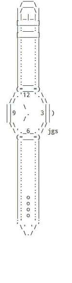

许多初学者认为，如果他们能学习语法或探索编程语言的一些常见内置功能，他们就能学会如何解决问题。事实并非如此。仅仅学习交通规则和标志牌并不能帮助某人熟练驾驶。你必须朝着正确的方向迈出某些步骤。面向语法的编程语言学习只是让你入门。面向语法的编程语言学习适合有经验的程序员。有经验的程序员已经具备了那种智慧，因此他们只需要发现语言的规则和功能即可使用。这不适用于初学者。

为可视化编程逻辑培养肥沃的土壤应该是绝对初学者的重点。不幸的是，这种方法对大多数初学者甚至教学群体来说都是陌生的。练习应该能够帮助新手学习或提高对编程逻辑的可视化能力。本书中提到的方法对新手或缺乏信心的程序员有效的两个主要原因；

A) 视觉学习是提高我们学习技能的好方法。我曾用这种方法在许多学生身上进行实验，发现这是一种极其有趣的快速学习编程的方式。这些教学内容在书中概述，以帮助激发对编程的兴趣。这是一种基于常识和基础数学的经过验证的实践；因此，实际上任何人都可以学习编程，而不会陷入技术细节的泥潭。

**没有足够的逻辑构建技能，学习高级编程主题的努力将如同与大猩猩对话；这将是徒劳的。**

B) 此外，在与 **Quora.com** 上的初学者程序员互动后，内容得到了进一步的完善。我的贡献得到了认可，我相信它将帮助许多初学者。


请查看以下帖子以获取更多详情。

[https://www.quora.com/How-can-I-improve-my-programming-skills-18/answers/140798300](https://www.quora.com/How-can-I-improve-my-programming-skills-18/answers/140798300)

当学习过程充满乐趣时，它总是更好的。学生、教师、培训师以及任何想将编程作为爱好的人，都可以将本书视为补充教材。此外，这个资源对于想教孩子编程的父母也很有用。父母们，请省下你们辛苦赚来的钱，立即开始辅导你们的孩子。送给他们这个平台，这样他们进一步的学习将变得轻而易举。

# 祝学习愉快！！！

# 目录

前言.....................................................................................................................5

第一部分：编程逻辑基础.....................................................................................12

引言.............................................................................................................13

- 正确的态度........................................................................................................14
- 清晰原则....................................................................................................15
- 有任何先决条件吗？........................................................................................................16
- 关于本书.............................................................................................................16
- 如何充分利用本书？.....................................................................17

Python 项目...........................................................................................................18

第一个 Python 程序................................................................................................19

- Welcome.py..................................................................................................................19
- 控制台输出............................................................................................................19
  - MultiplePrintMethod.py.............................................................................................19
  - DefaultPrint.py...........................................................................................................20
  - PrintInSameLine.py....................................................................................................20
  - PrintInSameLine1.py..................................................................................................21
  - PrintInSameLine2.py..................................................................................................21

存储不同的数据类型.......................................................................................22

- 变量赋值....................................................................................................22
  - VariableInfo.py...........................................................................................................23
- 从键盘输入..................................................................................................24
  - PersonDetails.py..........................................................................................................24
- 运算符...................................................................................................................28
  - 算术运算符...................................................................................................28
  - ArithmeticOperations.py.............................................................................................29
  - 比较运算符................................................................................................30
  - ComparisonOperators.py................................................................................................30
  - 逻辑运算符........................................................................................................33

决策制定........................................................................................................34

- a) if 语句.............................................................................................................34
  - StatementIf.py............................................................................................................35
  - StatementIf1.py...........................................................................................................35
- b) if-else 语句.....................................................................................................36
  - StatementIfElse.py......................................................................................................37
  - StatementIfElse.py......................................................................................................37
- c) if-elif-else 语句...............................................................................................38
  - StatementIfElseIf.py....................................................................................................39
  - StatementIfElseIf.py....................................................................................................40
  - StatementIfElseIf.py....................................................................................................41
  - LadderIfElseToSwitchCase.py.....................................................................................43

关于 for 循环...........................................................................................................44

- SequenceWithoutForLoop.py......................................................................................44
- SequenceWithForLoop.py............................................................................................46
- ForLoopWithRangeTwoInputs.py................................................................................46
- ForLoopWithRangeOneInput.py..................................................................................46
- ForLoopDecrement.py..................................................................................................47
- 带有 break 和 continue 关键字的 for 循环..............................................................48

ForLoopContinueNext.py

# 嵌套 for 循环/内层 for 循环

NestedForLoop.py

### 嵌套循环：初学者程序员的最佳伙伴

为什么嵌套循环如此重要？

ForLoopEveryRowAllColumns.py

ForLoopEveryRowAllColumnsHorizontally.py

ForLoopCoordinateRepresentation.py

RowColumnStars.py

JustLoopIt：为每个给定的输出编写一个单独的程序

### 应用逻辑条件的艺术

将逻辑条件转换为简单图形

将简单图形转换为逻辑条件

VerifyAlphabetA.py

VerifyAlphabetB.py

VerifyAlphabetC.py

VerifyAlphabetD.py

VerifyAlphabetE.py

VerifyAlphabetF.py

VerifyAlphabetG.py

VerifyAlphabetK.py

VerifyAlphabetM.py

通过实验和猜测学习

### 逻辑追踪表：编程逻辑背后的大脑

# 第二部分：编程实战

光标移动

### 模式 1A

输出分析

Pattern1A1If.py

PatternA1NestedLoop.py

Pattern1A_1.py

Pattern1D

输出分析

PatternD1.py

Pattern1E

PatternE1.py

备选方案2

PatternE2.py

### 模式 1F

PatternF1.py

备选方案2

## 模式 1G

解题思路

PatternG1.py

PatternG2.py

备选方案2

PatternG3.py

Pattern1H

解题思路1

PatternH1.py

PatternH1_2.py

备选方案2

PatternH2_1.py

PatternH2_2.py

备选方案3

PatternH3.py

PatternAA

PatternCC

PatternII

### 数字模式 1A

输出分析

NumberPattern1A.py

### 数字模式 1B

输出分析

观察

NumberPattern1B.py

备选方案

NumberPattern1B_2.py

## 数字模式 1C

输出分析

NumberPattern1C_1.py

NumberPattern1C_2.py

NumberPattern1C_3.py

NumberPattern2C.py

## 数字模式 1D

输出分析

观察

NumberPattern1D.py

备选方案

NumberPattern2D.py

备选方案.....................................................................................................................230
NumberPattern3D.py.....................................................................................................................232

## 数字模式 1E.....................................................................................................................233

输出分析.....................................................................................................................234
NumberPattern1E.py.....................................................................................................................237

## 数字模式 1F.....................................................................................................................238

输出分析.....................................................................................................................239
NumberPattern1F.py.....................................................................................................................242

## 数字模式 AA.....................................................................................................................243

输出分析.....................................................................................................................244
观察.....................................................................................................................244
NumberPatternAA.py.....................................................................................................................246

## 数字模式 BB.....................................................................................................................247

输出分析.....................................................................................................................248
观察.....................................................................................................................248
NumberPatternBB.py.....................................................................................................................251
备选方案.....................................................................................................................251
NumberPatternBB2.py.....................................................................................................................252

## 数字模式 CC.....................................................................................................................253

输出分析.....................................................................................................................254
NumberPatternCC1.py.....................................................................................................................256
NumberPatternCC2.py.....................................................................................................................257
NumberPatternCC3.py.....................................................................................................................259

## 数字模式 DD.....................................................................................................................260

输出分析.....................................................................................................................261
NumberPatternDD1.py.....................................................................................................................263
NumberPatternDD2.py.....................................................................................................................264
NumberPatternDD3.py.....................................................................................................................265

## 数字模式 EE.....................................................................................................................266

输出分析.....................................................................................................................267
NumberPatternEE.py.....................................................................................................................270

## 数字模式 FF.....................................................................................................................271

输出分析.....................................................................................................................272
备选方案.....................................................................................................................274
NumberPatternFF.py.....................................................................................................................278
If-else 快捷方式.....................................................................................................................279
何时应用 if-else 快捷方式.....................................................................................................................279
NumberPatternFF2.py.....................................................................................................................280

## 数字模式 GG.....................................................................................................................281

## 编写我们自己的函数.....................................................................................................................284

## 数字模式 HH.....................................................................................................................287

输出分析.....................................................................................................................288

## 数字模式 AAA.....................................................................................................................292

输出分析.....................................................................................................................293
观察.....................................................................................................................293
NumberPatternAAA.py.....................................................................................................................295

## 数字模式 BBB.....................................................................................................................296

观察.....................................................................................................................297
NumberPatternBBB1.py.....................................................................................................................300
备选方案.....................................................................................................................300
NumberPatternBBB2.py.....................................................................................................................300

## 数字模式 CCC.....................................................................................................................301

输出分析.....................................................................................................................302
NumberPatternCCC1.py.....................................................................................................................304
备选方案.....................................................................................................................305

## 数字模式 DDD.....................................................................................................................309

输出分析.....................................................................................................................310
观察........................................................................................................................................310

## 数字模式EEE.....................................................................................................................315

输出分析.....................................................................................................................316

## 字符串拼接.....................................................................................................................321

## 子字符串或切片.....................................................................................................................322

## 单循环模式.............................................................................................................325

## 访问每个字符串的字符.....................................................................................................329

## 附录-A：Python安装与项目设置.................................................................336

## 参考文献：.....................................................................................................................................336

## 致谢..........................................................................................................................337

# 第一部分

## 编程逻辑基础

### 引言

毫无疑问，每个学科都有一些关键的基础。如果任何学科的关键概念被真正内化，那么后续的学习将会事半功倍。

许多初学者程序员和许多感到挫败的程序员确实会问类似的问题，如下所示：

“如何学习编程？”

“如何培养逻辑构建能力？”

“如何学习编码？”

“如何提高编程逻辑？”

编程是一个应用领域。在我看来，一个编程逻辑薄弱的程序员甚至不能算是程序员。我们知道抱怨是最容易的事情，如果一个人只是抱怨，那他并没有取得什么大的成就。所以，每当遇到问题时，我们需要思考，“**最简单的解决方法可能是什么？**”

为了在任何编程语言中建立自信，第一步应该是达到一定程度的自我编程逻辑掌握能力。这本技术手册完全致力于帮助非程序员/初学者或中级学生，他们在试图建立编程自信时遇到了瓶颈。此外，如果你是那些学习编程时间有限的人之一，这本指南会对你很有帮助。**因此，经验法则是：要快速且正确地学习编程语言，首先要充分学习编程逻辑的策略。**

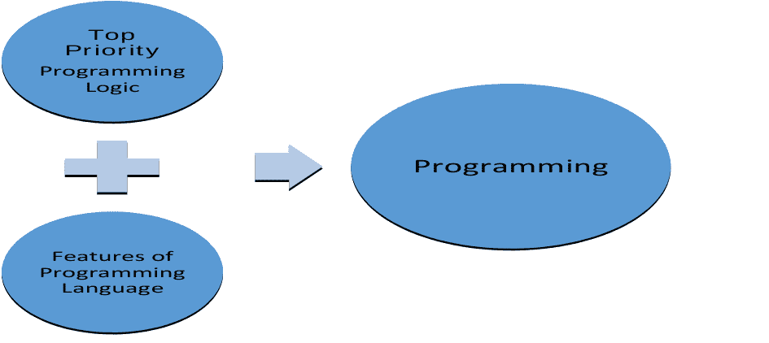

许多非程序员/绝对初学者或培训师最常犯的错误是他们只关注编程语言的语法/语法和功能。这种对编程语言的肤浅看法对初学者帮助不大。计算机科学是解决实际问题的应用领域。因此，首要且必要的需求是，初学者应优先接受充分的编程逻辑技能训练。就像适当的体育锻炼和健康饮食能强健身体肌肉一样，培养逻辑编程技能也需要正确的基于逻辑的编程练习来塑造编程逻辑的可视化能力。

有时，初学者可能几乎了解所有编程语言概念，但仍然感觉缺少了什么。这种缺失是由于逻辑构建能力不足造成的。没有足够水平的逻辑构建技能，初学者就会停滞不前，而且，在开发程序时还会面临很多困惑。

### 正确的态度

> 失败教会了我关于自己的事情，这些事情我无法通过其他方式学到。
- J.K. 罗琳

孩子们天生不怕犯错，因此他们富有创造力。有句话说得好，“**隐藏错误是更高层次的错误**”。所以，尽早发现我们的错误总是好的，这样在未来关键时刻才不会受到沉重打击。从错误中实验和学习就像身体排毒程序。起初，任何排毒程序都不好受，但人们还是会去做，因为他们想看看2-3周后身体会有什么反应。我们做的任何新事情都需要练习。一切有价值的东西都有其代价。失败就是这种代价之一，是为了学习和记住教训而必须支付的。

执行程序后获得准确输出只是一个副产品。因此，整个学习过程包括失败和成功两部分。所以我们需要这样思考：更多的初始失败将有助于我们减少未来失败的机会，而不是认为我们不是好的学习者。当学习者有意或无意地应用不匹配的逻辑条件时，他们可能会遇到意外的输出。这反过来又引发了对哪个特定逻辑条件对输出产生不同影响的好奇心。大脑很容易记住惊喜。此外，图片比流动的文字更能帮助大脑记忆，无论是事实还是概念。因此，如果学习者尝试一些奇怪或典型的逻辑条件并试图找出背后的原因，这将非常有用。这就像一种自我激励的练习，它能激发学习更多知识的欲望。

我们都有隐藏的潜力，探索自己取决于我们自己。你是唯一一个可以通过挑战自己的能力来探索自己隐藏潜力的人。然而，除非你踏上这段挑战之旅，否则你不会知道**真实的你**，或者你将仍然是别人，一个普通的存在。*所以你、我以及每个人*都必须进行这种在自己内心寻宝的练习。

这完全关乎态度的游戏以及我们为追求卓越而采取的行动。我们需要用另一次诚实的尝试反复反弹。本指南的主要目标之一是点燃思维过程，并通过触及最基本的技术细节来培养解决问题的自然倾向。我们知道态度决定高度。正确的意图赋予我们力量，即使面对艰巨任务也能自信应对。这完全关乎视角、我们的思维方式以及相应处理情况的方式。

### 清晰原则

让我们把这些原则作为提醒来帮助自己。我们必须不断提醒自己那些有助于净化潜意识的重要关键价值观。提醒确实有好处，所以要提醒别人或我们自己。

> 你无法管理你无法衡量的东西。
- 彼得·德鲁克

> 科学本质上就是最佳的常识，即在观察上严格准确，在逻辑谬误上毫不留情。
- 托马斯·赫胥黎

> 在人类漫长的种族历史中，人类在这个星球上的大部分问题，都是通过基于常识并以勇气执行的实验来部分或整体解决的。
- 弗朗西斯·珀金斯

> 我阅读，我研究，我检查，我倾听，我思考，在所有这些之后，我试图形成一个尽可能融入常识的想法。
- 拉法耶特侯爵

> 常识是应用于生活的计算。
- 亨利-弗雷德里克·阿米尔

计算或测量最重要的方面是它能带来清晰度。我们将尝试利用这种“清晰度”因素，通过逻辑追踪表来正确获取隐藏的编程逻辑。本指南涵盖的所有学习内容主要围绕逻辑追踪表的概念展开。在“编程模式”部分，其实践将得到更详细的探讨。没有高质量的程序，就无法期望有高质量的软件。良好的编程逻辑是编写无错误程序和高质量软件的基本素质之一。

### 有先决条件吗？

目的是诚实地尝试学习编程。不需要任何编程语言的先前经验。如果你有，那很好，这是可选的，因为我们不涉及太多语法技术内容。我们只需要非常基本的语言特性来练习编程练习，以培养对编程的兴趣和信心。我们主要涉及两个主要技术概念。

- a) 条件语句（If语句，if-else语句）
- b) 循环结构——仅*for循环*。

许多编程语言的条件语句和循环的编程语法有许多共同之处。通过本书的学习，任何人都可以轻松地在其他感兴趣的编程语言中进行实验。重点在于学习方法，而不是语法。高度成功人士的共同品质之一是，一旦获得信息，他们的实施速度非常快。这种品质帮助他们在竞争中保持领先。**与任何人竞争的最好方式是与自己竞争，并始终努力打破自己的记录。**

### 关于本书

这里提供的所有材料都是为了行动，一个实践性的待办事项环节。我们不是作为一门语言来讲解，而是使用编程语言的语法作为主题来讲解编程逻辑。这本书不是猜测的产物。这本书是在大学生中进行实验的结果，旨在提高他们的逻辑构建能力或从零开始快速学习编程。

学习者必须按照书中提到的方法进行练习，以培养与二维简单图片练习相关的逻辑构建能力。以渐进挑战方式安排的练习激励你以循序渐进的方式不断完善编程技能。已解决的练习提供了完整的概念，而未解决的问题则促使应用逻辑概念。因此，这将是一场有趣的**你与你自己的对决**。

对每个学习者的两个主要要求如下：

- a) 你想学习编程的意愿
- b) 你需要持续投入一些时间，这取决于你想多快成为一名自信的程序员。**至少3个月内不要中断学习模式；每天至少花费20-30分钟。** 只需按照提到的行动步骤逐步执行；你肯定会对编程有扎实的掌握。

之后，探索编程或软件开发的新领域取决于你自己。我只能承诺在短时间内为你的编程逻辑学习之旅提供一个良好的开端。**那么，让我们开始学习之旅吧。**

### 如何充分利用本书？

-   选择一个主题学习，直到你准备好分析一个已解决的示例。专注于该示例，直到你感觉自己已经理解了程序的所有内容。

    然后尝试在不参考该示例的情况下实现它。下定决心，一旦你开始实现一个已经学习过的程序，就不要回头参考那个特定的已解决程序。你可以参考理论解释，但不要参考程序本身。你很有可能会遇到许多语法或逻辑上的错误。在这种情况下，你可以参考关于该概念的理论解释，但不要让自己去看解决方案。尽力通过参考理论解释来自己解决问题。

-   请维护一个 Excel 或电子表格文件，记录你在程序中遇到的错误。当你能够解决这些错误时，请记下你采用该方法的原因。同时，记下你在解决某个特定逻辑错误时的初始观察和最终观察。这种差距分析的研究有助于我们了解如何以正确的方向思考。

-   每当你想开始新一天的学习时，请快速浏览一下你每次遇到错误时维护的错误文件。在每天学习新内容时回顾这些错误，将有助于你下次做得更好，也能帮助你快速复习概念。我们应该保持这种做法，以避免常见的逻辑错误，这样这些错误就不会成为我们习惯的一部分。因此，最好在开始时就纠正这些漏洞，因为改掉一个习惯需要付出相当大的努力。我们练习什么，就会养成什么习惯，无论好坏。在这里，我们试图**将失败转化为教训**。当我们尽早从错误中改进，以便投入更多时间学习生活中其他重要科目时，回报会更大。

-   如果你至少能连续两次不参考解决方案就解决书中所有的已解决示例，你将处于一个更好的位置来有效地编写程序。

-   在已解决练习的解释中，为未解决的问题提供了提示。如果你无法解决未解决的问题，尝试 2-3 次，然后继续完成本书。之后再回来重试剩下的部分。

-   学生应该能够至少连续两次不参考解决方案地解决所有已解决的练习。未解决的问题也适用同样的要求。这使学习者在构建程序逻辑时更加灵活，建立信心，并激发应对更高级编程主题（如数据结构和设计模式）的信心。

### Python 项目

请参考本书末尾的**附录 A**。
**附录 A：IDE 安装和项目设置**
它展示了使用 IDE 创建 **Python 项目**的分步过程。它还展示了如何**创建**和**执行 Python 程序**的屏幕截图。或者，你可以使用任何免费的在线编辑器，例如，
https://www.tutorialspoint.com/execute_python3_online.php
点击 **Execute** 按钮运行程序。默认情况下，将打开 **main.py** 选项卡来编写程序。会显示一个单独的“结果”窗口来显示程序的输出。

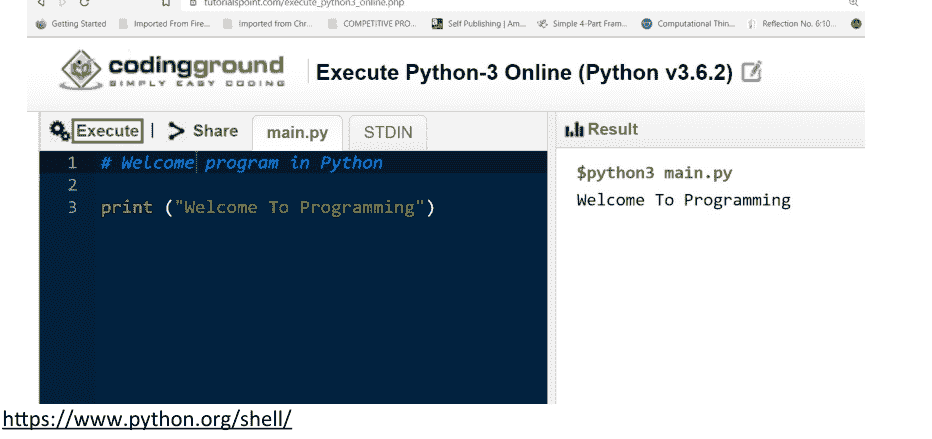

https://www.python.org/shell/

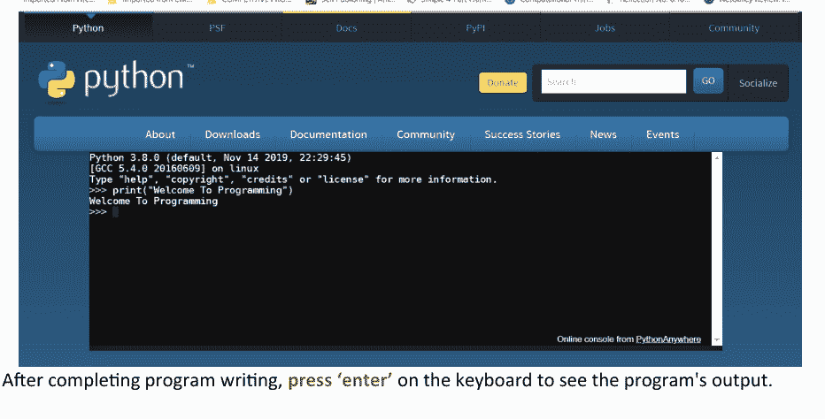

完成程序编写后，**按键盘上的 'enter' 键**查看程序的输出。

我们应该将每个程序保存在自己的文件中，以便日后参考。每个文件都有一个名称和扩展名。程序文件的扩展名是 **“.py.”**。假设我们第一个程序的名称是 Welcome，它将输出一条欢迎消息。我们应该根据程序的目的，用有意义的名称命名编程文件。因此，我们应该创建一个 **Welcome.py** 文件。

### 第一个 Python 程序

用问候语向某人介绍编程是一种良好的姿态，但这不是强制性的。通常，初学者会尝试打印 “Hello World” 或他们自己的名字。以下 **Welcome.py** Python 程序输出文本 **Welcome to Programming**。

```
Welcome.py
# Print welcome message.

print("Welcome To Programming")
print('Welcome To Programming')
```

```
Output
Welcome To Programming
Welcome To Programming
```

要打印文本内容，我们需要在 `print()` 方法中放入双引号（“running text”）或单引号（‘running text’）。方法是编程语言提供的现成设施。我们需要学习如何在适当的情况下应用这些方法。这就像我们如何参考特定语言的词典并用它来构造句子一样。同样，我们需要在编程语句中使用这些方法。编写有效、逻辑清晰的编程语句的步骤是编写程序的基本要素之一，通常被称为逻辑构建技能。逻辑构建技能对于获得编程的信心和兴趣是必不可少的。注释仅用于我们的理解/文档目的和日后参考。它不是我们编程语句的一部分。执行程序的环境会忽略它。多行注释通过每行使用 `#` 来给出。单行注释通过单行使用 `#` 来给出。

### 控制台输出

我们可以通过重复打印小段文本来开始学习编程逻辑，可以**在同一行水平打印**，也可以**在每一行垂直打印**。我们可以使用 `print()` 方法以水平或垂直方式输出结果。让我们尝试学习 `print()` 方法在不同情况下的行为。

**练习 1.** 使用多个 `print("text")` 方法打印文本 “Welcome To Programming”。

```
MultiplePrintMethod.py
# Prwelcome message
print("Welcome ")
print("To ")
print("Programming")
```

```
Output
Welcome
To
Programming
```

我们不期望得到多行的欢迎消息。我们希望欢迎消息在单行中打印。这也表明，`print("any text")` 方法每次都会选择一个新行来打印 “any text”。我们需要使用 `print("text",end="\n")` 方法的 `end` 属性。

**end** 属性强制以特定方式结束打印文本。如果我们在 `print("text")` 方法中没有提及 **end** 属性，那么它会在显示屏幕上打印指定的 “text” 后强制移动到新行。这是 `print("text")` 方法的默认行为。

**练习 2.** 学习 `print("text")` 方法的默认行为。

```
DefaultPrint.py
# default usage of method print without using attribute 'end='

print("Welcome")
print("To")
print("Programming")

print()
print()
print()

# use of attribute 'end=' to end the text with a new line
print("Welcome", end="\n")
print("To", end="\n")
print("Programming", end="\n")
```

**Output**

Line No.1  Welcome

Line No.2  To

Line No.3  Programming

Line No.4

Line No.5

Line No.6

Line No.7  Welcome

Line No.8  To

Line No.9  Programming

第 4 行、第 5 行和第 6 行是由于 `print()` 方法产生的空行。这演示了属性 `end="\n,"` 的默认行为，它将控制移动到新行。这表明下次文本打印将从这个新行开始。
要使用多个 `print("text")` 方法在同一行打印文本，我们需要使用 **end** 属性来改变这种默认行为。

**练习 3.** 打印带有空行的欢迎消息 “Welcome To Programming”。

```
PrintInSameLine.py
#attribute end="" to end the text with an empty line
print("Welcome", end="")
print("To", end="")
print("Programming", end="")
```

**Output**
WelcomeToProgramming

欢迎消息打印时单词之间没有空格。让我们尝试在它们之间添加空格。

**练习 3.1.** 在同一行打印欢迎消息 “Welcome To Programming”。

```
PrintInSameLine1.py
# use of attribute 'end=' to end the text with an empty line or space
print("Welcome", end="")# text ends with empty line
print("", end=" ") # empty text ends with a space
print("To", end="") # text ends with empty line
print("", end=" ") # empty text ends with a space
print("Programming", end="")# text ends with empty line
```

**Output**

Welcome To Programming

我们可以在单个 print() 方法中组合打印带空格的文本。

**练习 3.2.** 在同一行打印欢迎消息 “Welcome To Programming”。

```
PrintInSameLine2.py
# use of attribute 'end=' to end the text with space
print("Welcome", end=" ")
print("To", end=" ")
print("Programming", end=".")# text ends with full stop(.)
```

**Output**

Welcome To Programming.

我们可以总结一下我们如何以不同方式使用 print() 方法及其 end 属性。

| 方法 | 目的 |
| :--- | :--- |
| print("text") | 打印文本并将控制移动到新行。 |
| print("text", end="") | 在同一行打印文本。 |
| print("", end=" ") | 在同一行打印一个空格。 |
| print() | 将控制移动到下一行。 |

给定的编程语句含义相同。它打印文本并将控制移动到下一行。

```
print("text")
print("text", end="\n")
print("text", end="")
print()
```

我们将只学习必要的最低限度的技术知识，以提高我们在编程逻辑方面的智力。我们的目标是深入研究构建编程逻辑的艺术，而不是深入研究编程语言的基本语法/语法。让我们看看编程逻辑的一些基本构建块。我们主要针对以下基础知识。正确关注上述基础知识将促进兴趣并建立编码信心。

-   a) 变量
-   b) 逻辑运算符
-   c) 条件语句
-   d) 嵌套循环

### 存储不同的数据类型

软件的智能性源于编程语言。以某种形式处理不同的数据类型是几乎所有软件的核心功能。能够**正确处理不同类型的数据**是任何编程语言的必备特性——以下是常用不同数据类型的示例。

| 通用数据类型 | 值示例 |
| :--- | :--- |
| 整数 | **23, -4, 8908** |
| 实数 | **23.45, 3.1456, -45.27** |
| 布尔值 | **True, False** |
| 文本 | **“Just do it”, “impossible”** |
| 单个字符 | **A, a, @, $, %, *, 9** |

我们在日常生活中难道不使用各种不同的数据吗？我们实际上确实在使用，例如：

| 等效的变量赋值 | 填写的个人信息 |
| :--- | :--- |
| name = "Guido Van Rossum" | **姓名 : Guido Van Rossum** |
| age = 63 | **年龄: 63** |
| weightInKgs = 53.6 | **体重(千克) : 53.6** |
| personalLoan = False | **个人贷款 (True/False): False** |
| gender = 'M' | **性别 : M** |

我们有时需要以某种方式正确填写个人信息。一些例子，比如学校或大学的入学流程、航班预订或任何在线购物。我们可以轻松区分不同的数据类型，无论是数值型、文本型还是其他任何类型。例如，数据值25可能是年龄、价格，还有更多可能性。变量的名称应该被恰当地选择。变量的命名有助于我们理解其存储值的含义。

**如何将数据/值存储在变量中？**
是的，这通过使用赋值运算符（=）的变量赋值功能得以实现。

### 变量赋值

**变量的值可以通过编程方式被覆盖，这就是为什么它被称为变量。** 任何手动填写数据的实时场景都可以使用称为变量赋值的编程语言特性来模拟。变量赋值就是将一个合适的值存储在一个被恰当选择的变量中的简单行为。我们可以使用赋值运算符（=）将值赋给变量。**我们一次只能存储或赋值一个数据。** 变量的内容可以在程序运行或执行过程中通过编程方式被覆盖。变量赋值的格式如下：

```
variable_name = value  # assign only one data at a time
```

变量名不能以数字开头。因此，像**4Age这样的变量名是无效的**
**4Age = 20  # invalid variable name.**
变量名代表一个内存位置。使用内存位置的名称进行编程并不容易。内存地址位置不亚于任何密钥。我们选择的变量名应该是一个用户友好的名称，代表分配用于存储数据的特定内存位置。Python提供了内置方法 -`id()` 和 `type()` 来了解变量的内存位置和数据类型。

### 示例4. 打印变量的基本信息。

```
VariableInfo.py
# variable assignment of different data types
# + can be used to join different texts/strings

name = "Guido " + "Van " + "Rossum"
age = 63
weightInKgs = 53.6
personalLoan = False
gender = 'M'

# output the content of variables
print("Memory location = ", id(name),end=" | ")
print("Data Type = ", type(name),end="   | ")
print("name = ",name)

print("Memory location = ", id(age),end=" | ")
print("Data Type = ", type(age),end="   | ")
print("age = ",age)

print("Memory location = ", id(weightInKgs),end=" | ")
print("Data Type = ", type(weightInKgs),end=" | ")
print("weightInKgs = ",weightInKgs)

print("Memory location = ", id(personalLoan),end=" | ")
print("Data Type = ", type(personalLoan),end="   | ")
print("personalLoan = ",personalLoan)

print("Memory location = ", id(gender),end=" | ")
print("Data Type = ", type(gender),end="   | ")
print("gender = ",gender)
```

### 输出

```
Memory location =  140646950853848 | Data Type =  <class 'str'>   | name =  Guido Van Rossum
Memory location =  140646971403136 | Data Type =  <class 'int'>   | age =  63
Memory location =  140646951903496 | Data Type =  <class 'float'> | weightInKgs =  53.6
Memory location =  140646971214752 | Data Type =  <class 'bool'>  | personalLoan =  False
Memory location =  140646950860312 | Data Type =  <class 'str'>   | gender =  M
```

在开始编写程序之前，请注意关于变量的这些要点。

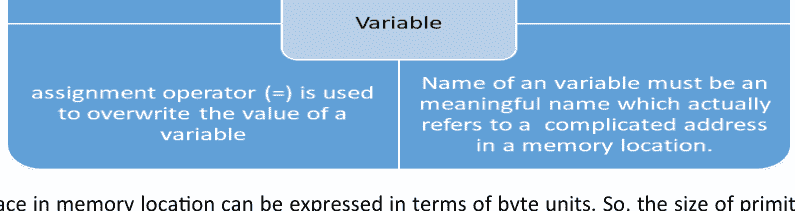

内存空间可以用字节单位来表示。因此，原始数据类型的大小可以用字节来表示以存储值。（**注意：1 字节 = 8 位。**）

### 变量名中有什么？

我们知道，在地理地图上，位置可以用经度和纬度的组合来表示。试想一下，如果我们的城市、城镇、街道地点被经度和纬度值所取代，在我们的日常交流中使用它会变得多么困难。因此，变量的选择应该是一个有意义的名称，并且必须表明与之相关的某种目的。发现有这种特殊**SLVNS**疾病的程序员并不少见。

### 什么是 SLVNS 疾病？

**SLVNS** 代表 **单字母变量名综合征**。许多程序员有这种通过变量名制造悬念的特殊习惯。他们在编写程序时只给变量名分配一个字母。当这样的程序变得冗长，并且其他人必须为该程序代码修复错误时，这肯定会变成一种令人恼火的经历。即使是 **SLVNS** 程序员在间隔一段时间后重新审视时，也可能难以快速找到他/她自己的编程逻辑。如果你发现这样的程序员，请要求他们改变这种习惯；*这是一种冒犯*。请防止自己患上这种疾病，并**足够耐心地编写有意义的变量名**。

### 从键盘输入

在前面的示例（**示例4**）中，分配给相应变量的个人信息是固定的。我们可以使其具有交互性，以便可以直接从键盘提供详细信息。要直接从键盘提供数据，我们需要使用 Python 的内置函数 `input()`。在使用方法 `input("Input message")` 时输入用户友好的消息会更加积极。
**示例5**. 从键盘打印个人信息。

```
PersonDetails.py
# input person details
name = input("Enter Name:")
age = input("Enter Age:")
Weight = input("Enter Weight:")

# output
print() # Print blank line. Move to the next line
print(" Person Details")
print("========================")
print("Name : " + name)
print("Age : " + age)
print("Weight : " + Weight)
```

### 输出

```
Enter Name:jacob
Enter Age:45
Enter Weight:93

Person Details
========================
Name: jacob
Age: 45
Weight: 93
```

如何使用 IDLE Shell 执行 .py 文件？

1. # 调用 IDLE。

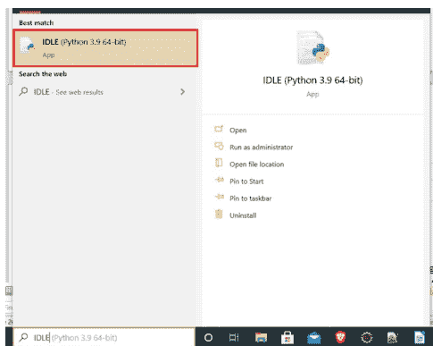

2. # 单击应用程序以激活 IDLE Shell。

3. # 导航 **文件→ 打开** 以选择我们想要执行的 Python 编程文件 **.py**。

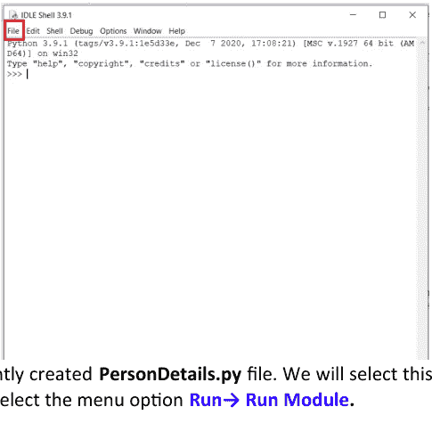

在我们的例子中，我们最近创建了 **PersonDetails.py** 文件。我们将选择此文件。从新打开的窗口中，请选择菜单选项 **运行→ 运行模块**。

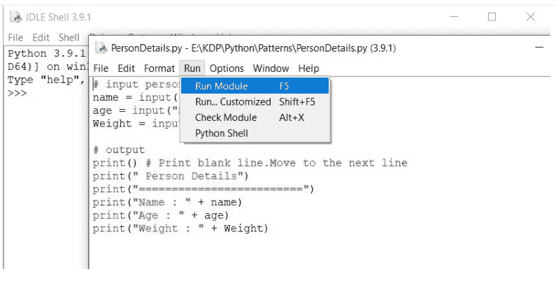

4. # IDLE shell 将等待键盘输入。

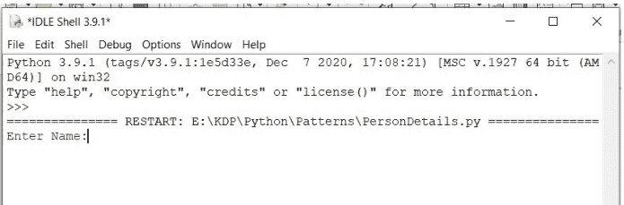

5. # 从键盘输入后，请按回车键。它将要求从键盘进行下一次输入。

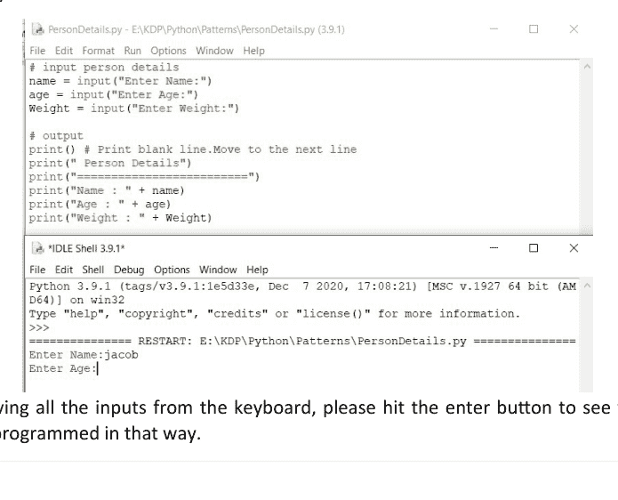

6. # 从键盘输入所有内容后，请按回车键查看输出，该输出是按此方式编程的。

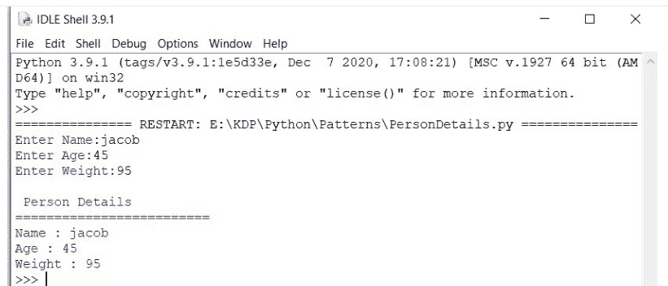

执行此程序演示了如何从键盘获取数据输入。它在控制台上精确地输出了相同的内容。控制台是一个与操作系统交互以执行某些交互式任务的实用程序。控制台正在等待用户从键盘输入数据。此练习帮助我们了解如何从键盘获取动态输入并传递给程序。我们需要为不同的数据输入重复此过程，以标记另一个人的详细信息。

### 运算符

在编程中，一些特殊的键盘字符被用作运算符，以表示常见的数学运算，如加法、减法、比较两个数值以及许多其他运算。基于计算的活动在我们的日常生活中非常普遍。

#### 算术运算符

| 运算符 | 描述 | 用途 | 编码表达式 |
| :--- | :--- | :--- | :--- |
| + | 加法 | **intNum1** 与 **intNum2** 相加。 | **intNum1 + intNum2** |
| - | 减法 | **intNum1** 与 **intNum2** 相减。 | **intNum1 - intNum2** |
| * | 乘法 | **intNum1** 与 **intNum2** 相乘。 | **intNum1 * intNum2** |
| ** | 幂运算 | **intNum1** 的 **intNum2** 次幂。 | **intNum1 ** intNum2** |
| / | 除法 | intNum1 除以 intNum2 的商值。 | **intNum1 / intNum2** |
| // | 整除 | **intNum1** 除以 **intNum2** 的商值，**不含小数部分**。 | **intNum1 // intNum2** |
| % | 取模 | **intNum1** 除以 **intNum2** 的余数值。 | **intNum1 % intNum2** |

**示例 1.** 使用算术运算符演示给定的基本算术运算。

```
intNum1 = 6
intNum2 = 4

intNum1 + intNum2 = 10

intNum1 - intNum2 = 2

intNum1 * intNum2 = 24

intNum1 ** intNum2 = 1296

intNum1 / intNum2 = 1.5

intNum1 // intNum2 = 1

intNum1 % intNum2 = 2
```

```
ArithmeticOperations.py
intNum1 = 6
intNum2 = 4

print('intNum1 = ', intNum1 )
print('intNum2 = ', intNum2 )

result = intNum1 + intNum2
print('intNum1 + intNum2 =',result)

result = intNum1 - intNum2
print('intNum1 - intNum2 =',result)

result = intNum1 * intNum2
print('intNum1 * intNum2 =',result)

result = intNum1 ** intNum2
print('intNum1 ** intNum2 =',result)

result = intNum1 / intNum2
print('intNum1 / intNum2 =',result)

result = intNum1 // intNum2
print('intNum1 // intNum2 =',result)

result = intNum1 % intNum2
print('intNum1 % intNum2 =',result)
```

### 输出

```
intNum1 = 6
intNum2 = 4

intNum1 + intNum2 = 10

intNum1 - intNum2 = 2

intNum1 * intNum2 = 24

intNum1 ** intNum2 = 1296

intNum1 / intNum2 = 1.5

intNum1 // intNum2 = 1

intNum1 % intNum2 = 2
```

**练习 2.** 以给定的表格形式打印基本算术运算。
整数：intNum1 = 6, intNum2 = 4

| 运算 | 运算符 | 表达式 | 结果 |
| --- | --- | --- | --- |
| 加法 | + | 6 + 4 | 10 |
| 减法 | - | 6 - 4 | 2 |
| 乘法 | * | 6 * 4 | 24 |
| 除法 | / | 6 / 4 | 1.5 |
| 余数 | % | 6 % 4 | 2 |

### 比较运算符

两个值的比较结果将是 **True** 或 **False**，这些值也被称为**布尔值或真值**。这个特性非常重要，因为它将帮助我们做出 True 或 False 的决策。计算机内存主要基于 1(True) 或 0(False) 的值，称为**位值**。计算机中的每个数据都是由 1 和 0 组合而成的，称为位模式。

**计算机内存中的唯一值或数据意味着一组唯一的位模式。**

| 运算符 | 比较运算描述 |
| --- | --- |
| == | 等于 |
| != | 不等于 |
| < | 小于 |
| <= | 小于或等于 |
| > | 大于 |
| >= | 大于或等于 |

使用比较运算符，我们可以比较两个数值。以下示例展示了使用数值进行比较运算符的用法。

| 运算符 | 操作数1(运算符) 操作数2 | 结果 |
| --- | --- | --- |
| == | 4 == 4 | True |
| | 4 == 10 | False |
| != | 6 != 4 | True |
| | 4 != 4 | False |
| < | 6 < 10 | True |
| | 6 < 6 | False |
| <= | 6 <= 6 | True |
| | 10 <= 6 | False |
| > | 6 > 6 | False |
| | 10 > 6 | True |
| >= | 4 >= 6 | False |
| | 10 >= 6 | True |

我们也可以通过将输入值存储在变量中，然后逐一应用比较运算符来测试上述结果。**从哲学上讲，True 和 False 是这个世界上仅有的两个完美答案。** 在程序中，它要求我们基于完美答案进行决策。基于运算符开发逻辑是实现决策所必需的。它允许在处理程序中的不同逻辑情况时具有灵活性。应用逻辑条件的感知和敏感性是任何优秀程序员的核心方面之一。

**因此，请投入高质量的时间，特别注意地学习这个主题。**

让我们使用比较运算符对操作数 4、6 和 10 验证结果。

```
ComparisonOperators.py
four = 4
six = 6
ten = 10

print("*** Comparison Operators ***")
print()
#equals to
print("equal (  ==  )")
print()
isResult = (four  == four)
print(four,"  ==  ",four,"  | ",isResult)

isResult = (four  == ten)
print(four,"  ==  ",ten,"  | ",isResult)
print("--------------------------------------------------")

#not equals to
print("notequal ( !=  )")
print()
isResult = (four != four)
print(four," !=  ",four,"  | ",isResult)

isResult = (four != ten)
print(four," !=  ",ten,"  | ",isResult)
print("--------------------------------------------------")

#less than
print("less than ( < )")
print()
isResult = (six <six)
print(six," <  ",six,"  | ",isResult)

isResult = (six <ten)
print(six," <  ",ten,"  | ",isResult)
print("--------------------------------------------------")

#less than or equals to
print("less than or equal ( <=  )")
print()
isResult = (six <= six)
print(six,"  <=  ",six,"  | ",isResult)

isResult = (ten <= six)
print(ten,"  <=  ",six,"  | ",isResult)
print("--------------------------------------------------")

#greater than
print("greater than ( > )")
print()
isResult = (six >six)
print(six,"  >  ",six,"  | ",isResult)

isResult = (ten >six)
print(ten," > ",six," | ",isResult)
print("--------------------------------------------------")

#greater than or equal
print("greater than or equal ( >= )")
print()
isResult = (six >= six)
print(six," >= ",six," | ",isResult)

isResult = (six >= ten)
print(six," >= ",ten," | ",isResult)
print("--------------------------------------------------")
```

### 输出

```
*** Comparison Operators ***

equal ( == )

4 == 4 | True
4 == 10 | False
--------------------------------------------------
notequal ( != )

4 != 4 | False
4 != 10 | True
--------------------------------------------------
less than ( < )

6 < 6 | False
6 < 10 | True
--------------------------------------------------
less than or equal ( <= )

6 <= 6 | True
10 <= 6 | False
--------------------------------------------------
greater than ( > )

6 > 6 | False
10 > 6 | True
--------------------------------------------------
greater than or equal ( >= )

6 >= 6 | True
6 >= 10 | False
--------------------------------------------------
```

### 逻辑运算符

它也返回一个最终值，要么是 **True** 要么是 **False**，类似于比较运算符中的表达式求值。它主要用于将基于比较运算符的多个逻辑表达式链接起来。以下是逻辑运算符的名称及其各自的符号。

1) 逻辑与 ( **and** ) &nbsp;&nbsp;&nbsp;&nbsp;&nbsp;&nbsp;&nbsp;&nbsp; 2) 逻辑或 ( **or** ) &nbsp;&nbsp;&nbsp;&nbsp;&nbsp;&nbsp;&nbsp;&nbsp; 3) 逻辑非 ( **not** )

1) **逻辑与**：当且仅当**逻辑表达式 A 和 B 的结果都为 True** 时返回 **True**，否则返回 False。我们在逻辑表达式中使用此运算符越多，从总数据中得到的数据集大小就越小。它通常应用于获取特定数据或范围或大小较小的数据的情况。假设有两个整数变量，month = 10 和 days = 5。请注意“**结果**”列。

| A | B | A and B | A | B | A and B = 结果 |
|---|---|---|---|---|---|
| True | True | True | month > 7 (True) | days < 7 (True) | (True) and (True) = True |
| True | False | False | month > 7 (True) | days > 7 (False) | (True) and (False) = False |
| False | True | False | month < 10 (False) | days < 7 (True) | (False) and (True) = False |
| False | False | False | month < 10 (False) | days > 7 (False) | (False) and (False) = False |

2) **逻辑或**：当且仅当**逻辑表达式 A 和 B 的结果都为 False** 时返回 **False**，否则返回 True。我们在逻辑表达式中使用此运算符添加的 OR 条件越多，输出结果的数据规模就越大。因此，它用于获取更广泛范围的数据。假设有两个整数变量，month = 10 和 days = 5。请注意“**结果**”列。

| A | B | A or B | A | B | A or B = 结果 |
|---|---|---|---|---|---|
| True | True | True | month > 7 (True) | days < 7 (True) | (True) or (True) = True |
| True | False | True | month > 7 (True) | days > 7 (False) | (True) or (False) = True |
| False | True | True | month < 10 (False) | days < 7 (True) | (False) or (True) = True |
| False | False | False | month < 10 (False) | days > 7 (False) | (False) or (False) = False |

3) **逻辑非**：返回相反的结果，当逻辑表达式的结果为 False 时返回 **True**，或者当逻辑表达式的结果为 True 时返回 False。

| A | not A |
|---|---|
| True | False |
| False | True |

**请注意，True/False 值也被称为布尔值或真值。**

逻辑运算符的使用非常普遍，在设计程序逻辑中扮演着非常重要的角色。每个程序员都必须并且应该对这些运算符的用法有清晰的认识。如果初学者投入额外精力去试验这些运算符，那么所花的时间是值得的。

### 决策制定

在设计程序逻辑时，首先需要计算决策。在这个世界上，只有两个完美的答案，要么是**是**，要么是**否**。在编程中，这些完美的答案代表布尔数据类型。布尔数据类型变量一次只能取一个值，可以是**真**或**假**。因此，布尔值**真**代表**是**，布尔值**假**代表**否**。在运行程序时，程序的控制流可能会遇到逻辑表达式。然后它会测试这个逻辑表达式以得出结果。它用**真**或**假**来表示结果。根据逻辑表达式的布尔结果**真或假**，程序的控制流决定是执行还是跳过一组编程语句。我们可以使用以下不同版本的决策**if语句**来计算决策。

- a) if语句
- b) if-else语句
- c) if-elif-else语句（也称为阶梯式if-else语句）

流程图有助于可视化当条件为**真**或**假**时控制流的走向。

#### a) if语句

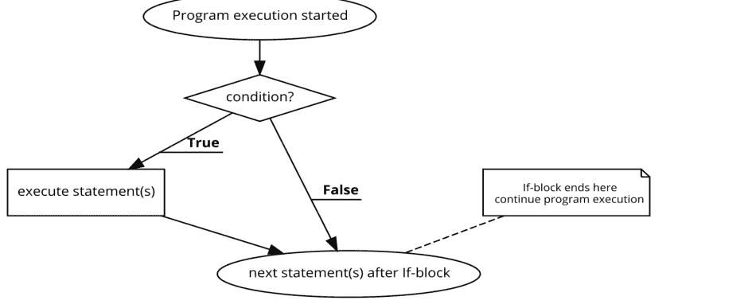

**if语句**的一般语法可以表示为：

```
if (condition)
    execute statement(s)    // If-block

next statement(s) // continue program execution
```

- **condition:** 它将是一个由变量和运算符组成的表达式，其结果应为布尔值，即**真**或**假**。由于逻辑和比较运算符产生**真**或**假**，并且常用于条件表达式中。
- 当**condition**的结果为**真**时，它将执行包含在**If块**中的语句。

##### 案例 1.

ageOfCitizen = 80
condition: ( ageOfCitizen >= 60 ) 的结果为真
因此，如果 (80 >= 60) 或 if (condition) 为真，则执行if块。

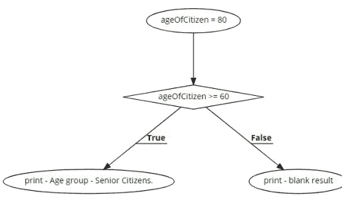

```
StatementIf.py
ageOfCitizen = 80

if ageOfCitizen >= 60:
    print("Age group - Senior Citizens.")
```

### 输出

Age group - Senior Citizens.

##### 案例 2. 更改程序中 ageOfCitizen 的值。

ageOfCitizen = 40
condition: ( ageOfCitizen >= 60 )
if(40 >= 60) 的结果为假。
if( ageOfCitizen >= 60 ) 将为假，因此不会执行if块。
输出将为空。

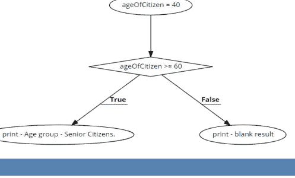

```
StatementIf1.py
ageOfCitizen = 40

if ageOfCitizen >= 60:
    print("Age group - Senior Citizens.")
```

### 输出

由于条件失败，if语句内的代码块未被执行，因此没有打印任何内容。

#### b) if-else语句

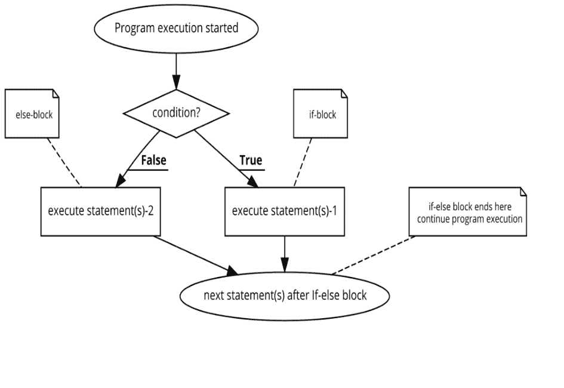

**if-else语句**的一般语法可以表示为：

```
if (condition)
    execute statement(s)-1
else:
    execute statement(s)-2

next statement(s) // continue execution of program
```

```
if(logical_condition)
    statement 1-1
    statement 1-2
    ...
    statement 1-N
else:
    statement 2-1
    statement 2-2
    ...
    statement 2-N
```

##### 案例 1.

num1 = 80
num2 = 40
condition: ( num1 > num2)
if(80 > 40) 的结果为真。
if( num1 > num2) 条件语句将为真，并执行if块。

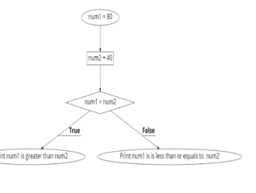

```python
# StatementIfElse.py
num1 = 80
num2 = 40
if num1 > num2:
    print(num1," is greater than ",num2)
else:
    print( num1," is less than or equals to ", num2)
```

### 输出

80 is greater than 40

##### 案例 2. 更改程序中 num1 和 num2 的值。

num1 = 40
num2 = 80
condition: ( num1 > num2)
if(40 > 80) 语句的结果为假。因此，
if( num1 > num2) 条件语句将为假。程序应执行else代码块。

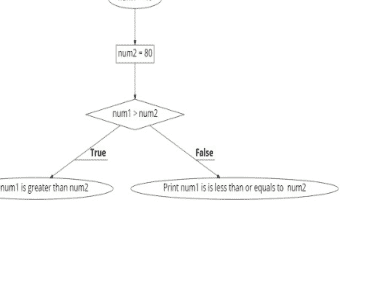

```python
# StatementIfElse.py
num1 = 40
num2 = 80
if num1 > num2:
    print(num1," is greater than ",num2)
else:
    print( num1," is less than ",num2)
```

### 输出

40 is less than 80

#### c) if-elif-else语句

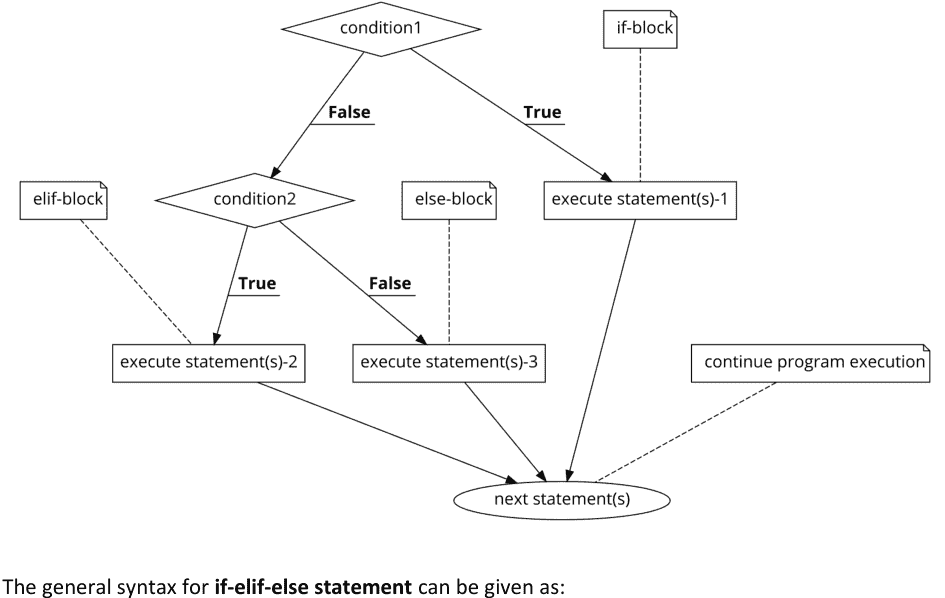

**if-elif-else语句**的一般语法可以表示为：

```
if (condition1)
    execute statement(s)-1
elif(condition2)
    execute statement(s)-2
else:
    execute statement(s)-3

next statement(s) // continue program execution
```

```
if(logical_condition1)
    statement 1-1
    statement 1-2
    ....................
    statement 1-N
elif (logical_condition2)
    statement 2-1
    statement 2-2
    ....................
    statement 2-N
else:
    statement 3-1
    statement 3-2
    ....................
    statement 3-N
```

##### 案例 1.

num1 = 80
num2 = 40
condition: (num1 > num2)
if (80 > 40) 的结果为**真**
因此，if (num1 > num2) 条件语句将为**真**。
程序应执行**if**代码块。

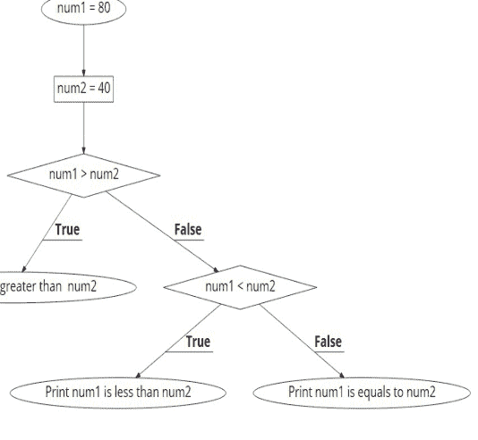

```
StatementIfElseIf.py
```

```
num1 = 80

num2 = 40

if num1 > num2:
    print(num1," is greater than ", num2)

elif num1 < num2:
    print(num1," is less than %d", num2)

else:
    print(num1," equals to ", num2)
```

```
Output
```

80 is greater than 40

##### 案例 2. 更改程序中 num1 和 num2 的值。

num1 = 40
num2 = 80
if( num1 > num2 ) 条件语句的结果将为假，程序的控制流将检查下一个if条件语句，即else if( num1 < num2 )。
if( num1 < num2 ) 条件语句将为真，因为 (40 < 80) 的结果为真。
程序应执行else if代码块。

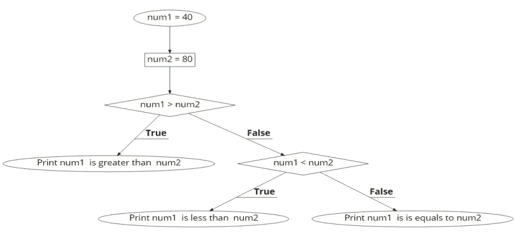

```
StatementIfElseIf.py

num1 = 40

num2 = 80

if num1 > num2:
    print(num1," is greater than ", num2)
elif num1 < num2:
    print(num1," is less than ",num2)
else:
    print(num1," equals to ",num1)
```

### 输出

40 is less than 80

##### 案例 3. 更改程序中 num2 的值。

num1 = 40
num2 = 40

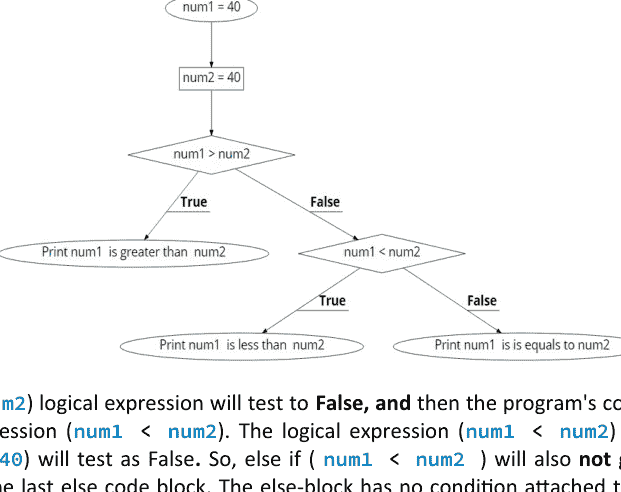

逻辑表达式 (num1 > num2) 的测试结果为**假**，然后程序的控制流将测试下一个逻辑表达式 (num1 < num2)。逻辑表达式 (num1 < num2) 的测试结果将为**假**，因为 (40 < 40) 的测试结果为假。因此，else if ( num1 < num2 ) 也**不会被执行**，最终执行最后一个else代码块。else块没有附加任何条件。当所有条件都失败时，**最后一个else代码块**将被执行。它是一个默认块，如果没有其他块被执行，至少这个块会被执行。

```python
StatementIfElseIf.py

num1 = 40

num2 = 40

if num1 > num2:
    print(num1," is greater than ", num2)
elif num1 < num2:
    print(num1," is less than ",num2)
else:
    print(num1," equals to ",num1)
```

### 输出

40 equals to 40

*阶梯式if-else问题*：一所大学想出了一个主意，通过退还计算机科学学生部分双学期课程费用来鼓励他们。大学管理层制定了以下资格条件。此外，如果学生获得0级成绩，他们将被宣布不及格。
如果学生获得5级成绩，他们将有资格获得35%的学费退款。
如果学生获得4级成绩，他们将有资格获得25%的学费退款。
如果学生获得3级成绩，他们将有资格获得20%的学费退款。
如果学生获得2级成绩，他们将有资格获得10%的学费退款。
如果学生获得1级成绩，他们将勉强及格。

```
LadderIfElse.py
grade = 6
if grade == 1:
    print("35% fee refund.")
elif grade == 2:
    print("25% fee refund.")
elif grade == 3:
    print("20% fee refund.")
elif grade == 4:
    print("10% fee refund.")
elif grade == 5:
    print("Passed with margin.")
elif grade == 0:
    print("Failed, please retry.")
else:
    print("Invalid grade ? ", grade)
```

它将按顺序测试**if条件**，直到其中一个**if条件**变为**真**。这种包含多个`elif`的类型也称为**阶梯式else-if**，这基本上不是一个好的做法。两到三个**elif条件**被认为是可接受的，此外，**elif条件**被强烈不鼓励，因为它降低了代码的可读性。

**那么出路是什么？**
答案是实现一个**switch-case**结构。我们使用Python内置的字典结构，它执行成绩值和相应打印消息之间的映射。字典基本上是键值对的集合。

| 成绩（键） | 打印消息（字符串值） | 字典示例 |
| :--- | :--- | :--- |
| **映射 0 →** | "Failed, please retry." | grade_message = {0: "Failed, please retry.", |
| **映射 1 →** | "35% fee refund." | 1: "35% fee refund.", |
| **映射 2 →** | "25% fee refund." | 2: "25% fee refund.", |
| **映射 3 →** | "20% fee refund." | 3: "20% fee refund.", |
| **映射 4 →** | "10% fee refund." | 4: "10% fee refund.", |
| **映射 5 →** | "Passed with margin." | 5: "Passed with margin."} |
| **映射 其他值 →** | "Invalid grade ?" | |

让我们将阶梯式 if-else 语句转换为 switch-case。那么，之前的代码 `LadderIfElse.py` 可以重写为：

```
LadderIfElseToSwitchCase.py
# 用于将成绩等级映射到消息的字典。
grade_message = {
    0: "Failed, please retry.",
    1: "35% fee refund.",
    2: "25% fee refund.",
    3: "20% fee refund.",
    4: "10% fee refund.",
    5: "Passed with margin."
}

# 使用 get() 方法打印通过字典 grade_message 映射到成绩等级的消息。
grade = 2
message = grade_message.get(grade, "Invalid grade ? ")
print(" grade = 2 : ", message)

# 未列出的成绩等级值的默认消息。
grade = 6
message = grade_message.get(grade, "Invalid grade ? ")
print(" grade = 6 : ", message)
```

输出

```
grade = 2 : 25% fee refund.
grade = 6 : Invalid grade ?
```

Python 使用字典实现的 switch-case 是处理阶梯式 if 条件的一种优雅方式。

问题：编写合适的字典和程序来打印星期二和星期日。

| 等级（键） | 打印消息（值为字符串） | 字典？ |
| :--- | :--- | :--- |
| 映射 0 → | "Sunday" | |
| 映射 1 → | "Monday" | |
| 映射 2 → | "Tuesday" | |
| 映射 3 → | "Wednesday" | |
| 映射 4 → | "Thursday" | |
| 映射 5 → | "Friday" | |
| 映射 6 → | "Saturday" | |
| 映射其他值 → | "Day – None " | |

### 关于 for 循环

重复性的特点有助于以惊人的效率自动化繁琐的数据处理工作，相比手动操作。编程中一种重复控制类型被称为 **for 语句** 或 **for 循环**。让我们考虑一个名为 `counter` 的整数变量。根据定义，整数变量一次只能存储一个值。我们希望这个 **变量：counter** 能够按照以下顺序，有计划地逐一存储单个数据：

2, 4, 6, 8, 10, 12, 14, 16, 18, 20

让我们计算序列中所有连续值对之间的差值。这意味着我们需要计算 **（下一个值 — 上一个值）= 值差**。这个值差在所有 **（下一个值 — 上一个值）** 对中应该是相同的。让我们为给定的序列计算值差。

| 序列 | 下一个 - 上一个 | 差值 | 变量：counter 更新 | 最终值 |
| :--- | :--- | :--- | :--- | :--- |
| 2 | | | counter = 2 | 2 |
| 4 | 4 – 2 | 2 | counter = counter + 2 | 2 + 2 = 4 |
| 6 | 6 – 4 | 2 | counter = counter + 2 | 4 + 2 = 6 |
| 8 | 8 – 6 | 2 | counter = counter + 2 | 6 + 2 = 8 |
| 10 | 10 – 8 | 2 | counter = counter + 2 | 8 + 2 = 10 |
| 12 | 12 -10 | 2 | counter = counter + 2 | 10 + 2 = 12 |
| 14 | 14 -12 | 2 | counter = counter + 2 | 12 + 2 = 14 |
| 16 | 16 – 14 | 2 | counter = counter + 2 | 14 + 2 = 16 |
| 18 | 18 – 16 | 2 | counter = counter + 2 | 16 + 2 = 18 |
| 20 | 20 – 18 | 2 | counter = counter + 2 | 18 + 2 = 20 |

由于值差是相同的，我们将其称为公差，在这个序列中是 2。根据变量的定义，我们可以使用 **变量：counter** 来表示存储一个值序列。请执行以下程序以确认该序列。

```
SequenceWithoutForLoop.py
counter = 2
print(counter)
counter = counter + 2
print(counter)
counter = counter + 2
print(counter)
counter = counter + 2
print(counter)
counter = counter + 2
print(counter)
counter = counter + 2
print(counter)
counter = counter + 2
print(counter)
counter = counter + 2
print(counter)
counter = counter + 2
print(counter)
counter = counter + 2
print(counter)
counter = counter + 2
print(counter)
counter = counter + 2
print(counter)
```

-   假设这个序列变得非常大，比如 2,4,6,………, 2000。我们将需要编写大约 4000 行代码，并重复相同的编程语句集大约 2000 次。
-   在处理高计算密集型数据或大型数据处理活动时，与计算机相比，人类在准确性和生产力方面并不可靠。除非有人去做，否则没有什么是自动的。我们可以使用 **for 循环** 和 **`range()`** 函数来自动化生成所考虑的序列。
-   **for 循环** 有助于在 **值范围** 内重复一组编程语句。当我们谈论范围时，它必须有一个起始值和一个结束值。

我们可以用三个输入来描述 **`range()`** 函数，如下所示：

**`range(start_value, end_value+1, common_difference)`** 其中 **`start_value < end_value`**

带有 `range()` 函数的 for 循环在概念上执行以下操作。

-   **`start_value`** 是初始化变量的简单方式，无论如何，重复循环过程的某个点必须开始。
-   **`end_value`** 是一个逻辑表达式，它计算一个布尔值，要么是 **`True`**，要么是 **`False`**。基于这个（**`True/False`**），**for 循环** 控制结构决定是否重复该语句集。
-   **`common_difference`** 是变量值在固定较小步长（递增/递减）中的变化，仅在 **for 循环** 块中的所有语句执行完毕后发生。它将通过递增或递减变量的值来更新它，直到它与 **`end_value`** 匹配。

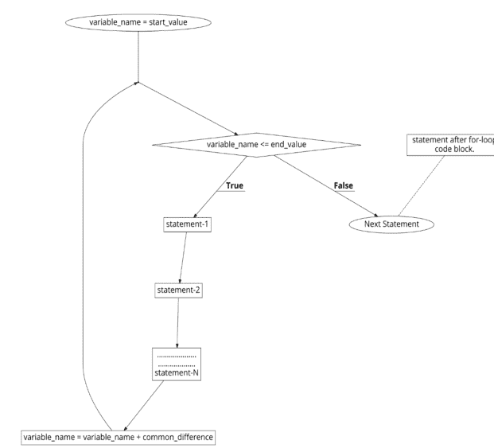

```
# 第二个输入 -> for 循环的结束。为了包含边界值，需要 +1。
for variable_name in range(start_value, end_value + 1, common_difference):
    statement-1
    statement-2
    ............
    ............
    statement-N
Next Statement # for 循环代码块之后的语句。
```

从给定的序列中观察到一些信息。

2, 4, 6, 8, 10, 12, 14, 16, 18, 20

起始值或最小值是 2。结束值或最大值是 20。我们也知道公差值是 2。因此，带有三个输入的 **`range()`** 函数可以表示为 **`range(2, 20 + 1, 2)`**。

带有函数 **`range(2, 20, 2)`** 的 **for 循环** 可以编码如下：

```
SequenceWithForLoop.py
# counter : 一个整数变量
# range 函数 :-
# 第一个输入 -> for 循环的开始。
# 第二个输入 -> for 循环的结束。为了包含边界值，需要 +1。
# 第三个输入 -> 公差值
for counter in range(2, 20 + 1, 2):
    print(counter)
```

输出

```
2
4
6
8
10
12
14
16
18
20
```

如果我们在 range 函数中省略第三个输入，公差值默认为 1。

```
ForLoopWithRangeTwoInputs.py
# counter : 一个整数变量
# range 函数 :-
# 第一个输入 -> for 循环的开始
# 第二个输入 -> for 循环的结束。为了包含边界值，需要 +1。
for counter in range(2, 5 + 1):
    print(counter)
```

输出

```
2
3
4
5
```

**带有单个输入的 `range()` 函数** 默认将从值 0 开始序列，公差值将为 1。带有函数 **`range(5+1)`** 的 **for 循环** 可以表示如下：

```
ForLoopWithRangeOneInput.py
# counter : 一个整数变量
# 单个输入 = (5 + 1) -> for 循环的结束。
# range 函数排除结束边界值，因此需要 +1。
for counter in range(5 + 1):
    print(counter)
```

输出

```
0
1
2
3
4
5
```

### 递减 For 循环：

让我们表示 `range(start_value, end_value -1, common_difference)`，其中 `start_value > end_value`，`common_difference` 为负值。通常，我们可以将递减 for 循环表示为：

```
# 第二个输入 -> for 循环的结束。为了包含边界值，需要 -1。
for variable_name in range(start_value, end_value - 1, common_difference):
    statement-1
    statement-2
    ............
    ............
    statement-N
Next Statement # for 循环代码块之后的语句。
```

让我们尝试反转之前的序列为：

20, 18, 16, 14, 12, 10, 8, 6, 4, 2

起始值或最大值是 20。结束值或最小值是 2。我们也知道公差值是 -2。因此，带有三个输入的 `range()` 函数可以表示为 `range(20, 2 -1, -2)`。

```
ForLoopDecrement.py
# counter : 一个整数变量
# range 函数 :-
# 第一个输入 -> for 循环的开始。
# 第二个输入 -> for 循环的结束。为了包含边界值，需要 -1。
# 第三个输入 -> 公差为负值
for counter in range(20, 2 -1, -2):
    print(counter)
```

输出

```
20
18
16
14
12
10
8
6
4
2
```

问题：为给定的序列编写 for 循环。

-10
-9
-8
-7
-6
-5
-4
-3
-2

### 带有 break 和 continue 关键字的 for 循环

-   在 for 循环中，任何执行 **break** 关键字的逻辑条件都会停止循环的进一步重复。这类似于**一辆行驶中的汽车**在司机踩下刹车时**恰好停止**。
-   在 for 循环中，任何执行 **continue** 关键字的逻辑条件；它会继续下一次迭代，而不执行 for 循环代码块中位于其后的编程语句。

```python
ForLoopContinueNext.py

for cnt in range(1,10 + 1):
    if cnt <= 3:
        print("Keyword continue is throwing ",end="")
        print("control of program back.\n")
        continue

    print("Please Join Us...!!!\n")
    if cnt == 5:
        print("keyword break at cnt =",cnt, "\n")
        break
    print("Please look back...\n")
```

### 输出

Keyword continue is throwing back.
Keyword continue is throwing back.
Keyword continue is throwing back.
Please Join Us...!!!
Please look back...
Please Join Us...!!!
keyword break at cnt = 5

### 嵌套 for 循环/内部 for 循环

我们之前已经看到过包含 if 语句或其他编程语句的 **for 循环**示例。如果我们在 **for 循环**内部放置另一个 **for 循环**，而不是编程语句，那么情况会如何呢？例如：

```python
for counter in range(5,0,-1):
    print(1*counter) # statement1
    print(2*counter) # statement2
    print(3*counter) # statement3
```

我们知道它将按顺序执行这些考虑的语句。首先，**statement1** 将被执行，然后是 **statement2**，最后是 **statement3**。当我们执行这段程序时，这些语句将重复五次。如果我们用另一个 for 循环代替任何简单的语句，主要的工作方式并不会改变。我们需要认为**内部 for 循环**本身就像其他单个编程语句一样。假设程序的控制流按顺序执行编程语句，并发现一个**内部 for 循环**。它将完全执行**内部 for 循环**，然后执行下一个编程语句（如果有的话）。例如：

```python
for counter in range(5,0,-1):
    print(1*counter) # statement1
    # The for-loop is a statement2
    for inner in range(1,5):
        print(inner)
    print(3*counter) # statement3
```

> 请将**嵌套 for 循环**视为**单个**编程语句

通常，**statement1** 首先完成。内部 for 循环将执行 5 次重复，最后执行 **statement3**。正如外部 for 循环的结构所建议的那样，这三条语句将重复五次。放置在另一个 for 循环代码块内的 for 循环被称为**内部 for 循环**或**嵌套 for 循环**。

对于外部 for 循环的每个新值，内部 for 循环将**从头开始重新执行**。

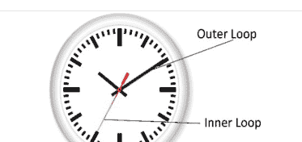

如果我们尝试将其与时钟联系起来，并遵循以下假设，就很容易理解这个概念：

-   内部循环 → 它就像时钟的“秒”针
-   外部循环 → 它就像时钟的“分”针

在时钟中，当“秒”针完成一个周期后，“分”针才会更新计数器值 1，而不是在此之前。

**内部** for 循环将在**外部** for 循环的每个新计数值继续重复之前完全执行，这取决于其循环条件。

```python
NestedForLoop.py
for out in range(1,3):
    print("OUTER count No.",out)
        # nested for-loop: always re-starts and finishes
        # completely for every new value of outer for-loop.
    for In in range(1,4):
        print(" <INNER> count No.",In)
```

```
Output
OUTER count No.1
 <INNER> count No.1
 <INNER> count No.2
 <INNER> count No.3
OUTER count No.2
 <INNER> count No.1
 <INNER> count No.2
 <INNER> count No.3
```

### 嵌套循环：初学者程序员的最佳伙伴

最好的朋友是这样一个人，无论何时需要，他不仅欣赏我们美好的品质，还会通过指出我们的弱点或错误来给我们一个现实的检验。嵌套循环在学习编程逻辑时扮演着这样一个最佳伙伴的角色，它也对我们的编程逻辑有多“真实”给出了一个现实的检验。在我看来，**仅仅通过摆弄数字来练习编程逻辑并不是一个好主意**。这对于高中数学兴趣较少或没有兴趣的人来说，大多都是如此。许多人觉得基于数学问题练习编程逻辑很无聊。每个人都是不同的，每个人都有不同的耐心缓冲和学习节奏。学习编程应该有一个简单的方法。任何想要学习/提高编程的初学者都应该能够在最少技术内容的背景下，按照自己的学习节奏进行。该方法采用三步学习过程，通过图解练习来指导，以确保初学者熟悉编程的核心。

**第一步。** 清楚如何探索逻辑条件。
**第二步。** 清楚嵌套循环如何工作。
**第三步。** 研究简化编程逻辑的替代方法。
学习者在学习完这三个步骤后，应该有信心探索编程语言的高级功能。

### 为什么嵌套循环如此重要？

在外部 for 循环和内部 for 循环中，每个都用于在水平和垂直方向上输出数据，以给出二维输出。通常，外部 for 循环垂直移动控制，内部 for 循环水平输出数据。这给出了网格状的输出。循环的这个特定特性可以用来完善学习者的想象力。是的，逻辑构建是一项技能，可以使用简单的数学和常识来培养。一个人不一定非要非常擅长数学才能成为成功的程序员或软件开发者。如果学习者能够正确地想象外部和嵌套循环的行为，那么这个人将获得足够的编码信心。任何学科相关教学的首要要求应该是激发学生或学习者群体的兴趣。如果学习者与学科建立了深厚的联系，那么其余的学习将没有负担。本课程严格旨在享受学习。如果任何学习者学习本课程并诚实地遵循，他们无疑会看到努力的成果。

**嵌套循环为新的/新手/初学者/缺乏信心的程序员提供了良好的训练练习。** 一旦学习者对编程产生兴趣，那么所有的学习都将变得激动人心和令人兴奋。当学习者在独立开发编程逻辑方面获得一些信心时，这种兴趣自然会出现。为此，只需要很好地练习和涵盖适当深度的少数几件事。我强烈建议在寻求任何其他资源之前，先完整地阅读和练习本书。这本书帮助你更快地进步，它是编程的一种必要的热身。

我不认为那些放弃学习编程的人能力较差，但这并不能激发他们付出努力。无论一个人的学习节奏如何，这并不重要，重要的是学习的投入。没有兴趣，真正的投入是不可能的。这本书完全是关于正确安装兴趣和信心，让任何人都可以通过朝着正确的方向付出一些努力来进行编程。

练习和问题的选择是为了让学习自然地适应任何学习者。学习者需要遵循本书中提到的分步说明。随着你自然地学习和完成训练，编程的信心和兴趣将得到保证。这不仅仅是一本书，基本上是一个培训指南。初始学习阶段肯定需要一些努力和耐心。一旦学习者理解了所需的基础知识，由于对学科的极大热爱，进一步的提高将突飞猛进。这将在练习中自然出现。这些练习集是为教授初学者水平且没有或有一些编程经验的人而进行的实验的结果。完成这些练习后，每个人都能在 2-3 个月内建立良好的信心水平。最精彩的部分是学生们对编程产生了兴趣。编程对他们来说从未变得无聊或成为负担。学习者将能够自然地培养耐心的倾向，推动他/她解决问题并完全专注。简而言之，它使学习变得有趣。

**练习GB1。** 在一次迭代中，对于外部 for 循环的每个单一值，内部 for 循环都会完全执行。除非内部 for 循环完全执行，否则外部 for 循环的下一次迭代不会发生。以下程序演示了为每个行值垂直打印列值。

```python
ForLoopEveryRowAllColumns.py

TOTAL_ROWS = 3
TOTAL_COLUMNS = 3
for row in range(1,TOTAL_ROWS + 1):
    for col in range(1,TOTAL_COLUMNS + 1):
        print( "Row = ", row, " |  Col = ", col)
    print("-----------------------------------")
```

```
Output

Row = 1| Col = 1
Row = 1| Col = 2
Row = 1| Col = 3
-----------------------------------
Row = 2| Col = 1
Row = 2| Col = 2
Row = 2| Col = 3
-----------------------------------
Row = 3| Col = 1
Row = 3| Col = 2
Row = 3| Col = 3
-----------------------------------
```

### 练习GB2：对于行的每个迭代值，水平打印列的迭代值。行值应出现在每个不同的行中。因此，行级迭代值应垂直打印。

```python
ForLoopEveryRowAllColumnsHorizontally.py
TOTAL_ROWS = 3
TOTAL_COLUMNS = 3
for row in range(1,TOTAL_ROWS+1):
    print( "Row = ",row,"|",end="")
    # 在同一行打印
    for col in range(1,TOTAL_COLUMNS +1):
        print( " Col = ",col,end="")
    # 移动到下一行并打印
    print()
```

**输出**

Row = 1 | Col = 1 Col = 2 Col = 3
Row = 2 | Col = 1 Col = 2 Col = 3
Row = 3 | Col = 1 Col = 2 Col = 3

### 练习GB3：将行迭代和列迭代值打印为 (row, col)，如下所示

(1,1) (1,2) (1,3) (1,4) (1,5)

(2,1) (2,2) (2,3) (2,4) (2,5)

(3,1) (3,2) (3,3) (3,4) (3,5)

(4,1) (4,2) (4,3) (4,4) (4,5)

(5,1) (5,2) (5,3) (5,4) (5,5)

```python
ForLoopCoordinateRepresentation.py
TOTAL_ROWS = 5
TOTAL_COLUMNS = 5

for row in range( 1, TOTAL_ROWS + 1 ):
    # 在同一行打印
    for col in range(1,TOTAL_COLUMNS +1):
        print("(",row , ",",col,end=") ")
    # 移动到下一行并打印
    print()
```

**输出**

(1,1) (1,2) (1,3) (1,4) (1,5)
(2,1) (2,2) (2,3) (2,4) (2,5)
(3,1) (3,2) (3,3) (3,4) (3,5)
(4,1) (4,2) (4,3) (4,4) (4,5)
(5,1) (5,2) (5,3) (5,4) (5,5)

### 练习GB4：通过为每个 (row, col) 迭代值打印字符“*”来生成图案。

```python
RowColumnStars.py
TOTAL_ROWS = 7
TOTAL_COLUMNS = 7
for row in range(1,TOTAL_ROWS+1):
    for col in range(1, TOTAL_COLUMNS + 1 ):
        # 在同一行打印 "*" 字符
        print("* ",end=" " )
        # 将控制移动到下一行
        # "*" 字符的打印从下一行开始
    print()
```

**输出**

```
* * * * * * *
* * * * * * *
* * * * * * *
* * * * * * *
* * * * * * *
* * * * * * *
* * * * * * *
```

### 问题GB3：编写一个程序，考虑行和列为5，生成以下输出。

```
*_*_*_*_*
*_*_*_*_*
*_*_*_*_*
*_*_*_*_*
*_*_*_*_*
```

### 问题GB4：请修正以下程序。

```python
TOTAL_ROWS = 4
TOTAL_COLUMNS = 4
for row in range(1,TOTAL_ROWS+1):
    for col in range(1, TOTAL_COLUMNS + 1 ):
        # 在同一行打印 "*" 字符
        print("* ",end=" " )
    print()
```

**输出**

预期输出

```
*
*
*
*
*
*
*
*
*
*
*
*
*
*
*
*
*
*
*
*
```

```
* * * *
* * * *
* * * *
* * * *
```

# JustLoopIt：为每个给定的输出编写一个单独的程序。

### LoopingProblemA

### LoopingProblemB

1==1 1==2 1==3 1==4 1==5
2==1 2==2 2==3 2==4 2==5
3==1 3==2 3==3 3==4 3==5
4==1 4==2 4==3 4==4 4==5
5==1 5==2 5==3 5==4 5==5

1!=1 1!=2 1!=3 1!=4 1!=5 1!=6 1!=7 1!=8
2!=1 2!=2 2!=3 2!=4 2!=5 2!=6 2!=7 2!=8
3!=1 3!=2 3!=3 3!=4 3!=5 3!=6 3!=7 3!=8
4!=1 4!=2 4!=3 4!=4 4!=5 4!=6 4!=7 4!=8
5!=1 5!=2 5!=3 5!=4 5!=5 5!=6 5!=7 5!=8

### LoopingProblemC

### LoopingProblemD

1<=1 1<=2 1<=3 1<=4 1<=5
2<=1 2<=2 2<=3 2<=4 2<=5
3<=1 3<=2 3<=3 3<=4 3<=5
4<=1 4<=2 4<=3 4<=4 4<=5
5<=1 5<=2 5<=3 5<=4 5<=5

3<1 3<2 3<3 3<4 3<5 3<6 3<7 3<8
4<1 4<2 4<3 4<4 4<5 4<6 4<7 4<8
5<1 5<2 5<3 5<4 5<5 5<6 5<7 5<8
6<1 6<2 6<3 6<4 6<5 6<6 6<7 6<8
7<1 7<2 7<3 7<4 7<5 7<6 7<7 7<8
8<1 8<2 8<3 8<4 8<5 8<6 8<7 8<8

### LoopingProblemE

### LoopingProblemF

1>=1 1>=2 1>=3 1>=4
2>=1 2>=2 2>=3 2>=4
3>=1 3>=2 3>=3 3>=4
4>=1 4>=2 4>=3 4>=4
1>=1 1>=1 1>=1 1>=1
2>=2 2>=2 2>=2 2>=2
3>=3 3>=3 3>=3 3>=3
4>=4 4>=4 4>=4 4>=4

1>=1 1>=2 1>=3 1>=4 1>=5 1>=6 1>=7 1>=8
2>=1 2>=2 2>=3 2>=4 2>=5 2>=6 2>=7 2>=8
3>=1 3>=2 3>=3 3>=4 3>=5 3>=6 3>=7 3>=8
4>=1 4>=2 4>=3 4>=4 4>=5 4>=6 4>=7 4>=8
5>=1 5>=2 5>=3 5>=4 5>=5 5>=6 5>=7 5>=8
6>=8 5>=7 5>=6 5>=5 5>=4 5>=3 5>=2 5>=1
7>=8 5>=7 5>=6 5>=5 5>=4 5>=3 5>=2 5>=1
8>=8 5>=7 5>=6 5>=5 5>=4 5>=3 5>=2 5>=1

### LoopingProblemG

### LoopingProblemH

1!=1 1!=3 1!=5 1!=7
2!=1 2!=3 2!=5 2!=7
3!=1 3!=3 3!=5 3!=7
4!=1 4!=3 4!=5 4!=7
5!=1 5!=3 5!=5 5!=7
4!=1 4!=3 4!=5 4!=7
3!=1 3!=3 3!=5 3!=7
2!=1 2!=3 2!=5 2!=7
1!=1 1!=3 1!=5 1!=7

2>=2 2>=4 2>=6 2>=8
3>=2 3>=4 3>=6 3>=8
2>=2 2>=4 2>=6 2>=8
1>=2 1>=4 1>=6 1>=8
2>=2 2>=4 2>=6 2>=8
3>=2 3>=4 3>=6 3>=8
4>=2 4>=4 4>=6 4>=8
5>=2 5>=4 5>=6 5>=8

### 应用逻辑条件的艺术

逻辑条件是任何软件应用程序工作功能的防御机制。发生的大多数错误/缺陷都是由于对逻辑条件的处理不当造成的。它主要包含**逻辑和比较运算符**。编程逻辑最重要的元素之一就是应用逻辑条件。它控制程序的流程，类似于道路交通控制系统的工作方式。道路交通控制系统通过有条件地允许或阻止流向特定道路的人群部分，来逻辑地分配人群。同样，逻辑条件的执行就像一个交通控制系统，允许或不允许执行程序选定的编程语句集。如果路边的交通控制系统不能正常工作，它可能会造成交通堵塞和事故，而不是引导交通。同样，错误的逻辑条件会给出不可预测的结果。我们将学习如何能够熟练地准确应用逻辑条件。

路边的标志牌有特定的用途。同样，在编程中，我们必须理解使用每个运算符背后的动机。因此，我们必须根据其特定目的在逻辑条件中使用运算符，这些运算符可以精确地影响程序的输出。同样，我们将尝试理解逻辑条件如何影响程序的最终输出。我们将使用我们版本的简单草稿本首先手动验证我们的逻辑条件。它可能会让你想起填字游戏盒。让我们考虑一个类似的盒子，并假设它包含8行8列。为了表示行和列，我们可以考虑两个变量，分别命名为**row**和**col**。

变量 **row** → 表示 row=1, 2,3,4,5,6,7,8 的值。

变量 **col** → 表示 col=1, 2,3,4,5,6,7,8 的值。

每个方框由 (row, col) 值对标识。因此，值对 (1, 1) 表示第1<sup>行</sup>和第1<sup>列</sup>。

| | col=1 | col=2 | col=3 | col=4 | col=5 | col=6 | col=7 | col=8 |
|---|---|---|---|---|---|---|---|---|
| **row=1** | 1,1 | 1,2 | 1,3 | 1,4 | 1,5 | 1,6 | 1,7 | 1,8 |
| **row=2** | 2,1 | 2,2 | 2,3 | 2,4 | 2,5 | 2,6 | 2,7 | 2,8 |
| **row=3** | 3,1 | 3,2 | 3,3 | 3,4 | 3,5 | 3,6 | 3,7 | 3,8 |
| **row=4** | 4,1 | 4,2 | 4,3 | 4,4 | 4,5 | 4,6 | 4,7 | 4,8 |
| **row=5** | 5,1 | 5,2 | 5,3 | 5,4 | 5,5 | 5,6 | 5,7 | 5,8 |
| **row=6** | 6,1 | 6,2 | 6,3 | 6,4 | 6,5 | 6,6 | 6,7 | 6,8 |
| **row=7** | 7,1 | 7,2 | 7,3 | 7,4 | 7,5 | 7,6 | 7,7 | 7,8 |
| **row=8** | 8,1 | 8,2 | 8,3 | 8,4 | 8,5 | 8,6 | 8,7 | 8,8 |

**游戏规则：** *无论逻辑条件在哪里匹配，你都需要在小方框中放入字符 *。*

所有 (row, col) 值对代表完整的信息或数据。它有8行8列，构成64个 (row, col) 值对。我们将从总共可用的64个 (row, col) 值对中选择正确的值对放入此方框，以映射逻辑条件。应用不同的逻辑条件意味着手动选择匹配每个逻辑条件的 (row, col) 值对。这些都是非常简单且基于观察的练习，可以帮助我们理解逻辑条件在核心层面是如何工作的。总的来说，它将有助于明确地提高我们的逻辑思维能力，而不是以不确定或猜测的方式。

**首先，我们练习手动编写逻辑条件。我们尝试通过对非常简单结构的字母等基于简单图片的练习来确认对应用逻辑条件的理解。** 是的，当然，我们可以通过编写程序来验证所有这些逻辑条件，这将是我们学习的下一个层次。重要的是，每个逻辑条件都可以通过使用**嵌套循环**编写程序来轻松验证。使用嵌套循环将是我们学习的下一个主要步骤。我们将尝试将我们手动书写字母的动作转化为一组逻辑条件。我们将从这种基于图片的练习中获得可计数的经验，因为我们可以学习如何应用逻辑条件。所考虑的字母图片建议只选择特定的 (row, col) 值对，而忽略其他值对。这将迫使我们思考可能是什么准确、合乎逻辑的条件。由于它基于简单的数学和常识，手动验证这些逻辑条件不会很困难。当我们进行这样的练习，从简单图片转换到逻辑条件或反之亦然时，它有助于我们提高对编程逻辑的可视化能力。

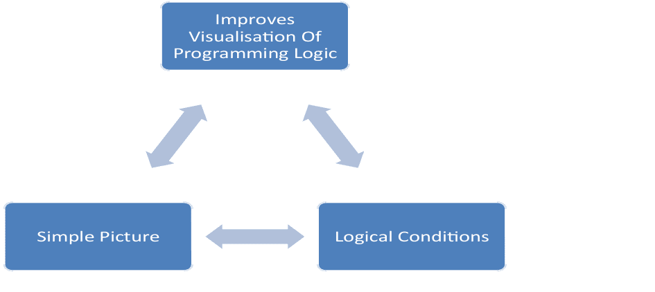

不同的字母意味着不同的图片。因此，总的来说，它帮助我们了解某些程序如何工作以给出目标结果。此外，我们可以通过将所有这些逻辑条件放入程序中并执行它来验证结果。对于新手/绝对初学者程序员来说，通过编写程序来验证它的时机尚未成熟。
对于那些已经在任何编程语言中达到条件语句和嵌套循环程度的有经验者，他们当然可以继续测试他们的逻辑条件。我们应该知道的第一个重要教训是如何给出正确的逻辑条件。我们可以通过将不同简单结构的字母练习转化为等效的逻辑条件，来清晰地学习逻辑构建的这个重要方面。

### 将逻辑条件转换为简单图形

我们需要以基于简单图形的练习形式来表达逻辑条件。我们需要用 * 字符标记那些恰好符合逻辑条件的方格。每个方格由唯一的（行，列）值对表示。为了理解如何使用特定逻辑条件选择方格，以下练习将进行展示。

**练习YB1：** 在以下5X5方格中表达逻辑条件：(row == col)。

条件 (row == col) 要求在5X5方格中找到行值和列值相等的（行，列）值对。我们注意到，在对角线方格上，行和列的值是相等的。

| | col=1 | col=2 | col=3 | col=4 | col=5 |
|---|---|---|---|---|---|
| row=1 | 1,1 | 1,2 | 1,3 | 1,4 | 1,5 |
| row=2 | 2,1 | 2,2 | 2,3 | 2,4 | 2,5 |
| row=3 | 3,1 | 3,2 | 3,3 | 3,4 | 3,5 |
| row=4 | 4,1 | 4,2 | 4,3 | 4,4 | 4,5 |
| row=5 | 5,1 | 5,2 | 5,3 | 5,4 | 5,5 |

| | col=1 | col=2 | col=3 | col=4 | col=5 |
|---|---|---|---|---|---|
| row=1 | 1,1 * | 1,2 | 1,3 | 1,4 | 1,5 |
| row=2 | 2,1 | 2,2 * | 2,3 | 2,4 | 2,5 |
| row=3 | 3,1 | 3,2 | 3,3 * | 3,4 | 3,5 |
| row=4 | 4,1 | 4,2 | 4,3 | 4,4 * | 4,5 |
| row=5 | 5,1 | 5,2 | 5,3 | 5,4 | 5,5* |

为了清晰理解，行和列值相等的方格用粗边框标记。

根据我们的规则，我们应该在行和列值相等的方格上放置 * 字符。

移除行和列值不相等的其他（行，列）值对表明所考虑的逻辑条件没有选择它们。这仅仅意味着只有那些匹配给定逻辑条件的方格被选中并标记了 * 字符。通过这种方式，我们可以通过用 * 字符填充小方格来表示特定的逻辑条件。

因此，逻辑条件的含义现在采取了视觉形式。逻辑条件的表达被转换为使用 * 字符绘制的对角线的简单图形。这有助于我们理解在使用逻辑条件时，数据的过滤/选择是如何发生的。

| | col=1 | col=2 | col=3 | col=4 | col=5 |
|---|---|---|---|---|---|
| row=1 | 1,1* | | | | |
| row=2 | | 2,2* | | | |
| row=3 | | | 3,3* | | |
| row=4 | | | | 4,4* | |
| row=5 | | | | | 5,5* |

| | col=1 | col=2 | col=3 | col=4 | col=5 |
|---|---|---|---|---|---|
| row=1 | * | | | | |
| row=2 | | * | | | |
| row=3 | | | * | | |
| row=4 | | | | * | |
| row=5 | | | | | * |

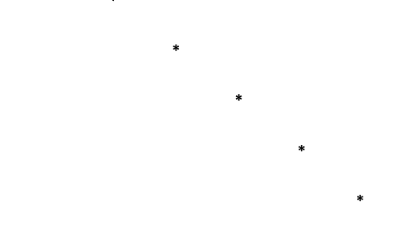

我们将逻辑条件的表达式转换为使用 * 字符绘制的对角线的简单图形。这种有针对性的尝试精进了我们应用逻辑条件的技能。

### 练习YB2. 在以下5X5方格中表达逻辑条件：(row == 5) 或 (col==1)。

让我们先看逻辑条件的一部分 **(row==5)**，它表示行等于5。行值为5的方格将是我们选择的方格，无论 **col** 的值如何。可以通过突出显示所选方格的边框来引起注意。

| | col=1 | col=2 | col=3 | col=4 | col=5 |
|---|---|---|---|---|---|
| row=1 | 1,1 | 1,2 | 1,3 | 1,4 | 1,5 |
| row=2 | 2,1 | 2,2 | 2,3 | 2,4 | 2,5 |
| row=3 | 3,1 | 3,2 | 3,3 | 3,4 | 3,5 |
| row=4 | 4,1 | 4,2 | 4,3 | 4,4 | 4,5 |
| row=5 | 5,1 | 5,2 | 5,3 | 5,4 | 5,5 |

| | col=1 | col=2 | col=3 | col=4 | col=5 |
|---|---|---|---|---|---|
| row=1 | 1,1 | 1,2 | 1,3 | 1,4 | 1,5 |
| row=2 | 2,1 | 2,2 | 2,3 | 2,4 | 2,5 |
| row=3 | 3,1 | 3,2 | 3,3 | 3,4 | 3,5 |
| row=4 | 4,1 | 4,2 | 4,3 | 4,4 | 4,5 |
| row=5 | *5,1 | *5,2 | *5,3 | *5,4 | *5,5 |

类似地，让我们看逻辑条件的另一部分，即 **(col ==1)**。同样，让我们选择列值为1的方格，无论行值如何，并通过突出显示所选方格的边框。

| | col=1 | col=2 | col=3 | col=4 | col=5 |
|---|---|---|---|---|---|
| row=1 | 1,1 | 1,2 | 1,3 | 1,4 | 1,5 |
| row=2 | 2,1 | 2,2 | 2,3 | 2,4 | 2,5 |
| row=3 | 3,1 | 3,2 | 3,3 | 3,4 | 3,5 |
| row=4 | 4,1 | 4,2 | 4,3 | 4,4 | 4,5 |
| row=5 | *5,1 | *5,2 | *5,3 | *5,4 | *5,5 |

| | col=1 | col=2 | col=3 | col=4 | col=5 |
|---|---|---|---|---|---|
| row=1 | 1,1* | 1,2 | 1,3 | 1,4 | 1,5 |
| row=2 | 2,1* | 2,2 | 2,3 | 2,4 | 2,5 |
| row=3 | 3,1* | 3,2 | 3,3 | 3,4 | 3,5 |
| row=4 | 4,1* | 4,2 | 4,3 | 4,4 | 4,5 |
| row=5 | *5,1 | *5,2 | *5,3 | *5,4 | *5,5 |

| | col=1 | col=2 | col=3 | col=4 | col=5 |
|---|---|---|---|---|---|
| row=1 | 1,1* | | | | |
| row=2 | 2,1* | | | | |
| row=3 | 3,1* | | | | |
| row=4 | 4,1* | | | | |
| row=5 | *5,1 | *5,2 | *5,3 | *5,4 | *5,5 |

| | | | | | |
|---|---|---|---|---|---|
| | * | | | | |
| | * | | | | |
| | * | | | | |
| | * | | | | |
| | * | * | * | * | * |

我们可以看到几种不同风格的字母L。


如果我们尝试将每种不同风格的字母L放入8行8列的方格中并使用 * 字符，我们脑海中会闪过哪些可能的想法？不同的字母风格意味着不同的图形，每个图形都会有不同的（行，列）值对集合。

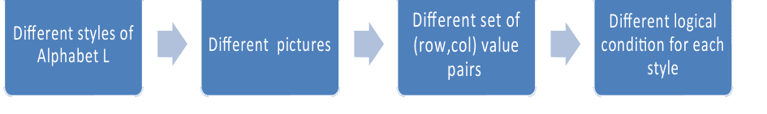

很明显，使用 * 字符我们无法获得像素完美的图形。我们需要理解的最重要的一点是，**不同的图形输出意味着不同的逻辑条件**。这些图形对于开始学习应用逻辑条件来说有些高级。

我们当然可以从一些非常简单的东西开始，这样即使是上学的孩子也无法找借口不喜欢编程。我们将选择一些对大多数人来说非常容易和熟悉的东西。我们将考虑编码结构非常简单的英文字母，如下例所示。

| 字母 A | 字母 C | 字母 D |
| :--- | :--- | :--- |
| * * * * * | * * * * | * * * * |
| * * | * | * * |
| * * | * | * * |
| * * * * * | * | * * |
| * * | * | * * |
| * * | * | * * |
| * * | * * * * | * * * * |

让我们回忆一下我们学生时代关于英文字母的学习经历。为了学习如何书写字母，我们的老师、父母和其他人教导了我们。他们以某种逻辑方式教我们书写字母。书写字母所应用的总逻辑因字母而异。由于每个字母的整体结构不同，我们有机会练习各种类型的逻辑条件。

### 将简单图形转换为逻辑条件

我们将通过尝试从使用 * 字符绘制的非常简单的英文字母中获取逻辑条件来进行一些练习。我们可以考虑7行5列的方格。我们必须只选择那些有助于构成所需字母的（行，列）值对。我们将仅为那些匹配 * 字符的（行，列）值对设置逻辑条件。

**练习YBA：字母A需要放入一个7X5的方格中。**

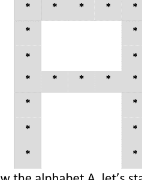

| | col=1 | col=2 | col=3 | col=4 | col=5 |
|---|---|---|---|---|---|
| row=1 | 1,1 | 1,2 | 1,3 | 1,4 | 1,5 |
| row=2 | 2,1 | 2,2 | 2,3 | 2,4 | 2,5 |
| row=3 | 3,1 | 3,2 | 3,3 | 3,4 | 3,5 |
| row=4 | 4,1 | 4,2 | 4,3 | 4,4 | 4,5 |
| row=5 | 5,1 | 5,2 | 5,3 | 5,4 | 5,5 |
| row=6 | 6,1 | 6,2 | 6,3 | 6,4 | 6,5 |
| row=7 | 7,1 | 7,2 | 7,3 | 7,4 | 7,5 |

为了绘制字母A，让我们首先在第一行放置 * 字符。

因此逻辑条件将是 **row==1**，其中 == 是等于比较运算符。

| | col=1 | col=2 | col=3 | col=4 | col=5 |
|---|---|---|---|---|---|
| row=1 | 1,1* | 1,2* | 1,3* | 1,4* | 1,5* |
| row=2 | 2,1 | 2,2 | 2,3 | 2,4 | 2,5 |
| row=3 | 3,1 | 3,2 | 3,3 | 3,4 | 3,5 |
| row=4 | 4,1 | 4,2 | 4,3 | 4,4 | 4,5 |
| row=5 | 5,1 | 5,2 | 5,3 | 5,4 | 5,5 |
| row=6 | 6,1 | 6,2 | 6,3 | 6,4 | 6,5 |
| row=7 | 7,1 | 7,2 | 7,3 | 7,4 | 7,5 |

我们将使用逻辑或（ or ）条件运算符来添加更多数据。在我们的例子中，我们需要添加更多的 * 字符来完成字母A的另一部分。现在我们需要在第一列和最后一列放置 * 字符。因此，使用或（ or ）逻辑运算符添加 **(col==1)** 和 **(col==5)** 逻辑条件意味着需要在以下方格中添加更多星号（*）字符。

逻辑条件的更新如下所示：

**(row==1) or (col==1)**

**(row==1) or (col==1) or (col==5)**

| | col=1 | col=2 | col=3 | col=4 | col=5 |
|---|---|---|---|---|---|
| row=1 | 1,1* | 1,2* | 1,3* | 1,4* | 1,5* |
| row=2 | 2,1* | 2,2 | 2,3 | 2,4 | 2,5 |
| row=3 | 3,1* | 3,2 | 3,3 | 3,4 | 3,5 |
| row=4 | 4,1* | 4,2 | 4,3 | 4,4 | 4,5 |
| row=5 | 5,1* | 5,2 | 5,3 | 5,4 | 5,5 |
| row=6 | 6,1* | 6,2 | 6,3 | 6,4 | 6,5 |
| row=7 | 7,1* | 7,2 | 7,3 | 7,4 | 7,5* |

| | col=1 | col=2 | col=3 | col=4 | col=5 |
|---|---|---|---|---|---|
| row=1 | 1,1* | 1,2* | 1,3* | 1,4* | 1,5* |
| row=2 | 2,1* | 2,2 | 2,3 | 2,4 | 2,5* |
| row=3 | 3,1* | 3,2 | 3,3 | 3,4 | 3,5* |
| row=4 | 4,1* | 4,2 | 4,3 | 4,4 | 4,5* |
| row=5 | 5,1* | 5,2 | 5,3 | 5,4 | 5,5* |
| row=6 | 6,1* | 6,2 | 6,3 | 6,4 | 6,5* |
| row=7 | 7,1* | 7,2 | 7,3 | 7,4 | 7,5* |

在之前的逻辑条件上再添加一个条件（**row == 4**），以完成字母A的中间部分。现在，显示字母A的所有*字符的逻辑条件可以表示为：（**row==1**）或（**col==1**）或（**col==5**）或（**row==4**）。

| | col=1 | col=2 | col=3 | col=4 | col=5 |
|---|---|---|---|---|---|
| **row=1** | 1,1* | 1,2* | 1,3* | 1,4* | 1,5* |
| **row=2** | 2,1* | 2,2 | 2,3 | 2,4 | 2,5* |
| **row=3** | 3,1* | 3,2 | 3,3 | 3,4 | 3,5* |
| **row=4** | 4,1* | 4,2* | 4,3* | 4,4* | 4,5* |
| **row=5** | 5,1* | 5,2 | 5,3 | 5,4 | 5,5* |
| **row=6** | 6,1* | 6,2 | 6,3 | 6,4 | 6,5* |
| **row=7** | 7,1* | 7,2 | 7,3 | 7,4 | 7,5* |

**现在，移除那些没有*字符的 (row, col) 值对。**

| | col=1 | col=2 | col=3 | col=4 | col=5 |
|---|---|---|---|---|---|
| **row=1** | 1,1* | 1,2* | 1,3* | 1,4* | 1,5* |
| **row=2** | 2,1* | | | | 2,5* |
| **row=3** | 3,1* | | | | 3,5* |
| **row=4** | 4,1* | 4,2* | 4,3* | 4,4* | 4,5* |
| **row=5** | 5,1* | | | | 5,5* |
| **row=6** | 6,1* | | | | 6,5* |
| **row=7** | 7,1* | | | | 7,5* |

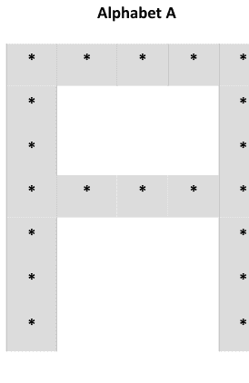

**字母 A**

**逻辑条件**

( row == 1 ) 或

( col == 1 ) 或

( col == 5 ) 或

( row == 4 )

让我们验证以下给定的7行5列字母A的逻辑条件：
(row==1) 或 (col==1) 或 (col==5) 或 (row==4)

```
VerifyAlphabetA.py
```

```
TOTAL_ROWS = 7
TOTAL_COLUMNS = 5

# condition 是一个布尔变量，用于存储逻辑条件的结果。

for row in range(1, TOTAL_ROWS + 1 ):
    for col in range(1, TOTAL_COLUMNS + 1 ):
        condition = (row == 1)  or  (col == 1)
        condition = condition or (col == 5) or (row == 4)
        # 空格仅用于显示格式化输出。
        if condition:
            print("* ",end="") # 单个空格
        else:
            print("  ",end="") # 双空格

    print() # 移动到下一行。
    # 字符的打印将在下一个新行开始。
```

```
输出
```

```
* * * * *
*       *
*       *
* * * * *
*       *
*       *
*       *
```

# 练习YBB：字母 B

| | col=1 | col=2 | col=3 | col=4 | col=5 |
|---|---|---|---|---|---|
| row=1 | 1,1* | 1,2* | 1,3* | 1,4* | 1,5* |
| row=2 | 2,1 | 2,2 | 2,3 | 2,4 | 2,5 |
| row=3 | 3,1 | 3,2 | 3,3 | 3,4 | 3,5 |
| row=4 | 4,1 | 4,2 | 4,3 | 4,4 | 4,5 |
| row=5 | 5,1 | 5,2 | 5,3 | 5,4 | 5,5 |
| row=6 | 6,1 | 6,2 | 6,3 | 6,4 | 6,5 |
| row=7 | 7,1* | 7,2* | 7,3* | 7,4* | 7,5* |

为了绘制字母B，我们首先在第一行和最后一行放置*字符。那么，等效的逻辑条件将是使用逻辑条件 **row==1** 和 **row==7**。

逻辑条件变为

**(row==1) 或 (row==7)**

现在我们需要在第二列和最后一列放置*字符。因此，使用逻辑或（or）运算符添加 (col==2) 和 (col==5) 逻辑条件意味着需要在以下方框中添加更多的*字符。所以，更新后的逻辑条件可以表示如下：

**(row==1) 或 (row==7) 或 (col==2) 或 (col==5)**

| | col=1 | col=2 | col=3 | col=4 | col=5 |
|---|---|---|---|---|---|
| row=1 | 1,1* | 1,2* | 1,3* | 1,4* | 1,5* |
| row=2 | 2,1 | 2,2* | 2,3 | 2,4 | 2,5* |
| row=3 | 3,1 | 3,2* | 3,3 | 3,4 | 3,5* |
| row=4 | 4,1 | 4,2* | 4,3 | 4,4 | 4,5* |
| row=5 | 5,1 | 5,2* | 5,3 | 5,4 | 5,5* |
| row=6 | 6,1 | 6,2* | 6,3 | 6,4 | 6,5* |
| row=7 | 7,1* | 7,2* | 7,3* | 7,4* | 7,5* |

再添加一个条件 **(row ==4)**。这个逻辑条件的一个缺点是，我们不希望在 (row == 4) 中出现*字符，特别是在值对为 (4, 1) 的方框中。

| | col=1 | col=2 | col=3 | col=4 | col=5 |
|---|---|---|---|---|---|
| row=1 | 1,1* | 1,2* | 1,3* | 1,4* | 1,5* |
| row=2 | 2,1 | 2,2* | 2,3 | 2,4 | 2,5* |
| row=3 | 3,1 | 3,2* | 3,3 | 3,4 | 3,5* |
| row=4 | 4,1* | 4,2* | 4,3* | 4,4* | 4,5* |
| row=5 | 5,1 | 5,2* | 5,3 | 5,4 | 5,5* |
| row=6 | 6,1 | 6,2* | 6,3 | 6,4 | 6,5* |
| row=7 | 7,1* | 7,2* | 7,3* | 7,4* | 7,5* |

我们应用逻辑与（and）条件运算符来选择更少的数据。在我们的例子中，我们需要在 **(row == 4)** 中少选一个*字符，以完成字母B的中间部分。

字母B中间部分的更新逻辑条件将是 **(row ==4 and col>=2)**。

现在逻辑条件变为

**(row==1) 或 (row==7) 或 (col==2) 或 (col==5) 或 (row ==4 and col>=2)**

| | col=1 | col=2 | col=3 | col=4 | col=5 |
|---|---|---|---|---|---|
| row=1 | 1,1* | 1,2* | 1,3* | 1,4* | 1,5* |
| row=2 | 2,1 | 2,2* | 2,3 | 2,4 | 2,5* |
| row=3 | 3,1 | 3,2* | 3,3 | 3,4 | 3,5* |
| row=4 | 4,1 | 4,2* | 4,3* | 4,4* | 4,5* |
| row=5 | 5,1 | 5,2* | 5,3 | 5,4 | 5,5* |
| row=6 | 6,1 | 6,2* | 6,3 | 6,4 | 6,5* |
| row=7 | 7,1* | 7,2* | 7,3* | 7,4* | 7,5* |

现在，移除那些没有*字符的 (row, col) 值对。

| | col=1 | col=2 | col=3 | col=4 | col=5 |
|---|---|---|---|---|---|
| row=1 | 1,1* | 1,2* | 1,3* | 1,4* | 1,5* |
| row=2 | | 2,2* | | | 2,5* |
| row=3 | | 3,2* | | | 3,5* |
| row=4 | | 4,2* | 4,3* | 4,4* | 4,5* |
| row=5 | | 5,2* | | | 5,5* |
| row=6 | | 6,2* | | | 6,5* |
| row=7 | 7,1* | 7,2* | 7,3* | 7,4* | 7,5* |

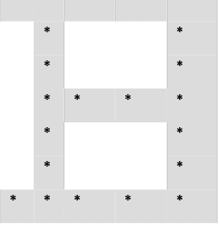

完整的逻辑条件变为

```
(row==1) 或 (row==7) 或 (col==2) 或 (col==5) 或 (row ==4 and col>=2)
```

让我们验证以下给定的7行5列字母B的逻辑条件：
**(row==1) 或 (row==7) 或 (col==2) 或 (col==5) 或 (row ==4 and col>=2)**

```
VerifyAlphabetB.py
```

```
TOTAL_ROWS = 7
TOTAL_COLUMNS = 5

# condition 是一个布尔变量，用于存储逻辑条件的结果。

for row in range(1, TOTAL_ROWS + 1 ):
    for col in range(1, TOTAL_COLUMNS + 1 ):
        condition =  (row == 1) or  (row == 7)
        condition = condition or (col == 2) or (col == 5)
        condition = condition or  (row == 4 and col >= 2)
        # 空格仅用于显示格式化输出。
        if condition:
            print("* ",end="") # 单个空格
        else:
            print("  ",end="") # 双空格

    print() # 移动到下一行。
    # 字符的打印将在下一个新行开始。
```

```
输出
```

```
* * * * *
  *     *
  *     *
* * * * *
  *     *
  *     *
* * * * *
```

# 练习YBC：字母 C

| | col=1 | col=2 | col=3 | col=4 | col=5 |
|---|---|---|---|---|---|
| row=1 | 1,1* | 1,2* | 1,3* | 1,4* | 1,5* |
| row=2 | 2,1 | 2,2 | 2,3 | 2,4 | 2,5 |
| row=3 | 3,1 | 3,2 | 3,3 | 3,4 | 3,5 |
| row=4 | 4,1 | 4,2 | 4,3 | 4,4 | 4,5 |
| row=5 | 5,1 | 5,2 | 5,3 | 5,4 | 5,5 |
| row=6 | 6,1 | 6,2 | 6,3 | 6,4 | 6,5 |
| row=7 | 7,1 | 7,2 | 7,3 | 7,4 | 7,5 |

观察字母C并尝试将其放入7X5的方框中，我们可以从在第一行放置*字符开始。现在我们需要在第一行放置*字符。所以逻辑条件将变为 **row==1**。

| | col=1 | col=2 | col=3 | col=4 | col=5 |
|---|---|---|---|---|---|
| row=1 | 1,1* | 1,2* | 1,3* | 1,4* | 1,5* |
| row=2 | 2,1* | 2,2 | 2,3 | 2,4 | 2,5 |
| row=3 | 3,1* | 3,2 | 3,3 | 3,4 | 3,5 |
| row=4 | 4,1* | 4,2 | 4,3 | 4,4 | 4,5 |
| row=5 | 5,1* | 5,2 | 5,3 | 5,4 | 5,5 |
| row=6 | 6,1* | 6,2 | 6,3 | 6,4 | 6,5 |
| row=7 | 7,1* | 7,2 | 7,3 | 7,4 | 7,5 |

第一列的等效逻辑条件将是 **(col==1)** 条件。使用 **逻辑或（or）条件运算符** 组合逻辑条件变为 **(row==1) 或 (col==1)**

| | col=1 | col=2 | col=3 | col=4 | col=5 |
|---|---|---|---|---|---|
| row=1 | 1,1* | 1,2* | 1,3* | 1,4* | 1,5* |
| row=2 | 2,1* | 2,2 | 2,3 | 2,4 | 2,5 |
| row=3 | 3,1* | 3,2 | 3,3 | 3,4 | 3,5 |
| row=4 | 4,1* | 4,2 | 4,3 | 4,4 | 4,5 |
| row=5 | 5,1* | 5,2 | 5,3 | 5,4 | 5,5 |
| row=6 | 6,1* | 6,2 | 6,3 | 6,4 | 6,5 |
| row=7 | 7,1* | 7,2* | 7,3* | 7,4* | 7,5* |

在之前的基础上再添加一个逻辑条件 **(row==7)**。现在，类似于字母C的*字符集和完整的逻辑条件可以是：**(row==1) 或 (col==1) 或 (row==7)**

现在移除不包含 * 字符的 (行, 列) 值对。因此，逻辑条件为：(行==1) 或 (列==1) 或 (行==7)

| | 列=1 | 列=2 | 列=3 | 列=4 | 列=5 |
|---|---|---|---|---|---|
| 行=1 | 1,1* | 1,2* | 1,3* | 1,4* | 1,5* |
| 行=2 | 2,1* | | | | |
| 行=3 | 3,1* | | | | |
| 行=4 | 4,1* | | | | |
| 行=5 | 5,1* | | | | |
| 行=6 | 6,1* | | | | |
| 行=7 | 7,1* | 7,2* | 7,3* | 7,4* | 7,5* |

或者

让我们验证以下在7行5列中表示字母C的逻辑条件：(行==1) 或 (列==1) 或 (行==7)

```python
VerifyAlphabetC.py
TOTAL_ROWS = 7
TOTAL_COLUMNS = 5

# condition is a boolean variable for storing result of logical conditions.

for row in range(1, TOTAL_ROWS + 1 ):
    for col in range(1, TOTAL_COLUMNS + 1 ):
        condition = (row == 1)  or (col == 1) or (row == 7)
        # space(s) are used just to show formatted output.
        if condition:
            print("* ",end="") # single space
        else:
            print("  ",end="") # double space

    print() # Move to the next row.
    # Printing of characters will begin in the next new line.
```

输出

```
* * * * *
*
*
*
*
*
* * * * *
```

# 练习YBD：字母D

我们需要在第一行和最后一行放置 * 字符。因此，匹配的逻辑条件是 (行==1) 和 (行==7)。

| | 列=1 | 列=2 | 列=3 | 列=4 | 列=5 |
|---|---|---|---|---|---|
| 行=1 | 1,1* | 1,2* | 1,3* | 1,4* | 1,5* |
| 行=2 | 2,1 | 2,2 | 2,3 | 2,4 | 2,5 |
| 行=3 | 3,1 | 3,2 | 3,3 | 3,4 | 3,5 |
| 行=4 | 4,1 | 4,2 | 4,3 | 4,4 | 4,5 |
| 行=5 | 5,1 | 5,2 | 5,3 | 5,4 | 5,5 |
| 行=6 | 6,1 | 6,2 | 6,3 | 6,4 | 6,5 |
| 行=7 | 7,1* | 7,2* | 7,3* | 7,4* | 7,5* |

| | 列=1 | 列=2 | 列=3 | 列=4 | 列=5 |
|---|---|---|---|---|---|
| 行=1 | 1,1* | 1,2* | 1,3* | 1,4* | 1,5* |
| 行=2 | 2,1 | 2,2* | 2,3 | 2,4 | 2,5* |
| 行=3 | 3,1 | 3,2* | 3,3 | 3,4 | 3,5* |
| 行=4 | 4,1 | 4,2* | 4,3 | 4,4 | 4,5* |
| 行=5 | 5,1 | 5,2* | 5,3 | 5,4 | 5,5* |
| 行=6 | 6,1 | 6,2* | 6,3 | 6,4 | 6,5* |
| 行=7 | 7,1* | 7,2* | 7,3* | 7,4* | 7,5* |

现在，在第二列和最后一列放置 * 字符将完成字母D。列的逻辑条件是 (列==2) 和 (列==5)。总的逻辑条件变为 (行==1) 或 (行==7) 或 (列==2) 或 (列==5)

移除所有不包含 * 字符的 (行, 列) 值对。

| | 列=1 | 列=2 | 列=3 | 列=4 | 列=5 |
|---|---|---|---|---|---|
| 行=1 | 1,1* | 1,2* | 1,3* | 1,4* | 1,5* |
| 行=2 | 2,1 | 2,2* | 2,3 | 2,4 | 2,5* |
| 行=3 | 3,1 | 3,2* | 3,3 | 3,4 | 3,5* |
| 行=4 | 4,1 | 4,2* | 4,3 | 4,4 | 4,5* |
| 行=5 | 5,1 | 5,2* | 5,3 | 5,4 | 5,5* |
| 行=6 | 6,1 | 6,2* | 6,3 | 6,4 | 6,5* |
| 行=7 | 7,1* | 7,2* | 7,3* | 7,4* | 7,5* |

或者

让我们验证以下在7行5列中表示字母D的逻辑条件：
**(行==1) 或 (行==7) 或 (列==2) 或 (列==5)**

```python
VerifyAlphabetD.py
TOTAL_ROWS = 7
TOTAL_COLUMNS = 5

# condition is a boolean variable for storing result of logical conditions.

for row in range(1, TOTAL_ROWS + 1 ):
    for col in range(1, TOTAL_COLUMNS + 1 ):
        condition = ( row == 1 )  or ( row == 7 )
        condition = condition or ( col == 2 ) or ( col == 5 )
        # space(s) are used just to show formatted output.
        if condition:
            print("* ",end="") # single space
        else:
            print("  ",end="") # double space

    print() # Move to the next row.
    # Printing of characters will begin in the next new line.
```

输出

```
* * * * *
  *     *
  *     *
  *     *
  *     *
  *     *
* * * * *
```

# 练习YBE：字母E

| | 列=1 | 列=2 | 列=3 | 列=4 | 列=5 |
|---|---|---|---|---|---|
| 行=1 | 1,1* | 1,2* | 1,3* | 1,4* | 1,5* |
| 行=2 | 2,1 | 2,2 | 2,3 | 2,4 | 2,5 |
| 行=3 | 3,1 | 3,2 | 3,3 | 3,4 | 3,5 |
| 行=4 | 4,1 | 4,2 | 4,3 | 4,4 | 4,5 |
| 行=5 | 5,1 | 5,2 | 5,3 | 5,4 | 5,5 |
| 行=6 | 6,1 | 6,2 | 6,3 | 6,4 | 6,5 |
| 行=7 | 7,1* | 7,2* | 7,3* | 7,4* | 7,5* |

我们需要在第一行和最后一行放置 * 字符。
因此，匹配的逻辑条件是 **(行==1) 和 (行==7)**。
同时，在第二列放置 * 字符将完成字母E。

添加逻辑条件 (列==2) 后，总的逻辑条件变为

**(行==1) 或 (行==7) 或 (列==2)**

| | 列=1 | 列=2 | 列=3 | 列=4 | 列=5 |
|---|---|---|---|---|---|
| 行=1 | 1,1* | 1,2* | 1,3* | 1,4* | 1,5* |
| 行=2 | 2,1 | 2,2* | 2,3 | 2,4 | 2,5 |
| 行=3 | 3,1 | 3,2* | 3,3 | 3,4 | 3,5 |
| 行=4 | 4,1 | 4,2* | 4,3 | 4,4 | 4,5 |
| 行=5 | 5,1 | 5,2* | 5,3 | 5,4 | 5,5 |
| 行=6 | 6,1 | 6,2* | 6,3 | 6,4 | 6,5 |
| 行=7 | 7,1* | 7,2* | 7,3* | 7,4* | 7,5* |

再添加一个条件

**(行==4 且 列>=2)** 到之前的条件中。
AND 逻辑条件 **(且 列>=2)** 是因为我们不想在值对为 **(4, 1)** 的方格中放置 * 字符。

AND 逻辑条件用于限制选择数据，而我们的数据是 **(行, 列)** 值对，即通常所说的方格。

总的逻辑条件变为 **(行==1) 或 (行==7) 或 (列==2) 或 (行 ==4 且 列>=2)**

| | 列=1 | 列=2 | 列=3 | 列=4 | 列=5 |
|---|---|---|---|---|---|
| 行=1 | 1,1* | 1,2* | 1,3* | 1,4* | 1,5* |
| 行=2 | 2,1 | 2,2* | 2,3 | 2,4 | 2,5 |
| 行=3 | 3,1 | 3,2* | 3,3 | 3,4 | 3,5 |
| 行=4 | 4,1 | 4,2* | 4,3* | 4,4* | 4,5* |
| 行=5 | 5,1 | 5,2* | 5,3 | 5,4 | 5,5 |
| 行=6 | 6,1 | 6,2* | 6,3 | 6,4 | 6,5 |
| 行=7 | 7,1* | 7,2* | 7,3* | 7,4* | 7,5* |

或者

让我们验证以下在7行5列中表示字母E的逻辑条件：
**(行==1) 或 (行==7) 或 (列==2) 或 (行 ==4 且 列>=2)**

```python
VerifyAlphabetE.py
TOTAL_ROWS = 7
TOTAL_COLUMNS = 5

# condition is a boolean variable for storing result of logical conditions.

for row in range(1, TOTAL_ROWS + 1 ):
    for col in range(1, TOTAL_COLUMNS + 1 ):
        condition = (row == 1) or  (row == 7)
        condition = condition or (col == 2) or  (row == 4 and col >= 2)
        # space(s) are used just to show formatted output.
        if condition:
            print("* ",end="") # single space
        else:
            print("  ",end="") # double space

    print() # Move to the next row.
    # Printing of characters will begin in the next new line.
```

输出

```
* * * * *
  *
  *
  * * * *
  *
  *
* * * * *
```

# 练习YBF：字母F

| | 列=1 | 列=2 | 列=3 | 列=4 | 列=5 |
|---|---|---|---|---|---|
| 行=1 | 1,1* | 1,2* | 1,3* | 1,4* | 1,5* |
| 行=2 | 2,1 | 2,2* | 2,3 | 2,4 | 2,5 |
| 行=3 | 3,1 | 3,2* | 3,3 | 3,4 | 3,5 |
| 行=4 | 4,1 | 4,2* | 4,3 | 4,4 | 4,5 |
| 行=5 | 5,1 | 5,2* | 5,3 | 5,4 | 5,5 |
| 行=6 | 6,1 | 6,2* | 6,3 | 6,4 | 6,5 |
| 行=7 | 7,1 | 7,2* | 7,3 | 7,4 | 7,5 |

我们需要在第一行和第二列放置 * 字符。

因此，匹配的逻辑条件是 **(行==1)** 和 **(列==2)**。目前的逻辑条件为：

**(行==1) 或 (列==2)**。

再添加一个条件 **(行 ==4 且 列>=2)** 到之前的条件中。AND 逻辑条件 **(且 列>=2)** 是因为我们不想在 **值对 (4, 1)** 的方格中放置 * 字符。

| | 列=1 | 列=2 | 列=3 | 列=4 | 列=5 |
|---|---|---|---|---|---|
| 行=1 | 1,1* | 1,2* | 1,3* | 1,4* | 1,5* |
| 行=2 | 2,1 | 2,2* | 2,3 | 2,4 | 2,5 |
| 行=3 | 3,1 | 3,2* | 3,3 | 3,4 | 3,5 |
| 行=4 | 4,1 | 4,2* | 4,3* | 4,4* | 4,5* |
| 行=5 | 5,1 | 5,2* | 5,3 | 5,4 | 5,5 |
| 行=6 | 6,1 | 6,2* | 6,3 | 6,4 | 6,5 |
| 行=7 | 7,1 | 7,2* | 7,3 | 7,4 | 7,5 |

现在，构成字母F的 * 字符集合可以由以下逻辑条件给出：
**(行==1) 或 (列==2) 或 (行 ==4 且 列>=2)**。

移除所有不包含 * 字符的 (行, 列) 值对。

| | 列=1 | 列=2 | 列=3 | 列=4 | 列=5 |
|---|---|---|---|---|---|
| 行=1 | 1,1* | 1,2* | 1,3* | 1,4* | 1,5* |
| 行=2 | | 2,2* | | | |
| 行=3 | | 3,2* | | | |
| 行=4 | | 4,2* | 4,3* | 4,4* | 4,5* |
| 行=5 | | 5,2* | | | |
| 行=6 | | 6,2* | | | |
| 行=7 | | 7,2* | | | |

或者

让我们验证以下在7行5列中表示字母F的逻辑条件：
**(row==1) or (col==2) or (row ==4 and col>=2)**

```python
# VerifyAlphabetF.py
TOTAL_ROWS = 7
TOTAL_COLUMNS = 5

# condition 是一个布尔变量，用于存储逻辑条件的结果。
for row in range(1, TOTAL_ROWS + 1 ):
    for col in range(1, TOTAL_COLUMNS + 1 ):
        condition = (row == 1) or  (col == 2)
        condition = condition or  (row == 4 and col >= 2)
        # 空格仅用于显示格式化输出。
        if condition:
            print("* ",end="") # 单个空格
        else:
            print("  ",end="") # 双空格

    print() # 移动到下一行。
    # 字符的打印将在下一个新行开始。
```

输出：
```
* * * * *
  *
  *
  * * * *
  *
  *
  *
```

### 练习YBG：字母G

| | col=1 | col=2 | col=3 | col=4 | col=5 |
|---|---|---|---|---|---|
| row=1 | 1,1* | 1,2* | 1,3* | 1,4* | 1,5* |
| row=2 | 2,1 | 2,2 | 2,3 | 2,4 | 2,5 |
| row=3 | 3,1 | 3,2 | 3,3 | 3,4 | 3,5 |
| row=4 | 4,1 | 4,2 | 4,3 | 4,4 | 4,5 |
| row=5 | 5,1 | 5,2 | 5,3 | 5,4 | 5,5 |
| row=6 | 6,1 | 6,2 | 6,3 | 6,4 | 6,5 |
| row=7 | 7,1* | 7,2* | 7,3* | 7,4* | 7,5* |

我们需要在第一行和最后一行放置 * 字符。因此，匹配的逻辑条件是 **(row==1)** 和 **(row==7)**。同时，我们需要在第一列放置 * 字符。所以，匹配的逻辑条件是 **(col==1)**。

逻辑条件变为 **(row==1)** or **(row==7)** or **(col==1)**

在之前的条件上添加一个条件 **(row == 4 and col>=3)**，以排除值对 **(4, 2)** 所在方格中的 * 字符。我们不希望值对 **(2, 5)** 和 **(3, 5)** 所在方格中有 * 字符。再次，在之前的条件上添加一个条件 **(col == 5 and row >=5 )**。

| | col=1 | col=2 | col=3 | col=4 | col=5 |
|---|---|---|---|---|---|
| row=1 | 1,1* | 1,2* | 1,3* | 1,4* | 1,5* |
| row=2 | 2,1* | 2,2 | 2,3 | 2,4 | 2,5 |
| row=3 | 3,1* | 3,2 | 3,3 | 3,4 | 3,5 |
| row=4 | 4,1* | 4,2 | 4,3 | 4,4 | 4,5 |
| row=5 | 5,1* | 5,2 | 5,3 | 5,4 | 5,5 |
| row=6 | 6,1* | 6,2 | 6,3 | 6,4 | 6,5 |
| row=7 | 7,1* | 7,2* | 7,3* | 7,4* | 7,5* |

| | col=1 | col=2 | col=3 | col=4 | col=5 |
|---|---|---|---|---|---|
| row=1 | 1,1* | 1,2* | 1,3* | 1,4* | 1,5* |
| row=2 | 2,1* | 2,2 | 2,3 | 2,4 | 2,5 |
| row=3 | 3,1* | 3,2 | 3,3 | 3,4 | 3,5 |
| row=4 | 4,1* | 4,2 | 4,3* | 4,4* | 4,5* |
| row=5 | 5,1* | 5,2 | 5,3 | 5,4 | 5,5* |
| row=6 | 6,1* | 6,2 | 6,3 | 6,4 | 6,5* |
| row=7 | 7,1* | 7,2* | 7,3* | 7,4* | 7,5* |

现在，完整的 * 字符集合及其逻辑条件可以如下所示 **(row==1)** or **(row==7)** or **(col==1)** or **(row ==4 and col>=3)** or **(col==5 and row>=5)**。移除所有没有 * 字符的 (row, col) 值对。

| | col=1 | col=2 | col=3 | col=4 | col=5 |
|---|---|---|---|---|---|
| row=1 | 1,1* | 1,2* | 1,3* | 1,4* | 1,5* |
| row=2 | 2,1* | | | | |
| row=3 | 3,1* | | | | |
| row=4 | 4,1* | | 4,3* | 4,4* | 4,5* |
| row=5 | 5,1* | | | | 5,5* |
| row=6 | 6,1* | | | | 6,5* |
| row=7 | 7,1* | 7,2* | 7,3* | 7,4* | 7,5* |

或者

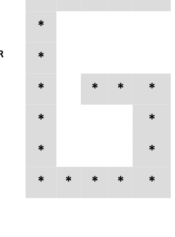

让我们验证以下在7行5列中表示字母G的逻辑条件：
(row==1) or (row==7) or (col==1) or (row ==4 and col>=3) or (col==5 and row>=5)

```python
# VerifyAlphabetG.py
TOTAL_ROWS = 7
TOTAL_COLUMNS = 5

# condition 是一个布尔变量，用于存储逻辑条件的结果。

for row in range(1, TOTAL_ROWS + 1 ):
    for col in range(1, TOTAL_COLUMNS + 1 ):
        condition = (row == 1) or (row == 7) or (col == 1)
        condition = condition or (row == 4 and col >= 3)
        condition = condition or (col == 5 and row >= 5)
        # 空格仅用于显示格式化输出。
        if condition:
            print("* ",end="") # 单个空格
        else:
            print("  ",end="") # 双空格

    print() # 移动到下一行。
    # 字符的打印将在下一个新行开始。
```

输出：
```
* * * * *
*
*
*   * * *
*       *
*       *
* * * * *
```

### 练习YBJ：字母J

让我们在第一行和中间列填充 * 字符。因此，匹配的逻辑条件是 **(row==1)** or **(col==3)**。我们使用了逻辑或（or）条件运算符来添加更多的 * 字符。

| | col=1 | col=2 | col=3 | col=4 | col=5 |
|---|---|---|---|---|---|
| row=1 | 1,1* | 1,2* | 1,3* | 1,4* | 1,5* |
| row=2 | 2,1 | 2,2 | 2,3* | 2,4 | 2,5 |
| row=3 | 3,1 | 3,2 | 3,3* | 3,4 | 3,5 |
| row=4 | 4,1 | 4,2 | 4,3* | 4,4 | 4,5 |
| row=5 | 5,1 | 5,2 | 5,3* | 5,4 | 5,5 |
| row=6 | 6,1 | 6,2 | 6,3* | 6,4 | 6,5 |
| row=7 | 7,1 | 7,2 | 7,3* | 7,4 | 7,5 |

由于我们需要在 row=7 时将列数限制为3，我们必须使用条件运算符 **逻辑与（and col <= 3）**。使用逻辑或（or）条件运算符将逻辑条件 **(row==7 and col<=3)** 添加到之前的条件中，将给出可以在方格中显示的 * 字符集。逻辑条件变为：

**(row==1) or (col==3) or (row==7 and col<=3)**

| | col=1 | col=2 | col=3 | col=4 | col=5 |
|---|---|---|---|---|---|
| row=1 | 1,1* | 1,2* | 1,3* | 1,4* | 1,5* |
| row=2 | 2,1 | 2,2 | 2,3* | 2,4 | 2,5 |
| row=3 | 3,1 | 3,2 | 3,3* | 3,4 | 3,5 |
| row=4 | 4,1 | 4,2 | 4,3* | 4,4 | 4,5 |
| row=5 | 5,1 | 5,2 | 5,3* | 5,4 | 5,5 |
| row=6 | 6,1 | 6,2 | 6,3* | 6,4 | 6,5 |
| row=7 | 7,1* | 7,2* | 7,3* | 7,4 | 7,5 |

#### 请注意

使用逻辑与，我们限制或约束了在 row=7 放置 * 字符。使用的条件是 **(row==7 and col<=3)**。

如果条件仅为 row==7，那么整个 row=7 都将被 * 字符填充。表达式 **(row==7 and col<=3)** 中的附加条件 **and col<=3** 实际上限制了 row=7 中的 * 字符，从第1列开始直到第3列。

再次，向之前的条件添加一个条件 **(col==1 and row>=4)**。带有粗边框的选定 * 字符集代表条件 **(col==1 and row>=4)**。

| | col=1 | col=2 | col=3 | col=4 | col=5 |
|---|---|---|---|---|---|
| row=1 | 1,1* | 1,2* | 1,3* | 1,4* | 1,5* |
| row=2 | 2,1 | 2,2 | 2,3* | 2,4 | 2,5 |
| row=3 | 3,1 | 3,2 | 3,3* | 3,4 | 3,5 |
| row=4 | 4,1* | 4,2 | 4,3* | 4,4 | 4,5 |
| row=5 | 5,1* | 5,2 | 5,3* | 5,4 | 5,5 |
| row=6 | 6,1* | 6,2 | 6,3* | 6,4 | 6,5 |
| row=7 | 7,1* | 7,2* | 7,3* | 7,4 | 7,5 |

#### 请注意

使用逻辑与，我们限制或约束了在 col=1 放置 * 字符。条件是 **(col==1 and row>=4)**。

如果条件仅为 col==1，那么整个 col=1 都将被 * 字符填充。

表达式 **(col==1 and row>=4)** 中的附加条件 **and row>=4** 实际上限制了第1列的 * 字符，从第4行开始直到第7行。

移除没有 * 字符的 (row, col) 值对。

| | col=1 | col=2 | col=3 | col=4 | col=5 |
|---|---|---|---|---|---|
| row=1 | 1,1* | 1,2* | 1,3* | 1,4* | 1,5* |
| row=2 | | | 2,3* | | |
| row=3 | | | 3,3* | | |
| row=4 | 4,1* | | 4,3* | | |
| row=5 | 5,1* | | 5,3* | | |
| row=6 | 6,1* | | 6,3* | | |
| row=7 | 7,1* | 7,2* | 7,3* | | |

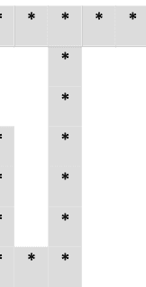

或者

逻辑条件：(row==1) or (col==3) or (row==7 and col<=3) or (col==1 and row>=4)。

*问题YBJD:* 为以下样式的字母J和D编写程序。

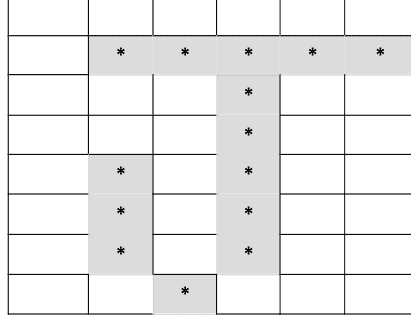

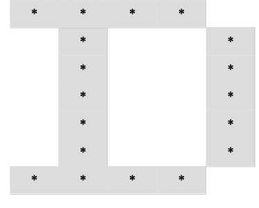

### 练习YBK：字母K

| | col=1 | col=2 | col=3 | col=4 | col=5 |
|---|---|---|---|---|---|
| row=1 | 1,1* | 1,2 | 1,3 | 1,4 | 1,5 |
| row=2 | 2,1* | 2,2 | 2,3 | 2,4 | 2,5 |
| row=3 | 3,1* | 3,2 | 3,3 | 3,4 | 3,5 |
| row=4 | 4,1* | 4,2 | 4,3 | 4,4 | 4,5 |
| row=5 | 5,1* | 5,2 | 5,3 | 5,4 | 5,5 |
| row=6 | 6,1* | 6,2 | 6,3 | 6,4 | 6,5 |
| row=7 | 7,1* | 7,2 | 7,3 | 7,4 | 7,5 |

我们需要在第一行放置 * 字符。因此，匹配的逻辑条件是 **(row==1)**。我们需要找到高亮方格之间的关系，因为它暗示了字母K的一个笔画。

高亮方格由 **(row, col)** 值对表示为 **(4,1),(3,2),(2,3), (1,4)**。

如果我们注意观察，可以发现如果我们将行值/编号与列值/编号相加，我们将始终得到值5。

**(4,1),(3,2),(2,3),(1,4) ➔ ( 4+1),(3+2),(2+3),(1+4) ➔(5),(5),(5),(5),(5).**

我们需要验证这对于其他 **row+col** 值组合是否成立。让我们通过为每个由 **(row, col)** 值对表示的方格添加每个 **row+col** 值来检查。所有 **row+col** 值如下所示，并在 **row+col=5** 处高亮显示。

(1+1=2) (1+2=3) (1+3=4) **(1+4=5)** (1+5=6)
(2+1=3) (2+2=4) **(2+3=5)** (2+4=6) (2+5=7)
(3+1=4) **(3+2=5)** (3+3=6) (3+4=7) (3+5=8)
**(4+1=5)** (4+2=6) (4+3=7) (4+4=8) (4+5=9)
(5+1=6) (5+2=7) (5+3=8) (5+4=9) (5+5=10)
(6+1=7) (6+2=8) (6+3=9) (6+4=10) (6+5=11)
(7+1=8) (7+2=9) (7+3=10) (7+4=11) (7+5=12)

除了我们考虑的方格外，其他地方 **row + col = 5** 都不成立。因此，我们现在的猜测变得有效，它唯一地识别或选择了所考虑的值对。这就是我们通过应用条件来选择一般数据的方式。在这种情况下，选择了具有 **(row, col)** 组合的方格。因此，我们下一个逻辑条件变为 **(row+col == 5)**。

| | col=1 | col=2 | col=3 | col=4 | col=5 |
|---|---|---|---|---|---|
| row=1 | 1,1* | 1,2 | 1,3 | 1,4* | 1,5 |
| row=2 | 2,1* | 2,2 | 2,3* | 2,4 | 2,5 |
| row=3 | 3,1* | 3,2* | 3,3 | 3,4 | 3,5 |
| row=4 | 4,1* | 4,2 | 4,3 | 4,4 | 4,5 |
| row=5 | 5,1* | 5,2 | 5,3 | 5,4 | 5,5 |
| row=6 | 6,1* | 6,2 | 6,3 | 6,4 | 6,5 |
| row=7 | 7,1* | 7,2 | 7,3 | 7,4 | 7,5 |

所以逻辑条件变为

**(col == 1) or (row+col==5).**

类似地，我们需要找到 **(4, 1), (5, 2), (6, 3), (7, 4)** 方格之间的关系，这是字母K的另一个笔画，由行值大于4的高亮单元格边框表示。

之前，行+列的加法有效，这次减法可能有效。让我们研究这种情况

**(4,1),(5,2),(6,3),(7,4) ➔(4-1),(5-2),(6-3),(7-4) ➔(3),(3),(3),(3).**

它给出了稳定的结果，我们需要验证是否还有其他 **(行, 列)** 组合也遵循此选择规则。如果我们找到任何其他 **(行, 列)**，就需要寻找其他的关系公式。选择规则或逻辑条件应能唯一地选中 **(4,1),(5,2),(6,3),(7,4)**。让我们通过计算每个 **行 - 列** 的值来检查。所有 **(行 - 列)** 的值如下所示，高亮显示的值遵循规则 **(行 - 列=3)**。

(1-1=0) (1-2=-1) (1-3=-2) (1-4=-3) (1-5=-4)
(2-1=1) (2-2=0) (2-3=-1) (2-4=-2) (2-5=-3)
(3-1=2) (3-2=1) (3-3=0) (3-4=-1) (3-5=-2)
**(4-1=3)** (4-2=2) (4-3=1) (4-4=0) (4-5=-1)
(5-1=4) **(5-2=3)** (5-3=2) (5-4=1) (5-5=0)
(6-1=5) (6-2=4) **(6-3=3)** (6-4=2) (6-5=1)
(7-1=6) (7-2=5) (7-3=4) **(7-4=3)** (7-5=2)

| | 列=1 | 列=2 | 列=3 | 列=4 | 列=5 |
|---|---|---|---|---|---|
| 行=1 | 1,1* | 1,2 | 1,3 | 1,4* | 1,5 |
| 行=2 | 2,1* | 2,2 | 2,3* | 2,4 | 2,5 |
| 行=3 | 3,1* | 3,2* | 3,3 | 3,4 | 3,5 |
| 行=4 | 4,1* | 4,2 | 4,3 | 4,4 | 4,5 |
| 行=5 | 5,1* | 5,2* | 5,3 | 5,4 | 5,5 |
| 行=6 | 6,1* | 6,2 | 6,3* | 6,4 | 6,5 |
| 行=7 | 7,1* | 7,2 | 7,3 | 7,4* | 7,5 |

除了我们考虑的值对之外，其他地方 **行 - 列 = 3** 均不成立。因此，我们现在的猜测对于选择这些考虑的方框是有效的。

因此，我们下一个逻辑条件变为

**( 行 - 列 == 3)**。所以最终的逻辑条件变为

**( 列==1)** 或 **(行+列==5)** 或 **(行 - 列 == 3)**。

移除没有 * 字符的 (行, 列) 值对，我们将得到如下结果

| | 列=1 | 列=2 | 列=3 | 列=4 | 列=5 |
|---|---|---|---|---|---|
| 行=1 | 1,1* | | | 1,4* | |
| 行=2 | 2,1* | | 2,3* | | |
| 行=3 | 3,1* | 3,2* | | | |
| 行=4 | 4,1* | | | | |
| 行=5 | 5,1* | 5,2* | | | |
| 行=6 | 6,1* | | 6,3* | | |
| 行=7 | 7,1* | | | 7,4* | |

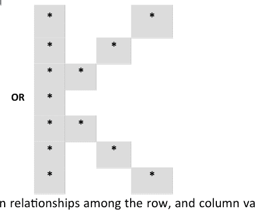

我们已经看到，在这种情况下，行和列值之间的加法和减法关系有效。有时，行和列值之间的其他算术关系，如除法或取余，对于选择方框（即 **(行, 列)** 值对）也成立。逻辑条件可以用许多不同的方式实现。对于同一组 (行, 列) 值对的选择，可能存在不同的替代条件给出方式。

让我们验证以下在7行5列中给出的字母 K 的逻辑条件：
( 列 ==1) 或 ( 行 + 列 == 5 ) 或 ( 行 - 列 == 3 )

```
VerifyAlphabetK.py
```

```
TOTAL_ROWS = 7
TOTAL_COLUMNS = 5

for row in range(1, TOTAL_ROWS + 1 ):
    for col in range(1, TOTAL_COLUMNS + 1 ):

        # condition is a boolean variable for storing result of logical conditions.
        condition = ( col == 1)  or  ( row + col == 5 )
        condition = condition or ( row - col == 3 )

        # space(s) are used just to show formatted output.
        if condition:
            print("* ",end="") # single space
        else:
            print("  ",end="") # double space

    print() # Move to the next row.
    # Printing of characters will begin in the next new line.
```

```
Output
```

```
*     *
*   *
* *
*
* *
*   *
*     *
```

### 练习YBM：字母 M 需要放入一个 7X5 的方框中。

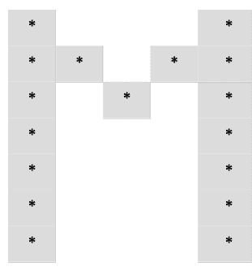

| | 列=1 | 列=2 | 列=3 | 列=4 | 列=5 |
|---|---|---|---|---|---|
| 行=1 | 1,1 | 1,2 | 1,3 | 1,4 | 1,5 |
| 行=2 | 2,1 | 2,2 | 2,3 | 2,4 | 2,5 |
| 行=3 | 3,1 | 3,2 | 3,3 | 3,4 | 3,5 |
| 行=4 | 4,1 | 4,2 | 4,3 | 4,4 | 4,5 |
| 行=5 | 5,1 | 5,2 | 5,3 | 5,4 | 5,5 |
| 行=6 | 6,1 | 6,2 | 6,3 | 6,4 | 6,5 |
| 行=7 | 7,1 | 7,2 | 7,3 | 7,4 | 7,5 |

| | 列=1 | 列=2 | 列=3 | 列=4 | 列=5 |
|---|---|---|---|---|---|
| 行=1 | 1,1* | 1,2 | 1,3 | 1,4 | 1,5* |
| 行=2 | 2,1* | 2,2 | 2,3 | 2,4 | 2,5* |
| 行=3 | 3,1* | 3,2 | 3,3 | 3,4 | 3,5* |
| 行=4 | 4,1* | 4,2 | 4,3 | 4,4 | 4,5* |
| 行=5 | 5,1* | 5,2 | 5,3 | 5,4 | 5,5* |
| 行=6 | 6,1* | 6,2 | 6,3 | 6,4 | 6,5* |
| 行=7 | 7,1* | 7,2 | 7,3 | 7,4 | 7,5* |

让我们从在第一列和最后一列放置 * 字符开始。

因此，匹配的逻辑条件将是：**(列==1) 或 (列==5)**。

我们需要找到高亮方框之间的关系，这些方框由 **(行, 列)** 值对表示为 **(1, 1), (2, 2), (3, 3)**。

| | 列=1 | 列=2 | 列=3 | 列=4 | 列=5 |
|---|---|---|---|---|---|
| 行=1 | 1,1* | 1,2 | 1,3 | 1,4 | 1,5* |
| 行=2 | 2,1* | 2,2 | 2,3 | 2,4 | 2,5* |
| 行=3 | 3,1* | 3,2 | 3,3 | 3,4 | 3,5* |
| 行=4 | 4,1* | 4,2 | 4,3 | 4,4 | 4,5* |
| 行=5 | 5,1* | 5,2 | 5,3 | 5,4 | 5,5* |
| 行=6 | 6,1* | 6,2 | 6,3 | 6,4 | 6,5* |
| 行=7 | 7,1* | 7,2 | 7,3 | 7,4 | 7,5* |

**让我们尝试理解能唯一选中这些特定行和列值对的关系。**

很容易观察到行值/编号和列值/编号是相同的。因此，我们可以用逻辑条件 **(行==列)** 来表示我们对方框的选择。

逻辑条件 **(行==列)** 也会选中 **(4, 4)** 和 **(5, 5)**。

方框 **(5, 5)** 已经被我们之前的条件选中了。

我们不希望方框 **(4, 4)** 在我们的情况下被选中。我们必须从值对 **(1, 1)** 开始，只选中到值对 **(3, 3)**。我们必须使用逻辑与运算符来限制对方框的选择，逻辑条件可以如下给出

**(行==列) 且 (行 <=3 且 列<=3)**

到目前为止，这些对方框的选择可以用逻辑条件表示为

**(列==1) 或 (列==5) 或 ((行==列) 且 (行 <=3 且 列<=3))**

再次，我们需要在给定的高亮方框中找到一种关系，以便从所有给定的方框中唯一地选中它们，这些方框由 (行, 列) 值对表示为 **(3, 3), (2, 4), (1, 5)**。

| | 列=1 | 列=2 | 列=3 | 列=4 | 列=5 |
|---|---|---|---|---|---|
| 行=1 | 1,1* | 1,2 | 1,3 | 1,4 | 1,5* |
| 行=2 | 2,1* | 2,2* | 2,3 | 2,4 | 2,5* |
| 行=3 | 3,1* | 3,2 | 3,3* | 3,4 | 3,5* |
| 行=4 | 4,1* | 4,2 | 4,3 | 4,4 | 4,5* |
| 行=5 | 5,1* | 5,2 | 5,3 | 5,4 | 5,5* |
| 行=6 | 6,1* | 6,2 | 6,3 | 6,4 | 6,5* |
| 行=7 | 7,1* | 7,2 | 7,3 | 7,4 | 7,5* |

让我们尝试理解能唯一选中这些特定行和列值对的关系，如下所示

➡ **(3,3),(2,4),(1,5)** 或

➡ **( 3+3),(2+4),(1+5)** 或

➡ **(6),(6),(6)**

如果我们稍微注意一下，可以观察到，如果我们将行值/编号加到列值/编号上，我们将一致地得到值 6。我们需要验证这对于其他 **行+列** 值组合是否成立。让我们通过计算每个由 **(行, 列)** 值对表示的方框的 **行+列** 值来检查。所有 **行+列** 的值如下所示，高亮显示的值遵循 **行+列=6**。

| | 列=1 | 列=2 | 列=3 | 列=4 | 列=5 |
|---|---|---|---|---|---|
| 行=1 | 1+1=2 | 1+2=3 | 1+3=4 | 1+4=5 | 1+5=6 |
| 行=2 | 2+1=3 | 2+2=4 | 2+3=5 | 2+4=6 | 2+5=7 |
| 行=3 | 3+1=4 | 3+2=5 | 3+3=6 | 3+4=7 | 3+5=8 |
| 行=4 | 4+1=5 | 4+2=6 | 4+3=7 | 4+4=8 | 4+5=9 |
| 行=5 | 5+1=6 | 5+2=7 | 5+3=8 | 5+4=9 | 5+5=10 |
| 行=6 | 6+1=7 | 6+2=8 | 6+3=9 | 6+4=10 | 6+5=11 |
| 行=7 | 7+1=8 | 7+2=9 | 7+3=10 | 7+4=11 | 7+5=12 |

| | 列=1 | 列=2 | 列=3 | 列=4 | 列=5 |
|---|---|---|---|---|---|
| 行=1 | 1,1* | 1,2 | 1,3 | 1,4 | 1,5* |
| 行=2 | 2,1* | 2,2* | 2,3 | 2,4* | 2,5* |
| 行=3 | 3,1* | 3,2 | 3,3* | 3,4 | 3,5* |
| 行=4 | 4,1* | 4,2 | 4,3 | 4,4 | 4,5* |
| 行=5 | 5,1* | 5,2 | 5,3 | 5,4 | 5,5* |
| 行=6 | 6,1* | 6,2 | 6,3 | 6,4 | 6,5* |
| 行=7 | 7,1* | 7,2 | 7,3 | 7,4 | 7,5* |

现在，**行+列=6** 对于值对 **(4, 2)** 也成立，而我们不希望在那里放置字符 *。我们必须将其限制在值对 **(3, 3)**。针对此的完整逻辑条件可以如下给出 **(行+列 ==6) 且 (行<=3 且 列>=3)**。

移除其他 (行, 列) 值对，我们得到字母 M。

| | 列=1 | 列=2 | 列=3 | 列=4 | 列=5 |
|---|---|---|---|---|---|
| 行=1 | 1,1* | | | | 1,5* |
| 行=2 | 2,1* | 2,2* | | 2,4* | 2,5* |
| 行=3 | 3,1* | | 3,3* | | 3,5* |
| 行=4 | 4,1* | | | | 4,5* |
| 行=5 | 5,1* | | | | 5,5* |
| 行=6 | 6,1* | | | | 6,5* |
| 行=7 | 7,1* | | | | 7,5* |

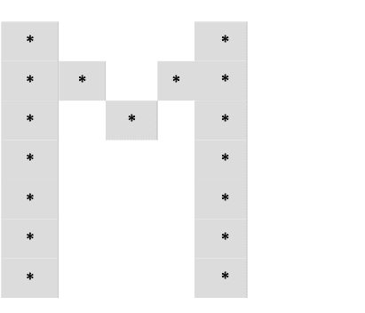

现在，对方框的完整选择可以用逻辑条件表示为
**(列==1) 或 (列==5) 或**
**( ( 行==列) 且( 行 <=3 且 列<=3) ) 或**
**( ( 行+列 ==6) 且(行<=3 且 列>=3) )**

在逻辑条件 **( ( 行==列) 且( 行 <=3 且 列<=3) )** 中，由于逻辑条件 **(行==列)**，条件部分 **( 行 <=3 且 列<=3)** 中的 **行<=3** 或 **列<=3** 任一即可。
这可以进一步表示为
**( ( 行==列 ) 且 行 <=3 ) 或 ( ( 行 == 列 ) 且 列<=3 )。**

| (行, 列) 值对 | 行值 | 列值 | 描述 |
|---|---|---|---|
| (1, 5) | 1 | 5 | 在逻辑条件 ( (行+列 ==6) 且(行<=3 且 列>=3) ) 中，(行+列 ==6) 中的每个 (行, 列) 值对由 (5, 1), (4, 2) ,(3, 3), (2, 4), (1, 5) 给出。 |
| (2, 4) | 2 | 4 | |
| (3, 3) | 3 | 3 | |
| (4, 2) | 4 | 2 | |
| (5, 1) | 5 | 1 | |

每个行值在其值组内是唯一的，列值也类似。因此，考虑行值或列值任一即可。没有必要同时考虑行和列值来应用如 **且 (行 <=3 且 列>=3)** 所示的限制条件。
所以，总逻辑条件中由 **(行 <=3 且 列>=3)** 给出的部分，考虑 **行<=3** 或 **列>=3** 任一即可。这可以进一步表示为
**( (行+列 ==6) 且 行 <=3 ) 或 ( (行+列 ==6) 且 列>=3 )。**

我们可以将实际逻辑条件重写为
**(列==1) 或 (列==5) 或**
**( ( 行==列) 且 行 <=3 ) 或**
**( ( 行+列 ==6) 且 行<=3 )**

请注意，限制条件 **且 行 <=3** 对于两个逻辑条件表达式是相同的。
我们可以再次将逻辑条件重写为更紧凑的形式，如下所示：
**( 列 == 1 ) 或 ( 列 == 5 ) 或**
**( ( ( 行 == 列 ) 或 ( 行 + 列 == 6) ) 且 行 <= 3 )**

让我们验证以下给定的7行5列字母M的逻辑条件：

( col == 1 ) or ( col == 5 ) or
( ( ( row == col ) or ( row + col == 6 ) ) and row <= 3 )

```python
VerifyAlphabetM.py
```

```python
TOTAL_ROWS = 7
TOTAL_COLUMNS = 5

# condition 是一个布尔变量，用于存储逻辑条件的结果。
for row in range(1, TOTAL_ROWS + 1 ):
    for col in range(1, TOTAL_COLUMNS + 1 ):
        condition = (col == 1) or (col == 5)
        condition1 = ( (row == col) or (row + col == 6) )
        condition1 = condition1 and row <= 3
        condition = condition or condition1
        # 空格仅用于显示格式化输出。
        if condition:
            print("* ",end="") # 单个空格
        else:
            print("  ",end="") # 双空格

    print() # 移动到下一行。
    # 字符的打印将在下一个新行开始。
```

```
输出
```

```
*       *
* *   * *
*   *   *
*       *
*       *
*       *
*       *
```

修正给定的逻辑条件。

编写一个程序来更新给定的逻辑条件，使其与给定的输出匹配。

### 问题YBM1

### 问题YBM2

```
(col==1) or (col==5) or
( (row==col) and ( row <=3 and col<=3) ) or
( (row+col ==6) and (row<=3 and col>=3) )
```

```
(col==1) or (col==5) or
( (row==col) and ( row <=3 and col<=3) ) or
( (row+col ==6) and (row<=3 and col>=3) )
```

| | col=1 | col=2 | col=3 | col=4 | col=5 |
|---|---|---|---|---|---|
| row=1 | 0 | | | | |
| row=2 | 0 | 0 | | | |
| row=3 | 0 | | 0 | | |
| row=4 | 0 | 0 | | | |
| row=5 | 0 | | | | |
| row=6 | 0 | | | | |
| row=7 | 0 | | | | |

| | col=1 | col=2 | col=3 | col=4 | col=5 |
|---|---|---|---|---|---|
| row=1 | 0 | | | | 0 |
| row=2 | 0 | 0 | | 0 | 0 |
| row=3 | 0 | | 0 | | 0 |
| row=4 | 0 | 0 | | 0 | 0 |
| row=5 | 0 | | | | 0 |
| row=6 | 0 | | | | 0 |
| row=7 | 0 | | | | 0 |

### 问题YBM3

### 问题YBM4

```
(col==1) or (col==5) or
( (row==col) and ( row <=3 and col<=3) ) or
( (row+col ==6) and (row<=3 and col>=3) )
```

```
(col==1) or (col==5) or
( (row==col) and ( row <=3 and col<=3) ) or
( (row+col ==6) and (row<=3 and col>=3) )
```

| | col=1 | col=2 | col=3 | col=4 | col=5 |
|---|---|---|---|---|---|
| row=1 | 0 | | | | 0 |
| row=2 | | 0 | | 0 | |
| row=3 | | | 00 | | |
| row=4 | | 0 | 00 | 0 | |
| row=5 | 0 | | 00 | | 0 |
| row=6 | | | 00 | | |
| row=7 | | | 00 | | |

| | col=1 | col=2 | col=3 | col=4 | col=5 |
|---|---|---|---|---|---|
| row=1 | $$ | | 0 | | $$ |
| row=2 | | $$ | 0 | $$ | |
| row=3 | 0 | 0 | $$ | 0 | 0 |
| row=4 | | $$ | 0 | $$ | |
| row=5 | $$ | | 0 | | $$ |
| row=6 | | | 0 | | |
| row=7 | | | 0 | | |

### 问题YBM5

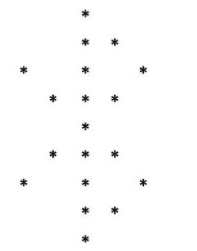

| | col=1 | col=2 | col=3 | col=4 | col=5 |
|---|---|---|---|---|---|
| row=1 | | | 1,3* | | |
| row=2 | | | 2,3* | 2,4* | |
| row=3 | 3,1* | | 3,3* | | 3,5* |
| row=4 | | 4,2* | 4,3* | 4,4* | |
| row=5 | | | 5,3* | | |
| row=6 | | 6,2* | 6,3* | 6,4* | |
| row=7 | 7,1* | | 7,3* | | 7,5* |
| row=8 | | | 8,3* | 8,4* | |
| row=9 | | | 9,3* | | |

### 问题YBN

| | col=1 | col=2 | col=3 | col=4 | col=5 |
|---|---|---|---|---|---|
| row=1 | * | | | | * |
| row=2 | * | * | | | * |
| row=3 | * | * | * | | * |
| row=4 | * | * | * | * | * |
| row=5 | * | | * | * | * |
| row=6 | * | | | * | * |
| row=7 | * | | | | * |

### 问题YBP

| | col=1 | col=2 | col=3 | col=4 | col=5 |
|---|---|---|---|---|---|
| row=1 | | * | * | * | * |
| row=2 | | * | | | * |
| row=3 | | * | | | * |
| row=4 | | * | * | * | * |
| row=5 | | * | | | |
| row=6 | | * | | | |
| row=7 | | * | | | |

### 问题YBR

| | col=1 | col=2 | col=3 | col=4 | col=5 |
|---|---|---|---|---|---|
| row=1 | * | * | * | * | |
| row=2 | | * | | * | |
| row=3 | | * | | * | |
| row=4 | | * | * | * | |
| row=5 | | * | * | | |
| row=6 | | * | | * | |
| row=7 | | * | | | * |

### 问题YBS

| | col=1 | col=2 | col=3 | col=4 | col=5 |
|---|---|---|---|---|---|
| row=1 | * | * | * | * | * |
| row=2 | * | * | | | |
| row=3 | * | * | | | |
| row=4 | * | * | * | * | * |
| row=5 | | | | | * |
| row=6 | * | * | * | * | * |
| row=7 | * | * | * | * | * |

### 任务 Y

| | col=1 | col=2 | col=3 | col=4 | col=5 |
|---|---|---|---|---|---|
| row=1 | XX | | | | XX |
| row=2 | XX | XX | | XX | XX |
| row=3 | | XX | XXX | XX | |
| row=4 | | | \// | | |
| row=5 | | | or | | |
| row=6 | | | or | | |
| row=7 | | | or | | |

### 任务 9

| | col=1 | col=2 | col=3 | col=4 | col=5 |
|---|---|---|---|---|---|
| row=1 | | | 99 | 99 | |
| row=2 | | 99 | | | 99 |
| row=3 | | 99 | | | 99 |
| row=4 | | | 99 | 99 | 99 |
| row=5 | | | | 99 | |
| row=6 | | | 99 | | |
| row=7 | | 99 | | | |

### 任务 5

| | col=1 | col=2 | col=3 | col=4 | col=5 |
|---|---|---|---|---|---|
| row=1 | 5 | 5 | 5 | 5 | 5 |
| row=2 | 5 | 5 | | | |
| row=3 | 5 | 5 | 5 | | |
| row=4 | 5 | | | 5 | |
| row=5 | | | | 5 | |
| row=6 | | | | 5 | |
| row=7 | 5 | 5 | 5 | | |

### 任务 8

| | col=1 | col=2 | col=3 | col=4 | col=5 |
|---|---|---|---|---|---|
| row=1 | 8 | or | | 8 | 8 |
| row=2 | 8 | or | | or | 8 |
| row=3 | 8 | or | | or | 8 |
| row=4 | @ | @ | | @ | @ |
| row=5 | or | 8 | | 8 | or |
| row=6 | or | 8 | | 8 | or |
| row=7 | or | 8 | | 8 | or |

### 任务 5

| | col=1 | col=2 | col=3 | col=4 | col=5 |
|---|---|---|---|---|---|
| row=1 | 5 | 5 | 5 | 5 | 5 |
| row=2 | 5 | | | | |
| row=3 | 5 | 5 | 5 | 5 | |
| row=4 | | | | 5 | 5 |
| row=5 | | | | 5 | 5 |
| row=6 | 5 | | | 5 | 5 |
| row=7 | | 5 | 5 | 5 | |

### 任务 6

| | col=1 | col=2 | col=3 | col=4 | col=5 |
|---|---|---|---|---|---|
| row=1 | | | | 6 | |
| row=2 | | | 6 | | |
| row=3 | | 6 | 6 | | |
| row=4 | 6 | 6 | 6 | 6 | |
| row=5 | 6 | | | 6 | |
| row=6 | 6 | | | 6 | |
| row=7 | | 6 | 6 | | |

### 任务 7

| | col=1 | col=2 | col=3 | col=4 | col=5 |
|---|---|---|---|---|---|
| row=1 | 7 | 7 | 7 | 7 | 7 |
| row=2 | | | | | 7 |
| row=3 | | | | | 7 |
| row=4 | | | | | 7 |
| row=5 | | | | | 7 |
| row=6 | | | | | 7 |
| row=7 | | | | | 7 |

### 任务 LT

| | col=1 | col=2 | col=3 | col=4 | col=5 |
|---|---|---|---|---|---|
| row=1 | | | | # | |
| row=2 | | | # | # | |
| row=3 | | # | # | | |
| row=4 | # | # | | | |
| row=5 | | # | # | | |
| row=6 | | | # | # | |
| row=7 | | | | # | |

### 任务 2

| | col=1 | col=2 | col=3 | col=4 | col=5 |
|---|---|---|---|---|---|
| row=1 | | | # | # | |
| row=2 | | # | # | # | # |
| row=3 | # | | | | # |
| row=4 | | | | | # |
| row=5 | | | | # | |
| row=6 | | | # | | |
| row=7 | # | # | # | # | # |

### 任务 4

| | col=1 | col=2 | col=3 | col=4 | col=5 |
|---|---|---|---|---|---|
| row=1 | | | | # | |
| row=2 | | | # | # | |
| row=3 | | # | # | # | |
| row=4 | # | # | | # | |
| row=5 | # | # | # | # | # |
| row=6 | | | | # | |
| row=7 | | | | # | |

### 任务 Z

| | col=1 | col=2 | col=3 | col=4 | col=5 |
|---|---|---|---|---|---|
| row=1 | Z | Z | Z | Z | Z |
| row=2 | # | # | # | # | |
| row=3 | | | # | | |
| row=4 | | # | | | |
| row=5 | # | # | # | # | # |
| row=6 | Z | Z | Z | Z | Z |
| row=7 | | | | | |

### 任务 1

| | col=1 | col=2 | col=3 | col=4 | col=5 |
|---|---|---|---|---|---|
| row=1 | | | # | | |
| row=2 | | # | # | | |
| row=3 | # | | # | | |
| row=4 | | | # | | |
| row=5 | | | # | | |
| row=6 | | | # | | |
| row=7 | # | # | # | # | # |

### 通过实验和猜测来学习

学习编程通常且普遍的方式是随意地进行实验。这种方式学习编程需要花费更多时间，因为它需要大量的练习。毫无疑问，它有其优势，特别是当我们想要探索API/内置库或探索编程语言的特性时。对于初学者来说，这种特定的猜测式学习风格可能会扼杀对编程学科本身的兴趣。因此，它需要更多时间来学习编程，而且，对某些人来说，这确实是一种有趣的方式。**然而，并非每个人都能猜对每个领域，也没有一个适用于所有人的、可靠的猜测公式。** 对于一个不擅长猜测甚至猜测得很笨拙的人来说，进行编程实验是很困难的。许多人的编程想象力无法流畅发挥，他们的大脑会一片空白。因此，如果一个人在其他许多活动中表现出色，却在学习编程时缺乏耐心，这并不奇怪。这并非特指学习编程这一学科；它也可能发生在学习任何其他学科时。

现实情况是，如果一个人在尝试学习某样东西时，想象力和思维过程无法流畅进行，那么知识就无法进入他的脑海。通过猜测来学习编程对许多人来说是一种阻碍。它不代表任何标准的学习方式。相反，一种基于简单数学和常识的系统性编程学习方法，能使学习者成为更好的思考者。这种方法在不同难度层次上深入探讨，以正确学习编程逻辑，将在下一节**编程模式**中介绍。

为了进行模式化编程，一个人必须很好地了解for循环和应用逻辑条件。循环是最难的部分。嵌套循环挑战我们同时从两个不同的方向进行逻辑思考以输出一个模式，而任何模式都是一个二维的简单图形。这类活动能刺激逻辑思维。在学习过程中，产生多种不同的想法是很常见的。让我们尝试从不同的角度思考困惑或疑问。它会制造一种悬念，使学习变得令人兴奋。困惑和疑问对学习编程是有益的，它表明学习者的思维过程和想象力变得活跃起来。很多时候，澄清一个疑问会打开探索其他领域知识的大门。因此，疑问基本上就像一个惊喜的知识胶囊。学习者需要持续努力，以尝试解决那个特定的疑问或困惑。所以，每当我们有任何疑问时，可以假设我们又获得了一次提升智力的机会。

显然，如果没有系统性方法的支持，学习将无法持久。一个擅长培养编程逻辑的人，在需要处理更难的编程主题时，遇到的障碍会更少。因此，良好的编程逻辑是关键，而本书正是关于培养编程逻辑技能的，无论某人最初在这方面是否一窍不通。本书的内容无疑能帮助一个人对编程产生兴趣。练习的设计方式自然地以递增的难度顺序适合任何新学习者。有些练习特别加入只是为了制造惊喜，迫使学习者跳出框框思考。

### 编程模式

任何模式都只是一个二维图形。我们大多数时候处理的是二维类型的输出，无论是在桌面/网页/移动应用程序上。这就是选择基于简单图形的问题来解决常见编程逻辑问题的原因。使用编程语言，如果一个人擅长输出二维结果，我们可以期望他能处理三维编程方面，例如游戏编程。

选择基于图形模式的练习背后的主要思想是，它能清晰地验证程序员的逻辑。不匹配的输出迫使学习者思考合适的原因。这种反复进行编程逻辑工作以获得匹配输出的方式，极大地有助于完善编程逻辑的可视化。这是一种逆向工程，我们将看到它如何提升编程技能。这些练习使学习者保持警觉、投入、自我激励，并且确实能轻松地教会大量的耐心。这套练习确实能极大地激发好奇心。程序员的想象力应该朝着捕捉编程逻辑的方向运作。如果这发生了，那么编程将是一项有趣的工作。在软件开发工作场所，一个程序员必须理解其他程序员的程序。这也是事实；一个程序员可以从其他程序员那里学习好的编程。在所有情况下，对编程逻辑可视化的一些掌握，肯定有助于理解其他程序员的程序。因此，练习编程逻辑的可视化应该是任何初级程序员的首要关注点。循环是程序中唯一最难的东西。掌握嵌套循环中的控制流足以提升初级程序员的信心。

简而言之，一个初学者对编程能力的信心与编程逻辑可视化水平的低/中/高有直接关系。

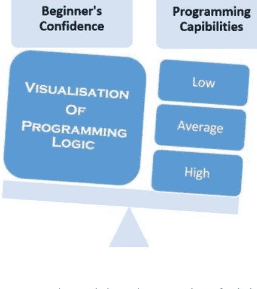

我们将要学习的是一种基于简单数学的方法，以找到实际的程序逻辑。这种技术需要一定程度的练习，我们练习得越多，就越能完善我们的想象力以捕捉编程逻辑。

> > 如果你能想象，你就能做到。
> 
> - 恩佐·法拉利

**练习嵌套循环以及正确应用逻辑条件的感觉，能极大地帮助建立新手程序员的信心。**

通常，程序员总是被期望擅长编程逻辑。如果程序员有这种信心，进一步的高级技术学习将会更有信心地进行。每个程序员可能都希望拥有那种想象力水平，以便编程逻辑能够自然地契合，匹配待解决问题的需求。期望在没有适当练习的情况下就对编程逻辑的可视化有清晰的认识，这将只是一厢情愿的想法。扎实的基础工作需要对编程逻辑的可视化有相当程度的清晰认识，并获得编程才能。

使编程逻辑可视化正确工作的最重要原则是理解数据流中涉及的智能。获得这种智能的诀窍是使用我们称为逻辑追踪表的观察表版本，用一个或多个逻辑表达式来表达数据流。逻辑表达式由一个或多个变量和运算符组成。最终，编程逻辑由一个或多个逻辑表达式组成。我们可以通过本节中提到的适当练习，轻松学会制作逻辑表达式这门艺术。我们的方法将是**通过观察程序的输出来提取逻辑表达式**。这种思维过程体现在以下方法中：这是一种独特的逻辑构建练习，旨在培养兴趣并建立编程信心。该方法的主要步骤如下图所示。程序员应该能够在编写程序之前就清晰地可视化逻辑。只有当程序员能够清晰地可视化任何重复控制结构或一般循环如何工作时，这种品质才有可能实现。基于简单图形的练习在这方面大有帮助，它基本上基于嵌套循环。以下是为提高逻辑构建技能而要遵循的完整框架。需要遵循的步骤按特定顺序给出如下

| 步骤 | 活动 |
| --- | --- |
| 1. | 选择**模式**图形。 |
| 2. | 通过观察模式图形创建**逻辑追踪表**。 |
| 3. | 从逻辑追踪表中提取**逻辑表达式**。 |
| 4. | 使用逻辑表达式实现**程序**。 |
| 5. | 执行程序并检查**程序的输出是否与所选模式图形匹配**。 |

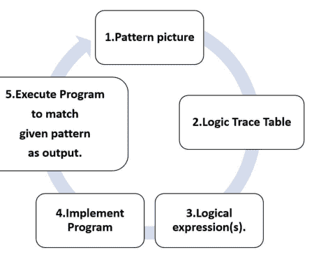

**注意：** 如果第5步出错，需要从第2步重复到第5步。

*如果一个人拥有一种品质，那就是坚持职业道德的耐心，那么没有人能阻止那个人在该领域变得有才华。*

### 逻辑追踪表：编程逻辑背后的大脑

> 不要仅仅作为一种反应而否定经典方法，否则你将创造出另一种模式并被困其中。
> —— 李小龙

从概念上讲，逻辑追踪表只是一种观察表。所有主要的观察结果都被放入此表中，以便我们能够关联不同的信息片段。你可以创建自己的观察表，或者它可能取决于你的需求。在我们的案例中，逻辑追踪表的行和列的选择动机是为了追踪编程逻辑。我们可以使用基于观察表的方法来解决其他类型的问题，而不仅仅是与模式相关的问题。

主要关注点是通过使用逻辑追踪表，让新手程序员的逻辑可视化能力趋于完善，并最终在编程中建立信心。此外，清晰度和职业道德有助于实现我们的小目标。小成就会提升我们的信心水平，以应对下一阶段的挑战。因此，清晰度和职业道德是每一次成就事件发生的基础。

逻辑追踪表解决了什么目的？

> 简单是卓越的关键。
> —— 李小龙

这是一个训练新手程序员逻辑思维的简单技巧。其主要目的是以更结构化的方式应用思维来获得编程逻辑。它是一个简单的表格结构，旨在推导逻辑表达式。表格结构基本上清晰地展示了变量参数之间的关系。

> 清晰就是力量。
> —— 你对自己想要什么越清楚，你的大脑就越知道如何达到目标。
> —— 佚名

在我看来，如果不借助表格结构，大多数新手程序员会发现很难清晰地思考如何构建编程逻辑。清晰思考以找到逻辑表达式是一个可以通过少量练习来改进的过程。除非一个人能够以简化的方式表达自己的理解，否则意味着这个人并没有真正理解这个概念。

逻辑表达式的重要性是什么？

编程逻辑是程序背后的大脑。它由逻辑表达式组成。因此，在最核心的层面，它是一个逻辑表达式——当执行时——有助于决策。大多数情况下，它应用于循环条件、决策结构（如 if 条件、if-elif 条件）中。

# 第二部分

## 编程实践

### 在计算机屏幕上输出简单图形

关键点是理解计算机屏幕不过是一个小方框的逻辑集合，每个小方框可以输出单个键盘字符。这些方框的排列方式使得行和列的概念清晰明了。以下是计算机屏幕的概念图，显示了输出到屏幕上的简单图形的若干行和列。每个键盘字符位于一个最小的方框中。

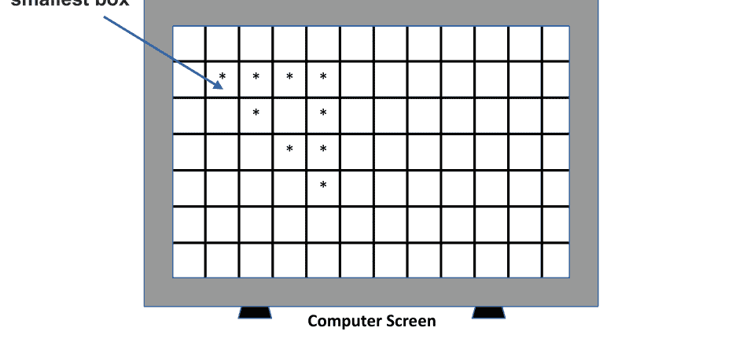

在我们开始基于简单图形的编程练习之前，我们必须首先学会概念上分配行号和列号。这将有助于我们唯一地识别每个最小方框中的单个键盘字符。**（行号，列号）** 数字组合将对应一个单个键盘字符。提及（行号，列号）数字组合只是为了正确定位计算机屏幕上的任何键盘字符。这与使用 **（经度，纬度）** 组合在地理地图上定位一个城市非常类似。因此，我们版本的单个最小方框映射到计算机屏幕上的单个键盘字符，并等效地映射到一个唯一的（行号，列号）数字对。通过这种方式，（行号，列号）数字对的集合可以用来完整地表示一个简单图形。

**单个最小方框 → 单个键盘字符 → （行号，列号）数字对。**

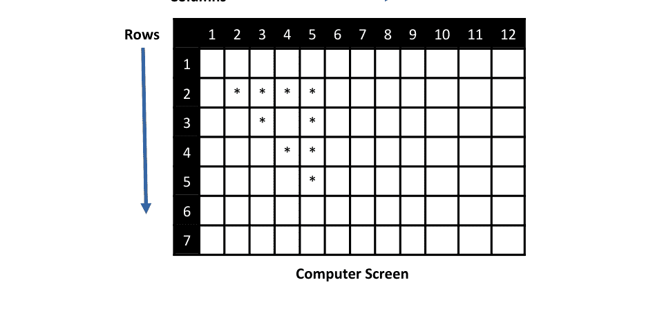

或者，我们可以将计算机屏幕视为坐标纸或方格纸的复杂版本。计算机屏幕的每个最小方框都是一个坐标，一个由两个数字组成的唯一组合，一个“X（列）”（水平）和一个“Y（行）”（垂直）——决定了键盘字符在计算机屏幕空间中的位置。

这是我们的编程任务；如何让一个基于简单图形的模式出现在由（**行号，列号**）数字对表示的这些最小方框坐标上。

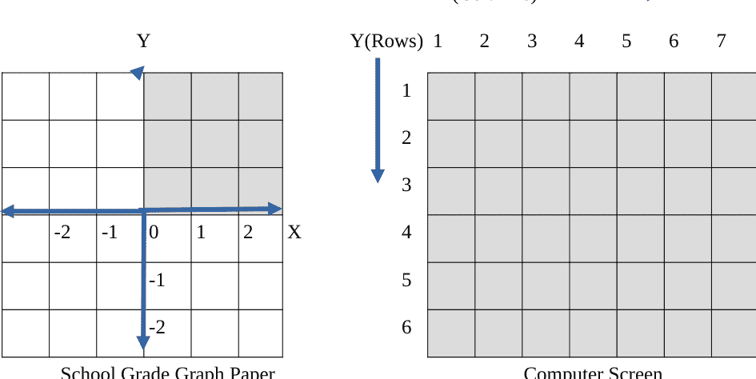

如前所述，我们可以在计算机屏幕上用行和列来表示任何二维简单图形。因此，由键盘字符组成的这种简单图形可以完全被“装入”一个小方框的集合中。一个被考虑的简单图形的每个键盘字符都可以有一个唯一的（**行号，列号**）数字对。因此，这样的数字对集合可以完全表示一个完整的简单图形。

这个简单图形的相关唯一（行号，列号）数字对的集合可以表示为：
(2,2), (2,3), (2,4), (2,5)
(3,3), (3,5), (4,4), (4,5),
(5,5)

| | 列=1 | 列=2 | 列=3 | 列=4 | 列=5 |
|---|---|---|---|---|---|
| 行=1 | | | | | |
| 行=2 | | *(2,2)* | *(2,3)* | *(2,4)* | *(2,5)* |
| 行=3 | | | *(3,3)* | | *(3,5)* |
| 行=4 | | | | *(4,4)* | *(4,5)* |
| 行=5 | | | | | *(5,5)* |

### 光标移动

一个移动的位置指示器，显示在计算机显示器上，指示下一个移动或操作将发生的位置。我们将使用这个概念来更好地解释模式中的每个字符是如何在计算机屏幕或编程IDE的控制台屏幕上生成的。在我们的案例中，键盘字符将使用内置库输出到计算机屏幕的特定位置。因此，光标移动到屏幕上的下一个位置，然后字符的打印将由内置方法处理。

### 模式 1A

我们的编程任务是在计算机屏幕的一部分打印这个特定的基于逻辑的模式。**我们的方法将假设计算机屏幕是行和列的组合，虚拟地将其划分为更小的方框**——最小的方框被视为仅容纳一个字符。因此，显示屏幕上每个最小方框的地址在逻辑上将成为一个唯一的 **（行，列）** 数字组合。基于这个假设，计算机屏幕将简单地是一个由（行，列）数字值配对的方框组成的唯一组合，这些方框均匀地分布在屏幕上。

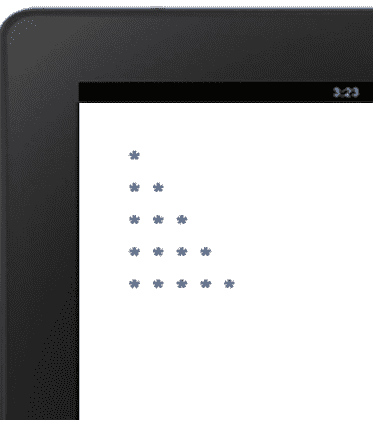

#### 数据表示

尽管在逻辑上，我们可以通过知道每个可打印字符在显示屏幕上的唯一可识别的 **（行，列）** 数字配对值来精确定位其位置。

| 行, 列 | 列 = 1 | 列 = 2 | 列 = 3 | 列 = 4 | 列 = 5 |
| :--- | :--- | :--- | :--- | :--- | :--- |
| 行 = 1 | * (1, 1) | | | | |
| 行 = 2 | * (2, 1) | * (2, 2) | | | |
| 行 = 3 | * (3, 1) | * (3, 2) | * (3, 3) | | |
| 行 = 4 | * (4, 1) | * (4, 2) | * (4, 3) | * (4, 4) | |
| 行 = 5 | * (5, 1) | * (5, 2) | * (5, 3) | * (5, 4) | * (5, 5) |

> 数对 (4, 3) 代表显示屏幕上假设的第4行第3列位置上的单个字符 *。所有值对（行 = 值，列 = 值）的集合现在代表这个特定的模式。

#### 输出分析

计算机主要进行非常精确的计算。练习编程的一个有趣方法是尝试将编写给定模式的手动步骤转换为编程指令。我们可以使用纸张或电子表格。我们可以标记行号和列号来识别位置指示器，以便正确地逻辑分析一个模式。

| | | 列 = 1 | 列 = 2 | 列 = 3 | 列 = 4 | 列 = 5 | 写入动作 |
| :--- | :--- | :--- | :--- | :--- | :--- | :--- | :--- |
| 行 | 移动到 行 = 1 | 1 → * | | | | | 写入 * 1 次 |
| 移动 | 移动到 行 = 2 | 1 → * | 2 → * | | | | 写入 * 2 次 |
| 动作 | 移动到 行 = 3 | 1 → * | 2 → * | 3 → * | | | 写入 * 3 次 |
| | 移动到 行 = 4 | 1 → * | 2 → * | 3 → * | 4 → * | | 写入 * 4 次 |
| | 移动到 行 = 5 | 1 → * | 2 → * | 3 → * | 4 → * | 5 → * | 写入 * 5 次 |

#### 分解

我们可以将打印图案的重复动作分解为以下几类。

#### 重复动作

- **行级别：** 重复向下移动，按顺序标记下一个行号。
- **列级别：** 在列级别重复书写 * 字符。

给定的图案是一个二维简单图形，因此可以用行和列来表示。我们的下一步是将这些手动、重复的动作转化为一个可运行的程序。我们将在程序中使用 * 字符将其打印在计算机屏幕上。可运行的程序应按以下方式运行。

#### 在屏幕上生成图案的步骤

| 列级别 | 计算机屏幕 |
| :--- | :--- |
| **row = 1** 1) 在同一第1行，col = 1处，**打印一次**“*”。 2) 移动到行号2。 |  |
| **row = 2** 1) 在同一第2行，col = 1, 2处，**打印两次**“*”。 2) 移动到行号3。 |  |
| **row = 3** 1) 在同一第3行，col = 1, 2, 3处，**打印三次**“*”。 2) 移动到行号4。 |  |
| **row = 4** 1) 在同一第4行，col = 1, 2, 3, 4处，**打印四次**“*”。 2) 移动到行号5。 |  |
| **row = 5** 1) 在第5行，col = 1, 2, 3, 4, 5处，**打印五次**“*”。 2) 移动到行号6。 |  |

让我们尝试使用给定的内置方法编写程序来模拟这些步骤。

| 目的 | 方法名 |
| :--- | :--- |
| 为了将程序控制转移到下一行。 | `print()` |
| 为了将程序控制在同一行内移动到下一个列位置（同一行，新列），然后打印所需的字符。因此，屏幕上每次列移动都是在同一行内从左到右方向的一个字符大小的跳跃。 | `print("* ", end="")` |

我们可以很容易地观察到，行值多次增加1。这正是 **for循环** 控制结构的相同特性。因此，我们可以对行值应用 **for循环**。

```python
# Pattern1A1If.py
for row in range(1, 5 + 1):
    # 使用if条件在列或同一行中打印 *
    if (row == 1):
        print("* ", end="")  # col = 1

    if (row == 2):
        print("* ", end="")  # col = 1
        print("* ", end="")  # col = 2

    if (row == 3):
        print("* ", end="")  # col = 1
        print("* ", end="")  # col = 2
        print("* ", end="")  # col = 3

    if (row == 4):
        print("* ", end="")  # col = 1
        print("* ", end="")  # col = 2
        print("* ", end="")  # col = 3
        print("* ", end="")  # col = 4

    if (row == 5):
        print("* ", end="")  # col = 1
        print("* ", end="")  # col = 2
        print("* ", end="")  # col = 3
        print("* ", end="")  # col = 4
        print("* ", end="")  # col = 5

    print()  # 移动到下一行
```

**固定输出实现**

*
**
***
****
*****

每当我们执行这个程序时，我们总是会得到一个5行的固定输出。除非我们手动更改给定的 **for循环** 并添加/减去 **if条件**，否则我们无法为不同的行输出更大或更小的图案。实现通用的编程逻辑本质上意味着我们应该能够在不修改程序实际逻辑的情况下获得定制化的输出。

### 如何获得通用的编程逻辑

获得通用编程逻辑的一个合适方法是使用我们自己版本的逻辑追踪表。基本上，逻辑追踪表是一个概念，它可以普遍应用于获取程序的逻辑。显然，其结构会根据要解决的问题类型而相应地有所不同。我们正在学习如何应用这个逻辑追踪表的概念。一个有趣的方法是实现基于控制台的、各种形状的基于模式识别问题的程序。如果我们清楚地理解逻辑追踪表中的变化将如何影响所考虑程序的实现，那么获取程序的逻辑就很容易了。让我们试着理解它工作所依据的原理。

### 逻辑追踪表/观察表的原理

它是一组与程序逻辑交互的方法，这些逻辑尚未被实际探索过。它有助于做到这一点。最终的通用编程逻辑本质上由一个或多个通用逻辑表达式组成。因此，我们需要从逻辑追踪表中追踪出通用逻辑表达式。获取通用逻辑表达式的方法是遵循以下给定事实；

- ✓ 给定程序中变量的执行顺序。在我们的情况下，通常，可运行的程序由外层循环和内层循环组成。由于我们知道外层循环在嵌套循环之前执行，因此 **变量：row** 将在 **变量：col** 之前执行。

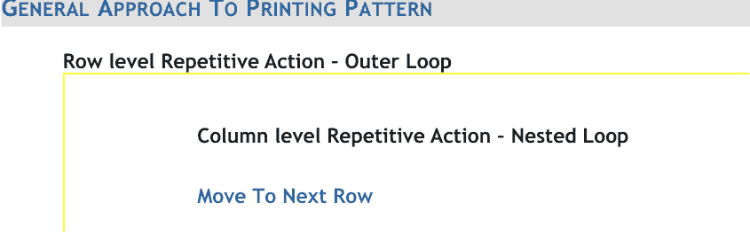

- ✓ 逻辑追踪表是程序执行期间不同变量如何存储不同值的快照。例如，假设两个变量在程序执行期间遵循相同的数字模式。在这种情况下，先执行的变量将作为另一个变量所遵循的数字模式的替代品。通过这种特定的方式，我们需要尝试用给定程序中可用的变量替换一组硬编码的数值。因此，检查逻辑追踪表的列之间是否存在任何数字模式匹配至关重要。
- ✓ 在完成数字模式匹配并使用可用变量进行替换后，我们需要检查特定列中表达式的一致性。如果它保持为真，那么它就是一个有效的通用逻辑表达式。一个通用逻辑表达式可以包含一个或多个变量。
- ✓ 我们需要检查特定列中是否存在相同的数值。如果这保持为真，那么它必须是一个通用的数值表达式，即整个列中的一个单一数值。

所以，底线是我们需要更新逻辑追踪表的列，直到我们为所有行获得一致的数值或逻辑表达式。我们将看到如何将这些点实际应用于构建程序的逻辑。这是通过**将逻辑追踪表原理应用于给定表的列以获取**合适的数值/逻辑表达式来设计程序逻辑的一次尝试。我们可以从使用 **PatternA1If.py** 程序创建我们第一个版本的逻辑追踪表开始。

### 列级别重复动作

抽象出 **PatternA1If.py** 程序的细节以创建逻辑追踪表。给定的表将给定的图案分解为行值和列值之间的**一对多**关系。

| 输入 | 行级别 | 列级别 |
| :--- | :--- | :--- |
| **总行数 = 5** | **重复动作** | **重复动作** |
| * | row = 1 | col = 1 |
| * * | row = 2 | col = 1, 2 |
| * * * | row = 3 | col = 1, 2, 3 |
| * * * * | row = 4 | col = 1, 2, 3, 4 |
| * * * * * | row = 5 | col = 1, 2, 3, 4, 5 |

为了唯一标识给定图案的每个打印字符，让我们考虑变量 **row** 和 **col**。选择变量 **row** 和 **col** 分别精确标记给定图案中打印字符的行号和列号位置。**变量：row** 的每个值都可以映射到列级别的一组 **变量：col** 值。如果我们从*起始值*移动到*结束值*，**变量：col** 的值保持一个值为1的公差。等一下。这听起来非常像另一种 **for循环** 构造的情况？

| 行级别 | 列级别 | | |
| :--- | :--- | :--- | :--- |
| **行值** | **列值** | | **公差** |
| row = 1 | col = 1 | 起始值 = 1<br>结束值 = 1 | 1 = 1 |
| row = 2 | col = 1, 2 | 起始值 = 1<br>结束值 = 2 | 2-1=1 |
| row = 3 | col = 1, 2, 3 | 起始值 = 1<br>结束值 = 3 | 2-1=1,3-2=1 |
| row = 4 | col = 1, 2, 3, 4 | 起始值 = 1<br>结束值 = 4 | 2-1=1,3-2=1,4-3=1 |
| row = 5 | col = 1, 2, 3, 4, 5 | 起始值 = 1<br>结束值 = 5 | 2-1=1,3-2=1,4-3=1,5-4=1 |

通过考虑 **变量：row** 和 **变量：col**，我们可以进一步优化逻辑追踪表，目的是为每个行号值构建 **for循环**。这个 **for循环** 基本上将是每个行值的嵌套循环。

| 输入 | 行级别 for 循环 | 列级别 for 循环 |
| :--- | :--- | :--- |
| **总行数 = 5** | **变量：row** | **变量：col** |
| **打印图案** | **start = 1** &nbsp;&nbsp;&nbsp;&nbsp; **end = 5** | **start** &nbsp;&nbsp;&nbsp;&nbsp; **end** |
| * | row = 1 | col = 1 &nbsp;&nbsp;&nbsp;&nbsp; col = 1 |
| * * | row = 2 | col = 1 &nbsp;&nbsp;&nbsp;&nbsp; col = 2 |
| * * * | row = 3 | col = 1 &nbsp;&nbsp;&nbsp;&nbsp; col = 3 |
| * * * * | row = 4 | col = 1 &nbsp;&nbsp;&nbsp;&nbsp; col = 4 |
| * * * * * | row = 5 | col = 1 &nbsp;&nbsp;&nbsp;&nbsp; col = 5 |

根据最近更新的逻辑追踪表，我们可以按如下方式更新程序的逻辑。

```
PatternA1NestedLoop.py

for row in range(1, 5 + 1):
    # 使用 if 条件在列或同一行中打印 *

    if (row == 1):
        for col in range(1, 1 + 1):
            print("* ", end="")  # 列：起始 = 1 | 结束 = 1

    if (row == 2):
        for col in range(1, 2 + 1):
            print("* ", end="")  # 列：起始 = 1 | 结束 = 2

    if (row == 3):
        for col in range(1, 3 + 1):
            print("* ", end="")  # 列：起始 = 1 | 结束 = 3

    if (row == 4):
        for col in range(1, 4 + 1):
            print("* ", end="")  # 列：起始 = 1 | 结束 = 4

    if (row == 5):
        for col in range(1, 5 + 1):
            print("* ", end="")  # 列：起始 = 1 | 结束 = 5

    print()  # 移动到下一行
```

```
输出
*
* *
* * *
* * * *
* * * * *
```

通过使用嵌套循环，我们的程序变得比以前更好。对于每一行的值，我们都成功地构建了一个单独的嵌套循环。因此，嵌套循环的数量会根据所使用的行数而增减。泛化的下一步是将多个嵌套循环转换为一个嵌套循环。这种转换为单个嵌套循环意味着输入到程序的行数不应影响我们的解决方案。我们将在应用逻辑追踪表原则的过程中看到所有这些实际应用。主要目标是在逻辑追踪表的列中获得一致的数值或逻辑表达式。我们将使用这些获得的一致数值或逻辑表达式结果来设计我们的程序。推导出的表达式只有在给出正确输出时才被认为是正确的；否则，我们需要重新处理逻辑追踪表以找到我们自己的错误。与试错法相比，这是学习程序逻辑设计的“计算思维”方式。

### 我们可以找到一个数值一致的列。

| 输入变量 | 行级 For 循环 | 列级 For 循环 |
| :--- | :--- | :--- |
| totalRows = 5 | 变量：row | 变量：col |
| PRPATTERN | start = 1 end = 5 | start end |
| * | row = 1 | col = 1 col = 1 |
| * * | row = 2 | col = 1 col = 2 |
| * * * | row = 3 | col = 1 col = 3 |
| * * * * | row = 4 | col = 1 col = 4 |
| * * * * * | row = 5 | col = 1 col = 5 |

start 列包含数据 col = 1，这对于每一行都是相同的。因此，start 列已经处于泛化状态，我们得到了一致的逻辑表达式来启动列级 for 循环。列级 for 循环必须要求一个单一的起始值和一个单一的结束值。

| 输入变量 | 行级 For 循环 | 列级 For 循环 |
| :--- | :--- | :--- |
| totalRows = 5 | 变量：row | 变量：col |
| PRPATTERN | start = 1 end = 5 | start end |
| * | row = 1 | col = 1 col = 1 |
| * * | row = 2 | col = 2 |
| * * * | row = 3 | 一致的数值表达式 col = 3 |
| * * * * | row = 4 | col = 4 |
| * * * * * | row = 5 | col = 5 |

显然，具有单一值的 end 列不是我们的情况。剩下的另一种可能性是推导出一个逻辑表达式，该表达式对于此列应该是一致的。我们可以观察到变量：col 和变量：row 的数值模式变化。end 列与变量：row 的数值模式变化完全匹配，如上逻辑追踪表所示。

### 我们可以找到一个**逻辑表达式**一致的列。

| 输入变量 | 行级 For 循环 | 列级 For 循环 |
| :--- | :--- | :--- |
| **totalRows = 5** | **变量：row** | **变量：col** |
| PRPATTERN | start = 1 | end = 5 | start | end |
| * | row = 1 | | col = 1 | col = row |
| * * | row = 2 | | | col = row |
| * * * | row = 3 | | 一致的数值表达式 | col = row |
| * * * * | row = 4 | | | col = row |
| * * * * * | row = 5 | | | col = row |

这意味着带有**变量：col** 的列级 for 循环从值 1 开始，到**变量：row** 最近取的值结束。因此，我们得到了 end 列的一致逻辑表达式 **(col = row)**。

| 输入变量 | 行级 For 循环 | 列级 For 循环 |
| :--- | :--- | :--- |
| **totalRows = 5** | **变量：row** | **变量：col** |
| PRPATTERN | start = 1 | end = 5 | start | end |
| * | row = 1 | | col = 1 | col = row |
| * * | row = 2 | | | |
| * * * | row = 3 | | 一致的数值表达式 | 一致的逻辑表达式 |
| * * * * | row = 4 | | | |
| * * * * * | row = 5 | | | |

因此，在程序执行期间，带有**变量：row** 的行级 for 循环取值 1 到 5。然后，带有**变量：col** 的列级 for 循环将取值在 1 和**变量：row** 的当前值之间。
数学上，可以表示为

$$1 <= col <= row$$

其中 **row = 1 到 5**

行级 for 循环将从值 1 开始，并在程序执行期间由变量：row 的变化值停止和控制。在每一行的值处，列级 *for 循环* 应停止循环，并由逻辑表达式 **(col <= row)** 控制。一致的逻辑表达式 **( col <= row )** 将是为不同**变量：row** 值在列级产生动态输出的原因。提取一致的逻辑表达式是泛化和获得定制解决方案的一种方式。当我们能够建立变量之间的关系时，我们就有机会使计算过程自动化。
我们现在可以清楚地定义列级 **for 循环** 的操作。

| 变量：col | 递增顺序 | 操作 |
| :--- | :--- | :--- |
| start | end | step-size | 打印字符 |
| 1 | row | 1 | * |

递增顺序的列级 FOR 循环

列级重复操作

```
for col in range(1, end + 1):
    打印字符 *
```

### 行级重复操作

我们使用逻辑追踪表作为工具来获得泛化解决方案。逻辑追踪表是程序执行期间不同变量 **totalRows**、**row** 和 **col** 如何存储不同值以及以何种匹配模式的快照。

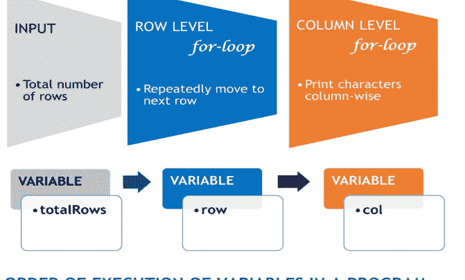

程序中变量的执行顺序。

以下逻辑追踪表基本上是行级 **for 循环** 的实际操作。在我们的情况下，**行级 for 循环** 唯一期望的操作是将程序控制转移到下一行。这应该根据**变量：totalRows** 输入的**总行数**动态完成。

我们的目标是获得**行级 for 循环**的 **start** 和 **end** 的单一数值/逻辑表达式。

### 我们可以找到一个**数值**一致的列。


| 行级 For 循环 | | |
| :--- | :--- | :--- |
| **输入变量** | **变量：row** | **递增顺序** |
| **总行数** | **start** | **end** | **step-size = 1** |
| totalRows = 3 | 1 | 3 | 移动到下一行 3 次 |
| totalRows = 5 | 1 | 5 | 移动到下一行 5 次 |
| totalRows = 7 | 1 | 7 | 移动到下一行 7 次 |
| totalRows = 10 | 1 | 10 | 移动到下一行 10 次 |

这个 **for 循环** 循环**从值 1 开始**，对于总行数给出的每个不同输入都是相同的。因此，它已经处于泛化状态，并被标记下来，用单个数值表达式值 1 更新给定的逻辑追踪表。此外，给定表格**阴影列**中显示的数值模式完全匹配。在程序执行期间，变量：totalRows 是第一个被执行的，其他标记为阴影的列遵循相同的数据趋势。因此，**变量：totalRows** 是存在于不同列中并完全遵循数值模式的数值模式的良好替代品。这将建立输入**变量：totalRows** 和**行级 for 循环变量：row** 之间的关系。

这意味着在程序执行期间，当**变量：totalRows** 包含值 **3** 时，**行级 for 循环** 应在 **3** 次重复后**结束**。
对于 **5** 次**行级 for 循环**重复，程序控制移动到下一行 **3** 次或**变量：totalRows** 应包含值 5。
对于 **7** 次**行级 for 循环**重复，程序控制移动到下一行 **7** 次或**变量：totalRows** 应包含值 7。
对于 **10** 次**行级 for 循环**重复，程序控制移动到下一行 **10** 次或**变量：totalRows** 应包含值 10。

| 行级 For 循环 | | |
| :--- | :--- | :--- |
| **输入** | **变量：row** | **递增顺序** |
| **总行数** | **start** | **end** | **STEP-SIZE = 1** |
| totalRows = 3 | 1 | 3 | 移动到下一行 3 次 |
| totalRows = 5 | | 5 | 移动到下一行 5 次 |

| totalRows = 7 | 一致 | 7 | 移至下一行 | 7 | 次 |
| totalRows = 10 | 数值表达式 | 10 | 移至下一行 | 10 | 次 |

在使用变量 `totalRows` 进行数值模式匹配并应用替换后，逻辑追踪表如下所示。

> 我们可以找到一个列，其中的逻辑表达式是一致的。

| 行级 For 循环 | | | | | |
|---|---|---|---|---|---|
| 输入 | 变量：row | | 递增顺序 | | |
| 总行数 | 起始 | 结束 | 步长 = 1 | | |
| totalRows = 3 | 1 | totalRows | 移至下一行 | totalRows | 次 |
| totalRows = 5 | | totalRows | 移至下一行 | totalRows | 次 |
| totalRows = 7 | | totalRows | 移至下一行 | totalRows | 次 |
| totalRows = 10 | | totalRows | 移至下一行 | totalRows | 次 |

在边框标记的列中的数据集，在用单个一致的逻辑表达式更新先前的逻辑追踪表后，显示出一个一致的逻辑表达式。以下的逻辑追踪表表明，行级 for 循环的最大可能重复次数以及将程序控制移至下一行的操作，可以由存储在变量 `totalRows` 中的值来控制。现在，`totalRows` 的存储值将作为行级 for 循环重复的最大边界值。这就是它如何根据变量 `totalRows` 的输入值，制定出一个灵活的解决方案来调整模式的长度。每当一个行级重复操作被泛化时，它就可以使用输入到程序的总行数来打印匹配长度的模式。

| 行级 For 循环 | | | | | |
|---|---|---|---|---|---|
| 输入 | 变量：row | | 递增顺序 | | |
| 总行数 | 起始 | 结束 | 步长 = 1 | | |
| totalRows = 3 | 1 | totalRows | 移至下一行 | totalRows | 次 |
| totalRows = 5 | | | | | |
| totalRows = 7 | | 一致 | | 一致 | |
| totalRows = 10 | | 逻辑表达式 | | 逻辑表达式 | |

我们现在可以清晰地定义列级 for 循环的操作。

| 行级 For 循环的要素 | | |
|---|---|---|
| 变量：row | 递增顺序 | 操作 |
| 起始 | 结束 | 步长 | 语句 |
| :--- | :--- | :--- | :--- |
| 1 | totalRows | 1 | 1# 列级 For 循环<br>2# 移至下一行 |

### 递增顺序的行级 For 循环

```
行级重复操作
    totalRows = 5
    步长 = 1
    for row in range(1, totalRows + 1, 步长):

        列级重复操作
        移至下一行
```

### 思考要点：

通往定制化解决方案的途径是找到一致的数值/逻辑表达式

- 通往泛化/定制化解决方案的途径是经过抽象阶段。在我们这个案例中，抽象的关键是通过集体匹配逻辑追踪表各列中的数据来获得一致的数值或逻辑表达式。我们将此活动称为模式匹配。让我们应用模式匹配来找出程序的逻辑。
- 逻辑追踪表某一列中的数值模式是程序执行期间获得的脚印变量。观察数值模式的重叠。用可用的变量替换匹配的数值模式，以获得一个一致的逻辑表达式。
- 变量的执行顺序对于在逻辑追踪表的列之间应用数值模式匹配非常重要。这是获得泛化逻辑表达式的基本步骤，并最终导致程序的完全泛化。

当程序不处理将控制从一行移动到另一行时，那么，例如，有人可能最终会打印一条直线，而不是打印一个三角形模式。

### 情况 A. 当程序的控制正确移动到下一行时

```
* 移至下一行

* * 移至下一行

* * * 移至下一行

* * * * 移至下一行

* * * * *
```

### 情况 B. 当程序的控制未移动到下一行时

- * 移至下一行 – 跳过此步骤。
- * * 移至下一行 – 跳过此步骤。
- * * * 移至下一行 – 跳过此步骤。
- * * * * 移至下一行 – 跳过此步骤。
- * * * * *

### 程序的输出——模式变得扁平。

* * * * * * * * * * * * * * *

大多数初学程序员在学习编码时都会经历这样充满乐趣的惊喜。以这种方式学习编码的美妙之处在于，代码失败不会让学习者感到沮丧。它应该激发更高层次的兴趣，并激励下次做得更好。学习者将面临的真正挑战是在处理**列级 for 循环**时。它要求学习者找到一个合适的、一致的逻辑表达式。

### 流程图

我们已经掌握了与 *for 循环* 相关的所有内容。

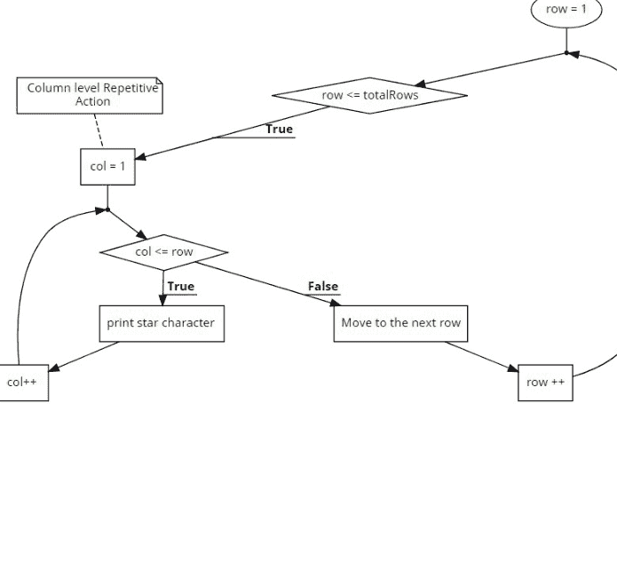

让我们执行以下程序。

```
Pattern1A_1.py

totalRows = 5  # 要显示的行数
# 行级重复操作：
# 操作1. 执行列级重复操作：
# 操作2. 将光标移至下一行。
for row in range(1, totalRows + 1):
    # 列级重复操作
    for col in range(1, row + 1):
        # 操作1.在同一行内移动光标。
        # 操作2.打印 * 字符
        print("* ", end = "")

    print()  # 将光标移至下一行
```

### 输出

```
*
* *
* * *
* * * *
* * * * *
```

现在，测试不同的行数；假设为 10。它应该能正确工作，以确认它泛化了我们的解决方案。

```
Pattern1A_1.py

totalRows = 10  # 要显示的行数
# 行级重复操作：
# 操作1. 执行列级重复操作：
# 操作2. 将光标移至下一行。
for row in range(1, totalRows + 1):
    # 列级重复操作
    for col in range(1, row + 1):
        # 操作1.在同一行内移动光标。
        # 操作2.打印 * 字符
        print("* ", end = "")

    print()  # 将光标移至下一行
```

### 输出

```
*
* *
* * *
* * * *
* * * * *
* * * * * *
* * * * * * *
* * * * * * * *
* * * * * * * * *
* * * * * * * * * *
```

### 模式 1B

我们的编程任务是在计算机屏幕的一部分打印这个特定的基于逻辑的模式。**我们的方法将假设计算机屏幕是行和列的组合，虚拟地将其划分为更小的方框**——最小的方框被视为仅容纳单个字符。因此，显示屏幕上每个最小方框的地址在逻辑上将成为一个唯一的 **(行, 列)** 数值组合。基于这个假设，计算机屏幕将简单地是一个唯一的 (行, 列) 数值配对方框的组合，这些方框均匀地分布在屏幕上。

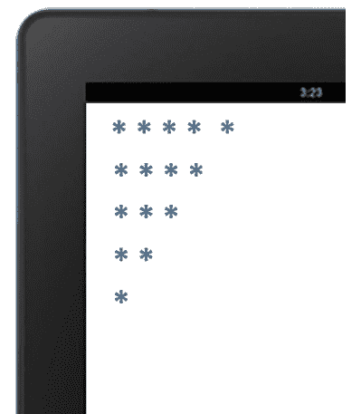

#### 数据表示

尽管在逻辑上，我们可以通过知道每个可打印字符在显示屏幕上唯一可识别的 (行, 列) 数值配对值来精确定位其位置。

| 行, 列 | 列 = 1 | 列 = 2 | 列 = 3 | 列 = 4 | 列 = 5 |
| :--- | :--- | :--- | :--- | :--- | :--- |
| 行 = 1 | * (1, 1) | * (1, 2) | * (1, 3) | * (1, 4) | * (1, 5) |
| 行 = 2 | * (2, 1) | * (2, 2) | * (2, 3) | * (2, 4) | |
| 行 = 3 | * (3, 1) | * (3, 2) | * (3, 3) | | |
| 行 = 4 | * (4, 1) | * (4, 2) | | | |
| 行 = 5 | * (5, 1) | | | | |

> 配对 (2, 4) 代表一个单独的字符 *，位于显示屏幕上假定的第 2 行第 4 列的位置。所有值配对 (行 = 值, 列 = 值) 的集合现在代表了这个特定的模式。

#### 输出分析

计算机主要进行非常精确的计算。练习编程的一种有趣方式是尝试将编写给定模式的手动步骤转换为编程指令。我们可以使用纸张或电子表格。为了正确分析一个模式，我们可以标记行号和列号，以逻辑地识别位置指示符。

| | 列 = 1 | 列 = 2 | 列 = 3 | 列 = 4 | 列 = 5 | 写入操作 |
| :--- | :--- | :--- | :--- | :--- | :--- | :--- |
| 行 | 移至行 = 1 | 1 → * | 2 → * | 3 → * | 4 → * | 5 → * | 写入 * 5 次 |
| 移动 | 移至行 = 2 | 1 → * | 2 → * | 3 → * | 4 → * | | 写入 * 4 次 |
| 操作 | 移至行 = 3 | 1 → * | 2 → * | 3 → * | | | 写入 * 3 次 |
| | 移至行 = 4 | 1 → * | 2 → * | | | | 写入 * 2 次 |
| | 移至行 = 5 | 1 → * | | | | | 写入 * 1 次 |

| 模式生成步骤（总行数 = 5） | 计算机屏幕 |
| :--- | :--- |
| **对于第 1 行** 在同一 1<sup>st</sup> 行中打印 "**" <u>五</u> 次，然后移动到第 2 行。 |  |
| **对于第 2 行** 在同一 2<sup>nd</sup> 行中打印 "**" <u>四</u> 次，然后移动到第 3 行。 |  |
| **对于第 3 行** 在同一 3<sup>rd</sup> 行中打印 "**" <u>三次</u>，然后移动到第 4 行。 |  |
| **对于第 4 行** 在同一 4<sup>th</sup> 行中打印 "**" <u>两次</u>，然后移动到第 5 行。 |  |
| **对于第 5 行** 在 5<sup>th</sup> 行中打印 "*" <u>一次</u>，然后移动到第 6 行。 |  |

**让我们将步骤转换为程序。**

| 内置方法的使用 | |
| :--- | :--- |
| 为了将光标移动到<u>下一行</u> | `print()` |
| 将光标移动到下一个（行，列）位置，然后打印星号 "*" 字符。因此，计算机屏幕上的每次移动都将是<u>同一行</u>中从左到右方向的一个键盘字符大小的跳跃。 | `print("* ", end="")` |

这是两种将在程序中重复多次的语句。

```
print() & print("* ", end="")
```

因此，我们可以使用 **for 循环** 来实现相同的功能。

## PatternBlIf.py

```
for row in range(1, 5 + 1):
    # 使用 if 条件在列或同一行中打印 *
    if (row == 1):
        print("* ", end="")  # col = 1
        print("* ", end="")  # col = 2
        print("* ", end="")  # col = 3
        print("* ", end="")  # col = 4
        print("* ", end="")  # col = 5

    if (row == 2):
        print("* ", end="")  # col = 1
        print("* ", end="")  # col = 2
        print("* ", end="")  # col = 3
        print("* ", end="")  # col = 4

    if (row == 3):
        print("* ", end="")  # col = 1
        print("* ", end="")  # col = 2
        print("* ", end="")  # col = 3

    if (row == 4):
        print("* ", end="")  # col = 1
        print("* ", end="")  # col = 2

    if (row == 5):
        print("* ", end="")  # col = 1

    print()  # 移动到下一行
```

### 固定输出实现

```
*****
****
***
**
*
```

每当我们执行此程序时，我们总是会得到一个固定为 5 行的输出。除非我们手动更改给定的 for 循环并添加/减去 if 条件，否则我们无法为不同的行输出更大或更小的模式。实现通用的编程逻辑本质上意味着我们应该能够在不修改程序实际逻辑的情况下获得自定义输出。

### 列级重复操作

抽象出 **PatternB1lf.py** 程序的细节以创建逻辑跟踪表。给定的表将给定的模式分解为行和列值之间的**一对多**关系。

| 输入 | 行级 | 列级 |
| :--- | :--- | :--- |
| **总行数 = 5** | **重复操作** | **重复操作** |
| * * * * * | row = 1 | col = 1, 2, 3, 4, 5 |
| * * * * | row = 2 | col = 1, 2, 3, 4 |
| * * * | row = 3 | col = 1, 2, 3 |
| * * | row = 4 | col = 1, 2 |
| * | row = 5 | col = 1 |

为了唯一标识给定模式的每个打印字符，让我们考虑变量 **row** 和 **col**。选择变量 **row** 和 **col** 分别精确标记给定模式中打印字符的行号和列号位置。**变量：row** 的每个值都可以映射到列级的一组**变量：col** 值。如果我们从起始值移动到结束值，**变量：col** 的值保持公差为 1 的等差数列。等一下。这听起来非常像另一种 **for 循环** 构造的情况？

| 行级 | 列值 | | 公差 |
| :--- | :--- | :--- | :--- |
| **行值** | **列值** | | **公差** |
| row = 1 | col = 1, 2, 3, 4, 5 | 起始值 = 1<br>结束值 = 5 | 2-1=1,3-2=1,4-3=1,5-4=1 |
| row = 2 | col = 1, 2, 3, 4 | 起始值 = 1<br>结束值 = 4 | 2-1=1,3-2=1,4-3=1 |
| row = 3 | col = 1, 2, 3 | 起始值 = 1<br>结束值 = 3 | 2-1=1,3-2=1 |
| row = 4 | col = 1, 2 | 起始值 = 1<br>结束值 = 2 | 2-1=1 |
| row = 5 | col = 1 | 起始值 = 1<br>结束值 = 1 | 1 = 1 |

通过考虑**变量：row** 和**变量：col**，我们可以进一步完善逻辑跟踪表，目的是为每个行号值构建 **for 循环**。**for 循环** 基本上将是针对每个行值的嵌套循环。

| 输入 | 行级 for 循环 | 列级 for 循环 |
| :--- | :--- | :--- |
| **总行数 = 5** | **变量：row** | **变量：col** |
| **打印模式** | **start = 1** | **end = 5** | **start** | **end** |
| * * * * * | row = 1 | col = 1 | col = 5 |
| * * * * | row = 2 | col = 1 | col = 4 |
| * * * | row = 3 | col = 1 | col = 3 |
| * * | row = 4 | col = 1 | col = 2 |
| * | row = 5 | col = 1 | col = 1 |

根据最近更新的逻辑跟踪表，我们可以更新程序的逻辑，如下所示。

## PatternB1NestedLoop.py

```
for row in range(1, 5 + 1, 1):
    # 使用 if 条件在列或同一行中打印 *

    if (row == 1):
        for col in range(1, 5 + 1):
            print("* ", end="")  #  列：start = 1 | end = 5

    if (row == 2):
        for col in range(1, 4 + 1):
            print("* ", end="")  #  列：start = 1 | end = 4

    if (row == 3):
        for col in range(1, 3 + 1):
            print("* ", end="")  #  列：start = 1 | end = 3

    if (row == 4):
        for col in range(1, 2 + 1):
            print("* ", end="")  #  列：start = 1 | end = 2

    if (row == 5):
        for col in range(1, 1 + 1):
            print("* ", end="")  #  列：start = 1 | end = 1

    print()  # 移动到下一行
```

```
输出
```

```
* * * * *
* * * *
* * *
* *
*
```

通过使用嵌套循环，我们的程序变得比以前更好。对于每个行值，我们成功地构建了一个单独的嵌套循环。因此，嵌套循环的数量将根据使用的行数而增加或减少。泛化的下一步是将多个嵌套循环转换为一个嵌套循环。除非我们在逻辑跟踪表的所有行值对应的列中找到一致的数值或逻辑表达式，否则这是无法完成的。

### 我们可以找到一个**数值**一致的列。


| 输入 | 行级 for 循环 | 列级 for 循环 |
| :--- | :--- | :--- |
| **总行数 = 5** | **变量：row** | **变量：col** |
| **打印模式** | **start = 1** | **end = 5** | **start** | **end** |
| * * * * * | row = 1 | col = 1 | col = 5 |
| * * * * | row = 2 | col = 1 | col = 4 |
| * * * | row = 3 | col = 1 | col = 3 |
| * * | row = 4 | col = 1 | col = 2 |
| * | row = 5 | col = 1 | col = 1 |

任何 **for 循环** 都需要一个单一的*起始值*和一个单一的*结束值*。列 **end** 包含数据 **col = 1**，这对每一行都是相同的。因此，列 **end** 已经处于泛化状态。我们得到了结束列级 for 循环的一致数值表达式。

| 输入 | 行级 for 循环 | 列级 for 循环 |
| :--- | :--- | :--- |
| **总行数 = 5** | **变量：row** | **变量：col** |
| **打印模式** | **start = 1** | **end = 5** | **start** | **end** |
| * * * * * | row = 1 | col = 1 | col = 5 |
| * * * * | row = 2 | 一致 | col = 4 |
| * * * | row = 3 | 数值 | col = 3 |
| * * | row = 4 | 表达式 | col = 2 |
| * | row = 5 | | col = 1 |

> **要实现的目标**

我们需要为列 **start** 找到一个**唯一的表达式**，以便如果我们增加行数，它应该生成相应行数大小的模式。

### 解决方案方法

我们需要使用可用的变量来泛化列变量：start 的非重复数值模式。我们可以使用变量：totalRows。作为输入，我们被分配了值 5，即总行数。让我们尝试推导列变量：start 的一致逻辑表达式。

| 行级 for 循环 | 列级 for 循环 |
| :--- | :--- |
| 变量：row | 变量：col |
| start = 1 end = 5 | end |
| row = 1 | col = 5 = totalRows = (totalRows+1)-1 |
| row = 2 | col = 4 = totalRows-1 = (totalRows+1)-2 |
| row = 3 | col = 3 = totalRows-2 = (totalRows+1)-3 |
| row = 4 | col = 2 = totalRows-3 = (totalRows+1)-4 |
| row = 5 | col = 1 = totalRows-4 = (totalRows+1)-5 |

列变量：start 中的逻辑表达式部分一致。我们可以观察到，它部分具有非重复的数值模式。

| 行级 for 循环 | 列级 for 循环 |
| :--- | :--- |
| 变量：row | 变量：col |
| start = 1 end = 5 | end |
| row = 1 | col = 5 = ( totalRows + 1 ) - 1 |
| row = 2 | col = 4 = ( totalRows + 1 ) - 2 |
| row = 3 | col = 3 = ( totalRows + 1 ) - 3 |
| row = 4 | col = 2 = ( totalRows + 1 ) - 4 |
| row = 5 | col = 1 = ( totalRows + 1 ) - 5 |

部分非重复的数值模式与变量：row 具有相同的数值模式。

| 行级 for 循环 | 列级 for 循环 |
| :--- | :--- |
| 变量：row | 变量：col |
| start = 1 end = 5 | end |
| row = 1 | col = 5 = ( totalRows + 1 ) - 1 |
| row = 2 | col = 4 = ( totalRows + 1 ) - 2 |
| row = 3 | col = 3 = ( totalRows + 1 ) - 3 |
| row = 4 | col = 2 = ( totalRows + 1 ) - 4 |
| row = 5 | col = 1 = ( totalRows + 1 ) - 5 |

此外，我们可以用变量：totalRows 和变量：row 来表示它。

### 行级 For 循环 | 列级 For 循环 |
| --- | --- |
| 变量：row | 变量：col |
| start = 1 end = 5 | end start |
| row = 1 | col = 5 = ( totalRows + 1 ) - row col = 1 |
| row = 2 | col = 4 = ( totalRows + 1 ) - row |
| row = 3 | col = 3 = ( totalRows + 1 ) - row |
| row = 4 | col = 2 = ( totalRows + 1 ) - row |
| row = 5 | col = 1 = ( totalRows + 1 ) - row |

现在，变量：start 具有相同的逻辑表达式，并且对于每个 row 值都保持一致。

| 行级 For 循环 | 列级 For 循环 |
| --- | --- |
| 变量：row | 变量：col |
| start = 1 end = 5 | end start |
| row = 1 | col = 5 |
| row = 2 | col = 4 |
| row = 3 | col = 3 ( totalRows + 1 ) - row col=1 |
| row = 4 | col = 2 |
| row = 5 | col = 1 |

从数学上讲，它可以表示为
1 <= col <= (totalRows + 1) – row
其中 row = 1 到 5
一致的逻辑表达式 (totalRows + 1) 是为变量：row 的不同值在列级产生动态输出的原因。提取一致的逻辑表达式是进行泛化并获得定制解决方案的一种方式。当我们能够建立变量之间的关系以获得一致的逻辑表达式时，那么我们就有真正的机会实现计算过程的自动化。我们可以清晰地定义列级 for 循环的循环操作。

### 增量顺序的列级 For 循环

### 列级重复操作

```
for( col = 1 col <= (totalRows + 1) – row col = col - 1)
    Print character *
```

| 列级 For 循环的元素 |
| --- |
| 变量：col | 递减顺序 | 操作 |
| start | end | step-size | 打印字符 |
| 1 | (totalRows + 1) – row | 1 | * |

### 行级重复操作

在我们的案例中，**行级 for 循环**唯一期望的操作是将程序的控制权转移到下一行。这应该基于**变量：totalRows** 输入的**总行数**来完成。这意味着在程序执行期间，当**变量：totalRows** 包含值 **3** 时，**行级 for 循环**应在 **3** 次重复后**结束**。
对于**行级 for 循环**的 **5** 次重复，程序的控制权应移动到下一行 **3** 次，或者**变量：totalRows** 应包含值 5。
对于**行级 for 循环**的 **7** 次重复，程序的控制权应移动到下一行 **7** 次，或者**变量：totalRows** 应包含值 7。
对于**行级 for 循环**的 **10** 次重复，程序的控制权应移动到下一行 **10** 次，或者**变量：totalRows** 应包含值 10。

| 输入 | 变量：row | 增量顺序 |
| :--- | :--- | :--- |
| **总行数** | **start** | **end** | **STEP-SIZE = 1** |
| totalRows = 3 | 1 | 3 | 移动到下一行 3 次 |
| totalRows = 5 | | 5 | 移动到下一行 5 次 |
| totalRows = 7 | 一致 | 7 | 移动到下一行 7 次 |
| totalRows = 10 | 数值表达式 | 10 | 移动到下一行 10 次 |

我们可以找到一个列，其中**逻辑表达式**是一致的。

| 输入 | 变量：row | 增量顺序 |
| :--- | :--- | :--- |
| **总行数** | **start** | **end** | **STEP-SIZE = 1** |
| totalRows = 3 | 1 | totalRows | 移动到下一行 totalRows 次 |
| totalRows = 5 | | totalRows | 移动到下一行 totalRows 次 |
| totalRows = 7 | | totalRows | 移动到下一行 totalRows 次 |
| totalRows = 10 | | totalRows | 移动到下一行 totalRows 次 |

显然，**totalRows** 的存储值将作为**行级 for 循环**重复次数的上限。它根据**变量：totalRows** 的给定输入值，在运行时调整模式长度，形成了一种灵活的解决方案。

我们现在可以抽象地定义行级 *for 循环* 的完整操作。

| 变量：row | 增量顺序 | 操作 |
| :--- | :--- | :--- |
| start | end | step-size | 语句 |
| 1 | totalRows | 1 | 1# 列级 For 循环<br>2# 移动到下一行 |

### 增量顺序的行级 For 循环

### 行级重复操作

```
for row in range(1,totalRows + 1):
    1.# 列级重复操作 :
    for col in range(1,(totalRows + 1 - row) + 1):
        print * character
    2.移动到下一行
```

### 流程图

我们已经掌握了与 *for 循环* 相关的所有内容。

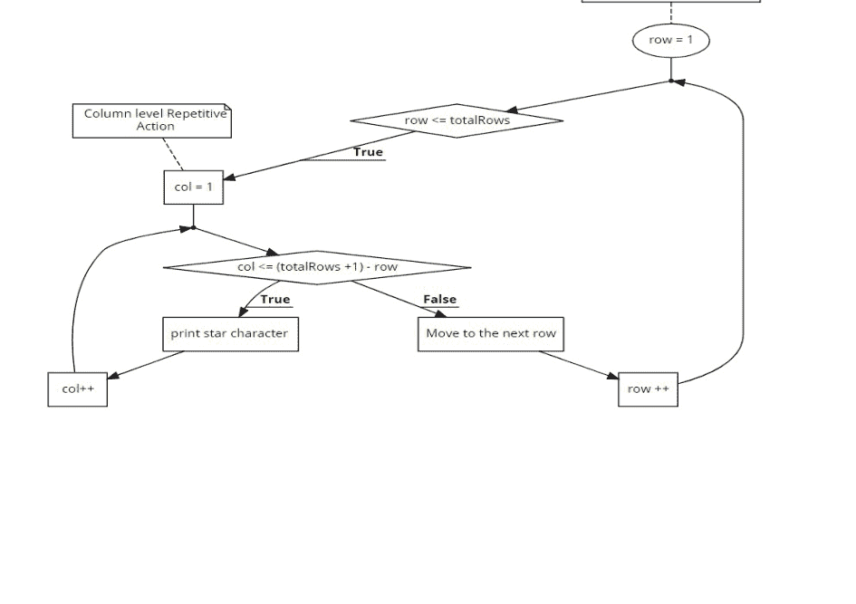

让我们执行以下程序。

```
PatternB1.py
```

```
totalRows = 5  # 要显示的行数

    # 行级重复操作 :

    # 操作1. 执行列级重复操作:

    # 操作2. 移动到下一行以继续打印。

for row in range(1,totalRows + 1):

    # 列级重复操作 :

    for col in range(1,(totalRows + 1 - row) + 1):

        # 在同一行打印 * 字符

        print("* ",end="")

    print() # 移动到下一行
```

输出：totalRows = 5

输出：totalRows = 10

```
* * * * *
* * * *
* * *
* *
*
```

```
* * * * * * * * * *
* * * * * * * * *
* * * * * * * *
* * * * * * *
* * * * * *
* * * * *
* * * *
* * *
* *
*
```

### 替代解决方案2

从之前的解决方案中，我们得到了以下**列级重复操作**的详细信息：
让我们尝试简化表达式 `(totalRows +1) – row`。

| 行级 FOR 循环 | 列级 FOR 循环 |
| :--- | :--- |
| 变量：row | 变量：col |
| start = 1 end = 5 | end start |
| row = 1 | col = 5 = ( totalRows + 1 ) - row col = 1 |
| row = 2 | col = 4 = ( totalRows + 1 ) - row |
| row = 3 | col = 3 = ( totalRows + 1 ) - row |
| row = 4 | col = 2 = ( totalRows + 1 ) - row |
| row = 5 | col = 1 = ( totalRows + 1 ) - row |

从 row 和列 **end** 中减去 1，因为其逻辑表达式受到**变量：row** 的影响。

| 行级 FOR 循环 | 列级 FOR 循环 |
| :--- | :--- |
| 变量：row | 变量：col |
| start = 1 end = 5 | end start |
| row = 1 - 1 | col = 5 = ( totalRows + 1 ) - row - 1 col = 1 |
| row = 2 - 1 | col = 4 = ( totalRows + 1 ) - row - 1 |
| row = 3 - 1 | col = 3 = ( totalRows + 1 ) - row - 1 |
| row = 4 - 1 | col = 2 = ( totalRows + 1 ) - row - 1 |
| row = 5 - 1 | col = 1 = ( totalRows + 1 ) - row - 1 |

| 行级 FOR 循环 | 列级 FOR 循环 |
| :--- | :--- |
| 变量：row | 变量：col |
| start = 1 end = (totalRows - 1) | end start |
| row = 0 | col = 5 = totalRows - row col = 1 |
| row = 1 | col = 4 = totalRows - row |
| row = 2 | col = 3 = totalRows - row |
| row = 3 | col = 2 = totalRows - row |
| row = 4 = (totalRows - 1) | col = 1 = totalRows - row |

现在，**列：end** 具有相同的表达式，并且对于**变量：row** 的每个值都保持一致。
我们可以在考虑每个 row 值的同时定义列级 **for 循环**。

| 列级 FOR 循环的元素 |
| :--- |
| 变量：col | 递减顺序 | 操作 |
| start | end | step-size | 打印字符 |
| 1 | ( totalRows - row ) | 1 | * |

外部 **for 循环**从 row = 0 开始，并将重复直到 row <= (**totalRows** – 1) 或 row < **totalRows**。

| **行级 For 循环的元素** | | |
| :--- | :--- | :--- |
| **变量：row** | **增量顺序** | **操作** |
| start | end | step-size | 语句 |
| row = 0 | row < totalRows | 1 | 1# 列级 For 循环<br>2# 移动到下一行 |

新的解决方案更改在以下程序中。

```
PatternB2.py
```

```
totalRows = 5  # 要显示的行数

    # 行级重复操作 :

    # 操作1.执行列级重复操作

    # 操作2.将光标移动到下一行。

for row in range(0, totalRows ):


    # 列级重复操作 :
    for col in range(1,( totalRows  - row ) + 1):
        # 在同一行打印 * 字符
        print("* ",end="")

    print()    # 移动到下一行
```

**输出：totalRows = 5**

**输出：totalRows = 10**

```
* * * * *
* * * *
* * *
* *
*
```

```
* * * * * * * * * *
* * * * * * * * *
* * * * * * * *
* * * * * * *
* * * * * *
* * * * *
* * * *
* * *
* *
*
```

请验证不同行数的输出；假设为 10。

### 替代方案3

下表是我们最初为解决此模式问题而总结的若干逻辑追踪表之一。

| 输入 | 行级 For 循环 | 列级 For 循环 |
| :--- | :--- | :--- |
| **总行数 = 5** | **变量：row** | **变量：col** |
| **PRPATTERN** | **start = 1** | **end = 5** | **start** | **end** |
| * * * * * | row = 1 | col = 1 | col = 5 |
| * * * * | row = 2 | | col = 4 |
| * * * | row = 3 | 一致的 | col = 3 |
| * * | row = 4 | 数值表达式 | col = 2 |
| * | row = 5 | | col = 1 |

如果我们观察行（1, 2, 3, 4 和 5）的数值模式，它与列的数值模式**end**（5, 4, 3, 2 和 1）**相反**。如果我们反转行变量的计数器，它将与列 **max_val**（5, 4, 3, 2 和 1）的值完全匹配。我们需要将行变量的**递增 for 循环**替换为**递减 for 循环**。反转**变量：row**的值流。可以表示如下：

| 输入 | 行级 For 循环 | 列级 For 循环 |
| :--- | :--- | :--- |
| **总行数 = 5** | **变量：row** | **变量：col** |
| **PRPATTERN** | **start = 5** | **end = 1** | **start** | **end** |
| * * * * * | row = 5 | col = 1 | col = 5 |
| * * * * | row = 4 | | col = 4 |
| * * * | row = 3 | 一致的 | col = 3 |
| * * | row = 2 | 数值表达式 | col = 2 |
| * | row = 1 | | col = 1 |

现在变量 row 和**列：end**的数值模式完全匹配。因此，**列：end**可以用变量：row来表示。所以，**列：end**对于**row**的每个值都是一致的。现在，我们处于一个有利的位置，因为 **for 循环**需要一个最小值或逻辑表达式和一个最大值或逻辑表达式。

| 输入 | 行级 For 循环 | 列级 For 循环 |
| :--- | :--- | :--- |
| **总行数 = 5** | **变量：row** | **变量：col** |
| **PRPATTERN** | **start = 5** | **end = 1** | **start** | **end** |
| * * * * * | row = 5 | | row |
| * * * * | row = 4 | | row |
| * * * | row = 3 | col = 1 | row | row |
| * * | row = 2 | | row |
| * | row = 1 | | row |

我们现在可以定义列级递增 **for 循环**。

| 列级 For 循环的元素 | | | |
| :--- | :--- | :--- | :--- |
| **变量：col** | | **递增顺序** | **操作** |
| **start** | **end** | **step-size** | **打印字符** |
| col = 1 | col <= row | 1 | * |

我们现在可以定义行级**递减 for 循环**。
它从**变量：totalRows**的当前值开始，并重复递减直到变为 1。
请使用提到的更新程序验证结果。

| 行级 For 循环的元素 | | | |
| :--- | :--- | :--- | :--- |
| **变量：row** | | **递减顺序** | **操作** |
| **start** | **end** | **step-size** | **语句** |
| row = totalRows | row >= 1 | 1 | 1# 列级 For 循环<br>2# 移动到下一行 |

```
PatternB3.py

totalRows = 10  # 要显示的行数

    # 行级重复操作：

    # 操作1. 执行列级重复操作：

    # 操作2. 将光标移动到下一行。

for row in range(totalRows + 1, 1, -1):

    # 列级重复操作：

    for col in range(row, 1, -1):

        # 在同一行打印 * 字符

        print("* ", end="")

    print() # 移动到下一行
```

输出

```
* * * * * * * * * *
* * * * * * * *
* * * * * * *
* * * * * *
* * * * *
* * * *
* * *
* *
*
```

**流程图问题：** 给定的流程图包含了与外层和嵌套 *FOR-LOOP* 相关的所有信息。**请编写一个符合给定流程图的程序。**

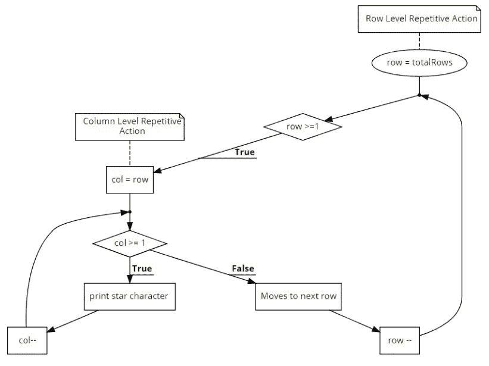

### 模式 1C

我们的编程任务是在计算机屏幕的一部分打印这个特定的基于逻辑的模式。**我们的方法将假设计算机屏幕是行和列的组合，虚拟地将其划分为更小的方框**——最小的方框被视为仅包含一个字符。因此，显示屏幕上每个最小方框的地址在逻辑上将成为一个唯一的 **(行, 列)** 数值组合。基于此假设，计算机屏幕将简单地是一个由均匀分布在屏幕上的 (行, 列) 数值配对方框组成的唯一组合。

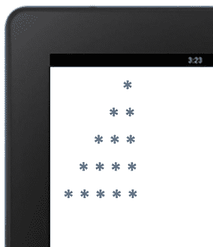

#### 数据表示

尽管在逻辑上，我们可以通过知道每个可打印字符在显示屏幕上的唯一可识别的 **(行, 列)** 数值配对值来精确定位其位置。

| 行, 列 | 列 = 1 | 列 = 2 | 列 = 3 | 列 = 4 | 列 = 5 |
| :--- | :--- | :--- | :--- | :--- | :--- |
| 行 = 1 | | | | | * (1, 5) |
| 行 = 2 | | | | * (2, 4) | * (2, 5) |
| 行 = 3 | | | * (3, 3) | * (3, 4) | * (3, 5) |
| 行 = 4 | | * (4, 2) | * (4, 3) | * (4, 4) | * (4, 5) |
| 行 = 5 | * (5, 1) | * (5, 2) | * (5, 3) | * (5, 4) | * (5, 5) |

> 配对 (4, 5) 表示在显示屏幕的假定位置第 4 行第 5 列上的单个字符 *。所有值对 (行 = 值, 列 = 值) 的集合现在代表这个特定的模式。

#### 输出分析

计算机主要进行非常精确的计算。练习编程的一个有趣方法是尝试将编写给定模式的手动步骤转换为编程指令。我们可以使用纸张或电子表格。为了正确分析模式，我们可以标记行号和列号，以逻辑上识别位置指示符。

| | 列 = 1 | 列 = 2 | 列 = 3 | 列 = 4 | 列 = 5 | 写入操作 |
| :--- | :--- | :--- | :--- | :--- | :--- | :--- |
| 行 | 移动到行 = 1 | | | | | 1 → * | 4 个空格 | 写入 * 1 次 |
| 移动 | 移动到行 = 2 | | | | 1 → * | 2 → * | 3 个空格 | 写入 * 2 次 |
| 操作 | 移动到行 = 3 | | | 1 → * | 2 → * | 3 → * | 2 个空格 | 写入 * 3 次 |
| | 移动到行 = 4 | | 1 → * | 2 → * | 3 → * | 4 → * | 1 个空格 | 写入 * 4 次 |
| | 移动到行 = 5 | 1 → * | 2 → * | 3 → * | 4 → * | 5 → * | 0 个空格 | 写入 * 5 次 |

空格也是像任何其他键盘字符一样的字符。如果一个单词或单个非空格字符在间隔后显示在屏幕上，这意味着在打印任何其他非空格字符之前必须打印一个或多个空格字符。

| 模式生成步骤 | 计算机屏幕 |
| :--- | :--- |
| **对于 row = 1**<br>在同一 1<sup>st</sup> 行打印空格 “ ” 4 次。<br>在同一 1<sup>st</sup> 行打印星号 “*” 1 次<br>然后移动到下一行号 2。 |  |
| **对于 row = 2**<br>在同一 2<sup>nd</sup> 行打印空格 “ ” 3 次。<br>在同一 2<sup>nd</sup> 行打印星号 “*” 2 次<br>然后移动到下一行号 3。 |  |
| **对于 row = 3**<br>在同一 3<sup>rd</sup> 行打印空格 “ ” 2 次。<br>在同一 3<sup>rd</sup> 行打印星号 “*” 3 次<br>然后移动到下一行号 4。 |  |
| **对于 row = 4**<br>在同一 4<sup>th</sup> 行打印空格 “ ” 1 次。<br>在同一 4<sup>th</sup> 行打印星号 “*” 4 次<br>然后移动到下一行号 5。 |  |
| **对于 row = 5**<br>在同一 5<sup>th</sup> 行打印空格 “ ” 0 次。<br>在同一 5<sup>th</sup> 行打印星号 “*” 5 次<br>然后移动到下一行号 5。 |  |

**让我们使用以下内置方法将这些步骤转换为程序。**

| 操作 | 代码 |
| :--- | :--- |
| 将光标移动到下一行。 | `print()` |
| 在同一行打印空格 “ ” 字符。 | `print(" ", end = "")` |
| 在同一行打印星号 “*” 字符。 | `print("* ", end = "")` |

为了打印空格 “ ” 或 “*” 字符，计算机屏幕上的每次移动都将是同一行中从左到右方向的单个键盘字符大小的跳转——这三种类型的编程语句需要使用循环重复多次。编写一个程序来计算行和列值，以便在计算机屏幕上正确打印字符，将是提高逻辑思维的主要原因。

### 列级重复操作

让我们考虑以下变量：

**row** → 整数类型的变量，用于一次存储一个整数值，表示1到5之间的行号。

**col** → 整数类型的变量，用于一次存储一个整数值，表示1到5之间的列号。

**spaces** → 整数类型的变量，用于一次存储一个整数值，表示1到5列号位置上的空格字符。

**totalRows** → 整数类型的变量，用于存储总行数的整数值。

逻辑追踪表

| (行, 列) 值对描述了“*”字符在显示屏上的位置 | | | | |
| :--- | :--- | :--- | :--- | :--- |
| | | | | row=1, col=5 |
| | | | row=2, col=4 | row=2, col=5 |
| | | row=3, col=3 | row=3, col=4 | row=3, col=5 |
| | row=4, col=2 | row=4, col=3 | row=4, col=4 | row=4, col=5 |
| row=5, col=1 | row=5, col=2 | row=5, col=3 | row=5, col=4 | row=5, col=5 |

| 行级重复操作 | | | | 模式 |
| :--- | :--- | :--- | :--- | :--- |
| 变量：row | 列级重复操作 | | | |
| | 变量：spaces | 变量：col | 字符计数 | |
| 1 | 1,2,3,4 | 5 | 4个空格 + 1个星号 | * |
| 2 | 1,2,3 | 4, 5 | 3个空格 + 2个星号 | * * |
| 3 | 1,2 | 3, 4, 5 | 2个空格 + 3个星号 | * * * |
| 4 | 1 | 2, 3, 4, 5 | 1个空格 + 4个星号 | * * * * |
| 5 | 0(无空格) | 1, 2, 3, 4, 5 | 0个空格 + 5个星号 | * * * * * |

空格（“ ”）和星号（“*”）字符被重复多次。因此，根据空格（“ ”）和星号（“*”）字符的计数，我们可以为每种字符使用一个**for循环**。我们可以将初步观察结果整理成下表所示的更清晰的形式。

| 行级重复操作 | | | | | 模式 |
| :--- | :--- | :--- | :--- | :--- | :--- |
| 变量：row | 列级重复操作 | | | | |
| | 变量：spaces | | 变量：col | | |
| | min_val | max_val | min_val | max_val | |
| 1 | 1 | 4 | 1 | 1 | * |
| 2 | 1 | 3 | 1 | 2 | * * |
| 3 | 1 | 2 | 1 | 3 | * * * |
| 4 | 1 | 1 | 1 | 4 | * * * * |
| 5 | 0 | 0 | 1 | 5 | * * * * * |

### 解决方法

变量是 **row** 和 **totalRows=5**。
我们需要概括列 **max_val** 的非重复数字模式。**变量 col 的列 max_val** 的数字模式与 **row** 的每个值完全匹配。因此，**变量 col 的列 max_val** 的所有数字模式都可以用 row 变量表示。
让我们尝试使用变量 **totalRows** 来概括变量 **spaces** 的列 **max_val**。

| 行级重复操作 | | | | | |
| :--- | :--- | :--- | :--- | :--- | :--- |
| **变量：row** | **列级重复操作** | | | | |
| | **变量：spaces** | | | **变量：col** | |
| | **min_val** | **min_val** | | **min_val** | **max_val** |
| | | **default** | **1** | | |
| 1 | 1 | 4 | totalRows -1 | 1 | row |
| 2 | 1 | 3 | totalRows - 2 | 1 | row |
| 3 | 1 | 2 | totalRows - 3 | 1 | row |
| 4 | 1 | 1 | totalRows - 4 | 1 | row |
| 5 | 0 | 0 | totalRows - 4 | 1 | row |

变量 **spaces** 列 **max_val** 的表达式部分遵循与 **row** 相同的数字值模式。此外，我们可以用变量 **totalRows** 和 **row** 来表示它。

| 行级重复操作 | | | | | |
| :--- | :--- | :--- | :--- | :--- | :--- |
| **变量：row** | **列级重复操作** | | | | |
| | **变量：spaces** | | | **变量：col** | |
| | **min_val** | **min_val** | | **min_val** | **max_val** |
| | | **default** | **1** | | |
| 1 | 1 | 4 | totalRows - row | 1 | row |
| 2 | 1 | 3 | totalRows - row | 1 | row |
| 3 | 1 | 2 | totalRows - row | 1 | row |
| 4 | 1 | 1 | totalRows - row | 1 | row |
| 5 | 0 | 0 | totalRows - row | 1 | row |

我们将列 **max_val** 的非重复数字模式概括为一个表达式。
我们现在可以定义列级 **for循环**，它为每个行值打印空格。

| 列级 FOR 循环的要素 | | | |
| :--- | :--- | :--- | :--- |
| **变量：col** | | **递增顺序** | **操作** |
| **min_val** | **max_val** | **步长** | **打印字符** |
| spaces = 1 | spaces <= totalRows — row | 1 | 空格 |

我们现在可以定义列级 **for循环**，它为每个行值打印 (*) 字符。

| 列级 FOR 循环的要素 | | | |
| :--- | :--- | :--- | :--- |
| **变量：col** | | **递增顺序** | **操作** |
| **min_val** | **max_val** | **步长** | **打印字符** |
| col = 1 | col <= row | 1 | * |

### 行级重复操作

以下相同的语句被重复了5次（总行数）。
用于打印空格字符的列级 for循环 # 内层 for循环
用于打印星号字符的列级 for循环 # 内层 for循环
print() # 移动到下一行
我们为每一行分配了一个从1到5的唯一值。所以，现在这很容易了。
for循环的最小值和最大值可以给定为
min_val = 1 和 max_val = 5 或 totalRows

让我们考虑：
row → 整数类型的变量，用于一次存储一个整数值，表示1到5（totalRows）之间的行号。totalRows 初始赋值为5。

外部 for循环从 row=1 开始，并将重复直到 row <= totalRows。
我们已经获得了与行级重复的 for循环相关的所有内容。

| 变量：row | 递增顺序 | 操作 |
| :--- | :--- | :--- |
| start | end | 步长 | 语句 |
| row = 1 | row = totalRows | 1 | 1# 用于打印空格的列级 For 循环<br>2# 用于打印 * 的列级 For 循环<br>3# 移动到下一行 |

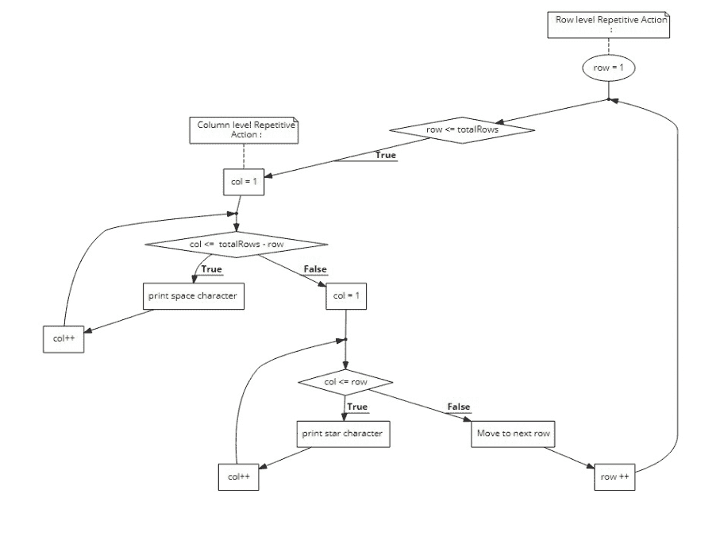

让我们编写完整的编程逻辑并执行程序。

## PatternC1.py

```
totalRows = 5  # 要显示的行数

    # 行级重复操作：
    # 操作1. 执行列级重复操作
    # 操作2. 将光标移动到下一行。
for row in range(1, totalRows + 1):

    # 列级重复操作：
    for sp in range(1, ( totalRows - row ) + 1 ):
        # 操作1. 在同一行移动光标
        # 操作2. 打印空格字符
        print("  ", end = "") # 额外的空格用于格式化

    for col in range(1, row + 1):
        # 操作1. 在同一行移动光标
        # 操作2. 打印星号 * 字符
        print("* ", end = "") # 额外的空格用于格式化

    print()    # 移动到下一行
```

### 输出

```
        * 
      * * 
    * * * 
  * * * * 
* * * * * 
```

### 替代方案2

可用的变量是 **row 和 totalRows=5**。变量：col = 1, 2, 3, 4, 5，取值1到5。总体观察是，在每一行，它要么连续打印空格字符，要么连续打印星号（*）字符。根据打印字符的类型，列被分为两部分，要么打印空格“ ”字符，要么打印星号（“*”）字符。

| 行级重复操作 | 预期输出 |
| :--- | :--- |
| **变量：row** | **列级重复操作** | |
| | **变量：spaces** | **变量：col** | **字符计数** | |
| 1 | 1,2,3,4 | 5 | 4个空格 + 1个星号 = 5个字符 | * |
| 2 | 1,2,3 | 4, 5 | 3个空格 + 2个星号 = 5个字符 | ** |
| 3 | 1,2 | 3, 4, 5 | 2个空格 + 3个星号 = 5个字符 | *** |
| 4 | 1 | 2, 3, 4, 5 | 1个空格 + 4个星号 = 5个字符 | **** |
| 5 | 0(无空格) | 1, 2, 3, 4, 5 | 0个空格 + 5个星号 = 5个字符 | ***** |

**打印空格** **首先出现**，然后才是打印星号（“*”）字符。当处理完打印空格字符的条件后，剩下的就是星号（“*”）字符。如果我们仔细观察，它将变量 col 的值分成了两半。一部分用于打印空格字符，另一部分用于打印星号字符。

| 行级重复操作 | 预期输出 |
| :--- | :--- |
| **变量：row** | **列级重复操作** | |
| | **变量：spaces** | **变量：col** | |
| | **min_val** | **max_val** | **min_val** | **max_val** | |
| 1 | 1 | 4 | 5 | 5 | * |
| 2 | 1 | 3 | 4 | 5 | ** |
| 3 | 1 | 2 | 3 | 5 | *** |
| 4 | 1 | 1 | 2 | 5 | **** |
| 5 | 0 | 0 | 1 | 5 | ***** |

| 行级重复操作 | 预期输出 |
| :--- | :--- |
| **变量：row** | **列级重复操作** | |
| | **变量：spaces** | **变量：col** | |
| | **min_val** | **max_val** | **min_val** | **max_val** | |
| 1 | 1 | 4 = 5 -1 = totalRows - 1 | 5 | 5 | * |
| 2 | 1 | 3 = 5 – 2 = totalRows - 2 | 4 | 5 | ** |
| 3 | 1 | 2 = 5 – 3 = totalRows - 3 | 3 | 5 | *** |
| 4 | 1 | 1 = 5 – 4 = totalRows - 4 | 2 | 5 | **** |
| 5 | 0 | 0 = 5 – 5 = totalRows - 5 | 1 | 5 | ***** |

我们从之前的逻辑追踪表中部分获得了用于打印空格的通用逻辑表达式。**max_val** 列的 **变量：空格** 数值模式与 **变量：行** 的数值出现次数相匹配，因此得到了逻辑条件（**totalRows - row**），如下所示。

| 行级重复操作 | | | | |
| :--- | :--- | :--- | :--- | :--- |
| **变量：行** | **列级重复操作** | | | |
| | **变量：空格** | | **变量：列** | |
| | **min_val** | **max_val** | **min_val** | **max_val** |
| 1 | 1 | totalRows – 1 = **totalRows - row** | 5 | 5 |
| 2 | 1 | totalRows – 2 = **totalRows - row** | 4 | 5 |
| 3 | 1 | totalRows – 3 = **totalRows - row** | 3 | 5 |
| 4 | 1 | totalRows – 4 = **totalRows - row** | 2 | 5 |
| 5 | 0 | totalRows – 5 = **totalRows - row** | 1 | 5 |

另一个 **for 循环** 在 1 和 (**totalRows = 5**) 之间运行，用于 **变量：列**。逻辑表达式 (**totalRows - row**) 给出了从计数 1 开始打印那么多空格字符的最大计数。因此，我们可以使用 **if-else** 进行条件过滤和打印字符（空格或星号）。

| 当变量：列的每个值满足条件为真时，打印空格字符 | | | | |
| :--- | :--- | :--- | :--- | :--- |
| **col=1** | **col=2** | **col=3** | **col=4** | **col=5** |
| | 如果 ( 条件为真)<br>打印空格字符<br>否则<br>打印星号字符 | 如果 ( col<= totalRows - row ) 为真<br>打印空格字符<br>否则<br>打印星号字符 | | |

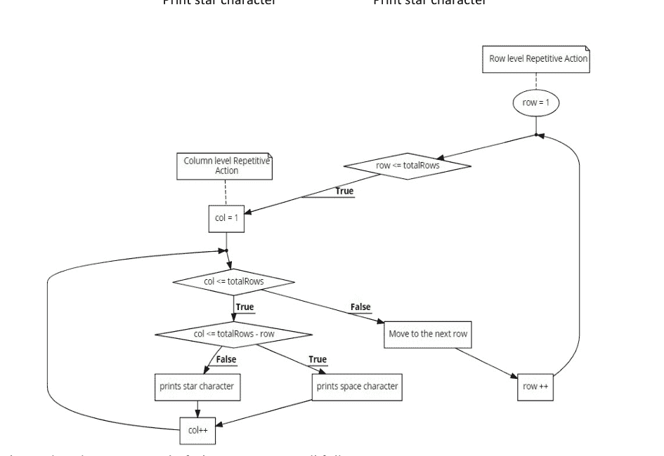

接下来将展示使用 if-else 语句的更新程序。

```
PatternC2.py
totalRows = 5  # 要显示的行数

# 行级重复操作：

# 操作1. 执行列级重复操作：

# 操作2. 将光标移动到下一行。
for row in range(1, totalRows + 1):
    # 列级重复操作：
    # 操作1. 按列或在同一行打印字符。
    for col in range(1, totalRows + 1):
        if (col <= (totalRows - row)):
            print("  ", end = "") # 操作2. 打印空格字符
        else:
            print("* ", end="") # 操作3. 打印星号 * 字符

    print()  # 将程序控制移动到下一行
            # 以便在新行中打印字符。
```

输出：totalRows = 5

输出：totalRows = 10

```
    *
   * *
  * * *
 * * * *
* * * * *
```

```
         *
        * *
       * * *
      * * * *
     * * * * *
    * * * * * *
   * * * * * * *
  * * * * * * * *
 * * * * * * * * *
* * * * * * * * * *
```

现在，测试不同的行数，假设为 10

### 替代方案3

在之前的方案中，我们检查 **if 条件** 为 **真** 时打印空格，并在 **if 语句** 的 else 部分打印星号（“*”）字符。在这个方案中，我们将情况反转。当 **if 条件** 变为 **真** 时，我们将打印星号（“*”）字符，并在 **if-else 语句** 的 else 部分打印空格。

| 当变量：列的每个值满足条件为真时，打印星号字符 |
| :--- |
| col=1 | col=2 | col=3 | col=4 | col=5 |
| | 如果 ( 条件为真)<br>打印星号字符<br>否则<br>打印空格字符 | 如果 ( ? ) 为真<br>打印星号字符<br>否则<br>打印空格字符 | | |

让我们尝试从之前方案中使用的给定观察表重新学习。

| 行级重复操作 | 预期输出 |
| :--- | :--- |
| 变量：行 | 列级重复操作 | | | |
| | 变量：空格 | | 变量：列 | |
| | min_val | max_val | min_val | max_val | |
| 1 | 1 | 4 | 5 | 5 | * |
| 2 | 1 | 3 | 4 | 5 | ** |
| 3 | 1 | 2 | 3 | 5 | *** |
| 4 | 1 | 1 | 2 | 5 | **** |
| 5 | 0 | 0 | 1 | 5 | ***** |

我们知道 totalRows = 5。
打印星号字符的 **min_val** 列可以表示为；

| 行级重复操作 | 预期输出 |
| :--- | :--- |
| 变量：行 | 列级重复操作 | | | |
| | 变量：空格 | | 变量：列 | |
| | min_val | max_val | min_val | max_val | |
| 1 | 1 | 4 | 5 - 0 | 5 = totalRows | * |
| 2 | 1 | 3 | 5 - 1 | 5 = totalRows | ** |
| 3 | 1 | 2 | 5 - 2 | 5 = totalRows | *** |
| 4 | 1 | 1 | 5 - 3 | 5 = totalRows | **** |
| 5 | 0 | 0 | 5 - 4 | 5 = totalRows | ***** |

如果我们尝试使用变量 totalRows 来概括 **min_val** 列的数值模式，那么它将是 totalRows – **0**, totalRows -**1**, ……等等。这个表达式几乎遵循变量 row = 1, 2, …..5 的数值模式。前者是从零(0)开始的数值模式，而 **变量：行** 的数值模式是从一(1)开始的。我们可以让 **变量：行** 的数值模式从零(0)开始。在行级移动的情况下，无论是 1 到 5 还是 0 到 4，都只意味着五次迭代。

让我们利用变量 totalRows 和 row 来推导打印星号字符的列 min_val 和 max_val 的通用逻辑表达式，如下所示

| 行级重复操作 | 预期输出 |
| :--- | :--- |
| **列级重复操作** | |
| **变量：行** | **变量：空格** | **变量：列** | |
| | **min_val** | **max_val** | **min_val** | **max_val** | |
| 0 | 1 | 4 | totalRows - row | totalRows | * |
| 1 | 1 | 3 | totalRows - row | totalRows | ** |
| 2 | 1 | 2 | totalRows - row | totalRows | *** |
| 3 | 1 | 1 | totalRows - row | totalRows | **** |
| 4 | 0 | 0 | totalRows - row | totalRows | ***** |

条件 ( col >= (totalRows – row) ) 给出了最小限制，即开始打印星号（“*”）字符的起点，直到变量 col 的最大值，即 totalRows。
if 条件可以使用比较和逻辑运算符在 ( totalRows - row ) 和 totalRows 之间的值范围内给出，如下所示：
If ( col >= ( totalRows - row ) ) and col <= totalRows ) 并且我们已经知道
变量：col = 1,2,3,4,5 或 1,2,3,4, totalRows
变量：row = 0,1,2,3,4 或 0,1,2,3,4, (totalRows - 1) 。
我们可以消除逻辑与（and）条件 ( col <= totalRows )，因为这个条件已经在列级内部 for 循环中处理了。因此，if 条件将简化为
If ( col >= ( totalRows — row ) )
我们可以在下面的流程图中总结所有内容，并在程序中更新它。

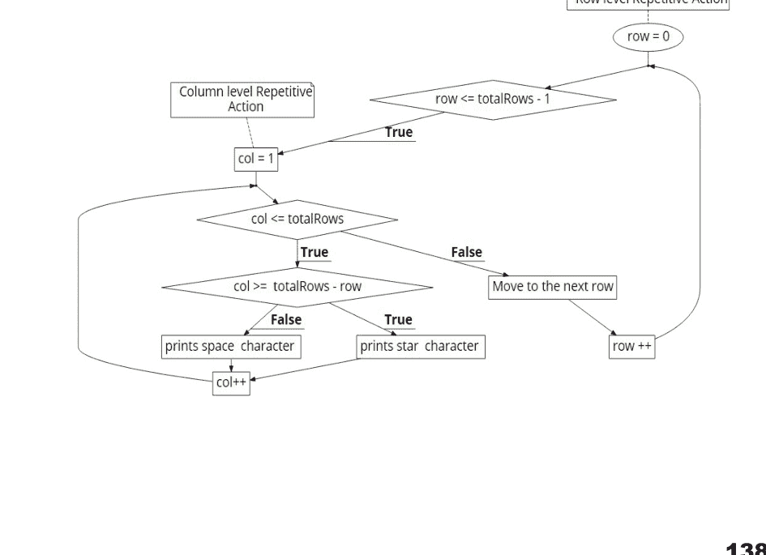

测试总行数等于 7 的情况。

```
PatternC3.py
```

```
totalRows = 7 # 要显示的 7 行

### 行级重复操作
# 操作1. 执行列级重复操作：
# 操作2. 将光标移动到下一行。
for row in range( 0, totalRows ):

    # 列级重复操作
    # 操作1. 按列或在同一行打印字符。
    for col in range(1, totalRows + 1):

        if (col >= (totalRows - row)):
            # 操作2. 打印星号 * 字符
            print("* ",end="")
        else:
            # 操作3. 打印空格字符
            print("  ",end="")

    print() # 将光标移动到下一行
```

```
输出
```

```
       * 
      * * 
     * * * 
    * * * * 
   * * * * * 
  * * * * * * 
 * * * * * * * 
```

问题：编写一个程序，使用 **递减 for 循环** 在以下提到的两种情况下创建 prpattern1C。

| 情况 A | 情况 B |
| :--- | :--- |
| 如果 ( 条件 = ? ) 为真 | 如果 ( 条件 = ? ) 为真 |
| 打印空格字符 | 打印星号字符 |
| 否则 | 否则 |
| 打印星号字符 | 打印空格字符 |

# Pattern1D

我们的编程任务是在计算机屏幕的一部分打印这个特定的基于逻辑的图案。**我们的方法将假设计算机屏幕是行和列的组合，虚拟地将其划分为更小的方框**——最小的方框被视为仅容纳单个字符。因此，显示屏幕上每个最小方框的地址在逻辑上将成为唯一的 **(行, 列)** 数值组合。基于这个假设，计算机屏幕将简单地是由均匀分布在整个屏幕上的 (行, 列) 数值配对方框组成的唯一组合。

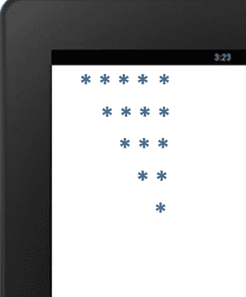

#### 数据表示

虽然在逻辑上，我们可以通过知道其唯一可识别的 **(行, 列)** 数值配对值来精确定位显示屏幕上每个可打印字符的位置。

| 行, 列 | 列 = 1 | 列 = 2 | 列 = 3 | 列 = 4 | 列 = 5 |
| :--- | :--- | :--- | :--- | :--- | :--- |
| 行 = 1 | * (1, 1) | * (1, 2) | * (1, 3) | * (1, 4) | * (1, 5) |
| 行 = 2 | | * (2, 2) | * (2, 3) | * (2, 4) | * (2, 5) |
| 行 = 3 | | | * (3, 3) | * (3, 4) | * (3, 5) |
| 行 = 4 | | | | * (4, 4) | * (4, 5) |
| 行 = 5 | | | | | * (5, 5) |

> 配对 (4, 5) 表示在显示屏幕的第 4 行和第 5 列的假设位置上的单个字符 *。所有值对 (行 = 值, 列 = 值) 的集合现在代表这个特定的图案。

#### 输出分析

计算机主要进行非常精确的计算。练习编程的一种有趣方式是尝试将编写给定图案的手动步骤转换为编程指令。我们可以使用纸张或电子表格。为了正确分析图案，我们可以标记行号和列号，以便在逻辑上识别位置指示符。***空格也是像任何其他键盘字符一样的字符。如果空格显示在屏幕上，这意味着在打印任何其他非空白字符之前，必须先打印一个或多个空格字符。***

### 列级重复操作

让我们考虑以下变量：

**row** → 整数类型的变量，用于一次存储一个整数值，表示1到5之间的行号。

**col** → 整数类型的变量，用于一次存储一个整数值，表示1到5之间的列号。

**spaces** → 整数类型的变量，用于一次存储一个整数值，表示1到5列号之间的空格字符。

**totalRows** → 整数类型的变量，用于存储总行数的整数值。

**逻辑追踪表**

| (row, col) 值对描述了“*”字符在显示屏上的位置 |
| :--- |
| row=1, col=1 | row=1, col=2 | row=1, col=3 | row=1, col=4 | row=1, col=5 |
| row=2, col=2 | row=2, col=3 | row=2, col=4 | row=2, col=5 |
| row=3, col=3 | row=3, col=4 | row=3, col=5 |
| row=4, col=4 | row=4, col=5 |
| row=5, col=5 |

| 行级重复操作 | 模式 |
| :--- | :--- |
| 变量：row | 列级重复操作 | | | |
| | 变量：spaces | 变量：col | 字符计数 | |
| 1 | 0（无空格） | 1, 2, 3, 4, 5 | 4个空格 + 1个星号 | ***** |
| 2 | 1 | 2, 3, 4, 5 | 3个空格 + 2个星号 | **** |
| 3 | 1,2 | 3, 4, 5 | 2个空格 + 3个星号 | *** |
| 4 | 1,2,3 | 4, 5 | 1个空格 + 4个星号 | ** |
| 5 | 1,2,3,4 | 5 | 0个空格 + 5个星号 | * |

| 行级重复操作 | 模式 |
| :--- | :--- |
| 变量：row | 列级重复操作 | | | |
| | 变量：spaces | | 变量：col | |
| | min_val | max_val | min_val | max_val | |
| 1 | 0 | 0 | 1 | 5 | ***** |
| 2 | 1 | 1 | 2 | 5 | **** |
| 3 | 1 | 2 | 3 | 5 | *** |
| 4 | 1 | 3 | 4 | 5 | ** |
| 5 | 1 | 4 | 5 | 5 | * |

我们知道 **totalRows** = 5。
如果我们观察变量 row 的数值模式（1, 2, 3, 4 和 5），它与打印星号字符的列 **min_val** 的数值模式**匹配**。
我们的目标是用我们选择的变量（**row**, **col**, **totalRows**）来表达程序逻辑。
让我们使用这些变量来找到打印星号字符的通用表达式。

| 行级重复操作 | | | | | 模式 |
| :--- | :--- | :--- | :--- | :--- | :--- |
| 变量：row | 列级重复操作 | | | | |
| | 变量：spaces | | 变量：col | | |
| | min_val | max_val | min_val | max_val | |
| 1 | 0 | 0 | row | totalRows | ***** |
| 2 | 1 | 1 | row | totalRows | **** |
| 3 | 1 | 2 | row | totalRows | *** |
| 4 | 1 | 3 | row | totalRows | ** |
| 5 | 1 | 4 | row | totalRows | * |

条件 (col >= row) 给出了最小限制，即开始打印星号（“*”）字符的起点，直到变量 col 的最大值，即 totalRows。

可以使用比较和逻辑运算符为变量 row 和 totalRows 之间的值范围给出 if 条件，如下所示：

```
If ( col >= row and col <= totalRows).
```

我们可以消除逻辑与（and）条件 ( col <= totalRows)，因为这个条件已经在列级内层 for 循环中处理了。因此，if 条件可以写成：

```
If ( col >= row )
```

我们将结论总结在一个流程图中，如下所示：

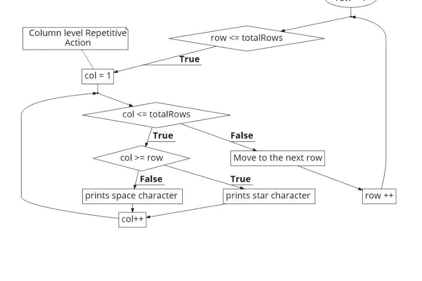

程序可以写成如下形式：

```
PatternD1.py
totalRows = 5 # 要显示的总行数

# 行级重复操作：
# 动作1. 执行列级重复操作：
# 动作2. 移动到下一行，为逐列打印字符做准备。
for row in range(1,totalRows+1):

    # 列级重复操作：
    # 动作1. 逐列或在同一行打印字符
    for col in range(1, totalRows + 1):

        if (col >= row):
            # 动作2. 打印星号 * 字符
            print("* ",end="")
        else:
            # 动作3. 打印空格字符
            print("  ",end="")

    # 将程序控制移动到下一行
    # 以切换到新行打印字符。
    print()
```

输出：totalRows = 5

```
* * * * *
  * * * *
    * * *
      * *
        *
```

输出：totalRows = 10

```
* * * * * * * * * *
  * * * * * * * * *
    * * * * * * * *
      * * * * * * *
        * * * * * *
          * * * * *
            * * * *
              * * *
                * *
                  *
```

现在，测试不同的行数。假设为10。

**问题 D1：** 编写一个程序，通过遵循打印空格字符的条件表达式来生成模式 **Pattern1D**。当条件表达式为 **True** 时，程序应打印空格字符；当为 **False** 时，打印星号（“*”）字符。

| 当变量 col 的每个值满足条件为 True 时，打印一个空格字符 |
| :--- |
| col=1 | col=2 | col=3 | col=4 | col=5 |
| | | 如果 ( 条件=(?) 为 **True**) |
| | | 打印空格字符 |
| | | **否则** |
| | | 打印星号字符 |

**问题 D2.** 编写一个程序，使用给定列中的信息来生成模式 **Pattern1D**。不要使用 **变量：col**。

列 ➔ 变量：row、字符计数和总字符数。

变量 totalRows = 5 表示行数。程序也应适用于10行，并且通过将变量 **totalRows = 10** 来给出输出。

| 行级重复操作 | 模式 |
| :--- | :--- |
| 变量：row | 列级重复操作 | | | | |
| | 变量：spaces | 变量：col | 字符计数 | 总字符数 | |
| 1 | 0（无空格） | 1, 2, 3, 4, 5 | 4个空格 + 1个星号 | 5 | * * * * * |
| 2 | 1 | 2, 3, 4, 5 | 3个空格 + 2个星号 | 5 | * * * * |
| 3 | 1,2 | 3, 4, 5 | 2个空格 + 3个星号 | 5 | * * * |
| 4 | 1,2,3 | 4, 5 | 1个空格 + 4个星号 | 5 | * * |
| 5 | 1,2,3,4 | 5 | 0个空格 + 5个星号 | 5 | * |

**问题 D3：** 使用递减的 for 循环编写一个程序来生成模式 **Pattern1D**。当条件表达式的结果为 **True** 时，程序应打印空格字符；当为 **False** 时，打印星号（“*”）字符。

| 当变量 col 的每个值满足条件为 True 时，打印一个空格字符 |
| :--- |
| col=1 | col=2 | col=3 | col=4 | col=5 |
| | | 如果 ( 条件=(?) 为 **True**) |
| | | 打印空格字符 |
| | | **否则** |
| | | 打印星号字符 |

### 模式1E

我们的编程任务是在计算机屏幕的某个部分打印出这个特定的、基于逻辑的图案。我们的方法将假设计算机屏幕是由行和列组合而成的，实际上将其划分为更小的方格——最小的方格被视为仅包含一个字符。显示屏上每个最小方格的地址在逻辑上将成为一个唯一的 **(行, 列)** 数字组合。计算机屏幕将简单地成为一个由 **(行, 列)** 数值对组成的唯一组合，这些组合均匀地分布在整个屏幕上。


#### 数据表示

虽然从逻辑上讲，我们可以通过知道每个可打印字符在显示屏上的唯一可识别 **(行, 列)** 数值对来精确定位其位置。例如；**(2, 4)** 表示字符 "*" 位于图案的 **第2行** 和 **第4列**。

> 给定的行和列值对集合试图模拟给定图案中每个可打印字符在设备显示屏上的位置。所有值对（行 = 值，列 = 值）的集合代表这个特定的图案。

| 行, 列 | 列 = 1 | 列 = 2 | 列 = 3 | 列 = 4 | 列 = 5 | 列 = 6 | 列 = 7 | 列 = 8 | 列 = 9 |
| :--- | :--- | :--- | :--- | :--- | :--- | :--- | :--- | :--- | :--- |
| 行 = 1 | | | | | *(1, 5)* | | | | |
| 行 = 2 | | | | *(2, 4)* | *(2, 5)* | *(2, 6)* | | | |
| 行 = 3 | | | *(3, 3)* | *(3, 4)* | *(3, 5)* | *(3, 6)* | *(3, 7)* | | |
| 行 = 4 | | *(4, 2)* | *(4, 3)* | *(4, 4)* | *(4, 5)* | *(4, 6)* | *(4, 7)* | *(4, 8)* | |
| 行 = 5 | *(5, 1)* | *(5, 2)* | *(5, 3)* | *(5, 4)* | *(5, 5)* | *(5, 6)* | *(5, 7)* | *(5, 8)* | *(5, 9)* |

空格也是与其他任何字符一样的字符。如果在空白区域或间隙之后显示非空格字符或文本，这意味着在打印任何其他非空格字符之前，必须打印一个或多个空格字符。

| 图案生成步骤 | 计算机屏幕 |
| --- | --- |
| **对于行 = 1**<br>在同一第1<sup>行</sup>打印空格“ ”4次。<br>在同一第1<sup>行</sup>打印星号“*”1次<br>然后移动到下一行编号2。 |  |
| **对于行 = 2**<br>在同一第2<sup>行</sup>打印空格“ ”3次。<br>在同一第2<sup>行</sup>打印星号“*”3次<br>然后移动到下一行编号3。 |  |
| **对于行 = 3**<br>在同一第3<sup>行</sup>打印空格“ ”2次。<br>在同一第3<sup>行</sup>打印星号“*”5次<br>然后移动到下一行编号4。 |  |
| **对于行 = 4**<br>在同一第4<sup>行</sup>打印空格“ ”1次。<br>在同一第4<sup>行</sup>打印星号“*”7次<br>然后移动到下一行编号5。 |  |
| **对于行 = 5**<br>在同一第5<sup>行</sup>打印空格“ ”0次。<br>在同一第5<sup>行</sup>打印星号“*”9次<br>然后移动到下一行编号6。 |  |

### 让我们使用内置方法将步骤转换为程序

| 操作 | 代码 |
| --- | --- |
| 将光标移动到下一行 | `print()` |
| 将光标移动到下一个（行，列）位置，然后在同一行打印空格“ ”字符。 | `print(" ",end="")` |
| 将光标移动到下一个（行，列）位置，然后在同一行打印星号“*”字符。 | `print("*",end="")` |

上述三种类型的编程语句预计会在程序中重复多次。因此，我们可以使用 **for循环** 来实现。

### 列级重复操作

让我们考虑；

**row** → 整数类型的变量，一次存储一个整数值，表示0到4之间的行号。

**col** → 整数类型的变量，一次存储一个整数值，表示1到5之间的列号。

**spaces** → 整数类型的变量，一次存储一个整数值，表示1到5列号之间的空格字符。

**totalRows** → 整数类型的变量，用于存储总行数的整数值。

(row, col) 值对描述了显示屏上“*”字符的位置

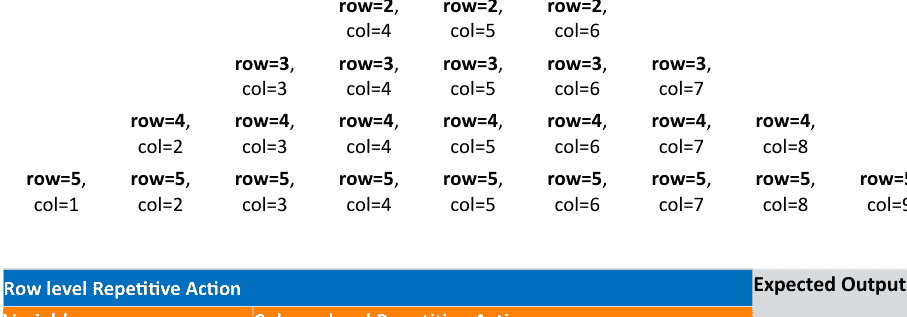

| 行级重复操作 | 预期输出 |
| :--- | :--- |
| 变量：row | 列级重复操作 | |
| | 变量：spaces | 变量：col | |
| 1 | 1,2,3,4 | 5 | * |
| 2 | 1,2,3 | 4, 5,6 | * * * |
| 3 | 1,2 | 3, 4, 5,6,7 | * * * * * |
| 4 | 1 | 2, 3, 4, 5,6,7,8 | * * * * * * * |
| 5 | 0(无空格) | 1, 2, 3, 4, 5,6,7,8,9 | * * * * * * * * * |

空格（“ ”）和星号（“*”）字符被重复多次。因此，我们可以为每个使用 **for循环**。我们可以如下填充表格：

| 行级重复操作 | 预期输出 |
| :--- | :--- |
| 变量：row | 列级重复操作 | | | | |
| | 变量：spaces | | 变量：col | | |
| | min_val | max_val | min_val | max_val | |
| 1 | 1 | 4 | 5 | 5 | * |
| 2 | 1 | 3 | 4 | 6 | * * * |
| 3 | 1 | 2 | 3 | 7 | * * * * * |
| 4 | 1 | 1 | 2 | 8 | * * * * * * * |
| 5 | 0 | 0 | 1 | 9 | * * * * * * * * * |

我们知道 **totalRows = 5**（总行数）。让我们尝试使用变量 **totalRows** 来泛化变量 **col** 的列 **min_val** 和 **max_val**。此外，我们需要将行值从0到4开始，而不是从1到5。这是为了匹配 **变量：col** 的列 **min_val** 和 **max_val** 表达式的部分。

| 行级重复操作 | 预期输出 |
| :--- | :--- |
| **变量：row** | **列级重复操作** | | | | |
| | **变量：spaces** | | **变量：col** | | |
| | **min_val** | **max_val** | **min_val** | **max_val** | |
| 0 | 1 | 4 | totalRows - 0 | totalRows + 0 | * |
| 1 | 1 | 3 | totalRows - 1 | totalRows + 1 | *** |
| 2 | 1 | 2 | totalRows - 2 | totalRows + 2 | ***** |
| 3 | 1 | 1 | totalRows - 3 | totalRows + 3 | ******* |
| 4 | 0 | 0 | totalRows - 4 | totalRows + 4 | ********* |

使用变量 **row** 来泛化变量 **col** 的列 **min_val** 和 **max_val**。

| 行级重复操作 | 预期输出 |
| :--- | :--- |
| **变量：row** | **列级重复操作** | | | | |
| | **变量：spaces** | | **变量：col** | | |
| | **min_val** | **max_val** | **min_val** | **max_val** | |
| 0 | 1 | 4 | totalRows - row | totalRows + row | * |
| 1 | 1 | 3 | totalRows - row | totalRows + row | *** |
| 2 | 1 | 2 | totalRows - row | totalRows + row | ***** |
| 3 | 1 | 1 | totalRows - row | totalRows + row | ******* |
| 4 | 0 | 0 | totalRows - row | totalRows + row | ********* |

| 行级重复操作 | 预期输出 |
| :--- | :--- |
| **变量：row** | **列级重复操作** | | | | |
| | **变量：spaces** | | **变量：col** | | |
| | **min_val** | **max_val** | **min_val** | **max_val** | |
| 0 | 1 | 4 | totalRows - row | totalRows + row | * |
| 1 | 1 | 3 | totalRows - row | totalRows + row | *** |
| 2 | 1 | 2 | totalRows - row | totalRows + row | ***** |
| 3 | 1 | 1 | totalRows - row | totalRows + row | ******* |
| 4 | 0 | 0 | totalRows - row | totalRows + row | ********* |

条件 (col >= (**totalRows – row**)) 给出了最小限制。这个特定的逻辑表达式将计算一个起始点，从该点开始打印星号（“*”）字符，直到 **变量：col** 的最大值，该最大值将被计算为 (**totalRows + row**)。
然后，可以在给定的值范围之间给出 **if条件**：

(totalRows - row ) 和 (totalRows + row)。

应用比较和逻辑运算符后，**if条件** 可以写为：

If ( col >= ( **totalRows - row** ) and col <= ( **totalRows + row**) )

我们已经知道；

**变量：row** = 0,1,2,3,4 或 0,1,2,3,4, **totalRows - 1**

**变量：col** = 1,2,3,4,5 或 1,2,3,4, ( **totalRows + row**)

### 为什么变量 `col` 的最大值保持为动态值？

我们知道，打印星号（"*"）字符会持续到变量 `col` 的最大值，即 `(totalRows + row)`。

当一行中所有星号（"*"）字符打印完成时，我们无需担心空格。将列级循环限制在达到最大星号（"*"）字符打印次数时是合理的。

### 为什么变量 `col` 的最小值保持为 1？

从值 1 开始 `col=1,2...` 是合理的，因为在实际打印星号（"*"）字符之前，我们需要打印空格字符。在列级循环开始时准确计算空格字符是必要的。

我们可以消除 `if` 条件中用于打印星号（"*"）字符的逻辑与（and）条件 `( col <= ( totalRows + row) )`。该逻辑与（and）条件已作为循环条件被纳入列级内部 `for` 循环中。因此，`if` 条件现在简化为：

```
If ( col >= (totalRows - row ) )
```

我们可以将其总结为：

| 当条件为真时，对于变量 `col` 的每个值打印一个星号字符 |
|---|
| col=1 | col=2 | col=3 | col=4 | ... | col= (totalRows + row) |
| If ( condition = ( col >= (totalRows - row ) ) is True) |
| 打印星号字符 |
| Else |
| 打印空格字符 |

我们将列 `max_val` 的非重复数字模式概括为一个表达式。

我们现在可以定义列级 `for` 循环，该循环对每个行值都相同。

| 列级 FOR 循环的要素 |
|---|
| 变量: col | 递增顺序 | 操作 |
| start | end | step-size | 打印字符 |
| col = 1 | col <= totalRows + row | 1 | * 或空格 |

### 行级重复操作

以下语句已重复 5 次（总行数）。

用于打印星号字符的列级 `for` 循环 # 内部 `for` 循环

```
print() # 移动到下一行
```

我们为每一行分配了一个从 0 到 4 的唯一值。

让我们考虑：

row → 整数类型的变量，一次存储一个整数值，表示 0 到 4（`totalRows - 1`）之间的行号。`totalRows` 初始赋值为 5。

| 变量: row | 递增顺序 | 操作 |
| :--- | :--- | :--- |
| start | end | step-size | 语句 |
| row = 0 | row = totalRows - 1 | 1 | 1# 用于打印空格或星号(*)字符的列级 For 循环。<br>2# 移动到下一行 |

我们已获得与行级重复的 `for` 循环相关的所有内容，相关流程图如下所示。

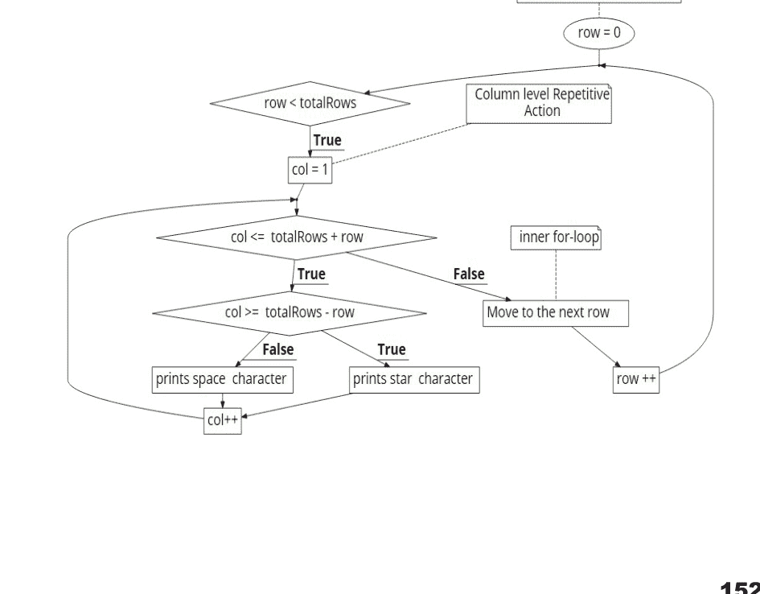

让我们执行以下程序。

```
PatternE1.py
totalRows = 5 # 要显示的总行数

# 行级重复操作：
# 操作1. 执行列级重复操作：
# 操作2. 将程序控制权移动到下一行
#           为按列打印字符奠定基础。
for row in range(0,totalRows):

    # 列级重复操作：
    # 操作1. 按列或在同一行打印字符。
    for col in range(1,totalRows + row+1):

        if (col >= (totalRows - row)):
            # 操作2. 打印星号 * 字符
            print("* ",end="")
        else:
            # 操作3. 打印空格字符
            print("  ",end="")

    # 结束内部 for 循环

    # 将程序控制权移动到下一行
    # 以便将字符打印切换到下一行。
    print()

# 外部 for 循环
```

输出

```
        * 
      * * * 
    * * * * * 
  * * * * * * * 
* * * * * * * * * 
```

### 替代解决方案 2

从之前的解决方案中，当 **if 条件** 为 **True** 时，我们将打印一个星号（"*"）字符，而在 **if 语句** 的 else 部分，我们将打印空格。让我们从之前解决方案中得到的观察表开始。

| 行级重复操作 | 预期输出 |
| :--- | :--- |
| 变量: row | 列级重复操作 | |
| | 变量: spaces | 变量: col | |
| | min_val | max_val | min_val | max_val | |
| 1 | 1 | 4 | 5 | 5 | * |
| 2 | 1 | 3 | 4 | 6 | *** |
| 3 | 1 | 2 | 3 | 7 | ***** |
| 4 | 1 | 1 | 2 | 8 | ******* |
| 5 | 0 | 0 | 1 | 9 | ********* |

反转变量 `row` 的计数器值，即 `row = 5, 4, 3, 2, 1`，使其与变量 `col` 的列 **min_val** 匹配。此外，我们可以使用 **变量: totalRows** 来概括打印星号字符的列 **max_val**。

| 行级重复操作 | | | | |
| :--- | :--- | :--- | :--- | :--- |
| 变量: row | 列级重复操作 | | | |
| | 变量: spaces | 变量: col (用于打印 *) | | |
| | min_val | max_val | min_val | max_val |
| 5 | 1 | 4 | row | 5 = 5 + 0 | totalRows + 0 |
| 4 | 1 | 3 | row | 6 = 5 + 1 | totalRows + 1 |
| 3 | 1 | 2 | row | 7 = 5 + 2 | totalRows + 2 |
| 2 | 1 | 1 | row | 8 = 5 + 3 | totalRows + 3 |
| 1 | 0 | 0 | row | 9 = 5 + 4 | totalRows + 4 |

**变量: col 的列 max_val 的** 表达式部分在每一行仍有一个不同的数值。

| 行级重复操作 | | | | |
| :--- | :--- | :--- | :--- | :--- |
| 变量: row | 列级重复操作 | | | |
| | 变量: col (用于打印 *) | | | |
| | min_val | max_val | | |
| 5 | row | 5 = 5 + 0 | totalRows + 0 | totalRows + 5 - 5 |
| 4 | row | 6 = 5 + 1 | totalRows + 1 | totalRows + 5 - 4 |
| 3 | row | 7 = 5 + 2 | totalRows + 2 | totalRows + 5 - 3 |
| 2 | row | 8 = 5 + 3 | totalRows + 3 | totalRows + 5 - 2 |
| 1 | row | 9 = 5 + 4 | totalRows + 4 | totalRows + 5 - 1 |

**变量: col 的列 max_val 的** 表达式部分在每一行仍有一个不同的数值。同样，我们可以使用 **变量: totalRows** 来概括列 **max_val**。

| 行级重复操作 | | | | |
| :--- | :--- | :--- | :--- | :--- |
| **变量: row** | **列级重复操作** | | | |
| | **变量: col (用于打印 *)** | | | |
| | **min_val** | | **max_val** | |
| 5 | row | totalRows + 0 | totalRows + 5 - 5 | totalRows + totalRows - 5 |
| 4 | row | totalRows + 1 | totalRows + 5 - 4 | totalRows + totalRows - 4 |
| 3 | row | totalRows + 2 | totalRows + 5 - 3 | totalRows + totalRows - 3 |
| 2 | row | totalRows + 3 | totalRows + 5 - 2 | totalRows + totalRows - 2 |
| 1 | row | totalRows + 4 | totalRows + 5 - 1 | totalRows + totalRows - 1 |

变量 **col** 的列 **max_val** 的表达式部分与行值匹配。

| 行级重复操作 | | | | |
| :--- | :--- | :--- | :--- | :--- |
| **变量: row** | **列级重复操作** | | | |
| | **变量: col (用于打印 *)** | | | |
| | **min_val** | | **max_val** | |
| 5 | row | totalRows + totalRows - 5 | 2 * totalRows - row | |
| 4 | row | totalRows + totalRows - 4 | 2 * totalRows - row | |
| 3 | row | totalRows + totalRows - 3 | 2 * totalRows - row | 2 * totalRows - row |
| 2 | row | totalRows + totalRows - 2 | 2 * totalRows - row | |
| 1 | row | totalRows + totalRows - 1 | 2 * totalRows - row | |

| 行级重复操作 | | | |
| :--- | :--- | :--- | :--- |
| **变量: row** | **列级重复操作** | | |
| | **变量: col (用于打印 *)** | | |
| | **min_val** | | **max_val** |
| 5 | | | |
| 4 | | | |
| 3 | row | | 2 * totalRows - row |
| 2 | | | |
| 1 | | | |

条件 `(col >= **row**)` 给出了 **for 循环** 开始打印星号（"*"）字符的起点，对于每个 `row` 值，将持续打印到变量 `col` 的最大值，即 `(**2 * totalRows - row**)`。可以使用比较和逻辑运算符在值范围 `(**row**)` 和 `(**2 * totalRows - row**)` 之间给出 `if` 条件：

```
If ( col >= ( row ) and col <= (2 * totalRows - row) )
```

我们已知

变量 col = 1,2,3,4,5 或 1,2,3,4, ...,**(2 * totalRows - row)**

变量 row = 5,4,3,2,1 或 **totalRows**,4,3,2,1

我们可以消除 `if` 条件中的逻辑与（and）条件 `( col <= (2 * totalRows - row) )`。该逻辑与（and）条件已作为循环条件在列级内部 `for` 循环中处理。

因此，`if` 条件现在简化为 `If ( col >= row )`。我们可以将其总结为：

| 当条件为真时，对于变量 col 的每个值打印一个星号 |
|---|
| col=1 | col=2 | col=3 | col=4 | ........................................ | col= (2 * totalRows - row) |
| If ( condition=( col >= row ) is True) |
| 打印星号字符 |
| Else |
| 打印空格字符 |

我们将列 `max_val` 的非重复数字模式概括为一个表达式。

我们现在可以定义列级 `for` 循环。

| 列级 for 循环的要素 |
|---|
| min_val | 1 |
| max_val | (2 * totalRows - row) |
| variable_name | col |
| statement(s) | print("* ",end="") |

### 行级重复操作

以下语句已重复 5 次（总行数）。

用于打印星号字符的列级 `for` 循环 # 内部 `for` 循环

print() # 移动到下一行

我们为每一行分配了一个从 5 到 1 的唯一值。

让我们考虑：

row → 整数类型的变量，一次存储一个整数值，表示 5 到 1 之间的行号。`totalRows` 初始赋值为 5。

我们已获得与行级重复的 `for` 循环相关的所有内容。

| 行级递减 for 循环的要素 |
|---|
| min_val | 1 |
| max_val | totalRows |
| variable_name | row |
| statement(s) | 用于打印星号字符的列级 for 循环 |
| | print() # 移动到下一行 |

让我们执行以下程序。

```python
PatternE2.py
totalRows = 5 # 要显示的总行数

# 行级重复操作：
# 操作1. 执行列级重复操作：
# 操作2. 将程序控制权移至下一行
#           为逐列打印字符奠定基础。
for row in range(totalRows, 0, -1):

    # 列级重复操作：
    # 操作1. 逐列或在同一行打印字符
    for col in range(1, (2 * totalRows - row) + 1):

        if (col >= row):
            # 操作2. 打印星号 * 字符
            print("* ",end="")
        else:
            # 操作3. 打印空格字符
            print("  ",end="")

    # 结束内层 for 循环

    # 将程序控制权移至下一行
    # 以便将字符打印切换到下一行。
    print()
# 结束外层 for 循环
```

### 输出

```
        *       
      * * *     
    * * * * *   
  * * * * * * * 
* * * * * * * * *
```

### 模式 1F

我们的编程任务是在计算机屏幕的一部分输出此模式，如下所示。我们可以将计算机屏幕视为由遍布屏幕的 **(行, 列)** 数值对框组成的组合。每个框被视为仅容纳单个字符。


#### 数据表示

虽然从逻辑上讲，我们可以通过知道每个可打印字符在显示屏上的唯一可识别 **(行, 列)** 数值对来精确定位其位置。

**例如；**
**(2, 4)** 表示模式中**第 2 行**和**第 4 列**的字符 “*”。

| 行, 列 | 列 = 1 | 列 = 2 | 列 = 3 | 列 = 4 | 列 = 5 | 列 = 6 | 列 = 7 | 列 = 8 | 列 = 9 |
| :--- | :--- | :--- | :--- | :--- | :--- | :--- | :--- | :--- | :--- |
| **行 = 1** | * (1, 1) | *(1, 2)* | *(1, 3)* | *(1, 4)* | *(1, 5)* | *(1, 6)* | *(1, 7)* | *(1, 8)* | *(1, 9)* |
| **行 = 2** | | *(2, 2)* | *(2, 3)* | *(2, 4)* | *(2, 5)* | *(2, 6)* | *(2, 7)* | *(2, 8)* | |
| **行 = 3** | | | *(3, 3)* | *(3, 4)* | *(3, 5)* | *(3, 6)* | *(3, 7)* | | |
| **行 = 4** | | | | *(4, 4)* | *(4, 5)* | *(4, 6)* | | | |
| **行 = 5** | | | | | *(5, 5)* | | | | |

实际的挑战是通过编写程序在计算机屏幕上找到正确的 (行, 列) 位置。这将通过应用 for 循环和适当的逻辑条件来实现。这有助于培养算法思维，这是自信的程序员的基本要求。

练习。通过在计算机屏幕图上显示输出，完成第 1 到 5 行的此逻辑模式生成的步骤。

| 模式生成步骤（行 = 1 到 5） | 计算机屏幕 |
| :--- | :--- |
| 对于行 = 1 | 1 2 3 4 5 6 7 8 9<br>1<br>2<br>3<br>4<br>5 |
| 对于行 = 2 | 1 2 3 4 5 6 7 8 9<br>1<br>2<br>3<br>4<br>5 |
| 对于行 = 3 | 1 2 3 4 5 6 7 8 9<br>1<br>2<br>3<br>4<br>5 |
| 对于行 = 4 | 1 2 3 4 5 6 7 8 9<br>1<br>2<br>3<br>4<br>5 |
| 对于行 = 5 | 1 2 3 4 5 6 7 8 9<br>1<br>2<br>3<br>4<br>5<br>6 |

让我们使用内置方法将步骤转换为程序。

| | |
| :--- | :--- |
| 移至下一行。 | print() |
| 移至下一个 (行, 列) 位置并在同一行打印空格 " " 字符 | print(" ",end="") |
| 移至下一个 (行, 列) 位置并在同一行打印星号 "*" 字符 | print("*",end="") |

打印字符以生成此特定模式的任务本质上是重复的。要在计算机屏幕上输出这些字符，前面提到的方法调用必然会在程序中的 for 循环内重复多次。

### 列级重复操作

让我们考虑：

**row** → 整数类型的变量，一次存储一个整数值，表示 0 到 4 之间的行号。

**col** → 整数类型的变量，一次存储一个整数值，表示 1 到 5 之间的列号。

**spaces** → 整数类型的变量，一次存储一个整数值，表示 1 到 5 列号之间的空格字符。

**totalRows** → 整数类型的变量，用于存储总行数的整数值。

逻辑跟踪表

| (行, 列) 值对描述了显示屏上 “*” 字符的位置 |
| :--- |
| 行=1, 列1 | 行=1, 列2 | 行=1, 列3 | 行=1, 列4 | 行=1, 列5 | 行=1, 列6 | 行=1, 列7 | 行=1, 列8 | 行=1, 列9 |
| 空格 | 行=2, 列2 | 行=2, 列3 | 行=2, 列4 | 行=2, 列5 | 行=2, 列6 | 行=2, 列7 | 行=2, 列8 | |
| 空格 | 空格 | 行=3, 列3 | 行=3, 列4 | 行=3, 列5 | 行=3, 列6 | 行=3, 列7 | | |
| 空格 | 空格 | 空格 | 行=4, 列4 | 行=4, 列5 | 行=4, 列6 | | | |
| 空格 | 空格 | 空格 | 空格 | 行=5, 列5 | | | | |

空格 (“ ”) 和星号 (“*”) 字符重复多次。
因此，我们可以对空格 (“ ”) 和星号 (“*”) 字符使用 **for 循环**。

| 行级重复操作 | | | 预期输出 |
| :--- | :--- | :--- | :--- |
| 变量：row | 列级重复操作 | | |
| | 变量：spaces | 变量：col | |
| 1 | 0（无空格） | 1, 2, 3, 4, 5,6,7,8,9 | ********* |
| 2 | 1 | 2, 3, 4, 5,6,7,8 | ******* |
| 3 | 1,2 | 3, 4, 5,6,7 | ***** |
| 4 | 1,2,3 | 4, 5,6 | *** |
| 5 | 1,2,3,4 | 5 | * |

我们也可以如下填写上表，以探索 **for 循环** 的各个组成部分。

| 行级重复操作 | | | | | 预期输出 |
| :--- | :--- | :--- | :--- | :--- | :--- |
| 变量：row | 列级重复操作 | | | | |
| | 变量：spaces | | 变量：col | | |
| | min_val | max_val | min_val | max_val | |
| 1 | 0 | 0 | 1 | 9 | ********* |
| 2 | 1 | 1 | 2 | 8 | ******* |
| 3 | 1 | 2 | 3 | 7 | ***** |
| 4 | 1 | 3 | 4 | 6 | *** |
| 5 | 1 | 4 | 5 | 5 | * |

我们知道 totalRows = 5（总行数）。
让我们尝试使用变量 **totalRows** 来泛化变量 **col** 的列 **min_val** 和 **max_val**。

| 行级重复操作 | 预期输出 |
| :--- | :--- |
| 变量：row | 列级重复操作 | |
| | 变量：spaces | 变量：col | |
| | min_val | max_val | min_val | max_val | |
| 1 | 0 | 0 | totalRows -4 | totalRows + 4 | ********* |
| 2 | 1 | 1 | totalRows -3 | totalRows + 3 | ******* |
| 3 | 1 | 2 | totalRows -2 | totalRows + 2 | ***** |
| 4 | 1 | 3 | totalRows -1 | totalRows + 1 | *** |
| 5 | 1 | 4 | totalRows -0 | totalRows + 0 | * |

让我们在行级重复中使用范围从 4 到 0 的**递减** **for 循环**。
这是为了匹配变量 **col** 的列 **min_val** 和 **max_val** 表达式的部分。
使用变量 **row** 来泛化变量 **col** 的列 **min_val** 和 **max_val**。

| 行级重复操作 | | | | |
| :--- | :--- | :--- | :--- | :--- |
| 变量：row | 列级重复操作 | | | |
| | 变量：spaces | 变量：col | | |
| | min_val | max_val | min_val | max_val |
| 4 | 0 | 0 | totalRows - row | totalRows + row |
| 3 | 1 | 1 | totalRows - row | totalRows + row |
| 2 | 1 | 2 | totalRows - row | totalRows + row |
| 1 | 1 | 3 | totalRows - row | totalRows + row |
| 0 | 1 | 4 | totalRows - row | totalRows + row |

条件 (col >= (**totalRows – row**)) 给出了最小限制，即开始打印星号 (“*”) 字符的起点，直到变量 col 的最大值，即 (**totalRows + row**)。

**if 条件** 可以使用<u>比较和逻辑运算符</u>在值范围之间给出：

If ( col >= (**totalRows - row**) and col <= (**totalRows + row**) )

我们已经知道

变量 col = 1,2,3,4,...,9 或 1,2,3,4,..., (**totalRows + row**)

**变量 row = 4,3,2,1,0 或 (totalRows – 1),3,2,1,0**

我们可以消除 **if 条件** 中的<u>逻辑与 (and) 条件</u>( col <= (**totalRows + row**) ) 来打印星号 (“*”) 字符。这个<u>逻辑与 (and) 条件</u>已经被考虑为列级内层 for 循环的 **循环条件** 中的上限。因此，**if 条件** 现在将简化为以下形式。

If ( col >= (**totalRows - row**) )，当 **if 条件表达式** 的结果为 **True** 时，它将允许打印星号 (“*”) 字符，否则将打印空格字符。我们将列 **max_val** 的非重复数值模式泛化为一个表达式。我们现在可以定义列级 **for 循环**。

| 列级循环的元素 | |
|---|---|
| min_val | 1 |
| max_val | totalRows + row |
| variable_name | col |
| statement | print("* ",end="") |

### 行级重复操作

以下语句已重复执行5次（总行数）。

用于打印星号字符的列级循环 # 内层循环

```
print() # 移动到下一行
```

row → 用于一次存储一个整数值的整数类型变量，表示行号在4或（totalRows - 1）与0之间。totalRows最初被赋值为5。

我们已经掌握了与行级重复相关的所有for循环知识。

| 行级递减循环的元素 | |
|---|---|
| min_val | 0 |
| max_val | totalRows - 1 |
| variable_name | row |
| statement(s) | 用于打印星号字符的列级循环<br>print() # 移动到下一行 |

流程图如下所示：

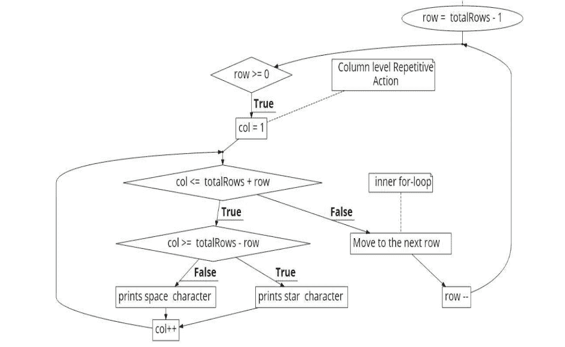

让我们执行以下程序。

```
PatternF1.py
totalRows = 5 # 要显示的总行数

# 行级重复操作：
# 操作1. 执行列级重复操作：
# 操作2. 将程序控制权移动到下一行
#           为逐列打印字符奠定基础。
for row in range(totalRows, 0, -1):

    # 列级重复操作：
    # 操作1. 逐列或在同一行打印字符。
    for col in range(1,totalRows + row):

        if (col >= (totalRows - row+1)):
            # 操作2. 打印星号 * 字符
            print("* ",end="")
        else:
            # 操作3. 打印空格字符
            print("  ",end="")

    # 结束内层for循环

    # 将程序控制权移动到下一行
    # 以便将字符打印切换到下一行。
    print()

# 结束外层for循环
```

### 输出

```
* * * * * * * * *
  * * * * * * *
    * * * * *
      * * *
        *
```

### 替代解决方案2

通过在行级重复中使用递增**for循环**，我们可以提供替代解决方案。

**问题 F1.** 找出不同的逻辑，并编写程序为5行打印以下图案。测试12行的逻辑。一些细节以表格形式提及，以便开始。

| 行级重复操作 | 预期输出 |
| :--- | :--- |
| 变量：row | 列级重复操作 | |
| | 变量：spaces | 变量：col | |
| | min_val | max_val | min_val | max_val | |
| 1 | 0 | 0 | 1 | 9 | ********* |
| 2 | 1 | 1 | 2 | 8 | ******* |
| 3 | 1 | 2 | 3 | 7 | ***** |
| 4 | 1 | 3 | 4 | 6 | *** |
| 5 | 1 | 4 | 5 | 5 | * |

当**if条件**为`True时，程序应打印星号（“*”）字符`，而在**if语句**的**else**部分`程序应`打印空格字符。

**问题 F2.** 延续上一个问题（**问题 F1**），为以下情况编写程序。

当**if条件**为`True时，程序应打印空格（“ ”）字符`，而在**if语句**的**else**部分`程序应打印星号（“*”）字符`。

### 图案 1G

我们的编程任务是在计算机屏幕的一部分输出此图案，如下所示。我们可以将计算机屏幕视为遍布屏幕的**（行，列）**数值对框的组合。每个框只能容纳一个字符。

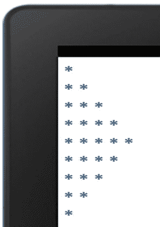

#### 数据表示

完整的图案可以很容易地表示为**选定的**（行，列）数值对的集合。第一个值代表行号，第二个值代表列号。**例如；**

(2, 1) 表示表格中**第二行**和**第一列**的字符“*”。

真正的挑战是找到正确的（行，列）位置，并通过编写程序在计算机屏幕上打印所需的字符。这将通过应用**for循环**结合适当的逻辑条件来实现。逐步寻找逻辑条件可以激发算法思维，这是成为一名自信程序员的基本要求。

| | Col=1 | Col=2 | Col=3 | Col=4 | Col=5 |
|---|---|---|---|---|---|
| Row=1 | * (1,1) | | | | |
| Row=2 | * (2 ,1) | *(2,2) | | | |
| Row=3 | * (3,1) | *(3,2) | *(3,3) | | |
| Row=4 | *(4,1) | *(4,2) | *(4,3) | *(4,4) | |
| Row=5 | *(5,1) | *(5,2) | *(5,3) | *(5,4) | *(5,5) |
| Row=6 | *(6,1) | *(6,2) | *(6,3) | *(6,4) | |
| Row=7 | *(7,1) | *(7,2) | *(7,3) | | |
| Row=8 | *(8,1) | *(8,2) | | | |
| Row=9 | *(9,1) | | | | |

*练习。* 从第1行到第9行，逐步打印逻辑图案，显示类似于计算机屏幕上的输出。

**图案生成步骤（行 = 1 到 9）及计算机屏幕图示。**

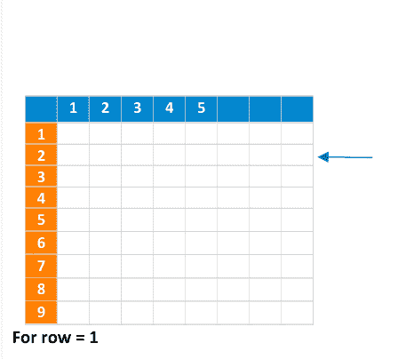

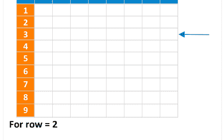

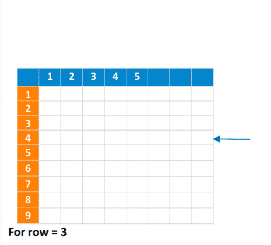

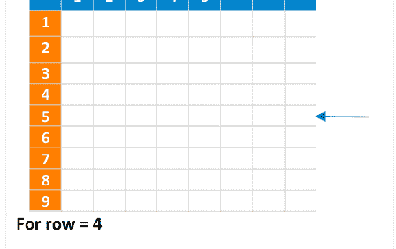

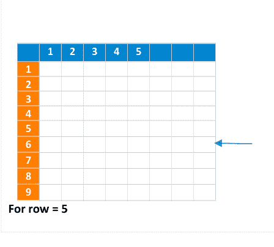

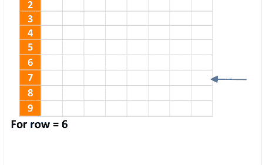

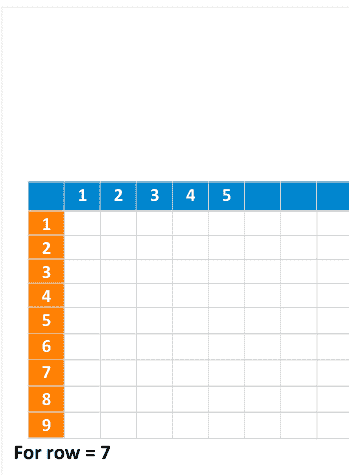

对于 row = 7

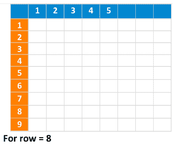

对于 row = 8

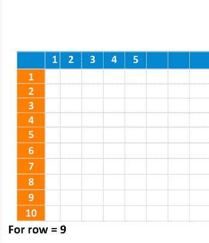

对于 row = 9

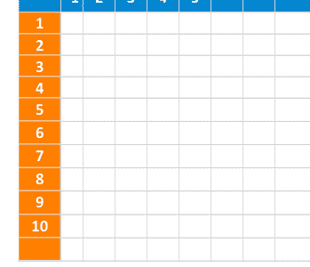

对于 row = 10

| 让我们使用内置方法将步骤转换为程序。 | |
| :--- | :--- |
| 将光标移动到下一行 | `print()` |
| 将光标移动到下一个（行，列）位置，然后在同一行打印星号“*”字符。 | `print("* ", end= "") |

为了打印星号“*”字符，计算机屏幕上的每次移动都将是同一行中从左到右方向的单个键盘字符大小的跳转。由于循环意味着程序内的重复操作，我们需要使用这些打印语句和**for循环**。编写程序来计算行和列值，以便在计算机屏幕上正确打印字符，将是提高逻辑思维能力的实际训练。

让我们考虑以下变量，它们是一种整数类型，用于一次存储一个整数值。

**row** → 表示1到9之间的行号。

**col** → 表示1到5之间的列号。

**totalRows** → 表示程序中总行数的输入值。

### 列级重复操作

我们需要探索所需的**外层**和内层*for循环*的各个组成部分。

| （行，列）值对描述了“*”字符在显示屏上的位置 | | | | |
| :--- | :--- | :--- | :--- | :--- |
| row=1, col=1 | | | | |
| row=2, col=1 | row=2, col=2 | | | |
| row=3, col=1 | row=3, col=2 | row=3, col=3 | | |
| row=4, col=1 | row=4, col=2 | row=4, col=3 | row=4, col=4 | |
| row=5, col=1 | row=5, col=2 | row=5, col=3 | row=5, col=4 | row=5, col=5 |
| row=6, col=1 | row=6, col=2 | row=6, col=3 | row=6, col=4 | |
| row=7, col=1 | row=7, col=2 | row=7, col=3 | | |
| row=8, col=1 | row=8, col=2 | | | |
| row=9, col=1 | | | | |

我们需要一组**min_val**和**max_val**边界值，以便执行循环。

| 行级重复操作 | | 预期输出 |
| :--- | :--- | :--- |
| 变量：row | 列级重复操作<br>变量：col | |
| 1 | 1 | * |
| 2 | 1,2 | * * |
| 3 | 1,2,3 | * * * |
| 4 | 1,2,3,4 | * * * * |
| 5 | 1,2,3,4,5 | * * * * * |
| 6 | 1,2,3,4 | * * * * |
| 7 | 1,2,3 | * * * |
| 8 | 1,2 | * * |
| 9 | 1 | * |

| 行级重复操作 | | | 预期输出 |
| :--- | :--- | :--- | :--- |
| 变量：row | 列级重复操作<br>变量：col | | |
| | min_val | max_val | |
| 1 | 1 | 1 | * |
| 2 | 1 | 2 | * * |
| 3 | 1 | 3 | * * * |
| 4 | 1 | 4 | * * * * |
| 5 | 1 | 5 | * * * * * |
| 6 | 1 | 4 | * * * * |
| 7 | 1 | 3 | * * * |
| 8 | 1 | 2 | * * |
| 9 | 1 | 1 | * |

### 解决方案方法

变量是 row 和 totalRows =5。我们需要使用这些剩余的变量来概括列**max_val**的非重复数字模式。列**max_val**的数字模式（1到5）与每一行的值完全匹配。因此，它可以用<u>row</u>变量表示。

| 行级重复操作 | | | | | 预期输出 |
| :--- | :--- | :--- | :--- | :--- | :--- |
| **变量：row** | **列级重复操作** | | | | |
| | **变量：col** | | | | |
| | | **min_val** | **max_val** | | |
| 1 | 1 | 1 | 1 | row | * |
| 2 | 2 | 1 | 2 | row | ** |
| 3 | 3 | 1 | 3 | row | *** |
| 4 | 4 | 1 | 4 | row | **** |
| 5 | totalRows | 1 | 5 | row | ***** |
| 6 | 6 | 1 | 4 | totalRows - 1 | **** |
| 7 | 7 | 1 | 3 | totalRows - 2 | *** |
| 8 | 8 | 1 | 2 | totalRows - 3 | ** |
| 9 | totalRows + 4 | 1 | 1 | totalRows - 4 | * |

列**min_val**仅包含数据**col = 1，这意味着**它对每一行都相同。因此，列**min_val**已经处于概括状态。因此，我们得到了用于**启动**列级for循环的一致数值表达式。列**max_val**是部分概括的（row = 1 到 5）。

| 行级重复操作 | | | | | 预期输出 |
| :--- | :--- | :--- | :--- | :--- | :--- |
| **变量：row** | **列级重复操作** | | | | |
| | **变量：col** | | | | |
| | | **min_val** | **max_val** | | |
| 1 | 1 | 1 | 1 | row | * |
| 2 | 2 | 1 | 2 | row | ** |
| 3 | 3 | 1 | 3 | row | *** |
| 4 | 4 | 1 | 4 | row | **** |
| 5 | totalRows | 1 | 5 | row | ***** |
| 6 | 6 | 1 | 4 | totalRows - 1 | **** |
| 7 | 7 | 1 | 3 | totalRows - 2 | *** |
| 8 | 8 | 1 | 2 | totalRows - 3 | ** |
| 9 | totalRows + 4 | 1 | 1 | totalRows - 4 | * |

我们还需要找到**变量：行**最大值的通用表达式。
在列变量 **col** 的 **max_val** 列中，仍然存在不重复的数值。

| 行级重复操作 | | | | |
| :--- | :--- | :--- | :--- | :--- |
| **变量：行** | **列级重复操作** | | | |
| | **变量：列** | | | |
| | | **最小值** | **最大值** | |
| 1 | 1 | | | |
| 2 | 2 | | | |
| 3 | 3 | 行 | 行 | 行 |
| 4 | 4 | | | |
| 5 | totalRows | 1 | | |
| 6 | 6 | totalRows – 1 | totalRows – (6- 5) | totalRows – (行 -5) |
| 7 | 7 | totalRows – 2 | totalRows – (7- 5) | totalRows – (行 -5) |
| 8 | 8 | totalRows – 3 | totalRows – (8 -5) | totalRows – (行 -5) |
| 9 | totalRows + 4 | totalRows – 4 | totalRows – (9 -5) | totalRows – (行 -5) |

| 行级重复操作 | | | | |
| :--- | :--- | :--- | :--- | :--- |
| **变量：行** | **列级重复操作** | | | |
| | **变量：列** | | | |
| | | **最小值** | **最大值** | |
| 1 | 1 | | | |
| 2 | 2 | | | |
| 3 | 3 | | | |
| 4 | 4 | 1 | 行 | 行 |
| 5 | totalRows | | | |
| 6 | 6 | | totalRows – (行 -5) | totalRows – 行 +5 |
| 7 | 7 | | totalRows – (行 -5) | totalRows – 行 +5 |
| 8 | 8 | | totalRows – (行 -5) | totalRows – 行 +5 |
| 9 | totalRows + totalRows – 1 | | totalRows – (行 -5) | totalRows – 行 +5 |

在列变量 **col** 的 **max_val** 列中，仍然存在不重复的数值。

| 行级重复操作 | 列级重复操作 |
| :--- | :--- |
| 变量：行 | 变量：列 |
| | 最小值 | 最大值 |
| 1 | 1 | | |
| 2 | 2 | | |
| 3 | 3 | 行 | 行 |
| 4 | 4 | | |
| 5 | 5 | 1 | |
| 6 | 6 | totalRows – 行 + totalRows | 2*totalRows – 行 |
| 7 | 7 | totalRows – 行 + totalRows | 2*totalRows – 行 |
| 8 | 8 | totalRows – 行 + totalRows | 2*totalRows – 行 |
| 9 | 2 * totalRows – 1 | totalRows – 行 + totalRows | 2*totalRows - 行 |

| 行级重复操作 | 列级重复操作 |
| :--- | :--- |
| 变量：行 | 变量：列 |
| | 最小值 | 最大值 |
| 1 | 1 | | |
| 2 | 2 | | |
| 3 | 3 | 行 | 行 |
| 4 | 4 | | |
| 5 | totalRows | 1 | |
| 6 | 6 | 2*totalRows – 行 | |
| 7 | 7 | 2*totalRows – 行 | 2*totalRows – 行 |
| 8 | 8 | 2*totalRows – 行 | |
| 9 | 2 * totalRows – 1 | 2*totalRows - 行 | |

变量 **col** 的 **max_val** 列的数值模式与 **行** 的值（1 到 5）完全匹配。这个特定的数值模式部分（1 到 5）可以用 `行` 变量表示。
条件 (col >=1) 给出了一个起始点，从该点开始打印星号（"*"）字符，直到变量 **行** 的值达到 (**totalRows**)。
然后变量 **col** 开始递减，这体现在表达式 (**2*totalRows - 行**) 中。
因此，在这种情况下，变量 **col** 的值有**两个通用表达式，而不是一个**。这表明我们需要为变量 **col** 使用两个独立的 **for 循环**。

让以下内容成为打印星号（"*"）字符的两个版本的列级 for 循环。

列级 *for 循环_1* 用于打印星号字符 # 内层 for 循环

列级 *for 循环_2* 用于打印星号字符 # 内层 for 循环

我们可以将其总结为：

| 为变量：行的每个值打印星号(*)字符 |
| :--- |
| 行=1 | 行=2 | 行=3 | 行=4 | 行 =totalRows | ............... | 行= (2*totalRows - 1) |
| 如果 ( 条件=( 列 <=totalRows ) 为真) |
| 使用列级 *for 循环_1* 打印星号字符 |
| 否则 |
| 使用列级 *for 循环_2* 打印星号字符 |

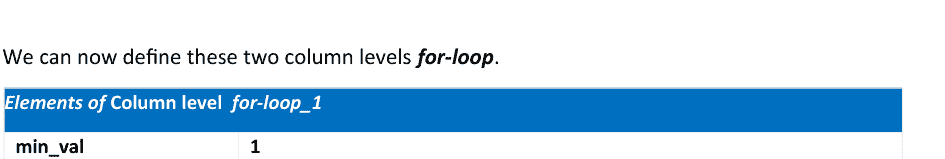

我们现在可以定义这两个列级 *for 循环*。

| 列级 *for 循环_1* 的元素 |
| :--- |
| 最小值 | 1 |
| 最大值 | totalRows |
| 变量名 | 列 |
| 语句 | print("* ", end = "") |

| 列级 *for 循环_2* 的元素 |
| :--- |
| 最小值 | totalRows + 1 |
| 最大值 | 2*totalRows - 行 |
| 变量名 | 列 |
| 语句 | print("* ",end = "") |

### 行级重复操作

我们已为每一行分配了从 1 到 9 的唯一值。

我们可以将值 9 表示为 (2*5 – 1)。变量 **totalRows** 最初被赋予了 <u>值 5</u>。

因此，我们可以使用该变量来泛化 **行** 变量的最大限制。让我们考虑：

**行** → **整数类型**的变量，用于一次存储一个整数值，并表示 1 到 (2*totalRows - 1) 之间的行号。

由于存在两个不同版本的 <u>列级 for 循环</u>，我们已通过 **for 循环**在逻辑上将<u>行级重复</u>分为两部分。

| 行级递减 for 循环的元素 | |
|---|---|
| 最小值 | 1 |
| totalRows | totalRows |
| 变量名 | 行 |
| 语句 | 用于打印星号字符的列级 for 循环_1<br>print() # 移至下一行 |

| 行级递减 for 循环的元素 | |
|---|---|
| 最小值 | totalRows + 1 |
| 最大值 | 2*totalRows - 1 |
| 变量名 | 行 |
| 语句 | 用于打印星号字符的列级 for 循环_2<br>print()# 移至下一行 |

既然我们已经获得了与所考虑的 for 循环相关的所有细节，我们可以借助流程图来总结这些相关信息。

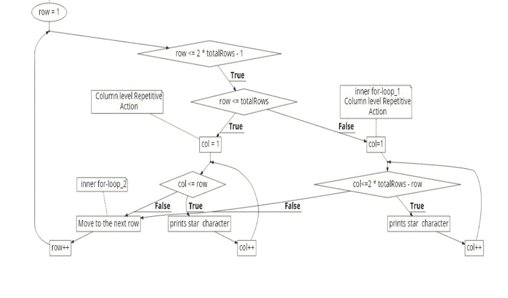

让我们执行以下程序。

```
PatternG1.py
```

```
totalRows = 5 # 要显示的行数

# 行级重复操作：
# 操作1. 执行列级重复操作：
# 操作2. 将程序控制权移至下一行
#         为按列打印字符奠定基础。
for row in range(1,2 * totalRows):

    # 列级重复操作：
    # 按列或在同一行打印字符
    if (row <= totalRows):
        # 内层 for 循环_1：打印星号 * 字符
        for col in range(1, row + 1):
            print("* ",end = "")

    else:
        # 内层 for 循环_2：打印空格字符
        for col in range(1,(2 * totalRows - row) + 1):
            print("* ",end = "")

    # 将程序控制权移至下一行
    # 以便将字符打印切换到下一行。
    print()
```

```
输出
```

```
*
* *
* * *
* * * *
* * * * *
* * * *
* * *
* *
*
```

内层 for 循环_1 和内层 for 循环_2 仅在变量 col 的最大限制值上有所不同。因此，最好将变量 col 的最大限制捕获在一个不同的变量中。然后我们将能够仅使用一个内层 for 循环来完成整个列级重复。

让我们使用单个内层 for 循环更新之前的程序。

## PatternG2.py

```
totalRows = 5 # 要显示的行数
colMax = 0    # 定义变量：列的最大限制。

# 行级重复操作：
# 操作1. 执行列级重复操作：
# 操作2. 将程序控制权移至下一行，以便
#          字符打印发生在新行。
for row in range(1, 2 * totalRows):

    # 设置内层 for 循环的最大限制
    if (row <= totalRows):
        colMax = row
    else:
        colMax = (2 * totalRows - row)

    # 列级重复操作：
    # 按列或在同一行打印字符
    for col in range(1, colMax + 1):
            print("* ", end= "")

    # 结束内层 for 循环

    # 将程序控制权移至下一行
    # 以便将字符打印切换到下一行。
    print()
    # 结束外层 for 循环
```

### 输出

```
*
* *
* * *
* * * *
* * * * *
* * * *
* * *
* *
*
```

### 替代解决方案2

让我们从上一个解决方案中得到的跟踪表开始。

| 行级重复操作 | 预期输出 |
| :--- | :--- |
| 变量：行 | 列级重复操作 | 变量：列 | |
| | 最小值 | 最大值 | |
| 1 | 1 | 1 | * |
| 2 | 1 | 2 | ** |
| 3 | 1 | 3 | *** |
| 4 | 1 | 4 | **** |
| 5 | 1 | 5 | ***** |
| 6 | 1 | 4 | **** |
| 7 | 1 | 3 | *** |
| 8 | 1 | 2 | ** |
| 9 | 1 | 1 | * |

剩余的变量是行 & totalRows = 5。我们可以尝试用 <u>行</u> 值的数值模式来表示 **col** 变量的列 **max_val**。

| 行级重复操作 | 预期输出 |
| :--- | :--- |
| 变量：行 | 列级重复操作 | 变量：列 | |
| | 最小值 | 最大值 | | | | |
| 1 | 1 | 1 | 行 | 行 | 行 - 2*0 | * |
| 2 | 2 | 2 | 行 | 行 | 行 - 2*0 | ** |
| 3 | 3 | 3 | 行 | 行 | 行 - 2*0 | *** |
| 4 | 4 | 4 | 行 | 行 | 行 - 2*0 | **** |
| 5 | 1 | 5 | 5 | 行 | 行 | 行 - 2*0 | ***** |
| 6 | 4 | 6 - 2 | 行 - 2 | 行 - 2*1 | 行 - 2*1 | **** |
| 7 | 3 | 7 - 4 | 行 - 4 | 行 - 2*2 | 行 - 2*2 | *** |
| 8 | 2 | 8 - 6 | 行 - 6 | 行 - 2*3 | 行 - 2*3 | ** |
| 2*5 - 1 | 1 | 9 - 8 | 行 - 8 | 行 - 2*4 | 行 - 2*4 | * |

我们可以用 <u>行</u> 变量来表示 **col** 变量的列 **max_val**，并且表达式的部分遵循 2 的倍数，但仅适用于行值大于 5 或 **totalRows** 的情况。
它有一个条件来决定何时增加 2 的倍数。该条件由条件语句处理，主要是 **if 语句** 或 **if-else 语句** 或 **if-elif-else**。我们需要通过声明另一个整数变量来使用这样的条件语句来处理它，例如；
count = 0 # 用于增加 2 的倍数的计数器。
我们可以通过增加 **变量：count** 的值来给出一个类似以下的 **if 语句**。

```
# 仅当行值大于总行数时才增加计数。
if (row > totalRows):
    # 将计数增加 1。
    count = count + 1
```

现在我们可以使用变量 `count` 来泛化 `col` 变量的 `max_val` 列。

| 行级重复操作 | 预期输出 |
| :--- | :--- |
| **变量：row** | **列级重复操作** | |
| | **变量：col** | |
| | **min_val** | **max_val** | |
| 1 | 1 | row - 2*0 | row - 2*count | * |
| 2 | 2 | row - 2*0 | row - 2*count | * * |
| 3 | 3 | row - 2*0 | row - 2*count | * * * |
| 4 | 4 | row - 2*0 | row - 2*count | * * * * |
| 5 | 1 | 5 | row - 2*0 | row - 2*count | row - 2 * count | * * * * * |
| 6 | 4 | row - 2*1 | row - 2*count | * * * * |
| 7 | 3 | row - 2*2 | row - 2*count | * * * |
| 8 | 2 | row - 2*3 | row - 2*count | * * |
| (2* totalRows - 1) | 1 | row - 2*4 | row - 2*count | * |

让我们将这些观察结果实现为一个不同的程序。

```
PatternG3.py

totalRows = 5 # number of rows to display
count = 0     # counter to increment the multiple of 2.

# Row level Repetitive Action :
# Action1. Executes Column level Repetitive Action:
# Action2. The control of the program should move to the next row
# so that the printing of characters is on a new line next time.
for row in range(1, 2 * totalRows):

    # increment count only when row value is greater
    # than the total number of rows.
    if (row > totalRows):
        count = count + 1

    # Column level Repetitive Action :
    # Print characters column-wise or in the same row
    for col in range(1, row - 2 * count + 1):
            print("* ", end= "")

    # Ends inner for-loop

    # move control of a program to the next row
    # in order to switch the printing of characters to the next line.
    print()
    # Ends outer for-loop
```

验证不同行数的结果。设 `totalRows` = 7, 8 或 11。

### Pattern1H

我们的编程任务是在计算机屏幕的一部分输出这个图案，如下所示。我们可以将计算机屏幕视为遍布屏幕的 **(行, 列)** 数值对框的组合。每个框只能容纳一个字符。

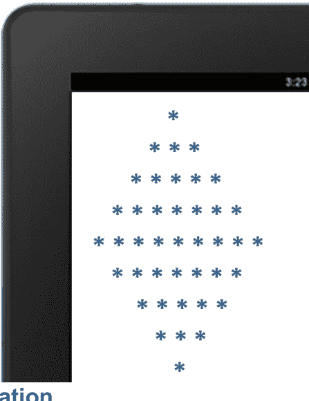

#### 数据表示

完整的图案可以很容易地表示为一组**选定的** (行, 列) 数值对。这些选定的 (行, 列) 数值对在给定的表格结构中显示。例如，(2, 5) 表示表格中**第二行**和**第五列**的字符“*”。

| | Col=1 | Col=2 | Col=3 | Col=4 | Col=5 | Col=6 | Col=7 | Col=8 | Col=9 |
|---|---|---|---|---|---|---|---|---|---|
| **Row=1** | | | | | * (1,5) | | | | |
| **Row=2** | | | | *(2,4) | * **(2,5)** | *(2,6) | | | |
| **Row=3** | | | *(3,3) | *(3,4) | * (3,5) | *(3,6) | *(3,7) | | |
| **Row=4** | | *(4,2) | ***(4,3)** | *(4,4) | * **(4,5)** | *(4,6) | ***(4,7)** | *(4,8) | |
| **Row=5** | *(5,1) | *(5,2) | *(5,3) | *(5,4) | * (5,5) | *(5,6) | *(5,7) | *(5,8) | *(5,9) |
| **Row=6** | | *(6,2) | ***(6,3)** | *(6,4) | * **(6,5)** | *(6,6) | ***(6,7)** | *(6,8) | |
| **Row=7** | | | *(7,3) | *(7,4) | * (7,5) | *(7,6) | *(7,7) | | |
| **Row=8** | | | | *(8,4) | * **(8,5)** | *(8,6) | | | |
| **Row=9** | | | | | *(9,5) | | | | |

练习。假设在计算机屏幕图上输出，完成第1到9行生成此逻辑图案的步骤。

使用计算机屏幕图的图案生成步骤（第1到9行）。

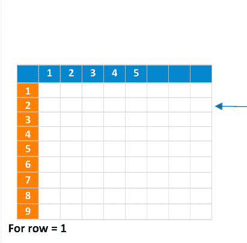

对于第1行

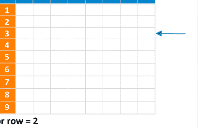

对于第2行

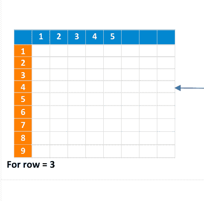

对于第3行

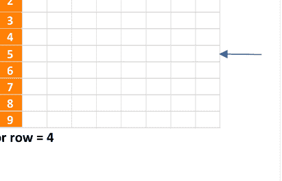

对于第4行

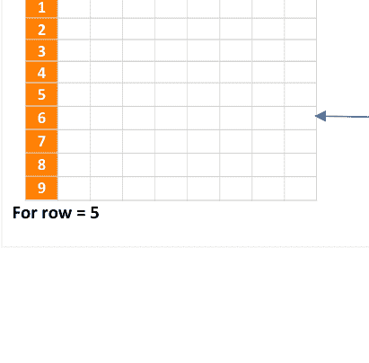

对于第5行

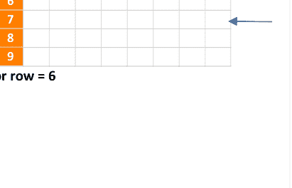

对于第6行

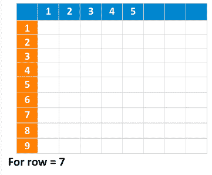

对于第7行

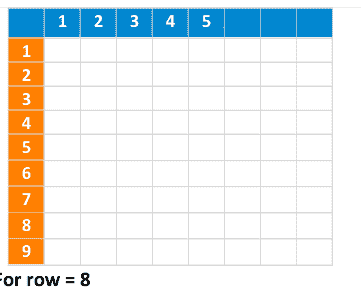

对于第8行

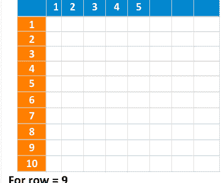

对于第9行

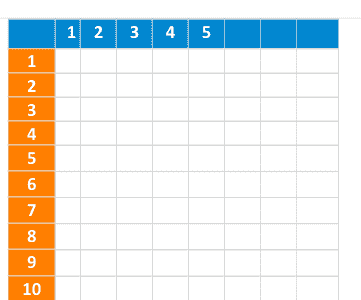

对于第10行

让我们使用**内置方法**将步骤转换为程序。

已知三种类型的编程语句将在程序中重复多次。我们知道循环是用于程序中的重复操作。因此，我们需要在 for 循环中逻辑地使用这些打印语句。

| 目的 | 方法 |
| :--- | :--- |
| 将光标移动到下一行。 | `print()` |
| 移动到下一个 (行, 列) 位置，然后在同一行打印空格 " " 字符。 | `print(" ", end="")` |
| 移动到下一个 (行, 列) 位置，然后在同一行打印星号 "*" 字符。 | `print("* ", end="")` |

编写一个程序来适当地计算行和列值是此类简单图片练习中的真正挑战。此类练习迫使脑细胞更加努力地工作而不失去动力。我们需要练习此类练习，直到我们[对程序逻辑的可视化](https://example.com)得到充分改进。如果不使用逻辑跟踪表，如果学习者能够一次性运行这样的程序，他们大多数时候都能达到目标。

### 列级重复操作

让我们考虑：

**row** → 整数类型的变量，一次存储一个整数值，表示1到9之间的行号。

**col** → 整数类型的变量，一次存储一个整数值，表示1到9之间的列号。

**spaces** → 整数类型的变量，一次存储一个整数值，表示1到 **totalRows** 之间的列号处的空格字符。

**totalRows** → 整数类型的变量，用于存储总行数的整数值，默认值为5。

### 逻辑跟踪表

| (行, 列) 值对描述了“*”字符在显示屏上的位置 |
| :--- |
| space | space | space | space | row=1, col=5 |
| space | space | space | row=2, col=4 | row=2, col=5 | row=2, col=6 |
| space | space | row=3, col=3 | row=3, col=4 | row=3, col=5 | row=3, col=6 | row=3, col=7 |
| space | row=4, col=2 | row=4, col=3 | row=4, col=4 | row=4, col=5 | row=4, col=6 | row=4, col=7 | row=4, col=8 |
| row=5, col=1 | row=5, col=2 | row=5, col=3 | row=5, col=4 | row=5, col=5 | row=5, col=6 | row=5, col=7 | row=5, col=8 | row=5, col=9 |
| row=6, col=2 | row=6, col=3 | row=6, col=4 | row=6, col=5 | row=6, col=6 | row=6, col=7 | row=6, col=8 |
| row=7, col=3 | row=7, col=4 | row=7, col=5 | row=7, col=6 | row=7, col=7 |
| row=8, col=4 | row=8, col=5 | row=8, col=6 |
| row=9, col=5 |

解法1的思路

总体观察是，在每一行，它要么连续打印空格字符，要么连续打印星号 (*) 字符。图案中的列被分为两部分，要么打印空格“ ”字符，要么打印星号(“*”)字符。表格中这些逗号分隔的值代表了空格和星号字符实际所在的列位置。

| 行级重复操作 | | | | | 预期输出 |
| :--- | :--- | :--- | :--- | :--- | :--- |
| **变量：row** | **列级重复操作** | | | | |
| | **变量：spaces** | **变量：col** | **字符计数** | **总字符数** | |
| 1 | 1,2,3,4 | 5 | 4个空格 + 1个星号 | 5 | * |
| 2 | 1,2,3 | 4, 5,6 | 3个空格 + 3个星号 | 6 | *** |
| 3 | 1,2 | 3, 4, 5,6,7 | 2个空格 + 5个星号 | 7 | ***** |
| 4 | 1 | 2, 3, 4, 5,6,7,8, | 1个空格 + 7个星号 | 8 | ******* |
| 5 | 0 | 1, 2, 3, 4, 5,6,7,8,9 | 0个空格 + 9个星号 | 9 | ********* |
| 6 | 1 | 2, 3, 4, 5,6,7,8, | 1个空格 + 7个星号 | 8 | ******* |
| 7 | 1,2 | 3, 4, 5,6,7 | 2个空格 + 5个星号 | 7 | ***** |
| 8 | 1,2,3 | 4, 5,6 | 3个空格 + 3个星号 | 6 | *** |
| 9 | 1,2,3,4 | 5 | 4个空格 + 1个星号 | 5 | * |

空格的打印**先于**星号(“*”)字符的打印。如果我们处理好打印空格字符的条件，那么剩下的就是星号(“*”)字符。如果我们仔细观察，它将变量 col 的值切分为两半。一部分用于打印空格字符，另一部分用于打印星号字符。我们知道，逗号分隔的值基本上代表了唯一标识空格和星号字符位置的列位置。

让我们从这些用于打印空格和星号字符的逗号分隔值中提取最小值 (**min_val**) 和最大值(**max_val**)。

| 行级重复操作 | | | | | 预期输出 |
| :--- | :--- | :--- | :--- | :--- | :--- |
| **变量：row** | **列级重复操作** | | | | |
| | **变量：spaces** | | **变量：col** | | |
| | **min_val** | **max_val** | **min_val** | **max_val** | |
| 1 | 1 | 4 | 5 | 5 | * |
| 2 | 1 | 3 | 4 | 6 | *** |
| 3 | 1 | 2 | 3 | 7 | ***** |
| 4 | 1 | 1 | 2 | 8 | ******* |
| 5 | 0 | 0 | 1 | 9 | ********* |
| 6 | 1 | 1 | 2 | 8 | ******* |
| 7 | 1 | 2 | 3 | 7 | ***** |
| 8 | 1 | 3 | 4 | 6 | *** |
| 5 + 4 | 1 | 4 | 5 | 5 | * |

我们需要从最小值 (min_val) 和最大值 (max_val) 的数值模式中推导出泛化表达式。这些泛化表达式将帮助我们定义行级和列级的 **for 循环**。我们知道，由变量 **totalRows** 给出的总行数默认值为5。所以 **totalRows** = 5。

变量 **row** 和 **col** 都取值1到9，即 **row** =1,2,3,4,5,...,9 且 **col**=1,2,3,4,5,...,9。

让我们将注意力集中在打印星号字符上，并尝试用变量 **totalRows** = 5 来确定表达式。

| 行级重复操作 | 预期输出 |
| :--- | :--- |
| 变量：row | 列级重复操作 | |
| | 变量：col（打印星号字符） | |
| | min_val | max_val | |
| 1 | 5 | 5-0 | 5 | 5+0 | * |
| 2 | 4 | 5-1 | 6 | 5+1 | * * * |
| 3 | 3 | 5-2 | 7 | 5+2 | * * * * * |
| 4 | 2 | 5-3 | 8 | 5+3 | * * * * * * * |
| 5 | 1 | 5-4 | 9 | 5+4 | * * * * * * * * * |
| 6 | 2 | 5-3 | 8 | 5+3 | * * * * * * * |
| 7 | 3 | 5-2 | 7 | 5+2 | * * * * * |
| 8 | 4 | 5-1 | 6 | 5+1 | * * * |
| 5 + 5 -1 | 5 | 5-0 | 5 | 5+0 | * |

**min_val** 和 **max_val** 表达式的部分都遵循相同的数字模式。我们可以将其视为一个单独的整数变量，并将其命名为 <u>count</u>。
那么逻辑表达式就可以用 **totalRows** 和 count 来表示。

| 行级重复操作 | | |
| :--- | :--- | :--- |
| 变量：row | 变量：count | 列级重复操作 | |
| | | 变量：col（打印星号字符） | |
| | | min_val | max_val |
| 1 | 0 | 5 | totalRows -count | 5 | totalRows + count |
| 2 | 1 | 4 | totalRows -count | 6 | totalRows + count |
| 3 | 2 | 3 | totalRows -count | 7 | totalRows + count |
| 4 | 3 | 2 | totalRows -count | 8 | totalRows + count |
| 5 | 4 | 1 | totalRows -count | 9 | totalRows + count |
| 6 | 3 | 2 | totalRows -count | 8 | totalRows + count |
| 7 | 2 | 3 | totalRows -count | 7 | totalRows + count |
| 8 | 1 | 4 | totalRows -count | 6 | totalRows + count |
| 2*totalRows - 1 | 0 | 5 | totalRows -count | 5 | totalRows + count |

变量 <u>count</u> 从 row=1 开始，每次增加 1，直到 row=**totalRows**（**总行数**），然后开始每次减少 1，直到 (**totalRows** – 1) 次。

我们可以使用 if-else 条件语句来处理这个问题。
条件 (col >=( **totalRows** – count ) ) 给出了 *for 循环* 开始打印星号（"*"）字符的起始点，对于每个 row 值，它会一直打印到变量 col 的最大值，即 (**totalRows** + count)。**if 条件**可以使用 <u>比较和逻辑运算符</u> 来表示 (**totalRows** – count) 和 (**totalRows** + count) 之间的值范围，如下所示：
If ( col >= (**totalRows** – count ) and col <= ( **totalRows** + count ) )

我们已经知道
**变量:col** = 1,2,3,4,5 或 1,2,3,4, …,( **totalRows** + count)

**变量: row** = 1,2,3,…,9 或 1,2,3,…,( 2 * **totalRows** - 1)

我们可以消除 if 条件中的逻辑与（and）条件( col <= (totalRows + count) )。这个逻辑与（and）条件已经在列级内部 for 循环的循环条件中被考虑到了。因此，if 条件现在将简化为：

If ( col >= ( totalRows – count ) )

我们可以将列 max_val 的非重复数字模式概括为一个表达式。我们可以定义列级 for 循环。

| 列级 for 循环的元素 | |
| :--- | :--- |
| min_val | 1 |
| max_val | (totalRows + count) |
| variable_name | col |
| statement(s) | print("* ",end="") |

我们可以定义行级 for 循环。

| 行级递减 for 循环的元素 | |
| :--- | :--- |
| min_val | 1 |
| max_val | 2*totalRows - 1 |
| variable_name | row |
| statement(s) | 用于打印星号字符的列级 for 循环<br>print() # 移动到下一行 |

我们可以将其全部总结在流程图中，如下所示：

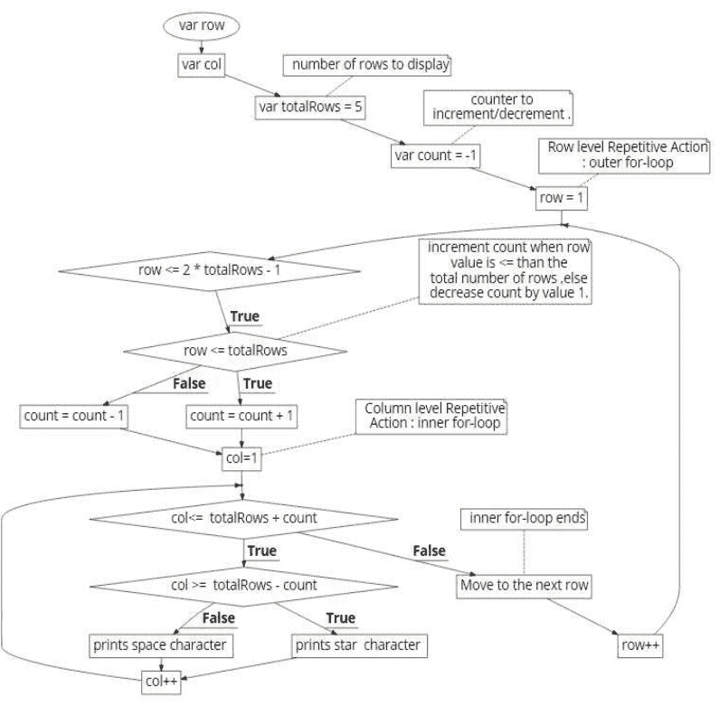

让我们执行以下程序。

```
PatternH1.py

totalRows = 7  # number of rows to display
count = -1     # counter to increment or decrement value.

# Row level Repetitive Action :
# Action1.Executes Column level Repetitive Action:
# Action2.The control of the program should move to the next row
# so that the printing of characters is on a new line next time.
for row in range(1,2 * totalRows):
    # increment count when row value is <= than the
    # total number of rows
    # else decrease count by value 1.
    if (row <= totalRows) :
        count = count + 1
    else:
        count = count - 1
    # Column level Repetitive Action :
    # Print characters column-wise or in the same row
    for col in range(1,totalRows + count+1):
        if(col >= (totalRows - count)):
            # prints star * character
            print("* ",end="")
        else:
            # prints space character
            print("  ",end="")
    # Ends inner for-loop

    # move control of a program to the next row
    # in order to switch the printing of characters to the next line.
    print()
# Ends outer for-loop
```

### 输出

```
          *          
        * * *        
      * * * * *      
    * * * * * * *    
  * * * * * * * * *  
* * * * * * * * * * *
  * * * * * * * * *  
    * * * * * * *    
      * * * * *      
        * * *        
          *          
```

**问题 H1.** 延续上一个程序（**PatternH1.py**），修改程序以适应以下情况。

在程序（**PatternH1.py**）中，count 变量的初始值为 -1，如下所示：

```
count = -1 # counter to increment or decrement
```

需要通过进行以下更改，使修改后的程序（**PatternH1_2.py**）的输出与（**Pattern1H**）匹配：

```
count = 0 # counter to increment or decrement
```

这次程序必须将变量 count 初始化为 0 而不是 -1，并且仍然应该给出与模式程序（**Pattern1H.py**）正确匹配的输出。

```
PatternH1_2.py

totalRows = 7  # number of rows to display
count = 0      # counter to increment or decrement value.

# Row level Repetitive Action :
# Action1. Executes Column level Repetitive Action:
# Action2. The control of the program should move to the next row
# so that the printing of characters is on a new line next time.

    # IMPLEMENT YOUR LOGIC...?
```

**输出**

```
          *          
        * * *        
      * * * * *      
    * * * * * * *    
  * * * * * * * * *  
* * * * * * * * * * *
  * * * * * * * * *  
    * * * * * * *    
      * * * * *      
        * * *        
          *          
```

### 替代解决方案2

让我们从上一个解决方案中得到的一个逻辑跟踪表开始。

| 行级重复操作 | 预期输出 |
| :--- | :--- |
| 变量：row 列级重复操作 | |
| 变量：col | |
| 打印空格字符 | 打印星号字符 | |
| min_val | max_val | min_val | max_val | |
| 1 | 1 | 4 | 5 | 5 | * |
| 2 | 1 | 3 | 4 | 6 | * * * |
| 3 | 1 | 2 | 3 | 7 | * * * * * |
| 4 | 1 | 1 | 2 | 8 | * * * * * * * |
| 5 | 0 | 0 | 1 | 9 | * * * * * * * * * |
| 6 | 1 | 1 | 2 | 8 | * * * * * * * |
| 7 | 1 | 2 | 3 | 7 | * * * * * |
| 8 | 1 | 3 | 4 | 6 | * * * |
| 9 | 1 | 4 | 5 | 5 | * |

让我们将注意力集中在打印星号字符上，并尝试用变量（即 row 和 totalRows=5）来找出表达式。

| 行级重复操作 | |
| :--- | :--- |
| 变量：row 列级重复操作 | |
| 变量：col（打印星号 (*) 字符） | |
| min_val | max_val | |
| | | | | | | |
| 1 | 5 | 5-0 | totalRows +1 - 1 | 5 | totalRows +0 | totalRows +1 - 1 |
| 2 | 4 | 5-1 | totalRows +1 - 2 | 6 | totalRows +1 | totalRows +2 - 1 |
| 3 | 3 | 5-2 | totalRows +1 - 3 | 7 | totalRows +2 | totalRows +3 - 1 |
| 4 | 2 | 5-3 | totalRows +1 - 4 | 8 | totalRows +3 | totalRows +4 - 1 |
| 5 | 1 | 5-4 | totalRows +1 - 5 | 9 | totalRows +4 | totalRows +5 - 1 |
| 6 | 2 | 2 | 2 | 8 | totalRows +3 | totalRows +5 - 2 |
| 7 | 3 | 3 | 3 | 7 | totalRows +2 | totalRows +5 - 3 |
| 8 | 4 | 4 | 4 | 6 | totalRows +1 | totalRows +5 - 4 |
| 9 | 5 | 5 | 5 | 5 | totalRows +0 | totalRows +5 - 5 |

我们可以使用 row=1,2,3,4,5 的值来部分表示列的 min_val 和 max_val。

| 行级重复操作 | |
| :--- | :--- |
| 变量：row 列级重复操作 | |
| 变量：col（打印星号 (*) 字符） | |
| min_val | max_val | |
| | | | | | | |
| 1 | 5 | 5-0 | totalRows +1 - row | 5 | totalRows + row - 1 | totalRows + row - 1 |
| 2 | 4 | 5-1 | totalRows +1 - row | 6 | totalRows + row - 1 | totalRows + row - 1 |
| 3 | 3 | 5-2 | totalRows +1 - row | 7 | totalRows + row - 1 | totalRows + row - 1 |
| 4 | 2 | 5-3 | totalRows +1 - row | 8 | totalRows + row - 1 | totalRows + row - 1 |
| 5 | 1 | 5-4 | totalRows +1 - row | 9 | totalRows + row - 1 | totalRows + row - 1 |
| 6 | 2 | 2 | 2 | 8 | totalRows +5 - 2 | 2*totalRows - 2 |
| 7 | 3 | 3 | 3 | 7 | totalRows +5 - 3 | 2*totalRows - 3 |
| 8 | 4 | 4 | 4 | 6 | totalRows +5 - 4 | 2*totalRows - 4 |
| 9 | 5 | 5 | 5 | 5 | totalRows +5 - 5 | 2*totalRows - 5 |

### 行级重复操作

| 变量：行 | 列级重复操作 | | | | | |
| :--- | :--- | :--- | :--- | :--- | :--- | :--- |
| | 变量：列（打印星号(*)字符） | | | | | |
| | | min_val | | max_val | | |
| 1 | 5 | 5-0 | totalRows +1 - row | 5 | totalRows + row - 1 | totalRows + row - 1 |
| 2 | 4 | 5-1 | totalRows +1 - row | 6 | totalRows + row - 1 | totalRows + row - 1 |
| 3 | 3 | 5-2 | totalRows +1 - row | 7 | totalRows + row - 1 | totalRows + row - 1 |
| 4 | 2 | 5-3 | totalRows +1 - row | 8 | totalRows + row - 1 | totalRows + row - 1 |
| 5 | 1 | 5-4 | totalRows +1 - row | 9 | totalRows + row - 1 | totalRows + row - 1 |
| 6 | 2 | 2 | (6 – 4) | 8 | 2*totalRows - (6 – 4) | 2*totalRows - 6 + 4) |
| 7 | 3 | 3 | (7 – 4) | 7 | 2*totalRows - (7 – 4) | 2*totalRows - 7 + 4) |
| 8 | 4 | 4 | (8 – 4) | 6 | 2*totalRows - (8 – 4) | 2*totalRows - 8 + 4) |
| 9 | 5 | 5 | (9 – 4) | 5 | 2*totalRows - (9 – 4) | 2*totalRows - 9 + 4) |

我们可以将数字模式6,7,8,9表示为变量：行。这将更具通用性，但仍然不是全部。

| 行级重复操作 | | | | | |
| :--- | :--- | :--- | :--- | :--- | :--- |
| 变量：行 | 列级重复操作 | | | | |
| | 变量：列（打印星号 (*) 字符） | | | | |
| | | min_val | | max_val | |
| 1 | 5 | totalRows +1 - row | 5 | totalRows + row - 1 | |
| 2 | 4 | totalRows +1 - row | 6 | totalRows + row - 1 | |
| 3 | 3 | totalRows +1 - row | 7 | totalRows + row - 1 | |
| 4 | 2 | totalRows +1 - row | 8 | totalRows + row - 1 | |
| 5 | 1 | totalRows +1 - row | 9 | totalRows + row - 1 | |
| 6 | 2 | (row – 4) | 8 | 2*totalRows - row + 4) | |
| 7 | 3 | (row – 4) | 7 | 2*totalRows - row + 4) | |
| 8 | 4 | (row – 4) | 6 | 2*totalRows - row + 4) | |
| 9 | 5 | (row – 4) | 5 | 2*totalRows - row + 4) | |

我们可以将重复值4替换为 ( totalRows - 1)。这将更具通用性。

| 行级重复操作 | | | | | |
| :--- | :--- | :--- | :--- | :--- | :--- |
| 变量：行 | 列级重复操作 | | | | |
| | 变量：列（打印星号 (*) 字符） | | | | |
| | | min_val | | max_val | |
| 1 | 5 | totalRows +1 - row | 5 | totalRows + row - 1 | |
| 2 | 4 | totalRows +1 - row | 6 | totalRows + row - 1 | |
| 3 | 3 | totalRows +1 - row | 7 | totalRows + row - 1 | |
| 4 | 2 | totalRows +1 - row | 8 | totalRows + row - 1 | |
| 5 | 1 | totalRows +1 - row | 9 | totalRows + row - 1 | |
| 6 | 2 | row – (totalRows - 1) | 8 | 2*totalRows - row + ( totalRows - 1) | |
| 7 | 3 | row – (totalRows - 1) | 7 | 2*totalRows - row + ( totalRows - 1) | |
| 8 | 4 | row – (totalRows - 1) | 6 | 2*totalRows - row + ( totalRows - 1) | |
| 9 | 5 | row – (totalRows - 1) | 5 | 2*totalRows - row + ( totalRows - 1) | |

| 行级重复操作 | | | | |
| :--- | :--- | :--- | :--- | :--- |
| **变量：行** | **列级重复操作** | | | |
| | **变量：列（打印星号 (*) 字符）** | | | |
| | **min_val** | | **max_val** | |
| 1 | totalRows +1 - row | | totalRows + row - 1 | |
| 2 | totalRows +1 - row | **totalRows +1 - row** | totalRows + row - 1 | |
| 3 | totalRows +1 - row | | totalRows + row - 1 | **totalRows + row - 1** |
| 4 | totalRows +1 - row | | totalRows + row - 1 | |
| 5 | totalRows +1 - row | | totalRows + row - 1 | |
| 6 | row – totalRows + 1 | | 3*totalRows - row – 1 | |
| 7 | row – totalRows + 1 | **row – totalRows + 1** | 3*totalRows - row – 1 | **3*totalRows - row – 1** |
| 8 | row – totalRows + 1 | | 3*totalRows - row – 1 | |
| 9 | row – totalRows + 1 | | 3*totalRows - row – 1 | |

下面的流程图清晰地展示了我们目前的逻辑表达式考虑。

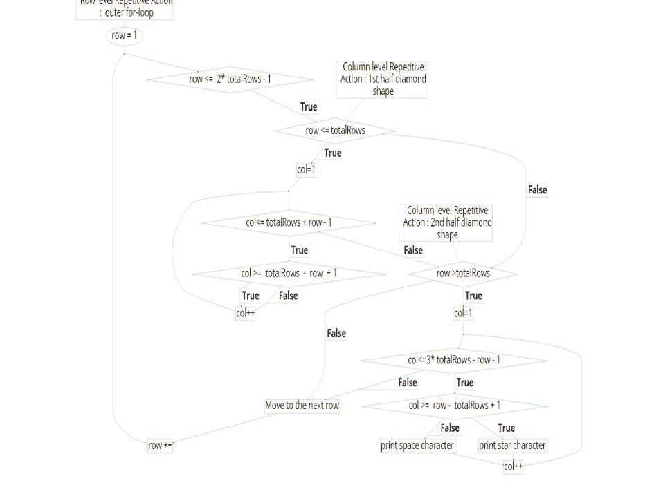

由于存在两组通用表达式，因此我们需要两组列级 **for循环**。

| If - 条件 | min_val | max_val |
| :--- | :--- | :--- |
| 逻辑表达式 (集合1) | totalRows +1 - row | totalRows + row - 1 |
| 逻辑表达式 (集合 2) | row – totalRows + 1 | 3*totalRows - row – 1 |

让我们执行以下程序。

```
PatternH2_1.py
```

```
totalRows = 4  # number of rows to display

# Row level Repetitive Action :
# Action1. Executes Column level Repetitive Action.
# Action2. The control of the program should move to the next row.
# so that the printing of characters is on a new line next time.
for row in range(1, 2 * totalRows):

    # 1st half : Column level Repetitive Action :
    if (row <= totalRows):
        for col in range(1, totalRows + row):
            if (col >= (totalRows - row + 1)):
                print("* ", end="")
            else:
                print("  ", end="")

    # Ends inner for-loop_1

    # 2nd half : Column level Repetitive Action :
    if (row > totalRows):
        for col in range(1, 3 * totalRows - row):
            if (col >= (row - totalRows + 1)):
                print("* ", end="")
            else:
                print("  ", end="")
    # Ends inner for-loop_2

    # move control of a program to the next row
    # in order to switch the printing of characters to the next line.
    print()
    # Ends outer for-loop
```

```
输出
```

```
        *       
      * * *     
    * * * * *   
  * * * * * * * 
    * * * * *   
      * * *     
        *       
```

让我们尝试通过简化 **if条件** 和 **循环条件表达式** 来进一步简化程序。

**if条件** 给出了最小限制，即程序开始打印星号("*")字符的起始点，直到变量 col 的最大值由 **循环条件** 给出。

让我们考虑；

**colMin** → 整数类型的变量，用于存储列的整数值，即程序开始打印星号("*")字符的起始点。

**colMax** → 整数类型的变量，用于存储列的整数值，即程序停止打印星号("*")字符的最大值。

让我们分析当 **col 是一个从值0开始的变量** 时的以下表达式。变量：col 将 **包含值 col=0,1,2,3**。

这意味着 col <= ( 4 – 1 ) 或 col < 4，两者含义相同。

类似地，

当变量 col=5,6,…., 将具有这些值，这意味着覆盖这些值的逻辑条件可以表示为；

**col >= ( 4 + 1 ) 或 col > 4**，两者含义相同。

同样，**if条件** 和 **循环条件表达式** 可以被简化。

| 变量：行 | if条件 | |
| :--- | :--- | :--- |
| | **变量：colMin** | |
| | **默认** | **1** |
| row <= totalRows | col >= ( totalRows - row + 1 ) | col > ( totalRows - row ) |
| row > totalRows | col >= ( row - totalRows + 1 ) | col > ( row - totalRows ) |

| 变量：行 | 循环条件 | |
| :--- | :--- | :--- |
| | **变量：colMax** | |
| | **默认** | **1** |
| row <= totalRows | col<=( totalRows + row - 1 ) | col<( totalRows + row ) |
| row > totalRows | col<=(3* totalRows - row - 1) | col<( 3 * totalRows – row ) |

使用变量 **colMin & colMax**，我们可以通过动态地将这些表达式赋值给这些变量来合并两个内部循环。

我们可以使用 **if-else** 语句来动态更新变量 **colMin & colMax**，如下所示。

```
if ( row <= totalRows ):
    colMin = ( totalRows - row )
    colMax = ( totalRows + row )
else:
    colMin = ( row - totalRows )
    colMax = ( 3 * totalRows - row )
```

此外，我们可以在内部 **for循环** 中使用变量 **colMin & colMax**。

通过这种方式，我们可以尝试将 **两个内部for循环** 合并为 **一个内部for循环**。

下面的流程图给出了程序应如何根据我们之前的讨论进行更新的整体思路。

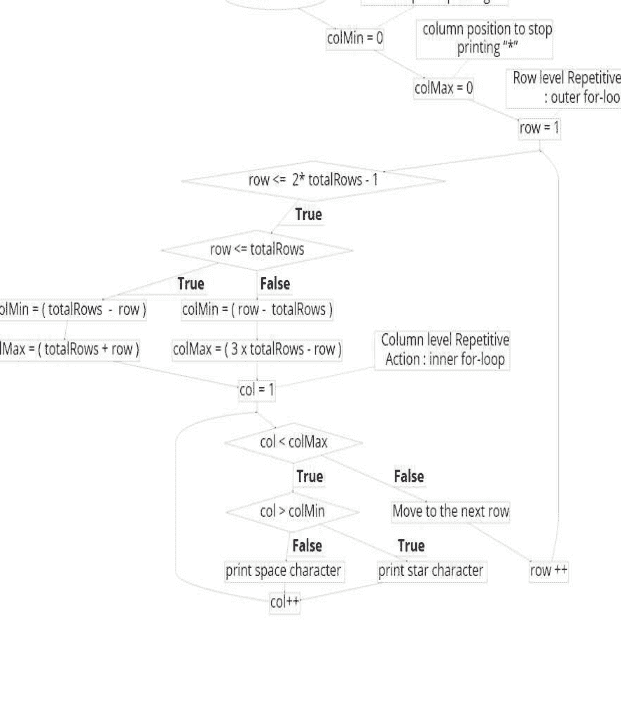

那么，让我们用这些更改更新我们之前的程序并执行程序。同时，通过将变量：totalRows 的值更改为7来测试不同的行数。

```
PatternH2_2.py
```

```
totalRows = 5  # number of rows to display
colMin = 0  # column position to start printing character *
colMax = 0  # column position to stop printing character *

# Row level Repetitive Action :
# Action1. Executes Column level Repetitive Action:
# Action2. The control of the program should move to the next row
# so that the printing of characters is on a new line next time.
for row in range(1, 2 * totalRows):

    if (row <= totalRows):
        colMin = (totalRows - row)
        colMax = (totalRows + row)
    else:
        colMin = (row - totalRows)
        colMax = (3 * totalRows - row)
    # Column level Repetitive Action :
    for col in range(1, colMax):
        if (col > colMin):
            print("* ", end="")
        else:
            print("  ", end="")

    # Ends inner for-loop
    # move control of a program to the next row
    # in order to switch the printing of characters to the next line.
    print()
    # Ends outer for-loop
```

输出：totalRows = 5

```
          *          
        * * *        
      * * * * *      
    * * * * * * *    
  * * * * * * * * *  
    * * * * * * *    
      * * * * *      
        * * *        
          *          
```

输出：totalRows = 7

```
              *              
            * * *            
          * * * * *          
        * * * * * * *        
      * * * * * * * * *      
    * * * * * * * * * * *    
  * * * * * * * * * * * * *  
    * * * * * * * * * * *    
      * * * * * * * * *      
        * * * * * * *        
          * * * * *          
            * * *            
              *              
```

### 替代方案3

让我们从上一个方案1中得到的逻辑追踪表开始。变量是 row 和 totalRows=5。变量 spaces 代表在打印星号(*)字符之前考虑的空格字符打印。变量 col 代表星号(*)字符的打印。

| 行级重复操作 | 预期输出 |
| :--- | :--- |
| 变量：row | 列级重复操作 | | | |
| | 变量：spaces | 变量：col | 字符数 | 总字符数 | |
| 1 | 1,2,3,4 | 5 | 4个空格 + 1个星号 | 5 | * |
| 2 | 1,2,3 | 4, 5,6 | 3个空格 + 3个星号 | 6 | *** |
| 3 | 1,2 | 3, 4, 5,6,7 | 2个空格 + 5个星号 | 7 | ***** |
| 4 | 1 | 2, 3, 4, 5,6,7,8, | 1个空格 + 7个星号 | 8 | ******* |
| 5 | 0 | 1, 2, 3, 4, 5,6,7,8,9 | 0个空格 + 9个星号 | 9 | ********* |
| 6 | 1 | 2, 3, 4, 5,6,7,8, | 1个空格 + 7个星号 | 8 | ******* |
| 7 | 1,2 | 3, 4, 5,6,7 | 2个空格 + 5个星号 | 7 | ***** |
| 8 | 1,2,3 | 4, 5,6 | 3个空格 + 3个星号 | 6 | *** |
| 9 | 1,2,3,4 | 5 | 4个空格 + 1个星号 | 5 | * |

空格的打印在打印星号("*")字符之前。如果我们仔细观察总字符数，它被分成了两半。一部分用于打印空格字符，另一部分用于打印星号字符，如“字符数”列所示。让我们从“字符数”列中提取打印空格和星号字符的最小值（min_val）和最大值（max_val）。因此，可以绘制出以下追踪表。

| 行级重复操作：totalRows=5 | 预期输出 |
| :--- | :--- |
| 变量：row | 列级重复操作 | | | | | | |
| | 变量：col | | | | | | |
| | 空格字符数 | | | 星号字符数 | | | |
| | min_val | max_val | | min_val | max_val | | |
| | | | 1 | | | 1 | |
| 1 | 1 | 4 | totalRows - 1 | 1 | 1 | 1 | * |
| 2 | 1 | 3 | 4 - 1 | 1 | 3 | 1 + 2 | *** |
| 3 | 1 | 2 | 3 - 1 | 1 | 5 | 3 + 2 | ***** |
| 4 | 1 | 1 | 2 - 1 | 1 | 7 | 5 + 2 | ******* |
| 5 | 0 | 0 | 1 - 1 | 1 | 9 | 7 + 2 | ********* |
| 6 | 1 | 1 | 0 + 1 | 1 | 7 | 9 - 2 | ******* |
| 7 | 1 | 2 | 1 + 1 | 1 | 5 | 7 - 2 | ***** |
| 8 | 1 | 3 | 2 + 1 | 1 | 3 | 5 - 2 | *** |
| 9 | 1 | 4 | 3 + 1 | 1 | 1 | 3 - 2 | * |

我们需要从最小值（min_val）和最大值（max_val）的数值模式中推导出通用表达式。这些通用表达式将帮助我们定义行级和列级的 for 循环。在列级需要两个内部 for 循环：一个用于打印空格字符，另一个用于打印星号字符。

空格字符数的列 **max_val** 从值 4（**totalRows** – 1）开始，然后持续减少 1，直到在 row=5（总行数）时达到 0。然后它开始持续增加 1，直到达到最大行值，即：
9=( 2*5 – 1) 或 ( 2*totalRows – 1)，因为 **totalRows=5**。

星号字符数的列 **max_val** 从值 1 开始，持续增加 2，直到在 row=5（总行数）时达到 9。然后它开始持续减少 2，直到 **最大行值 9 或 ( 2*5 – 1) 或 ( 2*totalRows – 1)**，因为 totalRows=5。
让我们考虑：

**spaceMax** → 变量 <u>整数类型</u>，用于一次存储一个整数值，起始值为 (totalRows – 1)。

**starMax** → 变量 <u>整数类型</u>，用于一次存储一个整数值，起始值为 1。

使用变量 **spaceMax** 和 **starCount**，我们可以通过动态分配最大限制来使用两个内部循环，分别打印空格和星号字符。
此外，我们可以在内部 *for 循环* 中使用变量 **spaceMax** 和 **starMax**。
这样，我们就可以使用 <u>两个内部 for 循环来打印一行空格和星号字符</u>，如下所示。

| row < totalRows | row >= totalRows |
| :--- | :--- |
| spaceMax = ( spaceMax – 1 ) | spaceMax = ( spaceMax + 1 ) |
| starMax = ( starMax + 2 ) | starMax = ( starMax – 2 ) |

我们可以使用 **if-else** 语句来动态更新这些变量 spaceMax 和 starMax。

| 行级重复操作 | | | | | | | |
| :--- | :--- | :--- | :--- | :--- | :--- | :--- | :--- |
| **变量：row** | **列级重复操作** | | | | | | |
| | **变量：col** | | | | | | |
| **totalRows=5** | **空格字符数** | | | **星号字符数** | | | |
| | **min_val** | **max_val** | | **min_val** | **max_val** | | |
| | | **变量：spaceMax** | **值差** | | **变量：starMax** | **值差** | |
| 1 | 1 | totalRows | 4 | - 1 | 1 | 1 | 1 |
| 2 | 1 | 4 | 3 | - 1 | 1 | 1 | + 2 |
| 3 | 1 | 3 | 2 | - 1 | 1 | 3 | + 2 |
| 4 | 1 | 2 | 1 | - 1 | 1 | 5 | + 2 |
| 5 | 0 | 1 | 0 | - 1 | 1 | 7 | + 2 |
| 6 | 1 | 0 | 1 | + 1 | 1 | 9 | - 2 |
| 7 | 1 | 1 | 2 | + 1 | 1 | 7 | - 2 |
| 8 | 1 | 2 | 3 | + 1 | 1 | 5 | - 2 |
| ( 2*totalRows – 1) | 1 | 3 | 4 | + 1 | 1 | 3 | - 2 |

借助以下流程图，我们可以获得整体概念。

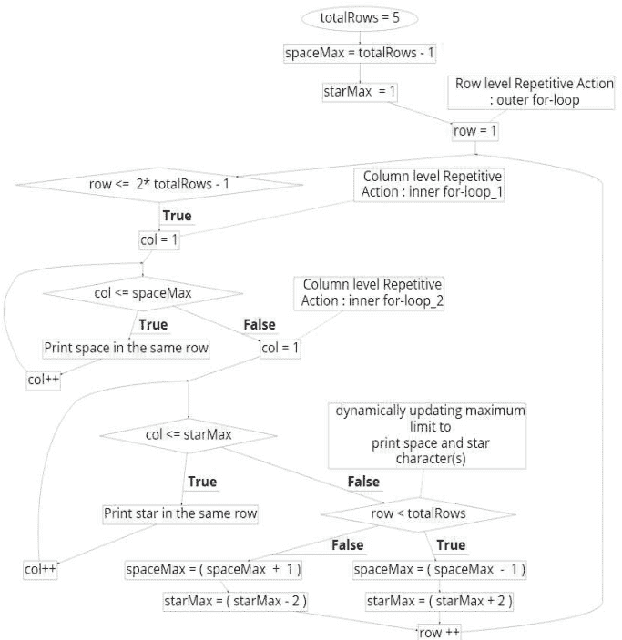

让我们执行以下程序。

```
PatternH3.py
```

```
totalRows = 5            # 要显示的行数
spaceMax = totalRows - 1  # 打印空格的最大计数
starMax = 1               # 打印星号 * 的最大计数

# 行级重复操作：
# 操作1. 执行列级重复操作：
# 操作2. 移动到下一行。
for row in range(1, 2 * totalRows):
    # 列级重复操作：在同一行打印空格
    for col in range(1, spaceMax + 1):
        print("  ", end="")
    # 结束内部 for 循环_1

    # 列级重复操作：在同一行打印星号
    for col in range(1, starMax + 1):
        print("* ", end="")
    # 结束内部 for 循环_2

    print()  # 移动到下一行。

    if (row < totalRows):
        spaceMax = (spaceMax - 1)
        starMax = (starMax + 2)
    else:
        spaceMax = (spaceMax + 1)
        starMax = (starMax - 2)

# 结束外部 for 循环
```

```
输出
```

```
        *       
      * * *     
    * * * * *   
  * * * * * * * 
* * * * * * * * *
  * * * * * * * 
    * * * * *   
      * * *     
        *       
```

### 问题 H1：

程序（**PatternH3.py**）使用了条件运算符 <（小于），如下所示：

```
if ( row < totalRows ):
    spaceMax = (spaceMax - 1 )
    starMax = (starMax + 2 )
else:
    spaceMax = (spaceMax + 1 )
    starMax = (starMax - 2 )
```

编写一个程序 **PatternH4.py**，它将使用条件运算符 <=（小于等于）代替条件运算符 <（小于），以生成与 **PatternH3.py** 程序相同的输出。修改程序（**PatternH3.py**），通过使用条件运算符 <=（小于或等于）来生成模式 **Pattern1H**。

```
if ( row <= totalRows ):
    spaceMax = ( spaceMax - 1 )
    starMax = ( starMax + 2 )
else:
    spaceMax = ( spaceMax + 1 )
    starMax = ( starMax - 2 )
```

测试总行数 = 10 或 **变量：totalRows = 10** 时的输出。

**问题。** 编写程序，利用逻辑追踪表输出以下内容。

*输出1*

*输出2*

```
* * * * * * * * * *
* *               * *
*   *           *   *
*     *       *     *
*       *   *       *
*         *         *
*       *   *       *
*     *       *     *
*   *           *   *
* *               * *
* * * * * * * * * *
```

```
* * * *       * * * *
* *               * *
*   *           *   *
*     *       *     *
*       *   *       *
*         *         *
*       *   *       *
*     *       *     *
*   *           *   *
* *               * *
* * * *       * * * *
```

### 输出3

```
  * * * * * * *
*       * * * *
* *     * * * *
* * *   * * * *
* * * *   * * *
* * * * *   * *
* * * * * *   *
* * * * * * *
```

### 输出4

```
*
  *
    *
      *
        *
          *
            *
              *
```

### 模式AA

```
          *
        * *
      * * *
    * * * *
  * * * * *
* * * * * *
* * * * * * *
* * * * * * * *
* * * * * * * * *
* * * * * * * * * *
```

### 模式BB

```
          *
        * *
      * * *
    * * * *
  * * * * *
* * * * * *
* * * * * * *
* * * * * * * *
* * * * * * * * *
* * * * * * * * * *
```

```
* * * * * * * * *
  * * * * * * * *
    * * * * * * *
      * * * * * *
        * * * * *
          * * * *
            * * *
              * *
                *
```

```
* * * * * * * * *
  * * * * * * * *
    * * * * * * *
      * * * * * *
        * * * * *
          * * * *
            * * *
              * *
                *
```

### 模式CC

```
* * * * * * * * *
  * * * * * * * *
    * * * * * * *
      * * * * * *
        * * * * *
          * * * *
            * * *
              * *
                *
                *
              * *
            * * *
          * * * *
        * * * * *
      * * * * * *
    * * * * * * *
  * * * * * * * *
* * * * * * * * *
```

### 模式DD

```
* * * * * * * * *
  * * * * * * * *
    * * * * * * *
      * * * * * *
        * * * * *
          * * * *
            * * *
              * *
                *
                *
              * *
            * * *
          * * * *
        * * * * *
      * * * * * *
    * * * * * * *
  * * * * * * * *
* * * * * * * * *
```

### 模式EE

```
********** **********
*********   *********
********     ********
*******       *******
******         ******
*****           *****
****             ****
***               ***
**                 **
*                   *
```

### 模式FF

```
*                   *
**                 **
***               ***
****             ****
*****           *****
******         ******
*******       *******
********     ********
*********   *********
********** **********
```

### 模式GG

```
          *
         **
        ***
       ****
      *****
     ******
    *******
   ********
  *********
 **********
***********
 **********
  *********
   ********
    *******
     ******
      *****
       ****
        ***
         **
          *
```

### 模式HH

```
********** **********
*********   *********
********     ********
*******       *******
******         ******
*****           *****
****             ****
***               ***
**                 **
*                   *
*                   *
**                 **
***               ***
****             ****
*****           *****
******         ******
*******       *******
********     ********
*********   *********
********** **********
```

### 模式II

```
*                   *
**                 **
***               ***
****             ****
*****           *****
******         ******
*******       *******
********     ********
*********   *********
********** **********
********** **********
*********   *********
********     ********
*******       *******
******         ******
*****           *****
****             ****
***               ***
**                 **
*                   *
```

*问题GBSwitchCase*：请应用switch-case语句，根据边框样式的值生成以下输出。

**边框样式 = 1**

| | 1 | 2 | 3 | 4 | 5 | 6 | 7 | 8 | 9 | 10 | 11 | 12 | 13 | 14 | 15 | 16 | 17 | 18 | 19 | 20 | 21 | 22 | 23 |
|---|---|---|---|---|---|---|---|---|---|---|---|---|---|---|---|---|---|---|---|---|---|---|
| **1** | | | | | | | | | | | | 0 | | | | | | | | | | | |
| **2** | | | | | | | | | | | 0 | | 0 | | | | | | | | | | |
| **3** | | | | | | | | | | 0 | | | | 0 | | | | | | | | | |
| **4** | | | | | | | | | 0 | | | | | | 0 | | | | | | | | |
| **5** | | | | | | | | | | 0 | | | | 0 | | | | | | | | | |
| **6** | | | | | | | | | | | 0 | | 0 | | | | | | | | | | |
| **7** | | | | | | | | | | | | 0 | | | | | | | | | | | |
| **8** | | | | 0 | 0 | 0 | 0 | 0 | 0 | 0 | 0 | 0 | 0 | 0 | 0 | 0 | 0 | 0 | 0 | | | | |
| **9** | | | 0 | | | | | | | 0 | | | | 0 | | | | | | 0 | | | |
| **10** | | 0 | | | | | | | 0 | | | | | 0 | | | | | | | 0 | | |
| **11** | 0 | | | | | | 0 | | | | | | | | 0 | | | | | | | 0 |
| **12** | 0 | 0 | 0 | 0 | 0 | 0 | 0 | | | | | | | | | | 0 | 0 | 0 | 0 | 0 | 0 | 0 |

**边框样式 = 2**

| | 1 | 2 | 3 | 4 | 5 | 6 | 7 | 8 | 9 | 10 | 11 | 12 | 13 | 14 | 15 | 16 | 17 | 18 | 19 | 20 | 21 | 22 | 23 |
|---|---|---|---|---|---|---|---|---|---|---|---|---|---|---|---|---|---|---|---|---|---|---|
| **1** | | | | | | | | | | | | 0 | | | | | | | | | | | |
| **2** | | | | | | | | | | | 0 | 0 | 0 | | | | | | | | | | |
| **3** | | | | | | | | | | 0 | 0 | | 0 | 0 | | | | | | | | | |
| **4** | | | | | | | | | 0 | 0 | | | | 0 | 0 | | | | | | | | |
| **5** | | | | | | | | | | 0 | 0 | | 0 | 0 | | | | | | | | | |
| **6** | | | | | | | | | | | 0 | 0 | 0 | | | | | | | | | | |
| **7** | | | | | | | | | | | | 0 | | | | | | | | | | | |
| **8** | | | | 0 | 0 | 0 | 0 | 0 | 0 | 0 | 0 | 0 | 0 | 0 | 0 | 0 | 0 | 0 | 0 | | | | |
| **9** | | | 0 | 0 | 0 | 0 | 0 | 0 | 0 | | | | | 0 | 0 | 0 | 0 | 0 | 0 | 0 | | | |
| **10** | | 0 | 0 | | | | | 0 | 0 | | | | | | 0 | 0 | | | | | 0 | 0 | |
| **11** | 0 | 0 | 0 | 0 | 0 | 0 | 0 | | | | | | | | | | 0 | 0 | 0 | 0 | 0 | 0 | 0 |
| **12** | 0 | 0 | 0 | 0 | 0 | 0 | 0 | | | | | | | | | | | 0 | 0 | 0 | 0 | 0 | 0 | 0 |

**边框样式 = 0**

| | 1 | 2 | 3 | 4 | 5 | 6 | 7 | 8 | 9 | 10 | 11 | 12 | 13 | 14 | 15 | 16 | 17 | 18 | 19 | 20 | 21 | 22 | 23 |
|---|---|---|---|---|---|---|---|---|---|---|---|---|---|---|---|---|---|---|---|---|---|---|
| **1** | | | | | | | | | | | | | 0 | | | | | | | | | | |
| **2** | | | | | | | | | | | | 0 | 0 | 0 | | | | | | | | | |
| **3** | | | | | | | | | | | 0 | 0 | 0 | 0 | 0 | | | | | | | | |
| **4** | | | | | | | | | | 0 | 0 | 0 | 0 | 0 | 0 | 0 | | | | | | | |
| **5** | | | | | | | | | | | 0 | 0 | 0 | 0 | 0 | | | | | | | | |
| **6** | | | | | | | | | | | | 0 | 0 | 0 | | | | | | | | | |
| **7** | | | | | | | | | | | | 0 | | | | | | | | | | | |
| **8** | | | | | 0 | 0 | 0 | 0 | 0 | 0 | 0 | 0 | 0 | 0 | 0 | 0 | 0 | 0 | 0 | 0 | | | |
| **9** | | | | 0 | 0 | 0 | 0 | 0 | 0 | 0 | | | | 0 | 0 | 0 | 0 | 0 | 0 | 0 | | | |
| **10** | | | 0 | 0 | 0 | 0 | 0 | 0 | 0 | | | | | | | 0 | 0 | 0 | 0 | 0 | 0 | 0 | |
| **11** | | 0 | 0 | 0 | 0 | 0 | 0 | 0 | | | | | | | | | 0 | 0 | 0 | 0 | 0 | 0 | 0 |
| **12** | 0 | 0 | 0 | 0 | 0 | 0 | 0 | | | | | | | | | | | 0 | 0 | 0 | 0 | 0 | 0 | 0 |

### 数字模式 1A

我们的编程任务是在计算机屏幕的某个部分打印这个特定的基于逻辑的模式。**我们的方法将假设计算机屏幕是行和列的组合，实际上将其划分为更小的方框——最小的方框被视为仅包含一个字符。** 显示屏上每个最小方框的地址在逻辑上将成为一个唯一的 **(行, 列)** 数字组合。基于这个假设，计算机屏幕将简单地是一个由均匀分布在整个屏幕上的 (行, 列) 数字值配对方框组成的唯一组合。

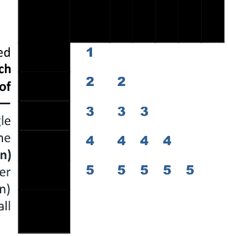

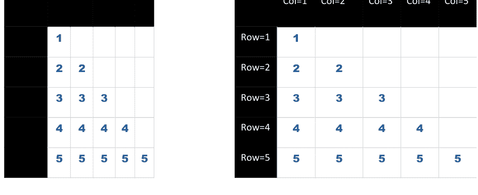

#### 数据表示

尽管这是合乎逻辑的，但我们可以通过知道每个可打印字符在显示屏上的唯一可识别的 **(行, 列)** 数字配对值来精确定位其位置。

**例如；**
**(4, 3)** 表示在假定的屏幕位置 **第4行** 和 **第3列** 打印数字字符。

#### (行, 列) 值对表示

| | 列=1 | 列=2 | 列=3 | 列=4 | 列=5 |
|---|---|---|---|---|---|
| **行=1** | 1,1 | | | | |
| **行=2** | 2,1 | 2,2 | | | |
| **行=3** | 3,1 | 3,2 | 3,3 | | |
| **行=4** | 4,1 | 4,2 | 4,3 | 4,4 | |
| **行=5** | 5,1 | 5,2 | 5,3 | 5,4 | 5,5 |

#### 输出分析

它也可以用表格形式来解释。

| 行 | 1 | | | | |
| 列 | 1 | | | | |
| 输出 | 1 | | | | |

对于 行 =1, 1<=列<=1

| 行 | 2 | | | | |
| 列 | 1 | 2 | | | |
| 输出 | 2 | 2 | | | |

对于 行 =2, 1<=列<=2

| 行 | 3 | | | | |
| 列 | 1 | 2 | 3 | | |
| 输出 | 3 | 3 | 3 | | |

对于 行 =3, 1<=列<=3

| 行 | 4 | | | | |
| 列 | 1 | 2 | 3 | 4 | |
| 输出 | 4 | 4 | 4 | 4 | |

对于 行 =4, 1<=列<=4

| 行 | 5 | | | | |
| 列 | 1 | 2 | 3 | 4 | 5 |
| 输出 | 5 | 5 | 5 | 5 | 5 |

对于 行 =5, 1<=列<=5

### 列级重复操作

| 行级重复操作 | 预期输出 |
| 变量: 行 | 列级重复操作 |
| | 下限 <= 变量:列 <= 上限 |
| 总行数 = 5 | 范围 | 下限 | 上限 | |
| 行 = 1 | 1 <=列<= 1 | 1 | 1 | 1 |
| 行 = 2 | 1<=列<=2 | 1 | 2 | 2 2 |
| 行 = 3 | 1<=列<=3 | 1 | 3 | 3 3 3 |
| 行 = 4 | 1<=列<=4 | 1 | 4 | 4 4 4 4 |
| 行 = 5 | 1<=列<=5 | 1 | 5 | 5 5 5 5 5 |

*上限* 值基于特定行中值重复的次数。

列变量的 **下限** 对于每个行值具有相同的数字值表达式。它对所有行都是一致的。

同样，我们需要为 **上限** 开发一个一致的表达式，它应该适用于任意数量的行。

其他剩余的变量是行和总行数=5。让我们尝试使用这些变量进行概括。

对于所有行，行值打印的次数正好等于列值的上限。

| 列级重复操作 | | | |
| :--- | :--- | :--- | :--- |
| 行 | 下限 | 上限 | |
| | | 默认值 | 1 |
| 行 = 1 | 1 | 1 | 行 |
| 行 = 2 | 1 | 2 | 行 |
| 行 = 3 | 1 | 3 | 行 |
| 行 = 4 | 1 | 4 | 行 |
| 行 = 5 | 1 | 5 | 行 |

因此，列变量的 *上限* 被概括为行变量。

*下限* 和 *上限* 对于所有行都是一致的。现在它被概括为适用于任意数量的行。

我们现在可以定义列级 **for循环**，它适用于每个行值。

| 列级 *for循环* 的元素 | |
| :--- | :--- |
| 最小值 | 1 |
| 最大值 | 行 |
| 变量名 | 列 |
| 语句 | `print(row, " ", end="")` |

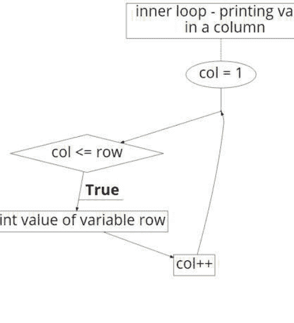

### 行级重复操作

以下相同的语句被重复了5次（总行数）。

```
Column level for-loop # 内层 for 循环
print() # 移动到下一行
```

**for 循环**的最小值和最大值可以设定为

*min_val* = 1 & *max_val* = 5 或 totalRows

让我们考虑一下；

**row** → 用于一次存储一个整数值的整数变量类型，表示1到5（totalRows）之间的行号。**totalRows** 初始被赋值为5。

外层 **for 循环**从 row=1 开始，并将重复执行直到 row <= **totalRows**。

| 行级 *for 循环* 的要素 | |
| :--- | :--- |
| min_val | **1** |
| max_val | **totalRows** |
| variable_name | **row** |
| statement(s) | **列级 *for 循环***<br>print() # 移动到下一行 |

我们已经掌握了实现行级重复所需的所有关于 **for 循环**的知识。

我们可以将所有发现总结在以下流程图中。

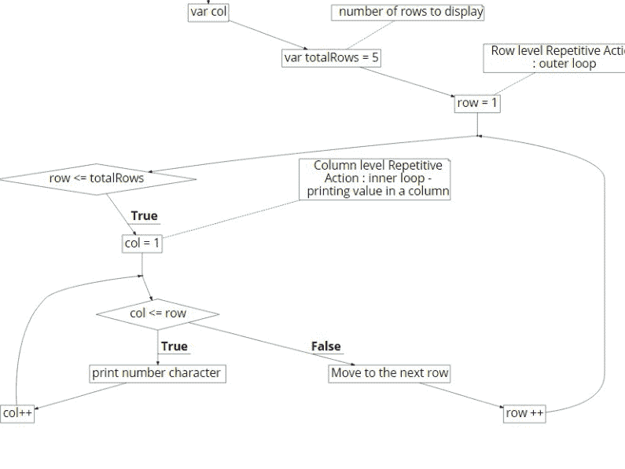

让我们执行以下程序。

```
NumberPattern1A.py
```

```
totalRows = 5  # 要显示的行数

for row in range(1, totalRows + 1):

    for col in range(1, row + 1):
        # 为输出清晰添加了额外空格。
        print(row, " ", end="")

    print()  # 移动到下一行
```

```
Output: totalRows = 5
1
2 2
3 3 3
4 4 4 4
5 5 5 5 5
```

```
Output: totalRows = 7
1
2 2
3 3 3
4 4 4 4
5 5 5 5 5
6 6 6 6 6 6
7 7 7 7 7 7 7
```

### 数字模式 1B

我们的编程任务是在计算机屏幕的一部分打印这个特定的基于逻辑的模式。**我们的方法将假设计算机屏幕是行和列的组合，虚拟地将其划分为更小的方框——最小的方框被视为仅包含一个字符。** 显示屏上每个最小方框的地址在逻辑上将成为一个唯一的 **(行, 列)** 数字组合。基于这个假设，计算机屏幕将简单地是一个由 (行, 列) 数值配对的方框组成的唯一组合，这些方框均匀地分布在整个屏幕上。

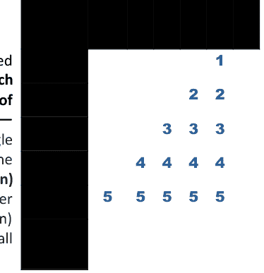

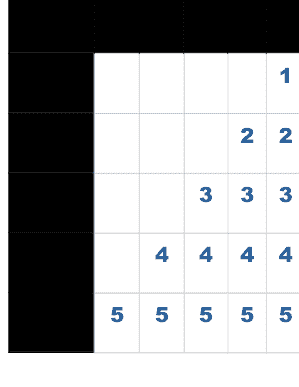

| | Col=1 | Col=2 | Col=3 | Col=4 | Col=5 |
|---|---|---|---|---|---|
| Row=1 | | | | | 1 |
| Row=2 | | | | 2 | 2 |
| Row=3 | | | 3 | 3 | 3 |
| Row=4 | | 4 | 4 | 4 | 4 |
| Row=5 | 5 | 5 | 5 | 5 | 5 |

#### 数据表示

尽管这是合乎逻辑的，但我们可以通过知道每个可打印字符在显示屏上的唯一可识别的 **(行, 列)** 数字配对值来精确定位其位置。

**例如；**
**(4, 5)** 表示在假设的屏幕位置 **第4行和第5列** 打印数字字符。

#### (行, 列) 值对表示

| | Col=1 | Col=2 | Col=3 | Col=4 | Col=5 |
|---|---|---|---|---|---|
| Row=1 | | | | | 1,5 |
| Row=2 | | | | 2,4 | 2,5 |
| Row=3 | | | 3,3 | 3,4 | 3,5 |
| Row=4 | | 4,2 | 4,3 | 4,4 | 4,5 |
| Row=5 | 5,1 | 5,2 | 5,3 | 5,4 | 5,5 |

#### 输出分析

在这种情况下，我们需要处理在特定行的特定列打印两种不同类型的字符。字符类型如下。

1. 空格字符
2. 数字字符

表格形式表示

| row | 1 | | | | |
|---|---|---|---|---|---|
| col | 1 | 2 | 3 | 4 | 5 |
| Output | space | space | space | space | 1 |

对于 row = 1, 1 <= spaces <= 4, 1 >= num >= 1

| row | 2 | | | | |
|---|---|---|---|---|---|
| col | 1 | 2 | 3 | 4 | 5 |
| Output | space | space | space | 2 | 2 |

对于 row = 2, 1 <= spaces <= 3, 2 >= num >= 1

| row | 3 | | | | |
|---|---|---|---|---|---|
| col | 1 | 2 | 3 | 4 | 5 |
| Output | space | space | 3 | 3 | 3 |

对于 row = 3, 1 <= spaces <= 2, 3 >= num >= 1

| row | 4 | | | | |
|---|---|---|---|---|---|
| col | 1 | 2 | 3 | 4 | 5 |
| Output | space | 4 | 4 | 4 | 4 |

对于 row = 4, 1 <= spaces <= 1, 4 >= num >= 1

| row | 5 | | | | |
|---|---|---|---|---|---|
| col | 1 | 2 | 3 | 4 | 5 |
| Output | 5 | 5 | 5 | 5 | 5 |

对于 row = 5, 5 >= num >= 1

#### 观察

1. 在行级别存在垂直重复，即 Row = 1 到 5。
2. 在列级别存在水平重复，即 Col = 1 到 5。这被分为两部分。一部分用于重复打印空格，剩余的列用于打印数字字符。
3. 我们需要探索定义以下给定内层循环所需的未知逻辑表达式。它们在下面给出的表格中标记为未知。

| For Loop | Lower limit | Upper limit |
|---|---|---|
| Outer loop | row=1 | row<=5 |
| Inner Loop - spaces | spaces=1 | spaces <= ?(Unknown) |
| Inner Loop - Number | num = ?(Unknown) | num = 1 |

### 列级重复操作

| row | Column level Repetitive Action | | | | | |
|---|---|---|---|---|---|---|
| | lower_limit <= spaces <= upper_limit | | | upper_limit >= num >= lower_limit | | |
| | Range | lower_limit | upper_limit | Range | upper_limit | lower_limit |
| 1 | 1 <= spaces <= 4 | 1 | 4 | 1 >= num >= 1 | 1 | 1 |
| 2 | 1 <= spaces <= 3 | 1 | 3 | 2 >= num >= 1 | 2 | 1 |
| 3 | 1 <= spaces <= 2 | 1 | 2 | 3 >= num >= 1 | 3 | 1 |
| 4 | 1 <= spaces <= 1 | 1 | 1 | 4 >= num >= 1 | 4 | 1 |
| 5 | | 1 | 0 | 5 >= num >= 1 | 5 | 1 |

对于所有行，spaces & num 变量的 lower_limit 具有相同的数值表达式。

它对所有行都是一致的。同样，我们需要为 upper_limit 开发一个一致的表达式，使其适用于任意数量的行。

其他剩余的变量是 row & totalRows=5。让我们尝试使用这些变量获得一个通用的逻辑条件。

| row | lower_limit <= spaces <= upper_limit | | | | upper_limit >= num >= lower_limit | | |
|---|---|---|---|---|---|---|---|
| | lower_limit | upper_limit | | | upper_limit | | lower_limit |
| | | default | 1 | 2 | default | 1 | |
| 1 | 1 | 4 | totalRows - 1 | totalRows - row | 1 | row | 1 |
| 2 | 1 | 3 | totalRows - 2 | totalRows - row | 2 | row | 1 |
| 3 | 1 | 2 | totalRows - 3 | totalRows - row | 3 | row | 1 |
| 4 | 1 | 1 | totalRows - 4 | totalRows - row | 4 | row | 1 |
| 5 | 1 | 0 | totalRows - 5 | totalRows - row | 5 | row | 1 |

因此，spaces & num 变量的 upper_limit 被通用化了。lower_limit & upper_limit 对所有行都是一致的。现在它被通用化为 n 行。

所以我们的 **If 条件** (lower_limit <= spaces <= upper_limit) 变为

**1 <= spaces <= (totalRows – row)**

**If 条件** (upper_limit >= num >= lower_limit) 变为

**row >= num >= 1**

因此它有两个重复过程，一个用于打印空格，第二个用于打印数字值。这意味着它需要 **两个内层 for 循环**（嵌套 for 循环）。

| For Loop | Lower limit | Upper limit |
| :--- | :--- | :--- |
| Outer loop | row=1 | row<= totalRows |
| Inner Loop - spaces | col=1 | col <= (totalRows – row) |
| Inner Loop - Number | num = row | num = 1 |

我们现在可以定义列级 *for 循环*，它适用于每个行值。

| 列级 *for 循环* 的要素 | |
| :--- | :--- |
| min_val | 1 |
| max_val | totalRows - row |
| variable_name | col |
| statement(s) | print(" ", end="") |

| 列级 *for 循环* 的要素 | |
| :--- | :--- |
| min_val | 1 |
| max_val | row |
| variable_name | num |
| statement(s) | print(num, " ", end="") |

### 行级重复操作

以下相同的语句被重复了5次（总行数）。

用于打印空格字符的列级 *for 循环* # 内层 for 循环

用于打印星号字符的列级 *for 循环* # 内层 for 循环

print() # 将控制移动到下一行

我们可以从模式中观察到总行数为5。

我们为每一行分配了一个从1到5的唯一值。

因此，行级 *for 循环* 的最小值和最大值可以设定为

min_val = 1 & max_val = 5 或 totalRows

外层 **for 循环**从 row=1 开始，并将重复执行直到 row <= **totalRows**。

| 行级 *for 循环* 的要素 | |
| :--- | :--- |
| min_val | 1 |
| max_val | **totalRows** |
| variable_name | **row** |
| statement(s) | 用于打印<u>空格字符</u>的列级 **for 循环**。<br>用于打印<u>星号字符</u>的列级 **for 循环**<br>`print()` # 将控制移动到下一行 |

我们已经掌握了实现行级重复所需的所有关于 **for 循环**的知识。

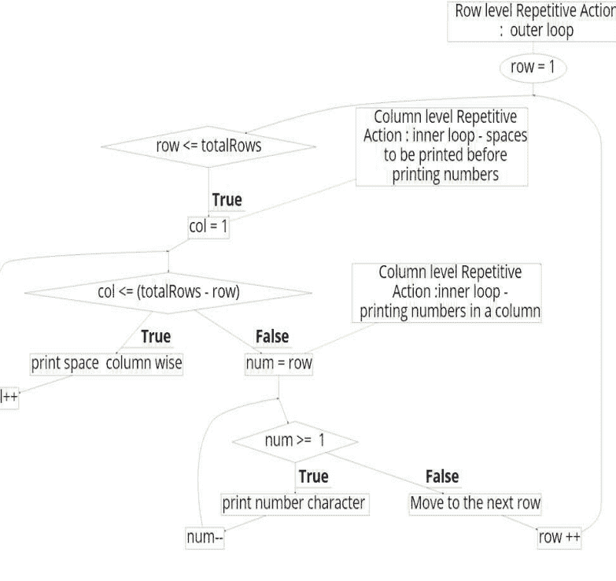

让我们执行以下程序。

```
NumberPattern1B.py
```

```
totalRows = 5  # 要显示的行数
for row in range(1, totalRows + 1):
    # 在打印数字之前要打印的空格
    for col in range(1, totalRows - row + 1):
        print("  ", end="")

    for num in range(row, 0, -1):
        # 为了输出清晰，添加了额外的空格。
        print(num, " ", end="")

    print()  # 将控制移到下一行
```

```
输出：totalRows = 5
```

```
输出：totalRows = 7
```

```
    1
   2 2
  3 3 3
 4 4 4 4
5 5 5 5 5
```

```
        1
       2 2
      3 3 3
     4 4 4 4
    5 5 5 5 5
   6 6 6 6 6 6
  7 7 7 7 7 7 7
```

请测试不同的行数，比如7行。它应该能正确工作，这样我们就能确认我们的解决方案是通用的，适用于任何行数。

### 替代解决方案

我们之前观察到，对于 row=5，col 的值和数字输出正好是相反的。

让我们设计一个解决方案，通过递减 col 变量的 for 循环（从5到1），这样数字输出就会与 row 变量的值匹配。

| row | 5 | | | | |
|---|---|---|---|---|---|
| col | 1 | 2 | 3 | 4 | 5 |
| output | 5 | 4 | 3 | 2 | 1 |

对于 row =5，5>=num>=1，1 <=col<=5

| row | 1 | | | | |
|---|---|---|---|---|---|
| col | 5 | 4 | 3 | 2 | 1 |
| output | space | space | space | space | 1 |

row =1，1>=col>=1（打印行值）或 row >=col>=1（打印行值）

| row | 2 | | | | |
|---|---|---|---|---|---|
| col | 5 | 4 | 3 | 2 | 1 |
| output | space | space | space | 2 | 2 |

row = 2，2>=col>=1（打印行值）或 row >=col>=1（打印行值）

| row | 3 | | | | |
|---|---|---|---|---|---|
| col | 5 | 4 | 3 | 2 | 1 |
| output | space | space | 3 | 3 | 3 |

row = 3，3>=col>=1（打印行值）或 row >=col>=1（打印行值）

| row | 4 | | | | |
|---|---|---|---|---|---|
| col | 5 | 4 | 3 | 2 | 1 |
| output | space | 4 | 4 | 4 | 4 |

row = 4，4>=col>=1（打印行值）或 row >=col>=1（打印行值）

| row | 5 | | | | |
|---|---|---|---|---|---|
| col | 5 | 4 | 3 | 2 | 1 |
| output | 5 | 5 | 5 | 5 | 5 |

row = 5，5>=col>=1（打印行值）或 row >=col>=1（打印行值）

所以，**if 条件** = (col >=1 且 col<=row)

col >=1 是冗余条件，因为它是 **内部 for 循环** 中 col 从5到1的下限。

所以，**if 条件** 简化为 (col<=row)

总体观察是，在每一行，要么连续打印空格字符，要么连续打印行值。如果我们只处理打印空格的逻辑条件，那么很明显，这个条件可以用 if-else 来表示。

**注意**：-空格或数字字符的打印是连续的。

让我们执行以下程序。

```
NumberPattern1B_2.py
```

```
totalRows = 5  # 要显示的行数

for row in range(1, totalRows + 1):
    # 对于范围 (row >= col >=1) 打印变量 col 的值
    for col in range(totalRows, 0, -1):
        if(col <= row):
            print(row, end=" ") # 1个空格
        else:
            print("  ", end="") # 2个空格

    print()  # 将控制移到下一行
```

```
输出：totalRows = 5
      1
     2 2
    3 3 3
   4 4 4 4
  5 5 5 5 5

输出：totalRows = 7
            1
           2 2
          3 3 3
         4 4 4 4
        5 5 5 5 5
       6 6 6 6 6 6
      7 7 7 7 7 7 7
```

请测试不同的行数。比如7行。它应该能正确工作。

### NumberPattern 1C

我们的编程任务是在计算机屏幕的某个部分打印这个特定的基于逻辑的图案。**我们的方法将假设计算机屏幕是行和列的组合，虚拟地将其划分为更小的方框——最小的方框被视为仅包含一个字符。** 显示屏上每个最小方框的地址在逻辑上将成为一个唯一的 **(行, 列)** 数字组合。基于这个假设，计算机屏幕将简单地是一个由唯一的 (行, 列) 数字值配对方框组成的组合，这些方框均匀地分布在整个屏幕上。

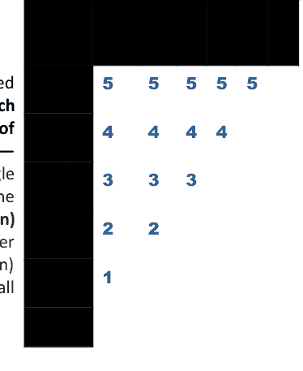

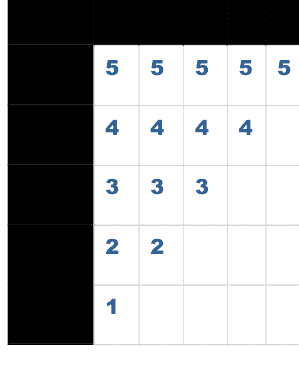

| | Col=1 | Col=2 | Col=3 | Col=4 | Col=5 |
|---|---|---|---|---|---|
| Row=1 | 5 | 5 | 5 | 5 | 5 |
| Row=2 | 4 | 4 | 4 | 4 | |
| Row=3 | 3 | 3 | 3 | | |
| Row=4 | 2 | 2 | | | |
| Row=5 | 1 | | | | |

#### 数据表示

尽管这是合乎逻辑的，但我们可以通过知道每个可打印字符在显示屏上的唯一可识别的 **(行, 列)** 数字配对值来精确定位其位置。

例如；
**(2, 3)** 表示在假定的屏幕位置 **第2行** 和 **第3列** 打印数字字符。

#### (行, 列) 值对表示

| | Col=1 | Col=2 | Col=3 | Col=4 | Col=5 |
|---|---|---|---|---|---|
| Row=1 | 1,1 | 1,2 | 1,3 | 1,4 | 1,5 |
| Row=2 | 2,1 | 2,2 | 2,3 | 2,4 | |
| Row=3 | 3,1 | 3,2 | 3,3 | | |
| Row=4 | 4,1 | 4,2 | | | |
| Row=5 | 5,1 | | | | |

#### 输出分析

让我们设计一个解决方案，通过递增 col 变量的 for 循环（从1到5）并确定 col 变量的 if 条件（下限 <=col<= 上限）来给出所需的数字输出。

| row | 1 | | | | |
|---|---|---|---|---|---|
| col | 1 | 2 | 3 | 4 | 5 |
| output | 5 | 5 | 5 | 5 | 5 |

row =1，1 <=Col <= 5（打印上限=5）

| row | 2 | | | | |
|---|---|---|---|---|---|
| col | 1 | 2 | 3 | 4 | 5 |
| output | 4 | 4 | 4 | 4 | |

row = 2，(1 <=Col <= 4)（打印上限=4）

| row | 3 | | | | |
|---|---|---|---|---|---|
| col | 1 | 2 | 3 | 4 | 5 |
| output | 3 | 3 | 3 | | |

row = 3，(1 <=Col <= 3)（打印上限=3）

| row | 4 | | | | |
|---|---|---|---|---|---|
| col | 1 | 2 | 3 | 4 | 5 |
| output | 2 | 2 | | | |

row = 4，(1 <=Col <= 2)（打印上限=2）

| row | 5 | | | | |
|---|---|---|---|---|---|
| col | 1 | 2 | 3 | 4 | 5 |
| output | 1 | | | | |

row = 5，(1 <=Col <= 1)（打印上限=1）

### 列级重复操作

数字输出将是行变量的值，打印的次数等于 col 变量的上限。col 变量的上限随行变量的值而变化。

| 行级重复操作 | 预期输出 |
|---|---|
| row | 列级重复操作 | |
| | 下限 <=col<= 上限 | |
| | 下限 | 上限 | |
| 1 | 1 | 5 | 5 5 5 5 5 |
| 2 | 1 | 4 | 4 4 4 4 |
| 3 | 1 | 3 | 3 3 3 |
| 4 | 1 | 2 | 2 2 |
| 5 | 1 | 1 | 1 |

下限对于所有行具有相同的数字值表达式。它对所有行都是一致的。

同样，我们需要为上限开发一个一致的表达式，它应该适用于任何行数。其他剩余的变量是 **row**，**totalRows=5**。

让我们尝试使用这些变量来概括逻辑表达式。

| row | 下限 | 默认值 | 1 | 2 | 3 |
|---|---|---|---|---|---|
| 1 | 1 | 5 | totalRows | (totalRows +1) - 1 | (totalRows +1) - row |
| 2 | 1 | 4 | totalRows -1 | (totalRows +1) - 2 | (totalRows +1) - row |
| 3 | 1 | 3 | totalRows - 2 | (totalRows +1) - 3 | (totalRows +1) - row |
| 4 | 1 | 2 | totalRows - 3 | (totalRows +1) - 4 | (totalRows +1) - row |
| 5 | 1 | 1 | totalRows - 4 | (totalRows +1) - 5 | (totalRows +1) - row |

所以 col 变量的上限被概括为 (totalRows + 1 – row)。

下限和上限对于所有行都是一致的。现在它被概括为 n 行。所以我们的 If 条件变为；

| If 条件 | 下限 <=col<= 上限 |
|---|---|
| 数学表达式 | 1 <= col <= ( (totalRows +1) – row ) |
| 语法 | col >= 1 且 col <= ( totalRows + 1 - row ) |

流程图可以显示如下。

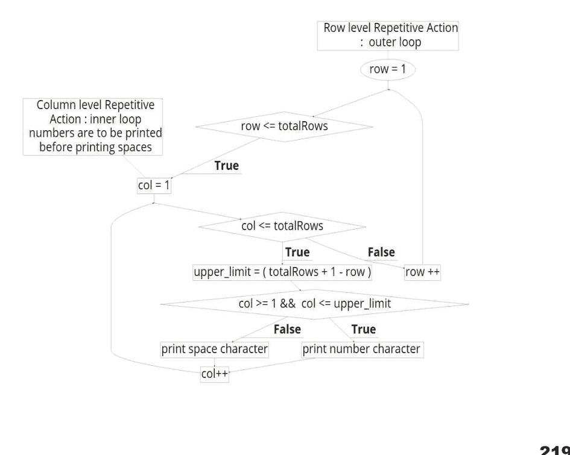

## NumberPattern1C_1.py

```
totalRows = 5  # 要显示的行数

for row in range(1, totalRows + 1):

    # 在打印空格之前要打印的数字
    for col in range(1, totalRows + 1):

        upper_limit = (totalRows + 1 - row)

        if(col >= 1 and  col <= upper_limit):
            print(upper_limit, end=" ")
        else:
            print(" ", end=" ")

    # 结束内部循环

    print()  # 将控制移到下一行

# 结束外部循环
```

由于内部 for 循环的 *下限* 与 if 条件的 *下限* 匹配。

```
for(col = 1 col <= totalRows col++) :
    if( col >= 1 and col <= ( totalRows + 1 - row ) ) :
        ----- 语句 ------
    else:
        # 打印空格
```

因此，我们可以安全地忽略 if 条件中的 *下限*，因为它已经由其自身的 for 循环的起始值处理了。因此，我们最终的 if 条件将是，

| If 条件 | 下限 <=col<= 上限 |
|---|---|
| 数学表达式 | col <= ( (totalRows +1) - row ) |
| 语法 | col <= ( totalRows + 1 - row ) |

在一些空格之后，如果我们需要打印一些文本或字符，那么在这种情况下，我们必须在程序中先放置打印空格的逻辑。反之，这将不是一个明智的做法。

因此，在这个特定案例中，我们可以避免使用 else 条件，这进一步简化了我们的条件逻辑。我们可以进一步优化流程图，如下所示。

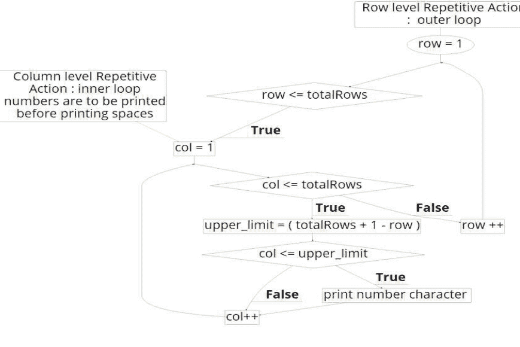

```python
NumberPattern1C_2.py

totalRows = 5  # number of rows to display

for row in range(1, totalRows + 1):

    # spaces are to be printed before printing numbers.
    # This for-loop prints column-wise
    for col in range(1, totalRows + 1):
        upper_limit = (totalRows + 1 - row)
        if(col <= upper_limit):
            print(upper_limit, end=" ") # ends with space.

            # inner for-loop

    print()  # moves control to the next line

    # outer for-loop
```

我们知道，列级重复的总次数等于总行数。

此外，内层循环的 if 条件负责减少列中数字字符的打印次数。因此，随着行数的增加，总重复次数也应相应减少。在那些并非所有列位置都填满数字字符的行中，循环会进行不必要的额外迭代。我们可以通过将内层 for 循环的 *upper_limit* 与 if 条件动态匹配来停止这种额外的循环。

因此，我们可以完全移除 if 条件，并将内层 for 循环的 *upper_limit* 逻辑表达式替换为 **If 条件** 中使用的逻辑表达式。

## NumberPattern1C_3.py

```python
totalRows = 5  # number of rows to display

for row in range(1, totalRows + 1):

    upper_limit = (totalRows + 1 - row)

    for col in range(1, upper_limit + 1):
        print(upper_limit, end=" ")

    print()  # moves control to the next line
```

| 输出：totalRows = 5 | 输出：totalRows = 7 |
|---|---|
| 5 5 5 5 5 | 7 7 7 7 7 7 7 |
| 4 4 4 4 | 6 6 6 6 6 6 |
| 3 3 3 | 5 5 5 5 5 |
| 2 2 | 4 4 4 4 |
| 1 | 3 3 3 |
| | 2 2 |
| | 1 |

请为不同的行数（例如 7）测试输出。它应该能正确工作。

### 替代方案

这次我们使用递减的外层 for 循环，通过 row 变量（从 5 到 1），并尝试确定逻辑条件，以便在我们的行-列图片格式中定位数字字符。

| row | 5 |
|---|---|
| col | 1 | 2 | 3 | 4 | 5 |
| output | 5 | 5 | 5 | 5 | 5 |

row =5 , 1 <=Col <= 5 (打印 upper_limit=5)

| row | 4 |
|---|---|
| col | 1 | 2 | 3 | 4 | 5 |
| output | 4 | 4 | 4 | 4 | |

row = 4 , (1 <=Col <= 4) (打印 upper_limit=4)

| row | 3 |
|---|---|
| col | 1 | 2 | 3 | 4 | 5 |
| output | 3 | 3 | 3 | | |

row = 3 , (1 <=Col <= 3) (打印 upper_limit=3)

| row | 2 |
|---|---|
| col | 1 | 2 | 3 | 4 | 5 |
| output | 2 | 2 | | | |

row = 2 , (1 <=Col <= 2) (打印 upper_limit=2)

| row | 1 |
|---|---|
| col | 1 | 2 | 3 | 4 | 5 |
| output | 1 | | | | |

row = 1 , (1 <=Col <= 1) (打印 upper_limit=1)

| 列级重复操作 | 预期输出 |
|---|---|
| row | lower_limit <=col<= upper_limit | |
| | lower_limit | upper_limit | |
| 5 | 1 | 5 | 5 5 5 5 5 |
| 4 | 1 | 4 | 4 4 4 4 |
| 3 | 1 | 3 | 3 3 3 |
| 2 | 1 | 2 | 2 2 |
| 1 | 1 | 1 | 1 |

数字输出将是 row 变量的值，打印次数等于 row 变量的 upper_limit。row 变量的 upper_limit 是变化的，并与 row 变量的值匹配。

| 列级重复操作 | 预期输出 |
|---|---|
| row | If-condition( lower_limit <=col<= upper_limit) | |
| | lower_limit | upper_limit | |
| 5 | 1 | row | 5 5 5 5 5 |
| 4 | 1 | row | 4 4 4 4 |
| 3 | 1 | row | 3 3 3 |
| 2 | 1 | row | 2 2 |
| 1 | 1 | row | 1 |

因此，我们的循环条件 ( lower_limit <=col<= upper_limit) 变为

| loop-condition | lower_limit <=col<= upper_limit |
|---|---|
| 数学表达式 | 1 <= col <= row |
| 语法 | for col in range(1, row + 1): |

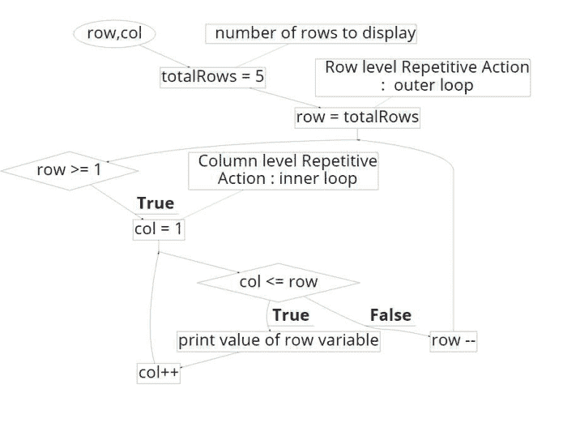

因此，我们最终的程序将是，

```python
NumberPattern2C.py

totalRows = 5  # number of rows to display

for row in range(totalRows, 0, -1):

    # row value to be printed
    for col in range(1, row + 1):
        print(row, end = " ")
    # Ends inner for-loop

    print()  # moves control to the next line

# Ends outer for-loop
```

| 输出：totalRows = 5 | 输出：totalRows = 7 |
|---|---|
| 5 5 5 5 5 | 7 7 7 7 7 7 7 |
| 4 4 4 4 | 6 6 6 6 6 6 |
| 3 3 3 | 5 5 5 5 5 |
| 2 2 | 4 4 4 4 |
| 1 | 3 3 3 |
| | 2 2 |
| | 1 |

请为不同的行数（例如 7）测试。它应该能正确工作。

### NumberPattern 1D

我们的编程任务是在计算机屏幕的一部分打印这个特定的基于逻辑的图案。**我们的方法将假设计算机屏幕是行和列的组合，虚拟地将其划分为更小的方框——最小的方框被视为仅容纳单个字符。** 显示屏上每个最小方框的地址在逻辑上将成为一个唯一的 **(行, 列)** 数字组合。基于这个假设，计算机屏幕将简单地是一个唯一的 (行, 列) 数值配对方框的组合，这些方框均匀地分布在整个屏幕上。

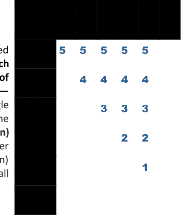

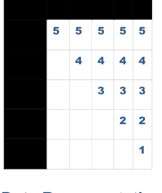

| | Col=1 | Col=2 | Col=3 | Col=4 | Col=5 |
|---|---|---|---|---|---|
| **Row=1** | 5 | 5 | 5 | 5 | 5 |
| **Row=2** | | 4 | 4 | 4 | 4 |
| **Row=3** | | | 3 | 3 | 3 |
| **Row=4** | | | | 2 | 2 |
| **Row=5** | | | | | 1 |

#### 数据表示

尽管这是合乎逻辑的，但我们可以通过知道每个可打印字符在显示屏上的唯一可识别的 **(行, 列)** 数字配对值来精确定位其位置。**例如；(3, 4)** 表示在假定的屏幕位置 <u>第 3 行</u> 和 <u>第 4 列</u> 打印数字字符。

#### (行, 列) 值对表示

| | Col=1 | Col=2 | Col=3 | Col=4 | Col=5 |
|---|---|---|---|---|---|
| **Row=1** | 1,1 | 1,2 | 1,3 | 1,4 | 1,5 |
| **Row=2** | | 2,2 | 2,3 | 2,4 | 2,5 |
| **Row=3** | | | 3,3 | 3,4 | 3,5 |
| **Row=4** | | | | 4,4 | 4,5 |
| **Row=5** | | | | | 5,5 |

#### 输出分析

在这种情况下，我们需要处理在特定行的特定列打印两种不同类型的字符。字符类型如下。

- 1) 空格字符
- 2) 数字字符

| row | 5 | | | | |
|---|---|---|---|---|---|
| Col | 1 | 2 | 3 | 4 | 5 |
| Output | 5 | 5 | 5 | 5 | 5 |

对于 row =1, 0 <=spaces<=0, 1<=num<=5

| row | 4 | | | | |
|---|---|---|---|---|---|
| Col | 1 | 2 | 3 | 4 | 5 |
| Output | space | 4 | 4 | 4 | 4 |

对于 row =2, 1 <=spaces<=1, 1<=num<=4

| row | 3 | | | | |
|---|---|---|---|---|---|
| Col | 1 | 2 | 3 | 4 | 5 |
| Output | space | space | 3 | 3 | 3 |

对于 row =3, 1 <=spaces<=2, 1<=num<=3

| row | 2 | | | | |
|---|---|---|---|---|---|
| Col | 1 | 2 | 3 | 4 | 5 |
| Output | space | space | space | 2 | 2 |

对于 row =4, 1 <=spaces<=3, 1<=num<=2

| row | 1 | | | | |
|---|---|---|---|---|---|
| Col | 1 | 2 | 3 | 4 | 5 |
| Output | space | space | space | space | 1 |

对于 row =5, 1 <=spaces<=4, 1<=num<=1

#### 观察

- 1) 在行级别存在垂直重复，即 row = 1 到 5。
- 2) 在列级别存在水平重复，即 col = 1 到 5。

这被分为两部分。一部分用于重复打印空格，剩余的列用于打印数字字符。我们需要探索定义以下给定内层循环所需的未知逻辑表达式。它们在下面的表格中标记为未知。

| For Loop | Lower limit | Upper limit |
|---|---|
| Outer loop(decrementing) | row=1 | row>=5 |
| Inner Loop - spaces | spaces=1 | spaces <= ?(Unknown) |
| Inner Loop - Number | num = 1 | num =?(Unknown) |

### 列级重复操作

它有两个重复过程，一个用于打印空格，第二个用于打印数字值。

这意味着它需要 2 个内层 for 循环和 1 个外层循环来迭代行——行值与用于空格和数字的内层循环的上限之间的关系。

| 行级重复操作 | 预期输出 |
|---|---|
| row | 列级重复操作 | |
| | lower_limit<=col_sp<= upper_limit | lower_limit <=col_num <= upper_limit | |
| | lower_limit | upper_limit | lower_limit | upper_limit | |
| 5 | 1 | 0 | 1 | 5 | 5 5 5 5 5 |
| 4 | 1 | 1 | 1 | 4 | 4 4 4 4 |
| 3 | 1 | 2 | 1 | 3 | 3 3 3 |
| 2 | 1 | 3 | 1 | 2 | 2 2 |
| 1 | 1 | 4 | 1 | 1 | 1 |

空格和 num 变量的 lower_limit 对于所有行具有相同的数值表达式。

它对所有行都是一致的。同样，我们需要为 upper_limit 开发一个一致的表达式，使其适用于任意行数。

其他剩余的变量是 row 和 **totalRows=5**。让我们尝试使用这些变量进行概括。

| 列级重复操作 | | | | | | |
|---|---|---|---|---|---|---|
| row | lower_limit <=col_sp<= upper_limit | | | lower_limit <=col_num <= upper_limit | | |
| | lower_limit | upper_limit | | upper_limit | lower_limit | |
| | | default | 1 | | default | |
| 5 | 1 | 0 | totalRows - row | 1 | 5 | 5 5 5 5 5 |
| 4 | 1 | 1 | totalRows - row | 1 | 4 | 4 4 4 4 |
| 3 | 1 | 2 | totalRows - row | 1 | 3 | 3 3 3 |
| 2 | 1 | 3 | totalRows - row | 1 | 2 | 2 2 |
| 1 | 1 | 4 | totalRows - row | 1 | 1 | 1 |

现在，与 col_sp 变量相关的内层 for 循环的 upper_limit 已被概括，对所有行使用相同的表达式。与 col_num 变量相关的内层 for 循环的 lower_limit 尚未被概括，因为其在所有行上的表达式并不相同。

由于 col_num 变量的 lower_limit 值与 row 变量的值相匹配。

因此，我们可以使用行变量来使其保持一致，如下所示。

| 行 | lower_limit <=col_sp<= upper_limit | lower_limit <=col_num <= upper_limit |
| :--- | :--- | :--- |
| | lower_limit | upper_limit | upper_limit | lower_limit |
| | default | 1 | default | 1 |
| 5 | 1 | 0 | totalRows - row | 1 | 5 | row |
| 4 | 1 | 1 | totalRows - row | 1 | 4 | row |
| 3 | 1 | 2 | totalRows - row | 1 | 3 | row |
| 2 | 1 | 3 | totalRows - row | 1 | 2 | row |
| 1 | 1 | 4 | totalRows - row | 1 | 1 | row |

`col_sp` 变量的 `lower_limit` 对所有行都相同。`col_num` 变量的 `upper_limit` 对所有行也相同。这意味着 `col_sp` 和 `col_num` 变量的 `upper_limit` 对于任意行数都是通用的。因此，我们用于打印空格字符的内层 `for` 循环条件变为：

| 循环条件 | lower_limit <=col_sp<= upper_limit |
| :--- | :--- |
| 数学表达式 | 1 <= col_sp <= (totalRows – row) |
| 语法 | for col in range(1, totalRows - row + 1): |

因此，我们用于打印数字字符的内层 `for` 循环条件变为：

| 循环条件 | lower_limit <=col_num<= upper_limit |
| :--- | :--- |
| 数学表达式 | 1 <= col_num <= row |
| 语法 | for num in range(1, row + 1): |

我们观察结果的流程图可以如下所示。

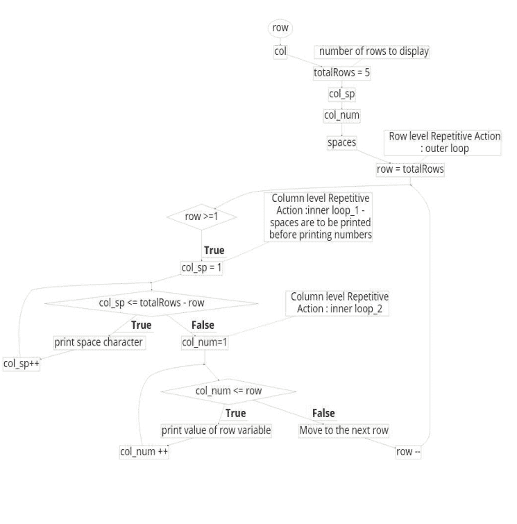

让我们根据流程图编写程序。

请为不同的行数进行测试。让我们**更改**输入值为 7 并执行它。

```
NumberPattern1D.py
totalRows = 5  # number of rows to display
for row in range(totalRows, 0, -1):
    # spaces are to be printed
    for col in range(1, totalRows - row + 1):
        print(" ", end=" ") # ends with a space
    # End inner for-loop_1

    # row value is to be printed
    for num in range(1, row + 1):
        print(row, end=" ") # ends with a space
        # End inner for-loop_2
    print()  # moves control to the next line
# End outer for-loop
```

**输出：totalRows = 5**

**输出：totalRows = 7**

5 5 5 5 5
 4 4 4 4
  3 3 3
   2 2
    1

7 7 7 7 7 7 7
 6 6 6 6 6 6
  5 5 5 5 5
   4 4 4 4
    3 3 3
     2 2
      1

*替代解决方案*

由于列值需要在打印空格和数字之间清晰地分开，我们可以尝试使用 `if-else` 条件结构。

```
NumberPattern2D.py
totalRows = 5  # number of rows to display
for row in range(totalRows, 0, -1):
    for col in range(1, totalRows + 1):
        if (col <= (totalRows - row)):
            # spaces to be printed
            print(" ", end=" ")
        else:
            # row value to be printed
            print(row, end=" ")
    # Ends inner for-loop
    print()  # moves control to the next line
# Ends outer for-loop
```

**输出**

5 5 5 5 5
 4 4 4 4
  3 3 3
   2 2
    1

### 替代解决方案

让我们设计一个解决方案，通过递减 `col` 变量的 **for 循环**（从 5 到 1），使数字输出与 `row` 变量的值匹配。

| 行 | 5 | | | | |
|---|---|---|---|---|---|
| 列 | 5 | 4 | 3 | 2 | 1 |
| 输出 | 5 | 5 | 5 | 5 | 5 |

行 =5 , 5>=列>=1 (打印行值)  或 行 >=列>=1 (打印行值)

| 行 | 4 | | | | |
|---|---|---|---|---|---|
| 列 | 5 | 4 | 3 | 2 | 1 |
| 输出 | 空格 | 4 | 4 | 4 | 4 |

行 = 4 , 4>=列>=1 (打印行值)  或 行 >=列>=1 (打印行值)

| 行 | 3 | | | | |
|---|---|---|---|---|---|
| 列 | 5 | 4 | 3 | 2 | 1 |
| 输出 | 空格 | 空格 | 3 | 3 | 3 |

行 = 3 , 3>=列>=1 (打印行值)  或 行 >=列>=1 (打印行值)

| 行 | 2 | | | | |
|---|---|---|---|---|---|
| 列 | 5 | 4 | 3 | 2 | 1 |
| 输出 | 空格 | 空格 | 空格 | 2 | 2 |

行 = 2 , 2>=列>=1 (打印行值)  或 行 >=列>=1 (打印行值)

| 行 | 1 | | | | |
|---|---|---|---|---|---|
| 列 | 5 | 4 | 3 | 2 | 1 |
| 输出 | 空格 | 空格 | 空格 | 空格 | 1 |

行 = 1 , 1>=列>=1 (打印行值)  或 行 >=列>=1 (打印行值)

| 行级重复操作 | 预期输出 |
|---|---|
| 行 | 列级重复操作 | |
| | upper_limit >=列>= upper_limit | |
| | upper_limit | lower_limit | |
| | default | 1 | |
| 5 | 5 | 行 | 1 | 5 5 5 5 5 |
| 4 | 4 | 行 | 1 | 4 4 4 4 |
| 3 | 3 | 行 | 1 | 3 3 3 |
| 2 | 2 | 行 | 1 | 2 2 |
| 1 | 1 | 行 | 1 | 1 |

因此，`if` 条件可以表示为：

| if 条件 | upper_limit >=列>= lower_limit |
|---|---|
| 数学表达式 | 行 >= 列 >= 1 |
| 语法 | if( 列>=1 and 列 <= 行 ) |

`if` 条件中 `列 >=1` 的部分已经在内层 `for` 循环的 `lower_limit` 中考虑到了。

因此，`if` 条件现在变为：

| if 条件 | upper_limit >=列>= lower_limit |
|---|---|
| 数学表达式 | 列<=行 |
| 语法 | if( 列 <= 行 ): |

在每一行的整体观察是，它要么打印空格字符，要么以连续的方式在每一列打印行值，但方式不同。

如果我们只处理打印数字的条件，那么 `else` 部分将用于打印空格，并且可以很容易地用 **if-else 语句** 来表达所需的输出。

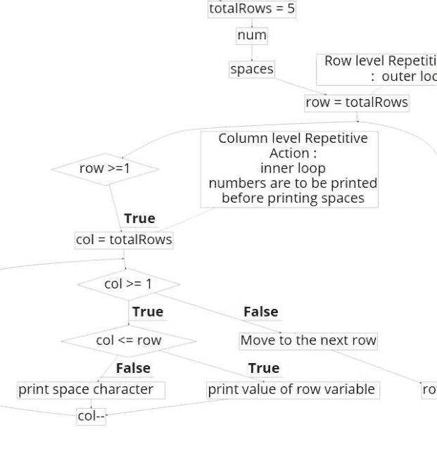

让我们尝试执行以下程序。

```
NumberPattern3D.py
```

```
totalRows = 5  # number of rows to display

for row in range(totalRows, 0, -1):

    for col in range(totalRows, 0, -1):

        if(col <= row):
            # row value to be printed
            print(row , end=" ")
        else:
            # spaces to be printed
            print(" ", end=" ")
    # Ends inner for-loop

    print()  # moves control to the next line

# Ends outer for-loop
```

输出：totalRows = 5

输出：totalRows = 7

```
5 5 5 5 5
 4 4 4 4
  3 3 3
   2 2
    1
```

```
7 7 7 7 7 7 7
 6 6 6 6 6 6
  5 5 5 5 5
   4 4 4 4
    3 3 3
     2 2
      1
```

请为不同的行数进行测试。设为 7。它应该能正确工作。

### NumberPattern 1E

我们的编程任务是在计算机屏幕的一部分打印这个特定的基于逻辑的图案。**我们的方法将假设计算机屏幕是行和列的组合，虚拟地将其划分为更小的方框**——最小的方框被视为仅包含一个字符。显示屏幕上每个最小方框中的地址在逻辑上将成为一个唯一的 **(行, 列)** 数字组合。基于这个假设，计算机屏幕将简单地是一个唯一的 (行, 列) 数字值配对方框的组合，这些方框均匀地分布在整个屏幕上。

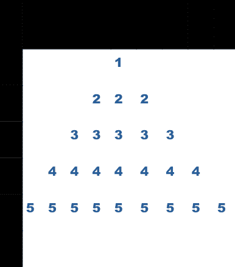

| | 列=1 | 列=2 | 列=3 | 列=4 | 列=5 | 列=6 | 列=7 | 列=8 | 列=9 |
|---|---|---|---|---|---|---|---|---|---|
| 行=1 | | | | | 1 | | | | |
| 行=2 | | | | 2 | 2 | 2 | | | |
| 行=3 | | | 3 | 3 | 3 | 3 | 3 | | |
| 行=4 | | 4 | 4 | 4 | 4 | 4 | 4 | 4 | |
| 行=5 | 5 | 5 | 5 | 5 | 5 | 5 | 5 | 5 | 5 |

#### 数据表示

尽管这是合乎逻辑的，但我们可以通过知道每个可打印字符在显示屏幕上的唯一可识别的 **(行, 列)** 数字配对值来精确定位其位置。*例如；* **(4, 3)** 表示在假定的屏幕位置 **第4行和第3列** 打印数字字符。

#### (行, 列) 值对表示

| | 列=1 | 列=2 | 列=3 | 列=4 | 列=5 | 列=6 | 列=7 | 列=8 | 列=9 |
|---|---|---|---|---|---|---|---|---|---|
| 行=1 | | | | | 1, 5 | | | | |
| 行=2 | | | | 2, 4 | 2, 5 | 2, 6 | | | |
| 行=3 | | | 3, 3 | 3, 4 | 3, 5 | 3, 6 | 3, 7 | | |
| 行=4 | | 4, 2 | 4, 3 | 4, 4 | 4, 5 | 4, 6 | 4, 7 | 4, 8 | |
| 行=5 | 5, 1 | 5, 2 | 5, 3 | 5, 4 | 5, 5 | 5, 6 | 5, 7 | 5, 8 | 5, 9 |

#### 输出分析

| 行 | 1 | | | | | | | | |
|---|---|---|---|---|---|---|---|---|---|
| 列 | 1 | 2 | 3 | 4 | 5 | 6 | 7 | 8 | 9 |
| 输出 | | | | | 1 | | | | |

对于 行 = 1, 5 <=列 <= 5, (打印行的值)

| 行 | 2 | | | | | | | | |
|---|---|---|---|---|---|---|---|---|---|
| 列 | 1 | 2 | 3 | 4 | 5 | 6 | 7 | 8 | 9 |
| 输出 | | | | 2 | 2 | 2 | | | |

对于 行 = 2, 4 <=列 <= 6, (打印行的值)

| 行 | 3 | | | | | | | | |
|---|---|---|---|---|---|---|---|---|---|
| 列 | 1 | 2 | 3 | 4 | 5 | 6 | 7 | 8 | 9 |
| 输出 | | | 3 | 3 | 3 | 3 | 3 | | |

对于 行 = 3, 3 <=列 <= 7, (打印行的值)

| 行 | 4 | | | | | | | | |
|---|---|---|---|---|---|---|---|---|---|
| 列 | 1 | 2 | 3 | 4 | 5 | 6 | 7 | 8 | 9 |
| 输出 | | 4 | 4 | 4 | 4 | 4 | 4 | 4 | |

对于 行 = 4, 2 <=列 <= 8, (打印行的值)

| 行 | 5 | | | | | | | | |
|---|---|---|---|---|---|---|---|---|---|
| 列 | 1 | 2 | 3 | 4 | 5 | 6 | 7 | 8 | 9 |
| 输出 | 5 | 5 | 5 | 5 | 5 | 5 | 5 | 5 | 5 |

对于 行 = 5, 1 <=列 <= 9, (打印行的值)

### 列级重复操作

打印图案底部总共需要最多 9 列。

| 行级重复操作 | 预期输出 |
|---|---|
| 行 | 列级重复操作 | | | | |
| | ( lower_limit <= 列 <= upper_limit ) | | | | |
| | 范围 | lower_limit | upper_limit | | |
| 1 | 5 <=列 <= 5 | 5 | 5 | 1 | |
| 2 | 4 <=列 <= 6 | 4 | 6 | 2 2 2 | |
| 3 | 3 <=列 <= 7 | 3 | 7 | 3 3 3 3 3 | |
| 4 | 2 <=列 <= 8 | 2 | 8 | 4 4 4 4 4 4 4 | |
| 5 | 1 <=列 <= 9 | 1 | 9 | 5 5 5 5 5 5 5 5 5 | |

**lower_limit** 和 **upper_limit 列** 的值对于所有行并不一致。我们需要为 **upper_limit** 和 **lower_limit** 开发一致的表达式，使其适用于 n 行。其他剩余的变量是 `行`，`totalRows = 5`。让我们尝试使用变量将 **lower_limit & upper_limit 列** 的数字序列泛化为一个有效的逻辑表达式。

### 数字模式 1F

我们的编程任务是在计算机屏幕的某个部分打印出这个特定的、基于逻辑的图案。**我们的方法将假设计算机屏幕是由行和列组合而成的，实际上将其划分为更小的方格——最小的方格被视为仅容纳一个字符。显示屏上每个最小方格的地址在逻辑上将成为一个唯一的（行，列）数字组合。基于这个假设，计算机屏幕将简单地成为一个由（行，列）数字值配对的方格组成的唯一组合，这些方格均匀地分布在整个屏幕上。**

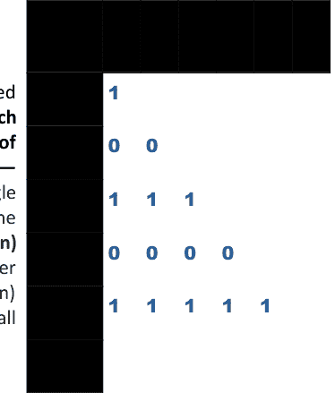

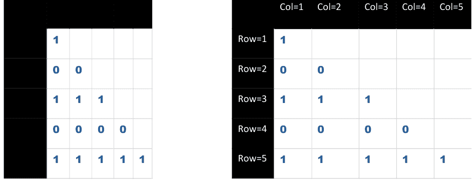

#### 数据表示

虽然这是合乎逻辑的，但我们可以通过知道每个可打印字符在显示屏上的唯一可识别的 **(行，列)** 数字配对值来精确定位其位置。*例如；* **(4, 3)** 表示在假定的屏幕位置 **第4行** 和 **第3列** 打印数字字符。

#### (行, 列) 值对表示

| | 列=1 | 列=2 | 列=3 | 列=4 | 列=5 |
|---|---|---|---|---|---|
| **行=1** | 1,1 | | | | |
| **行=2** | 2,1 | 2,2 | | | |
| **行=3** | 3,1 | 3,2 | 3,3 | | |
| **行=4** | 4,1 | 4,2 | 4,3 | 4,3 | |
| **行=5** | 5,1 | 5,2 | 5,3 | 5,4 | 5,5 |

#### 输出分析

它也可以用表格形式来解释。

| 行 | 1 | | | | |
| 列 | 1 | | | | |
| 输出 | 1 | | | | |

对于行 =1，1<=列<=1

| 行 | 2 | | | | |
| 列 | 1 | 2 | | | |
| 输出 | 0 | 0 | | | |

对于行 =2，1<=列<=2

| 行 | 3 | | | | |
| 列 | 1 | 2 | 3 | | |
| 输出 | 1 | 1 | 1 | | |

对于行 =3，1<=列<=3

| 行 | 4 | | | | |
| 列 | 1 | 2 | 3 | 4 | |
| 输出 | 0 | 0 | 0 | 0 | |

对于行 =4，1<=列<=4

| 行 | 5 | | | | |
| 列 | 1 | 2 | 3 | 4 | 5 |
| 输出 | 1 | 1 | 1 | 1 | 1 |

对于行 =5，1<=列<=5

### 列级重复操作

| 行级重复操作 | 预期输出 |
| 行 | 列级重复操作 | |
| | 重复的值 | 下限 <=列<= 上限 | |
| | | 下限 | 上限 | |
| 1 | 1 | 1 | 1 | **1** |
| 2 | 0 | 1 | 2 | **0 0** |
| 3 | 1 | 1 | 3 | **1 1 1** |
| 4 | 0 | 1 | 4 | **0 0 0 0** |
| 5 | 1 | 1 | 5 | **1 1 1 1 1** |

*上限* 值基于该值在特定行中重复的次数。

列变量的 *下限* 对于每个行值具有相同的数字值表达式。它对所有行值都是一致的。同样，我们需要为上限开发一个一致的表达式，该表达式应适用于使用可用变量的任意行数。这些变量是行和总行数=5。

此外，列中重复的值在行中交替出现。似乎我们可以建立0或1值的出现与行值之间的关系。

如果我们观察，它遵循奇偶规则。对于偶数值行，当行值是2的倍数时，我们需要打印零，否则打印一。因此，我们可以尝试根据行变量的值输出0或1。让我们尝试通过用可用变量表示来概括列的 **上限** 和 **重复的值**。

| 列级重复操作 | 预期输出 |
| :--- | :--- |
| 行 | 重复的值 | 下限 <=列<= 上限 | |
| | | 下限 | 上限 | |
| | 默认 | 1 | 默认 | 1 | |
| 1 | 1 | 行%2==1 | 1 | 1 | 行 | 1 |
| 2 | 0 | 行%2==0 | 1 | 2 | 行 | 0 0 |
| 3 | 1 | 行%2==1 | 1 | 3 | 行 | 1 1 1 |
| 4 | 0 | 行%2==0 | 1 | 4 | 行 | 0 0 0 0 |
| 5 | 1 | 行%2==1 | 1 | 5 | 行 | 1 1 1 1 1 |

对于所有行，打印的值正好是列上限值的次数。

因此，列变量的 *上限* 被概括为 **行** 变量。

列变量的 *下限* 和 *上限* 对于所有行都是一致的。

现在它对于任意行数都是通用的。

我们现在可以定义列级 **for循环**，它针对每个行值。

| 列级 *for循环* 的元素 | |
| :--- | :--- |
| 最小值 | 1 |
| 最大值 | **行** |
| 变量名 | **列** |
| 语句 | print(行, " ", end=" ") |

此外，打印0或1可以通过检查if条件（行%2==1）或（行%2==0）来给出。

> **通用规则**

可能会出现这样的情况，我们需要检查逻辑条件是否遵循 **(行+列)** 值、 **(行-列)** 值、 **(行*列)** 值或 **(行%列)** 值的模式。

通用规则是，如果遵循相同的数字模式/变化或由可用变量组成的简单数学公式，我们需要以某种方式用可用变量表示硬编码的值。

| 列级重复操作 | | | | | | |
| :--- | :--- | :--- | :--- | :--- | :--- | :--- |
| 行 | 下限 <= 列 <= 上限 | | | | | |
| | 下限 | | | 上限 | | |
| | 1 | 2 | | 1 | 2 | |
| 1 | 5 | 总行数 | 总行数 +1 - 1 | 5 | 总行数 | 总行数 +1 - 1 |
| 2 | 4 | 总行数 -1 | 总行数 +1 - 2 | 6 | 总行数 + 1 | 总行数 + 2 - 1 |
| 3 | 3 | 总行数 -2 | 总行数 +1 - 3 | 7 | 总行数 + 2 | 总行数 + 3 - 1 |
| 4 | 2 | 总行数 -3 | 总行数 +1 - 4 | 8 | 总行数 + 3 | 总行数 + 4 - 1 |
| 5 | 1 | 总行数 -4 | 总行数 +1 - 5 | 9 | 总行数 + 4 | 总行数 + 5 - 1 |

| 列级重复操作 | | | | | | |
| :--- | :--- | :--- | :--- | :--- | :--- | :--- |
| 行 | If条件( 下限 <= 列 <= 上限) | | | | | |
| | 下限 | | | 上限 | | |
| | 默认 | 3 | | 默认 | 3 | |
| 1 | 5 | 总行数 +1 - 行 | | 5 | 总行数 + 行 - 1 | |
| 2 | 4 | 总行数 +1 - 行 | | 6 | 总行数 + 行 - 1 | |
| 3 | 3 | 总行数 +1 - 行 | | 7 | 总行数 + 行 - 1 | |
| 4 | 2 | 总行数 +1 - 行 | | 8 | 总行数 + 行 - 1 | |
| 5 | 1 | 总行数 +1 - 行 | | 9 | 总行数 + 行 - 1 | |

列变量的 *下限* 和 *上限* 对于所有行都是一致的。现在它对于打印数字值的任意行数都是通用的。因此我们的If条件变为；

| if条件 | 下限 <=列<= 上限 |
| :--- | :--- |
| 数学表达式 | (总行数 +1 - 行) <= 列 <= (总行数 + 行 - 1) |
| 语法 | if( 列 >= ( ( 总行数 - 行 ) + 1 ) and 列 <= ( ( 总行数 + 行 ) - 1 ) ): |

当if条件满足时，它将在特定行的该位置打印行值，否则将打印空格字符。该图显示，总共需要9列来打印整个图案的底部。for循环条件如下；

| 循环条件 | 下限 <=列<= 上限 |
| :--- | :--- |
| 数学表达式 | 1<= 列 <= 9 |
| 语法 | for 列 in range(1, 9 + 1): |

内部for循环的列变量的 *上限* 是值9，这是一个需要被概括的硬编码数值。

我们可以将值9表示为 (总行数 + 4)，因为总行数 = 5。

逻辑条件中的硬编码值会导致程序在不同的输入值下失败。必须使用在编写程序时考虑的变量来概括它。

| 循环条件 | 下限 <=列<= 上限 |
| --- | --- |
| 数学表达式 | 1<= 列 <= 总行数 + 4 |
| | 1<= 列 <= 总行数 + ( 总行数 - 1 ) |
| | 1<= 列 <= ( 2*总行数 - 1) |
| 语法 | for 列 in range(1, 2 * 总行数): |

我们现在能够使用变量 **总行数** 进行概括。

让我们尝试验证我们将为每行显示的总列数的上限

对于总行数 = 5，列 <= 9 ( 2*5 – 1 )

对于总行数 = 4，列 <= 7 ( 2*4 – 1 )

对于总行数 = 3，列 <= 5 ( 2*3 – 1 )

对于总行数 = 2，列 <= 3 ( 2*2 – 1 )

对于总行数 = 1，列 <= 1 ( 2*1 – 1 )

因此，根据给定行数对总列数的这种概括是有效的。

所有这些观察结果都可以在下面给出的流程图中轻松捕获。

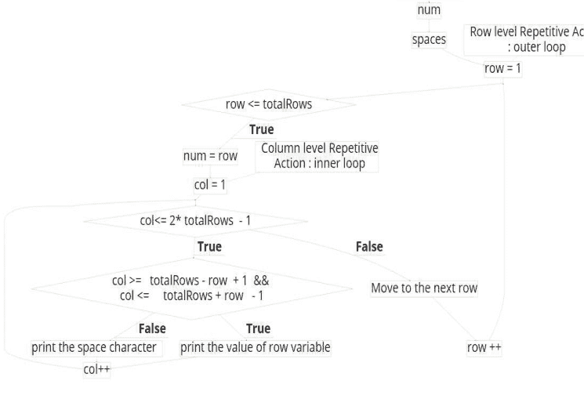

让我们根据流程图中捕获的观察结果编写程序。

```
NumberPattern1E.py
```

```
totalRows = 5  # 要显示的行数

for row in range(1, totalRows + 1):

    # 列重复发生 ( 2* totalRows  - 1) 次

    for col in range(1, 2 * totalRows):

        if (col >= ((totalRows - row) + 1) and col <= ((totalRows + row) - 1)):

            # 要打印的行值
            print(row, end=" ") # 以空格结尾

        else:

            # 要打印的空格
            print(" ", end=" ") # 以空格结尾

    # 结束内部 for 循环

    print()  # 将控制移到下一行

# 结束外部 for 循环
```

输出：总行数=5

输出：总行数=8

```
        1
      2 2 2
    3 3 3 3 3
  4 4 4 4 4 4 4
5 5 5 5 5 5 5 5 5
```

```
                1
              2 2 2
            3 3 3 3 3
          4 4 4 4 4 4 4
        5 5 5 5 5 5 5 5 5
      6 6 6 6 6 6 6 6 6 6 6
    7 7 7 7 7 7 7 7 7 7 7 7 7
  8 8 8 8 8 8 8 8 8 8 8 8 8 8 8
```

请为不同的行数进行测试。假设为8。它应该能正确工作。

### 行级重复操作

以下相同的语句被重复了5次（总行数）。

```
Column level for-loop  # 内层 for 循环
print() # 移动到下一行
```

**for 循环**的最小值和最大值可以设定为
min_val = 1 & max_val = 5 或 totalRows
让我们考虑一下；
row → 用于一次存储一个整数值的整数变量类型，代表1到5（totalRows）之间的行号。**totalRows** 初始赋值为5。

外层 **for 循环**从 row=1 开始，并将重复直到 row <= **totalRows**。

我们已经掌握了与行级重复相关的 **for 循环**的所有要素。

| 行级 for 循环的要素 | |
|---|---|
| min_val | 1 |
| max_val | totalRows |
| variable_name | row |
| statement(s) | Column level for-loop<br># 移动到下一行<br>print() |

我们可以将观察结果总结在流程图中，如下所示。

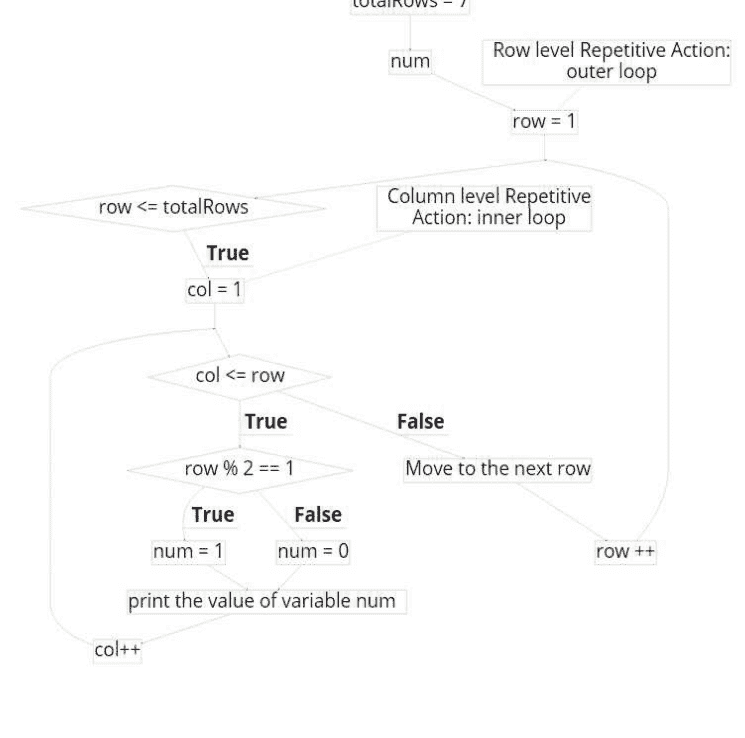

让我们执行以下程序。

```
NumberPattern1F.py
```

```
totalRows = 7  # 要显示的行数

# 行级重复操作：
for row in range(1, totalRows + 1):

    # 列级重复操作：
    # 按列打印变量 num 的值
    for col in range(1, row + 1):

        if (row % 2 == 1):
            num = 1
        else:
            num = 0

        print(num, end=" ")
    # 结束内层循环

    # 将程序控制移动到下一行，以便
    # 将字符打印切换到下一行。
    print()

# 结束外层 for 循环
```

```
输出
```

```
1
0 0
1 1 1
0 0 0 0
1 1 1 1 1
0 0 0 0 0 0
1 1 1 1 1 1 1
```

### 数字图案 AA

我们的编程任务是在计算机屏幕的一部分打印这个特定的基于逻辑的图案。**我们的方法将假设计算机屏幕是行和列的组合，实际上将其划分为更小的方框——最小的方框被视为仅容纳单个字符。** 显示屏上每个最小方框中的地址在逻辑上将成为一个唯一的 **(行, 列)** 数字组合。基于这个假设，计算机屏幕将简单地是一个由 (行, 列) 数字值配对的方框组成的唯一组合，这些方框均匀地分布在整个屏幕上。

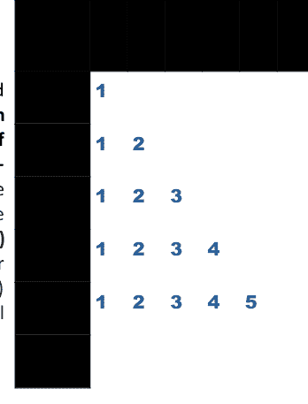

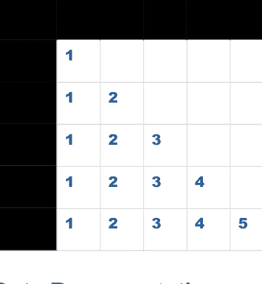

| | Col=1 | Col=2 | Col=3 | Col=4 | Col=5 |
|---|---|---|---|---|---|
| **Row=1** | 1 | | | | |
| **Row=2** | 1 | 2 | | | |
| **Row=3** | 1 | 2 | 3 | | |
| **Row=4** | 1 | 2 | 3 | 4 | |
| **Row=5** | 1 | 2 | 3 | 4 | 5 |

#### 数据表示

尽管这是逻辑上的，但我们可以通过知道每个可打印字符在显示屏上的唯一可识别的 **(行, 列)** 数字配对值来精确定位其位置。*例如；* **(4, 3)** 表示在假设的屏幕位置 <u>第4行</u> 和 <u>第3列</u> 打印数字字符。

#### (行, 列) 值对表示

| | Col=1 | Col=2 | Col=3 | Col=4 | Col=5 |
|---|---|---|---|---|---|
| **Row=1** | 1,1 | | | | |
| **Row=2** | 2,1 | 2,2 | | | |
| **Row=3** | 3,1 | 3,2 | 3,3 | | |
| **Row=4** | 4,1 | 4,2 | 4,3 | 4,4 | |
| **Row=5** | 5,1 | 5,2 | 5,3 | 5,4 | 5,5 |

#### 输出分析

它也可以用表格形式来解释。

| row | 1 | | | | |
| Col | 1 | | | | |
| Output | 1 | | | | |

对于 row =1, 1<=col<=1

| row | 2 | | | | |
| Col | 1 | 2 | | | |
| Output | 1 | 2 | | | |

对于 row =2, 1<=col<=2

| row | 3 | | | | |
| Col | 1 | 2 | 3 | | |
| Output | 1 | 2 | 3 | | |

对于 row =3, 1<=col<=3

| row | 4 | | | | |
| Col | 1 | 2 | 3 | 4 | |
| Output | 1 | 2 | 3 | 4 | |

对于 row =4, 1<=col<=4

| row | 5 | | | | |
| Col | 1 | 2 | 3 | 4 | 5 |
| Output | 1 | 2 | 3 | 4 | 5 |

对于 row =5, 1<=col<=5

#### 观察结果

- 1) 在垂直方向的行级别需要重复，即 row = 1 到 5。
- 2) 在水平方向的列级别需要重复，即 col = 1 到 5。
所以这是一个双向重复过程，这意味着需要两个 for 循环（嵌套 for 循环）。

| For 循环 | 下限 | 上限 |
|---|---|---|
| 外层循环 | row=1 | row<=5 |
| 内层循环 | col=1 | (未知) 需要找到一个关系来确定它具体如何变化。 |

### 列级重复操作

| 行级重复操作 | 预期输出 |
|---|---|
| **row** | **列级重复操作**<br>**循环条件( lower_limit <=col<= upper_limit)** | |
| | **lower_limit** | **upper_limit** | |
| row = 1 | 1 | 1 | 1 |
| row = 2 | 1 | 2 | 1 2 |
| row = 3 | 1 | 3 | 1 2 3 |
| row = 4 | 1 | 4 | 1 2 3 4 |
| row = 5 | 1 | 5 | 1 2 3 4 5 |

lower_limit 对于所有行具有相同的数值表达式。它对所有行都是一致的。同样，我们需要为 upper_limit 开发一个一致的表达式，它应该适用于任何行数。其他剩余的变量是 row 和 **totalRows=5**。让我们尝试使用这些变量来概括数字模式。

| 行级重复操作 | 预期输出 |
|---|---|
| **row** | **列级重复操作**<br>**循环条件( lower_limit <=col<= upper_limit)** | |
| | **lower_limit** | **upper_limit** | |
| row = 1 | 1 | 1 | row | 1 |
| row = 2 | 1 | 2 | row | 1 2 |
| row = 3 | 1 | 3 | row | 1 2 3 |
| row = 4 | 1 | 4 | row | 1 2 3 4 |
| row = 5 | 1 | 5 | row | 1 2 3 4 5 |

所以 col 变量的 upper_limit 被概括为 (row)。对于所有行，col 值与我们需要的输出完全匹配。lower_limit 和 upper_limit 对于所有行都是一致的。现在它对于任何行数都是通用的。所以我们的 **循环条件** 变为；

| 循环条件 | lower_limit <=col<= upper_limit |
|---|---|
| 数学表达式 | 1 <= col <= row |
| 语法 | **for col in range(1, row + 1):** |

相关的流程图可以如下所示。

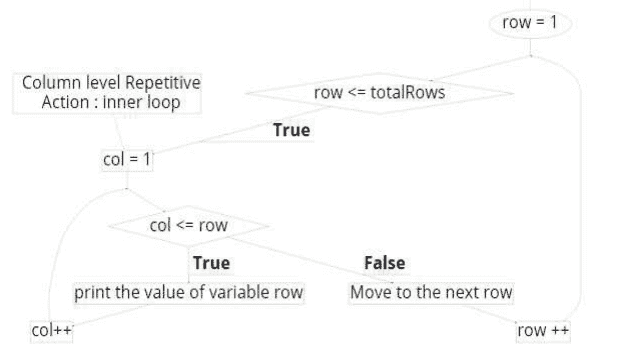

让我们实现这个程序。

## NumberPatternAA.py

```
totalRows = 5  # 要显示的行数

for row in range(1, totalRows + 1):

    for col in range(1, row + 1):

        # 以额外空格结尾，以便在输出中更清晰。
        print(col,end = " ")
    # 结束内层 for 循环

    print()  # 将控制移动到下一行

# 结束外层 for 循环
```

| 输出: totalRows = 5 | 输出: totalRows = 10 |
| --- | --- |
| 1 | 1 |
| 1 2 | 1 2 |
| 1 2 3 | 1 2 3 |
| 1 2 3 4 | 1 2 3 4 |
| 1 2 3 4 5 | 1 2 3 4 5 |
| | 1 2 3 4 5 6 |
| | 1 2 3 4 5 6 7 |
| | 1 2 3 4 5 6 7 8 |
| | 1 2 3 4 5 6 7 8 9 |
| | 1 2 3 4 5 6 7 8 9 10 |

请为不同的行数进行测试。假设为10。它应该能正确工作。

### 数字图案 BB

我们的编程任务是在计算机屏幕的一部分打印这个特定的基于逻辑的图案。**我们的方法将假设计算机屏幕是行和列的组合，实际上将其划分为更小的方框——最小的方框被视为仅容纳单个字符。** 显示屏上每个最小方框中的地址在逻辑上将成为一个唯一的 **(行, 列)** 数字组合。基于这个假设，计算机屏幕将简单地是一个由 (行, 列) 数字值配对的方框组成的唯一组合，这些方框均匀地分布在整个屏幕上。

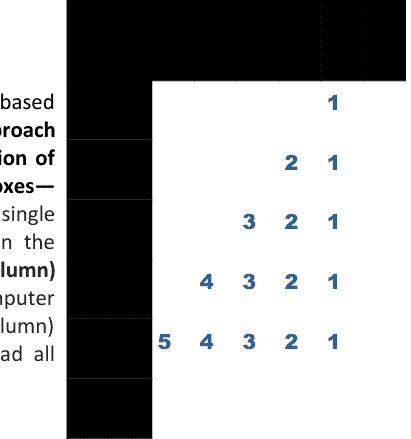

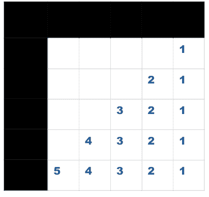

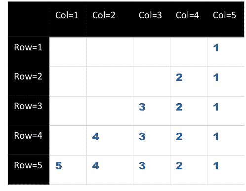

#### 数据表示

尽管这是逻辑上的，但我们可以通过知道每个可打印字符在显示屏上的唯一可识别的 **(行, 列)** 数字配对值来精确定位其位置。*例如；* **(4, 3)** 表示在假设的屏幕位置 **第4行** 和 **第3列** 打印数字字符。

#### (行, 列) 值对表示

| | Col=1 | Col=2 | Col=3 | Col=4 | Col=5 |
|---|---|---|---|---|---|
| **Row=1** | | | | | 1,5 |
| **Row=2** | | | | 2,4 | 2,5 |
| **Row=3** | | | 3,3 | 3,4 | 3,5 |
| **Row=4** | | 4,2 | 4,3 | 4,4 | 4,5 |
| **Row=5** | 5,1 | 5,2 | 5,3 | 5,4 | 5,5 |

#### 输出分析

在这种情况下，我们需要在特定行的特定列打印两种不同类型的字符：

1) 空格字符
2) 数字字符

| 行 | 1 | | | | |
|---|---|---|---|---|---|
| 列 | 1 | 2 | 3 | 4 | 5 |
| 输出 | 空格 | 空格 | 空格 | 空格 | 1 |

对于行 = 1，1 <= 空格数 <= 4，1 >= 数字 >= 1

| 行 | 2 | | | | |
|---|---|---|---|---|---|
| 列 | 1 | 2 | 3 | 4 | 5 |
| 输出 | 空格 | 空格 | 空格 | 2 | 1 |

对于行 = 2，1 <= 空格数 <= 3，2 >= 数字 >= 1

| 行 | 3 | | | | |
|---|---|---|---|---|---|
| 列 | 1 | 2 | 3 | 4 | 5 |
| 输出 | 空格 | 空格 | 3 | 2 | 1 |

对于行 = 3，1 <= 空格数 <= 2，3 >= 数字 >= 1

| 行 | 4 | | | | |
|---|---|---|---|---|---|
| 列 | 1 | 2 | 3 | 4 | 5 |
| 输出 | 空格 | 4 | 3 | 2 | 1 |

对于行 = 4，1 <= 空格数 <= 1，4 >= 数字 >= 1

| 行 | 5 | | | | |
|---|---|---|---|---|---|
| 列 | 1 | 2 | 3 | 4 | 5 |
| 输出 | 5 | 4 | 3 | 2 | 1 |

对于行 = 5，5 >= 数字 >= 1

#### 观察

1) 在垂直方向上，行级别存在重复，即行 = 1 到 5。
2) 在水平方向上，列级别存在重复，即列 = 1 到 5。

这可以分为两部分。一部分用于重复打印空格，剩余的列用于打印数字字符。我们需要探索定义以下给定内层循环所需的未知逻辑表达式。这些在下面的表格中标记为未知。

| 循环 | 下限 | 上限 |
|---|---|---|
| 外层循环 | 行=1 | 行<=5 |
| 内层循环 - 空格 | 空格数=1 | 未知 |
| 内层循环 - 数字 | 未知 | 数字 = 1 |

### 列级别重复操作

| 行级别重复操作 | 预期输出 |
| :--- | :--- |
| **行** | **列级别重复操作** | |
| | **下限 <= 空格数 <= 上限** | **上限 >= 数字 >= 下限** | |
| | **下限** | **上限** | **上限** | **下限** | |
| 行 = 1 | 1 | 4 | 1 | 1 | 1 |
| 行 = 2 | 1 | 3 | 2 | 1 | 2 1 |
| 行 = 3 | 1 | 2 | 3 | 1 | 3 2 1 |
| 行 = 4 | 1 | 1 | 4 | 1 | 4 3 2 1 |
| 行 = 5 | 1 | 0 | 5 | 1 | 5 4 3 2 1 |

空格数和数字变量的下限对于所有行都具有相同的数值表达式。它对所有行都是一致的。同样，我们需要为上限开发一个一致的表达式，使其适用于任意行数。其他剩余变量是**行**和**总行数 = 5**。让我们尝试使用这些变量来泛化**上限**列的数据。

| 行级别重复操作 | | | | | |
| :--- | :--- | :--- | :--- | :--- | :--- |
| **行** | **列级别重复操作** | | | | |
| | **下限 <= 空格数 <= 上限** | | **上限 >= 数字 >= 下限** | | |
| | **下限** | **上限** | | **上限** | **下限** | |
| 行 = 1 | 1 | 4 | 总行数 - 1 | 总行数 - 行 | 1 | 行 | |
| 行 = 2 | 1 | 3 | 总行数 - 2 | 总行数 - 行 | 2 | 行 | |
| 行 = 3 | 1 | 2 | 总行数 - 3 | 总行数 - 行 | 3 | 行 | 1 |
| 行 = 4 | 1 | 1 | 总行数 - 4 | 总行数 - 行 | 4 | 行 | |
| 行 = 5 | 1 | 0 | 总行数 - 5 | 总行数 - 行 | 5 | 行 | |

| 行级别重复操作 | | | | | |
| :--- | :--- | :--- | :--- | :--- | :--- |
| **行** | **列级别重复操作** | | | | |
| | **下限 <= 空格数 <= 上限** | | **上限 >= 数字 >= 下限** | | |
| | **下限** | **上限** | | **上限** | **下限** | |
| 行 = 1 | 1 | 总行数 - 行 | | 行 | | |
| 行 = 2 | 1 | 总行数 - 行 | | 行 | | |
| 行 = 3 | 1 | 总行数 - 行 | 总行数 - 行 | 行 | 行 | 1 |
| 行 = 4 | 1 | 总行数 - 行 | | 行 | | |
| 行 = 5 | 1 | 总行数 - 行 | | 行 | | |

因此，空格数和数字变量的上限被泛化了。下限和上限对于所有行都是一致的。现在它适用于任意行数。由于它有两个重复过程；
a) 一个重复过程用于打印空格。
b) 第二个重复过程用于打印数字值。

因此，我们用于打印空格字符的内层 for 循环条件变为；

| 循环条件 | 下限 <= 列 <= 上限 |
| --- | --- |
| 数学表达式 | 1 <= 列 <= (总行数 - 行) |
| 语法 | for col in range(1, totalRows - row + 1): |

因此，我们用于打印数字字符的内层 for 循环条件变为；

| 循环条件 | 下限 <= 数字 <= 上限 |
| --- | --- |
| 数学表达式 | 1 <= 数字 <= 行 |
| 语法 | for num in range(row, 0, -1): |

流程图可用于总结所有收集到的信息。
如下所示。

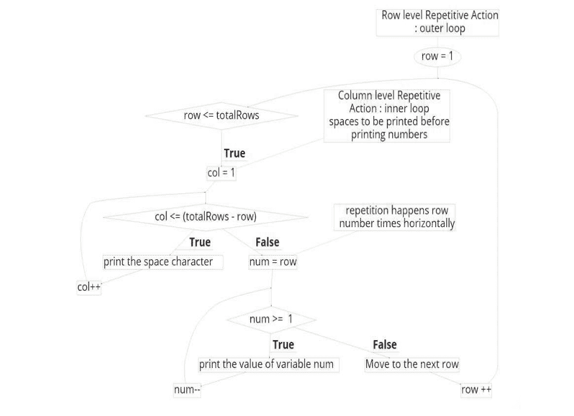

让我们执行以下程序。请为不同的行数进行测试。假设为 7。

```
NumberPatternBB.py
```

```
totalRows = 5  # 要显示的行数

for row in range(1, totalRows + 1):

    # 在打印数字之前要打印的空格
    for col in range(1, totalRows - row + 1):
        print("   ", end="")
    # 内层 for 循环_1 结束
    for num in range(row, 0, -1):
        # 添加了额外的空格以使输出更清晰。
        print(num, " ", end="")
    # 内层 for 循环_2 结束

    print()  # 将控制权移动到下一行

# 外层 for 循环结束
```

输出：总行数 = 5

```
1
2 1
3 2 1
4 3 2 1
5 4 3 2 1
```

输出：总行数 = 7

```
1
2 1
3 2 1
4 3 2 1
5 4 3 2 1
6 5 4 3 2 1
7 6 5 4 3 2 1
```

### 替代解决方案

我们之前观察到，对于行=5，列和数字输出的值只是反转了。让我们设计一个解决方案，通过递减 col 变量的 for 循环（从 5 到 1），这样数字输出将部分或全部与 col 变量的值匹配。

| 行 | 1 | | | | |
|---|---|---|---|---|---|
| 列 | 5 | 4 | 3 | 2 | 1 |
| 输出 | 空格 | 空格 | 空格 | 空格 | 1 |

行 = 1，1 >= 列 >= 1（打印列值）或 行 >= 列 >= 1（打印列值）

| 行 | 2 | | | | |
|---|---|---|---|---|---|
| 列 | 5 | 4 | 3 | 2 | 1 |
| 输出 | 空格 | 空格 | 空格 | 2 | 1 |

行 = 2，2 >= 列 >= 1（打印列值）或 行 >= 列 >= 1（打印列值）

| 行 | 3 | | | | |
|---|---|---|---|---|---|
| 列 | 5 | 4 | 3 | 2 | 1 |
| 输出 | 空格 | 空格 | 3 | 2 | 1 |

行 = 3，3 >= 列 >= 1（打印列值）或 行 >= 列 >= 1（打印列值）

| 行 | 4 | | | | |
|---|---|---|---|---|---|
| 列 | 5 | 4 | 3 | 2 | 1 |
| 输出 | 空格 | 4 | 3 | 2 | 1 |

行 = 4，4 >= 列 >= 1（打印列值）或 行 >= 列 >= 1（打印列值）

| 行 | 5 | | | | |
|---|---|---|---|---|---|
| 列 | 5 | 4 | 3 | 2 | 1 |
| 输出 | 5 | 4 | 3 | 2 | 1 |

行 = 5，5 >= 列 >= 1（打印列值）或 行 >= 列 >= 1（打印列值）

因此，if 条件现在变为 (列 >= 1 且 列 <= 行)。
列 >= 1 是冗余条件，因为它是内层 for 循环中列 = 5 到 1 的下限。
所以，if 条件简化为 (列 <= 行)

| if 条件 | 下限 <= 列 <= 上限 |
|---|---|
| 数学表达式 | 1 <= 列 <= 行 |
| 语法 | if( col <= row ): |

总体观察是，在每一行，要么打印空格字符，要么连续打印列值。很明显，我们可以使用 if-else 语句，因为字符的打印是连续的。让我们更新程序。

```
NumberPatternBB2.py
totalRows = 5  # 要显示的行数

# 行级别重复操作：

for row in range(1, totalRows + 1):
    # 列级别重复操作：
    # 在同一行中，按列打印数字字符。
    for col in range(totalRows, 0, -1):
        if (col <= row):
            print(col, " ", end="")
        else:
            print("   ", end="")
    # 内层 for 循环结束

    print()  # 将控制权移动到下一行
# 外层 for 循环结束
```

输出

```
        1
      2 1
    3 2 1
  4 3 2 1
5 4 3 2 1
```

### 数字模式 CC

我们的编程任务是在计算机屏幕的一部分打印这个特定的基于逻辑的模式。**我们的方法将假设计算机屏幕是行和列的组合，虚拟地将其划分为更小的方框**——最小的方框被视为仅包含一个字符。显示屏上每个最小方框中的地址在逻辑上将成为一个唯一的**（行，列）**数字组合。基于这个假设，计算机屏幕将简单地是一个唯一的（行，列）数字值配对方框的组合，这些方框均匀地分布在整个屏幕上。

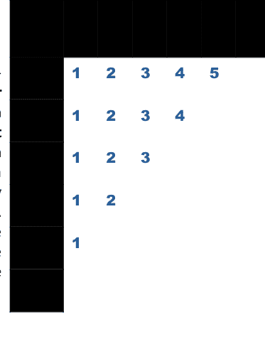

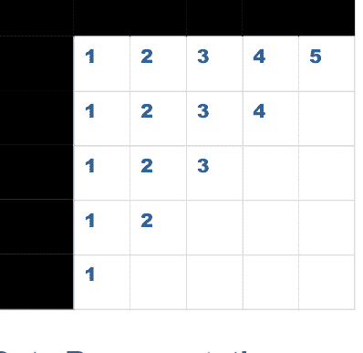

| | 列=1 | 列=2 | 列=3 | 列=4 | 列=5 |
|---|---|---|---|---|---|
| 行=1 | | | | | 1 |
| 行=2 | | | | 2 | 1 |
| 行=3 | | | 3 | 2 | 1 |
| 行=4 | | 4 | 3 | 2 | 1 |
| 行=5 | 5 | 4 | 3 | 2 | 1 |

#### 数据表示

尽管这是合乎逻辑的，但我们可以通过知道每个可打印字符在显示屏上的唯一可识别的**（行，列）**数字配对值来精确定位其位置。**例如；** **(2, 3)** 表示在假定的屏幕位置**第 2 行**和**第 3 列**打印数字字符。

#### （行，列）值对表示

| | 列=1 | 列=2 | 列=3 | 列=4 | 列=5 |
|---|---|---|---|---|---|
| 行=1 | 1,1 | 1,2 | 1,3 | 1,4 | 1,5 |
| 行=2 | 2,1 | 2,2 | 2,3 | 2,4 | |
| 行=3 | 3,1 | 3,2 | 3,3 | | |
| 行=4 | 4,1 | 4,2 | | | |
| 行=5 | 5,1 | | | | |

#### 输出分析

让我们通过应用一个递增的 for 循环，使用 **变量：col**（1 到 5）的值范围来设计一个解决方案。数值输出可能部分或全部与 col 变量的值匹配。因此，**if 条件**可以使用 col 变量来表达。

| 行 | 1 | | | | |
|---|---|---|---|---|---|
| 列 | 1 | 2 | 3 | 4 | 5 |
| 输出 | 1 | 2 | 3 | 4 | 5 |

行 =1 , 1 <=列 <= 5 (打印列值)

| 行 | 2 | | | | |
|---|---|---|---|---|---|
| 列 | 1 | 2 | 3 | 4 | 5 |
| 输出 | 1 | 2 | 3 | 4 | |

行 = 2 , (1 <=列 <= 4) (打印列值)

| 行 | 3 | | | | |
|---|---|---|---|---|---|
| 列 | 1 | 2 | 3 | 4 | 5 |
| 输出 | 1 | 2 | 3 | | |

行 = 3 , (1 <=列 <= 3) (打印列值)

| 行 | 4 | | | | |
|---|---|---|---|---|---|
| 列 | 1 | 2 | 3 | 4 | 5 |
| 输出 | 1 | 2 | | | |

行 = 4 , (1 <=列 <= 2) (打印列值)

| 行 | 5 | | | | |
|---|---|---|---|---|---|
| 列 | 1 | 2 | 3 | 4 | 5 |
| 输出 | 1 | | | | |

行 = 5 , (1 <=列 <= 1) (打印列值)

### 列级重复操作

| 行级重复操作 | 预期输出 |
|---|---|
| 行 | 列级重复操作 |
| | If 条件( 下限 <=列<= 上限) |
| | 下限 | 上限 |
| 1 | 1 | 5 | 1 2 3 4 5 |
| 2 | 1 | 4 | 1 2 3 4 |
| 3 | 1 | 3 | 1 2 3 |
| 4 | 1 | 2 | 1 2 |
| 5 | 1 | 1 | 1 |

下限对于所有行具有相同的数值表达式。它对所有行都是一致的。同样，我们需要为 *上限* 开发一个一致的表达式，使其适用于任意行数。考虑的变量是行，总行数=5。让我们尝试使用变量将上限列的数值序列概括为一个逻辑表达式。

由于对所有行值都一致，列变量的下限被概括为值 1。

| 行 | 列级重复操作 |
|---|---|
| | If 条件( 下限 <=列<= 上限) |
| | 下限 | 上限 |
| 1 | 5 | (总行数 +1) - 1 | (总行数 +1) - 行 |
| 2 | 4 | 总行数 -1 | (总行数 +1) - 2 | (总行数 +1) - 行 |
| 3 | 1 | 3 | 总行数 - 2 | (总行数 +1) - 3 | (总行数 +1) - 行 | (总行数+1) - 行 |
| 4 | 2 | 总行数 - 3 | (总行数 +1) - 4 | (总行数 +1) - 行 |
| 5 | 1 | 总行数 - 4 | (总行数 +1) - 5 | (总行数 +1) - 行 |

因此，列变量的上限被概括为 (总行数 + 1 – 行)。这样，下限和上限对所有行都是一致的。现在它适用于任意行数。所以，我们的 If 条件变为；

| if 条件 | 下限 <=列<= 上限 |
|---|---|
| 数学表达式 | 1 <= 列 <= ( (总行数 +1) - 行 ) |
| 语法 | if (col >= 1 and col <= (totalRows + 1 - row)): |

我们可以将我们的发现总结在下面给出的流程图中。

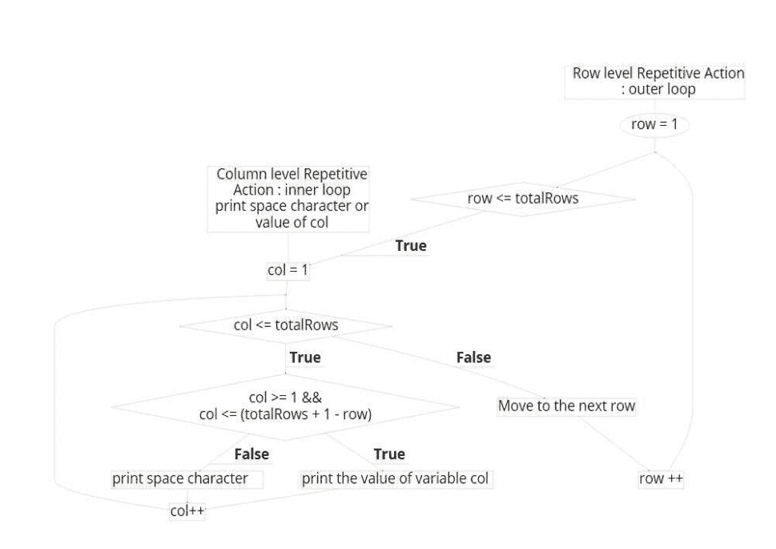

让我们实现这个程序。

```
NumberPatternCC1.py
```

```
totalRows = 5  # 要显示的行数

# 行级重复操作：
for row in range(1, totalRows + 1):

    # 列级重复操作：
    # 打印同一行中的字符
    # 在打印数字之前要打印的空格
    for col in range(1, totalRows + 1):

        if (col >= 1 and col <= (totalRows + 1 - row)):
            print(col, end=" ")
        else:
            print(" ", end=" ")

    # 内部 for 循环结束

    print()  # 将控制移到下一行

# 外部 for 循环结束
```

```
输出
```

```
1 2 3 4 5
1 2 3 4
1 2 3
1 2
1
```

内部 for 循环的 *下限* 与 if 条件的下限匹配。

```
for col in range(1, totalRows + 1):
    if (col >= 1 and col <= (totalRows + 1 - row)):
```

我们可以在 if 条件中忽略 *下限*，因为它变成了一个冗余条件，因为它已经在内部 for 循环的 *下限* 中被考虑到了。因此，我们最终的 if 条件可以给出为；

| if 条件 | 下限 <=列<= 上限 |
|---|---|
| 数学表达式 | 列 <= ( (总行数 +1) - 行 ) |
| 语法 | if (col <= (totalRows + 1 - row)): |

```
NumberPatternCC2.py
```

```
totalRows = 5  # 要显示的行数

#  行级重复操作：
for row in range(1, totalRows + 1):

    # 列级重复操作：
    # 打印同一行中的字符

    # 在打印数字之前要打印的空格
    for col in range(1, totalRows + 1):

        if (col <= (totalRows + 1 - row)):
            print(col, end = " ")
        else:
            print(" ", end = " ")

            # 内部 for 循环结束

    print()  # 将控制移到下一行
# 外部 for 循环结束
```

```
输出
```

```
1 2 3 4 5
1 2 3 4
1 2 3
1 2
1
```

进一步，通过利用先前获得的跟踪表，从行值和列值的上限中减去 1 来简化。

| 列级重复操作 | | | | |
| :--- | :--- | :--- | :--- | :--- |
| **行** | | **列** | | |
| | **1** | **下限** | **上限** | |
| | | | **1** | **2** |
| 1 -1 | 0 | 1 | (总行数 +1) – 行 - 1 | (总行数 – 行 ) |
| 2 - 1 | 1 | 1 | (总行数 +1) – 行 - 1 | (总行数 – 行 ) |
| 3 -1 | 2 | 1 | (总行数 +1) – 行 - 1 | (总行数 – 行 ) |
| 4 - 1 | 3 | 1 | (总行数 +1) – 行 - 1 | (总行数 – 行 ) |
| 5 - 1 | 4 | 1 | (总行数 +1) – 行 - 1 | (总行数 – 行 ) |

| | |
| :--- | :--- |
| **if 条件** | 下限 <=列<= 上限 |
| **数学表达式** | 列 <= ( 总行数 – 行 ) |
| **语法** | `if( col <= (totalRows - row) ):` |

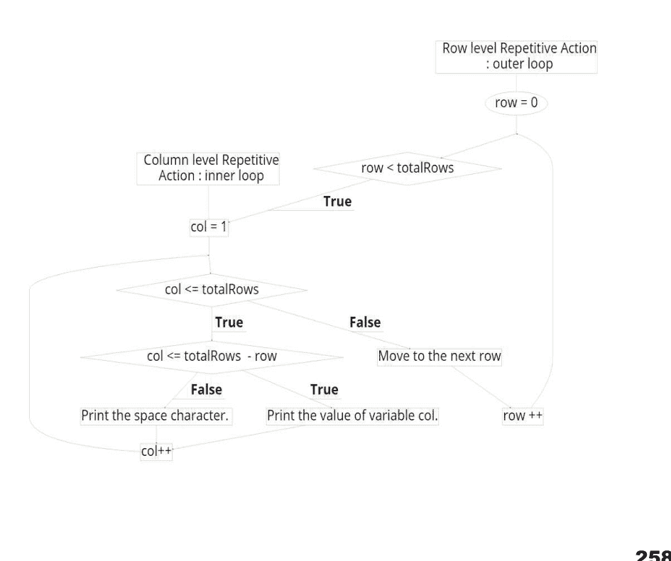

让我们用我们最新的逻辑条件修改来更新程序。

```
NumberPatternCC3.py
```

```
totalRows = 5  # 要显示的行数

# 行级重复操作：
for row in range(0, totalRows):

    # 列级重复操作：
    # 打印同一行中的字符

    # 在打印数字之前要打印的空格
    for col in range(1, totalRows + 1):

        if (col <= (totalRows - row)):
            print(col, end = " ")
        else:
            print(" ", end = " ")

    #内部 for 循环结束

    print()  # 将控制移到下一行

#外部 for 循环结束
```

```
输出
```

```
1 2 3 4 5
1 2 3 4
1 2 3
1 2
1
```

### 数字模式 DD

我们的编程任务是在计算机屏幕的一部分打印这个特定的基于逻辑的模式。**我们的方法将假设计算机屏幕是行和列的组合，虚拟地将其划分为更小的方框——** 最小的方框被视为仅容纳单个字符。显示屏上每个最小方框中的地址在逻辑上将成为一个唯一的 **(行, 列)** 数字组合。基于这个假设，计算机屏幕将简单地是一个唯一的 (行, 列) 数字值配对方框的组合，这些方框均匀地分布在整个屏幕上。

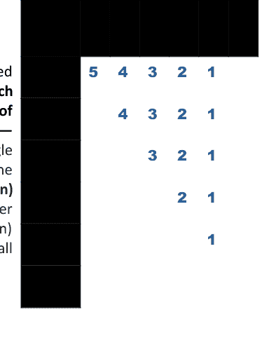

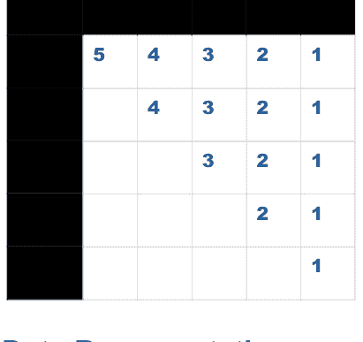

| | 列=1 | 列=2 | 列=3 | 列=4 | 列=5 |
|---|---|---|---|---|---|
| **行=1** | 5 | 4 | 3 | 2 | 1 |
| **行=2** | | 4 | 3 | 2 | 1 |
| **行=3** | | | 3 | 2 | 1 |
| **行=4** | | | | 2 | 1 |
| **行=5** | | | | | 1 |

#### 数据表示

尽管它是合乎逻辑的，但我们可以通过知道每个可打印字符在显示屏上的唯一可识别的 **(行, 列)** 数字配对值来精确定位其位置。**例如；** **(4, 5)** 意味着在假定的屏幕位置 **第4行** 和 **第5列** 打印数字字符。

#### (行, 列) 值对表示

| | 列=1 | 列=2 | 列=3 | 列=4 | 列=5 |
|---|---|---|---|---|---|
| **行=1** | 1,1 | 1,2 | 1,3 | 1,4 | 1,5 |
| **行=2** | | 2,2 | 2,3 | 2,4 | 2,5 |
| **行=3** | | | 3,3 | 3,4 | 3,5 |
| **行=4** | | | | 4,4 | 4,5 |
| **行=5** | | | | | 5,5 |

#### 输出分析

让我们对 col 变量应用递减的 for 循环（5 到 1）或（5 >=列>=1），这样数值输出将部分或全部与 **变量：列** 的值匹配。

| 行 | 1 | | | | |
|---|---|---|---|---|---|
| 列 | 5 | 4 | 3 | 2 | 1 |
| 输出 | 5 | 4 | 3 | 2 | 1 |

行 =1 , 5 >=列>=1 (打印列值)

| 行 | 2 | | | | |
|---|---|---|---|---|---|
| 列 | 5 | 4 | 3 | 2 | 1 |
| 输出 | | 4 | 3 | 2 | 1 |

行 =2 , 4 >=列>=1 (打印列值)

| 行 | 3 | | | | |
|---|---|---|---|---|---|
| 列 | 5 | 4 | 3 | 2 | 1 |
| 输出 | | | 3 | 2 | 1 |

行 =3 , 3 >=列>=1 (打印列值)

| 行 | 4 | | | | |
|---|---|---|---|---|---|
| 列 | 5 | 4 | 3 | 2 | 1 |
| 输出 | | | | 2 | 1 |

行 =4 , 2>=列>=1 (打印列值)

| 行 | 5 | | | | |
|---|---|---|---|---|---|
| 列 | 5 | 4 | 3 | 2 | 1 |
| 输出 | | | | | 1 |

行 =5 , 1>=列 >= 1 (打印列值)

### 列级重复操作

| 行级重复操作 | 预期输出 |
|---|---|
| 行 | 列级重复操作 | |
| | 上限 >=列>= 下限 | |
| | 下限 | 上限 | |
| 1 | 1 | 5 | 5 4 3 2 1 |
| 2 | 1 | 4 | 4 3 2 1 |
| 3 | 1 | 3 | 3 2 1 |
| 4 | 1 | 2 | 2 1 |
| 5 | 1 | 1 | 1 |

下限对于所有行具有与数值相同的一致表达式。

同样，我们需要为上限开发一个一致的表达式，使其适用于任意行数。可用的变量是行和总行数 = 5。让我们尝试使用变量将上限列的数值序列概括为一个有效的逻辑表达式。

## NumberPatternDD1.py

```
totalRows = 5  # 要显示的行数

# 行级重复操作：
for row in range(1, totalRows + 1):

    # 列级重复操作：
    # 在同一行中打印数字或空格字符
    # 在打印数字之前先打印空格
    for col in range(totalRows, 1 - 1, -1):

        if (col >= 1 and col <= (totalRows + 1 - row)):
            print(col, end= " ")
        else:
            print(" " , end= " ")

            # 结束内层 for 循环

    print()  # 将控制移到下一行

# 结束外层 for 循环
```

### 输出

```
5 4 3 2 1
 4 3 2 1
  3 2 1
   2 1
    1
```

递减的内层 for 循环的下限与 if 条件的下限相匹配。

```
for col in range(totalRows, 1 - 1, -1):

    if (col >= 1 and col <= (totalRows + 1 - row)):
```

我们可以安全地忽略 if 条件中关于**下限**的逻辑表达式，因为它已经由相关 for 循环的**下限**处理了。因此，我们最终的 **if 条件**将是：

| if 条件 | upper_limit >=col>= lower_limit |
| --- | --- |
| 数学表达式 | col <= ( (totalRows +1) - row ) |
| 语法 | if( col <= (totalRows + 1 - row ) ) : |

## NumberPatternDD2.py

```
totalRows = 5  # 要显示的行数

# 行级重复操作：
for row in range(1, totalRows + 1):

    # 列级重复操作：
    # 在同一行中打印数字或空格字符
    # 在打印数字之前先打印空格
    for col in range(totalRows, 0, -1):

        if (col <= (totalRows + 1 - row)):
            print(col, end = " ")
        else:
            print(" " , end = " ")

            # 结束内层 for 循环

    print()  # 将控制移到下一行
    # 结束外层 for 循环
```

此外，通过减去 1 来简化上限，如下所示

| 列级重复操作 | | | | |
| :--- | :--- | :--- | :--- | :--- |
| 行 | | upper_limit >=col>= lower_limit | | |
| | 下限 | | 上限 | |
| 1 - 1 | 0 | 1 | (totalRows +1) – row - 1 | (totalRows – row ) |
| 2 - 1 | 1 | 1 | (totalRows +1) – row - 1 | (totalRows – row ) |
| 3 - 1 | 2 | 1 | (totalRows +1) – row - 1 | (totalRows – row ) |
| 4 - 1 | 3 | 1 | (totalRows +1) – row - 1 | (totalRows – row ) |
| 5 - 1 | 4 | 1 | (totalRows +1) – row - 1 | (totalRows – row ) |

因此，我们改进后的 if 条件将是：

| if 条件 | upper_limit >=col>= lower_limit |
| :--- | :--- |
| 数学表达式 | col <= ( (totalRows - row ) |
| 语法 | if( col <= (totalRows - row) ): |

此修改可以轻松地在流程图中表示。

更新后的最终解决方案可以用以下程序表示。

```
NumberPatternDD3.py
totalRows = 5  # 要显示的行数

# 行级重复操作：
for row in range(0, totalRows):

    # 列级重复操作：
    # 在同一行中打印数字或空格字符
    # 在打印数字之前先打印空格
    for col in range(totalRows, 0, -1):

        if (col <= (totalRows - row)):
            print(col,end = " ")
        else:
            print(" ", end = " ")

    # 将控制移到下一行
    print()
```

```
输出
5 4 3 2 1
 4 3 2 1
  3 2 1
   2 1
    1
```

### NumberPattern EE

我们的编程任务是在计算机屏幕的某个部分打印这个特定的基于逻辑的图案。**我们的方法是假设计算机屏幕是行和列的组合，虚拟地将其划分为更小的方框**——最小的方框被视为仅容纳单个字符。显示屏上每个最小方框的地址在逻辑上将成为一个唯一的 **(行, 列)** 数字组合。基于这个假设，计算机屏幕将简单地是一个唯一的 (行, 列) 数字值配对方框的组合，这些方框均匀地分布在整个屏幕上。

| | 列=1 | 列=2 | 列=3 | 列=4 | 列=5 | 列=6 | 列=7 | 列=8 | 列=9 |
|---|---|---|---|---|---|---|---|---|---|
| 行=1 | | | | | 1 | | | | |
| 行=2 | | | | 2 | 1 | 2 | | | |
| 行=3 | | | 3 | 2 | 1 | 2 | 3 | | |
| 行=4 | | 4 | 3 | 2 | 1 | 2 | 3 | 4 | |
| 行=5 | 5 | 4 | 3 | 2 | 1 | 2 | 3 | 4 | 5 |

#### 数据表示

虽然这是合乎逻辑的，但我们可以通过知道每个可打印字符在显示屏上的唯一可识别的 **(行, 列)** 数字配对值来精确定位其位置。**例如；(4, 3)** 表示在假定的屏幕位置**第 4 行和第 3 列**打印数字字符。

#### (行, 列) 值对表示

| | 列=1 | 列=2 | 列=3 | 列=4 | 列=5 | 列=6 | 列=7 | 列=8 | 列=9 |
|---|---|---|---|---|---|---|---|---|---|
| 行=1 | | | | | 1, 5 | | | | |
| 行=2 | | | | 2, 4 | 2, 5 | 2, 6 | | | |
| 行=3 | | | 3, 3 | 3, 4 | 3, 5 | 3, 6 | 3, 7 | | |
| 行=4 | | 4, 2 | 4, 3 | 4, 4 | 4, 5 | 4, 6 | 4, 7 | 4, 8 | |
| 行=5 | 5, 1 | 5, 2 | 5, 3 | 5, 4 | 5, 5 | 5, 6 | 5, 7 | 5, 8 | 5, 9 |

#### 输出分析

| 行 | 1 | | | | | | | | |
|---|---|---|---|---|---|---|---|---|---|
| 列 | 1 | 2 | 3 | 4 | 5 | 6 | 7 | 8 | 9 |
| 输出 | | | | | 1 | | | | |

对于行 = 1，5 <=列 <= 5

| 行 | 2 | | | | | | | | |
|---|---|---|---|---|---|---|---|---|---|
| 列 | 1 | 2 | 3 | 4 | 5 | 6 | 7 | 8 | 9 |
| 输出 | | | | 2 | 1 | 2 | | | |

对于行 = 2，4 <=列 <= 6

| 行 | 3 | | | | | | | | |
|---|---|---|---|---|---|---|---|---|---|
| 列 | 1 | 2 | 3 | 4 | 5 | 6 | 7 | 8 | 9 |
| 输出 | | | 3 | 2 | 1 | 2 | 3 | | |

对于行 = 3，3 <=列 <= 7

| 行 | 4 | | | | | | | | |
|---|---|---|---|---|---|---|---|---|---|
| 列 | 1 | 2 | 3 | 4 | 5 | 6 | 7 | 8 | 9 |
| 输出 | | 4 | 3 | 2 | 1 | 2 | 3 | 4 | |

对于行 = 4，2 <=列 <= 8

| 行 | 5 | | | | | | | | |
|---|---|---|---|---|---|---|---|---|---|
| 列 | 1 | 2 | 3 | 4 | 5 | 6 | 7 | 8 | 9 |
| 输出 | 5 | 4 | 3 | 2 | 1 | 2 | 3 | 4 | 5 |

对于行 = 5，1 <=列 <= 9

### 列级重复操作

| 行级重复操作 | 预期输出 |
|---|---|
| 行 | 列级重复操作 | |
| | lower_limit <= col <= upper_limit | |
| | 范围 | 下限 | 上限 | |
| 行 = 1 | 5 <=列 <= 5 | 5 | 5 | 1 |
| 行 = 2 | 4 <=列 <= 6 | 4 | 6 | 2 1 2 |
| 行 = 3 | 3 <=列 <= 7 | 3 | 7 | 3 2 1 2 3 |
| 行 = 4 | 2 <=列 <= 8 | 2 | 8 | 4 3 2 1 2 3 4 |
| 行 = 5 | 1 <=列 <= 9 | 1 | 9 | 5 4 3 2 1 2 3 4 5 |

下限和上限对于所有行都不一致。我们需要为上限和下限开发一致的表达式，这些表达式应适用于任意行数。其他剩余的变量是 **行**，**totalRows = 5**。让我们尝试使用变量将下限和上限列的数字序列概括为一个有效的逻辑表达式。

## NumberPatternEE.py

```
totalRows = 8  # 要显示的行数

    # 行级重复操作：
for row in range(1, totalRows + 1):

        # 列级总重复次数等于 (2 * totalRows - 1)。
    num = row
        # 列级重复操作：
        # 在同一行中打印数字或空格字符
        # 在打印数字之前需要打印空格
    for col in range(1, 2 * totalRows):

        if (col >= ((totalRows - row) + 1) and col <= ((totalRows + row) - 1)):

            if (col < totalRows):
                # 前半部分三角形
                print(num, end=" ")
                num = num - 1
            elif (col >= totalRows):
                # 后半部分三角形
                print(num, end=" ")
                num = num + 1

        else:
            print(" " , end=" ")
    # 结束内层 for 循环

    print()  # 将控制移到下一行

    # 结束外层 for 循环
```

### 输出

```
        1
      2 1 2
    3 2 1 2 3
  4 3 2 1 2 3 4
5 4 3 2 1 2 3 4 5
6 5 4 3 2 1 2 3 4 5 6
7 6 5 4 3 2 1 2 3 4 5 6 7
8 7 6 5 4 3 2 1 2 3 4 5 6 7 8
```

*ProblemGBEE*: 为以下输出编写一个逻辑追踪表和程序。

```
        5
      4 5 6
    3 4 5 6 7
  2 3 4 5 6 7 8
1 2 3 4 5 6 7 8 9
```

### NumberPattern FF

我们的编程任务是在计算机屏幕的一部分打印这个特定的基于逻辑的图案。**我们的方法是假设计算机屏幕是行和列的组合，虚拟地将其划分为更小的方框**——最小的方框被视为仅容纳单个字符。显示屏上每个最小方框的地址在逻辑上将成为一个唯一的 **(行, 列)** 数字组合。基于这个假设，计算机屏幕将简单地是一个由 (行, 列) 数字值配对的方框组成的唯一组合，这些方框均匀地分布在整个屏幕上。

| | 列=1 | 列=2 | 列=3 | 列=4 | 列=5 | 列=6 | 列=7 | 列=8 | 列=9 |
|---|---|---|---|---|---|---|---|---|---|
| 行=1 | 1 | 2 | 3 | 4 | 5 | 4 | 3 | 2 | 1 |
| 行=2 | 1 | 2 | 3 | 4 | | 4 | 3 | 2 | 1 |
| 行=3 | 1 | 2 | 3 | | | | 3 | 2 | 1 |
| 行=4 | 1 | 2 | | | | | | 2 | 1 |
| 行=5 | 1 | | | | | | | | 1 |

#### 数据表示

尽管这是逻辑上的，但我们可以通过知道每个可打印字符在显示屏上的唯一可识别的 **(行, 列)** 数字配对值来精确定位其位置。**例如；(2, 3)** 表示在假设的屏幕位置 **第2行和第3列** 打印字符。

#### (行, 列) 值对表示

| | 列=1 | 列=2 | 列=3 | 列=4 | 列=5 | 列=6 | 列=7 | 列=8 | 列=9 |
|---|---|---|---|---|---|---|---|---|---|
| 行=1 | (1,1) 1 | (1,2) 2 | (1,3) 3 | (1,4) 4 | (1,5) 5 | (1,6) 4 | (1,7) 3 | (1,8) 2 | (1,9) 1 |
| 行=2 | (2,1) 1 | (2,2) 2 | (2,3) 3 | (2,4) 4 | 2,5 空格 | (2,6) 4 | (2,7) 3 | (2,8) 2 | (2,9) 1 |
| 行=3 | (3,1) 1 | (3,2) 2 | (3,3) 3 | 3,4 空格 | 3,5 空格 | 3,6 空格 | (3,7) 3 | (3,8) 2 | (3,9) 1 |
| 行=4 | (4,1) 1 | (4,2) 2 | 4,3 空格 | 4,4 空格 | 4,5 空格 | 4,6 空格 | 4,7 空格 | (4,8) 2 | (4,9) 1 |
| 行=5 | (5,1) 1 | 5,2 空格 | 5,3 空格 | 5,4 空格 | 5,5 空格 | 5,6 空格 | 5,7 空格 | 5,8 空格 | (5,9) 1 |

#### 输出分析

通常，会发生三个重复操作。

- a) 从1开始以递增顺序打印数字。
- b) 打印空格。
- c) 以递减顺序打印数字，其上限将从最后更新的递增值开始。

### 列级重复操作

| 行 | 列级重复操作 | | |
| :--- | :--- | :--- | :--- |
| | 变量 :numInc | 变量 :space (空格计数) | 变量 :numDec |
| 1 | 1, 2 ,3 ,4, 5 | 0(无空格) | 4, 3, 2, 1 |
| 2 | 1, 2, 3, 4 | 1 | 4, 3, 2, 1 |
| 3 | 1, 2, 3 | 1,2,3 | 3, 2, 1 |
| 4 | 1, 2 | 1,2,3,4,5 | 2, 1 |
| 5 | 1 | 1,2,3,4,5,6,7 | 1 |

| 行 | 列级重复操作 | | | | | |
| :--- | :--- | :--- | :--- | :--- | :--- | :--- |
| | 变量 :numInc | | 变量 :space | | 变量 :numDec | |
| | 下限 | 上限 | 下限 | 上限 | 上限 | 下限 |
| 1 | 1 | 5 | 0 | 0 | 4 | 1 |
| 2 | 1 | 4 | 1 | 1 | 4 | 1 |
| 3 | 1 | 3 | 1 | 3 | 3 | 1 |
| 4 | 1 | 2 | 1 | 5 | 2 | 1 |
| 5 | 1 | 1 | 1 | 7 | 1 | 1 |

我们知道变量 totalRows=5 给出了总行数。我们需要进行概括以获得一个唯一的表达式。变量 numInc 和 numDec 的上限可以用变量 totalRows 来表示。变量 numInc 和 numDec 的下限已经概括好了。

| 行 | 列级重复操作 | | | | | |
| :--- | :--- | :--- | :--- | :--- | :--- | :--- |
| | 变量 :numInc | | 变量 :space | | 变量 :numDec | |
| | 下限 | 上限 | 下限 | 上限 | 上限 | 下限 |
| | | 1 | | | 1 | |
| 1 | | totalRows - 0 | 0 | 0 | totalRows - 1 | |
| 2 | | totalRows - 1 | 1 | 1 | totalRows - 1 | |
| 3 | 1 | totalRows - 2 | 1 | 3 | totalRows - 2 | 1 |
| 4 | | totalRows - 3 | 1 | 5 | totalRows - 3 | |
| 5 | | totalRows - 4 | 1 | 7 | totalRows - 4 | |

如果我们从0而不是1开始取行变量值，这将有助于我们概括变量 numInc 和 numDec 的上限。让我们尝试使用变量：row 来概括这两个。

### 行级重复操作

| 行 | 列级重复操作 | | | | | |
| :--- | :--- | :--- | :--- | :--- | :--- | :--- |
| | **变量 :numInc** | | **变量 :space** | | **变量 :numDec** | |
| | **下限** | **上限** | **下限** | **上限** | **上限** | **下限** |
| | | **1** | | | **1** | |
| 行 = 0 | | totalRows - 0 | 0 | 0 | totalRows - 1 | |
| 行 = 1 | | totalRows - 1 | 1 | 1 | totalRows - 1 | |
| 行 = 2 | 1 | totalRows - 2 | 1 | 3 | totalRows - 2 | 1 |
| 行 = 3 | | totalRows - 3 | 1 | 5 | totalRows - 3 | |
| 行 = 4 | | totalRows - 4 | 1 | 7 | totalRows - 4 | |

变量 **numInc** 和 **numDec** 的 **上限** 部分与行变量的数值模式相匹配。因此，我们可以使用行变量来概括表达式。

| 行 | 列级重复操作 | | | | | |
| :--- | :--- | :--- | :--- | :--- | :--- | :--- |
| | **变量 :numInc** | | **变量 :space** | | **变量 :numDec** | |
| | **下限** | **上限** | **下限** | **上限** | **上限** | **下限** |
| | | **1** | | | **1** | |
| 行 = 0 | | totalRows - 行 | 0 | 0 | totalRows - 1 | |
| 行 = 1 | | totalRows - 行 | 1 | 1 | totalRows - 行 | |
| 行 = 2 | 1 | totalRows - 行 | 1 | 3 | totalRows - 行 | 1 |
| 行 = 3 | | totalRows - 行 | 1 | 5 | totalRows - 行 | |
| 行 = 4 | | totalRows - 行 | 1 | 7 | totalRows - 行 | |

对于变量 **numDec** 的上限，我们得到了两个表达式。需要通过设置一个条件，根据行变量的值来切换表达式。让我们使用一个临时变量 **ul_numDec** 来表示 **变量:numDec** 的上限；那么它可以表示为：

```
变量: ul_numDec

if(row == 0 )
    ul_numDec 是 ( totalRows – 1)
else
    ul_numDec 是 (totalRows - row).
```

| 行 | 列级重复操作 | | | | | |
| :--- | :--- | :--- | :--- | :--- | :--- | :--- |
| | **变量 :numInc** | | **变量 :space** | | **变量 :numDec** | |
| | **下限** | **上限** | **下限** | **上限** | **上限** | **下限** |
| | | **1** | | | **1** | |
| 行 = 0 | | | 0 | 0 | ul_numDec | |
| 行 = 1 | | | 1 | 1 | ul_numDec | |
| 行 = 2 | 1 | totalRows - 行 | 1 | 3 | ul_numDec | 1 |
| 行 = 3 | | | 1 | 5 | ul_numDec | |
| 行 = 4 | | | 1 | 7 | ul_numDec | |

到目前为止，我们可以概括变量 **numInc** 和 **numDec**，因为它们的下限和上限对于所有行值都显示相同的表达式。
现在剩下的是要概括变量 **spaces** 的 **上限**。

| 列级重复操作 | | | | | | |
| --- | --- | --- | --- | --- | --- | --- |
| 行 | 变量: space | | | | | |
| | 下限 | | | 上限 | | |
| | | 1 | 2 | 3 | 4 | 5 |
| 0 | 0 | 0 | 0 | 0 | 0 | 0 |
| 1 | 1 | 1 | 1 | 1 + 1 - 1 | 2*1 - 1 | 2*行 -1 |
| 2 | 1 | 3 | 2 + 1 | 2 + 2 - 1 | 2*2 - 1 | 2*行 -1 |
| 3 | 1 | 5 | 3 + 2 | 3 + 3 - 1 | 2*3 - 1 | 2*行 -1 |
| 4 | 1 | 7 | 4 + 3 | 4 + 4 - 1 | 2*4 - 1 | 2*行 -1 |

对于 **行 = 0** 时变量 **space** 的上限，其值将是 (2*0 – 1) 或 -1。变量 **space** 在 **行 = 0** 时的下限值也是 **0**，因此循环条件 (0 < -1) 将失败，不会打印任何空格。即使对于 **循环条件** (1 < -1) 也是如此。因此，我们能够得到下限和上限的通用表达式。

| 循环条件 | 下限 <= space <= 上限 |
| --- | --- |
| 数学表达式 | 1 <= space <= (2* 行 - 1) |
| 语法 | for( space = 1; space <= ( 2* 行 - 1 ); space++)) |

这一次，我们能够概括逻辑表达式；否则，我们需要像为变量 **numDec** 使用临时变量 **ul_numDec** 那样，遵循 **if-else 条件**。

### 替代解决方案

| 行级重复操作 | | | | | |
| --- | --- | --- | --- | --- | --- |
| 行 | 列级重复操作 | | | | |
| | 变量: col | 变量: col | | 变量: col | |
| | 打印数字 | 打印空格 | | 打印数字 | |
| 1 | 1, 2, 3, 4 | 打印5(无空格) | 6, 7, 8, 9 | 4, 3, 2, 1 | |
| 2 | 1, 2, 3, 4 | 5 | 6, 7, 8, 9 | 4, 3, 2, 1 | |
| 3 | 1, 2, 3 | 4, 5, 6 | 7, 8, 9 | 3, 2, 1 | |
| 4 | 1, 2 | 3, 4, 5, 6, 7 | 8, 9 | 2, 1 | |
| 5 | 1 | 2, 3, 4, 5, 6, 7, 8 | 9 | 1 | |

| 行级重复操作 | | | | | | | |
| --- | --- | --- | --- | --- | --- | --- | --- |
| 行 | 列级重复操作 | | | | | | |
| | 变量: col | 变量: col | | 变量: col | | | |
| | 打印数字 | 打印空格 | | 打印数字 | | | |
| | 下限 | 上限 | 下限 | 上限 | 下限 | 上限 | 输出 |
| 1 | 1 | 4 | 打印5(无空格) | | 6 | 9 | 4, 3, 2, 1 |
| 2 | 1 | 4 | 5 | 5 | 6 | 9 | 4, 3, 2, 1 |
| 3 | 1 | 3 | 4 | 6 | 7 | 9 | 3, 2, 1 |
| 4 | 1 | 2 | 3 | 7 | 8 | 9 | 2, 1 |
| 5 | 1 | 1 | 2 | 8 | 9 | 9 | 1 |

在第一行（即行=1）打印字符时，此模式不需要打印任何空格。因此，为了初始化，我们可以将其上限值设为 -1，下限值设为 0。如果我们观察打印空格的情况，其数值模式是：除了第一行外，每一行的下限值都小于上限值。这将有助于使条件失败，从而我们无法在第一行打印空格。这正是我们需要的。

此外，用无效数据初始化变量以验证编程逻辑的有效性是一种常见做法，无论该编程逻辑何时执行。我们进行编程模式练习，以便能够根据变量的值可视化数据流。这些变量实际上充当了检查点，用于判断逻辑是否按预期执行，而这正是我们进行编程模式练习的目的。

| 行级重复操作 | | | | | | | |
|---|---|---|---|---|---|---|---|
| 行 | 列级重复操作 | | | | | | |
| | 变量: col | | 变量: col | | 变量: col | | |
| | 打印数字 | | 打印空格 | | 打印数字 | | |
| | 下限 | 上限 | 下限 | 上限 | 下限 | 上限 | 输出 |
| 1 | 1 | totalRows - 1 | 0 | -1 | 6 | 9 | 4, 3, 2, 1 |
| 2 | 1 | totalRows - 1 | totalRows - 0 | totalRows + 0 | 6 | 9 | 4, 3, 2, 1 |
| 3 | 1 | totalRows - 2 | totalRows - 1 | totalRows + 1 | 7 | 9 | 3, 2, 1 |
| 4 | 1 | totalRows - 3 | totalRows - 2 | totalRows + 2 | 8 | 9 | 2, 1 |
| 5 | 1 | totalRows - 4 | totalRows - 3 | totalRows + 3 | 9 | 9 | 1 |

如果我们从0开始而不是从1开始取行变量的值，将有助于我们概括 **上限**。让我们尝试使用变量来概括这两者。如果我们观察，可以尝试使用 **行** 变量来概括打印空格列的下限和上限。通过简单的数学运算，我们可以调整下限和上限，使表达式中遵循数值模式的部分与行变量的数值模式相匹配。

| 行级重复操作 | | | | | | | |
|---|---|---|---|---|---|---|---|
| 行 | 列级重复操作 | | | | | | |
| | 变量: col | | 变量: col | | 变量: col | | |
| | 打印数字 | | 打印空格 | | 打印数字 | | |
| | 下限 | 上限 | 下限 | 上限 | 下限 | 上限 | 输出 |
| 0 | 1 | totalRows - 1 | 0 | -1 | 6 | 9 | 4, 3, 2, 1 |
| 1 | 1 | totalRows - 1 | totalRows - 0 | totalRows + 0 | 6 | 9 | 4, 3, 2, 1 |
| 2 | 1 | totalRows - 2 | totalRows - 1 | totalRows + 1 | 7 | 9 | 3, 2, 1 |
| 3 | 1 | totalRows - 3 | totalRows - 2 | totalRows + 2 | 8 | 9 | 2, 1 |
| 4 | 1 | totalRows - 4 | totalRows - 3 | totalRows + 3 | 9 | 9 | 1 |

| 行级重复操作 | | | | | | | |
|---|---|---|---|---|---|---|---|
| 行 | 列级重复操作 | | | | | | |
| | 变量: col | | 变量: col | | 变量: col | | |
| | 打印数字 | | 打印空格 | | 打印数字 | | |
| | 下限 | 上限 | 下限 | 上限 | 下限 | 上限 | 输出 |
| 0 | 1 | totalRows - 1 | 0 | -1 | 6 | 9 | 4, 3, 2, 1 |
| 1 | 1 | totalRows - 行 | totalRows – 1 + 1 | totalRows + 1 - 1 | 6 | 9 | 4, 3, 2, 1 |
| 2 | 1 | totalRows - 行 | totalRows – 2 + 1 | totalRows + 2 - 1 | 7 | 9 | 3, 2, 1 |
| 3 | 1 | totalRows - 行 | totalRows – 3 + 1 | totalRows + 3 - 1 | 8 | 9 | 2, 1 |
| 4 | 1 | totalRows - 行 | totalRows – 4 + 1 | totalRows + 4 - 1 | 9 | 9 | 1 |

| 行 | 列级重复操作 | | | | | | |
| :--- | :--- | :--- | :--- | :--- | :--- | :--- | :--- |
| | **变量：col** | | **变量：col** | | **变量：col** | | |
| | **打印数字** | | **打印空格** | | **打印数字** | | |
| | 下限 | 上限 | 下限 | 上限 | 下限 | 上限 | 输出 |
| 0 | 1 | totalRows - 1 | 0 | -1 | 6 | 9 | 4, 3, 2, 1 |
| 1 | 1 | totalRows - row | totalRows - row + 1 | totalRows + row - 1 | 6 | 9 | 4, 3, 2, 1 |
| 2 | 1 | totalRows - row | totalRows - row + 1 | totalRows + row - 1 | 7 | 9 | 3, 2, 1 |
| 3 | 1 | totalRows - row | totalRows - row + 1 | totalRows + row - 1 | 8 | 9 | 2, 1 |
| 4 | 1 | totalRows - row | totalRows - row + 1 | totalRows + row - 1 | 9 | 9 | 1 |

如果我们围绕一组打印数字和打印空格的条件来构建编程逻辑，那么最后一个 else 部分将用于第二组打印数字。我们需要根据 `row` 变量的值设置条件，来切换 `lower_limit` 或 `upper_limit` 的表达式。

```
打印数字（第一组）

下限变量：lw_lt_num

if(row == 0)
    lw_lt_num = ( totalRows - 1 )
else
    lw_lt_num = ( totalRows - row )
```

```
打印空格

下限变量：lw_lt_spaces

if(row == 0)
    lw_lt_spaces = 0
else
    lw_lt_spaces = ( totalRows - row + 1 )
```

```
打印空格

上限变量：up_lt_spaces

if(row == 0)
    up_lt_spaces = -1
else
    up_lt_spaces = ( totalRows + row - 1 )
```

我们知道总行数由 **变量：totalRows = 5** 给出。

**变量：col** 的取值范围是从 1 到 9。

Col = 1, 2, 3... 9 **或**
Col = 1, 2, 3... (10 -1) **或**
Col = 1, 2, 3..., (2*5 -1 ) **或**
Col = 1, 2, 3..., (2* **totalRows** -1)

因此，我们以通用形式将 **变量：col** 的 **上限** 表示为 (2* **totalRows** -1)。

我们可以将所有观察结果总结在下面给出的流程图中。

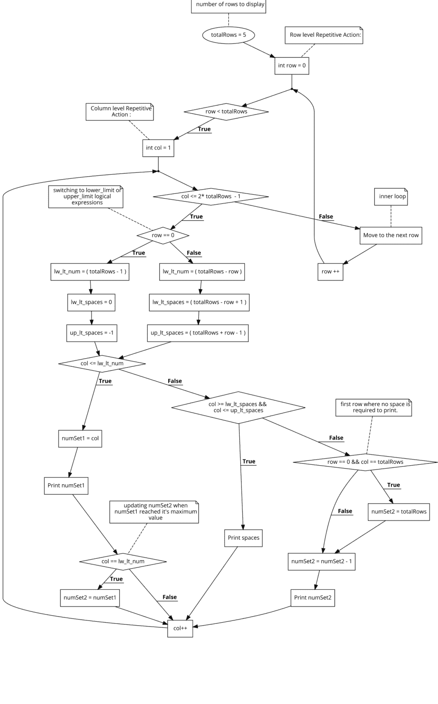

## NumberPatternFF.py

```
totalRows = 5  # 要显示的行数
numSet2 = 0

# 行级重复操作：
for row in range(0, totalRows):
    # 列级重复操作：
    for col in range(1, 2 * totalRows):
        # 切换到下限或上限
        # 逻辑表达式
        if (row == 0):
            lw_lt_num = (totalRows - 1)
            lw_lt_spaces = 0
            up_lt_spaces = -1
        else:
            lw_lt_num = (totalRows - row)
            lw_lt_spaces = (totalRows - row + 1)
            up_lt_spaces = (totalRows + row - 1)

        if (col <= lw_lt_num):
            numSet1 = col
            print(numSet1, end = " ")
            # 当 numSet1 达到其最大值时更新 numSet2
            if (col == lw_lt_num):
                numSet2 = numSet1

        elif (col >= lw_lt_spaces and col <= up_lt_spaces):
            print(" " , end = " ")  # 2 个空格
        else:
            # 第一行，无需打印空格。
            if (row == 0 and col == totalRows):
                numSet2 = totalRows

            print(numSet2, end = " ")
            numSet2 = numSet2 - 1

    # 结束内层 for 循环

    print()  # 将控制移到下一行

# 结束外层 for 循环
```

### 输出

```
1 2 3 4 5 4 3 2 1
1 2 3 4   4 3 2 1
1 2 3       3 2 1
1 2           2 1
1               1
```

### If-else 简写

任何事情的简写都是在特定情况下应用的特例。在编程中，人们常常无意中混淆自己，仅仅因为他们选择了一个特例并试图普遍应用它。即使在词语的选择上，两个词可能给出几乎相似的含义，而当我们实际在不同情境中应用它们时，我们才能真正发掘其真正的潜在含义。

if-else 选项的简写在几乎每种编程语言中都被称为三元运算符，由符号 `(:)` 表示。

### 何时应用 if-else 简写

三元运算符是 if-else 语句的一种语法糖，通常应用于 **if 块** 和 **else 块** 为同一个结果变量赋不同值的情况。例如，假设 if-else 语句如下所示：

| If-else 语句 | If-else 简写或三元运算符 (:) |
| :--- | :--- |
| If( condition):<br>    result = one_value<br>else:<br>    result = other_value | result = one_value if (condition) else other_value |
| 简单的 if-else 可以很容易地用单行三元运算符表示的 if-else 简写来替换。在这种情况下，使用三元运算符来提高代码可读性才有真正的意义。 | - 有两种可能的结果值，由冒号符号 (:) 分隔。<br>- 如果条件为 True，则 one_value 将被赋值给变量 result。<br>- 如果条件为 False，则 other_value 将被赋值给变量 result。 |

在程序 **NumberPatternFF.py** 中，我们可以使用三元运算符来提高部分源代码的可读性。

| 独立的 if-else | 多个 if-else 合并为单个 if-else |
| :--- | :--- |
| if(row == 0):<br>    lw_lt_num = ( totalRows - 1 )<br>else:<br>    lw_lt_num = ( totalRows - row )<br><br>if(row == 0):<br>    lw_lt_spaces = 0<br>else:<br>    lw_lt_spaces = ( totalRows - row + 1 )<br><br>if(row == 0):<br>    up_lt_spaces = -1<br>else:<br>    up_lt_spaces = ( totalRows + row - 1 ) | if(row == 0):<br>    lw_lt_num = ( totalRows - 1 )<br>    lw_lt_spaces = 0<br>    up_lt_spaces = -1<br>else:<br>    lw_lt_num = ( totalRows - row )<br>    lw_lt_spaces = ( totalRows - row + 1 )<br>    up_lt_spaces = ( totalRows + row - 1 ) |

| 等效的 If-else 简写或三元运算符 (:) 表达式 |
| :--- |
| `lw_lt_num = (totalRows - 1) if (row == 0) else (totalRows - row)` |
| `lw_lt_spaces = 0 if (row == 0) else (totalRows - row + 1)` |
| `up_lt_spaces = -1 if (row == 0) else (totalRows + row - 1)` |

我并不是特别喜欢使用异常，但为了分享信息，即使 **嵌套三元运算符也是可能的**，就像嵌套 if-else 一样。在大多数情况下，对于逻辑表达式的求值来说，它并不容易阅读。在某些情况下，对嵌套三元运算符进行适当的格式化可能有所帮助，但对于大多数初级程序员来说，实现的代码仍然不会容易理解。根据我的观点，请避免使用嵌套三元运算符。更新后的程序演示了使用三元运算符 `(:)` 来提高该编码部分的可读性。请注意代码的变化。

```
python
NumberPatternFF2.py

totalRows = 5  # 要显示的行数
numSet2 = 0

    # 行级重复操作：
for row in range(0, totalRows):
    # 列级重复操作：
    for col in range(1, 2 * totalRows):
        # 使用三元运算符，一种更简单的 if-else 简写
        lw_lt_num = (totalRows - 1) if (row == 0) else (totalRows - row)
        lw_lt_spaces = 0 if (row == 0) else (totalRows - row + 1)
        up_lt_spaces = -1 if (row == 0) else (totalRows + row - 1)
        if (col <= lw_lt_num):
            numSet1 = col
            print(numSet1, end=" ")
            # 当 numSet1 达到其最大值时更新 numSet2
            if (col == lw_lt_num):
                numSet2 = numSet1
        elif (col >= lw_lt_spaces and col <= up_lt_spaces):
            print(" " , end=" ")  # 2 个空格
        else:
            # 第一行：无需打印空格。
            if (row == 0 and col == totalRows):
                numSet2 = totalRows
            print(numSet2, end=" ")
            numSet2 = numSet2 - 1
    # 结束内层 for 循环
    print()  # 将控制移到下一行
# 结束外层 for 循环
```

### NumberPattern GG

我们的方法是假设计算机屏幕是行和列的组合，虚拟地将其划分为更小的方框——最小的方框被视为仅容纳单个字符。显示屏幕上每个最小方框中的地址在逻辑上将成为一个唯一的 **(行, 列)** 数字组合。基于这个假设，计算机屏幕将简单地是一个由 **(行, 列)** 数字值配对框组成的唯一组合，这些框均匀地分布在整个屏幕上。

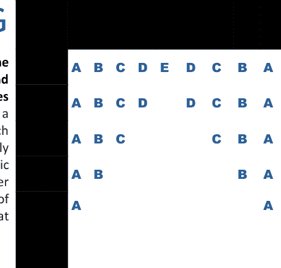

| | 列=1 | 列=2 | 列=3 | 列=4 | 列=5 | 列=6 | 列=7 | 列=8 | 列=9 |
|---|---|---|---|---|---|---|---|---|---|
| 行=1 | A | B | C | D | E | D | C | B | A |
| 行=2 | A | B | C | D | | D | C | B | A |
| 行=3 | A | B | C | | | | C | B | A |
| 行=4 | A | B | | | | | | B | A |
| 行=5 | A | | | | | | | | A |

#### 数据表示

尽管这是合乎逻辑的，但我们可以通过知道每个可打印字符在显示屏幕上的唯一可识别 **(行, 列)** 数字配对值来精确定位其位置。**例如；(4, 3)** 表示在假设的屏幕位置 **第 4 行和第 3 列** 打印字符。

#### (行, 列) 值对表示

| | 列=1 | 列=2 | 列=3 | 列=4 | 列=5 | 列=6 | 列=7 | 列=8 | 列=9 |
|---|---|---|---|---|---|---|---|---|---|
| 行=1 | (1,1) A | (1,2) B | (1,3) C | (1,4) D | (1,5) E | (1,6) D | (1,7) C | (1,8) B | (1,9) A |
| 行=2 | (2,1) A | (2,2) B | (2,3) C | (2,4) D | 2,5 空格 | (2,6) D | (2,7) C | (2,8) B | (2,9) A |
| 行=3 | (3,1) A | (3,2) B | (3,3) C | 3,4 空格 | 3,5 空格 | 3,6 空格 | (3,7) C | (3,8) B | (3,9) A |
| 行=4 | (4,1) A | (4,2) B | 4,3 空格 | 4,4 空格 | 4,5 空格 | 4,6 空格 | 4,7 空格 | (4,8) B | (4,9) A |
| 行=5 | (5,1) A | 5,2 空格 | 5,3 空格 | 5,4 空格 | 5,5 空格 | 5,6 空格 | 5,7 空格 | 5,8 空格 | (5,9) A |

这个模式是 **NumberPatternFF** 的一个特例，它打印字母而不是数字。

#### 输出分析

通常，会发生三个重复性操作。
a) 从A开始按递增顺序打印字母，直到中间列。
b) 打印空格。
c) 按递减顺序打印字母。
我们在键盘上看到的每个字符，无论是字母、数字还是其他特殊字符，都有一个唯一的代码值，这本质上是一个数字。因此，每个字符，甚至数字，在内部也由一个称为**Unicode**的数值表示。我们可以使用内置函数**chr()**从其对应的Unicode值获取字母。它将等效的Unicode整数值转换为字符。*例如；*

```
// 将整数数据类型转换为字符数据类型
unicode = 65
alphabet = chr(unicode)
```

因此，按照Unicode的递增值顺序，我们可以获取字母。我们可以通过以下程序验证这一点，该程序打印所有26个字母，大写或小写，以及Unicode。

| 大写字母 | Unicode | 小写字母 | Unicode |
| :--- | :--- | :--- | :--- |
| A | 65 | a | 97 |
| B | 66 | b | 98 |
| ...... | ...... | ...... | ...... |
| Z | 90 | z | 122 |

```
print( "Alphabets and its equivalent unicode." )
print( "-----------------------------------------" )
for cnt in range(0,26):
    unicodeCap = ( 65 + cnt )
    unicodeSmall = ( 97 + cnt )
    print( chr(unicodeCap)," = ",unicodeCap ," | ",end="")
    print( chr(unicodeSmall)," = ",unicodeSmall )
```

### 输出

```
Alphabets and its equivalent unicode.
-----------------------------------------
A=65  |  a=97
B=66  |  b=98
C=67  |  c=99
........  ........
........  ........
Y=89  |  y=121
Z=90  |  z=122
```

```
NumberPatternGG.py
totalRows = 5  # 要显示的行数
numSet2 = 0

    # 行级重复操作：
for row in range(0, totalRows):
    # 列级重复操作：
    for col in range(1, 2 * totalRows):
        # 使用三元运算符，一种更简单的if-else快捷方式
        lw_lt_num = (totalRows - 1) if (row == 0) else (totalRows - row)
        lw_lt_spaces = 0 if (row == 0) else (totalRows - row + 1)
        up_lt_spaces = -1 if (row == 0) else (totalRows + row - 1)
        if (col <= lw_lt_num):
            numSet1 = col
            # 大写字母的Unicode从值65开始。
            # 列号从值1开始而不是值0，所以-1。
            print(chr (numSet1 - 1 + 65), end=" ")
            # 当numSet1达到其最大值时更新numSet2
            if (col == lw_lt_num):
                numSet2 = numSet1
        elif (col >= lw_lt_spaces and col <= up_lt_spaces):
            print(" " , end=" ")  # 2个空格
        else:
            # 第一行不需要打印空格。
            if (row == 0 and col == totalRows):
                numSet2 = totalRows
            # 大写字母的Unicode从值65开始
            # 列号从值1开始而不是值0，所以-1。
            print(chr(numSet2 - 1 + 65), end=" ")
            numSet2 = numSet2 - 1
    # 内部for循环结束
    print()  # 将控制移到下一行
# 外部for循环结束
```

```
输出
A B C D E D C B A
A B C D   D C B A
A B C       C B A
A B           B A
A               A
```

通过对程序**NumberPatternGG.py**进行一点修改，如果我们尝试，可以生成类似的小写字母模式。我们可以使用以下计算来生成小写字母模式，而不是使用大写字母的：
`chr(numSet1 - 1 + 65)` # 大写字母'A'的Unicode是65

我们可以使用以下计算来生成小写字母模式。
`chr(numSet1 - 1 + 97)` # 小写字母'a'的Unicode是97

虽然通过微小的更改我们可以获得小写字母的输出，但真正的重点是大部分代码会被重复。我们可以通过**函数**或方法的概念来避免这种编程逻辑的重复。我们可以创建自己的函数并按需使用，类似于我们使用不同版本的内置方法/函数如`print()`。

### 编写我们自己的函数

我们经常使用基于变量的泛化表达式来表示硬编码值的概念。我们仍然可以继续泛化编程逻辑。带输入参数的函数的一个主要优点是通过重用相同的编程逻辑来实现定制输出。编写函数是一个明智的想法，它建议我们如何将不同的编程逻辑封装在不同的名称下。因此，相同的编程逻辑片段不应在其他函数中重复。它应该被适当地切分出来，只作为一种类型的操作。我们可以按需使用它们，类似于乐高玩具的使用，构建有意义的东西。我们将通过实现创建函数的最常用语法来学习代码重用的概念。函数名应以关键字def开头，并以冒号(:)结尾。函数可以省略或需要参数。这完全取决于函数是否需要输入值。基本上，函数参数作为变量工作，因此允许各种输入值。我们的函数应该作为一个独特的公式，并可选地允许根据需要输入值。我们已经通过使用不同版本的内置方法或函数如print()获得了这个想法——创建我们自己的带参数的函数的示例如下。函数中编写的编程语句应具有相同的缩进。

```
def functionName( parameter1, parameter2,...):

    # 编程逻辑
        statement-1
        statement-2
        ....................
        statement-n
```

其中parameter1, parameter2...是函数的输入。我们可以通过以下函数调用将函数的输出结果存储在变量中。

```
result = functionName( value1, value2,...) # 变量:result存储此函数调用的输出。
```

functionName( value1, value2,...)是一个函数调用，我们可以在程序中多次调用它以实现目标功能。函数或变量的命名规则相同，如下：

+   1) 函数名应以字符开头：A-Z, a-z, 和下划线(_)。
2) 函数名的其余部分可以包含来自A-Z, a-z, 数字(0-9), 和下划线(_)的字符。
3) 编程语言使用的任何保留字都不能使用。例如，我们不能创建自己的函数并将其再次命名为print()或创建一个名为for的变量。

使用printPattern方法，我们可以打印以下三种不同输出类型的模式，封装一个共同的编程逻辑。printPattern只是打印与输入参数匹配的模式。

| printPattern(param11, param12) | printPattern(param21, param22) | printPattern(param31, param32) |
| :--- | :--- | :--- |
| A A | a a | 1 1 |
| A B B A | a b b a | 1 2 2 1 |
| A B C C B A | a b c c b a | 1 2 3 3 2 1 |
| A B C D D C B A | a b c d d c b a | 1 2 3 4 4 3 2 1 |
| A B C D E D C B A | a b c d e d c b a | 1 2 3 4 5 4 3 2 1 |

```
PatternByFunctionCall.py
# 显示通过函数调用实现代码重用的主程序。
# 它还建议应用DRY（不要重复自己）原则。
#

totalRows = 5   # 要显示的行数
unicode_A = 65  # 字母A的unicode
unicode_a = 97  # 字母a的unicode
unicode_1 = 49  # 数字1的unicode。


#   方法或函数定义
def  printPattern(totalRows, unicode):

    numSet1 = 0
    numSet2 = 0

        # 行级重复操作：
    for row in range(0, totalRows):
            # 列级重复操作：
        for col in range(1, 2 * totalRows):

            # 使用三元运算符，一种更简单的if-else快捷方式
            lw_lt_num = (totalRows - 1) if (row == 0) else (totalRows - row)
            lw_lt_spaces = 0 if (row == 0) else (totalRows - row + 1)
            up_lt_spaces = -1 if (row == 0) else (totalRows + row - 1)

            if (col <= lw_lt_num):
                numSet1 = col
                # Unicode值来自函数参数 - unicode。
                # 列号从值1开始而不是值0，所以-1。
                print(chr (numSet1 - 1 + unicode), end=" ")
                # 当numSet1达到其最大值时更新numSet2
                if (col == lw_lt_num):
                    numSet2 = numSet1

            elif (col >= lw_lt_spaces and col <= up_lt_spaces):
                print(" " , end=" ")  # 2个空格
            else:
                # 第一行不需要打印空格。
                if (row == 0 and col == totalRows):
                    numSet2 = totalRows
                # Unicode值来自函数参数 - unicode。
                # 列号从值1开始而不是值0，所以-1。
                print(chr(numSet2 - 1 + unicode), end=" ")
                numSet2 = numSet2 - 1
        # 内部for循环结束
    print()  # 将控制移到下一行
    # 外部for循环结束

# 方法到此结束
```

print("大写字母图案 GG")
print("-----------------------------------")
printPattern(totalRows, unicode_A)  # 函数调用

print()
print("小写字母图案 GG")
print("-----------------------------------")
printPattern(totalRows, unicode_a)  # 函数调用

print()
print("数字图案 FF")
print("-----------------------------------")
printPattern(totalRows, unicode_1)  # 函数调用

输出

```
大写字母图案 GG
-----------------------------------
A B C D E D C B A
A B C D   D C B A
A B C       C B A
A B           B A
A               A

小写字母图案 GG
-----------------------------------
a b c d e d c b a
a b c d   d c b a
a b c       c b a
a b           b a
a               a

数字图案 FF
-----------------------------------
1 2 3 4 5 4 3 2 1
1 2 3 4   4 3 2 1
1 2 3       3 2 1
1 2           2 1
1               1
```

### 数字图案 HH

我们的方法是假设计算机屏幕是行和列的组合，将其虚拟地划分为更小的方框——最小的方框被视为仅容纳一个字符。显示屏上每个最小方框的地址在逻辑上将成为一个唯一的 **(行, 列)** 数字组合。基于这个假设，计算机屏幕将仅仅是一个由均匀分布在整个屏幕上的、成对的 **(行, 列)** 数值框组成的唯一组合。

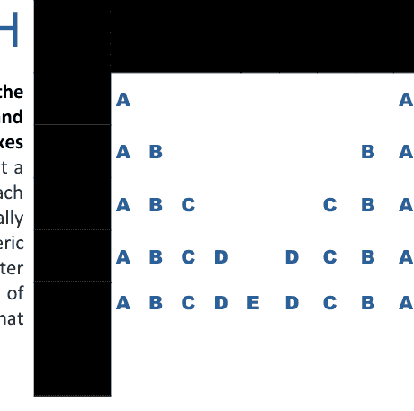

| | 列=1 | 列=2 | 列=3 | 列=4 | 列=5 | 列=6 | 列=7 | 列=8 | 列=9 |
|---|---|---|---|---|---|---|---|---|---|
| **行=1** | **A** | | | | | | | | **A** |
| **行=2** | **A** | **B** | | | | | | **B** | **A** |
| **行=3** | **A** | **B** | **C** | | | | **C** | **B** | **A** |
| **行=4** | **A** | **B** | **C** | **D** | | **D** | **C** | **B** | **A** |
| **行=5** | **A** | **B** | **C** | **D** | **E** | **D** | **C** | **B** | **A** |

#### 数据表示

尽管这是合乎逻辑的，但我们可以通过知道每个可打印字符在显示屏上唯一可识别的 **(行, 列)** 数字配对值来精确地定位其位置。**例如；(4, 3)** 表示在假定的屏幕位置 **第4行和第3列** 打印字符。

#### (行, 列) 值对表示

| | 列=1 | 列=2 | 列=3 | 列=4 | 列=5 | 列=6 | 列=7 | 列=8 | 列=9 |
|---|---|---|---|---|---|---|---|---|---|
| **行=1** | (1,1)<br>**A** | 1,2<br>空格 | 1,3<br>空格 | 1,4<br>空格 | 1,5<br>空格 | 1,6<br>空格 | 1,7<br>空格 | 1,8<br>空格 | (1,9)<br>**A** |
| **行=2** | (2,1)<br>**A** | (2,2)<br>**B** | 2,3<br>空格 | 2,4<br>空格 | 2,5<br>空格 | 2,6<br>空格 | 2,7<br>空格 | (2,8)<br>**B** | (2,9)<br>**A** |
| **行=3** | (3,1)<br>**A** | (3,2)<br>**B** | (3,3)<br>**C** | 3,4<br>空格 | 3,5<br>空格 | 3,6<br>空格 | (3,7)<br>**C** | (3,8)<br>**B** | (3,9)<br>**A** |
| **行=4** | (4,1)<br>**A** | (4,2)<br>**B** | (4,3)<br>**C** | (4,4)<br>**D** | 4,5<br>空格 | (4,6)<br>**D** | 4,7<br>**C** | (4,8)<br>**B** | (4,9)<br>**A** |
| **行=5** | (5,1)<br>**A** | (5,2)<br>**B** | (5,3)<br>**C** | (5,4)<br>**D** | (5,5)<br>**E** | (5,6)<br>**D** | 5,7<br>**C** | 5,8<br>**B** | (5,9)<br>**A** |

| | 列=1 | 列=2 | 列=3 | 列=4 | 列=5 | 列=6 | 列=7 | 列=8 | 列=9 |
|---|---|---|---|---|---|---|---|---|---|
| 行=1 | a | | | | | | | | a |
| 行=2 | a | b | | | | | | b | a |
| 行=3 | a | b | c | | | | c | b | a |
| 行=4 | a | b | c | d | | d | c | b | a |
| 行=5 | a | b | c | d | e | d | c | b | a |

| | 列=1 | 列=2 | 列=3 | 列=4 | 列=5 | 列=6 | 列=7 | 列=8 | 列=9 |
|---|---|---|---|---|---|---|---|---|---|
| 行=1 | 1 | | | | | | | | 1 |
| 行=2 | 1 | 2 | | | | | | 2 | 1 |
| 行=3 | 1 | 2 | 3 | | | | 3 | 2 | 1 |
| 行=4 | 1 | 2 | 3 | 4 | | 4 | 3 | 2 | 1 |
| 行=5 | 1 | 2 | 3 | 4 | 5 | 4 | 3 | 2 | 1 |

#### 输出分析

这个图案只是图案 **数字图案GG** 的反向。我们在图案 **数字图案GG** 的第一行打印的内容，我们需要在最后一行打印。因此，遵循相同的技巧，我们可以生成这个图案。我们可以遵循以下针对此特定图案的策略；

a) 外层 for 循环，它指示程序按行方向移动的控制，需要反转其方向。这意味着我们需要实现以下递减 for 循环。

```
# 行级重复操作：
for row in range(0, totalRows):
```

上述的递减 for 循环将如下所示；

```
# 行级重复操作：
for row in range(totalRows-1, -1, -1):
```

b) 下一步，按列方向，允许其以与 **数字图案GG** 相同的方式打印。

因此，基本上，我们只需要在行级 for 循环中进行更改。

```python
# 主程序展示了通过函数调用实现的代码重用性。
# 它也建议应用 DRY（不要重复自己）原则。

totalRows = 5   # 要显示的行数
unicode_A = 65  # 字母 A 的 Unicode 值
unicode_a = 97  # 字母 a 的 Unicode 值
unicode_1 = 49  # 数字 1 的 Unicode 值。

#   方法或函数定义
def printPattern(totalRows, unicode):

    numSet1 = 0
    numSet2 = 0

        # 行级重复操作：
    for row in range(totalRows-1, -1, -1):
            # 列级重复操作：
        for col in range(1, 2 * totalRows):

            # 使用三元运算符，一种更简单的 if-else 简写
            lw_lt_num = (totalRows - 1) if (row == 0) else (totalRows - row)
            lw_lt_spaces = 0 if (row == 0) else (totalRows - row + 1)
            up_lt_spaces = -1 if (row == 0) else (totalRows + row - 1)

            if (col <= lw_lt_num):
                numSet1 = col
                # Unicode 值来自函数参数 - unicode。
                # 列号从值 1 开始而不是值 0，所以 -1。
                print(chr (numSet1 - 1 + unicode), end=" ")
                # 当 numSet1 达到其最大值时更新 numSet2
                if (col == lw_lt_num):
                    numSet2 = numSet1

            elif (col >= lw_lt_spaces and col <= up_lt_spaces):
                print(" " , end=" ")  # 2 个空格
            else:
                # 第一行，不需要打印空格。
                if (row == 0 and col == totalRows):
                    numSet2 = totalRows

                # Unicode 值来自函数参数 - unicode。
                # 列号从值 1 开始而不是值 0，所以 -1。
                print(chr(numSet2 - 1 + unicode), end=" ")
                numSet2 = numSet2 - 1
        # 内层 for 循环结束
    print()  # 将控制移到下一行
    # 外层 for 循环结束

# 方法定义结束
```

print("大写字母图案 GG")
print("-----------------------------------")
printPattern(totalRows, unicode_A)  # 函数调用

print()
print("小写字母图案 GG")
print("-----------------------------------")
printPattern(totalRows, unicode_a)  # 函数调用

print()
print("数字图案 FF")
print("-----------------------------------")
printPattern(totalRows, unicode_1)  # 函数调用

### 输出

```
大写字母图案 GG
-----------------------------------
A           A
A B         B A
A B C       C B A
A B C D     D C B A
A B C D E D C B A

小写字母图案 GG
-----------------------------------
a           a
a b         b a
a b c       c b a
a b c d     d c b a
a b c d e d c b a

数字图案 FF
-----------------------------------
1           1
1 2         2 1
1 2 3       3 2 1
1 2 3 4     4 3 2 1
1 2 3 4 5 4 3 2 1
```

### 问题：使用函数概念输出以下图案

| | 列=1 | 列=2 | 列=3 | 列=4 | 列=5 | 列=6 | 列=7 | 列=8 | 列=9 |
|---|---|---|---|---|---|---|---|---|---|
| 行=1 | A | B | C | D | E | D | C | B | A |
| 行=2 | A | B | C | D | | D | C | B | A |
| 行=3 | A | B | C | | | | C | B | A |
| 行=4 | A | B | | | | | | B | A |
| 行=5 | A | | | | | | | | A |
| 行=6 | A | B | | | | | | B | A |
| 行=7 | A | B | C | | | | C | B | A |
| 行=8 | A | B | C | D | | D | C | B | A |
| 行=9 | A | B | C | D | E | D | C | B | A |

| | 列=1 | 列=2 | 列=3 | 列=4 | 列=5 | 列=6 | 列=7 | 列=8 | 列=9 |
|---|---|---|---|---|---|---|---|---|---|
| 行=1 | a | b | c | d | e | d | c | b | a |
| 行=2 | a | b | c | d | | d | c | b | a |
| 行=3 | a | b | c | | | | c | b | a |
| 行=4 | a | b | | | | | | b | a |
| 行=5 | a | | | | | | | | a |
| 行=6 | a | b | | | | | | b | a |
| 行=7 | a | b | c | | | | c | b | a |
| 行=8 | a | b | c | d | | d | c | b | a |
| 行=9 | a | b | c | d | e | d | c | b | a |

| | 列=1 | 列=2 | 列=3 | 列=4 | 列=5 | 列=6 | 列=7 | 列=8 | 列=9 |
|---|---|---|---|---|---|---|---|---|---|
| 行=1 | 1 | 2 | 3 | 4 | 5 | 4 | 3 | 2 | 1 |
| 行=2 | 1 | 2 | 3 | 4 | | 4 | 3 | 2 | 1 |
| 行=3 | 1 | 2 | 3 | | | | 3 | 2 | 1 |
| 行=4 | 1 | 2 | | | | | | 2 | 1 |
| 行=5 | 1 | | | | | | | | 1 |
| 行=6 | 1 | 2 | | | | | | 2 | 1 |
| 行=7 | 1 | 2 | 3 | | | | 3 | 2 | 1 |
| 行=8 | 1 | 2 | 3 | 4 | | 4 | 3 | 2 | 1 |
| 行=9 | 1 | 2 | 3 | 4 | 5 | 4 | 3 | 2 | 1 |

### 数字模式 AAA

我们的编程任务是在计算机屏幕的某个部分打印出这个特定的逻辑模式。**我们的方法是假设计算机屏幕由行和列组合而成，实际上将其划分为更小的方框**——最小的方框被视为仅容纳一个字符。显示屏上每个最小方框的地址在逻辑上将成为一个唯一的 **(行, 列)** 数字组合。基于这个假设，计算机屏幕将简单地是一个由 (行, 列) 数字值配对的方框组成的唯一组合，这些方框均匀地分布在整个屏幕上。

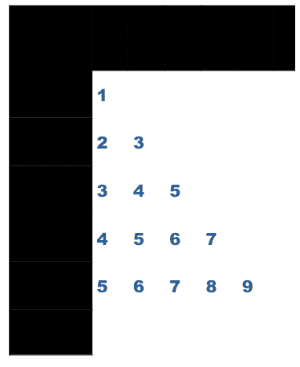

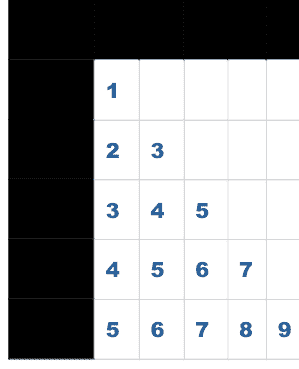

| | 列=1 | 列=2 | 列=3 | 列=4 | 列=5 |
|---|---|---|---|---|---|
| 行=1 | 1 | | | | |
| 行=2 | 2 | 3 | | | |
| 行=3 | 3 | 4 | 5 | | |
| 行=4 | 4 | 5 | 6 | 7 | |
| 行=5 | 5 | 6 | 7 | 8 | 9 |

#### 数据表示

尽管这是逻辑上的，但我们可以通过知道每个可打印字符在显示屏上的唯一可识别的 **(行, 列)** 数字配对值来精确定位其位置。**例如；(4, 3)** 表示在假设的屏幕位置 **第4行** 和 **第3列** 打印数字字符。

#### (行, 列) 值对表示

| | 列=1 | 列=2 | 列=3 | 列=4 | 列=5 |
|---|---|---|---|---|---|
| 行=1 | 1,1 | | | | |
| 行=2 | 2,1 | 2,2 | | | |
| 行=3 | 3,1 | 3,2 | 3,3 | | |
| 行=4 | 4,1 | 4,2 | 4,3 | 4,4 | |
| 行=5 | 5,1 | 5,2 | 5,3 | 5,4 | 5,5 |

#### 输出分析

它也可以用表格形式来解释。

| 行 | 1 | | | | |
| 列 | 1 | | | | |
| 输出 | 1 | | | | |

对于 行 =1, 1<=列<=1

| 行 | 2 | | | | |
| 列 | 1 | 2 | | | |
| 输出 | 2 | 3 | | | |

对于 行 =2, 1<=列<=2

| 行 | 3 | | | | |
| 列 | 1 | 2 | 3 | | |
| 输出 | 3 | 4 | 5 | | |

对于 行 =3, 1<=列<=3

| 行 | 4 | | | | |
| 列 | 1 | 2 | 3 | 4 | |
| 输出 | 4 | 5 | 6 | 7 | |

对于 行 =4, 1<=列<=4

| 行 | 5 | | | | |
| 列 | 1 | 2 | 3 | 4 | 5 |
| 输出 | 5 | 6 | 7 | 8 | 9 |

对于 行 =5, 1<=列<=5

我们需要为所有行概括下限和上限，使其适用于任意行数。

#### 观察

- 1. 在行级别需要垂直重复，即 行 = 1 到 5。
- 2. 在列级别需要水平重复，即 列 = 1 到 5。所以这是一个双向重复过程，意味着需要两个 for 循环（嵌套 for 循环）。
- 3. 我们需要探索未知的逻辑表达式，这些表达式将用于定义下面给定的内层循环。这些未知的逻辑表达式在下面给定的表格中标记为未知。

| For 循环 | 下限 | 上限 |
|---|---|---|
| 外层循环 | 行=1 | 行<=5 |
| 内层循环 | 列=(未知) 需要找到一个关系来确定它如何变化 | (未知) 需要找到一个关系来确定它如何变化。 |

### 列级别重复操作

| 行级别重复操作 | 预期输出 |
| :--- | :--- |
| **行** | **列级别重复操作**<br>循环条件( 下限 <=列<= 上限) | |
| | **下限** | **上限** | |
| | **默认** | **1** | **默认** | **1** | **2** | **3** | |
| 1 | 1 | 行 | 1 | 1 | 1+1 - 1 | 行 + 行 - 1 | **1** |
| 2 | 2 | 行 | 3 | 2 + 1 | 2+2 - 1 | 行 + 行 - 1 | **2 3** |
| 3 | 3 | 行 | 5 | 3 + 2 | 3+3 - 1 | 行 + 行 - 1 | **3 4 5** |
| 4 | 4 | 行 | 7 | 4 + 3 | 4+4 - 1 | 行 + 行 - 1 | **4 5 6 7** |
| 5 | 5 | 行 | 9 | 5 + 4 | 5+5 - 1 | 行 + 行 - 1 | **5 6 7 8 9** |

下限与行值匹配，因此可以将其概括为变量 行。

| 行级别重复操作 | 预期输出 |
| :--- | :--- |
| **行** | **列级别重复操作**<br>循环条件( 下限 <=列<= 上限) | |
| | **下限** | **上限** | |
| | **默认** | **1** | **默认** | **1** | **2** | **3** | |
| 1 | 1 | 行 | 1 | 1 | 1+1 - 1 | 2*行 - 1 | **1** |
| 2 | 2 | 行 | 3 | 2 + 1 | 2+2 - 1 | 2*行 - 1 | **2 3** |
| 3 | 3 | 行 | 5 | 3 + 2 | 3+3 - 1 | 2*行 - 1 | **3 4 5** |
| 4 | 4 | 行 | 7 | 4 + 3 | 4+4 - 1 | 2*行 - 1 | **4 5 6 7** |
| 5 | 5 | 行 | 9 | 5 + 4 | 5+5 - 1 | 2*行 - 1 | **5 6 7 8 9** |

| 行级别重复操作 | 预期输出 |
| :--- | :--- |
| **行** | **列级别重复操作**<br>循环条件( 下限 <=列<= 上限) | |
| | **下限** | **上限** | |
| | **1** | **2** | **默认** | **2** | **3** | **4** | |
| 1 | 行 | 行 | 1 | 1+1 - 1 | 2*行 - 1 | 2*行 - 1 | **1** |
| 2 | 行 | | 3 | 2+2 - 1 | 2*行 - 1 | | **2 3** |
| 3 | 行 | | 5 | 3+3 - 1 | 2*行 - 1 | | **3 4 5** |
| 4 | 行 | | 7 | 4+4 - 1 | 2*行 - 1 | | **4 5 6 7** |
| 5 | 行 | | 9 | 5+5 - 1 | 2*行 - 1 | | **5 6 7 8 9** |

下限和上限对于所有行已经变得一致。下限被概括为 行，上限被概括为 (2*行 – 1)。这些逻辑表达式是通用的，适用于所有行和列，有助于给出匹配的输出。

因此我们最终的逻辑表达式变为；

| 循环条件 | 下限 <=列<= 上限 |
| :--- | :--- |
| **数学表达式** | 行 <= 列 <= (2*行 – 1) |
| **语法** | for col in range(row, 2 * row): |

```
NumberPatternAAA.py
totalRows = 5  # 要显示的行数

    # 行级别重复操作：
for row in range(1, totalRows + 1):

        # 列级别重复操作：
        # 在同一行打印字符。
    for col in range(row, 2 * row):

            # 为输出清晰添加了额外空格。
        print(col, end = " ")
    # 内层 for 循环结束

        # 将控制移到下一行
    print()
    # 内层 for 循环结束
```

### 输出

1
2 3
3 4 5
4 5 6 7
5 6 7 8 9

问题GBAAA：修改程序 NumberPatternAAA.py，使其使用 switch-case 分别针对值 1 和 2 显示以下输出。

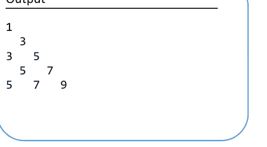

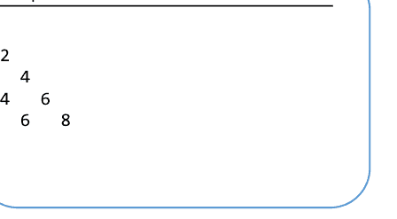

### 数字模式 BBB

我们的编程任务是在计算机屏幕的某个部分打印出这个特定的逻辑模式。**我们的方法是假设计算机屏幕由行和列组合而成，实际上将其划分为更小的方框**——最小的方框被视为仅容纳一个字符。显示屏上每个最小方框的地址在逻辑上将成为一个唯一的 **(行, 列)** 数字组合。基于这个假设，计算机屏幕将简单地是一个由 (行, 列) 数字值配对的方框组成的唯一组合，这些方框均匀地分布在整个屏幕上。

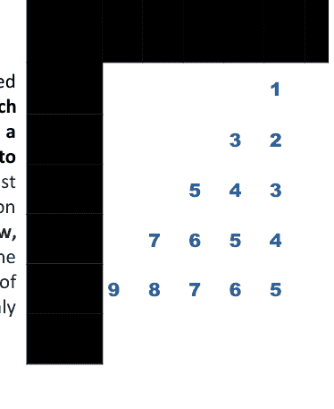

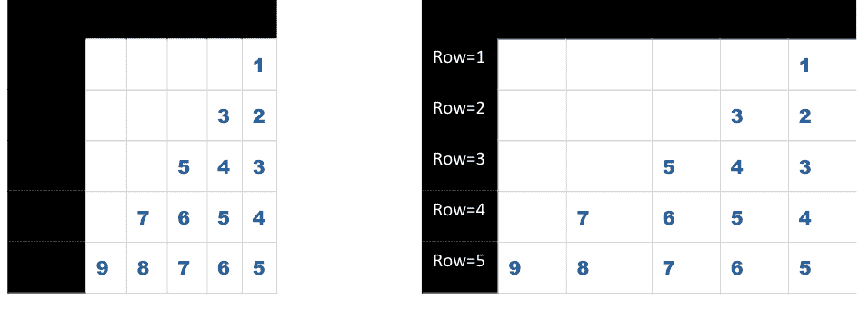

#### 数据表示

尽管这是逻辑上的，但我们可以通过知道每个可打印字符在显示屏上的唯一可识别的 **(行, 列)** 数字配对值来精确定位其位置。**例如；(4, 3)** 表示在假设的屏幕位置 **第4行** 和 **第3列** 打印数字字符。

#### (行, 列) 值对表示

| | 列=1 | 列=2 | 列=3 | 列=4 | 列=5 |
|---|---|---|---|---|---|
| **行=1** | | | | | 1,5 |
| **行=2** | | | | 2,4 | 2,5 |
| **行=3** | | | 3,3 | 3,4 | 3,5 |
| **行=4** | | 4,2 | 4,3 | 4,4 | 4,5 |
| **行=5** | 5,1 | 5,2 | 5,3 | 5,4 | 5,5 |

#### 输出分析

在这种情况下，我们需要处理在特定行的特定列打印两种不同类型的字符：

- 1) 空格字符
- 2) 数字字符

| 行 | 1 | | | | |
|---|---|---|---|---|---|
| 列 | 1 | 2 | 3 | 4 | 5 |
| 输出 | 空格 | 空格 | 空格 | 空格 | 1 |

对于 行 =1, 1 <=空格<=4, 1>=数字>=1

| 行 | 2 | | | | |
|---|---|---|---|---|---|
| 列 | 1 | 2 | 3 | 4 | 5 |
| 输出 | 空格 | 空格 | 空格 | 3 | 2 |

对于 行 =2, 1 <=空格<=3, 3>=数字>=2

| 行 | 3 | | | | |
|---|---|---|---|---|---|
| 列 | 1 | 2 | 3 | 4 | 5 |
| 输出 | 空格 | 空格 | 5 | 4 | 3 |

对于 行 =3, 1 <=空格<=2, 5>=数字>=3

| 行 | 4 | | | | |
|---|---|---|---|---|---|
| 列 | 1 | 2 | 3 | 4 | 5 |
| 输出 | 空格 | 7 | 6 | 5 | 4 |

对于 行 =4, 1 <=空格<=1, 7>=数字>=4

| 行 | 5 | | | | |
|---|---|---|---|---|---|
| 列 | 1 | 2 | 3 | 4 | 5 |
| 输出 | 9 | 8 | 7 | 6 | 5 |

对于 行 =5, 9>=数字>=5

#### 观察

- a. 在行级别需要垂直重复，即 行 = 1 到 5。
在列级别需要水平重复，即 列 = 1 到 5。
- b. 这些被分为两部分——一部分用于重复打印空格，其余列用于打印数字字符。
- c. 我们需要探索剩余的逻辑表达式来定义下面给定的内层循环。我们可以在下面给定的表格中将未发现的逻辑表达式标记为未知。

| For 循环 | 下限 | 上限 |
|---|---|---|
| 外层循环 | 行=1 | 行<=5 |
| 内层循环 - 空格 | 列=1 | 未知 |
| 内层循环 - 数字 | 数字 = 未知 | 数字 = 1 |

### 列级重复操作

| 行级重复操作 | 预期输出 |
|---|---|
| 行 | 列级重复操作 |
| | lower_limit <= col <= upper_limit | upper_limit >= num >= lower_limit |
| | lower_limit | upper_limit | upper_limit | lower_limit |
| 1 | 1 | 4 | 1 | 1 | 1 |
| 2 | 1 | 3 | 3 | 2 | 3 2 |
| 3 | 1 | 2 | 5 | 3 | 5 4 3 |
| 4 | 1 | 1 | 7 | 4 | 7 6 5 4 |
| 5 | 1 | 0 | 9 | 5 | 9 8 7 6 5 |

我们需要为 `upper_limit` 开发一个一致的表达式，使其适用于任意行数。我们可以参考之前模式问题 PatternAAA 中 `num` 变量的结果。其他变量是 `row` 和 `totalRows=5`。让我们尝试使用这些变量进行泛化。

| 行级重复操作 | |
|---|---|
| 行 | 列级重复操作 |
| | lower_limit <= col <= upper_limit | upper_limit >= num >= lower_limit |
| | lower_limit | upper_limit | upper_limit | lower_limit |
| 1 | 1 | 4 | totalRows - 1 | totalRows - row | 1 | row | row |
| 2 | 1 | 3 | totalRows - 2 | totalRows - row | 3 | row + 1 | row |
| 3 | 1 | 2 | totalRows - 3 | totalRows - row | 5 | row + 2 | row |
| 4 | 1 | 1 | totalRows - 4 | totalRows - row | 7 | row + 3 | row |
| 5 | 1 | 0 | totalRows - 5 | totalRows - row | 9 | row + 4 | row |

再次尝试用变量 `row` 来表示与变量 `num` 相关的 `upper_limit` 的硬编码数值。

| 列级重复操作 | |
|---|---|
| 行 | lower_limit <= col <= upper_limit | upper_limit >= num >= lower_limit |
| | lower_limit | upper_limit | upper_limit | lower_limit |
| 1 | 1 | totalRows - row | 1 | row | row + 1 - 1 | row + row - 1 | row |
| 2 | 1 | totalRows - row | 3 | row + 1 | row + 2 - 1 | row + row - 1 | row |
| 3 | 1 | totalRows - row | 5 | row + 2 | row + 3 - 1 | row + row - 1 | row |
| 4 | 1 | totalRows - row | 7 | row + 3 | row + 4 - 1 | row + row - 1 | row |
| 5 | 1 | totalRows - row | 9 | row + 4 | row + 5 - 1 | row + row - 1 | row |

| 列级重复操作 | |
|---|---|
| 行 | lower_limit <= col <= upper_limit | upper_limit >= num >= lower_limit |
| | lower_limit | upper_limit | upper_limit | lower_limit |
| 1 | 1 | totalRows - row | 1 | row + 1 - 1 | row + row - 1 | 2*row - 1 | row |
| 2 | 1 | totalRows - row | 3 | row + 2 - 1 | row + row - 1 | 2*row - 1 | row |
| 3 | 1 | totalRows - row | 5 | row + 3 - 1 | row + row - 1 | 2*row - 1 | row |
| 4 | 1 | totalRows - row | 7 | row + 4 - 1 | row + row - 1 | 2*row - 1 | row |
| 5 | 1 | totalRows - row | 9 | row + 5 - 1 | row + row - 1 | 2*row - 1 | row |

| 行 | lower_limit <= col <= upper_limit | upper_limit >= num >= lower_limit |
| :--- | :--- | :--- |
| | lower_limit | upper_limit | upper_limit | lower_limit |
| 1 | 1 | totalRows - row | 2*row - 1 | row |
| 2 | 1 | totalRows - row | 2*row - 1 | row |
| 3 | 1 | totalRows - row | 2*row - 1 | row |
| 4 | 1 | totalRows - row | 2*row - 1 | row |
| 5 | 1 | totalRows - row | 2*row - 1 | row |

因此，`col` 和 `num` 变量的 `upper_limit` 已被泛化。`lower_limit` 和 `upper_limit` 对所有行都是一致的。现在它已适用于任意行数。

因此，我们使用变量 `col` 来计算每行空格数的循环条件变为

| 循环条件 | lower_limit <= col <= upper_limit |
| :--- | :--- |
| 数学表达式 | 1 <= col <= (totalRows - row) |
| 语法 | for col in range(1, totalRows - row + 1): |

因此，我们使用变量 `num` 来打印每行数字的循环条件变为

| 循环条件 | upper_limit >= num >= lower_limit |
| :--- | :--- |
| 数学表达式 | 2 * row - 1 >= num >= row |
| 语法 | for num in range(2 * row - 1, row - 1, -1): |

因此，它有两个重复过程，一个用于打印空格，第二个用于打印数字值。这意味着它需要 2 个内部 for 循环（嵌套 for 循环）。

流程图可以如下所示以捕获细节。

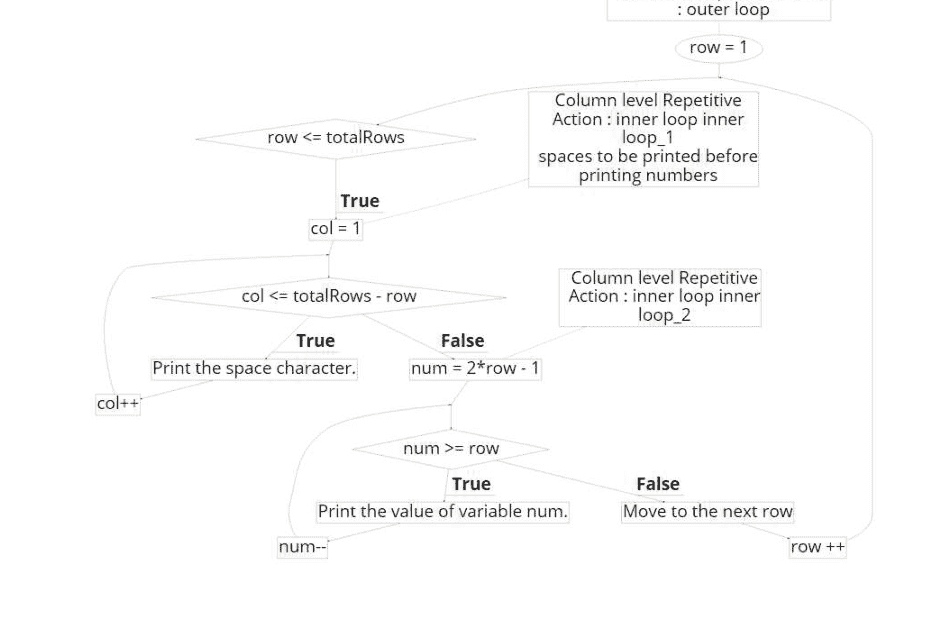

```python
# NumberPatternBBB1.py
totalRows = 5  # 要显示的行数
    # 行级重复操作：
for row in range(1, totalRows + 1):
        # 列级重复操作：
        # 在同一行打印字符。
        # 打印数字前要打印的空格
    for col in range(1, totalRows - row + 1):
        print(" ", end = " ")

    for num in range(2 * row - 1, row - 1, -1):
            # 为输出清晰添加了额外空格。
        print(num , end = " ")

    print()  # 将控制移到下一行
```

### 输出

```
          1
        3 2
      5 4 3
    7 6 5 4
  9 8 7 6 5
```

替代解决方案
让我们设计一个解决方案，通过应用 if-else 条件语句将两个内部 for 循环合并为一个。我们可以从两个内部 for 循环的 for 循环条件部分获得一些想法。循环初始化需要做一次。如果我们处理好循环初始化和步进递减部分，两个内部循环的循环条件可以转换为 **if 条件**。

```python
# NumberPatternBBB2.py
totalRows = 5  # 要显示的行数
    # 行级重复操作：
for row in range(1, totalRows + 1):

    # 列级重复操作：
    # 在同一行打印字符。

    # 打印数字前要打印的空格
    num = 2 * row - 1  #  水平移动

    # 打印数字前要打印的空格
    for col in range(1, totalRows + 1):

        if (col <= (totalRows - row)):
            print(" ", end = " ")
        elif (num >= row):
            # 为输出清晰添加了额外空格。
            print(num, end = " ")
            num = num - 1

    print()  # 将控制移到下一行

# 结束外部 for 循环
```

### NumberPattern CCC

我们的编程任务是在计算机屏幕的一部分打印这个特定的基于逻辑的模式。**我们的方法是假设计算机屏幕是行和列的组合，虚拟地将其划分为更小的方框**——最小的方框被视为仅包含单个字符。显示屏幕上每个最小方框中的地址在逻辑上将成为唯一的 **(行, 列)** 数字组合。有了这个假设，计算机屏幕将简单地是均匀分布在整个屏幕上的唯一 (行, 列) 数字值配对方框的组合。

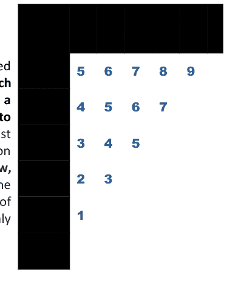

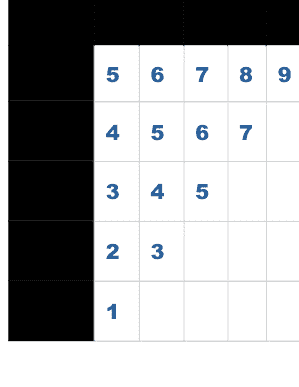

| | 列=1 | 列=2 | 列=3 | 列=4 | 列=5 |
|---|---|---|---|---|---|
| 行=1 | 5 | 6 | 7 | 8 | 9 |
| 行=2 | 4 | 5 | 6 | 7 | |
| 行=3 | 3 | 4 | 5 | | |
| 行=4 | 2 | 3 | | | |
| 行=5 | 1 | | | | |

#### 数据表示

尽管它是逻辑的，但我们可以通过知道每个可打印字符在显示屏幕上的唯一可识别的 **(行, 列)** 数字配对值来精确定位其位置。**例如；(4, 3)** 表示在假设的屏幕位置 **第 4 行和第 3 列** 打印数字字符。

#### (行, 列) 值对表示

| | 列=1 | 列=2 | 列=3 | 列=4 | 列=5 |
|---|---|---|---|---|---|
| 行=1 | 5,1 | 5,2 | 5,3 | 5,4 | 5,5 |
| 行=2 | 4,1 | 4,2 | 4,3 | 4,4 | |
| 行=3 | 3,1 | 3,2 | 3,3 | | |
| 行=4 | 2,1 | 2,2 | | | |
| 行=5 | 1,1 | | | | |

#### 输出分析

当 行 = 1, 列 = 1,2,3,4,5 (1 到 5)：重复将在水平方向上发生 5 次 (1 <= 列 <= 5)

当 行 = 2, 列 = 1,2,3,4 ( 1 到 4)：重复将在水平方向上发生 4 次 (1 <= 列 <= 4)

当 行 = 3, 列 = 1,2,3 ( 1 到 3)：重复将在水平方向上发生 3 次 (1 <= 列 <= 3)

当 行 = 4, 列 = 1,2 ( 1 到 2)：重复将在水平方向上发生 2 次 (1 <= 列 <= 2)

当 行 = 5, 列 = 1：将发生 1 次 (1 <= 列 <= 1)

我们只需要处理数字输出逻辑，而不需要处理打印空格所需的逻辑。只有当空格出现在数字输出之前时，才需要考虑空格的逻辑。

因此，在这种情况下，它是无关紧要的。

| 行 | 5 | | | | |
|---|---|---|---|---|---|
| 列 | 5 | 6 | 7 | 8 | 9 |
| 输出 | 5 | 6 | 7 | 8 | 9 |

行 = 5 , (5 <= 列 <= 9) (打印直到 upper_limit=9)

| 行 | 4 | | | | |
|---|---|---|---|---|---|
| 列 | 4 | 5 | 6 | 7 | |
| 输出 | 4 | 5 | 6 | 7 | |

行 = 4 , (4 <= 列 <= 7) (打印直到 upper_limit=7)

| 行 | 3 | | | | |
|---|---|---|---|---|---|
| 列 | 3 | 4 | 5 | | |
| 输出 | 3 | 4 | 5 | | |

行 = 3 , (3 <= 列 <= 5) (打印直到 upper_limit=5)

| 行 | 2 | | | | |
|---|---|---|---|---|---|
| 列 | 2 | 3 | | | |
| 输出 | 2 | 3 | | | |

行 = 2 , (2 <= 列 <= 3) (打印直到 upper_limit=3)

| 行 | 1 | | | | |
|---|---|---|---|---|---|
| 列 | 1 | | | | |
| 输出 | 1 | | | | |

行 = 1 , (1 <= 列 <= 1) (打印直到 upper_limit=1)

行值等于 `col` 变量的 `lower_limit`。`col` 变量的 `upper_limit` 值在每一行都不同。

让我们设计一个解决方案，通过**使用变量 `row` 递减外部 for 循环**（从 5 到 1）并确定 `col` 变量的循环条件（lower_limit <= col <= upper_limit）来给出所需的数字输出。让我们尝试使用变量 **row** 获得一个泛化表达式。

### 列级重复操作

| 行 | 列级重复操作 | 预期输出 |
| :--- | :--- | :--- |
| | 循环条件 (下限 <= 列 <= 上限) | |
| | 下限 | 上限 | | |
| | 1 | 1 | 2 | 3 | 4 | 5 | |
| 5 | 5 | 行 | 9 | 5+4 | 行 + 4 | 行 + 5-1 | 行 + 行 - 1 | 2* 行 - 1 | 5 6 7 8 9 |
| 4 | 4 | 行 | 7 | 4+3 | 行 + 3 | 行 + 4-1 | 行 + 行 - 1 | 2* 行 - 1 | 4 5 6 7 |
| 3 | 3 | 行 | 5 | 3+2 | 行 + 2 | 行 + 3-1 | 行 + 行 - 1 | 2* 行 - 1 | 3 4 5 |
| 2 | 2 | 行 | 3 | 2+1 | 行 + 1 | 行 + 2-1 | 行 + 行 - 1 | 2* 行 - 1 | 2 3 |
| 1 | 1 | 行 | 1 | 1+0 | 行 + 0 | 行 + 1-1 | 行 + 行 - 1 | 2* 行 - 1 | 1 |

因此，我们使用变量 `col` 在每一行生成数字输出的内层循环条件变为

| 循环条件 | 下限 <= 列 <= 上限 |
| :--- | :--- |
| 数学表达式 | 行 <= 列 <= (2* 行 - 1) |
| 语法 | for col in range(row, 2 * row): |

流程图如下所示。

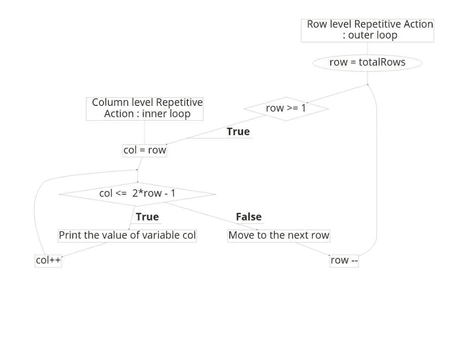

让我们执行以下程序来验证输出。

```
NumberPatternCCC1.py
```

```
totalRows = 5  # 要显示的行数

# 行级重复操作：
for row in range(totalRows, 0, -1):

    # 列级重复操作：
    # 打印同一行中的字符。
    # 打印数字前要打印的空格
    for col in range(row, 2 * row):
        print(col, end = " ")
        # 结束内层 for 循环

    print()  # 将控制移到下一行
    # 结束外层 for 循环
```

```
输出
```

```
5 6 7 8 9
4 5 6 7
3 4 5
2 3
1
```

**问题GBCCC1：** 修改程序 NumberPatternCCC1.py，使其应产生以下输出。

```
输出
________________________________________________________________________________

         9
       7
     5
   3
 1
```

### 替代解决方案

让我们尝试设计一个解决方案，使用递增的 for 循环处理行变量（1 到 5），并确定列变量的循环条件。

在这种情况下，行值与每一行中列变量的下限不匹配。因此，行变量；我们不能直接用它来表示列变量的下限。

我们将尝试使用其他变量 `totalRows = 5`（默认行数）来对其进行泛化。

| 行级重复操作（递增循环） | 预期输出 |
| :--- | :--- |
| 行 | 列级重复操作 | 循环条件 (下限 <= 列 <= 上限) | |
| | 下限 | 上限 | |
| | 默认 | 1 | 2 | 默认 | 1 | |
| 1 | 5 | totalRows | totalRows +1 - 1 | 9 | 2* totalRows - 1 | 5 6 7 8 9 |
| 2 | 4 | totalRows -1 | totalRows +1 - 2 | 7 | 2* totalRows - 3 | 4 5 6 7 |
| 3 | 3 | totalRows -2 | totalRows +1 - 3 | 5 | 2* totalRows - 5 | 3 4 5 |
| 4 | 2 | totalRows -3 | totalRows +1 - 4 | 3 | 2* totalRows - 7 | 2 3 |
| 5 | 1 | totalRows -4 | totalRows +1 - 5 | 1 | 2* totalRows - 9 | 1 |

下限逻辑表达式的一部分与行值匹配。由于所有数值都与每一行中行变量的值匹配，我们应该使用行变量来移除下限逻辑表达式中出现的数值。

| 列级重复操作 | 预期输出 |
| :--- | :--- |
| 行 | 循环条件 (下限 <= 列 <= 上限) | |
| | 下限 | 上限 | |
| | 默认 | 3 | 默认 | 1 | |
| 1 | 5 | totalRows +1 - 行 | 9 | 2* totalRows - 1 | 5 6 7 8 9 |
| 2 | 4 | totalRows +1 - 行 | 7 | 2* totalRows - 3 | 4 5 6 7 |
| 3 | 3 | totalRows +1 - 行 | 5 | 2* totalRows - 5 | 3 4 5 |
| 4 | 2 | totalRows +1 - 行 | 3 | 2* totalRows - 7 | 2 3 |
| 5 | 1 | totalRows +1 - 行 | 1 | 2* totalRows - 9 | 1 |

现在轮到泛化列变量的上限了。

| 列级重复操作 | 预期输出 |
| :--- | :--- |
| 行 | 循环条件 (下限 <= 列 <= 上限) | |
| | 下限 | 上限 | |
| | 3 | 默认 | 1 | 2 | |
| 1 | totalRows +1 - 行 | 9 | 2* totalRows - 1 | 2* totalRows - 1 | 5 6 7 8 9 |
| 2 | totalRows +1 - 行 | 7 | 2* totalRows - 3 | 2* totalRows - 2 -1 | 4 5 6 7 |
| 3 | totalRows +1 - 行 | 5 | 2* totalRows - 5 | 2* totalRows - 3 -2 | 3 4 5 |
| 4 | totalRows +1 - 行 | 3 | 2* totalRows - 7 | 2* totalRows - 4 -3 | 2 3 |
| 5 | totalRows +1 - 行 | 1 | 2* totalRows - 9 | 2* totalRows - 5 -4 | 1 |

让我们尝试使用行变量泛化上限的一部分，可以表示为；

| 列级重复操作 | 预期输出 |
| :--- | :--- |
| 行 | 循环条件 (下限 <= 列 <= 上限) | |
| | 下限 | 上限 | |
| | 3 | 4 | 5 | |
| 1 | totalRows +1 - 行 | 2* totalRows - 行 | 2* totalRows - 行 -1 +1 | 5 6 7 8 9 |
| 2 | totalRows +1 - 行 | 2* totalRows - 行 - 1 | 2* totalRows - 行 -2+1 | 4 5 6 7 |
| 3 | totalRows +1 - 行 | 2* totalRows - 行 - 2 | 2* totalRows - 行 - 3+1 | 3 4 5 |
| 4 | totalRows +1 - 行 | 2* totalRows - 行 - 3 | 2* totalRows - 行 – 4+1 | 2 3 |
| 5 | totalRows +1 - 行 | 2* totalRows - 行 - 4 | 2* totalRows - 行 – 5+1 | 1 |

同样，我们可以在上限中使用行变量来摆脱硬编码的数值。

| 列级重复操作 | 预期输出 |
| :--- | :--- |
| 行 | 循环条件 (下限 <= 列 <= 上限) | |
| | 下限 | 上限 | |
| | 3 | 6 | 7 | |
| 1 | totalRows +1 - 行 | 2* totalRows - 行 -行 +1 | 2* (totalRows – 行) + 1 | 5 6 7 8 9 |
| 2 | totalRows +1 - 行 | 2* totalRows - 行 -行 +1 | 2* (totalRows – 行) + 1 | 4 5 6 7 |
| 3 | totalRows +1 - 行 | 2* totalRows - 行 -行 +1 | 2* (totalRows – 行) + 1 | 3 4 5 |
| 4 | totalRows +1 - 行 | 2* totalRows - 行 -行 +1 | 2* (totalRows – 行) + 1 | 2 3 |
| 5 | totalRows +1 - 行 | 2* totalRows - 行 -行 +1 | 2* (totalRows – 行) + 1 | 1 |

下限和上限表达式都有 +1。
此外，如果我们通过 [1 <= 行 <= totalRows] 或 [0 <= 行 < totalRows] 运行外层循环，在任何一种情况下都是相同的。
通过从行中减去 1，下限和上限表达式将使其更简单。

| 列级重复操作 | 预期输出 |
| :--- | :--- |
| 行 | 循环条件 (下限 <= 列 < 上限) | |
| | 下限 | 上限 | |
| | 表达式 | 表达式 | |
| 1 -1 | totalRows +1 – 行 - 1 | 2* (totalRows – 行) + 1 - 1 | 5 6 7 8 9 |
| 2 -1 | totalRows +1 – 行 - 1 | 2* (totalRows – 行) + 1 - 1 | 4 5 6 7 |
| 3 -1 | totalRows +1 – 行 - 1 | 2* (totalRows – 行) + 1 - 1 | 3 4 5 |
| 4 -1 | totalRows +1 – 行 - 1 | 2* (totalRows – 行) + 1 - 1 | 2 3 |
| 5-1 | totalRows +1 – 行 - 1 | 2* (totalRows – 行) + 1- 1 | 1 |

| 列级重复操作 | 预期输出 |
| :--- | :--- |
| **行** | **循环条件 (下限 <= 列 < 上限)** |
| | **下限** | **上限** |
| | **表达式** | **表达式** |
| 0 | totalRows – 行 | 2* (totalRows – 行) | 5 6 7 8 9 |
| 1 | totalRows – 行 | 2* (totalRows – 行) | 4 5 6 7 |
| 2 | totalRows – 行 | 2* (totalRows – 行) | 3 4 5 |
| 3 | totalRows – 行 | 2* (totalRows – 行) | 2 3 |
| 4 | totalRows – 行 | 2* (totalRows – 行) | 1 |

因此，我们的**外层 for 循环**条件变为

| 循环条件 | 下限 <= 行 < 上限 |
| :--- | :--- |
| 数学表达式 | 0 <= 行 < totalRows |
| 语法 | for row in range(0, totalRows): |

因此，我们的**内层 for 循环**条件变为；

| 循环条件 | 下限 <= 列 < 上限 |
| :--- | :--- |
| 数学表达式 | (totalRows - 行) <= 列 < 2* (totalRows - 行) |
| 语法 | for col in range( (totalRows - row), 2 * (totalRows – row) ): |

流程图如下所示。

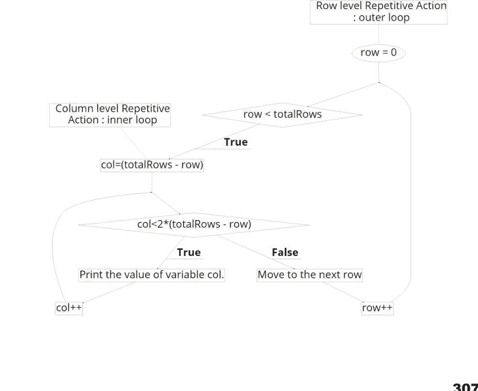

```
python
NumberPatternCCC2.py
totalRows = 5  # 要显示的行数

    # 行级重复操作：
for row in range(0, totalRows):

    # 列级重复操作：
    # 打印同一行中的字符。
    lower_limit = (totalRows - row)
    upper_limit = 2 * (totalRows - row)
    for col in range(lower_limit, upper_limit):
        print(col, end=" ")
        # 结束内层 for 循环

    print()  # 将控制移到下一行
    # 结束外层 for 循环
```

```
输出

5 6 7 8 9
4 5 6 7
3 4 5
2 3
1
```

### 数字模式 DDD

我们的编程任务是在计算机屏幕的某个部分打印出这个特定的、基于逻辑的图案。**我们的方法是假设计算机屏幕由行和列组合而成，将其虚拟划分为更小的方框**——最小的方框被视为仅容纳单个字符。显示屏上每个最小方框的地址在逻辑上将成为一个唯一的 **(行, 列)** 数字组合。基于这个假设，计算机屏幕将简单地是一个由均匀分布在整个屏幕上的、成对的 (行, 列) 数值组合构成的唯一组合。

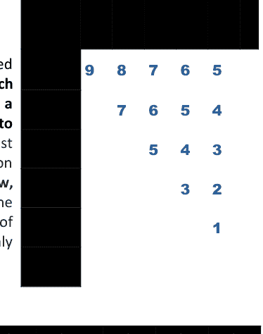

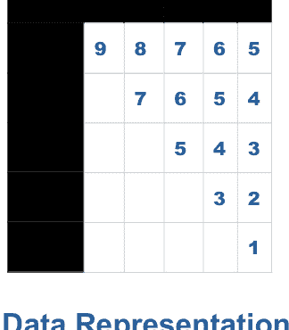

| | 列=1 | 列=2 | 列=3 | 列=4 | 列=5 |
|---|---|---|---|---|---|
| 行=1 | 9 | 8 | 7 | 6 | 5 |
| 行=2 | | 7 | 6 | 5 | 4 |
| 行=3 | | | 5 | 4 | 3 |
| 行=4 | | | | 3 | 2 |
| 行=5 | | | | | 1 |

#### 数据表示

尽管这是合乎逻辑的，但我们可以通过知道每个可打印字符在显示屏上唯一可识别的 **(行, 列)** 数字配对值来精确定位其位置。**例如；(2, 3)** 表示在假定的屏幕位置 **第2行和第3列** 打印数字字符。

#### (行, 列) 值对表示

| | 列=1 | 列=2 | 列=3 | 列=4 | 列=5 |
|---|---|---|---|---|---|
| 行=1 | 1,1 | 1,2 | 1,3 | 1,4 | 1,5 |
| 行=2 | | 2,2 | 2,3 | 2,4 | 2,5 |
| 行=3 | | | 3,3 | 3,4 | 3,5 |
| 行=4 | | | | 4,4 | 4,5 |
| 行=5 | | | | | 5,5 |

#### 输出分析

在这种情况下，我们需要处理在特定行的特定列打印两种不同类型的字符：

- 1) 空格字符
- 2) 数字字符

| 行 | 5 | | | | |
|---|---|---|---|---|---|
| 列 | 1 | 2 | 3 | 4 | 5 |
| 输出 | 9 | 8 | 7 | 6 | 5 |

对于行 = 1，0 <= 空格数 <= 0，9 >= 数字 >= 5

| 行 | 4 | | | | |
|---|---|---|---|---|---|
| 列 | 1 | 2 | 3 | 4 | 5 |
| 输出 | 空格 | 7 | 6 | 5 | 4 |

对于行 = 2，1 <= 空格数 <= 1，9 >= 数字 >= 5

| 行 | 3 | | | | |
|---|---|---|---|---|---|
| 列 | 1 | 2 | 3 | 4 | 5 |
| 输出 | 空格 | 空格 | 5 | 4 | 3 |

对于行 = 3，1 <= 空格数 <= 2，5 >= 数字 >= 3

| 行 | 2 | | | | |
|---|---|---|---|---|---|
| 列 | 1 | 2 | 3 | 4 | 5 |
| 输出 | 空格 | 空格 | 空格 | 3 | 2 |

对于行 = 4，1 <= 空格数 <= 3，3 >= 数字 >= 2

| 行 | 1 | | | | |
|---|---|---|---|---|---|
| 列 | 1 | 2 | 3 | 4 | 5 |
| 输出 | 空格 | 空格 | 空格 | 空格 | 1 |

对于行 = 5，1 <= 空格数 <= 4，1 >= 数字 >= 1

#### 观察

- 在行级别存在垂直重复，即行 = 1 到 5。
- 在列级别存在水平重复，即列 = 1 到 5。
- 这些被分为两部分——一部分用于重复打印空格，剩余的列用于打印数字字符。
- 在下面标记为“未知”的表格中，是尚未发现的逻辑表达式。我们需要探索剩余的逻辑表达式来定义以下给定的内层循环。

| For 循环 | 下限 | 上限 |
|---|---|---|
| 外层循环（递减） | 行=1 | 行>=5 |
| 内层循环 - 空格 | 列=1 | 未知 |
| 内层循环 – 数字（递减） | 数字 = 行 | 未知 |

### 列级别重复操作

| 行级别重复操作 | 预期输出 |
|---|---|
| 行 | 列级别重复操作 | | | | |
| | 下限 <= 列 <= 上限 | 上限 >= 数字 >= 下限 | | | |
| | 下限 | 上限 | 上限 | 下限 | |
| 行 = 5 | 1 | 0 | 9 | 5 | 行 | 9 8 7 6 5 |
| 行 = 4 | 1 | 1 | 7 | 4 | 行 | 7 6 5 4 |
| 行 = 3 | 1 | 2 | 5 | 3 | 行 | 5 4 3 |
| 行 = 2 | 1 | 3 | 3 | 2 | 行 | 3 2 |
| 行 = 1 | 1 | 4 | 1 | 1 | 行 | 1 |

空格和数字变量的下限对于所有行具有相同的数值表达式。它在所有行中是一致的。同样，我们需要为上限开发一个一致的表达式，使其适用于任意行数。其他剩余变量是行和总行数=5。让我们尝试使用这些变量进行概括。

| 列级别重复操作 | | | | | |
|---|---|---|---|---|---|
| 行 | 下限 <= 列 <= 上限 | | 上限 >= 数字 >= 下限 | | |
| | 下限 | 上限 | | 上限 | 下限 |
| 行 = 5 | | 0 | 5-5 | 总行数 - 行 | 9 | |
| 行 = 4 | | 1 | 5-4 | 总行数 - 行 | 7 | |
| 行 = 3 | 1 | 2 | 5-3 | 总行数 - 行 | 5 | 行 |
| 行 = 2 | | 3 | 5-2 | 总行数 - 行 | 3 | |
| 行 = 1 | | 4 | 5-1 | 总行数 - 行 | 1 | |

与行变量相关的内层 for 循环的上限是一个在所有行上通用的、一致的表达式。与数字变量相关的内层 for 循环的上限尚未通用化，因为在所有行上没有一致的数值或逻辑表达式。

| 列级别重复操作 | | | | | |
|---|---|---|---|---|---|
| 行 | 下限 <= 列 <= 上限 | | 上限 >= 数字 >= 下限 | | |
| | 下限 | 上限 | | 上限 | 下限 |
| 行 = 5 | | 0 | 总行数 - 行 | 9 | 10-1 | 2*5-1 | |
| 行 = 4 | | 1 | 总行数 - 行 | 7 | 8-1 | 2*4-1 | |
| 行 = 3 | 1 | 2 | 总行数 - 行 | 总行数 - 行 | 5 | 6-1 | 2*3-1 | 行 |
| 行 = 2 | | 3 | 总行数 - 行 | | 3 | 4-1 | 2*2-1 | |
| 行 = 1 | | 4 | 总行数 - 行 | | 1 | 2-1 | 2*1-1 | |

| 列级别重复操作 | | | | | |
|---|---|---|---|---|---|
| 行 | 下限 <= 列 <= 上限 | | 上限 >= 数字 >= 下限 | | |
| | 下限 | 上限 | | 上限 | 下限 |
| 行 = 5 | | | | 9 | 10-1 = 2* 5 -1 | 2*行 -1 | |
| 行 = 4 | | | | 7 | 8-1 = 2* 4 -1 | 2*行 -1 | |
| 行 = 3 | 1 | 总行数 - 行 | | 5 | 6-1 = 2* 3 -1 | 2*行 -1 | 行 |
| 行 = 2 | | | | 3 | 4-1 = 2* 2 -1 | 2*行 -1 | |
| 行 = 1 | | | | 1 | 2-1 = 2* 1 -1 | 2*行 -1 | |

| 行 | 列级别重复操作 | | | | |
| :--- | :--- | :--- | :--- | :--- | :--- |
| | 下限 <= 列 <= 上限 | | 上限 >= 数字 >= 下限 | | |
| | 下限 | 上限 | 上限 | | 下限 |
| 行 = 5 | 1 | 总行数 - 行 | 2* 5 -1 | 2*行 -1 | 2*行 -1 | 行 |
| 行 = 4 | 1 | 总行数 - 行 | 2* 4 -1 | 2*行 -1 | 2*行 -1 | 行 |
| 行 = 3 | 1 | 总行数 - 行 | 2* 3 -1 | 2*行 -1 | 2*行 -1 | 行 |
| 行 = 2 | 1 | 总行数 - 行 | 2* 2 -1 | 2*行 -1 | 2*行 -1 | 行 |
| 行 = 1 | 1 | 总行数 - 行 | 2* 1 -1 | 2*行 -1 | 2*行 -1 | 行 |

因此，列和数字变量的上限是通用的。下限和上限对于所有行是一致的。现在它对于任意行数都是通用的。所以它有两个重复过程，一个用于打印空格，第二个用于打印数字值。这意味着需要两个内层 for 循环在列级别打印字符，以及一个外层循环用于迭代行。

因此，我们用于打印空格的内层 for 循环条件变为

| 循环条件 | 下限 <= 列 <= 上限 |
| :--- | :--- |
| 数学表达式 | 1 <= 列 <= (总行数 - 行) |
| 语法 | for col in range(1, totalRows - row + 1): |

因此，我们用于打印数字的内层 for 循环条件变为；

| 循环条件 | 上限 >= 数字 >= 下限 |
| :--- | :--- |
| 数学表达式 | (2*行 - 1) >= 数字 >= 行 |
| 语法 | for num in range(2 * row - 1, row - 1, -1): |

我们可以将所有相关信息总结在如下流程图中。

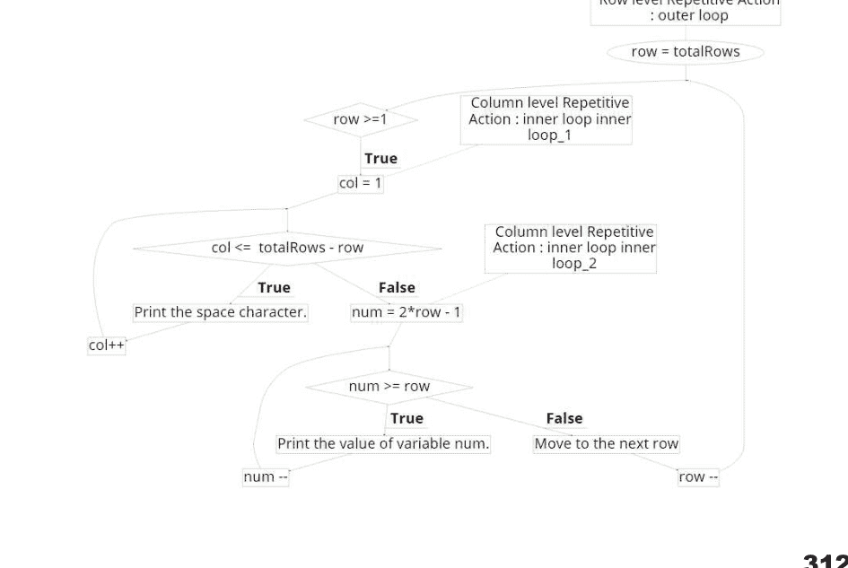

让我们执行以下程序。

```
NumberPatternDDD1.py
totalRows = 5  # 要显示的行数

    # 行级别重复操作：
for row in range(totalRows, 0, -1):

        # 列级别重复操作：
        # 在同一行打印字符。

        # 打印数字前要打印的空格
        for col in range(1, totalRows - row + 1):
            print(" ", end= " ")  # 2个空格
            # 内层 for 循环_1

        # 要打印的数字值，并以空格结尾
        for num in range(2 * row - 1, row - 1, -1):
            print(num, end = " ")
            # 内层 for 循环_2

    print()  # 将控制移到下一行
    # 结束外层 for 循环
```

### 输出

```
9 8 7 6 5
 7 6 5 4
  5 4 3
   3 2
    1
```

### 替代解决方案

由于列值在打印空格和数字之间有明确的划分，我们可以尝试使用 **if-else 条件** 结构来重现相同的结果，并将用于空格的 **循环条件** 作为 if 条件，在 **else 条件** 中打印数字。

```
NumberPatternDDD2.py
```

```
totalRows = 5  # 要显示的行数

    # 行级重复操作：
for row in range(totalRows, 0, -1):

    num = 2 * row - 1

        # 列级重复操作：
    for col in range(1, totalRows + 1):

        if (col <= (totalRows - row)):
            print(" " , end = " ") # 当需要打印空格时
        else:
            print(num,end = " ") # 当需要打印数字时
            num -= 1

            # 内层 for 循环结束

    print()  # 移动到下一行

        # 外层 for 循环结束
```

```
输出
```

```
9 8 7 6 5
 7 6 5 4
  5 4 3
   3 2
    1
```

### NumberPatternEEE

我们的编程任务是在计算机屏幕的某个部分打印这个特定的、基于逻辑的图案。**我们的方法是假设计算机屏幕是行和列的组合，将其虚拟地划分为更小的方框**——最小的方框被视为仅包含单个字符。显示屏上每个最小方框的地址在逻辑上将成为一个唯一的 **(行, 列)** 数字组合。基于这个假设，计算机屏幕将简单地是一个由 **(行, 列)** 数字值配对的方框组成的唯一组合，这些方框均匀地分布在整个屏幕上。

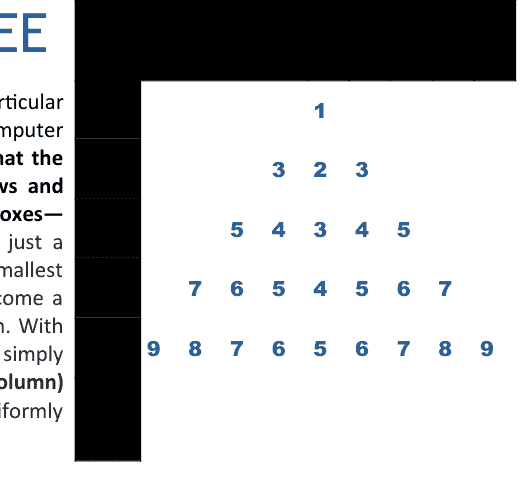

| | 列=1 | 列=2 | 列=3 | 列=4 | 列=5 | 列=6 | 列=7 | 列=8 | 列=9 |
|---|---|---|---|---|---|---|---|---|---|
| 行=1 | | | | | 1 | | | | |
| 行=2 | | | | 3 | 2 | 3 | | | |
| 行=3 | | | 5 | 4 | 3 | 4 | 5 | | |
| 行=4 | | 7 | 6 | 5 | 4 | 5 | 6 | 7 | |
| 行=5 | 9 | 8 | 7 | 6 | 5 | 6 | 7 | 8 | 9 |

#### 数据表示

尽管这是合乎逻辑的，但我们可以通过知道每个可打印字符在显示屏上的唯一可识别 **(行, 列)** 数字配对值来精确定位其位置。**例如；(4, 3)** 表示在假设的屏幕位置 **第4行和第3列** 打印数字字符。

#### (行, 列) 值对表示

| | 列=1 | 列=2 | 列=3 | 列=4 | 列=5 | 列=6 | 列=7 | 列=8 | 列=9 |
|---|---|---|---|---|---|---|---|---|---|
| 行=1 | | | | | 1, 5 | | | | |
| 行=2 | | | | 2, 4 | 2, 5 | 2, 6 | | | |
| 行=3 | | | 3, 3 | 3, 4 | 3, 5 | 3, 6 | 3, 7 | | |
| 行=4 | | 4, 2 | 4, 3 | 4, 4 | 4, 5 | 4, 6 | 4, 7 | 4, 8 | |
| 行=5 | 5, 1 | 5, 2 | 5, 3 | 5, 4 | 5, 5 | 5, 6 | 5, 7 | 5, 8 | 5, 9 |

#### 输出分析

行 1
列 1 2 3 4 5 6 7 8 9
输出 1
对于行 = 1, 5 <=列 <= 5

行 2
列 1 2 3 4 5 6 7 8 9
输出 3 2 3
对于行 = 2, 4 <=列 <= 6

行 3
列 1 2 3 4 5 6 7 8 9
输出 5 4 3 4 5
对于行 = 3, 3 <=列 <= 7,

行 4
列 1 2 3 4 5 6 7 8 9
输出 7 6 5 4 5 6 7
对于行 = 4, 2 <=列 <= 8,

行 5
列 1 2 3 4 5 6 7 8 9
输出 9 8 7 6 5 6 7 8 9
对于行 = 5, 1 <=列 <= 9

### 列级重复操作

| 行级重复操作 | 预期输出 |
| :--- | :--- |
| 行 | 列级重复操作 | 下限 <= 列 <= 上限 | |
| | 下限 | 上限 | |
| 1 | 5 | 5 | 1 |
| 2 | 4 | 6 | 3 2 3 |
| 3 | 3 | 7 | 5 4 3 4 5 |
| 4 | 2 | 8 | 7 6 5 4 5 6 7 |
| 5 | 1 | 9 | 9 8 7 6 5 6 7 8 9 |

下限和上限对于所有行并不一致。我们需要为上限和下限开发一致的表达式，使其适用于 n 行。其他剩余的变量是行，totalRows=5。让我们尝试使用这些变量进行泛化。

| 列级重复操作 | | | | | | |
| :--- | :--- | :--- | :--- | :--- | :--- | :--- |
| 行 | 下限 <= 列 <= 上限 | | | | | |
| | 下限 | | | 上限 | | |
| | 默认值 | 1 | 2 | 默认值 | 1 | |
| 1 | 5 | totalRows | totalRows +1 - 1 | 5 | totalRows | totalRows +1 - 1 |
| 2 | 4 | totalRows -1 | totalRows +1 - 2 | 6 | totalRows + 1 | totalRows + 2 - 1 |
| 3 | 3 | totalRows -2 | totalRows +1 - 3 | 7 | totalRows + 2 | totalRows + 3 - 1 |
| 4 | 2 | totalRows -3 | totalRows +1 - 4 | 8 | totalRows + 3 | totalRows + 4 - 1 |
| 5 | 1 | totalRows -4 | totalRows +1 - 5 | 9 | totalRows + 4 | totalRows + 5 - 1 |

### 列级重复操作

| 行 | 下限 <= 列 <= 上限 | | | |
| --- | --- | --- | --- | --- |
| | **下限** | | **上限** | |
| | **默认值** | **3** | **默认值** | **3** |
| 1 | 5 | totalRows +1 - 行 | 5 | totalRows + 行 - 1 |
| 2 | 4 | totalRows +1 - 行 | 6 | totalRows + 行 - 1 |
| 3 | 3 | totalRows +1 - 行 | 7 | totalRows + 行 - 1 |
| 4 | 2 | totalRows +1 - 行 | 8 | totalRows + 行 - 1 |
| 5 | 1 | totalRows +1 - 行 | 9 | totalRows + 行 - 1 |

下限和上限对于所有行是一致的。现在它对于任意行数都是通用的，给出了打印数字值的精确位置。因此我们的 if 条件变为；

| if 条件 | 下限 <=列<= 上限 |
| --- | --- |
| **数学表达式** | (totalRows +1 - 行) <= 列 <= (totalRows + 行 - 1) |
| **语法** | if (col >= ((totalRows - row) + 1) and col <= ((totalRows + row) - 1)): |

当满足 if 条件时，它将在特定行的该位置打印数字值，否则将打印空格字符。我们可以从给定的输出中观察到两点，可以表示为；

a) 每行的值从 (2*行 -1) 值开始，递减直到行值，然后进一步增加直到达到 (2*行 -1) 值。该值基本上像挂钟的钟摆一样振荡。让我们选择一个变量 **num**，它在每次新行开始时表示 (2*行 -1) 值。变量 num 的值然后在单行内振荡以给出输出。这可以通过下表显示。

**num** 变量从 (2*行 -1) 值开始的表格。

| 行 | num | 列<totalRows | 列=totalRows | 列>totalRows |
| --- | --- | --- | --- | --- |
| 1 | 1 | | 1 | |
| 2 | 2 | 3 | 2 | **3** |
| 3 | 3 | 5 4 | 3 | **4 5** |
| 4 | 4 | 7 6 5 | 4 | **5 6 7** |
| 5 | 5 | 9 8 7 6 | 5 | **6 7 8 9** |

| 列<totalRows | 列>=totalRows |
| --- | --- |
| if( 列<totalRows ) | if( 列>=totalRows ) |
| num =(2*行 -1) 值被打印。 | num 值被打印。 |
| num 值减少 1。 | num 值增加 1 直到 (2*行 -1) |

b) 除了第一行之外，列数多于 **totalRows** 计数。**totalRows** 值为 5。每行的列数不同。内层 **for 循环** 的上限需要泛化。

| 循环条件 | 下限 <=列<= 上限 |
| :--- | :--- |
| 数学表达式 | 1 <= 列 <= 9 |
| | 1 <=列 <= totalRows + 4 |
| | 1 <=列 <= totalRows + (totalRows - 1) |
| | 1<=列<=2* totalRows - 1 |
| 语法 | for col in range(1, 2 * totalRows): |

让我们验证用于显示每行的列变量或总列数的上限

对于 totalRows = 5，列 <= 9 等于 ( 2*5 - 1 )

对于 totalRows = 4，列 <= 7 等于 ( 2*4 - 1 )

因此，这种计算给定行值的总列数的泛化是令人满意的。

流程图可以如下所示。

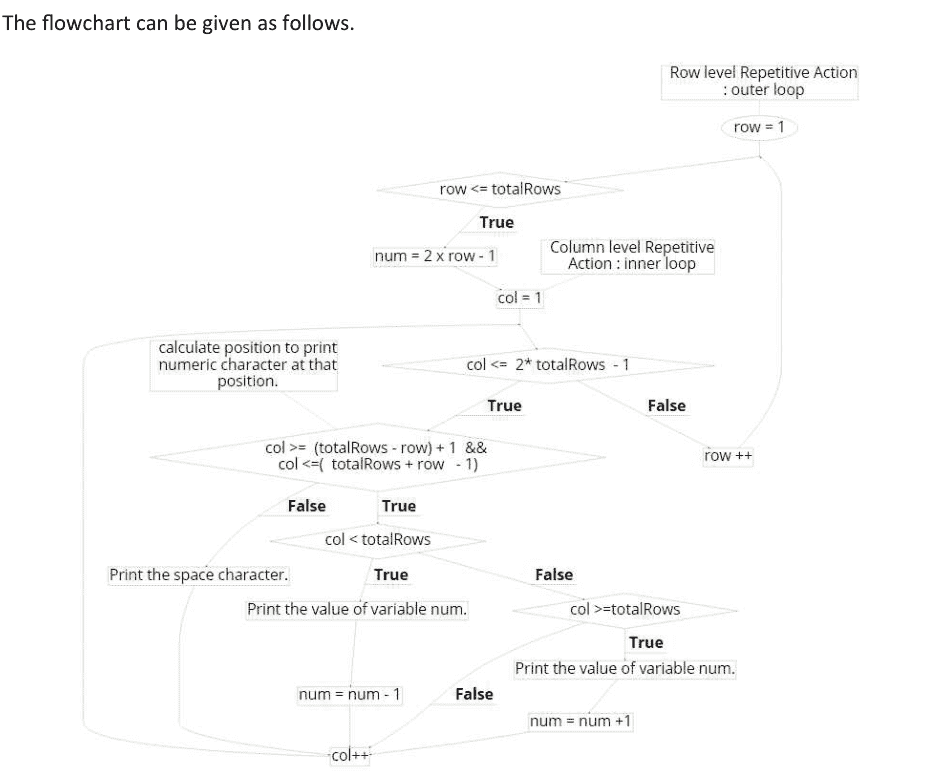

让我们根据我们的发现和流程图编写程序。

## NumberPatternEEE.py

```
totalRows = 5  # 要显示的行数

    # 行级重复操作：
    for row in range(1, totalRows):
        num = 2 * row - 1

        # 列级重复操作：
        for col in range(1, 2 * totalRows):

            # 计算打印数字字符的位置
            if (col >= ((totalRows - row) + 1) and col <= ((totalRows + row) - 1)):
                # 打印一个数字
                if (col < totalRows):
                    print(num , end = " ")
                    num = num - 1
                elif (col >= totalRows):
                    print(num, end = " ")
                    num = num + 1

            else:
                print("  ", end = " ")  # 打印 2 个空格

        #内层循环结束

        # 移动到下一行
        print()

    #外层循环结束
```

### 输出

```
        1
      3 2 3
    5 4 3 4 5
  7 6 5 4 5 6 7
9 8 7 6 5 6 7 8 9
```

| 问题GBBBB2： | 问题GBDD1： |
| :--- | :--- |
| 修改程序 NumberPatternBBB2.py 以显示以下输出。<br><br>        1<br>      2<br>    3<br>  4<br>5 | 修改程序 NumberPatternDDD1.py 以显示以下输出。<br><br>9<br>  7<br>    5<br>      3<br>        1 |

### 问题GBEEE

修改程序 NumberPatternEEE.py 以显示以下输出。

```
1
3 3
5 5
7 7
9 9
```

### 问题GBEEE1

修改程序 PatternEEE.py 以显示以下输出。

```
1
3 2 3
5 3 5
7 4 7
9 5 9
```

### 问题GB

编写程序以生成以下输出。

```
1>=1
2>=1 2>=2
3>=1 3>=2 3>=3
4>=1 4>=2 4>=3 4>=4
5>=1 5>=2 5>=3 5>=4 5>=5
```

```
<<~>><<~>><<~>><<~>><<~>><<~>><<~>><<~>><<~>><<~>><<~>><<~>><<~>><<~>><<~>><<~>><<~>><<~>><<~>><<~>><<~>><<~>><<~>><<~>><<~>><<~>><<~>><<~>><<~>><<~>><<~>><<~>><<~>><<~>><<~>><<~>><<~>><<~>><<~>><<~>><<~>><<~>><<~>><<~>><<~>><<~>><<~>><<~>><<~>><<~>><<~>><<~>><<~>><<~>><<~>><<~>><<~>><<~>><<~>><<~>><<~>><<~>><<~>><<~>><<~>><<~>><<~>><<~>><<~>><<~>><<~>><<~>><<~>><<~>><<~>><<~>><<~>><<~>><<~>><<~>><<~>><<~>><<~>><<~>><<~>><<~>><<~>><<~>><<~>><<~>><<~>><<~>><<~>><<~>><<~>><<~>><<~>><<~>><<~>><<~>><<~>><<~>><<~>><<~>><<~>><<~>><<~>><<~>><<~>><<~>><<~>><<~>><<~>><<~>><<~>><<~>><<~>><<~>><<~>><<~>><<~>><<~>><<~>><<~>><<~>><<~>><<~>><<~>><<~>><<~>><<~>><<~>><<~>><<~>><<~>><<~>><<~>><<~>><<~>><<~>><<~>><<~>><<~>><<~>><<~>><<~>><<~>><<~>><<~>><<~>><<~>><<~>><<~>><<~>><<~>><<~>><<~>><<~>><<~>><<~>><<~>><<~>><<~>><<~>><<~>><<~>><<~>><<~>><<~>><<~>><<~>><<~>><<~>><<~>><<~>><<~>><<~>><<~>><<~>><<~>><<~>><<~>><<~>><<~>><<~>><<~>><<~>><<~>><<~>><<~>><<~>><<~>><<~>><<~>><<~>><<~>><<~>><<~>><<~>><<~>><<~>><<~>><<~>><<~>><<~>><<~>><<~>><<~>><<~>><<~>><<~>><<~>><<~>><<~>><<~>><<~>><<~>><<~>><<~>><<~>><<~>><<~>><<~>><<~>><<~>><<~>><<~>><<~>><<~>><<~>><<~>><<~>><<~>><<~>><<~>><<~>><<~>><<~>><<~>><<~>><<~>><<~>><<~>><<~>><<~>><<~>><<~>><<~>><<~>><<~>><<~>><<~>><<~>><<~>><<~>><<~>><<~>><<~>><<~>><<~>><<~>><<~>><<~>><<~>><<~>><<~>><<~>><<~>><<~>><<~>><<~>><<~>><<~>><<~>><<~>><<~>><<~>><<~>><<~>><<~>><<~>><<~>><<~>><<~>><<~>><<~>><<~>><<~>><<~>><<~>><<~>><<~>><<~>><<~>><<~>><<~>><<~>><<~>><<~>><<~>><<~>><<~>><<~>><<~>><<~>><<~>><<~>><<~>><<~>><<~>><<~>><<~>><<~>><<~>><<~>><<~>><<~>><<~>><<~>><<~>><<~>><<~>><<~>><<~>><<~>><<~>><<~>><<~>><<~>><<~>><<~>><<~>><<~>><<~>><<~>><<~>><<~>><<~>><<~>><<~>><<~>><<~>><<~>><<~>><<~>><<~>><<~>><<~>><<~>><<~>><<~>><<~>><<~>><<~>><<~>><<~>><<~>><<~>><<~>><<~>><<~>><<~>><<~>><<~>><<~>><<~>><<~>><<~>><<~>><<~>><<~>><<~>><<~>><<~>><<~>><<~>><<~>><<~>><<~>><<~>><<~>><<~>><<~>><<~>><<~>><<~>><<~>><<~>><<~>><<~>><<~>><<~>><<~>><<~>><<~>><<~>><<~>><<~>><<~>><<~>><<~>><<~>><<~>><<~>><<~>><<~>><<~>><<~>><<~>><<~>><<~>><<~>><<~>><<~>><<~>><<~>><<~>><<~>><<~>><<~>><<~>><<~>><<~>><<~>><<~>><<~>><<~>><<~>><<~>><<~>><<~>><<~>><<~>><<~>><<~>><<~>><<~>><<~>><<~>><<~>><<~>><<~>><<~>><<~>><<~>><<~>><<~>><<~>><<~>><<~>><<~>><<~>><<~>><<~>><<~>><<~>><<~>><<~>><<~>><<~>><<~>><<~>><<~>><<~>><<~>><<~>><<~>><<~>><<~>><<~>><<~>><<~>><<~>><<~>><<~>><<~>><<~>><<~>><<~>><<~>><<~>><<~>><<~>><<~>><<~>><<~>><<~>><<~>><<~>><<~>><<~>><<~>><<~>><<~>><<~>><<~>><<~>><<~>><<~>><<~>><<~>><<~>><<~>><<~>><<~>><<~>><<~>><<~>><<~>><<~>><<~>><<~>><<~>><<~>><<~>><<~>><<~>><<~>><<~>><<~>><<~>><<~>><<~>><<~>><<~>><<~>><<~>><<~>><<~>><<~>><<~>><<~>><<~>><<~>><<~>><<~>><<~>><<~>><<~>><<~>><<~>><<~>><<~>><<~>><<~>><<~>><<~>><<~>><<~>><<~>><<~>><<~>><<~>><<~>><<~>><<~>><<~>><<~>><<~>><<~>><<~>><<~>><<~>><<~>><<~>><<~>><<~>><<~>><<~>><<~>><<~>><<~>><<~>><<~>><<~>><<~>><<~>><<~>><<~>><<~>><<~>><<~>><<~>><<~>><<~>><<~>><<~>><<~>><<~>><<~>><<~>><<~>><<~>><<~>><<~>><<~>><<~>><<~>><<~>><<~>><<~>><<~>><<~>><<~>><<~>><<~>><<~>><<~>><<~>><<~>><<~>><<~>><<~>><<~>><<~>><<~>><<~>><<~>><<~>><<~>><<~>><<~>><<~>><<~>><<~>><<~>><<~>><<~>><<~>><<~>><<~>><<~>><<~>><<~>><<~>><<~>><<~>><<~>><<~>><<~>><<~>><<~>><<~>><<~>><<~>><<~>><<~>><<~>><<~>><<~>><<~>><<~>><<~>><<~>><<~>><<~>><<~>><<~>><<~>><<~>><<~>><<~>><<~>><<~>><<~>><<~>><<~>><<~>><<~>><<~>><<~>><<~>><<~>><<~>><<~>><<~>><<~>><<~>><<~>><<~>><<~>><<~>><<~>><<~>><<~>><<~>><<~>><<~>><<~>><<~>><<~>><<~>><<~>><<~>><<~>><<~>><<~>><<~>><<~>><<~>><<~>><<~>><<~>><<~>><<~>><<~>><<~>><<~>><<~>><<~>><<~>><<~>><<~>><<~>><<~>><<~>><<~>><<~>><<~>><<~>><<~>><<~>><<~>><<~>><<~>><<~>><<~>><<~>><<~>><<~>><<~>><<~>><<~>><<~>><<~>><<~>><<~>><<~>><<~>><<~>><<~>><<~>><<~>><<~>><<~>><<~>><<~>><<~>><<~>><<~>><<~>><<~>><<~>><<~>><<~>><<~>><<~>><<~>><<~>><<~>><<~>><<~>><<~>><<~>><<~>><<~>><<~>><<~>><<~>><<~>><<~>><<~>><<~>><<~>><<~>><<~>><<~>><<~>><<~>><<~>><<~>><<~>><<~>><<~>><<~>><<~>><<~>><<~>><<~>><<~>><<~>><<~>><<~>><<~>><<~>><<~>><<~>><<~>><<~>><<~>><<~>><<~>><<~>><<~>><<~>><<~>><<~>><<~>><<~>><<~>><<~>><<~>><<~>><<~>><<~>><<~>><<~>><<~>><<~>><<~>><<~>><<~>><<~>><<~>><<~>><<~>><<~>><<~>><<~>><<~>><<~>><<~>><<~>><<~>><<~>><<~>><<~>><<~>><<~>><<~>><<~>><<~>><<~>><<~>><<~>><<~>><<~>><<~>><<~>><<~>><<~>><<~>><<~>><<~>><<~>><<~>><<~>><<~>><<~>><<~>><<~>><<~>><<~>><<~>><<~>><<~>><<~>><<~>><<~>><<~>><<~>><<~>><<~>><<~>><<~>><<~>><<~>><<~>><<~>><<~>><<~>><<~>><<~>><<~>><<~>><<~>><<~>><<~>><<~>><<~>><<~>><<~>><<~>><<~>><<~>><<~>><<~>><<~>><<~>><<~>><<~>><<~>><<~>><<~>><<~>><<~>><<~>><<~>><<~>><<~>><<~>><<~>><<~>><<~>><<~>><<~>><<~>><<~>><<~>><<~>><<~>><<~>><<~>><<~>><<~>><<~>><<~>><<~>><<~>><<~>><<~>><<~>><<~>><<~>><<~>><<~>><<~>><<~>><<~>><<~>><<~>><<~>><<~>><<~>><<~>><<~>><<~>><<~>><<~>><<~>><<~>><<~>><<~>><<~>><<~>><<~>><<~>><<~>><<~>><<~>><<~>><<~>><<~>><<~>><<~>><<~>><<~>><<~>><<~>><<~>><<~>><<~>><<~>><<~>><<~>><<~>><<~>><<~>><<~>><<~>><<~>><<~>><<~>><<~>><<~>><<~>><<~>><<~>><<~>><<~>><<~>><<~>><<~>><<~>><<~>><<~>><<~>><<~>><<~>><<~>><<~>><<~>><<~>><<~>><<~>><<~>><<~>><<~>><<~>><<~>><<~>><<~>><<~>><<~>><<~>><<~>><<~>><<~>><<~>><<~>><<~>><<~>><<~>><<~>><<~>><<~>><<~>><<~>><<~>><<~>><<~>><<~>><<~>><<~>><<~>><<~>><<~>><<~>><<~>><<~>><<~>><<~>><<~>><<~>><<~>><<~>><<~>><<~>><<~>><<~>><<~>><<~>><<~>><<~>><<~>><<~>><<~>><<~>><<~>><<~>><<~>><<~>><<~>><<~>><<~>><<~>><<~>><<~>><<~>><<~>><<~>><<~>><<~>><<~>><<~>><<~>><<~>><<~>><<~>><<~>><<~>><<~>><<~>><<~>><<~>><<~>><<~>><<~>><<~>><<~>><<~>><<~>><<~>><<~>><<~>><<~>><<~>><<~>><<~>><<~>><<~>><<~>><<~>><<~>><<~>><<~>><<~>><<~>><<~>><<~>><<~>><<~>><<~>><<~>><<~>><<~>><<~>><<~>><<~>><<~>><<~>><<~>><<~>><<~>><<~>><<~>><<~>><<~>><<~>><<~>><<~>><<~>><<~>><<~>><<~>><<~>><<~>><<~>><<~>><<~>><<~>><<~>><<~>><<~>><<~>><<~>><<~>><<~>><<~>><<~>><<~>><<~>><<~>><<~>><<~>><<~>><<~>><<~>><<~>><<~>><<~>><<~>><<~>><<~>><<~>><<~>><<~>><<~>><<~>><<~>><<~>><<~>><<~>><<~>><<~>><<~>><<~>><<~>><<~>><<~>><<~>><<~>><<~>><<~>><<~>><<~>><<~>><<~>><<~>><<~>><<~>><<~>><<~>><<~>><<~>><<~>><<~>><<~>><<~>><<~>><<~>><<~>><<~>><<~>><<~>><<~>><<~>><<~>><<~>><<~>><<~>><<~>><<~>><<~>><<~>><<~>><<~>><<~>><<~>><<~>><<~>><<~>><<~>><<~>><<~>><<~>><<~>><<~>><<~>><<~>><<~>><<~>><<~>><<~>><<~>><<~>><<~>><<~>><<~>><<~>><<~>><<~>><<~>><<~>><<~>><<~>><<~>><<~>><<~>><<~>><<~>><<~>><<~>><<~>><<~>><<~>><<~>><<~>><<~>><<~>><<~>><<~>><<~>><<~>><<~>><<~>><<~>><<~>><<~>><<~>><<~>><<~>><<~>><<~>><<~>><<~>><<~>><<~>><<~>><<~>><<~>><<~>><<~>><<~>><<~>><<~>><<~>><<~>><<~>><<~>><<~>><<~>><<~>><<~>><<~>><<~>><<~>><<~>><<~>><<~>><<~>><<~>><<~>><<~>><<~>><<~>><<~>><<~>><<~>><<~>><<~>><<~>><<~>><<~>><<~>><<~>><<~>><<~>><<~>><<~>><<~>><<~>><<~>><<~>><<~>><<~>><<~>><<~>><<~>><<~>><<~>><<~>><<~>><<~>><<~>><<~>><<~>><<~>><<~>><<~>><<~>><<~>><<~>><<~>><<~>><<~>><<~>><<~>><<~>><<~>><<~>><<~>><<~>><<~>><<~>><<~>><<~>><<~>><<~>><<~>><<~>><<~>><<~>><<~>><<~>><<~>><<~>><<~>><<~>><<~>><<~>><<~>><<~>><<~>><<~>><<~>><<~>><<~>><<~>><<~>><<~>><<~>><<~>><<~>><<~>><<~>><<~>><<~>><<~>><<~>><<~>><<~>><<~>><<~>><<~>><<~>><<~>><<~>><<~>><<~>><<~>><<~>><<~>><<~>><<~>><<~>><<~>><<~>><<~>><<~>><<~>><<~>><<~>><<~>><<~>><<~>><<~>><<~>><<~>><<~>><<~>><<~>><<~>><<~>><<~>><<~>><<~>><<~>><<~>><<~>><<~>><<~>><<~>><<~>><<~>><<~>><<~>><<~>><<~>><<~>><<~>><<~>><<~>><<~>><<~>><<~>><<~>><<~>><<~>><<~>><<~>><<~>><<~>><<~>><<~>><<~>><<~>><<~>><<~>><<~>><<~>><<~>><<~>><<~>><<~>><<~>><<~>><<~>><<~>><<~>><<~>><<~>><<~>><<~>><<~>><<~>><<~>><<~>><<~>><<~>><<~>><<~>><<~>><<~>><<~>><<~>><<~>><<~>><<~>><<~>><<~>><<~>><<~>><<~>><<~>><<~>><<~>><<~>><<~>><<~>><<~>><<~>><<~>><<~>><<~>><<~>><<~>><<~>><<~>><<~>><<~>><<~>><<~>><<~>><<~>><<~>><<~>><<~>><<~>><<~>><<~>><<~>><<~>><<~>><<~>><<~>><<~>><<~>><<~>><<~>><<~>><<~>><<~>><<~>><<~>><<~>><<~>><<~>><<~>><<~>><<~>><<~>><<~>><<~>><<~>><<~>><<~>><<~>><<~>><<~>><<~>><<~>><<~>><<~>><<~>><<~>><<~>><<~>><<~>><<~>><<~>><<~>><<~>><<~>><<~>><<~>><<~>><<~>><<~>><<~>><<~>><<~>><<~>><<~>><<~>><<~>><<~>><<~>><<~>><<~>><<~>><<~>><<~>><<~>><<~>><<~>><<~>><<~>><<~>><<~>><<~>><<~>><<~>><<~>><<~>><<~>><<~>><<~>><<~>><<~>><<~>><<~>><<~>><<~>><<~>><<~>><<~>><<~>><<~>><<~>><<~>><<~>><<~>><<~>><<~>><<~>><<~>><<~>><<~>><<~>><<~>><<~>><<~>><<~>><<~>><<~>><<~>><<~>><<~>><<~>><<~>><<~>><<~>><<~>><<~>><<~>><<~>><<~>><<~>><<~>><<~>><<~>><<~>><<~>><<~>><<~>><<~>><<~>><<~>><<~>><<~>><<~>><<~>><<~>><<~>><<~>><<~>><<~>><<~>><<~>><<~>><<~>><<~>><<~>><<~>><<~>><<~>><<~>><<~>><<~>><<~>><<~>><<~>><<~>><<~>><<~>><<~>><<~>><<~>><<~>><<~>><<~>><<~>><<~>><<~>><<~>><<~>><<~>><<~>><<~>><<~>><<~>><<~>><<~>><<~>><<~>><<~>><<~>><<~>><<~>><<~>><<~>><<~>><<~>><<~>><<~>><<~>><<~>><<~>><<~>><<~>><<~>><<~>><<~>><<~>><<~>><<~>><<~>><<~>><<~>><<~>><<~>><<~>><<~>><<~>><<~>><<~>><<~>><<~>><<~>><<~>><<~>><<~>><<~>><<~>><<~>><<~>><<~>><<~>><<~>><<~>><<~>><<~>><<~>><<~>><<~>><<~>><<~>><<~>><<~>><<~>><<~>><<~>><<~>><<~>><<~>><<~>><<~>><<~>><<~>><<~>><<~>><<~>><<~>><<~>><<~>><<~>><<~>><<~>><<~>><<~>><<~>><<~>><<~>><<~>><<~>><<~>><<~>><<~>><<~>><<~>><<~>><<~>><<~>><<~>><<~>><<~>><<~>><<~>><<~>><<~>><<~>><<~>><<~>><<~>><<~>><<~>><<~>><<~>><<~>><<~>><<~>><<~>><<~>><<~>><<~>><<~>><<~>><<~>><<~>><<~>><<~>><<~>><<~>><<~>><<~>><<~>><<~>><<~>><<~>><<~>><<~>><<~>><<~>><<~>><<~>><<~>><<~>><<~>><<~>><<~>><<~>><<~>><<~>><<~>><<~>><<~>><<~>><<~>><<~>><<~>><<~>><<~>><<~>><<~>><<~>><<~>><<~>><<~>><<~>><<~>><<~>><<~>><<~>><<~>><<~>><<~>><<~>><<~>><<~>><<~>><<~>><<~>><<~>><<~>><<~>><<~>><<~>><<~>><<~>><<~>><<~>><<~>><<~>><<~>><<~>><<~>><<~>><<~>><<~>><<~>><<~>><<~>><<~>><<~>><<~>><<~>><<~>><<~>><<~>><<~>><<~>><<~>><<~>><<~>><<~>><<~>><<~>><<~>><<~>><<~>><<~>><<~>><<~>><<~>><<~>><<~>><<~>><<~>><<~>><<~>><<~>><<~>><<~>><<~>><<~>><<~>><<~>><<~>><<~>><<~>><<~>><<~>><<~>><<~>><<~>><<~>><<~>><<~>><<~>><<~>><<~>><<~>><<~>><<~>><<~>><<~>><<~>><<~>><<~>><<~>><<~>><<~>><<~>><<~>><<~>><<~>><<~>><<~>><<~>><<~>><<~>><<~>><<~>><<~>><<~>><<~>><<~>><<~>><<~>><<~>><<~>><<~>><<~>><<~>><<~>><<~>><<~>><<~>><<~>><<~>><<~>><<~>><<~>><<~>><<~>><<~>><<~>><<~>><<~>><<~>><<~>><<~>><<~>><<~>><<~>><<~>><<~>><<~>><<~>><<~>><<~>><<~>><<~>><<~>><<~>><<~>><<~>><<~>><<~>><<~>><<~>><<~>><<~>><<~>><<~>><<~>><<~>><<~>><<~>><<~>><<~>><<~>><<~>><<~>><<~>><<~>><<~>><<~>><<~>><<~>><<~>><<~>><<~>><<~>><<~>><<~>><<~>><<~>><<~>><<~>><<~>><<~>><<~>><<~>><<~>><<~>><<~>><<~>><<~>><<~>><<~>><<~>><<~>><<~>><<~>><<~>><<~>><<~>><<~>><<~>><<~>><<~>><<~>><<~>><<~>><<~>><<~>><<~>><<~>><<~>><<~>><<~>><<~>><<~>><<~>><<~>><<~>><<~>><<~>><<~>><<~>><<~>><<~>><<~>><<~>><<~>><<~>><<~>><<~>><<~>><<~>><<~>><<~>><<~>><<~>><<~>><<~>><<~>><<~>><<~>><<~>><<~>><<~>><<~>><<~>><<~>><<~>><<~>><<~>><<~>><<~>><<~>><<~>><<~>><<~>><<~>><<~>><<~>><<~>><<~>><<~>><<~>><<~>><<~>><<~>><<~>><<~>><<~>><<~>><<~>><<~>><<~>><<~>><<~>><<~>><<~>><<~>><<~>><<~>><<~>><<~>><<~>><<~>><<~>><<~>><<~>><<~>><<~>><<~>><<~>><<~>><<~>><<~>><<~>><<~>><<~>><<~>><<~>><<~>><<~>><<~>><<~>><<~>><<~>><<~>><<~>><<~>><<~>><<~>><<~>><<~>><<~>><<~>><<~>><<~>><<~>><<~>><<~>><<~>><<~>><<~>><<~>><<~>><<~>><<~>><<~>><<~>><<~>><<~>><<~>><<~>><<~>><<~>><<~>><<~>><<~>><<~>><<~>><<~>><<~>><<~>><<~>><<~>><<~>><<~>><<~>><<~>><<~>><<~>><<~>><<~>><<~>><<~>><<~>><<~>><<~>><<~>><<~>><<~>><<~>><<~>><<~>><<~>><<~>><<~>><<~>><<~>><<~>><<~>><<~>><<~>><<~>><<~>><<~>><<~>><<~>><<~>><<~>><<~>><<~>><<~>><<~>><<~>><<~>><<~>><<~>><<~>><<~>><<~>><<~>><<~>><<~>><<~>><<~>><<~>><<~>><<~>><<~>><<~>><<~>><<~>><<~>><<~>><<~>><<~>><<~>><<~>><<~>><<~>><<~>><<~>><<~>><<~>><<~>><<~>><<~>><<~>><<~>><<~>><<~>><<~>><<~>><<~>><<~>><<~>><<~>><<~>><<~>><<~>><<~>><<~>><<~>><<~>><<~>><<~>><<~>><<~>><<~>><<~>><<~>><<~>><<~>><<~>><<~>><<~>><<~>><<~>><<~>><<~>><<~>><<~>><<~>><<~>><<~>><<~>><<~>><<~>><<~>><<~>><<~>><<~>><<~>><<~>><<~>><<~>><<~>><<~>><<~>><<~>><<~>><<~>><<~>><<~>><<~>><<~>><<~>><<~>><<~>><<~>><<~>><<~>><<~>><<~>><<~>><<~>><<~>><<~>><<~>><<~>><<~>><<~>><<~>><<~>><<~>><<~>><<~>><<~>><<~>><<~>><<~>><<~>><<~>><<~>><<~>><<~>><<~>><<~>><<~>><<~>><<~>><<~>><<~>><<~>><<~>><<~>><<~>><<~>><<~>><<~>><<~>><<~>><<~>><<~>><<~>><<~>><<~>><<~>><<~>><<~>><<~>><<~>><<~>><<~>><<~>><<~>><<~>><<~>><<~>><<~>><<~>><<~>><<~>><<~>><<~>><<~>><<~>><<~>><<~>><<~>><<~>><<~>><<~>><<~>><<~>><<~>><<~>><<~>><<~>><<~>><<~>><<~>><<~>><<~>><<~>><<~>><<~>><<~>><<~>><<~>><<~>><<~>><<~>><<~>><<~>><<~>><<~>><<~>><<~>><<~>><<~>><<~>><<~>><<~>><<~>><<~>><<~>><<~>><<~>><<~>><<~>><<~>><<~>><<~>><<~>><<~>><<~>><<~>><<~>><<~>><<~>><<~>><<~>><<~>><<~>><<~>><<~>><<~>><<~>><<~>><<~>><<~>><<~>><<~>><<~>><<~>><<~>><<~>><<~>><<~>><<~>><<~>><<~>><<~>><<~>><<~>><<~>><<~>><<~>><<~>><<~>><<~>><<~>><<~>><<~>><<~>><<~>><<~>><<~>><<~>><<~>><<~>><<~>><<~>><<~>><<~>><<~>><<~>><<~>><<~>><<~>><<~>><<~>><<~>><<~>><<~>><<~>><<~>><<~>><<~>><<~>><<~>><<~>><<~>><<~>><<~>><<~>><<~>><<~>><<~>><<~>><<~>><<~>><<~>><<~>><<~>><<~>><<~>><<~>><<~>><<~>><<~>><<~>><<~>><<~>><<~>><<~>><<~>><<~>><<~>><<~>><<~>><<~>><<~>><<~>><<~>><<~>><<~>><<~>><<~>><<~>><<~>><<~>><<~>><<~>><<~>><<~>><<~>><<~>><<~>><<~>><<~>><<~>><<~>><<~>><<~>><<~>><<~>><<~>><<~>><<~>><<~>><<~>><<~>><<~>><<~>><<~>><<~>><<~>><<~>><<~>><<~>><<~>><<~>><<~>><<~>><<~>><<~>><<~>><<~>><<~>><<~>><<~>><<~>><<~>><<~>><<~>><<~>><<~>><<~>><<~>><<~>><<~>><<~>><<~>><<~>><<~>><<~>><<~>><<~>><<~>><<~>><<~>><<~>><<~>><<~>><<~>><<~>><<~>><<~>><<~>><<~>><<~>><<~>><<~>><<~>><<~>><<~>><<~>><<~>><<~>><<~>><<~>><<~>><<~>><<~>><<~>><<~>><<~>><<~>><<~>><<~>><<~>><<~>><<~>><<~>><<~>><<~>><<~>><<~>><<~>><<~>><<~>><<~>><<~>><<~>><<~>><<~>><<~>><<~>><<~>><<~>><<~>><<~>><<~>><<~>><<~>><<~>><<~>><<~>><<~>><<~>><<~>><<~>><<~>><<~>><<~>><<~>><<~>><<~>><<~>><<~>><<~>><<~>><<~>><<~>><<~>><<~>><<~>><<~>><<~>><<~>><<~>><<~>><<~>><<~>><<~>><<~>><<~>><<~>><<~>><<~>><<~>><<~>><<~>><<~>><<~>><<~>><<~>><<~>><<~>><<~>><<~>><<~>><<~>><<~>><<~>><<~>><<~>><<~>><<~>><<~>><<~>><<~>><<~>><<~>><<~>><<~>><<~>><<~>><<~>><<~>><<~>><<~>><<~>><<~>><<~>><<~>><<~>><<~>><<~>><<~>><<~>><<~>><<~>><<~>><<~>><<~>><<~>><<~>><<~>><<~>><<~>><<~>><<~>><<~>><<~>><<~>><<~>><<~>><<~>><<~>><<~>><<~>><<~>><<~>><<~>><<~>><<~>><<~>><<~>><<~>><<~>><<~>><<~>><<~>><<~>><<~>><<~>><<~>><<~>><<~>><<~>><<~>><<~>><<~>><<~>><<~>><<~>><<~>><<~>><<~>><<~>><<~>><<~>><<~>><<~>><<~>><<~>><<~>><<~>><<~>><<~>><<~>><<~>><<~>><<~>><<~>><<~>><<~>><<~>><<~>><<~>><<~>><<~>><<~>><<~>><<~>><<~>><<~>><<~>><<~>><<~>><<~>><<~>><<~>><<~>><<~>><<~>><<~>><<~>><<~>><<~>><<~>><<~>><<~>><<~>><<~>><<~>><<~>><<~>><<~>><<~>><<~>><<~>><<~>><<~>><<~>><<~>><<~>><<~>><<~>><<~>><<~>><<~>><<~>><<~>><<~>><<~>><<~>><<~>><<~>><<~>><<~>><<~>><<~>><<~>><<~>><<~>><<~>><<~>><<~>><<~>><<~>><<~>><<~>><<~>><<~>><<~>><<~>><<~>><<~>><<~>><<~>><<~>><<~>><<~>><<~>><<~>><<~>><<~>><<~>><<~>><<~>><<~>><<~>><<~>><<~>><<~>><<~>><<~>><<~>><<~>><<~>><<~>><<~>><<~>><<~>><<~>><<~>><<~>><<~>><<~>><<~>><<~>><<~>><<~>><<~>><<~>><<~>><<~>><<~>><<~>><<~>><<~>><<~>><<~>><<~>><<~>><<~>><<~>><<~>><<~>><<~>><<~>><<~>><<~>><<~>><<~>><<~>><<~>><<~>><<~>><<~>><<~>><<~>><<~>><<~>><<~>><<~>><<~>><<~>><<~>><<~>><<~>><<~>><<~>><<~>><<~>><<~>><<~>><<~>><<~>><<~>><<~>><<~>><<~>><<~>><<~>><<~>><<~>><<~>><<~>><<~>><<~>><<~>><<~>><<~>><<~>><<~>><<~>><<~>><<~>><<~>><<~>><<~>><<~>><<~>><<~>><<~>><<~>><<~>><<~>><<~>><<~>><<~>><<~>><<~>><<~>><<~>><<~>><<~>><<~>><<~>><<~>><<~>><<~>><<~>><<~>><<~>><<~>><<~>><<~>><<~>><<~>><<~>><<~>><<~>><<~>><<~>><<~>><<~>><<~>><<~>><<~>><<~>><<~>><<~>><<~>><<~>><<~>><<~>><<~>><<~>><<~>><<~>><<~>><<~>><<~>><<~>><<~>><<~>><<~>><<~>><<~>><<~>><<~>><<~>><<~>><<~>><<~>><<~>><<~>><<~>><<~>><<~>><<~>><<~>><<~>><<~>><<~>><<~>><<~>><<~>><<~>><<~>><<~>><<~>><<~>><<~>><<~>><<~>><<~>><<~>><<~>><<~>><<~>><<~>><<~>><<~>><<~>><<~>><<~>><<~>><<~>><<~>><<~>><<~>><<~>><<~>><<~>><<~>><<~>><<~>><<~>><<~>><<~>><<~>><<~>><<~>><<~>><<~>><<~>><<~>><<~>><<~>><<~>><<~>><<~>><<~>><<~>><<~>><<~>><<~>><<~>><<~>><<~>><<~>><<~>><<~>><<~>><<~>><<~>><<~>><<~>><<~>><<~>><<~>><<~>><<~>><<~>><<~>><<~>><<~>><<~>><<~>><<~>><<~>><<~>><<~>><<~>><<~>><<~>><<~>><<~>><<~>><<~>><<~>><<~>><<~>><<~>><<~>><<~>><<~>><<~>><<~>><<~>><<~>><<~>><<~>><<~>><<~>><<~>><<~>><<~>><<~>><<~>><<~>><<~>><<~>><<~>><<~>><<~>><<~>><<~>><<~>><<~>><<~>><<~>><<~>><<~>><<~>><<~>><<~>><<~>><<~>><<~>><<~>><<~>><<~>><<~>><<~>><<~>><<~>><<~>><<~>><<~>><<~>><<~>><<~>><<~>><<~>><<~>><<~>><<~>><<~>><<~>><<~>><<~>><<~>><<~>><<~>><<~>><<~>><<~>><<~>><<~>><<~>><<~>><<~>><<~>><<~>><<~>><<~>><<~>><<~>><<~>><<~>><<~>><<~>><<~>><<~>><<~>><<~>><<~>><<~>><<~>><<~>><<~>><<~>><<~>><<~>><<~>><<~>><<~>><<~>><<~>><<~>><<~>><<~>><<~>><<~>><<~>><<~>><<~>><<~>><<~>><<~>><<~>><<~>><<~>><<~>><<~>><<~>><<~>><<~>><<~>><<~>><<~>><<~>><<~>><<~>><<~>><<~>><<~>><<~>><<~>><<~>><<~>><<~>><<~>><<~>><<~>><<~>><<~>><<~>><<~>><<~>><<~>><<~>><<~>><<~>><<~>><<~>><<~>><<~>><<~>><<~>><<~>><<~>><<~>><<~>><<~>><<~>><<~>><<~>><<~>><<~>><<~>><<~>><<~>><<~>><<~>><<~>><<~>><<~>><<~>><<~>><<~>><<~>><<~>><<~>><<~>><<~>><<~>><<~>><<~>><<~>><<~>><<~>><<~>><<~>><<~>><<~>><<~>><<~>><<~>><<~>><<~>><<~>><<~>><<~>><<~>><<~>><<~>><<~>><<~>><<~>><<~>><<~>><<~>><<~>><<~>><<~>><<~>><<~>><<~>><<~>><<~>><<~>><<~>><<~>><<~>><<~>><<~>><<~>><<~>><<~>><<~>><<~>><<~>><<~>><<~>><<~>><<~>><<~>><<~>><<~>><<~>><<~>><<~>><<~>><<~>><<~>><<~>><<~>><<~>><<~>><<~>><<~>><<~>><<~>><<~>><<~>><<~>><<~>><<~>><<~>><<~>><<~>><<~>><<~>><<~>><<~>><<~>><<~>><<~>><<~>><<~>><<~>><<~>><<~>><<~>><<~>><<~>><<~>><<~>><<~>><<~>><<~>><<~>><<~>><<~>><<~>><<~>><<~>><<~>><<~>><<~>><<~>><<~>><<~>><<~>><<~>><<~>><<~>><<~>><<~>><<~>><<~>><<~>><<~>><<~>><<~>><<~>><<~>><<~>><<~>><<~>><<~>><<~>><<~>><<~>><<~>><<~>><<~>><<~>><<~>><<~>><<~>><<~>><<~>><<~>><<~>><<~>><<~>><<~>><<~>><<~>><<~>><<~>><<~>><<~>><<~>><<~>><<~>><<~>><<~>><<~>><<~>><<~>><<~>><<~>><<~>><<~>><<~>><<~>><<~>><<~>><<~>><<~>><<~>><<~>><<~>><<~>><<~>><<~>><<~>><<~>><<~>><<~>><<~>><<~>><<~>><<~>><<~>><<~>><<~>><<~>><<~>><<~>><<~>><<~>><<~>><<~>><<~>><<~>><<~>><<~>><<~>><<~>><<~>><<~>><<~>><<~>><<~>><<~>><<~>><<~>><<~>><<~>><<~>><<~>><<~>><<~>><<~>><<~>><<~>><<~>><<~>><<~>><<~>><<~>><<~>><<~>><<~>><<~>><<~>><<~>><<~>><<~>><<~>><<~>><<~>><<~>><<~>><<~>><<~>><<~>><<~>><<~>><<~>><<~>><<~>><<~>><<~>><<~>><<~>><<~>><<~>><<~>><<~>><<~>><<~>><<~>><<~>><<~>><<~>><<~>><<~>><<~>><<~>><<~>><<~>><<~>><<~>><<~>><<~>><<~>><<~>><<~>><<~>><<~>><<~>><<~>><<~>><<~>><<~>><<~>><<~>><<~>><<~>><<~>><<~>><<~>><<~>><<~>><<~>><<~>><<~>><<~>><<~>><<~>><<~>><<~>><<~>><<~>><<~>><<~>><<~>><<~>><<~>><<~>><<~>><<~>><<~>><<~>><<~>><<~>><<~>><<~>><<~>><<~>><<~>><<~>><<~>><<~>><<~>><<~>><<~>><<~>><<~>><<~>><<~>><<~>><<~>><<~>><<~>><<~>><<~>><<~>><<~>><<~>><<~>><<~>><<~>><<~>><<~>><<~>><<~>><<~>><<~>><<~>><<~>><<~>><<~>><<~>><<~>><<~>><<~>><<~>><<~>><<~>><<~>><<~>><<~>><<~>><<~>><<~>><<~>><<~>><<~>><<~>><<~>><<~>><<~>><<~>><<~>><<~>><<~>><<~>><<~>><<~>><<~>><<~>><<~>><<~>><<~>><<~>><<~>><<~>><<~>><<~>><<~>><<~>><<~>><<~>><<~>><<~>><<~>><<~>><<~>><<~>><<~>><<~>><<~>><<~>><<~>><<~>><<~>><<~>><<~>><<~>><<~>><<~>><<~>><<~>><<~>><<~>><<~>><<~>><<~>><<~>><<~>><<~>><<~>><<~>><<~>><<~>><<~>><<~>><<~>><<~>><<~>><<~>><<~>><<~>><<~>><<~>><<~>><<~>><<~>><<~>><<~>><<~>><<~>><<~>><<~>><<~>><<~>><<~>><<~>><<~>><<~>><<~>><<~>><<~>><<~>><<~>><<~>><<~>><<~>><<~>><<~>><<~>><<~>><<~>><<~>><<~>><<~>><<~>><<~>><<~>><<~>><<~>><<~>><<~>><<~>><<~>><<~>><<~>><<~>><<~>><<~>><<~>><<~>><<~>><<~>><<~>><<~>><<~>><<~>><<~>><<~>><<~>><<~>><<~>><<~>><<~>><<~>><<~>><<~>><<~>><<~>><<~>><<~>><<~>><<~>><<~>><<~>><<~>><<~>><<~>><<~>><<~>><<~>><<~>><<~>><<~>><<~>><<~>><<~>><<~>><<~>><<~>><<~>><<~>><<~>><<~>><<~>><<~>><<~>><<~>><<~>><<~>><<~>><<~>><<~>><<~>><<~>><<~>><<~>><<~>><<~>><<~>><<~>><<~>><<~>><<~>><<~>><<~>><<~>><<~>><<~>><<~>><<~>><<~>><<~>><<~>><<~>><<~>><<~>><<~>><<~>><<~>><<~>><<~>><<~>><<~>><<~>><<~>><<~>><<~>><<~>><<~>><<~>><<~>><<~>><<~>><<~>><<~>><<~>><<~>><<~>><<~>><<~>><<~>><<~>><<~>><<~>><<~>><<~>><<~>><<~>><<~>><<~>><<~>><<~>><<~>><<~>><<~>><<~>><<~>><<~>><<~>><<~>><<~>><<~>><<~>><<~>><<~>><<~>><<~>><<~>><<~>><<~>><<~>><<~>><<~>><<~>><<~>><<~>><<~>><<~>><<~>><<~>><<~>><<~>><<~>><<~>><<~>><<~>><<~>><<~>><<~>><<~>><<~>><<~>><<~>><<~>><<~>><<~>><<~>><<~>><<~>><<~>><<~>><<~>><<~>><<~>><<~>><<~>><<~>><<~>><<~>><<~>><<~>><<~>><<~>><<~>><<~>><<~>><<~>><<~>><<~>><<~>><<~>><<~>><<~>><<~>><<~>><<~>><<~>><<~>><<~>><<~>><<~>><<~>><<~>><<~>><<~>><<~>><<~>><<~>><<~>><<~>><<~>><<~>><<~>><<~>><<~>><<~>><<~>><<~>><<~>><<~>><<~>><<~>><<~>><<~>><<~>><<~>><<~>><<~>><<~>><<~>><<~>><<~>><<~>><<~>><<~>><<~>><<~>><<~>><<~>><<~>><<~>><<~>><<~>><<~>><<~>><<~>><<~>><<~>><<~>><<~>><<~>><<~>><<~>><<~>><<~>><<~>><<~>><<~>><<~>><<~>><<~>><<~>><<~>><<~>><<~>><<~>><<~>><<~>><<~>><<~>><<~>><<~>><<~>><<~>><<~>><<~>><<~>><<~>><<~>><<~>><<~>><<~>><<~>><<~>><<~>><<~>><<~>><<~>><<~>><<~>><<~>><<~>><<~>><<~>><<~>><<~>><<~>><<~>><<~>><<~>><<~>><<~>><<~>><<~>><<~>><<~>><<~>><<~>><<~>><<~>><<~>><<~>><<~>><<~>><<~>><<~>><<~>><<~>><<~>><<~>><<~>><<~>><<~>><<~>><<~>><<~>><<~>><<~>><<~>><<~>><<~>><<~>><<~>><<~>><<~>><<~>><<~>><<~>><<~>><<~>><<~>><<~>><<~>><<~>><<~>><<~>><<~>><<~>><<~>><<~>><<~>><<~>><<~>><<~>><<~>><<~>><<~>><<~>><<~>><<~>><<~>><<~>><<~>><<~>><<~>><<~>><<~>><<~>><<~>><<~>><<~>><<~>><<~>><<~>><<~>><<~>><<~>><<~>><<~>><<~>><<~>><<~>><<~>><<~>><<~>><<~>><<~>><<~>><<~>><<~>><<~>><<~>><<~>><<~>><<~>><<~>><<~>><<~>><<~>><<~>><<~>><<~>><<~>><<~>><<~>><<~>><<~>><<~>><<~>><<~>><<~>><<~>><<~>><<~>><<~>><<~>><<~>><<~>><<~>><<~>><<~>><<~>><<~>><<~>><<~>><<~>><<~>><<~>><<~>><<~>><<~>><<~>><<~>><<~>><<~>><<~>><<~>><<~>><<~>><<~>><<~>><<~>><<~>><<~>><<~>><<~>><<~>><<~>><<~>><<~>><<~>><<~>><<~>><<~>><<~>><<~>><<~>><<~>><<~>><<~>><<~>><<~>><<~>><<~>><<~>><<~>><<~>><<~>><<~>><<~>><<~>><<~>><<~>><<~>><<~>><<~>><<~>><<~>><<~>><<~>><<~>><<~>><<~>><<~>><<~>><<~>><<~>><<~>><<~>><<~>><<~>><<~>><<~>><<~>><<~>><<~>><<~>><<~>><<~>><<~>><<~>><<~>><<~>><<~>><<~>><<~>><<~>><<~>><<~>><<~>><<~>><<~>><<~>><<~>><<~>><<~>><<~>><<~>><<~>><<~>><<~>><<~>><<~>><<~>><<~>><<~>><<~>><<~>><<~>><<~>><<~>><<~>><<~>><<~>><<~>><<~>><<~>><<~>><<~>><<~>><<~>><<~>><<~>><<~>><<~>><<~>><<~>><<~>><<~>><<~>><<~>><<~>><<~>><<~>><<~>><<~>><<~>><<~>><<~>><<~>><<~>><<~>><<~>><<~>><<~>><<~>><<~>><<~>><<~>><<~>><<~>><<~>><<~>><<~>><<~>><<~>><<~>><<~>><<~>><<~>><<~>><<~>><<~>><<~>><<~>><<~>><<~>><<~>><<~>><<~>><<~>><<~>><<~>><<~>><<~>><<~>><<~>><<~>><<~>><<~>><<~>><<~>><<~>><<~>><<~>><<~>><<~>><<~>><<~>><<~>><<~>><<~>><<~>><<~>><<~>><<~>><<~>><<~>><<~>><<~>><<~>><<~>><<~>><<~>><<~>><<~>><<~>><<~>><<~>><<~>><<~>><<~>><<~>><<~>><<~>><<~>><<~>><<~>><<~>><<~>><<~>><<~>><<~>><<~>><<~>><<~>><<~>><<~>><<~>><<~>><<~>><<~>><<~>><<~>><<~>><<~>><<~>><<~>><<~>><<~>><<~>><<~>><<~>><<~>><<~>><<~>><<~>><<~>><<~>><<~>><<~>><<~>><<~>><<~>><<~>><<~>><<~>><<~>><<~>><<~>><<~>><<~>><<~>><<~>><<~>><<~>><<~>><<~>><<~>><<~>><<~>><<~>><<~>><<~>><<~>><<~>><<~>><<~>><<~>><<~>><<~>><<~>><<~>><<~>><<~>><<~>><<~>><<~>><<~>><<~>><<~>><<~>><<~>><<~>><<~>><<~>><<~>><<~>><<~>><<~>><<~>><<~>><<~>><<~>><<~>><<~>><<~>><<~>><<~>><<~>><<~>><<~>><<~>><<~>><<~>><<~>><<~>><<~>><<~>><<~>><<~>><<~>><<~>><<~>><<~>><<~>><<~>><<~>><<~>><<~>><<~>><<~>><<~>><<~>><<~>><<~>><<~>><<~>><<~>><<~>><<~>><<~>><<~>><<~>><<~>><<~>><<~>><<~>><<~>><<~>><<~>><<~>><<~>><<~>><<~>><<~>><<~>><<~>><<~>><<~>><<~>><<~>><<~>><<~>><<~>><<~>><<~>><<~>><<~>><<~>><<~>><<~>><<~>><<~>><<~>><<~>><<~>><<~>><<~>><<~>><<~>><<~>><<~>><<~>><<~>><<~>><<~>><<~>><<~>><<~>><<~>><<~>><<~>><<~>><<~>><<~>><<~>><<~>><<~>><<~>><<~>><<~>><<~>><<~>><<~>><<~>><<~>><<~>><<~>><<~>><<~>><<~>><<~>><<~>><<~>><<~>><<~>><<~>><<~>><<~>><<~>><<~>><<~>><<~>><<~>><<~>><<~>><<~>><<~>><<~>><<~>><<~>><<~>><<~>><<~>><<~>><<~>><<~>><<~>><<~>><<~>><<~>><<~>><<~>><<~>><<~>><<~>><<~>><<~>><<~>><<~>><<~>><<~>><<~>><<~>><<~>><<~>><<~>><<~>><<~>><<~>><<~>><<~>><<~>><<~>><<~>><<~>><<~>><<~>><<~>><<~>><<~>><<~>><<~>><<~>><<~>><<~>><<~>><<~>><<~>><<~>><<~>><<~>><<~>><<~>><<~>><<~>><<~>><<~>><<~>><<~>><<~>><<~>><<~>><<~>><<~>><<~>><<~>><<~>><<~>><<~>><<~>><<~>><<~>><<~>><<~>><<~>><<~>><<~>><<~>><<~>><<~>><<~>><<~>><<~>><<~>><<~>><<~>><<~>><<~>><<~>><<~>><<~>><<~>><<~>><<~>><<~>><<~>><<~>><<~>><<~>><<~>><<~>><<~>><<~>><<~>><<~>><<~>><<~>><<~>><<~>><<~>><<~>><<~>><<~>><<~>><<~>><<~>><<~>><<~>><<~>><<~>><<~>><<~>><<~>><<~>><<~>><<~>><<~>><<~>><<~>><<~>><<~>><<~>><<~>><<~>><<~>><<~>><<~>><<~>><<~>><<~>><<~>><<~>><<~>><<~>><<~>><<~>><<~>><<~>><<~>><<~>><<~>><<~>><<~>><<~>><<~>><<~>><<~>><<~>><<~>><<~>><<~>><<~>><<~>><<~>><<~>><<~>><<~>><<~>><<~>><<~>><<~>><<~>><<~>><<~>><<~>><<~>><<~>><<~>><<~>><<~>><<~>><<~>><<~>><<~>><<~>><<~>><<~>><<~>><<~>><<~>><<~>><<~>><<~>><<~>><<~>><<~>><<~>><<~>><<~>><<~>><<~>><<~>><<~>><<~>><<~>><<~>><<~>><<~>><<~>><<~>><<~>><<~>><<~>><<~>><<~>><<~>><<~>><<~>><<~>><<~>><<~>><<~>><<~>><<~>><<~>><<~>><<~>><<~>><<~>><<~>><<~>><<~>><<~>><<~>><<~>><<~>><<~>><<~>><<~>><<~>><<~>><<~>><<~>><<~>><<~>><<~>><<~>><<~>><<~>><<~>><<~>><<~>><<~>><<~>><<~>><<~>><<~>><<~>><<~>><<~>><<~>><<~>><<~>><<~>><<~>><<~>><<~>><<~>><<~>><<~>><<~>><<~>><<~>><<~>><<~>><<~>><<~>><<~>><<~>><<~>><<~>><<~>><<~>><<~>><<~>><<~>><<~>><<~>><<~>><<~>><<~>><<~>><<~>><<~>><<~>><<~>><<~>><<~>><<~>><<~>><<~>><<~>><<~>><<~>><<~>><<~>><<~>><<~>><<~>><<~>><<~>><<~>><<~>><<~>><<~>><<~>><<~>><<~>><<~>><<~>><<~>><<~>><<~>><<~>><<~>><<~>><<~>><<~>><<~>><<~>><<~>><<~>><<~>><<~>><<~>><<~>><<~>><<~>><<~>><<~>><<~>><<~>><<~>><<~>><<~>><<~>><<~>><<~>><<~>><<~>><<~>><<~>><<~>><<~>><<~>><<~>><<~>><<~>><<~>><<~>><<~>><<~>><<~>><<~>><<~>><<~>><<~>><<~>><<~>><<~>><<~>><<~>><<~>><<~>><<~>><<~>><<~>><<~>><<~>><<~>><<~>><<~>><<~>><<~>><<~>><<~>><<~>><<~>><<~>><<~>><<~>><<~>><<~>><<~>><<~>><<~>><<~>><<~>><<~>><<~>><<~>><<~>><<~>><<~>><<~>><<~>><<~>><<~>><<~>><<~>><<~>><<~>><<~>><<~>><<~>><<~>><<~>><<~>><<~>><<~>><<~>><<~>><<~>><<~>><<~>><<~>><<~>><<~>><<~>><<~>><<~>><<~>><<~>><<~>><<~>><<~>><<~>><<~>><<~>><<~>><<~>><<~>><<~>><<~>><<~>><<~>><<~>><<~>><<~>><<~>><<~>><<~>><<~>><<~>><<~>><<~>><<~>><<~>><<~>><<~>><<~>><<~>><<~>><<~>><<~>><<~>><<~>><<~>><<~>><<~>><<~>><<~>><<~>><<~>><<~>><<~>><<~>><<~>><<~>><<~>><<~>><<~>><<~>><<~>><<~>><<~>><<~>><<~>><<~>><<~>><<~>><<~>><<~>><<~>><<~>><<~>><<~>><<~>><<~>><<~>><<~>><<~>><<~>><<~>><<~>><<~>><<~>><<~>><<~>><<~>><<~>><<~>><<~>><<~>><<~>><<~>><<~>><<~>><<~>><<~>><<~>><<~>><<~>><<~>><<~>><<~>><<~>><<~>><<~>><<~>><<~>><<~>><<~>><<~>><<~>><<~>><<~>><<~>><<~>><<~>><<~>><<~>><<~>><<~>><<~>><<~>><<~>><<~>><<~>><<~>><<~>><<~>><<~>><<~>><<~>><<~>><<~>><<~>><<~>><<~>><<~>><<~>><<~>><<~>><<~>><<~>><<~>><<~>><<~>><<~>><<~>><<~>><<~>><<~>><<~>><<~>><<~>><<~>><<~>><<~>><<~>><<~>><<~>><<~>><<~>><<~>><<~>><<~>><<~>><<~>><<~>><<~>><<~>><<~>><<~>><<~>><<~>><<~>><<~>><<~>><<~>><<~>><<~>><<~>><<~>><<~>><<~>><<~>><<~>><<~>><<~>><<~>><<~>><<~>><<~>><<~>><<~>><<~>><<~>><<~>><<~>><<~>><<~>><<~>><<~>><<~>><<~>><<~>><<~>><<~>><<~>><<~>><<~>><<~>><<~>><<~>><<~>><<~>><<~>><<~>><<~>><<~>><<~>><<~>><<~>><<~>><<~>><<~>><<~>><<~>><<~>><<~>><<~>><<~>><<~>><<~>><<~>><<~>><<~>><<~>><<~>><<~>><<~>><<~>><<~>><<~>><<~>><<~>><<~>><<~>><<~>><<~>><<~>><<~>><<~>><<~>><<~>><<~>><<~>><<~>><<~>><<~>><<~>><<~>><<~>><<~>><<~>><<~>><<~>><<~>><<~>><<~>><<~>><<~>><<~>><<~>><<~>><<~>><<~>><<~>><<~>><<~>><<~>><<~>><<~>><<~>><<~>><<~>><<~>><<~>><<~>><<~>><<~>><<~>><<~>><<~>><<~>><<~>><<~>><<~>><<~>><<~>><<~>><<~>><<~>><<~>><<~>><<~>><<~>><<~>><<~>><<~>><<~>><<~>><<~>><<~>><<~>><<~>><<~>><<~>><<~>><<~>><<~>><<~>><<~>><<~>><<~>><<~>><<~>><<~>><<~>><<~>><<~>><<~>><<~>><<~>><<~>><<~>><<~>><<~>><<~>><<~>><<~>><<~>><<~>><<~>><<~>><<~>><<~>><<~>><<~>><<~>><<~>><<~>><<~>><<~>><<~>><<~>><<~>><<~>><<~>><<~>><<~>><<~>><<~>><<~>><<~>><<~>><<~>><<~>><<~>><<~>><<~>><<~>><<~>><<~>><<~>><<~>><<~>><<~>><<~>><<~>><<~>><<~>><<~>><<~>><<~>><<~>><<~>><<~>><<~>><<~>><<~>><<~>><<~>><<~>><<~>><<~>><<~>><<~>><<~>><<~>><<~>><<~>><<~>><<~>><<~>><<~>><<~>><<~>><<~>><<~>><<~>><<~>><<~>><<~>><<~>><<~>><<~>><<~>><<~>><<~>><<~>><<~>><<~>><<~>><<~>><<~>><<~>><<~>><<~>><<~>><<~>><<~>><<~>><<~>><<~>><<~>><<~>><<~>><<~>><<~>><<~>><<~>><<~>><<~>><<~>><<~>><<~>><<~>><<~>><<~>><<~>><<~>><<~>><<~>><<~>><<~>><<~>><<~>><<~>><<~>><<~>><<~>><<~>><<~>><<~>><<~>><<~>><<~>><<~>><<~>><<~>><<~>><<~>><<~>><<~>><<~>><<~>><<~>><<~>><<~>><<~>><<~>><<~>><<~>><<~>><<~>><<~>><<~>><<~>><<~>><<~>><<~>><<~>><<~>><<~>><<~>><<~>><<~>><<~>><<~>><<~>><<~>><<~>><<~>><<~>><<~>><<~>><<~>><<~>><<~>><<~>><<~>><<~>><<~>><<~>><<~>><<~>><<~>><<~>><<~>><<~>><<~>><<~>><<~>><<~>><<~>><<~>><<~>><<~>><<~>><<~>><<~>><<~>><<~>><<~>><<~>><<~>><<~>><<~>><<~>><<~>><<~>><<~>><<~>><<~>><<~>><<~>><<~>><<~>><<~>><<~>><<~>><<~>><<~>><<~>><<~>><<~>><<~>><<~>><<~>><<~>><<~>><<~>><<~>><<~>><<~>><<~>><<~>><<~>><<~>><<~>><<~>><<~>><<~>><<~>><<~>><<~>><<~>><<~>><<~>><<~>><<~>><<~>><<~>><<~>><<~>><<~>><<~>><<~>><<~>><<~>><<~>><<~>><<~>><<~>><<~>><<~>><<~>><<~>><<~>><<~>><<~>><<~>><<~>><<~>><<~>><<~>><<~>><<~>><<~>><<~>><<~>><<~>><<~>><<~>><<~>><<~>><<~>><<~>><<~>><<~>><<~>><<~>><<~>><<~>><<~>><<~>><<~>><<~>><<~>><<~>><<~>><<~>><<~>><<~>><<~>><<~>><<~>><<~>><<~>><<~>><<~>><<~>><<~>><<~>><<~>><<~>><<~>><<~>><<~>><<~>><<~>><<~>><<~>><<~>><<~>><<~>><<~>><<~>><<~>><<~>><<~>><<~>><<~>><<~>><<~>><<~>><<~>><<~>><<~>><<~>><<~>><<~>><<~>><<~>><<~>><<~>><<~>><<~>><<~>><<~>><<~>><<~>><<~>><<~>><<~>><<~>><<~>><<~>><<~>><<~>><<~>><<~>><<~>><<~>><<~>><<~>><<~>><<~>><<~>><<~>><<~>><<~>><<~>><<~>><<~>><<~>><<~>><<~>><<~>><<~>><<~>><<~>><<~>><<~>><<~>><<~>><<~>><<~>><<~>><<~>><<~>><<~>><<~>><<~>><<~>><<~>><<~>><<~>><<~>><<~>><<~>><<~>><<~>><<~>><<~>><<~>><<~>><<~>><<~>><<~>><<~>><<~>><<~>><<~>><<~>><<~>><<~>><<~>><<~>><<~>><<~>><<~>><<~>><<~>><<~>><<~>><<~>><<~>><<~>><<~>><<~>><<~>><<~>><<~>><<~>><<~>><<~>><<~>><<~>><<~>><<~>><<~>><<~>><<~>><<~>><<~>><<~>><<~>><<~>><<~>><<~>><<~>><<~>><<~>><<~>><<~>><<~>><<~>><<~>><<~>><<~>><<~>><<~>><<~>><<~>><<~>><<~>><<~>><<~>><<~>><<~>><<~>><<~>><<~>><<~>><<~>><<~>><<~>><<~>><<~>><<~>><<~>><<~>><<~>><<~>><<~>><<~>><<~>><<~>><<~>><<~>><<~>><<~>><<~>><<~>><<~>><<~>><<~>><<~>><<~>><<~>><<~>><<~>><<~>><<~>><<~>><<~>><<~>><<~>><<~>><<~>><<~>><<~>><<~>><<~>><<~>><<~>><<~>><<~>><<~>><<~>><<~>><<~>><<~>><<~>><<~>><<~>><<~>><<~>><<~>><<~>><<~>><<~>><<~>><<~>><<~>><<~>><<~>><<~>><<~>><<~>><<~>><<~>><<~>><<~>><<~>><<~>><<~>><<~>><<~>><<~>><<~>><<~>><<~>><<~>><<~>><<~>><<~>><<~>><<~>><<~>><<~>><<~>><<~>><<~>><<~>><<~>><<~>><<~>><<~>><<~>><<~>><<~>><<~>><<~>><<~>><<~>><<~>><<~>><<~>><<~>><<~>><<~>><<~>><<~>><<~>><<~>><<~>><<~>><<~>><<~>><<~>><<~>><<~>><<~>><<~>><<~>><<~>><<~>><<~>><<~>><<~>><<~>><<~>><<~>><<~>><<~>><<~>><<~>><<~>><<~>><<~>><<~>><<~>><<~>><<~>><<~>><<~>><<~>><<~>><<~>><<~>><<~>><<~>><<~>><<~>><<~>><<~>><<~>><<~>><<~>><<~>><<~>><<~>><<~>><<~>><<~>><<~>><<~>><<~>><<~>><<~>><<~>><<~>><<~>><<~>><<~>><<~>><<~>><<~>><<~>><<~>><<~>><<~>><<~>><<~>><<~>><<~>><<~>><<~>><<~>><<~>><<~>><<~>><<~>><<~>><<~>><<~>><<~>><<~>><<~>><<~>><<~>><<~>><<~>><<~>><<~>><<~>><<~>><<~>><<~>><<~>><<~>><<~>><<~>><<~>><<~>><<~>><<~>><<~>><<~>><<~>><<~>><<~>><<~>><<~>><<~>><<~>><<~>><<~>><<~>><<~>><<~>><<~>><<~>><<~>><<~>><<~>><<~>><<~>><<~>><<~>><<~>><<~>><<~>><<~>><<~>><<~>><<~>><<~>><<~>><<~>><<~>><<~>><<~>><<~>><<~>><<~>><<~>><<~>><<~>><<~>><<~>><<~>><<~>><<~>><<~>><<~>><<~>><<~>><<~>><<~>><<~>><<~>><<~>><<~>><<~>><<~>><<~>><<~>><<~>><<~>><<~>><<~>><<~>><<~>><<~>><<~>><<~>><<~>><<~>><<~>><<~>><<~>><<~>><<~>><<~>><<~>><<~>><<~>><<~>><<~>><<~>><<~>><<~>><<~>><<~>><<~>><<~>><<~>><<~>><<~>><<~>><<~>><<~>><<~>><<~>><<~>><<~>><<~>><<~>><<~>><<~>><<~>><<~>><<~>><<~>><<~>><<~>><<~>><<~>><<~>><<~>><<~>><<~>><<~>><<~>><<~>><<~>><<~>><<~>><<~>><<~>><<~>><<~>><<~>><<~>><<~>><<~>><<~>><<~>><<~>><<~>><<~>><<~>><<~>><<~>><<~>><<~>><<~>><<~>><<~>><<~>><<~>><<~>><<~>><<~>><<~>><<~>><<~>><<~>><<~>><<~>><<~>><<~>><<~>><<~>><<~>><<~>><<~>><<~>><<~>><<~>><<~>><<~>><<~>><<~>><<~>><<~>><<~>><<~>><<~>><<~>><<~>><<~>><<~>><<~>><<~>><<~>><<~>><<~>><<~>><<~>><<~>><<~>><<~>><<~>><<~>><<~>><<~>><<~>><<~>><<~>><<~>><<~>><<~>><<~>><<~>><<~>><<~>><<~>><<~>><<~>><<~>><<~>><<~>><<~>><<~>><<~>><<~>><<~>><<~>><<~>><<~>><<~>><<~>><<~>><<~>><<~>><<~>><<~>><<~>><<~>><<~>><<~>><<~>><<~>><<~>><<~>><<~>><<~>><<~>><<~>><<~>><<~>><<~>><<~>><<~>><<~>><<~>><<~>><<~>><<~>><<~>><<~>><<~>><<~>><<~>><<~>><<~>><<~>><<~>><<~>><<~>><<~>><<~>><<~>><<~>><<~>><<~>><<~>><<~>><<~>><<~>><<~>><<~>><<~>><<~>><<~>><<~>><<~>><<~>><<~>><<~>><<~>><<~>><<~>><<~>><<~>><<~>><<~>><<~>><<~>><<~>><<~>><<~>><<~>><<~>><<~>><<~>><<~>><<~>><<~>><<~>><<~>><<~>><<~>><<~>><<~>><<~>><<~>><<~>><<~>><<~>><<~>><<~>><<~>><<~>><<~>><<~>><<~>><<~>><<~>><<~>><<~>><<~>><<~>><<~>><<~>><<~>><<~>><<~>><<~>><<~>><<~>><<~>><<~>><<~>><<~>><<~>><<~>><<~>><<~>><<~>><<~>><<~>><<~>><<~>><<~>><<~>><<~>><<~>><<~>><<~>><<~>><<~>><<~>><<~>><<~>><<~>><<~>><<~>><<~>><<~>><<~>><<~>><<~>><<~>><<~>><<~>><<~>><<~>><<~>><<~>><<~>><<~>><<~>><<~>><<~>><<~>><<~>><<~>><<~>><<~>><<~>><<~>><<~>><<~>><<~>><<~>><<~>><<~>><<~>><<~>><<~>><<~>><<~>><<~>><<~>><<~>><<~>><<~>><<~>><<~>><<~>><<~>><<~>><<~>><<~>><<~>><<~>><<~>><<~>><<~>><<~>><<~>><<~>><<~>><<~>><<~>><<~>><<~>><<~>><<~>><<~>><<~>><<~>><<~>><<~>><<~>><<~>><<~>><<~>><<~>><<~>><<~>><<~>><<~>><<~>><<~>><<~>><<~>><<~>><<~>><<~>><<~>><<~>><<~>><<~>><<~>><<~>><<~>><<~>><<~>><<~>><<~>><<~>><<~>><<~>><<~>><<~>><<~>><<~>><<~>><<~>><<~>><<~>><<~>><<~>><<~>><<~>><<~>><<~>><<~>><<~>><<~>><<~>><<~>><<~>><<~>><<~>><<~>><<~>><<~>><<~>><<~>><<~>><<~>><<~>><<~>><<~>><<~>><<~>><<~>><<~>><<~>><<~>><<~>><<~>><<~>><<~>><<~>><<~>><<~>><<~>><<~>><<~>><<~>><<~>><<~>><<~>><<~>><<~>><<~>><<~>><<~>><<~>><<~>><<~>><<~>><<~>><<~>><<~>><<~>><<~>><<~>><<~>><<~>><<~>><<~>><<~>><<~>><<~>><<~>><<~>><<~>><<~>><<~>><<~>><<~>><<~>><<~>><<~>><<~>><<~>><<~>><<~>><<~>><<~>><<~>><<~>><<~>><<~>><<~>><<~>><<~>><<~>><<~>><<~>><<~>><<~>><<~>><<~>><<~>><<~>><<~>><<~>><<~>><<~>><<~>><<~>><<~>><<~>><<~>><<~>><<~>><<~>><<~>><<~>><<~>><<~>><<~>><<~>><<~>><<~>><<~>><<~>><<~>><<~>><<~>><<~>><<~>><<~>><<~>><<~>><<~>><<~>><<~>><<~>><<~>><<~>><<~>><<~>><<~>><<~>><<~>><<~>><<~>><<~>><<~>><<~>><<~>><<~>><<~>><<~>><<~>><<~>><<~>><<~>><<~>><<~>><<~>><<~>><<~>><<~>><<~>><<~>><<~>><<~>><<~>><<~>><<~>><<~>><<~>><<~>><<~>><<~>><<~>><<~>><<~>><<~>><<~>><<~>><<~>><<~>><<~>><<~>><<~>><<~>><<~>><<~>><<~>><<~>><<~>><<~>><<~>><<~>><<~>><<~>><<~>><<~>><<~>><<~>><<~>><<~>><<~>><<~>><<~>><<~>><<~>><<~>><<~>><<~>><<~>><<~>><<~>><<~>><<~>><<~>><<~>><<~>><<~>><<~>><<~>><<~>><<~>><<~>><<~>><<~>><<~>><<~>><<~>><<~>><<~>><<~>><<~>><<~>><<~>><<~>><<~>><<~>><<~>><<~>><<~>><<~>><<~>><<~>><<~>><<~>><<~>><<~>><<~>><<~>><<~>><<~>><<~>><<~>><<~>><<~>><<~>><<~>><<~>><<~>><<~>><<~>><<~>><<~>><<~>><<~>><<~>><<~>><<~>><<~>><<~>><<~>><<~>><<~>><<~>><<~>><<~>><<~>><<~>><<~>><<~>><<~>><<~>><<~>><<~>><<~>><<~>><<~>><<~>><<~>><<~>><<~>><<~>><<~>><<~>><<~>><<~>><<~>><<~>><<~>><<~>><<~>><<~>><<~>><<~>><<~>><<~>><<~>><<~>><<~>><<~>><<~>><<~>><<~>><<~>><<~>><<~>><<~>><<~>><<~>><<~>><<~>><<~>><<~>><<~>><<~>><<~>><<~>><<~>><<~>><<~>><<~>><<~>><<~>><<~>><<~>><<~>><<~>><<~>><<~>><<~>><<~>><<~>><<~>><<~>><<~>><<~>><<~>><<~>><<~>><<~>><<~>><<~>><<~>><<~>><<~>><<~>><<~>><<~>><<~>><<~>><<~>><<~>><<~>><<~>><<~>><<~>><<~>><<~>><<~>><<~>><<~>><<~>><<~>><<~>><<~>><<~>><<~>><<~>><<~>><<~>><<~>><<~>><<~>><<~>><<~>><<~>><<~>><<~>><<~>><<~>><<~>><<~>><<~>><<~>><<~>><<~>><<~>><<~>><<~>><<~>><<~>><<~>><<~>><<~>><<~>><<~>><<~>><<~>><<~>><<~>><<~>><<~>><<~>><<~>><<~>><<~>><<~>><<~>><<~>><<~>><<~>><<~>><<~>><<~>><<~>><<~>><<~>><<~>><<~>><<~>><<~>><<~>><<~>><<~>><<~>><<~>><<~>><<~>><<~>><<~>><<~>><<~>><<~>><<~>><<~>><<~>><<~>><<~>><<~>><<~>><<~>><<~>><<~>><<~>><<~>><<~>><<~>><<~>><<~>><<~>><<~>><<~>><<~>><<~>><<~>><<~>><<~>><<~>><<~>><<~>><<~>><<~>><<~>><<~>><<~>><<~>><<~>><<~>><<~>><<~>><<~>><<~>><<~>><<~>><<~>><<~>><<~>><<~>><<~>><<~>><<~>><<~>><<~>><<~>><<~>><<~>><<~>><<~>><<~>><<~>><<~>><<~>><<~>><<~>><<~>><<~>><<~>><<~>><<~>><<~>><<~>><<~>><<~>><<~>><<~>><<~>><<~>><<~>><<~>><<~>><<~>><<~>><<~>><<~>><<~>><<~>><<~>><<~>><<~>><<~>><<~>><<~>><<~>><<~>><<~>><<~>><<~>><<~>><<~>><<~>><<~>><<~>><<~>><<~>><<~>><<~>><<~>><<~>><<~>><<~>><<~>><<~>><<~>><<~>><<~>><<~>><<~>><<~>><<~>><<~>><<~>><<~>><<~>><<~>><<~>><<~>><<~>><<~>><<~>><<~>><<~>><<~>><<~>><<~>><<~>><<~>><<~>><<~>><<~>><<~>><<~>><<~>><<~>><<~>><<~>><<~>><<~>><<~>><<~>><<~>><<~>><<~>><<~>><<~>><<~>><<~>><<~>><<~>><<~>><<~>><<~>><<~>><<~>><<~>><<~>><<~>><<~>><<~>><<~>><<~>><<~>><<~>><<~>><<~>><<~>><<~>><<~>><<~>><<~>><<~>><<~>><<~>><<~>><<~>><<~>><<~>><<~>><<~>><<~>><<~>><<~>><<~>><<~>><<~>><<~>><<~>><<~>><<~>><<~>><<~>><<~>><<~>><<~>><<~>><<~>><<~>><<~>><<~>><<~>><<~>><<~>><<~>><<~>><<~>><<~>><<~>><<~>><<~>><<~>><<~>><<~>><<~>><<~>><<~>><<~>><<~>><<~>><<~>><<~>><<~>><<~>><<~>><<~>><<~>><<~>><<~>><<~>><<~>><<~>><<~>><<~>><<~>><<~>><<~>><<~>><<~>><<~>><<~>><<~>><<~>><<~>><<~>><<~>><<~>><<~>><<~>><<~>><<~>><<~>><<~>><<~>><<~>><<~>><<~>><<~>><<~>><<~>><<~>><<~>><<~>><<~>><<~>><<~>><<~>><<~>><<~>><<~>><<~>><<~>><<~>><<~>><<~>><<~>><<~>><<~>><<~>><<~>><<~>><<~>><<~>><<~>><<~>><<~>><<~>><<~>><<~>><<~>><<~>><<~>><<~>><<~>><<~>><<~>><<~>><<~>><<~>><<~>><<~>><<~>><<~>><<~>><<~>><<~>><<~>><<~>><<~>><<~>><<~>><<~>><<~>><<~>><<~>><<~>><<~>><<~>><<~>><<~>><<~>><<~>><<~>><<~>><<~>><<~>><<~>><<~>><<~>><<~>><<~>><<~>><<~>><<~>><<~>><<~>><<~>><<~>><<~>><<~>><<~>><<~>><<~>><<~>><<~>><<~>><<~>><<~>><<~>><<~>><<~>><<~>><<~>><<~>><<~>><<~>><<~>><<~>><<~>><<~>><<~>><<~>><<~>><<~>><<~>><<~>><<~>><<~>><<~>><<~>><<~>><<~>><<~>><<~>><<~>><<~>><<~>><<~>><<~>><<~>><<~>><<~>><<~>><<~>><<~>><<~>><<~>><<~>><<~>><<~>><<~>><<~>><<~>><<~>><<~>><<~>><<~>><<~>><<~>><<~>><<~>><<~>><<~>><<~>><<~>><<~>><<~>><<~>><<~>><<~>><<~>><<~>><<~>><<~>><<~>><<~>><<~>><<~>><<~>><<~>><<~>><<~>><<~>><<~>><<~>><<~>><<~>><<~>><<~>><<~>><<~>><<~>><<~>><<~>><<~>><<~>><<~>><<~>><<~>><<~>><<~>><<~>><<~>><<~>><<~>><<~>><<~>><<~>><<~>><<~>><<~>><<~>><<~>><<~>><<~>><<~>><<~>><<~>><<~>><<~>><<~>><<~>><<~>><<~>><<~>><<~>><<~>><<~>><<~>><<~>><<~>><<~>><<~>><<~>><<~>><<~>><<~>><<~>><<~>><<~>><<~>><<~>><<~>><<~>><<~>><<~>><<~>><<~>><<~>><<~>><<~>><<~>><<~>><<~>><<~>><<~>><<~>><<~>><<~>><<~>><<~>><<~>><<~>><<~>><<~>><<~>><<~>><<~>><<~>><<~>><<~>><<~>><<~>><<~>><<~>><<~>><<~>><<~>><<~>><<~>><<~>><<~>><<~>><<~>><<~>><<~>><<~>><<~>><<~>><<~>><<~>><<~>><<~>><<~>><<~>><<~>><<~>><<~>><<~>><<~>><<~>><<~>><<~>><<~>><<~>><<~>><<~>><<~>><<~>><<~>><<~>><<~>><<~>><<~>><<~>><<~>><<~>><<~>><<~>><<~>><<~>><<~>><<~>><<~>><<~>><<~>><<~>><<~>><<~>><<~>><<~>><<~>><<~>><<~>><<~>><<~>><<~>><<~>><<~>><<~>><<~>><<~>><<~>><<~>><<~>><<~>><<~>><<~>><<~>><<~>><<~>><<~>><<~>><<~>><<~>><<~>><<~>><<~>><<~>><<~>><<~>><<~>><<~>><<~>><<~>><<~>><<~>><<~>><<~>><<~>><<~>><<~>><<~>><<~>><<~>><<~>><<~>><<~>><<~>><<~>><<~>><<~>><<~>><<~>><<~>><<~>><<~>><<~>><<~>><<~>><<~>><<~>><<~>><<~>><<~>><<~>><<~>><<~>><<~>><<~>><<~>><<~>><<~>><<~>><<~>><<~>><<~>><<~>><<~>><<~>><<~>><<~>><<~>><<~>><<~>><<~>><<~>><<~>><<~>><<~>><<~>><<~>><<~>><<~>><<~>><<~>><<~>><<~>><<~>><<~>><<~>><<~>><<~>><<~>><<~>><<~>><<~>><<~>><<~>><<~>><<~>><<~>><<~>><<~>><<~>><<~>><<~>><<~>><<~>><<~>><<~>><<~>><<~>><<~>><<~>><<~>><<~>><<~>><<~>><<~>><<~>><<~>><<~>><<~>><<~>><<~>><<~>><<~>><<~>><<~>><<~>><<~>><<~>><<~>><<~>><<~>><<~>><<~>><<~>><<~>><<~>><<~>><<~>><<~>><<~>><<~>><<~>><<~>><<~>><<~>><<~>><<~>><<~>><<~>><<~>><<~>><<~>><<~>><<~>><<~>><<~>><<~>><<~>><<~>><<~>><<~>><<~>><<~>><<~>><<~>><<~>><<~>><<~>><<~>><<~>><<~>><<~>><<~>><<~>><<~>><<~>><<~>><<~>><<~>><<~>><<~>><<~>><<~>><<~>><<~>><<~>><<~>><<~>><<~>><<~>><<~>><<~>><<~>><<~>><<~>><<~>><<~>><<~>><<~>><<~>><<~>><<~>><<~>><<~>><<~>><<~>><<~>><<~>><<~>><<~>><<~>><<~>><<~>><<~>><<~>><<~>><<~>><<~>><<~>><<~>><<~>><<~>><<~>><<~>><<~>><<~>><<~>><<~>><<~>><<~>><<~>><<~>><<~>><<~>><<~>><<~>><<~>><<~>><<~>><<~>><<~>><<~>><<~>><<~>><<~>><<~>><<~>><<~>><<~>><<~>><<~>><<~>><<~>><<~>><<~>><<~>><<~>><<~>><<~>><<~>><<~>><<~>><<~>><<~>><<~>><<~>><<~>><<~>><<~>><<~>><<~>><<~>><<~>><<~>><<~>><<~>><<~>><<~>><<~>><<~>><<~>><<~>><<~>><<~>><<~>><<~>><<~>><<~>><<~>><<~>><<~>><<~>><<~>><<~>><<~>><<~>><<~>><<~>><<~>><<~>><<~>><<~>><<~>><<~>><<~>><<~>><<~>><<~>><<~>><<~>><<~>><<~>><<~>><<~>><<~>><<~>><<~>><<~>><<~>><<~>><<~>><<~>><<~>><<~>><<~>><<~>><<~>><<~>><<~>><<~>><<~>><<~>><<~>><<~>><<~>><<~>><<~>><<~>><<~>><<~>><<~>><<~>><<~>><<~>><<~>><<~>><<~>><<~>><<~>><<~>><<~>><<~>><<~>><<~>><<~>><<~>><<~>><<~>><<~>><<~>><<~>><<~>><<~>><<~>><<~>><<~>><<~>><<~>><<~>><<~>><<~>><<~>><<~>><<~>><<~>><<~>><<~>><<~>><<~>><<~>><<~>><<~>><<~>><<~>><<~>><<~>><<~>><<~>><<~>><<~>><<~>><<~>><<~>><<~>><<~>><<~>><<~>><<~>><<~>><<~>><<~>><<~>><<~>><<~>><<~>><<~>><<~>><<~>><<~>><<~>><<~>><<~>><<~>><<~>><<~>><<~>><<~>><<~>><<~>><<~>><<~>><<~>><<~>><<~>><<~>><<~>><<~>><<~>><<~>><<~>><<~>><<~>><<~>><<~>><<~>><<~>><<~>><<~>><<~>><<~>><<~>><<~>><<~>><<~>><<~>><<~>><<~>><<~>><<~>><<~>><<~>><<~>><<~>><<~>><<~>><<~>><<~>><<~>><<~>><<~>><<~>><<~>><<~>><<~>><<~>><<~>><<~>><<~>><<~>><<~>><<~>><<~>><<~>><<~>><<~>><<~>><<~>><<~>><<~>><<~>><<~>><<~>><<~>><<~>><<~>><<~>><<~>><<~>><<~>><<~>><<~>><<~>><<~>><<~>><<~>><<~>><<~>><<~>><<~>><<~>><<~>><<~>><<~>><<~>><<~>><<~>><<~>><<~>><<~>><<~>><<~>><<~>><<~>><<~>><<~>><<~>><<~>><<~>><<~>><<~>><<~>><<~>><<~>><<~>><<~>><<~>><<~>><<~>><<~>><<~>><<~>><<~>><<~>><<~>><<~>><<~>><<~>><<~>><<~>><<~>><<~>><<~>><<~>><<~>><<~>><<~>><<~>><<~>><<~>><<~>><<~>><<~>><<~>><<~>><<~>><<~>><<~>><<~>><<~>><<~>><<~>><<~>><<~>><<~>><<~>><<~>><<~>><<~>><<~>><<~>><<~>><<~>><<~>><<~>><<~>><<~>><<~>><<~>><<~>><<~>><<~>><<~>><<~>><<~>><<~>><<~>><<~>><<~>><<~>><<~>><<~>><<~>><<~>><<~>><<~>><<~>><<~>><<~>><<~>><<~>><<~>><<~>><<~>><<~>><<~>><<~>><<~>><<~>><<~>><<~>><<~>><<~>><<~>><<~>><<~>><<~>><<~>><<~>><<~>><<~>><<~>><<~>><<~>><<~>><<~>><<~>><<~>><<~>><<~>><<~>><<~>><<~>><<~>><<~>><<~>><<~>><<~>><<~>><<~>><<~>><<~>><<~>><<~>><<~>><<~>><<~>><<~>><<~>><<~>><<~>><<~>><<~>><<~>><<~>><<~>><<~>><<~>><<~>><<~>><<~>><<~>><<~>><<~>><<~>><<~>><<~>><<~>><<~>><<~>><<~>><<~>><<~>><<~>><<~>><<~>><<~>><<~>><<~>><<~>><<~>><<~>><<~>><<~>><<~>><<~>><<~>><<~>><<~>><<~>><<~>><<~>><<~>><<~>><<~>><<~>><<~>><<~>><<~>><<~>><<~>><<~>><<~>><<~>><<~>><<~>><<~>><<~>><<~>><<~>><<~>><<~>><<~>><<~>><<~>><<~>><<~>><<~>><<~>><<~>><<~>><<~>><<~>><<~>><<~>><<~>><<~>><<~>><<~>><<~>><<~>><<~>><<~>><<~>><<~>><<~>><<~>><<~>><<~>><<~>><<~>><<~>><<~>><<~>><<~>><<~>><<~>><<~>><<~>><<~>><<~>><<~>><<~>><<~>><<~>><<~>><<~>><<~>><<~>><<~>><<~>><<~>><<~>><<~>><<~>><<~>><<~>><<~>><<~>><<~>><<~>><<~>><<~>><<~>><<~>><<~>><<~>><<~>><<~>><<~>><<~>><<~>><<~>><<~>><<~>><<~>><<~>><<~>><<~>><<~>><<~>><<~>><<~>><<~>><<~>><<~>><<~>><<~>><<~>><<~>><<~>><<~>><<~>><<~>><<~>><<~>><<~>><<~>><<~>><<~>><<~>><<~>><<~>><<~>><<~>><<~>><<~>><<~>><<~>><<~>><<~>><<~>><<~>><<~>><<~>><<~>><<~>><<~>><<~>><<~>><<~>><<~>><<~>><<~>><<~>><<~>><<~>><<~>><<~>><<~>><<~>><<~>><<~>><<~>><<~>><<~>><<~>><<~>><<~>><<~>><<~>><<~>><<~>><<~>><<~>><<~>><<~>><<~>><<~>><<~>><<~>><<~>><<~>><<~>><<~>><<~>><<~>><<~>><<~>><<~>><<~>><<~>><<~>><<~>><<~>><<~>><<~>><<~>><<~>><<~>><<~>><<~>><<~>><<~>><<~>><<~>><<~>><<~>><<~>><<~>><<~>><<~>><<~>><<~>><<~>><<~>><<~>><<~>><<~>><<~>><<~>><<~>><<~>><<~>><<~>><<~>><<~>><<~>><<~>><<~>><<~>><<~>><<~>><<~>><<~>><<~>><<~>><<~>><<~>><<~>><<~>><<~>><<~>><<~>><<~>><<~>><<~>><<~>><<~>><<~>><<~>><<~>><<~>><<~>><<~>><<~>><<~>><<~>><<~>><<~>><<~>><<~>><<~>><<~>><<~>><<~>><<~>><<~>><<~>><<~>><<~>><<~>><<~>><<~>><<~>><<~>><<~>><<~>><<~>><<~>><<~>><<~>><<~>><<~>><<~>><<~>><<~>><<~>><<~>><<~>><<~>><<~>><<~>><<~>><<~>><<~>><<~>><<~>><<~>><<~>><<~>><<~>><<~>><<~>><<~>><<~>><<~>><<~>><<~>><<~>><<~>><<~>><<~>><<~>><<~>><<~>><<~>><<~>><<~>><<~>><<~>><<~>><<~>><<~>><<~>><<~>><<~>><<~>><<~>><<~>><<~>><<~>><<~>><<~>><<~>><<~>><<~>><<~>><<~>><<~>><<~>><<~>><<~>><<~>><<~>><<~>><<~>><<~>><<~>><<~>><<~>><<~>><<~>><<~>><<~>><<~>><<~>><<~>><<~>><<~>><<~>><<~>><<~>><<~>><<~>><<~>><<~>><<~>><<~>><<~>><<~>><<~>><<~>><<~>><<~>><<~>><<~>><<~>><<~>><<~>><<~>><<~>><<~>><<~>><<~>><<~>><<~>><<~>><<~>><<~>><<~>><<~>><<~>><<~>><<~>><<~>><<~>><<~>><<~>><<~>><<~>><<~>><<~>><<~>><<~>><<~>><<~>><<~>><<~>><<~>><<~>><<~>><<~>><<~>><<~>><<~>><<~>><<~>><<~>><<~>><<~>><<~>><<~>><<~>><<~>><<~>><<~>><<~>><<~>><<~>><<~>><<~>><<~>><<~>><<~>><<~>><<~>><<~>><<~>><<~>><<~>><<~>><<~>><<~>><<~>><<~>><<~>><<~>><<~>><<~>><<~>><<~>><<~>><<~>><<~>><<~>><<~>><<~>><<~>><<~>><<~>><<~>

### 字符串

在运行时修改或操作文本是一项非常常见的编程活动，例如以某种方式显示文本或部分文本、动态创建网页URL地址或文件路径、从文本中提取特定信息（如许多开发者编写的网络爬虫工具，特别是从网页中提取文本）。每种编程语言都提供了内置的字符串库用于字符串操作。我们将尝试一些常用的内置字符串方法或函数。

### 字符串连接

我们可以使用内置的 `join()` 方法或使用 `+`（加号）连接运算符将字符串相互连接来输出字符串。我们在之前的练习中已经多次使用过连接运算符（`+`）。

> 一个错误的假设是变量 **name** 和 **name1** 将给出相同的输出。

这是许多初学者程序员最常犯的错误之一。

```
name1 = "Steve"
name2 = "Jobs"
" ".join([name1, name2])
```

```
StringConcat.py
name1 = "Steve"
name2 = "Jobs"

print("X -> 使用 join() 和连接运算符 + 时的常见错误")
# join() 方法用于将两个给定的字符串用空格(" ")作为分隔符连接起来。
# 没有使用赋值运算符来存储最终结果

# 常见错误
" ".join([name1, name2])
print(name1)
name1 + " " + name2
print(name1)
print("正确使用 join() 和连接运算符 +")
# 不要忘记使用赋值运算符，就像我们在数值计算中使用的一样
name3 = " ".join([name1, name2])
print(name3)

name4 = name1 + " " + name2
print(name4)
```

```
输出
X -> 使用 join() 和连接运算符 + 时的常见错误
Steve
Steve
正确使用 join() 和连接运算符 +
Steve Jobs
Steve Jobs
```

### 子字符串或切片

在给定字符串中选择 **start** 和 **end** 作为某些位置。根据给定字符串中的 **start** 和 **end** 位置获取给定字符串的副本，通常称为子字符串或切片。一个子字符串可以是另一个子字符串的一部分。设 **string** 是存储字符串内容 "Programming" 的变量名，请注意以下结果；

```
string = "Programming"
```

| 字符 | P | r | o | g | r | a | m | m | i | n | g |
| :--- | :---: | :---: | :---: | :---: | :---: | :---: | :---: | :---: | :---: | :---: | :---: |
| 索引 | 0 | 1 | 2 | 3 | 4 | 5 | 6 | 7 | 8 | 9 | 10 |

**string[start: end]** → 由索引 **start** 到 **end-1** 的字符组成的子字符串。
**string[0: 7]** → 由索引 **0** 到 **6** 的字符组成的子字符串是 "**Program.**"

**string[: end]** → 由索引 **start** 到 **end-1** 的字符组成的子字符串。
**string[: 3]** → 由索引 **0** 到 **2** 的字符组成的子字符串是 "**Pro.**"
**string[:-1]** → 获取给定字符串的最后一个字符，即 "**g.**"
**string[:-2]** → 获取给定字符串的倒数第二个字符，即 "**n.**"

**string[start:]** → 由索引 **start** 到字符串末尾的所有字符组成的子字符串。
**string[3:]** → 由索引 **start** 到字符串末尾的所有字符组成的子字符串是 "**gramming.**"

**string[start: end:step]** → 由索引 **start** 到 **end-1** 的字符组成的子字符串，其中包含从当前字符索引 + step 位置字符开始的字符。默认情况下，'step' 值为 1。
因此，**string[start: end:1]** 和 **string[start: end]** 意思相同，遵循默认行为。

**注意：-** len(string) → 这是一个内置函数，返回给定字符串的长度。

```
SubStringResults1.py
string = "Programming"
subStr = ""
LENGTH = len(string)

print( "字符串长度  = " , LENGTH)
print()
print("子字符串演示:" + "string[start : end ]")
print()
for index in range(0, LENGTH + 1):
    subStr = string[0: index]
    print("string[ 0 : " ,index,  "] = " +subStr)
```

```
输出
字符串长度  =  11          string[ 0 :  5 ] = Progr
子字符串演示:string[start : end ]  string[ 0 :  6 ] = Progra
string[ 0 :  0 ] =                  string[ 0 :  7 ] = Program
string[ 0 :  1 ] = P                string[ 0 :  8 ] = Programm
string[ 0 :  2 ] = Pr               string[ 0 :  9 ] = Programmi
string[ 0 :  3 ] = Pro              string[ 0 : 10 ] = Programmin
string[ 0 :  4 ] = Prog             string[ 0 : 11 ] = Programming
```

```
SubStringResults2.py
string = "Programming"
subStr = ""
LENGTH = len(string)
print( "字符串长度  = " , LENGTH)
print()
print("子字符串演示:" + "string[start : end ]")
print()
for index in range(0, LENGTH + 1):
    subStr = string[index : LENGTH ]
    print("string[ ", index," : " ,LENGTH ,  "] = " + subStr)
```

```
输出
字符串长度  =  11

子字符串演示:string[start : end ]

string[  0  :  11 ] = Programming
string[  1  :  11 ] = rogramming
string[  2  :  11 ] = ogramming
string[  3  :  11 ] = gramming
string[  4  :  11 ] = ramming
string[  5  :  11 ] = amming
string[  6  :  11 ] = mming
string[  7  :  11 ] = ming
string[  8  :  11 ] = ing
string[  9  :  11 ] = ng
string[  10  :  11 ] = g
string[  11  :  11 ] =
```

```
SubStringResults3.py
string = "Programming"
subStr = ""
LENGTH = len(string)
end = -1
print( "字符串长度  = " , LENGTH)
print()
print("子字符串演示:" + "string[start : end ]")
print()
# 从给定字符串的末尾减少字符以提取子字符串。
for index in range(0, LENGTH + 1):
    end = -1 * (index + 1) if index > 0 else -1
    subStr = string[0 : end ]
    print("string[ ", 0," : " ,end ,  "] = " + subStr)
```

```
输出
字符串长度  =  11

子字符串演示:string[start : end ]

string[  0  :  -1 ] = Programmin
string[  0  :  -2 ] = Programmi
string[  0  :  -3 ] = Programm
string[  0  :  -4 ] = Program
string[  0  :  -5 ] = Progra
string[  0  :  -6 ] = Progr
string[  0  :  -7 ] = Prog
string[  0  :  -8 ] = Pro
string[  0  :  -9 ] = Pr
string[  0  :  -10 ] = P
string[  0  :  -11 ] =
string[  0  :  -12 ] =
```

```
SubStringResults4.py
string = "Programming"
LENGTH = len(string)
print( "字符串长度  = " , LENGTH)
print()
print("子字符串演示:" + "string[start : end ]")
print()
# 从给定字符串的两端减少字符以提取子字符串。
for index in range(0, LENGTH + 1):
    end = -1 * (index + 1) if index > 0 else -1
    subStr = string[index : end ]
    print("string[ ", index," : " ,end , "] = " + subStr)
```

### 输出

字符串长度  =  11

子字符串演示:string[start : end ]

string[  0  :  -1 ] = Programmin
string[  1  :  -2 ] = rogrammi
string[  2  :  -3 ] = ogramm
string[  3  :  -4 ] = gram
string[  4  :  -5 ] = ra
string[  5  :  -6 ] =
string[  6  :  -7 ] =
string[  7  :  -8 ] =
string[  8  :  -9 ] =
string[  9  :  -10 ] =
string[  10  :  -11 ] =
string[  11  :  -12 ] =

问题：修改程序 SubStringResults4.py，使其只生成非空的子字符串。修改后的程序 SubStringResults4.py 不应打印空的子字符串。

| 预期输出 | 空子字符串 |
| --- | --- |
| 字符串长度  =  11 | string[  5  :  -6 ] = |
| 子字符串演示:string[start : end ] | string[  6  :  -7 ] = |
| string[  0  :  -1 ] = Programmin | string[  7  :  -8 ] = |
| string[  1  :  -2 ] = rogrammi | string[  8  :  -9 ] = |
| string[  2  :  -3 ] = ogramm | string[  9  :  -10 ] = |
| string[  3  :  -4 ] = gram | string[  10  :  -11 ] = |
| string[  4  :  -5 ] = ra | string[  11  :  -12 ] = |

### 使用单循环生成模式

我们可以使用 **join()** 方法，通过单个 **for循环** 输出一些我们之前使用嵌套循环（一个for循环在另一个for循环内）实现的模式。

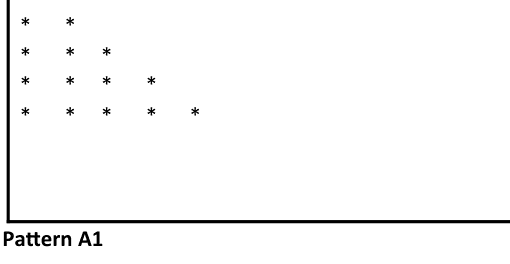

```
StringPatternA1.py

totalRows = 5 # 要显示的行数
strPlus = ""  # 用空字符串初始化。
strJoin = ""  # 用空字符串初始化。

print("使用运算符 + 打印")
print()
for row in range(1, totalRows + 1):
    # 列级重复操作：不使用for循环
    # 使用连接运算符 + 追加到现有字符串
    strPlus = strPlus + "* "
    # 打印存储在变量line中的更新字符串
    # 并移动到下一行
    print(strPlus)

print()
print("使用内置函数 join() 打印")
print()
for row in range(1, totalRows + 1):
    # 列级重复操作：不使用for循环
    # 使用单个空格(" ")字符作为分隔符
    # 追加到现有字符串。
    strJoin = " ".join(["*",strJoin])
    # 打印存储在变量line中的更新字符串
    # 并移动到下一行
    print(strJoin)
```

输出
*
* *
* * *
* * * *
* * * * *

### 模式 G1

```python
StringPatternG1.py
totalRows = 5  # 要显示的行数
line = ""  # 用空字符串初始化。

for row in range(1, 2 * totalRows):
    # 列级重复操作：
    # 当 row <= totalRows 时，使用 '*' 字符构建字符串。
    if (row <= totalRows):
        line = line + "*"
    else:
        # 当 row > totalRows 时，从末尾修剪掉单个 '*'
        line = line[0: -1]
    print(line)
```

```
输出
*
**
***
****
*****
****
***
**
*
```

问题SPG1：为 `row > totalRows` 时的 `start` 属性编写一个合适的逻辑表达式。字符串变量 `line = line[start:]` 只有一个属性，即“start”。请为该属性 `start` 编写合适的逻辑表达式。

```python
StringPatternG2.py
totalRows = 5  # 要显示的行数
line = ""  # 用空字符串初始化。
for row in range(1, 2 * totalRows):
    # 列级重复操作：
    # 当 row <= totalRows 时
    if (row <= totalRows):
        line = line + "*"
    else:
        # 当 row > totalRows 时
        line = line[start:]
    print(line)
```

```
输出
*
**
***
****
*****
****
***
**
*
```

**问题SPG2：** 在程序 `StringPatternG1.py` 中，星号“*”字符打印得彼此非常接近。为了获得更好的输出效果，假设在以下程序中添加了一个额外的空格。但输出结果并未达到我们的预期。应对以下程序进行哪些修改，才能获得预期的输出？

```python
StringPatternG3.py
totalRows = 5  # 要显示的行数
line = ""  # 用空字符串初始化。

for row in range(1, 2 * totalRows):
    # 列级重复操作：
    # 当 row <= totalRows 时，使用 '*' 字符构建字符串。
    if (row <= totalRows):
        #index = index + 1
        line = line + "* " # 在 '*' 后附加一个空格
    else:
        # 当 row > totalRows 时，从末尾修剪掉单个 '*'
        line = line[0: -1]
    print(line)
```

| 此程序的输出 | 预期输出 |
|---|---|
| * | * |
| * * | * * |
| * * * | * * * |
| * * * * | * * * * |
| * * * * * | * * * * * |
| * * * * | * * * * |
| * * * | * * * |
| * * | * * |
| * | * |

### 数字模式 AA1

```python
StringPatternAA1.py
1  totalRows = 5 # 要显示的行数
2  line = ""    # 用空字符串初始化。
3
4  for row in range(1,totalRows + 1):
5      # 列级重复操作：不使用 for 循环
6      line = line + row
7      print(line)
```

### 输出

```
Traceback (most recent call last):
  File "..\StringPatternAA1.py", line 6, in <module>
    line = line + row
TypeError: can only concatenate str (not "int") to str
```

从上述错误中，我们可以得出结论：当操作数是除字符串数据类型以外的不同数据类型时，连接运算符 `+` 不会产生预期的结果。在我们的例子中，变量 `line` 是字符串数据类型，而变量 `row` 是整数类型。因此，以下编程语句在运行程序时会抛出错误。
`line = line + row`

我们可以使用内置**函数** `str()` 将整数值转换为字符串。例如，要将整数值 5 转换为字符串值 "5"，我们需要实现以下代码片段。

```python
# 将整数数据类型转换为字符串数据类型
row = 5
rowStr = str(row)
```

```python
StringPatternAA1.py
1  totalRows = 5 # 要显示的行数
2  line = ""     # 用空字符串初始化。
3
4  for row in range(1,totalRows + 1):
5      # 列级重复操作：不使用 for 循环
6      rowStr = str(row) # 更新后的代码
7      line = line +  rowStr
8      print(line)
```

### 输出

```
1
12
123
1234
12345
```

由于字符串可以用单引号和双引号给出，我们将尝试使用内置方法 `chr()` 来打印给定的模式。我们还需要考虑整数的 Unicode，这指向以下提示：

chr(48 + 1) = '1', chr(48 + 2) = '2', chr(48 + 3) = '3', chr(48 + 4) = '4'

```python
StringPatternAA1.py
1  totalRows = 5 # 要显示的行数
2  line = ""     # 用空字符串初始化。
3
4  for row in range(1,totalRows + 1):
5      # 列级重复操作：不使用 for 循环
6      line = line + chr(48 + row) + " " # 添加一个空格用于格式化输出
7      print(line)
8
```

### 输出

```
1
1 2
1 2 3
1 2 3 4
1 2 3 4 5
```

### 数字模式 GG1

```python
StringPatternGG1.py
totalRows = 5  # 要显示的行数
line = ""  # 用空字符串初始化。
for row in range(1, 2 * totalRows):
    # 列级重复操作：不使用 for 循环
    # 当 row <= totalRows 时，使用整数值构建字符串。
    if (row <= totalRows):
        line = line + str(row) + " " # 附加一个空格
    else:
        # 当 row > totalRows 时，从末尾修剪字符串
        line = line[0: -2]
    print(line)
```

### 输出

```
1
1 2
1 2 3
1 2 3 4
1 2 3 4 5
1 2 3 4
1 2 3
1 2
1
```

### 访问字符串的每个字符

为了了解字符串的组成，我们可以使用字符串名称后跟 `[索引]`。“索引”指的是给定字符串中字符的位置。假设 "Program" 是一个字符串；那么我们可以在程序中这样写：
`string = "Program"`
我们应该从 `string[index]` 中得到什么？可以如下所示：

| string[index] | 索引位置的字符 |
| :--- | :--- |
| string[0] | P |
| string[1] | r |
| string[2] | o |
| string[3] | g |
| string[4] | r |
| string[5] | a |
| string[6] | m |

让我们使用给定的程序来确认我们的理解。

```python
StringCharacters.py
string = "Program"
length = len(string)

for index in range (0, length):
    output = "string[ "+ str(index) + "] = " + string[index]
    print(output)
```

```
输出
string[ 0] = P
string[ 1] = r
string[ 2] = o
string[ 3] = g
string[ 4] = r
string[ 5] = a
string[ 6] = m
```

在 **string[0]** 这种字符访问方法中，ZERO 是一个有效的索引值，它指向给定字符串中第一个位置的字符。

**练习：** 为以下类似楼梯的图片编写一个程序。

```
P_|_P
r__|__r
o___|___o
g____|____g
r_____|_____r
a______|______a
m_______|_______m
m________|________m
i_________|_________i
n__________|__________n
g___________|___________g
```

```python
Staircase.py
string = "Programming"
stairStep = [""]

for index in range(0,len(string)):
    stairStep.append("_")   # 追加字符串
    ch = string[index]
    print(ch,end="")
    for i in range(len(stairStep)):
        print(stairStep[i],end="")
    print("|",end="")
    for i in range(len(stairStep)):
        print(stairStep[i],end="")
    # 打印最后一个字符，然后移动到下一行
    print(ch)
```

**问题 A：** 重写程序 **Staircase.py**，不使用 **join()** 方法。
第一步是编写具有适当行和列的逻辑跟踪表。
通过分析逻辑跟踪表，程序员应该能够找到一种通用的方法来解决打印一系列“_”字符的问题。也可以使用不同的字符，如“*”、“=”或“#”来获取计数。这可以用于任何其他所需的分析。

**问题 B.** 如果程序中有一个变量 `national_id`，你想给它赋一个 5 位长度的值。例如，78901。

它应该输出由“#”字符组成的数字。

```
# # # #       # # # # #       # # # #       # # # #       #

    #           #       #       #       #       #       #       #

    #           # # # # #       # # # #       #       #       #

    #           #       #               #       #       #       #

    #           # # # # #               #       # # # #   # # # # #
```

**编写一个通用程序来打印任何这样的 5 位数字。**

**问题 C：** 为给定的字符串 "Programming" 生成以下输出

```
P
Pr
Pro
Prog
Progr
Progra
Program
Programm
Programmi
Programmin
Programming
Programmin
Programmi
Programm
Program
Progra
Progr
Prog
Pro
Pr
P
```

问题1. 使用内置字符串函数打印以下输出。

| | 1 | 2 | 3 | 4 | 5 | 6 | 7 | 8 | 9 | 10 | 11 | 12 | 13 | 14 | 15 | 16 | 17 | 18 | 19 | 20 | 21 |
|---|---|---|---|---|---|---|---|---|---|---|---|---|---|---|---|---|---|---|---|---|---|
| 1 | | | | | | | | | | | | P | | | | | | | | | |
| 2 | | | | | | | | | | | r | P | r | | | | | | | | |
| 3 | | | | | | | | | | o | r | P | r | o | | | | | | | |
| 4 | | | | | | | | | g | o | r | P | r | o | g | | | | | | |
| 5 | | | | | | | | r | g | o | r | P | r | o | g | r | | | | | |
| 6 | | | | | | | a | r | g | o | r | P | r | o | g | r | a | | | | |
| 7 | | | | | | m | a | r | g | o | r | P | r | o | g | r | a | m | | | |
| 8 | | | | | m | m | a | r | g | o | r | P | r | o | g | r | a | m | m | | |
| 9 | | | | i | m | m | a | r | g | o | r | P | r | o | g | r | a | m | m | i | |
| 10 | | | n | i | m | m | a | r | g | o | r | P | r | o | g | r | a | m | m | i | n |
| 11 | g | n | i | m | m | a | r | g | o | r | P | r | o | g | r | a | m | m | i | n | g |

问题2. 使用内置字符串函数打印以下输出。

| | 1 | 2 | 3 | 4 | 5 | 6 | 7 | 8 | 9 | 10 | 11 | 12 | 13 | 14 | 15 | 16 | 17 | 18 | 19 | 20 | 21 |
|---|---|---|---|---|---|---|---|---|---|---|---|---|---|---|---|---|---|---|---|---|---|
| 1 | | | | | | | | | | | | P | | | | | | | | | |
| 2 | | | | | | | | | | | r | | r | | | | | | | | |
| 3 | | | | | | | | | | o | | | | o | | | | | | | |
| 4 | | | | | | | | | g | | | | | | g | | | | | | |
| 5 | | | | | | | | r | | | | | | | | r | | | | | |
| 6 | | | | | | | a | | | | | | | | | | a | | | | |
| 7 | | | | | | m | | | | | | | | | | | | m | | | |
| 8 | | | | | m | | | | | | | | | | | | | | m | | |
| 9 | | | | i | | | | | | | | | | | | | | | | i | |
| 10 | | | n | | | | | | | | | | | | | | | | | n | |
| 11 | g | | | | | | | | | | | | | | | | | | | | g |
| 12 | | n | | | | | | | | | | | | | | | | | | n | |
| 13 | | | i | | | | | | | | | | | | | | | | i | | |
| 14 | | | | | m | | | | | | | | | | | | m | | | | |
| 15 | | | | | | n | | | | | | | | | | n | | | | | |
| 16 | | | | | | | a | | | | | | | | a | | | | | | |
| 17 | | | | | | | | r | | | | | | r | | | | | | | |
| 18 | | | | | | | | | g | | | | g | | | | | | | | |
| 19 | | | | | | | | | | o | | o | | | | | | | | | |
| 20 | | | | | | | | | | | r | | r | | | | | | | | |
| 21 | | | | | | | | | | | | P | | | | | | | | | |

问题3. 请验证你逻辑思维能力的波长。编写一个通用程序，使得对于不同的 size=1,2,3 输入，波的大小应相应地加倍或三倍。你可以为每种不同类型的波编写单独的程序。

| | 1 | 2 | 3 | 4 | 5 | 6 | 7 | 8 | 9 | 10 | 11 | 12 | 13 | 14 | 15 | 16 | 17 | 18 | 19 | 20 | 21 | 22 |
|---|---|---|---|---|---|---|---|---|---|---|---|---|---|---|---|---|---|---|---|---|---|---|
| 1 | * | * | * | * | | | * | * | * | * | | | * | * | * | * | | | | | | |
| 2 | * | | | * | | | * | | | * | | | * | | | * | | | | | | |
| 3 | * | | | * | | | * | | | * | | | * | | | * | | | | | | |
| 4 | * | | | * | | | * | | | * | | | * | | | * | | | | | * | |
| 5 | | | | * | | | * | | | * | | | * | | | * | | | | | * | |
| 6 | | | | * | | | * | | | * | | | * | | | * | | | | | * | |
| 7 | | | * | * | * | * | | | * | * | * | * | | | * | * | * | * | | | | |

SIZE = 1

| | 1 | 2 | 3 | 4 | 5 | 6 | 7 | 8 | 9 | 10 | 11 | 12 | 13 | 14 | 15 | 16 | 17 | 18 | 19 | 20 | 21 | 22 |
|---|---|---|---|---|---|---|---|---|---|---|---|---|---|---|---|---|---|---|---|---|---|---|
| 1 | * | | | | | | * | * | * | * | * | * | * | * | | | | | | | | |
| 2 | * | | | | | | * | | | | | | | * | | | | | | | | |
| 3 | * | | | | | | * | | | | | | | * | | | | | | | | |
| 4 | * | | | | | | * | | | | | | | * | | | | | | | | |
| 5 | * | | | | | | * | | | | | | | * | | | | | | | | |
| 6 | * | | | | | | * | | | | | | | * | | | | | | | | |
| 7 | * | | | | | | * | | | | | | | * | | | | | | | | |
| 8 | * | | | | | | * | | | | | | | * | | | | | | | | |
| 9 | * | | | | | | * | | | | | | | * | | | | | | | | |
| 10 | * | | | | | | * | | | | | | | * | | | | | | | | |
| 11 | * | | | | | | * | | | | | | | * | | | | | | | | |
| 12 | * | | | | | | * | | | | | | | * | | | | | | | | |
| 13 | * | * | * | * | * | * | * | | | | | | | * | * | * | * | * | * | * | | |

SIZE = 2

| | 1 | 2 | 3 | 4 | 5 | 6 | 7 | 8 | 9 | 10 | 11 | 12 | 13 | 14 | 15 | 16 | 17 | 18 | 19 | 20 | 21 | 22 |
|---|---|---|---|---|---|---|---|---|---|---|---|---|---|---|---|---|---|---|---|---|---|---|
| 1 | | | | * | | | | | | | | | | | | * | | | | | | |
| 2 | | | * | | * | | | | | | | | | | * | | * | | | | |
| 3 | | * | | | | * | | | | | | | * | | | | | * | | | |
| 4 | * | | | | | | * | | | | | * | | | | | | | * | | |
| 5 | | | | | | | | * | | | * | | | | | | | | | * | |
| 6 | | | | | | | | | * | * | | | | | | | | | | | * |
| 7 | | | | | | | | | | * | | | | | | | | | | | | * |

SIZE = 1

| | 1 | 2 | 3 | 4 | 5 | 6 | 7 | 8 | 9 | 10 | 11 | 12 | 13 | 14 | 15 | 16 | 17 | 18 | 19 | 20 | 21 | 22 |
|---|---|---|---|---|---|---|---|---|---|---|---|---|---|---|---|---|---|---|---|---|---|---|
| 1 | | | | | | | * | | | | | | * | | | | | | * | | | |
| 2 | | | | | | * | * | | | | | * | * | | | | | * | * | | |
| 3 | | | | | * | | * | | | | * | | * | | | | * | | * | | |
| 4 | | | | * | | | * | | | * | | | * | | | * | | | * | | |
| 5 | | | * | | | | * | | * | | | | * | | * | | | | * | | |
| 6 | | * | | | | | * | * | | | | | * | * | | | | | * | * | |
| 7 | * | | | | | | * | | | | | | * | | | | | | * | | |

SIZE = 1

| | 1 | 2 | 3 | 4 | 5 | 6 | 7 | 8 | 9 | 10 | 11 | 12 | 13 | 14 | 15 | 16 | 17 | 18 | 19 | 20 | 21 | 22 |
|---|---|---|---|---|---|---|---|---|---|---|---|---|---|---|---|---|---|---|---|---|---|---|
| 1 | * | | | | | | * | | | | | | * | | | | | | | | | |
| 2 | * | * | | | | | * | * | | | | | * | * | | | | | | | | |
| 3 | * | | * | | | | * | | * | | | | * | | * | | | | | | |
| 4 | * | | | * | | | * | | | * | | | * | | | * | | | | | |
| 5 | * | | | | * | | * | | | | * | | * | | | | * | | | | |
| 6 | * | | | | | * | * | | | | | * | * | | | | | * | | | |
| 7 | * | | | | | | * | | | | | | * | | | | | | * | | |

SIZE = 1

| | 1 | 2 | 3 | 4 | 5 | 6 | 7 | 8 | 9 | 10 | 11 | 12 | 13 | 14 | 15 | 16 | 17 | 18 | 19 | 20 | 21 | 22 |
|---|---|---|---|---|---|---|---|---|---|---|---|---|---|---|---|---|---|---|---|---|---|---|
| 1 | 1 | 1 | 1 | 1 | | | 2 | 2 | 2 | 2 | | | 3 | 3 | 3 | 3 | | | | | | |
| 2 | 1 | | 1 | | | | 2 | | | 2 | | | 3 | | | 3 | | | | | | |
| 3 | 1 | | 1 | | | | 2 | | | 2 | | | 3 | | | 3 | | | | | | |
| 4 | 1 | | 1 | | | | 2 | | | 2 | | | 3 | | | 3 | | | 3 | | | |
| 5 | | | 1 | | | | 1 | | | 2 | | | 2 | | | 3 | | | 3 | | | |
| 6 | | | 1 | | | | 1 | | | 2 | | | 2 | | | 3 | | | 3 | | | |
| 7 | | | 1 | 1 | 1 | 1 | | | | 2 | 2 | 2 | 2 | | | 3 | 3 | 3 | 3 | | | |

SIZE = 1

| | 1 | 2 | 3 | 4 | 5 | 6 | 7 | 8 | 9 | 10 | 11 | 12 | 13 | 14 | 15 | 16 | 17 | 18 | 19 | 20 | 21 | 22 |
|---|---|---|---|---|---|---|---|---|---|---|---|---|---|---|---|---|---|---|---|---|---|---|
| 1 | 1 | 1 | 1 | 1 | | | 0 | 0 | 0 | 0 | | | 1 | 1 | 1 | 1 | | | | | | |
| 2 | 1 | | 1 | | | | 0 | | | 0 | | | 1 | | | 1 | | | | | | |
| 3 | 1 | | 1 | | | | 0 | | | 0 | | | 1 | | | 1 | | | | | | |
| 4 | 1 | | 1 | | | | 0 | | | 0 | | | 1 | | | 1 | | | 1 | | | |
| 5 | | | 1 | | | | 1 | | | 0 | | | 0 | | | 1 | | | 1 | | | |
| 6 | | | 1 | | | | 1 | | | 0 | | | 0 | | | 1 | | | 1 | | | |
| 7 | | | 1 | 1 | 1 | 1 | | | | 0 | 0 | 0 | 0 | | | 1 | 1 | 1 | 1 | | | |

SIZE = 1

问题4. 为以下每种不同的波形设计编写一个程序。

| | 1 | 2 | 3 | 4 | 5 | 6 | 7 | 8 | 9 | 10 | 11 | 12 | 13 | 14 | 15 | 16 | 17 | 18 | 19 | 20 | 21 | 22 |
|---|---|---|---|---|---|---|---|---|---|---|---|---|---|---|---|---|---|---|---|---|---|---|
| 1 | | * | * | | | | | * | * | | | | | * | * | | | | | | | |
| 2 | * | | | * | | | * | | | * | | | * | | | * | | | | | | |
| 3 | * | | | * | | | * | | | * | | | * | | | * | | | | | | |
| 4 | * | | | * | | | * | | | * | | | * | | | * | | | * | | | |
| 5 | | | | * | | | * | | | * | | | * | | | * | | | * | | | |
| 6 | | | | * | | | * | | | * | | | * | | | * | | | * | | | |
| 7 | | | | | * | * | | | | | * | * | | | | | * | * | | | | |

| | 1 | 2 | 3 | 4 | 5 | 6 | 7 | 8 | 9 | 10 | 11 | 12 | 13 | 14 | 15 | 16 | 17 | 18 | 19 | 20 | 21 | 22 |
|---|---|---|---|---|---|---|---|---|---|---|---|---|---|---|---|---|---|---|---|---|---|---|
| 1 | | < | > | | | | | < | > | | | | | < | > | | | | | | | |
| 2 | < | | | > | | | < | | | > | | | < | | | > | | | | | | |
| 3 | < | | | > | | | < | | | > | | | < | | | > | | | | | | |
| 4 | - | - | - | - | - | - | - | - | - | - | - | - | - | - | - | - | - | - | - | - | - | - |
| 5 | | | | < | | | > | | | < | | | > | | | < | | | > | | | |
| 6 | | | | < | | | > | | | < | | | > | | | < | | | > | | | |
| 7 | | | | | < | > | | | | | < | > | | | | | < | > | | | | |

| | 1 | 2 | 3 | 4 | 5 | 6 | 7 | 8 | 9 | 10 | 11 | 12 | 13 | 14 | 15 | 16 | 17 | 18 | 19 | 20 | 21 | 22 |
|---|---|---|---|---|---|---|---|---|---|---|---|---|---|---|---|---|---|---|---|---|---|---|
| 1 | | < | > | | | | | < | > | | | | | < | > | | | | | | | |
| 2 | < | | | > | | | < | | | > | | | < | | | > | | | | | | |
| 3 | < | | | > | | | < | | | > | | | < | | | > | | | | | | |
| 4 | - | - | - | - | - | - | - | - | - | - | - | - | - | - | - | - | - | - | - | - | - | - |
| 5 | | | | [ | | | ] | | | [ | | | ] | | | [ | | | ] | | | |
| 6 | | | | [ | | | ] | | | [ | | | ] | | | [ | | | ] | | | |
| 7 | | | | | [ | ] | | | | | [ | ] | | | | | [ | ] | | | | |

| | 1 | 2 | 3 | 4 | 5 | 6 | 7 | 8 | 9 | 10 | 11 | 12 | 13 | 14 | 15 | 16 | 17 | 18 | 19 | 20 | 21 | 22 |
|---|---|---|---|---|---|---|---|---|---|---|---|---|---|---|---|---|---|---|---|---|---|---|
| 1 | | < | > | | | | | [ | ] | | | | | < | > | | | | | | | |
| 2 | < | | | > | | | [ | | | ] | | | < | | | > | | | | | | |
| 3 | < | | | > | | | [ | | | ] | | | < | | | > | | | | | | |
| 4 | < | | | > | | | [ | | | ] | | | < | | | > | | | | | | |
| 5 | | | | < | | | > | | | [ | | | ] | | | < | | | > | | | |
| 6 | | | | < | | | > | | | [ | | | ] | | | < | | | > | | | |
| 7 | | | | | < | > | | | | | [ | ] | | | | | < | > | | | | |

| | 1 | 2 | 3 | 4 | 5 | 6 | 7 | 8 | 9 | 10 | 11 | 12 | 13 | 14 | 15 | 16 | 17 | 18 | 19 | 20 | 21 | 22 |
|---|---|---|---|---|---|---|---|---|---|---|---|---|---|---|---|---|---|---|---|---|---|---|
| **1** | | 3 | 4 | | | | | 15 | 16 | | | | | 27 | 28 | | | | | | | |
| **2** | 2 | | | 5 | | | 14 | | | 17 | | | 26 | | | 29 | | | | | | |
| **3** | 1 | | | 6 | | | 13 | | | 18 | | | 25 | | | 30 | | | | | | |
| **4** | 0 | 0 | 0 | 0 | 0 | 0 | 0 | 0 | 0 | 0 | 0 | 0 | 0 | 0 | 0 | 0 | 0 | 0 | 0 | 0 | 0 | 0 |
| **5** | | | | | 7 | | 12 | | | 19 | | | 24 | | | 31 | | | 36 | | | |
| **6** | | | | | 8 | | 11 | | | 20 | | | 23 | | | 32 | | | 35 | | | |
| **7** | | | | | 9 | 10 | | | | 21 | 22 | | | | | 33 | 34 | | | | | |

| | 1 | 2 | 3 | 4 | 5 | 6 | 7 | 8 | 9 | 10 | 11 | 12 | 13 | 14 | 15 | 16 | 17 | 18 | 19 | 20 | 21 | 22 |
|---|---|---|---|---|---|---|---|---|---|---|---|---|---|---|---|---|---|---|---|---|---|---|
| **1** | | 1 | 2 | | | | | 5 | 6 | | | | | 9 | 10 | | | | | | | |
| **2** | 1 | | | 2 | | | 5 | | | 6 | | | 9 | | | 10 | | | | | | |
| **3** | 1 | | | 2 | | | 5 | | | 6 | | | 9 | | | 10 | | | | | | |
| **4** | 0 | 0 | 0 | 0 | 0 | 0 | 0 | 0 | 0 | 0 | 0 | 0 | 0 | 0 | 0 | 0 | 0 | 0 | 0 | 0 | 0 | 0 |
| **5** | | | | | 3 | | 4 | | | 7 | | | 8 | | | 11 | | | 12 | | | |
| **6** | | | | | 3 | | 4 | | | 7 | | | 8 | | | 11 | | | 12 | | | |
| **7** | | | | | 3 | 4 | | | | 7 | 8 | | | | | 11 | 12 | | | | | |

### 附录-A：Python 安装与项目设置

https://www.javatpoint.com/how-to-install-python

https://www.javatpoint.com/python-example

### 参考文献：

- 1. https://www.analyticsvidhya.com/blog/2013/06/art-structured-thinking-analyzing/
- 2. JavaScript Programming Pattern Looping intelligence. [2019] Mohmad Yakub https://www.amazon.com/dp/1096466090/

### 致谢

我谨向所有帮助我完成这本处女作的人表示个人感谢。

我衷心感谢：

我的家人，他们在我完成本书的过程中给予了我支持。

我的小弟弟，萨迪克·S·奈克瓦迪，在技术审阅方面给予了我极大的帮助。他是一名自由开发者，自大学时代起就以其编程技能而闻名。他涉猎多种编程语言，并且从不畏惧尝试高难度的编程挑战。

他经常被大学同学和初级程序员请教，以提升他们的编程技能。他的建议帮助我轻松地撰写技术文章，并详细探讨了一个挣扎中的程序员所面临的问题。曾几何时，编程对他来说也是陌生的，而本书涵盖的一系列练习曾是他的试验场，他成功地掌握了编程。基于所有这些重要因素，他是给我提供诚实技术审阅的最佳人选。此外，他利用本书的练习搭建了一个试验台，一有机会就帮助编程能力较弱的学习者。

我要感谢莎巴娜·穆萨尔女士及其家人。她是一名教师，她让我明白了不同的教学风格对于教授不同思维方式的学生是多么重要。

她的意见促使我加入了一个全新的部分，这是我原本从未考虑过的。

非常感谢大家对我的帮助表示兴趣。

> 我没有教你任何东西。
> 我只是帮助你探索自己。
> - 李小龙