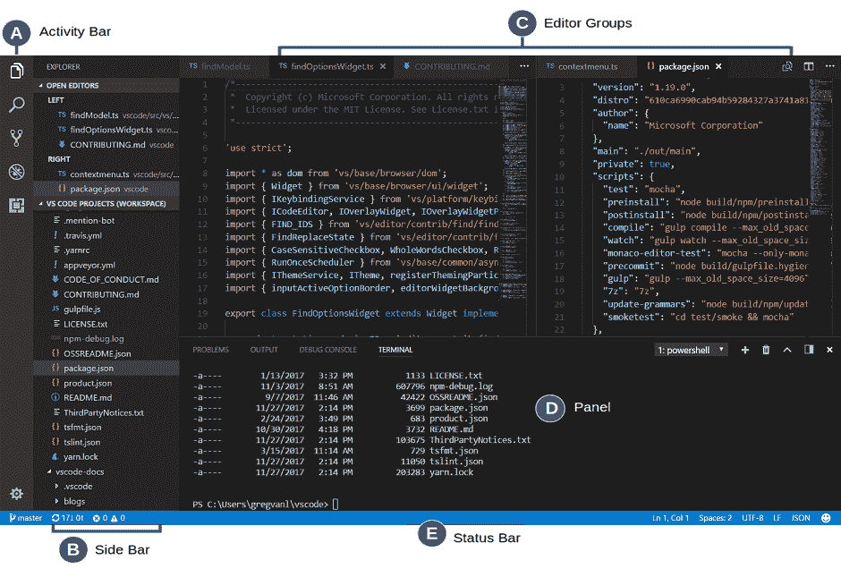
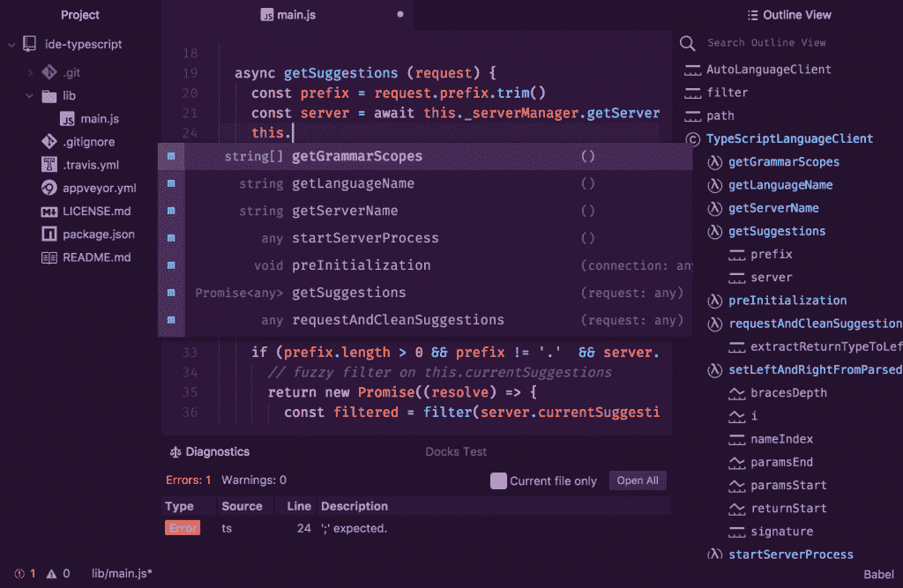
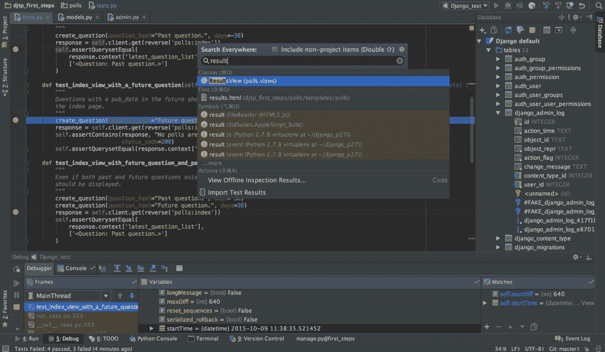
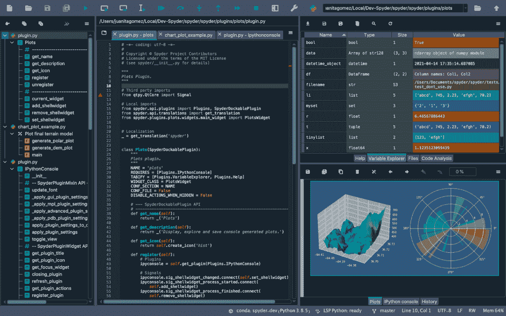
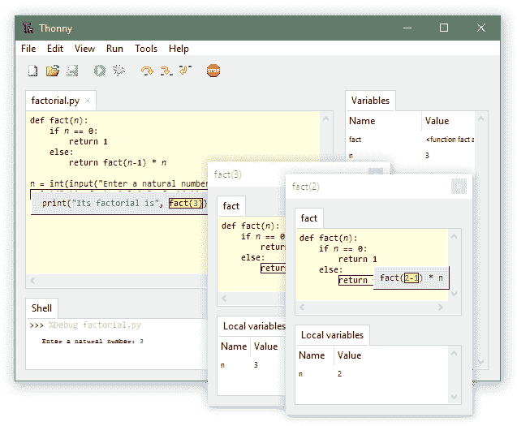
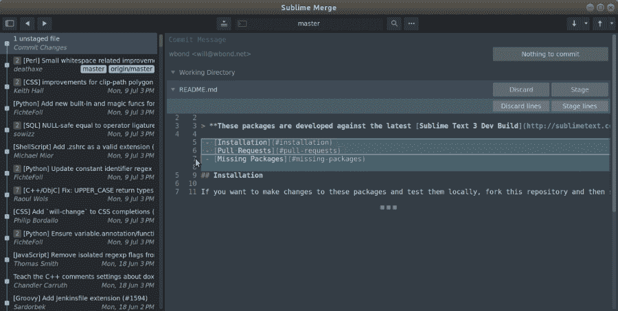
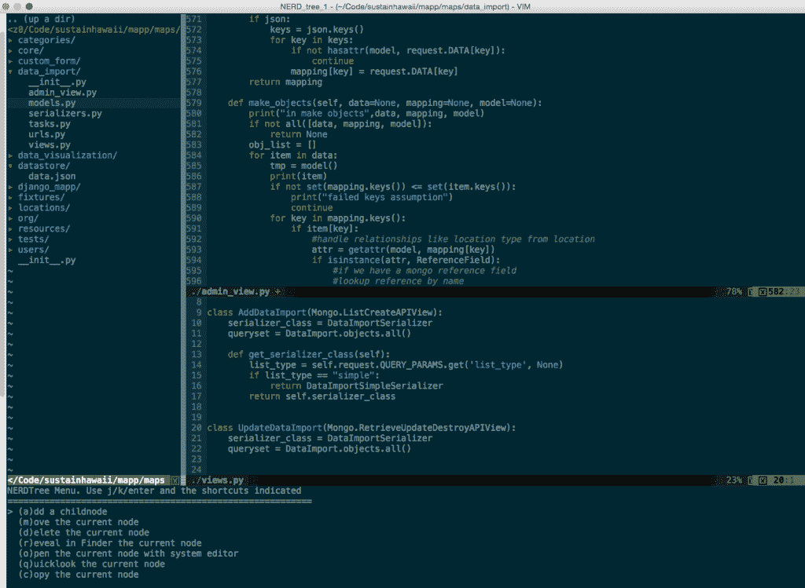
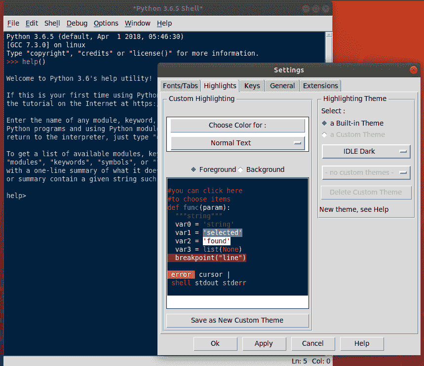
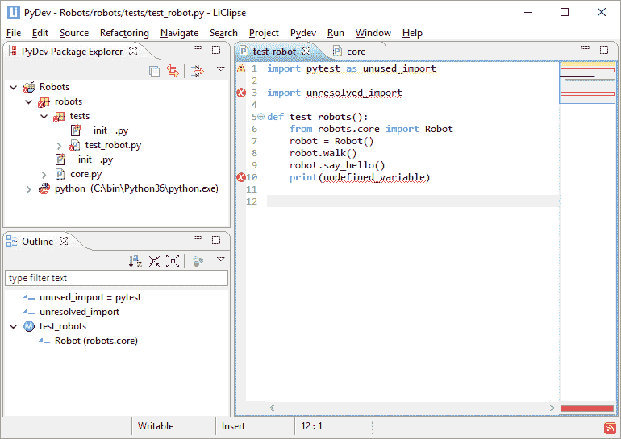
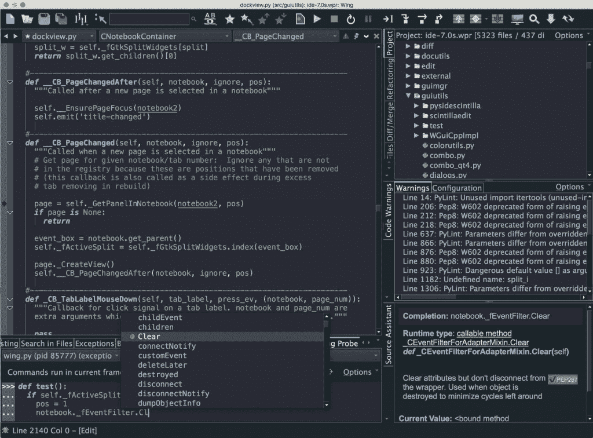

# 2022 年 10 大最佳 Python IDE 和代码编辑器[更新]

> 原文：<https://www.pythoncentral.io/10-best-python-ide-code-editors-in-2022-updated/>

集成开发环境的核心是一个编译器文本编辑器，旨在为编码人员和程序员提供一站式工具，满足他们所有的编写、编译和调试需求。

今天市场上有几种 ide，它们都提供了一些独特的功能和优势。

在本帖中，我们将回顾 Python 编程的 10 个最佳 ide，比较它们的特性，权衡它们的优缺点，以帮助您找到满足您需求的 ide。

## 【2022 年十大最佳 Python IDE &代码编辑器

### **#1** [**Visual Studio 代码**](https://code.visualstudio.com/)

 

Visual Studio Code 是微软开发的开源、健壮的 IDE，可用于 Linux、Mac OS 和所有 Windows 平台。

VS 代码是轻量级和高度可定制的，允许用你自己的库编辑和扩展源代码，使得切换到 VS 代码非常容易，只需要两分钟。

这种易访问性，加上对初学者友好的界面，使得 VS Code 成为当今最好的、没有争议的 ide 之一，并且非常受许多开发人员的欢迎。

VS 代码也支持其他语言。事实上，它是使用“电子”创建的，这是一个用于编写 C++或 Java 应用程序的应用程序，只有在安装了 Python 扩展后才能用于 Python。

这些扩展是 VS 代码的一大优势，因为它的市场上总是有大量可用的扩展。最重要的是，这些扩展大部分是社区生成的，可以免费试用。

许多 Windows 系统的初学者最初将 VS 代码视为唯一可用的 IDE，这一事实进一步促进了这个围绕 VS 代码构建的用户生成社区的发展。换句话说，VS 代码背后的社区是巨大的，并且在不断增长。

这款看似轻巧的应用程序的另一个显著特点是“禅”模式。它会隐藏您的桌面和其他窗口，但您当前正在处理的文件除外。对于许多开发人员来说，杂乱的桌面通常会导致生产力下降，并妨碍手动调试。

VS 代码有 Intellisense，这是微软的代码完成算法。在许多需要编码重复循环的情况下，您可以可靠地使用 Intellisense。它不是完美的，但是这个系统确实有助于提高你的生产力。

微软也是世界上最大的公司之一，拥有非常优秀的支持团队，因此在很多情况下都是可靠的。

#### **优点**

*   可在所有平台上使用
*   开源
*   轻量级
*   可定制
*   ‘禅’模式
*   良好的界面

#### **缺点**

*   它不是 Python 特有的
*   没有市场访问，它几乎就像任何其他基本代码文本编辑器一样
*   如果市场无法访问，它就无法离线工作。

### **#2、 [**原子在这里**](https://atom.io/)**

Atom 是另一个高度可修改的代码文本编辑器，拥有众多功能。它连接到 GitHub，GitHub 是最大的在线代码社区之一，根据您的设置，它提供了许多扩展，使 Atom 具有高度的通用性。它 有一个极简的界面，这是很多开发者的首选。

它并不仅仅意味着 Python，因为它可以处理许多开发者涉足的其他语言。您需要在 IDE 中安装一个扩展和一个库来启用 Python 支持。它不会开箱即用地运行 Python 代码。

这也意味着该应用程序不会在本地运行代码，而是使用 javascript 环境来运行。对于一些用户来说，这有时会导致膨胀和较慢的执行。

但是也不全是坏事。Atom 还拥有其他几个特性，可以提高工作效率，实现快速的跨应用处理。Atom 有一个简洁的界面，易于导航，可以轻松跟踪多个项目。这也有助于提高你的工作效率。

Atom 最大的优势在于下载插件或根据需要编辑源代码的便利。唯一的缺点是，要创建一个可下载的插件，开发者必须精通 Java 和 C++，因为 Atom 不是用 Python 编写的。

不过，这并不是什么大问题，因为程序员和开发人员面临的大多数常见问题都可以通过安装 GitHub 的插件来轻松解决。

最棒的是，如果你有一个特定的问题，但没有特定的插件可以解决，你可以加入社区，在论坛上解释你的问题。精通 javascript 的人可能能够与 Atom 的源代码进行交互，并为您的解决方案创建一个插件。论坛社区的成员也可能会告诉您某些解决方法。

此时此刻，有几十万个插件正在被生成和下载，它们中的大多数都有不同的用途。

它支持同时运行不同代码的多个并行窗口，如果您的项目通常需要同时运行多个程序，这可以真正改善您的工作流程。

它拥有一些最好的代码自动完成算法，语法高亮和格式识别提高了你浏览代码的速度。虽然基础应用程序没有好的调试器或编译器，但源代码编辑的提供允许有进取心的开发人员为 Atom 创建免费甚至付费版本的调试器和编译器。换句话说，无限的可定制性只受您的独创性的限制。

最后，GitHub 社区的支持使 Atom 成为许多开发人员和程序员最可行和首选的 ide 之一。

#### **优点**

*   非常强大的自动完成算法
*   大社区
*   开源
*   强大的文件保存和云保存选项
*   可以一次运行多个代码
*   无尽定制

#### **缺点**

*   基于浏览器导致膨胀
*   非原生应用可能导致内存问题
*   只能在 javascript 中编辑源代码
*   需要下载大量庞大的插件来实现全部功能

### **#3** [**皮查姆 IDE**](https://www.jetbrains.com/pycharm/)

PyCharm 已经成为当今领先的 ide 之一，部分原因是它惊人的打包功能，还因为它是语法高亮和自动完成算法的先驱，这已经成为当今开发人员的一种规范。

PyCharm 有两个版本:一个是面向专业开发人员的基于订阅的专业模块，另一个是面向初学者和业余时间编写代码的人的基于社区的开源模块。专业版拥有几个在大多数 ide 中不容易获得的特性。

由 JetBrains 开发的这款 IDE 拥有时尚的设计和令人惊叹的功能，如导航快捷方式、智能编辑器和一些最好的自动完成算法(也是首批自动完成算法之一)。PyCharm 是真正的 IDE，因为它开箱即用，可以突出显示语法和格式代码，运行和调试它，而无需安装任何插件或扩展。

它的界面看起来真的很不错，因为一大串复杂的文本和代码变成了颜色协调的超链接，可以轻松地自动导航。最引人注目的时刻是将 python 库从旧的文本编辑器加载到 PyCharm 中。

这使得手动调试成为可能，但是 PyCharm 也拥有最强的调试器之一。突出显示和整洁的排列得益于它的代码编辑器，该编辑器可以格式化代码，在开发人员需要或忘记的地方添加缩进和标点符号，并有几个更方便的功能。

编辑软件确保恼人的吹毛求疵的错误从你的程序中平滑掉。因此，在调试代码时，您只需要关注严重的语法错误和编译错误。

PyCharm 的功劳在于，专业版和开源版在功能上的差异并不大。尽管订阅的价格相对较高，但许多开发者选择支持 PyCharm 背后的公司。开发人员发现它物有所值，因为它给你提供了一个巨大的库和扩展市场，订阅是免费的。

PyCharm 还支持编辑 javascript、HTML、CSS 和 Live，对于项目中需要的人来说，这是一个方便的跨平台编辑器。PyCharm 可以将 web 开发的不同方面结合在一起，并允许编辑源代码，包括开源版本。

#### **优点**

*   卓越的界面，易于导航
*   第一个自动完成算法
*   强大健壮的调试器
*   跨平台支持
*   各种各样的工具和功能
*   可编辑界面
*   它也有一个开源版本

#### **缺点**

*   你必须为 PyCharm 付费才能解锁全部功能。
*   由于预装了扩展，IDE 的尺寸相对较大。
*   PyCharm 初始化有点复杂

### **# 4**[**Spyder IDE**](https://www.spyder-ide.org/)

Spyder IDE 是目前市场上功能最强大的编译器之一。这是另一个具有多功能的 IDE，可以根据个人用途进行定制。

对于科学家来说，Spyder 是一个完美的 IDE，因为它有一套引人注目的科学工具插件，可以免费获得。开发人员和编码人员也使用它来开发基于 Python 的程序。然而，需要注意的是 Spyder 的学习曲线很陡，不适合初学者。

也就是说，经验丰富的程序员会发现导航和快捷方式相当直观，他们很快就会习惯 Spyder 的 GUI。

这个级别的 IDE 非常适合那些对所用语言稍有经验的人，因为它不像其他入门者 Atom、PyCharm 甚至 Thonny 那样提供极端的可操作性。

开发人员已经利用这种方式来利用调试、编译和控制台信息中的细微差别。导航调试菜单所需的专业水平比其他 ide 要高得多。

Spyder 提供输入许多不同的非常规类型的输入和设备，并配有科学工具包，您可以免费下载。它还有其他几个扩展和库，使 Spyder 成为科学家、物理学家和数据工程师的宝贵工具。它可以帮助自动化许多过程，并通过复杂的算法减轻手动计算的负担。

Spyder IDE 是开源的，允许源代码交互。它也不是很占用内存，即使在旧设备上运行也相当流畅。在大型多文件程序中，执行代码可能需要时间，但 Spyder 编译器相当健壮，也是最常用的编译器之一。

因此，开发人员遇到的任何问题都会被快速修补，并且社区会建立永久的解决方案。

正是因为这个社区，许多算法和软件(比如探测器)被上传到在线插件市场，而且大部分是免费的。这极大地帮助了那些想写这样的程序却发现程序已经存在的科学家。

Spyder 的库非常广泛，对于应用程序开发人员来说也是非传统的，这意味着 Spyder 的使用非常广泛，而且与它的同类产品和其他多功能开源 ide 相比也是多种多样的。

#### **优点**

*   活跃社区
*   非常适合科学家、工程师、分析人员等
*   开源
*   轻量级、内存密集型防护
*   多样化的插件市场
*   非常适合开发应用或程序

#### **缺点**

*   不适合初学者
*   对于习惯了超链接 ide 的人来说，导航可能会很困难
*   控制台实时运行代码，新手很难。

### **# 5**[**Thonny IDE**](https://thonny.org/)

 **

Thonny 是一个主要面向学习 Python 的 IDE，最适合初学者和教授 Python 的学校。它奖励探索，适合以前没有编写 Python 经验的人。

虚拟环境很容易操作，会让你想起经典的微软界面。Thonny 是用 Python 编写的，是一个本机应用程序，这意味着它不是内存密集型的。

Thonny 有一个特殊的功能，可以让你跟踪编译器的活动，并查看不同的 shell 命令如何影响变量。调试器是我们遇到的最简单的工具之一，它被整齐方便地放置在不同的功能按钮上，以便于访问。

即使在运行代码之前，它也会自动突出显示常见错误。Thonny IDE 可以识别和格式化变量，告诉您它所做的更改，以便您了解您的编码并获得对您的程序的实时反馈。

自动突出显示和完成算法工作良好，但需要一点修补才能使其正确。幸运的是，源代码允许在 javascript 中进行编辑和交互，这意味着您可以为自己创建扩展和应用程序。

调试器也非常高效，这意味着大多数代码都很容易调试，因为 Thonny 会一行一行地检查你的错误。调试器运行的图形用户界面是光滑的，没有任何额外的修饰。它不是内存密集型的，并且整个 IDE 在 ROM 上只占用最小的空间。

对于不太了解如何与 PATH 或其他 Python 解释器交互的用户来说，它非常受欢迎。用户还可以根据自己的喜好添加不同的模块和插件来定制自己的 Thonny IDE。

但是这种对图形用户界面和虚拟环境的严重依赖经常导致资深开发人员和程序员觉得浏览起来太麻烦了。一些开发人员可能会发现缺乏简单的个性化是他们工作中的一个障碍，并影响他们的生产力。

文本编辑器有点笨拙和过时，但是自动编辑算法是健壮和有效的。

#### **优点**

*   初学者的最佳 IDE
*   掌握和学习 Python 的最佳 IDE
*   相当可定制
*   开源
*   有用的 GUI
*   好用的调试器
*   自动编辑、完成和高亮显示算法是高效的

#### **缺点**

*   GUI 使用率高
*   对于老兵来说可能有些繁琐
*   不适合官方使用或核心开发

### **#6** [**崇高文字 IDE**](https://www.sublimetext.com/)

Sublime Text 是另一个面向跨平台开发的高级 IDE，支持多种编程语言。它有一个很棒的文本编辑器，拥有所有最先进的自动完成、高亮显示和格式化算法，成功率高得惊人。

它最适合编写 C++，但是它有一个优秀的 Python 基础和一个 Python API。它还支持最新版本的 HTML，使其成为网站开发以及其他标记相关应用程序的一站式 IDE。您可以使用 Sublime Text IDE 轻松创建网站、应用程序和其他可执行文件。

市场上有大量的免费插件可供选择，这些插件扩展了 Sublime Text IDE 的多功能性和潜在用途。

Sublime Text IDE 缺乏一个有意义的、有贡献的在线社区，但它用自己巧妙的、设计良好的插件弥补了这一点。使用扩展，您可以让 Sublime Text IDE 在您的浏览器上运行，增加它在 web 开发中的实力。

Sublime Text IDE 有一个多级撤销选项，这意味着您可以在几个级别上调试和撤销错误代码，这取决于您在哪里排队和在哪里循环。它的调试功能非常强大，并且在出现任何意外错误时，它会提供持续的帮助热线服务。Sublime Text 支持多种语言，也提供了对它所支持的所有语言的支持。

Sublime Text 的界面极具吸引力，有不同的主题和多种个性化选项。它还支持一个可执行控制台中的多窗口和多个工作区。

对于同时使用 Python 的当代 web 开发人员来说，它是首选的 IDE，因为它可以翻译成 C++和 javascript，是最方便的选择。

一些人对 Sublime 的唯一疑虑是它有点太贵了，而且除此之外还对某些基本插件收费。

#### **优点**

*   良好的多选工具，GUI
*   美丽的主题和美学
*   转到步进特征
*   调试能力
*   高性能和出色的 API
*   可定制界面
*   个性化选项
*   最适合跨平台项目

#### **缺点**

*   价格昂贵，仅面向专业人士
*   它可能令人生畏，因为它是为专业人士打造的
*   依赖于 GUI，不支持快捷方式

### **# 7**[Vim](https://www.vim.org/)

Vim 是一个开源的文本编辑器，可以用多种语言编写程序，并且在使用上是可调整的和通用的。它有一个 Python 扩展和几个 Python 库，现在被认为是最好的轻量级 ide 之一，具有跨平台能力和几个有用的特性。

Vim IDE 并不面向新手，而是基于一个非常活跃的程序员社区，他们维护开源社区并明确发布更新和补丁。有数百个免费插件可供选择，这使得 VIM 成为最具可定制性的文本编辑 ide 之一。

Vim 可以作为命令行控制台单独使用，但它在独立的应用程序中也有自己的虚拟环境。

Vim 唯一的缺点是配置起来很费力——不管你是用 Python 还是其他语言来编码。也就是说，有了正确的指南，初学者可以没有太多麻烦地设置它。

#### **优点**

*   Vim 非常健壮和持久
*   一个优秀的插件和库市场
*   强大的搜索工具
*   好的高亮算法

#### **缺点**

*   没有超链接和调试
*   主要是一个文本编辑器，IDE 后来的
*   初学者甚至老手都难以掌握

### **#8** [**闲 IDE**](https://docs.python.org/3/library/idle.html)

IDLE 是 Python 自己定制的 IDE，是用 Python 创建的。因为它是一个本地应用程序，所以它最适合 Python，但也包含编辑其他语言的功能。

你可能想知道为什么 Python 的官方 IDE 在列表中如此靠后，那是因为这个列表没有任何特定的顺序。虽然 IDLE 缺少很多未来主义的特性，但它凭借其令人惊叹的编译器和强大的调试功能弥补了这些不足。

GUI 非常简单，需要相当多的 Python 知识才能轻松导航。也就是说，你可以很容易地学习虚拟环境，因为它并不太复杂。

由于是用 Python 写的，所以运行 Python 最好，而且极其轻量。GUI 和应用程序在 ROM 上占用最小的空间，打开应用程序会打开一个 shell 命令控制台。

较新的更新和追溯插件为 IDLE 增加了自动高亮和格式化功能，使它成为一个可行的竞争选择。

#### **优点**

*   最小、重量轻
*   原生于 Python
*   自动缩进和格式化
*   强大的调试器
*   强大的编译器

#### **CONS**

*   缺乏普通应用程序的特性
*   大型项目文件不能很好地编译或存储
*   不适合职业发展

### **[**【pydev ide】**](https://www.pydev.org/)**

 ****

Eclipse 开源代码编辑器多年来一直是许多编码人员和程序员的主食，随着 PyDev 的不断流行，似乎该编辑器将在未来几年继续使用。

PyDev 是使用 Eclipse 编写的，它像 Electron 一样用于编写 ATOM 和 VS 代码。它是一个用于设计其他 javascript、HTML、C++以及现在的 Python 应用程序的应用程序。

PyDev 提供了巨大的灵活性和可定制性，是目前最流行的 ide 之一。事实上，高级功能是免费提供的，并且是由专门的计算机科学家团队开发的，这应该是您尝试将 PyDev 作为应用程序开发的一站式解决方案的充分理由。

#### **优点**

*   开源
*   坚固、轻便
*   非原发性，可能导致腹胀

#### **缺点**

*   缺少某些特征
*   UI 笨拙

### **#10** [**翼 IDE**](https://wingware.com/)

Wing IDE 是由一群计算机工程毕业生编写的，他们想要一个模块化和可调整的 IDE 来编写代码。其结果是一个高度健壮的 IDE，拥有市场上最好的调试器之一和其他价格不菲的特性。

Wing IDE 是会员制的，提供 30 天的免费试用期，没有任何问题要求退款。开发人员对他们的产品非常有信心，因为 Wing 的导航、突出显示和编辑非常流畅。虚拟环境具有惊人的可访问性，直观的 GUI 设计是一个额外的优势。

如果您使用 pytest、nose 和 doctest 等框架进行测试驱动开发，这是一个不错的 IDE 选择。可以免费试用 Wing Pro。但是，试用结束后，您需要支付 Wing 的费用。它与所有操作系统兼容。

#### **优点**

*   优秀的调试器
*   令人印象深刻的测试能力
*   兼容所有操作系统

#### **缺点**

*   对学生或爱好者来说价格昂贵
*   缺乏过度定制，因为它不是开源的

## **结论**

以上列表包含了对当今市场上各种 ide 的不同特性的综合评估。

没有所谓的“最佳 IDE ”,因为每个开发人员都有不同的技能、偏好和需求。权衡了每种 IDE 的优缺点后，找到合适的 IDE 应该很容易。

我们的结论是，最适合你的 IDE 取决于你打算用它做什么。希望这篇帖子对你有所帮助，编码愉快！******