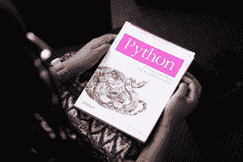

# Python 程序员:关于这个职业你需要知道的一切

> 原文：<https://www.pythoncentral.io/a-python-programmer-everything-you-need-to-know-about-this-profession/>

你知道什么是 Python 程序员吗？他们的工作包括什么？成为 Python 程序员需要学习什么？能赚多少？如果你有兴趣学习更多关于这个职业的知识，你会找到一个完整的指南，里面有作为 Python 程序员工作的所有细节。

在我们生活的时代，编程是推动世界的力量。工作世界在不同的国家和所有的公司提供了极好的工作机会。然而，如果有一种编程语言是我们应该关注的，那无疑是 Python。

Python 编程语言是近年来使用率增长最快的语言之一。

如果你想过上数字游牧生活或为国外大公司工作，掌握 Python 的你可以从事的职业提供了巨大的经济利益和从家里或世界任何地方远程发展的机会。

**目录**

谁是 Python 程序员？

作为 Python 程序员所需的技能

软技能

技术

Python 程序员的专业领域

成为 Python 程序员的培训

职业发展

Python 程序员的工资

**谁是 Python 程序员？**

它是 Python 编程的专家 Python 是一种具有各种用途的语言，从数字科学、数据学习、机器学习、web、脚本到可扩展软件等等。Python 程序员通常能够编写任何程序，从 Windows 应用程序到网络服务器甚至网页。

**成为 Python 程序员所需的技能**

精通 Python 的程序员必须具备的几项软技能和更多的技术方面，以确保最佳的工作表现。

请记住，这些总是主要取决于所选择的重点领域；然而，下面，我们将审查公司最需要的个人和技术技能。

**软技能:**

**分析和解决问题的思维:**作为一名 Python 程序员，你的日常工作将包括解决所有需要面对的问题，以最终实现自动化流程的目标，并使工作在各方面都更加有效。

团队合作:团队工作是程序员日常工作中必不可少的一部分。你很可能不是一个人，但你必须与其他领域的专业程序员合作，补充你的功能并与他们合作。

**自学:** Python 和其他编程语言都在不断发展，正如[环境](https://www.pythoncentral.io/how-to-install-virtualenv-python/)和它可以应用的领域一样。

**技术技能:**

**Django、Flask 和 Pylons 等框架的使用:**如果你对使用 Python 进行 web 开发感兴趣，Django、Flask 和 Pylons 等框架应该在你的技能列表中，这样你就可以依赖一个更快、更干净、更实用的完整开发模式。

**面向对象编程的用途:** Python 是一种面向对象的语言。它在收集数据和控制结构时更有效地安排代码，允许程序员通过创建新的类来解决问题，这些类对解决问题所需的数据进行建模。掌握 Python 的一个基本要素是了解面向对象编程。

**数据库的使用:**Python 程序员详细了解什么是关系数据库，以及在操作中与它们一起工作意味着什么，以便能够根据适当的规范使用库从 Python 中完成操作，并提高他们构建系统的能力，确保所创建的数据库中的数据的持久性。

**Python 程序员的专业领域**

一旦你学会了 Python，或者甚至在你开始训练之前，决定你想用这种编程语言去哪里是很重要的。我们会给你一个提示，选项不仅限于一个路径。下面，我们将看看您可以运用 Python 技能的四个主要领域。

**数据科学**

对 Python 程序员需求的指数级增长主要是由于数据科学的兴起，数据科学使用这种语言来处理海量数据集，从中提取高价值的信息并进行分类。

**深度学习和机器学习**

这两种技术都指能够通过人工智能“自行”学习的系统，要求 Python 执行与分类、回归、聚类、预处理或生成算法模型相关的任务。

**DevOps**

当涉及到与软件开发和操作相关的所有流程与实用的 DevOps 方法的统一和集成时，Python 也可以满足需求，因为它允许为流程的自动化和编排编写相关的脚本。

**网页开发**

如果你对建立网站和网络应用感兴趣，就像 Instagram 和 Pinterest 等社交网络的最佳程序员一样，Python 将在这方面帮助你。

**成为 Python 程序员的培训**

假设您已经决定接受 Python 程序员的培训。在这种情况下，你应该知道有很多免费和低价的课程，可以让你在舒适的电脑前促进学术和职业发展。

此外，如果您在培训过程中的任何时候需要支持，Python 有一个最活跃和最愿意的开发人员(和见习开发人员)社区，鼓励围绕这种语言的使用进行讨论，并分享有助于提高您作为程序员的技能的相关信息。

**职业发展**

正如我们最初提到的，Python 程序员的就业模式是多种多样的，可以根据不同的偏好进行调整。下面我们将回顾在这种情况下你可以发展你的职业的主要方法，这样你就可以选择你觉得更舒服的方法:

**传统模式**

它指的是员工与公司关系的经典模式，在这种情况下，你根据合同协议为技术公司或不同部门服务，特别是在他们的 It 部门，通常是亲自服务。然而，现在有些人愿意提供远程工作的可能性作为一种福利。

**自由职业者和自主模态**

在这种模式下，你将有机会成为一名自由程序员，提供你的专业服务来完成公司或各种客户要求的特定任务或项目。

如果您对在家或在任何地方工作的更大灵活性和自由度感兴趣，工作模式最适合您，就像优秀的数字流浪者一样。

**企业家模式**

编程和创业的世界是携手并进的。掌握 Python 和其他语言是开发你的技术项目和赚钱的一个很有前途的跳板。你可以用 Python 创建许多项目，从心理帮助应用程序到[论文作者服务](https://www.paperhelp.org/)或有声读物应用程序——随你挑！

**一个 Python 程序员的工资**

你能得到的薪水数字与你处理 Python 的技能和能力相关——你决定锻炼你的活动的领域、培训程度、经验水平(初级、中级或高级)、招聘公司的类型和规模、条件、额外福利等。

既然您已经清楚了作为一名 Python 程序员的基本工作，那么您已经掌握了开始学习编程中最流行的专业概要之一的一切。毫无疑问，这为近年来的持续增长开了绿灯。