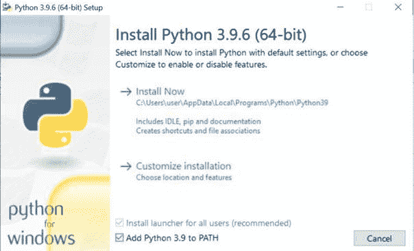
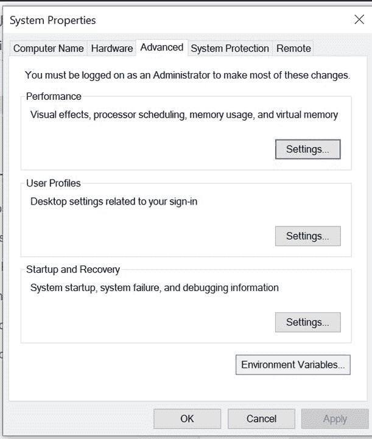

# 将 python 添加到 PATH 环境变量中(“Python”不被识别为内部或外部命令)

> 原文：<https://www.pythoncentral.io/add-python-to-path-python-is-not-recognized-as-an-internal-or-external-command/>

编程已经成为最重要的技术课程。除了良好的逻辑思维能力，你还需要成功安装软件才能在这个领域脱颖而出。Python 是需要学习的最基础的编程语言，但是在安装 Python 设置时，您可能会遇到一些错误。对于 Windows 用户来说，你的电脑屏幕上显示的最常见的错误可能是**“Python 不被识别为内部或外部命令。”**

这篇文章将指导你找出这个错误的原因，以及如何修复它。

## **在电脑上访问 Python 的步骤**

在你的电脑上访问 Python 的第一种方法是按照安装软件的路径，直接访问可执行文件。

截图展示了如何定位下载的可执行文件并打开 Python。

执行此任务将打开 Python 的 IDE，您可以在其中轻松编写代码。

访问 Python 的第二种方法是通过 [命令提示符](https://www.lifewire.com/how-to-open-command-prompt-2618089) 。该方法的步骤如下:

1)通过 Windows 的搜索选项卡打开命令提示符。

2)键入 Python 并按回车键

在这一步之后，Python IDE 将在同一窗口中打开。但是在某些情况下，可能会出现如下错误。

## **错误原因**

每当我们访问任何文件或已安装的程序时，我们的计算机都需要知道文件存储的整个位置。计算机将该位置读取为文件的 **【路径】** 。当我们通过直接访问 Python 可执行文件的位置来访问它时，我们遵循文件的路径，这消除了出错的可能性。但是，当我们使用命令提示符来访问文件时，计算机可能知道也可能不知道该路径。如果计算机不知道该路径，Windows 将不会运行该程序并显示一条错误消息。

## **路径变量**

计算机通过 path 环境变量知道文件的路径。你可以把一个路径 [环境变量](https://www.geeksforgeeks.org/environment-variables-in-linux-unix/) 想象成一组包含已安装程序的可执行文件地址的目录。path 变量使计算机更容易搜索程序。但是，如果这个 path 变量加载了许多不必要的路径，就会降低计算机的速度。因此，请确保您正确并有选择性地提及路径。

当我们在命令提示符下键入一个程序名，而没有指定目录(或者更具体地说，路径)时，计算机系统会搜索 path 环境变量中提到的所有路径。假设环境变量中提到了(特定程序的)路径。在这种情况下，计算机系统将能够找到并运行该可执行文件。然而，假设计算机系统没有找到任何通向可执行文件的路径。在这种情况下，它将显示错误消息。

因此，我们需要确保在 path 环境变量中添加 Python 可执行文件的路径。

## **修复错误**

### **解决方案 1**

修复此错误的第一种方法是在命令提示符中提及可执行文件的路径，这样系统就不必在 path 环境变量中进行搜索。

我们可以找到可执行变量的路径如下:

第一步:打开 Windows 的搜索选项卡，输入 Python。

第二步:点击“打开文件位置”

步骤 3:电脑浏览器窗口打开。

第四步:右键点击**【Python 3.9(64 位)】** ，选择“打开文件位置”

第五步:查找文件***【python . exe***。”右键单击该文件，然后选择“属性”

第六步:你可以看到 python 可执行文件的‘位置’和完整路径。

第七步:复制路径，粘贴到命令提示符下。

第八步:加一个反斜杠' \ '，写' python.exe '，回车。

现在你可以在命令提示符下成功运行 Python 了。

在这种方法中，每次打开 Python 时，你都必须在命令提示符下复制路径。这一过程可能是乏味和耗时的。为了将您从所有这些麻烦中解救出来，让我们看看第二种方法提供了什么。

### **解决方案 2**

这种方法的概念是将 python 可执行文件的路径添加到 path 环境变量中，这样计算机就可以自己搜索整个目录。有两种不同的方法可以将路径添加到环境变量:

#### **使用 Python 设置更新路径变量**

当您安装 Python 时，安装程序最初会为您提供将可执行文件的路径添加到 path 环境变量的选项。您可以选中该框，路径将会自动添加。

假设你第一次安装 Python 的时候漏选了这个选项；不用担心！您仍然可以通过以下步骤修改安装设置并更新 path 变量:

第一步:在你的文件浏览器中，搜索**【python-3 . 9 . 6-amd64】**并打开。

安装程序现在看起来像这样:

第二步:点击修改。窗口现在将显示如下:

第三步:点击“下一步”,直到出现“高级选项”窗口。

步骤 4:选中“将 Python 添加到环境变量”选项，然后点击安装。

现在您系统的 path 变量已经更新，您可以通过命令提示符访问 Python，不会出现任何错误。

#### **手动更新路径变量**

手动更新 path 变量的最关键要求是，您应该有 python 可执行文件的位置(或者更恰当地说，路径)。您可以按照 **【解决方案 1】**中给出的步骤获得所需的路径。

获得路径后，可以按照以下步骤操作:

第一步:打开电脑上的“设置”。

步骤 2:点击设置窗口中的“系统”,然后点击左侧可用选项中的“关于”。

步骤 3:点击“关于”窗口右侧的“高级系统设置”。

第四步:点击窗口右下角的“环境变量”。

第五步:在环境变量窗口中，点击路径选项(它将使文本背景变成蓝色)，然后点击“编辑”

步骤 6:在编辑环境变量窗口中，点击“新建”(窗口右侧)。

步骤 7:点击“新建”，光标将开始闪烁，您可以在此粘贴 Python 可执行文件路径。

第八步:点击“确定”，你的工作就完成了！

完成所有这些步骤后，您将能够通过命令提示符无误地运行 Python。

## **结论**

程序员应该了解操作系统的几个不同方面，以便在安装或编码时处理错误。[“Python 不被识别为内部或外部命令](https://www.pythoncentral.io/add-python-to-path-python-is-not-recognized-as-an-internal-or-external-command/) ”是一个程序员最初可能遇到的一个很基本的问题。我们希望这篇文章能帮助你修复这个错误。您可以应用任何解决方法，并有效地纠正您的系统代码。既然您已经安装了 Python，并且可以无误地运行它，那么您就可以用您独特的代码征服逻辑世界了。编码快乐！