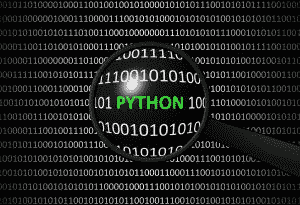

# Python 相对于其他语言的优势

> 原文：<https://www.pythoncentral.io/advantages-of-python-over-other-languages/>

Python 是一种流行语言，吸引了各国大量的追随者。程序员在 1989 年开始开发它，但它在 1991 年正式出版。那些认为 Python 这个名字是关于一条蛇的人错了。开发者给这种语言起了个名字，这要归功于 70 年代的一个流行节目“巨蟒剧团的飞行马戏团”创造这种语言的人之一是它的爱好者。这个名字引出了一个哲学观点，即开发必须是有趣的。培训项目也是根据这一原则创建的。Python 开发人员在创建和更新它的时候使用了其他的哲学陈述，也许正是由于这个位置，Python 的受欢迎程度和社区每年都在增长。所以让我们来发现它相对于其他语言的优势。

## 学习和使用 Python 的好处

这些好处并不详尽，但我们认为它们是最有价值的。其他一些语言可能会分享 Python 的一些好处，但这并不意味着它们可以同时拥有所有这些好处。只有使用 Python 才能获得如此丰富的优势。

### 自由语言和公开可用的库

它不需要任何额外的平台或预付费服务。一切都可以免费下载。各种企业都对降低成本感兴趣。这就是为什么 Python 是他们很好的解决方案。这个特性表明 Python 是一种稳定而自信的语言，它对新成员开放，并准备好与他们协同工作。

### 简单直观的语言

如果你对编码有所了解，你会很容易理解 Python 的逻辑。这就是为什么它简化了对错误的搜索。你不需要深究语法，花更少的时间找麻烦，因为你毫无疑问地阅读和解密它。

### 多用途语言

几乎不可能在编码中找到 Python 无能为力的区域。它占据了编程的所有方式，并依此发展。人工智能程序员使用 Python 来完成他们的许多任务，将来也会这样做。空间领域、各种应用程序、机器人技术、硬件编程只是 Python 有用之处的一部分。

### 兼容编程语言

这种面向对象的语言可能是许多其他语言中最兼容的。你能记住的任何平台对 Python 开发者来说都不是问题，所以他们从一开始就处于胜利的位置。

### 简单优化编码

例如，比较 Python 和 C++(一种非常重要、流行和广泛使用的语言)，我们会看到相同的请求在 Python 上包含三行，而在 C++上包含七行。这意味着编码变得更快更容易，你可以在一个屏幕上看到更多的过程和逻辑循环。

### 受雇主欢迎

你知道有哪些大公司使用 Python 作为编程语言吗？谷歌、NASA、迪士尼都在其中。如果你打算在一家著名的公司谋得一个职位，那么 Python 就是你的入场券。它同时适用于中小型公司，所以如果你努力工作，你总能在任何你想去的地方找到工作。

### 庞大的开发者社区

Python 够老了。这就是为什么 python 程序员的[社区](https://www.pythoncentral.io/introduction-to-tweepy-twitter-for-python/)足够大的原因。很难想象以前没有解决的问题，所以你总会找到建议和解释。无论如何，如果你发现这样一个以前没有人面对过的问题，很多人会试图帮助你并讨论解决它的方法。

### 高薪和大量空缺职位

Python 的流行和国际认可简化了双方的雇佣过程。如果你是一个 Python 程序员，那么你会在所有你只能想象的领域被要求。工资的问题根本不是问题。在 IT 领域，从初级职位到中级职位再到高级职位的转换比任何地方都要简单。这里只有资格是指，而不是指工作年限或大学文凭。 这个列表并不详尽——你可以问任何用 Python 编程的人，特别是如果他们有其他语言的经验，他们会和你分享更多优势的例子。尽管如此，我们认为这个列表足以做出正确的决定，选择 Python 作为您的主要编程语言。

## 如何精通 Python

本文致力于 Python 相对于其他语言的优势，也就是说我们现在不会详细教你如何开始用 Python 编程。我们要说的是，这是一项值得投资的技能。如果你觉得卡住了，需要一些 Python 作业在线帮助，一个简单的“ [做我的 Python 作业](https://myassignmentlab.com/do-my-python-homework.html) ”请求就可以了。如果你不知道什么，不要放弃，向专业程序员寻求帮助，继续你的 Python 编程任务。你可以说这些优势中的一些也是其他语言所固有的，你是对的。然而，它们的组合是独一无二的，确保了 Python 在 IT 世界中的长寿。用它来开始你的职业生涯是一个完美的选择，在现代世界中开启一个美好的未来。世界上有数百种(或数千种)编程语言。它们每天都在出现，改变着我们的生活。有些是专门为特定任务创建的，有些是为需要额外安全性的公司创建的。开发并使用它们的程序员是独特的专家，对宇宙有着独特的见解。同时，他们深深地依赖于他们的雇主，而雇主又深深地依赖于开发商。更安全还是更不安全还是个问题。Python 不是这种类型的语言。恰恰相反。如果你最终想进入稀有语言的世界，甚至想创造自己的语言，最好的例子就是 Python。