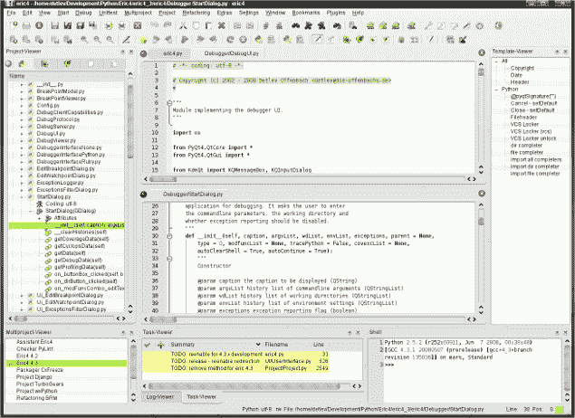
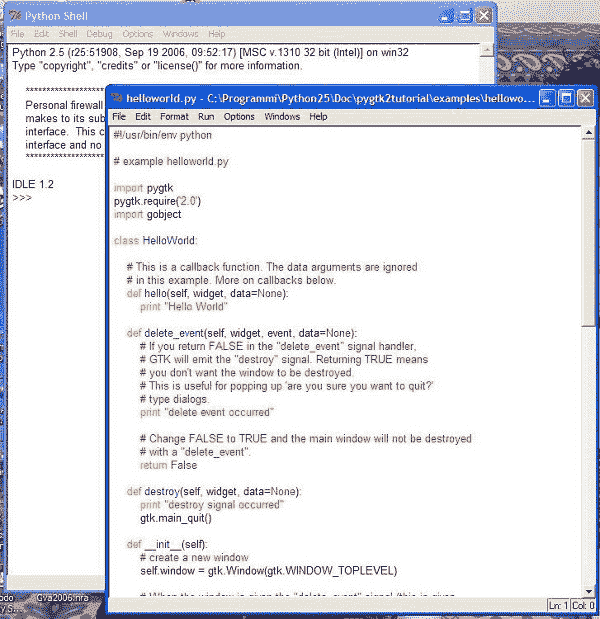
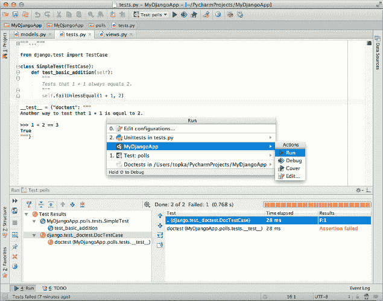
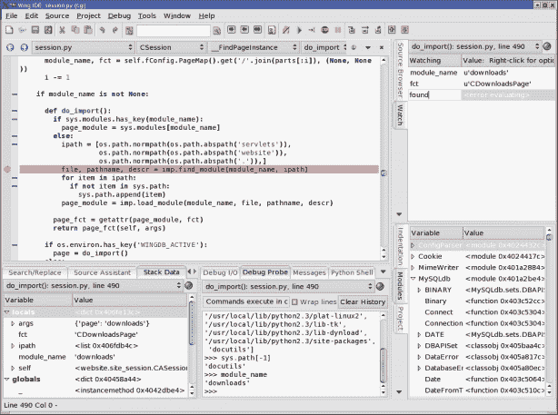

# Python 开发 ide 的比较

> 原文：<https://www.pythoncentral.io/comparison-of-python-ides-development/>

This article was written by Jason Fruit. For another opinion on Python IDES by Sergio Tapia Gutierrez, checkout our article [Best IDEs for Python Development](https://www.pythoncentral.io/comparison-of-python-ides-development/ "Best IDEs for Python Development"). We also have a [Review of Python's Best Text Editors](https://www.pythoncentral.io/best-text-editors-for-python-development/ "Review of Python's Best Text Editors").Edit: Mike has pointed out in the comments that PyCharm now comes with a free version (community edition). We've updated the article to reflect this.

直到最近，我已经好几年没有研究 Python IDEs 了；我通常不是一个 IDE 用户——我通常使用 [Emacs](https://www.gnu.org/software/emacs/ "GNU Emacs IDE") 。当我最后一次检查它们时，Python IDEs 是令人沮丧的；为动态语言编写工具并不容易，因为他们必须分析代码，并且它的许多行为在运行前很难预测。然而，现在有一点对我来说变得特别明显:Python IDEs 已经有了很大的改进。如果我现在开始成为一名 Python 程序员，我很可能会选择 IDE——其中一些确实令人印象深刻。我已经测试并回顾了其中的许多，所以下面你会发现 Python IDEs 的比较，按字母顺序排列:

*   [与 PyDev 的月食](#pydev)
*   [埃里克](#eric)
*   [空闲](#idle)

*   [Komodo IDE](#komodo-ide)
*   [PyCharm](#pycharm)
*   [机翼 IDE](#wing)

## PyDev 的月食

完全公开:在编程环境(或者文学环境，就此而言)中，“Eclipse”这个词让我充满恐惧；在我心目中，月食就是一头被绑在鲸鱼身上的猪和一只被绑在鲸鱼身上的狗。我不愿意安装 Eclipse，因为它是一个非常大的应用程序；有人会说臃肿。鉴于此，我对 PyDev 有些偏见——但我试图公平地评价它，它给我留下的印象比我预期的要多得多。

PyDev 的安装比这里讨论的许多 ide 要复杂一些，因为 Eclipse 必须单独安装。然后，Eclipse 必须关闭并作为管理员运行，您必须添加 PyDev 的软件源，接受它的证书，并等待插件安装。那么您必须以普通用户的身份重启 Eclipse。(优秀的说明可从[pydev.org](https://www.pydev.org/manual_101_root.html "PyDev Installation")处获得。)

PyDev 的 Eclipse

我最初的反应是，它很好，但有些笨重。代码导航做得很好，也很有效，自动缩进和去缩进工作得很漂亮。自动补全功能运行良好，并给出了很好的建议，但是用户交互实现有些笨拙；在某些情况下，例如，如果您有一个缩小到单个建议的列表，并且您想键入其他内容，您必须按 Escape 键来退出自动完成列表，将您的手从它们的键入位置移开。出于某种原因，在项目中创建一个新的 Python 文件有时需要几秒钟。对于类和函数来说，代码折叠是可用的，但是由于某种原因，对于任何其他类型的块来说都是不可用的。调试器工作正常，但它的用户界面——它打开了一个不同的调试视图，而不是将调试集成到常规的 PyDev 视图中——只是比它需要的更加分散，到处都是额外的 chrome，使得可用空间如此之小，以至于你必须滚动才能看到一切。

PyDev 确实有一些其他 ide 没有的东西，那就是远程调试；如果这对您很重要，您必须使用 Emacs 或 PyDev，这是我发现的唯一可行的选择。

总的来说，Eclipse 和 PyDev 是一个非常好的 IDE。如果您是一个已经习惯了 Eclipse 的 IDE 用户，并且您喜欢它，我会让 PyDev 试试，这样您就可以使用您已经熟悉的工具了。如果 Eclipse 对您不重要，但是您想要一个 IDE，我会尝试 PyCharm，它以一个更干净、更快、更好的软件包提供了所有相同的特性；尽管如此，PyDev 还是一个不错的选择。

## 埃里克

Eric 是用 Python 写的 IDE，带 [PyQt](https://riverbankcomputing.com/software/pyqt/intro "PyQt Python Library") 。它集成了一些熟悉的 Qt 工具，比如 Designer 和 languages，使用了无处不在的 Scintilla 编辑组件，并且拥有一些看起来非常有用的工具。

这就是我对 Eric 的总结，因为它有一个非常严重的缺点:它有一个非常复杂的界面，可发现性很低，文档很少。感觉就像它被设计成让用户感到愚蠢和无能。我可以直接进入并使用这个列表中的其他编辑器和 ide，并查阅文档中不明显的部分，Eric 每次都阻止我，尽管它的插件 API 是有文档记录的(我想是通过一个工具)，但没有包括用户文档。没有。零文档。

毫无疑问，你会原谅这篇评论中沮丧的语气。

Eric 4 Python IDE 截图

自动完成起初似乎没有打开，所以我翻遍了首选项，在两个地方启用了它，我认为这是必要的。这太糟糕了——事实上糟糕得可笑，所以我搜索并找到了自动补全替代插件的参考资料。我安装了其中的一个，基于 Rope，检查了偏好设置以启用*和*，发现有变化但没有改进——然后厌恶地放弃了。

自动缩进是勉强可以接受的。Qt 的 GUI 设计器已经足够好了，但是祝你好运找到它。提示:它不在菜单上。调试工作，并声称可以远程调试，虽然我没有测试。哦，偏好设置里禁用了。

重构？不知道行不行；我从未见过菜单被启用。也许它在首选项中也被禁用了，但是我找不到它的设置。对于完全无用的帮助查看器，有广泛的定制选项，如果有帮助的话。

我见过比 Eric 用户体验更好的狗屎。

## 无所事事

大多数 Python 发行版都有 IDLE，它将自己描述为“用 tkinter GUI 工具包构建的 Python IDE”。它宣传以下功能:

*   用 100%纯 Python 编码，使用 [Tkinter GUI 工具包](https://en.wikipedia.org/wiki/Tkinter "Tkinter GUI toolkit")。
*   跨平台:适用于 Windows、Mac 和 Linux/Unix。
*   多窗口文本编辑器，具有多重撤销、Python 着色和许多其他功能，例如智能缩进和呼叫提示。
*   Python shell 窗口(也称为交互式解释器)。
*   调试器(不完整，但可以设置断点、视图和步骤)。

Python IDE 空闲截图

所有这些特性实际上都存在，但它们并不能真正构成一个 IDE。事实上，虽然 IDLE 提供了一些你期望从 IDE 中得到的特性，但它并不是一个令人满意的文本编辑器。该界面存在缺陷，未能考虑 Python 的工作方式，特别是在交互式 shell 中，自动完成在标准库之外没有用，编辑功能如此有限，以至于没有一个认真的 Python 程序员——见鬼，没有一个认真的
*打字员*——可以全职使用它。

如果你使用 IDE，它不应该是空闲的。

## Komodo IDE

[ActiveState](https://www.activestate.com/ "ActiveState") 提供了“额外电池”的 Python 优秀发行版，他们的 Perl 和 Tcl 发行版也不错，但是他们应该把 Python IDE 的业务留给别人。为[科莫多巨蜥](https://www.activestate.com/products/komodo-ide/ "ActiveState Komodo IDE")支付 295 美元是令人难以容忍的；PyDev 不免费或者 PyCharm 花更少的钱做的事情很少，而且它做的很多事情只是名义上有效，至少在 Ubuntu 上是现成的。

公平地说，他们从事的工作比本文所讨论的大多数 IDE 的开发人员更困难:Komodo IDE 还为 CSS、HTML、JavaScript、PHP、Perl、Ruby、Tcl、XML、XSLT、XUL 和各种模板语言提供了编辑和代码完成功能。我没有测试其中任何一个，尽管我了解到它们的 JavaScript 支持非常出色。尽管如此，这对你写 Python 还是没什么帮助。

## PyCharm

PyCharm 是由 IntelliJ IDEA、WebStorm、RubyMine 和其他强大的单一语言 ide 背后的人 [JetBrains](https://www.jetbrains.com/ "JetBrains") 创建的。他们当然知道 IDEs，他们的经验用 PyCharm 表现出来。这是一个完美的、强大的、多功能的 IDE，运行良好、快速，并且提供了很多功能。

PyCharm 实际上拥有 IDE 的所有功能:代码突出显示、真正有效的自动缩进、可定制的代码格式、我见过的最好的 Python 自动完成功能(尽管在第一次创建项目时构建索引花费了大量时间)、实时错误检测(加上拼写检查，我觉得这很有价值)、代码片段、代码折叠、智能引号、括号、冒号，甚至参数:它真的非常强大。它拥有强大的项目导航工具、自动纠错建议、优秀的重构工具、文档浏览器、Python 调试器、单元测试工具等等。太棒了。

PyCharm Python IDE 截图

它还提供了使用和调试 Django 和 Google App Engine 应用程序的特殊功能，强大的 JavaScript、CoffeeScript、HTML 和 CSS 编辑器，各种模板工具，JavaScript 调试器——你相信了吗？我唯一想从一个 IDE 中得到的是一个 GUI 设计器；也许 JetBrains 的人不希望他们优秀的 IDE 被称为“PyGTK 的 RAD IDE”，或者他们选择的任何工具包。无论如何，有很多独立的 GUI 设计器可用于各种 GUI 工具包，而且我也不使用它们，所以我觉得这并不是一个不足。

PyCharm 有两个版本——社区版和专业版。社区版是免费的(就像 freedom 一样)，而专业版是部分专有的，价格不等。他们向开源项目和教育机构免费提供专业版，而价格从 29 美元到 199 美元不等。你可以点击查看全部定价[。](https://www.jetbrains.com/products/compare/?product=pycharm&product=pycharm-ce "PyCharm Pricing Matrix")

如果我是一个几乎完全依赖 Python 的开发人员，并且我还没有投入太多时间来学习如何用 Emacs 做 PyCharm 做的所有事情，我会强烈考虑转向 PyCharm。你绝对应该把它放在你的候选名单上。

## 机翼 IDE

[Wing IDE 专业版](https://wingware.com/ "Wingware Python IDE")(我评测的版本)和 Komodo IDE 价格差不多，但相似之处也就到此为止了。它速度快，功能全，而且有效。自动完成和自动缩进与这里最好的评论一样好，集成测试和调试工作良好，具有直观的界面，尽管重构选项非常有限，但是一旦您在运行工具之前确定了应该选择什么，它们就工作得很好。

片段是存在的，但不像 PyCharm 中那样干净地实现，或者更严重的是，[Sublime Text](https://www.sublimetext.com/ "Sublime Text")；尽管如此，它们仍然是合理的默认值，您可以编辑它们并添加更多。

Wing Python IDE 截图

几个杂项:Wing 可以做 Django 项目，集成了 diff 和 merge，一个很好的 Python shell，一个操作系统命令接口，我发现它令人困惑，不如一个简单的控制台，并且通常可以做你期望从 IDE 中得到的所有事情。

我发现 UI 比 Eclipse/PyDev 好，但比 PyCharm 稍差一些，而且比这两者都不落后。机翼是一个非常好的选择，但价格昂贵；如果我掏钱，我会注意到两件事:个人版只省略了一些我认为有用的功能，而且价格低得多；而 PyCharm，一般来说也一样好但是速度慢，价格和 Personal 差不多。

## Python ide 对比总结

ide 中有一些非常好的选择:如果你想要一个运行良好的免费的，安装 Eclipse 和 PyDev 如果你愿意出钱，PyCharm 和 Wing IDE 的能力差不多，都是优秀的 IDE。也有一些灾难，包括免费的和不免费的，但是很明显 Python 的 ide 在过去的十年里有了很大的进步，可以和不太动态的语言的工具相比较。

**要了解关于 [Python IDEs](https://www.pythoncentral.io/the-best-python-ides-you-can-use-for-development/ "The best Python IDEs you can use for development") 的另一个观点，请查看[塞尔吉奥的文章](https://www.pythoncentral.io/the-best-python-ides-you-can-use-for-development/ "The best Python IDEs you can use for development")。**