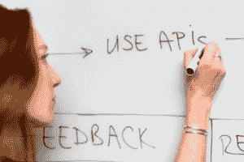

# 互联 CMMS

> 原文：<https://www.pythoncentral.io/connected-cmms/>

## 

## **什么是连通 CMMS？**

互联 CMMS 是一种连接您的系统、人员和流程的新型维护和物业运营方法。它将 CMMS 的范围扩展到维护和工作单之外，以简化流程，促进利益相关方的参与，并在一个位置提高效率和连接性。

联网 CMMS 是为大型物业运营和维护团队提供单一平台的最有效方式。

联网 CMMS 不再要求运营专业人员依赖各种单点解决方案来处理超出维护、电子邮件沟通、电子表格报告等范围的工作，而是将所有运营工作流程(包括客户参与和物业维护、工作场所管理、供应商管理、资产绩效和物联网信息)整合到一个单一的综合平台中。

## T2 的大部分工作不是在 CMMS 进行的，而是在境外进行的。

CMMS/CaFM 系统的构建方式存在问题，即使是作为一个记录保存系统。它们不再与房地产业务的投资组合兼容。

投资组合不断发展，需要关注客户参与、合同管理、支出可见性、基于条件的投资组合规模维护优化....不胜枚举。

然而，在目前的 CMMS 模式中，通过电子表格和电子邮件完成的工作比 CMMS 还要多。这还没有提到登录几个系统来满足不同需求的困难。每个工作流程都必须通过各种工具，数字的和模拟的，每一步都变得低效、无效和缓慢。

## 您的 CMMS 必须超越资产&维护管理的范畴。

### 《连线 CMMS》如何将 CMMS 重新思考成一个现代的“行动系统”

在我们生活的这个时代，使用企业软件就像发短信一样简单——它速度快、界面友好、使用简单，并且采用了尖端技术。相比之下，56%的 O & M 利益相关者面临着维护和运营技术以及数字化转型的挑战。当前的 CMMS 只关注技术人员，很少或没有自动化或与 O & M 技术堆栈的其余部分集成。

互联 [CMMS API](https://www.makini.io/) 通过整合流程、人员和系统，提高效率并转变用户体验的提供方式。

### 【ConnectedCMMS(实际上)应该是什么样的，我们如何应对？

互联 CMMS 是一种灵活的方法。互联 CMMS 方法不需要您完全更换当前的技术堆栈并从头开始。它旨在与您当前的企业运营和业务软件协同工作，并开发基础设施(传感器和监控基础设施)。它必须使用 API 优先的设计来构建，这种设计将数据民主化和规范化，以允许访问第三方应用程序。它应该被设计为通过移动、网络和信息亭应用服务于 O & M 利益相关者(所有者、经营者、租户和居住者)。使用零代码 SaaS 平台而不是单点解决方案方法来解决与投资组合运营和维护相关的最常见的自动化、定制和集成问题是至关重要的。

《连线 CMMS》将其归结为三个支柱/步骤:

1.  自动化
2.  订婚
3.  效率

#### **第一步:在 CMMS 实现流程自动化，以简化操作并缩短时间**

通常，今天的运营团队使用多个记录系统。这意味着各种工具在团队中存储和传递信息。此外，他们还投资软件或开发仪表板和分析工具。最终，你的日常工作流程缓慢而混乱。他们也挤满了不断变化的工具，很难跟踪。例如，团队使用电子邮件进行相互间的[沟通](https://www.pythoncentral.io/python-for-android-using-webviews-sl4a/)，使用电话或聊天发出警告，使用企业工具进行会计和供应商 CRM，使用电子表格进行报告，以及所有其他事情。

为了解决这一问题，互联 CMMS 通过利用工作流自动化，帮助企业从记录系统“转向行动系统”。

在整个生命周期中，它通过各种流程的自动化来连接流程。这包括创建工作订单、发送通知、提醒技术人员、通信和批准、创建仪表板、报告、报表等。当所有的日常任务都由自动化工作流处理时，您的团队将有时间和精力专注于收入优化和向客户交付价值。

#### **第二步:与 CMMS 的 O & M 参与者接触，提高各个层面的知名度和价值**

从一开始，你的 CMMS 就必须设计成确保全面参与，而不是作为一种课外活动。它应向用户提供对物业单位的运营至关重要的用户界面，包括但不限于物业经理、现场技术人员、主管、物业经理和管理人员，他们可以在需要时访问所需的数据。所有来自外部的关键利益相关方(住户和工作中的员工以及租户/客户和承包商)都需要在他们的位置通过移动、网络或信息亭应用程序获得服务。

互联 CMMS 通过让多个利益相关方参与进来，帮助企业实现信息访问民主化，促进内部协作，并增强用户体验。

从财务和资产洞察、组织范围的进度监控到服务请求的反馈和互动响应，互联 CMMS 可以满足所有利益相关方的需求。

#### **第三步:通过以有意义的方式整合 OT，在 CMMS 实现完全互联运营**

运行 ppm 并不是唯一的业务运营要求。建筑物在能源管理、居住者健康和效率/预测性维护方面有更多的需求。连接到建筑系统并收集实时信息对于优化与之相关的流程至关重要。此外，CMMS 作为一个独立的解决方案是不够的。连接到第三方应用程序和软件以实现最大的企业 T2 价值是必不可少的。

互联 CMMS 通过一种 API 优先的方法，集成了 BMS 传感器、BIM 或任何第三方商业软件，使您能够更快地创建无缝的数字体验。

它支持互操作性，解决了企业应用程序最常见的集成问题。通过将来自第三方访问的数据大众化，您能够加快组合规模的物联网部署过程，而无需重复的站点级集成，并在更大范围内创造新的效率。