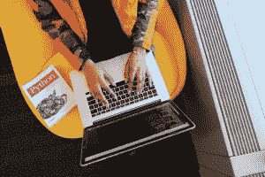

# 在 MacBook 上开始 Python 编码的指南

> 原文：<https://www.pythoncentral.io/guide-for-starting-python-coding-on-a-macbook/>

学习 Python 是进入编码世界的最好方式之一，因为它是一种流行的编程语言，具有大量的功能。当你将程序与 MacOS 配对时尤其如此，因为 Python 兼容不同的 [MacOS 版本](https://setapp.com/how-to/full-list-of-all-macos-versions) 。

许多年轻的程序员正试图掌握 Python，他们做的事情是正确的，但这是一个需要相当多时间和奉献的过程。我们希望通过展示 MacBook 上 Python 编码的最重要的细节来帮助您启动这个过程。让我们来看看吧！

## **掌握 Python 的好处**

Python 是世界上最常用的编程语言。根据这份报告，全球有 820 万名使用 Python 编写代码的开发人员，这一数字现在已经超过了使用 Java 编写代码的人数，达到 760 万。

是什么让 Python 如此特别？这里有许多成功的因素，但我们将指出明显的:

*   **功能性** :首先，Python 是一个高度[功能性](https://www.pythoncentral.io/quick-tip-transpose-matrix-using-python/)的工具，可以覆盖广泛的项目。它适用于不同类型的应用程序，从而为编码人员提供了一个完美的全方位 MacOS 平台。
*   简单性 :没有这个小因素，即使是最好的编程语言也不可能变得如此流行。幸运的是，Python 非常简单且具有包容性，因为几乎任何人都可以相对快速地学习它的语法。
*   免费的 :人们喜欢 Python 的另一个原因是它是免费的。Python 是一个开源程序，这意味着你可以在 MacOS 或任何其他平台上免费使用它。
*   专注的贡献者 :作为一个如此出色的编程工具，Python 自然吸引了专注的开发者，他们组成了一个热情的支持者社区。如果您对 Python 有任何不了解的地方，您可以询问社区，一些同行很快就会回答。
*   它给你带来职业机会:Python 如此实用的事实也意味着你可以从它的职业生涯中获益。如果你想在编码方面建立一个伟大的职业生涯，Python 肯定是一个好的起点。

## **如何安装 Python**

现在是在你的 MacBook 上安装 Python 的时候了。一些笔记本电脑已经包含 Python，所以您应该首先在终端中查找“Python-version”如果它不在那里，那么你需要手动安装程序。

这也是一个简单的过程，只需访问 Python 官方网站，点击一个大的下载号召即可。这将启动一个过程，只需要你再点击几下。

开始下载 Python 后，会弹出一个. pkg 文件。下载完成后，将出现一个新文件夹，并显示安装程序。之后，只需按照下载程序本身的提示点击按钮即可。

## **找到合适的文本编辑器**

Python 附带了一个现成的文本编辑器，简称为 TextEdit，但这并不是典型程序员的最佳选择。也就是说,“文本编辑”有点乱，它没有提供太多的格式选项，所以最好用一个更好的工具来代替它。

大多数初学者都不介意 IDLE，这是一个文本编辑器，通常会附带 Python 的安装文件夹。IDLE 是一个有用的工具，因为它支持简单的编码，并且在您完成构建一行新代码时测试可能的输出。

使用 IDLE 超级简单。一旦你启动它，平台就会创建一个新窗口，也就是 shell。您可以在 shell 中创建一个新文件，然后会弹出一个代码编辑器。就是这样！

## **伟大的 Python 学习资源**

单篇文章太短，不足以教你如何在 MacOS 上使用 Python 编程，所以让我们向你介绍最好的学习资源。

[python central](https://www.pythoncentral.io/)总是一个很好的起点，它提供了所有的教程、操作文章、食谱、技巧和诀窍。还有 Code Academy，专门为 Python 设计的编码课程库。Udemy 有一个很棒的 Python 训练营，从基础开始，进入更高级的学习阶段。

### **底线**

在 MacBook 上编写 Python 代码当然是开始编程冒险的好方法。虽然这需要大量的奉献和努力，但这个过程最终会有回报，因为你会成为一名知识渊博的专业人员，能够完成各种各样的编码任务。

在这篇文章中，我们关注了 MacBook 上 Python 编码的最早期阶段。这只是一个介绍，应该可以帮助你顺利进入这个阶段，然后进入更高层次的 Python 编程。如果您需要额外的解释或阅读建议，请务必写下评论——我们会及时给您回复！