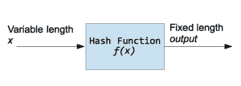

# 用 Python 散列字符串

> 原文：<https://www.pythoncentral.io/hashing-strings-with-python/>

哈希函数是一种接受可变长度字节序列的输入并将其转换为固定长度序列的函数。这是一个单向函数。这意味着如果 *f* 是散列函数，计算 *f(x)* 是非常快速和简单的，但是试图再次获得 *x* 将花费数年时间。哈希函数返回的值通常称为哈希、消息摘要、哈希值或校验和。大多数情况下，对于给定的输入，哈希函数会产生唯一的输出。然而，根据算法，由于这些函数背后的数学理论，有可能发现冲突。



现在假设你想用 SHA1 函数散列字符串“Hello Word”，结果是`0a4d55a8d778e5022fab701977c5d840bbc486d0`。


哈希函数用于一些加密算法中，如数字签名、消息认证码、操作检测、指纹、校验和(消息完整性检查)、哈希表、密码存储等等。作为一名 Python 程序员，您可能需要这些函数来检查重复的数据或文件，在通过网络传输信息时检查数据的完整性，在数据库中安全地存储密码，或者进行一些与密码学相关的工作。

我想说明的是，哈希函数不是一个加密协议，它们不加密或解密信息，但它们是许多加密协议和工具的基础部分。

一些最常用的哈希函数有:

*   **MD5** :产生 128 位哈希值的消息摘要算法。这被广泛用于检查数据完整性。由于 MD5 的安全漏洞，它不适合在其他领域使用。
*   **SHA:** 由美国国家安全局设计的一组算法，是美国联邦信息处理标准的一部分。这些算法广泛应用于多种密码应用中。消息长度范围从 160 位到 512 位。

Python 标准库中包含的`hashlib`模块是一个包含最流行的散列算法接口的模块。`hashlib`实现了一些算法，但是如果你安装了 OpenSSL，`hashlib`也可以使用这些算法。

这段代码适用于 Python 3.2 及更高版本。如果想在 Python 2.x 中运行这个例子，只需移除`algorithms_available`和`algorithms_guaranteed`调用。

首先，导入`hashlib`模块:

```py

import hashlib

```

现在我们用`algorithms_available`或`algorithms_guaranteed`来列出可用的算法。

```py

print(hashlib.algorithms_available)

print(hashlib.algorithms_guaranteed)

```

`algorithms_available`方法列出了系统中所有可用的算法，包括通过 OpenSSl 可用的算法。在这种情况下，您可能会在列表中看到重复的名称。`algorithms_guaranteed`仅列出模块中存在的算法。`md5, sha1, sha224, sha256, sha384, sha512`总是在场。

## 讯息摘要 5

```py

import hashlib

hash_object = hashlib.md5(b'Hello World')

print(hash_object.hexdigest())

```

上面的代码获取“Hello World”字符串并打印该字符串的十六进制摘要。`hexdigest`返回表示散列的十六进制字符串，如果您需要字节序列，您应该使用`digest`来代替。

注意字符串前面的“b”是很重要的，它将字符串转换为字节，因为哈希函数只接受一个字节序列作为参数。在该库的早期版本中，它通常接受一个字符串文字。因此，如果您需要从控制台获取一些输入，并对这些输入进行哈希处理，不要忘记将字符串编码成一个字节序列:

```py

import hashlib

mystring = input('Enter String to hash: ')

# Assumes the default UTF-8

hash_object = hashlib.md5(mystring.encode())

print(hash_object.hexdigest())

```

## SHA1

```py

import hashlib

hash_object = hashlib.sha1(b'Hello World')

hex_dig = hash_object.hexdigest()

print(hex_dig)

```

## SHA224

```py

import hashlib

hash_object = hashlib.sha224(b'Hello World')

hex_dig = hash_object.hexdigest()

print(hex_dig)

```

## SHA256

```py

import hashlib

hash_object = hashlib.sha256(b'Hello World')

hex_dig = hash_object.hexdigest()

print(hex_dig)

```

## SHA384

```py

import hashlib

hash_object = hashlib.sha384(b'Hello World')

hex_dig = hash_object.hexdigest()

print(hex_dig)

```

## SHA512

```py

import hashlib

hash_object = hashlib.sha512(b'Hello World')

hex_dig = hash_object.hexdigest()

print(hex_dig)

```

## 使用 OpenSSL 算法

现在假设你需要一个 OpenSSL 提供的算法。使用`algorithms_available`，我们可以找到你想要使用的算法的名字。在这种情况下，“DSA”在我的电脑上可用。然后，您可以使用`new`和`update`方法:

```py

import hashlib

hash_object = hashlib.new('DSA')

hash_object.update(b'Hello World')

print(hash_object.hexdigest())

```

## 实际例子:散列密码

在下面的例子中，我们对密码进行哈希运算，以便将其存储在数据库中。在这个例子中，我们使用盐。salt 是在使用哈希函数之前添加到密码字符串中的随机序列。使用 salt 是为了防止字典攻击和彩虹表攻击。但是，如果您正在开发真实世界的应用程序并使用用户的密码，请确保了解该领域的最新漏洞。如果您想了解更多关于安全密码的信息，请参考此[文章](https://crackstation.net/hashing-security.htm "Secure Salted Password Hasing")

*   [Python 3.x](#custom-tab-0-python-3-x)
*   [Python 2.x](#custom-tab-0-python-2-x)

*   [Python 3.x](#)

[python]
import uuid
import hashlib

def hash_password(密码):
# uuid 用于生成随机数
salt = uuid.uuid4()。十六进制
返回 hashlib . sha 256(salt . encode()+password . encode())。hexdigest() + ':' +盐

def check _ password(hashed _ password，user_password):
password，salt = hashed _ password . split(':')
return password = = hashlib . sha 256(salt . encode()+user _ password . encode())。hexdigest()

new_pass = input('请输入密码:')
hashed _ password = hash _ password(new _ pass)
print('要存储在 db 中的字符串是:'+hashed _ password)
old _ pass = input('现在请再次输入密码进行检查:')
if check _ password(hashed _ password，old_pass):
(您输入了正确的密码)
else:
print('对不起，但密码不匹配)
[/python] 【T8

*   [Python 2.x](#)

[python]
import uuid
import hashlib

def hash_password(密码):
# uuid 用于生成随机数
salt = uuid.uuid4()。十六进制
返回 hashlib . sha 256(salt . encode()+password . encode())。hexdigest() + ':' +盐

def check _ password(hashed _ password，user_password):
password，salt = hashed _ password . split(':')
return password = = hashlib . sha 256(salt . encode()+user _ password . encode())。hexdigest()

new_pass = raw_input('请输入密码:')
hashed _ password = hash _ password(new _ pass)
print('要存储在 db 中的字符串是:'+hashed _ password)
old _ pass = raw _ input('现在请再次输入密码进行检查:')
if check _ password(hashed _ password，old_pass):
print('您输入了正确的密码')
else:
print('对不起，但密码不匹配')
[/it