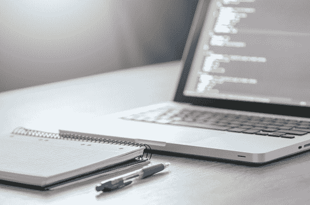

# Python 在教育中是如何使用的？

> 原文：<https://www.pythoncentral.io/how-is-python-used-in-education/>

今天，世界上有几种编程语言。每种工具都有多种用途。于是，人们通常会问:“哪种工具最适合学习？”目前，教育行业似乎在很多方面使用 Python。

这可能是因为这种语言简单易学。它的语法非常接近英语。在教育行业，由于其简单性，该语言比 Java 和 C++等其他工具更受青睐。

据《福布斯》报道，Python 是一个工具，适合任何需要简单快速编写脚本的人使用。在本文中，我们将研究一些特殊的用例场景，这些场景使 Python 成为教育目的的完美语言。

## 大量资源的收集

Python 是一个开源项目，在全世界都很流行。因此，有许多资源可供选择学习这门语言的学生使用。教师可以很容易地让学生参考额外的课文。

同样，学生也可以在网上获得他们可以用来学习的材料。如果作业不能快速解决，学生可以很容易地在网上查找编程作业帮助。这种语言还有一个很大的程序员社区，他们非常乐意帮助你。

## 可移植和可扩展的属性

Python 是众多具有可移植性和可扩展性的编程语言之一。有了这两个属性，人们可以一致地交叉检查 Python 的操作。值得注意的是，Python 的可扩展能力意味着它可以与其他语言集成。这些语言包括 Java，甚至 C 和 C++，因为它的。净成分。

## 脚本和自动化

自动化是当今 Python 最重要的应用之一。作为一种脚本语言，教育行业现在可以使用 Python 来自动化许多过程。使用 Python 可以方便地处理类似考勤这样的重复性且需要较少[判断](https://www.pythoncentral.io/sqlalchemy-association-tables/)的流程。这样，老师可以有更多的时间去做更好的事情。

## 机器学习和人工智能

今天，Python 被广泛用于人工智能和机器学习，领先于世界上所有其他编程语言。这是因为 Python 中的算法使用允许计算机系统执行各种功能的数据信息。

在教育行业，教师和学生可以使用 Python 来执行其中的一些功能。例如，Python 中的库 Keras 可以促进网络实验。还有 TensorFlow，开发人员可以用它来训练计算机系统处理需要判断的任务。

## 建筑计算机图形学

目前，许多离线和在线项目使用 Python 来创建各种图形用户界面(GUI)。同样，教育行业可以使用 Python 为其软件构建漂亮的图形。更进一步，开发人员可以使用其他 Python GUIs 产生更简单的方法来适应几个应用程序。

## 数据科学

Python 是每个数据科学家必备的必备工具。该语言支持许多框架，包括 Django、Pyramid 等等。通过数据科学中的 Python，教育工作者可以使用给定的输入来创建他们想要的输出。

学生可以很快学会更好的处理和处理数据的方法，以及从他们的学生时代。这些将使他们提前为未来对数据和信息的需求做好准备。

## 可读和可维护的代码

在教育环境中，Python 的用途之一就是编码。有了 Python 的语法，你可以快速写出具体的概念，而不必用其他代码编写。与大多数语言不同，代码可读性至关重要。

Python 的语法就像英语一样。然而，这种语言允许你使用关键字而不是标点符号。有了一个可读和干净的代码库，您就可以很好地维护软件更新，而不需要太多的工作或浪费精力。