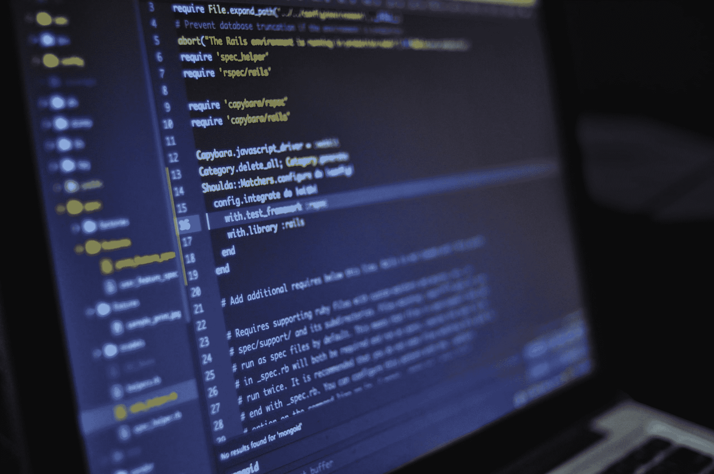
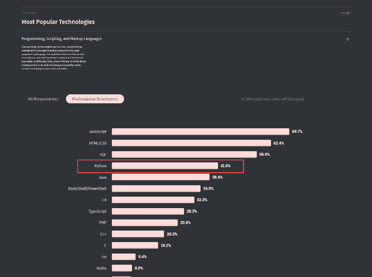

# 学习 Python 需要多长时间

> 原文：<https://www.pythoncentral.io/how-long-does-it-take-to-learn-python/>

决定学习 Python 是提高技能和获得高薪工作的绝佳方式。Python 有几个应用。无论你想成为一名数据科学家、数据分析师、创造人工智能，还是成为一名熟练的 web 开发人员，你都需要学习 Python。不管你是学生还是已经有工作，很自然的会想知道你需要多长时间才能精通 Python。了解你需要投入的时间和工作量会让你更容易设定目标和追踪里程碑。 **那么学习 Python 需要多长时间？** Python 可能是比较容易上手的编程语言之一，但是它是多用途的，多方面的。虽然掌握这门语言的基础知识需要六到八周的时间，但是你可以在六个月内将 python 学习到中级水平。 我们已经在下面详细解包了答案。

## **学习 Python 需要多长时间？**

对于一个完全的编程初学者来说，学习 Python 基础知识——变量、函数、循环等等——需要六到八周的时间。 如果你有一些编程语言的经验，你也许能在一两周内复习基础知识。 扎实掌握这门语言的基础知识，你将能够编写简单的 Python 程序。然而，如果你想全职使用 Python，这种能力水平是不够的。要熟练到能在那个级别工作，你至少需要学习几个月。六个月的专门学习应该会给你获得初级开发人员职位所需的技能。虽然你可以在变得有能力后继续独立学习 Python，但是学习更多的最好方法是通过找一份工作来应用你的技能。

## **2021 年学 Python 值得吗？**

人工智能和数据科学继续成为一些 [行业中最抢手的科技技能](https://www.comptia.org/blog/top-it-skills-in-demand) 。对熟练 Python 程序员的需求似乎没有放缓。值得一提的是，虽然人工智能和人工智能是 Python 中最受欢迎的应用，但它们并不是唯一报酬丰厚的技能。各行各业都需要 Python 开发者，他们利用自己的编程技能完成不同的任务。Python 在各个行业的一些应用有:

*   **银行:** 数据转换和操作
*   **金融:** 数据挖掘寻找交叉销售机会
*   **保险:** 利用机器学习获得商业洞察力
*   **硬件:** 自动化网络管理
*   **医疗:** 决定疾病预后
*   **航空航天:** 满足软件系统最后期限
*   **商业服务:** 创建支付系统
*   **软件:** 扩展遗留应用
*   **咨询服务:** 开发网站

现在每个行业都在使用 Python 来解决现代问题。也对教育行业产生了不可思议的影响。 Python 是美国大学里教授的最流行的入门编程语言。它简单的语法使它非常容易阅读和编写，帮助学生开始像程序员一样快速思考，而不用太担心代码编写约定。 除了用来教编程，Python 在教育上还有很多其他用途。你可以在本帖 中了解更多关于他们的 [。](https://www.pythoncentral.io/how-is-python-used-in-education/)

### **Python 开发者的职业前景**

数据科学家和 web 开发人员使用 Python 最多。然而，Python 是高度通用的，可以满足大多数项目的开发需求。 难怪这种语言在数字营销和产品管理等领域也有应用。 对 [Python 开发者乌克兰](https://www.squadrity.com/15-python-development-companies-in-ukraine/)的需求在过去十年一直很高，对熟练程序员的需求短期内不会下降。 根据开发者社区 2020 年栈溢出调查，Python 是全球公司使用的第四大流行语言。在 2021 年，学习 Python——无论是为了乐趣还是利润——都是值得的。

## **完全学会 Python 有多难？**

没有“精通 Python”这回事——至少在真正意义上是这样。你不需要为了找工作或开发有用的工具而学习这门语言的所有知识。 这样想: Python 是一种工具，像螺丝刀。就像您可以使用螺丝刀来修理从台扇到汽车引擎的所有东西一样，您可以使用 Python 来解决不同复杂程度的不同问题。你可以学习 Python，获得像 Django 和 WebPy 这样的框架知识来构建网站。你也可以学习使用 Tensorflow 这样的库，成为数据挖掘专家。要找到一份工作，你不需要同时学习这两种技能。你可以选择一个你最感兴趣的领域，学习相关的技能。 要想学会开发网站或者足够好的理解机器学习，你将需要学习六个月的 Python。 然而，假设你是一名数字营销人员，只想学习 Python 来分析谷歌分析数据。那样的话，你只需要学几周 Python 就足够胜任了。

### **学 Python 做数据分析要多久？**

网上有些程序声称可以在短短三个月内教会你数据分析。然而，你的里程可能会因这些课程而异。 除了上一门课，你还需要读一两本关于 Python 的书([*Eric Matthes 的《Python 速成教程》*](https://amzn.to/3dpLs9A) 是一本顶级的)，做几个项目(至少两个)，读读像 [*破解编码面试*](https://amzn.to/3xfseLq) 这样的书，你就能被录用了。 如果一天大部分时间都能学习，三四个月就能学会 Python 做数据分析了。然而，如果你一天只能学习两到三个小时，你至少需要学习六个月才能胜任。

### **每天花多少时间学习 Python？**

如果你有这方面的诀窍，并且发现你能很快掌握编程概念，你也许能在四周内写出基本的脚本。 然而，学习在你的代码中实现多线程、套接字编程、数据库编程等概念至少要花你两到三个月的时间。 在你理解了上述先进概念的工作原理后，再经过两到四周的专业培训，你将能够做像图像处理和数据分析这样的事情。 给自己六个月的时间，设定每天和每周的学习目标，是学习 Python 最高效的方法。

## **我应该如何学习 Python？**

如前所述，如果你想学习 Python 全职做开发人员，大约需要半年的学习时间(每天 2-3 小时)。 但是根据你的进度和对学习编程语言的投入，你也许能找到一种加速你学习的方法。 网上不乏号称几周教你 Python 的课程。然而，这些课程中有许多并不是为了给你提供为别人工作(或者自己创造一些令人印象深刻的东西)所需的知识水平。不管你是学生还是在职专业人士，学习 Python 的最好方法是参加一个训练营。您将每天与其他学习者和 Python 专家互动，这是快速掌握编码技能的完美学习环境。如果你是那种能够自学的人，每天花三个小时学习并练习六个月，你会获得开始工作所需的技能。

## **学习目标和常规**

如果你想成为初级 Python 开发者，你的学习目标应该是:

*   Python 基础知识
*   了解 ide 如何工作
*   基本算法、数据结构、OOP
*   解决 30+编码问题的知识
*   了解 GitHub、托管、API 和数据库
*   像 NumPy、Pandas 和 matplotlib 这样的 Python 框架

### **两个月学会 Python 的套路**

如果你对学习 Python 很认真，并且能够坚持每天八小时，每周六天学习，你有可能在两个月内学会 Python。 然而，你的时间表应该是这样的:

*   上午 9 点开始学习。列出你今天要学的东西。花一个小时复习/练习你昨天学的东西。
*   中间有一个小时的午休时间。
*   确保你花 4-5 个小时学习，2-3 个小时练习你正在学的东西。
*   下午 6 点停止学习。

如果你能坚持这样的时间表两个月，你将在两个月后为初级职位做好准备。

### **半年学会 Python 的套路**

有一份全职工作或课程会让你很难学习 Python。但是，可以做到。 下班/放学后，花三个小时学习 Python。第二天练习你学到的东西。学习和实践交替进行。

# **结论**

你 不会在六个月内 成为 Python 专家。Python 是一门浩如烟海的语言，编程是一门技能，不是可以填鸭式的事实。你会在六个月内适应这门语言的核心(只要你保持专注)。之后，您可以担任初级 Python 开发人员，进一步提高您的编程技能。 学习 Python 的第一步是在电脑上安装。使用我们的 [Python 安装指南](https://www.pythoncentral.io/what-is-python-installation-guide/) 快速了解如何安装。