# 如何在 Python 代码中添加时间延迟

> 原文：<https://www.pythoncentral.io/how-to-add-time-delay-in-your-python-code/>

假设你正在开发一个用户界面，你用你的代码来支持它。您的用户正在上传文档，您的代码需要等待文件上传的时间。同样，当你参观一个有自动门的建筑群时，你一定注意到当你进入建筑群时，门是静止的。只有当你进入建筑群时，门才会自动关闭。是什么导致了这两种情况下的延迟？

代码支持上述两种系统。正是编程语言的 **延时函数** 导致了所需的延时。我们还可以在 Python 代码中添加时间延迟。Python 的 **time** 模块允许我们在两个语句之间建立延迟命令。添加时间延迟的方法有很多种，在本文中，我们将逐步讨论每种方法。

## **Python 的 time . Sleep()–暂停、停止、等待或休眠您的 Python 代码**

Python 的 **时间** 模块有一个很好用的函数叫做 **sleep()** 。本质上，顾名思义，它暂停您的 Python 程序。 **time.sleep()** 命令相当于 Bash shell 的 **sleep** 命令。几乎所有的编程语言都有这个特性。

### ******功能******

 ****使用该函数时，我们可以指定延时，编译器将执行固定的延时。 该函数的语法如下:

[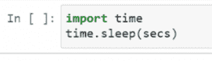](https://www.pythoncentral.io/wp-content/uploads/2022/04/Screenshot_1.png)

当程序员需要在许多不同的情况下暂停代码的执行时，他们可以使用这个功能。例如，当需要在 API 调用之间暂停执行时，开发人员可以使用该函数。当开发人员希望通过在屏幕上出现的文字和图形之间添加停顿来增强用户体验时，该功能是非常宝贵的。

sleep()函数通过停止调用线程的执行来工作。它会在参数中指定的持续时间内这样做。时间值是 sleep 函数接受的唯一参数。让我们仔细看看。

#### **time.sleep()参数**

*   **secs**-Python 程序应该暂停执行的秒数。这个参数应该是一个 int 或者 float 。

### **使用 Python 的 time.sleep()**

这里有一个快速简单的语法示例:

[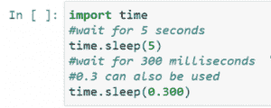](https://www.pythoncentral.io/wp-content/uploads/2022/04/Screenshot_2.png)

Python 中的时间模块有几个函数可以帮助开发者在代码中处理时间。sleep()方法只是这些方法中的一种。因此，不能直接使用 sleep()函数，必须首先在程序中导入时间模块。

在上面的代码中， 我们通过第一个命令指示系统等待五秒，然后等待 三百毫秒，等于 0.3 秒。 你可以在这里注意到，我们已经根据语法把时间延迟的值写在括号里面了。

现在让我们考虑另一个执行时间延迟的例子。

[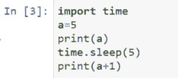](https://www.pythoncentral.io/wp-content/uploads/2022/04/Screenshot_3.png)

这里我们取了一个变量“a ”,它的值存储为 5。现在我们打印值“a ”,然后再次打印增加的值“a”。但是，两个语句的执行之间存在时间延迟。并且，我们已经指定使用 **time.sleep()** 函数。你一定观察到了，我们在代码的开头也导入了 **time** 模块。

现在我们来看看输出是什么:

[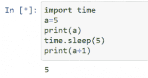](https://www.pythoncentral.io/wp-content/uploads/2022/04/Screenshot_4.png)

在这里，我们可以看到只有第一个命令被执行。现在五秒钟后的输出:

[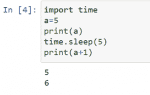](https://www.pythoncentral.io/wp-content/uploads/2022/04/Screenshot_5.png)

现在，经过五秒钟的延迟后，第二条语句也被执行。

需要注意的是，sleep()函数只能对您输入的任何整数值进行近似暂停。换句话说，如果您输入参数“5 ”,就像我们在上面的例子中那样，函数将暂停大约 5 秒钟，但不会暂停 5 秒到 1 毫秒。

有一种方法可以让程序员在使用该功能时更精确地确定他们需要的时间延迟。这就像将浮点作为参数传递给 sleep()一样简单。

输入参数“0.5”将使代码停止大约半秒钟。该函数提供了很大的灵活性，可以让代码暂停多长时间。然而，sleep()函数可以提供的暂停时间有一些限制。我们将在后面的部分讨论这一点。

### ****睡眠的高级语法()** **功能****

 **这里有一个更高级的例子。它接受用户输入，并询问您想要()睡眠多长时间。它还通过打印出 time.sleep() 调用前后的时间戳来证明它是如何工作的。注意 Python 2.x 使用 raw_input() 函数获取用户输入，而 Python 3.x 使用 input() 函数。现在让我们看看输入语法:

[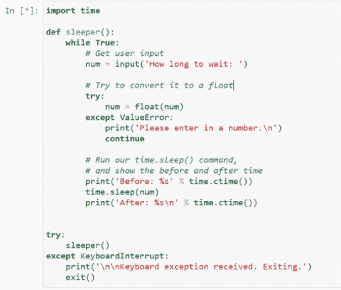](https://www.pythoncentral.io/wp-content/uploads/2022/04/Screenshot_6.png)

上面给出的代码询问用户要等待多长时间。我们已经在 **sleeper()** 函数中提到了这个输出的命令。然后，代码在代码执行开始时和代码实现后打印计算机时间。通过这种方式，我们可以看到延迟功能的实际功能。现在让我们看看输出:

[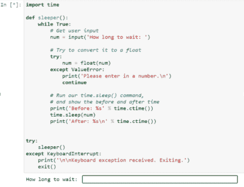](https://www.pythoncentral.io/wp-content/uploads/2022/04/Screenshot_7.png)

系统要求我们输入，即我们希望系统等待多长时间。让我们输入 5 秒，观察最终的输出。

[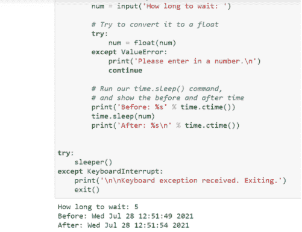](https://www.pythoncentral.io/wp-content/uploads/2022/04/Screenshot_8.png)

我们可以看到起始计算机时间(“之前”)和结束计算机时间(“之后”)有五秒钟的时间差。

### **time . sleep()**的准确性

**time . sleep()**函数使用底层操作系统的 **sleep()** 函数。最终，这一功能有其局限性。例如，在标准的 Windows 安装中，您可以延迟的最小时间间隔是 10 - 13 毫秒。Linux 内核倾向于具有更高的滴答率，其时间间隔通常接近 1 毫秒。注意，在 Linux 中，你可以安装 **RT_PREEMPT** 补丁集，它允许你拥有一个半实时内核。使用实时内核将进一步增加 **time.sleep()** 函数的准确性。但是，除非你想让 ***睡眠*** 一小段时间，你一般可以忽略这个信息。

## **使用装饰人员添加** **time.sleep()** **命令**

[装饰器](https://www.geeksforgeeks.org/decorators-in-python/) 用于创建调用高阶函数的简单语法。什么时候可以用装修工？假设我们不得不再次测试一个功能，或者用户不得不再次下载一个文件，或者你不得不在特定的时间间隔后检查一个接口的状态。您需要在第一次尝试和第二次尝试之间有一段时间延迟。因此，您可以在需要重复检查和需要时间延迟的情况下使用 decorators。

让我们考虑一个使用装饰者的例子。在这个程序中，我们将计算执行函数所花费的时间。

[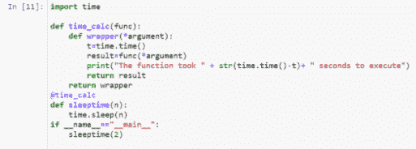](https://www.pythoncentral.io/wp-content/uploads/2022/04/Screenshot_9.png)

这里的 **time_calc()** 是装饰函数，它扩展并包含了其他函数，从而提供了简单的语法。让我们看看输出是什么。

[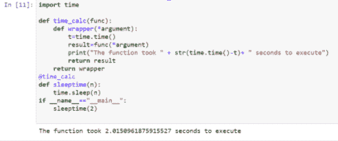](https://www.pythoncentral.io/wp-content/uploads/2022/04/Screenshot_10.png)

## **使用线程添加** **time.sleep()** **命令**

[Python 中的多线程](https://www.tutorialspoint.com/python/python_multithreading.htm) 相当于同时运行几个程序。当多线程与 **时间** 模块相结合时，我们可以快速解决复杂的问题。多线程功能可从 **线程** 模块中获得。

让我们使用多线程和时间延迟来打印字母表歌曲。

[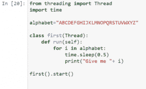](https://www.pythoncentral.io/wp-content/uploads/2022/04/Screenshot_11.png)

这里一个线程被用来打印单个的字母。也有 0.5 秒的时间延迟。当你运行这个程序时，你会看到字母表歌曲的每一行都在 0.5 秒的延迟后被打印出来。我们来看看输出是什么:

[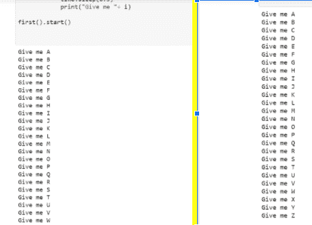](https://www.pythoncentral.io/wp-content/uploads/2022/04/Screenshot_12.png)

## **Python wait()函数**

Python wait()方法的工作方式就像它的名字所暗示的那样:它暂停一个进程，这样另一个进程(比如子进程)就可以在恢复之前完成执行。

该方法是 Python 中 **os** 模块的一部分，通常用于同步父进程与子进程。wait()也在 Python 线程模块的 event 类中定义。

它的功能与操作系统模块中的方法略有不同。方法挂起内部标志设置为 false 的事件的执行。这反过来会挂起当前事件或块以供执行，直到内部标志设置为 true。

函数的语法是 os.wait()。它以元组的形式返回子进程的 ID，还返回元组中的一个 16 位整数，表示退出状态。返回 16 位整数的方法也有一个高位字节和一个低位字节，低位字节的信号数为零，这会终止进程。另一方面，高位字节保存退出状态通知。

## **延时练习题**

 ***   ### **Print two delayed reports:**

在这个问题中，我们将打印两条语句，第一条是“大家好！”

第二个问题是“这是一个关于时间延迟的练习题。”我们将在这两个语句之间引入 5 秒的时间延迟。我们来看看这个问题的代码语法:

[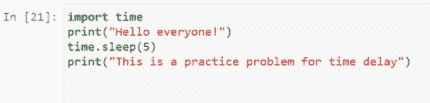](https://www.pythoncentral.io/wp-content/uploads/2022/04/Screenshot_13.png)

如你所见，基本步骤很简单。我们首先导入时间模块。接下来，我们给出第一条语句的打印命令。然后我们通过 t **ime.sleep()** 函数引入时间延迟，然后我们给出打印以下语句的命令。我们来看看输出是什么:

[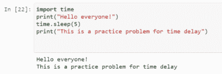](https://www.pythoncentral.io/wp-content/uploads/2022/04/Screenshot_15.png)

此图显示了第一个输出。

[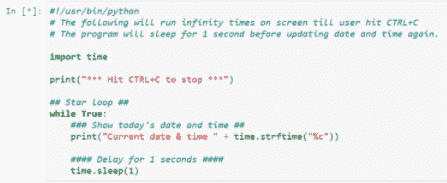](https://www.pythoncentral.io/wp-content/uploads/2022/04/Screenshot_16.png)

现在，这个输出比前一个输出晚五秒钟获得。

*   ### **Program for displaying date and time:**

让我们创建一个程序，在这个程序中，我们制作一个也能显示日期的数字钟。

该任务的代码如下:

[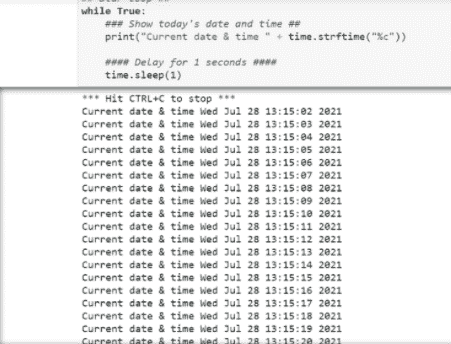](https://www.pythoncentral.io/wp-content/uploads/2022/04/Screenshot_17.png)

这里我们给出了显示日期和时间的命令。然后，我们添加了一秒钟的时间延迟，以便更新时间。该程序的输出如下:

## **结论**

时间延迟在用户界面中有着巨大的应用。对于程序员来说，知道如何在程序中增加时间延迟是很重要的。我们希望这篇文章能帮助你了解 Python 的时间模块。现在，您可以有效地在代码中添加时间延迟，并提高代码的生产率！********