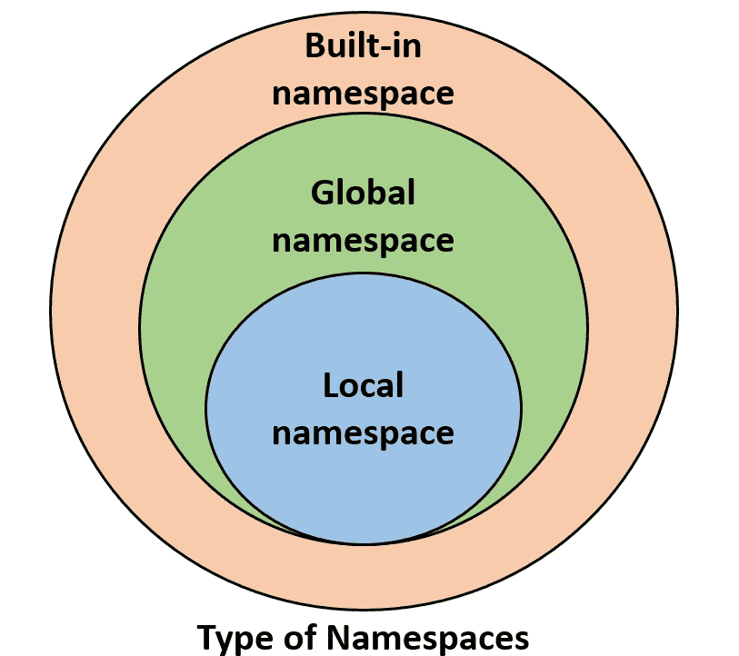

# 如何在 Python 指南中调用函数

> 原文：<https://www.pythoncentral.io/how-to-call-a-function-in-python-guide/>

在本文中，我们将了解如何在 Python 中调用函数。你应该在你的机器上安装 Python。你应该知道 Python 语法的基础。如果您没有查看我们的[安装指南](https://www.pythoncentral.io/?p=4685&preview=true)和[入门指南](https://www.pythoncentral.io/what-is-python-used-for/)。

## **内容**

*   如何在 Python 中创建函数
*   Python 中的作用域是什么
*   如何在 python 中调用函数

在上一篇文章中，我们更多地讨论了 Python 以及它如何支持许多范例。其中一个范例是函数。函数式编程范式是最流行的范式之一。许多语言都支持这种范式。简而言之，函数范式就是将逻辑分离成函数。你可以在任何地方调用这些函数。这种模式的好处是什么？

这有助于代码易于阅读和维护。每个功能执行一项工作。这使得在代码的不同位置重用不同的函数变得很容易。它有助于轻松维护和更改业务逻辑，而无需重构整个代码。

## **如何在 Python 中创建函数**

在 Python 中定义函数可以通过添加`def`关键字来完成。Python 会知道这个逻辑会在这个函数里面。变量只能在函数内部访问。这叫做范围。我们将在下一节详细讨论它。让我们定义一个函数。

```py
def func_name():
    """
    Here is a docstring for the fucntion.
    """
    return True
```

上面的代码描述了如何在 Python 中定义函数。它有`def`关键字来告诉 Python 下一个名字是一个函数名。下一部分是`func_name()`函数的名字。它有括号来接受你需要传递给这个函数的参数。docstring 部分是一个自由文本区域，它解释了这个函数的作用。最后一部分是返回关键字。它有你需要从函数中返回的值。

上面是一个非常简单的函数例子。让我们试着从更复杂的例子开始。

```py
def sum_static():
    return 1 + 2

def sum_dynamic(x, y):
    return x + y

def welcome_msg(name):
    welcome_text = "Dear {name} welcome to our guide to python functions".format(name=name)
    return welcome_text

def check_type(number):
    """
    Function that detrimine the type of integer
    """
    if not isinstance(number, int):
        return "Invalid number"
    if number % 2 == 0:
        return "Even"
    else:
        return "Odd"

def dictify(key, value):
    """
    Return a dict {key: value}
    """
    data = dict()
    data[str(key)] = value
    return data
```

在上面的例子中，我们有几个不同用途和复杂程度的函数。让我们解释一下。

在第一个 sun_static 函数中，它是一个不带任何参数的静态函数。它总是返回 1 和 2 的和。Python 函数可以接受参数。这些参数的目标是使 Python 函数动态化。在第二个 sum_dynamic 中，接受两个参数 x 和 y。如果你将它们传递给函数，它会将它们相加并返回结果。第三个函数有更复杂的逻辑，它将返回一个带有 name 参数的欢迎消息。在这个函数中，我们定义了一个变量 welcome_text。这个变量只在这个函数的范围内。我们需要更多地了解 Python 中的作用域。

## **Python 中的作用域是什么？**

[作用域](https://www.w3schools.com/python/python_scope.asp)或者在 Python 中可以称为名称空间，就是这个变量效果的区域。用更简单的方式。如果你调用这个变量，它就是有效的。这意味着函数内部定义的变量只能在函数内部访问。如果你试图在函数之外调用它，它会引发一个异常。下图解释了 Python 中名称空间的类型。



这意味着在我们的 welcome_msg 函数中，welcome_text 变量不能在函数外部调用。让我们看一个例子。

```py
language = "python"

def welcome_msg(name):
    welcome_text = "Dear {name} welcome to our guide to {language} functions"
    welcome_text.format(name=name, language=language)
    return welcome_text

```

语言变量可以在函数内部调用。

继续其他函数的例子。在以前的函数中，我们没有添加逻辑。它在回复一条短信。在 check_type 函数中，我们添加了检查数字类型的条件。

该功能应该有一个单一的目标，这需要验证功能输入。避免不必要的行为是任何功能的必要组成部分。如果没有检查类型的输入，用户可以传递一个字符串或一个字典。代码会尝试将它除以 2，这会引发一个异常。添加实例类型验证将有助于使该函数可用。

Python 函数中的 return 语句可以返回任何类型的数据。这是我们在 dictify 函数中添加的内容。该函数返回一个 Python 字典。这使得将函数的返回结果赋给变量并使用它变得很容易。现在让我们调用我们创建的函数，并查看它的输出。

## **如何在 Python 中调用函数**

要在 python 中调用函数，只需提及函数。这将调用函数逻辑并返回结果。我们来调用上面的函数。

```py
# print the falue of sum_static
print(sum_static())

# output:
3

x = 2
y = 2

# Passing arguments to the function 
result = sum_dynamic(x, y)
print(result)

# output:
4

# print the welcome message by passing name directly
result = welcome_msg("John")
print(result)

# output:
Dear John welcome to our guide to Python functions

# Apply the function logic multiple time inside a for loop 
numbers = [5, 8, 9, 87, 12, 67]
for number in numbers:
    result = check_type(number)
    print(result)

# output:
Odd
Even
Odd
Odd
Even
Odd

key = "name"
value = "John"

# assign a function to a variable and use it.
data = dictify(key, value)
print(data)
print(data[key])

# output:
{'name': 'John'}
'John'

```

我们调用自己创建的函数，并在不同的情况下使用它们。

### **结论**

Python 函数在不同的 Python 应用程序中非常有用。您可以使用它来避免多次编写相同的逻辑。一般规则是，如果你两次写同样的代码，把它添加到一个函数中并调用它。为了在 python 中定义一个函数，我们使用了`def`。每个功能都有它的范围。这将使函数内部定义的变量在函数外部不可访问。要调用这个函数，你只需要写下它的名字，如果需要的话，加上适当的参数。您可以将返回结果赋给一个变量并使用它。检查我们在 dictify 函数中做了什么。