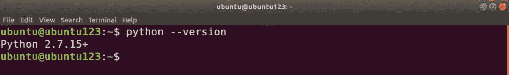
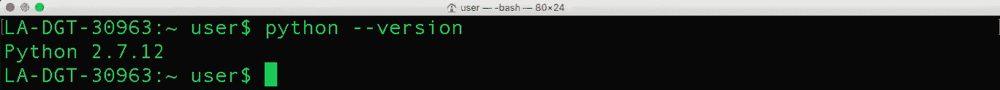
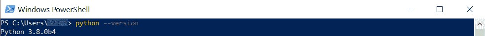
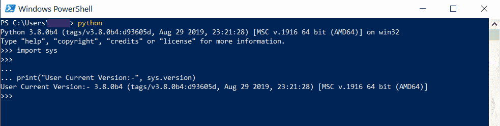

# 如何检查 Python 版本

> 原文：<https://www.pythoncentral.io/how-to-check-python-versions/>

2019 年，*Python 软件基金会* 宣布了一个发布日历的变化，使得它每 12 个月发布一个新版本的语言。

该组织还宣布，每一个 Python 版本都将接受一年半的错误修复更新和三年半的安全更新，然后在五年结束时终止该版本。

使用最新版本的 Python 是确保您获得安全无漏洞体验的最佳方式。

但是如何检查 python 版本呢？

这比你想象的要容易得多——但你必须首先确保你的电脑上安装了 Python。如果你还没有安装 Python，我们的 [简易安装指南](https://www.pythoncentral.io/what-is-python-installation-guide/) 分分钟帮你安装好。

如果你的电脑上安装了 Python，以下是如何快速找到版本的方法。

## **如何在 Linux，Mac，& Windows** 中查看 Python 版本

Python [在 Stack Overflow 2020 开发者调查中人气排名第四](https://insights.stackoverflow.com/survey/2020) 。这项调查是由全球 65，000 名开发人员进行的，这使得它成为开发人员和企业对编程语言使用偏好的可靠描述。

在你可以查看你的电脑加载了什么版本的 Python 之前，你必须了解 Python 的版本方案。每个 Python 版本都有三个数字。

第一个数字代表主要版本，第二个数字代表次要版本，第三个数字代表微型版本或“修订级别”

你还必须注意到，主要版本之间通常并不完全兼容。换句话说，用 Python 2 . x . x 版编写的软件可能无法在 Python 3.x.x 上正确运行

然而，次要版本通常与以前的版本兼容。例如，用 Python 3.1.x 编写的代码将在 Python 3.9.x(这是当前的 Python 版本)上运行。

## **检查 Linux 中的 Python 版本**

大多数现代 Linux 发行版都预装了 Python。你不需要输入任何代码来自己安装它——除非你用的是一个相对不太流行的 Linux 发行版。

在 Linux 机器上检查 Python 版本很简单。第一步是打开终端。如果你使用的是 Ubuntu 这样的发行版，你可以进入菜单搜索它。

然而，打开终端最简单的方法是按 Ctrl+Alt+T。或者，您可以同时按 Ctrl、Alt 和 F2 键。

屏幕上会出现一个终端窗口。然后，您可以输入以下命令:

python——版本

或者:

python -V

您的机器可以安装多个版本的 Python。如果您的机器安装了 Python 3，在终端中输入以下命令也可以实现这个目的:

python 3–版本

或

python3 -V

在终端中输入命令后，按回车键。Python 版本会出现在下一行，像这样:

你可以在任何运行 Linux 操作系统的硬件上运行这个命令——包括 Raspberry Pi。

## **在 Mac 中检查 Python 版本**

macOS 上没有 PowerShell 或命令提示符。但是，操作系统有一个像 Linux 和 Unix 系统一样的终端。您需要访问终端来检查 Mac 上的 Python 版本。

要打开终端，请打开 Finder。然后导航到应用程序，并选择实用程序。从这里找到并发射终端。

此处的说明类似于 Windows 系统的说明。要找到 Python 版本，您必须输入以下命令:

python 版本

如果您的计算机上也安装了 Python 3，您可以通过输入以下命令找到您正在使用的 Python 3 的确切版本:

python 3–版本

Python 版本的细节会出现在下一行，像这样:

## **在 Windows 中检查 Python 版本**

如果你用的是 Windows 10，你可以用 Windows PowerShell 找到 Python 版本。启动 powershell 最简单的方法是按 Windows 键，然后输入“PowerShell”然后，您可以从出现的选项列表中选择它。

接下来你要做的就是键入以下内容:

python 版本

细节将出现在下一行。

## **用程序检查 Python 版本**

你可以在你的终端上打开 Python 解释器，写几行代码来确定 Python 的版本。

在电脑上运行 Python 解释器:

*   **在 Windows 上:** 启动 PowerShell，在终端中输入“python”。
*   **在 macOS 上:** 导航到应用>实用程序>终端，键入“python”如果您安装了 python3，请键入“Python 3”
*   在 Linux 上: 打开终端，输入“python”或“python3”，这取决于你在机器上安装了什么。

如果你看到“> > >”出现在终端上，Python 处于交互模式。接下来，您必须将下面几行代码复制粘贴到解释器中:

导入系统

print("用户当前版本:-"，sys.version)

输出中将显示已安装 Python 版本的详细信息。

要退出解释器，可以输入“quit()”或“exit()”，这两个都是内置的 Python 函数。

或者，如果你在 Windows 上，你可以按 Shift+Ctrl+Z 并输入。在类 Unix 系统上，按 Shift+Ctrl+D 应该可以停止解释器。

# **结论**

Python 的每一个版本——[甚至最新发布的](https://towardsdatascience.com/python-3-10-five-new-features-and-considerations-f775c9432887)——都有自己的局限性。然而，保持 Python 更新将提高安全性，并使体验更少出错。

更新到最新版本还可以确保您可以使用 Python 提供的最新特性、语法和库模块。

现在你知道了如何找到安装在你电脑上的 Python 版本，你可以即时了解你是否是最新的。