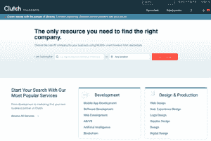

# 如何选择最好的网页开发公司？

> 原文：<https://www.pythoncentral.io/how-to-choose-the-best-web-development-company/>

您的企业需要一个强大而专业的网站。如果你自己不是开发者，你最好[聘请专业的网站开发机构](https://it-rating.com/web-developers/)。如你所知，在美国有很多公司提供他们的服务，所以选择最好的可能不是那么简单。让我们告诉你更多关于如何选择完美的机构，以及它的评级可以帮助你。

## **如何获得一个专业的网站？**

嗯，你有三种方式:

*   **找到贵公司的开发人员** 。如果你是一个年轻的 IT 机构或公司，在这个领域工作，你的一些员工可能知道什么是网站开发。请他们为您创建一个网站，或者请其他工作人员找到他们认识的可以处理这项任务的人。
*   **借助自由职业者的帮助** 。你可以通过自由职业者服务找到对网站开发了如指掌的专家。有时，他们提供的质量可以与拥有良好体验的大公司相媲美。
*   **联系专业机构** 。这里的家伙知道如何创建一个坚实的质量网站的一切。他们是真正的专业人士，拥有丰富的 IT 和网站开发经验和知识，许多成功完成的项目和大量积极的反馈证明了这一点。

是的，专业机构可能比一般的自由职业者拿更多的钱。但是你应该明白的一件事是，自由职业者可能没有必要的工具来创建一个网站来解决你客户的所有问题。如果短时间内需要一个有实力的项目，就要聘请专业的代理公司。

如果你遵循下面的建议，你完全有机会雇佣到一家完美的网站开发公司。

## **最佳选择:使用可信平台**

有了可靠的平台，可以快速找到专业的代理机构。你所要做的就是在特定领域工作的最佳公司目录中查找它们，看到它们的优缺点，并决定哪家上市公司最适合你。让我们来看看美国最受欢迎的[平台](https://www.pythoncentral.io/what-is-python-used-for/)，它可以帮助你做出决定。

### **好公司**

GoodFirms 是最值得信赖的排名服务，它允许你比较不同的公司和软件产品，以便你选择最合适的。在 GoodFirms 的帮助下，你可以看到最可靠的 web 开发公司，看到他们的投资组合、案例、弱势和强势方面，并决定哪个代理机构提供的服务最赚钱。GoodFirms 拥有经过验证的投资组合、诚实的评论和有用的评级。

### **离合器**

Clutch 是最受欢迎的 B2B 网站，对许多公司进行了排名。在 Clutch 上，你可以看到在 web 开发领域提供最佳服务的公司名单，阅读他们的评论，并找到你应该与他们合作的理由。许多商人和代理商都信任离合器，因为它可以让他们选择最可靠的公司。

### **前进**

Awwwards 的目标是为网页开发者、设计师和其他专家提供一个被关注的机会，并找到一个客户来完成任何难度的项目。Awwards 是最值得信赖的平台，允许您阅读经过验证的评论并查看代理机构的成就。有了这个网站，你可能会找到一个完美的代理机构，随时准备帮助你的网站开发。

### **IT 评级**

与上面提到的平台相比，IT 评级不仅仅是一个给公司排名的网站。IT 评级是一个完整的数字生态系统，美国第一。使用这个平台，你不仅可以找到创建网站的承包商，还可以使用其他服务。IT Rating 提供基于云的解决方案，帮助您根据个人偏好选择公司。该平台使用一种独特的公式，根据公司的可靠性自动对其进行排序。

只有可靠的机构才能获得评级，因此您无需担心——为了获得 IT 评级，公司必须通过严格的检查。IT Rating 还提供诸如 IT 界新闻信息等服务，以便随时了解网站的最新动态。It Rating 将通知您即将举行的有趣的活动和会议，并提供如何选择优质网站开发公司的建议。

## **你应该遵循的标准**

让我们简单地解释一下，如果你想选择最完美的网络开发公司并在众多公司中进行比较，你需要遵循什么标准。

### **反馈和建议**

选择公司时，评论是你首先要注意的。他们可以立即看出一个高质量的公司是如何工作的。区分真实评论和定制评论很重要。为此，反馈中应该有建设性的批评；不应该有平庸的赞美；一切都应该画得准确而中肯。向你的同事和熟人征求意见是有道理的；也许他们会推荐一个他们测试过的优秀公司。

### **你的想法实现的成本**

价格有时会立刻说明公司的情况。如果价格太低，那么要么是公司还年轻，要么是它提供的服务质量差。如果价格太高，那么代理可能有问题。最好的选择是联系那些为他们的服务提供最优惠价格的公司，这些价格等于市场平均价格。然而，值得记住的是，你想得到的质量越好，你付出的就越多这是一种适用于任何商业领域的潜规则。

### **便捷支付**

适用于 IT 行业的主要规则是，你永远不需要为尚未完成的项目全额付款。是的，你需要支付预付款——这是项目总成本的一定比例。收到订单后，公司将立即开始履行订单。由于 IT 行业没有固定的条件，因此在起草合同时，应与公司亲自讨论接受预付款的条件、成本和回报条件。你还需要商定一个便捷的支付模式:在哪些部分，以及以何种具体方式，支付公司的工作。这和其他步骤一样，是迈向合作的重要一步。

### **公司船员资质**

在任何一家可靠的公司，网站开发团队都由出色完成工作的高级员工组成。通常，他们可以做任何项目，即使太难实现。他们有所有的专业工具和大量的知识。与合格的专家合作不仅节省时间，而且更有成效和洞察力。为了确保您的项目由合格的工作人员负责，只需访问该机构的网站，或通过电子邮件或电话直接与他们联系。查看他们链接的个人资料，他们完成的项目，以及任何其他证明他们是网站开发领域真正专家的成就。

### **投资组合**

这个投资组合很能说明这家公司的情况。如果他们真的有很酷的项目，他们不会隐藏它们——通常，你可以在代理公司的网站上看到这些作品。如果你决定与这家公司合作，这个投资组合还能让你想象结果。通过观察他们的工作，你可以看到一个专业公司是如何工作的，以及它有什么工具来达到最佳效果。如果你看到一个坚实的投资组合，这可能是你应该与这家机构合作的原因。但是如果没有工作，或者他们质量很低，对你来说最好的决定就是忽略这个机构。

### **总之**

多亏了这篇文章，现在你知道了更多关于如何选择最好的网络开发公司，以及它的评级如何对你有所帮助。使用上面提到的建议，你会找到最好的代理，它将创建一个强大的网站，解决你的所有业务问题。但不要忘记 IT Rating，这家公司随时准备在您的商务之旅中为您提供帮助，并为您提供高质量的数字服务。