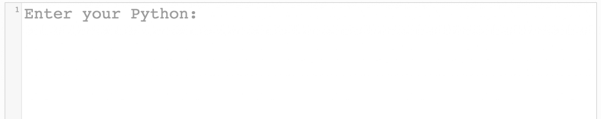

# 如何用这个 Python 格式化程序清理您的代码

> 原文：<https://www.pythoncentral.io/how-to-clean-up-your-code-with-this-python-formatter/>

没有人喜欢看到杂乱无章的代码。如果您遇到过这样的代码(或者，即使您编写了这样的代码...这里没有判断)，您可以尝试自己重新格式化代码，这取决于文件有多大，可能需要几个小时甚至几天，或者您可以使用 Python 格式化程序，如 [Python 美化](http://www.cleancss.com/python-beautify/)来为您完成。

这个 Python 格式化程序是由负责一个伟大的 [CSS 格式化程序](https://www.cleancss.com/css-beautify/?_ga=1.125810573.681297547.1482182874)和许多其他有用的开发工具的同一批人带给我们的，它非常适合清理任何杂乱的代码。它让你完全定制你想要的代码组织方式和你想要遵守的格式规则。

你可以指定你想要缩进多少个空格，你是否想要换行，你想要大括号和方括号如何显示，等等。下一次，当你发现自己处于一些格式不良的 Python 中时，记住你有这个工具，将你的代码复制并粘贴到文本输入框中，几秒钟内你就可以使用你的新的和改进的干净代码了。