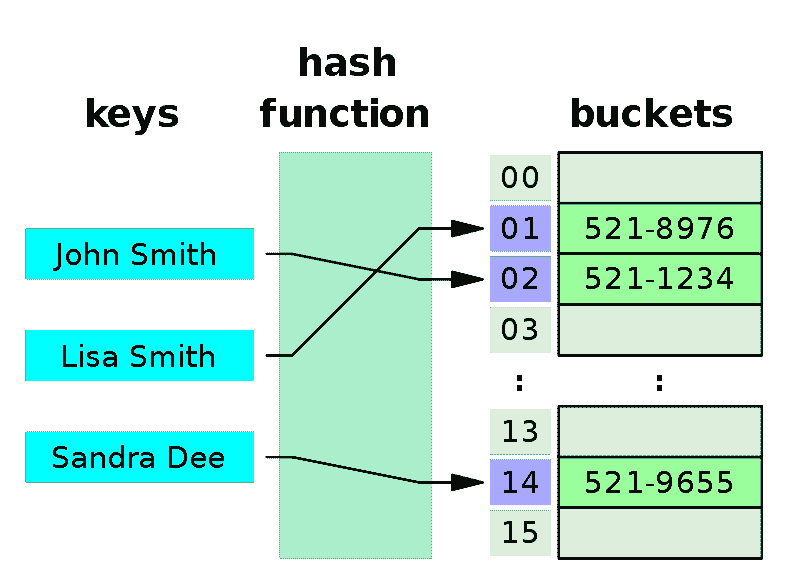

# 如何用 python 创建字典

> 原文：<https://www.pythoncentral.io/how-to-create-dictionary-in-python/>

## 内容

今天我们将深入探讨如何用 Python 创建字典。它要求您已经具备 Python 语法的基础知识。去查看我们的[python 用法介绍](https://www.pythoncentral.io/what-is-python-used-for/)来了解更多关于 Python 的知识。你需要在你的机器上安装 Python。要知道如何在你的系统上安装 python，请查看我们的[安装指南](https://www.pythoncentral.io/what-is-python-installation-guide/)。

*   什么是字典数据结构
*   用 Python 创建字典
*   Python 字典用法

## 什么是字典数据结构

Python 字典是一种键值对数据结构。每个键都有一个值。密钥必须是唯一的，以避免冲突。python 应用程序中大量使用字典。如果你有学生和班级，每个学生有一个班级。Python dictionary 将帮助您将学生姓名定义为键，将班级定义为值。会帮助你从他的名字值了解学生课程。

字典是 Python 中的哈希表实现。[哈希表](https://en.wikipedia.org/wiki/Hash_table)使用哈希函数将键映射到它的值。每个槽可以存储一个条目。和 python 字典做的一样。下图解释了它的工作原理。

[](https://www.pythoncentral.io/wp-content/uploads/2020/12/dictionary-data-structure.png)

如果我们知道这个值是关键的，我们就使用 Python 字典来检索它。和我们在上面学生的例子中做的一样。在幕后，python 所做的是用一个键保留一个内存位置，并指向它的值。它有助于内存优化和效率。现在让我们创建一个 python 字典。

## 用 Python 创建字典

要定义一个 Python 字典，你应该在花括号中定义它，例如:{}。要将值分配给它的键，应该添加列。

```py
data = {"key": "value"}
```

继续以学生的课程为例，让我们看看如何实现这一点:

```py
class_data = {
    "sam": "Intro to Python",
    "Jack": "Intro to data science",
    "Emma": "Machine Learning course",
    "Wattson": "Web development."
}
```

班级词典有学生的名字。每个名字都有他注册的课程。这是一个非常基本和简单的创建 python 字典的例子。我们需要知道如何使用 python 字典来插入、删除和检索值。

我们提到过这是一个键值存储。这意味着要获得项目值，您需要知道它的关键。要从类别字典中获取 Jack 课程，您需要:

```py
print(class_data['Jack'])

# output
"Intro to data science"

```

如果钥匙不在字典里怎么办。在这种情况下，Python 将引发一个关键错误异常。

```py
class_data['holo']

# ourtput
KeyError Traceback (most recent call last)
<ipython-input-4-73376fec291d> in <module>()
----> 1 class_data['holo']

KeyError: 'holo'
```

您需要使用 try/catch 块来处理这个异常。还有另一种更安全的方法来访问字典数据，如果不存在异常，也不会引发异常。

```py
print(class_data.get('hoho', None))

# output
None

```

get()方法提供了一种简单的方法来检查字典中是否存在这个键。它将返回它，否则它将提供一个默认值。这种方法允许您在缺少键的情况下始终提供默认值。现在让我们将数据插入字典。

```py
# add new key and value to dictionary.
class_data['new_student'] = 'Ronaldo'
print(class_data)

# output
{
    'Emma': 'Machine Learning course',
    'Jack': 'Intro to data science',
    'Wattson': 'Web development.',
    'sam': 'Intro to Python',
    'new_student' : 'Ronaldo'
}
```

您可以通过如上所述更新任意键的值来将其设置为 none。您可以使用 pop()函数从字典中删除项目键和值。

```py
class_data.pop('new_student')
# output
'Ronaldo'

print(class_data)

# output
{
    'Emma': 'Machine Learning course',
    'Jack': 'Intro to data science',
    'Wattson': 'Web development.',
    'sam': 'Intro to Python'
}

```

Python 提供了一个删除所有字典条目的函数。使用 clear()函数，你可以对所有的字典项。

```py
class_data.clear()
print(class_data)

# output
{}
```

在下一节中，我们将更多地讨论 Python 字典的用法和一些技巧。

## Python 字典用法

字典键和值可以是任何值类型。您可以创建一个键，并使其值成为一个字典或数组。现实世界示例中的一些字典用法是嵌套字典。检查下面的例子。

```py
school = {
    "students":[
        {
            "id": "1",
            "name": "Sam",
            "classes" : ["Web development"]
        },
        {
            "id": "2",
            "name": "Clark",
            "classes" : ["Machine learning", "Data science"]
        },
        {
            "id": "3",
            "name": "Watson",
            "classes" : ["Game development"]
        }
    ],
    "teachers":[
        {
            "id": "1",
            "name": "Emma",
            "Courses" : ["Data science", "Machine learning"]
        },
        {
            "id": "2",
            "name": "Jack",
            "Courses" : ["Game development", "Web development"]
        }
    ],
    "staff": [
        {
            "id": "1",
            "name": "Jo",
            "Profission" : "Office admin"
        },
        {
            "id": "2",
            "name": "Raj",
            "Profission" : "Cleaning"
        },
        {
            "id": "3",
            "name": "Ronald",
            "Profission" : "sales"
        }
    ]
}
```

我们来解释一下上面的代码。我们有一所学校，有老师、学生和教职员工。每个人都有名字和身份证。学生将有一个他注册的班级。学生可以注册多门课程。老师有他教给学生的课程。学校教职员工有名字和职业。这是一个单一的职业。

这是一个在 Python 字典中排列学校数据的简单设计。如果你是系统管理员，你需要得到每个学生的名字和班级。使用 for 循环 Python 语句。您可以这样做:

```py
# get all students
students  = school['students']

for student in students:
    print("Studnet name: {0} is enrolled in classes: {1}".format(student['name'], student['classes']))

# output
Studnet name: Sam is enrolled in classes: ['Web development']
Studnet name: Clark is enrolled in classes: ['Machine learning', 'Data Science']
Studnet name: Watson is enrolled in classes: ['Game development']
```

这将得到所有学生的数据。如果你想更新学生的数据来添加一个新的学生，你需要做的就是添加一个新的键和它的值。

```py
students  = school['students']

# add student dictionary to students list.
students.append({
    "id": "4",
    "name": "Holmes",
    "classes" : ["Web development"]
    })

print(students)

# output
[
    {
        "id": "1",
        "name": "Sam",
        "classes" : ["Web development"]
    },
    {
        "id": "2",
        "name": "Clark",
        "classes" : ["Machine learning", "Data science"]
    },
    {
        "id": "3",
        "name": "Watson",
        "classes" : ["Game development"]
    },
    {
        "id": "4",
        "name": "Holmes",
        "classes" : ["Web development"]
    }
]
```

你在学生名单上增加了一本新的学生词典。你也可以对老师和员工做同样的逻辑。

## 结论

Python 字典是一个非常强大的数据结构。它有很多用法。添加任何键和值类型的灵活性使其在不同的应用程序中易于使用。您可以使用 Python 字典的函数轻松地更新和删除其中的数据。在 python 中使用字典是你需要掌握的一项非常重要的技能。它会帮你解决很多问题。如果你有兴趣了解更多关于它的实现，你可以查看官方文档。