# 如何在 Python 中生成随机数

> 原文：<https://www.pythoncentral.io/how-to-generate-a-random-number-in-python/>

程序员创建程序的目的是确保程序经得起任何随机输入的考验。程序应该正确地处理输入，并精确地计算任意数据的输出。程序员必须对程序进行广泛的信息测试，并相应地修改代码以实现这一目标。

但是你如何从无限的可能性中选择一个随机数呢？即使你已经得到了一组数字，你如何把它变成一个高效的程序？有没有内置的函数来实现这个？嗯，答案是肯定的！

Python 提供了大量的模块和函数来使用随机数据。本文将指导您在代码中包含这些函数，并为您提供代码片段。我们将我们的范围限制在{1，10}内，但是请记住，您可以将这些方法和编程语法用于您喜欢的任何范围。我们开始吧！

*使用的 Python 库:Anaconda 发行版(Jupyter 笔记本)*

## **可用于生成随机数的函数列表:**

*   random . randint()功能
*   random . rand range()功能
*   功能
*   功能
*   numpy . random . randint()功能
*   numpy . random . uniform()功能
*   numpy . random . choice()功能
*   功能

### **使用****'****T5【random . randint()'****函数** **:**

random . randint()函数是 随机 模块的一部分。randint()函数返回一个整数值(当然是 random！)在函数中输入的起点和终点之间。该函数包括输入的两个端点。

我们可以这样写代码:

[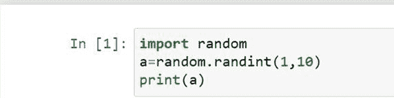](https://www.pythoncentral.io/wp-content/uploads/2017/02/image001.jpg)

该程序的输出如下:

[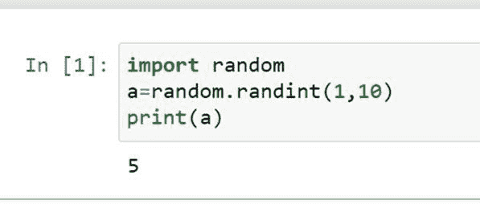](https://www.pythoncentral.io/wp-content/uploads/2017/02/image002.jpg)

该函数将数字 5 作为随机输出返回。请注意，这里我们只生成了一个随机数。您也可以创建一个随机数列表。生成随机数列表的代码如下所示:

[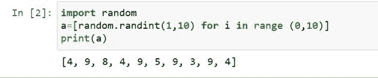](https://www.pythoncentral.io/wp-content/uploads/2017/02/image003.jpg)

输出也显示在上面给出的代码片段中。For 循环可以用来生成一个列表。

### **使用****'****T5【random . rand range()'****函数** **:**

该函数类似于函数。该功能包括 [步长参数](https://www.geeksforgeeks.org/randrange-in-python/) ，不包括在该功能中输入的上限。step 参数是可选的，用于排除给定范围内的特定值。该参数的默认值为 1。

使用函数的语法如下:
[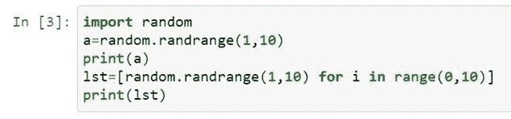](https://www.pythoncentral.io/wp-content/uploads/2017/02/image004.jpg)

这里给出的代码打印单个随机值以及随机值列表。

输出如下所示:

[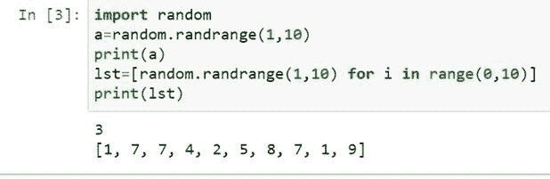](https://www.pythoncentral.io/wp-content/uploads/2017/02/image005.jpg)

正如我们在这里看到的，第一行给出了一个位数的输出，而下面一行给出了一个值列表。

### **使用'**'**函数** :

我们使用 sample() 函数创建一个具有我们选择的长度的列表。此外，它返回一个没有重复值的列表。

我们可以这样写代码:

[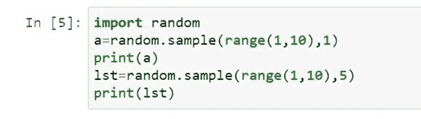](https://www.pythoncentral.io/wp-content/uploads/2017/02/image006.jpg)

注意，该函数的语法使用range()参数来获得所需的起始值和结束值。此外，要生成一位数的输出，我们必须在range()参数旁边输入‘1’作为列表长度。

我们得到的输出如下:

[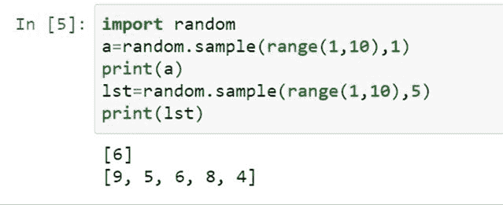](https://www.pythoncentral.io/wp-content/uploads/2017/02/image007.jpg)

### **使用**、**、、、**、**功能:**

我们用函数来寻找给定范围内的**浮点数。该函数包括给定范围的两个端点。**

 **此代码的语法与前面提到的函数的语法相同。

[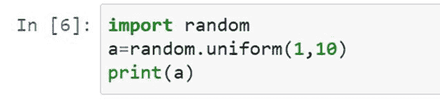](https://www.pythoncentral.io/wp-content/uploads/2017/02/image008.jpg)

这个代码的输出是一个浮点数。

[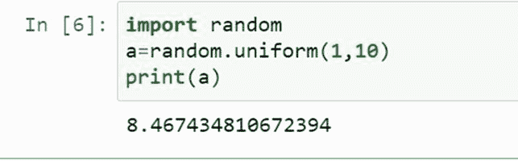](https://www.pythoncentral.io/wp-content/uploads/2017/02/image009.jpg)

为了获得整数形式的输出，我们可以专门对 【统一()】 函数进行类型化。

[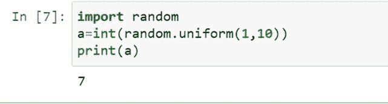](https://www.pythoncentral.io/wp-content/uploads/2017/02/image010.jpg)

该函数输出整数。

### **使用****‘numpy . random . randint()‘****函数:**

numpy模块还有子模块。 当我们想要生成大量的数字时，可以使用 numpy 模块。该模块将输出存储在所需大小的 **数组** 中。

randint()方法的使用与 random 模块类似。

该模块的语法如下:

[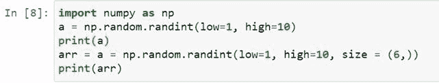](https://www.pythoncentral.io/wp-content/uploads/2017/02/image011.jpg)

在这段代码的输出中，我们将获得一个随机数数组。

[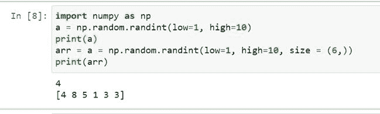](https://www.pythoncentral.io/wp-content/uploads/2017/02/image012.jpg)

如你所见，生成了一个大小为 6 的数组。

### **使用****'numpy . random . uniform()'****函数:**

numpy模块还具有uniform()函数来生成一个数组的**浮点数。**

 **[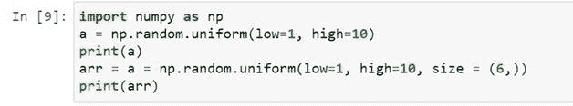](https://www.pythoncentral.io/wp-content/uploads/2017/02/image013.jpg)

输出:

[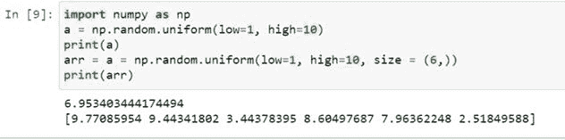](https://www.pythoncentral.io/wp-content/uploads/2017/02/image014.jpg)

### **使用****'numpy . random . choice()'****功能:**

当我们已经有一个数字列表，并且我们必须从那个特定的列表中选择一个随机数时，这个函数用于获得随机数。这个函数还将输出存储在一个数组中。

我们可以这样写这个函数的输入:

[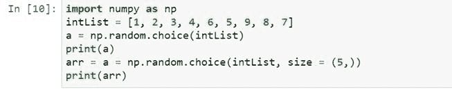](https://www.pythoncentral.io/wp-content/uploads/2017/02/image015.jpg)

注意用户输入列表中数字的任意顺序。

让我们看看给定代码的输出是什么:

[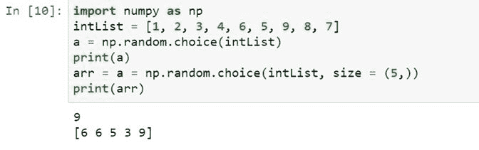](https://www.pythoncentral.io/wp-content/uploads/2017/02/image016.jpg)

### **使用****'secrets . rand below()'****功能:**

[秘密](https://www.geeksforgeeks.org/secrets-python-module-generate-secure-random-numbers/) 模块是生成随机数最安全的方法，在密码学中有很好的用途。这个模块的一个应用是创建强大、安全的随机密码、令牌等。

rand below()函数包含了函数中输入的两个限值。

该模块的语法如下:

[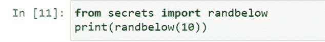](https://www.pythoncentral.io/wp-content/uploads/2017/02/image017.jpg)

输出如下所示:

[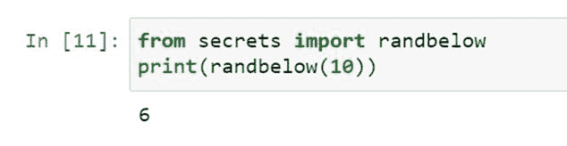](https://www.pythoncentral.io/wp-content/uploads/2017/02/image018.jpg)

## **结论**

在编程中，随机测试用例的使用非常广泛。几种编程语言的内置功能使我们——程序员更容易执行数百万个任意测试用例，并开发出高效而准确的程序。正如我们在上面看到的，Python 还提供了一个应用于密码学的模块。如果我们想要创建用户安全的平台，这个模块是有益的。我们希望这篇文章能帮助你学习 [随机数生成的基础知识。](https://www.pythoncentral.io/how-to-generate-a-random-number-in-python/)****