# 如何在 Python 中安装熊猫？一个简单的循序渐进的多媒体指南

> 原文：<https://www.pythoncentral.io/how-to-install-pandas-in-python/>

Pandas 是 Python 可用的 [最流行的开源框架](https://www.dataquest.io/blog/15-python-libraries-for-data-science/) 之一。它是用于数据分析和操作的最快和最易于使用的库之一。

熊猫数据帧是任何图书馆中最有用的数据结构。它在每个数据密集型领域都有用途，包括但不限于科学计算、数据科学和机器学习。

该库不包含在 Python 的常规安装中。要使用它，您必须单独安装 Pandas 框架。

在本教程中，我们已经介绍了在 Windows 和 Linux 机器上安装 Pandas 的最简单的方法。

## **如何在 Windows 和 Linux 上安装 Python 熊猫？**

在你安装 Pandas 之前，你必须记住它只支持 Python、3.8 和 3.9 版本。因此，如果您的计算机上没有安装 Python 或安装了旧版本的 Python，则必须在您的计算机上安装支持 Pandas 的版本。

要轻松安装 Python，请务必遵循我们的 [Python 安装指南](https://www.pythoncentral.io/what-is-python-installation-guide/) 。

## **在 Windows 上安装熊猫**

在 Windows 上安装熊猫有两种方式。

### **方法#1:用 pip 安装**

它是一个包安装管理器，使得安装 Python 库和框架变得简单。

只要你安装了较新版本的 Python(>Python 3.4)，默认情况下 pip 会和 Python 一起安装在你的电脑上。

然而，如果你使用的是旧版本的 Python，你需要在安装 Pandas 之前在电脑上安装 pip。最简单的方法就是升级到 Python 的最新版本，可在[](https://www.python.org/)上获得。

#### **步骤#1:启动命令提示符**

按键盘上的 Windows 键或单击开始按钮打开开始菜单。键入“cmd”，命令提示符应用程序应该会出现在开始菜单中。

打开命令提示符，这样你就可以安装 Pandas 了。

[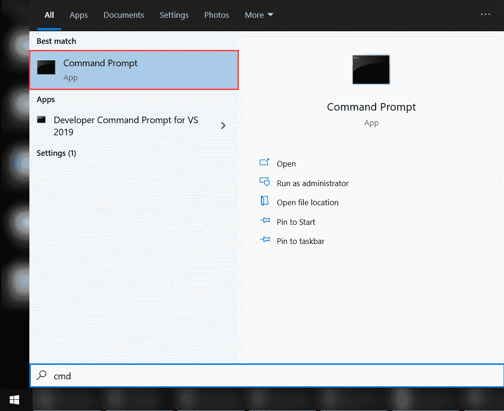](https://www.pythoncentral.io/wp-content/uploads/2021/07/Opening-Command-Prompt.png)

#### **步骤#2:输入所需的命令**

启动命令提示符后，下一步是键入所需的命令来初始化 pip 安装。

在终端上输入命令“pip install pandas”。这将启动 pip 安装程序。所需的文件将被下载，熊猫将准备好在您的计算机上运行。

[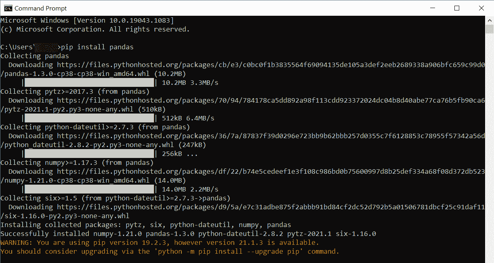](https://www.pythoncentral.io/wp-content/uploads/2021/07/Installing-Pandas-with-pip.png)

安装完成后，您将能够在您的 Python 程序中使用 Pandas。

### **方法 2:用 Anaconda 安装**

如果你没有太多使用终端和编程的经验，用 Anaconda 安装 Pandas 是最好的选择。Anaconda 是一个强大的 Python 发行版，除了熊猫之外，它还提供了各种工具。随着您对 Python 了解的越来越多，您会发现 Anaconda 越来越有用。

#### **第一步:下载 Anaconda**

要安装 Anaconda，必须先访问 https://www.anaconda.com/products/individual[](https://www.anaconda.com/products/individual)，点击右边的“下载”按钮。

[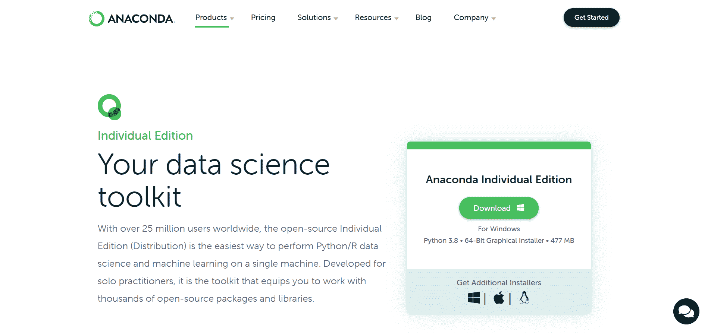](https://www.pythoncentral.io/wp-content/uploads/2021/07/Anaconda-Download-Page.png)

将开始下载适用于您的 Windows 系统上安装的 Python 版本的文件。

#### 第二步:安装 Anaconda

启动您从网站下载的安装程序，然后单击“下一步”按钮。

[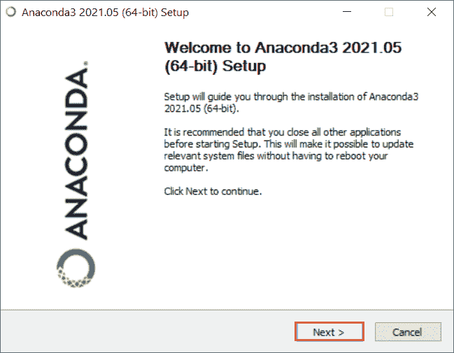](https://www.pythoncentral.io/wp-content/uploads/2021/07/Launching-Anaconda-Installer.png)

接下来，要同意许可协议，请按“我同意”按钮。

[](https://www.pythoncentral.io/wp-content/uploads/2021/07/Accepting-Anaconda-License-Terms.png)

然后，您必须选择您想要安装 Pandas 的用户帐户。出于教程的考虑，我们选择了推荐的“只有我”选项。

[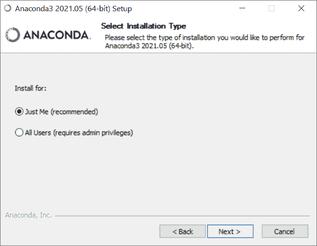](https://www.pythoncentral.io/wp-content/uploads/2021/07/Anaconda-Installation-Preferences.png)

在向导的倒数第二步，您必须选择您想要安装发行版的位置。

[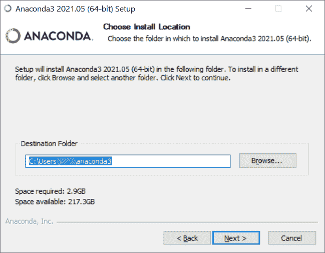](https://www.pythoncentral.io/wp-content/uploads/2021/07/Anaconda-Install-Location.png)

最后，您必须选中“高级安装选项”部分中的“将 Anaconda 添加到我的 PATH 环境变量”和“将 Anaconda3 注册为我的默认 Python 3.8”选项。

[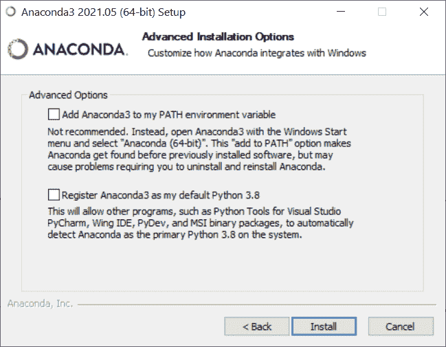](https://www.pythoncentral.io/wp-content/uploads/2021/07/Anaconda-Advanced-Installation-Options.png)

点击“安装”按钮将开始 Anaconda 的安装过程。几分钟后，当安装完成时，您将看到“安装完成”屏幕。看起来是这样的:

[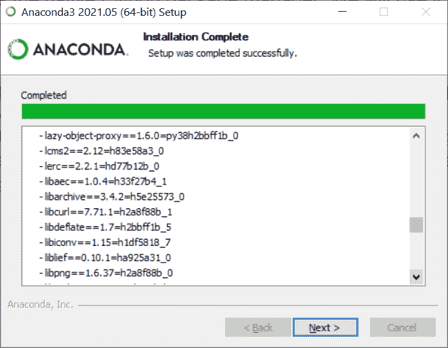](https://www.pythoncentral.io/wp-content/uploads/2021/07/Anaconda-Installation-Complete.png)

你现在可以在你的电脑上访问所有的熊猫图书馆。这是因为 Anaconda 会在安装过程中自动为您安装所有主要的库。

#### **第三步:使用 Jupyter 笔记本(可选)**

如果你要用熊猫，很有可能你正在从事机器学习项目。Jupyter 笔记本是一个漂亮的 IDE，使机器学习项目的工作更加简单。

要在安装 Anaconda 后使用 Jupyter 笔记本，请按 Windows 键并搜索“Anaconda Navigator”将出现一个屏幕，列出几个应用程序。

[](https://www.pythoncentral.io/wp-content/uploads/2021/07/Anaconda-Navigator-Screen.png)

从列表中，您必须找到并启动 Jupyter 笔记本。您的默认浏览器将打开一个类似下图的本地主机页面。你会发现在屏幕的右边有一个下拉菜单，就像指示的那样。

[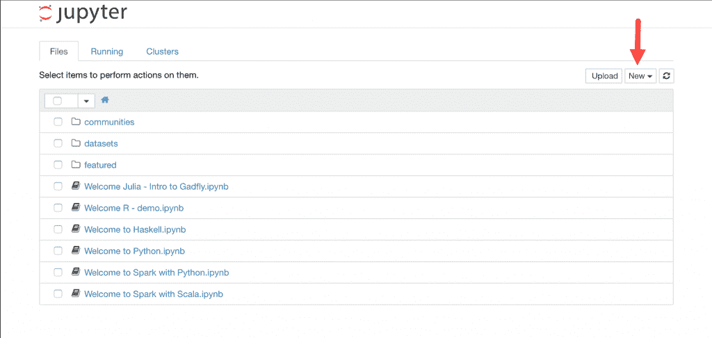](https://www.pythoncentral.io/wp-content/uploads/2021/07/Jupyter-Notebook-Localhost.png)

您必须打开下拉菜单并选择“Python 3”选项。然后，一个新的标签会打开，你可以开始编码。

[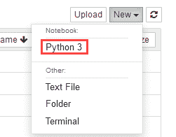](https://www.pythoncentral.io/wp-content/uploads/2021/07/Jupyter-Notebook-Selecting-Python-3.png)

## **在 Linux 上安装熊猫**

有三种方法可以在 Linux 发行版上安装 pandas。您可以(1)从发行版的存储库中安装它，(2)使用 pip 安装它，或者(3)使用 Anaconda 或 Miniconda 安装它。

从发行版的仓库安装 pandas 是一种不可靠的安装方法，因为仓库通常有一个旧版本的 pandas。用 Anaconda 或 Miniconda 安装 pandas 将需要您进行设置，这会延长这个过程。

使用 pip 安装 Pandas 是最好的方法，因为它安装的是最新版本，不需要经过几个步骤来设置另一个必备工具。

### **方法#1:用 pip 安装**

所有技能水平的 Python 用户都使用两个 Python 包管理器中的一个。一个叫 pip，是官方的 Python 包管理器。另一个包管理器被称为 conda。Conda 可能代表 Anaconda 或 Miniconda，这取决于用户在计算机上安装了什么。

用 pip 安装 Pandas:

#### **步骤#1:安装 pip**

在您的 Linux 机器上安装 pip3 就像在您的终端上运行以下命令一样简单:

| sudo 安装 python3-pip |

你必须记住，由于 pip 需要 Python 3 来运行，Python 3 将被安装在你的 Linux 机器上。当您运行该命令时，您应该会看到类似如下的输出:

[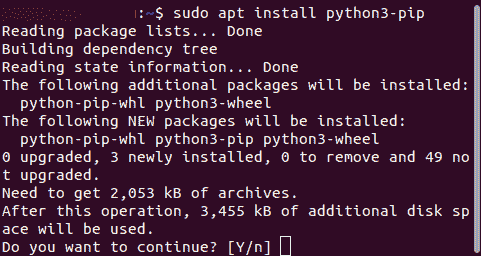](https://www.pythoncentral.io/wp-content/uploads/2021/07/Installing-pip-on-Linux.png)

如你所见，该命令还会安装 python-pip-whl 和 python3-wheel。“Wheel”是一种内置的 Python 包格式。

您需要按下“Y”按钮来启动安装。然后，当该过程完成时，您可以继续下一步。

#### **第二步:安装熊猫**

现在你的机器已经安装了 pip，你可以用它来安装 Pandas。你所要做的就是运行下面的命令:

| pip3 安装熊猫 |

当命令运行完毕，Pandas 将被安装到你的机器上。

### **方法 2:用 Anaconda 安装**

如果您的机器上已经安装了 Anaconda，您可以直接跳到第 2 步。

#### **步骤#1:安装 Anaconda**

要安装 Anaconda，您必须首先下载所需的安装程序。为此，请访问 https://www.anaconda.com/products/individual 的[](https://www.anaconda.com/products/individual)，并向下滚动一点。你会在页面右侧看到“获取附加安装程序”部分。单击 Linux 图标。

[](https://www.pythoncentral.io/wp-content/uploads/2021/07/Anaconda-Downloads-Page-Additional-Installers.png)

页面会将你向下滚动到“Anaconda 安装程序”部分。找到适合您的 Linux 机器的安装程序，然后右键单击它。接下来，选择“复制链接地址”选项。

现在您已经有了 bash 安装程序的链接。sh 扩展名复制到您的剪贴板上，您必须使用 wget 来下载脚本。

打开您的终端，使用 cd 命令浏览您的主目录。接下来，创建一个名为“tmp”的目录导航到 tmp 文件夹，使用 wget 命令下载其中的安装程序。

这个脚本很大，你需要等待一段时间来完成下载。

下载完脚本后，您必须运行该脚本以在您的机器上安装 Anaconda3。在运行任何命令之前，请确保您在 tmp 目录中。然后，运行以下命令:

| $ bash anaconda 3-5 . 2 . 0-Linux-x86 _ 64 . sh |

许可协议会出现，你必须接受它才能安装 Anaconda。您必须允许 Anaconda 包含在您机器的 PATH 变量中。当 Anaconda 被添加到机器的路径中时，只要在终端中键入$ python，就会调用 Anaconda。

安装 Anaconda 后，PATH 变量不会自动加载到您的终端中。为此，您必须获取。bashrc 文件。请记住，该文件将位于主目录中。

| $来源。巴沙尔 |

如果在终端上运行 python 命令显示出 Anaconda 安装的详细信息，则安装已经成功。然后，您可以使用 exit()命令退出 Python REPL。

### **第二步:安装熊猫**

当您在 Linux 机器上安装了 Anaconda 或 Miniconda 之后，您所要做的就是运行下面的命令来安装 pandas:

| 康达安装熊猫 |

电脑会提示您确认安装。接下来，您应该会看到终端上弹出一条“继续(y/n)”消息。当你按下“y”，熊猫的安装过程将开始。

要验证 Pandas 是否正确安装在您的系统上，请在终端上运行 python3，并在交互式 shell 中输入以下代码:

```py
import pandas as pd
s = pd.Series([1, 6, 8, 10])
s
```

您应该看到 Pandas 安装的详细信息出现在终端中。

# **结论**

Pandas 是全球 Python 开发者广泛使用的许多漂亮的库之一。要了解其他库并理解如何使用它们，请访问我们的 [Python 库教程](https://www.pythoncentral.io/category/python-library-tutorials/) 页面。

在电脑上安装熊猫有几种方法。这篇文章中列出的方法相当简单，在你的机器上设置 Pandas 应该不会花费你超过五分钟的时间。