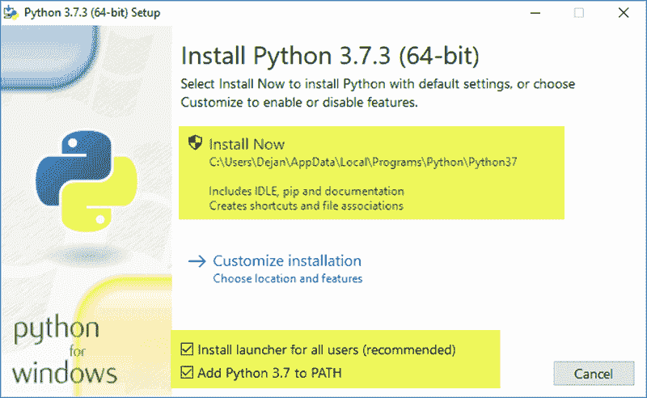
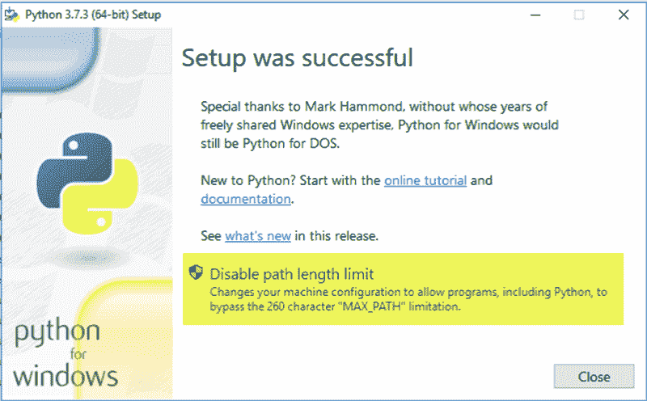

# 如何在 windows 上安装 python 安装指南

> 原文：<https://www.pythoncentral.io/how-to-install-python-on-windows-installation-guide/>

## 先决条件

在本文中，我们将更多地讨论如何在 windows 上安装 python。如果你是 python 的新手。你可以查看我们的 python 初学者指南来了解更多关于它的用法。在本文中，我们将讨论:

*   下载 Python
*   如何安装
*   在 windows 操作系统中安装 Python
*   如何卸载 python

首先，让我们从

## 下载 Python

这取决于你使用的操作系统。下载 Python 是一个简单的过程。这是 Python 的主要目标之一。要易于运行，易于安装。你可以从不同的资源下载 python。python 官方网站是下载 Python 的必经之路。它有所有操作系统的下载链接。它有详细的版本差异说明。如果你要升级你的 python 版本，你需要看一下发行说明。它会帮助你确切地知道变化。

要下载 python，您需要

1.  进入官网的[下载页面。](https://www.python.org/downloads/)
2.  选择您的操作系统。( [Windows](https://www.python.org/downloads/windows/) ， [Mac](https://www.python.org/downloads/mac-osx/) ， [Unix](https://www.python.org/downloads/source/) )
3.  单击您想要下载的确切版本。(推荐最新版本)

您的下载将自动开始。现在是时候安装 Python 了。

## 在 windows 上安装 Python

下载 Python 后。现在我们将安装它。在本文中，我们将重点介绍在 windows 上安装 python。在 windows 上安装 python 有两种方法。如果你安装了 Bash ubuntu，第一个选项。Bash ubuntu 是 windows 操作系统中的一个 ubuntu 终端。它允许你在 windows 中运行 ubuntu 命令。如果您需要使用 bash shell，这将非常有帮助。请记住，它不是完全的 ubuntu 终端。它有一些 windows 限制。

在 bash ubuntu 中安装 Python。你首先需要下载 ubuntu 终端。您可以从 Windows 应用商店下载。下载后，你需要打开终端。开始时，下载和安装终端必需的软件包可能需要一些时间。完成后，你会发现正常的 ubuntu 终端。你可以在里面运行所有你想运行的命令。

1.  安装依赖项。

    ```py
    $ sudo apt install software-properties-common
    $ sudo add-apt-repository ppa:deadsnakes/ppa
    ```

2.  更新操作系统软件包管理器

    ```py
    sudo apt update
    ```

3.  安装最新版本

    ```py
    $ sudo apt install python3.8
    ```

检查 python 是否已安装。您应该键入下面的命令。

```py
python --version
```

输出:

```py
Python 3.8.2
```

现在您已经成功安装了 python。注意，您在这个 shell 中安装了 Python。这意味着它不是全局安装在系统上。这意味着如果你有一个 python 脚本并试图在终端之外运行这个脚本。您需要从 shell 中运行它[。它不会跑。我们来解释一下原因。](https://www.pythoncentral.io/execute-python-script-file-shell/)

你的 python 只安装在 Ubuntu 子系统上。Ubuntu 终端是一个运行在 windows 中的容器。它有助于将您的命令转换成 Windows 的二进制系统调用。通过安装 python。您只能在子系统上安装它。

## 在 windows 操作系统中安装 Python

如果想在 windows 上全局安装 python。你应该遵循这些步骤。下载 Python 后。在你的下载中，你会有一个. exe 文件。打开它将打开这个屏幕。

[](https://www.pythoncentral.io/wp-content/uploads/2020/08/python-setup.png)

为 windows 设置 python

您可以选择现在安装。它将在您的系统分区中添加 python 路径。您可以自定义安装路径和用户访问。

[](https://www.pythoncentral.io/wp-content/uploads/2020/08/python-setup-completed.png)

windows 安装的最后一步。

安装完成后。您将看到安装成功屏幕。它将链接到文档和入门指南。关闭此屏幕后，您将在桌面或 windows 菜单上找到 python 快捷方式。现在，您可以运行任何 python 脚本。

## 如何卸载 python

如你所见，安装 Python 很容易。移除它怎么样。如果您使用的是 Windows，要从您的设备中移除 Python，您有两种选择。最简单的方法是:

1.  转到控制面板
2.  搜索 python
3.  右键单击并选择卸载

这将从您的系统中完全删除 python。

如果你通过 ubuntu 子系统安装 python。这意味着它不是全球安装的。现在你应该打开一个新的终端窗口。运行下面的命令。

```py
$ sudo apt remove python3.8
```

这将从子系统中卸载 python。将安装依赖包。这个命令不会删除你系统中仍然存在的 python 数据文件。如果您想从系统中完全删除它。你应该跑:

```py
$ sudo apt autoremove python3.8
```

这也将从您的系统中移除 python 依赖项。

## 结论

安装或卸载 python 是一个简单的过程。Python 从一开始就被设计成这样。你可以用一个简单的 GUI 在 windows 中安装它。或者你可以使用 Ubuntu 子系统来安装它。移除 python 就像安装它一样简单。您可以通过 GUI 或终端卸载它。