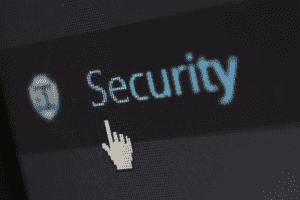
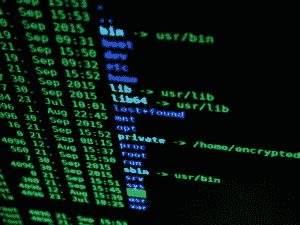

# 如何保护您的数据安全

> 原文：<https://www.pythoncentral.io/how-to-keep-your-data-secure/>

我们都知道数据安全是一个大问题。每天都有如此多的网络攻击发生，确保您的数据安全比以往任何时候都更加重要。在这篇博文中，我们将讨论一些保护数据安全的最佳方法。我们将涵盖从密码保护到数据加密的所有内容。遵循这些提示，您可以放心，您的数据是安全和健全的！

## 1。安全访问服务

保护数据安全的第一步是确保只有授权人员才能访问。这意味着建立一个安全访问控制系统，根据用户权限限制对敏感数据的访问。有许多不同的方法可以做到这一点，但最重要的是要确保只有那些需要访问数据的人才拥有它。还有， [根据禅悟](https://satoricyber.com/) 的说法，你应该定期检查和更新你的门禁系统，确保它仍然有效。在主系统出现任何问题的情况下，准备一个备份系统也是一个好主意。

## 2。数据加密

数据加密是保护数据安全的另一个重要步骤。这是一个将数据转换成只能由授权用户解密的代码的过程。这个[确保了](https://www.pythoncentral.io/recursive-file-and-directory-manipulation-in-python-part-1/)即使有人获得了你的数据，他们也无法读取或以任何方式使用它。有许多不同类型的数据加密，所以请务必选择最适合您需求的一种。此外，确保加密所有敏感数据，而不仅仅是其中的一部分。

## 3。密码保护

保护数据安全的一个最基本也是最重要的方法是用密码保护它。这样可以保证只有那些 [知道密码的人才能访问](https://www.namecheap.com/support/knowledgebase/article.aspx/9517/45/what-is-a-secure-password-and-why-is-it-important-to-have-one/) 的数据。确保选择不易被猜到的强密码。定期更改密码也是一个好主意，千万不要为多个帐户使用同一个密码。有许多密码管理工具可以帮助您跟踪您的密码，并确保它们是强有力的。

## 4。备份您的数据

数据安全的另一个重要步骤是定期备份数据。这样，如果原始数据发生任何变化，您将有一个副本可以用来恢复它。有许多不同的方法来备份数据，所以选择一个最适合你的需要。您可以将数据备份到外部硬盘、云或本地服务器。只要确保你选择的备份方法是可靠和安全的。

## 5。让您的软件保持最新

在数据安全方面，最重要但经常被忽视的一个步骤是保持你的软件最新。这包括您的操作系统和您安装在计算机上的任何应用程序。过时的软件是黑客获取数据的最常见方式之一。通过使您的软件保持最新，您可以修补任何可能存在的安全漏洞。有许多不同的方法可以让您的软件保持最新，因此请选择最适合您需求的方法。

## 6。使用 VPN

保护数据安全的另一个好方法是使用 VPN。VPN 对您的计算机和 VPN 服务器之间的所有流量进行加密，使任何人都无法窃听您的连接。如果您使用公共 Wi-Fi，这一点尤其重要，因为如果您不使用 VPN，黑客很容易获得您的数据。有许多不同的 VPN 提供商可供选择，因此一定要做好调查，选择最适合您需求的提供商。

## 如何对员工进行数据安全教育

对员工进行数据安全教育的第一步是制定数据安全政策。该政策应概述哪些类型的数据被视为敏感数据，以及违反该政策的后果。请务必定期与您的员工一起审查该政策，并确保他们理解该政策。您还应该让员工能够轻松举报任何违反政策的行为。另一个重要的步骤是对你的员工进行数据安全培训。此培训应涵盖诸如如何识别敏感数据、如何保护敏感数据以及如果他们怀疑自己的数据遭到破坏时该怎么办等主题。

你可以采取许多措施来保护你的数据安全。最重要的是确保只有经过授权的人员才能访问它，并且它是加密的。此外，您还应该用密码保护您的数据，并定期备份。最后，确保你的软件是最新的，并使用 VPN 来增加安全性。通过遵循这些步骤，您可以确保您的数据是安全的。