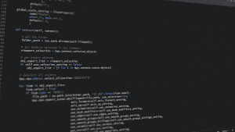

# 如何学习用 Python 编程？

> 原文：<https://www.pythoncentral.io/how-to-learn-to-program-with-python/>

Python 的流行使其成为 GitHub 上第二受欢迎的编程语言。这主要是因为它在新兴技术中的使用，如数据科学、机器学习和人工智能。由于它的高效性、多功能性和易学性，它在软件开发中也有很强的影响力。在这篇文章中，我们将讨论如何学习用 Python 编程。

Python 是一种编程语言，具有易于编写和阅读的特性。在这种情况下，一些学习者需要获得 [Python 作业帮助](https://essaywriter.nyc/python-homework-help/)，因此他们为此使用特殊服务。然而，程序员必须有一系列的技能和知识来使用它。

诸如自学能力、团队合作能力、分析和解决问题的思维等软技能尤为突出。这些是你可以拥有或者可以发展的技能，重要的是要有一系列具体的知识来理解这种编程语言。其中一些如下:

*   了解其他编程语言，如 CSS、JAVA 和 TypeSCript 等。
*   对关系数据库有所了解。使用 Python，您将能够构建确保所创建的数据库的持久性的系统。
*   想要从头开始学习 Python 的开发人员必须了解一些框架，如 Flask、DJango 或 Pyramid。
*   具备面向对象编程的知识。这将允许您将代码组织成单元，并创建彼此相关的对象。

## 如何学习如何用 Python 编程？

有很多关于如何学习 Python 编程的视频教程，但是它们可能会让你偏离目标。下面，我们将回顾开始学习这种编程语言的步骤。

## 定义学习 Python 的原因

你需要找到一个令人信服的理由来学习 Python，因为它必须让你在整个过程中保持专注，否则，到最后可能会非常痛苦。

所以每个学生都应该自己去找。例如，专家挑出以下原因:成为专业的 Python 开发人员，无论是在数据科学、机器学习、数据分析、人工智能还是任何其他学科。

## 学习基础知识

学习语法，以及编程语言的要点，比如变量、数据类型、[函数](https://www.pythoncentral.io/what-is-the-string-in-python/)等等。除了理论，还需要大量的实践。自己或者通过看到的 Python 教程写简单代码。一旦你掌握了基础知识，你就可以进入高级话题了。

是时候把你学到的东西用在你从头开始创建的项目中了。这些类型的练习将释放你的潜力，并帮助你在这个过程中学习。此外，这些项目可以放入你的文件夹中，供你找工作时使用。

你可以在数据科学、机器学习、网站、移动应用、游戏和自动化脚本等领域创建结构化项目。此外，您还会找到许多结构化项目的资源，例如 Dataquest、Scikit-learn documentation、使用 Python 学习机器人技术，以及使用 Python 自动完成枯燥的工作，这是您可以访问的几个网站。

在这一过程中，您需要学习如何找到错误并寻找它们的解决方案。此外，您可以扩展以前的项目，找到开源平台进行贡献，为非营利组织做志愿者，为 GitHub 做贡献...

## 如何学习如何用 Python 编程？

### 与更多人合作

与其他学生和专家合作将有助于你扩大知识面，讨论问题，获得在工作中应用的技巧和诀窍。有不同的 Python 社区、论坛、聚会和活动。我们可以提到一些像堆栈溢出，Python.org，Reddit 和 Sololearn。

### 继续练习

学习编程是一个永无止境的过程。所以，在你完成了所有的步骤之后，要一直坚持练习你所学到的东西。以全职 Python 开发人员或业余爱好者的身份进入这个世界，在各种行业垂直领域创建 Python 项目。

在提到如何学习如何使用 Python 编程以及您事先需要什么之后，现在是冒险开始使用这种编程语言的理想时机。

你想学 Python 编程吗？通过我们的 Full Stack Jr. Bootcamp 从零开始学习编程，您将掌握计算思维，同时开始使用 Python 编写有用、快速和优雅的代码的方法和关键。