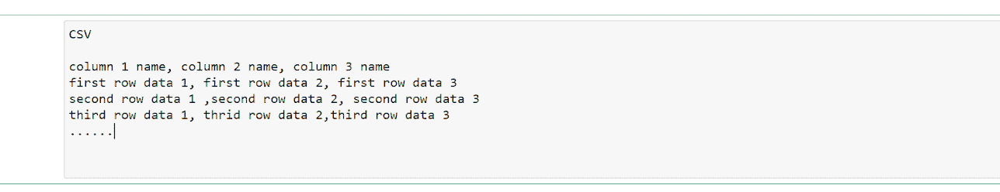
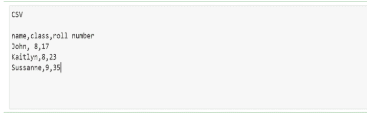
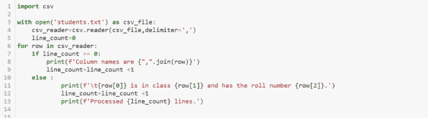
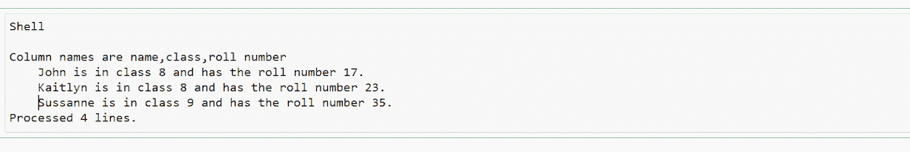
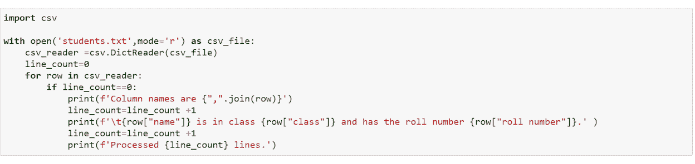
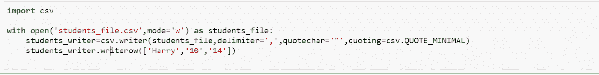
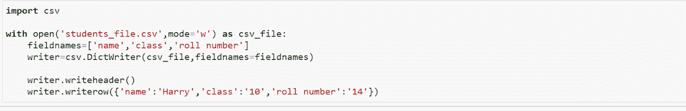
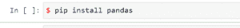
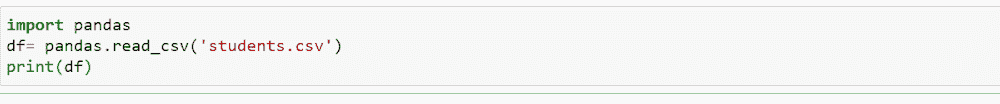
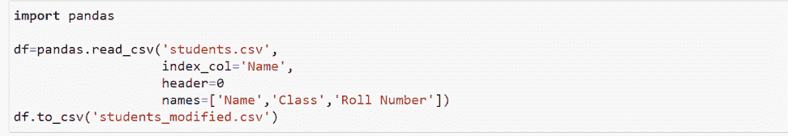

# 如何在 Python 中读取“CSV”文件

> 原文：<https://www.pythoncentral.io/how-to-read-csv-file-in-python/>

我们日常遇到的计算机系统需要大量的数据和信息交换。为了确保这种交换顺畅而容易，用户更喜欢文本文件，而这些文本文件最常见的格式之一就是**’。csv**

但是什么是 CSV 文件呢？我们如何使用它来提取和修改数据？什么是 python 库？有其他可用的库来处理这种格式吗？每个库中的命令和程序是什么？

不要担心！所有这些问题都在本文中得到解答。您将学习如何使用 csv 文件，并使用代码正确处理它们，以最大限度地提取数据。让我们开始吧。

## **什么是 CSV 文件？**

逗号分隔值(CSV)文件是一种纯文本文件，使用 ASCII 或 Unicode(UTF-8)等字符集来存储数据。它主要用于存储最初以表格形式存储的数据，每行代表一条记录。特定记录的不同字段用逗号分隔，因此这种格式就有了它的名字。分隔符被称为“分隔符”

该图显示了 CSV 文件的外观。文件的每一行代表表格数据的一行。您可以观察到逗号分隔字段。

### **为什么要创建 CSV 文件？**

处理大量数据的程序创建 CSV 文件，以便从电子表格或数据库中方便地导出数据，并将其导入不同的程序。从程序员的角度来看，CSV 文件很容易处理。任何接受文本文件输入并支持字符串数据操作的编程语言都可以直接处理 CSV 文件。

## **用 Python 内置的 CSV 库读取 CSV 文件**

Python 内置的 CSV 库包含读取和写入 CSV 文件的函数。该库支持各种 csv 格式，并包括用于处理 CSV 文件的对象和代码函数。

### **读取文件用** ***csv***

用于从 CSV 文件中读取的对象: **reader 对象**

用于打开 CSV 文件的函数:**【open()】**

Python 内置的 **open()** 函数将 CSV 文件作为文本文件打开。该函数提供了一个文件对象，然后该文件对象被传递给 **阅读器对象** ，后者进一步处理该文件。

让我们以一个 CSV 文件为例，它存储学生的详细信息作为数据。

文件名: **学生. txt**

Python 代码读取此文件: 

输出如下:

**阅读器对象** 返回的每一行都是一个字符串元素的数组，其中包含删除分隔符后的数据。

### **将文件读入字典用** ***csv***

我们使用与上面相同的文件。

把它当字典读的代码如下:

注意这里代码的不同。当我们使用字典时，行名写在 **行{}** 语句中而不是行号中(就像前面的方法一样)。

结果与之前的输出相同:

CSV 文件的第一行包含构建字典的关键字。例如，如果您的 csv 文件中没有这些密钥，那么您可以指定自己的密钥。

#### **阅读器对象可选参数:**

**阅读器** 对象可以在附加参数的帮助下处理不同风格的 CSV 文件。这里讨论其中的一些参数:

*   **分隔符** 参数指定用于分隔记录中每个字段的字符。默认为逗号('，')。
*   **quotechar** 定义用于表示包含分隔符的字段的字符。此参数的默认值是一个双引号(“”)。
*   **escapechar** 描述在用户不使用引号的情况下，用于转义分隔符的字符。默认情况下没有转义字符。

例如，在上面讨论的**【students . txt】**文件中，我们要添加另一个字段作为‘日期’

日期的格式本身包含“逗号”，在这种情况下使用“逗号”作为分隔符会造成很多混乱，使处理变得繁琐。为了使用更方便，我们可以指定另一个字符作为分隔符。或者，您可以使用**quote char**参数将您的数据放在引号中，因为放在引号中的任何数据都会忽略分隔符的功能。如果你想完全取消分隔符的解释，那么你可以使用 **escapechar** 参数。

## **用** ***csv*** 编写 CSV 文件

所用对象: **作家对象。**

使用方法: **。write_row()**

**quote char**可选参数用于定义在书写时哪个字符用于引用字段。 **引用** 参数可以取以下值:

*   如果 **引用** 参数的值等于 **csv。QUOTE_MINIMAL** ，然后是方法 **。writerow()** 仅在字段包含分隔符或 quotechar 时才会引用字段。此设置是默认情况。
*   如果**报价** 参数的值等于 **csv。【QUOTE _ ALL，然后是方法 **。writerow()** 引用数据中出现的所有字段 。**
*   如果 **引用** 参数的值等于 **csv。QUOTE_NONNUMERIC** ，然后是方法 **。writerow()** 将引用所有包含文本数据的字段，并将所有数值字段转换为浮点数据类型。
*   如果 **引用** 参数的值等于 **csv。QUOTE_NONE** ，那么方法 **。writerow()** 将转义分隔符，而不是引用它们。

## **用** ***csv*** 从字典中编写文件

注意，在 **writerow()** 字段中，我们还必须提到字段名。

## **用熊猫库处理 CSV 文件**

熊猫 是另一个可用于处理 CSV 文件的库。如果用户有大量数据要分析，建议使用这个库。它是一个开源 python 库，可用于所有 Python 安装。对于使用 **熊猫** 库来说，最受欢迎的 python 安装之一是配备了 Jupyter notebook 的 Anaconda 发行版。它可以在许多可用工具和数据结构的帮助下处理、共享和分析数据。

在 Anaconda 中安装 **熊猫** 及其依赖，如下图:

如果您使用 **pip/pipenv** 进行 python 安装，那么命令如下:

随着 **熊猫** 库的安装完成，现在让我们学习如何在这个库中读写 csv 文件。

### **和熊猫一起读 CSV 文件。**

与其他库相比，在 **熊猫** 库中读取 csv 文件非常容易，因为它的代码结构非常紧凑。

文件名: **学生. csv** 

**df** 这里是**‘data frame’的简称****pandas . read _ csv()**方法打开并分析提供的 CSV 文件，并将数据保存在 **DataFrame 中。** 打印 **数据帧** 给出期望的输出。

当我们使用前面提到的方法时，我们可以看到输出的不同。同样，使用 **熊猫** 库获得的结果具有从‘0’而不是‘1’开始的索引。

### **用熊猫写 CSV 文件**

将数据写入 CSV 文件的代码如下:

文件名: **学生. csv**

此处，文件的“名称”列已成为索引列。此外，在写入模式下， **打印(df)** 命令更改为 **df.to_csv()** 。

## **结论**

在当前的数据和信息交换场景中，CSV 文件有着巨大的用途。因此，如果您理解了它们的结构、组成和用法，那么您就准备好统治编程世界了。

应用 CSV 文件评估数据使操作效率日益提高。当与 Python 等编程语言结合时，这些文件的效率增加了数据操作、评估和应用的多样性。Python 中还有其他库可用于处理 CSV 文件。尽管如此，为了让程序员拥有最高效的程序，本文还是讨论了最高效和最紧凑的方法。