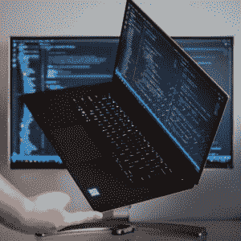

# 如何判断你的电脑是否可以运行 Python

> 原文：<https://www.pythoncentral.io/how-to-tell-if-your-computer-can-run-python/>

Python 是一种非常通用的脚本语言，可以用在网站后端、数据科学或自动化任务中。如果你不是程序员，并且你想知道你的计算机是否能运行 Python，有一些东西你可以寻找。在这篇文章结束时，你会更好地理解这种语言，它固有的多功能性，以及你的电脑或笔记本电脑是否能有效地运行它。

## Python 是什么？

Python 编程语言是一种通用语言，可以应用于许多不同的领域。它有一个简单、易学的语法，而且足够灵活，可以在各种环境中表达概念。Python 自 1991 年由吉多·范·罗苏姆创建以来就一直存在。它还具有极高的内存效率，这意味着您无需担心使用高度先进的计算机或寻找更多存储空间来启动和运行它。该语言是开源的，包括一个广泛的标准库，带有内置的数据结构和算法，用于处理文本、数字、列表等。，以及许多 OS 系统调用和 Python 包索引中的其他库的接口。它用于各种结果，包括:

*   建设高级网站
*   创建复杂的软件
*   解析数据集
*   用于数据科学的多个方面
*   开发高级自动化脚本
*   机器学习

这些只是使用这种语言可以实现的一些奇妙的事情，可以说，如果你可以想象一些事情，你很可能使用 Python 来实现它！

## Python 相对于其他语言有哪些优势？

Python 是一种强大的语言，虽然与其他语言相比它有一些限制，但由于它的灵活性、简洁的语法和广泛的应用，它是一种很好的学习语言。与其他更复杂的编程语言相比，它的主要优势包括:

*   **简单:** 大多数新手在尝试阅读特定的编程语言(看你，C++)时会变得不知所措。然而，Python 是为了消除其他语言中的复杂性而创建的，因此具有非常易于读写的语法。例如， **打印(‘你好，世界！’)** 将创建一个带有消息“Hello World”的输出。当你把它和 C++比较时，你就能看到区别了！:

**#包括< iostream >**

**int main() {**

**STD::cout<“你好世界！”；**

**返回 0；**

**}**

*   **力量:** 由于 Python 的简单，初学者常常会惊讶于它的强大。然而，它的简单性使程序员能够 [编写强大的应用程序](https://www.futurelearn.com/info/blog/what-is-python-used-for) 而不用担心记住大量的语法。此外，它可以通过各种扩展来实现高度复杂的结果。
*   **费用:** 由于其开源性质，可以免费使用。此外，它还会被大量专门用户不断更新和扩展。
*   它有一个很棒的社区:Python 社区被公认为编程中最友好和最有帮助的社区之一。你不仅可以在 Stack Exchange 这样的网站上找到几乎所有的解决方案，还可以在很多论坛上寻求帮助。
*   **对推进你的事业大有裨益:** 与 Java 和 JavaScript 一起，Python 已经成为最受欢迎的语言之一。

## 你怎么知道你的电脑能不能运行它？

这个问题的答案并不简单。您需要做的第一件事是检查 Python 的硬件要求。幸运的是，由于其轻量级的特性，几乎任何现代设备都可以运行开始编写和测试代码所需的软件。但是，如果你的电脑是老式的，你可能会考虑升级，如果你是认真的。虽然 Python 可以在大多数机器上运行，但是旧的模型会使一切都变得更慢、更令人沮丧，从而导致购买新机器的需求。尽管如此，只要它有足够的内存来防止你拔头发，一个像样的 CPU 和一个 SSD(出于同样的原因，你需要足够的内存！).

## 入门需要什么？

一旦你确定你的硬件符合标准，你就可以进入软件方面了。虽然苹果 Macbooks 等一些品牌往往已经安装了 Python，但其他品牌不会，你需要通过他们的网站 直接安装 [。然而，对于初学者来说，最好的方法之一是使用像 Anaconda 这样的程序，它包含了入门所需的一切。您还可以使用 Anaconda 安装一个笔记本，比如 Jupyter Notebook，它允许您动态地编写和测试代码。](https://www.python.org/)

Python 是一门很棒的语言，简单易学，而且可以免费使用，由于它有无数的应用，所以是一门很好的入门语言。此外，由于它的轻量级，您可以将它安装在过去十年的几乎任何计算机上。