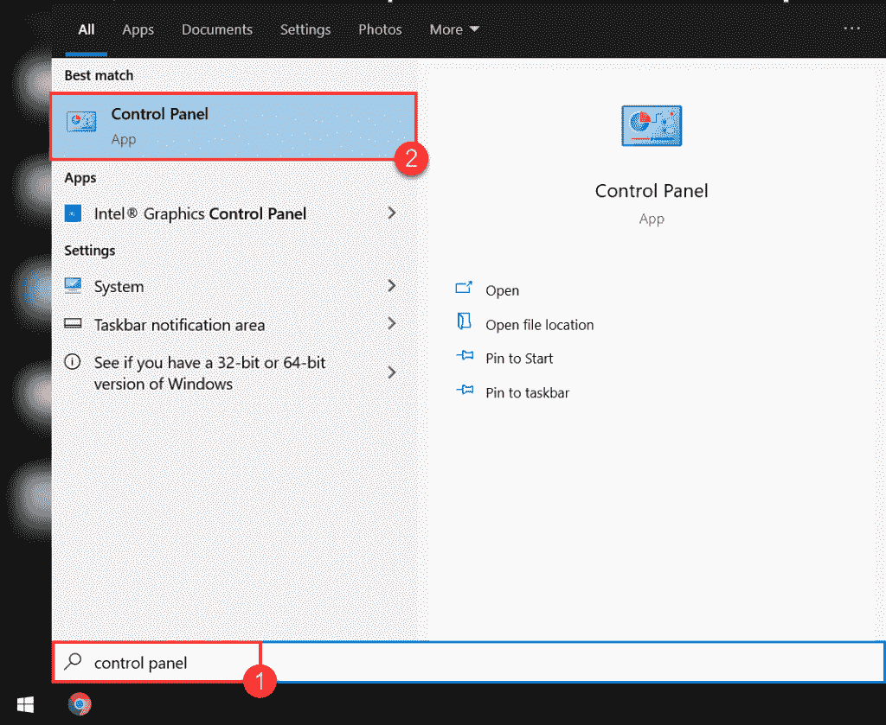
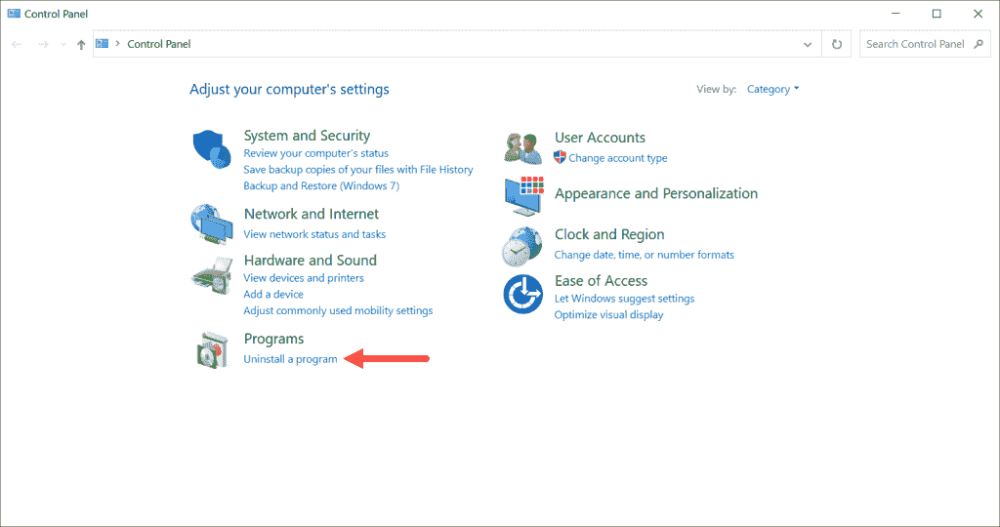
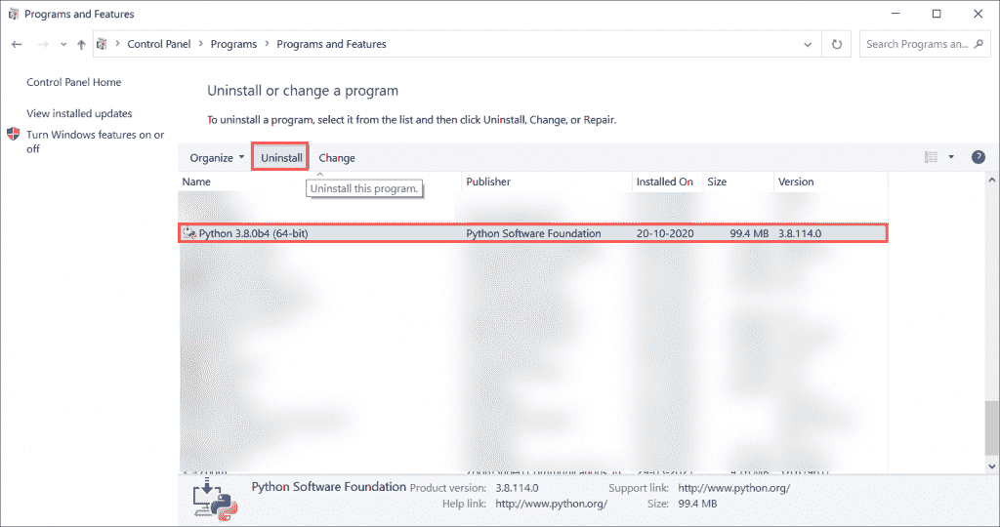
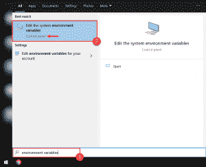
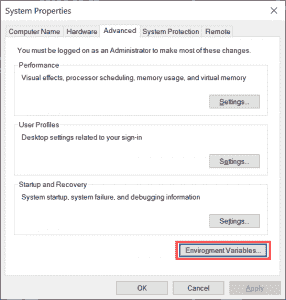
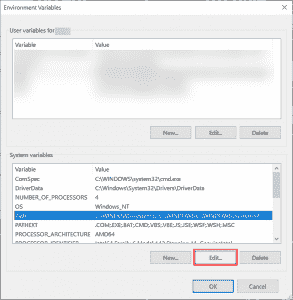
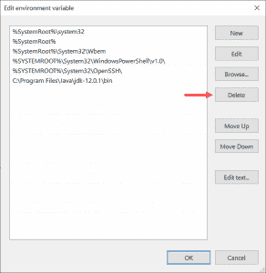
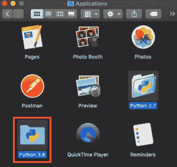
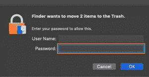
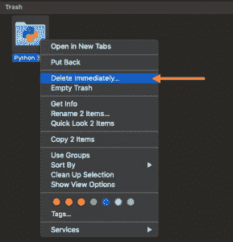

# 如何卸载 Python

> 原文：<https://www.pythoncentral.io/how-to-uninstall-python/>

Python 的每个版本都有错误修复和安全补丁。为了确保您不会受到已修复的错误和安全问题的影响，删除旧版本是必要的。

虽然你可以在同一台电脑上使用多个 Python 版本，但是在卸载旧版本之前安装新版本的 Python 有时会破坏电脑上的 Python。

谢天谢地，在安装新版本之前卸载 Python 可以解决这个问题，而且做起来并不困难。在这篇文章中，我们已经分解了如何在每个操作系统上移除 Python。

## **如何从 Windows、Mac、Linux 卸载 Python**

没有在操作系统上卸载 Python 的标准方法。您需要遵循特定于您计算机上操作系统的卸载步骤。

| **注意:** 如果你想从你的电脑中移除 Python 包，你不需要从你的电脑中卸载 Python。您可以使用 pip 工具添加、移除和搜索特定的 Python 包。如果你不知道如何使用 pip， [我们的详细指南](https://www.pythoncentral.io/add-remove-and-search-packages-installed-with-pythons-pip/) 将在几分钟内教你需要知道的东西。 |

## **如何从 Windows 中卸载 Python**

Windows 轻松卸载 Python。您可以通过三个简单的步骤移除计算机上安装的任何 Python 版本。

### **步骤#1:导航至控制面板**

按键盘上的 Windows 键或屏幕左下角的 Windows 按钮打开开始菜单。

输入“控制面板”,从选项列表中找到并启动控制面板。

### **步骤#2:导航到卸载菜单**

控制面板打开后，您必须点击左下方“程序”部分下的“卸载程序”按钮。

将会打开一个菜单，其中包含计算机上安装的所有程序。

### **第三步:卸载 Python**

您必须向下滚动程序列表，找到您计算机上安装的 Python 版本。接下来，通过左键单击选择程序，然后单击“卸载”按钮。

卸载向导将启动，在您确认卸载 Python 的决定后，它将从您的计算机中删除。

要从您的电脑中完全删除 Python，您需要从 Path 中删除 Python。

### **步骤#4:从路径**中移除 Python

Python 卸载程序在运行时会自动从 Path 中删除 Python。也就是说，最好检查 Python 是否已经从 Path 中移除。这很容易做到，不需要很长时间:

1.  按下 Windows 键，输入“环境变量”启动控制面板中的设置菜单。
2.  将出现一个“系统属性”菜单。找到并单击“环境变量”按钮。
3.  左键点击系统变量部分的“Path”变量，将其高亮显示。然后按“编辑”按钮。
4.  如果您在菜单中看到 Python bin 文件夹的路径，选择该路径并按下菜单右侧的“删除”按钮将其删除。

这样，你就可以将 Python 从你的 Windows 电脑上完全移除了。

## **如何从 Mac 卸载 Python**

在运行 macOS 的电脑上卸载 Python 并不总是一个好主意。这是因为 macOS 预装了 Python，操作系统的内部工作依赖于 Python。

预装的 Python 框架出现在/System/Library/Frameworks/Python . framework 中，在 usr/bin/python 中可以找到几个符号链接。

移除此版本的 Python 将会破坏 macOS，并可能导致 OS 故障。你可以在 Stack Exchange 的面向程序员的 Q & A 站点、[Stack Overflow](https://stackoverflow.com/questions/3819449/how-to-uninstall-python-2-7-on-a-mac-os-x-10-6-4)了解更多信息。

也就是说，如果你已经在 Mac 上安装了第三方 Python 框架，你可以安全地卸载它。你可以这样做:

### **步骤#1:从应用程序中移除 Python**

打开 Finder，并导航至应用程序文件夹。在这里，您将找到您已安装的 Python 版本的文件夹。你必须把它们扔到垃圾桶里。

如果您只想从 Mac 上移除特定版本的 Python，请确保您只将相关的 Python 文件夹移到废纸篓中。

如果出现一个对话框，要求您输入电脑密码，请输入密码并点击“确定”

这些文件夹将被移至垃圾箱。接下来，您必须导航到回收站，高亮显示 Python 版本，然后右键单击。从出现的选项中，选择“立即删除”选项。

删除文件夹不会将 Python 从电脑中完全删除。您必须将其从库目录中删除，并删除符号链接。

### **步骤#2:从/Library 中移除 Python**

您需要使用终端从库目录中移除 Python。要打开终端，按 Cmd ⌘ + Space 并搜索，然后启动。

要从目录中删除第三方框架，请在终端中输入以下命令:

| sudo RM-RF/Library/Frameworks/python . framework |

可能会要求您输入系统密码。如果出现提示，请输入。

如果您只想从您的计算机中删除特定版本的 Python，请通过修改命令来指定版本，如下所示:

| sudo RM-RF/Library/Frameworks/python . framework/Versions/3.8 |

### **步骤#3:移除符号链接**

第 1 步和第 2 步将从您的 Mac 上移除 Python 目录和文件。但是，引用已被删除的 Python 文件夹的链接可能会保留在您的计算机上。这些链接被称为符号链接(或符号链接)。

有两种方法可以从您的电脑中删除这些链接:

#### **#1 手动删除**

引用 Python 文件夹的链接在/usr/local/bin 中。由于链接中引用的文件夹不再存在，这些链接将会断开。

您可以通过在终端中输入以下命令来查看所有断开的符号链接:

| ' ls -l /usr/local/bin &#124; grep '../Library/Frameworks/python . framework ' |

如果您只删除了 Python 的一个特定版本，请确保将上述命令中的路径替换为您在步骤#2 中使用的路径。

看到所有断开的链接后，使用这些命令删除它们:

进入目录:

| cd /usr/local/bin |

删除断开的链接:

| ' ls -l /usr/local/bin &#124; grep '../Library/Frameworks/python . framework“&#124; awk“{ print $ 9 }”&#124; tr-d @ &#124; xargs RM * |

如果上述命令中的路径不同于您在步骤#2 中使用的路径，请用您使用的路径替换上述命令中的路径。

运行这些命令后，已安装的 Python 版本将从 Mac 中移除。

#### **#2 使用自制软件**

你也可以用自制软件从你的电脑中删除断开的符号链接。如果您还没有安装它，运行下面的命令来安装它:

| /bin/bash-c " $(curl-fsSLhttps://raw . githubusercontent . com/home brew/install/master/install . sh)" |

用自制软件找到断开的链接要容易得多。要找到它们，运行以下命令:

| 酿造医生 |

将出现一个断开的符号链接列表。然后，您可以使用以下命令来删除它们:

| 酿造清洗 |

## **如何从 Linux 卸载 Python**

Linux 与 macOS 相似，Python 预装在操作系统中。此外，删除软件的预安装版本会导致操作系统出现故障。

通常，从 Linux 卸载 Python 时，图形显示管理器会失败。

因此，您只能卸载手动安装的 Python 版本。

要删除您安装的 Python 版本，请在终端上使用以下命令:

| sudo apt purge-y python 2 . x-minimal |

您可以使用这个命令从 Linux 发行版中删除 Python 3:

| sudo ln-s/usr/bin/python 3/usr/bin/python |

从系统中移除 pip:

| sudo apt install -y python3-pipsudo ln-s/usr/bin/pip 3/usr/bin/pip |

如果您发现这些命令不起作用，您可能需要使用 *sudo 来更新您的回购列表，以获得更新* 。

# **结论**

至此，你知道如何从你的电脑上完全卸载 Python 了。

现在你可以在电脑上安装最新版本的 Python，而不用担心它会崩溃或处理已经修复的错误。

*为确保您在电脑上安全安装新的 Python 版本，请务必阅读我们的* [*Python 安装指南*](https://www.pythoncentral.io/what-is-python-installation-guide/) *。如果这篇文章有所帮助，或者你认为我们可以改进这个答案，请在评论中告诉我们。*