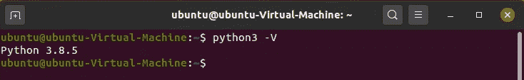
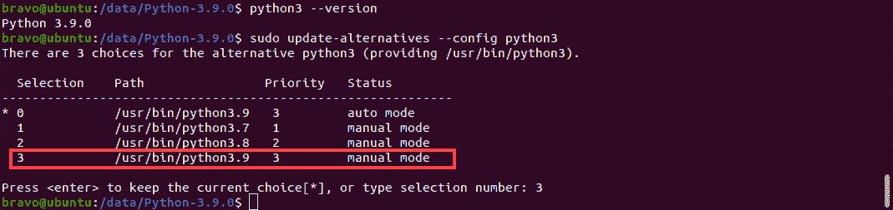
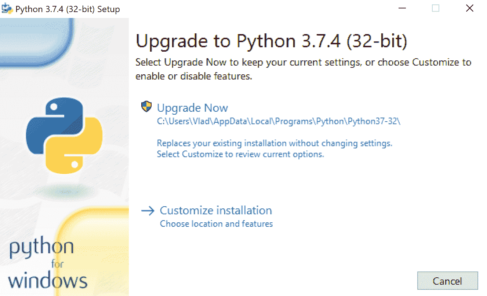

# 如何更新 Python

> 原文：<https://www.pythoncentral.io/how-to-update-python/>

Python 每 12 个月接受一次重大更新，每隔几个月发布一次 bug 修复更新和安全补丁。Python 的最新版本——Python 3.9——引入了像 dict 中的[联合操作符](https://www.scaler.com/topics/union-in-python/)、灵活函数和类型提示泛型这样的特性。无论你运行的是哪种操作系统，更新 Python 都会令人困惑。 是否先去掉旧版本？或者可以直接更新包吗？这里有一个关于如何更新 Python 的简单教程。

## **如何在 Linux、Mac 或 Windows 中更新 Python**

在一台计算机上安装两个主要版本的 Python——比如 Python 2.x 和 Python 3 . x——并同时使用是可能的。如果想从 Python 2.x 迁移到 3.x，除非不想再用了，否则不必卸载之前的版本。 此外，Python 3 现在默认集成了“py.exe”启动器。启动器以两种方式帮助用户:

1.  用户可以使用命令“py”在任何 shell 中运行 Python 不再需要输入“python”。
2.  允许你同时使用两个不同版本的 Python 3。您可以通过命令中的简单开关(如“py -3.6”)来指定想要使用哪个版本的 Python 来运行代码。

换句话说，当你想使用另一个版本的 Python 时，你不需要每次都改变 PATH 变量。 但是启动器只安装在 Python 3 的 Windows 版本上。在装有 Linux 或 macOS 的电脑中更新 Python 可能会更复杂。

-

**注意:** 如果你的电脑上还没有安装 Python，你就无法更新到更新的版本。如果你在电脑上安装 Python 有困难，阅读我们的 [Python 安装指南](https://www.pythoncentral.io/what-is-python-installation-guide/) 会有帮助。

-

## **在 Linux 中更新 Python**

在运行任何命令之前，您可以通过检查 Linux 安装是否安装了最新版本的 Python 来节省大量精力。 要检查您的机器上的 Python 3 是什么版本，请按 Ctrl+Alt +T 打开终端，并键入以下命令:Python 3–version或者: python3 -V 输出应该是这样的:如果您发现您的机器没有 Python 3.9，您必须运行以下命令现在可以通过两种方式安装最新版本的 Python:使用 Apt 和使用源代码。 使用 Apt 更新 Python 更快更简单。你可以这样做:

### **使用 Apt-Get 更新 Python**

使用 Apt 包管理器是在 Linux 上安装 Python 3.9 最简单的方法。 首先，您必须通过运行以下命令将 deadsnakes PPA 配置到您的机器:sudo add-apt-repository PPA:dead snakes/PPA您现在可以更新 apt 缓存并安装 Python 3.9 包: sudo apt 更新 sudo apt 安装 Python 3.9Python 更新将会安装。但是，默认情况下，Python 将指向以前安装的 Python 3 版本。 安装完成后，必须更新 Python 3 指向 Python 3.9。输入这个命令来配置 Python 3:sudo update-alternatives-config Python 3会出现一个选项列表，提示你选择你希望 Python 3 指向哪个版本的 Python。提示应该是这样的:你所要做的就是输入正确的选择号，这样你就将 Python 更新到了你的 Linux 机器上的最新版本。 要验证正在使用的 Python 版本，可以运行: python3 - V

## **在 Mac 中更新 Python**

在装有 macOS 的机器上更新 Python 比在 Linux 机器上更新要容易得多。 一台 Mac 可以安装多个版本的 Python。因此，你可以通过访问[【https://www.python.org/downloads/mac-osx/】](https://www.python.org/downloads/mac-osx/)，下载安装程序，并运行它来更新 Python。 如果你的 Mac 上安装了 Homebrew，你可以在终端上运行以下命令: brew 安装 python 这个过程完成后，你的电脑上就有了最新版本的 Python 3。您可以通过运行命令来验证这一点:python 3-version如果您想要升级 pip 并向其添加新的库，您可以输入以下命令: pip3 install <项目名称>

## **在 Windows 中更新 Python**

在运行 Windows 的计算机上，更新到新的 Python 版本很容易。你所要做的就是访问 [Python 下载页面](https://www.python.org/downloads/windows/) 下载最新版本。 如果你正在更新到 Python 的新补丁(3.x.a 到 3.x.b)，当你运行安装程序时，它会提示你“立即升级”安装程序会是这样的:点击按钮会用新版本替换现有版本的 Python。旧版本将从您的计算机中删除。重新启动计算机后，新的修补程序将安装在您的计算机上。 相比之下，如果你正在将 Python 更新到一个新的次要版本(3.x 到 3.y)，你会在安装程序上看到“立即安装”的提示，而不是“立即升级”的提示。点击按钮将安装 Python 的新版本。但是，旧版本不会被删除。您的计算机可以安装多个 Python 版本。不管您使用的是哪个版本的 Python，py 启动器都会自动安装。它将允许您选择想要使用的 Python 版本。 运行一个特定版本的程序，就像使用“py”命令，输入你想要使用的版本一样简单，就像这样: py -3.8 或者 py -3.9 假设你的机器上有很多项目使用的是之前版本的 Python，你都是在一个虚拟环境中使用的。在这种情况下，您可以使用以下命令在该环境中更新 Python:Python-m venv-upgrade<虚拟环境路径此处为>

# **结论**

Python 的每个版本，包括最新发布的都有一定的局限性。然而，更新到 Python 的最新版本允许您使用所有新功能。此外，更新版本还提供了错误修复和改进的安全措施。有了这本指南，您应该能够在几分钟内获得最新的 Python 版本。 通读我们的 [Python 使用指南](https://www.pythoncentral.io/what-can-you-do-with-python-usage-guide/) 接下来会帮你快速拿起你能用 Python 做的一切。