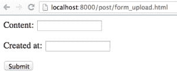
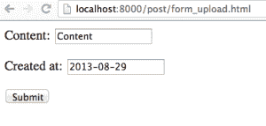
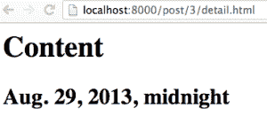
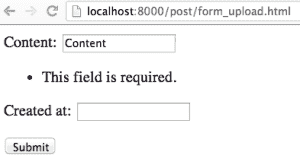

# 如何使用 Python Django 表单

> 原文：<https://www.pythoncentral.io/how-to-use-python-django-forms/>

## Django 形式

什么是 HTML 表单？它有什么样的用例？

> 网页上的 web 表单、web 表单或 HTML 表单允许用户输入发送到服务器进行处理的数据。表单可以类似于纸张或数据库表单，因为 web 用户使用复选框、单选按钮或文本字段来填写表单。例如，表单可用于输入运输或信用卡数据以订购产品，或者可用于从搜索引擎检索搜索结果。
> 
> [Wikipedia](https://en.wikipedia.org/wiki/Form_(HTML) "Webforms on Wikipedia")

HTML 表单是从客户端应用程序向服务器发送数据的最常见方式。在本文中，我们将学习如何使用 Django 的表单库来处理 HTML 表单。

## 使用 Django 表单库的好处

在之前的一篇文章中，[为您的第一个 Python Django 应用程序](https://www.pythoncentral.io/writing-views-to-upload-posts-for-your-first-python-django-application/ "Writing Views to Upload Posts for Your First Python Django Application")编写上传帖子的视图，我们学习了如何使用`request.POST`变量从 HTML 表单中检索数据。然而，仅仅检索数据是不够的，因为我们可能希望处理数据验证，并避免在模板中手动编写 HTML 表单。

幸运的是，Django 的表单库提供了以下好处:

*   从表单小部件自动生成 HTML 表单。
*   根据一组规则验证提交的数据。
*   如果有错误，重新显示 HTML 表单。
*   将提交的数据转换成 Python 兼容的类型。

### 基本概念

在我们深入讨论编写表单的细节之前，我们需要了解以下概念:

*   **Widget** :一个 Python 类，将自己呈现为 HTML 形式。
*   **字段**:验证数据的 Python 类，例如限制最大字符数的`CharField`。
*   **表单**:字段的集合。
*   **表单资产**:与呈现表单相关联的 CSS 和 Javascript。

设计正确的话，`Form`库与其他 Django 组件是分离的，比如数据库层甚至模板。通过将`Form`库与 Django 的其余部分分离，我们可以独立于应用程序的其余部分编写和测试表单，这增加了应用程序的可维护性。

### 表单和视图

现在让我们继续创建一个表单对象，它表示`myblog/forms.py`中的一个`Post`。

```py

from django import forms
类后置形式(形式。形式):
内容=形式。CharField(max _ length = 256)
created _ at = forms。DateTimeField() 

```

然后我们创建一个新的视图，返回我们在上下文中的表单。

```py

from myblog.forms import PostForm
def POST _ Form _ Upload(request):
if request . method = = ' GET ':
Form = PostForm()
else:
# A POST 请求:处理表单上传
 form = PostForm(request。POST) #从请求绑定数据。投寄成一种邮件形式
#如果数据有效，则继续创建新的帖子并重定向用户
If form . is _ valid():
content = form . cleaned _ data[' content ']
created _ at = form . cleaned _ data[' created _ at ']
post = m . post . objects . create(content，
created _ at = created _ at)
return httpresponseredict(reverse(' post _ detail '，
 kwargs={'post_id': post.id})
return render(request，' post/post_form_upload.html '，{ 
 'form': form，
 }) 

```

然后我们创建一个新的模板，在`myblog/templates/post_form_upload.html`的 HTML 页面中呈现我们的表单。

```py

<form action='/post/form_upload.html' method='post'>

{{ form.as_p }}

<input type='submit' value='Submit' />

</form>

```

最后，我们修改`myblog/urls.py`以追加以下条目:

```py

urlpatterns = patterns('',

    ...

    url(r'^post/form_upload.html$',

        'myblog.views.post_form_upload', name='post_form_upload'),

    ...

)

```

现在我们可以访问 URL `http://localhost:8000/post/form_upload.html`来看看我们新的帖子表单页面:



我们的空表单页面。

填写表格并点击“提交”会将您重定向到新帖的详细信息页面:



我们的表格填好了。



提交后我们的页面。

因为“内容”和“创建者”字段都是必填的，所以当您试图上传一个空字段时，会出现一个错误。



所需输入误差..

## 总结和提示

在本文中，我们学习了如何使用 Django 的表单库来处理 HTML 表单。虽然手工创建 HTML 表单是常见的做法，但是创建 Django 的表单对象可以提供更好的可维护性、可读性和功能性。在下一篇文章中，我们将学习如何使用 Django 的`ModelForm`从模型中自动生成表单。