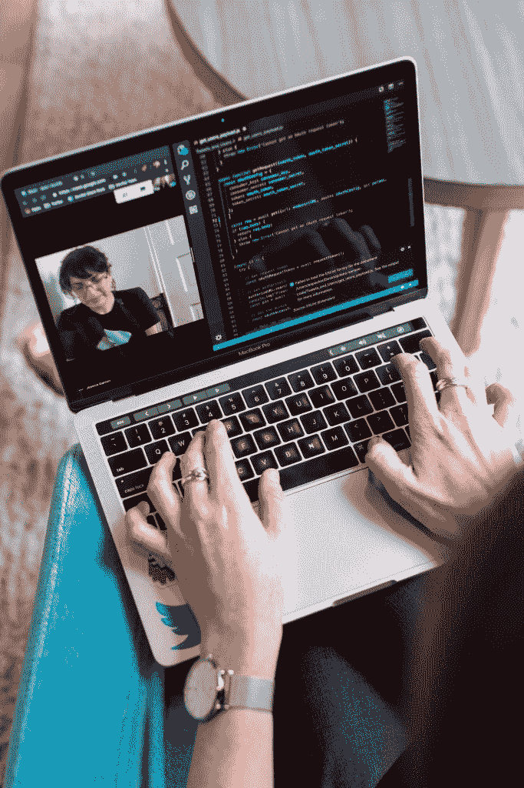

# 如何在 Mac 上使用 Python

> 原文：<https://www.pythoncentral.io/how-to-use-python-on-a-mac/>

Python 是一个强大的编程工具，但当你在 Mac 上使用它时，它就变成了另一种野兽。这是一种非常适合 Mac 的语言，因为它克服了传统的编程障碍，以便使编码过程更人性化，更容易理解。

但是纯粹的简单并没有让 Python 变得容易学习。仍然有一个陡峭的学习曲线要处理，所以我们甚至要涵盖基础知识，如如何在 Mac 上安装 Python。目标是直接进入主题，所以让我们看看如何在 macOS 上实际使用 Python。

## **入门**

麦金塔电脑自带预建的 Python 2.7 版本，所以如果最新版本不是强制性的，你甚至不必为技术程序而烦恼。然而，大多数用户想要最新的 Python 3 版本，他们可以从官方网站 python.org 下载。当你访问网站并点击[下载](https://www.pythoncentral.io/how-to-install-sqlalchemy/)按钮时，你会得到几样东西:

*   您笔记本电脑的应用程序文件夹中有一个名为 Python 3.9 的新文件夹。这个目录包含 IDLE，又名文本编辑器，是 Python 的现成解决方案。除此之外，您将获得 Python Launcher，一个管理 Python 脚本的工具。在 IDLE 中，您可以找到包含所有 Python 文档的帮助菜单。
*   包含库和 Python 可执行文件的框架。该框架被标记为/Library/Frameworks/Python . framework。一旦安装 Python，程序本身将与您的 shell 路径共享该框架的位置。

谨记，想要保留 Python 预装版本的用户千万不要更改或修改原有框架，因为它完全在苹果的掌控之中。即使您下载了较新的程序，两个版本也会同时保留在您的计算机上。

## **运行 Python 脚本**

我们已经提到了 Python 的原生集成开发环境，又名 IDLE，因为这是新客户在 Mac 上开始使用 Python 的最简单方式。但是在你用 Python 开始一些繁重的工作之前，你需要记住一件事——程序可能需要很强的处理能力，你应该总是寻找 [有用的提示](https://cleanmymac.com/blog/how-to-cool-down-mac) 当你编程太辛苦时，如何给你的 Mac 降温。

在 Mac 上运行 Python 脚本有两种基本方式:

*   来自终端窗口的命令
*   来自取景器

前一种解决方案更常见，因为它更简单，但我们将同等讨论这两种方案。终端和 Finder 都需要一个文本编辑器来创建脚本。典型的 macOS 有各种标准的命令行编辑器，如 emacs 或 vim，但您可以通过使用 BBEdit 或 text Mate 等替代编辑器来选择更高级的功能。

如果你使用终端窗口，你必须确保 shell 搜索路径包含/usr/local/bin。这是最基本的条件，没有它你无法继续下去。使用 Finder，事情变得有点复杂，这也是大多数人避免使用它的原因。有两个选项可以考虑:

*   将脚本拖到 Python 启动器
*   将 Python Launcher 设置为在 Mac 上运行脚本的主要应用。您可以在 Finder info 窗口中通过连按启动器来完成此操作。之后，您可以用许多不同的方式控制和管理脚本。

## **小心 GUI**

对于没有经验的用户来说，Python 和 Mac 有许多小陷阱，其中最重要的是图形用户界面( [GUI](https://www.computerhope.com/jargon/g/gui.htm) )。也就是说，任何一种拥有 GUI 并与 Aqua 窗口管理器通信的程序都需要一种特殊的方法。

为了启动一个新的脚本，你必须使用 python 而不是 python 来改变这个过程。这是一个简单的技巧，但它让许多新程序员感到茫然和困惑。如果您想在程序中添加新的 Python 包，可以用几种方法。

第一个选项是使用标准安装模式(python setup.py install)安装一个包。第二种选择是使用安装工具扩展或 pip 包装。

### **底线**

Python 和 Mac 是一种天然的结合，让两种工具都能发挥出最大的潜力。我们向您简要介绍了如何在 Mac 上使用 Python，但是现在轮到您开始工作并深入探究 Python 编码的秘密了。你准备好试一试了吗？