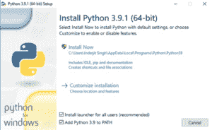

# 安装 Python:Windows、Mac 和 Linux 的详细说明

> 原文：<https://www.pythoncentral.io/installing-python-detailed-instructions-for-windows-mac-and-linux/>

目录:

*   简介
*   Python for windows–安装
*   Python for MAC OS-安装
*   Python for Linux–安装
*   结论
*   常见问题解答

**简介:**

Python 是世界上最流行的编程语言之一，有超过 800 万开发人员在使用它。Python 的无处不在意味着如果你现在就努力学习它，你将会在未来几年收获巨大的收益。因此，如果您想开始学习 Python，请继续阅读以了解如何在您的机器上安装它！探索 [Python 教程](https://mindmajix.com/python-tutorial) 了解更多信息。

**在 Windows 上安装 Python**

*   目前有两个不同版本的 Python 在使用——Python 2 和 Python 3。这些版本在语法和[功能](https://www.pythoncentral.io/python-null-equivalent-none/)上有所不同。每个版本都有可用的子版本。您必须决定要下载哪个版本的 Python。

*   到 Python 官网的“Python for Windows”板块-。在那里，您可以找到所有可供下载的 Python 版本。例如，最新版本是 Python 3.10.4。点击下载，你会看到一个各种可执行安装程序的列表，每一个都有不同的系统要求。选择一个与您的机器规格兼容的，并下载它。

*   一旦给出运行安装程序的选项，选择对话框底部的两个复选框——“为所有用户安装启动器”和“将 Python[您选择的版本]添加到路径中”。然后点击“立即安装”

*   安装完成后，你会看到一个对话框，通知你“安装成功”然后，您可以验证 Python 确实已经成功安装在您的计算机上。

*   打开命令提示符，键入“Python”如果安装确实成功，将显示您选择下载的 [Python](https://www.pythoncentral.io/a-python-programmer-everything-you-need-to-know-about-this-profession/) 版本。

*   最后，您需要验证 Pip 是否已经与 Python 一起成功安装。Pip 是 Python 的一个强大的系统管理包，因此它是检查您是否能够成功下载它们的理想工具。要验证 Pip 的安装，请打开命令提示符并输入“Pip-V”。如果 Pip 安装正确，将出现以下输出:

**在 MacOS 上安装 Python**

*   从 Python 官网下载可执行安装程序。如果您访问 https://www.python.org/downloads/macos/的，它会自动检测您的操作系统并选择针对您的系统规格优化的安装程序。如果不起作用，只需点击您喜欢的 Python 版本的链接，手动选择安装程序。

*   下载完安装程序后，双击软件包开始安装 Python。安装程序将显示一个软件向导，指导您完成安装所需的不同步骤。在某些情况下，您可能需要输入 Mac 密码，让系统知道 Python 是在您的许可下安装的。

*   首先，你会被要求同意 Python 许可证，也就是 [Python](https://answersbee.com/python) 软件基础许可证版本 2。然后，只需点击“安装”开始下载！

*   安装完成后，你会看到 Python 文件夹。您可以验证 Python 和 IDLE(Python 的集成开发环境)是否安装正确。为此，双击空闲文件；如果安装成功，您将看到下面的 Python shell:

*   在同一个文件夹中，您会找到一个名为“安装证书”的文件 Python 使用一组 SSL 根证书来验证安全网络连接的身份。您需要从第三方提供商那里安装这些证书的当前和管理包。双击安装证书以快速下载必要的 SSL 证书。

*   最后，你可以在空闲时执行一个简单的程序，看看是否一切正常。

注意: 如果你使用的是苹果 M1 Mac，如果你还没有安装的话，你首先需要安装 Rosetta。这是一个使基于英特尔的功能能够在苹果硅 MAC 上运行的包。下载后，它会在后台自动运行。您可以通过命令行给出以下命令来安装它:“/usr/sbin/software update-install-Rosetta-agree-to-license。”

查看 [Python 在线培训](https://mindmajix.com/python-training) &认证课程，让自己获得 Python 行业级技能认证。

**为 Linux 安装 Python**

*   要安装 Python for Linux，你需要一台运行 Debian 或 Fedora 操作系统的电脑，至少要有 2GB 内存和 5GB 磁盘空间。你还需要 sudo 进入系统。

*   在大多数 Linux 版本上，比如 Debian，Python 已经安装好了。您可以通过打开命令提示符并输入“python-v”或“Python-version”来检查 Python 是否已安装如果未安装 Python，输出将显示“未找到命令‘Python’”

*   要从包管理器安装 Python，输入以下命令:“sudo apt-get install python3.9”(安装时用自己喜欢的版本替换 3.9)。键入“Y”并按 enter 键继续。包管理器将为您安装 Python。

或者，您可以从源代码构建 Python。为此，请遵循以下步骤:

*   获取源代码。你可以从 Python 的官方 GitHub 库克隆它。

*   配置代码。配置脚本包括许多标志，如 prefix、- enable-optimizations 等。要配置特定的标志，请导航到克隆源代码的 CPython 目录，然后在终端上运行以下命令。/configure-prefix = $ HOME/python 3.9 . "

*   最后，是构建过程。运行 make 工具启动构建过程，然后运行 make install 命令将构建文件放在 configures–prefix 指定的位置。最终输出如下:

**结论**

Python 是目前最流行的编程语言之一，这是有道理的。它的易用性、开源支持和更高的生产率使它成为许多开发人员的最爱。它与 Windows、Mac 和 Linux 的兼容性只是促进了它的广泛使用。

我们希望这篇文章能够回答你关于在你选择的操作系统上下载 Python 的所有问题！

**常见问题:**

*   **最新的 Python 版本是什么？**

Python 3.10 是最新版本，它包含了许多新特性和优化。其当前发布版本是 3.10.4。它具有库特性、语法特性、解释器改进和类型特性。

*   **Python 与 windows 11 的兼容性？**

我们可以在 Windows 11 上安装最新版本的 Python。要在 Windows 11 上安装最新版本的 Python，请访问 Python 下载网站，并从稳定版本部分选择 Windows Installer (64 位)。下载完成后，导航到下载文件夹，双击安装程序，并在 windows 上安装最新的 python 版本。

*   **Python 可以在任何操作系统上使用吗？**

Python 是一种跨平台的编程语言，可以在 Windows、macOS 和 Linux 上工作。说到选择操作系统，这主要是个人喜好的问题。根据 2020 年的一项调查，45.8%的开发人员使用 Windows，27.5%使用 macOS，26.6%使用 Linux。

*   为什么 Python 需要这么长时间才能启动？

在 Windows 上，Python 通常很容易启动，但有报告称 Python 意外地需要很长时间才能启动。问题机器上运行不正常的病毒检查软件可能是问题的根源。当配置为监控所有文件系统读取时，一些病毒扫描程序已经被识别为启动两个数量级的启动开销。检查您的程序上的防病毒软件的配置，以确保它们都以相同的方式配置。

*   **如何才能发现 Python 中的 bug 以及发现 bug 的工具？**

PyChecker 是一个检测 Python 源代码中 bug 的程序。PyChecker 以多种方式运行。它从导入每个模块开始。如果存在导入错误，则无法处理该模块，导入提供了一些基本的模块信息。每个函数、类和方法的代码都被检查潜在的缺陷。 查看进阶 [Python 面试问题](https://mindmajix.com/python-interview-questions) 轻松破解面试。

*   **Linux 适合 Python 吗？**

Python 在 Linux 上非常容易使用，因为它的安装步骤比在 Windows 上少。在 Linux 中工作时，在 python 版本之间切换也很简单，Python 学习不会受到操作系统的影响。

*   **Python 在 mac 上的使用？**

理论上，运行 macOS 的 Mac 上的 Python 与运行任何其他 Unix 平台的 Python 有着显著的关联。然而，还有一些额外的特性值得一提，比如 IDE 和包管理器。

**作者简介**

[赛普里亚·拉武里](https://www.linkedin.com/in/sai-priya-ravuri-16b715165/) 是一名数字营销人员，也是一名充满激情的作家，他正与全球顶级在线培训提供商[MindMajix](https://mindmajix.com/)合作。她还拥有 IT 和高要求技术的深入知识，如商业智能、机器学习、销售力量、网络安全、软件测试、QA、数据分析、项目管理和 ERP 工具等。