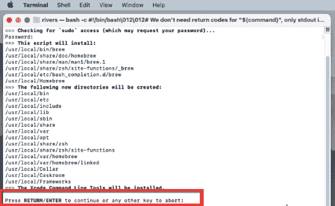
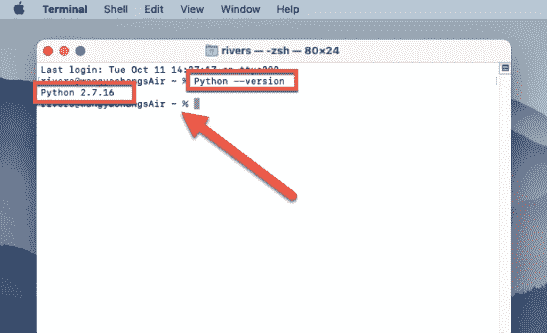

# 使用自制软件在 Mac 上安装 Python

> 原文：<https://www.pythoncentral.io/installing-python-on-mac-using-homebrew/>

Python 是一种广受欢迎的高级编程语言，因其可读性、简单性和灵活性而备受赞誉。世界各地的开发人员使用它来构建各种各样的应用程序，包括 web 应用程序、数据分析工具、科学模拟等等。

如果你是 Mac 用户，想要开始学习或使用 Python，你需要在你的电脑上安装它。在 Mac 上安装 Python 有几种不同的方法，但是使用自制软件是最简单和最方便的选择之一。

在本文中，我们将解释什么是家酿，如何在 Mac 上安装它，以及如何使用它来安装 Python。我们开始吧！

**什么是自制？**

家酿是一个命令行实用程序，允许您在 macOS 上安装和管理开源软件。它类似于 apt-get(用于 Ubuntu)或 yum(用于 CentOS)这样的包管理器。有了 Homebrew，你可以轻松地在 Mac 上安装包括 Python 在内的各种开源软件。

使用自制软件的一个好处是，它可以很容易地安装和管理同一软件的多个版本。例如，如果您正在处理一个需要旧版本 Python 的项目，您可以使用 Homebrew 安装该特定版本，而不会影响系统上默认安装的 Python 版本。

自制软件的另一个优点是它将软件安装在与系统其他部分分开的位置，这有助于避免冲突，保持系统整洁。

**如何用自制软件在 Mac 上安装 Python？**

在使用 Homebrew 安装 Python 之前，您需要安装 Homebrew 本身。以下是如何做到这一点:

第一步进入**发射台>其他>终端**启动终端 app。

第 2 步在终端窗口中运行以下命令，并按下 **return** 按钮，在 Mac 上安装 Homebrew:

**/bin/bash-c " $(curl-fsSL https://raw . githubusercontent . com/home brew/install/HEAD/install . sh)"**

第 3 步完成家酿安装，你将被提示输入您的管理员密码。要继续，只需输入并再次按下 **return** 即可。

步骤 4:推迟直到安装完成。程序的实时更新将显示在终端窗口中。

安装家酿后，最好对其进行更新，以确保您拥有最新版本。要更新 Homebrew，请在终端中运行以下命令:

**brew 更新**

就是这样！您现在已经成功地在 Mac 上安装了 Homebrew。你可以用自制软件在你的 Mac 上安装 Python。

步骤 5 在终端窗口运行 **brew install pyenv** 命令，在 Mac 上安装 pyenv。借助这个 PyEnv 实用程序，您可以在不同的 Python 版本之间切换。

步骤 6 设置 pyenv 后，使用 **pyenv install 3.11.1** 命令在 Mac 设备上安装 Python 3。(这里 3.11.1 是 Python 目前拥有的版本号。您可以用需要的版本号替换版本号。)

**如何检查 Python 是否成功安装在 Mac 上？**

有几种不同的方法可以检查 Python 是否成功安装在 Mac 上。一种方法是打开终端窗口，输入命令“ **Python - version** ”。这将显示您的系统上当前安装的 Python 版本。

检查 Mac 上是否安装了 Python 的另一种方法是使用 Finder 应用程序来搜索 Python 可执行文件。您可以打开 Finder，从菜单栏中选择“**转到**”，然后选择“**转到文件夹**”在“**转到文件夹**窗口中，输入“ **/usr/local/bin/python** ”，按下“**转到**”按钮。如果您的系统上安装了 Python，这将打开包含 Python 可执行文件的文件夹。如果文件夹不存在或收到错误消息，这意味着您的系统上没有安装 Python。

还可以通过在终端窗口中使用“python”命令启动交互式 Python 会话来检查您的 Mac 上是否安装了 Python。如果安装了 Python，这将打开一个 Python 提示符，您可以在其中输入 Python 命令。如果未安装 Python，您将会收到一条错误消息，指出找不到该命令。

**结束语**

使用 Homebrew 在 Mac 上安装 Python 是在您的系统上设置 Python 开发环境的一个简单过程。无论您是刚刚开始使用 Python，还是经验丰富的程序员，这种方法都可以帮助您快速入门并使用 Python。

通过使用 Homebrew 安装 Python，您可以利用其强大的包管理功能，轻松安装和管理多个版本的 Python，以及其他开源软件包。如果你打算在你的 Mac 上使用 Python，通过 Homebrew 安装它绝对值得考虑。