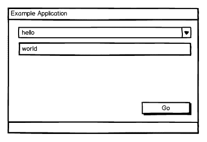

# Python GUI 开发概述(Hello World)

> 原文：<https://www.pythoncentral.io/introduction-python-gui-development/>

Python 非常适合各种跨平台应用程序的快速开发，包括桌面 GUI 应用程序。然而，在开始用 Python 开发 GUI 应用程序时，需要做出一些选择，本文提供了在正确的道路上出发所需的信息。我们将讨论 Python 有哪些重要的 GUI 工具包，它们的优点和缺点，并为每个工具包提供一个简单的演示应用程序。

## 演示“hello world”应用程序概述

这个演示应用程序很简单:一个包含组合框的窗口，显示“hello”、“goodbye”和“heyo”选项；可以在其中输入自由文本的文本框；以及一个按钮，当单击该按钮时，将打印由组合框和文本框的值组合而成的问候语，例如“Hello，world！”—到控制台。以下是示例应用程序的模型:



注意，这里讨论的所有工具包都适用于我们的简单应用程序的类似面向对象的方法；它是从顶级 GUI 对象(如应用程序、窗口或框架)继承的对象。应用程序窗口由一个垂直布局小部件填充，它管理控件小部件的排列。Python 的其他 GUI 工具包，如早已过时的 pyFLTK 或简单的 easygui，采用了不同的方法，但这里讨论的工具包代表了 Python GUI 库开发的主流。

我试图为每个工具包提供惯用的代码，但是我对其中的一些并不精通；如果我做了任何可能误导新开发人员的事情，请在评论中告诉我，我会尽最大努力更新示例。

## 选择 Python GUI 工具包

有几个工具包可用于 Python 中的 GUI 编程；有几个是好的，没有一个是完美的，它们是不等价的；有些情况下，一个或多个优秀的工具包并不合适。但是选择并不困难，对于许多应用程序来说，您选择的任何 GUI 工具包都可以工作。在下面的工具包部分中，我试图诚实地列出每种工具的缺点和优点，以帮助您做出明智的选择。

一个警告:网上可获得的许多信息——例如，在 [Python wiki 的 GUI 文章](https://wiki.python.org/moin/GuiProgramming)或 [Python 2.7 FAQ](https://docs.python.org/2/faq/gui.html) 中——都是过时的和误导的。这些页面上的许多工具包已经有五年或更长时间没有维护了，其他的则太不成熟或没有正式的使用记录。另外，*不要使用*我见过到处流传的选择你的 GUI 工具包页面；它的加权代码使得除了 wxPython 之外几乎不可能选择任何东西。

我们将看看四个最流行的 Python GUI 工具包:TkInter、wxPython、pyGTK/PyGobject 和 PyQt/PySide。

## TkInter

TkInter 是 Python GUI 世界的元老，几乎从 Python 语言诞生之日起，它就与 Python 一起发布了。它是跨平台的，无处不在的，稳定可靠，易于学习，它有一个面向对象的，出色的 Pythonic API，它可以与所有 Python 版本一起工作，但它也有一些缺点:

### 对主题化的有限支持

在 Python 2.7/3.1 之前，TkInter 不支持主题化，所以在每个平台上，它的定制窗口小部件看起来都像 1985 年左右的 Motif。从那以后，ttk 模块引入了主题窗口小部件，这在一定程度上改善了外观，但保留了一些非正统的控件，如 OptionMenus。

### 小部件精选

Tkinter 缺少其他工具包提供的一些小部件，比如非文本列表框、真正的组合框、滚动窗口等等。一些额外的控制由第三方提供，例如 Tix 来弥补不足。如果您考虑使用 TkInter，请提前模拟您的应用程序，并确保它可以提供您需要的所有控件，否则您可能会在以后受到伤害。

### Tkinter 中的演示应用程序/Hello World

```py

import Tkinter as tk
类示例 App(tk。frame):
' ' ' TkInter 的一个应用实例。实例化
并调用 run 方法运行。'
 def __init__(self，master): 
 #使用父级的构造函数
 tk.Frame 初始化窗口. __init__(self，
 master，
 width=300，
 height=200) 
 #设置标题
 self.master.title('TkInter 示例')
#这允许大小规范生效
 self.pack_propagate(0)
#我们将使用灵活的包装布局管理器
 self.pack()
#问候语选择器
 #使用 StringVar 访问选择器的值
 self.greeting_var = tk。string var()
self . greeting = tk。OptionMenu(self，
 self.greeting_var，
'你好'，
'再见'，
' heyo ')
self . greeting _ var . set('你好')
#收件人文本输入控件及其 string var
self . recipient _ var = tk。string var()
self . recipient = tk。Entry(self，
text variable = self . recipient _ var)
self . recipient _ var . set(' world ')
go 按钮
 self.go_button = tk。按钮(self，
 text='Go '，
 command=self.print_out)
#将控件放在表单
 self.go_button.pack(fill=tk。x，边=tk。BOTTOM)
self . greeting . pack(fill = tk。x，边=tk。TOP)
self . recipient . pack(fill = tk。x，边=tk。顶部)
def print_out(self): 
' ' '打印从用户
的选择中构造的
的问候语'【T3]打印(' %s，%s！'% (self.greeting_var.get()。title()，
self . recipient _ var . get())
def Run(self):
' ' '运行应用' ' ' '
 self.mainloop()
app = ExampleApp(tk。tk()
app . run()

```

## wxPython

**注意，在撰写本文时，wxPython 仅适用于 Python 2.x**

Python 的创始人吉多·范·罗苏姆这样评价 wxPython:

> wxPython 是最好、最成熟的跨平台 GUI 工具包，但有许多限制。wxPython 不是标准 Python GUI 工具包的唯一原因是 Tkinter 先出现了。

至少，他说过一次，很久以前；吉多·范·罗苏姆到底做了多少 GUI 编程呢？

无论如何，wxPython 确实有很多优点。它有大量的小部件，在 Windows、Linux 和 OS X 上的本地外观和感觉，以及足够大的用户群，至少那些明显的错误已经被发现了。它不包含在 Python 中，但是安装很容易，并且它适用于所有最新的 Python 2.x 版本；wxPython 可能是目前最流行的 Python GUI 库。

尽管它并不完美；它的文档非常糟糕，尽管这个示范性的演示应用程序本身就是无价的文档，但它却是你能得到的所有帮助。我个人觉得 API 不和谐，令人不快，但其他人不同意。尽管如此，你几乎不会在使用 wxPython 的项目中发现它不能做你需要的事情，这是对它的一个很大的推荐。

### wxPython 中的演示应用程序/Hello World

*   [Python 2.x](#custom-tab-0-python-2-x)

*   [Python 2.x](#)

[python]
import wx

class ExampleApp(wx。frame):
def _ _ init _ _(self):
#每个 wx 应用程序必须创建一个应用程序对象
#才能使用 wx 做任何其他事情。
self.app = wx。应用程序()

#设置主窗口
wx.Frame.__init__(self，
parent=None，
title='wxPython Example '，
size=(300，200))

#可用的问候语
self.greetings = ['hello '，' goodbye '，' heyo']

#布局面板和 hbox
self.panel = wx。Panel(self，size=(300，200))
self.box = wx。BoxSizer(wx。垂直)

# Greeting 组合框
self.greeting = wx。ComboBox(parent=self.panel，
value='hello '，
size=(280，-1)，
choices=self.greetings)

#将问候语组合添加到 hbox
self . box . Add(self . greeting，0，wx。TOP)
self.box.Add((-1，10))

#收件人条目
self.recipient = wx。TextCtrl(parent=self.panel，
size=(280，-1)，
value='world ')

#将问候语组合添加到 hbox
self . box . Add(self . recipient，0，wx。顶部)

#添加填充以降低按钮位置
self.box.Add((-1，100))

go 按钮
self.go_button = wx。按钮(self.panel，10，'& Go ')

#为按钮
自身绑定一个事件。绑定(wx。EVT _ 按钮，自我.打印 _ 结果，自我.去 _ 按钮)

#使按钮成为表单
self.go_button 的默认动作。SetDefault()

#将按钮添加到 hbox
self . box . Add(self . go _ button，0，flag=wx。ALIGN_RIGHT|wx。底部)

#告诉小组使用 hbox
self . panel . set sizer(self . box)

def print_result(self，*args):
' ' '打印从
用户所做的选择中构造的问候语'
打印(' %s，%s！'% (self.greeting.GetValue()。title()，
self.recipient.GetValue()))

def run(self):
' ' '运行 app ' '
self。Show()
self.app.MainLoop()

#实例化并运行
app = example app()
app . run()
[/python]

## pyGTK/pyGobject

pyGTK 是一个基于 [GTK+](https://www.gtk.org/ "Official GTK+ website") 的跨平台小部件工具包，GTK+ 是一个广泛使用的 GUI 工具包，最初是为图像处理程序 [GIMP](https://www.gimp.org/ "Official GIMP website") 开发的。pyGobject 是 pyGTK 的新版本，它使用 Gobject 内省并支持 GTK3 的特性。这两个版本的 API 密切相关，它们的功能和缺点也相似，因此对于我们的目的来说，可以将它们视为一体。pyGTK 的开发者推荐使用 pyGobject 进行新的开发。

pyGTK 只在 Windows 和 Linux 上使用本地小部件。虽然 GTK+支持本地窗口部件和 OS X 窗口，但 pyGTK 仍在开发中；目前，它在 Mac 上的外观和感觉模仿了 Linux。然而，小部件是主题化的，有大量非常吸引人的主题。pyGTK 在 Python 2.x 上也是最成功的；新版本开始支持 Python 3，但并不完整，尤其是在 Windows 上。安装 Windows 以前需要从不同的来源下载多个软件包，但最近一体化的二进制安装程序已经可用。

从积极的一面来看，pyGTK 是稳定的，经过良好的测试，并有一个完整的小部件选择。它还有出色的文档，如果你喜欢这类东西，还有一个出色的可视化 GUI 生成器，叫做 [Glade](https://glade.gnome.org/ "Glade - GTK+ user interface designer") 。它的 API 简单明了，大部分都很简单，只有少数例外，并且有相当好的示例代码。pyGTK 的底线是:它是一个可靠且功能强大的 GUI 工具包，但存在跨平台不一致的问题，并且不如其他同样优秀的替代产品受欢迎。

关于选择 pyGTK 的一个特别注意事项:如果你的应用程序涉及各种简单的、基于文本的列表框，pyGTK 的设计将会引起问题。与其他工具包相比，它严格的关注点分离和模型-视图-控制器划分使得列表框的开发异常复杂。当我刚接触 Python GUI 开发时，没有注意到这一点使我在一个重要的项目上落后了很多。

### pyGTK/pyGobject 中的演示应用程序/Hello World

```py

import gtk
class ExampleApp(gtk。window):
' ' ' pyGTK 的一个示例应用。实例化
并调用 run 方法运行。'
 def __init__(self): 
 #初始化窗口
GTK . window . _ _ init _ _(self)
self . set _ title(' pyGTK Example ')
self . set _ size _ request(300，200) 
 self.connect('destroy '，gtk.main_quit)
#垂直构造布局
 self.vbox = gtk。VBox()
#问候语选择器-注意使用便利的
 # type ComboBoxText 如果可用，否则便利的
 # function combo_box_new_text，后者已被弃用
 if (gtk.gtk_version[1] > 24 或
 (gtk.gtk_version[1] == 24 和 GTK . GTK _ version[2]>10)):
self . greeting = GTK。combobox text()
else:
self . greeting = gtk . combo _ box _ new _ text()
#修复方法名以匹配 GTK。combobox text
self . greeting . append = self . greeting . append _ text
#添加问候语
地图(self.greeting.append，['hello '，' goodbye '，' heyo'])
#收件人文本输入控件
 self.recipient = gtk。entry()
self . recipient . set _ text(' world ')
go 按钮
 self.go_button = gtk。按钮(' _Go') 
 #连接 Go 按钮的回调
self . Go _ button . Connect(' clicked '，self.print_out)
#将控件置于垂直布局
self . vbox . pack _ start(self . greeting，False)
self . vbox . pack _ start(self . recipient，False)
self . vbox . pack _ end(self . go _ button，False)
#将垂直布局添加到主窗口
 self.add(self.vbox)
def print_out(self，*args): 
' ' '打印从
用户所做的选择中构造的问候语'
打印(' %s，%s！'%(self . greeting . get _ active _ text()。title()，
self . recipient . get _ text())
def Run(self):
' ' '运行 app'
 self.show_all() 
 gtk.main()
app = example app()
app . run()

```

## PyQt/PySide

Qt 不仅仅是一个小部件工具包；它是一个跨平台的应用程序框架。PyQt，它的 Python 接口，已经存在好几年了，而且稳定成熟；随着 API 1 和 API 2 这两个可用 API 的出现，以及大量不推荐使用的特性，它在过去几年中已经有了一些改进。此外，即使 Qt 可以在 LGPL 下获得，PyQt 也是在 GNU GPL 版本 2 和 3 或相当昂贵的商业版本下获得许可的，这限制了您对代码的许可选择。

PySide 是对 PyQt 弊端的回应。它是在 LGPL 下发布的，省略了 PyQt 4.5 之前的所有不推荐使用的特性以及整个 API 1，但在其他方面几乎与 PyQt API 2 完全兼容。它比 PyQt 稍不成熟，但开发得更积极。

无论您选择哪种包装器，Python 和 Qt 都能完美地配合工作。更现代的 API 2 是相当 Pythonic 化和清晰的，有非常好的文档可用(尽管它的根源在 C++ Qt 文档中是显而易见的)，并且产生的应用程序在最近的版本中看起来很棒，如果不是非常原生的话。这里有您可能想要的每一个 GUI 小部件，Qt 提供了更多——处理 XML、多媒体、数据库集成和网络的有趣类——尽管对于大多数额外的功能，您可能最好使用等效的 Python 库。

使用 Qt 包装器的最大缺点是底层 Qt 框架非常庞大。如果您的可分发包很小对您很重要，那么选择 TkInter，它不仅很小，而且已经是 Python 的一部分。此外，虽然 Qt 使用操作系统 API 来使其小部件适应您的环境，但并不是所有的部件都是严格的原生部件；如果原生外观是您的主要考虑因素，wxPython 将是更好的选择。但是 PyQt 有很多优点，当然值得考虑。

### PyQt/PySide 的演示应用程序/Hello World

注意:对于 Qt，我用过 PySide 示例代码将使用 PyQt 运行，只有几行不同。

```py

import sys

from PySide.QtCore import *

from PySide.QtGui import *
class ExampleApp(QDialog): 
' ' '一个 PyQt 的示例应用。实例化
并调用 run 方法运行。'
 def __init__(self): 
 #创建一个 Qt 应用程序——每个 PyQt 应用程序都需要一个
self . Qt _ app = QA application(sys . argv)
#可用的问候语
 self.greetings = ['hello '，' goodbye '，' heyo']
#调用当前对象上的父构造函数
 QDialog。__init__(自身，无)
#设置窗口
 self.setWindowTitle('PyQt 示例')
 self.setMinimumSize(300，200)
#添加垂直布局
 self.vbox = QVBoxLayout()
#问候语组合框
self . greeting = QComboBox(self)
#添加问候语
列表(map(self.greeting.addItem，self.greetings))
#收件人文本框
self . recipient = QLineEdit(' world '，self)
# Go 按钮
self . Go _ button = q push button(&Go ')
#将 Go 按钮连接到其回调
self . Go _ button . clicked . Connect(self . print _ out)
#将控件添加到垂直布局中
self . vbox . Add widget(self . greeting)
self . vbox . Add widget(self . recipient)
#一个非常有弹性的间隔符，用于将按钮压到底部
self . vbox . Add stretch(100)
self . vbox . Add widget(self . go _ button)
#使用当前窗口的垂直布局
 self.setLayout(self.vbox)
def print_out(self): 
' ' '打印由用户选择的
构建的问候语'
打印(' %s，%s！'%(self . greetings[self . greeting . current index()]。title()，
 self.recipient.displayText()))
def run(self): 
' ' '运行应用程序并显示主窗体'
self . show()
self . Qt _ app . exec _()
app = example app()
app . run()

```