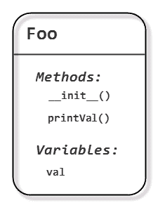
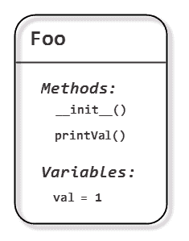
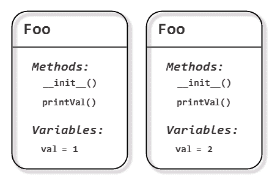

# Python 类简介(第 1 部分，共 2 部分)

> 原文：<https://www.pythoncentral.io/introduction-to-python-classes/>

*类*是一种将相关信息组合成一个单元的方式(也称为*对象*，以及可以被调用来操作该对象的函数(也称为*方法*)。例如，如果您想跟踪一个人的信息，您可能想记录他们的姓名、地址和电话号码，并且能够将所有这些作为一个单元来操作。

Python 有一种稍微特殊的处理类的方式，所以即使你熟悉像 C++或 Java 这样的面向对象的语言，深入研究 Python 类仍然是值得的，因为有一些东西是不同的。

在我们开始之前，理解类和对象之间的区别是很重要的。一个类仅仅是对事物应该是什么样子，什么变量将被分组在一起，以及什么函数可以被调用来操纵这些变量的描述。使用这个描述，Python 可以创建这个类的许多实例(或*对象*)，然后可以独立操作这些实例。把一个类想象成一个 cookie cutter——它本身并不是一个 cookie，但是它描述了一个 cookie 的样子，可以用来创建许多单独的 cookie，每个 cookie 都可以单独食用。好吃！

## **定义一个 Python 类**

让我们从定义一个简单的类开始:

```py

class Foo:

def __init__(self, val):

self.val = val

def printVal(self):

print(self.val)

```

这个类被称为`Foo`，像往常一样，我们使用缩进来告诉 Python 类定义在哪里开始和结束。在这个例子中，类定义由两个函数定义(或者说*方法*)组成，一个叫做`__init__`，另一个叫做`printVal`。还有一个成员变量，没有明确定义，但我们将在下面解释它是如何创建的。



The diagram shows what the class definition looks like - 2 methods and 1 member variable. Using this definition, we can then create many instances of the class.

可以看到这两种方法都采用了一个名为`self`的参数。它没有*有*可以被称为`self`，但这是 Python 的惯例，虽然你可以称它为`this`或`me`或其他什么，但如果你称它为`self`之外的任何东西，你会惹恼其他 Python 程序员，他们将来可能会看你的代码。因为我们可以创建一个类的许多实例，当调用一个类方法时，它需要知道它正在处理哪个实例，这就是 Python 将通过`self`参数传入的内容。

`__init__`是一个特殊的方法，每当 Python 创建一个新的类实例(即使用 cookie cutter 创建一个新的 cookie)时，都会调用这个方法。在我们的例子中，它接受一个名为`val`的参数(而不是强制 self ),并在一个成员变量中复制一个参数，也称为`val`。与其他语言不同，在其他语言中，变量必须在使用前定义，Python 在第一次赋值时动态创建变量，类成员变量也不例外。为了区分作为参数传入的`val`变量和`val`类成员变量，我们给后者加上了 self 前缀。所以，在下面的语句中:

```py

self.val = val

```

`self.val`指的是属于调用方法的类实例的 val 成员变量，而`val`指的是传递给方法的参数。

这有点令人困惑，所以让我们来看一个例子:

```py

obj1 = Foo(1)

```

这将创建我们类的一个实例(即使用 cookie cutter 创建一个新的 cookie)。Python 自动为我们调用`__init__`方法，传入我们指定的值(`1`)。所以，我们得到了其中的一个:

[](https://www.pythoncentral.io/wp-content/uploads/2012/08/2.png)

我们再创建一个:
【python】
obj 2 = Foo(2)

除了将`2`传递给`__init__`方法之外，会发生完全相同的事情。

我们现在有两个独立的对象，val 成员变量有不同的值:

[](https://www.pythoncentral.io/wp-content/uploads/2012/08/3.png)

如果我们为第一个对象调用`printVal`，它将打印出其成员变量的值:

```py

>>> obj1.printVal()

1

```

如果我们为第二个对象调用`printVal`，它将打印出*的值，它的*成员变量:

```py

>>> obj2.printVal()

2

```

### **标准 Python 类方法**

Python 类有许多标准方法，比如我们在上面看到的`__init__`，当类的一个新实例被创建时，它会被调用。以下是一些比较常用的方法:

*   `__del__`:当一个实例将要被销毁时调用，这允许你做任何清理工作，例如关闭文件句柄或数据库连接
*   `__repr__`和`__str__`:都返回对象的字符串表示，但是`__repr__`应该返回一个 Python 表达式，可以用来重新创建对象。比较常用的是`__str__`，可以返回任何东西。
*   `__cmp__`:调用比较对象与另一个对象。注意，这只在 Python 2.x 中使用，在 Python 3.x 中，只使用了*丰富的比较方法*。比如`__lt__`。
*   `__lt__`、`__le__`、`__eq__`、`__ne__`、`__gt__`、`__ge__`:调用将一个对象与另一个对象进行比较。如果定义了这些函数，它们将被调用，否则 Python 将退回到使用`__cmp__`。
*   `__hash__`:调用计算对象的散列，用于将对象放置在数据结构中，如集合和字典。
*   `__call__`:让一个对象被“调用”，例如，你可以这样写:`obj(arg1,arg2,...)`。

Python 还允许你定义方法，让一个对象表现得像一个数组(所以你可以这样写:`obj[2] = "foo"`)，或者像一个数字类型(所以你可以这样写:`print(obj1 + 3*obj2)`)。

### **Python 类示例**

下面是一个简单的实例，这个类模拟了一副扑克牌中的一张牌。

*   [Python 3.x](#custom-tab-0-python-3-x)
*   [Python 2.x](#custom-tab-0-python-2-x)

*   [Python 3.x](#)

[python]
class Card:
# Define the suits
DIAMONDS = 1
CLUBS = 2
HEARTS = 3
SPADES = 4
SUITS = {
CLUBS: 'Clubs',
HEARTS: 'Hearts',
DIAMONDS: 'Diamonds',
SPADES: 'Spades'
}

#定义特殊牌的名称
值= {
1: 'Ace '，
11: 'Jack '，
12: 'Queen '，
13: 'King'
}

def __init__(self，suit，value):
#保存花色和卡值
self.suit =花色
self.value =值

def __lt__(self，other):
#将该卡与另一张卡进行比较
#(如果我们较小，则返回 True；如果
较大，则返回 false；如果我们相同，则返回 0)
如果 self.suit < other.suit:
返回 True
elif self . suit>other . suit:
返回 False

if self.value < other.value:
返回 True
elif self . value>other . value:
返回 False

返回 0

def __str__(self):
#如果 self.value 在 self 中，则返回 self 的字符串描述
。值:
buf = self。VALUES[self . value]
else:
buf = str(self . value)
buf = buf+' of '+self。套装

return buf
[/python]

*   [Python 2.x](#)

[python]
class Card:
# Define the suits
DIAMONDS = 1
CLUBS = 2
HEARTS = 3
SPADES = 4
SUITS = {
CLUBS: 'Clubs',
HEARTS: 'Hearts',
DIAMONDS: 'Diamonds',
SPADES: 'Spades'
}

#定义特殊牌的名称
值= {
1: 'Ace '，
11: 'Jack '，
12: 'Queen '，
13: 'King'
}

def __init__(self，suit，value):
#保存花色和卡值
self.suit =花色
self.value =值

def __cmp__(self，other):
#将该牌与另一张牌进行比较
#(如果我们较小则返回< 0，>如果
较大则返回> 0，如果我们相同则返回 0)
如果 self . suit<other . suit:
return-1
elif self . suit>other . suit:
return 1
elif self . value<other . value:
return-1
Eli

def __str__(self):
#如果 self.value 在 self 中，则返回 self 的字符串描述
。值:
buf = self。VALUES[self . value]
else:
buf = str(self . value)
buf = buf+' of '+self。套装

return buf
[/python]

我们首先定义一些类常量来表示每种服装，并定义一个查找表，以便于将它们转换成每种服装的名称。我们还为特殊牌(a、j、q 和 k)的名称定义了一个查找表。

构造函数或`__init__`方法接受两个参数，suit 和 value，并将它们存储在成员变量中。

每当 Python 想要将一个`Card`对象与其他对象进行比较时，就会调用特殊的 __cmp__ 方法。约定是，如果一个对象小于另一个对象，则该方法应该返回负值，如果大于另一个对象，则返回正值，如果两者相同，则返回零。注意，传入进行比较的另一个对象可以是任何类型，但是为了简单起见，我们假设它也是一个`Card`对象。

每当 Python 想要打印出一个`Card`对象时，就会调用特殊的`__str__`方法，因此我们返回一个人类可读的卡片表示。

下面是实际运行的类:

```py

>>> card1 = Card(Card.SPADES, 2)

>>> print(card1)

2 of Spades

>>> card2 = Card(Card.CLUBS, 12)

>>> print(card2)

Queen of Clubs

>>> print(card1 > card2)

True

```

注意，如果我们没有定义一个自定义的`__str__`方法，Python 将会给出自己的对象表示，如下所示:

```py

<__main__.Card instance at 0x017CD9B8>

```

所以，你可以明白为什么总是提供你自己的`__str__`方法是个好主意。🙂

### **私有 Python 类方法和成员变量**

在 Python 中，方法和成员变量总是公共的，即任何人都可以访问它们。这对于*封装*来说不是很好(类方法应该是唯一可以改变成员变量的地方，以确保一切都保持正确和一致)，所以 Python 有一个约定，以下划线开头的类方法或变量应该被认为是私有的。然而，这只是一个惯例，所以如果你真的想在课堂上胡闹，你可以，但是如果事情发生了，你只能怪你自己！

以*两个*下划线开头的类方法和变量名被认为是该类的私有*，即一个派生类可以定义一个相似命名的方法或变量，它不会干扰任何其他定义。同样，这仅仅是一个约定，所以如果你决定要查看另一个类的私有部分，你可以这样做，但是这样可以防止名字冲突。*

我们可以利用 Python 类的“一切都是公共的”特性来创建一个简单的数据结构，将几个变量组合在一起(类似于 C++ POD 或 Java POJO):

```py

class Person

# An empty class definition

pass

```

```py

>>> someone = Person()

>>> someone.name = 'John Doe'

>>> someone.address = '1 High Street'

>>> someone.phone = '555-1234'

```

我们创建一个空的类定义，然后利用 Python 会在首次分配成员变量时自动创建成员变量这一事实。