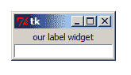
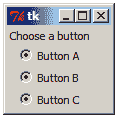
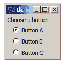

# Python 的 TkInter 介绍

> 原文：<https://www.pythoncentral.io/introduction-to-pythons-tkinter/>

在 Python 体验的某个阶段，您可能想要创建一个具有图形用户界面或 GUI(大多数人发音为“gooey”)的程序。有许多针对 Python 的工具包可以实现这一点，包括 Python 自己的原生 GUI 库 TkInter。在 Tkinter 中设置 GUI 并不复杂，尽管最终取决于您自己设计的复杂性。在这里，我们将通过一些简单的 GUI 示例来看看 Tkinter 模块的常用部分。在进入示例之前，让我们简要介绍一下 Tkinter 库必须提供的常用小部件(GUI 的构建块)。

简而言之，Tkinter 的所有小部件要么向 GUI 提供简单的输入(用户输入),要么从 GUI 输出(信息的图形显示),或者两者兼而有之。下面是最常用的输入和输出小部件的两个表格，并附有简要描述。

常用于输入的 Tkinter 小部件:

| **小工具** | **描述** |
| 进入 | 入口小部件是最基本的文本框，通常是一个单行高的字段，用户可以在其中键入文本；不允许太多格式 |
| 文本 | 让用户输入多行文本，并存储文本；提供格式选项(样式和属性) |
| 纽扣 | 用户告诉 GUI 执行命令的基本方法，例如对话框中的“确定”或“取消” |
| 单选按钮 | 让用户从列表中选择一个选项 |
| 复选按钮 | 允许用户从列表中选择多个选项 |

常用于输出的 Tkinter 小部件:

| **小工具** | **描述** |
| 标签 | 通过文本或图像显示信息的最基本方式 |
| 照片图像/位图图像 | 这些更像是类对象，而不是真正的小部件，因为它们必须与标签或其他显示小部件结合使用；它们分别显示图像和位图 |
| 列表框 | 显示文本项列表，用户可以从中突出显示一个(或多个，具体取决于配置) |
| 菜单 | 为用户提供菜单 |

尽管上面的小部件被分为“输入”和“输出”两类，但实际上它们都是双重的输入和输出，尤其是当回调(或事件绑定)开始起作用的时候。我们稍后将进一步研究回调和事件绑定，现在我们将看看上面应用程序中列出的一些小部件的例子。

要使用 Tkinter 模块，我们必须将其导入到我们的全局名称空间中。这通常是通过这样的语句来实现的:

*   [Python 3.x](#custom-tab-0-python-3-x)
*   [Python 2.x](#custom-tab-0-python-2-x)
*   [Python 3.x](#custom-tab-0-python-3-x)
*   [Python 2.x](#custom-tab-0-python-2-x)

*   [Python 3.x](#)

[python]from tkinter import *[/python]

*   [Python 2.x](#)

[python]from Tkinter import *[/python]

但是，为了保持名称空间的整洁，最好不要这样做。相反，我们将使用这种形式:

*   [Python 3.x](#)

[python]import tkinter as tk[/python]

*   [Python 2.x](#)

[python]import Tkinter as tk[/python]

这使我们能够访问模块，而不必每次都键入完整的模块名。当我们引用它时，你可以看到这一点:

```py

>>> tk

<module 'Tkinter' from 'C:\Python27\lib\lib-tk\Tkinter.pyc'>

```

好了，我们现在准备好制作我们的 GUI 了——但是在此之前，让我们简单地想象一下我们希望它是什么样子，并检查一下内部 GUI 结构。现在我们将保持我们的设计简单，一个输出部件和一个输入部件——一个`Label`部件和一个`Entry`部件。

每个 Tkinter 小部件都由另一个被称为“父”的小部件管理或属于另一个小部件(属于另一个小部件的小部件被称为该小部件的“子部件”)。GUI 中唯一没有父窗口的小部件是主(或根)窗口。所有其他小部件都应该是根窗口的子窗口。此外，小部件通常物理上位于其父部件内部。这是基本结构。现在让我们开始建立我们的。第一步是创建我们的根窗口:

```py
root1 = tk.Tk()
```

Tkinter Tk 对象是我们的根窗口，我们可以用子窗口填充它。首先是我们的标签。

```py

label = tk.Label(root1, text='our label widget')

```

很快，我们有了一个标签。我们使用的第一个参数是父节点的名称(`root1`)。第二个参数是标签的标准关键字选项，用于设置它将显示的文本(如果有的话)。

接下来，我们初始化我们的输入小部件，条目:

```py

entry = tk.Entry(root1)

```

初始化标签和条目小部件并设置好我们想要的选项后，剩下的就是告诉 Tkinter 将它们放在屏幕上它们的父窗口中。尽管我们设置了父类和选项，但是除非我们明确地告诉 Tkinter 显示它们，否则我们的小部件不会显示。

为了顺利处理这个过程，Tkinter 提供了一些内置的图形组织者，称为几何管理器。下表描述了每个可用的几何管理器。

| **几何图形管理器** | **描述** |
| 包装 | 用于用小部件填充父级空间 |
| 格子 | 将它管理的小部件放在父网格中。每个小部件在网格中都有自己的盒子或单元格(T0 )( T1 ),尽管它们可以通过一些选项覆盖多个 T2 单元格(T3) |
| 地方 | 允许明确设置窗口的大小和位置；主要用于实现自定义窗口布局，而不是普通布局 |

正如我们从第三个管理器的描述中看到的，pack 和 grid 管理器是用于常规公共布局的管理器，我们将在这个 GUI 中使用 pack。我们希望我们的标签在条目的顶部，所以我们将首先打包它，并使用一个选项将其设置在顶部，然后再打包条目(它将自动显示在标签下方):

```py

label.pack(side=tk.TOP)

entry.pack()

```

搞定了。现在可以看到我们的小部件了。然而，您会注意到，如果您处于 Python 2.7 空闲状态，还没有 GUI 出现。就像任何其他小部件一样，必须告诉 Tkinter 显示根窗口，但是对于根窗口而不是几何管理器，必须调用主 Tk 循环，如下所示:

```py

root1.mainloop()

```

现在我们应该可以看到一个新窗口，看起来像这样...



这可能会因您的设置/环境而有所不同，但不会相差太多。有了输入框，我们可以在窗口中键入我们想要的任意多的文本，尽管它不会做任何事情，只是呆在那里，因为我们没有让它做任何其他事情(即使我们点击“Enter”，标签也是一样)。

让我们关闭这个窗口，看一个有更多小部件的例子。我们还将快速了解一下事件绑定和网格管理器。请注意，在我们关闭 GUI 后，我们的根窗口及其所有子窗口将变得不可用，如果您尝试再次启动 *root1* 的主循环，或者尝试更改 *label* 的配置，您会发现这一点。

对于我们的第二个 GUI，我们将有一个标签和 3 个单选按钮。我们将像以前一样从根窗口开始，然后初始化标签:

```py

root2 = tk.Tk()

label2 = tk.Label(root2, text='Choose a button')

```

我们现在有了根窗口和标签，但是在初始化 Radiobutton 之前，我们将创建一个 Tkinter 变量对象来跟踪每个 radio button 保存的值:

```py

# Object of the Tkinter StringVar class

buttonstr = tk.StringVar()

```

现在我们将创建三个单选按钮，并将它们的值连接到我们的 buttonstr 变量:

```py

buttonA = tk.Radiobutton(root2, text='Button A', variable=buttonstr, value='ButtonA string')

buttonB = tk.Radiobutton(root2, text='Button B', variable=buttonstr, value='ButtonB string')

buttonC = tk.Radiobutton(root2, text='Button C', variable=buttonstr, value='ButtonC string')

```

创建了 Radiobuttons 后，我们现在将检查当我们使用回调将方法连接到每个 Radiobuttons 时会发生什么。回调用于告诉 GUI 在小部件激活时执行一些命令或动作。我们将使用回调来打印每个单选按钮被选中时的值:

```py

def showstr(event=None):

    print(buttonstr.get())

```

我们刚刚定义的这个函数只不过是打印使用 get()方法访问的 StringVar 的值。我们现在可以通过使用`command`选项在 Radiobuttons 中引用这个函数作为回调:

```py

buttonA.config(command=showstr)

buttonB.config(command=showstr)

buttonC.config(command=showstr)

```

好了，现在我们所有的小部件都初始化了，我们将设置它们在网格管理器中显示:

```py

label2.grid(column=0, row=0)

buttonA.grid(column=0, row=1)

buttonB.grid(column=0, row=2)

buttonC.grid(column=0, row=3)

```

我们使用选项`column`和`row`告诉 grid 小部件的确切位置，但是如果我们不这样做，grid 会以默认顺序显示它们(列是零)。事不宜迟，我们现在将运行我们的 GUI。

```py

root2.mainloop()

```

它应该是这样的:



**注意:**在我们选择一个单选按钮之前，似乎所有的单选按钮都被选择了——这仅仅是因为我们没有用 select()方法选择一个默认的单选按钮。如果我们在第一个按钮上使用这个方法，它将显示如下:

```py

buttonA.select()

root2.mainloop()

```



现在，如果我们选择任何一个单选按钮(例如，`A`然后`C`然后`B`，那么我们应该会看到每个按钮的回调结果:

```py

>>> root2.mainloop()

ButtonA string

ButtonC string

ButtonB string

```

除了用于将功能链接到窗口小部件的命令选项的回调之外，事件绑定可用于将某些用户“事件”(例如击键和鼠标点击)链接到缺少*命令*选项的窗口小部件。让我们用我们的第一个 GUI 例子来尝试一下。在所有其他设置都相同的情况下，就在打包输入框之后和启动 *root1* 主循环之前，我们将为“Enter”键设置一个事件绑定，这样如果按下它，输入框中的文本将被打印到空闲窗口。我们首先需要一种方法来完成这项工作:

```py

# Prints the entry text

def showentry(event):

    print(entry.get())

```

现在我们有了显示条目文本的方法，我们必须绑定事件(当用户点击“Enter”键且输入框处于焦点时):

```py

>>> entry.bind('<Return>', showentry)

'29748480showentry'

```

在这一行中，我们使用了`bind`方法(每个小部件都可以使用)来连接我们的键盘事件(第一个参数)和我们的方法(第二个参数)。还要注意，对于`return`键，我们的事件名称是，而不是，因为这标志着 Tkinter 中完全不同类型的事件。我们可以忽略返回的函数名后面的短数字串，这对我们来说没有任何特殊意义。

如果我们现在运行根窗口的主循环，在我们的输入框中键入一些文本，并点击`Enter`键，Python 将显示我们键入的内容(试试看！).同样的功能可以用于 Tkinter GUI 中的任何小部件，并且可以用`bind_all`和`bind_class`方法同时绑定多个小部件。以同样的方式不受`unbind`、`unbind_all`和`unbind_class`方法的约束。

这就结束了我们对 Python Tkinter 库的介绍——它提供的工具与其他可用的第三方包相比是基本的，但是不要害怕使用它来发挥创造力！