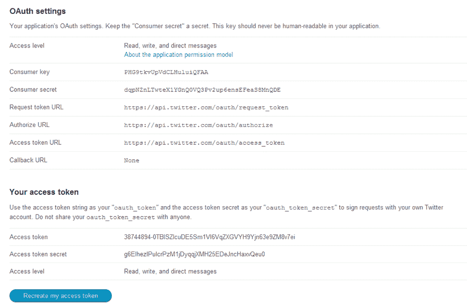

# Tweepy 简介，用于 Python 的 Twitter

> 原文：<https://www.pythoncentral.io/introduction-to-tweepy-twitter-for-python/>

Python 对于各种事物来说都是很棒的语言。非常活跃的开发人员社区创建了许多库，这些库扩展了语言并使使用各种服务变得更加容易。其中一个图书馆是 tweepy。Tweepy 是开源的，托管在 [GitHub](https://github.com/tweepy/tweepy "Tweepy - Twitter for Python") 上，支持 Python 与 Twitter 平台通信并使用其 API。关于库 Twython - [的介绍，请查看本文](https://www.pythoncentral.io/how-to-use-the-twython-twitter-python-library/ "How to Use the Twython Python library")。

在撰写本文时，tweepy 的当前版本是 1.13。它于 1 月 17 日发布，与前一版本相比，提供了各种错误修复和新功能。2.x 版本正在开发中，但是目前还不稳定，所以大多数用户应该使用普通版本。

**安装 tweepy 很简单，可以从 Github 库克隆:**

```py

git clone https://github.com/tweepy/tweepy.git

python setup.py install

```

或者使用简易安装:

```py

pip install tweepy

```

这两种方式都为您提供了最新的版本。

## **使用 Tweepy**

Tweepy 支持通过基本认证和更新的方法 OAuth 访问 Twitter。Twitter 已经停止接受基本认证，所以 OAuth 现在是使用 Twitter API 的唯一方式。

**下面是如何使用 tweepy 和 OAuth 访问 Twitter API 的示例:**

```py

import tweepy
#消费密钥和访问令牌，用于 OAuth
Consumer _ key = ' 7 eyztcakinvs 3 T2 Pb 165 '
Consumer _ secret = ' a 44 r 7 wvbmw7 l 8 I 656y 4 l '
access _ token = ' z 00 xy 9 akhwp 8 vstj 04 l 0 '
access _ token _ secret = ' a1ck 98 w 2 nxxacmqmw 6 p '
# OAuth 进程，使用密钥和令牌
 auth = tweepy。OAuthHandler(消费者密钥，消费者秘密)
 auth.set_access_token(访问令牌，访问令牌 _ 秘密)
#使用认证创建实际接口
 api = tweepy。API(授权)
# Sample 方法，用于更新状态
API . update _ status(' Hello Python Central！')

```

这段代码的结果如下:


基本身份验证和 OAuth 身份验证的主要区别在于消费者和访问密钥。使用基本认证，可以提供用户名和密码并访问 API，但自从 2010 年 Twitter 开始要求 OAuth 以来，这个过程变得有点复杂。必须在[developer.twitter.com](https://developer.twitter.com/en "Twitter for Developers")创建一个应用程序。

最初，OAuth 比基本 Auth 要复杂一些，因为它需要更多的努力，但是它提供的好处是非常有利可图的:

*   Tweets 可以被定制为一个字符串来标识所使用的应用程序。
*   它不会泄露用户密码，使其更加安全。
*   管理权限更容易，例如，可以生成一组令牌和密钥，只允许从时间线读取，因此，如果有人获得这些凭据，他/她将无法编写或发送直接消息，从而将风险降至最低。
*   应用程序不回复密码，所以即使用户更改了密码，应用程序仍然可以工作。

登录到门户网站后，转到“应用程序”，可以创建一个新的应用程序，它将提供与 Twitter API 通信所需的数据。



这是一个拥有与 Twitter 网络对话所需的所有数据的屏幕。需要注意的是，默认情况下，应用程序没有访问直接消息的权限，因此，通过进入设置，将适当的选项更改为“读取、写入和直接消息”，您可以使您的应用程序能够访问每一个 Twitter 功能。

### **Twitter API**

Tweepy 提供了对记录良好的 Twitter API 的访问。使用 tweepy，可以获得任何对象并使用官方 Twitter API 提供的任何方法。例如，`User`对象有自己的文档，遵循这些指导方针，tweepy 可以获得适当的信息。

Twitter API 中的类有`Tweets`、`Users`、`Entities`和`Places`。访问每一个都会返回一个 JSON 格式的响应，在 Python 中遍历信息非常容易。

```py

# Creates the user object. The me() method returns the user whose authentication keys were used.

user = api.me()
print(' Name:'+user . Name)
print(' Location:'+user . Location)
print(' Friends:'+str(user . Friends _ count))

```

为我们提供了以下输出:

```py

Name: Ahmet Novalic

Location: Gradacac,Bih

Friends: 59

```

这里记录了所有的 API 方法:[https://docs.tweepy.org/en/stable/](https://docs.tweepy.org/en/stable/ "Tweepy API Documentation")

### **Tweepy StreamingAPI**

tweepy 的一个主要使用案例是监控 tweepy 并在事件发生时采取行动。其中的关键组件是`StreamListener`对象，它实时监控并捕捉推文。

`StreamListener`有几种方法，其中`on_data()`和`on_status()`是最有用的。下面是一个实现此行为的示例程序:

```py

class StdOutListener(StreamListener):

''' Handles data received from the stream. '''
def on_status(self，status): 
 #打印推文的文本
 print('推文文本:'+ status.text)
#状态对象中有许多选项，
 #标签可以非常容易地访问。
对于 status . entries[' hash tags ']:
print(hash tag[' text '])
返回 true
def on_error(self，status _ code):
print(' get a error with status code:'+str(status _ code))
返回 True #继续监听
def on_timeout(self): 
打印(' timeout ... ')
返回 True #继续收听
if _ _ name _ _ = = ' _ _ main _ _ ':
listener = StdOutListener()
auth = tweepy。OAuthHandler(消费者密钥，消费者秘密)
 auth.set_access_token(访问令牌，访问令牌 _ 秘密)
stream = Stream(auth，listener)
Stream . filter(follow =[38744894]，track=['#pythoncentral']) 

```

因此，这个程序实现了一个`StreamListener`,代码被设置为使用 OAuth。创建了`Stream`对象，它使用该侦听器作为输出。作为 tweepy 中的另一个重要对象，Stream 也有许多方法，在本例中，`filter()`通过传递参数来使用。“follow”是其推文被监控的关注者列表，“track”是触发`StreamListener`的标签列表。

在这个例子中，我们使用我的用户 ID follow 和#pythoncentral hashtag 作为条件。运行程序并发布此状态后:


程序几乎立即捕捉到 tweet，并调用`on_status()`方法，该方法在控制台中产生以下输出:

```py

Tweet text: Hello Again! #pythoncentral

pythoncentral

```

除了打印 tweet 之外，在`on_status()`方法中，还有一些额外的事情说明了 tweet 数据可以实现的可能性:

```py

# There are many options in the status object,

# hashtags can be very easily accessed.

for hashtag in status.entities['hashtags']:

print(hashtag['text'])

```

这段代码遍历实体，选择“标签”,对于 tweet 包含的每个标签，它打印其值。这只是一个样本；tweet 实体的完整列表位于此处:[https://developer . Twitter . com/en/docs/Twitter-API/data-dictionary/object-model/tweet](https://developer.twitter.com/en/docs/twitter-api/data-dictionary/object-model/tweet "Tweet Entities Documentation")。

### **结论**

总而言之，tweepy 是一个很棒的开源库，它提供了对 Python 的 Twitter API 的访问。虽然 tweepy 的文档有点缺乏，也没有很多例子，但它严重依赖 Twitter API 的事实使它可能是 Python 最好的 Twitter 库，特别是考虑到对`Streaming` API 的支持，这是 tweepy 擅长的地方。像 python-twitter 这样的其他库也提供了许多功能，但是 tweepy 拥有最活跃的社区，并且在过去的一年中提交了最多的代码。

**用于 tweepy 的额外资源可以在这里获得:**

*   [推特开发者](https://developer.twitter.com/en "Twitter Developer Portal")
*   官方 tweepy 文档
*   [tweepy github 页面](https://github.com/tweepy/tweepy/ "tweepy GitHub page")
*   [邮件列表](https://groups.google.com/g/tweepy "tweepy mailing list")
*   IRC, Freenode.net #tweepy.