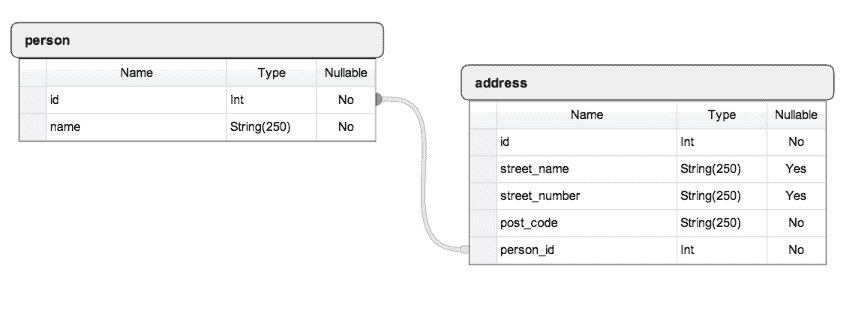

# Python 的 SQLAlchemy 入门教程

> 原文：<https://www.pythoncentral.io/introductory-tutorial-python-sqlalchemy/>

## Python 的 SQLAlchemy 和对象关系映射

在编写任何 web 服务时，一个常见的任务是构建一个可靠的数据库后端。过去，程序员会编写原始的 SQL 语句，将它们传递给数据库引擎，并将返回的结果解析为普通的记录数组。如今，程序员可以编写*对象关系映射* ( *ORM* )程序，以消除编写单调乏味、容易出错、不灵活且难以维护的原始 SQL 语句的必要性。

*ORM* 是一种编程技术，用于在面向对象编程语言的不兼容类型系统之间转换数据。通常，Python 等 *OO* 语言中使用的类型系统包含非标量类型，也就是说，这些类型不能表示为整数和字符串等基本类型。例如，一个`Person`对象可能有一个`Address`对象列表和一个与之相关的`PhoneNumber`对象列表。反过来，`Address`对象可以有一个`PostCode`对象、一个`StreetName`对象和一个`StreetNumber`对象与之相关联。虽然简单对象如`PostCode` s 和`StreetName` s 可以表示为字符串，但复杂对象如`Address`和`Person`不能仅用字符串或整数表示。此外，这些复杂对象还可能包含根本无法使用类型表达的实例或类方法。

为了处理管理*对象*的复杂性，人们开发了一类新的系统，称为 *ORM* 。我们之前的例子可以表示为一个带有一个`Person`类、`Address`类和`PhoneNumber`类的 *ORM* 系统，其中每个类映射到底层数据库中的一个表。一个 *ORM* 会为您处理这些问题，而您可以专注于系统逻辑的编程，而不是自己编写繁琐的数据库接口代码。

## 用 Python 编写数据库代码的老方法

我们将使用库 *sqlite3* 来创建一个简单的数据库，在下面的设计中有两个表`Person`和`Address`:



注意:如果您想了解如何使用 SQLite for Python，您可能想看看 Python 系列中的 [SQLite。](https://www.pythoncentral.io/introduction-to-sqlite-in-python/ "Introduction to SQLite in Python")

在这个设计中，我们有两个表`person`和`address`,`address.person_id`是`person`表的外键。现在我们在一个文件`sqlite_ex.py`中编写相应的数据库初始化代码。

```py

import sqlite3

conn = sqlite3.connect('example.db')
c = conn . cursor()
c . execute(' '
创建表 person 
 (id 整数主键 ASC，name varchar(250)NOT NULL)
' ' ')
c . execute(' '
创建表地址
 (id 整数主键 ASC，street_name varchar(250)，street_number varchar(250)，
post _ code varchar(250)NOT NULL，person_id 整数 NOT NULL，
外键(person_id
c . execute(' '
INSERT INTO person VALUES(1，' python central ')
' ' ')
c . execute(' '
INSERT INTO address VALUES(1，' python road '，' 1 '，' 00000 '，1) 
' ' ')
conn . commit()
conn . close()

```

请注意，我们在每个表中插入了一条记录。在您的 shell 中运行以下命令。

```py

$ python sqlite_ex.py

```

现在我们可以查询数据库`example.db`来获取记录。在文件`sqlite_q.py`中编写以下代码。

```py

import sqlite3

conn = sqlite3.connect('example.db')
c = conn . cursor()
c . execute(' SELECT * FROM person ')
print c . fetchall()
c . execute(' SELECT * FROM address ')
print c . fetchall()
conn . close()

```

并在您的 shell 中运行以下语句。

```py

$ python sqlite_q.py

[(1, u'pythoncentral')]

[(1, u'python road', u'1', u'00000', 1)]

```

在前面的示例中，我们使用 sqlite3 连接提交对数据库的更改，使用 sqlite3 游标执行对数据库中的 *CRUD* (创建、读取、更新和删除)数据的原始 SQL 语句。尽管原始 SQL 确实完成了工作，但是维护这些语句并不容易。在下一节中，我们将使用 SQLAlchemy 的*声明*将`Person`和`Address`表映射到 Python 类中。

## Python 的 SQLAlchemy 和声明性

编写 SQLAlchemy 代码有三个最重要的组成部分:

*   一个代表数据库中一个表的`Table`。
*   将 Python 类映射到数据库中的表的`mapper`。
*   一个定义数据库记录如何映射到普通 Python 对象的类对象。

SQLAlchemy 的*声明*允许在一个类定义中同时定义一个`Table`、`mapper`和一个类对象，而不必在不同的地方为`Table`、`mapper`和类对象编写代码。

以下*声明性*定义指定了`sqlite_ex.py`中定义的相同表格:

```py

import os

import sys

from sqlalchemy import Column, ForeignKey, Integer, String

from sqlalchemy.ext.declarative import declarative_base

from sqlalchemy.orm import relationship

from sqlalchemy import create_engine
Base = declarative_base()
类 Person(Base):
_ _ tablename _ _ = ' Person '
#这里我们为表 person 
定义列#注意，每个列也是一个普通的 Python 实例属性。
 id = Column(Integer，primary _ key = True)
name = Column(String(250)，nullable=False)
class Address(Base):
_ _ tablename _ _ = ' Address '
#这里我们为表地址定义列。
 #注意，每一列也是一个普通的 Python 实例属性。
 id = Column(Integer，primary _ key = True)
street _ name = Column(String(250))
street _ number = Column(String(250))
post _ code = Column(String(250)，nullable = False)
Person _ id = Column(Integer，foreign key(' Person . id ')
Person = relationship(Person)
#创建一个引擎，将数据存储在本地目录的
 # sqlalchemy_example.db 文件中。
engine = create _ engine(' SQLite:///sqlalchemy _ example . db ')
#在引擎中创建所有表。这相当于原始 SQL 中的“Create Table”
#语句。
 Base.metadata.create_all(引擎)

```

将前面的代码保存到文件`sqlalchemy_declarative.py`中，并在 shell 中运行以下命令:

```py

$ python sqlalchemy_declarative.py

```

现在，应该在当前目录中创建一个名为“sqlalchemy_example.db”的新 sqlite3 db 文件。因为 sqlalchemy 数据库现在是空的，所以让我们编写一些代码将记录插入数据库:

```py

from sqlalchemy import create_engine

from sqlalchemy.orm import sessionmaker
from sqlalchemy _ 声明性导入地址、基、人
engine = create _ engine(' SQLite:///sqlalchemy _ example . db ')
#将引擎绑定到基类的元数据，以便可以通过 DBSession 实例
 Base.metadata.bind = engine 访问
 #声明
DBSession = session maker(bind = engine)
# DBSession()实例建立与数据库
 #的所有对话，并代表加载到
 #数据库会话对象中的所有对象的“暂存区”。在调用
 # session.commit()之前，对
 #会话中的对象所做的任何更改都不会持久化到数据库中。如果您对这些更改不满意，您可以通过调用
# session . roll back()
session = DBSession()来
 #将它们全部恢复到上次提交时的状态
#在人员表中插入人员
新人员=人员(姓名= '新人员')
会话.添加(新人员)
会话.提交()
#在地址表中插入地址
new _ Address = Address(post _ code = ' 00000 '，person = new _ person)
session . add(new _ Address)
session . commit()

```

将前面的代码保存到本地文件`sqlalchemy_insert.py`中，并在您的 shell 中运行命令`python sqlalchemy_insert.py`。现在我们在数据库中存储了一个`Person`对象和一个`Address`对象。让我们使用`sqlalchemy_declarative.py`中定义的类来查询数据库:

```py

>>> from sqlalchemy_declarative import Person, Base, Address

>>> from sqlalchemy import create_engine

>>> engine = create_engine('sqlite:///sqlalchemy_example.db')

>>> Base.metadata.bind = engine

>>> from sqlalchemy.orm import sessionmaker

>>> DBSession = sessionmaker()

>>> DBSession.bind = engine

>>> session = DBSession()

>>> # Make a query to find all Persons in the database

>>> session.query(Person).all()

[<sqlalchemy_declarative.Person object at 0x2ee3a10>]

>>>

>>> # Return the first Person from all Persons in the database

>>> person = session.query(Person).first()

>>> person.name

u'new person'

>>>

>>> # Find all Address whose person field is pointing to the person object

>>> session.query(Address).filter(Address.person == person).all()

[<sqlalchemy_declarative.Address object at 0x2ee3cd0>]

>>>

>>> # Retrieve one Address whose person field is point to the person object

>>> session.query(Address).filter(Address.person == person).one()

<sqlalchemy_declarative.Address object at 0x2ee3cd0>

>>> address = session.query(Address).filter(Address.person == person).one()

>>> address.post_code

u'00000'

```

## Python 的 SQLAlchemy 概述

在本文中，我们学习了如何使用 SQLAlchemy 的*声明*编写数据库代码。与使用 *sqlite3* 编写传统的原始 SQL 语句相比，SQLAlchemy 的代码更加面向对象，更易于阅读和维护。此外，我们可以轻松地创建、读取、更新和删除 SQLAlchemy 对象，就像它们是普通的 Python 对象一样。

您可能想知道，如果 SQLAlchemy 只是原始 SQL 语句之上的一个抽象薄层，那么它不会给人留下深刻印象，您可能更喜欢编写原始 SQL 语句。在本系列的后续文章中，我们将研究 SQLAlchemy 的各个方面，并将其与原始 SQL 语句进行比较，当它们都用于实现相同的功能时。我相信在本系列的最后，您会确信 SQLAlchemy 优于编写原始 SQL 语句。