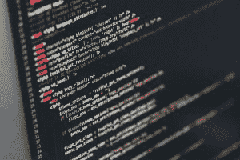

# 用 Python 编程，网络安全重要吗？

> 原文：<https://www.pythoncentral.io/is-cyber-security-important-when-programming-with-python/>

今年早些时候，Python 软件基金会(PSF)抢发 Python 更新 3.9.2 和 3.8.8，解决 [关键安全漏洞](https://www.bankinfosecurity.com/python-software-rushes-to-tackle-rce-vulnerability-a-16045) 。其中一个漏洞包括远程代码执行，可以从世界任何地方利用该漏洞关闭系统。从理论上来说，这听起来很难利用，但实际上可以用来使机器脱机。

这一事件揭示了 Python 漏洞有多危险，Python 安全性有多重要。由于 Python 如此流行，它也吸引了寻求攻击易受攻击系统的犯罪分子的注意。攻击者最有可能找出许多应用程序的漏洞。

如果你是使用第三方 Python 模块(如 pip、dnspython 或任何其他开源库)的程序员或编码员，你可以肯定你的应用程序中存在安全风险。以下是您需要了解的关于 Python 漏洞和网络安全需求的所有信息。

## 为什么安全性对 Python 程序很重要？

截至 2021 年 5 月，根据 TIOBE 指数，Python 是全球第二大最受欢迎的编程语言，领先于 Java 和 C++。它受欢迎的主要原因之一是简单的代码语法，它模仿了英语。既然大家都在用 Python，那么在开发一个 app 或者写代码的时候必然会出现错误或者瑕疵。这些错误通常被称为漏洞，可能是危险的。

虽然了解这些漏洞背后的原因并避免这些错误以防止被利用是至关重要的，但有时甚至连最佳实践都被忽略了。这就是高效的网络安全系统发挥作用的地方，它可以保护您的敏感数据和服务器免受恶意攻击者的攻击。

## 需要网络安全的 Python 漏洞

与几乎所有的编码语言一样，网络安全对所有 Python 开发者来说都是至关重要的。对于处理敏感个人信息的大型数据库的开发人员来说尤其如此。我们不需要强调如果这样一个数据库被利用或被破坏，后果将是多么可怕。

和所有其他编程语言一样， [Python 安全](https://snyk.io/blog/python-security-best-practices-cheat-sheet/) 面临 SQL 注入(SOLi)、XSS(跨站脚本)、跨站请求伪造等攻击的威胁。然而，Python 编程语言中最常见的五种最关键的攻击。让我们来看看。

### **LDAP 注入**

LDAP(轻量级目录访问协议)是一种开放的跨平台协议，被许多企业所采用。它支持单点登录(SSO)环境，并充当用户身份验证的存储库。LDAP 注入攻击类似于 SQL 注入攻击。

通常，当应用程序没有正确过滤参数时，攻击者会利用 LDAP 查询中使用的参数。这导致了一个易受攻击的环境，黑客可以很容易地注入恶意代码。一旦代码被注入，就可能导致敏感数据被盗和暴露。一些黑客还可能使用高级 LDAP 注入方法来执行任意命令，以获得未经授权的权限。

### **XPath 注入**

XPath 注入攻击通过用户提供的信息来构造 XML 数据的 XPath 查询。利用发送到网站的一条格式错误的信息，攻击者可以很容易地找出 XML 数据的结构，并访问受限数据。

如果 XML 数据用于身份验证，攻击者甚至可以获得更多访问网站的特权。

XPath 注入使用描述性语句，通过指定要查找和匹配的特定属性和模式，允许 XML 查询定位一组特定的信息。

对于使用 XML 的网站来说，接受某种形式的查询字符串输入来在页面上显示与[相关的](https://www.pythoncentral.io/python-for-android-using-webviews-sl4a/)内容是很常见的。必须对这个输入进行清理，以防止弄乱 XPath 查询并返回错误的数据。

### **指令喷射**

这种攻击的目标是利用易受攻击的应用程序在主机操作系统上执行任意命令。通过命令注入，罪犯可以将表单、cookies、HTTP 头或其他不安全的用户提供的数据传递给系统。恶意命令以易受攻击的应用程序的权限执行。这种类型的攻击主要是由于不安全的用户输入验证造成的。

### **导入功能漏洞**

Python 流行的原因之一是因为导入数据的方便性和灵活性。但是，这也意味着应用程序容易受到攻击。

当使用 Python 编程和实现相对导入时，您的代码库会暴露给系统路径中的恶意模块，该恶意模块允许导入语句在恶意模块中执行代码，并造成等待被利用的安全漏洞。

为了防止这种情况发生，应该只允许可信数据通过输入函数传递到脚本的 stdin。最好的经验法则是将所有传入的数据视为不安全和不可信的。出于这个原因，Python 2 和更老的用户应该考虑使用 Python 3，Python 3 通过将导入函数视为原始输入来修复漏洞。

### **不安全的外部数据**

不言而喻，任何来自外部来源的数据都是不可信的。最好避免将外部来源的数据包解析成 Python 代码。

这将避免通过子流程模块执行任意命令。另一个这样的漏洞是 YAML 文件，它会使您的应用程序暴露于攻击之下。这可以通过使用 py YAML safe _ load function(YAML . safe _ load)解析来自用户输入的 YAML 文件来避免。

## 总之

如您所见，Python 漏洞的世界是巨大的，攻击的严重性也同样糟糕。因此，您将需要某种形式的网络安全来防止任何违规行为的发生，并需要一种有效的工具来使 Python 代码免受任何安全或合规性问题的影响。