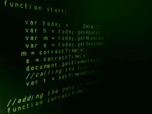

# 是时候学习 Python 了

> 原文：<https://www.pythoncentral.io/its-time-to-learn-python/>

随着电子商务的发展，许多人换了工作，成为程序员。这些天来，编程世界可以说是欣欣向荣。这个行业如此受欢迎，以至于它无法满足所有被轰炸的需求。尽管竞争激烈，但熟练的程序员总能找到出路。

如果你正在阅读这篇文章，我们假设你是一个寻求 [python 家庭作业帮助](https://assignmentshark.com/python-homework-help.html)的学生，或者你只是四处走走，试图弄清楚从头开始学习 python 并成为随需应变是否太晚了。我们可以肯定的是，学习 Python 没有不好的时候。你可以随时开始学习这门美丽的语言，并很快成为一名精致的专家。

下面，我们提供一些关于 Python 及其优势的一般信息，以及让你的学习和工作过程变得有趣、有意义和高效的技巧。

## Python 是什么？

简单来说，Python 是一种通用的高级解释编程语言。这种语言在几十年前首次发布，但直到最近才成为焦点。Python 的伟大之处在于它支持许多编程范例，包含了最受欢迎的编程，如过程式、函数式和面向对象的编程。

## 为什么 Python 如此盛行？

选择 Python 而不是其他编程语言有很多原因。然而，最明显的是，Python 非常简单，非常高效，而且最重要的是，可读性强。那是什么意思？看，不同于普通的网页访问者、应用程序用户和客户，对于程序员来说，硬币有两个不同的面。除了观察最终产品，程序员还可以(显然也喜欢)检查初始代码，例如，应用、网页或游戏是如何工作的。当提到的任何产品或服务基于 Python 时，对于有能力的人来说都是容易阅读和理解的。

## 学习基础知识

我们希望你最终下定决心，准备开始你的学习之路。在我们看来，最好从以下几个方面开始你的旅程:

*   **Hello World:** 这个短语是每个人都学习的基本命令，不管是什么编程语言。虽然这不会有很大的帮助，但这是一个向 Python 介绍自己并把 Hello，World 作为第一条学习线的好方法。
*   类型和变量:像任何程序员一样，你将不得不处理大量的数字，所以学习如何成功有效地处理它们是必须的。记住 Python 是面向对象的，每个变量都被当作一个对象。该语言支持两种类型的数字:整数和点数。
*   循环:循环在每一种编程语言中都是至关重要的。Python 使用两种类型的循环，命名为的*，而这些类型又依赖于两个函数，具体来说就是 *range* 和 *xrange。**

除了上面提到的，其他基本命令还有*列表*、*字典*、*对象和类、包和模块、条件、*和*字符串格式化*。

## 找到你的位置

提高您的 Python 技能是一个陡峭的学习曲线。有时，你锻炼编程能力的动力会直线下降。但是一旦你找到了点燃你激情的东西，这种激情将带领你度过最黑暗的日子。

因为 Python 几乎应用于任何领域，所以在学习这门语言之前评估一下你的兴趣是合理的。拿一个清单，写下任何你觉得令人兴奋的事情。例如，您可能希望开始学习 Python，以便在以下领域运用您的知识:

*   比赛
*   数据处理
*   机器学习
*   自动化(脚本)
*   网页创建
*   移动应用

## 创建您自己的项目并参与其中

当你学习基本的 Python 命令时，我们鼓励你开始一个项目并在上面练习你的技能。你可以从不同的角度接近它，围绕它玩，包括和排除部分。例如，如果你有游戏编程的诀窍，一个好的项目想法是创建一个基于位置的游戏，其中玩家的主要目标是占领领土。你可以赋予玩家更多的能力，或者相反，减少玩家可以进行的一系列移动。无论你决定创造什么，都将有助于你锻炼大脑肌肉，提高编程技能。

## 交友挑战

提高你现有技能的最好方法之一是通过健康的竞争。幸运的是，使用 Python 这是完全可能的。您可以为 Python 用户找到大量编程挑战，并重温您的能力。除此之外，你还可以通过教授其他人 Python 的基础知识，处理更多的数据和流量，分析其他程序，加速他们的工作等等，来获得更多的挑战。