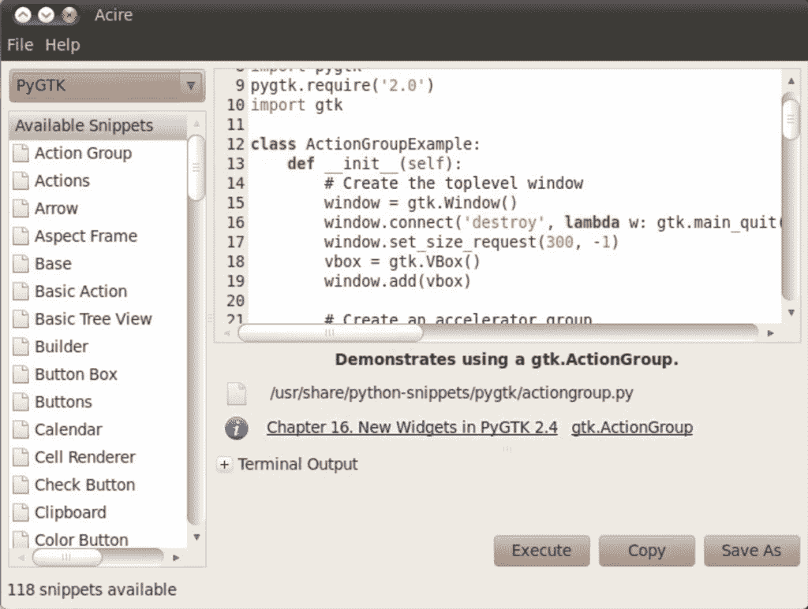

# 通过 Acire Python Snippets 项目学习 Python

> 原文：<https://www.pythoncentral.io/learn-python-with-the-acire-python-snippets-project/>

学习和使用代码片段总是学习和适应使用一门新语言的好方法。与 PHP 和 Java 等其他流行语言相比，Python 片段资源似乎少得多。如果您一直在试图寻找一些有用的 Python 片段来帮助您学习这门语言，请查看 Acire Snippets 项目。

该项目是一个交互式项目，不仅包含了一个有用的 Python 代码片段库，还允许您与代码片段进行交互，更改和定制它们，然后将它们作为一个很好的学习工具来运行。库中的所有代码片段都演示了如何执行常见和特定的任务，所以如果您刚刚开始使用 Python，这是一个很好的起点。如果你是一个更有经验的 Python 程序员，也可以选择提交你自己的代码片段来帮助教授他人。

Acire Snippet 项目具有多样化的代码段和代码库，每天都有新的代码段添加进来。它提供了对许多不同语言的支持(每次更新都会添加更多语言)。该项目也非常用户友好，使其易于浏览，玩，或重新安排片段，也非常容易提交自己的。