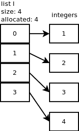

# Python 中的列表:如何在 Python 中创建列表

> 原文：<https://www.pythoncentral.io/lists-in-python-how-to-create-a-list-in-python/>

python 列表在 Python 中被广泛使用。列表是 Python 中最常用的数据结构之一。这是一个无序的数据存储。在本文中，我们将学习如何在 Python 中使用列表。你应该知道 [Python 语法](https://www.pythoncentral.io/what-is-python-used-for/)以及 Python 中的链表是什么。我们在上一篇文章中已经谈到了 python [字典的数据结构。](https://www.pythoncentral.io/?p=4729&preview=true)

列表是一个顺序数据存储。按索引保存在列表中的项目。列表索引从 0 开始。这意味着一个简单列表 x = [1，2，3]。要获得第一个项目，您将需要通过索引的项目。这可能会令人困惑。别担心，我们会解释的。让我们从

## **用 Python 创建列表**

在 Python 中定义列表有两种方法。第一个是在两个方括号之间添加您的项目。

**举例:**

```py
items = [1, 2, 3, 4]
```

第二种方法是通过将项目传递给 Python list 内置函数来调用它。

**举例:**

```py
Items  = list(1, 2,3,4)
```

在这两种情况下，输出都将是

```py
[1, 2, 3, 4]
```

该列表可以接受任何数据类型。你可以有一个整数和字符串的列表。python 中的列表不强制包含单一的项目类型。你可以列出不同的项目。

```py
[1, 'name', {"key" : "value"}, list(1, 2, 3)]
```

T his 给你在列表中添加多种数据类型的灵活性。您可以在此列表中添加一个列表。这称为嵌套列表。 现在我们将数据存储到一个 python 列表中，是时候知道如何利用这些数据做更多的事情了。

### **在 Python 中向列表追加项目**

列表是可变的数据结构。这意味着你可以创建一个列表并编辑它。您可以在创建的列表中添加、插入和删除项目。要向列表中添加项目，可以使用函数并传递要添加的值。append 函数会将项目添加到列表的末尾。该函数允许您在列表中想要的位置插入数据。它需要两个参数，索引和值。让我们看一个例子:

```py
items = ["mobile", "laptop", "headset"]

# append the keyboard item to the list 
items.append("keyboard")
print(items)

# output
['mobile', 'laptop', 'headset', 'keyboard']

# insert the mouse item to the list in before the laptop item
items.insert(1, "mouse")
print(items)

# output
['mobile', 'mouse', 'laptop', 'headset', 'keyboard']

```

### **Python 中的排序列表**

我们上面提到 Python 列表是无序的。列表是这样存储在内存中的。你可以在这里看到 Python 列表[的详细实现。](https://stackoverflow.com/questions/3917574/how-is-pythons-list-implemented)

[](https://www.pythoncentral.io/wp-content/uploads/2020/12/mrzxv.png)

这意味着要访问列表中 item 的值，必须通过它的索引来调用它。更简单地说，如果我们有学生的名字列表` students = ["John "，" Jack "，" Christine"]`并且你想得到第一个学生的名字。你需要知道这个学生名字的索引。在我们的例子中，它是零指数。`student[0]`的语法将是

让我们看一个真实世界的例子来清楚地理解它。

```py
Students = ["John", "Jack", "Christine"]
for i in Students:
    print(Students [i])

# Output
John
Jack
Christine
```

列表中有未排序的项目。要对它们进行排序，可以使用内置的 python 函数 sorted()。它将遍历列表项并对它们进行排序。

sorted()函数的用法非常简单。您需要将列表传递给排序函数。它将返回排序后的列表并改变原来的列表。

示例:

```py
x = [4, 5, 1, 8, 2]
print(sorted(x))

# output
[1, 2, 4, 5, 8]
```

你会想到的第一个问题是它是如何工作的？它可以对整数进行排序。那么其他类型的数据字符串，字典呢..等等。排序函数在排序方面更具动态性。这意味着您可以传递您希望列表排序所基于的排序机制。我们可以传递给排序函数的第一个参数是 reverse。

> **注**:由于`sorted()`和`sort()`的不同，`sort()`改变了原来的列表。`sorted()`不改变原来的列表。它将返回新的列表。

### **Python 中的反向列表**

排序功能可以颠倒列表顺序。将 reverse 键设置为 True 将使 Python 自动反转列表排序。让我们看一个例子。

```py
chars = ["z", "y", "o", "b", "a"]
print(sorted(chars)) 

# output
['a', 'b', 'o', 'y', 'z'] 

chars = ["z", "y", "o", "b", "a"]
print(sorted(chars, reverse=True)) 

# output
['z', 'y', 'o', 'b', 'a']

```

这个例子向你展示了如何反转一个列表。在这个例子中，我们颠倒了列表的字母顺序。

### **高级排序**

您可以通过在 key 参数中传递排序函数来为列表添加自定义排序。

```py
chars = ["z", "y", "o", "b", "a"]
print(sorted(chars))

# output
['a', 'b', 'o', 'y', 'z']

words = ["aaaa", "a", "tttt", "aa"]
print(sorted(words, key=len))

# output
['a', 'aa', 'aaaa', 'tttt']

engineers = [
    {'name': 'Alan Turing', 'age': 25, 'salary': 10000},
    {'name': 'Sharon Lin', 'age': 30, 'salary': 8000},
    {'name': 'John Hopkins', 'age': 18, 'salary': 1000},
    {'name': 'Mikhail Tal', 'age': 40, 'salary': 15000},
]

# using custom function for sorting different types of data.
def get_engineer_age(engineers):
    return engineers.get('age')

engineers.sort(key=get_engineer_age)
print(engineers)

# output
[
    {'name': 'John Hopkins', 'age': 18, 'salary': 1000},
    {'name': 'Alan Turing', 'age': 25, 'salary': 10000},
    {'name': 'Sharon Lin', 'age': 30, 'salary': 8000},
    {'name': 'Mikhail Tal', 'age': 40, 'salary': 15000}
]

```

在上面的例子中，我们使用 key 选项将排序方法传递给 sort 函数。我们在 chars 数组中使用的默认方法是基于顺序排序。在这个列表中，顺序是按字母顺序排列的。在单词列表中，我们有一个不同单词长度的列表。我们想按照单词的长度来排序。我们传递给排序函数的键是内置的`len()`函数。这将告诉 Python 根据单词长度对列表进行排序。

在工程师的例子中。这更可能是您需要在更真实的示例中解决的问题。您有一个工程师数据列表，并希望根据自定义方法对其进行排序。在我们的例子中，我们按照年龄对它进行了排序。

### **结论**

Python List 是一个非常强大的数据结构。掌握它将使您摆脱 Python 中的许多日常问题。您可以创建包含一种或多种数据类型的列表。您可以追加列表并在所需的索引中插入数据。列表中使用最多的函数是 sorted 方法。您可以根据不同的标准对列表进行排序。你可以从 Python [官方文档](https://docs.python.org/3/tutorial/datastructures.html)中了解更多列表。