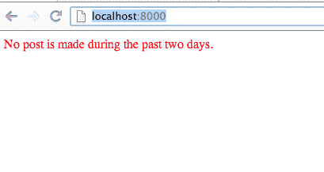
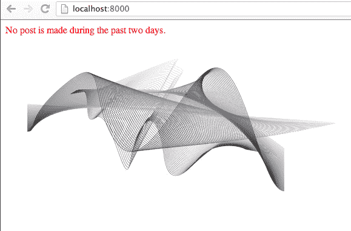

# 管理 Django 应用程序的静态文件

> 原文：<https://www.pythoncentral.io/managing-static-files-django-application/>

## Django 的默认静态文件管理器

在每个 web 应用程序中，静态文件(如 css、Javascript 和图像)赋予网站独特的外观和感觉，使其脱颖而出。对于任何用户来说，一个漂亮、专业的网站比一个粗糙、未经修饰的网站更有吸引力。

在 Django 应用程序中，我们使用 Django 的默认静态文件管理组件来管理静态文件，比如`django.contrib.staticfiles`，它将所有静态文件收集到一个位置，这样它们就可以由前端 web 服务器提供服务，比如 apache 和在每个`INSTALLED_APPS`下寻找“静态”目录的`AppDirectoriesFinder`。

## 使用 Django 提供 CSS 和图像

首先，在我们的应用程序`myblog`中创建一个目录`static`，这样目录结构就变成了:

```py

myblog/

  static/

```

然后，在新的`static`目录中创建一个目录`myblog`，并在其下创建另一个`static`目录，这样目录结构就变成了:

```py

myblog/

  static/

    myblog/

      static/

```

这种目录结构可能看起来很奇怪，但它实际上是有意义的，因为 Django 的`AppDirectoriesFinder`将搜索`INSTALLED_APPS`或我们的`myblog`应用程序，并递归地找到它下面的静态目录。因此，位于`myblog/static/myblog/static/style.css`的样式表`style.css`可以在我们的模板文件中作为`myblog/style.css`引用。

现在，我们将以下代码插入`myblog/static/myblog/static/style.css`:

```py

p {

  color: red;

}

```

然后，我们修改模板文件来链接`style.css`文件，以测试文件的效果。

```py




```

*   [{ { post . content } }](https://www.pythoncentral.io/post/{{ post.id }}/)
    { { post . created _ at } }





过去两天没有帖子。



现在，重新加载页面`http://localhost:8000/`，您将看到元素的文本变成红色:



然后我们可以在页面中添加一个 *img* 元素，该元素引用静态目录`myblog/static/myblog`中存储的`jpg`:

```py




```

*   [{ { post . content } }](https://www.pythoncentral.io/post/{{ post.id }}/)
    { { post . created _ at } }





过去两天没有帖子。




[/html]

现在您可以刷新页面`http://localhost:8000`来查看主页上显示的新图像。



## 总结和提示

在本文中，我们学习了如何管理静态文件(图像、css、javascript 等)。)在我们的 Django 应用程序中。需要记住的一点是，Django 的内部静态文件管理器和目录查找器会自动查找`myblog/static/myblog`下的文件，所以最好把文件放在那个目录下，而不是直接放在`myblog/`里。通过将文件放入指定目录，Django 知道如何区分不同 app 之间的静态文件，比如`myblog/style.css`或`myblog_version2/style.css`。