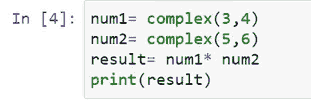

# Python 中数字的乘除运算

> 原文：<https://www.pythoncentral.io/multiplying-dividing-numbers-python/>

乘法是算术和编程领域的一项基本运算。我们可以在每个程序(或每个代码背后的逻辑)中找到它的用途，不管它有多基础。因此，程序员必须知道如何用 Python 将整数、小数、复数和字符串相乘，以创建高效而准确的代码。在本文中，我们将通过编码示例学习如何执行所有这些操作。

但是首先，让我们看看表示乘法运算的语法是什么。我们使用星号字符**' ***来执行乘法运算。我们来考虑一个例子，假设我们要把两个数字相乘，171 和 899。那么这个操作的代码就是:

上述代码的输出为:

我们可以看到，我们在 Python 中使用星号运算符来编写乘法代码。

## **Python 中的整数乘法**

整数是一种仅由整数组成的数据类型，即整数中没有小数部分。例如 117，1，2，10 都是整数。整数相乘的语法很简单。我们写下要相乘的数字，并用星号运算符将它们分开。

在上面给出的完整代码片段中，我们可以看到数字 90 和 17 相乘。

## **Python 中的乘法浮点数**

浮点数数据类型的基本定义是它包含由分数组成的数字。它可以存储多达 17 个有效数字。浮点数的例子有 17.003、5.0098、70.0007 以及更多类似的数字。

浮点数相乘的语法与整数相同；我们将需要乘以星号运算符的数字分开并打印出来。

在这段代码中，我们使用星号运算符将两个浮点数 91.007 和 87.3333 相乘并打印出来。我们可以注意到乘法的输出也是一个浮点数。

## **Python 中的复数乘法**

复数是形式为**【a+bi】**的虚数，其中“a”代表实数，“b”是虚数的系数。同样，“I”代表“iota”，它是-1 的平方根。在研究代码之前，让我们先讨论一下如何将复数相乘。例如，让我们考虑复数(3 + 4i)和(5 + 6i)。

该乘法的结果如下:

(3 * 5)+(3 * 6i)+(4 * 5i)+(4 I * 6i)

=15+ 18i+20i+ 24(i^2)

= -9+38i【自(i^2 =-1)】

我们用 **【复数()** 的方法对 Python 中的 [复数进行乘法运算。](https://www.geeksforgeeks.org/complex-numbers-in-python-set-1-introduction/)

在 **【复数()** 的方法中，我们先写实部，然后写虚部，中间用逗号隔开。最好将每个复数存储在一个变量中，然后使用星号运算符对变量执行乘法运算。让我们对上例中考虑的数字进行乘法运算。

我们已经用 complex()方法写出了复数。数字存储在变量 num1 和 num2 中，然后执行乘法。

现在我们来看看输出是什么:

我们可以看到输出与我们在前面的例子中的计算相匹配。

## **Python 中的字符串与整数相乘**

***‘字符串乘以整数’***是什么意思？假设我们想要多次显示一个字符串(一种数据类型的字符)，那么我们可以将该字符串乘以它必须显示的次数，而不是一次又一次地写它，因此我们可以获得所需的输出。

在 Python 中用一个整数乘以一个字符串，我们使用**【def()**函数。在 **def()** 函数中，我们创建了另一个函数，其中我们提到了要重复的字符串变量，后跟它要重复的次数。然后我们返回相乘后的值。这里举个例子，我们取字符串“Hello World！”重复五次。

让我们看看完整代码的语法及其输出:

我们使用 **def()** 函数创建了 **row()** 函数。我们已经提到了字符串“Hello World！”作为第一个参数的 **row()** 函数然后将乘法数作为第二个参数。

我们可以看到输出显示了字符串五次。

## **使用 Python 中的函数将数字相乘**

函数使程序简洁易懂。如果你的程序有很多乘法运算，那么为了节省时间和避免混乱，你可以使用函数来乘法。定义函数的步骤如下:

1.  声明函数的参数。
2.  使用该功能定义要执行的操作。
3.  指定函数的返回值。

我们使用关键字 **def** 来声明一个函数。

让我们看看代码的语法是什么:

这里我们使用 **def** 关键字定义了一个函数 **mult()** 。这个函数的参数是 x 和 y，运算是 x 和 y 的乘法，返回的值是 x 和 y 的乘积，现在我们来看看这段代码的输出:

我们可以看到代码提供了输入数字的乘积作为输出。

## **Python 中的乘法列表**

### **用 Python 将一个列表乘以另一个列表**

我们要用 **zip()** 的方法在 Python 中把两个列表相乘。方法的作用是:提取列表中的元素。然后，我们将获得的元素相乘，并将它们添加到一个新的列表中。但是，我们必须确保列表长度相等，也就是说，两个列表的元素数量相等。

让我们看看如何编写这个操作的代码:

在这里，我们的两个列表分别是‘list 1’和‘list 2’。Multiply 是一个空列表，编译器将在其中追加乘积。使用 for 循环和 **zip()** 方法，我们获得每个列表的元素。元素相乘后，我们将乘积追加到空列表“multiply”中。

获得的输出为:

我们可以在结果中看到附加的产品。

### **列表元素相乘**

Python 的数学模块有一个 **prod()** 函数，让我们的乘法变得更简单。我们首先导入模块，然后编写如下代码:

我们将得到列表元素的乘积作为输出:

### **遍历 Python 在列表元素乘法中的应用**

遍历方法是一种将列表元素相乘的迭代方法。迭代方法由循环语句组成。让我们看看如何使用循环语句来获得列表元素的乘积:

这里我们定义了一个函数 Multiplylist()，其中我们使用了一个循环语句“for”我们已经将变量 r 初始化为 1，使用循环快速地将元素一个接一个地相乘。最后，我们打印了产品清单。我们来看看输出:

你可以在这里了解更多关于 Python [中列表相乘的知识。](https://www.geeksforgeeks.org/python-multiply-numbers-list-3-different-ways/)

## **结论**

Python 提供了各种方法来乘法数字。这些数字可以是整数或小数，也可以包含在列表中。对于每个乘法问题，Python 都有解决方案。通过包含函数，可以使代码高效而准确。我们希望这篇文章能帮助你 [理解数字](https://www.pythoncentral.io/multiplying-dividing-numbers-python/) 相乘的不同方法，并在你的编码实践中毫不费力地使用它们。