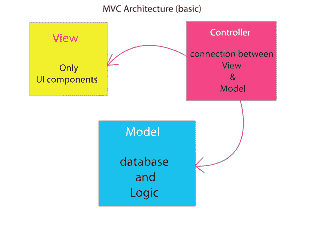

# Python 中的面向对象编程

> 原文：<https://www.pythoncentral.io/object-oriented-programming-in-python/>

面向对象是 Python 和许多其他语言的核心概念。理解这个概念，并很好地应用它，将使您能够构建更加优雅和易于管理的软件。

## Python 中的面向对象编程是什么？

你会经常听到有人说，在 Python 中，一切都是对象。这几乎是真的，除了几个例外。表达式不是对象，但它总是表达一个对象。因为 Python 解释器将对 contact 上的任何表达式求值，所以只要它读取一个表达式，表达式本质上就是它求值的对象。名字也不是对象，但它总是引用一个对象。名称也在接触时被评估，评估到它们在那个时间点引用的任何对象。所以，最终，一切都是物体。

## Python 的内置对象与自定义对象

每个对象都有特定的类型。Python 内置了一系列不同类型的对象，它们是预定义的，您也可以根据需要自己定义其他对象。内置类型有字符串、浮点、列表、函数、模块等。您可以使用这些内置类型做很多事情，但是如果您学会将它们结合起来，创建适合您的应用程序的自定义对象类型，您可以做更多的事情。你可以定义一个`SpaceInvader`类型，一个`Employee`类型，一个`Account`类型；它可以是任何东西。例如，一旦定义了一个`Account`类型，您就可以根据需要创建该类型的任意多个实例。同样，您可以根据需要拥有任意多个字符串，也可以根据需要拥有任意多个帐户。

## 数据与逻辑

数据与逻辑模型视图控制器

传统上，数据和逻辑之间有一个概念上的划分。像数字和字符串之类的东西是数据，像 if 分支和 while 循环之类的东西是逻辑，这两个东西应该分开。许多现代语言有不同的方法，结合数据和逻辑来创建对象。对象是一个单一的东西，它有存储数据的属性和定义逻辑的方法。几乎任何事物都可以被认为是一个对象，并根据它的属性和方法来定义。

对象的属性实际上只是赋予名称的值，而方法就像函数一样，所以如果你已经了解一点 Python，那么对象就很容易理解。

如果您想做一些银行业务，您可能想定义一些银行帐户对象。首先定义一个新的对象类型，我们称之为 Account。然后，你可以给它两个属性，一个叫做 fullname，它有一个字符串，这个人的名字，另一个叫做 balance，它有一个数字，可能是一个 float，它有一个当前余额。Account 类型还需要一个方法，我们称之为 transact，它通过增加或减少来改变 Account 对象的 balance 属性值。

## 乐高是面向对象的

那么，为什么从对象的角度思考会有用呢？想想用乐高搭建。乐高提供了原始的物体类型，砖块、瓦片、盘子等等，我们可以用它们来建造几乎任何建筑。如果你只想建造一个非常简单的模型，也许是一面墙，你可以拿起一块砖，然后添加一些小块，直到你得到你想要的。如果你想建造一些更复杂的东西，比如说一座城市，你需要用不同的方法来实现它。如果你只是不停地给不断膨胀的乐高积木块添加碎片，你最终只会得到一大堆乱七八糟的东西。相反，您需要从对象和接口的角度来考虑。

乐高元素是界面非常简单的物体；砖块与其他砖块或瓷砖或其他东西的接口并不复杂。它们可以夹在顶部或底部，没什么大不了的。因为它们有干净、简单的界面，所以很容易组合乐高元素来制作更复杂的物体，一面墙、一个烟囱、一个壁炉。重要的是确保你用简单的接口来构建这些新的对象。

设计良好的烟囱对象具有简单的接口，可以将它们附加到墙壁对象上。壁炉物体应该以简单的方式夹在烟囱和墙上。假设它设计得很好，你可以忘记你是如何制作壁炉的，你可能花了很长时间让它看起来刚刚好，但这已经不再相关，只有它的界面的复杂性是一个问题。只要你的壁炉容易固定，建造起来有多复杂都没有关系。这种复杂性被封装在壁炉对象中，只暴露了界面的复杂性。

如果您继续组合这些新对象来形成一个更复杂的对象，比如一个房子，您可以非常容易地将这个房子对象添加到您的城市对象中，同样假设是简单的接口。诸如此类。每个对象都应该由更原始的对象构成，所有的对象都有简单的接口，一路向下。

## Python 中面向对象编程的对象

在 Python 中，如果你像上面讨论的那样定义了一个`Account`类型，你会很早就意识到只有账户持有人的名字和当前余额实际上是不够的，所以你可能会决定包括其他数据，比如账户持有人的家庭住址、出生日期、这类东西，以及账户开立日期等。然后，您可能需要方法来关闭帐户，修改帐户持有人的姓名，也许他们结婚了，这一切都可能变得有点太快了。然而，如果你从对象的角度考虑，很明显你会想把它分开一点。

我们总是可以定义一个新的`Customer`类型，它具有客户会有的属性和方法，然后定义一个帐户类型，它具有银行帐户的属性和方法。`Account`类型将有一个名为`account_holder`的属性，该属性将被分配给一个`Customer`类型的对象，而不仅仅是一个字符串或其他什么。

对象定义就像蓝图。首先定义一种新的对象类型，即对象定义，然后创建该类型的实例，这些实例就是对象本身。每个对象都是特定类型对象的一个实例。它将与同类型的所有其他对象具有相同的属性名称。例如，所有 account 类型的对象都有一个 account_holder 属性，但是，由于 Account 的所有实例都是独立的对象，所以每个实例都可以有不同的 account_holder 属性。

同样，一个对象的每个实例都具有与相同类型的所有其他实例相同的方法，但是调用一个实例的方法是特定于该实例的。每个字符串都有一个 upper 方法，因为它是一个字符串，字符串类型是用 upper 方法定义的。您可以对任何字符串调用 upper，但它只影响特定的字符串实例。

记住，一切都是物体。传递给函数的参数是对象，因此可以编写一个函数，将客户对象作为参数，引用它们的属性并调用它们的方法。您可以拥有一个 Account 对象列表，并像往常一样遍历该列表。您可以用内置类型的对象做的任何事情，也可以用您自己的类型来做。

这将在涵盖实际 Python 语法的文章中变得更加具体。这里的目的是尝试引入面向对象的范例，帮助你理解对象实际上是什么，同时也鼓励你思考如何更有效地使用它们。Python 的魔力始于 OOP。