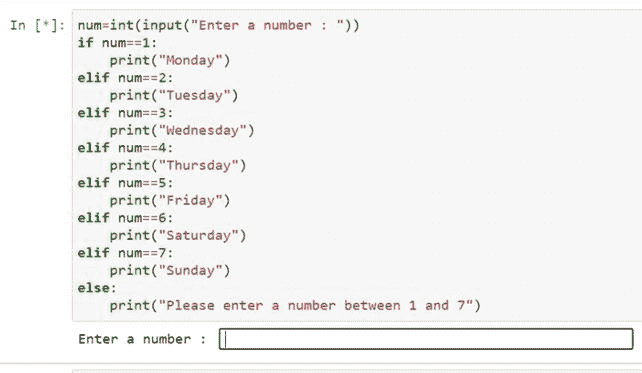

# Python 中的一行 if 语句(三元条件运算符)

> 原文：<https://www.pythoncentral.io/one-line-if-statement-in-python-ternary-conditional-operator/>

在现实世界中，我们周围发生的每一个行为都有特定的分类和条件。十二岁的人是孩子，而十三岁的人是青少年。如果天气宜人，你可以计划一次郊游。但是如果不是，你将不得不取消你的计划。这些条件也控制着编码世界。您将遇到各种编码问题，在这些问题中，您必须根据某些条件打印输出。

幸运的是，Python 有一个简单的命令和语法来解决这类问题。这些被称为条件语句。所以让我们开始讨论条件语句，它们的语法和应用。

## **基本** **如果** **语句(三元运算符)**

很多编程语言都有一个 [三元运算符](https://www.geeksforgeeks.org/ternary-operator-in-python/) ，定义了一个条件表达式。最常见的用法是创建一个简洁、简单的依赖赋值语句。换句话说，如果条件为真，它提供一行代码来计算第一个表达式；否则，它会考虑第二个表达式。 源自 C 的编程语言通常有以下语法:

Python BDFL(Python 的创造者，吉多·范·罗苏姆)认为它是非 Python 语言，因为对于不习惯 c 语言的人来说，它很难理解。此外，冒号在 Python 中已经有了很多用途。于是，当 [PEP 308](https://www.python.org/dev/peps/pep-0308/) 获批后，Python 终于收到了它的快捷条件表达式:

它首先评估条件；如果返回 **True** ，编译器会考虑 expression1 给出结果，否则**expression 2**。求值比较懒，所以只会执行一个表达式。

我们来看看这个例子:

这里我们定义了年龄变量，它的值是 15。现在我们使用 if-else 命令打印孩子是否是成年人。成年的条件是这个人的年龄应该是 18 岁或 18 岁以上。我们已经在 if-else 命令中提到了这个条件。现在我们来看看输出是什么:

正如我们所看到的，我们已经基于年龄变量的值获得了输出“kid”。

我们也可以链接三元运算符:

在这里，我们合并了多个条件。这种形式是三元运算符的链式形式。让我们检查输出:

该命令与下面给出的程序相同:

编译器从左到右计算条件，这很容易用类似于 **pprint** 模块:的东西进行双重检查

## **三元运算符的替代物**

对于低于 2.5 的 Python 版本，程序员开发了几个技巧来模拟三元条件操作符的行为。他们一般都很气馁，但是知道他们是如何工作的还是很好的:

这些是在你的代码中强加条件的各种方法:

我们可以看到，对于各种输入，对于变量的确切值，得到相同的输出。

这种方法的问题是，无论条件如何，两个表达式都将被求值。作为变通办法，**可以帮忙:**

 **

我们得到的输出如下:

另一种方法是使用‘and’或‘or’语句:

是的，大多数变通办法看起来都很糟糕。然而，有些情况下使用“and”或“or”逻辑比三元运算符更好。比如，当你的条件与其中一个表达式相同时，你可能想避免对它求值两次:

## **凹痕和块**

Python 对编程语句的语法非常小心。当我们编写像 **if-else** 这样的复合语句时，我们必须保持适当的缩进和分块。if-else 语句的正确缩进语法如下:

**【if】**下的语句被认为是一个“块”的一部分其他语句不是 **if** 块的一部分，在对“if”语句求值时不考虑这些语句。

如果你偏离了这个缩进，Python 会自动改变文本颜色，并在你运行代码时显示一个错误。让我们举一个例子，我们故意不同于适当的缩进:

我们在这里可以看到 Python 给出了一个错误消息: ***“期望一个缩进块*** ”

另外，注意第 3 行中“print”的颜色。所有其他文本都是绿色的，而“print”是红色的。颜色的变化是由于“print”的突然缩进造成的。

现在让我们纠正缩进:

当我们维护了 Python 的缩进后，我们可以轻松地得到输出。

## ****else****和** **elif** **子句****

 **假设您的' **if '** 条件为假，并且您有一个准备执行的替代语句。然后你就可以轻松地使用 **else** 子句了。现在，假设您有多个 **if** 条件，并且每个条件都有一个备选项。然后，你可以使用**elif**子句并指定任意数量的情况。现在让我们为每种情况举一个例子:

### **的用法** **从句:**

**if-else**语句的语法很简单，在本教程中已经多次使用。让我们来看一个基本问题:有一个足球队的选择。候选人的资格最关键的条件是他应该年满 17 岁。如果他的年龄大于或等于十七岁，输出将是“你符合条件。”如果男孩小于 17 岁，结果将是“对不起”。你没有资格。”

现在让我们看看这个问题的代码:

让我们运行这段代码，看看输出是什么:

程序首先要求用户输入年龄。我们第一次进入十六岁的年龄。

现在让我们输入 18 岁的年龄，观察输出。

因此，我们可以看到代码评估输入的输入(“年龄”)并根据 if-else 条件检查值。如果条件为真，编译器会考虑“If”下的语句，而忽略其他语句。如果条件为假，编译器执行**‘else**，’下的语句，其他所有语句都被忽略。

### **使用** **elif** **从句:**

当我们在打印输出之前需要检查多个条件时，我们使用这个子句。 **elif** 这个词紧凑为“**else——if**。”当我们使用**the elif**子句时，**else**子句是可选的。但是如果我们想使用**else**子句，那么必须只有一个子句，并且在程序的末尾也是如此。

让我们来看一个问题。我们要求用户输入一个 1 到 7 之间的数字，并显示相应的工作日名称。我们来看看这个问题的程序。

上面给出的代码有 **elif** 以及 **else** 子句。

现在让我们检查输出:

程序首先要求用户输入一个数字。让我们输入四个。

现在，让我们检查输入值 12 的输出。

因此，该代码适用于任何用户输入的输入值。

## **结论**

条件支配着我们现实生活中的方方面面。为了在我们的虚拟编码世界中正确地模拟这些现实条件，我们这些程序员需要很好地掌握控制语句，如 **if-else** 。我们希望这篇文章能帮助你理解 Python 中的条件语句及其语法。本文讨论的各种问题将帮助你理解**if-else**语句的基本概念及其应用。****